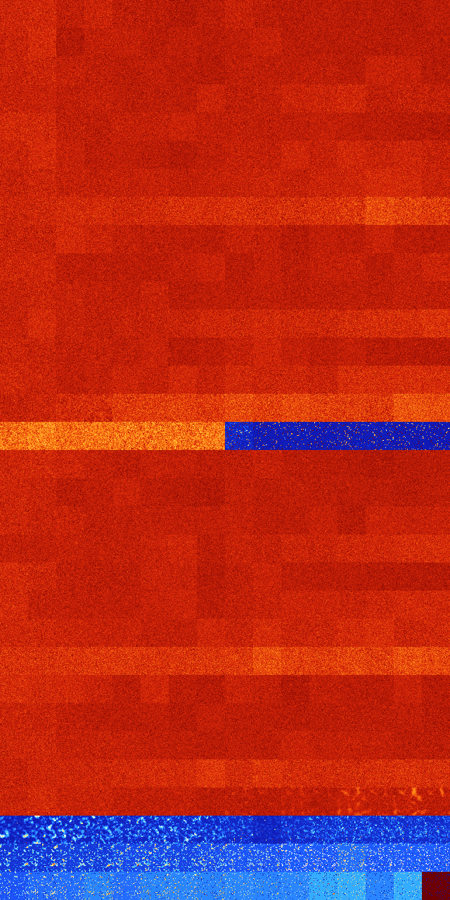

# B03568 (184832-185343)

<details>
    <summary>Initial Grid</summary>
    
</details>


<details>
    <summary>Initial Grid RLE</summary>

```
#C Exported from GoGoL (https://github.com/marrow16/gogol)
#C Wrap mode: Toroidal
#C Boundary mode: Dead
#C Step: 0
x = 100, y = 100, rule = B03568/S
19bo5b2o10bo48bo$4bo8bo3bo38bo28bo$36bo$5bo6bo17bo22bo3bo$3bobo71bo4bo$
bo3bo43bo9bo$8bo3bo13bo6bo4bo21bo$o3bo18bo53bo$7bo2bo43bo18bo17bobo2bo$
32bobo16bo41bo$bo61bo5bo$3bo30b2o25bo34bo$50bo16bo10bo2bobo15bo$6bo7bo
35b2o4bo29bobo5bo$2bo38bo48bo$bo48bo12bo$10bo29bo12bo3bo$10bo5bo11bo15b
o15bo33bo2bo$72bo$48bo6bo4bobo11bo10bobo$14bo78bo$7bo40bo12bo19bo6bo$3b
o68bo$bo8bo5bo6bo23bo41bo$2bo4bo10bo65b2o$15bo3bo24bo5bo6bo6bo23bo$bo3b
o55bo22bobo$29bo7bo10bo3bo36bo3bo$14bobo12bo2bo20bo24bo9bo$28bo$26b2o$
16bo21b2o54bo$15bo4bo10bo$32bo4bo6bo21b2o16bo$37bo9bo22bo$11bo4bo17bo
11bo8bobo6b2o9bo5bo$48bo31bo12bo$6bo24bo33bo18bo6bo$8bo20bo6bo17bo25bo
17bo$8bo17bo28bo$10bo13bo23bo15bo8bo2b2o6bo14bo$3bo15bo9bo35b2o3bo25bo$
21bo53bo$9bo10b2o$18bo9bo11bo2bo3bo2bo29bo4bo$15bo39bo10bo$47bo2bo20bo
2bo$39bo8bobo7bo$o7bo13bobo38bo23bo$14bo17bo19bobobo8bo8bo8bo$11bo11bo
11bo19bo38bo$7bo23bo20bo26bo11bo4bo$18bo20bo4bo39bo$13bo10bo56bo3bo$13b
o17bobo11bo3bo8bo20bo$5bobo4bo9b2o32bo38bo$3bobo13bo5bo8bo27bo19bo8bo$
21bobo26bo17bo18bo$27bo6bo55bo5bo$56bo4bo21bo12bo$24bo6bo$12bo12bo10bo
54bo$7bo10bo8bo4bo60bo$3bo11bo21bo4bo16bo2bo16bo$11bobo46bo2bo28bo5bo$
25bo16bo3bo19bo9bo16bo$34b2o45bo$13bo11b2o19bo2bo48b2o$56bo9bo6bo9b2o$b
o11bobo6bo52bo10bo6bo$25bobo5bo8bo5bo35bo7bo3bo$3bo6bo8bo52bo$14bo13bo
3b2o25bo32bo4bo$16bo12bo2bo6bo8bo6b2o21bo9bo$o5bo56bo25bobo$21bo31bo24b
o5bo9bo$26bobo33bo17bo17bo$2bo19bo6bobo7bo2bo25bo11bo6bobo$2bobo63bo15b
o$47bo20bo17bobo$25bo31bobo18bo4bo$27bo5bo25bo10bo8bob2o$63bo2bo$35bo
11bo5bo19bo$76bo11bo2bo$19bo9bo47bo$16bo25bo14bo8bo$45bo10bo10bo$2bo32b
o6bo47bo$28bo26bo7bo2bo18bo$18b2o5bo4bo22bo14bo$19bo17bo45bo12bo$19bo
12bobo46bo2bo$54b2o12bo10bo19bo$16bobo6bo6bo52bo4bo$3bo18bo7bo11bo$11bo
8bo71b2o5bo$18bo21bo14bo13bo3bo20bo$5bo28bo12bo13bo$27bo9bo2bo9bobo22bo
13bo3bo!
```
</details>
<details>
    <summary>Thumbnail</summary>

</details>
<table>
<tr>
    <td><a href="./184832%20S%20Heat%20Map%20Activity.png"></a><br>S (184832)<br>G>1000</td>    <td><a href="./184833%20S0%20Heat%20Map%20Activity.png"></a><br>S0 (184833)<br>G>1000</td>    <td><a href="./184834%20S1%20Heat%20Map%20Activity.png"></a><br>S1 (184834)<br>G>1000</td>    <td><a href="./184835%20S01%20Heat%20Map%20Activity.png"></a><br>S01 (184835)<br>G>1000</td>    <td><a href="./184836%20S2%20Heat%20Map%20Activity.png"></a><br>S2 (184836)<br>G>1000</td>    <td><a href="./184837%20S02%20Heat%20Map%20Activity.png"></a><br>S02 (184837)<br>G>1000</td>    <td><a href="./184838%20S12%20Heat%20Map%20Activity.png"></a><br>S12 (184838)<br>G>1000</td>    <td><a href="./184839%20S012%20Heat%20Map%20Activity.png"></a><br>S012 (184839)<br>G>1000</td>    <td><a href="./184840%20S3%20Heat%20Map%20Activity.png"></a><br>S3 (184840)<br>G>1000</td>    <td><a href="./184841%20S03%20Heat%20Map%20Activity.png"></a><br>S03 (184841)<br>G>1000</td>    <td><a href="./184842%20S13%20Heat%20Map%20Activity.png"></a><br>S13 (184842)<br>G>1000</td>    <td><a href="./184843%20S013%20Heat%20Map%20Activity.png"></a><br>S013 (184843)<br>G>1000</td>    <td><a href="./184844%20S23%20Heat%20Map%20Activity.png"></a><br>S23 (184844)<br>G>1000</td>    <td><a href="./184845%20S023%20Heat%20Map%20Activity.png"></a><br>S023 (184845)<br>G>1000</td>    <td><a href="./184846%20S123%20Heat%20Map%20Activity.png"></a><br>S123 (184846)<br>G>1000</td>    <td><a href="./184847%20S0123%20Heat%20Map%20Activity.png"></a><br>S0123 (184847)<br>G>1000</td></tr>
<tr>
    <td><a href="./184848%20S4%20Heat%20Map%20Activity.png"></a><br>S4 (184848)<br>G>1000</td>    <td><a href="./184849%20S04%20Heat%20Map%20Activity.png"></a><br>S04 (184849)<br>G>1000</td>    <td><a href="./184850%20S14%20Heat%20Map%20Activity.png"></a><br>S14 (184850)<br>G>1000</td>    <td><a href="./184851%20S014%20Heat%20Map%20Activity.png"></a><br>S014 (184851)<br>G>1000</td>    <td><a href="./184852%20S24%20Heat%20Map%20Activity.png"></a><br>S24 (184852)<br>G>1000</td>    <td><a href="./184853%20S024%20Heat%20Map%20Activity.png"></a><br>S024 (184853)<br>G>1000</td>    <td><a href="./184854%20S124%20Heat%20Map%20Activity.png"></a><br>S124 (184854)<br>G>1000</td>    <td><a href="./184855%20S0124%20Heat%20Map%20Activity.png"></a><br>S0124 (184855)<br>G>1000</td>    <td><a href="./184856%20S34%20Heat%20Map%20Activity.png"></a><br>S34 (184856)<br>G>1000</td>    <td><a href="./184857%20S034%20Heat%20Map%20Activity.png"></a><br>S034 (184857)<br>G>1000</td>    <td><a href="./184858%20S134%20Heat%20Map%20Activity.png"></a><br>S134 (184858)<br>G>1000</td>    <td><a href="./184859%20S0134%20Heat%20Map%20Activity.png"></a><br>S0134 (184859)<br>G>1000</td>    <td><a href="./184860%20S234%20Heat%20Map%20Activity.png"></a><br>S234 (184860)<br>G>1000</td>    <td><a href="./184861%20S0234%20Heat%20Map%20Activity.png"></a><br>S0234 (184861)<br>G>1000</td>    <td><a href="./184862%20S1234%20Heat%20Map%20Activity.png"></a><br>S1234 (184862)<br>G>1000</td>    <td><a href="./184863%20S01234%20Heat%20Map%20Activity.png"></a><br>S01234 (184863)<br>G>1000</td></tr>
<tr>
    <td><a href="./184864%20S5%20Heat%20Map%20Activity.png"></a><br>S5 (184864)<br>G>1000</td>    <td><a href="./184865%20S05%20Heat%20Map%20Activity.png"></a><br>S05 (184865)<br>G>1000</td>    <td><a href="./184866%20S15%20Heat%20Map%20Activity.png"></a><br>S15 (184866)<br>G>1000</td>    <td><a href="./184867%20S015%20Heat%20Map%20Activity.png"></a><br>S015 (184867)<br>G>1000</td>    <td><a href="./184868%20S25%20Heat%20Map%20Activity.png"></a><br>S25 (184868)<br>G>1000</td>    <td><a href="./184869%20S025%20Heat%20Map%20Activity.png"></a><br>S025 (184869)<br>G>1000</td>    <td><a href="./184870%20S125%20Heat%20Map%20Activity.png"></a><br>S125 (184870)<br>G>1000</td>    <td><a href="./184871%20S0125%20Heat%20Map%20Activity.png"></a><br>S0125 (184871)<br>G>1000</td>    <td><a href="./184872%20S35%20Heat%20Map%20Activity.png"></a><br>S35 (184872)<br>G>1000</td>    <td><a href="./184873%20S035%20Heat%20Map%20Activity.png"></a><br>S035 (184873)<br>G>1000</td>    <td><a href="./184874%20S135%20Heat%20Map%20Activity.png"></a><br>S135 (184874)<br>G>1000</td>    <td><a href="./184875%20S0135%20Heat%20Map%20Activity.png"></a><br>S0135 (184875)<br>G>1000</td>    <td><a href="./184876%20S235%20Heat%20Map%20Activity.png"></a><br>S235 (184876)<br>G>1000</td>    <td><a href="./184877%20S0235%20Heat%20Map%20Activity.png"></a><br>S0235 (184877)<br>G>1000</td>    <td><a href="./184878%20S1235%20Heat%20Map%20Activity.png"></a><br>S1235 (184878)<br>G>1000</td>    <td><a href="./184879%20S01235%20Heat%20Map%20Activity.png"></a><br>S01235 (184879)<br>G>1000</td></tr>
<tr>
    <td><a href="./184880%20S45%20Heat%20Map%20Activity.png"></a><br>S45 (184880)<br>G>1000</td>    <td><a href="./184881%20S045%20Heat%20Map%20Activity.png"></a><br>S045 (184881)<br>G>1000</td>    <td><a href="./184882%20S145%20Heat%20Map%20Activity.png"></a><br>S145 (184882)<br>G>1000</td>    <td><a href="./184883%20S0145%20Heat%20Map%20Activity.png"></a><br>S0145 (184883)<br>G>1000</td>    <td><a href="./184884%20S245%20Heat%20Map%20Activity.png"></a><br>S245 (184884)<br>G>1000</td>    <td><a href="./184885%20S0245%20Heat%20Map%20Activity.png"></a><br>S0245 (184885)<br>G>1000</td>    <td><a href="./184886%20S1245%20Heat%20Map%20Activity.png"></a><br>S1245 (184886)<br>G>1000</td>    <td><a href="./184887%20S01245%20Heat%20Map%20Activity.png"></a><br>S01245 (184887)<br>G>1000</td>    <td><a href="./184888%20S345%20Heat%20Map%20Activity.png"></a><br>S345 (184888)<br>G>1000</td>    <td><a href="./184889%20S0345%20Heat%20Map%20Activity.png"></a><br>S0345 (184889)<br>G>1000</td>    <td><a href="./184890%20S1345%20Heat%20Map%20Activity.png"></a><br>S1345 (184890)<br>G>1000</td>    <td><a href="./184891%20S01345%20Heat%20Map%20Activity.png"></a><br>S01345 (184891)<br>G>1000</td>    <td><a href="./184892%20S2345%20Heat%20Map%20Activity.png"></a><br>S2345 (184892)<br>G>1000</td>    <td><a href="./184893%20S02345%20Heat%20Map%20Activity.png"></a><br>S02345 (184893)<br>G>1000</td>    <td><a href="./184894%20S12345%20Heat%20Map%20Activity.png"></a><br>S12345 (184894)<br>G>1000</td>    <td><a href="./184895%20S012345%20Heat%20Map%20Activity.png"></a><br>S012345 (184895)<br>G>1000</td></tr>
<tr>
    <td><a href="./184896%20S6%20Heat%20Map%20Activity.png"></a><br>S6 (184896)<br>G>1000</td>    <td><a href="./184897%20S06%20Heat%20Map%20Activity.png"></a><br>S06 (184897)<br>G>1000</td>    <td><a href="./184898%20S16%20Heat%20Map%20Activity.png"></a><br>S16 (184898)<br>G>1000</td>    <td><a href="./184899%20S016%20Heat%20Map%20Activity.png"></a><br>S016 (184899)<br>G>1000</td>    <td><a href="./184900%20S26%20Heat%20Map%20Activity.png"></a><br>S26 (184900)<br>G>1000</td>    <td><a href="./184901%20S026%20Heat%20Map%20Activity.png"></a><br>S026 (184901)<br>G>1000</td>    <td><a href="./184902%20S126%20Heat%20Map%20Activity.png"></a><br>S126 (184902)<br>G>1000</td>    <td><a href="./184903%20S0126%20Heat%20Map%20Activity.png"></a><br>S0126 (184903)<br>G>1000</td>    <td><a href="./184904%20S36%20Heat%20Map%20Activity.png"></a><br>S36 (184904)<br>G>1000</td>    <td><a href="./184905%20S036%20Heat%20Map%20Activity.png"></a><br>S036 (184905)<br>G>1000</td>    <td><a href="./184906%20S136%20Heat%20Map%20Activity.png"></a><br>S136 (184906)<br>G>1000</td>    <td><a href="./184907%20S0136%20Heat%20Map%20Activity.png"></a><br>S0136 (184907)<br>G>1000</td>    <td><a href="./184908%20S236%20Heat%20Map%20Activity.png"></a><br>S236 (184908)<br>G>1000</td>    <td><a href="./184909%20S0236%20Heat%20Map%20Activity.png"></a><br>S0236 (184909)<br>G>1000</td>    <td><a href="./184910%20S1236%20Heat%20Map%20Activity.png"></a><br>S1236 (184910)<br>G>1000</td>    <td><a href="./184911%20S01236%20Heat%20Map%20Activity.png"></a><br>S01236 (184911)<br>G>1000</td></tr>
<tr>
    <td><a href="./184912%20S46%20Heat%20Map%20Activity.png"></a><br>S46 (184912)<br>G>1000</td>    <td><a href="./184913%20S046%20Heat%20Map%20Activity.png"></a><br>S046 (184913)<br>G>1000</td>    <td><a href="./184914%20S146%20Heat%20Map%20Activity.png"></a><br>S146 (184914)<br>G>1000</td>    <td><a href="./184915%20S0146%20Heat%20Map%20Activity.png"></a><br>S0146 (184915)<br>G>1000</td>    <td><a href="./184916%20S246%20Heat%20Map%20Activity.png"></a><br>S246 (184916)<br>G>1000</td>    <td><a href="./184917%20S0246%20Heat%20Map%20Activity.png"></a><br>S0246 (184917)<br>G>1000</td>    <td><a href="./184918%20S1246%20Heat%20Map%20Activity.png"></a><br>S1246 (184918)<br>G>1000</td>    <td><a href="./184919%20S01246%20Heat%20Map%20Activity.png"></a><br>S01246 (184919)<br>G>1000</td>    <td><a href="./184920%20S346%20Heat%20Map%20Activity.png"></a><br>S346 (184920)<br>G>1000</td>    <td><a href="./184921%20S0346%20Heat%20Map%20Activity.png"></a><br>S0346 (184921)<br>G>1000</td>    <td><a href="./184922%20S1346%20Heat%20Map%20Activity.png"></a><br>S1346 (184922)<br>G>1000</td>    <td><a href="./184923%20S01346%20Heat%20Map%20Activity.png"></a><br>S01346 (184923)<br>G>1000</td>    <td><a href="./184924%20S2346%20Heat%20Map%20Activity.png"></a><br>S2346 (184924)<br>G>1000</td>    <td><a href="./184925%20S02346%20Heat%20Map%20Activity.png"></a><br>S02346 (184925)<br>G>1000</td>    <td><a href="./184926%20S12346%20Heat%20Map%20Activity.png"></a><br>S12346 (184926)<br>G>1000</td>    <td><a href="./184927%20S012346%20Heat%20Map%20Activity.png"></a><br>S012346 (184927)<br>G>1000</td></tr>
<tr>
    <td><a href="./184928%20S56%20Heat%20Map%20Activity.png"></a><br>S56 (184928)<br>G>1000</td>    <td><a href="./184929%20S056%20Heat%20Map%20Activity.png"></a><br>S056 (184929)<br>G>1000</td>    <td><a href="./184930%20S156%20Heat%20Map%20Activity.png"></a><br>S156 (184930)<br>G>1000</td>    <td><a href="./184931%20S0156%20Heat%20Map%20Activity.png"></a><br>S0156 (184931)<br>G>1000</td>    <td><a href="./184932%20S256%20Heat%20Map%20Activity.png"></a><br>S256 (184932)<br>G>1000</td>    <td><a href="./184933%20S0256%20Heat%20Map%20Activity.png"></a><br>S0256 (184933)<br>G>1000</td>    <td><a href="./184934%20S1256%20Heat%20Map%20Activity.png"></a><br>S1256 (184934)<br>G>1000</td>    <td><a href="./184935%20S01256%20Heat%20Map%20Activity.png"></a><br>S01256 (184935)<br>G>1000</td>    <td><a href="./184936%20S356%20Heat%20Map%20Activity.png"></a><br>S356 (184936)<br>G>1000</td>    <td><a href="./184937%20S0356%20Heat%20Map%20Activity.png"></a><br>S0356 (184937)<br>G>1000</td>    <td><a href="./184938%20S1356%20Heat%20Map%20Activity.png"></a><br>S1356 (184938)<br>G>1000</td>    <td><a href="./184939%20S01356%20Heat%20Map%20Activity.png"></a><br>S01356 (184939)<br>G>1000</td>    <td><a href="./184940%20S2356%20Heat%20Map%20Activity.png"></a><br>S2356 (184940)<br>G>1000</td>    <td><a href="./184941%20S02356%20Heat%20Map%20Activity.png"></a><br>S02356 (184941)<br>G>1000</td>    <td><a href="./184942%20S12356%20Heat%20Map%20Activity.png"></a><br>S12356 (184942)<br>G>1000</td>    <td><a href="./184943%20S012356%20Heat%20Map%20Activity.png"></a><br>S012356 (184943)<br>G>1000</td></tr>
<tr>
    <td><a href="./184944%20S456%20Heat%20Map%20Activity.png"></a><br>S456 (184944)<br>G>1000</td>    <td><a href="./184945%20S0456%20Heat%20Map%20Activity.png"></a><br>S0456 (184945)<br>G>1000</td>    <td><a href="./184946%20S1456%20Heat%20Map%20Activity.png"></a><br>S1456 (184946)<br>G>1000</td>    <td><a href="./184947%20S01456%20Heat%20Map%20Activity.png"></a><br>S01456 (184947)<br>G>1000</td>    <td><a href="./184948%20S2456%20Heat%20Map%20Activity.png"></a><br>S2456 (184948)<br>G>1000</td>    <td><a href="./184949%20S02456%20Heat%20Map%20Activity.png"></a><br>S02456 (184949)<br>G>1000</td>    <td><a href="./184950%20S12456%20Heat%20Map%20Activity.png"></a><br>S12456 (184950)<br>G>1000</td>    <td><a href="./184951%20S012456%20Heat%20Map%20Activity.png"></a><br>S012456 (184951)<br>G>1000</td>    <td><a href="./184952%20S3456%20Heat%20Map%20Activity.png"></a><br>S3456 (184952)<br>G>1000</td>    <td><a href="./184953%20S03456%20Heat%20Map%20Activity.png"></a><br>S03456 (184953)<br>G>1000</td>    <td><a href="./184954%20S13456%20Heat%20Map%20Activity.png"></a><br>S13456 (184954)<br>G>1000</td>    <td><a href="./184955%20S013456%20Heat%20Map%20Activity.png"></a><br>S013456 (184955)<br>G>1000</td>    <td><a href="./184956%20S23456%20Heat%20Map%20Activity.png"></a><br>S23456 (184956)<br>G>1000</td>    <td><a href="./184957%20S023456%20Heat%20Map%20Activity.png"></a><br>S023456 (184957)<br>G>1000</td>    <td><a href="./184958%20S123456%20Heat%20Map%20Activity.png"></a><br>S123456 (184958)<br>G>1000</td>    <td><a href="./184959%20S0123456%20Heat%20Map%20Activity.png"></a><br>S0123456 (184959)<br>G>1000</td></tr>
<tr>
    <td><a href="./184960%20S7%20Heat%20Map%20Activity.png"></a><br>S7 (184960)<br>G>1000</td>    <td><a href="./184961%20S07%20Heat%20Map%20Activity.png"></a><br>S07 (184961)<br>G>1000</td>    <td><a href="./184962%20S17%20Heat%20Map%20Activity.png"></a><br>S17 (184962)<br>G>1000</td>    <td><a href="./184963%20S017%20Heat%20Map%20Activity.png"></a><br>S017 (184963)<br>G>1000</td>    <td><a href="./184964%20S27%20Heat%20Map%20Activity.png"></a><br>S27 (184964)<br>G>1000</td>    <td><a href="./184965%20S027%20Heat%20Map%20Activity.png"></a><br>S027 (184965)<br>G>1000</td>    <td><a href="./184966%20S127%20Heat%20Map%20Activity.png"></a><br>S127 (184966)<br>G>1000</td>    <td><a href="./184967%20S0127%20Heat%20Map%20Activity.png"></a><br>S0127 (184967)<br>G>1000</td>    <td><a href="./184968%20S37%20Heat%20Map%20Activity.png"></a><br>S37 (184968)<br>G>1000</td>    <td><a href="./184969%20S037%20Heat%20Map%20Activity.png"></a><br>S037 (184969)<br>G>1000</td>    <td><a href="./184970%20S137%20Heat%20Map%20Activity.png"></a><br>S137 (184970)<br>G>1000</td>    <td><a href="./184971%20S0137%20Heat%20Map%20Activity.png"></a><br>S0137 (184971)<br>G>1000</td>    <td><a href="./184972%20S237%20Heat%20Map%20Activity.png"></a><br>S237 (184972)<br>G>1000</td>    <td><a href="./184973%20S0237%20Heat%20Map%20Activity.png"></a><br>S0237 (184973)<br>G>1000</td>    <td><a href="./184974%20S1237%20Heat%20Map%20Activity.png"></a><br>S1237 (184974)<br>G>1000</td>    <td><a href="./184975%20S01237%20Heat%20Map%20Activity.png"></a><br>S01237 (184975)<br>G>1000</td></tr>
<tr>
    <td><a href="./184976%20S47%20Heat%20Map%20Activity.png"></a><br>S47 (184976)<br>G>1000</td>    <td><a href="./184977%20S047%20Heat%20Map%20Activity.png"></a><br>S047 (184977)<br>G>1000</td>    <td><a href="./184978%20S147%20Heat%20Map%20Activity.png"></a><br>S147 (184978)<br>G>1000</td>    <td><a href="./184979%20S0147%20Heat%20Map%20Activity.png"></a><br>S0147 (184979)<br>G>1000</td>    <td><a href="./184980%20S247%20Heat%20Map%20Activity.png"></a><br>S247 (184980)<br>G>1000</td>    <td><a href="./184981%20S0247%20Heat%20Map%20Activity.png"></a><br>S0247 (184981)<br>G>1000</td>    <td><a href="./184982%20S1247%20Heat%20Map%20Activity.png"></a><br>S1247 (184982)<br>G>1000</td>    <td><a href="./184983%20S01247%20Heat%20Map%20Activity.png"></a><br>S01247 (184983)<br>G>1000</td>    <td><a href="./184984%20S347%20Heat%20Map%20Activity.png"></a><br>S347 (184984)<br>G>1000</td>    <td><a href="./184985%20S0347%20Heat%20Map%20Activity.png"></a><br>S0347 (184985)<br>G>1000</td>    <td><a href="./184986%20S1347%20Heat%20Map%20Activity.png"></a><br>S1347 (184986)<br>G>1000</td>    <td><a href="./184987%20S01347%20Heat%20Map%20Activity.png"></a><br>S01347 (184987)<br>G>1000</td>    <td><a href="./184988%20S2347%20Heat%20Map%20Activity.png"></a><br>S2347 (184988)<br>G>1000</td>    <td><a href="./184989%20S02347%20Heat%20Map%20Activity.png"></a><br>S02347 (184989)<br>G>1000</td>    <td><a href="./184990%20S12347%20Heat%20Map%20Activity.png"></a><br>S12347 (184990)<br>G>1000</td>    <td><a href="./184991%20S012347%20Heat%20Map%20Activity.png"></a><br>S012347 (184991)<br>G>1000</td></tr>
<tr>
    <td><a href="./184992%20S57%20Heat%20Map%20Activity.png"></a><br>S57 (184992)<br>G>1000</td>    <td><a href="./184993%20S057%20Heat%20Map%20Activity.png"></a><br>S057 (184993)<br>G>1000</td>    <td><a href="./184994%20S157%20Heat%20Map%20Activity.png"></a><br>S157 (184994)<br>G>1000</td>    <td><a href="./184995%20S0157%20Heat%20Map%20Activity.png"></a><br>S0157 (184995)<br>G>1000</td>    <td><a href="./184996%20S257%20Heat%20Map%20Activity.png"></a><br>S257 (184996)<br>G>1000</td>    <td><a href="./184997%20S0257%20Heat%20Map%20Activity.png"></a><br>S0257 (184997)<br>G>1000</td>    <td><a href="./184998%20S1257%20Heat%20Map%20Activity.png"></a><br>S1257 (184998)<br>G>1000</td>    <td><a href="./184999%20S01257%20Heat%20Map%20Activity.png"></a><br>S01257 (184999)<br>G>1000</td>    <td><a href="./185000%20S357%20Heat%20Map%20Activity.png"></a><br>S357 (185000)<br>G>1000</td>    <td><a href="./185001%20S0357%20Heat%20Map%20Activity.png"></a><br>S0357 (185001)<br>G>1000</td>    <td><a href="./185002%20S1357%20Heat%20Map%20Activity.png"></a><br>S1357 (185002)<br>G>1000</td>    <td><a href="./185003%20S01357%20Heat%20Map%20Activity.png"></a><br>S01357 (185003)<br>G>1000</td>    <td><a href="./185004%20S2357%20Heat%20Map%20Activity.png"></a><br>S2357 (185004)<br>G>1000</td>    <td><a href="./185005%20S02357%20Heat%20Map%20Activity.png"></a><br>S02357 (185005)<br>G>1000</td>    <td><a href="./185006%20S12357%20Heat%20Map%20Activity.png"></a><br>S12357 (185006)<br>G>1000</td>    <td><a href="./185007%20S012357%20Heat%20Map%20Activity.png"></a><br>S012357 (185007)<br>G>1000</td></tr>
<tr>
    <td><a href="./185008%20S457%20Heat%20Map%20Activity.png"></a><br>S457 (185008)<br>G>1000</td>    <td><a href="./185009%20S0457%20Heat%20Map%20Activity.png"></a><br>S0457 (185009)<br>G>1000</td>    <td><a href="./185010%20S1457%20Heat%20Map%20Activity.png"></a><br>S1457 (185010)<br>G>1000</td>    <td><a href="./185011%20S01457%20Heat%20Map%20Activity.png"></a><br>S01457 (185011)<br>G>1000</td>    <td><a href="./185012%20S2457%20Heat%20Map%20Activity.png"></a><br>S2457 (185012)<br>G>1000</td>    <td><a href="./185013%20S02457%20Heat%20Map%20Activity.png"></a><br>S02457 (185013)<br>G>1000</td>    <td><a href="./185014%20S12457%20Heat%20Map%20Activity.png"></a><br>S12457 (185014)<br>G>1000</td>    <td><a href="./185015%20S012457%20Heat%20Map%20Activity.png"></a><br>S012457 (185015)<br>G>1000</td>    <td><a href="./185016%20S3457%20Heat%20Map%20Activity.png"></a><br>S3457 (185016)<br>G>1000</td>    <td><a href="./185017%20S03457%20Heat%20Map%20Activity.png"></a><br>S03457 (185017)<br>G>1000</td>    <td><a href="./185018%20S13457%20Heat%20Map%20Activity.png"></a><br>S13457 (185018)<br>G>1000</td>    <td><a href="./185019%20S013457%20Heat%20Map%20Activity.png"></a><br>S013457 (185019)<br>G>1000</td>    <td><a href="./185020%20S23457%20Heat%20Map%20Activity.png"></a><br>S23457 (185020)<br>G>1000</td>    <td><a href="./185021%20S023457%20Heat%20Map%20Activity.png"></a><br>S023457 (185021)<br>G>1000</td>    <td><a href="./185022%20S123457%20Heat%20Map%20Activity.png"></a><br>S123457 (185022)<br>G>1000</td>    <td><a href="./185023%20S0123457%20Heat%20Map%20Activity.png"></a><br>S0123457 (185023)<br>G>1000</td></tr>
<tr>
    <td><a href="./185024%20S67%20Heat%20Map%20Activity.png"></a><br>S67 (185024)<br>G>1000</td>    <td><a href="./185025%20S067%20Heat%20Map%20Activity.png"></a><br>S067 (185025)<br>G>1000</td>    <td><a href="./185026%20S167%20Heat%20Map%20Activity.png"></a><br>S167 (185026)<br>G>1000</td>    <td><a href="./185027%20S0167%20Heat%20Map%20Activity.png"></a><br>S0167 (185027)<br>G>1000</td>    <td><a href="./185028%20S267%20Heat%20Map%20Activity.png"></a><br>S267 (185028)<br>G>1000</td>    <td><a href="./185029%20S0267%20Heat%20Map%20Activity.png"></a><br>S0267 (185029)<br>G>1000</td>    <td><a href="./185030%20S1267%20Heat%20Map%20Activity.png"></a><br>S1267 (185030)<br>G>1000</td>    <td><a href="./185031%20S01267%20Heat%20Map%20Activity.png"></a><br>S01267 (185031)<br>G>1000</td>    <td><a href="./185032%20S367%20Heat%20Map%20Activity.png"></a><br>S367 (185032)<br>G>1000</td>    <td><a href="./185033%20S0367%20Heat%20Map%20Activity.png"></a><br>S0367 (185033)<br>G>1000</td>    <td><a href="./185034%20S1367%20Heat%20Map%20Activity.png"></a><br>S1367 (185034)<br>G>1000</td>    <td><a href="./185035%20S01367%20Heat%20Map%20Activity.png"></a><br>S01367 (185035)<br>G>1000</td>    <td><a href="./185036%20S2367%20Heat%20Map%20Activity.png"></a><br>S2367 (185036)<br>G>1000</td>    <td><a href="./185037%20S02367%20Heat%20Map%20Activity.png"></a><br>S02367 (185037)<br>G>1000</td>    <td><a href="./185038%20S12367%20Heat%20Map%20Activity.png"></a><br>S12367 (185038)<br>G>1000</td>    <td><a href="./185039%20S012367%20Heat%20Map%20Activity.png"></a><br>S012367 (185039)<br>G>1000</td></tr>
<tr>
    <td><a href="./185040%20S467%20Heat%20Map%20Activity.png"></a><br>S467 (185040)<br>G>1000</td>    <td><a href="./185041%20S0467%20Heat%20Map%20Activity.png"></a><br>S0467 (185041)<br>G>1000</td>    <td><a href="./185042%20S1467%20Heat%20Map%20Activity.png"></a><br>S1467 (185042)<br>G>1000</td>    <td><a href="./185043%20S01467%20Heat%20Map%20Activity.png"></a><br>S01467 (185043)<br>G>1000</td>    <td><a href="./185044%20S2467%20Heat%20Map%20Activity.png"></a><br>S2467 (185044)<br>G>1000</td>    <td><a href="./185045%20S02467%20Heat%20Map%20Activity.png"></a><br>S02467 (185045)<br>G>1000</td>    <td><a href="./185046%20S12467%20Heat%20Map%20Activity.png"></a><br>S12467 (185046)<br>G>1000</td>    <td><a href="./185047%20S012467%20Heat%20Map%20Activity.png"></a><br>S012467 (185047)<br>G>1000</td>    <td><a href="./185048%20S3467%20Heat%20Map%20Activity.png"></a><br>S3467 (185048)<br>G>1000</td>    <td><a href="./185049%20S03467%20Heat%20Map%20Activity.png"></a><br>S03467 (185049)<br>G>1000</td>    <td><a href="./185050%20S13467%20Heat%20Map%20Activity.png"></a><br>S13467 (185050)<br>G>1000</td>    <td><a href="./185051%20S013467%20Heat%20Map%20Activity.png"></a><br>S013467 (185051)<br>G>1000</td>    <td><a href="./185052%20S23467%20Heat%20Map%20Activity.png"></a><br>S23467 (185052)<br>G>1000</td>    <td><a href="./185053%20S023467%20Heat%20Map%20Activity.png"></a><br>S023467 (185053)<br>G>1000</td>    <td><a href="./185054%20S123467%20Heat%20Map%20Activity.png"></a><br>S123467 (185054)<br>G>1000</td>    <td><a href="./185055%20S0123467%20Heat%20Map%20Activity.png"></a><br>S0123467 (185055)<br>G>1000</td></tr>
<tr>
    <td><a href="./185056%20S567%20Heat%20Map%20Activity.png"></a><br>S567 (185056)<br>G>1000</td>    <td><a href="./185057%20S0567%20Heat%20Map%20Activity.png"></a><br>S0567 (185057)<br>G>1000</td>    <td><a href="./185058%20S1567%20Heat%20Map%20Activity.png"></a><br>S1567 (185058)<br>G>1000</td>    <td><a href="./185059%20S01567%20Heat%20Map%20Activity.png"></a><br>S01567 (185059)<br>G>1000</td>    <td><a href="./185060%20S2567%20Heat%20Map%20Activity.png"></a><br>S2567 (185060)<br>G>1000</td>    <td><a href="./185061%20S02567%20Heat%20Map%20Activity.png"></a><br>S02567 (185061)<br>G>1000</td>    <td><a href="./185062%20S12567%20Heat%20Map%20Activity.png"></a><br>S12567 (185062)<br>G>1000</td>    <td><a href="./185063%20S012567%20Heat%20Map%20Activity.png"></a><br>S012567 (185063)<br>G>1000</td>    <td><a href="./185064%20S3567%20Heat%20Map%20Activity.png"></a><br>S3567 (185064)<br>G>1000</td>    <td><a href="./185065%20S03567%20Heat%20Map%20Activity.png"></a><br>S03567 (185065)<br>G>1000</td>    <td><a href="./185066%20S13567%20Heat%20Map%20Activity.png"></a><br>S13567 (185066)<br>G>1000</td>    <td><a href="./185067%20S013567%20Heat%20Map%20Activity.png"></a><br>S013567 (185067)<br>G>1000</td>    <td><a href="./185068%20S23567%20Heat%20Map%20Activity.png"></a><br>S23567 (185068)<br>G>1000</td>    <td><a href="./185069%20S023567%20Heat%20Map%20Activity.png"></a><br>S023567 (185069)<br>G>1000</td>    <td><a href="./185070%20S123567%20Heat%20Map%20Activity.png"></a><br>S123567 (185070)<br>G>1000</td>    <td><a href="./185071%20S0123567%20Heat%20Map%20Activity.png"></a><br>S0123567 (185071)<br>G>1000</td></tr>
<tr>
    <td><a href="./185072%20S4567%20Heat%20Map%20Activity.png"></a><br>S4567 (185072)<br>G>1000</td>    <td><a href="./185073%20S04567%20Heat%20Map%20Activity.png"></a><br>S04567 (185073)<br>G>1000</td>    <td><a href="./185074%20S14567%20Heat%20Map%20Activity.png"></a><br>S14567 (185074)<br>G>1000</td>    <td><a href="./185075%20S014567%20Heat%20Map%20Activity.png"></a><br>S014567 (185075)<br>G>1000</td>    <td><a href="./185076%20S24567%20Heat%20Map%20Activity.png"></a><br>S24567 (185076)<br>G>1000</td>    <td><a href="./185077%20S024567%20Heat%20Map%20Activity.png"></a><br>S024567 (185077)<br>G>1000</td>    <td><a href="./185078%20S124567%20Heat%20Map%20Activity.png"></a><br>S124567 (185078)<br>G>1000</td>    <td><a href="./185079%20S0124567%20Heat%20Map%20Activity.png"></a><br>S0124567 (185079)<br>G>1000</td>    <td><a href="./185080%20S34567%20Heat%20Map%20Activity.png"></a><br>S34567 (185080)<br>R@202,p120</td>    <td><a href="./185081%20S034567%20Heat%20Map%20Activity.png"></a><br>S034567 (185081)<br>G>1000</td>    <td><a href="./185082%20S134567%20Heat%20Map%20Activity.png"></a><br>S134567 (185082)<br>R@571,p504</td>    <td><a href="./185083%20S0134567%20Heat%20Map%20Activity.png"></a><br>S0134567 (185083)<br>R@929,p840</td>    <td><a href="./185084%20S234567%20Heat%20Map%20Activity.png"></a><br>S234567 (185084)<br>R@423,p360</td>    <td><a href="./185085%20S0234567%20Heat%20Map%20Activity.png"></a><br>S0234567 (185085)<br>R@410,p360</td>    <td><a href="./185086%20S1234567%20Heat%20Map%20Activity.png"></a><br>S1234567 (185086)<br>G>1000</td>    <td><a href="./185087%20S01234567%20Heat%20Map%20Activity.png"></a><br>S01234567 (185087)<br>G>1000</td></tr>
<tr>
    <td><a href="./185088%20S8%20Heat%20Map%20Activity.png"></a><br>S8 (185088)<br>G>1000</td>    <td><a href="./185089%20S08%20Heat%20Map%20Activity.png"></a><br>S08 (185089)<br>G>1000</td>    <td><a href="./185090%20S18%20Heat%20Map%20Activity.png"></a><br>S18 (185090)<br>G>1000</td>    <td><a href="./185091%20S018%20Heat%20Map%20Activity.png"></a><br>S018 (185091)<br>G>1000</td>    <td><a href="./185092%20S28%20Heat%20Map%20Activity.png"></a><br>S28 (185092)<br>G>1000</td>    <td><a href="./185093%20S028%20Heat%20Map%20Activity.png"></a><br>S028 (185093)<br>G>1000</td>    <td><a href="./185094%20S128%20Heat%20Map%20Activity.png"></a><br>S128 (185094)<br>G>1000</td>    <td><a href="./185095%20S0128%20Heat%20Map%20Activity.png"></a><br>S0128 (185095)<br>G>1000</td>    <td><a href="./185096%20S38%20Heat%20Map%20Activity.png"></a><br>S38 (185096)<br>G>1000</td>    <td><a href="./185097%20S038%20Heat%20Map%20Activity.png"></a><br>S038 (185097)<br>G>1000</td>    <td><a href="./185098%20S138%20Heat%20Map%20Activity.png"></a><br>S138 (185098)<br>G>1000</td>    <td><a href="./185099%20S0138%20Heat%20Map%20Activity.png"></a><br>S0138 (185099)<br>G>1000</td>    <td><a href="./185100%20S238%20Heat%20Map%20Activity.png"></a><br>S238 (185100)<br>G>1000</td>    <td><a href="./185101%20S0238%20Heat%20Map%20Activity.png"></a><br>S0238 (185101)<br>G>1000</td>    <td><a href="./185102%20S1238%20Heat%20Map%20Activity.png"></a><br>S1238 (185102)<br>G>1000</td>    <td><a href="./185103%20S01238%20Heat%20Map%20Activity.png"></a><br>S01238 (185103)<br>G>1000</td></tr>
<tr>
    <td><a href="./185104%20S48%20Heat%20Map%20Activity.png"></a><br>S48 (185104)<br>G>1000</td>    <td><a href="./185105%20S048%20Heat%20Map%20Activity.png"></a><br>S048 (185105)<br>G>1000</td>    <td><a href="./185106%20S148%20Heat%20Map%20Activity.png"></a><br>S148 (185106)<br>G>1000</td>    <td><a href="./185107%20S0148%20Heat%20Map%20Activity.png"></a><br>S0148 (185107)<br>G>1000</td>    <td><a href="./185108%20S248%20Heat%20Map%20Activity.png"></a><br>S248 (185108)<br>G>1000</td>    <td><a href="./185109%20S0248%20Heat%20Map%20Activity.png"></a><br>S0248 (185109)<br>G>1000</td>    <td><a href="./185110%20S1248%20Heat%20Map%20Activity.png"></a><br>S1248 (185110)<br>G>1000</td>    <td><a href="./185111%20S01248%20Heat%20Map%20Activity.png"></a><br>S01248 (185111)<br>G>1000</td>    <td><a href="./185112%20S348%20Heat%20Map%20Activity.png"></a><br>S348 (185112)<br>G>1000</td>    <td><a href="./185113%20S0348%20Heat%20Map%20Activity.png"></a><br>S0348 (185113)<br>G>1000</td>    <td><a href="./185114%20S1348%20Heat%20Map%20Activity.png"></a><br>S1348 (185114)<br>G>1000</td>    <td><a href="./185115%20S01348%20Heat%20Map%20Activity.png"></a><br>S01348 (185115)<br>G>1000</td>    <td><a href="./185116%20S2348%20Heat%20Map%20Activity.png"></a><br>S2348 (185116)<br>G>1000</td>    <td><a href="./185117%20S02348%20Heat%20Map%20Activity.png"></a><br>S02348 (185117)<br>G>1000</td>    <td><a href="./185118%20S12348%20Heat%20Map%20Activity.png"></a><br>S12348 (185118)<br>G>1000</td>    <td><a href="./185119%20S012348%20Heat%20Map%20Activity.png"></a><br>S012348 (185119)<br>G>1000</td></tr>
<tr>
    <td><a href="./185120%20S58%20Heat%20Map%20Activity.png"></a><br>S58 (185120)<br>G>1000</td>    <td><a href="./185121%20S058%20Heat%20Map%20Activity.png"></a><br>S058 (185121)<br>G>1000</td>    <td><a href="./185122%20S158%20Heat%20Map%20Activity.png"></a><br>S158 (185122)<br>G>1000</td>    <td><a href="./185123%20S0158%20Heat%20Map%20Activity.png"></a><br>S0158 (185123)<br>G>1000</td>    <td><a href="./185124%20S258%20Heat%20Map%20Activity.png"></a><br>S258 (185124)<br>G>1000</td>    <td><a href="./185125%20S0258%20Heat%20Map%20Activity.png"></a><br>S0258 (185125)<br>G>1000</td>    <td><a href="./185126%20S1258%20Heat%20Map%20Activity.png"></a><br>S1258 (185126)<br>G>1000</td>    <td><a href="./185127%20S01258%20Heat%20Map%20Activity.png"></a><br>S01258 (185127)<br>G>1000</td>    <td><a href="./185128%20S358%20Heat%20Map%20Activity.png"></a><br>S358 (185128)<br>G>1000</td>    <td><a href="./185129%20S0358%20Heat%20Map%20Activity.png"></a><br>S0358 (185129)<br>G>1000</td>    <td><a href="./185130%20S1358%20Heat%20Map%20Activity.png"></a><br>S1358 (185130)<br>G>1000</td>    <td><a href="./185131%20S01358%20Heat%20Map%20Activity.png"></a><br>S01358 (185131)<br>G>1000</td>    <td><a href="./185132%20S2358%20Heat%20Map%20Activity.png"></a><br>S2358 (185132)<br>G>1000</td>    <td><a href="./185133%20S02358%20Heat%20Map%20Activity.png"></a><br>S02358 (185133)<br>G>1000</td>    <td><a href="./185134%20S12358%20Heat%20Map%20Activity.png"></a><br>S12358 (185134)<br>G>1000</td>    <td><a href="./185135%20S012358%20Heat%20Map%20Activity.png"></a><br>S012358 (185135)<br>G>1000</td></tr>
<tr>
    <td><a href="./185136%20S458%20Heat%20Map%20Activity.png"></a><br>S458 (185136)<br>G>1000</td>    <td><a href="./185137%20S0458%20Heat%20Map%20Activity.png"></a><br>S0458 (185137)<br>G>1000</td>    <td><a href="./185138%20S1458%20Heat%20Map%20Activity.png"></a><br>S1458 (185138)<br>G>1000</td>    <td><a href="./185139%20S01458%20Heat%20Map%20Activity.png"></a><br>S01458 (185139)<br>G>1000</td>    <td><a href="./185140%20S2458%20Heat%20Map%20Activity.png"></a><br>S2458 (185140)<br>G>1000</td>    <td><a href="./185141%20S02458%20Heat%20Map%20Activity.png"></a><br>S02458 (185141)<br>G>1000</td>    <td><a href="./185142%20S12458%20Heat%20Map%20Activity.png"></a><br>S12458 (185142)<br>G>1000</td>    <td><a href="./185143%20S012458%20Heat%20Map%20Activity.png"></a><br>S012458 (185143)<br>G>1000</td>    <td><a href="./185144%20S3458%20Heat%20Map%20Activity.png"></a><br>S3458 (185144)<br>G>1000</td>    <td><a href="./185145%20S03458%20Heat%20Map%20Activity.png"></a><br>S03458 (185145)<br>G>1000</td>    <td><a href="./185146%20S13458%20Heat%20Map%20Activity.png"></a><br>S13458 (185146)<br>G>1000</td>    <td><a href="./185147%20S013458%20Heat%20Map%20Activity.png"></a><br>S013458 (185147)<br>G>1000</td>    <td><a href="./185148%20S23458%20Heat%20Map%20Activity.png"></a><br>S23458 (185148)<br>G>1000</td>    <td><a href="./185149%20S023458%20Heat%20Map%20Activity.png"></a><br>S023458 (185149)<br>G>1000</td>    <td><a href="./185150%20S123458%20Heat%20Map%20Activity.png"></a><br>S123458 (185150)<br>G>1000</td>    <td><a href="./185151%20S0123458%20Heat%20Map%20Activity.png"></a><br>S0123458 (185151)<br>G>1000</td></tr>
<tr>
    <td><a href="./185152%20S68%20Heat%20Map%20Activity.png"></a><br>S68 (185152)<br>G>1000</td>    <td><a href="./185153%20S068%20Heat%20Map%20Activity.png"></a><br>S068 (185153)<br>G>1000</td>    <td><a href="./185154%20S168%20Heat%20Map%20Activity.png"></a><br>S168 (185154)<br>G>1000</td>    <td><a href="./185155%20S0168%20Heat%20Map%20Activity.png"></a><br>S0168 (185155)<br>G>1000</td>    <td><a href="./185156%20S268%20Heat%20Map%20Activity.png"></a><br>S268 (185156)<br>G>1000</td>    <td><a href="./185157%20S0268%20Heat%20Map%20Activity.png"></a><br>S0268 (185157)<br>G>1000</td>    <td><a href="./185158%20S1268%20Heat%20Map%20Activity.png"></a><br>S1268 (185158)<br>G>1000</td>    <td><a href="./185159%20S01268%20Heat%20Map%20Activity.png"></a><br>S01268 (185159)<br>G>1000</td>    <td><a href="./185160%20S368%20Heat%20Map%20Activity.png"></a><br>S368 (185160)<br>G>1000</td>    <td><a href="./185161%20S0368%20Heat%20Map%20Activity.png"></a><br>S0368 (185161)<br>G>1000</td>    <td><a href="./185162%20S1368%20Heat%20Map%20Activity.png"></a><br>S1368 (185162)<br>G>1000</td>    <td><a href="./185163%20S01368%20Heat%20Map%20Activity.png"></a><br>S01368 (185163)<br>G>1000</td>    <td><a href="./185164%20S2368%20Heat%20Map%20Activity.png"></a><br>S2368 (185164)<br>G>1000</td>    <td><a href="./185165%20S02368%20Heat%20Map%20Activity.png"></a><br>S02368 (185165)<br>G>1000</td>    <td><a href="./185166%20S12368%20Heat%20Map%20Activity.png"></a><br>S12368 (185166)<br>G>1000</td>    <td><a href="./185167%20S012368%20Heat%20Map%20Activity.png"></a><br>S012368 (185167)<br>G>1000</td></tr>
<tr>
    <td><a href="./185168%20S468%20Heat%20Map%20Activity.png"></a><br>S468 (185168)<br>G>1000</td>    <td><a href="./185169%20S0468%20Heat%20Map%20Activity.png"></a><br>S0468 (185169)<br>G>1000</td>    <td><a href="./185170%20S1468%20Heat%20Map%20Activity.png"></a><br>S1468 (185170)<br>G>1000</td>    <td><a href="./185171%20S01468%20Heat%20Map%20Activity.png"></a><br>S01468 (185171)<br>G>1000</td>    <td><a href="./185172%20S2468%20Heat%20Map%20Activity.png"></a><br>S2468 (185172)<br>G>1000</td>    <td><a href="./185173%20S02468%20Heat%20Map%20Activity.png"></a><br>S02468 (185173)<br>G>1000</td>    <td><a href="./185174%20S12468%20Heat%20Map%20Activity.png"></a><br>S12468 (185174)<br>G>1000</td>    <td><a href="./185175%20S012468%20Heat%20Map%20Activity.png"></a><br>S012468 (185175)<br>G>1000</td>    <td><a href="./185176%20S3468%20Heat%20Map%20Activity.png"></a><br>S3468 (185176)<br>G>1000</td>    <td><a href="./185177%20S03468%20Heat%20Map%20Activity.png"></a><br>S03468 (185177)<br>G>1000</td>    <td><a href="./185178%20S13468%20Heat%20Map%20Activity.png"></a><br>S13468 (185178)<br>G>1000</td>    <td><a href="./185179%20S013468%20Heat%20Map%20Activity.png"></a><br>S013468 (185179)<br>G>1000</td>    <td><a href="./185180%20S23468%20Heat%20Map%20Activity.png"></a><br>S23468 (185180)<br>G>1000</td>    <td><a href="./185181%20S023468%20Heat%20Map%20Activity.png"></a><br>S023468 (185181)<br>G>1000</td>    <td><a href="./185182%20S123468%20Heat%20Map%20Activity.png"></a><br>S123468 (185182)<br>G>1000</td>    <td><a href="./185183%20S0123468%20Heat%20Map%20Activity.png"></a><br>S0123468 (185183)<br>G>1000</td></tr>
<tr>
    <td><a href="./185184%20S568%20Heat%20Map%20Activity.png"></a><br>S568 (185184)<br>G>1000</td>    <td><a href="./185185%20S0568%20Heat%20Map%20Activity.png"></a><br>S0568 (185185)<br>G>1000</td>    <td><a href="./185186%20S1568%20Heat%20Map%20Activity.png"></a><br>S1568 (185186)<br>G>1000</td>    <td><a href="./185187%20S01568%20Heat%20Map%20Activity.png"></a><br>S01568 (185187)<br>G>1000</td>    <td><a href="./185188%20S2568%20Heat%20Map%20Activity.png"></a><br>S2568 (185188)<br>G>1000</td>    <td><a href="./185189%20S02568%20Heat%20Map%20Activity.png"></a><br>S02568 (185189)<br>G>1000</td>    <td><a href="./185190%20S12568%20Heat%20Map%20Activity.png"></a><br>S12568 (185190)<br>G>1000</td>    <td><a href="./185191%20S012568%20Heat%20Map%20Activity.png"></a><br>S012568 (185191)<br>G>1000</td>    <td><a href="./185192%20S3568%20Heat%20Map%20Activity.png"></a><br>S3568 (185192)<br>G>1000</td>    <td><a href="./185193%20S03568%20Heat%20Map%20Activity.png"></a><br>S03568 (185193)<br>G>1000</td>    <td><a href="./185194%20S13568%20Heat%20Map%20Activity.png"></a><br>S13568 (185194)<br>G>1000</td>    <td><a href="./185195%20S013568%20Heat%20Map%20Activity.png"></a><br>S013568 (185195)<br>G>1000</td>    <td><a href="./185196%20S23568%20Heat%20Map%20Activity.png"></a><br>S23568 (185196)<br>G>1000</td>    <td><a href="./185197%20S023568%20Heat%20Map%20Activity.png"></a><br>S023568 (185197)<br>G>1000</td>    <td><a href="./185198%20S123568%20Heat%20Map%20Activity.png"></a><br>S123568 (185198)<br>G>1000</td>    <td><a href="./185199%20S0123568%20Heat%20Map%20Activity.png"></a><br>S0123568 (185199)<br>G>1000</td></tr>
<tr>
    <td><a href="./185200%20S4568%20Heat%20Map%20Activity.png"></a><br>S4568 (185200)<br>G>1000</td>    <td><a href="./185201%20S04568%20Heat%20Map%20Activity.png"></a><br>S04568 (185201)<br>G>1000</td>    <td><a href="./185202%20S14568%20Heat%20Map%20Activity.png"></a><br>S14568 (185202)<br>G>1000</td>    <td><a href="./185203%20S014568%20Heat%20Map%20Activity.png"></a><br>S014568 (185203)<br>G>1000</td>    <td><a href="./185204%20S24568%20Heat%20Map%20Activity.png"></a><br>S24568 (185204)<br>G>1000</td>    <td><a href="./185205%20S024568%20Heat%20Map%20Activity.png"></a><br>S024568 (185205)<br>G>1000</td>    <td><a href="./185206%20S124568%20Heat%20Map%20Activity.png"></a><br>S124568 (185206)<br>G>1000</td>    <td><a href="./185207%20S0124568%20Heat%20Map%20Activity.png"></a><br>S0124568 (185207)<br>G>1000</td>    <td><a href="./185208%20S34568%20Heat%20Map%20Activity.png"></a><br>S34568 (185208)<br>G>1000</td>    <td><a href="./185209%20S034568%20Heat%20Map%20Activity.png"></a><br>S034568 (185209)<br>G>1000</td>    <td><a href="./185210%20S134568%20Heat%20Map%20Activity.png"></a><br>S134568 (185210)<br>G>1000</td>    <td><a href="./185211%20S0134568%20Heat%20Map%20Activity.png"></a><br>S0134568 (185211)<br>G>1000</td>    <td><a href="./185212%20S234568%20Heat%20Map%20Activity.png"></a><br>S234568 (185212)<br>G>1000</td>    <td><a href="./185213%20S0234568%20Heat%20Map%20Activity.png"></a><br>S0234568 (185213)<br>G>1000</td>    <td><a href="./185214%20S1234568%20Heat%20Map%20Activity.png"></a><br>S1234568 (185214)<br>G>1000</td>    <td><a href="./185215%20S01234568%20Heat%20Map%20Activity.png"></a><br>S01234568 (185215)<br>G>1000</td></tr>
<tr>
    <td><a href="./185216%20S78%20Heat%20Map%20Activity.png"></a><br>S78 (185216)<br>G>1000</td>    <td><a href="./185217%20S078%20Heat%20Map%20Activity.png"></a><br>S078 (185217)<br>G>1000</td>    <td><a href="./185218%20S178%20Heat%20Map%20Activity.png"></a><br>S178 (185218)<br>G>1000</td>    <td><a href="./185219%20S0178%20Heat%20Map%20Activity.png"></a><br>S0178 (185219)<br>G>1000</td>    <td><a href="./185220%20S278%20Heat%20Map%20Activity.png"></a><br>S278 (185220)<br>G>1000</td>    <td><a href="./185221%20S0278%20Heat%20Map%20Activity.png"></a><br>S0278 (185221)<br>G>1000</td>    <td><a href="./185222%20S1278%20Heat%20Map%20Activity.png"></a><br>S1278 (185222)<br>G>1000</td>    <td><a href="./185223%20S01278%20Heat%20Map%20Activity.png"></a><br>S01278 (185223)<br>G>1000</td>    <td><a href="./185224%20S378%20Heat%20Map%20Activity.png"></a><br>S378 (185224)<br>G>1000</td>    <td><a href="./185225%20S0378%20Heat%20Map%20Activity.png"></a><br>S0378 (185225)<br>G>1000</td>    <td><a href="./185226%20S1378%20Heat%20Map%20Activity.png"></a><br>S1378 (185226)<br>G>1000</td>    <td><a href="./185227%20S01378%20Heat%20Map%20Activity.png"></a><br>S01378 (185227)<br>G>1000</td>    <td><a href="./185228%20S2378%20Heat%20Map%20Activity.png"></a><br>S2378 (185228)<br>G>1000</td>    <td><a href="./185229%20S02378%20Heat%20Map%20Activity.png"></a><br>S02378 (185229)<br>G>1000</td>    <td><a href="./185230%20S12378%20Heat%20Map%20Activity.png"></a><br>S12378 (185230)<br>G>1000</td>    <td><a href="./185231%20S012378%20Heat%20Map%20Activity.png"></a><br>S012378 (185231)<br>G>1000</td></tr>
<tr>
    <td><a href="./185232%20S478%20Heat%20Map%20Activity.png"></a><br>S478 (185232)<br>G>1000</td>    <td><a href="./185233%20S0478%20Heat%20Map%20Activity.png"></a><br>S0478 (185233)<br>G>1000</td>    <td><a href="./185234%20S1478%20Heat%20Map%20Activity.png"></a><br>S1478 (185234)<br>G>1000</td>    <td><a href="./185235%20S01478%20Heat%20Map%20Activity.png"></a><br>S01478 (185235)<br>G>1000</td>    <td><a href="./185236%20S2478%20Heat%20Map%20Activity.png"></a><br>S2478 (185236)<br>G>1000</td>    <td><a href="./185237%20S02478%20Heat%20Map%20Activity.png"></a><br>S02478 (185237)<br>G>1000</td>    <td><a href="./185238%20S12478%20Heat%20Map%20Activity.png"></a><br>S12478 (185238)<br>G>1000</td>    <td><a href="./185239%20S012478%20Heat%20Map%20Activity.png"></a><br>S012478 (185239)<br>G>1000</td>    <td><a href="./185240%20S3478%20Heat%20Map%20Activity.png"></a><br>S3478 (185240)<br>G>1000</td>    <td><a href="./185241%20S03478%20Heat%20Map%20Activity.png"></a><br>S03478 (185241)<br>G>1000</td>    <td><a href="./185242%20S13478%20Heat%20Map%20Activity.png"></a><br>S13478 (185242)<br>G>1000</td>    <td><a href="./185243%20S013478%20Heat%20Map%20Activity.png"></a><br>S013478 (185243)<br>G>1000</td>    <td><a href="./185244%20S23478%20Heat%20Map%20Activity.png"></a><br>S23478 (185244)<br>G>1000</td>    <td><a href="./185245%20S023478%20Heat%20Map%20Activity.png"></a><br>S023478 (185245)<br>G>1000</td>    <td><a href="./185246%20S123478%20Heat%20Map%20Activity.png"></a><br>S123478 (185246)<br>G>1000</td>    <td><a href="./185247%20S0123478%20Heat%20Map%20Activity.png"></a><br>S0123478 (185247)<br>G>1000</td></tr>
<tr>
    <td><a href="./185248%20S578%20Heat%20Map%20Activity.png"></a><br>S578 (185248)<br>G>1000</td>    <td><a href="./185249%20S0578%20Heat%20Map%20Activity.png"></a><br>S0578 (185249)<br>G>1000</td>    <td><a href="./185250%20S1578%20Heat%20Map%20Activity.png"></a><br>S1578 (185250)<br>G>1000</td>    <td><a href="./185251%20S01578%20Heat%20Map%20Activity.png"></a><br>S01578 (185251)<br>G>1000</td>    <td><a href="./185252%20S2578%20Heat%20Map%20Activity.png"></a><br>S2578 (185252)<br>G>1000</td>    <td><a href="./185253%20S02578%20Heat%20Map%20Activity.png"></a><br>S02578 (185253)<br>G>1000</td>    <td><a href="./185254%20S12578%20Heat%20Map%20Activity.png"></a><br>S12578 (185254)<br>G>1000</td>    <td><a href="./185255%20S012578%20Heat%20Map%20Activity.png"></a><br>S012578 (185255)<br>G>1000</td>    <td><a href="./185256%20S3578%20Heat%20Map%20Activity.png"></a><br>S3578 (185256)<br>G>1000</td>    <td><a href="./185257%20S03578%20Heat%20Map%20Activity.png"></a><br>S03578 (185257)<br>G>1000</td>    <td><a href="./185258%20S13578%20Heat%20Map%20Activity.png"></a><br>S13578 (185258)<br>G>1000</td>    <td><a href="./185259%20S013578%20Heat%20Map%20Activity.png"></a><br>S013578 (185259)<br>G>1000</td>    <td><a href="./185260%20S23578%20Heat%20Map%20Activity.png"></a><br>S23578 (185260)<br>G>1000</td>    <td><a href="./185261%20S023578%20Heat%20Map%20Activity.png"></a><br>S023578 (185261)<br>G>1000</td>    <td><a href="./185262%20S123578%20Heat%20Map%20Activity.png"></a><br>S123578 (185262)<br>G>1000</td>    <td><a href="./185263%20S0123578%20Heat%20Map%20Activity.png"></a><br>S0123578 (185263)<br>G>1000</td></tr>
<tr>
    <td><a href="./185264%20S4578%20Heat%20Map%20Activity.png"></a><br>S4578 (185264)<br>G>1000</td>    <td><a href="./185265%20S04578%20Heat%20Map%20Activity.png"></a><br>S04578 (185265)<br>G>1000</td>    <td><a href="./185266%20S14578%20Heat%20Map%20Activity.png"></a><br>S14578 (185266)<br>G>1000</td>    <td><a href="./185267%20S014578%20Heat%20Map%20Activity.png"></a><br>S014578 (185267)<br>G>1000</td>    <td><a href="./185268%20S24578%20Heat%20Map%20Activity.png"></a><br>S24578 (185268)<br>G>1000</td>    <td><a href="./185269%20S024578%20Heat%20Map%20Activity.png"></a><br>S024578 (185269)<br>G>1000</td>    <td><a href="./185270%20S124578%20Heat%20Map%20Activity.png"></a><br>S124578 (185270)<br>G>1000</td>    <td><a href="./185271%20S0124578%20Heat%20Map%20Activity.png"></a><br>S0124578 (185271)<br>G>1000</td>    <td><a href="./185272%20S34578%20Heat%20Map%20Activity.png"></a><br>S34578 (185272)<br>G>1000</td>    <td><a href="./185273%20S034578%20Heat%20Map%20Activity.png"></a><br>S034578 (185273)<br>G>1000</td>    <td><a href="./185274%20S134578%20Heat%20Map%20Activity.png"></a><br>S134578 (185274)<br>G>1000</td>    <td><a href="./185275%20S0134578%20Heat%20Map%20Activity.png"></a><br>S0134578 (185275)<br>G>1000</td>    <td><a href="./185276%20S234578%20Heat%20Map%20Activity.png"></a><br>S234578 (185276)<br>G>1000</td>    <td><a href="./185277%20S0234578%20Heat%20Map%20Activity.png"></a><br>S0234578 (185277)<br>G>1000</td>    <td><a href="./185278%20S1234578%20Heat%20Map%20Activity.png"></a><br>S1234578 (185278)<br>G>1000</td>    <td><a href="./185279%20S01234578%20Heat%20Map%20Activity.png"></a><br>S01234578 (185279)<br>G>1000</td></tr>
<tr>
    <td><a href="./185280%20S678%20Heat%20Map%20Activity.png"></a><br>S678 (185280)<br>G>1000</td>    <td><a href="./185281%20S0678%20Heat%20Map%20Activity.png"></a><br>S0678 (185281)<br>G>1000</td>    <td><a href="./185282%20S1678%20Heat%20Map%20Activity.png"></a><br>S1678 (185282)<br>G>1000</td>    <td><a href="./185283%20S01678%20Heat%20Map%20Activity.png"></a><br>S01678 (185283)<br>G>1000</td>    <td><a href="./185284%20S2678%20Heat%20Map%20Activity.png"></a><br>S2678 (185284)<br>G>1000</td>    <td><a href="./185285%20S02678%20Heat%20Map%20Activity.png"></a><br>S02678 (185285)<br>G>1000</td>    <td><a href="./185286%20S12678%20Heat%20Map%20Activity.png"></a><br>S12678 (185286)<br>G>1000</td>    <td><a href="./185287%20S012678%20Heat%20Map%20Activity.png"></a><br>S012678 (185287)<br>G>1000</td>    <td><a href="./185288%20S3678%20Heat%20Map%20Activity.png"></a><br>S3678 (185288)<br>G>1000</td>    <td><a href="./185289%20S03678%20Heat%20Map%20Activity.png"></a><br>S03678 (185289)<br>G>1000</td>    <td><a href="./185290%20S13678%20Heat%20Map%20Activity.png"></a><br>S13678 (185290)<br>G>1000</td>    <td><a href="./185291%20S013678%20Heat%20Map%20Activity.png"></a><br>S013678 (185291)<br>G>1000</td>    <td><a href="./185292%20S23678%20Heat%20Map%20Activity.png"></a><br>S23678 (185292)<br>G>1000</td>    <td><a href="./185293%20S023678%20Heat%20Map%20Activity.png"></a><br>S023678 (185293)<br>G>1000</td>    <td><a href="./185294%20S123678%20Heat%20Map%20Activity.png"></a><br>S123678 (185294)<br>G>1000</td>    <td><a href="./185295%20S0123678%20Heat%20Map%20Activity.png"></a><br>S0123678 (185295)<br>G>1000</td></tr>
<tr>
    <td><a href="./185296%20S4678%20Heat%20Map%20Activity.png"></a><br>S4678 (185296)<br>R@128,p8</td>    <td><a href="./185297%20S04678%20Heat%20Map%20Activity.png"></a><br>S04678 (185297)<br>R@89,p2</td>    <td><a href="./185298%20S14678%20Heat%20Map%20Activity.png"></a><br>S14678 (185298)<br>R@61,p4</td>    <td><a href="./185299%20S014678%20Heat%20Map%20Activity.png"></a><br>S014678 (185299)<br>R@68,p8</td>    <td><a href="./185300%20S24678%20Heat%20Map%20Activity.png"></a><br>S24678 (185300)<br>R@45,p8</td>    <td><a href="./185301%20S024678%20Heat%20Map%20Activity.png"></a><br>S024678 (185301)<br>R@48,p8</td>    <td><a href="./185302%20S124678%20Heat%20Map%20Activity.png"></a><br>S124678 (185302)<br>R@38,p2</td>    <td><a href="./185303%20S0124678%20Heat%20Map%20Activity.png"></a><br>S0124678 (185303)<br>R@50,p2</td>    <td><a href="./185304%20S34678%20Heat%20Map%20Activity.png"></a><br>S34678 (185304)<br>R@35,p8</td>    <td><a href="./185305%20S034678%20Heat%20Map%20Activity.png"></a><br>S034678 (185305)<br>R@86,p56</td>    <td><a href="./185306%20S134678%20Heat%20Map%20Activity.png"></a><br>S134678 (185306)<br>R@34,p8</td>    <td><a href="./185307%20S0134678%20Heat%20Map%20Activity.png"></a><br>S0134678 (185307)<br>R@33,p8</td>    <td><a href="./185308%20S234678%20Heat%20Map%20Activity.png"></a><br>S234678 (185308)<br>R@25,p4</td>    <td><a href="./185309%20S0234678%20Heat%20Map%20Activity.png"></a><br>S0234678 (185309)<br>R@29,p8</td>    <td><a href="./185310%20S1234678%20Heat%20Map%20Activity.png"></a><br>S1234678 (185310)<br>R@25,p4</td>    <td><a href="./185311%20S01234678%20Heat%20Map%20Activity.png"></a><br>S01234678 (185311)<br>R@29,p8</td></tr>
<tr>
    <td><a href="./185312%20S5678%20Heat%20Map%20Activity.png"></a><br>S5678 (185312)<br>S@24</td>    <td><a href="./185313%20S05678%20Heat%20Map%20Activity.png"></a><br>S05678 (185313)<br>S@21</td>    <td><a href="./185314%20S15678%20Heat%20Map%20Activity.png"></a><br>S15678 (185314)<br>S@18</td>    <td><a href="./185315%20S015678%20Heat%20Map%20Activity.png"></a><br>S015678 (185315)<br>S@18</td>    <td><a href="./185316%20S25678%20Heat%20Map%20Activity.png"></a><br>S25678 (185316)<br>S@13</td>    <td><a href="./185317%20S025678%20Heat%20Map%20Activity.png"></a><br>S025678 (185317)<br>S@13</td>    <td><a href="./185318%20S125678%20Heat%20Map%20Activity.png"></a><br>S125678 (185318)<br>S@15</td>    <td><a href="./185319%20S0125678%20Heat%20Map%20Activity.png"></a><br>S0125678 (185319)<br>S@13</td>    <td><a href="./185320%20S35678%20Heat%20Map%20Activity.png"></a><br>S35678 (185320)<br>S@12</td>    <td><a href="./185321%20S035678%20Heat%20Map%20Activity.png"></a><br>S035678 (185321)<br>S@10</td>    <td><a href="./185322%20S135678%20Heat%20Map%20Activity.png"></a><br>S135678 (185322)<br>S@10</td>    <td><a href="./185323%20S0135678%20Heat%20Map%20Activity.png"></a><br>S0135678 (185323)<br>S@10</td>    <td><a href="./185324%20S235678%20Heat%20Map%20Activity.png"></a><br>S235678 (185324)<br>S@9</td>    <td><a href="./185325%20S0235678%20Heat%20Map%20Activity.png"></a><br>S0235678 (185325)<br>S@9</td>    <td><a href="./185326%20S1235678%20Heat%20Map%20Activity.png"></a><br>S1235678 (185326)<br>S@10</td>    <td><a href="./185327%20S01235678%20Heat%20Map%20Activity.png"></a><br>S01235678 (185327)<br>S@9</td></tr>
<tr>
    <td><a href="./185328%20S45678%20Heat%20Map%20Activity.png"></a><br>S45678 (185328)<br>S@9</td>    <td><a href="./185329%20S045678%20Heat%20Map%20Activity.png"></a><br>S045678 (185329)<br>S@9</td>    <td><a href="./185330%20S145678%20Heat%20Map%20Activity.png"></a><br>S145678 (185330)<br>S@9</td>    <td><a href="./185331%20S0145678%20Heat%20Map%20Activity.png"></a><br>S0145678 (185331)<br>S@7</td>    <td><a href="./185332%20S245678%20Heat%20Map%20Activity.png"></a><br>S245678 (185332)<br>S@9</td>    <td><a href="./185333%20S0245678%20Heat%20Map%20Activity.png"></a><br>S0245678 (185333)<br>S@8</td>    <td><a href="./185334%20S1245678%20Heat%20Map%20Activity.png"></a><br>S1245678 (185334)<br>S@8</td>    <td><a href="./185335%20S01245678%20Heat%20Map%20Activity.png"></a><br>S01245678 (185335)<br>S@7</td>    <td><a href="./185336%20S345678%20Heat%20Map%20Activity.png"></a><br>S345678 (185336)<br>S@7</td>    <td><a href="./185337%20S0345678%20Heat%20Map%20Activity.png"></a><br>S0345678 (185337)<br>S@7</td>    <td><a href="./185338%20S1345678%20Heat%20Map%20Activity.png"></a><br>S1345678 (185338)<br>S@7</td>    <td><a href="./185339%20S01345678%20Heat%20Map%20Activity.png"></a><br>S01345678 (185339)<br>S@7</td>    <td><a href="./185340%20S2345678%20Heat%20Map%20Activity.png"></a><br>S2345678 (185340)<br>S@6</td>    <td><a href="./185341%20S02345678%20Heat%20Map%20Activity.png"></a><br>S02345678 (185341)<br>S@9</td>    <td><a href="./185342%20S12345678%20Heat%20Map%20Activity.png"></a><br>S12345678 (185342)<br>S@6</td>    <td><a href="./185343%20S012345678%20Heat%20Map%20Activity.png"></a><br>S012345678 (185343)<br>S@6</td></tr>
</table>
