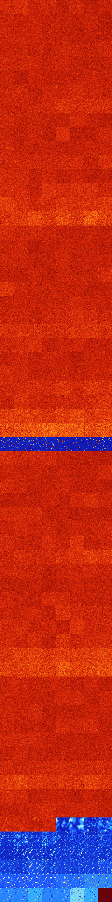

# B03578 (217600-218111)

<details>
    <summary>Initial Grid</summary>
    
</details>


<details>
    <summary>Initial Grid RLE</summary>

```
#C Exported from GoGoL (https://github.com/marrow16/gogol)
#C Wrap mode: Toroidal
#C Boundary mode: Dead
#C Step: 0
x = 100, y = 100, rule = B03578/S
20bo2bo15bo26bob2o$5b2o4b2o3bo6bo29bo2bo9bo5b2o15bo$34bo$o2bo75bo$19bo
9bo2bo6bobo36bo$12bo22bo9bo2bo33bo$24bo32bo21bo3bo9bo$6bo15bo38bo$8bo$
23bo34bo14bo14bo8bo$3bo11bo5bo51bo8bo$50bo32b2o6bo$o26bo13bo15bo26bo$9b
o20bo2bo41bo$21bo3bo12bo9bo16bo$3bo9bo$22bo33bo5bo25bo$15bo71bo4bo$bo
15bobo34bo6bo28bo$o6bo34b2o35bo16bo$19bo33bo12bo19bo3bo$24bo3bo12bo$3bo
69bo23bo$8bo26bo12bo12bo21bo2bo$5bo10bo17b2o9bo16bobo20bo$4bo26bo2bo12b
o22bo27bo$28bo28bobo$12bo8bo6bo6bo52bo6bo$50bo6bo6bobo2bo$9bo4bo3bo6bo
5bo12bo11bo2bo9bo12b2o7bobo4bo$24bo13bo4bo4bo21bo14bo$11bo4bo12bo10bo
44b2o$9bo15b2o35bo3bo16bo$9b2o11bo33b2obobo$bo12bobo16bo38bo7bo$23bo49b
o$60bo23bo8bo$2bo24bo19bo14bo26bo6bo$4bo19bo60bo8bo$6bo14bo17b2o6bo8bo
19bo21bo$10bo17bo2bo29bo29bo$19bo35bo$2bo47bo15bo13bo3bo14bo$18bobo4bob
o6bo48b2o2b2o3bo$16bo4bo20bo8bo13bo22bo$2bo40bo4bo3bo35bo$7bo6bo58b2o8b
o2bo$9bo5bo38bo10bo11bo$11bo18bo$18b2o6bo40bo$7bo17bo4bo10bo34bo5bo11bo
$7bo5bo4bobo19bo23bo13bo13bo2bo$85bo10bobo$62bo23bo8bo$37bobo16bo4bo5bo
$8bo2bo47bo2bobo$bobo5bo6bo29bo27bo4bo5bo$7bo3bo7bo26bo32bo2bo$24bo14bo
27bo10bo$13bo8b3o13bo6bo23bo12bo14bo$5bobo4bo24bo14bo20bo6bo$o3bo31bo
19bo5bo5bo$60bo25bobo$54bo3bo2bo15bo14bo6bo$9bo4bo11b2o27bo9bo5bo5bo$
22bo11bo8bo4bo46bo$15bo19bo37bo23bo$28bo8bo8bo22bo$13bo14bo10bo35bo15bo
$53bo24bo15bo$42bo23bo6bo$5bobo10bo30bobo17bo10bo$28bo7bo39bo11bo$100b$
69bo8bo3bo$2bo2bo28bo23bo33bo3bo2bo$28bo3bo8b2o7bo44bo$8bo11bo71bo5bo$
7bo15bo8bo22bo3bo2bo$5bo26bobo38bo10bo$16bo16bo53bo10bo$53bo14bo$24bo
40bo8bo15bobo$41bo$33bo46bo17bo$7bo3bo5bo4bo12bo46bo5bo3bo$11bo5bo29bo
7b2o10bo$o29bo9bo10bo25b2o17bo$24bo$2bo19bo45bo7bo$2bo3bo61bo$17bo9bo
50bo16bo$4bo15bo32bo$4bo7bo8bo5b2o13bo22bo16bo$bo18bo11bo13bo32bo17bo$
33bo5bo25bo2bo21bo$bo11bo21bo3bo59bo$4bobo15bo49bo26bo$9bo24bo9bo3bo19b
o6bo$50bobo19bo10bo!
```
</details>
<details>
    <summary>Thumbnail</summary>

</details>
<table>
<tr>
    <td><a href="./217600%20S%20Heat%20Map%20Activity.png"></a><br>S (217600)<br>G>1000</td>    <td><a href="./217601%20S0%20Heat%20Map%20Activity.png"></a><br>S0 (217601)<br>G>1000</td>    <td><a href="./217602%20S1%20Heat%20Map%20Activity.png"></a><br>S1 (217602)<br>G>1000</td>    <td><a href="./217603%20S01%20Heat%20Map%20Activity.png"></a><br>S01 (217603)<br>G>1000</td>    <td><a href="./217604%20S2%20Heat%20Map%20Activity.png"></a><br>S2 (217604)<br>G>1000</td>    <td><a href="./217605%20S02%20Heat%20Map%20Activity.png"></a><br>S02 (217605)<br>G>1000</td>    <td><a href="./217606%20S12%20Heat%20Map%20Activity.png"></a><br>S12 (217606)<br>G>1000</td>    <td><a href="./217607%20S012%20Heat%20Map%20Activity.png"></a><br>S012 (217607)<br>G>1000</td></tr>
<tr>
    <td><a href="./217608%20S3%20Heat%20Map%20Activity.png"></a><br>S3 (217608)<br>G>1000</td>    <td><a href="./217609%20S03%20Heat%20Map%20Activity.png"></a><br>S03 (217609)<br>G>1000</td>    <td><a href="./217610%20S13%20Heat%20Map%20Activity.png"></a><br>S13 (217610)<br>G>1000</td>    <td><a href="./217611%20S013%20Heat%20Map%20Activity.png"></a><br>S013 (217611)<br>G>1000</td>    <td><a href="./217612%20S23%20Heat%20Map%20Activity.png"></a><br>S23 (217612)<br>G>1000</td>    <td><a href="./217613%20S023%20Heat%20Map%20Activity.png"></a><br>S023 (217613)<br>G>1000</td>    <td><a href="./217614%20S123%20Heat%20Map%20Activity.png"></a><br>S123 (217614)<br>G>1000</td>    <td><a href="./217615%20S0123%20Heat%20Map%20Activity.png"></a><br>S0123 (217615)<br>G>1000</td></tr>
<tr>
    <td><a href="./217616%20S4%20Heat%20Map%20Activity.png"></a><br>S4 (217616)<br>G>1000</td>    <td><a href="./217617%20S04%20Heat%20Map%20Activity.png"></a><br>S04 (217617)<br>G>1000</td>    <td><a href="./217618%20S14%20Heat%20Map%20Activity.png"></a><br>S14 (217618)<br>G>1000</td>    <td><a href="./217619%20S014%20Heat%20Map%20Activity.png"></a><br>S014 (217619)<br>G>1000</td>    <td><a href="./217620%20S24%20Heat%20Map%20Activity.png"></a><br>S24 (217620)<br>G>1000</td>    <td><a href="./217621%20S024%20Heat%20Map%20Activity.png"></a><br>S024 (217621)<br>G>1000</td>    <td><a href="./217622%20S124%20Heat%20Map%20Activity.png"></a><br>S124 (217622)<br>G>1000</td>    <td><a href="./217623%20S0124%20Heat%20Map%20Activity.png"></a><br>S0124 (217623)<br>G>1000</td></tr>
<tr>
    <td><a href="./217624%20S34%20Heat%20Map%20Activity.png"></a><br>S34 (217624)<br>G>1000</td>    <td><a href="./217625%20S034%20Heat%20Map%20Activity.png"></a><br>S034 (217625)<br>G>1000</td>    <td><a href="./217626%20S134%20Heat%20Map%20Activity.png"></a><br>S134 (217626)<br>G>1000</td>    <td><a href="./217627%20S0134%20Heat%20Map%20Activity.png"></a><br>S0134 (217627)<br>G>1000</td>    <td><a href="./217628%20S234%20Heat%20Map%20Activity.png"></a><br>S234 (217628)<br>G>1000</td>    <td><a href="./217629%20S0234%20Heat%20Map%20Activity.png"></a><br>S0234 (217629)<br>G>1000</td>    <td><a href="./217630%20S1234%20Heat%20Map%20Activity.png"></a><br>S1234 (217630)<br>G>1000</td>    <td><a href="./217631%20S01234%20Heat%20Map%20Activity.png"></a><br>S01234 (217631)<br>G>1000</td></tr>
<tr>
    <td><a href="./217632%20S5%20Heat%20Map%20Activity.png"></a><br>S5 (217632)<br>G>1000</td>    <td><a href="./217633%20S05%20Heat%20Map%20Activity.png"></a><br>S05 (217633)<br>G>1000</td>    <td><a href="./217634%20S15%20Heat%20Map%20Activity.png"></a><br>S15 (217634)<br>G>1000</td>    <td><a href="./217635%20S015%20Heat%20Map%20Activity.png"></a><br>S015 (217635)<br>G>1000</td>    <td><a href="./217636%20S25%20Heat%20Map%20Activity.png"></a><br>S25 (217636)<br>G>1000</td>    <td><a href="./217637%20S025%20Heat%20Map%20Activity.png"></a><br>S025 (217637)<br>G>1000</td>    <td><a href="./217638%20S125%20Heat%20Map%20Activity.png"></a><br>S125 (217638)<br>G>1000</td>    <td><a href="./217639%20S0125%20Heat%20Map%20Activity.png"></a><br>S0125 (217639)<br>G>1000</td></tr>
<tr>
    <td><a href="./217640%20S35%20Heat%20Map%20Activity.png"></a><br>S35 (217640)<br>G>1000</td>    <td><a href="./217641%20S035%20Heat%20Map%20Activity.png"></a><br>S035 (217641)<br>G>1000</td>    <td><a href="./217642%20S135%20Heat%20Map%20Activity.png"></a><br>S135 (217642)<br>G>1000</td>    <td><a href="./217643%20S0135%20Heat%20Map%20Activity.png"></a><br>S0135 (217643)<br>G>1000</td>    <td><a href="./217644%20S235%20Heat%20Map%20Activity.png"></a><br>S235 (217644)<br>G>1000</td>    <td><a href="./217645%20S0235%20Heat%20Map%20Activity.png"></a><br>S0235 (217645)<br>G>1000</td>    <td><a href="./217646%20S1235%20Heat%20Map%20Activity.png"></a><br>S1235 (217646)<br>G>1000</td>    <td><a href="./217647%20S01235%20Heat%20Map%20Activity.png"></a><br>S01235 (217647)<br>G>1000</td></tr>
<tr>
    <td><a href="./217648%20S45%20Heat%20Map%20Activity.png"></a><br>S45 (217648)<br>G>1000</td>    <td><a href="./217649%20S045%20Heat%20Map%20Activity.png"></a><br>S045 (217649)<br>G>1000</td>    <td><a href="./217650%20S145%20Heat%20Map%20Activity.png"></a><br>S145 (217650)<br>G>1000</td>    <td><a href="./217651%20S0145%20Heat%20Map%20Activity.png"></a><br>S0145 (217651)<br>G>1000</td>    <td><a href="./217652%20S245%20Heat%20Map%20Activity.png"></a><br>S245 (217652)<br>G>1000</td>    <td><a href="./217653%20S0245%20Heat%20Map%20Activity.png"></a><br>S0245 (217653)<br>G>1000</td>    <td><a href="./217654%20S1245%20Heat%20Map%20Activity.png"></a><br>S1245 (217654)<br>G>1000</td>    <td><a href="./217655%20S01245%20Heat%20Map%20Activity.png"></a><br>S01245 (217655)<br>G>1000</td></tr>
<tr>
    <td><a href="./217656%20S345%20Heat%20Map%20Activity.png"></a><br>S345 (217656)<br>G>1000</td>    <td><a href="./217657%20S0345%20Heat%20Map%20Activity.png"></a><br>S0345 (217657)<br>G>1000</td>    <td><a href="./217658%20S1345%20Heat%20Map%20Activity.png"></a><br>S1345 (217658)<br>G>1000</td>    <td><a href="./217659%20S01345%20Heat%20Map%20Activity.png"></a><br>S01345 (217659)<br>G>1000</td>    <td><a href="./217660%20S2345%20Heat%20Map%20Activity.png"></a><br>S2345 (217660)<br>G>1000</td>    <td><a href="./217661%20S02345%20Heat%20Map%20Activity.png"></a><br>S02345 (217661)<br>G>1000</td>    <td><a href="./217662%20S12345%20Heat%20Map%20Activity.png"></a><br>S12345 (217662)<br>G>1000</td>    <td><a href="./217663%20S012345%20Heat%20Map%20Activity.png"></a><br>S012345 (217663)<br>G>1000</td></tr>
<tr>
    <td><a href="./217664%20S6%20Heat%20Map%20Activity.png"></a><br>S6 (217664)<br>G>1000</td>    <td><a href="./217665%20S06%20Heat%20Map%20Activity.png"></a><br>S06 (217665)<br>G>1000</td>    <td><a href="./217666%20S16%20Heat%20Map%20Activity.png"></a><br>S16 (217666)<br>G>1000</td>    <td><a href="./217667%20S016%20Heat%20Map%20Activity.png"></a><br>S016 (217667)<br>G>1000</td>    <td><a href="./217668%20S26%20Heat%20Map%20Activity.png"></a><br>S26 (217668)<br>G>1000</td>    <td><a href="./217669%20S026%20Heat%20Map%20Activity.png"></a><br>S026 (217669)<br>G>1000</td>    <td><a href="./217670%20S126%20Heat%20Map%20Activity.png"></a><br>S126 (217670)<br>G>1000</td>    <td><a href="./217671%20S0126%20Heat%20Map%20Activity.png"></a><br>S0126 (217671)<br>G>1000</td></tr>
<tr>
    <td><a href="./217672%20S36%20Heat%20Map%20Activity.png"></a><br>S36 (217672)<br>G>1000</td>    <td><a href="./217673%20S036%20Heat%20Map%20Activity.png"></a><br>S036 (217673)<br>G>1000</td>    <td><a href="./217674%20S136%20Heat%20Map%20Activity.png"></a><br>S136 (217674)<br>G>1000</td>    <td><a href="./217675%20S0136%20Heat%20Map%20Activity.png"></a><br>S0136 (217675)<br>G>1000</td>    <td><a href="./217676%20S236%20Heat%20Map%20Activity.png"></a><br>S236 (217676)<br>G>1000</td>    <td><a href="./217677%20S0236%20Heat%20Map%20Activity.png"></a><br>S0236 (217677)<br>G>1000</td>    <td><a href="./217678%20S1236%20Heat%20Map%20Activity.png"></a><br>S1236 (217678)<br>G>1000</td>    <td><a href="./217679%20S01236%20Heat%20Map%20Activity.png"></a><br>S01236 (217679)<br>G>1000</td></tr>
<tr>
    <td><a href="./217680%20S46%20Heat%20Map%20Activity.png"></a><br>S46 (217680)<br>G>1000</td>    <td><a href="./217681%20S046%20Heat%20Map%20Activity.png"></a><br>S046 (217681)<br>G>1000</td>    <td><a href="./217682%20S146%20Heat%20Map%20Activity.png"></a><br>S146 (217682)<br>G>1000</td>    <td><a href="./217683%20S0146%20Heat%20Map%20Activity.png"></a><br>S0146 (217683)<br>G>1000</td>    <td><a href="./217684%20S246%20Heat%20Map%20Activity.png"></a><br>S246 (217684)<br>G>1000</td>    <td><a href="./217685%20S0246%20Heat%20Map%20Activity.png"></a><br>S0246 (217685)<br>G>1000</td>    <td><a href="./217686%20S1246%20Heat%20Map%20Activity.png"></a><br>S1246 (217686)<br>G>1000</td>    <td><a href="./217687%20S01246%20Heat%20Map%20Activity.png"></a><br>S01246 (217687)<br>G>1000</td></tr>
<tr>
    <td><a href="./217688%20S346%20Heat%20Map%20Activity.png"></a><br>S346 (217688)<br>G>1000</td>    <td><a href="./217689%20S0346%20Heat%20Map%20Activity.png"></a><br>S0346 (217689)<br>G>1000</td>    <td><a href="./217690%20S1346%20Heat%20Map%20Activity.png"></a><br>S1346 (217690)<br>G>1000</td>    <td><a href="./217691%20S01346%20Heat%20Map%20Activity.png"></a><br>S01346 (217691)<br>G>1000</td>    <td><a href="./217692%20S2346%20Heat%20Map%20Activity.png"></a><br>S2346 (217692)<br>G>1000</td>    <td><a href="./217693%20S02346%20Heat%20Map%20Activity.png"></a><br>S02346 (217693)<br>G>1000</td>    <td><a href="./217694%20S12346%20Heat%20Map%20Activity.png"></a><br>S12346 (217694)<br>G>1000</td>    <td><a href="./217695%20S012346%20Heat%20Map%20Activity.png"></a><br>S012346 (217695)<br>G>1000</td></tr>
<tr>
    <td><a href="./217696%20S56%20Heat%20Map%20Activity.png"></a><br>S56 (217696)<br>G>1000</td>    <td><a href="./217697%20S056%20Heat%20Map%20Activity.png"></a><br>S056 (217697)<br>G>1000</td>    <td><a href="./217698%20S156%20Heat%20Map%20Activity.png"></a><br>S156 (217698)<br>G>1000</td>    <td><a href="./217699%20S0156%20Heat%20Map%20Activity.png"></a><br>S0156 (217699)<br>G>1000</td>    <td><a href="./217700%20S256%20Heat%20Map%20Activity.png"></a><br>S256 (217700)<br>G>1000</td>    <td><a href="./217701%20S0256%20Heat%20Map%20Activity.png"></a><br>S0256 (217701)<br>G>1000</td>    <td><a href="./217702%20S1256%20Heat%20Map%20Activity.png"></a><br>S1256 (217702)<br>G>1000</td>    <td><a href="./217703%20S01256%20Heat%20Map%20Activity.png"></a><br>S01256 (217703)<br>G>1000</td></tr>
<tr>
    <td><a href="./217704%20S356%20Heat%20Map%20Activity.png"></a><br>S356 (217704)<br>G>1000</td>    <td><a href="./217705%20S0356%20Heat%20Map%20Activity.png"></a><br>S0356 (217705)<br>G>1000</td>    <td><a href="./217706%20S1356%20Heat%20Map%20Activity.png"></a><br>S1356 (217706)<br>G>1000</td>    <td><a href="./217707%20S01356%20Heat%20Map%20Activity.png"></a><br>S01356 (217707)<br>G>1000</td>    <td><a href="./217708%20S2356%20Heat%20Map%20Activity.png"></a><br>S2356 (217708)<br>G>1000</td>    <td><a href="./217709%20S02356%20Heat%20Map%20Activity.png"></a><br>S02356 (217709)<br>G>1000</td>    <td><a href="./217710%20S12356%20Heat%20Map%20Activity.png"></a><br>S12356 (217710)<br>G>1000</td>    <td><a href="./217711%20S012356%20Heat%20Map%20Activity.png"></a><br>S012356 (217711)<br>G>1000</td></tr>
<tr>
    <td><a href="./217712%20S456%20Heat%20Map%20Activity.png"></a><br>S456 (217712)<br>G>1000</td>    <td><a href="./217713%20S0456%20Heat%20Map%20Activity.png"></a><br>S0456 (217713)<br>G>1000</td>    <td><a href="./217714%20S1456%20Heat%20Map%20Activity.png"></a><br>S1456 (217714)<br>G>1000</td>    <td><a href="./217715%20S01456%20Heat%20Map%20Activity.png"></a><br>S01456 (217715)<br>G>1000</td>    <td><a href="./217716%20S2456%20Heat%20Map%20Activity.png"></a><br>S2456 (217716)<br>G>1000</td>    <td><a href="./217717%20S02456%20Heat%20Map%20Activity.png"></a><br>S02456 (217717)<br>G>1000</td>    <td><a href="./217718%20S12456%20Heat%20Map%20Activity.png"></a><br>S12456 (217718)<br>G>1000</td>    <td><a href="./217719%20S012456%20Heat%20Map%20Activity.png"></a><br>S012456 (217719)<br>G>1000</td></tr>
<tr>
    <td><a href="./217720%20S3456%20Heat%20Map%20Activity.png"></a><br>S3456 (217720)<br>G>1000</td>    <td><a href="./217721%20S03456%20Heat%20Map%20Activity.png"></a><br>S03456 (217721)<br>G>1000</td>    <td><a href="./217722%20S13456%20Heat%20Map%20Activity.png"></a><br>S13456 (217722)<br>G>1000</td>    <td><a href="./217723%20S013456%20Heat%20Map%20Activity.png"></a><br>S013456 (217723)<br>G>1000</td>    <td><a href="./217724%20S23456%20Heat%20Map%20Activity.png"></a><br>S23456 (217724)<br>G>1000</td>    <td><a href="./217725%20S023456%20Heat%20Map%20Activity.png"></a><br>S023456 (217725)<br>G>1000</td>    <td><a href="./217726%20S123456%20Heat%20Map%20Activity.png"></a><br>S123456 (217726)<br>G>1000</td>    <td><a href="./217727%20S0123456%20Heat%20Map%20Activity.png"></a><br>S0123456 (217727)<br>G>1000</td></tr>
<tr>
    <td><a href="./217728%20S7%20Heat%20Map%20Activity.png"></a><br>S7 (217728)<br>G>1000</td>    <td><a href="./217729%20S07%20Heat%20Map%20Activity.png"></a><br>S07 (217729)<br>G>1000</td>    <td><a href="./217730%20S17%20Heat%20Map%20Activity.png"></a><br>S17 (217730)<br>G>1000</td>    <td><a href="./217731%20S017%20Heat%20Map%20Activity.png"></a><br>S017 (217731)<br>G>1000</td>    <td><a href="./217732%20S27%20Heat%20Map%20Activity.png"></a><br>S27 (217732)<br>G>1000</td>    <td><a href="./217733%20S027%20Heat%20Map%20Activity.png"></a><br>S027 (217733)<br>G>1000</td>    <td><a href="./217734%20S127%20Heat%20Map%20Activity.png"></a><br>S127 (217734)<br>G>1000</td>    <td><a href="./217735%20S0127%20Heat%20Map%20Activity.png"></a><br>S0127 (217735)<br>G>1000</td></tr>
<tr>
    <td><a href="./217736%20S37%20Heat%20Map%20Activity.png"></a><br>S37 (217736)<br>G>1000</td>    <td><a href="./217737%20S037%20Heat%20Map%20Activity.png"></a><br>S037 (217737)<br>G>1000</td>    <td><a href="./217738%20S137%20Heat%20Map%20Activity.png"></a><br>S137 (217738)<br>G>1000</td>    <td><a href="./217739%20S0137%20Heat%20Map%20Activity.png"></a><br>S0137 (217739)<br>G>1000</td>    <td><a href="./217740%20S237%20Heat%20Map%20Activity.png"></a><br>S237 (217740)<br>G>1000</td>    <td><a href="./217741%20S0237%20Heat%20Map%20Activity.png"></a><br>S0237 (217741)<br>G>1000</td>    <td><a href="./217742%20S1237%20Heat%20Map%20Activity.png"></a><br>S1237 (217742)<br>G>1000</td>    <td><a href="./217743%20S01237%20Heat%20Map%20Activity.png"></a><br>S01237 (217743)<br>G>1000</td></tr>
<tr>
    <td><a href="./217744%20S47%20Heat%20Map%20Activity.png"></a><br>S47 (217744)<br>G>1000</td>    <td><a href="./217745%20S047%20Heat%20Map%20Activity.png"></a><br>S047 (217745)<br>G>1000</td>    <td><a href="./217746%20S147%20Heat%20Map%20Activity.png"></a><br>S147 (217746)<br>G>1000</td>    <td><a href="./217747%20S0147%20Heat%20Map%20Activity.png"></a><br>S0147 (217747)<br>G>1000</td>    <td><a href="./217748%20S247%20Heat%20Map%20Activity.png"></a><br>S247 (217748)<br>G>1000</td>    <td><a href="./217749%20S0247%20Heat%20Map%20Activity.png"></a><br>S0247 (217749)<br>G>1000</td>    <td><a href="./217750%20S1247%20Heat%20Map%20Activity.png"></a><br>S1247 (217750)<br>G>1000</td>    <td><a href="./217751%20S01247%20Heat%20Map%20Activity.png"></a><br>S01247 (217751)<br>G>1000</td></tr>
<tr>
    <td><a href="./217752%20S347%20Heat%20Map%20Activity.png"></a><br>S347 (217752)<br>G>1000</td>    <td><a href="./217753%20S0347%20Heat%20Map%20Activity.png"></a><br>S0347 (217753)<br>G>1000</td>    <td><a href="./217754%20S1347%20Heat%20Map%20Activity.png"></a><br>S1347 (217754)<br>G>1000</td>    <td><a href="./217755%20S01347%20Heat%20Map%20Activity.png"></a><br>S01347 (217755)<br>G>1000</td>    <td><a href="./217756%20S2347%20Heat%20Map%20Activity.png"></a><br>S2347 (217756)<br>G>1000</td>    <td><a href="./217757%20S02347%20Heat%20Map%20Activity.png"></a><br>S02347 (217757)<br>G>1000</td>    <td><a href="./217758%20S12347%20Heat%20Map%20Activity.png"></a><br>S12347 (217758)<br>G>1000</td>    <td><a href="./217759%20S012347%20Heat%20Map%20Activity.png"></a><br>S012347 (217759)<br>G>1000</td></tr>
<tr>
    <td><a href="./217760%20S57%20Heat%20Map%20Activity.png"></a><br>S57 (217760)<br>G>1000</td>    <td><a href="./217761%20S057%20Heat%20Map%20Activity.png"></a><br>S057 (217761)<br>G>1000</td>    <td><a href="./217762%20S157%20Heat%20Map%20Activity.png"></a><br>S157 (217762)<br>G>1000</td>    <td><a href="./217763%20S0157%20Heat%20Map%20Activity.png"></a><br>S0157 (217763)<br>G>1000</td>    <td><a href="./217764%20S257%20Heat%20Map%20Activity.png"></a><br>S257 (217764)<br>G>1000</td>    <td><a href="./217765%20S0257%20Heat%20Map%20Activity.png"></a><br>S0257 (217765)<br>G>1000</td>    <td><a href="./217766%20S1257%20Heat%20Map%20Activity.png"></a><br>S1257 (217766)<br>G>1000</td>    <td><a href="./217767%20S01257%20Heat%20Map%20Activity.png"></a><br>S01257 (217767)<br>G>1000</td></tr>
<tr>
    <td><a href="./217768%20S357%20Heat%20Map%20Activity.png"></a><br>S357 (217768)<br>G>1000</td>    <td><a href="./217769%20S0357%20Heat%20Map%20Activity.png"></a><br>S0357 (217769)<br>G>1000</td>    <td><a href="./217770%20S1357%20Heat%20Map%20Activity.png"></a><br>S1357 (217770)<br>G>1000</td>    <td><a href="./217771%20S01357%20Heat%20Map%20Activity.png"></a><br>S01357 (217771)<br>G>1000</td>    <td><a href="./217772%20S2357%20Heat%20Map%20Activity.png"></a><br>S2357 (217772)<br>G>1000</td>    <td><a href="./217773%20S02357%20Heat%20Map%20Activity.png"></a><br>S02357 (217773)<br>G>1000</td>    <td><a href="./217774%20S12357%20Heat%20Map%20Activity.png"></a><br>S12357 (217774)<br>G>1000</td>    <td><a href="./217775%20S012357%20Heat%20Map%20Activity.png"></a><br>S012357 (217775)<br>G>1000</td></tr>
<tr>
    <td><a href="./217776%20S457%20Heat%20Map%20Activity.png"></a><br>S457 (217776)<br>G>1000</td>    <td><a href="./217777%20S0457%20Heat%20Map%20Activity.png"></a><br>S0457 (217777)<br>G>1000</td>    <td><a href="./217778%20S1457%20Heat%20Map%20Activity.png"></a><br>S1457 (217778)<br>G>1000</td>    <td><a href="./217779%20S01457%20Heat%20Map%20Activity.png"></a><br>S01457 (217779)<br>G>1000</td>    <td><a href="./217780%20S2457%20Heat%20Map%20Activity.png"></a><br>S2457 (217780)<br>G>1000</td>    <td><a href="./217781%20S02457%20Heat%20Map%20Activity.png"></a><br>S02457 (217781)<br>G>1000</td>    <td><a href="./217782%20S12457%20Heat%20Map%20Activity.png"></a><br>S12457 (217782)<br>G>1000</td>    <td><a href="./217783%20S012457%20Heat%20Map%20Activity.png"></a><br>S012457 (217783)<br>G>1000</td></tr>
<tr>
    <td><a href="./217784%20S3457%20Heat%20Map%20Activity.png"></a><br>S3457 (217784)<br>G>1000</td>    <td><a href="./217785%20S03457%20Heat%20Map%20Activity.png"></a><br>S03457 (217785)<br>G>1000</td>    <td><a href="./217786%20S13457%20Heat%20Map%20Activity.png"></a><br>S13457 (217786)<br>G>1000</td>    <td><a href="./217787%20S013457%20Heat%20Map%20Activity.png"></a><br>S013457 (217787)<br>G>1000</td>    <td><a href="./217788%20S23457%20Heat%20Map%20Activity.png"></a><br>S23457 (217788)<br>G>1000</td>    <td><a href="./217789%20S023457%20Heat%20Map%20Activity.png"></a><br>S023457 (217789)<br>G>1000</td>    <td><a href="./217790%20S123457%20Heat%20Map%20Activity.png"></a><br>S123457 (217790)<br>G>1000</td>    <td><a href="./217791%20S0123457%20Heat%20Map%20Activity.png"></a><br>S0123457 (217791)<br>G>1000</td></tr>
<tr>
    <td><a href="./217792%20S67%20Heat%20Map%20Activity.png"></a><br>S67 (217792)<br>G>1000</td>    <td><a href="./217793%20S067%20Heat%20Map%20Activity.png"></a><br>S067 (217793)<br>G>1000</td>    <td><a href="./217794%20S167%20Heat%20Map%20Activity.png"></a><br>S167 (217794)<br>G>1000</td>    <td><a href="./217795%20S0167%20Heat%20Map%20Activity.png"></a><br>S0167 (217795)<br>G>1000</td>    <td><a href="./217796%20S267%20Heat%20Map%20Activity.png"></a><br>S267 (217796)<br>G>1000</td>    <td><a href="./217797%20S0267%20Heat%20Map%20Activity.png"></a><br>S0267 (217797)<br>G>1000</td>    <td><a href="./217798%20S1267%20Heat%20Map%20Activity.png"></a><br>S1267 (217798)<br>G>1000</td>    <td><a href="./217799%20S01267%20Heat%20Map%20Activity.png"></a><br>S01267 (217799)<br>G>1000</td></tr>
<tr>
    <td><a href="./217800%20S367%20Heat%20Map%20Activity.png"></a><br>S367 (217800)<br>G>1000</td>    <td><a href="./217801%20S0367%20Heat%20Map%20Activity.png"></a><br>S0367 (217801)<br>G>1000</td>    <td><a href="./217802%20S1367%20Heat%20Map%20Activity.png"></a><br>S1367 (217802)<br>G>1000</td>    <td><a href="./217803%20S01367%20Heat%20Map%20Activity.png"></a><br>S01367 (217803)<br>G>1000</td>    <td><a href="./217804%20S2367%20Heat%20Map%20Activity.png"></a><br>S2367 (217804)<br>G>1000</td>    <td><a href="./217805%20S02367%20Heat%20Map%20Activity.png"></a><br>S02367 (217805)<br>G>1000</td>    <td><a href="./217806%20S12367%20Heat%20Map%20Activity.png"></a><br>S12367 (217806)<br>G>1000</td>    <td><a href="./217807%20S012367%20Heat%20Map%20Activity.png"></a><br>S012367 (217807)<br>G>1000</td></tr>
<tr>
    <td><a href="./217808%20S467%20Heat%20Map%20Activity.png"></a><br>S467 (217808)<br>G>1000</td>    <td><a href="./217809%20S0467%20Heat%20Map%20Activity.png"></a><br>S0467 (217809)<br>G>1000</td>    <td><a href="./217810%20S1467%20Heat%20Map%20Activity.png"></a><br>S1467 (217810)<br>G>1000</td>    <td><a href="./217811%20S01467%20Heat%20Map%20Activity.png"></a><br>S01467 (217811)<br>G>1000</td>    <td><a href="./217812%20S2467%20Heat%20Map%20Activity.png"></a><br>S2467 (217812)<br>G>1000</td>    <td><a href="./217813%20S02467%20Heat%20Map%20Activity.png"></a><br>S02467 (217813)<br>G>1000</td>    <td><a href="./217814%20S12467%20Heat%20Map%20Activity.png"></a><br>S12467 (217814)<br>G>1000</td>    <td><a href="./217815%20S012467%20Heat%20Map%20Activity.png"></a><br>S012467 (217815)<br>G>1000</td></tr>
<tr>
    <td><a href="./217816%20S3467%20Heat%20Map%20Activity.png"></a><br>S3467 (217816)<br>G>1000</td>    <td><a href="./217817%20S03467%20Heat%20Map%20Activity.png"></a><br>S03467 (217817)<br>G>1000</td>    <td><a href="./217818%20S13467%20Heat%20Map%20Activity.png"></a><br>S13467 (217818)<br>G>1000</td>    <td><a href="./217819%20S013467%20Heat%20Map%20Activity.png"></a><br>S013467 (217819)<br>G>1000</td>    <td><a href="./217820%20S23467%20Heat%20Map%20Activity.png"></a><br>S23467 (217820)<br>G>1000</td>    <td><a href="./217821%20S023467%20Heat%20Map%20Activity.png"></a><br>S023467 (217821)<br>G>1000</td>    <td><a href="./217822%20S123467%20Heat%20Map%20Activity.png"></a><br>S123467 (217822)<br>G>1000</td>    <td><a href="./217823%20S0123467%20Heat%20Map%20Activity.png"></a><br>S0123467 (217823)<br>G>1000</td></tr>
<tr>
    <td><a href="./217824%20S567%20Heat%20Map%20Activity.png"></a><br>S567 (217824)<br>G>1000</td>    <td><a href="./217825%20S0567%20Heat%20Map%20Activity.png"></a><br>S0567 (217825)<br>G>1000</td>    <td><a href="./217826%20S1567%20Heat%20Map%20Activity.png"></a><br>S1567 (217826)<br>G>1000</td>    <td><a href="./217827%20S01567%20Heat%20Map%20Activity.png"></a><br>S01567 (217827)<br>G>1000</td>    <td><a href="./217828%20S2567%20Heat%20Map%20Activity.png"></a><br>S2567 (217828)<br>G>1000</td>    <td><a href="./217829%20S02567%20Heat%20Map%20Activity.png"></a><br>S02567 (217829)<br>G>1000</td>    <td><a href="./217830%20S12567%20Heat%20Map%20Activity.png"></a><br>S12567 (217830)<br>G>1000</td>    <td><a href="./217831%20S012567%20Heat%20Map%20Activity.png"></a><br>S012567 (217831)<br>G>1000</td></tr>
<tr>
    <td><a href="./217832%20S3567%20Heat%20Map%20Activity.png"></a><br>S3567 (217832)<br>G>1000</td>    <td><a href="./217833%20S03567%20Heat%20Map%20Activity.png"></a><br>S03567 (217833)<br>G>1000</td>    <td><a href="./217834%20S13567%20Heat%20Map%20Activity.png"></a><br>S13567 (217834)<br>G>1000</td>    <td><a href="./217835%20S013567%20Heat%20Map%20Activity.png"></a><br>S013567 (217835)<br>G>1000</td>    <td><a href="./217836%20S23567%20Heat%20Map%20Activity.png"></a><br>S23567 (217836)<br>G>1000</td>    <td><a href="./217837%20S023567%20Heat%20Map%20Activity.png"></a><br>S023567 (217837)<br>G>1000</td>    <td><a href="./217838%20S123567%20Heat%20Map%20Activity.png"></a><br>S123567 (217838)<br>G>1000</td>    <td><a href="./217839%20S0123567%20Heat%20Map%20Activity.png"></a><br>S0123567 (217839)<br>G>1000</td></tr>
<tr>
    <td><a href="./217840%20S4567%20Heat%20Map%20Activity.png"></a><br>S4567 (217840)<br>G>1000</td>    <td><a href="./217841%20S04567%20Heat%20Map%20Activity.png"></a><br>S04567 (217841)<br>G>1000</td>    <td><a href="./217842%20S14567%20Heat%20Map%20Activity.png"></a><br>S14567 (217842)<br>G>1000</td>    <td><a href="./217843%20S014567%20Heat%20Map%20Activity.png"></a><br>S014567 (217843)<br>G>1000</td>    <td><a href="./217844%20S24567%20Heat%20Map%20Activity.png"></a><br>S24567 (217844)<br>G>1000</td>    <td><a href="./217845%20S024567%20Heat%20Map%20Activity.png"></a><br>S024567 (217845)<br>G>1000</td>    <td><a href="./217846%20S124567%20Heat%20Map%20Activity.png"></a><br>S124567 (217846)<br>G>1000</td>    <td><a href="./217847%20S0124567%20Heat%20Map%20Activity.png"></a><br>S0124567 (217847)<br>G>1000</td></tr>
<tr>
    <td><a href="./217848%20S34567%20Heat%20Map%20Activity.png"></a><br>S34567 (217848)<br>G>1000</td>    <td><a href="./217849%20S034567%20Heat%20Map%20Activity.png"></a><br>S034567 (217849)<br>G>1000</td>    <td><a href="./217850%20S134567%20Heat%20Map%20Activity.png"></a><br>S134567 (217850)<br>G>1000</td>    <td><a href="./217851%20S0134567%20Heat%20Map%20Activity.png"></a><br>S0134567 (217851)<br>G>1000</td>    <td><a href="./217852%20S234567%20Heat%20Map%20Activity.png"></a><br>S234567 (217852)<br>G>1000</td>    <td><a href="./217853%20S0234567%20Heat%20Map%20Activity.png"></a><br>S0234567 (217853)<br>G>1000</td>    <td><a href="./217854%20S1234567%20Heat%20Map%20Activity.png"></a><br>S1234567 (217854)<br>G>1000</td>    <td><a href="./217855%20S01234567%20Heat%20Map%20Activity.png"></a><br>S01234567 (217855)<br>G>1000</td></tr>
<tr>
    <td><a href="./217856%20S8%20Heat%20Map%20Activity.png"></a><br>S8 (217856)<br>G>1000</td>    <td><a href="./217857%20S08%20Heat%20Map%20Activity.png"></a><br>S08 (217857)<br>G>1000</td>    <td><a href="./217858%20S18%20Heat%20Map%20Activity.png"></a><br>S18 (217858)<br>G>1000</td>    <td><a href="./217859%20S018%20Heat%20Map%20Activity.png"></a><br>S018 (217859)<br>G>1000</td>    <td><a href="./217860%20S28%20Heat%20Map%20Activity.png"></a><br>S28 (217860)<br>G>1000</td>    <td><a href="./217861%20S028%20Heat%20Map%20Activity.png"></a><br>S028 (217861)<br>G>1000</td>    <td><a href="./217862%20S128%20Heat%20Map%20Activity.png"></a><br>S128 (217862)<br>G>1000</td>    <td><a href="./217863%20S0128%20Heat%20Map%20Activity.png"></a><br>S0128 (217863)<br>G>1000</td></tr>
<tr>
    <td><a href="./217864%20S38%20Heat%20Map%20Activity.png"></a><br>S38 (217864)<br>G>1000</td>    <td><a href="./217865%20S038%20Heat%20Map%20Activity.png"></a><br>S038 (217865)<br>G>1000</td>    <td><a href="./217866%20S138%20Heat%20Map%20Activity.png"></a><br>S138 (217866)<br>G>1000</td>    <td><a href="./217867%20S0138%20Heat%20Map%20Activity.png"></a><br>S0138 (217867)<br>G>1000</td>    <td><a href="./217868%20S238%20Heat%20Map%20Activity.png"></a><br>S238 (217868)<br>G>1000</td>    <td><a href="./217869%20S0238%20Heat%20Map%20Activity.png"></a><br>S0238 (217869)<br>G>1000</td>    <td><a href="./217870%20S1238%20Heat%20Map%20Activity.png"></a><br>S1238 (217870)<br>G>1000</td>    <td><a href="./217871%20S01238%20Heat%20Map%20Activity.png"></a><br>S01238 (217871)<br>G>1000</td></tr>
<tr>
    <td><a href="./217872%20S48%20Heat%20Map%20Activity.png"></a><br>S48 (217872)<br>G>1000</td>    <td><a href="./217873%20S048%20Heat%20Map%20Activity.png"></a><br>S048 (217873)<br>G>1000</td>    <td><a href="./217874%20S148%20Heat%20Map%20Activity.png"></a><br>S148 (217874)<br>G>1000</td>    <td><a href="./217875%20S0148%20Heat%20Map%20Activity.png"></a><br>S0148 (217875)<br>G>1000</td>    <td><a href="./217876%20S248%20Heat%20Map%20Activity.png"></a><br>S248 (217876)<br>G>1000</td>    <td><a href="./217877%20S0248%20Heat%20Map%20Activity.png"></a><br>S0248 (217877)<br>G>1000</td>    <td><a href="./217878%20S1248%20Heat%20Map%20Activity.png"></a><br>S1248 (217878)<br>G>1000</td>    <td><a href="./217879%20S01248%20Heat%20Map%20Activity.png"></a><br>S01248 (217879)<br>G>1000</td></tr>
<tr>
    <td><a href="./217880%20S348%20Heat%20Map%20Activity.png"></a><br>S348 (217880)<br>G>1000</td>    <td><a href="./217881%20S0348%20Heat%20Map%20Activity.png"></a><br>S0348 (217881)<br>G>1000</td>    <td><a href="./217882%20S1348%20Heat%20Map%20Activity.png"></a><br>S1348 (217882)<br>G>1000</td>    <td><a href="./217883%20S01348%20Heat%20Map%20Activity.png"></a><br>S01348 (217883)<br>G>1000</td>    <td><a href="./217884%20S2348%20Heat%20Map%20Activity.png"></a><br>S2348 (217884)<br>G>1000</td>    <td><a href="./217885%20S02348%20Heat%20Map%20Activity.png"></a><br>S02348 (217885)<br>G>1000</td>    <td><a href="./217886%20S12348%20Heat%20Map%20Activity.png"></a><br>S12348 (217886)<br>G>1000</td>    <td><a href="./217887%20S012348%20Heat%20Map%20Activity.png"></a><br>S012348 (217887)<br>G>1000</td></tr>
<tr>
    <td><a href="./217888%20S58%20Heat%20Map%20Activity.png"></a><br>S58 (217888)<br>G>1000</td>    <td><a href="./217889%20S058%20Heat%20Map%20Activity.png"></a><br>S058 (217889)<br>G>1000</td>    <td><a href="./217890%20S158%20Heat%20Map%20Activity.png"></a><br>S158 (217890)<br>G>1000</td>    <td><a href="./217891%20S0158%20Heat%20Map%20Activity.png"></a><br>S0158 (217891)<br>G>1000</td>    <td><a href="./217892%20S258%20Heat%20Map%20Activity.png"></a><br>S258 (217892)<br>G>1000</td>    <td><a href="./217893%20S0258%20Heat%20Map%20Activity.png"></a><br>S0258 (217893)<br>G>1000</td>    <td><a href="./217894%20S1258%20Heat%20Map%20Activity.png"></a><br>S1258 (217894)<br>G>1000</td>    <td><a href="./217895%20S01258%20Heat%20Map%20Activity.png"></a><br>S01258 (217895)<br>G>1000</td></tr>
<tr>
    <td><a href="./217896%20S358%20Heat%20Map%20Activity.png"></a><br>S358 (217896)<br>G>1000</td>    <td><a href="./217897%20S0358%20Heat%20Map%20Activity.png"></a><br>S0358 (217897)<br>G>1000</td>    <td><a href="./217898%20S1358%20Heat%20Map%20Activity.png"></a><br>S1358 (217898)<br>G>1000</td>    <td><a href="./217899%20S01358%20Heat%20Map%20Activity.png"></a><br>S01358 (217899)<br>G>1000</td>    <td><a href="./217900%20S2358%20Heat%20Map%20Activity.png"></a><br>S2358 (217900)<br>G>1000</td>    <td><a href="./217901%20S02358%20Heat%20Map%20Activity.png"></a><br>S02358 (217901)<br>G>1000</td>    <td><a href="./217902%20S12358%20Heat%20Map%20Activity.png"></a><br>S12358 (217902)<br>G>1000</td>    <td><a href="./217903%20S012358%20Heat%20Map%20Activity.png"></a><br>S012358 (217903)<br>G>1000</td></tr>
<tr>
    <td><a href="./217904%20S458%20Heat%20Map%20Activity.png"></a><br>S458 (217904)<br>G>1000</td>    <td><a href="./217905%20S0458%20Heat%20Map%20Activity.png"></a><br>S0458 (217905)<br>G>1000</td>    <td><a href="./217906%20S1458%20Heat%20Map%20Activity.png"></a><br>S1458 (217906)<br>G>1000</td>    <td><a href="./217907%20S01458%20Heat%20Map%20Activity.png"></a><br>S01458 (217907)<br>G>1000</td>    <td><a href="./217908%20S2458%20Heat%20Map%20Activity.png"></a><br>S2458 (217908)<br>G>1000</td>    <td><a href="./217909%20S02458%20Heat%20Map%20Activity.png"></a><br>S02458 (217909)<br>G>1000</td>    <td><a href="./217910%20S12458%20Heat%20Map%20Activity.png"></a><br>S12458 (217910)<br>G>1000</td>    <td><a href="./217911%20S012458%20Heat%20Map%20Activity.png"></a><br>S012458 (217911)<br>G>1000</td></tr>
<tr>
    <td><a href="./217912%20S3458%20Heat%20Map%20Activity.png"></a><br>S3458 (217912)<br>G>1000</td>    <td><a href="./217913%20S03458%20Heat%20Map%20Activity.png"></a><br>S03458 (217913)<br>G>1000</td>    <td><a href="./217914%20S13458%20Heat%20Map%20Activity.png"></a><br>S13458 (217914)<br>G>1000</td>    <td><a href="./217915%20S013458%20Heat%20Map%20Activity.png"></a><br>S013458 (217915)<br>G>1000</td>    <td><a href="./217916%20S23458%20Heat%20Map%20Activity.png"></a><br>S23458 (217916)<br>G>1000</td>    <td><a href="./217917%20S023458%20Heat%20Map%20Activity.png"></a><br>S023458 (217917)<br>G>1000</td>    <td><a href="./217918%20S123458%20Heat%20Map%20Activity.png"></a><br>S123458 (217918)<br>G>1000</td>    <td><a href="./217919%20S0123458%20Heat%20Map%20Activity.png"></a><br>S0123458 (217919)<br>G>1000</td></tr>
<tr>
    <td><a href="./217920%20S68%20Heat%20Map%20Activity.png"></a><br>S68 (217920)<br>G>1000</td>    <td><a href="./217921%20S068%20Heat%20Map%20Activity.png"></a><br>S068 (217921)<br>G>1000</td>    <td><a href="./217922%20S168%20Heat%20Map%20Activity.png"></a><br>S168 (217922)<br>G>1000</td>    <td><a href="./217923%20S0168%20Heat%20Map%20Activity.png"></a><br>S0168 (217923)<br>G>1000</td>    <td><a href="./217924%20S268%20Heat%20Map%20Activity.png"></a><br>S268 (217924)<br>G>1000</td>    <td><a href="./217925%20S0268%20Heat%20Map%20Activity.png"></a><br>S0268 (217925)<br>G>1000</td>    <td><a href="./217926%20S1268%20Heat%20Map%20Activity.png"></a><br>S1268 (217926)<br>G>1000</td>    <td><a href="./217927%20S01268%20Heat%20Map%20Activity.png"></a><br>S01268 (217927)<br>G>1000</td></tr>
<tr>
    <td><a href="./217928%20S368%20Heat%20Map%20Activity.png"></a><br>S368 (217928)<br>G>1000</td>    <td><a href="./217929%20S0368%20Heat%20Map%20Activity.png"></a><br>S0368 (217929)<br>G>1000</td>    <td><a href="./217930%20S1368%20Heat%20Map%20Activity.png"></a><br>S1368 (217930)<br>G>1000</td>    <td><a href="./217931%20S01368%20Heat%20Map%20Activity.png"></a><br>S01368 (217931)<br>G>1000</td>    <td><a href="./217932%20S2368%20Heat%20Map%20Activity.png"></a><br>S2368 (217932)<br>G>1000</td>    <td><a href="./217933%20S02368%20Heat%20Map%20Activity.png"></a><br>S02368 (217933)<br>G>1000</td>    <td><a href="./217934%20S12368%20Heat%20Map%20Activity.png"></a><br>S12368 (217934)<br>G>1000</td>    <td><a href="./217935%20S012368%20Heat%20Map%20Activity.png"></a><br>S012368 (217935)<br>G>1000</td></tr>
<tr>
    <td><a href="./217936%20S468%20Heat%20Map%20Activity.png"></a><br>S468 (217936)<br>G>1000</td>    <td><a href="./217937%20S0468%20Heat%20Map%20Activity.png"></a><br>S0468 (217937)<br>G>1000</td>    <td><a href="./217938%20S1468%20Heat%20Map%20Activity.png"></a><br>S1468 (217938)<br>G>1000</td>    <td><a href="./217939%20S01468%20Heat%20Map%20Activity.png"></a><br>S01468 (217939)<br>G>1000</td>    <td><a href="./217940%20S2468%20Heat%20Map%20Activity.png"></a><br>S2468 (217940)<br>G>1000</td>    <td><a href="./217941%20S02468%20Heat%20Map%20Activity.png"></a><br>S02468 (217941)<br>G>1000</td>    <td><a href="./217942%20S12468%20Heat%20Map%20Activity.png"></a><br>S12468 (217942)<br>G>1000</td>    <td><a href="./217943%20S012468%20Heat%20Map%20Activity.png"></a><br>S012468 (217943)<br>G>1000</td></tr>
<tr>
    <td><a href="./217944%20S3468%20Heat%20Map%20Activity.png"></a><br>S3468 (217944)<br>G>1000</td>    <td><a href="./217945%20S03468%20Heat%20Map%20Activity.png"></a><br>S03468 (217945)<br>G>1000</td>    <td><a href="./217946%20S13468%20Heat%20Map%20Activity.png"></a><br>S13468 (217946)<br>G>1000</td>    <td><a href="./217947%20S013468%20Heat%20Map%20Activity.png"></a><br>S013468 (217947)<br>G>1000</td>    <td><a href="./217948%20S23468%20Heat%20Map%20Activity.png"></a><br>S23468 (217948)<br>G>1000</td>    <td><a href="./217949%20S023468%20Heat%20Map%20Activity.png"></a><br>S023468 (217949)<br>G>1000</td>    <td><a href="./217950%20S123468%20Heat%20Map%20Activity.png"></a><br>S123468 (217950)<br>G>1000</td>    <td><a href="./217951%20S0123468%20Heat%20Map%20Activity.png"></a><br>S0123468 (217951)<br>G>1000</td></tr>
<tr>
    <td><a href="./217952%20S568%20Heat%20Map%20Activity.png"></a><br>S568 (217952)<br>G>1000</td>    <td><a href="./217953%20S0568%20Heat%20Map%20Activity.png"></a><br>S0568 (217953)<br>G>1000</td>    <td><a href="./217954%20S1568%20Heat%20Map%20Activity.png"></a><br>S1568 (217954)<br>G>1000</td>    <td><a href="./217955%20S01568%20Heat%20Map%20Activity.png"></a><br>S01568 (217955)<br>G>1000</td>    <td><a href="./217956%20S2568%20Heat%20Map%20Activity.png"></a><br>S2568 (217956)<br>G>1000</td>    <td><a href="./217957%20S02568%20Heat%20Map%20Activity.png"></a><br>S02568 (217957)<br>G>1000</td>    <td><a href="./217958%20S12568%20Heat%20Map%20Activity.png"></a><br>S12568 (217958)<br>G>1000</td>    <td><a href="./217959%20S012568%20Heat%20Map%20Activity.png"></a><br>S012568 (217959)<br>G>1000</td></tr>
<tr>
    <td><a href="./217960%20S3568%20Heat%20Map%20Activity.png"></a><br>S3568 (217960)<br>G>1000</td>    <td><a href="./217961%20S03568%20Heat%20Map%20Activity.png"></a><br>S03568 (217961)<br>G>1000</td>    <td><a href="./217962%20S13568%20Heat%20Map%20Activity.png"></a><br>S13568 (217962)<br>G>1000</td>    <td><a href="./217963%20S013568%20Heat%20Map%20Activity.png"></a><br>S013568 (217963)<br>G>1000</td>    <td><a href="./217964%20S23568%20Heat%20Map%20Activity.png"></a><br>S23568 (217964)<br>G>1000</td>    <td><a href="./217965%20S023568%20Heat%20Map%20Activity.png"></a><br>S023568 (217965)<br>G>1000</td>    <td><a href="./217966%20S123568%20Heat%20Map%20Activity.png"></a><br>S123568 (217966)<br>G>1000</td>    <td><a href="./217967%20S0123568%20Heat%20Map%20Activity.png"></a><br>S0123568 (217967)<br>G>1000</td></tr>
<tr>
    <td><a href="./217968%20S4568%20Heat%20Map%20Activity.png"></a><br>S4568 (217968)<br>G>1000</td>    <td><a href="./217969%20S04568%20Heat%20Map%20Activity.png"></a><br>S04568 (217969)<br>G>1000</td>    <td><a href="./217970%20S14568%20Heat%20Map%20Activity.png"></a><br>S14568 (217970)<br>G>1000</td>    <td><a href="./217971%20S014568%20Heat%20Map%20Activity.png"></a><br>S014568 (217971)<br>G>1000</td>    <td><a href="./217972%20S24568%20Heat%20Map%20Activity.png"></a><br>S24568 (217972)<br>G>1000</td>    <td><a href="./217973%20S024568%20Heat%20Map%20Activity.png"></a><br>S024568 (217973)<br>G>1000</td>    <td><a href="./217974%20S124568%20Heat%20Map%20Activity.png"></a><br>S124568 (217974)<br>G>1000</td>    <td><a href="./217975%20S0124568%20Heat%20Map%20Activity.png"></a><br>S0124568 (217975)<br>G>1000</td></tr>
<tr>
    <td><a href="./217976%20S34568%20Heat%20Map%20Activity.png"></a><br>S34568 (217976)<br>G>1000</td>    <td><a href="./217977%20S034568%20Heat%20Map%20Activity.png"></a><br>S034568 (217977)<br>G>1000</td>    <td><a href="./217978%20S134568%20Heat%20Map%20Activity.png"></a><br>S134568 (217978)<br>G>1000</td>    <td><a href="./217979%20S0134568%20Heat%20Map%20Activity.png"></a><br>S0134568 (217979)<br>G>1000</td>    <td><a href="./217980%20S234568%20Heat%20Map%20Activity.png"></a><br>S234568 (217980)<br>G>1000</td>    <td><a href="./217981%20S0234568%20Heat%20Map%20Activity.png"></a><br>S0234568 (217981)<br>G>1000</td>    <td><a href="./217982%20S1234568%20Heat%20Map%20Activity.png"></a><br>S1234568 (217982)<br>G>1000</td>    <td><a href="./217983%20S01234568%20Heat%20Map%20Activity.png"></a><br>S01234568 (217983)<br>G>1000</td></tr>
<tr>
    <td><a href="./217984%20S78%20Heat%20Map%20Activity.png"></a><br>S78 (217984)<br>G>1000</td>    <td><a href="./217985%20S078%20Heat%20Map%20Activity.png"></a><br>S078 (217985)<br>G>1000</td>    <td><a href="./217986%20S178%20Heat%20Map%20Activity.png"></a><br>S178 (217986)<br>G>1000</td>    <td><a href="./217987%20S0178%20Heat%20Map%20Activity.png"></a><br>S0178 (217987)<br>G>1000</td>    <td><a href="./217988%20S278%20Heat%20Map%20Activity.png"></a><br>S278 (217988)<br>G>1000</td>    <td><a href="./217989%20S0278%20Heat%20Map%20Activity.png"></a><br>S0278 (217989)<br>G>1000</td>    <td><a href="./217990%20S1278%20Heat%20Map%20Activity.png"></a><br>S1278 (217990)<br>G>1000</td>    <td><a href="./217991%20S01278%20Heat%20Map%20Activity.png"></a><br>S01278 (217991)<br>G>1000</td></tr>
<tr>
    <td><a href="./217992%20S378%20Heat%20Map%20Activity.png"></a><br>S378 (217992)<br>G>1000</td>    <td><a href="./217993%20S0378%20Heat%20Map%20Activity.png"></a><br>S0378 (217993)<br>G>1000</td>    <td><a href="./217994%20S1378%20Heat%20Map%20Activity.png"></a><br>S1378 (217994)<br>G>1000</td>    <td><a href="./217995%20S01378%20Heat%20Map%20Activity.png"></a><br>S01378 (217995)<br>G>1000</td>    <td><a href="./217996%20S2378%20Heat%20Map%20Activity.png"></a><br>S2378 (217996)<br>G>1000</td>    <td><a href="./217997%20S02378%20Heat%20Map%20Activity.png"></a><br>S02378 (217997)<br>G>1000</td>    <td><a href="./217998%20S12378%20Heat%20Map%20Activity.png"></a><br>S12378 (217998)<br>G>1000</td>    <td><a href="./217999%20S012378%20Heat%20Map%20Activity.png"></a><br>S012378 (217999)<br>G>1000</td></tr>
<tr>
    <td><a href="./218000%20S478%20Heat%20Map%20Activity.png"></a><br>S478 (218000)<br>G>1000</td>    <td><a href="./218001%20S0478%20Heat%20Map%20Activity.png"></a><br>S0478 (218001)<br>G>1000</td>    <td><a href="./218002%20S1478%20Heat%20Map%20Activity.png"></a><br>S1478 (218002)<br>G>1000</td>    <td><a href="./218003%20S01478%20Heat%20Map%20Activity.png"></a><br>S01478 (218003)<br>G>1000</td>    <td><a href="./218004%20S2478%20Heat%20Map%20Activity.png"></a><br>S2478 (218004)<br>G>1000</td>    <td><a href="./218005%20S02478%20Heat%20Map%20Activity.png"></a><br>S02478 (218005)<br>G>1000</td>    <td><a href="./218006%20S12478%20Heat%20Map%20Activity.png"></a><br>S12478 (218006)<br>G>1000</td>    <td><a href="./218007%20S012478%20Heat%20Map%20Activity.png"></a><br>S012478 (218007)<br>G>1000</td></tr>
<tr>
    <td><a href="./218008%20S3478%20Heat%20Map%20Activity.png"></a><br>S3478 (218008)<br>G>1000</td>    <td><a href="./218009%20S03478%20Heat%20Map%20Activity.png"></a><br>S03478 (218009)<br>G>1000</td>    <td><a href="./218010%20S13478%20Heat%20Map%20Activity.png"></a><br>S13478 (218010)<br>G>1000</td>    <td><a href="./218011%20S013478%20Heat%20Map%20Activity.png"></a><br>S013478 (218011)<br>G>1000</td>    <td><a href="./218012%20S23478%20Heat%20Map%20Activity.png"></a><br>S23478 (218012)<br>G>1000</td>    <td><a href="./218013%20S023478%20Heat%20Map%20Activity.png"></a><br>S023478 (218013)<br>G>1000</td>    <td><a href="./218014%20S123478%20Heat%20Map%20Activity.png"></a><br>S123478 (218014)<br>G>1000</td>    <td><a href="./218015%20S0123478%20Heat%20Map%20Activity.png"></a><br>S0123478 (218015)<br>G>1000</td></tr>
<tr>
    <td><a href="./218016%20S578%20Heat%20Map%20Activity.png"></a><br>S578 (218016)<br>G>1000</td>    <td><a href="./218017%20S0578%20Heat%20Map%20Activity.png"></a><br>S0578 (218017)<br>G>1000</td>    <td><a href="./218018%20S1578%20Heat%20Map%20Activity.png"></a><br>S1578 (218018)<br>G>1000</td>    <td><a href="./218019%20S01578%20Heat%20Map%20Activity.png"></a><br>S01578 (218019)<br>G>1000</td>    <td><a href="./218020%20S2578%20Heat%20Map%20Activity.png"></a><br>S2578 (218020)<br>G>1000</td>    <td><a href="./218021%20S02578%20Heat%20Map%20Activity.png"></a><br>S02578 (218021)<br>G>1000</td>    <td><a href="./218022%20S12578%20Heat%20Map%20Activity.png"></a><br>S12578 (218022)<br>G>1000</td>    <td><a href="./218023%20S012578%20Heat%20Map%20Activity.png"></a><br>S012578 (218023)<br>G>1000</td></tr>
<tr>
    <td><a href="./218024%20S3578%20Heat%20Map%20Activity.png"></a><br>S3578 (218024)<br>G>1000</td>    <td><a href="./218025%20S03578%20Heat%20Map%20Activity.png"></a><br>S03578 (218025)<br>G>1000</td>    <td><a href="./218026%20S13578%20Heat%20Map%20Activity.png"></a><br>S13578 (218026)<br>G>1000</td>    <td><a href="./218027%20S013578%20Heat%20Map%20Activity.png"></a><br>S013578 (218027)<br>G>1000</td>    <td><a href="./218028%20S23578%20Heat%20Map%20Activity.png"></a><br>S23578 (218028)<br>G>1000</td>    <td><a href="./218029%20S023578%20Heat%20Map%20Activity.png"></a><br>S023578 (218029)<br>G>1000</td>    <td><a href="./218030%20S123578%20Heat%20Map%20Activity.png"></a><br>S123578 (218030)<br>G>1000</td>    <td><a href="./218031%20S0123578%20Heat%20Map%20Activity.png"></a><br>S0123578 (218031)<br>G>1000</td></tr>
<tr>
    <td><a href="./218032%20S4578%20Heat%20Map%20Activity.png"></a><br>S4578 (218032)<br>G>1000</td>    <td><a href="./218033%20S04578%20Heat%20Map%20Activity.png"></a><br>S04578 (218033)<br>G>1000</td>    <td><a href="./218034%20S14578%20Heat%20Map%20Activity.png"></a><br>S14578 (218034)<br>G>1000</td>    <td><a href="./218035%20S014578%20Heat%20Map%20Activity.png"></a><br>S014578 (218035)<br>G>1000</td>    <td><a href="./218036%20S24578%20Heat%20Map%20Activity.png"></a><br>S24578 (218036)<br>G>1000</td>    <td><a href="./218037%20S024578%20Heat%20Map%20Activity.png"></a><br>S024578 (218037)<br>G>1000</td>    <td><a href="./218038%20S124578%20Heat%20Map%20Activity.png"></a><br>S124578 (218038)<br>G>1000</td>    <td><a href="./218039%20S0124578%20Heat%20Map%20Activity.png"></a><br>S0124578 (218039)<br>G>1000</td></tr>
<tr>
    <td><a href="./218040%20S34578%20Heat%20Map%20Activity.png"></a><br>S34578 (218040)<br>G>1000</td>    <td><a href="./218041%20S034578%20Heat%20Map%20Activity.png"></a><br>S034578 (218041)<br>G>1000</td>    <td><a href="./218042%20S134578%20Heat%20Map%20Activity.png"></a><br>S134578 (218042)<br>G>1000</td>    <td><a href="./218043%20S0134578%20Heat%20Map%20Activity.png"></a><br>S0134578 (218043)<br>G>1000</td>    <td><a href="./218044%20S234578%20Heat%20Map%20Activity.png"></a><br>S234578 (218044)<br>G>1000</td>    <td><a href="./218045%20S0234578%20Heat%20Map%20Activity.png"></a><br>S0234578 (218045)<br>G>1000</td>    <td><a href="./218046%20S1234578%20Heat%20Map%20Activity.png"></a><br>S1234578 (218046)<br>G>1000</td>    <td><a href="./218047%20S01234578%20Heat%20Map%20Activity.png"></a><br>S01234578 (218047)<br>G>1000</td></tr>
<tr>
    <td><a href="./218048%20S678%20Heat%20Map%20Activity.png"></a><br>S678 (218048)<br>G>1000</td>    <td><a href="./218049%20S0678%20Heat%20Map%20Activity.png"></a><br>S0678 (218049)<br>G>1000</td>    <td><a href="./218050%20S1678%20Heat%20Map%20Activity.png"></a><br>S1678 (218050)<br>G>1000</td>    <td><a href="./218051%20S01678%20Heat%20Map%20Activity.png"></a><br>S01678 (218051)<br>G>1000</td>    <td><a href="./218052%20S2678%20Heat%20Map%20Activity.png"></a><br>S2678 (218052)<br>G>1000</td>    <td><a href="./218053%20S02678%20Heat%20Map%20Activity.png"></a><br>S02678 (218053)<br>G>1000</td>    <td><a href="./218054%20S12678%20Heat%20Map%20Activity.png"></a><br>S12678 (218054)<br>G>1000</td>    <td><a href="./218055%20S012678%20Heat%20Map%20Activity.png"></a><br>S012678 (218055)<br>G>1000</td></tr>
<tr>
    <td><a href="./218056%20S3678%20Heat%20Map%20Activity.png"></a><br>S3678 (218056)<br>G>1000</td>    <td><a href="./218057%20S03678%20Heat%20Map%20Activity.png"></a><br>S03678 (218057)<br>G>1000</td>    <td><a href="./218058%20S13678%20Heat%20Map%20Activity.png"></a><br>S13678 (218058)<br>G>1000</td>    <td><a href="./218059%20S013678%20Heat%20Map%20Activity.png"></a><br>S013678 (218059)<br>G>1000</td>    <td><a href="./218060%20S23678%20Heat%20Map%20Activity.png"></a><br>S23678 (218060)<br>G>1000</td>    <td><a href="./218061%20S023678%20Heat%20Map%20Activity.png"></a><br>S023678 (218061)<br>G>1000</td>    <td><a href="./218062%20S123678%20Heat%20Map%20Activity.png"></a><br>S123678 (218062)<br>G>1000</td>    <td><a href="./218063%20S0123678%20Heat%20Map%20Activity.png"></a><br>S0123678 (218063)<br>G>1000</td></tr>
<tr>
    <td><a href="./218064%20S4678%20Heat%20Map%20Activity.png"></a><br>S4678 (218064)<br>G>1000</td>    <td><a href="./218065%20S04678%20Heat%20Map%20Activity.png"></a><br>S04678 (218065)<br>G>1000</td>    <td><a href="./218066%20S14678%20Heat%20Map%20Activity.png"></a><br>S14678 (218066)<br>G>1000</td>    <td><a href="./218067%20S014678%20Heat%20Map%20Activity.png"></a><br>S014678 (218067)<br>G>1000</td>    <td><a href="./218068%20S24678%20Heat%20Map%20Activity.png"></a><br>S24678 (218068)<br>R@338,p4</td>    <td><a href="./218069%20S024678%20Heat%20Map%20Activity.png"></a><br>S024678 (218069)<br>R@706,p4</td>    <td><a href="./218070%20S124678%20Heat%20Map%20Activity.png"></a><br>S124678 (218070)<br>R@207,p4</td>    <td><a href="./218071%20S0124678%20Heat%20Map%20Activity.png"></a><br>S0124678 (218071)<br>R@272,p4</td></tr>
<tr>
    <td><a href="./218072%20S34678%20Heat%20Map%20Activity.png"></a><br>S34678 (218072)<br>R@43,p4</td>    <td><a href="./218073%20S034678%20Heat%20Map%20Activity.png"></a><br>S034678 (218073)<br>R@68,p4</td>    <td><a href="./218074%20S134678%20Heat%20Map%20Activity.png"></a><br>S134678 (218074)<br>R@43,p4</td>    <td><a href="./218075%20S0134678%20Heat%20Map%20Activity.png"></a><br>S0134678 (218075)<br>R@72,p4</td>    <td><a href="./218076%20S234678%20Heat%20Map%20Activity.png"></a><br>S234678 (218076)<br>R@40,p4</td>    <td><a href="./218077%20S0234678%20Heat%20Map%20Activity.png"></a><br>S0234678 (218077)<br>R@53,p4</td>    <td><a href="./218078%20S1234678%20Heat%20Map%20Activity.png"></a><br>S1234678 (218078)<br>R@37,p4</td>    <td><a href="./218079%20S01234678%20Heat%20Map%20Activity.png"></a><br>S01234678 (218079)<br>R@46,p4</td></tr>
<tr>
    <td><a href="./218080%20S5678%20Heat%20Map%20Activity.png"></a><br>S5678 (218080)<br>R@44,p2</td>    <td><a href="./218081%20S05678%20Heat%20Map%20Activity.png"></a><br>S05678 (218081)<br>R@48,p2</td>    <td><a href="./218082%20S15678%20Heat%20Map%20Activity.png"></a><br>S15678 (218082)<br>R@26,p2</td>    <td><a href="./218083%20S015678%20Heat%20Map%20Activity.png"></a><br>S015678 (218083)<br>R@34,p2</td>    <td><a href="./218084%20S25678%20Heat%20Map%20Activity.png"></a><br>S25678 (218084)<br>R@20,p2</td>    <td><a href="./218085%20S025678%20Heat%20Map%20Activity.png"></a><br>S025678 (218085)<br>R@23,p2</td>    <td><a href="./218086%20S125678%20Heat%20Map%20Activity.png"></a><br>S125678 (218086)<br>R@22,p2</td>    <td><a href="./218087%20S0125678%20Heat%20Map%20Activity.png"></a><br>S0125678 (218087)<br>R@25,p2</td></tr>
<tr>
    <td><a href="./218088%20S35678%20Heat%20Map%20Activity.png"></a><br>S35678 (218088)<br>R@14,p2</td>    <td><a href="./218089%20S035678%20Heat%20Map%20Activity.png"></a><br>S035678 (218089)<br>R@18,p2</td>    <td><a href="./218090%20S135678%20Heat%20Map%20Activity.png"></a><br>S135678 (218090)<br>S@15</td>    <td><a href="./218091%20S0135678%20Heat%20Map%20Activity.png"></a><br>S0135678 (218091)<br>R@16,p2</td>    <td><a href="./218092%20S235678%20Heat%20Map%20Activity.png"></a><br>S235678 (218092)<br>R@14,p2</td>    <td><a href="./218093%20S0235678%20Heat%20Map%20Activity.png"></a><br>S0235678 (218093)<br>R@15,p2</td>    <td><a href="./218094%20S1235678%20Heat%20Map%20Activity.png"></a><br>S1235678 (218094)<br>R@14,p2</td>    <td><a href="./218095%20S01235678%20Heat%20Map%20Activity.png"></a><br>S01235678 (218095)<br>S@13</td></tr>
<tr>
    <td><a href="./218096%20S45678%20Heat%20Map%20Activity.png"></a><br>S45678 (218096)<br>S@11</td>    <td><a href="./218097%20S045678%20Heat%20Map%20Activity.png"></a><br>S045678 (218097)<br>S@12</td>    <td><a href="./218098%20S145678%20Heat%20Map%20Activity.png"></a><br>S145678 (218098)<br>S@10</td>    <td><a href="./218099%20S0145678%20Heat%20Map%20Activity.png"></a><br>S0145678 (218099)<br>S@11</td>    <td><a href="./218100%20S245678%20Heat%20Map%20Activity.png"></a><br>S245678 (218100)<br>S@9</td>    <td><a href="./218101%20S0245678%20Heat%20Map%20Activity.png"></a><br>S0245678 (218101)<br>S@11</td>    <td><a href="./218102%20S1245678%20Heat%20Map%20Activity.png"></a><br>S1245678 (218102)<br>S@8</td>    <td><a href="./218103%20S01245678%20Heat%20Map%20Activity.png"></a><br>S01245678 (218103)<br>S@10</td></tr>
<tr>
    <td><a href="./218104%20S345678%20Heat%20Map%20Activity.png"></a><br>S345678 (218104)<br>S@8</td>    <td><a href="./218105%20S0345678%20Heat%20Map%20Activity.png"></a><br>S0345678 (218105)<br>S@9</td>    <td><a href="./218106%20S1345678%20Heat%20Map%20Activity.png"></a><br>S1345678 (218106)<br>S@8</td>    <td><a href="./218107%20S01345678%20Heat%20Map%20Activity.png"></a><br>S01345678 (218107)<br>S@9</td>    <td><a href="./218108%20S2345678%20Heat%20Map%20Activity.png"></a><br>S2345678 (218108)<br>S@7</td>    <td><a href="./218109%20S02345678%20Heat%20Map%20Activity.png"></a><br>S02345678 (218109)<br>S@10</td>    <td><a href="./218110%20S12345678%20Heat%20Map%20Activity.png"></a><br>S12345678 (218110)<br>S@7</td>    <td><a href="./218111%20S012345678%20Heat%20Map%20Activity.png"></a><br>S012345678 (218111)<br>S@7</td></tr>
</table>
