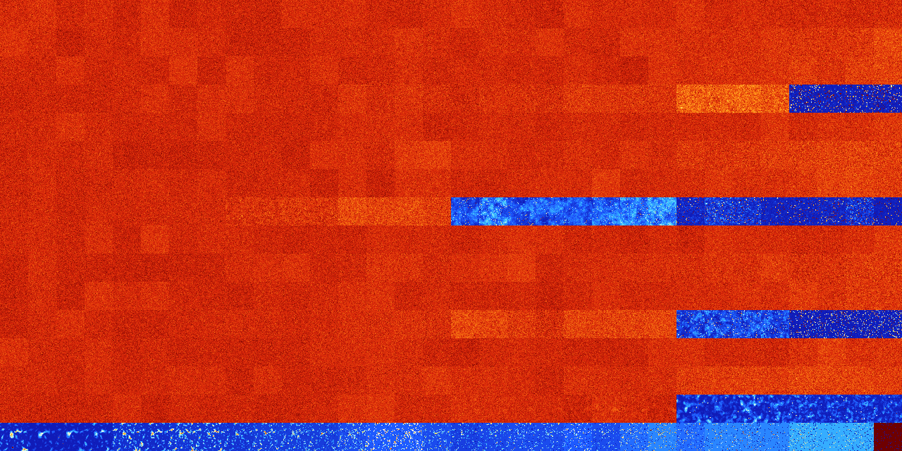

# B0367 (102912-103423)

<details>
    <summary>Initial Grid</summary>
    
</details>


<details>
    <summary>Initial Grid RLE</summary>

```
#C Exported from GoGoL (https://github.com/marrow16/gogol)
#C Wrap mode: Toroidal
#C Boundary mode: Dead
#C Step: 0
x = 100, y = 100, rule = B0367/S
bo20bo56bo12bo$39bo28bo6bo$12b2o22bo44bo3bo$2bo19bo9bo10bo2bo4bo5bo8bo
15bo$22bo8bo7bo16bo11bo3bo8bo$26b2o3bo35bobo10bobo$28bo25bo25bo$35bo58b
o$33bo18bo8bo13bo$bo4bo47bo2bo6bo12bo9bo$9bo13bo11bo34bo19bo$60bo37bo$
38bo17bobo$2bo37bobo$2bo2bo7bo15bo17bo25bo$2bo23bo57bo$29bo46bo5bo10bo$
31bo$48bo10bo$9bo27bo5bo21bo7bo23bo$bo14bo$7bo6bo11bo7bo$19bo40bo14bo
11bo$10bo2bo17bo24bo8bo$6bo69bo6bo12bo$4bo3bo52bo15bo17bo$o8bo17bobo7bo
bo9bo$13bobo11b2o10bo12bo10bobo7bo2bobo$50bo27bo10bo2bo6bo$8bo35bo15bob
o2bo$26bo42bo7bo7bo3bo$38bobo11bo7bo9bo19bo$13bo6bo13bo4bo16bo26b2o3bo
5bo$24bo11bo31bo5bo19bo$19bo19bo5bo7bo6bo6bo8bo22bo$32bo19bo3bo27bo$42b
o25bo3bo23bo$32bo15bo21bo14bo2bob2o$13bo24bo38bo6bo$8bo5bo$4bo31bo2bo4b
obo30bo4bo$5bo37bo7bo22bo$2bo10bo7bo11bo11bo45bo$19bo18b3o14bo2b3o6bo
25b2o$26bo20bo6bo$58bo9bobo15bo8bo$11bo23bo50bo$4bo20bo22bo11b2o$7bo14b
obo2bo28bo4bo$69bo24bo$10bo22bo4bo38bo$6bo41bo$11bo24b2o3bobo15bo17bo$
10bo27bo17bo19bo$46bo14bo4bo$41bo7bo9bo7bo$2bo4bo20bo26bo$31bo58bo$13bo
8bo14bo24bo2bo$4bo12bo49bo5bo8bo15bo$23bo27bo32bo$6bo27bo56bo$4bo38bo
12bo$11bo8bo5bo6bo13bo4bo22bo3bo$22bo33bo12bo12bo$25bo9bo28bo12bo9bo11b
o$13bo21bo40b2o20bo$3bo46bo24bo$4bo30bo17bo9bo18bo$20bo13bo30bo6bobo$o
19bo43bo33bo$24bo19bo13bobo$3bo3bo19bo33bo17bobo$21bo2b2o32bo25bo$6bo
43bo28bo9bo6bo$9bo2bo84bo$3bo23bo11bo11bo45bo$26bo17bo16bo6bo4bo6bo13bo
$45bo19bo6bo13bo$5bo32bo24bo2bo30bo$24bobo72bo$5bo2bo3bo63bo$18bo21bo6b
o13bo15bo11bo$bo18bo14bo23bo34bo3bo$33bo11bo11bo19bo9bo6bo$26bo34bo18bo
$43bo2bo10b2o7bo$6bo8bo8bo19bo2bo16bo$15bo4bo66bo$27bo50bo$41bo6bo5bo
27bo2bo9bo$15bo9b2o5bobo4bo39bobo6bo$24bobo4bo14bo11bo23bo$22bo59bo14bo
$18bo25bo27bo22bo$bo74bo7bo$13bo38bo2bo8bo8bo12bo7bo$10bo5bo3bo35bo24bo
12bo$5bo10bo17bo29bo$30bo9bo3bo30bo13bo7bo!
```
</details>
<details>
    <summary>Thumbnail</summary>

</details>
<table>
<tr>
    <td><a href="./102912%20S%20Heat%20Map%20Activity.png"></a><br>S (102912)<br>G>1000</td>    <td><a href="./102913%20S0%20Heat%20Map%20Activity.png"></a><br>S0 (102913)<br>G>1000</td>    <td><a href="./102914%20S1%20Heat%20Map%20Activity.png"></a><br>S1 (102914)<br>G>1000</td>    <td><a href="./102915%20S01%20Heat%20Map%20Activity.png"></a><br>S01 (102915)<br>G>1000</td>    <td><a href="./102916%20S2%20Heat%20Map%20Activity.png"></a><br>S2 (102916)<br>G>1000</td>    <td><a href="./102917%20S02%20Heat%20Map%20Activity.png"></a><br>S02 (102917)<br>G>1000</td>    <td><a href="./102918%20S12%20Heat%20Map%20Activity.png"></a><br>S12 (102918)<br>G>1000</td>    <td><a href="./102919%20S012%20Heat%20Map%20Activity.png"></a><br>S012 (102919)<br>G>1000</td>    <td><a href="./102920%20S3%20Heat%20Map%20Activity.png"></a><br>S3 (102920)<br>G>1000</td>    <td><a href="./102921%20S03%20Heat%20Map%20Activity.png"></a><br>S03 (102921)<br>G>1000</td>    <td><a href="./102922%20S13%20Heat%20Map%20Activity.png"></a><br>S13 (102922)<br>G>1000</td>    <td><a href="./102923%20S013%20Heat%20Map%20Activity.png"></a><br>S013 (102923)<br>G>1000</td>    <td><a href="./102924%20S23%20Heat%20Map%20Activity.png"></a><br>S23 (102924)<br>G>1000</td>    <td><a href="./102925%20S023%20Heat%20Map%20Activity.png"></a><br>S023 (102925)<br>G>1000</td>    <td><a href="./102926%20S123%20Heat%20Map%20Activity.png"></a><br>S123 (102926)<br>G>1000</td>    <td><a href="./102927%20S0123%20Heat%20Map%20Activity.png"></a><br>S0123 (102927)<br>G>1000</td>    <td><a href="./102928%20S4%20Heat%20Map%20Activity.png"></a><br>S4 (102928)<br>G>1000</td>    <td><a href="./102929%20S04%20Heat%20Map%20Activity.png"></a><br>S04 (102929)<br>G>1000</td>    <td><a href="./102930%20S14%20Heat%20Map%20Activity.png"></a><br>S14 (102930)<br>G>1000</td>    <td><a href="./102931%20S014%20Heat%20Map%20Activity.png"></a><br>S014 (102931)<br>G>1000</td>    <td><a href="./102932%20S24%20Heat%20Map%20Activity.png"></a><br>S24 (102932)<br>G>1000</td>    <td><a href="./102933%20S024%20Heat%20Map%20Activity.png"></a><br>S024 (102933)<br>G>1000</td>    <td><a href="./102934%20S124%20Heat%20Map%20Activity.png"></a><br>S124 (102934)<br>G>1000</td>    <td><a href="./102935%20S0124%20Heat%20Map%20Activity.png"></a><br>S0124 (102935)<br>G>1000</td>    <td><a href="./102936%20S34%20Heat%20Map%20Activity.png"></a><br>S34 (102936)<br>G>1000</td>    <td><a href="./102937%20S034%20Heat%20Map%20Activity.png"></a><br>S034 (102937)<br>G>1000</td>    <td><a href="./102938%20S134%20Heat%20Map%20Activity.png"></a><br>S134 (102938)<br>G>1000</td>    <td><a href="./102939%20S0134%20Heat%20Map%20Activity.png"></a><br>S0134 (102939)<br>G>1000</td>    <td><a href="./102940%20S234%20Heat%20Map%20Activity.png"></a><br>S234 (102940)<br>G>1000</td>    <td><a href="./102941%20S0234%20Heat%20Map%20Activity.png"></a><br>S0234 (102941)<br>G>1000</td>    <td><a href="./102942%20S1234%20Heat%20Map%20Activity.png"></a><br>S1234 (102942)<br>G>1000</td>    <td><a href="./102943%20S01234%20Heat%20Map%20Activity.png"></a><br>S01234 (102943)<br>G>1000</td></tr>
<tr>
    <td><a href="./102944%20S5%20Heat%20Map%20Activity.png"></a><br>S5 (102944)<br>G>1000</td>    <td><a href="./102945%20S05%20Heat%20Map%20Activity.png"></a><br>S05 (102945)<br>G>1000</td>    <td><a href="./102946%20S15%20Heat%20Map%20Activity.png"></a><br>S15 (102946)<br>G>1000</td>    <td><a href="./102947%20S015%20Heat%20Map%20Activity.png"></a><br>S015 (102947)<br>G>1000</td>    <td><a href="./102948%20S25%20Heat%20Map%20Activity.png"></a><br>S25 (102948)<br>G>1000</td>    <td><a href="./102949%20S025%20Heat%20Map%20Activity.png"></a><br>S025 (102949)<br>G>1000</td>    <td><a href="./102950%20S125%20Heat%20Map%20Activity.png"></a><br>S125 (102950)<br>G>1000</td>    <td><a href="./102951%20S0125%20Heat%20Map%20Activity.png"></a><br>S0125 (102951)<br>G>1000</td>    <td><a href="./102952%20S35%20Heat%20Map%20Activity.png"></a><br>S35 (102952)<br>G>1000</td>    <td><a href="./102953%20S035%20Heat%20Map%20Activity.png"></a><br>S035 (102953)<br>G>1000</td>    <td><a href="./102954%20S135%20Heat%20Map%20Activity.png"></a><br>S135 (102954)<br>G>1000</td>    <td><a href="./102955%20S0135%20Heat%20Map%20Activity.png"></a><br>S0135 (102955)<br>G>1000</td>    <td><a href="./102956%20S235%20Heat%20Map%20Activity.png"></a><br>S235 (102956)<br>G>1000</td>    <td><a href="./102957%20S0235%20Heat%20Map%20Activity.png"></a><br>S0235 (102957)<br>G>1000</td>    <td><a href="./102958%20S1235%20Heat%20Map%20Activity.png"></a><br>S1235 (102958)<br>G>1000</td>    <td><a href="./102959%20S01235%20Heat%20Map%20Activity.png"></a><br>S01235 (102959)<br>G>1000</td>    <td><a href="./102960%20S45%20Heat%20Map%20Activity.png"></a><br>S45 (102960)<br>G>1000</td>    <td><a href="./102961%20S045%20Heat%20Map%20Activity.png"></a><br>S045 (102961)<br>G>1000</td>    <td><a href="./102962%20S145%20Heat%20Map%20Activity.png"></a><br>S145 (102962)<br>G>1000</td>    <td><a href="./102963%20S0145%20Heat%20Map%20Activity.png"></a><br>S0145 (102963)<br>G>1000</td>    <td><a href="./102964%20S245%20Heat%20Map%20Activity.png"></a><br>S245 (102964)<br>G>1000</td>    <td><a href="./102965%20S0245%20Heat%20Map%20Activity.png"></a><br>S0245 (102965)<br>G>1000</td>    <td><a href="./102966%20S1245%20Heat%20Map%20Activity.png"></a><br>S1245 (102966)<br>G>1000</td>    <td><a href="./102967%20S01245%20Heat%20Map%20Activity.png"></a><br>S01245 (102967)<br>G>1000</td>    <td><a href="./102968%20S345%20Heat%20Map%20Activity.png"></a><br>S345 (102968)<br>G>1000</td>    <td><a href="./102969%20S0345%20Heat%20Map%20Activity.png"></a><br>S0345 (102969)<br>G>1000</td>    <td><a href="./102970%20S1345%20Heat%20Map%20Activity.png"></a><br>S1345 (102970)<br>G>1000</td>    <td><a href="./102971%20S01345%20Heat%20Map%20Activity.png"></a><br>S01345 (102971)<br>G>1000</td>    <td><a href="./102972%20S2345%20Heat%20Map%20Activity.png"></a><br>S2345 (102972)<br>G>1000</td>    <td><a href="./102973%20S02345%20Heat%20Map%20Activity.png"></a><br>S02345 (102973)<br>G>1000</td>    <td><a href="./102974%20S12345%20Heat%20Map%20Activity.png"></a><br>S12345 (102974)<br>G>1000</td>    <td><a href="./102975%20S012345%20Heat%20Map%20Activity.png"></a><br>S012345 (102975)<br>G>1000</td></tr>
<tr>
    <td><a href="./102976%20S6%20Heat%20Map%20Activity.png"></a><br>S6 (102976)<br>G>1000</td>    <td><a href="./102977%20S06%20Heat%20Map%20Activity.png"></a><br>S06 (102977)<br>G>1000</td>    <td><a href="./102978%20S16%20Heat%20Map%20Activity.png"></a><br>S16 (102978)<br>G>1000</td>    <td><a href="./102979%20S016%20Heat%20Map%20Activity.png"></a><br>S016 (102979)<br>G>1000</td>    <td><a href="./102980%20S26%20Heat%20Map%20Activity.png"></a><br>S26 (102980)<br>G>1000</td>    <td><a href="./102981%20S026%20Heat%20Map%20Activity.png"></a><br>S026 (102981)<br>G>1000</td>    <td><a href="./102982%20S126%20Heat%20Map%20Activity.png"></a><br>S126 (102982)<br>G>1000</td>    <td><a href="./102983%20S0126%20Heat%20Map%20Activity.png"></a><br>S0126 (102983)<br>G>1000</td>    <td><a href="./102984%20S36%20Heat%20Map%20Activity.png"></a><br>S36 (102984)<br>G>1000</td>    <td><a href="./102985%20S036%20Heat%20Map%20Activity.png"></a><br>S036 (102985)<br>G>1000</td>    <td><a href="./102986%20S136%20Heat%20Map%20Activity.png"></a><br>S136 (102986)<br>G>1000</td>    <td><a href="./102987%20S0136%20Heat%20Map%20Activity.png"></a><br>S0136 (102987)<br>G>1000</td>    <td><a href="./102988%20S236%20Heat%20Map%20Activity.png"></a><br>S236 (102988)<br>G>1000</td>    <td><a href="./102989%20S0236%20Heat%20Map%20Activity.png"></a><br>S0236 (102989)<br>G>1000</td>    <td><a href="./102990%20S1236%20Heat%20Map%20Activity.png"></a><br>S1236 (102990)<br>G>1000</td>    <td><a href="./102991%20S01236%20Heat%20Map%20Activity.png"></a><br>S01236 (102991)<br>G>1000</td>    <td><a href="./102992%20S46%20Heat%20Map%20Activity.png"></a><br>S46 (102992)<br>G>1000</td>    <td><a href="./102993%20S046%20Heat%20Map%20Activity.png"></a><br>S046 (102993)<br>G>1000</td>    <td><a href="./102994%20S146%20Heat%20Map%20Activity.png"></a><br>S146 (102994)<br>G>1000</td>    <td><a href="./102995%20S0146%20Heat%20Map%20Activity.png"></a><br>S0146 (102995)<br>G>1000</td>    <td><a href="./102996%20S246%20Heat%20Map%20Activity.png"></a><br>S246 (102996)<br>G>1000</td>    <td><a href="./102997%20S0246%20Heat%20Map%20Activity.png"></a><br>S0246 (102997)<br>G>1000</td>    <td><a href="./102998%20S1246%20Heat%20Map%20Activity.png"></a><br>S1246 (102998)<br>G>1000</td>    <td><a href="./102999%20S01246%20Heat%20Map%20Activity.png"></a><br>S01246 (102999)<br>G>1000</td>    <td><a href="./103000%20S346%20Heat%20Map%20Activity.png"></a><br>S346 (103000)<br>G>1000</td>    <td><a href="./103001%20S0346%20Heat%20Map%20Activity.png"></a><br>S0346 (103001)<br>G>1000</td>    <td><a href="./103002%20S1346%20Heat%20Map%20Activity.png"></a><br>S1346 (103002)<br>G>1000</td>    <td><a href="./103003%20S01346%20Heat%20Map%20Activity.png"></a><br>S01346 (103003)<br>G>1000</td>    <td><a href="./103004%20S2346%20Heat%20Map%20Activity.png"></a><br>S2346 (103004)<br>G>1000</td>    <td><a href="./103005%20S02346%20Heat%20Map%20Activity.png"></a><br>S02346 (103005)<br>G>1000</td>    <td><a href="./103006%20S12346%20Heat%20Map%20Activity.png"></a><br>S12346 (103006)<br>G>1000</td>    <td><a href="./103007%20S012346%20Heat%20Map%20Activity.png"></a><br>S012346 (103007)<br>G>1000</td></tr>
<tr>
    <td><a href="./103008%20S56%20Heat%20Map%20Activity.png"></a><br>S56 (103008)<br>G>1000</td>    <td><a href="./103009%20S056%20Heat%20Map%20Activity.png"></a><br>S056 (103009)<br>G>1000</td>    <td><a href="./103010%20S156%20Heat%20Map%20Activity.png"></a><br>S156 (103010)<br>G>1000</td>    <td><a href="./103011%20S0156%20Heat%20Map%20Activity.png"></a><br>S0156 (103011)<br>G>1000</td>    <td><a href="./103012%20S256%20Heat%20Map%20Activity.png"></a><br>S256 (103012)<br>G>1000</td>    <td><a href="./103013%20S0256%20Heat%20Map%20Activity.png"></a><br>S0256 (103013)<br>G>1000</td>    <td><a href="./103014%20S1256%20Heat%20Map%20Activity.png"></a><br>S1256 (103014)<br>G>1000</td>    <td><a href="./103015%20S01256%20Heat%20Map%20Activity.png"></a><br>S01256 (103015)<br>G>1000</td>    <td><a href="./103016%20S356%20Heat%20Map%20Activity.png"></a><br>S356 (103016)<br>G>1000</td>    <td><a href="./103017%20S0356%20Heat%20Map%20Activity.png"></a><br>S0356 (103017)<br>G>1000</td>    <td><a href="./103018%20S1356%20Heat%20Map%20Activity.png"></a><br>S1356 (103018)<br>G>1000</td>    <td><a href="./103019%20S01356%20Heat%20Map%20Activity.png"></a><br>S01356 (103019)<br>G>1000</td>    <td><a href="./103020%20S2356%20Heat%20Map%20Activity.png"></a><br>S2356 (103020)<br>G>1000</td>    <td><a href="./103021%20S02356%20Heat%20Map%20Activity.png"></a><br>S02356 (103021)<br>G>1000</td>    <td><a href="./103022%20S12356%20Heat%20Map%20Activity.png"></a><br>S12356 (103022)<br>G>1000</td>    <td><a href="./103023%20S012356%20Heat%20Map%20Activity.png"></a><br>S012356 (103023)<br>G>1000</td>    <td><a href="./103024%20S456%20Heat%20Map%20Activity.png"></a><br>S456 (103024)<br>G>1000</td>    <td><a href="./103025%20S0456%20Heat%20Map%20Activity.png"></a><br>S0456 (103025)<br>G>1000</td>    <td><a href="./103026%20S1456%20Heat%20Map%20Activity.png"></a><br>S1456 (103026)<br>G>1000</td>    <td><a href="./103027%20S01456%20Heat%20Map%20Activity.png"></a><br>S01456 (103027)<br>G>1000</td>    <td><a href="./103028%20S2456%20Heat%20Map%20Activity.png"></a><br>S2456 (103028)<br>G>1000</td>    <td><a href="./103029%20S02456%20Heat%20Map%20Activity.png"></a><br>S02456 (103029)<br>G>1000</td>    <td><a href="./103030%20S12456%20Heat%20Map%20Activity.png"></a><br>S12456 (103030)<br>G>1000</td>    <td><a href="./103031%20S012456%20Heat%20Map%20Activity.png"></a><br>S012456 (103031)<br>G>1000</td>    <td><a href="./103032%20S3456%20Heat%20Map%20Activity.png"></a><br>S3456 (103032)<br>G>1000</td>    <td><a href="./103033%20S03456%20Heat%20Map%20Activity.png"></a><br>S03456 (103033)<br>G>1000</td>    <td><a href="./103034%20S13456%20Heat%20Map%20Activity.png"></a><br>S13456 (103034)<br>G>1000</td>    <td><a href="./103035%20S013456%20Heat%20Map%20Activity.png"></a><br>S013456 (103035)<br>G>1000</td>    <td><a href="./103036%20S23456%20Heat%20Map%20Activity.png"></a><br>S23456 (103036)<br>G>1000</td>    <td><a href="./103037%20S023456%20Heat%20Map%20Activity.png"></a><br>S023456 (103037)<br>G>1000</td>    <td><a href="./103038%20S123456%20Heat%20Map%20Activity.png"></a><br>S123456 (103038)<br>G>1000</td>    <td><a href="./103039%20S0123456%20Heat%20Map%20Activity.png"></a><br>S0123456 (103039)<br>G>1000</td></tr>
<tr>
    <td><a href="./103040%20S7%20Heat%20Map%20Activity.png"></a><br>S7 (103040)<br>G>1000</td>    <td><a href="./103041%20S07%20Heat%20Map%20Activity.png"></a><br>S07 (103041)<br>G>1000</td>    <td><a href="./103042%20S17%20Heat%20Map%20Activity.png"></a><br>S17 (103042)<br>G>1000</td>    <td><a href="./103043%20S017%20Heat%20Map%20Activity.png"></a><br>S017 (103043)<br>G>1000</td>    <td><a href="./103044%20S27%20Heat%20Map%20Activity.png"></a><br>S27 (103044)<br>G>1000</td>    <td><a href="./103045%20S027%20Heat%20Map%20Activity.png"></a><br>S027 (103045)<br>G>1000</td>    <td><a href="./103046%20S127%20Heat%20Map%20Activity.png"></a><br>S127 (103046)<br>G>1000</td>    <td><a href="./103047%20S0127%20Heat%20Map%20Activity.png"></a><br>S0127 (103047)<br>G>1000</td>    <td><a href="./103048%20S37%20Heat%20Map%20Activity.png"></a><br>S37 (103048)<br>G>1000</td>    <td><a href="./103049%20S037%20Heat%20Map%20Activity.png"></a><br>S037 (103049)<br>G>1000</td>    <td><a href="./103050%20S137%20Heat%20Map%20Activity.png"></a><br>S137 (103050)<br>G>1000</td>    <td><a href="./103051%20S0137%20Heat%20Map%20Activity.png"></a><br>S0137 (103051)<br>G>1000</td>    <td><a href="./103052%20S237%20Heat%20Map%20Activity.png"></a><br>S237 (103052)<br>G>1000</td>    <td><a href="./103053%20S0237%20Heat%20Map%20Activity.png"></a><br>S0237 (103053)<br>G>1000</td>    <td><a href="./103054%20S1237%20Heat%20Map%20Activity.png"></a><br>S1237 (103054)<br>G>1000</td>    <td><a href="./103055%20S01237%20Heat%20Map%20Activity.png"></a><br>S01237 (103055)<br>G>1000</td>    <td><a href="./103056%20S47%20Heat%20Map%20Activity.png"></a><br>S47 (103056)<br>G>1000</td>    <td><a href="./103057%20S047%20Heat%20Map%20Activity.png"></a><br>S047 (103057)<br>G>1000</td>    <td><a href="./103058%20S147%20Heat%20Map%20Activity.png"></a><br>S147 (103058)<br>G>1000</td>    <td><a href="./103059%20S0147%20Heat%20Map%20Activity.png"></a><br>S0147 (103059)<br>G>1000</td>    <td><a href="./103060%20S247%20Heat%20Map%20Activity.png"></a><br>S247 (103060)<br>G>1000</td>    <td><a href="./103061%20S0247%20Heat%20Map%20Activity.png"></a><br>S0247 (103061)<br>G>1000</td>    <td><a href="./103062%20S1247%20Heat%20Map%20Activity.png"></a><br>S1247 (103062)<br>G>1000</td>    <td><a href="./103063%20S01247%20Heat%20Map%20Activity.png"></a><br>S01247 (103063)<br>G>1000</td>    <td><a href="./103064%20S347%20Heat%20Map%20Activity.png"></a><br>S347 (103064)<br>G>1000</td>    <td><a href="./103065%20S0347%20Heat%20Map%20Activity.png"></a><br>S0347 (103065)<br>G>1000</td>    <td><a href="./103066%20S1347%20Heat%20Map%20Activity.png"></a><br>S1347 (103066)<br>G>1000</td>    <td><a href="./103067%20S01347%20Heat%20Map%20Activity.png"></a><br>S01347 (103067)<br>G>1000</td>    <td><a href="./103068%20S2347%20Heat%20Map%20Activity.png"></a><br>S2347 (103068)<br>G>1000</td>    <td><a href="./103069%20S02347%20Heat%20Map%20Activity.png"></a><br>S02347 (103069)<br>G>1000</td>    <td><a href="./103070%20S12347%20Heat%20Map%20Activity.png"></a><br>S12347 (103070)<br>G>1000</td>    <td><a href="./103071%20S012347%20Heat%20Map%20Activity.png"></a><br>S012347 (103071)<br>G>1000</td></tr>
<tr>
    <td><a href="./103072%20S57%20Heat%20Map%20Activity.png"></a><br>S57 (103072)<br>G>1000</td>    <td><a href="./103073%20S057%20Heat%20Map%20Activity.png"></a><br>S057 (103073)<br>G>1000</td>    <td><a href="./103074%20S157%20Heat%20Map%20Activity.png"></a><br>S157 (103074)<br>G>1000</td>    <td><a href="./103075%20S0157%20Heat%20Map%20Activity.png"></a><br>S0157 (103075)<br>G>1000</td>    <td><a href="./103076%20S257%20Heat%20Map%20Activity.png"></a><br>S257 (103076)<br>G>1000</td>    <td><a href="./103077%20S0257%20Heat%20Map%20Activity.png"></a><br>S0257 (103077)<br>G>1000</td>    <td><a href="./103078%20S1257%20Heat%20Map%20Activity.png"></a><br>S1257 (103078)<br>G>1000</td>    <td><a href="./103079%20S01257%20Heat%20Map%20Activity.png"></a><br>S01257 (103079)<br>G>1000</td>    <td><a href="./103080%20S357%20Heat%20Map%20Activity.png"></a><br>S357 (103080)<br>G>1000</td>    <td><a href="./103081%20S0357%20Heat%20Map%20Activity.png"></a><br>S0357 (103081)<br>G>1000</td>    <td><a href="./103082%20S1357%20Heat%20Map%20Activity.png"></a><br>S1357 (103082)<br>G>1000</td>    <td><a href="./103083%20S01357%20Heat%20Map%20Activity.png"></a><br>S01357 (103083)<br>G>1000</td>    <td><a href="./103084%20S2357%20Heat%20Map%20Activity.png"></a><br>S2357 (103084)<br>G>1000</td>    <td><a href="./103085%20S02357%20Heat%20Map%20Activity.png"></a><br>S02357 (103085)<br>G>1000</td>    <td><a href="./103086%20S12357%20Heat%20Map%20Activity.png"></a><br>S12357 (103086)<br>G>1000</td>    <td><a href="./103087%20S012357%20Heat%20Map%20Activity.png"></a><br>S012357 (103087)<br>G>1000</td>    <td><a href="./103088%20S457%20Heat%20Map%20Activity.png"></a><br>S457 (103088)<br>G>1000</td>    <td><a href="./103089%20S0457%20Heat%20Map%20Activity.png"></a><br>S0457 (103089)<br>G>1000</td>    <td><a href="./103090%20S1457%20Heat%20Map%20Activity.png"></a><br>S1457 (103090)<br>G>1000</td>    <td><a href="./103091%20S01457%20Heat%20Map%20Activity.png"></a><br>S01457 (103091)<br>G>1000</td>    <td><a href="./103092%20S2457%20Heat%20Map%20Activity.png"></a><br>S2457 (103092)<br>G>1000</td>    <td><a href="./103093%20S02457%20Heat%20Map%20Activity.png"></a><br>S02457 (103093)<br>G>1000</td>    <td><a href="./103094%20S12457%20Heat%20Map%20Activity.png"></a><br>S12457 (103094)<br>G>1000</td>    <td><a href="./103095%20S012457%20Heat%20Map%20Activity.png"></a><br>S012457 (103095)<br>G>1000</td>    <td><a href="./103096%20S3457%20Heat%20Map%20Activity.png"></a><br>S3457 (103096)<br>G>1000</td>    <td><a href="./103097%20S03457%20Heat%20Map%20Activity.png"></a><br>S03457 (103097)<br>G>1000</td>    <td><a href="./103098%20S13457%20Heat%20Map%20Activity.png"></a><br>S13457 (103098)<br>G>1000</td>    <td><a href="./103099%20S013457%20Heat%20Map%20Activity.png"></a><br>S013457 (103099)<br>G>1000</td>    <td><a href="./103100%20S23457%20Heat%20Map%20Activity.png"></a><br>S23457 (103100)<br>G>1000</td>    <td><a href="./103101%20S023457%20Heat%20Map%20Activity.png"></a><br>S023457 (103101)<br>G>1000</td>    <td><a href="./103102%20S123457%20Heat%20Map%20Activity.png"></a><br>S123457 (103102)<br>G>1000</td>    <td><a href="./103103%20S0123457%20Heat%20Map%20Activity.png"></a><br>S0123457 (103103)<br>G>1000</td></tr>
<tr>
    <td><a href="./103104%20S67%20Heat%20Map%20Activity.png"></a><br>S67 (103104)<br>G>1000</td>    <td><a href="./103105%20S067%20Heat%20Map%20Activity.png"></a><br>S067 (103105)<br>G>1000</td>    <td><a href="./103106%20S167%20Heat%20Map%20Activity.png"></a><br>S167 (103106)<br>G>1000</td>    <td><a href="./103107%20S0167%20Heat%20Map%20Activity.png"></a><br>S0167 (103107)<br>G>1000</td>    <td><a href="./103108%20S267%20Heat%20Map%20Activity.png"></a><br>S267 (103108)<br>G>1000</td>    <td><a href="./103109%20S0267%20Heat%20Map%20Activity.png"></a><br>S0267 (103109)<br>G>1000</td>    <td><a href="./103110%20S1267%20Heat%20Map%20Activity.png"></a><br>S1267 (103110)<br>G>1000</td>    <td><a href="./103111%20S01267%20Heat%20Map%20Activity.png"></a><br>S01267 (103111)<br>G>1000</td>    <td><a href="./103112%20S367%20Heat%20Map%20Activity.png"></a><br>S367 (103112)<br>G>1000</td>    <td><a href="./103113%20S0367%20Heat%20Map%20Activity.png"></a><br>S0367 (103113)<br>G>1000</td>    <td><a href="./103114%20S1367%20Heat%20Map%20Activity.png"></a><br>S1367 (103114)<br>G>1000</td>    <td><a href="./103115%20S01367%20Heat%20Map%20Activity.png"></a><br>S01367 (103115)<br>G>1000</td>    <td><a href="./103116%20S2367%20Heat%20Map%20Activity.png"></a><br>S2367 (103116)<br>G>1000</td>    <td><a href="./103117%20S02367%20Heat%20Map%20Activity.png"></a><br>S02367 (103117)<br>G>1000</td>    <td><a href="./103118%20S12367%20Heat%20Map%20Activity.png"></a><br>S12367 (103118)<br>G>1000</td>    <td><a href="./103119%20S012367%20Heat%20Map%20Activity.png"></a><br>S012367 (103119)<br>G>1000</td>    <td><a href="./103120%20S467%20Heat%20Map%20Activity.png"></a><br>S467 (103120)<br>G>1000</td>    <td><a href="./103121%20S0467%20Heat%20Map%20Activity.png"></a><br>S0467 (103121)<br>G>1000</td>    <td><a href="./103122%20S1467%20Heat%20Map%20Activity.png"></a><br>S1467 (103122)<br>G>1000</td>    <td><a href="./103123%20S01467%20Heat%20Map%20Activity.png"></a><br>S01467 (103123)<br>G>1000</td>    <td><a href="./103124%20S2467%20Heat%20Map%20Activity.png"></a><br>S2467 (103124)<br>G>1000</td>    <td><a href="./103125%20S02467%20Heat%20Map%20Activity.png"></a><br>S02467 (103125)<br>G>1000</td>    <td><a href="./103126%20S12467%20Heat%20Map%20Activity.png"></a><br>S12467 (103126)<br>G>1000</td>    <td><a href="./103127%20S012467%20Heat%20Map%20Activity.png"></a><br>S012467 (103127)<br>G>1000</td>    <td><a href="./103128%20S3467%20Heat%20Map%20Activity.png"></a><br>S3467 (103128)<br>G>1000</td>    <td><a href="./103129%20S03467%20Heat%20Map%20Activity.png"></a><br>S03467 (103129)<br>G>1000</td>    <td><a href="./103130%20S13467%20Heat%20Map%20Activity.png"></a><br>S13467 (103130)<br>G>1000</td>    <td><a href="./103131%20S013467%20Heat%20Map%20Activity.png"></a><br>S013467 (103131)<br>G>1000</td>    <td><a href="./103132%20S23467%20Heat%20Map%20Activity.png"></a><br>S23467 (103132)<br>G>1000</td>    <td><a href="./103133%20S023467%20Heat%20Map%20Activity.png"></a><br>S023467 (103133)<br>G>1000</td>    <td><a href="./103134%20S123467%20Heat%20Map%20Activity.png"></a><br>S123467 (103134)<br>G>1000</td>    <td><a href="./103135%20S0123467%20Heat%20Map%20Activity.png"></a><br>S0123467 (103135)<br>G>1000</td></tr>
<tr>
    <td><a href="./103136%20S567%20Heat%20Map%20Activity.png"></a><br>S567 (103136)<br>G>1000</td>    <td><a href="./103137%20S0567%20Heat%20Map%20Activity.png"></a><br>S0567 (103137)<br>G>1000</td>    <td><a href="./103138%20S1567%20Heat%20Map%20Activity.png"></a><br>S1567 (103138)<br>G>1000</td>    <td><a href="./103139%20S01567%20Heat%20Map%20Activity.png"></a><br>S01567 (103139)<br>G>1000</td>    <td><a href="./103140%20S2567%20Heat%20Map%20Activity.png"></a><br>S2567 (103140)<br>G>1000</td>    <td><a href="./103141%20S02567%20Heat%20Map%20Activity.png"></a><br>S02567 (103141)<br>G>1000</td>    <td><a href="./103142%20S12567%20Heat%20Map%20Activity.png"></a><br>S12567 (103142)<br>G>1000</td>    <td><a href="./103143%20S012567%20Heat%20Map%20Activity.png"></a><br>S012567 (103143)<br>G>1000</td>    <td><a href="./103144%20S3567%20Heat%20Map%20Activity.png"></a><br>S3567 (103144)<br>G>1000</td>    <td><a href="./103145%20S03567%20Heat%20Map%20Activity.png"></a><br>S03567 (103145)<br>G>1000</td>    <td><a href="./103146%20S13567%20Heat%20Map%20Activity.png"></a><br>S13567 (103146)<br>G>1000</td>    <td><a href="./103147%20S013567%20Heat%20Map%20Activity.png"></a><br>S013567 (103147)<br>G>1000</td>    <td><a href="./103148%20S23567%20Heat%20Map%20Activity.png"></a><br>S23567 (103148)<br>G>1000</td>    <td><a href="./103149%20S023567%20Heat%20Map%20Activity.png"></a><br>S023567 (103149)<br>G>1000</td>    <td><a href="./103150%20S123567%20Heat%20Map%20Activity.png"></a><br>S123567 (103150)<br>G>1000</td>    <td><a href="./103151%20S0123567%20Heat%20Map%20Activity.png"></a><br>S0123567 (103151)<br>G>1000</td>    <td><a href="./103152%20S4567%20Heat%20Map%20Activity.png"></a><br>S4567 (103152)<br>G>1000</td>    <td><a href="./103153%20S04567%20Heat%20Map%20Activity.png"></a><br>S04567 (103153)<br>G>1000</td>    <td><a href="./103154%20S14567%20Heat%20Map%20Activity.png"></a><br>S14567 (103154)<br>G>1000</td>    <td><a href="./103155%20S014567%20Heat%20Map%20Activity.png"></a><br>S014567 (103155)<br>G>1000</td>    <td><a href="./103156%20S24567%20Heat%20Map%20Activity.png"></a><br>S24567 (103156)<br>G>1000</td>    <td><a href="./103157%20S024567%20Heat%20Map%20Activity.png"></a><br>S024567 (103157)<br>G>1000</td>    <td><a href="./103158%20S124567%20Heat%20Map%20Activity.png"></a><br>S124567 (103158)<br>G>1000</td>    <td><a href="./103159%20S0124567%20Heat%20Map%20Activity.png"></a><br>S0124567 (103159)<br>G>1000</td>    <td><a href="./103160%20S34567%20Heat%20Map%20Activity.png"></a><br>S34567 (103160)<br>R@94,p60</td>    <td><a href="./103161%20S034567%20Heat%20Map%20Activity.png"></a><br>S034567 (103161)<br>R@55,p12</td>    <td><a href="./103162%20S134567%20Heat%20Map%20Activity.png"></a><br>S134567 (103162)<br>R@53,p24</td>    <td><a href="./103163%20S0134567%20Heat%20Map%20Activity.png"></a><br>S0134567 (103163)<br>R@164,p120</td>    <td><a href="./103164%20S234567%20Heat%20Map%20Activity.png"></a><br>S234567 (103164)<br>R@111,p84</td>    <td><a href="./103165%20S0234567%20Heat%20Map%20Activity.png"></a><br>S0234567 (103165)<br>R@115,p84</td>    <td><a href="./103166%20S1234567%20Heat%20Map%20Activity.png"></a><br>S1234567 (103166)<br>R@47,p12</td>    <td><a href="./103167%20S01234567%20Heat%20Map%20Activity.png"></a><br>S01234567 (103167)<br>R@241,p210</td></tr>
<tr>
    <td><a href="./103168%20S8%20Heat%20Map%20Activity.png"></a><br>S8 (103168)<br>G>1000</td>    <td><a href="./103169%20S08%20Heat%20Map%20Activity.png"></a><br>S08 (103169)<br>G>1000</td>    <td><a href="./103170%20S18%20Heat%20Map%20Activity.png"></a><br>S18 (103170)<br>G>1000</td>    <td><a href="./103171%20S018%20Heat%20Map%20Activity.png"></a><br>S018 (103171)<br>G>1000</td>    <td><a href="./103172%20S28%20Heat%20Map%20Activity.png"></a><br>S28 (103172)<br>G>1000</td>    <td><a href="./103173%20S028%20Heat%20Map%20Activity.png"></a><br>S028 (103173)<br>G>1000</td>    <td><a href="./103174%20S128%20Heat%20Map%20Activity.png"></a><br>S128 (103174)<br>G>1000</td>    <td><a href="./103175%20S0128%20Heat%20Map%20Activity.png"></a><br>S0128 (103175)<br>G>1000</td>    <td><a href="./103176%20S38%20Heat%20Map%20Activity.png"></a><br>S38 (103176)<br>G>1000</td>    <td><a href="./103177%20S038%20Heat%20Map%20Activity.png"></a><br>S038 (103177)<br>G>1000</td>    <td><a href="./103178%20S138%20Heat%20Map%20Activity.png"></a><br>S138 (103178)<br>G>1000</td>    <td><a href="./103179%20S0138%20Heat%20Map%20Activity.png"></a><br>S0138 (103179)<br>G>1000</td>    <td><a href="./103180%20S238%20Heat%20Map%20Activity.png"></a><br>S238 (103180)<br>G>1000</td>    <td><a href="./103181%20S0238%20Heat%20Map%20Activity.png"></a><br>S0238 (103181)<br>G>1000</td>    <td><a href="./103182%20S1238%20Heat%20Map%20Activity.png"></a><br>S1238 (103182)<br>G>1000</td>    <td><a href="./103183%20S01238%20Heat%20Map%20Activity.png"></a><br>S01238 (103183)<br>G>1000</td>    <td><a href="./103184%20S48%20Heat%20Map%20Activity.png"></a><br>S48 (103184)<br>G>1000</td>    <td><a href="./103185%20S048%20Heat%20Map%20Activity.png"></a><br>S048 (103185)<br>G>1000</td>    <td><a href="./103186%20S148%20Heat%20Map%20Activity.png"></a><br>S148 (103186)<br>G>1000</td>    <td><a href="./103187%20S0148%20Heat%20Map%20Activity.png"></a><br>S0148 (103187)<br>G>1000</td>    <td><a href="./103188%20S248%20Heat%20Map%20Activity.png"></a><br>S248 (103188)<br>G>1000</td>    <td><a href="./103189%20S0248%20Heat%20Map%20Activity.png"></a><br>S0248 (103189)<br>G>1000</td>    <td><a href="./103190%20S1248%20Heat%20Map%20Activity.png"></a><br>S1248 (103190)<br>G>1000</td>    <td><a href="./103191%20S01248%20Heat%20Map%20Activity.png"></a><br>S01248 (103191)<br>G>1000</td>    <td><a href="./103192%20S348%20Heat%20Map%20Activity.png"></a><br>S348 (103192)<br>G>1000</td>    <td><a href="./103193%20S0348%20Heat%20Map%20Activity.png"></a><br>S0348 (103193)<br>G>1000</td>    <td><a href="./103194%20S1348%20Heat%20Map%20Activity.png"></a><br>S1348 (103194)<br>G>1000</td>    <td><a href="./103195%20S01348%20Heat%20Map%20Activity.png"></a><br>S01348 (103195)<br>G>1000</td>    <td><a href="./103196%20S2348%20Heat%20Map%20Activity.png"></a><br>S2348 (103196)<br>G>1000</td>    <td><a href="./103197%20S02348%20Heat%20Map%20Activity.png"></a><br>S02348 (103197)<br>G>1000</td>    <td><a href="./103198%20S12348%20Heat%20Map%20Activity.png"></a><br>S12348 (103198)<br>G>1000</td>    <td><a href="./103199%20S012348%20Heat%20Map%20Activity.png"></a><br>S012348 (103199)<br>G>1000</td></tr>
<tr>
    <td><a href="./103200%20S58%20Heat%20Map%20Activity.png"></a><br>S58 (103200)<br>G>1000</td>    <td><a href="./103201%20S058%20Heat%20Map%20Activity.png"></a><br>S058 (103201)<br>G>1000</td>    <td><a href="./103202%20S158%20Heat%20Map%20Activity.png"></a><br>S158 (103202)<br>G>1000</td>    <td><a href="./103203%20S0158%20Heat%20Map%20Activity.png"></a><br>S0158 (103203)<br>G>1000</td>    <td><a href="./103204%20S258%20Heat%20Map%20Activity.png"></a><br>S258 (103204)<br>G>1000</td>    <td><a href="./103205%20S0258%20Heat%20Map%20Activity.png"></a><br>S0258 (103205)<br>G>1000</td>    <td><a href="./103206%20S1258%20Heat%20Map%20Activity.png"></a><br>S1258 (103206)<br>G>1000</td>    <td><a href="./103207%20S01258%20Heat%20Map%20Activity.png"></a><br>S01258 (103207)<br>G>1000</td>    <td><a href="./103208%20S358%20Heat%20Map%20Activity.png"></a><br>S358 (103208)<br>G>1000</td>    <td><a href="./103209%20S0358%20Heat%20Map%20Activity.png"></a><br>S0358 (103209)<br>G>1000</td>    <td><a href="./103210%20S1358%20Heat%20Map%20Activity.png"></a><br>S1358 (103210)<br>G>1000</td>    <td><a href="./103211%20S01358%20Heat%20Map%20Activity.png"></a><br>S01358 (103211)<br>G>1000</td>    <td><a href="./103212%20S2358%20Heat%20Map%20Activity.png"></a><br>S2358 (103212)<br>G>1000</td>    <td><a href="./103213%20S02358%20Heat%20Map%20Activity.png"></a><br>S02358 (103213)<br>G>1000</td>    <td><a href="./103214%20S12358%20Heat%20Map%20Activity.png"></a><br>S12358 (103214)<br>G>1000</td>    <td><a href="./103215%20S012358%20Heat%20Map%20Activity.png"></a><br>S012358 (103215)<br>G>1000</td>    <td><a href="./103216%20S458%20Heat%20Map%20Activity.png"></a><br>S458 (103216)<br>G>1000</td>    <td><a href="./103217%20S0458%20Heat%20Map%20Activity.png"></a><br>S0458 (103217)<br>G>1000</td>    <td><a href="./103218%20S1458%20Heat%20Map%20Activity.png"></a><br>S1458 (103218)<br>G>1000</td>    <td><a href="./103219%20S01458%20Heat%20Map%20Activity.png"></a><br>S01458 (103219)<br>G>1000</td>    <td><a href="./103220%20S2458%20Heat%20Map%20Activity.png"></a><br>S2458 (103220)<br>G>1000</td>    <td><a href="./103221%20S02458%20Heat%20Map%20Activity.png"></a><br>S02458 (103221)<br>G>1000</td>    <td><a href="./103222%20S12458%20Heat%20Map%20Activity.png"></a><br>S12458 (103222)<br>G>1000</td>    <td><a href="./103223%20S012458%20Heat%20Map%20Activity.png"></a><br>S012458 (103223)<br>G>1000</td>    <td><a href="./103224%20S3458%20Heat%20Map%20Activity.png"></a><br>S3458 (103224)<br>G>1000</td>    <td><a href="./103225%20S03458%20Heat%20Map%20Activity.png"></a><br>S03458 (103225)<br>G>1000</td>    <td><a href="./103226%20S13458%20Heat%20Map%20Activity.png"></a><br>S13458 (103226)<br>G>1000</td>    <td><a href="./103227%20S013458%20Heat%20Map%20Activity.png"></a><br>S013458 (103227)<br>G>1000</td>    <td><a href="./103228%20S23458%20Heat%20Map%20Activity.png"></a><br>S23458 (103228)<br>G>1000</td>    <td><a href="./103229%20S023458%20Heat%20Map%20Activity.png"></a><br>S023458 (103229)<br>G>1000</td>    <td><a href="./103230%20S123458%20Heat%20Map%20Activity.png"></a><br>S123458 (103230)<br>G>1000</td>    <td><a href="./103231%20S0123458%20Heat%20Map%20Activity.png"></a><br>S0123458 (103231)<br>G>1000</td></tr>
<tr>
    <td><a href="./103232%20S68%20Heat%20Map%20Activity.png"></a><br>S68 (103232)<br>G>1000</td>    <td><a href="./103233%20S068%20Heat%20Map%20Activity.png"></a><br>S068 (103233)<br>G>1000</td>    <td><a href="./103234%20S168%20Heat%20Map%20Activity.png"></a><br>S168 (103234)<br>G>1000</td>    <td><a href="./103235%20S0168%20Heat%20Map%20Activity.png"></a><br>S0168 (103235)<br>G>1000</td>    <td><a href="./103236%20S268%20Heat%20Map%20Activity.png"></a><br>S268 (103236)<br>G>1000</td>    <td><a href="./103237%20S0268%20Heat%20Map%20Activity.png"></a><br>S0268 (103237)<br>G>1000</td>    <td><a href="./103238%20S1268%20Heat%20Map%20Activity.png"></a><br>S1268 (103238)<br>G>1000</td>    <td><a href="./103239%20S01268%20Heat%20Map%20Activity.png"></a><br>S01268 (103239)<br>G>1000</td>    <td><a href="./103240%20S368%20Heat%20Map%20Activity.png"></a><br>S368 (103240)<br>G>1000</td>    <td><a href="./103241%20S0368%20Heat%20Map%20Activity.png"></a><br>S0368 (103241)<br>G>1000</td>    <td><a href="./103242%20S1368%20Heat%20Map%20Activity.png"></a><br>S1368 (103242)<br>G>1000</td>    <td><a href="./103243%20S01368%20Heat%20Map%20Activity.png"></a><br>S01368 (103243)<br>G>1000</td>    <td><a href="./103244%20S2368%20Heat%20Map%20Activity.png"></a><br>S2368 (103244)<br>G>1000</td>    <td><a href="./103245%20S02368%20Heat%20Map%20Activity.png"></a><br>S02368 (103245)<br>G>1000</td>    <td><a href="./103246%20S12368%20Heat%20Map%20Activity.png"></a><br>S12368 (103246)<br>G>1000</td>    <td><a href="./103247%20S012368%20Heat%20Map%20Activity.png"></a><br>S012368 (103247)<br>G>1000</td>    <td><a href="./103248%20S468%20Heat%20Map%20Activity.png"></a><br>S468 (103248)<br>G>1000</td>    <td><a href="./103249%20S0468%20Heat%20Map%20Activity.png"></a><br>S0468 (103249)<br>G>1000</td>    <td><a href="./103250%20S1468%20Heat%20Map%20Activity.png"></a><br>S1468 (103250)<br>G>1000</td>    <td><a href="./103251%20S01468%20Heat%20Map%20Activity.png"></a><br>S01468 (103251)<br>G>1000</td>    <td><a href="./103252%20S2468%20Heat%20Map%20Activity.png"></a><br>S2468 (103252)<br>G>1000</td>    <td><a href="./103253%20S02468%20Heat%20Map%20Activity.png"></a><br>S02468 (103253)<br>G>1000</td>    <td><a href="./103254%20S12468%20Heat%20Map%20Activity.png"></a><br>S12468 (103254)<br>G>1000</td>    <td><a href="./103255%20S012468%20Heat%20Map%20Activity.png"></a><br>S012468 (103255)<br>G>1000</td>    <td><a href="./103256%20S3468%20Heat%20Map%20Activity.png"></a><br>S3468 (103256)<br>G>1000</td>    <td><a href="./103257%20S03468%20Heat%20Map%20Activity.png"></a><br>S03468 (103257)<br>G>1000</td>    <td><a href="./103258%20S13468%20Heat%20Map%20Activity.png"></a><br>S13468 (103258)<br>G>1000</td>    <td><a href="./103259%20S013468%20Heat%20Map%20Activity.png"></a><br>S013468 (103259)<br>G>1000</td>    <td><a href="./103260%20S23468%20Heat%20Map%20Activity.png"></a><br>S23468 (103260)<br>G>1000</td>    <td><a href="./103261%20S023468%20Heat%20Map%20Activity.png"></a><br>S023468 (103261)<br>G>1000</td>    <td><a href="./103262%20S123468%20Heat%20Map%20Activity.png"></a><br>S123468 (103262)<br>G>1000</td>    <td><a href="./103263%20S0123468%20Heat%20Map%20Activity.png"></a><br>S0123468 (103263)<br>G>1000</td></tr>
<tr>
    <td><a href="./103264%20S568%20Heat%20Map%20Activity.png"></a><br>S568 (103264)<br>G>1000</td>    <td><a href="./103265%20S0568%20Heat%20Map%20Activity.png"></a><br>S0568 (103265)<br>G>1000</td>    <td><a href="./103266%20S1568%20Heat%20Map%20Activity.png"></a><br>S1568 (103266)<br>G>1000</td>    <td><a href="./103267%20S01568%20Heat%20Map%20Activity.png"></a><br>S01568 (103267)<br>G>1000</td>    <td><a href="./103268%20S2568%20Heat%20Map%20Activity.png"></a><br>S2568 (103268)<br>G>1000</td>    <td><a href="./103269%20S02568%20Heat%20Map%20Activity.png"></a><br>S02568 (103269)<br>G>1000</td>    <td><a href="./103270%20S12568%20Heat%20Map%20Activity.png"></a><br>S12568 (103270)<br>G>1000</td>    <td><a href="./103271%20S012568%20Heat%20Map%20Activity.png"></a><br>S012568 (103271)<br>G>1000</td>    <td><a href="./103272%20S3568%20Heat%20Map%20Activity.png"></a><br>S3568 (103272)<br>G>1000</td>    <td><a href="./103273%20S03568%20Heat%20Map%20Activity.png"></a><br>S03568 (103273)<br>G>1000</td>    <td><a href="./103274%20S13568%20Heat%20Map%20Activity.png"></a><br>S13568 (103274)<br>G>1000</td>    <td><a href="./103275%20S013568%20Heat%20Map%20Activity.png"></a><br>S013568 (103275)<br>G>1000</td>    <td><a href="./103276%20S23568%20Heat%20Map%20Activity.png"></a><br>S23568 (103276)<br>G>1000</td>    <td><a href="./103277%20S023568%20Heat%20Map%20Activity.png"></a><br>S023568 (103277)<br>G>1000</td>    <td><a href="./103278%20S123568%20Heat%20Map%20Activity.png"></a><br>S123568 (103278)<br>G>1000</td>    <td><a href="./103279%20S0123568%20Heat%20Map%20Activity.png"></a><br>S0123568 (103279)<br>G>1000</td>    <td><a href="./103280%20S4568%20Heat%20Map%20Activity.png"></a><br>S4568 (103280)<br>G>1000</td>    <td><a href="./103281%20S04568%20Heat%20Map%20Activity.png"></a><br>S04568 (103281)<br>G>1000</td>    <td><a href="./103282%20S14568%20Heat%20Map%20Activity.png"></a><br>S14568 (103282)<br>G>1000</td>    <td><a href="./103283%20S014568%20Heat%20Map%20Activity.png"></a><br>S014568 (103283)<br>G>1000</td>    <td><a href="./103284%20S24568%20Heat%20Map%20Activity.png"></a><br>S24568 (103284)<br>G>1000</td>    <td><a href="./103285%20S024568%20Heat%20Map%20Activity.png"></a><br>S024568 (103285)<br>G>1000</td>    <td><a href="./103286%20S124568%20Heat%20Map%20Activity.png"></a><br>S124568 (103286)<br>G>1000</td>    <td><a href="./103287%20S0124568%20Heat%20Map%20Activity.png"></a><br>S0124568 (103287)<br>G>1000</td>    <td><a href="./103288%20S34568%20Heat%20Map%20Activity.png"></a><br>S34568 (103288)<br>G>1000</td>    <td><a href="./103289%20S034568%20Heat%20Map%20Activity.png"></a><br>S034568 (103289)<br>G>1000</td>    <td><a href="./103290%20S134568%20Heat%20Map%20Activity.png"></a><br>S134568 (103290)<br>G>1000</td>    <td><a href="./103291%20S0134568%20Heat%20Map%20Activity.png"></a><br>S0134568 (103291)<br>G>1000</td>    <td><a href="./103292%20S234568%20Heat%20Map%20Activity.png"></a><br>S234568 (103292)<br>G>1000</td>    <td><a href="./103293%20S0234568%20Heat%20Map%20Activity.png"></a><br>S0234568 (103293)<br>G>1000</td>    <td><a href="./103294%20S1234568%20Heat%20Map%20Activity.png"></a><br>S1234568 (103294)<br>G>1000</td>    <td><a href="./103295%20S01234568%20Heat%20Map%20Activity.png"></a><br>S01234568 (103295)<br>G>1000</td></tr>
<tr>
    <td><a href="./103296%20S78%20Heat%20Map%20Activity.png"></a><br>S78 (103296)<br>G>1000</td>    <td><a href="./103297%20S078%20Heat%20Map%20Activity.png"></a><br>S078 (103297)<br>G>1000</td>    <td><a href="./103298%20S178%20Heat%20Map%20Activity.png"></a><br>S178 (103298)<br>G>1000</td>    <td><a href="./103299%20S0178%20Heat%20Map%20Activity.png"></a><br>S0178 (103299)<br>G>1000</td>    <td><a href="./103300%20S278%20Heat%20Map%20Activity.png"></a><br>S278 (103300)<br>G>1000</td>    <td><a href="./103301%20S0278%20Heat%20Map%20Activity.png"></a><br>S0278 (103301)<br>G>1000</td>    <td><a href="./103302%20S1278%20Heat%20Map%20Activity.png"></a><br>S1278 (103302)<br>G>1000</td>    <td><a href="./103303%20S01278%20Heat%20Map%20Activity.png"></a><br>S01278 (103303)<br>G>1000</td>    <td><a href="./103304%20S378%20Heat%20Map%20Activity.png"></a><br>S378 (103304)<br>G>1000</td>    <td><a href="./103305%20S0378%20Heat%20Map%20Activity.png"></a><br>S0378 (103305)<br>G>1000</td>    <td><a href="./103306%20S1378%20Heat%20Map%20Activity.png"></a><br>S1378 (103306)<br>G>1000</td>    <td><a href="./103307%20S01378%20Heat%20Map%20Activity.png"></a><br>S01378 (103307)<br>G>1000</td>    <td><a href="./103308%20S2378%20Heat%20Map%20Activity.png"></a><br>S2378 (103308)<br>G>1000</td>    <td><a href="./103309%20S02378%20Heat%20Map%20Activity.png"></a><br>S02378 (103309)<br>G>1000</td>    <td><a href="./103310%20S12378%20Heat%20Map%20Activity.png"></a><br>S12378 (103310)<br>G>1000</td>    <td><a href="./103311%20S012378%20Heat%20Map%20Activity.png"></a><br>S012378 (103311)<br>G>1000</td>    <td><a href="./103312%20S478%20Heat%20Map%20Activity.png"></a><br>S478 (103312)<br>G>1000</td>    <td><a href="./103313%20S0478%20Heat%20Map%20Activity.png"></a><br>S0478 (103313)<br>G>1000</td>    <td><a href="./103314%20S1478%20Heat%20Map%20Activity.png"></a><br>S1478 (103314)<br>G>1000</td>    <td><a href="./103315%20S01478%20Heat%20Map%20Activity.png"></a><br>S01478 (103315)<br>G>1000</td>    <td><a href="./103316%20S2478%20Heat%20Map%20Activity.png"></a><br>S2478 (103316)<br>G>1000</td>    <td><a href="./103317%20S02478%20Heat%20Map%20Activity.png"></a><br>S02478 (103317)<br>G>1000</td>    <td><a href="./103318%20S12478%20Heat%20Map%20Activity.png"></a><br>S12478 (103318)<br>G>1000</td>    <td><a href="./103319%20S012478%20Heat%20Map%20Activity.png"></a><br>S012478 (103319)<br>G>1000</td>    <td><a href="./103320%20S3478%20Heat%20Map%20Activity.png"></a><br>S3478 (103320)<br>G>1000</td>    <td><a href="./103321%20S03478%20Heat%20Map%20Activity.png"></a><br>S03478 (103321)<br>G>1000</td>    <td><a href="./103322%20S13478%20Heat%20Map%20Activity.png"></a><br>S13478 (103322)<br>G>1000</td>    <td><a href="./103323%20S013478%20Heat%20Map%20Activity.png"></a><br>S013478 (103323)<br>G>1000</td>    <td><a href="./103324%20S23478%20Heat%20Map%20Activity.png"></a><br>S23478 (103324)<br>G>1000</td>    <td><a href="./103325%20S023478%20Heat%20Map%20Activity.png"></a><br>S023478 (103325)<br>G>1000</td>    <td><a href="./103326%20S123478%20Heat%20Map%20Activity.png"></a><br>S123478 (103326)<br>G>1000</td>    <td><a href="./103327%20S0123478%20Heat%20Map%20Activity.png"></a><br>S0123478 (103327)<br>G>1000</td></tr>
<tr>
    <td><a href="./103328%20S578%20Heat%20Map%20Activity.png"></a><br>S578 (103328)<br>G>1000</td>    <td><a href="./103329%20S0578%20Heat%20Map%20Activity.png"></a><br>S0578 (103329)<br>G>1000</td>    <td><a href="./103330%20S1578%20Heat%20Map%20Activity.png"></a><br>S1578 (103330)<br>G>1000</td>    <td><a href="./103331%20S01578%20Heat%20Map%20Activity.png"></a><br>S01578 (103331)<br>G>1000</td>    <td><a href="./103332%20S2578%20Heat%20Map%20Activity.png"></a><br>S2578 (103332)<br>G>1000</td>    <td><a href="./103333%20S02578%20Heat%20Map%20Activity.png"></a><br>S02578 (103333)<br>G>1000</td>    <td><a href="./103334%20S12578%20Heat%20Map%20Activity.png"></a><br>S12578 (103334)<br>G>1000</td>    <td><a href="./103335%20S012578%20Heat%20Map%20Activity.png"></a><br>S012578 (103335)<br>G>1000</td>    <td><a href="./103336%20S3578%20Heat%20Map%20Activity.png"></a><br>S3578 (103336)<br>G>1000</td>    <td><a href="./103337%20S03578%20Heat%20Map%20Activity.png"></a><br>S03578 (103337)<br>G>1000</td>    <td><a href="./103338%20S13578%20Heat%20Map%20Activity.png"></a><br>S13578 (103338)<br>G>1000</td>    <td><a href="./103339%20S013578%20Heat%20Map%20Activity.png"></a><br>S013578 (103339)<br>G>1000</td>    <td><a href="./103340%20S23578%20Heat%20Map%20Activity.png"></a><br>S23578 (103340)<br>G>1000</td>    <td><a href="./103341%20S023578%20Heat%20Map%20Activity.png"></a><br>S023578 (103341)<br>G>1000</td>    <td><a href="./103342%20S123578%20Heat%20Map%20Activity.png"></a><br>S123578 (103342)<br>G>1000</td>    <td><a href="./103343%20S0123578%20Heat%20Map%20Activity.png"></a><br>S0123578 (103343)<br>G>1000</td>    <td><a href="./103344%20S4578%20Heat%20Map%20Activity.png"></a><br>S4578 (103344)<br>G>1000</td>    <td><a href="./103345%20S04578%20Heat%20Map%20Activity.png"></a><br>S04578 (103345)<br>G>1000</td>    <td><a href="./103346%20S14578%20Heat%20Map%20Activity.png"></a><br>S14578 (103346)<br>G>1000</td>    <td><a href="./103347%20S014578%20Heat%20Map%20Activity.png"></a><br>S014578 (103347)<br>G>1000</td>    <td><a href="./103348%20S24578%20Heat%20Map%20Activity.png"></a><br>S24578 (103348)<br>G>1000</td>    <td><a href="./103349%20S024578%20Heat%20Map%20Activity.png"></a><br>S024578 (103349)<br>G>1000</td>    <td><a href="./103350%20S124578%20Heat%20Map%20Activity.png"></a><br>S124578 (103350)<br>G>1000</td>    <td><a href="./103351%20S0124578%20Heat%20Map%20Activity.png"></a><br>S0124578 (103351)<br>G>1000</td>    <td><a href="./103352%20S34578%20Heat%20Map%20Activity.png"></a><br>S34578 (103352)<br>G>1000</td>    <td><a href="./103353%20S034578%20Heat%20Map%20Activity.png"></a><br>S034578 (103353)<br>G>1000</td>    <td><a href="./103354%20S134578%20Heat%20Map%20Activity.png"></a><br>S134578 (103354)<br>G>1000</td>    <td><a href="./103355%20S0134578%20Heat%20Map%20Activity.png"></a><br>S0134578 (103355)<br>G>1000</td>    <td><a href="./103356%20S234578%20Heat%20Map%20Activity.png"></a><br>S234578 (103356)<br>G>1000</td>    <td><a href="./103357%20S0234578%20Heat%20Map%20Activity.png"></a><br>S0234578 (103357)<br>G>1000</td>    <td><a href="./103358%20S1234578%20Heat%20Map%20Activity.png"></a><br>S1234578 (103358)<br>G>1000</td>    <td><a href="./103359%20S01234578%20Heat%20Map%20Activity.png"></a><br>S01234578 (103359)<br>G>1000</td></tr>
<tr>
    <td><a href="./103360%20S678%20Heat%20Map%20Activity.png"></a><br>S678 (103360)<br>G>1000</td>    <td><a href="./103361%20S0678%20Heat%20Map%20Activity.png"></a><br>S0678 (103361)<br>G>1000</td>    <td><a href="./103362%20S1678%20Heat%20Map%20Activity.png"></a><br>S1678 (103362)<br>G>1000</td>    <td><a href="./103363%20S01678%20Heat%20Map%20Activity.png"></a><br>S01678 (103363)<br>G>1000</td>    <td><a href="./103364%20S2678%20Heat%20Map%20Activity.png"></a><br>S2678 (103364)<br>G>1000</td>    <td><a href="./103365%20S02678%20Heat%20Map%20Activity.png"></a><br>S02678 (103365)<br>G>1000</td>    <td><a href="./103366%20S12678%20Heat%20Map%20Activity.png"></a><br>S12678 (103366)<br>G>1000</td>    <td><a href="./103367%20S012678%20Heat%20Map%20Activity.png"></a><br>S012678 (103367)<br>G>1000</td>    <td><a href="./103368%20S3678%20Heat%20Map%20Activity.png"></a><br>S3678 (103368)<br>G>1000</td>    <td><a href="./103369%20S03678%20Heat%20Map%20Activity.png"></a><br>S03678 (103369)<br>G>1000</td>    <td><a href="./103370%20S13678%20Heat%20Map%20Activity.png"></a><br>S13678 (103370)<br>G>1000</td>    <td><a href="./103371%20S013678%20Heat%20Map%20Activity.png"></a><br>S013678 (103371)<br>G>1000</td>    <td><a href="./103372%20S23678%20Heat%20Map%20Activity.png"></a><br>S23678 (103372)<br>G>1000</td>    <td><a href="./103373%20S023678%20Heat%20Map%20Activity.png"></a><br>S023678 (103373)<br>G>1000</td>    <td><a href="./103374%20S123678%20Heat%20Map%20Activity.png"></a><br>S123678 (103374)<br>G>1000</td>    <td><a href="./103375%20S0123678%20Heat%20Map%20Activity.png"></a><br>S0123678 (103375)<br>G>1000</td>    <td><a href="./103376%20S4678%20Heat%20Map%20Activity.png"></a><br>S4678 (103376)<br>G>1000</td>    <td><a href="./103377%20S04678%20Heat%20Map%20Activity.png"></a><br>S04678 (103377)<br>G>1000</td>    <td><a href="./103378%20S14678%20Heat%20Map%20Activity.png"></a><br>S14678 (103378)<br>G>1000</td>    <td><a href="./103379%20S014678%20Heat%20Map%20Activity.png"></a><br>S014678 (103379)<br>G>1000</td>    <td><a href="./103380%20S24678%20Heat%20Map%20Activity.png"></a><br>S24678 (103380)<br>G>1000</td>    <td><a href="./103381%20S024678%20Heat%20Map%20Activity.png"></a><br>S024678 (103381)<br>G>1000</td>    <td><a href="./103382%20S124678%20Heat%20Map%20Activity.png"></a><br>S124678 (103382)<br>G>1000</td>    <td><a href="./103383%20S0124678%20Heat%20Map%20Activity.png"></a><br>S0124678 (103383)<br>G>1000</td>    <td><a href="./103384%20S34678%20Heat%20Map%20Activity.png"></a><br>S34678 (103384)<br>R@231,p16</td>    <td><a href="./103385%20S034678%20Heat%20Map%20Activity.png"></a><br>S034678 (103385)<br>R@190,p16</td>    <td><a href="./103386%20S134678%20Heat%20Map%20Activity.png"></a><br>S134678 (103386)<br>R@147,p16</td>    <td><a href="./103387%20S0134678%20Heat%20Map%20Activity.png"></a><br>S0134678 (103387)<br>R@145,p16</td>    <td><a href="./103388%20S234678%20Heat%20Map%20Activity.png"></a><br>S234678 (103388)<br>R@77,p16</td>    <td><a href="./103389%20S0234678%20Heat%20Map%20Activity.png"></a><br>S0234678 (103389)<br>R@90,p16</td>    <td><a href="./103390%20S1234678%20Heat%20Map%20Activity.png"></a><br>S1234678 (103390)<br>R@80,p16</td>    <td><a href="./103391%20S01234678%20Heat%20Map%20Activity.png"></a><br>S01234678 (103391)<br>R@80,p16</td></tr>
<tr>
    <td><a href="./103392%20S5678%20Heat%20Map%20Activity.png"></a><br>S5678 (103392)<br>R@107,p3</td>    <td><a href="./103393%20S05678%20Heat%20Map%20Activity.png"></a><br>S05678 (103393)<br>R@155,p2</td>    <td><a href="./103394%20S15678%20Heat%20Map%20Activity.png"></a><br>S15678 (103394)<br>R@122,p2</td>    <td><a href="./103395%20S015678%20Heat%20Map%20Activity.png"></a><br>S015678 (103395)<br>R@84,p6</td>    <td><a href="./103396%20S25678%20Heat%20Map%20Activity.png"></a><br>S25678 (103396)<br>S@39</td>    <td><a href="./103397%20S025678%20Heat%20Map%20Activity.png"></a><br>S025678 (103397)<br>S@46</td>    <td><a href="./103398%20S125678%20Heat%20Map%20Activity.png"></a><br>S125678 (103398)<br>S@32</td>    <td><a href="./103399%20S0125678%20Heat%20Map%20Activity.png"></a><br>S0125678 (103399)<br>S@34</td>    <td><a href="./103400%20S35678%20Heat%20Map%20Activity.png"></a><br>S35678 (103400)<br>S@28</td>    <td><a href="./103401%20S035678%20Heat%20Map%20Activity.png"></a><br>S035678 (103401)<br>S@26</td>    <td><a href="./103402%20S135678%20Heat%20Map%20Activity.png"></a><br>S135678 (103402)<br>S@23</td>    <td><a href="./103403%20S0135678%20Heat%20Map%20Activity.png"></a><br>S0135678 (103403)<br>S@21</td>    <td><a href="./103404%20S235678%20Heat%20Map%20Activity.png"></a><br>S235678 (103404)<br>S@16</td>    <td><a href="./103405%20S0235678%20Heat%20Map%20Activity.png"></a><br>S0235678 (103405)<br>S@15</td>    <td><a href="./103406%20S1235678%20Heat%20Map%20Activity.png"></a><br>S1235678 (103406)<br>S@14</td>    <td><a href="./103407%20S01235678%20Heat%20Map%20Activity.png"></a><br>S01235678 (103407)<br>S@17</td>    <td><a href="./103408%20S45678%20Heat%20Map%20Activity.png"></a><br>S45678 (103408)<br>S@17</td>    <td><a href="./103409%20S045678%20Heat%20Map%20Activity.png"></a><br>S045678 (103409)<br>S@15</td>    <td><a href="./103410%20S145678%20Heat%20Map%20Activity.png"></a><br>S145678 (103410)<br>S@14</td>    <td><a href="./103411%20S0145678%20Heat%20Map%20Activity.png"></a><br>S0145678 (103411)<br>S@14</td>    <td><a href="./103412%20S245678%20Heat%20Map%20Activity.png"></a><br>S245678 (103412)<br>S@10</td>    <td><a href="./103413%20S0245678%20Heat%20Map%20Activity.png"></a><br>S0245678 (103413)<br>S@11</td>    <td><a href="./103414%20S1245678%20Heat%20Map%20Activity.png"></a><br>S1245678 (103414)<br>S@9</td>    <td><a href="./103415%20S01245678%20Heat%20Map%20Activity.png"></a><br>S01245678 (103415)<br>S@10</td>    <td><a href="./103416%20S345678%20Heat%20Map%20Activity.png"></a><br>S345678 (103416)<br>S@8</td>    <td><a href="./103417%20S0345678%20Heat%20Map%20Activity.png"></a><br>S0345678 (103417)<br>S@9</td>    <td><a href="./103418%20S1345678%20Heat%20Map%20Activity.png"></a><br>S1345678 (103418)<br>S@9</td>    <td><a href="./103419%20S01345678%20Heat%20Map%20Activity.png"></a><br>S01345678 (103419)<br>S@10</td>    <td><a href="./103420%20S2345678%20Heat%20Map%20Activity.png"></a><br>S2345678 (103420)<br>S@10</td>    <td><a href="./103421%20S02345678%20Heat%20Map%20Activity.png"></a><br>S02345678 (103421)<br>S@10</td>    <td><a href="./103422%20S12345678%20Heat%20Map%20Activity.png"></a><br>S12345678 (103422)<br>S@7</td>    <td><a href="./103423%20S012345678%20Heat%20Map%20Activity.png"></a><br>S012345678 (103423)<br>S@9</td></tr>
</table>
