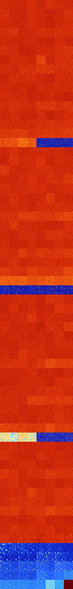

# B03678 (233984-234495)

<details>
    <summary>Initial Grid</summary>
    
</details>


<details>
    <summary>Initial Grid RLE</summary>

```
#C Exported from GoGoL (https://github.com/marrow16/gogol)
#C Wrap mode: Toroidal
#C Boundary mode: Dead
#C Step: 0
x = 100, y = 100, rule = B03678/S
34bo4bo53bo$10bo26bo26bo7bo$19bo62bo13bo2bo$14bo32bo18bo5bo22bo$9bo23bo
11bo20bo$3bo15bo19bo19bo15bo$29bo22bo3bo8bo$bo4bo13bo16bo4bo31bo5bo18bo
$46bo9bo15bo9bo14bo$19bo10bo3bo19bo41bobo$8bo53bo3bo3bo15bo4bo$4bo25bob
o17bobo17bo$31bo5b2o25bo22bo11bo$11bo33bo12bo31bo$47bo15bo15bo$37bo9bo
2bo26bo2bo$30bo3bo13bobo16bo$6bo12bo56bo4bo$52bo3bo6bo$o2bo7b2o13bo12bo
49bo4bo$28bo6bo8bo9bo16bo$9bo8bobobo21bo44bo$7bo3bo38bo3bo18bobo$10bo2b
2o15bo13bo9bo18bo7bo3bo6bo$48bo39b2o$7bo19bobo16bo31bo8bo$3bo$15bo45bo
15bo$16bo47bo$2bo16bo24bo32bo$59bobo8bo4bo$18bo44bo6b2o26bo$9bo35bo$o
32bo13bo$19bo28bo10bo11bo27bo$o12bo13bo7bo$o41bo13bo5bo16bo10bo$53bo$8b
o3bo55bo17b2o$42bo4bo15bo4bo16bo$10b3o6bo64bo2bo2bo$15bo3bo4bo$38bo5bo
19bo12bo$4bo2bo16bo12bo57bo$26bo3bo12bo46bo7bo$13bo12bo41bob2o16bo$14bo
8bo11b2o14bo35bobo$12bo76bo$9bo2bo22bo4bo19bo2bo29bo$9bo3bo4bo5bo39bo$
8bo4bo49bo2bo$4bo30bo15bo21bo7bo$14bo24bo3b2o45bo$11bo45bo$9bobo$16bo$
9bo$5bo36bo2bo10bo10bo2bo17bo4bo$8bo25bo13bo5b2o$8bo33bo10bo2bo13bo20bo
$2bo5bo5bo24bo14bo$13bo58bo18bo$bo61bo13bo$29b2o7bo16bo6bo4bo9bo2bo13bo
$2bo18bo2bo14bo3bo18bo20bo$6bo13bo12bo44bo7bo$4bo36bo25bo5bo$23bo6bobo
15bobo$o18bo4bo30bo$4bo55bo31b2o$7bo8bo19bo32bo2bo10bo$3bo9bo8bo8bo9bo
22bo$26bo8bo5bo14bo$3bo18bo28bo21b2o$3b2o6bo52b2o7bo15bo2bo$4bo41bo31bo
18bo$15bo37bo$43bo45bo$30bo49b3o$76bo2b2o$27bobo$19bo16bo19bo9bo3bo2bob
o3bo$14bo9bo10bo18bo26bo4bo12bo$2bo12bo26bo6bo6bo2bo4bo6bo$9bo12bo7bo7b
o14bo45bo$24bo13b2o10bo17bo$21bo48bo6bo5bo7bo$18bo8bo12bo38bo4bo$68bo4b
o8bo9bo$bo40bo11bo25bo$8bo6bo38bo4b2o16bo3bo7bo8bo$8bo17bo13bo12bo$11bo
17bo28bo22bo13bo$11bo22bo17bo5bo$o4bo26bo18bo44bo$7bo50bo36bo3bo$bo96bo
$5bo3bo19bo35bo29bo2bo$8bo12bo5bo10bobo$2bobobo6bo6bo7bo15bobo2bo2bo11b
o10bo!
```
</details>
<details>
    <summary>Thumbnail</summary>

</details>
<table>
<tr>
    <td><a href="./233984%20S%20Heat%20Map%20Activity.png"></a><br>S (233984)<br>G>1000</td>    <td><a href="./233985%20S0%20Heat%20Map%20Activity.png"></a><br>S0 (233985)<br>G>1000</td>    <td><a href="./233986%20S1%20Heat%20Map%20Activity.png"></a><br>S1 (233986)<br>G>1000</td>    <td><a href="./233987%20S01%20Heat%20Map%20Activity.png"></a><br>S01 (233987)<br>G>1000</td>    <td><a href="./233988%20S2%20Heat%20Map%20Activity.png"></a><br>S2 (233988)<br>G>1000</td>    <td><a href="./233989%20S02%20Heat%20Map%20Activity.png"></a><br>S02 (233989)<br>G>1000</td>    <td><a href="./233990%20S12%20Heat%20Map%20Activity.png"></a><br>S12 (233990)<br>G>1000</td>    <td><a href="./233991%20S012%20Heat%20Map%20Activity.png"></a><br>S012 (233991)<br>G>1000</td></tr>
<tr>
    <td><a href="./233992%20S3%20Heat%20Map%20Activity.png"></a><br>S3 (233992)<br>G>1000</td>    <td><a href="./233993%20S03%20Heat%20Map%20Activity.png"></a><br>S03 (233993)<br>G>1000</td>    <td><a href="./233994%20S13%20Heat%20Map%20Activity.png"></a><br>S13 (233994)<br>G>1000</td>    <td><a href="./233995%20S013%20Heat%20Map%20Activity.png"></a><br>S013 (233995)<br>G>1000</td>    <td><a href="./233996%20S23%20Heat%20Map%20Activity.png"></a><br>S23 (233996)<br>G>1000</td>    <td><a href="./233997%20S023%20Heat%20Map%20Activity.png"></a><br>S023 (233997)<br>G>1000</td>    <td><a href="./233998%20S123%20Heat%20Map%20Activity.png"></a><br>S123 (233998)<br>G>1000</td>    <td><a href="./233999%20S0123%20Heat%20Map%20Activity.png"></a><br>S0123 (233999)<br>G>1000</td></tr>
<tr>
    <td><a href="./234000%20S4%20Heat%20Map%20Activity.png"></a><br>S4 (234000)<br>G>1000</td>    <td><a href="./234001%20S04%20Heat%20Map%20Activity.png"></a><br>S04 (234001)<br>G>1000</td>    <td><a href="./234002%20S14%20Heat%20Map%20Activity.png"></a><br>S14 (234002)<br>G>1000</td>    <td><a href="./234003%20S014%20Heat%20Map%20Activity.png"></a><br>S014 (234003)<br>G>1000</td>    <td><a href="./234004%20S24%20Heat%20Map%20Activity.png"></a><br>S24 (234004)<br>G>1000</td>    <td><a href="./234005%20S024%20Heat%20Map%20Activity.png"></a><br>S024 (234005)<br>G>1000</td>    <td><a href="./234006%20S124%20Heat%20Map%20Activity.png"></a><br>S124 (234006)<br>G>1000</td>    <td><a href="./234007%20S0124%20Heat%20Map%20Activity.png"></a><br>S0124 (234007)<br>G>1000</td></tr>
<tr>
    <td><a href="./234008%20S34%20Heat%20Map%20Activity.png"></a><br>S34 (234008)<br>G>1000</td>    <td><a href="./234009%20S034%20Heat%20Map%20Activity.png"></a><br>S034 (234009)<br>G>1000</td>    <td><a href="./234010%20S134%20Heat%20Map%20Activity.png"></a><br>S134 (234010)<br>G>1000</td>    <td><a href="./234011%20S0134%20Heat%20Map%20Activity.png"></a><br>S0134 (234011)<br>G>1000</td>    <td><a href="./234012%20S234%20Heat%20Map%20Activity.png"></a><br>S234 (234012)<br>G>1000</td>    <td><a href="./234013%20S0234%20Heat%20Map%20Activity.png"></a><br>S0234 (234013)<br>G>1000</td>    <td><a href="./234014%20S1234%20Heat%20Map%20Activity.png"></a><br>S1234 (234014)<br>G>1000</td>    <td><a href="./234015%20S01234%20Heat%20Map%20Activity.png"></a><br>S01234 (234015)<br>G>1000</td></tr>
<tr>
    <td><a href="./234016%20S5%20Heat%20Map%20Activity.png"></a><br>S5 (234016)<br>G>1000</td>    <td><a href="./234017%20S05%20Heat%20Map%20Activity.png"></a><br>S05 (234017)<br>G>1000</td>    <td><a href="./234018%20S15%20Heat%20Map%20Activity.png"></a><br>S15 (234018)<br>G>1000</td>    <td><a href="./234019%20S015%20Heat%20Map%20Activity.png"></a><br>S015 (234019)<br>G>1000</td>    <td><a href="./234020%20S25%20Heat%20Map%20Activity.png"></a><br>S25 (234020)<br>G>1000</td>    <td><a href="./234021%20S025%20Heat%20Map%20Activity.png"></a><br>S025 (234021)<br>G>1000</td>    <td><a href="./234022%20S125%20Heat%20Map%20Activity.png"></a><br>S125 (234022)<br>G>1000</td>    <td><a href="./234023%20S0125%20Heat%20Map%20Activity.png"></a><br>S0125 (234023)<br>G>1000</td></tr>
<tr>
    <td><a href="./234024%20S35%20Heat%20Map%20Activity.png"></a><br>S35 (234024)<br>G>1000</td>    <td><a href="./234025%20S035%20Heat%20Map%20Activity.png"></a><br>S035 (234025)<br>G>1000</td>    <td><a href="./234026%20S135%20Heat%20Map%20Activity.png"></a><br>S135 (234026)<br>G>1000</td>    <td><a href="./234027%20S0135%20Heat%20Map%20Activity.png"></a><br>S0135 (234027)<br>G>1000</td>    <td><a href="./234028%20S235%20Heat%20Map%20Activity.png"></a><br>S235 (234028)<br>G>1000</td>    <td><a href="./234029%20S0235%20Heat%20Map%20Activity.png"></a><br>S0235 (234029)<br>G>1000</td>    <td><a href="./234030%20S1235%20Heat%20Map%20Activity.png"></a><br>S1235 (234030)<br>G>1000</td>    <td><a href="./234031%20S01235%20Heat%20Map%20Activity.png"></a><br>S01235 (234031)<br>G>1000</td></tr>
<tr>
    <td><a href="./234032%20S45%20Heat%20Map%20Activity.png"></a><br>S45 (234032)<br>G>1000</td>    <td><a href="./234033%20S045%20Heat%20Map%20Activity.png"></a><br>S045 (234033)<br>G>1000</td>    <td><a href="./234034%20S145%20Heat%20Map%20Activity.png"></a><br>S145 (234034)<br>G>1000</td>    <td><a href="./234035%20S0145%20Heat%20Map%20Activity.png"></a><br>S0145 (234035)<br>G>1000</td>    <td><a href="./234036%20S245%20Heat%20Map%20Activity.png"></a><br>S245 (234036)<br>G>1000</td>    <td><a href="./234037%20S0245%20Heat%20Map%20Activity.png"></a><br>S0245 (234037)<br>G>1000</td>    <td><a href="./234038%20S1245%20Heat%20Map%20Activity.png"></a><br>S1245 (234038)<br>G>1000</td>    <td><a href="./234039%20S01245%20Heat%20Map%20Activity.png"></a><br>S01245 (234039)<br>G>1000</td></tr>
<tr>
    <td><a href="./234040%20S345%20Heat%20Map%20Activity.png"></a><br>S345 (234040)<br>G>1000</td>    <td><a href="./234041%20S0345%20Heat%20Map%20Activity.png"></a><br>S0345 (234041)<br>G>1000</td>    <td><a href="./234042%20S1345%20Heat%20Map%20Activity.png"></a><br>S1345 (234042)<br>G>1000</td>    <td><a href="./234043%20S01345%20Heat%20Map%20Activity.png"></a><br>S01345 (234043)<br>G>1000</td>    <td><a href="./234044%20S2345%20Heat%20Map%20Activity.png"></a><br>S2345 (234044)<br>G>1000</td>    <td><a href="./234045%20S02345%20Heat%20Map%20Activity.png"></a><br>S02345 (234045)<br>G>1000</td>    <td><a href="./234046%20S12345%20Heat%20Map%20Activity.png"></a><br>S12345 (234046)<br>G>1000</td>    <td><a href="./234047%20S012345%20Heat%20Map%20Activity.png"></a><br>S012345 (234047)<br>G>1000</td></tr>
<tr>
    <td><a href="./234048%20S6%20Heat%20Map%20Activity.png"></a><br>S6 (234048)<br>G>1000</td>    <td><a href="./234049%20S06%20Heat%20Map%20Activity.png"></a><br>S06 (234049)<br>G>1000</td>    <td><a href="./234050%20S16%20Heat%20Map%20Activity.png"></a><br>S16 (234050)<br>G>1000</td>    <td><a href="./234051%20S016%20Heat%20Map%20Activity.png"></a><br>S016 (234051)<br>G>1000</td>    <td><a href="./234052%20S26%20Heat%20Map%20Activity.png"></a><br>S26 (234052)<br>G>1000</td>    <td><a href="./234053%20S026%20Heat%20Map%20Activity.png"></a><br>S026 (234053)<br>G>1000</td>    <td><a href="./234054%20S126%20Heat%20Map%20Activity.png"></a><br>S126 (234054)<br>G>1000</td>    <td><a href="./234055%20S0126%20Heat%20Map%20Activity.png"></a><br>S0126 (234055)<br>G>1000</td></tr>
<tr>
    <td><a href="./234056%20S36%20Heat%20Map%20Activity.png"></a><br>S36 (234056)<br>G>1000</td>    <td><a href="./234057%20S036%20Heat%20Map%20Activity.png"></a><br>S036 (234057)<br>G>1000</td>    <td><a href="./234058%20S136%20Heat%20Map%20Activity.png"></a><br>S136 (234058)<br>G>1000</td>    <td><a href="./234059%20S0136%20Heat%20Map%20Activity.png"></a><br>S0136 (234059)<br>G>1000</td>    <td><a href="./234060%20S236%20Heat%20Map%20Activity.png"></a><br>S236 (234060)<br>G>1000</td>    <td><a href="./234061%20S0236%20Heat%20Map%20Activity.png"></a><br>S0236 (234061)<br>G>1000</td>    <td><a href="./234062%20S1236%20Heat%20Map%20Activity.png"></a><br>S1236 (234062)<br>G>1000</td>    <td><a href="./234063%20S01236%20Heat%20Map%20Activity.png"></a><br>S01236 (234063)<br>G>1000</td></tr>
<tr>
    <td><a href="./234064%20S46%20Heat%20Map%20Activity.png"></a><br>S46 (234064)<br>G>1000</td>    <td><a href="./234065%20S046%20Heat%20Map%20Activity.png"></a><br>S046 (234065)<br>G>1000</td>    <td><a href="./234066%20S146%20Heat%20Map%20Activity.png"></a><br>S146 (234066)<br>G>1000</td>    <td><a href="./234067%20S0146%20Heat%20Map%20Activity.png"></a><br>S0146 (234067)<br>G>1000</td>    <td><a href="./234068%20S246%20Heat%20Map%20Activity.png"></a><br>S246 (234068)<br>G>1000</td>    <td><a href="./234069%20S0246%20Heat%20Map%20Activity.png"></a><br>S0246 (234069)<br>G>1000</td>    <td><a href="./234070%20S1246%20Heat%20Map%20Activity.png"></a><br>S1246 (234070)<br>G>1000</td>    <td><a href="./234071%20S01246%20Heat%20Map%20Activity.png"></a><br>S01246 (234071)<br>G>1000</td></tr>
<tr>
    <td><a href="./234072%20S346%20Heat%20Map%20Activity.png"></a><br>S346 (234072)<br>G>1000</td>    <td><a href="./234073%20S0346%20Heat%20Map%20Activity.png"></a><br>S0346 (234073)<br>G>1000</td>    <td><a href="./234074%20S1346%20Heat%20Map%20Activity.png"></a><br>S1346 (234074)<br>G>1000</td>    <td><a href="./234075%20S01346%20Heat%20Map%20Activity.png"></a><br>S01346 (234075)<br>G>1000</td>    <td><a href="./234076%20S2346%20Heat%20Map%20Activity.png"></a><br>S2346 (234076)<br>G>1000</td>    <td><a href="./234077%20S02346%20Heat%20Map%20Activity.png"></a><br>S02346 (234077)<br>G>1000</td>    <td><a href="./234078%20S12346%20Heat%20Map%20Activity.png"></a><br>S12346 (234078)<br>G>1000</td>    <td><a href="./234079%20S012346%20Heat%20Map%20Activity.png"></a><br>S012346 (234079)<br>G>1000</td></tr>
<tr>
    <td><a href="./234080%20S56%20Heat%20Map%20Activity.png"></a><br>S56 (234080)<br>G>1000</td>    <td><a href="./234081%20S056%20Heat%20Map%20Activity.png"></a><br>S056 (234081)<br>G>1000</td>    <td><a href="./234082%20S156%20Heat%20Map%20Activity.png"></a><br>S156 (234082)<br>G>1000</td>    <td><a href="./234083%20S0156%20Heat%20Map%20Activity.png"></a><br>S0156 (234083)<br>G>1000</td>    <td><a href="./234084%20S256%20Heat%20Map%20Activity.png"></a><br>S256 (234084)<br>G>1000</td>    <td><a href="./234085%20S0256%20Heat%20Map%20Activity.png"></a><br>S0256 (234085)<br>G>1000</td>    <td><a href="./234086%20S1256%20Heat%20Map%20Activity.png"></a><br>S1256 (234086)<br>G>1000</td>    <td><a href="./234087%20S01256%20Heat%20Map%20Activity.png"></a><br>S01256 (234087)<br>G>1000</td></tr>
<tr>
    <td><a href="./234088%20S356%20Heat%20Map%20Activity.png"></a><br>S356 (234088)<br>G>1000</td>    <td><a href="./234089%20S0356%20Heat%20Map%20Activity.png"></a><br>S0356 (234089)<br>G>1000</td>    <td><a href="./234090%20S1356%20Heat%20Map%20Activity.png"></a><br>S1356 (234090)<br>G>1000</td>    <td><a href="./234091%20S01356%20Heat%20Map%20Activity.png"></a><br>S01356 (234091)<br>G>1000</td>    <td><a href="./234092%20S2356%20Heat%20Map%20Activity.png"></a><br>S2356 (234092)<br>G>1000</td>    <td><a href="./234093%20S02356%20Heat%20Map%20Activity.png"></a><br>S02356 (234093)<br>G>1000</td>    <td><a href="./234094%20S12356%20Heat%20Map%20Activity.png"></a><br>S12356 (234094)<br>G>1000</td>    <td><a href="./234095%20S012356%20Heat%20Map%20Activity.png"></a><br>S012356 (234095)<br>G>1000</td></tr>
<tr>
    <td><a href="./234096%20S456%20Heat%20Map%20Activity.png"></a><br>S456 (234096)<br>G>1000</td>    <td><a href="./234097%20S0456%20Heat%20Map%20Activity.png"></a><br>S0456 (234097)<br>G>1000</td>    <td><a href="./234098%20S1456%20Heat%20Map%20Activity.png"></a><br>S1456 (234098)<br>G>1000</td>    <td><a href="./234099%20S01456%20Heat%20Map%20Activity.png"></a><br>S01456 (234099)<br>G>1000</td>    <td><a href="./234100%20S2456%20Heat%20Map%20Activity.png"></a><br>S2456 (234100)<br>G>1000</td>    <td><a href="./234101%20S02456%20Heat%20Map%20Activity.png"></a><br>S02456 (234101)<br>G>1000</td>    <td><a href="./234102%20S12456%20Heat%20Map%20Activity.png"></a><br>S12456 (234102)<br>G>1000</td>    <td><a href="./234103%20S012456%20Heat%20Map%20Activity.png"></a><br>S012456 (234103)<br>G>1000</td></tr>
<tr>
    <td><a href="./234104%20S3456%20Heat%20Map%20Activity.png"></a><br>S3456 (234104)<br>G>1000</td>    <td><a href="./234105%20S03456%20Heat%20Map%20Activity.png"></a><br>S03456 (234105)<br>G>1000</td>    <td><a href="./234106%20S13456%20Heat%20Map%20Activity.png"></a><br>S13456 (234106)<br>G>1000</td>    <td><a href="./234107%20S013456%20Heat%20Map%20Activity.png"></a><br>S013456 (234107)<br>G>1000</td>    <td><a href="./234108%20S23456%20Heat%20Map%20Activity.png"></a><br>S23456 (234108)<br>G>1000</td>    <td><a href="./234109%20S023456%20Heat%20Map%20Activity.png"></a><br>S023456 (234109)<br>G>1000</td>    <td><a href="./234110%20S123456%20Heat%20Map%20Activity.png"></a><br>S123456 (234110)<br>G>1000</td>    <td><a href="./234111%20S0123456%20Heat%20Map%20Activity.png"></a><br>S0123456 (234111)<br>G>1000</td></tr>
<tr>
    <td><a href="./234112%20S7%20Heat%20Map%20Activity.png"></a><br>S7 (234112)<br>G>1000</td>    <td><a href="./234113%20S07%20Heat%20Map%20Activity.png"></a><br>S07 (234113)<br>G>1000</td>    <td><a href="./234114%20S17%20Heat%20Map%20Activity.png"></a><br>S17 (234114)<br>G>1000</td>    <td><a href="./234115%20S017%20Heat%20Map%20Activity.png"></a><br>S017 (234115)<br>G>1000</td>    <td><a href="./234116%20S27%20Heat%20Map%20Activity.png"></a><br>S27 (234116)<br>G>1000</td>    <td><a href="./234117%20S027%20Heat%20Map%20Activity.png"></a><br>S027 (234117)<br>G>1000</td>    <td><a href="./234118%20S127%20Heat%20Map%20Activity.png"></a><br>S127 (234118)<br>G>1000</td>    <td><a href="./234119%20S0127%20Heat%20Map%20Activity.png"></a><br>S0127 (234119)<br>G>1000</td></tr>
<tr>
    <td><a href="./234120%20S37%20Heat%20Map%20Activity.png"></a><br>S37 (234120)<br>G>1000</td>    <td><a href="./234121%20S037%20Heat%20Map%20Activity.png"></a><br>S037 (234121)<br>G>1000</td>    <td><a href="./234122%20S137%20Heat%20Map%20Activity.png"></a><br>S137 (234122)<br>G>1000</td>    <td><a href="./234123%20S0137%20Heat%20Map%20Activity.png"></a><br>S0137 (234123)<br>G>1000</td>    <td><a href="./234124%20S237%20Heat%20Map%20Activity.png"></a><br>S237 (234124)<br>G>1000</td>    <td><a href="./234125%20S0237%20Heat%20Map%20Activity.png"></a><br>S0237 (234125)<br>G>1000</td>    <td><a href="./234126%20S1237%20Heat%20Map%20Activity.png"></a><br>S1237 (234126)<br>G>1000</td>    <td><a href="./234127%20S01237%20Heat%20Map%20Activity.png"></a><br>S01237 (234127)<br>G>1000</td></tr>
<tr>
    <td><a href="./234128%20S47%20Heat%20Map%20Activity.png"></a><br>S47 (234128)<br>G>1000</td>    <td><a href="./234129%20S047%20Heat%20Map%20Activity.png"></a><br>S047 (234129)<br>G>1000</td>    <td><a href="./234130%20S147%20Heat%20Map%20Activity.png"></a><br>S147 (234130)<br>G>1000</td>    <td><a href="./234131%20S0147%20Heat%20Map%20Activity.png"></a><br>S0147 (234131)<br>G>1000</td>    <td><a href="./234132%20S247%20Heat%20Map%20Activity.png"></a><br>S247 (234132)<br>G>1000</td>    <td><a href="./234133%20S0247%20Heat%20Map%20Activity.png"></a><br>S0247 (234133)<br>G>1000</td>    <td><a href="./234134%20S1247%20Heat%20Map%20Activity.png"></a><br>S1247 (234134)<br>G>1000</td>    <td><a href="./234135%20S01247%20Heat%20Map%20Activity.png"></a><br>S01247 (234135)<br>G>1000</td></tr>
<tr>
    <td><a href="./234136%20S347%20Heat%20Map%20Activity.png"></a><br>S347 (234136)<br>G>1000</td>    <td><a href="./234137%20S0347%20Heat%20Map%20Activity.png"></a><br>S0347 (234137)<br>G>1000</td>    <td><a href="./234138%20S1347%20Heat%20Map%20Activity.png"></a><br>S1347 (234138)<br>G>1000</td>    <td><a href="./234139%20S01347%20Heat%20Map%20Activity.png"></a><br>S01347 (234139)<br>G>1000</td>    <td><a href="./234140%20S2347%20Heat%20Map%20Activity.png"></a><br>S2347 (234140)<br>G>1000</td>    <td><a href="./234141%20S02347%20Heat%20Map%20Activity.png"></a><br>S02347 (234141)<br>G>1000</td>    <td><a href="./234142%20S12347%20Heat%20Map%20Activity.png"></a><br>S12347 (234142)<br>G>1000</td>    <td><a href="./234143%20S012347%20Heat%20Map%20Activity.png"></a><br>S012347 (234143)<br>G>1000</td></tr>
<tr>
    <td><a href="./234144%20S57%20Heat%20Map%20Activity.png"></a><br>S57 (234144)<br>G>1000</td>    <td><a href="./234145%20S057%20Heat%20Map%20Activity.png"></a><br>S057 (234145)<br>G>1000</td>    <td><a href="./234146%20S157%20Heat%20Map%20Activity.png"></a><br>S157 (234146)<br>G>1000</td>    <td><a href="./234147%20S0157%20Heat%20Map%20Activity.png"></a><br>S0157 (234147)<br>G>1000</td>    <td><a href="./234148%20S257%20Heat%20Map%20Activity.png"></a><br>S257 (234148)<br>G>1000</td>    <td><a href="./234149%20S0257%20Heat%20Map%20Activity.png"></a><br>S0257 (234149)<br>G>1000</td>    <td><a href="./234150%20S1257%20Heat%20Map%20Activity.png"></a><br>S1257 (234150)<br>G>1000</td>    <td><a href="./234151%20S01257%20Heat%20Map%20Activity.png"></a><br>S01257 (234151)<br>G>1000</td></tr>
<tr>
    <td><a href="./234152%20S357%20Heat%20Map%20Activity.png"></a><br>S357 (234152)<br>G>1000</td>    <td><a href="./234153%20S0357%20Heat%20Map%20Activity.png"></a><br>S0357 (234153)<br>G>1000</td>    <td><a href="./234154%20S1357%20Heat%20Map%20Activity.png"></a><br>S1357 (234154)<br>G>1000</td>    <td><a href="./234155%20S01357%20Heat%20Map%20Activity.png"></a><br>S01357 (234155)<br>G>1000</td>    <td><a href="./234156%20S2357%20Heat%20Map%20Activity.png"></a><br>S2357 (234156)<br>G>1000</td>    <td><a href="./234157%20S02357%20Heat%20Map%20Activity.png"></a><br>S02357 (234157)<br>G>1000</td>    <td><a href="./234158%20S12357%20Heat%20Map%20Activity.png"></a><br>S12357 (234158)<br>G>1000</td>    <td><a href="./234159%20S012357%20Heat%20Map%20Activity.png"></a><br>S012357 (234159)<br>G>1000</td></tr>
<tr>
    <td><a href="./234160%20S457%20Heat%20Map%20Activity.png"></a><br>S457 (234160)<br>G>1000</td>    <td><a href="./234161%20S0457%20Heat%20Map%20Activity.png"></a><br>S0457 (234161)<br>G>1000</td>    <td><a href="./234162%20S1457%20Heat%20Map%20Activity.png"></a><br>S1457 (234162)<br>G>1000</td>    <td><a href="./234163%20S01457%20Heat%20Map%20Activity.png"></a><br>S01457 (234163)<br>G>1000</td>    <td><a href="./234164%20S2457%20Heat%20Map%20Activity.png"></a><br>S2457 (234164)<br>G>1000</td>    <td><a href="./234165%20S02457%20Heat%20Map%20Activity.png"></a><br>S02457 (234165)<br>G>1000</td>    <td><a href="./234166%20S12457%20Heat%20Map%20Activity.png"></a><br>S12457 (234166)<br>G>1000</td>    <td><a href="./234167%20S012457%20Heat%20Map%20Activity.png"></a><br>S012457 (234167)<br>G>1000</td></tr>
<tr>
    <td><a href="./234168%20S3457%20Heat%20Map%20Activity.png"></a><br>S3457 (234168)<br>G>1000</td>    <td><a href="./234169%20S03457%20Heat%20Map%20Activity.png"></a><br>S03457 (234169)<br>G>1000</td>    <td><a href="./234170%20S13457%20Heat%20Map%20Activity.png"></a><br>S13457 (234170)<br>G>1000</td>    <td><a href="./234171%20S013457%20Heat%20Map%20Activity.png"></a><br>S013457 (234171)<br>G>1000</td>    <td><a href="./234172%20S23457%20Heat%20Map%20Activity.png"></a><br>S23457 (234172)<br>G>1000</td>    <td><a href="./234173%20S023457%20Heat%20Map%20Activity.png"></a><br>S023457 (234173)<br>G>1000</td>    <td><a href="./234174%20S123457%20Heat%20Map%20Activity.png"></a><br>S123457 (234174)<br>G>1000</td>    <td><a href="./234175%20S0123457%20Heat%20Map%20Activity.png"></a><br>S0123457 (234175)<br>G>1000</td></tr>
<tr>
    <td><a href="./234176%20S67%20Heat%20Map%20Activity.png"></a><br>S67 (234176)<br>G>1000</td>    <td><a href="./234177%20S067%20Heat%20Map%20Activity.png"></a><br>S067 (234177)<br>G>1000</td>    <td><a href="./234178%20S167%20Heat%20Map%20Activity.png"></a><br>S167 (234178)<br>G>1000</td>    <td><a href="./234179%20S0167%20Heat%20Map%20Activity.png"></a><br>S0167 (234179)<br>G>1000</td>    <td><a href="./234180%20S267%20Heat%20Map%20Activity.png"></a><br>S267 (234180)<br>G>1000</td>    <td><a href="./234181%20S0267%20Heat%20Map%20Activity.png"></a><br>S0267 (234181)<br>G>1000</td>    <td><a href="./234182%20S1267%20Heat%20Map%20Activity.png"></a><br>S1267 (234182)<br>G>1000</td>    <td><a href="./234183%20S01267%20Heat%20Map%20Activity.png"></a><br>S01267 (234183)<br>G>1000</td></tr>
<tr>
    <td><a href="./234184%20S367%20Heat%20Map%20Activity.png"></a><br>S367 (234184)<br>G>1000</td>    <td><a href="./234185%20S0367%20Heat%20Map%20Activity.png"></a><br>S0367 (234185)<br>G>1000</td>    <td><a href="./234186%20S1367%20Heat%20Map%20Activity.png"></a><br>S1367 (234186)<br>G>1000</td>    <td><a href="./234187%20S01367%20Heat%20Map%20Activity.png"></a><br>S01367 (234187)<br>G>1000</td>    <td><a href="./234188%20S2367%20Heat%20Map%20Activity.png"></a><br>S2367 (234188)<br>G>1000</td>    <td><a href="./234189%20S02367%20Heat%20Map%20Activity.png"></a><br>S02367 (234189)<br>G>1000</td>    <td><a href="./234190%20S12367%20Heat%20Map%20Activity.png"></a><br>S12367 (234190)<br>G>1000</td>    <td><a href="./234191%20S012367%20Heat%20Map%20Activity.png"></a><br>S012367 (234191)<br>G>1000</td></tr>
<tr>
    <td><a href="./234192%20S467%20Heat%20Map%20Activity.png"></a><br>S467 (234192)<br>G>1000</td>    <td><a href="./234193%20S0467%20Heat%20Map%20Activity.png"></a><br>S0467 (234193)<br>G>1000</td>    <td><a href="./234194%20S1467%20Heat%20Map%20Activity.png"></a><br>S1467 (234194)<br>G>1000</td>    <td><a href="./234195%20S01467%20Heat%20Map%20Activity.png"></a><br>S01467 (234195)<br>G>1000</td>    <td><a href="./234196%20S2467%20Heat%20Map%20Activity.png"></a><br>S2467 (234196)<br>G>1000</td>    <td><a href="./234197%20S02467%20Heat%20Map%20Activity.png"></a><br>S02467 (234197)<br>G>1000</td>    <td><a href="./234198%20S12467%20Heat%20Map%20Activity.png"></a><br>S12467 (234198)<br>G>1000</td>    <td><a href="./234199%20S012467%20Heat%20Map%20Activity.png"></a><br>S012467 (234199)<br>G>1000</td></tr>
<tr>
    <td><a href="./234200%20S3467%20Heat%20Map%20Activity.png"></a><br>S3467 (234200)<br>G>1000</td>    <td><a href="./234201%20S03467%20Heat%20Map%20Activity.png"></a><br>S03467 (234201)<br>G>1000</td>    <td><a href="./234202%20S13467%20Heat%20Map%20Activity.png"></a><br>S13467 (234202)<br>G>1000</td>    <td><a href="./234203%20S013467%20Heat%20Map%20Activity.png"></a><br>S013467 (234203)<br>G>1000</td>    <td><a href="./234204%20S23467%20Heat%20Map%20Activity.png"></a><br>S23467 (234204)<br>G>1000</td>    <td><a href="./234205%20S023467%20Heat%20Map%20Activity.png"></a><br>S023467 (234205)<br>G>1000</td>    <td><a href="./234206%20S123467%20Heat%20Map%20Activity.png"></a><br>S123467 (234206)<br>G>1000</td>    <td><a href="./234207%20S0123467%20Heat%20Map%20Activity.png"></a><br>S0123467 (234207)<br>G>1000</td></tr>
<tr>
    <td><a href="./234208%20S567%20Heat%20Map%20Activity.png"></a><br>S567 (234208)<br>G>1000</td>    <td><a href="./234209%20S0567%20Heat%20Map%20Activity.png"></a><br>S0567 (234209)<br>G>1000</td>    <td><a href="./234210%20S1567%20Heat%20Map%20Activity.png"></a><br>S1567 (234210)<br>G>1000</td>    <td><a href="./234211%20S01567%20Heat%20Map%20Activity.png"></a><br>S01567 (234211)<br>G>1000</td>    <td><a href="./234212%20S2567%20Heat%20Map%20Activity.png"></a><br>S2567 (234212)<br>G>1000</td>    <td><a href="./234213%20S02567%20Heat%20Map%20Activity.png"></a><br>S02567 (234213)<br>G>1000</td>    <td><a href="./234214%20S12567%20Heat%20Map%20Activity.png"></a><br>S12567 (234214)<br>G>1000</td>    <td><a href="./234215%20S012567%20Heat%20Map%20Activity.png"></a><br>S012567 (234215)<br>G>1000</td></tr>
<tr>
    <td><a href="./234216%20S3567%20Heat%20Map%20Activity.png"></a><br>S3567 (234216)<br>G>1000</td>    <td><a href="./234217%20S03567%20Heat%20Map%20Activity.png"></a><br>S03567 (234217)<br>G>1000</td>    <td><a href="./234218%20S13567%20Heat%20Map%20Activity.png"></a><br>S13567 (234218)<br>G>1000</td>    <td><a href="./234219%20S013567%20Heat%20Map%20Activity.png"></a><br>S013567 (234219)<br>G>1000</td>    <td><a href="./234220%20S23567%20Heat%20Map%20Activity.png"></a><br>S23567 (234220)<br>G>1000</td>    <td><a href="./234221%20S023567%20Heat%20Map%20Activity.png"></a><br>S023567 (234221)<br>G>1000</td>    <td><a href="./234222%20S123567%20Heat%20Map%20Activity.png"></a><br>S123567 (234222)<br>G>1000</td>    <td><a href="./234223%20S0123567%20Heat%20Map%20Activity.png"></a><br>S0123567 (234223)<br>G>1000</td></tr>
<tr>
    <td><a href="./234224%20S4567%20Heat%20Map%20Activity.png"></a><br>S4567 (234224)<br>G>1000</td>    <td><a href="./234225%20S04567%20Heat%20Map%20Activity.png"></a><br>S04567 (234225)<br>G>1000</td>    <td><a href="./234226%20S14567%20Heat%20Map%20Activity.png"></a><br>S14567 (234226)<br>G>1000</td>    <td><a href="./234227%20S014567%20Heat%20Map%20Activity.png"></a><br>S014567 (234227)<br>G>1000</td>    <td><a href="./234228%20S24567%20Heat%20Map%20Activity.png"></a><br>S24567 (234228)<br>G>1000</td>    <td><a href="./234229%20S024567%20Heat%20Map%20Activity.png"></a><br>S024567 (234229)<br>G>1000</td>    <td><a href="./234230%20S124567%20Heat%20Map%20Activity.png"></a><br>S124567 (234230)<br>G>1000</td>    <td><a href="./234231%20S0124567%20Heat%20Map%20Activity.png"></a><br>S0124567 (234231)<br>G>1000</td></tr>
<tr>
    <td><a href="./234232%20S34567%20Heat%20Map%20Activity.png"></a><br>S34567 (234232)<br>R@509,p360</td>    <td><a href="./234233%20S034567%20Heat%20Map%20Activity.png"></a><br>S034567 (234233)<br>R@942,p840</td>    <td><a href="./234234%20S134567%20Heat%20Map%20Activity.png"></a><br>S134567 (234234)<br>G>1000</td>    <td><a href="./234235%20S0134567%20Heat%20Map%20Activity.png"></a><br>S0134567 (234235)<br>R@465,p360</td>    <td><a href="./234236%20S234567%20Heat%20Map%20Activity.png"></a><br>S234567 (234236)<br>G>1000</td>    <td><a href="./234237%20S0234567%20Heat%20Map%20Activity.png"></a><br>S0234567 (234237)<br>G>1000</td>    <td><a href="./234238%20S1234567%20Heat%20Map%20Activity.png"></a><br>S1234567 (234238)<br>G>1000</td>    <td><a href="./234239%20S01234567%20Heat%20Map%20Activity.png"></a><br>S01234567 (234239)<br>G>1000</td></tr>
<tr>
    <td><a href="./234240%20S8%20Heat%20Map%20Activity.png"></a><br>S8 (234240)<br>G>1000</td>    <td><a href="./234241%20S08%20Heat%20Map%20Activity.png"></a><br>S08 (234241)<br>G>1000</td>    <td><a href="./234242%20S18%20Heat%20Map%20Activity.png"></a><br>S18 (234242)<br>G>1000</td>    <td><a href="./234243%20S018%20Heat%20Map%20Activity.png"></a><br>S018 (234243)<br>G>1000</td>    <td><a href="./234244%20S28%20Heat%20Map%20Activity.png"></a><br>S28 (234244)<br>G>1000</td>    <td><a href="./234245%20S028%20Heat%20Map%20Activity.png"></a><br>S028 (234245)<br>G>1000</td>    <td><a href="./234246%20S128%20Heat%20Map%20Activity.png"></a><br>S128 (234246)<br>G>1000</td>    <td><a href="./234247%20S0128%20Heat%20Map%20Activity.png"></a><br>S0128 (234247)<br>G>1000</td></tr>
<tr>
    <td><a href="./234248%20S38%20Heat%20Map%20Activity.png"></a><br>S38 (234248)<br>G>1000</td>    <td><a href="./234249%20S038%20Heat%20Map%20Activity.png"></a><br>S038 (234249)<br>G>1000</td>    <td><a href="./234250%20S138%20Heat%20Map%20Activity.png"></a><br>S138 (234250)<br>G>1000</td>    <td><a href="./234251%20S0138%20Heat%20Map%20Activity.png"></a><br>S0138 (234251)<br>G>1000</td>    <td><a href="./234252%20S238%20Heat%20Map%20Activity.png"></a><br>S238 (234252)<br>G>1000</td>    <td><a href="./234253%20S0238%20Heat%20Map%20Activity.png"></a><br>S0238 (234253)<br>G>1000</td>    <td><a href="./234254%20S1238%20Heat%20Map%20Activity.png"></a><br>S1238 (234254)<br>G>1000</td>    <td><a href="./234255%20S01238%20Heat%20Map%20Activity.png"></a><br>S01238 (234255)<br>G>1000</td></tr>
<tr>
    <td><a href="./234256%20S48%20Heat%20Map%20Activity.png"></a><br>S48 (234256)<br>G>1000</td>    <td><a href="./234257%20S048%20Heat%20Map%20Activity.png"></a><br>S048 (234257)<br>G>1000</td>    <td><a href="./234258%20S148%20Heat%20Map%20Activity.png"></a><br>S148 (234258)<br>G>1000</td>    <td><a href="./234259%20S0148%20Heat%20Map%20Activity.png"></a><br>S0148 (234259)<br>G>1000</td>    <td><a href="./234260%20S248%20Heat%20Map%20Activity.png"></a><br>S248 (234260)<br>G>1000</td>    <td><a href="./234261%20S0248%20Heat%20Map%20Activity.png"></a><br>S0248 (234261)<br>G>1000</td>    <td><a href="./234262%20S1248%20Heat%20Map%20Activity.png"></a><br>S1248 (234262)<br>G>1000</td>    <td><a href="./234263%20S01248%20Heat%20Map%20Activity.png"></a><br>S01248 (234263)<br>G>1000</td></tr>
<tr>
    <td><a href="./234264%20S348%20Heat%20Map%20Activity.png"></a><br>S348 (234264)<br>G>1000</td>    <td><a href="./234265%20S0348%20Heat%20Map%20Activity.png"></a><br>S0348 (234265)<br>G>1000</td>    <td><a href="./234266%20S1348%20Heat%20Map%20Activity.png"></a><br>S1348 (234266)<br>G>1000</td>    <td><a href="./234267%20S01348%20Heat%20Map%20Activity.png"></a><br>S01348 (234267)<br>G>1000</td>    <td><a href="./234268%20S2348%20Heat%20Map%20Activity.png"></a><br>S2348 (234268)<br>G>1000</td>    <td><a href="./234269%20S02348%20Heat%20Map%20Activity.png"></a><br>S02348 (234269)<br>G>1000</td>    <td><a href="./234270%20S12348%20Heat%20Map%20Activity.png"></a><br>S12348 (234270)<br>G>1000</td>    <td><a href="./234271%20S012348%20Heat%20Map%20Activity.png"></a><br>S012348 (234271)<br>G>1000</td></tr>
<tr>
    <td><a href="./234272%20S58%20Heat%20Map%20Activity.png"></a><br>S58 (234272)<br>G>1000</td>    <td><a href="./234273%20S058%20Heat%20Map%20Activity.png"></a><br>S058 (234273)<br>G>1000</td>    <td><a href="./234274%20S158%20Heat%20Map%20Activity.png"></a><br>S158 (234274)<br>G>1000</td>    <td><a href="./234275%20S0158%20Heat%20Map%20Activity.png"></a><br>S0158 (234275)<br>G>1000</td>    <td><a href="./234276%20S258%20Heat%20Map%20Activity.png"></a><br>S258 (234276)<br>G>1000</td>    <td><a href="./234277%20S0258%20Heat%20Map%20Activity.png"></a><br>S0258 (234277)<br>G>1000</td>    <td><a href="./234278%20S1258%20Heat%20Map%20Activity.png"></a><br>S1258 (234278)<br>G>1000</td>    <td><a href="./234279%20S01258%20Heat%20Map%20Activity.png"></a><br>S01258 (234279)<br>G>1000</td></tr>
<tr>
    <td><a href="./234280%20S358%20Heat%20Map%20Activity.png"></a><br>S358 (234280)<br>G>1000</td>    <td><a href="./234281%20S0358%20Heat%20Map%20Activity.png"></a><br>S0358 (234281)<br>G>1000</td>    <td><a href="./234282%20S1358%20Heat%20Map%20Activity.png"></a><br>S1358 (234282)<br>G>1000</td>    <td><a href="./234283%20S01358%20Heat%20Map%20Activity.png"></a><br>S01358 (234283)<br>G>1000</td>    <td><a href="./234284%20S2358%20Heat%20Map%20Activity.png"></a><br>S2358 (234284)<br>G>1000</td>    <td><a href="./234285%20S02358%20Heat%20Map%20Activity.png"></a><br>S02358 (234285)<br>G>1000</td>    <td><a href="./234286%20S12358%20Heat%20Map%20Activity.png"></a><br>S12358 (234286)<br>G>1000</td>    <td><a href="./234287%20S012358%20Heat%20Map%20Activity.png"></a><br>S012358 (234287)<br>G>1000</td></tr>
<tr>
    <td><a href="./234288%20S458%20Heat%20Map%20Activity.png"></a><br>S458 (234288)<br>G>1000</td>    <td><a href="./234289%20S0458%20Heat%20Map%20Activity.png"></a><br>S0458 (234289)<br>G>1000</td>    <td><a href="./234290%20S1458%20Heat%20Map%20Activity.png"></a><br>S1458 (234290)<br>G>1000</td>    <td><a href="./234291%20S01458%20Heat%20Map%20Activity.png"></a><br>S01458 (234291)<br>G>1000</td>    <td><a href="./234292%20S2458%20Heat%20Map%20Activity.png"></a><br>S2458 (234292)<br>G>1000</td>    <td><a href="./234293%20S02458%20Heat%20Map%20Activity.png"></a><br>S02458 (234293)<br>G>1000</td>    <td><a href="./234294%20S12458%20Heat%20Map%20Activity.png"></a><br>S12458 (234294)<br>G>1000</td>    <td><a href="./234295%20S012458%20Heat%20Map%20Activity.png"></a><br>S012458 (234295)<br>G>1000</td></tr>
<tr>
    <td><a href="./234296%20S3458%20Heat%20Map%20Activity.png"></a><br>S3458 (234296)<br>G>1000</td>    <td><a href="./234297%20S03458%20Heat%20Map%20Activity.png"></a><br>S03458 (234297)<br>G>1000</td>    <td><a href="./234298%20S13458%20Heat%20Map%20Activity.png"></a><br>S13458 (234298)<br>G>1000</td>    <td><a href="./234299%20S013458%20Heat%20Map%20Activity.png"></a><br>S013458 (234299)<br>G>1000</td>    <td><a href="./234300%20S23458%20Heat%20Map%20Activity.png"></a><br>S23458 (234300)<br>G>1000</td>    <td><a href="./234301%20S023458%20Heat%20Map%20Activity.png"></a><br>S023458 (234301)<br>G>1000</td>    <td><a href="./234302%20S123458%20Heat%20Map%20Activity.png"></a><br>S123458 (234302)<br>G>1000</td>    <td><a href="./234303%20S0123458%20Heat%20Map%20Activity.png"></a><br>S0123458 (234303)<br>G>1000</td></tr>
<tr>
    <td><a href="./234304%20S68%20Heat%20Map%20Activity.png"></a><br>S68 (234304)<br>G>1000</td>    <td><a href="./234305%20S068%20Heat%20Map%20Activity.png"></a><br>S068 (234305)<br>G>1000</td>    <td><a href="./234306%20S168%20Heat%20Map%20Activity.png"></a><br>S168 (234306)<br>G>1000</td>    <td><a href="./234307%20S0168%20Heat%20Map%20Activity.png"></a><br>S0168 (234307)<br>G>1000</td>    <td><a href="./234308%20S268%20Heat%20Map%20Activity.png"></a><br>S268 (234308)<br>G>1000</td>    <td><a href="./234309%20S0268%20Heat%20Map%20Activity.png"></a><br>S0268 (234309)<br>G>1000</td>    <td><a href="./234310%20S1268%20Heat%20Map%20Activity.png"></a><br>S1268 (234310)<br>G>1000</td>    <td><a href="./234311%20S01268%20Heat%20Map%20Activity.png"></a><br>S01268 (234311)<br>G>1000</td></tr>
<tr>
    <td><a href="./234312%20S368%20Heat%20Map%20Activity.png"></a><br>S368 (234312)<br>G>1000</td>    <td><a href="./234313%20S0368%20Heat%20Map%20Activity.png"></a><br>S0368 (234313)<br>G>1000</td>    <td><a href="./234314%20S1368%20Heat%20Map%20Activity.png"></a><br>S1368 (234314)<br>G>1000</td>    <td><a href="./234315%20S01368%20Heat%20Map%20Activity.png"></a><br>S01368 (234315)<br>G>1000</td>    <td><a href="./234316%20S2368%20Heat%20Map%20Activity.png"></a><br>S2368 (234316)<br>G>1000</td>    <td><a href="./234317%20S02368%20Heat%20Map%20Activity.png"></a><br>S02368 (234317)<br>G>1000</td>    <td><a href="./234318%20S12368%20Heat%20Map%20Activity.png"></a><br>S12368 (234318)<br>G>1000</td>    <td><a href="./234319%20S012368%20Heat%20Map%20Activity.png"></a><br>S012368 (234319)<br>G>1000</td></tr>
<tr>
    <td><a href="./234320%20S468%20Heat%20Map%20Activity.png"></a><br>S468 (234320)<br>G>1000</td>    <td><a href="./234321%20S0468%20Heat%20Map%20Activity.png"></a><br>S0468 (234321)<br>G>1000</td>    <td><a href="./234322%20S1468%20Heat%20Map%20Activity.png"></a><br>S1468 (234322)<br>G>1000</td>    <td><a href="./234323%20S01468%20Heat%20Map%20Activity.png"></a><br>S01468 (234323)<br>G>1000</td>    <td><a href="./234324%20S2468%20Heat%20Map%20Activity.png"></a><br>S2468 (234324)<br>G>1000</td>    <td><a href="./234325%20S02468%20Heat%20Map%20Activity.png"></a><br>S02468 (234325)<br>G>1000</td>    <td><a href="./234326%20S12468%20Heat%20Map%20Activity.png"></a><br>S12468 (234326)<br>G>1000</td>    <td><a href="./234327%20S012468%20Heat%20Map%20Activity.png"></a><br>S012468 (234327)<br>G>1000</td></tr>
<tr>
    <td><a href="./234328%20S3468%20Heat%20Map%20Activity.png"></a><br>S3468 (234328)<br>G>1000</td>    <td><a href="./234329%20S03468%20Heat%20Map%20Activity.png"></a><br>S03468 (234329)<br>G>1000</td>    <td><a href="./234330%20S13468%20Heat%20Map%20Activity.png"></a><br>S13468 (234330)<br>G>1000</td>    <td><a href="./234331%20S013468%20Heat%20Map%20Activity.png"></a><br>S013468 (234331)<br>G>1000</td>    <td><a href="./234332%20S23468%20Heat%20Map%20Activity.png"></a><br>S23468 (234332)<br>G>1000</td>    <td><a href="./234333%20S023468%20Heat%20Map%20Activity.png"></a><br>S023468 (234333)<br>G>1000</td>    <td><a href="./234334%20S123468%20Heat%20Map%20Activity.png"></a><br>S123468 (234334)<br>G>1000</td>    <td><a href="./234335%20S0123468%20Heat%20Map%20Activity.png"></a><br>S0123468 (234335)<br>G>1000</td></tr>
<tr>
    <td><a href="./234336%20S568%20Heat%20Map%20Activity.png"></a><br>S568 (234336)<br>G>1000</td>    <td><a href="./234337%20S0568%20Heat%20Map%20Activity.png"></a><br>S0568 (234337)<br>G>1000</td>    <td><a href="./234338%20S1568%20Heat%20Map%20Activity.png"></a><br>S1568 (234338)<br>G>1000</td>    <td><a href="./234339%20S01568%20Heat%20Map%20Activity.png"></a><br>S01568 (234339)<br>G>1000</td>    <td><a href="./234340%20S2568%20Heat%20Map%20Activity.png"></a><br>S2568 (234340)<br>G>1000</td>    <td><a href="./234341%20S02568%20Heat%20Map%20Activity.png"></a><br>S02568 (234341)<br>G>1000</td>    <td><a href="./234342%20S12568%20Heat%20Map%20Activity.png"></a><br>S12568 (234342)<br>G>1000</td>    <td><a href="./234343%20S012568%20Heat%20Map%20Activity.png"></a><br>S012568 (234343)<br>G>1000</td></tr>
<tr>
    <td><a href="./234344%20S3568%20Heat%20Map%20Activity.png"></a><br>S3568 (234344)<br>G>1000</td>    <td><a href="./234345%20S03568%20Heat%20Map%20Activity.png"></a><br>S03568 (234345)<br>G>1000</td>    <td><a href="./234346%20S13568%20Heat%20Map%20Activity.png"></a><br>S13568 (234346)<br>G>1000</td>    <td><a href="./234347%20S013568%20Heat%20Map%20Activity.png"></a><br>S013568 (234347)<br>G>1000</td>    <td><a href="./234348%20S23568%20Heat%20Map%20Activity.png"></a><br>S23568 (234348)<br>G>1000</td>    <td><a href="./234349%20S023568%20Heat%20Map%20Activity.png"></a><br>S023568 (234349)<br>G>1000</td>    <td><a href="./234350%20S123568%20Heat%20Map%20Activity.png"></a><br>S123568 (234350)<br>G>1000</td>    <td><a href="./234351%20S0123568%20Heat%20Map%20Activity.png"></a><br>S0123568 (234351)<br>G>1000</td></tr>
<tr>
    <td><a href="./234352%20S4568%20Heat%20Map%20Activity.png"></a><br>S4568 (234352)<br>G>1000</td>    <td><a href="./234353%20S04568%20Heat%20Map%20Activity.png"></a><br>S04568 (234353)<br>G>1000</td>    <td><a href="./234354%20S14568%20Heat%20Map%20Activity.png"></a><br>S14568 (234354)<br>G>1000</td>    <td><a href="./234355%20S014568%20Heat%20Map%20Activity.png"></a><br>S014568 (234355)<br>G>1000</td>    <td><a href="./234356%20S24568%20Heat%20Map%20Activity.png"></a><br>S24568 (234356)<br>G>1000</td>    <td><a href="./234357%20S024568%20Heat%20Map%20Activity.png"></a><br>S024568 (234357)<br>G>1000</td>    <td><a href="./234358%20S124568%20Heat%20Map%20Activity.png"></a><br>S124568 (234358)<br>G>1000</td>    <td><a href="./234359%20S0124568%20Heat%20Map%20Activity.png"></a><br>S0124568 (234359)<br>G>1000</td></tr>
<tr>
    <td><a href="./234360%20S34568%20Heat%20Map%20Activity.png"></a><br>S34568 (234360)<br>G>1000</td>    <td><a href="./234361%20S034568%20Heat%20Map%20Activity.png"></a><br>S034568 (234361)<br>G>1000</td>    <td><a href="./234362%20S134568%20Heat%20Map%20Activity.png"></a><br>S134568 (234362)<br>G>1000</td>    <td><a href="./234363%20S0134568%20Heat%20Map%20Activity.png"></a><br>S0134568 (234363)<br>G>1000</td>    <td><a href="./234364%20S234568%20Heat%20Map%20Activity.png"></a><br>S234568 (234364)<br>G>1000</td>    <td><a href="./234365%20S0234568%20Heat%20Map%20Activity.png"></a><br>S0234568 (234365)<br>G>1000</td>    <td><a href="./234366%20S1234568%20Heat%20Map%20Activity.png"></a><br>S1234568 (234366)<br>G>1000</td>    <td><a href="./234367%20S01234568%20Heat%20Map%20Activity.png"></a><br>S01234568 (234367)<br>G>1000</td></tr>
<tr>
    <td><a href="./234368%20S78%20Heat%20Map%20Activity.png"></a><br>S78 (234368)<br>G>1000</td>    <td><a href="./234369%20S078%20Heat%20Map%20Activity.png"></a><br>S078 (234369)<br>G>1000</td>    <td><a href="./234370%20S178%20Heat%20Map%20Activity.png"></a><br>S178 (234370)<br>G>1000</td>    <td><a href="./234371%20S0178%20Heat%20Map%20Activity.png"></a><br>S0178 (234371)<br>G>1000</td>    <td><a href="./234372%20S278%20Heat%20Map%20Activity.png"></a><br>S278 (234372)<br>G>1000</td>    <td><a href="./234373%20S0278%20Heat%20Map%20Activity.png"></a><br>S0278 (234373)<br>G>1000</td>    <td><a href="./234374%20S1278%20Heat%20Map%20Activity.png"></a><br>S1278 (234374)<br>G>1000</td>    <td><a href="./234375%20S01278%20Heat%20Map%20Activity.png"></a><br>S01278 (234375)<br>G>1000</td></tr>
<tr>
    <td><a href="./234376%20S378%20Heat%20Map%20Activity.png"></a><br>S378 (234376)<br>G>1000</td>    <td><a href="./234377%20S0378%20Heat%20Map%20Activity.png"></a><br>S0378 (234377)<br>G>1000</td>    <td><a href="./234378%20S1378%20Heat%20Map%20Activity.png"></a><br>S1378 (234378)<br>G>1000</td>    <td><a href="./234379%20S01378%20Heat%20Map%20Activity.png"></a><br>S01378 (234379)<br>G>1000</td>    <td><a href="./234380%20S2378%20Heat%20Map%20Activity.png"></a><br>S2378 (234380)<br>G>1000</td>    <td><a href="./234381%20S02378%20Heat%20Map%20Activity.png"></a><br>S02378 (234381)<br>G>1000</td>    <td><a href="./234382%20S12378%20Heat%20Map%20Activity.png"></a><br>S12378 (234382)<br>G>1000</td>    <td><a href="./234383%20S012378%20Heat%20Map%20Activity.png"></a><br>S012378 (234383)<br>G>1000</td></tr>
<tr>
    <td><a href="./234384%20S478%20Heat%20Map%20Activity.png"></a><br>S478 (234384)<br>G>1000</td>    <td><a href="./234385%20S0478%20Heat%20Map%20Activity.png"></a><br>S0478 (234385)<br>G>1000</td>    <td><a href="./234386%20S1478%20Heat%20Map%20Activity.png"></a><br>S1478 (234386)<br>G>1000</td>    <td><a href="./234387%20S01478%20Heat%20Map%20Activity.png"></a><br>S01478 (234387)<br>G>1000</td>    <td><a href="./234388%20S2478%20Heat%20Map%20Activity.png"></a><br>S2478 (234388)<br>G>1000</td>    <td><a href="./234389%20S02478%20Heat%20Map%20Activity.png"></a><br>S02478 (234389)<br>G>1000</td>    <td><a href="./234390%20S12478%20Heat%20Map%20Activity.png"></a><br>S12478 (234390)<br>G>1000</td>    <td><a href="./234391%20S012478%20Heat%20Map%20Activity.png"></a><br>S012478 (234391)<br>G>1000</td></tr>
<tr>
    <td><a href="./234392%20S3478%20Heat%20Map%20Activity.png"></a><br>S3478 (234392)<br>G>1000</td>    <td><a href="./234393%20S03478%20Heat%20Map%20Activity.png"></a><br>S03478 (234393)<br>G>1000</td>    <td><a href="./234394%20S13478%20Heat%20Map%20Activity.png"></a><br>S13478 (234394)<br>G>1000</td>    <td><a href="./234395%20S013478%20Heat%20Map%20Activity.png"></a><br>S013478 (234395)<br>G>1000</td>    <td><a href="./234396%20S23478%20Heat%20Map%20Activity.png"></a><br>S23478 (234396)<br>G>1000</td>    <td><a href="./234397%20S023478%20Heat%20Map%20Activity.png"></a><br>S023478 (234397)<br>G>1000</td>    <td><a href="./234398%20S123478%20Heat%20Map%20Activity.png"></a><br>S123478 (234398)<br>G>1000</td>    <td><a href="./234399%20S0123478%20Heat%20Map%20Activity.png"></a><br>S0123478 (234399)<br>G>1000</td></tr>
<tr>
    <td><a href="./234400%20S578%20Heat%20Map%20Activity.png"></a><br>S578 (234400)<br>G>1000</td>    <td><a href="./234401%20S0578%20Heat%20Map%20Activity.png"></a><br>S0578 (234401)<br>G>1000</td>    <td><a href="./234402%20S1578%20Heat%20Map%20Activity.png"></a><br>S1578 (234402)<br>G>1000</td>    <td><a href="./234403%20S01578%20Heat%20Map%20Activity.png"></a><br>S01578 (234403)<br>G>1000</td>    <td><a href="./234404%20S2578%20Heat%20Map%20Activity.png"></a><br>S2578 (234404)<br>G>1000</td>    <td><a href="./234405%20S02578%20Heat%20Map%20Activity.png"></a><br>S02578 (234405)<br>G>1000</td>    <td><a href="./234406%20S12578%20Heat%20Map%20Activity.png"></a><br>S12578 (234406)<br>G>1000</td>    <td><a href="./234407%20S012578%20Heat%20Map%20Activity.png"></a><br>S012578 (234407)<br>G>1000</td></tr>
<tr>
    <td><a href="./234408%20S3578%20Heat%20Map%20Activity.png"></a><br>S3578 (234408)<br>G>1000</td>    <td><a href="./234409%20S03578%20Heat%20Map%20Activity.png"></a><br>S03578 (234409)<br>G>1000</td>    <td><a href="./234410%20S13578%20Heat%20Map%20Activity.png"></a><br>S13578 (234410)<br>G>1000</td>    <td><a href="./234411%20S013578%20Heat%20Map%20Activity.png"></a><br>S013578 (234411)<br>G>1000</td>    <td><a href="./234412%20S23578%20Heat%20Map%20Activity.png"></a><br>S23578 (234412)<br>G>1000</td>    <td><a href="./234413%20S023578%20Heat%20Map%20Activity.png"></a><br>S023578 (234413)<br>G>1000</td>    <td><a href="./234414%20S123578%20Heat%20Map%20Activity.png"></a><br>S123578 (234414)<br>G>1000</td>    <td><a href="./234415%20S0123578%20Heat%20Map%20Activity.png"></a><br>S0123578 (234415)<br>G>1000</td></tr>
<tr>
    <td><a href="./234416%20S4578%20Heat%20Map%20Activity.png"></a><br>S4578 (234416)<br>G>1000</td>    <td><a href="./234417%20S04578%20Heat%20Map%20Activity.png"></a><br>S04578 (234417)<br>G>1000</td>    <td><a href="./234418%20S14578%20Heat%20Map%20Activity.png"></a><br>S14578 (234418)<br>G>1000</td>    <td><a href="./234419%20S014578%20Heat%20Map%20Activity.png"></a><br>S014578 (234419)<br>G>1000</td>    <td><a href="./234420%20S24578%20Heat%20Map%20Activity.png"></a><br>S24578 (234420)<br>G>1000</td>    <td><a href="./234421%20S024578%20Heat%20Map%20Activity.png"></a><br>S024578 (234421)<br>G>1000</td>    <td><a href="./234422%20S124578%20Heat%20Map%20Activity.png"></a><br>S124578 (234422)<br>G>1000</td>    <td><a href="./234423%20S0124578%20Heat%20Map%20Activity.png"></a><br>S0124578 (234423)<br>G>1000</td></tr>
<tr>
    <td><a href="./234424%20S34578%20Heat%20Map%20Activity.png"></a><br>S34578 (234424)<br>G>1000</td>    <td><a href="./234425%20S034578%20Heat%20Map%20Activity.png"></a><br>S034578 (234425)<br>G>1000</td>    <td><a href="./234426%20S134578%20Heat%20Map%20Activity.png"></a><br>S134578 (234426)<br>G>1000</td>    <td><a href="./234427%20S0134578%20Heat%20Map%20Activity.png"></a><br>S0134578 (234427)<br>G>1000</td>    <td><a href="./234428%20S234578%20Heat%20Map%20Activity.png"></a><br>S234578 (234428)<br>G>1000</td>    <td><a href="./234429%20S0234578%20Heat%20Map%20Activity.png"></a><br>S0234578 (234429)<br>G>1000</td>    <td><a href="./234430%20S1234578%20Heat%20Map%20Activity.png"></a><br>S1234578 (234430)<br>G>1000</td>    <td><a href="./234431%20S01234578%20Heat%20Map%20Activity.png"></a><br>S01234578 (234431)<br>G>1000</td></tr>
<tr>
    <td><a href="./234432%20S678%20Heat%20Map%20Activity.png"></a><br>S678 (234432)<br>G>1000</td>    <td><a href="./234433%20S0678%20Heat%20Map%20Activity.png"></a><br>S0678 (234433)<br>G>1000</td>    <td><a href="./234434%20S1678%20Heat%20Map%20Activity.png"></a><br>S1678 (234434)<br>G>1000</td>    <td><a href="./234435%20S01678%20Heat%20Map%20Activity.png"></a><br>S01678 (234435)<br>G>1000</td>    <td><a href="./234436%20S2678%20Heat%20Map%20Activity.png"></a><br>S2678 (234436)<br>G>1000</td>    <td><a href="./234437%20S02678%20Heat%20Map%20Activity.png"></a><br>S02678 (234437)<br>G>1000</td>    <td><a href="./234438%20S12678%20Heat%20Map%20Activity.png"></a><br>S12678 (234438)<br>G>1000</td>    <td><a href="./234439%20S012678%20Heat%20Map%20Activity.png"></a><br>S012678 (234439)<br>G>1000</td></tr>
<tr>
    <td><a href="./234440%20S3678%20Heat%20Map%20Activity.png"></a><br>S3678 (234440)<br>G>1000</td>    <td><a href="./234441%20S03678%20Heat%20Map%20Activity.png"></a><br>S03678 (234441)<br>G>1000</td>    <td><a href="./234442%20S13678%20Heat%20Map%20Activity.png"></a><br>S13678 (234442)<br>G>1000</td>    <td><a href="./234443%20S013678%20Heat%20Map%20Activity.png"></a><br>S013678 (234443)<br>G>1000</td>    <td><a href="./234444%20S23678%20Heat%20Map%20Activity.png"></a><br>S23678 (234444)<br>G>1000</td>    <td><a href="./234445%20S023678%20Heat%20Map%20Activity.png"></a><br>S023678 (234445)<br>G>1000</td>    <td><a href="./234446%20S123678%20Heat%20Map%20Activity.png"></a><br>S123678 (234446)<br>G>1000</td>    <td><a href="./234447%20S0123678%20Heat%20Map%20Activity.png"></a><br>S0123678 (234447)<br>G>1000</td></tr>
<tr>
    <td><a href="./234448%20S4678%20Heat%20Map%20Activity.png"></a><br>S4678 (234448)<br>G>1000</td>    <td><a href="./234449%20S04678%20Heat%20Map%20Activity.png"></a><br>S04678 (234449)<br>G>1000</td>    <td><a href="./234450%20S14678%20Heat%20Map%20Activity.png"></a><br>S14678 (234450)<br>G>1000</td>    <td><a href="./234451%20S014678%20Heat%20Map%20Activity.png"></a><br>S014678 (234451)<br>G>1000</td>    <td><a href="./234452%20S24678%20Heat%20Map%20Activity.png"></a><br>S24678 (234452)<br>G>1000</td>    <td><a href="./234453%20S024678%20Heat%20Map%20Activity.png"></a><br>S024678 (234453)<br>G>1000</td>    <td><a href="./234454%20S124678%20Heat%20Map%20Activity.png"></a><br>S124678 (234454)<br>G>1000</td>    <td><a href="./234455%20S0124678%20Heat%20Map%20Activity.png"></a><br>S0124678 (234455)<br>G>1000</td></tr>
<tr>
    <td><a href="./234456%20S34678%20Heat%20Map%20Activity.png"></a><br>S34678 (234456)<br>R@118,p16</td>    <td><a href="./234457%20S034678%20Heat%20Map%20Activity.png"></a><br>S034678 (234457)<br>R@95,p16</td>    <td><a href="./234458%20S134678%20Heat%20Map%20Activity.png"></a><br>S134678 (234458)<br>R@82,p16</td>    <td><a href="./234459%20S0134678%20Heat%20Map%20Activity.png"></a><br>S0134678 (234459)<br>R@109,p16</td>    <td><a href="./234460%20S234678%20Heat%20Map%20Activity.png"></a><br>S234678 (234460)<br>R@76,p16</td>    <td><a href="./234461%20S0234678%20Heat%20Map%20Activity.png"></a><br>S0234678 (234461)<br>R@63,p16</td>    <td><a href="./234462%20S1234678%20Heat%20Map%20Activity.png"></a><br>S1234678 (234462)<br>R@74,p16</td>    <td><a href="./234463%20S01234678%20Heat%20Map%20Activity.png"></a><br>S01234678 (234463)<br>R@119,p48</td></tr>
<tr>
    <td><a href="./234464%20S5678%20Heat%20Map%20Activity.png"></a><br>S5678 (234464)<br>R@105,p3</td>    <td><a href="./234465%20S05678%20Heat%20Map%20Activity.png"></a><br>S05678 (234465)<br>R@92,p6</td>    <td><a href="./234466%20S15678%20Heat%20Map%20Activity.png"></a><br>S15678 (234466)<br>R@77,p6</td>    <td><a href="./234467%20S015678%20Heat%20Map%20Activity.png"></a><br>S015678 (234467)<br>R@75,p6</td>    <td><a href="./234468%20S25678%20Heat%20Map%20Activity.png"></a><br>S25678 (234468)<br>S@33</td>    <td><a href="./234469%20S025678%20Heat%20Map%20Activity.png"></a><br>S025678 (234469)<br>S@43</td>    <td><a href="./234470%20S125678%20Heat%20Map%20Activity.png"></a><br>S125678 (234470)<br>S@39</td>    <td><a href="./234471%20S0125678%20Heat%20Map%20Activity.png"></a><br>S0125678 (234471)<br>R@43,p2</td></tr>
<tr>
    <td><a href="./234472%20S35678%20Heat%20Map%20Activity.png"></a><br>S35678 (234472)<br>S@22</td>    <td><a href="./234473%20S035678%20Heat%20Map%20Activity.png"></a><br>S035678 (234473)<br>S@29</td>    <td><a href="./234474%20S135678%20Heat%20Map%20Activity.png"></a><br>S135678 (234474)<br>S@21</td>    <td><a href="./234475%20S0135678%20Heat%20Map%20Activity.png"></a><br>S0135678 (234475)<br>S@24</td>    <td><a href="./234476%20S235678%20Heat%20Map%20Activity.png"></a><br>S235678 (234476)<br>S@12</td>    <td><a href="./234477%20S0235678%20Heat%20Map%20Activity.png"></a><br>S0235678 (234477)<br>S@16</td>    <td><a href="./234478%20S1235678%20Heat%20Map%20Activity.png"></a><br>S1235678 (234478)<br>S@16</td>    <td><a href="./234479%20S01235678%20Heat%20Map%20Activity.png"></a><br>S01235678 (234479)<br>S@16</td></tr>
<tr>
    <td><a href="./234480%20S45678%20Heat%20Map%20Activity.png"></a><br>S45678 (234480)<br>S@17</td>    <td><a href="./234481%20S045678%20Heat%20Map%20Activity.png"></a><br>S045678 (234481)<br>S@19</td>    <td><a href="./234482%20S145678%20Heat%20Map%20Activity.png"></a><br>S145678 (234482)<br>S@15</td>    <td><a href="./234483%20S0145678%20Heat%20Map%20Activity.png"></a><br>S0145678 (234483)<br>S@17</td>    <td><a href="./234484%20S245678%20Heat%20Map%20Activity.png"></a><br>S245678 (234484)<br>S@11</td>    <td><a href="./234485%20S0245678%20Heat%20Map%20Activity.png"></a><br>S0245678 (234485)<br>S@14</td>    <td><a href="./234486%20S1245678%20Heat%20Map%20Activity.png"></a><br>S1245678 (234486)<br>S@12</td>    <td><a href="./234487%20S01245678%20Heat%20Map%20Activity.png"></a><br>S01245678 (234487)<br>S@13</td></tr>
<tr>
    <td><a href="./234488%20S345678%20Heat%20Map%20Activity.png"></a><br>S345678 (234488)<br>S@9</td>    <td><a href="./234489%20S0345678%20Heat%20Map%20Activity.png"></a><br>S0345678 (234489)<br>S@10</td>    <td><a href="./234490%20S1345678%20Heat%20Map%20Activity.png"></a><br>S1345678 (234490)<br>S@10</td>    <td><a href="./234491%20S01345678%20Heat%20Map%20Activity.png"></a><br>S01345678 (234491)<br>S@10</td>    <td><a href="./234492%20S2345678%20Heat%20Map%20Activity.png"></a><br>S2345678 (234492)<br>S@7</td>    <td><a href="./234493%20S02345678%20Heat%20Map%20Activity.png"></a><br>S02345678 (234493)<br>S@10</td>    <td><a href="./234494%20S12345678%20Heat%20Map%20Activity.png"></a><br>S12345678 (234494)<br>S@8</td>    <td><a href="./234495%20S012345678%20Heat%20Map%20Activity.png"></a><br>S012345678 (234495)<br>S@12</td></tr>
</table>
