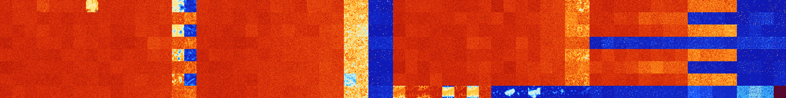

# B037 (70144-70655)

<details>
    <summary>Initial Grid</summary>
    
</details>


<details>
    <summary>Initial Grid RLE</summary>

```
#C Exported from GoGoL (https://github.com/marrow16/gogol)
#C Wrap mode: Toroidal
#C Boundary mode: Dead
#C Step: 0
x = 100, y = 100, rule = B037/S
25bo22bo36bo$7bo36bo7bo40bobo$20b2o7bo15bo29bo17bo3bo$40bo11bo20bo18bob
o$43bo8bo13bo$21bo6bobo$2bo3bo15bo6bo12bo5bo7bo8bo$20bo3bo15bo21bo$18bo
15bo31bo$100b$4bo29bo30b2o25bo$50bo11b2o27bo$2bo12bo43bo9bo$2b2o11bo18b
o27bo21bo13bo$9bo22bo21bo10bo$5bo3bo2bo12bo23bo27bo$2bo10bo24bo26bo30bo
$11bo42bo18bo9bob2o5bo5bo$3bo18bo2bobo14bo5bo12b2o28bo$6bo57bo7bo$27bo
2bo5bo25bobo16bo6bo5bo$30bo$5bo21b2o13b3obo34b2o$3bo11bo27bo4b2o$9bo10b
o21bo10bo$30bo39bo2bo$17bo61bo9bo5bo$20bobo16bo26bo7bo7bo$42bo$33bo47bo
16bo$2o65bo10bo$11bo55bo5bo10bo6bo5bo$6bo19bo7bo13bo8bo12bo$4bo30bo49bo
2bo$o20bo2bo14bo15bo$59bo24bo$11bo18bo9bo12bo2b2o29bo$11bo14bo22bo9bo4b
o19bo10bo$49bo4bo4bo7bo7bo9bo$10bo16bo49bo$12bo2bobo3bo62bo10bobo$13bo
6bo9bo20bo13bo9bo$7bo43bo7bo8bo9bobo6bo$53bo18bo2bo6bo9bo$36bo11bo5bo8b
o24bo$39bo3bo2bo7bo9b2o9bo4bo2bo3bo5bo$9bo22bo11bo2bo14bo25bo$21bo24bo
10bo35bo$2bo5bo9bo10bo2bo29bo10bo$bo59bo20bo$20bo17bo45bo7bo5bo$9bo18bo
5bo8bo2bo3bo$12bo28bo$2bo5bo17bo3bo26bo12bo11bo$13bo57bo3bo12bo$o2bo18b
o17bo2bo2bo4bo25bo4bo$7bo10bo4bo18b2o17bo7bo$20bo48bo13bo$55bo$o4bo18bo
9bo8bo3bo5bo20bo14b2o$13bo2b2o36bo40bo$7bo66bo12bo$18bo8bo15bo11bo17bo$
27bobo20bo16bo3bobo25bo$10bo5bo13bo2bo38bo4bo16bo$o44bobo18bo23bo4bo$
10bobo17bo33bo$69bo6bo2bo18b2o$12bo5bo12bo21bo18bo9bo16bo$31bo8b2o35bo
11bo$21bo26bo$29b2o33bo9bo16bobo3b2o$11bo13bo6bo18bo15b2o2bo$28bo25bo
31bo4b2o5b2o$20bo25bo$8bo21bo19bo$8bo2bo10bo12bo33bo$20bo3bo12bo$35bo
14bo2bo23bo2bo$25bo18bo$20bo3bo37bo17bo2bo6bo$28bo19bo19bo4bo$49bo41bo
6bo$5bo41bo23bo$47bo$4bo18bo9bo12bo41bo$3bo5bo15bo14bo21bo3bo10bo2bo3bo
9bo4bo$17bo78bo$49bo2bo9bo26bo4bo3bo$21bo7bo42bo2bo$10bobo9b2o11bo4bo
15bo16bo24bo$3bobo4bo50bobo$9bo14bo3bobo32bo$43bobo10bo18bo16bo$60bo$
29bo26bo19bo$44bo15bo22bo$15bo66bo$24bo14bo2bo25bo12bo$58bo4bo14bo8bo
10bo!
```
</details>
<details>
    <summary>Thumbnail</summary>

</details>
<table>
<tr>
    <td><a href="./70144%20S%20Heat%20Map%20Activity.png"></a><br>S (70144)<br>G>1000</td>    <td><a href="./70145%20S0%20Heat%20Map%20Activity.png"></a><br>S0 (70145)<br>G>1000</td>    <td><a href="./70146%20S1%20Heat%20Map%20Activity.png"></a><br>S1 (70146)<br>G>1000</td>    <td><a href="./70147%20S01%20Heat%20Map%20Activity.png"></a><br>S01 (70147)<br>G>1000</td>    <td><a href="./70148%20S2%20Heat%20Map%20Activity.png"></a><br>S2 (70148)<br>G>1000</td>    <td><a href="./70149%20S02%20Heat%20Map%20Activity.png"></a><br>S02 (70149)<br>G>1000</td>    <td><a href="./70150%20S12%20Heat%20Map%20Activity.png"></a><br>S12 (70150)<br>G>1000</td>    <td><a href="./70151%20S012%20Heat%20Map%20Activity.png"></a><br>S012 (70151)<br>G>1000</td>    <td><a href="./70152%20S3%20Heat%20Map%20Activity.png"></a><br>S3 (70152)<br>G>1000</td>    <td><a href="./70153%20S03%20Heat%20Map%20Activity.png"></a><br>S03 (70153)<br>G>1000</td>    <td><a href="./70154%20S13%20Heat%20Map%20Activity.png"></a><br>S13 (70154)<br>G>1000</td>    <td><a href="./70155%20S013%20Heat%20Map%20Activity.png"></a><br>S013 (70155)<br>G>1000</td>    <td><a href="./70156%20S23%20Heat%20Map%20Activity.png"></a><br>S23 (70156)<br>G>1000</td>    <td><a href="./70157%20S023%20Heat%20Map%20Activity.png"></a><br>S023 (70157)<br>G>1000</td>    <td><a href="./70158%20S123%20Heat%20Map%20Activity.png"></a><br>S123 (70158)<br>G>1000</td>    <td><a href="./70159%20S0123%20Heat%20Map%20Activity.png"></a><br>S0123 (70159)<br>G>1000</td>    <td><a href="./70160%20S4%20Heat%20Map%20Activity.png"></a><br>S4 (70160)<br>G>1000</td>    <td><a href="./70161%20S04%20Heat%20Map%20Activity.png"></a><br>S04 (70161)<br>G>1000</td>    <td><a href="./70162%20S14%20Heat%20Map%20Activity.png"></a><br>S14 (70162)<br>G>1000</td>    <td><a href="./70163%20S014%20Heat%20Map%20Activity.png"></a><br>S014 (70163)<br>G>1000</td>    <td><a href="./70164%20S24%20Heat%20Map%20Activity.png"></a><br>S24 (70164)<br>G>1000</td>    <td><a href="./70165%20S024%20Heat%20Map%20Activity.png"></a><br>S024 (70165)<br>G>1000</td>    <td><a href="./70166%20S124%20Heat%20Map%20Activity.png"></a><br>S124 (70166)<br>G>1000</td>    <td><a href="./70167%20S0124%20Heat%20Map%20Activity.png"></a><br>S0124 (70167)<br>G>1000</td>    <td><a href="./70168%20S34%20Heat%20Map%20Activity.png"></a><br>S34 (70168)<br>G>1000</td>    <td><a href="./70169%20S034%20Heat%20Map%20Activity.png"></a><br>S034 (70169)<br>G>1000</td>    <td><a href="./70170%20S134%20Heat%20Map%20Activity.png"></a><br>S134 (70170)<br>G>1000</td>    <td><a href="./70171%20S0134%20Heat%20Map%20Activity.png"></a><br>S0134 (70171)<br>G>1000</td>    <td><a href="./70172%20S234%20Heat%20Map%20Activity.png"></a><br>S234 (70172)<br>G>1000</td>    <td><a href="./70173%20S0234%20Heat%20Map%20Activity.png"></a><br>S0234 (70173)<br>G>1000</td>    <td><a href="./70174%20S1234%20Heat%20Map%20Activity.png"></a><br>S1234 (70174)<br>R@305,p252</td>    <td><a href="./70175%20S01234%20Heat%20Map%20Activity.png"></a><br>S01234 (70175)<br>G>1000</td>    <td><a href="./70176%20S5%20Heat%20Map%20Activity.png"></a><br>S5 (70176)<br>G>1000</td>    <td><a href="./70177%20S05%20Heat%20Map%20Activity.png"></a><br>S05 (70177)<br>G>1000</td>    <td><a href="./70178%20S15%20Heat%20Map%20Activity.png"></a><br>S15 (70178)<br>G>1000</td>    <td><a href="./70179%20S015%20Heat%20Map%20Activity.png"></a><br>S015 (70179)<br>G>1000</td>    <td><a href="./70180%20S25%20Heat%20Map%20Activity.png"></a><br>S25 (70180)<br>G>1000</td>    <td><a href="./70181%20S025%20Heat%20Map%20Activity.png"></a><br>S025 (70181)<br>G>1000</td>    <td><a href="./70182%20S125%20Heat%20Map%20Activity.png"></a><br>S125 (70182)<br>G>1000</td>    <td><a href="./70183%20S0125%20Heat%20Map%20Activity.png"></a><br>S0125 (70183)<br>G>1000</td>    <td><a href="./70184%20S35%20Heat%20Map%20Activity.png"></a><br>S35 (70184)<br>G>1000</td>    <td><a href="./70185%20S035%20Heat%20Map%20Activity.png"></a><br>S035 (70185)<br>G>1000</td>    <td><a href="./70186%20S135%20Heat%20Map%20Activity.png"></a><br>S135 (70186)<br>G>1000</td>    <td><a href="./70187%20S0135%20Heat%20Map%20Activity.png"></a><br>S0135 (70187)<br>G>1000</td>    <td><a href="./70188%20S235%20Heat%20Map%20Activity.png"></a><br>S235 (70188)<br>G>1000</td>    <td><a href="./70189%20S0235%20Heat%20Map%20Activity.png"></a><br>S0235 (70189)<br>G>1000</td>    <td><a href="./70190%20S1235%20Heat%20Map%20Activity.png"></a><br>S1235 (70190)<br>G>1000</td>    <td><a href="./70191%20S01235%20Heat%20Map%20Activity.png"></a><br>S01235 (70191)<br>G>1000</td>    <td><a href="./70192%20S45%20Heat%20Map%20Activity.png"></a><br>S45 (70192)<br>G>1000</td>    <td><a href="./70193%20S045%20Heat%20Map%20Activity.png"></a><br>S045 (70193)<br>G>1000</td>    <td><a href="./70194%20S145%20Heat%20Map%20Activity.png"></a><br>S145 (70194)<br>G>1000</td>    <td><a href="./70195%20S0145%20Heat%20Map%20Activity.png"></a><br>S0145 (70195)<br>G>1000</td>    <td><a href="./70196%20S245%20Heat%20Map%20Activity.png"></a><br>S245 (70196)<br>G>1000</td>    <td><a href="./70197%20S0245%20Heat%20Map%20Activity.png"></a><br>S0245 (70197)<br>G>1000</td>    <td><a href="./70198%20S1245%20Heat%20Map%20Activity.png"></a><br>S1245 (70198)<br>G>1000</td>    <td><a href="./70199%20S01245%20Heat%20Map%20Activity.png"></a><br>S01245 (70199)<br>G>1000</td>    <td><a href="./70200%20S345%20Heat%20Map%20Activity.png"></a><br>S345 (70200)<br>G>1000</td>    <td><a href="./70201%20S0345%20Heat%20Map%20Activity.png"></a><br>S0345 (70201)<br>G>1000</td>    <td><a href="./70202%20S1345%20Heat%20Map%20Activity.png"></a><br>S1345 (70202)<br>G>1000</td>    <td><a href="./70203%20S01345%20Heat%20Map%20Activity.png"></a><br>S01345 (70203)<br>G>1000</td>    <td><a href="./70204%20S2345%20Heat%20Map%20Activity.png"></a><br>S2345 (70204)<br>R@449,p360</td>    <td><a href="./70205%20S02345%20Heat%20Map%20Activity.png"></a><br>S02345 (70205)<br>G>1000</td>    <td><a href="./70206%20S12345%20Heat%20Map%20Activity.png"></a><br>S12345 (70206)<br>R@873,p840</td>    <td><a href="./70207%20S012345%20Heat%20Map%20Activity.png"></a><br>S012345 (70207)<br>G>1000</td></tr>
<tr>
    <td><a href="./70208%20S6%20Heat%20Map%20Activity.png"></a><br>S6 (70208)<br>G>1000</td>    <td><a href="./70209%20S06%20Heat%20Map%20Activity.png"></a><br>S06 (70209)<br>G>1000</td>    <td><a href="./70210%20S16%20Heat%20Map%20Activity.png"></a><br>S16 (70210)<br>G>1000</td>    <td><a href="./70211%20S016%20Heat%20Map%20Activity.png"></a><br>S016 (70211)<br>G>1000</td>    <td><a href="./70212%20S26%20Heat%20Map%20Activity.png"></a><br>S26 (70212)<br>G>1000</td>    <td><a href="./70213%20S026%20Heat%20Map%20Activity.png"></a><br>S026 (70213)<br>G>1000</td>    <td><a href="./70214%20S126%20Heat%20Map%20Activity.png"></a><br>S126 (70214)<br>G>1000</td>    <td><a href="./70215%20S0126%20Heat%20Map%20Activity.png"></a><br>S0126 (70215)<br>G>1000</td>    <td><a href="./70216%20S36%20Heat%20Map%20Activity.png"></a><br>S36 (70216)<br>G>1000</td>    <td><a href="./70217%20S036%20Heat%20Map%20Activity.png"></a><br>S036 (70217)<br>G>1000</td>    <td><a href="./70218%20S136%20Heat%20Map%20Activity.png"></a><br>S136 (70218)<br>G>1000</td>    <td><a href="./70219%20S0136%20Heat%20Map%20Activity.png"></a><br>S0136 (70219)<br>G>1000</td>    <td><a href="./70220%20S236%20Heat%20Map%20Activity.png"></a><br>S236 (70220)<br>G>1000</td>    <td><a href="./70221%20S0236%20Heat%20Map%20Activity.png"></a><br>S0236 (70221)<br>G>1000</td>    <td><a href="./70222%20S1236%20Heat%20Map%20Activity.png"></a><br>S1236 (70222)<br>G>1000</td>    <td><a href="./70223%20S01236%20Heat%20Map%20Activity.png"></a><br>S01236 (70223)<br>G>1000</td>    <td><a href="./70224%20S46%20Heat%20Map%20Activity.png"></a><br>S46 (70224)<br>G>1000</td>    <td><a href="./70225%20S046%20Heat%20Map%20Activity.png"></a><br>S046 (70225)<br>G>1000</td>    <td><a href="./70226%20S146%20Heat%20Map%20Activity.png"></a><br>S146 (70226)<br>G>1000</td>    <td><a href="./70227%20S0146%20Heat%20Map%20Activity.png"></a><br>S0146 (70227)<br>G>1000</td>    <td><a href="./70228%20S246%20Heat%20Map%20Activity.png"></a><br>S246 (70228)<br>G>1000</td>    <td><a href="./70229%20S0246%20Heat%20Map%20Activity.png"></a><br>S0246 (70229)<br>G>1000</td>    <td><a href="./70230%20S1246%20Heat%20Map%20Activity.png"></a><br>S1246 (70230)<br>G>1000</td>    <td><a href="./70231%20S01246%20Heat%20Map%20Activity.png"></a><br>S01246 (70231)<br>G>1000</td>    <td><a href="./70232%20S346%20Heat%20Map%20Activity.png"></a><br>S346 (70232)<br>G>1000</td>    <td><a href="./70233%20S0346%20Heat%20Map%20Activity.png"></a><br>S0346 (70233)<br>G>1000</td>    <td><a href="./70234%20S1346%20Heat%20Map%20Activity.png"></a><br>S1346 (70234)<br>G>1000</td>    <td><a href="./70235%20S01346%20Heat%20Map%20Activity.png"></a><br>S01346 (70235)<br>G>1000</td>    <td><a href="./70236%20S2346%20Heat%20Map%20Activity.png"></a><br>S2346 (70236)<br>G>1000</td>    <td><a href="./70237%20S02346%20Heat%20Map%20Activity.png"></a><br>S02346 (70237)<br>G>1000</td>    <td><a href="./70238%20S12346%20Heat%20Map%20Activity.png"></a><br>S12346 (70238)<br>R@141,p60</td>    <td><a href="./70239%20S012346%20Heat%20Map%20Activity.png"></a><br>S012346 (70239)<br>R@245,p140</td>    <td><a href="./70240%20S56%20Heat%20Map%20Activity.png"></a><br>S56 (70240)<br>G>1000</td>    <td><a href="./70241%20S056%20Heat%20Map%20Activity.png"></a><br>S056 (70241)<br>G>1000</td>    <td><a href="./70242%20S156%20Heat%20Map%20Activity.png"></a><br>S156 (70242)<br>G>1000</td>    <td><a href="./70243%20S0156%20Heat%20Map%20Activity.png"></a><br>S0156 (70243)<br>G>1000</td>    <td><a href="./70244%20S256%20Heat%20Map%20Activity.png"></a><br>S256 (70244)<br>G>1000</td>    <td><a href="./70245%20S0256%20Heat%20Map%20Activity.png"></a><br>S0256 (70245)<br>G>1000</td>    <td><a href="./70246%20S1256%20Heat%20Map%20Activity.png"></a><br>S1256 (70246)<br>G>1000</td>    <td><a href="./70247%20S01256%20Heat%20Map%20Activity.png"></a><br>S01256 (70247)<br>G>1000</td>    <td><a href="./70248%20S356%20Heat%20Map%20Activity.png"></a><br>S356 (70248)<br>G>1000</td>    <td><a href="./70249%20S0356%20Heat%20Map%20Activity.png"></a><br>S0356 (70249)<br>G>1000</td>    <td><a href="./70250%20S1356%20Heat%20Map%20Activity.png"></a><br>S1356 (70250)<br>G>1000</td>    <td><a href="./70251%20S01356%20Heat%20Map%20Activity.png"></a><br>S01356 (70251)<br>G>1000</td>    <td><a href="./70252%20S2356%20Heat%20Map%20Activity.png"></a><br>S2356 (70252)<br>G>1000</td>    <td><a href="./70253%20S02356%20Heat%20Map%20Activity.png"></a><br>S02356 (70253)<br>G>1000</td>    <td><a href="./70254%20S12356%20Heat%20Map%20Activity.png"></a><br>S12356 (70254)<br>G>1000</td>    <td><a href="./70255%20S012356%20Heat%20Map%20Activity.png"></a><br>S012356 (70255)<br>G>1000</td>    <td><a href="./70256%20S456%20Heat%20Map%20Activity.png"></a><br>S456 (70256)<br>G>1000</td>    <td><a href="./70257%20S0456%20Heat%20Map%20Activity.png"></a><br>S0456 (70257)<br>G>1000</td>    <td><a href="./70258%20S1456%20Heat%20Map%20Activity.png"></a><br>S1456 (70258)<br>G>1000</td>    <td><a href="./70259%20S01456%20Heat%20Map%20Activity.png"></a><br>S01456 (70259)<br>G>1000</td>    <td><a href="./70260%20S2456%20Heat%20Map%20Activity.png"></a><br>S2456 (70260)<br>G>1000</td>    <td><a href="./70261%20S02456%20Heat%20Map%20Activity.png"></a><br>S02456 (70261)<br>G>1000</td>    <td><a href="./70262%20S12456%20Heat%20Map%20Activity.png"></a><br>S12456 (70262)<br>G>1000</td>    <td><a href="./70263%20S012456%20Heat%20Map%20Activity.png"></a><br>S012456 (70263)<br>G>1000</td>    <td><a href="./70264%20S3456%20Heat%20Map%20Activity.png"></a><br>S3456 (70264)<br>R@152,p12</td>    <td><a href="./70265%20S03456%20Heat%20Map%20Activity.png"></a><br>S03456 (70265)<br>R@231,p60</td>    <td><a href="./70266%20S13456%20Heat%20Map%20Activity.png"></a><br>S13456 (70266)<br>R@205,p24</td>    <td><a href="./70267%20S013456%20Heat%20Map%20Activity.png"></a><br>S013456 (70267)<br>G>1000</td>    <td><a href="./70268%20S23456%20Heat%20Map%20Activity.png"></a><br>S23456 (70268)<br>R@456,p420</td>    <td><a href="./70269%20S023456%20Heat%20Map%20Activity.png"></a><br>S023456 (70269)<br>R@54,p12</td>    <td><a href="./70270%20S123456%20Heat%20Map%20Activity.png"></a><br>S123456 (70270)<br>R@37,p12</td>    <td><a href="./70271%20S0123456%20Heat%20Map%20Activity.png"></a><br>S0123456 (70271)<br>R@150,p120</td></tr>
<tr>
    <td><a href="./70272%20S7%20Heat%20Map%20Activity.png"></a><br>S7 (70272)<br>G>1000</td>    <td><a href="./70273%20S07%20Heat%20Map%20Activity.png"></a><br>S07 (70273)<br>G>1000</td>    <td><a href="./70274%20S17%20Heat%20Map%20Activity.png"></a><br>S17 (70274)<br>G>1000</td>    <td><a href="./70275%20S017%20Heat%20Map%20Activity.png"></a><br>S017 (70275)<br>G>1000</td>    <td><a href="./70276%20S27%20Heat%20Map%20Activity.png"></a><br>S27 (70276)<br>G>1000</td>    <td><a href="./70277%20S027%20Heat%20Map%20Activity.png"></a><br>S027 (70277)<br>G>1000</td>    <td><a href="./70278%20S127%20Heat%20Map%20Activity.png"></a><br>S127 (70278)<br>G>1000</td>    <td><a href="./70279%20S0127%20Heat%20Map%20Activity.png"></a><br>S0127 (70279)<br>G>1000</td>    <td><a href="./70280%20S37%20Heat%20Map%20Activity.png"></a><br>S37 (70280)<br>G>1000</td>    <td><a href="./70281%20S037%20Heat%20Map%20Activity.png"></a><br>S037 (70281)<br>G>1000</td>    <td><a href="./70282%20S137%20Heat%20Map%20Activity.png"></a><br>S137 (70282)<br>G>1000</td>    <td><a href="./70283%20S0137%20Heat%20Map%20Activity.png"></a><br>S0137 (70283)<br>G>1000</td>    <td><a href="./70284%20S237%20Heat%20Map%20Activity.png"></a><br>S237 (70284)<br>G>1000</td>    <td><a href="./70285%20S0237%20Heat%20Map%20Activity.png"></a><br>S0237 (70285)<br>G>1000</td>    <td><a href="./70286%20S1237%20Heat%20Map%20Activity.png"></a><br>S1237 (70286)<br>G>1000</td>    <td><a href="./70287%20S01237%20Heat%20Map%20Activity.png"></a><br>S01237 (70287)<br>G>1000</td>    <td><a href="./70288%20S47%20Heat%20Map%20Activity.png"></a><br>S47 (70288)<br>G>1000</td>    <td><a href="./70289%20S047%20Heat%20Map%20Activity.png"></a><br>S047 (70289)<br>G>1000</td>    <td><a href="./70290%20S147%20Heat%20Map%20Activity.png"></a><br>S147 (70290)<br>G>1000</td>    <td><a href="./70291%20S0147%20Heat%20Map%20Activity.png"></a><br>S0147 (70291)<br>G>1000</td>    <td><a href="./70292%20S247%20Heat%20Map%20Activity.png"></a><br>S247 (70292)<br>G>1000</td>    <td><a href="./70293%20S0247%20Heat%20Map%20Activity.png"></a><br>S0247 (70293)<br>G>1000</td>    <td><a href="./70294%20S1247%20Heat%20Map%20Activity.png"></a><br>S1247 (70294)<br>G>1000</td>    <td><a href="./70295%20S01247%20Heat%20Map%20Activity.png"></a><br>S01247 (70295)<br>G>1000</td>    <td><a href="./70296%20S347%20Heat%20Map%20Activity.png"></a><br>S347 (70296)<br>G>1000</td>    <td><a href="./70297%20S0347%20Heat%20Map%20Activity.png"></a><br>S0347 (70297)<br>G>1000</td>    <td><a href="./70298%20S1347%20Heat%20Map%20Activity.png"></a><br>S1347 (70298)<br>G>1000</td>    <td><a href="./70299%20S01347%20Heat%20Map%20Activity.png"></a><br>S01347 (70299)<br>G>1000</td>    <td><a href="./70300%20S2347%20Heat%20Map%20Activity.png"></a><br>S2347 (70300)<br>G>1000</td>    <td><a href="./70301%20S02347%20Heat%20Map%20Activity.png"></a><br>S02347 (70301)<br>G>1000</td>    <td><a href="./70302%20S12347%20Heat%20Map%20Activity.png"></a><br>S12347 (70302)<br>G>1000</td>    <td><a href="./70303%20S012347%20Heat%20Map%20Activity.png"></a><br>S012347 (70303)<br>G>1000</td>    <td><a href="./70304%20S57%20Heat%20Map%20Activity.png"></a><br>S57 (70304)<br>G>1000</td>    <td><a href="./70305%20S057%20Heat%20Map%20Activity.png"></a><br>S057 (70305)<br>G>1000</td>    <td><a href="./70306%20S157%20Heat%20Map%20Activity.png"></a><br>S157 (70306)<br>G>1000</td>    <td><a href="./70307%20S0157%20Heat%20Map%20Activity.png"></a><br>S0157 (70307)<br>G>1000</td>    <td><a href="./70308%20S257%20Heat%20Map%20Activity.png"></a><br>S257 (70308)<br>G>1000</td>    <td><a href="./70309%20S0257%20Heat%20Map%20Activity.png"></a><br>S0257 (70309)<br>G>1000</td>    <td><a href="./70310%20S1257%20Heat%20Map%20Activity.png"></a><br>S1257 (70310)<br>G>1000</td>    <td><a href="./70311%20S01257%20Heat%20Map%20Activity.png"></a><br>S01257 (70311)<br>G>1000</td>    <td><a href="./70312%20S357%20Heat%20Map%20Activity.png"></a><br>S357 (70312)<br>G>1000</td>    <td><a href="./70313%20S0357%20Heat%20Map%20Activity.png"></a><br>S0357 (70313)<br>G>1000</td>    <td><a href="./70314%20S1357%20Heat%20Map%20Activity.png"></a><br>S1357 (70314)<br>G>1000</td>    <td><a href="./70315%20S01357%20Heat%20Map%20Activity.png"></a><br>S01357 (70315)<br>G>1000</td>    <td><a href="./70316%20S2357%20Heat%20Map%20Activity.png"></a><br>S2357 (70316)<br>G>1000</td>    <td><a href="./70317%20S02357%20Heat%20Map%20Activity.png"></a><br>S02357 (70317)<br>G>1000</td>    <td><a href="./70318%20S12357%20Heat%20Map%20Activity.png"></a><br>S12357 (70318)<br>G>1000</td>    <td><a href="./70319%20S012357%20Heat%20Map%20Activity.png"></a><br>S012357 (70319)<br>G>1000</td>    <td><a href="./70320%20S457%20Heat%20Map%20Activity.png"></a><br>S457 (70320)<br>G>1000</td>    <td><a href="./70321%20S0457%20Heat%20Map%20Activity.png"></a><br>S0457 (70321)<br>G>1000</td>    <td><a href="./70322%20S1457%20Heat%20Map%20Activity.png"></a><br>S1457 (70322)<br>G>1000</td>    <td><a href="./70323%20S01457%20Heat%20Map%20Activity.png"></a><br>S01457 (70323)<br>G>1000</td>    <td><a href="./70324%20S2457%20Heat%20Map%20Activity.png"></a><br>S2457 (70324)<br>G>1000</td>    <td><a href="./70325%20S02457%20Heat%20Map%20Activity.png"></a><br>S02457 (70325)<br>G>1000</td>    <td><a href="./70326%20S12457%20Heat%20Map%20Activity.png"></a><br>S12457 (70326)<br>G>1000</td>    <td><a href="./70327%20S012457%20Heat%20Map%20Activity.png"></a><br>S012457 (70327)<br>G>1000</td>    <td><a href="./70328%20S3457%20Heat%20Map%20Activity.png"></a><br>S3457 (70328)<br>G>1000</td>    <td><a href="./70329%20S03457%20Heat%20Map%20Activity.png"></a><br>S03457 (70329)<br>G>1000</td>    <td><a href="./70330%20S13457%20Heat%20Map%20Activity.png"></a><br>S13457 (70330)<br>G>1000</td>    <td><a href="./70331%20S013457%20Heat%20Map%20Activity.png"></a><br>S013457 (70331)<br>G>1000</td>    <td><a href="./70332%20S23457%20Heat%20Map%20Activity.png"></a><br>S23457 (70332)<br>R@156,p84</td>    <td><a href="./70333%20S023457%20Heat%20Map%20Activity.png"></a><br>S023457 (70333)<br>R@63,p12</td>    <td><a href="./70334%20S123457%20Heat%20Map%20Activity.png"></a><br>S123457 (70334)<br>R@204,p168</td>    <td><a href="./70335%20S0123457%20Heat%20Map%20Activity.png"></a><br>S0123457 (70335)<br>R@194,p168</td></tr>
<tr>
    <td><a href="./70336%20S67%20Heat%20Map%20Activity.png"></a><br>S67 (70336)<br>G>1000</td>    <td><a href="./70337%20S067%20Heat%20Map%20Activity.png"></a><br>S067 (70337)<br>G>1000</td>    <td><a href="./70338%20S167%20Heat%20Map%20Activity.png"></a><br>S167 (70338)<br>G>1000</td>    <td><a href="./70339%20S0167%20Heat%20Map%20Activity.png"></a><br>S0167 (70339)<br>G>1000</td>    <td><a href="./70340%20S267%20Heat%20Map%20Activity.png"></a><br>S267 (70340)<br>G>1000</td>    <td><a href="./70341%20S0267%20Heat%20Map%20Activity.png"></a><br>S0267 (70341)<br>G>1000</td>    <td><a href="./70342%20S1267%20Heat%20Map%20Activity.png"></a><br>S1267 (70342)<br>G>1000</td>    <td><a href="./70343%20S01267%20Heat%20Map%20Activity.png"></a><br>S01267 (70343)<br>G>1000</td>    <td><a href="./70344%20S367%20Heat%20Map%20Activity.png"></a><br>S367 (70344)<br>G>1000</td>    <td><a href="./70345%20S0367%20Heat%20Map%20Activity.png"></a><br>S0367 (70345)<br>G>1000</td>    <td><a href="./70346%20S1367%20Heat%20Map%20Activity.png"></a><br>S1367 (70346)<br>G>1000</td>    <td><a href="./70347%20S01367%20Heat%20Map%20Activity.png"></a><br>S01367 (70347)<br>G>1000</td>    <td><a href="./70348%20S2367%20Heat%20Map%20Activity.png"></a><br>S2367 (70348)<br>G>1000</td>    <td><a href="./70349%20S02367%20Heat%20Map%20Activity.png"></a><br>S02367 (70349)<br>G>1000</td>    <td><a href="./70350%20S12367%20Heat%20Map%20Activity.png"></a><br>S12367 (70350)<br>G>1000</td>    <td><a href="./70351%20S012367%20Heat%20Map%20Activity.png"></a><br>S012367 (70351)<br>G>1000</td>    <td><a href="./70352%20S467%20Heat%20Map%20Activity.png"></a><br>S467 (70352)<br>G>1000</td>    <td><a href="./70353%20S0467%20Heat%20Map%20Activity.png"></a><br>S0467 (70353)<br>G>1000</td>    <td><a href="./70354%20S1467%20Heat%20Map%20Activity.png"></a><br>S1467 (70354)<br>G>1000</td>    <td><a href="./70355%20S01467%20Heat%20Map%20Activity.png"></a><br>S01467 (70355)<br>G>1000</td>    <td><a href="./70356%20S2467%20Heat%20Map%20Activity.png"></a><br>S2467 (70356)<br>G>1000</td>    <td><a href="./70357%20S02467%20Heat%20Map%20Activity.png"></a><br>S02467 (70357)<br>G>1000</td>    <td><a href="./70358%20S12467%20Heat%20Map%20Activity.png"></a><br>S12467 (70358)<br>G>1000</td>    <td><a href="./70359%20S012467%20Heat%20Map%20Activity.png"></a><br>S012467 (70359)<br>G>1000</td>    <td><a href="./70360%20S3467%20Heat%20Map%20Activity.png"></a><br>S3467 (70360)<br>G>1000</td>    <td><a href="./70361%20S03467%20Heat%20Map%20Activity.png"></a><br>S03467 (70361)<br>G>1000</td>    <td><a href="./70362%20S13467%20Heat%20Map%20Activity.png"></a><br>S13467 (70362)<br>G>1000</td>    <td><a href="./70363%20S013467%20Heat%20Map%20Activity.png"></a><br>S013467 (70363)<br>G>1000</td>    <td><a href="./70364%20S23467%20Heat%20Map%20Activity.png"></a><br>S23467 (70364)<br>G>1000</td>    <td><a href="./70365%20S023467%20Heat%20Map%20Activity.png"></a><br>S023467 (70365)<br>G>1000</td>    <td><a href="./70366%20S123467%20Heat%20Map%20Activity.png"></a><br>S123467 (70366)<br>R@101,p20</td>    <td><a href="./70367%20S0123467%20Heat%20Map%20Activity.png"></a><br>S0123467 (70367)<br>R@128,p40</td>    <td><a href="./70368%20S567%20Heat%20Map%20Activity.png"></a><br>S567 (70368)<br>G>1000</td>    <td><a href="./70369%20S0567%20Heat%20Map%20Activity.png"></a><br>S0567 (70369)<br>G>1000</td>    <td><a href="./70370%20S1567%20Heat%20Map%20Activity.png"></a><br>S1567 (70370)<br>G>1000</td>    <td><a href="./70371%20S01567%20Heat%20Map%20Activity.png"></a><br>S01567 (70371)<br>G>1000</td>    <td><a href="./70372%20S2567%20Heat%20Map%20Activity.png"></a><br>S2567 (70372)<br>G>1000</td>    <td><a href="./70373%20S02567%20Heat%20Map%20Activity.png"></a><br>S02567 (70373)<br>G>1000</td>    <td><a href="./70374%20S12567%20Heat%20Map%20Activity.png"></a><br>S12567 (70374)<br>G>1000</td>    <td><a href="./70375%20S012567%20Heat%20Map%20Activity.png"></a><br>S012567 (70375)<br>G>1000</td>    <td><a href="./70376%20S3567%20Heat%20Map%20Activity.png"></a><br>S3567 (70376)<br>G>1000</td>    <td><a href="./70377%20S03567%20Heat%20Map%20Activity.png"></a><br>S03567 (70377)<br>G>1000</td>    <td><a href="./70378%20S13567%20Heat%20Map%20Activity.png"></a><br>S13567 (70378)<br>G>1000</td>    <td><a href="./70379%20S013567%20Heat%20Map%20Activity.png"></a><br>S013567 (70379)<br>G>1000</td>    <td><a href="./70380%20S23567%20Heat%20Map%20Activity.png"></a><br>S23567 (70380)<br>G>1000</td>    <td><a href="./70381%20S023567%20Heat%20Map%20Activity.png"></a><br>S023567 (70381)<br>G>1000</td>    <td><a href="./70382%20S123567%20Heat%20Map%20Activity.png"></a><br>S123567 (70382)<br>G>1000</td>    <td><a href="./70383%20S0123567%20Heat%20Map%20Activity.png"></a><br>S0123567 (70383)<br>G>1000</td>    <td><a href="./70384%20S4567%20Heat%20Map%20Activity.png"></a><br>S4567 (70384)<br>R@502,p360</td>    <td><a href="./70385%20S04567%20Heat%20Map%20Activity.png"></a><br>S04567 (70385)<br>R@229,p60</td>    <td><a href="./70386%20S14567%20Heat%20Map%20Activity.png"></a><br>S14567 (70386)<br>R@245,p120</td>    <td><a href="./70387%20S014567%20Heat%20Map%20Activity.png"></a><br>S014567 (70387)<br>R@200,p84</td>    <td><a href="./70388%20S24567%20Heat%20Map%20Activity.png"></a><br>S24567 (70388)<br>R@139,p60</td>    <td><a href="./70389%20S024567%20Heat%20Map%20Activity.png"></a><br>S024567 (70389)<br>R@142,p60</td>    <td><a href="./70390%20S124567%20Heat%20Map%20Activity.png"></a><br>S124567 (70390)<br>R@98,p12</td>    <td><a href="./70391%20S0124567%20Heat%20Map%20Activity.png"></a><br>S0124567 (70391)<br>R@124,p30</td>    <td><a href="./70392%20S34567%20Heat%20Map%20Activity.png"></a><br>S34567 (70392)<br>R@31,p12</td>    <td><a href="./70393%20S034567%20Heat%20Map%20Activity.png"></a><br>S034567 (70393)<br>R@31,p12</td>    <td><a href="./70394%20S134567%20Heat%20Map%20Activity.png"></a><br>S134567 (70394)<br>R@34,p12</td>    <td><a href="./70395%20S0134567%20Heat%20Map%20Activity.png"></a><br>S0134567 (70395)<br>R@55,p30</td>    <td><a href="./70396%20S234567%20Heat%20Map%20Activity.png"></a><br>S234567 (70396)<br>R@25,p6</td>    <td><a href="./70397%20S0234567%20Heat%20Map%20Activity.png"></a><br>S0234567 (70397)<br>R@27,p6</td>    <td><a href="./70398%20S1234567%20Heat%20Map%20Activity.png"></a><br>S1234567 (70398)<br>R@20,p6</td>    <td><a href="./70399%20S01234567%20Heat%20Map%20Activity.png"></a><br>S01234567 (70399)<br>R@24,p6</td></tr>
<tr>
    <td><a href="./70400%20S8%20Heat%20Map%20Activity.png"></a><br>S8 (70400)<br>G>1000</td>    <td><a href="./70401%20S08%20Heat%20Map%20Activity.png"></a><br>S08 (70401)<br>G>1000</td>    <td><a href="./70402%20S18%20Heat%20Map%20Activity.png"></a><br>S18 (70402)<br>G>1000</td>    <td><a href="./70403%20S018%20Heat%20Map%20Activity.png"></a><br>S018 (70403)<br>G>1000</td>    <td><a href="./70404%20S28%20Heat%20Map%20Activity.png"></a><br>S28 (70404)<br>G>1000</td>    <td><a href="./70405%20S028%20Heat%20Map%20Activity.png"></a><br>S028 (70405)<br>G>1000</td>    <td><a href="./70406%20S128%20Heat%20Map%20Activity.png"></a><br>S128 (70406)<br>G>1000</td>    <td><a href="./70407%20S0128%20Heat%20Map%20Activity.png"></a><br>S0128 (70407)<br>G>1000</td>    <td><a href="./70408%20S38%20Heat%20Map%20Activity.png"></a><br>S38 (70408)<br>G>1000</td>    <td><a href="./70409%20S038%20Heat%20Map%20Activity.png"></a><br>S038 (70409)<br>G>1000</td>    <td><a href="./70410%20S138%20Heat%20Map%20Activity.png"></a><br>S138 (70410)<br>G>1000</td>    <td><a href="./70411%20S0138%20Heat%20Map%20Activity.png"></a><br>S0138 (70411)<br>G>1000</td>    <td><a href="./70412%20S238%20Heat%20Map%20Activity.png"></a><br>S238 (70412)<br>G>1000</td>    <td><a href="./70413%20S0238%20Heat%20Map%20Activity.png"></a><br>S0238 (70413)<br>G>1000</td>    <td><a href="./70414%20S1238%20Heat%20Map%20Activity.png"></a><br>S1238 (70414)<br>G>1000</td>    <td><a href="./70415%20S01238%20Heat%20Map%20Activity.png"></a><br>S01238 (70415)<br>G>1000</td>    <td><a href="./70416%20S48%20Heat%20Map%20Activity.png"></a><br>S48 (70416)<br>G>1000</td>    <td><a href="./70417%20S048%20Heat%20Map%20Activity.png"></a><br>S048 (70417)<br>G>1000</td>    <td><a href="./70418%20S148%20Heat%20Map%20Activity.png"></a><br>S148 (70418)<br>G>1000</td>    <td><a href="./70419%20S0148%20Heat%20Map%20Activity.png"></a><br>S0148 (70419)<br>G>1000</td>    <td><a href="./70420%20S248%20Heat%20Map%20Activity.png"></a><br>S248 (70420)<br>G>1000</td>    <td><a href="./70421%20S0248%20Heat%20Map%20Activity.png"></a><br>S0248 (70421)<br>G>1000</td>    <td><a href="./70422%20S1248%20Heat%20Map%20Activity.png"></a><br>S1248 (70422)<br>G>1000</td>    <td><a href="./70423%20S01248%20Heat%20Map%20Activity.png"></a><br>S01248 (70423)<br>G>1000</td>    <td><a href="./70424%20S348%20Heat%20Map%20Activity.png"></a><br>S348 (70424)<br>G>1000</td>    <td><a href="./70425%20S0348%20Heat%20Map%20Activity.png"></a><br>S0348 (70425)<br>G>1000</td>    <td><a href="./70426%20S1348%20Heat%20Map%20Activity.png"></a><br>S1348 (70426)<br>G>1000</td>    <td><a href="./70427%20S01348%20Heat%20Map%20Activity.png"></a><br>S01348 (70427)<br>G>1000</td>    <td><a href="./70428%20S2348%20Heat%20Map%20Activity.png"></a><br>S2348 (70428)<br>G>1000</td>    <td><a href="./70429%20S02348%20Heat%20Map%20Activity.png"></a><br>S02348 (70429)<br>G>1000</td>    <td><a href="./70430%20S12348%20Heat%20Map%20Activity.png"></a><br>S12348 (70430)<br>R@906,p840</td>    <td><a href="./70431%20S012348%20Heat%20Map%20Activity.png"></a><br>S012348 (70431)<br>R@307,p252</td>    <td><a href="./70432%20S58%20Heat%20Map%20Activity.png"></a><br>S58 (70432)<br>G>1000</td>    <td><a href="./70433%20S058%20Heat%20Map%20Activity.png"></a><br>S058 (70433)<br>G>1000</td>    <td><a href="./70434%20S158%20Heat%20Map%20Activity.png"></a><br>S158 (70434)<br>G>1000</td>    <td><a href="./70435%20S0158%20Heat%20Map%20Activity.png"></a><br>S0158 (70435)<br>G>1000</td>    <td><a href="./70436%20S258%20Heat%20Map%20Activity.png"></a><br>S258 (70436)<br>G>1000</td>    <td><a href="./70437%20S0258%20Heat%20Map%20Activity.png"></a><br>S0258 (70437)<br>G>1000</td>    <td><a href="./70438%20S1258%20Heat%20Map%20Activity.png"></a><br>S1258 (70438)<br>G>1000</td>    <td><a href="./70439%20S01258%20Heat%20Map%20Activity.png"></a><br>S01258 (70439)<br>G>1000</td>    <td><a href="./70440%20S358%20Heat%20Map%20Activity.png"></a><br>S358 (70440)<br>G>1000</td>    <td><a href="./70441%20S0358%20Heat%20Map%20Activity.png"></a><br>S0358 (70441)<br>G>1000</td>    <td><a href="./70442%20S1358%20Heat%20Map%20Activity.png"></a><br>S1358 (70442)<br>G>1000</td>    <td><a href="./70443%20S01358%20Heat%20Map%20Activity.png"></a><br>S01358 (70443)<br>G>1000</td>    <td><a href="./70444%20S2358%20Heat%20Map%20Activity.png"></a><br>S2358 (70444)<br>G>1000</td>    <td><a href="./70445%20S02358%20Heat%20Map%20Activity.png"></a><br>S02358 (70445)<br>G>1000</td>    <td><a href="./70446%20S12358%20Heat%20Map%20Activity.png"></a><br>S12358 (70446)<br>G>1000</td>    <td><a href="./70447%20S012358%20Heat%20Map%20Activity.png"></a><br>S012358 (70447)<br>G>1000</td>    <td><a href="./70448%20S458%20Heat%20Map%20Activity.png"></a><br>S458 (70448)<br>G>1000</td>    <td><a href="./70449%20S0458%20Heat%20Map%20Activity.png"></a><br>S0458 (70449)<br>G>1000</td>    <td><a href="./70450%20S1458%20Heat%20Map%20Activity.png"></a><br>S1458 (70450)<br>G>1000</td>    <td><a href="./70451%20S01458%20Heat%20Map%20Activity.png"></a><br>S01458 (70451)<br>G>1000</td>    <td><a href="./70452%20S2458%20Heat%20Map%20Activity.png"></a><br>S2458 (70452)<br>G>1000</td>    <td><a href="./70453%20S02458%20Heat%20Map%20Activity.png"></a><br>S02458 (70453)<br>G>1000</td>    <td><a href="./70454%20S12458%20Heat%20Map%20Activity.png"></a><br>S12458 (70454)<br>G>1000</td>    <td><a href="./70455%20S012458%20Heat%20Map%20Activity.png"></a><br>S012458 (70455)<br>G>1000</td>    <td><a href="./70456%20S3458%20Heat%20Map%20Activity.png"></a><br>S3458 (70456)<br>G>1000</td>    <td><a href="./70457%20S03458%20Heat%20Map%20Activity.png"></a><br>S03458 (70457)<br>G>1000</td>    <td><a href="./70458%20S13458%20Heat%20Map%20Activity.png"></a><br>S13458 (70458)<br>G>1000</td>    <td><a href="./70459%20S013458%20Heat%20Map%20Activity.png"></a><br>S013458 (70459)<br>G>1000</td>    <td><a href="./70460%20S23458%20Heat%20Map%20Activity.png"></a><br>S23458 (70460)<br>R@940,p840</td>    <td><a href="./70461%20S023458%20Heat%20Map%20Activity.png"></a><br>S023458 (70461)<br>G>1000</td>    <td><a href="./70462%20S123458%20Heat%20Map%20Activity.png"></a><br>S123458 (70462)<br>R@462,p420</td>    <td><a href="./70463%20S0123458%20Heat%20Map%20Activity.png"></a><br>S0123458 (70463)<br>G>1000</td></tr>
<tr>
    <td><a href="./70464%20S68%20Heat%20Map%20Activity.png"></a><br>S68 (70464)<br>G>1000</td>    <td><a href="./70465%20S068%20Heat%20Map%20Activity.png"></a><br>S068 (70465)<br>G>1000</td>    <td><a href="./70466%20S168%20Heat%20Map%20Activity.png"></a><br>S168 (70466)<br>G>1000</td>    <td><a href="./70467%20S0168%20Heat%20Map%20Activity.png"></a><br>S0168 (70467)<br>G>1000</td>    <td><a href="./70468%20S268%20Heat%20Map%20Activity.png"></a><br>S268 (70468)<br>G>1000</td>    <td><a href="./70469%20S0268%20Heat%20Map%20Activity.png"></a><br>S0268 (70469)<br>G>1000</td>    <td><a href="./70470%20S1268%20Heat%20Map%20Activity.png"></a><br>S1268 (70470)<br>G>1000</td>    <td><a href="./70471%20S01268%20Heat%20Map%20Activity.png"></a><br>S01268 (70471)<br>G>1000</td>    <td><a href="./70472%20S368%20Heat%20Map%20Activity.png"></a><br>S368 (70472)<br>G>1000</td>    <td><a href="./70473%20S0368%20Heat%20Map%20Activity.png"></a><br>S0368 (70473)<br>G>1000</td>    <td><a href="./70474%20S1368%20Heat%20Map%20Activity.png"></a><br>S1368 (70474)<br>G>1000</td>    <td><a href="./70475%20S01368%20Heat%20Map%20Activity.png"></a><br>S01368 (70475)<br>G>1000</td>    <td><a href="./70476%20S2368%20Heat%20Map%20Activity.png"></a><br>S2368 (70476)<br>G>1000</td>    <td><a href="./70477%20S02368%20Heat%20Map%20Activity.png"></a><br>S02368 (70477)<br>G>1000</td>    <td><a href="./70478%20S12368%20Heat%20Map%20Activity.png"></a><br>S12368 (70478)<br>G>1000</td>    <td><a href="./70479%20S012368%20Heat%20Map%20Activity.png"></a><br>S012368 (70479)<br>G>1000</td>    <td><a href="./70480%20S468%20Heat%20Map%20Activity.png"></a><br>S468 (70480)<br>G>1000</td>    <td><a href="./70481%20S0468%20Heat%20Map%20Activity.png"></a><br>S0468 (70481)<br>G>1000</td>    <td><a href="./70482%20S1468%20Heat%20Map%20Activity.png"></a><br>S1468 (70482)<br>G>1000</td>    <td><a href="./70483%20S01468%20Heat%20Map%20Activity.png"></a><br>S01468 (70483)<br>G>1000</td>    <td><a href="./70484%20S2468%20Heat%20Map%20Activity.png"></a><br>S2468 (70484)<br>G>1000</td>    <td><a href="./70485%20S02468%20Heat%20Map%20Activity.png"></a><br>S02468 (70485)<br>G>1000</td>    <td><a href="./70486%20S12468%20Heat%20Map%20Activity.png"></a><br>S12468 (70486)<br>G>1000</td>    <td><a href="./70487%20S012468%20Heat%20Map%20Activity.png"></a><br>S012468 (70487)<br>G>1000</td>    <td><a href="./70488%20S3468%20Heat%20Map%20Activity.png"></a><br>S3468 (70488)<br>G>1000</td>    <td><a href="./70489%20S03468%20Heat%20Map%20Activity.png"></a><br>S03468 (70489)<br>G>1000</td>    <td><a href="./70490%20S13468%20Heat%20Map%20Activity.png"></a><br>S13468 (70490)<br>G>1000</td>    <td><a href="./70491%20S013468%20Heat%20Map%20Activity.png"></a><br>S013468 (70491)<br>G>1000</td>    <td><a href="./70492%20S23468%20Heat%20Map%20Activity.png"></a><br>S23468 (70492)<br>G>1000</td>    <td><a href="./70493%20S023468%20Heat%20Map%20Activity.png"></a><br>S023468 (70493)<br>G>1000</td>    <td><a href="./70494%20S123468%20Heat%20Map%20Activity.png"></a><br>S123468 (70494)<br>R@531,p420</td>    <td><a href="./70495%20S0123468%20Heat%20Map%20Activity.png"></a><br>S0123468 (70495)<br>R@915,p840</td>    <td><a href="./70496%20S568%20Heat%20Map%20Activity.png"></a><br>S568 (70496)<br>G>1000</td>    <td><a href="./70497%20S0568%20Heat%20Map%20Activity.png"></a><br>S0568 (70497)<br>G>1000</td>    <td><a href="./70498%20S1568%20Heat%20Map%20Activity.png"></a><br>S1568 (70498)<br>G>1000</td>    <td><a href="./70499%20S01568%20Heat%20Map%20Activity.png"></a><br>S01568 (70499)<br>G>1000</td>    <td><a href="./70500%20S2568%20Heat%20Map%20Activity.png"></a><br>S2568 (70500)<br>G>1000</td>    <td><a href="./70501%20S02568%20Heat%20Map%20Activity.png"></a><br>S02568 (70501)<br>G>1000</td>    <td><a href="./70502%20S12568%20Heat%20Map%20Activity.png"></a><br>S12568 (70502)<br>G>1000</td>    <td><a href="./70503%20S012568%20Heat%20Map%20Activity.png"></a><br>S012568 (70503)<br>G>1000</td>    <td><a href="./70504%20S3568%20Heat%20Map%20Activity.png"></a><br>S3568 (70504)<br>G>1000</td>    <td><a href="./70505%20S03568%20Heat%20Map%20Activity.png"></a><br>S03568 (70505)<br>G>1000</td>    <td><a href="./70506%20S13568%20Heat%20Map%20Activity.png"></a><br>S13568 (70506)<br>G>1000</td>    <td><a href="./70507%20S013568%20Heat%20Map%20Activity.png"></a><br>S013568 (70507)<br>G>1000</td>    <td><a href="./70508%20S23568%20Heat%20Map%20Activity.png"></a><br>S23568 (70508)<br>G>1000</td>    <td><a href="./70509%20S023568%20Heat%20Map%20Activity.png"></a><br>S023568 (70509)<br>G>1000</td>    <td><a href="./70510%20S123568%20Heat%20Map%20Activity.png"></a><br>S123568 (70510)<br>G>1000</td>    <td><a href="./70511%20S0123568%20Heat%20Map%20Activity.png"></a><br>S0123568 (70511)<br>G>1000</td>    <td><a href="./70512%20S4568%20Heat%20Map%20Activity.png"></a><br>S4568 (70512)<br>G>1000</td>    <td><a href="./70513%20S04568%20Heat%20Map%20Activity.png"></a><br>S04568 (70513)<br>G>1000</td>    <td><a href="./70514%20S14568%20Heat%20Map%20Activity.png"></a><br>S14568 (70514)<br>G>1000</td>    <td><a href="./70515%20S014568%20Heat%20Map%20Activity.png"></a><br>S014568 (70515)<br>G>1000</td>    <td><a href="./70516%20S24568%20Heat%20Map%20Activity.png"></a><br>S24568 (70516)<br>G>1000</td>    <td><a href="./70517%20S024568%20Heat%20Map%20Activity.png"></a><br>S024568 (70517)<br>G>1000</td>    <td><a href="./70518%20S124568%20Heat%20Map%20Activity.png"></a><br>S124568 (70518)<br>G>1000</td>    <td><a href="./70519%20S0124568%20Heat%20Map%20Activity.png"></a><br>S0124568 (70519)<br>G>1000</td>    <td><a href="./70520%20S34568%20Heat%20Map%20Activity.png"></a><br>S34568 (70520)<br>R@196,p84</td>    <td><a href="./70521%20S034568%20Heat%20Map%20Activity.png"></a><br>S034568 (70521)<br>R@216,p60</td>    <td><a href="./70522%20S134568%20Heat%20Map%20Activity.png"></a><br>S134568 (70522)<br>R@234,p120</td>    <td><a href="./70523%20S0134568%20Heat%20Map%20Activity.png"></a><br>S0134568 (70523)<br>G>1000</td>    <td><a href="./70524%20S234568%20Heat%20Map%20Activity.png"></a><br>S234568 (70524)<br>R@103,p60</td>    <td><a href="./70525%20S0234568%20Heat%20Map%20Activity.png"></a><br>S0234568 (70525)<br>R@92,p60</td>    <td><a href="./70526%20S1234568%20Heat%20Map%20Activity.png"></a><br>S1234568 (70526)<br>R@449,p420</td>    <td><a href="./70527%20S01234568%20Heat%20Map%20Activity.png"></a><br>S01234568 (70527)<br>R@66,p24</td></tr>
<tr>
    <td><a href="./70528%20S78%20Heat%20Map%20Activity.png"></a><br>S78 (70528)<br>G>1000</td>    <td><a href="./70529%20S078%20Heat%20Map%20Activity.png"></a><br>S078 (70529)<br>G>1000</td>    <td><a href="./70530%20S178%20Heat%20Map%20Activity.png"></a><br>S178 (70530)<br>G>1000</td>    <td><a href="./70531%20S0178%20Heat%20Map%20Activity.png"></a><br>S0178 (70531)<br>G>1000</td>    <td><a href="./70532%20S278%20Heat%20Map%20Activity.png"></a><br>S278 (70532)<br>G>1000</td>    <td><a href="./70533%20S0278%20Heat%20Map%20Activity.png"></a><br>S0278 (70533)<br>G>1000</td>    <td><a href="./70534%20S1278%20Heat%20Map%20Activity.png"></a><br>S1278 (70534)<br>G>1000</td>    <td><a href="./70535%20S01278%20Heat%20Map%20Activity.png"></a><br>S01278 (70535)<br>G>1000</td>    <td><a href="./70536%20S378%20Heat%20Map%20Activity.png"></a><br>S378 (70536)<br>G>1000</td>    <td><a href="./70537%20S0378%20Heat%20Map%20Activity.png"></a><br>S0378 (70537)<br>G>1000</td>    <td><a href="./70538%20S1378%20Heat%20Map%20Activity.png"></a><br>S1378 (70538)<br>G>1000</td>    <td><a href="./70539%20S01378%20Heat%20Map%20Activity.png"></a><br>S01378 (70539)<br>G>1000</td>    <td><a href="./70540%20S2378%20Heat%20Map%20Activity.png"></a><br>S2378 (70540)<br>G>1000</td>    <td><a href="./70541%20S02378%20Heat%20Map%20Activity.png"></a><br>S02378 (70541)<br>G>1000</td>    <td><a href="./70542%20S12378%20Heat%20Map%20Activity.png"></a><br>S12378 (70542)<br>G>1000</td>    <td><a href="./70543%20S012378%20Heat%20Map%20Activity.png"></a><br>S012378 (70543)<br>G>1000</td>    <td><a href="./70544%20S478%20Heat%20Map%20Activity.png"></a><br>S478 (70544)<br>G>1000</td>    <td><a href="./70545%20S0478%20Heat%20Map%20Activity.png"></a><br>S0478 (70545)<br>G>1000</td>    <td><a href="./70546%20S1478%20Heat%20Map%20Activity.png"></a><br>S1478 (70546)<br>G>1000</td>    <td><a href="./70547%20S01478%20Heat%20Map%20Activity.png"></a><br>S01478 (70547)<br>G>1000</td>    <td><a href="./70548%20S2478%20Heat%20Map%20Activity.png"></a><br>S2478 (70548)<br>G>1000</td>    <td><a href="./70549%20S02478%20Heat%20Map%20Activity.png"></a><br>S02478 (70549)<br>G>1000</td>    <td><a href="./70550%20S12478%20Heat%20Map%20Activity.png"></a><br>S12478 (70550)<br>G>1000</td>    <td><a href="./70551%20S012478%20Heat%20Map%20Activity.png"></a><br>S012478 (70551)<br>G>1000</td>    <td><a href="./70552%20S3478%20Heat%20Map%20Activity.png"></a><br>S3478 (70552)<br>G>1000</td>    <td><a href="./70553%20S03478%20Heat%20Map%20Activity.png"></a><br>S03478 (70553)<br>G>1000</td>    <td><a href="./70554%20S13478%20Heat%20Map%20Activity.png"></a><br>S13478 (70554)<br>G>1000</td>    <td><a href="./70555%20S013478%20Heat%20Map%20Activity.png"></a><br>S013478 (70555)<br>G>1000</td>    <td><a href="./70556%20S23478%20Heat%20Map%20Activity.png"></a><br>S23478 (70556)<br>G>1000</td>    <td><a href="./70557%20S023478%20Heat%20Map%20Activity.png"></a><br>S023478 (70557)<br>G>1000</td>    <td><a href="./70558%20S123478%20Heat%20Map%20Activity.png"></a><br>S123478 (70558)<br>G>1000</td>    <td><a href="./70559%20S0123478%20Heat%20Map%20Activity.png"></a><br>S0123478 (70559)<br>R@224,p168</td>    <td><a href="./70560%20S578%20Heat%20Map%20Activity.png"></a><br>S578 (70560)<br>G>1000</td>    <td><a href="./70561%20S0578%20Heat%20Map%20Activity.png"></a><br>S0578 (70561)<br>G>1000</td>    <td><a href="./70562%20S1578%20Heat%20Map%20Activity.png"></a><br>S1578 (70562)<br>G>1000</td>    <td><a href="./70563%20S01578%20Heat%20Map%20Activity.png"></a><br>S01578 (70563)<br>G>1000</td>    <td><a href="./70564%20S2578%20Heat%20Map%20Activity.png"></a><br>S2578 (70564)<br>G>1000</td>    <td><a href="./70565%20S02578%20Heat%20Map%20Activity.png"></a><br>S02578 (70565)<br>G>1000</td>    <td><a href="./70566%20S12578%20Heat%20Map%20Activity.png"></a><br>S12578 (70566)<br>G>1000</td>    <td><a href="./70567%20S012578%20Heat%20Map%20Activity.png"></a><br>S012578 (70567)<br>G>1000</td>    <td><a href="./70568%20S3578%20Heat%20Map%20Activity.png"></a><br>S3578 (70568)<br>G>1000</td>    <td><a href="./70569%20S03578%20Heat%20Map%20Activity.png"></a><br>S03578 (70569)<br>G>1000</td>    <td><a href="./70570%20S13578%20Heat%20Map%20Activity.png"></a><br>S13578 (70570)<br>G>1000</td>    <td><a href="./70571%20S013578%20Heat%20Map%20Activity.png"></a><br>S013578 (70571)<br>G>1000</td>    <td><a href="./70572%20S23578%20Heat%20Map%20Activity.png"></a><br>S23578 (70572)<br>G>1000</td>    <td><a href="./70573%20S023578%20Heat%20Map%20Activity.png"></a><br>S023578 (70573)<br>G>1000</td>    <td><a href="./70574%20S123578%20Heat%20Map%20Activity.png"></a><br>S123578 (70574)<br>G>1000</td>    <td><a href="./70575%20S0123578%20Heat%20Map%20Activity.png"></a><br>S0123578 (70575)<br>G>1000</td>    <td><a href="./70576%20S4578%20Heat%20Map%20Activity.png"></a><br>S4578 (70576)<br>G>1000</td>    <td><a href="./70577%20S04578%20Heat%20Map%20Activity.png"></a><br>S04578 (70577)<br>G>1000</td>    <td><a href="./70578%20S14578%20Heat%20Map%20Activity.png"></a><br>S14578 (70578)<br>G>1000</td>    <td><a href="./70579%20S014578%20Heat%20Map%20Activity.png"></a><br>S014578 (70579)<br>G>1000</td>    <td><a href="./70580%20S24578%20Heat%20Map%20Activity.png"></a><br>S24578 (70580)<br>G>1000</td>    <td><a href="./70581%20S024578%20Heat%20Map%20Activity.png"></a><br>S024578 (70581)<br>G>1000</td>    <td><a href="./70582%20S124578%20Heat%20Map%20Activity.png"></a><br>S124578 (70582)<br>G>1000</td>    <td><a href="./70583%20S0124578%20Heat%20Map%20Activity.png"></a><br>S0124578 (70583)<br>G>1000</td>    <td><a href="./70584%20S34578%20Heat%20Map%20Activity.png"></a><br>S34578 (70584)<br>G>1000</td>    <td><a href="./70585%20S034578%20Heat%20Map%20Activity.png"></a><br>S034578 (70585)<br>G>1000</td>    <td><a href="./70586%20S134578%20Heat%20Map%20Activity.png"></a><br>S134578 (70586)<br>G>1000</td>    <td><a href="./70587%20S0134578%20Heat%20Map%20Activity.png"></a><br>S0134578 (70587)<br>G>1000</td>    <td><a href="./70588%20S234578%20Heat%20Map%20Activity.png"></a><br>S234578 (70588)<br>R@234,p168</td>    <td><a href="./70589%20S0234578%20Heat%20Map%20Activity.png"></a><br>S0234578 (70589)<br>R@185,p126</td>    <td><a href="./70590%20S1234578%20Heat%20Map%20Activity.png"></a><br>S1234578 (70590)<br>R@870,p840</td>    <td><a href="./70591%20S01234578%20Heat%20Map%20Activity.png"></a><br>S01234578 (70591)<br>R@57,p24</td></tr>
<tr>
    <td><a href="./70592%20S678%20Heat%20Map%20Activity.png"></a><br>S678 (70592)<br>G>1000</td>    <td><a href="./70593%20S0678%20Heat%20Map%20Activity.png"></a><br>S0678 (70593)<br>G>1000</td>    <td><a href="./70594%20S1678%20Heat%20Map%20Activity.png"></a><br>S1678 (70594)<br>G>1000</td>    <td><a href="./70595%20S01678%20Heat%20Map%20Activity.png"></a><br>S01678 (70595)<br>G>1000</td>    <td><a href="./70596%20S2678%20Heat%20Map%20Activity.png"></a><br>S2678 (70596)<br>G>1000</td>    <td><a href="./70597%20S02678%20Heat%20Map%20Activity.png"></a><br>S02678 (70597)<br>G>1000</td>    <td><a href="./70598%20S12678%20Heat%20Map%20Activity.png"></a><br>S12678 (70598)<br>G>1000</td>    <td><a href="./70599%20S012678%20Heat%20Map%20Activity.png"></a><br>S012678 (70599)<br>G>1000</td>    <td><a href="./70600%20S3678%20Heat%20Map%20Activity.png"></a><br>S3678 (70600)<br>G>1000</td>    <td><a href="./70601%20S03678%20Heat%20Map%20Activity.png"></a><br>S03678 (70601)<br>G>1000</td>    <td><a href="./70602%20S13678%20Heat%20Map%20Activity.png"></a><br>S13678 (70602)<br>G>1000</td>    <td><a href="./70603%20S013678%20Heat%20Map%20Activity.png"></a><br>S013678 (70603)<br>G>1000</td>    <td><a href="./70604%20S23678%20Heat%20Map%20Activity.png"></a><br>S23678 (70604)<br>G>1000</td>    <td><a href="./70605%20S023678%20Heat%20Map%20Activity.png"></a><br>S023678 (70605)<br>G>1000</td>    <td><a href="./70606%20S123678%20Heat%20Map%20Activity.png"></a><br>S123678 (70606)<br>G>1000</td>    <td><a href="./70607%20S0123678%20Heat%20Map%20Activity.png"></a><br>S0123678 (70607)<br>G>1000</td>    <td><a href="./70608%20S4678%20Heat%20Map%20Activity.png"></a><br>S4678 (70608)<br>G>1000</td>    <td><a href="./70609%20S04678%20Heat%20Map%20Activity.png"></a><br>S04678 (70609)<br>G>1000</td>    <td><a href="./70610%20S14678%20Heat%20Map%20Activity.png"></a><br>S14678 (70610)<br>G>1000</td>    <td><a href="./70611%20S014678%20Heat%20Map%20Activity.png"></a><br>S014678 (70611)<br>G>1000</td>    <td><a href="./70612%20S24678%20Heat%20Map%20Activity.png"></a><br>S24678 (70612)<br>G>1000</td>    <td><a href="./70613%20S024678%20Heat%20Map%20Activity.png"></a><br>S024678 (70613)<br>G>1000</td>    <td><a href="./70614%20S124678%20Heat%20Map%20Activity.png"></a><br>S124678 (70614)<br>G>1000</td>    <td><a href="./70615%20S0124678%20Heat%20Map%20Activity.png"></a><br>S0124678 (70615)<br>G>1000</td>    <td><a href="./70616%20S34678%20Heat%20Map%20Activity.png"></a><br>S34678 (70616)<br>G>1000</td>    <td><a href="./70617%20S034678%20Heat%20Map%20Activity.png"></a><br>S034678 (70617)<br>G>1000</td>    <td><a href="./70618%20S134678%20Heat%20Map%20Activity.png"></a><br>S134678 (70618)<br>G>1000</td>    <td><a href="./70619%20S0134678%20Heat%20Map%20Activity.png"></a><br>S0134678 (70619)<br>G>1000</td>    <td><a href="./70620%20S234678%20Heat%20Map%20Activity.png"></a><br>S234678 (70620)<br>G>1000</td>    <td><a href="./70621%20S0234678%20Heat%20Map%20Activity.png"></a><br>S0234678 (70621)<br>G>1000</td>    <td><a href="./70622%20S1234678%20Heat%20Map%20Activity.png"></a><br>S1234678 (70622)<br>R@117,p24</td>    <td><a href="./70623%20S01234678%20Heat%20Map%20Activity.png"></a><br>S01234678 (70623)<br>R@79,p12</td>    <td><a href="./70624%20S5678%20Heat%20Map%20Activity.png"></a><br>S5678 (70624)<br>G>1000</td>    <td><a href="./70625%20S05678%20Heat%20Map%20Activity.png"></a><br>S05678 (70625)<br>G>1000</td>    <td><a href="./70626%20S15678%20Heat%20Map%20Activity.png"></a><br>S15678 (70626)<br>G>1000</td>    <td><a href="./70627%20S015678%20Heat%20Map%20Activity.png"></a><br>S015678 (70627)<br>G>1000</td>    <td><a href="./70628%20S25678%20Heat%20Map%20Activity.png"></a><br>S25678 (70628)<br>G>1000</td>    <td><a href="./70629%20S025678%20Heat%20Map%20Activity.png"></a><br>S025678 (70629)<br>G>1000</td>    <td><a href="./70630%20S125678%20Heat%20Map%20Activity.png"></a><br>S125678 (70630)<br>G>1000</td>    <td><a href="./70631%20S0125678%20Heat%20Map%20Activity.png"></a><br>S0125678 (70631)<br>G>1000</td>    <td><a href="./70632%20S35678%20Heat%20Map%20Activity.png"></a><br>S35678 (70632)<br>R@616,p210</td>    <td><a href="./70633%20S035678%20Heat%20Map%20Activity.png"></a><br>S035678 (70633)<br>G>1000</td>    <td><a href="./70634%20S135678%20Heat%20Map%20Activity.png"></a><br>S135678 (70634)<br>R@866,p60</td>    <td><a href="./70635%20S0135678%20Heat%20Map%20Activity.png"></a><br>S0135678 (70635)<br>G>1000</td>    <td><a href="./70636%20S235678%20Heat%20Map%20Activity.png"></a><br>S235678 (70636)<br>R@238,p42</td>    <td><a href="./70637%20S0235678%20Heat%20Map%20Activity.png"></a><br>S0235678 (70637)<br>R@607,p12</td>    <td><a href="./70638%20S1235678%20Heat%20Map%20Activity.png"></a><br>S1235678 (70638)<br>R@285,p6</td>    <td><a href="./70639%20S01235678%20Heat%20Map%20Activity.png"></a><br>S01235678 (70639)<br>G>1000</td>    <td><a href="./70640%20S45678%20Heat%20Map%20Activity.png"></a><br>S45678 (70640)<br>R@34,p6</td>    <td><a href="./70641%20S045678%20Heat%20Map%20Activity.png"></a><br>S045678 (70641)<br>R@107,p60</td>    <td><a href="./70642%20S145678%20Heat%20Map%20Activity.png"></a><br>S145678 (70642)<br>R@43,p12</td>    <td><a href="./70643%20S0145678%20Heat%20Map%20Activity.png"></a><br>S0145678 (70643)<br>R@47,p12</td>    <td><a href="./70644%20S245678%20Heat%20Map%20Activity.png"></a><br>S245678 (70644)<br>R@33,p12</td>    <td><a href="./70645%20S0245678%20Heat%20Map%20Activity.png"></a><br>S0245678 (70645)<br>R@36,p12</td>    <td><a href="./70646%20S1245678%20Heat%20Map%20Activity.png"></a><br>S1245678 (70646)<br>R@33,p12</td>    <td><a href="./70647%20S01245678%20Heat%20Map%20Activity.png"></a><br>S01245678 (70647)<br>R@40,p12</td>    <td><a href="./70648%20S345678%20Heat%20Map%20Activity.png"></a><br>S345678 (70648)<br>S@16</td>    <td><a href="./70649%20S0345678%20Heat%20Map%20Activity.png"></a><br>S0345678 (70649)<br>S@16</td>    <td><a href="./70650%20S1345678%20Heat%20Map%20Activity.png"></a><br>S1345678 (70650)<br>R@24,p2</td>    <td><a href="./70651%20S01345678%20Heat%20Map%20Activity.png"></a><br>S01345678 (70651)<br>R@23,p2</td>    <td><a href="./70652%20S2345678%20Heat%20Map%20Activity.png"></a><br>S2345678 (70652)<br>S@12</td>    <td><a href="./70653%20S02345678%20Heat%20Map%20Activity.png"></a><br>S02345678 (70653)<br>S@12</td>    <td><a href="./70654%20S12345678%20Heat%20Map%20Activity.png"></a><br>S12345678 (70654)<br>S@10</td>    <td><a href="./70655%20S012345678%20Heat%20Map%20Activity.png"></a><br>S012345678 (70655)<br>S@11</td></tr>
</table>
