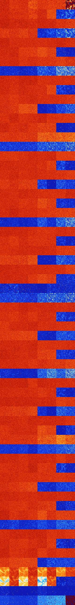

# B038 (135680-136191)

<details>
    <summary>Initial Grid</summary>
    
</details>


<details>
    <summary>Initial Grid RLE</summary>

```
#C Exported from GoGoL (https://github.com/marrow16/gogol)
#C Wrap mode: Toroidal
#C Boundary mode: Dead
#C Step: 0
x = 100, y = 100, rule = B038/S
5bo22bo45bo16bo$3bo5bo31bo7bo27bo20bo$20bo49bo$5bo2bo52bobo$o22b2o$5bo
9bo50bo4bo$10bo24bo$29bo17bo28bo20bo$8bo3bo5bo4bo9bo12bo$9bo32bo13bo18b
o17b2o$100b$17bo13bo52bo12bo$19bobo12b2o14bo8bo3bo6bo$17bo14bo9bo11bo
26bo6bo$8bo10bo16bo12bo7bo9bo31bo$10bo22bo8bo25b2o5bo$8bo18bo37bo28bo$
61bo7bo14bo8bo$14bo3bobo6b2o3bo28bo24bo$15bo2bo14bobo9bo2bo5bobo20bo11b
o$17bo12bo13bo5bo11bo$21bo10bo35bo$17bo7bo18bo3bo18bo3bo25bo$32bo$13bo
6bo10bo33bo29b2o2bo$47bo18bo$26bo54bobo$7bo5bo7bo37bo$21bo8bobo19bo27bo
10bo$35b2obo13bo27bo$43bobo11bobo15bo$19bo8bo70bo$24bo9bo22bo2bo28bo$
11bo9bo8bo66bo$26bo16bo6bo10bobo8bo$4bo$24bo18bo33bo19bo$30bo60bo$9bo
66bo19bo$12bo53bo$27bo23bo6bo9bo$19bo31bo8bo20bo11bo$33bo4bo37bo14bo$
30bo4bo8bo14bo22bo$5bo25bo46bobo2bo$41bo19bo32bo$50bo23bo$3bo43b2o19bo
19bo$10bo24bo36bo$5bo12bo24bo36bo12bobo$4bo16bo12bo2bo18bo9bo$37bo11bo
30bo$15bo2bo67bo$o7bo43bo37bo$77bo$17bo29bo4bo31bo$17bo44bo2bo12bobo$o
63bo6bo13bo$10bo2bo11bo15bo52bo$81bo13bo$bo8bo5bo8bo30b2o3bo4bo23bo$34b
o6bo7bo4bo2bo11bo18bo$38bo9bo$16bo10b2o2bo7bo53bo2bo$21bo4bo3bo5bo35bo
19bo$o50bo46bo$10bo17bo54bo9bo$10bo28bo5bo39bo5bo$bobo20bobo45bo10bo6bo
2bo$19bo2bobo18bo46bo6bo$13bo8b2o45bo9bo$26bo12bo7b2o13bo14bo8b2o5bo$
17bo26b2o16bo$32bo9bo9bo36bo$13bo66bo9bo$2bo14bo4bo9bo2bo6bo$48bo13bo
27bo$3bo35bo37bo20bo$15bo11bo7bo10bo6bo2bo9bo12bo$72bo2bo3bo9bobo$11bo
26bo30bo7bobo7bo2bobo$29b2o8bo54bo$14bo16bo19bo15bo10bo$4bo9bo4bo24bo
36bo9bo$26bo30bo6bo11bo14bo$64bo11bo3bo3bo$25bo13b2o2bo$3bo34b2o51bo2bo
$10bo7bo4bo31bo38bo$19bo42bo3b2o3bo12bo4bo$6bo20bo3bo22bo17bo10bo4bo5bo
$11bo22bo20bo7bob2o$2bo24bo$44bo25bobo20bo$77bo$50bo6bo8bo13bo12bo$4bo$
9b2o7bo48bo18bo6bo$11bo49bo6bo2bo15bo$53bo8bo16bo13bo!
```
</details>
<details>
    <summary>Thumbnail</summary>

</details>
<table>
<tr>
    <td><a href="./135680%20S%20Heat%20Map%20Activity.png"></a><br>S (135680)<br>G>1000</td>    <td><a href="./135681%20S0%20Heat%20Map%20Activity.png"></a><br>S0 (135681)<br>G>1000</td>    <td><a href="./135682%20S1%20Heat%20Map%20Activity.png"></a><br>S1 (135682)<br>G>1000</td>    <td><a href="./135683%20S01%20Heat%20Map%20Activity.png"></a><br>S01 (135683)<br>G>1000</td>    <td><a href="./135684%20S2%20Heat%20Map%20Activity.png"></a><br>S2 (135684)<br>G>1000</td>    <td><a href="./135685%20S02%20Heat%20Map%20Activity.png"></a><br>S02 (135685)<br>G>1000</td>    <td><a href="./135686%20S12%20Heat%20Map%20Activity.png"></a><br>S12 (135686)<br>G>1000</td>    <td><a href="./135687%20S012%20Heat%20Map%20Activity.png"></a><br>S012 (135687)<br>R@236,p8</td></tr>
<tr>
    <td><a href="./135688%20S3%20Heat%20Map%20Activity.png"></a><br>S3 (135688)<br>G>1000</td>    <td><a href="./135689%20S03%20Heat%20Map%20Activity.png"></a><br>S03 (135689)<br>G>1000</td>    <td><a href="./135690%20S13%20Heat%20Map%20Activity.png"></a><br>S13 (135690)<br>G>1000</td>    <td><a href="./135691%20S013%20Heat%20Map%20Activity.png"></a><br>S013 (135691)<br>G>1000</td>    <td><a href="./135692%20S23%20Heat%20Map%20Activity.png"></a><br>S23 (135692)<br>G>1000</td>    <td><a href="./135693%20S023%20Heat%20Map%20Activity.png"></a><br>S023 (135693)<br>G>1000</td>    <td><a href="./135694%20S123%20Heat%20Map%20Activity.png"></a><br>S123 (135694)<br>R@717,p12</td>    <td><a href="./135695%20S0123%20Heat%20Map%20Activity.png"></a><br>S0123 (135695)<br>R@400,p48</td></tr>
<tr>
    <td><a href="./135696%20S4%20Heat%20Map%20Activity.png"></a><br>S4 (135696)<br>G>1000</td>    <td><a href="./135697%20S04%20Heat%20Map%20Activity.png"></a><br>S04 (135697)<br>G>1000</td>    <td><a href="./135698%20S14%20Heat%20Map%20Activity.png"></a><br>S14 (135698)<br>G>1000</td>    <td><a href="./135699%20S014%20Heat%20Map%20Activity.png"></a><br>S014 (135699)<br>G>1000</td>    <td><a href="./135700%20S24%20Heat%20Map%20Activity.png"></a><br>S24 (135700)<br>G>1000</td>    <td><a href="./135701%20S024%20Heat%20Map%20Activity.png"></a><br>S024 (135701)<br>G>1000</td>    <td><a href="./135702%20S124%20Heat%20Map%20Activity.png"></a><br>S124 (135702)<br>G>1000</td>    <td><a href="./135703%20S0124%20Heat%20Map%20Activity.png"></a><br>S0124 (135703)<br>G>1000</td></tr>
<tr>
    <td><a href="./135704%20S34%20Heat%20Map%20Activity.png"></a><br>S34 (135704)<br>G>1000</td>    <td><a href="./135705%20S034%20Heat%20Map%20Activity.png"></a><br>S034 (135705)<br>G>1000</td>    <td><a href="./135706%20S134%20Heat%20Map%20Activity.png"></a><br>S134 (135706)<br>G>1000</td>    <td><a href="./135707%20S0134%20Heat%20Map%20Activity.png"></a><br>S0134 (135707)<br>G>1000</td>    <td><a href="./135708%20S234%20Heat%20Map%20Activity.png"></a><br>S234 (135708)<br>R@335,p180</td>    <td><a href="./135709%20S0234%20Heat%20Map%20Activity.png"></a><br>S0234 (135709)<br>R@215,p60</td>    <td><a href="./135710%20S1234%20Heat%20Map%20Activity.png"></a><br>S1234 (135710)<br>R@39,p12</td>    <td><a href="./135711%20S01234%20Heat%20Map%20Activity.png"></a><br>S01234 (135711)<br>R@40,p6</td></tr>
<tr>
    <td><a href="./135712%20S5%20Heat%20Map%20Activity.png"></a><br>S5 (135712)<br>G>1000</td>    <td><a href="./135713%20S05%20Heat%20Map%20Activity.png"></a><br>S05 (135713)<br>G>1000</td>    <td><a href="./135714%20S15%20Heat%20Map%20Activity.png"></a><br>S15 (135714)<br>G>1000</td>    <td><a href="./135715%20S015%20Heat%20Map%20Activity.png"></a><br>S015 (135715)<br>G>1000</td>    <td><a href="./135716%20S25%20Heat%20Map%20Activity.png"></a><br>S25 (135716)<br>G>1000</td>    <td><a href="./135717%20S025%20Heat%20Map%20Activity.png"></a><br>S025 (135717)<br>G>1000</td>    <td><a href="./135718%20S125%20Heat%20Map%20Activity.png"></a><br>S125 (135718)<br>G>1000</td>    <td><a href="./135719%20S0125%20Heat%20Map%20Activity.png"></a><br>S0125 (135719)<br>G>1000</td></tr>
<tr>
    <td><a href="./135720%20S35%20Heat%20Map%20Activity.png"></a><br>S35 (135720)<br>G>1000</td>    <td><a href="./135721%20S035%20Heat%20Map%20Activity.png"></a><br>S035 (135721)<br>G>1000</td>    <td><a href="./135722%20S135%20Heat%20Map%20Activity.png"></a><br>S135 (135722)<br>G>1000</td>    <td><a href="./135723%20S0135%20Heat%20Map%20Activity.png"></a><br>S0135 (135723)<br>G>1000</td>    <td><a href="./135724%20S235%20Heat%20Map%20Activity.png"></a><br>S235 (135724)<br>G>1000</td>    <td><a href="./135725%20S0235%20Heat%20Map%20Activity.png"></a><br>S0235 (135725)<br>G>1000</td>    <td><a href="./135726%20S1235%20Heat%20Map%20Activity.png"></a><br>S1235 (135726)<br>R@365,p180</td>    <td><a href="./135727%20S01235%20Heat%20Map%20Activity.png"></a><br>S01235 (135727)<br>R@382,p252</td></tr>
<tr>
    <td><a href="./135728%20S45%20Heat%20Map%20Activity.png"></a><br>S45 (135728)<br>G>1000</td>    <td><a href="./135729%20S045%20Heat%20Map%20Activity.png"></a><br>S045 (135729)<br>G>1000</td>    <td><a href="./135730%20S145%20Heat%20Map%20Activity.png"></a><br>S145 (135730)<br>G>1000</td>    <td><a href="./135731%20S0145%20Heat%20Map%20Activity.png"></a><br>S0145 (135731)<br>G>1000</td>    <td><a href="./135732%20S245%20Heat%20Map%20Activity.png"></a><br>S245 (135732)<br>G>1000</td>    <td><a href="./135733%20S0245%20Heat%20Map%20Activity.png"></a><br>S0245 (135733)<br>G>1000</td>    <td><a href="./135734%20S1245%20Heat%20Map%20Activity.png"></a><br>S1245 (135734)<br>G>1000</td>    <td><a href="./135735%20S01245%20Heat%20Map%20Activity.png"></a><br>S01245 (135735)<br>G>1000</td></tr>
<tr>
    <td><a href="./135736%20S345%20Heat%20Map%20Activity.png"></a><br>S345 (135736)<br>R@133,p56</td>    <td><a href="./135737%20S0345%20Heat%20Map%20Activity.png"></a><br>S0345 (135737)<br>R@129,p4</td>    <td><a href="./135738%20S1345%20Heat%20Map%20Activity.png"></a><br>S1345 (135738)<br>R@163,p72</td>    <td><a href="./135739%20S01345%20Heat%20Map%20Activity.png"></a><br>S01345 (135739)<br>R@108,p12</td>    <td><a href="./135740%20S2345%20Heat%20Map%20Activity.png"></a><br>S2345 (135740)<br>R@20,p2</td>    <td><a href="./135741%20S02345%20Heat%20Map%20Activity.png"></a><br>S02345 (135741)<br>R@34,p15</td>    <td><a href="./135742%20S12345%20Heat%20Map%20Activity.png"></a><br>S12345 (135742)<br>R@14,p3</td>    <td><a href="./135743%20S012345%20Heat%20Map%20Activity.png"></a><br>S012345 (135743)<br>R@14,p3</td></tr>
<tr>
    <td><a href="./135744%20S6%20Heat%20Map%20Activity.png"></a><br>S6 (135744)<br>G>1000</td>    <td><a href="./135745%20S06%20Heat%20Map%20Activity.png"></a><br>S06 (135745)<br>G>1000</td>    <td><a href="./135746%20S16%20Heat%20Map%20Activity.png"></a><br>S16 (135746)<br>G>1000</td>    <td><a href="./135747%20S016%20Heat%20Map%20Activity.png"></a><br>S016 (135747)<br>G>1000</td>    <td><a href="./135748%20S26%20Heat%20Map%20Activity.png"></a><br>S26 (135748)<br>G>1000</td>    <td><a href="./135749%20S026%20Heat%20Map%20Activity.png"></a><br>S026 (135749)<br>G>1000</td>    <td><a href="./135750%20S126%20Heat%20Map%20Activity.png"></a><br>S126 (135750)<br>G>1000</td>    <td><a href="./135751%20S0126%20Heat%20Map%20Activity.png"></a><br>S0126 (135751)<br>G>1000</td></tr>
<tr>
    <td><a href="./135752%20S36%20Heat%20Map%20Activity.png"></a><br>S36 (135752)<br>G>1000</td>    <td><a href="./135753%20S036%20Heat%20Map%20Activity.png"></a><br>S036 (135753)<br>G>1000</td>    <td><a href="./135754%20S136%20Heat%20Map%20Activity.png"></a><br>S136 (135754)<br>G>1000</td>    <td><a href="./135755%20S0136%20Heat%20Map%20Activity.png"></a><br>S0136 (135755)<br>G>1000</td>    <td><a href="./135756%20S236%20Heat%20Map%20Activity.png"></a><br>S236 (135756)<br>G>1000</td>    <td><a href="./135757%20S0236%20Heat%20Map%20Activity.png"></a><br>S0236 (135757)<br>G>1000</td>    <td><a href="./135758%20S1236%20Heat%20Map%20Activity.png"></a><br>S1236 (135758)<br>R@583,p60</td>    <td><a href="./135759%20S01236%20Heat%20Map%20Activity.png"></a><br>S01236 (135759)<br>R@561,p60</td></tr>
<tr>
    <td><a href="./135760%20S46%20Heat%20Map%20Activity.png"></a><br>S46 (135760)<br>G>1000</td>    <td><a href="./135761%20S046%20Heat%20Map%20Activity.png"></a><br>S046 (135761)<br>G>1000</td>    <td><a href="./135762%20S146%20Heat%20Map%20Activity.png"></a><br>S146 (135762)<br>G>1000</td>    <td><a href="./135763%20S0146%20Heat%20Map%20Activity.png"></a><br>S0146 (135763)<br>G>1000</td>    <td><a href="./135764%20S246%20Heat%20Map%20Activity.png"></a><br>S246 (135764)<br>G>1000</td>    <td><a href="./135765%20S0246%20Heat%20Map%20Activity.png"></a><br>S0246 (135765)<br>G>1000</td>    <td><a href="./135766%20S1246%20Heat%20Map%20Activity.png"></a><br>S1246 (135766)<br>G>1000</td>    <td><a href="./135767%20S01246%20Heat%20Map%20Activity.png"></a><br>S01246 (135767)<br>G>1000</td></tr>
<tr>
    <td><a href="./135768%20S346%20Heat%20Map%20Activity.png"></a><br>S346 (135768)<br>G>1000</td>    <td><a href="./135769%20S0346%20Heat%20Map%20Activity.png"></a><br>S0346 (135769)<br>G>1000</td>    <td><a href="./135770%20S1346%20Heat%20Map%20Activity.png"></a><br>S1346 (135770)<br>G>1000</td>    <td><a href="./135771%20S01346%20Heat%20Map%20Activity.png"></a><br>S01346 (135771)<br>G>1000</td>    <td><a href="./135772%20S2346%20Heat%20Map%20Activity.png"></a><br>S2346 (135772)<br>R@280,p180</td>    <td><a href="./135773%20S02346%20Heat%20Map%20Activity.png"></a><br>S02346 (135773)<br>R@122,p40</td>    <td><a href="./135774%20S12346%20Heat%20Map%20Activity.png"></a><br>S12346 (135774)<br>R@30,p2</td>    <td><a href="./135775%20S012346%20Heat%20Map%20Activity.png"></a><br>S012346 (135775)<br>R@23,p2</td></tr>
<tr>
    <td><a href="./135776%20S56%20Heat%20Map%20Activity.png"></a><br>S56 (135776)<br>G>1000</td>    <td><a href="./135777%20S056%20Heat%20Map%20Activity.png"></a><br>S056 (135777)<br>G>1000</td>    <td><a href="./135778%20S156%20Heat%20Map%20Activity.png"></a><br>S156 (135778)<br>G>1000</td>    <td><a href="./135779%20S0156%20Heat%20Map%20Activity.png"></a><br>S0156 (135779)<br>G>1000</td>    <td><a href="./135780%20S256%20Heat%20Map%20Activity.png"></a><br>S256 (135780)<br>G>1000</td>    <td><a href="./135781%20S0256%20Heat%20Map%20Activity.png"></a><br>S0256 (135781)<br>G>1000</td>    <td><a href="./135782%20S1256%20Heat%20Map%20Activity.png"></a><br>S1256 (135782)<br>G>1000</td>    <td><a href="./135783%20S01256%20Heat%20Map%20Activity.png"></a><br>S01256 (135783)<br>G>1000</td></tr>
<tr>
    <td><a href="./135784%20S356%20Heat%20Map%20Activity.png"></a><br>S356 (135784)<br>G>1000</td>    <td><a href="./135785%20S0356%20Heat%20Map%20Activity.png"></a><br>S0356 (135785)<br>G>1000</td>    <td><a href="./135786%20S1356%20Heat%20Map%20Activity.png"></a><br>S1356 (135786)<br>G>1000</td>    <td><a href="./135787%20S01356%20Heat%20Map%20Activity.png"></a><br>S01356 (135787)<br>G>1000</td>    <td><a href="./135788%20S2356%20Heat%20Map%20Activity.png"></a><br>S2356 (135788)<br>G>1000</td>    <td><a href="./135789%20S02356%20Heat%20Map%20Activity.png"></a><br>S02356 (135789)<br>G>1000</td>    <td><a href="./135790%20S12356%20Heat%20Map%20Activity.png"></a><br>S12356 (135790)<br>G>1000</td>    <td><a href="./135791%20S012356%20Heat%20Map%20Activity.png"></a><br>S012356 (135791)<br>R@415,p36</td></tr>
<tr>
    <td><a href="./135792%20S456%20Heat%20Map%20Activity.png"></a><br>S456 (135792)<br>G>1000</td>    <td><a href="./135793%20S0456%20Heat%20Map%20Activity.png"></a><br>S0456 (135793)<br>G>1000</td>    <td><a href="./135794%20S1456%20Heat%20Map%20Activity.png"></a><br>S1456 (135794)<br>G>1000</td>    <td><a href="./135795%20S01456%20Heat%20Map%20Activity.png"></a><br>S01456 (135795)<br>G>1000</td>    <td><a href="./135796%20S2456%20Heat%20Map%20Activity.png"></a><br>S2456 (135796)<br>G>1000</td>    <td><a href="./135797%20S02456%20Heat%20Map%20Activity.png"></a><br>S02456 (135797)<br>G>1000</td>    <td><a href="./135798%20S12456%20Heat%20Map%20Activity.png"></a><br>S12456 (135798)<br>G>1000</td>    <td><a href="./135799%20S012456%20Heat%20Map%20Activity.png"></a><br>S012456 (135799)<br>G>1000</td></tr>
<tr>
    <td><a href="./135800%20S3456%20Heat%20Map%20Activity.png"></a><br>S3456 (135800)<br>R@35,p2</td>    <td><a href="./135801%20S03456%20Heat%20Map%20Activity.png"></a><br>S03456 (135801)<br>R@34,p12</td>    <td><a href="./135802%20S13456%20Heat%20Map%20Activity.png"></a><br>S13456 (135802)<br>R@33,p6</td>    <td><a href="./135803%20S013456%20Heat%20Map%20Activity.png"></a><br>S013456 (135803)<br>R@31,p6</td>    <td><a href="./135804%20S23456%20Heat%20Map%20Activity.png"></a><br>S23456 (135804)<br>R@17,p6</td>    <td><a href="./135805%20S023456%20Heat%20Map%20Activity.png"></a><br>S023456 (135805)<br>R@13,p2</td>    <td><a href="./135806%20S123456%20Heat%20Map%20Activity.png"></a><br>S123456 (135806)<br>R@15,p6</td>    <td><a href="./135807%20S0123456%20Heat%20Map%20Activity.png"></a><br>S0123456 (135807)<br>R@10,p2</td></tr>
<tr>
    <td><a href="./135808%20S7%20Heat%20Map%20Activity.png"></a><br>S7 (135808)<br>G>1000</td>    <td><a href="./135809%20S07%20Heat%20Map%20Activity.png"></a><br>S07 (135809)<br>G>1000</td>    <td><a href="./135810%20S17%20Heat%20Map%20Activity.png"></a><br>S17 (135810)<br>G>1000</td>    <td><a href="./135811%20S017%20Heat%20Map%20Activity.png"></a><br>S017 (135811)<br>G>1000</td>    <td><a href="./135812%20S27%20Heat%20Map%20Activity.png"></a><br>S27 (135812)<br>G>1000</td>    <td><a href="./135813%20S027%20Heat%20Map%20Activity.png"></a><br>S027 (135813)<br>G>1000</td>    <td><a href="./135814%20S127%20Heat%20Map%20Activity.png"></a><br>S127 (135814)<br>G>1000</td>    <td><a href="./135815%20S0127%20Heat%20Map%20Activity.png"></a><br>S0127 (135815)<br>G>1000</td></tr>
<tr>
    <td><a href="./135816%20S37%20Heat%20Map%20Activity.png"></a><br>S37 (135816)<br>G>1000</td>    <td><a href="./135817%20S037%20Heat%20Map%20Activity.png"></a><br>S037 (135817)<br>G>1000</td>    <td><a href="./135818%20S137%20Heat%20Map%20Activity.png"></a><br>S137 (135818)<br>G>1000</td>    <td><a href="./135819%20S0137%20Heat%20Map%20Activity.png"></a><br>S0137 (135819)<br>G>1000</td>    <td><a href="./135820%20S237%20Heat%20Map%20Activity.png"></a><br>S237 (135820)<br>G>1000</td>    <td><a href="./135821%20S0237%20Heat%20Map%20Activity.png"></a><br>S0237 (135821)<br>G>1000</td>    <td><a href="./135822%20S1237%20Heat%20Map%20Activity.png"></a><br>S1237 (135822)<br>R@566,p24</td>    <td><a href="./135823%20S01237%20Heat%20Map%20Activity.png"></a><br>S01237 (135823)<br>G>1000</td></tr>
<tr>
    <td><a href="./135824%20S47%20Heat%20Map%20Activity.png"></a><br>S47 (135824)<br>G>1000</td>    <td><a href="./135825%20S047%20Heat%20Map%20Activity.png"></a><br>S047 (135825)<br>G>1000</td>    <td><a href="./135826%20S147%20Heat%20Map%20Activity.png"></a><br>S147 (135826)<br>G>1000</td>    <td><a href="./135827%20S0147%20Heat%20Map%20Activity.png"></a><br>S0147 (135827)<br>G>1000</td>    <td><a href="./135828%20S247%20Heat%20Map%20Activity.png"></a><br>S247 (135828)<br>G>1000</td>    <td><a href="./135829%20S0247%20Heat%20Map%20Activity.png"></a><br>S0247 (135829)<br>G>1000</td>    <td><a href="./135830%20S1247%20Heat%20Map%20Activity.png"></a><br>S1247 (135830)<br>G>1000</td>    <td><a href="./135831%20S01247%20Heat%20Map%20Activity.png"></a><br>S01247 (135831)<br>G>1000</td></tr>
<tr>
    <td><a href="./135832%20S347%20Heat%20Map%20Activity.png"></a><br>S347 (135832)<br>G>1000</td>    <td><a href="./135833%20S0347%20Heat%20Map%20Activity.png"></a><br>S0347 (135833)<br>G>1000</td>    <td><a href="./135834%20S1347%20Heat%20Map%20Activity.png"></a><br>S1347 (135834)<br>G>1000</td>    <td><a href="./135835%20S01347%20Heat%20Map%20Activity.png"></a><br>S01347 (135835)<br>G>1000</td>    <td><a href="./135836%20S2347%20Heat%20Map%20Activity.png"></a><br>S2347 (135836)<br>R@188,p40</td>    <td><a href="./135837%20S02347%20Heat%20Map%20Activity.png"></a><br>S02347 (135837)<br>G>1000</td>    <td><a href="./135838%20S12347%20Heat%20Map%20Activity.png"></a><br>S12347 (135838)<br>R@31,p6</td>    <td><a href="./135839%20S012347%20Heat%20Map%20Activity.png"></a><br>S012347 (135839)<br>R@38,p12</td></tr>
<tr>
    <td><a href="./135840%20S57%20Heat%20Map%20Activity.png"></a><br>S57 (135840)<br>G>1000</td>    <td><a href="./135841%20S057%20Heat%20Map%20Activity.png"></a><br>S057 (135841)<br>G>1000</td>    <td><a href="./135842%20S157%20Heat%20Map%20Activity.png"></a><br>S157 (135842)<br>G>1000</td>    <td><a href="./135843%20S0157%20Heat%20Map%20Activity.png"></a><br>S0157 (135843)<br>G>1000</td>    <td><a href="./135844%20S257%20Heat%20Map%20Activity.png"></a><br>S257 (135844)<br>G>1000</td>    <td><a href="./135845%20S0257%20Heat%20Map%20Activity.png"></a><br>S0257 (135845)<br>G>1000</td>    <td><a href="./135846%20S1257%20Heat%20Map%20Activity.png"></a><br>S1257 (135846)<br>G>1000</td>    <td><a href="./135847%20S01257%20Heat%20Map%20Activity.png"></a><br>S01257 (135847)<br>G>1000</td></tr>
<tr>
    <td><a href="./135848%20S357%20Heat%20Map%20Activity.png"></a><br>S357 (135848)<br>G>1000</td>    <td><a href="./135849%20S0357%20Heat%20Map%20Activity.png"></a><br>S0357 (135849)<br>G>1000</td>    <td><a href="./135850%20S1357%20Heat%20Map%20Activity.png"></a><br>S1357 (135850)<br>G>1000</td>    <td><a href="./135851%20S01357%20Heat%20Map%20Activity.png"></a><br>S01357 (135851)<br>G>1000</td>    <td><a href="./135852%20S2357%20Heat%20Map%20Activity.png"></a><br>S2357 (135852)<br>G>1000</td>    <td><a href="./135853%20S02357%20Heat%20Map%20Activity.png"></a><br>S02357 (135853)<br>G>1000</td>    <td><a href="./135854%20S12357%20Heat%20Map%20Activity.png"></a><br>S12357 (135854)<br>R@225,p36</td>    <td><a href="./135855%20S012357%20Heat%20Map%20Activity.png"></a><br>S012357 (135855)<br>R@160,p60</td></tr>
<tr>
    <td><a href="./135856%20S457%20Heat%20Map%20Activity.png"></a><br>S457 (135856)<br>G>1000</td>    <td><a href="./135857%20S0457%20Heat%20Map%20Activity.png"></a><br>S0457 (135857)<br>G>1000</td>    <td><a href="./135858%20S1457%20Heat%20Map%20Activity.png"></a><br>S1457 (135858)<br>G>1000</td>    <td><a href="./135859%20S01457%20Heat%20Map%20Activity.png"></a><br>S01457 (135859)<br>G>1000</td>    <td><a href="./135860%20S2457%20Heat%20Map%20Activity.png"></a><br>S2457 (135860)<br>G>1000</td>    <td><a href="./135861%20S02457%20Heat%20Map%20Activity.png"></a><br>S02457 (135861)<br>G>1000</td>    <td><a href="./135862%20S12457%20Heat%20Map%20Activity.png"></a><br>S12457 (135862)<br>G>1000</td>    <td><a href="./135863%20S012457%20Heat%20Map%20Activity.png"></a><br>S012457 (135863)<br>G>1000</td></tr>
<tr>
    <td><a href="./135864%20S3457%20Heat%20Map%20Activity.png"></a><br>S3457 (135864)<br>R@173,p40</td>    <td><a href="./135865%20S03457%20Heat%20Map%20Activity.png"></a><br>S03457 (135865)<br>R@127,p40</td>    <td><a href="./135866%20S13457%20Heat%20Map%20Activity.png"></a><br>S13457 (135866)<br>R@149,p30</td>    <td><a href="./135867%20S013457%20Heat%20Map%20Activity.png"></a><br>S013457 (135867)<br>R@106,p20</td>    <td><a href="./135868%20S23457%20Heat%20Map%20Activity.png"></a><br>S23457 (135868)<br>R@28,p12</td>    <td><a href="./135869%20S023457%20Heat%20Map%20Activity.png"></a><br>S023457 (135869)<br>R@41,p20</td>    <td><a href="./135870%20S123457%20Heat%20Map%20Activity.png"></a><br>S123457 (135870)<br>R@14,p4</td>    <td><a href="./135871%20S0123457%20Heat%20Map%20Activity.png"></a><br>S0123457 (135871)<br>S@10</td></tr>
<tr>
    <td><a href="./135872%20S67%20Heat%20Map%20Activity.png"></a><br>S67 (135872)<br>G>1000</td>    <td><a href="./135873%20S067%20Heat%20Map%20Activity.png"></a><br>S067 (135873)<br>G>1000</td>    <td><a href="./135874%20S167%20Heat%20Map%20Activity.png"></a><br>S167 (135874)<br>G>1000</td>    <td><a href="./135875%20S0167%20Heat%20Map%20Activity.png"></a><br>S0167 (135875)<br>G>1000</td>    <td><a href="./135876%20S267%20Heat%20Map%20Activity.png"></a><br>S267 (135876)<br>G>1000</td>    <td><a href="./135877%20S0267%20Heat%20Map%20Activity.png"></a><br>S0267 (135877)<br>G>1000</td>    <td><a href="./135878%20S1267%20Heat%20Map%20Activity.png"></a><br>S1267 (135878)<br>G>1000</td>    <td><a href="./135879%20S01267%20Heat%20Map%20Activity.png"></a><br>S01267 (135879)<br>G>1000</td></tr>
<tr>
    <td><a href="./135880%20S367%20Heat%20Map%20Activity.png"></a><br>S367 (135880)<br>G>1000</td>    <td><a href="./135881%20S0367%20Heat%20Map%20Activity.png"></a><br>S0367 (135881)<br>G>1000</td>    <td><a href="./135882%20S1367%20Heat%20Map%20Activity.png"></a><br>S1367 (135882)<br>G>1000</td>    <td><a href="./135883%20S01367%20Heat%20Map%20Activity.png"></a><br>S01367 (135883)<br>G>1000</td>    <td><a href="./135884%20S2367%20Heat%20Map%20Activity.png"></a><br>S2367 (135884)<br>G>1000</td>    <td><a href="./135885%20S02367%20Heat%20Map%20Activity.png"></a><br>S02367 (135885)<br>G>1000</td>    <td><a href="./135886%20S12367%20Heat%20Map%20Activity.png"></a><br>S12367 (135886)<br>R@944,p4</td>    <td><a href="./135887%20S012367%20Heat%20Map%20Activity.png"></a><br>S012367 (135887)<br>G>1000</td></tr>
<tr>
    <td><a href="./135888%20S467%20Heat%20Map%20Activity.png"></a><br>S467 (135888)<br>G>1000</td>    <td><a href="./135889%20S0467%20Heat%20Map%20Activity.png"></a><br>S0467 (135889)<br>G>1000</td>    <td><a href="./135890%20S1467%20Heat%20Map%20Activity.png"></a><br>S1467 (135890)<br>G>1000</td>    <td><a href="./135891%20S01467%20Heat%20Map%20Activity.png"></a><br>S01467 (135891)<br>G>1000</td>    <td><a href="./135892%20S2467%20Heat%20Map%20Activity.png"></a><br>S2467 (135892)<br>G>1000</td>    <td><a href="./135893%20S02467%20Heat%20Map%20Activity.png"></a><br>S02467 (135893)<br>G>1000</td>    <td><a href="./135894%20S12467%20Heat%20Map%20Activity.png"></a><br>S12467 (135894)<br>G>1000</td>    <td><a href="./135895%20S012467%20Heat%20Map%20Activity.png"></a><br>S012467 (135895)<br>G>1000</td></tr>
<tr>
    <td><a href="./135896%20S3467%20Heat%20Map%20Activity.png"></a><br>S3467 (135896)<br>G>1000</td>    <td><a href="./135897%20S03467%20Heat%20Map%20Activity.png"></a><br>S03467 (135897)<br>G>1000</td>    <td><a href="./135898%20S13467%20Heat%20Map%20Activity.png"></a><br>S13467 (135898)<br>G>1000</td>    <td><a href="./135899%20S013467%20Heat%20Map%20Activity.png"></a><br>S013467 (135899)<br>G>1000</td>    <td><a href="./135900%20S23467%20Heat%20Map%20Activity.png"></a><br>S23467 (135900)<br>R@214,p120</td>    <td><a href="./135901%20S023467%20Heat%20Map%20Activity.png"></a><br>S023467 (135901)<br>R@162,p40</td>    <td><a href="./135902%20S123467%20Heat%20Map%20Activity.png"></a><br>S123467 (135902)<br>R@19,p2</td>    <td><a href="./135903%20S0123467%20Heat%20Map%20Activity.png"></a><br>S0123467 (135903)<br>R@24,p2</td></tr>
<tr>
    <td><a href="./135904%20S567%20Heat%20Map%20Activity.png"></a><br>S567 (135904)<br>G>1000</td>    <td><a href="./135905%20S0567%20Heat%20Map%20Activity.png"></a><br>S0567 (135905)<br>G>1000</td>    <td><a href="./135906%20S1567%20Heat%20Map%20Activity.png"></a><br>S1567 (135906)<br>G>1000</td>    <td><a href="./135907%20S01567%20Heat%20Map%20Activity.png"></a><br>S01567 (135907)<br>G>1000</td>    <td><a href="./135908%20S2567%20Heat%20Map%20Activity.png"></a><br>S2567 (135908)<br>G>1000</td>    <td><a href="./135909%20S02567%20Heat%20Map%20Activity.png"></a><br>S02567 (135909)<br>G>1000</td>    <td><a href="./135910%20S12567%20Heat%20Map%20Activity.png"></a><br>S12567 (135910)<br>G>1000</td>    <td><a href="./135911%20S012567%20Heat%20Map%20Activity.png"></a><br>S012567 (135911)<br>G>1000</td></tr>
<tr>
    <td><a href="./135912%20S3567%20Heat%20Map%20Activity.png"></a><br>S3567 (135912)<br>G>1000</td>    <td><a href="./135913%20S03567%20Heat%20Map%20Activity.png"></a><br>S03567 (135913)<br>G>1000</td>    <td><a href="./135914%20S13567%20Heat%20Map%20Activity.png"></a><br>S13567 (135914)<br>G>1000</td>    <td><a href="./135915%20S013567%20Heat%20Map%20Activity.png"></a><br>S013567 (135915)<br>G>1000</td>    <td><a href="./135916%20S23567%20Heat%20Map%20Activity.png"></a><br>S23567 (135916)<br>G>1000</td>    <td><a href="./135917%20S023567%20Heat%20Map%20Activity.png"></a><br>S023567 (135917)<br>G>1000</td>    <td><a href="./135918%20S123567%20Heat%20Map%20Activity.png"></a><br>S123567 (135918)<br>R@312,p120</td>    <td><a href="./135919%20S0123567%20Heat%20Map%20Activity.png"></a><br>S0123567 (135919)<br>R@190,p12</td></tr>
<tr>
    <td><a href="./135920%20S4567%20Heat%20Map%20Activity.png"></a><br>S4567 (135920)<br>G>1000</td>    <td><a href="./135921%20S04567%20Heat%20Map%20Activity.png"></a><br>S04567 (135921)<br>G>1000</td>    <td><a href="./135922%20S14567%20Heat%20Map%20Activity.png"></a><br>S14567 (135922)<br>G>1000</td>    <td><a href="./135923%20S014567%20Heat%20Map%20Activity.png"></a><br>S014567 (135923)<br>G>1000</td>    <td><a href="./135924%20S24567%20Heat%20Map%20Activity.png"></a><br>S24567 (135924)<br>R@801,p660</td>    <td><a href="./135925%20S024567%20Heat%20Map%20Activity.png"></a><br>S024567 (135925)<br>R@174,p12</td>    <td><a href="./135926%20S124567%20Heat%20Map%20Activity.png"></a><br>S124567 (135926)<br>R@141,p12</td>    <td><a href="./135927%20S0124567%20Heat%20Map%20Activity.png"></a><br>S0124567 (135927)<br>R@156,p24</td></tr>
<tr>
    <td><a href="./135928%20S34567%20Heat%20Map%20Activity.png"></a><br>S34567 (135928)<br>R@23,p6</td>    <td><a href="./135929%20S034567%20Heat%20Map%20Activity.png"></a><br>S034567 (135929)<br>R@20,p6</td>    <td><a href="./135930%20S134567%20Heat%20Map%20Activity.png"></a><br>S134567 (135930)<br>R@23,p6</td>    <td><a href="./135931%20S0134567%20Heat%20Map%20Activity.png"></a><br>S0134567 (135931)<br>R@25,p6</td>    <td><a href="./135932%20S234567%20Heat%20Map%20Activity.png"></a><br>S234567 (135932)<br>R@14,p6</td>    <td><a href="./135933%20S0234567%20Heat%20Map%20Activity.png"></a><br>S0234567 (135933)<br>R@10,p2</td>    <td><a href="./135934%20S1234567%20Heat%20Map%20Activity.png"></a><br>S1234567 (135934)<br>R@14,p6</td>    <td><a href="./135935%20S01234567%20Heat%20Map%20Activity.png"></a><br>S01234567 (135935)<br>R@9,p2</td></tr>
<tr>
    <td><a href="./135936%20S8%20Heat%20Map%20Activity.png"></a><br>S8 (135936)<br>G>1000</td>    <td><a href="./135937%20S08%20Heat%20Map%20Activity.png"></a><br>S08 (135937)<br>G>1000</td>    <td><a href="./135938%20S18%20Heat%20Map%20Activity.png"></a><br>S18 (135938)<br>G>1000</td>    <td><a href="./135939%20S018%20Heat%20Map%20Activity.png"></a><br>S018 (135939)<br>G>1000</td>    <td><a href="./135940%20S28%20Heat%20Map%20Activity.png"></a><br>S28 (135940)<br>G>1000</td>    <td><a href="./135941%20S028%20Heat%20Map%20Activity.png"></a><br>S028 (135941)<br>G>1000</td>    <td><a href="./135942%20S128%20Heat%20Map%20Activity.png"></a><br>S128 (135942)<br>G>1000</td>    <td><a href="./135943%20S0128%20Heat%20Map%20Activity.png"></a><br>S0128 (135943)<br>G>1000</td></tr>
<tr>
    <td><a href="./135944%20S38%20Heat%20Map%20Activity.png"></a><br>S38 (135944)<br>G>1000</td>    <td><a href="./135945%20S038%20Heat%20Map%20Activity.png"></a><br>S038 (135945)<br>G>1000</td>    <td><a href="./135946%20S138%20Heat%20Map%20Activity.png"></a><br>S138 (135946)<br>G>1000</td>    <td><a href="./135947%20S0138%20Heat%20Map%20Activity.png"></a><br>S0138 (135947)<br>G>1000</td>    <td><a href="./135948%20S238%20Heat%20Map%20Activity.png"></a><br>S238 (135948)<br>G>1000</td>    <td><a href="./135949%20S0238%20Heat%20Map%20Activity.png"></a><br>S0238 (135949)<br>G>1000</td>    <td><a href="./135950%20S1238%20Heat%20Map%20Activity.png"></a><br>S1238 (135950)<br>R@436,p60</td>    <td><a href="./135951%20S01238%20Heat%20Map%20Activity.png"></a><br>S01238 (135951)<br>R@348,p60</td></tr>
<tr>
    <td><a href="./135952%20S48%20Heat%20Map%20Activity.png"></a><br>S48 (135952)<br>G>1000</td>    <td><a href="./135953%20S048%20Heat%20Map%20Activity.png"></a><br>S048 (135953)<br>G>1000</td>    <td><a href="./135954%20S148%20Heat%20Map%20Activity.png"></a><br>S148 (135954)<br>G>1000</td>    <td><a href="./135955%20S0148%20Heat%20Map%20Activity.png"></a><br>S0148 (135955)<br>G>1000</td>    <td><a href="./135956%20S248%20Heat%20Map%20Activity.png"></a><br>S248 (135956)<br>G>1000</td>    <td><a href="./135957%20S0248%20Heat%20Map%20Activity.png"></a><br>S0248 (135957)<br>G>1000</td>    <td><a href="./135958%20S1248%20Heat%20Map%20Activity.png"></a><br>S1248 (135958)<br>G>1000</td>    <td><a href="./135959%20S01248%20Heat%20Map%20Activity.png"></a><br>S01248 (135959)<br>G>1000</td></tr>
<tr>
    <td><a href="./135960%20S348%20Heat%20Map%20Activity.png"></a><br>S348 (135960)<br>G>1000</td>    <td><a href="./135961%20S0348%20Heat%20Map%20Activity.png"></a><br>S0348 (135961)<br>G>1000</td>    <td><a href="./135962%20S1348%20Heat%20Map%20Activity.png"></a><br>S1348 (135962)<br>G>1000</td>    <td><a href="./135963%20S01348%20Heat%20Map%20Activity.png"></a><br>S01348 (135963)<br>G>1000</td>    <td><a href="./135964%20S2348%20Heat%20Map%20Activity.png"></a><br>S2348 (135964)<br>R@248,p120</td>    <td><a href="./135965%20S02348%20Heat%20Map%20Activity.png"></a><br>S02348 (135965)<br>R@293,p180</td>    <td><a href="./135966%20S12348%20Heat%20Map%20Activity.png"></a><br>S12348 (135966)<br>R@28,p6</td>    <td><a href="./135967%20S012348%20Heat%20Map%20Activity.png"></a><br>S012348 (135967)<br>R@26,p6</td></tr>
<tr>
    <td><a href="./135968%20S58%20Heat%20Map%20Activity.png"></a><br>S58 (135968)<br>G>1000</td>    <td><a href="./135969%20S058%20Heat%20Map%20Activity.png"></a><br>S058 (135969)<br>G>1000</td>    <td><a href="./135970%20S158%20Heat%20Map%20Activity.png"></a><br>S158 (135970)<br>G>1000</td>    <td><a href="./135971%20S0158%20Heat%20Map%20Activity.png"></a><br>S0158 (135971)<br>G>1000</td>    <td><a href="./135972%20S258%20Heat%20Map%20Activity.png"></a><br>S258 (135972)<br>G>1000</td>    <td><a href="./135973%20S0258%20Heat%20Map%20Activity.png"></a><br>S0258 (135973)<br>G>1000</td>    <td><a href="./135974%20S1258%20Heat%20Map%20Activity.png"></a><br>S1258 (135974)<br>G>1000</td>    <td><a href="./135975%20S01258%20Heat%20Map%20Activity.png"></a><br>S01258 (135975)<br>G>1000</td></tr>
<tr>
    <td><a href="./135976%20S358%20Heat%20Map%20Activity.png"></a><br>S358 (135976)<br>G>1000</td>    <td><a href="./135977%20S0358%20Heat%20Map%20Activity.png"></a><br>S0358 (135977)<br>G>1000</td>    <td><a href="./135978%20S1358%20Heat%20Map%20Activity.png"></a><br>S1358 (135978)<br>G>1000</td>    <td><a href="./135979%20S01358%20Heat%20Map%20Activity.png"></a><br>S01358 (135979)<br>G>1000</td>    <td><a href="./135980%20S2358%20Heat%20Map%20Activity.png"></a><br>S2358 (135980)<br>G>1000</td>    <td><a href="./135981%20S02358%20Heat%20Map%20Activity.png"></a><br>S02358 (135981)<br>G>1000</td>    <td><a href="./135982%20S12358%20Heat%20Map%20Activity.png"></a><br>S12358 (135982)<br>R@221,p72</td>    <td><a href="./135983%20S012358%20Heat%20Map%20Activity.png"></a><br>S012358 (135983)<br>R@174,p12</td></tr>
<tr>
    <td><a href="./135984%20S458%20Heat%20Map%20Activity.png"></a><br>S458 (135984)<br>G>1000</td>    <td><a href="./135985%20S0458%20Heat%20Map%20Activity.png"></a><br>S0458 (135985)<br>G>1000</td>    <td><a href="./135986%20S1458%20Heat%20Map%20Activity.png"></a><br>S1458 (135986)<br>G>1000</td>    <td><a href="./135987%20S01458%20Heat%20Map%20Activity.png"></a><br>S01458 (135987)<br>G>1000</td>    <td><a href="./135988%20S2458%20Heat%20Map%20Activity.png"></a><br>S2458 (135988)<br>G>1000</td>    <td><a href="./135989%20S02458%20Heat%20Map%20Activity.png"></a><br>S02458 (135989)<br>G>1000</td>    <td><a href="./135990%20S12458%20Heat%20Map%20Activity.png"></a><br>S12458 (135990)<br>G>1000</td>    <td><a href="./135991%20S012458%20Heat%20Map%20Activity.png"></a><br>S012458 (135991)<br>G>1000</td></tr>
<tr>
    <td><a href="./135992%20S3458%20Heat%20Map%20Activity.png"></a><br>S3458 (135992)<br>R@103,p20</td>    <td><a href="./135993%20S03458%20Heat%20Map%20Activity.png"></a><br>S03458 (135993)<br>R@153,p28</td>    <td><a href="./135994%20S13458%20Heat%20Map%20Activity.png"></a><br>S13458 (135994)<br>R@167,p72</td>    <td><a href="./135995%20S013458%20Heat%20Map%20Activity.png"></a><br>S013458 (135995)<br>R@156,p60</td>    <td><a href="./135996%20S23458%20Heat%20Map%20Activity.png"></a><br>S23458 (135996)<br>R@16,p2</td>    <td><a href="./135997%20S023458%20Heat%20Map%20Activity.png"></a><br>S023458 (135997)<br>S@16</td>    <td><a href="./135998%20S123458%20Heat%20Map%20Activity.png"></a><br>S123458 (135998)<br>R@14,p2</td>    <td><a href="./135999%20S0123458%20Heat%20Map%20Activity.png"></a><br>S0123458 (135999)<br>S@10</td></tr>
<tr>
    <td><a href="./136000%20S68%20Heat%20Map%20Activity.png"></a><br>S68 (136000)<br>G>1000</td>    <td><a href="./136001%20S068%20Heat%20Map%20Activity.png"></a><br>S068 (136001)<br>G>1000</td>    <td><a href="./136002%20S168%20Heat%20Map%20Activity.png"></a><br>S168 (136002)<br>G>1000</td>    <td><a href="./136003%20S0168%20Heat%20Map%20Activity.png"></a><br>S0168 (136003)<br>G>1000</td>    <td><a href="./136004%20S268%20Heat%20Map%20Activity.png"></a><br>S268 (136004)<br>G>1000</td>    <td><a href="./136005%20S0268%20Heat%20Map%20Activity.png"></a><br>S0268 (136005)<br>G>1000</td>    <td><a href="./136006%20S1268%20Heat%20Map%20Activity.png"></a><br>S1268 (136006)<br>G>1000</td>    <td><a href="./136007%20S01268%20Heat%20Map%20Activity.png"></a><br>S01268 (136007)<br>G>1000</td></tr>
<tr>
    <td><a href="./136008%20S368%20Heat%20Map%20Activity.png"></a><br>S368 (136008)<br>G>1000</td>    <td><a href="./136009%20S0368%20Heat%20Map%20Activity.png"></a><br>S0368 (136009)<br>G>1000</td>    <td><a href="./136010%20S1368%20Heat%20Map%20Activity.png"></a><br>S1368 (136010)<br>G>1000</td>    <td><a href="./136011%20S01368%20Heat%20Map%20Activity.png"></a><br>S01368 (136011)<br>G>1000</td>    <td><a href="./136012%20S2368%20Heat%20Map%20Activity.png"></a><br>S2368 (136012)<br>G>1000</td>    <td><a href="./136013%20S02368%20Heat%20Map%20Activity.png"></a><br>S02368 (136013)<br>G>1000</td>    <td><a href="./136014%20S12368%20Heat%20Map%20Activity.png"></a><br>S12368 (136014)<br>G>1000</td>    <td><a href="./136015%20S012368%20Heat%20Map%20Activity.png"></a><br>S012368 (136015)<br>G>1000</td></tr>
<tr>
    <td><a href="./136016%20S468%20Heat%20Map%20Activity.png"></a><br>S468 (136016)<br>G>1000</td>    <td><a href="./136017%20S0468%20Heat%20Map%20Activity.png"></a><br>S0468 (136017)<br>G>1000</td>    <td><a href="./136018%20S1468%20Heat%20Map%20Activity.png"></a><br>S1468 (136018)<br>G>1000</td>    <td><a href="./136019%20S01468%20Heat%20Map%20Activity.png"></a><br>S01468 (136019)<br>G>1000</td>    <td><a href="./136020%20S2468%20Heat%20Map%20Activity.png"></a><br>S2468 (136020)<br>G>1000</td>    <td><a href="./136021%20S02468%20Heat%20Map%20Activity.png"></a><br>S02468 (136021)<br>G>1000</td>    <td><a href="./136022%20S12468%20Heat%20Map%20Activity.png"></a><br>S12468 (136022)<br>G>1000</td>    <td><a href="./136023%20S012468%20Heat%20Map%20Activity.png"></a><br>S012468 (136023)<br>G>1000</td></tr>
<tr>
    <td><a href="./136024%20S3468%20Heat%20Map%20Activity.png"></a><br>S3468 (136024)<br>G>1000</td>    <td><a href="./136025%20S03468%20Heat%20Map%20Activity.png"></a><br>S03468 (136025)<br>G>1000</td>    <td><a href="./136026%20S13468%20Heat%20Map%20Activity.png"></a><br>S13468 (136026)<br>G>1000</td>    <td><a href="./136027%20S013468%20Heat%20Map%20Activity.png"></a><br>S013468 (136027)<br>G>1000</td>    <td><a href="./136028%20S23468%20Heat%20Map%20Activity.png"></a><br>S23468 (136028)<br>R@110,p4</td>    <td><a href="./136029%20S023468%20Heat%20Map%20Activity.png"></a><br>S023468 (136029)<br>R@257,p180</td>    <td><a href="./136030%20S123468%20Heat%20Map%20Activity.png"></a><br>S123468 (136030)<br>R@22,p2</td>    <td><a href="./136031%20S0123468%20Heat%20Map%20Activity.png"></a><br>S0123468 (136031)<br>R@21,p2</td></tr>
<tr>
    <td><a href="./136032%20S568%20Heat%20Map%20Activity.png"></a><br>S568 (136032)<br>G>1000</td>    <td><a href="./136033%20S0568%20Heat%20Map%20Activity.png"></a><br>S0568 (136033)<br>G>1000</td>    <td><a href="./136034%20S1568%20Heat%20Map%20Activity.png"></a><br>S1568 (136034)<br>G>1000</td>    <td><a href="./136035%20S01568%20Heat%20Map%20Activity.png"></a><br>S01568 (136035)<br>G>1000</td>    <td><a href="./136036%20S2568%20Heat%20Map%20Activity.png"></a><br>S2568 (136036)<br>G>1000</td>    <td><a href="./136037%20S02568%20Heat%20Map%20Activity.png"></a><br>S02568 (136037)<br>G>1000</td>    <td><a href="./136038%20S12568%20Heat%20Map%20Activity.png"></a><br>S12568 (136038)<br>G>1000</td>    <td><a href="./136039%20S012568%20Heat%20Map%20Activity.png"></a><br>S012568 (136039)<br>G>1000</td></tr>
<tr>
    <td><a href="./136040%20S3568%20Heat%20Map%20Activity.png"></a><br>S3568 (136040)<br>G>1000</td>    <td><a href="./136041%20S03568%20Heat%20Map%20Activity.png"></a><br>S03568 (136041)<br>G>1000</td>    <td><a href="./136042%20S13568%20Heat%20Map%20Activity.png"></a><br>S13568 (136042)<br>G>1000</td>    <td><a href="./136043%20S013568%20Heat%20Map%20Activity.png"></a><br>S013568 (136043)<br>G>1000</td>    <td><a href="./136044%20S23568%20Heat%20Map%20Activity.png"></a><br>S23568 (136044)<br>G>1000</td>    <td><a href="./136045%20S023568%20Heat%20Map%20Activity.png"></a><br>S023568 (136045)<br>G>1000</td>    <td><a href="./136046%20S123568%20Heat%20Map%20Activity.png"></a><br>S123568 (136046)<br>G>1000</td>    <td><a href="./136047%20S0123568%20Heat%20Map%20Activity.png"></a><br>S0123568 (136047)<br>R@178,p12</td></tr>
<tr>
    <td><a href="./136048%20S4568%20Heat%20Map%20Activity.png"></a><br>S4568 (136048)<br>G>1000</td>    <td><a href="./136049%20S04568%20Heat%20Map%20Activity.png"></a><br>S04568 (136049)<br>G>1000</td>    <td><a href="./136050%20S14568%20Heat%20Map%20Activity.png"></a><br>S14568 (136050)<br>G>1000</td>    <td><a href="./136051%20S014568%20Heat%20Map%20Activity.png"></a><br>S014568 (136051)<br>G>1000</td>    <td><a href="./136052%20S24568%20Heat%20Map%20Activity.png"></a><br>S24568 (136052)<br>G>1000</td>    <td><a href="./136053%20S024568%20Heat%20Map%20Activity.png"></a><br>S024568 (136053)<br>G>1000</td>    <td><a href="./136054%20S124568%20Heat%20Map%20Activity.png"></a><br>S124568 (136054)<br>G>1000</td>    <td><a href="./136055%20S0124568%20Heat%20Map%20Activity.png"></a><br>S0124568 (136055)<br>G>1000</td></tr>
<tr>
    <td><a href="./136056%20S34568%20Heat%20Map%20Activity.png"></a><br>S34568 (136056)<br>R@27,p4</td>    <td><a href="./136057%20S034568%20Heat%20Map%20Activity.png"></a><br>S034568 (136057)<br>R@30,p2</td>    <td><a href="./136058%20S134568%20Heat%20Map%20Activity.png"></a><br>S134568 (136058)<br>R@22,p4</td>    <td><a href="./136059%20S0134568%20Heat%20Map%20Activity.png"></a><br>S0134568 (136059)<br>R@40,p12</td>    <td><a href="./136060%20S234568%20Heat%20Map%20Activity.png"></a><br>S234568 (136060)<br>R@16,p2</td>    <td><a href="./136061%20S0234568%20Heat%20Map%20Activity.png"></a><br>S0234568 (136061)<br>R@14,p2</td>    <td><a href="./136062%20S1234568%20Heat%20Map%20Activity.png"></a><br>S1234568 (136062)<br>R@12,p2</td>    <td><a href="./136063%20S01234568%20Heat%20Map%20Activity.png"></a><br>S01234568 (136063)<br>R@10,p2</td></tr>
<tr>
    <td><a href="./136064%20S78%20Heat%20Map%20Activity.png"></a><br>S78 (136064)<br>G>1000</td>    <td><a href="./136065%20S078%20Heat%20Map%20Activity.png"></a><br>S078 (136065)<br>G>1000</td>    <td><a href="./136066%20S178%20Heat%20Map%20Activity.png"></a><br>S178 (136066)<br>G>1000</td>    <td><a href="./136067%20S0178%20Heat%20Map%20Activity.png"></a><br>S0178 (136067)<br>G>1000</td>    <td><a href="./136068%20S278%20Heat%20Map%20Activity.png"></a><br>S278 (136068)<br>G>1000</td>    <td><a href="./136069%20S0278%20Heat%20Map%20Activity.png"></a><br>S0278 (136069)<br>G>1000</td>    <td><a href="./136070%20S1278%20Heat%20Map%20Activity.png"></a><br>S1278 (136070)<br>G>1000</td>    <td><a href="./136071%20S01278%20Heat%20Map%20Activity.png"></a><br>S01278 (136071)<br>G>1000</td></tr>
<tr>
    <td><a href="./136072%20S378%20Heat%20Map%20Activity.png"></a><br>S378 (136072)<br>G>1000</td>    <td><a href="./136073%20S0378%20Heat%20Map%20Activity.png"></a><br>S0378 (136073)<br>G>1000</td>    <td><a href="./136074%20S1378%20Heat%20Map%20Activity.png"></a><br>S1378 (136074)<br>G>1000</td>    <td><a href="./136075%20S01378%20Heat%20Map%20Activity.png"></a><br>S01378 (136075)<br>G>1000</td>    <td><a href="./136076%20S2378%20Heat%20Map%20Activity.png"></a><br>S2378 (136076)<br>G>1000</td>    <td><a href="./136077%20S02378%20Heat%20Map%20Activity.png"></a><br>S02378 (136077)<br>G>1000</td>    <td><a href="./136078%20S12378%20Heat%20Map%20Activity.png"></a><br>S12378 (136078)<br>R@791,p84</td>    <td><a href="./136079%20S012378%20Heat%20Map%20Activity.png"></a><br>S012378 (136079)<br>R@751,p420</td></tr>
<tr>
    <td><a href="./136080%20S478%20Heat%20Map%20Activity.png"></a><br>S478 (136080)<br>G>1000</td>    <td><a href="./136081%20S0478%20Heat%20Map%20Activity.png"></a><br>S0478 (136081)<br>G>1000</td>    <td><a href="./136082%20S1478%20Heat%20Map%20Activity.png"></a><br>S1478 (136082)<br>G>1000</td>    <td><a href="./136083%20S01478%20Heat%20Map%20Activity.png"></a><br>S01478 (136083)<br>G>1000</td>    <td><a href="./136084%20S2478%20Heat%20Map%20Activity.png"></a><br>S2478 (136084)<br>G>1000</td>    <td><a href="./136085%20S02478%20Heat%20Map%20Activity.png"></a><br>S02478 (136085)<br>G>1000</td>    <td><a href="./136086%20S12478%20Heat%20Map%20Activity.png"></a><br>S12478 (136086)<br>G>1000</td>    <td><a href="./136087%20S012478%20Heat%20Map%20Activity.png"></a><br>S012478 (136087)<br>G>1000</td></tr>
<tr>
    <td><a href="./136088%20S3478%20Heat%20Map%20Activity.png"></a><br>S3478 (136088)<br>G>1000</td>    <td><a href="./136089%20S03478%20Heat%20Map%20Activity.png"></a><br>S03478 (136089)<br>G>1000</td>    <td><a href="./136090%20S13478%20Heat%20Map%20Activity.png"></a><br>S13478 (136090)<br>G>1000</td>    <td><a href="./136091%20S013478%20Heat%20Map%20Activity.png"></a><br>S013478 (136091)<br>G>1000</td>    <td><a href="./136092%20S23478%20Heat%20Map%20Activity.png"></a><br>S23478 (136092)<br>R@140,p20</td>    <td><a href="./136093%20S023478%20Heat%20Map%20Activity.png"></a><br>S023478 (136093)<br>R@174,p20</td>    <td><a href="./136094%20S123478%20Heat%20Map%20Activity.png"></a><br>S123478 (136094)<br>R@38,p12</td>    <td><a href="./136095%20S0123478%20Heat%20Map%20Activity.png"></a><br>S0123478 (136095)<br>R@33,p12</td></tr>
<tr>
    <td><a href="./136096%20S578%20Heat%20Map%20Activity.png"></a><br>S578 (136096)<br>G>1000</td>    <td><a href="./136097%20S0578%20Heat%20Map%20Activity.png"></a><br>S0578 (136097)<br>G>1000</td>    <td><a href="./136098%20S1578%20Heat%20Map%20Activity.png"></a><br>S1578 (136098)<br>G>1000</td>    <td><a href="./136099%20S01578%20Heat%20Map%20Activity.png"></a><br>S01578 (136099)<br>G>1000</td>    <td><a href="./136100%20S2578%20Heat%20Map%20Activity.png"></a><br>S2578 (136100)<br>G>1000</td>    <td><a href="./136101%20S02578%20Heat%20Map%20Activity.png"></a><br>S02578 (136101)<br>G>1000</td>    <td><a href="./136102%20S12578%20Heat%20Map%20Activity.png"></a><br>S12578 (136102)<br>G>1000</td>    <td><a href="./136103%20S012578%20Heat%20Map%20Activity.png"></a><br>S012578 (136103)<br>G>1000</td></tr>
<tr>
    <td><a href="./136104%20S3578%20Heat%20Map%20Activity.png"></a><br>S3578 (136104)<br>G>1000</td>    <td><a href="./136105%20S03578%20Heat%20Map%20Activity.png"></a><br>S03578 (136105)<br>G>1000</td>    <td><a href="./136106%20S13578%20Heat%20Map%20Activity.png"></a><br>S13578 (136106)<br>G>1000</td>    <td><a href="./136107%20S013578%20Heat%20Map%20Activity.png"></a><br>S013578 (136107)<br>G>1000</td>    <td><a href="./136108%20S23578%20Heat%20Map%20Activity.png"></a><br>S23578 (136108)<br>G>1000</td>    <td><a href="./136109%20S023578%20Heat%20Map%20Activity.png"></a><br>S023578 (136109)<br>G>1000</td>    <td><a href="./136110%20S123578%20Heat%20Map%20Activity.png"></a><br>S123578 (136110)<br>R@473,p252</td>    <td><a href="./136111%20S0123578%20Heat%20Map%20Activity.png"></a><br>S0123578 (136111)<br>R@163,p12</td></tr>
<tr>
    <td><a href="./136112%20S4578%20Heat%20Map%20Activity.png"></a><br>S4578 (136112)<br>G>1000</td>    <td><a href="./136113%20S04578%20Heat%20Map%20Activity.png"></a><br>S04578 (136113)<br>G>1000</td>    <td><a href="./136114%20S14578%20Heat%20Map%20Activity.png"></a><br>S14578 (136114)<br>G>1000</td>    <td><a href="./136115%20S014578%20Heat%20Map%20Activity.png"></a><br>S014578 (136115)<br>G>1000</td>    <td><a href="./136116%20S24578%20Heat%20Map%20Activity.png"></a><br>S24578 (136116)<br>G>1000</td>    <td><a href="./136117%20S024578%20Heat%20Map%20Activity.png"></a><br>S024578 (136117)<br>G>1000</td>    <td><a href="./136118%20S124578%20Heat%20Map%20Activity.png"></a><br>S124578 (136118)<br>G>1000</td>    <td><a href="./136119%20S0124578%20Heat%20Map%20Activity.png"></a><br>S0124578 (136119)<br>G>1000</td></tr>
<tr>
    <td><a href="./136120%20S34578%20Heat%20Map%20Activity.png"></a><br>S34578 (136120)<br>R@101,p8</td>    <td><a href="./136121%20S034578%20Heat%20Map%20Activity.png"></a><br>S034578 (136121)<br>R@64,p4</td>    <td><a href="./136122%20S134578%20Heat%20Map%20Activity.png"></a><br>S134578 (136122)<br>R@89,p24</td>    <td><a href="./136123%20S0134578%20Heat%20Map%20Activity.png"></a><br>S0134578 (136123)<br>R@77,p8</td>    <td><a href="./136124%20S234578%20Heat%20Map%20Activity.png"></a><br>S234578 (136124)<br>R@19,p2</td>    <td><a href="./136125%20S0234578%20Heat%20Map%20Activity.png"></a><br>S0234578 (136125)<br>R@29,p2</td>    <td><a href="./136126%20S1234578%20Heat%20Map%20Activity.png"></a><br>S1234578 (136126)<br>R@13,p2</td>    <td><a href="./136127%20S01234578%20Heat%20Map%20Activity.png"></a><br>S01234578 (136127)<br>R@13,p2</td></tr>
<tr>
    <td><a href="./136128%20S678%20Heat%20Map%20Activity.png"></a><br>S678 (136128)<br>G>1000</td>    <td><a href="./136129%20S0678%20Heat%20Map%20Activity.png"></a><br>S0678 (136129)<br>G>1000</td>    <td><a href="./136130%20S1678%20Heat%20Map%20Activity.png"></a><br>S1678 (136130)<br>G>1000</td>    <td><a href="./136131%20S01678%20Heat%20Map%20Activity.png"></a><br>S01678 (136131)<br>G>1000</td>    <td><a href="./136132%20S2678%20Heat%20Map%20Activity.png"></a><br>S2678 (136132)<br>G>1000</td>    <td><a href="./136133%20S02678%20Heat%20Map%20Activity.png"></a><br>S02678 (136133)<br>G>1000</td>    <td><a href="./136134%20S12678%20Heat%20Map%20Activity.png"></a><br>S12678 (136134)<br>G>1000</td>    <td><a href="./136135%20S012678%20Heat%20Map%20Activity.png"></a><br>S012678 (136135)<br>G>1000</td></tr>
<tr>
    <td><a href="./136136%20S3678%20Heat%20Map%20Activity.png"></a><br>S3678 (136136)<br>G>1000</td>    <td><a href="./136137%20S03678%20Heat%20Map%20Activity.png"></a><br>S03678 (136137)<br>G>1000</td>    <td><a href="./136138%20S13678%20Heat%20Map%20Activity.png"></a><br>S13678 (136138)<br>G>1000</td>    <td><a href="./136139%20S013678%20Heat%20Map%20Activity.png"></a><br>S013678 (136139)<br>G>1000</td>    <td><a href="./136140%20S23678%20Heat%20Map%20Activity.png"></a><br>S23678 (136140)<br>G>1000</td>    <td><a href="./136141%20S023678%20Heat%20Map%20Activity.png"></a><br>S023678 (136141)<br>G>1000</td>    <td><a href="./136142%20S123678%20Heat%20Map%20Activity.png"></a><br>S123678 (136142)<br>R@991,p60</td>    <td><a href="./136143%20S0123678%20Heat%20Map%20Activity.png"></a><br>S0123678 (136143)<br>G>1000</td></tr>
<tr>
    <td><a href="./136144%20S4678%20Heat%20Map%20Activity.png"></a><br>S4678 (136144)<br>G>1000</td>    <td><a href="./136145%20S04678%20Heat%20Map%20Activity.png"></a><br>S04678 (136145)<br>G>1000</td>    <td><a href="./136146%20S14678%20Heat%20Map%20Activity.png"></a><br>S14678 (136146)<br>G>1000</td>    <td><a href="./136147%20S014678%20Heat%20Map%20Activity.png"></a><br>S014678 (136147)<br>G>1000</td>    <td><a href="./136148%20S24678%20Heat%20Map%20Activity.png"></a><br>S24678 (136148)<br>G>1000</td>    <td><a href="./136149%20S024678%20Heat%20Map%20Activity.png"></a><br>S024678 (136149)<br>G>1000</td>    <td><a href="./136150%20S124678%20Heat%20Map%20Activity.png"></a><br>S124678 (136150)<br>G>1000</td>    <td><a href="./136151%20S0124678%20Heat%20Map%20Activity.png"></a><br>S0124678 (136151)<br>G>1000</td></tr>
<tr>
    <td><a href="./136152%20S34678%20Heat%20Map%20Activity.png"></a><br>S34678 (136152)<br>G>1000</td>    <td><a href="./136153%20S034678%20Heat%20Map%20Activity.png"></a><br>S034678 (136153)<br>G>1000</td>    <td><a href="./136154%20S134678%20Heat%20Map%20Activity.png"></a><br>S134678 (136154)<br>G>1000</td>    <td><a href="./136155%20S0134678%20Heat%20Map%20Activity.png"></a><br>S0134678 (136155)<br>G>1000</td>    <td><a href="./136156%20S234678%20Heat%20Map%20Activity.png"></a><br>S234678 (136156)<br>R@129,p40</td>    <td><a href="./136157%20S0234678%20Heat%20Map%20Activity.png"></a><br>S0234678 (136157)<br>R@87,p8</td>    <td><a href="./136158%20S1234678%20Heat%20Map%20Activity.png"></a><br>S1234678 (136158)<br>R@32,p2</td>    <td><a href="./136159%20S01234678%20Heat%20Map%20Activity.png"></a><br>S01234678 (136159)<br>R@29,p2</td></tr>
<tr>
    <td><a href="./136160%20S5678%20Heat%20Map%20Activity.png"></a><br>S5678 (136160)<br>G>1000</td>    <td><a href="./136161%20S05678%20Heat%20Map%20Activity.png"></a><br>S05678 (136161)<br>G>1000</td>    <td><a href="./136162%20S15678%20Heat%20Map%20Activity.png"></a><br>S15678 (136162)<br>G>1000</td>    <td><a href="./136163%20S015678%20Heat%20Map%20Activity.png"></a><br>S015678 (136163)<br>G>1000</td>    <td><a href="./136164%20S25678%20Heat%20Map%20Activity.png"></a><br>S25678 (136164)<br>G>1000</td>    <td><a href="./136165%20S025678%20Heat%20Map%20Activity.png"></a><br>S025678 (136165)<br>G>1000</td>    <td><a href="./136166%20S125678%20Heat%20Map%20Activity.png"></a><br>S125678 (136166)<br>G>1000</td>    <td><a href="./136167%20S0125678%20Heat%20Map%20Activity.png"></a><br>S0125678 (136167)<br>G>1000</td></tr>
<tr>
    <td><a href="./136168%20S35678%20Heat%20Map%20Activity.png"></a><br>S35678 (136168)<br>G>1000</td>    <td><a href="./136169%20S035678%20Heat%20Map%20Activity.png"></a><br>S035678 (136169)<br>G>1000</td>    <td><a href="./136170%20S135678%20Heat%20Map%20Activity.png"></a><br>S135678 (136170)<br>G>1000</td>    <td><a href="./136171%20S0135678%20Heat%20Map%20Activity.png"></a><br>S0135678 (136171)<br>G>1000</td>    <td><a href="./136172%20S235678%20Heat%20Map%20Activity.png"></a><br>S235678 (136172)<br>G>1000</td>    <td><a href="./136173%20S0235678%20Heat%20Map%20Activity.png"></a><br>S0235678 (136173)<br>G>1000</td>    <td><a href="./136174%20S1235678%20Heat%20Map%20Activity.png"></a><br>S1235678 (136174)<br>R@210,p12</td>    <td><a href="./136175%20S01235678%20Heat%20Map%20Activity.png"></a><br>S01235678 (136175)<br>R@421,p180</td></tr>
<tr>
    <td><a href="./136176%20S45678%20Heat%20Map%20Activity.png"></a><br>S45678 (136176)<br>R@68,p24</td>    <td><a href="./136177%20S045678%20Heat%20Map%20Activity.png"></a><br>S045678 (136177)<br>R@919,p840</td>    <td><a href="./136178%20S145678%20Heat%20Map%20Activity.png"></a><br>S145678 (136178)<br>G>1000</td>    <td><a href="./136179%20S0145678%20Heat%20Map%20Activity.png"></a><br>S0145678 (136179)<br>R@487,p420</td>    <td><a href="./136180%20S245678%20Heat%20Map%20Activity.png"></a><br>S245678 (136180)<br>R@40,p12</td>    <td><a href="./136181%20S0245678%20Heat%20Map%20Activity.png"></a><br>S0245678 (136181)<br>R@95,p60</td>    <td><a href="./136182%20S1245678%20Heat%20Map%20Activity.png"></a><br>S1245678 (136182)<br>R@184,p132</td>    <td><a href="./136183%20S01245678%20Heat%20Map%20Activity.png"></a><br>S01245678 (136183)<br>R@239,p180</td></tr>
<tr>
    <td><a href="./136184%20S345678%20Heat%20Map%20Activity.png"></a><br>S345678 (136184)<br>R@12,p2</td>    <td><a href="./136185%20S0345678%20Heat%20Map%20Activity.png"></a><br>S0345678 (136185)<br>R@17,p6</td>    <td><a href="./136186%20S1345678%20Heat%20Map%20Activity.png"></a><br>S1345678 (136186)<br>R@16,p2</td>    <td><a href="./136187%20S01345678%20Heat%20Map%20Activity.png"></a><br>S01345678 (136187)<br>R@14,p2</td>    <td><a href="./136188%20S2345678%20Heat%20Map%20Activity.png"></a><br>S2345678 (136188)<br>S@6</td>    <td><a href="./136189%20S02345678%20Heat%20Map%20Activity.png"></a><br>S02345678 (136189)<br>S@8</td>    <td><a href="./136190%20S12345678%20Heat%20Map%20Activity.png"></a><br>S12345678 (136190)<br>S@5</td>    <td><a href="./136191%20S012345678%20Heat%20Map%20Activity.png"></a><br>S012345678 (136191)<br>S@5</td></tr>
</table>
