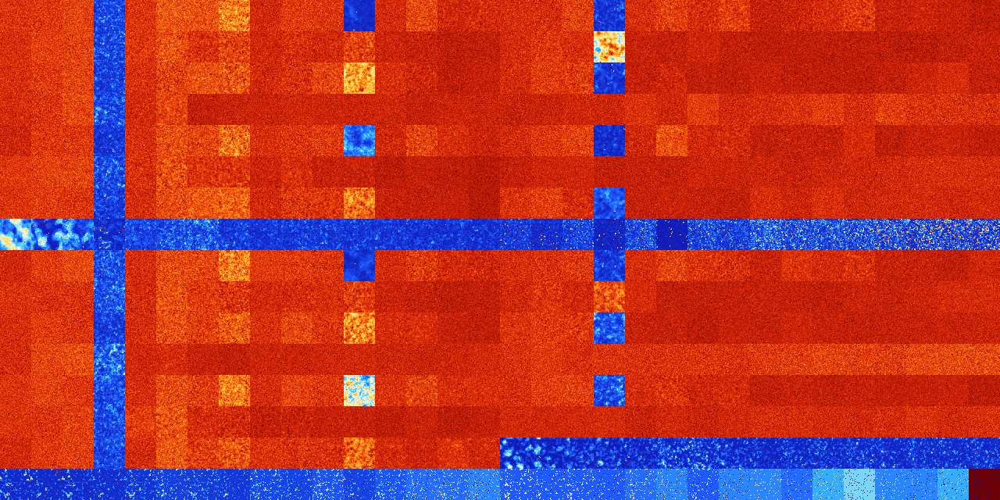

# B0456 (57856-58367)

<details>
    <summary>Initial Grid</summary>
    
</details>


<details>
    <summary>Initial Grid RLE</summary>

```
#C Exported from GoGoL (https://github.com/marrow16/gogol)
#C Wrap mode: Toroidal
#C Boundary mode: Dead
#C Step: 0
x = 100, y = 100, rule = B0456/S
o17bo19bo39bo13bo$12bo37bo3bo7bo21bo$8bo18bo46bo17bo$18bo14bo4bo3bo9bo
10bo3bo4bo10bo12bo$21bo40bo$42bo3bo13bo4bo13bo$16bo3bo68bo2bo$14bo68bo$
15bo34bo32bo$7bo8bo56bo19bo$19bo41bo19bo$2bo87bo$14bobo6bo24bo34bo8bo$
6bo6bobo66bo$7bo16bo14bo4bo$22bo5bo22bo16bo11b2o$9b2o20bo28bo16bo3bo$5b
o6bo32bo22bo8bo2bobo8bo$46bo13bo28bo6bo$23bo13bo19bo20bo$19bo49bo24bo$
34bo24bo20bobo5bo$24bo15bo18bo$bo8bo7bo23bo11b2o15bo4bo$4bo10bo31bo22b
2o22bo$11bo9bo19bo56bo$17bo5bo68bo$39bo57bobo$45bo18bo$2bo2bo9bo15bo7bo
$bo28bo57bo$6bo20bo31bo8bo$o25bo71bo$20b2o14bo29bo7bo14bo7b2o$2bo25b2o
7bo4bo7bo17bo17bo$6bo43bo17bo2bo19bobo$4bo22bo45bo8bo7bo3bo3bo$16bo3bo
11bo2bo16bo4bo26bo$17bo67bo$7bo3bobo6bo11bo10b2o46bo$85bo$19bo18bo27bo
29bo$2bo15bo18bo16bobo5bo11bo$18bo6bo9bo7bo4bo$25bo24bo5bo12bo9bo10bo$
12bo14bo8bo11bo2bo23b2o$22bo8bo4bo12bo13bo6bo$6bo11bo11b2o3bo54bo$o17bo
b2o12bo42b2o$9bo33bo21bo9bo3bo$21b2o33bo2bo14bo$14bo8bo13bo14bo3bo6bo$
9bo3bo$14bobo2bo6bobo6bo5bo10bo29bo$24bo65bo4bo$32bo7bo31bo14bo3bo6b2o$
62bo30b2o$11bo19bo28bo2bo10bo15bo$8bo6bo19bo26bo$14bo9bo22bobo14bo32bo$
7bo19bo22bo33bo$48bo13bo5bo$8bo13bo24bo7bo8bo$o11bo12bo16bo5b2o$45bo29b
o17b2o$59bo4bo9bo9bo$2bo41bo12bo$b2o19bo26bo3bo$o19bo2bo9bo4bo8bobo5b2o
6bo18bo$23bo$4bo12bo18bo7bo3bo25bo8bo12b2o$20bo2b2o12bo23bo14bo9bo4bo$
76bo12bo$9bo10bo48bo$2o4b2o46bo44bo$10bo33bo20bo$4bo20bo4bo24bo11bo15bo
$16bo10bo4bo19bo12bo7bo18bo$13bo9bo7bo28b2o18bo$51bo7bo21bo$22bo31bo22b
o16bo$12bo15bobo8bo44bo$8bo8bo11bo2bo7bo43bo$3bo9bo6bo3b2o71bo$o17bo4bo
2bo11bobo2bobo12bo15bo14bo$39bo35bo6bo$bo2bo12bo5bo5bo32bo13bo$3bobo8bo
5bo20bo2bo$51bo$19bo15bo10bo45bo$9bo41bo5bo6bo2bo2bobo12bo$16bo9bo3bo
23bo$21bo$bo13bo12bobo4bo6bo7bo2bo7bo28bo$2o41bo11bo4bo3bo23bo$73b2o17b
o$26bo$3bo25bo10bo22bo15bo$14bo8bo38bo16bo7b2o$27bo8bo11bo17bo2bobo17bo!
```
</details>
<details>
    <summary>Thumbnail</summary>

</details>
<table>
<tr>
    <td><a href="./57856%20S%20Heat%20Map%20Activity.png"></a><br>S (57856)<br>G>1000</td>    <td><a href="./57857%20S0%20Heat%20Map%20Activity.png"></a><br>S0 (57857)<br>G>1000</td>    <td><a href="./57858%20S1%20Heat%20Map%20Activity.png"></a><br>S1 (57858)<br>G>1000</td>    <td><a href="./57859%20S01%20Heat%20Map%20Activity.png"></a><br>S01 (57859)<br>R@69,p12</td>    <td><a href="./57860%20S2%20Heat%20Map%20Activity.png"></a><br>S2 (57860)<br>G>1000</td>    <td><a href="./57861%20S02%20Heat%20Map%20Activity.png"></a><br>S02 (57861)<br>G>1000</td>    <td><a href="./57862%20S12%20Heat%20Map%20Activity.png"></a><br>S12 (57862)<br>G>1000</td>    <td><a href="./57863%20S012%20Heat%20Map%20Activity.png"></a><br>S012 (57863)<br>G>1000</td>    <td><a href="./57864%20S3%20Heat%20Map%20Activity.png"></a><br>S3 (57864)<br>G>1000</td>    <td><a href="./57865%20S03%20Heat%20Map%20Activity.png"></a><br>S03 (57865)<br>G>1000</td>    <td><a href="./57866%20S13%20Heat%20Map%20Activity.png"></a><br>S13 (57866)<br>G>1000</td>    <td><a href="./57867%20S013%20Heat%20Map%20Activity.png"></a><br>S013 (57867)<br>G>1000</td>    <td><a href="./57868%20S23%20Heat%20Map%20Activity.png"></a><br>S23 (57868)<br>G>1000</td>    <td><a href="./57869%20S023%20Heat%20Map%20Activity.png"></a><br>S023 (57869)<br>G>1000</td>    <td><a href="./57870%20S123%20Heat%20Map%20Activity.png"></a><br>S123 (57870)<br>G>1000</td>    <td><a href="./57871%20S0123%20Heat%20Map%20Activity.png"></a><br>S0123 (57871)<br>G>1000</td>    <td><a href="./57872%20S4%20Heat%20Map%20Activity.png"></a><br>S4 (57872)<br>G>1000</td>    <td><a href="./57873%20S04%20Heat%20Map%20Activity.png"></a><br>S04 (57873)<br>G>1000</td>    <td><a href="./57874%20S14%20Heat%20Map%20Activity.png"></a><br>S14 (57874)<br>G>1000</td>    <td><a href="./57875%20S014%20Heat%20Map%20Activity.png"></a><br>S014 (57875)<br>R@179,p12</td>    <td><a href="./57876%20S24%20Heat%20Map%20Activity.png"></a><br>S24 (57876)<br>G>1000</td>    <td><a href="./57877%20S024%20Heat%20Map%20Activity.png"></a><br>S024 (57877)<br>G>1000</td>    <td><a href="./57878%20S124%20Heat%20Map%20Activity.png"></a><br>S124 (57878)<br>G>1000</td>    <td><a href="./57879%20S0124%20Heat%20Map%20Activity.png"></a><br>S0124 (57879)<br>G>1000</td>    <td><a href="./57880%20S34%20Heat%20Map%20Activity.png"></a><br>S34 (57880)<br>G>1000</td>    <td><a href="./57881%20S034%20Heat%20Map%20Activity.png"></a><br>S034 (57881)<br>G>1000</td>    <td><a href="./57882%20S134%20Heat%20Map%20Activity.png"></a><br>S134 (57882)<br>G>1000</td>    <td><a href="./57883%20S0134%20Heat%20Map%20Activity.png"></a><br>S0134 (57883)<br>G>1000</td>    <td><a href="./57884%20S234%20Heat%20Map%20Activity.png"></a><br>S234 (57884)<br>G>1000</td>    <td><a href="./57885%20S0234%20Heat%20Map%20Activity.png"></a><br>S0234 (57885)<br>G>1000</td>    <td><a href="./57886%20S1234%20Heat%20Map%20Activity.png"></a><br>S1234 (57886)<br>G>1000</td>    <td><a href="./57887%20S01234%20Heat%20Map%20Activity.png"></a><br>S01234 (57887)<br>G>1000</td></tr>
<tr>
    <td><a href="./57888%20S5%20Heat%20Map%20Activity.png"></a><br>S5 (57888)<br>G>1000</td>    <td><a href="./57889%20S05%20Heat%20Map%20Activity.png"></a><br>S05 (57889)<br>G>1000</td>    <td><a href="./57890%20S15%20Heat%20Map%20Activity.png"></a><br>S15 (57890)<br>G>1000</td>    <td><a href="./57891%20S015%20Heat%20Map%20Activity.png"></a><br>S015 (57891)<br>R@70,p6</td>    <td><a href="./57892%20S25%20Heat%20Map%20Activity.png"></a><br>S25 (57892)<br>G>1000</td>    <td><a href="./57893%20S025%20Heat%20Map%20Activity.png"></a><br>S025 (57893)<br>G>1000</td>    <td><a href="./57894%20S125%20Heat%20Map%20Activity.png"></a><br>S125 (57894)<br>G>1000</td>    <td><a href="./57895%20S0125%20Heat%20Map%20Activity.png"></a><br>S0125 (57895)<br>G>1000</td>    <td><a href="./57896%20S35%20Heat%20Map%20Activity.png"></a><br>S35 (57896)<br>G>1000</td>    <td><a href="./57897%20S035%20Heat%20Map%20Activity.png"></a><br>S035 (57897)<br>G>1000</td>    <td><a href="./57898%20S135%20Heat%20Map%20Activity.png"></a><br>S135 (57898)<br>G>1000</td>    <td><a href="./57899%20S0135%20Heat%20Map%20Activity.png"></a><br>S0135 (57899)<br>G>1000</td>    <td><a href="./57900%20S235%20Heat%20Map%20Activity.png"></a><br>S235 (57900)<br>G>1000</td>    <td><a href="./57901%20S0235%20Heat%20Map%20Activity.png"></a><br>S0235 (57901)<br>G>1000</td>    <td><a href="./57902%20S1235%20Heat%20Map%20Activity.png"></a><br>S1235 (57902)<br>G>1000</td>    <td><a href="./57903%20S01235%20Heat%20Map%20Activity.png"></a><br>S01235 (57903)<br>G>1000</td>    <td><a href="./57904%20S45%20Heat%20Map%20Activity.png"></a><br>S45 (57904)<br>G>1000</td>    <td><a href="./57905%20S045%20Heat%20Map%20Activity.png"></a><br>S045 (57905)<br>G>1000</td>    <td><a href="./57906%20S145%20Heat%20Map%20Activity.png"></a><br>S145 (57906)<br>G>1000</td>    <td><a href="./57907%20S0145%20Heat%20Map%20Activity.png"></a><br>S0145 (57907)<br>G>1000</td>    <td><a href="./57908%20S245%20Heat%20Map%20Activity.png"></a><br>S245 (57908)<br>G>1000</td>    <td><a href="./57909%20S0245%20Heat%20Map%20Activity.png"></a><br>S0245 (57909)<br>G>1000</td>    <td><a href="./57910%20S1245%20Heat%20Map%20Activity.png"></a><br>S1245 (57910)<br>G>1000</td>    <td><a href="./57911%20S01245%20Heat%20Map%20Activity.png"></a><br>S01245 (57911)<br>G>1000</td>    <td><a href="./57912%20S345%20Heat%20Map%20Activity.png"></a><br>S345 (57912)<br>G>1000</td>    <td><a href="./57913%20S0345%20Heat%20Map%20Activity.png"></a><br>S0345 (57913)<br>G>1000</td>    <td><a href="./57914%20S1345%20Heat%20Map%20Activity.png"></a><br>S1345 (57914)<br>G>1000</td>    <td><a href="./57915%20S01345%20Heat%20Map%20Activity.png"></a><br>S01345 (57915)<br>G>1000</td>    <td><a href="./57916%20S2345%20Heat%20Map%20Activity.png"></a><br>S2345 (57916)<br>G>1000</td>    <td><a href="./57917%20S02345%20Heat%20Map%20Activity.png"></a><br>S02345 (57917)<br>G>1000</td>    <td><a href="./57918%20S12345%20Heat%20Map%20Activity.png"></a><br>S12345 (57918)<br>G>1000</td>    <td><a href="./57919%20S012345%20Heat%20Map%20Activity.png"></a><br>S012345 (57919)<br>G>1000</td></tr>
<tr>
    <td><a href="./57920%20S6%20Heat%20Map%20Activity.png"></a><br>S6 (57920)<br>G>1000</td>    <td><a href="./57921%20S06%20Heat%20Map%20Activity.png"></a><br>S06 (57921)<br>G>1000</td>    <td><a href="./57922%20S16%20Heat%20Map%20Activity.png"></a><br>S16 (57922)<br>G>1000</td>    <td><a href="./57923%20S016%20Heat%20Map%20Activity.png"></a><br>S016 (57923)<br>R@81,p6</td>    <td><a href="./57924%20S26%20Heat%20Map%20Activity.png"></a><br>S26 (57924)<br>G>1000</td>    <td><a href="./57925%20S026%20Heat%20Map%20Activity.png"></a><br>S026 (57925)<br>G>1000</td>    <td><a href="./57926%20S126%20Heat%20Map%20Activity.png"></a><br>S126 (57926)<br>G>1000</td>    <td><a href="./57927%20S0126%20Heat%20Map%20Activity.png"></a><br>S0126 (57927)<br>G>1000</td>    <td><a href="./57928%20S36%20Heat%20Map%20Activity.png"></a><br>S36 (57928)<br>G>1000</td>    <td><a href="./57929%20S036%20Heat%20Map%20Activity.png"></a><br>S036 (57929)<br>G>1000</td>    <td><a href="./57930%20S136%20Heat%20Map%20Activity.png"></a><br>S136 (57930)<br>G>1000</td>    <td><a href="./57931%20S0136%20Heat%20Map%20Activity.png"></a><br>S0136 (57931)<br>G>1000</td>    <td><a href="./57932%20S236%20Heat%20Map%20Activity.png"></a><br>S236 (57932)<br>G>1000</td>    <td><a href="./57933%20S0236%20Heat%20Map%20Activity.png"></a><br>S0236 (57933)<br>G>1000</td>    <td><a href="./57934%20S1236%20Heat%20Map%20Activity.png"></a><br>S1236 (57934)<br>G>1000</td>    <td><a href="./57935%20S01236%20Heat%20Map%20Activity.png"></a><br>S01236 (57935)<br>G>1000</td>    <td><a href="./57936%20S46%20Heat%20Map%20Activity.png"></a><br>S46 (57936)<br>G>1000</td>    <td><a href="./57937%20S046%20Heat%20Map%20Activity.png"></a><br>S046 (57937)<br>G>1000</td>    <td><a href="./57938%20S146%20Heat%20Map%20Activity.png"></a><br>S146 (57938)<br>G>1000</td>    <td><a href="./57939%20S0146%20Heat%20Map%20Activity.png"></a><br>S0146 (57939)<br>R@368,p84</td>    <td><a href="./57940%20S246%20Heat%20Map%20Activity.png"></a><br>S246 (57940)<br>G>1000</td>    <td><a href="./57941%20S0246%20Heat%20Map%20Activity.png"></a><br>S0246 (57941)<br>G>1000</td>    <td><a href="./57942%20S1246%20Heat%20Map%20Activity.png"></a><br>S1246 (57942)<br>G>1000</td>    <td><a href="./57943%20S01246%20Heat%20Map%20Activity.png"></a><br>S01246 (57943)<br>G>1000</td>    <td><a href="./57944%20S346%20Heat%20Map%20Activity.png"></a><br>S346 (57944)<br>G>1000</td>    <td><a href="./57945%20S0346%20Heat%20Map%20Activity.png"></a><br>S0346 (57945)<br>G>1000</td>    <td><a href="./57946%20S1346%20Heat%20Map%20Activity.png"></a><br>S1346 (57946)<br>G>1000</td>    <td><a href="./57947%20S01346%20Heat%20Map%20Activity.png"></a><br>S01346 (57947)<br>G>1000</td>    <td><a href="./57948%20S2346%20Heat%20Map%20Activity.png"></a><br>S2346 (57948)<br>G>1000</td>    <td><a href="./57949%20S02346%20Heat%20Map%20Activity.png"></a><br>S02346 (57949)<br>G>1000</td>    <td><a href="./57950%20S12346%20Heat%20Map%20Activity.png"></a><br>S12346 (57950)<br>G>1000</td>    <td><a href="./57951%20S012346%20Heat%20Map%20Activity.png"></a><br>S012346 (57951)<br>G>1000</td></tr>
<tr>
    <td><a href="./57952%20S56%20Heat%20Map%20Activity.png"></a><br>S56 (57952)<br>G>1000</td>    <td><a href="./57953%20S056%20Heat%20Map%20Activity.png"></a><br>S056 (57953)<br>G>1000</td>    <td><a href="./57954%20S156%20Heat%20Map%20Activity.png"></a><br>S156 (57954)<br>G>1000</td>    <td><a href="./57955%20S0156%20Heat%20Map%20Activity.png"></a><br>S0156 (57955)<br>R@88,p6</td>    <td><a href="./57956%20S256%20Heat%20Map%20Activity.png"></a><br>S256 (57956)<br>G>1000</td>    <td><a href="./57957%20S0256%20Heat%20Map%20Activity.png"></a><br>S0256 (57957)<br>G>1000</td>    <td><a href="./57958%20S1256%20Heat%20Map%20Activity.png"></a><br>S1256 (57958)<br>G>1000</td>    <td><a href="./57959%20S01256%20Heat%20Map%20Activity.png"></a><br>S01256 (57959)<br>G>1000</td>    <td><a href="./57960%20S356%20Heat%20Map%20Activity.png"></a><br>S356 (57960)<br>G>1000</td>    <td><a href="./57961%20S0356%20Heat%20Map%20Activity.png"></a><br>S0356 (57961)<br>G>1000</td>    <td><a href="./57962%20S1356%20Heat%20Map%20Activity.png"></a><br>S1356 (57962)<br>G>1000</td>    <td><a href="./57963%20S01356%20Heat%20Map%20Activity.png"></a><br>S01356 (57963)<br>G>1000</td>    <td><a href="./57964%20S2356%20Heat%20Map%20Activity.png"></a><br>S2356 (57964)<br>G>1000</td>    <td><a href="./57965%20S02356%20Heat%20Map%20Activity.png"></a><br>S02356 (57965)<br>G>1000</td>    <td><a href="./57966%20S12356%20Heat%20Map%20Activity.png"></a><br>S12356 (57966)<br>G>1000</td>    <td><a href="./57967%20S012356%20Heat%20Map%20Activity.png"></a><br>S012356 (57967)<br>G>1000</td>    <td><a href="./57968%20S456%20Heat%20Map%20Activity.png"></a><br>S456 (57968)<br>G>1000</td>    <td><a href="./57969%20S0456%20Heat%20Map%20Activity.png"></a><br>S0456 (57969)<br>G>1000</td>    <td><a href="./57970%20S1456%20Heat%20Map%20Activity.png"></a><br>S1456 (57970)<br>G>1000</td>    <td><a href="./57971%20S01456%20Heat%20Map%20Activity.png"></a><br>S01456 (57971)<br>G>1000</td>    <td><a href="./57972%20S2456%20Heat%20Map%20Activity.png"></a><br>S2456 (57972)<br>G>1000</td>    <td><a href="./57973%20S02456%20Heat%20Map%20Activity.png"></a><br>S02456 (57973)<br>G>1000</td>    <td><a href="./57974%20S12456%20Heat%20Map%20Activity.png"></a><br>S12456 (57974)<br>G>1000</td>    <td><a href="./57975%20S012456%20Heat%20Map%20Activity.png"></a><br>S012456 (57975)<br>G>1000</td>    <td><a href="./57976%20S3456%20Heat%20Map%20Activity.png"></a><br>S3456 (57976)<br>G>1000</td>    <td><a href="./57977%20S03456%20Heat%20Map%20Activity.png"></a><br>S03456 (57977)<br>G>1000</td>    <td><a href="./57978%20S13456%20Heat%20Map%20Activity.png"></a><br>S13456 (57978)<br>G>1000</td>    <td><a href="./57979%20S013456%20Heat%20Map%20Activity.png"></a><br>S013456 (57979)<br>G>1000</td>    <td><a href="./57980%20S23456%20Heat%20Map%20Activity.png"></a><br>S23456 (57980)<br>G>1000</td>    <td><a href="./57981%20S023456%20Heat%20Map%20Activity.png"></a><br>S023456 (57981)<br>G>1000</td>    <td><a href="./57982%20S123456%20Heat%20Map%20Activity.png"></a><br>S123456 (57982)<br>G>1000</td>    <td><a href="./57983%20S0123456%20Heat%20Map%20Activity.png"></a><br>S0123456 (57983)<br>G>1000</td></tr>
<tr>
    <td><a href="./57984%20S7%20Heat%20Map%20Activity.png"></a><br>S7 (57984)<br>G>1000</td>    <td><a href="./57985%20S07%20Heat%20Map%20Activity.png"></a><br>S07 (57985)<br>G>1000</td>    <td><a href="./57986%20S17%20Heat%20Map%20Activity.png"></a><br>S17 (57986)<br>G>1000</td>    <td><a href="./57987%20S017%20Heat%20Map%20Activity.png"></a><br>S017 (57987)<br>R@83,p6</td>    <td><a href="./57988%20S27%20Heat%20Map%20Activity.png"></a><br>S27 (57988)<br>G>1000</td>    <td><a href="./57989%20S027%20Heat%20Map%20Activity.png"></a><br>S027 (57989)<br>G>1000</td>    <td><a href="./57990%20S127%20Heat%20Map%20Activity.png"></a><br>S127 (57990)<br>G>1000</td>    <td><a href="./57991%20S0127%20Heat%20Map%20Activity.png"></a><br>S0127 (57991)<br>G>1000</td>    <td><a href="./57992%20S37%20Heat%20Map%20Activity.png"></a><br>S37 (57992)<br>G>1000</td>    <td><a href="./57993%20S037%20Heat%20Map%20Activity.png"></a><br>S037 (57993)<br>G>1000</td>    <td><a href="./57994%20S137%20Heat%20Map%20Activity.png"></a><br>S137 (57994)<br>G>1000</td>    <td><a href="./57995%20S0137%20Heat%20Map%20Activity.png"></a><br>S0137 (57995)<br>G>1000</td>    <td><a href="./57996%20S237%20Heat%20Map%20Activity.png"></a><br>S237 (57996)<br>G>1000</td>    <td><a href="./57997%20S0237%20Heat%20Map%20Activity.png"></a><br>S0237 (57997)<br>G>1000</td>    <td><a href="./57998%20S1237%20Heat%20Map%20Activity.png"></a><br>S1237 (57998)<br>G>1000</td>    <td><a href="./57999%20S01237%20Heat%20Map%20Activity.png"></a><br>S01237 (57999)<br>G>1000</td>    <td><a href="./58000%20S47%20Heat%20Map%20Activity.png"></a><br>S47 (58000)<br>G>1000</td>    <td><a href="./58001%20S047%20Heat%20Map%20Activity.png"></a><br>S047 (58001)<br>G>1000</td>    <td><a href="./58002%20S147%20Heat%20Map%20Activity.png"></a><br>S147 (58002)<br>G>1000</td>    <td><a href="./58003%20S0147%20Heat%20Map%20Activity.png"></a><br>S0147 (58003)<br>R@313,p42</td>    <td><a href="./58004%20S247%20Heat%20Map%20Activity.png"></a><br>S247 (58004)<br>G>1000</td>    <td><a href="./58005%20S0247%20Heat%20Map%20Activity.png"></a><br>S0247 (58005)<br>G>1000</td>    <td><a href="./58006%20S1247%20Heat%20Map%20Activity.png"></a><br>S1247 (58006)<br>G>1000</td>    <td><a href="./58007%20S01247%20Heat%20Map%20Activity.png"></a><br>S01247 (58007)<br>G>1000</td>    <td><a href="./58008%20S347%20Heat%20Map%20Activity.png"></a><br>S347 (58008)<br>G>1000</td>    <td><a href="./58009%20S0347%20Heat%20Map%20Activity.png"></a><br>S0347 (58009)<br>G>1000</td>    <td><a href="./58010%20S1347%20Heat%20Map%20Activity.png"></a><br>S1347 (58010)<br>G>1000</td>    <td><a href="./58011%20S01347%20Heat%20Map%20Activity.png"></a><br>S01347 (58011)<br>G>1000</td>    <td><a href="./58012%20S2347%20Heat%20Map%20Activity.png"></a><br>S2347 (58012)<br>G>1000</td>    <td><a href="./58013%20S02347%20Heat%20Map%20Activity.png"></a><br>S02347 (58013)<br>G>1000</td>    <td><a href="./58014%20S12347%20Heat%20Map%20Activity.png"></a><br>S12347 (58014)<br>G>1000</td>    <td><a href="./58015%20S012347%20Heat%20Map%20Activity.png"></a><br>S012347 (58015)<br>G>1000</td></tr>
<tr>
    <td><a href="./58016%20S57%20Heat%20Map%20Activity.png"></a><br>S57 (58016)<br>G>1000</td>    <td><a href="./58017%20S057%20Heat%20Map%20Activity.png"></a><br>S057 (58017)<br>G>1000</td>    <td><a href="./58018%20S157%20Heat%20Map%20Activity.png"></a><br>S157 (58018)<br>G>1000</td>    <td><a href="./58019%20S0157%20Heat%20Map%20Activity.png"></a><br>S0157 (58019)<br>R@77,p6</td>    <td><a href="./58020%20S257%20Heat%20Map%20Activity.png"></a><br>S257 (58020)<br>G>1000</td>    <td><a href="./58021%20S0257%20Heat%20Map%20Activity.png"></a><br>S0257 (58021)<br>G>1000</td>    <td><a href="./58022%20S1257%20Heat%20Map%20Activity.png"></a><br>S1257 (58022)<br>G>1000</td>    <td><a href="./58023%20S01257%20Heat%20Map%20Activity.png"></a><br>S01257 (58023)<br>G>1000</td>    <td><a href="./58024%20S357%20Heat%20Map%20Activity.png"></a><br>S357 (58024)<br>G>1000</td>    <td><a href="./58025%20S0357%20Heat%20Map%20Activity.png"></a><br>S0357 (58025)<br>G>1000</td>    <td><a href="./58026%20S1357%20Heat%20Map%20Activity.png"></a><br>S1357 (58026)<br>G>1000</td>    <td><a href="./58027%20S01357%20Heat%20Map%20Activity.png"></a><br>S01357 (58027)<br>G>1000</td>    <td><a href="./58028%20S2357%20Heat%20Map%20Activity.png"></a><br>S2357 (58028)<br>G>1000</td>    <td><a href="./58029%20S02357%20Heat%20Map%20Activity.png"></a><br>S02357 (58029)<br>G>1000</td>    <td><a href="./58030%20S12357%20Heat%20Map%20Activity.png"></a><br>S12357 (58030)<br>G>1000</td>    <td><a href="./58031%20S012357%20Heat%20Map%20Activity.png"></a><br>S012357 (58031)<br>G>1000</td>    <td><a href="./58032%20S457%20Heat%20Map%20Activity.png"></a><br>S457 (58032)<br>G>1000</td>    <td><a href="./58033%20S0457%20Heat%20Map%20Activity.png"></a><br>S0457 (58033)<br>G>1000</td>    <td><a href="./58034%20S1457%20Heat%20Map%20Activity.png"></a><br>S1457 (58034)<br>G>1000</td>    <td><a href="./58035%20S01457%20Heat%20Map%20Activity.png"></a><br>S01457 (58035)<br>G>1000</td>    <td><a href="./58036%20S2457%20Heat%20Map%20Activity.png"></a><br>S2457 (58036)<br>G>1000</td>    <td><a href="./58037%20S02457%20Heat%20Map%20Activity.png"></a><br>S02457 (58037)<br>G>1000</td>    <td><a href="./58038%20S12457%20Heat%20Map%20Activity.png"></a><br>S12457 (58038)<br>G>1000</td>    <td><a href="./58039%20S012457%20Heat%20Map%20Activity.png"></a><br>S012457 (58039)<br>G>1000</td>    <td><a href="./58040%20S3457%20Heat%20Map%20Activity.png"></a><br>S3457 (58040)<br>G>1000</td>    <td><a href="./58041%20S03457%20Heat%20Map%20Activity.png"></a><br>S03457 (58041)<br>G>1000</td>    <td><a href="./58042%20S13457%20Heat%20Map%20Activity.png"></a><br>S13457 (58042)<br>G>1000</td>    <td><a href="./58043%20S013457%20Heat%20Map%20Activity.png"></a><br>S013457 (58043)<br>G>1000</td>    <td><a href="./58044%20S23457%20Heat%20Map%20Activity.png"></a><br>S23457 (58044)<br>G>1000</td>    <td><a href="./58045%20S023457%20Heat%20Map%20Activity.png"></a><br>S023457 (58045)<br>G>1000</td>    <td><a href="./58046%20S123457%20Heat%20Map%20Activity.png"></a><br>S123457 (58046)<br>G>1000</td>    <td><a href="./58047%20S0123457%20Heat%20Map%20Activity.png"></a><br>S0123457 (58047)<br>G>1000</td></tr>
<tr>
    <td><a href="./58048%20S67%20Heat%20Map%20Activity.png"></a><br>S67 (58048)<br>G>1000</td>    <td><a href="./58049%20S067%20Heat%20Map%20Activity.png"></a><br>S067 (58049)<br>G>1000</td>    <td><a href="./58050%20S167%20Heat%20Map%20Activity.png"></a><br>S167 (58050)<br>G>1000</td>    <td><a href="./58051%20S0167%20Heat%20Map%20Activity.png"></a><br>S0167 (58051)<br>R@89,p6</td>    <td><a href="./58052%20S267%20Heat%20Map%20Activity.png"></a><br>S267 (58052)<br>G>1000</td>    <td><a href="./58053%20S0267%20Heat%20Map%20Activity.png"></a><br>S0267 (58053)<br>G>1000</td>    <td><a href="./58054%20S1267%20Heat%20Map%20Activity.png"></a><br>S1267 (58054)<br>G>1000</td>    <td><a href="./58055%20S01267%20Heat%20Map%20Activity.png"></a><br>S01267 (58055)<br>G>1000</td>    <td><a href="./58056%20S367%20Heat%20Map%20Activity.png"></a><br>S367 (58056)<br>G>1000</td>    <td><a href="./58057%20S0367%20Heat%20Map%20Activity.png"></a><br>S0367 (58057)<br>G>1000</td>    <td><a href="./58058%20S1367%20Heat%20Map%20Activity.png"></a><br>S1367 (58058)<br>G>1000</td>    <td><a href="./58059%20S01367%20Heat%20Map%20Activity.png"></a><br>S01367 (58059)<br>G>1000</td>    <td><a href="./58060%20S2367%20Heat%20Map%20Activity.png"></a><br>S2367 (58060)<br>G>1000</td>    <td><a href="./58061%20S02367%20Heat%20Map%20Activity.png"></a><br>S02367 (58061)<br>G>1000</td>    <td><a href="./58062%20S12367%20Heat%20Map%20Activity.png"></a><br>S12367 (58062)<br>G>1000</td>    <td><a href="./58063%20S012367%20Heat%20Map%20Activity.png"></a><br>S012367 (58063)<br>G>1000</td>    <td><a href="./58064%20S467%20Heat%20Map%20Activity.png"></a><br>S467 (58064)<br>G>1000</td>    <td><a href="./58065%20S0467%20Heat%20Map%20Activity.png"></a><br>S0467 (58065)<br>G>1000</td>    <td><a href="./58066%20S1467%20Heat%20Map%20Activity.png"></a><br>S1467 (58066)<br>G>1000</td>    <td><a href="./58067%20S01467%20Heat%20Map%20Activity.png"></a><br>S01467 (58067)<br>R@654,p12</td>    <td><a href="./58068%20S2467%20Heat%20Map%20Activity.png"></a><br>S2467 (58068)<br>G>1000</td>    <td><a href="./58069%20S02467%20Heat%20Map%20Activity.png"></a><br>S02467 (58069)<br>G>1000</td>    <td><a href="./58070%20S12467%20Heat%20Map%20Activity.png"></a><br>S12467 (58070)<br>G>1000</td>    <td><a href="./58071%20S012467%20Heat%20Map%20Activity.png"></a><br>S012467 (58071)<br>G>1000</td>    <td><a href="./58072%20S3467%20Heat%20Map%20Activity.png"></a><br>S3467 (58072)<br>G>1000</td>    <td><a href="./58073%20S03467%20Heat%20Map%20Activity.png"></a><br>S03467 (58073)<br>G>1000</td>    <td><a href="./58074%20S13467%20Heat%20Map%20Activity.png"></a><br>S13467 (58074)<br>G>1000</td>    <td><a href="./58075%20S013467%20Heat%20Map%20Activity.png"></a><br>S013467 (58075)<br>G>1000</td>    <td><a href="./58076%20S23467%20Heat%20Map%20Activity.png"></a><br>S23467 (58076)<br>G>1000</td>    <td><a href="./58077%20S023467%20Heat%20Map%20Activity.png"></a><br>S023467 (58077)<br>G>1000</td>    <td><a href="./58078%20S123467%20Heat%20Map%20Activity.png"></a><br>S123467 (58078)<br>G>1000</td>    <td><a href="./58079%20S0123467%20Heat%20Map%20Activity.png"></a><br>S0123467 (58079)<br>G>1000</td></tr>
<tr>
    <td><a href="./58080%20S567%20Heat%20Map%20Activity.png"></a><br>S567 (58080)<br>R@915,p6</td>    <td><a href="./58081%20S0567%20Heat%20Map%20Activity.png"></a><br>S0567 (58081)<br>R@534,p12</td>    <td><a href="./58082%20S1567%20Heat%20Map%20Activity.png"></a><br>S1567 (58082)<br>R@236,p12</td>    <td><a href="./58083%20S01567%20Heat%20Map%20Activity.png"></a><br>S01567 (58083)<br>R@259,p24</td>    <td><a href="./58084%20S2567%20Heat%20Map%20Activity.png"></a><br>S2567 (58084)<br>R@101,p6</td>    <td><a href="./58085%20S02567%20Heat%20Map%20Activity.png"></a><br>S02567 (58085)<br>R@73,p6</td>    <td><a href="./58086%20S12567%20Heat%20Map%20Activity.png"></a><br>S12567 (58086)<br>R@69,p2</td>    <td><a href="./58087%20S012567%20Heat%20Map%20Activity.png"></a><br>S012567 (58087)<br>R@96,p6</td>    <td><a href="./58088%20S3567%20Heat%20Map%20Activity.png"></a><br>S3567 (58088)<br>R@93,p12</td>    <td><a href="./58089%20S03567%20Heat%20Map%20Activity.png"></a><br>S03567 (58089)<br>R@80,p6</td>    <td><a href="./58090%20S13567%20Heat%20Map%20Activity.png"></a><br>S13567 (58090)<br>R@74,p6</td>    <td><a href="./58091%20S013567%20Heat%20Map%20Activity.png"></a><br>S013567 (58091)<br>R@80,p8</td>    <td><a href="./58092%20S23567%20Heat%20Map%20Activity.png"></a><br>S23567 (58092)<br>R@86,p2</td>    <td><a href="./58093%20S023567%20Heat%20Map%20Activity.png"></a><br>S023567 (58093)<br>R@81,p10</td>    <td><a href="./58094%20S123567%20Heat%20Map%20Activity.png"></a><br>S123567 (58094)<br>R@89,p6</td>    <td><a href="./58095%20S0123567%20Heat%20Map%20Activity.png"></a><br>S0123567 (58095)<br>R@91,p6</td>    <td><a href="./58096%20S4567%20Heat%20Map%20Activity.png"></a><br>S4567 (58096)<br>R@49,p24</td>    <td><a href="./58097%20S04567%20Heat%20Map%20Activity.png"></a><br>S04567 (58097)<br>R@68,p42</td>    <td><a href="./58098%20S14567%20Heat%20Map%20Activity.png"></a><br>S14567 (58098)<br>R@38,p12</td>    <td><a href="./58099%20S014567%20Heat%20Map%20Activity.png"></a><br>S014567 (58099)<br>R@109,p84</td>    <td><a href="./58100%20S24567%20Heat%20Map%20Activity.png"></a><br>S24567 (58100)<br>R@32,p6</td>    <td><a href="./58101%20S024567%20Heat%20Map%20Activity.png"></a><br>S024567 (58101)<br>R@234,p210</td>    <td><a href="./58102%20S124567%20Heat%20Map%20Activity.png"></a><br>S124567 (58102)<br>R@33,p6</td>    <td><a href="./58103%20S0124567%20Heat%20Map%20Activity.png"></a><br>S0124567 (58103)<br>R@36,p12</td>    <td><a href="./58104%20S34567%20Heat%20Map%20Activity.png"></a><br>S34567 (58104)<br>R@26,p6</td>    <td><a href="./58105%20S034567%20Heat%20Map%20Activity.png"></a><br>S034567 (58105)<br>R@26,p6</td>    <td><a href="./58106%20S134567%20Heat%20Map%20Activity.png"></a><br>S134567 (58106)<br>R@29,p6</td>    <td><a href="./58107%20S0134567%20Heat%20Map%20Activity.png"></a><br>S0134567 (58107)<br>R@24,p6</td>    <td><a href="./58108%20S234567%20Heat%20Map%20Activity.png"></a><br>S234567 (58108)<br>R@40,p6</td>    <td><a href="./58109%20S0234567%20Heat%20Map%20Activity.png"></a><br>S0234567 (58109)<br>R@33,p6</td>    <td><a href="./58110%20S1234567%20Heat%20Map%20Activity.png"></a><br>S1234567 (58110)<br>R@37,p6</td>    <td><a href="./58111%20S01234567%20Heat%20Map%20Activity.png"></a><br>S01234567 (58111)<br>R@30,p6</td></tr>
<tr>
    <td><a href="./58112%20S8%20Heat%20Map%20Activity.png"></a><br>S8 (58112)<br>G>1000</td>    <td><a href="./58113%20S08%20Heat%20Map%20Activity.png"></a><br>S08 (58113)<br>G>1000</td>    <td><a href="./58114%20S18%20Heat%20Map%20Activity.png"></a><br>S18 (58114)<br>G>1000</td>    <td><a href="./58115%20S018%20Heat%20Map%20Activity.png"></a><br>S018 (58115)<br>R@77,p6</td>    <td><a href="./58116%20S28%20Heat%20Map%20Activity.png"></a><br>S28 (58116)<br>G>1000</td>    <td><a href="./58117%20S028%20Heat%20Map%20Activity.png"></a><br>S028 (58117)<br>G>1000</td>    <td><a href="./58118%20S128%20Heat%20Map%20Activity.png"></a><br>S128 (58118)<br>G>1000</td>    <td><a href="./58119%20S0128%20Heat%20Map%20Activity.png"></a><br>S0128 (58119)<br>G>1000</td>    <td><a href="./58120%20S38%20Heat%20Map%20Activity.png"></a><br>S38 (58120)<br>G>1000</td>    <td><a href="./58121%20S038%20Heat%20Map%20Activity.png"></a><br>S038 (58121)<br>G>1000</td>    <td><a href="./58122%20S138%20Heat%20Map%20Activity.png"></a><br>S138 (58122)<br>G>1000</td>    <td><a href="./58123%20S0138%20Heat%20Map%20Activity.png"></a><br>S0138 (58123)<br>G>1000</td>    <td><a href="./58124%20S238%20Heat%20Map%20Activity.png"></a><br>S238 (58124)<br>G>1000</td>    <td><a href="./58125%20S0238%20Heat%20Map%20Activity.png"></a><br>S0238 (58125)<br>G>1000</td>    <td><a href="./58126%20S1238%20Heat%20Map%20Activity.png"></a><br>S1238 (58126)<br>G>1000</td>    <td><a href="./58127%20S01238%20Heat%20Map%20Activity.png"></a><br>S01238 (58127)<br>G>1000</td>    <td><a href="./58128%20S48%20Heat%20Map%20Activity.png"></a><br>S48 (58128)<br>G>1000</td>    <td><a href="./58129%20S048%20Heat%20Map%20Activity.png"></a><br>S048 (58129)<br>G>1000</td>    <td><a href="./58130%20S148%20Heat%20Map%20Activity.png"></a><br>S148 (58130)<br>G>1000</td>    <td><a href="./58131%20S0148%20Heat%20Map%20Activity.png"></a><br>S0148 (58131)<br>R@233,p4</td>    <td><a href="./58132%20S248%20Heat%20Map%20Activity.png"></a><br>S248 (58132)<br>G>1000</td>    <td><a href="./58133%20S0248%20Heat%20Map%20Activity.png"></a><br>S0248 (58133)<br>G>1000</td>    <td><a href="./58134%20S1248%20Heat%20Map%20Activity.png"></a><br>S1248 (58134)<br>G>1000</td>    <td><a href="./58135%20S01248%20Heat%20Map%20Activity.png"></a><br>S01248 (58135)<br>G>1000</td>    <td><a href="./58136%20S348%20Heat%20Map%20Activity.png"></a><br>S348 (58136)<br>G>1000</td>    <td><a href="./58137%20S0348%20Heat%20Map%20Activity.png"></a><br>S0348 (58137)<br>G>1000</td>    <td><a href="./58138%20S1348%20Heat%20Map%20Activity.png"></a><br>S1348 (58138)<br>G>1000</td>    <td><a href="./58139%20S01348%20Heat%20Map%20Activity.png"></a><br>S01348 (58139)<br>G>1000</td>    <td><a href="./58140%20S2348%20Heat%20Map%20Activity.png"></a><br>S2348 (58140)<br>G>1000</td>    <td><a href="./58141%20S02348%20Heat%20Map%20Activity.png"></a><br>S02348 (58141)<br>G>1000</td>    <td><a href="./58142%20S12348%20Heat%20Map%20Activity.png"></a><br>S12348 (58142)<br>G>1000</td>    <td><a href="./58143%20S012348%20Heat%20Map%20Activity.png"></a><br>S012348 (58143)<br>G>1000</td></tr>
<tr>
    <td><a href="./58144%20S58%20Heat%20Map%20Activity.png"></a><br>S58 (58144)<br>G>1000</td>    <td><a href="./58145%20S058%20Heat%20Map%20Activity.png"></a><br>S058 (58145)<br>G>1000</td>    <td><a href="./58146%20S158%20Heat%20Map%20Activity.png"></a><br>S158 (58146)<br>G>1000</td>    <td><a href="./58147%20S0158%20Heat%20Map%20Activity.png"></a><br>S0158 (58147)<br>R@79,p6</td>    <td><a href="./58148%20S258%20Heat%20Map%20Activity.png"></a><br>S258 (58148)<br>G>1000</td>    <td><a href="./58149%20S0258%20Heat%20Map%20Activity.png"></a><br>S0258 (58149)<br>G>1000</td>    <td><a href="./58150%20S1258%20Heat%20Map%20Activity.png"></a><br>S1258 (58150)<br>G>1000</td>    <td><a href="./58151%20S01258%20Heat%20Map%20Activity.png"></a><br>S01258 (58151)<br>G>1000</td>    <td><a href="./58152%20S358%20Heat%20Map%20Activity.png"></a><br>S358 (58152)<br>G>1000</td>    <td><a href="./58153%20S0358%20Heat%20Map%20Activity.png"></a><br>S0358 (58153)<br>G>1000</td>    <td><a href="./58154%20S1358%20Heat%20Map%20Activity.png"></a><br>S1358 (58154)<br>G>1000</td>    <td><a href="./58155%20S01358%20Heat%20Map%20Activity.png"></a><br>S01358 (58155)<br>G>1000</td>    <td><a href="./58156%20S2358%20Heat%20Map%20Activity.png"></a><br>S2358 (58156)<br>G>1000</td>    <td><a href="./58157%20S02358%20Heat%20Map%20Activity.png"></a><br>S02358 (58157)<br>G>1000</td>    <td><a href="./58158%20S12358%20Heat%20Map%20Activity.png"></a><br>S12358 (58158)<br>G>1000</td>    <td><a href="./58159%20S012358%20Heat%20Map%20Activity.png"></a><br>S012358 (58159)<br>G>1000</td>    <td><a href="./58160%20S458%20Heat%20Map%20Activity.png"></a><br>S458 (58160)<br>G>1000</td>    <td><a href="./58161%20S0458%20Heat%20Map%20Activity.png"></a><br>S0458 (58161)<br>G>1000</td>    <td><a href="./58162%20S1458%20Heat%20Map%20Activity.png"></a><br>S1458 (58162)<br>G>1000</td>    <td><a href="./58163%20S01458%20Heat%20Map%20Activity.png"></a><br>S01458 (58163)<br>G>1000</td>    <td><a href="./58164%20S2458%20Heat%20Map%20Activity.png"></a><br>S2458 (58164)<br>G>1000</td>    <td><a href="./58165%20S02458%20Heat%20Map%20Activity.png"></a><br>S02458 (58165)<br>G>1000</td>    <td><a href="./58166%20S12458%20Heat%20Map%20Activity.png"></a><br>S12458 (58166)<br>G>1000</td>    <td><a href="./58167%20S012458%20Heat%20Map%20Activity.png"></a><br>S012458 (58167)<br>G>1000</td>    <td><a href="./58168%20S3458%20Heat%20Map%20Activity.png"></a><br>S3458 (58168)<br>G>1000</td>    <td><a href="./58169%20S03458%20Heat%20Map%20Activity.png"></a><br>S03458 (58169)<br>G>1000</td>    <td><a href="./58170%20S13458%20Heat%20Map%20Activity.png"></a><br>S13458 (58170)<br>G>1000</td>    <td><a href="./58171%20S013458%20Heat%20Map%20Activity.png"></a><br>S013458 (58171)<br>G>1000</td>    <td><a href="./58172%20S23458%20Heat%20Map%20Activity.png"></a><br>S23458 (58172)<br>G>1000</td>    <td><a href="./58173%20S023458%20Heat%20Map%20Activity.png"></a><br>S023458 (58173)<br>G>1000</td>    <td><a href="./58174%20S123458%20Heat%20Map%20Activity.png"></a><br>S123458 (58174)<br>G>1000</td>    <td><a href="./58175%20S0123458%20Heat%20Map%20Activity.png"></a><br>S0123458 (58175)<br>G>1000</td></tr>
<tr>
    <td><a href="./58176%20S68%20Heat%20Map%20Activity.png"></a><br>S68 (58176)<br>G>1000</td>    <td><a href="./58177%20S068%20Heat%20Map%20Activity.png"></a><br>S068 (58177)<br>G>1000</td>    <td><a href="./58178%20S168%20Heat%20Map%20Activity.png"></a><br>S168 (58178)<br>G>1000</td>    <td><a href="./58179%20S0168%20Heat%20Map%20Activity.png"></a><br>S0168 (58179)<br>R@87,p2</td>    <td><a href="./58180%20S268%20Heat%20Map%20Activity.png"></a><br>S268 (58180)<br>G>1000</td>    <td><a href="./58181%20S0268%20Heat%20Map%20Activity.png"></a><br>S0268 (58181)<br>G>1000</td>    <td><a href="./58182%20S1268%20Heat%20Map%20Activity.png"></a><br>S1268 (58182)<br>G>1000</td>    <td><a href="./58183%20S01268%20Heat%20Map%20Activity.png"></a><br>S01268 (58183)<br>G>1000</td>    <td><a href="./58184%20S368%20Heat%20Map%20Activity.png"></a><br>S368 (58184)<br>G>1000</td>    <td><a href="./58185%20S0368%20Heat%20Map%20Activity.png"></a><br>S0368 (58185)<br>G>1000</td>    <td><a href="./58186%20S1368%20Heat%20Map%20Activity.png"></a><br>S1368 (58186)<br>G>1000</td>    <td><a href="./58187%20S01368%20Heat%20Map%20Activity.png"></a><br>S01368 (58187)<br>G>1000</td>    <td><a href="./58188%20S2368%20Heat%20Map%20Activity.png"></a><br>S2368 (58188)<br>G>1000</td>    <td><a href="./58189%20S02368%20Heat%20Map%20Activity.png"></a><br>S02368 (58189)<br>G>1000</td>    <td><a href="./58190%20S12368%20Heat%20Map%20Activity.png"></a><br>S12368 (58190)<br>G>1000</td>    <td><a href="./58191%20S012368%20Heat%20Map%20Activity.png"></a><br>S012368 (58191)<br>G>1000</td>    <td><a href="./58192%20S468%20Heat%20Map%20Activity.png"></a><br>S468 (58192)<br>G>1000</td>    <td><a href="./58193%20S0468%20Heat%20Map%20Activity.png"></a><br>S0468 (58193)<br>G>1000</td>    <td><a href="./58194%20S1468%20Heat%20Map%20Activity.png"></a><br>S1468 (58194)<br>G>1000</td>    <td><a href="./58195%20S01468%20Heat%20Map%20Activity.png"></a><br>S01468 (58195)<br>R@266,p12</td>    <td><a href="./58196%20S2468%20Heat%20Map%20Activity.png"></a><br>S2468 (58196)<br>G>1000</td>    <td><a href="./58197%20S02468%20Heat%20Map%20Activity.png"></a><br>S02468 (58197)<br>G>1000</td>    <td><a href="./58198%20S12468%20Heat%20Map%20Activity.png"></a><br>S12468 (58198)<br>G>1000</td>    <td><a href="./58199%20S012468%20Heat%20Map%20Activity.png"></a><br>S012468 (58199)<br>G>1000</td>    <td><a href="./58200%20S3468%20Heat%20Map%20Activity.png"></a><br>S3468 (58200)<br>G>1000</td>    <td><a href="./58201%20S03468%20Heat%20Map%20Activity.png"></a><br>S03468 (58201)<br>G>1000</td>    <td><a href="./58202%20S13468%20Heat%20Map%20Activity.png"></a><br>S13468 (58202)<br>G>1000</td>    <td><a href="./58203%20S013468%20Heat%20Map%20Activity.png"></a><br>S013468 (58203)<br>G>1000</td>    <td><a href="./58204%20S23468%20Heat%20Map%20Activity.png"></a><br>S23468 (58204)<br>G>1000</td>    <td><a href="./58205%20S023468%20Heat%20Map%20Activity.png"></a><br>S023468 (58205)<br>G>1000</td>    <td><a href="./58206%20S123468%20Heat%20Map%20Activity.png"></a><br>S123468 (58206)<br>G>1000</td>    <td><a href="./58207%20S0123468%20Heat%20Map%20Activity.png"></a><br>S0123468 (58207)<br>G>1000</td></tr>
<tr>
    <td><a href="./58208%20S568%20Heat%20Map%20Activity.png"></a><br>S568 (58208)<br>G>1000</td>    <td><a href="./58209%20S0568%20Heat%20Map%20Activity.png"></a><br>S0568 (58209)<br>G>1000</td>    <td><a href="./58210%20S1568%20Heat%20Map%20Activity.png"></a><br>S1568 (58210)<br>G>1000</td>    <td><a href="./58211%20S01568%20Heat%20Map%20Activity.png"></a><br>S01568 (58211)<br>R@86,p12</td>    <td><a href="./58212%20S2568%20Heat%20Map%20Activity.png"></a><br>S2568 (58212)<br>G>1000</td>    <td><a href="./58213%20S02568%20Heat%20Map%20Activity.png"></a><br>S02568 (58213)<br>G>1000</td>    <td><a href="./58214%20S12568%20Heat%20Map%20Activity.png"></a><br>S12568 (58214)<br>G>1000</td>    <td><a href="./58215%20S012568%20Heat%20Map%20Activity.png"></a><br>S012568 (58215)<br>G>1000</td>    <td><a href="./58216%20S3568%20Heat%20Map%20Activity.png"></a><br>S3568 (58216)<br>G>1000</td>    <td><a href="./58217%20S03568%20Heat%20Map%20Activity.png"></a><br>S03568 (58217)<br>G>1000</td>    <td><a href="./58218%20S13568%20Heat%20Map%20Activity.png"></a><br>S13568 (58218)<br>G>1000</td>    <td><a href="./58219%20S013568%20Heat%20Map%20Activity.png"></a><br>S013568 (58219)<br>G>1000</td>    <td><a href="./58220%20S23568%20Heat%20Map%20Activity.png"></a><br>S23568 (58220)<br>G>1000</td>    <td><a href="./58221%20S023568%20Heat%20Map%20Activity.png"></a><br>S023568 (58221)<br>G>1000</td>    <td><a href="./58222%20S123568%20Heat%20Map%20Activity.png"></a><br>S123568 (58222)<br>G>1000</td>    <td><a href="./58223%20S0123568%20Heat%20Map%20Activity.png"></a><br>S0123568 (58223)<br>G>1000</td>    <td><a href="./58224%20S4568%20Heat%20Map%20Activity.png"></a><br>S4568 (58224)<br>G>1000</td>    <td><a href="./58225%20S04568%20Heat%20Map%20Activity.png"></a><br>S04568 (58225)<br>G>1000</td>    <td><a href="./58226%20S14568%20Heat%20Map%20Activity.png"></a><br>S14568 (58226)<br>G>1000</td>    <td><a href="./58227%20S014568%20Heat%20Map%20Activity.png"></a><br>S014568 (58227)<br>G>1000</td>    <td><a href="./58228%20S24568%20Heat%20Map%20Activity.png"></a><br>S24568 (58228)<br>G>1000</td>    <td><a href="./58229%20S024568%20Heat%20Map%20Activity.png"></a><br>S024568 (58229)<br>G>1000</td>    <td><a href="./58230%20S124568%20Heat%20Map%20Activity.png"></a><br>S124568 (58230)<br>G>1000</td>    <td><a href="./58231%20S0124568%20Heat%20Map%20Activity.png"></a><br>S0124568 (58231)<br>G>1000</td>    <td><a href="./58232%20S34568%20Heat%20Map%20Activity.png"></a><br>S34568 (58232)<br>G>1000</td>    <td><a href="./58233%20S034568%20Heat%20Map%20Activity.png"></a><br>S034568 (58233)<br>G>1000</td>    <td><a href="./58234%20S134568%20Heat%20Map%20Activity.png"></a><br>S134568 (58234)<br>G>1000</td>    <td><a href="./58235%20S0134568%20Heat%20Map%20Activity.png"></a><br>S0134568 (58235)<br>G>1000</td>    <td><a href="./58236%20S234568%20Heat%20Map%20Activity.png"></a><br>S234568 (58236)<br>G>1000</td>    <td><a href="./58237%20S0234568%20Heat%20Map%20Activity.png"></a><br>S0234568 (58237)<br>G>1000</td>    <td><a href="./58238%20S1234568%20Heat%20Map%20Activity.png"></a><br>S1234568 (58238)<br>G>1000</td>    <td><a href="./58239%20S01234568%20Heat%20Map%20Activity.png"></a><br>S01234568 (58239)<br>G>1000</td></tr>
<tr>
    <td><a href="./58240%20S78%20Heat%20Map%20Activity.png"></a><br>S78 (58240)<br>G>1000</td>    <td><a href="./58241%20S078%20Heat%20Map%20Activity.png"></a><br>S078 (58241)<br>G>1000</td>    <td><a href="./58242%20S178%20Heat%20Map%20Activity.png"></a><br>S178 (58242)<br>G>1000</td>    <td><a href="./58243%20S0178%20Heat%20Map%20Activity.png"></a><br>S0178 (58243)<br>R@91,p12</td>    <td><a href="./58244%20S278%20Heat%20Map%20Activity.png"></a><br>S278 (58244)<br>G>1000</td>    <td><a href="./58245%20S0278%20Heat%20Map%20Activity.png"></a><br>S0278 (58245)<br>G>1000</td>    <td><a href="./58246%20S1278%20Heat%20Map%20Activity.png"></a><br>S1278 (58246)<br>G>1000</td>    <td><a href="./58247%20S01278%20Heat%20Map%20Activity.png"></a><br>S01278 (58247)<br>G>1000</td>    <td><a href="./58248%20S378%20Heat%20Map%20Activity.png"></a><br>S378 (58248)<br>G>1000</td>    <td><a href="./58249%20S0378%20Heat%20Map%20Activity.png"></a><br>S0378 (58249)<br>G>1000</td>    <td><a href="./58250%20S1378%20Heat%20Map%20Activity.png"></a><br>S1378 (58250)<br>G>1000</td>    <td><a href="./58251%20S01378%20Heat%20Map%20Activity.png"></a><br>S01378 (58251)<br>G>1000</td>    <td><a href="./58252%20S2378%20Heat%20Map%20Activity.png"></a><br>S2378 (58252)<br>G>1000</td>    <td><a href="./58253%20S02378%20Heat%20Map%20Activity.png"></a><br>S02378 (58253)<br>G>1000</td>    <td><a href="./58254%20S12378%20Heat%20Map%20Activity.png"></a><br>S12378 (58254)<br>G>1000</td>    <td><a href="./58255%20S012378%20Heat%20Map%20Activity.png"></a><br>S012378 (58255)<br>G>1000</td>    <td><a href="./58256%20S478%20Heat%20Map%20Activity.png"></a><br>S478 (58256)<br>G>1000</td>    <td><a href="./58257%20S0478%20Heat%20Map%20Activity.png"></a><br>S0478 (58257)<br>G>1000</td>    <td><a href="./58258%20S1478%20Heat%20Map%20Activity.png"></a><br>S1478 (58258)<br>G>1000</td>    <td><a href="./58259%20S01478%20Heat%20Map%20Activity.png"></a><br>S01478 (58259)<br>R@192,p12</td>    <td><a href="./58260%20S2478%20Heat%20Map%20Activity.png"></a><br>S2478 (58260)<br>G>1000</td>    <td><a href="./58261%20S02478%20Heat%20Map%20Activity.png"></a><br>S02478 (58261)<br>G>1000</td>    <td><a href="./58262%20S12478%20Heat%20Map%20Activity.png"></a><br>S12478 (58262)<br>G>1000</td>    <td><a href="./58263%20S012478%20Heat%20Map%20Activity.png"></a><br>S012478 (58263)<br>G>1000</td>    <td><a href="./58264%20S3478%20Heat%20Map%20Activity.png"></a><br>S3478 (58264)<br>G>1000</td>    <td><a href="./58265%20S03478%20Heat%20Map%20Activity.png"></a><br>S03478 (58265)<br>G>1000</td>    <td><a href="./58266%20S13478%20Heat%20Map%20Activity.png"></a><br>S13478 (58266)<br>G>1000</td>    <td><a href="./58267%20S013478%20Heat%20Map%20Activity.png"></a><br>S013478 (58267)<br>G>1000</td>    <td><a href="./58268%20S23478%20Heat%20Map%20Activity.png"></a><br>S23478 (58268)<br>G>1000</td>    <td><a href="./58269%20S023478%20Heat%20Map%20Activity.png"></a><br>S023478 (58269)<br>G>1000</td>    <td><a href="./58270%20S123478%20Heat%20Map%20Activity.png"></a><br>S123478 (58270)<br>G>1000</td>    <td><a href="./58271%20S0123478%20Heat%20Map%20Activity.png"></a><br>S0123478 (58271)<br>G>1000</td></tr>
<tr>
    <td><a href="./58272%20S578%20Heat%20Map%20Activity.png"></a><br>S578 (58272)<br>G>1000</td>    <td><a href="./58273%20S0578%20Heat%20Map%20Activity.png"></a><br>S0578 (58273)<br>G>1000</td>    <td><a href="./58274%20S1578%20Heat%20Map%20Activity.png"></a><br>S1578 (58274)<br>G>1000</td>    <td><a href="./58275%20S01578%20Heat%20Map%20Activity.png"></a><br>S01578 (58275)<br>R@91,p4</td>    <td><a href="./58276%20S2578%20Heat%20Map%20Activity.png"></a><br>S2578 (58276)<br>G>1000</td>    <td><a href="./58277%20S02578%20Heat%20Map%20Activity.png"></a><br>S02578 (58277)<br>G>1000</td>    <td><a href="./58278%20S12578%20Heat%20Map%20Activity.png"></a><br>S12578 (58278)<br>G>1000</td>    <td><a href="./58279%20S012578%20Heat%20Map%20Activity.png"></a><br>S012578 (58279)<br>G>1000</td>    <td><a href="./58280%20S3578%20Heat%20Map%20Activity.png"></a><br>S3578 (58280)<br>G>1000</td>    <td><a href="./58281%20S03578%20Heat%20Map%20Activity.png"></a><br>S03578 (58281)<br>G>1000</td>    <td><a href="./58282%20S13578%20Heat%20Map%20Activity.png"></a><br>S13578 (58282)<br>G>1000</td>    <td><a href="./58283%20S013578%20Heat%20Map%20Activity.png"></a><br>S013578 (58283)<br>G>1000</td>    <td><a href="./58284%20S23578%20Heat%20Map%20Activity.png"></a><br>S23578 (58284)<br>G>1000</td>    <td><a href="./58285%20S023578%20Heat%20Map%20Activity.png"></a><br>S023578 (58285)<br>G>1000</td>    <td><a href="./58286%20S123578%20Heat%20Map%20Activity.png"></a><br>S123578 (58286)<br>G>1000</td>    <td><a href="./58287%20S0123578%20Heat%20Map%20Activity.png"></a><br>S0123578 (58287)<br>G>1000</td>    <td><a href="./58288%20S4578%20Heat%20Map%20Activity.png"></a><br>S4578 (58288)<br>G>1000</td>    <td><a href="./58289%20S04578%20Heat%20Map%20Activity.png"></a><br>S04578 (58289)<br>G>1000</td>    <td><a href="./58290%20S14578%20Heat%20Map%20Activity.png"></a><br>S14578 (58290)<br>G>1000</td>    <td><a href="./58291%20S014578%20Heat%20Map%20Activity.png"></a><br>S014578 (58291)<br>G>1000</td>    <td><a href="./58292%20S24578%20Heat%20Map%20Activity.png"></a><br>S24578 (58292)<br>G>1000</td>    <td><a href="./58293%20S024578%20Heat%20Map%20Activity.png"></a><br>S024578 (58293)<br>G>1000</td>    <td><a href="./58294%20S124578%20Heat%20Map%20Activity.png"></a><br>S124578 (58294)<br>G>1000</td>    <td><a href="./58295%20S0124578%20Heat%20Map%20Activity.png"></a><br>S0124578 (58295)<br>G>1000</td>    <td><a href="./58296%20S34578%20Heat%20Map%20Activity.png"></a><br>S34578 (58296)<br>G>1000</td>    <td><a href="./58297%20S034578%20Heat%20Map%20Activity.png"></a><br>S034578 (58297)<br>G>1000</td>    <td><a href="./58298%20S134578%20Heat%20Map%20Activity.png"></a><br>S134578 (58298)<br>G>1000</td>    <td><a href="./58299%20S0134578%20Heat%20Map%20Activity.png"></a><br>S0134578 (58299)<br>G>1000</td>    <td><a href="./58300%20S234578%20Heat%20Map%20Activity.png"></a><br>S234578 (58300)<br>G>1000</td>    <td><a href="./58301%20S0234578%20Heat%20Map%20Activity.png"></a><br>S0234578 (58301)<br>G>1000</td>    <td><a href="./58302%20S1234578%20Heat%20Map%20Activity.png"></a><br>S1234578 (58302)<br>G>1000</td>    <td><a href="./58303%20S01234578%20Heat%20Map%20Activity.png"></a><br>S01234578 (58303)<br>G>1000</td></tr>
<tr>
    <td><a href="./58304%20S678%20Heat%20Map%20Activity.png"></a><br>S678 (58304)<br>G>1000</td>    <td><a href="./58305%20S0678%20Heat%20Map%20Activity.png"></a><br>S0678 (58305)<br>G>1000</td>    <td><a href="./58306%20S1678%20Heat%20Map%20Activity.png"></a><br>S1678 (58306)<br>G>1000</td>    <td><a href="./58307%20S01678%20Heat%20Map%20Activity.png"></a><br>S01678 (58307)<br>R@107,p6</td>    <td><a href="./58308%20S2678%20Heat%20Map%20Activity.png"></a><br>S2678 (58308)<br>G>1000</td>    <td><a href="./58309%20S02678%20Heat%20Map%20Activity.png"></a><br>S02678 (58309)<br>G>1000</td>    <td><a href="./58310%20S12678%20Heat%20Map%20Activity.png"></a><br>S12678 (58310)<br>G>1000</td>    <td><a href="./58311%20S012678%20Heat%20Map%20Activity.png"></a><br>S012678 (58311)<br>G>1000</td>    <td><a href="./58312%20S3678%20Heat%20Map%20Activity.png"></a><br>S3678 (58312)<br>G>1000</td>    <td><a href="./58313%20S03678%20Heat%20Map%20Activity.png"></a><br>S03678 (58313)<br>G>1000</td>    <td><a href="./58314%20S13678%20Heat%20Map%20Activity.png"></a><br>S13678 (58314)<br>G>1000</td>    <td><a href="./58315%20S013678%20Heat%20Map%20Activity.png"></a><br>S013678 (58315)<br>G>1000</td>    <td><a href="./58316%20S23678%20Heat%20Map%20Activity.png"></a><br>S23678 (58316)<br>G>1000</td>    <td><a href="./58317%20S023678%20Heat%20Map%20Activity.png"></a><br>S023678 (58317)<br>G>1000</td>    <td><a href="./58318%20S123678%20Heat%20Map%20Activity.png"></a><br>S123678 (58318)<br>G>1000</td>    <td><a href="./58319%20S0123678%20Heat%20Map%20Activity.png"></a><br>S0123678 (58319)<br>G>1000</td>    <td><a href="./58320%20S4678%20Heat%20Map%20Activity.png"></a><br>S4678 (58320)<br>R@221,p4</td>    <td><a href="./58321%20S04678%20Heat%20Map%20Activity.png"></a><br>S04678 (58321)<br>R@202,p4</td>    <td><a href="./58322%20S14678%20Heat%20Map%20Activity.png"></a><br>S14678 (58322)<br>R@151,p4</td>    <td><a href="./58323%20S014678%20Heat%20Map%20Activity.png"></a><br>S014678 (58323)<br>R@139,p4</td>    <td><a href="./58324%20S24678%20Heat%20Map%20Activity.png"></a><br>S24678 (58324)<br>R@105,p20</td>    <td><a href="./58325%20S024678%20Heat%20Map%20Activity.png"></a><br>S024678 (58325)<br>R@65,p10</td>    <td><a href="./58326%20S124678%20Heat%20Map%20Activity.png"></a><br>S124678 (58326)<br>R@59,p2</td>    <td><a href="./58327%20S0124678%20Heat%20Map%20Activity.png"></a><br>S0124678 (58327)<br>R@84,p2</td>    <td><a href="./58328%20S34678%20Heat%20Map%20Activity.png"></a><br>S34678 (58328)<br>R@68,p2</td>    <td><a href="./58329%20S034678%20Heat%20Map%20Activity.png"></a><br>S034678 (58329)<br>R@57,p2</td>    <td><a href="./58330%20S134678%20Heat%20Map%20Activity.png"></a><br>S134678 (58330)<br>R@46,p4</td>    <td><a href="./58331%20S0134678%20Heat%20Map%20Activity.png"></a><br>S0134678 (58331)<br>R@43,p2</td>    <td><a href="./58332%20S234678%20Heat%20Map%20Activity.png"></a><br>S234678 (58332)<br>R@44,p2</td>    <td><a href="./58333%20S0234678%20Heat%20Map%20Activity.png"></a><br>S0234678 (58333)<br>R@39,p4</td>    <td><a href="./58334%20S1234678%20Heat%20Map%20Activity.png"></a><br>S1234678 (58334)<br>R@40,p2</td>    <td><a href="./58335%20S01234678%20Heat%20Map%20Activity.png"></a><br>S01234678 (58335)<br>R@39,p4</td></tr>
<tr>
    <td><a href="./58336%20S5678%20Heat%20Map%20Activity.png"></a><br>S5678 (58336)<br>R@28,p2</td>    <td><a href="./58337%20S05678%20Heat%20Map%20Activity.png"></a><br>S05678 (58337)<br>R@27,p2</td>    <td><a href="./58338%20S15678%20Heat%20Map%20Activity.png"></a><br>S15678 (58338)<br>R@27,p2</td>    <td><a href="./58339%20S015678%20Heat%20Map%20Activity.png"></a><br>S015678 (58339)<br>R@23,p2</td>    <td><a href="./58340%20S25678%20Heat%20Map%20Activity.png"></a><br>S25678 (58340)<br>R@19,p2</td>    <td><a href="./58341%20S025678%20Heat%20Map%20Activity.png"></a><br>S025678 (58341)<br>S@16</td>    <td><a href="./58342%20S125678%20Heat%20Map%20Activity.png"></a><br>S125678 (58342)<br>R@15,p2</td>    <td><a href="./58343%20S0125678%20Heat%20Map%20Activity.png"></a><br>S0125678 (58343)<br>R@18,p2</td>    <td><a href="./58344%20S35678%20Heat%20Map%20Activity.png"></a><br>S35678 (58344)<br>S@12</td>    <td><a href="./58345%20S035678%20Heat%20Map%20Activity.png"></a><br>S035678 (58345)<br>R@13,p2</td>    <td><a href="./58346%20S135678%20Heat%20Map%20Activity.png"></a><br>S135678 (58346)<br>S@10</td>    <td><a href="./58347%20S0135678%20Heat%20Map%20Activity.png"></a><br>S0135678 (58347)<br>S@13</td>    <td><a href="./58348%20S235678%20Heat%20Map%20Activity.png"></a><br>S235678 (58348)<br>R@10,p2</td>    <td><a href="./58349%20S0235678%20Heat%20Map%20Activity.png"></a><br>S0235678 (58349)<br>S@10</td>    <td><a href="./58350%20S1235678%20Heat%20Map%20Activity.png"></a><br>S1235678 (58350)<br>R@9,p2</td>    <td><a href="./58351%20S01235678%20Heat%20Map%20Activity.png"></a><br>S01235678 (58351)<br>S@8</td>    <td><a href="./58352%20S45678%20Heat%20Map%20Activity.png"></a><br>S45678 (58352)<br>S@9</td>    <td><a href="./58353%20S045678%20Heat%20Map%20Activity.png"></a><br>S045678 (58353)<br>S@9</td>    <td><a href="./58354%20S145678%20Heat%20Map%20Activity.png"></a><br>S145678 (58354)<br>S@8</td>    <td><a href="./58355%20S0145678%20Heat%20Map%20Activity.png"></a><br>S0145678 (58355)<br>S@9</td>    <td><a href="./58356%20S245678%20Heat%20Map%20Activity.png"></a><br>S245678 (58356)<br>S@7</td>    <td><a href="./58357%20S0245678%20Heat%20Map%20Activity.png"></a><br>S0245678 (58357)<br>S@7</td>    <td><a href="./58358%20S1245678%20Heat%20Map%20Activity.png"></a><br>S1245678 (58358)<br>S@8</td>    <td><a href="./58359%20S01245678%20Heat%20Map%20Activity.png"></a><br>S01245678 (58359)<br>S@7</td>    <td><a href="./58360%20S345678%20Heat%20Map%20Activity.png"></a><br>S345678 (58360)<br>S@6</td>    <td><a href="./58361%20S0345678%20Heat%20Map%20Activity.png"></a><br>S0345678 (58361)<br>S@7</td>    <td><a href="./58362%20S1345678%20Heat%20Map%20Activity.png"></a><br>S1345678 (58362)<br>S@6</td>    <td><a href="./58363%20S01345678%20Heat%20Map%20Activity.png"></a><br>S01345678 (58363)<br>S@6</td>    <td><a href="./58364%20S2345678%20Heat%20Map%20Activity.png"></a><br>S2345678 (58364)<br>S@6</td>    <td><a href="./58365%20S02345678%20Heat%20Map%20Activity.png"></a><br>S02345678 (58365)<br>S@6</td>    <td><a href="./58366%20S12345678%20Heat%20Map%20Activity.png"></a><br>S12345678 (58366)<br>S@5</td>    <td><a href="./58367%20S012345678%20Heat%20Map%20Activity.png"></a><br>S012345678 (58367)<br>S@6</td></tr>
</table>
