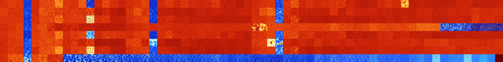

# B04567 (123392-123903)

<details>
    <summary>Initial Grid</summary>
    
</details>


<details>
    <summary>Initial Grid RLE</summary>

```
#C Exported from GoGoL (https://github.com/marrow16/gogol)
#C Wrap mode: Toroidal
#C Boundary mode: Dead
#C Step: 0
x = 100, y = 100, rule = B04567/S
17bo17bo8bo36bo$bo2bo54bo13bo10bo$35bo9bo9bo3bo18bo$4bo28bo2bo14bo5bo
17bo7bo7bo$50bo5bo32bo$55bo16bo6bo3bo9bo$33bo16bo9bo$15bo2bo3bo35bo2bo
8bo6b2o8bo$o8bo6bo9bo4bo20bo7bobo3bo10bo$12bobo5bo7b2o21bo5bo6bo3bo16bo
8bo4bo$7bo2bo3bo11bo2bobo19bo12bo$5bo10bo4bo26bo10bo11bo2bo19bo4bo$2bo
6bo16bo42bo15bo4bobo2bo$13bo20bo3bobo$20bo53bo6b2o14bo$13bo10bo15bo9bo
7bo13bo$52bo25bo5bo6bo$o49bobo16bo9bo14bo$18bo34bobo7bo$3bo15bo43bo5bo$
5bo4bo44bo7bo35bo$10b2o33bo21bo9bo17bo$23bo11bo5bo19bo7bo24bo$6bo14bo5b
o10bo21bo37bo$26bo49bo2bo4bo$13bo11bo11bo13bo16bo23bo2bo$18bo27bo10bo2b
2o8bo$35bo16bo17bo18bo8bo$20bo8bo7bo30bo$3bobo20bo13bo35b2o11bo8bo$7bo
6bo19bobo2bo27bo31bo$6bo4bo13bo11bo16bobo42bo$3bo4b2o31bo9bo21bo13bo$2b
o30bo17bobo6bo8bobo21bo4bo$18bo32bo4bo12bo16bo6bobo$58bo3bo25bo$15bo35b
o11bo13bo$39bo6bo33bo10bo$5bo25bo4bo6bobo48bo$10bo5bo31bo47bobo$20bo14b
o$8bo21bo$25bo13bo6bo7bo8bo$45bo7bo6bo13bobo8bo3bo$5bo2bo27bo11bo8bobo
3bo$11bo12bo28bo13bo18bo$19bo71bo2bo$bo22bo6bo23bo8bo$12bo23bo10bo8bo6b
o7bo$6bo10bo35bobo$8bo11bo3bo7bo35bo5bo19bo$7bo32bo29bobo7bo$29bo54bo
14bo$25bo29bo42bo$45bo31bo10bo$7bo45bobo11bo2bo9bo3bo14bo$14bobo4bo24bo
22bo24bo$14bo22bo17bo15bo22bo4bo$3bo4bo25bo39bo24bo$7bo15bo41bo15bo$33b
o53bo$2bo17bo76bo$59bo5bo25bo7bo$2bo4bo22bobo4bo15bo3bo14bo17bo4bo$76bo
15bo$41bo2bo$23bo5bo3bo35bo9bo$16bo11bo24bo13bo20bo$18bo18bo14bo$21bo
20bo15bo12bo2bo$23bo3bo3bo16bo19bo5bo5bo$5bo67bo7bo10bo$13bo20bo19bo17b
o3bo11b2o$100b$18bo11bo3bo18bo8bo8bo$o9bo16bo5bo30bo$20bo16bo12bo22bo
17bo$41bo24bo2bo8b2o8bobo2bo$25bo24bo9bo2bo14bo$5bo34bo8bo29bo8bobo5bo$
19bo$11bo17bo4bo39bo$4bo13bo2bo18bo$9bo6bo4bo47bo4b3o5bo7bo$11bo9bo45bo
6bo$2bo26bo16bo5bobo14bo7bo8bo5bo$5bo4bo40bo15b2o$18bobo47bobo2bo18b2o
3bobo$3bo16bo50bo11bo7bo7bo$27bo36bo9bo14bo$56bo19bo$9bo4bo8bo7bo22bo
27bo$17bobo34bo20bo$39bo6b2o19bo15bo7bo2b2o$23bo29bo21bo$63bo19bo5bo$7b
o2bo4bo$12bo20bo27bo15bo14bo6bo$9b2obo9bo47bo5bo13bo8bo$22bo37bo10bo!
```
</details>
<details>
    <summary>Thumbnail</summary>

</details>
<table>
<tr>
    <td><a href="./123392%20S%20Heat%20Map%20Activity.png"></a><br>S (123392)<br>G>1000</td>    <td><a href="./123393%20S0%20Heat%20Map%20Activity.png"></a><br>S0 (123393)<br>G>1000</td>    <td><a href="./123394%20S1%20Heat%20Map%20Activity.png"></a><br>S1 (123394)<br>G>1000</td>    <td><a href="./123395%20S01%20Heat%20Map%20Activity.png"></a><br>S01 (123395)<br>R@94,p6</td>    <td><a href="./123396%20S2%20Heat%20Map%20Activity.png"></a><br>S2 (123396)<br>G>1000</td>    <td><a href="./123397%20S02%20Heat%20Map%20Activity.png"></a><br>S02 (123397)<br>G>1000</td>    <td><a href="./123398%20S12%20Heat%20Map%20Activity.png"></a><br>S12 (123398)<br>G>1000</td>    <td><a href="./123399%20S012%20Heat%20Map%20Activity.png"></a><br>S012 (123399)<br>G>1000</td>    <td><a href="./123400%20S3%20Heat%20Map%20Activity.png"></a><br>S3 (123400)<br>G>1000</td>    <td><a href="./123401%20S03%20Heat%20Map%20Activity.png"></a><br>S03 (123401)<br>G>1000</td>    <td><a href="./123402%20S13%20Heat%20Map%20Activity.png"></a><br>S13 (123402)<br>G>1000</td>    <td><a href="./123403%20S013%20Heat%20Map%20Activity.png"></a><br>S013 (123403)<br>G>1000</td>    <td><a href="./123404%20S23%20Heat%20Map%20Activity.png"></a><br>S23 (123404)<br>G>1000</td>    <td><a href="./123405%20S023%20Heat%20Map%20Activity.png"></a><br>S023 (123405)<br>G>1000</td>    <td><a href="./123406%20S123%20Heat%20Map%20Activity.png"></a><br>S123 (123406)<br>G>1000</td>    <td><a href="./123407%20S0123%20Heat%20Map%20Activity.png"></a><br>S0123 (123407)<br>G>1000</td>    <td><a href="./123408%20S4%20Heat%20Map%20Activity.png"></a><br>S4 (123408)<br>G>1000</td>    <td><a href="./123409%20S04%20Heat%20Map%20Activity.png"></a><br>S04 (123409)<br>G>1000</td>    <td><a href="./123410%20S14%20Heat%20Map%20Activity.png"></a><br>S14 (123410)<br>G>1000</td>    <td><a href="./123411%20S014%20Heat%20Map%20Activity.png"></a><br>S014 (123411)<br>R@276,p84</td>    <td><a href="./123412%20S24%20Heat%20Map%20Activity.png"></a><br>S24 (123412)<br>G>1000</td>    <td><a href="./123413%20S024%20Heat%20Map%20Activity.png"></a><br>S024 (123413)<br>G>1000</td>    <td><a href="./123414%20S124%20Heat%20Map%20Activity.png"></a><br>S124 (123414)<br>G>1000</td>    <td><a href="./123415%20S0124%20Heat%20Map%20Activity.png"></a><br>S0124 (123415)<br>G>1000</td>    <td><a href="./123416%20S34%20Heat%20Map%20Activity.png"></a><br>S34 (123416)<br>G>1000</td>    <td><a href="./123417%20S034%20Heat%20Map%20Activity.png"></a><br>S034 (123417)<br>G>1000</td>    <td><a href="./123418%20S134%20Heat%20Map%20Activity.png"></a><br>S134 (123418)<br>G>1000</td>    <td><a href="./123419%20S0134%20Heat%20Map%20Activity.png"></a><br>S0134 (123419)<br>G>1000</td>    <td><a href="./123420%20S234%20Heat%20Map%20Activity.png"></a><br>S234 (123420)<br>G>1000</td>    <td><a href="./123421%20S0234%20Heat%20Map%20Activity.png"></a><br>S0234 (123421)<br>G>1000</td>    <td><a href="./123422%20S1234%20Heat%20Map%20Activity.png"></a><br>S1234 (123422)<br>G>1000</td>    <td><a href="./123423%20S01234%20Heat%20Map%20Activity.png"></a><br>S01234 (123423)<br>G>1000</td>    <td><a href="./123424%20S5%20Heat%20Map%20Activity.png"></a><br>S5 (123424)<br>G>1000</td>    <td><a href="./123425%20S05%20Heat%20Map%20Activity.png"></a><br>S05 (123425)<br>G>1000</td>    <td><a href="./123426%20S15%20Heat%20Map%20Activity.png"></a><br>S15 (123426)<br>G>1000</td>    <td><a href="./123427%20S015%20Heat%20Map%20Activity.png"></a><br>S015 (123427)<br>R@73,p6</td>    <td><a href="./123428%20S25%20Heat%20Map%20Activity.png"></a><br>S25 (123428)<br>G>1000</td>    <td><a href="./123429%20S025%20Heat%20Map%20Activity.png"></a><br>S025 (123429)<br>G>1000</td>    <td><a href="./123430%20S125%20Heat%20Map%20Activity.png"></a><br>S125 (123430)<br>G>1000</td>    <td><a href="./123431%20S0125%20Heat%20Map%20Activity.png"></a><br>S0125 (123431)<br>G>1000</td>    <td><a href="./123432%20S35%20Heat%20Map%20Activity.png"></a><br>S35 (123432)<br>G>1000</td>    <td><a href="./123433%20S035%20Heat%20Map%20Activity.png"></a><br>S035 (123433)<br>G>1000</td>    <td><a href="./123434%20S135%20Heat%20Map%20Activity.png"></a><br>S135 (123434)<br>G>1000</td>    <td><a href="./123435%20S0135%20Heat%20Map%20Activity.png"></a><br>S0135 (123435)<br>G>1000</td>    <td><a href="./123436%20S235%20Heat%20Map%20Activity.png"></a><br>S235 (123436)<br>G>1000</td>    <td><a href="./123437%20S0235%20Heat%20Map%20Activity.png"></a><br>S0235 (123437)<br>G>1000</td>    <td><a href="./123438%20S1235%20Heat%20Map%20Activity.png"></a><br>S1235 (123438)<br>G>1000</td>    <td><a href="./123439%20S01235%20Heat%20Map%20Activity.png"></a><br>S01235 (123439)<br>G>1000</td>    <td><a href="./123440%20S45%20Heat%20Map%20Activity.png"></a><br>S45 (123440)<br>G>1000</td>    <td><a href="./123441%20S045%20Heat%20Map%20Activity.png"></a><br>S045 (123441)<br>G>1000</td>    <td><a href="./123442%20S145%20Heat%20Map%20Activity.png"></a><br>S145 (123442)<br>G>1000</td>    <td><a href="./123443%20S0145%20Heat%20Map%20Activity.png"></a><br>S0145 (123443)<br>G>1000</td>    <td><a href="./123444%20S245%20Heat%20Map%20Activity.png"></a><br>S245 (123444)<br>G>1000</td>    <td><a href="./123445%20S0245%20Heat%20Map%20Activity.png"></a><br>S0245 (123445)<br>G>1000</td>    <td><a href="./123446%20S1245%20Heat%20Map%20Activity.png"></a><br>S1245 (123446)<br>G>1000</td>    <td><a href="./123447%20S01245%20Heat%20Map%20Activity.png"></a><br>S01245 (123447)<br>G>1000</td>    <td><a href="./123448%20S345%20Heat%20Map%20Activity.png"></a><br>S345 (123448)<br>G>1000</td>    <td><a href="./123449%20S0345%20Heat%20Map%20Activity.png"></a><br>S0345 (123449)<br>G>1000</td>    <td><a href="./123450%20S1345%20Heat%20Map%20Activity.png"></a><br>S1345 (123450)<br>G>1000</td>    <td><a href="./123451%20S01345%20Heat%20Map%20Activity.png"></a><br>S01345 (123451)<br>G>1000</td>    <td><a href="./123452%20S2345%20Heat%20Map%20Activity.png"></a><br>S2345 (123452)<br>G>1000</td>    <td><a href="./123453%20S02345%20Heat%20Map%20Activity.png"></a><br>S02345 (123453)<br>G>1000</td>    <td><a href="./123454%20S12345%20Heat%20Map%20Activity.png"></a><br>S12345 (123454)<br>G>1000</td>    <td><a href="./123455%20S012345%20Heat%20Map%20Activity.png"></a><br>S012345 (123455)<br>G>1000</td></tr>
<tr>
    <td><a href="./123456%20S6%20Heat%20Map%20Activity.png"></a><br>S6 (123456)<br>G>1000</td>    <td><a href="./123457%20S06%20Heat%20Map%20Activity.png"></a><br>S06 (123457)<br>G>1000</td>    <td><a href="./123458%20S16%20Heat%20Map%20Activity.png"></a><br>S16 (123458)<br>G>1000</td>    <td><a href="./123459%20S016%20Heat%20Map%20Activity.png"></a><br>S016 (123459)<br>R@86,p6</td>    <td><a href="./123460%20S26%20Heat%20Map%20Activity.png"></a><br>S26 (123460)<br>G>1000</td>    <td><a href="./123461%20S026%20Heat%20Map%20Activity.png"></a><br>S026 (123461)<br>G>1000</td>    <td><a href="./123462%20S126%20Heat%20Map%20Activity.png"></a><br>S126 (123462)<br>G>1000</td>    <td><a href="./123463%20S0126%20Heat%20Map%20Activity.png"></a><br>S0126 (123463)<br>G>1000</td>    <td><a href="./123464%20S36%20Heat%20Map%20Activity.png"></a><br>S36 (123464)<br>G>1000</td>    <td><a href="./123465%20S036%20Heat%20Map%20Activity.png"></a><br>S036 (123465)<br>G>1000</td>    <td><a href="./123466%20S136%20Heat%20Map%20Activity.png"></a><br>S136 (123466)<br>G>1000</td>    <td><a href="./123467%20S0136%20Heat%20Map%20Activity.png"></a><br>S0136 (123467)<br>G>1000</td>    <td><a href="./123468%20S236%20Heat%20Map%20Activity.png"></a><br>S236 (123468)<br>G>1000</td>    <td><a href="./123469%20S0236%20Heat%20Map%20Activity.png"></a><br>S0236 (123469)<br>G>1000</td>    <td><a href="./123470%20S1236%20Heat%20Map%20Activity.png"></a><br>S1236 (123470)<br>G>1000</td>    <td><a href="./123471%20S01236%20Heat%20Map%20Activity.png"></a><br>S01236 (123471)<br>G>1000</td>    <td><a href="./123472%20S46%20Heat%20Map%20Activity.png"></a><br>S46 (123472)<br>G>1000</td>    <td><a href="./123473%20S046%20Heat%20Map%20Activity.png"></a><br>S046 (123473)<br>G>1000</td>    <td><a href="./123474%20S146%20Heat%20Map%20Activity.png"></a><br>S146 (123474)<br>G>1000</td>    <td><a href="./123475%20S0146%20Heat%20Map%20Activity.png"></a><br>S0146 (123475)<br>R@598,p156</td>    <td><a href="./123476%20S246%20Heat%20Map%20Activity.png"></a><br>S246 (123476)<br>G>1000</td>    <td><a href="./123477%20S0246%20Heat%20Map%20Activity.png"></a><br>S0246 (123477)<br>G>1000</td>    <td><a href="./123478%20S1246%20Heat%20Map%20Activity.png"></a><br>S1246 (123478)<br>G>1000</td>    <td><a href="./123479%20S01246%20Heat%20Map%20Activity.png"></a><br>S01246 (123479)<br>G>1000</td>    <td><a href="./123480%20S346%20Heat%20Map%20Activity.png"></a><br>S346 (123480)<br>G>1000</td>    <td><a href="./123481%20S0346%20Heat%20Map%20Activity.png"></a><br>S0346 (123481)<br>G>1000</td>    <td><a href="./123482%20S1346%20Heat%20Map%20Activity.png"></a><br>S1346 (123482)<br>G>1000</td>    <td><a href="./123483%20S01346%20Heat%20Map%20Activity.png"></a><br>S01346 (123483)<br>G>1000</td>    <td><a href="./123484%20S2346%20Heat%20Map%20Activity.png"></a><br>S2346 (123484)<br>G>1000</td>    <td><a href="./123485%20S02346%20Heat%20Map%20Activity.png"></a><br>S02346 (123485)<br>G>1000</td>    <td><a href="./123486%20S12346%20Heat%20Map%20Activity.png"></a><br>S12346 (123486)<br>G>1000</td>    <td><a href="./123487%20S012346%20Heat%20Map%20Activity.png"></a><br>S012346 (123487)<br>G>1000</td>    <td><a href="./123488%20S56%20Heat%20Map%20Activity.png"></a><br>S56 (123488)<br>G>1000</td>    <td><a href="./123489%20S056%20Heat%20Map%20Activity.png"></a><br>S056 (123489)<br>G>1000</td>    <td><a href="./123490%20S156%20Heat%20Map%20Activity.png"></a><br>S156 (123490)<br>G>1000</td>    <td><a href="./123491%20S0156%20Heat%20Map%20Activity.png"></a><br>S0156 (123491)<br>R@102,p6</td>    <td><a href="./123492%20S256%20Heat%20Map%20Activity.png"></a><br>S256 (123492)<br>G>1000</td>    <td><a href="./123493%20S0256%20Heat%20Map%20Activity.png"></a><br>S0256 (123493)<br>G>1000</td>    <td><a href="./123494%20S1256%20Heat%20Map%20Activity.png"></a><br>S1256 (123494)<br>G>1000</td>    <td><a href="./123495%20S01256%20Heat%20Map%20Activity.png"></a><br>S01256 (123495)<br>G>1000</td>    <td><a href="./123496%20S356%20Heat%20Map%20Activity.png"></a><br>S356 (123496)<br>G>1000</td>    <td><a href="./123497%20S0356%20Heat%20Map%20Activity.png"></a><br>S0356 (123497)<br>G>1000</td>    <td><a href="./123498%20S1356%20Heat%20Map%20Activity.png"></a><br>S1356 (123498)<br>G>1000</td>    <td><a href="./123499%20S01356%20Heat%20Map%20Activity.png"></a><br>S01356 (123499)<br>G>1000</td>    <td><a href="./123500%20S2356%20Heat%20Map%20Activity.png"></a><br>S2356 (123500)<br>G>1000</td>    <td><a href="./123501%20S02356%20Heat%20Map%20Activity.png"></a><br>S02356 (123501)<br>G>1000</td>    <td><a href="./123502%20S12356%20Heat%20Map%20Activity.png"></a><br>S12356 (123502)<br>G>1000</td>    <td><a href="./123503%20S012356%20Heat%20Map%20Activity.png"></a><br>S012356 (123503)<br>G>1000</td>    <td><a href="./123504%20S456%20Heat%20Map%20Activity.png"></a><br>S456 (123504)<br>G>1000</td>    <td><a href="./123505%20S0456%20Heat%20Map%20Activity.png"></a><br>S0456 (123505)<br>G>1000</td>    <td><a href="./123506%20S1456%20Heat%20Map%20Activity.png"></a><br>S1456 (123506)<br>G>1000</td>    <td><a href="./123507%20S01456%20Heat%20Map%20Activity.png"></a><br>S01456 (123507)<br>G>1000</td>    <td><a href="./123508%20S2456%20Heat%20Map%20Activity.png"></a><br>S2456 (123508)<br>G>1000</td>    <td><a href="./123509%20S02456%20Heat%20Map%20Activity.png"></a><br>S02456 (123509)<br>G>1000</td>    <td><a href="./123510%20S12456%20Heat%20Map%20Activity.png"></a><br>S12456 (123510)<br>G>1000</td>    <td><a href="./123511%20S012456%20Heat%20Map%20Activity.png"></a><br>S012456 (123511)<br>G>1000</td>    <td><a href="./123512%20S3456%20Heat%20Map%20Activity.png"></a><br>S3456 (123512)<br>G>1000</td>    <td><a href="./123513%20S03456%20Heat%20Map%20Activity.png"></a><br>S03456 (123513)<br>G>1000</td>    <td><a href="./123514%20S13456%20Heat%20Map%20Activity.png"></a><br>S13456 (123514)<br>G>1000</td>    <td><a href="./123515%20S013456%20Heat%20Map%20Activity.png"></a><br>S013456 (123515)<br>G>1000</td>    <td><a href="./123516%20S23456%20Heat%20Map%20Activity.png"></a><br>S23456 (123516)<br>G>1000</td>    <td><a href="./123517%20S023456%20Heat%20Map%20Activity.png"></a><br>S023456 (123517)<br>G>1000</td>    <td><a href="./123518%20S123456%20Heat%20Map%20Activity.png"></a><br>S123456 (123518)<br>G>1000</td>    <td><a href="./123519%20S0123456%20Heat%20Map%20Activity.png"></a><br>S0123456 (123519)<br>G>1000</td></tr>
<tr>
    <td><a href="./123520%20S7%20Heat%20Map%20Activity.png"></a><br>S7 (123520)<br>G>1000</td>    <td><a href="./123521%20S07%20Heat%20Map%20Activity.png"></a><br>S07 (123521)<br>G>1000</td>    <td><a href="./123522%20S17%20Heat%20Map%20Activity.png"></a><br>S17 (123522)<br>G>1000</td>    <td><a href="./123523%20S017%20Heat%20Map%20Activity.png"></a><br>S017 (123523)<br>R@80,p6</td>    <td><a href="./123524%20S27%20Heat%20Map%20Activity.png"></a><br>S27 (123524)<br>G>1000</td>    <td><a href="./123525%20S027%20Heat%20Map%20Activity.png"></a><br>S027 (123525)<br>G>1000</td>    <td><a href="./123526%20S127%20Heat%20Map%20Activity.png"></a><br>S127 (123526)<br>G>1000</td>    <td><a href="./123527%20S0127%20Heat%20Map%20Activity.png"></a><br>S0127 (123527)<br>G>1000</td>    <td><a href="./123528%20S37%20Heat%20Map%20Activity.png"></a><br>S37 (123528)<br>G>1000</td>    <td><a href="./123529%20S037%20Heat%20Map%20Activity.png"></a><br>S037 (123529)<br>G>1000</td>    <td><a href="./123530%20S137%20Heat%20Map%20Activity.png"></a><br>S137 (123530)<br>G>1000</td>    <td><a href="./123531%20S0137%20Heat%20Map%20Activity.png"></a><br>S0137 (123531)<br>G>1000</td>    <td><a href="./123532%20S237%20Heat%20Map%20Activity.png"></a><br>S237 (123532)<br>G>1000</td>    <td><a href="./123533%20S0237%20Heat%20Map%20Activity.png"></a><br>S0237 (123533)<br>G>1000</td>    <td><a href="./123534%20S1237%20Heat%20Map%20Activity.png"></a><br>S1237 (123534)<br>G>1000</td>    <td><a href="./123535%20S01237%20Heat%20Map%20Activity.png"></a><br>S01237 (123535)<br>G>1000</td>    <td><a href="./123536%20S47%20Heat%20Map%20Activity.png"></a><br>S47 (123536)<br>G>1000</td>    <td><a href="./123537%20S047%20Heat%20Map%20Activity.png"></a><br>S047 (123537)<br>G>1000</td>    <td><a href="./123538%20S147%20Heat%20Map%20Activity.png"></a><br>S147 (123538)<br>G>1000</td>    <td><a href="./123539%20S0147%20Heat%20Map%20Activity.png"></a><br>S0147 (123539)<br>R@284,p12</td>    <td><a href="./123540%20S247%20Heat%20Map%20Activity.png"></a><br>S247 (123540)<br>G>1000</td>    <td><a href="./123541%20S0247%20Heat%20Map%20Activity.png"></a><br>S0247 (123541)<br>G>1000</td>    <td><a href="./123542%20S1247%20Heat%20Map%20Activity.png"></a><br>S1247 (123542)<br>G>1000</td>    <td><a href="./123543%20S01247%20Heat%20Map%20Activity.png"></a><br>S01247 (123543)<br>G>1000</td>    <td><a href="./123544%20S347%20Heat%20Map%20Activity.png"></a><br>S347 (123544)<br>G>1000</td>    <td><a href="./123545%20S0347%20Heat%20Map%20Activity.png"></a><br>S0347 (123545)<br>G>1000</td>    <td><a href="./123546%20S1347%20Heat%20Map%20Activity.png"></a><br>S1347 (123546)<br>G>1000</td>    <td><a href="./123547%20S01347%20Heat%20Map%20Activity.png"></a><br>S01347 (123547)<br>G>1000</td>    <td><a href="./123548%20S2347%20Heat%20Map%20Activity.png"></a><br>S2347 (123548)<br>G>1000</td>    <td><a href="./123549%20S02347%20Heat%20Map%20Activity.png"></a><br>S02347 (123549)<br>G>1000</td>    <td><a href="./123550%20S12347%20Heat%20Map%20Activity.png"></a><br>S12347 (123550)<br>G>1000</td>    <td><a href="./123551%20S012347%20Heat%20Map%20Activity.png"></a><br>S012347 (123551)<br>G>1000</td>    <td><a href="./123552%20S57%20Heat%20Map%20Activity.png"></a><br>S57 (123552)<br>G>1000</td>    <td><a href="./123553%20S057%20Heat%20Map%20Activity.png"></a><br>S057 (123553)<br>G>1000</td>    <td><a href="./123554%20S157%20Heat%20Map%20Activity.png"></a><br>S157 (123554)<br>G>1000</td>    <td><a href="./123555%20S0157%20Heat%20Map%20Activity.png"></a><br>S0157 (123555)<br>R@74,p6</td>    <td><a href="./123556%20S257%20Heat%20Map%20Activity.png"></a><br>S257 (123556)<br>G>1000</td>    <td><a href="./123557%20S0257%20Heat%20Map%20Activity.png"></a><br>S0257 (123557)<br>G>1000</td>    <td><a href="./123558%20S1257%20Heat%20Map%20Activity.png"></a><br>S1257 (123558)<br>G>1000</td>    <td><a href="./123559%20S01257%20Heat%20Map%20Activity.png"></a><br>S01257 (123559)<br>G>1000</td>    <td><a href="./123560%20S357%20Heat%20Map%20Activity.png"></a><br>S357 (123560)<br>G>1000</td>    <td><a href="./123561%20S0357%20Heat%20Map%20Activity.png"></a><br>S0357 (123561)<br>G>1000</td>    <td><a href="./123562%20S1357%20Heat%20Map%20Activity.png"></a><br>S1357 (123562)<br>G>1000</td>    <td><a href="./123563%20S01357%20Heat%20Map%20Activity.png"></a><br>S01357 (123563)<br>G>1000</td>    <td><a href="./123564%20S2357%20Heat%20Map%20Activity.png"></a><br>S2357 (123564)<br>G>1000</td>    <td><a href="./123565%20S02357%20Heat%20Map%20Activity.png"></a><br>S02357 (123565)<br>G>1000</td>    <td><a href="./123566%20S12357%20Heat%20Map%20Activity.png"></a><br>S12357 (123566)<br>G>1000</td>    <td><a href="./123567%20S012357%20Heat%20Map%20Activity.png"></a><br>S012357 (123567)<br>G>1000</td>    <td><a href="./123568%20S457%20Heat%20Map%20Activity.png"></a><br>S457 (123568)<br>G>1000</td>    <td><a href="./123569%20S0457%20Heat%20Map%20Activity.png"></a><br>S0457 (123569)<br>G>1000</td>    <td><a href="./123570%20S1457%20Heat%20Map%20Activity.png"></a><br>S1457 (123570)<br>G>1000</td>    <td><a href="./123571%20S01457%20Heat%20Map%20Activity.png"></a><br>S01457 (123571)<br>G>1000</td>    <td><a href="./123572%20S2457%20Heat%20Map%20Activity.png"></a><br>S2457 (123572)<br>G>1000</td>    <td><a href="./123573%20S02457%20Heat%20Map%20Activity.png"></a><br>S02457 (123573)<br>G>1000</td>    <td><a href="./123574%20S12457%20Heat%20Map%20Activity.png"></a><br>S12457 (123574)<br>G>1000</td>    <td><a href="./123575%20S012457%20Heat%20Map%20Activity.png"></a><br>S012457 (123575)<br>G>1000</td>    <td><a href="./123576%20S3457%20Heat%20Map%20Activity.png"></a><br>S3457 (123576)<br>G>1000</td>    <td><a href="./123577%20S03457%20Heat%20Map%20Activity.png"></a><br>S03457 (123577)<br>G>1000</td>    <td><a href="./123578%20S13457%20Heat%20Map%20Activity.png"></a><br>S13457 (123578)<br>G>1000</td>    <td><a href="./123579%20S013457%20Heat%20Map%20Activity.png"></a><br>S013457 (123579)<br>G>1000</td>    <td><a href="./123580%20S23457%20Heat%20Map%20Activity.png"></a><br>S23457 (123580)<br>G>1000</td>    <td><a href="./123581%20S023457%20Heat%20Map%20Activity.png"></a><br>S023457 (123581)<br>G>1000</td>    <td><a href="./123582%20S123457%20Heat%20Map%20Activity.png"></a><br>S123457 (123582)<br>G>1000</td>    <td><a href="./123583%20S0123457%20Heat%20Map%20Activity.png"></a><br>S0123457 (123583)<br>G>1000</td></tr>
<tr>
    <td><a href="./123584%20S67%20Heat%20Map%20Activity.png"></a><br>S67 (123584)<br>G>1000</td>    <td><a href="./123585%20S067%20Heat%20Map%20Activity.png"></a><br>S067 (123585)<br>G>1000</td>    <td><a href="./123586%20S167%20Heat%20Map%20Activity.png"></a><br>S167 (123586)<br>G>1000</td>    <td><a href="./123587%20S0167%20Heat%20Map%20Activity.png"></a><br>S0167 (123587)<br>R@89,p12</td>    <td><a href="./123588%20S267%20Heat%20Map%20Activity.png"></a><br>S267 (123588)<br>G>1000</td>    <td><a href="./123589%20S0267%20Heat%20Map%20Activity.png"></a><br>S0267 (123589)<br>G>1000</td>    <td><a href="./123590%20S1267%20Heat%20Map%20Activity.png"></a><br>S1267 (123590)<br>G>1000</td>    <td><a href="./123591%20S01267%20Heat%20Map%20Activity.png"></a><br>S01267 (123591)<br>G>1000</td>    <td><a href="./123592%20S367%20Heat%20Map%20Activity.png"></a><br>S367 (123592)<br>G>1000</td>    <td><a href="./123593%20S0367%20Heat%20Map%20Activity.png"></a><br>S0367 (123593)<br>G>1000</td>    <td><a href="./123594%20S1367%20Heat%20Map%20Activity.png"></a><br>S1367 (123594)<br>G>1000</td>    <td><a href="./123595%20S01367%20Heat%20Map%20Activity.png"></a><br>S01367 (123595)<br>G>1000</td>    <td><a href="./123596%20S2367%20Heat%20Map%20Activity.png"></a><br>S2367 (123596)<br>G>1000</td>    <td><a href="./123597%20S02367%20Heat%20Map%20Activity.png"></a><br>S02367 (123597)<br>G>1000</td>    <td><a href="./123598%20S12367%20Heat%20Map%20Activity.png"></a><br>S12367 (123598)<br>G>1000</td>    <td><a href="./123599%20S012367%20Heat%20Map%20Activity.png"></a><br>S012367 (123599)<br>G>1000</td>    <td><a href="./123600%20S467%20Heat%20Map%20Activity.png"></a><br>S467 (123600)<br>G>1000</td>    <td><a href="./123601%20S0467%20Heat%20Map%20Activity.png"></a><br>S0467 (123601)<br>G>1000</td>    <td><a href="./123602%20S1467%20Heat%20Map%20Activity.png"></a><br>S1467 (123602)<br>G>1000</td>    <td><a href="./123603%20S01467%20Heat%20Map%20Activity.png"></a><br>S01467 (123603)<br>G>1000</td>    <td><a href="./123604%20S2467%20Heat%20Map%20Activity.png"></a><br>S2467 (123604)<br>G>1000</td>    <td><a href="./123605%20S02467%20Heat%20Map%20Activity.png"></a><br>S02467 (123605)<br>G>1000</td>    <td><a href="./123606%20S12467%20Heat%20Map%20Activity.png"></a><br>S12467 (123606)<br>G>1000</td>    <td><a href="./123607%20S012467%20Heat%20Map%20Activity.png"></a><br>S012467 (123607)<br>G>1000</td>    <td><a href="./123608%20S3467%20Heat%20Map%20Activity.png"></a><br>S3467 (123608)<br>G>1000</td>    <td><a href="./123609%20S03467%20Heat%20Map%20Activity.png"></a><br>S03467 (123609)<br>G>1000</td>    <td><a href="./123610%20S13467%20Heat%20Map%20Activity.png"></a><br>S13467 (123610)<br>G>1000</td>    <td><a href="./123611%20S013467%20Heat%20Map%20Activity.png"></a><br>S013467 (123611)<br>G>1000</td>    <td><a href="./123612%20S23467%20Heat%20Map%20Activity.png"></a><br>S23467 (123612)<br>G>1000</td>    <td><a href="./123613%20S023467%20Heat%20Map%20Activity.png"></a><br>S023467 (123613)<br>G>1000</td>    <td><a href="./123614%20S123467%20Heat%20Map%20Activity.png"></a><br>S123467 (123614)<br>G>1000</td>    <td><a href="./123615%20S0123467%20Heat%20Map%20Activity.png"></a><br>S0123467 (123615)<br>G>1000</td>    <td><a href="./123616%20S567%20Heat%20Map%20Activity.png"></a><br>S567 (123616)<br>R@644,p12</td>    <td><a href="./123617%20S0567%20Heat%20Map%20Activity.png"></a><br>S0567 (123617)<br>G>1000</td>    <td><a href="./123618%20S1567%20Heat%20Map%20Activity.png"></a><br>S1567 (123618)<br>G>1000</td>    <td><a href="./123619%20S01567%20Heat%20Map%20Activity.png"></a><br>S01567 (123619)<br>G>1000</td>    <td><a href="./123620%20S2567%20Heat%20Map%20Activity.png"></a><br>S2567 (123620)<br>G>1000</td>    <td><a href="./123621%20S02567%20Heat%20Map%20Activity.png"></a><br>S02567 (123621)<br>G>1000</td>    <td><a href="./123622%20S12567%20Heat%20Map%20Activity.png"></a><br>S12567 (123622)<br>G>1000</td>    <td><a href="./123623%20S012567%20Heat%20Map%20Activity.png"></a><br>S012567 (123623)<br>G>1000</td>    <td><a href="./123624%20S3567%20Heat%20Map%20Activity.png"></a><br>S3567 (123624)<br>G>1000</td>    <td><a href="./123625%20S03567%20Heat%20Map%20Activity.png"></a><br>S03567 (123625)<br>G>1000</td>    <td><a href="./123626%20S13567%20Heat%20Map%20Activity.png"></a><br>S13567 (123626)<br>G>1000</td>    <td><a href="./123627%20S013567%20Heat%20Map%20Activity.png"></a><br>S013567 (123627)<br>G>1000</td>    <td><a href="./123628%20S23567%20Heat%20Map%20Activity.png"></a><br>S23567 (123628)<br>G>1000</td>    <td><a href="./123629%20S023567%20Heat%20Map%20Activity.png"></a><br>S023567 (123629)<br>G>1000</td>    <td><a href="./123630%20S123567%20Heat%20Map%20Activity.png"></a><br>S123567 (123630)<br>G>1000</td>    <td><a href="./123631%20S0123567%20Heat%20Map%20Activity.png"></a><br>S0123567 (123631)<br>G>1000</td>    <td><a href="./123632%20S4567%20Heat%20Map%20Activity.png"></a><br>S4567 (123632)<br>G>1000</td>    <td><a href="./123633%20S04567%20Heat%20Map%20Activity.png"></a><br>S04567 (123633)<br>G>1000</td>    <td><a href="./123634%20S14567%20Heat%20Map%20Activity.png"></a><br>S14567 (123634)<br>G>1000</td>    <td><a href="./123635%20S014567%20Heat%20Map%20Activity.png"></a><br>S014567 (123635)<br>G>1000</td>    <td><a href="./123636%20S24567%20Heat%20Map%20Activity.png"></a><br>S24567 (123636)<br>G>1000</td>    <td><a href="./123637%20S024567%20Heat%20Map%20Activity.png"></a><br>S024567 (123637)<br>G>1000</td>    <td><a href="./123638%20S124567%20Heat%20Map%20Activity.png"></a><br>S124567 (123638)<br>G>1000</td>    <td><a href="./123639%20S0124567%20Heat%20Map%20Activity.png"></a><br>S0124567 (123639)<br>G>1000</td>    <td><a href="./123640%20S34567%20Heat%20Map%20Activity.png"></a><br>S34567 (123640)<br>G>1000</td>    <td><a href="./123641%20S034567%20Heat%20Map%20Activity.png"></a><br>S034567 (123641)<br>G>1000</td>    <td><a href="./123642%20S134567%20Heat%20Map%20Activity.png"></a><br>S134567 (123642)<br>G>1000</td>    <td><a href="./123643%20S0134567%20Heat%20Map%20Activity.png"></a><br>S0134567 (123643)<br>G>1000</td>    <td><a href="./123644%20S234567%20Heat%20Map%20Activity.png"></a><br>S234567 (123644)<br>G>1000</td>    <td><a href="./123645%20S0234567%20Heat%20Map%20Activity.png"></a><br>S0234567 (123645)<br>R@265,p168</td>    <td><a href="./123646%20S1234567%20Heat%20Map%20Activity.png"></a><br>S1234567 (123646)<br>R@445,p360</td>    <td><a href="./123647%20S01234567%20Heat%20Map%20Activity.png"></a><br>S01234567 (123647)<br>G>1000</td></tr>
<tr>
    <td><a href="./123648%20S8%20Heat%20Map%20Activity.png"></a><br>S8 (123648)<br>G>1000</td>    <td><a href="./123649%20S08%20Heat%20Map%20Activity.png"></a><br>S08 (123649)<br>G>1000</td>    <td><a href="./123650%20S18%20Heat%20Map%20Activity.png"></a><br>S18 (123650)<br>G>1000</td>    <td><a href="./123651%20S018%20Heat%20Map%20Activity.png"></a><br>S018 (123651)<br>R@158,p90</td>    <td><a href="./123652%20S28%20Heat%20Map%20Activity.png"></a><br>S28 (123652)<br>G>1000</td>    <td><a href="./123653%20S028%20Heat%20Map%20Activity.png"></a><br>S028 (123653)<br>G>1000</td>    <td><a href="./123654%20S128%20Heat%20Map%20Activity.png"></a><br>S128 (123654)<br>G>1000</td>    <td><a href="./123655%20S0128%20Heat%20Map%20Activity.png"></a><br>S0128 (123655)<br>G>1000</td>    <td><a href="./123656%20S38%20Heat%20Map%20Activity.png"></a><br>S38 (123656)<br>G>1000</td>    <td><a href="./123657%20S038%20Heat%20Map%20Activity.png"></a><br>S038 (123657)<br>G>1000</td>    <td><a href="./123658%20S138%20Heat%20Map%20Activity.png"></a><br>S138 (123658)<br>G>1000</td>    <td><a href="./123659%20S0138%20Heat%20Map%20Activity.png"></a><br>S0138 (123659)<br>G>1000</td>    <td><a href="./123660%20S238%20Heat%20Map%20Activity.png"></a><br>S238 (123660)<br>G>1000</td>    <td><a href="./123661%20S0238%20Heat%20Map%20Activity.png"></a><br>S0238 (123661)<br>G>1000</td>    <td><a href="./123662%20S1238%20Heat%20Map%20Activity.png"></a><br>S1238 (123662)<br>G>1000</td>    <td><a href="./123663%20S01238%20Heat%20Map%20Activity.png"></a><br>S01238 (123663)<br>G>1000</td>    <td><a href="./123664%20S48%20Heat%20Map%20Activity.png"></a><br>S48 (123664)<br>G>1000</td>    <td><a href="./123665%20S048%20Heat%20Map%20Activity.png"></a><br>S048 (123665)<br>G>1000</td>    <td><a href="./123666%20S148%20Heat%20Map%20Activity.png"></a><br>S148 (123666)<br>G>1000</td>    <td><a href="./123667%20S0148%20Heat%20Map%20Activity.png"></a><br>S0148 (123667)<br>R@302,p84</td>    <td><a href="./123668%20S248%20Heat%20Map%20Activity.png"></a><br>S248 (123668)<br>G>1000</td>    <td><a href="./123669%20S0248%20Heat%20Map%20Activity.png"></a><br>S0248 (123669)<br>G>1000</td>    <td><a href="./123670%20S1248%20Heat%20Map%20Activity.png"></a><br>S1248 (123670)<br>G>1000</td>    <td><a href="./123671%20S01248%20Heat%20Map%20Activity.png"></a><br>S01248 (123671)<br>G>1000</td>    <td><a href="./123672%20S348%20Heat%20Map%20Activity.png"></a><br>S348 (123672)<br>G>1000</td>    <td><a href="./123673%20S0348%20Heat%20Map%20Activity.png"></a><br>S0348 (123673)<br>G>1000</td>    <td><a href="./123674%20S1348%20Heat%20Map%20Activity.png"></a><br>S1348 (123674)<br>G>1000</td>    <td><a href="./123675%20S01348%20Heat%20Map%20Activity.png"></a><br>S01348 (123675)<br>G>1000</td>    <td><a href="./123676%20S2348%20Heat%20Map%20Activity.png"></a><br>S2348 (123676)<br>G>1000</td>    <td><a href="./123677%20S02348%20Heat%20Map%20Activity.png"></a><br>S02348 (123677)<br>G>1000</td>    <td><a href="./123678%20S12348%20Heat%20Map%20Activity.png"></a><br>S12348 (123678)<br>G>1000</td>    <td><a href="./123679%20S012348%20Heat%20Map%20Activity.png"></a><br>S012348 (123679)<br>G>1000</td>    <td><a href="./123680%20S58%20Heat%20Map%20Activity.png"></a><br>S58 (123680)<br>G>1000</td>    <td><a href="./123681%20S058%20Heat%20Map%20Activity.png"></a><br>S058 (123681)<br>G>1000</td>    <td><a href="./123682%20S158%20Heat%20Map%20Activity.png"></a><br>S158 (123682)<br>G>1000</td>    <td><a href="./123683%20S0158%20Heat%20Map%20Activity.png"></a><br>S0158 (123683)<br>R@105,p6</td>    <td><a href="./123684%20S258%20Heat%20Map%20Activity.png"></a><br>S258 (123684)<br>G>1000</td>    <td><a href="./123685%20S0258%20Heat%20Map%20Activity.png"></a><br>S0258 (123685)<br>G>1000</td>    <td><a href="./123686%20S1258%20Heat%20Map%20Activity.png"></a><br>S1258 (123686)<br>G>1000</td>    <td><a href="./123687%20S01258%20Heat%20Map%20Activity.png"></a><br>S01258 (123687)<br>G>1000</td>    <td><a href="./123688%20S358%20Heat%20Map%20Activity.png"></a><br>S358 (123688)<br>G>1000</td>    <td><a href="./123689%20S0358%20Heat%20Map%20Activity.png"></a><br>S0358 (123689)<br>G>1000</td>    <td><a href="./123690%20S1358%20Heat%20Map%20Activity.png"></a><br>S1358 (123690)<br>G>1000</td>    <td><a href="./123691%20S01358%20Heat%20Map%20Activity.png"></a><br>S01358 (123691)<br>G>1000</td>    <td><a href="./123692%20S2358%20Heat%20Map%20Activity.png"></a><br>S2358 (123692)<br>G>1000</td>    <td><a href="./123693%20S02358%20Heat%20Map%20Activity.png"></a><br>S02358 (123693)<br>G>1000</td>    <td><a href="./123694%20S12358%20Heat%20Map%20Activity.png"></a><br>S12358 (123694)<br>G>1000</td>    <td><a href="./123695%20S012358%20Heat%20Map%20Activity.png"></a><br>S012358 (123695)<br>G>1000</td>    <td><a href="./123696%20S458%20Heat%20Map%20Activity.png"></a><br>S458 (123696)<br>G>1000</td>    <td><a href="./123697%20S0458%20Heat%20Map%20Activity.png"></a><br>S0458 (123697)<br>G>1000</td>    <td><a href="./123698%20S1458%20Heat%20Map%20Activity.png"></a><br>S1458 (123698)<br>G>1000</td>    <td><a href="./123699%20S01458%20Heat%20Map%20Activity.png"></a><br>S01458 (123699)<br>G>1000</td>    <td><a href="./123700%20S2458%20Heat%20Map%20Activity.png"></a><br>S2458 (123700)<br>G>1000</td>    <td><a href="./123701%20S02458%20Heat%20Map%20Activity.png"></a><br>S02458 (123701)<br>G>1000</td>    <td><a href="./123702%20S12458%20Heat%20Map%20Activity.png"></a><br>S12458 (123702)<br>G>1000</td>    <td><a href="./123703%20S012458%20Heat%20Map%20Activity.png"></a><br>S012458 (123703)<br>G>1000</td>    <td><a href="./123704%20S3458%20Heat%20Map%20Activity.png"></a><br>S3458 (123704)<br>G>1000</td>    <td><a href="./123705%20S03458%20Heat%20Map%20Activity.png"></a><br>S03458 (123705)<br>G>1000</td>    <td><a href="./123706%20S13458%20Heat%20Map%20Activity.png"></a><br>S13458 (123706)<br>G>1000</td>    <td><a href="./123707%20S013458%20Heat%20Map%20Activity.png"></a><br>S013458 (123707)<br>G>1000</td>    <td><a href="./123708%20S23458%20Heat%20Map%20Activity.png"></a><br>S23458 (123708)<br>G>1000</td>    <td><a href="./123709%20S023458%20Heat%20Map%20Activity.png"></a><br>S023458 (123709)<br>G>1000</td>    <td><a href="./123710%20S123458%20Heat%20Map%20Activity.png"></a><br>S123458 (123710)<br>G>1000</td>    <td><a href="./123711%20S0123458%20Heat%20Map%20Activity.png"></a><br>S0123458 (123711)<br>G>1000</td></tr>
<tr>
    <td><a href="./123712%20S68%20Heat%20Map%20Activity.png"></a><br>S68 (123712)<br>G>1000</td>    <td><a href="./123713%20S068%20Heat%20Map%20Activity.png"></a><br>S068 (123713)<br>G>1000</td>    <td><a href="./123714%20S168%20Heat%20Map%20Activity.png"></a><br>S168 (123714)<br>G>1000</td>    <td><a href="./123715%20S0168%20Heat%20Map%20Activity.png"></a><br>S0168 (123715)<br>R@94,p2</td>    <td><a href="./123716%20S268%20Heat%20Map%20Activity.png"></a><br>S268 (123716)<br>G>1000</td>    <td><a href="./123717%20S0268%20Heat%20Map%20Activity.png"></a><br>S0268 (123717)<br>G>1000</td>    <td><a href="./123718%20S1268%20Heat%20Map%20Activity.png"></a><br>S1268 (123718)<br>G>1000</td>    <td><a href="./123719%20S01268%20Heat%20Map%20Activity.png"></a><br>S01268 (123719)<br>G>1000</td>    <td><a href="./123720%20S368%20Heat%20Map%20Activity.png"></a><br>S368 (123720)<br>G>1000</td>    <td><a href="./123721%20S0368%20Heat%20Map%20Activity.png"></a><br>S0368 (123721)<br>G>1000</td>    <td><a href="./123722%20S1368%20Heat%20Map%20Activity.png"></a><br>S1368 (123722)<br>G>1000</td>    <td><a href="./123723%20S01368%20Heat%20Map%20Activity.png"></a><br>S01368 (123723)<br>G>1000</td>    <td><a href="./123724%20S2368%20Heat%20Map%20Activity.png"></a><br>S2368 (123724)<br>G>1000</td>    <td><a href="./123725%20S02368%20Heat%20Map%20Activity.png"></a><br>S02368 (123725)<br>G>1000</td>    <td><a href="./123726%20S12368%20Heat%20Map%20Activity.png"></a><br>S12368 (123726)<br>G>1000</td>    <td><a href="./123727%20S012368%20Heat%20Map%20Activity.png"></a><br>S012368 (123727)<br>G>1000</td>    <td><a href="./123728%20S468%20Heat%20Map%20Activity.png"></a><br>S468 (123728)<br>G>1000</td>    <td><a href="./123729%20S0468%20Heat%20Map%20Activity.png"></a><br>S0468 (123729)<br>G>1000</td>    <td><a href="./123730%20S1468%20Heat%20Map%20Activity.png"></a><br>S1468 (123730)<br>G>1000</td>    <td><a href="./123731%20S01468%20Heat%20Map%20Activity.png"></a><br>S01468 (123731)<br>R@921,p12</td>    <td><a href="./123732%20S2468%20Heat%20Map%20Activity.png"></a><br>S2468 (123732)<br>G>1000</td>    <td><a href="./123733%20S02468%20Heat%20Map%20Activity.png"></a><br>S02468 (123733)<br>G>1000</td>    <td><a href="./123734%20S12468%20Heat%20Map%20Activity.png"></a><br>S12468 (123734)<br>G>1000</td>    <td><a href="./123735%20S012468%20Heat%20Map%20Activity.png"></a><br>S012468 (123735)<br>G>1000</td>    <td><a href="./123736%20S3468%20Heat%20Map%20Activity.png"></a><br>S3468 (123736)<br>G>1000</td>    <td><a href="./123737%20S03468%20Heat%20Map%20Activity.png"></a><br>S03468 (123737)<br>G>1000</td>    <td><a href="./123738%20S13468%20Heat%20Map%20Activity.png"></a><br>S13468 (123738)<br>G>1000</td>    <td><a href="./123739%20S013468%20Heat%20Map%20Activity.png"></a><br>S013468 (123739)<br>G>1000</td>    <td><a href="./123740%20S23468%20Heat%20Map%20Activity.png"></a><br>S23468 (123740)<br>G>1000</td>    <td><a href="./123741%20S023468%20Heat%20Map%20Activity.png"></a><br>S023468 (123741)<br>G>1000</td>    <td><a href="./123742%20S123468%20Heat%20Map%20Activity.png"></a><br>S123468 (123742)<br>G>1000</td>    <td><a href="./123743%20S0123468%20Heat%20Map%20Activity.png"></a><br>S0123468 (123743)<br>G>1000</td>    <td><a href="./123744%20S568%20Heat%20Map%20Activity.png"></a><br>S568 (123744)<br>G>1000</td>    <td><a href="./123745%20S0568%20Heat%20Map%20Activity.png"></a><br>S0568 (123745)<br>G>1000</td>    <td><a href="./123746%20S1568%20Heat%20Map%20Activity.png"></a><br>S1568 (123746)<br>G>1000</td>    <td><a href="./123747%20S01568%20Heat%20Map%20Activity.png"></a><br>S01568 (123747)<br>R@287,p2</td>    <td><a href="./123748%20S2568%20Heat%20Map%20Activity.png"></a><br>S2568 (123748)<br>G>1000</td>    <td><a href="./123749%20S02568%20Heat%20Map%20Activity.png"></a><br>S02568 (123749)<br>G>1000</td>    <td><a href="./123750%20S12568%20Heat%20Map%20Activity.png"></a><br>S12568 (123750)<br>G>1000</td>    <td><a href="./123751%20S012568%20Heat%20Map%20Activity.png"></a><br>S012568 (123751)<br>G>1000</td>    <td><a href="./123752%20S3568%20Heat%20Map%20Activity.png"></a><br>S3568 (123752)<br>G>1000</td>    <td><a href="./123753%20S03568%20Heat%20Map%20Activity.png"></a><br>S03568 (123753)<br>G>1000</td>    <td><a href="./123754%20S13568%20Heat%20Map%20Activity.png"></a><br>S13568 (123754)<br>G>1000</td>    <td><a href="./123755%20S013568%20Heat%20Map%20Activity.png"></a><br>S013568 (123755)<br>G>1000</td>    <td><a href="./123756%20S23568%20Heat%20Map%20Activity.png"></a><br>S23568 (123756)<br>G>1000</td>    <td><a href="./123757%20S023568%20Heat%20Map%20Activity.png"></a><br>S023568 (123757)<br>G>1000</td>    <td><a href="./123758%20S123568%20Heat%20Map%20Activity.png"></a><br>S123568 (123758)<br>G>1000</td>    <td><a href="./123759%20S0123568%20Heat%20Map%20Activity.png"></a><br>S0123568 (123759)<br>G>1000</td>    <td><a href="./123760%20S4568%20Heat%20Map%20Activity.png"></a><br>S4568 (123760)<br>G>1000</td>    <td><a href="./123761%20S04568%20Heat%20Map%20Activity.png"></a><br>S04568 (123761)<br>G>1000</td>    <td><a href="./123762%20S14568%20Heat%20Map%20Activity.png"></a><br>S14568 (123762)<br>G>1000</td>    <td><a href="./123763%20S014568%20Heat%20Map%20Activity.png"></a><br>S014568 (123763)<br>G>1000</td>    <td><a href="./123764%20S24568%20Heat%20Map%20Activity.png"></a><br>S24568 (123764)<br>G>1000</td>    <td><a href="./123765%20S024568%20Heat%20Map%20Activity.png"></a><br>S024568 (123765)<br>G>1000</td>    <td><a href="./123766%20S124568%20Heat%20Map%20Activity.png"></a><br>S124568 (123766)<br>G>1000</td>    <td><a href="./123767%20S0124568%20Heat%20Map%20Activity.png"></a><br>S0124568 (123767)<br>G>1000</td>    <td><a href="./123768%20S34568%20Heat%20Map%20Activity.png"></a><br>S34568 (123768)<br>G>1000</td>    <td><a href="./123769%20S034568%20Heat%20Map%20Activity.png"></a><br>S034568 (123769)<br>G>1000</td>    <td><a href="./123770%20S134568%20Heat%20Map%20Activity.png"></a><br>S134568 (123770)<br>G>1000</td>    <td><a href="./123771%20S0134568%20Heat%20Map%20Activity.png"></a><br>S0134568 (123771)<br>G>1000</td>    <td><a href="./123772%20S234568%20Heat%20Map%20Activity.png"></a><br>S234568 (123772)<br>G>1000</td>    <td><a href="./123773%20S0234568%20Heat%20Map%20Activity.png"></a><br>S0234568 (123773)<br>G>1000</td>    <td><a href="./123774%20S1234568%20Heat%20Map%20Activity.png"></a><br>S1234568 (123774)<br>G>1000</td>    <td><a href="./123775%20S01234568%20Heat%20Map%20Activity.png"></a><br>S01234568 (123775)<br>G>1000</td></tr>
<tr>
    <td><a href="./123776%20S78%20Heat%20Map%20Activity.png"></a><br>S78 (123776)<br>G>1000</td>    <td><a href="./123777%20S078%20Heat%20Map%20Activity.png"></a><br>S078 (123777)<br>G>1000</td>    <td><a href="./123778%20S178%20Heat%20Map%20Activity.png"></a><br>S178 (123778)<br>G>1000</td>    <td><a href="./123779%20S0178%20Heat%20Map%20Activity.png"></a><br>S0178 (123779)<br>R@99,p6</td>    <td><a href="./123780%20S278%20Heat%20Map%20Activity.png"></a><br>S278 (123780)<br>G>1000</td>    <td><a href="./123781%20S0278%20Heat%20Map%20Activity.png"></a><br>S0278 (123781)<br>G>1000</td>    <td><a href="./123782%20S1278%20Heat%20Map%20Activity.png"></a><br>S1278 (123782)<br>G>1000</td>    <td><a href="./123783%20S01278%20Heat%20Map%20Activity.png"></a><br>S01278 (123783)<br>G>1000</td>    <td><a href="./123784%20S378%20Heat%20Map%20Activity.png"></a><br>S378 (123784)<br>G>1000</td>    <td><a href="./123785%20S0378%20Heat%20Map%20Activity.png"></a><br>S0378 (123785)<br>G>1000</td>    <td><a href="./123786%20S1378%20Heat%20Map%20Activity.png"></a><br>S1378 (123786)<br>G>1000</td>    <td><a href="./123787%20S01378%20Heat%20Map%20Activity.png"></a><br>S01378 (123787)<br>G>1000</td>    <td><a href="./123788%20S2378%20Heat%20Map%20Activity.png"></a><br>S2378 (123788)<br>G>1000</td>    <td><a href="./123789%20S02378%20Heat%20Map%20Activity.png"></a><br>S02378 (123789)<br>G>1000</td>    <td><a href="./123790%20S12378%20Heat%20Map%20Activity.png"></a><br>S12378 (123790)<br>G>1000</td>    <td><a href="./123791%20S012378%20Heat%20Map%20Activity.png"></a><br>S012378 (123791)<br>G>1000</td>    <td><a href="./123792%20S478%20Heat%20Map%20Activity.png"></a><br>S478 (123792)<br>G>1000</td>    <td><a href="./123793%20S0478%20Heat%20Map%20Activity.png"></a><br>S0478 (123793)<br>G>1000</td>    <td><a href="./123794%20S1478%20Heat%20Map%20Activity.png"></a><br>S1478 (123794)<br>G>1000</td>    <td><a href="./123795%20S01478%20Heat%20Map%20Activity.png"></a><br>S01478 (123795)<br>R@227,p12</td>    <td><a href="./123796%20S2478%20Heat%20Map%20Activity.png"></a><br>S2478 (123796)<br>G>1000</td>    <td><a href="./123797%20S02478%20Heat%20Map%20Activity.png"></a><br>S02478 (123797)<br>G>1000</td>    <td><a href="./123798%20S12478%20Heat%20Map%20Activity.png"></a><br>S12478 (123798)<br>G>1000</td>    <td><a href="./123799%20S012478%20Heat%20Map%20Activity.png"></a><br>S012478 (123799)<br>G>1000</td>    <td><a href="./123800%20S3478%20Heat%20Map%20Activity.png"></a><br>S3478 (123800)<br>G>1000</td>    <td><a href="./123801%20S03478%20Heat%20Map%20Activity.png"></a><br>S03478 (123801)<br>G>1000</td>    <td><a href="./123802%20S13478%20Heat%20Map%20Activity.png"></a><br>S13478 (123802)<br>G>1000</td>    <td><a href="./123803%20S013478%20Heat%20Map%20Activity.png"></a><br>S013478 (123803)<br>G>1000</td>    <td><a href="./123804%20S23478%20Heat%20Map%20Activity.png"></a><br>S23478 (123804)<br>G>1000</td>    <td><a href="./123805%20S023478%20Heat%20Map%20Activity.png"></a><br>S023478 (123805)<br>G>1000</td>    <td><a href="./123806%20S123478%20Heat%20Map%20Activity.png"></a><br>S123478 (123806)<br>G>1000</td>    <td><a href="./123807%20S0123478%20Heat%20Map%20Activity.png"></a><br>S0123478 (123807)<br>G>1000</td>    <td><a href="./123808%20S578%20Heat%20Map%20Activity.png"></a><br>S578 (123808)<br>G>1000</td>    <td><a href="./123809%20S0578%20Heat%20Map%20Activity.png"></a><br>S0578 (123809)<br>G>1000</td>    <td><a href="./123810%20S1578%20Heat%20Map%20Activity.png"></a><br>S1578 (123810)<br>G>1000</td>    <td><a href="./123811%20S01578%20Heat%20Map%20Activity.png"></a><br>S01578 (123811)<br>R@123,p6</td>    <td><a href="./123812%20S2578%20Heat%20Map%20Activity.png"></a><br>S2578 (123812)<br>G>1000</td>    <td><a href="./123813%20S02578%20Heat%20Map%20Activity.png"></a><br>S02578 (123813)<br>G>1000</td>    <td><a href="./123814%20S12578%20Heat%20Map%20Activity.png"></a><br>S12578 (123814)<br>G>1000</td>    <td><a href="./123815%20S012578%20Heat%20Map%20Activity.png"></a><br>S012578 (123815)<br>G>1000</td>    <td><a href="./123816%20S3578%20Heat%20Map%20Activity.png"></a><br>S3578 (123816)<br>G>1000</td>    <td><a href="./123817%20S03578%20Heat%20Map%20Activity.png"></a><br>S03578 (123817)<br>G>1000</td>    <td><a href="./123818%20S13578%20Heat%20Map%20Activity.png"></a><br>S13578 (123818)<br>G>1000</td>    <td><a href="./123819%20S013578%20Heat%20Map%20Activity.png"></a><br>S013578 (123819)<br>G>1000</td>    <td><a href="./123820%20S23578%20Heat%20Map%20Activity.png"></a><br>S23578 (123820)<br>G>1000</td>    <td><a href="./123821%20S023578%20Heat%20Map%20Activity.png"></a><br>S023578 (123821)<br>G>1000</td>    <td><a href="./123822%20S123578%20Heat%20Map%20Activity.png"></a><br>S123578 (123822)<br>G>1000</td>    <td><a href="./123823%20S0123578%20Heat%20Map%20Activity.png"></a><br>S0123578 (123823)<br>G>1000</td>    <td><a href="./123824%20S4578%20Heat%20Map%20Activity.png"></a><br>S4578 (123824)<br>G>1000</td>    <td><a href="./123825%20S04578%20Heat%20Map%20Activity.png"></a><br>S04578 (123825)<br>G>1000</td>    <td><a href="./123826%20S14578%20Heat%20Map%20Activity.png"></a><br>S14578 (123826)<br>G>1000</td>    <td><a href="./123827%20S014578%20Heat%20Map%20Activity.png"></a><br>S014578 (123827)<br>G>1000</td>    <td><a href="./123828%20S24578%20Heat%20Map%20Activity.png"></a><br>S24578 (123828)<br>G>1000</td>    <td><a href="./123829%20S024578%20Heat%20Map%20Activity.png"></a><br>S024578 (123829)<br>G>1000</td>    <td><a href="./123830%20S124578%20Heat%20Map%20Activity.png"></a><br>S124578 (123830)<br>G>1000</td>    <td><a href="./123831%20S0124578%20Heat%20Map%20Activity.png"></a><br>S0124578 (123831)<br>G>1000</td>    <td><a href="./123832%20S34578%20Heat%20Map%20Activity.png"></a><br>S34578 (123832)<br>G>1000</td>    <td><a href="./123833%20S034578%20Heat%20Map%20Activity.png"></a><br>S034578 (123833)<br>G>1000</td>    <td><a href="./123834%20S134578%20Heat%20Map%20Activity.png"></a><br>S134578 (123834)<br>G>1000</td>    <td><a href="./123835%20S0134578%20Heat%20Map%20Activity.png"></a><br>S0134578 (123835)<br>G>1000</td>    <td><a href="./123836%20S234578%20Heat%20Map%20Activity.png"></a><br>S234578 (123836)<br>G>1000</td>    <td><a href="./123837%20S0234578%20Heat%20Map%20Activity.png"></a><br>S0234578 (123837)<br>G>1000</td>    <td><a href="./123838%20S1234578%20Heat%20Map%20Activity.png"></a><br>S1234578 (123838)<br>G>1000</td>    <td><a href="./123839%20S01234578%20Heat%20Map%20Activity.png"></a><br>S01234578 (123839)<br>G>1000</td></tr>
<tr>
    <td><a href="./123840%20S678%20Heat%20Map%20Activity.png"></a><br>S678 (123840)<br>G>1000</td>    <td><a href="./123841%20S0678%20Heat%20Map%20Activity.png"></a><br>S0678 (123841)<br>G>1000</td>    <td><a href="./123842%20S1678%20Heat%20Map%20Activity.png"></a><br>S1678 (123842)<br>G>1000</td>    <td><a href="./123843%20S01678%20Heat%20Map%20Activity.png"></a><br>S01678 (123843)<br>R@167,p12</td>    <td><a href="./123844%20S2678%20Heat%20Map%20Activity.png"></a><br>S2678 (123844)<br>G>1000</td>    <td><a href="./123845%20S02678%20Heat%20Map%20Activity.png"></a><br>S02678 (123845)<br>G>1000</td>    <td><a href="./123846%20S12678%20Heat%20Map%20Activity.png"></a><br>S12678 (123846)<br>G>1000</td>    <td><a href="./123847%20S012678%20Heat%20Map%20Activity.png"></a><br>S012678 (123847)<br>G>1000</td>    <td><a href="./123848%20S3678%20Heat%20Map%20Activity.png"></a><br>S3678 (123848)<br>R@133,p12</td>    <td><a href="./123849%20S03678%20Heat%20Map%20Activity.png"></a><br>S03678 (123849)<br>R@94,p4</td>    <td><a href="./123850%20S13678%20Heat%20Map%20Activity.png"></a><br>S13678 (123850)<br>R@77,p4</td>    <td><a href="./123851%20S013678%20Heat%20Map%20Activity.png"></a><br>S013678 (123851)<br>R@77,p4</td>    <td><a href="./123852%20S23678%20Heat%20Map%20Activity.png"></a><br>S23678 (123852)<br>R@42,p4</td>    <td><a href="./123853%20S023678%20Heat%20Map%20Activity.png"></a><br>S023678 (123853)<br>R@48,p4</td>    <td><a href="./123854%20S123678%20Heat%20Map%20Activity.png"></a><br>S123678 (123854)<br>R@36,p4</td>    <td><a href="./123855%20S0123678%20Heat%20Map%20Activity.png"></a><br>S0123678 (123855)<br>R@40,p4</td>    <td><a href="./123856%20S4678%20Heat%20Map%20Activity.png"></a><br>S4678 (123856)<br>R@34,p4</td>    <td><a href="./123857%20S04678%20Heat%20Map%20Activity.png"></a><br>S04678 (123857)<br>R@32,p4</td>    <td><a href="./123858%20S14678%20Heat%20Map%20Activity.png"></a><br>S14678 (123858)<br>R@30,p4</td>    <td><a href="./123859%20S014678%20Heat%20Map%20Activity.png"></a><br>S014678 (123859)<br>R@27,p4</td>    <td><a href="./123860%20S24678%20Heat%20Map%20Activity.png"></a><br>S24678 (123860)<br>R@24,p4</td>    <td><a href="./123861%20S024678%20Heat%20Map%20Activity.png"></a><br>S024678 (123861)<br>R@25,p4</td>    <td><a href="./123862%20S124678%20Heat%20Map%20Activity.png"></a><br>S124678 (123862)<br>R@21,p4</td>    <td><a href="./123863%20S0124678%20Heat%20Map%20Activity.png"></a><br>S0124678 (123863)<br>R@19,p4</td>    <td><a href="./123864%20S34678%20Heat%20Map%20Activity.png"></a><br>S34678 (123864)<br>R@20,p4</td>    <td><a href="./123865%20S034678%20Heat%20Map%20Activity.png"></a><br>S034678 (123865)<br>R@17,p4</td>    <td><a href="./123866%20S134678%20Heat%20Map%20Activity.png"></a><br>S134678 (123866)<br>R@16,p4</td>    <td><a href="./123867%20S0134678%20Heat%20Map%20Activity.png"></a><br>S0134678 (123867)<br>S@15</td>    <td><a href="./123868%20S234678%20Heat%20Map%20Activity.png"></a><br>S234678 (123868)<br>R@18,p4</td>    <td><a href="./123869%20S0234678%20Heat%20Map%20Activity.png"></a><br>S0234678 (123869)<br>R@20,p4</td>    <td><a href="./123870%20S1234678%20Heat%20Map%20Activity.png"></a><br>S1234678 (123870)<br>R@15,p4</td>    <td><a href="./123871%20S01234678%20Heat%20Map%20Activity.png"></a><br>S01234678 (123871)<br>R@17,p4</td>    <td><a href="./123872%20S5678%20Heat%20Map%20Activity.png"></a><br>S5678 (123872)<br>R@27,p2</td>    <td><a href="./123873%20S05678%20Heat%20Map%20Activity.png"></a><br>S05678 (123873)<br>R@19,p2</td>    <td><a href="./123874%20S15678%20Heat%20Map%20Activity.png"></a><br>S15678 (123874)<br>R@26,p2</td>    <td><a href="./123875%20S015678%20Heat%20Map%20Activity.png"></a><br>S015678 (123875)<br>R@23,p2</td>    <td><a href="./123876%20S25678%20Heat%20Map%20Activity.png"></a><br>S25678 (123876)<br>R@16,p2</td>    <td><a href="./123877%20S025678%20Heat%20Map%20Activity.png"></a><br>S025678 (123877)<br>R@17,p2</td>    <td><a href="./123878%20S125678%20Heat%20Map%20Activity.png"></a><br>S125678 (123878)<br>R@15,p2</td>    <td><a href="./123879%20S0125678%20Heat%20Map%20Activity.png"></a><br>S0125678 (123879)<br>R@17,p2</td>    <td><a href="./123880%20S35678%20Heat%20Map%20Activity.png"></a><br>S35678 (123880)<br>S@9</td>    <td><a href="./123881%20S035678%20Heat%20Map%20Activity.png"></a><br>S035678 (123881)<br>R@12,p2</td>    <td><a href="./123882%20S135678%20Heat%20Map%20Activity.png"></a><br>S135678 (123882)<br>S@9</td>    <td><a href="./123883%20S0135678%20Heat%20Map%20Activity.png"></a><br>S0135678 (123883)<br>S@9</td>    <td><a href="./123884%20S235678%20Heat%20Map%20Activity.png"></a><br>S235678 (123884)<br>S@9</td>    <td><a href="./123885%20S0235678%20Heat%20Map%20Activity.png"></a><br>S0235678 (123885)<br>S@9</td>    <td><a href="./123886%20S1235678%20Heat%20Map%20Activity.png"></a><br>S1235678 (123886)<br>S@7</td>    <td><a href="./123887%20S01235678%20Heat%20Map%20Activity.png"></a><br>S01235678 (123887)<br>S@7</td>    <td><a href="./123888%20S45678%20Heat%20Map%20Activity.png"></a><br>S45678 (123888)<br>S@9</td>    <td><a href="./123889%20S045678%20Heat%20Map%20Activity.png"></a><br>S045678 (123889)<br>S@8</td>    <td><a href="./123890%20S145678%20Heat%20Map%20Activity.png"></a><br>S145678 (123890)<br>S@8</td>    <td><a href="./123891%20S0145678%20Heat%20Map%20Activity.png"></a><br>S0145678 (123891)<br>S@7</td>    <td><a href="./123892%20S245678%20Heat%20Map%20Activity.png"></a><br>S245678 (123892)<br>S@8</td>    <td><a href="./123893%20S0245678%20Heat%20Map%20Activity.png"></a><br>S0245678 (123893)<br>S@7</td>    <td><a href="./123894%20S1245678%20Heat%20Map%20Activity.png"></a><br>S1245678 (123894)<br>S@6</td>    <td><a href="./123895%20S01245678%20Heat%20Map%20Activity.png"></a><br>S01245678 (123895)<br>S@6</td>    <td><a href="./123896%20S345678%20Heat%20Map%20Activity.png"></a><br>S345678 (123896)<br>S@7</td>    <td><a href="./123897%20S0345678%20Heat%20Map%20Activity.png"></a><br>S0345678 (123897)<br>S@7</td>    <td><a href="./123898%20S1345678%20Heat%20Map%20Activity.png"></a><br>S1345678 (123898)<br>S@7</td>    <td><a href="./123899%20S01345678%20Heat%20Map%20Activity.png"></a><br>S01345678 (123899)<br>S@6</td>    <td><a href="./123900%20S2345678%20Heat%20Map%20Activity.png"></a><br>S2345678 (123900)<br>S@6</td>    <td><a href="./123901%20S02345678%20Heat%20Map%20Activity.png"></a><br>S02345678 (123901)<br>S@8</td>    <td><a href="./123902%20S12345678%20Heat%20Map%20Activity.png"></a><br>S12345678 (123902)<br>S@5</td>    <td><a href="./123903%20S012345678%20Heat%20Map%20Activity.png"></a><br>S012345678 (123903)<br>S@5</td></tr>
</table>
