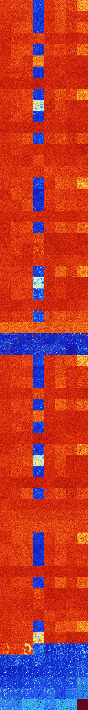

# B0457 (90624-91135)

<details>
    <summary>Initial Grid</summary>
    
</details>


<details>
    <summary>Initial Grid RLE</summary>

```
#C Exported from GoGoL (https://github.com/marrow16/gogol)
#C Wrap mode: Toroidal
#C Boundary mode: Dead
#C Step: 0
x = 100, y = 100, rule = B0457/S
5bo9bo2bo6bo5bo55bo$22bo12bobo37bo3bo11bo$4bo3bo35bo27bo11bo$5bo$42bo
26bo2bo2bo16b2o$15bo40bobo$14bo3bo7bo29bo2bo18bo$42bo7bo36bobo$5bo42bo
16bo$45bo3bo$5bo16bo18bo13bo36bo$bo31bo24bo5bo16bob2o7bo5bo$4bo13bobo
42bo18bo6bo$48bo11bo$20bo4bo43bo$o3bo29bo33bo$o23bo2bo13bo9bo3bo15bo5bo
9bo$35bo37bo7bo$bo7bo30bo28bo20bo$5bo4bo5bo20bobo4bo4bo31bo5bo$7b2o56bo
7bo$13bobo$3bo23bo39bo5b2o10bo$3bo15bo4bo8bo6b2o7bo41bo$3bo6bo33bo2bo5b
o$51bo31bo8bo2bo$15bo27b2o16bo$20bo32bobo13bo$bo57bo18bo$5bo26bo60bo$
21bobo23bo15bo$6bo2bo10bo55bo12bo$21bo6bobo36bo$17b2o3bo7bo2b2o44bo13bo
3bo$17bo11bobo19bo37bo7bo$7bo7bo31bo$obo11bo47bo$28bo23bo2bo33bo6bo$o
46bo8bo$79bo$27bo10bo14bo3bo13bo22bo$6bo3bo6bo10bo9bo11bo$bo27bo2bo39bo
6bo9bo$30bo23bobo$13bo36bo4bobo11bo$6b2o18bo30bo19bo$49bo$37bo50bo$9bo
43bo6bo$14bobo$6bo28bo13bo2bo10bo8bo18bo$10bo5b2o9bo17bo12bo21bo10bo$
16bo35bo25bo$16bo9bo11bo49bobo2bo$26bo27bo10bobo19bo$14bo20bo24bo4bo13b
o12bo$8bo10bo14b2o14bo28bo2bo$2bo43b2o41bo7bo$14bo7bo17bo6bo6bo$42bobo
10bo15bo11bo14bo$7bo18bo11bo$14bobo20bo6bo15b2o23bo$13bo2bo11bo14bo8bob
o26bo3bo$56bo5bo4bo$32bo15bo41bo6bo$4bo8bo28bo10bo$44bo25bo$o5bobo12bo
16bobo7bo8bo32bo$46bo47bo$15bo15bo32bo27bo$29bobobo6bo42bo15bo$69b2o9bo
$87bo8bo$16bo14bo28bo9bo12bo$12bo2bo8bo28bo4bo6bo6bo19bo$o4b2o2bobo20bo
8bo10bo26bo14b2o$15bo23bobo24bo15bo4bo$4bo29bo2bo9bo31bo14bo$48bo$29bo
52bo13bo$64bo26bo4bo$10bo4bobo18bo18bo3bo10bo12bobo$2bo40bo$13bo33bo$
58bo17bo6bo6bo$12bo13bobo22bo4bo11bo5bo19bo$2bo9b2o10bo35bo30bo$43bo16b
o13bo$12bo20bo17bo$7bo43bo4bo15bo19bo$10bo28bo$bo16bo37bo3bo19bo7bo$7bo
17bo3bo22bo3bo6bobo6bo7bo$17bo12bo2bo30bo28bo$7bo4bo18bo29bo22bo9b2o$
27bo10bo2bo$47bo24bo2bo$15bo40bo13bo3bo5bo$12bo62b2o$2bo4bo13b2o4bo10bo
37bo!
```
</details>
<details>
    <summary>Thumbnail</summary>

</details>
<table>
<tr>
    <td><a href="./90624%20S%20Heat%20Map%20Activity.png"></a><br>S (90624)<br>G>1000</td>    <td><a href="./90625%20S0%20Heat%20Map%20Activity.png"></a><br>S0 (90625)<br>G>1000</td>    <td><a href="./90626%20S1%20Heat%20Map%20Activity.png"></a><br>S1 (90626)<br>G>1000</td>    <td><a href="./90627%20S01%20Heat%20Map%20Activity.png"></a><br>S01 (90627)<br>R@75,p6</td>    <td><a href="./90628%20S2%20Heat%20Map%20Activity.png"></a><br>S2 (90628)<br>G>1000</td>    <td><a href="./90629%20S02%20Heat%20Map%20Activity.png"></a><br>S02 (90629)<br>G>1000</td>    <td><a href="./90630%20S12%20Heat%20Map%20Activity.png"></a><br>S12 (90630)<br>G>1000</td>    <td><a href="./90631%20S012%20Heat%20Map%20Activity.png"></a><br>S012 (90631)<br>G>1000</td></tr>
<tr>
    <td><a href="./90632%20S3%20Heat%20Map%20Activity.png"></a><br>S3 (90632)<br>G>1000</td>    <td><a href="./90633%20S03%20Heat%20Map%20Activity.png"></a><br>S03 (90633)<br>G>1000</td>    <td><a href="./90634%20S13%20Heat%20Map%20Activity.png"></a><br>S13 (90634)<br>G>1000</td>    <td><a href="./90635%20S013%20Heat%20Map%20Activity.png"></a><br>S013 (90635)<br>R@516,p4</td>    <td><a href="./90636%20S23%20Heat%20Map%20Activity.png"></a><br>S23 (90636)<br>G>1000</td>    <td><a href="./90637%20S023%20Heat%20Map%20Activity.png"></a><br>S023 (90637)<br>G>1000</td>    <td><a href="./90638%20S123%20Heat%20Map%20Activity.png"></a><br>S123 (90638)<br>G>1000</td>    <td><a href="./90639%20S0123%20Heat%20Map%20Activity.png"></a><br>S0123 (90639)<br>G>1000</td></tr>
<tr>
    <td><a href="./90640%20S4%20Heat%20Map%20Activity.png"></a><br>S4 (90640)<br>G>1000</td>    <td><a href="./90641%20S04%20Heat%20Map%20Activity.png"></a><br>S04 (90641)<br>G>1000</td>    <td><a href="./90642%20S14%20Heat%20Map%20Activity.png"></a><br>S14 (90642)<br>G>1000</td>    <td><a href="./90643%20S014%20Heat%20Map%20Activity.png"></a><br>S014 (90643)<br>R@151,p12</td>    <td><a href="./90644%20S24%20Heat%20Map%20Activity.png"></a><br>S24 (90644)<br>G>1000</td>    <td><a href="./90645%20S024%20Heat%20Map%20Activity.png"></a><br>S024 (90645)<br>G>1000</td>    <td><a href="./90646%20S124%20Heat%20Map%20Activity.png"></a><br>S124 (90646)<br>G>1000</td>    <td><a href="./90647%20S0124%20Heat%20Map%20Activity.png"></a><br>S0124 (90647)<br>G>1000</td></tr>
<tr>
    <td><a href="./90648%20S34%20Heat%20Map%20Activity.png"></a><br>S34 (90648)<br>G>1000</td>    <td><a href="./90649%20S034%20Heat%20Map%20Activity.png"></a><br>S034 (90649)<br>G>1000</td>    <td><a href="./90650%20S134%20Heat%20Map%20Activity.png"></a><br>S134 (90650)<br>G>1000</td>    <td><a href="./90651%20S0134%20Heat%20Map%20Activity.png"></a><br>S0134 (90651)<br>G>1000</td>    <td><a href="./90652%20S234%20Heat%20Map%20Activity.png"></a><br>S234 (90652)<br>G>1000</td>    <td><a href="./90653%20S0234%20Heat%20Map%20Activity.png"></a><br>S0234 (90653)<br>G>1000</td>    <td><a href="./90654%20S1234%20Heat%20Map%20Activity.png"></a><br>S1234 (90654)<br>G>1000</td>    <td><a href="./90655%20S01234%20Heat%20Map%20Activity.png"></a><br>S01234 (90655)<br>G>1000</td></tr>
<tr>
    <td><a href="./90656%20S5%20Heat%20Map%20Activity.png"></a><br>S5 (90656)<br>G>1000</td>    <td><a href="./90657%20S05%20Heat%20Map%20Activity.png"></a><br>S05 (90657)<br>G>1000</td>    <td><a href="./90658%20S15%20Heat%20Map%20Activity.png"></a><br>S15 (90658)<br>G>1000</td>    <td><a href="./90659%20S015%20Heat%20Map%20Activity.png"></a><br>S015 (90659)<br>R@87,p6</td>    <td><a href="./90660%20S25%20Heat%20Map%20Activity.png"></a><br>S25 (90660)<br>G>1000</td>    <td><a href="./90661%20S025%20Heat%20Map%20Activity.png"></a><br>S025 (90661)<br>G>1000</td>    <td><a href="./90662%20S125%20Heat%20Map%20Activity.png"></a><br>S125 (90662)<br>G>1000</td>    <td><a href="./90663%20S0125%20Heat%20Map%20Activity.png"></a><br>S0125 (90663)<br>G>1000</td></tr>
<tr>
    <td><a href="./90664%20S35%20Heat%20Map%20Activity.png"></a><br>S35 (90664)<br>G>1000</td>    <td><a href="./90665%20S035%20Heat%20Map%20Activity.png"></a><br>S035 (90665)<br>G>1000</td>    <td><a href="./90666%20S135%20Heat%20Map%20Activity.png"></a><br>S135 (90666)<br>G>1000</td>    <td><a href="./90667%20S0135%20Heat%20Map%20Activity.png"></a><br>S0135 (90667)<br>G>1000</td>    <td><a href="./90668%20S235%20Heat%20Map%20Activity.png"></a><br>S235 (90668)<br>G>1000</td>    <td><a href="./90669%20S0235%20Heat%20Map%20Activity.png"></a><br>S0235 (90669)<br>G>1000</td>    <td><a href="./90670%20S1235%20Heat%20Map%20Activity.png"></a><br>S1235 (90670)<br>G>1000</td>    <td><a href="./90671%20S01235%20Heat%20Map%20Activity.png"></a><br>S01235 (90671)<br>G>1000</td></tr>
<tr>
    <td><a href="./90672%20S45%20Heat%20Map%20Activity.png"></a><br>S45 (90672)<br>G>1000</td>    <td><a href="./90673%20S045%20Heat%20Map%20Activity.png"></a><br>S045 (90673)<br>G>1000</td>    <td><a href="./90674%20S145%20Heat%20Map%20Activity.png"></a><br>S145 (90674)<br>G>1000</td>    <td><a href="./90675%20S0145%20Heat%20Map%20Activity.png"></a><br>S0145 (90675)<br>R@689,p42</td>    <td><a href="./90676%20S245%20Heat%20Map%20Activity.png"></a><br>S245 (90676)<br>G>1000</td>    <td><a href="./90677%20S0245%20Heat%20Map%20Activity.png"></a><br>S0245 (90677)<br>G>1000</td>    <td><a href="./90678%20S1245%20Heat%20Map%20Activity.png"></a><br>S1245 (90678)<br>G>1000</td>    <td><a href="./90679%20S01245%20Heat%20Map%20Activity.png"></a><br>S01245 (90679)<br>G>1000</td></tr>
<tr>
    <td><a href="./90680%20S345%20Heat%20Map%20Activity.png"></a><br>S345 (90680)<br>G>1000</td>    <td><a href="./90681%20S0345%20Heat%20Map%20Activity.png"></a><br>S0345 (90681)<br>G>1000</td>    <td><a href="./90682%20S1345%20Heat%20Map%20Activity.png"></a><br>S1345 (90682)<br>G>1000</td>    <td><a href="./90683%20S01345%20Heat%20Map%20Activity.png"></a><br>S01345 (90683)<br>G>1000</td>    <td><a href="./90684%20S2345%20Heat%20Map%20Activity.png"></a><br>S2345 (90684)<br>G>1000</td>    <td><a href="./90685%20S02345%20Heat%20Map%20Activity.png"></a><br>S02345 (90685)<br>G>1000</td>    <td><a href="./90686%20S12345%20Heat%20Map%20Activity.png"></a><br>S12345 (90686)<br>G>1000</td>    <td><a href="./90687%20S012345%20Heat%20Map%20Activity.png"></a><br>S012345 (90687)<br>G>1000</td></tr>
<tr>
    <td><a href="./90688%20S6%20Heat%20Map%20Activity.png"></a><br>S6 (90688)<br>G>1000</td>    <td><a href="./90689%20S06%20Heat%20Map%20Activity.png"></a><br>S06 (90689)<br>G>1000</td>    <td><a href="./90690%20S16%20Heat%20Map%20Activity.png"></a><br>S16 (90690)<br>G>1000</td>    <td><a href="./90691%20S016%20Heat%20Map%20Activity.png"></a><br>S016 (90691)<br>R@70,p2</td>    <td><a href="./90692%20S26%20Heat%20Map%20Activity.png"></a><br>S26 (90692)<br>G>1000</td>    <td><a href="./90693%20S026%20Heat%20Map%20Activity.png"></a><br>S026 (90693)<br>G>1000</td>    <td><a href="./90694%20S126%20Heat%20Map%20Activity.png"></a><br>S126 (90694)<br>G>1000</td>    <td><a href="./90695%20S0126%20Heat%20Map%20Activity.png"></a><br>S0126 (90695)<br>G>1000</td></tr>
<tr>
    <td><a href="./90696%20S36%20Heat%20Map%20Activity.png"></a><br>S36 (90696)<br>G>1000</td>    <td><a href="./90697%20S036%20Heat%20Map%20Activity.png"></a><br>S036 (90697)<br>G>1000</td>    <td><a href="./90698%20S136%20Heat%20Map%20Activity.png"></a><br>S136 (90698)<br>G>1000</td>    <td><a href="./90699%20S0136%20Heat%20Map%20Activity.png"></a><br>S0136 (90699)<br>G>1000</td>    <td><a href="./90700%20S236%20Heat%20Map%20Activity.png"></a><br>S236 (90700)<br>G>1000</td>    <td><a href="./90701%20S0236%20Heat%20Map%20Activity.png"></a><br>S0236 (90701)<br>G>1000</td>    <td><a href="./90702%20S1236%20Heat%20Map%20Activity.png"></a><br>S1236 (90702)<br>G>1000</td>    <td><a href="./90703%20S01236%20Heat%20Map%20Activity.png"></a><br>S01236 (90703)<br>G>1000</td></tr>
<tr>
    <td><a href="./90704%20S46%20Heat%20Map%20Activity.png"></a><br>S46 (90704)<br>G>1000</td>    <td><a href="./90705%20S046%20Heat%20Map%20Activity.png"></a><br>S046 (90705)<br>G>1000</td>    <td><a href="./90706%20S146%20Heat%20Map%20Activity.png"></a><br>S146 (90706)<br>G>1000</td>    <td><a href="./90707%20S0146%20Heat%20Map%20Activity.png"></a><br>S0146 (90707)<br>R@214,p42</td>    <td><a href="./90708%20S246%20Heat%20Map%20Activity.png"></a><br>S246 (90708)<br>G>1000</td>    <td><a href="./90709%20S0246%20Heat%20Map%20Activity.png"></a><br>S0246 (90709)<br>G>1000</td>    <td><a href="./90710%20S1246%20Heat%20Map%20Activity.png"></a><br>S1246 (90710)<br>G>1000</td>    <td><a href="./90711%20S01246%20Heat%20Map%20Activity.png"></a><br>S01246 (90711)<br>G>1000</td></tr>
<tr>
    <td><a href="./90712%20S346%20Heat%20Map%20Activity.png"></a><br>S346 (90712)<br>G>1000</td>    <td><a href="./90713%20S0346%20Heat%20Map%20Activity.png"></a><br>S0346 (90713)<br>G>1000</td>    <td><a href="./90714%20S1346%20Heat%20Map%20Activity.png"></a><br>S1346 (90714)<br>G>1000</td>    <td><a href="./90715%20S01346%20Heat%20Map%20Activity.png"></a><br>S01346 (90715)<br>G>1000</td>    <td><a href="./90716%20S2346%20Heat%20Map%20Activity.png"></a><br>S2346 (90716)<br>G>1000</td>    <td><a href="./90717%20S02346%20Heat%20Map%20Activity.png"></a><br>S02346 (90717)<br>G>1000</td>    <td><a href="./90718%20S12346%20Heat%20Map%20Activity.png"></a><br>S12346 (90718)<br>G>1000</td>    <td><a href="./90719%20S012346%20Heat%20Map%20Activity.png"></a><br>S012346 (90719)<br>G>1000</td></tr>
<tr>
    <td><a href="./90720%20S56%20Heat%20Map%20Activity.png"></a><br>S56 (90720)<br>G>1000</td>    <td><a href="./90721%20S056%20Heat%20Map%20Activity.png"></a><br>S056 (90721)<br>G>1000</td>    <td><a href="./90722%20S156%20Heat%20Map%20Activity.png"></a><br>S156 (90722)<br>G>1000</td>    <td><a href="./90723%20S0156%20Heat%20Map%20Activity.png"></a><br>S0156 (90723)<br>R@85,p12</td>    <td><a href="./90724%20S256%20Heat%20Map%20Activity.png"></a><br>S256 (90724)<br>G>1000</td>    <td><a href="./90725%20S0256%20Heat%20Map%20Activity.png"></a><br>S0256 (90725)<br>G>1000</td>    <td><a href="./90726%20S1256%20Heat%20Map%20Activity.png"></a><br>S1256 (90726)<br>G>1000</td>    <td><a href="./90727%20S01256%20Heat%20Map%20Activity.png"></a><br>S01256 (90727)<br>G>1000</td></tr>
<tr>
    <td><a href="./90728%20S356%20Heat%20Map%20Activity.png"></a><br>S356 (90728)<br>G>1000</td>    <td><a href="./90729%20S0356%20Heat%20Map%20Activity.png"></a><br>S0356 (90729)<br>G>1000</td>    <td><a href="./90730%20S1356%20Heat%20Map%20Activity.png"></a><br>S1356 (90730)<br>G>1000</td>    <td><a href="./90731%20S01356%20Heat%20Map%20Activity.png"></a><br>S01356 (90731)<br>G>1000</td>    <td><a href="./90732%20S2356%20Heat%20Map%20Activity.png"></a><br>S2356 (90732)<br>G>1000</td>    <td><a href="./90733%20S02356%20Heat%20Map%20Activity.png"></a><br>S02356 (90733)<br>G>1000</td>    <td><a href="./90734%20S12356%20Heat%20Map%20Activity.png"></a><br>S12356 (90734)<br>G>1000</td>    <td><a href="./90735%20S012356%20Heat%20Map%20Activity.png"></a><br>S012356 (90735)<br>G>1000</td></tr>
<tr>
    <td><a href="./90736%20S456%20Heat%20Map%20Activity.png"></a><br>S456 (90736)<br>G>1000</td>    <td><a href="./90737%20S0456%20Heat%20Map%20Activity.png"></a><br>S0456 (90737)<br>G>1000</td>    <td><a href="./90738%20S1456%20Heat%20Map%20Activity.png"></a><br>S1456 (90738)<br>G>1000</td>    <td><a href="./90739%20S01456%20Heat%20Map%20Activity.png"></a><br>S01456 (90739)<br>G>1000</td>    <td><a href="./90740%20S2456%20Heat%20Map%20Activity.png"></a><br>S2456 (90740)<br>G>1000</td>    <td><a href="./90741%20S02456%20Heat%20Map%20Activity.png"></a><br>S02456 (90741)<br>G>1000</td>    <td><a href="./90742%20S12456%20Heat%20Map%20Activity.png"></a><br>S12456 (90742)<br>G>1000</td>    <td><a href="./90743%20S012456%20Heat%20Map%20Activity.png"></a><br>S012456 (90743)<br>G>1000</td></tr>
<tr>
    <td><a href="./90744%20S3456%20Heat%20Map%20Activity.png"></a><br>S3456 (90744)<br>G>1000</td>    <td><a href="./90745%20S03456%20Heat%20Map%20Activity.png"></a><br>S03456 (90745)<br>G>1000</td>    <td><a href="./90746%20S13456%20Heat%20Map%20Activity.png"></a><br>S13456 (90746)<br>G>1000</td>    <td><a href="./90747%20S013456%20Heat%20Map%20Activity.png"></a><br>S013456 (90747)<br>G>1000</td>    <td><a href="./90748%20S23456%20Heat%20Map%20Activity.png"></a><br>S23456 (90748)<br>G>1000</td>    <td><a href="./90749%20S023456%20Heat%20Map%20Activity.png"></a><br>S023456 (90749)<br>G>1000</td>    <td><a href="./90750%20S123456%20Heat%20Map%20Activity.png"></a><br>S123456 (90750)<br>G>1000</td>    <td><a href="./90751%20S0123456%20Heat%20Map%20Activity.png"></a><br>S0123456 (90751)<br>G>1000</td></tr>
<tr>
    <td><a href="./90752%20S7%20Heat%20Map%20Activity.png"></a><br>S7 (90752)<br>G>1000</td>    <td><a href="./90753%20S07%20Heat%20Map%20Activity.png"></a><br>S07 (90753)<br>G>1000</td>    <td><a href="./90754%20S17%20Heat%20Map%20Activity.png"></a><br>S17 (90754)<br>G>1000</td>    <td><a href="./90755%20S017%20Heat%20Map%20Activity.png"></a><br>S017 (90755)<br>R@61,p6</td>    <td><a href="./90756%20S27%20Heat%20Map%20Activity.png"></a><br>S27 (90756)<br>G>1000</td>    <td><a href="./90757%20S027%20Heat%20Map%20Activity.png"></a><br>S027 (90757)<br>G>1000</td>    <td><a href="./90758%20S127%20Heat%20Map%20Activity.png"></a><br>S127 (90758)<br>G>1000</td>    <td><a href="./90759%20S0127%20Heat%20Map%20Activity.png"></a><br>S0127 (90759)<br>G>1000</td></tr>
<tr>
    <td><a href="./90760%20S37%20Heat%20Map%20Activity.png"></a><br>S37 (90760)<br>G>1000</td>    <td><a href="./90761%20S037%20Heat%20Map%20Activity.png"></a><br>S037 (90761)<br>G>1000</td>    <td><a href="./90762%20S137%20Heat%20Map%20Activity.png"></a><br>S137 (90762)<br>G>1000</td>    <td><a href="./90763%20S0137%20Heat%20Map%20Activity.png"></a><br>S0137 (90763)<br>G>1000</td>    <td><a href="./90764%20S237%20Heat%20Map%20Activity.png"></a><br>S237 (90764)<br>G>1000</td>    <td><a href="./90765%20S0237%20Heat%20Map%20Activity.png"></a><br>S0237 (90765)<br>G>1000</td>    <td><a href="./90766%20S1237%20Heat%20Map%20Activity.png"></a><br>S1237 (90766)<br>G>1000</td>    <td><a href="./90767%20S01237%20Heat%20Map%20Activity.png"></a><br>S01237 (90767)<br>G>1000</td></tr>
<tr>
    <td><a href="./90768%20S47%20Heat%20Map%20Activity.png"></a><br>S47 (90768)<br>G>1000</td>    <td><a href="./90769%20S047%20Heat%20Map%20Activity.png"></a><br>S047 (90769)<br>G>1000</td>    <td><a href="./90770%20S147%20Heat%20Map%20Activity.png"></a><br>S147 (90770)<br>G>1000</td>    <td><a href="./90771%20S0147%20Heat%20Map%20Activity.png"></a><br>S0147 (90771)<br>R@189,p12</td>    <td><a href="./90772%20S247%20Heat%20Map%20Activity.png"></a><br>S247 (90772)<br>G>1000</td>    <td><a href="./90773%20S0247%20Heat%20Map%20Activity.png"></a><br>S0247 (90773)<br>G>1000</td>    <td><a href="./90774%20S1247%20Heat%20Map%20Activity.png"></a><br>S1247 (90774)<br>G>1000</td>    <td><a href="./90775%20S01247%20Heat%20Map%20Activity.png"></a><br>S01247 (90775)<br>G>1000</td></tr>
<tr>
    <td><a href="./90776%20S347%20Heat%20Map%20Activity.png"></a><br>S347 (90776)<br>G>1000</td>    <td><a href="./90777%20S0347%20Heat%20Map%20Activity.png"></a><br>S0347 (90777)<br>G>1000</td>    <td><a href="./90778%20S1347%20Heat%20Map%20Activity.png"></a><br>S1347 (90778)<br>G>1000</td>    <td><a href="./90779%20S01347%20Heat%20Map%20Activity.png"></a><br>S01347 (90779)<br>G>1000</td>    <td><a href="./90780%20S2347%20Heat%20Map%20Activity.png"></a><br>S2347 (90780)<br>G>1000</td>    <td><a href="./90781%20S02347%20Heat%20Map%20Activity.png"></a><br>S02347 (90781)<br>G>1000</td>    <td><a href="./90782%20S12347%20Heat%20Map%20Activity.png"></a><br>S12347 (90782)<br>G>1000</td>    <td><a href="./90783%20S012347%20Heat%20Map%20Activity.png"></a><br>S012347 (90783)<br>G>1000</td></tr>
<tr>
    <td><a href="./90784%20S57%20Heat%20Map%20Activity.png"></a><br>S57 (90784)<br>G>1000</td>    <td><a href="./90785%20S057%20Heat%20Map%20Activity.png"></a><br>S057 (90785)<br>G>1000</td>    <td><a href="./90786%20S157%20Heat%20Map%20Activity.png"></a><br>S157 (90786)<br>G>1000</td>    <td><a href="./90787%20S0157%20Heat%20Map%20Activity.png"></a><br>S0157 (90787)<br>R@89,p6</td>    <td><a href="./90788%20S257%20Heat%20Map%20Activity.png"></a><br>S257 (90788)<br>G>1000</td>    <td><a href="./90789%20S0257%20Heat%20Map%20Activity.png"></a><br>S0257 (90789)<br>G>1000</td>    <td><a href="./90790%20S1257%20Heat%20Map%20Activity.png"></a><br>S1257 (90790)<br>G>1000</td>    <td><a href="./90791%20S01257%20Heat%20Map%20Activity.png"></a><br>S01257 (90791)<br>G>1000</td></tr>
<tr>
    <td><a href="./90792%20S357%20Heat%20Map%20Activity.png"></a><br>S357 (90792)<br>G>1000</td>    <td><a href="./90793%20S0357%20Heat%20Map%20Activity.png"></a><br>S0357 (90793)<br>G>1000</td>    <td><a href="./90794%20S1357%20Heat%20Map%20Activity.png"></a><br>S1357 (90794)<br>G>1000</td>    <td><a href="./90795%20S01357%20Heat%20Map%20Activity.png"></a><br>S01357 (90795)<br>G>1000</td>    <td><a href="./90796%20S2357%20Heat%20Map%20Activity.png"></a><br>S2357 (90796)<br>G>1000</td>    <td><a href="./90797%20S02357%20Heat%20Map%20Activity.png"></a><br>S02357 (90797)<br>G>1000</td>    <td><a href="./90798%20S12357%20Heat%20Map%20Activity.png"></a><br>S12357 (90798)<br>G>1000</td>    <td><a href="./90799%20S012357%20Heat%20Map%20Activity.png"></a><br>S012357 (90799)<br>G>1000</td></tr>
<tr>
    <td><a href="./90800%20S457%20Heat%20Map%20Activity.png"></a><br>S457 (90800)<br>G>1000</td>    <td><a href="./90801%20S0457%20Heat%20Map%20Activity.png"></a><br>S0457 (90801)<br>G>1000</td>    <td><a href="./90802%20S1457%20Heat%20Map%20Activity.png"></a><br>S1457 (90802)<br>G>1000</td>    <td><a href="./90803%20S01457%20Heat%20Map%20Activity.png"></a><br>S01457 (90803)<br>G>1000</td>    <td><a href="./90804%20S2457%20Heat%20Map%20Activity.png"></a><br>S2457 (90804)<br>G>1000</td>    <td><a href="./90805%20S02457%20Heat%20Map%20Activity.png"></a><br>S02457 (90805)<br>G>1000</td>    <td><a href="./90806%20S12457%20Heat%20Map%20Activity.png"></a><br>S12457 (90806)<br>G>1000</td>    <td><a href="./90807%20S012457%20Heat%20Map%20Activity.png"></a><br>S012457 (90807)<br>G>1000</td></tr>
<tr>
    <td><a href="./90808%20S3457%20Heat%20Map%20Activity.png"></a><br>S3457 (90808)<br>G>1000</td>    <td><a href="./90809%20S03457%20Heat%20Map%20Activity.png"></a><br>S03457 (90809)<br>G>1000</td>    <td><a href="./90810%20S13457%20Heat%20Map%20Activity.png"></a><br>S13457 (90810)<br>G>1000</td>    <td><a href="./90811%20S013457%20Heat%20Map%20Activity.png"></a><br>S013457 (90811)<br>G>1000</td>    <td><a href="./90812%20S23457%20Heat%20Map%20Activity.png"></a><br>S23457 (90812)<br>G>1000</td>    <td><a href="./90813%20S023457%20Heat%20Map%20Activity.png"></a><br>S023457 (90813)<br>G>1000</td>    <td><a href="./90814%20S123457%20Heat%20Map%20Activity.png"></a><br>S123457 (90814)<br>G>1000</td>    <td><a href="./90815%20S0123457%20Heat%20Map%20Activity.png"></a><br>S0123457 (90815)<br>G>1000</td></tr>
<tr>
    <td><a href="./90816%20S67%20Heat%20Map%20Activity.png"></a><br>S67 (90816)<br>G>1000</td>    <td><a href="./90817%20S067%20Heat%20Map%20Activity.png"></a><br>S067 (90817)<br>G>1000</td>    <td><a href="./90818%20S167%20Heat%20Map%20Activity.png"></a><br>S167 (90818)<br>G>1000</td>    <td><a href="./90819%20S0167%20Heat%20Map%20Activity.png"></a><br>S0167 (90819)<br>R@62,p6</td>    <td><a href="./90820%20S267%20Heat%20Map%20Activity.png"></a><br>S267 (90820)<br>G>1000</td>    <td><a href="./90821%20S0267%20Heat%20Map%20Activity.png"></a><br>S0267 (90821)<br>G>1000</td>    <td><a href="./90822%20S1267%20Heat%20Map%20Activity.png"></a><br>S1267 (90822)<br>G>1000</td>    <td><a href="./90823%20S01267%20Heat%20Map%20Activity.png"></a><br>S01267 (90823)<br>G>1000</td></tr>
<tr>
    <td><a href="./90824%20S367%20Heat%20Map%20Activity.png"></a><br>S367 (90824)<br>G>1000</td>    <td><a href="./90825%20S0367%20Heat%20Map%20Activity.png"></a><br>S0367 (90825)<br>G>1000</td>    <td><a href="./90826%20S1367%20Heat%20Map%20Activity.png"></a><br>S1367 (90826)<br>G>1000</td>    <td><a href="./90827%20S01367%20Heat%20Map%20Activity.png"></a><br>S01367 (90827)<br>G>1000</td>    <td><a href="./90828%20S2367%20Heat%20Map%20Activity.png"></a><br>S2367 (90828)<br>G>1000</td>    <td><a href="./90829%20S02367%20Heat%20Map%20Activity.png"></a><br>S02367 (90829)<br>G>1000</td>    <td><a href="./90830%20S12367%20Heat%20Map%20Activity.png"></a><br>S12367 (90830)<br>G>1000</td>    <td><a href="./90831%20S012367%20Heat%20Map%20Activity.png"></a><br>S012367 (90831)<br>G>1000</td></tr>
<tr>
    <td><a href="./90832%20S467%20Heat%20Map%20Activity.png"></a><br>S467 (90832)<br>G>1000</td>    <td><a href="./90833%20S0467%20Heat%20Map%20Activity.png"></a><br>S0467 (90833)<br>G>1000</td>    <td><a href="./90834%20S1467%20Heat%20Map%20Activity.png"></a><br>S1467 (90834)<br>G>1000</td>    <td><a href="./90835%20S01467%20Heat%20Map%20Activity.png"></a><br>S01467 (90835)<br>R@176,p12</td>    <td><a href="./90836%20S2467%20Heat%20Map%20Activity.png"></a><br>S2467 (90836)<br>G>1000</td>    <td><a href="./90837%20S02467%20Heat%20Map%20Activity.png"></a><br>S02467 (90837)<br>G>1000</td>    <td><a href="./90838%20S12467%20Heat%20Map%20Activity.png"></a><br>S12467 (90838)<br>G>1000</td>    <td><a href="./90839%20S012467%20Heat%20Map%20Activity.png"></a><br>S012467 (90839)<br>G>1000</td></tr>
<tr>
    <td><a href="./90840%20S3467%20Heat%20Map%20Activity.png"></a><br>S3467 (90840)<br>G>1000</td>    <td><a href="./90841%20S03467%20Heat%20Map%20Activity.png"></a><br>S03467 (90841)<br>G>1000</td>    <td><a href="./90842%20S13467%20Heat%20Map%20Activity.png"></a><br>S13467 (90842)<br>G>1000</td>    <td><a href="./90843%20S013467%20Heat%20Map%20Activity.png"></a><br>S013467 (90843)<br>G>1000</td>    <td><a href="./90844%20S23467%20Heat%20Map%20Activity.png"></a><br>S23467 (90844)<br>G>1000</td>    <td><a href="./90845%20S023467%20Heat%20Map%20Activity.png"></a><br>S023467 (90845)<br>G>1000</td>    <td><a href="./90846%20S123467%20Heat%20Map%20Activity.png"></a><br>S123467 (90846)<br>G>1000</td>    <td><a href="./90847%20S0123467%20Heat%20Map%20Activity.png"></a><br>S0123467 (90847)<br>G>1000</td></tr>
<tr>
    <td><a href="./90848%20S567%20Heat%20Map%20Activity.png"></a><br>S567 (90848)<br>G>1000</td>    <td><a href="./90849%20S0567%20Heat%20Map%20Activity.png"></a><br>S0567 (90849)<br>G>1000</td>    <td><a href="./90850%20S1567%20Heat%20Map%20Activity.png"></a><br>S1567 (90850)<br>G>1000</td>    <td><a href="./90851%20S01567%20Heat%20Map%20Activity.png"></a><br>S01567 (90851)<br>R@75,p6</td>    <td><a href="./90852%20S2567%20Heat%20Map%20Activity.png"></a><br>S2567 (90852)<br>G>1000</td>    <td><a href="./90853%20S02567%20Heat%20Map%20Activity.png"></a><br>S02567 (90853)<br>G>1000</td>    <td><a href="./90854%20S12567%20Heat%20Map%20Activity.png"></a><br>S12567 (90854)<br>G>1000</td>    <td><a href="./90855%20S012567%20Heat%20Map%20Activity.png"></a><br>S012567 (90855)<br>G>1000</td></tr>
<tr>
    <td><a href="./90856%20S3567%20Heat%20Map%20Activity.png"></a><br>S3567 (90856)<br>G>1000</td>    <td><a href="./90857%20S03567%20Heat%20Map%20Activity.png"></a><br>S03567 (90857)<br>G>1000</td>    <td><a href="./90858%20S13567%20Heat%20Map%20Activity.png"></a><br>S13567 (90858)<br>G>1000</td>    <td><a href="./90859%20S013567%20Heat%20Map%20Activity.png"></a><br>S013567 (90859)<br>G>1000</td>    <td><a href="./90860%20S23567%20Heat%20Map%20Activity.png"></a><br>S23567 (90860)<br>G>1000</td>    <td><a href="./90861%20S023567%20Heat%20Map%20Activity.png"></a><br>S023567 (90861)<br>G>1000</td>    <td><a href="./90862%20S123567%20Heat%20Map%20Activity.png"></a><br>S123567 (90862)<br>G>1000</td>    <td><a href="./90863%20S0123567%20Heat%20Map%20Activity.png"></a><br>S0123567 (90863)<br>G>1000</td></tr>
<tr>
    <td><a href="./90864%20S4567%20Heat%20Map%20Activity.png"></a><br>S4567 (90864)<br>R@222,p12</td>    <td><a href="./90865%20S04567%20Heat%20Map%20Activity.png"></a><br>S04567 (90865)<br>R@323,p24</td>    <td><a href="./90866%20S14567%20Heat%20Map%20Activity.png"></a><br>S14567 (90866)<br>R@350,p60</td>    <td><a href="./90867%20S014567%20Heat%20Map%20Activity.png"></a><br>S014567 (90867)<br>R@247,p12</td>    <td><a href="./90868%20S24567%20Heat%20Map%20Activity.png"></a><br>S24567 (90868)<br>R@303,p60</td>    <td><a href="./90869%20S024567%20Heat%20Map%20Activity.png"></a><br>S024567 (90869)<br>R@189,p12</td>    <td><a href="./90870%20S124567%20Heat%20Map%20Activity.png"></a><br>S124567 (90870)<br>R@174,p6</td>    <td><a href="./90871%20S0124567%20Heat%20Map%20Activity.png"></a><br>S0124567 (90871)<br>R@187,p30</td></tr>
<tr>
    <td><a href="./90872%20S34567%20Heat%20Map%20Activity.png"></a><br>S34567 (90872)<br>R@52,p12</td>    <td><a href="./90873%20S034567%20Heat%20Map%20Activity.png"></a><br>S034567 (90873)<br>R@113,p78</td>    <td><a href="./90874%20S134567%20Heat%20Map%20Activity.png"></a><br>S134567 (90874)<br>R@47,p12</td>    <td><a href="./90875%20S0134567%20Heat%20Map%20Activity.png"></a><br>S0134567 (90875)<br>R@44,p6</td>    <td><a href="./90876%20S234567%20Heat%20Map%20Activity.png"></a><br>S234567 (90876)<br>R@29,p6</td>    <td><a href="./90877%20S0234567%20Heat%20Map%20Activity.png"></a><br>S0234567 (90877)<br>R@36,p12</td>    <td><a href="./90878%20S1234567%20Heat%20Map%20Activity.png"></a><br>S1234567 (90878)<br>R@276,p252</td>    <td><a href="./90879%20S01234567%20Heat%20Map%20Activity.png"></a><br>S01234567 (90879)<br>R@38,p6</td></tr>
<tr>
    <td><a href="./90880%20S8%20Heat%20Map%20Activity.png"></a><br>S8 (90880)<br>G>1000</td>    <td><a href="./90881%20S08%20Heat%20Map%20Activity.png"></a><br>S08 (90881)<br>G>1000</td>    <td><a href="./90882%20S18%20Heat%20Map%20Activity.png"></a><br>S18 (90882)<br>G>1000</td>    <td><a href="./90883%20S018%20Heat%20Map%20Activity.png"></a><br>S018 (90883)<br>R@70,p6</td>    <td><a href="./90884%20S28%20Heat%20Map%20Activity.png"></a><br>S28 (90884)<br>G>1000</td>    <td><a href="./90885%20S028%20Heat%20Map%20Activity.png"></a><br>S028 (90885)<br>G>1000</td>    <td><a href="./90886%20S128%20Heat%20Map%20Activity.png"></a><br>S128 (90886)<br>G>1000</td>    <td><a href="./90887%20S0128%20Heat%20Map%20Activity.png"></a><br>S0128 (90887)<br>G>1000</td></tr>
<tr>
    <td><a href="./90888%20S38%20Heat%20Map%20Activity.png"></a><br>S38 (90888)<br>G>1000</td>    <td><a href="./90889%20S038%20Heat%20Map%20Activity.png"></a><br>S038 (90889)<br>G>1000</td>    <td><a href="./90890%20S138%20Heat%20Map%20Activity.png"></a><br>S138 (90890)<br>G>1000</td>    <td><a href="./90891%20S0138%20Heat%20Map%20Activity.png"></a><br>S0138 (90891)<br>R@624,p2</td>    <td><a href="./90892%20S238%20Heat%20Map%20Activity.png"></a><br>S238 (90892)<br>G>1000</td>    <td><a href="./90893%20S0238%20Heat%20Map%20Activity.png"></a><br>S0238 (90893)<br>G>1000</td>    <td><a href="./90894%20S1238%20Heat%20Map%20Activity.png"></a><br>S1238 (90894)<br>G>1000</td>    <td><a href="./90895%20S01238%20Heat%20Map%20Activity.png"></a><br>S01238 (90895)<br>G>1000</td></tr>
<tr>
    <td><a href="./90896%20S48%20Heat%20Map%20Activity.png"></a><br>S48 (90896)<br>G>1000</td>    <td><a href="./90897%20S048%20Heat%20Map%20Activity.png"></a><br>S048 (90897)<br>G>1000</td>    <td><a href="./90898%20S148%20Heat%20Map%20Activity.png"></a><br>S148 (90898)<br>G>1000</td>    <td><a href="./90899%20S0148%20Heat%20Map%20Activity.png"></a><br>S0148 (90899)<br>R@164,p12</td>    <td><a href="./90900%20S248%20Heat%20Map%20Activity.png"></a><br>S248 (90900)<br>G>1000</td>    <td><a href="./90901%20S0248%20Heat%20Map%20Activity.png"></a><br>S0248 (90901)<br>G>1000</td>    <td><a href="./90902%20S1248%20Heat%20Map%20Activity.png"></a><br>S1248 (90902)<br>G>1000</td>    <td><a href="./90903%20S01248%20Heat%20Map%20Activity.png"></a><br>S01248 (90903)<br>G>1000</td></tr>
<tr>
    <td><a href="./90904%20S348%20Heat%20Map%20Activity.png"></a><br>S348 (90904)<br>G>1000</td>    <td><a href="./90905%20S0348%20Heat%20Map%20Activity.png"></a><br>S0348 (90905)<br>G>1000</td>    <td><a href="./90906%20S1348%20Heat%20Map%20Activity.png"></a><br>S1348 (90906)<br>G>1000</td>    <td><a href="./90907%20S01348%20Heat%20Map%20Activity.png"></a><br>S01348 (90907)<br>G>1000</td>    <td><a href="./90908%20S2348%20Heat%20Map%20Activity.png"></a><br>S2348 (90908)<br>G>1000</td>    <td><a href="./90909%20S02348%20Heat%20Map%20Activity.png"></a><br>S02348 (90909)<br>G>1000</td>    <td><a href="./90910%20S12348%20Heat%20Map%20Activity.png"></a><br>S12348 (90910)<br>G>1000</td>    <td><a href="./90911%20S012348%20Heat%20Map%20Activity.png"></a><br>S012348 (90911)<br>G>1000</td></tr>
<tr>
    <td><a href="./90912%20S58%20Heat%20Map%20Activity.png"></a><br>S58 (90912)<br>G>1000</td>    <td><a href="./90913%20S058%20Heat%20Map%20Activity.png"></a><br>S058 (90913)<br>G>1000</td>    <td><a href="./90914%20S158%20Heat%20Map%20Activity.png"></a><br>S158 (90914)<br>G>1000</td>    <td><a href="./90915%20S0158%20Heat%20Map%20Activity.png"></a><br>S0158 (90915)<br>R@96,p6</td>    <td><a href="./90916%20S258%20Heat%20Map%20Activity.png"></a><br>S258 (90916)<br>G>1000</td>    <td><a href="./90917%20S0258%20Heat%20Map%20Activity.png"></a><br>S0258 (90917)<br>G>1000</td>    <td><a href="./90918%20S1258%20Heat%20Map%20Activity.png"></a><br>S1258 (90918)<br>G>1000</td>    <td><a href="./90919%20S01258%20Heat%20Map%20Activity.png"></a><br>S01258 (90919)<br>G>1000</td></tr>
<tr>
    <td><a href="./90920%20S358%20Heat%20Map%20Activity.png"></a><br>S358 (90920)<br>G>1000</td>    <td><a href="./90921%20S0358%20Heat%20Map%20Activity.png"></a><br>S0358 (90921)<br>G>1000</td>    <td><a href="./90922%20S1358%20Heat%20Map%20Activity.png"></a><br>S1358 (90922)<br>G>1000</td>    <td><a href="./90923%20S01358%20Heat%20Map%20Activity.png"></a><br>S01358 (90923)<br>G>1000</td>    <td><a href="./90924%20S2358%20Heat%20Map%20Activity.png"></a><br>S2358 (90924)<br>G>1000</td>    <td><a href="./90925%20S02358%20Heat%20Map%20Activity.png"></a><br>S02358 (90925)<br>G>1000</td>    <td><a href="./90926%20S12358%20Heat%20Map%20Activity.png"></a><br>S12358 (90926)<br>G>1000</td>    <td><a href="./90927%20S012358%20Heat%20Map%20Activity.png"></a><br>S012358 (90927)<br>G>1000</td></tr>
<tr>
    <td><a href="./90928%20S458%20Heat%20Map%20Activity.png"></a><br>S458 (90928)<br>G>1000</td>    <td><a href="./90929%20S0458%20Heat%20Map%20Activity.png"></a><br>S0458 (90929)<br>G>1000</td>    <td><a href="./90930%20S1458%20Heat%20Map%20Activity.png"></a><br>S1458 (90930)<br>G>1000</td>    <td><a href="./90931%20S01458%20Heat%20Map%20Activity.png"></a><br>S01458 (90931)<br>R@724,p84</td>    <td><a href="./90932%20S2458%20Heat%20Map%20Activity.png"></a><br>S2458 (90932)<br>G>1000</td>    <td><a href="./90933%20S02458%20Heat%20Map%20Activity.png"></a><br>S02458 (90933)<br>G>1000</td>    <td><a href="./90934%20S12458%20Heat%20Map%20Activity.png"></a><br>S12458 (90934)<br>G>1000</td>    <td><a href="./90935%20S012458%20Heat%20Map%20Activity.png"></a><br>S012458 (90935)<br>G>1000</td></tr>
<tr>
    <td><a href="./90936%20S3458%20Heat%20Map%20Activity.png"></a><br>S3458 (90936)<br>G>1000</td>    <td><a href="./90937%20S03458%20Heat%20Map%20Activity.png"></a><br>S03458 (90937)<br>G>1000</td>    <td><a href="./90938%20S13458%20Heat%20Map%20Activity.png"></a><br>S13458 (90938)<br>G>1000</td>    <td><a href="./90939%20S013458%20Heat%20Map%20Activity.png"></a><br>S013458 (90939)<br>G>1000</td>    <td><a href="./90940%20S23458%20Heat%20Map%20Activity.png"></a><br>S23458 (90940)<br>G>1000</td>    <td><a href="./90941%20S023458%20Heat%20Map%20Activity.png"></a><br>S023458 (90941)<br>G>1000</td>    <td><a href="./90942%20S123458%20Heat%20Map%20Activity.png"></a><br>S123458 (90942)<br>G>1000</td>    <td><a href="./90943%20S0123458%20Heat%20Map%20Activity.png"></a><br>S0123458 (90943)<br>G>1000</td></tr>
<tr>
    <td><a href="./90944%20S68%20Heat%20Map%20Activity.png"></a><br>S68 (90944)<br>G>1000</td>    <td><a href="./90945%20S068%20Heat%20Map%20Activity.png"></a><br>S068 (90945)<br>G>1000</td>    <td><a href="./90946%20S168%20Heat%20Map%20Activity.png"></a><br>S168 (90946)<br>G>1000</td>    <td><a href="./90947%20S0168%20Heat%20Map%20Activity.png"></a><br>S0168 (90947)<br>R@79,p6</td>    <td><a href="./90948%20S268%20Heat%20Map%20Activity.png"></a><br>S268 (90948)<br>G>1000</td>    <td><a href="./90949%20S0268%20Heat%20Map%20Activity.png"></a><br>S0268 (90949)<br>G>1000</td>    <td><a href="./90950%20S1268%20Heat%20Map%20Activity.png"></a><br>S1268 (90950)<br>G>1000</td>    <td><a href="./90951%20S01268%20Heat%20Map%20Activity.png"></a><br>S01268 (90951)<br>G>1000</td></tr>
<tr>
    <td><a href="./90952%20S368%20Heat%20Map%20Activity.png"></a><br>S368 (90952)<br>G>1000</td>    <td><a href="./90953%20S0368%20Heat%20Map%20Activity.png"></a><br>S0368 (90953)<br>G>1000</td>    <td><a href="./90954%20S1368%20Heat%20Map%20Activity.png"></a><br>S1368 (90954)<br>G>1000</td>    <td><a href="./90955%20S01368%20Heat%20Map%20Activity.png"></a><br>S01368 (90955)<br>G>1000</td>    <td><a href="./90956%20S2368%20Heat%20Map%20Activity.png"></a><br>S2368 (90956)<br>G>1000</td>    <td><a href="./90957%20S02368%20Heat%20Map%20Activity.png"></a><br>S02368 (90957)<br>G>1000</td>    <td><a href="./90958%20S12368%20Heat%20Map%20Activity.png"></a><br>S12368 (90958)<br>G>1000</td>    <td><a href="./90959%20S012368%20Heat%20Map%20Activity.png"></a><br>S012368 (90959)<br>G>1000</td></tr>
<tr>
    <td><a href="./90960%20S468%20Heat%20Map%20Activity.png"></a><br>S468 (90960)<br>G>1000</td>    <td><a href="./90961%20S0468%20Heat%20Map%20Activity.png"></a><br>S0468 (90961)<br>G>1000</td>    <td><a href="./90962%20S1468%20Heat%20Map%20Activity.png"></a><br>S1468 (90962)<br>G>1000</td>    <td><a href="./90963%20S01468%20Heat%20Map%20Activity.png"></a><br>S01468 (90963)<br>R@195,p12</td>    <td><a href="./90964%20S2468%20Heat%20Map%20Activity.png"></a><br>S2468 (90964)<br>G>1000</td>    <td><a href="./90965%20S02468%20Heat%20Map%20Activity.png"></a><br>S02468 (90965)<br>G>1000</td>    <td><a href="./90966%20S12468%20Heat%20Map%20Activity.png"></a><br>S12468 (90966)<br>G>1000</td>    <td><a href="./90967%20S012468%20Heat%20Map%20Activity.png"></a><br>S012468 (90967)<br>G>1000</td></tr>
<tr>
    <td><a href="./90968%20S3468%20Heat%20Map%20Activity.png"></a><br>S3468 (90968)<br>G>1000</td>    <td><a href="./90969%20S03468%20Heat%20Map%20Activity.png"></a><br>S03468 (90969)<br>G>1000</td>    <td><a href="./90970%20S13468%20Heat%20Map%20Activity.png"></a><br>S13468 (90970)<br>G>1000</td>    <td><a href="./90971%20S013468%20Heat%20Map%20Activity.png"></a><br>S013468 (90971)<br>G>1000</td>    <td><a href="./90972%20S23468%20Heat%20Map%20Activity.png"></a><br>S23468 (90972)<br>G>1000</td>    <td><a href="./90973%20S023468%20Heat%20Map%20Activity.png"></a><br>S023468 (90973)<br>G>1000</td>    <td><a href="./90974%20S123468%20Heat%20Map%20Activity.png"></a><br>S123468 (90974)<br>G>1000</td>    <td><a href="./90975%20S0123468%20Heat%20Map%20Activity.png"></a><br>S0123468 (90975)<br>G>1000</td></tr>
<tr>
    <td><a href="./90976%20S568%20Heat%20Map%20Activity.png"></a><br>S568 (90976)<br>G>1000</td>    <td><a href="./90977%20S0568%20Heat%20Map%20Activity.png"></a><br>S0568 (90977)<br>G>1000</td>    <td><a href="./90978%20S1568%20Heat%20Map%20Activity.png"></a><br>S1568 (90978)<br>G>1000</td>    <td><a href="./90979%20S01568%20Heat%20Map%20Activity.png"></a><br>S01568 (90979)<br>R@102,p12</td>    <td><a href="./90980%20S2568%20Heat%20Map%20Activity.png"></a><br>S2568 (90980)<br>G>1000</td>    <td><a href="./90981%20S02568%20Heat%20Map%20Activity.png"></a><br>S02568 (90981)<br>G>1000</td>    <td><a href="./90982%20S12568%20Heat%20Map%20Activity.png"></a><br>S12568 (90982)<br>G>1000</td>    <td><a href="./90983%20S012568%20Heat%20Map%20Activity.png"></a><br>S012568 (90983)<br>G>1000</td></tr>
<tr>
    <td><a href="./90984%20S3568%20Heat%20Map%20Activity.png"></a><br>S3568 (90984)<br>G>1000</td>    <td><a href="./90985%20S03568%20Heat%20Map%20Activity.png"></a><br>S03568 (90985)<br>G>1000</td>    <td><a href="./90986%20S13568%20Heat%20Map%20Activity.png"></a><br>S13568 (90986)<br>G>1000</td>    <td><a href="./90987%20S013568%20Heat%20Map%20Activity.png"></a><br>S013568 (90987)<br>G>1000</td>    <td><a href="./90988%20S23568%20Heat%20Map%20Activity.png"></a><br>S23568 (90988)<br>G>1000</td>    <td><a href="./90989%20S023568%20Heat%20Map%20Activity.png"></a><br>S023568 (90989)<br>G>1000</td>    <td><a href="./90990%20S123568%20Heat%20Map%20Activity.png"></a><br>S123568 (90990)<br>G>1000</td>    <td><a href="./90991%20S0123568%20Heat%20Map%20Activity.png"></a><br>S0123568 (90991)<br>G>1000</td></tr>
<tr>
    <td><a href="./90992%20S4568%20Heat%20Map%20Activity.png"></a><br>S4568 (90992)<br>G>1000</td>    <td><a href="./90993%20S04568%20Heat%20Map%20Activity.png"></a><br>S04568 (90993)<br>G>1000</td>    <td><a href="./90994%20S14568%20Heat%20Map%20Activity.png"></a><br>S14568 (90994)<br>G>1000</td>    <td><a href="./90995%20S014568%20Heat%20Map%20Activity.png"></a><br>S014568 (90995)<br>G>1000</td>    <td><a href="./90996%20S24568%20Heat%20Map%20Activity.png"></a><br>S24568 (90996)<br>G>1000</td>    <td><a href="./90997%20S024568%20Heat%20Map%20Activity.png"></a><br>S024568 (90997)<br>G>1000</td>    <td><a href="./90998%20S124568%20Heat%20Map%20Activity.png"></a><br>S124568 (90998)<br>G>1000</td>    <td><a href="./90999%20S0124568%20Heat%20Map%20Activity.png"></a><br>S0124568 (90999)<br>G>1000</td></tr>
<tr>
    <td><a href="./91000%20S34568%20Heat%20Map%20Activity.png"></a><br>S34568 (91000)<br>G>1000</td>    <td><a href="./91001%20S034568%20Heat%20Map%20Activity.png"></a><br>S034568 (91001)<br>G>1000</td>    <td><a href="./91002%20S134568%20Heat%20Map%20Activity.png"></a><br>S134568 (91002)<br>G>1000</td>    <td><a href="./91003%20S0134568%20Heat%20Map%20Activity.png"></a><br>S0134568 (91003)<br>G>1000</td>    <td><a href="./91004%20S234568%20Heat%20Map%20Activity.png"></a><br>S234568 (91004)<br>G>1000</td>    <td><a href="./91005%20S0234568%20Heat%20Map%20Activity.png"></a><br>S0234568 (91005)<br>G>1000</td>    <td><a href="./91006%20S1234568%20Heat%20Map%20Activity.png"></a><br>S1234568 (91006)<br>G>1000</td>    <td><a href="./91007%20S01234568%20Heat%20Map%20Activity.png"></a><br>S01234568 (91007)<br>G>1000</td></tr>
<tr>
    <td><a href="./91008%20S78%20Heat%20Map%20Activity.png"></a><br>S78 (91008)<br>G>1000</td>    <td><a href="./91009%20S078%20Heat%20Map%20Activity.png"></a><br>S078 (91009)<br>G>1000</td>    <td><a href="./91010%20S178%20Heat%20Map%20Activity.png"></a><br>S178 (91010)<br>G>1000</td>    <td><a href="./91011%20S0178%20Heat%20Map%20Activity.png"></a><br>S0178 (91011)<br>R@98,p12</td>    <td><a href="./91012%20S278%20Heat%20Map%20Activity.png"></a><br>S278 (91012)<br>G>1000</td>    <td><a href="./91013%20S0278%20Heat%20Map%20Activity.png"></a><br>S0278 (91013)<br>G>1000</td>    <td><a href="./91014%20S1278%20Heat%20Map%20Activity.png"></a><br>S1278 (91014)<br>G>1000</td>    <td><a href="./91015%20S01278%20Heat%20Map%20Activity.png"></a><br>S01278 (91015)<br>G>1000</td></tr>
<tr>
    <td><a href="./91016%20S378%20Heat%20Map%20Activity.png"></a><br>S378 (91016)<br>G>1000</td>    <td><a href="./91017%20S0378%20Heat%20Map%20Activity.png"></a><br>S0378 (91017)<br>G>1000</td>    <td><a href="./91018%20S1378%20Heat%20Map%20Activity.png"></a><br>S1378 (91018)<br>G>1000</td>    <td><a href="./91019%20S01378%20Heat%20Map%20Activity.png"></a><br>S01378 (91019)<br>G>1000</td>    <td><a href="./91020%20S2378%20Heat%20Map%20Activity.png"></a><br>S2378 (91020)<br>G>1000</td>    <td><a href="./91021%20S02378%20Heat%20Map%20Activity.png"></a><br>S02378 (91021)<br>G>1000</td>    <td><a href="./91022%20S12378%20Heat%20Map%20Activity.png"></a><br>S12378 (91022)<br>G>1000</td>    <td><a href="./91023%20S012378%20Heat%20Map%20Activity.png"></a><br>S012378 (91023)<br>G>1000</td></tr>
<tr>
    <td><a href="./91024%20S478%20Heat%20Map%20Activity.png"></a><br>S478 (91024)<br>G>1000</td>    <td><a href="./91025%20S0478%20Heat%20Map%20Activity.png"></a><br>S0478 (91025)<br>G>1000</td>    <td><a href="./91026%20S1478%20Heat%20Map%20Activity.png"></a><br>S1478 (91026)<br>G>1000</td>    <td><a href="./91027%20S01478%20Heat%20Map%20Activity.png"></a><br>S01478 (91027)<br>R@271,p84</td>    <td><a href="./91028%20S2478%20Heat%20Map%20Activity.png"></a><br>S2478 (91028)<br>G>1000</td>    <td><a href="./91029%20S02478%20Heat%20Map%20Activity.png"></a><br>S02478 (91029)<br>G>1000</td>    <td><a href="./91030%20S12478%20Heat%20Map%20Activity.png"></a><br>S12478 (91030)<br>G>1000</td>    <td><a href="./91031%20S012478%20Heat%20Map%20Activity.png"></a><br>S012478 (91031)<br>G>1000</td></tr>
<tr>
    <td><a href="./91032%20S3478%20Heat%20Map%20Activity.png"></a><br>S3478 (91032)<br>G>1000</td>    <td><a href="./91033%20S03478%20Heat%20Map%20Activity.png"></a><br>S03478 (91033)<br>G>1000</td>    <td><a href="./91034%20S13478%20Heat%20Map%20Activity.png"></a><br>S13478 (91034)<br>G>1000</td>    <td><a href="./91035%20S013478%20Heat%20Map%20Activity.png"></a><br>S013478 (91035)<br>G>1000</td>    <td><a href="./91036%20S23478%20Heat%20Map%20Activity.png"></a><br>S23478 (91036)<br>G>1000</td>    <td><a href="./91037%20S023478%20Heat%20Map%20Activity.png"></a><br>S023478 (91037)<br>G>1000</td>    <td><a href="./91038%20S123478%20Heat%20Map%20Activity.png"></a><br>S123478 (91038)<br>G>1000</td>    <td><a href="./91039%20S0123478%20Heat%20Map%20Activity.png"></a><br>S0123478 (91039)<br>G>1000</td></tr>
<tr>
    <td><a href="./91040%20S578%20Heat%20Map%20Activity.png"></a><br>S578 (91040)<br>G>1000</td>    <td><a href="./91041%20S0578%20Heat%20Map%20Activity.png"></a><br>S0578 (91041)<br>G>1000</td>    <td><a href="./91042%20S1578%20Heat%20Map%20Activity.png"></a><br>S1578 (91042)<br>G>1000</td>    <td><a href="./91043%20S01578%20Heat%20Map%20Activity.png"></a><br>S01578 (91043)<br>R@85,p12</td>    <td><a href="./91044%20S2578%20Heat%20Map%20Activity.png"></a><br>S2578 (91044)<br>G>1000</td>    <td><a href="./91045%20S02578%20Heat%20Map%20Activity.png"></a><br>S02578 (91045)<br>G>1000</td>    <td><a href="./91046%20S12578%20Heat%20Map%20Activity.png"></a><br>S12578 (91046)<br>G>1000</td>    <td><a href="./91047%20S012578%20Heat%20Map%20Activity.png"></a><br>S012578 (91047)<br>G>1000</td></tr>
<tr>
    <td><a href="./91048%20S3578%20Heat%20Map%20Activity.png"></a><br>S3578 (91048)<br>G>1000</td>    <td><a href="./91049%20S03578%20Heat%20Map%20Activity.png"></a><br>S03578 (91049)<br>G>1000</td>    <td><a href="./91050%20S13578%20Heat%20Map%20Activity.png"></a><br>S13578 (91050)<br>G>1000</td>    <td><a href="./91051%20S013578%20Heat%20Map%20Activity.png"></a><br>S013578 (91051)<br>G>1000</td>    <td><a href="./91052%20S23578%20Heat%20Map%20Activity.png"></a><br>S23578 (91052)<br>G>1000</td>    <td><a href="./91053%20S023578%20Heat%20Map%20Activity.png"></a><br>S023578 (91053)<br>G>1000</td>    <td><a href="./91054%20S123578%20Heat%20Map%20Activity.png"></a><br>S123578 (91054)<br>G>1000</td>    <td><a href="./91055%20S0123578%20Heat%20Map%20Activity.png"></a><br>S0123578 (91055)<br>G>1000</td></tr>
<tr>
    <td><a href="./91056%20S4578%20Heat%20Map%20Activity.png"></a><br>S4578 (91056)<br>G>1000</td>    <td><a href="./91057%20S04578%20Heat%20Map%20Activity.png"></a><br>S04578 (91057)<br>G>1000</td>    <td><a href="./91058%20S14578%20Heat%20Map%20Activity.png"></a><br>S14578 (91058)<br>G>1000</td>    <td><a href="./91059%20S014578%20Heat%20Map%20Activity.png"></a><br>S014578 (91059)<br>G>1000</td>    <td><a href="./91060%20S24578%20Heat%20Map%20Activity.png"></a><br>S24578 (91060)<br>G>1000</td>    <td><a href="./91061%20S024578%20Heat%20Map%20Activity.png"></a><br>S024578 (91061)<br>G>1000</td>    <td><a href="./91062%20S124578%20Heat%20Map%20Activity.png"></a><br>S124578 (91062)<br>G>1000</td>    <td><a href="./91063%20S0124578%20Heat%20Map%20Activity.png"></a><br>S0124578 (91063)<br>G>1000</td></tr>
<tr>
    <td><a href="./91064%20S34578%20Heat%20Map%20Activity.png"></a><br>S34578 (91064)<br>G>1000</td>    <td><a href="./91065%20S034578%20Heat%20Map%20Activity.png"></a><br>S034578 (91065)<br>G>1000</td>    <td><a href="./91066%20S134578%20Heat%20Map%20Activity.png"></a><br>S134578 (91066)<br>G>1000</td>    <td><a href="./91067%20S0134578%20Heat%20Map%20Activity.png"></a><br>S0134578 (91067)<br>G>1000</td>    <td><a href="./91068%20S234578%20Heat%20Map%20Activity.png"></a><br>S234578 (91068)<br>G>1000</td>    <td><a href="./91069%20S0234578%20Heat%20Map%20Activity.png"></a><br>S0234578 (91069)<br>G>1000</td>    <td><a href="./91070%20S1234578%20Heat%20Map%20Activity.png"></a><br>S1234578 (91070)<br>G>1000</td>    <td><a href="./91071%20S01234578%20Heat%20Map%20Activity.png"></a><br>S01234578 (91071)<br>G>1000</td></tr>
<tr>
    <td><a href="./91072%20S678%20Heat%20Map%20Activity.png"></a><br>S678 (91072)<br>G>1000</td>    <td><a href="./91073%20S0678%20Heat%20Map%20Activity.png"></a><br>S0678 (91073)<br>G>1000</td>    <td><a href="./91074%20S1678%20Heat%20Map%20Activity.png"></a><br>S1678 (91074)<br>G>1000</td>    <td><a href="./91075%20S01678%20Heat%20Map%20Activity.png"></a><br>S01678 (91075)<br>R@87,p6</td>    <td><a href="./91076%20S2678%20Heat%20Map%20Activity.png"></a><br>S2678 (91076)<br>G>1000</td>    <td><a href="./91077%20S02678%20Heat%20Map%20Activity.png"></a><br>S02678 (91077)<br>G>1000</td>    <td><a href="./91078%20S12678%20Heat%20Map%20Activity.png"></a><br>S12678 (91078)<br>G>1000</td>    <td><a href="./91079%20S012678%20Heat%20Map%20Activity.png"></a><br>S012678 (91079)<br>G>1000</td></tr>
<tr>
    <td><a href="./91080%20S3678%20Heat%20Map%20Activity.png"></a><br>S3678 (91080)<br>G>1000</td>    <td><a href="./91081%20S03678%20Heat%20Map%20Activity.png"></a><br>S03678 (91081)<br>G>1000</td>    <td><a href="./91082%20S13678%20Heat%20Map%20Activity.png"></a><br>S13678 (91082)<br>G>1000</td>    <td><a href="./91083%20S013678%20Heat%20Map%20Activity.png"></a><br>S013678 (91083)<br>G>1000</td>    <td><a href="./91084%20S23678%20Heat%20Map%20Activity.png"></a><br>S23678 (91084)<br>G>1000</td>    <td><a href="./91085%20S023678%20Heat%20Map%20Activity.png"></a><br>S023678 (91085)<br>G>1000</td>    <td><a href="./91086%20S123678%20Heat%20Map%20Activity.png"></a><br>S123678 (91086)<br>G>1000</td>    <td><a href="./91087%20S0123678%20Heat%20Map%20Activity.png"></a><br>S0123678 (91087)<br>G>1000</td></tr>
<tr>
    <td><a href="./91088%20S4678%20Heat%20Map%20Activity.png"></a><br>S4678 (91088)<br>G>1000</td>    <td><a href="./91089%20S04678%20Heat%20Map%20Activity.png"></a><br>S04678 (91089)<br>G>1000</td>    <td><a href="./91090%20S14678%20Heat%20Map%20Activity.png"></a><br>S14678 (91090)<br>G>1000</td>    <td><a href="./91091%20S014678%20Heat%20Map%20Activity.png"></a><br>S014678 (91091)<br>R@267,p12</td>    <td><a href="./91092%20S24678%20Heat%20Map%20Activity.png"></a><br>S24678 (91092)<br>R@106,p12</td>    <td><a href="./91093%20S024678%20Heat%20Map%20Activity.png"></a><br>S024678 (91093)<br>R@92,p4</td>    <td><a href="./91094%20S124678%20Heat%20Map%20Activity.png"></a><br>S124678 (91094)<br>R@77,p4</td>    <td><a href="./91095%20S0124678%20Heat%20Map%20Activity.png"></a><br>S0124678 (91095)<br>R@82,p4</td></tr>
<tr>
    <td><a href="./91096%20S34678%20Heat%20Map%20Activity.png"></a><br>S34678 (91096)<br>R@34,p2</td>    <td><a href="./91097%20S034678%20Heat%20Map%20Activity.png"></a><br>S034678 (91097)<br>R@37,p2</td>    <td><a href="./91098%20S134678%20Heat%20Map%20Activity.png"></a><br>S134678 (91098)<br>R@40,p2</td>    <td><a href="./91099%20S0134678%20Heat%20Map%20Activity.png"></a><br>S0134678 (91099)<br>R@38,p2</td>    <td><a href="./91100%20S234678%20Heat%20Map%20Activity.png"></a><br>S234678 (91100)<br>R@34,p2</td>    <td><a href="./91101%20S0234678%20Heat%20Map%20Activity.png"></a><br>S0234678 (91101)<br>R@43,p2</td>    <td><a href="./91102%20S1234678%20Heat%20Map%20Activity.png"></a><br>S1234678 (91102)<br>R@34,p2</td>    <td><a href="./91103%20S01234678%20Heat%20Map%20Activity.png"></a><br>S01234678 (91103)<br>R@38,p2</td></tr>
<tr>
    <td><a href="./91104%20S5678%20Heat%20Map%20Activity.png"></a><br>S5678 (91104)<br>R@47,p2</td>    <td><a href="./91105%20S05678%20Heat%20Map%20Activity.png"></a><br>S05678 (91105)<br>R@49,p2</td>    <td><a href="./91106%20S15678%20Heat%20Map%20Activity.png"></a><br>S15678 (91106)<br>R@27,p2</td>    <td><a href="./91107%20S015678%20Heat%20Map%20Activity.png"></a><br>S015678 (91107)<br>R@32,p2</td>    <td><a href="./91108%20S25678%20Heat%20Map%20Activity.png"></a><br>S25678 (91108)<br>R@19,p2</td>    <td><a href="./91109%20S025678%20Heat%20Map%20Activity.png"></a><br>S025678 (91109)<br>R@24,p2</td>    <td><a href="./91110%20S125678%20Heat%20Map%20Activity.png"></a><br>S125678 (91110)<br>R@18,p2</td>    <td><a href="./91111%20S0125678%20Heat%20Map%20Activity.png"></a><br>S0125678 (91111)<br>S@15</td></tr>
<tr>
    <td><a href="./91112%20S35678%20Heat%20Map%20Activity.png"></a><br>S35678 (91112)<br>R@18,p2</td>    <td><a href="./91113%20S035678%20Heat%20Map%20Activity.png"></a><br>S035678 (91113)<br>R@18,p2</td>    <td><a href="./91114%20S135678%20Heat%20Map%20Activity.png"></a><br>S135678 (91114)<br>R@14,p2</td>    <td><a href="./91115%20S0135678%20Heat%20Map%20Activity.png"></a><br>S0135678 (91115)<br>S@14</td>    <td><a href="./91116%20S235678%20Heat%20Map%20Activity.png"></a><br>S235678 (91116)<br>R@12,p2</td>    <td><a href="./91117%20S0235678%20Heat%20Map%20Activity.png"></a><br>S0235678 (91117)<br>R@12,p2</td>    <td><a href="./91118%20S1235678%20Heat%20Map%20Activity.png"></a><br>S1235678 (91118)<br>R@10,p2</td>    <td><a href="./91119%20S01235678%20Heat%20Map%20Activity.png"></a><br>S01235678 (91119)<br>S@10</td></tr>
<tr>
    <td><a href="./91120%20S45678%20Heat%20Map%20Activity.png"></a><br>S45678 (91120)<br>S@11</td>    <td><a href="./91121%20S045678%20Heat%20Map%20Activity.png"></a><br>S045678 (91121)<br>S@10</td>    <td><a href="./91122%20S145678%20Heat%20Map%20Activity.png"></a><br>S145678 (91122)<br>S@11</td>    <td><a href="./91123%20S0145678%20Heat%20Map%20Activity.png"></a><br>S0145678 (91123)<br>S@11</td>    <td><a href="./91124%20S245678%20Heat%20Map%20Activity.png"></a><br>S245678 (91124)<br>S@11</td>    <td><a href="./91125%20S0245678%20Heat%20Map%20Activity.png"></a><br>S0245678 (91125)<br>R@11,p2</td>    <td><a href="./91126%20S1245678%20Heat%20Map%20Activity.png"></a><br>S1245678 (91126)<br>S@8</td>    <td><a href="./91127%20S01245678%20Heat%20Map%20Activity.png"></a><br>S01245678 (91127)<br>S@8</td></tr>
<tr>
    <td><a href="./91128%20S345678%20Heat%20Map%20Activity.png"></a><br>S345678 (91128)<br>S@9</td>    <td><a href="./91129%20S0345678%20Heat%20Map%20Activity.png"></a><br>S0345678 (91129)<br>S@8</td>    <td><a href="./91130%20S1345678%20Heat%20Map%20Activity.png"></a><br>S1345678 (91130)<br>S@9</td>    <td><a href="./91131%20S01345678%20Heat%20Map%20Activity.png"></a><br>S01345678 (91131)<br>S@8</td>    <td><a href="./91132%20S2345678%20Heat%20Map%20Activity.png"></a><br>S2345678 (91132)<br>S@10</td>    <td><a href="./91133%20S02345678%20Heat%20Map%20Activity.png"></a><br>S02345678 (91133)<br>S@8</td>    <td><a href="./91134%20S12345678%20Heat%20Map%20Activity.png"></a><br>S12345678 (91134)<br>S@9</td>    <td><a href="./91135%20S012345678%20Heat%20Map%20Activity.png"></a><br>S012345678 (91135)<br>S@7</td></tr>
</table>
