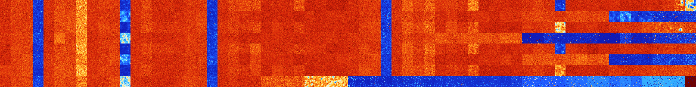

# B0458 (156160-156671)

<details>
    <summary>Initial Grid</summary>
    
</details>


<details>
    <summary>Initial Grid RLE</summary>

```
#C Exported from GoGoL (https://github.com/marrow16/gogol)
#C Wrap mode: Toroidal
#C Boundary mode: Dead
#C Step: 0
x = 100, y = 100, rule = B0458/S
37bo27bo$17bo10bo24bobo5bo2bo8bo$12bo37bo22bo3bo21bo$22bo4bo30bo$10b2o
39bo36bo$bo30bo16bo29bobo7bo$7bo2bo15bo54bo6bobo$24bo2bo$6bo32bo9bo$4bo
27bo19bo14bo4bo16bo$84bo$4bo21bo40bo16bo10b2obo$33b2o26bo10bo6bo2bo$13b
o10bo2bo53bo$6bo5bo7b3o59bo2bo$17bo13bo22bobo25bo7bo$10bo7bo18bo4b2o17b
o21bo3bo$23bo12bo5bo35bo7bo$bo13bo21bo48bo$7bo34bo36bo7bo$3bo28bo49b2o
3bo$12bo35bo11bo16bo2bo$8bo28bo2bo9bo5bo3bo8bobo15bo$34bo2bo17bo31bo$3b
o14b2o3bo7bo19bo34bo9b2o$11bo13bo12bo7bo$3bobo12bo8bo14bo14bo6bo5bo7bo$
65bo4bo11bo7bo$6bo4bo41b2o17bo4b2o7bo$7bo10bo5bo21bo3bo12bo16bo$55bo11b
o$56bo33bo$14bo34bo$11bo5bo5bo13bo31bo$35bo11bo29bo4bo11bo$15bo21bo14bo
17bo9bo16bo$3bo38bo22bo6bo3b2o15bob2o$41bo$68bobo$6bo43bo8bo26bo$25bo
10bo11bo4bo28bo16bo$7bo12bo50bo$17bo46bo$6bo6bo7bo42bo$17bo8bo3bo3bobo
22bo$3bo23bo29b2o18bo9bo10bo$bo4bo29bo$28bo5bo57bo$19bo60bo11bo$36bo30b
2o24bo$13bo18bobo6bo5bo14bo5bo27bo$bo7bo37bo18bo7bo21bo$2bo26bo7bo6bo
27bo$29bo2bo2bo6bo6bo28bo17bo$27bo12bo22bo17bo6bo$19bo23bo$23b2o30bo13b
o29bo$7bo31bo7bo16bobo28bo$31bo21bo$5bo4bo9bo10bo48bo8bo$36bo37bo$6bo
22bo12bo6b3o9bo37bo$46bo17bo25bo3b2o$43bo3bo9bo34bo2bo$2bo7bo2bo8bo24bo
$11bo3bo40bo22bo5bo$18bo3bo5bo10bo53bo$12bo4bo2bo21bobo22bo2bo2bo13bo$
14bo19bo4bo13bo11bo15bo$4bo32bo$6bo15bo29bo41bo2bo$25bo9bo12bo10bo$8bo
11bo9bo4bo58bo$23bo22bo35bo6bo$64bo15bo18bo$24bo18bo7bo21bo$9bo4bo10bo
31bo15bo20bo$36bo18bo2bo3bo16bo4bo$44bo33bo$15b2o2bo10bo2bo58bo2b2o$12b
o3bo5bo19bo17bo12bo$31bo6b2o4bobo28bo10bo$3bo17bo67bo$14bo38bo$12bo24bo
4bo13bo5bo7bo10bo$o14bo10bo16bo14bo24bo13bo$5bo11bobo10bo13bo6bo36bo2bo
$9bo32bo18bo27bo$26bo11bo56bo$4bobo49bo33b2o$2bo9bo43bo$9bo4bo29bo$18bo
31bo3bo18bo5bo6bo10bo$10bo2bo25bo8bo29bo16bo$54bo21bo$37bo18b2o11bo8bo
8bo9bo$4bo24bo33bo$12bo3bo14bo29bo10bo2bo10bo$15bo7bo$30bo7bo20bo11bo
14bo!
```
</details>
<details>
    <summary>Thumbnail</summary>

</details>
<table>
<tr>
    <td><a href="./156160%20S%20Heat%20Map%20Activity.png"></a><br>S (156160)<br>G>1000</td>    <td><a href="./156161%20S0%20Heat%20Map%20Activity.png"></a><br>S0 (156161)<br>G>1000</td>    <td><a href="./156162%20S1%20Heat%20Map%20Activity.png"></a><br>S1 (156162)<br>G>1000</td>    <td><a href="./156163%20S01%20Heat%20Map%20Activity.png"></a><br>S01 (156163)<br>R@93,p6</td>    <td><a href="./156164%20S2%20Heat%20Map%20Activity.png"></a><br>S2 (156164)<br>G>1000</td>    <td><a href="./156165%20S02%20Heat%20Map%20Activity.png"></a><br>S02 (156165)<br>G>1000</td>    <td><a href="./156166%20S12%20Heat%20Map%20Activity.png"></a><br>S12 (156166)<br>G>1000</td>    <td><a href="./156167%20S012%20Heat%20Map%20Activity.png"></a><br>S012 (156167)<br>G>1000</td>    <td><a href="./156168%20S3%20Heat%20Map%20Activity.png"></a><br>S3 (156168)<br>G>1000</td>    <td><a href="./156169%20S03%20Heat%20Map%20Activity.png"></a><br>S03 (156169)<br>G>1000</td>    <td><a href="./156170%20S13%20Heat%20Map%20Activity.png"></a><br>S13 (156170)<br>G>1000</td>    <td><a href="./156171%20S013%20Heat%20Map%20Activity.png"></a><br>S013 (156171)<br>R@348,p12</td>    <td><a href="./156172%20S23%20Heat%20Map%20Activity.png"></a><br>S23 (156172)<br>G>1000</td>    <td><a href="./156173%20S023%20Heat%20Map%20Activity.png"></a><br>S023 (156173)<br>G>1000</td>    <td><a href="./156174%20S123%20Heat%20Map%20Activity.png"></a><br>S123 (156174)<br>G>1000</td>    <td><a href="./156175%20S0123%20Heat%20Map%20Activity.png"></a><br>S0123 (156175)<br>G>1000</td>    <td><a href="./156176%20S4%20Heat%20Map%20Activity.png"></a><br>S4 (156176)<br>G>1000</td>    <td><a href="./156177%20S04%20Heat%20Map%20Activity.png"></a><br>S04 (156177)<br>G>1000</td>    <td><a href="./156178%20S14%20Heat%20Map%20Activity.png"></a><br>S14 (156178)<br>G>1000</td>    <td><a href="./156179%20S014%20Heat%20Map%20Activity.png"></a><br>S014 (156179)<br>R@201,p3</td>    <td><a href="./156180%20S24%20Heat%20Map%20Activity.png"></a><br>S24 (156180)<br>G>1000</td>    <td><a href="./156181%20S024%20Heat%20Map%20Activity.png"></a><br>S024 (156181)<br>G>1000</td>    <td><a href="./156182%20S124%20Heat%20Map%20Activity.png"></a><br>S124 (156182)<br>G>1000</td>    <td><a href="./156183%20S0124%20Heat%20Map%20Activity.png"></a><br>S0124 (156183)<br>G>1000</td>    <td><a href="./156184%20S34%20Heat%20Map%20Activity.png"></a><br>S34 (156184)<br>G>1000</td>    <td><a href="./156185%20S034%20Heat%20Map%20Activity.png"></a><br>S034 (156185)<br>G>1000</td>    <td><a href="./156186%20S134%20Heat%20Map%20Activity.png"></a><br>S134 (156186)<br>G>1000</td>    <td><a href="./156187%20S0134%20Heat%20Map%20Activity.png"></a><br>S0134 (156187)<br>G>1000</td>    <td><a href="./156188%20S234%20Heat%20Map%20Activity.png"></a><br>S234 (156188)<br>G>1000</td>    <td><a href="./156189%20S0234%20Heat%20Map%20Activity.png"></a><br>S0234 (156189)<br>G>1000</td>    <td><a href="./156190%20S1234%20Heat%20Map%20Activity.png"></a><br>S1234 (156190)<br>G>1000</td>    <td><a href="./156191%20S01234%20Heat%20Map%20Activity.png"></a><br>S01234 (156191)<br>G>1000</td>    <td><a href="./156192%20S5%20Heat%20Map%20Activity.png"></a><br>S5 (156192)<br>G>1000</td>    <td><a href="./156193%20S05%20Heat%20Map%20Activity.png"></a><br>S05 (156193)<br>G>1000</td>    <td><a href="./156194%20S15%20Heat%20Map%20Activity.png"></a><br>S15 (156194)<br>G>1000</td>    <td><a href="./156195%20S015%20Heat%20Map%20Activity.png"></a><br>S015 (156195)<br>R@81,p6</td>    <td><a href="./156196%20S25%20Heat%20Map%20Activity.png"></a><br>S25 (156196)<br>G>1000</td>    <td><a href="./156197%20S025%20Heat%20Map%20Activity.png"></a><br>S025 (156197)<br>G>1000</td>    <td><a href="./156198%20S125%20Heat%20Map%20Activity.png"></a><br>S125 (156198)<br>G>1000</td>    <td><a href="./156199%20S0125%20Heat%20Map%20Activity.png"></a><br>S0125 (156199)<br>G>1000</td>    <td><a href="./156200%20S35%20Heat%20Map%20Activity.png"></a><br>S35 (156200)<br>G>1000</td>    <td><a href="./156201%20S035%20Heat%20Map%20Activity.png"></a><br>S035 (156201)<br>G>1000</td>    <td><a href="./156202%20S135%20Heat%20Map%20Activity.png"></a><br>S135 (156202)<br>G>1000</td>    <td><a href="./156203%20S0135%20Heat%20Map%20Activity.png"></a><br>S0135 (156203)<br>G>1000</td>    <td><a href="./156204%20S235%20Heat%20Map%20Activity.png"></a><br>S235 (156204)<br>G>1000</td>    <td><a href="./156205%20S0235%20Heat%20Map%20Activity.png"></a><br>S0235 (156205)<br>G>1000</td>    <td><a href="./156206%20S1235%20Heat%20Map%20Activity.png"></a><br>S1235 (156206)<br>G>1000</td>    <td><a href="./156207%20S01235%20Heat%20Map%20Activity.png"></a><br>S01235 (156207)<br>G>1000</td>    <td><a href="./156208%20S45%20Heat%20Map%20Activity.png"></a><br>S45 (156208)<br>G>1000</td>    <td><a href="./156209%20S045%20Heat%20Map%20Activity.png"></a><br>S045 (156209)<br>G>1000</td>    <td><a href="./156210%20S145%20Heat%20Map%20Activity.png"></a><br>S145 (156210)<br>G>1000</td>    <td><a href="./156211%20S0145%20Heat%20Map%20Activity.png"></a><br>S0145 (156211)<br>R@569,p12</td>    <td><a href="./156212%20S245%20Heat%20Map%20Activity.png"></a><br>S245 (156212)<br>G>1000</td>    <td><a href="./156213%20S0245%20Heat%20Map%20Activity.png"></a><br>S0245 (156213)<br>G>1000</td>    <td><a href="./156214%20S1245%20Heat%20Map%20Activity.png"></a><br>S1245 (156214)<br>G>1000</td>    <td><a href="./156215%20S01245%20Heat%20Map%20Activity.png"></a><br>S01245 (156215)<br>G>1000</td>    <td><a href="./156216%20S345%20Heat%20Map%20Activity.png"></a><br>S345 (156216)<br>G>1000</td>    <td><a href="./156217%20S0345%20Heat%20Map%20Activity.png"></a><br>S0345 (156217)<br>G>1000</td>    <td><a href="./156218%20S1345%20Heat%20Map%20Activity.png"></a><br>S1345 (156218)<br>G>1000</td>    <td><a href="./156219%20S01345%20Heat%20Map%20Activity.png"></a><br>S01345 (156219)<br>G>1000</td>    <td><a href="./156220%20S2345%20Heat%20Map%20Activity.png"></a><br>S2345 (156220)<br>G>1000</td>    <td><a href="./156221%20S02345%20Heat%20Map%20Activity.png"></a><br>S02345 (156221)<br>G>1000</td>    <td><a href="./156222%20S12345%20Heat%20Map%20Activity.png"></a><br>S12345 (156222)<br>G>1000</td>    <td><a href="./156223%20S012345%20Heat%20Map%20Activity.png"></a><br>S012345 (156223)<br>G>1000</td></tr>
<tr>
    <td><a href="./156224%20S6%20Heat%20Map%20Activity.png"></a><br>S6 (156224)<br>G>1000</td>    <td><a href="./156225%20S06%20Heat%20Map%20Activity.png"></a><br>S06 (156225)<br>G>1000</td>    <td><a href="./156226%20S16%20Heat%20Map%20Activity.png"></a><br>S16 (156226)<br>G>1000</td>    <td><a href="./156227%20S016%20Heat%20Map%20Activity.png"></a><br>S016 (156227)<br>R@85,p6</td>    <td><a href="./156228%20S26%20Heat%20Map%20Activity.png"></a><br>S26 (156228)<br>G>1000</td>    <td><a href="./156229%20S026%20Heat%20Map%20Activity.png"></a><br>S026 (156229)<br>G>1000</td>    <td><a href="./156230%20S126%20Heat%20Map%20Activity.png"></a><br>S126 (156230)<br>G>1000</td>    <td><a href="./156231%20S0126%20Heat%20Map%20Activity.png"></a><br>S0126 (156231)<br>G>1000</td>    <td><a href="./156232%20S36%20Heat%20Map%20Activity.png"></a><br>S36 (156232)<br>G>1000</td>    <td><a href="./156233%20S036%20Heat%20Map%20Activity.png"></a><br>S036 (156233)<br>G>1000</td>    <td><a href="./156234%20S136%20Heat%20Map%20Activity.png"></a><br>S136 (156234)<br>G>1000</td>    <td><a href="./156235%20S0136%20Heat%20Map%20Activity.png"></a><br>S0136 (156235)<br>G>1000</td>    <td><a href="./156236%20S236%20Heat%20Map%20Activity.png"></a><br>S236 (156236)<br>G>1000</td>    <td><a href="./156237%20S0236%20Heat%20Map%20Activity.png"></a><br>S0236 (156237)<br>G>1000</td>    <td><a href="./156238%20S1236%20Heat%20Map%20Activity.png"></a><br>S1236 (156238)<br>G>1000</td>    <td><a href="./156239%20S01236%20Heat%20Map%20Activity.png"></a><br>S01236 (156239)<br>G>1000</td>    <td><a href="./156240%20S46%20Heat%20Map%20Activity.png"></a><br>S46 (156240)<br>G>1000</td>    <td><a href="./156241%20S046%20Heat%20Map%20Activity.png"></a><br>S046 (156241)<br>G>1000</td>    <td><a href="./156242%20S146%20Heat%20Map%20Activity.png"></a><br>S146 (156242)<br>G>1000</td>    <td><a href="./156243%20S0146%20Heat%20Map%20Activity.png"></a><br>S0146 (156243)<br>R@258,p42</td>    <td><a href="./156244%20S246%20Heat%20Map%20Activity.png"></a><br>S246 (156244)<br>G>1000</td>    <td><a href="./156245%20S0246%20Heat%20Map%20Activity.png"></a><br>S0246 (156245)<br>G>1000</td>    <td><a href="./156246%20S1246%20Heat%20Map%20Activity.png"></a><br>S1246 (156246)<br>G>1000</td>    <td><a href="./156247%20S01246%20Heat%20Map%20Activity.png"></a><br>S01246 (156247)<br>G>1000</td>    <td><a href="./156248%20S346%20Heat%20Map%20Activity.png"></a><br>S346 (156248)<br>G>1000</td>    <td><a href="./156249%20S0346%20Heat%20Map%20Activity.png"></a><br>S0346 (156249)<br>G>1000</td>    <td><a href="./156250%20S1346%20Heat%20Map%20Activity.png"></a><br>S1346 (156250)<br>G>1000</td>    <td><a href="./156251%20S01346%20Heat%20Map%20Activity.png"></a><br>S01346 (156251)<br>G>1000</td>    <td><a href="./156252%20S2346%20Heat%20Map%20Activity.png"></a><br>S2346 (156252)<br>G>1000</td>    <td><a href="./156253%20S02346%20Heat%20Map%20Activity.png"></a><br>S02346 (156253)<br>G>1000</td>    <td><a href="./156254%20S12346%20Heat%20Map%20Activity.png"></a><br>S12346 (156254)<br>G>1000</td>    <td><a href="./156255%20S012346%20Heat%20Map%20Activity.png"></a><br>S012346 (156255)<br>G>1000</td>    <td><a href="./156256%20S56%20Heat%20Map%20Activity.png"></a><br>S56 (156256)<br>G>1000</td>    <td><a href="./156257%20S056%20Heat%20Map%20Activity.png"></a><br>S056 (156257)<br>G>1000</td>    <td><a href="./156258%20S156%20Heat%20Map%20Activity.png"></a><br>S156 (156258)<br>G>1000</td>    <td><a href="./156259%20S0156%20Heat%20Map%20Activity.png"></a><br>S0156 (156259)<br>R@79,p6</td>    <td><a href="./156260%20S256%20Heat%20Map%20Activity.png"></a><br>S256 (156260)<br>G>1000</td>    <td><a href="./156261%20S0256%20Heat%20Map%20Activity.png"></a><br>S0256 (156261)<br>G>1000</td>    <td><a href="./156262%20S1256%20Heat%20Map%20Activity.png"></a><br>S1256 (156262)<br>G>1000</td>    <td><a href="./156263%20S01256%20Heat%20Map%20Activity.png"></a><br>S01256 (156263)<br>G>1000</td>    <td><a href="./156264%20S356%20Heat%20Map%20Activity.png"></a><br>S356 (156264)<br>G>1000</td>    <td><a href="./156265%20S0356%20Heat%20Map%20Activity.png"></a><br>S0356 (156265)<br>G>1000</td>    <td><a href="./156266%20S1356%20Heat%20Map%20Activity.png"></a><br>S1356 (156266)<br>G>1000</td>    <td><a href="./156267%20S01356%20Heat%20Map%20Activity.png"></a><br>S01356 (156267)<br>G>1000</td>    <td><a href="./156268%20S2356%20Heat%20Map%20Activity.png"></a><br>S2356 (156268)<br>G>1000</td>    <td><a href="./156269%20S02356%20Heat%20Map%20Activity.png"></a><br>S02356 (156269)<br>G>1000</td>    <td><a href="./156270%20S12356%20Heat%20Map%20Activity.png"></a><br>S12356 (156270)<br>G>1000</td>    <td><a href="./156271%20S012356%20Heat%20Map%20Activity.png"></a><br>S012356 (156271)<br>G>1000</td>    <td><a href="./156272%20S456%20Heat%20Map%20Activity.png"></a><br>S456 (156272)<br>G>1000</td>    <td><a href="./156273%20S0456%20Heat%20Map%20Activity.png"></a><br>S0456 (156273)<br>G>1000</td>    <td><a href="./156274%20S1456%20Heat%20Map%20Activity.png"></a><br>S1456 (156274)<br>G>1000</td>    <td><a href="./156275%20S01456%20Heat%20Map%20Activity.png"></a><br>S01456 (156275)<br>G>1000</td>    <td><a href="./156276%20S2456%20Heat%20Map%20Activity.png"></a><br>S2456 (156276)<br>G>1000</td>    <td><a href="./156277%20S02456%20Heat%20Map%20Activity.png"></a><br>S02456 (156277)<br>G>1000</td>    <td><a href="./156278%20S12456%20Heat%20Map%20Activity.png"></a><br>S12456 (156278)<br>G>1000</td>    <td><a href="./156279%20S012456%20Heat%20Map%20Activity.png"></a><br>S012456 (156279)<br>G>1000</td>    <td><a href="./156280%20S3456%20Heat%20Map%20Activity.png"></a><br>S3456 (156280)<br>G>1000</td>    <td><a href="./156281%20S03456%20Heat%20Map%20Activity.png"></a><br>S03456 (156281)<br>G>1000</td>    <td><a href="./156282%20S13456%20Heat%20Map%20Activity.png"></a><br>S13456 (156282)<br>R@932,p60</td>    <td><a href="./156283%20S013456%20Heat%20Map%20Activity.png"></a><br>S013456 (156283)<br>G>1000</td>    <td><a href="./156284%20S23456%20Heat%20Map%20Activity.png"></a><br>S23456 (156284)<br>R@79,p12</td>    <td><a href="./156285%20S023456%20Heat%20Map%20Activity.png"></a><br>S023456 (156285)<br>R@104,p60</td>    <td><a href="./156286%20S123456%20Heat%20Map%20Activity.png"></a><br>S123456 (156286)<br>R@101,p36</td>    <td><a href="./156287%20S0123456%20Heat%20Map%20Activity.png"></a><br>S0123456 (156287)<br>R@73,p24</td></tr>
<tr>
    <td><a href="./156288%20S7%20Heat%20Map%20Activity.png"></a><br>S7 (156288)<br>G>1000</td>    <td><a href="./156289%20S07%20Heat%20Map%20Activity.png"></a><br>S07 (156289)<br>G>1000</td>    <td><a href="./156290%20S17%20Heat%20Map%20Activity.png"></a><br>S17 (156290)<br>G>1000</td>    <td><a href="./156291%20S017%20Heat%20Map%20Activity.png"></a><br>S017 (156291)<br>R@80,p2</td>    <td><a href="./156292%20S27%20Heat%20Map%20Activity.png"></a><br>S27 (156292)<br>G>1000</td>    <td><a href="./156293%20S027%20Heat%20Map%20Activity.png"></a><br>S027 (156293)<br>G>1000</td>    <td><a href="./156294%20S127%20Heat%20Map%20Activity.png"></a><br>S127 (156294)<br>G>1000</td>    <td><a href="./156295%20S0127%20Heat%20Map%20Activity.png"></a><br>S0127 (156295)<br>G>1000</td>    <td><a href="./156296%20S37%20Heat%20Map%20Activity.png"></a><br>S37 (156296)<br>G>1000</td>    <td><a href="./156297%20S037%20Heat%20Map%20Activity.png"></a><br>S037 (156297)<br>G>1000</td>    <td><a href="./156298%20S137%20Heat%20Map%20Activity.png"></a><br>S137 (156298)<br>G>1000</td>    <td><a href="./156299%20S0137%20Heat%20Map%20Activity.png"></a><br>S0137 (156299)<br>R@736,p12</td>    <td><a href="./156300%20S237%20Heat%20Map%20Activity.png"></a><br>S237 (156300)<br>G>1000</td>    <td><a href="./156301%20S0237%20Heat%20Map%20Activity.png"></a><br>S0237 (156301)<br>G>1000</td>    <td><a href="./156302%20S1237%20Heat%20Map%20Activity.png"></a><br>S1237 (156302)<br>G>1000</td>    <td><a href="./156303%20S01237%20Heat%20Map%20Activity.png"></a><br>S01237 (156303)<br>G>1000</td>    <td><a href="./156304%20S47%20Heat%20Map%20Activity.png"></a><br>S47 (156304)<br>G>1000</td>    <td><a href="./156305%20S047%20Heat%20Map%20Activity.png"></a><br>S047 (156305)<br>G>1000</td>    <td><a href="./156306%20S147%20Heat%20Map%20Activity.png"></a><br>S147 (156306)<br>G>1000</td>    <td><a href="./156307%20S0147%20Heat%20Map%20Activity.png"></a><br>S0147 (156307)<br>R@122,p12</td>    <td><a href="./156308%20S247%20Heat%20Map%20Activity.png"></a><br>S247 (156308)<br>G>1000</td>    <td><a href="./156309%20S0247%20Heat%20Map%20Activity.png"></a><br>S0247 (156309)<br>G>1000</td>    <td><a href="./156310%20S1247%20Heat%20Map%20Activity.png"></a><br>S1247 (156310)<br>G>1000</td>    <td><a href="./156311%20S01247%20Heat%20Map%20Activity.png"></a><br>S01247 (156311)<br>G>1000</td>    <td><a href="./156312%20S347%20Heat%20Map%20Activity.png"></a><br>S347 (156312)<br>G>1000</td>    <td><a href="./156313%20S0347%20Heat%20Map%20Activity.png"></a><br>S0347 (156313)<br>G>1000</td>    <td><a href="./156314%20S1347%20Heat%20Map%20Activity.png"></a><br>S1347 (156314)<br>G>1000</td>    <td><a href="./156315%20S01347%20Heat%20Map%20Activity.png"></a><br>S01347 (156315)<br>G>1000</td>    <td><a href="./156316%20S2347%20Heat%20Map%20Activity.png"></a><br>S2347 (156316)<br>G>1000</td>    <td><a href="./156317%20S02347%20Heat%20Map%20Activity.png"></a><br>S02347 (156317)<br>G>1000</td>    <td><a href="./156318%20S12347%20Heat%20Map%20Activity.png"></a><br>S12347 (156318)<br>G>1000</td>    <td><a href="./156319%20S012347%20Heat%20Map%20Activity.png"></a><br>S012347 (156319)<br>G>1000</td>    <td><a href="./156320%20S57%20Heat%20Map%20Activity.png"></a><br>S57 (156320)<br>G>1000</td>    <td><a href="./156321%20S057%20Heat%20Map%20Activity.png"></a><br>S057 (156321)<br>G>1000</td>    <td><a href="./156322%20S157%20Heat%20Map%20Activity.png"></a><br>S157 (156322)<br>G>1000</td>    <td><a href="./156323%20S0157%20Heat%20Map%20Activity.png"></a><br>S0157 (156323)<br>R@89,p6</td>    <td><a href="./156324%20S257%20Heat%20Map%20Activity.png"></a><br>S257 (156324)<br>G>1000</td>    <td><a href="./156325%20S0257%20Heat%20Map%20Activity.png"></a><br>S0257 (156325)<br>G>1000</td>    <td><a href="./156326%20S1257%20Heat%20Map%20Activity.png"></a><br>S1257 (156326)<br>G>1000</td>    <td><a href="./156327%20S01257%20Heat%20Map%20Activity.png"></a><br>S01257 (156327)<br>G>1000</td>    <td><a href="./156328%20S357%20Heat%20Map%20Activity.png"></a><br>S357 (156328)<br>G>1000</td>    <td><a href="./156329%20S0357%20Heat%20Map%20Activity.png"></a><br>S0357 (156329)<br>G>1000</td>    <td><a href="./156330%20S1357%20Heat%20Map%20Activity.png"></a><br>S1357 (156330)<br>G>1000</td>    <td><a href="./156331%20S01357%20Heat%20Map%20Activity.png"></a><br>S01357 (156331)<br>G>1000</td>    <td><a href="./156332%20S2357%20Heat%20Map%20Activity.png"></a><br>S2357 (156332)<br>G>1000</td>    <td><a href="./156333%20S02357%20Heat%20Map%20Activity.png"></a><br>S02357 (156333)<br>G>1000</td>    <td><a href="./156334%20S12357%20Heat%20Map%20Activity.png"></a><br>S12357 (156334)<br>G>1000</td>    <td><a href="./156335%20S012357%20Heat%20Map%20Activity.png"></a><br>S012357 (156335)<br>G>1000</td>    <td><a href="./156336%20S457%20Heat%20Map%20Activity.png"></a><br>S457 (156336)<br>G>1000</td>    <td><a href="./156337%20S0457%20Heat%20Map%20Activity.png"></a><br>S0457 (156337)<br>G>1000</td>    <td><a href="./156338%20S1457%20Heat%20Map%20Activity.png"></a><br>S1457 (156338)<br>G>1000</td>    <td><a href="./156339%20S01457%20Heat%20Map%20Activity.png"></a><br>S01457 (156339)<br>G>1000</td>    <td><a href="./156340%20S2457%20Heat%20Map%20Activity.png"></a><br>S2457 (156340)<br>G>1000</td>    <td><a href="./156341%20S02457%20Heat%20Map%20Activity.png"></a><br>S02457 (156341)<br>G>1000</td>    <td><a href="./156342%20S12457%20Heat%20Map%20Activity.png"></a><br>S12457 (156342)<br>G>1000</td>    <td><a href="./156343%20S012457%20Heat%20Map%20Activity.png"></a><br>S012457 (156343)<br>G>1000</td>    <td><a href="./156344%20S3457%20Heat%20Map%20Activity.png"></a><br>S3457 (156344)<br>G>1000</td>    <td><a href="./156345%20S03457%20Heat%20Map%20Activity.png"></a><br>S03457 (156345)<br>G>1000</td>    <td><a href="./156346%20S13457%20Heat%20Map%20Activity.png"></a><br>S13457 (156346)<br>G>1000</td>    <td><a href="./156347%20S013457%20Heat%20Map%20Activity.png"></a><br>S013457 (156347)<br>G>1000</td>    <td><a href="./156348%20S23457%20Heat%20Map%20Activity.png"></a><br>S23457 (156348)<br>G>1000</td>    <td><a href="./156349%20S023457%20Heat%20Map%20Activity.png"></a><br>S023457 (156349)<br>G>1000</td>    <td><a href="./156350%20S123457%20Heat%20Map%20Activity.png"></a><br>S123457 (156350)<br>G>1000</td>    <td><a href="./156351%20S0123457%20Heat%20Map%20Activity.png"></a><br>S0123457 (156351)<br>G>1000</td></tr>
<tr>
    <td><a href="./156352%20S67%20Heat%20Map%20Activity.png"></a><br>S67 (156352)<br>G>1000</td>    <td><a href="./156353%20S067%20Heat%20Map%20Activity.png"></a><br>S067 (156353)<br>G>1000</td>    <td><a href="./156354%20S167%20Heat%20Map%20Activity.png"></a><br>S167 (156354)<br>G>1000</td>    <td><a href="./156355%20S0167%20Heat%20Map%20Activity.png"></a><br>S0167 (156355)<br>R@69,p2</td>    <td><a href="./156356%20S267%20Heat%20Map%20Activity.png"></a><br>S267 (156356)<br>G>1000</td>    <td><a href="./156357%20S0267%20Heat%20Map%20Activity.png"></a><br>S0267 (156357)<br>G>1000</td>    <td><a href="./156358%20S1267%20Heat%20Map%20Activity.png"></a><br>S1267 (156358)<br>G>1000</td>    <td><a href="./156359%20S01267%20Heat%20Map%20Activity.png"></a><br>S01267 (156359)<br>G>1000</td>    <td><a href="./156360%20S367%20Heat%20Map%20Activity.png"></a><br>S367 (156360)<br>G>1000</td>    <td><a href="./156361%20S0367%20Heat%20Map%20Activity.png"></a><br>S0367 (156361)<br>G>1000</td>    <td><a href="./156362%20S1367%20Heat%20Map%20Activity.png"></a><br>S1367 (156362)<br>G>1000</td>    <td><a href="./156363%20S01367%20Heat%20Map%20Activity.png"></a><br>S01367 (156363)<br>G>1000</td>    <td><a href="./156364%20S2367%20Heat%20Map%20Activity.png"></a><br>S2367 (156364)<br>G>1000</td>    <td><a href="./156365%20S02367%20Heat%20Map%20Activity.png"></a><br>S02367 (156365)<br>G>1000</td>    <td><a href="./156366%20S12367%20Heat%20Map%20Activity.png"></a><br>S12367 (156366)<br>G>1000</td>    <td><a href="./156367%20S012367%20Heat%20Map%20Activity.png"></a><br>S012367 (156367)<br>G>1000</td>    <td><a href="./156368%20S467%20Heat%20Map%20Activity.png"></a><br>S467 (156368)<br>G>1000</td>    <td><a href="./156369%20S0467%20Heat%20Map%20Activity.png"></a><br>S0467 (156369)<br>G>1000</td>    <td><a href="./156370%20S1467%20Heat%20Map%20Activity.png"></a><br>S1467 (156370)<br>G>1000</td>    <td><a href="./156371%20S01467%20Heat%20Map%20Activity.png"></a><br>S01467 (156371)<br>R@223,p12</td>    <td><a href="./156372%20S2467%20Heat%20Map%20Activity.png"></a><br>S2467 (156372)<br>G>1000</td>    <td><a href="./156373%20S02467%20Heat%20Map%20Activity.png"></a><br>S02467 (156373)<br>G>1000</td>    <td><a href="./156374%20S12467%20Heat%20Map%20Activity.png"></a><br>S12467 (156374)<br>G>1000</td>    <td><a href="./156375%20S012467%20Heat%20Map%20Activity.png"></a><br>S012467 (156375)<br>G>1000</td>    <td><a href="./156376%20S3467%20Heat%20Map%20Activity.png"></a><br>S3467 (156376)<br>G>1000</td>    <td><a href="./156377%20S03467%20Heat%20Map%20Activity.png"></a><br>S03467 (156377)<br>G>1000</td>    <td><a href="./156378%20S13467%20Heat%20Map%20Activity.png"></a><br>S13467 (156378)<br>G>1000</td>    <td><a href="./156379%20S013467%20Heat%20Map%20Activity.png"></a><br>S013467 (156379)<br>G>1000</td>    <td><a href="./156380%20S23467%20Heat%20Map%20Activity.png"></a><br>S23467 (156380)<br>G>1000</td>    <td><a href="./156381%20S023467%20Heat%20Map%20Activity.png"></a><br>S023467 (156381)<br>G>1000</td>    <td><a href="./156382%20S123467%20Heat%20Map%20Activity.png"></a><br>S123467 (156382)<br>G>1000</td>    <td><a href="./156383%20S0123467%20Heat%20Map%20Activity.png"></a><br>S0123467 (156383)<br>G>1000</td>    <td><a href="./156384%20S567%20Heat%20Map%20Activity.png"></a><br>S567 (156384)<br>G>1000</td>    <td><a href="./156385%20S0567%20Heat%20Map%20Activity.png"></a><br>S0567 (156385)<br>G>1000</td>    <td><a href="./156386%20S1567%20Heat%20Map%20Activity.png"></a><br>S1567 (156386)<br>G>1000</td>    <td><a href="./156387%20S01567%20Heat%20Map%20Activity.png"></a><br>S01567 (156387)<br>R@86,p12</td>    <td><a href="./156388%20S2567%20Heat%20Map%20Activity.png"></a><br>S2567 (156388)<br>G>1000</td>    <td><a href="./156389%20S02567%20Heat%20Map%20Activity.png"></a><br>S02567 (156389)<br>G>1000</td>    <td><a href="./156390%20S12567%20Heat%20Map%20Activity.png"></a><br>S12567 (156390)<br>G>1000</td>    <td><a href="./156391%20S012567%20Heat%20Map%20Activity.png"></a><br>S012567 (156391)<br>G>1000</td>    <td><a href="./156392%20S3567%20Heat%20Map%20Activity.png"></a><br>S3567 (156392)<br>G>1000</td>    <td><a href="./156393%20S03567%20Heat%20Map%20Activity.png"></a><br>S03567 (156393)<br>G>1000</td>    <td><a href="./156394%20S13567%20Heat%20Map%20Activity.png"></a><br>S13567 (156394)<br>G>1000</td>    <td><a href="./156395%20S013567%20Heat%20Map%20Activity.png"></a><br>S013567 (156395)<br>G>1000</td>    <td><a href="./156396%20S23567%20Heat%20Map%20Activity.png"></a><br>S23567 (156396)<br>G>1000</td>    <td><a href="./156397%20S023567%20Heat%20Map%20Activity.png"></a><br>S023567 (156397)<br>G>1000</td>    <td><a href="./156398%20S123567%20Heat%20Map%20Activity.png"></a><br>S123567 (156398)<br>G>1000</td>    <td><a href="./156399%20S0123567%20Heat%20Map%20Activity.png"></a><br>S0123567 (156399)<br>G>1000</td>    <td><a href="./156400%20S4567%20Heat%20Map%20Activity.png"></a><br>S4567 (156400)<br>R@493,p420</td>    <td><a href="./156401%20S04567%20Heat%20Map%20Activity.png"></a><br>S04567 (156401)<br>R@469,p420</td>    <td><a href="./156402%20S14567%20Heat%20Map%20Activity.png"></a><br>S14567 (156402)<br>R@72,p12</td>    <td><a href="./156403%20S014567%20Heat%20Map%20Activity.png"></a><br>S014567 (156403)<br>R@126,p60</td>    <td><a href="./156404%20S24567%20Heat%20Map%20Activity.png"></a><br>S24567 (156404)<br>R@115,p60</td>    <td><a href="./156405%20S024567%20Heat%20Map%20Activity.png"></a><br>S024567 (156405)<br>R@112,p60</td>    <td><a href="./156406%20S124567%20Heat%20Map%20Activity.png"></a><br>S124567 (156406)<br>R@118,p60</td>    <td><a href="./156407%20S0124567%20Heat%20Map%20Activity.png"></a><br>S0124567 (156407)<br>R@488,p420</td>    <td><a href="./156408%20S34567%20Heat%20Map%20Activity.png"></a><br>S34567 (156408)<br>R@446,p420</td>    <td><a href="./156409%20S034567%20Heat%20Map%20Activity.png"></a><br>S034567 (156409)<br>R@34,p12</td>    <td><a href="./156410%20S134567%20Heat%20Map%20Activity.png"></a><br>S134567 (156410)<br>R@107,p84</td>    <td><a href="./156411%20S0134567%20Heat%20Map%20Activity.png"></a><br>S0134567 (156411)<br>R@110,p84</td>    <td><a href="./156412%20S234567%20Heat%20Map%20Activity.png"></a><br>S234567 (156412)<br>R@32,p12</td>    <td><a href="./156413%20S0234567%20Heat%20Map%20Activity.png"></a><br>S0234567 (156413)<br>R@34,p12</td>    <td><a href="./156414%20S1234567%20Heat%20Map%20Activity.png"></a><br>S1234567 (156414)<br>R@29,p6</td>    <td><a href="./156415%20S01234567%20Heat%20Map%20Activity.png"></a><br>S01234567 (156415)<br>R@26,p6</td></tr>
<tr>
    <td><a href="./156416%20S8%20Heat%20Map%20Activity.png"></a><br>S8 (156416)<br>G>1000</td>    <td><a href="./156417%20S08%20Heat%20Map%20Activity.png"></a><br>S08 (156417)<br>G>1000</td>    <td><a href="./156418%20S18%20Heat%20Map%20Activity.png"></a><br>S18 (156418)<br>G>1000</td>    <td><a href="./156419%20S018%20Heat%20Map%20Activity.png"></a><br>S018 (156419)<br>R@95,p12</td>    <td><a href="./156420%20S28%20Heat%20Map%20Activity.png"></a><br>S28 (156420)<br>G>1000</td>    <td><a href="./156421%20S028%20Heat%20Map%20Activity.png"></a><br>S028 (156421)<br>G>1000</td>    <td><a href="./156422%20S128%20Heat%20Map%20Activity.png"></a><br>S128 (156422)<br>G>1000</td>    <td><a href="./156423%20S0128%20Heat%20Map%20Activity.png"></a><br>S0128 (156423)<br>G>1000</td>    <td><a href="./156424%20S38%20Heat%20Map%20Activity.png"></a><br>S38 (156424)<br>G>1000</td>    <td><a href="./156425%20S038%20Heat%20Map%20Activity.png"></a><br>S038 (156425)<br>G>1000</td>    <td><a href="./156426%20S138%20Heat%20Map%20Activity.png"></a><br>S138 (156426)<br>G>1000</td>    <td><a href="./156427%20S0138%20Heat%20Map%20Activity.png"></a><br>S0138 (156427)<br>R@791,p12</td>    <td><a href="./156428%20S238%20Heat%20Map%20Activity.png"></a><br>S238 (156428)<br>G>1000</td>    <td><a href="./156429%20S0238%20Heat%20Map%20Activity.png"></a><br>S0238 (156429)<br>G>1000</td>    <td><a href="./156430%20S1238%20Heat%20Map%20Activity.png"></a><br>S1238 (156430)<br>G>1000</td>    <td><a href="./156431%20S01238%20Heat%20Map%20Activity.png"></a><br>S01238 (156431)<br>G>1000</td>    <td><a href="./156432%20S48%20Heat%20Map%20Activity.png"></a><br>S48 (156432)<br>G>1000</td>    <td><a href="./156433%20S048%20Heat%20Map%20Activity.png"></a><br>S048 (156433)<br>G>1000</td>    <td><a href="./156434%20S148%20Heat%20Map%20Activity.png"></a><br>S148 (156434)<br>G>1000</td>    <td><a href="./156435%20S0148%20Heat%20Map%20Activity.png"></a><br>S0148 (156435)<br>R@136,p24</td>    <td><a href="./156436%20S248%20Heat%20Map%20Activity.png"></a><br>S248 (156436)<br>G>1000</td>    <td><a href="./156437%20S0248%20Heat%20Map%20Activity.png"></a><br>S0248 (156437)<br>G>1000</td>    <td><a href="./156438%20S1248%20Heat%20Map%20Activity.png"></a><br>S1248 (156438)<br>G>1000</td>    <td><a href="./156439%20S01248%20Heat%20Map%20Activity.png"></a><br>S01248 (156439)<br>G>1000</td>    <td><a href="./156440%20S348%20Heat%20Map%20Activity.png"></a><br>S348 (156440)<br>G>1000</td>    <td><a href="./156441%20S0348%20Heat%20Map%20Activity.png"></a><br>S0348 (156441)<br>G>1000</td>    <td><a href="./156442%20S1348%20Heat%20Map%20Activity.png"></a><br>S1348 (156442)<br>G>1000</td>    <td><a href="./156443%20S01348%20Heat%20Map%20Activity.png"></a><br>S01348 (156443)<br>G>1000</td>    <td><a href="./156444%20S2348%20Heat%20Map%20Activity.png"></a><br>S2348 (156444)<br>G>1000</td>    <td><a href="./156445%20S02348%20Heat%20Map%20Activity.png"></a><br>S02348 (156445)<br>G>1000</td>    <td><a href="./156446%20S12348%20Heat%20Map%20Activity.png"></a><br>S12348 (156446)<br>G>1000</td>    <td><a href="./156447%20S012348%20Heat%20Map%20Activity.png"></a><br>S012348 (156447)<br>G>1000</td>    <td><a href="./156448%20S58%20Heat%20Map%20Activity.png"></a><br>S58 (156448)<br>G>1000</td>    <td><a href="./156449%20S058%20Heat%20Map%20Activity.png"></a><br>S058 (156449)<br>G>1000</td>    <td><a href="./156450%20S158%20Heat%20Map%20Activity.png"></a><br>S158 (156450)<br>G>1000</td>    <td><a href="./156451%20S0158%20Heat%20Map%20Activity.png"></a><br>S0158 (156451)<br>R@69,p6</td>    <td><a href="./156452%20S258%20Heat%20Map%20Activity.png"></a><br>S258 (156452)<br>G>1000</td>    <td><a href="./156453%20S0258%20Heat%20Map%20Activity.png"></a><br>S0258 (156453)<br>G>1000</td>    <td><a href="./156454%20S1258%20Heat%20Map%20Activity.png"></a><br>S1258 (156454)<br>G>1000</td>    <td><a href="./156455%20S01258%20Heat%20Map%20Activity.png"></a><br>S01258 (156455)<br>G>1000</td>    <td><a href="./156456%20S358%20Heat%20Map%20Activity.png"></a><br>S358 (156456)<br>G>1000</td>    <td><a href="./156457%20S0358%20Heat%20Map%20Activity.png"></a><br>S0358 (156457)<br>G>1000</td>    <td><a href="./156458%20S1358%20Heat%20Map%20Activity.png"></a><br>S1358 (156458)<br>G>1000</td>    <td><a href="./156459%20S01358%20Heat%20Map%20Activity.png"></a><br>S01358 (156459)<br>G>1000</td>    <td><a href="./156460%20S2358%20Heat%20Map%20Activity.png"></a><br>S2358 (156460)<br>G>1000</td>    <td><a href="./156461%20S02358%20Heat%20Map%20Activity.png"></a><br>S02358 (156461)<br>G>1000</td>    <td><a href="./156462%20S12358%20Heat%20Map%20Activity.png"></a><br>S12358 (156462)<br>G>1000</td>    <td><a href="./156463%20S012358%20Heat%20Map%20Activity.png"></a><br>S012358 (156463)<br>G>1000</td>    <td><a href="./156464%20S458%20Heat%20Map%20Activity.png"></a><br>S458 (156464)<br>G>1000</td>    <td><a href="./156465%20S0458%20Heat%20Map%20Activity.png"></a><br>S0458 (156465)<br>G>1000</td>    <td><a href="./156466%20S1458%20Heat%20Map%20Activity.png"></a><br>S1458 (156466)<br>G>1000</td>    <td><a href="./156467%20S01458%20Heat%20Map%20Activity.png"></a><br>S01458 (156467)<br>R@583,p84</td>    <td><a href="./156468%20S2458%20Heat%20Map%20Activity.png"></a><br>S2458 (156468)<br>G>1000</td>    <td><a href="./156469%20S02458%20Heat%20Map%20Activity.png"></a><br>S02458 (156469)<br>G>1000</td>    <td><a href="./156470%20S12458%20Heat%20Map%20Activity.png"></a><br>S12458 (156470)<br>G>1000</td>    <td><a href="./156471%20S012458%20Heat%20Map%20Activity.png"></a><br>S012458 (156471)<br>G>1000</td>    <td><a href="./156472%20S3458%20Heat%20Map%20Activity.png"></a><br>S3458 (156472)<br>G>1000</td>    <td><a href="./156473%20S03458%20Heat%20Map%20Activity.png"></a><br>S03458 (156473)<br>G>1000</td>    <td><a href="./156474%20S13458%20Heat%20Map%20Activity.png"></a><br>S13458 (156474)<br>G>1000</td>    <td><a href="./156475%20S013458%20Heat%20Map%20Activity.png"></a><br>S013458 (156475)<br>G>1000</td>    <td><a href="./156476%20S23458%20Heat%20Map%20Activity.png"></a><br>S23458 (156476)<br>G>1000</td>    <td><a href="./156477%20S023458%20Heat%20Map%20Activity.png"></a><br>S023458 (156477)<br>G>1000</td>    <td><a href="./156478%20S123458%20Heat%20Map%20Activity.png"></a><br>S123458 (156478)<br>G>1000</td>    <td><a href="./156479%20S0123458%20Heat%20Map%20Activity.png"></a><br>S0123458 (156479)<br>G>1000</td></tr>
<tr>
    <td><a href="./156480%20S68%20Heat%20Map%20Activity.png"></a><br>S68 (156480)<br>G>1000</td>    <td><a href="./156481%20S068%20Heat%20Map%20Activity.png"></a><br>S068 (156481)<br>G>1000</td>    <td><a href="./156482%20S168%20Heat%20Map%20Activity.png"></a><br>S168 (156482)<br>G>1000</td>    <td><a href="./156483%20S0168%20Heat%20Map%20Activity.png"></a><br>S0168 (156483)<br>R@75,p6</td>    <td><a href="./156484%20S268%20Heat%20Map%20Activity.png"></a><br>S268 (156484)<br>G>1000</td>    <td><a href="./156485%20S0268%20Heat%20Map%20Activity.png"></a><br>S0268 (156485)<br>G>1000</td>    <td><a href="./156486%20S1268%20Heat%20Map%20Activity.png"></a><br>S1268 (156486)<br>G>1000</td>    <td><a href="./156487%20S01268%20Heat%20Map%20Activity.png"></a><br>S01268 (156487)<br>G>1000</td>    <td><a href="./156488%20S368%20Heat%20Map%20Activity.png"></a><br>S368 (156488)<br>G>1000</td>    <td><a href="./156489%20S0368%20Heat%20Map%20Activity.png"></a><br>S0368 (156489)<br>G>1000</td>    <td><a href="./156490%20S1368%20Heat%20Map%20Activity.png"></a><br>S1368 (156490)<br>G>1000</td>    <td><a href="./156491%20S01368%20Heat%20Map%20Activity.png"></a><br>S01368 (156491)<br>G>1000</td>    <td><a href="./156492%20S2368%20Heat%20Map%20Activity.png"></a><br>S2368 (156492)<br>G>1000</td>    <td><a href="./156493%20S02368%20Heat%20Map%20Activity.png"></a><br>S02368 (156493)<br>G>1000</td>    <td><a href="./156494%20S12368%20Heat%20Map%20Activity.png"></a><br>S12368 (156494)<br>G>1000</td>    <td><a href="./156495%20S012368%20Heat%20Map%20Activity.png"></a><br>S012368 (156495)<br>G>1000</td>    <td><a href="./156496%20S468%20Heat%20Map%20Activity.png"></a><br>S468 (156496)<br>G>1000</td>    <td><a href="./156497%20S0468%20Heat%20Map%20Activity.png"></a><br>S0468 (156497)<br>G>1000</td>    <td><a href="./156498%20S1468%20Heat%20Map%20Activity.png"></a><br>S1468 (156498)<br>G>1000</td>    <td><a href="./156499%20S01468%20Heat%20Map%20Activity.png"></a><br>S01468 (156499)<br>R@145,p12</td>    <td><a href="./156500%20S2468%20Heat%20Map%20Activity.png"></a><br>S2468 (156500)<br>G>1000</td>    <td><a href="./156501%20S02468%20Heat%20Map%20Activity.png"></a><br>S02468 (156501)<br>G>1000</td>    <td><a href="./156502%20S12468%20Heat%20Map%20Activity.png"></a><br>S12468 (156502)<br>G>1000</td>    <td><a href="./156503%20S012468%20Heat%20Map%20Activity.png"></a><br>S012468 (156503)<br>G>1000</td>    <td><a href="./156504%20S3468%20Heat%20Map%20Activity.png"></a><br>S3468 (156504)<br>G>1000</td>    <td><a href="./156505%20S03468%20Heat%20Map%20Activity.png"></a><br>S03468 (156505)<br>G>1000</td>    <td><a href="./156506%20S13468%20Heat%20Map%20Activity.png"></a><br>S13468 (156506)<br>G>1000</td>    <td><a href="./156507%20S013468%20Heat%20Map%20Activity.png"></a><br>S013468 (156507)<br>G>1000</td>    <td><a href="./156508%20S23468%20Heat%20Map%20Activity.png"></a><br>S23468 (156508)<br>G>1000</td>    <td><a href="./156509%20S023468%20Heat%20Map%20Activity.png"></a><br>S023468 (156509)<br>G>1000</td>    <td><a href="./156510%20S123468%20Heat%20Map%20Activity.png"></a><br>S123468 (156510)<br>G>1000</td>    <td><a href="./156511%20S0123468%20Heat%20Map%20Activity.png"></a><br>S0123468 (156511)<br>G>1000</td>    <td><a href="./156512%20S568%20Heat%20Map%20Activity.png"></a><br>S568 (156512)<br>G>1000</td>    <td><a href="./156513%20S0568%20Heat%20Map%20Activity.png"></a><br>S0568 (156513)<br>G>1000</td>    <td><a href="./156514%20S1568%20Heat%20Map%20Activity.png"></a><br>S1568 (156514)<br>G>1000</td>    <td><a href="./156515%20S01568%20Heat%20Map%20Activity.png"></a><br>S01568 (156515)<br>R@107,p6</td>    <td><a href="./156516%20S2568%20Heat%20Map%20Activity.png"></a><br>S2568 (156516)<br>G>1000</td>    <td><a href="./156517%20S02568%20Heat%20Map%20Activity.png"></a><br>S02568 (156517)<br>G>1000</td>    <td><a href="./156518%20S12568%20Heat%20Map%20Activity.png"></a><br>S12568 (156518)<br>G>1000</td>    <td><a href="./156519%20S012568%20Heat%20Map%20Activity.png"></a><br>S012568 (156519)<br>G>1000</td>    <td><a href="./156520%20S3568%20Heat%20Map%20Activity.png"></a><br>S3568 (156520)<br>G>1000</td>    <td><a href="./156521%20S03568%20Heat%20Map%20Activity.png"></a><br>S03568 (156521)<br>G>1000</td>    <td><a href="./156522%20S13568%20Heat%20Map%20Activity.png"></a><br>S13568 (156522)<br>G>1000</td>    <td><a href="./156523%20S013568%20Heat%20Map%20Activity.png"></a><br>S013568 (156523)<br>G>1000</td>    <td><a href="./156524%20S23568%20Heat%20Map%20Activity.png"></a><br>S23568 (156524)<br>G>1000</td>    <td><a href="./156525%20S023568%20Heat%20Map%20Activity.png"></a><br>S023568 (156525)<br>G>1000</td>    <td><a href="./156526%20S123568%20Heat%20Map%20Activity.png"></a><br>S123568 (156526)<br>G>1000</td>    <td><a href="./156527%20S0123568%20Heat%20Map%20Activity.png"></a><br>S0123568 (156527)<br>G>1000</td>    <td><a href="./156528%20S4568%20Heat%20Map%20Activity.png"></a><br>S4568 (156528)<br>G>1000</td>    <td><a href="./156529%20S04568%20Heat%20Map%20Activity.png"></a><br>S04568 (156529)<br>G>1000</td>    <td><a href="./156530%20S14568%20Heat%20Map%20Activity.png"></a><br>S14568 (156530)<br>G>1000</td>    <td><a href="./156531%20S014568%20Heat%20Map%20Activity.png"></a><br>S014568 (156531)<br>G>1000</td>    <td><a href="./156532%20S24568%20Heat%20Map%20Activity.png"></a><br>S24568 (156532)<br>G>1000</td>    <td><a href="./156533%20S024568%20Heat%20Map%20Activity.png"></a><br>S024568 (156533)<br>G>1000</td>    <td><a href="./156534%20S124568%20Heat%20Map%20Activity.png"></a><br>S124568 (156534)<br>G>1000</td>    <td><a href="./156535%20S0124568%20Heat%20Map%20Activity.png"></a><br>S0124568 (156535)<br>G>1000</td>    <td><a href="./156536%20S34568%20Heat%20Map%20Activity.png"></a><br>S34568 (156536)<br>R@219,p60</td>    <td><a href="./156537%20S034568%20Heat%20Map%20Activity.png"></a><br>S034568 (156537)<br>R@200,p60</td>    <td><a href="./156538%20S134568%20Heat%20Map%20Activity.png"></a><br>S134568 (156538)<br>R@210,p30</td>    <td><a href="./156539%20S0134568%20Heat%20Map%20Activity.png"></a><br>S0134568 (156539)<br>R@239,p60</td>    <td><a href="./156540%20S234568%20Heat%20Map%20Activity.png"></a><br>S234568 (156540)<br>R@48,p4</td>    <td><a href="./156541%20S0234568%20Heat%20Map%20Activity.png"></a><br>S0234568 (156541)<br>R@46,p12</td>    <td><a href="./156542%20S1234568%20Heat%20Map%20Activity.png"></a><br>S1234568 (156542)<br>R@51,p14</td>    <td><a href="./156543%20S01234568%20Heat%20Map%20Activity.png"></a><br>S01234568 (156543)<br>R@38,p4</td></tr>
<tr>
    <td><a href="./156544%20S78%20Heat%20Map%20Activity.png"></a><br>S78 (156544)<br>G>1000</td>    <td><a href="./156545%20S078%20Heat%20Map%20Activity.png"></a><br>S078 (156545)<br>G>1000</td>    <td><a href="./156546%20S178%20Heat%20Map%20Activity.png"></a><br>S178 (156546)<br>G>1000</td>    <td><a href="./156547%20S0178%20Heat%20Map%20Activity.png"></a><br>S0178 (156547)<br>R@123,p6</td>    <td><a href="./156548%20S278%20Heat%20Map%20Activity.png"></a><br>S278 (156548)<br>G>1000</td>    <td><a href="./156549%20S0278%20Heat%20Map%20Activity.png"></a><br>S0278 (156549)<br>G>1000</td>    <td><a href="./156550%20S1278%20Heat%20Map%20Activity.png"></a><br>S1278 (156550)<br>G>1000</td>    <td><a href="./156551%20S01278%20Heat%20Map%20Activity.png"></a><br>S01278 (156551)<br>G>1000</td>    <td><a href="./156552%20S378%20Heat%20Map%20Activity.png"></a><br>S378 (156552)<br>G>1000</td>    <td><a href="./156553%20S0378%20Heat%20Map%20Activity.png"></a><br>S0378 (156553)<br>G>1000</td>    <td><a href="./156554%20S1378%20Heat%20Map%20Activity.png"></a><br>S1378 (156554)<br>G>1000</td>    <td><a href="./156555%20S01378%20Heat%20Map%20Activity.png"></a><br>S01378 (156555)<br>R@814,p4</td>    <td><a href="./156556%20S2378%20Heat%20Map%20Activity.png"></a><br>S2378 (156556)<br>G>1000</td>    <td><a href="./156557%20S02378%20Heat%20Map%20Activity.png"></a><br>S02378 (156557)<br>G>1000</td>    <td><a href="./156558%20S12378%20Heat%20Map%20Activity.png"></a><br>S12378 (156558)<br>G>1000</td>    <td><a href="./156559%20S012378%20Heat%20Map%20Activity.png"></a><br>S012378 (156559)<br>G>1000</td>    <td><a href="./156560%20S478%20Heat%20Map%20Activity.png"></a><br>S478 (156560)<br>G>1000</td>    <td><a href="./156561%20S0478%20Heat%20Map%20Activity.png"></a><br>S0478 (156561)<br>G>1000</td>    <td><a href="./156562%20S1478%20Heat%20Map%20Activity.png"></a><br>S1478 (156562)<br>G>1000</td>    <td><a href="./156563%20S01478%20Heat%20Map%20Activity.png"></a><br>S01478 (156563)<br>R@217,p12</td>    <td><a href="./156564%20S2478%20Heat%20Map%20Activity.png"></a><br>S2478 (156564)<br>G>1000</td>    <td><a href="./156565%20S02478%20Heat%20Map%20Activity.png"></a><br>S02478 (156565)<br>G>1000</td>    <td><a href="./156566%20S12478%20Heat%20Map%20Activity.png"></a><br>S12478 (156566)<br>G>1000</td>    <td><a href="./156567%20S012478%20Heat%20Map%20Activity.png"></a><br>S012478 (156567)<br>G>1000</td>    <td><a href="./156568%20S3478%20Heat%20Map%20Activity.png"></a><br>S3478 (156568)<br>G>1000</td>    <td><a href="./156569%20S03478%20Heat%20Map%20Activity.png"></a><br>S03478 (156569)<br>G>1000</td>    <td><a href="./156570%20S13478%20Heat%20Map%20Activity.png"></a><br>S13478 (156570)<br>G>1000</td>    <td><a href="./156571%20S013478%20Heat%20Map%20Activity.png"></a><br>S013478 (156571)<br>G>1000</td>    <td><a href="./156572%20S23478%20Heat%20Map%20Activity.png"></a><br>S23478 (156572)<br>G>1000</td>    <td><a href="./156573%20S023478%20Heat%20Map%20Activity.png"></a><br>S023478 (156573)<br>G>1000</td>    <td><a href="./156574%20S123478%20Heat%20Map%20Activity.png"></a><br>S123478 (156574)<br>G>1000</td>    <td><a href="./156575%20S0123478%20Heat%20Map%20Activity.png"></a><br>S0123478 (156575)<br>G>1000</td>    <td><a href="./156576%20S578%20Heat%20Map%20Activity.png"></a><br>S578 (156576)<br>G>1000</td>    <td><a href="./156577%20S0578%20Heat%20Map%20Activity.png"></a><br>S0578 (156577)<br>G>1000</td>    <td><a href="./156578%20S1578%20Heat%20Map%20Activity.png"></a><br>S1578 (156578)<br>G>1000</td>    <td><a href="./156579%20S01578%20Heat%20Map%20Activity.png"></a><br>S01578 (156579)<br>R@100,p12</td>    <td><a href="./156580%20S2578%20Heat%20Map%20Activity.png"></a><br>S2578 (156580)<br>G>1000</td>    <td><a href="./156581%20S02578%20Heat%20Map%20Activity.png"></a><br>S02578 (156581)<br>G>1000</td>    <td><a href="./156582%20S12578%20Heat%20Map%20Activity.png"></a><br>S12578 (156582)<br>G>1000</td>    <td><a href="./156583%20S012578%20Heat%20Map%20Activity.png"></a><br>S012578 (156583)<br>G>1000</td>    <td><a href="./156584%20S3578%20Heat%20Map%20Activity.png"></a><br>S3578 (156584)<br>G>1000</td>    <td><a href="./156585%20S03578%20Heat%20Map%20Activity.png"></a><br>S03578 (156585)<br>G>1000</td>    <td><a href="./156586%20S13578%20Heat%20Map%20Activity.png"></a><br>S13578 (156586)<br>G>1000</td>    <td><a href="./156587%20S013578%20Heat%20Map%20Activity.png"></a><br>S013578 (156587)<br>G>1000</td>    <td><a href="./156588%20S23578%20Heat%20Map%20Activity.png"></a><br>S23578 (156588)<br>G>1000</td>    <td><a href="./156589%20S023578%20Heat%20Map%20Activity.png"></a><br>S023578 (156589)<br>G>1000</td>    <td><a href="./156590%20S123578%20Heat%20Map%20Activity.png"></a><br>S123578 (156590)<br>G>1000</td>    <td><a href="./156591%20S0123578%20Heat%20Map%20Activity.png"></a><br>S0123578 (156591)<br>G>1000</td>    <td><a href="./156592%20S4578%20Heat%20Map%20Activity.png"></a><br>S4578 (156592)<br>G>1000</td>    <td><a href="./156593%20S04578%20Heat%20Map%20Activity.png"></a><br>S04578 (156593)<br>G>1000</td>    <td><a href="./156594%20S14578%20Heat%20Map%20Activity.png"></a><br>S14578 (156594)<br>G>1000</td>    <td><a href="./156595%20S014578%20Heat%20Map%20Activity.png"></a><br>S014578 (156595)<br>G>1000</td>    <td><a href="./156596%20S24578%20Heat%20Map%20Activity.png"></a><br>S24578 (156596)<br>G>1000</td>    <td><a href="./156597%20S024578%20Heat%20Map%20Activity.png"></a><br>S024578 (156597)<br>G>1000</td>    <td><a href="./156598%20S124578%20Heat%20Map%20Activity.png"></a><br>S124578 (156598)<br>G>1000</td>    <td><a href="./156599%20S0124578%20Heat%20Map%20Activity.png"></a><br>S0124578 (156599)<br>G>1000</td>    <td><a href="./156600%20S34578%20Heat%20Map%20Activity.png"></a><br>S34578 (156600)<br>G>1000</td>    <td><a href="./156601%20S034578%20Heat%20Map%20Activity.png"></a><br>S034578 (156601)<br>G>1000</td>    <td><a href="./156602%20S134578%20Heat%20Map%20Activity.png"></a><br>S134578 (156602)<br>G>1000</td>    <td><a href="./156603%20S0134578%20Heat%20Map%20Activity.png"></a><br>S0134578 (156603)<br>G>1000</td>    <td><a href="./156604%20S234578%20Heat%20Map%20Activity.png"></a><br>S234578 (156604)<br>G>1000</td>    <td><a href="./156605%20S0234578%20Heat%20Map%20Activity.png"></a><br>S0234578 (156605)<br>G>1000</td>    <td><a href="./156606%20S1234578%20Heat%20Map%20Activity.png"></a><br>S1234578 (156606)<br>G>1000</td>    <td><a href="./156607%20S01234578%20Heat%20Map%20Activity.png"></a><br>S01234578 (156607)<br>G>1000</td></tr>
<tr>
    <td><a href="./156608%20S678%20Heat%20Map%20Activity.png"></a><br>S678 (156608)<br>G>1000</td>    <td><a href="./156609%20S0678%20Heat%20Map%20Activity.png"></a><br>S0678 (156609)<br>G>1000</td>    <td><a href="./156610%20S1678%20Heat%20Map%20Activity.png"></a><br>S1678 (156610)<br>G>1000</td>    <td><a href="./156611%20S01678%20Heat%20Map%20Activity.png"></a><br>S01678 (156611)<br>R@74,p6</td>    <td><a href="./156612%20S2678%20Heat%20Map%20Activity.png"></a><br>S2678 (156612)<br>G>1000</td>    <td><a href="./156613%20S02678%20Heat%20Map%20Activity.png"></a><br>S02678 (156613)<br>G>1000</td>    <td><a href="./156614%20S12678%20Heat%20Map%20Activity.png"></a><br>S12678 (156614)<br>G>1000</td>    <td><a href="./156615%20S012678%20Heat%20Map%20Activity.png"></a><br>S012678 (156615)<br>G>1000</td>    <td><a href="./156616%20S3678%20Heat%20Map%20Activity.png"></a><br>S3678 (156616)<br>G>1000</td>    <td><a href="./156617%20S03678%20Heat%20Map%20Activity.png"></a><br>S03678 (156617)<br>G>1000</td>    <td><a href="./156618%20S13678%20Heat%20Map%20Activity.png"></a><br>S13678 (156618)<br>G>1000</td>    <td><a href="./156619%20S013678%20Heat%20Map%20Activity.png"></a><br>S013678 (156619)<br>G>1000</td>    <td><a href="./156620%20S23678%20Heat%20Map%20Activity.png"></a><br>S23678 (156620)<br>G>1000</td>    <td><a href="./156621%20S023678%20Heat%20Map%20Activity.png"></a><br>S023678 (156621)<br>G>1000</td>    <td><a href="./156622%20S123678%20Heat%20Map%20Activity.png"></a><br>S123678 (156622)<br>G>1000</td>    <td><a href="./156623%20S0123678%20Heat%20Map%20Activity.png"></a><br>S0123678 (156623)<br>G>1000</td>    <td><a href="./156624%20S4678%20Heat%20Map%20Activity.png"></a><br>S4678 (156624)<br>G>1000</td>    <td><a href="./156625%20S04678%20Heat%20Map%20Activity.png"></a><br>S04678 (156625)<br>G>1000</td>    <td><a href="./156626%20S14678%20Heat%20Map%20Activity.png"></a><br>S14678 (156626)<br>G>1000</td>    <td><a href="./156627%20S014678%20Heat%20Map%20Activity.png"></a><br>S014678 (156627)<br>R@211,p12</td>    <td><a href="./156628%20S24678%20Heat%20Map%20Activity.png"></a><br>S24678 (156628)<br>G>1000</td>    <td><a href="./156629%20S024678%20Heat%20Map%20Activity.png"></a><br>S024678 (156629)<br>G>1000</td>    <td><a href="./156630%20S124678%20Heat%20Map%20Activity.png"></a><br>S124678 (156630)<br>G>1000</td>    <td><a href="./156631%20S0124678%20Heat%20Map%20Activity.png"></a><br>S0124678 (156631)<br>G>1000</td>    <td><a href="./156632%20S34678%20Heat%20Map%20Activity.png"></a><br>S34678 (156632)<br>G>1000</td>    <td><a href="./156633%20S034678%20Heat%20Map%20Activity.png"></a><br>S034678 (156633)<br>G>1000</td>    <td><a href="./156634%20S134678%20Heat%20Map%20Activity.png"></a><br>S134678 (156634)<br>G>1000</td>    <td><a href="./156635%20S0134678%20Heat%20Map%20Activity.png"></a><br>S0134678 (156635)<br>G>1000</td>    <td><a href="./156636%20S234678%20Heat%20Map%20Activity.png"></a><br>S234678 (156636)<br>G>1000</td>    <td><a href="./156637%20S0234678%20Heat%20Map%20Activity.png"></a><br>S0234678 (156637)<br>G>1000</td>    <td><a href="./156638%20S1234678%20Heat%20Map%20Activity.png"></a><br>S1234678 (156638)<br>G>1000</td>    <td><a href="./156639%20S01234678%20Heat%20Map%20Activity.png"></a><br>S01234678 (156639)<br>G>1000</td>    <td><a href="./156640%20S5678%20Heat%20Map%20Activity.png"></a><br>S5678 (156640)<br>R@49,p2</td>    <td><a href="./156641%20S05678%20Heat%20Map%20Activity.png"></a><br>S05678 (156641)<br>R@56,p2</td>    <td><a href="./156642%20S15678%20Heat%20Map%20Activity.png"></a><br>S15678 (156642)<br>R@38,p2</td>    <td><a href="./156643%20S015678%20Heat%20Map%20Activity.png"></a><br>S015678 (156643)<br>R@52,p4</td>    <td><a href="./156644%20S25678%20Heat%20Map%20Activity.png"></a><br>S25678 (156644)<br>R@32,p2</td>    <td><a href="./156645%20S025678%20Heat%20Map%20Activity.png"></a><br>S025678 (156645)<br>R@29,p2</td>    <td><a href="./156646%20S125678%20Heat%20Map%20Activity.png"></a><br>S125678 (156646)<br>R@22,p2</td>    <td><a href="./156647%20S0125678%20Heat%20Map%20Activity.png"></a><br>S0125678 (156647)<br>R@32,p4</td>    <td><a href="./156648%20S35678%20Heat%20Map%20Activity.png"></a><br>S35678 (156648)<br>R@25,p4</td>    <td><a href="./156649%20S035678%20Heat%20Map%20Activity.png"></a><br>S035678 (156649)<br>R@20,p2</td>    <td><a href="./156650%20S135678%20Heat%20Map%20Activity.png"></a><br>S135678 (156650)<br>R@21,p4</td>    <td><a href="./156651%20S0135678%20Heat%20Map%20Activity.png"></a><br>S0135678 (156651)<br>R@24,p4</td>    <td><a href="./156652%20S235678%20Heat%20Map%20Activity.png"></a><br>S235678 (156652)<br>R@20,p4</td>    <td><a href="./156653%20S0235678%20Heat%20Map%20Activity.png"></a><br>S0235678 (156653)<br>R@17,p2</td>    <td><a href="./156654%20S1235678%20Heat%20Map%20Activity.png"></a><br>S1235678 (156654)<br>R@21,p4</td>    <td><a href="./156655%20S01235678%20Heat%20Map%20Activity.png"></a><br>S01235678 (156655)<br>R@17,p2</td>    <td><a href="./156656%20S45678%20Heat%20Map%20Activity.png"></a><br>S45678 (156656)<br>S@11</td>    <td><a href="./156657%20S045678%20Heat%20Map%20Activity.png"></a><br>S045678 (156657)<br>S@10</td>    <td><a href="./156658%20S145678%20Heat%20Map%20Activity.png"></a><br>S145678 (156658)<br>S@11</td>    <td><a href="./156659%20S0145678%20Heat%20Map%20Activity.png"></a><br>S0145678 (156659)<br>S@9</td>    <td><a href="./156660%20S245678%20Heat%20Map%20Activity.png"></a><br>S245678 (156660)<br>S@9</td>    <td><a href="./156661%20S0245678%20Heat%20Map%20Activity.png"></a><br>S0245678 (156661)<br>S@10</td>    <td><a href="./156662%20S1245678%20Heat%20Map%20Activity.png"></a><br>S1245678 (156662)<br>S@7</td>    <td><a href="./156663%20S01245678%20Heat%20Map%20Activity.png"></a><br>S01245678 (156663)<br>S@9</td>    <td><a href="./156664%20S345678%20Heat%20Map%20Activity.png"></a><br>S345678 (156664)<br>S@8</td>    <td><a href="./156665%20S0345678%20Heat%20Map%20Activity.png"></a><br>S0345678 (156665)<br>S@8</td>    <td><a href="./156666%20S1345678%20Heat%20Map%20Activity.png"></a><br>S1345678 (156666)<br>S@8</td>    <td><a href="./156667%20S01345678%20Heat%20Map%20Activity.png"></a><br>S01345678 (156667)<br>S@8</td>    <td><a href="./156668%20S2345678%20Heat%20Map%20Activity.png"></a><br>S2345678 (156668)<br>S@7</td>    <td><a href="./156669%20S02345678%20Heat%20Map%20Activity.png"></a><br>S02345678 (156669)<br>S@8</td>    <td><a href="./156670%20S12345678%20Heat%20Map%20Activity.png"></a><br>S12345678 (156670)<br>S@6</td>    <td><a href="./156671%20S012345678%20Heat%20Map%20Activity.png"></a><br>S012345678 (156671)<br>S@7</td></tr>
</table>
