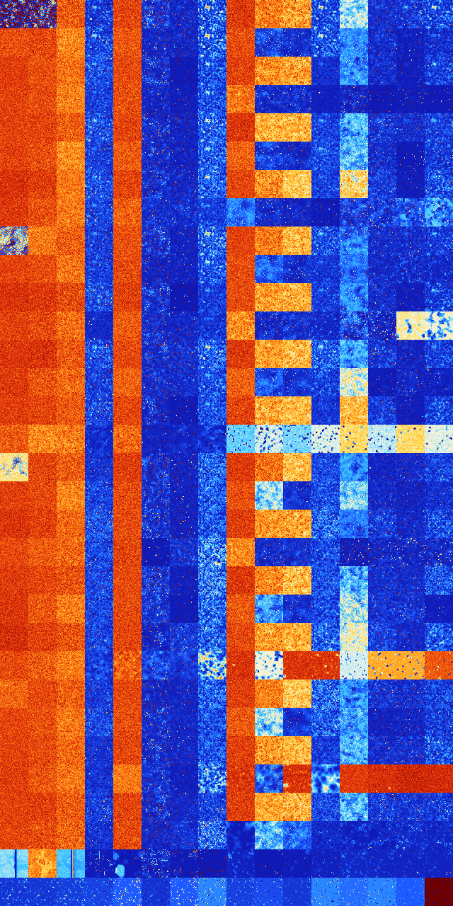

# B05678 (246272-246783)

<details>
    <summary>Initial Grid</summary>
    
</details>


<details>
    <summary>Initial Grid RLE</summary>

```
#C Exported from GoGoL (https://github.com/marrow16/gogol)
#C Wrap mode: Toroidal
#C Boundary mode: Dead
#C Step: 0
x = 100, y = 100, rule = B05678/S
37bo22bo$30bo55bo3bo$4bo11bo10bo47bo4bo11bo2bo$18bo12bo29bo5bo$23bo15bo
8bo22bo12bo$68bo$7bo12bobo44bo23bo2bo$100b$26bo12bo2bo30bobo$5bo4bo22bo
13bo31bo2bo12bo$3bo8bo29bo18bo29bo4bo$21bo33bo10bobo10bo7bo2b3o$24bo8bo
3bo53bo$4bo32bo7bo26bo9bo6bo3bo$6bo13bo21bo34bo6bo6bo7bo$6bo16bo22bo10b
o7bo2bo9b2o8bo5bo$7bo24bo37bo8bo16bo$5bobo13bo15bo5bobo7bo25bo5bo13bo$b
o7bo8bo47bo30bo$48bo9bo12bo11bo4bo$67bo$10bo45bo25bo$57bo6bo$22bo34bo6b
o9bo$2bo2bo7bo42bo30bo$18bo26bo27bo3bo9bo7bo$61bo18bo2bo$4bo11bo$11bo6b
o53bo$8bo50bo18bo8bo$45bo25bo16bo$79bo6bo3bo$6bo11bo24bo14bo18bo$7bo9bo
7bo3bo33bo16bo5bo6bo$29bo19bo34bo2bo$32bo10bo4bobo16bo2bo19bo$7bo34bo
19bo9bo6bo$12bo6bo34bo17bo17bo$5bo14bo24bo$56bo$7bo11bo4bo14bo55bo$43bo
7bo39bo$30bobo66bo$9bo36bo12bo10bo$19bo20bo31bo$7bo27bo19bo$26bo9bo$4bo
3bo6bobo26bo19b2o6bo3bo6bobo7b2o$2bo3bo2bo32bo5bo15bo31bo$3bo10bo9bo20b
o21bo2bo22bo$46bo23bo13bo4bo5bo$23bo3bo24bo13bo$5bo11bo6bo7bo23bo3bo9bo
21bo6bo$35b2o11bo6bo11bo28bo$6bo15bo$66bo$81bo6bo$18bobo17bo5bo$7bo17bo
9bo2bo$7bo14bo23bo3bo22bo15bo$38bo$o26bo5bo25bo36bo$41bo14bo21bo$obobo
30b2o$3bo9bo15bo27bo$6bo22bo18bo16bo2bo11bo$o26bo4bo6bo22bo27bo$33bo2bo
$10bo19bo22bo7bo16bo$47bo18b2o$3bo9bo17bo28bo$9bo17bo37bo$18bo4bo23bo
35bo$8bo4bo12bo43bo25bo$3bo16bo21bo2bo11bo41bo$25bo14bo34bo9bo$27bob2o
24bo9bo6bo$10bo8bo9bo5bo10bo2bo9bobo$9bobo61bo19bo4bo$19bo20bo8bo4bo16b
o9bo4bo7bo$2bo14bobo12bo48bo4bo$19bo38b2o15bo13bo2bo6bo$17bo37bo9bo4bo$
bo2bo8bo4bo16bo40bo$bo14bo11bo45bo3bo10b2o$15bo20bo34bo5bo17bo$2bo29bo
9b2o2bo31bo$11bo25bobo10bo$4bo4b2o15bo55bo8bo$2bobo$9bo8bo41bo17bo5bobo
5bo$22bo5bo4bo16bo18bo14bo$36bo59bobo$29bobo3bo13bo36bo5bo$30bo10bo$o
48bo6bo41bo$23bo5bo26bo18bo15bo$25bo8bo32bo$4b2o61b2o24bo4b2o$28bo54bo!
```
</details>
<details>
    <summary>Thumbnail</summary>

</details>
<table>
<tr>
    <td><a href="./246272%20S%20Heat%20Map%20Activity.png"></a><br>S (246272)<br>R@59,p6</td>    <td><a href="./246273%20S0%20Heat%20Map%20Activity.png"></a><br>S0 (246273)<br>R@78,p6</td>    <td><a href="./246274%20S1%20Heat%20Map%20Activity.png"></a><br>S1 (246274)<br>G>1000</td>    <td><a href="./246275%20S01%20Heat%20Map%20Activity.png"></a><br>S01 (246275)<br>R@37,p12</td>    <td><a href="./246276%20S2%20Heat%20Map%20Activity.png"></a><br>S2 (246276)<br>G>1000</td>    <td><a href="./246277%20S02%20Heat%20Map%20Activity.png"></a><br>S02 (246277)<br>R@199,p6</td>    <td><a href="./246278%20S12%20Heat%20Map%20Activity.png"></a><br>S12 (246278)<br>R@120,p84</td>    <td><a href="./246279%20S012%20Heat%20Map%20Activity.png"></a><br>S012 (246279)<br>R@18,p2</td>    <td><a href="./246280%20S3%20Heat%20Map%20Activity.png"></a><br>S3 (246280)<br>G>1000</td>    <td><a href="./246281%20S03%20Heat%20Map%20Activity.png"></a><br>S03 (246281)<br>G>1000</td>    <td><a href="./246282%20S13%20Heat%20Map%20Activity.png"></a><br>S13 (246282)<br>G>1000</td>    <td><a href="./246283%20S013%20Heat%20Map%20Activity.png"></a><br>S013 (246283)<br>R@26,p2</td>    <td><a href="./246284%20S23%20Heat%20Map%20Activity.png"></a><br>S23 (246284)<br>G>1000</td>    <td><a href="./246285%20S023%20Heat%20Map%20Activity.png"></a><br>S023 (246285)<br>R@85,p12</td>    <td><a href="./246286%20S123%20Heat%20Map%20Activity.png"></a><br>S123 (246286)<br>R@44,p12</td>    <td><a href="./246287%20S0123%20Heat%20Map%20Activity.png"></a><br>S0123 (246287)<br>R@23,p4</td></tr>
<tr>
    <td><a href="./246288%20S4%20Heat%20Map%20Activity.png"></a><br>S4 (246288)<br>G>1000</td>    <td><a href="./246289%20S04%20Heat%20Map%20Activity.png"></a><br>S04 (246289)<br>G>1000</td>    <td><a href="./246290%20S14%20Heat%20Map%20Activity.png"></a><br>S14 (246290)<br>G>1000</td>    <td><a href="./246291%20S014%20Heat%20Map%20Activity.png"></a><br>S014 (246291)<br>R@31,p12</td>    <td><a href="./246292%20S24%20Heat%20Map%20Activity.png"></a><br>S24 (246292)<br>G>1000</td>    <td><a href="./246293%20S024%20Heat%20Map%20Activity.png"></a><br>S024 (246293)<br>R@178,p60</td>    <td><a href="./246294%20S124%20Heat%20Map%20Activity.png"></a><br>S124 (246294)<br>R@103,p60</td>    <td><a href="./246295%20S0124%20Heat%20Map%20Activity.png"></a><br>S0124 (246295)<br>R@18,p2</td>    <td><a href="./246296%20S34%20Heat%20Map%20Activity.png"></a><br>S34 (246296)<br>G>1000</td>    <td><a href="./246297%20S034%20Heat%20Map%20Activity.png"></a><br>S034 (246297)<br>G>1000</td>    <td><a href="./246298%20S134%20Heat%20Map%20Activity.png"></a><br>S134 (246298)<br>R@999,p30</td>    <td><a href="./246299%20S0134%20Heat%20Map%20Activity.png"></a><br>S0134 (246299)<br>R@28,p4</td>    <td><a href="./246300%20S234%20Heat%20Map%20Activity.png"></a><br>S234 (246300)<br>G>1000</td>    <td><a href="./246301%20S0234%20Heat%20Map%20Activity.png"></a><br>S0234 (246301)<br>R@87,p12</td>    <td><a href="./246302%20S1234%20Heat%20Map%20Activity.png"></a><br>S1234 (246302)<br>R@174,p120</td>    <td><a href="./246303%20S01234%20Heat%20Map%20Activity.png"></a><br>S01234 (246303)<br>R@58,p8</td></tr>
<tr>
    <td><a href="./246304%20S5%20Heat%20Map%20Activity.png"></a><br>S5 (246304)<br>G>1000</td>    <td><a href="./246305%20S05%20Heat%20Map%20Activity.png"></a><br>S05 (246305)<br>G>1000</td>    <td><a href="./246306%20S15%20Heat%20Map%20Activity.png"></a><br>S15 (246306)<br>G>1000</td>    <td><a href="./246307%20S015%20Heat%20Map%20Activity.png"></a><br>S015 (246307)<br>R@30,p6</td>    <td><a href="./246308%20S25%20Heat%20Map%20Activity.png"></a><br>S25 (246308)<br>G>1000</td>    <td><a href="./246309%20S025%20Heat%20Map%20Activity.png"></a><br>S025 (246309)<br>R@194,p12</td>    <td><a href="./246310%20S125%20Heat%20Map%20Activity.png"></a><br>S125 (246310)<br>R@462,p420</td>    <td><a href="./246311%20S0125%20Heat%20Map%20Activity.png"></a><br>S0125 (246311)<br>R@18,p4</td>    <td><a href="./246312%20S35%20Heat%20Map%20Activity.png"></a><br>S35 (246312)<br>G>1000</td>    <td><a href="./246313%20S035%20Heat%20Map%20Activity.png"></a><br>S035 (246313)<br>G>1000</td>    <td><a href="./246314%20S135%20Heat%20Map%20Activity.png"></a><br>S135 (246314)<br>G>1000</td>    <td><a href="./246315%20S0135%20Heat%20Map%20Activity.png"></a><br>S0135 (246315)<br>R@48,p30</td>    <td><a href="./246316%20S235%20Heat%20Map%20Activity.png"></a><br>S235 (246316)<br>G>1000</td>    <td><a href="./246317%20S0235%20Heat%20Map%20Activity.png"></a><br>S0235 (246317)<br>R@71,p12</td>    <td><a href="./246318%20S1235%20Heat%20Map%20Activity.png"></a><br>S1235 (246318)<br>R@169,p120</td>    <td><a href="./246319%20S01235%20Heat%20Map%20Activity.png"></a><br>S01235 (246319)<br>R@25,p4</td></tr>
<tr>
    <td><a href="./246320%20S45%20Heat%20Map%20Activity.png"></a><br>S45 (246320)<br>G>1000</td>    <td><a href="./246321%20S045%20Heat%20Map%20Activity.png"></a><br>S045 (246321)<br>G>1000</td>    <td><a href="./246322%20S145%20Heat%20Map%20Activity.png"></a><br>S145 (246322)<br>G>1000</td>    <td><a href="./246323%20S0145%20Heat%20Map%20Activity.png"></a><br>S0145 (246323)<br>R@41,p12</td>    <td><a href="./246324%20S245%20Heat%20Map%20Activity.png"></a><br>S245 (246324)<br>G>1000</td>    <td><a href="./246325%20S0245%20Heat%20Map%20Activity.png"></a><br>S0245 (246325)<br>R@170,p60</td>    <td><a href="./246326%20S1245%20Heat%20Map%20Activity.png"></a><br>S1245 (246326)<br>R@251,p180</td>    <td><a href="./246327%20S01245%20Heat%20Map%20Activity.png"></a><br>S01245 (246327)<br>R@22,p2</td>    <td><a href="./246328%20S345%20Heat%20Map%20Activity.png"></a><br>S345 (246328)<br>G>1000</td>    <td><a href="./246329%20S0345%20Heat%20Map%20Activity.png"></a><br>S0345 (246329)<br>R@416,p12</td>    <td><a href="./246330%20S1345%20Heat%20Map%20Activity.png"></a><br>S1345 (246330)<br>R@303,p60</td>    <td><a href="./246331%20S01345%20Heat%20Map%20Activity.png"></a><br>S01345 (246331)<br>R@152,p120</td>    <td><a href="./246332%20S2345%20Heat%20Map%20Activity.png"></a><br>S2345 (246332)<br>R@268,p60</td>    <td><a href="./246333%20S02345%20Heat%20Map%20Activity.png"></a><br>S02345 (246333)<br>G>1000</td>    <td><a href="./246334%20S12345%20Heat%20Map%20Activity.png"></a><br>S12345 (246334)<br>R@541,p420</td>    <td><a href="./246335%20S012345%20Heat%20Map%20Activity.png"></a><br>S012345 (246335)<br>G>1000</td></tr>
<tr>
    <td><a href="./246336%20S6%20Heat%20Map%20Activity.png"></a><br>S6 (246336)<br>G>1000</td>    <td><a href="./246337%20S06%20Heat%20Map%20Activity.png"></a><br>S06 (246337)<br>G>1000</td>    <td><a href="./246338%20S16%20Heat%20Map%20Activity.png"></a><br>S16 (246338)<br>G>1000</td>    <td><a href="./246339%20S016%20Heat%20Map%20Activity.png"></a><br>S016 (246339)<br>R@26,p6</td>    <td><a href="./246340%20S26%20Heat%20Map%20Activity.png"></a><br>S26 (246340)<br>G>1000</td>    <td><a href="./246341%20S026%20Heat%20Map%20Activity.png"></a><br>S026 (246341)<br>R@217,p12</td>    <td><a href="./246342%20S126%20Heat%20Map%20Activity.png"></a><br>S126 (246342)<br>R@102,p60</td>    <td><a href="./246343%20S0126%20Heat%20Map%20Activity.png"></a><br>S0126 (246343)<br>R@14,p2</td>    <td><a href="./246344%20S36%20Heat%20Map%20Activity.png"></a><br>S36 (246344)<br>G>1000</td>    <td><a href="./246345%20S036%20Heat%20Map%20Activity.png"></a><br>S036 (246345)<br>G>1000</td>    <td><a href="./246346%20S136%20Heat%20Map%20Activity.png"></a><br>S136 (246346)<br>G>1000</td>    <td><a href="./246347%20S0136%20Heat%20Map%20Activity.png"></a><br>S0136 (246347)<br>R@28,p6</td>    <td><a href="./246348%20S236%20Heat%20Map%20Activity.png"></a><br>S236 (246348)<br>G>1000</td>    <td><a href="./246349%20S0236%20Heat%20Map%20Activity.png"></a><br>S0236 (246349)<br>R@57,p6</td>    <td><a href="./246350%20S1236%20Heat%20Map%20Activity.png"></a><br>S1236 (246350)<br>R@61,p24</td>    <td><a href="./246351%20S01236%20Heat%20Map%20Activity.png"></a><br>S01236 (246351)<br>R@26,p4</td></tr>
<tr>
    <td><a href="./246352%20S46%20Heat%20Map%20Activity.png"></a><br>S46 (246352)<br>G>1000</td>    <td><a href="./246353%20S046%20Heat%20Map%20Activity.png"></a><br>S046 (246353)<br>G>1000</td>    <td><a href="./246354%20S146%20Heat%20Map%20Activity.png"></a><br>S146 (246354)<br>G>1000</td>    <td><a href="./246355%20S0146%20Heat%20Map%20Activity.png"></a><br>S0146 (246355)<br>R@37,p12</td>    <td><a href="./246356%20S246%20Heat%20Map%20Activity.png"></a><br>S246 (246356)<br>G>1000</td>    <td><a href="./246357%20S0246%20Heat%20Map%20Activity.png"></a><br>S0246 (246357)<br>R@130,p12</td>    <td><a href="./246358%20S1246%20Heat%20Map%20Activity.png"></a><br>S1246 (246358)<br>R@135,p84</td>    <td><a href="./246359%20S01246%20Heat%20Map%20Activity.png"></a><br>S01246 (246359)<br>R@17,p2</td>    <td><a href="./246360%20S346%20Heat%20Map%20Activity.png"></a><br>S346 (246360)<br>G>1000</td>    <td><a href="./246361%20S0346%20Heat%20Map%20Activity.png"></a><br>S0346 (246361)<br>G>1000</td>    <td><a href="./246362%20S1346%20Heat%20Map%20Activity.png"></a><br>S1346 (246362)<br>G>1000</td>    <td><a href="./246363%20S01346%20Heat%20Map%20Activity.png"></a><br>S01346 (246363)<br>R@25,p4</td>    <td><a href="./246364%20S2346%20Heat%20Map%20Activity.png"></a><br>S2346 (246364)<br>G>1000</td>    <td><a href="./246365%20S02346%20Heat%20Map%20Activity.png"></a><br>S02346 (246365)<br>R@121,p36</td>    <td><a href="./246366%20S12346%20Heat%20Map%20Activity.png"></a><br>S12346 (246366)<br>G>1000</td>    <td><a href="./246367%20S012346%20Heat%20Map%20Activity.png"></a><br>S012346 (246367)<br>R@105,p12</td></tr>
<tr>
    <td><a href="./246368%20S56%20Heat%20Map%20Activity.png"></a><br>S56 (246368)<br>G>1000</td>    <td><a href="./246369%20S056%20Heat%20Map%20Activity.png"></a><br>S056 (246369)<br>G>1000</td>    <td><a href="./246370%20S156%20Heat%20Map%20Activity.png"></a><br>S156 (246370)<br>G>1000</td>    <td><a href="./246371%20S0156%20Heat%20Map%20Activity.png"></a><br>S0156 (246371)<br>R@29,p6</td>    <td><a href="./246372%20S256%20Heat%20Map%20Activity.png"></a><br>S256 (246372)<br>G>1000</td>    <td><a href="./246373%20S0256%20Heat%20Map%20Activity.png"></a><br>S0256 (246373)<br>R@244,p30</td>    <td><a href="./246374%20S1256%20Heat%20Map%20Activity.png"></a><br>S1256 (246374)<br>R@118,p60</td>    <td><a href="./246375%20S01256%20Heat%20Map%20Activity.png"></a><br>S01256 (246375)<br>R@16,p2</td>    <td><a href="./246376%20S356%20Heat%20Map%20Activity.png"></a><br>S356 (246376)<br>G>1000</td>    <td><a href="./246377%20S0356%20Heat%20Map%20Activity.png"></a><br>S0356 (246377)<br>G>1000</td>    <td><a href="./246378%20S1356%20Heat%20Map%20Activity.png"></a><br>S1356 (246378)<br>G>1000</td>    <td><a href="./246379%20S01356%20Heat%20Map%20Activity.png"></a><br>S01356 (246379)<br>R@37,p10</td>    <td><a href="./246380%20S2356%20Heat%20Map%20Activity.png"></a><br>S2356 (246380)<br>G>1000</td>    <td><a href="./246381%20S02356%20Heat%20Map%20Activity.png"></a><br>S02356 (246381)<br>R@70,p6</td>    <td><a href="./246382%20S12356%20Heat%20Map%20Activity.png"></a><br>S12356 (246382)<br>R@346,p252</td>    <td><a href="./246383%20S012356%20Heat%20Map%20Activity.png"></a><br>S012356 (246383)<br>R@34,p4</td></tr>
<tr>
    <td><a href="./246384%20S456%20Heat%20Map%20Activity.png"></a><br>S456 (246384)<br>G>1000</td>    <td><a href="./246385%20S0456%20Heat%20Map%20Activity.png"></a><br>S0456 (246385)<br>G>1000</td>    <td><a href="./246386%20S1456%20Heat%20Map%20Activity.png"></a><br>S1456 (246386)<br>G>1000</td>    <td><a href="./246387%20S01456%20Heat%20Map%20Activity.png"></a><br>S01456 (246387)<br>R@43,p12</td>    <td><a href="./246388%20S2456%20Heat%20Map%20Activity.png"></a><br>S2456 (246388)<br>G>1000</td>    <td><a href="./246389%20S02456%20Heat%20Map%20Activity.png"></a><br>S02456 (246389)<br>R@130,p6</td>    <td><a href="./246390%20S12456%20Heat%20Map%20Activity.png"></a><br>S12456 (246390)<br>R@130,p12</td>    <td><a href="./246391%20S012456%20Heat%20Map%20Activity.png"></a><br>S012456 (246391)<br>R@45,p2</td>    <td><a href="./246392%20S3456%20Heat%20Map%20Activity.png"></a><br>S3456 (246392)<br>G>1000</td>    <td><a href="./246393%20S03456%20Heat%20Map%20Activity.png"></a><br>S03456 (246393)<br>R@264,p120</td>    <td><a href="./246394%20S13456%20Heat%20Map%20Activity.png"></a><br>S13456 (246394)<br>R@725,p420</td>    <td><a href="./246395%20S013456%20Heat%20Map%20Activity.png"></a><br>S013456 (246395)<br>G>1000</td>    <td><a href="./246396%20S23456%20Heat%20Map%20Activity.png"></a><br>S23456 (246396)<br>G>1000</td>    <td><a href="./246397%20S023456%20Heat%20Map%20Activity.png"></a><br>S023456 (246397)<br>G>1000</td>    <td><a href="./246398%20S123456%20Heat%20Map%20Activity.png"></a><br>S123456 (246398)<br>G>1000</td>    <td><a href="./246399%20S0123456%20Heat%20Map%20Activity.png"></a><br>S0123456 (246399)<br>G>1000</td></tr>
<tr>
    <td><a href="./246400%20S7%20Heat%20Map%20Activity.png"></a><br>S7 (246400)<br>R@715,p6</td>    <td><a href="./246401%20S07%20Heat%20Map%20Activity.png"></a><br>S07 (246401)<br>G>1000</td>    <td><a href="./246402%20S17%20Heat%20Map%20Activity.png"></a><br>S17 (246402)<br>G>1000</td>    <td><a href="./246403%20S017%20Heat%20Map%20Activity.png"></a><br>S017 (246403)<br>R@32,p12</td>    <td><a href="./246404%20S27%20Heat%20Map%20Activity.png"></a><br>S27 (246404)<br>G>1000</td>    <td><a href="./246405%20S027%20Heat%20Map%20Activity.png"></a><br>S027 (246405)<br>R@143,p12</td>    <td><a href="./246406%20S127%20Heat%20Map%20Activity.png"></a><br>S127 (246406)<br>R@100,p60</td>    <td><a href="./246407%20S0127%20Heat%20Map%20Activity.png"></a><br>S0127 (246407)<br>R@12,p2</td>    <td><a href="./246408%20S37%20Heat%20Map%20Activity.png"></a><br>S37 (246408)<br>G>1000</td>    <td><a href="./246409%20S037%20Heat%20Map%20Activity.png"></a><br>S037 (246409)<br>G>1000</td>    <td><a href="./246410%20S137%20Heat%20Map%20Activity.png"></a><br>S137 (246410)<br>G>1000</td>    <td><a href="./246411%20S0137%20Heat%20Map%20Activity.png"></a><br>S0137 (246411)<br>R@20,p2</td>    <td><a href="./246412%20S237%20Heat%20Map%20Activity.png"></a><br>S237 (246412)<br>G>1000</td>    <td><a href="./246413%20S0237%20Heat%20Map%20Activity.png"></a><br>S0237 (246413)<br>R@74,p6</td>    <td><a href="./246414%20S1237%20Heat%20Map%20Activity.png"></a><br>S1237 (246414)<br>R@44,p12</td>    <td><a href="./246415%20S01237%20Heat%20Map%20Activity.png"></a><br>S01237 (246415)<br>R@23,p4</td></tr>
<tr>
    <td><a href="./246416%20S47%20Heat%20Map%20Activity.png"></a><br>S47 (246416)<br>G>1000</td>    <td><a href="./246417%20S047%20Heat%20Map%20Activity.png"></a><br>S047 (246417)<br>G>1000</td>    <td><a href="./246418%20S147%20Heat%20Map%20Activity.png"></a><br>S147 (246418)<br>G>1000</td>    <td><a href="./246419%20S0147%20Heat%20Map%20Activity.png"></a><br>S0147 (246419)<br>R@35,p12</td>    <td><a href="./246420%20S247%20Heat%20Map%20Activity.png"></a><br>S247 (246420)<br>G>1000</td>    <td><a href="./246421%20S0247%20Heat%20Map%20Activity.png"></a><br>S0247 (246421)<br>R@223,p120</td>    <td><a href="./246422%20S1247%20Heat%20Map%20Activity.png"></a><br>S1247 (246422)<br>R@101,p60</td>    <td><a href="./246423%20S01247%20Heat%20Map%20Activity.png"></a><br>S01247 (246423)<br>R@15,p2</td>    <td><a href="./246424%20S347%20Heat%20Map%20Activity.png"></a><br>S347 (246424)<br>G>1000</td>    <td><a href="./246425%20S0347%20Heat%20Map%20Activity.png"></a><br>S0347 (246425)<br>G>1000</td>    <td><a href="./246426%20S1347%20Heat%20Map%20Activity.png"></a><br>S1347 (246426)<br>G>1000</td>    <td><a href="./246427%20S01347%20Heat%20Map%20Activity.png"></a><br>S01347 (246427)<br>R@34,p2</td>    <td><a href="./246428%20S2347%20Heat%20Map%20Activity.png"></a><br>S2347 (246428)<br>G>1000</td>    <td><a href="./246429%20S02347%20Heat%20Map%20Activity.png"></a><br>S02347 (246429)<br>R@89,p12</td>    <td><a href="./246430%20S12347%20Heat%20Map%20Activity.png"></a><br>S12347 (246430)<br>R@67,p4</td>    <td><a href="./246431%20S012347%20Heat%20Map%20Activity.png"></a><br>S012347 (246431)<br>R@70,p24</td></tr>
<tr>
    <td><a href="./246432%20S57%20Heat%20Map%20Activity.png"></a><br>S57 (246432)<br>G>1000</td>    <td><a href="./246433%20S057%20Heat%20Map%20Activity.png"></a><br>S057 (246433)<br>G>1000</td>    <td><a href="./246434%20S157%20Heat%20Map%20Activity.png"></a><br>S157 (246434)<br>G>1000</td>    <td><a href="./246435%20S0157%20Heat%20Map%20Activity.png"></a><br>S0157 (246435)<br>R@34,p6</td>    <td><a href="./246436%20S257%20Heat%20Map%20Activity.png"></a><br>S257 (246436)<br>G>1000</td>    <td><a href="./246437%20S0257%20Heat%20Map%20Activity.png"></a><br>S0257 (246437)<br>R@173,p6</td>    <td><a href="./246438%20S1257%20Heat%20Map%20Activity.png"></a><br>S1257 (246438)<br>G>1000</td>    <td><a href="./246439%20S01257%20Heat%20Map%20Activity.png"></a><br>S01257 (246439)<br>R@25,p6</td>    <td><a href="./246440%20S357%20Heat%20Map%20Activity.png"></a><br>S357 (246440)<br>G>1000</td>    <td><a href="./246441%20S0357%20Heat%20Map%20Activity.png"></a><br>S0357 (246441)<br>G>1000</td>    <td><a href="./246442%20S1357%20Heat%20Map%20Activity.png"></a><br>S1357 (246442)<br>G>1000</td>    <td><a href="./246443%20S01357%20Heat%20Map%20Activity.png"></a><br>S01357 (246443)<br>R@32,p6</td>    <td><a href="./246444%20S2357%20Heat%20Map%20Activity.png"></a><br>S2357 (246444)<br>G>1000</td>    <td><a href="./246445%20S02357%20Heat%20Map%20Activity.png"></a><br>S02357 (246445)<br>R@79,p6</td>    <td><a href="./246446%20S12357%20Heat%20Map%20Activity.png"></a><br>S12357 (246446)<br>R@252,p180</td>    <td><a href="./246447%20S012357%20Heat%20Map%20Activity.png"></a><br>S012357 (246447)<br>R@29,p2</td></tr>
<tr>
    <td><a href="./246448%20S457%20Heat%20Map%20Activity.png"></a><br>S457 (246448)<br>G>1000</td>    <td><a href="./246449%20S0457%20Heat%20Map%20Activity.png"></a><br>S0457 (246449)<br>G>1000</td>    <td><a href="./246450%20S1457%20Heat%20Map%20Activity.png"></a><br>S1457 (246450)<br>G>1000</td>    <td><a href="./246451%20S01457%20Heat%20Map%20Activity.png"></a><br>S01457 (246451)<br>R@73,p36</td>    <td><a href="./246452%20S2457%20Heat%20Map%20Activity.png"></a><br>S2457 (246452)<br>G>1000</td>    <td><a href="./246453%20S02457%20Heat%20Map%20Activity.png"></a><br>S02457 (246453)<br>R@132,p6</td>    <td><a href="./246454%20S12457%20Heat%20Map%20Activity.png"></a><br>S12457 (246454)<br>R@140,p60</td>    <td><a href="./246455%20S012457%20Heat%20Map%20Activity.png"></a><br>S012457 (246455)<br>R@37,p2</td>    <td><a href="./246456%20S3457%20Heat%20Map%20Activity.png"></a><br>S3457 (246456)<br>G>1000</td>    <td><a href="./246457%20S03457%20Heat%20Map%20Activity.png"></a><br>S03457 (246457)<br>R@298,p36</td>    <td><a href="./246458%20S13457%20Heat%20Map%20Activity.png"></a><br>S13457 (246458)<br>R@409,p24</td>    <td><a href="./246459%20S013457%20Heat%20Map%20Activity.png"></a><br>S013457 (246459)<br>R@92,p12</td>    <td><a href="./246460%20S23457%20Heat%20Map%20Activity.png"></a><br>S23457 (246460)<br>G>1000</td>    <td><a href="./246461%20S023457%20Heat%20Map%20Activity.png"></a><br>S023457 (246461)<br>G>1000</td>    <td><a href="./246462%20S123457%20Heat%20Map%20Activity.png"></a><br>S123457 (246462)<br>G>1000</td>    <td><a href="./246463%20S0123457%20Heat%20Map%20Activity.png"></a><br>S0123457 (246463)<br>G>1000</td></tr>
<tr>
    <td><a href="./246464%20S67%20Heat%20Map%20Activity.png"></a><br>S67 (246464)<br>G>1000</td>    <td><a href="./246465%20S067%20Heat%20Map%20Activity.png"></a><br>S067 (246465)<br>G>1000</td>    <td><a href="./246466%20S167%20Heat%20Map%20Activity.png"></a><br>S167 (246466)<br>G>1000</td>    <td><a href="./246467%20S0167%20Heat%20Map%20Activity.png"></a><br>S0167 (246467)<br>R@29,p6</td>    <td><a href="./246468%20S267%20Heat%20Map%20Activity.png"></a><br>S267 (246468)<br>G>1000</td>    <td><a href="./246469%20S0267%20Heat%20Map%20Activity.png"></a><br>S0267 (246469)<br>R@195,p12</td>    <td><a href="./246470%20S1267%20Heat%20Map%20Activity.png"></a><br>S1267 (246470)<br>R@66,p24</td>    <td><a href="./246471%20S01267%20Heat%20Map%20Activity.png"></a><br>S01267 (246471)<br>R@16,p2</td>    <td><a href="./246472%20S367%20Heat%20Map%20Activity.png"></a><br>S367 (246472)<br>G>1000</td>    <td><a href="./246473%20S0367%20Heat%20Map%20Activity.png"></a><br>S0367 (246473)<br>G>1000</td>    <td><a href="./246474%20S1367%20Heat%20Map%20Activity.png"></a><br>S1367 (246474)<br>G>1000</td>    <td><a href="./246475%20S01367%20Heat%20Map%20Activity.png"></a><br>S01367 (246475)<br>R@19,p2</td>    <td><a href="./246476%20S2367%20Heat%20Map%20Activity.png"></a><br>S2367 (246476)<br>G>1000</td>    <td><a href="./246477%20S02367%20Heat%20Map%20Activity.png"></a><br>S02367 (246477)<br>R@60,p12</td>    <td><a href="./246478%20S12367%20Heat%20Map%20Activity.png"></a><br>S12367 (246478)<br>R@118,p60</td>    <td><a href="./246479%20S012367%20Heat%20Map%20Activity.png"></a><br>S012367 (246479)<br>R@26,p2</td></tr>
<tr>
    <td><a href="./246480%20S467%20Heat%20Map%20Activity.png"></a><br>S467 (246480)<br>G>1000</td>    <td><a href="./246481%20S0467%20Heat%20Map%20Activity.png"></a><br>S0467 (246481)<br>G>1000</td>    <td><a href="./246482%20S1467%20Heat%20Map%20Activity.png"></a><br>S1467 (246482)<br>G>1000</td>    <td><a href="./246483%20S01467%20Heat%20Map%20Activity.png"></a><br>S01467 (246483)<br>R@37,p12</td>    <td><a href="./246484%20S2467%20Heat%20Map%20Activity.png"></a><br>S2467 (246484)<br>G>1000</td>    <td><a href="./246485%20S02467%20Heat%20Map%20Activity.png"></a><br>S02467 (246485)<br>R@122,p4</td>    <td><a href="./246486%20S12467%20Heat%20Map%20Activity.png"></a><br>S12467 (246486)<br>R@79,p24</td>    <td><a href="./246487%20S012467%20Heat%20Map%20Activity.png"></a><br>S012467 (246487)<br>R@22,p2</td>    <td><a href="./246488%20S3467%20Heat%20Map%20Activity.png"></a><br>S3467 (246488)<br>G>1000</td>    <td><a href="./246489%20S03467%20Heat%20Map%20Activity.png"></a><br>S03467 (246489)<br>G>1000</td>    <td><a href="./246490%20S13467%20Heat%20Map%20Activity.png"></a><br>S13467 (246490)<br>G>1000</td>    <td><a href="./246491%20S013467%20Heat%20Map%20Activity.png"></a><br>S013467 (246491)<br>R@46,p4</td>    <td><a href="./246492%20S23467%20Heat%20Map%20Activity.png"></a><br>S23467 (246492)<br>G>1000</td>    <td><a href="./246493%20S023467%20Heat%20Map%20Activity.png"></a><br>S023467 (246493)<br>G>1000</td>    <td><a href="./246494%20S123467%20Heat%20Map%20Activity.png"></a><br>S123467 (246494)<br>G>1000</td>    <td><a href="./246495%20S0123467%20Heat%20Map%20Activity.png"></a><br>S0123467 (246495)<br>G>1000</td></tr>
<tr>
    <td><a href="./246496%20S567%20Heat%20Map%20Activity.png"></a><br>S567 (246496)<br>G>1000</td>    <td><a href="./246497%20S0567%20Heat%20Map%20Activity.png"></a><br>S0567 (246497)<br>G>1000</td>    <td><a href="./246498%20S1567%20Heat%20Map%20Activity.png"></a><br>S1567 (246498)<br>G>1000</td>    <td><a href="./246499%20S01567%20Heat%20Map%20Activity.png"></a><br>S01567 (246499)<br>R@36,p6</td>    <td><a href="./246500%20S2567%20Heat%20Map%20Activity.png"></a><br>S2567 (246500)<br>G>1000</td>    <td><a href="./246501%20S02567%20Heat%20Map%20Activity.png"></a><br>S02567 (246501)<br>R@393,p12</td>    <td><a href="./246502%20S12567%20Heat%20Map%20Activity.png"></a><br>S12567 (246502)<br>R@479,p420</td>    <td><a href="./246503%20S012567%20Heat%20Map%20Activity.png"></a><br>S012567 (246503)<br>R@24,p6</td>    <td><a href="./246504%20S3567%20Heat%20Map%20Activity.png"></a><br>S3567 (246504)<br>G>1000</td>    <td><a href="./246505%20S03567%20Heat%20Map%20Activity.png"></a><br>S03567 (246505)<br>G>1000</td>    <td><a href="./246506%20S13567%20Heat%20Map%20Activity.png"></a><br>S13567 (246506)<br>G>1000</td>    <td><a href="./246507%20S013567%20Heat%20Map%20Activity.png"></a><br>S013567 (246507)<br>R@56,p30</td>    <td><a href="./246508%20S23567%20Heat%20Map%20Activity.png"></a><br>S23567 (246508)<br>G>1000</td>    <td><a href="./246509%20S023567%20Heat%20Map%20Activity.png"></a><br>S023567 (246509)<br>R@88,p6</td>    <td><a href="./246510%20S123567%20Heat%20Map%20Activity.png"></a><br>S123567 (246510)<br>R@530,p420</td>    <td><a href="./246511%20S0123567%20Heat%20Map%20Activity.png"></a><br>S0123567 (246511)<br>R@56,p2</td></tr>
<tr>
    <td><a href="./246512%20S4567%20Heat%20Map%20Activity.png"></a><br>S4567 (246512)<br>G>1000</td>    <td><a href="./246513%20S04567%20Heat%20Map%20Activity.png"></a><br>S04567 (246513)<br>G>1000</td>    <td><a href="./246514%20S14567%20Heat%20Map%20Activity.png"></a><br>S14567 (246514)<br>G>1000</td>    <td><a href="./246515%20S014567%20Heat%20Map%20Activity.png"></a><br>S014567 (246515)<br>R@156,p60</td>    <td><a href="./246516%20S24567%20Heat%20Map%20Activity.png"></a><br>S24567 (246516)<br>G>1000</td>    <td><a href="./246517%20S024567%20Heat%20Map%20Activity.png"></a><br>S024567 (246517)<br>R@602,p420</td>    <td><a href="./246518%20S124567%20Heat%20Map%20Activity.png"></a><br>S124567 (246518)<br>G>1000</td>    <td><a href="./246519%20S0124567%20Heat%20Map%20Activity.png"></a><br>S0124567 (246519)<br>R@275,p84</td>    <td><a href="./246520%20S34567%20Heat%20Map%20Activity.png"></a><br>S34567 (246520)<br>G>1000</td>    <td><a href="./246521%20S034567%20Heat%20Map%20Activity.png"></a><br>S034567 (246521)<br>G>1000</td>    <td><a href="./246522%20S134567%20Heat%20Map%20Activity.png"></a><br>S134567 (246522)<br>G>1000</td>    <td><a href="./246523%20S0134567%20Heat%20Map%20Activity.png"></a><br>S0134567 (246523)<br>G>1000</td>    <td><a href="./246524%20S234567%20Heat%20Map%20Activity.png"></a><br>S234567 (246524)<br>G>1000</td>    <td><a href="./246525%20S0234567%20Heat%20Map%20Activity.png"></a><br>S0234567 (246525)<br>G>1000</td>    <td><a href="./246526%20S1234567%20Heat%20Map%20Activity.png"></a><br>S1234567 (246526)<br>G>1000</td>    <td><a href="./246527%20S01234567%20Heat%20Map%20Activity.png"></a><br>S01234567 (246527)<br>G>1000</td></tr>
<tr>
    <td><a href="./246528%20S8%20Heat%20Map%20Activity.png"></a><br>S8 (246528)<br>G>1000</td>    <td><a href="./246529%20S08%20Heat%20Map%20Activity.png"></a><br>S08 (246529)<br>G>1000</td>    <td><a href="./246530%20S18%20Heat%20Map%20Activity.png"></a><br>S18 (246530)<br>G>1000</td>    <td><a href="./246531%20S018%20Heat%20Map%20Activity.png"></a><br>S018 (246531)<br>R@34,p12</td>    <td><a href="./246532%20S28%20Heat%20Map%20Activity.png"></a><br>S28 (246532)<br>G>1000</td>    <td><a href="./246533%20S028%20Heat%20Map%20Activity.png"></a><br>S028 (246533)<br>R@199,p4</td>    <td><a href="./246534%20S128%20Heat%20Map%20Activity.png"></a><br>S128 (246534)<br>R@91,p60</td>    <td><a href="./246535%20S0128%20Heat%20Map%20Activity.png"></a><br>S0128 (246535)<br>R@14,p2</td>    <td><a href="./246536%20S38%20Heat%20Map%20Activity.png"></a><br>S38 (246536)<br>G>1000</td>    <td><a href="./246537%20S038%20Heat%20Map%20Activity.png"></a><br>S038 (246537)<br>G>1000</td>    <td><a href="./246538%20S138%20Heat%20Map%20Activity.png"></a><br>S138 (246538)<br>G>1000</td>    <td><a href="./246539%20S0138%20Heat%20Map%20Activity.png"></a><br>S0138 (246539)<br>R@22,p2</td>    <td><a href="./246540%20S238%20Heat%20Map%20Activity.png"></a><br>S238 (246540)<br>G>1000</td>    <td><a href="./246541%20S0238%20Heat%20Map%20Activity.png"></a><br>S0238 (246541)<br>R@135,p60</td>    <td><a href="./246542%20S1238%20Heat%20Map%20Activity.png"></a><br>S1238 (246542)<br>R@54,p24</td>    <td><a href="./246543%20S01238%20Heat%20Map%20Activity.png"></a><br>S01238 (246543)<br>R@19,p4</td></tr>
<tr>
    <td><a href="./246544%20S48%20Heat%20Map%20Activity.png"></a><br>S48 (246544)<br>G>1000</td>    <td><a href="./246545%20S048%20Heat%20Map%20Activity.png"></a><br>S048 (246545)<br>G>1000</td>    <td><a href="./246546%20S148%20Heat%20Map%20Activity.png"></a><br>S148 (246546)<br>G>1000</td>    <td><a href="./246547%20S0148%20Heat%20Map%20Activity.png"></a><br>S0148 (246547)<br>R@29,p12</td>    <td><a href="./246548%20S248%20Heat%20Map%20Activity.png"></a><br>S248 (246548)<br>G>1000</td>    <td><a href="./246549%20S0248%20Heat%20Map%20Activity.png"></a><br>S0248 (246549)<br>R@122,p24</td>    <td><a href="./246550%20S1248%20Heat%20Map%20Activity.png"></a><br>S1248 (246550)<br>R@124,p60</td>    <td><a href="./246551%20S01248%20Heat%20Map%20Activity.png"></a><br>S01248 (246551)<br>R@15,p2</td>    <td><a href="./246552%20S348%20Heat%20Map%20Activity.png"></a><br>S348 (246552)<br>G>1000</td>    <td><a href="./246553%20S0348%20Heat%20Map%20Activity.png"></a><br>S0348 (246553)<br>G>1000</td>    <td><a href="./246554%20S1348%20Heat%20Map%20Activity.png"></a><br>S1348 (246554)<br>G>1000</td>    <td><a href="./246555%20S01348%20Heat%20Map%20Activity.png"></a><br>S01348 (246555)<br>R@26,p4</td>    <td><a href="./246556%20S2348%20Heat%20Map%20Activity.png"></a><br>S2348 (246556)<br>G>1000</td>    <td><a href="./246557%20S02348%20Heat%20Map%20Activity.png"></a><br>S02348 (246557)<br>R@113,p12</td>    <td><a href="./246558%20S12348%20Heat%20Map%20Activity.png"></a><br>S12348 (246558)<br>R@128,p60</td>    <td><a href="./246559%20S012348%20Heat%20Map%20Activity.png"></a><br>S012348 (246559)<br>R@55,p8</td></tr>
<tr>
    <td><a href="./246560%20S58%20Heat%20Map%20Activity.png"></a><br>S58 (246560)<br>G>1000</td>    <td><a href="./246561%20S058%20Heat%20Map%20Activity.png"></a><br>S058 (246561)<br>G>1000</td>    <td><a href="./246562%20S158%20Heat%20Map%20Activity.png"></a><br>S158 (246562)<br>G>1000</td>    <td><a href="./246563%20S0158%20Heat%20Map%20Activity.png"></a><br>S0158 (246563)<br>R@26,p6</td>    <td><a href="./246564%20S258%20Heat%20Map%20Activity.png"></a><br>S258 (246564)<br>G>1000</td>    <td><a href="./246565%20S0258%20Heat%20Map%20Activity.png"></a><br>S0258 (246565)<br>R@200,p6</td>    <td><a href="./246566%20S1258%20Heat%20Map%20Activity.png"></a><br>S1258 (246566)<br>R@161,p120</td>    <td><a href="./246567%20S01258%20Heat%20Map%20Activity.png"></a><br>S01258 (246567)<br>R@19,p4</td>    <td><a href="./246568%20S358%20Heat%20Map%20Activity.png"></a><br>S358 (246568)<br>G>1000</td>    <td><a href="./246569%20S0358%20Heat%20Map%20Activity.png"></a><br>S0358 (246569)<br>G>1000</td>    <td><a href="./246570%20S1358%20Heat%20Map%20Activity.png"></a><br>S1358 (246570)<br>G>1000</td>    <td><a href="./246571%20S01358%20Heat%20Map%20Activity.png"></a><br>S01358 (246571)<br>R@21,p2</td>    <td><a href="./246572%20S2358%20Heat%20Map%20Activity.png"></a><br>S2358 (246572)<br>G>1000</td>    <td><a href="./246573%20S02358%20Heat%20Map%20Activity.png"></a><br>S02358 (246573)<br>R@56,p2</td>    <td><a href="./246574%20S12358%20Heat%20Map%20Activity.png"></a><br>S12358 (246574)<br>R@96,p36</td>    <td><a href="./246575%20S012358%20Heat%20Map%20Activity.png"></a><br>S012358 (246575)<br>R@29,p4</td></tr>
<tr>
    <td><a href="./246576%20S458%20Heat%20Map%20Activity.png"></a><br>S458 (246576)<br>G>1000</td>    <td><a href="./246577%20S0458%20Heat%20Map%20Activity.png"></a><br>S0458 (246577)<br>G>1000</td>    <td><a href="./246578%20S1458%20Heat%20Map%20Activity.png"></a><br>S1458 (246578)<br>G>1000</td>    <td><a href="./246579%20S01458%20Heat%20Map%20Activity.png"></a><br>S01458 (246579)<br>R@38,p12</td>    <td><a href="./246580%20S2458%20Heat%20Map%20Activity.png"></a><br>S2458 (246580)<br>G>1000</td>    <td><a href="./246581%20S02458%20Heat%20Map%20Activity.png"></a><br>S02458 (246581)<br>G>1000</td>    <td><a href="./246582%20S12458%20Heat%20Map%20Activity.png"></a><br>S12458 (246582)<br>R@86,p12</td>    <td><a href="./246583%20S012458%20Heat%20Map%20Activity.png"></a><br>S012458 (246583)<br>S@23</td>    <td><a href="./246584%20S3458%20Heat%20Map%20Activity.png"></a><br>S3458 (246584)<br>G>1000</td>    <td><a href="./246585%20S03458%20Heat%20Map%20Activity.png"></a><br>S03458 (246585)<br>R@343,p84</td>    <td><a href="./246586%20S13458%20Heat%20Map%20Activity.png"></a><br>S13458 (246586)<br>R@331,p12</td>    <td><a href="./246587%20S013458%20Heat%20Map%20Activity.png"></a><br>S013458 (246587)<br>R@49,p6</td>    <td><a href="./246588%20S23458%20Heat%20Map%20Activity.png"></a><br>S23458 (246588)<br>G>1000</td>    <td><a href="./246589%20S023458%20Heat%20Map%20Activity.png"></a><br>S023458 (246589)<br>R@277,p120</td>    <td><a href="./246590%20S123458%20Heat%20Map%20Activity.png"></a><br>S123458 (246590)<br>G>1000</td>    <td><a href="./246591%20S0123458%20Heat%20Map%20Activity.png"></a><br>S0123458 (246591)<br>G>1000</td></tr>
<tr>
    <td><a href="./246592%20S68%20Heat%20Map%20Activity.png"></a><br>S68 (246592)<br>G>1000</td>    <td><a href="./246593%20S068%20Heat%20Map%20Activity.png"></a><br>S068 (246593)<br>G>1000</td>    <td><a href="./246594%20S168%20Heat%20Map%20Activity.png"></a><br>S168 (246594)<br>G>1000</td>    <td><a href="./246595%20S0168%20Heat%20Map%20Activity.png"></a><br>S0168 (246595)<br>R@28,p6</td>    <td><a href="./246596%20S268%20Heat%20Map%20Activity.png"></a><br>S268 (246596)<br>G>1000</td>    <td><a href="./246597%20S0268%20Heat%20Map%20Activity.png"></a><br>S0268 (246597)<br>R@132,p4</td>    <td><a href="./246598%20S1268%20Heat%20Map%20Activity.png"></a><br>S1268 (246598)<br>R@178,p120</td>    <td><a href="./246599%20S01268%20Heat%20Map%20Activity.png"></a><br>S01268 (246599)<br>R@13,p2</td>    <td><a href="./246600%20S368%20Heat%20Map%20Activity.png"></a><br>S368 (246600)<br>G>1000</td>    <td><a href="./246601%20S0368%20Heat%20Map%20Activity.png"></a><br>S0368 (246601)<br>G>1000</td>    <td><a href="./246602%20S1368%20Heat%20Map%20Activity.png"></a><br>S1368 (246602)<br>G>1000</td>    <td><a href="./246603%20S01368%20Heat%20Map%20Activity.png"></a><br>S01368 (246603)<br>R@25,p6</td>    <td><a href="./246604%20S2368%20Heat%20Map%20Activity.png"></a><br>S2368 (246604)<br>G>1000</td>    <td><a href="./246605%20S02368%20Heat%20Map%20Activity.png"></a><br>S02368 (246605)<br>R@83,p12</td>    <td><a href="./246606%20S12368%20Heat%20Map%20Activity.png"></a><br>S12368 (246606)<br>R@79,p12</td>    <td><a href="./246607%20S012368%20Heat%20Map%20Activity.png"></a><br>S012368 (246607)<br>R@23,p4</td></tr>
<tr>
    <td><a href="./246608%20S468%20Heat%20Map%20Activity.png"></a><br>S468 (246608)<br>G>1000</td>    <td><a href="./246609%20S0468%20Heat%20Map%20Activity.png"></a><br>S0468 (246609)<br>G>1000</td>    <td><a href="./246610%20S1468%20Heat%20Map%20Activity.png"></a><br>S1468 (246610)<br>G>1000</td>    <td><a href="./246611%20S01468%20Heat%20Map%20Activity.png"></a><br>S01468 (246611)<br>R@36,p12</td>    <td><a href="./246612%20S2468%20Heat%20Map%20Activity.png"></a><br>S2468 (246612)<br>G>1000</td>    <td><a href="./246613%20S02468%20Heat%20Map%20Activity.png"></a><br>S02468 (246613)<br>R@106,p12</td>    <td><a href="./246614%20S12468%20Heat%20Map%20Activity.png"></a><br>S12468 (246614)<br>R@467,p420</td>    <td><a href="./246615%20S012468%20Heat%20Map%20Activity.png"></a><br>S012468 (246615)<br>R@22,p2</td>    <td><a href="./246616%20S3468%20Heat%20Map%20Activity.png"></a><br>S3468 (246616)<br>G>1000</td>    <td><a href="./246617%20S03468%20Heat%20Map%20Activity.png"></a><br>S03468 (246617)<br>G>1000</td>    <td><a href="./246618%20S13468%20Heat%20Map%20Activity.png"></a><br>S13468 (246618)<br>G>1000</td>    <td><a href="./246619%20S013468%20Heat%20Map%20Activity.png"></a><br>S013468 (246619)<br>R@47,p4</td>    <td><a href="./246620%20S23468%20Heat%20Map%20Activity.png"></a><br>S23468 (246620)<br>G>1000</td>    <td><a href="./246621%20S023468%20Heat%20Map%20Activity.png"></a><br>S023468 (246621)<br>R@160,p60</td>    <td><a href="./246622%20S123468%20Heat%20Map%20Activity.png"></a><br>S123468 (246622)<br>R@278,p120</td>    <td><a href="./246623%20S0123468%20Heat%20Map%20Activity.png"></a><br>S0123468 (246623)<br>G>1000</td></tr>
<tr>
    <td><a href="./246624%20S568%20Heat%20Map%20Activity.png"></a><br>S568 (246624)<br>G>1000</td>    <td><a href="./246625%20S0568%20Heat%20Map%20Activity.png"></a><br>S0568 (246625)<br>G>1000</td>    <td><a href="./246626%20S1568%20Heat%20Map%20Activity.png"></a><br>S1568 (246626)<br>G>1000</td>    <td><a href="./246627%20S01568%20Heat%20Map%20Activity.png"></a><br>S01568 (246627)<br>R@41,p12</td>    <td><a href="./246628%20S2568%20Heat%20Map%20Activity.png"></a><br>S2568 (246628)<br>G>1000</td>    <td><a href="./246629%20S02568%20Heat%20Map%20Activity.png"></a><br>S02568 (246629)<br>R@555,p6</td>    <td><a href="./246630%20S12568%20Heat%20Map%20Activity.png"></a><br>S12568 (246630)<br>R@66,p12</td>    <td><a href="./246631%20S012568%20Heat%20Map%20Activity.png"></a><br>S012568 (246631)<br>R@23,p4</td>    <td><a href="./246632%20S3568%20Heat%20Map%20Activity.png"></a><br>S3568 (246632)<br>G>1000</td>    <td><a href="./246633%20S03568%20Heat%20Map%20Activity.png"></a><br>S03568 (246633)<br>G>1000</td>    <td><a href="./246634%20S13568%20Heat%20Map%20Activity.png"></a><br>S13568 (246634)<br>G>1000</td>    <td><a href="./246635%20S013568%20Heat%20Map%20Activity.png"></a><br>S013568 (246635)<br>R@37,p2</td>    <td><a href="./246636%20S23568%20Heat%20Map%20Activity.png"></a><br>S23568 (246636)<br>G>1000</td>    <td><a href="./246637%20S023568%20Heat%20Map%20Activity.png"></a><br>S023568 (246637)<br>R@89,p6</td>    <td><a href="./246638%20S123568%20Heat%20Map%20Activity.png"></a><br>S123568 (246638)<br>R@224,p126</td>    <td><a href="./246639%20S0123568%20Heat%20Map%20Activity.png"></a><br>S0123568 (246639)<br>R@53,p4</td></tr>
<tr>
    <td><a href="./246640%20S4568%20Heat%20Map%20Activity.png"></a><br>S4568 (246640)<br>G>1000</td>    <td><a href="./246641%20S04568%20Heat%20Map%20Activity.png"></a><br>S04568 (246641)<br>G>1000</td>    <td><a href="./246642%20S14568%20Heat%20Map%20Activity.png"></a><br>S14568 (246642)<br>G>1000</td>    <td><a href="./246643%20S014568%20Heat%20Map%20Activity.png"></a><br>S014568 (246643)<br>R@122,p60</td>    <td><a href="./246644%20S24568%20Heat%20Map%20Activity.png"></a><br>S24568 (246644)<br>G>1000</td>    <td><a href="./246645%20S024568%20Heat%20Map%20Activity.png"></a><br>S024568 (246645)<br>R@195,p60</td>    <td><a href="./246646%20S124568%20Heat%20Map%20Activity.png"></a><br>S124568 (246646)<br>R@543,p264</td>    <td><a href="./246647%20S0124568%20Heat%20Map%20Activity.png"></a><br>S0124568 (246647)<br>S@123</td>    <td><a href="./246648%20S34568%20Heat%20Map%20Activity.png"></a><br>S34568 (246648)<br>G>1000</td>    <td><a href="./246649%20S034568%20Heat%20Map%20Activity.png"></a><br>S034568 (246649)<br>G>1000</td>    <td><a href="./246650%20S134568%20Heat%20Map%20Activity.png"></a><br>S134568 (246650)<br>G>1000</td>    <td><a href="./246651%20S0134568%20Heat%20Map%20Activity.png"></a><br>S0134568 (246651)<br>G>1000</td>    <td><a href="./246652%20S234568%20Heat%20Map%20Activity.png"></a><br>S234568 (246652)<br>G>1000</td>    <td><a href="./246653%20S0234568%20Heat%20Map%20Activity.png"></a><br>S0234568 (246653)<br>G>1000</td>    <td><a href="./246654%20S1234568%20Heat%20Map%20Activity.png"></a><br>S1234568 (246654)<br>G>1000</td>    <td><a href="./246655%20S01234568%20Heat%20Map%20Activity.png"></a><br>S01234568 (246655)<br>G>1000</td></tr>
<tr>
    <td><a href="./246656%20S78%20Heat%20Map%20Activity.png"></a><br>S78 (246656)<br>G>1000</td>    <td><a href="./246657%20S078%20Heat%20Map%20Activity.png"></a><br>S078 (246657)<br>G>1000</td>    <td><a href="./246658%20S178%20Heat%20Map%20Activity.png"></a><br>S178 (246658)<br>G>1000</td>    <td><a href="./246659%20S0178%20Heat%20Map%20Activity.png"></a><br>S0178 (246659)<br>R@36,p12</td>    <td><a href="./246660%20S278%20Heat%20Map%20Activity.png"></a><br>S278 (246660)<br>G>1000</td>    <td><a href="./246661%20S0278%20Heat%20Map%20Activity.png"></a><br>S0278 (246661)<br>R@262,p6</td>    <td><a href="./246662%20S1278%20Heat%20Map%20Activity.png"></a><br>S1278 (246662)<br>R@98,p60</td>    <td><a href="./246663%20S01278%20Heat%20Map%20Activity.png"></a><br>S01278 (246663)<br>R@15,p2</td>    <td><a href="./246664%20S378%20Heat%20Map%20Activity.png"></a><br>S378 (246664)<br>G>1000</td>    <td><a href="./246665%20S0378%20Heat%20Map%20Activity.png"></a><br>S0378 (246665)<br>G>1000</td>    <td><a href="./246666%20S1378%20Heat%20Map%20Activity.png"></a><br>S1378 (246666)<br>G>1000</td>    <td><a href="./246667%20S01378%20Heat%20Map%20Activity.png"></a><br>S01378 (246667)<br>R@18,p2</td>    <td><a href="./246668%20S2378%20Heat%20Map%20Activity.png"></a><br>S2378 (246668)<br>G>1000</td>    <td><a href="./246669%20S02378%20Heat%20Map%20Activity.png"></a><br>S02378 (246669)<br>R@68,p6</td>    <td><a href="./246670%20S12378%20Heat%20Map%20Activity.png"></a><br>S12378 (246670)<br>R@54,p12</td>    <td><a href="./246671%20S012378%20Heat%20Map%20Activity.png"></a><br>S012378 (246671)<br>R@26,p4</td></tr>
<tr>
    <td><a href="./246672%20S478%20Heat%20Map%20Activity.png"></a><br>S478 (246672)<br>G>1000</td>    <td><a href="./246673%20S0478%20Heat%20Map%20Activity.png"></a><br>S0478 (246673)<br>G>1000</td>    <td><a href="./246674%20S1478%20Heat%20Map%20Activity.png"></a><br>S1478 (246674)<br>G>1000</td>    <td><a href="./246675%20S01478%20Heat%20Map%20Activity.png"></a><br>S01478 (246675)<br>R@32,p12</td>    <td><a href="./246676%20S2478%20Heat%20Map%20Activity.png"></a><br>S2478 (246676)<br>G>1000</td>    <td><a href="./246677%20S02478%20Heat%20Map%20Activity.png"></a><br>S02478 (246677)<br>R@118,p12</td>    <td><a href="./246678%20S12478%20Heat%20Map%20Activity.png"></a><br>S12478 (246678)<br>R@105,p60</td>    <td><a href="./246679%20S012478%20Heat%20Map%20Activity.png"></a><br>S012478 (246679)<br>R@26,p2</td>    <td><a href="./246680%20S3478%20Heat%20Map%20Activity.png"></a><br>S3478 (246680)<br>G>1000</td>    <td><a href="./246681%20S03478%20Heat%20Map%20Activity.png"></a><br>S03478 (246681)<br>G>1000</td>    <td><a href="./246682%20S13478%20Heat%20Map%20Activity.png"></a><br>S13478 (246682)<br>G>1000</td>    <td><a href="./246683%20S013478%20Heat%20Map%20Activity.png"></a><br>S013478 (246683)<br>R@29,p4</td>    <td><a href="./246684%20S23478%20Heat%20Map%20Activity.png"></a><br>S23478 (246684)<br>G>1000</td>    <td><a href="./246685%20S023478%20Heat%20Map%20Activity.png"></a><br>S023478 (246685)<br>R@247,p156</td>    <td><a href="./246686%20S123478%20Heat%20Map%20Activity.png"></a><br>S123478 (246686)<br>R@203,p120</td>    <td><a href="./246687%20S0123478%20Heat%20Map%20Activity.png"></a><br>S0123478 (246687)<br>R@66,p8</td></tr>
<tr>
    <td><a href="./246688%20S578%20Heat%20Map%20Activity.png"></a><br>S578 (246688)<br>G>1000</td>    <td><a href="./246689%20S0578%20Heat%20Map%20Activity.png"></a><br>S0578 (246689)<br>G>1000</td>    <td><a href="./246690%20S1578%20Heat%20Map%20Activity.png"></a><br>S1578 (246690)<br>G>1000</td>    <td><a href="./246691%20S01578%20Heat%20Map%20Activity.png"></a><br>S01578 (246691)<br>R@54,p30</td>    <td><a href="./246692%20S2578%20Heat%20Map%20Activity.png"></a><br>S2578 (246692)<br>G>1000</td>    <td><a href="./246693%20S02578%20Heat%20Map%20Activity.png"></a><br>S02578 (246693)<br>R@185,p12</td>    <td><a href="./246694%20S12578%20Heat%20Map%20Activity.png"></a><br>S12578 (246694)<br>R@116,p60</td>    <td><a href="./246695%20S012578%20Heat%20Map%20Activity.png"></a><br>S012578 (246695)<br>R@23,p2</td>    <td><a href="./246696%20S3578%20Heat%20Map%20Activity.png"></a><br>S3578 (246696)<br>G>1000</td>    <td><a href="./246697%20S03578%20Heat%20Map%20Activity.png"></a><br>S03578 (246697)<br>G>1000</td>    <td><a href="./246698%20S13578%20Heat%20Map%20Activity.png"></a><br>S13578 (246698)<br>G>1000</td>    <td><a href="./246699%20S013578%20Heat%20Map%20Activity.png"></a><br>S013578 (246699)<br>R@43,p20</td>    <td><a href="./246700%20S23578%20Heat%20Map%20Activity.png"></a><br>S23578 (246700)<br>G>1000</td>    <td><a href="./246701%20S023578%20Heat%20Map%20Activity.png"></a><br>S023578 (246701)<br>R@105,p12</td>    <td><a href="./246702%20S123578%20Heat%20Map%20Activity.png"></a><br>S123578 (246702)<br>R@90,p36</td>    <td><a href="./246703%20S0123578%20Heat%20Map%20Activity.png"></a><br>S0123578 (246703)<br>R@38,p4</td></tr>
<tr>
    <td><a href="./246704%20S4578%20Heat%20Map%20Activity.png"></a><br>S4578 (246704)<br>G>1000</td>    <td><a href="./246705%20S04578%20Heat%20Map%20Activity.png"></a><br>S04578 (246705)<br>G>1000</td>    <td><a href="./246706%20S14578%20Heat%20Map%20Activity.png"></a><br>S14578 (246706)<br>G>1000</td>    <td><a href="./246707%20S014578%20Heat%20Map%20Activity.png"></a><br>S014578 (246707)<br>R@92,p60</td>    <td><a href="./246708%20S24578%20Heat%20Map%20Activity.png"></a><br>S24578 (246708)<br>G>1000</td>    <td><a href="./246709%20S024578%20Heat%20Map%20Activity.png"></a><br>S024578 (246709)<br>R@172,p48</td>    <td><a href="./246710%20S124578%20Heat%20Map%20Activity.png"></a><br>S124578 (246710)<br>R@518,p420</td>    <td><a href="./246711%20S0124578%20Heat%20Map%20Activity.png"></a><br>S0124578 (246711)<br>R@56,p2</td>    <td><a href="./246712%20S34578%20Heat%20Map%20Activity.png"></a><br>S34578 (246712)<br>G>1000</td>    <td><a href="./246713%20S034578%20Heat%20Map%20Activity.png"></a><br>S034578 (246713)<br>R@932,p180</td>    <td><a href="./246714%20S134578%20Heat%20Map%20Activity.png"></a><br>S134578 (246714)<br>G>1000</td>    <td><a href="./246715%20S0134578%20Heat%20Map%20Activity.png"></a><br>S0134578 (246715)<br>R@964,p84</td>    <td><a href="./246716%20S234578%20Heat%20Map%20Activity.png"></a><br>S234578 (246716)<br>G>1000</td>    <td><a href="./246717%20S0234578%20Heat%20Map%20Activity.png"></a><br>S0234578 (246717)<br>G>1000</td>    <td><a href="./246718%20S1234578%20Heat%20Map%20Activity.png"></a><br>S1234578 (246718)<br>G>1000</td>    <td><a href="./246719%20S01234578%20Heat%20Map%20Activity.png"></a><br>S01234578 (246719)<br>G>1000</td></tr>
<tr>
    <td><a href="./246720%20S678%20Heat%20Map%20Activity.png"></a><br>S678 (246720)<br>G>1000</td>    <td><a href="./246721%20S0678%20Heat%20Map%20Activity.png"></a><br>S0678 (246721)<br>G>1000</td>    <td><a href="./246722%20S1678%20Heat%20Map%20Activity.png"></a><br>S1678 (246722)<br>G>1000</td>    <td><a href="./246723%20S01678%20Heat%20Map%20Activity.png"></a><br>S01678 (246723)<br>R@43,p6</td>    <td><a href="./246724%20S2678%20Heat%20Map%20Activity.png"></a><br>S2678 (246724)<br>G>1000</td>    <td><a href="./246725%20S02678%20Heat%20Map%20Activity.png"></a><br>S02678 (246725)<br>R@239,p12</td>    <td><a href="./246726%20S12678%20Heat%20Map%20Activity.png"></a><br>S12678 (246726)<br>R@128,p60</td>    <td><a href="./246727%20S012678%20Heat%20Map%20Activity.png"></a><br>S012678 (246727)<br>R@41,p6</td>    <td><a href="./246728%20S3678%20Heat%20Map%20Activity.png"></a><br>S3678 (246728)<br>G>1000</td>    <td><a href="./246729%20S03678%20Heat%20Map%20Activity.png"></a><br>S03678 (246729)<br>G>1000</td>    <td><a href="./246730%20S13678%20Heat%20Map%20Activity.png"></a><br>S13678 (246730)<br>G>1000</td>    <td><a href="./246731%20S013678%20Heat%20Map%20Activity.png"></a><br>S013678 (246731)<br>R@35,p2</td>    <td><a href="./246732%20S23678%20Heat%20Map%20Activity.png"></a><br>S23678 (246732)<br>G>1000</td>    <td><a href="./246733%20S023678%20Heat%20Map%20Activity.png"></a><br>S023678 (246733)<br>R@73,p6</td>    <td><a href="./246734%20S123678%20Heat%20Map%20Activity.png"></a><br>S123678 (246734)<br>R@78,p12</td>    <td><a href="./246735%20S0123678%20Heat%20Map%20Activity.png"></a><br>S0123678 (246735)<br>R@50,p4</td></tr>
<tr>
    <td><a href="./246736%20S4678%20Heat%20Map%20Activity.png"></a><br>S4678 (246736)<br>G>1000</td>    <td><a href="./246737%20S04678%20Heat%20Map%20Activity.png"></a><br>S04678 (246737)<br>G>1000</td>    <td><a href="./246738%20S14678%20Heat%20Map%20Activity.png"></a><br>S14678 (246738)<br>G>1000</td>    <td><a href="./246739%20S014678%20Heat%20Map%20Activity.png"></a><br>S014678 (246739)<br>R@69,p12</td>    <td><a href="./246740%20S24678%20Heat%20Map%20Activity.png"></a><br>S24678 (246740)<br>G>1000</td>    <td><a href="./246741%20S024678%20Heat%20Map%20Activity.png"></a><br>S024678 (246741)<br>R@233,p84</td>    <td><a href="./246742%20S124678%20Heat%20Map%20Activity.png"></a><br>S124678 (246742)<br>R@120,p6</td>    <td><a href="./246743%20S0124678%20Heat%20Map%20Activity.png"></a><br>S0124678 (246743)<br>S@76</td>    <td><a href="./246744%20S34678%20Heat%20Map%20Activity.png"></a><br>S34678 (246744)<br>R@594,p2</td>    <td><a href="./246745%20S034678%20Heat%20Map%20Activity.png"></a><br>S034678 (246745)<br>G>1000</td>    <td><a href="./246746%20S134678%20Heat%20Map%20Activity.png"></a><br>S134678 (246746)<br>G>1000</td>    <td><a href="./246747%20S0134678%20Heat%20Map%20Activity.png"></a><br>S0134678 (246747)<br>R@278,p6</td>    <td><a href="./246748%20S234678%20Heat%20Map%20Activity.png"></a><br>S234678 (246748)<br>R@120,p2</td>    <td><a href="./246749%20S0234678%20Heat%20Map%20Activity.png"></a><br>S0234678 (246749)<br>G>1000</td>    <td><a href="./246750%20S1234678%20Heat%20Map%20Activity.png"></a><br>S1234678 (246750)<br>R@59,p2</td>    <td><a href="./246751%20S01234678%20Heat%20Map%20Activity.png"></a><br>S01234678 (246751)<br>R@80,p2</td></tr>
<tr>
    <td><a href="./246752%20S5678%20Heat%20Map%20Activity.png"></a><br>S5678 (246752)<br>G>1000</td>    <td><a href="./246753%20S05678%20Heat%20Map%20Activity.png"></a><br>S05678 (246753)<br>G>1000</td>    <td><a href="./246754%20S15678%20Heat%20Map%20Activity.png"></a><br>S15678 (246754)<br>G>1000</td>    <td><a href="./246755%20S015678%20Heat%20Map%20Activity.png"></a><br>S015678 (246755)<br>R@413,p6</td>    <td><a href="./246756%20S25678%20Heat%20Map%20Activity.png"></a><br>S25678 (246756)<br>G>1000</td>    <td><a href="./246757%20S025678%20Heat%20Map%20Activity.png"></a><br>S025678 (246757)<br>R@485,p12</td>    <td><a href="./246758%20S125678%20Heat%20Map%20Activity.png"></a><br>S125678 (246758)<br>R@222,p120</td>    <td><a href="./246759%20S0125678%20Heat%20Map%20Activity.png"></a><br>S0125678 (246759)<br>R@718,p624</td>    <td><a href="./246760%20S35678%20Heat%20Map%20Activity.png"></a><br>S35678 (246760)<br>R@63,p6</td>    <td><a href="./246761%20S035678%20Heat%20Map%20Activity.png"></a><br>S035678 (246761)<br>R@493,p420</td>    <td><a href="./246762%20S135678%20Heat%20Map%20Activity.png"></a><br>S135678 (246762)<br>R@185,p24</td>    <td><a href="./246763%20S0135678%20Heat%20Map%20Activity.png"></a><br>S0135678 (246763)<br>R@61,p28</td>    <td><a href="./246764%20S235678%20Heat%20Map%20Activity.png"></a><br>S235678 (246764)<br>R@36,p4</td>    <td><a href="./246765%20S0235678%20Heat%20Map%20Activity.png"></a><br>S0235678 (246765)<br>R@44,p4</td>    <td><a href="./246766%20S1235678%20Heat%20Map%20Activity.png"></a><br>S1235678 (246766)<br>R@47,p2</td>    <td><a href="./246767%20S01235678%20Heat%20Map%20Activity.png"></a><br>S01235678 (246767)<br>R@47,p6</td></tr>
<tr>
    <td><a href="./246768%20S45678%20Heat%20Map%20Activity.png"></a><br>S45678 (246768)<br>S@39</td>    <td><a href="./246769%20S045678%20Heat%20Map%20Activity.png"></a><br>S045678 (246769)<br>S@33</td>    <td><a href="./246770%20S145678%20Heat%20Map%20Activity.png"></a><br>S145678 (246770)<br>S@34</td>    <td><a href="./246771%20S0145678%20Heat%20Map%20Activity.png"></a><br>S0145678 (246771)<br>S@43</td>    <td><a href="./246772%20S245678%20Heat%20Map%20Activity.png"></a><br>S245678 (246772)<br>S@18</td>    <td><a href="./246773%20S0245678%20Heat%20Map%20Activity.png"></a><br>S0245678 (246773)<br>R@30,p3</td>    <td><a href="./246774%20S1245678%20Heat%20Map%20Activity.png"></a><br>S1245678 (246774)<br>S@23</td>    <td><a href="./246775%20S01245678%20Heat%20Map%20Activity.png"></a><br>S01245678 (246775)<br>S@29</td>    <td><a href="./246776%20S345678%20Heat%20Map%20Activity.png"></a><br>S345678 (246776)<br>S@19</td>    <td><a href="./246777%20S0345678%20Heat%20Map%20Activity.png"></a><br>S0345678 (246777)<br>S@21</td>    <td><a href="./246778%20S1345678%20Heat%20Map%20Activity.png"></a><br>S1345678 (246778)<br>S@18</td>    <td><a href="./246779%20S01345678%20Heat%20Map%20Activity.png"></a><br>S01345678 (246779)<br>S@29</td>    <td><a href="./246780%20S2345678%20Heat%20Map%20Activity.png"></a><br>S2345678 (246780)<br>S@17</td>    <td><a href="./246781%20S02345678%20Heat%20Map%20Activity.png"></a><br>S02345678 (246781)<br>S@18</td>    <td><a href="./246782%20S12345678%20Heat%20Map%20Activity.png"></a><br>S12345678 (246782)<br>S@13</td>    <td><a href="./246783%20S012345678%20Heat%20Map%20Activity.png"></a><br>S012345678 (246783)<br>S@11</td></tr>
</table>
