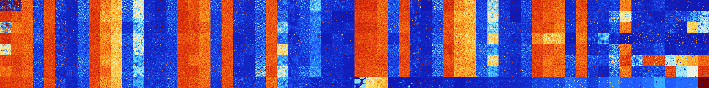

# B0568 (180736-181247)

<details>
    <summary>Initial Grid</summary>
    
</details>


<details>
    <summary>Initial Grid RLE</summary>

```
#C Exported from GoGoL (https://github.com/marrow16/gogol)
#C Wrap mode: Toroidal
#C Boundary mode: Dead
#C Step: 0
x = 100, y = 100, rule = B0568/S
2bo10bo4bo7bo18b2o4bo2bo40bo$45bo12bo23bo$32bo20bo17bo15bo3bo$6bo2bo8bo
43bo17bo$100b$bo9b2o21bo31bo15bo$2bo21bo18bo3bo20bo24bo$42bo35bo$22bo
24bo38bo$16bo44bo2bo26bo$14bo17bo41bo$bo94bo$62bo6bo13bo7bo$67bo$12bo
15bo11bo6bo3bo4bo2bo12bo23bo$100b$17bo10bo10bo$3bo68bo$33bo5bo16bobo13b
o$29bo50bo7bo8bo$7bo2bo2bo48bo19bo$15bo6bo13bo5bo9bo15bo$10bo12bo35bo$
2bo2bo14bo51bo4bo$50bo39b2o$41b2o22bo$23bo29bo$16bo$11bo8bo11bo3bo27bo
21bo12bo$b3o23bo11bo24bo9bo4bo$2bo16bo10bo2bo50bo5bo$22bo19bo21bo18bo
11bo$10bo22bo29bo2bo9bo20bo$24bo10bo7bo41bobo$21bo12bo33bo18bo$5bo12bo
43bo33bo$11bo20bo6bo4bo29bo4bo$50bo3bo43bo$4bo4bobo32bobo5bo36bo3bo$9bo
2b2o66b2o2bo11bo$17b2o20bo3bo21bo31bobo$22bo3bo32bo25bo$6bo4bo26bo42b2o
$44bo4bo32bo8bo4bo$44bo3bo4bo15bo18bo$17bo5bo22bo10bo$bo50bo20bo3bo3bo
2bo13bo$10bo10bo27bo$bo3bobo18bo7bo14bo2bo21bo6bo$2bo11bo11bobo18bo$19b
o5b2o17bo4bo17bo$2bo8bo8bo54bo16bo$13bo17bo7bo16bo21bo11bo$13bo4b2o$89b
o$7bo20bo4bo7bo22bo18bo10bo$3bo31b2o29bo5bo22bo$51bo8bo29bobo$84bo$2bo
56bo5bo14bo$14bo37bo2b2o3bo$13bo56bo17bo$4bo38bo17b2o7bo$39bo4bobobo6bo
18bo$18b2o58bo2bo$18bo4bo2bo12bo15bo21bo12bo7bo$13bo38bo$bo23bo9bo20bo
10bo$10bo20bo9bo40bo$33bo49bo$40bo18bo$13bo30bo$17bo5bo7bo12bo37bo$4bo
78bo11bo$17bo23bo30bo2bo10bo$2bo3bo4bo37bo$3bo35bo42bo$17bo39bo4bo7bo
26bo$4bo22bo44bo2bo16b2o3bo$39bo5bobo5bo3bo25bo2bo12bo$13bo20bo49bo11bo
$2o3bo2bo32bo2bo10bo8bo21bo3bo$16bo19bo18bo16bo14bo$2bo2b2o19bo13bobo7b
o17bo15b2o$58bo13bo13bo$5bobo21bo8bo42bo3bo$100b$7bo52bo9bo11bo$9bobo
13bob2o36bo33bo$8bo22bo18bo2bo40bo4bo$8bo41bo6bobo27bo$24bo2b2o30bo10bo
10bo$34bo43bo14bo5bo$32bo8bo27bo7bo3bo14bo$8bo28bobo26bo8bo9bo$3bo4bo
11bo18bo2b2o33bo$8bo5bo34bo4bo31bo$23bo60bo10bo$31bo8bo9bo17bo5bo$15bo
21bo11bo6bobo2bo3bo2bo!
```
</details>
<details>
    <summary>Thumbnail</summary>

</details>
<table>
<tr>
    <td><a href="./180736%20S%20Heat%20Map%20Activity.png"></a><br>S (180736)<br>R@73,p6</td>    <td><a href="./180737%20S0%20Heat%20Map%20Activity.png"></a><br>S0 (180737)<br>R@113,p24</td>    <td><a href="./180738%20S1%20Heat%20Map%20Activity.png"></a><br>S1 (180738)<br>G>1000</td>    <td><a href="./180739%20S01%20Heat%20Map%20Activity.png"></a><br>S01 (180739)<br>R@33,p12</td>    <td><a href="./180740%20S2%20Heat%20Map%20Activity.png"></a><br>S2 (180740)<br>G>1000</td>    <td><a href="./180741%20S02%20Heat%20Map%20Activity.png"></a><br>S02 (180741)<br>R@171,p8</td>    <td><a href="./180742%20S12%20Heat%20Map%20Activity.png"></a><br>S12 (180742)<br>R@200,p156</td>    <td><a href="./180743%20S012%20Heat%20Map%20Activity.png"></a><br>S012 (180743)<br>R@18,p6</td>    <td><a href="./180744%20S3%20Heat%20Map%20Activity.png"></a><br>S3 (180744)<br>G>1000</td>    <td><a href="./180745%20S03%20Heat%20Map%20Activity.png"></a><br>S03 (180745)<br>G>1000</td>    <td><a href="./180746%20S13%20Heat%20Map%20Activity.png"></a><br>S13 (180746)<br>G>1000</td>    <td><a href="./180747%20S013%20Heat%20Map%20Activity.png"></a><br>S013 (180747)<br>R@19,p2</td>    <td><a href="./180748%20S23%20Heat%20Map%20Activity.png"></a><br>S23 (180748)<br>G>1000</td>    <td><a href="./180749%20S023%20Heat%20Map%20Activity.png"></a><br>S023 (180749)<br>R@108,p30</td>    <td><a href="./180750%20S123%20Heat%20Map%20Activity.png"></a><br>S123 (180750)<br>R@168,p120</td>    <td><a href="./180751%20S0123%20Heat%20Map%20Activity.png"></a><br>S0123 (180751)<br>R@24,p4</td>    <td><a href="./180752%20S4%20Heat%20Map%20Activity.png"></a><br>S4 (180752)<br>G>1000</td>    <td><a href="./180753%20S04%20Heat%20Map%20Activity.png"></a><br>S04 (180753)<br>G>1000</td>    <td><a href="./180754%20S14%20Heat%20Map%20Activity.png"></a><br>S14 (180754)<br>G>1000</td>    <td><a href="./180755%20S014%20Heat%20Map%20Activity.png"></a><br>S014 (180755)<br>R@28,p12</td>    <td><a href="./180756%20S24%20Heat%20Map%20Activity.png"></a><br>S24 (180756)<br>G>1000</td>    <td><a href="./180757%20S024%20Heat%20Map%20Activity.png"></a><br>S024 (180757)<br>R@123,p12</td>    <td><a href="./180758%20S124%20Heat%20Map%20Activity.png"></a><br>S124 (180758)<br>R@127,p60</td>    <td><a href="./180759%20S0124%20Heat%20Map%20Activity.png"></a><br>S0124 (180759)<br>R@18,p2</td>    <td><a href="./180760%20S34%20Heat%20Map%20Activity.png"></a><br>S34 (180760)<br>G>1000</td>    <td><a href="./180761%20S034%20Heat%20Map%20Activity.png"></a><br>S034 (180761)<br>G>1000</td>    <td><a href="./180762%20S134%20Heat%20Map%20Activity.png"></a><br>S134 (180762)<br>G>1000</td>    <td><a href="./180763%20S0134%20Heat%20Map%20Activity.png"></a><br>S0134 (180763)<br>R@26,p4</td>    <td><a href="./180764%20S234%20Heat%20Map%20Activity.png"></a><br>S234 (180764)<br>G>1000</td>    <td><a href="./180765%20S0234%20Heat%20Map%20Activity.png"></a><br>S0234 (180765)<br>R@76,p12</td>    <td><a href="./180766%20S1234%20Heat%20Map%20Activity.png"></a><br>S1234 (180766)<br>R@70,p12</td>    <td><a href="./180767%20S01234%20Heat%20Map%20Activity.png"></a><br>S01234 (180767)<br>R@73,p24</td>    <td><a href="./180768%20S5%20Heat%20Map%20Activity.png"></a><br>S5 (180768)<br>G>1000</td>    <td><a href="./180769%20S05%20Heat%20Map%20Activity.png"></a><br>S05 (180769)<br>G>1000</td>    <td><a href="./180770%20S15%20Heat%20Map%20Activity.png"></a><br>S15 (180770)<br>G>1000</td>    <td><a href="./180771%20S015%20Heat%20Map%20Activity.png"></a><br>S015 (180771)<br>R@26,p6</td>    <td><a href="./180772%20S25%20Heat%20Map%20Activity.png"></a><br>S25 (180772)<br>G>1000</td>    <td><a href="./180773%20S025%20Heat%20Map%20Activity.png"></a><br>S025 (180773)<br>R@236,p12</td>    <td><a href="./180774%20S125%20Heat%20Map%20Activity.png"></a><br>S125 (180774)<br>R@897,p840</td>    <td><a href="./180775%20S0125%20Heat%20Map%20Activity.png"></a><br>S0125 (180775)<br>R@14,p2</td>    <td><a href="./180776%20S35%20Heat%20Map%20Activity.png"></a><br>S35 (180776)<br>G>1000</td>    <td><a href="./180777%20S035%20Heat%20Map%20Activity.png"></a><br>S035 (180777)<br>G>1000</td>    <td><a href="./180778%20S135%20Heat%20Map%20Activity.png"></a><br>S135 (180778)<br>G>1000</td>    <td><a href="./180779%20S0135%20Heat%20Map%20Activity.png"></a><br>S0135 (180779)<br>R@28,p2</td>    <td><a href="./180780%20S235%20Heat%20Map%20Activity.png"></a><br>S235 (180780)<br>G>1000</td>    <td><a href="./180781%20S0235%20Heat%20Map%20Activity.png"></a><br>S0235 (180781)<br>R@68,p12</td>    <td><a href="./180782%20S1235%20Heat%20Map%20Activity.png"></a><br>S1235 (180782)<br>R@224,p180</td>    <td><a href="./180783%20S01235%20Heat%20Map%20Activity.png"></a><br>S01235 (180783)<br>R@24,p4</td>    <td><a href="./180784%20S45%20Heat%20Map%20Activity.png"></a><br>S45 (180784)<br>G>1000</td>    <td><a href="./180785%20S045%20Heat%20Map%20Activity.png"></a><br>S045 (180785)<br>G>1000</td>    <td><a href="./180786%20S145%20Heat%20Map%20Activity.png"></a><br>S145 (180786)<br>G>1000</td>    <td><a href="./180787%20S0145%20Heat%20Map%20Activity.png"></a><br>S0145 (180787)<br>R@88,p60</td>    <td><a href="./180788%20S245%20Heat%20Map%20Activity.png"></a><br>S245 (180788)<br>G>1000</td>    <td><a href="./180789%20S0245%20Heat%20Map%20Activity.png"></a><br>S0245 (180789)<br>R@152,p60</td>    <td><a href="./180790%20S1245%20Heat%20Map%20Activity.png"></a><br>S1245 (180790)<br>R@63,p6</td>    <td><a href="./180791%20S01245%20Heat%20Map%20Activity.png"></a><br>S01245 (180791)<br>R@31,p10</td>    <td><a href="./180792%20S345%20Heat%20Map%20Activity.png"></a><br>S345 (180792)<br>G>1000</td>    <td><a href="./180793%20S0345%20Heat%20Map%20Activity.png"></a><br>S0345 (180793)<br>R@468,p120</td>    <td><a href="./180794%20S1345%20Heat%20Map%20Activity.png"></a><br>S1345 (180794)<br>R@759,p30</td>    <td><a href="./180795%20S01345%20Heat%20Map%20Activity.png"></a><br>S01345 (180795)<br>R@40,p4</td>    <td><a href="./180796%20S2345%20Heat%20Map%20Activity.png"></a><br>S2345 (180796)<br>R@660,p420</td>    <td><a href="./180797%20S02345%20Heat%20Map%20Activity.png"></a><br>S02345 (180797)<br>G>1000</td>    <td><a href="./180798%20S12345%20Heat%20Map%20Activity.png"></a><br>S12345 (180798)<br>G>1000</td>    <td><a href="./180799%20S012345%20Heat%20Map%20Activity.png"></a><br>S012345 (180799)<br>G>1000</td></tr>
<tr>
    <td><a href="./180800%20S6%20Heat%20Map%20Activity.png"></a><br>S6 (180800)<br>G>1000</td>    <td><a href="./180801%20S06%20Heat%20Map%20Activity.png"></a><br>S06 (180801)<br>G>1000</td>    <td><a href="./180802%20S16%20Heat%20Map%20Activity.png"></a><br>S16 (180802)<br>G>1000</td>    <td><a href="./180803%20S016%20Heat%20Map%20Activity.png"></a><br>S016 (180803)<br>R@30,p12</td>    <td><a href="./180804%20S26%20Heat%20Map%20Activity.png"></a><br>S26 (180804)<br>G>1000</td>    <td><a href="./180805%20S026%20Heat%20Map%20Activity.png"></a><br>S026 (180805)<br>R@201,p12</td>    <td><a href="./180806%20S126%20Heat%20Map%20Activity.png"></a><br>S126 (180806)<br>R@121,p60</td>    <td><a href="./180807%20S0126%20Heat%20Map%20Activity.png"></a><br>S0126 (180807)<br>R@13,p2</td>    <td><a href="./180808%20S36%20Heat%20Map%20Activity.png"></a><br>S36 (180808)<br>G>1000</td>    <td><a href="./180809%20S036%20Heat%20Map%20Activity.png"></a><br>S036 (180809)<br>G>1000</td>    <td><a href="./180810%20S136%20Heat%20Map%20Activity.png"></a><br>S136 (180810)<br>G>1000</td>    <td><a href="./180811%20S0136%20Heat%20Map%20Activity.png"></a><br>S0136 (180811)<br>R@19,p2</td>    <td><a href="./180812%20S236%20Heat%20Map%20Activity.png"></a><br>S236 (180812)<br>G>1000</td>    <td><a href="./180813%20S0236%20Heat%20Map%20Activity.png"></a><br>S0236 (180813)<br>R@59,p12</td>    <td><a href="./180814%20S1236%20Heat%20Map%20Activity.png"></a><br>S1236 (180814)<br>R@102,p60</td>    <td><a href="./180815%20S01236%20Heat%20Map%20Activity.png"></a><br>S01236 (180815)<br>R@20,p4</td>    <td><a href="./180816%20S46%20Heat%20Map%20Activity.png"></a><br>S46 (180816)<br>G>1000</td>    <td><a href="./180817%20S046%20Heat%20Map%20Activity.png"></a><br>S046 (180817)<br>G>1000</td>    <td><a href="./180818%20S146%20Heat%20Map%20Activity.png"></a><br>S146 (180818)<br>G>1000</td>    <td><a href="./180819%20S0146%20Heat%20Map%20Activity.png"></a><br>S0146 (180819)<br>R@39,p12</td>    <td><a href="./180820%20S246%20Heat%20Map%20Activity.png"></a><br>S246 (180820)<br>G>1000</td>    <td><a href="./180821%20S0246%20Heat%20Map%20Activity.png"></a><br>S0246 (180821)<br>R@99,p12</td>    <td><a href="./180822%20S1246%20Heat%20Map%20Activity.png"></a><br>S1246 (180822)<br>R@66,p12</td>    <td><a href="./180823%20S01246%20Heat%20Map%20Activity.png"></a><br>S01246 (180823)<br>R@20,p4</td>    <td><a href="./180824%20S346%20Heat%20Map%20Activity.png"></a><br>S346 (180824)<br>G>1000</td>    <td><a href="./180825%20S0346%20Heat%20Map%20Activity.png"></a><br>S0346 (180825)<br>G>1000</td>    <td><a href="./180826%20S1346%20Heat%20Map%20Activity.png"></a><br>S1346 (180826)<br>G>1000</td>    <td><a href="./180827%20S01346%20Heat%20Map%20Activity.png"></a><br>S01346 (180827)<br>R@28,p4</td>    <td><a href="./180828%20S2346%20Heat%20Map%20Activity.png"></a><br>S2346 (180828)<br>G>1000</td>    <td><a href="./180829%20S02346%20Heat%20Map%20Activity.png"></a><br>S02346 (180829)<br>R@90,p12</td>    <td><a href="./180830%20S12346%20Heat%20Map%20Activity.png"></a><br>S12346 (180830)<br>G>1000</td>    <td><a href="./180831%20S012346%20Heat%20Map%20Activity.png"></a><br>S012346 (180831)<br>G>1000</td>    <td><a href="./180832%20S56%20Heat%20Map%20Activity.png"></a><br>S56 (180832)<br>G>1000</td>    <td><a href="./180833%20S056%20Heat%20Map%20Activity.png"></a><br>S056 (180833)<br>G>1000</td>    <td><a href="./180834%20S156%20Heat%20Map%20Activity.png"></a><br>S156 (180834)<br>G>1000</td>    <td><a href="./180835%20S0156%20Heat%20Map%20Activity.png"></a><br>S0156 (180835)<br>R@29,p6</td>    <td><a href="./180836%20S256%20Heat%20Map%20Activity.png"></a><br>S256 (180836)<br>G>1000</td>    <td><a href="./180837%20S0256%20Heat%20Map%20Activity.png"></a><br>S0256 (180837)<br>R@397,p12</td>    <td><a href="./180838%20S1256%20Heat%20Map%20Activity.png"></a><br>S1256 (180838)<br>R@178,p120</td>    <td><a href="./180839%20S01256%20Heat%20Map%20Activity.png"></a><br>S01256 (180839)<br>R@25,p2</td>    <td><a href="./180840%20S356%20Heat%20Map%20Activity.png"></a><br>S356 (180840)<br>G>1000</td>    <td><a href="./180841%20S0356%20Heat%20Map%20Activity.png"></a><br>S0356 (180841)<br>G>1000</td>    <td><a href="./180842%20S1356%20Heat%20Map%20Activity.png"></a><br>S1356 (180842)<br>G>1000</td>    <td><a href="./180843%20S01356%20Heat%20Map%20Activity.png"></a><br>S01356 (180843)<br>R@32,p10</td>    <td><a href="./180844%20S2356%20Heat%20Map%20Activity.png"></a><br>S2356 (180844)<br>G>1000</td>    <td><a href="./180845%20S02356%20Heat%20Map%20Activity.png"></a><br>S02356 (180845)<br>R@74,p2</td>    <td><a href="./180846%20S12356%20Heat%20Map%20Activity.png"></a><br>S12356 (180846)<br>G>1000</td>    <td><a href="./180847%20S012356%20Heat%20Map%20Activity.png"></a><br>S012356 (180847)<br>R@39,p4</td>    <td><a href="./180848%20S456%20Heat%20Map%20Activity.png"></a><br>S456 (180848)<br>G>1000</td>    <td><a href="./180849%20S0456%20Heat%20Map%20Activity.png"></a><br>S0456 (180849)<br>G>1000</td>    <td><a href="./180850%20S1456%20Heat%20Map%20Activity.png"></a><br>S1456 (180850)<br>G>1000</td>    <td><a href="./180851%20S01456%20Heat%20Map%20Activity.png"></a><br>S01456 (180851)<br>R@91,p60</td>    <td><a href="./180852%20S2456%20Heat%20Map%20Activity.png"></a><br>S2456 (180852)<br>G>1000</td>    <td><a href="./180853%20S02456%20Heat%20Map%20Activity.png"></a><br>S02456 (180853)<br>R@129,p6</td>    <td><a href="./180854%20S12456%20Heat%20Map%20Activity.png"></a><br>S12456 (180854)<br>R@134,p2</td>    <td><a href="./180855%20S012456%20Heat%20Map%20Activity.png"></a><br>S012456 (180855)<br>S@45</td>    <td><a href="./180856%20S3456%20Heat%20Map%20Activity.png"></a><br>S3456 (180856)<br>G>1000</td>    <td><a href="./180857%20S03456%20Heat%20Map%20Activity.png"></a><br>S03456 (180857)<br>R@283,p24</td>    <td><a href="./180858%20S13456%20Heat%20Map%20Activity.png"></a><br>S13456 (180858)<br>G>1000</td>    <td><a href="./180859%20S013456%20Heat%20Map%20Activity.png"></a><br>S013456 (180859)<br>R@567,p420</td>    <td><a href="./180860%20S23456%20Heat%20Map%20Activity.png"></a><br>S23456 (180860)<br>G>1000</td>    <td><a href="./180861%20S023456%20Heat%20Map%20Activity.png"></a><br>S023456 (180861)<br>G>1000</td>    <td><a href="./180862%20S123456%20Heat%20Map%20Activity.png"></a><br>S123456 (180862)<br>G>1000</td>    <td><a href="./180863%20S0123456%20Heat%20Map%20Activity.png"></a><br>S0123456 (180863)<br>G>1000</td></tr>
<tr>
    <td><a href="./180864%20S7%20Heat%20Map%20Activity.png"></a><br>S7 (180864)<br>G>1000</td>    <td><a href="./180865%20S07%20Heat%20Map%20Activity.png"></a><br>S07 (180865)<br>G>1000</td>    <td><a href="./180866%20S17%20Heat%20Map%20Activity.png"></a><br>S17 (180866)<br>G>1000</td>    <td><a href="./180867%20S017%20Heat%20Map%20Activity.png"></a><br>S017 (180867)<br>R@30,p12</td>    <td><a href="./180868%20S27%20Heat%20Map%20Activity.png"></a><br>S27 (180868)<br>G>1000</td>    <td><a href="./180869%20S027%20Heat%20Map%20Activity.png"></a><br>S027 (180869)<br>R@176,p6</td>    <td><a href="./180870%20S127%20Heat%20Map%20Activity.png"></a><br>S127 (180870)<br>R@98,p60</td>    <td><a href="./180871%20S0127%20Heat%20Map%20Activity.png"></a><br>S0127 (180871)<br>R@16,p6</td>    <td><a href="./180872%20S37%20Heat%20Map%20Activity.png"></a><br>S37 (180872)<br>G>1000</td>    <td><a href="./180873%20S037%20Heat%20Map%20Activity.png"></a><br>S037 (180873)<br>G>1000</td>    <td><a href="./180874%20S137%20Heat%20Map%20Activity.png"></a><br>S137 (180874)<br>G>1000</td>    <td><a href="./180875%20S0137%20Heat%20Map%20Activity.png"></a><br>S0137 (180875)<br>R@46,p30</td>    <td><a href="./180876%20S237%20Heat%20Map%20Activity.png"></a><br>S237 (180876)<br>G>1000</td>    <td><a href="./180877%20S0237%20Heat%20Map%20Activity.png"></a><br>S0237 (180877)<br>R@94,p30</td>    <td><a href="./180878%20S1237%20Heat%20Map%20Activity.png"></a><br>S1237 (180878)<br>R@65,p30</td>    <td><a href="./180879%20S01237%20Heat%20Map%20Activity.png"></a><br>S01237 (180879)<br>R@18,p4</td>    <td><a href="./180880%20S47%20Heat%20Map%20Activity.png"></a><br>S47 (180880)<br>G>1000</td>    <td><a href="./180881%20S047%20Heat%20Map%20Activity.png"></a><br>S047 (180881)<br>G>1000</td>    <td><a href="./180882%20S147%20Heat%20Map%20Activity.png"></a><br>S147 (180882)<br>G>1000</td>    <td><a href="./180883%20S0147%20Heat%20Map%20Activity.png"></a><br>S0147 (180883)<br>R@37,p12</td>    <td><a href="./180884%20S247%20Heat%20Map%20Activity.png"></a><br>S247 (180884)<br>G>1000</td>    <td><a href="./180885%20S0247%20Heat%20Map%20Activity.png"></a><br>S0247 (180885)<br>R@132,p12</td>    <td><a href="./180886%20S1247%20Heat%20Map%20Activity.png"></a><br>S1247 (180886)<br>R@76,p30</td>    <td><a href="./180887%20S01247%20Heat%20Map%20Activity.png"></a><br>S01247 (180887)<br>R@14,p2</td>    <td><a href="./180888%20S347%20Heat%20Map%20Activity.png"></a><br>S347 (180888)<br>G>1000</td>    <td><a href="./180889%20S0347%20Heat%20Map%20Activity.png"></a><br>S0347 (180889)<br>G>1000</td>    <td><a href="./180890%20S1347%20Heat%20Map%20Activity.png"></a><br>S1347 (180890)<br>G>1000</td>    <td><a href="./180891%20S01347%20Heat%20Map%20Activity.png"></a><br>S01347 (180891)<br>R@22,p4</td>    <td><a href="./180892%20S2347%20Heat%20Map%20Activity.png"></a><br>S2347 (180892)<br>G>1000</td>    <td><a href="./180893%20S02347%20Heat%20Map%20Activity.png"></a><br>S02347 (180893)<br>R@108,p24</td>    <td><a href="./180894%20S12347%20Heat%20Map%20Activity.png"></a><br>S12347 (180894)<br>R@119,p60</td>    <td><a href="./180895%20S012347%20Heat%20Map%20Activity.png"></a><br>S012347 (180895)<br>R@65,p24</td>    <td><a href="./180896%20S57%20Heat%20Map%20Activity.png"></a><br>S57 (180896)<br>G>1000</td>    <td><a href="./180897%20S057%20Heat%20Map%20Activity.png"></a><br>S057 (180897)<br>G>1000</td>    <td><a href="./180898%20S157%20Heat%20Map%20Activity.png"></a><br>S157 (180898)<br>G>1000</td>    <td><a href="./180899%20S0157%20Heat%20Map%20Activity.png"></a><br>S0157 (180899)<br>R@33,p6</td>    <td><a href="./180900%20S257%20Heat%20Map%20Activity.png"></a><br>S257 (180900)<br>G>1000</td>    <td><a href="./180901%20S0257%20Heat%20Map%20Activity.png"></a><br>S0257 (180901)<br>R@320,p12</td>    <td><a href="./180902%20S1257%20Heat%20Map%20Activity.png"></a><br>S1257 (180902)<br>R@167,p120</td>    <td><a href="./180903%20S01257%20Heat%20Map%20Activity.png"></a><br>S01257 (180903)<br>R@24,p12</td>    <td><a href="./180904%20S357%20Heat%20Map%20Activity.png"></a><br>S357 (180904)<br>G>1000</td>    <td><a href="./180905%20S0357%20Heat%20Map%20Activity.png"></a><br>S0357 (180905)<br>G>1000</td>    <td><a href="./180906%20S1357%20Heat%20Map%20Activity.png"></a><br>S1357 (180906)<br>G>1000</td>    <td><a href="./180907%20S01357%20Heat%20Map%20Activity.png"></a><br>S01357 (180907)<br>R@24,p6</td>    <td><a href="./180908%20S2357%20Heat%20Map%20Activity.png"></a><br>S2357 (180908)<br>G>1000</td>    <td><a href="./180909%20S02357%20Heat%20Map%20Activity.png"></a><br>S02357 (180909)<br>R@63,p12</td>    <td><a href="./180910%20S12357%20Heat%20Map%20Activity.png"></a><br>S12357 (180910)<br>R@58,p12</td>    <td><a href="./180911%20S012357%20Heat%20Map%20Activity.png"></a><br>S012357 (180911)<br>R@37,p12</td>    <td><a href="./180912%20S457%20Heat%20Map%20Activity.png"></a><br>S457 (180912)<br>G>1000</td>    <td><a href="./180913%20S0457%20Heat%20Map%20Activity.png"></a><br>S0457 (180913)<br>G>1000</td>    <td><a href="./180914%20S1457%20Heat%20Map%20Activity.png"></a><br>S1457 (180914)<br>G>1000</td>    <td><a href="./180915%20S01457%20Heat%20Map%20Activity.png"></a><br>S01457 (180915)<br>R@43,p18</td>    <td><a href="./180916%20S2457%20Heat%20Map%20Activity.png"></a><br>S2457 (180916)<br>G>1000</td>    <td><a href="./180917%20S02457%20Heat%20Map%20Activity.png"></a><br>S02457 (180917)<br>R@128,p12</td>    <td><a href="./180918%20S12457%20Heat%20Map%20Activity.png"></a><br>S12457 (180918)<br>R@132,p30</td>    <td><a href="./180919%20S012457%20Heat%20Map%20Activity.png"></a><br>S012457 (180919)<br>R@25,p2</td>    <td><a href="./180920%20S3457%20Heat%20Map%20Activity.png"></a><br>S3457 (180920)<br>G>1000</td>    <td><a href="./180921%20S03457%20Heat%20Map%20Activity.png"></a><br>S03457 (180921)<br>R@392,p60</td>    <td><a href="./180922%20S13457%20Heat%20Map%20Activity.png"></a><br>S13457 (180922)<br>R@727,p30</td>    <td><a href="./180923%20S013457%20Heat%20Map%20Activity.png"></a><br>S013457 (180923)<br>R@90,p4</td>    <td><a href="./180924%20S23457%20Heat%20Map%20Activity.png"></a><br>S23457 (180924)<br>G>1000</td>    <td><a href="./180925%20S023457%20Heat%20Map%20Activity.png"></a><br>S023457 (180925)<br>G>1000</td>    <td><a href="./180926%20S123457%20Heat%20Map%20Activity.png"></a><br>S123457 (180926)<br>G>1000</td>    <td><a href="./180927%20S0123457%20Heat%20Map%20Activity.png"></a><br>S0123457 (180927)<br>G>1000</td></tr>
<tr>
    <td><a href="./180928%20S67%20Heat%20Map%20Activity.png"></a><br>S67 (180928)<br>G>1000</td>    <td><a href="./180929%20S067%20Heat%20Map%20Activity.png"></a><br>S067 (180929)<br>G>1000</td>    <td><a href="./180930%20S167%20Heat%20Map%20Activity.png"></a><br>S167 (180930)<br>G>1000</td>    <td><a href="./180931%20S0167%20Heat%20Map%20Activity.png"></a><br>S0167 (180931)<br>R@24,p6</td>    <td><a href="./180932%20S267%20Heat%20Map%20Activity.png"></a><br>S267 (180932)<br>G>1000</td>    <td><a href="./180933%20S0267%20Heat%20Map%20Activity.png"></a><br>S0267 (180933)<br>R@234,p12</td>    <td><a href="./180934%20S1267%20Heat%20Map%20Activity.png"></a><br>S1267 (180934)<br>R@106,p60</td>    <td><a href="./180935%20S01267%20Heat%20Map%20Activity.png"></a><br>S01267 (180935)<br>R@20,p6</td>    <td><a href="./180936%20S367%20Heat%20Map%20Activity.png"></a><br>S367 (180936)<br>G>1000</td>    <td><a href="./180937%20S0367%20Heat%20Map%20Activity.png"></a><br>S0367 (180937)<br>G>1000</td>    <td><a href="./180938%20S1367%20Heat%20Map%20Activity.png"></a><br>S1367 (180938)<br>G>1000</td>    <td><a href="./180939%20S01367%20Heat%20Map%20Activity.png"></a><br>S01367 (180939)<br>R@22,p2</td>    <td><a href="./180940%20S2367%20Heat%20Map%20Activity.png"></a><br>S2367 (180940)<br>G>1000</td>    <td><a href="./180941%20S02367%20Heat%20Map%20Activity.png"></a><br>S02367 (180941)<br>R@80,p12</td>    <td><a href="./180942%20S12367%20Heat%20Map%20Activity.png"></a><br>S12367 (180942)<br>R@57,p12</td>    <td><a href="./180943%20S012367%20Heat%20Map%20Activity.png"></a><br>S012367 (180943)<br>R@32,p12</td>    <td><a href="./180944%20S467%20Heat%20Map%20Activity.png"></a><br>S467 (180944)<br>G>1000</td>    <td><a href="./180945%20S0467%20Heat%20Map%20Activity.png"></a><br>S0467 (180945)<br>G>1000</td>    <td><a href="./180946%20S1467%20Heat%20Map%20Activity.png"></a><br>S1467 (180946)<br>G>1000</td>    <td><a href="./180947%20S01467%20Heat%20Map%20Activity.png"></a><br>S01467 (180947)<br>R@32,p12</td>    <td><a href="./180948%20S2467%20Heat%20Map%20Activity.png"></a><br>S2467 (180948)<br>G>1000</td>    <td><a href="./180949%20S02467%20Heat%20Map%20Activity.png"></a><br>S02467 (180949)<br>R@234,p126</td>    <td><a href="./180950%20S12467%20Heat%20Map%20Activity.png"></a><br>S12467 (180950)<br>R@109,p60</td>    <td><a href="./180951%20S012467%20Heat%20Map%20Activity.png"></a><br>S012467 (180951)<br>R@19,p2</td>    <td><a href="./180952%20S3467%20Heat%20Map%20Activity.png"></a><br>S3467 (180952)<br>G>1000</td>    <td><a href="./180953%20S03467%20Heat%20Map%20Activity.png"></a><br>S03467 (180953)<br>G>1000</td>    <td><a href="./180954%20S13467%20Heat%20Map%20Activity.png"></a><br>S13467 (180954)<br>G>1000</td>    <td><a href="./180955%20S013467%20Heat%20Map%20Activity.png"></a><br>S013467 (180955)<br>R@38,p4</td>    <td><a href="./180956%20S23467%20Heat%20Map%20Activity.png"></a><br>S23467 (180956)<br>G>1000</td>    <td><a href="./180957%20S023467%20Heat%20Map%20Activity.png"></a><br>S023467 (180957)<br>G>1000</td>    <td><a href="./180958%20S123467%20Heat%20Map%20Activity.png"></a><br>S123467 (180958)<br>R@317,p120</td>    <td><a href="./180959%20S0123467%20Heat%20Map%20Activity.png"></a><br>S0123467 (180959)<br>G>1000</td>    <td><a href="./180960%20S567%20Heat%20Map%20Activity.png"></a><br>S567 (180960)<br>G>1000</td>    <td><a href="./180961%20S0567%20Heat%20Map%20Activity.png"></a><br>S0567 (180961)<br>G>1000</td>    <td><a href="./180962%20S1567%20Heat%20Map%20Activity.png"></a><br>S1567 (180962)<br>G>1000</td>    <td><a href="./180963%20S01567%20Heat%20Map%20Activity.png"></a><br>S01567 (180963)<br>R@70,p42</td>    <td><a href="./180964%20S2567%20Heat%20Map%20Activity.png"></a><br>S2567 (180964)<br>G>1000</td>    <td><a href="./180965%20S02567%20Heat%20Map%20Activity.png"></a><br>S02567 (180965)<br>R@351,p12</td>    <td><a href="./180966%20S12567%20Heat%20Map%20Activity.png"></a><br>S12567 (180966)<br>R@183,p120</td>    <td><a href="./180967%20S012567%20Heat%20Map%20Activity.png"></a><br>S012567 (180967)<br>R@21,p2</td>    <td><a href="./180968%20S3567%20Heat%20Map%20Activity.png"></a><br>S3567 (180968)<br>G>1000</td>    <td><a href="./180969%20S03567%20Heat%20Map%20Activity.png"></a><br>S03567 (180969)<br>G>1000</td>    <td><a href="./180970%20S13567%20Heat%20Map%20Activity.png"></a><br>S13567 (180970)<br>G>1000</td>    <td><a href="./180971%20S013567%20Heat%20Map%20Activity.png"></a><br>S013567 (180971)<br>R@38,p10</td>    <td><a href="./180972%20S23567%20Heat%20Map%20Activity.png"></a><br>S23567 (180972)<br>G>1000</td>    <td><a href="./180973%20S023567%20Heat%20Map%20Activity.png"></a><br>S023567 (180973)<br>R@83,p12</td>    <td><a href="./180974%20S123567%20Heat%20Map%20Activity.png"></a><br>S123567 (180974)<br>R@203,p84</td>    <td><a href="./180975%20S0123567%20Heat%20Map%20Activity.png"></a><br>S0123567 (180975)<br>R@54,p2</td>    <td><a href="./180976%20S4567%20Heat%20Map%20Activity.png"></a><br>S4567 (180976)<br>G>1000</td>    <td><a href="./180977%20S04567%20Heat%20Map%20Activity.png"></a><br>S04567 (180977)<br>G>1000</td>    <td><a href="./180978%20S14567%20Heat%20Map%20Activity.png"></a><br>S14567 (180978)<br>G>1000</td>    <td><a href="./180979%20S014567%20Heat%20Map%20Activity.png"></a><br>S014567 (180979)<br>R@590,p420</td>    <td><a href="./180980%20S24567%20Heat%20Map%20Activity.png"></a><br>S24567 (180980)<br>G>1000</td>    <td><a href="./180981%20S024567%20Heat%20Map%20Activity.png"></a><br>S024567 (180981)<br>R@306,p12</td>    <td><a href="./180982%20S124567%20Heat%20Map%20Activity.png"></a><br>S124567 (180982)<br>G>1000</td>    <td><a href="./180983%20S0124567%20Heat%20Map%20Activity.png"></a><br>S0124567 (180983)<br>R@699,p252</td>    <td><a href="./180984%20S34567%20Heat%20Map%20Activity.png"></a><br>S34567 (180984)<br>G>1000</td>    <td><a href="./180985%20S034567%20Heat%20Map%20Activity.png"></a><br>S034567 (180985)<br>R@532,p456</td>    <td><a href="./180986%20S134567%20Heat%20Map%20Activity.png"></a><br>S134567 (180986)<br>R@158,p72</td>    <td><a href="./180987%20S0134567%20Heat%20Map%20Activity.png"></a><br>S0134567 (180987)<br>R@140,p72</td>    <td><a href="./180988%20S234567%20Heat%20Map%20Activity.png"></a><br>S234567 (180988)<br>R@404,p360</td>    <td><a href="./180989%20S0234567%20Heat%20Map%20Activity.png"></a><br>S0234567 (180989)<br>G>1000</td>    <td><a href="./180990%20S1234567%20Heat%20Map%20Activity.png"></a><br>S1234567 (180990)<br>R@288,p240</td>    <td><a href="./180991%20S01234567%20Heat%20Map%20Activity.png"></a><br>S01234567 (180991)<br>G>1000</td></tr>
<tr>
    <td><a href="./180992%20S8%20Heat%20Map%20Activity.png"></a><br>S8 (180992)<br>G>1000</td>    <td><a href="./180993%20S08%20Heat%20Map%20Activity.png"></a><br>S08 (180993)<br>G>1000</td>    <td><a href="./180994%20S18%20Heat%20Map%20Activity.png"></a><br>S18 (180994)<br>G>1000</td>    <td><a href="./180995%20S018%20Heat%20Map%20Activity.png"></a><br>S018 (180995)<br>R@28,p12</td>    <td><a href="./180996%20S28%20Heat%20Map%20Activity.png"></a><br>S28 (180996)<br>G>1000</td>    <td><a href="./180997%20S028%20Heat%20Map%20Activity.png"></a><br>S028 (180997)<br>R@151,p12</td>    <td><a href="./180998%20S128%20Heat%20Map%20Activity.png"></a><br>S128 (180998)<br>R@96,p60</td>    <td><a href="./180999%20S0128%20Heat%20Map%20Activity.png"></a><br>S0128 (180999)<br>R@16,p6</td>    <td><a href="./181000%20S38%20Heat%20Map%20Activity.png"></a><br>S38 (181000)<br>G>1000</td>    <td><a href="./181001%20S038%20Heat%20Map%20Activity.png"></a><br>S038 (181001)<br>G>1000</td>    <td><a href="./181002%20S138%20Heat%20Map%20Activity.png"></a><br>S138 (181002)<br>G>1000</td>    <td><a href="./181003%20S0138%20Heat%20Map%20Activity.png"></a><br>S0138 (181003)<br>R@21,p6</td>    <td><a href="./181004%20S238%20Heat%20Map%20Activity.png"></a><br>S238 (181004)<br>G>1000</td>    <td><a href="./181005%20S0238%20Heat%20Map%20Activity.png"></a><br>S0238 (181005)<br>R@74,p30</td>    <td><a href="./181006%20S1238%20Heat%20Map%20Activity.png"></a><br>S1238 (181006)<br>R@51,p12</td>    <td><a href="./181007%20S01238%20Heat%20Map%20Activity.png"></a><br>S01238 (181007)<br>R@22,p4</td>    <td><a href="./181008%20S48%20Heat%20Map%20Activity.png"></a><br>S48 (181008)<br>G>1000</td>    <td><a href="./181009%20S048%20Heat%20Map%20Activity.png"></a><br>S048 (181009)<br>G>1000</td>    <td><a href="./181010%20S148%20Heat%20Map%20Activity.png"></a><br>S148 (181010)<br>G>1000</td>    <td><a href="./181011%20S0148%20Heat%20Map%20Activity.png"></a><br>S0148 (181011)<br>R@34,p12</td>    <td><a href="./181012%20S248%20Heat%20Map%20Activity.png"></a><br>S248 (181012)<br>G>1000</td>    <td><a href="./181013%20S0248%20Heat%20Map%20Activity.png"></a><br>S0248 (181013)<br>R@168,p60</td>    <td><a href="./181014%20S1248%20Heat%20Map%20Activity.png"></a><br>S1248 (181014)<br>R@50,p12</td>    <td><a href="./181015%20S01248%20Heat%20Map%20Activity.png"></a><br>S01248 (181015)<br>R@16,p2</td>    <td><a href="./181016%20S348%20Heat%20Map%20Activity.png"></a><br>S348 (181016)<br>G>1000</td>    <td><a href="./181017%20S0348%20Heat%20Map%20Activity.png"></a><br>S0348 (181017)<br>G>1000</td>    <td><a href="./181018%20S1348%20Heat%20Map%20Activity.png"></a><br>S1348 (181018)<br>G>1000</td>    <td><a href="./181019%20S01348%20Heat%20Map%20Activity.png"></a><br>S01348 (181019)<br>R@27,p4</td>    <td><a href="./181020%20S2348%20Heat%20Map%20Activity.png"></a><br>S2348 (181020)<br>G>1000</td>    <td><a href="./181021%20S02348%20Heat%20Map%20Activity.png"></a><br>S02348 (181021)<br>R@126,p42</td>    <td><a href="./181022%20S12348%20Heat%20Map%20Activity.png"></a><br>S12348 (181022)<br>R@72,p12</td>    <td><a href="./181023%20S012348%20Heat%20Map%20Activity.png"></a><br>S012348 (181023)<br>R@64,p24</td>    <td><a href="./181024%20S58%20Heat%20Map%20Activity.png"></a><br>S58 (181024)<br>G>1000</td>    <td><a href="./181025%20S058%20Heat%20Map%20Activity.png"></a><br>S058 (181025)<br>G>1000</td>    <td><a href="./181026%20S158%20Heat%20Map%20Activity.png"></a><br>S158 (181026)<br>G>1000</td>    <td><a href="./181027%20S0158%20Heat%20Map%20Activity.png"></a><br>S0158 (181027)<br>R@29,p12</td>    <td><a href="./181028%20S258%20Heat%20Map%20Activity.png"></a><br>S258 (181028)<br>G>1000</td>    <td><a href="./181029%20S0258%20Heat%20Map%20Activity.png"></a><br>S0258 (181029)<br>R@325,p6</td>    <td><a href="./181030%20S1258%20Heat%20Map%20Activity.png"></a><br>S1258 (181030)<br>R@163,p120</td>    <td><a href="./181031%20S01258%20Heat%20Map%20Activity.png"></a><br>S01258 (181031)<br>R@15,p2</td>    <td><a href="./181032%20S358%20Heat%20Map%20Activity.png"></a><br>S358 (181032)<br>G>1000</td>    <td><a href="./181033%20S0358%20Heat%20Map%20Activity.png"></a><br>S0358 (181033)<br>G>1000</td>    <td><a href="./181034%20S1358%20Heat%20Map%20Activity.png"></a><br>S1358 (181034)<br>G>1000</td>    <td><a href="./181035%20S01358%20Heat%20Map%20Activity.png"></a><br>S01358 (181035)<br>R@20,p2</td>    <td><a href="./181036%20S2358%20Heat%20Map%20Activity.png"></a><br>S2358 (181036)<br>G>1000</td>    <td><a href="./181037%20S02358%20Heat%20Map%20Activity.png"></a><br>S02358 (181037)<br>R@77,p6</td>    <td><a href="./181038%20S12358%20Heat%20Map%20Activity.png"></a><br>S12358 (181038)<br>R@69,p12</td>    <td><a href="./181039%20S012358%20Heat%20Map%20Activity.png"></a><br>S012358 (181039)<br>R@26,p4</td>    <td><a href="./181040%20S458%20Heat%20Map%20Activity.png"></a><br>S458 (181040)<br>G>1000</td>    <td><a href="./181041%20S0458%20Heat%20Map%20Activity.png"></a><br>S0458 (181041)<br>G>1000</td>    <td><a href="./181042%20S1458%20Heat%20Map%20Activity.png"></a><br>S1458 (181042)<br>G>1000</td>    <td><a href="./181043%20S01458%20Heat%20Map%20Activity.png"></a><br>S01458 (181043)<br>R@86,p60</td>    <td><a href="./181044%20S2458%20Heat%20Map%20Activity.png"></a><br>S2458 (181044)<br>G>1000</td>    <td><a href="./181045%20S02458%20Heat%20Map%20Activity.png"></a><br>S02458 (181045)<br>R@223,p60</td>    <td><a href="./181046%20S12458%20Heat%20Map%20Activity.png"></a><br>S12458 (181046)<br>R@83,p12</td>    <td><a href="./181047%20S012458%20Heat%20Map%20Activity.png"></a><br>S012458 (181047)<br>S@22</td>    <td><a href="./181048%20S3458%20Heat%20Map%20Activity.png"></a><br>S3458 (181048)<br>G>1000</td>    <td><a href="./181049%20S03458%20Heat%20Map%20Activity.png"></a><br>S03458 (181049)<br>R@446,p60</td>    <td><a href="./181050%20S13458%20Heat%20Map%20Activity.png"></a><br>S13458 (181050)<br>R@311,p60</td>    <td><a href="./181051%20S013458%20Heat%20Map%20Activity.png"></a><br>S013458 (181051)<br>R@54,p12</td>    <td><a href="./181052%20S23458%20Heat%20Map%20Activity.png"></a><br>S23458 (181052)<br>G>1000</td>    <td><a href="./181053%20S023458%20Heat%20Map%20Activity.png"></a><br>S023458 (181053)<br>R@235,p120</td>    <td><a href="./181054%20S123458%20Heat%20Map%20Activity.png"></a><br>S123458 (181054)<br>G>1000</td>    <td><a href="./181055%20S0123458%20Heat%20Map%20Activity.png"></a><br>S0123458 (181055)<br>G>1000</td></tr>
<tr>
    <td><a href="./181056%20S68%20Heat%20Map%20Activity.png"></a><br>S68 (181056)<br>G>1000</td>    <td><a href="./181057%20S068%20Heat%20Map%20Activity.png"></a><br>S068 (181057)<br>G>1000</td>    <td><a href="./181058%20S168%20Heat%20Map%20Activity.png"></a><br>S168 (181058)<br>G>1000</td>    <td><a href="./181059%20S0168%20Heat%20Map%20Activity.png"></a><br>S0168 (181059)<br>R@26,p6</td>    <td><a href="./181060%20S268%20Heat%20Map%20Activity.png"></a><br>S268 (181060)<br>G>1000</td>    <td><a href="./181061%20S0268%20Heat%20Map%20Activity.png"></a><br>S0268 (181061)<br>R@126,p6</td>    <td><a href="./181062%20S1268%20Heat%20Map%20Activity.png"></a><br>S1268 (181062)<br>R@96,p60</td>    <td><a href="./181063%20S01268%20Heat%20Map%20Activity.png"></a><br>S01268 (181063)<br>R@16,p4</td>    <td><a href="./181064%20S368%20Heat%20Map%20Activity.png"></a><br>S368 (181064)<br>G>1000</td>    <td><a href="./181065%20S0368%20Heat%20Map%20Activity.png"></a><br>S0368 (181065)<br>G>1000</td>    <td><a href="./181066%20S1368%20Heat%20Map%20Activity.png"></a><br>S1368 (181066)<br>G>1000</td>    <td><a href="./181067%20S01368%20Heat%20Map%20Activity.png"></a><br>S01368 (181067)<br>R@23,p6</td>    <td><a href="./181068%20S2368%20Heat%20Map%20Activity.png"></a><br>S2368 (181068)<br>G>1000</td>    <td><a href="./181069%20S02368%20Heat%20Map%20Activity.png"></a><br>S02368 (181069)<br>R@113,p6</td>    <td><a href="./181070%20S12368%20Heat%20Map%20Activity.png"></a><br>S12368 (181070)<br>R@45,p12</td>    <td><a href="./181071%20S012368%20Heat%20Map%20Activity.png"></a><br>S012368 (181071)<br>R@30,p4</td>    <td><a href="./181072%20S468%20Heat%20Map%20Activity.png"></a><br>S468 (181072)<br>G>1000</td>    <td><a href="./181073%20S0468%20Heat%20Map%20Activity.png"></a><br>S0468 (181073)<br>G>1000</td>    <td><a href="./181074%20S1468%20Heat%20Map%20Activity.png"></a><br>S1468 (181074)<br>G>1000</td>    <td><a href="./181075%20S01468%20Heat%20Map%20Activity.png"></a><br>S01468 (181075)<br>R@33,p12</td>    <td><a href="./181076%20S2468%20Heat%20Map%20Activity.png"></a><br>S2468 (181076)<br>G>1000</td>    <td><a href="./181077%20S02468%20Heat%20Map%20Activity.png"></a><br>S02468 (181077)<br>R@130,p12</td>    <td><a href="./181078%20S12468%20Heat%20Map%20Activity.png"></a><br>S12468 (181078)<br>R@140,p60</td>    <td><a href="./181079%20S012468%20Heat%20Map%20Activity.png"></a><br>S012468 (181079)<br>R@18,p2</td>    <td><a href="./181080%20S3468%20Heat%20Map%20Activity.png"></a><br>S3468 (181080)<br>G>1000</td>    <td><a href="./181081%20S03468%20Heat%20Map%20Activity.png"></a><br>S03468 (181081)<br>G>1000</td>    <td><a href="./181082%20S13468%20Heat%20Map%20Activity.png"></a><br>S13468 (181082)<br>G>1000</td>    <td><a href="./181083%20S013468%20Heat%20Map%20Activity.png"></a><br>S013468 (181083)<br>R@51,p20</td>    <td><a href="./181084%20S23468%20Heat%20Map%20Activity.png"></a><br>S23468 (181084)<br>G>1000</td>    <td><a href="./181085%20S023468%20Heat%20Map%20Activity.png"></a><br>S023468 (181085)<br>R@141,p12</td>    <td><a href="./181086%20S123468%20Heat%20Map%20Activity.png"></a><br>S123468 (181086)<br>R@242,p120</td>    <td><a href="./181087%20S0123468%20Heat%20Map%20Activity.png"></a><br>S0123468 (181087)<br>R@536,p420</td>    <td><a href="./181088%20S568%20Heat%20Map%20Activity.png"></a><br>S568 (181088)<br>G>1000</td>    <td><a href="./181089%20S0568%20Heat%20Map%20Activity.png"></a><br>S0568 (181089)<br>G>1000</td>    <td><a href="./181090%20S1568%20Heat%20Map%20Activity.png"></a><br>S1568 (181090)<br>G>1000</td>    <td><a href="./181091%20S01568%20Heat%20Map%20Activity.png"></a><br>S01568 (181091)<br>R@41,p12</td>    <td><a href="./181092%20S2568%20Heat%20Map%20Activity.png"></a><br>S2568 (181092)<br>G>1000</td>    <td><a href="./181093%20S02568%20Heat%20Map%20Activity.png"></a><br>S02568 (181093)<br>R@354,p42</td>    <td><a href="./181094%20S12568%20Heat%20Map%20Activity.png"></a><br>S12568 (181094)<br>R@100,p60</td>    <td><a href="./181095%20S012568%20Heat%20Map%20Activity.png"></a><br>S012568 (181095)<br>R@24,p6</td>    <td><a href="./181096%20S3568%20Heat%20Map%20Activity.png"></a><br>S3568 (181096)<br>G>1000</td>    <td><a href="./181097%20S03568%20Heat%20Map%20Activity.png"></a><br>S03568 (181097)<br>G>1000</td>    <td><a href="./181098%20S13568%20Heat%20Map%20Activity.png"></a><br>S13568 (181098)<br>G>1000</td>    <td><a href="./181099%20S013568%20Heat%20Map%20Activity.png"></a><br>S013568 (181099)<br>R@36,p10</td>    <td><a href="./181100%20S23568%20Heat%20Map%20Activity.png"></a><br>S23568 (181100)<br>G>1000</td>    <td><a href="./181101%20S023568%20Heat%20Map%20Activity.png"></a><br>S023568 (181101)<br>R@94,p30</td>    <td><a href="./181102%20S123568%20Heat%20Map%20Activity.png"></a><br>S123568 (181102)<br>R@178,p84</td>    <td><a href="./181103%20S0123568%20Heat%20Map%20Activity.png"></a><br>S0123568 (181103)<br>R@48,p4</td>    <td><a href="./181104%20S4568%20Heat%20Map%20Activity.png"></a><br>S4568 (181104)<br>G>1000</td>    <td><a href="./181105%20S04568%20Heat%20Map%20Activity.png"></a><br>S04568 (181105)<br>G>1000</td>    <td><a href="./181106%20S14568%20Heat%20Map%20Activity.png"></a><br>S14568 (181106)<br>G>1000</td>    <td><a href="./181107%20S014568%20Heat%20Map%20Activity.png"></a><br>S014568 (181107)<br>R@62,p12</td>    <td><a href="./181108%20S24568%20Heat%20Map%20Activity.png"></a><br>S24568 (181108)<br>G>1000</td>    <td><a href="./181109%20S024568%20Heat%20Map%20Activity.png"></a><br>S024568 (181109)<br>R@132,p12</td>    <td><a href="./181110%20S124568%20Heat%20Map%20Activity.png"></a><br>S124568 (181110)<br>R@162,p12</td>    <td><a href="./181111%20S0124568%20Heat%20Map%20Activity.png"></a><br>S0124568 (181111)<br>S@89</td>    <td><a href="./181112%20S34568%20Heat%20Map%20Activity.png"></a><br>S34568 (181112)<br>G>1000</td>    <td><a href="./181113%20S034568%20Heat%20Map%20Activity.png"></a><br>S034568 (181113)<br>G>1000</td>    <td><a href="./181114%20S134568%20Heat%20Map%20Activity.png"></a><br>S134568 (181114)<br>G>1000</td>    <td><a href="./181115%20S0134568%20Heat%20Map%20Activity.png"></a><br>S0134568 (181115)<br>G>1000</td>    <td><a href="./181116%20S234568%20Heat%20Map%20Activity.png"></a><br>S234568 (181116)<br>G>1000</td>    <td><a href="./181117%20S0234568%20Heat%20Map%20Activity.png"></a><br>S0234568 (181117)<br>G>1000</td>    <td><a href="./181118%20S1234568%20Heat%20Map%20Activity.png"></a><br>S1234568 (181118)<br>G>1000</td>    <td><a href="./181119%20S01234568%20Heat%20Map%20Activity.png"></a><br>S01234568 (181119)<br>G>1000</td></tr>
<tr>
    <td><a href="./181120%20S78%20Heat%20Map%20Activity.png"></a><br>S78 (181120)<br>G>1000</td>    <td><a href="./181121%20S078%20Heat%20Map%20Activity.png"></a><br>S078 (181121)<br>G>1000</td>    <td><a href="./181122%20S178%20Heat%20Map%20Activity.png"></a><br>S178 (181122)<br>G>1000</td>    <td><a href="./181123%20S0178%20Heat%20Map%20Activity.png"></a><br>S0178 (181123)<br>R@30,p12</td>    <td><a href="./181124%20S278%20Heat%20Map%20Activity.png"></a><br>S278 (181124)<br>G>1000</td>    <td><a href="./181125%20S0278%20Heat%20Map%20Activity.png"></a><br>S0278 (181125)<br>R@265,p6</td>    <td><a href="./181126%20S1278%20Heat%20Map%20Activity.png"></a><br>S1278 (181126)<br>R@57,p12</td>    <td><a href="./181127%20S01278%20Heat%20Map%20Activity.png"></a><br>S01278 (181127)<br>R@18,p6</td>    <td><a href="./181128%20S378%20Heat%20Map%20Activity.png"></a><br>S378 (181128)<br>G>1000</td>    <td><a href="./181129%20S0378%20Heat%20Map%20Activity.png"></a><br>S0378 (181129)<br>G>1000</td>    <td><a href="./181130%20S1378%20Heat%20Map%20Activity.png"></a><br>S1378 (181130)<br>G>1000</td>    <td><a href="./181131%20S01378%20Heat%20Map%20Activity.png"></a><br>S01378 (181131)<br>R@22,p2</td>    <td><a href="./181132%20S2378%20Heat%20Map%20Activity.png"></a><br>S2378 (181132)<br>G>1000</td>    <td><a href="./181133%20S02378%20Heat%20Map%20Activity.png"></a><br>S02378 (181133)<br>R@71,p6</td>    <td><a href="./181134%20S12378%20Heat%20Map%20Activity.png"></a><br>S12378 (181134)<br>R@46,p12</td>    <td><a href="./181135%20S012378%20Heat%20Map%20Activity.png"></a><br>S012378 (181135)<br>R@23,p4</td>    <td><a href="./181136%20S478%20Heat%20Map%20Activity.png"></a><br>S478 (181136)<br>G>1000</td>    <td><a href="./181137%20S0478%20Heat%20Map%20Activity.png"></a><br>S0478 (181137)<br>G>1000</td>    <td><a href="./181138%20S1478%20Heat%20Map%20Activity.png"></a><br>S1478 (181138)<br>G>1000</td>    <td><a href="./181139%20S01478%20Heat%20Map%20Activity.png"></a><br>S01478 (181139)<br>R@32,p12</td>    <td><a href="./181140%20S2478%20Heat%20Map%20Activity.png"></a><br>S2478 (181140)<br>G>1000</td>    <td><a href="./181141%20S02478%20Heat%20Map%20Activity.png"></a><br>S02478 (181141)<br>R@240,p60</td>    <td><a href="./181142%20S12478%20Heat%20Map%20Activity.png"></a><br>S12478 (181142)<br>R@106,p60</td>    <td><a href="./181143%20S012478%20Heat%20Map%20Activity.png"></a><br>S012478 (181143)<br>S@19</td>    <td><a href="./181144%20S3478%20Heat%20Map%20Activity.png"></a><br>S3478 (181144)<br>G>1000</td>    <td><a href="./181145%20S03478%20Heat%20Map%20Activity.png"></a><br>S03478 (181145)<br>G>1000</td>    <td><a href="./181146%20S13478%20Heat%20Map%20Activity.png"></a><br>S13478 (181146)<br>G>1000</td>    <td><a href="./181147%20S013478%20Heat%20Map%20Activity.png"></a><br>S013478 (181147)<br>R@26,p2</td>    <td><a href="./181148%20S23478%20Heat%20Map%20Activity.png"></a><br>S23478 (181148)<br>G>1000</td>    <td><a href="./181149%20S023478%20Heat%20Map%20Activity.png"></a><br>S023478 (181149)<br>R@131,p12</td>    <td><a href="./181150%20S123478%20Heat%20Map%20Activity.png"></a><br>S123478 (181150)<br>R@140,p60</td>    <td><a href="./181151%20S0123478%20Heat%20Map%20Activity.png"></a><br>S0123478 (181151)<br>R@329,p280</td>    <td><a href="./181152%20S578%20Heat%20Map%20Activity.png"></a><br>S578 (181152)<br>G>1000</td>    <td><a href="./181153%20S0578%20Heat%20Map%20Activity.png"></a><br>S0578 (181153)<br>G>1000</td>    <td><a href="./181154%20S1578%20Heat%20Map%20Activity.png"></a><br>S1578 (181154)<br>G>1000</td>    <td><a href="./181155%20S01578%20Heat%20Map%20Activity.png"></a><br>S01578 (181155)<br>R@29,p6</td>    <td><a href="./181156%20S2578%20Heat%20Map%20Activity.png"></a><br>S2578 (181156)<br>G>1000</td>    <td><a href="./181157%20S02578%20Heat%20Map%20Activity.png"></a><br>S02578 (181157)<br>R@270,p12</td>    <td><a href="./181158%20S12578%20Heat%20Map%20Activity.png"></a><br>S12578 (181158)<br>R@175,p120</td>    <td><a href="./181159%20S012578%20Heat%20Map%20Activity.png"></a><br>S012578 (181159)<br>R@17,p2</td>    <td><a href="./181160%20S3578%20Heat%20Map%20Activity.png"></a><br>S3578 (181160)<br>G>1000</td>    <td><a href="./181161%20S03578%20Heat%20Map%20Activity.png"></a><br>S03578 (181161)<br>G>1000</td>    <td><a href="./181162%20S13578%20Heat%20Map%20Activity.png"></a><br>S13578 (181162)<br>G>1000</td>    <td><a href="./181163%20S013578%20Heat%20Map%20Activity.png"></a><br>S013578 (181163)<br>R@22,p2</td>    <td><a href="./181164%20S23578%20Heat%20Map%20Activity.png"></a><br>S23578 (181164)<br>G>1000</td>    <td><a href="./181165%20S023578%20Heat%20Map%20Activity.png"></a><br>S023578 (181165)<br>R@65,p6</td>    <td><a href="./181166%20S123578%20Heat%20Map%20Activity.png"></a><br>S123578 (181166)<br>R@107,p60</td>    <td><a href="./181167%20S0123578%20Heat%20Map%20Activity.png"></a><br>S0123578 (181167)<br>R@31,p4</td>    <td><a href="./181168%20S4578%20Heat%20Map%20Activity.png"></a><br>S4578 (181168)<br>G>1000</td>    <td><a href="./181169%20S04578%20Heat%20Map%20Activity.png"></a><br>S04578 (181169)<br>G>1000</td>    <td><a href="./181170%20S14578%20Heat%20Map%20Activity.png"></a><br>S14578 (181170)<br>G>1000</td>    <td><a href="./181171%20S014578%20Heat%20Map%20Activity.png"></a><br>S014578 (181171)<br>R@41,p12</td>    <td><a href="./181172%20S24578%20Heat%20Map%20Activity.png"></a><br>S24578 (181172)<br>G>1000</td>    <td><a href="./181173%20S024578%20Heat%20Map%20Activity.png"></a><br>S024578 (181173)<br>R@141,p12</td>    <td><a href="./181174%20S124578%20Heat%20Map%20Activity.png"></a><br>S124578 (181174)<br>R@331,p210</td>    <td><a href="./181175%20S0124578%20Heat%20Map%20Activity.png"></a><br>S0124578 (181175)<br>R@37,p2</td>    <td><a href="./181176%20S34578%20Heat%20Map%20Activity.png"></a><br>S34578 (181176)<br>G>1000</td>    <td><a href="./181177%20S034578%20Heat%20Map%20Activity.png"></a><br>S034578 (181177)<br>R@490,p36</td>    <td><a href="./181178%20S134578%20Heat%20Map%20Activity.png"></a><br>S134578 (181178)<br>G>1000</td>    <td><a href="./181179%20S0134578%20Heat%20Map%20Activity.png"></a><br>S0134578 (181179)<br>R@174,p20</td>    <td><a href="./181180%20S234578%20Heat%20Map%20Activity.png"></a><br>S234578 (181180)<br>G>1000</td>    <td><a href="./181181%20S0234578%20Heat%20Map%20Activity.png"></a><br>S0234578 (181181)<br>G>1000</td>    <td><a href="./181182%20S1234578%20Heat%20Map%20Activity.png"></a><br>S1234578 (181182)<br>G>1000</td>    <td><a href="./181183%20S01234578%20Heat%20Map%20Activity.png"></a><br>S01234578 (181183)<br>G>1000</td></tr>
<tr>
    <td><a href="./181184%20S678%20Heat%20Map%20Activity.png"></a><br>S678 (181184)<br>G>1000</td>    <td><a href="./181185%20S0678%20Heat%20Map%20Activity.png"></a><br>S0678 (181185)<br>G>1000</td>    <td><a href="./181186%20S1678%20Heat%20Map%20Activity.png"></a><br>S1678 (181186)<br>G>1000</td>    <td><a href="./181187%20S01678%20Heat%20Map%20Activity.png"></a><br>S01678 (181187)<br>R@36,p6</td>    <td><a href="./181188%20S2678%20Heat%20Map%20Activity.png"></a><br>S2678 (181188)<br>G>1000</td>    <td><a href="./181189%20S02678%20Heat%20Map%20Activity.png"></a><br>S02678 (181189)<br>R@197,p12</td>    <td><a href="./181190%20S12678%20Heat%20Map%20Activity.png"></a><br>S12678 (181190)<br>R@172,p120</td>    <td><a href="./181191%20S012678%20Heat%20Map%20Activity.png"></a><br>S012678 (181191)<br>R@29,p6</td>    <td><a href="./181192%20S3678%20Heat%20Map%20Activity.png"></a><br>S3678 (181192)<br>G>1000</td>    <td><a href="./181193%20S03678%20Heat%20Map%20Activity.png"></a><br>S03678 (181193)<br>G>1000</td>    <td><a href="./181194%20S13678%20Heat%20Map%20Activity.png"></a><br>S13678 (181194)<br>G>1000</td>    <td><a href="./181195%20S013678%20Heat%20Map%20Activity.png"></a><br>S013678 (181195)<br>R@29,p2</td>    <td><a href="./181196%20S23678%20Heat%20Map%20Activity.png"></a><br>S23678 (181196)<br>G>1000</td>    <td><a href="./181197%20S023678%20Heat%20Map%20Activity.png"></a><br>S023678 (181197)<br>R@82,p6</td>    <td><a href="./181198%20S123678%20Heat%20Map%20Activity.png"></a><br>S123678 (181198)<br>R@66,p12</td>    <td><a href="./181199%20S0123678%20Heat%20Map%20Activity.png"></a><br>S0123678 (181199)<br>R@33,p4</td>    <td><a href="./181200%20S4678%20Heat%20Map%20Activity.png"></a><br>S4678 (181200)<br>G>1000</td>    <td><a href="./181201%20S04678%20Heat%20Map%20Activity.png"></a><br>S04678 (181201)<br>G>1000</td>    <td><a href="./181202%20S14678%20Heat%20Map%20Activity.png"></a><br>S14678 (181202)<br>G>1000</td>    <td><a href="./181203%20S014678%20Heat%20Map%20Activity.png"></a><br>S014678 (181203)<br>R@61,p12</td>    <td><a href="./181204%20S24678%20Heat%20Map%20Activity.png"></a><br>S24678 (181204)<br>G>1000</td>    <td><a href="./181205%20S024678%20Heat%20Map%20Activity.png"></a><br>S024678 (181205)<br>R@116,p12</td>    <td><a href="./181206%20S124678%20Heat%20Map%20Activity.png"></a><br>S124678 (181206)<br>R@103,p24</td>    <td><a href="./181207%20S0124678%20Heat%20Map%20Activity.png"></a><br>S0124678 (181207)<br>R@57,p2</td>    <td><a href="./181208%20S34678%20Heat%20Map%20Activity.png"></a><br>S34678 (181208)<br>G>1000</td>    <td><a href="./181209%20S034678%20Heat%20Map%20Activity.png"></a><br>S034678 (181209)<br>G>1000</td>    <td><a href="./181210%20S134678%20Heat%20Map%20Activity.png"></a><br>S134678 (181210)<br>G>1000</td>    <td><a href="./181211%20S0134678%20Heat%20Map%20Activity.png"></a><br>S0134678 (181211)<br>R@169,p4</td>    <td><a href="./181212%20S234678%20Heat%20Map%20Activity.png"></a><br>S234678 (181212)<br>R@186,p8</td>    <td><a href="./181213%20S0234678%20Heat%20Map%20Activity.png"></a><br>S0234678 (181213)<br>R@586,p12</td>    <td><a href="./181214%20S1234678%20Heat%20Map%20Activity.png"></a><br>S1234678 (181214)<br>R@110,p8</td>    <td><a href="./181215%20S01234678%20Heat%20Map%20Activity.png"></a><br>S01234678 (181215)<br>R@214,p8</td>    <td><a href="./181216%20S5678%20Heat%20Map%20Activity.png"></a><br>S5678 (181216)<br>G>1000</td>    <td><a href="./181217%20S05678%20Heat%20Map%20Activity.png"></a><br>S05678 (181217)<br>G>1000</td>    <td><a href="./181218%20S15678%20Heat%20Map%20Activity.png"></a><br>S15678 (181218)<br>G>1000</td>    <td><a href="./181219%20S015678%20Heat%20Map%20Activity.png"></a><br>S015678 (181219)<br>R@586,p504</td>    <td><a href="./181220%20S25678%20Heat%20Map%20Activity.png"></a><br>S25678 (181220)<br>R@404,p2</td>    <td><a href="./181221%20S025678%20Heat%20Map%20Activity.png"></a><br>S025678 (181221)<br>G>1000</td>    <td><a href="./181222%20S125678%20Heat%20Map%20Activity.png"></a><br>S125678 (181222)<br>R@189,p120</td>    <td><a href="./181223%20S0125678%20Heat%20Map%20Activity.png"></a><br>S0125678 (181223)<br>R@110,p40</td>    <td><a href="./181224%20S35678%20Heat%20Map%20Activity.png"></a><br>S35678 (181224)<br>R@53,p2</td>    <td><a href="./181225%20S035678%20Heat%20Map%20Activity.png"></a><br>S035678 (181225)<br>R@275,p180</td>    <td><a href="./181226%20S135678%20Heat%20Map%20Activity.png"></a><br>S135678 (181226)<br>R@59,p6</td>    <td><a href="./181227%20S0135678%20Heat%20Map%20Activity.png"></a><br>S0135678 (181227)<br>R@54,p14</td>    <td><a href="./181228%20S235678%20Heat%20Map%20Activity.png"></a><br>S235678 (181228)<br>R@28,p2</td>    <td><a href="./181229%20S0235678%20Heat%20Map%20Activity.png"></a><br>S0235678 (181229)<br>R@48,p2</td>    <td><a href="./181230%20S1235678%20Heat%20Map%20Activity.png"></a><br>S1235678 (181230)<br>R@36,p2</td>    <td><a href="./181231%20S01235678%20Heat%20Map%20Activity.png"></a><br>S01235678 (181231)<br>R@29,p2</td>    <td><a href="./181232%20S45678%20Heat%20Map%20Activity.png"></a><br>S45678 (181232)<br>S@30</td>    <td><a href="./181233%20S045678%20Heat%20Map%20Activity.png"></a><br>S045678 (181233)<br>S@29</td>    <td><a href="./181234%20S145678%20Heat%20Map%20Activity.png"></a><br>S145678 (181234)<br>S@31</td>    <td><a href="./181235%20S0145678%20Heat%20Map%20Activity.png"></a><br>S0145678 (181235)<br>S@34</td>    <td><a href="./181236%20S245678%20Heat%20Map%20Activity.png"></a><br>S245678 (181236)<br>S@20</td>    <td><a href="./181237%20S0245678%20Heat%20Map%20Activity.png"></a><br>S0245678 (181237)<br>S@28</td>    <td><a href="./181238%20S1245678%20Heat%20Map%20Activity.png"></a><br>S1245678 (181238)<br>S@33</td>    <td><a href="./181239%20S01245678%20Heat%20Map%20Activity.png"></a><br>S01245678 (181239)<br>S@25</td>    <td><a href="./181240%20S345678%20Heat%20Map%20Activity.png"></a><br>S345678 (181240)<br>S@15</td>    <td><a href="./181241%20S0345678%20Heat%20Map%20Activity.png"></a><br>S0345678 (181241)<br>S@25</td>    <td><a href="./181242%20S1345678%20Heat%20Map%20Activity.png"></a><br>S1345678 (181242)<br>S@17</td>    <td><a href="./181243%20S01345678%20Heat%20Map%20Activity.png"></a><br>S01345678 (181243)<br>S@28</td>    <td><a href="./181244%20S2345678%20Heat%20Map%20Activity.png"></a><br>S2345678 (181244)<br>S@13</td>    <td><a href="./181245%20S02345678%20Heat%20Map%20Activity.png"></a><br>S02345678 (181245)<br>S@17</td>    <td><a href="./181246%20S12345678%20Heat%20Map%20Activity.png"></a><br>S12345678 (181246)<br>S@11</td>    <td><a href="./181247%20S012345678%20Heat%20Map%20Activity.png"></a><br>S012345678 (181247)<br>S@14</td></tr>
</table>
