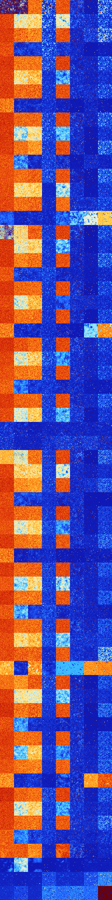

# B057 (82432-82943)

<details>
    <summary>Initial Grid</summary>
    
</details>


<details>
    <summary>Initial Grid RLE</summary>

```
#C Exported from GoGoL (https://github.com/marrow16/gogol)
#C Wrap mode: Toroidal
#C Boundary mode: Dead
#C Step: 0
x = 100, y = 100, rule = B057/S
31bo18bo5bo3bo17bo$10bo9bo23bo29bo$28bo62bo$37bo39bo$92bo3bobo$17bo26bo
23bo3bo$28bo31b2o11bo6bo$18bo53bo$12b2o9bo18bo6bo22bo$31bo10bo13bo22bo$
48bo$2bo2bo15bo2bo$10bo8bo39bo10bo$7bo4bo5bo52bo2bo6bo17bo$23bo7bo34bo
24bo$11bo18bo16bo28bo$7bo6bo3bo31bo13bo6bo24bo$14bo42bo2bo30bo$19bobo6b
o8bo44bo$47bo7bo14bo9bo11bo$7bo4bo11bo5bo14bo6bo14bo10bo7bo$17b2o5bo23b
o25bo$18bo67bo$32bobo20bo13bo8bo11bo$34bo16bo3bo$27bo24bo$38b2o15bo3bo
11bo15bo$o10bo2bo3bo20bo11bo16bo13bo$47bo8bo29bo$5bo5bobo10bo24bo17bo
13bo8bo$28b2o6bo39bo9bo2b2o$o33bo17bo8bo11bo7bo6bo$6bo20bo3bo14bo4bo6bo
20bo9bo$9bo28bo2bobo25bo6bo22bo$6bo11bo29bo41bo$29bobo7bo10bo17bo14bobo
9bo$15bo64bo11bo$3bo20bo23bo15bo26bo$24bo15bo55bo$15bo14b2o4bo13bo5bo
39bo$42bo40bo$87bo8bo$3bo$24bo31bo12bo19bo$61bo16bo$5bo6bo16bo8b2o4bo8b
o10b2o3bo11bo2bo11bo$8bo12bo9bo2bo49bo$12bo79bo$28bo20bo$19bo4bo16bo20b
o12bo11bo$46bo9bo18bo$40bo43bobo6bo$25bo3bo39bo$14bo4b2obo54bo$46bo38bo
$27bo11bo25bo8bo24bo$21bobo7bo11bo55bo$19bo20bo30bo4bo5bo15bo$o29bo26bo
16bo5bo4bobo$45bo13bo$13bo16bo42bo5bo2bo$62bo15bo10bo$5bo2bo23bo63bo$
16bo7bo34bo6bo17bo$5bo70bo$21bo18bo11bob2o9bo$13bo16bo15bo12b2o8bo20b2o
2bo$5bo32bo28bo$2bo26b2o17bo27bo3bo4bo12bo$26bo13bo16bo22bo$21bo30bo28b
o2bo$16bo36bobo$30bo22bo5bo13bo4bo$bo18bo20bo5bo4bo2bo19bo16bo4bo$6bo5b
o6bo7bo70b2o$10b2o25bo$37bo22bo27bo$12b2o21bo28bo14bo4bobo3bo$12bo4bo
64bo13bo$61bo11bo23bo$19bo54b2o10b3o$46bo3bo13bobo32bo$36bo17bo9bo16bo
2bo$63bo2bo13b2o$10bo13bo27bo7bo14bo2bo6bo$4bo28bo39bo5bo$3bo10bo6bo34b
o12bo8bo9bo$3bo29bo24bo30bobo$o5bo23b2o31bo14bo3bo12bo$6bo7bo23bo8bo7bo
43bo$31bo2bo21bo37bobo$18bo55bobo15bo$46bo26bo15bo$34bo44bo13bo$3bo35bo
3bo17bo7bo3bo9bo$66bo16b2o12bo$9bo29bo8bo16bobo18bobo5bo$18bo19bo2bo19b
obo16bo12bo$2bo4bo20bo25bo$9bo34bo8bo39bo!
```
</details>
<details>
    <summary>Thumbnail</summary>

</details>
<table>
<tr>
    <td><a href="./82432%20S%20Heat%20Map%20Activity.png"></a><br>S (82432)<br>R@62,p6</td>    <td><a href="./82433%20S0%20Heat%20Map%20Activity.png"></a><br>S0 (82433)<br>R@100,p12</td>    <td><a href="./82434%20S1%20Heat%20Map%20Activity.png"></a><br>S1 (82434)<br>G>1000</td>    <td><a href="./82435%20S01%20Heat%20Map%20Activity.png"></a><br>S01 (82435)<br>R@46,p4</td>    <td><a href="./82436%20S2%20Heat%20Map%20Activity.png"></a><br>S2 (82436)<br>G>1000</td>    <td><a href="./82437%20S02%20Heat%20Map%20Activity.png"></a><br>S02 (82437)<br>R@190,p12</td>    <td><a href="./82438%20S12%20Heat%20Map%20Activity.png"></a><br>S12 (82438)<br>R@469,p420</td>    <td><a href="./82439%20S012%20Heat%20Map%20Activity.png"></a><br>S012 (82439)<br>R@26,p2</td></tr>
<tr>
    <td><a href="./82440%20S3%20Heat%20Map%20Activity.png"></a><br>S3 (82440)<br>G>1000</td>    <td><a href="./82441%20S03%20Heat%20Map%20Activity.png"></a><br>S03 (82441)<br>G>1000</td>    <td><a href="./82442%20S13%20Heat%20Map%20Activity.png"></a><br>S13 (82442)<br>G>1000</td>    <td><a href="./82443%20S013%20Heat%20Map%20Activity.png"></a><br>S013 (82443)<br>R@31,p6</td>    <td><a href="./82444%20S23%20Heat%20Map%20Activity.png"></a><br>S23 (82444)<br>G>1000</td>    <td><a href="./82445%20S023%20Heat%20Map%20Activity.png"></a><br>S023 (82445)<br>R@64,p12</td>    <td><a href="./82446%20S123%20Heat%20Map%20Activity.png"></a><br>S123 (82446)<br>R@62,p12</td>    <td><a href="./82447%20S0123%20Heat%20Map%20Activity.png"></a><br>S0123 (82447)<br>R@31,p12</td></tr>
<tr>
    <td><a href="./82448%20S4%20Heat%20Map%20Activity.png"></a><br>S4 (82448)<br>G>1000</td>    <td><a href="./82449%20S04%20Heat%20Map%20Activity.png"></a><br>S04 (82449)<br>G>1000</td>    <td><a href="./82450%20S14%20Heat%20Map%20Activity.png"></a><br>S14 (82450)<br>G>1000</td>    <td><a href="./82451%20S014%20Heat%20Map%20Activity.png"></a><br>S014 (82451)<br>R@41,p12</td>    <td><a href="./82452%20S24%20Heat%20Map%20Activity.png"></a><br>S24 (82452)<br>G>1000</td>    <td><a href="./82453%20S024%20Heat%20Map%20Activity.png"></a><br>S024 (82453)<br>R@166,p84</td>    <td><a href="./82454%20S124%20Heat%20Map%20Activity.png"></a><br>S124 (82454)<br>R@44,p6</td>    <td><a href="./82455%20S0124%20Heat%20Map%20Activity.png"></a><br>S0124 (82455)<br>R@18,p2</td></tr>
<tr>
    <td><a href="./82456%20S34%20Heat%20Map%20Activity.png"></a><br>S34 (82456)<br>G>1000</td>    <td><a href="./82457%20S034%20Heat%20Map%20Activity.png"></a><br>S034 (82457)<br>R@452,p12</td>    <td><a href="./82458%20S134%20Heat%20Map%20Activity.png"></a><br>S134 (82458)<br>G>1000</td>    <td><a href="./82459%20S0134%20Heat%20Map%20Activity.png"></a><br>S0134 (82459)<br>R@27,p6</td>    <td><a href="./82460%20S234%20Heat%20Map%20Activity.png"></a><br>S234 (82460)<br>R@406,p12</td>    <td><a href="./82461%20S0234%20Heat%20Map%20Activity.png"></a><br>S0234 (82461)<br>R@120,p60</td>    <td><a href="./82462%20S1234%20Heat%20Map%20Activity.png"></a><br>S1234 (82462)<br>G>1000</td>    <td><a href="./82463%20S01234%20Heat%20Map%20Activity.png"></a><br>S01234 (82463)<br>R@221,p180</td></tr>
<tr>
    <td><a href="./82464%20S5%20Heat%20Map%20Activity.png"></a><br>S5 (82464)<br>G>1000</td>    <td><a href="./82465%20S05%20Heat%20Map%20Activity.png"></a><br>S05 (82465)<br>G>1000</td>    <td><a href="./82466%20S15%20Heat%20Map%20Activity.png"></a><br>S15 (82466)<br>G>1000</td>    <td><a href="./82467%20S015%20Heat%20Map%20Activity.png"></a><br>S015 (82467)<br>R@20,p6</td>    <td><a href="./82468%20S25%20Heat%20Map%20Activity.png"></a><br>S25 (82468)<br>G>1000</td>    <td><a href="./82469%20S025%20Heat%20Map%20Activity.png"></a><br>S025 (82469)<br>R@214,p30</td>    <td><a href="./82470%20S125%20Heat%20Map%20Activity.png"></a><br>S125 (82470)<br>R@99,p60</td>    <td><a href="./82471%20S0125%20Heat%20Map%20Activity.png"></a><br>S0125 (82471)<br>R@17,p6</td></tr>
<tr>
    <td><a href="./82472%20S35%20Heat%20Map%20Activity.png"></a><br>S35 (82472)<br>G>1000</td>    <td><a href="./82473%20S035%20Heat%20Map%20Activity.png"></a><br>S035 (82473)<br>G>1000</td>    <td><a href="./82474%20S135%20Heat%20Map%20Activity.png"></a><br>S135 (82474)<br>G>1000</td>    <td><a href="./82475%20S0135%20Heat%20Map%20Activity.png"></a><br>S0135 (82475)<br>R@35,p20</td>    <td><a href="./82476%20S235%20Heat%20Map%20Activity.png"></a><br>S235 (82476)<br>G>1000</td>    <td><a href="./82477%20S0235%20Heat%20Map%20Activity.png"></a><br>S0235 (82477)<br>R@68,p12</td>    <td><a href="./82478%20S1235%20Heat%20Map%20Activity.png"></a><br>S1235 (82478)<br>R@93,p60</td>    <td><a href="./82479%20S01235%20Heat%20Map%20Activity.png"></a><br>S01235 (82479)<br>R@38,p12</td></tr>
<tr>
    <td><a href="./82480%20S45%20Heat%20Map%20Activity.png"></a><br>S45 (82480)<br>G>1000</td>    <td><a href="./82481%20S045%20Heat%20Map%20Activity.png"></a><br>S045 (82481)<br>G>1000</td>    <td><a href="./82482%20S145%20Heat%20Map%20Activity.png"></a><br>S145 (82482)<br>G>1000</td>    <td><a href="./82483%20S0145%20Heat%20Map%20Activity.png"></a><br>S0145 (82483)<br>R@33,p12</td>    <td><a href="./82484%20S245%20Heat%20Map%20Activity.png"></a><br>S245 (82484)<br>G>1000</td>    <td><a href="./82485%20S0245%20Heat%20Map%20Activity.png"></a><br>S0245 (82485)<br>R@97,p24</td>    <td><a href="./82486%20S1245%20Heat%20Map%20Activity.png"></a><br>S1245 (82486)<br>R@75,p20</td>    <td><a href="./82487%20S01245%20Heat%20Map%20Activity.png"></a><br>S01245 (82487)<br>R@19,p2</td></tr>
<tr>
    <td><a href="./82488%20S345%20Heat%20Map%20Activity.png"></a><br>S345 (82488)<br>G>1000</td>    <td><a href="./82489%20S0345%20Heat%20Map%20Activity.png"></a><br>S0345 (82489)<br>R@367,p72</td>    <td><a href="./82490%20S1345%20Heat%20Map%20Activity.png"></a><br>S1345 (82490)<br>R@577,p6</td>    <td><a href="./82491%20S01345%20Heat%20Map%20Activity.png"></a><br>S01345 (82491)<br>R@39,p12</td>    <td><a href="./82492%20S2345%20Heat%20Map%20Activity.png"></a><br>S2345 (82492)<br>R@279,p120</td>    <td><a href="./82493%20S02345%20Heat%20Map%20Activity.png"></a><br>S02345 (82493)<br>G>1000</td>    <td><a href="./82494%20S12345%20Heat%20Map%20Activity.png"></a><br>S12345 (82494)<br>R@226,p120</td>    <td><a href="./82495%20S012345%20Heat%20Map%20Activity.png"></a><br>S012345 (82495)<br>G>1000</td></tr>
<tr>
    <td><a href="./82496%20S6%20Heat%20Map%20Activity.png"></a><br>S6 (82496)<br>G>1000</td>    <td><a href="./82497%20S06%20Heat%20Map%20Activity.png"></a><br>S06 (82497)<br>G>1000</td>    <td><a href="./82498%20S16%20Heat%20Map%20Activity.png"></a><br>S16 (82498)<br>G>1000</td>    <td><a href="./82499%20S016%20Heat%20Map%20Activity.png"></a><br>S016 (82499)<br>R@21,p6</td>    <td><a href="./82500%20S26%20Heat%20Map%20Activity.png"></a><br>S26 (82500)<br>G>1000</td>    <td><a href="./82501%20S026%20Heat%20Map%20Activity.png"></a><br>S026 (82501)<br>R@112,p12</td>    <td><a href="./82502%20S126%20Heat%20Map%20Activity.png"></a><br>S126 (82502)<br>R@103,p60</td>    <td><a href="./82503%20S0126%20Heat%20Map%20Activity.png"></a><br>S0126 (82503)<br>R@13,p2</td></tr>
<tr>
    <td><a href="./82504%20S36%20Heat%20Map%20Activity.png"></a><br>S36 (82504)<br>G>1000</td>    <td><a href="./82505%20S036%20Heat%20Map%20Activity.png"></a><br>S036 (82505)<br>G>1000</td>    <td><a href="./82506%20S136%20Heat%20Map%20Activity.png"></a><br>S136 (82506)<br>G>1000</td>    <td><a href="./82507%20S0136%20Heat%20Map%20Activity.png"></a><br>S0136 (82507)<br>R@18,p2</td>    <td><a href="./82508%20S236%20Heat%20Map%20Activity.png"></a><br>S236 (82508)<br>G>1000</td>    <td><a href="./82509%20S0236%20Heat%20Map%20Activity.png"></a><br>S0236 (82509)<br>R@62,p12</td>    <td><a href="./82510%20S1236%20Heat%20Map%20Activity.png"></a><br>S1236 (82510)<br>R@468,p420</td>    <td><a href="./82511%20S01236%20Heat%20Map%20Activity.png"></a><br>S01236 (82511)<br>R@27,p12</td></tr>
<tr>
    <td><a href="./82512%20S46%20Heat%20Map%20Activity.png"></a><br>S46 (82512)<br>G>1000</td>    <td><a href="./82513%20S046%20Heat%20Map%20Activity.png"></a><br>S046 (82513)<br>G>1000</td>    <td><a href="./82514%20S146%20Heat%20Map%20Activity.png"></a><br>S146 (82514)<br>G>1000</td>    <td><a href="./82515%20S0146%20Heat%20Map%20Activity.png"></a><br>S0146 (82515)<br>R@29,p12</td>    <td><a href="./82516%20S246%20Heat%20Map%20Activity.png"></a><br>S246 (82516)<br>G>1000</td>    <td><a href="./82517%20S0246%20Heat%20Map%20Activity.png"></a><br>S0246 (82517)<br>R@123,p12</td>    <td><a href="./82518%20S1246%20Heat%20Map%20Activity.png"></a><br>S1246 (82518)<br>R@473,p420</td>    <td><a href="./82519%20S01246%20Heat%20Map%20Activity.png"></a><br>S01246 (82519)<br>R@12,p2</td></tr>
<tr>
    <td><a href="./82520%20S346%20Heat%20Map%20Activity.png"></a><br>S346 (82520)<br>G>1000</td>    <td><a href="./82521%20S0346%20Heat%20Map%20Activity.png"></a><br>S0346 (82521)<br>G>1000</td>    <td><a href="./82522%20S1346%20Heat%20Map%20Activity.png"></a><br>S1346 (82522)<br>G>1000</td>    <td><a href="./82523%20S01346%20Heat%20Map%20Activity.png"></a><br>S01346 (82523)<br>R@23,p4</td>    <td><a href="./82524%20S2346%20Heat%20Map%20Activity.png"></a><br>S2346 (82524)<br>R@414,p12</td>    <td><a href="./82525%20S02346%20Heat%20Map%20Activity.png"></a><br>S02346 (82525)<br>R@488,p420</td>    <td><a href="./82526%20S12346%20Heat%20Map%20Activity.png"></a><br>S12346 (82526)<br>R@131,p24</td>    <td><a href="./82527%20S012346%20Heat%20Map%20Activity.png"></a><br>S012346 (82527)<br>R@131,p60</td></tr>
<tr>
    <td><a href="./82528%20S56%20Heat%20Map%20Activity.png"></a><br>S56 (82528)<br>G>1000</td>    <td><a href="./82529%20S056%20Heat%20Map%20Activity.png"></a><br>S056 (82529)<br>G>1000</td>    <td><a href="./82530%20S156%20Heat%20Map%20Activity.png"></a><br>S156 (82530)<br>G>1000</td>    <td><a href="./82531%20S0156%20Heat%20Map%20Activity.png"></a><br>S0156 (82531)<br>R@28,p6</td>    <td><a href="./82532%20S256%20Heat%20Map%20Activity.png"></a><br>S256 (82532)<br>G>1000</td>    <td><a href="./82533%20S0256%20Heat%20Map%20Activity.png"></a><br>S0256 (82533)<br>R@274,p6</td>    <td><a href="./82534%20S1256%20Heat%20Map%20Activity.png"></a><br>S1256 (82534)<br>R@891,p840</td>    <td><a href="./82535%20S01256%20Heat%20Map%20Activity.png"></a><br>S01256 (82535)<br>R@15,p2</td></tr>
<tr>
    <td><a href="./82536%20S356%20Heat%20Map%20Activity.png"></a><br>S356 (82536)<br>G>1000</td>    <td><a href="./82537%20S0356%20Heat%20Map%20Activity.png"></a><br>S0356 (82537)<br>G>1000</td>    <td><a href="./82538%20S1356%20Heat%20Map%20Activity.png"></a><br>S1356 (82538)<br>G>1000</td>    <td><a href="./82539%20S01356%20Heat%20Map%20Activity.png"></a><br>S01356 (82539)<br>R@81,p60</td>    <td><a href="./82540%20S2356%20Heat%20Map%20Activity.png"></a><br>S2356 (82540)<br>G>1000</td>    <td><a href="./82541%20S02356%20Heat%20Map%20Activity.png"></a><br>S02356 (82541)<br>R@78,p12</td>    <td><a href="./82542%20S12356%20Heat%20Map%20Activity.png"></a><br>S12356 (82542)<br>R@482,p420</td>    <td><a href="./82543%20S012356%20Heat%20Map%20Activity.png"></a><br>S012356 (82543)<br>R@34,p12</td></tr>
<tr>
    <td><a href="./82544%20S456%20Heat%20Map%20Activity.png"></a><br>S456 (82544)<br>G>1000</td>    <td><a href="./82545%20S0456%20Heat%20Map%20Activity.png"></a><br>S0456 (82545)<br>G>1000</td>    <td><a href="./82546%20S1456%20Heat%20Map%20Activity.png"></a><br>S1456 (82546)<br>G>1000</td>    <td><a href="./82547%20S01456%20Heat%20Map%20Activity.png"></a><br>S01456 (82547)<br>R@90,p60</td>    <td><a href="./82548%20S2456%20Heat%20Map%20Activity.png"></a><br>S2456 (82548)<br>G>1000</td>    <td><a href="./82549%20S02456%20Heat%20Map%20Activity.png"></a><br>S02456 (82549)<br>R@126,p6</td>    <td><a href="./82550%20S12456%20Heat%20Map%20Activity.png"></a><br>S12456 (82550)<br>R@105,p12</td>    <td><a href="./82551%20S012456%20Heat%20Map%20Activity.png"></a><br>S012456 (82551)<br>R@41,p2</td></tr>
<tr>
    <td><a href="./82552%20S3456%20Heat%20Map%20Activity.png"></a><br>S3456 (82552)<br>G>1000</td>    <td><a href="./82553%20S03456%20Heat%20Map%20Activity.png"></a><br>S03456 (82553)<br>R@324,p180</td>    <td><a href="./82554%20S13456%20Heat%20Map%20Activity.png"></a><br>S13456 (82554)<br>R@474,p60</td>    <td><a href="./82555%20S013456%20Heat%20Map%20Activity.png"></a><br>S013456 (82555)<br>R@169,p12</td>    <td><a href="./82556%20S23456%20Heat%20Map%20Activity.png"></a><br>S23456 (82556)<br>G>1000</td>    <td><a href="./82557%20S023456%20Heat%20Map%20Activity.png"></a><br>S023456 (82557)<br>G>1000</td>    <td><a href="./82558%20S123456%20Heat%20Map%20Activity.png"></a><br>S123456 (82558)<br>G>1000</td>    <td><a href="./82559%20S0123456%20Heat%20Map%20Activity.png"></a><br>S0123456 (82559)<br>G>1000</td></tr>
<tr>
    <td><a href="./82560%20S7%20Heat%20Map%20Activity.png"></a><br>S7 (82560)<br>G>1000</td>    <td><a href="./82561%20S07%20Heat%20Map%20Activity.png"></a><br>S07 (82561)<br>G>1000</td>    <td><a href="./82562%20S17%20Heat%20Map%20Activity.png"></a><br>S17 (82562)<br>G>1000</td>    <td><a href="./82563%20S017%20Heat%20Map%20Activity.png"></a><br>S017 (82563)<br>R@31,p12</td>    <td><a href="./82564%20S27%20Heat%20Map%20Activity.png"></a><br>S27 (82564)<br>G>1000</td>    <td><a href="./82565%20S027%20Heat%20Map%20Activity.png"></a><br>S027 (82565)<br>R@100,p6</td>    <td><a href="./82566%20S127%20Heat%20Map%20Activity.png"></a><br>S127 (82566)<br>R@876,p840</td>    <td><a href="./82567%20S0127%20Heat%20Map%20Activity.png"></a><br>S0127 (82567)<br>R@18,p6</td></tr>
<tr>
    <td><a href="./82568%20S37%20Heat%20Map%20Activity.png"></a><br>S37 (82568)<br>G>1000</td>    <td><a href="./82569%20S037%20Heat%20Map%20Activity.png"></a><br>S037 (82569)<br>G>1000</td>    <td><a href="./82570%20S137%20Heat%20Map%20Activity.png"></a><br>S137 (82570)<br>G>1000</td>    <td><a href="./82571%20S0137%20Heat%20Map%20Activity.png"></a><br>S0137 (82571)<br>R@27,p6</td>    <td><a href="./82572%20S237%20Heat%20Map%20Activity.png"></a><br>S237 (82572)<br>G>1000</td>    <td><a href="./82573%20S0237%20Heat%20Map%20Activity.png"></a><br>S0237 (82573)<br>R@87,p30</td>    <td><a href="./82574%20S1237%20Heat%20Map%20Activity.png"></a><br>S1237 (82574)<br>R@459,p420</td>    <td><a href="./82575%20S01237%20Heat%20Map%20Activity.png"></a><br>S01237 (82575)<br>R@27,p12</td></tr>
<tr>
    <td><a href="./82576%20S47%20Heat%20Map%20Activity.png"></a><br>S47 (82576)<br>G>1000</td>    <td><a href="./82577%20S047%20Heat%20Map%20Activity.png"></a><br>S047 (82577)<br>G>1000</td>    <td><a href="./82578%20S147%20Heat%20Map%20Activity.png"></a><br>S147 (82578)<br>G>1000</td>    <td><a href="./82579%20S0147%20Heat%20Map%20Activity.png"></a><br>S0147 (82579)<br>R@34,p12</td>    <td><a href="./82580%20S247%20Heat%20Map%20Activity.png"></a><br>S247 (82580)<br>G>1000</td>    <td><a href="./82581%20S0247%20Heat%20Map%20Activity.png"></a><br>S0247 (82581)<br>R@134,p60</td>    <td><a href="./82582%20S1247%20Heat%20Map%20Activity.png"></a><br>S1247 (82582)<br>R@156,p120</td>    <td><a href="./82583%20S01247%20Heat%20Map%20Activity.png"></a><br>S01247 (82583)<br>R@14,p2</td></tr>
<tr>
    <td><a href="./82584%20S347%20Heat%20Map%20Activity.png"></a><br>S347 (82584)<br>G>1000</td>    <td><a href="./82585%20S0347%20Heat%20Map%20Activity.png"></a><br>S0347 (82585)<br>G>1000</td>    <td><a href="./82586%20S1347%20Heat%20Map%20Activity.png"></a><br>S1347 (82586)<br>G>1000</td>    <td><a href="./82587%20S01347%20Heat%20Map%20Activity.png"></a><br>S01347 (82587)<br>R@22,p2</td>    <td><a href="./82588%20S2347%20Heat%20Map%20Activity.png"></a><br>S2347 (82588)<br>R@614,p12</td>    <td><a href="./82589%20S02347%20Heat%20Map%20Activity.png"></a><br>S02347 (82589)<br>R@89,p42</td>    <td><a href="./82590%20S12347%20Heat%20Map%20Activity.png"></a><br>S12347 (82590)<br>R@230,p180</td>    <td><a href="./82591%20S012347%20Heat%20Map%20Activity.png"></a><br>S012347 (82591)<br>R@49,p4</td></tr>
<tr>
    <td><a href="./82592%20S57%20Heat%20Map%20Activity.png"></a><br>S57 (82592)<br>G>1000</td>    <td><a href="./82593%20S057%20Heat%20Map%20Activity.png"></a><br>S057 (82593)<br>G>1000</td>    <td><a href="./82594%20S157%20Heat%20Map%20Activity.png"></a><br>S157 (82594)<br>G>1000</td>    <td><a href="./82595%20S0157%20Heat%20Map%20Activity.png"></a><br>S0157 (82595)<br>R@29,p6</td>    <td><a href="./82596%20S257%20Heat%20Map%20Activity.png"></a><br>S257 (82596)<br>G>1000</td>    <td><a href="./82597%20S0257%20Heat%20Map%20Activity.png"></a><br>S0257 (82597)<br>R@129,p12</td>    <td><a href="./82598%20S1257%20Heat%20Map%20Activity.png"></a><br>S1257 (82598)<br>R@885,p840</td>    <td><a href="./82599%20S01257%20Heat%20Map%20Activity.png"></a><br>S01257 (82599)<br>R@18,p6</td></tr>
<tr>
    <td><a href="./82600%20S357%20Heat%20Map%20Activity.png"></a><br>S357 (82600)<br>G>1000</td>    <td><a href="./82601%20S0357%20Heat%20Map%20Activity.png"></a><br>S0357 (82601)<br>G>1000</td>    <td><a href="./82602%20S1357%20Heat%20Map%20Activity.png"></a><br>S1357 (82602)<br>G>1000</td>    <td><a href="./82603%20S01357%20Heat%20Map%20Activity.png"></a><br>S01357 (82603)<br>R@31,p12</td>    <td><a href="./82604%20S2357%20Heat%20Map%20Activity.png"></a><br>S2357 (82604)<br>G>1000</td>    <td><a href="./82605%20S02357%20Heat%20Map%20Activity.png"></a><br>S02357 (82605)<br>R@64,p12</td>    <td><a href="./82606%20S12357%20Heat%20Map%20Activity.png"></a><br>S12357 (82606)<br>R@64,p12</td>    <td><a href="./82607%20S012357%20Heat%20Map%20Activity.png"></a><br>S012357 (82607)<br>R@37,p12</td></tr>
<tr>
    <td><a href="./82608%20S457%20Heat%20Map%20Activity.png"></a><br>S457 (82608)<br>G>1000</td>    <td><a href="./82609%20S0457%20Heat%20Map%20Activity.png"></a><br>S0457 (82609)<br>G>1000</td>    <td><a href="./82610%20S1457%20Heat%20Map%20Activity.png"></a><br>S1457 (82610)<br>G>1000</td>    <td><a href="./82611%20S01457%20Heat%20Map%20Activity.png"></a><br>S01457 (82611)<br>R@34,p12</td>    <td><a href="./82612%20S2457%20Heat%20Map%20Activity.png"></a><br>S2457 (82612)<br>G>1000</td>    <td><a href="./82613%20S02457%20Heat%20Map%20Activity.png"></a><br>S02457 (82613)<br>R@117,p12</td>    <td><a href="./82614%20S12457%20Heat%20Map%20Activity.png"></a><br>S12457 (82614)<br>R@839,p780</td>    <td><a href="./82615%20S012457%20Heat%20Map%20Activity.png"></a><br>S012457 (82615)<br>R@20,p2</td></tr>
<tr>
    <td><a href="./82616%20S3457%20Heat%20Map%20Activity.png"></a><br>S3457 (82616)<br>G>1000</td>    <td><a href="./82617%20S03457%20Heat%20Map%20Activity.png"></a><br>S03457 (82617)<br>R@397,p36</td>    <td><a href="./82618%20S13457%20Heat%20Map%20Activity.png"></a><br>S13457 (82618)<br>R@524,p60</td>    <td><a href="./82619%20S013457%20Heat%20Map%20Activity.png"></a><br>S013457 (82619)<br>R@48,p12</td>    <td><a href="./82620%20S23457%20Heat%20Map%20Activity.png"></a><br>S23457 (82620)<br>G>1000</td>    <td><a href="./82621%20S023457%20Heat%20Map%20Activity.png"></a><br>S023457 (82621)<br>G>1000</td>    <td><a href="./82622%20S123457%20Heat%20Map%20Activity.png"></a><br>S123457 (82622)<br>G>1000</td>    <td><a href="./82623%20S0123457%20Heat%20Map%20Activity.png"></a><br>S0123457 (82623)<br>G>1000</td></tr>
<tr>
    <td><a href="./82624%20S67%20Heat%20Map%20Activity.png"></a><br>S67 (82624)<br>G>1000</td>    <td><a href="./82625%20S067%20Heat%20Map%20Activity.png"></a><br>S067 (82625)<br>G>1000</td>    <td><a href="./82626%20S167%20Heat%20Map%20Activity.png"></a><br>S167 (82626)<br>G>1000</td>    <td><a href="./82627%20S0167%20Heat%20Map%20Activity.png"></a><br>S0167 (82627)<br>R@41,p6</td>    <td><a href="./82628%20S267%20Heat%20Map%20Activity.png"></a><br>S267 (82628)<br>G>1000</td>    <td><a href="./82629%20S0267%20Heat%20Map%20Activity.png"></a><br>S0267 (82629)<br>R@94,p12</td>    <td><a href="./82630%20S1267%20Heat%20Map%20Activity.png"></a><br>S1267 (82630)<br>R@102,p60</td>    <td><a href="./82631%20S01267%20Heat%20Map%20Activity.png"></a><br>S01267 (82631)<br>R@21,p6</td></tr>
<tr>
    <td><a href="./82632%20S367%20Heat%20Map%20Activity.png"></a><br>S367 (82632)<br>G>1000</td>    <td><a href="./82633%20S0367%20Heat%20Map%20Activity.png"></a><br>S0367 (82633)<br>G>1000</td>    <td><a href="./82634%20S1367%20Heat%20Map%20Activity.png"></a><br>S1367 (82634)<br>G>1000</td>    <td><a href="./82635%20S01367%20Heat%20Map%20Activity.png"></a><br>S01367 (82635)<br>R@18,p2</td>    <td><a href="./82636%20S2367%20Heat%20Map%20Activity.png"></a><br>S2367 (82636)<br>G>1000</td>    <td><a href="./82637%20S02367%20Heat%20Map%20Activity.png"></a><br>S02367 (82637)<br>R@58,p12</td>    <td><a href="./82638%20S12367%20Heat%20Map%20Activity.png"></a><br>S12367 (82638)<br>R@122,p60</td>    <td><a href="./82639%20S012367%20Heat%20Map%20Activity.png"></a><br>S012367 (82639)<br>R@31,p12</td></tr>
<tr>
    <td><a href="./82640%20S467%20Heat%20Map%20Activity.png"></a><br>S467 (82640)<br>G>1000</td>    <td><a href="./82641%20S0467%20Heat%20Map%20Activity.png"></a><br>S0467 (82641)<br>G>1000</td>    <td><a href="./82642%20S1467%20Heat%20Map%20Activity.png"></a><br>S1467 (82642)<br>G>1000</td>    <td><a href="./82643%20S01467%20Heat%20Map%20Activity.png"></a><br>S01467 (82643)<br>R@36,p12</td>    <td><a href="./82644%20S2467%20Heat%20Map%20Activity.png"></a><br>S2467 (82644)<br>G>1000</td>    <td><a href="./82645%20S02467%20Heat%20Map%20Activity.png"></a><br>S02467 (82645)<br>R@103,p12</td>    <td><a href="./82646%20S12467%20Heat%20Map%20Activity.png"></a><br>S12467 (82646)<br>R@116,p60</td>    <td><a href="./82647%20S012467%20Heat%20Map%20Activity.png"></a><br>S012467 (82647)<br>R@24,p10</td></tr>
<tr>
    <td><a href="./82648%20S3467%20Heat%20Map%20Activity.png"></a><br>S3467 (82648)<br>G>1000</td>    <td><a href="./82649%20S03467%20Heat%20Map%20Activity.png"></a><br>S03467 (82649)<br>G>1000</td>    <td><a href="./82650%20S13467%20Heat%20Map%20Activity.png"></a><br>S13467 (82650)<br>R@744,p60</td>    <td><a href="./82651%20S013467%20Heat%20Map%20Activity.png"></a><br>S013467 (82651)<br>R@38,p12</td>    <td><a href="./82652%20S23467%20Heat%20Map%20Activity.png"></a><br>S23467 (82652)<br>R@783,p60</td>    <td><a href="./82653%20S023467%20Heat%20Map%20Activity.png"></a><br>S023467 (82653)<br>R@98,p12</td>    <td><a href="./82654%20S123467%20Heat%20Map%20Activity.png"></a><br>S123467 (82654)<br>R@576,p420</td>    <td><a href="./82655%20S0123467%20Heat%20Map%20Activity.png"></a><br>S0123467 (82655)<br>R@453,p336</td></tr>
<tr>
    <td><a href="./82656%20S567%20Heat%20Map%20Activity.png"></a><br>S567 (82656)<br>G>1000</td>    <td><a href="./82657%20S0567%20Heat%20Map%20Activity.png"></a><br>S0567 (82657)<br>G>1000</td>    <td><a href="./82658%20S1567%20Heat%20Map%20Activity.png"></a><br>S1567 (82658)<br>G>1000</td>    <td><a href="./82659%20S01567%20Heat%20Map%20Activity.png"></a><br>S01567 (82659)<br>R@35,p6</td>    <td><a href="./82660%20S2567%20Heat%20Map%20Activity.png"></a><br>S2567 (82660)<br>G>1000</td>    <td><a href="./82661%20S02567%20Heat%20Map%20Activity.png"></a><br>S02567 (82661)<br>R@201,p12</td>    <td><a href="./82662%20S12567%20Heat%20Map%20Activity.png"></a><br>S12567 (82662)<br>R@105,p60</td>    <td><a href="./82663%20S012567%20Heat%20Map%20Activity.png"></a><br>S012567 (82663)<br>R@18,p2</td></tr>
<tr>
    <td><a href="./82664%20S3567%20Heat%20Map%20Activity.png"></a><br>S3567 (82664)<br>G>1000</td>    <td><a href="./82665%20S03567%20Heat%20Map%20Activity.png"></a><br>S03567 (82665)<br>G>1000</td>    <td><a href="./82666%20S13567%20Heat%20Map%20Activity.png"></a><br>S13567 (82666)<br>G>1000</td>    <td><a href="./82667%20S013567%20Heat%20Map%20Activity.png"></a><br>S013567 (82667)<br>R@26,p2</td>    <td><a href="./82668%20S23567%20Heat%20Map%20Activity.png"></a><br>S23567 (82668)<br>G>1000</td>    <td><a href="./82669%20S023567%20Heat%20Map%20Activity.png"></a><br>S023567 (82669)<br>R@64,p6</td>    <td><a href="./82670%20S123567%20Heat%20Map%20Activity.png"></a><br>S123567 (82670)<br>R@471,p420</td>    <td><a href="./82671%20S0123567%20Heat%20Map%20Activity.png"></a><br>S0123567 (82671)<br>R@49,p12</td></tr>
<tr>
    <td><a href="./82672%20S4567%20Heat%20Map%20Activity.png"></a><br>S4567 (82672)<br>R@207,p60</td>    <td><a href="./82673%20S04567%20Heat%20Map%20Activity.png"></a><br>S04567 (82673)<br>R@937,p420</td>    <td><a href="./82674%20S14567%20Heat%20Map%20Activity.png"></a><br>S14567 (82674)<br>R@644,p420</td>    <td><a href="./82675%20S014567%20Heat%20Map%20Activity.png"></a><br>S014567 (82675)<br>R@104,p60</td>    <td><a href="./82676%20S24567%20Heat%20Map%20Activity.png"></a><br>S24567 (82676)<br>R@207,p60</td>    <td><a href="./82677%20S024567%20Heat%20Map%20Activity.png"></a><br>S024567 (82677)<br>R@135,p60</td>    <td><a href="./82678%20S124567%20Heat%20Map%20Activity.png"></a><br>S124567 (82678)<br>R@208,p84</td>    <td><a href="./82679%20S0124567%20Heat%20Map%20Activity.png"></a><br>S0124567 (82679)<br>R@88,p6</td></tr>
<tr>
    <td><a href="./82680%20S34567%20Heat%20Map%20Activity.png"></a><br>S34567 (82680)<br>R@44,p6</td>    <td><a href="./82681%20S034567%20Heat%20Map%20Activity.png"></a><br>S034567 (82681)<br>R@102,p60</td>    <td><a href="./82682%20S134567%20Heat%20Map%20Activity.png"></a><br>S134567 (82682)<br>R@103,p60</td>    <td><a href="./82683%20S0134567%20Heat%20Map%20Activity.png"></a><br>S0134567 (82683)<br>R@50,p12</td>    <td><a href="./82684%20S234567%20Heat%20Map%20Activity.png"></a><br>S234567 (82684)<br>R@30,p6</td>    <td><a href="./82685%20S0234567%20Heat%20Map%20Activity.png"></a><br>S0234567 (82685)<br>R@31,p6</td>    <td><a href="./82686%20S1234567%20Heat%20Map%20Activity.png"></a><br>S1234567 (82686)<br>R@30,p6</td>    <td><a href="./82687%20S01234567%20Heat%20Map%20Activity.png"></a><br>S01234567 (82687)<br>R@52,p24</td></tr>
<tr>
    <td><a href="./82688%20S8%20Heat%20Map%20Activity.png"></a><br>S8 (82688)<br>G>1000</td>    <td><a href="./82689%20S08%20Heat%20Map%20Activity.png"></a><br>S08 (82689)<br>G>1000</td>    <td><a href="./82690%20S18%20Heat%20Map%20Activity.png"></a><br>S18 (82690)<br>G>1000</td>    <td><a href="./82691%20S018%20Heat%20Map%20Activity.png"></a><br>S018 (82691)<br>R@29,p12</td>    <td><a href="./82692%20S28%20Heat%20Map%20Activity.png"></a><br>S28 (82692)<br>G>1000</td>    <td><a href="./82693%20S028%20Heat%20Map%20Activity.png"></a><br>S028 (82693)<br>R@108,p12</td>    <td><a href="./82694%20S128%20Heat%20Map%20Activity.png"></a><br>S128 (82694)<br>G>1000</td>    <td><a href="./82695%20S0128%20Heat%20Map%20Activity.png"></a><br>S0128 (82695)<br>R@14,p2</td></tr>
<tr>
    <td><a href="./82696%20S38%20Heat%20Map%20Activity.png"></a><br>S38 (82696)<br>G>1000</td>    <td><a href="./82697%20S038%20Heat%20Map%20Activity.png"></a><br>S038 (82697)<br>G>1000</td>    <td><a href="./82698%20S138%20Heat%20Map%20Activity.png"></a><br>S138 (82698)<br>G>1000</td>    <td><a href="./82699%20S0138%20Heat%20Map%20Activity.png"></a><br>S0138 (82699)<br>R@21,p6</td>    <td><a href="./82700%20S238%20Heat%20Map%20Activity.png"></a><br>S238 (82700)<br>G>1000</td>    <td><a href="./82701%20S0238%20Heat%20Map%20Activity.png"></a><br>S0238 (82701)<br>R@72,p30</td>    <td><a href="./82702%20S1238%20Heat%20Map%20Activity.png"></a><br>S1238 (82702)<br>R@102,p60</td>    <td><a href="./82703%20S01238%20Heat%20Map%20Activity.png"></a><br>S01238 (82703)<br>R@33,p12</td></tr>
<tr>
    <td><a href="./82704%20S48%20Heat%20Map%20Activity.png"></a><br>S48 (82704)<br>G>1000</td>    <td><a href="./82705%20S048%20Heat%20Map%20Activity.png"></a><br>S048 (82705)<br>G>1000</td>    <td><a href="./82706%20S148%20Heat%20Map%20Activity.png"></a><br>S148 (82706)<br>G>1000</td>    <td><a href="./82707%20S0148%20Heat%20Map%20Activity.png"></a><br>S0148 (82707)<br>R@24,p6</td>    <td><a href="./82708%20S248%20Heat%20Map%20Activity.png"></a><br>S248 (82708)<br>G>1000</td>    <td><a href="./82709%20S0248%20Heat%20Map%20Activity.png"></a><br>S0248 (82709)<br>R@122,p60</td>    <td><a href="./82710%20S1248%20Heat%20Map%20Activity.png"></a><br>S1248 (82710)<br>R@49,p12</td>    <td><a href="./82711%20S01248%20Heat%20Map%20Activity.png"></a><br>S01248 (82711)<br>R@14,p2</td></tr>
<tr>
    <td><a href="./82712%20S348%20Heat%20Map%20Activity.png"></a><br>S348 (82712)<br>G>1000</td>    <td><a href="./82713%20S0348%20Heat%20Map%20Activity.png"></a><br>S0348 (82713)<br>G>1000</td>    <td><a href="./82714%20S1348%20Heat%20Map%20Activity.png"></a><br>S1348 (82714)<br>G>1000</td>    <td><a href="./82715%20S01348%20Heat%20Map%20Activity.png"></a><br>S01348 (82715)<br>R@33,p12</td>    <td><a href="./82716%20S2348%20Heat%20Map%20Activity.png"></a><br>S2348 (82716)<br>R@751,p12</td>    <td><a href="./82717%20S02348%20Heat%20Map%20Activity.png"></a><br>S02348 (82717)<br>R@70,p12</td>    <td><a href="./82718%20S12348%20Heat%20Map%20Activity.png"></a><br>S12348 (82718)<br>G>1000</td>    <td><a href="./82719%20S012348%20Heat%20Map%20Activity.png"></a><br>S012348 (82719)<br>G>1000</td></tr>
<tr>
    <td><a href="./82720%20S58%20Heat%20Map%20Activity.png"></a><br>S58 (82720)<br>G>1000</td>    <td><a href="./82721%20S058%20Heat%20Map%20Activity.png"></a><br>S058 (82721)<br>G>1000</td>    <td><a href="./82722%20S158%20Heat%20Map%20Activity.png"></a><br>S158 (82722)<br>G>1000</td>    <td><a href="./82723%20S0158%20Heat%20Map%20Activity.png"></a><br>S0158 (82723)<br>R@31,p12</td>    <td><a href="./82724%20S258%20Heat%20Map%20Activity.png"></a><br>S258 (82724)<br>G>1000</td>    <td><a href="./82725%20S0258%20Heat%20Map%20Activity.png"></a><br>S0258 (82725)<br>R@170,p12</td>    <td><a href="./82726%20S1258%20Heat%20Map%20Activity.png"></a><br>S1258 (82726)<br>R@463,p420</td>    <td><a href="./82727%20S01258%20Heat%20Map%20Activity.png"></a><br>S01258 (82727)<br>R@23,p12</td></tr>
<tr>
    <td><a href="./82728%20S358%20Heat%20Map%20Activity.png"></a><br>S358 (82728)<br>G>1000</td>    <td><a href="./82729%20S0358%20Heat%20Map%20Activity.png"></a><br>S0358 (82729)<br>G>1000</td>    <td><a href="./82730%20S1358%20Heat%20Map%20Activity.png"></a><br>S1358 (82730)<br>G>1000</td>    <td><a href="./82731%20S01358%20Heat%20Map%20Activity.png"></a><br>S01358 (82731)<br>R@19,p2</td>    <td><a href="./82732%20S2358%20Heat%20Map%20Activity.png"></a><br>S2358 (82732)<br>G>1000</td>    <td><a href="./82733%20S02358%20Heat%20Map%20Activity.png"></a><br>S02358 (82733)<br>R@56,p12</td>    <td><a href="./82734%20S12358%20Heat%20Map%20Activity.png"></a><br>S12358 (82734)<br>R@298,p252</td>    <td><a href="./82735%20S012358%20Heat%20Map%20Activity.png"></a><br>S012358 (82735)<br>R@24,p4</td></tr>
<tr>
    <td><a href="./82736%20S458%20Heat%20Map%20Activity.png"></a><br>S458 (82736)<br>G>1000</td>    <td><a href="./82737%20S0458%20Heat%20Map%20Activity.png"></a><br>S0458 (82737)<br>G>1000</td>    <td><a href="./82738%20S1458%20Heat%20Map%20Activity.png"></a><br>S1458 (82738)<br>G>1000</td>    <td><a href="./82739%20S01458%20Heat%20Map%20Activity.png"></a><br>S01458 (82739)<br>R@33,p12</td>    <td><a href="./82740%20S2458%20Heat%20Map%20Activity.png"></a><br>S2458 (82740)<br>G>1000</td>    <td><a href="./82741%20S02458%20Heat%20Map%20Activity.png"></a><br>S02458 (82741)<br>R@131,p12</td>    <td><a href="./82742%20S12458%20Heat%20Map%20Activity.png"></a><br>S12458 (82742)<br>R@113,p36</td>    <td><a href="./82743%20S012458%20Heat%20Map%20Activity.png"></a><br>S012458 (82743)<br>R@23,p5</td></tr>
<tr>
    <td><a href="./82744%20S3458%20Heat%20Map%20Activity.png"></a><br>S3458 (82744)<br>G>1000</td>    <td><a href="./82745%20S03458%20Heat%20Map%20Activity.png"></a><br>S03458 (82745)<br>R@842,p420</td>    <td><a href="./82746%20S13458%20Heat%20Map%20Activity.png"></a><br>S13458 (82746)<br>R@513,p60</td>    <td><a href="./82747%20S013458%20Heat%20Map%20Activity.png"></a><br>S013458 (82747)<br>R@54,p12</td>    <td><a href="./82748%20S23458%20Heat%20Map%20Activity.png"></a><br>S23458 (82748)<br>G>1000</td>    <td><a href="./82749%20S023458%20Heat%20Map%20Activity.png"></a><br>S023458 (82749)<br>G>1000</td>    <td><a href="./82750%20S123458%20Heat%20Map%20Activity.png"></a><br>S123458 (82750)<br>G>1000</td>    <td><a href="./82751%20S0123458%20Heat%20Map%20Activity.png"></a><br>S0123458 (82751)<br>G>1000</td></tr>
<tr>
    <td><a href="./82752%20S68%20Heat%20Map%20Activity.png"></a><br>S68 (82752)<br>G>1000</td>    <td><a href="./82753%20S068%20Heat%20Map%20Activity.png"></a><br>S068 (82753)<br>G>1000</td>    <td><a href="./82754%20S168%20Heat%20Map%20Activity.png"></a><br>S168 (82754)<br>G>1000</td>    <td><a href="./82755%20S0168%20Heat%20Map%20Activity.png"></a><br>S0168 (82755)<br>R@27,p6</td>    <td><a href="./82756%20S268%20Heat%20Map%20Activity.png"></a><br>S268 (82756)<br>G>1000</td>    <td><a href="./82757%20S0268%20Heat%20Map%20Activity.png"></a><br>S0268 (82757)<br>R@141,p12</td>    <td><a href="./82758%20S1268%20Heat%20Map%20Activity.png"></a><br>S1268 (82758)<br>R@113,p60</td>    <td><a href="./82759%20S01268%20Heat%20Map%20Activity.png"></a><br>S01268 (82759)<br>R@16,p6</td></tr>
<tr>
    <td><a href="./82760%20S368%20Heat%20Map%20Activity.png"></a><br>S368 (82760)<br>G>1000</td>    <td><a href="./82761%20S0368%20Heat%20Map%20Activity.png"></a><br>S0368 (82761)<br>G>1000</td>    <td><a href="./82762%20S1368%20Heat%20Map%20Activity.png"></a><br>S1368 (82762)<br>G>1000</td>    <td><a href="./82763%20S01368%20Heat%20Map%20Activity.png"></a><br>S01368 (82763)<br>R@21,p6</td>    <td><a href="./82764%20S2368%20Heat%20Map%20Activity.png"></a><br>S2368 (82764)<br>G>1000</td>    <td><a href="./82765%20S02368%20Heat%20Map%20Activity.png"></a><br>S02368 (82765)<br>R@72,p12</td>    <td><a href="./82766%20S12368%20Heat%20Map%20Activity.png"></a><br>S12368 (82766)<br>R@86,p30</td>    <td><a href="./82767%20S012368%20Heat%20Map%20Activity.png"></a><br>S012368 (82767)<br>R@31,p12</td></tr>
<tr>
    <td><a href="./82768%20S468%20Heat%20Map%20Activity.png"></a><br>S468 (82768)<br>G>1000</td>    <td><a href="./82769%20S0468%20Heat%20Map%20Activity.png"></a><br>S0468 (82769)<br>G>1000</td>    <td><a href="./82770%20S1468%20Heat%20Map%20Activity.png"></a><br>S1468 (82770)<br>G>1000</td>    <td><a href="./82771%20S01468%20Heat%20Map%20Activity.png"></a><br>S01468 (82771)<br>R@34,p12</td>    <td><a href="./82772%20S2468%20Heat%20Map%20Activity.png"></a><br>S2468 (82772)<br>G>1000</td>    <td><a href="./82773%20S02468%20Heat%20Map%20Activity.png"></a><br>S02468 (82773)<br>R@78,p6</td>    <td><a href="./82774%20S12468%20Heat%20Map%20Activity.png"></a><br>S12468 (82774)<br>R@118,p60</td>    <td><a href="./82775%20S012468%20Heat%20Map%20Activity.png"></a><br>S012468 (82775)<br>R@20,p2</td></tr>
<tr>
    <td><a href="./82776%20S3468%20Heat%20Map%20Activity.png"></a><br>S3468 (82776)<br>G>1000</td>    <td><a href="./82777%20S03468%20Heat%20Map%20Activity.png"></a><br>S03468 (82777)<br>G>1000</td>    <td><a href="./82778%20S13468%20Heat%20Map%20Activity.png"></a><br>S13468 (82778)<br>G>1000</td>    <td><a href="./82779%20S013468%20Heat%20Map%20Activity.png"></a><br>S013468 (82779)<br>R@30,p2</td>    <td><a href="./82780%20S23468%20Heat%20Map%20Activity.png"></a><br>S23468 (82780)<br>R@625,p60</td>    <td><a href="./82781%20S023468%20Heat%20Map%20Activity.png"></a><br>S023468 (82781)<br>R@95,p24</td>    <td><a href="./82782%20S123468%20Heat%20Map%20Activity.png"></a><br>S123468 (82782)<br>R@234,p120</td>    <td><a href="./82783%20S0123468%20Heat%20Map%20Activity.png"></a><br>S0123468 (82783)<br>R@267,p180</td></tr>
<tr>
    <td><a href="./82784%20S568%20Heat%20Map%20Activity.png"></a><br>S568 (82784)<br>G>1000</td>    <td><a href="./82785%20S0568%20Heat%20Map%20Activity.png"></a><br>S0568 (82785)<br>G>1000</td>    <td><a href="./82786%20S1568%20Heat%20Map%20Activity.png"></a><br>S1568 (82786)<br>G>1000</td>    <td><a href="./82787%20S01568%20Heat%20Map%20Activity.png"></a><br>S01568 (82787)<br>R@34,p12</td>    <td><a href="./82788%20S2568%20Heat%20Map%20Activity.png"></a><br>S2568 (82788)<br>G>1000</td>    <td><a href="./82789%20S02568%20Heat%20Map%20Activity.png"></a><br>S02568 (82789)<br>R@151,p6</td>    <td><a href="./82790%20S12568%20Heat%20Map%20Activity.png"></a><br>S12568 (82790)<br>R@116,p60</td>    <td><a href="./82791%20S012568%20Heat%20Map%20Activity.png"></a><br>S012568 (82791)<br>R@22,p6</td></tr>
<tr>
    <td><a href="./82792%20S3568%20Heat%20Map%20Activity.png"></a><br>S3568 (82792)<br>G>1000</td>    <td><a href="./82793%20S03568%20Heat%20Map%20Activity.png"></a><br>S03568 (82793)<br>G>1000</td>    <td><a href="./82794%20S13568%20Heat%20Map%20Activity.png"></a><br>S13568 (82794)<br>G>1000</td>    <td><a href="./82795%20S013568%20Heat%20Map%20Activity.png"></a><br>S013568 (82795)<br>R@30,p2</td>    <td><a href="./82796%20S23568%20Heat%20Map%20Activity.png"></a><br>S23568 (82796)<br>G>1000</td>    <td><a href="./82797%20S023568%20Heat%20Map%20Activity.png"></a><br>S023568 (82797)<br>R@76,p6</td>    <td><a href="./82798%20S123568%20Heat%20Map%20Activity.png"></a><br>S123568 (82798)<br>R@60,p12</td>    <td><a href="./82799%20S0123568%20Heat%20Map%20Activity.png"></a><br>S0123568 (82799)<br>R@35,p12</td></tr>
<tr>
    <td><a href="./82800%20S4568%20Heat%20Map%20Activity.png"></a><br>S4568 (82800)<br>G>1000</td>    <td><a href="./82801%20S04568%20Heat%20Map%20Activity.png"></a><br>S04568 (82801)<br>G>1000</td>    <td><a href="./82802%20S14568%20Heat%20Map%20Activity.png"></a><br>S14568 (82802)<br>G>1000</td>    <td><a href="./82803%20S014568%20Heat%20Map%20Activity.png"></a><br>S014568 (82803)<br>R@96,p60</td>    <td><a href="./82804%20S24568%20Heat%20Map%20Activity.png"></a><br>S24568 (82804)<br>G>1000</td>    <td><a href="./82805%20S024568%20Heat%20Map%20Activity.png"></a><br>S024568 (82805)<br>R@124,p12</td>    <td><a href="./82806%20S124568%20Heat%20Map%20Activity.png"></a><br>S124568 (82806)<br>R@189,p60</td>    <td><a href="./82807%20S0124568%20Heat%20Map%20Activity.png"></a><br>S0124568 (82807)<br>S@50</td></tr>
<tr>
    <td><a href="./82808%20S34568%20Heat%20Map%20Activity.png"></a><br>S34568 (82808)<br>G>1000</td>    <td><a href="./82809%20S034568%20Heat%20Map%20Activity.png"></a><br>S034568 (82809)<br>G>1000</td>    <td><a href="./82810%20S134568%20Heat%20Map%20Activity.png"></a><br>S134568 (82810)<br>G>1000</td>    <td><a href="./82811%20S0134568%20Heat%20Map%20Activity.png"></a><br>S0134568 (82811)<br>G>1000</td>    <td><a href="./82812%20S234568%20Heat%20Map%20Activity.png"></a><br>S234568 (82812)<br>G>1000</td>    <td><a href="./82813%20S0234568%20Heat%20Map%20Activity.png"></a><br>S0234568 (82813)<br>G>1000</td>    <td><a href="./82814%20S1234568%20Heat%20Map%20Activity.png"></a><br>S1234568 (82814)<br>G>1000</td>    <td><a href="./82815%20S01234568%20Heat%20Map%20Activity.png"></a><br>S01234568 (82815)<br>G>1000</td></tr>
<tr>
    <td><a href="./82816%20S78%20Heat%20Map%20Activity.png"></a><br>S78 (82816)<br>G>1000</td>    <td><a href="./82817%20S078%20Heat%20Map%20Activity.png"></a><br>S078 (82817)<br>G>1000</td>    <td><a href="./82818%20S178%20Heat%20Map%20Activity.png"></a><br>S178 (82818)<br>G>1000</td>    <td><a href="./82819%20S0178%20Heat%20Map%20Activity.png"></a><br>S0178 (82819)<br>R@27,p6</td>    <td><a href="./82820%20S278%20Heat%20Map%20Activity.png"></a><br>S278 (82820)<br>G>1000</td>    <td><a href="./82821%20S0278%20Heat%20Map%20Activity.png"></a><br>S0278 (82821)<br>R@150,p12</td>    <td><a href="./82822%20S1278%20Heat%20Map%20Activity.png"></a><br>S1278 (82822)<br>R@704,p660</td>    <td><a href="./82823%20S01278%20Heat%20Map%20Activity.png"></a><br>S01278 (82823)<br>R@19,p6</td></tr>
<tr>
    <td><a href="./82824%20S378%20Heat%20Map%20Activity.png"></a><br>S378 (82824)<br>G>1000</td>    <td><a href="./82825%20S0378%20Heat%20Map%20Activity.png"></a><br>S0378 (82825)<br>G>1000</td>    <td><a href="./82826%20S1378%20Heat%20Map%20Activity.png"></a><br>S1378 (82826)<br>G>1000</td>    <td><a href="./82827%20S01378%20Heat%20Map%20Activity.png"></a><br>S01378 (82827)<br>R@22,p6</td>    <td><a href="./82828%20S2378%20Heat%20Map%20Activity.png"></a><br>S2378 (82828)<br>G>1000</td>    <td><a href="./82829%20S02378%20Heat%20Map%20Activity.png"></a><br>S02378 (82829)<br>R@75,p12</td>    <td><a href="./82830%20S12378%20Heat%20Map%20Activity.png"></a><br>S12378 (82830)<br>R@141,p60</td>    <td><a href="./82831%20S012378%20Heat%20Map%20Activity.png"></a><br>S012378 (82831)<br>R@29,p12</td></tr>
<tr>
    <td><a href="./82832%20S478%20Heat%20Map%20Activity.png"></a><br>S478 (82832)<br>G>1000</td>    <td><a href="./82833%20S0478%20Heat%20Map%20Activity.png"></a><br>S0478 (82833)<br>G>1000</td>    <td><a href="./82834%20S1478%20Heat%20Map%20Activity.png"></a><br>S1478 (82834)<br>G>1000</td>    <td><a href="./82835%20S01478%20Heat%20Map%20Activity.png"></a><br>S01478 (82835)<br>R@30,p12</td>    <td><a href="./82836%20S2478%20Heat%20Map%20Activity.png"></a><br>S2478 (82836)<br>G>1000</td>    <td><a href="./82837%20S02478%20Heat%20Map%20Activity.png"></a><br>S02478 (82837)<br>R@83,p12</td>    <td><a href="./82838%20S12478%20Heat%20Map%20Activity.png"></a><br>S12478 (82838)<br>R@712,p660</td>    <td><a href="./82839%20S012478%20Heat%20Map%20Activity.png"></a><br>S012478 (82839)<br>R@14,p2</td></tr>
<tr>
    <td><a href="./82840%20S3478%20Heat%20Map%20Activity.png"></a><br>S3478 (82840)<br>G>1000</td>    <td><a href="./82841%20S03478%20Heat%20Map%20Activity.png"></a><br>S03478 (82841)<br>G>1000</td>    <td><a href="./82842%20S13478%20Heat%20Map%20Activity.png"></a><br>S13478 (82842)<br>G>1000</td>    <td><a href="./82843%20S013478%20Heat%20Map%20Activity.png"></a><br>S013478 (82843)<br>R@43,p20</td>    <td><a href="./82844%20S23478%20Heat%20Map%20Activity.png"></a><br>S23478 (82844)<br>R@689,p24</td>    <td><a href="./82845%20S023478%20Heat%20Map%20Activity.png"></a><br>S023478 (82845)<br>R@65,p6</td>    <td><a href="./82846%20S123478%20Heat%20Map%20Activity.png"></a><br>S123478 (82846)<br>R@893,p840</td>    <td><a href="./82847%20S0123478%20Heat%20Map%20Activity.png"></a><br>S0123478 (82847)<br>R@212,p180</td></tr>
<tr>
    <td><a href="./82848%20S578%20Heat%20Map%20Activity.png"></a><br>S578 (82848)<br>G>1000</td>    <td><a href="./82849%20S0578%20Heat%20Map%20Activity.png"></a><br>S0578 (82849)<br>G>1000</td>    <td><a href="./82850%20S1578%20Heat%20Map%20Activity.png"></a><br>S1578 (82850)<br>G>1000</td>    <td><a href="./82851%20S01578%20Heat%20Map%20Activity.png"></a><br>S01578 (82851)<br>R@50,p30</td>    <td><a href="./82852%20S2578%20Heat%20Map%20Activity.png"></a><br>S2578 (82852)<br>G>1000</td>    <td><a href="./82853%20S02578%20Heat%20Map%20Activity.png"></a><br>S02578 (82853)<br>R@133,p6</td>    <td><a href="./82854%20S12578%20Heat%20Map%20Activity.png"></a><br>S12578 (82854)<br>R@332,p264</td>    <td><a href="./82855%20S012578%20Heat%20Map%20Activity.png"></a><br>S012578 (82855)<br>R@20,p4</td></tr>
<tr>
    <td><a href="./82856%20S3578%20Heat%20Map%20Activity.png"></a><br>S3578 (82856)<br>G>1000</td>    <td><a href="./82857%20S03578%20Heat%20Map%20Activity.png"></a><br>S03578 (82857)<br>G>1000</td>    <td><a href="./82858%20S13578%20Heat%20Map%20Activity.png"></a><br>S13578 (82858)<br>G>1000</td>    <td><a href="./82859%20S013578%20Heat%20Map%20Activity.png"></a><br>S013578 (82859)<br>R@31,p12</td>    <td><a href="./82860%20S23578%20Heat%20Map%20Activity.png"></a><br>S23578 (82860)<br>G>1000</td>    <td><a href="./82861%20S023578%20Heat%20Map%20Activity.png"></a><br>S023578 (82861)<br>R@65,p6</td>    <td><a href="./82862%20S123578%20Heat%20Map%20Activity.png"></a><br>S123578 (82862)<br>R@114,p60</td>    <td><a href="./82863%20S0123578%20Heat%20Map%20Activity.png"></a><br>S0123578 (82863)<br>R@23,p4</td></tr>
<tr>
    <td><a href="./82864%20S4578%20Heat%20Map%20Activity.png"></a><br>S4578 (82864)<br>G>1000</td>    <td><a href="./82865%20S04578%20Heat%20Map%20Activity.png"></a><br>S04578 (82865)<br>G>1000</td>    <td><a href="./82866%20S14578%20Heat%20Map%20Activity.png"></a><br>S14578 (82866)<br>G>1000</td>    <td><a href="./82867%20S014578%20Heat%20Map%20Activity.png"></a><br>S014578 (82867)<br>R@56,p30</td>    <td><a href="./82868%20S24578%20Heat%20Map%20Activity.png"></a><br>S24578 (82868)<br>G>1000</td>    <td><a href="./82869%20S024578%20Heat%20Map%20Activity.png"></a><br>S024578 (82869)<br>R@120,p12</td>    <td><a href="./82870%20S124578%20Heat%20Map%20Activity.png"></a><br>S124578 (82870)<br>R@124,p60</td>    <td><a href="./82871%20S0124578%20Heat%20Map%20Activity.png"></a><br>S0124578 (82871)<br>R@23,p2</td></tr>
<tr>
    <td><a href="./82872%20S34578%20Heat%20Map%20Activity.png"></a><br>S34578 (82872)<br>G>1000</td>    <td><a href="./82873%20S034578%20Heat%20Map%20Activity.png"></a><br>S034578 (82873)<br>R@446,p60</td>    <td><a href="./82874%20S134578%20Heat%20Map%20Activity.png"></a><br>S134578 (82874)<br>R@460,p30</td>    <td><a href="./82875%20S0134578%20Heat%20Map%20Activity.png"></a><br>S0134578 (82875)<br>R@494,p420</td>    <td><a href="./82876%20S234578%20Heat%20Map%20Activity.png"></a><br>S234578 (82876)<br>G>1000</td>    <td><a href="./82877%20S0234578%20Heat%20Map%20Activity.png"></a><br>S0234578 (82877)<br>G>1000</td>    <td><a href="./82878%20S1234578%20Heat%20Map%20Activity.png"></a><br>S1234578 (82878)<br>G>1000</td>    <td><a href="./82879%20S01234578%20Heat%20Map%20Activity.png"></a><br>S01234578 (82879)<br>G>1000</td></tr>
<tr>
    <td><a href="./82880%20S678%20Heat%20Map%20Activity.png"></a><br>S678 (82880)<br>G>1000</td>    <td><a href="./82881%20S0678%20Heat%20Map%20Activity.png"></a><br>S0678 (82881)<br>G>1000</td>    <td><a href="./82882%20S1678%20Heat%20Map%20Activity.png"></a><br>S1678 (82882)<br>G>1000</td>    <td><a href="./82883%20S01678%20Heat%20Map%20Activity.png"></a><br>S01678 (82883)<br>R@29,p6</td>    <td><a href="./82884%20S2678%20Heat%20Map%20Activity.png"></a><br>S2678 (82884)<br>G>1000</td>    <td><a href="./82885%20S02678%20Heat%20Map%20Activity.png"></a><br>S02678 (82885)<br>R@114,p12</td>    <td><a href="./82886%20S12678%20Heat%20Map%20Activity.png"></a><br>S12678 (82886)<br>R@235,p180</td>    <td><a href="./82887%20S012678%20Heat%20Map%20Activity.png"></a><br>S012678 (82887)<br>R@20,p2</td></tr>
<tr>
    <td><a href="./82888%20S3678%20Heat%20Map%20Activity.png"></a><br>S3678 (82888)<br>G>1000</td>    <td><a href="./82889%20S03678%20Heat%20Map%20Activity.png"></a><br>S03678 (82889)<br>G>1000</td>    <td><a href="./82890%20S13678%20Heat%20Map%20Activity.png"></a><br>S13678 (82890)<br>G>1000</td>    <td><a href="./82891%20S013678%20Heat%20Map%20Activity.png"></a><br>S013678 (82891)<br>R@29,p6</td>    <td><a href="./82892%20S23678%20Heat%20Map%20Activity.png"></a><br>S23678 (82892)<br>G>1000</td>    <td><a href="./82893%20S023678%20Heat%20Map%20Activity.png"></a><br>S023678 (82893)<br>R@60,p6</td>    <td><a href="./82894%20S123678%20Heat%20Map%20Activity.png"></a><br>S123678 (82894)<br>R@112,p60</td>    <td><a href="./82895%20S0123678%20Heat%20Map%20Activity.png"></a><br>S0123678 (82895)<br>R@36,p12</td></tr>
<tr>
    <td><a href="./82896%20S4678%20Heat%20Map%20Activity.png"></a><br>S4678 (82896)<br>G>1000</td>    <td><a href="./82897%20S04678%20Heat%20Map%20Activity.png"></a><br>S04678 (82897)<br>G>1000</td>    <td><a href="./82898%20S14678%20Heat%20Map%20Activity.png"></a><br>S14678 (82898)<br>G>1000</td>    <td><a href="./82899%20S014678%20Heat%20Map%20Activity.png"></a><br>S014678 (82899)<br>R@37,p12</td>    <td><a href="./82900%20S24678%20Heat%20Map%20Activity.png"></a><br>S24678 (82900)<br>G>1000</td>    <td><a href="./82901%20S024678%20Heat%20Map%20Activity.png"></a><br>S024678 (82901)<br>R@90,p12</td>    <td><a href="./82902%20S124678%20Heat%20Map%20Activity.png"></a><br>S124678 (82902)<br>R@89,p30</td>    <td><a href="./82903%20S0124678%20Heat%20Map%20Activity.png"></a><br>S0124678 (82903)<br>S@25</td></tr>
<tr>
    <td><a href="./82904%20S34678%20Heat%20Map%20Activity.png"></a><br>S34678 (82904)<br>G>1000</td>    <td><a href="./82905%20S034678%20Heat%20Map%20Activity.png"></a><br>S034678 (82905)<br>G>1000</td>    <td><a href="./82906%20S134678%20Heat%20Map%20Activity.png"></a><br>S134678 (82906)<br>G>1000</td>    <td><a href="./82907%20S0134678%20Heat%20Map%20Activity.png"></a><br>S0134678 (82907)<br>R@46,p2</td>    <td><a href="./82908%20S234678%20Heat%20Map%20Activity.png"></a><br>S234678 (82908)<br>R@720,p360</td>    <td><a href="./82909%20S0234678%20Heat%20Map%20Activity.png"></a><br>S0234678 (82909)<br>R@130,p12</td>    <td><a href="./82910%20S1234678%20Heat%20Map%20Activity.png"></a><br>S1234678 (82910)<br>R@308,p156</td>    <td><a href="./82911%20S01234678%20Heat%20Map%20Activity.png"></a><br>S01234678 (82911)<br>R@126,p24</td></tr>
<tr>
    <td><a href="./82912%20S5678%20Heat%20Map%20Activity.png"></a><br>S5678 (82912)<br>G>1000</td>    <td><a href="./82913%20S05678%20Heat%20Map%20Activity.png"></a><br>S05678 (82913)<br>G>1000</td>    <td><a href="./82914%20S15678%20Heat%20Map%20Activity.png"></a><br>S15678 (82914)<br>G>1000</td>    <td><a href="./82915%20S015678%20Heat%20Map%20Activity.png"></a><br>S015678 (82915)<br>R@85,p6</td>    <td><a href="./82916%20S25678%20Heat%20Map%20Activity.png"></a><br>S25678 (82916)<br>G>1000</td>    <td><a href="./82917%20S025678%20Heat%20Map%20Activity.png"></a><br>S025678 (82917)<br>R@196,p6</td>    <td><a href="./82918%20S125678%20Heat%20Map%20Activity.png"></a><br>S125678 (82918)<br>R@665,p420</td>    <td><a href="./82919%20S0125678%20Heat%20Map%20Activity.png"></a><br>S0125678 (82919)<br>R@116,p2</td></tr>
<tr>
    <td><a href="./82920%20S35678%20Heat%20Map%20Activity.png"></a><br>S35678 (82920)<br>R@351,p12</td>    <td><a href="./82921%20S035678%20Heat%20Map%20Activity.png"></a><br>S035678 (82921)<br>G>1000</td>    <td><a href="./82922%20S135678%20Heat%20Map%20Activity.png"></a><br>S135678 (82922)<br>G>1000</td>    <td><a href="./82923%20S0135678%20Heat%20Map%20Activity.png"></a><br>S0135678 (82923)<br>R@918,p840</td>    <td><a href="./82924%20S235678%20Heat%20Map%20Activity.png"></a><br>S235678 (82924)<br>R@151,p42</td>    <td><a href="./82925%20S0235678%20Heat%20Map%20Activity.png"></a><br>S0235678 (82925)<br>G>1000</td>    <td><a href="./82926%20S1235678%20Heat%20Map%20Activity.png"></a><br>S1235678 (82926)<br>R@114,p6</td>    <td><a href="./82927%20S01235678%20Heat%20Map%20Activity.png"></a><br>S01235678 (82927)<br>R@130,p84</td></tr>
<tr>
    <td><a href="./82928%20S45678%20Heat%20Map%20Activity.png"></a><br>S45678 (82928)<br>R@53,p12</td>    <td><a href="./82929%20S045678%20Heat%20Map%20Activity.png"></a><br>S045678 (82929)<br>R@68,p6</td>    <td><a href="./82930%20S145678%20Heat%20Map%20Activity.png"></a><br>S145678 (82930)<br>R@61,p12</td>    <td><a href="./82931%20S0145678%20Heat%20Map%20Activity.png"></a><br>S0145678 (82931)<br>S@38</td>    <td><a href="./82932%20S245678%20Heat%20Map%20Activity.png"></a><br>S245678 (82932)<br>R@44,p2</td>    <td><a href="./82933%20S0245678%20Heat%20Map%20Activity.png"></a><br>S0245678 (82933)<br>R@43,p3</td>    <td><a href="./82934%20S1245678%20Heat%20Map%20Activity.png"></a><br>S1245678 (82934)<br>S@21</td>    <td><a href="./82935%20S01245678%20Heat%20Map%20Activity.png"></a><br>S01245678 (82935)<br>S@36</td></tr>
<tr>
    <td><a href="./82936%20S345678%20Heat%20Map%20Activity.png"></a><br>S345678 (82936)<br>R@23,p2</td>    <td><a href="./82937%20S0345678%20Heat%20Map%20Activity.png"></a><br>S0345678 (82937)<br>S@33</td>    <td><a href="./82938%20S1345678%20Heat%20Map%20Activity.png"></a><br>S1345678 (82938)<br>R@32,p2</td>    <td><a href="./82939%20S01345678%20Heat%20Map%20Activity.png"></a><br>S01345678 (82939)<br>S@23</td>    <td><a href="./82940%20S2345678%20Heat%20Map%20Activity.png"></a><br>S2345678 (82940)<br>S@20</td>    <td><a href="./82941%20S02345678%20Heat%20Map%20Activity.png"></a><br>S02345678 (82941)<br>S@22</td>    <td><a href="./82942%20S12345678%20Heat%20Map%20Activity.png"></a><br>S12345678 (82942)<br>S@13</td>    <td><a href="./82943%20S012345678%20Heat%20Map%20Activity.png"></a><br>S012345678 (82943)<br>S@26</td></tr>
</table>
