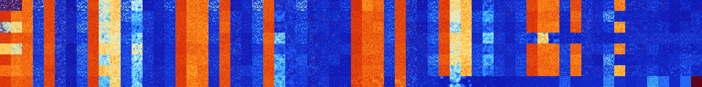

# B058 (147968-148479)

<details>
    <summary>Initial Grid</summary>
    
</details>


<details>
    <summary>Initial Grid RLE</summary>

```
#C Exported from GoGoL (https://github.com/marrow16/gogol)
#C Wrap mode: Toroidal
#C Boundary mode: Dead
#C Step: 0
x = 100, y = 100, rule = B058/S
22bo13bo17bo$2bo25bo$10bo6bo6bo6b2o21bo6bo13bo14bo$13bo6bo7bo18bo5bo9bo
19bo$19bo13bo8bo14bo10bo3bo20bo$30bo2bo10bo10bobo7bo11bo$4bo26bo14bo2bo
$15bo12bo10bo32bo$7bo17bo12bo12bo13bo32bo$19bo26bo23bo10bo12bo$10bo6bo
30bo9bo7bo4bo7bo11bo$25bo6bo6bo39bo$6bo4bo4bo6bo4bo17bo18bo25bo3bo$29bo
bo53bo$22bo5bo8bo17bo3bo26bo$17bo7bo5bo$2bobo4b2o39bo$32bo22bo$7bo26bo
16bo21bo6bo$43bo5bo22bo3bo$39bo6bo4bo15bobo14bo10bo$13bo6bo24bo22b2o$
10bo24bo3bo2bo22bo27bo$5bo9bo15bo11bo45bo$9bo8bo44bo13b2o2bo4bo$18bo16b
o50bo$14bo76bo$90bo$6bo$bo6bobo9bo27bo20bo6bo7bo$29bo2bobo10bo4bo9bo7b
2o11b2o$54bo3bo5bo20bo2bo7bobo$8bobo10bo44bo25b2o$17bo52bo10bo$49bo30bo
$3bo28bo10bo13bo9bo19bo$5bo26b2o41bobo3bo$18bo17bo27bo27bo$24bo38bo$23b
o24bo34bo7bo$2bo6bo19bo27bo22bo4bo4bo$100b$13bo37bo3bo8bo3bo18bo$5bo6bo
2bo26bo28bobo$21bo22bobo34bo2bo7bo5bo$13bo2bo4b2o2bobo30bo6bo6bo16bo$
10bo3bo12bo13bo$24bo22bo4bo5bo5bobo22bobo2bo$13bo17bo13bo34bo12bo$23bo
17bo$6bo4bo29bo28bo5bo$17bo41bo8bo16bo$22bo10bo2bo15bo25bo2bo$16bo37bo
18bo16bobo$29bo52bob2o$33bo50bo$14bo28bo34bo$36bobo$36bo21bo2bo10bo$3bo
18bo7bo10bo10b2o41bobo$64bo4bo24bo$7bo45bo16bo$34bo24bo7bo4bo19bo$15bo
22bo21bo$5bo6bo11bo8bo4bo$36bo7bo$37bo$2bo17bo64bo$23bo36bo37bo$2bo2bo
54bo5bo$14bo15bo29bo3bo13bo16bo$6bo8bo8bo68bo$7bo41b2o16bo20bo$16bo18bo
22bo29bo$10bo2bo33bo2bo27bo$33bo3bo8bo22bo11bo3bo13bo$19bo45bo11bo$20bo
8bo11bo30bo$2bo7bo25bo6bo31bo5bo2bo7bo$14bo32b2o2bo6bo2bo$3bo17bo11bo
16b2o22bo9bo$5bo55bo21bo$7bo16bo28bo3bo11bo9bo7bo2bo$27bo10bo8bo38bo$
13bo24b2o2bo50bo$27bo28bo35bobo$2bo6bo70bo$25bo2bo6bo48bo$61bo3bo5bo21b
o$3bo20bo4bobo4bo36bo13bo11bo$4bo3bo14bo6bo34bo5bo18bo4bo2bo$15bo18bo
20bo35bo2bo$19bo24bo$17bo25bo38bo2bo12bo$18bo21bo35bo2b2o$34bo11bo22bo
11bo9bobo$6bo9bo11bo51bo13bo$2bo10bo10bo17bo$11bo7bo$4bo29bo63bo!
```
</details>
<details>
    <summary>Thumbnail</summary>

</details>
<table>
<tr>
    <td><a href="./147968%20S%20Heat%20Map%20Activity.png"></a><br>S (147968)<br>R@61,p24</td>    <td><a href="./147969%20S0%20Heat%20Map%20Activity.png"></a><br>S0 (147969)<br>R@75,p6</td>    <td><a href="./147970%20S1%20Heat%20Map%20Activity.png"></a><br>S1 (147970)<br>G>1000</td>    <td><a href="./147971%20S01%20Heat%20Map%20Activity.png"></a><br>S01 (147971)<br>R@64,p4</td>    <td><a href="./147972%20S2%20Heat%20Map%20Activity.png"></a><br>S2 (147972)<br>G>1000</td>    <td><a href="./147973%20S02%20Heat%20Map%20Activity.png"></a><br>S02 (147973)<br>R@216,p24</td>    <td><a href="./147974%20S12%20Heat%20Map%20Activity.png"></a><br>S12 (147974)<br>G>1000</td>    <td><a href="./147975%20S012%20Heat%20Map%20Activity.png"></a><br>S012 (147975)<br>R@27,p2</td>    <td><a href="./147976%20S3%20Heat%20Map%20Activity.png"></a><br>S3 (147976)<br>G>1000</td>    <td><a href="./147977%20S03%20Heat%20Map%20Activity.png"></a><br>S03 (147977)<br>G>1000</td>    <td><a href="./147978%20S13%20Heat%20Map%20Activity.png"></a><br>S13 (147978)<br>G>1000</td>    <td><a href="./147979%20S013%20Heat%20Map%20Activity.png"></a><br>S013 (147979)<br>R@24,p2</td>    <td><a href="./147980%20S23%20Heat%20Map%20Activity.png"></a><br>S23 (147980)<br>G>1000</td>    <td><a href="./147981%20S023%20Heat%20Map%20Activity.png"></a><br>S023 (147981)<br>R@482,p420</td>    <td><a href="./147982%20S123%20Heat%20Map%20Activity.png"></a><br>S123 (147982)<br>R@96,p60</td>    <td><a href="./147983%20S0123%20Heat%20Map%20Activity.png"></a><br>S0123 (147983)<br>R@34,p12</td>    <td><a href="./147984%20S4%20Heat%20Map%20Activity.png"></a><br>S4 (147984)<br>G>1000</td>    <td><a href="./147985%20S04%20Heat%20Map%20Activity.png"></a><br>S04 (147985)<br>G>1000</td>    <td><a href="./147986%20S14%20Heat%20Map%20Activity.png"></a><br>S14 (147986)<br>G>1000</td>    <td><a href="./147987%20S014%20Heat%20Map%20Activity.png"></a><br>S014 (147987)<br>R@28,p6</td>    <td><a href="./147988%20S24%20Heat%20Map%20Activity.png"></a><br>S24 (147988)<br>G>1000</td>    <td><a href="./147989%20S024%20Heat%20Map%20Activity.png"></a><br>S024 (147989)<br>R@484,p420</td>    <td><a href="./147990%20S124%20Heat%20Map%20Activity.png"></a><br>S124 (147990)<br>R@80,p36</td>    <td><a href="./147991%20S0124%20Heat%20Map%20Activity.png"></a><br>S0124 (147991)<br>R@19,p2</td>    <td><a href="./147992%20S34%20Heat%20Map%20Activity.png"></a><br>S34 (147992)<br>G>1000</td>    <td><a href="./147993%20S034%20Heat%20Map%20Activity.png"></a><br>S034 (147993)<br>R@711,p84</td>    <td><a href="./147994%20S134%20Heat%20Map%20Activity.png"></a><br>S134 (147994)<br>G>1000</td>    <td><a href="./147995%20S0134%20Heat%20Map%20Activity.png"></a><br>S0134 (147995)<br>R@24,p4</td>    <td><a href="./147996%20S234%20Heat%20Map%20Activity.png"></a><br>S234 (147996)<br>R@761,p24</td>    <td><a href="./147997%20S0234%20Heat%20Map%20Activity.png"></a><br>S0234 (147997)<br>R@90,p24</td>    <td><a href="./147998%20S1234%20Heat%20Map%20Activity.png"></a><br>S1234 (147998)<br>R@148,p60</td>    <td><a href="./147999%20S01234%20Heat%20Map%20Activity.png"></a><br>S01234 (147999)<br>R@63,p24</td>    <td><a href="./148000%20S5%20Heat%20Map%20Activity.png"></a><br>S5 (148000)<br>G>1000</td>    <td><a href="./148001%20S05%20Heat%20Map%20Activity.png"></a><br>S05 (148001)<br>G>1000</td>    <td><a href="./148002%20S15%20Heat%20Map%20Activity.png"></a><br>S15 (148002)<br>G>1000</td>    <td><a href="./148003%20S015%20Heat%20Map%20Activity.png"></a><br>S015 (148003)<br>R@25,p6</td>    <td><a href="./148004%20S25%20Heat%20Map%20Activity.png"></a><br>S25 (148004)<br>G>1000</td>    <td><a href="./148005%20S025%20Heat%20Map%20Activity.png"></a><br>S025 (148005)<br>R@142,p12</td>    <td><a href="./148006%20S125%20Heat%20Map%20Activity.png"></a><br>S125 (148006)<br>G>1000</td>    <td><a href="./148007%20S0125%20Heat%20Map%20Activity.png"></a><br>S0125 (148007)<br>R@18,p6</td>    <td><a href="./148008%20S35%20Heat%20Map%20Activity.png"></a><br>S35 (148008)<br>G>1000</td>    <td><a href="./148009%20S035%20Heat%20Map%20Activity.png"></a><br>S035 (148009)<br>G>1000</td>    <td><a href="./148010%20S135%20Heat%20Map%20Activity.png"></a><br>S135 (148010)<br>G>1000</td>    <td><a href="./148011%20S0135%20Heat%20Map%20Activity.png"></a><br>S0135 (148011)<br>R@78,p60</td>    <td><a href="./148012%20S235%20Heat%20Map%20Activity.png"></a><br>S235 (148012)<br>G>1000</td>    <td><a href="./148013%20S0235%20Heat%20Map%20Activity.png"></a><br>S0235 (148013)<br>R@96,p12</td>    <td><a href="./148014%20S1235%20Heat%20Map%20Activity.png"></a><br>S1235 (148014)<br>R@53,p12</td>    <td><a href="./148015%20S01235%20Heat%20Map%20Activity.png"></a><br>S01235 (148015)<br>R@28,p12</td>    <td><a href="./148016%20S45%20Heat%20Map%20Activity.png"></a><br>S45 (148016)<br>G>1000</td>    <td><a href="./148017%20S045%20Heat%20Map%20Activity.png"></a><br>S045 (148017)<br>G>1000</td>    <td><a href="./148018%20S145%20Heat%20Map%20Activity.png"></a><br>S145 (148018)<br>G>1000</td>    <td><a href="./148019%20S0145%20Heat%20Map%20Activity.png"></a><br>S0145 (148019)<br>R@31,p12</td>    <td><a href="./148020%20S245%20Heat%20Map%20Activity.png"></a><br>S245 (148020)<br>G>1000</td>    <td><a href="./148021%20S0245%20Heat%20Map%20Activity.png"></a><br>S0245 (148021)<br>R@104,p12</td>    <td><a href="./148022%20S1245%20Heat%20Map%20Activity.png"></a><br>S1245 (148022)<br>R@123,p60</td>    <td><a href="./148023%20S01245%20Heat%20Map%20Activity.png"></a><br>S01245 (148023)<br>R@26,p10</td>    <td><a href="./148024%20S345%20Heat%20Map%20Activity.png"></a><br>S345 (148024)<br>G>1000</td>    <td><a href="./148025%20S0345%20Heat%20Map%20Activity.png"></a><br>S0345 (148025)<br>R@489,p180</td>    <td><a href="./148026%20S1345%20Heat%20Map%20Activity.png"></a><br>S1345 (148026)<br>R@554,p60</td>    <td><a href="./148027%20S01345%20Heat%20Map%20Activity.png"></a><br>S01345 (148027)<br>R@36,p12</td>    <td><a href="./148028%20S2345%20Heat%20Map%20Activity.png"></a><br>S2345 (148028)<br>R@194,p12</td>    <td><a href="./148029%20S02345%20Heat%20Map%20Activity.png"></a><br>S02345 (148029)<br>R@502,p420</td>    <td><a href="./148030%20S12345%20Heat%20Map%20Activity.png"></a><br>S12345 (148030)<br>R@317,p120</td>    <td><a href="./148031%20S012345%20Heat%20Map%20Activity.png"></a><br>S012345 (148031)<br>G>1000</td></tr>
<tr>
    <td><a href="./148032%20S6%20Heat%20Map%20Activity.png"></a><br>S6 (148032)<br>G>1000</td>    <td><a href="./148033%20S06%20Heat%20Map%20Activity.png"></a><br>S06 (148033)<br>G>1000</td>    <td><a href="./148034%20S16%20Heat%20Map%20Activity.png"></a><br>S16 (148034)<br>G>1000</td>    <td><a href="./148035%20S016%20Heat%20Map%20Activity.png"></a><br>S016 (148035)<br>R@27,p12</td>    <td><a href="./148036%20S26%20Heat%20Map%20Activity.png"></a><br>S26 (148036)<br>G>1000</td>    <td><a href="./148037%20S026%20Heat%20Map%20Activity.png"></a><br>S026 (148037)<br>R@85,p12</td>    <td><a href="./148038%20S126%20Heat%20Map%20Activity.png"></a><br>S126 (148038)<br>R@111,p60</td>    <td><a href="./148039%20S0126%20Heat%20Map%20Activity.png"></a><br>S0126 (148039)<br>R@14,p2</td>    <td><a href="./148040%20S36%20Heat%20Map%20Activity.png"></a><br>S36 (148040)<br>G>1000</td>    <td><a href="./148041%20S036%20Heat%20Map%20Activity.png"></a><br>S036 (148041)<br>G>1000</td>    <td><a href="./148042%20S136%20Heat%20Map%20Activity.png"></a><br>S136 (148042)<br>G>1000</td>    <td><a href="./148043%20S0136%20Heat%20Map%20Activity.png"></a><br>S0136 (148043)<br>R@14,p2</td>    <td><a href="./148044%20S236%20Heat%20Map%20Activity.png"></a><br>S236 (148044)<br>G>1000</td>    <td><a href="./148045%20S0236%20Heat%20Map%20Activity.png"></a><br>S0236 (148045)<br>R@48,p6</td>    <td><a href="./148046%20S1236%20Heat%20Map%20Activity.png"></a><br>S1236 (148046)<br>R@95,p60</td>    <td><a href="./148047%20S01236%20Heat%20Map%20Activity.png"></a><br>S01236 (148047)<br>R@29,p12</td>    <td><a href="./148048%20S46%20Heat%20Map%20Activity.png"></a><br>S46 (148048)<br>G>1000</td>    <td><a href="./148049%20S046%20Heat%20Map%20Activity.png"></a><br>S046 (148049)<br>G>1000</td>    <td><a href="./148050%20S146%20Heat%20Map%20Activity.png"></a><br>S146 (148050)<br>G>1000</td>    <td><a href="./148051%20S0146%20Heat%20Map%20Activity.png"></a><br>S0146 (148051)<br>R@25,p6</td>    <td><a href="./148052%20S246%20Heat%20Map%20Activity.png"></a><br>S246 (148052)<br>G>1000</td>    <td><a href="./148053%20S0246%20Heat%20Map%20Activity.png"></a><br>S0246 (148053)<br>R@83,p12</td>    <td><a href="./148054%20S1246%20Heat%20Map%20Activity.png"></a><br>S1246 (148054)<br>R@114,p60</td>    <td><a href="./148055%20S01246%20Heat%20Map%20Activity.png"></a><br>S01246 (148055)<br>R@14,p2</td>    <td><a href="./148056%20S346%20Heat%20Map%20Activity.png"></a><br>S346 (148056)<br>G>1000</td>    <td><a href="./148057%20S0346%20Heat%20Map%20Activity.png"></a><br>S0346 (148057)<br>G>1000</td>    <td><a href="./148058%20S1346%20Heat%20Map%20Activity.png"></a><br>S1346 (148058)<br>G>1000</td>    <td><a href="./148059%20S01346%20Heat%20Map%20Activity.png"></a><br>S01346 (148059)<br>R@26,p6</td>    <td><a href="./148060%20S2346%20Heat%20Map%20Activity.png"></a><br>S2346 (148060)<br>R@946,p30</td>    <td><a href="./148061%20S02346%20Heat%20Map%20Activity.png"></a><br>S02346 (148061)<br>R@83,p24</td>    <td><a href="./148062%20S12346%20Heat%20Map%20Activity.png"></a><br>S12346 (148062)<br>R@115,p12</td>    <td><a href="./148063%20S012346%20Heat%20Map%20Activity.png"></a><br>S012346 (148063)<br>R@94,p24</td>    <td><a href="./148064%20S56%20Heat%20Map%20Activity.png"></a><br>S56 (148064)<br>G>1000</td>    <td><a href="./148065%20S056%20Heat%20Map%20Activity.png"></a><br>S056 (148065)<br>G>1000</td>    <td><a href="./148066%20S156%20Heat%20Map%20Activity.png"></a><br>S156 (148066)<br>G>1000</td>    <td><a href="./148067%20S0156%20Heat%20Map%20Activity.png"></a><br>S0156 (148067)<br>R@28,p6</td>    <td><a href="./148068%20S256%20Heat%20Map%20Activity.png"></a><br>S256 (148068)<br>G>1000</td>    <td><a href="./148069%20S0256%20Heat%20Map%20Activity.png"></a><br>S0256 (148069)<br>R@174,p12</td>    <td><a href="./148070%20S1256%20Heat%20Map%20Activity.png"></a><br>S1256 (148070)<br>R@124,p60</td>    <td><a href="./148071%20S01256%20Heat%20Map%20Activity.png"></a><br>S01256 (148071)<br>R@16,p2</td>    <td><a href="./148072%20S356%20Heat%20Map%20Activity.png"></a><br>S356 (148072)<br>G>1000</td>    <td><a href="./148073%20S0356%20Heat%20Map%20Activity.png"></a><br>S0356 (148073)<br>G>1000</td>    <td><a href="./148074%20S1356%20Heat%20Map%20Activity.png"></a><br>S1356 (148074)<br>G>1000</td>    <td><a href="./148075%20S01356%20Heat%20Map%20Activity.png"></a><br>S01356 (148075)<br>R@28,p6</td>    <td><a href="./148076%20S2356%20Heat%20Map%20Activity.png"></a><br>S2356 (148076)<br>G>1000</td>    <td><a href="./148077%20S02356%20Heat%20Map%20Activity.png"></a><br>S02356 (148077)<br>R@75,p6</td>    <td><a href="./148078%20S12356%20Heat%20Map%20Activity.png"></a><br>S12356 (148078)<br>R@102,p60</td>    <td><a href="./148079%20S012356%20Heat%20Map%20Activity.png"></a><br>S012356 (148079)<br>R@27,p4</td>    <td><a href="./148080%20S456%20Heat%20Map%20Activity.png"></a><br>S456 (148080)<br>G>1000</td>    <td><a href="./148081%20S0456%20Heat%20Map%20Activity.png"></a><br>S0456 (148081)<br>G>1000</td>    <td><a href="./148082%20S1456%20Heat%20Map%20Activity.png"></a><br>S1456 (148082)<br>G>1000</td>    <td><a href="./148083%20S01456%20Heat%20Map%20Activity.png"></a><br>S01456 (148083)<br>R@89,p60</td>    <td><a href="./148084%20S2456%20Heat%20Map%20Activity.png"></a><br>S2456 (148084)<br>G>1000</td>    <td><a href="./148085%20S02456%20Heat%20Map%20Activity.png"></a><br>S02456 (148085)<br>R@99,p12</td>    <td><a href="./148086%20S12456%20Heat%20Map%20Activity.png"></a><br>S12456 (148086)<br>R@107,p20</td>    <td><a href="./148087%20S012456%20Heat%20Map%20Activity.png"></a><br>S012456 (148087)<br>S@30</td>    <td><a href="./148088%20S3456%20Heat%20Map%20Activity.png"></a><br>S3456 (148088)<br>R@163,p12</td>    <td><a href="./148089%20S03456%20Heat%20Map%20Activity.png"></a><br>S03456 (148089)<br>R@156,p42</td>    <td><a href="./148090%20S13456%20Heat%20Map%20Activity.png"></a><br>S13456 (148090)<br>R@162,p42</td>    <td><a href="./148091%20S013456%20Heat%20Map%20Activity.png"></a><br>S013456 (148091)<br>R@159,p60</td>    <td><a href="./148092%20S23456%20Heat%20Map%20Activity.png"></a><br>S23456 (148092)<br>R@215,p168</td>    <td><a href="./148093%20S023456%20Heat%20Map%20Activity.png"></a><br>S023456 (148093)<br>R@885,p840</td>    <td><a href="./148094%20S123456%20Heat%20Map%20Activity.png"></a><br>S123456 (148094)<br>R@982,p924</td>    <td><a href="./148095%20S0123456%20Heat%20Map%20Activity.png"></a><br>S0123456 (148095)<br>R@80,p24</td></tr>
<tr>
    <td><a href="./148096%20S7%20Heat%20Map%20Activity.png"></a><br>S7 (148096)<br>G>1000</td>    <td><a href="./148097%20S07%20Heat%20Map%20Activity.png"></a><br>S07 (148097)<br>G>1000</td>    <td><a href="./148098%20S17%20Heat%20Map%20Activity.png"></a><br>S17 (148098)<br>G>1000</td>    <td><a href="./148099%20S017%20Heat%20Map%20Activity.png"></a><br>S017 (148099)<br>R@27,p12</td>    <td><a href="./148100%20S27%20Heat%20Map%20Activity.png"></a><br>S27 (148100)<br>G>1000</td>    <td><a href="./148101%20S027%20Heat%20Map%20Activity.png"></a><br>S027 (148101)<br>R@88,p6</td>    <td><a href="./148102%20S127%20Heat%20Map%20Activity.png"></a><br>S127 (148102)<br>R@93,p60</td>    <td><a href="./148103%20S0127%20Heat%20Map%20Activity.png"></a><br>S0127 (148103)<br>R@12,p2</td>    <td><a href="./148104%20S37%20Heat%20Map%20Activity.png"></a><br>S37 (148104)<br>G>1000</td>    <td><a href="./148105%20S037%20Heat%20Map%20Activity.png"></a><br>S037 (148105)<br>G>1000</td>    <td><a href="./148106%20S137%20Heat%20Map%20Activity.png"></a><br>S137 (148106)<br>G>1000</td>    <td><a href="./148107%20S0137%20Heat%20Map%20Activity.png"></a><br>S0137 (148107)<br>R@24,p6</td>    <td><a href="./148108%20S237%20Heat%20Map%20Activity.png"></a><br>S237 (148108)<br>G>1000</td>    <td><a href="./148109%20S0237%20Heat%20Map%20Activity.png"></a><br>S0237 (148109)<br>R@51,p6</td>    <td><a href="./148110%20S1237%20Heat%20Map%20Activity.png"></a><br>S1237 (148110)<br>R@105,p66</td>    <td><a href="./148111%20S01237%20Heat%20Map%20Activity.png"></a><br>S01237 (148111)<br>R@26,p12</td>    <td><a href="./148112%20S47%20Heat%20Map%20Activity.png"></a><br>S47 (148112)<br>G>1000</td>    <td><a href="./148113%20S047%20Heat%20Map%20Activity.png"></a><br>S047 (148113)<br>G>1000</td>    <td><a href="./148114%20S147%20Heat%20Map%20Activity.png"></a><br>S147 (148114)<br>G>1000</td>    <td><a href="./148115%20S0147%20Heat%20Map%20Activity.png"></a><br>S0147 (148115)<br>R@33,p12</td>    <td><a href="./148116%20S247%20Heat%20Map%20Activity.png"></a><br>S247 (148116)<br>G>1000</td>    <td><a href="./148117%20S0247%20Heat%20Map%20Activity.png"></a><br>S0247 (148117)<br>R@111,p12</td>    <td><a href="./148118%20S1247%20Heat%20Map%20Activity.png"></a><br>S1247 (148118)<br>R@69,p30</td>    <td><a href="./148119%20S01247%20Heat%20Map%20Activity.png"></a><br>S01247 (148119)<br>R@14,p2</td>    <td><a href="./148120%20S347%20Heat%20Map%20Activity.png"></a><br>S347 (148120)<br>G>1000</td>    <td><a href="./148121%20S0347%20Heat%20Map%20Activity.png"></a><br>S0347 (148121)<br>G>1000</td>    <td><a href="./148122%20S1347%20Heat%20Map%20Activity.png"></a><br>S1347 (148122)<br>G>1000</td>    <td><a href="./148123%20S01347%20Heat%20Map%20Activity.png"></a><br>S01347 (148123)<br>R@20,p4</td>    <td><a href="./148124%20S2347%20Heat%20Map%20Activity.png"></a><br>S2347 (148124)<br>R@372,p24</td>    <td><a href="./148125%20S02347%20Heat%20Map%20Activity.png"></a><br>S02347 (148125)<br>R@64,p6</td>    <td><a href="./148126%20S12347%20Heat%20Map%20Activity.png"></a><br>S12347 (148126)<br>R@110,p60</td>    <td><a href="./148127%20S012347%20Heat%20Map%20Activity.png"></a><br>S012347 (148127)<br>R@47,p12</td>    <td><a href="./148128%20S57%20Heat%20Map%20Activity.png"></a><br>S57 (148128)<br>G>1000</td>    <td><a href="./148129%20S057%20Heat%20Map%20Activity.png"></a><br>S057 (148129)<br>G>1000</td>    <td><a href="./148130%20S157%20Heat%20Map%20Activity.png"></a><br>S157 (148130)<br>G>1000</td>    <td><a href="./148131%20S0157%20Heat%20Map%20Activity.png"></a><br>S0157 (148131)<br>R@23,p6</td>    <td><a href="./148132%20S257%20Heat%20Map%20Activity.png"></a><br>S257 (148132)<br>G>1000</td>    <td><a href="./148133%20S0257%20Heat%20Map%20Activity.png"></a><br>S0257 (148133)<br>R@196,p84</td>    <td><a href="./148134%20S1257%20Heat%20Map%20Activity.png"></a><br>S1257 (148134)<br>G>1000</td>    <td><a href="./148135%20S01257%20Heat%20Map%20Activity.png"></a><br>S01257 (148135)<br>R@19,p6</td>    <td><a href="./148136%20S357%20Heat%20Map%20Activity.png"></a><br>S357 (148136)<br>G>1000</td>    <td><a href="./148137%20S0357%20Heat%20Map%20Activity.png"></a><br>S0357 (148137)<br>G>1000</td>    <td><a href="./148138%20S1357%20Heat%20Map%20Activity.png"></a><br>S1357 (148138)<br>G>1000</td>    <td><a href="./148139%20S01357%20Heat%20Map%20Activity.png"></a><br>S01357 (148139)<br>R@29,p12</td>    <td><a href="./148140%20S2357%20Heat%20Map%20Activity.png"></a><br>S2357 (148140)<br>G>1000</td>    <td><a href="./148141%20S02357%20Heat%20Map%20Activity.png"></a><br>S02357 (148141)<br>R@81,p12</td>    <td><a href="./148142%20S12357%20Heat%20Map%20Activity.png"></a><br>S12357 (148142)<br>R@116,p60</td>    <td><a href="./148143%20S012357%20Heat%20Map%20Activity.png"></a><br>S012357 (148143)<br>R@32,p12</td>    <td><a href="./148144%20S457%20Heat%20Map%20Activity.png"></a><br>S457 (148144)<br>G>1000</td>    <td><a href="./148145%20S0457%20Heat%20Map%20Activity.png"></a><br>S0457 (148145)<br>G>1000</td>    <td><a href="./148146%20S1457%20Heat%20Map%20Activity.png"></a><br>S1457 (148146)<br>G>1000</td>    <td><a href="./148147%20S01457%20Heat%20Map%20Activity.png"></a><br>S01457 (148147)<br>R@81,p60</td>    <td><a href="./148148%20S2457%20Heat%20Map%20Activity.png"></a><br>S2457 (148148)<br>G>1000</td>    <td><a href="./148149%20S02457%20Heat%20Map%20Activity.png"></a><br>S02457 (148149)<br>R@109,p12</td>    <td><a href="./148150%20S12457%20Heat%20Map%20Activity.png"></a><br>S12457 (148150)<br>R@113,p60</td>    <td><a href="./148151%20S012457%20Heat%20Map%20Activity.png"></a><br>S012457 (148151)<br>R@26,p10</td>    <td><a href="./148152%20S3457%20Heat%20Map%20Activity.png"></a><br>S3457 (148152)<br>G>1000</td>    <td><a href="./148153%20S03457%20Heat%20Map%20Activity.png"></a><br>S03457 (148153)<br>R@337,p60</td>    <td><a href="./148154%20S13457%20Heat%20Map%20Activity.png"></a><br>S13457 (148154)<br>R@672,p12</td>    <td><a href="./148155%20S013457%20Heat%20Map%20Activity.png"></a><br>S013457 (148155)<br>R@64,p20</td>    <td><a href="./148156%20S23457%20Heat%20Map%20Activity.png"></a><br>S23457 (148156)<br>R@296,p30</td>    <td><a href="./148157%20S023457%20Heat%20Map%20Activity.png"></a><br>S023457 (148157)<br>G>1000</td>    <td><a href="./148158%20S123457%20Heat%20Map%20Activity.png"></a><br>S123457 (148158)<br>G>1000</td>    <td><a href="./148159%20S0123457%20Heat%20Map%20Activity.png"></a><br>S0123457 (148159)<br>R@655,p240</td></tr>
<tr>
    <td><a href="./148160%20S67%20Heat%20Map%20Activity.png"></a><br>S67 (148160)<br>G>1000</td>    <td><a href="./148161%20S067%20Heat%20Map%20Activity.png"></a><br>S067 (148161)<br>G>1000</td>    <td><a href="./148162%20S167%20Heat%20Map%20Activity.png"></a><br>S167 (148162)<br>G>1000</td>    <td><a href="./148163%20S0167%20Heat%20Map%20Activity.png"></a><br>S0167 (148163)<br>R@34,p12</td>    <td><a href="./148164%20S267%20Heat%20Map%20Activity.png"></a><br>S267 (148164)<br>G>1000</td>    <td><a href="./148165%20S0267%20Heat%20Map%20Activity.png"></a><br>S0267 (148165)<br>R@96,p12</td>    <td><a href="./148166%20S1267%20Heat%20Map%20Activity.png"></a><br>S1267 (148166)<br>R@96,p60</td>    <td><a href="./148167%20S01267%20Heat%20Map%20Activity.png"></a><br>S01267 (148167)<br>R@21,p6</td>    <td><a href="./148168%20S367%20Heat%20Map%20Activity.png"></a><br>S367 (148168)<br>G>1000</td>    <td><a href="./148169%20S0367%20Heat%20Map%20Activity.png"></a><br>S0367 (148169)<br>G>1000</td>    <td><a href="./148170%20S1367%20Heat%20Map%20Activity.png"></a><br>S1367 (148170)<br>G>1000</td>    <td><a href="./148171%20S01367%20Heat%20Map%20Activity.png"></a><br>S01367 (148171)<br>R@19,p2</td>    <td><a href="./148172%20S2367%20Heat%20Map%20Activity.png"></a><br>S2367 (148172)<br>G>1000</td>    <td><a href="./148173%20S02367%20Heat%20Map%20Activity.png"></a><br>S02367 (148173)<br>R@70,p12</td>    <td><a href="./148174%20S12367%20Heat%20Map%20Activity.png"></a><br>S12367 (148174)<br>R@103,p60</td>    <td><a href="./148175%20S012367%20Heat%20Map%20Activity.png"></a><br>S012367 (148175)<br>R@28,p12</td>    <td><a href="./148176%20S467%20Heat%20Map%20Activity.png"></a><br>S467 (148176)<br>G>1000</td>    <td><a href="./148177%20S0467%20Heat%20Map%20Activity.png"></a><br>S0467 (148177)<br>G>1000</td>    <td><a href="./148178%20S1467%20Heat%20Map%20Activity.png"></a><br>S1467 (148178)<br>G>1000</td>    <td><a href="./148179%20S01467%20Heat%20Map%20Activity.png"></a><br>S01467 (148179)<br>R@32,p12</td>    <td><a href="./148180%20S2467%20Heat%20Map%20Activity.png"></a><br>S2467 (148180)<br>G>1000</td>    <td><a href="./148181%20S02467%20Heat%20Map%20Activity.png"></a><br>S02467 (148181)<br>R@127,p12</td>    <td><a href="./148182%20S12467%20Heat%20Map%20Activity.png"></a><br>S12467 (148182)<br>R@236,p180</td>    <td><a href="./148183%20S012467%20Heat%20Map%20Activity.png"></a><br>S012467 (148183)<br>R@15,p2</td>    <td><a href="./148184%20S3467%20Heat%20Map%20Activity.png"></a><br>S3467 (148184)<br>G>1000</td>    <td><a href="./148185%20S03467%20Heat%20Map%20Activity.png"></a><br>S03467 (148185)<br>G>1000</td>    <td><a href="./148186%20S13467%20Heat%20Map%20Activity.png"></a><br>S13467 (148186)<br>G>1000</td>    <td><a href="./148187%20S013467%20Heat%20Map%20Activity.png"></a><br>S013467 (148187)<br>R@28,p2</td>    <td><a href="./148188%20S23467%20Heat%20Map%20Activity.png"></a><br>S23467 (148188)<br>R@998,p60</td>    <td><a href="./148189%20S023467%20Heat%20Map%20Activity.png"></a><br>S023467 (148189)<br>R@139,p60</td>    <td><a href="./148190%20S123467%20Heat%20Map%20Activity.png"></a><br>S123467 (148190)<br>R@185,p60</td>    <td><a href="./148191%20S0123467%20Heat%20Map%20Activity.png"></a><br>S0123467 (148191)<br>R@364,p264</td>    <td><a href="./148192%20S567%20Heat%20Map%20Activity.png"></a><br>S567 (148192)<br>G>1000</td>    <td><a href="./148193%20S0567%20Heat%20Map%20Activity.png"></a><br>S0567 (148193)<br>G>1000</td>    <td><a href="./148194%20S1567%20Heat%20Map%20Activity.png"></a><br>S1567 (148194)<br>G>1000</td>    <td><a href="./148195%20S01567%20Heat%20Map%20Activity.png"></a><br>S01567 (148195)<br>R@27,p6</td>    <td><a href="./148196%20S2567%20Heat%20Map%20Activity.png"></a><br>S2567 (148196)<br>G>1000</td>    <td><a href="./148197%20S02567%20Heat%20Map%20Activity.png"></a><br>S02567 (148197)<br>R@265,p60</td>    <td><a href="./148198%20S12567%20Heat%20Map%20Activity.png"></a><br>S12567 (148198)<br>R@129,p60</td>    <td><a href="./148199%20S012567%20Heat%20Map%20Activity.png"></a><br>S012567 (148199)<br>R@18,p2</td>    <td><a href="./148200%20S3567%20Heat%20Map%20Activity.png"></a><br>S3567 (148200)<br>G>1000</td>    <td><a href="./148201%20S03567%20Heat%20Map%20Activity.png"></a><br>S03567 (148201)<br>G>1000</td>    <td><a href="./148202%20S13567%20Heat%20Map%20Activity.png"></a><br>S13567 (148202)<br>G>1000</td>    <td><a href="./148203%20S013567%20Heat%20Map%20Activity.png"></a><br>S013567 (148203)<br>R@58,p30</td>    <td><a href="./148204%20S23567%20Heat%20Map%20Activity.png"></a><br>S23567 (148204)<br>G>1000</td>    <td><a href="./148205%20S023567%20Heat%20Map%20Activity.png"></a><br>S023567 (148205)<br>R@67,p12</td>    <td><a href="./148206%20S123567%20Heat%20Map%20Activity.png"></a><br>S123567 (148206)<br>R@144,p84</td>    <td><a href="./148207%20S0123567%20Heat%20Map%20Activity.png"></a><br>S0123567 (148207)<br>R@30,p4</td>    <td><a href="./148208%20S4567%20Heat%20Map%20Activity.png"></a><br>S4567 (148208)<br>R@375,p12</td>    <td><a href="./148209%20S04567%20Heat%20Map%20Activity.png"></a><br>S04567 (148209)<br>G>1000</td>    <td><a href="./148210%20S14567%20Heat%20Map%20Activity.png"></a><br>S14567 (148210)<br>G>1000</td>    <td><a href="./148211%20S014567%20Heat%20Map%20Activity.png"></a><br>S014567 (148211)<br>R@114,p60</td>    <td><a href="./148212%20S24567%20Heat%20Map%20Activity.png"></a><br>S24567 (148212)<br>R@308,p42</td>    <td><a href="./148213%20S024567%20Heat%20Map%20Activity.png"></a><br>S024567 (148213)<br>R@115,p12</td>    <td><a href="./148214%20S124567%20Heat%20Map%20Activity.png"></a><br>S124567 (148214)<br>R@228,p12</td>    <td><a href="./148215%20S0124567%20Heat%20Map%20Activity.png"></a><br>S0124567 (148215)<br>R@109,p30</td>    <td><a href="./148216%20S34567%20Heat%20Map%20Activity.png"></a><br>S34567 (148216)<br>R@52,p12</td>    <td><a href="./148217%20S034567%20Heat%20Map%20Activity.png"></a><br>S034567 (148217)<br>R@51,p12</td>    <td><a href="./148218%20S134567%20Heat%20Map%20Activity.png"></a><br>S134567 (148218)<br>R@42,p12</td>    <td><a href="./148219%20S0134567%20Heat%20Map%20Activity.png"></a><br>S0134567 (148219)<br>R@48,p12</td>    <td><a href="./148220%20S234567%20Heat%20Map%20Activity.png"></a><br>S234567 (148220)<br>R@36,p12</td>    <td><a href="./148221%20S0234567%20Heat%20Map%20Activity.png"></a><br>S0234567 (148221)<br>R@39,p12</td>    <td><a href="./148222%20S1234567%20Heat%20Map%20Activity.png"></a><br>S1234567 (148222)<br>R@32,p12</td>    <td><a href="./148223%20S01234567%20Heat%20Map%20Activity.png"></a><br>S01234567 (148223)<br>R@35,p12</td></tr>
<tr>
    <td><a href="./148224%20S8%20Heat%20Map%20Activity.png"></a><br>S8 (148224)<br>G>1000</td>    <td><a href="./148225%20S08%20Heat%20Map%20Activity.png"></a><br>S08 (148225)<br>G>1000</td>    <td><a href="./148226%20S18%20Heat%20Map%20Activity.png"></a><br>S18 (148226)<br>G>1000</td>    <td><a href="./148227%20S018%20Heat%20Map%20Activity.png"></a><br>S018 (148227)<br>R@28,p12</td>    <td><a href="./148228%20S28%20Heat%20Map%20Activity.png"></a><br>S28 (148228)<br>G>1000</td>    <td><a href="./148229%20S028%20Heat%20Map%20Activity.png"></a><br>S028 (148229)<br>R@96,p4</td>    <td><a href="./148230%20S128%20Heat%20Map%20Activity.png"></a><br>S128 (148230)<br>R@692,p660</td>    <td><a href="./148231%20S0128%20Heat%20Map%20Activity.png"></a><br>S0128 (148231)<br>R@13,p2</td>    <td><a href="./148232%20S38%20Heat%20Map%20Activity.png"></a><br>S38 (148232)<br>G>1000</td>    <td><a href="./148233%20S038%20Heat%20Map%20Activity.png"></a><br>S038 (148233)<br>G>1000</td>    <td><a href="./148234%20S138%20Heat%20Map%20Activity.png"></a><br>S138 (148234)<br>G>1000</td>    <td><a href="./148235%20S0138%20Heat%20Map%20Activity.png"></a><br>S0138 (148235)<br>R@20,p6</td>    <td><a href="./148236%20S238%20Heat%20Map%20Activity.png"></a><br>S238 (148236)<br>G>1000</td>    <td><a href="./148237%20S0238%20Heat%20Map%20Activity.png"></a><br>S0238 (148237)<br>R@59,p6</td>    <td><a href="./148238%20S1238%20Heat%20Map%20Activity.png"></a><br>S1238 (148238)<br>R@162,p120</td>    <td><a href="./148239%20S01238%20Heat%20Map%20Activity.png"></a><br>S01238 (148239)<br>R@29,p12</td>    <td><a href="./148240%20S48%20Heat%20Map%20Activity.png"></a><br>S48 (148240)<br>G>1000</td>    <td><a href="./148241%20S048%20Heat%20Map%20Activity.png"></a><br>S048 (148241)<br>G>1000</td>    <td><a href="./148242%20S148%20Heat%20Map%20Activity.png"></a><br>S148 (148242)<br>G>1000</td>    <td><a href="./148243%20S0148%20Heat%20Map%20Activity.png"></a><br>S0148 (148243)<br>R@42,p24</td>    <td><a href="./148244%20S248%20Heat%20Map%20Activity.png"></a><br>S248 (148244)<br>G>1000</td>    <td><a href="./148245%20S0248%20Heat%20Map%20Activity.png"></a><br>S0248 (148245)<br>R@87,p12</td>    <td><a href="./148246%20S1248%20Heat%20Map%20Activity.png"></a><br>S1248 (148246)<br>R@137,p84</td>    <td><a href="./148247%20S01248%20Heat%20Map%20Activity.png"></a><br>S01248 (148247)<br>R@25,p10</td>    <td><a href="./148248%20S348%20Heat%20Map%20Activity.png"></a><br>S348 (148248)<br>G>1000</td>    <td><a href="./148249%20S0348%20Heat%20Map%20Activity.png"></a><br>S0348 (148249)<br>G>1000</td>    <td><a href="./148250%20S1348%20Heat%20Map%20Activity.png"></a><br>S1348 (148250)<br>G>1000</td>    <td><a href="./148251%20S01348%20Heat%20Map%20Activity.png"></a><br>S01348 (148251)<br>R@32,p12</td>    <td><a href="./148252%20S2348%20Heat%20Map%20Activity.png"></a><br>S2348 (148252)<br>R@499,p24</td>    <td><a href="./148253%20S02348%20Heat%20Map%20Activity.png"></a><br>S02348 (148253)<br>R@90,p24</td>    <td><a href="./148254%20S12348%20Heat%20Map%20Activity.png"></a><br>S12348 (148254)<br>R@69,p12</td>    <td><a href="./148255%20S012348%20Heat%20Map%20Activity.png"></a><br>S012348 (148255)<br>R@32,p4</td>    <td><a href="./148256%20S58%20Heat%20Map%20Activity.png"></a><br>S58 (148256)<br>G>1000</td>    <td><a href="./148257%20S058%20Heat%20Map%20Activity.png"></a><br>S058 (148257)<br>G>1000</td>    <td><a href="./148258%20S158%20Heat%20Map%20Activity.png"></a><br>S158 (148258)<br>G>1000</td>    <td><a href="./148259%20S0158%20Heat%20Map%20Activity.png"></a><br>S0158 (148259)<br>R@28,p6</td>    <td><a href="./148260%20S258%20Heat%20Map%20Activity.png"></a><br>S258 (148260)<br>G>1000</td>    <td><a href="./148261%20S0258%20Heat%20Map%20Activity.png"></a><br>S0258 (148261)<br>R@157,p6</td>    <td><a href="./148262%20S1258%20Heat%20Map%20Activity.png"></a><br>S1258 (148262)<br>R@110,p60</td>    <td><a href="./148263%20S01258%20Heat%20Map%20Activity.png"></a><br>S01258 (148263)<br>R@19,p6</td>    <td><a href="./148264%20S358%20Heat%20Map%20Activity.png"></a><br>S358 (148264)<br>G>1000</td>    <td><a href="./148265%20S0358%20Heat%20Map%20Activity.png"></a><br>S0358 (148265)<br>G>1000</td>    <td><a href="./148266%20S1358%20Heat%20Map%20Activity.png"></a><br>S1358 (148266)<br>G>1000</td>    <td><a href="./148267%20S01358%20Heat%20Map%20Activity.png"></a><br>S01358 (148267)<br>R@23,p2</td>    <td><a href="./148268%20S2358%20Heat%20Map%20Activity.png"></a><br>S2358 (148268)<br>G>1000</td>    <td><a href="./148269%20S02358%20Heat%20Map%20Activity.png"></a><br>S02358 (148269)<br>R@83,p12</td>    <td><a href="./148270%20S12358%20Heat%20Map%20Activity.png"></a><br>S12358 (148270)<br>R@57,p18</td>    <td><a href="./148271%20S012358%20Heat%20Map%20Activity.png"></a><br>S012358 (148271)<br>R@31,p12</td>    <td><a href="./148272%20S458%20Heat%20Map%20Activity.png"></a><br>S458 (148272)<br>G>1000</td>    <td><a href="./148273%20S0458%20Heat%20Map%20Activity.png"></a><br>S0458 (148273)<br>G>1000</td>    <td><a href="./148274%20S1458%20Heat%20Map%20Activity.png"></a><br>S1458 (148274)<br>G>1000</td>    <td><a href="./148275%20S01458%20Heat%20Map%20Activity.png"></a><br>S01458 (148275)<br>R@27,p6</td>    <td><a href="./148276%20S2458%20Heat%20Map%20Activity.png"></a><br>S2458 (148276)<br>G>1000</td>    <td><a href="./148277%20S02458%20Heat%20Map%20Activity.png"></a><br>S02458 (148277)<br>R@94,p6</td>    <td><a href="./148278%20S12458%20Heat%20Map%20Activity.png"></a><br>S12458 (148278)<br>R@74,p12</td>    <td><a href="./148279%20S012458%20Heat%20Map%20Activity.png"></a><br>S012458 (148279)<br>R@19,p2</td>    <td><a href="./148280%20S3458%20Heat%20Map%20Activity.png"></a><br>S3458 (148280)<br>G>1000</td>    <td><a href="./148281%20S03458%20Heat%20Map%20Activity.png"></a><br>S03458 (148281)<br>R@351,p36</td>    <td><a href="./148282%20S13458%20Heat%20Map%20Activity.png"></a><br>S13458 (148282)<br>R@588,p60</td>    <td><a href="./148283%20S013458%20Heat%20Map%20Activity.png"></a><br>S013458 (148283)<br>R@39,p4</td>    <td><a href="./148284%20S23458%20Heat%20Map%20Activity.png"></a><br>S23458 (148284)<br>R@295,p60</td>    <td><a href="./148285%20S023458%20Heat%20Map%20Activity.png"></a><br>S023458 (148285)<br>R@188,p60</td>    <td><a href="./148286%20S123458%20Heat%20Map%20Activity.png"></a><br>S123458 (148286)<br>R@370,p60</td>    <td><a href="./148287%20S0123458%20Heat%20Map%20Activity.png"></a><br>S0123458 (148287)<br>R@636,p120</td></tr>
<tr>
    <td><a href="./148288%20S68%20Heat%20Map%20Activity.png"></a><br>S68 (148288)<br>G>1000</td>    <td><a href="./148289%20S068%20Heat%20Map%20Activity.png"></a><br>S068 (148289)<br>G>1000</td>    <td><a href="./148290%20S168%20Heat%20Map%20Activity.png"></a><br>S168 (148290)<br>G>1000</td>    <td><a href="./148291%20S0168%20Heat%20Map%20Activity.png"></a><br>S0168 (148291)<br>R@35,p12</td>    <td><a href="./148292%20S268%20Heat%20Map%20Activity.png"></a><br>S268 (148292)<br>G>1000</td>    <td><a href="./148293%20S0268%20Heat%20Map%20Activity.png"></a><br>S0268 (148293)<br>R@96,p24</td>    <td><a href="./148294%20S1268%20Heat%20Map%20Activity.png"></a><br>S1268 (148294)<br>R@471,p420</td>    <td><a href="./148295%20S01268%20Heat%20Map%20Activity.png"></a><br>S01268 (148295)<br>R@13,p2</td>    <td><a href="./148296%20S368%20Heat%20Map%20Activity.png"></a><br>S368 (148296)<br>G>1000</td>    <td><a href="./148297%20S0368%20Heat%20Map%20Activity.png"></a><br>S0368 (148297)<br>G>1000</td>    <td><a href="./148298%20S1368%20Heat%20Map%20Activity.png"></a><br>S1368 (148298)<br>G>1000</td>    <td><a href="./148299%20S01368%20Heat%20Map%20Activity.png"></a><br>S01368 (148299)<br>R@19,p2</td>    <td><a href="./148300%20S2368%20Heat%20Map%20Activity.png"></a><br>S2368 (148300)<br>G>1000</td>    <td><a href="./148301%20S02368%20Heat%20Map%20Activity.png"></a><br>S02368 (148301)<br>R@56,p12</td>    <td><a href="./148302%20S12368%20Heat%20Map%20Activity.png"></a><br>S12368 (148302)<br>R@159,p120</td>    <td><a href="./148303%20S012368%20Heat%20Map%20Activity.png"></a><br>S012368 (148303)<br>R@25,p12</td>    <td><a href="./148304%20S468%20Heat%20Map%20Activity.png"></a><br>S468 (148304)<br>G>1000</td>    <td><a href="./148305%20S0468%20Heat%20Map%20Activity.png"></a><br>S0468 (148305)<br>G>1000</td>    <td><a href="./148306%20S1468%20Heat%20Map%20Activity.png"></a><br>S1468 (148306)<br>G>1000</td>    <td><a href="./148307%20S01468%20Heat%20Map%20Activity.png"></a><br>S01468 (148307)<br>R@37,p12</td>    <td><a href="./148308%20S2468%20Heat%20Map%20Activity.png"></a><br>S2468 (148308)<br>G>1000</td>    <td><a href="./148309%20S02468%20Heat%20Map%20Activity.png"></a><br>S02468 (148309)<br>R@163,p60</td>    <td><a href="./148310%20S12468%20Heat%20Map%20Activity.png"></a><br>S12468 (148310)<br>R@240,p180</td>    <td><a href="./148311%20S012468%20Heat%20Map%20Activity.png"></a><br>S012468 (148311)<br>R@17,p2</td>    <td><a href="./148312%20S3468%20Heat%20Map%20Activity.png"></a><br>S3468 (148312)<br>G>1000</td>    <td><a href="./148313%20S03468%20Heat%20Map%20Activity.png"></a><br>S03468 (148313)<br>G>1000</td>    <td><a href="./148314%20S13468%20Heat%20Map%20Activity.png"></a><br>S13468 (148314)<br>G>1000</td>    <td><a href="./148315%20S013468%20Heat%20Map%20Activity.png"></a><br>S013468 (148315)<br>R@27,p4</td>    <td><a href="./148316%20S23468%20Heat%20Map%20Activity.png"></a><br>S23468 (148316)<br>R@598,p168</td>    <td><a href="./148317%20S023468%20Heat%20Map%20Activity.png"></a><br>S023468 (148317)<br>R@114,p12</td>    <td><a href="./148318%20S123468%20Heat%20Map%20Activity.png"></a><br>S123468 (148318)<br>R@106,p24</td>    <td><a href="./148319%20S0123468%20Heat%20Map%20Activity.png"></a><br>S0123468 (148319)<br>R@409,p312</td>    <td><a href="./148320%20S568%20Heat%20Map%20Activity.png"></a><br>S568 (148320)<br>G>1000</td>    <td><a href="./148321%20S0568%20Heat%20Map%20Activity.png"></a><br>S0568 (148321)<br>G>1000</td>    <td><a href="./148322%20S1568%20Heat%20Map%20Activity.png"></a><br>S1568 (148322)<br>G>1000</td>    <td><a href="./148323%20S01568%20Heat%20Map%20Activity.png"></a><br>S01568 (148323)<br>R@36,p12</td>    <td><a href="./148324%20S2568%20Heat%20Map%20Activity.png"></a><br>S2568 (148324)<br>G>1000</td>    <td><a href="./148325%20S02568%20Heat%20Map%20Activity.png"></a><br>S02568 (148325)<br>R@190,p12</td>    <td><a href="./148326%20S12568%20Heat%20Map%20Activity.png"></a><br>S12568 (148326)<br>R@127,p60</td>    <td><a href="./148327%20S012568%20Heat%20Map%20Activity.png"></a><br>S012568 (148327)<br>R@15,p2</td>    <td><a href="./148328%20S3568%20Heat%20Map%20Activity.png"></a><br>S3568 (148328)<br>G>1000</td>    <td><a href="./148329%20S03568%20Heat%20Map%20Activity.png"></a><br>S03568 (148329)<br>G>1000</td>    <td><a href="./148330%20S13568%20Heat%20Map%20Activity.png"></a><br>S13568 (148330)<br>G>1000</td>    <td><a href="./148331%20S013568%20Heat%20Map%20Activity.png"></a><br>S013568 (148331)<br>R@24,p2</td>    <td><a href="./148332%20S23568%20Heat%20Map%20Activity.png"></a><br>S23568 (148332)<br>G>1000</td>    <td><a href="./148333%20S023568%20Heat%20Map%20Activity.png"></a><br>S023568 (148333)<br>R@63,p12</td>    <td><a href="./148334%20S123568%20Heat%20Map%20Activity.png"></a><br>S123568 (148334)<br>R@113,p60</td>    <td><a href="./148335%20S0123568%20Heat%20Map%20Activity.png"></a><br>S0123568 (148335)<br>R@28,p4</td>    <td><a href="./148336%20S4568%20Heat%20Map%20Activity.png"></a><br>S4568 (148336)<br>G>1000</td>    <td><a href="./148337%20S04568%20Heat%20Map%20Activity.png"></a><br>S04568 (148337)<br>G>1000</td>    <td><a href="./148338%20S14568%20Heat%20Map%20Activity.png"></a><br>S14568 (148338)<br>G>1000</td>    <td><a href="./148339%20S014568%20Heat%20Map%20Activity.png"></a><br>S014568 (148339)<br>R@46,p12</td>    <td><a href="./148340%20S24568%20Heat%20Map%20Activity.png"></a><br>S24568 (148340)<br>G>1000</td>    <td><a href="./148341%20S024568%20Heat%20Map%20Activity.png"></a><br>S024568 (148341)<br>R@193,p84</td>    <td><a href="./148342%20S124568%20Heat%20Map%20Activity.png"></a><br>S124568 (148342)<br>R@531,p420</td>    <td><a href="./148343%20S0124568%20Heat%20Map%20Activity.png"></a><br>S0124568 (148343)<br>S@36</td>    <td><a href="./148344%20S34568%20Heat%20Map%20Activity.png"></a><br>S34568 (148344)<br>R@155,p6</td>    <td><a href="./148345%20S034568%20Heat%20Map%20Activity.png"></a><br>S034568 (148345)<br>R@175,p60</td>    <td><a href="./148346%20S134568%20Heat%20Map%20Activity.png"></a><br>S134568 (148346)<br>R@129,p10</td>    <td><a href="./148347%20S0134568%20Heat%20Map%20Activity.png"></a><br>S0134568 (148347)<br>R@110,p6</td>    <td><a href="./148348%20S234568%20Heat%20Map%20Activity.png"></a><br>S234568 (148348)<br>R@99,p60</td>    <td><a href="./148349%20S0234568%20Heat%20Map%20Activity.png"></a><br>S0234568 (148349)<br>R@63,p18</td>    <td><a href="./148350%20S1234568%20Heat%20Map%20Activity.png"></a><br>S1234568 (148350)<br>R@39,p4</td>    <td><a href="./148351%20S01234568%20Heat%20Map%20Activity.png"></a><br>S01234568 (148351)<br>R@39,p4</td></tr>
<tr>
    <td><a href="./148352%20S78%20Heat%20Map%20Activity.png"></a><br>S78 (148352)<br>G>1000</td>    <td><a href="./148353%20S078%20Heat%20Map%20Activity.png"></a><br>S078 (148353)<br>G>1000</td>    <td><a href="./148354%20S178%20Heat%20Map%20Activity.png"></a><br>S178 (148354)<br>G>1000</td>    <td><a href="./148355%20S0178%20Heat%20Map%20Activity.png"></a><br>S0178 (148355)<br>R@27,p6</td>    <td><a href="./148356%20S278%20Heat%20Map%20Activity.png"></a><br>S278 (148356)<br>G>1000</td>    <td><a href="./148357%20S0278%20Heat%20Map%20Activity.png"></a><br>S0278 (148357)<br>R@115,p12</td>    <td><a href="./148358%20S1278%20Heat%20Map%20Activity.png"></a><br>S1278 (148358)<br>R@167,p120</td>    <td><a href="./148359%20S01278%20Heat%20Map%20Activity.png"></a><br>S01278 (148359)<br>R@15,p2</td>    <td><a href="./148360%20S378%20Heat%20Map%20Activity.png"></a><br>S378 (148360)<br>G>1000</td>    <td><a href="./148361%20S0378%20Heat%20Map%20Activity.png"></a><br>S0378 (148361)<br>G>1000</td>    <td><a href="./148362%20S1378%20Heat%20Map%20Activity.png"></a><br>S1378 (148362)<br>G>1000</td>    <td><a href="./148363%20S01378%20Heat%20Map%20Activity.png"></a><br>S01378 (148363)<br>R@22,p6</td>    <td><a href="./148364%20S2378%20Heat%20Map%20Activity.png"></a><br>S2378 (148364)<br>G>1000</td>    <td><a href="./148365%20S02378%20Heat%20Map%20Activity.png"></a><br>S02378 (148365)<br>R@59,p12</td>    <td><a href="./148366%20S12378%20Heat%20Map%20Activity.png"></a><br>S12378 (148366)<br>R@83,p24</td>    <td><a href="./148367%20S012378%20Heat%20Map%20Activity.png"></a><br>S012378 (148367)<br>R@23,p6</td>    <td><a href="./148368%20S478%20Heat%20Map%20Activity.png"></a><br>S478 (148368)<br>G>1000</td>    <td><a href="./148369%20S0478%20Heat%20Map%20Activity.png"></a><br>S0478 (148369)<br>G>1000</td>    <td><a href="./148370%20S1478%20Heat%20Map%20Activity.png"></a><br>S1478 (148370)<br>G>1000</td>    <td><a href="./148371%20S01478%20Heat%20Map%20Activity.png"></a><br>S01478 (148371)<br>R@36,p12</td>    <td><a href="./148372%20S2478%20Heat%20Map%20Activity.png"></a><br>S2478 (148372)<br>G>1000</td>    <td><a href="./148373%20S02478%20Heat%20Map%20Activity.png"></a><br>S02478 (148373)<br>R@91,p12</td>    <td><a href="./148374%20S12478%20Heat%20Map%20Activity.png"></a><br>S12478 (148374)<br>R@51,p6</td>    <td><a href="./148375%20S012478%20Heat%20Map%20Activity.png"></a><br>S012478 (148375)<br>R@16,p2</td>    <td><a href="./148376%20S3478%20Heat%20Map%20Activity.png"></a><br>S3478 (148376)<br>G>1000</td>    <td><a href="./148377%20S03478%20Heat%20Map%20Activity.png"></a><br>S03478 (148377)<br>G>1000</td>    <td><a href="./148378%20S13478%20Heat%20Map%20Activity.png"></a><br>S13478 (148378)<br>R@849,p60</td>    <td><a href="./148379%20S013478%20Heat%20Map%20Activity.png"></a><br>S013478 (148379)<br>R@26,p4</td>    <td><a href="./148380%20S23478%20Heat%20Map%20Activity.png"></a><br>S23478 (148380)<br>R@556,p24</td>    <td><a href="./148381%20S023478%20Heat%20Map%20Activity.png"></a><br>S023478 (148381)<br>R@84,p12</td>    <td><a href="./148382%20S123478%20Heat%20Map%20Activity.png"></a><br>S123478 (148382)<br>R@315,p264</td>    <td><a href="./148383%20S0123478%20Heat%20Map%20Activity.png"></a><br>S0123478 (148383)<br>R@152,p120</td>    <td><a href="./148384%20S578%20Heat%20Map%20Activity.png"></a><br>S578 (148384)<br>G>1000</td>    <td><a href="./148385%20S0578%20Heat%20Map%20Activity.png"></a><br>S0578 (148385)<br>G>1000</td>    <td><a href="./148386%20S1578%20Heat%20Map%20Activity.png"></a><br>S1578 (148386)<br>G>1000</td>    <td><a href="./148387%20S01578%20Heat%20Map%20Activity.png"></a><br>S01578 (148387)<br>R@33,p6</td>    <td><a href="./148388%20S2578%20Heat%20Map%20Activity.png"></a><br>S2578 (148388)<br>G>1000</td>    <td><a href="./148389%20S02578%20Heat%20Map%20Activity.png"></a><br>S02578 (148389)<br>R@128,p12</td>    <td><a href="./148390%20S12578%20Heat%20Map%20Activity.png"></a><br>S12578 (148390)<br>R@116,p60</td>    <td><a href="./148391%20S012578%20Heat%20Map%20Activity.png"></a><br>S012578 (148391)<br>R@18,p2</td>    <td><a href="./148392%20S3578%20Heat%20Map%20Activity.png"></a><br>S3578 (148392)<br>G>1000</td>    <td><a href="./148393%20S03578%20Heat%20Map%20Activity.png"></a><br>S03578 (148393)<br>G>1000</td>    <td><a href="./148394%20S13578%20Heat%20Map%20Activity.png"></a><br>S13578 (148394)<br>G>1000</td>    <td><a href="./148395%20S013578%20Heat%20Map%20Activity.png"></a><br>S013578 (148395)<br>R@24,p2</td>    <td><a href="./148396%20S23578%20Heat%20Map%20Activity.png"></a><br>S23578 (148396)<br>G>1000</td>    <td><a href="./148397%20S023578%20Heat%20Map%20Activity.png"></a><br>S023578 (148397)<br>R@49,p6</td>    <td><a href="./148398%20S123578%20Heat%20Map%20Activity.png"></a><br>S123578 (148398)<br>R@67,p12</td>    <td><a href="./148399%20S0123578%20Heat%20Map%20Activity.png"></a><br>S0123578 (148399)<br>R@24,p4</td>    <td><a href="./148400%20S4578%20Heat%20Map%20Activity.png"></a><br>S4578 (148400)<br>G>1000</td>    <td><a href="./148401%20S04578%20Heat%20Map%20Activity.png"></a><br>S04578 (148401)<br>G>1000</td>    <td><a href="./148402%20S14578%20Heat%20Map%20Activity.png"></a><br>S14578 (148402)<br>G>1000</td>    <td><a href="./148403%20S014578%20Heat%20Map%20Activity.png"></a><br>S014578 (148403)<br>R@35,p12</td>    <td><a href="./148404%20S24578%20Heat%20Map%20Activity.png"></a><br>S24578 (148404)<br>G>1000</td>    <td><a href="./148405%20S024578%20Heat%20Map%20Activity.png"></a><br>S024578 (148405)<br>R@150,p24</td>    <td><a href="./148406%20S124578%20Heat%20Map%20Activity.png"></a><br>S124578 (148406)<br>R@116,p30</td>    <td><a href="./148407%20S0124578%20Heat%20Map%20Activity.png"></a><br>S0124578 (148407)<br>R@32,p8</td>    <td><a href="./148408%20S34578%20Heat%20Map%20Activity.png"></a><br>S34578 (148408)<br>G>1000</td>    <td><a href="./148409%20S034578%20Heat%20Map%20Activity.png"></a><br>S034578 (148409)<br>R@504,p72</td>    <td><a href="./148410%20S134578%20Heat%20Map%20Activity.png"></a><br>S134578 (148410)<br>R@350,p60</td>    <td><a href="./148411%20S0134578%20Heat%20Map%20Activity.png"></a><br>S0134578 (148411)<br>R@72,p4</td>    <td><a href="./148412%20S234578%20Heat%20Map%20Activity.png"></a><br>S234578 (148412)<br>G>1000</td>    <td><a href="./148413%20S0234578%20Heat%20Map%20Activity.png"></a><br>S0234578 (148413)<br>R@567,p60</td>    <td><a href="./148414%20S1234578%20Heat%20Map%20Activity.png"></a><br>S1234578 (148414)<br>R@562,p6</td>    <td><a href="./148415%20S01234578%20Heat%20Map%20Activity.png"></a><br>S01234578 (148415)<br>G>1000</td></tr>
<tr>
    <td><a href="./148416%20S678%20Heat%20Map%20Activity.png"></a><br>S678 (148416)<br>G>1000</td>    <td><a href="./148417%20S0678%20Heat%20Map%20Activity.png"></a><br>S0678 (148417)<br>G>1000</td>    <td><a href="./148418%20S1678%20Heat%20Map%20Activity.png"></a><br>S1678 (148418)<br>G>1000</td>    <td><a href="./148419%20S01678%20Heat%20Map%20Activity.png"></a><br>S01678 (148419)<br>R@31,p6</td>    <td><a href="./148420%20S2678%20Heat%20Map%20Activity.png"></a><br>S2678 (148420)<br>G>1000</td>    <td><a href="./148421%20S02678%20Heat%20Map%20Activity.png"></a><br>S02678 (148421)<br>R@132,p28</td>    <td><a href="./148422%20S12678%20Heat%20Map%20Activity.png"></a><br>S12678 (148422)<br>R@830,p780</td>    <td><a href="./148423%20S012678%20Heat%20Map%20Activity.png"></a><br>S012678 (148423)<br>R@22,p6</td>    <td><a href="./148424%20S3678%20Heat%20Map%20Activity.png"></a><br>S3678 (148424)<br>G>1000</td>    <td><a href="./148425%20S03678%20Heat%20Map%20Activity.png"></a><br>S03678 (148425)<br>G>1000</td>    <td><a href="./148426%20S13678%20Heat%20Map%20Activity.png"></a><br>S13678 (148426)<br>G>1000</td>    <td><a href="./148427%20S013678%20Heat%20Map%20Activity.png"></a><br>S013678 (148427)<br>R@27,p6</td>    <td><a href="./148428%20S23678%20Heat%20Map%20Activity.png"></a><br>S23678 (148428)<br>G>1000</td>    <td><a href="./148429%20S023678%20Heat%20Map%20Activity.png"></a><br>S023678 (148429)<br>R@81,p12</td>    <td><a href="./148430%20S123678%20Heat%20Map%20Activity.png"></a><br>S123678 (148430)<br>R@114,p60</td>    <td><a href="./148431%20S0123678%20Heat%20Map%20Activity.png"></a><br>S0123678 (148431)<br>R@32,p12</td>    <td><a href="./148432%20S4678%20Heat%20Map%20Activity.png"></a><br>S4678 (148432)<br>G>1000</td>    <td><a href="./148433%20S04678%20Heat%20Map%20Activity.png"></a><br>S04678 (148433)<br>G>1000</td>    <td><a href="./148434%20S14678%20Heat%20Map%20Activity.png"></a><br>S14678 (148434)<br>G>1000</td>    <td><a href="./148435%20S014678%20Heat%20Map%20Activity.png"></a><br>S014678 (148435)<br>R@69,p42</td>    <td><a href="./148436%20S24678%20Heat%20Map%20Activity.png"></a><br>S24678 (148436)<br>G>1000</td>    <td><a href="./148437%20S024678%20Heat%20Map%20Activity.png"></a><br>S024678 (148437)<br>R@94,p12</td>    <td><a href="./148438%20S124678%20Heat%20Map%20Activity.png"></a><br>S124678 (148438)<br>R@127,p60</td>    <td><a href="./148439%20S0124678%20Heat%20Map%20Activity.png"></a><br>S0124678 (148439)<br>R@25,p2</td>    <td><a href="./148440%20S34678%20Heat%20Map%20Activity.png"></a><br>S34678 (148440)<br>G>1000</td>    <td><a href="./148441%20S034678%20Heat%20Map%20Activity.png"></a><br>S034678 (148441)<br>G>1000</td>    <td><a href="./148442%20S134678%20Heat%20Map%20Activity.png"></a><br>S134678 (148442)<br>G>1000</td>    <td><a href="./148443%20S0134678%20Heat%20Map%20Activity.png"></a><br>S0134678 (148443)<br>R@46,p2</td>    <td><a href="./148444%20S234678%20Heat%20Map%20Activity.png"></a><br>S234678 (148444)<br>R@816,p420</td>    <td><a href="./148445%20S0234678%20Heat%20Map%20Activity.png"></a><br>S0234678 (148445)<br>R@94,p6</td>    <td><a href="./148446%20S1234678%20Heat%20Map%20Activity.png"></a><br>S1234678 (148446)<br>R@495,p360</td>    <td><a href="./148447%20S01234678%20Heat%20Map%20Activity.png"></a><br>S01234678 (148447)<br>R@226,p120</td>    <td><a href="./148448%20S5678%20Heat%20Map%20Activity.png"></a><br>S5678 (148448)<br>G>1000</td>    <td><a href="./148449%20S05678%20Heat%20Map%20Activity.png"></a><br>S05678 (148449)<br>G>1000</td>    <td><a href="./148450%20S15678%20Heat%20Map%20Activity.png"></a><br>S15678 (148450)<br>G>1000</td>    <td><a href="./148451%20S015678%20Heat%20Map%20Activity.png"></a><br>S015678 (148451)<br>R@120,p42</td>    <td><a href="./148452%20S25678%20Heat%20Map%20Activity.png"></a><br>S25678 (148452)<br>G>1000</td>    <td><a href="./148453%20S025678%20Heat%20Map%20Activity.png"></a><br>S025678 (148453)<br>R@210,p12</td>    <td><a href="./148454%20S125678%20Heat%20Map%20Activity.png"></a><br>S125678 (148454)<br>R@199,p24</td>    <td><a href="./148455%20S0125678%20Heat%20Map%20Activity.png"></a><br>S0125678 (148455)<br>S@97</td>    <td><a href="./148456%20S35678%20Heat%20Map%20Activity.png"></a><br>S35678 (148456)<br>R@722,p126</td>    <td><a href="./148457%20S035678%20Heat%20Map%20Activity.png"></a><br>S035678 (148457)<br>G>1000</td>    <td><a href="./148458%20S135678%20Heat%20Map%20Activity.png"></a><br>S135678 (148458)<br>G>1000</td>    <td><a href="./148459%20S0135678%20Heat%20Map%20Activity.png"></a><br>S0135678 (148459)<br>G>1000</td>    <td><a href="./148460%20S235678%20Heat%20Map%20Activity.png"></a><br>S235678 (148460)<br>R@240,p12</td>    <td><a href="./148461%20S0235678%20Heat%20Map%20Activity.png"></a><br>S0235678 (148461)<br>G>1000</td>    <td><a href="./148462%20S1235678%20Heat%20Map%20Activity.png"></a><br>S1235678 (148462)<br>R@185,p84</td>    <td><a href="./148463%20S01235678%20Heat%20Map%20Activity.png"></a><br>S01235678 (148463)<br>R@82,p12</td>    <td><a href="./148464%20S45678%20Heat%20Map%20Activity.png"></a><br>S45678 (148464)<br>R@52,p4</td>    <td><a href="./148465%20S045678%20Heat%20Map%20Activity.png"></a><br>S045678 (148465)<br>R@39,p6</td>    <td><a href="./148466%20S145678%20Heat%20Map%20Activity.png"></a><br>S145678 (148466)<br>R@40,p2</td>    <td><a href="./148467%20S0145678%20Heat%20Map%20Activity.png"></a><br>S0145678 (148467)<br>S@34</td>    <td><a href="./148468%20S245678%20Heat%20Map%20Activity.png"></a><br>S245678 (148468)<br>R@51,p6</td>    <td><a href="./148469%20S0245678%20Heat%20Map%20Activity.png"></a><br>S0245678 (148469)<br>R@31,p2</td>    <td><a href="./148470%20S1245678%20Heat%20Map%20Activity.png"></a><br>S1245678 (148470)<br>R@34,p2</td>    <td><a href="./148471%20S01245678%20Heat%20Map%20Activity.png"></a><br>S01245678 (148471)<br>S@29</td>    <td><a href="./148472%20S345678%20Heat%20Map%20Activity.png"></a><br>S345678 (148472)<br>R@24,p2</td>    <td><a href="./148473%20S0345678%20Heat%20Map%20Activity.png"></a><br>S0345678 (148473)<br>R@32,p6</td>    <td><a href="./148474%20S1345678%20Heat%20Map%20Activity.png"></a><br>S1345678 (148474)<br>R@27,p2</td>    <td><a href="./148475%20S01345678%20Heat%20Map%20Activity.png"></a><br>S01345678 (148475)<br>S@31</td>    <td><a href="./148476%20S2345678%20Heat%20Map%20Activity.png"></a><br>S2345678 (148476)<br>S@22</td>    <td><a href="./148477%20S02345678%20Heat%20Map%20Activity.png"></a><br>S02345678 (148477)<br>R@25,p2</td>    <td><a href="./148478%20S12345678%20Heat%20Map%20Activity.png"></a><br>S12345678 (148478)<br>S@15</td>    <td><a href="./148479%20S012345678%20Heat%20Map%20Activity.png"></a><br>S012345678 (148479)<br>S@21</td></tr>
</table>
