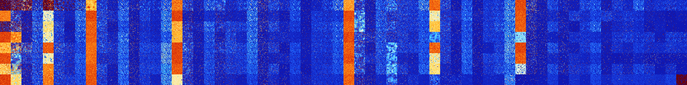

# B067 (98816-99327)

<details>
    <summary>Initial Grid</summary>
    
</details>


<details>
    <summary>Initial Grid RLE</summary>

```
#C Exported from GoGoL (https://github.com/marrow16/gogol)
#C Wrap mode: Toroidal
#C Boundary mode: Dead
#C Step: 0
x = 100, y = 100, rule = B067/S
10bo21bo28bo8bo7bo5bo9bo$6bo12bo37b2o4bo15bo$28bo5b2obobo26bobo10bo3bob
2o$21bo3bo34bo16bo6bo$bo26bo19bo3bo9bo28bo2bo$29bo4bo8bobo6bo6bo20bo16b
o$5bo7bo6bo23bo24bobo9bo$7bo5bo50bo16bo2bobo$18bo45bo3bo3bo2bo$7bo25bo
31bo12bo3bo3bo8bo$23bo$28bo24bo34bo3bo$4bo6bo58bo9bo$8bo7bo20bo28bo32bo
$7bo30bo3bo5bo6bo$19bo44bo$42bo3bo3bo7bo6bo$23bo10bo12bo3bo14bo5bo3bo
12bo$14bo14bo29bo13bo14bo$8bo8bo8bo4bo13bo30bo5bo$45bo3bo15bo2b2o$52bo$
10bobo59bo15b2o2bobo$18bo10bo9bo16bo13bo23bo$bo50bo8bo37bo$79bo2bo13bo$
16bo16bo5bo3bo$61bo11bo24bo$5bo5bo18bo34bo$3bo15bo8bo6bo3bo21b2o32bo$
38bo25bo$11bo4bo2bo2bo20bo2b3o4bo5bo$24bo$7bobo12bo3bo16bo22bo3bo5bo5bo
3bo9bo$o56bo10bo$47bo40bo3bobo$84bo6bo$15bo31bo10bo12bo18bo6bo$11bo17bo
19bo21bo$o16bo33bo19bo18b2o6bo$23bo19bo6bo18bo21bo$4bo13bo42bo2bo$11bo
16bo17bo8bo17bo13bo$9bo15bo$5bo17bobo6bo17bo19bo$20bo2bo26bo11bo3bo3bo
6bo20bo$16bo31bo12bo9bo7bo9b2ob2o4bo$47bo12bo9bo6bo5bo$25bo8bo31bo17bo
14bo$2o8bo19bo48bo14bo$18bo5bo23bo4bo7b2o5bo$5bo9bo3bo10bobo6bobo10b2o
25bo13bo$34bo18bo20bo7bo$18bo17bo13bo23bo8bo14bo$bo57bo14b2o8bo7bo$12bo
23bo3bo25bo24bo4bo$b2o10bo32bo20bo18bo6bo$17bo6bo17bo15bo30bo$bo45bo14b
o12bo10bobo$5bo23bo12bo11b2o11bo14bo$15b2o9bo23bo21bo11bo$31bo15bo45bob
o$3bo10bo22bo4bo9bobo10bo6bobo8bo$9b2o$11b2o22bo54bo$39bo7bo14bo22bo$
16bo28bo15bo$18bo7bo23bo35bo5bo$50b2o13bo11bo6bo$16bo9bo16bo4bo3bo2bo
41bo$2bo3bo2bo$67bo15bo2bo11bo$23bo29bo$21bo24bo9bo3bo20bo$16bo6bo10bo
8bo4b2o9b2o$7bo22bo8bo4bo4bo3bo29bo$o2bo61bo3bo11bo$13bo38bo18bo$9bo4bo
25bobo3bo28bo6bo$100b$10bo5bo64bo$6bo24bo25bo9bo20bo$bo24bo20bo6bo$36bo
59bo2bo$25bo5bo35bobo12bo$37bo16bo5bo$4bobo14b2o31bo$7bo61bo2bo5bo4bo$b
o22bo34bo8bo11bo18bo$10bobo15bo6bo11bo25bo$11bo5bo28bo29bobo$o3bo52bobo
$7bo5bo8bo18bo34bo21bo$15bo47bo18bo$19bobo34bo4bo25bo6bo$40bo26bo18bo$
10bo6bo40bo39b2o$5bo3bo22bo17bo7bo3bo9b2o$7bo30bo4bo7bo$bo30bo2bo9bo19b
o20bo12bo!
```
</details>
<details>
    <summary>Thumbnail</summary>

</details>
<table>
<tr>
    <td><a href="./98816%20S%20Heat%20Map%20Activity.png"></a><br>S (98816)<br>R@3,p2</td>    <td><a href="./98817%20S0%20Heat%20Map%20Activity.png"></a><br>S0 (98817)<br>R@14,p2</td>    <td><a href="./98818%20S1%20Heat%20Map%20Activity.png"></a><br>S1 (98818)<br>R@93,p2</td>    <td><a href="./98819%20S01%20Heat%20Map%20Activity.png"></a><br>S01 (98819)<br>R@28,p2</td>    <td><a href="./98820%20S2%20Heat%20Map%20Activity.png"></a><br>S2 (98820)<br>R@30,p6</td>    <td><a href="./98821%20S02%20Heat%20Map%20Activity.png"></a><br>S02 (98821)<br>R@79,p12</td>    <td><a href="./98822%20S12%20Heat%20Map%20Activity.png"></a><br>S12 (98822)<br>R@172,p120</td>    <td><a href="./98823%20S012%20Heat%20Map%20Activity.png"></a><br>S012 (98823)<br>R@19,p2</td>    <td><a href="./98824%20S3%20Heat%20Map%20Activity.png"></a><br>S3 (98824)<br>G>1000</td>    <td><a href="./98825%20S03%20Heat%20Map%20Activity.png"></a><br>S03 (98825)<br>R@71,p30</td>    <td><a href="./98826%20S13%20Heat%20Map%20Activity.png"></a><br>S13 (98826)<br>R@583,p504</td>    <td><a href="./98827%20S013%20Heat%20Map%20Activity.png"></a><br>S013 (98827)<br>R@21,p2</td>    <td><a href="./98828%20S23%20Heat%20Map%20Activity.png"></a><br>S23 (98828)<br>R@836,p720</td>    <td><a href="./98829%20S023%20Heat%20Map%20Activity.png"></a><br>S023 (98829)<br>R@53,p24</td>    <td><a href="./98830%20S123%20Heat%20Map%20Activity.png"></a><br>S123 (98830)<br>R@89,p60</td>    <td><a href="./98831%20S0123%20Heat%20Map%20Activity.png"></a><br>S0123 (98831)<br>S@14</td>    <td><a href="./98832%20S4%20Heat%20Map%20Activity.png"></a><br>S4 (98832)<br>G>1000</td>    <td><a href="./98833%20S04%20Heat%20Map%20Activity.png"></a><br>S04 (98833)<br>R@85,p18</td>    <td><a href="./98834%20S14%20Heat%20Map%20Activity.png"></a><br>S14 (98834)<br>R@436,p360</td>    <td><a href="./98835%20S014%20Heat%20Map%20Activity.png"></a><br>S014 (98835)<br>R@19,p6</td>    <td><a href="./98836%20S24%20Heat%20Map%20Activity.png"></a><br>S24 (98836)<br>G>1000</td>    <td><a href="./98837%20S024%20Heat%20Map%20Activity.png"></a><br>S024 (98837)<br>R@96,p66</td>    <td><a href="./98838%20S124%20Heat%20Map%20Activity.png"></a><br>S124 (98838)<br>R@53,p24</td>    <td><a href="./98839%20S0124%20Heat%20Map%20Activity.png"></a><br>S0124 (98839)<br>R@15,p2</td>    <td><a href="./98840%20S34%20Heat%20Map%20Activity.png"></a><br>S34 (98840)<br>G>1000</td>    <td><a href="./98841%20S034%20Heat%20Map%20Activity.png"></a><br>S034 (98841)<br>R@50,p12</td>    <td><a href="./98842%20S134%20Heat%20Map%20Activity.png"></a><br>S134 (98842)<br>R@111,p60</td>    <td><a href="./98843%20S0134%20Heat%20Map%20Activity.png"></a><br>S0134 (98843)<br>R@22,p6</td>    <td><a href="./98844%20S234%20Heat%20Map%20Activity.png"></a><br>S234 (98844)<br>G>1000</td>    <td><a href="./98845%20S0234%20Heat%20Map%20Activity.png"></a><br>S0234 (98845)<br>R@107,p84</td>    <td><a href="./98846%20S1234%20Heat%20Map%20Activity.png"></a><br>S1234 (98846)<br>R@41,p24</td>    <td><a href="./98847%20S01234%20Heat%20Map%20Activity.png"></a><br>S01234 (98847)<br>R@13,p2</td>    <td><a href="./98848%20S5%20Heat%20Map%20Activity.png"></a><br>S5 (98848)<br>G>1000</td>    <td><a href="./98849%20S05%20Heat%20Map%20Activity.png"></a><br>S05 (98849)<br>R@228,p24</td>    <td><a href="./98850%20S15%20Heat%20Map%20Activity.png"></a><br>S15 (98850)<br>G>1000</td>    <td><a href="./98851%20S015%20Heat%20Map%20Activity.png"></a><br>S015 (98851)<br>R@22,p6</td>    <td><a href="./98852%20S25%20Heat%20Map%20Activity.png"></a><br>S25 (98852)<br>G>1000</td>    <td><a href="./98853%20S025%20Heat%20Map%20Activity.png"></a><br>S025 (98853)<br>R@37,p6</td>    <td><a href="./98854%20S125%20Heat%20Map%20Activity.png"></a><br>S125 (98854)<br>R@38,p12</td>    <td><a href="./98855%20S0125%20Heat%20Map%20Activity.png"></a><br>S0125 (98855)<br>R@10,p2</td>    <td><a href="./98856%20S35%20Heat%20Map%20Activity.png"></a><br>S35 (98856)<br>G>1000</td>    <td><a href="./98857%20S035%20Heat%20Map%20Activity.png"></a><br>S035 (98857)<br>R@45,p12</td>    <td><a href="./98858%20S135%20Heat%20Map%20Activity.png"></a><br>S135 (98858)<br>G>1000</td>    <td><a href="./98859%20S0135%20Heat%20Map%20Activity.png"></a><br>S0135 (98859)<br>R@17,p6</td>    <td><a href="./98860%20S235%20Heat%20Map%20Activity.png"></a><br>S235 (98860)<br>G>1000</td>    <td><a href="./98861%20S0235%20Heat%20Map%20Activity.png"></a><br>S0235 (98861)<br>R@35,p12</td>    <td><a href="./98862%20S1235%20Heat%20Map%20Activity.png"></a><br>S1235 (98862)<br>R@30,p12</td>    <td><a href="./98863%20S01235%20Heat%20Map%20Activity.png"></a><br>S01235 (98863)<br>R@10,p2</td>    <td><a href="./98864%20S45%20Heat%20Map%20Activity.png"></a><br>S45 (98864)<br>G>1000</td>    <td><a href="./98865%20S045%20Heat%20Map%20Activity.png"></a><br>S045 (98865)<br>G>1000</td>    <td><a href="./98866%20S145%20Heat%20Map%20Activity.png"></a><br>S145 (98866)<br>G>1000</td>    <td><a href="./98867%20S0145%20Heat%20Map%20Activity.png"></a><br>S0145 (98867)<br>R@28,p6</td>    <td><a href="./98868%20S245%20Heat%20Map%20Activity.png"></a><br>S245 (98868)<br>G>1000</td>    <td><a href="./98869%20S0245%20Heat%20Map%20Activity.png"></a><br>S0245 (98869)<br>R@198,p168</td>    <td><a href="./98870%20S1245%20Heat%20Map%20Activity.png"></a><br>S1245 (98870)<br>R@26,p6</td>    <td><a href="./98871%20S01245%20Heat%20Map%20Activity.png"></a><br>S01245 (98871)<br>R@16,p6</td>    <td><a href="./98872%20S345%20Heat%20Map%20Activity.png"></a><br>S345 (98872)<br>R@489,p420</td>    <td><a href="./98873%20S0345%20Heat%20Map%20Activity.png"></a><br>S0345 (98873)<br>R@46,p12</td>    <td><a href="./98874%20S1345%20Heat%20Map%20Activity.png"></a><br>S1345 (98874)<br>R@90,p60</td>    <td><a href="./98875%20S01345%20Heat%20Map%20Activity.png"></a><br>S01345 (98875)<br>R@14,p2</td>    <td><a href="./98876%20S2345%20Heat%20Map%20Activity.png"></a><br>S2345 (98876)<br>R@65,p36</td>    <td><a href="./98877%20S02345%20Heat%20Map%20Activity.png"></a><br>S02345 (98877)<br>R@30,p12</td>    <td><a href="./98878%20S12345%20Heat%20Map%20Activity.png"></a><br>S12345 (98878)<br>R@32,p12</td>    <td><a href="./98879%20S012345%20Heat%20Map%20Activity.png"></a><br>S012345 (98879)<br>R@27,p12</td></tr>
<tr>
    <td><a href="./98880%20S6%20Heat%20Map%20Activity.png"></a><br>S6 (98880)<br>G>1000</td>    <td><a href="./98881%20S06%20Heat%20Map%20Activity.png"></a><br>S06 (98881)<br>R@130,p12</td>    <td><a href="./98882%20S16%20Heat%20Map%20Activity.png"></a><br>S16 (98882)<br>G>1000</td>    <td><a href="./98883%20S016%20Heat%20Map%20Activity.png"></a><br>S016 (98883)<br>R@25,p6</td>    <td><a href="./98884%20S26%20Heat%20Map%20Activity.png"></a><br>S26 (98884)<br>G>1000</td>    <td><a href="./98885%20S026%20Heat%20Map%20Activity.png"></a><br>S026 (98885)<br>R@54,p24</td>    <td><a href="./98886%20S126%20Heat%20Map%20Activity.png"></a><br>S126 (98886)<br>R@86,p60</td>    <td><a href="./98887%20S0126%20Heat%20Map%20Activity.png"></a><br>S0126 (98887)<br>R@11,p2</td>    <td><a href="./98888%20S36%20Heat%20Map%20Activity.png"></a><br>S36 (98888)<br>G>1000</td>    <td><a href="./98889%20S036%20Heat%20Map%20Activity.png"></a><br>S036 (98889)<br>R@43,p6</td>    <td><a href="./98890%20S136%20Heat%20Map%20Activity.png"></a><br>S136 (98890)<br>R@95,p36</td>    <td><a href="./98891%20S0136%20Heat%20Map%20Activity.png"></a><br>S0136 (98891)<br>R@13,p2</td>    <td><a href="./98892%20S236%20Heat%20Map%20Activity.png"></a><br>S236 (98892)<br>G>1000</td>    <td><a href="./98893%20S0236%20Heat%20Map%20Activity.png"></a><br>S0236 (98893)<br>R@24,p6</td>    <td><a href="./98894%20S1236%20Heat%20Map%20Activity.png"></a><br>S1236 (98894)<br>R@47,p30</td>    <td><a href="./98895%20S01236%20Heat%20Map%20Activity.png"></a><br>S01236 (98895)<br>R@9,p2</td>    <td><a href="./98896%20S46%20Heat%20Map%20Activity.png"></a><br>S46 (98896)<br>G>1000</td>    <td><a href="./98897%20S046%20Heat%20Map%20Activity.png"></a><br>S046 (98897)<br>R@849,p720</td>    <td><a href="./98898%20S146%20Heat%20Map%20Activity.png"></a><br>S146 (98898)<br>G>1000</td>    <td><a href="./98899%20S0146%20Heat%20Map%20Activity.png"></a><br>S0146 (98899)<br>R@46,p30</td>    <td><a href="./98900%20S246%20Heat%20Map%20Activity.png"></a><br>S246 (98900)<br>G>1000</td>    <td><a href="./98901%20S0246%20Heat%20Map%20Activity.png"></a><br>S0246 (98901)<br>R@143,p120</td>    <td><a href="./98902%20S1246%20Heat%20Map%20Activity.png"></a><br>S1246 (98902)<br>R@83,p60</td>    <td><a href="./98903%20S01246%20Heat%20Map%20Activity.png"></a><br>S01246 (98903)<br>R@10,p2</td>    <td><a href="./98904%20S346%20Heat%20Map%20Activity.png"></a><br>S346 (98904)<br>G>1000</td>    <td><a href="./98905%20S0346%20Heat%20Map%20Activity.png"></a><br>S0346 (98905)<br>R@102,p60</td>    <td><a href="./98906%20S1346%20Heat%20Map%20Activity.png"></a><br>S1346 (98906)<br>R@458,p420</td>    <td><a href="./98907%20S01346%20Heat%20Map%20Activity.png"></a><br>S01346 (98907)<br>R@19,p6</td>    <td><a href="./98908%20S2346%20Heat%20Map%20Activity.png"></a><br>S2346 (98908)<br>R@534,p504</td>    <td><a href="./98909%20S02346%20Heat%20Map%20Activity.png"></a><br>S02346 (98909)<br>R@28,p6</td>    <td><a href="./98910%20S12346%20Heat%20Map%20Activity.png"></a><br>S12346 (98910)<br>R@27,p12</td>    <td><a href="./98911%20S012346%20Heat%20Map%20Activity.png"></a><br>S012346 (98911)<br>R@22,p12</td>    <td><a href="./98912%20S56%20Heat%20Map%20Activity.png"></a><br>S56 (98912)<br>G>1000</td>    <td><a href="./98913%20S056%20Heat%20Map%20Activity.png"></a><br>S056 (98913)<br>G>1000</td>    <td><a href="./98914%20S156%20Heat%20Map%20Activity.png"></a><br>S156 (98914)<br>G>1000</td>    <td><a href="./98915%20S0156%20Heat%20Map%20Activity.png"></a><br>S0156 (98915)<br>R@25,p6</td>    <td><a href="./98916%20S256%20Heat%20Map%20Activity.png"></a><br>S256 (98916)<br>G>1000</td>    <td><a href="./98917%20S0256%20Heat%20Map%20Activity.png"></a><br>S0256 (98917)<br>R@44,p12</td>    <td><a href="./98918%20S1256%20Heat%20Map%20Activity.png"></a><br>S1256 (98918)<br>R@32,p12</td>    <td><a href="./98919%20S01256%20Heat%20Map%20Activity.png"></a><br>S01256 (98919)<br>R@17,p6</td>    <td><a href="./98920%20S356%20Heat%20Map%20Activity.png"></a><br>S356 (98920)<br>G>1000</td>    <td><a href="./98921%20S0356%20Heat%20Map%20Activity.png"></a><br>S0356 (98921)<br>R@78,p12</td>    <td><a href="./98922%20S1356%20Heat%20Map%20Activity.png"></a><br>S1356 (98922)<br>R@121,p72</td>    <td><a href="./98923%20S01356%20Heat%20Map%20Activity.png"></a><br>S01356 (98923)<br>R@15,p2</td>    <td><a href="./98924%20S2356%20Heat%20Map%20Activity.png"></a><br>S2356 (98924)<br>R@211,p168</td>    <td><a href="./98925%20S02356%20Heat%20Map%20Activity.png"></a><br>S02356 (98925)<br>R@39,p12</td>    <td><a href="./98926%20S12356%20Heat%20Map%20Activity.png"></a><br>S12356 (98926)<br>R@20,p2</td>    <td><a href="./98927%20S012356%20Heat%20Map%20Activity.png"></a><br>S012356 (98927)<br>S@12</td>    <td><a href="./98928%20S456%20Heat%20Map%20Activity.png"></a><br>S456 (98928)<br>G>1000</td>    <td><a href="./98929%20S0456%20Heat%20Map%20Activity.png"></a><br>S0456 (98929)<br>G>1000</td>    <td><a href="./98930%20S1456%20Heat%20Map%20Activity.png"></a><br>S1456 (98930)<br>G>1000</td>    <td><a href="./98931%20S01456%20Heat%20Map%20Activity.png"></a><br>S01456 (98931)<br>R@83,p60</td>    <td><a href="./98932%20S2456%20Heat%20Map%20Activity.png"></a><br>S2456 (98932)<br>G>1000</td>    <td><a href="./98933%20S02456%20Heat%20Map%20Activity.png"></a><br>S02456 (98933)<br>R@41,p6</td>    <td><a href="./98934%20S12456%20Heat%20Map%20Activity.png"></a><br>S12456 (98934)<br>R@44,p12</td>    <td><a href="./98935%20S012456%20Heat%20Map%20Activity.png"></a><br>S012456 (98935)<br>R@21,p2</td>    <td><a href="./98936%20S3456%20Heat%20Map%20Activity.png"></a><br>S3456 (98936)<br>R@42,p12</td>    <td><a href="./98937%20S03456%20Heat%20Map%20Activity.png"></a><br>S03456 (98937)<br>R@53,p12</td>    <td><a href="./98938%20S13456%20Heat%20Map%20Activity.png"></a><br>S13456 (98938)<br>R@36,p12</td>    <td><a href="./98939%20S013456%20Heat%20Map%20Activity.png"></a><br>S013456 (98939)<br>R@36,p12</td>    <td><a href="./98940%20S23456%20Heat%20Map%20Activity.png"></a><br>S23456 (98940)<br>R@82,p60</td>    <td><a href="./98941%20S023456%20Heat%20Map%20Activity.png"></a><br>S023456 (98941)<br>R@142,p120</td>    <td><a href="./98942%20S123456%20Heat%20Map%20Activity.png"></a><br>S123456 (98942)<br>R@862,p840</td>    <td><a href="./98943%20S0123456%20Heat%20Map%20Activity.png"></a><br>S0123456 (98943)<br>R@148,p120</td></tr>
<tr>
    <td><a href="./98944%20S7%20Heat%20Map%20Activity.png"></a><br>S7 (98944)<br>R@23,p6</td>    <td><a href="./98945%20S07%20Heat%20Map%20Activity.png"></a><br>S07 (98945)<br>R@33,p2</td>    <td><a href="./98946%20S17%20Heat%20Map%20Activity.png"></a><br>S17 (98946)<br>R@995,p720</td>    <td><a href="./98947%20S017%20Heat%20Map%20Activity.png"></a><br>S017 (98947)<br>R@14,p2</td>    <td><a href="./98948%20S27%20Heat%20Map%20Activity.png"></a><br>S27 (98948)<br>G>1000</td>    <td><a href="./98949%20S027%20Heat%20Map%20Activity.png"></a><br>S027 (98949)<br>R@32,p6</td>    <td><a href="./98950%20S127%20Heat%20Map%20Activity.png"></a><br>S127 (98950)<br>R@872,p840</td>    <td><a href="./98951%20S0127%20Heat%20Map%20Activity.png"></a><br>S0127 (98951)<br>R@12,p2</td>    <td><a href="./98952%20S37%20Heat%20Map%20Activity.png"></a><br>S37 (98952)<br>G>1000</td>    <td><a href="./98953%20S037%20Heat%20Map%20Activity.png"></a><br>S037 (98953)<br>R@44,p6</td>    <td><a href="./98954%20S137%20Heat%20Map%20Activity.png"></a><br>S137 (98954)<br>R@909,p840</td>    <td><a href="./98955%20S0137%20Heat%20Map%20Activity.png"></a><br>S0137 (98955)<br>R@18,p6</td>    <td><a href="./98956%20S237%20Heat%20Map%20Activity.png"></a><br>S237 (98956)<br>G>1000</td>    <td><a href="./98957%20S0237%20Heat%20Map%20Activity.png"></a><br>S0237 (98957)<br>R@49,p24</td>    <td><a href="./98958%20S1237%20Heat%20Map%20Activity.png"></a><br>S1237 (98958)<br>R@81,p60</td>    <td><a href="./98959%20S01237%20Heat%20Map%20Activity.png"></a><br>S01237 (98959)<br>S@8</td>    <td><a href="./98960%20S47%20Heat%20Map%20Activity.png"></a><br>S47 (98960)<br>G>1000</td>    <td><a href="./98961%20S047%20Heat%20Map%20Activity.png"></a><br>S047 (98961)<br>R@261,p120</td>    <td><a href="./98962%20S147%20Heat%20Map%20Activity.png"></a><br>S147 (98962)<br>R@271,p180</td>    <td><a href="./98963%20S0147%20Heat%20Map%20Activity.png"></a><br>S0147 (98963)<br>R@15,p2</td>    <td><a href="./98964%20S247%20Heat%20Map%20Activity.png"></a><br>S247 (98964)<br>G>1000</td>    <td><a href="./98965%20S0247%20Heat%20Map%20Activity.png"></a><br>S0247 (98965)<br>R@38,p12</td>    <td><a href="./98966%20S1247%20Heat%20Map%20Activity.png"></a><br>S1247 (98966)<br>R@30,p12</td>    <td><a href="./98967%20S01247%20Heat%20Map%20Activity.png"></a><br>S01247 (98967)<br>R@12,p2</td>    <td><a href="./98968%20S347%20Heat%20Map%20Activity.png"></a><br>S347 (98968)<br>G>1000</td>    <td><a href="./98969%20S0347%20Heat%20Map%20Activity.png"></a><br>S0347 (98969)<br>R@49,p12</td>    <td><a href="./98970%20S1347%20Heat%20Map%20Activity.png"></a><br>S1347 (98970)<br>R@133,p84</td>    <td><a href="./98971%20S01347%20Heat%20Map%20Activity.png"></a><br>S01347 (98971)<br>R@27,p12</td>    <td><a href="./98972%20S2347%20Heat%20Map%20Activity.png"></a><br>S2347 (98972)<br>G>1000</td>    <td><a href="./98973%20S02347%20Heat%20Map%20Activity.png"></a><br>S02347 (98973)<br>R@30,p12</td>    <td><a href="./98974%20S12347%20Heat%20Map%20Activity.png"></a><br>S12347 (98974)<br>R@25,p6</td>    <td><a href="./98975%20S012347%20Heat%20Map%20Activity.png"></a><br>S012347 (98975)<br>R@13,p6</td>    <td><a href="./98976%20S57%20Heat%20Map%20Activity.png"></a><br>S57 (98976)<br>G>1000</td>    <td><a href="./98977%20S057%20Heat%20Map%20Activity.png"></a><br>S057 (98977)<br>G>1000</td>    <td><a href="./98978%20S157%20Heat%20Map%20Activity.png"></a><br>S157 (98978)<br>R@539,p360</td>    <td><a href="./98979%20S0157%20Heat%20Map%20Activity.png"></a><br>S0157 (98979)<br>R@23,p6</td>    <td><a href="./98980%20S257%20Heat%20Map%20Activity.png"></a><br>S257 (98980)<br>G>1000</td>    <td><a href="./98981%20S0257%20Heat%20Map%20Activity.png"></a><br>S0257 (98981)<br>R@41,p12</td>    <td><a href="./98982%20S1257%20Heat%20Map%20Activity.png"></a><br>S1257 (98982)<br>R@38,p12</td>    <td><a href="./98983%20S01257%20Heat%20Map%20Activity.png"></a><br>S01257 (98983)<br>R@16,p6</td>    <td><a href="./98984%20S357%20Heat%20Map%20Activity.png"></a><br>S357 (98984)<br>G>1000</td>    <td><a href="./98985%20S0357%20Heat%20Map%20Activity.png"></a><br>S0357 (98985)<br>R@55,p12</td>    <td><a href="./98986%20S1357%20Heat%20Map%20Activity.png"></a><br>S1357 (98986)<br>R@566,p504</td>    <td><a href="./98987%20S01357%20Heat%20Map%20Activity.png"></a><br>S01357 (98987)<br>R@18,p6</td>    <td><a href="./98988%20S2357%20Heat%20Map%20Activity.png"></a><br>S2357 (98988)<br>G>1000</td>    <td><a href="./98989%20S02357%20Heat%20Map%20Activity.png"></a><br>S02357 (98989)<br>R@33,p12</td>    <td><a href="./98990%20S12357%20Heat%20Map%20Activity.png"></a><br>S12357 (98990)<br>R@19,p4</td>    <td><a href="./98991%20S012357%20Heat%20Map%20Activity.png"></a><br>S012357 (98991)<br>S@10</td>    <td><a href="./98992%20S457%20Heat%20Map%20Activity.png"></a><br>S457 (98992)<br>G>1000</td>    <td><a href="./98993%20S0457%20Heat%20Map%20Activity.png"></a><br>S0457 (98993)<br>G>1000</td>    <td><a href="./98994%20S1457%20Heat%20Map%20Activity.png"></a><br>S1457 (98994)<br>G>1000</td>    <td><a href="./98995%20S01457%20Heat%20Map%20Activity.png"></a><br>S01457 (98995)<br>R@23,p6</td>    <td><a href="./98996%20S2457%20Heat%20Map%20Activity.png"></a><br>S2457 (98996)<br>G>1000</td>    <td><a href="./98997%20S02457%20Heat%20Map%20Activity.png"></a><br>S02457 (98997)<br>R@868,p840</td>    <td><a href="./98998%20S12457%20Heat%20Map%20Activity.png"></a><br>S12457 (98998)<br>R@32,p6</td>    <td><a href="./98999%20S012457%20Heat%20Map%20Activity.png"></a><br>S012457 (98999)<br>R@12,p2</td>    <td><a href="./99000%20S3457%20Heat%20Map%20Activity.png"></a><br>S3457 (99000)<br>R@506,p420</td>    <td><a href="./99001%20S03457%20Heat%20Map%20Activity.png"></a><br>S03457 (99001)<br>R@94,p60</td>    <td><a href="./99002%20S13457%20Heat%20Map%20Activity.png"></a><br>S13457 (99002)<br>R@70,p36</td>    <td><a href="./99003%20S013457%20Heat%20Map%20Activity.png"></a><br>S013457 (99003)<br>R@44,p30</td>    <td><a href="./99004%20S23457%20Heat%20Map%20Activity.png"></a><br>S23457 (99004)<br>R@452,p420</td>    <td><a href="./99005%20S023457%20Heat%20Map%20Activity.png"></a><br>S023457 (99005)<br>R@82,p60</td>    <td><a href="./99006%20S123457%20Heat%20Map%20Activity.png"></a><br>S123457 (99006)<br>R@449,p420</td>    <td><a href="./99007%20S0123457%20Heat%20Map%20Activity.png"></a><br>S0123457 (99007)<br>G>1000</td></tr>
<tr>
    <td><a href="./99008%20S67%20Heat%20Map%20Activity.png"></a><br>S67 (99008)<br>G>1000</td>    <td><a href="./99009%20S067%20Heat%20Map%20Activity.png"></a><br>S067 (99009)<br>G>1000</td>    <td><a href="./99010%20S167%20Heat%20Map%20Activity.png"></a><br>S167 (99010)<br>G>1000</td>    <td><a href="./99011%20S0167%20Heat%20Map%20Activity.png"></a><br>S0167 (99011)<br>R@29,p6</td>    <td><a href="./99012%20S267%20Heat%20Map%20Activity.png"></a><br>S267 (99012)<br>G>1000</td>    <td><a href="./99013%20S0267%20Heat%20Map%20Activity.png"></a><br>S0267 (99013)<br>R@52,p18</td>    <td><a href="./99014%20S1267%20Heat%20Map%20Activity.png"></a><br>S1267 (99014)<br>R@147,p120</td>    <td><a href="./99015%20S01267%20Heat%20Map%20Activity.png"></a><br>S01267 (99015)<br>R@18,p6</td>    <td><a href="./99016%20S367%20Heat%20Map%20Activity.png"></a><br>S367 (99016)<br>G>1000</td>    <td><a href="./99017%20S0367%20Heat%20Map%20Activity.png"></a><br>S0367 (99017)<br>R@57,p12</td>    <td><a href="./99018%20S1367%20Heat%20Map%20Activity.png"></a><br>S1367 (99018)<br>R@173,p120</td>    <td><a href="./99019%20S01367%20Heat%20Map%20Activity.png"></a><br>S01367 (99019)<br>R@14,p2</td>    <td><a href="./99020%20S2367%20Heat%20Map%20Activity.png"></a><br>S2367 (99020)<br>G>1000</td>    <td><a href="./99021%20S02367%20Heat%20Map%20Activity.png"></a><br>S02367 (99021)<br>R@37,p12</td>    <td><a href="./99022%20S12367%20Heat%20Map%20Activity.png"></a><br>S12367 (99022)<br>R@46,p30</td>    <td><a href="./99023%20S012367%20Heat%20Map%20Activity.png"></a><br>S012367 (99023)<br>R@15,p2</td>    <td><a href="./99024%20S467%20Heat%20Map%20Activity.png"></a><br>S467 (99024)<br>G>1000</td>    <td><a href="./99025%20S0467%20Heat%20Map%20Activity.png"></a><br>S0467 (99025)<br>R@170,p60</td>    <td><a href="./99026%20S1467%20Heat%20Map%20Activity.png"></a><br>S1467 (99026)<br>R@926,p840</td>    <td><a href="./99027%20S01467%20Heat%20Map%20Activity.png"></a><br>S01467 (99027)<br>R@21,p6</td>    <td><a href="./99028%20S2467%20Heat%20Map%20Activity.png"></a><br>S2467 (99028)<br>G>1000</td>    <td><a href="./99029%20S02467%20Heat%20Map%20Activity.png"></a><br>S02467 (99029)<br>R@35,p12</td>    <td><a href="./99030%20S12467%20Heat%20Map%20Activity.png"></a><br>S12467 (99030)<br>R@56,p36</td>    <td><a href="./99031%20S012467%20Heat%20Map%20Activity.png"></a><br>S012467 (99031)<br>R@11,p2</td>    <td><a href="./99032%20S3467%20Heat%20Map%20Activity.png"></a><br>S3467 (99032)<br>G>1000</td>    <td><a href="./99033%20S03467%20Heat%20Map%20Activity.png"></a><br>S03467 (99033)<br>R@94,p60</td>    <td><a href="./99034%20S13467%20Heat%20Map%20Activity.png"></a><br>S13467 (99034)<br>R@100,p60</td>    <td><a href="./99035%20S013467%20Heat%20Map%20Activity.png"></a><br>S013467 (99035)<br>R@47,p30</td>    <td><a href="./99036%20S23467%20Heat%20Map%20Activity.png"></a><br>S23467 (99036)<br>R@157,p120</td>    <td><a href="./99037%20S023467%20Heat%20Map%20Activity.png"></a><br>S023467 (99037)<br>R@30,p12</td>    <td><a href="./99038%20S123467%20Heat%20Map%20Activity.png"></a><br>S123467 (99038)<br>R@23,p12</td>    <td><a href="./99039%20S0123467%20Heat%20Map%20Activity.png"></a><br>S0123467 (99039)<br>R@13,p2</td>    <td><a href="./99040%20S567%20Heat%20Map%20Activity.png"></a><br>S567 (99040)<br>G>1000</td>    <td><a href="./99041%20S0567%20Heat%20Map%20Activity.png"></a><br>S0567 (99041)<br>G>1000</td>    <td><a href="./99042%20S1567%20Heat%20Map%20Activity.png"></a><br>S1567 (99042)<br>R@274,p168</td>    <td><a href="./99043%20S01567%20Heat%20Map%20Activity.png"></a><br>S01567 (99043)<br>R@28,p6</td>    <td><a href="./99044%20S2567%20Heat%20Map%20Activity.png"></a><br>S2567 (99044)<br>G>1000</td>    <td><a href="./99045%20S02567%20Heat%20Map%20Activity.png"></a><br>S02567 (99045)<br>R@45,p12</td>    <td><a href="./99046%20S12567%20Heat%20Map%20Activity.png"></a><br>S12567 (99046)<br>R@63,p36</td>    <td><a href="./99047%20S012567%20Heat%20Map%20Activity.png"></a><br>S012567 (99047)<br>R@17,p6</td>    <td><a href="./99048%20S3567%20Heat%20Map%20Activity.png"></a><br>S3567 (99048)<br>G>1000</td>    <td><a href="./99049%20S03567%20Heat%20Map%20Activity.png"></a><br>S03567 (99049)<br>R@67,p12</td>    <td><a href="./99050%20S13567%20Heat%20Map%20Activity.png"></a><br>S13567 (99050)<br>R@225,p168</td>    <td><a href="./99051%20S013567%20Heat%20Map%20Activity.png"></a><br>S013567 (99051)<br>R@20,p2</td>    <td><a href="./99052%20S23567%20Heat%20Map%20Activity.png"></a><br>S23567 (99052)<br>G>1000</td>    <td><a href="./99053%20S023567%20Heat%20Map%20Activity.png"></a><br>S023567 (99053)<br>R@37,p12</td>    <td><a href="./99054%20S123567%20Heat%20Map%20Activity.png"></a><br>S123567 (99054)<br>R@28,p10</td>    <td><a href="./99055%20S0123567%20Heat%20Map%20Activity.png"></a><br>S0123567 (99055)<br>S@14</td>    <td><a href="./99056%20S4567%20Heat%20Map%20Activity.png"></a><br>S4567 (99056)<br>G>1000</td>    <td><a href="./99057%20S04567%20Heat%20Map%20Activity.png"></a><br>S04567 (99057)<br>G>1000</td>    <td><a href="./99058%20S14567%20Heat%20Map%20Activity.png"></a><br>S14567 (99058)<br>G>1000</td>    <td><a href="./99059%20S014567%20Heat%20Map%20Activity.png"></a><br>S014567 (99059)<br>R@112,p60</td>    <td><a href="./99060%20S24567%20Heat%20Map%20Activity.png"></a><br>S24567 (99060)<br>G>1000</td>    <td><a href="./99061%20S024567%20Heat%20Map%20Activity.png"></a><br>S024567 (99061)<br>R@59,p12</td>    <td><a href="./99062%20S124567%20Heat%20Map%20Activity.png"></a><br>S124567 (99062)<br>R@43,p12</td>    <td><a href="./99063%20S0124567%20Heat%20Map%20Activity.png"></a><br>S0124567 (99063)<br>R@37,p2</td>    <td><a href="./99064%20S34567%20Heat%20Map%20Activity.png"></a><br>S34567 (99064)<br>R@113,p84</td>    <td><a href="./99065%20S034567%20Heat%20Map%20Activity.png"></a><br>S034567 (99065)<br>R@31,p12</td>    <td><a href="./99066%20S134567%20Heat%20Map%20Activity.png"></a><br>S134567 (99066)<br>R@25,p6</td>    <td><a href="./99067%20S0134567%20Heat%20Map%20Activity.png"></a><br>S0134567 (99067)<br>R@30,p12</td>    <td><a href="./99068%20S234567%20Heat%20Map%20Activity.png"></a><br>S234567 (99068)<br>R@29,p12</td>    <td><a href="./99069%20S0234567%20Heat%20Map%20Activity.png"></a><br>S0234567 (99069)<br>R@139,p120</td>    <td><a href="./99070%20S1234567%20Heat%20Map%20Activity.png"></a><br>S1234567 (99070)<br>R@27,p6</td>    <td><a href="./99071%20S01234567%20Heat%20Map%20Activity.png"></a><br>S01234567 (99071)<br>R@36,p12</td></tr>
<tr>
    <td><a href="./99072%20S8%20Heat%20Map%20Activity.png"></a><br>S8 (99072)<br>G>1000</td>    <td><a href="./99073%20S08%20Heat%20Map%20Activity.png"></a><br>S08 (99073)<br>R@267,p6</td>    <td><a href="./99074%20S18%20Heat%20Map%20Activity.png"></a><br>S18 (99074)<br>R@386,p120</td>    <td><a href="./99075%20S018%20Heat%20Map%20Activity.png"></a><br>S018 (99075)<br>R@16,p2</td>    <td><a href="./99076%20S28%20Heat%20Map%20Activity.png"></a><br>S28 (99076)<br>G>1000</td>    <td><a href="./99077%20S028%20Heat%20Map%20Activity.png"></a><br>S028 (99077)<br>R@41,p6</td>    <td><a href="./99078%20S128%20Heat%20Map%20Activity.png"></a><br>S128 (99078)<br>R@60,p24</td>    <td><a href="./99079%20S0128%20Heat%20Map%20Activity.png"></a><br>S0128 (99079)<br>R@17,p6</td>    <td><a href="./99080%20S38%20Heat%20Map%20Activity.png"></a><br>S38 (99080)<br>G>1000</td>    <td><a href="./99081%20S038%20Heat%20Map%20Activity.png"></a><br>S038 (99081)<br>R@51,p12</td>    <td><a href="./99082%20S138%20Heat%20Map%20Activity.png"></a><br>S138 (99082)<br>R@83,p24</td>    <td><a href="./99083%20S0138%20Heat%20Map%20Activity.png"></a><br>S0138 (99083)<br>R@13,p2</td>    <td><a href="./99084%20S238%20Heat%20Map%20Activity.png"></a><br>S238 (99084)<br>G>1000</td>    <td><a href="./99085%20S0238%20Heat%20Map%20Activity.png"></a><br>S0238 (99085)<br>R@28,p6</td>    <td><a href="./99086%20S1238%20Heat%20Map%20Activity.png"></a><br>S1238 (99086)<br>R@29,p12</td>    <td><a href="./99087%20S01238%20Heat%20Map%20Activity.png"></a><br>S01238 (99087)<br>S@9</td>    <td><a href="./99088%20S48%20Heat%20Map%20Activity.png"></a><br>S48 (99088)<br>G>1000</td>    <td><a href="./99089%20S048%20Heat%20Map%20Activity.png"></a><br>S048 (99089)<br>R@138,p6</td>    <td><a href="./99090%20S148%20Heat%20Map%20Activity.png"></a><br>S148 (99090)<br>R@452,p360</td>    <td><a href="./99091%20S0148%20Heat%20Map%20Activity.png"></a><br>S0148 (99091)<br>R@20,p6</td>    <td><a href="./99092%20S248%20Heat%20Map%20Activity.png"></a><br>S248 (99092)<br>G>1000</td>    <td><a href="./99093%20S0248%20Heat%20Map%20Activity.png"></a><br>S0248 (99093)<br>R@32,p6</td>    <td><a href="./99094%20S1248%20Heat%20Map%20Activity.png"></a><br>S1248 (99094)<br>R@33,p12</td>    <td><a href="./99095%20S01248%20Heat%20Map%20Activity.png"></a><br>S01248 (99095)<br>R@10,p2</td>    <td><a href="./99096%20S348%20Heat%20Map%20Activity.png"></a><br>S348 (99096)<br>G>1000</td>    <td><a href="./99097%20S0348%20Heat%20Map%20Activity.png"></a><br>S0348 (99097)<br>R@68,p12</td>    <td><a href="./99098%20S1348%20Heat%20Map%20Activity.png"></a><br>S1348 (99098)<br>G>1000</td>    <td><a href="./99099%20S01348%20Heat%20Map%20Activity.png"></a><br>S01348 (99099)<br>R@19,p6</td>    <td><a href="./99100%20S2348%20Heat%20Map%20Activity.png"></a><br>S2348 (99100)<br>R@300,p252</td>    <td><a href="./99101%20S02348%20Heat%20Map%20Activity.png"></a><br>S02348 (99101)<br>R@33,p12</td>    <td><a href="./99102%20S12348%20Heat%20Map%20Activity.png"></a><br>S12348 (99102)<br>R@26,p12</td>    <td><a href="./99103%20S012348%20Heat%20Map%20Activity.png"></a><br>S012348 (99103)<br>R@13,p4</td>    <td><a href="./99104%20S58%20Heat%20Map%20Activity.png"></a><br>S58 (99104)<br>G>1000</td>    <td><a href="./99105%20S058%20Heat%20Map%20Activity.png"></a><br>S058 (99105)<br>R@263,p6</td>    <td><a href="./99106%20S158%20Heat%20Map%20Activity.png"></a><br>S158 (99106)<br>G>1000</td>    <td><a href="./99107%20S0158%20Heat%20Map%20Activity.png"></a><br>S0158 (99107)<br>R@21,p6</td>    <td><a href="./99108%20S258%20Heat%20Map%20Activity.png"></a><br>S258 (99108)<br>G>1000</td>    <td><a href="./99109%20S0258%20Heat%20Map%20Activity.png"></a><br>S0258 (99109)<br>R@37,p6</td>    <td><a href="./99110%20S1258%20Heat%20Map%20Activity.png"></a><br>S1258 (99110)<br>R@36,p12</td>    <td><a href="./99111%20S01258%20Heat%20Map%20Activity.png"></a><br>S01258 (99111)<br>R@15,p6</td>    <td><a href="./99112%20S358%20Heat%20Map%20Activity.png"></a><br>S358 (99112)<br>G>1000</td>    <td><a href="./99113%20S0358%20Heat%20Map%20Activity.png"></a><br>S0358 (99113)<br>R@61,p12</td>    <td><a href="./99114%20S1358%20Heat%20Map%20Activity.png"></a><br>S1358 (99114)<br>G>1000</td>    <td><a href="./99115%20S01358%20Heat%20Map%20Activity.png"></a><br>S01358 (99115)<br>R@14,p2</td>    <td><a href="./99116%20S2358%20Heat%20Map%20Activity.png"></a><br>S2358 (99116)<br>G>1000</td>    <td><a href="./99117%20S02358%20Heat%20Map%20Activity.png"></a><br>S02358 (99117)<br>R@105,p84</td>    <td><a href="./99118%20S12358%20Heat%20Map%20Activity.png"></a><br>S12358 (99118)<br>R@22,p4</td>    <td><a href="./99119%20S012358%20Heat%20Map%20Activity.png"></a><br>S012358 (99119)<br>S@10</td>    <td><a href="./99120%20S458%20Heat%20Map%20Activity.png"></a><br>S458 (99120)<br>G>1000</td>    <td><a href="./99121%20S0458%20Heat%20Map%20Activity.png"></a><br>S0458 (99121)<br>G>1000</td>    <td><a href="./99122%20S1458%20Heat%20Map%20Activity.png"></a><br>S1458 (99122)<br>G>1000</td>    <td><a href="./99123%20S01458%20Heat%20Map%20Activity.png"></a><br>S01458 (99123)<br>R@22,p6</td>    <td><a href="./99124%20S2458%20Heat%20Map%20Activity.png"></a><br>S2458 (99124)<br>G>1000</td>    <td><a href="./99125%20S02458%20Heat%20Map%20Activity.png"></a><br>S02458 (99125)<br>R@199,p168</td>    <td><a href="./99126%20S12458%20Heat%20Map%20Activity.png"></a><br>S12458 (99126)<br>R@33,p12</td>    <td><a href="./99127%20S012458%20Heat%20Map%20Activity.png"></a><br>S012458 (99127)<br>R@14,p2</td>    <td><a href="./99128%20S3458%20Heat%20Map%20Activity.png"></a><br>S3458 (99128)<br>R@475,p420</td>    <td><a href="./99129%20S03458%20Heat%20Map%20Activity.png"></a><br>S03458 (99129)<br>R@62,p30</td>    <td><a href="./99130%20S13458%20Heat%20Map%20Activity.png"></a><br>S13458 (99130)<br>R@97,p60</td>    <td><a href="./99131%20S013458%20Heat%20Map%20Activity.png"></a><br>S013458 (99131)<br>R@27,p4</td>    <td><a href="./99132%20S23458%20Heat%20Map%20Activity.png"></a><br>S23458 (99132)<br>R@44,p12</td>    <td><a href="./99133%20S023458%20Heat%20Map%20Activity.png"></a><br>S023458 (99133)<br>R@40,p12</td>    <td><a href="./99134%20S123458%20Heat%20Map%20Activity.png"></a><br>S123458 (99134)<br>R@22,p4</td>    <td><a href="./99135%20S0123458%20Heat%20Map%20Activity.png"></a><br>S0123458 (99135)<br>R@29,p12</td></tr>
<tr>
    <td><a href="./99136%20S68%20Heat%20Map%20Activity.png"></a><br>S68 (99136)<br>G>1000</td>    <td><a href="./99137%20S068%20Heat%20Map%20Activity.png"></a><br>S068 (99137)<br>R@676,p6</td>    <td><a href="./99138%20S168%20Heat%20Map%20Activity.png"></a><br>S168 (99138)<br>R@247,p120</td>    <td><a href="./99139%20S0168%20Heat%20Map%20Activity.png"></a><br>S0168 (99139)<br>R@24,p6</td>    <td><a href="./99140%20S268%20Heat%20Map%20Activity.png"></a><br>S268 (99140)<br>G>1000</td>    <td><a href="./99141%20S0268%20Heat%20Map%20Activity.png"></a><br>S0268 (99141)<br>R@47,p6</td>    <td><a href="./99142%20S1268%20Heat%20Map%20Activity.png"></a><br>S1268 (99142)<br>R@53,p24</td>    <td><a href="./99143%20S01268%20Heat%20Map%20Activity.png"></a><br>S01268 (99143)<br>R@14,p2</td>    <td><a href="./99144%20S368%20Heat%20Map%20Activity.png"></a><br>S368 (99144)<br>G>1000</td>    <td><a href="./99145%20S0368%20Heat%20Map%20Activity.png"></a><br>S0368 (99145)<br>R@106,p60</td>    <td><a href="./99146%20S1368%20Heat%20Map%20Activity.png"></a><br>S1368 (99146)<br>R@123,p72</td>    <td><a href="./99147%20S01368%20Heat%20Map%20Activity.png"></a><br>S01368 (99147)<br>R@14,p2</td>    <td><a href="./99148%20S2368%20Heat%20Map%20Activity.png"></a><br>S2368 (99148)<br>G>1000</td>    <td><a href="./99149%20S02368%20Heat%20Map%20Activity.png"></a><br>S02368 (99149)<br>R@36,p12</td>    <td><a href="./99150%20S12368%20Heat%20Map%20Activity.png"></a><br>S12368 (99150)<br>R@27,p12</td>    <td><a href="./99151%20S012368%20Heat%20Map%20Activity.png"></a><br>S012368 (99151)<br>S@8</td>    <td><a href="./99152%20S468%20Heat%20Map%20Activity.png"></a><br>S468 (99152)<br>G>1000</td>    <td><a href="./99153%20S0468%20Heat%20Map%20Activity.png"></a><br>S0468 (99153)<br>R@189,p84</td>    <td><a href="./99154%20S1468%20Heat%20Map%20Activity.png"></a><br>S1468 (99154)<br>G>1000</td>    <td><a href="./99155%20S01468%20Heat%20Map%20Activity.png"></a><br>S01468 (99155)<br>R@23,p6</td>    <td><a href="./99156%20S2468%20Heat%20Map%20Activity.png"></a><br>S2468 (99156)<br>G>1000</td>    <td><a href="./99157%20S02468%20Heat%20Map%20Activity.png"></a><br>S02468 (99157)<br>R@41,p12</td>    <td><a href="./99158%20S12468%20Heat%20Map%20Activity.png"></a><br>S12468 (99158)<br>R@33,p12</td>    <td><a href="./99159%20S012468%20Heat%20Map%20Activity.png"></a><br>S012468 (99159)<br>R@12,p2</td>    <td><a href="./99160%20S3468%20Heat%20Map%20Activity.png"></a><br>S3468 (99160)<br>G>1000</td>    <td><a href="./99161%20S03468%20Heat%20Map%20Activity.png"></a><br>S03468 (99161)<br>R@205,p168</td>    <td><a href="./99162%20S13468%20Heat%20Map%20Activity.png"></a><br>S13468 (99162)<br>R@123,p84</td>    <td><a href="./99163%20S013468%20Heat%20Map%20Activity.png"></a><br>S013468 (99163)<br>R@26,p6</td>    <td><a href="./99164%20S23468%20Heat%20Map%20Activity.png"></a><br>S23468 (99164)<br>R@217,p168</td>    <td><a href="./99165%20S023468%20Heat%20Map%20Activity.png"></a><br>S023468 (99165)<br>R@37,p12</td>    <td><a href="./99166%20S123468%20Heat%20Map%20Activity.png"></a><br>S123468 (99166)<br>R@33,p12</td>    <td><a href="./99167%20S0123468%20Heat%20Map%20Activity.png"></a><br>S0123468 (99167)<br>R@16,p2</td>    <td><a href="./99168%20S568%20Heat%20Map%20Activity.png"></a><br>S568 (99168)<br>G>1000</td>    <td><a href="./99169%20S0568%20Heat%20Map%20Activity.png"></a><br>S0568 (99169)<br>R@450,p42</td>    <td><a href="./99170%20S1568%20Heat%20Map%20Activity.png"></a><br>S1568 (99170)<br>R@231,p120</td>    <td><a href="./99171%20S01568%20Heat%20Map%20Activity.png"></a><br>S01568 (99171)<br>R@28,p6</td>    <td><a href="./99172%20S2568%20Heat%20Map%20Activity.png"></a><br>S2568 (99172)<br>G>1000</td>    <td><a href="./99173%20S02568%20Heat%20Map%20Activity.png"></a><br>S02568 (99173)<br>R@118,p84</td>    <td><a href="./99174%20S12568%20Heat%20Map%20Activity.png"></a><br>S12568 (99174)<br>R@147,p120</td>    <td><a href="./99175%20S012568%20Heat%20Map%20Activity.png"></a><br>S012568 (99175)<br>R@18,p6</td>    <td><a href="./99176%20S3568%20Heat%20Map%20Activity.png"></a><br>S3568 (99176)<br>G>1000</td>    <td><a href="./99177%20S03568%20Heat%20Map%20Activity.png"></a><br>S03568 (99177)<br>R@74,p24</td>    <td><a href="./99178%20S13568%20Heat%20Map%20Activity.png"></a><br>S13568 (99178)<br>R@914,p840</td>    <td><a href="./99179%20S013568%20Heat%20Map%20Activity.png"></a><br>S013568 (99179)<br>R@18,p2</td>    <td><a href="./99180%20S23568%20Heat%20Map%20Activity.png"></a><br>S23568 (99180)<br>G>1000</td>    <td><a href="./99181%20S023568%20Heat%20Map%20Activity.png"></a><br>S023568 (99181)<br>R@34,p12</td>    <td><a href="./99182%20S123568%20Heat%20Map%20Activity.png"></a><br>S123568 (99182)<br>R@22,p6</td>    <td><a href="./99183%20S0123568%20Heat%20Map%20Activity.png"></a><br>S0123568 (99183)<br>S@15</td>    <td><a href="./99184%20S4568%20Heat%20Map%20Activity.png"></a><br>S4568 (99184)<br>G>1000</td>    <td><a href="./99185%20S04568%20Heat%20Map%20Activity.png"></a><br>S04568 (99185)<br>G>1000</td>    <td><a href="./99186%20S14568%20Heat%20Map%20Activity.png"></a><br>S14568 (99186)<br>G>1000</td>    <td><a href="./99187%20S014568%20Heat%20Map%20Activity.png"></a><br>S014568 (99187)<br>R@85,p60</td>    <td><a href="./99188%20S24568%20Heat%20Map%20Activity.png"></a><br>S24568 (99188)<br>G>1000</td>    <td><a href="./99189%20S024568%20Heat%20Map%20Activity.png"></a><br>S024568 (99189)<br>R@70,p30</td>    <td><a href="./99190%20S124568%20Heat%20Map%20Activity.png"></a><br>S124568 (99190)<br>R@92,p60</td>    <td><a href="./99191%20S0124568%20Heat%20Map%20Activity.png"></a><br>S0124568 (99191)<br>R@35,p2</td>    <td><a href="./99192%20S34568%20Heat%20Map%20Activity.png"></a><br>S34568 (99192)<br>R@463,p420</td>    <td><a href="./99193%20S034568%20Heat%20Map%20Activity.png"></a><br>S034568 (99193)<br>G>1000</td>    <td><a href="./99194%20S134568%20Heat%20Map%20Activity.png"></a><br>S134568 (99194)<br>R@463,p420</td>    <td><a href="./99195%20S0134568%20Heat%20Map%20Activity.png"></a><br>S0134568 (99195)<br>R@103,p60</td>    <td><a href="./99196%20S234568%20Heat%20Map%20Activity.png"></a><br>S234568 (99196)<br>G>1000</td>    <td><a href="./99197%20S0234568%20Heat%20Map%20Activity.png"></a><br>S0234568 (99197)<br>G>1000</td>    <td><a href="./99198%20S1234568%20Heat%20Map%20Activity.png"></a><br>S1234568 (99198)<br>G>1000</td>    <td><a href="./99199%20S01234568%20Heat%20Map%20Activity.png"></a><br>S01234568 (99199)<br>G>1000</td></tr>
<tr>
    <td><a href="./99200%20S78%20Heat%20Map%20Activity.png"></a><br>S78 (99200)<br>G>1000</td>    <td><a href="./99201%20S078%20Heat%20Map%20Activity.png"></a><br>S078 (99201)<br>G>1000</td>    <td><a href="./99202%20S178%20Heat%20Map%20Activity.png"></a><br>S178 (99202)<br>G>1000</td>    <td><a href="./99203%20S0178%20Heat%20Map%20Activity.png"></a><br>S0178 (99203)<br>R@28,p6</td>    <td><a href="./99204%20S278%20Heat%20Map%20Activity.png"></a><br>S278 (99204)<br>G>1000</td>    <td><a href="./99205%20S0278%20Heat%20Map%20Activity.png"></a><br>S0278 (99205)<br>R@35,p6</td>    <td><a href="./99206%20S1278%20Heat%20Map%20Activity.png"></a><br>S1278 (99206)<br>R@87,p60</td>    <td><a href="./99207%20S01278%20Heat%20Map%20Activity.png"></a><br>S01278 (99207)<br>R@14,p2</td>    <td><a href="./99208%20S378%20Heat%20Map%20Activity.png"></a><br>S378 (99208)<br>G>1000</td>    <td><a href="./99209%20S0378%20Heat%20Map%20Activity.png"></a><br>S0378 (99209)<br>R@52,p12</td>    <td><a href="./99210%20S1378%20Heat%20Map%20Activity.png"></a><br>S1378 (99210)<br>R@413,p360</td>    <td><a href="./99211%20S01378%20Heat%20Map%20Activity.png"></a><br>S01378 (99211)<br>R@14,p2</td>    <td><a href="./99212%20S2378%20Heat%20Map%20Activity.png"></a><br>S2378 (99212)<br>G>1000</td>    <td><a href="./99213%20S02378%20Heat%20Map%20Activity.png"></a><br>S02378 (99213)<br>R@31,p12</td>    <td><a href="./99214%20S12378%20Heat%20Map%20Activity.png"></a><br>S12378 (99214)<br>R@27,p12</td>    <td><a href="./99215%20S012378%20Heat%20Map%20Activity.png"></a><br>S012378 (99215)<br>R@11,p2</td>    <td><a href="./99216%20S478%20Heat%20Map%20Activity.png"></a><br>S478 (99216)<br>G>1000</td>    <td><a href="./99217%20S0478%20Heat%20Map%20Activity.png"></a><br>S0478 (99217)<br>R@199,p60</td>    <td><a href="./99218%20S1478%20Heat%20Map%20Activity.png"></a><br>S1478 (99218)<br>R@450,p360</td>    <td><a href="./99219%20S01478%20Heat%20Map%20Activity.png"></a><br>S01478 (99219)<br>R@22,p6</td>    <td><a href="./99220%20S2478%20Heat%20Map%20Activity.png"></a><br>S2478 (99220)<br>G>1000</td>    <td><a href="./99221%20S02478%20Heat%20Map%20Activity.png"></a><br>S02478 (99221)<br>R@37,p12</td>    <td><a href="./99222%20S12478%20Heat%20Map%20Activity.png"></a><br>S12478 (99222)<br>R@31,p12</td>    <td><a href="./99223%20S012478%20Heat%20Map%20Activity.png"></a><br>S012478 (99223)<br>R@12,p2</td>    <td><a href="./99224%20S3478%20Heat%20Map%20Activity.png"></a><br>S3478 (99224)<br>G>1000</td>    <td><a href="./99225%20S03478%20Heat%20Map%20Activity.png"></a><br>S03478 (99225)<br>R@58,p12</td>    <td><a href="./99226%20S13478%20Heat%20Map%20Activity.png"></a><br>S13478 (99226)<br>G>1000</td>    <td><a href="./99227%20S013478%20Heat%20Map%20Activity.png"></a><br>S013478 (99227)<br>R@22,p6</td>    <td><a href="./99228%20S23478%20Heat%20Map%20Activity.png"></a><br>S23478 (99228)<br>G>1000</td>    <td><a href="./99229%20S023478%20Heat%20Map%20Activity.png"></a><br>S023478 (99229)<br>R@36,p6</td>    <td><a href="./99230%20S123478%20Heat%20Map%20Activity.png"></a><br>S123478 (99230)<br>R@23,p12</td>    <td><a href="./99231%20S0123478%20Heat%20Map%20Activity.png"></a><br>S0123478 (99231)<br>R@13,p4</td>    <td><a href="./99232%20S578%20Heat%20Map%20Activity.png"></a><br>S578 (99232)<br>G>1000</td>    <td><a href="./99233%20S0578%20Heat%20Map%20Activity.png"></a><br>S0578 (99233)<br>R@211,p6</td>    <td><a href="./99234%20S1578%20Heat%20Map%20Activity.png"></a><br>S1578 (99234)<br>R@975,p840</td>    <td><a href="./99235%20S01578%20Heat%20Map%20Activity.png"></a><br>S01578 (99235)<br>R@24,p6</td>    <td><a href="./99236%20S2578%20Heat%20Map%20Activity.png"></a><br>S2578 (99236)<br>G>1000</td>    <td><a href="./99237%20S02578%20Heat%20Map%20Activity.png"></a><br>S02578 (99237)<br>R@44,p6</td>    <td><a href="./99238%20S12578%20Heat%20Map%20Activity.png"></a><br>S12578 (99238)<br>R@111,p84</td>    <td><a href="./99239%20S012578%20Heat%20Map%20Activity.png"></a><br>S012578 (99239)<br>R@14,p2</td>    <td><a href="./99240%20S3578%20Heat%20Map%20Activity.png"></a><br>S3578 (99240)<br>G>1000</td>    <td><a href="./99241%20S03578%20Heat%20Map%20Activity.png"></a><br>S03578 (99241)<br>R@128,p84</td>    <td><a href="./99242%20S13578%20Heat%20Map%20Activity.png"></a><br>S13578 (99242)<br>G>1000</td>    <td><a href="./99243%20S013578%20Heat%20Map%20Activity.png"></a><br>S013578 (99243)<br>R@18,p2</td>    <td><a href="./99244%20S23578%20Heat%20Map%20Activity.png"></a><br>S23578 (99244)<br>G>1000</td>    <td><a href="./99245%20S023578%20Heat%20Map%20Activity.png"></a><br>S023578 (99245)<br>R@43,p12</td>    <td><a href="./99246%20S123578%20Heat%20Map%20Activity.png"></a><br>S123578 (99246)<br>R@18,p4</td>    <td><a href="./99247%20S0123578%20Heat%20Map%20Activity.png"></a><br>S0123578 (99247)<br>R@13,p2</td>    <td><a href="./99248%20S4578%20Heat%20Map%20Activity.png"></a><br>S4578 (99248)<br>G>1000</td>    <td><a href="./99249%20S04578%20Heat%20Map%20Activity.png"></a><br>S04578 (99249)<br>G>1000</td>    <td><a href="./99250%20S14578%20Heat%20Map%20Activity.png"></a><br>S14578 (99250)<br>G>1000</td>    <td><a href="./99251%20S014578%20Heat%20Map%20Activity.png"></a><br>S014578 (99251)<br>R@27,p6</td>    <td><a href="./99252%20S24578%20Heat%20Map%20Activity.png"></a><br>S24578 (99252)<br>G>1000</td>    <td><a href="./99253%20S024578%20Heat%20Map%20Activity.png"></a><br>S024578 (99253)<br>R@56,p12</td>    <td><a href="./99254%20S124578%20Heat%20Map%20Activity.png"></a><br>S124578 (99254)<br>R@45,p12</td>    <td><a href="./99255%20S0124578%20Heat%20Map%20Activity.png"></a><br>S0124578 (99255)<br>R@19,p2</td>    <td><a href="./99256%20S34578%20Heat%20Map%20Activity.png"></a><br>S34578 (99256)<br>R@567,p504</td>    <td><a href="./99257%20S034578%20Heat%20Map%20Activity.png"></a><br>S034578 (99257)<br>R@56,p12</td>    <td><a href="./99258%20S134578%20Heat%20Map%20Activity.png"></a><br>S134578 (99258)<br>R@132,p84</td>    <td><a href="./99259%20S0134578%20Heat%20Map%20Activity.png"></a><br>S0134578 (99259)<br>R@32,p2</td>    <td><a href="./99260%20S234578%20Heat%20Map%20Activity.png"></a><br>S234578 (99260)<br>R@39,p12</td>    <td><a href="./99261%20S0234578%20Heat%20Map%20Activity.png"></a><br>S0234578 (99261)<br>R@481,p420</td>    <td><a href="./99262%20S1234578%20Heat%20Map%20Activity.png"></a><br>S1234578 (99262)<br>R@42,p12</td>    <td><a href="./99263%20S01234578%20Heat%20Map%20Activity.png"></a><br>S01234578 (99263)<br>G>1000</td></tr>
<tr>
    <td><a href="./99264%20S678%20Heat%20Map%20Activity.png"></a><br>S678 (99264)<br>G>1000</td>    <td><a href="./99265%20S0678%20Heat%20Map%20Activity.png"></a><br>S0678 (99265)<br>G>1000</td>    <td><a href="./99266%20S1678%20Heat%20Map%20Activity.png"></a><br>S1678 (99266)<br>G>1000</td>    <td><a href="./99267%20S01678%20Heat%20Map%20Activity.png"></a><br>S01678 (99267)<br>R@28,p6</td>    <td><a href="./99268%20S2678%20Heat%20Map%20Activity.png"></a><br>S2678 (99268)<br>G>1000</td>    <td><a href="./99269%20S02678%20Heat%20Map%20Activity.png"></a><br>S02678 (99269)<br>R@48,p12</td>    <td><a href="./99270%20S12678%20Heat%20Map%20Activity.png"></a><br>S12678 (99270)<br>R@48,p12</td>    <td><a href="./99271%20S012678%20Heat%20Map%20Activity.png"></a><br>S012678 (99271)<br>R@20,p6</td>    <td><a href="./99272%20S3678%20Heat%20Map%20Activity.png"></a><br>S3678 (99272)<br>G>1000</td>    <td><a href="./99273%20S03678%20Heat%20Map%20Activity.png"></a><br>S03678 (99273)<br>R@73,p12</td>    <td><a href="./99274%20S13678%20Heat%20Map%20Activity.png"></a><br>S13678 (99274)<br>G>1000</td>    <td><a href="./99275%20S013678%20Heat%20Map%20Activity.png"></a><br>S013678 (99275)<br>R@16,p2</td>    <td><a href="./99276%20S23678%20Heat%20Map%20Activity.png"></a><br>S23678 (99276)<br>G>1000</td>    <td><a href="./99277%20S023678%20Heat%20Map%20Activity.png"></a><br>S023678 (99277)<br>R@43,p12</td>    <td><a href="./99278%20S123678%20Heat%20Map%20Activity.png"></a><br>S123678 (99278)<br>R@79,p60</td>    <td><a href="./99279%20S0123678%20Heat%20Map%20Activity.png"></a><br>S0123678 (99279)<br>S@14</td>    <td><a href="./99280%20S4678%20Heat%20Map%20Activity.png"></a><br>S4678 (99280)<br>G>1000</td>    <td><a href="./99281%20S04678%20Heat%20Map%20Activity.png"></a><br>S04678 (99281)<br>R@231,p72</td>    <td><a href="./99282%20S14678%20Heat%20Map%20Activity.png"></a><br>S14678 (99282)<br>G>1000</td>    <td><a href="./99283%20S014678%20Heat%20Map%20Activity.png"></a><br>S014678 (99283)<br>R@26,p6</td>    <td><a href="./99284%20S24678%20Heat%20Map%20Activity.png"></a><br>S24678 (99284)<br>G>1000</td>    <td><a href="./99285%20S024678%20Heat%20Map%20Activity.png"></a><br>S024678 (99285)<br>R@89,p60</td>    <td><a href="./99286%20S124678%20Heat%20Map%20Activity.png"></a><br>S124678 (99286)<br>R@149,p120</td>    <td><a href="./99287%20S0124678%20Heat%20Map%20Activity.png"></a><br>S0124678 (99287)<br>R@21,p2</td>    <td><a href="./99288%20S34678%20Heat%20Map%20Activity.png"></a><br>S34678 (99288)<br>G>1000</td>    <td><a href="./99289%20S034678%20Heat%20Map%20Activity.png"></a><br>S034678 (99289)<br>R@111,p60</td>    <td><a href="./99290%20S134678%20Heat%20Map%20Activity.png"></a><br>S134678 (99290)<br>R@458,p420</td>    <td><a href="./99291%20S0134678%20Heat%20Map%20Activity.png"></a><br>S0134678 (99291)<br>R@40,p6</td>    <td><a href="./99292%20S234678%20Heat%20Map%20Activity.png"></a><br>S234678 (99292)<br>R@165,p120</td>    <td><a href="./99293%20S0234678%20Heat%20Map%20Activity.png"></a><br>S0234678 (99293)<br>R@43,p12</td>    <td><a href="./99294%20S1234678%20Heat%20Map%20Activity.png"></a><br>S1234678 (99294)<br>R@30,p6</td>    <td><a href="./99295%20S01234678%20Heat%20Map%20Activity.png"></a><br>S01234678 (99295)<br>R@36,p2</td>    <td><a href="./99296%20S5678%20Heat%20Map%20Activity.png"></a><br>S5678 (99296)<br>G>1000</td>    <td><a href="./99297%20S05678%20Heat%20Map%20Activity.png"></a><br>S05678 (99297)<br>G>1000</td>    <td><a href="./99298%20S15678%20Heat%20Map%20Activity.png"></a><br>S15678 (99298)<br>G>1000</td>    <td><a href="./99299%20S015678%20Heat%20Map%20Activity.png"></a><br>S015678 (99299)<br>R@62,p6</td>    <td><a href="./99300%20S25678%20Heat%20Map%20Activity.png"></a><br>S25678 (99300)<br>G>1000</td>    <td><a href="./99301%20S025678%20Heat%20Map%20Activity.png"></a><br>S025678 (99301)<br>R@155,p84</td>    <td><a href="./99302%20S125678%20Heat%20Map%20Activity.png"></a><br>S125678 (99302)<br>R@68,p12</td>    <td><a href="./99303%20S0125678%20Heat%20Map%20Activity.png"></a><br>S0125678 (99303)<br>R@71,p6</td>    <td><a href="./99304%20S35678%20Heat%20Map%20Activity.png"></a><br>S35678 (99304)<br>G>1000</td>    <td><a href="./99305%20S035678%20Heat%20Map%20Activity.png"></a><br>S035678 (99305)<br>R@107,p12</td>    <td><a href="./99306%20S135678%20Heat%20Map%20Activity.png"></a><br>S135678 (99306)<br>R@101,p12</td>    <td><a href="./99307%20S0135678%20Heat%20Map%20Activity.png"></a><br>S0135678 (99307)<br>R@37,p2</td>    <td><a href="./99308%20S235678%20Heat%20Map%20Activity.png"></a><br>S235678 (99308)<br>G>1000</td>    <td><a href="./99309%20S0235678%20Heat%20Map%20Activity.png"></a><br>S0235678 (99309)<br>R@39,p6</td>    <td><a href="./99310%20S1235678%20Heat%20Map%20Activity.png"></a><br>S1235678 (99310)<br>R@47,p2</td>    <td><a href="./99311%20S01235678%20Heat%20Map%20Activity.png"></a><br>S01235678 (99311)<br>S@46</td>    <td><a href="./99312%20S45678%20Heat%20Map%20Activity.png"></a><br>S45678 (99312)<br>G>1000</td>    <td><a href="./99313%20S045678%20Heat%20Map%20Activity.png"></a><br>S045678 (99313)<br>R@470,p420</td>    <td><a href="./99314%20S145678%20Heat%20Map%20Activity.png"></a><br>S145678 (99314)<br>R@112,p84</td>    <td><a href="./99315%20S0145678%20Heat%20Map%20Activity.png"></a><br>S0145678 (99315)<br>R@15,p2</td>    <td><a href="./99316%20S245678%20Heat%20Map%20Activity.png"></a><br>S245678 (99316)<br>R@472,p420</td>    <td><a href="./99317%20S0245678%20Heat%20Map%20Activity.png"></a><br>S0245678 (99317)<br>R@20,p2</td>    <td><a href="./99318%20S1245678%20Heat%20Map%20Activity.png"></a><br>S1245678 (99318)<br>R@48,p30</td>    <td><a href="./99319%20S01245678%20Heat%20Map%20Activity.png"></a><br>S01245678 (99319)<br>R@11,p2</td>    <td><a href="./99320%20S345678%20Heat%20Map%20Activity.png"></a><br>S345678 (99320)<br>R@32,p12</td>    <td><a href="./99321%20S0345678%20Heat%20Map%20Activity.png"></a><br>S0345678 (99321)<br>R@15,p6</td>    <td><a href="./99322%20S1345678%20Heat%20Map%20Activity.png"></a><br>S1345678 (99322)<br>R@19,p6</td>    <td><a href="./99323%20S01345678%20Heat%20Map%20Activity.png"></a><br>S01345678 (99323)<br>R@15,p2</td>    <td><a href="./99324%20S2345678%20Heat%20Map%20Activity.png"></a><br>S2345678 (99324)<br>R@19,p6</td>    <td><a href="./99325%20S02345678%20Heat%20Map%20Activity.png"></a><br>S02345678 (99325)<br>R@19,p6</td>    <td><a href="./99326%20S12345678%20Heat%20Map%20Activity.png"></a><br>S12345678 (99326)<br>R@13,p2</td>    <td><a href="./99327%20S012345678%20Heat%20Map%20Activity.png"></a><br>S012345678 (99327)<br>S@21</td></tr>
</table>
