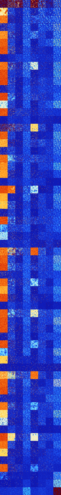

# B0678 (229888-230399)

<details>
    <summary>Initial Grid</summary>
    
</details>


<details>
    <summary>Initial Grid RLE</summary>

```
#C Exported from GoGoL (https://github.com/marrow16/gogol)
#C Wrap mode: Toroidal
#C Boundary mode: Dead
#C Step: 0
x = 100, y = 100, rule = B0678/S
2bobo9bo13bo6bo22bo39bo$17bo47bo17bo2bo9bo$o12bo31bo13bo3bo11bo3bo11bo$
16bo7bo5bo15bo11bo3bo33bo$2bo28bo13bo7bo14b2o25bo$9bo20bo18bobo$7bo25bo
9bo10bo4bobo21bobo9bo$23bo42bo32bo$10bobo6b2o10bo57bo7bo$32bo$22bo35bo$
12bo22bo13bo9bo$27bo20bo6bo38bobobo$9bo49b2o8bo12bo$10bo6bo10bo14bo12bo
$28bo12bo31bo20bo$2bo6bo20b2o9bo49b2o$20bo10bo31bo4bo$57bo2bo29bo$10bo
44bob2o28bo$56b2o11bo3bo23bo$41bo48bo$28bo12bo24bo5bo$8bo19bo4b2o24bobo
8bo$4bo6bo7bo16bo2bobo5bo35bo10bo$3bo21bo11bo27bo5b2o$20bo3bo12bo6bo30b
o12bo$5bo28b2o2bo14bo32bo$bo19bo39bo9bo$22bo2bo7bo24b2o27bo4b2o$7bo25bo
28bo10b2o14bo$11bo12bo5bo16bo15bo$18bo26bo29bo2bo16bo$20bo37bo17bo4bo
15bo$25bo9bo27bo3bo22bo$80bo8bo$39bo28bo25bo$32bo14bo35bo2bo$26bo34bo7b
2o$o4bo2bo34bo19bo$14bo5bo19bo9bo11bo6bo15bo6bo$17bo16bo22bob2o$6bo60bo
3bo8bo14bo$bo15bo19bo11bo25bo$73bo23bo$42bo2bo4bo$28bo17bo25bo17bo6bo$
36bobo19bobo$25bo19bo25bo25bobo$14bo$12bo26bo44bo4bo$27bo26bo4bo11bo$o
4bo35bo16bo12bo14bo7bo$o10bo9bo15bo13bo4bo10bo8bo$5bo23bo6bo38bo4bo$9bo
7bo26bo19bo13bo17bo$7bo60bo9bo2b2o10bo$11bo15bo9bo42bo15bo$23bo$17bo13b
o6bo20bo19bo8bo6bo$4bo4bo25bo35bo13bo$36bo11b2o3bo27bo4bo$4bo15bobo7bo
55bo4bo$14bo15bo9bo$15bo5bo16bobo17bo10bo$o2bo16bo56bo6bo7bo$16bo4bo18b
o2bo32bo20bo$9bo2bo44bo10bo18bo$16bo32bo$13bo25bo2bo24bo12bo$98bo$28bo
29bo36bo$6bo6bo35bo5bo26bo$2bo38b2o26bo16bo11bo$22bo35bo13bobo10bo$19bo
4bo3bo5bo21bo24bobo15bo$27bo11bo15bo20bo17bo$4bo6bo5bo62bo$12bo41bobo
12bo6bo$15bo14bo17bo22bo$2bo15bo13bo31bo4bo15bo12bo$16bo26bo$4bo3bo2bo
10bo20bo18b2o25bo$19bo19bo2bo26bo$2bobo5bo22bobo5bo9bo21bo5bo$21bo3bo4b
o9bo17bo10bo4bo2bo3bo12bo$29bo5b2o39bo$28bo26bo28bo$50bo18bo$27bo53bo
14bo$22bo$8bo26bo16bo9bo17bo$o34b2o26bo$bo9bo18bo7b2o52bo$26bo8bo11bo9b
o2bo18bo3bo$7bo20bo2bo50bo8bo$2bo37bo18bo22bo4bo4bo$6bo2bo2bo14bo7bo26b
o7bo$8b2o15bo6bo33bo$3bo13bob2o23bo3b2o6bo14bo!
```
</details>
<details>
    <summary>Thumbnail</summary>

</details>
<table>
<tr>
    <td><a href="./229888%20S%20Heat%20Map%20Activity.png"></a><br>S (229888)<br>R@3,p2</td>    <td><a href="./229889%20S0%20Heat%20Map%20Activity.png"></a><br>S0 (229889)<br>R@11,p2</td>    <td><a href="./229890%20S1%20Heat%20Map%20Activity.png"></a><br>S1 (229890)<br>R@132,p2</td>    <td><a href="./229891%20S01%20Heat%20Map%20Activity.png"></a><br>S01 (229891)<br>R@26,p2</td>    <td><a href="./229892%20S2%20Heat%20Map%20Activity.png"></a><br>S2 (229892)<br>R@36,p6</td>    <td><a href="./229893%20S02%20Heat%20Map%20Activity.png"></a><br>S02 (229893)<br>R@64,p12</td>    <td><a href="./229894%20S12%20Heat%20Map%20Activity.png"></a><br>S12 (229894)<br>R@364,p312</td>    <td><a href="./229895%20S012%20Heat%20Map%20Activity.png"></a><br>S012 (229895)<br>R@16,p2</td></tr>
<tr>
    <td><a href="./229896%20S3%20Heat%20Map%20Activity.png"></a><br>S3 (229896)<br>G>1000</td>    <td><a href="./229897%20S03%20Heat%20Map%20Activity.png"></a><br>S03 (229897)<br>R@68,p30</td>    <td><a href="./229898%20S13%20Heat%20Map%20Activity.png"></a><br>S13 (229898)<br>G>1000</td>    <td><a href="./229899%20S013%20Heat%20Map%20Activity.png"></a><br>S013 (229899)<br>R@24,p2</td>    <td><a href="./229900%20S23%20Heat%20Map%20Activity.png"></a><br>S23 (229900)<br>G>1000</td>    <td><a href="./229901%20S023%20Heat%20Map%20Activity.png"></a><br>S023 (229901)<br>R@39,p6</td>    <td><a href="./229902%20S123%20Heat%20Map%20Activity.png"></a><br>S123 (229902)<br>R@93,p60</td>    <td><a href="./229903%20S0123%20Heat%20Map%20Activity.png"></a><br>S0123 (229903)<br>S@18</td></tr>
<tr>
    <td><a href="./229904%20S4%20Heat%20Map%20Activity.png"></a><br>S4 (229904)<br>G>1000</td>    <td><a href="./229905%20S04%20Heat%20Map%20Activity.png"></a><br>S04 (229905)<br>R@285,p180</td>    <td><a href="./229906%20S14%20Heat%20Map%20Activity.png"></a><br>S14 (229906)<br>G>1000</td>    <td><a href="./229907%20S014%20Heat%20Map%20Activity.png"></a><br>S014 (229907)<br>R@22,p6</td>    <td><a href="./229908%20S24%20Heat%20Map%20Activity.png"></a><br>S24 (229908)<br>G>1000</td>    <td><a href="./229909%20S024%20Heat%20Map%20Activity.png"></a><br>S024 (229909)<br>R@40,p12</td>    <td><a href="./229910%20S124%20Heat%20Map%20Activity.png"></a><br>S124 (229910)<br>R@35,p12</td>    <td><a href="./229911%20S0124%20Heat%20Map%20Activity.png"></a><br>S0124 (229911)<br>R@16,p2</td></tr>
<tr>
    <td><a href="./229912%20S34%20Heat%20Map%20Activity.png"></a><br>S34 (229912)<br>G>1000</td>    <td><a href="./229913%20S034%20Heat%20Map%20Activity.png"></a><br>S034 (229913)<br>R@56,p12</td>    <td><a href="./229914%20S134%20Heat%20Map%20Activity.png"></a><br>S134 (229914)<br>R@258,p210</td>    <td><a href="./229915%20S0134%20Heat%20Map%20Activity.png"></a><br>S0134 (229915)<br>R@18,p6</td>    <td><a href="./229916%20S234%20Heat%20Map%20Activity.png"></a><br>S234 (229916)<br>R@295,p252</td>    <td><a href="./229917%20S0234%20Heat%20Map%20Activity.png"></a><br>S0234 (229917)<br>R@29,p6</td>    <td><a href="./229918%20S1234%20Heat%20Map%20Activity.png"></a><br>S1234 (229918)<br>R@30,p12</td>    <td><a href="./229919%20S01234%20Heat%20Map%20Activity.png"></a><br>S01234 (229919)<br>R@11,p2</td></tr>
<tr>
    <td><a href="./229920%20S5%20Heat%20Map%20Activity.png"></a><br>S5 (229920)<br>G>1000</td>    <td><a href="./229921%20S05%20Heat%20Map%20Activity.png"></a><br>S05 (229921)<br>R@233,p60</td>    <td><a href="./229922%20S15%20Heat%20Map%20Activity.png"></a><br>S15 (229922)<br>G>1000</td>    <td><a href="./229923%20S015%20Heat%20Map%20Activity.png"></a><br>S015 (229923)<br>R@22,p6</td>    <td><a href="./229924%20S25%20Heat%20Map%20Activity.png"></a><br>S25 (229924)<br>G>1000</td>    <td><a href="./229925%20S025%20Heat%20Map%20Activity.png"></a><br>S025 (229925)<br>R@34,p6</td>    <td><a href="./229926%20S125%20Heat%20Map%20Activity.png"></a><br>S125 (229926)<br>R@87,p60</td>    <td><a href="./229927%20S0125%20Heat%20Map%20Activity.png"></a><br>S0125 (229927)<br>R@11,p2</td></tr>
<tr>
    <td><a href="./229928%20S35%20Heat%20Map%20Activity.png"></a><br>S35 (229928)<br>G>1000</td>    <td><a href="./229929%20S035%20Heat%20Map%20Activity.png"></a><br>S035 (229929)<br>R@48,p12</td>    <td><a href="./229930%20S135%20Heat%20Map%20Activity.png"></a><br>S135 (229930)<br>G>1000</td>    <td><a href="./229931%20S0135%20Heat%20Map%20Activity.png"></a><br>S0135 (229931)<br>R@14,p2</td>    <td><a href="./229932%20S235%20Heat%20Map%20Activity.png"></a><br>S235 (229932)<br>R@895,p840</td>    <td><a href="./229933%20S0235%20Heat%20Map%20Activity.png"></a><br>S0235 (229933)<br>R@30,p12</td>    <td><a href="./229934%20S1235%20Heat%20Map%20Activity.png"></a><br>S1235 (229934)<br>R@19,p4</td>    <td><a href="./229935%20S01235%20Heat%20Map%20Activity.png"></a><br>S01235 (229935)<br>S@7</td></tr>
<tr>
    <td><a href="./229936%20S45%20Heat%20Map%20Activity.png"></a><br>S45 (229936)<br>G>1000</td>    <td><a href="./229937%20S045%20Heat%20Map%20Activity.png"></a><br>S045 (229937)<br>R@861,p360</td>    <td><a href="./229938%20S145%20Heat%20Map%20Activity.png"></a><br>S145 (229938)<br>R@574,p504</td>    <td><a href="./229939%20S0145%20Heat%20Map%20Activity.png"></a><br>S0145 (229939)<br>R@26,p6</td>    <td><a href="./229940%20S245%20Heat%20Map%20Activity.png"></a><br>S245 (229940)<br>G>1000</td>    <td><a href="./229941%20S0245%20Heat%20Map%20Activity.png"></a><br>S0245 (229941)<br>R@69,p42</td>    <td><a href="./229942%20S1245%20Heat%20Map%20Activity.png"></a><br>S1245 (229942)<br>R@107,p84</td>    <td><a href="./229943%20S01245%20Heat%20Map%20Activity.png"></a><br>S01245 (229943)<br>R@15,p6</td></tr>
<tr>
    <td><a href="./229944%20S345%20Heat%20Map%20Activity.png"></a><br>S345 (229944)<br>R@904,p840</td>    <td><a href="./229945%20S0345%20Heat%20Map%20Activity.png"></a><br>S0345 (229945)<br>R@91,p60</td>    <td><a href="./229946%20S1345%20Heat%20Map%20Activity.png"></a><br>S1345 (229946)<br>R@48,p12</td>    <td><a href="./229947%20S01345%20Heat%20Map%20Activity.png"></a><br>S01345 (229947)<br>R@20,p6</td>    <td><a href="./229948%20S2345%20Heat%20Map%20Activity.png"></a><br>S2345 (229948)<br>R@51,p12</td>    <td><a href="./229949%20S02345%20Heat%20Map%20Activity.png"></a><br>S02345 (229949)<br>R@44,p24</td>    <td><a href="./229950%20S12345%20Heat%20Map%20Activity.png"></a><br>S12345 (229950)<br>R@44,p24</td>    <td><a href="./229951%20S012345%20Heat%20Map%20Activity.png"></a><br>S012345 (229951)<br>R@14,p4</td></tr>
<tr>
    <td><a href="./229952%20S6%20Heat%20Map%20Activity.png"></a><br>S6 (229952)<br>G>1000</td>    <td><a href="./229953%20S06%20Heat%20Map%20Activity.png"></a><br>S06 (229953)<br>R@119,p6</td>    <td><a href="./229954%20S16%20Heat%20Map%20Activity.png"></a><br>S16 (229954)<br>R@366,p240</td>    <td><a href="./229955%20S016%20Heat%20Map%20Activity.png"></a><br>S016 (229955)<br>R@17,p2</td>    <td><a href="./229956%20S26%20Heat%20Map%20Activity.png"></a><br>S26 (229956)<br>G>1000</td>    <td><a href="./229957%20S026%20Heat%20Map%20Activity.png"></a><br>S026 (229957)<br>R@79,p36</td>    <td><a href="./229958%20S126%20Heat%20Map%20Activity.png"></a><br>S126 (229958)<br>R@80,p60</td>    <td><a href="./229959%20S0126%20Heat%20Map%20Activity.png"></a><br>S0126 (229959)<br>R@9,p2</td></tr>
<tr>
    <td><a href="./229960%20S36%20Heat%20Map%20Activity.png"></a><br>S36 (229960)<br>G>1000</td>    <td><a href="./229961%20S036%20Heat%20Map%20Activity.png"></a><br>S036 (229961)<br>R@53,p24</td>    <td><a href="./229962%20S136%20Heat%20Map%20Activity.png"></a><br>S136 (229962)<br>R@106,p60</td>    <td><a href="./229963%20S0136%20Heat%20Map%20Activity.png"></a><br>S0136 (229963)<br>R@13,p2</td>    <td><a href="./229964%20S236%20Heat%20Map%20Activity.png"></a><br>S236 (229964)<br>G>1000</td>    <td><a href="./229965%20S0236%20Heat%20Map%20Activity.png"></a><br>S0236 (229965)<br>R@51,p30</td>    <td><a href="./229966%20S1236%20Heat%20Map%20Activity.png"></a><br>S1236 (229966)<br>R@44,p30</td>    <td><a href="./229967%20S01236%20Heat%20Map%20Activity.png"></a><br>S01236 (229967)<br>S@7</td></tr>
<tr>
    <td><a href="./229968%20S46%20Heat%20Map%20Activity.png"></a><br>S46 (229968)<br>G>1000</td>    <td><a href="./229969%20S046%20Heat%20Map%20Activity.png"></a><br>S046 (229969)<br>R@190,p30</td>    <td><a href="./229970%20S146%20Heat%20Map%20Activity.png"></a><br>S146 (229970)<br>R@910,p840</td>    <td><a href="./229971%20S0146%20Heat%20Map%20Activity.png"></a><br>S0146 (229971)<br>R@29,p12</td>    <td><a href="./229972%20S246%20Heat%20Map%20Activity.png"></a><br>S246 (229972)<br>G>1000</td>    <td><a href="./229973%20S0246%20Heat%20Map%20Activity.png"></a><br>S0246 (229973)<br>R@42,p12</td>    <td><a href="./229974%20S1246%20Heat%20Map%20Activity.png"></a><br>S1246 (229974)<br>R@31,p12</td>    <td><a href="./229975%20S01246%20Heat%20Map%20Activity.png"></a><br>S01246 (229975)<br>R@10,p2</td></tr>
<tr>
    <td><a href="./229976%20S346%20Heat%20Map%20Activity.png"></a><br>S346 (229976)<br>G>1000</td>    <td><a href="./229977%20S0346%20Heat%20Map%20Activity.png"></a><br>S0346 (229977)<br>R@51,p12</td>    <td><a href="./229978%20S1346%20Heat%20Map%20Activity.png"></a><br>S1346 (229978)<br>R@455,p420</td>    <td><a href="./229979%20S01346%20Heat%20Map%20Activity.png"></a><br>S01346 (229979)<br>R@17,p6</td>    <td><a href="./229980%20S2346%20Heat%20Map%20Activity.png"></a><br>S2346 (229980)<br>R@57,p24</td>    <td><a href="./229981%20S02346%20Heat%20Map%20Activity.png"></a><br>S02346 (229981)<br>R@24,p6</td>    <td><a href="./229982%20S12346%20Heat%20Map%20Activity.png"></a><br>S12346 (229982)<br>R@21,p6</td>    <td><a href="./229983%20S012346%20Heat%20Map%20Activity.png"></a><br>S012346 (229983)<br>R@16,p2</td></tr>
<tr>
    <td><a href="./229984%20S56%20Heat%20Map%20Activity.png"></a><br>S56 (229984)<br>G>1000</td>    <td><a href="./229985%20S056%20Heat%20Map%20Activity.png"></a><br>S056 (229985)<br>R@921,p180</td>    <td><a href="./229986%20S156%20Heat%20Map%20Activity.png"></a><br>S156 (229986)<br>G>1000</td>    <td><a href="./229987%20S0156%20Heat%20Map%20Activity.png"></a><br>S0156 (229987)<br>R@24,p6</td>    <td><a href="./229988%20S256%20Heat%20Map%20Activity.png"></a><br>S256 (229988)<br>G>1000</td>    <td><a href="./229989%20S0256%20Heat%20Map%20Activity.png"></a><br>S0256 (229989)<br>R@58,p24</td>    <td><a href="./229990%20S1256%20Heat%20Map%20Activity.png"></a><br>S1256 (229990)<br>R@38,p12</td>    <td><a href="./229991%20S01256%20Heat%20Map%20Activity.png"></a><br>S01256 (229991)<br>R@15,p6</td></tr>
<tr>
    <td><a href="./229992%20S356%20Heat%20Map%20Activity.png"></a><br>S356 (229992)<br>G>1000</td>    <td><a href="./229993%20S0356%20Heat%20Map%20Activity.png"></a><br>S0356 (229993)<br>R@67,p24</td>    <td><a href="./229994%20S1356%20Heat%20Map%20Activity.png"></a><br>S1356 (229994)<br>R@563,p504</td>    <td><a href="./229995%20S01356%20Heat%20Map%20Activity.png"></a><br>S01356 (229995)<br>R@18,p2</td>    <td><a href="./229996%20S2356%20Heat%20Map%20Activity.png"></a><br>S2356 (229996)<br>G>1000</td>    <td><a href="./229997%20S02356%20Heat%20Map%20Activity.png"></a><br>S02356 (229997)<br>R@36,p12</td>    <td><a href="./229998%20S12356%20Heat%20Map%20Activity.png"></a><br>S12356 (229998)<br>R@15,p2</td>    <td><a href="./229999%20S012356%20Heat%20Map%20Activity.png"></a><br>S012356 (229999)<br>S@12</td></tr>
<tr>
    <td><a href="./230000%20S456%20Heat%20Map%20Activity.png"></a><br>S456 (230000)<br>G>1000</td>    <td><a href="./230001%20S0456%20Heat%20Map%20Activity.png"></a><br>S0456 (230001)<br>G>1000</td>    <td><a href="./230002%20S1456%20Heat%20Map%20Activity.png"></a><br>S1456 (230002)<br>R@159,p72</td>    <td><a href="./230003%20S01456%20Heat%20Map%20Activity.png"></a><br>S01456 (230003)<br>R@59,p30</td>    <td><a href="./230004%20S2456%20Heat%20Map%20Activity.png"></a><br>S2456 (230004)<br>R@534,p360</td>    <td><a href="./230005%20S02456%20Heat%20Map%20Activity.png"></a><br>S02456 (230005)<br>R@53,p18</td>    <td><a href="./230006%20S12456%20Heat%20Map%20Activity.png"></a><br>S12456 (230006)<br>R@34,p12</td>    <td><a href="./230007%20S012456%20Heat%20Map%20Activity.png"></a><br>S012456 (230007)<br>R@33,p6</td></tr>
<tr>
    <td><a href="./230008%20S3456%20Heat%20Map%20Activity.png"></a><br>S3456 (230008)<br>G>1000</td>    <td><a href="./230009%20S03456%20Heat%20Map%20Activity.png"></a><br>S03456 (230009)<br>R@51,p24</td>    <td><a href="./230010%20S13456%20Heat%20Map%20Activity.png"></a><br>S13456 (230010)<br>R@61,p30</td>    <td><a href="./230011%20S013456%20Heat%20Map%20Activity.png"></a><br>S013456 (230011)<br>R@30,p6</td>    <td><a href="./230012%20S23456%20Heat%20Map%20Activity.png"></a><br>S23456 (230012)<br>R@152,p120</td>    <td><a href="./230013%20S023456%20Heat%20Map%20Activity.png"></a><br>S023456 (230013)<br>R@56,p24</td>    <td><a href="./230014%20S123456%20Heat%20Map%20Activity.png"></a><br>S123456 (230014)<br>R@83,p60</td>    <td><a href="./230015%20S0123456%20Heat%20Map%20Activity.png"></a><br>S0123456 (230015)<br>R@151,p120</td></tr>
<tr>
    <td><a href="./230016%20S7%20Heat%20Map%20Activity.png"></a><br>S7 (230016)<br>R@21,p6</td>    <td><a href="./230017%20S07%20Heat%20Map%20Activity.png"></a><br>S07 (230017)<br>R@34,p2</td>    <td><a href="./230018%20S17%20Heat%20Map%20Activity.png"></a><br>S17 (230018)<br>R@399,p120</td>    <td><a href="./230019%20S017%20Heat%20Map%20Activity.png"></a><br>S017 (230019)<br>R@22,p2</td>    <td><a href="./230020%20S27%20Heat%20Map%20Activity.png"></a><br>S27 (230020)<br>G>1000</td>    <td><a href="./230021%20S027%20Heat%20Map%20Activity.png"></a><br>S027 (230021)<br>R@39,p6</td>    <td><a href="./230022%20S127%20Heat%20Map%20Activity.png"></a><br>S127 (230022)<br>R@202,p168</td>    <td><a href="./230023%20S0127%20Heat%20Map%20Activity.png"></a><br>S0127 (230023)<br>R@13,p2</td></tr>
<tr>
    <td><a href="./230024%20S37%20Heat%20Map%20Activity.png"></a><br>S37 (230024)<br>G>1000</td>    <td><a href="./230025%20S037%20Heat%20Map%20Activity.png"></a><br>S037 (230025)<br>R@53,p18</td>    <td><a href="./230026%20S137%20Heat%20Map%20Activity.png"></a><br>S137 (230026)<br>G>1000</td>    <td><a href="./230027%20S0137%20Heat%20Map%20Activity.png"></a><br>S0137 (230027)<br>R@15,p6</td>    <td><a href="./230028%20S237%20Heat%20Map%20Activity.png"></a><br>S237 (230028)<br>G>1000</td>    <td><a href="./230029%20S0237%20Heat%20Map%20Activity.png"></a><br>S0237 (230029)<br>R@141,p120</td>    <td><a href="./230030%20S1237%20Heat%20Map%20Activity.png"></a><br>S1237 (230030)<br>R@75,p60</td>    <td><a href="./230031%20S01237%20Heat%20Map%20Activity.png"></a><br>S01237 (230031)<br>S@7</td></tr>
<tr>
    <td><a href="./230032%20S47%20Heat%20Map%20Activity.png"></a><br>S47 (230032)<br>G>1000</td>    <td><a href="./230033%20S047%20Heat%20Map%20Activity.png"></a><br>S047 (230033)<br>R@379,p240</td>    <td><a href="./230034%20S147%20Heat%20Map%20Activity.png"></a><br>S147 (230034)<br>G>1000</td>    <td><a href="./230035%20S0147%20Heat%20Map%20Activity.png"></a><br>S0147 (230035)<br>R@19,p6</td>    <td><a href="./230036%20S247%20Heat%20Map%20Activity.png"></a><br>S247 (230036)<br>G>1000</td>    <td><a href="./230037%20S0247%20Heat%20Map%20Activity.png"></a><br>S0247 (230037)<br>R@32,p6</td>    <td><a href="./230038%20S1247%20Heat%20Map%20Activity.png"></a><br>S1247 (230038)<br>R@35,p12</td>    <td><a href="./230039%20S01247%20Heat%20Map%20Activity.png"></a><br>S01247 (230039)<br>R@10,p2</td></tr>
<tr>
    <td><a href="./230040%20S347%20Heat%20Map%20Activity.png"></a><br>S347 (230040)<br>G>1000</td>    <td><a href="./230041%20S0347%20Heat%20Map%20Activity.png"></a><br>S0347 (230041)<br>R@52,p12</td>    <td><a href="./230042%20S1347%20Heat%20Map%20Activity.png"></a><br>S1347 (230042)<br>R@205,p168</td>    <td><a href="./230043%20S01347%20Heat%20Map%20Activity.png"></a><br>S01347 (230043)<br>R@19,p6</td>    <td><a href="./230044%20S2347%20Heat%20Map%20Activity.png"></a><br>S2347 (230044)<br>R@957,p924</td>    <td><a href="./230045%20S02347%20Heat%20Map%20Activity.png"></a><br>S02347 (230045)<br>R@62,p42</td>    <td><a href="./230046%20S12347%20Heat%20Map%20Activity.png"></a><br>S12347 (230046)<br>R@26,p12</td>    <td><a href="./230047%20S012347%20Heat%20Map%20Activity.png"></a><br>S012347 (230047)<br>R@11,p4</td></tr>
<tr>
    <td><a href="./230048%20S57%20Heat%20Map%20Activity.png"></a><br>S57 (230048)<br>G>1000</td>    <td><a href="./230049%20S057%20Heat%20Map%20Activity.png"></a><br>S057 (230049)<br>G>1000</td>    <td><a href="./230050%20S157%20Heat%20Map%20Activity.png"></a><br>S157 (230050)<br>R@213,p72</td>    <td><a href="./230051%20S0157%20Heat%20Map%20Activity.png"></a><br>S0157 (230051)<br>R@32,p6</td>    <td><a href="./230052%20S257%20Heat%20Map%20Activity.png"></a><br>S257 (230052)<br>G>1000</td>    <td><a href="./230053%20S0257%20Heat%20Map%20Activity.png"></a><br>S0257 (230053)<br>R@40,p12</td>    <td><a href="./230054%20S1257%20Heat%20Map%20Activity.png"></a><br>S1257 (230054)<br>R@37,p12</td>    <td><a href="./230055%20S01257%20Heat%20Map%20Activity.png"></a><br>S01257 (230055)<br>R@15,p6</td></tr>
<tr>
    <td><a href="./230056%20S357%20Heat%20Map%20Activity.png"></a><br>S357 (230056)<br>G>1000</td>    <td><a href="./230057%20S0357%20Heat%20Map%20Activity.png"></a><br>S0357 (230057)<br>R@51,p12</td>    <td><a href="./230058%20S1357%20Heat%20Map%20Activity.png"></a><br>S1357 (230058)<br>G>1000</td>    <td><a href="./230059%20S01357%20Heat%20Map%20Activity.png"></a><br>S01357 (230059)<br>R@18,p4</td>    <td><a href="./230060%20S2357%20Heat%20Map%20Activity.png"></a><br>S2357 (230060)<br>R@304,p252</td>    <td><a href="./230061%20S02357%20Heat%20Map%20Activity.png"></a><br>S02357 (230061)<br>R@31,p12</td>    <td><a href="./230062%20S12357%20Heat%20Map%20Activity.png"></a><br>S12357 (230062)<br>R@26,p4</td>    <td><a href="./230063%20S012357%20Heat%20Map%20Activity.png"></a><br>S012357 (230063)<br>S@9</td></tr>
<tr>
    <td><a href="./230064%20S457%20Heat%20Map%20Activity.png"></a><br>S457 (230064)<br>G>1000</td>    <td><a href="./230065%20S0457%20Heat%20Map%20Activity.png"></a><br>S0457 (230065)<br>G>1000</td>    <td><a href="./230066%20S1457%20Heat%20Map%20Activity.png"></a><br>S1457 (230066)<br>G>1000</td>    <td><a href="./230067%20S01457%20Heat%20Map%20Activity.png"></a><br>S01457 (230067)<br>R@21,p6</td>    <td><a href="./230068%20S2457%20Heat%20Map%20Activity.png"></a><br>S2457 (230068)<br>G>1000</td>    <td><a href="./230069%20S02457%20Heat%20Map%20Activity.png"></a><br>S02457 (230069)<br>R@85,p60</td>    <td><a href="./230070%20S12457%20Heat%20Map%20Activity.png"></a><br>S12457 (230070)<br>R@82,p60</td>    <td><a href="./230071%20S012457%20Heat%20Map%20Activity.png"></a><br>S012457 (230071)<br>R@18,p6</td></tr>
<tr>
    <td><a href="./230072%20S3457%20Heat%20Map%20Activity.png"></a><br>S3457 (230072)<br>R@475,p420</td>    <td><a href="./230073%20S03457%20Heat%20Map%20Activity.png"></a><br>S03457 (230073)<br>R@50,p24</td>    <td><a href="./230074%20S13457%20Heat%20Map%20Activity.png"></a><br>S13457 (230074)<br>R@95,p60</td>    <td><a href="./230075%20S013457%20Heat%20Map%20Activity.png"></a><br>S013457 (230075)<br>R@21,p2</td>    <td><a href="./230076%20S23457%20Heat%20Map%20Activity.png"></a><br>S23457 (230076)<br>R@56,p24</td>    <td><a href="./230077%20S023457%20Heat%20Map%20Activity.png"></a><br>S023457 (230077)<br>R@33,p12</td>    <td><a href="./230078%20S123457%20Heat%20Map%20Activity.png"></a><br>S123457 (230078)<br>R@395,p360</td>    <td><a href="./230079%20S0123457%20Heat%20Map%20Activity.png"></a><br>S0123457 (230079)<br>R@199,p180</td></tr>
<tr>
    <td><a href="./230080%20S67%20Heat%20Map%20Activity.png"></a><br>S67 (230080)<br>G>1000</td>    <td><a href="./230081%20S067%20Heat%20Map%20Activity.png"></a><br>S067 (230081)<br>G>1000</td>    <td><a href="./230082%20S167%20Heat%20Map%20Activity.png"></a><br>S167 (230082)<br>G>1000</td>    <td><a href="./230083%20S0167%20Heat%20Map%20Activity.png"></a><br>S0167 (230083)<br>R@26,p6</td>    <td><a href="./230084%20S267%20Heat%20Map%20Activity.png"></a><br>S267 (230084)<br>G>1000</td>    <td><a href="./230085%20S0267%20Heat%20Map%20Activity.png"></a><br>S0267 (230085)<br>R@659,p630</td>    <td><a href="./230086%20S1267%20Heat%20Map%20Activity.png"></a><br>S1267 (230086)<br>R@140,p120</td>    <td><a href="./230087%20S01267%20Heat%20Map%20Activity.png"></a><br>S01267 (230087)<br>R@18,p6</td></tr>
<tr>
    <td><a href="./230088%20S367%20Heat%20Map%20Activity.png"></a><br>S367 (230088)<br>G>1000</td>    <td><a href="./230089%20S0367%20Heat%20Map%20Activity.png"></a><br>S0367 (230089)<br>R@215,p168</td>    <td><a href="./230090%20S1367%20Heat%20Map%20Activity.png"></a><br>S1367 (230090)<br>R@562,p504</td>    <td><a href="./230091%20S01367%20Heat%20Map%20Activity.png"></a><br>S01367 (230091)<br>R@14,p2</td>    <td><a href="./230092%20S2367%20Heat%20Map%20Activity.png"></a><br>S2367 (230092)<br>G>1000</td>    <td><a href="./230093%20S02367%20Heat%20Map%20Activity.png"></a><br>S02367 (230093)<br>R@30,p12</td>    <td><a href="./230094%20S12367%20Heat%20Map%20Activity.png"></a><br>S12367 (230094)<br>R@43,p30</td>    <td><a href="./230095%20S012367%20Heat%20Map%20Activity.png"></a><br>S012367 (230095)<br>S@9</td></tr>
<tr>
    <td><a href="./230096%20S467%20Heat%20Map%20Activity.png"></a><br>S467 (230096)<br>G>1000</td>    <td><a href="./230097%20S0467%20Heat%20Map%20Activity.png"></a><br>S0467 (230097)<br>R@110,p12</td>    <td><a href="./230098%20S1467%20Heat%20Map%20Activity.png"></a><br>S1467 (230098)<br>G>1000</td>    <td><a href="./230099%20S01467%20Heat%20Map%20Activity.png"></a><br>S01467 (230099)<br>R@29,p12</td>    <td><a href="./230100%20S2467%20Heat%20Map%20Activity.png"></a><br>S2467 (230100)<br>G>1000</td>    <td><a href="./230101%20S02467%20Heat%20Map%20Activity.png"></a><br>S02467 (230101)<br>R@42,p12</td>    <td><a href="./230102%20S12467%20Heat%20Map%20Activity.png"></a><br>S12467 (230102)<br>R@62,p42</td>    <td><a href="./230103%20S012467%20Heat%20Map%20Activity.png"></a><br>S012467 (230103)<br>R@12,p2</td></tr>
<tr>
    <td><a href="./230104%20S3467%20Heat%20Map%20Activity.png"></a><br>S3467 (230104)<br>G>1000</td>    <td><a href="./230105%20S03467%20Heat%20Map%20Activity.png"></a><br>S03467 (230105)<br>R@49,p12</td>    <td><a href="./230106%20S13467%20Heat%20Map%20Activity.png"></a><br>S13467 (230106)<br>R@459,p420</td>    <td><a href="./230107%20S013467%20Heat%20Map%20Activity.png"></a><br>S013467 (230107)<br>R@19,p6</td>    <td><a href="./230108%20S23467%20Heat%20Map%20Activity.png"></a><br>S23467 (230108)<br>R@866,p840</td>    <td><a href="./230109%20S023467%20Heat%20Map%20Activity.png"></a><br>S023467 (230109)<br>R@29,p12</td>    <td><a href="./230110%20S123467%20Heat%20Map%20Activity.png"></a><br>S123467 (230110)<br>R@19,p6</td>    <td><a href="./230111%20S0123467%20Heat%20Map%20Activity.png"></a><br>S0123467 (230111)<br>R@16,p4</td></tr>
<tr>
    <td><a href="./230112%20S567%20Heat%20Map%20Activity.png"></a><br>S567 (230112)<br>G>1000</td>    <td><a href="./230113%20S0567%20Heat%20Map%20Activity.png"></a><br>S0567 (230113)<br>G>1000</td>    <td><a href="./230114%20S1567%20Heat%20Map%20Activity.png"></a><br>S1567 (230114)<br>G>1000</td>    <td><a href="./230115%20S01567%20Heat%20Map%20Activity.png"></a><br>S01567 (230115)<br>R@32,p6</td>    <td><a href="./230116%20S2567%20Heat%20Map%20Activity.png"></a><br>S2567 (230116)<br>G>1000</td>    <td><a href="./230117%20S02567%20Heat%20Map%20Activity.png"></a><br>S02567 (230117)<br>R@54,p12</td>    <td><a href="./230118%20S12567%20Heat%20Map%20Activity.png"></a><br>S12567 (230118)<br>R@39,p12</td>    <td><a href="./230119%20S012567%20Heat%20Map%20Activity.png"></a><br>S012567 (230119)<br>R@18,p6</td></tr>
<tr>
    <td><a href="./230120%20S3567%20Heat%20Map%20Activity.png"></a><br>S3567 (230120)<br>G>1000</td>    <td><a href="./230121%20S03567%20Heat%20Map%20Activity.png"></a><br>S03567 (230121)<br>R@59,p12</td>    <td><a href="./230122%20S13567%20Heat%20Map%20Activity.png"></a><br>S13567 (230122)<br>R@62,p12</td>    <td><a href="./230123%20S013567%20Heat%20Map%20Activity.png"></a><br>S013567 (230123)<br>R@21,p6</td>    <td><a href="./230124%20S23567%20Heat%20Map%20Activity.png"></a><br>S23567 (230124)<br>R@895,p840</td>    <td><a href="./230125%20S023567%20Heat%20Map%20Activity.png"></a><br>S023567 (230125)<br>R@86,p60</td>    <td><a href="./230126%20S123567%20Heat%20Map%20Activity.png"></a><br>S123567 (230126)<br>R@24,p2</td>    <td><a href="./230127%20S0123567%20Heat%20Map%20Activity.png"></a><br>S0123567 (230127)<br>R@17,p2</td></tr>
<tr>
    <td><a href="./230128%20S4567%20Heat%20Map%20Activity.png"></a><br>S4567 (230128)<br>G>1000</td>    <td><a href="./230129%20S04567%20Heat%20Map%20Activity.png"></a><br>S04567 (230129)<br>G>1000</td>    <td><a href="./230130%20S14567%20Heat%20Map%20Activity.png"></a><br>S14567 (230130)<br>G>1000</td>    <td><a href="./230131%20S014567%20Heat%20Map%20Activity.png"></a><br>S014567 (230131)<br>R@64,p12</td>    <td><a href="./230132%20S24567%20Heat%20Map%20Activity.png"></a><br>S24567 (230132)<br>G>1000</td>    <td><a href="./230133%20S024567%20Heat%20Map%20Activity.png"></a><br>S024567 (230133)<br>R@45,p6</td>    <td><a href="./230134%20S124567%20Heat%20Map%20Activity.png"></a><br>S124567 (230134)<br>R@42,p12</td>    <td><a href="./230135%20S0124567%20Heat%20Map%20Activity.png"></a><br>S0124567 (230135)<br>R@37,p6</td></tr>
<tr>
    <td><a href="./230136%20S34567%20Heat%20Map%20Activity.png"></a><br>S34567 (230136)<br>R@81,p60</td>    <td><a href="./230137%20S034567%20Heat%20Map%20Activity.png"></a><br>S034567 (230137)<br>R@35,p12</td>    <td><a href="./230138%20S134567%20Heat%20Map%20Activity.png"></a><br>S134567 (230138)<br>R@48,p30</td>    <td><a href="./230139%20S0134567%20Heat%20Map%20Activity.png"></a><br>S0134567 (230139)<br>R@28,p6</td>    <td><a href="./230140%20S234567%20Heat%20Map%20Activity.png"></a><br>S234567 (230140)<br>R@108,p72</td>    <td><a href="./230141%20S0234567%20Heat%20Map%20Activity.png"></a><br>S0234567 (230141)<br>R@150,p120</td>    <td><a href="./230142%20S1234567%20Heat%20Map%20Activity.png"></a><br>S1234567 (230142)<br>R@42,p6</td>    <td><a href="./230143%20S01234567%20Heat%20Map%20Activity.png"></a><br>S01234567 (230143)<br>R@150,p120</td></tr>
<tr>
    <td><a href="./230144%20S8%20Heat%20Map%20Activity.png"></a><br>S8 (230144)<br>G>1000</td>    <td><a href="./230145%20S08%20Heat%20Map%20Activity.png"></a><br>S08 (230145)<br>R@285,p6</td>    <td><a href="./230146%20S18%20Heat%20Map%20Activity.png"></a><br>S18 (230146)<br>R@432,p120</td>    <td><a href="./230147%20S018%20Heat%20Map%20Activity.png"></a><br>S018 (230147)<br>R@16,p2</td>    <td><a href="./230148%20S28%20Heat%20Map%20Activity.png"></a><br>S28 (230148)<br>G>1000</td>    <td><a href="./230149%20S028%20Heat%20Map%20Activity.png"></a><br>S028 (230149)<br>R@36,p6</td>    <td><a href="./230150%20S128%20Heat%20Map%20Activity.png"></a><br>S128 (230150)<br>R@89,p60</td>    <td><a href="./230151%20S0128%20Heat%20Map%20Activity.png"></a><br>S0128 (230151)<br>R@13,p2</td></tr>
<tr>
    <td><a href="./230152%20S38%20Heat%20Map%20Activity.png"></a><br>S38 (230152)<br>G>1000</td>    <td><a href="./230153%20S038%20Heat%20Map%20Activity.png"></a><br>S038 (230153)<br>R@51,p6</td>    <td><a href="./230154%20S138%20Heat%20Map%20Activity.png"></a><br>S138 (230154)<br>G>1000</td>    <td><a href="./230155%20S0138%20Heat%20Map%20Activity.png"></a><br>S0138 (230155)<br>R@15,p2</td>    <td><a href="./230156%20S238%20Heat%20Map%20Activity.png"></a><br>S238 (230156)<br>G>1000</td>    <td><a href="./230157%20S0238%20Heat%20Map%20Activity.png"></a><br>S0238 (230157)<br>R@25,p6</td>    <td><a href="./230158%20S1238%20Heat%20Map%20Activity.png"></a><br>S1238 (230158)<br>R@28,p12</td>    <td><a href="./230159%20S01238%20Heat%20Map%20Activity.png"></a><br>S01238 (230159)<br>S@7</td></tr>
<tr>
    <td><a href="./230160%20S48%20Heat%20Map%20Activity.png"></a><br>S48 (230160)<br>G>1000</td>    <td><a href="./230161%20S048%20Heat%20Map%20Activity.png"></a><br>S048 (230161)<br>R@125,p6</td>    <td><a href="./230162%20S148%20Heat%20Map%20Activity.png"></a><br>S148 (230162)<br>R@117,p36</td>    <td><a href="./230163%20S0148%20Heat%20Map%20Activity.png"></a><br>S0148 (230163)<br>R@15,p2</td>    <td><a href="./230164%20S248%20Heat%20Map%20Activity.png"></a><br>S248 (230164)<br>G>1000</td>    <td><a href="./230165%20S0248%20Heat%20Map%20Activity.png"></a><br>S0248 (230165)<br>R@40,p12</td>    <td><a href="./230166%20S1248%20Heat%20Map%20Activity.png"></a><br>S1248 (230166)<br>R@32,p12</td>    <td><a href="./230167%20S01248%20Heat%20Map%20Activity.png"></a><br>S01248 (230167)<br>R@9,p2</td></tr>
<tr>
    <td><a href="./230168%20S348%20Heat%20Map%20Activity.png"></a><br>S348 (230168)<br>G>1000</td>    <td><a href="./230169%20S0348%20Heat%20Map%20Activity.png"></a><br>S0348 (230169)<br>R@130,p84</td>    <td><a href="./230170%20S1348%20Heat%20Map%20Activity.png"></a><br>S1348 (230170)<br>R@122,p84</td>    <td><a href="./230171%20S01348%20Heat%20Map%20Activity.png"></a><br>S01348 (230171)<br>R@15,p2</td>    <td><a href="./230172%20S2348%20Heat%20Map%20Activity.png"></a><br>S2348 (230172)<br>R@458,p420</td>    <td><a href="./230173%20S02348%20Heat%20Map%20Activity.png"></a><br>S02348 (230173)<br>R@31,p12</td>    <td><a href="./230174%20S12348%20Heat%20Map%20Activity.png"></a><br>S12348 (230174)<br>R@21,p4</td>    <td><a href="./230175%20S012348%20Heat%20Map%20Activity.png"></a><br>S012348 (230175)<br>R@15,p4</td></tr>
<tr>
    <td><a href="./230176%20S58%20Heat%20Map%20Activity.png"></a><br>S58 (230176)<br>G>1000</td>    <td><a href="./230177%20S058%20Heat%20Map%20Activity.png"></a><br>S058 (230177)<br>R@267,p12</td>    <td><a href="./230178%20S158%20Heat%20Map%20Activity.png"></a><br>S158 (230178)<br>R@504,p360</td>    <td><a href="./230179%20S0158%20Heat%20Map%20Activity.png"></a><br>S0158 (230179)<br>R@21,p6</td>    <td><a href="./230180%20S258%20Heat%20Map%20Activity.png"></a><br>S258 (230180)<br>G>1000</td>    <td><a href="./230181%20S0258%20Heat%20Map%20Activity.png"></a><br>S0258 (230181)<br>R@35,p6</td>    <td><a href="./230182%20S1258%20Heat%20Map%20Activity.png"></a><br>S1258 (230182)<br>R@127,p84</td>    <td><a href="./230183%20S01258%20Heat%20Map%20Activity.png"></a><br>S01258 (230183)<br>R@16,p6</td></tr>
<tr>
    <td><a href="./230184%20S358%20Heat%20Map%20Activity.png"></a><br>S358 (230184)<br>G>1000</td>    <td><a href="./230185%20S0358%20Heat%20Map%20Activity.png"></a><br>S0358 (230185)<br>R@51,p12</td>    <td><a href="./230186%20S1358%20Heat%20Map%20Activity.png"></a><br>S1358 (230186)<br>G>1000</td>    <td><a href="./230187%20S01358%20Heat%20Map%20Activity.png"></a><br>S01358 (230187)<br>R@14,p2</td>    <td><a href="./230188%20S2358%20Heat%20Map%20Activity.png"></a><br>S2358 (230188)<br>G>1000</td>    <td><a href="./230189%20S02358%20Heat%20Map%20Activity.png"></a><br>S02358 (230189)<br>R@32,p12</td>    <td><a href="./230190%20S12358%20Heat%20Map%20Activity.png"></a><br>S12358 (230190)<br>R@27,p12</td>    <td><a href="./230191%20S012358%20Heat%20Map%20Activity.png"></a><br>S012358 (230191)<br>S@9</td></tr>
<tr>
    <td><a href="./230192%20S458%20Heat%20Map%20Activity.png"></a><br>S458 (230192)<br>G>1000</td>    <td><a href="./230193%20S0458%20Heat%20Map%20Activity.png"></a><br>S0458 (230193)<br>G>1000</td>    <td><a href="./230194%20S1458%20Heat%20Map%20Activity.png"></a><br>S1458 (230194)<br>G>1000</td>    <td><a href="./230195%20S01458%20Heat%20Map%20Activity.png"></a><br>S01458 (230195)<br>R@22,p6</td>    <td><a href="./230196%20S2458%20Heat%20Map%20Activity.png"></a><br>S2458 (230196)<br>G>1000</td>    <td><a href="./230197%20S02458%20Heat%20Map%20Activity.png"></a><br>S02458 (230197)<br>R@164,p126</td>    <td><a href="./230198%20S12458%20Heat%20Map%20Activity.png"></a><br>S12458 (230198)<br>R@79,p60</td>    <td><a href="./230199%20S012458%20Heat%20Map%20Activity.png"></a><br>S012458 (230199)<br>R@13,p2</td></tr>
<tr>
    <td><a href="./230200%20S3458%20Heat%20Map%20Activity.png"></a><br>S3458 (230200)<br>R@497,p420</td>    <td><a href="./230201%20S03458%20Heat%20Map%20Activity.png"></a><br>S03458 (230201)<br>R@39,p6</td>    <td><a href="./230202%20S13458%20Heat%20Map%20Activity.png"></a><br>S13458 (230202)<br>R@96,p60</td>    <td><a href="./230203%20S013458%20Heat%20Map%20Activity.png"></a><br>S013458 (230203)<br>R@21,p2</td>    <td><a href="./230204%20S23458%20Heat%20Map%20Activity.png"></a><br>S23458 (230204)<br>R@39,p12</td>    <td><a href="./230205%20S023458%20Heat%20Map%20Activity.png"></a><br>S023458 (230205)<br>R@186,p168</td>    <td><a href="./230206%20S123458%20Heat%20Map%20Activity.png"></a><br>S123458 (230206)<br>R@860,p840</td>    <td><a href="./230207%20S0123458%20Heat%20Map%20Activity.png"></a><br>S0123458 (230207)<br>R@83,p60</td></tr>
<tr>
    <td><a href="./230208%20S68%20Heat%20Map%20Activity.png"></a><br>S68 (230208)<br>G>1000</td>    <td><a href="./230209%20S068%20Heat%20Map%20Activity.png"></a><br>S068 (230209)<br>R@611,p6</td>    <td><a href="./230210%20S168%20Heat%20Map%20Activity.png"></a><br>S168 (230210)<br>R@184,p24</td>    <td><a href="./230211%20S0168%20Heat%20Map%20Activity.png"></a><br>S0168 (230211)<br>R@22,p6</td>    <td><a href="./230212%20S268%20Heat%20Map%20Activity.png"></a><br>S268 (230212)<br>G>1000</td>    <td><a href="./230213%20S0268%20Heat%20Map%20Activity.png"></a><br>S0268 (230213)<br>R@33,p6</td>    <td><a href="./230214%20S1268%20Heat%20Map%20Activity.png"></a><br>S1268 (230214)<br>R@33,p12</td>    <td><a href="./230215%20S01268%20Heat%20Map%20Activity.png"></a><br>S01268 (230215)<br>R@12,p2</td></tr>
<tr>
    <td><a href="./230216%20S368%20Heat%20Map%20Activity.png"></a><br>S368 (230216)<br>G>1000</td>    <td><a href="./230217%20S0368%20Heat%20Map%20Activity.png"></a><br>S0368 (230217)<br>R@71,p24</td>    <td><a href="./230218%20S1368%20Heat%20Map%20Activity.png"></a><br>S1368 (230218)<br>R@226,p180</td>    <td><a href="./230219%20S01368%20Heat%20Map%20Activity.png"></a><br>S01368 (230219)<br>R@14,p2</td>    <td><a href="./230220%20S2368%20Heat%20Map%20Activity.png"></a><br>S2368 (230220)<br>R@554,p504</td>    <td><a href="./230221%20S02368%20Heat%20Map%20Activity.png"></a><br>S02368 (230221)<br>R@30,p6</td>    <td><a href="./230222%20S12368%20Heat%20Map%20Activity.png"></a><br>S12368 (230222)<br>R@24,p6</td>    <td><a href="./230223%20S012368%20Heat%20Map%20Activity.png"></a><br>S012368 (230223)<br>S@8</td></tr>
<tr>
    <td><a href="./230224%20S468%20Heat%20Map%20Activity.png"></a><br>S468 (230224)<br>G>1000</td>    <td><a href="./230225%20S0468%20Heat%20Map%20Activity.png"></a><br>S0468 (230225)<br>R@207,p84</td>    <td><a href="./230226%20S1468%20Heat%20Map%20Activity.png"></a><br>S1468 (230226)<br>G>1000</td>    <td><a href="./230227%20S01468%20Heat%20Map%20Activity.png"></a><br>S01468 (230227)<br>R@23,p6</td>    <td><a href="./230228%20S2468%20Heat%20Map%20Activity.png"></a><br>S2468 (230228)<br>G>1000</td>    <td><a href="./230229%20S02468%20Heat%20Map%20Activity.png"></a><br>S02468 (230229)<br>R@41,p12</td>    <td><a href="./230230%20S12468%20Heat%20Map%20Activity.png"></a><br>S12468 (230230)<br>R@106,p84</td>    <td><a href="./230231%20S012468%20Heat%20Map%20Activity.png"></a><br>S012468 (230231)<br>R@13,p2</td></tr>
<tr>
    <td><a href="./230232%20S3468%20Heat%20Map%20Activity.png"></a><br>S3468 (230232)<br>R@962,p840</td>    <td><a href="./230233%20S03468%20Heat%20Map%20Activity.png"></a><br>S03468 (230233)<br>R@48,p12</td>    <td><a href="./230234%20S13468%20Heat%20Map%20Activity.png"></a><br>S13468 (230234)<br>G>1000</td>    <td><a href="./230235%20S013468%20Heat%20Map%20Activity.png"></a><br>S013468 (230235)<br>R@23,p6</td>    <td><a href="./230236%20S23468%20Heat%20Map%20Activity.png"></a><br>S23468 (230236)<br>R@875,p840</td>    <td><a href="./230237%20S023468%20Heat%20Map%20Activity.png"></a><br>S023468 (230237)<br>R@28,p6</td>    <td><a href="./230238%20S123468%20Heat%20Map%20Activity.png"></a><br>S123468 (230238)<br>R@19,p6</td>    <td><a href="./230239%20S0123468%20Heat%20Map%20Activity.png"></a><br>S0123468 (230239)<br>R@17,p4</td></tr>
<tr>
    <td><a href="./230240%20S568%20Heat%20Map%20Activity.png"></a><br>S568 (230240)<br>G>1000</td>    <td><a href="./230241%20S0568%20Heat%20Map%20Activity.png"></a><br>S0568 (230241)<br>G>1000</td>    <td><a href="./230242%20S1568%20Heat%20Map%20Activity.png"></a><br>S1568 (230242)<br>G>1000</td>    <td><a href="./230243%20S01568%20Heat%20Map%20Activity.png"></a><br>S01568 (230243)<br>R@28,p6</td>    <td><a href="./230244%20S2568%20Heat%20Map%20Activity.png"></a><br>S2568 (230244)<br>G>1000</td>    <td><a href="./230245%20S02568%20Heat%20Map%20Activity.png"></a><br>S02568 (230245)<br>R@46,p12</td>    <td><a href="./230246%20S12568%20Heat%20Map%20Activity.png"></a><br>S12568 (230246)<br>R@442,p420</td>    <td><a href="./230247%20S012568%20Heat%20Map%20Activity.png"></a><br>S012568 (230247)<br>R@17,p6</td></tr>
<tr>
    <td><a href="./230248%20S3568%20Heat%20Map%20Activity.png"></a><br>S3568 (230248)<br>G>1000</td>    <td><a href="./230249%20S03568%20Heat%20Map%20Activity.png"></a><br>S03568 (230249)<br>R@105,p60</td>    <td><a href="./230250%20S13568%20Heat%20Map%20Activity.png"></a><br>S13568 (230250)<br>G>1000</td>    <td><a href="./230251%20S013568%20Heat%20Map%20Activity.png"></a><br>S013568 (230251)<br>R@18,p2</td>    <td><a href="./230252%20S23568%20Heat%20Map%20Activity.png"></a><br>S23568 (230252)<br>R@893,p840</td>    <td><a href="./230253%20S023568%20Heat%20Map%20Activity.png"></a><br>S023568 (230253)<br>R@35,p12</td>    <td><a href="./230254%20S123568%20Heat%20Map%20Activity.png"></a><br>S123568 (230254)<br>R@51,p30</td>    <td><a href="./230255%20S0123568%20Heat%20Map%20Activity.png"></a><br>S0123568 (230255)<br>S@14</td></tr>
<tr>
    <td><a href="./230256%20S4568%20Heat%20Map%20Activity.png"></a><br>S4568 (230256)<br>G>1000</td>    <td><a href="./230257%20S04568%20Heat%20Map%20Activity.png"></a><br>S04568 (230257)<br>G>1000</td>    <td><a href="./230258%20S14568%20Heat%20Map%20Activity.png"></a><br>S14568 (230258)<br>R@343,p252</td>    <td><a href="./230259%20S014568%20Heat%20Map%20Activity.png"></a><br>S014568 (230259)<br>R@99,p60</td>    <td><a href="./230260%20S24568%20Heat%20Map%20Activity.png"></a><br>S24568 (230260)<br>G>1000</td>    <td><a href="./230261%20S024568%20Heat%20Map%20Activity.png"></a><br>S024568 (230261)<br>R@57,p12</td>    <td><a href="./230262%20S124568%20Heat%20Map%20Activity.png"></a><br>S124568 (230262)<br>R@96,p60</td>    <td><a href="./230263%20S0124568%20Heat%20Map%20Activity.png"></a><br>S0124568 (230263)<br>R@32,p2</td></tr>
<tr>
    <td><a href="./230264%20S34568%20Heat%20Map%20Activity.png"></a><br>S34568 (230264)<br>G>1000</td>    <td><a href="./230265%20S034568%20Heat%20Map%20Activity.png"></a><br>S034568 (230265)<br>R@470,p420</td>    <td><a href="./230266%20S134568%20Heat%20Map%20Activity.png"></a><br>S134568 (230266)<br>G>1000</td>    <td><a href="./230267%20S0134568%20Heat%20Map%20Activity.png"></a><br>S0134568 (230267)<br>G>1000</td>    <td><a href="./230268%20S234568%20Heat%20Map%20Activity.png"></a><br>S234568 (230268)<br>G>1000</td>    <td><a href="./230269%20S0234568%20Heat%20Map%20Activity.png"></a><br>S0234568 (230269)<br>G>1000</td>    <td><a href="./230270%20S1234568%20Heat%20Map%20Activity.png"></a><br>S1234568 (230270)<br>G>1000</td>    <td><a href="./230271%20S01234568%20Heat%20Map%20Activity.png"></a><br>S01234568 (230271)<br>G>1000</td></tr>
<tr>
    <td><a href="./230272%20S78%20Heat%20Map%20Activity.png"></a><br>S78 (230272)<br>G>1000</td>    <td><a href="./230273%20S078%20Heat%20Map%20Activity.png"></a><br>S078 (230273)<br>G>1000</td>    <td><a href="./230274%20S178%20Heat%20Map%20Activity.png"></a><br>S178 (230274)<br>R@375,p120</td>    <td><a href="./230275%20S0178%20Heat%20Map%20Activity.png"></a><br>S0178 (230275)<br>R@27,p6</td>    <td><a href="./230276%20S278%20Heat%20Map%20Activity.png"></a><br>S278 (230276)<br>G>1000</td>    <td><a href="./230277%20S0278%20Heat%20Map%20Activity.png"></a><br>S0278 (230277)<br>R@36,p6</td>    <td><a href="./230278%20S1278%20Heat%20Map%20Activity.png"></a><br>S1278 (230278)<br>R@149,p120</td>    <td><a href="./230279%20S01278%20Heat%20Map%20Activity.png"></a><br>S01278 (230279)<br>R@13,p2</td></tr>
<tr>
    <td><a href="./230280%20S378%20Heat%20Map%20Activity.png"></a><br>S378 (230280)<br>G>1000</td>    <td><a href="./230281%20S0378%20Heat%20Map%20Activity.png"></a><br>S0378 (230281)<br>R@72,p24</td>    <td><a href="./230282%20S1378%20Heat%20Map%20Activity.png"></a><br>S1378 (230282)<br>R@181,p120</td>    <td><a href="./230283%20S01378%20Heat%20Map%20Activity.png"></a><br>S01378 (230283)<br>R@14,p2</td>    <td><a href="./230284%20S2378%20Heat%20Map%20Activity.png"></a><br>S2378 (230284)<br>R@572,p504</td>    <td><a href="./230285%20S02378%20Heat%20Map%20Activity.png"></a><br>S02378 (230285)<br>R@145,p120</td>    <td><a href="./230286%20S12378%20Heat%20Map%20Activity.png"></a><br>S12378 (230286)<br>R@34,p12</td>    <td><a href="./230287%20S012378%20Heat%20Map%20Activity.png"></a><br>S012378 (230287)<br>S@9</td></tr>
<tr>
    <td><a href="./230288%20S478%20Heat%20Map%20Activity.png"></a><br>S478 (230288)<br>G>1000</td>    <td><a href="./230289%20S0478%20Heat%20Map%20Activity.png"></a><br>S0478 (230289)<br>R@181,p42</td>    <td><a href="./230290%20S1478%20Heat%20Map%20Activity.png"></a><br>S1478 (230290)<br>R@496,p360</td>    <td><a href="./230291%20S01478%20Heat%20Map%20Activity.png"></a><br>S01478 (230291)<br>R@24,p6</td>    <td><a href="./230292%20S2478%20Heat%20Map%20Activity.png"></a><br>S2478 (230292)<br>G>1000</td>    <td><a href="./230293%20S02478%20Heat%20Map%20Activity.png"></a><br>S02478 (230293)<br>R@40,p12</td>    <td><a href="./230294%20S12478%20Heat%20Map%20Activity.png"></a><br>S12478 (230294)<br>R@32,p12</td>    <td><a href="./230295%20S012478%20Heat%20Map%20Activity.png"></a><br>S012478 (230295)<br>R@12,p2</td></tr>
<tr>
    <td><a href="./230296%20S3478%20Heat%20Map%20Activity.png"></a><br>S3478 (230296)<br>G>1000</td>    <td><a href="./230297%20S03478%20Heat%20Map%20Activity.png"></a><br>S03478 (230297)<br>R@196,p132</td>    <td><a href="./230298%20S13478%20Heat%20Map%20Activity.png"></a><br>S13478 (230298)<br>R@475,p420</td>    <td><a href="./230299%20S013478%20Heat%20Map%20Activity.png"></a><br>S013478 (230299)<br>R@19,p6</td>    <td><a href="./230300%20S23478%20Heat%20Map%20Activity.png"></a><br>S23478 (230300)<br>R@121,p84</td>    <td><a href="./230301%20S023478%20Heat%20Map%20Activity.png"></a><br>S023478 (230301)<br>R@68,p42</td>    <td><a href="./230302%20S123478%20Heat%20Map%20Activity.png"></a><br>S123478 (230302)<br>R@12,p2</td>    <td><a href="./230303%20S0123478%20Heat%20Map%20Activity.png"></a><br>S0123478 (230303)<br>R@10,p2</td></tr>
<tr>
    <td><a href="./230304%20S578%20Heat%20Map%20Activity.png"></a><br>S578 (230304)<br>G>1000</td>    <td><a href="./230305%20S0578%20Heat%20Map%20Activity.png"></a><br>S0578 (230305)<br>R@219,p42</td>    <td><a href="./230306%20S1578%20Heat%20Map%20Activity.png"></a><br>S1578 (230306)<br>R@508,p360</td>    <td><a href="./230307%20S01578%20Heat%20Map%20Activity.png"></a><br>S01578 (230307)<br>R@23,p6</td>    <td><a href="./230308%20S2578%20Heat%20Map%20Activity.png"></a><br>S2578 (230308)<br>G>1000</td>    <td><a href="./230309%20S02578%20Heat%20Map%20Activity.png"></a><br>S02578 (230309)<br>R@47,p12</td>    <td><a href="./230310%20S12578%20Heat%20Map%20Activity.png"></a><br>S12578 (230310)<br>R@36,p12</td>    <td><a href="./230311%20S012578%20Heat%20Map%20Activity.png"></a><br>S012578 (230311)<br>R@17,p2</td></tr>
<tr>
    <td><a href="./230312%20S3578%20Heat%20Map%20Activity.png"></a><br>S3578 (230312)<br>G>1000</td>    <td><a href="./230313%20S03578%20Heat%20Map%20Activity.png"></a><br>S03578 (230313)<br>R@100,p60</td>    <td><a href="./230314%20S13578%20Heat%20Map%20Activity.png"></a><br>S13578 (230314)<br>R@139,p84</td>    <td><a href="./230315%20S013578%20Heat%20Map%20Activity.png"></a><br>S013578 (230315)<br>R@16,p2</td>    <td><a href="./230316%20S23578%20Heat%20Map%20Activity.png"></a><br>S23578 (230316)<br>G>1000</td>    <td><a href="./230317%20S023578%20Heat%20Map%20Activity.png"></a><br>S023578 (230317)<br>R@32,p12</td>    <td><a href="./230318%20S123578%20Heat%20Map%20Activity.png"></a><br>S123578 (230318)<br>R@29,p12</td>    <td><a href="./230319%20S0123578%20Heat%20Map%20Activity.png"></a><br>S0123578 (230319)<br>S@11</td></tr>
<tr>
    <td><a href="./230320%20S4578%20Heat%20Map%20Activity.png"></a><br>S4578 (230320)<br>G>1000</td>    <td><a href="./230321%20S04578%20Heat%20Map%20Activity.png"></a><br>S04578 (230321)<br>G>1000</td>    <td><a href="./230322%20S14578%20Heat%20Map%20Activity.png"></a><br>S14578 (230322)<br>R@493,p420</td>    <td><a href="./230323%20S014578%20Heat%20Map%20Activity.png"></a><br>S014578 (230323)<br>R@25,p6</td>    <td><a href="./230324%20S24578%20Heat%20Map%20Activity.png"></a><br>S24578 (230324)<br>G>1000</td>    <td><a href="./230325%20S024578%20Heat%20Map%20Activity.png"></a><br>S024578 (230325)<br>R@45,p6</td>    <td><a href="./230326%20S124578%20Heat%20Map%20Activity.png"></a><br>S124578 (230326)<br>R@441,p420</td>    <td><a href="./230327%20S0124578%20Heat%20Map%20Activity.png"></a><br>S0124578 (230327)<br>R@19,p2</td></tr>
<tr>
    <td><a href="./230328%20S34578%20Heat%20Map%20Activity.png"></a><br>S34578 (230328)<br>R@499,p420</td>    <td><a href="./230329%20S034578%20Heat%20Map%20Activity.png"></a><br>S034578 (230329)<br>R@57,p12</td>    <td><a href="./230330%20S134578%20Heat%20Map%20Activity.png"></a><br>S134578 (230330)<br>R@102,p60</td>    <td><a href="./230331%20S0134578%20Heat%20Map%20Activity.png"></a><br>S0134578 (230331)<br>R@33,p2</td>    <td><a href="./230332%20S234578%20Heat%20Map%20Activity.png"></a><br>S234578 (230332)<br>R@93,p60</td>    <td><a href="./230333%20S0234578%20Heat%20Map%20Activity.png"></a><br>S0234578 (230333)<br>R@877,p840</td>    <td><a href="./230334%20S1234578%20Heat%20Map%20Activity.png"></a><br>S1234578 (230334)<br>R@460,p420</td>    <td><a href="./230335%20S01234578%20Heat%20Map%20Activity.png"></a><br>S01234578 (230335)<br>R@211,p180</td></tr>
<tr>
    <td><a href="./230336%20S678%20Heat%20Map%20Activity.png"></a><br>S678 (230336)<br>G>1000</td>    <td><a href="./230337%20S0678%20Heat%20Map%20Activity.png"></a><br>S0678 (230337)<br>G>1000</td>    <td><a href="./230338%20S1678%20Heat%20Map%20Activity.png"></a><br>S1678 (230338)<br>R@581,p360</td>    <td><a href="./230339%20S01678%20Heat%20Map%20Activity.png"></a><br>S01678 (230339)<br>R@28,p6</td>    <td><a href="./230340%20S2678%20Heat%20Map%20Activity.png"></a><br>S2678 (230340)<br>G>1000</td>    <td><a href="./230341%20S02678%20Heat%20Map%20Activity.png"></a><br>S02678 (230341)<br>R@46,p6</td>    <td><a href="./230342%20S12678%20Heat%20Map%20Activity.png"></a><br>S12678 (230342)<br>R@41,p12</td>    <td><a href="./230343%20S012678%20Heat%20Map%20Activity.png"></a><br>S012678 (230343)<br>R@21,p6</td></tr>
<tr>
    <td><a href="./230344%20S3678%20Heat%20Map%20Activity.png"></a><br>S3678 (230344)<br>G>1000</td>    <td><a href="./230345%20S03678%20Heat%20Map%20Activity.png"></a><br>S03678 (230345)<br>R@55,p12</td>    <td><a href="./230346%20S13678%20Heat%20Map%20Activity.png"></a><br>S13678 (230346)<br>G>1000</td>    <td><a href="./230347%20S013678%20Heat%20Map%20Activity.png"></a><br>S013678 (230347)<br>R@16,p2</td>    <td><a href="./230348%20S23678%20Heat%20Map%20Activity.png"></a><br>S23678 (230348)<br>G>1000</td>    <td><a href="./230349%20S023678%20Heat%20Map%20Activity.png"></a><br>S023678 (230349)<br>R@35,p6</td>    <td><a href="./230350%20S123678%20Heat%20Map%20Activity.png"></a><br>S123678 (230350)<br>R@76,p60</td>    <td><a href="./230351%20S0123678%20Heat%20Map%20Activity.png"></a><br>S0123678 (230351)<br>S@14</td></tr>
<tr>
    <td><a href="./230352%20S4678%20Heat%20Map%20Activity.png"></a><br>S4678 (230352)<br>G>1000</td>    <td><a href="./230353%20S04678%20Heat%20Map%20Activity.png"></a><br>S04678 (230353)<br>R@630,p504</td>    <td><a href="./230354%20S14678%20Heat%20Map%20Activity.png"></a><br>S14678 (230354)<br>R@499,p420</td>    <td><a href="./230355%20S014678%20Heat%20Map%20Activity.png"></a><br>S014678 (230355)<br>R@29,p6</td>    <td><a href="./230356%20S24678%20Heat%20Map%20Activity.png"></a><br>S24678 (230356)<br>G>1000</td>    <td><a href="./230357%20S024678%20Heat%20Map%20Activity.png"></a><br>S024678 (230357)<br>R@115,p84</td>    <td><a href="./230358%20S124678%20Heat%20Map%20Activity.png"></a><br>S124678 (230358)<br>R@36,p12</td>    <td><a href="./230359%20S0124678%20Heat%20Map%20Activity.png"></a><br>S0124678 (230359)<br>R@26,p2</td></tr>
<tr>
    <td><a href="./230360%20S34678%20Heat%20Map%20Activity.png"></a><br>S34678 (230360)<br>R@946,p840</td>    <td><a href="./230361%20S034678%20Heat%20Map%20Activity.png"></a><br>S034678 (230361)<br>R@110,p60</td>    <td><a href="./230362%20S134678%20Heat%20Map%20Activity.png"></a><br>S134678 (230362)<br>G>1000</td>    <td><a href="./230363%20S0134678%20Heat%20Map%20Activity.png"></a><br>S0134678 (230363)<br>R@42,p2</td>    <td><a href="./230364%20S234678%20Heat%20Map%20Activity.png"></a><br>S234678 (230364)<br>R@283,p240</td>    <td><a href="./230365%20S0234678%20Heat%20Map%20Activity.png"></a><br>S0234678 (230365)<br>R@55,p24</td>    <td><a href="./230366%20S1234678%20Heat%20Map%20Activity.png"></a><br>S1234678 (230366)<br>R@26,p6</td>    <td><a href="./230367%20S01234678%20Heat%20Map%20Activity.png"></a><br>S01234678 (230367)<br>R@33,p2</td></tr>
<tr>
    <td><a href="./230368%20S5678%20Heat%20Map%20Activity.png"></a><br>S5678 (230368)<br>G>1000</td>    <td><a href="./230369%20S05678%20Heat%20Map%20Activity.png"></a><br>S05678 (230369)<br>G>1000</td>    <td><a href="./230370%20S15678%20Heat%20Map%20Activity.png"></a><br>S15678 (230370)<br>R@239,p120</td>    <td><a href="./230371%20S015678%20Heat%20Map%20Activity.png"></a><br>S015678 (230371)<br>R@75,p6</td>    <td><a href="./230372%20S25678%20Heat%20Map%20Activity.png"></a><br>S25678 (230372)<br>G>1000</td>    <td><a href="./230373%20S025678%20Heat%20Map%20Activity.png"></a><br>S025678 (230373)<br>R@101,p12</td>    <td><a href="./230374%20S125678%20Heat%20Map%20Activity.png"></a><br>S125678 (230374)<br>R@70,p12</td>    <td><a href="./230375%20S0125678%20Heat%20Map%20Activity.png"></a><br>S0125678 (230375)<br>R@73,p2</td></tr>
<tr>
    <td><a href="./230376%20S35678%20Heat%20Map%20Activity.png"></a><br>S35678 (230376)<br>G>1000</td>    <td><a href="./230377%20S035678%20Heat%20Map%20Activity.png"></a><br>S035678 (230377)<br>R@159,p42</td>    <td><a href="./230378%20S135678%20Heat%20Map%20Activity.png"></a><br>S135678 (230378)<br>R@183,p60</td>    <td><a href="./230379%20S0135678%20Heat%20Map%20Activity.png"></a><br>S0135678 (230379)<br>R@71,p2</td>    <td><a href="./230380%20S235678%20Heat%20Map%20Activity.png"></a><br>S235678 (230380)<br>R@487,p420</td>    <td><a href="./230381%20S0235678%20Heat%20Map%20Activity.png"></a><br>S0235678 (230381)<br>R@54,p6</td>    <td><a href="./230382%20S1235678%20Heat%20Map%20Activity.png"></a><br>S1235678 (230382)<br>R@55,p2</td>    <td><a href="./230383%20S01235678%20Heat%20Map%20Activity.png"></a><br>S01235678 (230383)<br>S@26</td></tr>
<tr>
    <td><a href="./230384%20S45678%20Heat%20Map%20Activity.png"></a><br>S45678 (230384)<br>G>1000</td>    <td><a href="./230385%20S045678%20Heat%20Map%20Activity.png"></a><br>S045678 (230385)<br>G>1000</td>    <td><a href="./230386%20S145678%20Heat%20Map%20Activity.png"></a><br>S145678 (230386)<br>R@106,p60</td>    <td><a href="./230387%20S0145678%20Heat%20Map%20Activity.png"></a><br>S0145678 (230387)<br>R@17,p4</td>    <td><a href="./230388%20S245678%20Heat%20Map%20Activity.png"></a><br>S245678 (230388)<br>R@477,p420</td>    <td><a href="./230389%20S0245678%20Heat%20Map%20Activity.png"></a><br>S0245678 (230389)<br>R@33,p12</td>    <td><a href="./230390%20S1245678%20Heat%20Map%20Activity.png"></a><br>S1245678 (230390)<br>R@18,p6</td>    <td><a href="./230391%20S01245678%20Heat%20Map%20Activity.png"></a><br>S01245678 (230391)<br>S@10</td></tr>
<tr>
    <td><a href="./230392%20S345678%20Heat%20Map%20Activity.png"></a><br>S345678 (230392)<br>R@21,p6</td>    <td><a href="./230393%20S0345678%20Heat%20Map%20Activity.png"></a><br>S0345678 (230393)<br>R@17,p6</td>    <td><a href="./230394%20S1345678%20Heat%20Map%20Activity.png"></a><br>S1345678 (230394)<br>R@17,p6</td>    <td><a href="./230395%20S01345678%20Heat%20Map%20Activity.png"></a><br>S01345678 (230395)<br>S@11</td>    <td><a href="./230396%20S2345678%20Heat%20Map%20Activity.png"></a><br>S2345678 (230396)<br>R@20,p6</td>    <td><a href="./230397%20S02345678%20Heat%20Map%20Activity.png"></a><br>S02345678 (230397)<br>R@14,p2</td>    <td><a href="./230398%20S12345678%20Heat%20Map%20Activity.png"></a><br>S12345678 (230398)<br>R@20,p2</td>    <td><a href="./230399%20S012345678%20Heat%20Map%20Activity.png"></a><br>S012345678 (230399)<br>S@14</td></tr>
</table>
