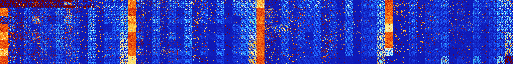

# B08 (131584-132095)

<details>
    <summary>Initial Grid</summary>
    
</details>


<details>
    <summary>Initial Grid RLE</summary>

```
#C Exported from GoGoL (https://github.com/marrow16/gogol)
#C Wrap mode: Toroidal
#C Boundary mode: Dead
#C Step: 0
x = 100, y = 100, rule = B08/S
21bo6bo7bo3bo47bobo$18bo10bo4bo35bo5bo17bo$18bo47bo12bo19bo$14bo62bo3bo
$bo50bo9bo18bo11bo$2bo17bo14bo26bo2bo7bo$o25bo25bo4bo7b2o15bo$7bo17bo
24bo38bo$38bo23bo10bo15bo8bo$46bo6b2o7bo$o9bo38bo$3bo8bo47bo9bo$16bo13b
o6bo10bo12bo16bo$47bo5bo26bo4bobo$7bo4bo9bo9bo18bo19bo3bo3bo5bo4bo$20bo
56bo10bo$30bo45bo$35bo10bo5bo28bo15bo$9bo9bo13bo5bo11bo29bo$bo81bo8bo$
43b2o12bo16bo11bo$8bo13b2o11b2o19bobo$37bo$2bo15bo22bo19bo34bo$2bobo6b
3o8bo10bo17bo13bo8bo12bo$29bo26bo$2bo5bo13bo41bo7bo2bo$5bo8bo22b2o17bo
8bo10bo19bo$7bo16bo40bo$2bo25bo5bo9bo23bo$6bo10bo20bo7bo3bo8bo21bo10bo
4bo$13bo13bo6bo17bo$10bo7bo15bo8bo4bo11bobo3bo3bo8b2o18bo$24bo7bo4bo15b
o10bo$6bo7bo48bo9bo7bo2bo$o46bobo17bo$33bo9bo50bo$7bo6bo16bo29bo11bo19b
obo2bo$4bo33bo7bo2bo5bo27bo$2bo3b2o34bo25bo$23bo27bo3bo4bo9bo7bo6bobo$b
o6bo5bo2bo24bo4bo49bo$34bo5bo39bo2bo$42bo38bo$10bo5bo3bo23bo4bo$57b2o$
24bo24bo40bo$16bo3bo56b2o20bo$8bo42bo4bo13bo5bo8bo$13bo40bo29bo$13bo11b
obo15bo12bo16bo14bo$8bo4bo2bo37bobo9bo12bo$4bo28bo11bo5bo12bo2bo7bo14bo
$15bo2bo20bobo28bo5bo18bo$21bo21bo13bo5bo6bo9bo16bobo$3bo18bo42bo10bo
15bo$21bobo6bo29bo29bo$3bo27bo8bobo26bo4bo19bo$8b2o12bo27bo34bo$10bobo
3bo20bo14bo32bo7bo$9bo49bo2bo$5bo17bo31bo6bo28bo$24bo21bo$40bo17bo4bo
11bo11bobo4bo$63bo3bo7bo22bo$24bo17bo43bobo$17bo21bo19bo$o19bo21bo10bo
30bo7bo2bo$24bo31bo17bo3bo18bo$15bo26bo$10bobo40bo$12bo17bo21bo18bo13bo
6bo$5bo19bo29bo23b2o3bo$o8bo2bo8bo3bo28bo20bo$4b2o21bo28bobo29bo$31bo6b
o32bo11bo6bo$o33bo17bo34bo5bo$2bo39bo$11b2o21bo63bo$18bo32bo19bo2bo14b
2obo$33bo41bo$11bo6bo24bo30bo$o36bo18bo24b2o$3bo41bo18bo30bo$7bo25bo24b
o2bo16bo8bo4bo$18bo2bo10bo46bo$48bo27bo$19bo44bo5bo4bo2bo13bo4bo$9bo29b
o6bo4bo15bo5bo6bo$18bo34b2o10bo32bo$4bo92b2o$22bobo5bo23b2o$11bo7bo10bo
8bo12b2o14bo10bo$16bo8bo$13bobo16bo5bo4bo9bo3bo20bo4bo2bo7bo$5bo19bo29b
o23bo$bo49bo18bo10bo$28bo70bo$53bo7bo20bo16bo$2bo10bo17b2o20bo20bo!
```
</details>
<details>
    <summary>Thumbnail</summary>

</details>
<table>
<tr>
    <td><a href="./131584%20S%20Heat%20Map%20Activity.png"></a><br>S (131584)<br>R@3,p2</td>    <td><a href="./131585%20S0%20Heat%20Map%20Activity.png"></a><br>S0 (131585)<br>R@3,p2</td>    <td><a href="./131586%20S1%20Heat%20Map%20Activity.png"></a><br>S1 (131586)<br>R@12,p2</td>    <td><a href="./131587%20S01%20Heat%20Map%20Activity.png"></a><br>S01 (131587)<br>R@8,p2</td>    <td><a href="./131588%20S2%20Heat%20Map%20Activity.png"></a><br>S2 (131588)<br>R@24,p6</td>    <td><a href="./131589%20S02%20Heat%20Map%20Activity.png"></a><br>S02 (131589)<br>R@12,p2</td>    <td><a href="./131590%20S12%20Heat%20Map%20Activity.png"></a><br>S12 (131590)<br>R@20,p2</td>    <td><a href="./131591%20S012%20Heat%20Map%20Activity.png"></a><br>S012 (131591)<br>R@8,p2</td>    <td><a href="./131592%20S3%20Heat%20Map%20Activity.png"></a><br>S3 (131592)<br>G>1000</td>    <td><a href="./131593%20S03%20Heat%20Map%20Activity.png"></a><br>S03 (131593)<br>R@57,p6</td>    <td><a href="./131594%20S13%20Heat%20Map%20Activity.png"></a><br>S13 (131594)<br>G>1000</td>    <td><a href="./131595%20S013%20Heat%20Map%20Activity.png"></a><br>S013 (131595)<br>R@98,p2</td>    <td><a href="./131596%20S23%20Heat%20Map%20Activity.png"></a><br>S23 (131596)<br>G>1000</td>    <td><a href="./131597%20S023%20Heat%20Map%20Activity.png"></a><br>S023 (131597)<br>R@103,p6</td>    <td><a href="./131598%20S123%20Heat%20Map%20Activity.png"></a><br>S123 (131598)<br>R@112,p24</td>    <td><a href="./131599%20S0123%20Heat%20Map%20Activity.png"></a><br>S0123 (131599)<br>R@85,p2</td>    <td><a href="./131600%20S4%20Heat%20Map%20Activity.png"></a><br>S4 (131600)<br>G>1000</td>    <td><a href="./131601%20S04%20Heat%20Map%20Activity.png"></a><br>S04 (131601)<br>R@36,p6</td>    <td><a href="./131602%20S14%20Heat%20Map%20Activity.png"></a><br>S14 (131602)<br>G>1000</td>    <td><a href="./131603%20S014%20Heat%20Map%20Activity.png"></a><br>S014 (131603)<br>R@32,p2</td>    <td><a href="./131604%20S24%20Heat%20Map%20Activity.png"></a><br>S24 (131604)<br>G>1000</td>    <td><a href="./131605%20S024%20Heat%20Map%20Activity.png"></a><br>S024 (131605)<br>R@39,p6</td>    <td><a href="./131606%20S124%20Heat%20Map%20Activity.png"></a><br>S124 (131606)<br>R@48,p12</td>    <td><a href="./131607%20S0124%20Heat%20Map%20Activity.png"></a><br>S0124 (131607)<br>R@27,p2</td>    <td><a href="./131608%20S34%20Heat%20Map%20Activity.png"></a><br>S34 (131608)<br>G>1000</td>    <td><a href="./131609%20S034%20Heat%20Map%20Activity.png"></a><br>S034 (131609)<br>R@45,p12</td>    <td><a href="./131610%20S134%20Heat%20Map%20Activity.png"></a><br>S134 (131610)<br>R@294,p252</td>    <td><a href="./131611%20S0134%20Heat%20Map%20Activity.png"></a><br>S0134 (131611)<br>R@21,p2</td>    <td><a href="./131612%20S234%20Heat%20Map%20Activity.png"></a><br>S234 (131612)<br>R@505,p462</td>    <td><a href="./131613%20S0234%20Heat%20Map%20Activity.png"></a><br>S0234 (131613)<br>R@23,p6</td>    <td><a href="./131614%20S1234%20Heat%20Map%20Activity.png"></a><br>S1234 (131614)<br>R@17,p2</td>    <td><a href="./131615%20S01234%20Heat%20Map%20Activity.png"></a><br>S01234 (131615)<br>S@12</td>    <td><a href="./131616%20S5%20Heat%20Map%20Activity.png"></a><br>S5 (131616)<br>G>1000</td>    <td><a href="./131617%20S05%20Heat%20Map%20Activity.png"></a><br>S05 (131617)<br>R@199,p168</td>    <td><a href="./131618%20S15%20Heat%20Map%20Activity.png"></a><br>S15 (131618)<br>G>1000</td>    <td><a href="./131619%20S015%20Heat%20Map%20Activity.png"></a><br>S015 (131619)<br>R@19,p6</td>    <td><a href="./131620%20S25%20Heat%20Map%20Activity.png"></a><br>S25 (131620)<br>G>1000</td>    <td><a href="./131621%20S025%20Heat%20Map%20Activity.png"></a><br>S025 (131621)<br>R@28,p6</td>    <td><a href="./131622%20S125%20Heat%20Map%20Activity.png"></a><br>S125 (131622)<br>R@26,p6</td>    <td><a href="./131623%20S0125%20Heat%20Map%20Activity.png"></a><br>S0125 (131623)<br>R@14,p6</td>    <td><a href="./131624%20S35%20Heat%20Map%20Activity.png"></a><br>S35 (131624)<br>G>1000</td>    <td><a href="./131625%20S035%20Heat%20Map%20Activity.png"></a><br>S035 (131625)<br>R@38,p12</td>    <td><a href="./131626%20S135%20Heat%20Map%20Activity.png"></a><br>S135 (131626)<br>R@918,p840</td>    <td><a href="./131627%20S0135%20Heat%20Map%20Activity.png"></a><br>S0135 (131627)<br>R@11,p2</td>    <td><a href="./131628%20S235%20Heat%20Map%20Activity.png"></a><br>S235 (131628)<br>G>1000</td>    <td><a href="./131629%20S0235%20Heat%20Map%20Activity.png"></a><br>S0235 (131629)<br>R@27,p12</td>    <td><a href="./131630%20S1235%20Heat%20Map%20Activity.png"></a><br>S1235 (131630)<br>R@17,p6</td>    <td><a href="./131631%20S01235%20Heat%20Map%20Activity.png"></a><br>S01235 (131631)<br>S@7</td>    <td><a href="./131632%20S45%20Heat%20Map%20Activity.png"></a><br>S45 (131632)<br>G>1000</td>    <td><a href="./131633%20S045%20Heat%20Map%20Activity.png"></a><br>S045 (131633)<br>R@90,p36</td>    <td><a href="./131634%20S145%20Heat%20Map%20Activity.png"></a><br>S145 (131634)<br>G>1000</td>    <td><a href="./131635%20S0145%20Heat%20Map%20Activity.png"></a><br>S0145 (131635)<br>R@17,p6</td>    <td><a href="./131636%20S245%20Heat%20Map%20Activity.png"></a><br>S245 (131636)<br>G>1000</td>    <td><a href="./131637%20S0245%20Heat%20Map%20Activity.png"></a><br>S0245 (131637)<br>R@64,p42</td>    <td><a href="./131638%20S1245%20Heat%20Map%20Activity.png"></a><br>S1245 (131638)<br>R@28,p12</td>    <td><a href="./131639%20S01245%20Heat%20Map%20Activity.png"></a><br>S01245 (131639)<br>R@12,p2</td>    <td><a href="./131640%20S345%20Heat%20Map%20Activity.png"></a><br>S345 (131640)<br>G>1000</td>    <td><a href="./131641%20S0345%20Heat%20Map%20Activity.png"></a><br>S0345 (131641)<br>R@116,p84</td>    <td><a href="./131642%20S1345%20Heat%20Map%20Activity.png"></a><br>S1345 (131642)<br>R@404,p360</td>    <td><a href="./131643%20S01345%20Heat%20Map%20Activity.png"></a><br>S01345 (131643)<br>R@17,p4</td>    <td><a href="./131644%20S2345%20Heat%20Map%20Activity.png"></a><br>S2345 (131644)<br>R@40,p12</td>    <td><a href="./131645%20S02345%20Heat%20Map%20Activity.png"></a><br>S02345 (131645)<br>R@22,p6</td>    <td><a href="./131646%20S12345%20Heat%20Map%20Activity.png"></a><br>S12345 (131646)<br>R@10,p2</td>    <td><a href="./131647%20S012345%20Heat%20Map%20Activity.png"></a><br>S012345 (131647)<br>S@6</td></tr>
<tr>
    <td><a href="./131648%20S6%20Heat%20Map%20Activity.png"></a><br>S6 (131648)<br>G>1000</td>    <td><a href="./131649%20S06%20Heat%20Map%20Activity.png"></a><br>S06 (131649)<br>R@30,p6</td>    <td><a href="./131650%20S16%20Heat%20Map%20Activity.png"></a><br>S16 (131650)<br>G>1000</td>    <td><a href="./131651%20S016%20Heat%20Map%20Activity.png"></a><br>S016 (131651)<br>R@16,p2</td>    <td><a href="./131652%20S26%20Heat%20Map%20Activity.png"></a><br>S26 (131652)<br>G>1000</td>    <td><a href="./131653%20S026%20Heat%20Map%20Activity.png"></a><br>S026 (131653)<br>R@22,p6</td>    <td><a href="./131654%20S126%20Heat%20Map%20Activity.png"></a><br>S126 (131654)<br>R@49,p24</td>    <td><a href="./131655%20S0126%20Heat%20Map%20Activity.png"></a><br>S0126 (131655)<br>R@10,p2</td>    <td><a href="./131656%20S36%20Heat%20Map%20Activity.png"></a><br>S36 (131656)<br>G>1000</td>    <td><a href="./131657%20S036%20Heat%20Map%20Activity.png"></a><br>S036 (131657)<br>R@49,p24</td>    <td><a href="./131658%20S136%20Heat%20Map%20Activity.png"></a><br>S136 (131658)<br>R@377,p336</td>    <td><a href="./131659%20S0136%20Heat%20Map%20Activity.png"></a><br>S0136 (131659)<br>R@12,p2</td>    <td><a href="./131660%20S236%20Heat%20Map%20Activity.png"></a><br>S236 (131660)<br>G>1000</td>    <td><a href="./131661%20S0236%20Heat%20Map%20Activity.png"></a><br>S0236 (131661)<br>R@23,p6</td>    <td><a href="./131662%20S1236%20Heat%20Map%20Activity.png"></a><br>S1236 (131662)<br>R@20,p6</td>    <td><a href="./131663%20S01236%20Heat%20Map%20Activity.png"></a><br>S01236 (131663)<br>S@8</td>    <td><a href="./131664%20S46%20Heat%20Map%20Activity.png"></a><br>S46 (131664)<br>G>1000</td>    <td><a href="./131665%20S046%20Heat%20Map%20Activity.png"></a><br>S046 (131665)<br>R@290,p252</td>    <td><a href="./131666%20S146%20Heat%20Map%20Activity.png"></a><br>S146 (131666)<br>G>1000</td>    <td><a href="./131667%20S0146%20Heat%20Map%20Activity.png"></a><br>S0146 (131667)<br>R@19,p6</td>    <td><a href="./131668%20S246%20Heat%20Map%20Activity.png"></a><br>S246 (131668)<br>G>1000</td>    <td><a href="./131669%20S0246%20Heat%20Map%20Activity.png"></a><br>S0246 (131669)<br>R@36,p12</td>    <td><a href="./131670%20S1246%20Heat%20Map%20Activity.png"></a><br>S1246 (131670)<br>R@104,p84</td>    <td><a href="./131671%20S01246%20Heat%20Map%20Activity.png"></a><br>S01246 (131671)<br>R@11,p2</td>    <td><a href="./131672%20S346%20Heat%20Map%20Activity.png"></a><br>S346 (131672)<br>G>1000</td>    <td><a href="./131673%20S0346%20Heat%20Map%20Activity.png"></a><br>S0346 (131673)<br>R@37,p12</td>    <td><a href="./131674%20S1346%20Heat%20Map%20Activity.png"></a><br>S1346 (131674)<br>G>1000</td>    <td><a href="./131675%20S01346%20Heat%20Map%20Activity.png"></a><br>S01346 (131675)<br>R@14,p2</td>    <td><a href="./131676%20S2346%20Heat%20Map%20Activity.png"></a><br>S2346 (131676)<br>R@865,p840</td>    <td><a href="./131677%20S02346%20Heat%20Map%20Activity.png"></a><br>S02346 (131677)<br>R@23,p6</td>    <td><a href="./131678%20S12346%20Heat%20Map%20Activity.png"></a><br>S12346 (131678)<br>R@10,p2</td>    <td><a href="./131679%20S012346%20Heat%20Map%20Activity.png"></a><br>S012346 (131679)<br>S@8</td>    <td><a href="./131680%20S56%20Heat%20Map%20Activity.png"></a><br>S56 (131680)<br>G>1000</td>    <td><a href="./131681%20S056%20Heat%20Map%20Activity.png"></a><br>S056 (131681)<br>R@111,p36</td>    <td><a href="./131682%20S156%20Heat%20Map%20Activity.png"></a><br>S156 (131682)<br>G>1000</td>    <td><a href="./131683%20S0156%20Heat%20Map%20Activity.png"></a><br>S0156 (131683)<br>R@30,p6</td>    <td><a href="./131684%20S256%20Heat%20Map%20Activity.png"></a><br>S256 (131684)<br>G>1000</td>    <td><a href="./131685%20S0256%20Heat%20Map%20Activity.png"></a><br>S0256 (131685)<br>R@51,p24</td>    <td><a href="./131686%20S1256%20Heat%20Map%20Activity.png"></a><br>S1256 (131686)<br>R@21,p6</td>    <td><a href="./131687%20S01256%20Heat%20Map%20Activity.png"></a><br>S01256 (131687)<br>R@14,p6</td>    <td><a href="./131688%20S356%20Heat%20Map%20Activity.png"></a><br>S356 (131688)<br>G>1000</td>    <td><a href="./131689%20S0356%20Heat%20Map%20Activity.png"></a><br>S0356 (131689)<br>R@44,p12</td>    <td><a href="./131690%20S1356%20Heat%20Map%20Activity.png"></a><br>S1356 (131690)<br>R@156,p120</td>    <td><a href="./131691%20S01356%20Heat%20Map%20Activity.png"></a><br>S01356 (131691)<br>R@13,p2</td>    <td><a href="./131692%20S2356%20Heat%20Map%20Activity.png"></a><br>S2356 (131692)<br>G>1000</td>    <td><a href="./131693%20S02356%20Heat%20Map%20Activity.png"></a><br>S02356 (131693)<br>R@40,p12</td>    <td><a href="./131694%20S12356%20Heat%20Map%20Activity.png"></a><br>S12356 (131694)<br>R@15,p6</td>    <td><a href="./131695%20S012356%20Heat%20Map%20Activity.png"></a><br>S012356 (131695)<br>S@7</td>    <td><a href="./131696%20S456%20Heat%20Map%20Activity.png"></a><br>S456 (131696)<br>G>1000</td>    <td><a href="./131697%20S0456%20Heat%20Map%20Activity.png"></a><br>S0456 (131697)<br>G>1000</td>    <td><a href="./131698%20S1456%20Heat%20Map%20Activity.png"></a><br>S1456 (131698)<br>G>1000</td>    <td><a href="./131699%20S01456%20Heat%20Map%20Activity.png"></a><br>S01456 (131699)<br>R@32,p6</td>    <td><a href="./131700%20S2456%20Heat%20Map%20Activity.png"></a><br>S2456 (131700)<br>G>1000</td>    <td><a href="./131701%20S02456%20Heat%20Map%20Activity.png"></a><br>S02456 (131701)<br>R@33,p6</td>    <td><a href="./131702%20S12456%20Heat%20Map%20Activity.png"></a><br>S12456 (131702)<br>R@24,p12</td>    <td><a href="./131703%20S012456%20Heat%20Map%20Activity.png"></a><br>S012456 (131703)<br>R@16,p6</td>    <td><a href="./131704%20S3456%20Heat%20Map%20Activity.png"></a><br>S3456 (131704)<br>G>1000</td>    <td><a href="./131705%20S03456%20Heat%20Map%20Activity.png"></a><br>S03456 (131705)<br>R@48,p24</td>    <td><a href="./131706%20S13456%20Heat%20Map%20Activity.png"></a><br>S13456 (131706)<br>R@446,p420</td>    <td><a href="./131707%20S013456%20Heat%20Map%20Activity.png"></a><br>S013456 (131707)<br>R@16,p2</td>    <td><a href="./131708%20S23456%20Heat%20Map%20Activity.png"></a><br>S23456 (131708)<br>R@39,p30</td>    <td><a href="./131709%20S023456%20Heat%20Map%20Activity.png"></a><br>S023456 (131709)<br>R@14,p6</td>    <td><a href="./131710%20S123456%20Heat%20Map%20Activity.png"></a><br>S123456 (131710)<br>R@8,p2</td>    <td><a href="./131711%20S0123456%20Heat%20Map%20Activity.png"></a><br>S0123456 (131711)<br>R@8,p2</td></tr>
<tr>
    <td><a href="./131712%20S7%20Heat%20Map%20Activity.png"></a><br>S7 (131712)<br>R@20,p2</td>    <td><a href="./131713%20S07%20Heat%20Map%20Activity.png"></a><br>S07 (131713)<br>R@13,p2</td>    <td><a href="./131714%20S17%20Heat%20Map%20Activity.png"></a><br>S17 (131714)<br>G>1000</td>    <td><a href="./131715%20S017%20Heat%20Map%20Activity.png"></a><br>S017 (131715)<br>R@17,p2</td>    <td><a href="./131716%20S27%20Heat%20Map%20Activity.png"></a><br>S27 (131716)<br>R@560,p120</td>    <td><a href="./131717%20S027%20Heat%20Map%20Activity.png"></a><br>S027 (131717)<br>R@24,p6</td>    <td><a href="./131718%20S127%20Heat%20Map%20Activity.png"></a><br>S127 (131718)<br>R@149,p120</td>    <td><a href="./131719%20S0127%20Heat%20Map%20Activity.png"></a><br>S0127 (131719)<br>R@22,p2</td>    <td><a href="./131720%20S37%20Heat%20Map%20Activity.png"></a><br>S37 (131720)<br>G>1000</td>    <td><a href="./131721%20S037%20Heat%20Map%20Activity.png"></a><br>S037 (131721)<br>R@29,p12</td>    <td><a href="./131722%20S137%20Heat%20Map%20Activity.png"></a><br>S137 (131722)<br>G>1000</td>    <td><a href="./131723%20S0137%20Heat%20Map%20Activity.png"></a><br>S0137 (131723)<br>R@13,p2</td>    <td><a href="./131724%20S237%20Heat%20Map%20Activity.png"></a><br>S237 (131724)<br>G>1000</td>    <td><a href="./131725%20S0237%20Heat%20Map%20Activity.png"></a><br>S0237 (131725)<br>R@30,p12</td>    <td><a href="./131726%20S1237%20Heat%20Map%20Activity.png"></a><br>S1237 (131726)<br>R@24,p6</td>    <td><a href="./131727%20S01237%20Heat%20Map%20Activity.png"></a><br>S01237 (131727)<br>S@8</td>    <td><a href="./131728%20S47%20Heat%20Map%20Activity.png"></a><br>S47 (131728)<br>G>1000</td>    <td><a href="./131729%20S047%20Heat%20Map%20Activity.png"></a><br>S047 (131729)<br>R@46,p12</td>    <td><a href="./131730%20S147%20Heat%20Map%20Activity.png"></a><br>S147 (131730)<br>R@800,p720</td>    <td><a href="./131731%20S0147%20Heat%20Map%20Activity.png"></a><br>S0147 (131731)<br>R@12,p2</td>    <td><a href="./131732%20S247%20Heat%20Map%20Activity.png"></a><br>S247 (131732)<br>G>1000</td>    <td><a href="./131733%20S0247%20Heat%20Map%20Activity.png"></a><br>S0247 (131733)<br>R@30,p12</td>    <td><a href="./131734%20S1247%20Heat%20Map%20Activity.png"></a><br>S1247 (131734)<br>R@32,p12</td>    <td><a href="./131735%20S01247%20Heat%20Map%20Activity.png"></a><br>S01247 (131735)<br>R@11,p2</td>    <td><a href="./131736%20S347%20Heat%20Map%20Activity.png"></a><br>S347 (131736)<br>G>1000</td>    <td><a href="./131737%20S0347%20Heat%20Map%20Activity.png"></a><br>S0347 (131737)<br>R@35,p6</td>    <td><a href="./131738%20S1347%20Heat%20Map%20Activity.png"></a><br>S1347 (131738)<br>R@104,p60</td>    <td><a href="./131739%20S01347%20Heat%20Map%20Activity.png"></a><br>S01347 (131739)<br>R@17,p6</td>    <td><a href="./131740%20S2347%20Heat%20Map%20Activity.png"></a><br>S2347 (131740)<br>R@126,p84</td>    <td><a href="./131741%20S02347%20Heat%20Map%20Activity.png"></a><br>S02347 (131741)<br>R@188,p168</td>    <td><a href="./131742%20S12347%20Heat%20Map%20Activity.png"></a><br>S12347 (131742)<br>R@16,p6</td>    <td><a href="./131743%20S012347%20Heat%20Map%20Activity.png"></a><br>S012347 (131743)<br>S@7</td>    <td><a href="./131744%20S57%20Heat%20Map%20Activity.png"></a><br>S57 (131744)<br>G>1000</td>    <td><a href="./131745%20S057%20Heat%20Map%20Activity.png"></a><br>S057 (131745)<br>R@42,p12</td>    <td><a href="./131746%20S157%20Heat%20Map%20Activity.png"></a><br>S157 (131746)<br>G>1000</td>    <td><a href="./131747%20S0157%20Heat%20Map%20Activity.png"></a><br>S0157 (131747)<br>R@19,p6</td>    <td><a href="./131748%20S257%20Heat%20Map%20Activity.png"></a><br>S257 (131748)<br>R@573,p360</td>    <td><a href="./131749%20S0257%20Heat%20Map%20Activity.png"></a><br>S0257 (131749)<br>R@26,p6</td>    <td><a href="./131750%20S1257%20Heat%20Map%20Activity.png"></a><br>S1257 (131750)<br>R@29,p12</td>    <td><a href="./131751%20S01257%20Heat%20Map%20Activity.png"></a><br>S01257 (131751)<br>R@15,p6</td>    <td><a href="./131752%20S357%20Heat%20Map%20Activity.png"></a><br>S357 (131752)<br>G>1000</td>    <td><a href="./131753%20S0357%20Heat%20Map%20Activity.png"></a><br>S0357 (131753)<br>R@37,p12</td>    <td><a href="./131754%20S1357%20Heat%20Map%20Activity.png"></a><br>S1357 (131754)<br>G>1000</td>    <td><a href="./131755%20S01357%20Heat%20Map%20Activity.png"></a><br>S01357 (131755)<br>R@16,p6</td>    <td><a href="./131756%20S2357%20Heat%20Map%20Activity.png"></a><br>S2357 (131756)<br>R@900,p840</td>    <td><a href="./131757%20S02357%20Heat%20Map%20Activity.png"></a><br>S02357 (131757)<br>R@29,p12</td>    <td><a href="./131758%20S12357%20Heat%20Map%20Activity.png"></a><br>S12357 (131758)<br>R@39,p30</td>    <td><a href="./131759%20S012357%20Heat%20Map%20Activity.png"></a><br>S012357 (131759)<br>S@6</td>    <td><a href="./131760%20S457%20Heat%20Map%20Activity.png"></a><br>S457 (131760)<br>G>1000</td>    <td><a href="./131761%20S0457%20Heat%20Map%20Activity.png"></a><br>S0457 (131761)<br>G>1000</td>    <td><a href="./131762%20S1457%20Heat%20Map%20Activity.png"></a><br>S1457 (131762)<br>G>1000</td>    <td><a href="./131763%20S01457%20Heat%20Map%20Activity.png"></a><br>S01457 (131763)<br>R@17,p6</td>    <td><a href="./131764%20S2457%20Heat%20Map%20Activity.png"></a><br>S2457 (131764)<br>G>1000</td>    <td><a href="./131765%20S02457%20Heat%20Map%20Activity.png"></a><br>S02457 (131765)<br>R@28,p6</td>    <td><a href="./131766%20S12457%20Heat%20Map%20Activity.png"></a><br>S12457 (131766)<br>R@22,p6</td>    <td><a href="./131767%20S012457%20Heat%20Map%20Activity.png"></a><br>S012457 (131767)<br>R@15,p6</td>    <td><a href="./131768%20S3457%20Heat%20Map%20Activity.png"></a><br>S3457 (131768)<br>G>1000</td>    <td><a href="./131769%20S03457%20Heat%20Map%20Activity.png"></a><br>S03457 (131769)<br>R@88,p60</td>    <td><a href="./131770%20S13457%20Heat%20Map%20Activity.png"></a><br>S13457 (131770)<br>R@107,p72</td>    <td><a href="./131771%20S013457%20Heat%20Map%20Activity.png"></a><br>S013457 (131771)<br>R@16,p6</td>    <td><a href="./131772%20S23457%20Heat%20Map%20Activity.png"></a><br>S23457 (131772)<br>R@56,p30</td>    <td><a href="./131773%20S023457%20Heat%20Map%20Activity.png"></a><br>S023457 (131773)<br>R@20,p6</td>    <td><a href="./131774%20S123457%20Heat%20Map%20Activity.png"></a><br>S123457 (131774)<br>R@10,p2</td>    <td><a href="./131775%20S0123457%20Heat%20Map%20Activity.png"></a><br>S0123457 (131775)<br>S@6</td></tr>
<tr>
    <td><a href="./131776%20S67%20Heat%20Map%20Activity.png"></a><br>S67 (131776)<br>G>1000</td>    <td><a href="./131777%20S067%20Heat%20Map%20Activity.png"></a><br>S067 (131777)<br>R@39,p6</td>    <td><a href="./131778%20S167%20Heat%20Map%20Activity.png"></a><br>S167 (131778)<br>G>1000</td>    <td><a href="./131779%20S0167%20Heat%20Map%20Activity.png"></a><br>S0167 (131779)<br>R@26,p6</td>    <td><a href="./131780%20S267%20Heat%20Map%20Activity.png"></a><br>S267 (131780)<br>G>1000</td>    <td><a href="./131781%20S0267%20Heat%20Map%20Activity.png"></a><br>S0267 (131781)<br>R@25,p6</td>    <td><a href="./131782%20S1267%20Heat%20Map%20Activity.png"></a><br>S1267 (131782)<br>R@22,p6</td>    <td><a href="./131783%20S01267%20Heat%20Map%20Activity.png"></a><br>S01267 (131783)<br>R@10,p2</td>    <td><a href="./131784%20S367%20Heat%20Map%20Activity.png"></a><br>S367 (131784)<br>G>1000</td>    <td><a href="./131785%20S0367%20Heat%20Map%20Activity.png"></a><br>S0367 (131785)<br>R@37,p12</td>    <td><a href="./131786%20S1367%20Heat%20Map%20Activity.png"></a><br>S1367 (131786)<br>G>1000</td>    <td><a href="./131787%20S01367%20Heat%20Map%20Activity.png"></a><br>S01367 (131787)<br>R@12,p2</td>    <td><a href="./131788%20S2367%20Heat%20Map%20Activity.png"></a><br>S2367 (131788)<br>G>1000</td>    <td><a href="./131789%20S02367%20Heat%20Map%20Activity.png"></a><br>S02367 (131789)<br>R@105,p84</td>    <td><a href="./131790%20S12367%20Heat%20Map%20Activity.png"></a><br>S12367 (131790)<br>R@15,p6</td>    <td><a href="./131791%20S012367%20Heat%20Map%20Activity.png"></a><br>S012367 (131791)<br>S@8</td>    <td><a href="./131792%20S467%20Heat%20Map%20Activity.png"></a><br>S467 (131792)<br>G>1000</td>    <td><a href="./131793%20S0467%20Heat%20Map%20Activity.png"></a><br>S0467 (131793)<br>R@173,p132</td>    <td><a href="./131794%20S1467%20Heat%20Map%20Activity.png"></a><br>S1467 (131794)<br>R@283,p240</td>    <td><a href="./131795%20S01467%20Heat%20Map%20Activity.png"></a><br>S01467 (131795)<br>R@21,p6</td>    <td><a href="./131796%20S2467%20Heat%20Map%20Activity.png"></a><br>S2467 (131796)<br>G>1000</td>    <td><a href="./131797%20S02467%20Heat%20Map%20Activity.png"></a><br>S02467 (131797)<br>R@48,p30</td>    <td><a href="./131798%20S12467%20Heat%20Map%20Activity.png"></a><br>S12467 (131798)<br>R@102,p84</td>    <td><a href="./131799%20S012467%20Heat%20Map%20Activity.png"></a><br>S012467 (131799)<br>R@11,p2</td>    <td><a href="./131800%20S3467%20Heat%20Map%20Activity.png"></a><br>S3467 (131800)<br>G>1000</td>    <td><a href="./131801%20S03467%20Heat%20Map%20Activity.png"></a><br>S03467 (131801)<br>R@150,p120</td>    <td><a href="./131802%20S13467%20Heat%20Map%20Activity.png"></a><br>S13467 (131802)<br>G>1000</td>    <td><a href="./131803%20S013467%20Heat%20Map%20Activity.png"></a><br>S013467 (131803)<br>R@74,p60</td>    <td><a href="./131804%20S23467%20Heat%20Map%20Activity.png"></a><br>S23467 (131804)<br>G>1000</td>    <td><a href="./131805%20S023467%20Heat%20Map%20Activity.png"></a><br>S023467 (131805)<br>R@21,p6</td>    <td><a href="./131806%20S123467%20Heat%20Map%20Activity.png"></a><br>S123467 (131806)<br>R@9,p2</td>    <td><a href="./131807%20S0123467%20Heat%20Map%20Activity.png"></a><br>S0123467 (131807)<br>S@7</td>    <td><a href="./131808%20S567%20Heat%20Map%20Activity.png"></a><br>S567 (131808)<br>G>1000</td>    <td><a href="./131809%20S0567%20Heat%20Map%20Activity.png"></a><br>S0567 (131809)<br>G>1000</td>    <td><a href="./131810%20S1567%20Heat%20Map%20Activity.png"></a><br>S1567 (131810)<br>R@141,p36</td>    <td><a href="./131811%20S01567%20Heat%20Map%20Activity.png"></a><br>S01567 (131811)<br>R@35,p6</td>    <td><a href="./131812%20S2567%20Heat%20Map%20Activity.png"></a><br>S2567 (131812)<br>G>1000</td>    <td><a href="./131813%20S02567%20Heat%20Map%20Activity.png"></a><br>S02567 (131813)<br>R@27,p6</td>    <td><a href="./131814%20S12567%20Heat%20Map%20Activity.png"></a><br>S12567 (131814)<br>R@30,p12</td>    <td><a href="./131815%20S012567%20Heat%20Map%20Activity.png"></a><br>S012567 (131815)<br>R@15,p6</td>    <td><a href="./131816%20S3567%20Heat%20Map%20Activity.png"></a><br>S3567 (131816)<br>G>1000</td>    <td><a href="./131817%20S03567%20Heat%20Map%20Activity.png"></a><br>S03567 (131817)<br>R@44,p12</td>    <td><a href="./131818%20S13567%20Heat%20Map%20Activity.png"></a><br>S13567 (131818)<br>R@123,p84</td>    <td><a href="./131819%20S013567%20Heat%20Map%20Activity.png"></a><br>S013567 (131819)<br>R@15,p2</td>    <td><a href="./131820%20S23567%20Heat%20Map%20Activity.png"></a><br>S23567 (131820)<br>R@881,p840</td>    <td><a href="./131821%20S023567%20Heat%20Map%20Activity.png"></a><br>S023567 (131821)<br>R@32,p12</td>    <td><a href="./131822%20S123567%20Heat%20Map%20Activity.png"></a><br>S123567 (131822)<br>R@16,p2</td>    <td><a href="./131823%20S0123567%20Heat%20Map%20Activity.png"></a><br>S0123567 (131823)<br>S@9</td>    <td><a href="./131824%20S4567%20Heat%20Map%20Activity.png"></a><br>S4567 (131824)<br>G>1000</td>    <td><a href="./131825%20S04567%20Heat%20Map%20Activity.png"></a><br>S04567 (131825)<br>G>1000</td>    <td><a href="./131826%20S14567%20Heat%20Map%20Activity.png"></a><br>S14567 (131826)<br>R@422,p360</td>    <td><a href="./131827%20S014567%20Heat%20Map%20Activity.png"></a><br>S014567 (131827)<br>R@31,p12</td>    <td><a href="./131828%20S24567%20Heat%20Map%20Activity.png"></a><br>S24567 (131828)<br>G>1000</td>    <td><a href="./131829%20S024567%20Heat%20Map%20Activity.png"></a><br>S024567 (131829)<br>R@30,p6</td>    <td><a href="./131830%20S124567%20Heat%20Map%20Activity.png"></a><br>S124567 (131830)<br>R@31,p12</td>    <td><a href="./131831%20S0124567%20Heat%20Map%20Activity.png"></a><br>S0124567 (131831)<br>R@25,p6</td>    <td><a href="./131832%20S34567%20Heat%20Map%20Activity.png"></a><br>S34567 (131832)<br>R@88,p60</td>    <td><a href="./131833%20S034567%20Heat%20Map%20Activity.png"></a><br>S034567 (131833)<br>R@58,p36</td>    <td><a href="./131834%20S134567%20Heat%20Map%20Activity.png"></a><br>S134567 (131834)<br>R@37,p12</td>    <td><a href="./131835%20S0134567%20Heat%20Map%20Activity.png"></a><br>S0134567 (131835)<br>R@19,p6</td>    <td><a href="./131836%20S234567%20Heat%20Map%20Activity.png"></a><br>S234567 (131836)<br>R@74,p60</td>    <td><a href="./131837%20S0234567%20Heat%20Map%20Activity.png"></a><br>S0234567 (131837)<br>R@18,p6</td>    <td><a href="./131838%20S1234567%20Heat%20Map%20Activity.png"></a><br>S1234567 (131838)<br>R@7,p2</td>    <td><a href="./131839%20S01234567%20Heat%20Map%20Activity.png"></a><br>S01234567 (131839)<br>R@7,p2</td></tr>
<tr>
    <td><a href="./131840%20S8%20Heat%20Map%20Activity.png"></a><br>S8 (131840)<br>G>1000</td>    <td><a href="./131841%20S08%20Heat%20Map%20Activity.png"></a><br>S08 (131841)<br>R@35,p2</td>    <td><a href="./131842%20S18%20Heat%20Map%20Activity.png"></a><br>S18 (131842)<br>R@178,p120</td>    <td><a href="./131843%20S018%20Heat%20Map%20Activity.png"></a><br>S018 (131843)<br>R@25,p2</td>    <td><a href="./131844%20S28%20Heat%20Map%20Activity.png"></a><br>S28 (131844)<br>R@451,p120</td>    <td><a href="./131845%20S028%20Heat%20Map%20Activity.png"></a><br>S028 (131845)<br>R@27,p6</td>    <td><a href="./131846%20S128%20Heat%20Map%20Activity.png"></a><br>S128 (131846)<br>R@54,p24</td>    <td><a href="./131847%20S0128%20Heat%20Map%20Activity.png"></a><br>S0128 (131847)<br>R@14,p2</td>    <td><a href="./131848%20S38%20Heat%20Map%20Activity.png"></a><br>S38 (131848)<br>G>1000</td>    <td><a href="./131849%20S038%20Heat%20Map%20Activity.png"></a><br>S038 (131849)<br>R@34,p6</td>    <td><a href="./131850%20S138%20Heat%20Map%20Activity.png"></a><br>S138 (131850)<br>G>1000</td>    <td><a href="./131851%20S0138%20Heat%20Map%20Activity.png"></a><br>S0138 (131851)<br>R@12,p2</td>    <td><a href="./131852%20S238%20Heat%20Map%20Activity.png"></a><br>S238 (131852)<br>G>1000</td>    <td><a href="./131853%20S0238%20Heat%20Map%20Activity.png"></a><br>S0238 (131853)<br>R@24,p6</td>    <td><a href="./131854%20S1238%20Heat%20Map%20Activity.png"></a><br>S1238 (131854)<br>R@22,p6</td>    <td><a href="./131855%20S01238%20Heat%20Map%20Activity.png"></a><br>S01238 (131855)<br>S@8</td>    <td><a href="./131856%20S48%20Heat%20Map%20Activity.png"></a><br>S48 (131856)<br>G>1000</td>    <td><a href="./131857%20S048%20Heat%20Map%20Activity.png"></a><br>S048 (131857)<br>R@37,p6</td>    <td><a href="./131858%20S148%20Heat%20Map%20Activity.png"></a><br>S148 (131858)<br>G>1000</td>    <td><a href="./131859%20S0148%20Heat%20Map%20Activity.png"></a><br>S0148 (131859)<br>R@20,p6</td>    <td><a href="./131860%20S248%20Heat%20Map%20Activity.png"></a><br>S248 (131860)<br>G>1000</td>    <td><a href="./131861%20S0248%20Heat%20Map%20Activity.png"></a><br>S0248 (131861)<br>R@24,p6</td>    <td><a href="./131862%20S1248%20Heat%20Map%20Activity.png"></a><br>S1248 (131862)<br>R@107,p84</td>    <td><a href="./131863%20S01248%20Heat%20Map%20Activity.png"></a><br>S01248 (131863)<br>R@11,p2</td>    <td><a href="./131864%20S348%20Heat%20Map%20Activity.png"></a><br>S348 (131864)<br>G>1000</td>    <td><a href="./131865%20S0348%20Heat%20Map%20Activity.png"></a><br>S0348 (131865)<br>R@90,p60</td>    <td><a href="./131866%20S1348%20Heat%20Map%20Activity.png"></a><br>S1348 (131866)<br>R@116,p84</td>    <td><a href="./131867%20S01348%20Heat%20Map%20Activity.png"></a><br>S01348 (131867)<br>R@18,p6</td>    <td><a href="./131868%20S2348%20Heat%20Map%20Activity.png"></a><br>S2348 (131868)<br>R@283,p252</td>    <td><a href="./131869%20S02348%20Heat%20Map%20Activity.png"></a><br>S02348 (131869)<br>R@63,p42</td>    <td><a href="./131870%20S12348%20Heat%20Map%20Activity.png"></a><br>S12348 (131870)<br>R@10,p2</td>    <td><a href="./131871%20S012348%20Heat%20Map%20Activity.png"></a><br>S012348 (131871)<br>S@7</td>    <td><a href="./131872%20S58%20Heat%20Map%20Activity.png"></a><br>S58 (131872)<br>G>1000</td>    <td><a href="./131873%20S058%20Heat%20Map%20Activity.png"></a><br>S058 (131873)<br>R@51,p12</td>    <td><a href="./131874%20S158%20Heat%20Map%20Activity.png"></a><br>S158 (131874)<br>G>1000</td>    <td><a href="./131875%20S0158%20Heat%20Map%20Activity.png"></a><br>S0158 (131875)<br>R@18,p2</td>    <td><a href="./131876%20S258%20Heat%20Map%20Activity.png"></a><br>S258 (131876)<br>G>1000</td>    <td><a href="./131877%20S0258%20Heat%20Map%20Activity.png"></a><br>S0258 (131877)<br>R@28,p6</td>    <td><a href="./131878%20S1258%20Heat%20Map%20Activity.png"></a><br>S1258 (131878)<br>R@445,p420</td>    <td><a href="./131879%20S01258%20Heat%20Map%20Activity.png"></a><br>S01258 (131879)<br>R@17,p6</td>    <td><a href="./131880%20S358%20Heat%20Map%20Activity.png"></a><br>S358 (131880)<br>R@988,p720</td>    <td><a href="./131881%20S0358%20Heat%20Map%20Activity.png"></a><br>S0358 (131881)<br>R@37,p12</td>    <td><a href="./131882%20S1358%20Heat%20Map%20Activity.png"></a><br>S1358 (131882)<br>G>1000</td>    <td><a href="./131883%20S01358%20Heat%20Map%20Activity.png"></a><br>S01358 (131883)<br>R@14,p2</td>    <td><a href="./131884%20S2358%20Heat%20Map%20Activity.png"></a><br>S2358 (131884)<br>G>1000</td>    <td><a href="./131885%20S02358%20Heat%20Map%20Activity.png"></a><br>S02358 (131885)<br>R@28,p12</td>    <td><a href="./131886%20S12358%20Heat%20Map%20Activity.png"></a><br>S12358 (131886)<br>R@20,p6</td>    <td><a href="./131887%20S012358%20Heat%20Map%20Activity.png"></a><br>S012358 (131887)<br>S@8</td>    <td><a href="./131888%20S458%20Heat%20Map%20Activity.png"></a><br>S458 (131888)<br>G>1000</td>    <td><a href="./131889%20S0458%20Heat%20Map%20Activity.png"></a><br>S0458 (131889)<br>R@297,p252</td>    <td><a href="./131890%20S1458%20Heat%20Map%20Activity.png"></a><br>S1458 (131890)<br>G>1000</td>    <td><a href="./131891%20S01458%20Heat%20Map%20Activity.png"></a><br>S01458 (131891)<br>R@23,p6</td>    <td><a href="./131892%20S2458%20Heat%20Map%20Activity.png"></a><br>S2458 (131892)<br>G>1000</td>    <td><a href="./131893%20S02458%20Heat%20Map%20Activity.png"></a><br>S02458 (131893)<br>R@82,p60</td>    <td><a href="./131894%20S12458%20Heat%20Map%20Activity.png"></a><br>S12458 (131894)<br>R@26,p12</td>    <td><a href="./131895%20S012458%20Heat%20Map%20Activity.png"></a><br>S012458 (131895)<br>R@12,p2</td>    <td><a href="./131896%20S3458%20Heat%20Map%20Activity.png"></a><br>S3458 (131896)<br>G>1000</td>    <td><a href="./131897%20S03458%20Heat%20Map%20Activity.png"></a><br>S03458 (131897)<br>R@113,p84</td>    <td><a href="./131898%20S13458%20Heat%20Map%20Activity.png"></a><br>S13458 (131898)<br>R@222,p180</td>    <td><a href="./131899%20S013458%20Heat%20Map%20Activity.png"></a><br>S013458 (131899)<br>R@20,p4</td>    <td><a href="./131900%20S23458%20Heat%20Map%20Activity.png"></a><br>S23458 (131900)<br>R@147,p120</td>    <td><a href="./131901%20S023458%20Heat%20Map%20Activity.png"></a><br>S023458 (131901)<br>R@25,p6</td>    <td><a href="./131902%20S123458%20Heat%20Map%20Activity.png"></a><br>S123458 (131902)<br>R@10,p2</td>    <td><a href="./131903%20S0123458%20Heat%20Map%20Activity.png"></a><br>S0123458 (131903)<br>S@8</td></tr>
<tr>
    <td><a href="./131904%20S68%20Heat%20Map%20Activity.png"></a><br>S68 (131904)<br>G>1000</td>    <td><a href="./131905%20S068%20Heat%20Map%20Activity.png"></a><br>S068 (131905)<br>R@39,p6</td>    <td><a href="./131906%20S168%20Heat%20Map%20Activity.png"></a><br>S168 (131906)<br>G>1000</td>    <td><a href="./131907%20S0168%20Heat%20Map%20Activity.png"></a><br>S0168 (131907)<br>R@22,p6</td>    <td><a href="./131908%20S268%20Heat%20Map%20Activity.png"></a><br>S268 (131908)<br>G>1000</td>    <td><a href="./131909%20S0268%20Heat%20Map%20Activity.png"></a><br>S0268 (131909)<br>R@26,p6</td>    <td><a href="./131910%20S1268%20Heat%20Map%20Activity.png"></a><br>S1268 (131910)<br>R@50,p24</td>    <td><a href="./131911%20S01268%20Heat%20Map%20Activity.png"></a><br>S01268 (131911)<br>R@12,p2</td>    <td><a href="./131912%20S368%20Heat%20Map%20Activity.png"></a><br>S368 (131912)<br>G>1000</td>    <td><a href="./131913%20S0368%20Heat%20Map%20Activity.png"></a><br>S0368 (131913)<br>R@49,p24</td>    <td><a href="./131914%20S1368%20Heat%20Map%20Activity.png"></a><br>S1368 (131914)<br>G>1000</td>    <td><a href="./131915%20S01368%20Heat%20Map%20Activity.png"></a><br>S01368 (131915)<br>R@14,p2</td>    <td><a href="./131916%20S2368%20Heat%20Map%20Activity.png"></a><br>S2368 (131916)<br>G>1000</td>    <td><a href="./131917%20S02368%20Heat%20Map%20Activity.png"></a><br>S02368 (131917)<br>R@32,p12</td>    <td><a href="./131918%20S12368%20Heat%20Map%20Activity.png"></a><br>S12368 (131918)<br>R@28,p12</td>    <td><a href="./131919%20S012368%20Heat%20Map%20Activity.png"></a><br>S012368 (131919)<br>S@8</td>    <td><a href="./131920%20S468%20Heat%20Map%20Activity.png"></a><br>S468 (131920)<br>G>1000</td>    <td><a href="./131921%20S0468%20Heat%20Map%20Activity.png"></a><br>S0468 (131921)<br>R@247,p210</td>    <td><a href="./131922%20S1468%20Heat%20Map%20Activity.png"></a><br>S1468 (131922)<br>G>1000</td>    <td><a href="./131923%20S01468%20Heat%20Map%20Activity.png"></a><br>S01468 (131923)<br>R@21,p6</td>    <td><a href="./131924%20S2468%20Heat%20Map%20Activity.png"></a><br>S2468 (131924)<br>G>1000</td>    <td><a href="./131925%20S02468%20Heat%20Map%20Activity.png"></a><br>S02468 (131925)<br>R@84,p60</td>    <td><a href="./131926%20S12468%20Heat%20Map%20Activity.png"></a><br>S12468 (131926)<br>R@110,p84</td>    <td><a href="./131927%20S012468%20Heat%20Map%20Activity.png"></a><br>S012468 (131927)<br>R@11,p2</td>    <td><a href="./131928%20S3468%20Heat%20Map%20Activity.png"></a><br>S3468 (131928)<br>G>1000</td>    <td><a href="./131929%20S03468%20Heat%20Map%20Activity.png"></a><br>S03468 (131929)<br>R@90,p60</td>    <td><a href="./131930%20S13468%20Heat%20Map%20Activity.png"></a><br>S13468 (131930)<br>G>1000</td>    <td><a href="./131931%20S013468%20Heat%20Map%20Activity.png"></a><br>S013468 (131931)<br>R@20,p6</td>    <td><a href="./131932%20S23468%20Heat%20Map%20Activity.png"></a><br>S23468 (131932)<br>R@953,p924</td>    <td><a href="./131933%20S023468%20Heat%20Map%20Activity.png"></a><br>S023468 (131933)<br>R@29,p6</td>    <td><a href="./131934%20S123468%20Heat%20Map%20Activity.png"></a><br>S123468 (131934)<br>R@10,p2</td>    <td><a href="./131935%20S0123468%20Heat%20Map%20Activity.png"></a><br>S0123468 (131935)<br>S@8</td>    <td><a href="./131936%20S568%20Heat%20Map%20Activity.png"></a><br>S568 (131936)<br>G>1000</td>    <td><a href="./131937%20S0568%20Heat%20Map%20Activity.png"></a><br>S0568 (131937)<br>G>1000</td>    <td><a href="./131938%20S1568%20Heat%20Map%20Activity.png"></a><br>S1568 (131938)<br>G>1000</td>    <td><a href="./131939%20S01568%20Heat%20Map%20Activity.png"></a><br>S01568 (131939)<br>R@24,p6</td>    <td><a href="./131940%20S2568%20Heat%20Map%20Activity.png"></a><br>S2568 (131940)<br>G>1000</td>    <td><a href="./131941%20S02568%20Heat%20Map%20Activity.png"></a><br>S02568 (131941)<br>R@41,p12</td>    <td><a href="./131942%20S12568%20Heat%20Map%20Activity.png"></a><br>S12568 (131942)<br>R@65,p42</td>    <td><a href="./131943%20S012568%20Heat%20Map%20Activity.png"></a><br>S012568 (131943)<br>R@19,p6</td>    <td><a href="./131944%20S3568%20Heat%20Map%20Activity.png"></a><br>S3568 (131944)<br>G>1000</td>    <td><a href="./131945%20S03568%20Heat%20Map%20Activity.png"></a><br>S03568 (131945)<br>R@43,p12</td>    <td><a href="./131946%20S13568%20Heat%20Map%20Activity.png"></a><br>S13568 (131946)<br>R@305,p252</td>    <td><a href="./131947%20S013568%20Heat%20Map%20Activity.png"></a><br>S013568 (131947)<br>R@18,p2</td>    <td><a href="./131948%20S23568%20Heat%20Map%20Activity.png"></a><br>S23568 (131948)<br>G>1000</td>    <td><a href="./131949%20S023568%20Heat%20Map%20Activity.png"></a><br>S023568 (131949)<br>R@32,p12</td>    <td><a href="./131950%20S123568%20Heat%20Map%20Activity.png"></a><br>S123568 (131950)<br>R@17,p4</td>    <td><a href="./131951%20S0123568%20Heat%20Map%20Activity.png"></a><br>S0123568 (131951)<br>S@10</td>    <td><a href="./131952%20S4568%20Heat%20Map%20Activity.png"></a><br>S4568 (131952)<br>G>1000</td>    <td><a href="./131953%20S04568%20Heat%20Map%20Activity.png"></a><br>S04568 (131953)<br>G>1000</td>    <td><a href="./131954%20S14568%20Heat%20Map%20Activity.png"></a><br>S14568 (131954)<br>G>1000</td>    <td><a href="./131955%20S014568%20Heat%20Map%20Activity.png"></a><br>S014568 (131955)<br>R@30,p12</td>    <td><a href="./131956%20S24568%20Heat%20Map%20Activity.png"></a><br>S24568 (131956)<br>R@451,p360</td>    <td><a href="./131957%20S024568%20Heat%20Map%20Activity.png"></a><br>S024568 (131957)<br>R@55,p30</td>    <td><a href="./131958%20S124568%20Heat%20Map%20Activity.png"></a><br>S124568 (131958)<br>R@81,p60</td>    <td><a href="./131959%20S0124568%20Heat%20Map%20Activity.png"></a><br>S0124568 (131959)<br>R@17,p2</td>    <td><a href="./131960%20S34568%20Heat%20Map%20Activity.png"></a><br>S34568 (131960)<br>R@101,p60</td>    <td><a href="./131961%20S034568%20Heat%20Map%20Activity.png"></a><br>S034568 (131961)<br>R@115,p84</td>    <td><a href="./131962%20S134568%20Heat%20Map%20Activity.png"></a><br>S134568 (131962)<br>R@63,p36</td>    <td><a href="./131963%20S0134568%20Heat%20Map%20Activity.png"></a><br>S0134568 (131963)<br>R@32,p2</td>    <td><a href="./131964%20S234568%20Heat%20Map%20Activity.png"></a><br>S234568 (131964)<br>R@40,p30</td>    <td><a href="./131965%20S0234568%20Heat%20Map%20Activity.png"></a><br>S0234568 (131965)<br>R@17,p6</td>    <td><a href="./131966%20S1234568%20Heat%20Map%20Activity.png"></a><br>S1234568 (131966)<br>R@11,p2</td>    <td><a href="./131967%20S01234568%20Heat%20Map%20Activity.png"></a><br>S01234568 (131967)<br>S@9</td></tr>
<tr>
    <td><a href="./131968%20S78%20Heat%20Map%20Activity.png"></a><br>S78 (131968)<br>G>1000</td>    <td><a href="./131969%20S078%20Heat%20Map%20Activity.png"></a><br>S078 (131969)<br>R@56,p6</td>    <td><a href="./131970%20S178%20Heat%20Map%20Activity.png"></a><br>S178 (131970)<br>G>1000</td>    <td><a href="./131971%20S0178%20Heat%20Map%20Activity.png"></a><br>S0178 (131971)<br>R@28,p6</td>    <td><a href="./131972%20S278%20Heat%20Map%20Activity.png"></a><br>S278 (131972)<br>G>1000</td>    <td><a href="./131973%20S0278%20Heat%20Map%20Activity.png"></a><br>S0278 (131973)<br>R@28,p6</td>    <td><a href="./131974%20S1278%20Heat%20Map%20Activity.png"></a><br>S1278 (131974)<br>R@147,p120</td>    <td><a href="./131975%20S01278%20Heat%20Map%20Activity.png"></a><br>S01278 (131975)<br>R@18,p6</td>    <td><a href="./131976%20S378%20Heat%20Map%20Activity.png"></a><br>S378 (131976)<br>G>1000</td>    <td><a href="./131977%20S0378%20Heat%20Map%20Activity.png"></a><br>S0378 (131977)<br>R@29,p6</td>    <td><a href="./131978%20S1378%20Heat%20Map%20Activity.png"></a><br>S1378 (131978)<br>R@294,p252</td>    <td><a href="./131979%20S01378%20Heat%20Map%20Activity.png"></a><br>S01378 (131979)<br>R@12,p2</td>    <td><a href="./131980%20S2378%20Heat%20Map%20Activity.png"></a><br>S2378 (131980)<br>G>1000</td>    <td><a href="./131981%20S02378%20Heat%20Map%20Activity.png"></a><br>S02378 (131981)<br>R@28,p12</td>    <td><a href="./131982%20S12378%20Heat%20Map%20Activity.png"></a><br>S12378 (131982)<br>R@19,p6</td>    <td><a href="./131983%20S012378%20Heat%20Map%20Activity.png"></a><br>S012378 (131983)<br>S@8</td>    <td><a href="./131984%20S478%20Heat%20Map%20Activity.png"></a><br>S478 (131984)<br>G>1000</td>    <td><a href="./131985%20S0478%20Heat%20Map%20Activity.png"></a><br>S0478 (131985)<br>R@44,p6</td>    <td><a href="./131986%20S1478%20Heat%20Map%20Activity.png"></a><br>S1478 (131986)<br>G>1000</td>    <td><a href="./131987%20S01478%20Heat%20Map%20Activity.png"></a><br>S01478 (131987)<br>R@18,p6</td>    <td><a href="./131988%20S2478%20Heat%20Map%20Activity.png"></a><br>S2478 (131988)<br>G>1000</td>    <td><a href="./131989%20S02478%20Heat%20Map%20Activity.png"></a><br>S02478 (131989)<br>R@27,p6</td>    <td><a href="./131990%20S12478%20Heat%20Map%20Activity.png"></a><br>S12478 (131990)<br>R@25,p6</td>    <td><a href="./131991%20S012478%20Heat%20Map%20Activity.png"></a><br>S012478 (131991)<br>R@12,p2</td>    <td><a href="./131992%20S3478%20Heat%20Map%20Activity.png"></a><br>S3478 (131992)<br>G>1000</td>    <td><a href="./131993%20S03478%20Heat%20Map%20Activity.png"></a><br>S03478 (131993)<br>R@43,p12</td>    <td><a href="./131994%20S13478%20Heat%20Map%20Activity.png"></a><br>S13478 (131994)<br>R@290,p252</td>    <td><a href="./131995%20S013478%20Heat%20Map%20Activity.png"></a><br>S013478 (131995)<br>R@16,p4</td>    <td><a href="./131996%20S23478%20Heat%20Map%20Activity.png"></a><br>S23478 (131996)<br>G>1000</td>    <td><a href="./131997%20S023478%20Heat%20Map%20Activity.png"></a><br>S023478 (131997)<br>R@26,p6</td>    <td><a href="./131998%20S123478%20Heat%20Map%20Activity.png"></a><br>S123478 (131998)<br>R@11,p2</td>    <td><a href="./131999%20S0123478%20Heat%20Map%20Activity.png"></a><br>S0123478 (131999)<br>S@7</td>    <td><a href="./132000%20S578%20Heat%20Map%20Activity.png"></a><br>S578 (132000)<br>G>1000</td>    <td><a href="./132001%20S0578%20Heat%20Map%20Activity.png"></a><br>S0578 (132001)<br>G>1000</td>    <td><a href="./132002%20S1578%20Heat%20Map%20Activity.png"></a><br>S1578 (132002)<br>G>1000</td>    <td><a href="./132003%20S01578%20Heat%20Map%20Activity.png"></a><br>S01578 (132003)<br>R@23,p6</td>    <td><a href="./132004%20S2578%20Heat%20Map%20Activity.png"></a><br>S2578 (132004)<br>G>1000</td>    <td><a href="./132005%20S02578%20Heat%20Map%20Activity.png"></a><br>S02578 (132005)<br>R@55,p30</td>    <td><a href="./132006%20S12578%20Heat%20Map%20Activity.png"></a><br>S12578 (132006)<br>R@84,p60</td>    <td><a href="./132007%20S012578%20Heat%20Map%20Activity.png"></a><br>S012578 (132007)<br>R@17,p6</td>    <td><a href="./132008%20S3578%20Heat%20Map%20Activity.png"></a><br>S3578 (132008)<br>G>1000</td>    <td><a href="./132009%20S03578%20Heat%20Map%20Activity.png"></a><br>S03578 (132009)<br>R@47,p12</td>    <td><a href="./132010%20S13578%20Heat%20Map%20Activity.png"></a><br>S13578 (132010)<br>G>1000</td>    <td><a href="./132011%20S013578%20Heat%20Map%20Activity.png"></a><br>S013578 (132011)<br>R@14,p2</td>    <td><a href="./132012%20S23578%20Heat%20Map%20Activity.png"></a><br>S23578 (132012)<br>G>1000</td>    <td><a href="./132013%20S023578%20Heat%20Map%20Activity.png"></a><br>S023578 (132013)<br>R@32,p12</td>    <td><a href="./132014%20S123578%20Heat%20Map%20Activity.png"></a><br>S123578 (132014)<br>R@17,p6</td>    <td><a href="./132015%20S0123578%20Heat%20Map%20Activity.png"></a><br>S0123578 (132015)<br>S@10</td>    <td><a href="./132016%20S4578%20Heat%20Map%20Activity.png"></a><br>S4578 (132016)<br>G>1000</td>    <td><a href="./132017%20S04578%20Heat%20Map%20Activity.png"></a><br>S04578 (132017)<br>R@886,p840</td>    <td><a href="./132018%20S14578%20Heat%20Map%20Activity.png"></a><br>S14578 (132018)<br>G>1000</td>    <td><a href="./132019%20S014578%20Heat%20Map%20Activity.png"></a><br>S014578 (132019)<br>R@31,p12</td>    <td><a href="./132020%20S24578%20Heat%20Map%20Activity.png"></a><br>S24578 (132020)<br>G>1000</td>    <td><a href="./132021%20S024578%20Heat%20Map%20Activity.png"></a><br>S024578 (132021)<br>R@52,p30</td>    <td><a href="./132022%20S124578%20Heat%20Map%20Activity.png"></a><br>S124578 (132022)<br>R@36,p12</td>    <td><a href="./132023%20S0124578%20Heat%20Map%20Activity.png"></a><br>S0124578 (132023)<br>R@21,p6</td>    <td><a href="./132024%20S34578%20Heat%20Map%20Activity.png"></a><br>S34578 (132024)<br>G>1000</td>    <td><a href="./132025%20S034578%20Heat%20Map%20Activity.png"></a><br>S034578 (132025)<br>R@118,p84</td>    <td><a href="./132026%20S134578%20Heat%20Map%20Activity.png"></a><br>S134578 (132026)<br>R@220,p180</td>    <td><a href="./132027%20S0134578%20Heat%20Map%20Activity.png"></a><br>S0134578 (132027)<br>R@21,p6</td>    <td><a href="./132028%20S234578%20Heat%20Map%20Activity.png"></a><br>S234578 (132028)<br>R@85,p60</td>    <td><a href="./132029%20S0234578%20Heat%20Map%20Activity.png"></a><br>S0234578 (132029)<br>R@24,p6</td>    <td><a href="./132030%20S1234578%20Heat%20Map%20Activity.png"></a><br>S1234578 (132030)<br>R@13,p2</td>    <td><a href="./132031%20S01234578%20Heat%20Map%20Activity.png"></a><br>S01234578 (132031)<br>S@11</td></tr>
<tr>
    <td><a href="./132032%20S678%20Heat%20Map%20Activity.png"></a><br>S678 (132032)<br>G>1000</td>    <td><a href="./132033%20S0678%20Heat%20Map%20Activity.png"></a><br>S0678 (132033)<br>R@76,p30</td>    <td><a href="./132034%20S1678%20Heat%20Map%20Activity.png"></a><br>S1678 (132034)<br>G>1000</td>    <td><a href="./132035%20S01678%20Heat%20Map%20Activity.png"></a><br>S01678 (132035)<br>R@25,p6</td>    <td><a href="./132036%20S2678%20Heat%20Map%20Activity.png"></a><br>S2678 (132036)<br>G>1000</td>    <td><a href="./132037%20S02678%20Heat%20Map%20Activity.png"></a><br>S02678 (132037)<br>R@65,p42</td>    <td><a href="./132038%20S12678%20Heat%20Map%20Activity.png"></a><br>S12678 (132038)<br>R@50,p24</td>    <td><a href="./132039%20S012678%20Heat%20Map%20Activity.png"></a><br>S012678 (132039)<br>R@19,p2</td>    <td><a href="./132040%20S3678%20Heat%20Map%20Activity.png"></a><br>S3678 (132040)<br>G>1000</td>    <td><a href="./132041%20S03678%20Heat%20Map%20Activity.png"></a><br>S03678 (132041)<br>R@43,p12</td>    <td><a href="./132042%20S13678%20Heat%20Map%20Activity.png"></a><br>S13678 (132042)<br>R@823,p780</td>    <td><a href="./132043%20S013678%20Heat%20Map%20Activity.png"></a><br>S013678 (132043)<br>R@16,p2</td>    <td><a href="./132044%20S23678%20Heat%20Map%20Activity.png"></a><br>S23678 (132044)<br>G>1000</td>    <td><a href="./132045%20S023678%20Heat%20Map%20Activity.png"></a><br>S023678 (132045)<br>R@32,p12</td>    <td><a href="./132046%20S123678%20Heat%20Map%20Activity.png"></a><br>S123678 (132046)<br>R@26,p12</td>    <td><a href="./132047%20S0123678%20Heat%20Map%20Activity.png"></a><br>S0123678 (132047)<br>S@10</td>    <td><a href="./132048%20S4678%20Heat%20Map%20Activity.png"></a><br>S4678 (132048)<br>G>1000</td>    <td><a href="./132049%20S04678%20Heat%20Map%20Activity.png"></a><br>S04678 (132049)<br>R@256,p210</td>    <td><a href="./132050%20S14678%20Heat%20Map%20Activity.png"></a><br>S14678 (132050)<br>G>1000</td>    <td><a href="./132051%20S014678%20Heat%20Map%20Activity.png"></a><br>S014678 (132051)<br>R@28,p6</td>    <td><a href="./132052%20S24678%20Heat%20Map%20Activity.png"></a><br>S24678 (132052)<br>G>1000</td>    <td><a href="./132053%20S024678%20Heat%20Map%20Activity.png"></a><br>S024678 (132053)<br>R@41,p12</td>    <td><a href="./132054%20S124678%20Heat%20Map%20Activity.png"></a><br>S124678 (132054)<br>R@37,p12</td>    <td><a href="./132055%20S0124678%20Heat%20Map%20Activity.png"></a><br>S0124678 (132055)<br>R@18,p2</td>    <td><a href="./132056%20S34678%20Heat%20Map%20Activity.png"></a><br>S34678 (132056)<br>G>1000</td>    <td><a href="./132057%20S034678%20Heat%20Map%20Activity.png"></a><br>S034678 (132057)<br>G>1000</td>    <td><a href="./132058%20S134678%20Heat%20Map%20Activity.png"></a><br>S134678 (132058)<br>G>1000</td>    <td><a href="./132059%20S0134678%20Heat%20Map%20Activity.png"></a><br>S0134678 (132059)<br>R@33,p2</td>    <td><a href="./132060%20S234678%20Heat%20Map%20Activity.png"></a><br>S234678 (132060)<br>R@170,p120</td>    <td><a href="./132061%20S0234678%20Heat%20Map%20Activity.png"></a><br>S0234678 (132061)<br>R@36,p6</td>    <td><a href="./132062%20S1234678%20Heat%20Map%20Activity.png"></a><br>S1234678 (132062)<br>R@26,p2</td>    <td><a href="./132063%20S01234678%20Heat%20Map%20Activity.png"></a><br>S01234678 (132063)<br>S@24</td>    <td><a href="./132064%20S5678%20Heat%20Map%20Activity.png"></a><br>S5678 (132064)<br>G>1000</td>    <td><a href="./132065%20S05678%20Heat%20Map%20Activity.png"></a><br>S05678 (132065)<br>G>1000</td>    <td><a href="./132066%20S15678%20Heat%20Map%20Activity.png"></a><br>S15678 (132066)<br>G>1000</td>    <td><a href="./132067%20S015678%20Heat%20Map%20Activity.png"></a><br>S015678 (132067)<br>R@41,p6</td>    <td><a href="./132068%20S25678%20Heat%20Map%20Activity.png"></a><br>S25678 (132068)<br>G>1000</td>    <td><a href="./132069%20S025678%20Heat%20Map%20Activity.png"></a><br>S025678 (132069)<br>R@50,p12</td>    <td><a href="./132070%20S125678%20Heat%20Map%20Activity.png"></a><br>S125678 (132070)<br>R@45,p12</td>    <td><a href="./132071%20S0125678%20Heat%20Map%20Activity.png"></a><br>S0125678 (132071)<br>R@35,p6</td>    <td><a href="./132072%20S35678%20Heat%20Map%20Activity.png"></a><br>S35678 (132072)<br>R@265,p120</td>    <td><a href="./132073%20S035678%20Heat%20Map%20Activity.png"></a><br>S035678 (132073)<br>R@92,p6</td>    <td><a href="./132074%20S135678%20Heat%20Map%20Activity.png"></a><br>S135678 (132074)<br>R@546,p420</td>    <td><a href="./132075%20S0135678%20Heat%20Map%20Activity.png"></a><br>S0135678 (132075)<br>R@118,p2</td>    <td><a href="./132076%20S235678%20Heat%20Map%20Activity.png"></a><br>S235678 (132076)<br>G>1000</td>    <td><a href="./132077%20S0235678%20Heat%20Map%20Activity.png"></a><br>S0235678 (132077)<br>R@47,p4</td>    <td><a href="./132078%20S1235678%20Heat%20Map%20Activity.png"></a><br>S1235678 (132078)<br>R@66,p6</td>    <td><a href="./132079%20S01235678%20Heat%20Map%20Activity.png"></a><br>S01235678 (132079)<br>S@60</td>    <td><a href="./132080%20S45678%20Heat%20Map%20Activity.png"></a><br>S45678 (132080)<br>G>1000</td>    <td><a href="./132081%20S045678%20Heat%20Map%20Activity.png"></a><br>S045678 (132081)<br>R@510,p420</td>    <td><a href="./132082%20S145678%20Heat%20Map%20Activity.png"></a><br>S145678 (132082)<br>R@156,p120</td>    <td><a href="./132083%20S0145678%20Heat%20Map%20Activity.png"></a><br>S0145678 (132083)<br>R@28,p6</td>    <td><a href="./132084%20S245678%20Heat%20Map%20Activity.png"></a><br>S245678 (132084)<br>R@542,p504</td>    <td><a href="./132085%20S0245678%20Heat%20Map%20Activity.png"></a><br>S0245678 (132085)<br>R@19,p6</td>    <td><a href="./132086%20S1245678%20Heat%20Map%20Activity.png"></a><br>S1245678 (132086)<br>R@21,p6</td>    <td><a href="./132087%20S01245678%20Heat%20Map%20Activity.png"></a><br>S01245678 (132087)<br>S@11</td>    <td><a href="./132088%20S345678%20Heat%20Map%20Activity.png"></a><br>S345678 (132088)<br>R@80,p60</td>    <td><a href="./132089%20S0345678%20Heat%20Map%20Activity.png"></a><br>S0345678 (132089)<br>R@15,p6</td>    <td><a href="./132090%20S1345678%20Heat%20Map%20Activity.png"></a><br>S1345678 (132090)<br>R@43,p24</td>    <td><a href="./132091%20S01345678%20Heat%20Map%20Activity.png"></a><br>S01345678 (132091)<br>S@6</td>    <td><a href="./132092%20S2345678%20Heat%20Map%20Activity.png"></a><br>S2345678 (132092)<br>R@39,p30</td>    <td><a href="./132093%20S02345678%20Heat%20Map%20Activity.png"></a><br>S02345678 (132093)<br>R@11,p6</td>    <td><a href="./132094%20S12345678%20Heat%20Map%20Activity.png"></a><br>S12345678 (132094)<br>R@4,p2</td>    <td><a href="./132095%20S012345678%20Heat%20Map%20Activity.png"></a><br>S012345678 (132095)<br>S@1</td></tr>
</table>
