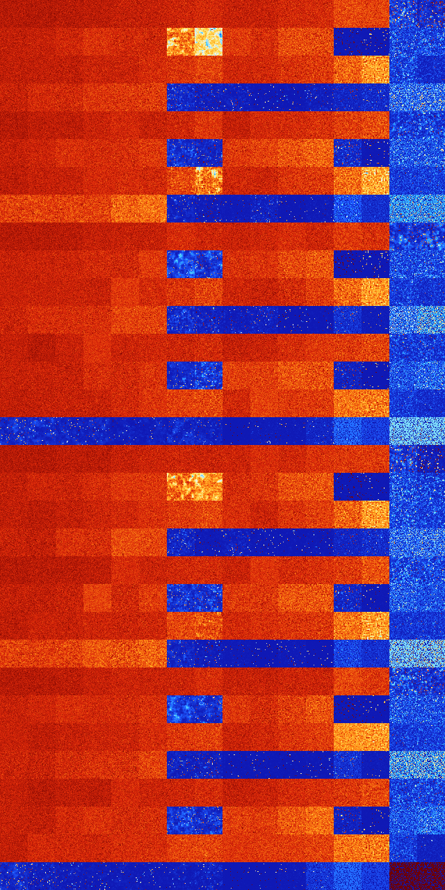

# B12 (3072-3583)

<details>
    <summary>Initial Grid</summary>
    
</details>


<details>
    <summary>Initial Grid RLE</summary>

```
#C Exported from GoGoL (https://github.com/marrow16/gogol)
#C Wrap mode: Toroidal
#C Boundary mode: Dead
#C Step: 0
x = 100, y = 100, rule = B12/S
64bo22bo$92bo$o14bo15bo7bo$32bo6b2o2bo20bo$58bo30bobo6bo$13bo12bo56bo$
10b3o11bo2bo8bo23bo7bo$o31bo20bo19bo8bo5bo8bo$8bo3bo28bo$36bo6bo$3bo11b
o38bo5bo$28bo7bo$6bo6bo36bo43bo$4bo3bo13bo15bo8bo19bobo10bo18bo$60bo10b
o$6bo27bo10bo20bo2bo$17bo8bo3b2o58bo$18bo35bo19bo19bobo$11bo2bo15b2o65b
obo$6bo8bo7bo41bo$15bo4bo8bo60bo$4bo9bo5bo24bo4bo4bo$19bo15bo26bo18bo$
100b$64bo7bo9bo8bo$7bo11bo19bo6bo9bo$3bo15bo45bo$52bo6bo18bo14bobo$22bo
4bo16bo48bo$11bobo55bo20b2o4bo$15bo16bo44bo10bo7bo$42bo11bo26bo8bo$6bo
2bo57bo2bo$bo5bo11bo40bo20bo$17bo79bo$46bo13bo$15bo25bo27bo17bo$34bo10b
2o39bo$21bo5bo7bo7bo15bo3bo19bo$14bo12bo20bo4bobo6bo8bo18bo2bo$4bo4bo
13bo37bo$57bo4bo4bo18bo$24b2o19bo10bobo20bo12b2o$30bo$5bob2o52bo24bo$6b
o23bo38bo3bo$12b2o6bo17bo21bo16bo13bo$11bo8bo32bo3bo13bo23bo$10bo10bo$b
o20bo6b2o6bo15bo$7bo2bo85bo$28b2o6bo4bo46bo$32bo5b2o30bo18b2o$9bobo15bo
8bo25bo$o49bo3bo43bo$12bo2bo24bo8bo6bo$12bo27bo39bo3bo10bo$4bo2bo2bo19b
o25b2o4bo16bo$bo28bo34bo16bo$4bo6bo22bo16bo37bo$19bo61bo4bobo8bo$24bo6b
o2bo8bo9bo25bo7bo9bo$25bo17bo23bo3bo4bo22bo$42bo25bo6bo8bo10bo$5bo15bo
71bo2bo$39bo7bo14bo2bo$27bo15bo14b2o31bo$64bo3b2o6bo$33bo5bo2bo5bo18bob
o10bo$o35bo2bo3bo2b2o10bo39bo$3b2o12bo38bo11bo21bo$16bobo38bo19bo20bo$
21bo43bo24bo$13bo3bo6bo12bo5bo7bo$69bo16bo$14bo4bo8bo55bo14bo$7bo31bo
21bo27bo4bo$18b2o8bo32bo23bo$15bo11bo32bo11bo20b2o$13bo10bo5bo12bo12bo
9bo3bobo$50bo20bo15bo$14bo36bo3b2o8bo11bo3bo$13bo13bo10bo45bo5b2o$bo36b
obobo13bo19bo$10bo64bo6bo$13bo4bo4bo2bo15bo39bo$2bo78bo2bo$9bo36bo42bo
8b2o$17bo63bo3bo13bo$50b2o14bobo12bo14bo$bo5b2o19bo3bo2bo4bo4bo24bo$25b
o6bo2bo12bo24bo2bobo5bo8b3o$bo4bo3bo11b2o18bo47bo2bo$18bo51bo6bo11bo$
28bo10bo4b2o24bo8bo19bo$12bo7bo20bo30bo6bo5bobo4bobo$54bo31bo3bo$30bo4b
o35bo$32bo5b2o15bobo6bo13bo3bo$26bo47bo!
```
</details>
<details>
    <summary>Thumbnail</summary>

</details>
<table>
<tr>
    <td><a href="./3072%20S%20Heat%20Map%20Activity.png"></a><br>S (3072)<br>G>1000</td>    <td><a href="./3073%20S0%20Heat%20Map%20Activity.png"></a><br>S0 (3073)<br>G>1000</td>    <td><a href="./3074%20S1%20Heat%20Map%20Activity.png"></a><br>S1 (3074)<br>G>1000</td>    <td><a href="./3075%20S01%20Heat%20Map%20Activity.png"></a><br>S01 (3075)<br>G>1000</td>    <td><a href="./3076%20S2%20Heat%20Map%20Activity.png"></a><br>S2 (3076)<br>G>1000</td>    <td><a href="./3077%20S02%20Heat%20Map%20Activity.png"></a><br>S02 (3077)<br>G>1000</td>    <td><a href="./3078%20S12%20Heat%20Map%20Activity.png"></a><br>S12 (3078)<br>G>1000</td>    <td><a href="./3079%20S012%20Heat%20Map%20Activity.png"></a><br>S012 (3079)<br>G>1000</td>    <td><a href="./3080%20S3%20Heat%20Map%20Activity.png"></a><br>S3 (3080)<br>G>1000</td>    <td><a href="./3081%20S03%20Heat%20Map%20Activity.png"></a><br>S03 (3081)<br>G>1000</td>    <td><a href="./3082%20S13%20Heat%20Map%20Activity.png"></a><br>S13 (3082)<br>G>1000</td>    <td><a href="./3083%20S013%20Heat%20Map%20Activity.png"></a><br>S013 (3083)<br>G>1000</td>    <td><a href="./3084%20S23%20Heat%20Map%20Activity.png"></a><br>S23 (3084)<br>G>1000</td>    <td><a href="./3085%20S023%20Heat%20Map%20Activity.png"></a><br>S023 (3085)<br>G>1000</td>    <td><a href="./3086%20S123%20Heat%20Map%20Activity.png"></a><br>S123 (3086)<br>R@114,p24</td>    <td><a href="./3087%20S0123%20Heat%20Map%20Activity.png"></a><br>S0123 (3087)<br>R@237,p120</td></tr>
<tr>
    <td><a href="./3088%20S4%20Heat%20Map%20Activity.png"></a><br>S4 (3088)<br>G>1000</td>    <td><a href="./3089%20S04%20Heat%20Map%20Activity.png"></a><br>S04 (3089)<br>G>1000</td>    <td><a href="./3090%20S14%20Heat%20Map%20Activity.png"></a><br>S14 (3090)<br>G>1000</td>    <td><a href="./3091%20S014%20Heat%20Map%20Activity.png"></a><br>S014 (3091)<br>G>1000</td>    <td><a href="./3092%20S24%20Heat%20Map%20Activity.png"></a><br>S24 (3092)<br>G>1000</td>    <td><a href="./3093%20S024%20Heat%20Map%20Activity.png"></a><br>S024 (3093)<br>G>1000</td>    <td><a href="./3094%20S124%20Heat%20Map%20Activity.png"></a><br>S124 (3094)<br>G>1000</td>    <td><a href="./3095%20S0124%20Heat%20Map%20Activity.png"></a><br>S0124 (3095)<br>G>1000</td>    <td><a href="./3096%20S34%20Heat%20Map%20Activity.png"></a><br>S34 (3096)<br>G>1000</td>    <td><a href="./3097%20S034%20Heat%20Map%20Activity.png"></a><br>S034 (3097)<br>G>1000</td>    <td><a href="./3098%20S134%20Heat%20Map%20Activity.png"></a><br>S134 (3098)<br>G>1000</td>    <td><a href="./3099%20S0134%20Heat%20Map%20Activity.png"></a><br>S0134 (3099)<br>G>1000</td>    <td><a href="./3100%20S234%20Heat%20Map%20Activity.png"></a><br>S234 (3100)<br>R@464,p420</td>    <td><a href="./3101%20S0234%20Heat%20Map%20Activity.png"></a><br>S0234 (3101)<br>G>1000</td>    <td><a href="./3102%20S1234%20Heat%20Map%20Activity.png"></a><br>S1234 (3102)<br>R@21,p2</td>    <td><a href="./3103%20S01234%20Heat%20Map%20Activity.png"></a><br>S01234 (3103)<br>R@22,p2</td></tr>
<tr>
    <td><a href="./3104%20S5%20Heat%20Map%20Activity.png"></a><br>S5 (3104)<br>G>1000</td>    <td><a href="./3105%20S05%20Heat%20Map%20Activity.png"></a><br>S05 (3105)<br>G>1000</td>    <td><a href="./3106%20S15%20Heat%20Map%20Activity.png"></a><br>S15 (3106)<br>G>1000</td>    <td><a href="./3107%20S015%20Heat%20Map%20Activity.png"></a><br>S015 (3107)<br>G>1000</td>    <td><a href="./3108%20S25%20Heat%20Map%20Activity.png"></a><br>S25 (3108)<br>G>1000</td>    <td><a href="./3109%20S025%20Heat%20Map%20Activity.png"></a><br>S025 (3109)<br>G>1000</td>    <td><a href="./3110%20S125%20Heat%20Map%20Activity.png"></a><br>S125 (3110)<br>G>1000</td>    <td><a href="./3111%20S0125%20Heat%20Map%20Activity.png"></a><br>S0125 (3111)<br>G>1000</td>    <td><a href="./3112%20S35%20Heat%20Map%20Activity.png"></a><br>S35 (3112)<br>G>1000</td>    <td><a href="./3113%20S035%20Heat%20Map%20Activity.png"></a><br>S035 (3113)<br>G>1000</td>    <td><a href="./3114%20S135%20Heat%20Map%20Activity.png"></a><br>S135 (3114)<br>G>1000</td>    <td><a href="./3115%20S0135%20Heat%20Map%20Activity.png"></a><br>S0135 (3115)<br>G>1000</td>    <td><a href="./3116%20S235%20Heat%20Map%20Activity.png"></a><br>S235 (3116)<br>G>1000</td>    <td><a href="./3117%20S0235%20Heat%20Map%20Activity.png"></a><br>S0235 (3117)<br>G>1000</td>    <td><a href="./3118%20S1235%20Heat%20Map%20Activity.png"></a><br>S1235 (3118)<br>R@28,p6</td>    <td><a href="./3119%20S01235%20Heat%20Map%20Activity.png"></a><br>S01235 (3119)<br>R@54,p30</td></tr>
<tr>
    <td><a href="./3120%20S45%20Heat%20Map%20Activity.png"></a><br>S45 (3120)<br>G>1000</td>    <td><a href="./3121%20S045%20Heat%20Map%20Activity.png"></a><br>S045 (3121)<br>G>1000</td>    <td><a href="./3122%20S145%20Heat%20Map%20Activity.png"></a><br>S145 (3122)<br>G>1000</td>    <td><a href="./3123%20S0145%20Heat%20Map%20Activity.png"></a><br>S0145 (3123)<br>G>1000</td>    <td><a href="./3124%20S245%20Heat%20Map%20Activity.png"></a><br>S245 (3124)<br>G>1000</td>    <td><a href="./3125%20S0245%20Heat%20Map%20Activity.png"></a><br>S0245 (3125)<br>G>1000</td>    <td><a href="./3126%20S1245%20Heat%20Map%20Activity.png"></a><br>S1245 (3126)<br>R@225,p24</td>    <td><a href="./3127%20S01245%20Heat%20Map%20Activity.png"></a><br>S01245 (3127)<br>R@360,p180</td>    <td><a href="./3128%20S345%20Heat%20Map%20Activity.png"></a><br>S345 (3128)<br>R@202,p120</td>    <td><a href="./3129%20S0345%20Heat%20Map%20Activity.png"></a><br>S0345 (3129)<br>G>1000</td>    <td><a href="./3130%20S1345%20Heat%20Map%20Activity.png"></a><br>S1345 (3130)<br>G>1000</td>    <td><a href="./3131%20S01345%20Heat%20Map%20Activity.png"></a><br>S01345 (3131)<br>R@332,p180</td>    <td><a href="./3132%20S2345%20Heat%20Map%20Activity.png"></a><br>S2345 (3132)<br>R@37,p20</td>    <td><a href="./3133%20S02345%20Heat%20Map%20Activity.png"></a><br>S02345 (3133)<br>R@29,p12</td>    <td><a href="./3134%20S12345%20Heat%20Map%20Activity.png"></a><br>S12345 (3134)<br>S@8</td>    <td><a href="./3135%20S012345%20Heat%20Map%20Activity.png"></a><br>S012345 (3135)<br>S@8</td></tr>
<tr>
    <td><a href="./3136%20S6%20Heat%20Map%20Activity.png"></a><br>S6 (3136)<br>G>1000</td>    <td><a href="./3137%20S06%20Heat%20Map%20Activity.png"></a><br>S06 (3137)<br>G>1000</td>    <td><a href="./3138%20S16%20Heat%20Map%20Activity.png"></a><br>S16 (3138)<br>G>1000</td>    <td><a href="./3139%20S016%20Heat%20Map%20Activity.png"></a><br>S016 (3139)<br>G>1000</td>    <td><a href="./3140%20S26%20Heat%20Map%20Activity.png"></a><br>S26 (3140)<br>G>1000</td>    <td><a href="./3141%20S026%20Heat%20Map%20Activity.png"></a><br>S026 (3141)<br>G>1000</td>    <td><a href="./3142%20S126%20Heat%20Map%20Activity.png"></a><br>S126 (3142)<br>G>1000</td>    <td><a href="./3143%20S0126%20Heat%20Map%20Activity.png"></a><br>S0126 (3143)<br>G>1000</td>    <td><a href="./3144%20S36%20Heat%20Map%20Activity.png"></a><br>S36 (3144)<br>G>1000</td>    <td><a href="./3145%20S036%20Heat%20Map%20Activity.png"></a><br>S036 (3145)<br>G>1000</td>    <td><a href="./3146%20S136%20Heat%20Map%20Activity.png"></a><br>S136 (3146)<br>G>1000</td>    <td><a href="./3147%20S0136%20Heat%20Map%20Activity.png"></a><br>S0136 (3147)<br>G>1000</td>    <td><a href="./3148%20S236%20Heat%20Map%20Activity.png"></a><br>S236 (3148)<br>G>1000</td>    <td><a href="./3149%20S0236%20Heat%20Map%20Activity.png"></a><br>S0236 (3149)<br>G>1000</td>    <td><a href="./3150%20S1236%20Heat%20Map%20Activity.png"></a><br>S1236 (3150)<br>R@74,p12</td>    <td><a href="./3151%20S01236%20Heat%20Map%20Activity.png"></a><br>S01236 (3151)<br>R@59,p4</td></tr>
<tr>
    <td><a href="./3152%20S46%20Heat%20Map%20Activity.png"></a><br>S46 (3152)<br>G>1000</td>    <td><a href="./3153%20S046%20Heat%20Map%20Activity.png"></a><br>S046 (3153)<br>G>1000</td>    <td><a href="./3154%20S146%20Heat%20Map%20Activity.png"></a><br>S146 (3154)<br>G>1000</td>    <td><a href="./3155%20S0146%20Heat%20Map%20Activity.png"></a><br>S0146 (3155)<br>G>1000</td>    <td><a href="./3156%20S246%20Heat%20Map%20Activity.png"></a><br>S246 (3156)<br>G>1000</td>    <td><a href="./3157%20S0246%20Heat%20Map%20Activity.png"></a><br>S0246 (3157)<br>G>1000</td>    <td><a href="./3158%20S1246%20Heat%20Map%20Activity.png"></a><br>S1246 (3158)<br>R@469,p60</td>    <td><a href="./3159%20S01246%20Heat%20Map%20Activity.png"></a><br>S01246 (3159)<br>R@497,p60</td>    <td><a href="./3160%20S346%20Heat%20Map%20Activity.png"></a><br>S346 (3160)<br>G>1000</td>    <td><a href="./3161%20S0346%20Heat%20Map%20Activity.png"></a><br>S0346 (3161)<br>G>1000</td>    <td><a href="./3162%20S1346%20Heat%20Map%20Activity.png"></a><br>S1346 (3162)<br>G>1000</td>    <td><a href="./3163%20S01346%20Heat%20Map%20Activity.png"></a><br>S01346 (3163)<br>G>1000</td>    <td><a href="./3164%20S2346%20Heat%20Map%20Activity.png"></a><br>S2346 (3164)<br>R@37,p12</td>    <td><a href="./3165%20S02346%20Heat%20Map%20Activity.png"></a><br>S02346 (3165)<br>R@468,p420</td>    <td><a href="./3166%20S12346%20Heat%20Map%20Activity.png"></a><br>S12346 (3166)<br>R@13,p2</td>    <td><a href="./3167%20S012346%20Heat%20Map%20Activity.png"></a><br>S012346 (3167)<br>R@13,p2</td></tr>
<tr>
    <td><a href="./3168%20S56%20Heat%20Map%20Activity.png"></a><br>S56 (3168)<br>G>1000</td>    <td><a href="./3169%20S056%20Heat%20Map%20Activity.png"></a><br>S056 (3169)<br>G>1000</td>    <td><a href="./3170%20S156%20Heat%20Map%20Activity.png"></a><br>S156 (3170)<br>G>1000</td>    <td><a href="./3171%20S0156%20Heat%20Map%20Activity.png"></a><br>S0156 (3171)<br>G>1000</td>    <td><a href="./3172%20S256%20Heat%20Map%20Activity.png"></a><br>S256 (3172)<br>G>1000</td>    <td><a href="./3173%20S0256%20Heat%20Map%20Activity.png"></a><br>S0256 (3173)<br>G>1000</td>    <td><a href="./3174%20S1256%20Heat%20Map%20Activity.png"></a><br>S1256 (3174)<br>G>1000</td>    <td><a href="./3175%20S01256%20Heat%20Map%20Activity.png"></a><br>S01256 (3175)<br>G>1000</td>    <td><a href="./3176%20S356%20Heat%20Map%20Activity.png"></a><br>S356 (3176)<br>G>1000</td>    <td><a href="./3177%20S0356%20Heat%20Map%20Activity.png"></a><br>S0356 (3177)<br>G>1000</td>    <td><a href="./3178%20S1356%20Heat%20Map%20Activity.png"></a><br>S1356 (3178)<br>G>1000</td>    <td><a href="./3179%20S01356%20Heat%20Map%20Activity.png"></a><br>S01356 (3179)<br>G>1000</td>    <td><a href="./3180%20S2356%20Heat%20Map%20Activity.png"></a><br>S2356 (3180)<br>G>1000</td>    <td><a href="./3181%20S02356%20Heat%20Map%20Activity.png"></a><br>S02356 (3181)<br>G>1000</td>    <td><a href="./3182%20S12356%20Heat%20Map%20Activity.png"></a><br>S12356 (3182)<br>R@30,p6</td>    <td><a href="./3183%20S012356%20Heat%20Map%20Activity.png"></a><br>S012356 (3183)<br>R@24,p6</td></tr>
<tr>
    <td><a href="./3184%20S456%20Heat%20Map%20Activity.png"></a><br>S456 (3184)<br>G>1000</td>    <td><a href="./3185%20S0456%20Heat%20Map%20Activity.png"></a><br>S0456 (3185)<br>G>1000</td>    <td><a href="./3186%20S1456%20Heat%20Map%20Activity.png"></a><br>S1456 (3186)<br>G>1000</td>    <td><a href="./3187%20S01456%20Heat%20Map%20Activity.png"></a><br>S01456 (3187)<br>G>1000</td>    <td><a href="./3188%20S2456%20Heat%20Map%20Activity.png"></a><br>S2456 (3188)<br>G>1000</td>    <td><a href="./3189%20S02456%20Heat%20Map%20Activity.png"></a><br>S02456 (3189)<br>G>1000</td>    <td><a href="./3190%20S12456%20Heat%20Map%20Activity.png"></a><br>S12456 (3190)<br>G>1000</td>    <td><a href="./3191%20S012456%20Heat%20Map%20Activity.png"></a><br>S012456 (3191)<br>G>1000</td>    <td><a href="./3192%20S3456%20Heat%20Map%20Activity.png"></a><br>S3456 (3192)<br>R@182,p156</td>    <td><a href="./3193%20S03456%20Heat%20Map%20Activity.png"></a><br>S03456 (3193)<br>R@57,p24</td>    <td><a href="./3194%20S13456%20Heat%20Map%20Activity.png"></a><br>S13456 (3194)<br>R@384,p360</td>    <td><a href="./3195%20S013456%20Heat%20Map%20Activity.png"></a><br>S013456 (3195)<br>R@154,p120</td>    <td><a href="./3196%20S23456%20Heat%20Map%20Activity.png"></a><br>S23456 (3196)<br>R@10,p2</td>    <td><a href="./3197%20S023456%20Heat%20Map%20Activity.png"></a><br>S023456 (3197)<br>R@19,p12</td>    <td><a href="./3198%20S123456%20Heat%20Map%20Activity.png"></a><br>S123456 (3198)<br>S@7</td>    <td><a href="./3199%20S0123456%20Heat%20Map%20Activity.png"></a><br>S0123456 (3199)<br>S@7</td></tr>
<tr>
    <td><a href="./3200%20S7%20Heat%20Map%20Activity.png"></a><br>S7 (3200)<br>G>1000</td>    <td><a href="./3201%20S07%20Heat%20Map%20Activity.png"></a><br>S07 (3201)<br>G>1000</td>    <td><a href="./3202%20S17%20Heat%20Map%20Activity.png"></a><br>S17 (3202)<br>G>1000</td>    <td><a href="./3203%20S017%20Heat%20Map%20Activity.png"></a><br>S017 (3203)<br>G>1000</td>    <td><a href="./3204%20S27%20Heat%20Map%20Activity.png"></a><br>S27 (3204)<br>G>1000</td>    <td><a href="./3205%20S027%20Heat%20Map%20Activity.png"></a><br>S027 (3205)<br>G>1000</td>    <td><a href="./3206%20S127%20Heat%20Map%20Activity.png"></a><br>S127 (3206)<br>G>1000</td>    <td><a href="./3207%20S0127%20Heat%20Map%20Activity.png"></a><br>S0127 (3207)<br>G>1000</td>    <td><a href="./3208%20S37%20Heat%20Map%20Activity.png"></a><br>S37 (3208)<br>G>1000</td>    <td><a href="./3209%20S037%20Heat%20Map%20Activity.png"></a><br>S037 (3209)<br>G>1000</td>    <td><a href="./3210%20S137%20Heat%20Map%20Activity.png"></a><br>S137 (3210)<br>G>1000</td>    <td><a href="./3211%20S0137%20Heat%20Map%20Activity.png"></a><br>S0137 (3211)<br>G>1000</td>    <td><a href="./3212%20S237%20Heat%20Map%20Activity.png"></a><br>S237 (3212)<br>G>1000</td>    <td><a href="./3213%20S0237%20Heat%20Map%20Activity.png"></a><br>S0237 (3213)<br>G>1000</td>    <td><a href="./3214%20S1237%20Heat%20Map%20Activity.png"></a><br>S1237 (3214)<br>R@294,p120</td>    <td><a href="./3215%20S01237%20Heat%20Map%20Activity.png"></a><br>S01237 (3215)<br>R@258,p48</td></tr>
<tr>
    <td><a href="./3216%20S47%20Heat%20Map%20Activity.png"></a><br>S47 (3216)<br>G>1000</td>    <td><a href="./3217%20S047%20Heat%20Map%20Activity.png"></a><br>S047 (3217)<br>G>1000</td>    <td><a href="./3218%20S147%20Heat%20Map%20Activity.png"></a><br>S147 (3218)<br>G>1000</td>    <td><a href="./3219%20S0147%20Heat%20Map%20Activity.png"></a><br>S0147 (3219)<br>G>1000</td>    <td><a href="./3220%20S247%20Heat%20Map%20Activity.png"></a><br>S247 (3220)<br>G>1000</td>    <td><a href="./3221%20S0247%20Heat%20Map%20Activity.png"></a><br>S0247 (3221)<br>G>1000</td>    <td><a href="./3222%20S1247%20Heat%20Map%20Activity.png"></a><br>S1247 (3222)<br>G>1000</td>    <td><a href="./3223%20S01247%20Heat%20Map%20Activity.png"></a><br>S01247 (3223)<br>R@538,p12</td>    <td><a href="./3224%20S347%20Heat%20Map%20Activity.png"></a><br>S347 (3224)<br>G>1000</td>    <td><a href="./3225%20S0347%20Heat%20Map%20Activity.png"></a><br>S0347 (3225)<br>G>1000</td>    <td><a href="./3226%20S1347%20Heat%20Map%20Activity.png"></a><br>S1347 (3226)<br>G>1000</td>    <td><a href="./3227%20S01347%20Heat%20Map%20Activity.png"></a><br>S01347 (3227)<br>G>1000</td>    <td><a href="./3228%20S2347%20Heat%20Map%20Activity.png"></a><br>S2347 (3228)<br>R@908,p840</td>    <td><a href="./3229%20S02347%20Heat%20Map%20Activity.png"></a><br>S02347 (3229)<br>G>1000</td>    <td><a href="./3230%20S12347%20Heat%20Map%20Activity.png"></a><br>S12347 (3230)<br>R@17,p2</td>    <td><a href="./3231%20S012347%20Heat%20Map%20Activity.png"></a><br>S012347 (3231)<br>R@16,p2</td></tr>
<tr>
    <td><a href="./3232%20S57%20Heat%20Map%20Activity.png"></a><br>S57 (3232)<br>G>1000</td>    <td><a href="./3233%20S057%20Heat%20Map%20Activity.png"></a><br>S057 (3233)<br>G>1000</td>    <td><a href="./3234%20S157%20Heat%20Map%20Activity.png"></a><br>S157 (3234)<br>G>1000</td>    <td><a href="./3235%20S0157%20Heat%20Map%20Activity.png"></a><br>S0157 (3235)<br>G>1000</td>    <td><a href="./3236%20S257%20Heat%20Map%20Activity.png"></a><br>S257 (3236)<br>G>1000</td>    <td><a href="./3237%20S0257%20Heat%20Map%20Activity.png"></a><br>S0257 (3237)<br>G>1000</td>    <td><a href="./3238%20S1257%20Heat%20Map%20Activity.png"></a><br>S1257 (3238)<br>G>1000</td>    <td><a href="./3239%20S01257%20Heat%20Map%20Activity.png"></a><br>S01257 (3239)<br>G>1000</td>    <td><a href="./3240%20S357%20Heat%20Map%20Activity.png"></a><br>S357 (3240)<br>G>1000</td>    <td><a href="./3241%20S0357%20Heat%20Map%20Activity.png"></a><br>S0357 (3241)<br>G>1000</td>    <td><a href="./3242%20S1357%20Heat%20Map%20Activity.png"></a><br>S1357 (3242)<br>G>1000</td>    <td><a href="./3243%20S01357%20Heat%20Map%20Activity.png"></a><br>S01357 (3243)<br>G>1000</td>    <td><a href="./3244%20S2357%20Heat%20Map%20Activity.png"></a><br>S2357 (3244)<br>G>1000</td>    <td><a href="./3245%20S02357%20Heat%20Map%20Activity.png"></a><br>S02357 (3245)<br>G>1000</td>    <td><a href="./3246%20S12357%20Heat%20Map%20Activity.png"></a><br>S12357 (3246)<br>R@30,p4</td>    <td><a href="./3247%20S012357%20Heat%20Map%20Activity.png"></a><br>S012357 (3247)<br>R@34,p12</td></tr>
<tr>
    <td><a href="./3248%20S457%20Heat%20Map%20Activity.png"></a><br>S457 (3248)<br>G>1000</td>    <td><a href="./3249%20S0457%20Heat%20Map%20Activity.png"></a><br>S0457 (3249)<br>G>1000</td>    <td><a href="./3250%20S1457%20Heat%20Map%20Activity.png"></a><br>S1457 (3250)<br>G>1000</td>    <td><a href="./3251%20S01457%20Heat%20Map%20Activity.png"></a><br>S01457 (3251)<br>G>1000</td>    <td><a href="./3252%20S2457%20Heat%20Map%20Activity.png"></a><br>S2457 (3252)<br>G>1000</td>    <td><a href="./3253%20S02457%20Heat%20Map%20Activity.png"></a><br>S02457 (3253)<br>G>1000</td>    <td><a href="./3254%20S12457%20Heat%20Map%20Activity.png"></a><br>S12457 (3254)<br>R@334,p30</td>    <td><a href="./3255%20S012457%20Heat%20Map%20Activity.png"></a><br>S012457 (3255)<br>R@344,p156</td>    <td><a href="./3256%20S3457%20Heat%20Map%20Activity.png"></a><br>S3457 (3256)<br>R@193,p120</td>    <td><a href="./3257%20S03457%20Heat%20Map%20Activity.png"></a><br>S03457 (3257)<br>R@188,p120</td>    <td><a href="./3258%20S13457%20Heat%20Map%20Activity.png"></a><br>S13457 (3258)<br>G>1000</td>    <td><a href="./3259%20S013457%20Heat%20Map%20Activity.png"></a><br>S013457 (3259)<br>G>1000</td>    <td><a href="./3260%20S23457%20Heat%20Map%20Activity.png"></a><br>S23457 (3260)<br>R@19,p4</td>    <td><a href="./3261%20S023457%20Heat%20Map%20Activity.png"></a><br>S023457 (3261)<br>R@98,p84</td>    <td><a href="./3262%20S123457%20Heat%20Map%20Activity.png"></a><br>S123457 (3262)<br>S@8</td>    <td><a href="./3263%20S0123457%20Heat%20Map%20Activity.png"></a><br>S0123457 (3263)<br>S@8</td></tr>
<tr>
    <td><a href="./3264%20S67%20Heat%20Map%20Activity.png"></a><br>S67 (3264)<br>G>1000</td>    <td><a href="./3265%20S067%20Heat%20Map%20Activity.png"></a><br>S067 (3265)<br>G>1000</td>    <td><a href="./3266%20S167%20Heat%20Map%20Activity.png"></a><br>S167 (3266)<br>G>1000</td>    <td><a href="./3267%20S0167%20Heat%20Map%20Activity.png"></a><br>S0167 (3267)<br>G>1000</td>    <td><a href="./3268%20S267%20Heat%20Map%20Activity.png"></a><br>S267 (3268)<br>G>1000</td>    <td><a href="./3269%20S0267%20Heat%20Map%20Activity.png"></a><br>S0267 (3269)<br>G>1000</td>    <td><a href="./3270%20S1267%20Heat%20Map%20Activity.png"></a><br>S1267 (3270)<br>G>1000</td>    <td><a href="./3271%20S01267%20Heat%20Map%20Activity.png"></a><br>S01267 (3271)<br>G>1000</td>    <td><a href="./3272%20S367%20Heat%20Map%20Activity.png"></a><br>S367 (3272)<br>G>1000</td>    <td><a href="./3273%20S0367%20Heat%20Map%20Activity.png"></a><br>S0367 (3273)<br>G>1000</td>    <td><a href="./3274%20S1367%20Heat%20Map%20Activity.png"></a><br>S1367 (3274)<br>G>1000</td>    <td><a href="./3275%20S01367%20Heat%20Map%20Activity.png"></a><br>S01367 (3275)<br>G>1000</td>    <td><a href="./3276%20S2367%20Heat%20Map%20Activity.png"></a><br>S2367 (3276)<br>G>1000</td>    <td><a href="./3277%20S02367%20Heat%20Map%20Activity.png"></a><br>S02367 (3277)<br>G>1000</td>    <td><a href="./3278%20S12367%20Heat%20Map%20Activity.png"></a><br>S12367 (3278)<br>R@53,p12</td>    <td><a href="./3279%20S012367%20Heat%20Map%20Activity.png"></a><br>S012367 (3279)<br>R@49,p12</td></tr>
<tr>
    <td><a href="./3280%20S467%20Heat%20Map%20Activity.png"></a><br>S467 (3280)<br>G>1000</td>    <td><a href="./3281%20S0467%20Heat%20Map%20Activity.png"></a><br>S0467 (3281)<br>G>1000</td>    <td><a href="./3282%20S1467%20Heat%20Map%20Activity.png"></a><br>S1467 (3282)<br>G>1000</td>    <td><a href="./3283%20S01467%20Heat%20Map%20Activity.png"></a><br>S01467 (3283)<br>G>1000</td>    <td><a href="./3284%20S2467%20Heat%20Map%20Activity.png"></a><br>S2467 (3284)<br>G>1000</td>    <td><a href="./3285%20S02467%20Heat%20Map%20Activity.png"></a><br>S02467 (3285)<br>G>1000</td>    <td><a href="./3286%20S12467%20Heat%20Map%20Activity.png"></a><br>S12467 (3286)<br>R@776,p60</td>    <td><a href="./3287%20S012467%20Heat%20Map%20Activity.png"></a><br>S012467 (3287)<br>R@251,p12</td>    <td><a href="./3288%20S3467%20Heat%20Map%20Activity.png"></a><br>S3467 (3288)<br>G>1000</td>    <td><a href="./3289%20S03467%20Heat%20Map%20Activity.png"></a><br>S03467 (3289)<br>G>1000</td>    <td><a href="./3290%20S13467%20Heat%20Map%20Activity.png"></a><br>S13467 (3290)<br>G>1000</td>    <td><a href="./3291%20S013467%20Heat%20Map%20Activity.png"></a><br>S013467 (3291)<br>G>1000</td>    <td><a href="./3292%20S23467%20Heat%20Map%20Activity.png"></a><br>S23467 (3292)<br>R@63,p24</td>    <td><a href="./3293%20S023467%20Heat%20Map%20Activity.png"></a><br>S023467 (3293)<br>G>1000</td>    <td><a href="./3294%20S123467%20Heat%20Map%20Activity.png"></a><br>S123467 (3294)<br>R@13,p2</td>    <td><a href="./3295%20S0123467%20Heat%20Map%20Activity.png"></a><br>S0123467 (3295)<br>R@11,p2</td></tr>
<tr>
    <td><a href="./3296%20S567%20Heat%20Map%20Activity.png"></a><br>S567 (3296)<br>G>1000</td>    <td><a href="./3297%20S0567%20Heat%20Map%20Activity.png"></a><br>S0567 (3297)<br>G>1000</td>    <td><a href="./3298%20S1567%20Heat%20Map%20Activity.png"></a><br>S1567 (3298)<br>G>1000</td>    <td><a href="./3299%20S01567%20Heat%20Map%20Activity.png"></a><br>S01567 (3299)<br>G>1000</td>    <td><a href="./3300%20S2567%20Heat%20Map%20Activity.png"></a><br>S2567 (3300)<br>G>1000</td>    <td><a href="./3301%20S02567%20Heat%20Map%20Activity.png"></a><br>S02567 (3301)<br>G>1000</td>    <td><a href="./3302%20S12567%20Heat%20Map%20Activity.png"></a><br>S12567 (3302)<br>G>1000</td>    <td><a href="./3303%20S012567%20Heat%20Map%20Activity.png"></a><br>S012567 (3303)<br>G>1000</td>    <td><a href="./3304%20S3567%20Heat%20Map%20Activity.png"></a><br>S3567 (3304)<br>G>1000</td>    <td><a href="./3305%20S03567%20Heat%20Map%20Activity.png"></a><br>S03567 (3305)<br>G>1000</td>    <td><a href="./3306%20S13567%20Heat%20Map%20Activity.png"></a><br>S13567 (3306)<br>G>1000</td>    <td><a href="./3307%20S013567%20Heat%20Map%20Activity.png"></a><br>S013567 (3307)<br>G>1000</td>    <td><a href="./3308%20S23567%20Heat%20Map%20Activity.png"></a><br>S23567 (3308)<br>G>1000</td>    <td><a href="./3309%20S023567%20Heat%20Map%20Activity.png"></a><br>S023567 (3309)<br>G>1000</td>    <td><a href="./3310%20S123567%20Heat%20Map%20Activity.png"></a><br>S123567 (3310)<br>R@32,p6</td>    <td><a href="./3311%20S0123567%20Heat%20Map%20Activity.png"></a><br>S0123567 (3311)<br>R@40,p12</td></tr>
<tr>
    <td><a href="./3312%20S4567%20Heat%20Map%20Activity.png"></a><br>S4567 (3312)<br>G>1000</td>    <td><a href="./3313%20S04567%20Heat%20Map%20Activity.png"></a><br>S04567 (3313)<br>G>1000</td>    <td><a href="./3314%20S14567%20Heat%20Map%20Activity.png"></a><br>S14567 (3314)<br>G>1000</td>    <td><a href="./3315%20S014567%20Heat%20Map%20Activity.png"></a><br>S014567 (3315)<br>G>1000</td>    <td><a href="./3316%20S24567%20Heat%20Map%20Activity.png"></a><br>S24567 (3316)<br>G>1000</td>    <td><a href="./3317%20S024567%20Heat%20Map%20Activity.png"></a><br>S024567 (3317)<br>G>1000</td>    <td><a href="./3318%20S124567%20Heat%20Map%20Activity.png"></a><br>S124567 (3318)<br>R@414,p120</td>    <td><a href="./3319%20S0124567%20Heat%20Map%20Activity.png"></a><br>S0124567 (3319)<br>R@839,p252</td>    <td><a href="./3320%20S34567%20Heat%20Map%20Activity.png"></a><br>S34567 (3320)<br>R@805,p780</td>    <td><a href="./3321%20S034567%20Heat%20Map%20Activity.png"></a><br>S034567 (3321)<br>R@88,p60</td>    <td><a href="./3322%20S134567%20Heat%20Map%20Activity.png"></a><br>S134567 (3322)<br>R@141,p120</td>    <td><a href="./3323%20S0134567%20Heat%20Map%20Activity.png"></a><br>S0134567 (3323)<br>R@28,p12</td>    <td><a href="./3324%20S234567%20Heat%20Map%20Activity.png"></a><br>S234567 (3324)<br>R@9,p2</td>    <td><a href="./3325%20S0234567%20Heat%20Map%20Activity.png"></a><br>S0234567 (3325)<br>R@13,p6</td>    <td><a href="./3326%20S1234567%20Heat%20Map%20Activity.png"></a><br>S1234567 (3326)<br>S@7</td>    <td><a href="./3327%20S01234567%20Heat%20Map%20Activity.png"></a><br>S01234567 (3327)<br>S@7</td></tr>
<tr>
    <td><a href="./3328%20S8%20Heat%20Map%20Activity.png"></a><br>S8 (3328)<br>G>1000</td>    <td><a href="./3329%20S08%20Heat%20Map%20Activity.png"></a><br>S08 (3329)<br>G>1000</td>    <td><a href="./3330%20S18%20Heat%20Map%20Activity.png"></a><br>S18 (3330)<br>G>1000</td>    <td><a href="./3331%20S018%20Heat%20Map%20Activity.png"></a><br>S018 (3331)<br>G>1000</td>    <td><a href="./3332%20S28%20Heat%20Map%20Activity.png"></a><br>S28 (3332)<br>G>1000</td>    <td><a href="./3333%20S028%20Heat%20Map%20Activity.png"></a><br>S028 (3333)<br>G>1000</td>    <td><a href="./3334%20S128%20Heat%20Map%20Activity.png"></a><br>S128 (3334)<br>G>1000</td>    <td><a href="./3335%20S0128%20Heat%20Map%20Activity.png"></a><br>S0128 (3335)<br>G>1000</td>    <td><a href="./3336%20S38%20Heat%20Map%20Activity.png"></a><br>S38 (3336)<br>G>1000</td>    <td><a href="./3337%20S038%20Heat%20Map%20Activity.png"></a><br>S038 (3337)<br>G>1000</td>    <td><a href="./3338%20S138%20Heat%20Map%20Activity.png"></a><br>S138 (3338)<br>G>1000</td>    <td><a href="./3339%20S0138%20Heat%20Map%20Activity.png"></a><br>S0138 (3339)<br>G>1000</td>    <td><a href="./3340%20S238%20Heat%20Map%20Activity.png"></a><br>S238 (3340)<br>G>1000</td>    <td><a href="./3341%20S0238%20Heat%20Map%20Activity.png"></a><br>S0238 (3341)<br>G>1000</td>    <td><a href="./3342%20S1238%20Heat%20Map%20Activity.png"></a><br>S1238 (3342)<br>R@153,p24</td>    <td><a href="./3343%20S01238%20Heat%20Map%20Activity.png"></a><br>S01238 (3343)<br>G>1000</td></tr>
<tr>
    <td><a href="./3344%20S48%20Heat%20Map%20Activity.png"></a><br>S48 (3344)<br>G>1000</td>    <td><a href="./3345%20S048%20Heat%20Map%20Activity.png"></a><br>S048 (3345)<br>G>1000</td>    <td><a href="./3346%20S148%20Heat%20Map%20Activity.png"></a><br>S148 (3346)<br>G>1000</td>    <td><a href="./3347%20S0148%20Heat%20Map%20Activity.png"></a><br>S0148 (3347)<br>G>1000</td>    <td><a href="./3348%20S248%20Heat%20Map%20Activity.png"></a><br>S248 (3348)<br>G>1000</td>    <td><a href="./3349%20S0248%20Heat%20Map%20Activity.png"></a><br>S0248 (3349)<br>G>1000</td>    <td><a href="./3350%20S1248%20Heat%20Map%20Activity.png"></a><br>S1248 (3350)<br>G>1000</td>    <td><a href="./3351%20S01248%20Heat%20Map%20Activity.png"></a><br>S01248 (3351)<br>G>1000</td>    <td><a href="./3352%20S348%20Heat%20Map%20Activity.png"></a><br>S348 (3352)<br>G>1000</td>    <td><a href="./3353%20S0348%20Heat%20Map%20Activity.png"></a><br>S0348 (3353)<br>G>1000</td>    <td><a href="./3354%20S1348%20Heat%20Map%20Activity.png"></a><br>S1348 (3354)<br>G>1000</td>    <td><a href="./3355%20S01348%20Heat%20Map%20Activity.png"></a><br>S01348 (3355)<br>G>1000</td>    <td><a href="./3356%20S2348%20Heat%20Map%20Activity.png"></a><br>S2348 (3356)<br>R@897,p840</td>    <td><a href="./3357%20S02348%20Heat%20Map%20Activity.png"></a><br>S02348 (3357)<br>R@882,p840</td>    <td><a href="./3358%20S12348%20Heat%20Map%20Activity.png"></a><br>S12348 (3358)<br>R@18,p2</td>    <td><a href="./3359%20S012348%20Heat%20Map%20Activity.png"></a><br>S012348 (3359)<br>R@26,p2</td></tr>
<tr>
    <td><a href="./3360%20S58%20Heat%20Map%20Activity.png"></a><br>S58 (3360)<br>G>1000</td>    <td><a href="./3361%20S058%20Heat%20Map%20Activity.png"></a><br>S058 (3361)<br>G>1000</td>    <td><a href="./3362%20S158%20Heat%20Map%20Activity.png"></a><br>S158 (3362)<br>G>1000</td>    <td><a href="./3363%20S0158%20Heat%20Map%20Activity.png"></a><br>S0158 (3363)<br>G>1000</td>    <td><a href="./3364%20S258%20Heat%20Map%20Activity.png"></a><br>S258 (3364)<br>G>1000</td>    <td><a href="./3365%20S0258%20Heat%20Map%20Activity.png"></a><br>S0258 (3365)<br>G>1000</td>    <td><a href="./3366%20S1258%20Heat%20Map%20Activity.png"></a><br>S1258 (3366)<br>G>1000</td>    <td><a href="./3367%20S01258%20Heat%20Map%20Activity.png"></a><br>S01258 (3367)<br>G>1000</td>    <td><a href="./3368%20S358%20Heat%20Map%20Activity.png"></a><br>S358 (3368)<br>G>1000</td>    <td><a href="./3369%20S0358%20Heat%20Map%20Activity.png"></a><br>S0358 (3369)<br>G>1000</td>    <td><a href="./3370%20S1358%20Heat%20Map%20Activity.png"></a><br>S1358 (3370)<br>G>1000</td>    <td><a href="./3371%20S01358%20Heat%20Map%20Activity.png"></a><br>S01358 (3371)<br>G>1000</td>    <td><a href="./3372%20S2358%20Heat%20Map%20Activity.png"></a><br>S2358 (3372)<br>G>1000</td>    <td><a href="./3373%20S02358%20Heat%20Map%20Activity.png"></a><br>S02358 (3373)<br>G>1000</td>    <td><a href="./3374%20S12358%20Heat%20Map%20Activity.png"></a><br>S12358 (3374)<br>R@24,p2</td>    <td><a href="./3375%20S012358%20Heat%20Map%20Activity.png"></a><br>S012358 (3375)<br>R@30,p6</td></tr>
<tr>
    <td><a href="./3376%20S458%20Heat%20Map%20Activity.png"></a><br>S458 (3376)<br>G>1000</td>    <td><a href="./3377%20S0458%20Heat%20Map%20Activity.png"></a><br>S0458 (3377)<br>G>1000</td>    <td><a href="./3378%20S1458%20Heat%20Map%20Activity.png"></a><br>S1458 (3378)<br>G>1000</td>    <td><a href="./3379%20S01458%20Heat%20Map%20Activity.png"></a><br>S01458 (3379)<br>G>1000</td>    <td><a href="./3380%20S2458%20Heat%20Map%20Activity.png"></a><br>S2458 (3380)<br>G>1000</td>    <td><a href="./3381%20S02458%20Heat%20Map%20Activity.png"></a><br>S02458 (3381)<br>G>1000</td>    <td><a href="./3382%20S12458%20Heat%20Map%20Activity.png"></a><br>S12458 (3382)<br>R@306,p60</td>    <td><a href="./3383%20S012458%20Heat%20Map%20Activity.png"></a><br>S012458 (3383)<br>R@971,p840</td>    <td><a href="./3384%20S3458%20Heat%20Map%20Activity.png"></a><br>S3458 (3384)<br>R@202,p120</td>    <td><a href="./3385%20S03458%20Heat%20Map%20Activity.png"></a><br>S03458 (3385)<br>G>1000</td>    <td><a href="./3386%20S13458%20Heat%20Map%20Activity.png"></a><br>S13458 (3386)<br>G>1000</td>    <td><a href="./3387%20S013458%20Heat%20Map%20Activity.png"></a><br>S013458 (3387)<br>G>1000</td>    <td><a href="./3388%20S23458%20Heat%20Map%20Activity.png"></a><br>S23458 (3388)<br>R@36,p20</td>    <td><a href="./3389%20S023458%20Heat%20Map%20Activity.png"></a><br>S023458 (3389)<br>R@26,p12</td>    <td><a href="./3390%20S123458%20Heat%20Map%20Activity.png"></a><br>S123458 (3390)<br>S@8</td>    <td><a href="./3391%20S0123458%20Heat%20Map%20Activity.png"></a><br>S0123458 (3391)<br>S@8</td></tr>
<tr>
    <td><a href="./3392%20S68%20Heat%20Map%20Activity.png"></a><br>S68 (3392)<br>G>1000</td>    <td><a href="./3393%20S068%20Heat%20Map%20Activity.png"></a><br>S068 (3393)<br>G>1000</td>    <td><a href="./3394%20S168%20Heat%20Map%20Activity.png"></a><br>S168 (3394)<br>G>1000</td>    <td><a href="./3395%20S0168%20Heat%20Map%20Activity.png"></a><br>S0168 (3395)<br>G>1000</td>    <td><a href="./3396%20S268%20Heat%20Map%20Activity.png"></a><br>S268 (3396)<br>G>1000</td>    <td><a href="./3397%20S0268%20Heat%20Map%20Activity.png"></a><br>S0268 (3397)<br>G>1000</td>    <td><a href="./3398%20S1268%20Heat%20Map%20Activity.png"></a><br>S1268 (3398)<br>G>1000</td>    <td><a href="./3399%20S01268%20Heat%20Map%20Activity.png"></a><br>S01268 (3399)<br>G>1000</td>    <td><a href="./3400%20S368%20Heat%20Map%20Activity.png"></a><br>S368 (3400)<br>G>1000</td>    <td><a href="./3401%20S0368%20Heat%20Map%20Activity.png"></a><br>S0368 (3401)<br>G>1000</td>    <td><a href="./3402%20S1368%20Heat%20Map%20Activity.png"></a><br>S1368 (3402)<br>G>1000</td>    <td><a href="./3403%20S01368%20Heat%20Map%20Activity.png"></a><br>S01368 (3403)<br>G>1000</td>    <td><a href="./3404%20S2368%20Heat%20Map%20Activity.png"></a><br>S2368 (3404)<br>G>1000</td>    <td><a href="./3405%20S02368%20Heat%20Map%20Activity.png"></a><br>S02368 (3405)<br>G>1000</td>    <td><a href="./3406%20S12368%20Heat%20Map%20Activity.png"></a><br>S12368 (3406)<br>R@44,p4</td>    <td><a href="./3407%20S012368%20Heat%20Map%20Activity.png"></a><br>S012368 (3407)<br>R@45,p4</td></tr>
<tr>
    <td><a href="./3408%20S468%20Heat%20Map%20Activity.png"></a><br>S468 (3408)<br>G>1000</td>    <td><a href="./3409%20S0468%20Heat%20Map%20Activity.png"></a><br>S0468 (3409)<br>G>1000</td>    <td><a href="./3410%20S1468%20Heat%20Map%20Activity.png"></a><br>S1468 (3410)<br>G>1000</td>    <td><a href="./3411%20S01468%20Heat%20Map%20Activity.png"></a><br>S01468 (3411)<br>G>1000</td>    <td><a href="./3412%20S2468%20Heat%20Map%20Activity.png"></a><br>S2468 (3412)<br>G>1000</td>    <td><a href="./3413%20S02468%20Heat%20Map%20Activity.png"></a><br>S02468 (3413)<br>G>1000</td>    <td><a href="./3414%20S12468%20Heat%20Map%20Activity.png"></a><br>S12468 (3414)<br>R@392,p24</td>    <td><a href="./3415%20S012468%20Heat%20Map%20Activity.png"></a><br>S012468 (3415)<br>R@261,p24</td>    <td><a href="./3416%20S3468%20Heat%20Map%20Activity.png"></a><br>S3468 (3416)<br>G>1000</td>    <td><a href="./3417%20S03468%20Heat%20Map%20Activity.png"></a><br>S03468 (3417)<br>G>1000</td>    <td><a href="./3418%20S13468%20Heat%20Map%20Activity.png"></a><br>S13468 (3418)<br>G>1000</td>    <td><a href="./3419%20S013468%20Heat%20Map%20Activity.png"></a><br>S013468 (3419)<br>G>1000</td>    <td><a href="./3420%20S23468%20Heat%20Map%20Activity.png"></a><br>S23468 (3420)<br>R@45,p12</td>    <td><a href="./3421%20S023468%20Heat%20Map%20Activity.png"></a><br>S023468 (3421)<br>R@448,p420</td>    <td><a href="./3422%20S123468%20Heat%20Map%20Activity.png"></a><br>S123468 (3422)<br>R@12,p2</td>    <td><a href="./3423%20S0123468%20Heat%20Map%20Activity.png"></a><br>S0123468 (3423)<br>R@12,p2</td></tr>
<tr>
    <td><a href="./3424%20S568%20Heat%20Map%20Activity.png"></a><br>S568 (3424)<br>G>1000</td>    <td><a href="./3425%20S0568%20Heat%20Map%20Activity.png"></a><br>S0568 (3425)<br>G>1000</td>    <td><a href="./3426%20S1568%20Heat%20Map%20Activity.png"></a><br>S1568 (3426)<br>G>1000</td>    <td><a href="./3427%20S01568%20Heat%20Map%20Activity.png"></a><br>S01568 (3427)<br>G>1000</td>    <td><a href="./3428%20S2568%20Heat%20Map%20Activity.png"></a><br>S2568 (3428)<br>G>1000</td>    <td><a href="./3429%20S02568%20Heat%20Map%20Activity.png"></a><br>S02568 (3429)<br>G>1000</td>    <td><a href="./3430%20S12568%20Heat%20Map%20Activity.png"></a><br>S12568 (3430)<br>G>1000</td>    <td><a href="./3431%20S012568%20Heat%20Map%20Activity.png"></a><br>S012568 (3431)<br>G>1000</td>    <td><a href="./3432%20S3568%20Heat%20Map%20Activity.png"></a><br>S3568 (3432)<br>G>1000</td>    <td><a href="./3433%20S03568%20Heat%20Map%20Activity.png"></a><br>S03568 (3433)<br>G>1000</td>    <td><a href="./3434%20S13568%20Heat%20Map%20Activity.png"></a><br>S13568 (3434)<br>G>1000</td>    <td><a href="./3435%20S013568%20Heat%20Map%20Activity.png"></a><br>S013568 (3435)<br>G>1000</td>    <td><a href="./3436%20S23568%20Heat%20Map%20Activity.png"></a><br>S23568 (3436)<br>G>1000</td>    <td><a href="./3437%20S023568%20Heat%20Map%20Activity.png"></a><br>S023568 (3437)<br>G>1000</td>    <td><a href="./3438%20S123568%20Heat%20Map%20Activity.png"></a><br>S123568 (3438)<br>R@35,p12</td>    <td><a href="./3439%20S0123568%20Heat%20Map%20Activity.png"></a><br>S0123568 (3439)<br>R@31,p12</td></tr>
<tr>
    <td><a href="./3440%20S4568%20Heat%20Map%20Activity.png"></a><br>S4568 (3440)<br>G>1000</td>    <td><a href="./3441%20S04568%20Heat%20Map%20Activity.png"></a><br>S04568 (3441)<br>G>1000</td>    <td><a href="./3442%20S14568%20Heat%20Map%20Activity.png"></a><br>S14568 (3442)<br>G>1000</td>    <td><a href="./3443%20S014568%20Heat%20Map%20Activity.png"></a><br>S014568 (3443)<br>G>1000</td>    <td><a href="./3444%20S24568%20Heat%20Map%20Activity.png"></a><br>S24568 (3444)<br>G>1000</td>    <td><a href="./3445%20S024568%20Heat%20Map%20Activity.png"></a><br>S024568 (3445)<br>G>1000</td>    <td><a href="./3446%20S124568%20Heat%20Map%20Activity.png"></a><br>S124568 (3446)<br>R@632,p168</td>    <td><a href="./3447%20S0124568%20Heat%20Map%20Activity.png"></a><br>S0124568 (3447)<br>G>1000</td>    <td><a href="./3448%20S34568%20Heat%20Map%20Activity.png"></a><br>S34568 (3448)<br>R@182,p156</td>    <td><a href="./3449%20S034568%20Heat%20Map%20Activity.png"></a><br>S034568 (3449)<br>G>1000</td>    <td><a href="./3450%20S134568%20Heat%20Map%20Activity.png"></a><br>S134568 (3450)<br>R@148,p120</td>    <td><a href="./3451%20S0134568%20Heat%20Map%20Activity.png"></a><br>S0134568 (3451)<br>G>1000</td>    <td><a href="./3452%20S234568%20Heat%20Map%20Activity.png"></a><br>S234568 (3452)<br>R@10,p2</td>    <td><a href="./3453%20S0234568%20Heat%20Map%20Activity.png"></a><br>S0234568 (3453)<br>R@19,p12</td>    <td><a href="./3454%20S1234568%20Heat%20Map%20Activity.png"></a><br>S1234568 (3454)<br>S@7</td>    <td><a href="./3455%20S01234568%20Heat%20Map%20Activity.png"></a><br>S01234568 (3455)<br>S@7</td></tr>
<tr>
    <td><a href="./3456%20S78%20Heat%20Map%20Activity.png"></a><br>S78 (3456)<br>G>1000</td>    <td><a href="./3457%20S078%20Heat%20Map%20Activity.png"></a><br>S078 (3457)<br>G>1000</td>    <td><a href="./3458%20S178%20Heat%20Map%20Activity.png"></a><br>S178 (3458)<br>G>1000</td>    <td><a href="./3459%20S0178%20Heat%20Map%20Activity.png"></a><br>S0178 (3459)<br>G>1000</td>    <td><a href="./3460%20S278%20Heat%20Map%20Activity.png"></a><br>S278 (3460)<br>G>1000</td>    <td><a href="./3461%20S0278%20Heat%20Map%20Activity.png"></a><br>S0278 (3461)<br>G>1000</td>    <td><a href="./3462%20S1278%20Heat%20Map%20Activity.png"></a><br>S1278 (3462)<br>G>1000</td>    <td><a href="./3463%20S01278%20Heat%20Map%20Activity.png"></a><br>S01278 (3463)<br>G>1000</td>    <td><a href="./3464%20S378%20Heat%20Map%20Activity.png"></a><br>S378 (3464)<br>G>1000</td>    <td><a href="./3465%20S0378%20Heat%20Map%20Activity.png"></a><br>S0378 (3465)<br>G>1000</td>    <td><a href="./3466%20S1378%20Heat%20Map%20Activity.png"></a><br>S1378 (3466)<br>G>1000</td>    <td><a href="./3467%20S01378%20Heat%20Map%20Activity.png"></a><br>S01378 (3467)<br>G>1000</td>    <td><a href="./3468%20S2378%20Heat%20Map%20Activity.png"></a><br>S2378 (3468)<br>G>1000</td>    <td><a href="./3469%20S02378%20Heat%20Map%20Activity.png"></a><br>S02378 (3469)<br>G>1000</td>    <td><a href="./3470%20S12378%20Heat%20Map%20Activity.png"></a><br>S12378 (3470)<br>R@139,p24</td>    <td><a href="./3471%20S012378%20Heat%20Map%20Activity.png"></a><br>S012378 (3471)<br>R@166,p48</td></tr>
<tr>
    <td><a href="./3472%20S478%20Heat%20Map%20Activity.png"></a><br>S478 (3472)<br>G>1000</td>    <td><a href="./3473%20S0478%20Heat%20Map%20Activity.png"></a><br>S0478 (3473)<br>G>1000</td>    <td><a href="./3474%20S1478%20Heat%20Map%20Activity.png"></a><br>S1478 (3474)<br>G>1000</td>    <td><a href="./3475%20S01478%20Heat%20Map%20Activity.png"></a><br>S01478 (3475)<br>G>1000</td>    <td><a href="./3476%20S2478%20Heat%20Map%20Activity.png"></a><br>S2478 (3476)<br>G>1000</td>    <td><a href="./3477%20S02478%20Heat%20Map%20Activity.png"></a><br>S02478 (3477)<br>G>1000</td>    <td><a href="./3478%20S12478%20Heat%20Map%20Activity.png"></a><br>S12478 (3478)<br>R@777,p24</td>    <td><a href="./3479%20S012478%20Heat%20Map%20Activity.png"></a><br>S012478 (3479)<br>R@633,p12</td>    <td><a href="./3480%20S3478%20Heat%20Map%20Activity.png"></a><br>S3478 (3480)<br>G>1000</td>    <td><a href="./3481%20S03478%20Heat%20Map%20Activity.png"></a><br>S03478 (3481)<br>G>1000</td>    <td><a href="./3482%20S13478%20Heat%20Map%20Activity.png"></a><br>S13478 (3482)<br>G>1000</td>    <td><a href="./3483%20S013478%20Heat%20Map%20Activity.png"></a><br>S013478 (3483)<br>G>1000</td>    <td><a href="./3484%20S23478%20Heat%20Map%20Activity.png"></a><br>S23478 (3484)<br>R@469,p420</td>    <td><a href="./3485%20S023478%20Heat%20Map%20Activity.png"></a><br>S023478 (3485)<br>G>1000</td>    <td><a href="./3486%20S123478%20Heat%20Map%20Activity.png"></a><br>S123478 (3486)<br>R@15,p2</td>    <td><a href="./3487%20S0123478%20Heat%20Map%20Activity.png"></a><br>S0123478 (3487)<br>R@15,p2</td></tr>
<tr>
    <td><a href="./3488%20S578%20Heat%20Map%20Activity.png"></a><br>S578 (3488)<br>G>1000</td>    <td><a href="./3489%20S0578%20Heat%20Map%20Activity.png"></a><br>S0578 (3489)<br>G>1000</td>    <td><a href="./3490%20S1578%20Heat%20Map%20Activity.png"></a><br>S1578 (3490)<br>G>1000</td>    <td><a href="./3491%20S01578%20Heat%20Map%20Activity.png"></a><br>S01578 (3491)<br>G>1000</td>    <td><a href="./3492%20S2578%20Heat%20Map%20Activity.png"></a><br>S2578 (3492)<br>G>1000</td>    <td><a href="./3493%20S02578%20Heat%20Map%20Activity.png"></a><br>S02578 (3493)<br>G>1000</td>    <td><a href="./3494%20S12578%20Heat%20Map%20Activity.png"></a><br>S12578 (3494)<br>G>1000</td>    <td><a href="./3495%20S012578%20Heat%20Map%20Activity.png"></a><br>S012578 (3495)<br>G>1000</td>    <td><a href="./3496%20S3578%20Heat%20Map%20Activity.png"></a><br>S3578 (3496)<br>G>1000</td>    <td><a href="./3497%20S03578%20Heat%20Map%20Activity.png"></a><br>S03578 (3497)<br>G>1000</td>    <td><a href="./3498%20S13578%20Heat%20Map%20Activity.png"></a><br>S13578 (3498)<br>G>1000</td>    <td><a href="./3499%20S013578%20Heat%20Map%20Activity.png"></a><br>S013578 (3499)<br>G>1000</td>    <td><a href="./3500%20S23578%20Heat%20Map%20Activity.png"></a><br>S23578 (3500)<br>G>1000</td>    <td><a href="./3501%20S023578%20Heat%20Map%20Activity.png"></a><br>S023578 (3501)<br>G>1000</td>    <td><a href="./3502%20S123578%20Heat%20Map%20Activity.png"></a><br>S123578 (3502)<br>R@34,p12</td>    <td><a href="./3503%20S0123578%20Heat%20Map%20Activity.png"></a><br>S0123578 (3503)<br>R@32,p6</td></tr>
<tr>
    <td><a href="./3504%20S4578%20Heat%20Map%20Activity.png"></a><br>S4578 (3504)<br>G>1000</td>    <td><a href="./3505%20S04578%20Heat%20Map%20Activity.png"></a><br>S04578 (3505)<br>G>1000</td>    <td><a href="./3506%20S14578%20Heat%20Map%20Activity.png"></a><br>S14578 (3506)<br>G>1000</td>    <td><a href="./3507%20S014578%20Heat%20Map%20Activity.png"></a><br>S014578 (3507)<br>G>1000</td>    <td><a href="./3508%20S24578%20Heat%20Map%20Activity.png"></a><br>S24578 (3508)<br>G>1000</td>    <td><a href="./3509%20S024578%20Heat%20Map%20Activity.png"></a><br>S024578 (3509)<br>G>1000</td>    <td><a href="./3510%20S124578%20Heat%20Map%20Activity.png"></a><br>S124578 (3510)<br>R@609,p390</td>    <td><a href="./3511%20S0124578%20Heat%20Map%20Activity.png"></a><br>S0124578 (3511)<br>R@464,p84</td>    <td><a href="./3512%20S34578%20Heat%20Map%20Activity.png"></a><br>S34578 (3512)<br>R@673,p600</td>    <td><a href="./3513%20S034578%20Heat%20Map%20Activity.png"></a><br>S034578 (3513)<br>R@856,p780</td>    <td><a href="./3514%20S134578%20Heat%20Map%20Activity.png"></a><br>S134578 (3514)<br>G>1000</td>    <td><a href="./3515%20S0134578%20Heat%20Map%20Activity.png"></a><br>S0134578 (3515)<br>G>1000</td>    <td><a href="./3516%20S234578%20Heat%20Map%20Activity.png"></a><br>S234578 (3516)<br>R@18,p4</td>    <td><a href="./3517%20S0234578%20Heat%20Map%20Activity.png"></a><br>S0234578 (3517)<br>R@101,p84</td>    <td><a href="./3518%20S1234578%20Heat%20Map%20Activity.png"></a><br>S1234578 (3518)<br>S@8</td>    <td><a href="./3519%20S01234578%20Heat%20Map%20Activity.png"></a><br>S01234578 (3519)<br>S@8</td></tr>
<tr>
    <td><a href="./3520%20S678%20Heat%20Map%20Activity.png"></a><br>S678 (3520)<br>G>1000</td>    <td><a href="./3521%20S0678%20Heat%20Map%20Activity.png"></a><br>S0678 (3521)<br>G>1000</td>    <td><a href="./3522%20S1678%20Heat%20Map%20Activity.png"></a><br>S1678 (3522)<br>G>1000</td>    <td><a href="./3523%20S01678%20Heat%20Map%20Activity.png"></a><br>S01678 (3523)<br>G>1000</td>    <td><a href="./3524%20S2678%20Heat%20Map%20Activity.png"></a><br>S2678 (3524)<br>G>1000</td>    <td><a href="./3525%20S02678%20Heat%20Map%20Activity.png"></a><br>S02678 (3525)<br>G>1000</td>    <td><a href="./3526%20S12678%20Heat%20Map%20Activity.png"></a><br>S12678 (3526)<br>G>1000</td>    <td><a href="./3527%20S012678%20Heat%20Map%20Activity.png"></a><br>S012678 (3527)<br>G>1000</td>    <td><a href="./3528%20S3678%20Heat%20Map%20Activity.png"></a><br>S3678 (3528)<br>G>1000</td>    <td><a href="./3529%20S03678%20Heat%20Map%20Activity.png"></a><br>S03678 (3529)<br>G>1000</td>    <td><a href="./3530%20S13678%20Heat%20Map%20Activity.png"></a><br>S13678 (3530)<br>G>1000</td>    <td><a href="./3531%20S013678%20Heat%20Map%20Activity.png"></a><br>S013678 (3531)<br>G>1000</td>    <td><a href="./3532%20S23678%20Heat%20Map%20Activity.png"></a><br>S23678 (3532)<br>G>1000</td>    <td><a href="./3533%20S023678%20Heat%20Map%20Activity.png"></a><br>S023678 (3533)<br>G>1000</td>    <td><a href="./3534%20S123678%20Heat%20Map%20Activity.png"></a><br>S123678 (3534)<br>R@49,p4</td>    <td><a href="./3535%20S0123678%20Heat%20Map%20Activity.png"></a><br>S0123678 (3535)<br>R@48,p4</td></tr>
<tr>
    <td><a href="./3536%20S4678%20Heat%20Map%20Activity.png"></a><br>S4678 (3536)<br>G>1000</td>    <td><a href="./3537%20S04678%20Heat%20Map%20Activity.png"></a><br>S04678 (3537)<br>G>1000</td>    <td><a href="./3538%20S14678%20Heat%20Map%20Activity.png"></a><br>S14678 (3538)<br>G>1000</td>    <td><a href="./3539%20S014678%20Heat%20Map%20Activity.png"></a><br>S014678 (3539)<br>G>1000</td>    <td><a href="./3540%20S24678%20Heat%20Map%20Activity.png"></a><br>S24678 (3540)<br>G>1000</td>    <td><a href="./3541%20S024678%20Heat%20Map%20Activity.png"></a><br>S024678 (3541)<br>G>1000</td>    <td><a href="./3542%20S124678%20Heat%20Map%20Activity.png"></a><br>S124678 (3542)<br>R@544,p30</td>    <td><a href="./3543%20S0124678%20Heat%20Map%20Activity.png"></a><br>S0124678 (3543)<br>R@510,p60</td>    <td><a href="./3544%20S34678%20Heat%20Map%20Activity.png"></a><br>S34678 (3544)<br>G>1000</td>    <td><a href="./3545%20S034678%20Heat%20Map%20Activity.png"></a><br>S034678 (3545)<br>G>1000</td>    <td><a href="./3546%20S134678%20Heat%20Map%20Activity.png"></a><br>S134678 (3546)<br>G>1000</td>    <td><a href="./3547%20S0134678%20Heat%20Map%20Activity.png"></a><br>S0134678 (3547)<br>G>1000</td>    <td><a href="./3548%20S234678%20Heat%20Map%20Activity.png"></a><br>S234678 (3548)<br>R@70,p12</td>    <td><a href="./3549%20S0234678%20Heat%20Map%20Activity.png"></a><br>S0234678 (3549)<br>R@869,p840</td>    <td><a href="./3550%20S1234678%20Heat%20Map%20Activity.png"></a><br>S1234678 (3550)<br>R@13,p2</td>    <td><a href="./3551%20S01234678%20Heat%20Map%20Activity.png"></a><br>S01234678 (3551)<br>S@11</td></tr>
<tr>
    <td><a href="./3552%20S5678%20Heat%20Map%20Activity.png"></a><br>S5678 (3552)<br>G>1000</td>    <td><a href="./3553%20S05678%20Heat%20Map%20Activity.png"></a><br>S05678 (3553)<br>G>1000</td>    <td><a href="./3554%20S15678%20Heat%20Map%20Activity.png"></a><br>S15678 (3554)<br>G>1000</td>    <td><a href="./3555%20S015678%20Heat%20Map%20Activity.png"></a><br>S015678 (3555)<br>G>1000</td>    <td><a href="./3556%20S25678%20Heat%20Map%20Activity.png"></a><br>S25678 (3556)<br>G>1000</td>    <td><a href="./3557%20S025678%20Heat%20Map%20Activity.png"></a><br>S025678 (3557)<br>G>1000</td>    <td><a href="./3558%20S125678%20Heat%20Map%20Activity.png"></a><br>S125678 (3558)<br>G>1000</td>    <td><a href="./3559%20S0125678%20Heat%20Map%20Activity.png"></a><br>S0125678 (3559)<br>G>1000</td>    <td><a href="./3560%20S35678%20Heat%20Map%20Activity.png"></a><br>S35678 (3560)<br>G>1000</td>    <td><a href="./3561%20S035678%20Heat%20Map%20Activity.png"></a><br>S035678 (3561)<br>G>1000</td>    <td><a href="./3562%20S135678%20Heat%20Map%20Activity.png"></a><br>S135678 (3562)<br>G>1000</td>    <td><a href="./3563%20S0135678%20Heat%20Map%20Activity.png"></a><br>S0135678 (3563)<br>G>1000</td>    <td><a href="./3564%20S235678%20Heat%20Map%20Activity.png"></a><br>S235678 (3564)<br>G>1000</td>    <td><a href="./3565%20S0235678%20Heat%20Map%20Activity.png"></a><br>S0235678 (3565)<br>G>1000</td>    <td><a href="./3566%20S1235678%20Heat%20Map%20Activity.png"></a><br>S1235678 (3566)<br>R@34,p6</td>    <td><a href="./3567%20S01235678%20Heat%20Map%20Activity.png"></a><br>S01235678 (3567)<br>R@100,p60</td></tr>
<tr>
    <td><a href="./3568%20S45678%20Heat%20Map%20Activity.png"></a><br>S45678 (3568)<br>G>1000</td>    <td><a href="./3569%20S045678%20Heat%20Map%20Activity.png"></a><br>S045678 (3569)<br>G>1000</td>    <td><a href="./3570%20S145678%20Heat%20Map%20Activity.png"></a><br>S145678 (3570)<br>G>1000</td>    <td><a href="./3571%20S0145678%20Heat%20Map%20Activity.png"></a><br>S0145678 (3571)<br>G>1000</td>    <td><a href="./3572%20S245678%20Heat%20Map%20Activity.png"></a><br>S245678 (3572)<br>G>1000</td>    <td><a href="./3573%20S0245678%20Heat%20Map%20Activity.png"></a><br>S0245678 (3573)<br>G>1000</td>    <td><a href="./3574%20S1245678%20Heat%20Map%20Activity.png"></a><br>S1245678 (3574)<br>R@587,p360</td>    <td><a href="./3575%20S01245678%20Heat%20Map%20Activity.png"></a><br>S01245678 (3575)<br>R@226,p60</td>    <td><a href="./3576%20S345678%20Heat%20Map%20Activity.png"></a><br>S345678 (3576)<br>R@805,p780</td>    <td><a href="./3577%20S0345678%20Heat%20Map%20Activity.png"></a><br>S0345678 (3577)<br>R@377,p360</td>    <td><a href="./3578%20S1345678%20Heat%20Map%20Activity.png"></a><br>S1345678 (3578)<br>R@137,p120</td>    <td><a href="./3579%20S01345678%20Heat%20Map%20Activity.png"></a><br>S01345678 (3579)<br>R@14,p4</td>    <td><a href="./3580%20S2345678%20Heat%20Map%20Activity.png"></a><br>S2345678 (3580)<br>R@9,p2</td>    <td><a href="./3581%20S02345678%20Heat%20Map%20Activity.png"></a><br>S02345678 (3581)<br>R@13,p6</td>    <td><a href="./3582%20S12345678%20Heat%20Map%20Activity.png"></a><br>S12345678 (3582)<br>S@7</td>    <td><a href="./3583%20S012345678%20Heat%20Map%20Activity.png"></a><br>S012345678 (3583)<br>S@7</td></tr>
</table>
