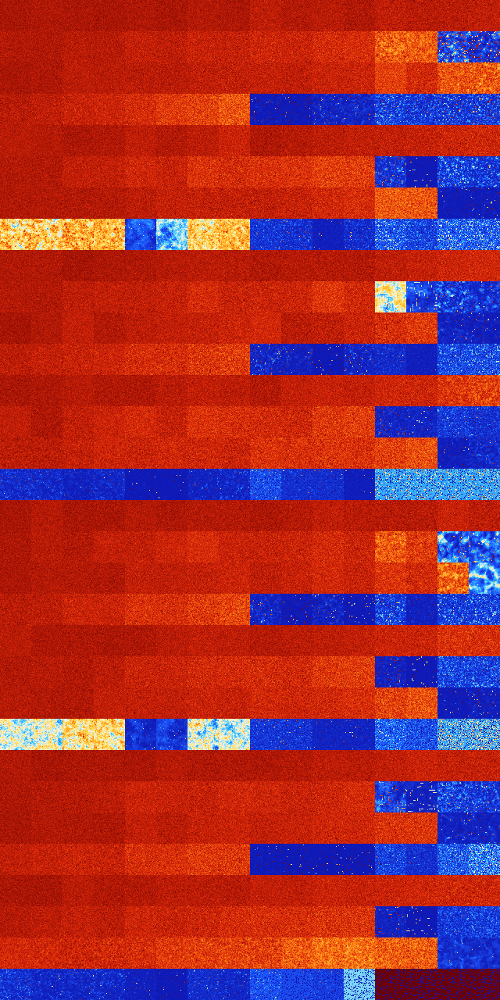

# B123 (7168-7679)

<details>
    <summary>Initial Grid</summary>
    
</details>


<details>
    <summary>Initial Grid RLE</summary>

```
#C Exported from GoGoL (https://github.com/marrow16/gogol)
#C Wrap mode: Toroidal
#C Boundary mode: Dead
#C Step: 0
x = 100, y = 100, rule = B123/S
2bo14bo24bo30bo$6bo5bo10bo12bo3bo13bo$bo46b2o6bo4bo2bo11bo$33bo45b2o$
33bo64bo$48bo3bo8bo4bo16bo$16bo26bo6bo6bo17bo20bo$40bo20bo22bo4bobo$38b
o6bo6bo14bo4bo20bo$6bo2bo15bo6bobo14bo25bo12bo7bo$3bo4b2o74bo$6bo15bo
24bo13bo16bo3bo2bo4bobo$16bo28bo20bo3b2o$12bo$12bobo3bo35bo29bo5bo$2bo
58bo10bo$2bo22bo46bo17b2o$2bobo10bo5bo5bo$13bo5bo13bo23bo13b2o$bo53bo$
3bo4bo15bo36bo23bo$59bo10bo9bo18bo$bo18bo2bo32bo12bo6bo$12bo6bo14bobo9b
o47bo2bo$19bo5bo11bo$37bo10bo21bo18bo$3bo12bo5bo16bo21bo26b2o2bo$28bo6b
o32bo28bo$20bo44bo14bo$5bo29bo28bo8b2obo2bo6bo$13bo3bo11bo$42bobo6bobo
10bo4bobo$6bo9bo26bobo4bo8bo$43bo4bo18bo31bo$92bo$16bo56bo17bo4bo$3bo
52bo11bobo2bo4bo16bo$2bo10bo10bo17bo3bo3bo$14bo3bo54bo22bobo$b2o18bo6bo
43bo15bo6bo$42bo10bo$2bo43bo$8bo29bo25bo28bo$8bo24bo16bo10bo27bo$61bo2b
o18bo2bo$19bo6bo33bo20bo14bo$8bo47bo11bo$32bo9bo10bo17bo$35bo30bo7bo6bo
$38bo7bo15bo12bo2bo16bo$31bo19bo9b2o7bo6b2o18bo$18bo27bo2bo29b2obo16bo$
bo13bo14bo27bo6bo$10bo5bo8bo3bo5bo21bo$6bo3bo7b2o8bo18bo13bo$6bo76bobo$
27bo2bo9bo19bo$27b2o28bo17bobo7bo6bo$o6bo25bo4bo8bo3bo15bo$18bo3bo51bo
4bo$7bo29bo16bo4bo2bo29bo6bo$18bo21bo23bo19bo11b2o$3bo32bo10bo29bo$14bo
5b2o15bo5bo5bo18bo3bobo$13bo7bo27bo35bo7bo$38b2o27bo$15bo33bo20bo11bobo
5bo$6bo4b2o3bo46bo14bo8bo$22bo15b2o4bo9bobo22bo$32bo66bo$7bo19bo3bo5bo
51bo$28bo14bo12bo8bo9bo7bo2bo4bo$10bo8bo21bo27bo$31bo20bo18b2o3bobo$11b
o9bo23bo9bo9bo$5bo58bo8bo$24bo31bo6bo7bo8b2o11bo$33bo16bo$bo32bo26bo8bo
4bo$5bo24bo12bo25bob2o12bobo7bo$29bo30bo34bo$6bo20bo12bo48bo$6bo48bo13b
o13bo11bo$28bo10bo5bo9b2o7bo15bo15bo$26bo19bo10bo16bo2bo5bo7bo$34bo42bo
2bo3bo$28bo65bo$3bo38bobo10bo18bo4bo$6bo5bo38bo2bo7bo27bo$16bo7bo21bo
15bo7bo5bo9bo6bo2bo$5bo7bo6bo22bo31bo7b2o3bo$77bo13bobo2bo$26bo7bo$5bo
26bo15bo18bo8bo20bo$21bo2bo4bob3o21bo11bobo13bo$16bo3bo3b2o6bobo8bo13bo
11bo26bo$2bo17bo64bo5bo$8bo21bo48bo18bo$23bo3bo27bo2bo28bo$o21bo49bo15b
o!
```
</details>
<details>
    <summary>Thumbnail</summary>

</details>
<table>
<tr>
    <td><a href="./7168%20S%20Heat%20Map%20Activity.png"></a><br>S (7168)<br>G>1000</td>    <td><a href="./7169%20S0%20Heat%20Map%20Activity.png"></a><br>S0 (7169)<br>G>1000</td>    <td><a href="./7170%20S1%20Heat%20Map%20Activity.png"></a><br>S1 (7170)<br>G>1000</td>    <td><a href="./7171%20S01%20Heat%20Map%20Activity.png"></a><br>S01 (7171)<br>G>1000</td>    <td><a href="./7172%20S2%20Heat%20Map%20Activity.png"></a><br>S2 (7172)<br>G>1000</td>    <td><a href="./7173%20S02%20Heat%20Map%20Activity.png"></a><br>S02 (7173)<br>G>1000</td>    <td><a href="./7174%20S12%20Heat%20Map%20Activity.png"></a><br>S12 (7174)<br>G>1000</td>    <td><a href="./7175%20S012%20Heat%20Map%20Activity.png"></a><br>S012 (7175)<br>G>1000</td>    <td><a href="./7176%20S3%20Heat%20Map%20Activity.png"></a><br>S3 (7176)<br>G>1000</td>    <td><a href="./7177%20S03%20Heat%20Map%20Activity.png"></a><br>S03 (7177)<br>G>1000</td>    <td><a href="./7178%20S13%20Heat%20Map%20Activity.png"></a><br>S13 (7178)<br>G>1000</td>    <td><a href="./7179%20S013%20Heat%20Map%20Activity.png"></a><br>S013 (7179)<br>G>1000</td>    <td><a href="./7180%20S23%20Heat%20Map%20Activity.png"></a><br>S23 (7180)<br>G>1000</td>    <td><a href="./7181%20S023%20Heat%20Map%20Activity.png"></a><br>S023 (7181)<br>G>1000</td>    <td><a href="./7182%20S123%20Heat%20Map%20Activity.png"></a><br>S123 (7182)<br>G>1000</td>    <td><a href="./7183%20S0123%20Heat%20Map%20Activity.png"></a><br>S0123 (7183)<br>G>1000</td></tr>
<tr>
    <td><a href="./7184%20S4%20Heat%20Map%20Activity.png"></a><br>S4 (7184)<br>G>1000</td>    <td><a href="./7185%20S04%20Heat%20Map%20Activity.png"></a><br>S04 (7185)<br>G>1000</td>    <td><a href="./7186%20S14%20Heat%20Map%20Activity.png"></a><br>S14 (7186)<br>G>1000</td>    <td><a href="./7187%20S014%20Heat%20Map%20Activity.png"></a><br>S014 (7187)<br>G>1000</td>    <td><a href="./7188%20S24%20Heat%20Map%20Activity.png"></a><br>S24 (7188)<br>G>1000</td>    <td><a href="./7189%20S024%20Heat%20Map%20Activity.png"></a><br>S024 (7189)<br>G>1000</td>    <td><a href="./7190%20S124%20Heat%20Map%20Activity.png"></a><br>S124 (7190)<br>G>1000</td>    <td><a href="./7191%20S0124%20Heat%20Map%20Activity.png"></a><br>S0124 (7191)<br>G>1000</td>    <td><a href="./7192%20S34%20Heat%20Map%20Activity.png"></a><br>S34 (7192)<br>G>1000</td>    <td><a href="./7193%20S034%20Heat%20Map%20Activity.png"></a><br>S034 (7193)<br>G>1000</td>    <td><a href="./7194%20S134%20Heat%20Map%20Activity.png"></a><br>S134 (7194)<br>G>1000</td>    <td><a href="./7195%20S0134%20Heat%20Map%20Activity.png"></a><br>S0134 (7195)<br>G>1000</td>    <td><a href="./7196%20S234%20Heat%20Map%20Activity.png"></a><br>S234 (7196)<br>G>1000</td>    <td><a href="./7197%20S0234%20Heat%20Map%20Activity.png"></a><br>S0234 (7197)<br>G>1000</td>    <td><a href="./7198%20S1234%20Heat%20Map%20Activity.png"></a><br>S1234 (7198)<br>R@219,p8</td>    <td><a href="./7199%20S01234%20Heat%20Map%20Activity.png"></a><br>S01234 (7199)<br>R@335,p120</td></tr>
<tr>
    <td><a href="./7200%20S5%20Heat%20Map%20Activity.png"></a><br>S5 (7200)<br>G>1000</td>    <td><a href="./7201%20S05%20Heat%20Map%20Activity.png"></a><br>S05 (7201)<br>G>1000</td>    <td><a href="./7202%20S15%20Heat%20Map%20Activity.png"></a><br>S15 (7202)<br>G>1000</td>    <td><a href="./7203%20S015%20Heat%20Map%20Activity.png"></a><br>S015 (7203)<br>G>1000</td>    <td><a href="./7204%20S25%20Heat%20Map%20Activity.png"></a><br>S25 (7204)<br>G>1000</td>    <td><a href="./7205%20S025%20Heat%20Map%20Activity.png"></a><br>S025 (7205)<br>G>1000</td>    <td><a href="./7206%20S125%20Heat%20Map%20Activity.png"></a><br>S125 (7206)<br>G>1000</td>    <td><a href="./7207%20S0125%20Heat%20Map%20Activity.png"></a><br>S0125 (7207)<br>G>1000</td>    <td><a href="./7208%20S35%20Heat%20Map%20Activity.png"></a><br>S35 (7208)<br>G>1000</td>    <td><a href="./7209%20S035%20Heat%20Map%20Activity.png"></a><br>S035 (7209)<br>G>1000</td>    <td><a href="./7210%20S135%20Heat%20Map%20Activity.png"></a><br>S135 (7210)<br>G>1000</td>    <td><a href="./7211%20S0135%20Heat%20Map%20Activity.png"></a><br>S0135 (7211)<br>G>1000</td>    <td><a href="./7212%20S235%20Heat%20Map%20Activity.png"></a><br>S235 (7212)<br>G>1000</td>    <td><a href="./7213%20S0235%20Heat%20Map%20Activity.png"></a><br>S0235 (7213)<br>G>1000</td>    <td><a href="./7214%20S1235%20Heat%20Map%20Activity.png"></a><br>S1235 (7214)<br>G>1000</td>    <td><a href="./7215%20S01235%20Heat%20Map%20Activity.png"></a><br>S01235 (7215)<br>G>1000</td></tr>
<tr>
    <td><a href="./7216%20S45%20Heat%20Map%20Activity.png"></a><br>S45 (7216)<br>G>1000</td>    <td><a href="./7217%20S045%20Heat%20Map%20Activity.png"></a><br>S045 (7217)<br>G>1000</td>    <td><a href="./7218%20S145%20Heat%20Map%20Activity.png"></a><br>S145 (7218)<br>G>1000</td>    <td><a href="./7219%20S0145%20Heat%20Map%20Activity.png"></a><br>S0145 (7219)<br>G>1000</td>    <td><a href="./7220%20S245%20Heat%20Map%20Activity.png"></a><br>S245 (7220)<br>G>1000</td>    <td><a href="./7221%20S0245%20Heat%20Map%20Activity.png"></a><br>S0245 (7221)<br>G>1000</td>    <td><a href="./7222%20S1245%20Heat%20Map%20Activity.png"></a><br>S1245 (7222)<br>G>1000</td>    <td><a href="./7223%20S01245%20Heat%20Map%20Activity.png"></a><br>S01245 (7223)<br>G>1000</td>    <td><a href="./7224%20S345%20Heat%20Map%20Activity.png"></a><br>S345 (7224)<br>R@554,p420</td>    <td><a href="./7225%20S0345%20Heat%20Map%20Activity.png"></a><br>S0345 (7225)<br>R@924,p840</td>    <td><a href="./7226%20S1345%20Heat%20Map%20Activity.png"></a><br>S1345 (7226)<br>R@207,p120</td>    <td><a href="./7227%20S01345%20Heat%20Map%20Activity.png"></a><br>S01345 (7227)<br>R@222,p120</td>    <td><a href="./7228%20S2345%20Heat%20Map%20Activity.png"></a><br>S2345 (7228)<br>R@24,p4</td>    <td><a href="./7229%20S02345%20Heat%20Map%20Activity.png"></a><br>S02345 (7229)<br>R@33,p12</td>    <td><a href="./7230%20S12345%20Heat%20Map%20Activity.png"></a><br>S12345 (7230)<br>R@29,p6</td>    <td><a href="./7231%20S012345%20Heat%20Map%20Activity.png"></a><br>S012345 (7231)<br>R@28,p4</td></tr>
<tr>
    <td><a href="./7232%20S6%20Heat%20Map%20Activity.png"></a><br>S6 (7232)<br>G>1000</td>    <td><a href="./7233%20S06%20Heat%20Map%20Activity.png"></a><br>S06 (7233)<br>G>1000</td>    <td><a href="./7234%20S16%20Heat%20Map%20Activity.png"></a><br>S16 (7234)<br>G>1000</td>    <td><a href="./7235%20S016%20Heat%20Map%20Activity.png"></a><br>S016 (7235)<br>G>1000</td>    <td><a href="./7236%20S26%20Heat%20Map%20Activity.png"></a><br>S26 (7236)<br>G>1000</td>    <td><a href="./7237%20S026%20Heat%20Map%20Activity.png"></a><br>S026 (7237)<br>G>1000</td>    <td><a href="./7238%20S126%20Heat%20Map%20Activity.png"></a><br>S126 (7238)<br>G>1000</td>    <td><a href="./7239%20S0126%20Heat%20Map%20Activity.png"></a><br>S0126 (7239)<br>G>1000</td>    <td><a href="./7240%20S36%20Heat%20Map%20Activity.png"></a><br>S36 (7240)<br>G>1000</td>    <td><a href="./7241%20S036%20Heat%20Map%20Activity.png"></a><br>S036 (7241)<br>G>1000</td>    <td><a href="./7242%20S136%20Heat%20Map%20Activity.png"></a><br>S136 (7242)<br>G>1000</td>    <td><a href="./7243%20S0136%20Heat%20Map%20Activity.png"></a><br>S0136 (7243)<br>G>1000</td>    <td><a href="./7244%20S236%20Heat%20Map%20Activity.png"></a><br>S236 (7244)<br>G>1000</td>    <td><a href="./7245%20S0236%20Heat%20Map%20Activity.png"></a><br>S0236 (7245)<br>G>1000</td>    <td><a href="./7246%20S1236%20Heat%20Map%20Activity.png"></a><br>S1236 (7246)<br>G>1000</td>    <td><a href="./7247%20S01236%20Heat%20Map%20Activity.png"></a><br>S01236 (7247)<br>G>1000</td></tr>
<tr>
    <td><a href="./7248%20S46%20Heat%20Map%20Activity.png"></a><br>S46 (7248)<br>G>1000</td>    <td><a href="./7249%20S046%20Heat%20Map%20Activity.png"></a><br>S046 (7249)<br>G>1000</td>    <td><a href="./7250%20S146%20Heat%20Map%20Activity.png"></a><br>S146 (7250)<br>G>1000</td>    <td><a href="./7251%20S0146%20Heat%20Map%20Activity.png"></a><br>S0146 (7251)<br>G>1000</td>    <td><a href="./7252%20S246%20Heat%20Map%20Activity.png"></a><br>S246 (7252)<br>G>1000</td>    <td><a href="./7253%20S0246%20Heat%20Map%20Activity.png"></a><br>S0246 (7253)<br>G>1000</td>    <td><a href="./7254%20S1246%20Heat%20Map%20Activity.png"></a><br>S1246 (7254)<br>G>1000</td>    <td><a href="./7255%20S01246%20Heat%20Map%20Activity.png"></a><br>S01246 (7255)<br>G>1000</td>    <td><a href="./7256%20S346%20Heat%20Map%20Activity.png"></a><br>S346 (7256)<br>G>1000</td>    <td><a href="./7257%20S0346%20Heat%20Map%20Activity.png"></a><br>S0346 (7257)<br>G>1000</td>    <td><a href="./7258%20S1346%20Heat%20Map%20Activity.png"></a><br>S1346 (7258)<br>G>1000</td>    <td><a href="./7259%20S01346%20Heat%20Map%20Activity.png"></a><br>S01346 (7259)<br>G>1000</td>    <td><a href="./7260%20S2346%20Heat%20Map%20Activity.png"></a><br>S2346 (7260)<br>R@82,p24</td>    <td><a href="./7261%20S02346%20Heat%20Map%20Activity.png"></a><br>S02346 (7261)<br>G>1000</td>    <td><a href="./7262%20S12346%20Heat%20Map%20Activity.png"></a><br>S12346 (7262)<br>R@34,p6</td>    <td><a href="./7263%20S012346%20Heat%20Map%20Activity.png"></a><br>S012346 (7263)<br>R@52,p4</td></tr>
<tr>
    <td><a href="./7264%20S56%20Heat%20Map%20Activity.png"></a><br>S56 (7264)<br>G>1000</td>    <td><a href="./7265%20S056%20Heat%20Map%20Activity.png"></a><br>S056 (7265)<br>G>1000</td>    <td><a href="./7266%20S156%20Heat%20Map%20Activity.png"></a><br>S156 (7266)<br>G>1000</td>    <td><a href="./7267%20S0156%20Heat%20Map%20Activity.png"></a><br>S0156 (7267)<br>G>1000</td>    <td><a href="./7268%20S256%20Heat%20Map%20Activity.png"></a><br>S256 (7268)<br>G>1000</td>    <td><a href="./7269%20S0256%20Heat%20Map%20Activity.png"></a><br>S0256 (7269)<br>G>1000</td>    <td><a href="./7270%20S1256%20Heat%20Map%20Activity.png"></a><br>S1256 (7270)<br>G>1000</td>    <td><a href="./7271%20S01256%20Heat%20Map%20Activity.png"></a><br>S01256 (7271)<br>G>1000</td>    <td><a href="./7272%20S356%20Heat%20Map%20Activity.png"></a><br>S356 (7272)<br>G>1000</td>    <td><a href="./7273%20S0356%20Heat%20Map%20Activity.png"></a><br>S0356 (7273)<br>G>1000</td>    <td><a href="./7274%20S1356%20Heat%20Map%20Activity.png"></a><br>S1356 (7274)<br>G>1000</td>    <td><a href="./7275%20S01356%20Heat%20Map%20Activity.png"></a><br>S01356 (7275)<br>G>1000</td>    <td><a href="./7276%20S2356%20Heat%20Map%20Activity.png"></a><br>S2356 (7276)<br>G>1000</td>    <td><a href="./7277%20S02356%20Heat%20Map%20Activity.png"></a><br>S02356 (7277)<br>G>1000</td>    <td><a href="./7278%20S12356%20Heat%20Map%20Activity.png"></a><br>S12356 (7278)<br>G>1000</td>    <td><a href="./7279%20S012356%20Heat%20Map%20Activity.png"></a><br>S012356 (7279)<br>R@717,p504</td></tr>
<tr>
    <td><a href="./7280%20S456%20Heat%20Map%20Activity.png"></a><br>S456 (7280)<br>G>1000</td>    <td><a href="./7281%20S0456%20Heat%20Map%20Activity.png"></a><br>S0456 (7281)<br>G>1000</td>    <td><a href="./7282%20S1456%20Heat%20Map%20Activity.png"></a><br>S1456 (7282)<br>G>1000</td>    <td><a href="./7283%20S01456%20Heat%20Map%20Activity.png"></a><br>S01456 (7283)<br>G>1000</td>    <td><a href="./7284%20S2456%20Heat%20Map%20Activity.png"></a><br>S2456 (7284)<br>G>1000</td>    <td><a href="./7285%20S02456%20Heat%20Map%20Activity.png"></a><br>S02456 (7285)<br>G>1000</td>    <td><a href="./7286%20S12456%20Heat%20Map%20Activity.png"></a><br>S12456 (7286)<br>G>1000</td>    <td><a href="./7287%20S012456%20Heat%20Map%20Activity.png"></a><br>S012456 (7287)<br>G>1000</td>    <td><a href="./7288%20S3456%20Heat%20Map%20Activity.png"></a><br>S3456 (7288)<br>R@18,p4</td>    <td><a href="./7289%20S03456%20Heat%20Map%20Activity.png"></a><br>S03456 (7289)<br>R@25,p12</td>    <td><a href="./7290%20S13456%20Heat%20Map%20Activity.png"></a><br>S13456 (7290)<br>R@76,p60</td>    <td><a href="./7291%20S013456%20Heat%20Map%20Activity.png"></a><br>S013456 (7291)<br>R@33,p12</td>    <td><a href="./7292%20S23456%20Heat%20Map%20Activity.png"></a><br>S23456 (7292)<br>R@11,p2</td>    <td><a href="./7293%20S023456%20Heat%20Map%20Activity.png"></a><br>S023456 (7293)<br>R@16,p6</td>    <td><a href="./7294%20S123456%20Heat%20Map%20Activity.png"></a><br>S123456 (7294)<br>S@9</td>    <td><a href="./7295%20S0123456%20Heat%20Map%20Activity.png"></a><br>S0123456 (7295)<br>S@8</td></tr>
<tr>
    <td><a href="./7296%20S7%20Heat%20Map%20Activity.png"></a><br>S7 (7296)<br>G>1000</td>    <td><a href="./7297%20S07%20Heat%20Map%20Activity.png"></a><br>S07 (7297)<br>G>1000</td>    <td><a href="./7298%20S17%20Heat%20Map%20Activity.png"></a><br>S17 (7298)<br>G>1000</td>    <td><a href="./7299%20S017%20Heat%20Map%20Activity.png"></a><br>S017 (7299)<br>G>1000</td>    <td><a href="./7300%20S27%20Heat%20Map%20Activity.png"></a><br>S27 (7300)<br>G>1000</td>    <td><a href="./7301%20S027%20Heat%20Map%20Activity.png"></a><br>S027 (7301)<br>G>1000</td>    <td><a href="./7302%20S127%20Heat%20Map%20Activity.png"></a><br>S127 (7302)<br>G>1000</td>    <td><a href="./7303%20S0127%20Heat%20Map%20Activity.png"></a><br>S0127 (7303)<br>G>1000</td>    <td><a href="./7304%20S37%20Heat%20Map%20Activity.png"></a><br>S37 (7304)<br>G>1000</td>    <td><a href="./7305%20S037%20Heat%20Map%20Activity.png"></a><br>S037 (7305)<br>G>1000</td>    <td><a href="./7306%20S137%20Heat%20Map%20Activity.png"></a><br>S137 (7306)<br>G>1000</td>    <td><a href="./7307%20S0137%20Heat%20Map%20Activity.png"></a><br>S0137 (7307)<br>G>1000</td>    <td><a href="./7308%20S237%20Heat%20Map%20Activity.png"></a><br>S237 (7308)<br>G>1000</td>    <td><a href="./7309%20S0237%20Heat%20Map%20Activity.png"></a><br>S0237 (7309)<br>G>1000</td>    <td><a href="./7310%20S1237%20Heat%20Map%20Activity.png"></a><br>S1237 (7310)<br>G>1000</td>    <td><a href="./7311%20S01237%20Heat%20Map%20Activity.png"></a><br>S01237 (7311)<br>G>1000</td></tr>
<tr>
    <td><a href="./7312%20S47%20Heat%20Map%20Activity.png"></a><br>S47 (7312)<br>G>1000</td>    <td><a href="./7313%20S047%20Heat%20Map%20Activity.png"></a><br>S047 (7313)<br>G>1000</td>    <td><a href="./7314%20S147%20Heat%20Map%20Activity.png"></a><br>S147 (7314)<br>G>1000</td>    <td><a href="./7315%20S0147%20Heat%20Map%20Activity.png"></a><br>S0147 (7315)<br>G>1000</td>    <td><a href="./7316%20S247%20Heat%20Map%20Activity.png"></a><br>S247 (7316)<br>G>1000</td>    <td><a href="./7317%20S0247%20Heat%20Map%20Activity.png"></a><br>S0247 (7317)<br>G>1000</td>    <td><a href="./7318%20S1247%20Heat%20Map%20Activity.png"></a><br>S1247 (7318)<br>G>1000</td>    <td><a href="./7319%20S01247%20Heat%20Map%20Activity.png"></a><br>S01247 (7319)<br>G>1000</td>    <td><a href="./7320%20S347%20Heat%20Map%20Activity.png"></a><br>S347 (7320)<br>G>1000</td>    <td><a href="./7321%20S0347%20Heat%20Map%20Activity.png"></a><br>S0347 (7321)<br>G>1000</td>    <td><a href="./7322%20S1347%20Heat%20Map%20Activity.png"></a><br>S1347 (7322)<br>G>1000</td>    <td><a href="./7323%20S01347%20Heat%20Map%20Activity.png"></a><br>S01347 (7323)<br>G>1000</td>    <td><a href="./7324%20S2347%20Heat%20Map%20Activity.png"></a><br>S2347 (7324)<br>G>1000</td>    <td><a href="./7325%20S02347%20Heat%20Map%20Activity.png"></a><br>S02347 (7325)<br>G>1000</td>    <td><a href="./7326%20S12347%20Heat%20Map%20Activity.png"></a><br>S12347 (7326)<br>R@102,p12</td>    <td><a href="./7327%20S012347%20Heat%20Map%20Activity.png"></a><br>S012347 (7327)<br>R@199,p84</td></tr>
<tr>
    <td><a href="./7328%20S57%20Heat%20Map%20Activity.png"></a><br>S57 (7328)<br>G>1000</td>    <td><a href="./7329%20S057%20Heat%20Map%20Activity.png"></a><br>S057 (7329)<br>G>1000</td>    <td><a href="./7330%20S157%20Heat%20Map%20Activity.png"></a><br>S157 (7330)<br>G>1000</td>    <td><a href="./7331%20S0157%20Heat%20Map%20Activity.png"></a><br>S0157 (7331)<br>G>1000</td>    <td><a href="./7332%20S257%20Heat%20Map%20Activity.png"></a><br>S257 (7332)<br>G>1000</td>    <td><a href="./7333%20S0257%20Heat%20Map%20Activity.png"></a><br>S0257 (7333)<br>G>1000</td>    <td><a href="./7334%20S1257%20Heat%20Map%20Activity.png"></a><br>S1257 (7334)<br>G>1000</td>    <td><a href="./7335%20S01257%20Heat%20Map%20Activity.png"></a><br>S01257 (7335)<br>G>1000</td>    <td><a href="./7336%20S357%20Heat%20Map%20Activity.png"></a><br>S357 (7336)<br>G>1000</td>    <td><a href="./7337%20S0357%20Heat%20Map%20Activity.png"></a><br>S0357 (7337)<br>G>1000</td>    <td><a href="./7338%20S1357%20Heat%20Map%20Activity.png"></a><br>S1357 (7338)<br>G>1000</td>    <td><a href="./7339%20S01357%20Heat%20Map%20Activity.png"></a><br>S01357 (7339)<br>G>1000</td>    <td><a href="./7340%20S2357%20Heat%20Map%20Activity.png"></a><br>S2357 (7340)<br>G>1000</td>    <td><a href="./7341%20S02357%20Heat%20Map%20Activity.png"></a><br>S02357 (7341)<br>G>1000</td>    <td><a href="./7342%20S12357%20Heat%20Map%20Activity.png"></a><br>S12357 (7342)<br>R@659,p360</td>    <td><a href="./7343%20S012357%20Heat%20Map%20Activity.png"></a><br>S012357 (7343)<br>G>1000</td></tr>
<tr>
    <td><a href="./7344%20S457%20Heat%20Map%20Activity.png"></a><br>S457 (7344)<br>G>1000</td>    <td><a href="./7345%20S0457%20Heat%20Map%20Activity.png"></a><br>S0457 (7345)<br>G>1000</td>    <td><a href="./7346%20S1457%20Heat%20Map%20Activity.png"></a><br>S1457 (7346)<br>G>1000</td>    <td><a href="./7347%20S01457%20Heat%20Map%20Activity.png"></a><br>S01457 (7347)<br>G>1000</td>    <td><a href="./7348%20S2457%20Heat%20Map%20Activity.png"></a><br>S2457 (7348)<br>G>1000</td>    <td><a href="./7349%20S02457%20Heat%20Map%20Activity.png"></a><br>S02457 (7349)<br>G>1000</td>    <td><a href="./7350%20S12457%20Heat%20Map%20Activity.png"></a><br>S12457 (7350)<br>G>1000</td>    <td><a href="./7351%20S012457%20Heat%20Map%20Activity.png"></a><br>S012457 (7351)<br>G>1000</td>    <td><a href="./7352%20S3457%20Heat%20Map%20Activity.png"></a><br>S3457 (7352)<br>R@120,p20</td>    <td><a href="./7353%20S03457%20Heat%20Map%20Activity.png"></a><br>S03457 (7353)<br>R@204,p120</td>    <td><a href="./7354%20S13457%20Heat%20Map%20Activity.png"></a><br>S13457 (7354)<br>G>1000</td>    <td><a href="./7355%20S013457%20Heat%20Map%20Activity.png"></a><br>S013457 (7355)<br>R@143,p60</td>    <td><a href="./7356%20S23457%20Heat%20Map%20Activity.png"></a><br>S23457 (7356)<br>R@38,p6</td>    <td><a href="./7357%20S023457%20Heat%20Map%20Activity.png"></a><br>S023457 (7357)<br>R@101,p84</td>    <td><a href="./7358%20S123457%20Heat%20Map%20Activity.png"></a><br>S123457 (7358)<br>R@14,p2</td>    <td><a href="./7359%20S0123457%20Heat%20Map%20Activity.png"></a><br>S0123457 (7359)<br>R@14,p2</td></tr>
<tr>
    <td><a href="./7360%20S67%20Heat%20Map%20Activity.png"></a><br>S67 (7360)<br>G>1000</td>    <td><a href="./7361%20S067%20Heat%20Map%20Activity.png"></a><br>S067 (7361)<br>G>1000</td>    <td><a href="./7362%20S167%20Heat%20Map%20Activity.png"></a><br>S167 (7362)<br>G>1000</td>    <td><a href="./7363%20S0167%20Heat%20Map%20Activity.png"></a><br>S0167 (7363)<br>G>1000</td>    <td><a href="./7364%20S267%20Heat%20Map%20Activity.png"></a><br>S267 (7364)<br>G>1000</td>    <td><a href="./7365%20S0267%20Heat%20Map%20Activity.png"></a><br>S0267 (7365)<br>G>1000</td>    <td><a href="./7366%20S1267%20Heat%20Map%20Activity.png"></a><br>S1267 (7366)<br>G>1000</td>    <td><a href="./7367%20S01267%20Heat%20Map%20Activity.png"></a><br>S01267 (7367)<br>G>1000</td>    <td><a href="./7368%20S367%20Heat%20Map%20Activity.png"></a><br>S367 (7368)<br>G>1000</td>    <td><a href="./7369%20S0367%20Heat%20Map%20Activity.png"></a><br>S0367 (7369)<br>G>1000</td>    <td><a href="./7370%20S1367%20Heat%20Map%20Activity.png"></a><br>S1367 (7370)<br>G>1000</td>    <td><a href="./7371%20S01367%20Heat%20Map%20Activity.png"></a><br>S01367 (7371)<br>G>1000</td>    <td><a href="./7372%20S2367%20Heat%20Map%20Activity.png"></a><br>S2367 (7372)<br>G>1000</td>    <td><a href="./7373%20S02367%20Heat%20Map%20Activity.png"></a><br>S02367 (7373)<br>G>1000</td>    <td><a href="./7374%20S12367%20Heat%20Map%20Activity.png"></a><br>S12367 (7374)<br>G>1000</td>    <td><a href="./7375%20S012367%20Heat%20Map%20Activity.png"></a><br>S012367 (7375)<br>G>1000</td></tr>
<tr>
    <td><a href="./7376%20S467%20Heat%20Map%20Activity.png"></a><br>S467 (7376)<br>G>1000</td>    <td><a href="./7377%20S0467%20Heat%20Map%20Activity.png"></a><br>S0467 (7377)<br>G>1000</td>    <td><a href="./7378%20S1467%20Heat%20Map%20Activity.png"></a><br>S1467 (7378)<br>G>1000</td>    <td><a href="./7379%20S01467%20Heat%20Map%20Activity.png"></a><br>S01467 (7379)<br>G>1000</td>    <td><a href="./7380%20S2467%20Heat%20Map%20Activity.png"></a><br>S2467 (7380)<br>G>1000</td>    <td><a href="./7381%20S02467%20Heat%20Map%20Activity.png"></a><br>S02467 (7381)<br>G>1000</td>    <td><a href="./7382%20S12467%20Heat%20Map%20Activity.png"></a><br>S12467 (7382)<br>G>1000</td>    <td><a href="./7383%20S012467%20Heat%20Map%20Activity.png"></a><br>S012467 (7383)<br>G>1000</td>    <td><a href="./7384%20S3467%20Heat%20Map%20Activity.png"></a><br>S3467 (7384)<br>G>1000</td>    <td><a href="./7385%20S03467%20Heat%20Map%20Activity.png"></a><br>S03467 (7385)<br>G>1000</td>    <td><a href="./7386%20S13467%20Heat%20Map%20Activity.png"></a><br>S13467 (7386)<br>G>1000</td>    <td><a href="./7387%20S013467%20Heat%20Map%20Activity.png"></a><br>S013467 (7387)<br>G>1000</td>    <td><a href="./7388%20S23467%20Heat%20Map%20Activity.png"></a><br>S23467 (7388)<br>R@114,p60</td>    <td><a href="./7389%20S023467%20Heat%20Map%20Activity.png"></a><br>S023467 (7389)<br>R@132,p84</td>    <td><a href="./7390%20S123467%20Heat%20Map%20Activity.png"></a><br>S123467 (7390)<br>R@32,p6</td>    <td><a href="./7391%20S0123467%20Heat%20Map%20Activity.png"></a><br>S0123467 (7391)<br>R@47,p12</td></tr>
<tr>
    <td><a href="./7392%20S567%20Heat%20Map%20Activity.png"></a><br>S567 (7392)<br>G>1000</td>    <td><a href="./7393%20S0567%20Heat%20Map%20Activity.png"></a><br>S0567 (7393)<br>G>1000</td>    <td><a href="./7394%20S1567%20Heat%20Map%20Activity.png"></a><br>S1567 (7394)<br>G>1000</td>    <td><a href="./7395%20S01567%20Heat%20Map%20Activity.png"></a><br>S01567 (7395)<br>G>1000</td>    <td><a href="./7396%20S2567%20Heat%20Map%20Activity.png"></a><br>S2567 (7396)<br>G>1000</td>    <td><a href="./7397%20S02567%20Heat%20Map%20Activity.png"></a><br>S02567 (7397)<br>G>1000</td>    <td><a href="./7398%20S12567%20Heat%20Map%20Activity.png"></a><br>S12567 (7398)<br>G>1000</td>    <td><a href="./7399%20S012567%20Heat%20Map%20Activity.png"></a><br>S012567 (7399)<br>G>1000</td>    <td><a href="./7400%20S3567%20Heat%20Map%20Activity.png"></a><br>S3567 (7400)<br>G>1000</td>    <td><a href="./7401%20S03567%20Heat%20Map%20Activity.png"></a><br>S03567 (7401)<br>G>1000</td>    <td><a href="./7402%20S13567%20Heat%20Map%20Activity.png"></a><br>S13567 (7402)<br>G>1000</td>    <td><a href="./7403%20S013567%20Heat%20Map%20Activity.png"></a><br>S013567 (7403)<br>G>1000</td>    <td><a href="./7404%20S23567%20Heat%20Map%20Activity.png"></a><br>S23567 (7404)<br>G>1000</td>    <td><a href="./7405%20S023567%20Heat%20Map%20Activity.png"></a><br>S023567 (7405)<br>G>1000</td>    <td><a href="./7406%20S123567%20Heat%20Map%20Activity.png"></a><br>S123567 (7406)<br>G>1000</td>    <td><a href="./7407%20S0123567%20Heat%20Map%20Activity.png"></a><br>S0123567 (7407)<br>R@407,p36</td></tr>
<tr>
    <td><a href="./7408%20S4567%20Heat%20Map%20Activity.png"></a><br>S4567 (7408)<br>R@55,p24</td>    <td><a href="./7409%20S04567%20Heat%20Map%20Activity.png"></a><br>S04567 (7409)<br>R@63,p24</td>    <td><a href="./7410%20S14567%20Heat%20Map%20Activity.png"></a><br>S14567 (7410)<br>R@98,p60</td>    <td><a href="./7411%20S014567%20Heat%20Map%20Activity.png"></a><br>S014567 (7411)<br>R@63,p24</td>    <td><a href="./7412%20S24567%20Heat%20Map%20Activity.png"></a><br>S24567 (7412)<br>R@212,p180</td>    <td><a href="./7413%20S024567%20Heat%20Map%20Activity.png"></a><br>S024567 (7413)<br>R@395,p360</td>    <td><a href="./7414%20S124567%20Heat%20Map%20Activity.png"></a><br>S124567 (7414)<br>R@51,p12</td>    <td><a href="./7415%20S0124567%20Heat%20Map%20Activity.png"></a><br>S0124567 (7415)<br>R@50,p12</td>    <td><a href="./7416%20S34567%20Heat%20Map%20Activity.png"></a><br>S34567 (7416)<br>R@10,p2</td>    <td><a href="./7417%20S034567%20Heat%20Map%20Activity.png"></a><br>S034567 (7417)<br>R@20,p12</td>    <td><a href="./7418%20S134567%20Heat%20Map%20Activity.png"></a><br>S134567 (7418)<br>R@21,p12</td>    <td><a href="./7419%20S0134567%20Heat%20Map%20Activity.png"></a><br>S0134567 (7419)<br>R@76,p60</td>    <td><a href="./7420%20S234567%20Heat%20Map%20Activity.png"></a><br>S234567 (7420)<br>S@7</td>    <td><a href="./7421%20S0234567%20Heat%20Map%20Activity.png"></a><br>S0234567 (7421)<br>S@7</td>    <td><a href="./7422%20S1234567%20Heat%20Map%20Activity.png"></a><br>S1234567 (7422)<br>S@7</td>    <td><a href="./7423%20S01234567%20Heat%20Map%20Activity.png"></a><br>S01234567 (7423)<br>S@7</td></tr>
<tr>
    <td><a href="./7424%20S8%20Heat%20Map%20Activity.png"></a><br>S8 (7424)<br>G>1000</td>    <td><a href="./7425%20S08%20Heat%20Map%20Activity.png"></a><br>S08 (7425)<br>G>1000</td>    <td><a href="./7426%20S18%20Heat%20Map%20Activity.png"></a><br>S18 (7426)<br>G>1000</td>    <td><a href="./7427%20S018%20Heat%20Map%20Activity.png"></a><br>S018 (7427)<br>G>1000</td>    <td><a href="./7428%20S28%20Heat%20Map%20Activity.png"></a><br>S28 (7428)<br>G>1000</td>    <td><a href="./7429%20S028%20Heat%20Map%20Activity.png"></a><br>S028 (7429)<br>G>1000</td>    <td><a href="./7430%20S128%20Heat%20Map%20Activity.png"></a><br>S128 (7430)<br>G>1000</td>    <td><a href="./7431%20S0128%20Heat%20Map%20Activity.png"></a><br>S0128 (7431)<br>G>1000</td>    <td><a href="./7432%20S38%20Heat%20Map%20Activity.png"></a><br>S38 (7432)<br>G>1000</td>    <td><a href="./7433%20S038%20Heat%20Map%20Activity.png"></a><br>S038 (7433)<br>G>1000</td>    <td><a href="./7434%20S138%20Heat%20Map%20Activity.png"></a><br>S138 (7434)<br>G>1000</td>    <td><a href="./7435%20S0138%20Heat%20Map%20Activity.png"></a><br>S0138 (7435)<br>G>1000</td>    <td><a href="./7436%20S238%20Heat%20Map%20Activity.png"></a><br>S238 (7436)<br>G>1000</td>    <td><a href="./7437%20S0238%20Heat%20Map%20Activity.png"></a><br>S0238 (7437)<br>G>1000</td>    <td><a href="./7438%20S1238%20Heat%20Map%20Activity.png"></a><br>S1238 (7438)<br>G>1000</td>    <td><a href="./7439%20S01238%20Heat%20Map%20Activity.png"></a><br>S01238 (7439)<br>G>1000</td></tr>
<tr>
    <td><a href="./7440%20S48%20Heat%20Map%20Activity.png"></a><br>S48 (7440)<br>G>1000</td>    <td><a href="./7441%20S048%20Heat%20Map%20Activity.png"></a><br>S048 (7441)<br>G>1000</td>    <td><a href="./7442%20S148%20Heat%20Map%20Activity.png"></a><br>S148 (7442)<br>G>1000</td>    <td><a href="./7443%20S0148%20Heat%20Map%20Activity.png"></a><br>S0148 (7443)<br>G>1000</td>    <td><a href="./7444%20S248%20Heat%20Map%20Activity.png"></a><br>S248 (7444)<br>G>1000</td>    <td><a href="./7445%20S0248%20Heat%20Map%20Activity.png"></a><br>S0248 (7445)<br>G>1000</td>    <td><a href="./7446%20S1248%20Heat%20Map%20Activity.png"></a><br>S1248 (7446)<br>G>1000</td>    <td><a href="./7447%20S01248%20Heat%20Map%20Activity.png"></a><br>S01248 (7447)<br>G>1000</td>    <td><a href="./7448%20S348%20Heat%20Map%20Activity.png"></a><br>S348 (7448)<br>G>1000</td>    <td><a href="./7449%20S0348%20Heat%20Map%20Activity.png"></a><br>S0348 (7449)<br>G>1000</td>    <td><a href="./7450%20S1348%20Heat%20Map%20Activity.png"></a><br>S1348 (7450)<br>G>1000</td>    <td><a href="./7451%20S01348%20Heat%20Map%20Activity.png"></a><br>S01348 (7451)<br>G>1000</td>    <td><a href="./7452%20S2348%20Heat%20Map%20Activity.png"></a><br>S2348 (7452)<br>G>1000</td>    <td><a href="./7453%20S02348%20Heat%20Map%20Activity.png"></a><br>S02348 (7453)<br>G>1000</td>    <td><a href="./7454%20S12348%20Heat%20Map%20Activity.png"></a><br>S12348 (7454)<br>R@375,p12</td>    <td><a href="./7455%20S012348%20Heat%20Map%20Activity.png"></a><br>S012348 (7455)<br>R@432,p4</td></tr>
<tr>
    <td><a href="./7456%20S58%20Heat%20Map%20Activity.png"></a><br>S58 (7456)<br>G>1000</td>    <td><a href="./7457%20S058%20Heat%20Map%20Activity.png"></a><br>S058 (7457)<br>G>1000</td>    <td><a href="./7458%20S158%20Heat%20Map%20Activity.png"></a><br>S158 (7458)<br>G>1000</td>    <td><a href="./7459%20S0158%20Heat%20Map%20Activity.png"></a><br>S0158 (7459)<br>G>1000</td>    <td><a href="./7460%20S258%20Heat%20Map%20Activity.png"></a><br>S258 (7460)<br>G>1000</td>    <td><a href="./7461%20S0258%20Heat%20Map%20Activity.png"></a><br>S0258 (7461)<br>G>1000</td>    <td><a href="./7462%20S1258%20Heat%20Map%20Activity.png"></a><br>S1258 (7462)<br>G>1000</td>    <td><a href="./7463%20S01258%20Heat%20Map%20Activity.png"></a><br>S01258 (7463)<br>G>1000</td>    <td><a href="./7464%20S358%20Heat%20Map%20Activity.png"></a><br>S358 (7464)<br>G>1000</td>    <td><a href="./7465%20S0358%20Heat%20Map%20Activity.png"></a><br>S0358 (7465)<br>G>1000</td>    <td><a href="./7466%20S1358%20Heat%20Map%20Activity.png"></a><br>S1358 (7466)<br>G>1000</td>    <td><a href="./7467%20S01358%20Heat%20Map%20Activity.png"></a><br>S01358 (7467)<br>G>1000</td>    <td><a href="./7468%20S2358%20Heat%20Map%20Activity.png"></a><br>S2358 (7468)<br>G>1000</td>    <td><a href="./7469%20S02358%20Heat%20Map%20Activity.png"></a><br>S02358 (7469)<br>G>1000</td>    <td><a href="./7470%20S12358%20Heat%20Map%20Activity.png"></a><br>S12358 (7470)<br>G>1000</td>    <td><a href="./7471%20S012358%20Heat%20Map%20Activity.png"></a><br>S012358 (7471)<br>G>1000</td></tr>
<tr>
    <td><a href="./7472%20S458%20Heat%20Map%20Activity.png"></a><br>S458 (7472)<br>G>1000</td>    <td><a href="./7473%20S0458%20Heat%20Map%20Activity.png"></a><br>S0458 (7473)<br>G>1000</td>    <td><a href="./7474%20S1458%20Heat%20Map%20Activity.png"></a><br>S1458 (7474)<br>G>1000</td>    <td><a href="./7475%20S01458%20Heat%20Map%20Activity.png"></a><br>S01458 (7475)<br>G>1000</td>    <td><a href="./7476%20S2458%20Heat%20Map%20Activity.png"></a><br>S2458 (7476)<br>G>1000</td>    <td><a href="./7477%20S02458%20Heat%20Map%20Activity.png"></a><br>S02458 (7477)<br>G>1000</td>    <td><a href="./7478%20S12458%20Heat%20Map%20Activity.png"></a><br>S12458 (7478)<br>G>1000</td>    <td><a href="./7479%20S012458%20Heat%20Map%20Activity.png"></a><br>S012458 (7479)<br>G>1000</td>    <td><a href="./7480%20S3458%20Heat%20Map%20Activity.png"></a><br>S3458 (7480)<br>R@162,p40</td>    <td><a href="./7481%20S03458%20Heat%20Map%20Activity.png"></a><br>S03458 (7481)<br>G>1000</td>    <td><a href="./7482%20S13458%20Heat%20Map%20Activity.png"></a><br>S13458 (7482)<br>R@225,p120</td>    <td><a href="./7483%20S013458%20Heat%20Map%20Activity.png"></a><br>S013458 (7483)<br>R@952,p840</td>    <td><a href="./7484%20S23458%20Heat%20Map%20Activity.png"></a><br>S23458 (7484)<br>R@24,p2</td>    <td><a href="./7485%20S023458%20Heat%20Map%20Activity.png"></a><br>S023458 (7485)<br>R@115,p84</td>    <td><a href="./7486%20S123458%20Heat%20Map%20Activity.png"></a><br>S123458 (7486)<br>R@22,p2</td>    <td><a href="./7487%20S0123458%20Heat%20Map%20Activity.png"></a><br>S0123458 (7487)<br>R@21,p2</td></tr>
<tr>
    <td><a href="./7488%20S68%20Heat%20Map%20Activity.png"></a><br>S68 (7488)<br>G>1000</td>    <td><a href="./7489%20S068%20Heat%20Map%20Activity.png"></a><br>S068 (7489)<br>G>1000</td>    <td><a href="./7490%20S168%20Heat%20Map%20Activity.png"></a><br>S168 (7490)<br>G>1000</td>    <td><a href="./7491%20S0168%20Heat%20Map%20Activity.png"></a><br>S0168 (7491)<br>G>1000</td>    <td><a href="./7492%20S268%20Heat%20Map%20Activity.png"></a><br>S268 (7492)<br>G>1000</td>    <td><a href="./7493%20S0268%20Heat%20Map%20Activity.png"></a><br>S0268 (7493)<br>G>1000</td>    <td><a href="./7494%20S1268%20Heat%20Map%20Activity.png"></a><br>S1268 (7494)<br>G>1000</td>    <td><a href="./7495%20S01268%20Heat%20Map%20Activity.png"></a><br>S01268 (7495)<br>G>1000</td>    <td><a href="./7496%20S368%20Heat%20Map%20Activity.png"></a><br>S368 (7496)<br>G>1000</td>    <td><a href="./7497%20S0368%20Heat%20Map%20Activity.png"></a><br>S0368 (7497)<br>G>1000</td>    <td><a href="./7498%20S1368%20Heat%20Map%20Activity.png"></a><br>S1368 (7498)<br>G>1000</td>    <td><a href="./7499%20S01368%20Heat%20Map%20Activity.png"></a><br>S01368 (7499)<br>G>1000</td>    <td><a href="./7500%20S2368%20Heat%20Map%20Activity.png"></a><br>S2368 (7500)<br>G>1000</td>    <td><a href="./7501%20S02368%20Heat%20Map%20Activity.png"></a><br>S02368 (7501)<br>G>1000</td>    <td><a href="./7502%20S12368%20Heat%20Map%20Activity.png"></a><br>S12368 (7502)<br>G>1000</td>    <td><a href="./7503%20S012368%20Heat%20Map%20Activity.png"></a><br>S012368 (7503)<br>G>1000</td></tr>
<tr>
    <td><a href="./7504%20S468%20Heat%20Map%20Activity.png"></a><br>S468 (7504)<br>G>1000</td>    <td><a href="./7505%20S0468%20Heat%20Map%20Activity.png"></a><br>S0468 (7505)<br>G>1000</td>    <td><a href="./7506%20S1468%20Heat%20Map%20Activity.png"></a><br>S1468 (7506)<br>G>1000</td>    <td><a href="./7507%20S01468%20Heat%20Map%20Activity.png"></a><br>S01468 (7507)<br>G>1000</td>    <td><a href="./7508%20S2468%20Heat%20Map%20Activity.png"></a><br>S2468 (7508)<br>G>1000</td>    <td><a href="./7509%20S02468%20Heat%20Map%20Activity.png"></a><br>S02468 (7509)<br>G>1000</td>    <td><a href="./7510%20S12468%20Heat%20Map%20Activity.png"></a><br>S12468 (7510)<br>G>1000</td>    <td><a href="./7511%20S012468%20Heat%20Map%20Activity.png"></a><br>S012468 (7511)<br>G>1000</td>    <td><a href="./7512%20S3468%20Heat%20Map%20Activity.png"></a><br>S3468 (7512)<br>G>1000</td>    <td><a href="./7513%20S03468%20Heat%20Map%20Activity.png"></a><br>S03468 (7513)<br>G>1000</td>    <td><a href="./7514%20S13468%20Heat%20Map%20Activity.png"></a><br>S13468 (7514)<br>G>1000</td>    <td><a href="./7515%20S013468%20Heat%20Map%20Activity.png"></a><br>S013468 (7515)<br>G>1000</td>    <td><a href="./7516%20S23468%20Heat%20Map%20Activity.png"></a><br>S23468 (7516)<br>R@173,p120</td>    <td><a href="./7517%20S023468%20Heat%20Map%20Activity.png"></a><br>S023468 (7517)<br>G>1000</td>    <td><a href="./7518%20S123468%20Heat%20Map%20Activity.png"></a><br>S123468 (7518)<br>R@29,p6</td>    <td><a href="./7519%20S0123468%20Heat%20Map%20Activity.png"></a><br>S0123468 (7519)<br>R@29,p6</td></tr>
<tr>
    <td><a href="./7520%20S568%20Heat%20Map%20Activity.png"></a><br>S568 (7520)<br>G>1000</td>    <td><a href="./7521%20S0568%20Heat%20Map%20Activity.png"></a><br>S0568 (7521)<br>G>1000</td>    <td><a href="./7522%20S1568%20Heat%20Map%20Activity.png"></a><br>S1568 (7522)<br>G>1000</td>    <td><a href="./7523%20S01568%20Heat%20Map%20Activity.png"></a><br>S01568 (7523)<br>G>1000</td>    <td><a href="./7524%20S2568%20Heat%20Map%20Activity.png"></a><br>S2568 (7524)<br>G>1000</td>    <td><a href="./7525%20S02568%20Heat%20Map%20Activity.png"></a><br>S02568 (7525)<br>G>1000</td>    <td><a href="./7526%20S12568%20Heat%20Map%20Activity.png"></a><br>S12568 (7526)<br>G>1000</td>    <td><a href="./7527%20S012568%20Heat%20Map%20Activity.png"></a><br>S012568 (7527)<br>G>1000</td>    <td><a href="./7528%20S3568%20Heat%20Map%20Activity.png"></a><br>S3568 (7528)<br>G>1000</td>    <td><a href="./7529%20S03568%20Heat%20Map%20Activity.png"></a><br>S03568 (7529)<br>G>1000</td>    <td><a href="./7530%20S13568%20Heat%20Map%20Activity.png"></a><br>S13568 (7530)<br>G>1000</td>    <td><a href="./7531%20S013568%20Heat%20Map%20Activity.png"></a><br>S013568 (7531)<br>G>1000</td>    <td><a href="./7532%20S23568%20Heat%20Map%20Activity.png"></a><br>S23568 (7532)<br>G>1000</td>    <td><a href="./7533%20S023568%20Heat%20Map%20Activity.png"></a><br>S023568 (7533)<br>G>1000</td>    <td><a href="./7534%20S123568%20Heat%20Map%20Activity.png"></a><br>S123568 (7534)<br>G>1000</td>    <td><a href="./7535%20S0123568%20Heat%20Map%20Activity.png"></a><br>S0123568 (7535)<br>R@473,p360</td></tr>
<tr>
    <td><a href="./7536%20S4568%20Heat%20Map%20Activity.png"></a><br>S4568 (7536)<br>G>1000</td>    <td><a href="./7537%20S04568%20Heat%20Map%20Activity.png"></a><br>S04568 (7537)<br>G>1000</td>    <td><a href="./7538%20S14568%20Heat%20Map%20Activity.png"></a><br>S14568 (7538)<br>G>1000</td>    <td><a href="./7539%20S014568%20Heat%20Map%20Activity.png"></a><br>S014568 (7539)<br>G>1000</td>    <td><a href="./7540%20S24568%20Heat%20Map%20Activity.png"></a><br>S24568 (7540)<br>G>1000</td>    <td><a href="./7541%20S024568%20Heat%20Map%20Activity.png"></a><br>S024568 (7541)<br>G>1000</td>    <td><a href="./7542%20S124568%20Heat%20Map%20Activity.png"></a><br>S124568 (7542)<br>G>1000</td>    <td><a href="./7543%20S0124568%20Heat%20Map%20Activity.png"></a><br>S0124568 (7543)<br>G>1000</td>    <td><a href="./7544%20S34568%20Heat%20Map%20Activity.png"></a><br>S34568 (7544)<br>R@17,p4</td>    <td><a href="./7545%20S034568%20Heat%20Map%20Activity.png"></a><br>S034568 (7545)<br>R@21,p6</td>    <td><a href="./7546%20S134568%20Heat%20Map%20Activity.png"></a><br>S134568 (7546)<br>R@45,p30</td>    <td><a href="./7547%20S0134568%20Heat%20Map%20Activity.png"></a><br>S0134568 (7547)<br>R@51,p36</td>    <td><a href="./7548%20S234568%20Heat%20Map%20Activity.png"></a><br>S234568 (7548)<br>R@11,p2</td>    <td><a href="./7549%20S0234568%20Heat%20Map%20Activity.png"></a><br>S0234568 (7549)<br>R@14,p2</td>    <td><a href="./7550%20S1234568%20Heat%20Map%20Activity.png"></a><br>S1234568 (7550)<br>S@9</td>    <td><a href="./7551%20S01234568%20Heat%20Map%20Activity.png"></a><br>S01234568 (7551)<br>S@8</td></tr>
<tr>
    <td><a href="./7552%20S78%20Heat%20Map%20Activity.png"></a><br>S78 (7552)<br>G>1000</td>    <td><a href="./7553%20S078%20Heat%20Map%20Activity.png"></a><br>S078 (7553)<br>G>1000</td>    <td><a href="./7554%20S178%20Heat%20Map%20Activity.png"></a><br>S178 (7554)<br>G>1000</td>    <td><a href="./7555%20S0178%20Heat%20Map%20Activity.png"></a><br>S0178 (7555)<br>G>1000</td>    <td><a href="./7556%20S278%20Heat%20Map%20Activity.png"></a><br>S278 (7556)<br>G>1000</td>    <td><a href="./7557%20S0278%20Heat%20Map%20Activity.png"></a><br>S0278 (7557)<br>G>1000</td>    <td><a href="./7558%20S1278%20Heat%20Map%20Activity.png"></a><br>S1278 (7558)<br>G>1000</td>    <td><a href="./7559%20S01278%20Heat%20Map%20Activity.png"></a><br>S01278 (7559)<br>G>1000</td>    <td><a href="./7560%20S378%20Heat%20Map%20Activity.png"></a><br>S378 (7560)<br>G>1000</td>    <td><a href="./7561%20S0378%20Heat%20Map%20Activity.png"></a><br>S0378 (7561)<br>G>1000</td>    <td><a href="./7562%20S1378%20Heat%20Map%20Activity.png"></a><br>S1378 (7562)<br>G>1000</td>    <td><a href="./7563%20S01378%20Heat%20Map%20Activity.png"></a><br>S01378 (7563)<br>G>1000</td>    <td><a href="./7564%20S2378%20Heat%20Map%20Activity.png"></a><br>S2378 (7564)<br>G>1000</td>    <td><a href="./7565%20S02378%20Heat%20Map%20Activity.png"></a><br>S02378 (7565)<br>G>1000</td>    <td><a href="./7566%20S12378%20Heat%20Map%20Activity.png"></a><br>S12378 (7566)<br>G>1000</td>    <td><a href="./7567%20S012378%20Heat%20Map%20Activity.png"></a><br>S012378 (7567)<br>G>1000</td></tr>
<tr>
    <td><a href="./7568%20S478%20Heat%20Map%20Activity.png"></a><br>S478 (7568)<br>G>1000</td>    <td><a href="./7569%20S0478%20Heat%20Map%20Activity.png"></a><br>S0478 (7569)<br>G>1000</td>    <td><a href="./7570%20S1478%20Heat%20Map%20Activity.png"></a><br>S1478 (7570)<br>G>1000</td>    <td><a href="./7571%20S01478%20Heat%20Map%20Activity.png"></a><br>S01478 (7571)<br>G>1000</td>    <td><a href="./7572%20S2478%20Heat%20Map%20Activity.png"></a><br>S2478 (7572)<br>G>1000</td>    <td><a href="./7573%20S02478%20Heat%20Map%20Activity.png"></a><br>S02478 (7573)<br>G>1000</td>    <td><a href="./7574%20S12478%20Heat%20Map%20Activity.png"></a><br>S12478 (7574)<br>G>1000</td>    <td><a href="./7575%20S012478%20Heat%20Map%20Activity.png"></a><br>S012478 (7575)<br>G>1000</td>    <td><a href="./7576%20S3478%20Heat%20Map%20Activity.png"></a><br>S3478 (7576)<br>G>1000</td>    <td><a href="./7577%20S03478%20Heat%20Map%20Activity.png"></a><br>S03478 (7577)<br>G>1000</td>    <td><a href="./7578%20S13478%20Heat%20Map%20Activity.png"></a><br>S13478 (7578)<br>G>1000</td>    <td><a href="./7579%20S013478%20Heat%20Map%20Activity.png"></a><br>S013478 (7579)<br>G>1000</td>    <td><a href="./7580%20S23478%20Heat%20Map%20Activity.png"></a><br>S23478 (7580)<br>R@468,p120</td>    <td><a href="./7581%20S023478%20Heat%20Map%20Activity.png"></a><br>S023478 (7581)<br>G>1000</td>    <td><a href="./7582%20S123478%20Heat%20Map%20Activity.png"></a><br>S123478 (7582)<br>R@61,p4</td>    <td><a href="./7583%20S0123478%20Heat%20Map%20Activity.png"></a><br>S0123478 (7583)<br>R@76,p24</td></tr>
<tr>
    <td><a href="./7584%20S578%20Heat%20Map%20Activity.png"></a><br>S578 (7584)<br>G>1000</td>    <td><a href="./7585%20S0578%20Heat%20Map%20Activity.png"></a><br>S0578 (7585)<br>G>1000</td>    <td><a href="./7586%20S1578%20Heat%20Map%20Activity.png"></a><br>S1578 (7586)<br>G>1000</td>    <td><a href="./7587%20S01578%20Heat%20Map%20Activity.png"></a><br>S01578 (7587)<br>G>1000</td>    <td><a href="./7588%20S2578%20Heat%20Map%20Activity.png"></a><br>S2578 (7588)<br>G>1000</td>    <td><a href="./7589%20S02578%20Heat%20Map%20Activity.png"></a><br>S02578 (7589)<br>G>1000</td>    <td><a href="./7590%20S12578%20Heat%20Map%20Activity.png"></a><br>S12578 (7590)<br>G>1000</td>    <td><a href="./7591%20S012578%20Heat%20Map%20Activity.png"></a><br>S012578 (7591)<br>G>1000</td>    <td><a href="./7592%20S3578%20Heat%20Map%20Activity.png"></a><br>S3578 (7592)<br>G>1000</td>    <td><a href="./7593%20S03578%20Heat%20Map%20Activity.png"></a><br>S03578 (7593)<br>G>1000</td>    <td><a href="./7594%20S13578%20Heat%20Map%20Activity.png"></a><br>S13578 (7594)<br>G>1000</td>    <td><a href="./7595%20S013578%20Heat%20Map%20Activity.png"></a><br>S013578 (7595)<br>G>1000</td>    <td><a href="./7596%20S23578%20Heat%20Map%20Activity.png"></a><br>S23578 (7596)<br>G>1000</td>    <td><a href="./7597%20S023578%20Heat%20Map%20Activity.png"></a><br>S023578 (7597)<br>G>1000</td>    <td><a href="./7598%20S123578%20Heat%20Map%20Activity.png"></a><br>S123578 (7598)<br>G>1000</td>    <td><a href="./7599%20S0123578%20Heat%20Map%20Activity.png"></a><br>S0123578 (7599)<br>R@925,p360</td></tr>
<tr>
    <td><a href="./7600%20S4578%20Heat%20Map%20Activity.png"></a><br>S4578 (7600)<br>G>1000</td>    <td><a href="./7601%20S04578%20Heat%20Map%20Activity.png"></a><br>S04578 (7601)<br>G>1000</td>    <td><a href="./7602%20S14578%20Heat%20Map%20Activity.png"></a><br>S14578 (7602)<br>G>1000</td>    <td><a href="./7603%20S014578%20Heat%20Map%20Activity.png"></a><br>S014578 (7603)<br>G>1000</td>    <td><a href="./7604%20S24578%20Heat%20Map%20Activity.png"></a><br>S24578 (7604)<br>G>1000</td>    <td><a href="./7605%20S024578%20Heat%20Map%20Activity.png"></a><br>S024578 (7605)<br>G>1000</td>    <td><a href="./7606%20S124578%20Heat%20Map%20Activity.png"></a><br>S124578 (7606)<br>G>1000</td>    <td><a href="./7607%20S0124578%20Heat%20Map%20Activity.png"></a><br>S0124578 (7607)<br>G>1000</td>    <td><a href="./7608%20S34578%20Heat%20Map%20Activity.png"></a><br>S34578 (7608)<br>R@482,p420</td>    <td><a href="./7609%20S034578%20Heat%20Map%20Activity.png"></a><br>S034578 (7609)<br>R@908,p840</td>    <td><a href="./7610%20S134578%20Heat%20Map%20Activity.png"></a><br>S134578 (7610)<br>R@931,p840</td>    <td><a href="./7611%20S0134578%20Heat%20Map%20Activity.png"></a><br>S0134578 (7611)<br>G>1000</td>    <td><a href="./7612%20S234578%20Heat%20Map%20Activity.png"></a><br>S234578 (7612)<br>R@19,p6</td>    <td><a href="./7613%20S0234578%20Heat%20Map%20Activity.png"></a><br>S0234578 (7613)<br>R@33,p12</td>    <td><a href="./7614%20S1234578%20Heat%20Map%20Activity.png"></a><br>S1234578 (7614)<br>R@13,p2</td>    <td><a href="./7615%20S01234578%20Heat%20Map%20Activity.png"></a><br>S01234578 (7615)<br>S@12</td></tr>
<tr>
    <td><a href="./7616%20S678%20Heat%20Map%20Activity.png"></a><br>S678 (7616)<br>G>1000</td>    <td><a href="./7617%20S0678%20Heat%20Map%20Activity.png"></a><br>S0678 (7617)<br>G>1000</td>    <td><a href="./7618%20S1678%20Heat%20Map%20Activity.png"></a><br>S1678 (7618)<br>G>1000</td>    <td><a href="./7619%20S01678%20Heat%20Map%20Activity.png"></a><br>S01678 (7619)<br>G>1000</td>    <td><a href="./7620%20S2678%20Heat%20Map%20Activity.png"></a><br>S2678 (7620)<br>G>1000</td>    <td><a href="./7621%20S02678%20Heat%20Map%20Activity.png"></a><br>S02678 (7621)<br>G>1000</td>    <td><a href="./7622%20S12678%20Heat%20Map%20Activity.png"></a><br>S12678 (7622)<br>G>1000</td>    <td><a href="./7623%20S012678%20Heat%20Map%20Activity.png"></a><br>S012678 (7623)<br>G>1000</td>    <td><a href="./7624%20S3678%20Heat%20Map%20Activity.png"></a><br>S3678 (7624)<br>G>1000</td>    <td><a href="./7625%20S03678%20Heat%20Map%20Activity.png"></a><br>S03678 (7625)<br>G>1000</td>    <td><a href="./7626%20S13678%20Heat%20Map%20Activity.png"></a><br>S13678 (7626)<br>G>1000</td>    <td><a href="./7627%20S013678%20Heat%20Map%20Activity.png"></a><br>S013678 (7627)<br>G>1000</td>    <td><a href="./7628%20S23678%20Heat%20Map%20Activity.png"></a><br>S23678 (7628)<br>G>1000</td>    <td><a href="./7629%20S023678%20Heat%20Map%20Activity.png"></a><br>S023678 (7629)<br>G>1000</td>    <td><a href="./7630%20S123678%20Heat%20Map%20Activity.png"></a><br>S123678 (7630)<br>G>1000</td>    <td><a href="./7631%20S0123678%20Heat%20Map%20Activity.png"></a><br>S0123678 (7631)<br>G>1000</td></tr>
<tr>
    <td><a href="./7632%20S4678%20Heat%20Map%20Activity.png"></a><br>S4678 (7632)<br>G>1000</td>    <td><a href="./7633%20S04678%20Heat%20Map%20Activity.png"></a><br>S04678 (7633)<br>G>1000</td>    <td><a href="./7634%20S14678%20Heat%20Map%20Activity.png"></a><br>S14678 (7634)<br>G>1000</td>    <td><a href="./7635%20S014678%20Heat%20Map%20Activity.png"></a><br>S014678 (7635)<br>G>1000</td>    <td><a href="./7636%20S24678%20Heat%20Map%20Activity.png"></a><br>S24678 (7636)<br>G>1000</td>    <td><a href="./7637%20S024678%20Heat%20Map%20Activity.png"></a><br>S024678 (7637)<br>G>1000</td>    <td><a href="./7638%20S124678%20Heat%20Map%20Activity.png"></a><br>S124678 (7638)<br>G>1000</td>    <td><a href="./7639%20S0124678%20Heat%20Map%20Activity.png"></a><br>S0124678 (7639)<br>G>1000</td>    <td><a href="./7640%20S34678%20Heat%20Map%20Activity.png"></a><br>S34678 (7640)<br>G>1000</td>    <td><a href="./7641%20S034678%20Heat%20Map%20Activity.png"></a><br>S034678 (7641)<br>G>1000</td>    <td><a href="./7642%20S134678%20Heat%20Map%20Activity.png"></a><br>S134678 (7642)<br>G>1000</td>    <td><a href="./7643%20S0134678%20Heat%20Map%20Activity.png"></a><br>S0134678 (7643)<br>G>1000</td>    <td><a href="./7644%20S234678%20Heat%20Map%20Activity.png"></a><br>S234678 (7644)<br>R@173,p120</td>    <td><a href="./7645%20S0234678%20Heat%20Map%20Activity.png"></a><br>S0234678 (7645)<br>G>1000</td>    <td><a href="./7646%20S1234678%20Heat%20Map%20Activity.png"></a><br>S1234678 (7646)<br>R@40,p12</td>    <td><a href="./7647%20S01234678%20Heat%20Map%20Activity.png"></a><br>S01234678 (7647)<br>R@33,p6</td></tr>
<tr>
    <td><a href="./7648%20S5678%20Heat%20Map%20Activity.png"></a><br>S5678 (7648)<br>G>1000</td>    <td><a href="./7649%20S05678%20Heat%20Map%20Activity.png"></a><br>S05678 (7649)<br>G>1000</td>    <td><a href="./7650%20S15678%20Heat%20Map%20Activity.png"></a><br>S15678 (7650)<br>G>1000</td>    <td><a href="./7651%20S015678%20Heat%20Map%20Activity.png"></a><br>S015678 (7651)<br>G>1000</td>    <td><a href="./7652%20S25678%20Heat%20Map%20Activity.png"></a><br>S25678 (7652)<br>G>1000</td>    <td><a href="./7653%20S025678%20Heat%20Map%20Activity.png"></a><br>S025678 (7653)<br>G>1000</td>    <td><a href="./7654%20S125678%20Heat%20Map%20Activity.png"></a><br>S125678 (7654)<br>G>1000</td>    <td><a href="./7655%20S0125678%20Heat%20Map%20Activity.png"></a><br>S0125678 (7655)<br>G>1000</td>    <td><a href="./7656%20S35678%20Heat%20Map%20Activity.png"></a><br>S35678 (7656)<br>G>1000</td>    <td><a href="./7657%20S035678%20Heat%20Map%20Activity.png"></a><br>S035678 (7657)<br>G>1000</td>    <td><a href="./7658%20S135678%20Heat%20Map%20Activity.png"></a><br>S135678 (7658)<br>G>1000</td>    <td><a href="./7659%20S0135678%20Heat%20Map%20Activity.png"></a><br>S0135678 (7659)<br>G>1000</td>    <td><a href="./7660%20S235678%20Heat%20Map%20Activity.png"></a><br>S235678 (7660)<br>G>1000</td>    <td><a href="./7661%20S0235678%20Heat%20Map%20Activity.png"></a><br>S0235678 (7661)<br>G>1000</td>    <td><a href="./7662%20S1235678%20Heat%20Map%20Activity.png"></a><br>S1235678 (7662)<br>R@657,p12</td>    <td><a href="./7663%20S01235678%20Heat%20Map%20Activity.png"></a><br>S01235678 (7663)<br>R@923,p36</td></tr>
<tr>
    <td><a href="./7664%20S45678%20Heat%20Map%20Activity.png"></a><br>S45678 (7664)<br>R@39,p12</td>    <td><a href="./7665%20S045678%20Heat%20Map%20Activity.png"></a><br>S045678 (7665)<br>R@50,p24</td>    <td><a href="./7666%20S145678%20Heat%20Map%20Activity.png"></a><br>S145678 (7666)<br>R@52,p24</td>    <td><a href="./7667%20S0145678%20Heat%20Map%20Activity.png"></a><br>S0145678 (7667)<br>R@37,p12</td>    <td><a href="./7668%20S245678%20Heat%20Map%20Activity.png"></a><br>S245678 (7668)<br>R@66,p36</td>    <td><a href="./7669%20S0245678%20Heat%20Map%20Activity.png"></a><br>S0245678 (7669)<br>R@202,p180</td>    <td><a href="./7670%20S1245678%20Heat%20Map%20Activity.png"></a><br>S1245678 (7670)<br>R@22,p4</td>    <td><a href="./7671%20S01245678%20Heat%20Map%20Activity.png"></a><br>S01245678 (7671)<br>R@33,p12</td>    <td><a href="./7672%20S345678%20Heat%20Map%20Activity.png"></a><br>S345678 (7672)<br>R@9,p2</td>    <td><a href="./7673%20S0345678%20Heat%20Map%20Activity.png"></a><br>S0345678 (7673)<br>R@10,p2</td>    <td><a href="./7674%20S1345678%20Heat%20Map%20Activity.png"></a><br>S1345678 (7674)<br>R@13,p6</td>    <td><a href="./7675%20S01345678%20Heat%20Map%20Activity.png"></a><br>S01345678 (7675)<br>S@6</td>    <td><a href="./7676%20S2345678%20Heat%20Map%20Activity.png"></a><br>S2345678 (7676)<br>S@6</td>    <td><a href="./7677%20S02345678%20Heat%20Map%20Activity.png"></a><br>S02345678 (7677)<br>S@6</td>    <td><a href="./7678%20S12345678%20Heat%20Map%20Activity.png"></a><br>S12345678 (7678)<br>S@6</td>    <td><a href="./7679%20S012345678%20Heat%20Map%20Activity.png"></a><br>S012345678 (7679)<br>S@6</td></tr>
</table>
