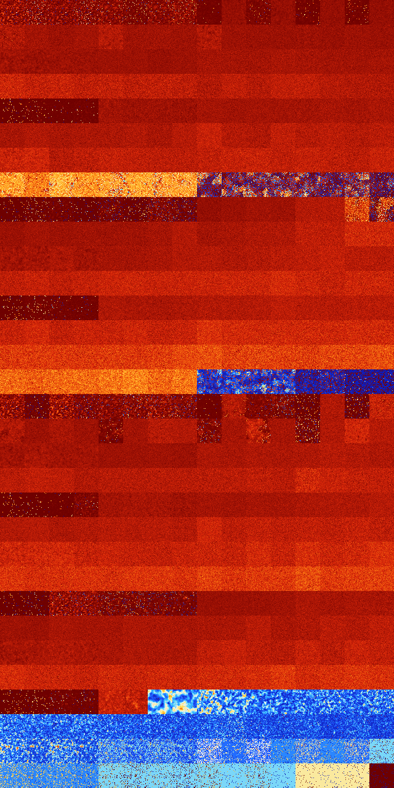

# B1234568 (195584-196095)

<details>
    <summary>Initial Grid</summary>
    
</details>


<details>
    <summary>Initial Grid RLE</summary>

```
#C Exported from GoGoL (https://github.com/marrow16/gogol)
#C Wrap mode: Toroidal
#C Boundary mode: Dead
#C Step: 0
x = 100, y = 100, rule = B1234568/S
84bobo$14b2o2bo26bo35b2o$18bo25bo12bobo10bo19bo6bo$4bo11bo7bo28bo32bo3b
o$6b2obo10b2o9bo$o10bo2bo23bo11bo11bo33b2o$11bo3bo25bo8bobo11bo$10bo8bo
12bo12bo$7bo3bo14bo5bo22bo12bo$o6bo47bo37bo$2bo13bo18bo5bo6bo12bo7bo2bo
8bobo$11bo37bo23b2o6bo3bo$2bo7bo20bo5bo10bo3bo7bo23bo$33bo7bo9bo25bo14b
o$72bo2bo14bo$12bo12bo21bo41bo2bo5bo$8bo26bo7bo10bo44bo$15bo7bo4bo2bo6b
o6bo$10bo9bo30bo13bo12bo10bo$43bo24bo4bo$28bo7bo4bo8bo$20bo10b2o38bo10b
o2bo12bo$32bo$90bo$5bo7bo50bo$19bobo26bo5bo6b2o6bo$39bo16bo19bo22bo$47b
o36bobo$12bo14bo19b2o28bo$2bo79bo3bo3bo2bo2bo$42bo39bo6bo$35bo63bo$15bo
25bo21bo15bo$2bo15bo4bo28b2o5bo36bo$16b2o4bo$9bo75bo$49bo21bo$7bo27bo7b
o12bo4bo20bo10bo$11bo77b3o$2o14bo4bo10bo28bo12b2o3bo2bo3bo$2bobo8bo7b2o
2bo2bo6bo5bo2bo9bobo12bobo$2bo16bo34bobo$o33bo3bo13bo$2bo14bo32bo7bo$
61bo5bo13bo$13bo13bo9bo21bobo5bo22bo3b2o$8bo13bo3bo31bo$b2o45bo3bo15bo
11bo11bo$bo11bo17bo4bo50bo2bo$58bo18bo3bo9bo$2bo22bo8bo26bo13bobo6bo$
23bo11bobo10bo40bo$27bo19bo4bo28bo$42bo$26bo27bo17bo3bo11bo9bo$43bo24bo
5bo$33bo3bo23bo30bo6bo$7bo11bo19bo23bo6bo7bo$3bo15bo$7bo27bo41bo$8bo18b
o18bo42bo$26bo37bo3b2o4bo9bo4bo$bo21bo12bo9bo7bo2bo4bo9bo8bo$16bo14bo
38bo$2b3o36bo9bo$56bo3b2o8bo2bobo2bo2bo$3bo16bo6bo17bo48bo$6bo3bo29bo
49bo8bo$2bo40bo33bo$95bo$11bo3bo11bo31bo16bo4bo$23bo38bo$9bo18bo11bo9bo
14bo28bo$24bo18bo14bo24bo15bo$11bo2bo30bo9bo$39bo6bo2b2o21bo20bo$41bo
35bo17bo$8bo15bo28bo35bo$9bo11bo15bo10bo3bo26bo4bo2bo9b2o$26bo8bo14bo8b
o2bo4bo14bo$7bo57bo$6bo47bo2bo7b2o27bo$23bo8b2o23bo34bo$5bo14bo42bo8bo$
5bo21bo47bo3b2o$24bo28bo3bo26bo2bo$59bo16bo$6bo14bo12bo2bo4bo12bo23bo6b
obo4bo$20bo7bobo4bo8bo$10bo6bo17bo3bo$11bo10bo30bo8bo10bo25bo$66bo12bo
16bo$66bo9bo4bo12bo$18bo39bo12bo25bo$3bo23bo7bo5bo$17bo5bo20bo2bo13bo6b
o9bo$51bo2bo9bobo4bo14bo$21bo29bo19bo6bo13bo$7b2o42bo11bo4bo3bo11bo10bo
$36bo16bo3bo!
```
</details>
<details>
    <summary>Thumbnail</summary>

</details>
<table>
<tr>
    <td><a href="./195584%20S%20Heat%20Map%20Activity.png"></a><br>S (195584)<br>R@19,p4</td>    <td><a href="./195585%20S0%20Heat%20Map%20Activity.png"></a><br>S0 (195585)<br>R@28,p8</td>    <td><a href="./195586%20S1%20Heat%20Map%20Activity.png"></a><br>S1 (195586)<br>R@26,p12</td>    <td><a href="./195587%20S01%20Heat%20Map%20Activity.png"></a><br>S01 (195587)<br>R@31,p12</td>    <td><a href="./195588%20S2%20Heat%20Map%20Activity.png"></a><br>S2 (195588)<br>R@39,p12</td>    <td><a href="./195589%20S02%20Heat%20Map%20Activity.png"></a><br>S02 (195589)<br>R@98,p60</td>    <td><a href="./195590%20S12%20Heat%20Map%20Activity.png"></a><br>S12 (195590)<br>R@46,p12</td>    <td><a href="./195591%20S012%20Heat%20Map%20Activity.png"></a><br>S012 (195591)<br>R@47,p12</td>    <td><a href="./195592%20S3%20Heat%20Map%20Activity.png"></a><br>S3 (195592)<br>R@345,p240</td>    <td><a href="./195593%20S03%20Heat%20Map%20Activity.png"></a><br>S03 (195593)<br>G>1000</td>    <td><a href="./195594%20S13%20Heat%20Map%20Activity.png"></a><br>S13 (195594)<br>R@170,p24</td>    <td><a href="./195595%20S013%20Heat%20Map%20Activity.png"></a><br>S013 (195595)<br>G>1000</td>    <td><a href="./195596%20S23%20Heat%20Map%20Activity.png"></a><br>S23 (195596)<br>G>1000</td>    <td><a href="./195597%20S023%20Heat%20Map%20Activity.png"></a><br>S023 (195597)<br>G>1000</td>    <td><a href="./195598%20S123%20Heat%20Map%20Activity.png"></a><br>S123 (195598)<br>G>1000</td>    <td><a href="./195599%20S0123%20Heat%20Map%20Activity.png"></a><br>S0123 (195599)<br>G>1000</td></tr>
<tr>
    <td><a href="./195600%20S4%20Heat%20Map%20Activity.png"></a><br>S4 (195600)<br>G>1000</td>    <td><a href="./195601%20S04%20Heat%20Map%20Activity.png"></a><br>S04 (195601)<br>G>1000</td>    <td><a href="./195602%20S14%20Heat%20Map%20Activity.png"></a><br>S14 (195602)<br>G>1000</td>    <td><a href="./195603%20S014%20Heat%20Map%20Activity.png"></a><br>S014 (195603)<br>G>1000</td>    <td><a href="./195604%20S24%20Heat%20Map%20Activity.png"></a><br>S24 (195604)<br>G>1000</td>    <td><a href="./195605%20S024%20Heat%20Map%20Activity.png"></a><br>S024 (195605)<br>G>1000</td>    <td><a href="./195606%20S124%20Heat%20Map%20Activity.png"></a><br>S124 (195606)<br>G>1000</td>    <td><a href="./195607%20S0124%20Heat%20Map%20Activity.png"></a><br>S0124 (195607)<br>G>1000</td>    <td><a href="./195608%20S34%20Heat%20Map%20Activity.png"></a><br>S34 (195608)<br>G>1000</td>    <td><a href="./195609%20S034%20Heat%20Map%20Activity.png"></a><br>S034 (195609)<br>G>1000</td>    <td><a href="./195610%20S134%20Heat%20Map%20Activity.png"></a><br>S134 (195610)<br>G>1000</td>    <td><a href="./195611%20S0134%20Heat%20Map%20Activity.png"></a><br>S0134 (195611)<br>G>1000</td>    <td><a href="./195612%20S234%20Heat%20Map%20Activity.png"></a><br>S234 (195612)<br>G>1000</td>    <td><a href="./195613%20S0234%20Heat%20Map%20Activity.png"></a><br>S0234 (195613)<br>G>1000</td>    <td><a href="./195614%20S1234%20Heat%20Map%20Activity.png"></a><br>S1234 (195614)<br>G>1000</td>    <td><a href="./195615%20S01234%20Heat%20Map%20Activity.png"></a><br>S01234 (195615)<br>G>1000</td></tr>
<tr>
    <td><a href="./195616%20S5%20Heat%20Map%20Activity.png"></a><br>S5 (195616)<br>G>1000</td>    <td><a href="./195617%20S05%20Heat%20Map%20Activity.png"></a><br>S05 (195617)<br>G>1000</td>    <td><a href="./195618%20S15%20Heat%20Map%20Activity.png"></a><br>S15 (195618)<br>G>1000</td>    <td><a href="./195619%20S015%20Heat%20Map%20Activity.png"></a><br>S015 (195619)<br>G>1000</td>    <td><a href="./195620%20S25%20Heat%20Map%20Activity.png"></a><br>S25 (195620)<br>G>1000</td>    <td><a href="./195621%20S025%20Heat%20Map%20Activity.png"></a><br>S025 (195621)<br>G>1000</td>    <td><a href="./195622%20S125%20Heat%20Map%20Activity.png"></a><br>S125 (195622)<br>G>1000</td>    <td><a href="./195623%20S0125%20Heat%20Map%20Activity.png"></a><br>S0125 (195623)<br>G>1000</td>    <td><a href="./195624%20S35%20Heat%20Map%20Activity.png"></a><br>S35 (195624)<br>G>1000</td>    <td><a href="./195625%20S035%20Heat%20Map%20Activity.png"></a><br>S035 (195625)<br>G>1000</td>    <td><a href="./195626%20S135%20Heat%20Map%20Activity.png"></a><br>S135 (195626)<br>G>1000</td>    <td><a href="./195627%20S0135%20Heat%20Map%20Activity.png"></a><br>S0135 (195627)<br>G>1000</td>    <td><a href="./195628%20S235%20Heat%20Map%20Activity.png"></a><br>S235 (195628)<br>G>1000</td>    <td><a href="./195629%20S0235%20Heat%20Map%20Activity.png"></a><br>S0235 (195629)<br>G>1000</td>    <td><a href="./195630%20S1235%20Heat%20Map%20Activity.png"></a><br>S1235 (195630)<br>G>1000</td>    <td><a href="./195631%20S01235%20Heat%20Map%20Activity.png"></a><br>S01235 (195631)<br>G>1000</td></tr>
<tr>
    <td><a href="./195632%20S45%20Heat%20Map%20Activity.png"></a><br>S45 (195632)<br>G>1000</td>    <td><a href="./195633%20S045%20Heat%20Map%20Activity.png"></a><br>S045 (195633)<br>G>1000</td>    <td><a href="./195634%20S145%20Heat%20Map%20Activity.png"></a><br>S145 (195634)<br>G>1000</td>    <td><a href="./195635%20S0145%20Heat%20Map%20Activity.png"></a><br>S0145 (195635)<br>G>1000</td>    <td><a href="./195636%20S245%20Heat%20Map%20Activity.png"></a><br>S245 (195636)<br>G>1000</td>    <td><a href="./195637%20S0245%20Heat%20Map%20Activity.png"></a><br>S0245 (195637)<br>G>1000</td>    <td><a href="./195638%20S1245%20Heat%20Map%20Activity.png"></a><br>S1245 (195638)<br>G>1000</td>    <td><a href="./195639%20S01245%20Heat%20Map%20Activity.png"></a><br>S01245 (195639)<br>G>1000</td>    <td><a href="./195640%20S345%20Heat%20Map%20Activity.png"></a><br>S345 (195640)<br>G>1000</td>    <td><a href="./195641%20S0345%20Heat%20Map%20Activity.png"></a><br>S0345 (195641)<br>G>1000</td>    <td><a href="./195642%20S1345%20Heat%20Map%20Activity.png"></a><br>S1345 (195642)<br>G>1000</td>    <td><a href="./195643%20S01345%20Heat%20Map%20Activity.png"></a><br>S01345 (195643)<br>G>1000</td>    <td><a href="./195644%20S2345%20Heat%20Map%20Activity.png"></a><br>S2345 (195644)<br>G>1000</td>    <td><a href="./195645%20S02345%20Heat%20Map%20Activity.png"></a><br>S02345 (195645)<br>G>1000</td>    <td><a href="./195646%20S12345%20Heat%20Map%20Activity.png"></a><br>S12345 (195646)<br>G>1000</td>    <td><a href="./195647%20S012345%20Heat%20Map%20Activity.png"></a><br>S012345 (195647)<br>G>1000</td></tr>
<tr>
    <td><a href="./195648%20S6%20Heat%20Map%20Activity.png"></a><br>S6 (195648)<br>G>1000</td>    <td><a href="./195649%20S06%20Heat%20Map%20Activity.png"></a><br>S06 (195649)<br>R@242,p120</td>    <td><a href="./195650%20S16%20Heat%20Map%20Activity.png"></a><br>S16 (195650)<br>R@291,p240</td>    <td><a href="./195651%20S016%20Heat%20Map%20Activity.png"></a><br>S016 (195651)<br>R@177,p120</td>    <td><a href="./195652%20S26%20Heat%20Map%20Activity.png"></a><br>S26 (195652)<br>G>1000</td>    <td><a href="./195653%20S026%20Heat%20Map%20Activity.png"></a><br>S026 (195653)<br>G>1000</td>    <td><a href="./195654%20S126%20Heat%20Map%20Activity.png"></a><br>S126 (195654)<br>G>1000</td>    <td><a href="./195655%20S0126%20Heat%20Map%20Activity.png"></a><br>S0126 (195655)<br>G>1000</td>    <td><a href="./195656%20S36%20Heat%20Map%20Activity.png"></a><br>S36 (195656)<br>G>1000</td>    <td><a href="./195657%20S036%20Heat%20Map%20Activity.png"></a><br>S036 (195657)<br>G>1000</td>    <td><a href="./195658%20S136%20Heat%20Map%20Activity.png"></a><br>S136 (195658)<br>G>1000</td>    <td><a href="./195659%20S0136%20Heat%20Map%20Activity.png"></a><br>S0136 (195659)<br>G>1000</td>    <td><a href="./195660%20S236%20Heat%20Map%20Activity.png"></a><br>S236 (195660)<br>G>1000</td>    <td><a href="./195661%20S0236%20Heat%20Map%20Activity.png"></a><br>S0236 (195661)<br>G>1000</td>    <td><a href="./195662%20S1236%20Heat%20Map%20Activity.png"></a><br>S1236 (195662)<br>G>1000</td>    <td><a href="./195663%20S01236%20Heat%20Map%20Activity.png"></a><br>S01236 (195663)<br>G>1000</td></tr>
<tr>
    <td><a href="./195664%20S46%20Heat%20Map%20Activity.png"></a><br>S46 (195664)<br>G>1000</td>    <td><a href="./195665%20S046%20Heat%20Map%20Activity.png"></a><br>S046 (195665)<br>G>1000</td>    <td><a href="./195666%20S146%20Heat%20Map%20Activity.png"></a><br>S146 (195666)<br>G>1000</td>    <td><a href="./195667%20S0146%20Heat%20Map%20Activity.png"></a><br>S0146 (195667)<br>G>1000</td>    <td><a href="./195668%20S246%20Heat%20Map%20Activity.png"></a><br>S246 (195668)<br>G>1000</td>    <td><a href="./195669%20S0246%20Heat%20Map%20Activity.png"></a><br>S0246 (195669)<br>G>1000</td>    <td><a href="./195670%20S1246%20Heat%20Map%20Activity.png"></a><br>S1246 (195670)<br>G>1000</td>    <td><a href="./195671%20S01246%20Heat%20Map%20Activity.png"></a><br>S01246 (195671)<br>G>1000</td>    <td><a href="./195672%20S346%20Heat%20Map%20Activity.png"></a><br>S346 (195672)<br>G>1000</td>    <td><a href="./195673%20S0346%20Heat%20Map%20Activity.png"></a><br>S0346 (195673)<br>G>1000</td>    <td><a href="./195674%20S1346%20Heat%20Map%20Activity.png"></a><br>S1346 (195674)<br>G>1000</td>    <td><a href="./195675%20S01346%20Heat%20Map%20Activity.png"></a><br>S01346 (195675)<br>G>1000</td>    <td><a href="./195676%20S2346%20Heat%20Map%20Activity.png"></a><br>S2346 (195676)<br>G>1000</td>    <td><a href="./195677%20S02346%20Heat%20Map%20Activity.png"></a><br>S02346 (195677)<br>G>1000</td>    <td><a href="./195678%20S12346%20Heat%20Map%20Activity.png"></a><br>S12346 (195678)<br>G>1000</td>    <td><a href="./195679%20S012346%20Heat%20Map%20Activity.png"></a><br>S012346 (195679)<br>G>1000</td></tr>
<tr>
    <td><a href="./195680%20S56%20Heat%20Map%20Activity.png"></a><br>S56 (195680)<br>G>1000</td>    <td><a href="./195681%20S056%20Heat%20Map%20Activity.png"></a><br>S056 (195681)<br>G>1000</td>    <td><a href="./195682%20S156%20Heat%20Map%20Activity.png"></a><br>S156 (195682)<br>G>1000</td>    <td><a href="./195683%20S0156%20Heat%20Map%20Activity.png"></a><br>S0156 (195683)<br>G>1000</td>    <td><a href="./195684%20S256%20Heat%20Map%20Activity.png"></a><br>S256 (195684)<br>G>1000</td>    <td><a href="./195685%20S0256%20Heat%20Map%20Activity.png"></a><br>S0256 (195685)<br>G>1000</td>    <td><a href="./195686%20S1256%20Heat%20Map%20Activity.png"></a><br>S1256 (195686)<br>G>1000</td>    <td><a href="./195687%20S01256%20Heat%20Map%20Activity.png"></a><br>S01256 (195687)<br>G>1000</td>    <td><a href="./195688%20S356%20Heat%20Map%20Activity.png"></a><br>S356 (195688)<br>G>1000</td>    <td><a href="./195689%20S0356%20Heat%20Map%20Activity.png"></a><br>S0356 (195689)<br>G>1000</td>    <td><a href="./195690%20S1356%20Heat%20Map%20Activity.png"></a><br>S1356 (195690)<br>G>1000</td>    <td><a href="./195691%20S01356%20Heat%20Map%20Activity.png"></a><br>S01356 (195691)<br>G>1000</td>    <td><a href="./195692%20S2356%20Heat%20Map%20Activity.png"></a><br>S2356 (195692)<br>G>1000</td>    <td><a href="./195693%20S02356%20Heat%20Map%20Activity.png"></a><br>S02356 (195693)<br>G>1000</td>    <td><a href="./195694%20S12356%20Heat%20Map%20Activity.png"></a><br>S12356 (195694)<br>G>1000</td>    <td><a href="./195695%20S012356%20Heat%20Map%20Activity.png"></a><br>S012356 (195695)<br>G>1000</td></tr>
<tr>
    <td><a href="./195696%20S456%20Heat%20Map%20Activity.png"></a><br>S456 (195696)<br>G>1000</td>    <td><a href="./195697%20S0456%20Heat%20Map%20Activity.png"></a><br>S0456 (195697)<br>G>1000</td>    <td><a href="./195698%20S1456%20Heat%20Map%20Activity.png"></a><br>S1456 (195698)<br>G>1000</td>    <td><a href="./195699%20S01456%20Heat%20Map%20Activity.png"></a><br>S01456 (195699)<br>G>1000</td>    <td><a href="./195700%20S2456%20Heat%20Map%20Activity.png"></a><br>S2456 (195700)<br>G>1000</td>    <td><a href="./195701%20S02456%20Heat%20Map%20Activity.png"></a><br>S02456 (195701)<br>G>1000</td>    <td><a href="./195702%20S12456%20Heat%20Map%20Activity.png"></a><br>S12456 (195702)<br>G>1000</td>    <td><a href="./195703%20S012456%20Heat%20Map%20Activity.png"></a><br>S012456 (195703)<br>G>1000</td>    <td><a href="./195704%20S3456%20Heat%20Map%20Activity.png"></a><br>S3456 (195704)<br>G>1000</td>    <td><a href="./195705%20S03456%20Heat%20Map%20Activity.png"></a><br>S03456 (195705)<br>R@691,p180</td>    <td><a href="./195706%20S13456%20Heat%20Map%20Activity.png"></a><br>S13456 (195706)<br>R@454,p120</td>    <td><a href="./195707%20S013456%20Heat%20Map%20Activity.png"></a><br>S013456 (195707)<br>R@843,p120</td>    <td><a href="./195708%20S23456%20Heat%20Map%20Activity.png"></a><br>S23456 (195708)<br>R@459,p120</td>    <td><a href="./195709%20S023456%20Heat%20Map%20Activity.png"></a><br>S023456 (195709)<br>G>1000</td>    <td><a href="./195710%20S123456%20Heat%20Map%20Activity.png"></a><br>S123456 (195710)<br>R@390,p120</td>    <td><a href="./195711%20S0123456%20Heat%20Map%20Activity.png"></a><br>S0123456 (195711)<br>G>1000</td></tr>
<tr>
    <td><a href="./195712%20S7%20Heat%20Map%20Activity.png"></a><br>S7 (195712)<br>R@867,p840</td>    <td><a href="./195713%20S07%20Heat%20Map%20Activity.png"></a><br>S07 (195713)<br>R@155,p120</td>    <td><a href="./195714%20S17%20Heat%20Map%20Activity.png"></a><br>S17 (195714)<br>R@97,p84</td>    <td><a href="./195715%20S017%20Heat%20Map%20Activity.png"></a><br>S017 (195715)<br>R@859,p840</td>    <td><a href="./195716%20S27%20Heat%20Map%20Activity.png"></a><br>S27 (195716)<br>R@223,p120</td>    <td><a href="./195717%20S027%20Heat%20Map%20Activity.png"></a><br>S027 (195717)<br>G>1000</td>    <td><a href="./195718%20S127%20Heat%20Map%20Activity.png"></a><br>S127 (195718)<br>R@103,p12</td>    <td><a href="./195719%20S0127%20Heat%20Map%20Activity.png"></a><br>S0127 (195719)<br>R@189,p120</td>    <td><a href="./195720%20S37%20Heat%20Map%20Activity.png"></a><br>S37 (195720)<br>G>1000</td>    <td><a href="./195721%20S037%20Heat%20Map%20Activity.png"></a><br>S037 (195721)<br>G>1000</td>    <td><a href="./195722%20S137%20Heat%20Map%20Activity.png"></a><br>S137 (195722)<br>G>1000</td>    <td><a href="./195723%20S0137%20Heat%20Map%20Activity.png"></a><br>S0137 (195723)<br>G>1000</td>    <td><a href="./195724%20S237%20Heat%20Map%20Activity.png"></a><br>S237 (195724)<br>G>1000</td>    <td><a href="./195725%20S0237%20Heat%20Map%20Activity.png"></a><br>S0237 (195725)<br>G>1000</td>    <td><a href="./195726%20S1237%20Heat%20Map%20Activity.png"></a><br>S1237 (195726)<br>G>1000</td>    <td><a href="./195727%20S01237%20Heat%20Map%20Activity.png"></a><br>S01237 (195727)<br>R@1000,p24</td></tr>
<tr>
    <td><a href="./195728%20S47%20Heat%20Map%20Activity.png"></a><br>S47 (195728)<br>G>1000</td>    <td><a href="./195729%20S047%20Heat%20Map%20Activity.png"></a><br>S047 (195729)<br>G>1000</td>    <td><a href="./195730%20S147%20Heat%20Map%20Activity.png"></a><br>S147 (195730)<br>G>1000</td>    <td><a href="./195731%20S0147%20Heat%20Map%20Activity.png"></a><br>S0147 (195731)<br>G>1000</td>    <td><a href="./195732%20S247%20Heat%20Map%20Activity.png"></a><br>S247 (195732)<br>G>1000</td>    <td><a href="./195733%20S0247%20Heat%20Map%20Activity.png"></a><br>S0247 (195733)<br>G>1000</td>    <td><a href="./195734%20S1247%20Heat%20Map%20Activity.png"></a><br>S1247 (195734)<br>G>1000</td>    <td><a href="./195735%20S01247%20Heat%20Map%20Activity.png"></a><br>S01247 (195735)<br>G>1000</td>    <td><a href="./195736%20S347%20Heat%20Map%20Activity.png"></a><br>S347 (195736)<br>G>1000</td>    <td><a href="./195737%20S0347%20Heat%20Map%20Activity.png"></a><br>S0347 (195737)<br>G>1000</td>    <td><a href="./195738%20S1347%20Heat%20Map%20Activity.png"></a><br>S1347 (195738)<br>G>1000</td>    <td><a href="./195739%20S01347%20Heat%20Map%20Activity.png"></a><br>S01347 (195739)<br>G>1000</td>    <td><a href="./195740%20S2347%20Heat%20Map%20Activity.png"></a><br>S2347 (195740)<br>G>1000</td>    <td><a href="./195741%20S02347%20Heat%20Map%20Activity.png"></a><br>S02347 (195741)<br>G>1000</td>    <td><a href="./195742%20S12347%20Heat%20Map%20Activity.png"></a><br>S12347 (195742)<br>G>1000</td>    <td><a href="./195743%20S012347%20Heat%20Map%20Activity.png"></a><br>S012347 (195743)<br>G>1000</td></tr>
<tr>
    <td><a href="./195744%20S57%20Heat%20Map%20Activity.png"></a><br>S57 (195744)<br>G>1000</td>    <td><a href="./195745%20S057%20Heat%20Map%20Activity.png"></a><br>S057 (195745)<br>G>1000</td>    <td><a href="./195746%20S157%20Heat%20Map%20Activity.png"></a><br>S157 (195746)<br>G>1000</td>    <td><a href="./195747%20S0157%20Heat%20Map%20Activity.png"></a><br>S0157 (195747)<br>G>1000</td>    <td><a href="./195748%20S257%20Heat%20Map%20Activity.png"></a><br>S257 (195748)<br>G>1000</td>    <td><a href="./195749%20S0257%20Heat%20Map%20Activity.png"></a><br>S0257 (195749)<br>G>1000</td>    <td><a href="./195750%20S1257%20Heat%20Map%20Activity.png"></a><br>S1257 (195750)<br>G>1000</td>    <td><a href="./195751%20S01257%20Heat%20Map%20Activity.png"></a><br>S01257 (195751)<br>G>1000</td>    <td><a href="./195752%20S357%20Heat%20Map%20Activity.png"></a><br>S357 (195752)<br>G>1000</td>    <td><a href="./195753%20S0357%20Heat%20Map%20Activity.png"></a><br>S0357 (195753)<br>G>1000</td>    <td><a href="./195754%20S1357%20Heat%20Map%20Activity.png"></a><br>S1357 (195754)<br>G>1000</td>    <td><a href="./195755%20S01357%20Heat%20Map%20Activity.png"></a><br>S01357 (195755)<br>G>1000</td>    <td><a href="./195756%20S2357%20Heat%20Map%20Activity.png"></a><br>S2357 (195756)<br>G>1000</td>    <td><a href="./195757%20S02357%20Heat%20Map%20Activity.png"></a><br>S02357 (195757)<br>G>1000</td>    <td><a href="./195758%20S12357%20Heat%20Map%20Activity.png"></a><br>S12357 (195758)<br>G>1000</td>    <td><a href="./195759%20S012357%20Heat%20Map%20Activity.png"></a><br>S012357 (195759)<br>G>1000</td></tr>
<tr>
    <td><a href="./195760%20S457%20Heat%20Map%20Activity.png"></a><br>S457 (195760)<br>G>1000</td>    <td><a href="./195761%20S0457%20Heat%20Map%20Activity.png"></a><br>S0457 (195761)<br>G>1000</td>    <td><a href="./195762%20S1457%20Heat%20Map%20Activity.png"></a><br>S1457 (195762)<br>G>1000</td>    <td><a href="./195763%20S01457%20Heat%20Map%20Activity.png"></a><br>S01457 (195763)<br>G>1000</td>    <td><a href="./195764%20S2457%20Heat%20Map%20Activity.png"></a><br>S2457 (195764)<br>G>1000</td>    <td><a href="./195765%20S02457%20Heat%20Map%20Activity.png"></a><br>S02457 (195765)<br>G>1000</td>    <td><a href="./195766%20S12457%20Heat%20Map%20Activity.png"></a><br>S12457 (195766)<br>G>1000</td>    <td><a href="./195767%20S012457%20Heat%20Map%20Activity.png"></a><br>S012457 (195767)<br>G>1000</td>    <td><a href="./195768%20S3457%20Heat%20Map%20Activity.png"></a><br>S3457 (195768)<br>G>1000</td>    <td><a href="./195769%20S03457%20Heat%20Map%20Activity.png"></a><br>S03457 (195769)<br>G>1000</td>    <td><a href="./195770%20S13457%20Heat%20Map%20Activity.png"></a><br>S13457 (195770)<br>G>1000</td>    <td><a href="./195771%20S013457%20Heat%20Map%20Activity.png"></a><br>S013457 (195771)<br>G>1000</td>    <td><a href="./195772%20S23457%20Heat%20Map%20Activity.png"></a><br>S23457 (195772)<br>G>1000</td>    <td><a href="./195773%20S023457%20Heat%20Map%20Activity.png"></a><br>S023457 (195773)<br>G>1000</td>    <td><a href="./195774%20S123457%20Heat%20Map%20Activity.png"></a><br>S123457 (195774)<br>G>1000</td>    <td><a href="./195775%20S0123457%20Heat%20Map%20Activity.png"></a><br>S0123457 (195775)<br>G>1000</td></tr>
<tr>
    <td><a href="./195776%20S67%20Heat%20Map%20Activity.png"></a><br>S67 (195776)<br>G>1000</td>    <td><a href="./195777%20S067%20Heat%20Map%20Activity.png"></a><br>S067 (195777)<br>R@200,p120</td>    <td><a href="./195778%20S167%20Heat%20Map%20Activity.png"></a><br>S167 (195778)<br>R@165,p120</td>    <td><a href="./195779%20S0167%20Heat%20Map%20Activity.png"></a><br>S0167 (195779)<br>R@211,p168</td>    <td><a href="./195780%20S267%20Heat%20Map%20Activity.png"></a><br>S267 (195780)<br>G>1000</td>    <td><a href="./195781%20S0267%20Heat%20Map%20Activity.png"></a><br>S0267 (195781)<br>G>1000</td>    <td><a href="./195782%20S1267%20Heat%20Map%20Activity.png"></a><br>S1267 (195782)<br>G>1000</td>    <td><a href="./195783%20S01267%20Heat%20Map%20Activity.png"></a><br>S01267 (195783)<br>G>1000</td>    <td><a href="./195784%20S367%20Heat%20Map%20Activity.png"></a><br>S367 (195784)<br>G>1000</td>    <td><a href="./195785%20S0367%20Heat%20Map%20Activity.png"></a><br>S0367 (195785)<br>G>1000</td>    <td><a href="./195786%20S1367%20Heat%20Map%20Activity.png"></a><br>S1367 (195786)<br>G>1000</td>    <td><a href="./195787%20S01367%20Heat%20Map%20Activity.png"></a><br>S01367 (195787)<br>G>1000</td>    <td><a href="./195788%20S2367%20Heat%20Map%20Activity.png"></a><br>S2367 (195788)<br>G>1000</td>    <td><a href="./195789%20S02367%20Heat%20Map%20Activity.png"></a><br>S02367 (195789)<br>G>1000</td>    <td><a href="./195790%20S12367%20Heat%20Map%20Activity.png"></a><br>S12367 (195790)<br>G>1000</td>    <td><a href="./195791%20S012367%20Heat%20Map%20Activity.png"></a><br>S012367 (195791)<br>G>1000</td></tr>
<tr>
    <td><a href="./195792%20S467%20Heat%20Map%20Activity.png"></a><br>S467 (195792)<br>G>1000</td>    <td><a href="./195793%20S0467%20Heat%20Map%20Activity.png"></a><br>S0467 (195793)<br>G>1000</td>    <td><a href="./195794%20S1467%20Heat%20Map%20Activity.png"></a><br>S1467 (195794)<br>G>1000</td>    <td><a href="./195795%20S01467%20Heat%20Map%20Activity.png"></a><br>S01467 (195795)<br>G>1000</td>    <td><a href="./195796%20S2467%20Heat%20Map%20Activity.png"></a><br>S2467 (195796)<br>G>1000</td>    <td><a href="./195797%20S02467%20Heat%20Map%20Activity.png"></a><br>S02467 (195797)<br>G>1000</td>    <td><a href="./195798%20S12467%20Heat%20Map%20Activity.png"></a><br>S12467 (195798)<br>G>1000</td>    <td><a href="./195799%20S012467%20Heat%20Map%20Activity.png"></a><br>S012467 (195799)<br>G>1000</td>    <td><a href="./195800%20S3467%20Heat%20Map%20Activity.png"></a><br>S3467 (195800)<br>G>1000</td>    <td><a href="./195801%20S03467%20Heat%20Map%20Activity.png"></a><br>S03467 (195801)<br>G>1000</td>    <td><a href="./195802%20S13467%20Heat%20Map%20Activity.png"></a><br>S13467 (195802)<br>G>1000</td>    <td><a href="./195803%20S013467%20Heat%20Map%20Activity.png"></a><br>S013467 (195803)<br>G>1000</td>    <td><a href="./195804%20S23467%20Heat%20Map%20Activity.png"></a><br>S23467 (195804)<br>G>1000</td>    <td><a href="./195805%20S023467%20Heat%20Map%20Activity.png"></a><br>S023467 (195805)<br>G>1000</td>    <td><a href="./195806%20S123467%20Heat%20Map%20Activity.png"></a><br>S123467 (195806)<br>G>1000</td>    <td><a href="./195807%20S0123467%20Heat%20Map%20Activity.png"></a><br>S0123467 (195807)<br>G>1000</td></tr>
<tr>
    <td><a href="./195808%20S567%20Heat%20Map%20Activity.png"></a><br>S567 (195808)<br>G>1000</td>    <td><a href="./195809%20S0567%20Heat%20Map%20Activity.png"></a><br>S0567 (195809)<br>G>1000</td>    <td><a href="./195810%20S1567%20Heat%20Map%20Activity.png"></a><br>S1567 (195810)<br>G>1000</td>    <td><a href="./195811%20S01567%20Heat%20Map%20Activity.png"></a><br>S01567 (195811)<br>G>1000</td>    <td><a href="./195812%20S2567%20Heat%20Map%20Activity.png"></a><br>S2567 (195812)<br>G>1000</td>    <td><a href="./195813%20S02567%20Heat%20Map%20Activity.png"></a><br>S02567 (195813)<br>G>1000</td>    <td><a href="./195814%20S12567%20Heat%20Map%20Activity.png"></a><br>S12567 (195814)<br>G>1000</td>    <td><a href="./195815%20S012567%20Heat%20Map%20Activity.png"></a><br>S012567 (195815)<br>G>1000</td>    <td><a href="./195816%20S3567%20Heat%20Map%20Activity.png"></a><br>S3567 (195816)<br>G>1000</td>    <td><a href="./195817%20S03567%20Heat%20Map%20Activity.png"></a><br>S03567 (195817)<br>G>1000</td>    <td><a href="./195818%20S13567%20Heat%20Map%20Activity.png"></a><br>S13567 (195818)<br>G>1000</td>    <td><a href="./195819%20S013567%20Heat%20Map%20Activity.png"></a><br>S013567 (195819)<br>G>1000</td>    <td><a href="./195820%20S23567%20Heat%20Map%20Activity.png"></a><br>S23567 (195820)<br>G>1000</td>    <td><a href="./195821%20S023567%20Heat%20Map%20Activity.png"></a><br>S023567 (195821)<br>G>1000</td>    <td><a href="./195822%20S123567%20Heat%20Map%20Activity.png"></a><br>S123567 (195822)<br>G>1000</td>    <td><a href="./195823%20S0123567%20Heat%20Map%20Activity.png"></a><br>S0123567 (195823)<br>G>1000</td></tr>
<tr>
    <td><a href="./195824%20S4567%20Heat%20Map%20Activity.png"></a><br>S4567 (195824)<br>G>1000</td>    <td><a href="./195825%20S04567%20Heat%20Map%20Activity.png"></a><br>S04567 (195825)<br>G>1000</td>    <td><a href="./195826%20S14567%20Heat%20Map%20Activity.png"></a><br>S14567 (195826)<br>G>1000</td>    <td><a href="./195827%20S014567%20Heat%20Map%20Activity.png"></a><br>S014567 (195827)<br>G>1000</td>    <td><a href="./195828%20S24567%20Heat%20Map%20Activity.png"></a><br>S24567 (195828)<br>G>1000</td>    <td><a href="./195829%20S024567%20Heat%20Map%20Activity.png"></a><br>S024567 (195829)<br>G>1000</td>    <td><a href="./195830%20S124567%20Heat%20Map%20Activity.png"></a><br>S124567 (195830)<br>G>1000</td>    <td><a href="./195831%20S0124567%20Heat%20Map%20Activity.png"></a><br>S0124567 (195831)<br>G>1000</td>    <td><a href="./195832%20S34567%20Heat%20Map%20Activity.png"></a><br>S34567 (195832)<br>R@522,p120</td>    <td><a href="./195833%20S034567%20Heat%20Map%20Activity.png"></a><br>S034567 (195833)<br>R@482,p120</td>    <td><a href="./195834%20S134567%20Heat%20Map%20Activity.png"></a><br>S134567 (195834)<br>R@424,p120</td>    <td><a href="./195835%20S0134567%20Heat%20Map%20Activity.png"></a><br>S0134567 (195835)<br>R@494,p24</td>    <td><a href="./195836%20S234567%20Heat%20Map%20Activity.png"></a><br>S234567 (195836)<br>R@293,p240</td>    <td><a href="./195837%20S0234567%20Heat%20Map%20Activity.png"></a><br>S0234567 (195837)<br>R@190,p120</td>    <td><a href="./195838%20S1234567%20Heat%20Map%20Activity.png"></a><br>S1234567 (195838)<br>R@900,p840</td>    <td><a href="./195839%20S01234567%20Heat%20Map%20Activity.png"></a><br>S01234567 (195839)<br>R@896,p840</td></tr>
<tr>
    <td><a href="./195840%20S8%20Heat%20Map%20Activity.png"></a><br>S8 (195840)<br>R@19,p4</td>    <td><a href="./195841%20S08%20Heat%20Map%20Activity.png"></a><br>S08 (195841)<br>R@141,p120</td>    <td><a href="./195842%20S18%20Heat%20Map%20Activity.png"></a><br>S18 (195842)<br>R@16,p6</td>    <td><a href="./195843%20S018%20Heat%20Map%20Activity.png"></a><br>S018 (195843)<br>R@35,p24</td>    <td><a href="./195844%20S28%20Heat%20Map%20Activity.png"></a><br>S28 (195844)<br>R@39,p12</td>    <td><a href="./195845%20S028%20Heat%20Map%20Activity.png"></a><br>S028 (195845)<br>R@50,p12</td>    <td><a href="./195846%20S128%20Heat%20Map%20Activity.png"></a><br>S128 (195846)<br>R@31,p4</td>    <td><a href="./195847%20S0128%20Heat%20Map%20Activity.png"></a><br>S0128 (195847)<br>R@63,p24</td>    <td><a href="./195848%20S38%20Heat%20Map%20Activity.png"></a><br>S38 (195848)<br>R@521,p420</td>    <td><a href="./195849%20S038%20Heat%20Map%20Activity.png"></a><br>S038 (195849)<br>G>1000</td>    <td><a href="./195850%20S138%20Heat%20Map%20Activity.png"></a><br>S138 (195850)<br>R@103,p48</td>    <td><a href="./195851%20S0138%20Heat%20Map%20Activity.png"></a><br>S0138 (195851)<br>G>1000</td>    <td><a href="./195852%20S238%20Heat%20Map%20Activity.png"></a><br>S238 (195852)<br>G>1000</td>    <td><a href="./195853%20S0238%20Heat%20Map%20Activity.png"></a><br>S0238 (195853)<br>G>1000</td>    <td><a href="./195854%20S1238%20Heat%20Map%20Activity.png"></a><br>S1238 (195854)<br>G>1000</td>    <td><a href="./195855%20S01238%20Heat%20Map%20Activity.png"></a><br>S01238 (195855)<br>G>1000</td></tr>
<tr>
    <td><a href="./195856%20S48%20Heat%20Map%20Activity.png"></a><br>S48 (195856)<br>G>1000</td>    <td><a href="./195857%20S048%20Heat%20Map%20Activity.png"></a><br>S048 (195857)<br>G>1000</td>    <td><a href="./195858%20S148%20Heat%20Map%20Activity.png"></a><br>S148 (195858)<br>G>1000</td>    <td><a href="./195859%20S0148%20Heat%20Map%20Activity.png"></a><br>S0148 (195859)<br>G>1000</td>    <td><a href="./195860%20S248%20Heat%20Map%20Activity.png"></a><br>S248 (195860)<br>G>1000</td>    <td><a href="./195861%20S0248%20Heat%20Map%20Activity.png"></a><br>S0248 (195861)<br>G>1000</td>    <td><a href="./195862%20S1248%20Heat%20Map%20Activity.png"></a><br>S1248 (195862)<br>G>1000</td>    <td><a href="./195863%20S01248%20Heat%20Map%20Activity.png"></a><br>S01248 (195863)<br>G>1000</td>    <td><a href="./195864%20S348%20Heat%20Map%20Activity.png"></a><br>S348 (195864)<br>R@492,p60</td>    <td><a href="./195865%20S0348%20Heat%20Map%20Activity.png"></a><br>S0348 (195865)<br>G>1000</td>    <td><a href="./195866%20S1348%20Heat%20Map%20Activity.png"></a><br>S1348 (195866)<br>G>1000</td>    <td><a href="./195867%20S01348%20Heat%20Map%20Activity.png"></a><br>S01348 (195867)<br>G>1000</td>    <td><a href="./195868%20S2348%20Heat%20Map%20Activity.png"></a><br>S2348 (195868)<br>R@451,p240</td>    <td><a href="./195869%20S02348%20Heat%20Map%20Activity.png"></a><br>S02348 (195869)<br>G>1000</td>    <td><a href="./195870%20S12348%20Heat%20Map%20Activity.png"></a><br>S12348 (195870)<br>G>1000</td>    <td><a href="./195871%20S012348%20Heat%20Map%20Activity.png"></a><br>S012348 (195871)<br>G>1000</td></tr>
<tr>
    <td><a href="./195872%20S58%20Heat%20Map%20Activity.png"></a><br>S58 (195872)<br>G>1000</td>    <td><a href="./195873%20S058%20Heat%20Map%20Activity.png"></a><br>S058 (195873)<br>G>1000</td>    <td><a href="./195874%20S158%20Heat%20Map%20Activity.png"></a><br>S158 (195874)<br>G>1000</td>    <td><a href="./195875%20S0158%20Heat%20Map%20Activity.png"></a><br>S0158 (195875)<br>G>1000</td>    <td><a href="./195876%20S258%20Heat%20Map%20Activity.png"></a><br>S258 (195876)<br>G>1000</td>    <td><a href="./195877%20S0258%20Heat%20Map%20Activity.png"></a><br>S0258 (195877)<br>G>1000</td>    <td><a href="./195878%20S1258%20Heat%20Map%20Activity.png"></a><br>S1258 (195878)<br>G>1000</td>    <td><a href="./195879%20S01258%20Heat%20Map%20Activity.png"></a><br>S01258 (195879)<br>G>1000</td>    <td><a href="./195880%20S358%20Heat%20Map%20Activity.png"></a><br>S358 (195880)<br>G>1000</td>    <td><a href="./195881%20S0358%20Heat%20Map%20Activity.png"></a><br>S0358 (195881)<br>G>1000</td>    <td><a href="./195882%20S1358%20Heat%20Map%20Activity.png"></a><br>S1358 (195882)<br>G>1000</td>    <td><a href="./195883%20S01358%20Heat%20Map%20Activity.png"></a><br>S01358 (195883)<br>G>1000</td>    <td><a href="./195884%20S2358%20Heat%20Map%20Activity.png"></a><br>S2358 (195884)<br>G>1000</td>    <td><a href="./195885%20S02358%20Heat%20Map%20Activity.png"></a><br>S02358 (195885)<br>G>1000</td>    <td><a href="./195886%20S12358%20Heat%20Map%20Activity.png"></a><br>S12358 (195886)<br>G>1000</td>    <td><a href="./195887%20S012358%20Heat%20Map%20Activity.png"></a><br>S012358 (195887)<br>G>1000</td></tr>
<tr>
    <td><a href="./195888%20S458%20Heat%20Map%20Activity.png"></a><br>S458 (195888)<br>G>1000</td>    <td><a href="./195889%20S0458%20Heat%20Map%20Activity.png"></a><br>S0458 (195889)<br>G>1000</td>    <td><a href="./195890%20S1458%20Heat%20Map%20Activity.png"></a><br>S1458 (195890)<br>G>1000</td>    <td><a href="./195891%20S01458%20Heat%20Map%20Activity.png"></a><br>S01458 (195891)<br>G>1000</td>    <td><a href="./195892%20S2458%20Heat%20Map%20Activity.png"></a><br>S2458 (195892)<br>G>1000</td>    <td><a href="./195893%20S02458%20Heat%20Map%20Activity.png"></a><br>S02458 (195893)<br>G>1000</td>    <td><a href="./195894%20S12458%20Heat%20Map%20Activity.png"></a><br>S12458 (195894)<br>G>1000</td>    <td><a href="./195895%20S012458%20Heat%20Map%20Activity.png"></a><br>S012458 (195895)<br>G>1000</td>    <td><a href="./195896%20S3458%20Heat%20Map%20Activity.png"></a><br>S3458 (195896)<br>G>1000</td>    <td><a href="./195897%20S03458%20Heat%20Map%20Activity.png"></a><br>S03458 (195897)<br>G>1000</td>    <td><a href="./195898%20S13458%20Heat%20Map%20Activity.png"></a><br>S13458 (195898)<br>G>1000</td>    <td><a href="./195899%20S013458%20Heat%20Map%20Activity.png"></a><br>S013458 (195899)<br>G>1000</td>    <td><a href="./195900%20S23458%20Heat%20Map%20Activity.png"></a><br>S23458 (195900)<br>G>1000</td>    <td><a href="./195901%20S023458%20Heat%20Map%20Activity.png"></a><br>S023458 (195901)<br>G>1000</td>    <td><a href="./195902%20S123458%20Heat%20Map%20Activity.png"></a><br>S123458 (195902)<br>G>1000</td>    <td><a href="./195903%20S0123458%20Heat%20Map%20Activity.png"></a><br>S0123458 (195903)<br>G>1000</td></tr>
<tr>
    <td><a href="./195904%20S68%20Heat%20Map%20Activity.png"></a><br>S68 (195904)<br>G>1000</td>    <td><a href="./195905%20S068%20Heat%20Map%20Activity.png"></a><br>S068 (195905)<br>R@944,p840</td>    <td><a href="./195906%20S168%20Heat%20Map%20Activity.png"></a><br>S168 (195906)<br>R@305,p240</td>    <td><a href="./195907%20S0168%20Heat%20Map%20Activity.png"></a><br>S0168 (195907)<br>R@76,p12</td>    <td><a href="./195908%20S268%20Heat%20Map%20Activity.png"></a><br>S268 (195908)<br>G>1000</td>    <td><a href="./195909%20S0268%20Heat%20Map%20Activity.png"></a><br>S0268 (195909)<br>G>1000</td>    <td><a href="./195910%20S1268%20Heat%20Map%20Activity.png"></a><br>S1268 (195910)<br>G>1000</td>    <td><a href="./195911%20S01268%20Heat%20Map%20Activity.png"></a><br>S01268 (195911)<br>G>1000</td>    <td><a href="./195912%20S368%20Heat%20Map%20Activity.png"></a><br>S368 (195912)<br>G>1000</td>    <td><a href="./195913%20S0368%20Heat%20Map%20Activity.png"></a><br>S0368 (195913)<br>G>1000</td>    <td><a href="./195914%20S1368%20Heat%20Map%20Activity.png"></a><br>S1368 (195914)<br>G>1000</td>    <td><a href="./195915%20S01368%20Heat%20Map%20Activity.png"></a><br>S01368 (195915)<br>G>1000</td>    <td><a href="./195916%20S2368%20Heat%20Map%20Activity.png"></a><br>S2368 (195916)<br>G>1000</td>    <td><a href="./195917%20S02368%20Heat%20Map%20Activity.png"></a><br>S02368 (195917)<br>G>1000</td>    <td><a href="./195918%20S12368%20Heat%20Map%20Activity.png"></a><br>S12368 (195918)<br>G>1000</td>    <td><a href="./195919%20S012368%20Heat%20Map%20Activity.png"></a><br>S012368 (195919)<br>G>1000</td></tr>
<tr>
    <td><a href="./195920%20S468%20Heat%20Map%20Activity.png"></a><br>S468 (195920)<br>G>1000</td>    <td><a href="./195921%20S0468%20Heat%20Map%20Activity.png"></a><br>S0468 (195921)<br>G>1000</td>    <td><a href="./195922%20S1468%20Heat%20Map%20Activity.png"></a><br>S1468 (195922)<br>G>1000</td>    <td><a href="./195923%20S01468%20Heat%20Map%20Activity.png"></a><br>S01468 (195923)<br>G>1000</td>    <td><a href="./195924%20S2468%20Heat%20Map%20Activity.png"></a><br>S2468 (195924)<br>G>1000</td>    <td><a href="./195925%20S02468%20Heat%20Map%20Activity.png"></a><br>S02468 (195925)<br>G>1000</td>    <td><a href="./195926%20S12468%20Heat%20Map%20Activity.png"></a><br>S12468 (195926)<br>G>1000</td>    <td><a href="./195927%20S012468%20Heat%20Map%20Activity.png"></a><br>S012468 (195927)<br>G>1000</td>    <td><a href="./195928%20S3468%20Heat%20Map%20Activity.png"></a><br>S3468 (195928)<br>G>1000</td>    <td><a href="./195929%20S03468%20Heat%20Map%20Activity.png"></a><br>S03468 (195929)<br>G>1000</td>    <td><a href="./195930%20S13468%20Heat%20Map%20Activity.png"></a><br>S13468 (195930)<br>G>1000</td>    <td><a href="./195931%20S013468%20Heat%20Map%20Activity.png"></a><br>S013468 (195931)<br>G>1000</td>    <td><a href="./195932%20S23468%20Heat%20Map%20Activity.png"></a><br>S23468 (195932)<br>G>1000</td>    <td><a href="./195933%20S023468%20Heat%20Map%20Activity.png"></a><br>S023468 (195933)<br>G>1000</td>    <td><a href="./195934%20S123468%20Heat%20Map%20Activity.png"></a><br>S123468 (195934)<br>G>1000</td>    <td><a href="./195935%20S0123468%20Heat%20Map%20Activity.png"></a><br>S0123468 (195935)<br>G>1000</td></tr>
<tr>
    <td><a href="./195936%20S568%20Heat%20Map%20Activity.png"></a><br>S568 (195936)<br>G>1000</td>    <td><a href="./195937%20S0568%20Heat%20Map%20Activity.png"></a><br>S0568 (195937)<br>G>1000</td>    <td><a href="./195938%20S1568%20Heat%20Map%20Activity.png"></a><br>S1568 (195938)<br>G>1000</td>    <td><a href="./195939%20S01568%20Heat%20Map%20Activity.png"></a><br>S01568 (195939)<br>G>1000</td>    <td><a href="./195940%20S2568%20Heat%20Map%20Activity.png"></a><br>S2568 (195940)<br>G>1000</td>    <td><a href="./195941%20S02568%20Heat%20Map%20Activity.png"></a><br>S02568 (195941)<br>G>1000</td>    <td><a href="./195942%20S12568%20Heat%20Map%20Activity.png"></a><br>S12568 (195942)<br>G>1000</td>    <td><a href="./195943%20S012568%20Heat%20Map%20Activity.png"></a><br>S012568 (195943)<br>G>1000</td>    <td><a href="./195944%20S3568%20Heat%20Map%20Activity.png"></a><br>S3568 (195944)<br>G>1000</td>    <td><a href="./195945%20S03568%20Heat%20Map%20Activity.png"></a><br>S03568 (195945)<br>G>1000</td>    <td><a href="./195946%20S13568%20Heat%20Map%20Activity.png"></a><br>S13568 (195946)<br>G>1000</td>    <td><a href="./195947%20S013568%20Heat%20Map%20Activity.png"></a><br>S013568 (195947)<br>G>1000</td>    <td><a href="./195948%20S23568%20Heat%20Map%20Activity.png"></a><br>S23568 (195948)<br>G>1000</td>    <td><a href="./195949%20S023568%20Heat%20Map%20Activity.png"></a><br>S023568 (195949)<br>G>1000</td>    <td><a href="./195950%20S123568%20Heat%20Map%20Activity.png"></a><br>S123568 (195950)<br>G>1000</td>    <td><a href="./195951%20S0123568%20Heat%20Map%20Activity.png"></a><br>S0123568 (195951)<br>G>1000</td></tr>
<tr>
    <td><a href="./195952%20S4568%20Heat%20Map%20Activity.png"></a><br>S4568 (195952)<br>G>1000</td>    <td><a href="./195953%20S04568%20Heat%20Map%20Activity.png"></a><br>S04568 (195953)<br>G>1000</td>    <td><a href="./195954%20S14568%20Heat%20Map%20Activity.png"></a><br>S14568 (195954)<br>G>1000</td>    <td><a href="./195955%20S014568%20Heat%20Map%20Activity.png"></a><br>S014568 (195955)<br>G>1000</td>    <td><a href="./195956%20S24568%20Heat%20Map%20Activity.png"></a><br>S24568 (195956)<br>G>1000</td>    <td><a href="./195957%20S024568%20Heat%20Map%20Activity.png"></a><br>S024568 (195957)<br>G>1000</td>    <td><a href="./195958%20S124568%20Heat%20Map%20Activity.png"></a><br>S124568 (195958)<br>G>1000</td>    <td><a href="./195959%20S0124568%20Heat%20Map%20Activity.png"></a><br>S0124568 (195959)<br>G>1000</td>    <td><a href="./195960%20S34568%20Heat%20Map%20Activity.png"></a><br>S34568 (195960)<br>G>1000</td>    <td><a href="./195961%20S034568%20Heat%20Map%20Activity.png"></a><br>S034568 (195961)<br>G>1000</td>    <td><a href="./195962%20S134568%20Heat%20Map%20Activity.png"></a><br>S134568 (195962)<br>G>1000</td>    <td><a href="./195963%20S0134568%20Heat%20Map%20Activity.png"></a><br>S0134568 (195963)<br>G>1000</td>    <td><a href="./195964%20S234568%20Heat%20Map%20Activity.png"></a><br>S234568 (195964)<br>G>1000</td>    <td><a href="./195965%20S0234568%20Heat%20Map%20Activity.png"></a><br>S0234568 (195965)<br>G>1000</td>    <td><a href="./195966%20S1234568%20Heat%20Map%20Activity.png"></a><br>S1234568 (195966)<br>G>1000</td>    <td><a href="./195967%20S01234568%20Heat%20Map%20Activity.png"></a><br>S01234568 (195967)<br>G>1000</td></tr>
<tr>
    <td><a href="./195968%20S78%20Heat%20Map%20Activity.png"></a><br>S78 (195968)<br>R@867,p840</td>    <td><a href="./195969%20S078%20Heat%20Map%20Activity.png"></a><br>S078 (195969)<br>R@499,p480</td>    <td><a href="./195970%20S178%20Heat%20Map%20Activity.png"></a><br>S178 (195970)<br>R@22,p12</td>    <td><a href="./195971%20S0178%20Heat%20Map%20Activity.png"></a><br>S0178 (195971)<br>R@24,p12</td>    <td><a href="./195972%20S278%20Heat%20Map%20Activity.png"></a><br>S278 (195972)<br>R@167,p24</td>    <td><a href="./195973%20S0278%20Heat%20Map%20Activity.png"></a><br>S0278 (195973)<br>R@252,p36</td>    <td><a href="./195974%20S1278%20Heat%20Map%20Activity.png"></a><br>S1278 (195974)<br>R@237,p60</td>    <td><a href="./195975%20S01278%20Heat%20Map%20Activity.png"></a><br>S01278 (195975)<br>R@286,p48</td>    <td><a href="./195976%20S378%20Heat%20Map%20Activity.png"></a><br>S378 (195976)<br>G>1000</td>    <td><a href="./195977%20S0378%20Heat%20Map%20Activity.png"></a><br>S0378 (195977)<br>G>1000</td>    <td><a href="./195978%20S1378%20Heat%20Map%20Activity.png"></a><br>S1378 (195978)<br>G>1000</td>    <td><a href="./195979%20S01378%20Heat%20Map%20Activity.png"></a><br>S01378 (195979)<br>G>1000</td>    <td><a href="./195980%20S2378%20Heat%20Map%20Activity.png"></a><br>S2378 (195980)<br>G>1000</td>    <td><a href="./195981%20S02378%20Heat%20Map%20Activity.png"></a><br>S02378 (195981)<br>G>1000</td>    <td><a href="./195982%20S12378%20Heat%20Map%20Activity.png"></a><br>S12378 (195982)<br>G>1000</td>    <td><a href="./195983%20S012378%20Heat%20Map%20Activity.png"></a><br>S012378 (195983)<br>G>1000</td></tr>
<tr>
    <td><a href="./195984%20S478%20Heat%20Map%20Activity.png"></a><br>S478 (195984)<br>G>1000</td>    <td><a href="./195985%20S0478%20Heat%20Map%20Activity.png"></a><br>S0478 (195985)<br>G>1000</td>    <td><a href="./195986%20S1478%20Heat%20Map%20Activity.png"></a><br>S1478 (195986)<br>G>1000</td>    <td><a href="./195987%20S01478%20Heat%20Map%20Activity.png"></a><br>S01478 (195987)<br>G>1000</td>    <td><a href="./195988%20S2478%20Heat%20Map%20Activity.png"></a><br>S2478 (195988)<br>G>1000</td>    <td><a href="./195989%20S02478%20Heat%20Map%20Activity.png"></a><br>S02478 (195989)<br>G>1000</td>    <td><a href="./195990%20S12478%20Heat%20Map%20Activity.png"></a><br>S12478 (195990)<br>G>1000</td>    <td><a href="./195991%20S012478%20Heat%20Map%20Activity.png"></a><br>S012478 (195991)<br>G>1000</td>    <td><a href="./195992%20S3478%20Heat%20Map%20Activity.png"></a><br>S3478 (195992)<br>G>1000</td>    <td><a href="./195993%20S03478%20Heat%20Map%20Activity.png"></a><br>S03478 (195993)<br>G>1000</td>    <td><a href="./195994%20S13478%20Heat%20Map%20Activity.png"></a><br>S13478 (195994)<br>G>1000</td>    <td><a href="./195995%20S013478%20Heat%20Map%20Activity.png"></a><br>S013478 (195995)<br>G>1000</td>    <td><a href="./195996%20S23478%20Heat%20Map%20Activity.png"></a><br>S23478 (195996)<br>G>1000</td>    <td><a href="./195997%20S023478%20Heat%20Map%20Activity.png"></a><br>S023478 (195997)<br>G>1000</td>    <td><a href="./195998%20S123478%20Heat%20Map%20Activity.png"></a><br>S123478 (195998)<br>G>1000</td>    <td><a href="./195999%20S0123478%20Heat%20Map%20Activity.png"></a><br>S0123478 (195999)<br>G>1000</td></tr>
<tr>
    <td><a href="./196000%20S578%20Heat%20Map%20Activity.png"></a><br>S578 (196000)<br>G>1000</td>    <td><a href="./196001%20S0578%20Heat%20Map%20Activity.png"></a><br>S0578 (196001)<br>G>1000</td>    <td><a href="./196002%20S1578%20Heat%20Map%20Activity.png"></a><br>S1578 (196002)<br>G>1000</td>    <td><a href="./196003%20S01578%20Heat%20Map%20Activity.png"></a><br>S01578 (196003)<br>G>1000</td>    <td><a href="./196004%20S2578%20Heat%20Map%20Activity.png"></a><br>S2578 (196004)<br>G>1000</td>    <td><a href="./196005%20S02578%20Heat%20Map%20Activity.png"></a><br>S02578 (196005)<br>G>1000</td>    <td><a href="./196006%20S12578%20Heat%20Map%20Activity.png"></a><br>S12578 (196006)<br>G>1000</td>    <td><a href="./196007%20S012578%20Heat%20Map%20Activity.png"></a><br>S012578 (196007)<br>G>1000</td>    <td><a href="./196008%20S3578%20Heat%20Map%20Activity.png"></a><br>S3578 (196008)<br>G>1000</td>    <td><a href="./196009%20S03578%20Heat%20Map%20Activity.png"></a><br>S03578 (196009)<br>G>1000</td>    <td><a href="./196010%20S13578%20Heat%20Map%20Activity.png"></a><br>S13578 (196010)<br>G>1000</td>    <td><a href="./196011%20S013578%20Heat%20Map%20Activity.png"></a><br>S013578 (196011)<br>G>1000</td>    <td><a href="./196012%20S23578%20Heat%20Map%20Activity.png"></a><br>S23578 (196012)<br>G>1000</td>    <td><a href="./196013%20S023578%20Heat%20Map%20Activity.png"></a><br>S023578 (196013)<br>G>1000</td>    <td><a href="./196014%20S123578%20Heat%20Map%20Activity.png"></a><br>S123578 (196014)<br>G>1000</td>    <td><a href="./196015%20S0123578%20Heat%20Map%20Activity.png"></a><br>S0123578 (196015)<br>G>1000</td></tr>
<tr>
    <td><a href="./196016%20S4578%20Heat%20Map%20Activity.png"></a><br>S4578 (196016)<br>G>1000</td>    <td><a href="./196017%20S04578%20Heat%20Map%20Activity.png"></a><br>S04578 (196017)<br>G>1000</td>    <td><a href="./196018%20S14578%20Heat%20Map%20Activity.png"></a><br>S14578 (196018)<br>G>1000</td>    <td><a href="./196019%20S014578%20Heat%20Map%20Activity.png"></a><br>S014578 (196019)<br>G>1000</td>    <td><a href="./196020%20S24578%20Heat%20Map%20Activity.png"></a><br>S24578 (196020)<br>G>1000</td>    <td><a href="./196021%20S024578%20Heat%20Map%20Activity.png"></a><br>S024578 (196021)<br>G>1000</td>    <td><a href="./196022%20S124578%20Heat%20Map%20Activity.png"></a><br>S124578 (196022)<br>G>1000</td>    <td><a href="./196023%20S0124578%20Heat%20Map%20Activity.png"></a><br>S0124578 (196023)<br>G>1000</td>    <td><a href="./196024%20S34578%20Heat%20Map%20Activity.png"></a><br>S34578 (196024)<br>G>1000</td>    <td><a href="./196025%20S034578%20Heat%20Map%20Activity.png"></a><br>S034578 (196025)<br>G>1000</td>    <td><a href="./196026%20S134578%20Heat%20Map%20Activity.png"></a><br>S134578 (196026)<br>G>1000</td>    <td><a href="./196027%20S0134578%20Heat%20Map%20Activity.png"></a><br>S0134578 (196027)<br>G>1000</td>    <td><a href="./196028%20S234578%20Heat%20Map%20Activity.png"></a><br>S234578 (196028)<br>G>1000</td>    <td><a href="./196029%20S0234578%20Heat%20Map%20Activity.png"></a><br>S0234578 (196029)<br>G>1000</td>    <td><a href="./196030%20S1234578%20Heat%20Map%20Activity.png"></a><br>S1234578 (196030)<br>G>1000</td>    <td><a href="./196031%20S01234578%20Heat%20Map%20Activity.png"></a><br>S01234578 (196031)<br>G>1000</td></tr>
<tr>
    <td><a href="./196032%20S678%20Heat%20Map%20Activity.png"></a><br>S678 (196032)<br>G>1000</td>    <td><a href="./196033%20S0678%20Heat%20Map%20Activity.png"></a><br>S0678 (196033)<br>G>1000</td>    <td><a href="./196034%20S1678%20Heat%20Map%20Activity.png"></a><br>S1678 (196034)<br>R@200,p120</td>    <td><a href="./196035%20S01678%20Heat%20Map%20Activity.png"></a><br>S01678 (196035)<br>R@359,p240</td>    <td><a href="./196036%20S2678%20Heat%20Map%20Activity.png"></a><br>S2678 (196036)<br>G>1000</td>    <td><a href="./196037%20S02678%20Heat%20Map%20Activity.png"></a><br>S02678 (196037)<br>G>1000</td>    <td><a href="./196038%20S12678%20Heat%20Map%20Activity.png"></a><br>S12678 (196038)<br>R@383,p2</td>    <td><a href="./196039%20S012678%20Heat%20Map%20Activity.png"></a><br>S012678 (196039)<br>R@354,p2</td>    <td><a href="./196040%20S3678%20Heat%20Map%20Activity.png"></a><br>S3678 (196040)<br>R@80,p2</td>    <td><a href="./196041%20S03678%20Heat%20Map%20Activity.png"></a><br>S03678 (196041)<br>R@77,p2</td>    <td><a href="./196042%20S13678%20Heat%20Map%20Activity.png"></a><br>S13678 (196042)<br>R@76,p2</td>    <td><a href="./196043%20S013678%20Heat%20Map%20Activity.png"></a><br>S013678 (196043)<br>R@80,p2</td>    <td><a href="./196044%20S23678%20Heat%20Map%20Activity.png"></a><br>S23678 (196044)<br>R@40,p2</td>    <td><a href="./196045%20S023678%20Heat%20Map%20Activity.png"></a><br>S023678 (196045)<br>R@37,p2</td>    <td><a href="./196046%20S123678%20Heat%20Map%20Activity.png"></a><br>S123678 (196046)<br>R@45,p2</td>    <td><a href="./196047%20S0123678%20Heat%20Map%20Activity.png"></a><br>S0123678 (196047)<br>R@35,p2</td></tr>
<tr>
    <td><a href="./196048%20S4678%20Heat%20Map%20Activity.png"></a><br>S4678 (196048)<br>R@27,p2</td>    <td><a href="./196049%20S04678%20Heat%20Map%20Activity.png"></a><br>S04678 (196049)<br>R@31,p4</td>    <td><a href="./196050%20S14678%20Heat%20Map%20Activity.png"></a><br>S14678 (196050)<br>R@29,p4</td>    <td><a href="./196051%20S014678%20Heat%20Map%20Activity.png"></a><br>S014678 (196051)<br>R@27,p2</td>    <td><a href="./196052%20S24678%20Heat%20Map%20Activity.png"></a><br>S24678 (196052)<br>R@24,p2</td>    <td><a href="./196053%20S024678%20Heat%20Map%20Activity.png"></a><br>S024678 (196053)<br>R@26,p2</td>    <td><a href="./196054%20S124678%20Heat%20Map%20Activity.png"></a><br>S124678 (196054)<br>R@25,p2</td>    <td><a href="./196055%20S0124678%20Heat%20Map%20Activity.png"></a><br>S0124678 (196055)<br>R@26,p2</td>    <td><a href="./196056%20S34678%20Heat%20Map%20Activity.png"></a><br>S34678 (196056)<br>R@20,p2</td>    <td><a href="./196057%20S034678%20Heat%20Map%20Activity.png"></a><br>S034678 (196057)<br>R@16,p2</td>    <td><a href="./196058%20S134678%20Heat%20Map%20Activity.png"></a><br>S134678 (196058)<br>R@22,p2</td>    <td><a href="./196059%20S0134678%20Heat%20Map%20Activity.png"></a><br>S0134678 (196059)<br>R@20,p2</td>    <td><a href="./196060%20S234678%20Heat%20Map%20Activity.png"></a><br>S234678 (196060)<br>R@20,p2</td>    <td><a href="./196061%20S0234678%20Heat%20Map%20Activity.png"></a><br>S0234678 (196061)<br>R@23,p2</td>    <td><a href="./196062%20S1234678%20Heat%20Map%20Activity.png"></a><br>S1234678 (196062)<br>R@19,p2</td>    <td><a href="./196063%20S01234678%20Heat%20Map%20Activity.png"></a><br>S01234678 (196063)<br>R@21,p2</td></tr>
<tr>
    <td><a href="./196064%20S5678%20Heat%20Map%20Activity.png"></a><br>S5678 (196064)<br>S@20</td>    <td><a href="./196065%20S05678%20Heat%20Map%20Activity.png"></a><br>S05678 (196065)<br>S@16</td>    <td><a href="./196066%20S15678%20Heat%20Map%20Activity.png"></a><br>S15678 (196066)<br>S@16</td>    <td><a href="./196067%20S015678%20Heat%20Map%20Activity.png"></a><br>S015678 (196067)<br>S@16</td>    <td><a href="./196068%20S25678%20Heat%20Map%20Activity.png"></a><br>S25678 (196068)<br>S@10</td>    <td><a href="./196069%20S025678%20Heat%20Map%20Activity.png"></a><br>S025678 (196069)<br>S@11</td>    <td><a href="./196070%20S125678%20Heat%20Map%20Activity.png"></a><br>S125678 (196070)<br>S@10</td>    <td><a href="./196071%20S0125678%20Heat%20Map%20Activity.png"></a><br>S0125678 (196071)<br>S@12</td>    <td><a href="./196072%20S35678%20Heat%20Map%20Activity.png"></a><br>S35678 (196072)<br>S@9</td>    <td><a href="./196073%20S035678%20Heat%20Map%20Activity.png"></a><br>S035678 (196073)<br>S@9</td>    <td><a href="./196074%20S135678%20Heat%20Map%20Activity.png"></a><br>S135678 (196074)<br>S@9</td>    <td><a href="./196075%20S0135678%20Heat%20Map%20Activity.png"></a><br>S0135678 (196075)<br>S@7</td>    <td><a href="./196076%20S235678%20Heat%20Map%20Activity.png"></a><br>S235678 (196076)<br>S@8</td>    <td><a href="./196077%20S0235678%20Heat%20Map%20Activity.png"></a><br>S0235678 (196077)<br>S@7</td>    <td><a href="./196078%20S1235678%20Heat%20Map%20Activity.png"></a><br>S1235678 (196078)<br>S@8</td>    <td><a href="./196079%20S01235678%20Heat%20Map%20Activity.png"></a><br>S01235678 (196079)<br>S@7</td></tr>
<tr>
    <td><a href="./196080%20S45678%20Heat%20Map%20Activity.png"></a><br>S45678 (196080)<br>S@7</td>    <td><a href="./196081%20S045678%20Heat%20Map%20Activity.png"></a><br>S045678 (196081)<br>S@7</td>    <td><a href="./196082%20S145678%20Heat%20Map%20Activity.png"></a><br>S145678 (196082)<br>S@7</td>    <td><a href="./196083%20S0145678%20Heat%20Map%20Activity.png"></a><br>S0145678 (196083)<br>S@7</td>    <td><a href="./196084%20S245678%20Heat%20Map%20Activity.png"></a><br>S245678 (196084)<br>S@6</td>    <td><a href="./196085%20S0245678%20Heat%20Map%20Activity.png"></a><br>S0245678 (196085)<br>S@6</td>    <td><a href="./196086%20S1245678%20Heat%20Map%20Activity.png"></a><br>S1245678 (196086)<br>S@6</td>    <td><a href="./196087%20S01245678%20Heat%20Map%20Activity.png"></a><br>S01245678 (196087)<br>S@6</td>    <td><a href="./196088%20S345678%20Heat%20Map%20Activity.png"></a><br>S345678 (196088)<br>S@6</td>    <td><a href="./196089%20S0345678%20Heat%20Map%20Activity.png"></a><br>S0345678 (196089)<br>S@6</td>    <td><a href="./196090%20S1345678%20Heat%20Map%20Activity.png"></a><br>S1345678 (196090)<br>S@6</td>    <td><a href="./196091%20S01345678%20Heat%20Map%20Activity.png"></a><br>S01345678 (196091)<br>S@6</td>    <td><a href="./196092%20S2345678%20Heat%20Map%20Activity.png"></a><br>S2345678 (196092)<br>S@6</td>    <td><a href="./196093%20S02345678%20Heat%20Map%20Activity.png"></a><br>S02345678 (196093)<br>S@6</td>    <td><a href="./196094%20S12345678%20Heat%20Map%20Activity.png"></a><br>S12345678 (196094)<br>S@6</td>    <td><a href="./196095%20S012345678%20Heat%20Map%20Activity.png"></a><br>S012345678 (196095)<br>S@6</td></tr>
</table>
