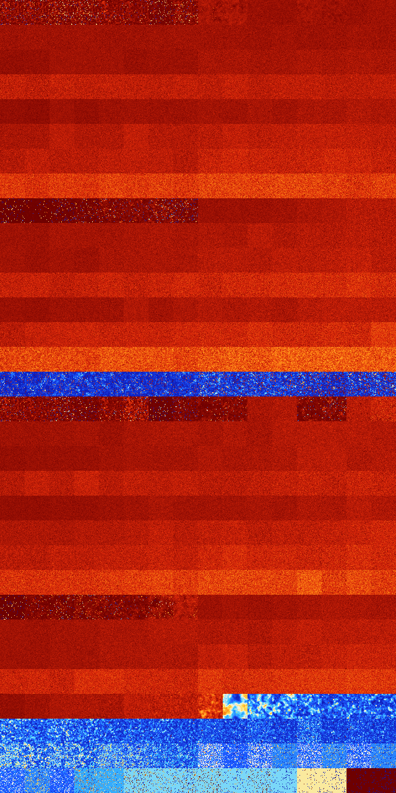

# B123457 (97280-97791)

<details>
    <summary>Initial Grid</summary>
    
</details>


<details>
    <summary>Initial Grid RLE</summary>

```
#C Exported from GoGoL (https://github.com/marrow16/gogol)
#C Wrap mode: Toroidal
#C Boundary mode: Dead
#C Step: 0
x = 100, y = 100, rule = B123457/S
o14bo3bo2bo8bo9bo36bo2bo$10bo3bo9bo4bo6bo2bo2bo25bo$23bo22bo14bo$30bo
25b2o22bo$49bo9bo$10bo12bo9bo3bo14bo7bo6bo5bo14bo4bobo$29bo3bo8bobo24bo
8bo7bo$6b2o29bo9bo32bo3bo$4bo2bo15b2o4bobo24bo13bo$23bo8bo4b2ob2o8bo5bo
26bobo3bo6bo$78bo5bo12bo$39bo18bo6bo$43bo$37bo18bobo17bo19bo$28bo22bo
25bo2bo8bo$4bo70bobo$6bobo4bo15bo26bo6bo7bo6bo16bo$42bo41bo$5bo41bo2bo
11bo4bo7bo17bo$16bo12bo14bo$30bo9bo19bo$11bo48bo3bo11bo3bo$17bo25bobo5b
o13bo9bo5bo$41bo8bo9bo29bo$12bobo27bo3bo18bo29bo$5bo13bo55bo22bo$35bo
25bo$4bo5bob2o30bobo17bo22bo4bo2bo$bo9bo40b2o10bo3bo10bo14bo4bo$35bo22b
o34bo$bo6bo23bo20b2o$19b2o8bo15bo8b2o2bo37bo$obo4bo31bo31bo6bo6bo9bobo$
95bo$o17bo15bo35bo15bo6bo$17bo11bo2bo$3bo34bo5bo10b2o$2bo2bo34bo8bo30bo
10bo$o17bo6bo16bo3bo6bo8bo5bo$7bo6bo10bo23bo10bo17bo2bo6bo$2bo15bobo35b
o20bo$48bo11bo8bo10bo$4bo10bo35b2o13bo$39bo7bo25bo15bo2bo$o40bobo25bo$
39bo16bo20bo12bo$7bo35bo12bo10bo7bo5bo4bo$40bo24bo12bo$32bo3bo28bo12bo$
46bo5bo14bo31bo$13bo14bo62bo$13bobo64bo6bo8bo$71bo$14bo8bo20bo$3bo43bo
15bo$2bo10bo36bo24bo7bo$3bo4bo72bo6bo$37bobo3bo14bo4bo24bo$9bo20bo29b2o
4bo$5bo21bo$bo88bo$16bo54bo3bo2bo16bo$31bo6bo33b2o14bobo$5bo22bo8bo18bo
$2bo12bo11bo4bo11bo4b2o4bo6bo5bo$9bo65bo$12bo47bo31bo$18bo36bo7bo4bo13b
o10bo$30bo18b2o14bo8bo2bo$40bo32bo5bo11bo$3bo24bo32bo9b2o7bo13bo$5bo29b
o4bo17bo$13bo49b2o10bo18bo$20bo10bo9bo3bo4bo$51bo12bo27bo$18bo26bo10bo
2bo$4b2obo14bo31bo19bo8bo$13bo4bo26bo6bo27bo$43bo17bo$12b3o45bo13bo11bo
11bo$37bo9bo48b2o$8bo40bo21bo12bo$8bo12bo31bo26bo12bo$6bo44bo6bo2bo6bo
22bo$24bo24bo6bo2bo32bo$27bo5bo28bo11bo8bo$59bo$26bobo48bo8bo$12bo4bo5b
o10bo35bo13bo$bo25bo18bo39bo$bo13bo26bo52bo3bo$21bo30bo34bo$13bo7bo2b2o
5bo7bo8bo11bo28b2o$7b2o6bo26bo2bo8bo9bo25b2o3bo$10bo31bo4bo7bo34bo$5bo
6b2o42bobo29bo$33bo9b2o9bo14bo18bo$53bo3bo2bo16bo3bobo12bo$6bo9bobo34bo
16bo$28bo27bo12b2o2bo!
```
</details>
<details>
    <summary>Thumbnail</summary>

</details>
<table>
<tr>
    <td><a href="./97280%20S%20Heat%20Map%20Activity.png"></a><br>S (97280)<br>R@41,p12</td>    <td><a href="./97281%20S0%20Heat%20Map%20Activity.png"></a><br>S0 (97281)<br>R@41,p12</td>    <td><a href="./97282%20S1%20Heat%20Map%20Activity.png"></a><br>S1 (97282)<br>R@55,p12</td>    <td><a href="./97283%20S01%20Heat%20Map%20Activity.png"></a><br>S01 (97283)<br>R@55,p12</td>    <td><a href="./97284%20S2%20Heat%20Map%20Activity.png"></a><br>S2 (97284)<br>R@35,p12</td>    <td><a href="./97285%20S02%20Heat%20Map%20Activity.png"></a><br>S02 (97285)<br>R@47,p4</td>    <td><a href="./97286%20S12%20Heat%20Map%20Activity.png"></a><br>S12 (97286)<br>R@86,p60</td>    <td><a href="./97287%20S012%20Heat%20Map%20Activity.png"></a><br>S012 (97287)<br>R@61,p24</td>    <td><a href="./97288%20S3%20Heat%20Map%20Activity.png"></a><br>S3 (97288)<br>G>1000</td>    <td><a href="./97289%20S03%20Heat%20Map%20Activity.png"></a><br>S03 (97289)<br>G>1000</td>    <td><a href="./97290%20S13%20Heat%20Map%20Activity.png"></a><br>S13 (97290)<br>G>1000</td>    <td><a href="./97291%20S013%20Heat%20Map%20Activity.png"></a><br>S013 (97291)<br>G>1000</td>    <td><a href="./97292%20S23%20Heat%20Map%20Activity.png"></a><br>S23 (97292)<br>G>1000</td>    <td><a href="./97293%20S023%20Heat%20Map%20Activity.png"></a><br>S023 (97293)<br>G>1000</td>    <td><a href="./97294%20S123%20Heat%20Map%20Activity.png"></a><br>S123 (97294)<br>G>1000</td>    <td><a href="./97295%20S0123%20Heat%20Map%20Activity.png"></a><br>S0123 (97295)<br>G>1000</td></tr>
<tr>
    <td><a href="./97296%20S4%20Heat%20Map%20Activity.png"></a><br>S4 (97296)<br>G>1000</td>    <td><a href="./97297%20S04%20Heat%20Map%20Activity.png"></a><br>S04 (97297)<br>G>1000</td>    <td><a href="./97298%20S14%20Heat%20Map%20Activity.png"></a><br>S14 (97298)<br>G>1000</td>    <td><a href="./97299%20S014%20Heat%20Map%20Activity.png"></a><br>S014 (97299)<br>G>1000</td>    <td><a href="./97300%20S24%20Heat%20Map%20Activity.png"></a><br>S24 (97300)<br>G>1000</td>    <td><a href="./97301%20S024%20Heat%20Map%20Activity.png"></a><br>S024 (97301)<br>G>1000</td>    <td><a href="./97302%20S124%20Heat%20Map%20Activity.png"></a><br>S124 (97302)<br>G>1000</td>    <td><a href="./97303%20S0124%20Heat%20Map%20Activity.png"></a><br>S0124 (97303)<br>G>1000</td>    <td><a href="./97304%20S34%20Heat%20Map%20Activity.png"></a><br>S34 (97304)<br>G>1000</td>    <td><a href="./97305%20S034%20Heat%20Map%20Activity.png"></a><br>S034 (97305)<br>G>1000</td>    <td><a href="./97306%20S134%20Heat%20Map%20Activity.png"></a><br>S134 (97306)<br>G>1000</td>    <td><a href="./97307%20S0134%20Heat%20Map%20Activity.png"></a><br>S0134 (97307)<br>G>1000</td>    <td><a href="./97308%20S234%20Heat%20Map%20Activity.png"></a><br>S234 (97308)<br>G>1000</td>    <td><a href="./97309%20S0234%20Heat%20Map%20Activity.png"></a><br>S0234 (97309)<br>G>1000</td>    <td><a href="./97310%20S1234%20Heat%20Map%20Activity.png"></a><br>S1234 (97310)<br>G>1000</td>    <td><a href="./97311%20S01234%20Heat%20Map%20Activity.png"></a><br>S01234 (97311)<br>G>1000</td></tr>
<tr>
    <td><a href="./97312%20S5%20Heat%20Map%20Activity.png"></a><br>S5 (97312)<br>G>1000</td>    <td><a href="./97313%20S05%20Heat%20Map%20Activity.png"></a><br>S05 (97313)<br>G>1000</td>    <td><a href="./97314%20S15%20Heat%20Map%20Activity.png"></a><br>S15 (97314)<br>G>1000</td>    <td><a href="./97315%20S015%20Heat%20Map%20Activity.png"></a><br>S015 (97315)<br>G>1000</td>    <td><a href="./97316%20S25%20Heat%20Map%20Activity.png"></a><br>S25 (97316)<br>G>1000</td>    <td><a href="./97317%20S025%20Heat%20Map%20Activity.png"></a><br>S025 (97317)<br>G>1000</td>    <td><a href="./97318%20S125%20Heat%20Map%20Activity.png"></a><br>S125 (97318)<br>G>1000</td>    <td><a href="./97319%20S0125%20Heat%20Map%20Activity.png"></a><br>S0125 (97319)<br>G>1000</td>    <td><a href="./97320%20S35%20Heat%20Map%20Activity.png"></a><br>S35 (97320)<br>G>1000</td>    <td><a href="./97321%20S035%20Heat%20Map%20Activity.png"></a><br>S035 (97321)<br>G>1000</td>    <td><a href="./97322%20S135%20Heat%20Map%20Activity.png"></a><br>S135 (97322)<br>G>1000</td>    <td><a href="./97323%20S0135%20Heat%20Map%20Activity.png"></a><br>S0135 (97323)<br>G>1000</td>    <td><a href="./97324%20S235%20Heat%20Map%20Activity.png"></a><br>S235 (97324)<br>G>1000</td>    <td><a href="./97325%20S0235%20Heat%20Map%20Activity.png"></a><br>S0235 (97325)<br>G>1000</td>    <td><a href="./97326%20S1235%20Heat%20Map%20Activity.png"></a><br>S1235 (97326)<br>G>1000</td>    <td><a href="./97327%20S01235%20Heat%20Map%20Activity.png"></a><br>S01235 (97327)<br>G>1000</td></tr>
<tr>
    <td><a href="./97328%20S45%20Heat%20Map%20Activity.png"></a><br>S45 (97328)<br>G>1000</td>    <td><a href="./97329%20S045%20Heat%20Map%20Activity.png"></a><br>S045 (97329)<br>G>1000</td>    <td><a href="./97330%20S145%20Heat%20Map%20Activity.png"></a><br>S145 (97330)<br>G>1000</td>    <td><a href="./97331%20S0145%20Heat%20Map%20Activity.png"></a><br>S0145 (97331)<br>G>1000</td>    <td><a href="./97332%20S245%20Heat%20Map%20Activity.png"></a><br>S245 (97332)<br>G>1000</td>    <td><a href="./97333%20S0245%20Heat%20Map%20Activity.png"></a><br>S0245 (97333)<br>G>1000</td>    <td><a href="./97334%20S1245%20Heat%20Map%20Activity.png"></a><br>S1245 (97334)<br>G>1000</td>    <td><a href="./97335%20S01245%20Heat%20Map%20Activity.png"></a><br>S01245 (97335)<br>G>1000</td>    <td><a href="./97336%20S345%20Heat%20Map%20Activity.png"></a><br>S345 (97336)<br>G>1000</td>    <td><a href="./97337%20S0345%20Heat%20Map%20Activity.png"></a><br>S0345 (97337)<br>G>1000</td>    <td><a href="./97338%20S1345%20Heat%20Map%20Activity.png"></a><br>S1345 (97338)<br>G>1000</td>    <td><a href="./97339%20S01345%20Heat%20Map%20Activity.png"></a><br>S01345 (97339)<br>G>1000</td>    <td><a href="./97340%20S2345%20Heat%20Map%20Activity.png"></a><br>S2345 (97340)<br>G>1000</td>    <td><a href="./97341%20S02345%20Heat%20Map%20Activity.png"></a><br>S02345 (97341)<br>G>1000</td>    <td><a href="./97342%20S12345%20Heat%20Map%20Activity.png"></a><br>S12345 (97342)<br>G>1000</td>    <td><a href="./97343%20S012345%20Heat%20Map%20Activity.png"></a><br>S012345 (97343)<br>G>1000</td></tr>
<tr>
    <td><a href="./97344%20S6%20Heat%20Map%20Activity.png"></a><br>S6 (97344)<br>G>1000</td>    <td><a href="./97345%20S06%20Heat%20Map%20Activity.png"></a><br>S06 (97345)<br>G>1000</td>    <td><a href="./97346%20S16%20Heat%20Map%20Activity.png"></a><br>S16 (97346)<br>G>1000</td>    <td><a href="./97347%20S016%20Heat%20Map%20Activity.png"></a><br>S016 (97347)<br>G>1000</td>    <td><a href="./97348%20S26%20Heat%20Map%20Activity.png"></a><br>S26 (97348)<br>G>1000</td>    <td><a href="./97349%20S026%20Heat%20Map%20Activity.png"></a><br>S026 (97349)<br>G>1000</td>    <td><a href="./97350%20S126%20Heat%20Map%20Activity.png"></a><br>S126 (97350)<br>G>1000</td>    <td><a href="./97351%20S0126%20Heat%20Map%20Activity.png"></a><br>S0126 (97351)<br>G>1000</td>    <td><a href="./97352%20S36%20Heat%20Map%20Activity.png"></a><br>S36 (97352)<br>G>1000</td>    <td><a href="./97353%20S036%20Heat%20Map%20Activity.png"></a><br>S036 (97353)<br>G>1000</td>    <td><a href="./97354%20S136%20Heat%20Map%20Activity.png"></a><br>S136 (97354)<br>G>1000</td>    <td><a href="./97355%20S0136%20Heat%20Map%20Activity.png"></a><br>S0136 (97355)<br>G>1000</td>    <td><a href="./97356%20S236%20Heat%20Map%20Activity.png"></a><br>S236 (97356)<br>G>1000</td>    <td><a href="./97357%20S0236%20Heat%20Map%20Activity.png"></a><br>S0236 (97357)<br>G>1000</td>    <td><a href="./97358%20S1236%20Heat%20Map%20Activity.png"></a><br>S1236 (97358)<br>G>1000</td>    <td><a href="./97359%20S01236%20Heat%20Map%20Activity.png"></a><br>S01236 (97359)<br>G>1000</td></tr>
<tr>
    <td><a href="./97360%20S46%20Heat%20Map%20Activity.png"></a><br>S46 (97360)<br>G>1000</td>    <td><a href="./97361%20S046%20Heat%20Map%20Activity.png"></a><br>S046 (97361)<br>G>1000</td>    <td><a href="./97362%20S146%20Heat%20Map%20Activity.png"></a><br>S146 (97362)<br>G>1000</td>    <td><a href="./97363%20S0146%20Heat%20Map%20Activity.png"></a><br>S0146 (97363)<br>G>1000</td>    <td><a href="./97364%20S246%20Heat%20Map%20Activity.png"></a><br>S246 (97364)<br>G>1000</td>    <td><a href="./97365%20S0246%20Heat%20Map%20Activity.png"></a><br>S0246 (97365)<br>G>1000</td>    <td><a href="./97366%20S1246%20Heat%20Map%20Activity.png"></a><br>S1246 (97366)<br>G>1000</td>    <td><a href="./97367%20S01246%20Heat%20Map%20Activity.png"></a><br>S01246 (97367)<br>G>1000</td>    <td><a href="./97368%20S346%20Heat%20Map%20Activity.png"></a><br>S346 (97368)<br>G>1000</td>    <td><a href="./97369%20S0346%20Heat%20Map%20Activity.png"></a><br>S0346 (97369)<br>G>1000</td>    <td><a href="./97370%20S1346%20Heat%20Map%20Activity.png"></a><br>S1346 (97370)<br>G>1000</td>    <td><a href="./97371%20S01346%20Heat%20Map%20Activity.png"></a><br>S01346 (97371)<br>G>1000</td>    <td><a href="./97372%20S2346%20Heat%20Map%20Activity.png"></a><br>S2346 (97372)<br>G>1000</td>    <td><a href="./97373%20S02346%20Heat%20Map%20Activity.png"></a><br>S02346 (97373)<br>G>1000</td>    <td><a href="./97374%20S12346%20Heat%20Map%20Activity.png"></a><br>S12346 (97374)<br>G>1000</td>    <td><a href="./97375%20S012346%20Heat%20Map%20Activity.png"></a><br>S012346 (97375)<br>G>1000</td></tr>
<tr>
    <td><a href="./97376%20S56%20Heat%20Map%20Activity.png"></a><br>S56 (97376)<br>G>1000</td>    <td><a href="./97377%20S056%20Heat%20Map%20Activity.png"></a><br>S056 (97377)<br>G>1000</td>    <td><a href="./97378%20S156%20Heat%20Map%20Activity.png"></a><br>S156 (97378)<br>G>1000</td>    <td><a href="./97379%20S0156%20Heat%20Map%20Activity.png"></a><br>S0156 (97379)<br>G>1000</td>    <td><a href="./97380%20S256%20Heat%20Map%20Activity.png"></a><br>S256 (97380)<br>G>1000</td>    <td><a href="./97381%20S0256%20Heat%20Map%20Activity.png"></a><br>S0256 (97381)<br>G>1000</td>    <td><a href="./97382%20S1256%20Heat%20Map%20Activity.png"></a><br>S1256 (97382)<br>G>1000</td>    <td><a href="./97383%20S01256%20Heat%20Map%20Activity.png"></a><br>S01256 (97383)<br>G>1000</td>    <td><a href="./97384%20S356%20Heat%20Map%20Activity.png"></a><br>S356 (97384)<br>G>1000</td>    <td><a href="./97385%20S0356%20Heat%20Map%20Activity.png"></a><br>S0356 (97385)<br>G>1000</td>    <td><a href="./97386%20S1356%20Heat%20Map%20Activity.png"></a><br>S1356 (97386)<br>G>1000</td>    <td><a href="./97387%20S01356%20Heat%20Map%20Activity.png"></a><br>S01356 (97387)<br>G>1000</td>    <td><a href="./97388%20S2356%20Heat%20Map%20Activity.png"></a><br>S2356 (97388)<br>G>1000</td>    <td><a href="./97389%20S02356%20Heat%20Map%20Activity.png"></a><br>S02356 (97389)<br>G>1000</td>    <td><a href="./97390%20S12356%20Heat%20Map%20Activity.png"></a><br>S12356 (97390)<br>G>1000</td>    <td><a href="./97391%20S012356%20Heat%20Map%20Activity.png"></a><br>S012356 (97391)<br>G>1000</td></tr>
<tr>
    <td><a href="./97392%20S456%20Heat%20Map%20Activity.png"></a><br>S456 (97392)<br>G>1000</td>    <td><a href="./97393%20S0456%20Heat%20Map%20Activity.png"></a><br>S0456 (97393)<br>G>1000</td>    <td><a href="./97394%20S1456%20Heat%20Map%20Activity.png"></a><br>S1456 (97394)<br>G>1000</td>    <td><a href="./97395%20S01456%20Heat%20Map%20Activity.png"></a><br>S01456 (97395)<br>G>1000</td>    <td><a href="./97396%20S2456%20Heat%20Map%20Activity.png"></a><br>S2456 (97396)<br>G>1000</td>    <td><a href="./97397%20S02456%20Heat%20Map%20Activity.png"></a><br>S02456 (97397)<br>G>1000</td>    <td><a href="./97398%20S12456%20Heat%20Map%20Activity.png"></a><br>S12456 (97398)<br>G>1000</td>    <td><a href="./97399%20S012456%20Heat%20Map%20Activity.png"></a><br>S012456 (97399)<br>G>1000</td>    <td><a href="./97400%20S3456%20Heat%20Map%20Activity.png"></a><br>S3456 (97400)<br>G>1000</td>    <td><a href="./97401%20S03456%20Heat%20Map%20Activity.png"></a><br>S03456 (97401)<br>G>1000</td>    <td><a href="./97402%20S13456%20Heat%20Map%20Activity.png"></a><br>S13456 (97402)<br>G>1000</td>    <td><a href="./97403%20S013456%20Heat%20Map%20Activity.png"></a><br>S013456 (97403)<br>G>1000</td>    <td><a href="./97404%20S23456%20Heat%20Map%20Activity.png"></a><br>S23456 (97404)<br>G>1000</td>    <td><a href="./97405%20S023456%20Heat%20Map%20Activity.png"></a><br>S023456 (97405)<br>G>1000</td>    <td><a href="./97406%20S123456%20Heat%20Map%20Activity.png"></a><br>S123456 (97406)<br>G>1000</td>    <td><a href="./97407%20S0123456%20Heat%20Map%20Activity.png"></a><br>S0123456 (97407)<br>G>1000</td></tr>
<tr>
    <td><a href="./97408%20S7%20Heat%20Map%20Activity.png"></a><br>S7 (97408)<br>R@928,p840</td>    <td><a href="./97409%20S07%20Heat%20Map%20Activity.png"></a><br>S07 (97409)<br>G>1000</td>    <td><a href="./97410%20S17%20Heat%20Map%20Activity.png"></a><br>S17 (97410)<br>R@748,p504</td>    <td><a href="./97411%20S017%20Heat%20Map%20Activity.png"></a><br>S017 (97411)<br>R@546,p240</td>    <td><a href="./97412%20S27%20Heat%20Map%20Activity.png"></a><br>S27 (97412)<br>R@103,p4</td>    <td><a href="./97413%20S027%20Heat%20Map%20Activity.png"></a><br>S027 (97413)<br>R@130,p24</td>    <td><a href="./97414%20S127%20Heat%20Map%20Activity.png"></a><br>S127 (97414)<br>R@119,p24</td>    <td><a href="./97415%20S0127%20Heat%20Map%20Activity.png"></a><br>S0127 (97415)<br>R@240,p120</td>    <td><a href="./97416%20S37%20Heat%20Map%20Activity.png"></a><br>S37 (97416)<br>G>1000</td>    <td><a href="./97417%20S037%20Heat%20Map%20Activity.png"></a><br>S037 (97417)<br>G>1000</td>    <td><a href="./97418%20S137%20Heat%20Map%20Activity.png"></a><br>S137 (97418)<br>G>1000</td>    <td><a href="./97419%20S0137%20Heat%20Map%20Activity.png"></a><br>S0137 (97419)<br>G>1000</td>    <td><a href="./97420%20S237%20Heat%20Map%20Activity.png"></a><br>S237 (97420)<br>G>1000</td>    <td><a href="./97421%20S0237%20Heat%20Map%20Activity.png"></a><br>S0237 (97421)<br>G>1000</td>    <td><a href="./97422%20S1237%20Heat%20Map%20Activity.png"></a><br>S1237 (97422)<br>G>1000</td>    <td><a href="./97423%20S01237%20Heat%20Map%20Activity.png"></a><br>S01237 (97423)<br>G>1000</td></tr>
<tr>
    <td><a href="./97424%20S47%20Heat%20Map%20Activity.png"></a><br>S47 (97424)<br>G>1000</td>    <td><a href="./97425%20S047%20Heat%20Map%20Activity.png"></a><br>S047 (97425)<br>G>1000</td>    <td><a href="./97426%20S147%20Heat%20Map%20Activity.png"></a><br>S147 (97426)<br>G>1000</td>    <td><a href="./97427%20S0147%20Heat%20Map%20Activity.png"></a><br>S0147 (97427)<br>G>1000</td>    <td><a href="./97428%20S247%20Heat%20Map%20Activity.png"></a><br>S247 (97428)<br>G>1000</td>    <td><a href="./97429%20S0247%20Heat%20Map%20Activity.png"></a><br>S0247 (97429)<br>G>1000</td>    <td><a href="./97430%20S1247%20Heat%20Map%20Activity.png"></a><br>S1247 (97430)<br>G>1000</td>    <td><a href="./97431%20S01247%20Heat%20Map%20Activity.png"></a><br>S01247 (97431)<br>G>1000</td>    <td><a href="./97432%20S347%20Heat%20Map%20Activity.png"></a><br>S347 (97432)<br>G>1000</td>    <td><a href="./97433%20S0347%20Heat%20Map%20Activity.png"></a><br>S0347 (97433)<br>G>1000</td>    <td><a href="./97434%20S1347%20Heat%20Map%20Activity.png"></a><br>S1347 (97434)<br>G>1000</td>    <td><a href="./97435%20S01347%20Heat%20Map%20Activity.png"></a><br>S01347 (97435)<br>G>1000</td>    <td><a href="./97436%20S2347%20Heat%20Map%20Activity.png"></a><br>S2347 (97436)<br>G>1000</td>    <td><a href="./97437%20S02347%20Heat%20Map%20Activity.png"></a><br>S02347 (97437)<br>G>1000</td>    <td><a href="./97438%20S12347%20Heat%20Map%20Activity.png"></a><br>S12347 (97438)<br>G>1000</td>    <td><a href="./97439%20S012347%20Heat%20Map%20Activity.png"></a><br>S012347 (97439)<br>G>1000</td></tr>
<tr>
    <td><a href="./97440%20S57%20Heat%20Map%20Activity.png"></a><br>S57 (97440)<br>G>1000</td>    <td><a href="./97441%20S057%20Heat%20Map%20Activity.png"></a><br>S057 (97441)<br>G>1000</td>    <td><a href="./97442%20S157%20Heat%20Map%20Activity.png"></a><br>S157 (97442)<br>G>1000</td>    <td><a href="./97443%20S0157%20Heat%20Map%20Activity.png"></a><br>S0157 (97443)<br>G>1000</td>    <td><a href="./97444%20S257%20Heat%20Map%20Activity.png"></a><br>S257 (97444)<br>G>1000</td>    <td><a href="./97445%20S0257%20Heat%20Map%20Activity.png"></a><br>S0257 (97445)<br>G>1000</td>    <td><a href="./97446%20S1257%20Heat%20Map%20Activity.png"></a><br>S1257 (97446)<br>G>1000</td>    <td><a href="./97447%20S01257%20Heat%20Map%20Activity.png"></a><br>S01257 (97447)<br>G>1000</td>    <td><a href="./97448%20S357%20Heat%20Map%20Activity.png"></a><br>S357 (97448)<br>G>1000</td>    <td><a href="./97449%20S0357%20Heat%20Map%20Activity.png"></a><br>S0357 (97449)<br>G>1000</td>    <td><a href="./97450%20S1357%20Heat%20Map%20Activity.png"></a><br>S1357 (97450)<br>G>1000</td>    <td><a href="./97451%20S01357%20Heat%20Map%20Activity.png"></a><br>S01357 (97451)<br>G>1000</td>    <td><a href="./97452%20S2357%20Heat%20Map%20Activity.png"></a><br>S2357 (97452)<br>G>1000</td>    <td><a href="./97453%20S02357%20Heat%20Map%20Activity.png"></a><br>S02357 (97453)<br>G>1000</td>    <td><a href="./97454%20S12357%20Heat%20Map%20Activity.png"></a><br>S12357 (97454)<br>G>1000</td>    <td><a href="./97455%20S012357%20Heat%20Map%20Activity.png"></a><br>S012357 (97455)<br>G>1000</td></tr>
<tr>
    <td><a href="./97456%20S457%20Heat%20Map%20Activity.png"></a><br>S457 (97456)<br>G>1000</td>    <td><a href="./97457%20S0457%20Heat%20Map%20Activity.png"></a><br>S0457 (97457)<br>G>1000</td>    <td><a href="./97458%20S1457%20Heat%20Map%20Activity.png"></a><br>S1457 (97458)<br>G>1000</td>    <td><a href="./97459%20S01457%20Heat%20Map%20Activity.png"></a><br>S01457 (97459)<br>G>1000</td>    <td><a href="./97460%20S2457%20Heat%20Map%20Activity.png"></a><br>S2457 (97460)<br>G>1000</td>    <td><a href="./97461%20S02457%20Heat%20Map%20Activity.png"></a><br>S02457 (97461)<br>G>1000</td>    <td><a href="./97462%20S12457%20Heat%20Map%20Activity.png"></a><br>S12457 (97462)<br>G>1000</td>    <td><a href="./97463%20S012457%20Heat%20Map%20Activity.png"></a><br>S012457 (97463)<br>G>1000</td>    <td><a href="./97464%20S3457%20Heat%20Map%20Activity.png"></a><br>S3457 (97464)<br>G>1000</td>    <td><a href="./97465%20S03457%20Heat%20Map%20Activity.png"></a><br>S03457 (97465)<br>G>1000</td>    <td><a href="./97466%20S13457%20Heat%20Map%20Activity.png"></a><br>S13457 (97466)<br>G>1000</td>    <td><a href="./97467%20S013457%20Heat%20Map%20Activity.png"></a><br>S013457 (97467)<br>G>1000</td>    <td><a href="./97468%20S23457%20Heat%20Map%20Activity.png"></a><br>S23457 (97468)<br>G>1000</td>    <td><a href="./97469%20S023457%20Heat%20Map%20Activity.png"></a><br>S023457 (97469)<br>G>1000</td>    <td><a href="./97470%20S123457%20Heat%20Map%20Activity.png"></a><br>S123457 (97470)<br>G>1000</td>    <td><a href="./97471%20S0123457%20Heat%20Map%20Activity.png"></a><br>S0123457 (97471)<br>G>1000</td></tr>
<tr>
    <td><a href="./97472%20S67%20Heat%20Map%20Activity.png"></a><br>S67 (97472)<br>G>1000</td>    <td><a href="./97473%20S067%20Heat%20Map%20Activity.png"></a><br>S067 (97473)<br>G>1000</td>    <td><a href="./97474%20S167%20Heat%20Map%20Activity.png"></a><br>S167 (97474)<br>G>1000</td>    <td><a href="./97475%20S0167%20Heat%20Map%20Activity.png"></a><br>S0167 (97475)<br>G>1000</td>    <td><a href="./97476%20S267%20Heat%20Map%20Activity.png"></a><br>S267 (97476)<br>G>1000</td>    <td><a href="./97477%20S0267%20Heat%20Map%20Activity.png"></a><br>S0267 (97477)<br>G>1000</td>    <td><a href="./97478%20S1267%20Heat%20Map%20Activity.png"></a><br>S1267 (97478)<br>G>1000</td>    <td><a href="./97479%20S01267%20Heat%20Map%20Activity.png"></a><br>S01267 (97479)<br>G>1000</td>    <td><a href="./97480%20S367%20Heat%20Map%20Activity.png"></a><br>S367 (97480)<br>G>1000</td>    <td><a href="./97481%20S0367%20Heat%20Map%20Activity.png"></a><br>S0367 (97481)<br>G>1000</td>    <td><a href="./97482%20S1367%20Heat%20Map%20Activity.png"></a><br>S1367 (97482)<br>G>1000</td>    <td><a href="./97483%20S01367%20Heat%20Map%20Activity.png"></a><br>S01367 (97483)<br>G>1000</td>    <td><a href="./97484%20S2367%20Heat%20Map%20Activity.png"></a><br>S2367 (97484)<br>G>1000</td>    <td><a href="./97485%20S02367%20Heat%20Map%20Activity.png"></a><br>S02367 (97485)<br>G>1000</td>    <td><a href="./97486%20S12367%20Heat%20Map%20Activity.png"></a><br>S12367 (97486)<br>G>1000</td>    <td><a href="./97487%20S012367%20Heat%20Map%20Activity.png"></a><br>S012367 (97487)<br>G>1000</td></tr>
<tr>
    <td><a href="./97488%20S467%20Heat%20Map%20Activity.png"></a><br>S467 (97488)<br>G>1000</td>    <td><a href="./97489%20S0467%20Heat%20Map%20Activity.png"></a><br>S0467 (97489)<br>G>1000</td>    <td><a href="./97490%20S1467%20Heat%20Map%20Activity.png"></a><br>S1467 (97490)<br>G>1000</td>    <td><a href="./97491%20S01467%20Heat%20Map%20Activity.png"></a><br>S01467 (97491)<br>G>1000</td>    <td><a href="./97492%20S2467%20Heat%20Map%20Activity.png"></a><br>S2467 (97492)<br>G>1000</td>    <td><a href="./97493%20S02467%20Heat%20Map%20Activity.png"></a><br>S02467 (97493)<br>G>1000</td>    <td><a href="./97494%20S12467%20Heat%20Map%20Activity.png"></a><br>S12467 (97494)<br>G>1000</td>    <td><a href="./97495%20S012467%20Heat%20Map%20Activity.png"></a><br>S012467 (97495)<br>G>1000</td>    <td><a href="./97496%20S3467%20Heat%20Map%20Activity.png"></a><br>S3467 (97496)<br>G>1000</td>    <td><a href="./97497%20S03467%20Heat%20Map%20Activity.png"></a><br>S03467 (97497)<br>G>1000</td>    <td><a href="./97498%20S13467%20Heat%20Map%20Activity.png"></a><br>S13467 (97498)<br>G>1000</td>    <td><a href="./97499%20S013467%20Heat%20Map%20Activity.png"></a><br>S013467 (97499)<br>G>1000</td>    <td><a href="./97500%20S23467%20Heat%20Map%20Activity.png"></a><br>S23467 (97500)<br>G>1000</td>    <td><a href="./97501%20S023467%20Heat%20Map%20Activity.png"></a><br>S023467 (97501)<br>G>1000</td>    <td><a href="./97502%20S123467%20Heat%20Map%20Activity.png"></a><br>S123467 (97502)<br>G>1000</td>    <td><a href="./97503%20S0123467%20Heat%20Map%20Activity.png"></a><br>S0123467 (97503)<br>G>1000</td></tr>
<tr>
    <td><a href="./97504%20S567%20Heat%20Map%20Activity.png"></a><br>S567 (97504)<br>G>1000</td>    <td><a href="./97505%20S0567%20Heat%20Map%20Activity.png"></a><br>S0567 (97505)<br>G>1000</td>    <td><a href="./97506%20S1567%20Heat%20Map%20Activity.png"></a><br>S1567 (97506)<br>G>1000</td>    <td><a href="./97507%20S01567%20Heat%20Map%20Activity.png"></a><br>S01567 (97507)<br>G>1000</td>    <td><a href="./97508%20S2567%20Heat%20Map%20Activity.png"></a><br>S2567 (97508)<br>G>1000</td>    <td><a href="./97509%20S02567%20Heat%20Map%20Activity.png"></a><br>S02567 (97509)<br>G>1000</td>    <td><a href="./97510%20S12567%20Heat%20Map%20Activity.png"></a><br>S12567 (97510)<br>G>1000</td>    <td><a href="./97511%20S012567%20Heat%20Map%20Activity.png"></a><br>S012567 (97511)<br>G>1000</td>    <td><a href="./97512%20S3567%20Heat%20Map%20Activity.png"></a><br>S3567 (97512)<br>G>1000</td>    <td><a href="./97513%20S03567%20Heat%20Map%20Activity.png"></a><br>S03567 (97513)<br>G>1000</td>    <td><a href="./97514%20S13567%20Heat%20Map%20Activity.png"></a><br>S13567 (97514)<br>G>1000</td>    <td><a href="./97515%20S013567%20Heat%20Map%20Activity.png"></a><br>S013567 (97515)<br>G>1000</td>    <td><a href="./97516%20S23567%20Heat%20Map%20Activity.png"></a><br>S23567 (97516)<br>G>1000</td>    <td><a href="./97517%20S023567%20Heat%20Map%20Activity.png"></a><br>S023567 (97517)<br>G>1000</td>    <td><a href="./97518%20S123567%20Heat%20Map%20Activity.png"></a><br>S123567 (97518)<br>G>1000</td>    <td><a href="./97519%20S0123567%20Heat%20Map%20Activity.png"></a><br>S0123567 (97519)<br>G>1000</td></tr>
<tr>
    <td><a href="./97520%20S4567%20Heat%20Map%20Activity.png"></a><br>S4567 (97520)<br>R@245,p12</td>    <td><a href="./97521%20S04567%20Heat%20Map%20Activity.png"></a><br>S04567 (97521)<br>R@198,p6</td>    <td><a href="./97522%20S14567%20Heat%20Map%20Activity.png"></a><br>S14567 (97522)<br>R@130,p12</td>    <td><a href="./97523%20S014567%20Heat%20Map%20Activity.png"></a><br>S014567 (97523)<br>R@160,p6</td>    <td><a href="./97524%20S24567%20Heat%20Map%20Activity.png"></a><br>S24567 (97524)<br>R@110,p12</td>    <td><a href="./97525%20S024567%20Heat%20Map%20Activity.png"></a><br>S024567 (97525)<br>R@136,p6</td>    <td><a href="./97526%20S124567%20Heat%20Map%20Activity.png"></a><br>S124567 (97526)<br>R@127,p4</td>    <td><a href="./97527%20S0124567%20Heat%20Map%20Activity.png"></a><br>S0124567 (97527)<br>R@115,p6</td>    <td><a href="./97528%20S34567%20Heat%20Map%20Activity.png"></a><br>S34567 (97528)<br>R@36,p6</td>    <td><a href="./97529%20S034567%20Heat%20Map%20Activity.png"></a><br>S034567 (97529)<br>R@47,p6</td>    <td><a href="./97530%20S134567%20Heat%20Map%20Activity.png"></a><br>S134567 (97530)<br>R@44,p6</td>    <td><a href="./97531%20S0134567%20Heat%20Map%20Activity.png"></a><br>S0134567 (97531)<br>R@47,p6</td>    <td><a href="./97532%20S234567%20Heat%20Map%20Activity.png"></a><br>S234567 (97532)<br>R@30,p6</td>    <td><a href="./97533%20S0234567%20Heat%20Map%20Activity.png"></a><br>S0234567 (97533)<br>R@48,p6</td>    <td><a href="./97534%20S1234567%20Heat%20Map%20Activity.png"></a><br>S1234567 (97534)<br>R@29,p6</td>    <td><a href="./97535%20S01234567%20Heat%20Map%20Activity.png"></a><br>S01234567 (97535)<br>R@31,p6</td></tr>
<tr>
    <td><a href="./97536%20S8%20Heat%20Map%20Activity.png"></a><br>S8 (97536)<br>R@41,p12</td>    <td><a href="./97537%20S08%20Heat%20Map%20Activity.png"></a><br>S08 (97537)<br>R@45,p12</td>    <td><a href="./97538%20S18%20Heat%20Map%20Activity.png"></a><br>S18 (97538)<br>R@69,p24</td>    <td><a href="./97539%20S018%20Heat%20Map%20Activity.png"></a><br>S018 (97539)<br>R@105,p72</td>    <td><a href="./97540%20S28%20Heat%20Map%20Activity.png"></a><br>S28 (97540)<br>R@40,p12</td>    <td><a href="./97541%20S028%20Heat%20Map%20Activity.png"></a><br>S028 (97541)<br>R@26,p6</td>    <td><a href="./97542%20S128%20Heat%20Map%20Activity.png"></a><br>S128 (97542)<br>R@365,p336</td>    <td><a href="./97543%20S0128%20Heat%20Map%20Activity.png"></a><br>S0128 (97543)<br>R@86,p60</td>    <td><a href="./97544%20S38%20Heat%20Map%20Activity.png"></a><br>S38 (97544)<br>R@921,p120</td>    <td><a href="./97545%20S038%20Heat%20Map%20Activity.png"></a><br>S038 (97545)<br>R@229,p40</td>    <td><a href="./97546%20S138%20Heat%20Map%20Activity.png"></a><br>S138 (97546)<br>G>1000</td>    <td><a href="./97547%20S0138%20Heat%20Map%20Activity.png"></a><br>S0138 (97547)<br>G>1000</td>    <td><a href="./97548%20S238%20Heat%20Map%20Activity.png"></a><br>S238 (97548)<br>R@721,p120</td>    <td><a href="./97549%20S0238%20Heat%20Map%20Activity.png"></a><br>S0238 (97549)<br>R@309,p24</td>    <td><a href="./97550%20S1238%20Heat%20Map%20Activity.png"></a><br>S1238 (97550)<br>G>1000</td>    <td><a href="./97551%20S01238%20Heat%20Map%20Activity.png"></a><br>S01238 (97551)<br>G>1000</td></tr>
<tr>
    <td><a href="./97552%20S48%20Heat%20Map%20Activity.png"></a><br>S48 (97552)<br>G>1000</td>    <td><a href="./97553%20S048%20Heat%20Map%20Activity.png"></a><br>S048 (97553)<br>G>1000</td>    <td><a href="./97554%20S148%20Heat%20Map%20Activity.png"></a><br>S148 (97554)<br>G>1000</td>    <td><a href="./97555%20S0148%20Heat%20Map%20Activity.png"></a><br>S0148 (97555)<br>G>1000</td>    <td><a href="./97556%20S248%20Heat%20Map%20Activity.png"></a><br>S248 (97556)<br>G>1000</td>    <td><a href="./97557%20S0248%20Heat%20Map%20Activity.png"></a><br>S0248 (97557)<br>G>1000</td>    <td><a href="./97558%20S1248%20Heat%20Map%20Activity.png"></a><br>S1248 (97558)<br>G>1000</td>    <td><a href="./97559%20S01248%20Heat%20Map%20Activity.png"></a><br>S01248 (97559)<br>G>1000</td>    <td><a href="./97560%20S348%20Heat%20Map%20Activity.png"></a><br>S348 (97560)<br>G>1000</td>    <td><a href="./97561%20S0348%20Heat%20Map%20Activity.png"></a><br>S0348 (97561)<br>G>1000</td>    <td><a href="./97562%20S1348%20Heat%20Map%20Activity.png"></a><br>S1348 (97562)<br>G>1000</td>    <td><a href="./97563%20S01348%20Heat%20Map%20Activity.png"></a><br>S01348 (97563)<br>G>1000</td>    <td><a href="./97564%20S2348%20Heat%20Map%20Activity.png"></a><br>S2348 (97564)<br>G>1000</td>    <td><a href="./97565%20S02348%20Heat%20Map%20Activity.png"></a><br>S02348 (97565)<br>G>1000</td>    <td><a href="./97566%20S12348%20Heat%20Map%20Activity.png"></a><br>S12348 (97566)<br>G>1000</td>    <td><a href="./97567%20S012348%20Heat%20Map%20Activity.png"></a><br>S012348 (97567)<br>G>1000</td></tr>
<tr>
    <td><a href="./97568%20S58%20Heat%20Map%20Activity.png"></a><br>S58 (97568)<br>G>1000</td>    <td><a href="./97569%20S058%20Heat%20Map%20Activity.png"></a><br>S058 (97569)<br>G>1000</td>    <td><a href="./97570%20S158%20Heat%20Map%20Activity.png"></a><br>S158 (97570)<br>G>1000</td>    <td><a href="./97571%20S0158%20Heat%20Map%20Activity.png"></a><br>S0158 (97571)<br>G>1000</td>    <td><a href="./97572%20S258%20Heat%20Map%20Activity.png"></a><br>S258 (97572)<br>G>1000</td>    <td><a href="./97573%20S0258%20Heat%20Map%20Activity.png"></a><br>S0258 (97573)<br>G>1000</td>    <td><a href="./97574%20S1258%20Heat%20Map%20Activity.png"></a><br>S1258 (97574)<br>G>1000</td>    <td><a href="./97575%20S01258%20Heat%20Map%20Activity.png"></a><br>S01258 (97575)<br>G>1000</td>    <td><a href="./97576%20S358%20Heat%20Map%20Activity.png"></a><br>S358 (97576)<br>G>1000</td>    <td><a href="./97577%20S0358%20Heat%20Map%20Activity.png"></a><br>S0358 (97577)<br>G>1000</td>    <td><a href="./97578%20S1358%20Heat%20Map%20Activity.png"></a><br>S1358 (97578)<br>G>1000</td>    <td><a href="./97579%20S01358%20Heat%20Map%20Activity.png"></a><br>S01358 (97579)<br>G>1000</td>    <td><a href="./97580%20S2358%20Heat%20Map%20Activity.png"></a><br>S2358 (97580)<br>G>1000</td>    <td><a href="./97581%20S02358%20Heat%20Map%20Activity.png"></a><br>S02358 (97581)<br>G>1000</td>    <td><a href="./97582%20S12358%20Heat%20Map%20Activity.png"></a><br>S12358 (97582)<br>G>1000</td>    <td><a href="./97583%20S012358%20Heat%20Map%20Activity.png"></a><br>S012358 (97583)<br>G>1000</td></tr>
<tr>
    <td><a href="./97584%20S458%20Heat%20Map%20Activity.png"></a><br>S458 (97584)<br>G>1000</td>    <td><a href="./97585%20S0458%20Heat%20Map%20Activity.png"></a><br>S0458 (97585)<br>G>1000</td>    <td><a href="./97586%20S1458%20Heat%20Map%20Activity.png"></a><br>S1458 (97586)<br>G>1000</td>    <td><a href="./97587%20S01458%20Heat%20Map%20Activity.png"></a><br>S01458 (97587)<br>G>1000</td>    <td><a href="./97588%20S2458%20Heat%20Map%20Activity.png"></a><br>S2458 (97588)<br>G>1000</td>    <td><a href="./97589%20S02458%20Heat%20Map%20Activity.png"></a><br>S02458 (97589)<br>G>1000</td>    <td><a href="./97590%20S12458%20Heat%20Map%20Activity.png"></a><br>S12458 (97590)<br>G>1000</td>    <td><a href="./97591%20S012458%20Heat%20Map%20Activity.png"></a><br>S012458 (97591)<br>G>1000</td>    <td><a href="./97592%20S3458%20Heat%20Map%20Activity.png"></a><br>S3458 (97592)<br>G>1000</td>    <td><a href="./97593%20S03458%20Heat%20Map%20Activity.png"></a><br>S03458 (97593)<br>G>1000</td>    <td><a href="./97594%20S13458%20Heat%20Map%20Activity.png"></a><br>S13458 (97594)<br>G>1000</td>    <td><a href="./97595%20S013458%20Heat%20Map%20Activity.png"></a><br>S013458 (97595)<br>G>1000</td>    <td><a href="./97596%20S23458%20Heat%20Map%20Activity.png"></a><br>S23458 (97596)<br>G>1000</td>    <td><a href="./97597%20S023458%20Heat%20Map%20Activity.png"></a><br>S023458 (97597)<br>G>1000</td>    <td><a href="./97598%20S123458%20Heat%20Map%20Activity.png"></a><br>S123458 (97598)<br>G>1000</td>    <td><a href="./97599%20S0123458%20Heat%20Map%20Activity.png"></a><br>S0123458 (97599)<br>G>1000</td></tr>
<tr>
    <td><a href="./97600%20S68%20Heat%20Map%20Activity.png"></a><br>S68 (97600)<br>G>1000</td>    <td><a href="./97601%20S068%20Heat%20Map%20Activity.png"></a><br>S068 (97601)<br>G>1000</td>    <td><a href="./97602%20S168%20Heat%20Map%20Activity.png"></a><br>S168 (97602)<br>G>1000</td>    <td><a href="./97603%20S0168%20Heat%20Map%20Activity.png"></a><br>S0168 (97603)<br>G>1000</td>    <td><a href="./97604%20S268%20Heat%20Map%20Activity.png"></a><br>S268 (97604)<br>G>1000</td>    <td><a href="./97605%20S0268%20Heat%20Map%20Activity.png"></a><br>S0268 (97605)<br>G>1000</td>    <td><a href="./97606%20S1268%20Heat%20Map%20Activity.png"></a><br>S1268 (97606)<br>G>1000</td>    <td><a href="./97607%20S01268%20Heat%20Map%20Activity.png"></a><br>S01268 (97607)<br>G>1000</td>    <td><a href="./97608%20S368%20Heat%20Map%20Activity.png"></a><br>S368 (97608)<br>G>1000</td>    <td><a href="./97609%20S0368%20Heat%20Map%20Activity.png"></a><br>S0368 (97609)<br>G>1000</td>    <td><a href="./97610%20S1368%20Heat%20Map%20Activity.png"></a><br>S1368 (97610)<br>G>1000</td>    <td><a href="./97611%20S01368%20Heat%20Map%20Activity.png"></a><br>S01368 (97611)<br>G>1000</td>    <td><a href="./97612%20S2368%20Heat%20Map%20Activity.png"></a><br>S2368 (97612)<br>G>1000</td>    <td><a href="./97613%20S02368%20Heat%20Map%20Activity.png"></a><br>S02368 (97613)<br>G>1000</td>    <td><a href="./97614%20S12368%20Heat%20Map%20Activity.png"></a><br>S12368 (97614)<br>G>1000</td>    <td><a href="./97615%20S012368%20Heat%20Map%20Activity.png"></a><br>S012368 (97615)<br>G>1000</td></tr>
<tr>
    <td><a href="./97616%20S468%20Heat%20Map%20Activity.png"></a><br>S468 (97616)<br>G>1000</td>    <td><a href="./97617%20S0468%20Heat%20Map%20Activity.png"></a><br>S0468 (97617)<br>G>1000</td>    <td><a href="./97618%20S1468%20Heat%20Map%20Activity.png"></a><br>S1468 (97618)<br>G>1000</td>    <td><a href="./97619%20S01468%20Heat%20Map%20Activity.png"></a><br>S01468 (97619)<br>G>1000</td>    <td><a href="./97620%20S2468%20Heat%20Map%20Activity.png"></a><br>S2468 (97620)<br>G>1000</td>    <td><a href="./97621%20S02468%20Heat%20Map%20Activity.png"></a><br>S02468 (97621)<br>G>1000</td>    <td><a href="./97622%20S12468%20Heat%20Map%20Activity.png"></a><br>S12468 (97622)<br>G>1000</td>    <td><a href="./97623%20S012468%20Heat%20Map%20Activity.png"></a><br>S012468 (97623)<br>G>1000</td>    <td><a href="./97624%20S3468%20Heat%20Map%20Activity.png"></a><br>S3468 (97624)<br>G>1000</td>    <td><a href="./97625%20S03468%20Heat%20Map%20Activity.png"></a><br>S03468 (97625)<br>G>1000</td>    <td><a href="./97626%20S13468%20Heat%20Map%20Activity.png"></a><br>S13468 (97626)<br>G>1000</td>    <td><a href="./97627%20S013468%20Heat%20Map%20Activity.png"></a><br>S013468 (97627)<br>G>1000</td>    <td><a href="./97628%20S23468%20Heat%20Map%20Activity.png"></a><br>S23468 (97628)<br>G>1000</td>    <td><a href="./97629%20S023468%20Heat%20Map%20Activity.png"></a><br>S023468 (97629)<br>G>1000</td>    <td><a href="./97630%20S123468%20Heat%20Map%20Activity.png"></a><br>S123468 (97630)<br>G>1000</td>    <td><a href="./97631%20S0123468%20Heat%20Map%20Activity.png"></a><br>S0123468 (97631)<br>G>1000</td></tr>
<tr>
    <td><a href="./97632%20S568%20Heat%20Map%20Activity.png"></a><br>S568 (97632)<br>G>1000</td>    <td><a href="./97633%20S0568%20Heat%20Map%20Activity.png"></a><br>S0568 (97633)<br>G>1000</td>    <td><a href="./97634%20S1568%20Heat%20Map%20Activity.png"></a><br>S1568 (97634)<br>G>1000</td>    <td><a href="./97635%20S01568%20Heat%20Map%20Activity.png"></a><br>S01568 (97635)<br>G>1000</td>    <td><a href="./97636%20S2568%20Heat%20Map%20Activity.png"></a><br>S2568 (97636)<br>G>1000</td>    <td><a href="./97637%20S02568%20Heat%20Map%20Activity.png"></a><br>S02568 (97637)<br>G>1000</td>    <td><a href="./97638%20S12568%20Heat%20Map%20Activity.png"></a><br>S12568 (97638)<br>G>1000</td>    <td><a href="./97639%20S012568%20Heat%20Map%20Activity.png"></a><br>S012568 (97639)<br>G>1000</td>    <td><a href="./97640%20S3568%20Heat%20Map%20Activity.png"></a><br>S3568 (97640)<br>G>1000</td>    <td><a href="./97641%20S03568%20Heat%20Map%20Activity.png"></a><br>S03568 (97641)<br>G>1000</td>    <td><a href="./97642%20S13568%20Heat%20Map%20Activity.png"></a><br>S13568 (97642)<br>G>1000</td>    <td><a href="./97643%20S013568%20Heat%20Map%20Activity.png"></a><br>S013568 (97643)<br>G>1000</td>    <td><a href="./97644%20S23568%20Heat%20Map%20Activity.png"></a><br>S23568 (97644)<br>G>1000</td>    <td><a href="./97645%20S023568%20Heat%20Map%20Activity.png"></a><br>S023568 (97645)<br>G>1000</td>    <td><a href="./97646%20S123568%20Heat%20Map%20Activity.png"></a><br>S123568 (97646)<br>G>1000</td>    <td><a href="./97647%20S0123568%20Heat%20Map%20Activity.png"></a><br>S0123568 (97647)<br>G>1000</td></tr>
<tr>
    <td><a href="./97648%20S4568%20Heat%20Map%20Activity.png"></a><br>S4568 (97648)<br>G>1000</td>    <td><a href="./97649%20S04568%20Heat%20Map%20Activity.png"></a><br>S04568 (97649)<br>G>1000</td>    <td><a href="./97650%20S14568%20Heat%20Map%20Activity.png"></a><br>S14568 (97650)<br>G>1000</td>    <td><a href="./97651%20S014568%20Heat%20Map%20Activity.png"></a><br>S014568 (97651)<br>G>1000</td>    <td><a href="./97652%20S24568%20Heat%20Map%20Activity.png"></a><br>S24568 (97652)<br>G>1000</td>    <td><a href="./97653%20S024568%20Heat%20Map%20Activity.png"></a><br>S024568 (97653)<br>G>1000</td>    <td><a href="./97654%20S124568%20Heat%20Map%20Activity.png"></a><br>S124568 (97654)<br>G>1000</td>    <td><a href="./97655%20S0124568%20Heat%20Map%20Activity.png"></a><br>S0124568 (97655)<br>G>1000</td>    <td><a href="./97656%20S34568%20Heat%20Map%20Activity.png"></a><br>S34568 (97656)<br>G>1000</td>    <td><a href="./97657%20S034568%20Heat%20Map%20Activity.png"></a><br>S034568 (97657)<br>G>1000</td>    <td><a href="./97658%20S134568%20Heat%20Map%20Activity.png"></a><br>S134568 (97658)<br>G>1000</td>    <td><a href="./97659%20S0134568%20Heat%20Map%20Activity.png"></a><br>S0134568 (97659)<br>G>1000</td>    <td><a href="./97660%20S234568%20Heat%20Map%20Activity.png"></a><br>S234568 (97660)<br>G>1000</td>    <td><a href="./97661%20S0234568%20Heat%20Map%20Activity.png"></a><br>S0234568 (97661)<br>G>1000</td>    <td><a href="./97662%20S1234568%20Heat%20Map%20Activity.png"></a><br>S1234568 (97662)<br>G>1000</td>    <td><a href="./97663%20S01234568%20Heat%20Map%20Activity.png"></a><br>S01234568 (97663)<br>G>1000</td></tr>
<tr>
    <td><a href="./97664%20S78%20Heat%20Map%20Activity.png"></a><br>S78 (97664)<br>R@928,p840</td>    <td><a href="./97665%20S078%20Heat%20Map%20Activity.png"></a><br>S078 (97665)<br>R@272,p24</td>    <td><a href="./97666%20S178%20Heat%20Map%20Activity.png"></a><br>S178 (97666)<br>R@790,p168</td>    <td><a href="./97667%20S0178%20Heat%20Map%20Activity.png"></a><br>S0178 (97667)<br>G>1000</td>    <td><a href="./97668%20S278%20Heat%20Map%20Activity.png"></a><br>S278 (97668)<br>R@102,p12</td>    <td><a href="./97669%20S0278%20Heat%20Map%20Activity.png"></a><br>S0278 (97669)<br>R@175,p16</td>    <td><a href="./97670%20S1278%20Heat%20Map%20Activity.png"></a><br>S1278 (97670)<br>G>1000</td>    <td><a href="./97671%20S01278%20Heat%20Map%20Activity.png"></a><br>S01278 (97671)<br>G>1000</td>    <td><a href="./97672%20S378%20Heat%20Map%20Activity.png"></a><br>S378 (97672)<br>G>1000</td>    <td><a href="./97673%20S0378%20Heat%20Map%20Activity.png"></a><br>S0378 (97673)<br>G>1000</td>    <td><a href="./97674%20S1378%20Heat%20Map%20Activity.png"></a><br>S1378 (97674)<br>G>1000</td>    <td><a href="./97675%20S01378%20Heat%20Map%20Activity.png"></a><br>S01378 (97675)<br>G>1000</td>    <td><a href="./97676%20S2378%20Heat%20Map%20Activity.png"></a><br>S2378 (97676)<br>G>1000</td>    <td><a href="./97677%20S02378%20Heat%20Map%20Activity.png"></a><br>S02378 (97677)<br>G>1000</td>    <td><a href="./97678%20S12378%20Heat%20Map%20Activity.png"></a><br>S12378 (97678)<br>G>1000</td>    <td><a href="./97679%20S012378%20Heat%20Map%20Activity.png"></a><br>S012378 (97679)<br>G>1000</td></tr>
<tr>
    <td><a href="./97680%20S478%20Heat%20Map%20Activity.png"></a><br>S478 (97680)<br>G>1000</td>    <td><a href="./97681%20S0478%20Heat%20Map%20Activity.png"></a><br>S0478 (97681)<br>G>1000</td>    <td><a href="./97682%20S1478%20Heat%20Map%20Activity.png"></a><br>S1478 (97682)<br>G>1000</td>    <td><a href="./97683%20S01478%20Heat%20Map%20Activity.png"></a><br>S01478 (97683)<br>G>1000</td>    <td><a href="./97684%20S2478%20Heat%20Map%20Activity.png"></a><br>S2478 (97684)<br>G>1000</td>    <td><a href="./97685%20S02478%20Heat%20Map%20Activity.png"></a><br>S02478 (97685)<br>G>1000</td>    <td><a href="./97686%20S12478%20Heat%20Map%20Activity.png"></a><br>S12478 (97686)<br>G>1000</td>    <td><a href="./97687%20S012478%20Heat%20Map%20Activity.png"></a><br>S012478 (97687)<br>G>1000</td>    <td><a href="./97688%20S3478%20Heat%20Map%20Activity.png"></a><br>S3478 (97688)<br>G>1000</td>    <td><a href="./97689%20S03478%20Heat%20Map%20Activity.png"></a><br>S03478 (97689)<br>G>1000</td>    <td><a href="./97690%20S13478%20Heat%20Map%20Activity.png"></a><br>S13478 (97690)<br>G>1000</td>    <td><a href="./97691%20S013478%20Heat%20Map%20Activity.png"></a><br>S013478 (97691)<br>G>1000</td>    <td><a href="./97692%20S23478%20Heat%20Map%20Activity.png"></a><br>S23478 (97692)<br>G>1000</td>    <td><a href="./97693%20S023478%20Heat%20Map%20Activity.png"></a><br>S023478 (97693)<br>G>1000</td>    <td><a href="./97694%20S123478%20Heat%20Map%20Activity.png"></a><br>S123478 (97694)<br>G>1000</td>    <td><a href="./97695%20S0123478%20Heat%20Map%20Activity.png"></a><br>S0123478 (97695)<br>G>1000</td></tr>
<tr>
    <td><a href="./97696%20S578%20Heat%20Map%20Activity.png"></a><br>S578 (97696)<br>G>1000</td>    <td><a href="./97697%20S0578%20Heat%20Map%20Activity.png"></a><br>S0578 (97697)<br>G>1000</td>    <td><a href="./97698%20S1578%20Heat%20Map%20Activity.png"></a><br>S1578 (97698)<br>G>1000</td>    <td><a href="./97699%20S01578%20Heat%20Map%20Activity.png"></a><br>S01578 (97699)<br>G>1000</td>    <td><a href="./97700%20S2578%20Heat%20Map%20Activity.png"></a><br>S2578 (97700)<br>G>1000</td>    <td><a href="./97701%20S02578%20Heat%20Map%20Activity.png"></a><br>S02578 (97701)<br>G>1000</td>    <td><a href="./97702%20S12578%20Heat%20Map%20Activity.png"></a><br>S12578 (97702)<br>G>1000</td>    <td><a href="./97703%20S012578%20Heat%20Map%20Activity.png"></a><br>S012578 (97703)<br>G>1000</td>    <td><a href="./97704%20S3578%20Heat%20Map%20Activity.png"></a><br>S3578 (97704)<br>G>1000</td>    <td><a href="./97705%20S03578%20Heat%20Map%20Activity.png"></a><br>S03578 (97705)<br>G>1000</td>    <td><a href="./97706%20S13578%20Heat%20Map%20Activity.png"></a><br>S13578 (97706)<br>G>1000</td>    <td><a href="./97707%20S013578%20Heat%20Map%20Activity.png"></a><br>S013578 (97707)<br>G>1000</td>    <td><a href="./97708%20S23578%20Heat%20Map%20Activity.png"></a><br>S23578 (97708)<br>G>1000</td>    <td><a href="./97709%20S023578%20Heat%20Map%20Activity.png"></a><br>S023578 (97709)<br>G>1000</td>    <td><a href="./97710%20S123578%20Heat%20Map%20Activity.png"></a><br>S123578 (97710)<br>G>1000</td>    <td><a href="./97711%20S0123578%20Heat%20Map%20Activity.png"></a><br>S0123578 (97711)<br>G>1000</td></tr>
<tr>
    <td><a href="./97712%20S4578%20Heat%20Map%20Activity.png"></a><br>S4578 (97712)<br>G>1000</td>    <td><a href="./97713%20S04578%20Heat%20Map%20Activity.png"></a><br>S04578 (97713)<br>G>1000</td>    <td><a href="./97714%20S14578%20Heat%20Map%20Activity.png"></a><br>S14578 (97714)<br>G>1000</td>    <td><a href="./97715%20S014578%20Heat%20Map%20Activity.png"></a><br>S014578 (97715)<br>G>1000</td>    <td><a href="./97716%20S24578%20Heat%20Map%20Activity.png"></a><br>S24578 (97716)<br>G>1000</td>    <td><a href="./97717%20S024578%20Heat%20Map%20Activity.png"></a><br>S024578 (97717)<br>G>1000</td>    <td><a href="./97718%20S124578%20Heat%20Map%20Activity.png"></a><br>S124578 (97718)<br>G>1000</td>    <td><a href="./97719%20S0124578%20Heat%20Map%20Activity.png"></a><br>S0124578 (97719)<br>G>1000</td>    <td><a href="./97720%20S34578%20Heat%20Map%20Activity.png"></a><br>S34578 (97720)<br>G>1000</td>    <td><a href="./97721%20S034578%20Heat%20Map%20Activity.png"></a><br>S034578 (97721)<br>G>1000</td>    <td><a href="./97722%20S134578%20Heat%20Map%20Activity.png"></a><br>S134578 (97722)<br>G>1000</td>    <td><a href="./97723%20S0134578%20Heat%20Map%20Activity.png"></a><br>S0134578 (97723)<br>G>1000</td>    <td><a href="./97724%20S234578%20Heat%20Map%20Activity.png"></a><br>S234578 (97724)<br>G>1000</td>    <td><a href="./97725%20S0234578%20Heat%20Map%20Activity.png"></a><br>S0234578 (97725)<br>G>1000</td>    <td><a href="./97726%20S1234578%20Heat%20Map%20Activity.png"></a><br>S1234578 (97726)<br>G>1000</td>    <td><a href="./97727%20S01234578%20Heat%20Map%20Activity.png"></a><br>S01234578 (97727)<br>G>1000</td></tr>
<tr>
    <td><a href="./97728%20S678%20Heat%20Map%20Activity.png"></a><br>S678 (97728)<br>G>1000</td>    <td><a href="./97729%20S0678%20Heat%20Map%20Activity.png"></a><br>S0678 (97729)<br>G>1000</td>    <td><a href="./97730%20S1678%20Heat%20Map%20Activity.png"></a><br>S1678 (97730)<br>G>1000</td>    <td><a href="./97731%20S01678%20Heat%20Map%20Activity.png"></a><br>S01678 (97731)<br>G>1000</td>    <td><a href="./97732%20S2678%20Heat%20Map%20Activity.png"></a><br>S2678 (97732)<br>G>1000</td>    <td><a href="./97733%20S02678%20Heat%20Map%20Activity.png"></a><br>S02678 (97733)<br>G>1000</td>    <td><a href="./97734%20S12678%20Heat%20Map%20Activity.png"></a><br>S12678 (97734)<br>G>1000</td>    <td><a href="./97735%20S012678%20Heat%20Map%20Activity.png"></a><br>S012678 (97735)<br>G>1000</td>    <td><a href="./97736%20S3678%20Heat%20Map%20Activity.png"></a><br>S3678 (97736)<br>G>1000</td>    <td><a href="./97737%20S03678%20Heat%20Map%20Activity.png"></a><br>S03678 (97737)<br>G>1000</td>    <td><a href="./97738%20S13678%20Heat%20Map%20Activity.png"></a><br>S13678 (97738)<br>R@239,p4</td>    <td><a href="./97739%20S013678%20Heat%20Map%20Activity.png"></a><br>S013678 (97739)<br>R@217,p4</td>    <td><a href="./97740%20S23678%20Heat%20Map%20Activity.png"></a><br>S23678 (97740)<br>R@113,p4</td>    <td><a href="./97741%20S023678%20Heat%20Map%20Activity.png"></a><br>S023678 (97741)<br>R@121,p4</td>    <td><a href="./97742%20S123678%20Heat%20Map%20Activity.png"></a><br>S123678 (97742)<br>R@105,p4</td>    <td><a href="./97743%20S0123678%20Heat%20Map%20Activity.png"></a><br>S0123678 (97743)<br>R@84,p4</td></tr>
<tr>
    <td><a href="./97744%20S4678%20Heat%20Map%20Activity.png"></a><br>S4678 (97744)<br>R@50,p4</td>    <td><a href="./97745%20S04678%20Heat%20Map%20Activity.png"></a><br>S04678 (97745)<br>R@53,p4</td>    <td><a href="./97746%20S14678%20Heat%20Map%20Activity.png"></a><br>S14678 (97746)<br>R@42,p4</td>    <td><a href="./97747%20S014678%20Heat%20Map%20Activity.png"></a><br>S014678 (97747)<br>R@42,p4</td>    <td><a href="./97748%20S24678%20Heat%20Map%20Activity.png"></a><br>S24678 (97748)<br>R@42,p4</td>    <td><a href="./97749%20S024678%20Heat%20Map%20Activity.png"></a><br>S024678 (97749)<br>R@43,p4</td>    <td><a href="./97750%20S124678%20Heat%20Map%20Activity.png"></a><br>S124678 (97750)<br>R@37,p4</td>    <td><a href="./97751%20S0124678%20Heat%20Map%20Activity.png"></a><br>S0124678 (97751)<br>R@43,p4</td>    <td><a href="./97752%20S34678%20Heat%20Map%20Activity.png"></a><br>S34678 (97752)<br>R@30,p2</td>    <td><a href="./97753%20S034678%20Heat%20Map%20Activity.png"></a><br>S034678 (97753)<br>R@28,p2</td>    <td><a href="./97754%20S134678%20Heat%20Map%20Activity.png"></a><br>S134678 (97754)<br>R@27,p2</td>    <td><a href="./97755%20S0134678%20Heat%20Map%20Activity.png"></a><br>S0134678 (97755)<br>R@27,p2</td>    <td><a href="./97756%20S234678%20Heat%20Map%20Activity.png"></a><br>S234678 (97756)<br>R@20,p2</td>    <td><a href="./97757%20S0234678%20Heat%20Map%20Activity.png"></a><br>S0234678 (97757)<br>R@29,p2</td>    <td><a href="./97758%20S1234678%20Heat%20Map%20Activity.png"></a><br>S1234678 (97758)<br>R@25,p2</td>    <td><a href="./97759%20S01234678%20Heat%20Map%20Activity.png"></a><br>S01234678 (97759)<br>R@25,p2</td></tr>
<tr>
    <td><a href="./97760%20S5678%20Heat%20Map%20Activity.png"></a><br>S5678 (97760)<br>S@16</td>    <td><a href="./97761%20S05678%20Heat%20Map%20Activity.png"></a><br>S05678 (97761)<br>S@14</td>    <td><a href="./97762%20S15678%20Heat%20Map%20Activity.png"></a><br>S15678 (97762)<br>R@17,p2</td>    <td><a href="./97763%20S015678%20Heat%20Map%20Activity.png"></a><br>S015678 (97763)<br>R@15,p2</td>    <td><a href="./97764%20S25678%20Heat%20Map%20Activity.png"></a><br>S25678 (97764)<br>S@12</td>    <td><a href="./97765%20S025678%20Heat%20Map%20Activity.png"></a><br>S025678 (97765)<br>S@12</td>    <td><a href="./97766%20S125678%20Heat%20Map%20Activity.png"></a><br>S125678 (97766)<br>R@14,p2</td>    <td><a href="./97767%20S0125678%20Heat%20Map%20Activity.png"></a><br>S0125678 (97767)<br>R@14,p2</td>    <td><a href="./97768%20S35678%20Heat%20Map%20Activity.png"></a><br>S35678 (97768)<br>S@10</td>    <td><a href="./97769%20S035678%20Heat%20Map%20Activity.png"></a><br>S035678 (97769)<br>S@9</td>    <td><a href="./97770%20S135678%20Heat%20Map%20Activity.png"></a><br>S135678 (97770)<br>S@9</td>    <td><a href="./97771%20S0135678%20Heat%20Map%20Activity.png"></a><br>S0135678 (97771)<br>S@9</td>    <td><a href="./97772%20S235678%20Heat%20Map%20Activity.png"></a><br>S235678 (97772)<br>S@10</td>    <td><a href="./97773%20S0235678%20Heat%20Map%20Activity.png"></a><br>S0235678 (97773)<br>S@7</td>    <td><a href="./97774%20S1235678%20Heat%20Map%20Activity.png"></a><br>S1235678 (97774)<br>S@10</td>    <td><a href="./97775%20S01235678%20Heat%20Map%20Activity.png"></a><br>S01235678 (97775)<br>S@7</td></tr>
<tr>
    <td><a href="./97776%20S45678%20Heat%20Map%20Activity.png"></a><br>S45678 (97776)<br>R@10,p2</td>    <td><a href="./97777%20S045678%20Heat%20Map%20Activity.png"></a><br>S045678 (97777)<br>S@8</td>    <td><a href="./97778%20S145678%20Heat%20Map%20Activity.png"></a><br>S145678 (97778)<br>R@10,p2</td>    <td><a href="./97779%20S0145678%20Heat%20Map%20Activity.png"></a><br>S0145678 (97779)<br>S@8</td>    <td><a href="./97780%20S245678%20Heat%20Map%20Activity.png"></a><br>S245678 (97780)<br>S@7</td>    <td><a href="./97781%20S0245678%20Heat%20Map%20Activity.png"></a><br>S0245678 (97781)<br>S@9</td>    <td><a href="./97782%20S1245678%20Heat%20Map%20Activity.png"></a><br>S1245678 (97782)<br>S@7</td>    <td><a href="./97783%20S01245678%20Heat%20Map%20Activity.png"></a><br>S01245678 (97783)<br>S@8</td>    <td><a href="./97784%20S345678%20Heat%20Map%20Activity.png"></a><br>S345678 (97784)<br>S@7</td>    <td><a href="./97785%20S0345678%20Heat%20Map%20Activity.png"></a><br>S0345678 (97785)<br>S@6</td>    <td><a href="./97786%20S1345678%20Heat%20Map%20Activity.png"></a><br>S1345678 (97786)<br>S@7</td>    <td><a href="./97787%20S01345678%20Heat%20Map%20Activity.png"></a><br>S01345678 (97787)<br>S@6</td>    <td><a href="./97788%20S2345678%20Heat%20Map%20Activity.png"></a><br>S2345678 (97788)<br>S@6</td>    <td><a href="./97789%20S02345678%20Heat%20Map%20Activity.png"></a><br>S02345678 (97789)<br>S@6</td>    <td><a href="./97790%20S12345678%20Heat%20Map%20Activity.png"></a><br>S12345678 (97790)<br>S@6</td>    <td><a href="./97791%20S012345678%20Heat%20Map%20Activity.png"></a><br>S012345678 (97791)<br>S@6</td></tr>
</table>
