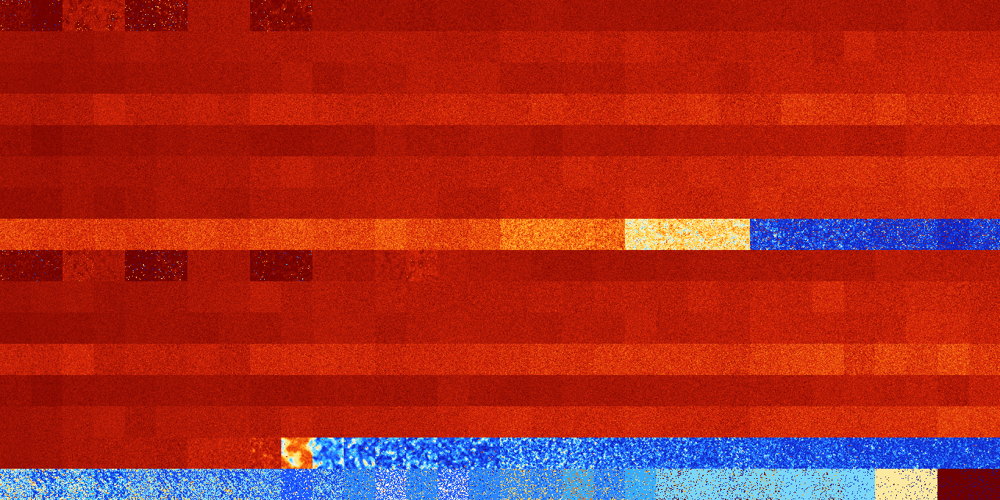

# B123467 (113664-114175)

<details>
    <summary>Initial Grid</summary>
    
</details>


<details>
    <summary>Initial Grid RLE</summary>

```
#C Exported from GoGoL (https://github.com/marrow16/gogol)
#C Wrap mode: Toroidal
#C Boundary mode: Dead
#C Step: 0
x = 100, y = 100, rule = B123467/S
bo8bo38bo10bo14bo12bo$15bo2bo22bo3bo4bo25bo$9bo4bo18bo11bo4bo48bo$23bo
54bo2bo7b2o$100b$30bo52bo$4b2obo13bo29bo45bo$8bo21bo12bo28bo4bo13bo$13b
o23bo8bo8bo16bo3bo14bo$2bo24b2o20bo33bo$o4bo19bo2bobo25bo9bo18bo12bo$
21bo38bo2bo4bobo7bo$3bo6bo30bo3bo17bo6bo19bo$19bo11bo20bo6bo16bo15bo$
36bo25bo8bo11bob2o$9bo4bo4bo5b2o51bo$14bo40bo22bo$4bo2bo2bo20bo15bo5bo
23bo10bo4bo$54bo29bobo3bo$13bo29bo10bo4bo4bobo16bo$2bo29bo5bo2bo18bobo
9bo15b2o$8bo21bo33bo3bo7bo$20bo28b2o30bo7bo4bo$29bo6bo6bo11bo$6bo22bo
22bo7bo31bo$21bo9bo4bo18bo14b2o14b2o6bo4bo$9bo2bo12bo26bob2o23bo7bo$8bo
21b2o16bo7bo4bobo$o32bo8b2o10bo10bo$4bo26bo5bo$bo10bo9bo29bo45bo$6bo56b
o$31bo24bo3bo$10bo18bo3bo4bo28bo2bo4bobo$11bo2bo24bo39bo$100b$6bo29bobo
3bo3bo23bo19bo$44bo17bo$15bobo25bo23bo26b2o$3bo8bo80bo$10bo6bo7bo12bo
21bobo$3b2o41bo3bo7bo10bo5bo$5bo10bo57bo16bo$24bobo18bo19bobo$36bo6bo$
26bo24bo32bo3bo4bo$16bo2bo44bo11bo$8bo15bobo11bo21bo$61bo15bo$100b$4bo
9bo12bo20bo23bo10bo9bo$6b2o2b2o8bo40bo11bo15bo$28bo6bo26bo2bo16bo4bo3bo
$48bo47bo$15bo11bo13bo15bo10bo$100b$bo19bo3bo19bo34bobo$33bo4bo18bo15bo
$37b2o60bo$24bo11bo15bo2bo7bo33bo$10bo21bo3bo3bo24bo$56bo5bo6bo23bo$13b
o79bo3bo$4bo22bo20bo17bobo8bo11bo$10bo16bo6bo21bo23bo$17bo3bo6bobo21bo
27bo$66b2obo8bo16bo$82bo$48bo10bo13bo9bo8bo$5bo10bo$2bo10bo25bo16bo3bob
o34bo$6bo47bo15bo16bo$11bo3bo43bo6bo9bo5bo9bo4bo$22bo5bo58bo$5bo7bo3bo
40bo17bo21bo$18bo34b2o$13bo5bo2bo39bo17b3obo13bo$45bo8bo22bo13bo2bobo$o
11bo4bo25b2o20bo$55bo31bo$8bo2bo11bo33bobo$10bo8bo52bo2bo6bo$67bo18bo$
20bo9bo37bo6bo$25bo10bo17bo4bo10bo27bo$11bo27bo51bo$bo6bo2bo24bo12bo5bo
11b2o$39bo4bobo10bo10bo19bo$7bobo30bo11bo11bo12bo7bo$12bo39bo35bo10bo$
6bo29bo51bobo$32b2o13bo10bo34bo3b2o$9bo$4bo19bo14bo16bo$62bo7bo$26b2o
50bo5bo$13bo2bo23bo2bo27bo$15bo13bo22bo14bo9bo$37bo2bo39bo$o91bo!
```
</details>
<details>
    <summary>Thumbnail</summary>

</details>
<table>
<tr>
    <td><a href="./113664%20S%20Heat%20Map%20Activity.png"></a><br>S (113664)<br>R@129,p12</td>    <td><a href="./113665%20S0%20Heat%20Map%20Activity.png"></a><br>S0 (113665)<br>R@455,p360</td>    <td><a href="./113666%20S1%20Heat%20Map%20Activity.png"></a><br>S1 (113666)<br>G>1000</td>    <td><a href="./113667%20S01%20Heat%20Map%20Activity.png"></a><br>S01 (113667)<br>G>1000</td>    <td><a href="./113668%20S2%20Heat%20Map%20Activity.png"></a><br>S2 (113668)<br>R@619,p336</td>    <td><a href="./113669%20S02%20Heat%20Map%20Activity.png"></a><br>S02 (113669)<br>R@351,p120</td>    <td><a href="./113670%20S12%20Heat%20Map%20Activity.png"></a><br>S12 (113670)<br>G>1000</td>    <td><a href="./113671%20S012%20Heat%20Map%20Activity.png"></a><br>S012 (113671)<br>G>1000</td>    <td><a href="./113672%20S3%20Heat%20Map%20Activity.png"></a><br>S3 (113672)<br>R@375,p12</td>    <td><a href="./113673%20S03%20Heat%20Map%20Activity.png"></a><br>S03 (113673)<br>R@318,p12</td>    <td><a href="./113674%20S13%20Heat%20Map%20Activity.png"></a><br>S13 (113674)<br>G>1000</td>    <td><a href="./113675%20S013%20Heat%20Map%20Activity.png"></a><br>S013 (113675)<br>G>1000</td>    <td><a href="./113676%20S23%20Heat%20Map%20Activity.png"></a><br>S23 (113676)<br>G>1000</td>    <td><a href="./113677%20S023%20Heat%20Map%20Activity.png"></a><br>S023 (113677)<br>G>1000</td>    <td><a href="./113678%20S123%20Heat%20Map%20Activity.png"></a><br>S123 (113678)<br>G>1000</td>    <td><a href="./113679%20S0123%20Heat%20Map%20Activity.png"></a><br>S0123 (113679)<br>G>1000</td>    <td><a href="./113680%20S4%20Heat%20Map%20Activity.png"></a><br>S4 (113680)<br>G>1000</td>    <td><a href="./113681%20S04%20Heat%20Map%20Activity.png"></a><br>S04 (113681)<br>G>1000</td>    <td><a href="./113682%20S14%20Heat%20Map%20Activity.png"></a><br>S14 (113682)<br>G>1000</td>    <td><a href="./113683%20S014%20Heat%20Map%20Activity.png"></a><br>S014 (113683)<br>G>1000</td>    <td><a href="./113684%20S24%20Heat%20Map%20Activity.png"></a><br>S24 (113684)<br>G>1000</td>    <td><a href="./113685%20S024%20Heat%20Map%20Activity.png"></a><br>S024 (113685)<br>G>1000</td>    <td><a href="./113686%20S124%20Heat%20Map%20Activity.png"></a><br>S124 (113686)<br>G>1000</td>    <td><a href="./113687%20S0124%20Heat%20Map%20Activity.png"></a><br>S0124 (113687)<br>G>1000</td>    <td><a href="./113688%20S34%20Heat%20Map%20Activity.png"></a><br>S34 (113688)<br>G>1000</td>    <td><a href="./113689%20S034%20Heat%20Map%20Activity.png"></a><br>S034 (113689)<br>G>1000</td>    <td><a href="./113690%20S134%20Heat%20Map%20Activity.png"></a><br>S134 (113690)<br>G>1000</td>    <td><a href="./113691%20S0134%20Heat%20Map%20Activity.png"></a><br>S0134 (113691)<br>G>1000</td>    <td><a href="./113692%20S234%20Heat%20Map%20Activity.png"></a><br>S234 (113692)<br>G>1000</td>    <td><a href="./113693%20S0234%20Heat%20Map%20Activity.png"></a><br>S0234 (113693)<br>G>1000</td>    <td><a href="./113694%20S1234%20Heat%20Map%20Activity.png"></a><br>S1234 (113694)<br>G>1000</td>    <td><a href="./113695%20S01234%20Heat%20Map%20Activity.png"></a><br>S01234 (113695)<br>G>1000</td></tr>
<tr>
    <td><a href="./113696%20S5%20Heat%20Map%20Activity.png"></a><br>S5 (113696)<br>G>1000</td>    <td><a href="./113697%20S05%20Heat%20Map%20Activity.png"></a><br>S05 (113697)<br>G>1000</td>    <td><a href="./113698%20S15%20Heat%20Map%20Activity.png"></a><br>S15 (113698)<br>G>1000</td>    <td><a href="./113699%20S015%20Heat%20Map%20Activity.png"></a><br>S015 (113699)<br>G>1000</td>    <td><a href="./113700%20S25%20Heat%20Map%20Activity.png"></a><br>S25 (113700)<br>G>1000</td>    <td><a href="./113701%20S025%20Heat%20Map%20Activity.png"></a><br>S025 (113701)<br>G>1000</td>    <td><a href="./113702%20S125%20Heat%20Map%20Activity.png"></a><br>S125 (113702)<br>G>1000</td>    <td><a href="./113703%20S0125%20Heat%20Map%20Activity.png"></a><br>S0125 (113703)<br>G>1000</td>    <td><a href="./113704%20S35%20Heat%20Map%20Activity.png"></a><br>S35 (113704)<br>G>1000</td>    <td><a href="./113705%20S035%20Heat%20Map%20Activity.png"></a><br>S035 (113705)<br>G>1000</td>    <td><a href="./113706%20S135%20Heat%20Map%20Activity.png"></a><br>S135 (113706)<br>G>1000</td>    <td><a href="./113707%20S0135%20Heat%20Map%20Activity.png"></a><br>S0135 (113707)<br>G>1000</td>    <td><a href="./113708%20S235%20Heat%20Map%20Activity.png"></a><br>S235 (113708)<br>G>1000</td>    <td><a href="./113709%20S0235%20Heat%20Map%20Activity.png"></a><br>S0235 (113709)<br>G>1000</td>    <td><a href="./113710%20S1235%20Heat%20Map%20Activity.png"></a><br>S1235 (113710)<br>G>1000</td>    <td><a href="./113711%20S01235%20Heat%20Map%20Activity.png"></a><br>S01235 (113711)<br>G>1000</td>    <td><a href="./113712%20S45%20Heat%20Map%20Activity.png"></a><br>S45 (113712)<br>G>1000</td>    <td><a href="./113713%20S045%20Heat%20Map%20Activity.png"></a><br>S045 (113713)<br>G>1000</td>    <td><a href="./113714%20S145%20Heat%20Map%20Activity.png"></a><br>S145 (113714)<br>G>1000</td>    <td><a href="./113715%20S0145%20Heat%20Map%20Activity.png"></a><br>S0145 (113715)<br>G>1000</td>    <td><a href="./113716%20S245%20Heat%20Map%20Activity.png"></a><br>S245 (113716)<br>G>1000</td>    <td><a href="./113717%20S0245%20Heat%20Map%20Activity.png"></a><br>S0245 (113717)<br>G>1000</td>    <td><a href="./113718%20S1245%20Heat%20Map%20Activity.png"></a><br>S1245 (113718)<br>G>1000</td>    <td><a href="./113719%20S01245%20Heat%20Map%20Activity.png"></a><br>S01245 (113719)<br>G>1000</td>    <td><a href="./113720%20S345%20Heat%20Map%20Activity.png"></a><br>S345 (113720)<br>G>1000</td>    <td><a href="./113721%20S0345%20Heat%20Map%20Activity.png"></a><br>S0345 (113721)<br>G>1000</td>    <td><a href="./113722%20S1345%20Heat%20Map%20Activity.png"></a><br>S1345 (113722)<br>G>1000</td>    <td><a href="./113723%20S01345%20Heat%20Map%20Activity.png"></a><br>S01345 (113723)<br>G>1000</td>    <td><a href="./113724%20S2345%20Heat%20Map%20Activity.png"></a><br>S2345 (113724)<br>G>1000</td>    <td><a href="./113725%20S02345%20Heat%20Map%20Activity.png"></a><br>S02345 (113725)<br>G>1000</td>    <td><a href="./113726%20S12345%20Heat%20Map%20Activity.png"></a><br>S12345 (113726)<br>G>1000</td>    <td><a href="./113727%20S012345%20Heat%20Map%20Activity.png"></a><br>S012345 (113727)<br>G>1000</td></tr>
<tr>
    <td><a href="./113728%20S6%20Heat%20Map%20Activity.png"></a><br>S6 (113728)<br>G>1000</td>    <td><a href="./113729%20S06%20Heat%20Map%20Activity.png"></a><br>S06 (113729)<br>G>1000</td>    <td><a href="./113730%20S16%20Heat%20Map%20Activity.png"></a><br>S16 (113730)<br>G>1000</td>    <td><a href="./113731%20S016%20Heat%20Map%20Activity.png"></a><br>S016 (113731)<br>G>1000</td>    <td><a href="./113732%20S26%20Heat%20Map%20Activity.png"></a><br>S26 (113732)<br>G>1000</td>    <td><a href="./113733%20S026%20Heat%20Map%20Activity.png"></a><br>S026 (113733)<br>G>1000</td>    <td><a href="./113734%20S126%20Heat%20Map%20Activity.png"></a><br>S126 (113734)<br>G>1000</td>    <td><a href="./113735%20S0126%20Heat%20Map%20Activity.png"></a><br>S0126 (113735)<br>G>1000</td>    <td><a href="./113736%20S36%20Heat%20Map%20Activity.png"></a><br>S36 (113736)<br>G>1000</td>    <td><a href="./113737%20S036%20Heat%20Map%20Activity.png"></a><br>S036 (113737)<br>G>1000</td>    <td><a href="./113738%20S136%20Heat%20Map%20Activity.png"></a><br>S136 (113738)<br>G>1000</td>    <td><a href="./113739%20S0136%20Heat%20Map%20Activity.png"></a><br>S0136 (113739)<br>G>1000</td>    <td><a href="./113740%20S236%20Heat%20Map%20Activity.png"></a><br>S236 (113740)<br>G>1000</td>    <td><a href="./113741%20S0236%20Heat%20Map%20Activity.png"></a><br>S0236 (113741)<br>G>1000</td>    <td><a href="./113742%20S1236%20Heat%20Map%20Activity.png"></a><br>S1236 (113742)<br>G>1000</td>    <td><a href="./113743%20S01236%20Heat%20Map%20Activity.png"></a><br>S01236 (113743)<br>G>1000</td>    <td><a href="./113744%20S46%20Heat%20Map%20Activity.png"></a><br>S46 (113744)<br>G>1000</td>    <td><a href="./113745%20S046%20Heat%20Map%20Activity.png"></a><br>S046 (113745)<br>G>1000</td>    <td><a href="./113746%20S146%20Heat%20Map%20Activity.png"></a><br>S146 (113746)<br>G>1000</td>    <td><a href="./113747%20S0146%20Heat%20Map%20Activity.png"></a><br>S0146 (113747)<br>G>1000</td>    <td><a href="./113748%20S246%20Heat%20Map%20Activity.png"></a><br>S246 (113748)<br>G>1000</td>    <td><a href="./113749%20S0246%20Heat%20Map%20Activity.png"></a><br>S0246 (113749)<br>G>1000</td>    <td><a href="./113750%20S1246%20Heat%20Map%20Activity.png"></a><br>S1246 (113750)<br>G>1000</td>    <td><a href="./113751%20S01246%20Heat%20Map%20Activity.png"></a><br>S01246 (113751)<br>G>1000</td>    <td><a href="./113752%20S346%20Heat%20Map%20Activity.png"></a><br>S346 (113752)<br>G>1000</td>    <td><a href="./113753%20S0346%20Heat%20Map%20Activity.png"></a><br>S0346 (113753)<br>G>1000</td>    <td><a href="./113754%20S1346%20Heat%20Map%20Activity.png"></a><br>S1346 (113754)<br>G>1000</td>    <td><a href="./113755%20S01346%20Heat%20Map%20Activity.png"></a><br>S01346 (113755)<br>G>1000</td>    <td><a href="./113756%20S2346%20Heat%20Map%20Activity.png"></a><br>S2346 (113756)<br>G>1000</td>    <td><a href="./113757%20S02346%20Heat%20Map%20Activity.png"></a><br>S02346 (113757)<br>G>1000</td>    <td><a href="./113758%20S12346%20Heat%20Map%20Activity.png"></a><br>S12346 (113758)<br>G>1000</td>    <td><a href="./113759%20S012346%20Heat%20Map%20Activity.png"></a><br>S012346 (113759)<br>G>1000</td></tr>
<tr>
    <td><a href="./113760%20S56%20Heat%20Map%20Activity.png"></a><br>S56 (113760)<br>G>1000</td>    <td><a href="./113761%20S056%20Heat%20Map%20Activity.png"></a><br>S056 (113761)<br>G>1000</td>    <td><a href="./113762%20S156%20Heat%20Map%20Activity.png"></a><br>S156 (113762)<br>G>1000</td>    <td><a href="./113763%20S0156%20Heat%20Map%20Activity.png"></a><br>S0156 (113763)<br>G>1000</td>    <td><a href="./113764%20S256%20Heat%20Map%20Activity.png"></a><br>S256 (113764)<br>G>1000</td>    <td><a href="./113765%20S0256%20Heat%20Map%20Activity.png"></a><br>S0256 (113765)<br>G>1000</td>    <td><a href="./113766%20S1256%20Heat%20Map%20Activity.png"></a><br>S1256 (113766)<br>G>1000</td>    <td><a href="./113767%20S01256%20Heat%20Map%20Activity.png"></a><br>S01256 (113767)<br>G>1000</td>    <td><a href="./113768%20S356%20Heat%20Map%20Activity.png"></a><br>S356 (113768)<br>G>1000</td>    <td><a href="./113769%20S0356%20Heat%20Map%20Activity.png"></a><br>S0356 (113769)<br>G>1000</td>    <td><a href="./113770%20S1356%20Heat%20Map%20Activity.png"></a><br>S1356 (113770)<br>G>1000</td>    <td><a href="./113771%20S01356%20Heat%20Map%20Activity.png"></a><br>S01356 (113771)<br>G>1000</td>    <td><a href="./113772%20S2356%20Heat%20Map%20Activity.png"></a><br>S2356 (113772)<br>G>1000</td>    <td><a href="./113773%20S02356%20Heat%20Map%20Activity.png"></a><br>S02356 (113773)<br>G>1000</td>    <td><a href="./113774%20S12356%20Heat%20Map%20Activity.png"></a><br>S12356 (113774)<br>G>1000</td>    <td><a href="./113775%20S012356%20Heat%20Map%20Activity.png"></a><br>S012356 (113775)<br>G>1000</td>    <td><a href="./113776%20S456%20Heat%20Map%20Activity.png"></a><br>S456 (113776)<br>G>1000</td>    <td><a href="./113777%20S0456%20Heat%20Map%20Activity.png"></a><br>S0456 (113777)<br>G>1000</td>    <td><a href="./113778%20S1456%20Heat%20Map%20Activity.png"></a><br>S1456 (113778)<br>G>1000</td>    <td><a href="./113779%20S01456%20Heat%20Map%20Activity.png"></a><br>S01456 (113779)<br>G>1000</td>    <td><a href="./113780%20S2456%20Heat%20Map%20Activity.png"></a><br>S2456 (113780)<br>G>1000</td>    <td><a href="./113781%20S02456%20Heat%20Map%20Activity.png"></a><br>S02456 (113781)<br>G>1000</td>    <td><a href="./113782%20S12456%20Heat%20Map%20Activity.png"></a><br>S12456 (113782)<br>G>1000</td>    <td><a href="./113783%20S012456%20Heat%20Map%20Activity.png"></a><br>S012456 (113783)<br>G>1000</td>    <td><a href="./113784%20S3456%20Heat%20Map%20Activity.png"></a><br>S3456 (113784)<br>G>1000</td>    <td><a href="./113785%20S03456%20Heat%20Map%20Activity.png"></a><br>S03456 (113785)<br>G>1000</td>    <td><a href="./113786%20S13456%20Heat%20Map%20Activity.png"></a><br>S13456 (113786)<br>G>1000</td>    <td><a href="./113787%20S013456%20Heat%20Map%20Activity.png"></a><br>S013456 (113787)<br>G>1000</td>    <td><a href="./113788%20S23456%20Heat%20Map%20Activity.png"></a><br>S23456 (113788)<br>G>1000</td>    <td><a href="./113789%20S023456%20Heat%20Map%20Activity.png"></a><br>S023456 (113789)<br>G>1000</td>    <td><a href="./113790%20S123456%20Heat%20Map%20Activity.png"></a><br>S123456 (113790)<br>G>1000</td>    <td><a href="./113791%20S0123456%20Heat%20Map%20Activity.png"></a><br>S0123456 (113791)<br>G>1000</td></tr>
<tr>
    <td><a href="./113792%20S7%20Heat%20Map%20Activity.png"></a><br>S7 (113792)<br>G>1000</td>    <td><a href="./113793%20S07%20Heat%20Map%20Activity.png"></a><br>S07 (113793)<br>G>1000</td>    <td><a href="./113794%20S17%20Heat%20Map%20Activity.png"></a><br>S17 (113794)<br>G>1000</td>    <td><a href="./113795%20S017%20Heat%20Map%20Activity.png"></a><br>S017 (113795)<br>G>1000</td>    <td><a href="./113796%20S27%20Heat%20Map%20Activity.png"></a><br>S27 (113796)<br>G>1000</td>    <td><a href="./113797%20S027%20Heat%20Map%20Activity.png"></a><br>S027 (113797)<br>G>1000</td>    <td><a href="./113798%20S127%20Heat%20Map%20Activity.png"></a><br>S127 (113798)<br>G>1000</td>    <td><a href="./113799%20S0127%20Heat%20Map%20Activity.png"></a><br>S0127 (113799)<br>G>1000</td>    <td><a href="./113800%20S37%20Heat%20Map%20Activity.png"></a><br>S37 (113800)<br>G>1000</td>    <td><a href="./113801%20S037%20Heat%20Map%20Activity.png"></a><br>S037 (113801)<br>G>1000</td>    <td><a href="./113802%20S137%20Heat%20Map%20Activity.png"></a><br>S137 (113802)<br>G>1000</td>    <td><a href="./113803%20S0137%20Heat%20Map%20Activity.png"></a><br>S0137 (113803)<br>G>1000</td>    <td><a href="./113804%20S237%20Heat%20Map%20Activity.png"></a><br>S237 (113804)<br>G>1000</td>    <td><a href="./113805%20S0237%20Heat%20Map%20Activity.png"></a><br>S0237 (113805)<br>G>1000</td>    <td><a href="./113806%20S1237%20Heat%20Map%20Activity.png"></a><br>S1237 (113806)<br>G>1000</td>    <td><a href="./113807%20S01237%20Heat%20Map%20Activity.png"></a><br>S01237 (113807)<br>G>1000</td>    <td><a href="./113808%20S47%20Heat%20Map%20Activity.png"></a><br>S47 (113808)<br>G>1000</td>    <td><a href="./113809%20S047%20Heat%20Map%20Activity.png"></a><br>S047 (113809)<br>G>1000</td>    <td><a href="./113810%20S147%20Heat%20Map%20Activity.png"></a><br>S147 (113810)<br>G>1000</td>    <td><a href="./113811%20S0147%20Heat%20Map%20Activity.png"></a><br>S0147 (113811)<br>G>1000</td>    <td><a href="./113812%20S247%20Heat%20Map%20Activity.png"></a><br>S247 (113812)<br>G>1000</td>    <td><a href="./113813%20S0247%20Heat%20Map%20Activity.png"></a><br>S0247 (113813)<br>G>1000</td>    <td><a href="./113814%20S1247%20Heat%20Map%20Activity.png"></a><br>S1247 (113814)<br>G>1000</td>    <td><a href="./113815%20S01247%20Heat%20Map%20Activity.png"></a><br>S01247 (113815)<br>G>1000</td>    <td><a href="./113816%20S347%20Heat%20Map%20Activity.png"></a><br>S347 (113816)<br>G>1000</td>    <td><a href="./113817%20S0347%20Heat%20Map%20Activity.png"></a><br>S0347 (113817)<br>G>1000</td>    <td><a href="./113818%20S1347%20Heat%20Map%20Activity.png"></a><br>S1347 (113818)<br>G>1000</td>    <td><a href="./113819%20S01347%20Heat%20Map%20Activity.png"></a><br>S01347 (113819)<br>G>1000</td>    <td><a href="./113820%20S2347%20Heat%20Map%20Activity.png"></a><br>S2347 (113820)<br>G>1000</td>    <td><a href="./113821%20S02347%20Heat%20Map%20Activity.png"></a><br>S02347 (113821)<br>G>1000</td>    <td><a href="./113822%20S12347%20Heat%20Map%20Activity.png"></a><br>S12347 (113822)<br>G>1000</td>    <td><a href="./113823%20S012347%20Heat%20Map%20Activity.png"></a><br>S012347 (113823)<br>G>1000</td></tr>
<tr>
    <td><a href="./113824%20S57%20Heat%20Map%20Activity.png"></a><br>S57 (113824)<br>G>1000</td>    <td><a href="./113825%20S057%20Heat%20Map%20Activity.png"></a><br>S057 (113825)<br>G>1000</td>    <td><a href="./113826%20S157%20Heat%20Map%20Activity.png"></a><br>S157 (113826)<br>G>1000</td>    <td><a href="./113827%20S0157%20Heat%20Map%20Activity.png"></a><br>S0157 (113827)<br>G>1000</td>    <td><a href="./113828%20S257%20Heat%20Map%20Activity.png"></a><br>S257 (113828)<br>G>1000</td>    <td><a href="./113829%20S0257%20Heat%20Map%20Activity.png"></a><br>S0257 (113829)<br>G>1000</td>    <td><a href="./113830%20S1257%20Heat%20Map%20Activity.png"></a><br>S1257 (113830)<br>G>1000</td>    <td><a href="./113831%20S01257%20Heat%20Map%20Activity.png"></a><br>S01257 (113831)<br>G>1000</td>    <td><a href="./113832%20S357%20Heat%20Map%20Activity.png"></a><br>S357 (113832)<br>G>1000</td>    <td><a href="./113833%20S0357%20Heat%20Map%20Activity.png"></a><br>S0357 (113833)<br>G>1000</td>    <td><a href="./113834%20S1357%20Heat%20Map%20Activity.png"></a><br>S1357 (113834)<br>G>1000</td>    <td><a href="./113835%20S01357%20Heat%20Map%20Activity.png"></a><br>S01357 (113835)<br>G>1000</td>    <td><a href="./113836%20S2357%20Heat%20Map%20Activity.png"></a><br>S2357 (113836)<br>G>1000</td>    <td><a href="./113837%20S02357%20Heat%20Map%20Activity.png"></a><br>S02357 (113837)<br>G>1000</td>    <td><a href="./113838%20S12357%20Heat%20Map%20Activity.png"></a><br>S12357 (113838)<br>G>1000</td>    <td><a href="./113839%20S012357%20Heat%20Map%20Activity.png"></a><br>S012357 (113839)<br>G>1000</td>    <td><a href="./113840%20S457%20Heat%20Map%20Activity.png"></a><br>S457 (113840)<br>G>1000</td>    <td><a href="./113841%20S0457%20Heat%20Map%20Activity.png"></a><br>S0457 (113841)<br>G>1000</td>    <td><a href="./113842%20S1457%20Heat%20Map%20Activity.png"></a><br>S1457 (113842)<br>G>1000</td>    <td><a href="./113843%20S01457%20Heat%20Map%20Activity.png"></a><br>S01457 (113843)<br>G>1000</td>    <td><a href="./113844%20S2457%20Heat%20Map%20Activity.png"></a><br>S2457 (113844)<br>G>1000</td>    <td><a href="./113845%20S02457%20Heat%20Map%20Activity.png"></a><br>S02457 (113845)<br>G>1000</td>    <td><a href="./113846%20S12457%20Heat%20Map%20Activity.png"></a><br>S12457 (113846)<br>G>1000</td>    <td><a href="./113847%20S012457%20Heat%20Map%20Activity.png"></a><br>S012457 (113847)<br>G>1000</td>    <td><a href="./113848%20S3457%20Heat%20Map%20Activity.png"></a><br>S3457 (113848)<br>G>1000</td>    <td><a href="./113849%20S03457%20Heat%20Map%20Activity.png"></a><br>S03457 (113849)<br>G>1000</td>    <td><a href="./113850%20S13457%20Heat%20Map%20Activity.png"></a><br>S13457 (113850)<br>G>1000</td>    <td><a href="./113851%20S013457%20Heat%20Map%20Activity.png"></a><br>S013457 (113851)<br>G>1000</td>    <td><a href="./113852%20S23457%20Heat%20Map%20Activity.png"></a><br>S23457 (113852)<br>G>1000</td>    <td><a href="./113853%20S023457%20Heat%20Map%20Activity.png"></a><br>S023457 (113853)<br>G>1000</td>    <td><a href="./113854%20S123457%20Heat%20Map%20Activity.png"></a><br>S123457 (113854)<br>G>1000</td>    <td><a href="./113855%20S0123457%20Heat%20Map%20Activity.png"></a><br>S0123457 (113855)<br>G>1000</td></tr>
<tr>
    <td><a href="./113856%20S67%20Heat%20Map%20Activity.png"></a><br>S67 (113856)<br>G>1000</td>    <td><a href="./113857%20S067%20Heat%20Map%20Activity.png"></a><br>S067 (113857)<br>G>1000</td>    <td><a href="./113858%20S167%20Heat%20Map%20Activity.png"></a><br>S167 (113858)<br>G>1000</td>    <td><a href="./113859%20S0167%20Heat%20Map%20Activity.png"></a><br>S0167 (113859)<br>G>1000</td>    <td><a href="./113860%20S267%20Heat%20Map%20Activity.png"></a><br>S267 (113860)<br>G>1000</td>    <td><a href="./113861%20S0267%20Heat%20Map%20Activity.png"></a><br>S0267 (113861)<br>G>1000</td>    <td><a href="./113862%20S1267%20Heat%20Map%20Activity.png"></a><br>S1267 (113862)<br>G>1000</td>    <td><a href="./113863%20S01267%20Heat%20Map%20Activity.png"></a><br>S01267 (113863)<br>G>1000</td>    <td><a href="./113864%20S367%20Heat%20Map%20Activity.png"></a><br>S367 (113864)<br>G>1000</td>    <td><a href="./113865%20S0367%20Heat%20Map%20Activity.png"></a><br>S0367 (113865)<br>G>1000</td>    <td><a href="./113866%20S1367%20Heat%20Map%20Activity.png"></a><br>S1367 (113866)<br>G>1000</td>    <td><a href="./113867%20S01367%20Heat%20Map%20Activity.png"></a><br>S01367 (113867)<br>G>1000</td>    <td><a href="./113868%20S2367%20Heat%20Map%20Activity.png"></a><br>S2367 (113868)<br>G>1000</td>    <td><a href="./113869%20S02367%20Heat%20Map%20Activity.png"></a><br>S02367 (113869)<br>G>1000</td>    <td><a href="./113870%20S12367%20Heat%20Map%20Activity.png"></a><br>S12367 (113870)<br>G>1000</td>    <td><a href="./113871%20S012367%20Heat%20Map%20Activity.png"></a><br>S012367 (113871)<br>G>1000</td>    <td><a href="./113872%20S467%20Heat%20Map%20Activity.png"></a><br>S467 (113872)<br>G>1000</td>    <td><a href="./113873%20S0467%20Heat%20Map%20Activity.png"></a><br>S0467 (113873)<br>G>1000</td>    <td><a href="./113874%20S1467%20Heat%20Map%20Activity.png"></a><br>S1467 (113874)<br>G>1000</td>    <td><a href="./113875%20S01467%20Heat%20Map%20Activity.png"></a><br>S01467 (113875)<br>G>1000</td>    <td><a href="./113876%20S2467%20Heat%20Map%20Activity.png"></a><br>S2467 (113876)<br>G>1000</td>    <td><a href="./113877%20S02467%20Heat%20Map%20Activity.png"></a><br>S02467 (113877)<br>G>1000</td>    <td><a href="./113878%20S12467%20Heat%20Map%20Activity.png"></a><br>S12467 (113878)<br>G>1000</td>    <td><a href="./113879%20S012467%20Heat%20Map%20Activity.png"></a><br>S012467 (113879)<br>G>1000</td>    <td><a href="./113880%20S3467%20Heat%20Map%20Activity.png"></a><br>S3467 (113880)<br>G>1000</td>    <td><a href="./113881%20S03467%20Heat%20Map%20Activity.png"></a><br>S03467 (113881)<br>G>1000</td>    <td><a href="./113882%20S13467%20Heat%20Map%20Activity.png"></a><br>S13467 (113882)<br>G>1000</td>    <td><a href="./113883%20S013467%20Heat%20Map%20Activity.png"></a><br>S013467 (113883)<br>G>1000</td>    <td><a href="./113884%20S23467%20Heat%20Map%20Activity.png"></a><br>S23467 (113884)<br>G>1000</td>    <td><a href="./113885%20S023467%20Heat%20Map%20Activity.png"></a><br>S023467 (113885)<br>G>1000</td>    <td><a href="./113886%20S123467%20Heat%20Map%20Activity.png"></a><br>S123467 (113886)<br>G>1000</td>    <td><a href="./113887%20S0123467%20Heat%20Map%20Activity.png"></a><br>S0123467 (113887)<br>G>1000</td></tr>
<tr>
    <td><a href="./113888%20S567%20Heat%20Map%20Activity.png"></a><br>S567 (113888)<br>G>1000</td>    <td><a href="./113889%20S0567%20Heat%20Map%20Activity.png"></a><br>S0567 (113889)<br>G>1000</td>    <td><a href="./113890%20S1567%20Heat%20Map%20Activity.png"></a><br>S1567 (113890)<br>G>1000</td>    <td><a href="./113891%20S01567%20Heat%20Map%20Activity.png"></a><br>S01567 (113891)<br>G>1000</td>    <td><a href="./113892%20S2567%20Heat%20Map%20Activity.png"></a><br>S2567 (113892)<br>G>1000</td>    <td><a href="./113893%20S02567%20Heat%20Map%20Activity.png"></a><br>S02567 (113893)<br>G>1000</td>    <td><a href="./113894%20S12567%20Heat%20Map%20Activity.png"></a><br>S12567 (113894)<br>G>1000</td>    <td><a href="./113895%20S012567%20Heat%20Map%20Activity.png"></a><br>S012567 (113895)<br>G>1000</td>    <td><a href="./113896%20S3567%20Heat%20Map%20Activity.png"></a><br>S3567 (113896)<br>G>1000</td>    <td><a href="./113897%20S03567%20Heat%20Map%20Activity.png"></a><br>S03567 (113897)<br>G>1000</td>    <td><a href="./113898%20S13567%20Heat%20Map%20Activity.png"></a><br>S13567 (113898)<br>G>1000</td>    <td><a href="./113899%20S013567%20Heat%20Map%20Activity.png"></a><br>S013567 (113899)<br>G>1000</td>    <td><a href="./113900%20S23567%20Heat%20Map%20Activity.png"></a><br>S23567 (113900)<br>G>1000</td>    <td><a href="./113901%20S023567%20Heat%20Map%20Activity.png"></a><br>S023567 (113901)<br>G>1000</td>    <td><a href="./113902%20S123567%20Heat%20Map%20Activity.png"></a><br>S123567 (113902)<br>G>1000</td>    <td><a href="./113903%20S0123567%20Heat%20Map%20Activity.png"></a><br>S0123567 (113903)<br>G>1000</td>    <td><a href="./113904%20S4567%20Heat%20Map%20Activity.png"></a><br>S4567 (113904)<br>G>1000</td>    <td><a href="./113905%20S04567%20Heat%20Map%20Activity.png"></a><br>S04567 (113905)<br>G>1000</td>    <td><a href="./113906%20S14567%20Heat%20Map%20Activity.png"></a><br>S14567 (113906)<br>G>1000</td>    <td><a href="./113907%20S014567%20Heat%20Map%20Activity.png"></a><br>S014567 (113907)<br>G>1000</td>    <td><a href="./113908%20S24567%20Heat%20Map%20Activity.png"></a><br>S24567 (113908)<br>G>1000</td>    <td><a href="./113909%20S024567%20Heat%20Map%20Activity.png"></a><br>S024567 (113909)<br>G>1000</td>    <td><a href="./113910%20S124567%20Heat%20Map%20Activity.png"></a><br>S124567 (113910)<br>G>1000</td>    <td><a href="./113911%20S0124567%20Heat%20Map%20Activity.png"></a><br>S0124567 (113911)<br>G>1000</td>    <td><a href="./113912%20S34567%20Heat%20Map%20Activity.png"></a><br>S34567 (113912)<br>R@37,p6</td>    <td><a href="./113913%20S034567%20Heat%20Map%20Activity.png"></a><br>S034567 (113913)<br>R@40,p6</td>    <td><a href="./113914%20S134567%20Heat%20Map%20Activity.png"></a><br>S134567 (113914)<br>R@44,p6</td>    <td><a href="./113915%20S0134567%20Heat%20Map%20Activity.png"></a><br>S0134567 (113915)<br>R@39,p6</td>    <td><a href="./113916%20S234567%20Heat%20Map%20Activity.png"></a><br>S234567 (113916)<br>R@29,p6</td>    <td><a href="./113917%20S0234567%20Heat%20Map%20Activity.png"></a><br>S0234567 (113917)<br>R@27,p6</td>    <td><a href="./113918%20S1234567%20Heat%20Map%20Activity.png"></a><br>S1234567 (113918)<br>R@51,p30</td>    <td><a href="./113919%20S01234567%20Heat%20Map%20Activity.png"></a><br>S01234567 (113919)<br>R@30,p6</td></tr>
<tr>
    <td><a href="./113920%20S8%20Heat%20Map%20Activity.png"></a><br>S8 (113920)<br>R@129,p12</td>    <td><a href="./113921%20S08%20Heat%20Map%20Activity.png"></a><br>S08 (113921)<br>R@169,p30</td>    <td><a href="./113922%20S18%20Heat%20Map%20Activity.png"></a><br>S18 (113922)<br>G>1000</td>    <td><a href="./113923%20S018%20Heat%20Map%20Activity.png"></a><br>S018 (113923)<br>G>1000</td>    <td><a href="./113924%20S28%20Heat%20Map%20Activity.png"></a><br>S28 (113924)<br>G>1000</td>    <td><a href="./113925%20S028%20Heat%20Map%20Activity.png"></a><br>S028 (113925)<br>R@436,p168</td>    <td><a href="./113926%20S128%20Heat%20Map%20Activity.png"></a><br>S128 (113926)<br>G>1000</td>    <td><a href="./113927%20S0128%20Heat%20Map%20Activity.png"></a><br>S0128 (113927)<br>G>1000</td>    <td><a href="./113928%20S38%20Heat%20Map%20Activity.png"></a><br>S38 (113928)<br>R@424,p84</td>    <td><a href="./113929%20S038%20Heat%20Map%20Activity.png"></a><br>S038 (113929)<br>R@252,p120</td>    <td><a href="./113930%20S138%20Heat%20Map%20Activity.png"></a><br>S138 (113930)<br>G>1000</td>    <td><a href="./113931%20S0138%20Heat%20Map%20Activity.png"></a><br>S0138 (113931)<br>G>1000</td>    <td><a href="./113932%20S238%20Heat%20Map%20Activity.png"></a><br>S238 (113932)<br>G>1000</td>    <td><a href="./113933%20S0238%20Heat%20Map%20Activity.png"></a><br>S0238 (113933)<br>G>1000</td>    <td><a href="./113934%20S1238%20Heat%20Map%20Activity.png"></a><br>S1238 (113934)<br>G>1000</td>    <td><a href="./113935%20S01238%20Heat%20Map%20Activity.png"></a><br>S01238 (113935)<br>G>1000</td>    <td><a href="./113936%20S48%20Heat%20Map%20Activity.png"></a><br>S48 (113936)<br>G>1000</td>    <td><a href="./113937%20S048%20Heat%20Map%20Activity.png"></a><br>S048 (113937)<br>G>1000</td>    <td><a href="./113938%20S148%20Heat%20Map%20Activity.png"></a><br>S148 (113938)<br>G>1000</td>    <td><a href="./113939%20S0148%20Heat%20Map%20Activity.png"></a><br>S0148 (113939)<br>G>1000</td>    <td><a href="./113940%20S248%20Heat%20Map%20Activity.png"></a><br>S248 (113940)<br>G>1000</td>    <td><a href="./113941%20S0248%20Heat%20Map%20Activity.png"></a><br>S0248 (113941)<br>G>1000</td>    <td><a href="./113942%20S1248%20Heat%20Map%20Activity.png"></a><br>S1248 (113942)<br>G>1000</td>    <td><a href="./113943%20S01248%20Heat%20Map%20Activity.png"></a><br>S01248 (113943)<br>G>1000</td>    <td><a href="./113944%20S348%20Heat%20Map%20Activity.png"></a><br>S348 (113944)<br>G>1000</td>    <td><a href="./113945%20S0348%20Heat%20Map%20Activity.png"></a><br>S0348 (113945)<br>G>1000</td>    <td><a href="./113946%20S1348%20Heat%20Map%20Activity.png"></a><br>S1348 (113946)<br>G>1000</td>    <td><a href="./113947%20S01348%20Heat%20Map%20Activity.png"></a><br>S01348 (113947)<br>G>1000</td>    <td><a href="./113948%20S2348%20Heat%20Map%20Activity.png"></a><br>S2348 (113948)<br>G>1000</td>    <td><a href="./113949%20S02348%20Heat%20Map%20Activity.png"></a><br>S02348 (113949)<br>G>1000</td>    <td><a href="./113950%20S12348%20Heat%20Map%20Activity.png"></a><br>S12348 (113950)<br>G>1000</td>    <td><a href="./113951%20S012348%20Heat%20Map%20Activity.png"></a><br>S012348 (113951)<br>G>1000</td></tr>
<tr>
    <td><a href="./113952%20S58%20Heat%20Map%20Activity.png"></a><br>S58 (113952)<br>G>1000</td>    <td><a href="./113953%20S058%20Heat%20Map%20Activity.png"></a><br>S058 (113953)<br>G>1000</td>    <td><a href="./113954%20S158%20Heat%20Map%20Activity.png"></a><br>S158 (113954)<br>G>1000</td>    <td><a href="./113955%20S0158%20Heat%20Map%20Activity.png"></a><br>S0158 (113955)<br>G>1000</td>    <td><a href="./113956%20S258%20Heat%20Map%20Activity.png"></a><br>S258 (113956)<br>G>1000</td>    <td><a href="./113957%20S0258%20Heat%20Map%20Activity.png"></a><br>S0258 (113957)<br>G>1000</td>    <td><a href="./113958%20S1258%20Heat%20Map%20Activity.png"></a><br>S1258 (113958)<br>G>1000</td>    <td><a href="./113959%20S01258%20Heat%20Map%20Activity.png"></a><br>S01258 (113959)<br>G>1000</td>    <td><a href="./113960%20S358%20Heat%20Map%20Activity.png"></a><br>S358 (113960)<br>G>1000</td>    <td><a href="./113961%20S0358%20Heat%20Map%20Activity.png"></a><br>S0358 (113961)<br>G>1000</td>    <td><a href="./113962%20S1358%20Heat%20Map%20Activity.png"></a><br>S1358 (113962)<br>G>1000</td>    <td><a href="./113963%20S01358%20Heat%20Map%20Activity.png"></a><br>S01358 (113963)<br>G>1000</td>    <td><a href="./113964%20S2358%20Heat%20Map%20Activity.png"></a><br>S2358 (113964)<br>G>1000</td>    <td><a href="./113965%20S02358%20Heat%20Map%20Activity.png"></a><br>S02358 (113965)<br>G>1000</td>    <td><a href="./113966%20S12358%20Heat%20Map%20Activity.png"></a><br>S12358 (113966)<br>G>1000</td>    <td><a href="./113967%20S012358%20Heat%20Map%20Activity.png"></a><br>S012358 (113967)<br>G>1000</td>    <td><a href="./113968%20S458%20Heat%20Map%20Activity.png"></a><br>S458 (113968)<br>G>1000</td>    <td><a href="./113969%20S0458%20Heat%20Map%20Activity.png"></a><br>S0458 (113969)<br>G>1000</td>    <td><a href="./113970%20S1458%20Heat%20Map%20Activity.png"></a><br>S1458 (113970)<br>G>1000</td>    <td><a href="./113971%20S01458%20Heat%20Map%20Activity.png"></a><br>S01458 (113971)<br>G>1000</td>    <td><a href="./113972%20S2458%20Heat%20Map%20Activity.png"></a><br>S2458 (113972)<br>G>1000</td>    <td><a href="./113973%20S02458%20Heat%20Map%20Activity.png"></a><br>S02458 (113973)<br>G>1000</td>    <td><a href="./113974%20S12458%20Heat%20Map%20Activity.png"></a><br>S12458 (113974)<br>G>1000</td>    <td><a href="./113975%20S012458%20Heat%20Map%20Activity.png"></a><br>S012458 (113975)<br>G>1000</td>    <td><a href="./113976%20S3458%20Heat%20Map%20Activity.png"></a><br>S3458 (113976)<br>G>1000</td>    <td><a href="./113977%20S03458%20Heat%20Map%20Activity.png"></a><br>S03458 (113977)<br>G>1000</td>    <td><a href="./113978%20S13458%20Heat%20Map%20Activity.png"></a><br>S13458 (113978)<br>G>1000</td>    <td><a href="./113979%20S013458%20Heat%20Map%20Activity.png"></a><br>S013458 (113979)<br>G>1000</td>    <td><a href="./113980%20S23458%20Heat%20Map%20Activity.png"></a><br>S23458 (113980)<br>G>1000</td>    <td><a href="./113981%20S023458%20Heat%20Map%20Activity.png"></a><br>S023458 (113981)<br>G>1000</td>    <td><a href="./113982%20S123458%20Heat%20Map%20Activity.png"></a><br>S123458 (113982)<br>G>1000</td>    <td><a href="./113983%20S0123458%20Heat%20Map%20Activity.png"></a><br>S0123458 (113983)<br>G>1000</td></tr>
<tr>
    <td><a href="./113984%20S68%20Heat%20Map%20Activity.png"></a><br>S68 (113984)<br>G>1000</td>    <td><a href="./113985%20S068%20Heat%20Map%20Activity.png"></a><br>S068 (113985)<br>G>1000</td>    <td><a href="./113986%20S168%20Heat%20Map%20Activity.png"></a><br>S168 (113986)<br>G>1000</td>    <td><a href="./113987%20S0168%20Heat%20Map%20Activity.png"></a><br>S0168 (113987)<br>G>1000</td>    <td><a href="./113988%20S268%20Heat%20Map%20Activity.png"></a><br>S268 (113988)<br>G>1000</td>    <td><a href="./113989%20S0268%20Heat%20Map%20Activity.png"></a><br>S0268 (113989)<br>G>1000</td>    <td><a href="./113990%20S1268%20Heat%20Map%20Activity.png"></a><br>S1268 (113990)<br>G>1000</td>    <td><a href="./113991%20S01268%20Heat%20Map%20Activity.png"></a><br>S01268 (113991)<br>G>1000</td>    <td><a href="./113992%20S368%20Heat%20Map%20Activity.png"></a><br>S368 (113992)<br>G>1000</td>    <td><a href="./113993%20S0368%20Heat%20Map%20Activity.png"></a><br>S0368 (113993)<br>G>1000</td>    <td><a href="./113994%20S1368%20Heat%20Map%20Activity.png"></a><br>S1368 (113994)<br>G>1000</td>    <td><a href="./113995%20S01368%20Heat%20Map%20Activity.png"></a><br>S01368 (113995)<br>G>1000</td>    <td><a href="./113996%20S2368%20Heat%20Map%20Activity.png"></a><br>S2368 (113996)<br>G>1000</td>    <td><a href="./113997%20S02368%20Heat%20Map%20Activity.png"></a><br>S02368 (113997)<br>G>1000</td>    <td><a href="./113998%20S12368%20Heat%20Map%20Activity.png"></a><br>S12368 (113998)<br>G>1000</td>    <td><a href="./113999%20S012368%20Heat%20Map%20Activity.png"></a><br>S012368 (113999)<br>G>1000</td>    <td><a href="./114000%20S468%20Heat%20Map%20Activity.png"></a><br>S468 (114000)<br>G>1000</td>    <td><a href="./114001%20S0468%20Heat%20Map%20Activity.png"></a><br>S0468 (114001)<br>G>1000</td>    <td><a href="./114002%20S1468%20Heat%20Map%20Activity.png"></a><br>S1468 (114002)<br>G>1000</td>    <td><a href="./114003%20S01468%20Heat%20Map%20Activity.png"></a><br>S01468 (114003)<br>G>1000</td>    <td><a href="./114004%20S2468%20Heat%20Map%20Activity.png"></a><br>S2468 (114004)<br>G>1000</td>    <td><a href="./114005%20S02468%20Heat%20Map%20Activity.png"></a><br>S02468 (114005)<br>G>1000</td>    <td><a href="./114006%20S12468%20Heat%20Map%20Activity.png"></a><br>S12468 (114006)<br>G>1000</td>    <td><a href="./114007%20S012468%20Heat%20Map%20Activity.png"></a><br>S012468 (114007)<br>G>1000</td>    <td><a href="./114008%20S3468%20Heat%20Map%20Activity.png"></a><br>S3468 (114008)<br>G>1000</td>    <td><a href="./114009%20S03468%20Heat%20Map%20Activity.png"></a><br>S03468 (114009)<br>G>1000</td>    <td><a href="./114010%20S13468%20Heat%20Map%20Activity.png"></a><br>S13468 (114010)<br>G>1000</td>    <td><a href="./114011%20S013468%20Heat%20Map%20Activity.png"></a><br>S013468 (114011)<br>G>1000</td>    <td><a href="./114012%20S23468%20Heat%20Map%20Activity.png"></a><br>S23468 (114012)<br>G>1000</td>    <td><a href="./114013%20S023468%20Heat%20Map%20Activity.png"></a><br>S023468 (114013)<br>G>1000</td>    <td><a href="./114014%20S123468%20Heat%20Map%20Activity.png"></a><br>S123468 (114014)<br>G>1000</td>    <td><a href="./114015%20S0123468%20Heat%20Map%20Activity.png"></a><br>S0123468 (114015)<br>G>1000</td></tr>
<tr>
    <td><a href="./114016%20S568%20Heat%20Map%20Activity.png"></a><br>S568 (114016)<br>G>1000</td>    <td><a href="./114017%20S0568%20Heat%20Map%20Activity.png"></a><br>S0568 (114017)<br>G>1000</td>    <td><a href="./114018%20S1568%20Heat%20Map%20Activity.png"></a><br>S1568 (114018)<br>G>1000</td>    <td><a href="./114019%20S01568%20Heat%20Map%20Activity.png"></a><br>S01568 (114019)<br>G>1000</td>    <td><a href="./114020%20S2568%20Heat%20Map%20Activity.png"></a><br>S2568 (114020)<br>G>1000</td>    <td><a href="./114021%20S02568%20Heat%20Map%20Activity.png"></a><br>S02568 (114021)<br>G>1000</td>    <td><a href="./114022%20S12568%20Heat%20Map%20Activity.png"></a><br>S12568 (114022)<br>G>1000</td>    <td><a href="./114023%20S012568%20Heat%20Map%20Activity.png"></a><br>S012568 (114023)<br>G>1000</td>    <td><a href="./114024%20S3568%20Heat%20Map%20Activity.png"></a><br>S3568 (114024)<br>G>1000</td>    <td><a href="./114025%20S03568%20Heat%20Map%20Activity.png"></a><br>S03568 (114025)<br>G>1000</td>    <td><a href="./114026%20S13568%20Heat%20Map%20Activity.png"></a><br>S13568 (114026)<br>G>1000</td>    <td><a href="./114027%20S013568%20Heat%20Map%20Activity.png"></a><br>S013568 (114027)<br>G>1000</td>    <td><a href="./114028%20S23568%20Heat%20Map%20Activity.png"></a><br>S23568 (114028)<br>G>1000</td>    <td><a href="./114029%20S023568%20Heat%20Map%20Activity.png"></a><br>S023568 (114029)<br>G>1000</td>    <td><a href="./114030%20S123568%20Heat%20Map%20Activity.png"></a><br>S123568 (114030)<br>G>1000</td>    <td><a href="./114031%20S0123568%20Heat%20Map%20Activity.png"></a><br>S0123568 (114031)<br>G>1000</td>    <td><a href="./114032%20S4568%20Heat%20Map%20Activity.png"></a><br>S4568 (114032)<br>G>1000</td>    <td><a href="./114033%20S04568%20Heat%20Map%20Activity.png"></a><br>S04568 (114033)<br>G>1000</td>    <td><a href="./114034%20S14568%20Heat%20Map%20Activity.png"></a><br>S14568 (114034)<br>G>1000</td>    <td><a href="./114035%20S014568%20Heat%20Map%20Activity.png"></a><br>S014568 (114035)<br>G>1000</td>    <td><a href="./114036%20S24568%20Heat%20Map%20Activity.png"></a><br>S24568 (114036)<br>G>1000</td>    <td><a href="./114037%20S024568%20Heat%20Map%20Activity.png"></a><br>S024568 (114037)<br>G>1000</td>    <td><a href="./114038%20S124568%20Heat%20Map%20Activity.png"></a><br>S124568 (114038)<br>G>1000</td>    <td><a href="./114039%20S0124568%20Heat%20Map%20Activity.png"></a><br>S0124568 (114039)<br>G>1000</td>    <td><a href="./114040%20S34568%20Heat%20Map%20Activity.png"></a><br>S34568 (114040)<br>G>1000</td>    <td><a href="./114041%20S034568%20Heat%20Map%20Activity.png"></a><br>S034568 (114041)<br>G>1000</td>    <td><a href="./114042%20S134568%20Heat%20Map%20Activity.png"></a><br>S134568 (114042)<br>G>1000</td>    <td><a href="./114043%20S0134568%20Heat%20Map%20Activity.png"></a><br>S0134568 (114043)<br>G>1000</td>    <td><a href="./114044%20S234568%20Heat%20Map%20Activity.png"></a><br>S234568 (114044)<br>G>1000</td>    <td><a href="./114045%20S0234568%20Heat%20Map%20Activity.png"></a><br>S0234568 (114045)<br>G>1000</td>    <td><a href="./114046%20S1234568%20Heat%20Map%20Activity.png"></a><br>S1234568 (114046)<br>G>1000</td>    <td><a href="./114047%20S01234568%20Heat%20Map%20Activity.png"></a><br>S01234568 (114047)<br>G>1000</td></tr>
<tr>
    <td><a href="./114048%20S78%20Heat%20Map%20Activity.png"></a><br>S78 (114048)<br>G>1000</td>    <td><a href="./114049%20S078%20Heat%20Map%20Activity.png"></a><br>S078 (114049)<br>G>1000</td>    <td><a href="./114050%20S178%20Heat%20Map%20Activity.png"></a><br>S178 (114050)<br>G>1000</td>    <td><a href="./114051%20S0178%20Heat%20Map%20Activity.png"></a><br>S0178 (114051)<br>G>1000</td>    <td><a href="./114052%20S278%20Heat%20Map%20Activity.png"></a><br>S278 (114052)<br>G>1000</td>    <td><a href="./114053%20S0278%20Heat%20Map%20Activity.png"></a><br>S0278 (114053)<br>G>1000</td>    <td><a href="./114054%20S1278%20Heat%20Map%20Activity.png"></a><br>S1278 (114054)<br>G>1000</td>    <td><a href="./114055%20S01278%20Heat%20Map%20Activity.png"></a><br>S01278 (114055)<br>G>1000</td>    <td><a href="./114056%20S378%20Heat%20Map%20Activity.png"></a><br>S378 (114056)<br>G>1000</td>    <td><a href="./114057%20S0378%20Heat%20Map%20Activity.png"></a><br>S0378 (114057)<br>G>1000</td>    <td><a href="./114058%20S1378%20Heat%20Map%20Activity.png"></a><br>S1378 (114058)<br>G>1000</td>    <td><a href="./114059%20S01378%20Heat%20Map%20Activity.png"></a><br>S01378 (114059)<br>G>1000</td>    <td><a href="./114060%20S2378%20Heat%20Map%20Activity.png"></a><br>S2378 (114060)<br>G>1000</td>    <td><a href="./114061%20S02378%20Heat%20Map%20Activity.png"></a><br>S02378 (114061)<br>G>1000</td>    <td><a href="./114062%20S12378%20Heat%20Map%20Activity.png"></a><br>S12378 (114062)<br>G>1000</td>    <td><a href="./114063%20S012378%20Heat%20Map%20Activity.png"></a><br>S012378 (114063)<br>G>1000</td>    <td><a href="./114064%20S478%20Heat%20Map%20Activity.png"></a><br>S478 (114064)<br>G>1000</td>    <td><a href="./114065%20S0478%20Heat%20Map%20Activity.png"></a><br>S0478 (114065)<br>G>1000</td>    <td><a href="./114066%20S1478%20Heat%20Map%20Activity.png"></a><br>S1478 (114066)<br>G>1000</td>    <td><a href="./114067%20S01478%20Heat%20Map%20Activity.png"></a><br>S01478 (114067)<br>G>1000</td>    <td><a href="./114068%20S2478%20Heat%20Map%20Activity.png"></a><br>S2478 (114068)<br>G>1000</td>    <td><a href="./114069%20S02478%20Heat%20Map%20Activity.png"></a><br>S02478 (114069)<br>G>1000</td>    <td><a href="./114070%20S12478%20Heat%20Map%20Activity.png"></a><br>S12478 (114070)<br>G>1000</td>    <td><a href="./114071%20S012478%20Heat%20Map%20Activity.png"></a><br>S012478 (114071)<br>G>1000</td>    <td><a href="./114072%20S3478%20Heat%20Map%20Activity.png"></a><br>S3478 (114072)<br>G>1000</td>    <td><a href="./114073%20S03478%20Heat%20Map%20Activity.png"></a><br>S03478 (114073)<br>G>1000</td>    <td><a href="./114074%20S13478%20Heat%20Map%20Activity.png"></a><br>S13478 (114074)<br>G>1000</td>    <td><a href="./114075%20S013478%20Heat%20Map%20Activity.png"></a><br>S013478 (114075)<br>G>1000</td>    <td><a href="./114076%20S23478%20Heat%20Map%20Activity.png"></a><br>S23478 (114076)<br>G>1000</td>    <td><a href="./114077%20S023478%20Heat%20Map%20Activity.png"></a><br>S023478 (114077)<br>G>1000</td>    <td><a href="./114078%20S123478%20Heat%20Map%20Activity.png"></a><br>S123478 (114078)<br>G>1000</td>    <td><a href="./114079%20S0123478%20Heat%20Map%20Activity.png"></a><br>S0123478 (114079)<br>G>1000</td></tr>
<tr>
    <td><a href="./114080%20S578%20Heat%20Map%20Activity.png"></a><br>S578 (114080)<br>G>1000</td>    <td><a href="./114081%20S0578%20Heat%20Map%20Activity.png"></a><br>S0578 (114081)<br>G>1000</td>    <td><a href="./114082%20S1578%20Heat%20Map%20Activity.png"></a><br>S1578 (114082)<br>G>1000</td>    <td><a href="./114083%20S01578%20Heat%20Map%20Activity.png"></a><br>S01578 (114083)<br>G>1000</td>    <td><a href="./114084%20S2578%20Heat%20Map%20Activity.png"></a><br>S2578 (114084)<br>G>1000</td>    <td><a href="./114085%20S02578%20Heat%20Map%20Activity.png"></a><br>S02578 (114085)<br>G>1000</td>    <td><a href="./114086%20S12578%20Heat%20Map%20Activity.png"></a><br>S12578 (114086)<br>G>1000</td>    <td><a href="./114087%20S012578%20Heat%20Map%20Activity.png"></a><br>S012578 (114087)<br>G>1000</td>    <td><a href="./114088%20S3578%20Heat%20Map%20Activity.png"></a><br>S3578 (114088)<br>G>1000</td>    <td><a href="./114089%20S03578%20Heat%20Map%20Activity.png"></a><br>S03578 (114089)<br>G>1000</td>    <td><a href="./114090%20S13578%20Heat%20Map%20Activity.png"></a><br>S13578 (114090)<br>G>1000</td>    <td><a href="./114091%20S013578%20Heat%20Map%20Activity.png"></a><br>S013578 (114091)<br>G>1000</td>    <td><a href="./114092%20S23578%20Heat%20Map%20Activity.png"></a><br>S23578 (114092)<br>G>1000</td>    <td><a href="./114093%20S023578%20Heat%20Map%20Activity.png"></a><br>S023578 (114093)<br>G>1000</td>    <td><a href="./114094%20S123578%20Heat%20Map%20Activity.png"></a><br>S123578 (114094)<br>G>1000</td>    <td><a href="./114095%20S0123578%20Heat%20Map%20Activity.png"></a><br>S0123578 (114095)<br>G>1000</td>    <td><a href="./114096%20S4578%20Heat%20Map%20Activity.png"></a><br>S4578 (114096)<br>G>1000</td>    <td><a href="./114097%20S04578%20Heat%20Map%20Activity.png"></a><br>S04578 (114097)<br>G>1000</td>    <td><a href="./114098%20S14578%20Heat%20Map%20Activity.png"></a><br>S14578 (114098)<br>G>1000</td>    <td><a href="./114099%20S014578%20Heat%20Map%20Activity.png"></a><br>S014578 (114099)<br>G>1000</td>    <td><a href="./114100%20S24578%20Heat%20Map%20Activity.png"></a><br>S24578 (114100)<br>G>1000</td>    <td><a href="./114101%20S024578%20Heat%20Map%20Activity.png"></a><br>S024578 (114101)<br>G>1000</td>    <td><a href="./114102%20S124578%20Heat%20Map%20Activity.png"></a><br>S124578 (114102)<br>G>1000</td>    <td><a href="./114103%20S0124578%20Heat%20Map%20Activity.png"></a><br>S0124578 (114103)<br>G>1000</td>    <td><a href="./114104%20S34578%20Heat%20Map%20Activity.png"></a><br>S34578 (114104)<br>G>1000</td>    <td><a href="./114105%20S034578%20Heat%20Map%20Activity.png"></a><br>S034578 (114105)<br>G>1000</td>    <td><a href="./114106%20S134578%20Heat%20Map%20Activity.png"></a><br>S134578 (114106)<br>G>1000</td>    <td><a href="./114107%20S0134578%20Heat%20Map%20Activity.png"></a><br>S0134578 (114107)<br>G>1000</td>    <td><a href="./114108%20S234578%20Heat%20Map%20Activity.png"></a><br>S234578 (114108)<br>G>1000</td>    <td><a href="./114109%20S0234578%20Heat%20Map%20Activity.png"></a><br>S0234578 (114109)<br>G>1000</td>    <td><a href="./114110%20S1234578%20Heat%20Map%20Activity.png"></a><br>S1234578 (114110)<br>G>1000</td>    <td><a href="./114111%20S01234578%20Heat%20Map%20Activity.png"></a><br>S01234578 (114111)<br>G>1000</td></tr>
<tr>
    <td><a href="./114112%20S678%20Heat%20Map%20Activity.png"></a><br>S678 (114112)<br>G>1000</td>    <td><a href="./114113%20S0678%20Heat%20Map%20Activity.png"></a><br>S0678 (114113)<br>G>1000</td>    <td><a href="./114114%20S1678%20Heat%20Map%20Activity.png"></a><br>S1678 (114114)<br>G>1000</td>    <td><a href="./114115%20S01678%20Heat%20Map%20Activity.png"></a><br>S01678 (114115)<br>G>1000</td>    <td><a href="./114116%20S2678%20Heat%20Map%20Activity.png"></a><br>S2678 (114116)<br>G>1000</td>    <td><a href="./114117%20S02678%20Heat%20Map%20Activity.png"></a><br>S02678 (114117)<br>G>1000</td>    <td><a href="./114118%20S12678%20Heat%20Map%20Activity.png"></a><br>S12678 (114118)<br>G>1000</td>    <td><a href="./114119%20S012678%20Heat%20Map%20Activity.png"></a><br>S012678 (114119)<br>G>1000</td>    <td><a href="./114120%20S3678%20Heat%20Map%20Activity.png"></a><br>S3678 (114120)<br>G>1000</td>    <td><a href="./114121%20S03678%20Heat%20Map%20Activity.png"></a><br>S03678 (114121)<br>G>1000</td>    <td><a href="./114122%20S13678%20Heat%20Map%20Activity.png"></a><br>S13678 (114122)<br>R@453,p12</td>    <td><a href="./114123%20S013678%20Heat%20Map%20Activity.png"></a><br>S013678 (114123)<br>R@301,p12</td>    <td><a href="./114124%20S23678%20Heat%20Map%20Activity.png"></a><br>S23678 (114124)<br>R@141,p12</td>    <td><a href="./114125%20S023678%20Heat%20Map%20Activity.png"></a><br>S023678 (114125)<br>R@158,p12</td>    <td><a href="./114126%20S123678%20Heat%20Map%20Activity.png"></a><br>S123678 (114126)<br>R@134,p12</td>    <td><a href="./114127%20S0123678%20Heat%20Map%20Activity.png"></a><br>S0123678 (114127)<br>R@121,p12</td>    <td><a href="./114128%20S4678%20Heat%20Map%20Activity.png"></a><br>S4678 (114128)<br>R@42,p4</td>    <td><a href="./114129%20S04678%20Heat%20Map%20Activity.png"></a><br>S04678 (114129)<br>R@42,p4</td>    <td><a href="./114130%20S14678%20Heat%20Map%20Activity.png"></a><br>S14678 (114130)<br>R@35,p4</td>    <td><a href="./114131%20S014678%20Heat%20Map%20Activity.png"></a><br>S014678 (114131)<br>R@37,p4</td>    <td><a href="./114132%20S24678%20Heat%20Map%20Activity.png"></a><br>S24678 (114132)<br>R@33,p4</td>    <td><a href="./114133%20S024678%20Heat%20Map%20Activity.png"></a><br>S024678 (114133)<br>R@32,p4</td>    <td><a href="./114134%20S124678%20Heat%20Map%20Activity.png"></a><br>S124678 (114134)<br>R@36,p4</td>    <td><a href="./114135%20S0124678%20Heat%20Map%20Activity.png"></a><br>S0124678 (114135)<br>R@29,p4</td>    <td><a href="./114136%20S34678%20Heat%20Map%20Activity.png"></a><br>S34678 (114136)<br>R@28,p4</td>    <td><a href="./114137%20S034678%20Heat%20Map%20Activity.png"></a><br>S034678 (114137)<br>R@23,p4</td>    <td><a href="./114138%20S134678%20Heat%20Map%20Activity.png"></a><br>S134678 (114138)<br>R@31,p4</td>    <td><a href="./114139%20S0134678%20Heat%20Map%20Activity.png"></a><br>S0134678 (114139)<br>R@24,p4</td>    <td><a href="./114140%20S234678%20Heat%20Map%20Activity.png"></a><br>S234678 (114140)<br>R@25,p4</td>    <td><a href="./114141%20S0234678%20Heat%20Map%20Activity.png"></a><br>S0234678 (114141)<br>R@24,p4</td>    <td><a href="./114142%20S1234678%20Heat%20Map%20Activity.png"></a><br>S1234678 (114142)<br>R@29,p4</td>    <td><a href="./114143%20S01234678%20Heat%20Map%20Activity.png"></a><br>S01234678 (114143)<br>R@24,p4</td></tr>
<tr>
    <td><a href="./114144%20S5678%20Heat%20Map%20Activity.png"></a><br>S5678 (114144)<br>S@16</td>    <td><a href="./114145%20S05678%20Heat%20Map%20Activity.png"></a><br>S05678 (114145)<br>S@15</td>    <td><a href="./114146%20S15678%20Heat%20Map%20Activity.png"></a><br>S15678 (114146)<br>S@14</td>    <td><a href="./114147%20S015678%20Heat%20Map%20Activity.png"></a><br>S015678 (114147)<br>S@13</td>    <td><a href="./114148%20S25678%20Heat%20Map%20Activity.png"></a><br>S25678 (114148)<br>S@12</td>    <td><a href="./114149%20S025678%20Heat%20Map%20Activity.png"></a><br>S025678 (114149)<br>S@13</td>    <td><a href="./114150%20S125678%20Heat%20Map%20Activity.png"></a><br>S125678 (114150)<br>S@12</td>    <td><a href="./114151%20S0125678%20Heat%20Map%20Activity.png"></a><br>S0125678 (114151)<br>S@14</td>    <td><a href="./114152%20S35678%20Heat%20Map%20Activity.png"></a><br>S35678 (114152)<br>S@12</td>    <td><a href="./114153%20S035678%20Heat%20Map%20Activity.png"></a><br>S035678 (114153)<br>S@9</td>    <td><a href="./114154%20S135678%20Heat%20Map%20Activity.png"></a><br>S135678 (114154)<br>S@12</td>    <td><a href="./114155%20S0135678%20Heat%20Map%20Activity.png"></a><br>S0135678 (114155)<br>S@8</td>    <td><a href="./114156%20S235678%20Heat%20Map%20Activity.png"></a><br>S235678 (114156)<br>S@9</td>    <td><a href="./114157%20S0235678%20Heat%20Map%20Activity.png"></a><br>S0235678 (114157)<br>S@8</td>    <td><a href="./114158%20S1235678%20Heat%20Map%20Activity.png"></a><br>S1235678 (114158)<br>S@10</td>    <td><a href="./114159%20S01235678%20Heat%20Map%20Activity.png"></a><br>S01235678 (114159)<br>S@8</td>    <td><a href="./114160%20S45678%20Heat%20Map%20Activity.png"></a><br>S45678 (114160)<br>S@8</td>    <td><a href="./114161%20S045678%20Heat%20Map%20Activity.png"></a><br>S045678 (114161)<br>S@8</td>    <td><a href="./114162%20S145678%20Heat%20Map%20Activity.png"></a><br>S145678 (114162)<br>S@7</td>    <td><a href="./114163%20S0145678%20Heat%20Map%20Activity.png"></a><br>S0145678 (114163)<br>S@7</td>    <td><a href="./114164%20S245678%20Heat%20Map%20Activity.png"></a><br>S245678 (114164)<br>S@8</td>    <td><a href="./114165%20S0245678%20Heat%20Map%20Activity.png"></a><br>S0245678 (114165)<br>S@7</td>    <td><a href="./114166%20S1245678%20Heat%20Map%20Activity.png"></a><br>S1245678 (114166)<br>S@8</td>    <td><a href="./114167%20S01245678%20Heat%20Map%20Activity.png"></a><br>S01245678 (114167)<br>S@7</td>    <td><a href="./114168%20S345678%20Heat%20Map%20Activity.png"></a><br>S345678 (114168)<br>S@7</td>    <td><a href="./114169%20S0345678%20Heat%20Map%20Activity.png"></a><br>S0345678 (114169)<br>S@7</td>    <td><a href="./114170%20S1345678%20Heat%20Map%20Activity.png"></a><br>S1345678 (114170)<br>S@7</td>    <td><a href="./114171%20S01345678%20Heat%20Map%20Activity.png"></a><br>S01345678 (114171)<br>S@7</td>    <td><a href="./114172%20S2345678%20Heat%20Map%20Activity.png"></a><br>S2345678 (114172)<br>S@7</td>    <td><a href="./114173%20S02345678%20Heat%20Map%20Activity.png"></a><br>S02345678 (114173)<br>S@7</td>    <td><a href="./114174%20S12345678%20Heat%20Map%20Activity.png"></a><br>S12345678 (114174)<br>S@7</td>    <td><a href="./114175%20S012345678%20Heat%20Map%20Activity.png"></a><br>S012345678 (114175)<br>S@7</td></tr>
</table>
