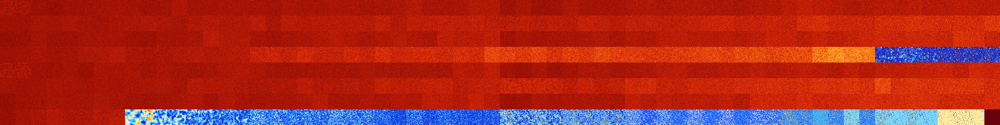

# B123567 (121856-122367)

<details>
    <summary>Initial Grid</summary>
    
</details>


<details>
    <summary>Initial Grid RLE</summary>

```
#C Exported from GoGoL (https://github.com/marrow16/gogol)
#C Wrap mode: Toroidal
#C Boundary mode: Dead
#C Step: 0
x = 100, y = 100, rule = B123567/S
14bo39bo13bo9bo7bo$33bo8bo14bo20bo$3bo14bo4bo14bo8bo30bo$13bo11bo46bo3b
o$41bo18bo8bo24bo$71bo5bo$13bo20bo15b2o7bo10bo4bo$4bo44bo39bo8bo$27bobo
40bo23bobo$9bo11bo3bo14bo9bo$11bo6bo8bo29bo24bo$25bo21bo5bo13bo4bo7bo2b
o5bo$bo21bo12bo19bo16bo16bo$7bo7bo25bo17bo16bo2bo4bo$6bo13bo7bo7bo9bo7b
o9bo7bobo$4bo11bo23bob2o6bo$3bo28bo39bo5b2o18b2o$8b2o32bobo16bo$7bo26bo
23bo22bobo$98bo$28bo56bo$13bo11bo17bo43bo11bo$2b2o11bo5bo30bo15bo2bo$3b
o8bo34bo13bo22bo$b2o6bo38bo33bo12bo$33bo18bo9bo5bobo28bo$21bo11bo15bo
39bo$9bo32bo7bo3bo21bo10bo2bo$8bo41bo19bo$29bo4bo13bo28b2o2bo$19bo22bo
38bo3bo$4bo16bo21bo43bo9bo$30bo6bo21bo4bo19bo$bobobo38bo5bo13bo$16bo17b
o45bo$14bo7b2o14bo33bo$bo12bo15bo22bo13bo12bo6bo$9bo10bo7bo6bo22bo33bo$
2bo18bo54bo10bo$o36bo46bo$100b$3b2o45bo10bo13b2o12bo9bo$4bo22bo3bo45bo
5bo$3bo3bo3b2o2bo28bo52bo$3bo11bo8bo3bo37b2o26bo$16bo5b2o10bo7bo3bo25bo
$11bo19bo15bo$16bo42bo33bo4bo$9bo34bo50bo$12bo6bo$3bobo7bo4bo$41b2obo
37bo14bo$bo10bo12bo11bo8bo27bo15bo$2bo23bo27bo3bo8bo3bo22bo3bo$69bo21bo
$3bo29bo12b2o19bo13bo$52bo22bo$o3bo18bo35bo$o7bo31bo2bo34bo18bo$15bo38b
o15bo$3bo2bo13bo32bo9bo$18bo45bo2bo26bobo$17bo24bo11bo4bo20bo$16bo15bo
5bo3bo9bo13bo10bo21bo$98bo$2bo13bo7bo3bo31bo6bo11bo$2bo7bo5bo8bo12bo5bo
$41bo29bo7bo14bo$28bobo20bo2bo27bo10bo$8bo40bo11bo8bo11bo11b2o$14bo18bo
43bobo$51bo19bo6bo$23bo29bo10bo$44bo14bo6bo$4bo28bo6bobo44b2o$4bo8bo16b
2o2bo14bo8bo14bo14bo8bobo$4bo28bo30bo5bobo$16bo5bo21bo23bo26bo$29bo8bo
16bo33bo8bo$o3bo44bo36bo$6bo15bo10bo9bo37bo9bo$11bo12bo3bo25bo18bobo$
12bo7bo25bo$12bo10bo4bo2bo22bo14b2o$6bo11bo19bo3bo51b2o$3bo9bo7bo38bobo
bobo$12bo6bo53bo$34bo31bo12bo$11bo7bo2bo15bo24b2o15bo6bo$13bo19bo5bo7bo
$19bo7bo5bo3bo43bo4bo6bo$o52bo44bo$24bo7b2o48bo$4bo2bo12bo13bo$11bo7bo
41bo9bo26bo$27b2o5bo36bo13bobo3bo$29bo54bo$o3bo35bo18bo12bobo11bo$28bo
9bo2bo30bobo4bobobo8bo$3bo20bo14bo14bo12bo!
```
</details>
<details>
    <summary>Thumbnail</summary>

</details>
<table>
<tr>
    <td><a href="./121856%20S%20Heat%20Map%20Activity.png"></a><br>S (121856)<br>G>1000</td>    <td><a href="./121857%20S0%20Heat%20Map%20Activity.png"></a><br>S0 (121857)<br>G>1000</td>    <td><a href="./121858%20S1%20Heat%20Map%20Activity.png"></a><br>S1 (121858)<br>G>1000</td>    <td><a href="./121859%20S01%20Heat%20Map%20Activity.png"></a><br>S01 (121859)<br>G>1000</td>    <td><a href="./121860%20S2%20Heat%20Map%20Activity.png"></a><br>S2 (121860)<br>G>1000</td>    <td><a href="./121861%20S02%20Heat%20Map%20Activity.png"></a><br>S02 (121861)<br>G>1000</td>    <td><a href="./121862%20S12%20Heat%20Map%20Activity.png"></a><br>S12 (121862)<br>G>1000</td>    <td><a href="./121863%20S012%20Heat%20Map%20Activity.png"></a><br>S012 (121863)<br>G>1000</td>    <td><a href="./121864%20S3%20Heat%20Map%20Activity.png"></a><br>S3 (121864)<br>G>1000</td>    <td><a href="./121865%20S03%20Heat%20Map%20Activity.png"></a><br>S03 (121865)<br>G>1000</td>    <td><a href="./121866%20S13%20Heat%20Map%20Activity.png"></a><br>S13 (121866)<br>G>1000</td>    <td><a href="./121867%20S013%20Heat%20Map%20Activity.png"></a><br>S013 (121867)<br>G>1000</td>    <td><a href="./121868%20S23%20Heat%20Map%20Activity.png"></a><br>S23 (121868)<br>G>1000</td>    <td><a href="./121869%20S023%20Heat%20Map%20Activity.png"></a><br>S023 (121869)<br>G>1000</td>    <td><a href="./121870%20S123%20Heat%20Map%20Activity.png"></a><br>S123 (121870)<br>G>1000</td>    <td><a href="./121871%20S0123%20Heat%20Map%20Activity.png"></a><br>S0123 (121871)<br>G>1000</td>    <td><a href="./121872%20S4%20Heat%20Map%20Activity.png"></a><br>S4 (121872)<br>G>1000</td>    <td><a href="./121873%20S04%20Heat%20Map%20Activity.png"></a><br>S04 (121873)<br>G>1000</td>    <td><a href="./121874%20S14%20Heat%20Map%20Activity.png"></a><br>S14 (121874)<br>G>1000</td>    <td><a href="./121875%20S014%20Heat%20Map%20Activity.png"></a><br>S014 (121875)<br>G>1000</td>    <td><a href="./121876%20S24%20Heat%20Map%20Activity.png"></a><br>S24 (121876)<br>G>1000</td>    <td><a href="./121877%20S024%20Heat%20Map%20Activity.png"></a><br>S024 (121877)<br>G>1000</td>    <td><a href="./121878%20S124%20Heat%20Map%20Activity.png"></a><br>S124 (121878)<br>G>1000</td>    <td><a href="./121879%20S0124%20Heat%20Map%20Activity.png"></a><br>S0124 (121879)<br>G>1000</td>    <td><a href="./121880%20S34%20Heat%20Map%20Activity.png"></a><br>S34 (121880)<br>G>1000</td>    <td><a href="./121881%20S034%20Heat%20Map%20Activity.png"></a><br>S034 (121881)<br>G>1000</td>    <td><a href="./121882%20S134%20Heat%20Map%20Activity.png"></a><br>S134 (121882)<br>G>1000</td>    <td><a href="./121883%20S0134%20Heat%20Map%20Activity.png"></a><br>S0134 (121883)<br>G>1000</td>    <td><a href="./121884%20S234%20Heat%20Map%20Activity.png"></a><br>S234 (121884)<br>G>1000</td>    <td><a href="./121885%20S0234%20Heat%20Map%20Activity.png"></a><br>S0234 (121885)<br>G>1000</td>    <td><a href="./121886%20S1234%20Heat%20Map%20Activity.png"></a><br>S1234 (121886)<br>G>1000</td>    <td><a href="./121887%20S01234%20Heat%20Map%20Activity.png"></a><br>S01234 (121887)<br>G>1000</td>    <td><a href="./121888%20S5%20Heat%20Map%20Activity.png"></a><br>S5 (121888)<br>G>1000</td>    <td><a href="./121889%20S05%20Heat%20Map%20Activity.png"></a><br>S05 (121889)<br>G>1000</td>    <td><a href="./121890%20S15%20Heat%20Map%20Activity.png"></a><br>S15 (121890)<br>G>1000</td>    <td><a href="./121891%20S015%20Heat%20Map%20Activity.png"></a><br>S015 (121891)<br>G>1000</td>    <td><a href="./121892%20S25%20Heat%20Map%20Activity.png"></a><br>S25 (121892)<br>G>1000</td>    <td><a href="./121893%20S025%20Heat%20Map%20Activity.png"></a><br>S025 (121893)<br>G>1000</td>    <td><a href="./121894%20S125%20Heat%20Map%20Activity.png"></a><br>S125 (121894)<br>G>1000</td>    <td><a href="./121895%20S0125%20Heat%20Map%20Activity.png"></a><br>S0125 (121895)<br>G>1000</td>    <td><a href="./121896%20S35%20Heat%20Map%20Activity.png"></a><br>S35 (121896)<br>G>1000</td>    <td><a href="./121897%20S035%20Heat%20Map%20Activity.png"></a><br>S035 (121897)<br>G>1000</td>    <td><a href="./121898%20S135%20Heat%20Map%20Activity.png"></a><br>S135 (121898)<br>G>1000</td>    <td><a href="./121899%20S0135%20Heat%20Map%20Activity.png"></a><br>S0135 (121899)<br>G>1000</td>    <td><a href="./121900%20S235%20Heat%20Map%20Activity.png"></a><br>S235 (121900)<br>G>1000</td>    <td><a href="./121901%20S0235%20Heat%20Map%20Activity.png"></a><br>S0235 (121901)<br>G>1000</td>    <td><a href="./121902%20S1235%20Heat%20Map%20Activity.png"></a><br>S1235 (121902)<br>G>1000</td>    <td><a href="./121903%20S01235%20Heat%20Map%20Activity.png"></a><br>S01235 (121903)<br>G>1000</td>    <td><a href="./121904%20S45%20Heat%20Map%20Activity.png"></a><br>S45 (121904)<br>G>1000</td>    <td><a href="./121905%20S045%20Heat%20Map%20Activity.png"></a><br>S045 (121905)<br>G>1000</td>    <td><a href="./121906%20S145%20Heat%20Map%20Activity.png"></a><br>S145 (121906)<br>G>1000</td>    <td><a href="./121907%20S0145%20Heat%20Map%20Activity.png"></a><br>S0145 (121907)<br>G>1000</td>    <td><a href="./121908%20S245%20Heat%20Map%20Activity.png"></a><br>S245 (121908)<br>G>1000</td>    <td><a href="./121909%20S0245%20Heat%20Map%20Activity.png"></a><br>S0245 (121909)<br>G>1000</td>    <td><a href="./121910%20S1245%20Heat%20Map%20Activity.png"></a><br>S1245 (121910)<br>G>1000</td>    <td><a href="./121911%20S01245%20Heat%20Map%20Activity.png"></a><br>S01245 (121911)<br>G>1000</td>    <td><a href="./121912%20S345%20Heat%20Map%20Activity.png"></a><br>S345 (121912)<br>G>1000</td>    <td><a href="./121913%20S0345%20Heat%20Map%20Activity.png"></a><br>S0345 (121913)<br>G>1000</td>    <td><a href="./121914%20S1345%20Heat%20Map%20Activity.png"></a><br>S1345 (121914)<br>G>1000</td>    <td><a href="./121915%20S01345%20Heat%20Map%20Activity.png"></a><br>S01345 (121915)<br>G>1000</td>    <td><a href="./121916%20S2345%20Heat%20Map%20Activity.png"></a><br>S2345 (121916)<br>G>1000</td>    <td><a href="./121917%20S02345%20Heat%20Map%20Activity.png"></a><br>S02345 (121917)<br>G>1000</td>    <td><a href="./121918%20S12345%20Heat%20Map%20Activity.png"></a><br>S12345 (121918)<br>G>1000</td>    <td><a href="./121919%20S012345%20Heat%20Map%20Activity.png"></a><br>S012345 (121919)<br>G>1000</td></tr>
<tr>
    <td><a href="./121920%20S6%20Heat%20Map%20Activity.png"></a><br>S6 (121920)<br>G>1000</td>    <td><a href="./121921%20S06%20Heat%20Map%20Activity.png"></a><br>S06 (121921)<br>G>1000</td>    <td><a href="./121922%20S16%20Heat%20Map%20Activity.png"></a><br>S16 (121922)<br>G>1000</td>    <td><a href="./121923%20S016%20Heat%20Map%20Activity.png"></a><br>S016 (121923)<br>G>1000</td>    <td><a href="./121924%20S26%20Heat%20Map%20Activity.png"></a><br>S26 (121924)<br>G>1000</td>    <td><a href="./121925%20S026%20Heat%20Map%20Activity.png"></a><br>S026 (121925)<br>G>1000</td>    <td><a href="./121926%20S126%20Heat%20Map%20Activity.png"></a><br>S126 (121926)<br>G>1000</td>    <td><a href="./121927%20S0126%20Heat%20Map%20Activity.png"></a><br>S0126 (121927)<br>G>1000</td>    <td><a href="./121928%20S36%20Heat%20Map%20Activity.png"></a><br>S36 (121928)<br>G>1000</td>    <td><a href="./121929%20S036%20Heat%20Map%20Activity.png"></a><br>S036 (121929)<br>G>1000</td>    <td><a href="./121930%20S136%20Heat%20Map%20Activity.png"></a><br>S136 (121930)<br>G>1000</td>    <td><a href="./121931%20S0136%20Heat%20Map%20Activity.png"></a><br>S0136 (121931)<br>G>1000</td>    <td><a href="./121932%20S236%20Heat%20Map%20Activity.png"></a><br>S236 (121932)<br>G>1000</td>    <td><a href="./121933%20S0236%20Heat%20Map%20Activity.png"></a><br>S0236 (121933)<br>G>1000</td>    <td><a href="./121934%20S1236%20Heat%20Map%20Activity.png"></a><br>S1236 (121934)<br>G>1000</td>    <td><a href="./121935%20S01236%20Heat%20Map%20Activity.png"></a><br>S01236 (121935)<br>G>1000</td>    <td><a href="./121936%20S46%20Heat%20Map%20Activity.png"></a><br>S46 (121936)<br>G>1000</td>    <td><a href="./121937%20S046%20Heat%20Map%20Activity.png"></a><br>S046 (121937)<br>G>1000</td>    <td><a href="./121938%20S146%20Heat%20Map%20Activity.png"></a><br>S146 (121938)<br>G>1000</td>    <td><a href="./121939%20S0146%20Heat%20Map%20Activity.png"></a><br>S0146 (121939)<br>G>1000</td>    <td><a href="./121940%20S246%20Heat%20Map%20Activity.png"></a><br>S246 (121940)<br>G>1000</td>    <td><a href="./121941%20S0246%20Heat%20Map%20Activity.png"></a><br>S0246 (121941)<br>G>1000</td>    <td><a href="./121942%20S1246%20Heat%20Map%20Activity.png"></a><br>S1246 (121942)<br>G>1000</td>    <td><a href="./121943%20S01246%20Heat%20Map%20Activity.png"></a><br>S01246 (121943)<br>G>1000</td>    <td><a href="./121944%20S346%20Heat%20Map%20Activity.png"></a><br>S346 (121944)<br>G>1000</td>    <td><a href="./121945%20S0346%20Heat%20Map%20Activity.png"></a><br>S0346 (121945)<br>G>1000</td>    <td><a href="./121946%20S1346%20Heat%20Map%20Activity.png"></a><br>S1346 (121946)<br>G>1000</td>    <td><a href="./121947%20S01346%20Heat%20Map%20Activity.png"></a><br>S01346 (121947)<br>G>1000</td>    <td><a href="./121948%20S2346%20Heat%20Map%20Activity.png"></a><br>S2346 (121948)<br>G>1000</td>    <td><a href="./121949%20S02346%20Heat%20Map%20Activity.png"></a><br>S02346 (121949)<br>G>1000</td>    <td><a href="./121950%20S12346%20Heat%20Map%20Activity.png"></a><br>S12346 (121950)<br>G>1000</td>    <td><a href="./121951%20S012346%20Heat%20Map%20Activity.png"></a><br>S012346 (121951)<br>G>1000</td>    <td><a href="./121952%20S56%20Heat%20Map%20Activity.png"></a><br>S56 (121952)<br>G>1000</td>    <td><a href="./121953%20S056%20Heat%20Map%20Activity.png"></a><br>S056 (121953)<br>G>1000</td>    <td><a href="./121954%20S156%20Heat%20Map%20Activity.png"></a><br>S156 (121954)<br>G>1000</td>    <td><a href="./121955%20S0156%20Heat%20Map%20Activity.png"></a><br>S0156 (121955)<br>G>1000</td>    <td><a href="./121956%20S256%20Heat%20Map%20Activity.png"></a><br>S256 (121956)<br>G>1000</td>    <td><a href="./121957%20S0256%20Heat%20Map%20Activity.png"></a><br>S0256 (121957)<br>G>1000</td>    <td><a href="./121958%20S1256%20Heat%20Map%20Activity.png"></a><br>S1256 (121958)<br>G>1000</td>    <td><a href="./121959%20S01256%20Heat%20Map%20Activity.png"></a><br>S01256 (121959)<br>G>1000</td>    <td><a href="./121960%20S356%20Heat%20Map%20Activity.png"></a><br>S356 (121960)<br>G>1000</td>    <td><a href="./121961%20S0356%20Heat%20Map%20Activity.png"></a><br>S0356 (121961)<br>G>1000</td>    <td><a href="./121962%20S1356%20Heat%20Map%20Activity.png"></a><br>S1356 (121962)<br>G>1000</td>    <td><a href="./121963%20S01356%20Heat%20Map%20Activity.png"></a><br>S01356 (121963)<br>G>1000</td>    <td><a href="./121964%20S2356%20Heat%20Map%20Activity.png"></a><br>S2356 (121964)<br>G>1000</td>    <td><a href="./121965%20S02356%20Heat%20Map%20Activity.png"></a><br>S02356 (121965)<br>G>1000</td>    <td><a href="./121966%20S12356%20Heat%20Map%20Activity.png"></a><br>S12356 (121966)<br>G>1000</td>    <td><a href="./121967%20S012356%20Heat%20Map%20Activity.png"></a><br>S012356 (121967)<br>G>1000</td>    <td><a href="./121968%20S456%20Heat%20Map%20Activity.png"></a><br>S456 (121968)<br>G>1000</td>    <td><a href="./121969%20S0456%20Heat%20Map%20Activity.png"></a><br>S0456 (121969)<br>G>1000</td>    <td><a href="./121970%20S1456%20Heat%20Map%20Activity.png"></a><br>S1456 (121970)<br>G>1000</td>    <td><a href="./121971%20S01456%20Heat%20Map%20Activity.png"></a><br>S01456 (121971)<br>G>1000</td>    <td><a href="./121972%20S2456%20Heat%20Map%20Activity.png"></a><br>S2456 (121972)<br>G>1000</td>    <td><a href="./121973%20S02456%20Heat%20Map%20Activity.png"></a><br>S02456 (121973)<br>G>1000</td>    <td><a href="./121974%20S12456%20Heat%20Map%20Activity.png"></a><br>S12456 (121974)<br>G>1000</td>    <td><a href="./121975%20S012456%20Heat%20Map%20Activity.png"></a><br>S012456 (121975)<br>G>1000</td>    <td><a href="./121976%20S3456%20Heat%20Map%20Activity.png"></a><br>S3456 (121976)<br>G>1000</td>    <td><a href="./121977%20S03456%20Heat%20Map%20Activity.png"></a><br>S03456 (121977)<br>G>1000</td>    <td><a href="./121978%20S13456%20Heat%20Map%20Activity.png"></a><br>S13456 (121978)<br>G>1000</td>    <td><a href="./121979%20S013456%20Heat%20Map%20Activity.png"></a><br>S013456 (121979)<br>G>1000</td>    <td><a href="./121980%20S23456%20Heat%20Map%20Activity.png"></a><br>S23456 (121980)<br>G>1000</td>    <td><a href="./121981%20S023456%20Heat%20Map%20Activity.png"></a><br>S023456 (121981)<br>G>1000</td>    <td><a href="./121982%20S123456%20Heat%20Map%20Activity.png"></a><br>S123456 (121982)<br>G>1000</td>    <td><a href="./121983%20S0123456%20Heat%20Map%20Activity.png"></a><br>S0123456 (121983)<br>G>1000</td></tr>
<tr>
    <td><a href="./121984%20S7%20Heat%20Map%20Activity.png"></a><br>S7 (121984)<br>G>1000</td>    <td><a href="./121985%20S07%20Heat%20Map%20Activity.png"></a><br>S07 (121985)<br>G>1000</td>    <td><a href="./121986%20S17%20Heat%20Map%20Activity.png"></a><br>S17 (121986)<br>G>1000</td>    <td><a href="./121987%20S017%20Heat%20Map%20Activity.png"></a><br>S017 (121987)<br>G>1000</td>    <td><a href="./121988%20S27%20Heat%20Map%20Activity.png"></a><br>S27 (121988)<br>G>1000</td>    <td><a href="./121989%20S027%20Heat%20Map%20Activity.png"></a><br>S027 (121989)<br>G>1000</td>    <td><a href="./121990%20S127%20Heat%20Map%20Activity.png"></a><br>S127 (121990)<br>G>1000</td>    <td><a href="./121991%20S0127%20Heat%20Map%20Activity.png"></a><br>S0127 (121991)<br>G>1000</td>    <td><a href="./121992%20S37%20Heat%20Map%20Activity.png"></a><br>S37 (121992)<br>G>1000</td>    <td><a href="./121993%20S037%20Heat%20Map%20Activity.png"></a><br>S037 (121993)<br>G>1000</td>    <td><a href="./121994%20S137%20Heat%20Map%20Activity.png"></a><br>S137 (121994)<br>G>1000</td>    <td><a href="./121995%20S0137%20Heat%20Map%20Activity.png"></a><br>S0137 (121995)<br>G>1000</td>    <td><a href="./121996%20S237%20Heat%20Map%20Activity.png"></a><br>S237 (121996)<br>G>1000</td>    <td><a href="./121997%20S0237%20Heat%20Map%20Activity.png"></a><br>S0237 (121997)<br>G>1000</td>    <td><a href="./121998%20S1237%20Heat%20Map%20Activity.png"></a><br>S1237 (121998)<br>G>1000</td>    <td><a href="./121999%20S01237%20Heat%20Map%20Activity.png"></a><br>S01237 (121999)<br>G>1000</td>    <td><a href="./122000%20S47%20Heat%20Map%20Activity.png"></a><br>S47 (122000)<br>G>1000</td>    <td><a href="./122001%20S047%20Heat%20Map%20Activity.png"></a><br>S047 (122001)<br>G>1000</td>    <td><a href="./122002%20S147%20Heat%20Map%20Activity.png"></a><br>S147 (122002)<br>G>1000</td>    <td><a href="./122003%20S0147%20Heat%20Map%20Activity.png"></a><br>S0147 (122003)<br>G>1000</td>    <td><a href="./122004%20S247%20Heat%20Map%20Activity.png"></a><br>S247 (122004)<br>G>1000</td>    <td><a href="./122005%20S0247%20Heat%20Map%20Activity.png"></a><br>S0247 (122005)<br>G>1000</td>    <td><a href="./122006%20S1247%20Heat%20Map%20Activity.png"></a><br>S1247 (122006)<br>G>1000</td>    <td><a href="./122007%20S01247%20Heat%20Map%20Activity.png"></a><br>S01247 (122007)<br>G>1000</td>    <td><a href="./122008%20S347%20Heat%20Map%20Activity.png"></a><br>S347 (122008)<br>G>1000</td>    <td><a href="./122009%20S0347%20Heat%20Map%20Activity.png"></a><br>S0347 (122009)<br>G>1000</td>    <td><a href="./122010%20S1347%20Heat%20Map%20Activity.png"></a><br>S1347 (122010)<br>G>1000</td>    <td><a href="./122011%20S01347%20Heat%20Map%20Activity.png"></a><br>S01347 (122011)<br>G>1000</td>    <td><a href="./122012%20S2347%20Heat%20Map%20Activity.png"></a><br>S2347 (122012)<br>G>1000</td>    <td><a href="./122013%20S02347%20Heat%20Map%20Activity.png"></a><br>S02347 (122013)<br>G>1000</td>    <td><a href="./122014%20S12347%20Heat%20Map%20Activity.png"></a><br>S12347 (122014)<br>G>1000</td>    <td><a href="./122015%20S012347%20Heat%20Map%20Activity.png"></a><br>S012347 (122015)<br>G>1000</td>    <td><a href="./122016%20S57%20Heat%20Map%20Activity.png"></a><br>S57 (122016)<br>G>1000</td>    <td><a href="./122017%20S057%20Heat%20Map%20Activity.png"></a><br>S057 (122017)<br>G>1000</td>    <td><a href="./122018%20S157%20Heat%20Map%20Activity.png"></a><br>S157 (122018)<br>G>1000</td>    <td><a href="./122019%20S0157%20Heat%20Map%20Activity.png"></a><br>S0157 (122019)<br>G>1000</td>    <td><a href="./122020%20S257%20Heat%20Map%20Activity.png"></a><br>S257 (122020)<br>G>1000</td>    <td><a href="./122021%20S0257%20Heat%20Map%20Activity.png"></a><br>S0257 (122021)<br>G>1000</td>    <td><a href="./122022%20S1257%20Heat%20Map%20Activity.png"></a><br>S1257 (122022)<br>G>1000</td>    <td><a href="./122023%20S01257%20Heat%20Map%20Activity.png"></a><br>S01257 (122023)<br>G>1000</td>    <td><a href="./122024%20S357%20Heat%20Map%20Activity.png"></a><br>S357 (122024)<br>G>1000</td>    <td><a href="./122025%20S0357%20Heat%20Map%20Activity.png"></a><br>S0357 (122025)<br>G>1000</td>    <td><a href="./122026%20S1357%20Heat%20Map%20Activity.png"></a><br>S1357 (122026)<br>G>1000</td>    <td><a href="./122027%20S01357%20Heat%20Map%20Activity.png"></a><br>S01357 (122027)<br>G>1000</td>    <td><a href="./122028%20S2357%20Heat%20Map%20Activity.png"></a><br>S2357 (122028)<br>G>1000</td>    <td><a href="./122029%20S02357%20Heat%20Map%20Activity.png"></a><br>S02357 (122029)<br>G>1000</td>    <td><a href="./122030%20S12357%20Heat%20Map%20Activity.png"></a><br>S12357 (122030)<br>G>1000</td>    <td><a href="./122031%20S012357%20Heat%20Map%20Activity.png"></a><br>S012357 (122031)<br>G>1000</td>    <td><a href="./122032%20S457%20Heat%20Map%20Activity.png"></a><br>S457 (122032)<br>G>1000</td>    <td><a href="./122033%20S0457%20Heat%20Map%20Activity.png"></a><br>S0457 (122033)<br>G>1000</td>    <td><a href="./122034%20S1457%20Heat%20Map%20Activity.png"></a><br>S1457 (122034)<br>G>1000</td>    <td><a href="./122035%20S01457%20Heat%20Map%20Activity.png"></a><br>S01457 (122035)<br>G>1000</td>    <td><a href="./122036%20S2457%20Heat%20Map%20Activity.png"></a><br>S2457 (122036)<br>G>1000</td>    <td><a href="./122037%20S02457%20Heat%20Map%20Activity.png"></a><br>S02457 (122037)<br>G>1000</td>    <td><a href="./122038%20S12457%20Heat%20Map%20Activity.png"></a><br>S12457 (122038)<br>G>1000</td>    <td><a href="./122039%20S012457%20Heat%20Map%20Activity.png"></a><br>S012457 (122039)<br>G>1000</td>    <td><a href="./122040%20S3457%20Heat%20Map%20Activity.png"></a><br>S3457 (122040)<br>G>1000</td>    <td><a href="./122041%20S03457%20Heat%20Map%20Activity.png"></a><br>S03457 (122041)<br>G>1000</td>    <td><a href="./122042%20S13457%20Heat%20Map%20Activity.png"></a><br>S13457 (122042)<br>G>1000</td>    <td><a href="./122043%20S013457%20Heat%20Map%20Activity.png"></a><br>S013457 (122043)<br>G>1000</td>    <td><a href="./122044%20S23457%20Heat%20Map%20Activity.png"></a><br>S23457 (122044)<br>G>1000</td>    <td><a href="./122045%20S023457%20Heat%20Map%20Activity.png"></a><br>S023457 (122045)<br>G>1000</td>    <td><a href="./122046%20S123457%20Heat%20Map%20Activity.png"></a><br>S123457 (122046)<br>G>1000</td>    <td><a href="./122047%20S0123457%20Heat%20Map%20Activity.png"></a><br>S0123457 (122047)<br>G>1000</td></tr>
<tr>
    <td><a href="./122048%20S67%20Heat%20Map%20Activity.png"></a><br>S67 (122048)<br>G>1000</td>    <td><a href="./122049%20S067%20Heat%20Map%20Activity.png"></a><br>S067 (122049)<br>G>1000</td>    <td><a href="./122050%20S167%20Heat%20Map%20Activity.png"></a><br>S167 (122050)<br>G>1000</td>    <td><a href="./122051%20S0167%20Heat%20Map%20Activity.png"></a><br>S0167 (122051)<br>G>1000</td>    <td><a href="./122052%20S267%20Heat%20Map%20Activity.png"></a><br>S267 (122052)<br>G>1000</td>    <td><a href="./122053%20S0267%20Heat%20Map%20Activity.png"></a><br>S0267 (122053)<br>G>1000</td>    <td><a href="./122054%20S1267%20Heat%20Map%20Activity.png"></a><br>S1267 (122054)<br>G>1000</td>    <td><a href="./122055%20S01267%20Heat%20Map%20Activity.png"></a><br>S01267 (122055)<br>G>1000</td>    <td><a href="./122056%20S367%20Heat%20Map%20Activity.png"></a><br>S367 (122056)<br>G>1000</td>    <td><a href="./122057%20S0367%20Heat%20Map%20Activity.png"></a><br>S0367 (122057)<br>G>1000</td>    <td><a href="./122058%20S1367%20Heat%20Map%20Activity.png"></a><br>S1367 (122058)<br>G>1000</td>    <td><a href="./122059%20S01367%20Heat%20Map%20Activity.png"></a><br>S01367 (122059)<br>G>1000</td>    <td><a href="./122060%20S2367%20Heat%20Map%20Activity.png"></a><br>S2367 (122060)<br>G>1000</td>    <td><a href="./122061%20S02367%20Heat%20Map%20Activity.png"></a><br>S02367 (122061)<br>G>1000</td>    <td><a href="./122062%20S12367%20Heat%20Map%20Activity.png"></a><br>S12367 (122062)<br>G>1000</td>    <td><a href="./122063%20S012367%20Heat%20Map%20Activity.png"></a><br>S012367 (122063)<br>G>1000</td>    <td><a href="./122064%20S467%20Heat%20Map%20Activity.png"></a><br>S467 (122064)<br>G>1000</td>    <td><a href="./122065%20S0467%20Heat%20Map%20Activity.png"></a><br>S0467 (122065)<br>G>1000</td>    <td><a href="./122066%20S1467%20Heat%20Map%20Activity.png"></a><br>S1467 (122066)<br>G>1000</td>    <td><a href="./122067%20S01467%20Heat%20Map%20Activity.png"></a><br>S01467 (122067)<br>G>1000</td>    <td><a href="./122068%20S2467%20Heat%20Map%20Activity.png"></a><br>S2467 (122068)<br>G>1000</td>    <td><a href="./122069%20S02467%20Heat%20Map%20Activity.png"></a><br>S02467 (122069)<br>G>1000</td>    <td><a href="./122070%20S12467%20Heat%20Map%20Activity.png"></a><br>S12467 (122070)<br>G>1000</td>    <td><a href="./122071%20S012467%20Heat%20Map%20Activity.png"></a><br>S012467 (122071)<br>G>1000</td>    <td><a href="./122072%20S3467%20Heat%20Map%20Activity.png"></a><br>S3467 (122072)<br>G>1000</td>    <td><a href="./122073%20S03467%20Heat%20Map%20Activity.png"></a><br>S03467 (122073)<br>G>1000</td>    <td><a href="./122074%20S13467%20Heat%20Map%20Activity.png"></a><br>S13467 (122074)<br>G>1000</td>    <td><a href="./122075%20S013467%20Heat%20Map%20Activity.png"></a><br>S013467 (122075)<br>G>1000</td>    <td><a href="./122076%20S23467%20Heat%20Map%20Activity.png"></a><br>S23467 (122076)<br>G>1000</td>    <td><a href="./122077%20S023467%20Heat%20Map%20Activity.png"></a><br>S023467 (122077)<br>G>1000</td>    <td><a href="./122078%20S123467%20Heat%20Map%20Activity.png"></a><br>S123467 (122078)<br>G>1000</td>    <td><a href="./122079%20S0123467%20Heat%20Map%20Activity.png"></a><br>S0123467 (122079)<br>G>1000</td>    <td><a href="./122080%20S567%20Heat%20Map%20Activity.png"></a><br>S567 (122080)<br>G>1000</td>    <td><a href="./122081%20S0567%20Heat%20Map%20Activity.png"></a><br>S0567 (122081)<br>G>1000</td>    <td><a href="./122082%20S1567%20Heat%20Map%20Activity.png"></a><br>S1567 (122082)<br>G>1000</td>    <td><a href="./122083%20S01567%20Heat%20Map%20Activity.png"></a><br>S01567 (122083)<br>G>1000</td>    <td><a href="./122084%20S2567%20Heat%20Map%20Activity.png"></a><br>S2567 (122084)<br>G>1000</td>    <td><a href="./122085%20S02567%20Heat%20Map%20Activity.png"></a><br>S02567 (122085)<br>G>1000</td>    <td><a href="./122086%20S12567%20Heat%20Map%20Activity.png"></a><br>S12567 (122086)<br>G>1000</td>    <td><a href="./122087%20S012567%20Heat%20Map%20Activity.png"></a><br>S012567 (122087)<br>G>1000</td>    <td><a href="./122088%20S3567%20Heat%20Map%20Activity.png"></a><br>S3567 (122088)<br>G>1000</td>    <td><a href="./122089%20S03567%20Heat%20Map%20Activity.png"></a><br>S03567 (122089)<br>G>1000</td>    <td><a href="./122090%20S13567%20Heat%20Map%20Activity.png"></a><br>S13567 (122090)<br>G>1000</td>    <td><a href="./122091%20S013567%20Heat%20Map%20Activity.png"></a><br>S013567 (122091)<br>G>1000</td>    <td><a href="./122092%20S23567%20Heat%20Map%20Activity.png"></a><br>S23567 (122092)<br>G>1000</td>    <td><a href="./122093%20S023567%20Heat%20Map%20Activity.png"></a><br>S023567 (122093)<br>G>1000</td>    <td><a href="./122094%20S123567%20Heat%20Map%20Activity.png"></a><br>S123567 (122094)<br>G>1000</td>    <td><a href="./122095%20S0123567%20Heat%20Map%20Activity.png"></a><br>S0123567 (122095)<br>G>1000</td>    <td><a href="./122096%20S4567%20Heat%20Map%20Activity.png"></a><br>S4567 (122096)<br>G>1000</td>    <td><a href="./122097%20S04567%20Heat%20Map%20Activity.png"></a><br>S04567 (122097)<br>G>1000</td>    <td><a href="./122098%20S14567%20Heat%20Map%20Activity.png"></a><br>S14567 (122098)<br>G>1000</td>    <td><a href="./122099%20S014567%20Heat%20Map%20Activity.png"></a><br>S014567 (122099)<br>G>1000</td>    <td><a href="./122100%20S24567%20Heat%20Map%20Activity.png"></a><br>S24567 (122100)<br>G>1000</td>    <td><a href="./122101%20S024567%20Heat%20Map%20Activity.png"></a><br>S024567 (122101)<br>G>1000</td>    <td><a href="./122102%20S124567%20Heat%20Map%20Activity.png"></a><br>S124567 (122102)<br>G>1000</td>    <td><a href="./122103%20S0124567%20Heat%20Map%20Activity.png"></a><br>S0124567 (122103)<br>G>1000</td>    <td><a href="./122104%20S34567%20Heat%20Map%20Activity.png"></a><br>S34567 (122104)<br>R@160,p12</td>    <td><a href="./122105%20S034567%20Heat%20Map%20Activity.png"></a><br>S034567 (122105)<br>R@128,p6</td>    <td><a href="./122106%20S134567%20Heat%20Map%20Activity.png"></a><br>S134567 (122106)<br>R@132,p6</td>    <td><a href="./122107%20S0134567%20Heat%20Map%20Activity.png"></a><br>S0134567 (122107)<br>R@165,p6</td>    <td><a href="./122108%20S234567%20Heat%20Map%20Activity.png"></a><br>S234567 (122108)<br>R@37,p6</td>    <td><a href="./122109%20S0234567%20Heat%20Map%20Activity.png"></a><br>S0234567 (122109)<br>R@43,p6</td>    <td><a href="./122110%20S1234567%20Heat%20Map%20Activity.png"></a><br>S1234567 (122110)<br>R@40,p6</td>    <td><a href="./122111%20S01234567%20Heat%20Map%20Activity.png"></a><br>S01234567 (122111)<br>R@40,p6</td></tr>
<tr>
    <td><a href="./122112%20S8%20Heat%20Map%20Activity.png"></a><br>S8 (122112)<br>G>1000</td>    <td><a href="./122113%20S08%20Heat%20Map%20Activity.png"></a><br>S08 (122113)<br>G>1000</td>    <td><a href="./122114%20S18%20Heat%20Map%20Activity.png"></a><br>S18 (122114)<br>G>1000</td>    <td><a href="./122115%20S018%20Heat%20Map%20Activity.png"></a><br>S018 (122115)<br>G>1000</td>    <td><a href="./122116%20S28%20Heat%20Map%20Activity.png"></a><br>S28 (122116)<br>G>1000</td>    <td><a href="./122117%20S028%20Heat%20Map%20Activity.png"></a><br>S028 (122117)<br>G>1000</td>    <td><a href="./122118%20S128%20Heat%20Map%20Activity.png"></a><br>S128 (122118)<br>G>1000</td>    <td><a href="./122119%20S0128%20Heat%20Map%20Activity.png"></a><br>S0128 (122119)<br>G>1000</td>    <td><a href="./122120%20S38%20Heat%20Map%20Activity.png"></a><br>S38 (122120)<br>G>1000</td>    <td><a href="./122121%20S038%20Heat%20Map%20Activity.png"></a><br>S038 (122121)<br>G>1000</td>    <td><a href="./122122%20S138%20Heat%20Map%20Activity.png"></a><br>S138 (122122)<br>G>1000</td>    <td><a href="./122123%20S0138%20Heat%20Map%20Activity.png"></a><br>S0138 (122123)<br>G>1000</td>    <td><a href="./122124%20S238%20Heat%20Map%20Activity.png"></a><br>S238 (122124)<br>G>1000</td>    <td><a href="./122125%20S0238%20Heat%20Map%20Activity.png"></a><br>S0238 (122125)<br>G>1000</td>    <td><a href="./122126%20S1238%20Heat%20Map%20Activity.png"></a><br>S1238 (122126)<br>G>1000</td>    <td><a href="./122127%20S01238%20Heat%20Map%20Activity.png"></a><br>S01238 (122127)<br>G>1000</td>    <td><a href="./122128%20S48%20Heat%20Map%20Activity.png"></a><br>S48 (122128)<br>G>1000</td>    <td><a href="./122129%20S048%20Heat%20Map%20Activity.png"></a><br>S048 (122129)<br>G>1000</td>    <td><a href="./122130%20S148%20Heat%20Map%20Activity.png"></a><br>S148 (122130)<br>G>1000</td>    <td><a href="./122131%20S0148%20Heat%20Map%20Activity.png"></a><br>S0148 (122131)<br>G>1000</td>    <td><a href="./122132%20S248%20Heat%20Map%20Activity.png"></a><br>S248 (122132)<br>G>1000</td>    <td><a href="./122133%20S0248%20Heat%20Map%20Activity.png"></a><br>S0248 (122133)<br>G>1000</td>    <td><a href="./122134%20S1248%20Heat%20Map%20Activity.png"></a><br>S1248 (122134)<br>G>1000</td>    <td><a href="./122135%20S01248%20Heat%20Map%20Activity.png"></a><br>S01248 (122135)<br>G>1000</td>    <td><a href="./122136%20S348%20Heat%20Map%20Activity.png"></a><br>S348 (122136)<br>G>1000</td>    <td><a href="./122137%20S0348%20Heat%20Map%20Activity.png"></a><br>S0348 (122137)<br>G>1000</td>    <td><a href="./122138%20S1348%20Heat%20Map%20Activity.png"></a><br>S1348 (122138)<br>G>1000</td>    <td><a href="./122139%20S01348%20Heat%20Map%20Activity.png"></a><br>S01348 (122139)<br>G>1000</td>    <td><a href="./122140%20S2348%20Heat%20Map%20Activity.png"></a><br>S2348 (122140)<br>G>1000</td>    <td><a href="./122141%20S02348%20Heat%20Map%20Activity.png"></a><br>S02348 (122141)<br>G>1000</td>    <td><a href="./122142%20S12348%20Heat%20Map%20Activity.png"></a><br>S12348 (122142)<br>G>1000</td>    <td><a href="./122143%20S012348%20Heat%20Map%20Activity.png"></a><br>S012348 (122143)<br>G>1000</td>    <td><a href="./122144%20S58%20Heat%20Map%20Activity.png"></a><br>S58 (122144)<br>G>1000</td>    <td><a href="./122145%20S058%20Heat%20Map%20Activity.png"></a><br>S058 (122145)<br>G>1000</td>    <td><a href="./122146%20S158%20Heat%20Map%20Activity.png"></a><br>S158 (122146)<br>G>1000</td>    <td><a href="./122147%20S0158%20Heat%20Map%20Activity.png"></a><br>S0158 (122147)<br>G>1000</td>    <td><a href="./122148%20S258%20Heat%20Map%20Activity.png"></a><br>S258 (122148)<br>G>1000</td>    <td><a href="./122149%20S0258%20Heat%20Map%20Activity.png"></a><br>S0258 (122149)<br>G>1000</td>    <td><a href="./122150%20S1258%20Heat%20Map%20Activity.png"></a><br>S1258 (122150)<br>G>1000</td>    <td><a href="./122151%20S01258%20Heat%20Map%20Activity.png"></a><br>S01258 (122151)<br>G>1000</td>    <td><a href="./122152%20S358%20Heat%20Map%20Activity.png"></a><br>S358 (122152)<br>G>1000</td>    <td><a href="./122153%20S0358%20Heat%20Map%20Activity.png"></a><br>S0358 (122153)<br>G>1000</td>    <td><a href="./122154%20S1358%20Heat%20Map%20Activity.png"></a><br>S1358 (122154)<br>G>1000</td>    <td><a href="./122155%20S01358%20Heat%20Map%20Activity.png"></a><br>S01358 (122155)<br>G>1000</td>    <td><a href="./122156%20S2358%20Heat%20Map%20Activity.png"></a><br>S2358 (122156)<br>G>1000</td>    <td><a href="./122157%20S02358%20Heat%20Map%20Activity.png"></a><br>S02358 (122157)<br>G>1000</td>    <td><a href="./122158%20S12358%20Heat%20Map%20Activity.png"></a><br>S12358 (122158)<br>G>1000</td>    <td><a href="./122159%20S012358%20Heat%20Map%20Activity.png"></a><br>S012358 (122159)<br>G>1000</td>    <td><a href="./122160%20S458%20Heat%20Map%20Activity.png"></a><br>S458 (122160)<br>G>1000</td>    <td><a href="./122161%20S0458%20Heat%20Map%20Activity.png"></a><br>S0458 (122161)<br>G>1000</td>    <td><a href="./122162%20S1458%20Heat%20Map%20Activity.png"></a><br>S1458 (122162)<br>G>1000</td>    <td><a href="./122163%20S01458%20Heat%20Map%20Activity.png"></a><br>S01458 (122163)<br>G>1000</td>    <td><a href="./122164%20S2458%20Heat%20Map%20Activity.png"></a><br>S2458 (122164)<br>G>1000</td>    <td><a href="./122165%20S02458%20Heat%20Map%20Activity.png"></a><br>S02458 (122165)<br>G>1000</td>    <td><a href="./122166%20S12458%20Heat%20Map%20Activity.png"></a><br>S12458 (122166)<br>G>1000</td>    <td><a href="./122167%20S012458%20Heat%20Map%20Activity.png"></a><br>S012458 (122167)<br>G>1000</td>    <td><a href="./122168%20S3458%20Heat%20Map%20Activity.png"></a><br>S3458 (122168)<br>G>1000</td>    <td><a href="./122169%20S03458%20Heat%20Map%20Activity.png"></a><br>S03458 (122169)<br>G>1000</td>    <td><a href="./122170%20S13458%20Heat%20Map%20Activity.png"></a><br>S13458 (122170)<br>G>1000</td>    <td><a href="./122171%20S013458%20Heat%20Map%20Activity.png"></a><br>S013458 (122171)<br>G>1000</td>    <td><a href="./122172%20S23458%20Heat%20Map%20Activity.png"></a><br>S23458 (122172)<br>G>1000</td>    <td><a href="./122173%20S023458%20Heat%20Map%20Activity.png"></a><br>S023458 (122173)<br>G>1000</td>    <td><a href="./122174%20S123458%20Heat%20Map%20Activity.png"></a><br>S123458 (122174)<br>G>1000</td>    <td><a href="./122175%20S0123458%20Heat%20Map%20Activity.png"></a><br>S0123458 (122175)<br>G>1000</td></tr>
<tr>
    <td><a href="./122176%20S68%20Heat%20Map%20Activity.png"></a><br>S68 (122176)<br>G>1000</td>    <td><a href="./122177%20S068%20Heat%20Map%20Activity.png"></a><br>S068 (122177)<br>G>1000</td>    <td><a href="./122178%20S168%20Heat%20Map%20Activity.png"></a><br>S168 (122178)<br>G>1000</td>    <td><a href="./122179%20S0168%20Heat%20Map%20Activity.png"></a><br>S0168 (122179)<br>G>1000</td>    <td><a href="./122180%20S268%20Heat%20Map%20Activity.png"></a><br>S268 (122180)<br>G>1000</td>    <td><a href="./122181%20S0268%20Heat%20Map%20Activity.png"></a><br>S0268 (122181)<br>G>1000</td>    <td><a href="./122182%20S1268%20Heat%20Map%20Activity.png"></a><br>S1268 (122182)<br>G>1000</td>    <td><a href="./122183%20S01268%20Heat%20Map%20Activity.png"></a><br>S01268 (122183)<br>G>1000</td>    <td><a href="./122184%20S368%20Heat%20Map%20Activity.png"></a><br>S368 (122184)<br>G>1000</td>    <td><a href="./122185%20S0368%20Heat%20Map%20Activity.png"></a><br>S0368 (122185)<br>G>1000</td>    <td><a href="./122186%20S1368%20Heat%20Map%20Activity.png"></a><br>S1368 (122186)<br>G>1000</td>    <td><a href="./122187%20S01368%20Heat%20Map%20Activity.png"></a><br>S01368 (122187)<br>G>1000</td>    <td><a href="./122188%20S2368%20Heat%20Map%20Activity.png"></a><br>S2368 (122188)<br>G>1000</td>    <td><a href="./122189%20S02368%20Heat%20Map%20Activity.png"></a><br>S02368 (122189)<br>G>1000</td>    <td><a href="./122190%20S12368%20Heat%20Map%20Activity.png"></a><br>S12368 (122190)<br>G>1000</td>    <td><a href="./122191%20S012368%20Heat%20Map%20Activity.png"></a><br>S012368 (122191)<br>G>1000</td>    <td><a href="./122192%20S468%20Heat%20Map%20Activity.png"></a><br>S468 (122192)<br>G>1000</td>    <td><a href="./122193%20S0468%20Heat%20Map%20Activity.png"></a><br>S0468 (122193)<br>G>1000</td>    <td><a href="./122194%20S1468%20Heat%20Map%20Activity.png"></a><br>S1468 (122194)<br>G>1000</td>    <td><a href="./122195%20S01468%20Heat%20Map%20Activity.png"></a><br>S01468 (122195)<br>G>1000</td>    <td><a href="./122196%20S2468%20Heat%20Map%20Activity.png"></a><br>S2468 (122196)<br>G>1000</td>    <td><a href="./122197%20S02468%20Heat%20Map%20Activity.png"></a><br>S02468 (122197)<br>G>1000</td>    <td><a href="./122198%20S12468%20Heat%20Map%20Activity.png"></a><br>S12468 (122198)<br>G>1000</td>    <td><a href="./122199%20S012468%20Heat%20Map%20Activity.png"></a><br>S012468 (122199)<br>G>1000</td>    <td><a href="./122200%20S3468%20Heat%20Map%20Activity.png"></a><br>S3468 (122200)<br>G>1000</td>    <td><a href="./122201%20S03468%20Heat%20Map%20Activity.png"></a><br>S03468 (122201)<br>G>1000</td>    <td><a href="./122202%20S13468%20Heat%20Map%20Activity.png"></a><br>S13468 (122202)<br>G>1000</td>    <td><a href="./122203%20S013468%20Heat%20Map%20Activity.png"></a><br>S013468 (122203)<br>G>1000</td>    <td><a href="./122204%20S23468%20Heat%20Map%20Activity.png"></a><br>S23468 (122204)<br>G>1000</td>    <td><a href="./122205%20S023468%20Heat%20Map%20Activity.png"></a><br>S023468 (122205)<br>G>1000</td>    <td><a href="./122206%20S123468%20Heat%20Map%20Activity.png"></a><br>S123468 (122206)<br>G>1000</td>    <td><a href="./122207%20S0123468%20Heat%20Map%20Activity.png"></a><br>S0123468 (122207)<br>G>1000</td>    <td><a href="./122208%20S568%20Heat%20Map%20Activity.png"></a><br>S568 (122208)<br>G>1000</td>    <td><a href="./122209%20S0568%20Heat%20Map%20Activity.png"></a><br>S0568 (122209)<br>G>1000</td>    <td><a href="./122210%20S1568%20Heat%20Map%20Activity.png"></a><br>S1568 (122210)<br>G>1000</td>    <td><a href="./122211%20S01568%20Heat%20Map%20Activity.png"></a><br>S01568 (122211)<br>G>1000</td>    <td><a href="./122212%20S2568%20Heat%20Map%20Activity.png"></a><br>S2568 (122212)<br>G>1000</td>    <td><a href="./122213%20S02568%20Heat%20Map%20Activity.png"></a><br>S02568 (122213)<br>G>1000</td>    <td><a href="./122214%20S12568%20Heat%20Map%20Activity.png"></a><br>S12568 (122214)<br>G>1000</td>    <td><a href="./122215%20S012568%20Heat%20Map%20Activity.png"></a><br>S012568 (122215)<br>G>1000</td>    <td><a href="./122216%20S3568%20Heat%20Map%20Activity.png"></a><br>S3568 (122216)<br>G>1000</td>    <td><a href="./122217%20S03568%20Heat%20Map%20Activity.png"></a><br>S03568 (122217)<br>G>1000</td>    <td><a href="./122218%20S13568%20Heat%20Map%20Activity.png"></a><br>S13568 (122218)<br>G>1000</td>    <td><a href="./122219%20S013568%20Heat%20Map%20Activity.png"></a><br>S013568 (122219)<br>G>1000</td>    <td><a href="./122220%20S23568%20Heat%20Map%20Activity.png"></a><br>S23568 (122220)<br>G>1000</td>    <td><a href="./122221%20S023568%20Heat%20Map%20Activity.png"></a><br>S023568 (122221)<br>G>1000</td>    <td><a href="./122222%20S123568%20Heat%20Map%20Activity.png"></a><br>S123568 (122222)<br>G>1000</td>    <td><a href="./122223%20S0123568%20Heat%20Map%20Activity.png"></a><br>S0123568 (122223)<br>G>1000</td>    <td><a href="./122224%20S4568%20Heat%20Map%20Activity.png"></a><br>S4568 (122224)<br>G>1000</td>    <td><a href="./122225%20S04568%20Heat%20Map%20Activity.png"></a><br>S04568 (122225)<br>G>1000</td>    <td><a href="./122226%20S14568%20Heat%20Map%20Activity.png"></a><br>S14568 (122226)<br>G>1000</td>    <td><a href="./122227%20S014568%20Heat%20Map%20Activity.png"></a><br>S014568 (122227)<br>G>1000</td>    <td><a href="./122228%20S24568%20Heat%20Map%20Activity.png"></a><br>S24568 (122228)<br>G>1000</td>    <td><a href="./122229%20S024568%20Heat%20Map%20Activity.png"></a><br>S024568 (122229)<br>G>1000</td>    <td><a href="./122230%20S124568%20Heat%20Map%20Activity.png"></a><br>S124568 (122230)<br>G>1000</td>    <td><a href="./122231%20S0124568%20Heat%20Map%20Activity.png"></a><br>S0124568 (122231)<br>G>1000</td>    <td><a href="./122232%20S34568%20Heat%20Map%20Activity.png"></a><br>S34568 (122232)<br>G>1000</td>    <td><a href="./122233%20S034568%20Heat%20Map%20Activity.png"></a><br>S034568 (122233)<br>G>1000</td>    <td><a href="./122234%20S134568%20Heat%20Map%20Activity.png"></a><br>S134568 (122234)<br>G>1000</td>    <td><a href="./122235%20S0134568%20Heat%20Map%20Activity.png"></a><br>S0134568 (122235)<br>G>1000</td>    <td><a href="./122236%20S234568%20Heat%20Map%20Activity.png"></a><br>S234568 (122236)<br>G>1000</td>    <td><a href="./122237%20S0234568%20Heat%20Map%20Activity.png"></a><br>S0234568 (122237)<br>G>1000</td>    <td><a href="./122238%20S1234568%20Heat%20Map%20Activity.png"></a><br>S1234568 (122238)<br>G>1000</td>    <td><a href="./122239%20S01234568%20Heat%20Map%20Activity.png"></a><br>S01234568 (122239)<br>G>1000</td></tr>
<tr>
    <td><a href="./122240%20S78%20Heat%20Map%20Activity.png"></a><br>S78 (122240)<br>G>1000</td>    <td><a href="./122241%20S078%20Heat%20Map%20Activity.png"></a><br>S078 (122241)<br>G>1000</td>    <td><a href="./122242%20S178%20Heat%20Map%20Activity.png"></a><br>S178 (122242)<br>G>1000</td>    <td><a href="./122243%20S0178%20Heat%20Map%20Activity.png"></a><br>S0178 (122243)<br>G>1000</td>    <td><a href="./122244%20S278%20Heat%20Map%20Activity.png"></a><br>S278 (122244)<br>G>1000</td>    <td><a href="./122245%20S0278%20Heat%20Map%20Activity.png"></a><br>S0278 (122245)<br>G>1000</td>    <td><a href="./122246%20S1278%20Heat%20Map%20Activity.png"></a><br>S1278 (122246)<br>G>1000</td>    <td><a href="./122247%20S01278%20Heat%20Map%20Activity.png"></a><br>S01278 (122247)<br>G>1000</td>    <td><a href="./122248%20S378%20Heat%20Map%20Activity.png"></a><br>S378 (122248)<br>G>1000</td>    <td><a href="./122249%20S0378%20Heat%20Map%20Activity.png"></a><br>S0378 (122249)<br>G>1000</td>    <td><a href="./122250%20S1378%20Heat%20Map%20Activity.png"></a><br>S1378 (122250)<br>G>1000</td>    <td><a href="./122251%20S01378%20Heat%20Map%20Activity.png"></a><br>S01378 (122251)<br>G>1000</td>    <td><a href="./122252%20S2378%20Heat%20Map%20Activity.png"></a><br>S2378 (122252)<br>G>1000</td>    <td><a href="./122253%20S02378%20Heat%20Map%20Activity.png"></a><br>S02378 (122253)<br>G>1000</td>    <td><a href="./122254%20S12378%20Heat%20Map%20Activity.png"></a><br>S12378 (122254)<br>G>1000</td>    <td><a href="./122255%20S012378%20Heat%20Map%20Activity.png"></a><br>S012378 (122255)<br>G>1000</td>    <td><a href="./122256%20S478%20Heat%20Map%20Activity.png"></a><br>S478 (122256)<br>G>1000</td>    <td><a href="./122257%20S0478%20Heat%20Map%20Activity.png"></a><br>S0478 (122257)<br>G>1000</td>    <td><a href="./122258%20S1478%20Heat%20Map%20Activity.png"></a><br>S1478 (122258)<br>G>1000</td>    <td><a href="./122259%20S01478%20Heat%20Map%20Activity.png"></a><br>S01478 (122259)<br>G>1000</td>    <td><a href="./122260%20S2478%20Heat%20Map%20Activity.png"></a><br>S2478 (122260)<br>G>1000</td>    <td><a href="./122261%20S02478%20Heat%20Map%20Activity.png"></a><br>S02478 (122261)<br>G>1000</td>    <td><a href="./122262%20S12478%20Heat%20Map%20Activity.png"></a><br>S12478 (122262)<br>G>1000</td>    <td><a href="./122263%20S012478%20Heat%20Map%20Activity.png"></a><br>S012478 (122263)<br>G>1000</td>    <td><a href="./122264%20S3478%20Heat%20Map%20Activity.png"></a><br>S3478 (122264)<br>G>1000</td>    <td><a href="./122265%20S03478%20Heat%20Map%20Activity.png"></a><br>S03478 (122265)<br>G>1000</td>    <td><a href="./122266%20S13478%20Heat%20Map%20Activity.png"></a><br>S13478 (122266)<br>G>1000</td>    <td><a href="./122267%20S013478%20Heat%20Map%20Activity.png"></a><br>S013478 (122267)<br>G>1000</td>    <td><a href="./122268%20S23478%20Heat%20Map%20Activity.png"></a><br>S23478 (122268)<br>G>1000</td>    <td><a href="./122269%20S023478%20Heat%20Map%20Activity.png"></a><br>S023478 (122269)<br>G>1000</td>    <td><a href="./122270%20S123478%20Heat%20Map%20Activity.png"></a><br>S123478 (122270)<br>G>1000</td>    <td><a href="./122271%20S0123478%20Heat%20Map%20Activity.png"></a><br>S0123478 (122271)<br>G>1000</td>    <td><a href="./122272%20S578%20Heat%20Map%20Activity.png"></a><br>S578 (122272)<br>G>1000</td>    <td><a href="./122273%20S0578%20Heat%20Map%20Activity.png"></a><br>S0578 (122273)<br>G>1000</td>    <td><a href="./122274%20S1578%20Heat%20Map%20Activity.png"></a><br>S1578 (122274)<br>G>1000</td>    <td><a href="./122275%20S01578%20Heat%20Map%20Activity.png"></a><br>S01578 (122275)<br>G>1000</td>    <td><a href="./122276%20S2578%20Heat%20Map%20Activity.png"></a><br>S2578 (122276)<br>G>1000</td>    <td><a href="./122277%20S02578%20Heat%20Map%20Activity.png"></a><br>S02578 (122277)<br>G>1000</td>    <td><a href="./122278%20S12578%20Heat%20Map%20Activity.png"></a><br>S12578 (122278)<br>G>1000</td>    <td><a href="./122279%20S012578%20Heat%20Map%20Activity.png"></a><br>S012578 (122279)<br>G>1000</td>    <td><a href="./122280%20S3578%20Heat%20Map%20Activity.png"></a><br>S3578 (122280)<br>G>1000</td>    <td><a href="./122281%20S03578%20Heat%20Map%20Activity.png"></a><br>S03578 (122281)<br>G>1000</td>    <td><a href="./122282%20S13578%20Heat%20Map%20Activity.png"></a><br>S13578 (122282)<br>G>1000</td>    <td><a href="./122283%20S013578%20Heat%20Map%20Activity.png"></a><br>S013578 (122283)<br>G>1000</td>    <td><a href="./122284%20S23578%20Heat%20Map%20Activity.png"></a><br>S23578 (122284)<br>G>1000</td>    <td><a href="./122285%20S023578%20Heat%20Map%20Activity.png"></a><br>S023578 (122285)<br>G>1000</td>    <td><a href="./122286%20S123578%20Heat%20Map%20Activity.png"></a><br>S123578 (122286)<br>G>1000</td>    <td><a href="./122287%20S0123578%20Heat%20Map%20Activity.png"></a><br>S0123578 (122287)<br>G>1000</td>    <td><a href="./122288%20S4578%20Heat%20Map%20Activity.png"></a><br>S4578 (122288)<br>G>1000</td>    <td><a href="./122289%20S04578%20Heat%20Map%20Activity.png"></a><br>S04578 (122289)<br>G>1000</td>    <td><a href="./122290%20S14578%20Heat%20Map%20Activity.png"></a><br>S14578 (122290)<br>G>1000</td>    <td><a href="./122291%20S014578%20Heat%20Map%20Activity.png"></a><br>S014578 (122291)<br>G>1000</td>    <td><a href="./122292%20S24578%20Heat%20Map%20Activity.png"></a><br>S24578 (122292)<br>G>1000</td>    <td><a href="./122293%20S024578%20Heat%20Map%20Activity.png"></a><br>S024578 (122293)<br>G>1000</td>    <td><a href="./122294%20S124578%20Heat%20Map%20Activity.png"></a><br>S124578 (122294)<br>G>1000</td>    <td><a href="./122295%20S0124578%20Heat%20Map%20Activity.png"></a><br>S0124578 (122295)<br>G>1000</td>    <td><a href="./122296%20S34578%20Heat%20Map%20Activity.png"></a><br>S34578 (122296)<br>G>1000</td>    <td><a href="./122297%20S034578%20Heat%20Map%20Activity.png"></a><br>S034578 (122297)<br>G>1000</td>    <td><a href="./122298%20S134578%20Heat%20Map%20Activity.png"></a><br>S134578 (122298)<br>G>1000</td>    <td><a href="./122299%20S0134578%20Heat%20Map%20Activity.png"></a><br>S0134578 (122299)<br>G>1000</td>    <td><a href="./122300%20S234578%20Heat%20Map%20Activity.png"></a><br>S234578 (122300)<br>G>1000</td>    <td><a href="./122301%20S0234578%20Heat%20Map%20Activity.png"></a><br>S0234578 (122301)<br>G>1000</td>    <td><a href="./122302%20S1234578%20Heat%20Map%20Activity.png"></a><br>S1234578 (122302)<br>G>1000</td>    <td><a href="./122303%20S01234578%20Heat%20Map%20Activity.png"></a><br>S01234578 (122303)<br>G>1000</td></tr>
<tr>
    <td><a href="./122304%20S678%20Heat%20Map%20Activity.png"></a><br>S678 (122304)<br>G>1000</td>    <td><a href="./122305%20S0678%20Heat%20Map%20Activity.png"></a><br>S0678 (122305)<br>G>1000</td>    <td><a href="./122306%20S1678%20Heat%20Map%20Activity.png"></a><br>S1678 (122306)<br>G>1000</td>    <td><a href="./122307%20S01678%20Heat%20Map%20Activity.png"></a><br>S01678 (122307)<br>G>1000</td>    <td><a href="./122308%20S2678%20Heat%20Map%20Activity.png"></a><br>S2678 (122308)<br>G>1000</td>    <td><a href="./122309%20S02678%20Heat%20Map%20Activity.png"></a><br>S02678 (122309)<br>G>1000</td>    <td><a href="./122310%20S12678%20Heat%20Map%20Activity.png"></a><br>S12678 (122310)<br>G>1000</td>    <td><a href="./122311%20S012678%20Heat%20Map%20Activity.png"></a><br>S012678 (122311)<br>G>1000</td>    <td><a href="./122312%20S3678%20Heat%20Map%20Activity.png"></a><br>S3678 (122312)<br>R@461,p4</td>    <td><a href="./122313%20S03678%20Heat%20Map%20Activity.png"></a><br>S03678 (122313)<br>R@337,p4</td>    <td><a href="./122314%20S13678%20Heat%20Map%20Activity.png"></a><br>S13678 (122314)<br>R@235,p12</td>    <td><a href="./122315%20S013678%20Heat%20Map%20Activity.png"></a><br>S013678 (122315)<br>R@210,p4</td>    <td><a href="./122316%20S23678%20Heat%20Map%20Activity.png"></a><br>S23678 (122316)<br>R@98,p4</td>    <td><a href="./122317%20S023678%20Heat%20Map%20Activity.png"></a><br>S023678 (122317)<br>R@98,p4</td>    <td><a href="./122318%20S123678%20Heat%20Map%20Activity.png"></a><br>S123678 (122318)<br>R@86,p4</td>    <td><a href="./122319%20S0123678%20Heat%20Map%20Activity.png"></a><br>S0123678 (122319)<br>R@91,p4</td>    <td><a href="./122320%20S4678%20Heat%20Map%20Activity.png"></a><br>S4678 (122320)<br>R@27,p4</td>    <td><a href="./122321%20S04678%20Heat%20Map%20Activity.png"></a><br>S04678 (122321)<br>R@32,p4</td>    <td><a href="./122322%20S14678%20Heat%20Map%20Activity.png"></a><br>S14678 (122322)<br>R@32,p4</td>    <td><a href="./122323%20S014678%20Heat%20Map%20Activity.png"></a><br>S014678 (122323)<br>R@29,p4</td>    <td><a href="./122324%20S24678%20Heat%20Map%20Activity.png"></a><br>S24678 (122324)<br>R@24,p4</td>    <td><a href="./122325%20S024678%20Heat%20Map%20Activity.png"></a><br>S024678 (122325)<br>R@24,p4</td>    <td><a href="./122326%20S124678%20Heat%20Map%20Activity.png"></a><br>S124678 (122326)<br>R@23,p4</td>    <td><a href="./122327%20S0124678%20Heat%20Map%20Activity.png"></a><br>S0124678 (122327)<br>R@21,p4</td>    <td><a href="./122328%20S34678%20Heat%20Map%20Activity.png"></a><br>S34678 (122328)<br>R@20,p4</td>    <td><a href="./122329%20S034678%20Heat%20Map%20Activity.png"></a><br>S034678 (122329)<br>R@21,p4</td>    <td><a href="./122330%20S134678%20Heat%20Map%20Activity.png"></a><br>S134678 (122330)<br>R@17,p4</td>    <td><a href="./122331%20S0134678%20Heat%20Map%20Activity.png"></a><br>S0134678 (122331)<br>R@19,p4</td>    <td><a href="./122332%20S234678%20Heat%20Map%20Activity.png"></a><br>S234678 (122332)<br>R@19,p4</td>    <td><a href="./122333%20S0234678%20Heat%20Map%20Activity.png"></a><br>S0234678 (122333)<br>R@17,p4</td>    <td><a href="./122334%20S1234678%20Heat%20Map%20Activity.png"></a><br>S1234678 (122334)<br>R@21,p4</td>    <td><a href="./122335%20S01234678%20Heat%20Map%20Activity.png"></a><br>S01234678 (122335)<br>R@16,p4</td>    <td><a href="./122336%20S5678%20Heat%20Map%20Activity.png"></a><br>S5678 (122336)<br>S@19</td>    <td><a href="./122337%20S05678%20Heat%20Map%20Activity.png"></a><br>S05678 (122337)<br>S@16</td>    <td><a href="./122338%20S15678%20Heat%20Map%20Activity.png"></a><br>S15678 (122338)<br>S@16</td>    <td><a href="./122339%20S015678%20Heat%20Map%20Activity.png"></a><br>S015678 (122339)<br>S@15</td>    <td><a href="./122340%20S25678%20Heat%20Map%20Activity.png"></a><br>S25678 (122340)<br>S@11</td>    <td><a href="./122341%20S025678%20Heat%20Map%20Activity.png"></a><br>S025678 (122341)<br>S@11</td>    <td><a href="./122342%20S125678%20Heat%20Map%20Activity.png"></a><br>S125678 (122342)<br>S@10</td>    <td><a href="./122343%20S0125678%20Heat%20Map%20Activity.png"></a><br>S0125678 (122343)<br>S@11</td>    <td><a href="./122344%20S35678%20Heat%20Map%20Activity.png"></a><br>S35678 (122344)<br>S@9</td>    <td><a href="./122345%20S035678%20Heat%20Map%20Activity.png"></a><br>S035678 (122345)<br>S@9</td>    <td><a href="./122346%20S135678%20Heat%20Map%20Activity.png"></a><br>S135678 (122346)<br>S@9</td>    <td><a href="./122347%20S0135678%20Heat%20Map%20Activity.png"></a><br>S0135678 (122347)<br>S@7</td>    <td><a href="./122348%20S235678%20Heat%20Map%20Activity.png"></a><br>S235678 (122348)<br>S@8</td>    <td><a href="./122349%20S0235678%20Heat%20Map%20Activity.png"></a><br>S0235678 (122349)<br>S@7</td>    <td><a href="./122350%20S1235678%20Heat%20Map%20Activity.png"></a><br>S1235678 (122350)<br>S@8</td>    <td><a href="./122351%20S01235678%20Heat%20Map%20Activity.png"></a><br>S01235678 (122351)<br>S@7</td>    <td><a href="./122352%20S45678%20Heat%20Map%20Activity.png"></a><br>S45678 (122352)<br>S@8</td>    <td><a href="./122353%20S045678%20Heat%20Map%20Activity.png"></a><br>S045678 (122353)<br>S@8</td>    <td><a href="./122354%20S145678%20Heat%20Map%20Activity.png"></a><br>S145678 (122354)<br>S@7</td>    <td><a href="./122355%20S0145678%20Heat%20Map%20Activity.png"></a><br>S0145678 (122355)<br>S@7</td>    <td><a href="./122356%20S245678%20Heat%20Map%20Activity.png"></a><br>S245678 (122356)<br>S@7</td>    <td><a href="./122357%20S0245678%20Heat%20Map%20Activity.png"></a><br>S0245678 (122357)<br>S@7</td>    <td><a href="./122358%20S1245678%20Heat%20Map%20Activity.png"></a><br>S1245678 (122358)<br>S@7</td>    <td><a href="./122359%20S01245678%20Heat%20Map%20Activity.png"></a><br>S01245678 (122359)<br>S@7</td>    <td><a href="./122360%20S345678%20Heat%20Map%20Activity.png"></a><br>S345678 (122360)<br>S@7</td>    <td><a href="./122361%20S0345678%20Heat%20Map%20Activity.png"></a><br>S0345678 (122361)<br>S@7</td>    <td><a href="./122362%20S1345678%20Heat%20Map%20Activity.png"></a><br>S1345678 (122362)<br>S@7</td>    <td><a href="./122363%20S01345678%20Heat%20Map%20Activity.png"></a><br>S01345678 (122363)<br>S@7</td>    <td><a href="./122364%20S2345678%20Heat%20Map%20Activity.png"></a><br>S2345678 (122364)<br>S@7</td>    <td><a href="./122365%20S02345678%20Heat%20Map%20Activity.png"></a><br>S02345678 (122365)<br>S@7</td>    <td><a href="./122366%20S12345678%20Heat%20Map%20Activity.png"></a><br>S12345678 (122366)<br>S@7</td>    <td><a href="./122367%20S012345678%20Heat%20Map%20Activity.png"></a><br>S012345678 (122367)<br>S@7</td></tr>
</table>
