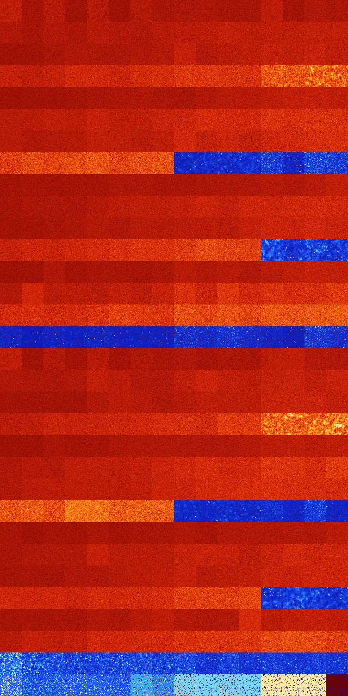

# B12358 (154624-155135)

<details>
    <summary>Initial Grid</summary>
    
</details>


<details>
    <summary>Initial Grid RLE</summary>

```
#C Exported from GoGoL (https://github.com/marrow16/gogol)
#C Wrap mode: Toroidal
#C Boundary mode: Dead
#C Step: 0
x = 100, y = 100, rule = B12358/S
9bo11bo37bo10bo$16b2o4bo10bo29bo15b2o13bo$15bo7bo2bo21bo40bobo3bo$8bo2b
o85bo$43b2o19bo32bo$9bo12bo21bo39bo$19bo32bo11bo15bo2bo8bo2bo$3bo3bo6bo
28bo2bo23bobo9bo15bo$12bo19bo2bo28bo15bobo$34bo36bo15bo$30bo8bo31b2o21b
o$19bobo18bo37bo$20bo$30bo4bo41bo5bo7bo4bo$6bo16bo2bo5bo7bo20bo32bo$2b
2o11bo33bo32bo3bo$16bo5bo29bo$5b2o16bo18bo$19bo5b2o13bo24bo11bobo$bo4bo
14bo18b2o20bo17bo15bo$9bo7bo40bo$17bo12bobo11bo7bo7bo3bo2bo5bo10bobo$bo
7bo26bo33bo5bo2bo16bo$33bo37bo14bo$9bo35bo3bo22bo3bo$o5bo17bo$100b$19bo
44bo6bo$bo12b2o8bo9bo5b2o24bobo3bo$bo2bo39bo12bo36bo$7bo50bo11b2o10bo$o
6bo30bo$6bo21bo10bo9bo26bo$33bo27bo14bo19bo2bo$27bo21bo8bo20bobo$28bo8b
o56bo$16bo13bo18bo33bo$31b2o29bo16bo8bo$12bo5bo40bo3bo11bo9bo5bobo$22bo
2bo22bo18bo4bo22bo$24bo$6b2o7bo9bo4bo46bo$9bo12bo28bobobo$8bo12bo4bo2bo
10bo3bo12bo26bo7bo$38b2o6bo22bobo8bobo$18bo9bo26bo2bo24bo4bo6bo$26bo67b
o$22bo4bo3bo27bobo28bo$19bo11bo35bo5bo$45bo12bo26bo3bo$9bo24bo3bo49bo2b
o$14b2o37bo$11bo$35bo15bo17bo$53bo17bo7bo4bo13bo$21bo20bo16bo$obo29bo
24bo22bo$7bo23bo49b2o$11bobo25bo7bo10bo17bo$17bo3bo25bo4bo$6bo4b2o14bo
6bo4bo28bo27bo$13bo2bo4bo3bo8bo5bo7bo4bo3bo19bo5bo$28bo25bo27bo$24bo27b
o8bo2bo3bo20bo$o4bo77bo10bo$30bo16bo2bo2bo23bo7bo$6bo11bo42bo12bo$5bo9b
o15bo8bo19bo14bo15bo$4bobo34bo45bo5bo$o29bo7bo34bo$5bo48bo26bo$9bo7bo
24bo2bo3bo18bo12bo$9bo$5bo17bo23b2o9bo4bo9bobo13bo3bo$48bo2bo17bo14bo$b
obo2bo24bo55bo9b2o$11bo9bo34bo2bo9bo23bobo$19bo15bo16bo9b2o$13bo3bo26bo
35bo12bo2bo$59b2o6bo7bo9bo$bo48bo13bo2bo3bo$26bo23bo9bo20bo10bo$3bo8bo
68bo16b2o$13bo16bo14bo13b2o24bo$o35bo$22bo4bo3bo10bo40bo$12bo30bo29bo
24bo$36bo45bo7bo$31bo12bo20bo18bo$13b2o18b2o14bobo12bo11bo5bo9bo$21b2o
44bo$23bo14bo$5bo36bo18bo19bo16bo$93b2o2bo$39b2o7bo11bo6bo23bo$2bo16bo
12bo12bo6bo23bo8bo$36bo22bo5bo6bo5bo6bo$20bo2bo16bo39bo$40bo4bo27bo4bo
11bo$5bo5bo16bo18bo5bo8b2o!
```
</details>
<details>
    <summary>Thumbnail</summary>

</details>
<table>
<tr>
    <td><a href="./154624%20S%20Heat%20Map%20Activity.png"></a><br>S (154624)<br>G>1000</td>    <td><a href="./154625%20S0%20Heat%20Map%20Activity.png"></a><br>S0 (154625)<br>G>1000</td>    <td><a href="./154626%20S1%20Heat%20Map%20Activity.png"></a><br>S1 (154626)<br>G>1000</td>    <td><a href="./154627%20S01%20Heat%20Map%20Activity.png"></a><br>S01 (154627)<br>G>1000</td>    <td><a href="./154628%20S2%20Heat%20Map%20Activity.png"></a><br>S2 (154628)<br>G>1000</td>    <td><a href="./154629%20S02%20Heat%20Map%20Activity.png"></a><br>S02 (154629)<br>G>1000</td>    <td><a href="./154630%20S12%20Heat%20Map%20Activity.png"></a><br>S12 (154630)<br>G>1000</td>    <td><a href="./154631%20S012%20Heat%20Map%20Activity.png"></a><br>S012 (154631)<br>G>1000</td>    <td><a href="./154632%20S3%20Heat%20Map%20Activity.png"></a><br>S3 (154632)<br>G>1000</td>    <td><a href="./154633%20S03%20Heat%20Map%20Activity.png"></a><br>S03 (154633)<br>G>1000</td>    <td><a href="./154634%20S13%20Heat%20Map%20Activity.png"></a><br>S13 (154634)<br>G>1000</td>    <td><a href="./154635%20S013%20Heat%20Map%20Activity.png"></a><br>S013 (154635)<br>G>1000</td>    <td><a href="./154636%20S23%20Heat%20Map%20Activity.png"></a><br>S23 (154636)<br>G>1000</td>    <td><a href="./154637%20S023%20Heat%20Map%20Activity.png"></a><br>S023 (154637)<br>G>1000</td>    <td><a href="./154638%20S123%20Heat%20Map%20Activity.png"></a><br>S123 (154638)<br>G>1000</td>    <td><a href="./154639%20S0123%20Heat%20Map%20Activity.png"></a><br>S0123 (154639)<br>G>1000</td></tr>
<tr>
    <td><a href="./154640%20S4%20Heat%20Map%20Activity.png"></a><br>S4 (154640)<br>G>1000</td>    <td><a href="./154641%20S04%20Heat%20Map%20Activity.png"></a><br>S04 (154641)<br>G>1000</td>    <td><a href="./154642%20S14%20Heat%20Map%20Activity.png"></a><br>S14 (154642)<br>G>1000</td>    <td><a href="./154643%20S014%20Heat%20Map%20Activity.png"></a><br>S014 (154643)<br>G>1000</td>    <td><a href="./154644%20S24%20Heat%20Map%20Activity.png"></a><br>S24 (154644)<br>G>1000</td>    <td><a href="./154645%20S024%20Heat%20Map%20Activity.png"></a><br>S024 (154645)<br>G>1000</td>    <td><a href="./154646%20S124%20Heat%20Map%20Activity.png"></a><br>S124 (154646)<br>G>1000</td>    <td><a href="./154647%20S0124%20Heat%20Map%20Activity.png"></a><br>S0124 (154647)<br>G>1000</td>    <td><a href="./154648%20S34%20Heat%20Map%20Activity.png"></a><br>S34 (154648)<br>G>1000</td>    <td><a href="./154649%20S034%20Heat%20Map%20Activity.png"></a><br>S034 (154649)<br>G>1000</td>    <td><a href="./154650%20S134%20Heat%20Map%20Activity.png"></a><br>S134 (154650)<br>G>1000</td>    <td><a href="./154651%20S0134%20Heat%20Map%20Activity.png"></a><br>S0134 (154651)<br>G>1000</td>    <td><a href="./154652%20S234%20Heat%20Map%20Activity.png"></a><br>S234 (154652)<br>G>1000</td>    <td><a href="./154653%20S0234%20Heat%20Map%20Activity.png"></a><br>S0234 (154653)<br>G>1000</td>    <td><a href="./154654%20S1234%20Heat%20Map%20Activity.png"></a><br>S1234 (154654)<br>G>1000</td>    <td><a href="./154655%20S01234%20Heat%20Map%20Activity.png"></a><br>S01234 (154655)<br>G>1000</td></tr>
<tr>
    <td><a href="./154656%20S5%20Heat%20Map%20Activity.png"></a><br>S5 (154656)<br>G>1000</td>    <td><a href="./154657%20S05%20Heat%20Map%20Activity.png"></a><br>S05 (154657)<br>G>1000</td>    <td><a href="./154658%20S15%20Heat%20Map%20Activity.png"></a><br>S15 (154658)<br>G>1000</td>    <td><a href="./154659%20S015%20Heat%20Map%20Activity.png"></a><br>S015 (154659)<br>G>1000</td>    <td><a href="./154660%20S25%20Heat%20Map%20Activity.png"></a><br>S25 (154660)<br>G>1000</td>    <td><a href="./154661%20S025%20Heat%20Map%20Activity.png"></a><br>S025 (154661)<br>G>1000</td>    <td><a href="./154662%20S125%20Heat%20Map%20Activity.png"></a><br>S125 (154662)<br>G>1000</td>    <td><a href="./154663%20S0125%20Heat%20Map%20Activity.png"></a><br>S0125 (154663)<br>G>1000</td>    <td><a href="./154664%20S35%20Heat%20Map%20Activity.png"></a><br>S35 (154664)<br>G>1000</td>    <td><a href="./154665%20S035%20Heat%20Map%20Activity.png"></a><br>S035 (154665)<br>G>1000</td>    <td><a href="./154666%20S135%20Heat%20Map%20Activity.png"></a><br>S135 (154666)<br>G>1000</td>    <td><a href="./154667%20S0135%20Heat%20Map%20Activity.png"></a><br>S0135 (154667)<br>G>1000</td>    <td><a href="./154668%20S235%20Heat%20Map%20Activity.png"></a><br>S235 (154668)<br>G>1000</td>    <td><a href="./154669%20S0235%20Heat%20Map%20Activity.png"></a><br>S0235 (154669)<br>G>1000</td>    <td><a href="./154670%20S1235%20Heat%20Map%20Activity.png"></a><br>S1235 (154670)<br>G>1000</td>    <td><a href="./154671%20S01235%20Heat%20Map%20Activity.png"></a><br>S01235 (154671)<br>G>1000</td></tr>
<tr>
    <td><a href="./154672%20S45%20Heat%20Map%20Activity.png"></a><br>S45 (154672)<br>G>1000</td>    <td><a href="./154673%20S045%20Heat%20Map%20Activity.png"></a><br>S045 (154673)<br>G>1000</td>    <td><a href="./154674%20S145%20Heat%20Map%20Activity.png"></a><br>S145 (154674)<br>G>1000</td>    <td><a href="./154675%20S0145%20Heat%20Map%20Activity.png"></a><br>S0145 (154675)<br>G>1000</td>    <td><a href="./154676%20S245%20Heat%20Map%20Activity.png"></a><br>S245 (154676)<br>G>1000</td>    <td><a href="./154677%20S0245%20Heat%20Map%20Activity.png"></a><br>S0245 (154677)<br>G>1000</td>    <td><a href="./154678%20S1245%20Heat%20Map%20Activity.png"></a><br>S1245 (154678)<br>G>1000</td>    <td><a href="./154679%20S01245%20Heat%20Map%20Activity.png"></a><br>S01245 (154679)<br>G>1000</td>    <td><a href="./154680%20S345%20Heat%20Map%20Activity.png"></a><br>S345 (154680)<br>G>1000</td>    <td><a href="./154681%20S0345%20Heat%20Map%20Activity.png"></a><br>S0345 (154681)<br>G>1000</td>    <td><a href="./154682%20S1345%20Heat%20Map%20Activity.png"></a><br>S1345 (154682)<br>G>1000</td>    <td><a href="./154683%20S01345%20Heat%20Map%20Activity.png"></a><br>S01345 (154683)<br>G>1000</td>    <td><a href="./154684%20S2345%20Heat%20Map%20Activity.png"></a><br>S2345 (154684)<br>G>1000</td>    <td><a href="./154685%20S02345%20Heat%20Map%20Activity.png"></a><br>S02345 (154685)<br>G>1000</td>    <td><a href="./154686%20S12345%20Heat%20Map%20Activity.png"></a><br>S12345 (154686)<br>G>1000</td>    <td><a href="./154687%20S012345%20Heat%20Map%20Activity.png"></a><br>S012345 (154687)<br>G>1000</td></tr>
<tr>
    <td><a href="./154688%20S6%20Heat%20Map%20Activity.png"></a><br>S6 (154688)<br>G>1000</td>    <td><a href="./154689%20S06%20Heat%20Map%20Activity.png"></a><br>S06 (154689)<br>G>1000</td>    <td><a href="./154690%20S16%20Heat%20Map%20Activity.png"></a><br>S16 (154690)<br>G>1000</td>    <td><a href="./154691%20S016%20Heat%20Map%20Activity.png"></a><br>S016 (154691)<br>G>1000</td>    <td><a href="./154692%20S26%20Heat%20Map%20Activity.png"></a><br>S26 (154692)<br>G>1000</td>    <td><a href="./154693%20S026%20Heat%20Map%20Activity.png"></a><br>S026 (154693)<br>G>1000</td>    <td><a href="./154694%20S126%20Heat%20Map%20Activity.png"></a><br>S126 (154694)<br>G>1000</td>    <td><a href="./154695%20S0126%20Heat%20Map%20Activity.png"></a><br>S0126 (154695)<br>G>1000</td>    <td><a href="./154696%20S36%20Heat%20Map%20Activity.png"></a><br>S36 (154696)<br>G>1000</td>    <td><a href="./154697%20S036%20Heat%20Map%20Activity.png"></a><br>S036 (154697)<br>G>1000</td>    <td><a href="./154698%20S136%20Heat%20Map%20Activity.png"></a><br>S136 (154698)<br>G>1000</td>    <td><a href="./154699%20S0136%20Heat%20Map%20Activity.png"></a><br>S0136 (154699)<br>G>1000</td>    <td><a href="./154700%20S236%20Heat%20Map%20Activity.png"></a><br>S236 (154700)<br>G>1000</td>    <td><a href="./154701%20S0236%20Heat%20Map%20Activity.png"></a><br>S0236 (154701)<br>G>1000</td>    <td><a href="./154702%20S1236%20Heat%20Map%20Activity.png"></a><br>S1236 (154702)<br>G>1000</td>    <td><a href="./154703%20S01236%20Heat%20Map%20Activity.png"></a><br>S01236 (154703)<br>G>1000</td></tr>
<tr>
    <td><a href="./154704%20S46%20Heat%20Map%20Activity.png"></a><br>S46 (154704)<br>G>1000</td>    <td><a href="./154705%20S046%20Heat%20Map%20Activity.png"></a><br>S046 (154705)<br>G>1000</td>    <td><a href="./154706%20S146%20Heat%20Map%20Activity.png"></a><br>S146 (154706)<br>G>1000</td>    <td><a href="./154707%20S0146%20Heat%20Map%20Activity.png"></a><br>S0146 (154707)<br>G>1000</td>    <td><a href="./154708%20S246%20Heat%20Map%20Activity.png"></a><br>S246 (154708)<br>G>1000</td>    <td><a href="./154709%20S0246%20Heat%20Map%20Activity.png"></a><br>S0246 (154709)<br>G>1000</td>    <td><a href="./154710%20S1246%20Heat%20Map%20Activity.png"></a><br>S1246 (154710)<br>G>1000</td>    <td><a href="./154711%20S01246%20Heat%20Map%20Activity.png"></a><br>S01246 (154711)<br>G>1000</td>    <td><a href="./154712%20S346%20Heat%20Map%20Activity.png"></a><br>S346 (154712)<br>G>1000</td>    <td><a href="./154713%20S0346%20Heat%20Map%20Activity.png"></a><br>S0346 (154713)<br>G>1000</td>    <td><a href="./154714%20S1346%20Heat%20Map%20Activity.png"></a><br>S1346 (154714)<br>G>1000</td>    <td><a href="./154715%20S01346%20Heat%20Map%20Activity.png"></a><br>S01346 (154715)<br>G>1000</td>    <td><a href="./154716%20S2346%20Heat%20Map%20Activity.png"></a><br>S2346 (154716)<br>G>1000</td>    <td><a href="./154717%20S02346%20Heat%20Map%20Activity.png"></a><br>S02346 (154717)<br>G>1000</td>    <td><a href="./154718%20S12346%20Heat%20Map%20Activity.png"></a><br>S12346 (154718)<br>G>1000</td>    <td><a href="./154719%20S012346%20Heat%20Map%20Activity.png"></a><br>S012346 (154719)<br>G>1000</td></tr>
<tr>
    <td><a href="./154720%20S56%20Heat%20Map%20Activity.png"></a><br>S56 (154720)<br>G>1000</td>    <td><a href="./154721%20S056%20Heat%20Map%20Activity.png"></a><br>S056 (154721)<br>G>1000</td>    <td><a href="./154722%20S156%20Heat%20Map%20Activity.png"></a><br>S156 (154722)<br>G>1000</td>    <td><a href="./154723%20S0156%20Heat%20Map%20Activity.png"></a><br>S0156 (154723)<br>G>1000</td>    <td><a href="./154724%20S256%20Heat%20Map%20Activity.png"></a><br>S256 (154724)<br>G>1000</td>    <td><a href="./154725%20S0256%20Heat%20Map%20Activity.png"></a><br>S0256 (154725)<br>G>1000</td>    <td><a href="./154726%20S1256%20Heat%20Map%20Activity.png"></a><br>S1256 (154726)<br>G>1000</td>    <td><a href="./154727%20S01256%20Heat%20Map%20Activity.png"></a><br>S01256 (154727)<br>G>1000</td>    <td><a href="./154728%20S356%20Heat%20Map%20Activity.png"></a><br>S356 (154728)<br>G>1000</td>    <td><a href="./154729%20S0356%20Heat%20Map%20Activity.png"></a><br>S0356 (154729)<br>G>1000</td>    <td><a href="./154730%20S1356%20Heat%20Map%20Activity.png"></a><br>S1356 (154730)<br>G>1000</td>    <td><a href="./154731%20S01356%20Heat%20Map%20Activity.png"></a><br>S01356 (154731)<br>G>1000</td>    <td><a href="./154732%20S2356%20Heat%20Map%20Activity.png"></a><br>S2356 (154732)<br>G>1000</td>    <td><a href="./154733%20S02356%20Heat%20Map%20Activity.png"></a><br>S02356 (154733)<br>G>1000</td>    <td><a href="./154734%20S12356%20Heat%20Map%20Activity.png"></a><br>S12356 (154734)<br>G>1000</td>    <td><a href="./154735%20S012356%20Heat%20Map%20Activity.png"></a><br>S012356 (154735)<br>G>1000</td></tr>
<tr>
    <td><a href="./154736%20S456%20Heat%20Map%20Activity.png"></a><br>S456 (154736)<br>G>1000</td>    <td><a href="./154737%20S0456%20Heat%20Map%20Activity.png"></a><br>S0456 (154737)<br>G>1000</td>    <td><a href="./154738%20S1456%20Heat%20Map%20Activity.png"></a><br>S1456 (154738)<br>G>1000</td>    <td><a href="./154739%20S01456%20Heat%20Map%20Activity.png"></a><br>S01456 (154739)<br>G>1000</td>    <td><a href="./154740%20S2456%20Heat%20Map%20Activity.png"></a><br>S2456 (154740)<br>G>1000</td>    <td><a href="./154741%20S02456%20Heat%20Map%20Activity.png"></a><br>S02456 (154741)<br>G>1000</td>    <td><a href="./154742%20S12456%20Heat%20Map%20Activity.png"></a><br>S12456 (154742)<br>G>1000</td>    <td><a href="./154743%20S012456%20Heat%20Map%20Activity.png"></a><br>S012456 (154743)<br>G>1000</td>    <td><a href="./154744%20S3456%20Heat%20Map%20Activity.png"></a><br>S3456 (154744)<br>R@260,p6</td>    <td><a href="./154745%20S03456%20Heat%20Map%20Activity.png"></a><br>S03456 (154745)<br>R@223,p12</td>    <td><a href="./154746%20S13456%20Heat%20Map%20Activity.png"></a><br>S13456 (154746)<br>R@196,p12</td>    <td><a href="./154747%20S013456%20Heat%20Map%20Activity.png"></a><br>S013456 (154747)<br>R@167,p12</td>    <td><a href="./154748%20S23456%20Heat%20Map%20Activity.png"></a><br>S23456 (154748)<br>R@44,p12</td>    <td><a href="./154749%20S023456%20Heat%20Map%20Activity.png"></a><br>S023456 (154749)<br>R@97,p60</td>    <td><a href="./154750%20S123456%20Heat%20Map%20Activity.png"></a><br>S123456 (154750)<br>R@39,p12</td>    <td><a href="./154751%20S0123456%20Heat%20Map%20Activity.png"></a><br>S0123456 (154751)<br>R@40,p12</td></tr>
<tr>
    <td><a href="./154752%20S7%20Heat%20Map%20Activity.png"></a><br>S7 (154752)<br>G>1000</td>    <td><a href="./154753%20S07%20Heat%20Map%20Activity.png"></a><br>S07 (154753)<br>G>1000</td>    <td><a href="./154754%20S17%20Heat%20Map%20Activity.png"></a><br>S17 (154754)<br>G>1000</td>    <td><a href="./154755%20S017%20Heat%20Map%20Activity.png"></a><br>S017 (154755)<br>G>1000</td>    <td><a href="./154756%20S27%20Heat%20Map%20Activity.png"></a><br>S27 (154756)<br>G>1000</td>    <td><a href="./154757%20S027%20Heat%20Map%20Activity.png"></a><br>S027 (154757)<br>G>1000</td>    <td><a href="./154758%20S127%20Heat%20Map%20Activity.png"></a><br>S127 (154758)<br>G>1000</td>    <td><a href="./154759%20S0127%20Heat%20Map%20Activity.png"></a><br>S0127 (154759)<br>G>1000</td>    <td><a href="./154760%20S37%20Heat%20Map%20Activity.png"></a><br>S37 (154760)<br>G>1000</td>    <td><a href="./154761%20S037%20Heat%20Map%20Activity.png"></a><br>S037 (154761)<br>G>1000</td>    <td><a href="./154762%20S137%20Heat%20Map%20Activity.png"></a><br>S137 (154762)<br>G>1000</td>    <td><a href="./154763%20S0137%20Heat%20Map%20Activity.png"></a><br>S0137 (154763)<br>G>1000</td>    <td><a href="./154764%20S237%20Heat%20Map%20Activity.png"></a><br>S237 (154764)<br>G>1000</td>    <td><a href="./154765%20S0237%20Heat%20Map%20Activity.png"></a><br>S0237 (154765)<br>G>1000</td>    <td><a href="./154766%20S1237%20Heat%20Map%20Activity.png"></a><br>S1237 (154766)<br>G>1000</td>    <td><a href="./154767%20S01237%20Heat%20Map%20Activity.png"></a><br>S01237 (154767)<br>G>1000</td></tr>
<tr>
    <td><a href="./154768%20S47%20Heat%20Map%20Activity.png"></a><br>S47 (154768)<br>G>1000</td>    <td><a href="./154769%20S047%20Heat%20Map%20Activity.png"></a><br>S047 (154769)<br>G>1000</td>    <td><a href="./154770%20S147%20Heat%20Map%20Activity.png"></a><br>S147 (154770)<br>G>1000</td>    <td><a href="./154771%20S0147%20Heat%20Map%20Activity.png"></a><br>S0147 (154771)<br>G>1000</td>    <td><a href="./154772%20S247%20Heat%20Map%20Activity.png"></a><br>S247 (154772)<br>G>1000</td>    <td><a href="./154773%20S0247%20Heat%20Map%20Activity.png"></a><br>S0247 (154773)<br>G>1000</td>    <td><a href="./154774%20S1247%20Heat%20Map%20Activity.png"></a><br>S1247 (154774)<br>G>1000</td>    <td><a href="./154775%20S01247%20Heat%20Map%20Activity.png"></a><br>S01247 (154775)<br>G>1000</td>    <td><a href="./154776%20S347%20Heat%20Map%20Activity.png"></a><br>S347 (154776)<br>G>1000</td>    <td><a href="./154777%20S0347%20Heat%20Map%20Activity.png"></a><br>S0347 (154777)<br>G>1000</td>    <td><a href="./154778%20S1347%20Heat%20Map%20Activity.png"></a><br>S1347 (154778)<br>G>1000</td>    <td><a href="./154779%20S01347%20Heat%20Map%20Activity.png"></a><br>S01347 (154779)<br>G>1000</td>    <td><a href="./154780%20S2347%20Heat%20Map%20Activity.png"></a><br>S2347 (154780)<br>G>1000</td>    <td><a href="./154781%20S02347%20Heat%20Map%20Activity.png"></a><br>S02347 (154781)<br>G>1000</td>    <td><a href="./154782%20S12347%20Heat%20Map%20Activity.png"></a><br>S12347 (154782)<br>G>1000</td>    <td><a href="./154783%20S012347%20Heat%20Map%20Activity.png"></a><br>S012347 (154783)<br>G>1000</td></tr>
<tr>
    <td><a href="./154784%20S57%20Heat%20Map%20Activity.png"></a><br>S57 (154784)<br>G>1000</td>    <td><a href="./154785%20S057%20Heat%20Map%20Activity.png"></a><br>S057 (154785)<br>G>1000</td>    <td><a href="./154786%20S157%20Heat%20Map%20Activity.png"></a><br>S157 (154786)<br>G>1000</td>    <td><a href="./154787%20S0157%20Heat%20Map%20Activity.png"></a><br>S0157 (154787)<br>G>1000</td>    <td><a href="./154788%20S257%20Heat%20Map%20Activity.png"></a><br>S257 (154788)<br>G>1000</td>    <td><a href="./154789%20S0257%20Heat%20Map%20Activity.png"></a><br>S0257 (154789)<br>G>1000</td>    <td><a href="./154790%20S1257%20Heat%20Map%20Activity.png"></a><br>S1257 (154790)<br>G>1000</td>    <td><a href="./154791%20S01257%20Heat%20Map%20Activity.png"></a><br>S01257 (154791)<br>G>1000</td>    <td><a href="./154792%20S357%20Heat%20Map%20Activity.png"></a><br>S357 (154792)<br>G>1000</td>    <td><a href="./154793%20S0357%20Heat%20Map%20Activity.png"></a><br>S0357 (154793)<br>G>1000</td>    <td><a href="./154794%20S1357%20Heat%20Map%20Activity.png"></a><br>S1357 (154794)<br>G>1000</td>    <td><a href="./154795%20S01357%20Heat%20Map%20Activity.png"></a><br>S01357 (154795)<br>G>1000</td>    <td><a href="./154796%20S2357%20Heat%20Map%20Activity.png"></a><br>S2357 (154796)<br>G>1000</td>    <td><a href="./154797%20S02357%20Heat%20Map%20Activity.png"></a><br>S02357 (154797)<br>G>1000</td>    <td><a href="./154798%20S12357%20Heat%20Map%20Activity.png"></a><br>S12357 (154798)<br>G>1000</td>    <td><a href="./154799%20S012357%20Heat%20Map%20Activity.png"></a><br>S012357 (154799)<br>G>1000</td></tr>
<tr>
    <td><a href="./154800%20S457%20Heat%20Map%20Activity.png"></a><br>S457 (154800)<br>G>1000</td>    <td><a href="./154801%20S0457%20Heat%20Map%20Activity.png"></a><br>S0457 (154801)<br>G>1000</td>    <td><a href="./154802%20S1457%20Heat%20Map%20Activity.png"></a><br>S1457 (154802)<br>G>1000</td>    <td><a href="./154803%20S01457%20Heat%20Map%20Activity.png"></a><br>S01457 (154803)<br>G>1000</td>    <td><a href="./154804%20S2457%20Heat%20Map%20Activity.png"></a><br>S2457 (154804)<br>G>1000</td>    <td><a href="./154805%20S02457%20Heat%20Map%20Activity.png"></a><br>S02457 (154805)<br>G>1000</td>    <td><a href="./154806%20S12457%20Heat%20Map%20Activity.png"></a><br>S12457 (154806)<br>G>1000</td>    <td><a href="./154807%20S012457%20Heat%20Map%20Activity.png"></a><br>S012457 (154807)<br>G>1000</td>    <td><a href="./154808%20S3457%20Heat%20Map%20Activity.png"></a><br>S3457 (154808)<br>G>1000</td>    <td><a href="./154809%20S03457%20Heat%20Map%20Activity.png"></a><br>S03457 (154809)<br>G>1000</td>    <td><a href="./154810%20S13457%20Heat%20Map%20Activity.png"></a><br>S13457 (154810)<br>G>1000</td>    <td><a href="./154811%20S013457%20Heat%20Map%20Activity.png"></a><br>S013457 (154811)<br>G>1000</td>    <td><a href="./154812%20S23457%20Heat%20Map%20Activity.png"></a><br>S23457 (154812)<br>R@425,p24</td>    <td><a href="./154813%20S023457%20Heat%20Map%20Activity.png"></a><br>S023457 (154813)<br>R@505,p12</td>    <td><a href="./154814%20S123457%20Heat%20Map%20Activity.png"></a><br>S123457 (154814)<br>R@302,p12</td>    <td><a href="./154815%20S0123457%20Heat%20Map%20Activity.png"></a><br>S0123457 (154815)<br>R@351,p6</td></tr>
<tr>
    <td><a href="./154816%20S67%20Heat%20Map%20Activity.png"></a><br>S67 (154816)<br>G>1000</td>    <td><a href="./154817%20S067%20Heat%20Map%20Activity.png"></a><br>S067 (154817)<br>G>1000</td>    <td><a href="./154818%20S167%20Heat%20Map%20Activity.png"></a><br>S167 (154818)<br>G>1000</td>    <td><a href="./154819%20S0167%20Heat%20Map%20Activity.png"></a><br>S0167 (154819)<br>G>1000</td>    <td><a href="./154820%20S267%20Heat%20Map%20Activity.png"></a><br>S267 (154820)<br>G>1000</td>    <td><a href="./154821%20S0267%20Heat%20Map%20Activity.png"></a><br>S0267 (154821)<br>G>1000</td>    <td><a href="./154822%20S1267%20Heat%20Map%20Activity.png"></a><br>S1267 (154822)<br>G>1000</td>    <td><a href="./154823%20S01267%20Heat%20Map%20Activity.png"></a><br>S01267 (154823)<br>G>1000</td>    <td><a href="./154824%20S367%20Heat%20Map%20Activity.png"></a><br>S367 (154824)<br>G>1000</td>    <td><a href="./154825%20S0367%20Heat%20Map%20Activity.png"></a><br>S0367 (154825)<br>G>1000</td>    <td><a href="./154826%20S1367%20Heat%20Map%20Activity.png"></a><br>S1367 (154826)<br>G>1000</td>    <td><a href="./154827%20S01367%20Heat%20Map%20Activity.png"></a><br>S01367 (154827)<br>G>1000</td>    <td><a href="./154828%20S2367%20Heat%20Map%20Activity.png"></a><br>S2367 (154828)<br>G>1000</td>    <td><a href="./154829%20S02367%20Heat%20Map%20Activity.png"></a><br>S02367 (154829)<br>G>1000</td>    <td><a href="./154830%20S12367%20Heat%20Map%20Activity.png"></a><br>S12367 (154830)<br>G>1000</td>    <td><a href="./154831%20S012367%20Heat%20Map%20Activity.png"></a><br>S012367 (154831)<br>G>1000</td></tr>
<tr>
    <td><a href="./154832%20S467%20Heat%20Map%20Activity.png"></a><br>S467 (154832)<br>G>1000</td>    <td><a href="./154833%20S0467%20Heat%20Map%20Activity.png"></a><br>S0467 (154833)<br>G>1000</td>    <td><a href="./154834%20S1467%20Heat%20Map%20Activity.png"></a><br>S1467 (154834)<br>G>1000</td>    <td><a href="./154835%20S01467%20Heat%20Map%20Activity.png"></a><br>S01467 (154835)<br>G>1000</td>    <td><a href="./154836%20S2467%20Heat%20Map%20Activity.png"></a><br>S2467 (154836)<br>G>1000</td>    <td><a href="./154837%20S02467%20Heat%20Map%20Activity.png"></a><br>S02467 (154837)<br>G>1000</td>    <td><a href="./154838%20S12467%20Heat%20Map%20Activity.png"></a><br>S12467 (154838)<br>G>1000</td>    <td><a href="./154839%20S012467%20Heat%20Map%20Activity.png"></a><br>S012467 (154839)<br>G>1000</td>    <td><a href="./154840%20S3467%20Heat%20Map%20Activity.png"></a><br>S3467 (154840)<br>G>1000</td>    <td><a href="./154841%20S03467%20Heat%20Map%20Activity.png"></a><br>S03467 (154841)<br>G>1000</td>    <td><a href="./154842%20S13467%20Heat%20Map%20Activity.png"></a><br>S13467 (154842)<br>G>1000</td>    <td><a href="./154843%20S013467%20Heat%20Map%20Activity.png"></a><br>S013467 (154843)<br>G>1000</td>    <td><a href="./154844%20S23467%20Heat%20Map%20Activity.png"></a><br>S23467 (154844)<br>G>1000</td>    <td><a href="./154845%20S023467%20Heat%20Map%20Activity.png"></a><br>S023467 (154845)<br>G>1000</td>    <td><a href="./154846%20S123467%20Heat%20Map%20Activity.png"></a><br>S123467 (154846)<br>G>1000</td>    <td><a href="./154847%20S0123467%20Heat%20Map%20Activity.png"></a><br>S0123467 (154847)<br>G>1000</td></tr>
<tr>
    <td><a href="./154848%20S567%20Heat%20Map%20Activity.png"></a><br>S567 (154848)<br>G>1000</td>    <td><a href="./154849%20S0567%20Heat%20Map%20Activity.png"></a><br>S0567 (154849)<br>G>1000</td>    <td><a href="./154850%20S1567%20Heat%20Map%20Activity.png"></a><br>S1567 (154850)<br>G>1000</td>    <td><a href="./154851%20S01567%20Heat%20Map%20Activity.png"></a><br>S01567 (154851)<br>G>1000</td>    <td><a href="./154852%20S2567%20Heat%20Map%20Activity.png"></a><br>S2567 (154852)<br>G>1000</td>    <td><a href="./154853%20S02567%20Heat%20Map%20Activity.png"></a><br>S02567 (154853)<br>G>1000</td>    <td><a href="./154854%20S12567%20Heat%20Map%20Activity.png"></a><br>S12567 (154854)<br>G>1000</td>    <td><a href="./154855%20S012567%20Heat%20Map%20Activity.png"></a><br>S012567 (154855)<br>G>1000</td>    <td><a href="./154856%20S3567%20Heat%20Map%20Activity.png"></a><br>S3567 (154856)<br>G>1000</td>    <td><a href="./154857%20S03567%20Heat%20Map%20Activity.png"></a><br>S03567 (154857)<br>G>1000</td>    <td><a href="./154858%20S13567%20Heat%20Map%20Activity.png"></a><br>S13567 (154858)<br>G>1000</td>    <td><a href="./154859%20S013567%20Heat%20Map%20Activity.png"></a><br>S013567 (154859)<br>G>1000</td>    <td><a href="./154860%20S23567%20Heat%20Map%20Activity.png"></a><br>S23567 (154860)<br>G>1000</td>    <td><a href="./154861%20S023567%20Heat%20Map%20Activity.png"></a><br>S023567 (154861)<br>G>1000</td>    <td><a href="./154862%20S123567%20Heat%20Map%20Activity.png"></a><br>S123567 (154862)<br>G>1000</td>    <td><a href="./154863%20S0123567%20Heat%20Map%20Activity.png"></a><br>S0123567 (154863)<br>G>1000</td></tr>
<tr>
    <td><a href="./154864%20S4567%20Heat%20Map%20Activity.png"></a><br>S4567 (154864)<br>R@117,p60</td>    <td><a href="./154865%20S04567%20Heat%20Map%20Activity.png"></a><br>S04567 (154865)<br>R@233,p180</td>    <td><a href="./154866%20S14567%20Heat%20Map%20Activity.png"></a><br>S14567 (154866)<br>R@105,p60</td>    <td><a href="./154867%20S014567%20Heat%20Map%20Activity.png"></a><br>S014567 (154867)<br>R@117,p60</td>    <td><a href="./154868%20S24567%20Heat%20Map%20Activity.png"></a><br>S24567 (154868)<br>R@102,p60</td>    <td><a href="./154869%20S024567%20Heat%20Map%20Activity.png"></a><br>S024567 (154869)<br>R@115,p60</td>    <td><a href="./154870%20S124567%20Heat%20Map%20Activity.png"></a><br>S124567 (154870)<br>R@121,p60</td>    <td><a href="./154871%20S0124567%20Heat%20Map%20Activity.png"></a><br>S0124567 (154871)<br>R@109,p60</td>    <td><a href="./154872%20S34567%20Heat%20Map%20Activity.png"></a><br>S34567 (154872)<br>R@33,p12</td>    <td><a href="./154873%20S034567%20Heat%20Map%20Activity.png"></a><br>S034567 (154873)<br>R@41,p24</td>    <td><a href="./154874%20S134567%20Heat%20Map%20Activity.png"></a><br>S134567 (154874)<br>R@30,p12</td>    <td><a href="./154875%20S0134567%20Heat%20Map%20Activity.png"></a><br>S0134567 (154875)<br>R@42,p24</td>    <td><a href="./154876%20S234567%20Heat%20Map%20Activity.png"></a><br>S234567 (154876)<br>R@60,p42</td>    <td><a href="./154877%20S0234567%20Heat%20Map%20Activity.png"></a><br>S0234567 (154877)<br>R@100,p84</td>    <td><a href="./154878%20S1234567%20Heat%20Map%20Activity.png"></a><br>S1234567 (154878)<br>R@24,p6</td>    <td><a href="./154879%20S01234567%20Heat%20Map%20Activity.png"></a><br>S01234567 (154879)<br>R@31,p12</td></tr>
<tr>
    <td><a href="./154880%20S8%20Heat%20Map%20Activity.png"></a><br>S8 (154880)<br>G>1000</td>    <td><a href="./154881%20S08%20Heat%20Map%20Activity.png"></a><br>S08 (154881)<br>G>1000</td>    <td><a href="./154882%20S18%20Heat%20Map%20Activity.png"></a><br>S18 (154882)<br>G>1000</td>    <td><a href="./154883%20S018%20Heat%20Map%20Activity.png"></a><br>S018 (154883)<br>G>1000</td>    <td><a href="./154884%20S28%20Heat%20Map%20Activity.png"></a><br>S28 (154884)<br>G>1000</td>    <td><a href="./154885%20S028%20Heat%20Map%20Activity.png"></a><br>S028 (154885)<br>G>1000</td>    <td><a href="./154886%20S128%20Heat%20Map%20Activity.png"></a><br>S128 (154886)<br>G>1000</td>    <td><a href="./154887%20S0128%20Heat%20Map%20Activity.png"></a><br>S0128 (154887)<br>G>1000</td>    <td><a href="./154888%20S38%20Heat%20Map%20Activity.png"></a><br>S38 (154888)<br>G>1000</td>    <td><a href="./154889%20S038%20Heat%20Map%20Activity.png"></a><br>S038 (154889)<br>G>1000</td>    <td><a href="./154890%20S138%20Heat%20Map%20Activity.png"></a><br>S138 (154890)<br>G>1000</td>    <td><a href="./154891%20S0138%20Heat%20Map%20Activity.png"></a><br>S0138 (154891)<br>G>1000</td>    <td><a href="./154892%20S238%20Heat%20Map%20Activity.png"></a><br>S238 (154892)<br>G>1000</td>    <td><a href="./154893%20S0238%20Heat%20Map%20Activity.png"></a><br>S0238 (154893)<br>G>1000</td>    <td><a href="./154894%20S1238%20Heat%20Map%20Activity.png"></a><br>S1238 (154894)<br>G>1000</td>    <td><a href="./154895%20S01238%20Heat%20Map%20Activity.png"></a><br>S01238 (154895)<br>G>1000</td></tr>
<tr>
    <td><a href="./154896%20S48%20Heat%20Map%20Activity.png"></a><br>S48 (154896)<br>G>1000</td>    <td><a href="./154897%20S048%20Heat%20Map%20Activity.png"></a><br>S048 (154897)<br>G>1000</td>    <td><a href="./154898%20S148%20Heat%20Map%20Activity.png"></a><br>S148 (154898)<br>G>1000</td>    <td><a href="./154899%20S0148%20Heat%20Map%20Activity.png"></a><br>S0148 (154899)<br>G>1000</td>    <td><a href="./154900%20S248%20Heat%20Map%20Activity.png"></a><br>S248 (154900)<br>G>1000</td>    <td><a href="./154901%20S0248%20Heat%20Map%20Activity.png"></a><br>S0248 (154901)<br>G>1000</td>    <td><a href="./154902%20S1248%20Heat%20Map%20Activity.png"></a><br>S1248 (154902)<br>G>1000</td>    <td><a href="./154903%20S01248%20Heat%20Map%20Activity.png"></a><br>S01248 (154903)<br>G>1000</td>    <td><a href="./154904%20S348%20Heat%20Map%20Activity.png"></a><br>S348 (154904)<br>G>1000</td>    <td><a href="./154905%20S0348%20Heat%20Map%20Activity.png"></a><br>S0348 (154905)<br>G>1000</td>    <td><a href="./154906%20S1348%20Heat%20Map%20Activity.png"></a><br>S1348 (154906)<br>G>1000</td>    <td><a href="./154907%20S01348%20Heat%20Map%20Activity.png"></a><br>S01348 (154907)<br>G>1000</td>    <td><a href="./154908%20S2348%20Heat%20Map%20Activity.png"></a><br>S2348 (154908)<br>G>1000</td>    <td><a href="./154909%20S02348%20Heat%20Map%20Activity.png"></a><br>S02348 (154909)<br>G>1000</td>    <td><a href="./154910%20S12348%20Heat%20Map%20Activity.png"></a><br>S12348 (154910)<br>G>1000</td>    <td><a href="./154911%20S012348%20Heat%20Map%20Activity.png"></a><br>S012348 (154911)<br>G>1000</td></tr>
<tr>
    <td><a href="./154912%20S58%20Heat%20Map%20Activity.png"></a><br>S58 (154912)<br>G>1000</td>    <td><a href="./154913%20S058%20Heat%20Map%20Activity.png"></a><br>S058 (154913)<br>G>1000</td>    <td><a href="./154914%20S158%20Heat%20Map%20Activity.png"></a><br>S158 (154914)<br>G>1000</td>    <td><a href="./154915%20S0158%20Heat%20Map%20Activity.png"></a><br>S0158 (154915)<br>G>1000</td>    <td><a href="./154916%20S258%20Heat%20Map%20Activity.png"></a><br>S258 (154916)<br>G>1000</td>    <td><a href="./154917%20S0258%20Heat%20Map%20Activity.png"></a><br>S0258 (154917)<br>G>1000</td>    <td><a href="./154918%20S1258%20Heat%20Map%20Activity.png"></a><br>S1258 (154918)<br>G>1000</td>    <td><a href="./154919%20S01258%20Heat%20Map%20Activity.png"></a><br>S01258 (154919)<br>G>1000</td>    <td><a href="./154920%20S358%20Heat%20Map%20Activity.png"></a><br>S358 (154920)<br>G>1000</td>    <td><a href="./154921%20S0358%20Heat%20Map%20Activity.png"></a><br>S0358 (154921)<br>G>1000</td>    <td><a href="./154922%20S1358%20Heat%20Map%20Activity.png"></a><br>S1358 (154922)<br>G>1000</td>    <td><a href="./154923%20S01358%20Heat%20Map%20Activity.png"></a><br>S01358 (154923)<br>G>1000</td>    <td><a href="./154924%20S2358%20Heat%20Map%20Activity.png"></a><br>S2358 (154924)<br>G>1000</td>    <td><a href="./154925%20S02358%20Heat%20Map%20Activity.png"></a><br>S02358 (154925)<br>G>1000</td>    <td><a href="./154926%20S12358%20Heat%20Map%20Activity.png"></a><br>S12358 (154926)<br>G>1000</td>    <td><a href="./154927%20S012358%20Heat%20Map%20Activity.png"></a><br>S012358 (154927)<br>G>1000</td></tr>
<tr>
    <td><a href="./154928%20S458%20Heat%20Map%20Activity.png"></a><br>S458 (154928)<br>G>1000</td>    <td><a href="./154929%20S0458%20Heat%20Map%20Activity.png"></a><br>S0458 (154929)<br>G>1000</td>    <td><a href="./154930%20S1458%20Heat%20Map%20Activity.png"></a><br>S1458 (154930)<br>G>1000</td>    <td><a href="./154931%20S01458%20Heat%20Map%20Activity.png"></a><br>S01458 (154931)<br>G>1000</td>    <td><a href="./154932%20S2458%20Heat%20Map%20Activity.png"></a><br>S2458 (154932)<br>G>1000</td>    <td><a href="./154933%20S02458%20Heat%20Map%20Activity.png"></a><br>S02458 (154933)<br>G>1000</td>    <td><a href="./154934%20S12458%20Heat%20Map%20Activity.png"></a><br>S12458 (154934)<br>G>1000</td>    <td><a href="./154935%20S012458%20Heat%20Map%20Activity.png"></a><br>S012458 (154935)<br>G>1000</td>    <td><a href="./154936%20S3458%20Heat%20Map%20Activity.png"></a><br>S3458 (154936)<br>G>1000</td>    <td><a href="./154937%20S03458%20Heat%20Map%20Activity.png"></a><br>S03458 (154937)<br>G>1000</td>    <td><a href="./154938%20S13458%20Heat%20Map%20Activity.png"></a><br>S13458 (154938)<br>G>1000</td>    <td><a href="./154939%20S013458%20Heat%20Map%20Activity.png"></a><br>S013458 (154939)<br>G>1000</td>    <td><a href="./154940%20S23458%20Heat%20Map%20Activity.png"></a><br>S23458 (154940)<br>G>1000</td>    <td><a href="./154941%20S023458%20Heat%20Map%20Activity.png"></a><br>S023458 (154941)<br>G>1000</td>    <td><a href="./154942%20S123458%20Heat%20Map%20Activity.png"></a><br>S123458 (154942)<br>G>1000</td>    <td><a href="./154943%20S0123458%20Heat%20Map%20Activity.png"></a><br>S0123458 (154943)<br>G>1000</td></tr>
<tr>
    <td><a href="./154944%20S68%20Heat%20Map%20Activity.png"></a><br>S68 (154944)<br>G>1000</td>    <td><a href="./154945%20S068%20Heat%20Map%20Activity.png"></a><br>S068 (154945)<br>G>1000</td>    <td><a href="./154946%20S168%20Heat%20Map%20Activity.png"></a><br>S168 (154946)<br>G>1000</td>    <td><a href="./154947%20S0168%20Heat%20Map%20Activity.png"></a><br>S0168 (154947)<br>G>1000</td>    <td><a href="./154948%20S268%20Heat%20Map%20Activity.png"></a><br>S268 (154948)<br>G>1000</td>    <td><a href="./154949%20S0268%20Heat%20Map%20Activity.png"></a><br>S0268 (154949)<br>G>1000</td>    <td><a href="./154950%20S1268%20Heat%20Map%20Activity.png"></a><br>S1268 (154950)<br>G>1000</td>    <td><a href="./154951%20S01268%20Heat%20Map%20Activity.png"></a><br>S01268 (154951)<br>G>1000</td>    <td><a href="./154952%20S368%20Heat%20Map%20Activity.png"></a><br>S368 (154952)<br>G>1000</td>    <td><a href="./154953%20S0368%20Heat%20Map%20Activity.png"></a><br>S0368 (154953)<br>G>1000</td>    <td><a href="./154954%20S1368%20Heat%20Map%20Activity.png"></a><br>S1368 (154954)<br>G>1000</td>    <td><a href="./154955%20S01368%20Heat%20Map%20Activity.png"></a><br>S01368 (154955)<br>G>1000</td>    <td><a href="./154956%20S2368%20Heat%20Map%20Activity.png"></a><br>S2368 (154956)<br>G>1000</td>    <td><a href="./154957%20S02368%20Heat%20Map%20Activity.png"></a><br>S02368 (154957)<br>G>1000</td>    <td><a href="./154958%20S12368%20Heat%20Map%20Activity.png"></a><br>S12368 (154958)<br>G>1000</td>    <td><a href="./154959%20S012368%20Heat%20Map%20Activity.png"></a><br>S012368 (154959)<br>G>1000</td></tr>
<tr>
    <td><a href="./154960%20S468%20Heat%20Map%20Activity.png"></a><br>S468 (154960)<br>G>1000</td>    <td><a href="./154961%20S0468%20Heat%20Map%20Activity.png"></a><br>S0468 (154961)<br>G>1000</td>    <td><a href="./154962%20S1468%20Heat%20Map%20Activity.png"></a><br>S1468 (154962)<br>G>1000</td>    <td><a href="./154963%20S01468%20Heat%20Map%20Activity.png"></a><br>S01468 (154963)<br>G>1000</td>    <td><a href="./154964%20S2468%20Heat%20Map%20Activity.png"></a><br>S2468 (154964)<br>G>1000</td>    <td><a href="./154965%20S02468%20Heat%20Map%20Activity.png"></a><br>S02468 (154965)<br>G>1000</td>    <td><a href="./154966%20S12468%20Heat%20Map%20Activity.png"></a><br>S12468 (154966)<br>G>1000</td>    <td><a href="./154967%20S012468%20Heat%20Map%20Activity.png"></a><br>S012468 (154967)<br>G>1000</td>    <td><a href="./154968%20S3468%20Heat%20Map%20Activity.png"></a><br>S3468 (154968)<br>G>1000</td>    <td><a href="./154969%20S03468%20Heat%20Map%20Activity.png"></a><br>S03468 (154969)<br>G>1000</td>    <td><a href="./154970%20S13468%20Heat%20Map%20Activity.png"></a><br>S13468 (154970)<br>G>1000</td>    <td><a href="./154971%20S013468%20Heat%20Map%20Activity.png"></a><br>S013468 (154971)<br>G>1000</td>    <td><a href="./154972%20S23468%20Heat%20Map%20Activity.png"></a><br>S23468 (154972)<br>G>1000</td>    <td><a href="./154973%20S023468%20Heat%20Map%20Activity.png"></a><br>S023468 (154973)<br>G>1000</td>    <td><a href="./154974%20S123468%20Heat%20Map%20Activity.png"></a><br>S123468 (154974)<br>G>1000</td>    <td><a href="./154975%20S0123468%20Heat%20Map%20Activity.png"></a><br>S0123468 (154975)<br>G>1000</td></tr>
<tr>
    <td><a href="./154976%20S568%20Heat%20Map%20Activity.png"></a><br>S568 (154976)<br>G>1000</td>    <td><a href="./154977%20S0568%20Heat%20Map%20Activity.png"></a><br>S0568 (154977)<br>G>1000</td>    <td><a href="./154978%20S1568%20Heat%20Map%20Activity.png"></a><br>S1568 (154978)<br>G>1000</td>    <td><a href="./154979%20S01568%20Heat%20Map%20Activity.png"></a><br>S01568 (154979)<br>G>1000</td>    <td><a href="./154980%20S2568%20Heat%20Map%20Activity.png"></a><br>S2568 (154980)<br>G>1000</td>    <td><a href="./154981%20S02568%20Heat%20Map%20Activity.png"></a><br>S02568 (154981)<br>G>1000</td>    <td><a href="./154982%20S12568%20Heat%20Map%20Activity.png"></a><br>S12568 (154982)<br>G>1000</td>    <td><a href="./154983%20S012568%20Heat%20Map%20Activity.png"></a><br>S012568 (154983)<br>G>1000</td>    <td><a href="./154984%20S3568%20Heat%20Map%20Activity.png"></a><br>S3568 (154984)<br>G>1000</td>    <td><a href="./154985%20S03568%20Heat%20Map%20Activity.png"></a><br>S03568 (154985)<br>G>1000</td>    <td><a href="./154986%20S13568%20Heat%20Map%20Activity.png"></a><br>S13568 (154986)<br>G>1000</td>    <td><a href="./154987%20S013568%20Heat%20Map%20Activity.png"></a><br>S013568 (154987)<br>G>1000</td>    <td><a href="./154988%20S23568%20Heat%20Map%20Activity.png"></a><br>S23568 (154988)<br>G>1000</td>    <td><a href="./154989%20S023568%20Heat%20Map%20Activity.png"></a><br>S023568 (154989)<br>G>1000</td>    <td><a href="./154990%20S123568%20Heat%20Map%20Activity.png"></a><br>S123568 (154990)<br>G>1000</td>    <td><a href="./154991%20S0123568%20Heat%20Map%20Activity.png"></a><br>S0123568 (154991)<br>G>1000</td></tr>
<tr>
    <td><a href="./154992%20S4568%20Heat%20Map%20Activity.png"></a><br>S4568 (154992)<br>G>1000</td>    <td><a href="./154993%20S04568%20Heat%20Map%20Activity.png"></a><br>S04568 (154993)<br>G>1000</td>    <td><a href="./154994%20S14568%20Heat%20Map%20Activity.png"></a><br>S14568 (154994)<br>G>1000</td>    <td><a href="./154995%20S014568%20Heat%20Map%20Activity.png"></a><br>S014568 (154995)<br>G>1000</td>    <td><a href="./154996%20S24568%20Heat%20Map%20Activity.png"></a><br>S24568 (154996)<br>G>1000</td>    <td><a href="./154997%20S024568%20Heat%20Map%20Activity.png"></a><br>S024568 (154997)<br>G>1000</td>    <td><a href="./154998%20S124568%20Heat%20Map%20Activity.png"></a><br>S124568 (154998)<br>G>1000</td>    <td><a href="./154999%20S0124568%20Heat%20Map%20Activity.png"></a><br>S0124568 (154999)<br>G>1000</td>    <td><a href="./155000%20S34568%20Heat%20Map%20Activity.png"></a><br>S34568 (155000)<br>R@118,p6</td>    <td><a href="./155001%20S034568%20Heat%20Map%20Activity.png"></a><br>S034568 (155001)<br>R@140,p10</td>    <td><a href="./155002%20S134568%20Heat%20Map%20Activity.png"></a><br>S134568 (155002)<br>R@112,p6</td>    <td><a href="./155003%20S0134568%20Heat%20Map%20Activity.png"></a><br>S0134568 (155003)<br>R@138,p10</td>    <td><a href="./155004%20S234568%20Heat%20Map%20Activity.png"></a><br>S234568 (155004)<br>R@56,p24</td>    <td><a href="./155005%20S0234568%20Heat%20Map%20Activity.png"></a><br>S0234568 (155005)<br>R@91,p60</td>    <td><a href="./155006%20S1234568%20Heat%20Map%20Activity.png"></a><br>S1234568 (155006)<br>R@35,p6</td>    <td><a href="./155007%20S01234568%20Heat%20Map%20Activity.png"></a><br>S01234568 (155007)<br>R@92,p60</td></tr>
<tr>
    <td><a href="./155008%20S78%20Heat%20Map%20Activity.png"></a><br>S78 (155008)<br>G>1000</td>    <td><a href="./155009%20S078%20Heat%20Map%20Activity.png"></a><br>S078 (155009)<br>G>1000</td>    <td><a href="./155010%20S178%20Heat%20Map%20Activity.png"></a><br>S178 (155010)<br>G>1000</td>    <td><a href="./155011%20S0178%20Heat%20Map%20Activity.png"></a><br>S0178 (155011)<br>G>1000</td>    <td><a href="./155012%20S278%20Heat%20Map%20Activity.png"></a><br>S278 (155012)<br>G>1000</td>    <td><a href="./155013%20S0278%20Heat%20Map%20Activity.png"></a><br>S0278 (155013)<br>G>1000</td>    <td><a href="./155014%20S1278%20Heat%20Map%20Activity.png"></a><br>S1278 (155014)<br>G>1000</td>    <td><a href="./155015%20S01278%20Heat%20Map%20Activity.png"></a><br>S01278 (155015)<br>G>1000</td>    <td><a href="./155016%20S378%20Heat%20Map%20Activity.png"></a><br>S378 (155016)<br>G>1000</td>    <td><a href="./155017%20S0378%20Heat%20Map%20Activity.png"></a><br>S0378 (155017)<br>G>1000</td>    <td><a href="./155018%20S1378%20Heat%20Map%20Activity.png"></a><br>S1378 (155018)<br>G>1000</td>    <td><a href="./155019%20S01378%20Heat%20Map%20Activity.png"></a><br>S01378 (155019)<br>G>1000</td>    <td><a href="./155020%20S2378%20Heat%20Map%20Activity.png"></a><br>S2378 (155020)<br>G>1000</td>    <td><a href="./155021%20S02378%20Heat%20Map%20Activity.png"></a><br>S02378 (155021)<br>G>1000</td>    <td><a href="./155022%20S12378%20Heat%20Map%20Activity.png"></a><br>S12378 (155022)<br>G>1000</td>    <td><a href="./155023%20S012378%20Heat%20Map%20Activity.png"></a><br>S012378 (155023)<br>G>1000</td></tr>
<tr>
    <td><a href="./155024%20S478%20Heat%20Map%20Activity.png"></a><br>S478 (155024)<br>G>1000</td>    <td><a href="./155025%20S0478%20Heat%20Map%20Activity.png"></a><br>S0478 (155025)<br>G>1000</td>    <td><a href="./155026%20S1478%20Heat%20Map%20Activity.png"></a><br>S1478 (155026)<br>G>1000</td>    <td><a href="./155027%20S01478%20Heat%20Map%20Activity.png"></a><br>S01478 (155027)<br>G>1000</td>    <td><a href="./155028%20S2478%20Heat%20Map%20Activity.png"></a><br>S2478 (155028)<br>G>1000</td>    <td><a href="./155029%20S02478%20Heat%20Map%20Activity.png"></a><br>S02478 (155029)<br>G>1000</td>    <td><a href="./155030%20S12478%20Heat%20Map%20Activity.png"></a><br>S12478 (155030)<br>G>1000</td>    <td><a href="./155031%20S012478%20Heat%20Map%20Activity.png"></a><br>S012478 (155031)<br>G>1000</td>    <td><a href="./155032%20S3478%20Heat%20Map%20Activity.png"></a><br>S3478 (155032)<br>G>1000</td>    <td><a href="./155033%20S03478%20Heat%20Map%20Activity.png"></a><br>S03478 (155033)<br>G>1000</td>    <td><a href="./155034%20S13478%20Heat%20Map%20Activity.png"></a><br>S13478 (155034)<br>G>1000</td>    <td><a href="./155035%20S013478%20Heat%20Map%20Activity.png"></a><br>S013478 (155035)<br>G>1000</td>    <td><a href="./155036%20S23478%20Heat%20Map%20Activity.png"></a><br>S23478 (155036)<br>G>1000</td>    <td><a href="./155037%20S023478%20Heat%20Map%20Activity.png"></a><br>S023478 (155037)<br>G>1000</td>    <td><a href="./155038%20S123478%20Heat%20Map%20Activity.png"></a><br>S123478 (155038)<br>G>1000</td>    <td><a href="./155039%20S0123478%20Heat%20Map%20Activity.png"></a><br>S0123478 (155039)<br>G>1000</td></tr>
<tr>
    <td><a href="./155040%20S578%20Heat%20Map%20Activity.png"></a><br>S578 (155040)<br>G>1000</td>    <td><a href="./155041%20S0578%20Heat%20Map%20Activity.png"></a><br>S0578 (155041)<br>G>1000</td>    <td><a href="./155042%20S1578%20Heat%20Map%20Activity.png"></a><br>S1578 (155042)<br>G>1000</td>    <td><a href="./155043%20S01578%20Heat%20Map%20Activity.png"></a><br>S01578 (155043)<br>G>1000</td>    <td><a href="./155044%20S2578%20Heat%20Map%20Activity.png"></a><br>S2578 (155044)<br>G>1000</td>    <td><a href="./155045%20S02578%20Heat%20Map%20Activity.png"></a><br>S02578 (155045)<br>G>1000</td>    <td><a href="./155046%20S12578%20Heat%20Map%20Activity.png"></a><br>S12578 (155046)<br>G>1000</td>    <td><a href="./155047%20S012578%20Heat%20Map%20Activity.png"></a><br>S012578 (155047)<br>G>1000</td>    <td><a href="./155048%20S3578%20Heat%20Map%20Activity.png"></a><br>S3578 (155048)<br>G>1000</td>    <td><a href="./155049%20S03578%20Heat%20Map%20Activity.png"></a><br>S03578 (155049)<br>G>1000</td>    <td><a href="./155050%20S13578%20Heat%20Map%20Activity.png"></a><br>S13578 (155050)<br>G>1000</td>    <td><a href="./155051%20S013578%20Heat%20Map%20Activity.png"></a><br>S013578 (155051)<br>G>1000</td>    <td><a href="./155052%20S23578%20Heat%20Map%20Activity.png"></a><br>S23578 (155052)<br>G>1000</td>    <td><a href="./155053%20S023578%20Heat%20Map%20Activity.png"></a><br>S023578 (155053)<br>G>1000</td>    <td><a href="./155054%20S123578%20Heat%20Map%20Activity.png"></a><br>S123578 (155054)<br>G>1000</td>    <td><a href="./155055%20S0123578%20Heat%20Map%20Activity.png"></a><br>S0123578 (155055)<br>G>1000</td></tr>
<tr>
    <td><a href="./155056%20S4578%20Heat%20Map%20Activity.png"></a><br>S4578 (155056)<br>G>1000</td>    <td><a href="./155057%20S04578%20Heat%20Map%20Activity.png"></a><br>S04578 (155057)<br>G>1000</td>    <td><a href="./155058%20S14578%20Heat%20Map%20Activity.png"></a><br>S14578 (155058)<br>G>1000</td>    <td><a href="./155059%20S014578%20Heat%20Map%20Activity.png"></a><br>S014578 (155059)<br>G>1000</td>    <td><a href="./155060%20S24578%20Heat%20Map%20Activity.png"></a><br>S24578 (155060)<br>G>1000</td>    <td><a href="./155061%20S024578%20Heat%20Map%20Activity.png"></a><br>S024578 (155061)<br>G>1000</td>    <td><a href="./155062%20S124578%20Heat%20Map%20Activity.png"></a><br>S124578 (155062)<br>G>1000</td>    <td><a href="./155063%20S0124578%20Heat%20Map%20Activity.png"></a><br>S0124578 (155063)<br>G>1000</td>    <td><a href="./155064%20S34578%20Heat%20Map%20Activity.png"></a><br>S34578 (155064)<br>G>1000</td>    <td><a href="./155065%20S034578%20Heat%20Map%20Activity.png"></a><br>S034578 (155065)<br>G>1000</td>    <td><a href="./155066%20S134578%20Heat%20Map%20Activity.png"></a><br>S134578 (155066)<br>G>1000</td>    <td><a href="./155067%20S0134578%20Heat%20Map%20Activity.png"></a><br>S0134578 (155067)<br>G>1000</td>    <td><a href="./155068%20S234578%20Heat%20Map%20Activity.png"></a><br>S234578 (155068)<br>G>1000</td>    <td><a href="./155069%20S0234578%20Heat%20Map%20Activity.png"></a><br>S0234578 (155069)<br>R@723,p12</td>    <td><a href="./155070%20S1234578%20Heat%20Map%20Activity.png"></a><br>S1234578 (155070)<br>R@717,p12</td>    <td><a href="./155071%20S01234578%20Heat%20Map%20Activity.png"></a><br>S01234578 (155071)<br>R@582,p60</td></tr>
<tr>
    <td><a href="./155072%20S678%20Heat%20Map%20Activity.png"></a><br>S678 (155072)<br>G>1000</td>    <td><a href="./155073%20S0678%20Heat%20Map%20Activity.png"></a><br>S0678 (155073)<br>G>1000</td>    <td><a href="./155074%20S1678%20Heat%20Map%20Activity.png"></a><br>S1678 (155074)<br>G>1000</td>    <td><a href="./155075%20S01678%20Heat%20Map%20Activity.png"></a><br>S01678 (155075)<br>G>1000</td>    <td><a href="./155076%20S2678%20Heat%20Map%20Activity.png"></a><br>S2678 (155076)<br>G>1000</td>    <td><a href="./155077%20S02678%20Heat%20Map%20Activity.png"></a><br>S02678 (155077)<br>G>1000</td>    <td><a href="./155078%20S12678%20Heat%20Map%20Activity.png"></a><br>S12678 (155078)<br>G>1000</td>    <td><a href="./155079%20S012678%20Heat%20Map%20Activity.png"></a><br>S012678 (155079)<br>G>1000</td>    <td><a href="./155080%20S3678%20Heat%20Map%20Activity.png"></a><br>S3678 (155080)<br>G>1000</td>    <td><a href="./155081%20S03678%20Heat%20Map%20Activity.png"></a><br>S03678 (155081)<br>G>1000</td>    <td><a href="./155082%20S13678%20Heat%20Map%20Activity.png"></a><br>S13678 (155082)<br>G>1000</td>    <td><a href="./155083%20S013678%20Heat%20Map%20Activity.png"></a><br>S013678 (155083)<br>G>1000</td>    <td><a href="./155084%20S23678%20Heat%20Map%20Activity.png"></a><br>S23678 (155084)<br>G>1000</td>    <td><a href="./155085%20S023678%20Heat%20Map%20Activity.png"></a><br>S023678 (155085)<br>G>1000</td>    <td><a href="./155086%20S123678%20Heat%20Map%20Activity.png"></a><br>S123678 (155086)<br>G>1000</td>    <td><a href="./155087%20S0123678%20Heat%20Map%20Activity.png"></a><br>S0123678 (155087)<br>G>1000</td></tr>
<tr>
    <td><a href="./155088%20S4678%20Heat%20Map%20Activity.png"></a><br>S4678 (155088)<br>G>1000</td>    <td><a href="./155089%20S04678%20Heat%20Map%20Activity.png"></a><br>S04678 (155089)<br>G>1000</td>    <td><a href="./155090%20S14678%20Heat%20Map%20Activity.png"></a><br>S14678 (155090)<br>G>1000</td>    <td><a href="./155091%20S014678%20Heat%20Map%20Activity.png"></a><br>S014678 (155091)<br>G>1000</td>    <td><a href="./155092%20S24678%20Heat%20Map%20Activity.png"></a><br>S24678 (155092)<br>G>1000</td>    <td><a href="./155093%20S024678%20Heat%20Map%20Activity.png"></a><br>S024678 (155093)<br>G>1000</td>    <td><a href="./155094%20S124678%20Heat%20Map%20Activity.png"></a><br>S124678 (155094)<br>G>1000</td>    <td><a href="./155095%20S0124678%20Heat%20Map%20Activity.png"></a><br>S0124678 (155095)<br>G>1000</td>    <td><a href="./155096%20S34678%20Heat%20Map%20Activity.png"></a><br>S34678 (155096)<br>G>1000</td>    <td><a href="./155097%20S034678%20Heat%20Map%20Activity.png"></a><br>S034678 (155097)<br>G>1000</td>    <td><a href="./155098%20S134678%20Heat%20Map%20Activity.png"></a><br>S134678 (155098)<br>G>1000</td>    <td><a href="./155099%20S0134678%20Heat%20Map%20Activity.png"></a><br>S0134678 (155099)<br>G>1000</td>    <td><a href="./155100%20S234678%20Heat%20Map%20Activity.png"></a><br>S234678 (155100)<br>G>1000</td>    <td><a href="./155101%20S0234678%20Heat%20Map%20Activity.png"></a><br>S0234678 (155101)<br>G>1000</td>    <td><a href="./155102%20S1234678%20Heat%20Map%20Activity.png"></a><br>S1234678 (155102)<br>G>1000</td>    <td><a href="./155103%20S01234678%20Heat%20Map%20Activity.png"></a><br>S01234678 (155103)<br>G>1000</td></tr>
<tr>
    <td><a href="./155104%20S5678%20Heat%20Map%20Activity.png"></a><br>S5678 (155104)<br>R@46,p2</td>    <td><a href="./155105%20S05678%20Heat%20Map%20Activity.png"></a><br>S05678 (155105)<br>R@42,p4</td>    <td><a href="./155106%20S15678%20Heat%20Map%20Activity.png"></a><br>S15678 (155106)<br>R@50,p6</td>    <td><a href="./155107%20S015678%20Heat%20Map%20Activity.png"></a><br>S015678 (155107)<br>R@41,p4</td>    <td><a href="./155108%20S25678%20Heat%20Map%20Activity.png"></a><br>S25678 (155108)<br>R@47,p12</td>    <td><a href="./155109%20S025678%20Heat%20Map%20Activity.png"></a><br>S025678 (155109)<br>R@35,p4</td>    <td><a href="./155110%20S125678%20Heat%20Map%20Activity.png"></a><br>S125678 (155110)<br>R@36,p4</td>    <td><a href="./155111%20S0125678%20Heat%20Map%20Activity.png"></a><br>S0125678 (155111)<br>R@34,p4</td>    <td><a href="./155112%20S35678%20Heat%20Map%20Activity.png"></a><br>S35678 (155112)<br>R@30,p4</td>    <td><a href="./155113%20S035678%20Heat%20Map%20Activity.png"></a><br>S035678 (155113)<br>R@27,p4</td>    <td><a href="./155114%20S135678%20Heat%20Map%20Activity.png"></a><br>S135678 (155114)<br>R@30,p4</td>    <td><a href="./155115%20S0135678%20Heat%20Map%20Activity.png"></a><br>S0135678 (155115)<br>R@23,p4</td>    <td><a href="./155116%20S235678%20Heat%20Map%20Activity.png"></a><br>S235678 (155116)<br>R@31,p4</td>    <td><a href="./155117%20S0235678%20Heat%20Map%20Activity.png"></a><br>S0235678 (155117)<br>R@24,p4</td>    <td><a href="./155118%20S1235678%20Heat%20Map%20Activity.png"></a><br>S1235678 (155118)<br>R@28,p4</td>    <td><a href="./155119%20S01235678%20Heat%20Map%20Activity.png"></a><br>S01235678 (155119)<br>R@21,p4</td></tr>
<tr>
    <td><a href="./155120%20S45678%20Heat%20Map%20Activity.png"></a><br>S45678 (155120)<br>S@10</td>    <td><a href="./155121%20S045678%20Heat%20Map%20Activity.png"></a><br>S045678 (155121)<br>S@14</td>    <td><a href="./155122%20S145678%20Heat%20Map%20Activity.png"></a><br>S145678 (155122)<br>S@12</td>    <td><a href="./155123%20S0145678%20Heat%20Map%20Activity.png"></a><br>S0145678 (155123)<br>S@10</td>    <td><a href="./155124%20S245678%20Heat%20Map%20Activity.png"></a><br>S245678 (155124)<br>S@9</td>    <td><a href="./155125%20S0245678%20Heat%20Map%20Activity.png"></a><br>S0245678 (155125)<br>R@11,p2</td>    <td><a href="./155126%20S1245678%20Heat%20Map%20Activity.png"></a><br>S1245678 (155126)<br>S@9</td>    <td><a href="./155127%20S01245678%20Heat%20Map%20Activity.png"></a><br>S01245678 (155127)<br>S@9</td>    <td><a href="./155128%20S345678%20Heat%20Map%20Activity.png"></a><br>S345678 (155128)<br>S@7</td>    <td><a href="./155129%20S0345678%20Heat%20Map%20Activity.png"></a><br>S0345678 (155129)<br>S@6</td>    <td><a href="./155130%20S1345678%20Heat%20Map%20Activity.png"></a><br>S1345678 (155130)<br>S@7</td>    <td><a href="./155131%20S01345678%20Heat%20Map%20Activity.png"></a><br>S01345678 (155131)<br>S@6</td>    <td><a href="./155132%20S2345678%20Heat%20Map%20Activity.png"></a><br>S2345678 (155132)<br>S@6</td>    <td><a href="./155133%20S02345678%20Heat%20Map%20Activity.png"></a><br>S02345678 (155133)<br>S@6</td>    <td><a href="./155134%20S12345678%20Heat%20Map%20Activity.png"></a><br>S12345678 (155134)<br>S@6</td>    <td><a href="./155135%20S012345678%20Heat%20Map%20Activity.png"></a><br>S012345678 (155135)<br>S@6</td></tr>
</table>
