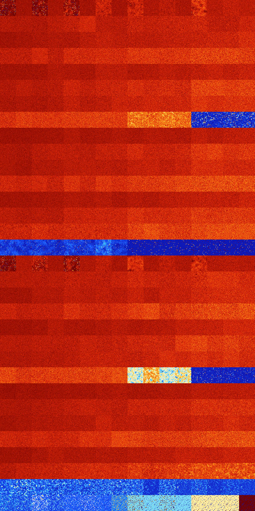

# B12368 (171008-171519)

<details>
    <summary>Initial Grid</summary>
    
</details>


<details>
    <summary>Initial Grid RLE</summary>

```
#C Exported from GoGoL (https://github.com/marrow16/gogol)
#C Wrap mode: Toroidal
#C Boundary mode: Dead
#C Step: 0
x = 100, y = 100, rule = B12368/S
26bo10bo13bo$33bo2bo4bo56bo$14bo9b2o29bo11b2o27bo$3bo12bo10bo27bo12bo7b
2o$5bo18bo7bo34bo6bo$8bo14bo26bo$15bobo$7bo22bo3bo9bo35bo16bo$9bo35bobo
13bo17bo3bobo$49bo$4bo9bo22bo32bo13bo$21bo25bo47bo$8b2o3bo4bo28bo51bo$
10bo5bo9bo12bo5bobo11bo5bo11bo6bo$bo45bo4bo41bobo$7bo31bo43bo9bo$29bo
34bo12bo$11bo13bo10bo43bo7bo4bo4bo$4bo34bo3bo6bo3bo19bo$40bo24bo8bo$o
20bo27bo16bo17bo$19bo49bo$22bo20bo$18bo12bo42bo$6bo17bo28bo10bo34bo$18b
o9bo19bo43bo$44bo5b2o37bo2bo$40bo16bo25bo$5bo19bobo13bo5bo16bo$22bo35bo
$53bo21bo14bo8bo$34bobo39bo$19bo$35bo10bo26bo22bo$5bo6bo61bo10bo$24bo9b
o27bo36bo$97bo$o13bo4bo2bo2bobo64bo6bo$5bo2bo2bo46bo21bo7bo$9bo49bo11bo
5bo$21bo28bo6b2o24bo12bo$4bo15bo29bo9bo30bo7bo$19bo48bo11bo6bo$17bo9bo
8bo28bo15bo$24bo34b2o24bo12bo$14bo5bo51bo2bo$2bo37bo20bo$25bo4bo18bo$8b
o48bo$30bo12bobo18bo$7bobo17bo2bo26bo14bo20bo2bo$62bo2bo12bo5bo4bo3bo$
26bo12bo20bo$3b2o19bo6bo38bo$4b2o19bo45bo11bo12bo$2bo25bo10bo5bo2bo7bo
8bo26bo$4bo2bo21bo5bo28bo23bobo$28bo10bo4bo16bo11bo5bo$23bo2bo28bo36bo$
19bo9bo3bobo$5bo6bo5bo9bo22bo11bo7bo$16bo31bo8bo3bo3bo$25bo36bo6bo16bo$
3bo13bo26bo8bo2bo2bo26bo$25b2o11bo7bo5bo3bo7bo9bo8bo11bo$24bo17bo$5bo3b
o40bo9bo20bo7bo$5bo$10bo7bo17bo7bo27bo18bo$3bo43bo46b2o$21bo27bo$44bo
20bobo$22bo14bo18bobo26bo$2bo2bo4bo8bo28bo5bo2bo$bo2b2o18bo14bo5bo$5bo
2bo17bo18bo46bo$5bo22bo23bo25bo$14b2o3bo54bo$4bo4bo10bo38bo$21bo2bo15bo
15bo$72bo2bo$11bo25bo2bo41bo11bo$8b3o16bo4bo16bo10bo2bo25bo$15bo11bo54b
o$29bobo55bo$17bo13bo14bo$3bo15bo$16bo2bo22bo25bo19bo$46bo8bo26bo3bo5bo
$20bo9bo61bo$64bo$o11bo10bo22bo$30bo3bo5bo18bo23bo7bo$9bo8bo28bo2bo7bo
39bo$7bo65bo14bo5bo$21b2o58bo$13bo21bo6b2o19bo4bo4b2o7bo9bo$4bo18bo27bo
20bo11bo6bo$16bo21bo2bo34bo6bo$20bo12bobo!
```
</details>
<details>
    <summary>Thumbnail</summary>

</details>
<table>
<tr>
    <td><a href="./171008%20S%20Heat%20Map%20Activity.png"></a><br>S (171008)<br>R@869,p360</td>    <td><a href="./171009%20S0%20Heat%20Map%20Activity.png"></a><br>S0 (171009)<br>G>1000</td>    <td><a href="./171010%20S1%20Heat%20Map%20Activity.png"></a><br>S1 (171010)<br>R@643,p24</td>    <td><a href="./171011%20S01%20Heat%20Map%20Activity.png"></a><br>S01 (171011)<br>G>1000</td>    <td><a href="./171012%20S2%20Heat%20Map%20Activity.png"></a><br>S2 (171012)<br>G>1000</td>    <td><a href="./171013%20S02%20Heat%20Map%20Activity.png"></a><br>S02 (171013)<br>G>1000</td>    <td><a href="./171014%20S12%20Heat%20Map%20Activity.png"></a><br>S12 (171014)<br>G>1000</td>    <td><a href="./171015%20S012%20Heat%20Map%20Activity.png"></a><br>S012 (171015)<br>G>1000</td>    <td><a href="./171016%20S3%20Heat%20Map%20Activity.png"></a><br>S3 (171016)<br>G>1000</td>    <td><a href="./171017%20S03%20Heat%20Map%20Activity.png"></a><br>S03 (171017)<br>G>1000</td>    <td><a href="./171018%20S13%20Heat%20Map%20Activity.png"></a><br>S13 (171018)<br>G>1000</td>    <td><a href="./171019%20S013%20Heat%20Map%20Activity.png"></a><br>S013 (171019)<br>G>1000</td>    <td><a href="./171020%20S23%20Heat%20Map%20Activity.png"></a><br>S23 (171020)<br>G>1000</td>    <td><a href="./171021%20S023%20Heat%20Map%20Activity.png"></a><br>S023 (171021)<br>G>1000</td>    <td><a href="./171022%20S123%20Heat%20Map%20Activity.png"></a><br>S123 (171022)<br>G>1000</td>    <td><a href="./171023%20S0123%20Heat%20Map%20Activity.png"></a><br>S0123 (171023)<br>G>1000</td></tr>
<tr>
    <td><a href="./171024%20S4%20Heat%20Map%20Activity.png"></a><br>S4 (171024)<br>G>1000</td>    <td><a href="./171025%20S04%20Heat%20Map%20Activity.png"></a><br>S04 (171025)<br>G>1000</td>    <td><a href="./171026%20S14%20Heat%20Map%20Activity.png"></a><br>S14 (171026)<br>G>1000</td>    <td><a href="./171027%20S014%20Heat%20Map%20Activity.png"></a><br>S014 (171027)<br>G>1000</td>    <td><a href="./171028%20S24%20Heat%20Map%20Activity.png"></a><br>S24 (171028)<br>G>1000</td>    <td><a href="./171029%20S024%20Heat%20Map%20Activity.png"></a><br>S024 (171029)<br>G>1000</td>    <td><a href="./171030%20S124%20Heat%20Map%20Activity.png"></a><br>S124 (171030)<br>G>1000</td>    <td><a href="./171031%20S0124%20Heat%20Map%20Activity.png"></a><br>S0124 (171031)<br>G>1000</td>    <td><a href="./171032%20S34%20Heat%20Map%20Activity.png"></a><br>S34 (171032)<br>G>1000</td>    <td><a href="./171033%20S034%20Heat%20Map%20Activity.png"></a><br>S034 (171033)<br>G>1000</td>    <td><a href="./171034%20S134%20Heat%20Map%20Activity.png"></a><br>S134 (171034)<br>G>1000</td>    <td><a href="./171035%20S0134%20Heat%20Map%20Activity.png"></a><br>S0134 (171035)<br>G>1000</td>    <td><a href="./171036%20S234%20Heat%20Map%20Activity.png"></a><br>S234 (171036)<br>G>1000</td>    <td><a href="./171037%20S0234%20Heat%20Map%20Activity.png"></a><br>S0234 (171037)<br>G>1000</td>    <td><a href="./171038%20S1234%20Heat%20Map%20Activity.png"></a><br>S1234 (171038)<br>G>1000</td>    <td><a href="./171039%20S01234%20Heat%20Map%20Activity.png"></a><br>S01234 (171039)<br>G>1000</td></tr>
<tr>
    <td><a href="./171040%20S5%20Heat%20Map%20Activity.png"></a><br>S5 (171040)<br>G>1000</td>    <td><a href="./171041%20S05%20Heat%20Map%20Activity.png"></a><br>S05 (171041)<br>G>1000</td>    <td><a href="./171042%20S15%20Heat%20Map%20Activity.png"></a><br>S15 (171042)<br>G>1000</td>    <td><a href="./171043%20S015%20Heat%20Map%20Activity.png"></a><br>S015 (171043)<br>G>1000</td>    <td><a href="./171044%20S25%20Heat%20Map%20Activity.png"></a><br>S25 (171044)<br>G>1000</td>    <td><a href="./171045%20S025%20Heat%20Map%20Activity.png"></a><br>S025 (171045)<br>G>1000</td>    <td><a href="./171046%20S125%20Heat%20Map%20Activity.png"></a><br>S125 (171046)<br>G>1000</td>    <td><a href="./171047%20S0125%20Heat%20Map%20Activity.png"></a><br>S0125 (171047)<br>G>1000</td>    <td><a href="./171048%20S35%20Heat%20Map%20Activity.png"></a><br>S35 (171048)<br>G>1000</td>    <td><a href="./171049%20S035%20Heat%20Map%20Activity.png"></a><br>S035 (171049)<br>G>1000</td>    <td><a href="./171050%20S135%20Heat%20Map%20Activity.png"></a><br>S135 (171050)<br>G>1000</td>    <td><a href="./171051%20S0135%20Heat%20Map%20Activity.png"></a><br>S0135 (171051)<br>G>1000</td>    <td><a href="./171052%20S235%20Heat%20Map%20Activity.png"></a><br>S235 (171052)<br>G>1000</td>    <td><a href="./171053%20S0235%20Heat%20Map%20Activity.png"></a><br>S0235 (171053)<br>G>1000</td>    <td><a href="./171054%20S1235%20Heat%20Map%20Activity.png"></a><br>S1235 (171054)<br>G>1000</td>    <td><a href="./171055%20S01235%20Heat%20Map%20Activity.png"></a><br>S01235 (171055)<br>G>1000</td></tr>
<tr>
    <td><a href="./171056%20S45%20Heat%20Map%20Activity.png"></a><br>S45 (171056)<br>G>1000</td>    <td><a href="./171057%20S045%20Heat%20Map%20Activity.png"></a><br>S045 (171057)<br>G>1000</td>    <td><a href="./171058%20S145%20Heat%20Map%20Activity.png"></a><br>S145 (171058)<br>G>1000</td>    <td><a href="./171059%20S0145%20Heat%20Map%20Activity.png"></a><br>S0145 (171059)<br>G>1000</td>    <td><a href="./171060%20S245%20Heat%20Map%20Activity.png"></a><br>S245 (171060)<br>G>1000</td>    <td><a href="./171061%20S0245%20Heat%20Map%20Activity.png"></a><br>S0245 (171061)<br>G>1000</td>    <td><a href="./171062%20S1245%20Heat%20Map%20Activity.png"></a><br>S1245 (171062)<br>G>1000</td>    <td><a href="./171063%20S01245%20Heat%20Map%20Activity.png"></a><br>S01245 (171063)<br>G>1000</td>    <td><a href="./171064%20S345%20Heat%20Map%20Activity.png"></a><br>S345 (171064)<br>G>1000</td>    <td><a href="./171065%20S0345%20Heat%20Map%20Activity.png"></a><br>S0345 (171065)<br>G>1000</td>    <td><a href="./171066%20S1345%20Heat%20Map%20Activity.png"></a><br>S1345 (171066)<br>G>1000</td>    <td><a href="./171067%20S01345%20Heat%20Map%20Activity.png"></a><br>S01345 (171067)<br>G>1000</td>    <td><a href="./171068%20S2345%20Heat%20Map%20Activity.png"></a><br>S2345 (171068)<br>G>1000</td>    <td><a href="./171069%20S02345%20Heat%20Map%20Activity.png"></a><br>S02345 (171069)<br>G>1000</td>    <td><a href="./171070%20S12345%20Heat%20Map%20Activity.png"></a><br>S12345 (171070)<br>G>1000</td>    <td><a href="./171071%20S012345%20Heat%20Map%20Activity.png"></a><br>S012345 (171071)<br>G>1000</td></tr>
<tr>
    <td><a href="./171072%20S6%20Heat%20Map%20Activity.png"></a><br>S6 (171072)<br>G>1000</td>    <td><a href="./171073%20S06%20Heat%20Map%20Activity.png"></a><br>S06 (171073)<br>G>1000</td>    <td><a href="./171074%20S16%20Heat%20Map%20Activity.png"></a><br>S16 (171074)<br>G>1000</td>    <td><a href="./171075%20S016%20Heat%20Map%20Activity.png"></a><br>S016 (171075)<br>G>1000</td>    <td><a href="./171076%20S26%20Heat%20Map%20Activity.png"></a><br>S26 (171076)<br>G>1000</td>    <td><a href="./171077%20S026%20Heat%20Map%20Activity.png"></a><br>S026 (171077)<br>G>1000</td>    <td><a href="./171078%20S126%20Heat%20Map%20Activity.png"></a><br>S126 (171078)<br>G>1000</td>    <td><a href="./171079%20S0126%20Heat%20Map%20Activity.png"></a><br>S0126 (171079)<br>G>1000</td>    <td><a href="./171080%20S36%20Heat%20Map%20Activity.png"></a><br>S36 (171080)<br>G>1000</td>    <td><a href="./171081%20S036%20Heat%20Map%20Activity.png"></a><br>S036 (171081)<br>G>1000</td>    <td><a href="./171082%20S136%20Heat%20Map%20Activity.png"></a><br>S136 (171082)<br>G>1000</td>    <td><a href="./171083%20S0136%20Heat%20Map%20Activity.png"></a><br>S0136 (171083)<br>G>1000</td>    <td><a href="./171084%20S236%20Heat%20Map%20Activity.png"></a><br>S236 (171084)<br>G>1000</td>    <td><a href="./171085%20S0236%20Heat%20Map%20Activity.png"></a><br>S0236 (171085)<br>G>1000</td>    <td><a href="./171086%20S1236%20Heat%20Map%20Activity.png"></a><br>S1236 (171086)<br>G>1000</td>    <td><a href="./171087%20S01236%20Heat%20Map%20Activity.png"></a><br>S01236 (171087)<br>G>1000</td></tr>
<tr>
    <td><a href="./171088%20S46%20Heat%20Map%20Activity.png"></a><br>S46 (171088)<br>G>1000</td>    <td><a href="./171089%20S046%20Heat%20Map%20Activity.png"></a><br>S046 (171089)<br>G>1000</td>    <td><a href="./171090%20S146%20Heat%20Map%20Activity.png"></a><br>S146 (171090)<br>G>1000</td>    <td><a href="./171091%20S0146%20Heat%20Map%20Activity.png"></a><br>S0146 (171091)<br>G>1000</td>    <td><a href="./171092%20S246%20Heat%20Map%20Activity.png"></a><br>S246 (171092)<br>G>1000</td>    <td><a href="./171093%20S0246%20Heat%20Map%20Activity.png"></a><br>S0246 (171093)<br>G>1000</td>    <td><a href="./171094%20S1246%20Heat%20Map%20Activity.png"></a><br>S1246 (171094)<br>G>1000</td>    <td><a href="./171095%20S01246%20Heat%20Map%20Activity.png"></a><br>S01246 (171095)<br>G>1000</td>    <td><a href="./171096%20S346%20Heat%20Map%20Activity.png"></a><br>S346 (171096)<br>G>1000</td>    <td><a href="./171097%20S0346%20Heat%20Map%20Activity.png"></a><br>S0346 (171097)<br>G>1000</td>    <td><a href="./171098%20S1346%20Heat%20Map%20Activity.png"></a><br>S1346 (171098)<br>G>1000</td>    <td><a href="./171099%20S01346%20Heat%20Map%20Activity.png"></a><br>S01346 (171099)<br>G>1000</td>    <td><a href="./171100%20S2346%20Heat%20Map%20Activity.png"></a><br>S2346 (171100)<br>G>1000</td>    <td><a href="./171101%20S02346%20Heat%20Map%20Activity.png"></a><br>S02346 (171101)<br>G>1000</td>    <td><a href="./171102%20S12346%20Heat%20Map%20Activity.png"></a><br>S12346 (171102)<br>G>1000</td>    <td><a href="./171103%20S012346%20Heat%20Map%20Activity.png"></a><br>S012346 (171103)<br>G>1000</td></tr>
<tr>
    <td><a href="./171104%20S56%20Heat%20Map%20Activity.png"></a><br>S56 (171104)<br>G>1000</td>    <td><a href="./171105%20S056%20Heat%20Map%20Activity.png"></a><br>S056 (171105)<br>G>1000</td>    <td><a href="./171106%20S156%20Heat%20Map%20Activity.png"></a><br>S156 (171106)<br>G>1000</td>    <td><a href="./171107%20S0156%20Heat%20Map%20Activity.png"></a><br>S0156 (171107)<br>G>1000</td>    <td><a href="./171108%20S256%20Heat%20Map%20Activity.png"></a><br>S256 (171108)<br>G>1000</td>    <td><a href="./171109%20S0256%20Heat%20Map%20Activity.png"></a><br>S0256 (171109)<br>G>1000</td>    <td><a href="./171110%20S1256%20Heat%20Map%20Activity.png"></a><br>S1256 (171110)<br>G>1000</td>    <td><a href="./171111%20S01256%20Heat%20Map%20Activity.png"></a><br>S01256 (171111)<br>G>1000</td>    <td><a href="./171112%20S356%20Heat%20Map%20Activity.png"></a><br>S356 (171112)<br>G>1000</td>    <td><a href="./171113%20S0356%20Heat%20Map%20Activity.png"></a><br>S0356 (171113)<br>G>1000</td>    <td><a href="./171114%20S1356%20Heat%20Map%20Activity.png"></a><br>S1356 (171114)<br>G>1000</td>    <td><a href="./171115%20S01356%20Heat%20Map%20Activity.png"></a><br>S01356 (171115)<br>G>1000</td>    <td><a href="./171116%20S2356%20Heat%20Map%20Activity.png"></a><br>S2356 (171116)<br>G>1000</td>    <td><a href="./171117%20S02356%20Heat%20Map%20Activity.png"></a><br>S02356 (171117)<br>G>1000</td>    <td><a href="./171118%20S12356%20Heat%20Map%20Activity.png"></a><br>S12356 (171118)<br>G>1000</td>    <td><a href="./171119%20S012356%20Heat%20Map%20Activity.png"></a><br>S012356 (171119)<br>G>1000</td></tr>
<tr>
    <td><a href="./171120%20S456%20Heat%20Map%20Activity.png"></a><br>S456 (171120)<br>G>1000</td>    <td><a href="./171121%20S0456%20Heat%20Map%20Activity.png"></a><br>S0456 (171121)<br>G>1000</td>    <td><a href="./171122%20S1456%20Heat%20Map%20Activity.png"></a><br>S1456 (171122)<br>G>1000</td>    <td><a href="./171123%20S01456%20Heat%20Map%20Activity.png"></a><br>S01456 (171123)<br>G>1000</td>    <td><a href="./171124%20S2456%20Heat%20Map%20Activity.png"></a><br>S2456 (171124)<br>G>1000</td>    <td><a href="./171125%20S02456%20Heat%20Map%20Activity.png"></a><br>S02456 (171125)<br>G>1000</td>    <td><a href="./171126%20S12456%20Heat%20Map%20Activity.png"></a><br>S12456 (171126)<br>G>1000</td>    <td><a href="./171127%20S012456%20Heat%20Map%20Activity.png"></a><br>S012456 (171127)<br>G>1000</td>    <td><a href="./171128%20S3456%20Heat%20Map%20Activity.png"></a><br>S3456 (171128)<br>G>1000</td>    <td><a href="./171129%20S03456%20Heat%20Map%20Activity.png"></a><br>S03456 (171129)<br>G>1000</td>    <td><a href="./171130%20S13456%20Heat%20Map%20Activity.png"></a><br>S13456 (171130)<br>G>1000</td>    <td><a href="./171131%20S013456%20Heat%20Map%20Activity.png"></a><br>S013456 (171131)<br>G>1000</td>    <td><a href="./171132%20S23456%20Heat%20Map%20Activity.png"></a><br>S23456 (171132)<br>G>1000</td>    <td><a href="./171133%20S023456%20Heat%20Map%20Activity.png"></a><br>S023456 (171133)<br>G>1000</td>    <td><a href="./171134%20S123456%20Heat%20Map%20Activity.png"></a><br>S123456 (171134)<br>G>1000</td>    <td><a href="./171135%20S0123456%20Heat%20Map%20Activity.png"></a><br>S0123456 (171135)<br>G>1000</td></tr>
<tr>
    <td><a href="./171136%20S7%20Heat%20Map%20Activity.png"></a><br>S7 (171136)<br>G>1000</td>    <td><a href="./171137%20S07%20Heat%20Map%20Activity.png"></a><br>S07 (171137)<br>G>1000</td>    <td><a href="./171138%20S17%20Heat%20Map%20Activity.png"></a><br>S17 (171138)<br>G>1000</td>    <td><a href="./171139%20S017%20Heat%20Map%20Activity.png"></a><br>S017 (171139)<br>G>1000</td>    <td><a href="./171140%20S27%20Heat%20Map%20Activity.png"></a><br>S27 (171140)<br>G>1000</td>    <td><a href="./171141%20S027%20Heat%20Map%20Activity.png"></a><br>S027 (171141)<br>G>1000</td>    <td><a href="./171142%20S127%20Heat%20Map%20Activity.png"></a><br>S127 (171142)<br>G>1000</td>    <td><a href="./171143%20S0127%20Heat%20Map%20Activity.png"></a><br>S0127 (171143)<br>G>1000</td>    <td><a href="./171144%20S37%20Heat%20Map%20Activity.png"></a><br>S37 (171144)<br>G>1000</td>    <td><a href="./171145%20S037%20Heat%20Map%20Activity.png"></a><br>S037 (171145)<br>G>1000</td>    <td><a href="./171146%20S137%20Heat%20Map%20Activity.png"></a><br>S137 (171146)<br>G>1000</td>    <td><a href="./171147%20S0137%20Heat%20Map%20Activity.png"></a><br>S0137 (171147)<br>G>1000</td>    <td><a href="./171148%20S237%20Heat%20Map%20Activity.png"></a><br>S237 (171148)<br>G>1000</td>    <td><a href="./171149%20S0237%20Heat%20Map%20Activity.png"></a><br>S0237 (171149)<br>G>1000</td>    <td><a href="./171150%20S1237%20Heat%20Map%20Activity.png"></a><br>S1237 (171150)<br>G>1000</td>    <td><a href="./171151%20S01237%20Heat%20Map%20Activity.png"></a><br>S01237 (171151)<br>G>1000</td></tr>
<tr>
    <td><a href="./171152%20S47%20Heat%20Map%20Activity.png"></a><br>S47 (171152)<br>G>1000</td>    <td><a href="./171153%20S047%20Heat%20Map%20Activity.png"></a><br>S047 (171153)<br>G>1000</td>    <td><a href="./171154%20S147%20Heat%20Map%20Activity.png"></a><br>S147 (171154)<br>G>1000</td>    <td><a href="./171155%20S0147%20Heat%20Map%20Activity.png"></a><br>S0147 (171155)<br>G>1000</td>    <td><a href="./171156%20S247%20Heat%20Map%20Activity.png"></a><br>S247 (171156)<br>G>1000</td>    <td><a href="./171157%20S0247%20Heat%20Map%20Activity.png"></a><br>S0247 (171157)<br>G>1000</td>    <td><a href="./171158%20S1247%20Heat%20Map%20Activity.png"></a><br>S1247 (171158)<br>G>1000</td>    <td><a href="./171159%20S01247%20Heat%20Map%20Activity.png"></a><br>S01247 (171159)<br>G>1000</td>    <td><a href="./171160%20S347%20Heat%20Map%20Activity.png"></a><br>S347 (171160)<br>G>1000</td>    <td><a href="./171161%20S0347%20Heat%20Map%20Activity.png"></a><br>S0347 (171161)<br>G>1000</td>    <td><a href="./171162%20S1347%20Heat%20Map%20Activity.png"></a><br>S1347 (171162)<br>G>1000</td>    <td><a href="./171163%20S01347%20Heat%20Map%20Activity.png"></a><br>S01347 (171163)<br>G>1000</td>    <td><a href="./171164%20S2347%20Heat%20Map%20Activity.png"></a><br>S2347 (171164)<br>G>1000</td>    <td><a href="./171165%20S02347%20Heat%20Map%20Activity.png"></a><br>S02347 (171165)<br>G>1000</td>    <td><a href="./171166%20S12347%20Heat%20Map%20Activity.png"></a><br>S12347 (171166)<br>G>1000</td>    <td><a href="./171167%20S012347%20Heat%20Map%20Activity.png"></a><br>S012347 (171167)<br>G>1000</td></tr>
<tr>
    <td><a href="./171168%20S57%20Heat%20Map%20Activity.png"></a><br>S57 (171168)<br>G>1000</td>    <td><a href="./171169%20S057%20Heat%20Map%20Activity.png"></a><br>S057 (171169)<br>G>1000</td>    <td><a href="./171170%20S157%20Heat%20Map%20Activity.png"></a><br>S157 (171170)<br>G>1000</td>    <td><a href="./171171%20S0157%20Heat%20Map%20Activity.png"></a><br>S0157 (171171)<br>G>1000</td>    <td><a href="./171172%20S257%20Heat%20Map%20Activity.png"></a><br>S257 (171172)<br>G>1000</td>    <td><a href="./171173%20S0257%20Heat%20Map%20Activity.png"></a><br>S0257 (171173)<br>G>1000</td>    <td><a href="./171174%20S1257%20Heat%20Map%20Activity.png"></a><br>S1257 (171174)<br>G>1000</td>    <td><a href="./171175%20S01257%20Heat%20Map%20Activity.png"></a><br>S01257 (171175)<br>G>1000</td>    <td><a href="./171176%20S357%20Heat%20Map%20Activity.png"></a><br>S357 (171176)<br>G>1000</td>    <td><a href="./171177%20S0357%20Heat%20Map%20Activity.png"></a><br>S0357 (171177)<br>G>1000</td>    <td><a href="./171178%20S1357%20Heat%20Map%20Activity.png"></a><br>S1357 (171178)<br>G>1000</td>    <td><a href="./171179%20S01357%20Heat%20Map%20Activity.png"></a><br>S01357 (171179)<br>G>1000</td>    <td><a href="./171180%20S2357%20Heat%20Map%20Activity.png"></a><br>S2357 (171180)<br>G>1000</td>    <td><a href="./171181%20S02357%20Heat%20Map%20Activity.png"></a><br>S02357 (171181)<br>G>1000</td>    <td><a href="./171182%20S12357%20Heat%20Map%20Activity.png"></a><br>S12357 (171182)<br>G>1000</td>    <td><a href="./171183%20S012357%20Heat%20Map%20Activity.png"></a><br>S012357 (171183)<br>G>1000</td></tr>
<tr>
    <td><a href="./171184%20S457%20Heat%20Map%20Activity.png"></a><br>S457 (171184)<br>G>1000</td>    <td><a href="./171185%20S0457%20Heat%20Map%20Activity.png"></a><br>S0457 (171185)<br>G>1000</td>    <td><a href="./171186%20S1457%20Heat%20Map%20Activity.png"></a><br>S1457 (171186)<br>G>1000</td>    <td><a href="./171187%20S01457%20Heat%20Map%20Activity.png"></a><br>S01457 (171187)<br>G>1000</td>    <td><a href="./171188%20S2457%20Heat%20Map%20Activity.png"></a><br>S2457 (171188)<br>G>1000</td>    <td><a href="./171189%20S02457%20Heat%20Map%20Activity.png"></a><br>S02457 (171189)<br>G>1000</td>    <td><a href="./171190%20S12457%20Heat%20Map%20Activity.png"></a><br>S12457 (171190)<br>G>1000</td>    <td><a href="./171191%20S012457%20Heat%20Map%20Activity.png"></a><br>S012457 (171191)<br>G>1000</td>    <td><a href="./171192%20S3457%20Heat%20Map%20Activity.png"></a><br>S3457 (171192)<br>G>1000</td>    <td><a href="./171193%20S03457%20Heat%20Map%20Activity.png"></a><br>S03457 (171193)<br>G>1000</td>    <td><a href="./171194%20S13457%20Heat%20Map%20Activity.png"></a><br>S13457 (171194)<br>G>1000</td>    <td><a href="./171195%20S013457%20Heat%20Map%20Activity.png"></a><br>S013457 (171195)<br>G>1000</td>    <td><a href="./171196%20S23457%20Heat%20Map%20Activity.png"></a><br>S23457 (171196)<br>G>1000</td>    <td><a href="./171197%20S023457%20Heat%20Map%20Activity.png"></a><br>S023457 (171197)<br>G>1000</td>    <td><a href="./171198%20S123457%20Heat%20Map%20Activity.png"></a><br>S123457 (171198)<br>G>1000</td>    <td><a href="./171199%20S0123457%20Heat%20Map%20Activity.png"></a><br>S0123457 (171199)<br>G>1000</td></tr>
<tr>
    <td><a href="./171200%20S67%20Heat%20Map%20Activity.png"></a><br>S67 (171200)<br>G>1000</td>    <td><a href="./171201%20S067%20Heat%20Map%20Activity.png"></a><br>S067 (171201)<br>G>1000</td>    <td><a href="./171202%20S167%20Heat%20Map%20Activity.png"></a><br>S167 (171202)<br>G>1000</td>    <td><a href="./171203%20S0167%20Heat%20Map%20Activity.png"></a><br>S0167 (171203)<br>G>1000</td>    <td><a href="./171204%20S267%20Heat%20Map%20Activity.png"></a><br>S267 (171204)<br>G>1000</td>    <td><a href="./171205%20S0267%20Heat%20Map%20Activity.png"></a><br>S0267 (171205)<br>G>1000</td>    <td><a href="./171206%20S1267%20Heat%20Map%20Activity.png"></a><br>S1267 (171206)<br>G>1000</td>    <td><a href="./171207%20S01267%20Heat%20Map%20Activity.png"></a><br>S01267 (171207)<br>G>1000</td>    <td><a href="./171208%20S367%20Heat%20Map%20Activity.png"></a><br>S367 (171208)<br>G>1000</td>    <td><a href="./171209%20S0367%20Heat%20Map%20Activity.png"></a><br>S0367 (171209)<br>G>1000</td>    <td><a href="./171210%20S1367%20Heat%20Map%20Activity.png"></a><br>S1367 (171210)<br>G>1000</td>    <td><a href="./171211%20S01367%20Heat%20Map%20Activity.png"></a><br>S01367 (171211)<br>G>1000</td>    <td><a href="./171212%20S2367%20Heat%20Map%20Activity.png"></a><br>S2367 (171212)<br>G>1000</td>    <td><a href="./171213%20S02367%20Heat%20Map%20Activity.png"></a><br>S02367 (171213)<br>G>1000</td>    <td><a href="./171214%20S12367%20Heat%20Map%20Activity.png"></a><br>S12367 (171214)<br>G>1000</td>    <td><a href="./171215%20S012367%20Heat%20Map%20Activity.png"></a><br>S012367 (171215)<br>G>1000</td></tr>
<tr>
    <td><a href="./171216%20S467%20Heat%20Map%20Activity.png"></a><br>S467 (171216)<br>G>1000</td>    <td><a href="./171217%20S0467%20Heat%20Map%20Activity.png"></a><br>S0467 (171217)<br>G>1000</td>    <td><a href="./171218%20S1467%20Heat%20Map%20Activity.png"></a><br>S1467 (171218)<br>G>1000</td>    <td><a href="./171219%20S01467%20Heat%20Map%20Activity.png"></a><br>S01467 (171219)<br>G>1000</td>    <td><a href="./171220%20S2467%20Heat%20Map%20Activity.png"></a><br>S2467 (171220)<br>G>1000</td>    <td><a href="./171221%20S02467%20Heat%20Map%20Activity.png"></a><br>S02467 (171221)<br>G>1000</td>    <td><a href="./171222%20S12467%20Heat%20Map%20Activity.png"></a><br>S12467 (171222)<br>G>1000</td>    <td><a href="./171223%20S012467%20Heat%20Map%20Activity.png"></a><br>S012467 (171223)<br>G>1000</td>    <td><a href="./171224%20S3467%20Heat%20Map%20Activity.png"></a><br>S3467 (171224)<br>G>1000</td>    <td><a href="./171225%20S03467%20Heat%20Map%20Activity.png"></a><br>S03467 (171225)<br>G>1000</td>    <td><a href="./171226%20S13467%20Heat%20Map%20Activity.png"></a><br>S13467 (171226)<br>G>1000</td>    <td><a href="./171227%20S013467%20Heat%20Map%20Activity.png"></a><br>S013467 (171227)<br>G>1000</td>    <td><a href="./171228%20S23467%20Heat%20Map%20Activity.png"></a><br>S23467 (171228)<br>G>1000</td>    <td><a href="./171229%20S023467%20Heat%20Map%20Activity.png"></a><br>S023467 (171229)<br>G>1000</td>    <td><a href="./171230%20S123467%20Heat%20Map%20Activity.png"></a><br>S123467 (171230)<br>G>1000</td>    <td><a href="./171231%20S0123467%20Heat%20Map%20Activity.png"></a><br>S0123467 (171231)<br>G>1000</td></tr>
<tr>
    <td><a href="./171232%20S567%20Heat%20Map%20Activity.png"></a><br>S567 (171232)<br>G>1000</td>    <td><a href="./171233%20S0567%20Heat%20Map%20Activity.png"></a><br>S0567 (171233)<br>G>1000</td>    <td><a href="./171234%20S1567%20Heat%20Map%20Activity.png"></a><br>S1567 (171234)<br>G>1000</td>    <td><a href="./171235%20S01567%20Heat%20Map%20Activity.png"></a><br>S01567 (171235)<br>G>1000</td>    <td><a href="./171236%20S2567%20Heat%20Map%20Activity.png"></a><br>S2567 (171236)<br>G>1000</td>    <td><a href="./171237%20S02567%20Heat%20Map%20Activity.png"></a><br>S02567 (171237)<br>G>1000</td>    <td><a href="./171238%20S12567%20Heat%20Map%20Activity.png"></a><br>S12567 (171238)<br>G>1000</td>    <td><a href="./171239%20S012567%20Heat%20Map%20Activity.png"></a><br>S012567 (171239)<br>G>1000</td>    <td><a href="./171240%20S3567%20Heat%20Map%20Activity.png"></a><br>S3567 (171240)<br>G>1000</td>    <td><a href="./171241%20S03567%20Heat%20Map%20Activity.png"></a><br>S03567 (171241)<br>G>1000</td>    <td><a href="./171242%20S13567%20Heat%20Map%20Activity.png"></a><br>S13567 (171242)<br>G>1000</td>    <td><a href="./171243%20S013567%20Heat%20Map%20Activity.png"></a><br>S013567 (171243)<br>G>1000</td>    <td><a href="./171244%20S23567%20Heat%20Map%20Activity.png"></a><br>S23567 (171244)<br>G>1000</td>    <td><a href="./171245%20S023567%20Heat%20Map%20Activity.png"></a><br>S023567 (171245)<br>G>1000</td>    <td><a href="./171246%20S123567%20Heat%20Map%20Activity.png"></a><br>S123567 (171246)<br>G>1000</td>    <td><a href="./171247%20S0123567%20Heat%20Map%20Activity.png"></a><br>S0123567 (171247)<br>G>1000</td></tr>
<tr>
    <td><a href="./171248%20S4567%20Heat%20Map%20Activity.png"></a><br>S4567 (171248)<br>G>1000</td>    <td><a href="./171249%20S04567%20Heat%20Map%20Activity.png"></a><br>S04567 (171249)<br>G>1000</td>    <td><a href="./171250%20S14567%20Heat%20Map%20Activity.png"></a><br>S14567 (171250)<br>G>1000</td>    <td><a href="./171251%20S014567%20Heat%20Map%20Activity.png"></a><br>S014567 (171251)<br>G>1000</td>    <td><a href="./171252%20S24567%20Heat%20Map%20Activity.png"></a><br>S24567 (171252)<br>G>1000</td>    <td><a href="./171253%20S024567%20Heat%20Map%20Activity.png"></a><br>S024567 (171253)<br>G>1000</td>    <td><a href="./171254%20S124567%20Heat%20Map%20Activity.png"></a><br>S124567 (171254)<br>G>1000</td>    <td><a href="./171255%20S0124567%20Heat%20Map%20Activity.png"></a><br>S0124567 (171255)<br>G>1000</td>    <td><a href="./171256%20S34567%20Heat%20Map%20Activity.png"></a><br>S34567 (171256)<br>R@463,p420</td>    <td><a href="./171257%20S034567%20Heat%20Map%20Activity.png"></a><br>S034567 (171257)<br>R@455,p420</td>    <td><a href="./171258%20S134567%20Heat%20Map%20Activity.png"></a><br>S134567 (171258)<br>R@460,p420</td>    <td><a href="./171259%20S0134567%20Heat%20Map%20Activity.png"></a><br>S0134567 (171259)<br>G>1000</td>    <td><a href="./171260%20S234567%20Heat%20Map%20Activity.png"></a><br>S234567 (171260)<br>G>1000</td>    <td><a href="./171261%20S0234567%20Heat%20Map%20Activity.png"></a><br>S0234567 (171261)<br>G>1000</td>    <td><a href="./171262%20S1234567%20Heat%20Map%20Activity.png"></a><br>S1234567 (171262)<br>G>1000</td>    <td><a href="./171263%20S01234567%20Heat%20Map%20Activity.png"></a><br>S01234567 (171263)<br>G>1000</td></tr>
<tr>
    <td><a href="./171264%20S8%20Heat%20Map%20Activity.png"></a><br>S8 (171264)<br>R@869,p360</td>    <td><a href="./171265%20S08%20Heat%20Map%20Activity.png"></a><br>S08 (171265)<br>G>1000</td>    <td><a href="./171266%20S18%20Heat%20Map%20Activity.png"></a><br>S18 (171266)<br>G>1000</td>    <td><a href="./171267%20S018%20Heat%20Map%20Activity.png"></a><br>S018 (171267)<br>G>1000</td>    <td><a href="./171268%20S28%20Heat%20Map%20Activity.png"></a><br>S28 (171268)<br>G>1000</td>    <td><a href="./171269%20S028%20Heat%20Map%20Activity.png"></a><br>S028 (171269)<br>G>1000</td>    <td><a href="./171270%20S128%20Heat%20Map%20Activity.png"></a><br>S128 (171270)<br>G>1000</td>    <td><a href="./171271%20S0128%20Heat%20Map%20Activity.png"></a><br>S0128 (171271)<br>G>1000</td>    <td><a href="./171272%20S38%20Heat%20Map%20Activity.png"></a><br>S38 (171272)<br>G>1000</td>    <td><a href="./171273%20S038%20Heat%20Map%20Activity.png"></a><br>S038 (171273)<br>G>1000</td>    <td><a href="./171274%20S138%20Heat%20Map%20Activity.png"></a><br>S138 (171274)<br>G>1000</td>    <td><a href="./171275%20S0138%20Heat%20Map%20Activity.png"></a><br>S0138 (171275)<br>G>1000</td>    <td><a href="./171276%20S238%20Heat%20Map%20Activity.png"></a><br>S238 (171276)<br>G>1000</td>    <td><a href="./171277%20S0238%20Heat%20Map%20Activity.png"></a><br>S0238 (171277)<br>G>1000</td>    <td><a href="./171278%20S1238%20Heat%20Map%20Activity.png"></a><br>S1238 (171278)<br>G>1000</td>    <td><a href="./171279%20S01238%20Heat%20Map%20Activity.png"></a><br>S01238 (171279)<br>G>1000</td></tr>
<tr>
    <td><a href="./171280%20S48%20Heat%20Map%20Activity.png"></a><br>S48 (171280)<br>G>1000</td>    <td><a href="./171281%20S048%20Heat%20Map%20Activity.png"></a><br>S048 (171281)<br>G>1000</td>    <td><a href="./171282%20S148%20Heat%20Map%20Activity.png"></a><br>S148 (171282)<br>G>1000</td>    <td><a href="./171283%20S0148%20Heat%20Map%20Activity.png"></a><br>S0148 (171283)<br>G>1000</td>    <td><a href="./171284%20S248%20Heat%20Map%20Activity.png"></a><br>S248 (171284)<br>G>1000</td>    <td><a href="./171285%20S0248%20Heat%20Map%20Activity.png"></a><br>S0248 (171285)<br>G>1000</td>    <td><a href="./171286%20S1248%20Heat%20Map%20Activity.png"></a><br>S1248 (171286)<br>G>1000</td>    <td><a href="./171287%20S01248%20Heat%20Map%20Activity.png"></a><br>S01248 (171287)<br>G>1000</td>    <td><a href="./171288%20S348%20Heat%20Map%20Activity.png"></a><br>S348 (171288)<br>G>1000</td>    <td><a href="./171289%20S0348%20Heat%20Map%20Activity.png"></a><br>S0348 (171289)<br>G>1000</td>    <td><a href="./171290%20S1348%20Heat%20Map%20Activity.png"></a><br>S1348 (171290)<br>G>1000</td>    <td><a href="./171291%20S01348%20Heat%20Map%20Activity.png"></a><br>S01348 (171291)<br>G>1000</td>    <td><a href="./171292%20S2348%20Heat%20Map%20Activity.png"></a><br>S2348 (171292)<br>G>1000</td>    <td><a href="./171293%20S02348%20Heat%20Map%20Activity.png"></a><br>S02348 (171293)<br>G>1000</td>    <td><a href="./171294%20S12348%20Heat%20Map%20Activity.png"></a><br>S12348 (171294)<br>G>1000</td>    <td><a href="./171295%20S012348%20Heat%20Map%20Activity.png"></a><br>S012348 (171295)<br>G>1000</td></tr>
<tr>
    <td><a href="./171296%20S58%20Heat%20Map%20Activity.png"></a><br>S58 (171296)<br>G>1000</td>    <td><a href="./171297%20S058%20Heat%20Map%20Activity.png"></a><br>S058 (171297)<br>G>1000</td>    <td><a href="./171298%20S158%20Heat%20Map%20Activity.png"></a><br>S158 (171298)<br>G>1000</td>    <td><a href="./171299%20S0158%20Heat%20Map%20Activity.png"></a><br>S0158 (171299)<br>G>1000</td>    <td><a href="./171300%20S258%20Heat%20Map%20Activity.png"></a><br>S258 (171300)<br>G>1000</td>    <td><a href="./171301%20S0258%20Heat%20Map%20Activity.png"></a><br>S0258 (171301)<br>G>1000</td>    <td><a href="./171302%20S1258%20Heat%20Map%20Activity.png"></a><br>S1258 (171302)<br>G>1000</td>    <td><a href="./171303%20S01258%20Heat%20Map%20Activity.png"></a><br>S01258 (171303)<br>G>1000</td>    <td><a href="./171304%20S358%20Heat%20Map%20Activity.png"></a><br>S358 (171304)<br>G>1000</td>    <td><a href="./171305%20S0358%20Heat%20Map%20Activity.png"></a><br>S0358 (171305)<br>G>1000</td>    <td><a href="./171306%20S1358%20Heat%20Map%20Activity.png"></a><br>S1358 (171306)<br>G>1000</td>    <td><a href="./171307%20S01358%20Heat%20Map%20Activity.png"></a><br>S01358 (171307)<br>G>1000</td>    <td><a href="./171308%20S2358%20Heat%20Map%20Activity.png"></a><br>S2358 (171308)<br>G>1000</td>    <td><a href="./171309%20S02358%20Heat%20Map%20Activity.png"></a><br>S02358 (171309)<br>G>1000</td>    <td><a href="./171310%20S12358%20Heat%20Map%20Activity.png"></a><br>S12358 (171310)<br>G>1000</td>    <td><a href="./171311%20S012358%20Heat%20Map%20Activity.png"></a><br>S012358 (171311)<br>G>1000</td></tr>
<tr>
    <td><a href="./171312%20S458%20Heat%20Map%20Activity.png"></a><br>S458 (171312)<br>G>1000</td>    <td><a href="./171313%20S0458%20Heat%20Map%20Activity.png"></a><br>S0458 (171313)<br>G>1000</td>    <td><a href="./171314%20S1458%20Heat%20Map%20Activity.png"></a><br>S1458 (171314)<br>G>1000</td>    <td><a href="./171315%20S01458%20Heat%20Map%20Activity.png"></a><br>S01458 (171315)<br>G>1000</td>    <td><a href="./171316%20S2458%20Heat%20Map%20Activity.png"></a><br>S2458 (171316)<br>G>1000</td>    <td><a href="./171317%20S02458%20Heat%20Map%20Activity.png"></a><br>S02458 (171317)<br>G>1000</td>    <td><a href="./171318%20S12458%20Heat%20Map%20Activity.png"></a><br>S12458 (171318)<br>G>1000</td>    <td><a href="./171319%20S012458%20Heat%20Map%20Activity.png"></a><br>S012458 (171319)<br>G>1000</td>    <td><a href="./171320%20S3458%20Heat%20Map%20Activity.png"></a><br>S3458 (171320)<br>G>1000</td>    <td><a href="./171321%20S03458%20Heat%20Map%20Activity.png"></a><br>S03458 (171321)<br>G>1000</td>    <td><a href="./171322%20S13458%20Heat%20Map%20Activity.png"></a><br>S13458 (171322)<br>G>1000</td>    <td><a href="./171323%20S013458%20Heat%20Map%20Activity.png"></a><br>S013458 (171323)<br>G>1000</td>    <td><a href="./171324%20S23458%20Heat%20Map%20Activity.png"></a><br>S23458 (171324)<br>G>1000</td>    <td><a href="./171325%20S023458%20Heat%20Map%20Activity.png"></a><br>S023458 (171325)<br>G>1000</td>    <td><a href="./171326%20S123458%20Heat%20Map%20Activity.png"></a><br>S123458 (171326)<br>G>1000</td>    <td><a href="./171327%20S0123458%20Heat%20Map%20Activity.png"></a><br>S0123458 (171327)<br>G>1000</td></tr>
<tr>
    <td><a href="./171328%20S68%20Heat%20Map%20Activity.png"></a><br>S68 (171328)<br>G>1000</td>    <td><a href="./171329%20S068%20Heat%20Map%20Activity.png"></a><br>S068 (171329)<br>G>1000</td>    <td><a href="./171330%20S168%20Heat%20Map%20Activity.png"></a><br>S168 (171330)<br>G>1000</td>    <td><a href="./171331%20S0168%20Heat%20Map%20Activity.png"></a><br>S0168 (171331)<br>G>1000</td>    <td><a href="./171332%20S268%20Heat%20Map%20Activity.png"></a><br>S268 (171332)<br>G>1000</td>    <td><a href="./171333%20S0268%20Heat%20Map%20Activity.png"></a><br>S0268 (171333)<br>G>1000</td>    <td><a href="./171334%20S1268%20Heat%20Map%20Activity.png"></a><br>S1268 (171334)<br>G>1000</td>    <td><a href="./171335%20S01268%20Heat%20Map%20Activity.png"></a><br>S01268 (171335)<br>G>1000</td>    <td><a href="./171336%20S368%20Heat%20Map%20Activity.png"></a><br>S368 (171336)<br>G>1000</td>    <td><a href="./171337%20S0368%20Heat%20Map%20Activity.png"></a><br>S0368 (171337)<br>G>1000</td>    <td><a href="./171338%20S1368%20Heat%20Map%20Activity.png"></a><br>S1368 (171338)<br>G>1000</td>    <td><a href="./171339%20S01368%20Heat%20Map%20Activity.png"></a><br>S01368 (171339)<br>G>1000</td>    <td><a href="./171340%20S2368%20Heat%20Map%20Activity.png"></a><br>S2368 (171340)<br>G>1000</td>    <td><a href="./171341%20S02368%20Heat%20Map%20Activity.png"></a><br>S02368 (171341)<br>G>1000</td>    <td><a href="./171342%20S12368%20Heat%20Map%20Activity.png"></a><br>S12368 (171342)<br>G>1000</td>    <td><a href="./171343%20S012368%20Heat%20Map%20Activity.png"></a><br>S012368 (171343)<br>G>1000</td></tr>
<tr>
    <td><a href="./171344%20S468%20Heat%20Map%20Activity.png"></a><br>S468 (171344)<br>G>1000</td>    <td><a href="./171345%20S0468%20Heat%20Map%20Activity.png"></a><br>S0468 (171345)<br>G>1000</td>    <td><a href="./171346%20S1468%20Heat%20Map%20Activity.png"></a><br>S1468 (171346)<br>G>1000</td>    <td><a href="./171347%20S01468%20Heat%20Map%20Activity.png"></a><br>S01468 (171347)<br>G>1000</td>    <td><a href="./171348%20S2468%20Heat%20Map%20Activity.png"></a><br>S2468 (171348)<br>G>1000</td>    <td><a href="./171349%20S02468%20Heat%20Map%20Activity.png"></a><br>S02468 (171349)<br>G>1000</td>    <td><a href="./171350%20S12468%20Heat%20Map%20Activity.png"></a><br>S12468 (171350)<br>G>1000</td>    <td><a href="./171351%20S012468%20Heat%20Map%20Activity.png"></a><br>S012468 (171351)<br>G>1000</td>    <td><a href="./171352%20S3468%20Heat%20Map%20Activity.png"></a><br>S3468 (171352)<br>G>1000</td>    <td><a href="./171353%20S03468%20Heat%20Map%20Activity.png"></a><br>S03468 (171353)<br>G>1000</td>    <td><a href="./171354%20S13468%20Heat%20Map%20Activity.png"></a><br>S13468 (171354)<br>G>1000</td>    <td><a href="./171355%20S013468%20Heat%20Map%20Activity.png"></a><br>S013468 (171355)<br>G>1000</td>    <td><a href="./171356%20S23468%20Heat%20Map%20Activity.png"></a><br>S23468 (171356)<br>G>1000</td>    <td><a href="./171357%20S023468%20Heat%20Map%20Activity.png"></a><br>S023468 (171357)<br>G>1000</td>    <td><a href="./171358%20S123468%20Heat%20Map%20Activity.png"></a><br>S123468 (171358)<br>G>1000</td>    <td><a href="./171359%20S0123468%20Heat%20Map%20Activity.png"></a><br>S0123468 (171359)<br>G>1000</td></tr>
<tr>
    <td><a href="./171360%20S568%20Heat%20Map%20Activity.png"></a><br>S568 (171360)<br>G>1000</td>    <td><a href="./171361%20S0568%20Heat%20Map%20Activity.png"></a><br>S0568 (171361)<br>G>1000</td>    <td><a href="./171362%20S1568%20Heat%20Map%20Activity.png"></a><br>S1568 (171362)<br>G>1000</td>    <td><a href="./171363%20S01568%20Heat%20Map%20Activity.png"></a><br>S01568 (171363)<br>G>1000</td>    <td><a href="./171364%20S2568%20Heat%20Map%20Activity.png"></a><br>S2568 (171364)<br>G>1000</td>    <td><a href="./171365%20S02568%20Heat%20Map%20Activity.png"></a><br>S02568 (171365)<br>G>1000</td>    <td><a href="./171366%20S12568%20Heat%20Map%20Activity.png"></a><br>S12568 (171366)<br>G>1000</td>    <td><a href="./171367%20S012568%20Heat%20Map%20Activity.png"></a><br>S012568 (171367)<br>G>1000</td>    <td><a href="./171368%20S3568%20Heat%20Map%20Activity.png"></a><br>S3568 (171368)<br>G>1000</td>    <td><a href="./171369%20S03568%20Heat%20Map%20Activity.png"></a><br>S03568 (171369)<br>G>1000</td>    <td><a href="./171370%20S13568%20Heat%20Map%20Activity.png"></a><br>S13568 (171370)<br>G>1000</td>    <td><a href="./171371%20S013568%20Heat%20Map%20Activity.png"></a><br>S013568 (171371)<br>G>1000</td>    <td><a href="./171372%20S23568%20Heat%20Map%20Activity.png"></a><br>S23568 (171372)<br>G>1000</td>    <td><a href="./171373%20S023568%20Heat%20Map%20Activity.png"></a><br>S023568 (171373)<br>G>1000</td>    <td><a href="./171374%20S123568%20Heat%20Map%20Activity.png"></a><br>S123568 (171374)<br>G>1000</td>    <td><a href="./171375%20S0123568%20Heat%20Map%20Activity.png"></a><br>S0123568 (171375)<br>G>1000</td></tr>
<tr>
    <td><a href="./171376%20S4568%20Heat%20Map%20Activity.png"></a><br>S4568 (171376)<br>G>1000</td>    <td><a href="./171377%20S04568%20Heat%20Map%20Activity.png"></a><br>S04568 (171377)<br>G>1000</td>    <td><a href="./171378%20S14568%20Heat%20Map%20Activity.png"></a><br>S14568 (171378)<br>G>1000</td>    <td><a href="./171379%20S014568%20Heat%20Map%20Activity.png"></a><br>S014568 (171379)<br>G>1000</td>    <td><a href="./171380%20S24568%20Heat%20Map%20Activity.png"></a><br>S24568 (171380)<br>G>1000</td>    <td><a href="./171381%20S024568%20Heat%20Map%20Activity.png"></a><br>S024568 (171381)<br>G>1000</td>    <td><a href="./171382%20S124568%20Heat%20Map%20Activity.png"></a><br>S124568 (171382)<br>G>1000</td>    <td><a href="./171383%20S0124568%20Heat%20Map%20Activity.png"></a><br>S0124568 (171383)<br>G>1000</td>    <td><a href="./171384%20S34568%20Heat%20Map%20Activity.png"></a><br>S34568 (171384)<br>G>1000</td>    <td><a href="./171385%20S034568%20Heat%20Map%20Activity.png"></a><br>S034568 (171385)<br>G>1000</td>    <td><a href="./171386%20S134568%20Heat%20Map%20Activity.png"></a><br>S134568 (171386)<br>G>1000</td>    <td><a href="./171387%20S0134568%20Heat%20Map%20Activity.png"></a><br>S0134568 (171387)<br>G>1000</td>    <td><a href="./171388%20S234568%20Heat%20Map%20Activity.png"></a><br>S234568 (171388)<br>G>1000</td>    <td><a href="./171389%20S0234568%20Heat%20Map%20Activity.png"></a><br>S0234568 (171389)<br>G>1000</td>    <td><a href="./171390%20S1234568%20Heat%20Map%20Activity.png"></a><br>S1234568 (171390)<br>G>1000</td>    <td><a href="./171391%20S01234568%20Heat%20Map%20Activity.png"></a><br>S01234568 (171391)<br>G>1000</td></tr>
<tr>
    <td><a href="./171392%20S78%20Heat%20Map%20Activity.png"></a><br>S78 (171392)<br>G>1000</td>    <td><a href="./171393%20S078%20Heat%20Map%20Activity.png"></a><br>S078 (171393)<br>G>1000</td>    <td><a href="./171394%20S178%20Heat%20Map%20Activity.png"></a><br>S178 (171394)<br>G>1000</td>    <td><a href="./171395%20S0178%20Heat%20Map%20Activity.png"></a><br>S0178 (171395)<br>G>1000</td>    <td><a href="./171396%20S278%20Heat%20Map%20Activity.png"></a><br>S278 (171396)<br>G>1000</td>    <td><a href="./171397%20S0278%20Heat%20Map%20Activity.png"></a><br>S0278 (171397)<br>G>1000</td>    <td><a href="./171398%20S1278%20Heat%20Map%20Activity.png"></a><br>S1278 (171398)<br>G>1000</td>    <td><a href="./171399%20S01278%20Heat%20Map%20Activity.png"></a><br>S01278 (171399)<br>G>1000</td>    <td><a href="./171400%20S378%20Heat%20Map%20Activity.png"></a><br>S378 (171400)<br>G>1000</td>    <td><a href="./171401%20S0378%20Heat%20Map%20Activity.png"></a><br>S0378 (171401)<br>G>1000</td>    <td><a href="./171402%20S1378%20Heat%20Map%20Activity.png"></a><br>S1378 (171402)<br>G>1000</td>    <td><a href="./171403%20S01378%20Heat%20Map%20Activity.png"></a><br>S01378 (171403)<br>G>1000</td>    <td><a href="./171404%20S2378%20Heat%20Map%20Activity.png"></a><br>S2378 (171404)<br>G>1000</td>    <td><a href="./171405%20S02378%20Heat%20Map%20Activity.png"></a><br>S02378 (171405)<br>G>1000</td>    <td><a href="./171406%20S12378%20Heat%20Map%20Activity.png"></a><br>S12378 (171406)<br>G>1000</td>    <td><a href="./171407%20S012378%20Heat%20Map%20Activity.png"></a><br>S012378 (171407)<br>G>1000</td></tr>
<tr>
    <td><a href="./171408%20S478%20Heat%20Map%20Activity.png"></a><br>S478 (171408)<br>G>1000</td>    <td><a href="./171409%20S0478%20Heat%20Map%20Activity.png"></a><br>S0478 (171409)<br>G>1000</td>    <td><a href="./171410%20S1478%20Heat%20Map%20Activity.png"></a><br>S1478 (171410)<br>G>1000</td>    <td><a href="./171411%20S01478%20Heat%20Map%20Activity.png"></a><br>S01478 (171411)<br>G>1000</td>    <td><a href="./171412%20S2478%20Heat%20Map%20Activity.png"></a><br>S2478 (171412)<br>G>1000</td>    <td><a href="./171413%20S02478%20Heat%20Map%20Activity.png"></a><br>S02478 (171413)<br>G>1000</td>    <td><a href="./171414%20S12478%20Heat%20Map%20Activity.png"></a><br>S12478 (171414)<br>G>1000</td>    <td><a href="./171415%20S012478%20Heat%20Map%20Activity.png"></a><br>S012478 (171415)<br>G>1000</td>    <td><a href="./171416%20S3478%20Heat%20Map%20Activity.png"></a><br>S3478 (171416)<br>G>1000</td>    <td><a href="./171417%20S03478%20Heat%20Map%20Activity.png"></a><br>S03478 (171417)<br>G>1000</td>    <td><a href="./171418%20S13478%20Heat%20Map%20Activity.png"></a><br>S13478 (171418)<br>G>1000</td>    <td><a href="./171419%20S013478%20Heat%20Map%20Activity.png"></a><br>S013478 (171419)<br>G>1000</td>    <td><a href="./171420%20S23478%20Heat%20Map%20Activity.png"></a><br>S23478 (171420)<br>G>1000</td>    <td><a href="./171421%20S023478%20Heat%20Map%20Activity.png"></a><br>S023478 (171421)<br>G>1000</td>    <td><a href="./171422%20S123478%20Heat%20Map%20Activity.png"></a><br>S123478 (171422)<br>G>1000</td>    <td><a href="./171423%20S0123478%20Heat%20Map%20Activity.png"></a><br>S0123478 (171423)<br>G>1000</td></tr>
<tr>
    <td><a href="./171424%20S578%20Heat%20Map%20Activity.png"></a><br>S578 (171424)<br>G>1000</td>    <td><a href="./171425%20S0578%20Heat%20Map%20Activity.png"></a><br>S0578 (171425)<br>G>1000</td>    <td><a href="./171426%20S1578%20Heat%20Map%20Activity.png"></a><br>S1578 (171426)<br>G>1000</td>    <td><a href="./171427%20S01578%20Heat%20Map%20Activity.png"></a><br>S01578 (171427)<br>G>1000</td>    <td><a href="./171428%20S2578%20Heat%20Map%20Activity.png"></a><br>S2578 (171428)<br>G>1000</td>    <td><a href="./171429%20S02578%20Heat%20Map%20Activity.png"></a><br>S02578 (171429)<br>G>1000</td>    <td><a href="./171430%20S12578%20Heat%20Map%20Activity.png"></a><br>S12578 (171430)<br>G>1000</td>    <td><a href="./171431%20S012578%20Heat%20Map%20Activity.png"></a><br>S012578 (171431)<br>G>1000</td>    <td><a href="./171432%20S3578%20Heat%20Map%20Activity.png"></a><br>S3578 (171432)<br>G>1000</td>    <td><a href="./171433%20S03578%20Heat%20Map%20Activity.png"></a><br>S03578 (171433)<br>G>1000</td>    <td><a href="./171434%20S13578%20Heat%20Map%20Activity.png"></a><br>S13578 (171434)<br>G>1000</td>    <td><a href="./171435%20S013578%20Heat%20Map%20Activity.png"></a><br>S013578 (171435)<br>G>1000</td>    <td><a href="./171436%20S23578%20Heat%20Map%20Activity.png"></a><br>S23578 (171436)<br>G>1000</td>    <td><a href="./171437%20S023578%20Heat%20Map%20Activity.png"></a><br>S023578 (171437)<br>G>1000</td>    <td><a href="./171438%20S123578%20Heat%20Map%20Activity.png"></a><br>S123578 (171438)<br>G>1000</td>    <td><a href="./171439%20S0123578%20Heat%20Map%20Activity.png"></a><br>S0123578 (171439)<br>G>1000</td></tr>
<tr>
    <td><a href="./171440%20S4578%20Heat%20Map%20Activity.png"></a><br>S4578 (171440)<br>G>1000</td>    <td><a href="./171441%20S04578%20Heat%20Map%20Activity.png"></a><br>S04578 (171441)<br>G>1000</td>    <td><a href="./171442%20S14578%20Heat%20Map%20Activity.png"></a><br>S14578 (171442)<br>G>1000</td>    <td><a href="./171443%20S014578%20Heat%20Map%20Activity.png"></a><br>S014578 (171443)<br>G>1000</td>    <td><a href="./171444%20S24578%20Heat%20Map%20Activity.png"></a><br>S24578 (171444)<br>G>1000</td>    <td><a href="./171445%20S024578%20Heat%20Map%20Activity.png"></a><br>S024578 (171445)<br>G>1000</td>    <td><a href="./171446%20S124578%20Heat%20Map%20Activity.png"></a><br>S124578 (171446)<br>G>1000</td>    <td><a href="./171447%20S0124578%20Heat%20Map%20Activity.png"></a><br>S0124578 (171447)<br>G>1000</td>    <td><a href="./171448%20S34578%20Heat%20Map%20Activity.png"></a><br>S34578 (171448)<br>G>1000</td>    <td><a href="./171449%20S034578%20Heat%20Map%20Activity.png"></a><br>S034578 (171449)<br>G>1000</td>    <td><a href="./171450%20S134578%20Heat%20Map%20Activity.png"></a><br>S134578 (171450)<br>G>1000</td>    <td><a href="./171451%20S0134578%20Heat%20Map%20Activity.png"></a><br>S0134578 (171451)<br>G>1000</td>    <td><a href="./171452%20S234578%20Heat%20Map%20Activity.png"></a><br>S234578 (171452)<br>G>1000</td>    <td><a href="./171453%20S0234578%20Heat%20Map%20Activity.png"></a><br>S0234578 (171453)<br>G>1000</td>    <td><a href="./171454%20S1234578%20Heat%20Map%20Activity.png"></a><br>S1234578 (171454)<br>G>1000</td>    <td><a href="./171455%20S01234578%20Heat%20Map%20Activity.png"></a><br>S01234578 (171455)<br>G>1000</td></tr>
<tr>
    <td><a href="./171456%20S678%20Heat%20Map%20Activity.png"></a><br>S678 (171456)<br>G>1000</td>    <td><a href="./171457%20S0678%20Heat%20Map%20Activity.png"></a><br>S0678 (171457)<br>G>1000</td>    <td><a href="./171458%20S1678%20Heat%20Map%20Activity.png"></a><br>S1678 (171458)<br>G>1000</td>    <td><a href="./171459%20S01678%20Heat%20Map%20Activity.png"></a><br>S01678 (171459)<br>G>1000</td>    <td><a href="./171460%20S2678%20Heat%20Map%20Activity.png"></a><br>S2678 (171460)<br>G>1000</td>    <td><a href="./171461%20S02678%20Heat%20Map%20Activity.png"></a><br>S02678 (171461)<br>G>1000</td>    <td><a href="./171462%20S12678%20Heat%20Map%20Activity.png"></a><br>S12678 (171462)<br>G>1000</td>    <td><a href="./171463%20S012678%20Heat%20Map%20Activity.png"></a><br>S012678 (171463)<br>G>1000</td>    <td><a href="./171464%20S3678%20Heat%20Map%20Activity.png"></a><br>S3678 (171464)<br>G>1000</td>    <td><a href="./171465%20S03678%20Heat%20Map%20Activity.png"></a><br>S03678 (171465)<br>G>1000</td>    <td><a href="./171466%20S13678%20Heat%20Map%20Activity.png"></a><br>S13678 (171466)<br>G>1000</td>    <td><a href="./171467%20S013678%20Heat%20Map%20Activity.png"></a><br>S013678 (171467)<br>G>1000</td>    <td><a href="./171468%20S23678%20Heat%20Map%20Activity.png"></a><br>S23678 (171468)<br>G>1000</td>    <td><a href="./171469%20S023678%20Heat%20Map%20Activity.png"></a><br>S023678 (171469)<br>G>1000</td>    <td><a href="./171470%20S123678%20Heat%20Map%20Activity.png"></a><br>S123678 (171470)<br>G>1000</td>    <td><a href="./171471%20S0123678%20Heat%20Map%20Activity.png"></a><br>S0123678 (171471)<br>G>1000</td></tr>
<tr>
    <td><a href="./171472%20S4678%20Heat%20Map%20Activity.png"></a><br>S4678 (171472)<br>G>1000</td>    <td><a href="./171473%20S04678%20Heat%20Map%20Activity.png"></a><br>S04678 (171473)<br>G>1000</td>    <td><a href="./171474%20S14678%20Heat%20Map%20Activity.png"></a><br>S14678 (171474)<br>G>1000</td>    <td><a href="./171475%20S014678%20Heat%20Map%20Activity.png"></a><br>S014678 (171475)<br>G>1000</td>    <td><a href="./171476%20S24678%20Heat%20Map%20Activity.png"></a><br>S24678 (171476)<br>G>1000</td>    <td><a href="./171477%20S024678%20Heat%20Map%20Activity.png"></a><br>S024678 (171477)<br>G>1000</td>    <td><a href="./171478%20S124678%20Heat%20Map%20Activity.png"></a><br>S124678 (171478)<br>G>1000</td>    <td><a href="./171479%20S0124678%20Heat%20Map%20Activity.png"></a><br>S0124678 (171479)<br>G>1000</td>    <td><a href="./171480%20S34678%20Heat%20Map%20Activity.png"></a><br>S34678 (171480)<br>G>1000</td>    <td><a href="./171481%20S034678%20Heat%20Map%20Activity.png"></a><br>S034678 (171481)<br>G>1000</td>    <td><a href="./171482%20S134678%20Heat%20Map%20Activity.png"></a><br>S134678 (171482)<br>G>1000</td>    <td><a href="./171483%20S0134678%20Heat%20Map%20Activity.png"></a><br>S0134678 (171483)<br>G>1000</td>    <td><a href="./171484%20S234678%20Heat%20Map%20Activity.png"></a><br>S234678 (171484)<br>G>1000</td>    <td><a href="./171485%20S0234678%20Heat%20Map%20Activity.png"></a><br>S0234678 (171485)<br>G>1000</td>    <td><a href="./171486%20S1234678%20Heat%20Map%20Activity.png"></a><br>S1234678 (171486)<br>G>1000</td>    <td><a href="./171487%20S01234678%20Heat%20Map%20Activity.png"></a><br>S01234678 (171487)<br>G>1000</td></tr>
<tr>
    <td><a href="./171488%20S5678%20Heat%20Map%20Activity.png"></a><br>S5678 (171488)<br>R@52,p2</td>    <td><a href="./171489%20S05678%20Heat%20Map%20Activity.png"></a><br>S05678 (171489)<br>R@34,p2</td>    <td><a href="./171490%20S15678%20Heat%20Map%20Activity.png"></a><br>S15678 (171490)<br>R@36,p2</td>    <td><a href="./171491%20S015678%20Heat%20Map%20Activity.png"></a><br>S015678 (171491)<br>R@29,p2</td>    <td><a href="./171492%20S25678%20Heat%20Map%20Activity.png"></a><br>S25678 (171492)<br>R@31,p2</td>    <td><a href="./171493%20S025678%20Heat%20Map%20Activity.png"></a><br>S025678 (171493)<br>R@30,p2</td>    <td><a href="./171494%20S125678%20Heat%20Map%20Activity.png"></a><br>S125678 (171494)<br>R@26,p2</td>    <td><a href="./171495%20S0125678%20Heat%20Map%20Activity.png"></a><br>S0125678 (171495)<br>R@26,p2</td>    <td><a href="./171496%20S35678%20Heat%20Map%20Activity.png"></a><br>S35678 (171496)<br>R@25,p2</td>    <td><a href="./171497%20S035678%20Heat%20Map%20Activity.png"></a><br>S035678 (171497)<br>R@25,p2</td>    <td><a href="./171498%20S135678%20Heat%20Map%20Activity.png"></a><br>S135678 (171498)<br>R@24,p2</td>    <td><a href="./171499%20S0135678%20Heat%20Map%20Activity.png"></a><br>S0135678 (171499)<br>R@20,p2</td>    <td><a href="./171500%20S235678%20Heat%20Map%20Activity.png"></a><br>S235678 (171500)<br>R@21,p2</td>    <td><a href="./171501%20S0235678%20Heat%20Map%20Activity.png"></a><br>S0235678 (171501)<br>R@22,p2</td>    <td><a href="./171502%20S1235678%20Heat%20Map%20Activity.png"></a><br>S1235678 (171502)<br>R@22,p2</td>    <td><a href="./171503%20S01235678%20Heat%20Map%20Activity.png"></a><br>S01235678 (171503)<br>R@18,p2</td></tr>
<tr>
    <td><a href="./171504%20S45678%20Heat%20Map%20Activity.png"></a><br>S45678 (171504)<br>S@14</td>    <td><a href="./171505%20S045678%20Heat%20Map%20Activity.png"></a><br>S045678 (171505)<br>S@14</td>    <td><a href="./171506%20S145678%20Heat%20Map%20Activity.png"></a><br>S145678 (171506)<br>S@14</td>    <td><a href="./171507%20S0145678%20Heat%20Map%20Activity.png"></a><br>S0145678 (171507)<br>S@14</td>    <td><a href="./171508%20S245678%20Heat%20Map%20Activity.png"></a><br>S245678 (171508)<br>S@12</td>    <td><a href="./171509%20S0245678%20Heat%20Map%20Activity.png"></a><br>S0245678 (171509)<br>S@12</td>    <td><a href="./171510%20S1245678%20Heat%20Map%20Activity.png"></a><br>S1245678 (171510)<br>S@12</td>    <td><a href="./171511%20S01245678%20Heat%20Map%20Activity.png"></a><br>S01245678 (171511)<br>S@11</td>    <td><a href="./171512%20S345678%20Heat%20Map%20Activity.png"></a><br>S345678 (171512)<br>S@13</td>    <td><a href="./171513%20S0345678%20Heat%20Map%20Activity.png"></a><br>S0345678 (171513)<br>S@9</td>    <td><a href="./171514%20S1345678%20Heat%20Map%20Activity.png"></a><br>S1345678 (171514)<br>S@12</td>    <td><a href="./171515%20S01345678%20Heat%20Map%20Activity.png"></a><br>S01345678 (171515)<br>S@9</td>    <td><a href="./171516%20S2345678%20Heat%20Map%20Activity.png"></a><br>S2345678 (171516)<br>S@9</td>    <td><a href="./171517%20S02345678%20Heat%20Map%20Activity.png"></a><br>S02345678 (171517)<br>S@9</td>    <td><a href="./171518%20S12345678%20Heat%20Map%20Activity.png"></a><br>S12345678 (171518)<br>S@9</td>    <td><a href="./171519%20S012345678%20Heat%20Map%20Activity.png"></a><br>S012345678 (171519)<br>S@9</td></tr>
</table>
