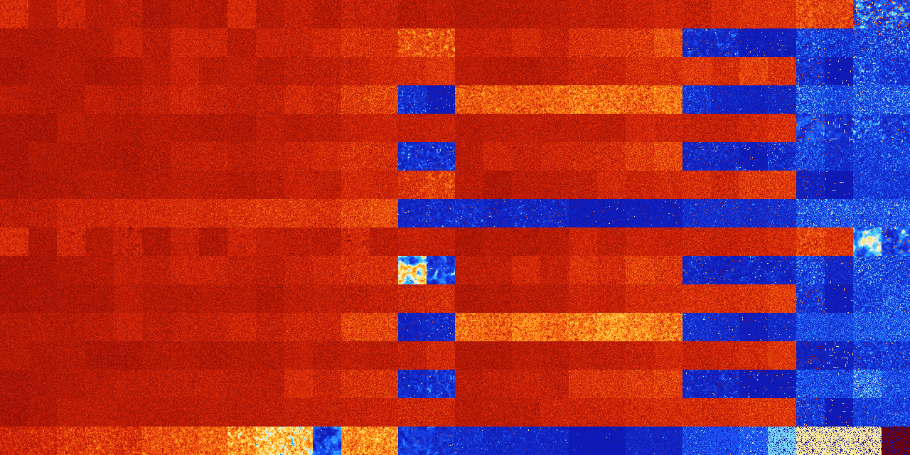

# B1238 (138240-138751)

<details>
    <summary>Initial Grid</summary>
    
</details>


<details>
    <summary>Initial Grid RLE</summary>

```
#C Exported from GoGoL (https://github.com/marrow16/gogol)
#C Wrap mode: Toroidal
#C Boundary mode: Dead
#C Step: 0
x = 100, y = 100, rule = B1238/S
39bo6bo$bo25bo8bo35bo13bo$6bo7bobo24bo7bo22bo$7bo28bo19bo11bo12bo6bo3bo
$8bo32bo3bo4bo2bo9bo5bo6bobo8bo5bobo$19bo50bo$13bo30bo44bo$25bo35bo25bo
$5bo14bo54bo2bobo9bo$12bobo4bo6bo37bo2b2o23bo$13bo21bo5bo9bo19bobo5b2o
7bo$17bo38bo11bo2bo5bo8bo7bo$60b2o23bo9bo$34bo3bo14bo$10bo19bo56bo11bo$
bo3bo27bo11bo16bo5bo$22bo18bo26bo25bo2bo$11bo11bo4bo9bo38bo$28b3o4bo17b
o15bo15bo$100b$10bo5bo6bo15bo22bo9bo18bo$8bo54bo17bo3bobo$4bo8bo12bo33b
o18bo15bo$19bo15bo3bo6bo17b2o11bo16b2o$2bo29bo$17b2o34bo41bo$11bo33bo3b
o$19bo8bo6bo10bo47bo$55bo4bo23bo$45bo$8bo20bo5bo4bo2bo32bo7bo5bo$19bo
32bo22bo5b2o$7bo6bo40bo35b2o5bo$20bo26bo9bo36bo3bo$12bo8bo4bo5bo17bo$b
2obo30bo10bo$18bo27bo52bo$29bo12bo18bo$19bo17bo15bo30bo9b2o$2bo46bo9bo
20b2o$25bo23b2o5b2o3bo$7b2obo7bo$13bo2bo29bo23bo$15bo2bo44bo5bo$18bo2bo
32bo18bo4bo16bo$100b$bo44bo10b2o$o5bo14bo6bo50bo$18bo28bo3bo12bo13bo$
12bo2bo17bo20bo$11bo44bo15bo7bo$11bo4bobo31bo11bo13bo11bo$6bo$39bo26bo
22bo$4bo20bobo6bo2bo21bo11bo12bobo$7bo6b2o9bo45bo$bo8b2o13bo5bo6bo32bo
16bo$27b2o18bo10b3o4bo15b3o5bo$35b2o2bo28bo13bo15bo$16bo68bo4bo$20bo11b
o7bo11bo8bo37bo$25b2o7bo3b2o25bo11bo14bo$24bo5bo8bo$12bo70bo$30bo20bo
26bo$36bo7bo37bo16bo$6bo7bo9bo20bo8bobo11bo21bo$2bo33bo17bo3bo4bo$15bo
23bo9bo2b2o$11bo4bo7bo30bo4bo14bo$25bobo7bo19b2o21bo$18bo4bobo26bo17b2o
17bo4bo$15bo42bo18bo$5bo32bo$o44bo20bo20bo2bo$34b2o2bo6bo9bo11bo12bo$
22bo52bo5bo9bo$bo27bo22b2o10bo$bo5b3o5bo5bo16bo40bo15bo2b2o$2bo9bo14bo
5bo37bo$5bo4bobo82bo$5bo37bo14bo8bo20bo$2bo3bo$56bo25bo12bo$12bo39bo21b
o10bo2bo$80bo13bo$2bobo27bobo14bo2bo5bo2bo3bo$19bo2bo14bo16bo9bo6bo17bo
$7bo14bo8bo22bo6bo10bo7bo$7bo5bo28bobo5b2o7bo4bo$15bo10bo6bo13bobo11bo
21bo14bo$46bo52bo$9bo3bo12bo34bobo14bo12bo5bo$11bo12bo27bo16bobo3bo$5bo
11bo14bo54bo6bo$12b2o2bo8bo7bo11bo29bo$7bo24bo2bo14bo$3bobo6bo18bo25bo
3bo21bo$15bo25bo21bo11bo5b3o15bo$32bo5bo23bo!
```
</details>
<details>
    <summary>Thumbnail</summary>

</details>
<table>
<tr>
    <td><a href="./138240%20S%20Heat%20Map%20Activity.png"></a><br>S (138240)<br>G>1000</td>    <td><a href="./138241%20S0%20Heat%20Map%20Activity.png"></a><br>S0 (138241)<br>G>1000</td>    <td><a href="./138242%20S1%20Heat%20Map%20Activity.png"></a><br>S1 (138242)<br>G>1000</td>    <td><a href="./138243%20S01%20Heat%20Map%20Activity.png"></a><br>S01 (138243)<br>G>1000</td>    <td><a href="./138244%20S2%20Heat%20Map%20Activity.png"></a><br>S2 (138244)<br>G>1000</td>    <td><a href="./138245%20S02%20Heat%20Map%20Activity.png"></a><br>S02 (138245)<br>G>1000</td>    <td><a href="./138246%20S12%20Heat%20Map%20Activity.png"></a><br>S12 (138246)<br>G>1000</td>    <td><a href="./138247%20S012%20Heat%20Map%20Activity.png"></a><br>S012 (138247)<br>G>1000</td>    <td><a href="./138248%20S3%20Heat%20Map%20Activity.png"></a><br>S3 (138248)<br>G>1000</td>    <td><a href="./138249%20S03%20Heat%20Map%20Activity.png"></a><br>S03 (138249)<br>G>1000</td>    <td><a href="./138250%20S13%20Heat%20Map%20Activity.png"></a><br>S13 (138250)<br>G>1000</td>    <td><a href="./138251%20S013%20Heat%20Map%20Activity.png"></a><br>S013 (138251)<br>G>1000</td>    <td><a href="./138252%20S23%20Heat%20Map%20Activity.png"></a><br>S23 (138252)<br>G>1000</td>    <td><a href="./138253%20S023%20Heat%20Map%20Activity.png"></a><br>S023 (138253)<br>G>1000</td>    <td><a href="./138254%20S123%20Heat%20Map%20Activity.png"></a><br>S123 (138254)<br>G>1000</td>    <td><a href="./138255%20S0123%20Heat%20Map%20Activity.png"></a><br>S0123 (138255)<br>G>1000</td>    <td><a href="./138256%20S4%20Heat%20Map%20Activity.png"></a><br>S4 (138256)<br>G>1000</td>    <td><a href="./138257%20S04%20Heat%20Map%20Activity.png"></a><br>S04 (138257)<br>G>1000</td>    <td><a href="./138258%20S14%20Heat%20Map%20Activity.png"></a><br>S14 (138258)<br>G>1000</td>    <td><a href="./138259%20S014%20Heat%20Map%20Activity.png"></a><br>S014 (138259)<br>G>1000</td>    <td><a href="./138260%20S24%20Heat%20Map%20Activity.png"></a><br>S24 (138260)<br>G>1000</td>    <td><a href="./138261%20S024%20Heat%20Map%20Activity.png"></a><br>S024 (138261)<br>G>1000</td>    <td><a href="./138262%20S124%20Heat%20Map%20Activity.png"></a><br>S124 (138262)<br>G>1000</td>    <td><a href="./138263%20S0124%20Heat%20Map%20Activity.png"></a><br>S0124 (138263)<br>G>1000</td>    <td><a href="./138264%20S34%20Heat%20Map%20Activity.png"></a><br>S34 (138264)<br>G>1000</td>    <td><a href="./138265%20S034%20Heat%20Map%20Activity.png"></a><br>S034 (138265)<br>G>1000</td>    <td><a href="./138266%20S134%20Heat%20Map%20Activity.png"></a><br>S134 (138266)<br>G>1000</td>    <td><a href="./138267%20S0134%20Heat%20Map%20Activity.png"></a><br>S0134 (138267)<br>G>1000</td>    <td><a href="./138268%20S234%20Heat%20Map%20Activity.png"></a><br>S234 (138268)<br>G>1000</td>    <td><a href="./138269%20S0234%20Heat%20Map%20Activity.png"></a><br>S0234 (138269)<br>G>1000</td>    <td><a href="./138270%20S1234%20Heat%20Map%20Activity.png"></a><br>S1234 (138270)<br>R@238,p24</td>    <td><a href="./138271%20S01234%20Heat%20Map%20Activity.png"></a><br>S01234 (138271)<br>R@224,p24</td></tr>
<tr>
    <td><a href="./138272%20S5%20Heat%20Map%20Activity.png"></a><br>S5 (138272)<br>G>1000</td>    <td><a href="./138273%20S05%20Heat%20Map%20Activity.png"></a><br>S05 (138273)<br>G>1000</td>    <td><a href="./138274%20S15%20Heat%20Map%20Activity.png"></a><br>S15 (138274)<br>G>1000</td>    <td><a href="./138275%20S015%20Heat%20Map%20Activity.png"></a><br>S015 (138275)<br>G>1000</td>    <td><a href="./138276%20S25%20Heat%20Map%20Activity.png"></a><br>S25 (138276)<br>G>1000</td>    <td><a href="./138277%20S025%20Heat%20Map%20Activity.png"></a><br>S025 (138277)<br>G>1000</td>    <td><a href="./138278%20S125%20Heat%20Map%20Activity.png"></a><br>S125 (138278)<br>G>1000</td>    <td><a href="./138279%20S0125%20Heat%20Map%20Activity.png"></a><br>S0125 (138279)<br>G>1000</td>    <td><a href="./138280%20S35%20Heat%20Map%20Activity.png"></a><br>S35 (138280)<br>G>1000</td>    <td><a href="./138281%20S035%20Heat%20Map%20Activity.png"></a><br>S035 (138281)<br>G>1000</td>    <td><a href="./138282%20S135%20Heat%20Map%20Activity.png"></a><br>S135 (138282)<br>G>1000</td>    <td><a href="./138283%20S0135%20Heat%20Map%20Activity.png"></a><br>S0135 (138283)<br>G>1000</td>    <td><a href="./138284%20S235%20Heat%20Map%20Activity.png"></a><br>S235 (138284)<br>G>1000</td>    <td><a href="./138285%20S0235%20Heat%20Map%20Activity.png"></a><br>S0235 (138285)<br>G>1000</td>    <td><a href="./138286%20S1235%20Heat%20Map%20Activity.png"></a><br>S1235 (138286)<br>G>1000</td>    <td><a href="./138287%20S01235%20Heat%20Map%20Activity.png"></a><br>S01235 (138287)<br>G>1000</td>    <td><a href="./138288%20S45%20Heat%20Map%20Activity.png"></a><br>S45 (138288)<br>G>1000</td>    <td><a href="./138289%20S045%20Heat%20Map%20Activity.png"></a><br>S045 (138289)<br>G>1000</td>    <td><a href="./138290%20S145%20Heat%20Map%20Activity.png"></a><br>S145 (138290)<br>G>1000</td>    <td><a href="./138291%20S0145%20Heat%20Map%20Activity.png"></a><br>S0145 (138291)<br>G>1000</td>    <td><a href="./138292%20S245%20Heat%20Map%20Activity.png"></a><br>S245 (138292)<br>G>1000</td>    <td><a href="./138293%20S0245%20Heat%20Map%20Activity.png"></a><br>S0245 (138293)<br>G>1000</td>    <td><a href="./138294%20S1245%20Heat%20Map%20Activity.png"></a><br>S1245 (138294)<br>G>1000</td>    <td><a href="./138295%20S01245%20Heat%20Map%20Activity.png"></a><br>S01245 (138295)<br>G>1000</td>    <td><a href="./138296%20S345%20Heat%20Map%20Activity.png"></a><br>S345 (138296)<br>R@210,p60</td>    <td><a href="./138297%20S0345%20Heat%20Map%20Activity.png"></a><br>S0345 (138297)<br>R@242,p12</td>    <td><a href="./138298%20S1345%20Heat%20Map%20Activity.png"></a><br>S1345 (138298)<br>G>1000</td>    <td><a href="./138299%20S01345%20Heat%20Map%20Activity.png"></a><br>S01345 (138299)<br>G>1000</td>    <td><a href="./138300%20S2345%20Heat%20Map%20Activity.png"></a><br>S2345 (138300)<br>R@33,p12</td>    <td><a href="./138301%20S02345%20Heat%20Map%20Activity.png"></a><br>S02345 (138301)<br>R@36,p12</td>    <td><a href="./138302%20S12345%20Heat%20Map%20Activity.png"></a><br>S12345 (138302)<br>R@31,p2</td>    <td><a href="./138303%20S012345%20Heat%20Map%20Activity.png"></a><br>S012345 (138303)<br>R@23,p2</td></tr>
<tr>
    <td><a href="./138304%20S6%20Heat%20Map%20Activity.png"></a><br>S6 (138304)<br>G>1000</td>    <td><a href="./138305%20S06%20Heat%20Map%20Activity.png"></a><br>S06 (138305)<br>G>1000</td>    <td><a href="./138306%20S16%20Heat%20Map%20Activity.png"></a><br>S16 (138306)<br>G>1000</td>    <td><a href="./138307%20S016%20Heat%20Map%20Activity.png"></a><br>S016 (138307)<br>G>1000</td>    <td><a href="./138308%20S26%20Heat%20Map%20Activity.png"></a><br>S26 (138308)<br>G>1000</td>    <td><a href="./138309%20S026%20Heat%20Map%20Activity.png"></a><br>S026 (138309)<br>G>1000</td>    <td><a href="./138310%20S126%20Heat%20Map%20Activity.png"></a><br>S126 (138310)<br>G>1000</td>    <td><a href="./138311%20S0126%20Heat%20Map%20Activity.png"></a><br>S0126 (138311)<br>G>1000</td>    <td><a href="./138312%20S36%20Heat%20Map%20Activity.png"></a><br>S36 (138312)<br>G>1000</td>    <td><a href="./138313%20S036%20Heat%20Map%20Activity.png"></a><br>S036 (138313)<br>G>1000</td>    <td><a href="./138314%20S136%20Heat%20Map%20Activity.png"></a><br>S136 (138314)<br>G>1000</td>    <td><a href="./138315%20S0136%20Heat%20Map%20Activity.png"></a><br>S0136 (138315)<br>G>1000</td>    <td><a href="./138316%20S236%20Heat%20Map%20Activity.png"></a><br>S236 (138316)<br>G>1000</td>    <td><a href="./138317%20S0236%20Heat%20Map%20Activity.png"></a><br>S0236 (138317)<br>G>1000</td>    <td><a href="./138318%20S1236%20Heat%20Map%20Activity.png"></a><br>S1236 (138318)<br>G>1000</td>    <td><a href="./138319%20S01236%20Heat%20Map%20Activity.png"></a><br>S01236 (138319)<br>G>1000</td>    <td><a href="./138320%20S46%20Heat%20Map%20Activity.png"></a><br>S46 (138320)<br>G>1000</td>    <td><a href="./138321%20S046%20Heat%20Map%20Activity.png"></a><br>S046 (138321)<br>G>1000</td>    <td><a href="./138322%20S146%20Heat%20Map%20Activity.png"></a><br>S146 (138322)<br>G>1000</td>    <td><a href="./138323%20S0146%20Heat%20Map%20Activity.png"></a><br>S0146 (138323)<br>G>1000</td>    <td><a href="./138324%20S246%20Heat%20Map%20Activity.png"></a><br>S246 (138324)<br>G>1000</td>    <td><a href="./138325%20S0246%20Heat%20Map%20Activity.png"></a><br>S0246 (138325)<br>G>1000</td>    <td><a href="./138326%20S1246%20Heat%20Map%20Activity.png"></a><br>S1246 (138326)<br>G>1000</td>    <td><a href="./138327%20S01246%20Heat%20Map%20Activity.png"></a><br>S01246 (138327)<br>G>1000</td>    <td><a href="./138328%20S346%20Heat%20Map%20Activity.png"></a><br>S346 (138328)<br>G>1000</td>    <td><a href="./138329%20S0346%20Heat%20Map%20Activity.png"></a><br>S0346 (138329)<br>G>1000</td>    <td><a href="./138330%20S1346%20Heat%20Map%20Activity.png"></a><br>S1346 (138330)<br>G>1000</td>    <td><a href="./138331%20S01346%20Heat%20Map%20Activity.png"></a><br>S01346 (138331)<br>G>1000</td>    <td><a href="./138332%20S2346%20Heat%20Map%20Activity.png"></a><br>S2346 (138332)<br>R@96,p30</td>    <td><a href="./138333%20S02346%20Heat%20Map%20Activity.png"></a><br>S02346 (138333)<br>G>1000</td>    <td><a href="./138334%20S12346%20Heat%20Map%20Activity.png"></a><br>S12346 (138334)<br>R@39,p2</td>    <td><a href="./138335%20S012346%20Heat%20Map%20Activity.png"></a><br>S012346 (138335)<br>R@62,p6</td></tr>
<tr>
    <td><a href="./138336%20S56%20Heat%20Map%20Activity.png"></a><br>S56 (138336)<br>G>1000</td>    <td><a href="./138337%20S056%20Heat%20Map%20Activity.png"></a><br>S056 (138337)<br>G>1000</td>    <td><a href="./138338%20S156%20Heat%20Map%20Activity.png"></a><br>S156 (138338)<br>G>1000</td>    <td><a href="./138339%20S0156%20Heat%20Map%20Activity.png"></a><br>S0156 (138339)<br>G>1000</td>    <td><a href="./138340%20S256%20Heat%20Map%20Activity.png"></a><br>S256 (138340)<br>G>1000</td>    <td><a href="./138341%20S0256%20Heat%20Map%20Activity.png"></a><br>S0256 (138341)<br>G>1000</td>    <td><a href="./138342%20S1256%20Heat%20Map%20Activity.png"></a><br>S1256 (138342)<br>G>1000</td>    <td><a href="./138343%20S01256%20Heat%20Map%20Activity.png"></a><br>S01256 (138343)<br>G>1000</td>    <td><a href="./138344%20S356%20Heat%20Map%20Activity.png"></a><br>S356 (138344)<br>G>1000</td>    <td><a href="./138345%20S0356%20Heat%20Map%20Activity.png"></a><br>S0356 (138345)<br>G>1000</td>    <td><a href="./138346%20S1356%20Heat%20Map%20Activity.png"></a><br>S1356 (138346)<br>G>1000</td>    <td><a href="./138347%20S01356%20Heat%20Map%20Activity.png"></a><br>S01356 (138347)<br>G>1000</td>    <td><a href="./138348%20S2356%20Heat%20Map%20Activity.png"></a><br>S2356 (138348)<br>G>1000</td>    <td><a href="./138349%20S02356%20Heat%20Map%20Activity.png"></a><br>S02356 (138349)<br>G>1000</td>    <td><a href="./138350%20S12356%20Heat%20Map%20Activity.png"></a><br>S12356 (138350)<br>R@182,p36</td>    <td><a href="./138351%20S012356%20Heat%20Map%20Activity.png"></a><br>S012356 (138351)<br>G>1000</td>    <td><a href="./138352%20S456%20Heat%20Map%20Activity.png"></a><br>S456 (138352)<br>G>1000</td>    <td><a href="./138353%20S0456%20Heat%20Map%20Activity.png"></a><br>S0456 (138353)<br>G>1000</td>    <td><a href="./138354%20S1456%20Heat%20Map%20Activity.png"></a><br>S1456 (138354)<br>G>1000</td>    <td><a href="./138355%20S01456%20Heat%20Map%20Activity.png"></a><br>S01456 (138355)<br>G>1000</td>    <td><a href="./138356%20S2456%20Heat%20Map%20Activity.png"></a><br>S2456 (138356)<br>G>1000</td>    <td><a href="./138357%20S02456%20Heat%20Map%20Activity.png"></a><br>S02456 (138357)<br>G>1000</td>    <td><a href="./138358%20S12456%20Heat%20Map%20Activity.png"></a><br>S12456 (138358)<br>G>1000</td>    <td><a href="./138359%20S012456%20Heat%20Map%20Activity.png"></a><br>S012456 (138359)<br>G>1000</td>    <td><a href="./138360%20S3456%20Heat%20Map%20Activity.png"></a><br>S3456 (138360)<br>R@28,p4</td>    <td><a href="./138361%20S03456%20Heat%20Map%20Activity.png"></a><br>S03456 (138361)<br>R@51,p30</td>    <td><a href="./138362%20S13456%20Heat%20Map%20Activity.png"></a><br>S13456 (138362)<br>R@84,p60</td>    <td><a href="./138363%20S013456%20Heat%20Map%20Activity.png"></a><br>S013456 (138363)<br>R@53,p24</td>    <td><a href="./138364%20S23456%20Heat%20Map%20Activity.png"></a><br>S23456 (138364)<br>R@12,p2</td>    <td><a href="./138365%20S023456%20Heat%20Map%20Activity.png"></a><br>S023456 (138365)<br>R@15,p6</td>    <td><a href="./138366%20S123456%20Heat%20Map%20Activity.png"></a><br>S123456 (138366)<br>R@12,p2</td>    <td><a href="./138367%20S0123456%20Heat%20Map%20Activity.png"></a><br>S0123456 (138367)<br>R@10,p2</td></tr>
<tr>
    <td><a href="./138368%20S7%20Heat%20Map%20Activity.png"></a><br>S7 (138368)<br>G>1000</td>    <td><a href="./138369%20S07%20Heat%20Map%20Activity.png"></a><br>S07 (138369)<br>G>1000</td>    <td><a href="./138370%20S17%20Heat%20Map%20Activity.png"></a><br>S17 (138370)<br>G>1000</td>    <td><a href="./138371%20S017%20Heat%20Map%20Activity.png"></a><br>S017 (138371)<br>G>1000</td>    <td><a href="./138372%20S27%20Heat%20Map%20Activity.png"></a><br>S27 (138372)<br>G>1000</td>    <td><a href="./138373%20S027%20Heat%20Map%20Activity.png"></a><br>S027 (138373)<br>G>1000</td>    <td><a href="./138374%20S127%20Heat%20Map%20Activity.png"></a><br>S127 (138374)<br>G>1000</td>    <td><a href="./138375%20S0127%20Heat%20Map%20Activity.png"></a><br>S0127 (138375)<br>G>1000</td>    <td><a href="./138376%20S37%20Heat%20Map%20Activity.png"></a><br>S37 (138376)<br>G>1000</td>    <td><a href="./138377%20S037%20Heat%20Map%20Activity.png"></a><br>S037 (138377)<br>G>1000</td>    <td><a href="./138378%20S137%20Heat%20Map%20Activity.png"></a><br>S137 (138378)<br>G>1000</td>    <td><a href="./138379%20S0137%20Heat%20Map%20Activity.png"></a><br>S0137 (138379)<br>G>1000</td>    <td><a href="./138380%20S237%20Heat%20Map%20Activity.png"></a><br>S237 (138380)<br>G>1000</td>    <td><a href="./138381%20S0237%20Heat%20Map%20Activity.png"></a><br>S0237 (138381)<br>G>1000</td>    <td><a href="./138382%20S1237%20Heat%20Map%20Activity.png"></a><br>S1237 (138382)<br>G>1000</td>    <td><a href="./138383%20S01237%20Heat%20Map%20Activity.png"></a><br>S01237 (138383)<br>G>1000</td>    <td><a href="./138384%20S47%20Heat%20Map%20Activity.png"></a><br>S47 (138384)<br>G>1000</td>    <td><a href="./138385%20S047%20Heat%20Map%20Activity.png"></a><br>S047 (138385)<br>G>1000</td>    <td><a href="./138386%20S147%20Heat%20Map%20Activity.png"></a><br>S147 (138386)<br>G>1000</td>    <td><a href="./138387%20S0147%20Heat%20Map%20Activity.png"></a><br>S0147 (138387)<br>G>1000</td>    <td><a href="./138388%20S247%20Heat%20Map%20Activity.png"></a><br>S247 (138388)<br>G>1000</td>    <td><a href="./138389%20S0247%20Heat%20Map%20Activity.png"></a><br>S0247 (138389)<br>G>1000</td>    <td><a href="./138390%20S1247%20Heat%20Map%20Activity.png"></a><br>S1247 (138390)<br>G>1000</td>    <td><a href="./138391%20S01247%20Heat%20Map%20Activity.png"></a><br>S01247 (138391)<br>G>1000</td>    <td><a href="./138392%20S347%20Heat%20Map%20Activity.png"></a><br>S347 (138392)<br>G>1000</td>    <td><a href="./138393%20S0347%20Heat%20Map%20Activity.png"></a><br>S0347 (138393)<br>G>1000</td>    <td><a href="./138394%20S1347%20Heat%20Map%20Activity.png"></a><br>S1347 (138394)<br>G>1000</td>    <td><a href="./138395%20S01347%20Heat%20Map%20Activity.png"></a><br>S01347 (138395)<br>G>1000</td>    <td><a href="./138396%20S2347%20Heat%20Map%20Activity.png"></a><br>S2347 (138396)<br>R@829,p360</td>    <td><a href="./138397%20S02347%20Heat%20Map%20Activity.png"></a><br>S02347 (138397)<br>G>1000</td>    <td><a href="./138398%20S12347%20Heat%20Map%20Activity.png"></a><br>S12347 (138398)<br>R@71,p4</td>    <td><a href="./138399%20S012347%20Heat%20Map%20Activity.png"></a><br>S012347 (138399)<br>R@117,p24</td></tr>
<tr>
    <td><a href="./138400%20S57%20Heat%20Map%20Activity.png"></a><br>S57 (138400)<br>G>1000</td>    <td><a href="./138401%20S057%20Heat%20Map%20Activity.png"></a><br>S057 (138401)<br>G>1000</td>    <td><a href="./138402%20S157%20Heat%20Map%20Activity.png"></a><br>S157 (138402)<br>G>1000</td>    <td><a href="./138403%20S0157%20Heat%20Map%20Activity.png"></a><br>S0157 (138403)<br>G>1000</td>    <td><a href="./138404%20S257%20Heat%20Map%20Activity.png"></a><br>S257 (138404)<br>G>1000</td>    <td><a href="./138405%20S0257%20Heat%20Map%20Activity.png"></a><br>S0257 (138405)<br>G>1000</td>    <td><a href="./138406%20S1257%20Heat%20Map%20Activity.png"></a><br>S1257 (138406)<br>G>1000</td>    <td><a href="./138407%20S01257%20Heat%20Map%20Activity.png"></a><br>S01257 (138407)<br>G>1000</td>    <td><a href="./138408%20S357%20Heat%20Map%20Activity.png"></a><br>S357 (138408)<br>G>1000</td>    <td><a href="./138409%20S0357%20Heat%20Map%20Activity.png"></a><br>S0357 (138409)<br>G>1000</td>    <td><a href="./138410%20S1357%20Heat%20Map%20Activity.png"></a><br>S1357 (138410)<br>G>1000</td>    <td><a href="./138411%20S01357%20Heat%20Map%20Activity.png"></a><br>S01357 (138411)<br>G>1000</td>    <td><a href="./138412%20S2357%20Heat%20Map%20Activity.png"></a><br>S2357 (138412)<br>G>1000</td>    <td><a href="./138413%20S02357%20Heat%20Map%20Activity.png"></a><br>S02357 (138413)<br>G>1000</td>    <td><a href="./138414%20S12357%20Heat%20Map%20Activity.png"></a><br>S12357 (138414)<br>R@304,p24</td>    <td><a href="./138415%20S012357%20Heat%20Map%20Activity.png"></a><br>S012357 (138415)<br>R@369,p36</td>    <td><a href="./138416%20S457%20Heat%20Map%20Activity.png"></a><br>S457 (138416)<br>G>1000</td>    <td><a href="./138417%20S0457%20Heat%20Map%20Activity.png"></a><br>S0457 (138417)<br>G>1000</td>    <td><a href="./138418%20S1457%20Heat%20Map%20Activity.png"></a><br>S1457 (138418)<br>G>1000</td>    <td><a href="./138419%20S01457%20Heat%20Map%20Activity.png"></a><br>S01457 (138419)<br>G>1000</td>    <td><a href="./138420%20S2457%20Heat%20Map%20Activity.png"></a><br>S2457 (138420)<br>G>1000</td>    <td><a href="./138421%20S02457%20Heat%20Map%20Activity.png"></a><br>S02457 (138421)<br>G>1000</td>    <td><a href="./138422%20S12457%20Heat%20Map%20Activity.png"></a><br>S12457 (138422)<br>G>1000</td>    <td><a href="./138423%20S012457%20Heat%20Map%20Activity.png"></a><br>S012457 (138423)<br>G>1000</td>    <td><a href="./138424%20S3457%20Heat%20Map%20Activity.png"></a><br>S3457 (138424)<br>R@167,p84</td>    <td><a href="./138425%20S03457%20Heat%20Map%20Activity.png"></a><br>S03457 (138425)<br>R@172,p12</td>    <td><a href="./138426%20S13457%20Heat%20Map%20Activity.png"></a><br>S13457 (138426)<br>R@505,p240</td>    <td><a href="./138427%20S013457%20Heat%20Map%20Activity.png"></a><br>S013457 (138427)<br>R@132,p24</td>    <td><a href="./138428%20S23457%20Heat%20Map%20Activity.png"></a><br>S23457 (138428)<br>R@20,p6</td>    <td><a href="./138429%20S023457%20Heat%20Map%20Activity.png"></a><br>S023457 (138429)<br>R@33,p12</td>    <td><a href="./138430%20S123457%20Heat%20Map%20Activity.png"></a><br>S123457 (138430)<br>R@23,p6</td>    <td><a href="./138431%20S0123457%20Heat%20Map%20Activity.png"></a><br>S0123457 (138431)<br>R@18,p6</td></tr>
<tr>
    <td><a href="./138432%20S67%20Heat%20Map%20Activity.png"></a><br>S67 (138432)<br>G>1000</td>    <td><a href="./138433%20S067%20Heat%20Map%20Activity.png"></a><br>S067 (138433)<br>G>1000</td>    <td><a href="./138434%20S167%20Heat%20Map%20Activity.png"></a><br>S167 (138434)<br>G>1000</td>    <td><a href="./138435%20S0167%20Heat%20Map%20Activity.png"></a><br>S0167 (138435)<br>G>1000</td>    <td><a href="./138436%20S267%20Heat%20Map%20Activity.png"></a><br>S267 (138436)<br>G>1000</td>    <td><a href="./138437%20S0267%20Heat%20Map%20Activity.png"></a><br>S0267 (138437)<br>G>1000</td>    <td><a href="./138438%20S1267%20Heat%20Map%20Activity.png"></a><br>S1267 (138438)<br>G>1000</td>    <td><a href="./138439%20S01267%20Heat%20Map%20Activity.png"></a><br>S01267 (138439)<br>G>1000</td>    <td><a href="./138440%20S367%20Heat%20Map%20Activity.png"></a><br>S367 (138440)<br>G>1000</td>    <td><a href="./138441%20S0367%20Heat%20Map%20Activity.png"></a><br>S0367 (138441)<br>G>1000</td>    <td><a href="./138442%20S1367%20Heat%20Map%20Activity.png"></a><br>S1367 (138442)<br>G>1000</td>    <td><a href="./138443%20S01367%20Heat%20Map%20Activity.png"></a><br>S01367 (138443)<br>G>1000</td>    <td><a href="./138444%20S2367%20Heat%20Map%20Activity.png"></a><br>S2367 (138444)<br>G>1000</td>    <td><a href="./138445%20S02367%20Heat%20Map%20Activity.png"></a><br>S02367 (138445)<br>G>1000</td>    <td><a href="./138446%20S12367%20Heat%20Map%20Activity.png"></a><br>S12367 (138446)<br>G>1000</td>    <td><a href="./138447%20S012367%20Heat%20Map%20Activity.png"></a><br>S012367 (138447)<br>G>1000</td>    <td><a href="./138448%20S467%20Heat%20Map%20Activity.png"></a><br>S467 (138448)<br>G>1000</td>    <td><a href="./138449%20S0467%20Heat%20Map%20Activity.png"></a><br>S0467 (138449)<br>G>1000</td>    <td><a href="./138450%20S1467%20Heat%20Map%20Activity.png"></a><br>S1467 (138450)<br>G>1000</td>    <td><a href="./138451%20S01467%20Heat%20Map%20Activity.png"></a><br>S01467 (138451)<br>G>1000</td>    <td><a href="./138452%20S2467%20Heat%20Map%20Activity.png"></a><br>S2467 (138452)<br>G>1000</td>    <td><a href="./138453%20S02467%20Heat%20Map%20Activity.png"></a><br>S02467 (138453)<br>G>1000</td>    <td><a href="./138454%20S12467%20Heat%20Map%20Activity.png"></a><br>S12467 (138454)<br>G>1000</td>    <td><a href="./138455%20S012467%20Heat%20Map%20Activity.png"></a><br>S012467 (138455)<br>G>1000</td>    <td><a href="./138456%20S3467%20Heat%20Map%20Activity.png"></a><br>S3467 (138456)<br>G>1000</td>    <td><a href="./138457%20S03467%20Heat%20Map%20Activity.png"></a><br>S03467 (138457)<br>G>1000</td>    <td><a href="./138458%20S13467%20Heat%20Map%20Activity.png"></a><br>S13467 (138458)<br>G>1000</td>    <td><a href="./138459%20S013467%20Heat%20Map%20Activity.png"></a><br>S013467 (138459)<br>G>1000</td>    <td><a href="./138460%20S23467%20Heat%20Map%20Activity.png"></a><br>S23467 (138460)<br>R@178,p120</td>    <td><a href="./138461%20S023467%20Heat%20Map%20Activity.png"></a><br>S023467 (138461)<br>G>1000</td>    <td><a href="./138462%20S123467%20Heat%20Map%20Activity.png"></a><br>S123467 (138462)<br>R@32,p6</td>    <td><a href="./138463%20S0123467%20Heat%20Map%20Activity.png"></a><br>S0123467 (138463)<br>R@38,p12</td></tr>
<tr>
    <td><a href="./138464%20S567%20Heat%20Map%20Activity.png"></a><br>S567 (138464)<br>G>1000</td>    <td><a href="./138465%20S0567%20Heat%20Map%20Activity.png"></a><br>S0567 (138465)<br>G>1000</td>    <td><a href="./138466%20S1567%20Heat%20Map%20Activity.png"></a><br>S1567 (138466)<br>G>1000</td>    <td><a href="./138467%20S01567%20Heat%20Map%20Activity.png"></a><br>S01567 (138467)<br>G>1000</td>    <td><a href="./138468%20S2567%20Heat%20Map%20Activity.png"></a><br>S2567 (138468)<br>G>1000</td>    <td><a href="./138469%20S02567%20Heat%20Map%20Activity.png"></a><br>S02567 (138469)<br>G>1000</td>    <td><a href="./138470%20S12567%20Heat%20Map%20Activity.png"></a><br>S12567 (138470)<br>G>1000</td>    <td><a href="./138471%20S012567%20Heat%20Map%20Activity.png"></a><br>S012567 (138471)<br>G>1000</td>    <td><a href="./138472%20S3567%20Heat%20Map%20Activity.png"></a><br>S3567 (138472)<br>G>1000</td>    <td><a href="./138473%20S03567%20Heat%20Map%20Activity.png"></a><br>S03567 (138473)<br>G>1000</td>    <td><a href="./138474%20S13567%20Heat%20Map%20Activity.png"></a><br>S13567 (138474)<br>G>1000</td>    <td><a href="./138475%20S013567%20Heat%20Map%20Activity.png"></a><br>S013567 (138475)<br>G>1000</td>    <td><a href="./138476%20S23567%20Heat%20Map%20Activity.png"></a><br>S23567 (138476)<br>G>1000</td>    <td><a href="./138477%20S023567%20Heat%20Map%20Activity.png"></a><br>S023567 (138477)<br>G>1000</td>    <td><a href="./138478%20S123567%20Heat%20Map%20Activity.png"></a><br>S123567 (138478)<br>R@545,p240</td>    <td><a href="./138479%20S0123567%20Heat%20Map%20Activity.png"></a><br>S0123567 (138479)<br>R@435,p168</td>    <td><a href="./138480%20S4567%20Heat%20Map%20Activity.png"></a><br>S4567 (138480)<br>R@62,p12</td>    <td><a href="./138481%20S04567%20Heat%20Map%20Activity.png"></a><br>S04567 (138481)<br>R@115,p60</td>    <td><a href="./138482%20S14567%20Heat%20Map%20Activity.png"></a><br>S14567 (138482)<br>R@83,p12</td>    <td><a href="./138483%20S014567%20Heat%20Map%20Activity.png"></a><br>S014567 (138483)<br>R@80,p24</td>    <td><a href="./138484%20S24567%20Heat%20Map%20Activity.png"></a><br>S24567 (138484)<br>R@227,p180</td>    <td><a href="./138485%20S024567%20Heat%20Map%20Activity.png"></a><br>S024567 (138485)<br>R@230,p180</td>    <td><a href="./138486%20S124567%20Heat%20Map%20Activity.png"></a><br>S124567 (138486)<br>R@165,p120</td>    <td><a href="./138487%20S0124567%20Heat%20Map%20Activity.png"></a><br>S0124567 (138487)<br>R@174,p120</td>    <td><a href="./138488%20S34567%20Heat%20Map%20Activity.png"></a><br>S34567 (138488)<br>R@25,p12</td>    <td><a href="./138489%20S034567%20Heat%20Map%20Activity.png"></a><br>S034567 (138489)<br>R@24,p12</td>    <td><a href="./138490%20S134567%20Heat%20Map%20Activity.png"></a><br>S134567 (138490)<br>R@30,p12</td>    <td><a href="./138491%20S0134567%20Heat%20Map%20Activity.png"></a><br>S0134567 (138491)<br>R@24,p12</td>    <td><a href="./138492%20S234567%20Heat%20Map%20Activity.png"></a><br>S234567 (138492)<br>R@10,p2</td>    <td><a href="./138493%20S0234567%20Heat%20Map%20Activity.png"></a><br>S0234567 (138493)<br>R@10,p2</td>    <td><a href="./138494%20S1234567%20Heat%20Map%20Activity.png"></a><br>S1234567 (138494)<br>R@10,p2</td>    <td><a href="./138495%20S01234567%20Heat%20Map%20Activity.png"></a><br>S01234567 (138495)<br>R@10,p2</td></tr>
<tr>
    <td><a href="./138496%20S8%20Heat%20Map%20Activity.png"></a><br>S8 (138496)<br>G>1000</td>    <td><a href="./138497%20S08%20Heat%20Map%20Activity.png"></a><br>S08 (138497)<br>G>1000</td>    <td><a href="./138498%20S18%20Heat%20Map%20Activity.png"></a><br>S18 (138498)<br>G>1000</td>    <td><a href="./138499%20S018%20Heat%20Map%20Activity.png"></a><br>S018 (138499)<br>G>1000</td>    <td><a href="./138500%20S28%20Heat%20Map%20Activity.png"></a><br>S28 (138500)<br>G>1000</td>    <td><a href="./138501%20S028%20Heat%20Map%20Activity.png"></a><br>S028 (138501)<br>G>1000</td>    <td><a href="./138502%20S128%20Heat%20Map%20Activity.png"></a><br>S128 (138502)<br>G>1000</td>    <td><a href="./138503%20S0128%20Heat%20Map%20Activity.png"></a><br>S0128 (138503)<br>G>1000</td>    <td><a href="./138504%20S38%20Heat%20Map%20Activity.png"></a><br>S38 (138504)<br>G>1000</td>    <td><a href="./138505%20S038%20Heat%20Map%20Activity.png"></a><br>S038 (138505)<br>G>1000</td>    <td><a href="./138506%20S138%20Heat%20Map%20Activity.png"></a><br>S138 (138506)<br>G>1000</td>    <td><a href="./138507%20S0138%20Heat%20Map%20Activity.png"></a><br>S0138 (138507)<br>G>1000</td>    <td><a href="./138508%20S238%20Heat%20Map%20Activity.png"></a><br>S238 (138508)<br>G>1000</td>    <td><a href="./138509%20S0238%20Heat%20Map%20Activity.png"></a><br>S0238 (138509)<br>G>1000</td>    <td><a href="./138510%20S1238%20Heat%20Map%20Activity.png"></a><br>S1238 (138510)<br>G>1000</td>    <td><a href="./138511%20S01238%20Heat%20Map%20Activity.png"></a><br>S01238 (138511)<br>G>1000</td>    <td><a href="./138512%20S48%20Heat%20Map%20Activity.png"></a><br>S48 (138512)<br>G>1000</td>    <td><a href="./138513%20S048%20Heat%20Map%20Activity.png"></a><br>S048 (138513)<br>G>1000</td>    <td><a href="./138514%20S148%20Heat%20Map%20Activity.png"></a><br>S148 (138514)<br>G>1000</td>    <td><a href="./138515%20S0148%20Heat%20Map%20Activity.png"></a><br>S0148 (138515)<br>G>1000</td>    <td><a href="./138516%20S248%20Heat%20Map%20Activity.png"></a><br>S248 (138516)<br>G>1000</td>    <td><a href="./138517%20S0248%20Heat%20Map%20Activity.png"></a><br>S0248 (138517)<br>G>1000</td>    <td><a href="./138518%20S1248%20Heat%20Map%20Activity.png"></a><br>S1248 (138518)<br>G>1000</td>    <td><a href="./138519%20S01248%20Heat%20Map%20Activity.png"></a><br>S01248 (138519)<br>G>1000</td>    <td><a href="./138520%20S348%20Heat%20Map%20Activity.png"></a><br>S348 (138520)<br>G>1000</td>    <td><a href="./138521%20S0348%20Heat%20Map%20Activity.png"></a><br>S0348 (138521)<br>G>1000</td>    <td><a href="./138522%20S1348%20Heat%20Map%20Activity.png"></a><br>S1348 (138522)<br>G>1000</td>    <td><a href="./138523%20S01348%20Heat%20Map%20Activity.png"></a><br>S01348 (138523)<br>G>1000</td>    <td><a href="./138524%20S2348%20Heat%20Map%20Activity.png"></a><br>S2348 (138524)<br>G>1000</td>    <td><a href="./138525%20S02348%20Heat%20Map%20Activity.png"></a><br>S02348 (138525)<br>G>1000</td>    <td><a href="./138526%20S12348%20Heat%20Map%20Activity.png"></a><br>S12348 (138526)<br>R@913,p12</td>    <td><a href="./138527%20S012348%20Heat%20Map%20Activity.png"></a><br>S012348 (138527)<br>R@569,p60</td></tr>
<tr>
    <td><a href="./138528%20S58%20Heat%20Map%20Activity.png"></a><br>S58 (138528)<br>G>1000</td>    <td><a href="./138529%20S058%20Heat%20Map%20Activity.png"></a><br>S058 (138529)<br>G>1000</td>    <td><a href="./138530%20S158%20Heat%20Map%20Activity.png"></a><br>S158 (138530)<br>G>1000</td>    <td><a href="./138531%20S0158%20Heat%20Map%20Activity.png"></a><br>S0158 (138531)<br>G>1000</td>    <td><a href="./138532%20S258%20Heat%20Map%20Activity.png"></a><br>S258 (138532)<br>G>1000</td>    <td><a href="./138533%20S0258%20Heat%20Map%20Activity.png"></a><br>S0258 (138533)<br>G>1000</td>    <td><a href="./138534%20S1258%20Heat%20Map%20Activity.png"></a><br>S1258 (138534)<br>G>1000</td>    <td><a href="./138535%20S01258%20Heat%20Map%20Activity.png"></a><br>S01258 (138535)<br>G>1000</td>    <td><a href="./138536%20S358%20Heat%20Map%20Activity.png"></a><br>S358 (138536)<br>G>1000</td>    <td><a href="./138537%20S0358%20Heat%20Map%20Activity.png"></a><br>S0358 (138537)<br>G>1000</td>    <td><a href="./138538%20S1358%20Heat%20Map%20Activity.png"></a><br>S1358 (138538)<br>G>1000</td>    <td><a href="./138539%20S01358%20Heat%20Map%20Activity.png"></a><br>S01358 (138539)<br>G>1000</td>    <td><a href="./138540%20S2358%20Heat%20Map%20Activity.png"></a><br>S2358 (138540)<br>G>1000</td>    <td><a href="./138541%20S02358%20Heat%20Map%20Activity.png"></a><br>S02358 (138541)<br>G>1000</td>    <td><a href="./138542%20S12358%20Heat%20Map%20Activity.png"></a><br>S12358 (138542)<br>G>1000</td>    <td><a href="./138543%20S012358%20Heat%20Map%20Activity.png"></a><br>S012358 (138543)<br>G>1000</td>    <td><a href="./138544%20S458%20Heat%20Map%20Activity.png"></a><br>S458 (138544)<br>G>1000</td>    <td><a href="./138545%20S0458%20Heat%20Map%20Activity.png"></a><br>S0458 (138545)<br>G>1000</td>    <td><a href="./138546%20S1458%20Heat%20Map%20Activity.png"></a><br>S1458 (138546)<br>G>1000</td>    <td><a href="./138547%20S01458%20Heat%20Map%20Activity.png"></a><br>S01458 (138547)<br>G>1000</td>    <td><a href="./138548%20S2458%20Heat%20Map%20Activity.png"></a><br>S2458 (138548)<br>G>1000</td>    <td><a href="./138549%20S02458%20Heat%20Map%20Activity.png"></a><br>S02458 (138549)<br>G>1000</td>    <td><a href="./138550%20S12458%20Heat%20Map%20Activity.png"></a><br>S12458 (138550)<br>G>1000</td>    <td><a href="./138551%20S012458%20Heat%20Map%20Activity.png"></a><br>S012458 (138551)<br>G>1000</td>    <td><a href="./138552%20S3458%20Heat%20Map%20Activity.png"></a><br>S3458 (138552)<br>R@257,p84</td>    <td><a href="./138553%20S03458%20Heat%20Map%20Activity.png"></a><br>S03458 (138553)<br>R@442,p252</td>    <td><a href="./138554%20S13458%20Heat%20Map%20Activity.png"></a><br>S13458 (138554)<br>R@293,p60</td>    <td><a href="./138555%20S013458%20Heat%20Map%20Activity.png"></a><br>S013458 (138555)<br>R@313,p120</td>    <td><a href="./138556%20S23458%20Heat%20Map%20Activity.png"></a><br>S23458 (138556)<br>R@24,p2</td>    <td><a href="./138557%20S023458%20Heat%20Map%20Activity.png"></a><br>S023458 (138557)<br>R@61,p42</td>    <td><a href="./138558%20S123458%20Heat%20Map%20Activity.png"></a><br>S123458 (138558)<br>R@19,p2</td>    <td><a href="./138559%20S0123458%20Heat%20Map%20Activity.png"></a><br>S0123458 (138559)<br>R@21,p2</td></tr>
<tr>
    <td><a href="./138560%20S68%20Heat%20Map%20Activity.png"></a><br>S68 (138560)<br>G>1000</td>    <td><a href="./138561%20S068%20Heat%20Map%20Activity.png"></a><br>S068 (138561)<br>G>1000</td>    <td><a href="./138562%20S168%20Heat%20Map%20Activity.png"></a><br>S168 (138562)<br>G>1000</td>    <td><a href="./138563%20S0168%20Heat%20Map%20Activity.png"></a><br>S0168 (138563)<br>G>1000</td>    <td><a href="./138564%20S268%20Heat%20Map%20Activity.png"></a><br>S268 (138564)<br>G>1000</td>    <td><a href="./138565%20S0268%20Heat%20Map%20Activity.png"></a><br>S0268 (138565)<br>G>1000</td>    <td><a href="./138566%20S1268%20Heat%20Map%20Activity.png"></a><br>S1268 (138566)<br>G>1000</td>    <td><a href="./138567%20S01268%20Heat%20Map%20Activity.png"></a><br>S01268 (138567)<br>G>1000</td>    <td><a href="./138568%20S368%20Heat%20Map%20Activity.png"></a><br>S368 (138568)<br>G>1000</td>    <td><a href="./138569%20S0368%20Heat%20Map%20Activity.png"></a><br>S0368 (138569)<br>G>1000</td>    <td><a href="./138570%20S1368%20Heat%20Map%20Activity.png"></a><br>S1368 (138570)<br>G>1000</td>    <td><a href="./138571%20S01368%20Heat%20Map%20Activity.png"></a><br>S01368 (138571)<br>G>1000</td>    <td><a href="./138572%20S2368%20Heat%20Map%20Activity.png"></a><br>S2368 (138572)<br>G>1000</td>    <td><a href="./138573%20S02368%20Heat%20Map%20Activity.png"></a><br>S02368 (138573)<br>G>1000</td>    <td><a href="./138574%20S12368%20Heat%20Map%20Activity.png"></a><br>S12368 (138574)<br>G>1000</td>    <td><a href="./138575%20S012368%20Heat%20Map%20Activity.png"></a><br>S012368 (138575)<br>G>1000</td>    <td><a href="./138576%20S468%20Heat%20Map%20Activity.png"></a><br>S468 (138576)<br>G>1000</td>    <td><a href="./138577%20S0468%20Heat%20Map%20Activity.png"></a><br>S0468 (138577)<br>G>1000</td>    <td><a href="./138578%20S1468%20Heat%20Map%20Activity.png"></a><br>S1468 (138578)<br>G>1000</td>    <td><a href="./138579%20S01468%20Heat%20Map%20Activity.png"></a><br>S01468 (138579)<br>G>1000</td>    <td><a href="./138580%20S2468%20Heat%20Map%20Activity.png"></a><br>S2468 (138580)<br>G>1000</td>    <td><a href="./138581%20S02468%20Heat%20Map%20Activity.png"></a><br>S02468 (138581)<br>G>1000</td>    <td><a href="./138582%20S12468%20Heat%20Map%20Activity.png"></a><br>S12468 (138582)<br>G>1000</td>    <td><a href="./138583%20S012468%20Heat%20Map%20Activity.png"></a><br>S012468 (138583)<br>G>1000</td>    <td><a href="./138584%20S3468%20Heat%20Map%20Activity.png"></a><br>S3468 (138584)<br>G>1000</td>    <td><a href="./138585%20S03468%20Heat%20Map%20Activity.png"></a><br>S03468 (138585)<br>G>1000</td>    <td><a href="./138586%20S13468%20Heat%20Map%20Activity.png"></a><br>S13468 (138586)<br>G>1000</td>    <td><a href="./138587%20S013468%20Heat%20Map%20Activity.png"></a><br>S013468 (138587)<br>G>1000</td>    <td><a href="./138588%20S23468%20Heat%20Map%20Activity.png"></a><br>S23468 (138588)<br>R@72,p6</td>    <td><a href="./138589%20S023468%20Heat%20Map%20Activity.png"></a><br>S023468 (138589)<br>R@480,p420</td>    <td><a href="./138590%20S123468%20Heat%20Map%20Activity.png"></a><br>S123468 (138590)<br>R@34,p6</td>    <td><a href="./138591%20S0123468%20Heat%20Map%20Activity.png"></a><br>S0123468 (138591)<br>R@22,p2</td></tr>
<tr>
    <td><a href="./138592%20S568%20Heat%20Map%20Activity.png"></a><br>S568 (138592)<br>G>1000</td>    <td><a href="./138593%20S0568%20Heat%20Map%20Activity.png"></a><br>S0568 (138593)<br>G>1000</td>    <td><a href="./138594%20S1568%20Heat%20Map%20Activity.png"></a><br>S1568 (138594)<br>G>1000</td>    <td><a href="./138595%20S01568%20Heat%20Map%20Activity.png"></a><br>S01568 (138595)<br>G>1000</td>    <td><a href="./138596%20S2568%20Heat%20Map%20Activity.png"></a><br>S2568 (138596)<br>G>1000</td>    <td><a href="./138597%20S02568%20Heat%20Map%20Activity.png"></a><br>S02568 (138597)<br>G>1000</td>    <td><a href="./138598%20S12568%20Heat%20Map%20Activity.png"></a><br>S12568 (138598)<br>G>1000</td>    <td><a href="./138599%20S012568%20Heat%20Map%20Activity.png"></a><br>S012568 (138599)<br>G>1000</td>    <td><a href="./138600%20S3568%20Heat%20Map%20Activity.png"></a><br>S3568 (138600)<br>G>1000</td>    <td><a href="./138601%20S03568%20Heat%20Map%20Activity.png"></a><br>S03568 (138601)<br>G>1000</td>    <td><a href="./138602%20S13568%20Heat%20Map%20Activity.png"></a><br>S13568 (138602)<br>G>1000</td>    <td><a href="./138603%20S013568%20Heat%20Map%20Activity.png"></a><br>S013568 (138603)<br>G>1000</td>    <td><a href="./138604%20S23568%20Heat%20Map%20Activity.png"></a><br>S23568 (138604)<br>G>1000</td>    <td><a href="./138605%20S023568%20Heat%20Map%20Activity.png"></a><br>S023568 (138605)<br>G>1000</td>    <td><a href="./138606%20S123568%20Heat%20Map%20Activity.png"></a><br>S123568 (138606)<br>R@435,p252</td>    <td><a href="./138607%20S0123568%20Heat%20Map%20Activity.png"></a><br>S0123568 (138607)<br>R@243,p132</td>    <td><a href="./138608%20S4568%20Heat%20Map%20Activity.png"></a><br>S4568 (138608)<br>G>1000</td>    <td><a href="./138609%20S04568%20Heat%20Map%20Activity.png"></a><br>S04568 (138609)<br>G>1000</td>    <td><a href="./138610%20S14568%20Heat%20Map%20Activity.png"></a><br>S14568 (138610)<br>G>1000</td>    <td><a href="./138611%20S014568%20Heat%20Map%20Activity.png"></a><br>S014568 (138611)<br>G>1000</td>    <td><a href="./138612%20S24568%20Heat%20Map%20Activity.png"></a><br>S24568 (138612)<br>G>1000</td>    <td><a href="./138613%20S024568%20Heat%20Map%20Activity.png"></a><br>S024568 (138613)<br>G>1000</td>    <td><a href="./138614%20S124568%20Heat%20Map%20Activity.png"></a><br>S124568 (138614)<br>G>1000</td>    <td><a href="./138615%20S0124568%20Heat%20Map%20Activity.png"></a><br>S0124568 (138615)<br>G>1000</td>    <td><a href="./138616%20S34568%20Heat%20Map%20Activity.png"></a><br>S34568 (138616)<br>R@28,p4</td>    <td><a href="./138617%20S034568%20Heat%20Map%20Activity.png"></a><br>S034568 (138617)<br>R@31,p12</td>    <td><a href="./138618%20S134568%20Heat%20Map%20Activity.png"></a><br>S134568 (138618)<br>R@140,p120</td>    <td><a href="./138619%20S0134568%20Heat%20Map%20Activity.png"></a><br>S0134568 (138619)<br>R@35,p12</td>    <td><a href="./138620%20S234568%20Heat%20Map%20Activity.png"></a><br>S234568 (138620)<br>R@13,p2</td>    <td><a href="./138621%20S0234568%20Heat%20Map%20Activity.png"></a><br>S0234568 (138621)<br>R@13,p2</td>    <td><a href="./138622%20S1234568%20Heat%20Map%20Activity.png"></a><br>S1234568 (138622)<br>R@12,p2</td>    <td><a href="./138623%20S01234568%20Heat%20Map%20Activity.png"></a><br>S01234568 (138623)<br>R@11,p2</td></tr>
<tr>
    <td><a href="./138624%20S78%20Heat%20Map%20Activity.png"></a><br>S78 (138624)<br>G>1000</td>    <td><a href="./138625%20S078%20Heat%20Map%20Activity.png"></a><br>S078 (138625)<br>G>1000</td>    <td><a href="./138626%20S178%20Heat%20Map%20Activity.png"></a><br>S178 (138626)<br>G>1000</td>    <td><a href="./138627%20S0178%20Heat%20Map%20Activity.png"></a><br>S0178 (138627)<br>G>1000</td>    <td><a href="./138628%20S278%20Heat%20Map%20Activity.png"></a><br>S278 (138628)<br>G>1000</td>    <td><a href="./138629%20S0278%20Heat%20Map%20Activity.png"></a><br>S0278 (138629)<br>G>1000</td>    <td><a href="./138630%20S1278%20Heat%20Map%20Activity.png"></a><br>S1278 (138630)<br>G>1000</td>    <td><a href="./138631%20S01278%20Heat%20Map%20Activity.png"></a><br>S01278 (138631)<br>G>1000</td>    <td><a href="./138632%20S378%20Heat%20Map%20Activity.png"></a><br>S378 (138632)<br>G>1000</td>    <td><a href="./138633%20S0378%20Heat%20Map%20Activity.png"></a><br>S0378 (138633)<br>G>1000</td>    <td><a href="./138634%20S1378%20Heat%20Map%20Activity.png"></a><br>S1378 (138634)<br>G>1000</td>    <td><a href="./138635%20S01378%20Heat%20Map%20Activity.png"></a><br>S01378 (138635)<br>G>1000</td>    <td><a href="./138636%20S2378%20Heat%20Map%20Activity.png"></a><br>S2378 (138636)<br>G>1000</td>    <td><a href="./138637%20S02378%20Heat%20Map%20Activity.png"></a><br>S02378 (138637)<br>G>1000</td>    <td><a href="./138638%20S12378%20Heat%20Map%20Activity.png"></a><br>S12378 (138638)<br>G>1000</td>    <td><a href="./138639%20S012378%20Heat%20Map%20Activity.png"></a><br>S012378 (138639)<br>G>1000</td>    <td><a href="./138640%20S478%20Heat%20Map%20Activity.png"></a><br>S478 (138640)<br>G>1000</td>    <td><a href="./138641%20S0478%20Heat%20Map%20Activity.png"></a><br>S0478 (138641)<br>G>1000</td>    <td><a href="./138642%20S1478%20Heat%20Map%20Activity.png"></a><br>S1478 (138642)<br>G>1000</td>    <td><a href="./138643%20S01478%20Heat%20Map%20Activity.png"></a><br>S01478 (138643)<br>G>1000</td>    <td><a href="./138644%20S2478%20Heat%20Map%20Activity.png"></a><br>S2478 (138644)<br>G>1000</td>    <td><a href="./138645%20S02478%20Heat%20Map%20Activity.png"></a><br>S02478 (138645)<br>G>1000</td>    <td><a href="./138646%20S12478%20Heat%20Map%20Activity.png"></a><br>S12478 (138646)<br>G>1000</td>    <td><a href="./138647%20S012478%20Heat%20Map%20Activity.png"></a><br>S012478 (138647)<br>G>1000</td>    <td><a href="./138648%20S3478%20Heat%20Map%20Activity.png"></a><br>S3478 (138648)<br>G>1000</td>    <td><a href="./138649%20S03478%20Heat%20Map%20Activity.png"></a><br>S03478 (138649)<br>G>1000</td>    <td><a href="./138650%20S13478%20Heat%20Map%20Activity.png"></a><br>S13478 (138650)<br>G>1000</td>    <td><a href="./138651%20S013478%20Heat%20Map%20Activity.png"></a><br>S013478 (138651)<br>G>1000</td>    <td><a href="./138652%20S23478%20Heat%20Map%20Activity.png"></a><br>S23478 (138652)<br>G>1000</td>    <td><a href="./138653%20S023478%20Heat%20Map%20Activity.png"></a><br>S023478 (138653)<br>G>1000</td>    <td><a href="./138654%20S123478%20Heat%20Map%20Activity.png"></a><br>S123478 (138654)<br>R@91,p36</td>    <td><a href="./138655%20S0123478%20Heat%20Map%20Activity.png"></a><br>S0123478 (138655)<br>R@77,p24</td></tr>
<tr>
    <td><a href="./138656%20S578%20Heat%20Map%20Activity.png"></a><br>S578 (138656)<br>G>1000</td>    <td><a href="./138657%20S0578%20Heat%20Map%20Activity.png"></a><br>S0578 (138657)<br>G>1000</td>    <td><a href="./138658%20S1578%20Heat%20Map%20Activity.png"></a><br>S1578 (138658)<br>G>1000</td>    <td><a href="./138659%20S01578%20Heat%20Map%20Activity.png"></a><br>S01578 (138659)<br>G>1000</td>    <td><a href="./138660%20S2578%20Heat%20Map%20Activity.png"></a><br>S2578 (138660)<br>G>1000</td>    <td><a href="./138661%20S02578%20Heat%20Map%20Activity.png"></a><br>S02578 (138661)<br>G>1000</td>    <td><a href="./138662%20S12578%20Heat%20Map%20Activity.png"></a><br>S12578 (138662)<br>G>1000</td>    <td><a href="./138663%20S012578%20Heat%20Map%20Activity.png"></a><br>S012578 (138663)<br>G>1000</td>    <td><a href="./138664%20S3578%20Heat%20Map%20Activity.png"></a><br>S3578 (138664)<br>G>1000</td>    <td><a href="./138665%20S03578%20Heat%20Map%20Activity.png"></a><br>S03578 (138665)<br>G>1000</td>    <td><a href="./138666%20S13578%20Heat%20Map%20Activity.png"></a><br>S13578 (138666)<br>G>1000</td>    <td><a href="./138667%20S013578%20Heat%20Map%20Activity.png"></a><br>S013578 (138667)<br>G>1000</td>    <td><a href="./138668%20S23578%20Heat%20Map%20Activity.png"></a><br>S23578 (138668)<br>G>1000</td>    <td><a href="./138669%20S023578%20Heat%20Map%20Activity.png"></a><br>S023578 (138669)<br>G>1000</td>    <td><a href="./138670%20S123578%20Heat%20Map%20Activity.png"></a><br>S123578 (138670)<br>R@710,p360</td>    <td><a href="./138671%20S0123578%20Heat%20Map%20Activity.png"></a><br>S0123578 (138671)<br>R@363,p60</td>    <td><a href="./138672%20S4578%20Heat%20Map%20Activity.png"></a><br>S4578 (138672)<br>G>1000</td>    <td><a href="./138673%20S04578%20Heat%20Map%20Activity.png"></a><br>S04578 (138673)<br>G>1000</td>    <td><a href="./138674%20S14578%20Heat%20Map%20Activity.png"></a><br>S14578 (138674)<br>G>1000</td>    <td><a href="./138675%20S014578%20Heat%20Map%20Activity.png"></a><br>S014578 (138675)<br>G>1000</td>    <td><a href="./138676%20S24578%20Heat%20Map%20Activity.png"></a><br>S24578 (138676)<br>G>1000</td>    <td><a href="./138677%20S024578%20Heat%20Map%20Activity.png"></a><br>S024578 (138677)<br>G>1000</td>    <td><a href="./138678%20S124578%20Heat%20Map%20Activity.png"></a><br>S124578 (138678)<br>G>1000</td>    <td><a href="./138679%20S0124578%20Heat%20Map%20Activity.png"></a><br>S0124578 (138679)<br>G>1000</td>    <td><a href="./138680%20S34578%20Heat%20Map%20Activity.png"></a><br>S34578 (138680)<br>R@184,p60</td>    <td><a href="./138681%20S034578%20Heat%20Map%20Activity.png"></a><br>S034578 (138681)<br>R@170,p24</td>    <td><a href="./138682%20S134578%20Heat%20Map%20Activity.png"></a><br>S134578 (138682)<br>R@986,p840</td>    <td><a href="./138683%20S0134578%20Heat%20Map%20Activity.png"></a><br>S0134578 (138683)<br>G>1000</td>    <td><a href="./138684%20S234578%20Heat%20Map%20Activity.png"></a><br>S234578 (138684)<br>R@16,p2</td>    <td><a href="./138685%20S0234578%20Heat%20Map%20Activity.png"></a><br>S0234578 (138685)<br>R@18,p6</td>    <td><a href="./138686%20S1234578%20Heat%20Map%20Activity.png"></a><br>S1234578 (138686)<br>S@14</td>    <td><a href="./138687%20S01234578%20Heat%20Map%20Activity.png"></a><br>S01234578 (138687)<br>R@16,p2</td></tr>
<tr>
    <td><a href="./138688%20S678%20Heat%20Map%20Activity.png"></a><br>S678 (138688)<br>G>1000</td>    <td><a href="./138689%20S0678%20Heat%20Map%20Activity.png"></a><br>S0678 (138689)<br>G>1000</td>    <td><a href="./138690%20S1678%20Heat%20Map%20Activity.png"></a><br>S1678 (138690)<br>G>1000</td>    <td><a href="./138691%20S01678%20Heat%20Map%20Activity.png"></a><br>S01678 (138691)<br>G>1000</td>    <td><a href="./138692%20S2678%20Heat%20Map%20Activity.png"></a><br>S2678 (138692)<br>G>1000</td>    <td><a href="./138693%20S02678%20Heat%20Map%20Activity.png"></a><br>S02678 (138693)<br>G>1000</td>    <td><a href="./138694%20S12678%20Heat%20Map%20Activity.png"></a><br>S12678 (138694)<br>G>1000</td>    <td><a href="./138695%20S012678%20Heat%20Map%20Activity.png"></a><br>S012678 (138695)<br>G>1000</td>    <td><a href="./138696%20S3678%20Heat%20Map%20Activity.png"></a><br>S3678 (138696)<br>G>1000</td>    <td><a href="./138697%20S03678%20Heat%20Map%20Activity.png"></a><br>S03678 (138697)<br>G>1000</td>    <td><a href="./138698%20S13678%20Heat%20Map%20Activity.png"></a><br>S13678 (138698)<br>G>1000</td>    <td><a href="./138699%20S013678%20Heat%20Map%20Activity.png"></a><br>S013678 (138699)<br>G>1000</td>    <td><a href="./138700%20S23678%20Heat%20Map%20Activity.png"></a><br>S23678 (138700)<br>G>1000</td>    <td><a href="./138701%20S023678%20Heat%20Map%20Activity.png"></a><br>S023678 (138701)<br>G>1000</td>    <td><a href="./138702%20S123678%20Heat%20Map%20Activity.png"></a><br>S123678 (138702)<br>G>1000</td>    <td><a href="./138703%20S0123678%20Heat%20Map%20Activity.png"></a><br>S0123678 (138703)<br>G>1000</td>    <td><a href="./138704%20S4678%20Heat%20Map%20Activity.png"></a><br>S4678 (138704)<br>G>1000</td>    <td><a href="./138705%20S04678%20Heat%20Map%20Activity.png"></a><br>S04678 (138705)<br>G>1000</td>    <td><a href="./138706%20S14678%20Heat%20Map%20Activity.png"></a><br>S14678 (138706)<br>G>1000</td>    <td><a href="./138707%20S014678%20Heat%20Map%20Activity.png"></a><br>S014678 (138707)<br>G>1000</td>    <td><a href="./138708%20S24678%20Heat%20Map%20Activity.png"></a><br>S24678 (138708)<br>G>1000</td>    <td><a href="./138709%20S024678%20Heat%20Map%20Activity.png"></a><br>S024678 (138709)<br>G>1000</td>    <td><a href="./138710%20S124678%20Heat%20Map%20Activity.png"></a><br>S124678 (138710)<br>G>1000</td>    <td><a href="./138711%20S0124678%20Heat%20Map%20Activity.png"></a><br>S0124678 (138711)<br>G>1000</td>    <td><a href="./138712%20S34678%20Heat%20Map%20Activity.png"></a><br>S34678 (138712)<br>G>1000</td>    <td><a href="./138713%20S034678%20Heat%20Map%20Activity.png"></a><br>S034678 (138713)<br>G>1000</td>    <td><a href="./138714%20S134678%20Heat%20Map%20Activity.png"></a><br>S134678 (138714)<br>G>1000</td>    <td><a href="./138715%20S0134678%20Heat%20Map%20Activity.png"></a><br>S0134678 (138715)<br>G>1000</td>    <td><a href="./138716%20S234678%20Heat%20Map%20Activity.png"></a><br>S234678 (138716)<br>R@65,p12</td>    <td><a href="./138717%20S0234678%20Heat%20Map%20Activity.png"></a><br>S0234678 (138717)<br>G>1000</td>    <td><a href="./138718%20S1234678%20Heat%20Map%20Activity.png"></a><br>S1234678 (138718)<br>R@40,p12</td>    <td><a href="./138719%20S01234678%20Heat%20Map%20Activity.png"></a><br>S01234678 (138719)<br>R@36,p4</td></tr>
<tr>
    <td><a href="./138720%20S5678%20Heat%20Map%20Activity.png"></a><br>S5678 (138720)<br>G>1000</td>    <td><a href="./138721%20S05678%20Heat%20Map%20Activity.png"></a><br>S05678 (138721)<br>G>1000</td>    <td><a href="./138722%20S15678%20Heat%20Map%20Activity.png"></a><br>S15678 (138722)<br>G>1000</td>    <td><a href="./138723%20S015678%20Heat%20Map%20Activity.png"></a><br>S015678 (138723)<br>G>1000</td>    <td><a href="./138724%20S25678%20Heat%20Map%20Activity.png"></a><br>S25678 (138724)<br>G>1000</td>    <td><a href="./138725%20S025678%20Heat%20Map%20Activity.png"></a><br>S025678 (138725)<br>G>1000</td>    <td><a href="./138726%20S125678%20Heat%20Map%20Activity.png"></a><br>S125678 (138726)<br>G>1000</td>    <td><a href="./138727%20S0125678%20Heat%20Map%20Activity.png"></a><br>S0125678 (138727)<br>G>1000</td>    <td><a href="./138728%20S35678%20Heat%20Map%20Activity.png"></a><br>S35678 (138728)<br>G>1000</td>    <td><a href="./138729%20S035678%20Heat%20Map%20Activity.png"></a><br>S035678 (138729)<br>G>1000</td>    <td><a href="./138730%20S135678%20Heat%20Map%20Activity.png"></a><br>S135678 (138730)<br>G>1000</td>    <td><a href="./138731%20S0135678%20Heat%20Map%20Activity.png"></a><br>S0135678 (138731)<br>G>1000</td>    <td><a href="./138732%20S235678%20Heat%20Map%20Activity.png"></a><br>S235678 (138732)<br>G>1000</td>    <td><a href="./138733%20S0235678%20Heat%20Map%20Activity.png"></a><br>S0235678 (138733)<br>G>1000</td>    <td><a href="./138734%20S1235678%20Heat%20Map%20Activity.png"></a><br>S1235678 (138734)<br>R@879,p8</td>    <td><a href="./138735%20S01235678%20Heat%20Map%20Activity.png"></a><br>S01235678 (138735)<br>G>1000</td>    <td><a href="./138736%20S45678%20Heat%20Map%20Activity.png"></a><br>S45678 (138736)<br>R@40,p12</td>    <td><a href="./138737%20S045678%20Heat%20Map%20Activity.png"></a><br>S045678 (138737)<br>R@49,p24</td>    <td><a href="./138738%20S145678%20Heat%20Map%20Activity.png"></a><br>S145678 (138738)<br>R@47,p24</td>    <td><a href="./138739%20S0145678%20Heat%20Map%20Activity.png"></a><br>S0145678 (138739)<br>R@48,p24</td>    <td><a href="./138740%20S245678%20Heat%20Map%20Activity.png"></a><br>S245678 (138740)<br>R@386,p360</td>    <td><a href="./138741%20S0245678%20Heat%20Map%20Activity.png"></a><br>S0245678 (138741)<br>R@383,p360</td>    <td><a href="./138742%20S1245678%20Heat%20Map%20Activity.png"></a><br>S1245678 (138742)<br>R@35,p12</td>    <td><a href="./138743%20S01245678%20Heat%20Map%20Activity.png"></a><br>S01245678 (138743)<br>R@44,p24</td>    <td><a href="./138744%20S345678%20Heat%20Map%20Activity.png"></a><br>S345678 (138744)<br>R@11,p4</td>    <td><a href="./138745%20S0345678%20Heat%20Map%20Activity.png"></a><br>S0345678 (138745)<br>R@9,p2</td>    <td><a href="./138746%20S1345678%20Heat%20Map%20Activity.png"></a><br>S1345678 (138746)<br>R@9,p2</td>    <td><a href="./138747%20S01345678%20Heat%20Map%20Activity.png"></a><br>S01345678 (138747)<br>S@7</td>    <td><a href="./138748%20S2345678%20Heat%20Map%20Activity.png"></a><br>S2345678 (138748)<br>S@7</td>    <td><a href="./138749%20S02345678%20Heat%20Map%20Activity.png"></a><br>S02345678 (138749)<br>S@7</td>    <td><a href="./138750%20S12345678%20Heat%20Map%20Activity.png"></a><br>S12345678 (138750)<br>S@7</td>    <td><a href="./138751%20S012345678%20Heat%20Map%20Activity.png"></a><br>S012345678 (138751)<br>S@7</td></tr>
</table>
