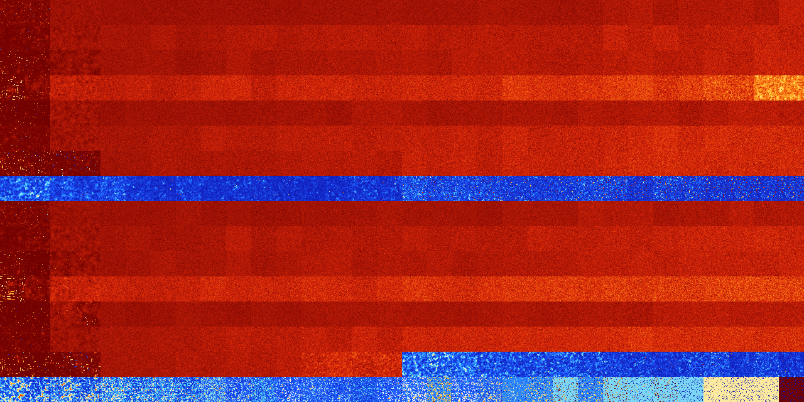

# B12456 (60416-60927)

<details>
    <summary>Initial Grid</summary>
    
</details>


<details>
    <summary>Initial Grid RLE</summary>

```
#C Exported from GoGoL (https://github.com/marrow16/gogol)
#C Wrap mode: Toroidal
#C Boundary mode: Dead
#C Step: 0
x = 100, y = 100, rule = B12456/S
63bo34bo$15bo18b2o5bo7bo8bo$10bo32bo5bo16bo16bo11bo$19bo15bo25bo$23b2o
39bo3bo$3bo10bo4bo22bo53bo$3bo7bo24bo12bo9bo6bo25bobo2bobo$41bo2bo8bo9b
o$28bo18bo32bo10bo$53bo37bo$o3bo18bo14bo25bo21bo$45bo14bo$2bo67bo2bo2bo
16bo$18bo3bo4bo3bo27bo6bo3bo7bo7bo$28bo9bo9bo13bo27b2o$11bo11bo9bobo6bo
40bo$19bo10bo6bo10bo14bo12bo3bo12bo4bo$3bo19bo4bo24bo14bo$18bo3bo2bo14b
o20bo2bo$35bo15bo17bo$68b2o12bobo$10bo45bo6bo7bo19bo4bo2bo$11bo35bo$8bo
23bo9bo3bo$12bo30bo7bo20bo23bo$10bo20bo4bo36bo15bo4b2o$6bo20bo5bo4bo27b
o$15bo52bo$41bo2bo6bo$29bo18bo6bo14bo$9bobo8bo11bo32bo$39bo13bo12bo6bo
8bo12bo$41bo7bo10bo11bo26bo$24bobo16bo17bo23bo10b2o$9bo31bo34bo20bo$28b
o6bo20bo11bo4bo4bo$16bo8bobobo3bobo25bo13bobo10bo$17bo12bobo19bo7b2o8bo
$5b2o3bo20bo25bo35bobo$bo24bo14bo2bo2bo2bo10b2o12bo18bo$6bo26bo18b2o19b
o22bo$7bo7bo19b2o34bo$31bo2bo19bo20bo9bo$3b2o5bo5bo6bo8bo14bo3bo2bo10bo
$29bo11bo28bo15bo$4bo6bo13bo6bo8bo5bo37bo9bo$32bo18bo2bo29bo$15bo20bo
28bo4bo3bo3bo12bo7bo$21b2obo33bo7bo27bo$8bo5bo10bo65b2o6bo$36bo6bo8bobo
37bo4bo$41bo14bo12bo6bo16bo$7bo38bo2bo13bo34bo$7bo9bo22bo29bo$58bo$11bo
12b2o22bo3bo33bo11bo$2bo8bo19bo2bo8bo10bo17bo7bo13bo$26bo7bo38bo7bo10bo
bo$18bo17bo6bo43bo9bo$13bo12bo10bo47bo$bo4bo23bo11bo14b2o21bo8bo2bo$o2b
o7bo22bo8bo9bo17bo26bo$31bo25bobo15bo6b2o$o8bo35bo3bo37bo8bo$37bo24bo
11bo$17bo29bobo6bobobo$8bo36bo8bo29bo$47bo46bo2bo$12bo14bo44bo4b2o$29bo
bo54bo7bo$17bo8bo9bo28bo11bo19bo$4bo31bo11bo$7bo5bo16bo16bo9bo11bo10bo$
o11bo10bobobo15bo14bo$12bo2bo30bo$44bo38b2o$o3bo4bo2bo4bo10bo18bo18bo
15bo$22bo7bo$9bo11bobo60bo11bo$6bo26bo21bo$2bo37bo39bo6bo8bo$16bo16bo
37bo14bo$20bo42bo$15bo18bobo23bo4bo9bo14bo8bo$36bo12bo21bo$41bo23bo5bo$
24bo$25bo68bo$11bo84bo$7bo5bobo63bo3bo$o7bo40bo49bo$21b2o14bo9bo$49bo6b
o13bo$7bo9bo42bo9bo12bo12bo$37bo21bo38bo$19bo18bo5bo13bo16bo$6bo48bobob
o6bo32bo$13bo13bo12bo10bo13bo16bo9bo4bo$5bo8bo35bo8bo4bo27bo$16bo4bo29b
o31bo13bo!
```
</details>
<details>
    <summary>Thumbnail</summary>

</details>
<table>
<tr>
    <td><a href="./60416%20S%20Heat%20Map%20Activity.png"></a><br>S (60416)<br>R@258,p60</td>    <td><a href="./60417%20S0%20Heat%20Map%20Activity.png"></a><br>S0 (60417)<br>R@246,p60</td>    <td><a href="./60418%20S1%20Heat%20Map%20Activity.png"></a><br>S1 (60418)<br>G>1000</td>    <td><a href="./60419%20S01%20Heat%20Map%20Activity.png"></a><br>S01 (60419)<br>G>1000</td>    <td><a href="./60420%20S2%20Heat%20Map%20Activity.png"></a><br>S2 (60420)<br>G>1000</td>    <td><a href="./60421%20S02%20Heat%20Map%20Activity.png"></a><br>S02 (60421)<br>G>1000</td>    <td><a href="./60422%20S12%20Heat%20Map%20Activity.png"></a><br>S12 (60422)<br>G>1000</td>    <td><a href="./60423%20S012%20Heat%20Map%20Activity.png"></a><br>S012 (60423)<br>G>1000</td>    <td><a href="./60424%20S3%20Heat%20Map%20Activity.png"></a><br>S3 (60424)<br>G>1000</td>    <td><a href="./60425%20S03%20Heat%20Map%20Activity.png"></a><br>S03 (60425)<br>G>1000</td>    <td><a href="./60426%20S13%20Heat%20Map%20Activity.png"></a><br>S13 (60426)<br>G>1000</td>    <td><a href="./60427%20S013%20Heat%20Map%20Activity.png"></a><br>S013 (60427)<br>G>1000</td>    <td><a href="./60428%20S23%20Heat%20Map%20Activity.png"></a><br>S23 (60428)<br>G>1000</td>    <td><a href="./60429%20S023%20Heat%20Map%20Activity.png"></a><br>S023 (60429)<br>G>1000</td>    <td><a href="./60430%20S123%20Heat%20Map%20Activity.png"></a><br>S123 (60430)<br>G>1000</td>    <td><a href="./60431%20S0123%20Heat%20Map%20Activity.png"></a><br>S0123 (60431)<br>G>1000</td>    <td><a href="./60432%20S4%20Heat%20Map%20Activity.png"></a><br>S4 (60432)<br>G>1000</td>    <td><a href="./60433%20S04%20Heat%20Map%20Activity.png"></a><br>S04 (60433)<br>G>1000</td>    <td><a href="./60434%20S14%20Heat%20Map%20Activity.png"></a><br>S14 (60434)<br>G>1000</td>    <td><a href="./60435%20S014%20Heat%20Map%20Activity.png"></a><br>S014 (60435)<br>G>1000</td>    <td><a href="./60436%20S24%20Heat%20Map%20Activity.png"></a><br>S24 (60436)<br>G>1000</td>    <td><a href="./60437%20S024%20Heat%20Map%20Activity.png"></a><br>S024 (60437)<br>G>1000</td>    <td><a href="./60438%20S124%20Heat%20Map%20Activity.png"></a><br>S124 (60438)<br>G>1000</td>    <td><a href="./60439%20S0124%20Heat%20Map%20Activity.png"></a><br>S0124 (60439)<br>G>1000</td>    <td><a href="./60440%20S34%20Heat%20Map%20Activity.png"></a><br>S34 (60440)<br>G>1000</td>    <td><a href="./60441%20S034%20Heat%20Map%20Activity.png"></a><br>S034 (60441)<br>G>1000</td>    <td><a href="./60442%20S134%20Heat%20Map%20Activity.png"></a><br>S134 (60442)<br>G>1000</td>    <td><a href="./60443%20S0134%20Heat%20Map%20Activity.png"></a><br>S0134 (60443)<br>G>1000</td>    <td><a href="./60444%20S234%20Heat%20Map%20Activity.png"></a><br>S234 (60444)<br>G>1000</td>    <td><a href="./60445%20S0234%20Heat%20Map%20Activity.png"></a><br>S0234 (60445)<br>G>1000</td>    <td><a href="./60446%20S1234%20Heat%20Map%20Activity.png"></a><br>S1234 (60446)<br>G>1000</td>    <td><a href="./60447%20S01234%20Heat%20Map%20Activity.png"></a><br>S01234 (60447)<br>G>1000</td></tr>
<tr>
    <td><a href="./60448%20S5%20Heat%20Map%20Activity.png"></a><br>S5 (60448)<br>R@396,p6</td>    <td><a href="./60449%20S05%20Heat%20Map%20Activity.png"></a><br>S05 (60449)<br>R@313,p6</td>    <td><a href="./60450%20S15%20Heat%20Map%20Activity.png"></a><br>S15 (60450)<br>G>1000</td>    <td><a href="./60451%20S015%20Heat%20Map%20Activity.png"></a><br>S015 (60451)<br>G>1000</td>    <td><a href="./60452%20S25%20Heat%20Map%20Activity.png"></a><br>S25 (60452)<br>G>1000</td>    <td><a href="./60453%20S025%20Heat%20Map%20Activity.png"></a><br>S025 (60453)<br>G>1000</td>    <td><a href="./60454%20S125%20Heat%20Map%20Activity.png"></a><br>S125 (60454)<br>G>1000</td>    <td><a href="./60455%20S0125%20Heat%20Map%20Activity.png"></a><br>S0125 (60455)<br>G>1000</td>    <td><a href="./60456%20S35%20Heat%20Map%20Activity.png"></a><br>S35 (60456)<br>G>1000</td>    <td><a href="./60457%20S035%20Heat%20Map%20Activity.png"></a><br>S035 (60457)<br>G>1000</td>    <td><a href="./60458%20S135%20Heat%20Map%20Activity.png"></a><br>S135 (60458)<br>G>1000</td>    <td><a href="./60459%20S0135%20Heat%20Map%20Activity.png"></a><br>S0135 (60459)<br>G>1000</td>    <td><a href="./60460%20S235%20Heat%20Map%20Activity.png"></a><br>S235 (60460)<br>G>1000</td>    <td><a href="./60461%20S0235%20Heat%20Map%20Activity.png"></a><br>S0235 (60461)<br>G>1000</td>    <td><a href="./60462%20S1235%20Heat%20Map%20Activity.png"></a><br>S1235 (60462)<br>G>1000</td>    <td><a href="./60463%20S01235%20Heat%20Map%20Activity.png"></a><br>S01235 (60463)<br>G>1000</td>    <td><a href="./60464%20S45%20Heat%20Map%20Activity.png"></a><br>S45 (60464)<br>G>1000</td>    <td><a href="./60465%20S045%20Heat%20Map%20Activity.png"></a><br>S045 (60465)<br>G>1000</td>    <td><a href="./60466%20S145%20Heat%20Map%20Activity.png"></a><br>S145 (60466)<br>G>1000</td>    <td><a href="./60467%20S0145%20Heat%20Map%20Activity.png"></a><br>S0145 (60467)<br>G>1000</td>    <td><a href="./60468%20S245%20Heat%20Map%20Activity.png"></a><br>S245 (60468)<br>G>1000</td>    <td><a href="./60469%20S0245%20Heat%20Map%20Activity.png"></a><br>S0245 (60469)<br>G>1000</td>    <td><a href="./60470%20S1245%20Heat%20Map%20Activity.png"></a><br>S1245 (60470)<br>G>1000</td>    <td><a href="./60471%20S01245%20Heat%20Map%20Activity.png"></a><br>S01245 (60471)<br>G>1000</td>    <td><a href="./60472%20S345%20Heat%20Map%20Activity.png"></a><br>S345 (60472)<br>G>1000</td>    <td><a href="./60473%20S0345%20Heat%20Map%20Activity.png"></a><br>S0345 (60473)<br>G>1000</td>    <td><a href="./60474%20S1345%20Heat%20Map%20Activity.png"></a><br>S1345 (60474)<br>G>1000</td>    <td><a href="./60475%20S01345%20Heat%20Map%20Activity.png"></a><br>S01345 (60475)<br>G>1000</td>    <td><a href="./60476%20S2345%20Heat%20Map%20Activity.png"></a><br>S2345 (60476)<br>G>1000</td>    <td><a href="./60477%20S02345%20Heat%20Map%20Activity.png"></a><br>S02345 (60477)<br>G>1000</td>    <td><a href="./60478%20S12345%20Heat%20Map%20Activity.png"></a><br>S12345 (60478)<br>G>1000</td>    <td><a href="./60479%20S012345%20Heat%20Map%20Activity.png"></a><br>S012345 (60479)<br>G>1000</td></tr>
<tr>
    <td><a href="./60480%20S6%20Heat%20Map%20Activity.png"></a><br>S6 (60480)<br>R@425,p24</td>    <td><a href="./60481%20S06%20Heat%20Map%20Activity.png"></a><br>S06 (60481)<br>R@494,p180</td>    <td><a href="./60482%20S16%20Heat%20Map%20Activity.png"></a><br>S16 (60482)<br>G>1000</td>    <td><a href="./60483%20S016%20Heat%20Map%20Activity.png"></a><br>S016 (60483)<br>G>1000</td>    <td><a href="./60484%20S26%20Heat%20Map%20Activity.png"></a><br>S26 (60484)<br>G>1000</td>    <td><a href="./60485%20S026%20Heat%20Map%20Activity.png"></a><br>S026 (60485)<br>G>1000</td>    <td><a href="./60486%20S126%20Heat%20Map%20Activity.png"></a><br>S126 (60486)<br>G>1000</td>    <td><a href="./60487%20S0126%20Heat%20Map%20Activity.png"></a><br>S0126 (60487)<br>G>1000</td>    <td><a href="./60488%20S36%20Heat%20Map%20Activity.png"></a><br>S36 (60488)<br>G>1000</td>    <td><a href="./60489%20S036%20Heat%20Map%20Activity.png"></a><br>S036 (60489)<br>G>1000</td>    <td><a href="./60490%20S136%20Heat%20Map%20Activity.png"></a><br>S136 (60490)<br>G>1000</td>    <td><a href="./60491%20S0136%20Heat%20Map%20Activity.png"></a><br>S0136 (60491)<br>G>1000</td>    <td><a href="./60492%20S236%20Heat%20Map%20Activity.png"></a><br>S236 (60492)<br>G>1000</td>    <td><a href="./60493%20S0236%20Heat%20Map%20Activity.png"></a><br>S0236 (60493)<br>G>1000</td>    <td><a href="./60494%20S1236%20Heat%20Map%20Activity.png"></a><br>S1236 (60494)<br>G>1000</td>    <td><a href="./60495%20S01236%20Heat%20Map%20Activity.png"></a><br>S01236 (60495)<br>G>1000</td>    <td><a href="./60496%20S46%20Heat%20Map%20Activity.png"></a><br>S46 (60496)<br>G>1000</td>    <td><a href="./60497%20S046%20Heat%20Map%20Activity.png"></a><br>S046 (60497)<br>G>1000</td>    <td><a href="./60498%20S146%20Heat%20Map%20Activity.png"></a><br>S146 (60498)<br>G>1000</td>    <td><a href="./60499%20S0146%20Heat%20Map%20Activity.png"></a><br>S0146 (60499)<br>G>1000</td>    <td><a href="./60500%20S246%20Heat%20Map%20Activity.png"></a><br>S246 (60500)<br>G>1000</td>    <td><a href="./60501%20S0246%20Heat%20Map%20Activity.png"></a><br>S0246 (60501)<br>G>1000</td>    <td><a href="./60502%20S1246%20Heat%20Map%20Activity.png"></a><br>S1246 (60502)<br>G>1000</td>    <td><a href="./60503%20S01246%20Heat%20Map%20Activity.png"></a><br>S01246 (60503)<br>G>1000</td>    <td><a href="./60504%20S346%20Heat%20Map%20Activity.png"></a><br>S346 (60504)<br>G>1000</td>    <td><a href="./60505%20S0346%20Heat%20Map%20Activity.png"></a><br>S0346 (60505)<br>G>1000</td>    <td><a href="./60506%20S1346%20Heat%20Map%20Activity.png"></a><br>S1346 (60506)<br>G>1000</td>    <td><a href="./60507%20S01346%20Heat%20Map%20Activity.png"></a><br>S01346 (60507)<br>G>1000</td>    <td><a href="./60508%20S2346%20Heat%20Map%20Activity.png"></a><br>S2346 (60508)<br>G>1000</td>    <td><a href="./60509%20S02346%20Heat%20Map%20Activity.png"></a><br>S02346 (60509)<br>G>1000</td>    <td><a href="./60510%20S12346%20Heat%20Map%20Activity.png"></a><br>S12346 (60510)<br>G>1000</td>    <td><a href="./60511%20S012346%20Heat%20Map%20Activity.png"></a><br>S012346 (60511)<br>G>1000</td></tr>
<tr>
    <td><a href="./60512%20S56%20Heat%20Map%20Activity.png"></a><br>S56 (60512)<br>G>1000</td>    <td><a href="./60513%20S056%20Heat%20Map%20Activity.png"></a><br>S056 (60513)<br>G>1000</td>    <td><a href="./60514%20S156%20Heat%20Map%20Activity.png"></a><br>S156 (60514)<br>G>1000</td>    <td><a href="./60515%20S0156%20Heat%20Map%20Activity.png"></a><br>S0156 (60515)<br>G>1000</td>    <td><a href="./60516%20S256%20Heat%20Map%20Activity.png"></a><br>S256 (60516)<br>G>1000</td>    <td><a href="./60517%20S0256%20Heat%20Map%20Activity.png"></a><br>S0256 (60517)<br>G>1000</td>    <td><a href="./60518%20S1256%20Heat%20Map%20Activity.png"></a><br>S1256 (60518)<br>G>1000</td>    <td><a href="./60519%20S01256%20Heat%20Map%20Activity.png"></a><br>S01256 (60519)<br>G>1000</td>    <td><a href="./60520%20S356%20Heat%20Map%20Activity.png"></a><br>S356 (60520)<br>G>1000</td>    <td><a href="./60521%20S0356%20Heat%20Map%20Activity.png"></a><br>S0356 (60521)<br>G>1000</td>    <td><a href="./60522%20S1356%20Heat%20Map%20Activity.png"></a><br>S1356 (60522)<br>G>1000</td>    <td><a href="./60523%20S01356%20Heat%20Map%20Activity.png"></a><br>S01356 (60523)<br>G>1000</td>    <td><a href="./60524%20S2356%20Heat%20Map%20Activity.png"></a><br>S2356 (60524)<br>G>1000</td>    <td><a href="./60525%20S02356%20Heat%20Map%20Activity.png"></a><br>S02356 (60525)<br>G>1000</td>    <td><a href="./60526%20S12356%20Heat%20Map%20Activity.png"></a><br>S12356 (60526)<br>G>1000</td>    <td><a href="./60527%20S012356%20Heat%20Map%20Activity.png"></a><br>S012356 (60527)<br>G>1000</td>    <td><a href="./60528%20S456%20Heat%20Map%20Activity.png"></a><br>S456 (60528)<br>G>1000</td>    <td><a href="./60529%20S0456%20Heat%20Map%20Activity.png"></a><br>S0456 (60529)<br>G>1000</td>    <td><a href="./60530%20S1456%20Heat%20Map%20Activity.png"></a><br>S1456 (60530)<br>G>1000</td>    <td><a href="./60531%20S01456%20Heat%20Map%20Activity.png"></a><br>S01456 (60531)<br>G>1000</td>    <td><a href="./60532%20S2456%20Heat%20Map%20Activity.png"></a><br>S2456 (60532)<br>G>1000</td>    <td><a href="./60533%20S02456%20Heat%20Map%20Activity.png"></a><br>S02456 (60533)<br>G>1000</td>    <td><a href="./60534%20S12456%20Heat%20Map%20Activity.png"></a><br>S12456 (60534)<br>G>1000</td>    <td><a href="./60535%20S012456%20Heat%20Map%20Activity.png"></a><br>S012456 (60535)<br>G>1000</td>    <td><a href="./60536%20S3456%20Heat%20Map%20Activity.png"></a><br>S3456 (60536)<br>G>1000</td>    <td><a href="./60537%20S03456%20Heat%20Map%20Activity.png"></a><br>S03456 (60537)<br>G>1000</td>    <td><a href="./60538%20S13456%20Heat%20Map%20Activity.png"></a><br>S13456 (60538)<br>G>1000</td>    <td><a href="./60539%20S013456%20Heat%20Map%20Activity.png"></a><br>S013456 (60539)<br>G>1000</td>    <td><a href="./60540%20S23456%20Heat%20Map%20Activity.png"></a><br>S23456 (60540)<br>G>1000</td>    <td><a href="./60541%20S023456%20Heat%20Map%20Activity.png"></a><br>S023456 (60541)<br>G>1000</td>    <td><a href="./60542%20S123456%20Heat%20Map%20Activity.png"></a><br>S123456 (60542)<br>G>1000</td>    <td><a href="./60543%20S0123456%20Heat%20Map%20Activity.png"></a><br>S0123456 (60543)<br>G>1000</td></tr>
<tr>
    <td><a href="./60544%20S7%20Heat%20Map%20Activity.png"></a><br>S7 (60544)<br>R@646,p420</td>    <td><a href="./60545%20S07%20Heat%20Map%20Activity.png"></a><br>S07 (60545)<br>G>1000</td>    <td><a href="./60546%20S17%20Heat%20Map%20Activity.png"></a><br>S17 (60546)<br>G>1000</td>    <td><a href="./60547%20S017%20Heat%20Map%20Activity.png"></a><br>S017 (60547)<br>G>1000</td>    <td><a href="./60548%20S27%20Heat%20Map%20Activity.png"></a><br>S27 (60548)<br>G>1000</td>    <td><a href="./60549%20S027%20Heat%20Map%20Activity.png"></a><br>S027 (60549)<br>G>1000</td>    <td><a href="./60550%20S127%20Heat%20Map%20Activity.png"></a><br>S127 (60550)<br>G>1000</td>    <td><a href="./60551%20S0127%20Heat%20Map%20Activity.png"></a><br>S0127 (60551)<br>G>1000</td>    <td><a href="./60552%20S37%20Heat%20Map%20Activity.png"></a><br>S37 (60552)<br>G>1000</td>    <td><a href="./60553%20S037%20Heat%20Map%20Activity.png"></a><br>S037 (60553)<br>G>1000</td>    <td><a href="./60554%20S137%20Heat%20Map%20Activity.png"></a><br>S137 (60554)<br>G>1000</td>    <td><a href="./60555%20S0137%20Heat%20Map%20Activity.png"></a><br>S0137 (60555)<br>G>1000</td>    <td><a href="./60556%20S237%20Heat%20Map%20Activity.png"></a><br>S237 (60556)<br>G>1000</td>    <td><a href="./60557%20S0237%20Heat%20Map%20Activity.png"></a><br>S0237 (60557)<br>G>1000</td>    <td><a href="./60558%20S1237%20Heat%20Map%20Activity.png"></a><br>S1237 (60558)<br>G>1000</td>    <td><a href="./60559%20S01237%20Heat%20Map%20Activity.png"></a><br>S01237 (60559)<br>G>1000</td>    <td><a href="./60560%20S47%20Heat%20Map%20Activity.png"></a><br>S47 (60560)<br>G>1000</td>    <td><a href="./60561%20S047%20Heat%20Map%20Activity.png"></a><br>S047 (60561)<br>G>1000</td>    <td><a href="./60562%20S147%20Heat%20Map%20Activity.png"></a><br>S147 (60562)<br>G>1000</td>    <td><a href="./60563%20S0147%20Heat%20Map%20Activity.png"></a><br>S0147 (60563)<br>G>1000</td>    <td><a href="./60564%20S247%20Heat%20Map%20Activity.png"></a><br>S247 (60564)<br>G>1000</td>    <td><a href="./60565%20S0247%20Heat%20Map%20Activity.png"></a><br>S0247 (60565)<br>G>1000</td>    <td><a href="./60566%20S1247%20Heat%20Map%20Activity.png"></a><br>S1247 (60566)<br>G>1000</td>    <td><a href="./60567%20S01247%20Heat%20Map%20Activity.png"></a><br>S01247 (60567)<br>G>1000</td>    <td><a href="./60568%20S347%20Heat%20Map%20Activity.png"></a><br>S347 (60568)<br>G>1000</td>    <td><a href="./60569%20S0347%20Heat%20Map%20Activity.png"></a><br>S0347 (60569)<br>G>1000</td>    <td><a href="./60570%20S1347%20Heat%20Map%20Activity.png"></a><br>S1347 (60570)<br>G>1000</td>    <td><a href="./60571%20S01347%20Heat%20Map%20Activity.png"></a><br>S01347 (60571)<br>G>1000</td>    <td><a href="./60572%20S2347%20Heat%20Map%20Activity.png"></a><br>S2347 (60572)<br>G>1000</td>    <td><a href="./60573%20S02347%20Heat%20Map%20Activity.png"></a><br>S02347 (60573)<br>G>1000</td>    <td><a href="./60574%20S12347%20Heat%20Map%20Activity.png"></a><br>S12347 (60574)<br>G>1000</td>    <td><a href="./60575%20S012347%20Heat%20Map%20Activity.png"></a><br>S012347 (60575)<br>G>1000</td></tr>
<tr>
    <td><a href="./60576%20S57%20Heat%20Map%20Activity.png"></a><br>S57 (60576)<br>R@334,p24</td>    <td><a href="./60577%20S057%20Heat%20Map%20Activity.png"></a><br>S057 (60577)<br>R@313,p24</td>    <td><a href="./60578%20S157%20Heat%20Map%20Activity.png"></a><br>S157 (60578)<br>G>1000</td>    <td><a href="./60579%20S0157%20Heat%20Map%20Activity.png"></a><br>S0157 (60579)<br>G>1000</td>    <td><a href="./60580%20S257%20Heat%20Map%20Activity.png"></a><br>S257 (60580)<br>G>1000</td>    <td><a href="./60581%20S0257%20Heat%20Map%20Activity.png"></a><br>S0257 (60581)<br>G>1000</td>    <td><a href="./60582%20S1257%20Heat%20Map%20Activity.png"></a><br>S1257 (60582)<br>G>1000</td>    <td><a href="./60583%20S01257%20Heat%20Map%20Activity.png"></a><br>S01257 (60583)<br>G>1000</td>    <td><a href="./60584%20S357%20Heat%20Map%20Activity.png"></a><br>S357 (60584)<br>G>1000</td>    <td><a href="./60585%20S0357%20Heat%20Map%20Activity.png"></a><br>S0357 (60585)<br>G>1000</td>    <td><a href="./60586%20S1357%20Heat%20Map%20Activity.png"></a><br>S1357 (60586)<br>G>1000</td>    <td><a href="./60587%20S01357%20Heat%20Map%20Activity.png"></a><br>S01357 (60587)<br>G>1000</td>    <td><a href="./60588%20S2357%20Heat%20Map%20Activity.png"></a><br>S2357 (60588)<br>G>1000</td>    <td><a href="./60589%20S02357%20Heat%20Map%20Activity.png"></a><br>S02357 (60589)<br>G>1000</td>    <td><a href="./60590%20S12357%20Heat%20Map%20Activity.png"></a><br>S12357 (60590)<br>G>1000</td>    <td><a href="./60591%20S012357%20Heat%20Map%20Activity.png"></a><br>S012357 (60591)<br>G>1000</td>    <td><a href="./60592%20S457%20Heat%20Map%20Activity.png"></a><br>S457 (60592)<br>G>1000</td>    <td><a href="./60593%20S0457%20Heat%20Map%20Activity.png"></a><br>S0457 (60593)<br>G>1000</td>    <td><a href="./60594%20S1457%20Heat%20Map%20Activity.png"></a><br>S1457 (60594)<br>G>1000</td>    <td><a href="./60595%20S01457%20Heat%20Map%20Activity.png"></a><br>S01457 (60595)<br>G>1000</td>    <td><a href="./60596%20S2457%20Heat%20Map%20Activity.png"></a><br>S2457 (60596)<br>G>1000</td>    <td><a href="./60597%20S02457%20Heat%20Map%20Activity.png"></a><br>S02457 (60597)<br>G>1000</td>    <td><a href="./60598%20S12457%20Heat%20Map%20Activity.png"></a><br>S12457 (60598)<br>G>1000</td>    <td><a href="./60599%20S012457%20Heat%20Map%20Activity.png"></a><br>S012457 (60599)<br>G>1000</td>    <td><a href="./60600%20S3457%20Heat%20Map%20Activity.png"></a><br>S3457 (60600)<br>G>1000</td>    <td><a href="./60601%20S03457%20Heat%20Map%20Activity.png"></a><br>S03457 (60601)<br>G>1000</td>    <td><a href="./60602%20S13457%20Heat%20Map%20Activity.png"></a><br>S13457 (60602)<br>G>1000</td>    <td><a href="./60603%20S013457%20Heat%20Map%20Activity.png"></a><br>S013457 (60603)<br>G>1000</td>    <td><a href="./60604%20S23457%20Heat%20Map%20Activity.png"></a><br>S23457 (60604)<br>G>1000</td>    <td><a href="./60605%20S023457%20Heat%20Map%20Activity.png"></a><br>S023457 (60605)<br>G>1000</td>    <td><a href="./60606%20S123457%20Heat%20Map%20Activity.png"></a><br>S123457 (60606)<br>G>1000</td>    <td><a href="./60607%20S0123457%20Heat%20Map%20Activity.png"></a><br>S0123457 (60607)<br>G>1000</td></tr>
<tr>
    <td><a href="./60608%20S67%20Heat%20Map%20Activity.png"></a><br>S67 (60608)<br>R@343,p72</td>    <td><a href="./60609%20S067%20Heat%20Map%20Activity.png"></a><br>S067 (60609)<br>R@870,p120</td>    <td><a href="./60610%20S167%20Heat%20Map%20Activity.png"></a><br>S167 (60610)<br>R@481,p240</td>    <td><a href="./60611%20S0167%20Heat%20Map%20Activity.png"></a><br>S0167 (60611)<br>R@364,p120</td>    <td><a href="./60612%20S267%20Heat%20Map%20Activity.png"></a><br>S267 (60612)<br>G>1000</td>    <td><a href="./60613%20S0267%20Heat%20Map%20Activity.png"></a><br>S0267 (60613)<br>G>1000</td>    <td><a href="./60614%20S1267%20Heat%20Map%20Activity.png"></a><br>S1267 (60614)<br>G>1000</td>    <td><a href="./60615%20S01267%20Heat%20Map%20Activity.png"></a><br>S01267 (60615)<br>G>1000</td>    <td><a href="./60616%20S367%20Heat%20Map%20Activity.png"></a><br>S367 (60616)<br>G>1000</td>    <td><a href="./60617%20S0367%20Heat%20Map%20Activity.png"></a><br>S0367 (60617)<br>G>1000</td>    <td><a href="./60618%20S1367%20Heat%20Map%20Activity.png"></a><br>S1367 (60618)<br>G>1000</td>    <td><a href="./60619%20S01367%20Heat%20Map%20Activity.png"></a><br>S01367 (60619)<br>G>1000</td>    <td><a href="./60620%20S2367%20Heat%20Map%20Activity.png"></a><br>S2367 (60620)<br>G>1000</td>    <td><a href="./60621%20S02367%20Heat%20Map%20Activity.png"></a><br>S02367 (60621)<br>G>1000</td>    <td><a href="./60622%20S12367%20Heat%20Map%20Activity.png"></a><br>S12367 (60622)<br>G>1000</td>    <td><a href="./60623%20S012367%20Heat%20Map%20Activity.png"></a><br>S012367 (60623)<br>G>1000</td>    <td><a href="./60624%20S467%20Heat%20Map%20Activity.png"></a><br>S467 (60624)<br>G>1000</td>    <td><a href="./60625%20S0467%20Heat%20Map%20Activity.png"></a><br>S0467 (60625)<br>G>1000</td>    <td><a href="./60626%20S1467%20Heat%20Map%20Activity.png"></a><br>S1467 (60626)<br>G>1000</td>    <td><a href="./60627%20S01467%20Heat%20Map%20Activity.png"></a><br>S01467 (60627)<br>G>1000</td>    <td><a href="./60628%20S2467%20Heat%20Map%20Activity.png"></a><br>S2467 (60628)<br>G>1000</td>    <td><a href="./60629%20S02467%20Heat%20Map%20Activity.png"></a><br>S02467 (60629)<br>G>1000</td>    <td><a href="./60630%20S12467%20Heat%20Map%20Activity.png"></a><br>S12467 (60630)<br>G>1000</td>    <td><a href="./60631%20S012467%20Heat%20Map%20Activity.png"></a><br>S012467 (60631)<br>G>1000</td>    <td><a href="./60632%20S3467%20Heat%20Map%20Activity.png"></a><br>S3467 (60632)<br>G>1000</td>    <td><a href="./60633%20S03467%20Heat%20Map%20Activity.png"></a><br>S03467 (60633)<br>G>1000</td>    <td><a href="./60634%20S13467%20Heat%20Map%20Activity.png"></a><br>S13467 (60634)<br>G>1000</td>    <td><a href="./60635%20S013467%20Heat%20Map%20Activity.png"></a><br>S013467 (60635)<br>G>1000</td>    <td><a href="./60636%20S23467%20Heat%20Map%20Activity.png"></a><br>S23467 (60636)<br>G>1000</td>    <td><a href="./60637%20S023467%20Heat%20Map%20Activity.png"></a><br>S023467 (60637)<br>G>1000</td>    <td><a href="./60638%20S123467%20Heat%20Map%20Activity.png"></a><br>S123467 (60638)<br>G>1000</td>    <td><a href="./60639%20S0123467%20Heat%20Map%20Activity.png"></a><br>S0123467 (60639)<br>G>1000</td></tr>
<tr>
    <td><a href="./60640%20S567%20Heat%20Map%20Activity.png"></a><br>S567 (60640)<br>R@126,p12</td>    <td><a href="./60641%20S0567%20Heat%20Map%20Activity.png"></a><br>S0567 (60641)<br>R@84,p6</td>    <td><a href="./60642%20S1567%20Heat%20Map%20Activity.png"></a><br>S1567 (60642)<br>R@100,p6</td>    <td><a href="./60643%20S01567%20Heat%20Map%20Activity.png"></a><br>S01567 (60643)<br>R@102,p6</td>    <td><a href="./60644%20S2567%20Heat%20Map%20Activity.png"></a><br>S2567 (60644)<br>R@64,p6</td>    <td><a href="./60645%20S02567%20Heat%20Map%20Activity.png"></a><br>S02567 (60645)<br>R@94,p12</td>    <td><a href="./60646%20S12567%20Heat%20Map%20Activity.png"></a><br>S12567 (60646)<br>R@111,p6</td>    <td><a href="./60647%20S012567%20Heat%20Map%20Activity.png"></a><br>S012567 (60647)<br>R@78,p6</td>    <td><a href="./60648%20S3567%20Heat%20Map%20Activity.png"></a><br>S3567 (60648)<br>R@94,p6</td>    <td><a href="./60649%20S03567%20Heat%20Map%20Activity.png"></a><br>S03567 (60649)<br>R@72,p2</td>    <td><a href="./60650%20S13567%20Heat%20Map%20Activity.png"></a><br>S13567 (60650)<br>R@85,p4</td>    <td><a href="./60651%20S013567%20Heat%20Map%20Activity.png"></a><br>S013567 (60651)<br>R@89,p12</td>    <td><a href="./60652%20S23567%20Heat%20Map%20Activity.png"></a><br>S23567 (60652)<br>R@99,p12</td>    <td><a href="./60653%20S023567%20Heat%20Map%20Activity.png"></a><br>S023567 (60653)<br>R@79,p10</td>    <td><a href="./60654%20S123567%20Heat%20Map%20Activity.png"></a><br>S123567 (60654)<br>R@68,p6</td>    <td><a href="./60655%20S0123567%20Heat%20Map%20Activity.png"></a><br>S0123567 (60655)<br>R@65,p6</td>    <td><a href="./60656%20S4567%20Heat%20Map%20Activity.png"></a><br>S4567 (60656)<br>R@24,p6</td>    <td><a href="./60657%20S04567%20Heat%20Map%20Activity.png"></a><br>S04567 (60657)<br>R@28,p6</td>    <td><a href="./60658%20S14567%20Heat%20Map%20Activity.png"></a><br>S14567 (60658)<br>R@25,p6</td>    <td><a href="./60659%20S014567%20Heat%20Map%20Activity.png"></a><br>S014567 (60659)<br>R@27,p6</td>    <td><a href="./60660%20S24567%20Heat%20Map%20Activity.png"></a><br>S24567 (60660)<br>R@24,p6</td>    <td><a href="./60661%20S024567%20Heat%20Map%20Activity.png"></a><br>S024567 (60661)<br>R@28,p6</td>    <td><a href="./60662%20S124567%20Heat%20Map%20Activity.png"></a><br>S124567 (60662)<br>R@22,p6</td>    <td><a href="./60663%20S0124567%20Heat%20Map%20Activity.png"></a><br>S0124567 (60663)<br>R@24,p6</td>    <td><a href="./60664%20S34567%20Heat%20Map%20Activity.png"></a><br>S34567 (60664)<br>R@21,p6</td>    <td><a href="./60665%20S034567%20Heat%20Map%20Activity.png"></a><br>S034567 (60665)<br>R@26,p6</td>    <td><a href="./60666%20S134567%20Heat%20Map%20Activity.png"></a><br>S134567 (60666)<br>R@20,p6</td>    <td><a href="./60667%20S0134567%20Heat%20Map%20Activity.png"></a><br>S0134567 (60667)<br>R@20,p6</td>    <td><a href="./60668%20S234567%20Heat%20Map%20Activity.png"></a><br>S234567 (60668)<br>R@23,p6</td>    <td><a href="./60669%20S0234567%20Heat%20Map%20Activity.png"></a><br>S0234567 (60669)<br>R@23,p6</td>    <td><a href="./60670%20S1234567%20Heat%20Map%20Activity.png"></a><br>S1234567 (60670)<br>R@23,p6</td>    <td><a href="./60671%20S01234567%20Heat%20Map%20Activity.png"></a><br>S01234567 (60671)<br>R@23,p6</td></tr>
<tr>
    <td><a href="./60672%20S8%20Heat%20Map%20Activity.png"></a><br>S8 (60672)<br>R@258,p60</td>    <td><a href="./60673%20S08%20Heat%20Map%20Activity.png"></a><br>S08 (60673)<br>R@256,p24</td>    <td><a href="./60674%20S18%20Heat%20Map%20Activity.png"></a><br>S18 (60674)<br>G>1000</td>    <td><a href="./60675%20S018%20Heat%20Map%20Activity.png"></a><br>S018 (60675)<br>G>1000</td>    <td><a href="./60676%20S28%20Heat%20Map%20Activity.png"></a><br>S28 (60676)<br>G>1000</td>    <td><a href="./60677%20S028%20Heat%20Map%20Activity.png"></a><br>S028 (60677)<br>G>1000</td>    <td><a href="./60678%20S128%20Heat%20Map%20Activity.png"></a><br>S128 (60678)<br>G>1000</td>    <td><a href="./60679%20S0128%20Heat%20Map%20Activity.png"></a><br>S0128 (60679)<br>G>1000</td>    <td><a href="./60680%20S38%20Heat%20Map%20Activity.png"></a><br>S38 (60680)<br>G>1000</td>    <td><a href="./60681%20S038%20Heat%20Map%20Activity.png"></a><br>S038 (60681)<br>G>1000</td>    <td><a href="./60682%20S138%20Heat%20Map%20Activity.png"></a><br>S138 (60682)<br>G>1000</td>    <td><a href="./60683%20S0138%20Heat%20Map%20Activity.png"></a><br>S0138 (60683)<br>G>1000</td>    <td><a href="./60684%20S238%20Heat%20Map%20Activity.png"></a><br>S238 (60684)<br>G>1000</td>    <td><a href="./60685%20S0238%20Heat%20Map%20Activity.png"></a><br>S0238 (60685)<br>G>1000</td>    <td><a href="./60686%20S1238%20Heat%20Map%20Activity.png"></a><br>S1238 (60686)<br>G>1000</td>    <td><a href="./60687%20S01238%20Heat%20Map%20Activity.png"></a><br>S01238 (60687)<br>G>1000</td>    <td><a href="./60688%20S48%20Heat%20Map%20Activity.png"></a><br>S48 (60688)<br>G>1000</td>    <td><a href="./60689%20S048%20Heat%20Map%20Activity.png"></a><br>S048 (60689)<br>G>1000</td>    <td><a href="./60690%20S148%20Heat%20Map%20Activity.png"></a><br>S148 (60690)<br>G>1000</td>    <td><a href="./60691%20S0148%20Heat%20Map%20Activity.png"></a><br>S0148 (60691)<br>G>1000</td>    <td><a href="./60692%20S248%20Heat%20Map%20Activity.png"></a><br>S248 (60692)<br>G>1000</td>    <td><a href="./60693%20S0248%20Heat%20Map%20Activity.png"></a><br>S0248 (60693)<br>G>1000</td>    <td><a href="./60694%20S1248%20Heat%20Map%20Activity.png"></a><br>S1248 (60694)<br>G>1000</td>    <td><a href="./60695%20S01248%20Heat%20Map%20Activity.png"></a><br>S01248 (60695)<br>G>1000</td>    <td><a href="./60696%20S348%20Heat%20Map%20Activity.png"></a><br>S348 (60696)<br>G>1000</td>    <td><a href="./60697%20S0348%20Heat%20Map%20Activity.png"></a><br>S0348 (60697)<br>G>1000</td>    <td><a href="./60698%20S1348%20Heat%20Map%20Activity.png"></a><br>S1348 (60698)<br>G>1000</td>    <td><a href="./60699%20S01348%20Heat%20Map%20Activity.png"></a><br>S01348 (60699)<br>G>1000</td>    <td><a href="./60700%20S2348%20Heat%20Map%20Activity.png"></a><br>S2348 (60700)<br>G>1000</td>    <td><a href="./60701%20S02348%20Heat%20Map%20Activity.png"></a><br>S02348 (60701)<br>G>1000</td>    <td><a href="./60702%20S12348%20Heat%20Map%20Activity.png"></a><br>S12348 (60702)<br>G>1000</td>    <td><a href="./60703%20S012348%20Heat%20Map%20Activity.png"></a><br>S012348 (60703)<br>G>1000</td></tr>
<tr>
    <td><a href="./60704%20S58%20Heat%20Map%20Activity.png"></a><br>S58 (60704)<br>R@405,p6</td>    <td><a href="./60705%20S058%20Heat%20Map%20Activity.png"></a><br>S058 (60705)<br>R@232,p12</td>    <td><a href="./60706%20S158%20Heat%20Map%20Activity.png"></a><br>S158 (60706)<br>G>1000</td>    <td><a href="./60707%20S0158%20Heat%20Map%20Activity.png"></a><br>S0158 (60707)<br>G>1000</td>    <td><a href="./60708%20S258%20Heat%20Map%20Activity.png"></a><br>S258 (60708)<br>G>1000</td>    <td><a href="./60709%20S0258%20Heat%20Map%20Activity.png"></a><br>S0258 (60709)<br>G>1000</td>    <td><a href="./60710%20S1258%20Heat%20Map%20Activity.png"></a><br>S1258 (60710)<br>G>1000</td>    <td><a href="./60711%20S01258%20Heat%20Map%20Activity.png"></a><br>S01258 (60711)<br>G>1000</td>    <td><a href="./60712%20S358%20Heat%20Map%20Activity.png"></a><br>S358 (60712)<br>G>1000</td>    <td><a href="./60713%20S0358%20Heat%20Map%20Activity.png"></a><br>S0358 (60713)<br>G>1000</td>    <td><a href="./60714%20S1358%20Heat%20Map%20Activity.png"></a><br>S1358 (60714)<br>G>1000</td>    <td><a href="./60715%20S01358%20Heat%20Map%20Activity.png"></a><br>S01358 (60715)<br>G>1000</td>    <td><a href="./60716%20S2358%20Heat%20Map%20Activity.png"></a><br>S2358 (60716)<br>G>1000</td>    <td><a href="./60717%20S02358%20Heat%20Map%20Activity.png"></a><br>S02358 (60717)<br>G>1000</td>    <td><a href="./60718%20S12358%20Heat%20Map%20Activity.png"></a><br>S12358 (60718)<br>G>1000</td>    <td><a href="./60719%20S012358%20Heat%20Map%20Activity.png"></a><br>S012358 (60719)<br>G>1000</td>    <td><a href="./60720%20S458%20Heat%20Map%20Activity.png"></a><br>S458 (60720)<br>G>1000</td>    <td><a href="./60721%20S0458%20Heat%20Map%20Activity.png"></a><br>S0458 (60721)<br>G>1000</td>    <td><a href="./60722%20S1458%20Heat%20Map%20Activity.png"></a><br>S1458 (60722)<br>G>1000</td>    <td><a href="./60723%20S01458%20Heat%20Map%20Activity.png"></a><br>S01458 (60723)<br>G>1000</td>    <td><a href="./60724%20S2458%20Heat%20Map%20Activity.png"></a><br>S2458 (60724)<br>G>1000</td>    <td><a href="./60725%20S02458%20Heat%20Map%20Activity.png"></a><br>S02458 (60725)<br>G>1000</td>    <td><a href="./60726%20S12458%20Heat%20Map%20Activity.png"></a><br>S12458 (60726)<br>G>1000</td>    <td><a href="./60727%20S012458%20Heat%20Map%20Activity.png"></a><br>S012458 (60727)<br>G>1000</td>    <td><a href="./60728%20S3458%20Heat%20Map%20Activity.png"></a><br>S3458 (60728)<br>G>1000</td>    <td><a href="./60729%20S03458%20Heat%20Map%20Activity.png"></a><br>S03458 (60729)<br>G>1000</td>    <td><a href="./60730%20S13458%20Heat%20Map%20Activity.png"></a><br>S13458 (60730)<br>G>1000</td>    <td><a href="./60731%20S013458%20Heat%20Map%20Activity.png"></a><br>S013458 (60731)<br>G>1000</td>    <td><a href="./60732%20S23458%20Heat%20Map%20Activity.png"></a><br>S23458 (60732)<br>G>1000</td>    <td><a href="./60733%20S023458%20Heat%20Map%20Activity.png"></a><br>S023458 (60733)<br>G>1000</td>    <td><a href="./60734%20S123458%20Heat%20Map%20Activity.png"></a><br>S123458 (60734)<br>G>1000</td>    <td><a href="./60735%20S0123458%20Heat%20Map%20Activity.png"></a><br>S0123458 (60735)<br>G>1000</td></tr>
<tr>
    <td><a href="./60736%20S68%20Heat%20Map%20Activity.png"></a><br>S68 (60736)<br>R@391,p24</td>    <td><a href="./60737%20S068%20Heat%20Map%20Activity.png"></a><br>S068 (60737)<br>G>1000</td>    <td><a href="./60738%20S168%20Heat%20Map%20Activity.png"></a><br>S168 (60738)<br>G>1000</td>    <td><a href="./60739%20S0168%20Heat%20Map%20Activity.png"></a><br>S0168 (60739)<br>G>1000</td>    <td><a href="./60740%20S268%20Heat%20Map%20Activity.png"></a><br>S268 (60740)<br>G>1000</td>    <td><a href="./60741%20S0268%20Heat%20Map%20Activity.png"></a><br>S0268 (60741)<br>G>1000</td>    <td><a href="./60742%20S1268%20Heat%20Map%20Activity.png"></a><br>S1268 (60742)<br>G>1000</td>    <td><a href="./60743%20S01268%20Heat%20Map%20Activity.png"></a><br>S01268 (60743)<br>G>1000</td>    <td><a href="./60744%20S368%20Heat%20Map%20Activity.png"></a><br>S368 (60744)<br>G>1000</td>    <td><a href="./60745%20S0368%20Heat%20Map%20Activity.png"></a><br>S0368 (60745)<br>G>1000</td>    <td><a href="./60746%20S1368%20Heat%20Map%20Activity.png"></a><br>S1368 (60746)<br>G>1000</td>    <td><a href="./60747%20S01368%20Heat%20Map%20Activity.png"></a><br>S01368 (60747)<br>G>1000</td>    <td><a href="./60748%20S2368%20Heat%20Map%20Activity.png"></a><br>S2368 (60748)<br>G>1000</td>    <td><a href="./60749%20S02368%20Heat%20Map%20Activity.png"></a><br>S02368 (60749)<br>G>1000</td>    <td><a href="./60750%20S12368%20Heat%20Map%20Activity.png"></a><br>S12368 (60750)<br>G>1000</td>    <td><a href="./60751%20S012368%20Heat%20Map%20Activity.png"></a><br>S012368 (60751)<br>G>1000</td>    <td><a href="./60752%20S468%20Heat%20Map%20Activity.png"></a><br>S468 (60752)<br>G>1000</td>    <td><a href="./60753%20S0468%20Heat%20Map%20Activity.png"></a><br>S0468 (60753)<br>G>1000</td>    <td><a href="./60754%20S1468%20Heat%20Map%20Activity.png"></a><br>S1468 (60754)<br>G>1000</td>    <td><a href="./60755%20S01468%20Heat%20Map%20Activity.png"></a><br>S01468 (60755)<br>G>1000</td>    <td><a href="./60756%20S2468%20Heat%20Map%20Activity.png"></a><br>S2468 (60756)<br>G>1000</td>    <td><a href="./60757%20S02468%20Heat%20Map%20Activity.png"></a><br>S02468 (60757)<br>G>1000</td>    <td><a href="./60758%20S12468%20Heat%20Map%20Activity.png"></a><br>S12468 (60758)<br>G>1000</td>    <td><a href="./60759%20S012468%20Heat%20Map%20Activity.png"></a><br>S012468 (60759)<br>G>1000</td>    <td><a href="./60760%20S3468%20Heat%20Map%20Activity.png"></a><br>S3468 (60760)<br>G>1000</td>    <td><a href="./60761%20S03468%20Heat%20Map%20Activity.png"></a><br>S03468 (60761)<br>G>1000</td>    <td><a href="./60762%20S13468%20Heat%20Map%20Activity.png"></a><br>S13468 (60762)<br>G>1000</td>    <td><a href="./60763%20S013468%20Heat%20Map%20Activity.png"></a><br>S013468 (60763)<br>G>1000</td>    <td><a href="./60764%20S23468%20Heat%20Map%20Activity.png"></a><br>S23468 (60764)<br>G>1000</td>    <td><a href="./60765%20S023468%20Heat%20Map%20Activity.png"></a><br>S023468 (60765)<br>G>1000</td>    <td><a href="./60766%20S123468%20Heat%20Map%20Activity.png"></a><br>S123468 (60766)<br>G>1000</td>    <td><a href="./60767%20S0123468%20Heat%20Map%20Activity.png"></a><br>S0123468 (60767)<br>G>1000</td></tr>
<tr>
    <td><a href="./60768%20S568%20Heat%20Map%20Activity.png"></a><br>S568 (60768)<br>G>1000</td>    <td><a href="./60769%20S0568%20Heat%20Map%20Activity.png"></a><br>S0568 (60769)<br>G>1000</td>    <td><a href="./60770%20S1568%20Heat%20Map%20Activity.png"></a><br>S1568 (60770)<br>G>1000</td>    <td><a href="./60771%20S01568%20Heat%20Map%20Activity.png"></a><br>S01568 (60771)<br>G>1000</td>    <td><a href="./60772%20S2568%20Heat%20Map%20Activity.png"></a><br>S2568 (60772)<br>G>1000</td>    <td><a href="./60773%20S02568%20Heat%20Map%20Activity.png"></a><br>S02568 (60773)<br>G>1000</td>    <td><a href="./60774%20S12568%20Heat%20Map%20Activity.png"></a><br>S12568 (60774)<br>G>1000</td>    <td><a href="./60775%20S012568%20Heat%20Map%20Activity.png"></a><br>S012568 (60775)<br>G>1000</td>    <td><a href="./60776%20S3568%20Heat%20Map%20Activity.png"></a><br>S3568 (60776)<br>G>1000</td>    <td><a href="./60777%20S03568%20Heat%20Map%20Activity.png"></a><br>S03568 (60777)<br>G>1000</td>    <td><a href="./60778%20S13568%20Heat%20Map%20Activity.png"></a><br>S13568 (60778)<br>G>1000</td>    <td><a href="./60779%20S013568%20Heat%20Map%20Activity.png"></a><br>S013568 (60779)<br>G>1000</td>    <td><a href="./60780%20S23568%20Heat%20Map%20Activity.png"></a><br>S23568 (60780)<br>G>1000</td>    <td><a href="./60781%20S023568%20Heat%20Map%20Activity.png"></a><br>S023568 (60781)<br>G>1000</td>    <td><a href="./60782%20S123568%20Heat%20Map%20Activity.png"></a><br>S123568 (60782)<br>G>1000</td>    <td><a href="./60783%20S0123568%20Heat%20Map%20Activity.png"></a><br>S0123568 (60783)<br>G>1000</td>    <td><a href="./60784%20S4568%20Heat%20Map%20Activity.png"></a><br>S4568 (60784)<br>G>1000</td>    <td><a href="./60785%20S04568%20Heat%20Map%20Activity.png"></a><br>S04568 (60785)<br>G>1000</td>    <td><a href="./60786%20S14568%20Heat%20Map%20Activity.png"></a><br>S14568 (60786)<br>G>1000</td>    <td><a href="./60787%20S014568%20Heat%20Map%20Activity.png"></a><br>S014568 (60787)<br>G>1000</td>    <td><a href="./60788%20S24568%20Heat%20Map%20Activity.png"></a><br>S24568 (60788)<br>G>1000</td>    <td><a href="./60789%20S024568%20Heat%20Map%20Activity.png"></a><br>S024568 (60789)<br>G>1000</td>    <td><a href="./60790%20S124568%20Heat%20Map%20Activity.png"></a><br>S124568 (60790)<br>G>1000</td>    <td><a href="./60791%20S0124568%20Heat%20Map%20Activity.png"></a><br>S0124568 (60791)<br>G>1000</td>    <td><a href="./60792%20S34568%20Heat%20Map%20Activity.png"></a><br>S34568 (60792)<br>G>1000</td>    <td><a href="./60793%20S034568%20Heat%20Map%20Activity.png"></a><br>S034568 (60793)<br>G>1000</td>    <td><a href="./60794%20S134568%20Heat%20Map%20Activity.png"></a><br>S134568 (60794)<br>G>1000</td>    <td><a href="./60795%20S0134568%20Heat%20Map%20Activity.png"></a><br>S0134568 (60795)<br>G>1000</td>    <td><a href="./60796%20S234568%20Heat%20Map%20Activity.png"></a><br>S234568 (60796)<br>G>1000</td>    <td><a href="./60797%20S0234568%20Heat%20Map%20Activity.png"></a><br>S0234568 (60797)<br>G>1000</td>    <td><a href="./60798%20S1234568%20Heat%20Map%20Activity.png"></a><br>S1234568 (60798)<br>G>1000</td>    <td><a href="./60799%20S01234568%20Heat%20Map%20Activity.png"></a><br>S01234568 (60799)<br>G>1000</td></tr>
<tr>
    <td><a href="./60800%20S78%20Heat%20Map%20Activity.png"></a><br>S78 (60800)<br>R@646,p420</td>    <td><a href="./60801%20S078%20Heat%20Map%20Activity.png"></a><br>S078 (60801)<br>R@546,p336</td>    <td><a href="./60802%20S178%20Heat%20Map%20Activity.png"></a><br>S178 (60802)<br>G>1000</td>    <td><a href="./60803%20S0178%20Heat%20Map%20Activity.png"></a><br>S0178 (60803)<br>G>1000</td>    <td><a href="./60804%20S278%20Heat%20Map%20Activity.png"></a><br>S278 (60804)<br>G>1000</td>    <td><a href="./60805%20S0278%20Heat%20Map%20Activity.png"></a><br>S0278 (60805)<br>G>1000</td>    <td><a href="./60806%20S1278%20Heat%20Map%20Activity.png"></a><br>S1278 (60806)<br>G>1000</td>    <td><a href="./60807%20S01278%20Heat%20Map%20Activity.png"></a><br>S01278 (60807)<br>G>1000</td>    <td><a href="./60808%20S378%20Heat%20Map%20Activity.png"></a><br>S378 (60808)<br>G>1000</td>    <td><a href="./60809%20S0378%20Heat%20Map%20Activity.png"></a><br>S0378 (60809)<br>G>1000</td>    <td><a href="./60810%20S1378%20Heat%20Map%20Activity.png"></a><br>S1378 (60810)<br>G>1000</td>    <td><a href="./60811%20S01378%20Heat%20Map%20Activity.png"></a><br>S01378 (60811)<br>G>1000</td>    <td><a href="./60812%20S2378%20Heat%20Map%20Activity.png"></a><br>S2378 (60812)<br>G>1000</td>    <td><a href="./60813%20S02378%20Heat%20Map%20Activity.png"></a><br>S02378 (60813)<br>G>1000</td>    <td><a href="./60814%20S12378%20Heat%20Map%20Activity.png"></a><br>S12378 (60814)<br>G>1000</td>    <td><a href="./60815%20S012378%20Heat%20Map%20Activity.png"></a><br>S012378 (60815)<br>G>1000</td>    <td><a href="./60816%20S478%20Heat%20Map%20Activity.png"></a><br>S478 (60816)<br>G>1000</td>    <td><a href="./60817%20S0478%20Heat%20Map%20Activity.png"></a><br>S0478 (60817)<br>G>1000</td>    <td><a href="./60818%20S1478%20Heat%20Map%20Activity.png"></a><br>S1478 (60818)<br>G>1000</td>    <td><a href="./60819%20S01478%20Heat%20Map%20Activity.png"></a><br>S01478 (60819)<br>G>1000</td>    <td><a href="./60820%20S2478%20Heat%20Map%20Activity.png"></a><br>S2478 (60820)<br>G>1000</td>    <td><a href="./60821%20S02478%20Heat%20Map%20Activity.png"></a><br>S02478 (60821)<br>G>1000</td>    <td><a href="./60822%20S12478%20Heat%20Map%20Activity.png"></a><br>S12478 (60822)<br>G>1000</td>    <td><a href="./60823%20S012478%20Heat%20Map%20Activity.png"></a><br>S012478 (60823)<br>G>1000</td>    <td><a href="./60824%20S3478%20Heat%20Map%20Activity.png"></a><br>S3478 (60824)<br>G>1000</td>    <td><a href="./60825%20S03478%20Heat%20Map%20Activity.png"></a><br>S03478 (60825)<br>G>1000</td>    <td><a href="./60826%20S13478%20Heat%20Map%20Activity.png"></a><br>S13478 (60826)<br>G>1000</td>    <td><a href="./60827%20S013478%20Heat%20Map%20Activity.png"></a><br>S013478 (60827)<br>G>1000</td>    <td><a href="./60828%20S23478%20Heat%20Map%20Activity.png"></a><br>S23478 (60828)<br>G>1000</td>    <td><a href="./60829%20S023478%20Heat%20Map%20Activity.png"></a><br>S023478 (60829)<br>G>1000</td>    <td><a href="./60830%20S123478%20Heat%20Map%20Activity.png"></a><br>S123478 (60830)<br>G>1000</td>    <td><a href="./60831%20S0123478%20Heat%20Map%20Activity.png"></a><br>S0123478 (60831)<br>G>1000</td></tr>
<tr>
    <td><a href="./60832%20S578%20Heat%20Map%20Activity.png"></a><br>S578 (60832)<br>R@451,p24</td>    <td><a href="./60833%20S0578%20Heat%20Map%20Activity.png"></a><br>S0578 (60833)<br>R@434,p24</td>    <td><a href="./60834%20S1578%20Heat%20Map%20Activity.png"></a><br>S1578 (60834)<br>G>1000</td>    <td><a href="./60835%20S01578%20Heat%20Map%20Activity.png"></a><br>S01578 (60835)<br>G>1000</td>    <td><a href="./60836%20S2578%20Heat%20Map%20Activity.png"></a><br>S2578 (60836)<br>G>1000</td>    <td><a href="./60837%20S02578%20Heat%20Map%20Activity.png"></a><br>S02578 (60837)<br>G>1000</td>    <td><a href="./60838%20S12578%20Heat%20Map%20Activity.png"></a><br>S12578 (60838)<br>G>1000</td>    <td><a href="./60839%20S012578%20Heat%20Map%20Activity.png"></a><br>S012578 (60839)<br>G>1000</td>    <td><a href="./60840%20S3578%20Heat%20Map%20Activity.png"></a><br>S3578 (60840)<br>G>1000</td>    <td><a href="./60841%20S03578%20Heat%20Map%20Activity.png"></a><br>S03578 (60841)<br>G>1000</td>    <td><a href="./60842%20S13578%20Heat%20Map%20Activity.png"></a><br>S13578 (60842)<br>G>1000</td>    <td><a href="./60843%20S013578%20Heat%20Map%20Activity.png"></a><br>S013578 (60843)<br>G>1000</td>    <td><a href="./60844%20S23578%20Heat%20Map%20Activity.png"></a><br>S23578 (60844)<br>G>1000</td>    <td><a href="./60845%20S023578%20Heat%20Map%20Activity.png"></a><br>S023578 (60845)<br>G>1000</td>    <td><a href="./60846%20S123578%20Heat%20Map%20Activity.png"></a><br>S123578 (60846)<br>G>1000</td>    <td><a href="./60847%20S0123578%20Heat%20Map%20Activity.png"></a><br>S0123578 (60847)<br>G>1000</td>    <td><a href="./60848%20S4578%20Heat%20Map%20Activity.png"></a><br>S4578 (60848)<br>G>1000</td>    <td><a href="./60849%20S04578%20Heat%20Map%20Activity.png"></a><br>S04578 (60849)<br>G>1000</td>    <td><a href="./60850%20S14578%20Heat%20Map%20Activity.png"></a><br>S14578 (60850)<br>G>1000</td>    <td><a href="./60851%20S014578%20Heat%20Map%20Activity.png"></a><br>S014578 (60851)<br>G>1000</td>    <td><a href="./60852%20S24578%20Heat%20Map%20Activity.png"></a><br>S24578 (60852)<br>G>1000</td>    <td><a href="./60853%20S024578%20Heat%20Map%20Activity.png"></a><br>S024578 (60853)<br>G>1000</td>    <td><a href="./60854%20S124578%20Heat%20Map%20Activity.png"></a><br>S124578 (60854)<br>G>1000</td>    <td><a href="./60855%20S0124578%20Heat%20Map%20Activity.png"></a><br>S0124578 (60855)<br>G>1000</td>    <td><a href="./60856%20S34578%20Heat%20Map%20Activity.png"></a><br>S34578 (60856)<br>G>1000</td>    <td><a href="./60857%20S034578%20Heat%20Map%20Activity.png"></a><br>S034578 (60857)<br>G>1000</td>    <td><a href="./60858%20S134578%20Heat%20Map%20Activity.png"></a><br>S134578 (60858)<br>G>1000</td>    <td><a href="./60859%20S0134578%20Heat%20Map%20Activity.png"></a><br>S0134578 (60859)<br>G>1000</td>    <td><a href="./60860%20S234578%20Heat%20Map%20Activity.png"></a><br>S234578 (60860)<br>G>1000</td>    <td><a href="./60861%20S0234578%20Heat%20Map%20Activity.png"></a><br>S0234578 (60861)<br>G>1000</td>    <td><a href="./60862%20S1234578%20Heat%20Map%20Activity.png"></a><br>S1234578 (60862)<br>G>1000</td>    <td><a href="./60863%20S01234578%20Heat%20Map%20Activity.png"></a><br>S01234578 (60863)<br>G>1000</td></tr>
<tr>
    <td><a href="./60864%20S678%20Heat%20Map%20Activity.png"></a><br>S678 (60864)<br>R@571,p72</td>    <td><a href="./60865%20S0678%20Heat%20Map%20Activity.png"></a><br>S0678 (60865)<br>G>1000</td>    <td><a href="./60866%20S1678%20Heat%20Map%20Activity.png"></a><br>S1678 (60866)<br>R@514,p240</td>    <td><a href="./60867%20S01678%20Heat%20Map%20Activity.png"></a><br>S01678 (60867)<br>R@207,p24</td>    <td><a href="./60868%20S2678%20Heat%20Map%20Activity.png"></a><br>S2678 (60868)<br>G>1000</td>    <td><a href="./60869%20S02678%20Heat%20Map%20Activity.png"></a><br>S02678 (60869)<br>G>1000</td>    <td><a href="./60870%20S12678%20Heat%20Map%20Activity.png"></a><br>S12678 (60870)<br>G>1000</td>    <td><a href="./60871%20S012678%20Heat%20Map%20Activity.png"></a><br>S012678 (60871)<br>G>1000</td>    <td><a href="./60872%20S3678%20Heat%20Map%20Activity.png"></a><br>S3678 (60872)<br>G>1000</td>    <td><a href="./60873%20S03678%20Heat%20Map%20Activity.png"></a><br>S03678 (60873)<br>G>1000</td>    <td><a href="./60874%20S13678%20Heat%20Map%20Activity.png"></a><br>S13678 (60874)<br>G>1000</td>    <td><a href="./60875%20S013678%20Heat%20Map%20Activity.png"></a><br>S013678 (60875)<br>G>1000</td>    <td><a href="./60876%20S23678%20Heat%20Map%20Activity.png"></a><br>S23678 (60876)<br>G>1000</td>    <td><a href="./60877%20S023678%20Heat%20Map%20Activity.png"></a><br>S023678 (60877)<br>G>1000</td>    <td><a href="./60878%20S123678%20Heat%20Map%20Activity.png"></a><br>S123678 (60878)<br>G>1000</td>    <td><a href="./60879%20S0123678%20Heat%20Map%20Activity.png"></a><br>S0123678 (60879)<br>G>1000</td>    <td><a href="./60880%20S4678%20Heat%20Map%20Activity.png"></a><br>S4678 (60880)<br>R@98,p4</td>    <td><a href="./60881%20S04678%20Heat%20Map%20Activity.png"></a><br>S04678 (60881)<br>R@81,p2</td>    <td><a href="./60882%20S14678%20Heat%20Map%20Activity.png"></a><br>S14678 (60882)<br>R@85,p2</td>    <td><a href="./60883%20S014678%20Heat%20Map%20Activity.png"></a><br>S014678 (60883)<br>R@93,p4</td>    <td><a href="./60884%20S24678%20Heat%20Map%20Activity.png"></a><br>S24678 (60884)<br>R@81,p2</td>    <td><a href="./60885%20S024678%20Heat%20Map%20Activity.png"></a><br>S024678 (60885)<br>R@73,p2</td>    <td><a href="./60886%20S124678%20Heat%20Map%20Activity.png"></a><br>S124678 (60886)<br>R@71,p4</td>    <td><a href="./60887%20S0124678%20Heat%20Map%20Activity.png"></a><br>S0124678 (60887)<br>R@67,p2</td>    <td><a href="./60888%20S34678%20Heat%20Map%20Activity.png"></a><br>S34678 (60888)<br>R@64,p2</td>    <td><a href="./60889%20S034678%20Heat%20Map%20Activity.png"></a><br>S034678 (60889)<br>R@53,p2</td>    <td><a href="./60890%20S134678%20Heat%20Map%20Activity.png"></a><br>S134678 (60890)<br>R@71,p12</td>    <td><a href="./60891%20S0134678%20Heat%20Map%20Activity.png"></a><br>S0134678 (60891)<br>R@51,p4</td>    <td><a href="./60892%20S234678%20Heat%20Map%20Activity.png"></a><br>S234678 (60892)<br>R@39,p2</td>    <td><a href="./60893%20S0234678%20Heat%20Map%20Activity.png"></a><br>S0234678 (60893)<br>R@56,p4</td>    <td><a href="./60894%20S1234678%20Heat%20Map%20Activity.png"></a><br>S1234678 (60894)<br>R@43,p4</td>    <td><a href="./60895%20S01234678%20Heat%20Map%20Activity.png"></a><br>S01234678 (60895)<br>R@55,p12</td></tr>
<tr>
    <td><a href="./60896%20S5678%20Heat%20Map%20Activity.png"></a><br>S5678 (60896)<br>R@32,p2</td>    <td><a href="./60897%20S05678%20Heat%20Map%20Activity.png"></a><br>S05678 (60897)<br>S@21</td>    <td><a href="./60898%20S15678%20Heat%20Map%20Activity.png"></a><br>S15678 (60898)<br>R@22,p2</td>    <td><a href="./60899%20S015678%20Heat%20Map%20Activity.png"></a><br>S015678 (60899)<br>S@17</td>    <td><a href="./60900%20S25678%20Heat%20Map%20Activity.png"></a><br>S25678 (60900)<br>R@15,p2</td>    <td><a href="./60901%20S025678%20Heat%20Map%20Activity.png"></a><br>S025678 (60901)<br>R@15,p2</td>    <td><a href="./60902%20S125678%20Heat%20Map%20Activity.png"></a><br>S125678 (60902)<br>R@14,p2</td>    <td><a href="./60903%20S0125678%20Heat%20Map%20Activity.png"></a><br>S0125678 (60903)<br>S@14</td>    <td><a href="./60904%20S35678%20Heat%20Map%20Activity.png"></a><br>S35678 (60904)<br>S@11</td>    <td><a href="./60905%20S035678%20Heat%20Map%20Activity.png"></a><br>S035678 (60905)<br>R@12,p2</td>    <td><a href="./60906%20S135678%20Heat%20Map%20Activity.png"></a><br>S135678 (60906)<br>R@12,p2</td>    <td><a href="./60907%20S0135678%20Heat%20Map%20Activity.png"></a><br>S0135678 (60907)<br>R@11,p2</td>    <td><a href="./60908%20S235678%20Heat%20Map%20Activity.png"></a><br>S235678 (60908)<br>S@9</td>    <td><a href="./60909%20S0235678%20Heat%20Map%20Activity.png"></a><br>S0235678 (60909)<br>R@11,p2</td>    <td><a href="./60910%20S1235678%20Heat%20Map%20Activity.png"></a><br>S1235678 (60910)<br>R@11,p2</td>    <td><a href="./60911%20S01235678%20Heat%20Map%20Activity.png"></a><br>S01235678 (60911)<br>R@10,p2</td>    <td><a href="./60912%20S45678%20Heat%20Map%20Activity.png"></a><br>S45678 (60912)<br>S@8</td>    <td><a href="./60913%20S045678%20Heat%20Map%20Activity.png"></a><br>S045678 (60913)<br>S@8</td>    <td><a href="./60914%20S145678%20Heat%20Map%20Activity.png"></a><br>S145678 (60914)<br>S@8</td>    <td><a href="./60915%20S0145678%20Heat%20Map%20Activity.png"></a><br>S0145678 (60915)<br>S@9</td>    <td><a href="./60916%20S245678%20Heat%20Map%20Activity.png"></a><br>S245678 (60916)<br>S@7</td>    <td><a href="./60917%20S0245678%20Heat%20Map%20Activity.png"></a><br>S0245678 (60917)<br>S@8</td>    <td><a href="./60918%20S1245678%20Heat%20Map%20Activity.png"></a><br>S1245678 (60918)<br>S@7</td>    <td><a href="./60919%20S01245678%20Heat%20Map%20Activity.png"></a><br>S01245678 (60919)<br>S@8</td>    <td><a href="./60920%20S345678%20Heat%20Map%20Activity.png"></a><br>S345678 (60920)<br>S@8</td>    <td><a href="./60921%20S0345678%20Heat%20Map%20Activity.png"></a><br>S0345678 (60921)<br>S@7</td>    <td><a href="./60922%20S1345678%20Heat%20Map%20Activity.png"></a><br>S1345678 (60922)<br>S@8</td>    <td><a href="./60923%20S01345678%20Heat%20Map%20Activity.png"></a><br>S01345678 (60923)<br>S@7</td>    <td><a href="./60924%20S2345678%20Heat%20Map%20Activity.png"></a><br>S2345678 (60924)<br>S@7</td>    <td><a href="./60925%20S02345678%20Heat%20Map%20Activity.png"></a><br>S02345678 (60925)<br>S@7</td>    <td><a href="./60926%20S12345678%20Heat%20Map%20Activity.png"></a><br>S12345678 (60926)<br>S@7</td>    <td><a href="./60927%20S012345678%20Heat%20Map%20Activity.png"></a><br>S012345678 (60927)<br>S@7</td></tr>
</table>
