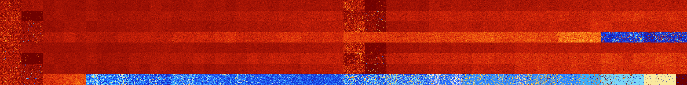

# B124567 (125952-126463)

<details>
    <summary>Initial Grid</summary>
    
</details>


<details>
    <summary>Initial Grid RLE</summary>

```
#C Exported from GoGoL (https://github.com/marrow16/gogol)
#C Wrap mode: Toroidal
#C Boundary mode: Dead
#C Step: 0
x = 100, y = 100, rule = B124567/S
10bo13bo8bo8bo15bo17bo$2bo13bo6bo49bo$bo8bo2b2o6bo2bo4bo11bo42bo3bo3bo$
3bo8bo24bo15b2o21bo9bo$18bo4bo18bo11bo6bo36bo$17bo27b2o$2bo14bo9bo21bo
47b2o$8bo4bo49bo16bo13bo$4bo7bo22bo8bobo5bo15bo8bo5bo7bo$29bo$82bo$67bo
18bo5bo$66bo7bo$10bo4bo3bo66bo$16bo12bo28b2o12bo14bo3bobo$5bo10b2o11bo
18b2o10bo4bo23bo7bo$6bo30bo2bo$50bo24bo10bo6bo$bo26bo22bo$bo27bo7bo6bo
6bo6bo2bo30bo$23bo21bo19bobo$24bobobo32bo12bo7bo10bo$22bo11bo32bo$7bo3b
o13bo10bo54bo7bo$56bo$76bo16bo$12bo9bo14bo41bo5bo2bo$10bo41bo5bo27bo10b
obo$bo11bo8bo14bo24bo$37bo12bo$16bo16bo14b2o29bo15bo$bo9bo47bo32bo$bo
25bo55bo$22bo12bo13bo42bo$59bo5bo$11b2o62bo9bo6bo$7bo13bo7bo18b2o19bo
22bo$12bobo5bo13bo7bo32bo$8bo9bo5bo8bo18bo13bo13bo$13bo14bo18bo18bo7bo$
26bo23bo48bo$23bo45bo8bo2bo11b2o$27bo17bo18bo30b2o$7b2o$12bo32bo5bo10bo
14bo7bo$5bo37bo31bo5bo$bo10b4o6bo4bo51bo$49bobo3bo$25bo23bo9bobo8bo$21b
o20bo7bo6bo29bo$6bo6bo3bo13bo11bo5bo17bo7bo19bo3bo$14bo13bo14bo10bo15bo
14bo9bo$5bo16bo59bo9bo$3bo7b2o8bo15bobo47bo4bo$2b2o9bo54bo2bobo8bo$14bo
4b2o22bo6bo8b2o8bo14bo$17bobo2bo18bo$o15bo17bo30bo12bo$3bo43bo$45bo12bo
17bo$29bo21bo22bo$7bo63bo18bo$31bo42bo8bo$59bo$21bo5bo28bo22bo4bo$30bo
28bo8bo3bo7bobo$8bobo33bo$7bo14bo36bo8bo4bo24bo$o25bo5bo23bo16bo$16bo
11bo12bo21bo$21bo55bo5bo$53bo16bobo16bo$26bo18bo17bo$23bo18bo32bo23bo$
17bo46bo$8bo15bo8bo48bo14bo$11bo9bo27bo35bo4bo2bo$8bo13bo11bo14b2o2bo
19bo$8b2o$27bo$16bo14bo2bo4bo2bo$3bob2o4bo22bo18bo3bo8bo10bo7bo9bo$8bob
o8bo63bo2bo4bo$75bo3bo$38bo5bo9bo16bo4b2o16bo$22bo3bo15bo23bo12b2obo8b
2o$100b$20bo21bo14bo9bo$7b2obo4bo29b2o20bo8bo9bo$9bo57bo22bo$4bo7bo12bo
31bo27bo12bo$25bo29bo38bo$46bo30bo$100b$45bo33bo$100b$17bo23bobo14bo23b
o11b2o$3bo20bo7bo2bo17bo2bo2bo7bo9bo2bo8bobo$2bo28bo9bo3bo52bo$27bo4bo
9bo21bo23b2o!
```
</details>
<details>
    <summary>Thumbnail</summary>

</details>
<table>
<tr>
    <td><a href="./125952%20S%20Heat%20Map%20Activity.png"></a><br>S (125952)<br>R@35,p4</td>    <td><a href="./125953%20S0%20Heat%20Map%20Activity.png"></a><br>S0 (125953)<br>R@45,p2</td>    <td><a href="./125954%20S1%20Heat%20Map%20Activity.png"></a><br>S1 (125954)<br>G>1000</td>    <td><a href="./125955%20S01%20Heat%20Map%20Activity.png"></a><br>S01 (125955)<br>G>1000</td>    <td><a href="./125956%20S2%20Heat%20Map%20Activity.png"></a><br>S2 (125956)<br>G>1000</td>    <td><a href="./125957%20S02%20Heat%20Map%20Activity.png"></a><br>S02 (125957)<br>G>1000</td>    <td><a href="./125958%20S12%20Heat%20Map%20Activity.png"></a><br>S12 (125958)<br>G>1000</td>    <td><a href="./125959%20S012%20Heat%20Map%20Activity.png"></a><br>S012 (125959)<br>G>1000</td>    <td><a href="./125960%20S3%20Heat%20Map%20Activity.png"></a><br>S3 (125960)<br>G>1000</td>    <td><a href="./125961%20S03%20Heat%20Map%20Activity.png"></a><br>S03 (125961)<br>G>1000</td>    <td><a href="./125962%20S13%20Heat%20Map%20Activity.png"></a><br>S13 (125962)<br>G>1000</td>    <td><a href="./125963%20S013%20Heat%20Map%20Activity.png"></a><br>S013 (125963)<br>G>1000</td>    <td><a href="./125964%20S23%20Heat%20Map%20Activity.png"></a><br>S23 (125964)<br>G>1000</td>    <td><a href="./125965%20S023%20Heat%20Map%20Activity.png"></a><br>S023 (125965)<br>G>1000</td>    <td><a href="./125966%20S123%20Heat%20Map%20Activity.png"></a><br>S123 (125966)<br>G>1000</td>    <td><a href="./125967%20S0123%20Heat%20Map%20Activity.png"></a><br>S0123 (125967)<br>G>1000</td>    <td><a href="./125968%20S4%20Heat%20Map%20Activity.png"></a><br>S4 (125968)<br>G>1000</td>    <td><a href="./125969%20S04%20Heat%20Map%20Activity.png"></a><br>S04 (125969)<br>G>1000</td>    <td><a href="./125970%20S14%20Heat%20Map%20Activity.png"></a><br>S14 (125970)<br>G>1000</td>    <td><a href="./125971%20S014%20Heat%20Map%20Activity.png"></a><br>S014 (125971)<br>G>1000</td>    <td><a href="./125972%20S24%20Heat%20Map%20Activity.png"></a><br>S24 (125972)<br>G>1000</td>    <td><a href="./125973%20S024%20Heat%20Map%20Activity.png"></a><br>S024 (125973)<br>G>1000</td>    <td><a href="./125974%20S124%20Heat%20Map%20Activity.png"></a><br>S124 (125974)<br>G>1000</td>    <td><a href="./125975%20S0124%20Heat%20Map%20Activity.png"></a><br>S0124 (125975)<br>G>1000</td>    <td><a href="./125976%20S34%20Heat%20Map%20Activity.png"></a><br>S34 (125976)<br>G>1000</td>    <td><a href="./125977%20S034%20Heat%20Map%20Activity.png"></a><br>S034 (125977)<br>G>1000</td>    <td><a href="./125978%20S134%20Heat%20Map%20Activity.png"></a><br>S134 (125978)<br>G>1000</td>    <td><a href="./125979%20S0134%20Heat%20Map%20Activity.png"></a><br>S0134 (125979)<br>G>1000</td>    <td><a href="./125980%20S234%20Heat%20Map%20Activity.png"></a><br>S234 (125980)<br>G>1000</td>    <td><a href="./125981%20S0234%20Heat%20Map%20Activity.png"></a><br>S0234 (125981)<br>G>1000</td>    <td><a href="./125982%20S1234%20Heat%20Map%20Activity.png"></a><br>S1234 (125982)<br>G>1000</td>    <td><a href="./125983%20S01234%20Heat%20Map%20Activity.png"></a><br>S01234 (125983)<br>G>1000</td>    <td><a href="./125984%20S5%20Heat%20Map%20Activity.png"></a><br>S5 (125984)<br>R@19,p2</td>    <td><a href="./125985%20S05%20Heat%20Map%20Activity.png"></a><br>S05 (125985)<br>R@25,p2</td>    <td><a href="./125986%20S15%20Heat%20Map%20Activity.png"></a><br>S15 (125986)<br>R@851,p462</td>    <td><a href="./125987%20S015%20Heat%20Map%20Activity.png"></a><br>S015 (125987)<br>R@346,p84</td>    <td><a href="./125988%20S25%20Heat%20Map%20Activity.png"></a><br>S25 (125988)<br>G>1000</td>    <td><a href="./125989%20S025%20Heat%20Map%20Activity.png"></a><br>S025 (125989)<br>G>1000</td>    <td><a href="./125990%20S125%20Heat%20Map%20Activity.png"></a><br>S125 (125990)<br>G>1000</td>    <td><a href="./125991%20S0125%20Heat%20Map%20Activity.png"></a><br>S0125 (125991)<br>G>1000</td>    <td><a href="./125992%20S35%20Heat%20Map%20Activity.png"></a><br>S35 (125992)<br>G>1000</td>    <td><a href="./125993%20S035%20Heat%20Map%20Activity.png"></a><br>S035 (125993)<br>G>1000</td>    <td><a href="./125994%20S135%20Heat%20Map%20Activity.png"></a><br>S135 (125994)<br>G>1000</td>    <td><a href="./125995%20S0135%20Heat%20Map%20Activity.png"></a><br>S0135 (125995)<br>G>1000</td>    <td><a href="./125996%20S235%20Heat%20Map%20Activity.png"></a><br>S235 (125996)<br>G>1000</td>    <td><a href="./125997%20S0235%20Heat%20Map%20Activity.png"></a><br>S0235 (125997)<br>G>1000</td>    <td><a href="./125998%20S1235%20Heat%20Map%20Activity.png"></a><br>S1235 (125998)<br>G>1000</td>    <td><a href="./125999%20S01235%20Heat%20Map%20Activity.png"></a><br>S01235 (125999)<br>G>1000</td>    <td><a href="./126000%20S45%20Heat%20Map%20Activity.png"></a><br>S45 (126000)<br>G>1000</td>    <td><a href="./126001%20S045%20Heat%20Map%20Activity.png"></a><br>S045 (126001)<br>G>1000</td>    <td><a href="./126002%20S145%20Heat%20Map%20Activity.png"></a><br>S145 (126002)<br>G>1000</td>    <td><a href="./126003%20S0145%20Heat%20Map%20Activity.png"></a><br>S0145 (126003)<br>G>1000</td>    <td><a href="./126004%20S245%20Heat%20Map%20Activity.png"></a><br>S245 (126004)<br>G>1000</td>    <td><a href="./126005%20S0245%20Heat%20Map%20Activity.png"></a><br>S0245 (126005)<br>G>1000</td>    <td><a href="./126006%20S1245%20Heat%20Map%20Activity.png"></a><br>S1245 (126006)<br>G>1000</td>    <td><a href="./126007%20S01245%20Heat%20Map%20Activity.png"></a><br>S01245 (126007)<br>G>1000</td>    <td><a href="./126008%20S345%20Heat%20Map%20Activity.png"></a><br>S345 (126008)<br>G>1000</td>    <td><a href="./126009%20S0345%20Heat%20Map%20Activity.png"></a><br>S0345 (126009)<br>G>1000</td>    <td><a href="./126010%20S1345%20Heat%20Map%20Activity.png"></a><br>S1345 (126010)<br>G>1000</td>    <td><a href="./126011%20S01345%20Heat%20Map%20Activity.png"></a><br>S01345 (126011)<br>G>1000</td>    <td><a href="./126012%20S2345%20Heat%20Map%20Activity.png"></a><br>S2345 (126012)<br>G>1000</td>    <td><a href="./126013%20S02345%20Heat%20Map%20Activity.png"></a><br>S02345 (126013)<br>G>1000</td>    <td><a href="./126014%20S12345%20Heat%20Map%20Activity.png"></a><br>S12345 (126014)<br>G>1000</td>    <td><a href="./126015%20S012345%20Heat%20Map%20Activity.png"></a><br>S012345 (126015)<br>G>1000</td></tr>
<tr>
    <td><a href="./126016%20S6%20Heat%20Map%20Activity.png"></a><br>S6 (126016)<br>R@29,p4</td>    <td><a href="./126017%20S06%20Heat%20Map%20Activity.png"></a><br>S06 (126017)<br>R@26,p2</td>    <td><a href="./126018%20S16%20Heat%20Map%20Activity.png"></a><br>S16 (126018)<br>G>1000</td>    <td><a href="./126019%20S016%20Heat%20Map%20Activity.png"></a><br>S016 (126019)<br>G>1000</td>    <td><a href="./126020%20S26%20Heat%20Map%20Activity.png"></a><br>S26 (126020)<br>G>1000</td>    <td><a href="./126021%20S026%20Heat%20Map%20Activity.png"></a><br>S026 (126021)<br>G>1000</td>    <td><a href="./126022%20S126%20Heat%20Map%20Activity.png"></a><br>S126 (126022)<br>G>1000</td>    <td><a href="./126023%20S0126%20Heat%20Map%20Activity.png"></a><br>S0126 (126023)<br>G>1000</td>    <td><a href="./126024%20S36%20Heat%20Map%20Activity.png"></a><br>S36 (126024)<br>G>1000</td>    <td><a href="./126025%20S036%20Heat%20Map%20Activity.png"></a><br>S036 (126025)<br>G>1000</td>    <td><a href="./126026%20S136%20Heat%20Map%20Activity.png"></a><br>S136 (126026)<br>G>1000</td>    <td><a href="./126027%20S0136%20Heat%20Map%20Activity.png"></a><br>S0136 (126027)<br>G>1000</td>    <td><a href="./126028%20S236%20Heat%20Map%20Activity.png"></a><br>S236 (126028)<br>G>1000</td>    <td><a href="./126029%20S0236%20Heat%20Map%20Activity.png"></a><br>S0236 (126029)<br>G>1000</td>    <td><a href="./126030%20S1236%20Heat%20Map%20Activity.png"></a><br>S1236 (126030)<br>G>1000</td>    <td><a href="./126031%20S01236%20Heat%20Map%20Activity.png"></a><br>S01236 (126031)<br>G>1000</td>    <td><a href="./126032%20S46%20Heat%20Map%20Activity.png"></a><br>S46 (126032)<br>G>1000</td>    <td><a href="./126033%20S046%20Heat%20Map%20Activity.png"></a><br>S046 (126033)<br>G>1000</td>    <td><a href="./126034%20S146%20Heat%20Map%20Activity.png"></a><br>S146 (126034)<br>G>1000</td>    <td><a href="./126035%20S0146%20Heat%20Map%20Activity.png"></a><br>S0146 (126035)<br>G>1000</td>    <td><a href="./126036%20S246%20Heat%20Map%20Activity.png"></a><br>S246 (126036)<br>G>1000</td>    <td><a href="./126037%20S0246%20Heat%20Map%20Activity.png"></a><br>S0246 (126037)<br>G>1000</td>    <td><a href="./126038%20S1246%20Heat%20Map%20Activity.png"></a><br>S1246 (126038)<br>G>1000</td>    <td><a href="./126039%20S01246%20Heat%20Map%20Activity.png"></a><br>S01246 (126039)<br>G>1000</td>    <td><a href="./126040%20S346%20Heat%20Map%20Activity.png"></a><br>S346 (126040)<br>G>1000</td>    <td><a href="./126041%20S0346%20Heat%20Map%20Activity.png"></a><br>S0346 (126041)<br>G>1000</td>    <td><a href="./126042%20S1346%20Heat%20Map%20Activity.png"></a><br>S1346 (126042)<br>G>1000</td>    <td><a href="./126043%20S01346%20Heat%20Map%20Activity.png"></a><br>S01346 (126043)<br>G>1000</td>    <td><a href="./126044%20S2346%20Heat%20Map%20Activity.png"></a><br>S2346 (126044)<br>G>1000</td>    <td><a href="./126045%20S02346%20Heat%20Map%20Activity.png"></a><br>S02346 (126045)<br>G>1000</td>    <td><a href="./126046%20S12346%20Heat%20Map%20Activity.png"></a><br>S12346 (126046)<br>G>1000</td>    <td><a href="./126047%20S012346%20Heat%20Map%20Activity.png"></a><br>S012346 (126047)<br>G>1000</td>    <td><a href="./126048%20S56%20Heat%20Map%20Activity.png"></a><br>S56 (126048)<br>R@61,p12</td>    <td><a href="./126049%20S056%20Heat%20Map%20Activity.png"></a><br>S056 (126049)<br>R@58,p6</td>    <td><a href="./126050%20S156%20Heat%20Map%20Activity.png"></a><br>S156 (126050)<br>R@266,p12</td>    <td><a href="./126051%20S0156%20Heat%20Map%20Activity.png"></a><br>S0156 (126051)<br>R@337,p72</td>    <td><a href="./126052%20S256%20Heat%20Map%20Activity.png"></a><br>S256 (126052)<br>G>1000</td>    <td><a href="./126053%20S0256%20Heat%20Map%20Activity.png"></a><br>S0256 (126053)<br>G>1000</td>    <td><a href="./126054%20S1256%20Heat%20Map%20Activity.png"></a><br>S1256 (126054)<br>G>1000</td>    <td><a href="./126055%20S01256%20Heat%20Map%20Activity.png"></a><br>S01256 (126055)<br>G>1000</td>    <td><a href="./126056%20S356%20Heat%20Map%20Activity.png"></a><br>S356 (126056)<br>G>1000</td>    <td><a href="./126057%20S0356%20Heat%20Map%20Activity.png"></a><br>S0356 (126057)<br>G>1000</td>    <td><a href="./126058%20S1356%20Heat%20Map%20Activity.png"></a><br>S1356 (126058)<br>G>1000</td>    <td><a href="./126059%20S01356%20Heat%20Map%20Activity.png"></a><br>S01356 (126059)<br>G>1000</td>    <td><a href="./126060%20S2356%20Heat%20Map%20Activity.png"></a><br>S2356 (126060)<br>G>1000</td>    <td><a href="./126061%20S02356%20Heat%20Map%20Activity.png"></a><br>S02356 (126061)<br>G>1000</td>    <td><a href="./126062%20S12356%20Heat%20Map%20Activity.png"></a><br>S12356 (126062)<br>G>1000</td>    <td><a href="./126063%20S012356%20Heat%20Map%20Activity.png"></a><br>S012356 (126063)<br>G>1000</td>    <td><a href="./126064%20S456%20Heat%20Map%20Activity.png"></a><br>S456 (126064)<br>G>1000</td>    <td><a href="./126065%20S0456%20Heat%20Map%20Activity.png"></a><br>S0456 (126065)<br>G>1000</td>    <td><a href="./126066%20S1456%20Heat%20Map%20Activity.png"></a><br>S1456 (126066)<br>G>1000</td>    <td><a href="./126067%20S01456%20Heat%20Map%20Activity.png"></a><br>S01456 (126067)<br>G>1000</td>    <td><a href="./126068%20S2456%20Heat%20Map%20Activity.png"></a><br>S2456 (126068)<br>G>1000</td>    <td><a href="./126069%20S02456%20Heat%20Map%20Activity.png"></a><br>S02456 (126069)<br>G>1000</td>    <td><a href="./126070%20S12456%20Heat%20Map%20Activity.png"></a><br>S12456 (126070)<br>G>1000</td>    <td><a href="./126071%20S012456%20Heat%20Map%20Activity.png"></a><br>S012456 (126071)<br>G>1000</td>    <td><a href="./126072%20S3456%20Heat%20Map%20Activity.png"></a><br>S3456 (126072)<br>G>1000</td>    <td><a href="./126073%20S03456%20Heat%20Map%20Activity.png"></a><br>S03456 (126073)<br>G>1000</td>    <td><a href="./126074%20S13456%20Heat%20Map%20Activity.png"></a><br>S13456 (126074)<br>G>1000</td>    <td><a href="./126075%20S013456%20Heat%20Map%20Activity.png"></a><br>S013456 (126075)<br>G>1000</td>    <td><a href="./126076%20S23456%20Heat%20Map%20Activity.png"></a><br>S23456 (126076)<br>G>1000</td>    <td><a href="./126077%20S023456%20Heat%20Map%20Activity.png"></a><br>S023456 (126077)<br>G>1000</td>    <td><a href="./126078%20S123456%20Heat%20Map%20Activity.png"></a><br>S123456 (126078)<br>G>1000</td>    <td><a href="./126079%20S0123456%20Heat%20Map%20Activity.png"></a><br>S0123456 (126079)<br>G>1000</td></tr>
<tr>
    <td><a href="./126080%20S7%20Heat%20Map%20Activity.png"></a><br>S7 (126080)<br>R@32,p4</td>    <td><a href="./126081%20S07%20Heat%20Map%20Activity.png"></a><br>S07 (126081)<br>R@33,p2</td>    <td><a href="./126082%20S17%20Heat%20Map%20Activity.png"></a><br>S17 (126082)<br>R@81,p2</td>    <td><a href="./126083%20S017%20Heat%20Map%20Activity.png"></a><br>S017 (126083)<br>R@90,p4</td>    <td><a href="./126084%20S27%20Heat%20Map%20Activity.png"></a><br>S27 (126084)<br>G>1000</td>    <td><a href="./126085%20S027%20Heat%20Map%20Activity.png"></a><br>S027 (126085)<br>G>1000</td>    <td><a href="./126086%20S127%20Heat%20Map%20Activity.png"></a><br>S127 (126086)<br>G>1000</td>    <td><a href="./126087%20S0127%20Heat%20Map%20Activity.png"></a><br>S0127 (126087)<br>G>1000</td>    <td><a href="./126088%20S37%20Heat%20Map%20Activity.png"></a><br>S37 (126088)<br>G>1000</td>    <td><a href="./126089%20S037%20Heat%20Map%20Activity.png"></a><br>S037 (126089)<br>G>1000</td>    <td><a href="./126090%20S137%20Heat%20Map%20Activity.png"></a><br>S137 (126090)<br>G>1000</td>    <td><a href="./126091%20S0137%20Heat%20Map%20Activity.png"></a><br>S0137 (126091)<br>G>1000</td>    <td><a href="./126092%20S237%20Heat%20Map%20Activity.png"></a><br>S237 (126092)<br>G>1000</td>    <td><a href="./126093%20S0237%20Heat%20Map%20Activity.png"></a><br>S0237 (126093)<br>G>1000</td>    <td><a href="./126094%20S1237%20Heat%20Map%20Activity.png"></a><br>S1237 (126094)<br>G>1000</td>    <td><a href="./126095%20S01237%20Heat%20Map%20Activity.png"></a><br>S01237 (126095)<br>G>1000</td>    <td><a href="./126096%20S47%20Heat%20Map%20Activity.png"></a><br>S47 (126096)<br>G>1000</td>    <td><a href="./126097%20S047%20Heat%20Map%20Activity.png"></a><br>S047 (126097)<br>G>1000</td>    <td><a href="./126098%20S147%20Heat%20Map%20Activity.png"></a><br>S147 (126098)<br>G>1000</td>    <td><a href="./126099%20S0147%20Heat%20Map%20Activity.png"></a><br>S0147 (126099)<br>G>1000</td>    <td><a href="./126100%20S247%20Heat%20Map%20Activity.png"></a><br>S247 (126100)<br>G>1000</td>    <td><a href="./126101%20S0247%20Heat%20Map%20Activity.png"></a><br>S0247 (126101)<br>G>1000</td>    <td><a href="./126102%20S1247%20Heat%20Map%20Activity.png"></a><br>S1247 (126102)<br>G>1000</td>    <td><a href="./126103%20S01247%20Heat%20Map%20Activity.png"></a><br>S01247 (126103)<br>G>1000</td>    <td><a href="./126104%20S347%20Heat%20Map%20Activity.png"></a><br>S347 (126104)<br>G>1000</td>    <td><a href="./126105%20S0347%20Heat%20Map%20Activity.png"></a><br>S0347 (126105)<br>G>1000</td>    <td><a href="./126106%20S1347%20Heat%20Map%20Activity.png"></a><br>S1347 (126106)<br>G>1000</td>    <td><a href="./126107%20S01347%20Heat%20Map%20Activity.png"></a><br>S01347 (126107)<br>G>1000</td>    <td><a href="./126108%20S2347%20Heat%20Map%20Activity.png"></a><br>S2347 (126108)<br>G>1000</td>    <td><a href="./126109%20S02347%20Heat%20Map%20Activity.png"></a><br>S02347 (126109)<br>G>1000</td>    <td><a href="./126110%20S12347%20Heat%20Map%20Activity.png"></a><br>S12347 (126110)<br>G>1000</td>    <td><a href="./126111%20S012347%20Heat%20Map%20Activity.png"></a><br>S012347 (126111)<br>G>1000</td>    <td><a href="./126112%20S57%20Heat%20Map%20Activity.png"></a><br>S57 (126112)<br>R@25,p2</td>    <td><a href="./126113%20S057%20Heat%20Map%20Activity.png"></a><br>S057 (126113)<br>R@19,p2</td>    <td><a href="./126114%20S157%20Heat%20Map%20Activity.png"></a><br>S157 (126114)<br>R@84,p4</td>    <td><a href="./126115%20S0157%20Heat%20Map%20Activity.png"></a><br>S0157 (126115)<br>R@168,p72</td>    <td><a href="./126116%20S257%20Heat%20Map%20Activity.png"></a><br>S257 (126116)<br>G>1000</td>    <td><a href="./126117%20S0257%20Heat%20Map%20Activity.png"></a><br>S0257 (126117)<br>G>1000</td>    <td><a href="./126118%20S1257%20Heat%20Map%20Activity.png"></a><br>S1257 (126118)<br>G>1000</td>    <td><a href="./126119%20S01257%20Heat%20Map%20Activity.png"></a><br>S01257 (126119)<br>G>1000</td>    <td><a href="./126120%20S357%20Heat%20Map%20Activity.png"></a><br>S357 (126120)<br>G>1000</td>    <td><a href="./126121%20S0357%20Heat%20Map%20Activity.png"></a><br>S0357 (126121)<br>G>1000</td>    <td><a href="./126122%20S1357%20Heat%20Map%20Activity.png"></a><br>S1357 (126122)<br>G>1000</td>    <td><a href="./126123%20S01357%20Heat%20Map%20Activity.png"></a><br>S01357 (126123)<br>G>1000</td>    <td><a href="./126124%20S2357%20Heat%20Map%20Activity.png"></a><br>S2357 (126124)<br>G>1000</td>    <td><a href="./126125%20S02357%20Heat%20Map%20Activity.png"></a><br>S02357 (126125)<br>G>1000</td>    <td><a href="./126126%20S12357%20Heat%20Map%20Activity.png"></a><br>S12357 (126126)<br>G>1000</td>    <td><a href="./126127%20S012357%20Heat%20Map%20Activity.png"></a><br>S012357 (126127)<br>G>1000</td>    <td><a href="./126128%20S457%20Heat%20Map%20Activity.png"></a><br>S457 (126128)<br>G>1000</td>    <td><a href="./126129%20S0457%20Heat%20Map%20Activity.png"></a><br>S0457 (126129)<br>G>1000</td>    <td><a href="./126130%20S1457%20Heat%20Map%20Activity.png"></a><br>S1457 (126130)<br>G>1000</td>    <td><a href="./126131%20S01457%20Heat%20Map%20Activity.png"></a><br>S01457 (126131)<br>G>1000</td>    <td><a href="./126132%20S2457%20Heat%20Map%20Activity.png"></a><br>S2457 (126132)<br>G>1000</td>    <td><a href="./126133%20S02457%20Heat%20Map%20Activity.png"></a><br>S02457 (126133)<br>G>1000</td>    <td><a href="./126134%20S12457%20Heat%20Map%20Activity.png"></a><br>S12457 (126134)<br>G>1000</td>    <td><a href="./126135%20S012457%20Heat%20Map%20Activity.png"></a><br>S012457 (126135)<br>G>1000</td>    <td><a href="./126136%20S3457%20Heat%20Map%20Activity.png"></a><br>S3457 (126136)<br>G>1000</td>    <td><a href="./126137%20S03457%20Heat%20Map%20Activity.png"></a><br>S03457 (126137)<br>G>1000</td>    <td><a href="./126138%20S13457%20Heat%20Map%20Activity.png"></a><br>S13457 (126138)<br>G>1000</td>    <td><a href="./126139%20S013457%20Heat%20Map%20Activity.png"></a><br>S013457 (126139)<br>G>1000</td>    <td><a href="./126140%20S23457%20Heat%20Map%20Activity.png"></a><br>S23457 (126140)<br>G>1000</td>    <td><a href="./126141%20S023457%20Heat%20Map%20Activity.png"></a><br>S023457 (126141)<br>G>1000</td>    <td><a href="./126142%20S123457%20Heat%20Map%20Activity.png"></a><br>S123457 (126142)<br>G>1000</td>    <td><a href="./126143%20S0123457%20Heat%20Map%20Activity.png"></a><br>S0123457 (126143)<br>G>1000</td></tr>
<tr>
    <td><a href="./126144%20S67%20Heat%20Map%20Activity.png"></a><br>S67 (126144)<br>R@22,p2</td>    <td><a href="./126145%20S067%20Heat%20Map%20Activity.png"></a><br>S067 (126145)<br>R@28,p4</td>    <td><a href="./126146%20S167%20Heat%20Map%20Activity.png"></a><br>S167 (126146)<br>R@41,p6</td>    <td><a href="./126147%20S0167%20Heat%20Map%20Activity.png"></a><br>S0167 (126147)<br>R@36,p4</td>    <td><a href="./126148%20S267%20Heat%20Map%20Activity.png"></a><br>S267 (126148)<br>G>1000</td>    <td><a href="./126149%20S0267%20Heat%20Map%20Activity.png"></a><br>S0267 (126149)<br>G>1000</td>    <td><a href="./126150%20S1267%20Heat%20Map%20Activity.png"></a><br>S1267 (126150)<br>G>1000</td>    <td><a href="./126151%20S01267%20Heat%20Map%20Activity.png"></a><br>S01267 (126151)<br>G>1000</td>    <td><a href="./126152%20S367%20Heat%20Map%20Activity.png"></a><br>S367 (126152)<br>G>1000</td>    <td><a href="./126153%20S0367%20Heat%20Map%20Activity.png"></a><br>S0367 (126153)<br>G>1000</td>    <td><a href="./126154%20S1367%20Heat%20Map%20Activity.png"></a><br>S1367 (126154)<br>G>1000</td>    <td><a href="./126155%20S01367%20Heat%20Map%20Activity.png"></a><br>S01367 (126155)<br>G>1000</td>    <td><a href="./126156%20S2367%20Heat%20Map%20Activity.png"></a><br>S2367 (126156)<br>G>1000</td>    <td><a href="./126157%20S02367%20Heat%20Map%20Activity.png"></a><br>S02367 (126157)<br>G>1000</td>    <td><a href="./126158%20S12367%20Heat%20Map%20Activity.png"></a><br>S12367 (126158)<br>G>1000</td>    <td><a href="./126159%20S012367%20Heat%20Map%20Activity.png"></a><br>S012367 (126159)<br>G>1000</td>    <td><a href="./126160%20S467%20Heat%20Map%20Activity.png"></a><br>S467 (126160)<br>G>1000</td>    <td><a href="./126161%20S0467%20Heat%20Map%20Activity.png"></a><br>S0467 (126161)<br>G>1000</td>    <td><a href="./126162%20S1467%20Heat%20Map%20Activity.png"></a><br>S1467 (126162)<br>G>1000</td>    <td><a href="./126163%20S01467%20Heat%20Map%20Activity.png"></a><br>S01467 (126163)<br>G>1000</td>    <td><a href="./126164%20S2467%20Heat%20Map%20Activity.png"></a><br>S2467 (126164)<br>G>1000</td>    <td><a href="./126165%20S02467%20Heat%20Map%20Activity.png"></a><br>S02467 (126165)<br>G>1000</td>    <td><a href="./126166%20S12467%20Heat%20Map%20Activity.png"></a><br>S12467 (126166)<br>G>1000</td>    <td><a href="./126167%20S012467%20Heat%20Map%20Activity.png"></a><br>S012467 (126167)<br>G>1000</td>    <td><a href="./126168%20S3467%20Heat%20Map%20Activity.png"></a><br>S3467 (126168)<br>G>1000</td>    <td><a href="./126169%20S03467%20Heat%20Map%20Activity.png"></a><br>S03467 (126169)<br>G>1000</td>    <td><a href="./126170%20S13467%20Heat%20Map%20Activity.png"></a><br>S13467 (126170)<br>G>1000</td>    <td><a href="./126171%20S013467%20Heat%20Map%20Activity.png"></a><br>S013467 (126171)<br>G>1000</td>    <td><a href="./126172%20S23467%20Heat%20Map%20Activity.png"></a><br>S23467 (126172)<br>G>1000</td>    <td><a href="./126173%20S023467%20Heat%20Map%20Activity.png"></a><br>S023467 (126173)<br>G>1000</td>    <td><a href="./126174%20S123467%20Heat%20Map%20Activity.png"></a><br>S123467 (126174)<br>G>1000</td>    <td><a href="./126175%20S0123467%20Heat%20Map%20Activity.png"></a><br>S0123467 (126175)<br>G>1000</td>    <td><a href="./126176%20S567%20Heat%20Map%20Activity.png"></a><br>S567 (126176)<br>G>1000</td>    <td><a href="./126177%20S0567%20Heat%20Map%20Activity.png"></a><br>S0567 (126177)<br>G>1000</td>    <td><a href="./126178%20S1567%20Heat%20Map%20Activity.png"></a><br>S1567 (126178)<br>G>1000</td>    <td><a href="./126179%20S01567%20Heat%20Map%20Activity.png"></a><br>S01567 (126179)<br>G>1000</td>    <td><a href="./126180%20S2567%20Heat%20Map%20Activity.png"></a><br>S2567 (126180)<br>G>1000</td>    <td><a href="./126181%20S02567%20Heat%20Map%20Activity.png"></a><br>S02567 (126181)<br>G>1000</td>    <td><a href="./126182%20S12567%20Heat%20Map%20Activity.png"></a><br>S12567 (126182)<br>G>1000</td>    <td><a href="./126183%20S012567%20Heat%20Map%20Activity.png"></a><br>S012567 (126183)<br>G>1000</td>    <td><a href="./126184%20S3567%20Heat%20Map%20Activity.png"></a><br>S3567 (126184)<br>G>1000</td>    <td><a href="./126185%20S03567%20Heat%20Map%20Activity.png"></a><br>S03567 (126185)<br>G>1000</td>    <td><a href="./126186%20S13567%20Heat%20Map%20Activity.png"></a><br>S13567 (126186)<br>G>1000</td>    <td><a href="./126187%20S013567%20Heat%20Map%20Activity.png"></a><br>S013567 (126187)<br>G>1000</td>    <td><a href="./126188%20S23567%20Heat%20Map%20Activity.png"></a><br>S23567 (126188)<br>G>1000</td>    <td><a href="./126189%20S023567%20Heat%20Map%20Activity.png"></a><br>S023567 (126189)<br>G>1000</td>    <td><a href="./126190%20S123567%20Heat%20Map%20Activity.png"></a><br>S123567 (126190)<br>G>1000</td>    <td><a href="./126191%20S0123567%20Heat%20Map%20Activity.png"></a><br>S0123567 (126191)<br>G>1000</td>    <td><a href="./126192%20S4567%20Heat%20Map%20Activity.png"></a><br>S4567 (126192)<br>G>1000</td>    <td><a href="./126193%20S04567%20Heat%20Map%20Activity.png"></a><br>S04567 (126193)<br>G>1000</td>    <td><a href="./126194%20S14567%20Heat%20Map%20Activity.png"></a><br>S14567 (126194)<br>G>1000</td>    <td><a href="./126195%20S014567%20Heat%20Map%20Activity.png"></a><br>S014567 (126195)<br>G>1000</td>    <td><a href="./126196%20S24567%20Heat%20Map%20Activity.png"></a><br>S24567 (126196)<br>G>1000</td>    <td><a href="./126197%20S024567%20Heat%20Map%20Activity.png"></a><br>S024567 (126197)<br>G>1000</td>    <td><a href="./126198%20S124567%20Heat%20Map%20Activity.png"></a><br>S124567 (126198)<br>G>1000</td>    <td><a href="./126199%20S0124567%20Heat%20Map%20Activity.png"></a><br>S0124567 (126199)<br>G>1000</td>    <td><a href="./126200%20S34567%20Heat%20Map%20Activity.png"></a><br>S34567 (126200)<br>R@458,p210</td>    <td><a href="./126201%20S034567%20Heat%20Map%20Activity.png"></a><br>S034567 (126201)<br>R@264,p30</td>    <td><a href="./126202%20S134567%20Heat%20Map%20Activity.png"></a><br>S134567 (126202)<br>R@252,p6</td>    <td><a href="./126203%20S0134567%20Heat%20Map%20Activity.png"></a><br>S0134567 (126203)<br>R@218,p6</td>    <td><a href="./126204%20S234567%20Heat%20Map%20Activity.png"></a><br>S234567 (126204)<br>R@94,p60</td>    <td><a href="./126205%20S0234567%20Heat%20Map%20Activity.png"></a><br>S0234567 (126205)<br>R@44,p6</td>    <td><a href="./126206%20S1234567%20Heat%20Map%20Activity.png"></a><br>S1234567 (126206)<br>R@43,p6</td>    <td><a href="./126207%20S01234567%20Heat%20Map%20Activity.png"></a><br>S01234567 (126207)<br>R@55,p12</td></tr>
<tr>
    <td><a href="./126208%20S8%20Heat%20Map%20Activity.png"></a><br>S8 (126208)<br>R@35,p4</td>    <td><a href="./126209%20S08%20Heat%20Map%20Activity.png"></a><br>S08 (126209)<br>R@37,p2</td>    <td><a href="./126210%20S18%20Heat%20Map%20Activity.png"></a><br>S18 (126210)<br>G>1000</td>    <td><a href="./126211%20S018%20Heat%20Map%20Activity.png"></a><br>S018 (126211)<br>G>1000</td>    <td><a href="./126212%20S28%20Heat%20Map%20Activity.png"></a><br>S28 (126212)<br>G>1000</td>    <td><a href="./126213%20S028%20Heat%20Map%20Activity.png"></a><br>S028 (126213)<br>G>1000</td>    <td><a href="./126214%20S128%20Heat%20Map%20Activity.png"></a><br>S128 (126214)<br>G>1000</td>    <td><a href="./126215%20S0128%20Heat%20Map%20Activity.png"></a><br>S0128 (126215)<br>G>1000</td>    <td><a href="./126216%20S38%20Heat%20Map%20Activity.png"></a><br>S38 (126216)<br>G>1000</td>    <td><a href="./126217%20S038%20Heat%20Map%20Activity.png"></a><br>S038 (126217)<br>G>1000</td>    <td><a href="./126218%20S138%20Heat%20Map%20Activity.png"></a><br>S138 (126218)<br>G>1000</td>    <td><a href="./126219%20S0138%20Heat%20Map%20Activity.png"></a><br>S0138 (126219)<br>G>1000</td>    <td><a href="./126220%20S238%20Heat%20Map%20Activity.png"></a><br>S238 (126220)<br>G>1000</td>    <td><a href="./126221%20S0238%20Heat%20Map%20Activity.png"></a><br>S0238 (126221)<br>G>1000</td>    <td><a href="./126222%20S1238%20Heat%20Map%20Activity.png"></a><br>S1238 (126222)<br>G>1000</td>    <td><a href="./126223%20S01238%20Heat%20Map%20Activity.png"></a><br>S01238 (126223)<br>G>1000</td>    <td><a href="./126224%20S48%20Heat%20Map%20Activity.png"></a><br>S48 (126224)<br>G>1000</td>    <td><a href="./126225%20S048%20Heat%20Map%20Activity.png"></a><br>S048 (126225)<br>G>1000</td>    <td><a href="./126226%20S148%20Heat%20Map%20Activity.png"></a><br>S148 (126226)<br>G>1000</td>    <td><a href="./126227%20S0148%20Heat%20Map%20Activity.png"></a><br>S0148 (126227)<br>G>1000</td>    <td><a href="./126228%20S248%20Heat%20Map%20Activity.png"></a><br>S248 (126228)<br>G>1000</td>    <td><a href="./126229%20S0248%20Heat%20Map%20Activity.png"></a><br>S0248 (126229)<br>G>1000</td>    <td><a href="./126230%20S1248%20Heat%20Map%20Activity.png"></a><br>S1248 (126230)<br>G>1000</td>    <td><a href="./126231%20S01248%20Heat%20Map%20Activity.png"></a><br>S01248 (126231)<br>G>1000</td>    <td><a href="./126232%20S348%20Heat%20Map%20Activity.png"></a><br>S348 (126232)<br>G>1000</td>    <td><a href="./126233%20S0348%20Heat%20Map%20Activity.png"></a><br>S0348 (126233)<br>G>1000</td>    <td><a href="./126234%20S1348%20Heat%20Map%20Activity.png"></a><br>S1348 (126234)<br>G>1000</td>    <td><a href="./126235%20S01348%20Heat%20Map%20Activity.png"></a><br>S01348 (126235)<br>G>1000</td>    <td><a href="./126236%20S2348%20Heat%20Map%20Activity.png"></a><br>S2348 (126236)<br>G>1000</td>    <td><a href="./126237%20S02348%20Heat%20Map%20Activity.png"></a><br>S02348 (126237)<br>G>1000</td>    <td><a href="./126238%20S12348%20Heat%20Map%20Activity.png"></a><br>S12348 (126238)<br>G>1000</td>    <td><a href="./126239%20S012348%20Heat%20Map%20Activity.png"></a><br>S012348 (126239)<br>G>1000</td>    <td><a href="./126240%20S58%20Heat%20Map%20Activity.png"></a><br>S58 (126240)<br>R@20,p2</td>    <td><a href="./126241%20S058%20Heat%20Map%20Activity.png"></a><br>S058 (126241)<br>R@22,p2</td>    <td><a href="./126242%20S158%20Heat%20Map%20Activity.png"></a><br>S158 (126242)<br>R@310,p6</td>    <td><a href="./126243%20S0158%20Heat%20Map%20Activity.png"></a><br>S0158 (126243)<br>R@407,p12</td>    <td><a href="./126244%20S258%20Heat%20Map%20Activity.png"></a><br>S258 (126244)<br>G>1000</td>    <td><a href="./126245%20S0258%20Heat%20Map%20Activity.png"></a><br>S0258 (126245)<br>G>1000</td>    <td><a href="./126246%20S1258%20Heat%20Map%20Activity.png"></a><br>S1258 (126246)<br>G>1000</td>    <td><a href="./126247%20S01258%20Heat%20Map%20Activity.png"></a><br>S01258 (126247)<br>G>1000</td>    <td><a href="./126248%20S358%20Heat%20Map%20Activity.png"></a><br>S358 (126248)<br>G>1000</td>    <td><a href="./126249%20S0358%20Heat%20Map%20Activity.png"></a><br>S0358 (126249)<br>G>1000</td>    <td><a href="./126250%20S1358%20Heat%20Map%20Activity.png"></a><br>S1358 (126250)<br>G>1000</td>    <td><a href="./126251%20S01358%20Heat%20Map%20Activity.png"></a><br>S01358 (126251)<br>G>1000</td>    <td><a href="./126252%20S2358%20Heat%20Map%20Activity.png"></a><br>S2358 (126252)<br>G>1000</td>    <td><a href="./126253%20S02358%20Heat%20Map%20Activity.png"></a><br>S02358 (126253)<br>G>1000</td>    <td><a href="./126254%20S12358%20Heat%20Map%20Activity.png"></a><br>S12358 (126254)<br>G>1000</td>    <td><a href="./126255%20S012358%20Heat%20Map%20Activity.png"></a><br>S012358 (126255)<br>G>1000</td>    <td><a href="./126256%20S458%20Heat%20Map%20Activity.png"></a><br>S458 (126256)<br>G>1000</td>    <td><a href="./126257%20S0458%20Heat%20Map%20Activity.png"></a><br>S0458 (126257)<br>G>1000</td>    <td><a href="./126258%20S1458%20Heat%20Map%20Activity.png"></a><br>S1458 (126258)<br>G>1000</td>    <td><a href="./126259%20S01458%20Heat%20Map%20Activity.png"></a><br>S01458 (126259)<br>G>1000</td>    <td><a href="./126260%20S2458%20Heat%20Map%20Activity.png"></a><br>S2458 (126260)<br>G>1000</td>    <td><a href="./126261%20S02458%20Heat%20Map%20Activity.png"></a><br>S02458 (126261)<br>G>1000</td>    <td><a href="./126262%20S12458%20Heat%20Map%20Activity.png"></a><br>S12458 (126262)<br>G>1000</td>    <td><a href="./126263%20S012458%20Heat%20Map%20Activity.png"></a><br>S012458 (126263)<br>G>1000</td>    <td><a href="./126264%20S3458%20Heat%20Map%20Activity.png"></a><br>S3458 (126264)<br>G>1000</td>    <td><a href="./126265%20S03458%20Heat%20Map%20Activity.png"></a><br>S03458 (126265)<br>G>1000</td>    <td><a href="./126266%20S13458%20Heat%20Map%20Activity.png"></a><br>S13458 (126266)<br>G>1000</td>    <td><a href="./126267%20S013458%20Heat%20Map%20Activity.png"></a><br>S013458 (126267)<br>G>1000</td>    <td><a href="./126268%20S23458%20Heat%20Map%20Activity.png"></a><br>S23458 (126268)<br>G>1000</td>    <td><a href="./126269%20S023458%20Heat%20Map%20Activity.png"></a><br>S023458 (126269)<br>G>1000</td>    <td><a href="./126270%20S123458%20Heat%20Map%20Activity.png"></a><br>S123458 (126270)<br>G>1000</td>    <td><a href="./126271%20S0123458%20Heat%20Map%20Activity.png"></a><br>S0123458 (126271)<br>G>1000</td></tr>
<tr>
    <td><a href="./126272%20S68%20Heat%20Map%20Activity.png"></a><br>S68 (126272)<br>R@29,p4</td>    <td><a href="./126273%20S068%20Heat%20Map%20Activity.png"></a><br>S068 (126273)<br>R@28,p4</td>    <td><a href="./126274%20S168%20Heat%20Map%20Activity.png"></a><br>S168 (126274)<br>G>1000</td>    <td><a href="./126275%20S0168%20Heat%20Map%20Activity.png"></a><br>S0168 (126275)<br>R@990,p840</td>    <td><a href="./126276%20S268%20Heat%20Map%20Activity.png"></a><br>S268 (126276)<br>G>1000</td>    <td><a href="./126277%20S0268%20Heat%20Map%20Activity.png"></a><br>S0268 (126277)<br>G>1000</td>    <td><a href="./126278%20S1268%20Heat%20Map%20Activity.png"></a><br>S1268 (126278)<br>G>1000</td>    <td><a href="./126279%20S01268%20Heat%20Map%20Activity.png"></a><br>S01268 (126279)<br>G>1000</td>    <td><a href="./126280%20S368%20Heat%20Map%20Activity.png"></a><br>S368 (126280)<br>G>1000</td>    <td><a href="./126281%20S0368%20Heat%20Map%20Activity.png"></a><br>S0368 (126281)<br>G>1000</td>    <td><a href="./126282%20S1368%20Heat%20Map%20Activity.png"></a><br>S1368 (126282)<br>G>1000</td>    <td><a href="./126283%20S01368%20Heat%20Map%20Activity.png"></a><br>S01368 (126283)<br>G>1000</td>    <td><a href="./126284%20S2368%20Heat%20Map%20Activity.png"></a><br>S2368 (126284)<br>G>1000</td>    <td><a href="./126285%20S02368%20Heat%20Map%20Activity.png"></a><br>S02368 (126285)<br>G>1000</td>    <td><a href="./126286%20S12368%20Heat%20Map%20Activity.png"></a><br>S12368 (126286)<br>G>1000</td>    <td><a href="./126287%20S012368%20Heat%20Map%20Activity.png"></a><br>S012368 (126287)<br>G>1000</td>    <td><a href="./126288%20S468%20Heat%20Map%20Activity.png"></a><br>S468 (126288)<br>G>1000</td>    <td><a href="./126289%20S0468%20Heat%20Map%20Activity.png"></a><br>S0468 (126289)<br>G>1000</td>    <td><a href="./126290%20S1468%20Heat%20Map%20Activity.png"></a><br>S1468 (126290)<br>G>1000</td>    <td><a href="./126291%20S01468%20Heat%20Map%20Activity.png"></a><br>S01468 (126291)<br>G>1000</td>    <td><a href="./126292%20S2468%20Heat%20Map%20Activity.png"></a><br>S2468 (126292)<br>G>1000</td>    <td><a href="./126293%20S02468%20Heat%20Map%20Activity.png"></a><br>S02468 (126293)<br>G>1000</td>    <td><a href="./126294%20S12468%20Heat%20Map%20Activity.png"></a><br>S12468 (126294)<br>G>1000</td>    <td><a href="./126295%20S012468%20Heat%20Map%20Activity.png"></a><br>S012468 (126295)<br>G>1000</td>    <td><a href="./126296%20S3468%20Heat%20Map%20Activity.png"></a><br>S3468 (126296)<br>G>1000</td>    <td><a href="./126297%20S03468%20Heat%20Map%20Activity.png"></a><br>S03468 (126297)<br>G>1000</td>    <td><a href="./126298%20S13468%20Heat%20Map%20Activity.png"></a><br>S13468 (126298)<br>G>1000</td>    <td><a href="./126299%20S013468%20Heat%20Map%20Activity.png"></a><br>S013468 (126299)<br>G>1000</td>    <td><a href="./126300%20S23468%20Heat%20Map%20Activity.png"></a><br>S23468 (126300)<br>G>1000</td>    <td><a href="./126301%20S023468%20Heat%20Map%20Activity.png"></a><br>S023468 (126301)<br>G>1000</td>    <td><a href="./126302%20S123468%20Heat%20Map%20Activity.png"></a><br>S123468 (126302)<br>G>1000</td>    <td><a href="./126303%20S0123468%20Heat%20Map%20Activity.png"></a><br>S0123468 (126303)<br>G>1000</td>    <td><a href="./126304%20S568%20Heat%20Map%20Activity.png"></a><br>S568 (126304)<br>R@100,p2</td>    <td><a href="./126305%20S0568%20Heat%20Map%20Activity.png"></a><br>S0568 (126305)<br>R@80,p12</td>    <td><a href="./126306%20S1568%20Heat%20Map%20Activity.png"></a><br>S1568 (126306)<br>G>1000</td>    <td><a href="./126307%20S01568%20Heat%20Map%20Activity.png"></a><br>S01568 (126307)<br>G>1000</td>    <td><a href="./126308%20S2568%20Heat%20Map%20Activity.png"></a><br>S2568 (126308)<br>G>1000</td>    <td><a href="./126309%20S02568%20Heat%20Map%20Activity.png"></a><br>S02568 (126309)<br>G>1000</td>    <td><a href="./126310%20S12568%20Heat%20Map%20Activity.png"></a><br>S12568 (126310)<br>G>1000</td>    <td><a href="./126311%20S012568%20Heat%20Map%20Activity.png"></a><br>S012568 (126311)<br>G>1000</td>    <td><a href="./126312%20S3568%20Heat%20Map%20Activity.png"></a><br>S3568 (126312)<br>G>1000</td>    <td><a href="./126313%20S03568%20Heat%20Map%20Activity.png"></a><br>S03568 (126313)<br>G>1000</td>    <td><a href="./126314%20S13568%20Heat%20Map%20Activity.png"></a><br>S13568 (126314)<br>G>1000</td>    <td><a href="./126315%20S013568%20Heat%20Map%20Activity.png"></a><br>S013568 (126315)<br>G>1000</td>    <td><a href="./126316%20S23568%20Heat%20Map%20Activity.png"></a><br>S23568 (126316)<br>G>1000</td>    <td><a href="./126317%20S023568%20Heat%20Map%20Activity.png"></a><br>S023568 (126317)<br>G>1000</td>    <td><a href="./126318%20S123568%20Heat%20Map%20Activity.png"></a><br>S123568 (126318)<br>G>1000</td>    <td><a href="./126319%20S0123568%20Heat%20Map%20Activity.png"></a><br>S0123568 (126319)<br>G>1000</td>    <td><a href="./126320%20S4568%20Heat%20Map%20Activity.png"></a><br>S4568 (126320)<br>G>1000</td>    <td><a href="./126321%20S04568%20Heat%20Map%20Activity.png"></a><br>S04568 (126321)<br>G>1000</td>    <td><a href="./126322%20S14568%20Heat%20Map%20Activity.png"></a><br>S14568 (126322)<br>G>1000</td>    <td><a href="./126323%20S014568%20Heat%20Map%20Activity.png"></a><br>S014568 (126323)<br>G>1000</td>    <td><a href="./126324%20S24568%20Heat%20Map%20Activity.png"></a><br>S24568 (126324)<br>G>1000</td>    <td><a href="./126325%20S024568%20Heat%20Map%20Activity.png"></a><br>S024568 (126325)<br>G>1000</td>    <td><a href="./126326%20S124568%20Heat%20Map%20Activity.png"></a><br>S124568 (126326)<br>G>1000</td>    <td><a href="./126327%20S0124568%20Heat%20Map%20Activity.png"></a><br>S0124568 (126327)<br>G>1000</td>    <td><a href="./126328%20S34568%20Heat%20Map%20Activity.png"></a><br>S34568 (126328)<br>G>1000</td>    <td><a href="./126329%20S034568%20Heat%20Map%20Activity.png"></a><br>S034568 (126329)<br>G>1000</td>    <td><a href="./126330%20S134568%20Heat%20Map%20Activity.png"></a><br>S134568 (126330)<br>G>1000</td>    <td><a href="./126331%20S0134568%20Heat%20Map%20Activity.png"></a><br>S0134568 (126331)<br>G>1000</td>    <td><a href="./126332%20S234568%20Heat%20Map%20Activity.png"></a><br>S234568 (126332)<br>G>1000</td>    <td><a href="./126333%20S0234568%20Heat%20Map%20Activity.png"></a><br>S0234568 (126333)<br>G>1000</td>    <td><a href="./126334%20S1234568%20Heat%20Map%20Activity.png"></a><br>S1234568 (126334)<br>G>1000</td>    <td><a href="./126335%20S01234568%20Heat%20Map%20Activity.png"></a><br>S01234568 (126335)<br>G>1000</td></tr>
<tr>
    <td><a href="./126336%20S78%20Heat%20Map%20Activity.png"></a><br>S78 (126336)<br>R@32,p4</td>    <td><a href="./126337%20S078%20Heat%20Map%20Activity.png"></a><br>S078 (126337)<br>R@29,p2</td>    <td><a href="./126338%20S178%20Heat%20Map%20Activity.png"></a><br>S178 (126338)<br>R@76,p4</td>    <td><a href="./126339%20S0178%20Heat%20Map%20Activity.png"></a><br>S0178 (126339)<br>R@67,p4</td>    <td><a href="./126340%20S278%20Heat%20Map%20Activity.png"></a><br>S278 (126340)<br>G>1000</td>    <td><a href="./126341%20S0278%20Heat%20Map%20Activity.png"></a><br>S0278 (126341)<br>G>1000</td>    <td><a href="./126342%20S1278%20Heat%20Map%20Activity.png"></a><br>S1278 (126342)<br>G>1000</td>    <td><a href="./126343%20S01278%20Heat%20Map%20Activity.png"></a><br>S01278 (126343)<br>G>1000</td>    <td><a href="./126344%20S378%20Heat%20Map%20Activity.png"></a><br>S378 (126344)<br>G>1000</td>    <td><a href="./126345%20S0378%20Heat%20Map%20Activity.png"></a><br>S0378 (126345)<br>G>1000</td>    <td><a href="./126346%20S1378%20Heat%20Map%20Activity.png"></a><br>S1378 (126346)<br>G>1000</td>    <td><a href="./126347%20S01378%20Heat%20Map%20Activity.png"></a><br>S01378 (126347)<br>G>1000</td>    <td><a href="./126348%20S2378%20Heat%20Map%20Activity.png"></a><br>S2378 (126348)<br>G>1000</td>    <td><a href="./126349%20S02378%20Heat%20Map%20Activity.png"></a><br>S02378 (126349)<br>G>1000</td>    <td><a href="./126350%20S12378%20Heat%20Map%20Activity.png"></a><br>S12378 (126350)<br>G>1000</td>    <td><a href="./126351%20S012378%20Heat%20Map%20Activity.png"></a><br>S012378 (126351)<br>G>1000</td>    <td><a href="./126352%20S478%20Heat%20Map%20Activity.png"></a><br>S478 (126352)<br>G>1000</td>    <td><a href="./126353%20S0478%20Heat%20Map%20Activity.png"></a><br>S0478 (126353)<br>G>1000</td>    <td><a href="./126354%20S1478%20Heat%20Map%20Activity.png"></a><br>S1478 (126354)<br>G>1000</td>    <td><a href="./126355%20S01478%20Heat%20Map%20Activity.png"></a><br>S01478 (126355)<br>G>1000</td>    <td><a href="./126356%20S2478%20Heat%20Map%20Activity.png"></a><br>S2478 (126356)<br>G>1000</td>    <td><a href="./126357%20S02478%20Heat%20Map%20Activity.png"></a><br>S02478 (126357)<br>G>1000</td>    <td><a href="./126358%20S12478%20Heat%20Map%20Activity.png"></a><br>S12478 (126358)<br>G>1000</td>    <td><a href="./126359%20S012478%20Heat%20Map%20Activity.png"></a><br>S012478 (126359)<br>G>1000</td>    <td><a href="./126360%20S3478%20Heat%20Map%20Activity.png"></a><br>S3478 (126360)<br>G>1000</td>    <td><a href="./126361%20S03478%20Heat%20Map%20Activity.png"></a><br>S03478 (126361)<br>G>1000</td>    <td><a href="./126362%20S13478%20Heat%20Map%20Activity.png"></a><br>S13478 (126362)<br>G>1000</td>    <td><a href="./126363%20S013478%20Heat%20Map%20Activity.png"></a><br>S013478 (126363)<br>G>1000</td>    <td><a href="./126364%20S23478%20Heat%20Map%20Activity.png"></a><br>S23478 (126364)<br>G>1000</td>    <td><a href="./126365%20S023478%20Heat%20Map%20Activity.png"></a><br>S023478 (126365)<br>G>1000</td>    <td><a href="./126366%20S123478%20Heat%20Map%20Activity.png"></a><br>S123478 (126366)<br>G>1000</td>    <td><a href="./126367%20S0123478%20Heat%20Map%20Activity.png"></a><br>S0123478 (126367)<br>G>1000</td>    <td><a href="./126368%20S578%20Heat%20Map%20Activity.png"></a><br>S578 (126368)<br>R@20,p2</td>    <td><a href="./126369%20S0578%20Heat%20Map%20Activity.png"></a><br>S0578 (126369)<br>R@25,p2</td>    <td><a href="./126370%20S1578%20Heat%20Map%20Activity.png"></a><br>S1578 (126370)<br>R@429,p120</td>    <td><a href="./126371%20S01578%20Heat%20Map%20Activity.png"></a><br>S01578 (126371)<br>R@205,p40</td>    <td><a href="./126372%20S2578%20Heat%20Map%20Activity.png"></a><br>S2578 (126372)<br>G>1000</td>    <td><a href="./126373%20S02578%20Heat%20Map%20Activity.png"></a><br>S02578 (126373)<br>G>1000</td>    <td><a href="./126374%20S12578%20Heat%20Map%20Activity.png"></a><br>S12578 (126374)<br>G>1000</td>    <td><a href="./126375%20S012578%20Heat%20Map%20Activity.png"></a><br>S012578 (126375)<br>G>1000</td>    <td><a href="./126376%20S3578%20Heat%20Map%20Activity.png"></a><br>S3578 (126376)<br>G>1000</td>    <td><a href="./126377%20S03578%20Heat%20Map%20Activity.png"></a><br>S03578 (126377)<br>G>1000</td>    <td><a href="./126378%20S13578%20Heat%20Map%20Activity.png"></a><br>S13578 (126378)<br>G>1000</td>    <td><a href="./126379%20S013578%20Heat%20Map%20Activity.png"></a><br>S013578 (126379)<br>G>1000</td>    <td><a href="./126380%20S23578%20Heat%20Map%20Activity.png"></a><br>S23578 (126380)<br>G>1000</td>    <td><a href="./126381%20S023578%20Heat%20Map%20Activity.png"></a><br>S023578 (126381)<br>G>1000</td>    <td><a href="./126382%20S123578%20Heat%20Map%20Activity.png"></a><br>S123578 (126382)<br>G>1000</td>    <td><a href="./126383%20S0123578%20Heat%20Map%20Activity.png"></a><br>S0123578 (126383)<br>G>1000</td>    <td><a href="./126384%20S4578%20Heat%20Map%20Activity.png"></a><br>S4578 (126384)<br>G>1000</td>    <td><a href="./126385%20S04578%20Heat%20Map%20Activity.png"></a><br>S04578 (126385)<br>G>1000</td>    <td><a href="./126386%20S14578%20Heat%20Map%20Activity.png"></a><br>S14578 (126386)<br>G>1000</td>    <td><a href="./126387%20S014578%20Heat%20Map%20Activity.png"></a><br>S014578 (126387)<br>G>1000</td>    <td><a href="./126388%20S24578%20Heat%20Map%20Activity.png"></a><br>S24578 (126388)<br>G>1000</td>    <td><a href="./126389%20S024578%20Heat%20Map%20Activity.png"></a><br>S024578 (126389)<br>G>1000</td>    <td><a href="./126390%20S124578%20Heat%20Map%20Activity.png"></a><br>S124578 (126390)<br>G>1000</td>    <td><a href="./126391%20S0124578%20Heat%20Map%20Activity.png"></a><br>S0124578 (126391)<br>G>1000</td>    <td><a href="./126392%20S34578%20Heat%20Map%20Activity.png"></a><br>S34578 (126392)<br>G>1000</td>    <td><a href="./126393%20S034578%20Heat%20Map%20Activity.png"></a><br>S034578 (126393)<br>G>1000</td>    <td><a href="./126394%20S134578%20Heat%20Map%20Activity.png"></a><br>S134578 (126394)<br>G>1000</td>    <td><a href="./126395%20S0134578%20Heat%20Map%20Activity.png"></a><br>S0134578 (126395)<br>G>1000</td>    <td><a href="./126396%20S234578%20Heat%20Map%20Activity.png"></a><br>S234578 (126396)<br>G>1000</td>    <td><a href="./126397%20S0234578%20Heat%20Map%20Activity.png"></a><br>S0234578 (126397)<br>G>1000</td>    <td><a href="./126398%20S1234578%20Heat%20Map%20Activity.png"></a><br>S1234578 (126398)<br>G>1000</td>    <td><a href="./126399%20S01234578%20Heat%20Map%20Activity.png"></a><br>S01234578 (126399)<br>G>1000</td></tr>
<tr>
    <td><a href="./126400%20S678%20Heat%20Map%20Activity.png"></a><br>S678 (126400)<br>R@22,p2</td>    <td><a href="./126401%20S0678%20Heat%20Map%20Activity.png"></a><br>S0678 (126401)<br>R@24,p4</td>    <td><a href="./126402%20S1678%20Heat%20Map%20Activity.png"></a><br>S1678 (126402)<br>R@37,p4</td>    <td><a href="./126403%20S01678%20Heat%20Map%20Activity.png"></a><br>S01678 (126403)<br>R@36,p12</td>    <td><a href="./126404%20S2678%20Heat%20Map%20Activity.png"></a><br>S2678 (126404)<br>G>1000</td>    <td><a href="./126405%20S02678%20Heat%20Map%20Activity.png"></a><br>S02678 (126405)<br>G>1000</td>    <td><a href="./126406%20S12678%20Heat%20Map%20Activity.png"></a><br>S12678 (126406)<br>G>1000</td>    <td><a href="./126407%20S012678%20Heat%20Map%20Activity.png"></a><br>S012678 (126407)<br>G>1000</td>    <td><a href="./126408%20S3678%20Heat%20Map%20Activity.png"></a><br>S3678 (126408)<br>R@91,p12</td>    <td><a href="./126409%20S03678%20Heat%20Map%20Activity.png"></a><br>S03678 (126409)<br>R@94,p12</td>    <td><a href="./126410%20S13678%20Heat%20Map%20Activity.png"></a><br>S13678 (126410)<br>R@100,p12</td>    <td><a href="./126411%20S013678%20Heat%20Map%20Activity.png"></a><br>S013678 (126411)<br>R@62,p4</td>    <td><a href="./126412%20S23678%20Heat%20Map%20Activity.png"></a><br>S23678 (126412)<br>R@48,p4</td>    <td><a href="./126413%20S023678%20Heat%20Map%20Activity.png"></a><br>S023678 (126413)<br>R@50,p4</td>    <td><a href="./126414%20S123678%20Heat%20Map%20Activity.png"></a><br>S123678 (126414)<br>R@44,p4</td>    <td><a href="./126415%20S0123678%20Heat%20Map%20Activity.png"></a><br>S0123678 (126415)<br>R@56,p4</td>    <td><a href="./126416%20S4678%20Heat%20Map%20Activity.png"></a><br>S4678 (126416)<br>R@24,p4</td>    <td><a href="./126417%20S04678%20Heat%20Map%20Activity.png"></a><br>S04678 (126417)<br>R@23,p4</td>    <td><a href="./126418%20S14678%20Heat%20Map%20Activity.png"></a><br>S14678 (126418)<br>R@26,p4</td>    <td><a href="./126419%20S014678%20Heat%20Map%20Activity.png"></a><br>S014678 (126419)<br>R@26,p4</td>    <td><a href="./126420%20S24678%20Heat%20Map%20Activity.png"></a><br>S24678 (126420)<br>R@21,p4</td>    <td><a href="./126421%20S024678%20Heat%20Map%20Activity.png"></a><br>S024678 (126421)<br>R@22,p4</td>    <td><a href="./126422%20S124678%20Heat%20Map%20Activity.png"></a><br>S124678 (126422)<br>R@19,p4</td>    <td><a href="./126423%20S0124678%20Heat%20Map%20Activity.png"></a><br>S0124678 (126423)<br>R@20,p4</td>    <td><a href="./126424%20S34678%20Heat%20Map%20Activity.png"></a><br>S34678 (126424)<br>R@21,p4</td>    <td><a href="./126425%20S034678%20Heat%20Map%20Activity.png"></a><br>S034678 (126425)<br>R@19,p4</td>    <td><a href="./126426%20S134678%20Heat%20Map%20Activity.png"></a><br>S134678 (126426)<br>R@19,p4</td>    <td><a href="./126427%20S0134678%20Heat%20Map%20Activity.png"></a><br>S0134678 (126427)<br>R@19,p4</td>    <td><a href="./126428%20S234678%20Heat%20Map%20Activity.png"></a><br>S234678 (126428)<br>R@19,p4</td>    <td><a href="./126429%20S0234678%20Heat%20Map%20Activity.png"></a><br>S0234678 (126429)<br>R@19,p4</td>    <td><a href="./126430%20S1234678%20Heat%20Map%20Activity.png"></a><br>S1234678 (126430)<br>R@19,p4</td>    <td><a href="./126431%20S01234678%20Heat%20Map%20Activity.png"></a><br>S01234678 (126431)<br>R@19,p4</td>    <td><a href="./126432%20S5678%20Heat%20Map%20Activity.png"></a><br>S5678 (126432)<br>S@26</td>    <td><a href="./126433%20S05678%20Heat%20Map%20Activity.png"></a><br>S05678 (126433)<br>S@19</td>    <td><a href="./126434%20S15678%20Heat%20Map%20Activity.png"></a><br>S15678 (126434)<br>S@18</td>    <td><a href="./126435%20S015678%20Heat%20Map%20Activity.png"></a><br>S015678 (126435)<br>S@14</td>    <td><a href="./126436%20S25678%20Heat%20Map%20Activity.png"></a><br>S25678 (126436)<br>S@11</td>    <td><a href="./126437%20S025678%20Heat%20Map%20Activity.png"></a><br>S025678 (126437)<br>S@10</td>    <td><a href="./126438%20S125678%20Heat%20Map%20Activity.png"></a><br>S125678 (126438)<br>S@11</td>    <td><a href="./126439%20S0125678%20Heat%20Map%20Activity.png"></a><br>S0125678 (126439)<br>S@10</td>    <td><a href="./126440%20S35678%20Heat%20Map%20Activity.png"></a><br>S35678 (126440)<br>S@9</td>    <td><a href="./126441%20S035678%20Heat%20Map%20Activity.png"></a><br>S035678 (126441)<br>S@8</td>    <td><a href="./126442%20S135678%20Heat%20Map%20Activity.png"></a><br>S135678 (126442)<br>S@9</td>    <td><a href="./126443%20S0135678%20Heat%20Map%20Activity.png"></a><br>S0135678 (126443)<br>S@8</td>    <td><a href="./126444%20S235678%20Heat%20Map%20Activity.png"></a><br>S235678 (126444)<br>S@8</td>    <td><a href="./126445%20S0235678%20Heat%20Map%20Activity.png"></a><br>S0235678 (126445)<br>S@8</td>    <td><a href="./126446%20S1235678%20Heat%20Map%20Activity.png"></a><br>S1235678 (126446)<br>S@8</td>    <td><a href="./126447%20S01235678%20Heat%20Map%20Activity.png"></a><br>S01235678 (126447)<br>S@8</td>    <td><a href="./126448%20S45678%20Heat%20Map%20Activity.png"></a><br>S45678 (126448)<br>S@8</td>    <td><a href="./126449%20S045678%20Heat%20Map%20Activity.png"></a><br>S045678 (126449)<br>S@8</td>    <td><a href="./126450%20S145678%20Heat%20Map%20Activity.png"></a><br>S145678 (126450)<br>S@8</td>    <td><a href="./126451%20S0145678%20Heat%20Map%20Activity.png"></a><br>S0145678 (126451)<br>S@8</td>    <td><a href="./126452%20S245678%20Heat%20Map%20Activity.png"></a><br>S245678 (126452)<br>S@7</td>    <td><a href="./126453%20S0245678%20Heat%20Map%20Activity.png"></a><br>S0245678 (126453)<br>S@7</td>    <td><a href="./126454%20S1245678%20Heat%20Map%20Activity.png"></a><br>S1245678 (126454)<br>S@7</td>    <td><a href="./126455%20S01245678%20Heat%20Map%20Activity.png"></a><br>S01245678 (126455)<br>S@7</td>    <td><a href="./126456%20S345678%20Heat%20Map%20Activity.png"></a><br>S345678 (126456)<br>S@7</td>    <td><a href="./126457%20S0345678%20Heat%20Map%20Activity.png"></a><br>S0345678 (126457)<br>S@7</td>    <td><a href="./126458%20S1345678%20Heat%20Map%20Activity.png"></a><br>S1345678 (126458)<br>S@7</td>    <td><a href="./126459%20S01345678%20Heat%20Map%20Activity.png"></a><br>S01345678 (126459)<br>S@7</td>    <td><a href="./126460%20S2345678%20Heat%20Map%20Activity.png"></a><br>S2345678 (126460)<br>S@7</td>    <td><a href="./126461%20S02345678%20Heat%20Map%20Activity.png"></a><br>S02345678 (126461)<br>S@7</td>    <td><a href="./126462%20S12345678%20Heat%20Map%20Activity.png"></a><br>S12345678 (126462)<br>S@7</td>    <td><a href="./126463%20S012345678%20Heat%20Map%20Activity.png"></a><br>S012345678 (126463)<br>S@7</td></tr>
</table>
