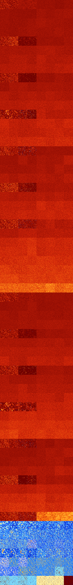

# B1245678 (257024-257535)

<details>
    <summary>Initial Grid</summary>
    
</details>


<details>
    <summary>Initial Grid RLE</summary>

```
#C Exported from GoGoL (https://github.com/marrow16/gogol)
#C Wrap mode: Toroidal
#C Boundary mode: Dead
#C Step: 0
x = 100, y = 100, rule = B1245678/S
3bobo2bo6bo48bobo4bo$47bo4bo$bo52bobo27bo$2bo26b2o67b2o$15bo19bo41b2o$
17bo2bobo3b2o5bo17bo3bo22b2obo$5bo31bo31bo19bo3bo4bo$3bo24bo4b2o6bo25bo
3bobo$o5bo22bo34bo26bo$bo7bobo19bo2bobo22bo32bo$7bo30bo26bo6bo22bo$42bo
5bo25bo11b2o$43bo25bo3bo10bo6bo$27bobo64bobo$18bo2bo38bo15bo14bo$19bobo
13bo3bo19bo3bo24bo$54bo22bo$9bo18bobo7bo15bo10bo17bo14bo$38b2obo27bo17b
o$89bo8bo$bo7bo29bo3bobo36bo$12b2o8bo7bo6bo5bo6bo20bo6bo$5bo4bo$bo18bo
14bo9bo22bo19bo$15bo14bo9bo10bo9bo4bo7bo9bo$6bo2bo39bo$6bo8bo38bo10bo6b
o22bo$46bo11bo12bo25bo$7bo11bo28bobo35bo8bo$11b2o14bo54bo7bo$o30bo46bo
5bo$57bo$6b2o38bo16bo10bo$2o10bo23bobo14bo22bo6bo6bo$36bo$15bo61bo5bo7b
o$9b2o77bo$5bo6bo9bo21bo28bo23bo$o14b2o6bo7bo8bo$10bo22bobo6bo20bo14bo
11bo$38bo14bo29bo11bo$7bo50bo5bo28b2o$40bo2bo40bo9bo$38bo$6bo6bo7bo15bo
$8bo12bo23bo24bobo22bo$30bo16bo15bo7bo3bo4bo4bo4bo3bo$16b2o3bo13bo19bo
12b2o27bo$bo25bo32bobo$obo5bo13b2o17bo15bo37bo$7bo15bo$15bo9bo9bo15bo
33bo$70bo9bo$18bo$11bo20bo53bo$8bo51bo20bo$6bo21bo7bo30bo$7bo7bo26bo$o
22b2o2bo10bo19bo3bo3bo$21bo26b3o24bo$20bo14bobo3bo16bo34bo$75bobo4bo8bo
$7bo13bo5bo2bo16bo32bo10bo$32bo2bo24b2o2bo4b2o28bo$4b2o14bo12bo49bob2o$
o46bobo$91bo$9bo3bo43bo12bo14bo$38bo3bo27bo20bo$26bo4bo8bo6bo4bo9bo12bo
5b2o9bo$11bo8bo28bo2bobo44bo$25bobo10bo56bo$6bobo12bo41bo$14bo16bo2bo
23bo$6bo2bo26b2o23bo$30bo6bo15bo3bo38bo$14bo34bo7bo4bo10bo21bo$4bo3bo7b
o5bo63bo$8bo2bo3bo9bo6b2o31bo$44bo9bo28bo$31bo17bo19bo15bo4bo$17bo11bo
19bo26bo9bobo8bo$8bo18bo7bo17bo2bo32bo6bo$15bo23bo4bo$30bo48bo9bo5bo$6b
o4bo3bo8bo30bo26b2obo$3bo11bo3bo7bo9bo26bo5bo9bo9bo$7bo4bo10bo36bo$10bo
24bo8bo$bo28bo7bo25bo$3bo7bo7bo5bo48bo2bo12bo$22bo38bobo24bo$14bo41b2o
3bo2bo2bo6bo$5bo4bo16bo40bo22bo$43bo8bo4bob2obo16bo$15bo9bo20bo15bo25bo
7bo$8bo9bo6bo2bo46bo10b2o$40bo17bo3bo6bo$20bo19bo40bo14bo$45bo8bo5bo34b
o!
```
</details>
<details>
    <summary>Thumbnail</summary>

</details>
<table>
<tr>
    <td><a href="./257024%20S%20Heat%20Map%20Activity.png"></a><br>S (257024)<br>R@34,p2</td>    <td><a href="./257025%20S0%20Heat%20Map%20Activity.png"></a><br>S0 (257025)<br>R@41,p4</td>    <td><a href="./257026%20S1%20Heat%20Map%20Activity.png"></a><br>S1 (257026)<br>G>1000</td>    <td><a href="./257027%20S01%20Heat%20Map%20Activity.png"></a><br>S01 (257027)<br>G>1000</td>    <td><a href="./257028%20S2%20Heat%20Map%20Activity.png"></a><br>S2 (257028)<br>G>1000</td>    <td><a href="./257029%20S02%20Heat%20Map%20Activity.png"></a><br>S02 (257029)<br>G>1000</td>    <td><a href="./257030%20S12%20Heat%20Map%20Activity.png"></a><br>S12 (257030)<br>G>1000</td>    <td><a href="./257031%20S012%20Heat%20Map%20Activity.png"></a><br>S012 (257031)<br>G>1000</td></tr>
<tr>
    <td><a href="./257032%20S3%20Heat%20Map%20Activity.png"></a><br>S3 (257032)<br>G>1000</td>    <td><a href="./257033%20S03%20Heat%20Map%20Activity.png"></a><br>S03 (257033)<br>G>1000</td>    <td><a href="./257034%20S13%20Heat%20Map%20Activity.png"></a><br>S13 (257034)<br>G>1000</td>    <td><a href="./257035%20S013%20Heat%20Map%20Activity.png"></a><br>S013 (257035)<br>G>1000</td>    <td><a href="./257036%20S23%20Heat%20Map%20Activity.png"></a><br>S23 (257036)<br>G>1000</td>    <td><a href="./257037%20S023%20Heat%20Map%20Activity.png"></a><br>S023 (257037)<br>G>1000</td>    <td><a href="./257038%20S123%20Heat%20Map%20Activity.png"></a><br>S123 (257038)<br>G>1000</td>    <td><a href="./257039%20S0123%20Heat%20Map%20Activity.png"></a><br>S0123 (257039)<br>G>1000</td></tr>
<tr>
    <td><a href="./257040%20S4%20Heat%20Map%20Activity.png"></a><br>S4 (257040)<br>G>1000</td>    <td><a href="./257041%20S04%20Heat%20Map%20Activity.png"></a><br>S04 (257041)<br>G>1000</td>    <td><a href="./257042%20S14%20Heat%20Map%20Activity.png"></a><br>S14 (257042)<br>G>1000</td>    <td><a href="./257043%20S014%20Heat%20Map%20Activity.png"></a><br>S014 (257043)<br>G>1000</td>    <td><a href="./257044%20S24%20Heat%20Map%20Activity.png"></a><br>S24 (257044)<br>G>1000</td>    <td><a href="./257045%20S024%20Heat%20Map%20Activity.png"></a><br>S024 (257045)<br>G>1000</td>    <td><a href="./257046%20S124%20Heat%20Map%20Activity.png"></a><br>S124 (257046)<br>G>1000</td>    <td><a href="./257047%20S0124%20Heat%20Map%20Activity.png"></a><br>S0124 (257047)<br>G>1000</td></tr>
<tr>
    <td><a href="./257048%20S34%20Heat%20Map%20Activity.png"></a><br>S34 (257048)<br>G>1000</td>    <td><a href="./257049%20S034%20Heat%20Map%20Activity.png"></a><br>S034 (257049)<br>G>1000</td>    <td><a href="./257050%20S134%20Heat%20Map%20Activity.png"></a><br>S134 (257050)<br>G>1000</td>    <td><a href="./257051%20S0134%20Heat%20Map%20Activity.png"></a><br>S0134 (257051)<br>G>1000</td>    <td><a href="./257052%20S234%20Heat%20Map%20Activity.png"></a><br>S234 (257052)<br>G>1000</td>    <td><a href="./257053%20S0234%20Heat%20Map%20Activity.png"></a><br>S0234 (257053)<br>G>1000</td>    <td><a href="./257054%20S1234%20Heat%20Map%20Activity.png"></a><br>S1234 (257054)<br>G>1000</td>    <td><a href="./257055%20S01234%20Heat%20Map%20Activity.png"></a><br>S01234 (257055)<br>G>1000</td></tr>
<tr>
    <td><a href="./257056%20S5%20Heat%20Map%20Activity.png"></a><br>S5 (257056)<br>R@25,p6</td>    <td><a href="./257057%20S05%20Heat%20Map%20Activity.png"></a><br>S05 (257057)<br>R@20,p2</td>    <td><a href="./257058%20S15%20Heat%20Map%20Activity.png"></a><br>S15 (257058)<br>R@249,p12</td>    <td><a href="./257059%20S015%20Heat%20Map%20Activity.png"></a><br>S015 (257059)<br>R@245,p12</td>    <td><a href="./257060%20S25%20Heat%20Map%20Activity.png"></a><br>S25 (257060)<br>G>1000</td>    <td><a href="./257061%20S025%20Heat%20Map%20Activity.png"></a><br>S025 (257061)<br>G>1000</td>    <td><a href="./257062%20S125%20Heat%20Map%20Activity.png"></a><br>S125 (257062)<br>G>1000</td>    <td><a href="./257063%20S0125%20Heat%20Map%20Activity.png"></a><br>S0125 (257063)<br>G>1000</td></tr>
<tr>
    <td><a href="./257064%20S35%20Heat%20Map%20Activity.png"></a><br>S35 (257064)<br>G>1000</td>    <td><a href="./257065%20S035%20Heat%20Map%20Activity.png"></a><br>S035 (257065)<br>G>1000</td>    <td><a href="./257066%20S135%20Heat%20Map%20Activity.png"></a><br>S135 (257066)<br>G>1000</td>    <td><a href="./257067%20S0135%20Heat%20Map%20Activity.png"></a><br>S0135 (257067)<br>G>1000</td>    <td><a href="./257068%20S235%20Heat%20Map%20Activity.png"></a><br>S235 (257068)<br>G>1000</td>    <td><a href="./257069%20S0235%20Heat%20Map%20Activity.png"></a><br>S0235 (257069)<br>G>1000</td>    <td><a href="./257070%20S1235%20Heat%20Map%20Activity.png"></a><br>S1235 (257070)<br>G>1000</td>    <td><a href="./257071%20S01235%20Heat%20Map%20Activity.png"></a><br>S01235 (257071)<br>G>1000</td></tr>
<tr>
    <td><a href="./257072%20S45%20Heat%20Map%20Activity.png"></a><br>S45 (257072)<br>G>1000</td>    <td><a href="./257073%20S045%20Heat%20Map%20Activity.png"></a><br>S045 (257073)<br>G>1000</td>    <td><a href="./257074%20S145%20Heat%20Map%20Activity.png"></a><br>S145 (257074)<br>G>1000</td>    <td><a href="./257075%20S0145%20Heat%20Map%20Activity.png"></a><br>S0145 (257075)<br>G>1000</td>    <td><a href="./257076%20S245%20Heat%20Map%20Activity.png"></a><br>S245 (257076)<br>G>1000</td>    <td><a href="./257077%20S0245%20Heat%20Map%20Activity.png"></a><br>S0245 (257077)<br>G>1000</td>    <td><a href="./257078%20S1245%20Heat%20Map%20Activity.png"></a><br>S1245 (257078)<br>G>1000</td>    <td><a href="./257079%20S01245%20Heat%20Map%20Activity.png"></a><br>S01245 (257079)<br>G>1000</td></tr>
<tr>
    <td><a href="./257080%20S345%20Heat%20Map%20Activity.png"></a><br>S345 (257080)<br>G>1000</td>    <td><a href="./257081%20S0345%20Heat%20Map%20Activity.png"></a><br>S0345 (257081)<br>G>1000</td>    <td><a href="./257082%20S1345%20Heat%20Map%20Activity.png"></a><br>S1345 (257082)<br>G>1000</td>    <td><a href="./257083%20S01345%20Heat%20Map%20Activity.png"></a><br>S01345 (257083)<br>G>1000</td>    <td><a href="./257084%20S2345%20Heat%20Map%20Activity.png"></a><br>S2345 (257084)<br>G>1000</td>    <td><a href="./257085%20S02345%20Heat%20Map%20Activity.png"></a><br>S02345 (257085)<br>G>1000</td>    <td><a href="./257086%20S12345%20Heat%20Map%20Activity.png"></a><br>S12345 (257086)<br>G>1000</td>    <td><a href="./257087%20S012345%20Heat%20Map%20Activity.png"></a><br>S012345 (257087)<br>G>1000</td></tr>
<tr>
    <td><a href="./257088%20S6%20Heat%20Map%20Activity.png"></a><br>S6 (257088)<br>R@30,p4</td>    <td><a href="./257089%20S06%20Heat%20Map%20Activity.png"></a><br>S06 (257089)<br>R@28,p4</td>    <td><a href="./257090%20S16%20Heat%20Map%20Activity.png"></a><br>S16 (257090)<br>R@269,p120</td>    <td><a href="./257091%20S016%20Heat%20Map%20Activity.png"></a><br>S016 (257091)<br>R@505,p280</td>    <td><a href="./257092%20S26%20Heat%20Map%20Activity.png"></a><br>S26 (257092)<br>G>1000</td>    <td><a href="./257093%20S026%20Heat%20Map%20Activity.png"></a><br>S026 (257093)<br>G>1000</td>    <td><a href="./257094%20S126%20Heat%20Map%20Activity.png"></a><br>S126 (257094)<br>G>1000</td>    <td><a href="./257095%20S0126%20Heat%20Map%20Activity.png"></a><br>S0126 (257095)<br>G>1000</td></tr>
<tr>
    <td><a href="./257096%20S36%20Heat%20Map%20Activity.png"></a><br>S36 (257096)<br>G>1000</td>    <td><a href="./257097%20S036%20Heat%20Map%20Activity.png"></a><br>S036 (257097)<br>G>1000</td>    <td><a href="./257098%20S136%20Heat%20Map%20Activity.png"></a><br>S136 (257098)<br>G>1000</td>    <td><a href="./257099%20S0136%20Heat%20Map%20Activity.png"></a><br>S0136 (257099)<br>G>1000</td>    <td><a href="./257100%20S236%20Heat%20Map%20Activity.png"></a><br>S236 (257100)<br>G>1000</td>    <td><a href="./257101%20S0236%20Heat%20Map%20Activity.png"></a><br>S0236 (257101)<br>G>1000</td>    <td><a href="./257102%20S1236%20Heat%20Map%20Activity.png"></a><br>S1236 (257102)<br>G>1000</td>    <td><a href="./257103%20S01236%20Heat%20Map%20Activity.png"></a><br>S01236 (257103)<br>G>1000</td></tr>
<tr>
    <td><a href="./257104%20S46%20Heat%20Map%20Activity.png"></a><br>S46 (257104)<br>G>1000</td>    <td><a href="./257105%20S046%20Heat%20Map%20Activity.png"></a><br>S046 (257105)<br>G>1000</td>    <td><a href="./257106%20S146%20Heat%20Map%20Activity.png"></a><br>S146 (257106)<br>G>1000</td>    <td><a href="./257107%20S0146%20Heat%20Map%20Activity.png"></a><br>S0146 (257107)<br>G>1000</td>    <td><a href="./257108%20S246%20Heat%20Map%20Activity.png"></a><br>S246 (257108)<br>G>1000</td>    <td><a href="./257109%20S0246%20Heat%20Map%20Activity.png"></a><br>S0246 (257109)<br>G>1000</td>    <td><a href="./257110%20S1246%20Heat%20Map%20Activity.png"></a><br>S1246 (257110)<br>G>1000</td>    <td><a href="./257111%20S01246%20Heat%20Map%20Activity.png"></a><br>S01246 (257111)<br>G>1000</td></tr>
<tr>
    <td><a href="./257112%20S346%20Heat%20Map%20Activity.png"></a><br>S346 (257112)<br>G>1000</td>    <td><a href="./257113%20S0346%20Heat%20Map%20Activity.png"></a><br>S0346 (257113)<br>G>1000</td>    <td><a href="./257114%20S1346%20Heat%20Map%20Activity.png"></a><br>S1346 (257114)<br>G>1000</td>    <td><a href="./257115%20S01346%20Heat%20Map%20Activity.png"></a><br>S01346 (257115)<br>G>1000</td>    <td><a href="./257116%20S2346%20Heat%20Map%20Activity.png"></a><br>S2346 (257116)<br>G>1000</td>    <td><a href="./257117%20S02346%20Heat%20Map%20Activity.png"></a><br>S02346 (257117)<br>G>1000</td>    <td><a href="./257118%20S12346%20Heat%20Map%20Activity.png"></a><br>S12346 (257118)<br>G>1000</td>    <td><a href="./257119%20S012346%20Heat%20Map%20Activity.png"></a><br>S012346 (257119)<br>G>1000</td></tr>
<tr>
    <td><a href="./257120%20S56%20Heat%20Map%20Activity.png"></a><br>S56 (257120)<br>R@62,p4</td>    <td><a href="./257121%20S056%20Heat%20Map%20Activity.png"></a><br>S056 (257121)<br>R@61,p2</td>    <td><a href="./257122%20S156%20Heat%20Map%20Activity.png"></a><br>S156 (257122)<br>R@260,p24</td>    <td><a href="./257123%20S0156%20Heat%20Map%20Activity.png"></a><br>S0156 (257123)<br>G>1000</td>    <td><a href="./257124%20S256%20Heat%20Map%20Activity.png"></a><br>S256 (257124)<br>G>1000</td>    <td><a href="./257125%20S0256%20Heat%20Map%20Activity.png"></a><br>S0256 (257125)<br>G>1000</td>    <td><a href="./257126%20S1256%20Heat%20Map%20Activity.png"></a><br>S1256 (257126)<br>G>1000</td>    <td><a href="./257127%20S01256%20Heat%20Map%20Activity.png"></a><br>S01256 (257127)<br>G>1000</td></tr>
<tr>
    <td><a href="./257128%20S356%20Heat%20Map%20Activity.png"></a><br>S356 (257128)<br>G>1000</td>    <td><a href="./257129%20S0356%20Heat%20Map%20Activity.png"></a><br>S0356 (257129)<br>G>1000</td>    <td><a href="./257130%20S1356%20Heat%20Map%20Activity.png"></a><br>S1356 (257130)<br>G>1000</td>    <td><a href="./257131%20S01356%20Heat%20Map%20Activity.png"></a><br>S01356 (257131)<br>G>1000</td>    <td><a href="./257132%20S2356%20Heat%20Map%20Activity.png"></a><br>S2356 (257132)<br>G>1000</td>    <td><a href="./257133%20S02356%20Heat%20Map%20Activity.png"></a><br>S02356 (257133)<br>G>1000</td>    <td><a href="./257134%20S12356%20Heat%20Map%20Activity.png"></a><br>S12356 (257134)<br>G>1000</td>    <td><a href="./257135%20S012356%20Heat%20Map%20Activity.png"></a><br>S012356 (257135)<br>G>1000</td></tr>
<tr>
    <td><a href="./257136%20S456%20Heat%20Map%20Activity.png"></a><br>S456 (257136)<br>G>1000</td>    <td><a href="./257137%20S0456%20Heat%20Map%20Activity.png"></a><br>S0456 (257137)<br>G>1000</td>    <td><a href="./257138%20S1456%20Heat%20Map%20Activity.png"></a><br>S1456 (257138)<br>G>1000</td>    <td><a href="./257139%20S01456%20Heat%20Map%20Activity.png"></a><br>S01456 (257139)<br>G>1000</td>    <td><a href="./257140%20S2456%20Heat%20Map%20Activity.png"></a><br>S2456 (257140)<br>G>1000</td>    <td><a href="./257141%20S02456%20Heat%20Map%20Activity.png"></a><br>S02456 (257141)<br>G>1000</td>    <td><a href="./257142%20S12456%20Heat%20Map%20Activity.png"></a><br>S12456 (257142)<br>G>1000</td>    <td><a href="./257143%20S012456%20Heat%20Map%20Activity.png"></a><br>S012456 (257143)<br>G>1000</td></tr>
<tr>
    <td><a href="./257144%20S3456%20Heat%20Map%20Activity.png"></a><br>S3456 (257144)<br>G>1000</td>    <td><a href="./257145%20S03456%20Heat%20Map%20Activity.png"></a><br>S03456 (257145)<br>G>1000</td>    <td><a href="./257146%20S13456%20Heat%20Map%20Activity.png"></a><br>S13456 (257146)<br>G>1000</td>    <td><a href="./257147%20S013456%20Heat%20Map%20Activity.png"></a><br>S013456 (257147)<br>G>1000</td>    <td><a href="./257148%20S23456%20Heat%20Map%20Activity.png"></a><br>S23456 (257148)<br>G>1000</td>    <td><a href="./257149%20S023456%20Heat%20Map%20Activity.png"></a><br>S023456 (257149)<br>G>1000</td>    <td><a href="./257150%20S123456%20Heat%20Map%20Activity.png"></a><br>S123456 (257150)<br>G>1000</td>    <td><a href="./257151%20S0123456%20Heat%20Map%20Activity.png"></a><br>S0123456 (257151)<br>G>1000</td></tr>
<tr>
    <td><a href="./257152%20S7%20Heat%20Map%20Activity.png"></a><br>S7 (257152)<br>R@29,p2</td>    <td><a href="./257153%20S07%20Heat%20Map%20Activity.png"></a><br>S07 (257153)<br>R@35,p2</td>    <td><a href="./257154%20S17%20Heat%20Map%20Activity.png"></a><br>S17 (257154)<br>R@91,p4</td>    <td><a href="./257155%20S017%20Heat%20Map%20Activity.png"></a><br>S017 (257155)<br>R@84,p4</td>    <td><a href="./257156%20S27%20Heat%20Map%20Activity.png"></a><br>S27 (257156)<br>G>1000</td>    <td><a href="./257157%20S027%20Heat%20Map%20Activity.png"></a><br>S027 (257157)<br>G>1000</td>    <td><a href="./257158%20S127%20Heat%20Map%20Activity.png"></a><br>S127 (257158)<br>G>1000</td>    <td><a href="./257159%20S0127%20Heat%20Map%20Activity.png"></a><br>S0127 (257159)<br>G>1000</td></tr>
<tr>
    <td><a href="./257160%20S37%20Heat%20Map%20Activity.png"></a><br>S37 (257160)<br>G>1000</td>    <td><a href="./257161%20S037%20Heat%20Map%20Activity.png"></a><br>S037 (257161)<br>G>1000</td>    <td><a href="./257162%20S137%20Heat%20Map%20Activity.png"></a><br>S137 (257162)<br>G>1000</td>    <td><a href="./257163%20S0137%20Heat%20Map%20Activity.png"></a><br>S0137 (257163)<br>G>1000</td>    <td><a href="./257164%20S237%20Heat%20Map%20Activity.png"></a><br>S237 (257164)<br>G>1000</td>    <td><a href="./257165%20S0237%20Heat%20Map%20Activity.png"></a><br>S0237 (257165)<br>G>1000</td>    <td><a href="./257166%20S1237%20Heat%20Map%20Activity.png"></a><br>S1237 (257166)<br>G>1000</td>    <td><a href="./257167%20S01237%20Heat%20Map%20Activity.png"></a><br>S01237 (257167)<br>G>1000</td></tr>
<tr>
    <td><a href="./257168%20S47%20Heat%20Map%20Activity.png"></a><br>S47 (257168)<br>G>1000</td>    <td><a href="./257169%20S047%20Heat%20Map%20Activity.png"></a><br>S047 (257169)<br>G>1000</td>    <td><a href="./257170%20S147%20Heat%20Map%20Activity.png"></a><br>S147 (257170)<br>G>1000</td>    <td><a href="./257171%20S0147%20Heat%20Map%20Activity.png"></a><br>S0147 (257171)<br>G>1000</td>    <td><a href="./257172%20S247%20Heat%20Map%20Activity.png"></a><br>S247 (257172)<br>G>1000</td>    <td><a href="./257173%20S0247%20Heat%20Map%20Activity.png"></a><br>S0247 (257173)<br>G>1000</td>    <td><a href="./257174%20S1247%20Heat%20Map%20Activity.png"></a><br>S1247 (257174)<br>G>1000</td>    <td><a href="./257175%20S01247%20Heat%20Map%20Activity.png"></a><br>S01247 (257175)<br>G>1000</td></tr>
<tr>
    <td><a href="./257176%20S347%20Heat%20Map%20Activity.png"></a><br>S347 (257176)<br>G>1000</td>    <td><a href="./257177%20S0347%20Heat%20Map%20Activity.png"></a><br>S0347 (257177)<br>G>1000</td>    <td><a href="./257178%20S1347%20Heat%20Map%20Activity.png"></a><br>S1347 (257178)<br>G>1000</td>    <td><a href="./257179%20S01347%20Heat%20Map%20Activity.png"></a><br>S01347 (257179)<br>G>1000</td>    <td><a href="./257180%20S2347%20Heat%20Map%20Activity.png"></a><br>S2347 (257180)<br>G>1000</td>    <td><a href="./257181%20S02347%20Heat%20Map%20Activity.png"></a><br>S02347 (257181)<br>G>1000</td>    <td><a href="./257182%20S12347%20Heat%20Map%20Activity.png"></a><br>S12347 (257182)<br>G>1000</td>    <td><a href="./257183%20S012347%20Heat%20Map%20Activity.png"></a><br>S012347 (257183)<br>G>1000</td></tr>
<tr>
    <td><a href="./257184%20S57%20Heat%20Map%20Activity.png"></a><br>S57 (257184)<br>R@20,p2</td>    <td><a href="./257185%20S057%20Heat%20Map%20Activity.png"></a><br>S057 (257185)<br>R@20,p2</td>    <td><a href="./257186%20S157%20Heat%20Map%20Activity.png"></a><br>S157 (257186)<br>R@89,p12</td>    <td><a href="./257187%20S0157%20Heat%20Map%20Activity.png"></a><br>S0157 (257187)<br>R@164,p72</td>    <td><a href="./257188%20S257%20Heat%20Map%20Activity.png"></a><br>S257 (257188)<br>G>1000</td>    <td><a href="./257189%20S0257%20Heat%20Map%20Activity.png"></a><br>S0257 (257189)<br>G>1000</td>    <td><a href="./257190%20S1257%20Heat%20Map%20Activity.png"></a><br>S1257 (257190)<br>G>1000</td>    <td><a href="./257191%20S01257%20Heat%20Map%20Activity.png"></a><br>S01257 (257191)<br>G>1000</td></tr>
<tr>
    <td><a href="./257192%20S357%20Heat%20Map%20Activity.png"></a><br>S357 (257192)<br>G>1000</td>    <td><a href="./257193%20S0357%20Heat%20Map%20Activity.png"></a><br>S0357 (257193)<br>G>1000</td>    <td><a href="./257194%20S1357%20Heat%20Map%20Activity.png"></a><br>S1357 (257194)<br>G>1000</td>    <td><a href="./257195%20S01357%20Heat%20Map%20Activity.png"></a><br>S01357 (257195)<br>G>1000</td>    <td><a href="./257196%20S2357%20Heat%20Map%20Activity.png"></a><br>S2357 (257196)<br>G>1000</td>    <td><a href="./257197%20S02357%20Heat%20Map%20Activity.png"></a><br>S02357 (257197)<br>G>1000</td>    <td><a href="./257198%20S12357%20Heat%20Map%20Activity.png"></a><br>S12357 (257198)<br>G>1000</td>    <td><a href="./257199%20S012357%20Heat%20Map%20Activity.png"></a><br>S012357 (257199)<br>G>1000</td></tr>
<tr>
    <td><a href="./257200%20S457%20Heat%20Map%20Activity.png"></a><br>S457 (257200)<br>G>1000</td>    <td><a href="./257201%20S0457%20Heat%20Map%20Activity.png"></a><br>S0457 (257201)<br>G>1000</td>    <td><a href="./257202%20S1457%20Heat%20Map%20Activity.png"></a><br>S1457 (257202)<br>G>1000</td>    <td><a href="./257203%20S01457%20Heat%20Map%20Activity.png"></a><br>S01457 (257203)<br>G>1000</td>    <td><a href="./257204%20S2457%20Heat%20Map%20Activity.png"></a><br>S2457 (257204)<br>G>1000</td>    <td><a href="./257205%20S02457%20Heat%20Map%20Activity.png"></a><br>S02457 (257205)<br>G>1000</td>    <td><a href="./257206%20S12457%20Heat%20Map%20Activity.png"></a><br>S12457 (257206)<br>G>1000</td>    <td><a href="./257207%20S012457%20Heat%20Map%20Activity.png"></a><br>S012457 (257207)<br>G>1000</td></tr>
<tr>
    <td><a href="./257208%20S3457%20Heat%20Map%20Activity.png"></a><br>S3457 (257208)<br>G>1000</td>    <td><a href="./257209%20S03457%20Heat%20Map%20Activity.png"></a><br>S03457 (257209)<br>G>1000</td>    <td><a href="./257210%20S13457%20Heat%20Map%20Activity.png"></a><br>S13457 (257210)<br>G>1000</td>    <td><a href="./257211%20S013457%20Heat%20Map%20Activity.png"></a><br>S013457 (257211)<br>G>1000</td>    <td><a href="./257212%20S23457%20Heat%20Map%20Activity.png"></a><br>S23457 (257212)<br>G>1000</td>    <td><a href="./257213%20S023457%20Heat%20Map%20Activity.png"></a><br>S023457 (257213)<br>G>1000</td>    <td><a href="./257214%20S123457%20Heat%20Map%20Activity.png"></a><br>S123457 (257214)<br>G>1000</td>    <td><a href="./257215%20S0123457%20Heat%20Map%20Activity.png"></a><br>S0123457 (257215)<br>G>1000</td></tr>
<tr>
    <td><a href="./257216%20S67%20Heat%20Map%20Activity.png"></a><br>S67 (257216)<br>R@25,p4</td>    <td><a href="./257217%20S067%20Heat%20Map%20Activity.png"></a><br>S067 (257217)<br>R@23,p2</td>    <td><a href="./257218%20S167%20Heat%20Map%20Activity.png"></a><br>S167 (257218)<br>R@40,p12</td>    <td><a href="./257219%20S0167%20Heat%20Map%20Activity.png"></a><br>S0167 (257219)<br>R@44,p12</td>    <td><a href="./257220%20S267%20Heat%20Map%20Activity.png"></a><br>S267 (257220)<br>G>1000</td>    <td><a href="./257221%20S0267%20Heat%20Map%20Activity.png"></a><br>S0267 (257221)<br>G>1000</td>    <td><a href="./257222%20S1267%20Heat%20Map%20Activity.png"></a><br>S1267 (257222)<br>G>1000</td>    <td><a href="./257223%20S01267%20Heat%20Map%20Activity.png"></a><br>S01267 (257223)<br>G>1000</td></tr>
<tr>
    <td><a href="./257224%20S367%20Heat%20Map%20Activity.png"></a><br>S367 (257224)<br>G>1000</td>    <td><a href="./257225%20S0367%20Heat%20Map%20Activity.png"></a><br>S0367 (257225)<br>G>1000</td>    <td><a href="./257226%20S1367%20Heat%20Map%20Activity.png"></a><br>S1367 (257226)<br>G>1000</td>    <td><a href="./257227%20S01367%20Heat%20Map%20Activity.png"></a><br>S01367 (257227)<br>G>1000</td>    <td><a href="./257228%20S2367%20Heat%20Map%20Activity.png"></a><br>S2367 (257228)<br>G>1000</td>    <td><a href="./257229%20S02367%20Heat%20Map%20Activity.png"></a><br>S02367 (257229)<br>G>1000</td>    <td><a href="./257230%20S12367%20Heat%20Map%20Activity.png"></a><br>S12367 (257230)<br>G>1000</td>    <td><a href="./257231%20S012367%20Heat%20Map%20Activity.png"></a><br>S012367 (257231)<br>G>1000</td></tr>
<tr>
    <td><a href="./257232%20S467%20Heat%20Map%20Activity.png"></a><br>S467 (257232)<br>G>1000</td>    <td><a href="./257233%20S0467%20Heat%20Map%20Activity.png"></a><br>S0467 (257233)<br>G>1000</td>    <td><a href="./257234%20S1467%20Heat%20Map%20Activity.png"></a><br>S1467 (257234)<br>G>1000</td>    <td><a href="./257235%20S01467%20Heat%20Map%20Activity.png"></a><br>S01467 (257235)<br>G>1000</td>    <td><a href="./257236%20S2467%20Heat%20Map%20Activity.png"></a><br>S2467 (257236)<br>G>1000</td>    <td><a href="./257237%20S02467%20Heat%20Map%20Activity.png"></a><br>S02467 (257237)<br>G>1000</td>    <td><a href="./257238%20S12467%20Heat%20Map%20Activity.png"></a><br>S12467 (257238)<br>G>1000</td>    <td><a href="./257239%20S012467%20Heat%20Map%20Activity.png"></a><br>S012467 (257239)<br>G>1000</td></tr>
<tr>
    <td><a href="./257240%20S3467%20Heat%20Map%20Activity.png"></a><br>S3467 (257240)<br>G>1000</td>    <td><a href="./257241%20S03467%20Heat%20Map%20Activity.png"></a><br>S03467 (257241)<br>G>1000</td>    <td><a href="./257242%20S13467%20Heat%20Map%20Activity.png"></a><br>S13467 (257242)<br>G>1000</td>    <td><a href="./257243%20S013467%20Heat%20Map%20Activity.png"></a><br>S013467 (257243)<br>G>1000</td>    <td><a href="./257244%20S23467%20Heat%20Map%20Activity.png"></a><br>S23467 (257244)<br>G>1000</td>    <td><a href="./257245%20S023467%20Heat%20Map%20Activity.png"></a><br>S023467 (257245)<br>G>1000</td>    <td><a href="./257246%20S123467%20Heat%20Map%20Activity.png"></a><br>S123467 (257246)<br>G>1000</td>    <td><a href="./257247%20S0123467%20Heat%20Map%20Activity.png"></a><br>S0123467 (257247)<br>G>1000</td></tr>
<tr>
    <td><a href="./257248%20S567%20Heat%20Map%20Activity.png"></a><br>S567 (257248)<br>G>1000</td>    <td><a href="./257249%20S0567%20Heat%20Map%20Activity.png"></a><br>S0567 (257249)<br>G>1000</td>    <td><a href="./257250%20S1567%20Heat%20Map%20Activity.png"></a><br>S1567 (257250)<br>G>1000</td>    <td><a href="./257251%20S01567%20Heat%20Map%20Activity.png"></a><br>S01567 (257251)<br>G>1000</td>    <td><a href="./257252%20S2567%20Heat%20Map%20Activity.png"></a><br>S2567 (257252)<br>G>1000</td>    <td><a href="./257253%20S02567%20Heat%20Map%20Activity.png"></a><br>S02567 (257253)<br>G>1000</td>    <td><a href="./257254%20S12567%20Heat%20Map%20Activity.png"></a><br>S12567 (257254)<br>G>1000</td>    <td><a href="./257255%20S012567%20Heat%20Map%20Activity.png"></a><br>S012567 (257255)<br>G>1000</td></tr>
<tr>
    <td><a href="./257256%20S3567%20Heat%20Map%20Activity.png"></a><br>S3567 (257256)<br>G>1000</td>    <td><a href="./257257%20S03567%20Heat%20Map%20Activity.png"></a><br>S03567 (257257)<br>G>1000</td>    <td><a href="./257258%20S13567%20Heat%20Map%20Activity.png"></a><br>S13567 (257258)<br>G>1000</td>    <td><a href="./257259%20S013567%20Heat%20Map%20Activity.png"></a><br>S013567 (257259)<br>G>1000</td>    <td><a href="./257260%20S23567%20Heat%20Map%20Activity.png"></a><br>S23567 (257260)<br>G>1000</td>    <td><a href="./257261%20S023567%20Heat%20Map%20Activity.png"></a><br>S023567 (257261)<br>G>1000</td>    <td><a href="./257262%20S123567%20Heat%20Map%20Activity.png"></a><br>S123567 (257262)<br>G>1000</td>    <td><a href="./257263%20S0123567%20Heat%20Map%20Activity.png"></a><br>S0123567 (257263)<br>G>1000</td></tr>
<tr>
    <td><a href="./257264%20S4567%20Heat%20Map%20Activity.png"></a><br>S4567 (257264)<br>G>1000</td>    <td><a href="./257265%20S04567%20Heat%20Map%20Activity.png"></a><br>S04567 (257265)<br>G>1000</td>    <td><a href="./257266%20S14567%20Heat%20Map%20Activity.png"></a><br>S14567 (257266)<br>G>1000</td>    <td><a href="./257267%20S014567%20Heat%20Map%20Activity.png"></a><br>S014567 (257267)<br>G>1000</td>    <td><a href="./257268%20S24567%20Heat%20Map%20Activity.png"></a><br>S24567 (257268)<br>G>1000</td>    <td><a href="./257269%20S024567%20Heat%20Map%20Activity.png"></a><br>S024567 (257269)<br>G>1000</td>    <td><a href="./257270%20S124567%20Heat%20Map%20Activity.png"></a><br>S124567 (257270)<br>G>1000</td>    <td><a href="./257271%20S0124567%20Heat%20Map%20Activity.png"></a><br>S0124567 (257271)<br>G>1000</td></tr>
<tr>
    <td><a href="./257272%20S34567%20Heat%20Map%20Activity.png"></a><br>S34567 (257272)<br>G>1000</td>    <td><a href="./257273%20S034567%20Heat%20Map%20Activity.png"></a><br>S034567 (257273)<br>G>1000</td>    <td><a href="./257274%20S134567%20Heat%20Map%20Activity.png"></a><br>S134567 (257274)<br>G>1000</td>    <td><a href="./257275%20S0134567%20Heat%20Map%20Activity.png"></a><br>S0134567 (257275)<br>G>1000</td>    <td><a href="./257276%20S234567%20Heat%20Map%20Activity.png"></a><br>S234567 (257276)<br>G>1000</td>    <td><a href="./257277%20S0234567%20Heat%20Map%20Activity.png"></a><br>S0234567 (257277)<br>G>1000</td>    <td><a href="./257278%20S1234567%20Heat%20Map%20Activity.png"></a><br>S1234567 (257278)<br>G>1000</td>    <td><a href="./257279%20S01234567%20Heat%20Map%20Activity.png"></a><br>S01234567 (257279)<br>G>1000</td></tr>
<tr>
    <td><a href="./257280%20S8%20Heat%20Map%20Activity.png"></a><br>S8 (257280)<br>R@34,p2</td>    <td><a href="./257281%20S08%20Heat%20Map%20Activity.png"></a><br>S08 (257281)<br>R@42,p2</td>    <td><a href="./257282%20S18%20Heat%20Map%20Activity.png"></a><br>S18 (257282)<br>G>1000</td>    <td><a href="./257283%20S018%20Heat%20Map%20Activity.png"></a><br>S018 (257283)<br>G>1000</td>    <td><a href="./257284%20S28%20Heat%20Map%20Activity.png"></a><br>S28 (257284)<br>G>1000</td>    <td><a href="./257285%20S028%20Heat%20Map%20Activity.png"></a><br>S028 (257285)<br>G>1000</td>    <td><a href="./257286%20S128%20Heat%20Map%20Activity.png"></a><br>S128 (257286)<br>G>1000</td>    <td><a href="./257287%20S0128%20Heat%20Map%20Activity.png"></a><br>S0128 (257287)<br>G>1000</td></tr>
<tr>
    <td><a href="./257288%20S38%20Heat%20Map%20Activity.png"></a><br>S38 (257288)<br>G>1000</td>    <td><a href="./257289%20S038%20Heat%20Map%20Activity.png"></a><br>S038 (257289)<br>G>1000</td>    <td><a href="./257290%20S138%20Heat%20Map%20Activity.png"></a><br>S138 (257290)<br>G>1000</td>    <td><a href="./257291%20S0138%20Heat%20Map%20Activity.png"></a><br>S0138 (257291)<br>G>1000</td>    <td><a href="./257292%20S238%20Heat%20Map%20Activity.png"></a><br>S238 (257292)<br>G>1000</td>    <td><a href="./257293%20S0238%20Heat%20Map%20Activity.png"></a><br>S0238 (257293)<br>G>1000</td>    <td><a href="./257294%20S1238%20Heat%20Map%20Activity.png"></a><br>S1238 (257294)<br>G>1000</td>    <td><a href="./257295%20S01238%20Heat%20Map%20Activity.png"></a><br>S01238 (257295)<br>G>1000</td></tr>
<tr>
    <td><a href="./257296%20S48%20Heat%20Map%20Activity.png"></a><br>S48 (257296)<br>G>1000</td>    <td><a href="./257297%20S048%20Heat%20Map%20Activity.png"></a><br>S048 (257297)<br>G>1000</td>    <td><a href="./257298%20S148%20Heat%20Map%20Activity.png"></a><br>S148 (257298)<br>G>1000</td>    <td><a href="./257299%20S0148%20Heat%20Map%20Activity.png"></a><br>S0148 (257299)<br>G>1000</td>    <td><a href="./257300%20S248%20Heat%20Map%20Activity.png"></a><br>S248 (257300)<br>G>1000</td>    <td><a href="./257301%20S0248%20Heat%20Map%20Activity.png"></a><br>S0248 (257301)<br>G>1000</td>    <td><a href="./257302%20S1248%20Heat%20Map%20Activity.png"></a><br>S1248 (257302)<br>G>1000</td>    <td><a href="./257303%20S01248%20Heat%20Map%20Activity.png"></a><br>S01248 (257303)<br>G>1000</td></tr>
<tr>
    <td><a href="./257304%20S348%20Heat%20Map%20Activity.png"></a><br>S348 (257304)<br>G>1000</td>    <td><a href="./257305%20S0348%20Heat%20Map%20Activity.png"></a><br>S0348 (257305)<br>G>1000</td>    <td><a href="./257306%20S1348%20Heat%20Map%20Activity.png"></a><br>S1348 (257306)<br>G>1000</td>    <td><a href="./257307%20S01348%20Heat%20Map%20Activity.png"></a><br>S01348 (257307)<br>G>1000</td>    <td><a href="./257308%20S2348%20Heat%20Map%20Activity.png"></a><br>S2348 (257308)<br>G>1000</td>    <td><a href="./257309%20S02348%20Heat%20Map%20Activity.png"></a><br>S02348 (257309)<br>G>1000</td>    <td><a href="./257310%20S12348%20Heat%20Map%20Activity.png"></a><br>S12348 (257310)<br>G>1000</td>    <td><a href="./257311%20S012348%20Heat%20Map%20Activity.png"></a><br>S012348 (257311)<br>G>1000</td></tr>
<tr>
    <td><a href="./257312%20S58%20Heat%20Map%20Activity.png"></a><br>S58 (257312)<br>R@28,p6</td>    <td><a href="./257313%20S058%20Heat%20Map%20Activity.png"></a><br>S058 (257313)<br>R@30,p2</td>    <td><a href="./257314%20S158%20Heat%20Map%20Activity.png"></a><br>S158 (257314)<br>R@241,p24</td>    <td><a href="./257315%20S0158%20Heat%20Map%20Activity.png"></a><br>S0158 (257315)<br>R@272,p24</td>    <td><a href="./257316%20S258%20Heat%20Map%20Activity.png"></a><br>S258 (257316)<br>G>1000</td>    <td><a href="./257317%20S0258%20Heat%20Map%20Activity.png"></a><br>S0258 (257317)<br>G>1000</td>    <td><a href="./257318%20S1258%20Heat%20Map%20Activity.png"></a><br>S1258 (257318)<br>G>1000</td>    <td><a href="./257319%20S01258%20Heat%20Map%20Activity.png"></a><br>S01258 (257319)<br>G>1000</td></tr>
<tr>
    <td><a href="./257320%20S358%20Heat%20Map%20Activity.png"></a><br>S358 (257320)<br>G>1000</td>    <td><a href="./257321%20S0358%20Heat%20Map%20Activity.png"></a><br>S0358 (257321)<br>G>1000</td>    <td><a href="./257322%20S1358%20Heat%20Map%20Activity.png"></a><br>S1358 (257322)<br>G>1000</td>    <td><a href="./257323%20S01358%20Heat%20Map%20Activity.png"></a><br>S01358 (257323)<br>G>1000</td>    <td><a href="./257324%20S2358%20Heat%20Map%20Activity.png"></a><br>S2358 (257324)<br>G>1000</td>    <td><a href="./257325%20S02358%20Heat%20Map%20Activity.png"></a><br>S02358 (257325)<br>G>1000</td>    <td><a href="./257326%20S12358%20Heat%20Map%20Activity.png"></a><br>S12358 (257326)<br>G>1000</td>    <td><a href="./257327%20S012358%20Heat%20Map%20Activity.png"></a><br>S012358 (257327)<br>G>1000</td></tr>
<tr>
    <td><a href="./257328%20S458%20Heat%20Map%20Activity.png"></a><br>S458 (257328)<br>G>1000</td>    <td><a href="./257329%20S0458%20Heat%20Map%20Activity.png"></a><br>S0458 (257329)<br>G>1000</td>    <td><a href="./257330%20S1458%20Heat%20Map%20Activity.png"></a><br>S1458 (257330)<br>G>1000</td>    <td><a href="./257331%20S01458%20Heat%20Map%20Activity.png"></a><br>S01458 (257331)<br>G>1000</td>    <td><a href="./257332%20S2458%20Heat%20Map%20Activity.png"></a><br>S2458 (257332)<br>G>1000</td>    <td><a href="./257333%20S02458%20Heat%20Map%20Activity.png"></a><br>S02458 (257333)<br>G>1000</td>    <td><a href="./257334%20S12458%20Heat%20Map%20Activity.png"></a><br>S12458 (257334)<br>G>1000</td>    <td><a href="./257335%20S012458%20Heat%20Map%20Activity.png"></a><br>S012458 (257335)<br>G>1000</td></tr>
<tr>
    <td><a href="./257336%20S3458%20Heat%20Map%20Activity.png"></a><br>S3458 (257336)<br>G>1000</td>    <td><a href="./257337%20S03458%20Heat%20Map%20Activity.png"></a><br>S03458 (257337)<br>G>1000</td>    <td><a href="./257338%20S13458%20Heat%20Map%20Activity.png"></a><br>S13458 (257338)<br>G>1000</td>    <td><a href="./257339%20S013458%20Heat%20Map%20Activity.png"></a><br>S013458 (257339)<br>G>1000</td>    <td><a href="./257340%20S23458%20Heat%20Map%20Activity.png"></a><br>S23458 (257340)<br>G>1000</td>    <td><a href="./257341%20S023458%20Heat%20Map%20Activity.png"></a><br>S023458 (257341)<br>G>1000</td>    <td><a href="./257342%20S123458%20Heat%20Map%20Activity.png"></a><br>S123458 (257342)<br>G>1000</td>    <td><a href="./257343%20S0123458%20Heat%20Map%20Activity.png"></a><br>S0123458 (257343)<br>G>1000</td></tr>
<tr>
    <td><a href="./257344%20S68%20Heat%20Map%20Activity.png"></a><br>S68 (257344)<br>R@30,p4</td>    <td><a href="./257345%20S068%20Heat%20Map%20Activity.png"></a><br>S068 (257345)<br>R@24,p2</td>    <td><a href="./257346%20S168%20Heat%20Map%20Activity.png"></a><br>S168 (257346)<br>G>1000</td>    <td><a href="./257347%20S0168%20Heat%20Map%20Activity.png"></a><br>S0168 (257347)<br>G>1000</td>    <td><a href="./257348%20S268%20Heat%20Map%20Activity.png"></a><br>S268 (257348)<br>G>1000</td>    <td><a href="./257349%20S0268%20Heat%20Map%20Activity.png"></a><br>S0268 (257349)<br>G>1000</td>    <td><a href="./257350%20S1268%20Heat%20Map%20Activity.png"></a><br>S1268 (257350)<br>G>1000</td>    <td><a href="./257351%20S01268%20Heat%20Map%20Activity.png"></a><br>S01268 (257351)<br>G>1000</td></tr>
<tr>
    <td><a href="./257352%20S368%20Heat%20Map%20Activity.png"></a><br>S368 (257352)<br>G>1000</td>    <td><a href="./257353%20S0368%20Heat%20Map%20Activity.png"></a><br>S0368 (257353)<br>G>1000</td>    <td><a href="./257354%20S1368%20Heat%20Map%20Activity.png"></a><br>S1368 (257354)<br>G>1000</td>    <td><a href="./257355%20S01368%20Heat%20Map%20Activity.png"></a><br>S01368 (257355)<br>G>1000</td>    <td><a href="./257356%20S2368%20Heat%20Map%20Activity.png"></a><br>S2368 (257356)<br>G>1000</td>    <td><a href="./257357%20S02368%20Heat%20Map%20Activity.png"></a><br>S02368 (257357)<br>G>1000</td>    <td><a href="./257358%20S12368%20Heat%20Map%20Activity.png"></a><br>S12368 (257358)<br>G>1000</td>    <td><a href="./257359%20S012368%20Heat%20Map%20Activity.png"></a><br>S012368 (257359)<br>G>1000</td></tr>
<tr>
    <td><a href="./257360%20S468%20Heat%20Map%20Activity.png"></a><br>S468 (257360)<br>G>1000</td>    <td><a href="./257361%20S0468%20Heat%20Map%20Activity.png"></a><br>S0468 (257361)<br>G>1000</td>    <td><a href="./257362%20S1468%20Heat%20Map%20Activity.png"></a><br>S1468 (257362)<br>G>1000</td>    <td><a href="./257363%20S01468%20Heat%20Map%20Activity.png"></a><br>S01468 (257363)<br>G>1000</td>    <td><a href="./257364%20S2468%20Heat%20Map%20Activity.png"></a><br>S2468 (257364)<br>G>1000</td>    <td><a href="./257365%20S02468%20Heat%20Map%20Activity.png"></a><br>S02468 (257365)<br>G>1000</td>    <td><a href="./257366%20S12468%20Heat%20Map%20Activity.png"></a><br>S12468 (257366)<br>G>1000</td>    <td><a href="./257367%20S012468%20Heat%20Map%20Activity.png"></a><br>S012468 (257367)<br>G>1000</td></tr>
<tr>
    <td><a href="./257368%20S3468%20Heat%20Map%20Activity.png"></a><br>S3468 (257368)<br>G>1000</td>    <td><a href="./257369%20S03468%20Heat%20Map%20Activity.png"></a><br>S03468 (257369)<br>G>1000</td>    <td><a href="./257370%20S13468%20Heat%20Map%20Activity.png"></a><br>S13468 (257370)<br>G>1000</td>    <td><a href="./257371%20S013468%20Heat%20Map%20Activity.png"></a><br>S013468 (257371)<br>G>1000</td>    <td><a href="./257372%20S23468%20Heat%20Map%20Activity.png"></a><br>S23468 (257372)<br>G>1000</td>    <td><a href="./257373%20S023468%20Heat%20Map%20Activity.png"></a><br>S023468 (257373)<br>G>1000</td>    <td><a href="./257374%20S123468%20Heat%20Map%20Activity.png"></a><br>S123468 (257374)<br>G>1000</td>    <td><a href="./257375%20S0123468%20Heat%20Map%20Activity.png"></a><br>S0123468 (257375)<br>G>1000</td></tr>
<tr>
    <td><a href="./257376%20S568%20Heat%20Map%20Activity.png"></a><br>S568 (257376)<br>R@101,p4</td>    <td><a href="./257377%20S0568%20Heat%20Map%20Activity.png"></a><br>S0568 (257377)<br>R@119,p12</td>    <td><a href="./257378%20S1568%20Heat%20Map%20Activity.png"></a><br>S1568 (257378)<br>G>1000</td>    <td><a href="./257379%20S01568%20Heat%20Map%20Activity.png"></a><br>S01568 (257379)<br>R@857,p12</td>    <td><a href="./257380%20S2568%20Heat%20Map%20Activity.png"></a><br>S2568 (257380)<br>G>1000</td>    <td><a href="./257381%20S02568%20Heat%20Map%20Activity.png"></a><br>S02568 (257381)<br>G>1000</td>    <td><a href="./257382%20S12568%20Heat%20Map%20Activity.png"></a><br>S12568 (257382)<br>G>1000</td>    <td><a href="./257383%20S012568%20Heat%20Map%20Activity.png"></a><br>S012568 (257383)<br>G>1000</td></tr>
<tr>
    <td><a href="./257384%20S3568%20Heat%20Map%20Activity.png"></a><br>S3568 (257384)<br>G>1000</td>    <td><a href="./257385%20S03568%20Heat%20Map%20Activity.png"></a><br>S03568 (257385)<br>G>1000</td>    <td><a href="./257386%20S13568%20Heat%20Map%20Activity.png"></a><br>S13568 (257386)<br>G>1000</td>    <td><a href="./257387%20S013568%20Heat%20Map%20Activity.png"></a><br>S013568 (257387)<br>G>1000</td>    <td><a href="./257388%20S23568%20Heat%20Map%20Activity.png"></a><br>S23568 (257388)<br>G>1000</td>    <td><a href="./257389%20S023568%20Heat%20Map%20Activity.png"></a><br>S023568 (257389)<br>G>1000</td>    <td><a href="./257390%20S123568%20Heat%20Map%20Activity.png"></a><br>S123568 (257390)<br>G>1000</td>    <td><a href="./257391%20S0123568%20Heat%20Map%20Activity.png"></a><br>S0123568 (257391)<br>G>1000</td></tr>
<tr>
    <td><a href="./257392%20S4568%20Heat%20Map%20Activity.png"></a><br>S4568 (257392)<br>G>1000</td>    <td><a href="./257393%20S04568%20Heat%20Map%20Activity.png"></a><br>S04568 (257393)<br>G>1000</td>    <td><a href="./257394%20S14568%20Heat%20Map%20Activity.png"></a><br>S14568 (257394)<br>G>1000</td>    <td><a href="./257395%20S014568%20Heat%20Map%20Activity.png"></a><br>S014568 (257395)<br>G>1000</td>    <td><a href="./257396%20S24568%20Heat%20Map%20Activity.png"></a><br>S24568 (257396)<br>G>1000</td>    <td><a href="./257397%20S024568%20Heat%20Map%20Activity.png"></a><br>S024568 (257397)<br>G>1000</td>    <td><a href="./257398%20S124568%20Heat%20Map%20Activity.png"></a><br>S124568 (257398)<br>G>1000</td>    <td><a href="./257399%20S0124568%20Heat%20Map%20Activity.png"></a><br>S0124568 (257399)<br>G>1000</td></tr>
<tr>
    <td><a href="./257400%20S34568%20Heat%20Map%20Activity.png"></a><br>S34568 (257400)<br>G>1000</td>    <td><a href="./257401%20S034568%20Heat%20Map%20Activity.png"></a><br>S034568 (257401)<br>G>1000</td>    <td><a href="./257402%20S134568%20Heat%20Map%20Activity.png"></a><br>S134568 (257402)<br>G>1000</td>    <td><a href="./257403%20S0134568%20Heat%20Map%20Activity.png"></a><br>S0134568 (257403)<br>G>1000</td>    <td><a href="./257404%20S234568%20Heat%20Map%20Activity.png"></a><br>S234568 (257404)<br>G>1000</td>    <td><a href="./257405%20S0234568%20Heat%20Map%20Activity.png"></a><br>S0234568 (257405)<br>G>1000</td>    <td><a href="./257406%20S1234568%20Heat%20Map%20Activity.png"></a><br>S1234568 (257406)<br>G>1000</td>    <td><a href="./257407%20S01234568%20Heat%20Map%20Activity.png"></a><br>S01234568 (257407)<br>G>1000</td></tr>
<tr>
    <td><a href="./257408%20S78%20Heat%20Map%20Activity.png"></a><br>S78 (257408)<br>R@29,p2</td>    <td><a href="./257409%20S078%20Heat%20Map%20Activity.png"></a><br>S078 (257409)<br>R@37,p6</td>    <td><a href="./257410%20S178%20Heat%20Map%20Activity.png"></a><br>S178 (257410)<br>R@84,p4</td>    <td><a href="./257411%20S0178%20Heat%20Map%20Activity.png"></a><br>S0178 (257411)<br>R@101,p4</td>    <td><a href="./257412%20S278%20Heat%20Map%20Activity.png"></a><br>S278 (257412)<br>G>1000</td>    <td><a href="./257413%20S0278%20Heat%20Map%20Activity.png"></a><br>S0278 (257413)<br>G>1000</td>    <td><a href="./257414%20S1278%20Heat%20Map%20Activity.png"></a><br>S1278 (257414)<br>G>1000</td>    <td><a href="./257415%20S01278%20Heat%20Map%20Activity.png"></a><br>S01278 (257415)<br>G>1000</td></tr>
<tr>
    <td><a href="./257416%20S378%20Heat%20Map%20Activity.png"></a><br>S378 (257416)<br>G>1000</td>    <td><a href="./257417%20S0378%20Heat%20Map%20Activity.png"></a><br>S0378 (257417)<br>G>1000</td>    <td><a href="./257418%20S1378%20Heat%20Map%20Activity.png"></a><br>S1378 (257418)<br>G>1000</td>    <td><a href="./257419%20S01378%20Heat%20Map%20Activity.png"></a><br>S01378 (257419)<br>G>1000</td>    <td><a href="./257420%20S2378%20Heat%20Map%20Activity.png"></a><br>S2378 (257420)<br>G>1000</td>    <td><a href="./257421%20S02378%20Heat%20Map%20Activity.png"></a><br>S02378 (257421)<br>G>1000</td>    <td><a href="./257422%20S12378%20Heat%20Map%20Activity.png"></a><br>S12378 (257422)<br>G>1000</td>    <td><a href="./257423%20S012378%20Heat%20Map%20Activity.png"></a><br>S012378 (257423)<br>G>1000</td></tr>
<tr>
    <td><a href="./257424%20S478%20Heat%20Map%20Activity.png"></a><br>S478 (257424)<br>G>1000</td>    <td><a href="./257425%20S0478%20Heat%20Map%20Activity.png"></a><br>S0478 (257425)<br>G>1000</td>    <td><a href="./257426%20S1478%20Heat%20Map%20Activity.png"></a><br>S1478 (257426)<br>G>1000</td>    <td><a href="./257427%20S01478%20Heat%20Map%20Activity.png"></a><br>S01478 (257427)<br>G>1000</td>    <td><a href="./257428%20S2478%20Heat%20Map%20Activity.png"></a><br>S2478 (257428)<br>G>1000</td>    <td><a href="./257429%20S02478%20Heat%20Map%20Activity.png"></a><br>S02478 (257429)<br>G>1000</td>    <td><a href="./257430%20S12478%20Heat%20Map%20Activity.png"></a><br>S12478 (257430)<br>G>1000</td>    <td><a href="./257431%20S012478%20Heat%20Map%20Activity.png"></a><br>S012478 (257431)<br>G>1000</td></tr>
<tr>
    <td><a href="./257432%20S3478%20Heat%20Map%20Activity.png"></a><br>S3478 (257432)<br>G>1000</td>    <td><a href="./257433%20S03478%20Heat%20Map%20Activity.png"></a><br>S03478 (257433)<br>G>1000</td>    <td><a href="./257434%20S13478%20Heat%20Map%20Activity.png"></a><br>S13478 (257434)<br>G>1000</td>    <td><a href="./257435%20S013478%20Heat%20Map%20Activity.png"></a><br>S013478 (257435)<br>G>1000</td>    <td><a href="./257436%20S23478%20Heat%20Map%20Activity.png"></a><br>S23478 (257436)<br>G>1000</td>    <td><a href="./257437%20S023478%20Heat%20Map%20Activity.png"></a><br>S023478 (257437)<br>G>1000</td>    <td><a href="./257438%20S123478%20Heat%20Map%20Activity.png"></a><br>S123478 (257438)<br>G>1000</td>    <td><a href="./257439%20S0123478%20Heat%20Map%20Activity.png"></a><br>S0123478 (257439)<br>G>1000</td></tr>
<tr>
    <td><a href="./257440%20S578%20Heat%20Map%20Activity.png"></a><br>S578 (257440)<br>R@20,p2</td>    <td><a href="./257441%20S0578%20Heat%20Map%20Activity.png"></a><br>S0578 (257441)<br>R@21,p2</td>    <td><a href="./257442%20S1578%20Heat%20Map%20Activity.png"></a><br>S1578 (257442)<br>G>1000</td>    <td><a href="./257443%20S01578%20Heat%20Map%20Activity.png"></a><br>S01578 (257443)<br>R@190,p60</td>    <td><a href="./257444%20S2578%20Heat%20Map%20Activity.png"></a><br>S2578 (257444)<br>G>1000</td>    <td><a href="./257445%20S02578%20Heat%20Map%20Activity.png"></a><br>S02578 (257445)<br>G>1000</td>    <td><a href="./257446%20S12578%20Heat%20Map%20Activity.png"></a><br>S12578 (257446)<br>G>1000</td>    <td><a href="./257447%20S012578%20Heat%20Map%20Activity.png"></a><br>S012578 (257447)<br>G>1000</td></tr>
<tr>
    <td><a href="./257448%20S3578%20Heat%20Map%20Activity.png"></a><br>S3578 (257448)<br>G>1000</td>    <td><a href="./257449%20S03578%20Heat%20Map%20Activity.png"></a><br>S03578 (257449)<br>G>1000</td>    <td><a href="./257450%20S13578%20Heat%20Map%20Activity.png"></a><br>S13578 (257450)<br>G>1000</td>    <td><a href="./257451%20S013578%20Heat%20Map%20Activity.png"></a><br>S013578 (257451)<br>G>1000</td>    <td><a href="./257452%20S23578%20Heat%20Map%20Activity.png"></a><br>S23578 (257452)<br>G>1000</td>    <td><a href="./257453%20S023578%20Heat%20Map%20Activity.png"></a><br>S023578 (257453)<br>G>1000</td>    <td><a href="./257454%20S123578%20Heat%20Map%20Activity.png"></a><br>S123578 (257454)<br>G>1000</td>    <td><a href="./257455%20S0123578%20Heat%20Map%20Activity.png"></a><br>S0123578 (257455)<br>G>1000</td></tr>
<tr>
    <td><a href="./257456%20S4578%20Heat%20Map%20Activity.png"></a><br>S4578 (257456)<br>G>1000</td>    <td><a href="./257457%20S04578%20Heat%20Map%20Activity.png"></a><br>S04578 (257457)<br>G>1000</td>    <td><a href="./257458%20S14578%20Heat%20Map%20Activity.png"></a><br>S14578 (257458)<br>G>1000</td>    <td><a href="./257459%20S014578%20Heat%20Map%20Activity.png"></a><br>S014578 (257459)<br>G>1000</td>    <td><a href="./257460%20S24578%20Heat%20Map%20Activity.png"></a><br>S24578 (257460)<br>G>1000</td>    <td><a href="./257461%20S024578%20Heat%20Map%20Activity.png"></a><br>S024578 (257461)<br>G>1000</td>    <td><a href="./257462%20S124578%20Heat%20Map%20Activity.png"></a><br>S124578 (257462)<br>G>1000</td>    <td><a href="./257463%20S0124578%20Heat%20Map%20Activity.png"></a><br>S0124578 (257463)<br>G>1000</td></tr>
<tr>
    <td><a href="./257464%20S34578%20Heat%20Map%20Activity.png"></a><br>S34578 (257464)<br>G>1000</td>    <td><a href="./257465%20S034578%20Heat%20Map%20Activity.png"></a><br>S034578 (257465)<br>G>1000</td>    <td><a href="./257466%20S134578%20Heat%20Map%20Activity.png"></a><br>S134578 (257466)<br>G>1000</td>    <td><a href="./257467%20S0134578%20Heat%20Map%20Activity.png"></a><br>S0134578 (257467)<br>G>1000</td>    <td><a href="./257468%20S234578%20Heat%20Map%20Activity.png"></a><br>S234578 (257468)<br>G>1000</td>    <td><a href="./257469%20S0234578%20Heat%20Map%20Activity.png"></a><br>S0234578 (257469)<br>G>1000</td>    <td><a href="./257470%20S1234578%20Heat%20Map%20Activity.png"></a><br>S1234578 (257470)<br>G>1000</td>    <td><a href="./257471%20S01234578%20Heat%20Map%20Activity.png"></a><br>S01234578 (257471)<br>G>1000</td></tr>
<tr>
    <td><a href="./257472%20S678%20Heat%20Map%20Activity.png"></a><br>S678 (257472)<br>R@27,p4</td>    <td><a href="./257473%20S0678%20Heat%20Map%20Activity.png"></a><br>S0678 (257473)<br>R@22,p4</td>    <td><a href="./257474%20S1678%20Heat%20Map%20Activity.png"></a><br>S1678 (257474)<br>R@35,p12</td>    <td><a href="./257475%20S01678%20Heat%20Map%20Activity.png"></a><br>S01678 (257475)<br>R@35,p12</td>    <td><a href="./257476%20S2678%20Heat%20Map%20Activity.png"></a><br>S2678 (257476)<br>G>1000</td>    <td><a href="./257477%20S02678%20Heat%20Map%20Activity.png"></a><br>S02678 (257477)<br>G>1000</td>    <td><a href="./257478%20S12678%20Heat%20Map%20Activity.png"></a><br>S12678 (257478)<br>G>1000</td>    <td><a href="./257479%20S012678%20Heat%20Map%20Activity.png"></a><br>S012678 (257479)<br>G>1000</td></tr>
<tr>
    <td><a href="./257480%20S3678%20Heat%20Map%20Activity.png"></a><br>S3678 (257480)<br>R@59,p2</td>    <td><a href="./257481%20S03678%20Heat%20Map%20Activity.png"></a><br>S03678 (257481)<br>R@64,p2</td>    <td><a href="./257482%20S13678%20Heat%20Map%20Activity.png"></a><br>S13678 (257482)<br>R@51,p2</td>    <td><a href="./257483%20S013678%20Heat%20Map%20Activity.png"></a><br>S013678 (257483)<br>R@44,p2</td>    <td><a href="./257484%20S23678%20Heat%20Map%20Activity.png"></a><br>S23678 (257484)<br>R@34,p2</td>    <td><a href="./257485%20S023678%20Heat%20Map%20Activity.png"></a><br>S023678 (257485)<br>R@28,p2</td>    <td><a href="./257486%20S123678%20Heat%20Map%20Activity.png"></a><br>S123678 (257486)<br>R@30,p2</td>    <td><a href="./257487%20S0123678%20Heat%20Map%20Activity.png"></a><br>S0123678 (257487)<br>R@34,p2</td></tr>
<tr>
    <td><a href="./257488%20S4678%20Heat%20Map%20Activity.png"></a><br>S4678 (257488)<br>R@21,p2</td>    <td><a href="./257489%20S04678%20Heat%20Map%20Activity.png"></a><br>S04678 (257489)<br>R@19,p2</td>    <td><a href="./257490%20S14678%20Heat%20Map%20Activity.png"></a><br>S14678 (257490)<br>R@19,p2</td>    <td><a href="./257491%20S014678%20Heat%20Map%20Activity.png"></a><br>S014678 (257491)<br>S@17</td>    <td><a href="./257492%20S24678%20Heat%20Map%20Activity.png"></a><br>S24678 (257492)<br>S@13</td>    <td><a href="./257493%20S024678%20Heat%20Map%20Activity.png"></a><br>S024678 (257493)<br>S@14</td>    <td><a href="./257494%20S124678%20Heat%20Map%20Activity.png"></a><br>S124678 (257494)<br>S@13</td>    <td><a href="./257495%20S0124678%20Heat%20Map%20Activity.png"></a><br>S0124678 (257495)<br>S@13</td></tr>
<tr>
    <td><a href="./257496%20S34678%20Heat%20Map%20Activity.png"></a><br>S34678 (257496)<br>S@12</td>    <td><a href="./257497%20S034678%20Heat%20Map%20Activity.png"></a><br>S034678 (257497)<br>S@11</td>    <td><a href="./257498%20S134678%20Heat%20Map%20Activity.png"></a><br>S134678 (257498)<br>S@12</td>    <td><a href="./257499%20S0134678%20Heat%20Map%20Activity.png"></a><br>S0134678 (257499)<br>S@11</td>    <td><a href="./257500%20S234678%20Heat%20Map%20Activity.png"></a><br>S234678 (257500)<br>S@11</td>    <td><a href="./257501%20S0234678%20Heat%20Map%20Activity.png"></a><br>S0234678 (257501)<br>S@12</td>    <td><a href="./257502%20S1234678%20Heat%20Map%20Activity.png"></a><br>S1234678 (257502)<br>S@10</td>    <td><a href="./257503%20S01234678%20Heat%20Map%20Activity.png"></a><br>S01234678 (257503)<br>S@12</td></tr>
<tr>
    <td><a href="./257504%20S5678%20Heat%20Map%20Activity.png"></a><br>S5678 (257504)<br>S@32</td>    <td><a href="./257505%20S05678%20Heat%20Map%20Activity.png"></a><br>S05678 (257505)<br>S@20</td>    <td><a href="./257506%20S15678%20Heat%20Map%20Activity.png"></a><br>S15678 (257506)<br>S@19</td>    <td><a href="./257507%20S015678%20Heat%20Map%20Activity.png"></a><br>S015678 (257507)<br>S@18</td>    <td><a href="./257508%20S25678%20Heat%20Map%20Activity.png"></a><br>S25678 (257508)<br>S@11</td>    <td><a href="./257509%20S025678%20Heat%20Map%20Activity.png"></a><br>S025678 (257509)<br>S@10</td>    <td><a href="./257510%20S125678%20Heat%20Map%20Activity.png"></a><br>S125678 (257510)<br>S@10</td>    <td><a href="./257511%20S0125678%20Heat%20Map%20Activity.png"></a><br>S0125678 (257511)<br>S@10</td></tr>
<tr>
    <td><a href="./257512%20S35678%20Heat%20Map%20Activity.png"></a><br>S35678 (257512)<br>S@8</td>    <td><a href="./257513%20S035678%20Heat%20Map%20Activity.png"></a><br>S035678 (257513)<br>S@9</td>    <td><a href="./257514%20S135678%20Heat%20Map%20Activity.png"></a><br>S135678 (257514)<br>S@8</td>    <td><a href="./257515%20S0135678%20Heat%20Map%20Activity.png"></a><br>S0135678 (257515)<br>S@8</td>    <td><a href="./257516%20S235678%20Heat%20Map%20Activity.png"></a><br>S235678 (257516)<br>S@7</td>    <td><a href="./257517%20S0235678%20Heat%20Map%20Activity.png"></a><br>S0235678 (257517)<br>S@8</td>    <td><a href="./257518%20S1235678%20Heat%20Map%20Activity.png"></a><br>S1235678 (257518)<br>S@8</td>    <td><a href="./257519%20S01235678%20Heat%20Map%20Activity.png"></a><br>S01235678 (257519)<br>S@8</td></tr>
<tr>
    <td><a href="./257520%20S45678%20Heat%20Map%20Activity.png"></a><br>S45678 (257520)<br>S@8</td>    <td><a href="./257521%20S045678%20Heat%20Map%20Activity.png"></a><br>S045678 (257521)<br>S@8</td>    <td><a href="./257522%20S145678%20Heat%20Map%20Activity.png"></a><br>S145678 (257522)<br>S@8</td>    <td><a href="./257523%20S0145678%20Heat%20Map%20Activity.png"></a><br>S0145678 (257523)<br>S@8</td>    <td><a href="./257524%20S245678%20Heat%20Map%20Activity.png"></a><br>S245678 (257524)<br>S@7</td>    <td><a href="./257525%20S0245678%20Heat%20Map%20Activity.png"></a><br>S0245678 (257525)<br>S@7</td>    <td><a href="./257526%20S1245678%20Heat%20Map%20Activity.png"></a><br>S1245678 (257526)<br>S@7</td>    <td><a href="./257527%20S01245678%20Heat%20Map%20Activity.png"></a><br>S01245678 (257527)<br>S@7</td></tr>
<tr>
    <td><a href="./257528%20S345678%20Heat%20Map%20Activity.png"></a><br>S345678 (257528)<br>S@7</td>    <td><a href="./257529%20S0345678%20Heat%20Map%20Activity.png"></a><br>S0345678 (257529)<br>S@7</td>    <td><a href="./257530%20S1345678%20Heat%20Map%20Activity.png"></a><br>S1345678 (257530)<br>S@7</td>    <td><a href="./257531%20S01345678%20Heat%20Map%20Activity.png"></a><br>S01345678 (257531)<br>S@7</td>    <td><a href="./257532%20S2345678%20Heat%20Map%20Activity.png"></a><br>S2345678 (257532)<br>S@7</td>    <td><a href="./257533%20S02345678%20Heat%20Map%20Activity.png"></a><br>S02345678 (257533)<br>S@7</td>    <td><a href="./257534%20S12345678%20Heat%20Map%20Activity.png"></a><br>S12345678 (257534)<br>S@7</td>    <td><a href="./257535%20S012345678%20Heat%20Map%20Activity.png"></a><br>S012345678 (257535)<br>S@7</td></tr>
</table>
