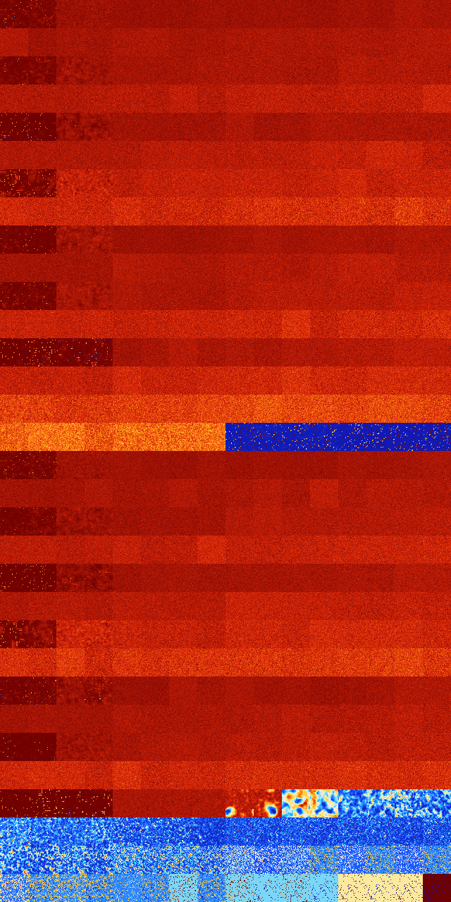

# B124568 (191488-191999)

<details>
    <summary>Initial Grid</summary>
    
</details>


<details>
    <summary>Initial Grid RLE</summary>

```
#C Exported from GoGoL (https://github.com/marrow16/gogol)
#C Wrap mode: Toroidal
#C Boundary mode: Dead
#C Step: 0
x = 100, y = 100, rule = B124568/S
11bo6bo3bo2bo43bo$10bobo11bo9bobo18bo27bo$7bo7bo10bo13bo7bo11bo4bo9bo$
21bo28bo22bo$2bo12bo18bo7bo2bo2bo2bo31bo$18bo58bo3bo14bo$12bo22bo22bo
12bo5bobo10bo$36bo13b2o32bo$33bo3bo56bo$13bo62bo$48bo3bo24bo$65bo12bo4b
o$14bo6bo8b2o2bo17bo15bo8bo13bo$7bo4bo35bo8bo$3bo9bo6b2o25bobo45bo$11bo
32bo3bo$59bo30bo$2b2obo6bo7b2o19bo32bo20bo$18bo34bo16bo$17bo8bo11bo30bo
4bo20bo3bo$2bo5bo18b2o4bo18bo6bo13bo2bo5b2o$86bo$14bo10bo47bo9bo7bo$22b
o12bo24bo$13bo2bo15bobo17bo9bo19bo4bobo$14bo2bo27bo6bo6bo7bo10bo$18bo
37bo4bobo7bo4bo3bo9bo$17bo2bo29b2o19bo12bo6bo$55bobo18bo10bo$16bo30bo8b
2o$8bo15bo30bobo6bo5bo15bo7bo$2bo2bo93bo$47bo2bo24bo9bo$30bo3bo10bo5bo
11bo22bo4bo$45bo38bo$2bo18bobo2bo$o6bo29bo31bo9bo$7bo39bo$36bo4bo11bo$
47bo4bo29bo$23bo3bo34bo30bo$o10bo34bo51bo$26bo9bo16bo32bo$36bo21bo$36bo
5bo26bo$5bo9bo10bo15bo16bo3b2o10bo$bo38bo35bo7bo6bo$49bo13bo$4b2o5bo26b
o4bo17bobobo2bo$58bo7bo29bo$14bo45bo14bo6bo13bo$7bo5bo28bo22bobo22bo2bo
3bo$33bo$8bobo27bo8bo4bo26bo$53bo20bo6bo3bo2bo8bo$2bo18bo20bo16bo16bo
14bo$8bo3bo79bo$51bo2bobo4bo7bo16bo$6bo11bo3bo21bo3bo2bo12b2o2bo$26bo9b
o$14bo4bo16bo12bo5bobo23bobobo$24bo18bo9bo$20bo33bobobo9bo17bo2bo$30bo
8bo12bo2bo15bo5bo17bo$3b2obo37bo29bo11bo$2bo6bo26bo17bo5bo4bo21bo$5b2o
23bob2o8bo26bo8bo$34bo25b2o3bo4bo4bo8bo2bo10bo$6bo13bo2bo3bo6bo2bobo$
26bo9bo23bo8bo$24bo20bo7bo32bo6bo$25bo27bo40bo2bo$3b2o38bo6bo$b2o8bo7bo
65bo6b2o$o29bo20bo45bo$4bo6bo11bo2bo9b2o24bo8bo$2bo53bo29bo5bo$17bo14bo
7bo31bo5bo$5bo5bo4bo27bo9bo$18bo16bo28bo6bo27bo$89bo$16bo5b2o48bo$8bo
11bo33bo$16bobo25bo5bo10bobo13bo8bo11bo$4bo15bo28bo43bo$27b2o27bo13bo$o
33bo20bo$6bo56bo7bo19bo$13bo4bo2bo4bo12bo10bo15bo28bo$23bo17bo31bo14bo$
38bo59bo$6bo14bo13bo6bo16bo16bo$2bo15bo3bo49b2o6bo$2bo30bo16bo9bo16bo8b
o$8bo26bo4bo9b2o28bo$58bo12bo$9bo5bo45bo$11bobo6bo5bo3bo3bo11bo17bo8bo
13bo$17bo3bo6bo25bo15bo2bo$26bo8bo29bo11bo6bo10bo!
```
</details>
<details>
    <summary>Thumbnail</summary>

</details>
<table>
<tr>
    <td><a href="./191488%20S%20Heat%20Map%20Activity.png"></a><br>S (191488)<br>R@413,p120</td>    <td><a href="./191489%20S0%20Heat%20Map%20Activity.png"></a><br>S0 (191489)<br>R@243,p24</td>    <td><a href="./191490%20S1%20Heat%20Map%20Activity.png"></a><br>S1 (191490)<br>G>1000</td>    <td><a href="./191491%20S01%20Heat%20Map%20Activity.png"></a><br>S01 (191491)<br>G>1000</td>    <td><a href="./191492%20S2%20Heat%20Map%20Activity.png"></a><br>S2 (191492)<br>G>1000</td>    <td><a href="./191493%20S02%20Heat%20Map%20Activity.png"></a><br>S02 (191493)<br>G>1000</td>    <td><a href="./191494%20S12%20Heat%20Map%20Activity.png"></a><br>S12 (191494)<br>G>1000</td>    <td><a href="./191495%20S012%20Heat%20Map%20Activity.png"></a><br>S012 (191495)<br>G>1000</td>    <td><a href="./191496%20S3%20Heat%20Map%20Activity.png"></a><br>S3 (191496)<br>G>1000</td>    <td><a href="./191497%20S03%20Heat%20Map%20Activity.png"></a><br>S03 (191497)<br>G>1000</td>    <td><a href="./191498%20S13%20Heat%20Map%20Activity.png"></a><br>S13 (191498)<br>G>1000</td>    <td><a href="./191499%20S013%20Heat%20Map%20Activity.png"></a><br>S013 (191499)<br>G>1000</td>    <td><a href="./191500%20S23%20Heat%20Map%20Activity.png"></a><br>S23 (191500)<br>G>1000</td>    <td><a href="./191501%20S023%20Heat%20Map%20Activity.png"></a><br>S023 (191501)<br>G>1000</td>    <td><a href="./191502%20S123%20Heat%20Map%20Activity.png"></a><br>S123 (191502)<br>G>1000</td>    <td><a href="./191503%20S0123%20Heat%20Map%20Activity.png"></a><br>S0123 (191503)<br>G>1000</td></tr>
<tr>
    <td><a href="./191504%20S4%20Heat%20Map%20Activity.png"></a><br>S4 (191504)<br>G>1000</td>    <td><a href="./191505%20S04%20Heat%20Map%20Activity.png"></a><br>S04 (191505)<br>G>1000</td>    <td><a href="./191506%20S14%20Heat%20Map%20Activity.png"></a><br>S14 (191506)<br>G>1000</td>    <td><a href="./191507%20S014%20Heat%20Map%20Activity.png"></a><br>S014 (191507)<br>G>1000</td>    <td><a href="./191508%20S24%20Heat%20Map%20Activity.png"></a><br>S24 (191508)<br>G>1000</td>    <td><a href="./191509%20S024%20Heat%20Map%20Activity.png"></a><br>S024 (191509)<br>G>1000</td>    <td><a href="./191510%20S124%20Heat%20Map%20Activity.png"></a><br>S124 (191510)<br>G>1000</td>    <td><a href="./191511%20S0124%20Heat%20Map%20Activity.png"></a><br>S0124 (191511)<br>G>1000</td>    <td><a href="./191512%20S34%20Heat%20Map%20Activity.png"></a><br>S34 (191512)<br>G>1000</td>    <td><a href="./191513%20S034%20Heat%20Map%20Activity.png"></a><br>S034 (191513)<br>G>1000</td>    <td><a href="./191514%20S134%20Heat%20Map%20Activity.png"></a><br>S134 (191514)<br>G>1000</td>    <td><a href="./191515%20S0134%20Heat%20Map%20Activity.png"></a><br>S0134 (191515)<br>G>1000</td>    <td><a href="./191516%20S234%20Heat%20Map%20Activity.png"></a><br>S234 (191516)<br>G>1000</td>    <td><a href="./191517%20S0234%20Heat%20Map%20Activity.png"></a><br>S0234 (191517)<br>G>1000</td>    <td><a href="./191518%20S1234%20Heat%20Map%20Activity.png"></a><br>S1234 (191518)<br>G>1000</td>    <td><a href="./191519%20S01234%20Heat%20Map%20Activity.png"></a><br>S01234 (191519)<br>G>1000</td></tr>
<tr>
    <td><a href="./191520%20S5%20Heat%20Map%20Activity.png"></a><br>S5 (191520)<br>R@326,p24</td>    <td><a href="./191521%20S05%20Heat%20Map%20Activity.png"></a><br>S05 (191521)<br>R@250,p30</td>    <td><a href="./191522%20S15%20Heat%20Map%20Activity.png"></a><br>S15 (191522)<br>G>1000</td>    <td><a href="./191523%20S015%20Heat%20Map%20Activity.png"></a><br>S015 (191523)<br>G>1000</td>    <td><a href="./191524%20S25%20Heat%20Map%20Activity.png"></a><br>S25 (191524)<br>G>1000</td>    <td><a href="./191525%20S025%20Heat%20Map%20Activity.png"></a><br>S025 (191525)<br>G>1000</td>    <td><a href="./191526%20S125%20Heat%20Map%20Activity.png"></a><br>S125 (191526)<br>G>1000</td>    <td><a href="./191527%20S0125%20Heat%20Map%20Activity.png"></a><br>S0125 (191527)<br>G>1000</td>    <td><a href="./191528%20S35%20Heat%20Map%20Activity.png"></a><br>S35 (191528)<br>G>1000</td>    <td><a href="./191529%20S035%20Heat%20Map%20Activity.png"></a><br>S035 (191529)<br>G>1000</td>    <td><a href="./191530%20S135%20Heat%20Map%20Activity.png"></a><br>S135 (191530)<br>G>1000</td>    <td><a href="./191531%20S0135%20Heat%20Map%20Activity.png"></a><br>S0135 (191531)<br>G>1000</td>    <td><a href="./191532%20S235%20Heat%20Map%20Activity.png"></a><br>S235 (191532)<br>G>1000</td>    <td><a href="./191533%20S0235%20Heat%20Map%20Activity.png"></a><br>S0235 (191533)<br>G>1000</td>    <td><a href="./191534%20S1235%20Heat%20Map%20Activity.png"></a><br>S1235 (191534)<br>G>1000</td>    <td><a href="./191535%20S01235%20Heat%20Map%20Activity.png"></a><br>S01235 (191535)<br>G>1000</td></tr>
<tr>
    <td><a href="./191536%20S45%20Heat%20Map%20Activity.png"></a><br>S45 (191536)<br>G>1000</td>    <td><a href="./191537%20S045%20Heat%20Map%20Activity.png"></a><br>S045 (191537)<br>G>1000</td>    <td><a href="./191538%20S145%20Heat%20Map%20Activity.png"></a><br>S145 (191538)<br>G>1000</td>    <td><a href="./191539%20S0145%20Heat%20Map%20Activity.png"></a><br>S0145 (191539)<br>G>1000</td>    <td><a href="./191540%20S245%20Heat%20Map%20Activity.png"></a><br>S245 (191540)<br>G>1000</td>    <td><a href="./191541%20S0245%20Heat%20Map%20Activity.png"></a><br>S0245 (191541)<br>G>1000</td>    <td><a href="./191542%20S1245%20Heat%20Map%20Activity.png"></a><br>S1245 (191542)<br>G>1000</td>    <td><a href="./191543%20S01245%20Heat%20Map%20Activity.png"></a><br>S01245 (191543)<br>G>1000</td>    <td><a href="./191544%20S345%20Heat%20Map%20Activity.png"></a><br>S345 (191544)<br>G>1000</td>    <td><a href="./191545%20S0345%20Heat%20Map%20Activity.png"></a><br>S0345 (191545)<br>G>1000</td>    <td><a href="./191546%20S1345%20Heat%20Map%20Activity.png"></a><br>S1345 (191546)<br>G>1000</td>    <td><a href="./191547%20S01345%20Heat%20Map%20Activity.png"></a><br>S01345 (191547)<br>G>1000</td>    <td><a href="./191548%20S2345%20Heat%20Map%20Activity.png"></a><br>S2345 (191548)<br>G>1000</td>    <td><a href="./191549%20S02345%20Heat%20Map%20Activity.png"></a><br>S02345 (191549)<br>G>1000</td>    <td><a href="./191550%20S12345%20Heat%20Map%20Activity.png"></a><br>S12345 (191550)<br>G>1000</td>    <td><a href="./191551%20S012345%20Heat%20Map%20Activity.png"></a><br>S012345 (191551)<br>G>1000</td></tr>
<tr>
    <td><a href="./191552%20S6%20Heat%20Map%20Activity.png"></a><br>S6 (191552)<br>G>1000</td>    <td><a href="./191553%20S06%20Heat%20Map%20Activity.png"></a><br>S06 (191553)<br>G>1000</td>    <td><a href="./191554%20S16%20Heat%20Map%20Activity.png"></a><br>S16 (191554)<br>G>1000</td>    <td><a href="./191555%20S016%20Heat%20Map%20Activity.png"></a><br>S016 (191555)<br>G>1000</td>    <td><a href="./191556%20S26%20Heat%20Map%20Activity.png"></a><br>S26 (191556)<br>G>1000</td>    <td><a href="./191557%20S026%20Heat%20Map%20Activity.png"></a><br>S026 (191557)<br>G>1000</td>    <td><a href="./191558%20S126%20Heat%20Map%20Activity.png"></a><br>S126 (191558)<br>G>1000</td>    <td><a href="./191559%20S0126%20Heat%20Map%20Activity.png"></a><br>S0126 (191559)<br>G>1000</td>    <td><a href="./191560%20S36%20Heat%20Map%20Activity.png"></a><br>S36 (191560)<br>G>1000</td>    <td><a href="./191561%20S036%20Heat%20Map%20Activity.png"></a><br>S036 (191561)<br>G>1000</td>    <td><a href="./191562%20S136%20Heat%20Map%20Activity.png"></a><br>S136 (191562)<br>G>1000</td>    <td><a href="./191563%20S0136%20Heat%20Map%20Activity.png"></a><br>S0136 (191563)<br>G>1000</td>    <td><a href="./191564%20S236%20Heat%20Map%20Activity.png"></a><br>S236 (191564)<br>G>1000</td>    <td><a href="./191565%20S0236%20Heat%20Map%20Activity.png"></a><br>S0236 (191565)<br>G>1000</td>    <td><a href="./191566%20S1236%20Heat%20Map%20Activity.png"></a><br>S1236 (191566)<br>G>1000</td>    <td><a href="./191567%20S01236%20Heat%20Map%20Activity.png"></a><br>S01236 (191567)<br>G>1000</td></tr>
<tr>
    <td><a href="./191568%20S46%20Heat%20Map%20Activity.png"></a><br>S46 (191568)<br>G>1000</td>    <td><a href="./191569%20S046%20Heat%20Map%20Activity.png"></a><br>S046 (191569)<br>G>1000</td>    <td><a href="./191570%20S146%20Heat%20Map%20Activity.png"></a><br>S146 (191570)<br>G>1000</td>    <td><a href="./191571%20S0146%20Heat%20Map%20Activity.png"></a><br>S0146 (191571)<br>G>1000</td>    <td><a href="./191572%20S246%20Heat%20Map%20Activity.png"></a><br>S246 (191572)<br>G>1000</td>    <td><a href="./191573%20S0246%20Heat%20Map%20Activity.png"></a><br>S0246 (191573)<br>G>1000</td>    <td><a href="./191574%20S1246%20Heat%20Map%20Activity.png"></a><br>S1246 (191574)<br>G>1000</td>    <td><a href="./191575%20S01246%20Heat%20Map%20Activity.png"></a><br>S01246 (191575)<br>G>1000</td>    <td><a href="./191576%20S346%20Heat%20Map%20Activity.png"></a><br>S346 (191576)<br>G>1000</td>    <td><a href="./191577%20S0346%20Heat%20Map%20Activity.png"></a><br>S0346 (191577)<br>G>1000</td>    <td><a href="./191578%20S1346%20Heat%20Map%20Activity.png"></a><br>S1346 (191578)<br>G>1000</td>    <td><a href="./191579%20S01346%20Heat%20Map%20Activity.png"></a><br>S01346 (191579)<br>G>1000</td>    <td><a href="./191580%20S2346%20Heat%20Map%20Activity.png"></a><br>S2346 (191580)<br>G>1000</td>    <td><a href="./191581%20S02346%20Heat%20Map%20Activity.png"></a><br>S02346 (191581)<br>G>1000</td>    <td><a href="./191582%20S12346%20Heat%20Map%20Activity.png"></a><br>S12346 (191582)<br>G>1000</td>    <td><a href="./191583%20S012346%20Heat%20Map%20Activity.png"></a><br>S012346 (191583)<br>G>1000</td></tr>
<tr>
    <td><a href="./191584%20S56%20Heat%20Map%20Activity.png"></a><br>S56 (191584)<br>G>1000</td>    <td><a href="./191585%20S056%20Heat%20Map%20Activity.png"></a><br>S056 (191585)<br>G>1000</td>    <td><a href="./191586%20S156%20Heat%20Map%20Activity.png"></a><br>S156 (191586)<br>G>1000</td>    <td><a href="./191587%20S0156%20Heat%20Map%20Activity.png"></a><br>S0156 (191587)<br>G>1000</td>    <td><a href="./191588%20S256%20Heat%20Map%20Activity.png"></a><br>S256 (191588)<br>G>1000</td>    <td><a href="./191589%20S0256%20Heat%20Map%20Activity.png"></a><br>S0256 (191589)<br>G>1000</td>    <td><a href="./191590%20S1256%20Heat%20Map%20Activity.png"></a><br>S1256 (191590)<br>G>1000</td>    <td><a href="./191591%20S01256%20Heat%20Map%20Activity.png"></a><br>S01256 (191591)<br>G>1000</td>    <td><a href="./191592%20S356%20Heat%20Map%20Activity.png"></a><br>S356 (191592)<br>G>1000</td>    <td><a href="./191593%20S0356%20Heat%20Map%20Activity.png"></a><br>S0356 (191593)<br>G>1000</td>    <td><a href="./191594%20S1356%20Heat%20Map%20Activity.png"></a><br>S1356 (191594)<br>G>1000</td>    <td><a href="./191595%20S01356%20Heat%20Map%20Activity.png"></a><br>S01356 (191595)<br>G>1000</td>    <td><a href="./191596%20S2356%20Heat%20Map%20Activity.png"></a><br>S2356 (191596)<br>G>1000</td>    <td><a href="./191597%20S02356%20Heat%20Map%20Activity.png"></a><br>S02356 (191597)<br>G>1000</td>    <td><a href="./191598%20S12356%20Heat%20Map%20Activity.png"></a><br>S12356 (191598)<br>G>1000</td>    <td><a href="./191599%20S012356%20Heat%20Map%20Activity.png"></a><br>S012356 (191599)<br>G>1000</td></tr>
<tr>
    <td><a href="./191600%20S456%20Heat%20Map%20Activity.png"></a><br>S456 (191600)<br>G>1000</td>    <td><a href="./191601%20S0456%20Heat%20Map%20Activity.png"></a><br>S0456 (191601)<br>G>1000</td>    <td><a href="./191602%20S1456%20Heat%20Map%20Activity.png"></a><br>S1456 (191602)<br>G>1000</td>    <td><a href="./191603%20S01456%20Heat%20Map%20Activity.png"></a><br>S01456 (191603)<br>G>1000</td>    <td><a href="./191604%20S2456%20Heat%20Map%20Activity.png"></a><br>S2456 (191604)<br>G>1000</td>    <td><a href="./191605%20S02456%20Heat%20Map%20Activity.png"></a><br>S02456 (191605)<br>G>1000</td>    <td><a href="./191606%20S12456%20Heat%20Map%20Activity.png"></a><br>S12456 (191606)<br>G>1000</td>    <td><a href="./191607%20S012456%20Heat%20Map%20Activity.png"></a><br>S012456 (191607)<br>G>1000</td>    <td><a href="./191608%20S3456%20Heat%20Map%20Activity.png"></a><br>S3456 (191608)<br>G>1000</td>    <td><a href="./191609%20S03456%20Heat%20Map%20Activity.png"></a><br>S03456 (191609)<br>G>1000</td>    <td><a href="./191610%20S13456%20Heat%20Map%20Activity.png"></a><br>S13456 (191610)<br>G>1000</td>    <td><a href="./191611%20S013456%20Heat%20Map%20Activity.png"></a><br>S013456 (191611)<br>G>1000</td>    <td><a href="./191612%20S23456%20Heat%20Map%20Activity.png"></a><br>S23456 (191612)<br>G>1000</td>    <td><a href="./191613%20S023456%20Heat%20Map%20Activity.png"></a><br>S023456 (191613)<br>G>1000</td>    <td><a href="./191614%20S123456%20Heat%20Map%20Activity.png"></a><br>S123456 (191614)<br>G>1000</td>    <td><a href="./191615%20S0123456%20Heat%20Map%20Activity.png"></a><br>S0123456 (191615)<br>G>1000</td></tr>
<tr>
    <td><a href="./191616%20S7%20Heat%20Map%20Activity.png"></a><br>S7 (191616)<br>R@450,p48</td>    <td><a href="./191617%20S07%20Heat%20Map%20Activity.png"></a><br>S07 (191617)<br>R@731,p144</td>    <td><a href="./191618%20S17%20Heat%20Map%20Activity.png"></a><br>S17 (191618)<br>G>1000</td>    <td><a href="./191619%20S017%20Heat%20Map%20Activity.png"></a><br>S017 (191619)<br>G>1000</td>    <td><a href="./191620%20S27%20Heat%20Map%20Activity.png"></a><br>S27 (191620)<br>G>1000</td>    <td><a href="./191621%20S027%20Heat%20Map%20Activity.png"></a><br>S027 (191621)<br>G>1000</td>    <td><a href="./191622%20S127%20Heat%20Map%20Activity.png"></a><br>S127 (191622)<br>G>1000</td>    <td><a href="./191623%20S0127%20Heat%20Map%20Activity.png"></a><br>S0127 (191623)<br>G>1000</td>    <td><a href="./191624%20S37%20Heat%20Map%20Activity.png"></a><br>S37 (191624)<br>G>1000</td>    <td><a href="./191625%20S037%20Heat%20Map%20Activity.png"></a><br>S037 (191625)<br>G>1000</td>    <td><a href="./191626%20S137%20Heat%20Map%20Activity.png"></a><br>S137 (191626)<br>G>1000</td>    <td><a href="./191627%20S0137%20Heat%20Map%20Activity.png"></a><br>S0137 (191627)<br>G>1000</td>    <td><a href="./191628%20S237%20Heat%20Map%20Activity.png"></a><br>S237 (191628)<br>G>1000</td>    <td><a href="./191629%20S0237%20Heat%20Map%20Activity.png"></a><br>S0237 (191629)<br>G>1000</td>    <td><a href="./191630%20S1237%20Heat%20Map%20Activity.png"></a><br>S1237 (191630)<br>G>1000</td>    <td><a href="./191631%20S01237%20Heat%20Map%20Activity.png"></a><br>S01237 (191631)<br>G>1000</td></tr>
<tr>
    <td><a href="./191632%20S47%20Heat%20Map%20Activity.png"></a><br>S47 (191632)<br>G>1000</td>    <td><a href="./191633%20S047%20Heat%20Map%20Activity.png"></a><br>S047 (191633)<br>G>1000</td>    <td><a href="./191634%20S147%20Heat%20Map%20Activity.png"></a><br>S147 (191634)<br>G>1000</td>    <td><a href="./191635%20S0147%20Heat%20Map%20Activity.png"></a><br>S0147 (191635)<br>G>1000</td>    <td><a href="./191636%20S247%20Heat%20Map%20Activity.png"></a><br>S247 (191636)<br>G>1000</td>    <td><a href="./191637%20S0247%20Heat%20Map%20Activity.png"></a><br>S0247 (191637)<br>G>1000</td>    <td><a href="./191638%20S1247%20Heat%20Map%20Activity.png"></a><br>S1247 (191638)<br>G>1000</td>    <td><a href="./191639%20S01247%20Heat%20Map%20Activity.png"></a><br>S01247 (191639)<br>G>1000</td>    <td><a href="./191640%20S347%20Heat%20Map%20Activity.png"></a><br>S347 (191640)<br>G>1000</td>    <td><a href="./191641%20S0347%20Heat%20Map%20Activity.png"></a><br>S0347 (191641)<br>G>1000</td>    <td><a href="./191642%20S1347%20Heat%20Map%20Activity.png"></a><br>S1347 (191642)<br>G>1000</td>    <td><a href="./191643%20S01347%20Heat%20Map%20Activity.png"></a><br>S01347 (191643)<br>G>1000</td>    <td><a href="./191644%20S2347%20Heat%20Map%20Activity.png"></a><br>S2347 (191644)<br>G>1000</td>    <td><a href="./191645%20S02347%20Heat%20Map%20Activity.png"></a><br>S02347 (191645)<br>G>1000</td>    <td><a href="./191646%20S12347%20Heat%20Map%20Activity.png"></a><br>S12347 (191646)<br>G>1000</td>    <td><a href="./191647%20S012347%20Heat%20Map%20Activity.png"></a><br>S012347 (191647)<br>G>1000</td></tr>
<tr>
    <td><a href="./191648%20S57%20Heat%20Map%20Activity.png"></a><br>S57 (191648)<br>R@384,p24</td>    <td><a href="./191649%20S057%20Heat%20Map%20Activity.png"></a><br>S057 (191649)<br>R@416,p168</td>    <td><a href="./191650%20S157%20Heat%20Map%20Activity.png"></a><br>S157 (191650)<br>G>1000</td>    <td><a href="./191651%20S0157%20Heat%20Map%20Activity.png"></a><br>S0157 (191651)<br>G>1000</td>    <td><a href="./191652%20S257%20Heat%20Map%20Activity.png"></a><br>S257 (191652)<br>G>1000</td>    <td><a href="./191653%20S0257%20Heat%20Map%20Activity.png"></a><br>S0257 (191653)<br>G>1000</td>    <td><a href="./191654%20S1257%20Heat%20Map%20Activity.png"></a><br>S1257 (191654)<br>G>1000</td>    <td><a href="./191655%20S01257%20Heat%20Map%20Activity.png"></a><br>S01257 (191655)<br>G>1000</td>    <td><a href="./191656%20S357%20Heat%20Map%20Activity.png"></a><br>S357 (191656)<br>G>1000</td>    <td><a href="./191657%20S0357%20Heat%20Map%20Activity.png"></a><br>S0357 (191657)<br>G>1000</td>    <td><a href="./191658%20S1357%20Heat%20Map%20Activity.png"></a><br>S1357 (191658)<br>G>1000</td>    <td><a href="./191659%20S01357%20Heat%20Map%20Activity.png"></a><br>S01357 (191659)<br>G>1000</td>    <td><a href="./191660%20S2357%20Heat%20Map%20Activity.png"></a><br>S2357 (191660)<br>G>1000</td>    <td><a href="./191661%20S02357%20Heat%20Map%20Activity.png"></a><br>S02357 (191661)<br>G>1000</td>    <td><a href="./191662%20S12357%20Heat%20Map%20Activity.png"></a><br>S12357 (191662)<br>G>1000</td>    <td><a href="./191663%20S012357%20Heat%20Map%20Activity.png"></a><br>S012357 (191663)<br>G>1000</td></tr>
<tr>
    <td><a href="./191664%20S457%20Heat%20Map%20Activity.png"></a><br>S457 (191664)<br>G>1000</td>    <td><a href="./191665%20S0457%20Heat%20Map%20Activity.png"></a><br>S0457 (191665)<br>G>1000</td>    <td><a href="./191666%20S1457%20Heat%20Map%20Activity.png"></a><br>S1457 (191666)<br>G>1000</td>    <td><a href="./191667%20S01457%20Heat%20Map%20Activity.png"></a><br>S01457 (191667)<br>G>1000</td>    <td><a href="./191668%20S2457%20Heat%20Map%20Activity.png"></a><br>S2457 (191668)<br>G>1000</td>    <td><a href="./191669%20S02457%20Heat%20Map%20Activity.png"></a><br>S02457 (191669)<br>G>1000</td>    <td><a href="./191670%20S12457%20Heat%20Map%20Activity.png"></a><br>S12457 (191670)<br>G>1000</td>    <td><a href="./191671%20S012457%20Heat%20Map%20Activity.png"></a><br>S012457 (191671)<br>G>1000</td>    <td><a href="./191672%20S3457%20Heat%20Map%20Activity.png"></a><br>S3457 (191672)<br>G>1000</td>    <td><a href="./191673%20S03457%20Heat%20Map%20Activity.png"></a><br>S03457 (191673)<br>G>1000</td>    <td><a href="./191674%20S13457%20Heat%20Map%20Activity.png"></a><br>S13457 (191674)<br>G>1000</td>    <td><a href="./191675%20S013457%20Heat%20Map%20Activity.png"></a><br>S013457 (191675)<br>G>1000</td>    <td><a href="./191676%20S23457%20Heat%20Map%20Activity.png"></a><br>S23457 (191676)<br>G>1000</td>    <td><a href="./191677%20S023457%20Heat%20Map%20Activity.png"></a><br>S023457 (191677)<br>G>1000</td>    <td><a href="./191678%20S123457%20Heat%20Map%20Activity.png"></a><br>S123457 (191678)<br>G>1000</td>    <td><a href="./191679%20S0123457%20Heat%20Map%20Activity.png"></a><br>S0123457 (191679)<br>G>1000</td></tr>
<tr>
    <td><a href="./191680%20S67%20Heat%20Map%20Activity.png"></a><br>S67 (191680)<br>G>1000</td>    <td><a href="./191681%20S067%20Heat%20Map%20Activity.png"></a><br>S067 (191681)<br>G>1000</td>    <td><a href="./191682%20S167%20Heat%20Map%20Activity.png"></a><br>S167 (191682)<br>R@512,p120</td>    <td><a href="./191683%20S0167%20Heat%20Map%20Activity.png"></a><br>S0167 (191683)<br>R@440,p120</td>    <td><a href="./191684%20S267%20Heat%20Map%20Activity.png"></a><br>S267 (191684)<br>G>1000</td>    <td><a href="./191685%20S0267%20Heat%20Map%20Activity.png"></a><br>S0267 (191685)<br>G>1000</td>    <td><a href="./191686%20S1267%20Heat%20Map%20Activity.png"></a><br>S1267 (191686)<br>G>1000</td>    <td><a href="./191687%20S01267%20Heat%20Map%20Activity.png"></a><br>S01267 (191687)<br>G>1000</td>    <td><a href="./191688%20S367%20Heat%20Map%20Activity.png"></a><br>S367 (191688)<br>G>1000</td>    <td><a href="./191689%20S0367%20Heat%20Map%20Activity.png"></a><br>S0367 (191689)<br>G>1000</td>    <td><a href="./191690%20S1367%20Heat%20Map%20Activity.png"></a><br>S1367 (191690)<br>G>1000</td>    <td><a href="./191691%20S01367%20Heat%20Map%20Activity.png"></a><br>S01367 (191691)<br>G>1000</td>    <td><a href="./191692%20S2367%20Heat%20Map%20Activity.png"></a><br>S2367 (191692)<br>G>1000</td>    <td><a href="./191693%20S02367%20Heat%20Map%20Activity.png"></a><br>S02367 (191693)<br>G>1000</td>    <td><a href="./191694%20S12367%20Heat%20Map%20Activity.png"></a><br>S12367 (191694)<br>G>1000</td>    <td><a href="./191695%20S012367%20Heat%20Map%20Activity.png"></a><br>S012367 (191695)<br>G>1000</td></tr>
<tr>
    <td><a href="./191696%20S467%20Heat%20Map%20Activity.png"></a><br>S467 (191696)<br>G>1000</td>    <td><a href="./191697%20S0467%20Heat%20Map%20Activity.png"></a><br>S0467 (191697)<br>G>1000</td>    <td><a href="./191698%20S1467%20Heat%20Map%20Activity.png"></a><br>S1467 (191698)<br>G>1000</td>    <td><a href="./191699%20S01467%20Heat%20Map%20Activity.png"></a><br>S01467 (191699)<br>G>1000</td>    <td><a href="./191700%20S2467%20Heat%20Map%20Activity.png"></a><br>S2467 (191700)<br>G>1000</td>    <td><a href="./191701%20S02467%20Heat%20Map%20Activity.png"></a><br>S02467 (191701)<br>G>1000</td>    <td><a href="./191702%20S12467%20Heat%20Map%20Activity.png"></a><br>S12467 (191702)<br>G>1000</td>    <td><a href="./191703%20S012467%20Heat%20Map%20Activity.png"></a><br>S012467 (191703)<br>G>1000</td>    <td><a href="./191704%20S3467%20Heat%20Map%20Activity.png"></a><br>S3467 (191704)<br>G>1000</td>    <td><a href="./191705%20S03467%20Heat%20Map%20Activity.png"></a><br>S03467 (191705)<br>G>1000</td>    <td><a href="./191706%20S13467%20Heat%20Map%20Activity.png"></a><br>S13467 (191706)<br>G>1000</td>    <td><a href="./191707%20S013467%20Heat%20Map%20Activity.png"></a><br>S013467 (191707)<br>G>1000</td>    <td><a href="./191708%20S23467%20Heat%20Map%20Activity.png"></a><br>S23467 (191708)<br>G>1000</td>    <td><a href="./191709%20S023467%20Heat%20Map%20Activity.png"></a><br>S023467 (191709)<br>G>1000</td>    <td><a href="./191710%20S123467%20Heat%20Map%20Activity.png"></a><br>S123467 (191710)<br>G>1000</td>    <td><a href="./191711%20S0123467%20Heat%20Map%20Activity.png"></a><br>S0123467 (191711)<br>G>1000</td></tr>
<tr>
    <td><a href="./191712%20S567%20Heat%20Map%20Activity.png"></a><br>S567 (191712)<br>G>1000</td>    <td><a href="./191713%20S0567%20Heat%20Map%20Activity.png"></a><br>S0567 (191713)<br>G>1000</td>    <td><a href="./191714%20S1567%20Heat%20Map%20Activity.png"></a><br>S1567 (191714)<br>G>1000</td>    <td><a href="./191715%20S01567%20Heat%20Map%20Activity.png"></a><br>S01567 (191715)<br>G>1000</td>    <td><a href="./191716%20S2567%20Heat%20Map%20Activity.png"></a><br>S2567 (191716)<br>G>1000</td>    <td><a href="./191717%20S02567%20Heat%20Map%20Activity.png"></a><br>S02567 (191717)<br>G>1000</td>    <td><a href="./191718%20S12567%20Heat%20Map%20Activity.png"></a><br>S12567 (191718)<br>G>1000</td>    <td><a href="./191719%20S012567%20Heat%20Map%20Activity.png"></a><br>S012567 (191719)<br>G>1000</td>    <td><a href="./191720%20S3567%20Heat%20Map%20Activity.png"></a><br>S3567 (191720)<br>G>1000</td>    <td><a href="./191721%20S03567%20Heat%20Map%20Activity.png"></a><br>S03567 (191721)<br>G>1000</td>    <td><a href="./191722%20S13567%20Heat%20Map%20Activity.png"></a><br>S13567 (191722)<br>G>1000</td>    <td><a href="./191723%20S013567%20Heat%20Map%20Activity.png"></a><br>S013567 (191723)<br>G>1000</td>    <td><a href="./191724%20S23567%20Heat%20Map%20Activity.png"></a><br>S23567 (191724)<br>G>1000</td>    <td><a href="./191725%20S023567%20Heat%20Map%20Activity.png"></a><br>S023567 (191725)<br>G>1000</td>    <td><a href="./191726%20S123567%20Heat%20Map%20Activity.png"></a><br>S123567 (191726)<br>G>1000</td>    <td><a href="./191727%20S0123567%20Heat%20Map%20Activity.png"></a><br>S0123567 (191727)<br>G>1000</td></tr>
<tr>
    <td><a href="./191728%20S4567%20Heat%20Map%20Activity.png"></a><br>S4567 (191728)<br>G>1000</td>    <td><a href="./191729%20S04567%20Heat%20Map%20Activity.png"></a><br>S04567 (191729)<br>G>1000</td>    <td><a href="./191730%20S14567%20Heat%20Map%20Activity.png"></a><br>S14567 (191730)<br>G>1000</td>    <td><a href="./191731%20S014567%20Heat%20Map%20Activity.png"></a><br>S014567 (191731)<br>G>1000</td>    <td><a href="./191732%20S24567%20Heat%20Map%20Activity.png"></a><br>S24567 (191732)<br>G>1000</td>    <td><a href="./191733%20S024567%20Heat%20Map%20Activity.png"></a><br>S024567 (191733)<br>G>1000</td>    <td><a href="./191734%20S124567%20Heat%20Map%20Activity.png"></a><br>S124567 (191734)<br>G>1000</td>    <td><a href="./191735%20S0124567%20Heat%20Map%20Activity.png"></a><br>S0124567 (191735)<br>G>1000</td>    <td><a href="./191736%20S34567%20Heat%20Map%20Activity.png"></a><br>S34567 (191736)<br>G>1000</td>    <td><a href="./191737%20S034567%20Heat%20Map%20Activity.png"></a><br>S034567 (191737)<br>G>1000</td>    <td><a href="./191738%20S134567%20Heat%20Map%20Activity.png"></a><br>S134567 (191738)<br>G>1000</td>    <td><a href="./191739%20S0134567%20Heat%20Map%20Activity.png"></a><br>S0134567 (191739)<br>G>1000</td>    <td><a href="./191740%20S234567%20Heat%20Map%20Activity.png"></a><br>S234567 (191740)<br>G>1000</td>    <td><a href="./191741%20S0234567%20Heat%20Map%20Activity.png"></a><br>S0234567 (191741)<br>G>1000</td>    <td><a href="./191742%20S1234567%20Heat%20Map%20Activity.png"></a><br>S1234567 (191742)<br>G>1000</td>    <td><a href="./191743%20S01234567%20Heat%20Map%20Activity.png"></a><br>S01234567 (191743)<br>G>1000</td></tr>
<tr>
    <td><a href="./191744%20S8%20Heat%20Map%20Activity.png"></a><br>S8 (191744)<br>R@413,p120</td>    <td><a href="./191745%20S08%20Heat%20Map%20Activity.png"></a><br>S08 (191745)<br>R@303,p24</td>    <td><a href="./191746%20S18%20Heat%20Map%20Activity.png"></a><br>S18 (191746)<br>G>1000</td>    <td><a href="./191747%20S018%20Heat%20Map%20Activity.png"></a><br>S018 (191747)<br>G>1000</td>    <td><a href="./191748%20S28%20Heat%20Map%20Activity.png"></a><br>S28 (191748)<br>G>1000</td>    <td><a href="./191749%20S028%20Heat%20Map%20Activity.png"></a><br>S028 (191749)<br>G>1000</td>    <td><a href="./191750%20S128%20Heat%20Map%20Activity.png"></a><br>S128 (191750)<br>G>1000</td>    <td><a href="./191751%20S0128%20Heat%20Map%20Activity.png"></a><br>S0128 (191751)<br>G>1000</td>    <td><a href="./191752%20S38%20Heat%20Map%20Activity.png"></a><br>S38 (191752)<br>G>1000</td>    <td><a href="./191753%20S038%20Heat%20Map%20Activity.png"></a><br>S038 (191753)<br>G>1000</td>    <td><a href="./191754%20S138%20Heat%20Map%20Activity.png"></a><br>S138 (191754)<br>G>1000</td>    <td><a href="./191755%20S0138%20Heat%20Map%20Activity.png"></a><br>S0138 (191755)<br>G>1000</td>    <td><a href="./191756%20S238%20Heat%20Map%20Activity.png"></a><br>S238 (191756)<br>G>1000</td>    <td><a href="./191757%20S0238%20Heat%20Map%20Activity.png"></a><br>S0238 (191757)<br>G>1000</td>    <td><a href="./191758%20S1238%20Heat%20Map%20Activity.png"></a><br>S1238 (191758)<br>G>1000</td>    <td><a href="./191759%20S01238%20Heat%20Map%20Activity.png"></a><br>S01238 (191759)<br>G>1000</td></tr>
<tr>
    <td><a href="./191760%20S48%20Heat%20Map%20Activity.png"></a><br>S48 (191760)<br>G>1000</td>    <td><a href="./191761%20S048%20Heat%20Map%20Activity.png"></a><br>S048 (191761)<br>G>1000</td>    <td><a href="./191762%20S148%20Heat%20Map%20Activity.png"></a><br>S148 (191762)<br>G>1000</td>    <td><a href="./191763%20S0148%20Heat%20Map%20Activity.png"></a><br>S0148 (191763)<br>G>1000</td>    <td><a href="./191764%20S248%20Heat%20Map%20Activity.png"></a><br>S248 (191764)<br>G>1000</td>    <td><a href="./191765%20S0248%20Heat%20Map%20Activity.png"></a><br>S0248 (191765)<br>G>1000</td>    <td><a href="./191766%20S1248%20Heat%20Map%20Activity.png"></a><br>S1248 (191766)<br>G>1000</td>    <td><a href="./191767%20S01248%20Heat%20Map%20Activity.png"></a><br>S01248 (191767)<br>G>1000</td>    <td><a href="./191768%20S348%20Heat%20Map%20Activity.png"></a><br>S348 (191768)<br>G>1000</td>    <td><a href="./191769%20S0348%20Heat%20Map%20Activity.png"></a><br>S0348 (191769)<br>G>1000</td>    <td><a href="./191770%20S1348%20Heat%20Map%20Activity.png"></a><br>S1348 (191770)<br>G>1000</td>    <td><a href="./191771%20S01348%20Heat%20Map%20Activity.png"></a><br>S01348 (191771)<br>G>1000</td>    <td><a href="./191772%20S2348%20Heat%20Map%20Activity.png"></a><br>S2348 (191772)<br>G>1000</td>    <td><a href="./191773%20S02348%20Heat%20Map%20Activity.png"></a><br>S02348 (191773)<br>G>1000</td>    <td><a href="./191774%20S12348%20Heat%20Map%20Activity.png"></a><br>S12348 (191774)<br>G>1000</td>    <td><a href="./191775%20S012348%20Heat%20Map%20Activity.png"></a><br>S012348 (191775)<br>G>1000</td></tr>
<tr>
    <td><a href="./191776%20S58%20Heat%20Map%20Activity.png"></a><br>S58 (191776)<br>R@413,p168</td>    <td><a href="./191777%20S058%20Heat%20Map%20Activity.png"></a><br>S058 (191777)<br>R@276,p6</td>    <td><a href="./191778%20S158%20Heat%20Map%20Activity.png"></a><br>S158 (191778)<br>G>1000</td>    <td><a href="./191779%20S0158%20Heat%20Map%20Activity.png"></a><br>S0158 (191779)<br>G>1000</td>    <td><a href="./191780%20S258%20Heat%20Map%20Activity.png"></a><br>S258 (191780)<br>G>1000</td>    <td><a href="./191781%20S0258%20Heat%20Map%20Activity.png"></a><br>S0258 (191781)<br>G>1000</td>    <td><a href="./191782%20S1258%20Heat%20Map%20Activity.png"></a><br>S1258 (191782)<br>G>1000</td>    <td><a href="./191783%20S01258%20Heat%20Map%20Activity.png"></a><br>S01258 (191783)<br>G>1000</td>    <td><a href="./191784%20S358%20Heat%20Map%20Activity.png"></a><br>S358 (191784)<br>G>1000</td>    <td><a href="./191785%20S0358%20Heat%20Map%20Activity.png"></a><br>S0358 (191785)<br>G>1000</td>    <td><a href="./191786%20S1358%20Heat%20Map%20Activity.png"></a><br>S1358 (191786)<br>G>1000</td>    <td><a href="./191787%20S01358%20Heat%20Map%20Activity.png"></a><br>S01358 (191787)<br>G>1000</td>    <td><a href="./191788%20S2358%20Heat%20Map%20Activity.png"></a><br>S2358 (191788)<br>G>1000</td>    <td><a href="./191789%20S02358%20Heat%20Map%20Activity.png"></a><br>S02358 (191789)<br>G>1000</td>    <td><a href="./191790%20S12358%20Heat%20Map%20Activity.png"></a><br>S12358 (191790)<br>G>1000</td>    <td><a href="./191791%20S012358%20Heat%20Map%20Activity.png"></a><br>S012358 (191791)<br>G>1000</td></tr>
<tr>
    <td><a href="./191792%20S458%20Heat%20Map%20Activity.png"></a><br>S458 (191792)<br>G>1000</td>    <td><a href="./191793%20S0458%20Heat%20Map%20Activity.png"></a><br>S0458 (191793)<br>G>1000</td>    <td><a href="./191794%20S1458%20Heat%20Map%20Activity.png"></a><br>S1458 (191794)<br>G>1000</td>    <td><a href="./191795%20S01458%20Heat%20Map%20Activity.png"></a><br>S01458 (191795)<br>G>1000</td>    <td><a href="./191796%20S2458%20Heat%20Map%20Activity.png"></a><br>S2458 (191796)<br>G>1000</td>    <td><a href="./191797%20S02458%20Heat%20Map%20Activity.png"></a><br>S02458 (191797)<br>G>1000</td>    <td><a href="./191798%20S12458%20Heat%20Map%20Activity.png"></a><br>S12458 (191798)<br>G>1000</td>    <td><a href="./191799%20S012458%20Heat%20Map%20Activity.png"></a><br>S012458 (191799)<br>G>1000</td>    <td><a href="./191800%20S3458%20Heat%20Map%20Activity.png"></a><br>S3458 (191800)<br>G>1000</td>    <td><a href="./191801%20S03458%20Heat%20Map%20Activity.png"></a><br>S03458 (191801)<br>G>1000</td>    <td><a href="./191802%20S13458%20Heat%20Map%20Activity.png"></a><br>S13458 (191802)<br>G>1000</td>    <td><a href="./191803%20S013458%20Heat%20Map%20Activity.png"></a><br>S013458 (191803)<br>G>1000</td>    <td><a href="./191804%20S23458%20Heat%20Map%20Activity.png"></a><br>S23458 (191804)<br>G>1000</td>    <td><a href="./191805%20S023458%20Heat%20Map%20Activity.png"></a><br>S023458 (191805)<br>G>1000</td>    <td><a href="./191806%20S123458%20Heat%20Map%20Activity.png"></a><br>S123458 (191806)<br>G>1000</td>    <td><a href="./191807%20S0123458%20Heat%20Map%20Activity.png"></a><br>S0123458 (191807)<br>G>1000</td></tr>
<tr>
    <td><a href="./191808%20S68%20Heat%20Map%20Activity.png"></a><br>S68 (191808)<br>G>1000</td>    <td><a href="./191809%20S068%20Heat%20Map%20Activity.png"></a><br>S068 (191809)<br>G>1000</td>    <td><a href="./191810%20S168%20Heat%20Map%20Activity.png"></a><br>S168 (191810)<br>G>1000</td>    <td><a href="./191811%20S0168%20Heat%20Map%20Activity.png"></a><br>S0168 (191811)<br>G>1000</td>    <td><a href="./191812%20S268%20Heat%20Map%20Activity.png"></a><br>S268 (191812)<br>G>1000</td>    <td><a href="./191813%20S0268%20Heat%20Map%20Activity.png"></a><br>S0268 (191813)<br>G>1000</td>    <td><a href="./191814%20S1268%20Heat%20Map%20Activity.png"></a><br>S1268 (191814)<br>G>1000</td>    <td><a href="./191815%20S01268%20Heat%20Map%20Activity.png"></a><br>S01268 (191815)<br>G>1000</td>    <td><a href="./191816%20S368%20Heat%20Map%20Activity.png"></a><br>S368 (191816)<br>G>1000</td>    <td><a href="./191817%20S0368%20Heat%20Map%20Activity.png"></a><br>S0368 (191817)<br>G>1000</td>    <td><a href="./191818%20S1368%20Heat%20Map%20Activity.png"></a><br>S1368 (191818)<br>G>1000</td>    <td><a href="./191819%20S01368%20Heat%20Map%20Activity.png"></a><br>S01368 (191819)<br>G>1000</td>    <td><a href="./191820%20S2368%20Heat%20Map%20Activity.png"></a><br>S2368 (191820)<br>G>1000</td>    <td><a href="./191821%20S02368%20Heat%20Map%20Activity.png"></a><br>S02368 (191821)<br>G>1000</td>    <td><a href="./191822%20S12368%20Heat%20Map%20Activity.png"></a><br>S12368 (191822)<br>G>1000</td>    <td><a href="./191823%20S012368%20Heat%20Map%20Activity.png"></a><br>S012368 (191823)<br>G>1000</td></tr>
<tr>
    <td><a href="./191824%20S468%20Heat%20Map%20Activity.png"></a><br>S468 (191824)<br>G>1000</td>    <td><a href="./191825%20S0468%20Heat%20Map%20Activity.png"></a><br>S0468 (191825)<br>G>1000</td>    <td><a href="./191826%20S1468%20Heat%20Map%20Activity.png"></a><br>S1468 (191826)<br>G>1000</td>    <td><a href="./191827%20S01468%20Heat%20Map%20Activity.png"></a><br>S01468 (191827)<br>G>1000</td>    <td><a href="./191828%20S2468%20Heat%20Map%20Activity.png"></a><br>S2468 (191828)<br>G>1000</td>    <td><a href="./191829%20S02468%20Heat%20Map%20Activity.png"></a><br>S02468 (191829)<br>G>1000</td>    <td><a href="./191830%20S12468%20Heat%20Map%20Activity.png"></a><br>S12468 (191830)<br>G>1000</td>    <td><a href="./191831%20S012468%20Heat%20Map%20Activity.png"></a><br>S012468 (191831)<br>G>1000</td>    <td><a href="./191832%20S3468%20Heat%20Map%20Activity.png"></a><br>S3468 (191832)<br>G>1000</td>    <td><a href="./191833%20S03468%20Heat%20Map%20Activity.png"></a><br>S03468 (191833)<br>G>1000</td>    <td><a href="./191834%20S13468%20Heat%20Map%20Activity.png"></a><br>S13468 (191834)<br>G>1000</td>    <td><a href="./191835%20S013468%20Heat%20Map%20Activity.png"></a><br>S013468 (191835)<br>G>1000</td>    <td><a href="./191836%20S23468%20Heat%20Map%20Activity.png"></a><br>S23468 (191836)<br>G>1000</td>    <td><a href="./191837%20S023468%20Heat%20Map%20Activity.png"></a><br>S023468 (191837)<br>G>1000</td>    <td><a href="./191838%20S123468%20Heat%20Map%20Activity.png"></a><br>S123468 (191838)<br>G>1000</td>    <td><a href="./191839%20S0123468%20Heat%20Map%20Activity.png"></a><br>S0123468 (191839)<br>G>1000</td></tr>
<tr>
    <td><a href="./191840%20S568%20Heat%20Map%20Activity.png"></a><br>S568 (191840)<br>G>1000</td>    <td><a href="./191841%20S0568%20Heat%20Map%20Activity.png"></a><br>S0568 (191841)<br>G>1000</td>    <td><a href="./191842%20S1568%20Heat%20Map%20Activity.png"></a><br>S1568 (191842)<br>G>1000</td>    <td><a href="./191843%20S01568%20Heat%20Map%20Activity.png"></a><br>S01568 (191843)<br>G>1000</td>    <td><a href="./191844%20S2568%20Heat%20Map%20Activity.png"></a><br>S2568 (191844)<br>G>1000</td>    <td><a href="./191845%20S02568%20Heat%20Map%20Activity.png"></a><br>S02568 (191845)<br>G>1000</td>    <td><a href="./191846%20S12568%20Heat%20Map%20Activity.png"></a><br>S12568 (191846)<br>G>1000</td>    <td><a href="./191847%20S012568%20Heat%20Map%20Activity.png"></a><br>S012568 (191847)<br>G>1000</td>    <td><a href="./191848%20S3568%20Heat%20Map%20Activity.png"></a><br>S3568 (191848)<br>G>1000</td>    <td><a href="./191849%20S03568%20Heat%20Map%20Activity.png"></a><br>S03568 (191849)<br>G>1000</td>    <td><a href="./191850%20S13568%20Heat%20Map%20Activity.png"></a><br>S13568 (191850)<br>G>1000</td>    <td><a href="./191851%20S013568%20Heat%20Map%20Activity.png"></a><br>S013568 (191851)<br>G>1000</td>    <td><a href="./191852%20S23568%20Heat%20Map%20Activity.png"></a><br>S23568 (191852)<br>G>1000</td>    <td><a href="./191853%20S023568%20Heat%20Map%20Activity.png"></a><br>S023568 (191853)<br>G>1000</td>    <td><a href="./191854%20S123568%20Heat%20Map%20Activity.png"></a><br>S123568 (191854)<br>G>1000</td>    <td><a href="./191855%20S0123568%20Heat%20Map%20Activity.png"></a><br>S0123568 (191855)<br>G>1000</td></tr>
<tr>
    <td><a href="./191856%20S4568%20Heat%20Map%20Activity.png"></a><br>S4568 (191856)<br>G>1000</td>    <td><a href="./191857%20S04568%20Heat%20Map%20Activity.png"></a><br>S04568 (191857)<br>G>1000</td>    <td><a href="./191858%20S14568%20Heat%20Map%20Activity.png"></a><br>S14568 (191858)<br>G>1000</td>    <td><a href="./191859%20S014568%20Heat%20Map%20Activity.png"></a><br>S014568 (191859)<br>G>1000</td>    <td><a href="./191860%20S24568%20Heat%20Map%20Activity.png"></a><br>S24568 (191860)<br>G>1000</td>    <td><a href="./191861%20S024568%20Heat%20Map%20Activity.png"></a><br>S024568 (191861)<br>G>1000</td>    <td><a href="./191862%20S124568%20Heat%20Map%20Activity.png"></a><br>S124568 (191862)<br>G>1000</td>    <td><a href="./191863%20S0124568%20Heat%20Map%20Activity.png"></a><br>S0124568 (191863)<br>G>1000</td>    <td><a href="./191864%20S34568%20Heat%20Map%20Activity.png"></a><br>S34568 (191864)<br>G>1000</td>    <td><a href="./191865%20S034568%20Heat%20Map%20Activity.png"></a><br>S034568 (191865)<br>G>1000</td>    <td><a href="./191866%20S134568%20Heat%20Map%20Activity.png"></a><br>S134568 (191866)<br>G>1000</td>    <td><a href="./191867%20S0134568%20Heat%20Map%20Activity.png"></a><br>S0134568 (191867)<br>G>1000</td>    <td><a href="./191868%20S234568%20Heat%20Map%20Activity.png"></a><br>S234568 (191868)<br>G>1000</td>    <td><a href="./191869%20S0234568%20Heat%20Map%20Activity.png"></a><br>S0234568 (191869)<br>G>1000</td>    <td><a href="./191870%20S1234568%20Heat%20Map%20Activity.png"></a><br>S1234568 (191870)<br>G>1000</td>    <td><a href="./191871%20S01234568%20Heat%20Map%20Activity.png"></a><br>S01234568 (191871)<br>G>1000</td></tr>
<tr>
    <td><a href="./191872%20S78%20Heat%20Map%20Activity.png"></a><br>S78 (191872)<br>R@450,p48</td>    <td><a href="./191873%20S078%20Heat%20Map%20Activity.png"></a><br>S078 (191873)<br>R@270,p48</td>    <td><a href="./191874%20S178%20Heat%20Map%20Activity.png"></a><br>S178 (191874)<br>G>1000</td>    <td><a href="./191875%20S0178%20Heat%20Map%20Activity.png"></a><br>S0178 (191875)<br>G>1000</td>    <td><a href="./191876%20S278%20Heat%20Map%20Activity.png"></a><br>S278 (191876)<br>G>1000</td>    <td><a href="./191877%20S0278%20Heat%20Map%20Activity.png"></a><br>S0278 (191877)<br>G>1000</td>    <td><a href="./191878%20S1278%20Heat%20Map%20Activity.png"></a><br>S1278 (191878)<br>G>1000</td>    <td><a href="./191879%20S01278%20Heat%20Map%20Activity.png"></a><br>S01278 (191879)<br>G>1000</td>    <td><a href="./191880%20S378%20Heat%20Map%20Activity.png"></a><br>S378 (191880)<br>G>1000</td>    <td><a href="./191881%20S0378%20Heat%20Map%20Activity.png"></a><br>S0378 (191881)<br>G>1000</td>    <td><a href="./191882%20S1378%20Heat%20Map%20Activity.png"></a><br>S1378 (191882)<br>G>1000</td>    <td><a href="./191883%20S01378%20Heat%20Map%20Activity.png"></a><br>S01378 (191883)<br>G>1000</td>    <td><a href="./191884%20S2378%20Heat%20Map%20Activity.png"></a><br>S2378 (191884)<br>G>1000</td>    <td><a href="./191885%20S02378%20Heat%20Map%20Activity.png"></a><br>S02378 (191885)<br>G>1000</td>    <td><a href="./191886%20S12378%20Heat%20Map%20Activity.png"></a><br>S12378 (191886)<br>G>1000</td>    <td><a href="./191887%20S012378%20Heat%20Map%20Activity.png"></a><br>S012378 (191887)<br>G>1000</td></tr>
<tr>
    <td><a href="./191888%20S478%20Heat%20Map%20Activity.png"></a><br>S478 (191888)<br>G>1000</td>    <td><a href="./191889%20S0478%20Heat%20Map%20Activity.png"></a><br>S0478 (191889)<br>G>1000</td>    <td><a href="./191890%20S1478%20Heat%20Map%20Activity.png"></a><br>S1478 (191890)<br>G>1000</td>    <td><a href="./191891%20S01478%20Heat%20Map%20Activity.png"></a><br>S01478 (191891)<br>G>1000</td>    <td><a href="./191892%20S2478%20Heat%20Map%20Activity.png"></a><br>S2478 (191892)<br>G>1000</td>    <td><a href="./191893%20S02478%20Heat%20Map%20Activity.png"></a><br>S02478 (191893)<br>G>1000</td>    <td><a href="./191894%20S12478%20Heat%20Map%20Activity.png"></a><br>S12478 (191894)<br>G>1000</td>    <td><a href="./191895%20S012478%20Heat%20Map%20Activity.png"></a><br>S012478 (191895)<br>G>1000</td>    <td><a href="./191896%20S3478%20Heat%20Map%20Activity.png"></a><br>S3478 (191896)<br>G>1000</td>    <td><a href="./191897%20S03478%20Heat%20Map%20Activity.png"></a><br>S03478 (191897)<br>G>1000</td>    <td><a href="./191898%20S13478%20Heat%20Map%20Activity.png"></a><br>S13478 (191898)<br>G>1000</td>    <td><a href="./191899%20S013478%20Heat%20Map%20Activity.png"></a><br>S013478 (191899)<br>G>1000</td>    <td><a href="./191900%20S23478%20Heat%20Map%20Activity.png"></a><br>S23478 (191900)<br>G>1000</td>    <td><a href="./191901%20S023478%20Heat%20Map%20Activity.png"></a><br>S023478 (191901)<br>G>1000</td>    <td><a href="./191902%20S123478%20Heat%20Map%20Activity.png"></a><br>S123478 (191902)<br>G>1000</td>    <td><a href="./191903%20S0123478%20Heat%20Map%20Activity.png"></a><br>S0123478 (191903)<br>G>1000</td></tr>
<tr>
    <td><a href="./191904%20S578%20Heat%20Map%20Activity.png"></a><br>S578 (191904)<br>G>1000</td>    <td><a href="./191905%20S0578%20Heat%20Map%20Activity.png"></a><br>S0578 (191905)<br>G>1000</td>    <td><a href="./191906%20S1578%20Heat%20Map%20Activity.png"></a><br>S1578 (191906)<br>G>1000</td>    <td><a href="./191907%20S01578%20Heat%20Map%20Activity.png"></a><br>S01578 (191907)<br>G>1000</td>    <td><a href="./191908%20S2578%20Heat%20Map%20Activity.png"></a><br>S2578 (191908)<br>G>1000</td>    <td><a href="./191909%20S02578%20Heat%20Map%20Activity.png"></a><br>S02578 (191909)<br>G>1000</td>    <td><a href="./191910%20S12578%20Heat%20Map%20Activity.png"></a><br>S12578 (191910)<br>G>1000</td>    <td><a href="./191911%20S012578%20Heat%20Map%20Activity.png"></a><br>S012578 (191911)<br>G>1000</td>    <td><a href="./191912%20S3578%20Heat%20Map%20Activity.png"></a><br>S3578 (191912)<br>G>1000</td>    <td><a href="./191913%20S03578%20Heat%20Map%20Activity.png"></a><br>S03578 (191913)<br>G>1000</td>    <td><a href="./191914%20S13578%20Heat%20Map%20Activity.png"></a><br>S13578 (191914)<br>G>1000</td>    <td><a href="./191915%20S013578%20Heat%20Map%20Activity.png"></a><br>S013578 (191915)<br>G>1000</td>    <td><a href="./191916%20S23578%20Heat%20Map%20Activity.png"></a><br>S23578 (191916)<br>G>1000</td>    <td><a href="./191917%20S023578%20Heat%20Map%20Activity.png"></a><br>S023578 (191917)<br>G>1000</td>    <td><a href="./191918%20S123578%20Heat%20Map%20Activity.png"></a><br>S123578 (191918)<br>G>1000</td>    <td><a href="./191919%20S0123578%20Heat%20Map%20Activity.png"></a><br>S0123578 (191919)<br>G>1000</td></tr>
<tr>
    <td><a href="./191920%20S4578%20Heat%20Map%20Activity.png"></a><br>S4578 (191920)<br>G>1000</td>    <td><a href="./191921%20S04578%20Heat%20Map%20Activity.png"></a><br>S04578 (191921)<br>G>1000</td>    <td><a href="./191922%20S14578%20Heat%20Map%20Activity.png"></a><br>S14578 (191922)<br>G>1000</td>    <td><a href="./191923%20S014578%20Heat%20Map%20Activity.png"></a><br>S014578 (191923)<br>G>1000</td>    <td><a href="./191924%20S24578%20Heat%20Map%20Activity.png"></a><br>S24578 (191924)<br>G>1000</td>    <td><a href="./191925%20S024578%20Heat%20Map%20Activity.png"></a><br>S024578 (191925)<br>G>1000</td>    <td><a href="./191926%20S124578%20Heat%20Map%20Activity.png"></a><br>S124578 (191926)<br>G>1000</td>    <td><a href="./191927%20S0124578%20Heat%20Map%20Activity.png"></a><br>S0124578 (191927)<br>G>1000</td>    <td><a href="./191928%20S34578%20Heat%20Map%20Activity.png"></a><br>S34578 (191928)<br>G>1000</td>    <td><a href="./191929%20S034578%20Heat%20Map%20Activity.png"></a><br>S034578 (191929)<br>G>1000</td>    <td><a href="./191930%20S134578%20Heat%20Map%20Activity.png"></a><br>S134578 (191930)<br>G>1000</td>    <td><a href="./191931%20S0134578%20Heat%20Map%20Activity.png"></a><br>S0134578 (191931)<br>G>1000</td>    <td><a href="./191932%20S234578%20Heat%20Map%20Activity.png"></a><br>S234578 (191932)<br>G>1000</td>    <td><a href="./191933%20S0234578%20Heat%20Map%20Activity.png"></a><br>S0234578 (191933)<br>G>1000</td>    <td><a href="./191934%20S1234578%20Heat%20Map%20Activity.png"></a><br>S1234578 (191934)<br>G>1000</td>    <td><a href="./191935%20S01234578%20Heat%20Map%20Activity.png"></a><br>S01234578 (191935)<br>G>1000</td></tr>
<tr>
    <td><a href="./191936%20S678%20Heat%20Map%20Activity.png"></a><br>S678 (191936)<br>G>1000</td>    <td><a href="./191937%20S0678%20Heat%20Map%20Activity.png"></a><br>S0678 (191937)<br>G>1000</td>    <td><a href="./191938%20S1678%20Heat%20Map%20Activity.png"></a><br>S1678 (191938)<br>G>1000</td>    <td><a href="./191939%20S01678%20Heat%20Map%20Activity.png"></a><br>S01678 (191939)<br>R@707,p240</td>    <td><a href="./191940%20S2678%20Heat%20Map%20Activity.png"></a><br>S2678 (191940)<br>G>1000</td>    <td><a href="./191941%20S02678%20Heat%20Map%20Activity.png"></a><br>S02678 (191941)<br>G>1000</td>    <td><a href="./191942%20S12678%20Heat%20Map%20Activity.png"></a><br>S12678 (191942)<br>G>1000</td>    <td><a href="./191943%20S012678%20Heat%20Map%20Activity.png"></a><br>S012678 (191943)<br>G>1000</td>    <td><a href="./191944%20S3678%20Heat%20Map%20Activity.png"></a><br>S3678 (191944)<br>G>1000</td>    <td><a href="./191945%20S03678%20Heat%20Map%20Activity.png"></a><br>S03678 (191945)<br>G>1000</td>    <td><a href="./191946%20S13678%20Heat%20Map%20Activity.png"></a><br>S13678 (191946)<br>R@545,p2</td>    <td><a href="./191947%20S013678%20Heat%20Map%20Activity.png"></a><br>S013678 (191947)<br>R@469,p2</td>    <td><a href="./191948%20S23678%20Heat%20Map%20Activity.png"></a><br>S23678 (191948)<br>R@132,p2</td>    <td><a href="./191949%20S023678%20Heat%20Map%20Activity.png"></a><br>S023678 (191949)<br>R@115,p2</td>    <td><a href="./191950%20S123678%20Heat%20Map%20Activity.png"></a><br>S123678 (191950)<br>R@77,p2</td>    <td><a href="./191951%20S0123678%20Heat%20Map%20Activity.png"></a><br>S0123678 (191951)<br>R@93,p2</td></tr>
<tr>
    <td><a href="./191952%20S4678%20Heat%20Map%20Activity.png"></a><br>S4678 (191952)<br>R@35,p2</td>    <td><a href="./191953%20S04678%20Heat%20Map%20Activity.png"></a><br>S04678 (191953)<br>R@39,p2</td>    <td><a href="./191954%20S14678%20Heat%20Map%20Activity.png"></a><br>S14678 (191954)<br>R@43,p2</td>    <td><a href="./191955%20S014678%20Heat%20Map%20Activity.png"></a><br>S014678 (191955)<br>R@33,p2</td>    <td><a href="./191956%20S24678%20Heat%20Map%20Activity.png"></a><br>S24678 (191956)<br>R@24,p2</td>    <td><a href="./191957%20S024678%20Heat%20Map%20Activity.png"></a><br>S024678 (191957)<br>R@28,p2</td>    <td><a href="./191958%20S124678%20Heat%20Map%20Activity.png"></a><br>S124678 (191958)<br>R@27,p2</td>    <td><a href="./191959%20S0124678%20Heat%20Map%20Activity.png"></a><br>S0124678 (191959)<br>R@42,p2</td>    <td><a href="./191960%20S34678%20Heat%20Map%20Activity.png"></a><br>S34678 (191960)<br>R@26,p2</td>    <td><a href="./191961%20S034678%20Heat%20Map%20Activity.png"></a><br>S034678 (191961)<br>R@23,p2</td>    <td><a href="./191962%20S134678%20Heat%20Map%20Activity.png"></a><br>S134678 (191962)<br>R@25,p2</td>    <td><a href="./191963%20S0134678%20Heat%20Map%20Activity.png"></a><br>S0134678 (191963)<br>R@22,p2</td>    <td><a href="./191964%20S234678%20Heat%20Map%20Activity.png"></a><br>S234678 (191964)<br>R@20,p2</td>    <td><a href="./191965%20S0234678%20Heat%20Map%20Activity.png"></a><br>S0234678 (191965)<br>R@20,p2</td>    <td><a href="./191966%20S1234678%20Heat%20Map%20Activity.png"></a><br>S1234678 (191966)<br>R@23,p2</td>    <td><a href="./191967%20S01234678%20Heat%20Map%20Activity.png"></a><br>S01234678 (191967)<br>R@20,p2</td></tr>
<tr>
    <td><a href="./191968%20S5678%20Heat%20Map%20Activity.png"></a><br>S5678 (191968)<br>S@32</td>    <td><a href="./191969%20S05678%20Heat%20Map%20Activity.png"></a><br>S05678 (191969)<br>S@22</td>    <td><a href="./191970%20S15678%20Heat%20Map%20Activity.png"></a><br>S15678 (191970)<br>S@20</td>    <td><a href="./191971%20S015678%20Heat%20Map%20Activity.png"></a><br>S015678 (191971)<br>S@16</td>    <td><a href="./191972%20S25678%20Heat%20Map%20Activity.png"></a><br>S25678 (191972)<br>S@12</td>    <td><a href="./191973%20S025678%20Heat%20Map%20Activity.png"></a><br>S025678 (191973)<br>S@13</td>    <td><a href="./191974%20S125678%20Heat%20Map%20Activity.png"></a><br>S125678 (191974)<br>S@12</td>    <td><a href="./191975%20S0125678%20Heat%20Map%20Activity.png"></a><br>S0125678 (191975)<br>S@11</td>    <td><a href="./191976%20S35678%20Heat%20Map%20Activity.png"></a><br>S35678 (191976)<br>S@10</td>    <td><a href="./191977%20S035678%20Heat%20Map%20Activity.png"></a><br>S035678 (191977)<br>S@10</td>    <td><a href="./191978%20S135678%20Heat%20Map%20Activity.png"></a><br>S135678 (191978)<br>S@10</td>    <td><a href="./191979%20S0135678%20Heat%20Map%20Activity.png"></a><br>S0135678 (191979)<br>S@9</td>    <td><a href="./191980%20S235678%20Heat%20Map%20Activity.png"></a><br>S235678 (191980)<br>S@10</td>    <td><a href="./191981%20S0235678%20Heat%20Map%20Activity.png"></a><br>S0235678 (191981)<br>S@9</td>    <td><a href="./191982%20S1235678%20Heat%20Map%20Activity.png"></a><br>S1235678 (191982)<br>S@9</td>    <td><a href="./191983%20S01235678%20Heat%20Map%20Activity.png"></a><br>S01235678 (191983)<br>S@9</td></tr>
<tr>
    <td><a href="./191984%20S45678%20Heat%20Map%20Activity.png"></a><br>S45678 (191984)<br>S@9</td>    <td><a href="./191985%20S045678%20Heat%20Map%20Activity.png"></a><br>S045678 (191985)<br>S@9</td>    <td><a href="./191986%20S145678%20Heat%20Map%20Activity.png"></a><br>S145678 (191986)<br>S@9</td>    <td><a href="./191987%20S0145678%20Heat%20Map%20Activity.png"></a><br>S0145678 (191987)<br>S@9</td>    <td><a href="./191988%20S245678%20Heat%20Map%20Activity.png"></a><br>S245678 (191988)<br>S@8</td>    <td><a href="./191989%20S0245678%20Heat%20Map%20Activity.png"></a><br>S0245678 (191989)<br>S@8</td>    <td><a href="./191990%20S1245678%20Heat%20Map%20Activity.png"></a><br>S1245678 (191990)<br>S@8</td>    <td><a href="./191991%20S01245678%20Heat%20Map%20Activity.png"></a><br>S01245678 (191991)<br>S@8</td>    <td><a href="./191992%20S345678%20Heat%20Map%20Activity.png"></a><br>S345678 (191992)<br>S@8</td>    <td><a href="./191993%20S0345678%20Heat%20Map%20Activity.png"></a><br>S0345678 (191993)<br>S@7</td>    <td><a href="./191994%20S1345678%20Heat%20Map%20Activity.png"></a><br>S1345678 (191994)<br>S@8</td>    <td><a href="./191995%20S01345678%20Heat%20Map%20Activity.png"></a><br>S01345678 (191995)<br>S@7</td>    <td><a href="./191996%20S2345678%20Heat%20Map%20Activity.png"></a><br>S2345678 (191996)<br>S@7</td>    <td><a href="./191997%20S02345678%20Heat%20Map%20Activity.png"></a><br>S02345678 (191997)<br>S@7</td>    <td><a href="./191998%20S12345678%20Heat%20Map%20Activity.png"></a><br>S12345678 (191998)<br>S@7</td>    <td><a href="./191999%20S012345678%20Heat%20Map%20Activity.png"></a><br>S012345678 (191999)<br>S@7</td></tr>
</table>
