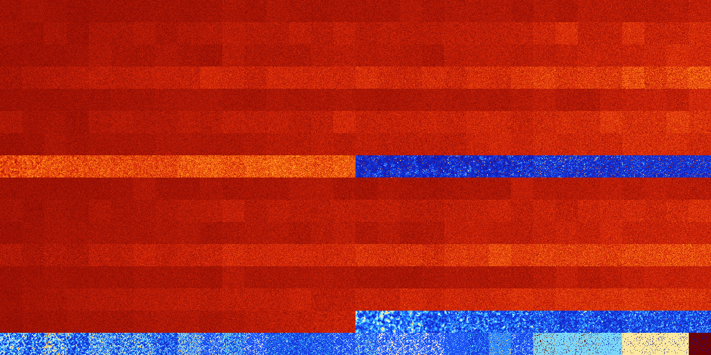

# B12457 (93184-93695)

<details>
    <summary>Initial Grid</summary>
    
</details>


<details>
    <summary>Initial Grid RLE</summary>

```
#C Exported from GoGoL (https://github.com/marrow16/gogol)
#C Wrap mode: Toroidal
#C Boundary mode: Dead
#C Step: 0
x = 100, y = 100, rule = B12457/S
49bo22bo15bo$57bo6bo6bobo$91bo$40bo13bo2bo2bo32bo$26bo26bo5bo22bo4bo$6b
o34bo9bo9bo23bo9bo$33bo6bo20bo4bo$18bo50bo28bo$52b2o32bo$3bo4b2o25bo4bo
5bo4bo33bo$o6bo2bo14bo26bo23bo16bo$52bo6bo20bo$17bo29bo22bo20bo$23bo20b
o22bo$36bo19bo9bo5b2o$9bo17bo48bo7bo$19bo25bo4bo32bo$31bobo28bo2bo18bo$
2b2o20bo13bo22bo9bo$4bo21bo9bo9bo2bo37b2o$10bo12bo10bo10bo11bo4b2o7b2o$
2bo3bo2bo24bo4bo4bo10bo21b2o16bo$2bo$45bo26bo3bo6bo$3bo15bo3bo20bo23bo
4bo5bo10bo$43b2o6bo17bobo5bo9b2o7bo$2bo17bo15bobo17bo4bo22bobo5bo6bo$7b
o13bo2bo8bo23bo35bobo$16bo9bo25bo17bo5bo14bo$13b2o2bo28bo19bo$5bo24bo2b
2o14bo10bo$41bo21bo$32bo$12bo8bo68bo$9bo9bo3bo47bo17bo5bo$6bo66bo5bo6bo
4bobo$11bo24bo16b2o30bo8bo$32bo6bo16bo16bo5bo$25bobo$26bo13bo$11bo31bo
21bo19bo3bo$11bo60bo2bo14bo$20bo11bo10bo27bo19bo$o15bo26bo40bo2bo9bo$
13bo14bo2bo26bo3bo20bo$10bo15bo9bo5bo20bo12bo4bo5bo4bobo2b3o$6bo31b2o4b
o31bo12bo6bo2bo$21bo34bo$15bo9bo15bo27bo23bo3bo$12bo9bo19bo49bobo$8bo$
18bo11bo20bo4b2o32bo2bo$23bo26bo8bo31bo$bo18bo4bo5bo4bobo11bobo7bo7bo5b
o14bo4bo$4bo49bo25bo$3bo2bo20bo23b2o7bo13bo17bo$19bo20bo14bo$35bo46bo
13bo$11bobo25bo8bo26bo5bo$5bo33bo4bo2bo5bo$bo46b2o33bo$38bo13bo8bobo35b
o$3bo17bo16bo18b2obo27bo$65bo18bo$17bo11bo18bo9bo28bo6bo$19bo13bo2bo28b
o18bo10bobo$39bo15b2o10bo30bo$33bo17bo18bo$26bo15bo7bo41bo$38bo28b2o13b
o9bo$6bo20bo3bo33bo29bo$71bo$6bo2bo15bo8bo2bo20bo20bo$8bo23bo49bo8bo$
10bo2bo9bo3b2o5bobo2b3o21bo31bo$5bo3bo51bo17bo14bo$27bo2bo17bo9bo29bo$
13bo69bo$61bo6bo3bo9bo2bo$19bo12bo19bo15bo$30bo28b2o$12bo35bo30bo$19bo
13bo11bo35bo$37bo32bo$12bo$33bo46bo$b3o4bo3bo25bo30bo4bo$15bo18b2o3bo9b
2o7bo12bo$o6bobo14bobo30bo26bo$10bo25bo3bo5b2o33bo$45bo30bo$16bo17bo9bo
3bo5bo9bo15bo$19bobo45bo10bo20bo$27bo11bo34bo16bo$3o21bo23bo$30b2o11bo
3bo26bo6bo$9bo15bo2bo31bo13bo15bo$bo22bo8bo28bo5bo21bo$21bo15bo9bobo$o
28bo57bo8bo!
```
</details>
<details>
    <summary>Thumbnail</summary>

</details>
<table>
<tr>
    <td><a href="./93184%20S%20Heat%20Map%20Activity.png"></a><br>S (93184)<br>G>1000</td>    <td><a href="./93185%20S0%20Heat%20Map%20Activity.png"></a><br>S0 (93185)<br>G>1000</td>    <td><a href="./93186%20S1%20Heat%20Map%20Activity.png"></a><br>S1 (93186)<br>G>1000</td>    <td><a href="./93187%20S01%20Heat%20Map%20Activity.png"></a><br>S01 (93187)<br>G>1000</td>    <td><a href="./93188%20S2%20Heat%20Map%20Activity.png"></a><br>S2 (93188)<br>G>1000</td>    <td><a href="./93189%20S02%20Heat%20Map%20Activity.png"></a><br>S02 (93189)<br>G>1000</td>    <td><a href="./93190%20S12%20Heat%20Map%20Activity.png"></a><br>S12 (93190)<br>G>1000</td>    <td><a href="./93191%20S012%20Heat%20Map%20Activity.png"></a><br>S012 (93191)<br>G>1000</td>    <td><a href="./93192%20S3%20Heat%20Map%20Activity.png"></a><br>S3 (93192)<br>G>1000</td>    <td><a href="./93193%20S03%20Heat%20Map%20Activity.png"></a><br>S03 (93193)<br>G>1000</td>    <td><a href="./93194%20S13%20Heat%20Map%20Activity.png"></a><br>S13 (93194)<br>G>1000</td>    <td><a href="./93195%20S013%20Heat%20Map%20Activity.png"></a><br>S013 (93195)<br>G>1000</td>    <td><a href="./93196%20S23%20Heat%20Map%20Activity.png"></a><br>S23 (93196)<br>G>1000</td>    <td><a href="./93197%20S023%20Heat%20Map%20Activity.png"></a><br>S023 (93197)<br>G>1000</td>    <td><a href="./93198%20S123%20Heat%20Map%20Activity.png"></a><br>S123 (93198)<br>G>1000</td>    <td><a href="./93199%20S0123%20Heat%20Map%20Activity.png"></a><br>S0123 (93199)<br>G>1000</td>    <td><a href="./93200%20S4%20Heat%20Map%20Activity.png"></a><br>S4 (93200)<br>G>1000</td>    <td><a href="./93201%20S04%20Heat%20Map%20Activity.png"></a><br>S04 (93201)<br>G>1000</td>    <td><a href="./93202%20S14%20Heat%20Map%20Activity.png"></a><br>S14 (93202)<br>G>1000</td>    <td><a href="./93203%20S014%20Heat%20Map%20Activity.png"></a><br>S014 (93203)<br>G>1000</td>    <td><a href="./93204%20S24%20Heat%20Map%20Activity.png"></a><br>S24 (93204)<br>G>1000</td>    <td><a href="./93205%20S024%20Heat%20Map%20Activity.png"></a><br>S024 (93205)<br>G>1000</td>    <td><a href="./93206%20S124%20Heat%20Map%20Activity.png"></a><br>S124 (93206)<br>G>1000</td>    <td><a href="./93207%20S0124%20Heat%20Map%20Activity.png"></a><br>S0124 (93207)<br>G>1000</td>    <td><a href="./93208%20S34%20Heat%20Map%20Activity.png"></a><br>S34 (93208)<br>G>1000</td>    <td><a href="./93209%20S034%20Heat%20Map%20Activity.png"></a><br>S034 (93209)<br>G>1000</td>    <td><a href="./93210%20S134%20Heat%20Map%20Activity.png"></a><br>S134 (93210)<br>G>1000</td>    <td><a href="./93211%20S0134%20Heat%20Map%20Activity.png"></a><br>S0134 (93211)<br>G>1000</td>    <td><a href="./93212%20S234%20Heat%20Map%20Activity.png"></a><br>S234 (93212)<br>G>1000</td>    <td><a href="./93213%20S0234%20Heat%20Map%20Activity.png"></a><br>S0234 (93213)<br>G>1000</td>    <td><a href="./93214%20S1234%20Heat%20Map%20Activity.png"></a><br>S1234 (93214)<br>G>1000</td>    <td><a href="./93215%20S01234%20Heat%20Map%20Activity.png"></a><br>S01234 (93215)<br>G>1000</td></tr>
<tr>
    <td><a href="./93216%20S5%20Heat%20Map%20Activity.png"></a><br>S5 (93216)<br>G>1000</td>    <td><a href="./93217%20S05%20Heat%20Map%20Activity.png"></a><br>S05 (93217)<br>G>1000</td>    <td><a href="./93218%20S15%20Heat%20Map%20Activity.png"></a><br>S15 (93218)<br>G>1000</td>    <td><a href="./93219%20S015%20Heat%20Map%20Activity.png"></a><br>S015 (93219)<br>G>1000</td>    <td><a href="./93220%20S25%20Heat%20Map%20Activity.png"></a><br>S25 (93220)<br>G>1000</td>    <td><a href="./93221%20S025%20Heat%20Map%20Activity.png"></a><br>S025 (93221)<br>G>1000</td>    <td><a href="./93222%20S125%20Heat%20Map%20Activity.png"></a><br>S125 (93222)<br>G>1000</td>    <td><a href="./93223%20S0125%20Heat%20Map%20Activity.png"></a><br>S0125 (93223)<br>G>1000</td>    <td><a href="./93224%20S35%20Heat%20Map%20Activity.png"></a><br>S35 (93224)<br>G>1000</td>    <td><a href="./93225%20S035%20Heat%20Map%20Activity.png"></a><br>S035 (93225)<br>G>1000</td>    <td><a href="./93226%20S135%20Heat%20Map%20Activity.png"></a><br>S135 (93226)<br>G>1000</td>    <td><a href="./93227%20S0135%20Heat%20Map%20Activity.png"></a><br>S0135 (93227)<br>G>1000</td>    <td><a href="./93228%20S235%20Heat%20Map%20Activity.png"></a><br>S235 (93228)<br>G>1000</td>    <td><a href="./93229%20S0235%20Heat%20Map%20Activity.png"></a><br>S0235 (93229)<br>G>1000</td>    <td><a href="./93230%20S1235%20Heat%20Map%20Activity.png"></a><br>S1235 (93230)<br>G>1000</td>    <td><a href="./93231%20S01235%20Heat%20Map%20Activity.png"></a><br>S01235 (93231)<br>G>1000</td>    <td><a href="./93232%20S45%20Heat%20Map%20Activity.png"></a><br>S45 (93232)<br>G>1000</td>    <td><a href="./93233%20S045%20Heat%20Map%20Activity.png"></a><br>S045 (93233)<br>G>1000</td>    <td><a href="./93234%20S145%20Heat%20Map%20Activity.png"></a><br>S145 (93234)<br>G>1000</td>    <td><a href="./93235%20S0145%20Heat%20Map%20Activity.png"></a><br>S0145 (93235)<br>G>1000</td>    <td><a href="./93236%20S245%20Heat%20Map%20Activity.png"></a><br>S245 (93236)<br>G>1000</td>    <td><a href="./93237%20S0245%20Heat%20Map%20Activity.png"></a><br>S0245 (93237)<br>G>1000</td>    <td><a href="./93238%20S1245%20Heat%20Map%20Activity.png"></a><br>S1245 (93238)<br>G>1000</td>    <td><a href="./93239%20S01245%20Heat%20Map%20Activity.png"></a><br>S01245 (93239)<br>G>1000</td>    <td><a href="./93240%20S345%20Heat%20Map%20Activity.png"></a><br>S345 (93240)<br>G>1000</td>    <td><a href="./93241%20S0345%20Heat%20Map%20Activity.png"></a><br>S0345 (93241)<br>G>1000</td>    <td><a href="./93242%20S1345%20Heat%20Map%20Activity.png"></a><br>S1345 (93242)<br>G>1000</td>    <td><a href="./93243%20S01345%20Heat%20Map%20Activity.png"></a><br>S01345 (93243)<br>G>1000</td>    <td><a href="./93244%20S2345%20Heat%20Map%20Activity.png"></a><br>S2345 (93244)<br>G>1000</td>    <td><a href="./93245%20S02345%20Heat%20Map%20Activity.png"></a><br>S02345 (93245)<br>G>1000</td>    <td><a href="./93246%20S12345%20Heat%20Map%20Activity.png"></a><br>S12345 (93246)<br>G>1000</td>    <td><a href="./93247%20S012345%20Heat%20Map%20Activity.png"></a><br>S012345 (93247)<br>G>1000</td></tr>
<tr>
    <td><a href="./93248%20S6%20Heat%20Map%20Activity.png"></a><br>S6 (93248)<br>G>1000</td>    <td><a href="./93249%20S06%20Heat%20Map%20Activity.png"></a><br>S06 (93249)<br>G>1000</td>    <td><a href="./93250%20S16%20Heat%20Map%20Activity.png"></a><br>S16 (93250)<br>G>1000</td>    <td><a href="./93251%20S016%20Heat%20Map%20Activity.png"></a><br>S016 (93251)<br>G>1000</td>    <td><a href="./93252%20S26%20Heat%20Map%20Activity.png"></a><br>S26 (93252)<br>G>1000</td>    <td><a href="./93253%20S026%20Heat%20Map%20Activity.png"></a><br>S026 (93253)<br>G>1000</td>    <td><a href="./93254%20S126%20Heat%20Map%20Activity.png"></a><br>S126 (93254)<br>G>1000</td>    <td><a href="./93255%20S0126%20Heat%20Map%20Activity.png"></a><br>S0126 (93255)<br>G>1000</td>    <td><a href="./93256%20S36%20Heat%20Map%20Activity.png"></a><br>S36 (93256)<br>G>1000</td>    <td><a href="./93257%20S036%20Heat%20Map%20Activity.png"></a><br>S036 (93257)<br>G>1000</td>    <td><a href="./93258%20S136%20Heat%20Map%20Activity.png"></a><br>S136 (93258)<br>G>1000</td>    <td><a href="./93259%20S0136%20Heat%20Map%20Activity.png"></a><br>S0136 (93259)<br>G>1000</td>    <td><a href="./93260%20S236%20Heat%20Map%20Activity.png"></a><br>S236 (93260)<br>G>1000</td>    <td><a href="./93261%20S0236%20Heat%20Map%20Activity.png"></a><br>S0236 (93261)<br>G>1000</td>    <td><a href="./93262%20S1236%20Heat%20Map%20Activity.png"></a><br>S1236 (93262)<br>G>1000</td>    <td><a href="./93263%20S01236%20Heat%20Map%20Activity.png"></a><br>S01236 (93263)<br>G>1000</td>    <td><a href="./93264%20S46%20Heat%20Map%20Activity.png"></a><br>S46 (93264)<br>G>1000</td>    <td><a href="./93265%20S046%20Heat%20Map%20Activity.png"></a><br>S046 (93265)<br>G>1000</td>    <td><a href="./93266%20S146%20Heat%20Map%20Activity.png"></a><br>S146 (93266)<br>G>1000</td>    <td><a href="./93267%20S0146%20Heat%20Map%20Activity.png"></a><br>S0146 (93267)<br>G>1000</td>    <td><a href="./93268%20S246%20Heat%20Map%20Activity.png"></a><br>S246 (93268)<br>G>1000</td>    <td><a href="./93269%20S0246%20Heat%20Map%20Activity.png"></a><br>S0246 (93269)<br>G>1000</td>    <td><a href="./93270%20S1246%20Heat%20Map%20Activity.png"></a><br>S1246 (93270)<br>G>1000</td>    <td><a href="./93271%20S01246%20Heat%20Map%20Activity.png"></a><br>S01246 (93271)<br>G>1000</td>    <td><a href="./93272%20S346%20Heat%20Map%20Activity.png"></a><br>S346 (93272)<br>G>1000</td>    <td><a href="./93273%20S0346%20Heat%20Map%20Activity.png"></a><br>S0346 (93273)<br>G>1000</td>    <td><a href="./93274%20S1346%20Heat%20Map%20Activity.png"></a><br>S1346 (93274)<br>G>1000</td>    <td><a href="./93275%20S01346%20Heat%20Map%20Activity.png"></a><br>S01346 (93275)<br>G>1000</td>    <td><a href="./93276%20S2346%20Heat%20Map%20Activity.png"></a><br>S2346 (93276)<br>G>1000</td>    <td><a href="./93277%20S02346%20Heat%20Map%20Activity.png"></a><br>S02346 (93277)<br>G>1000</td>    <td><a href="./93278%20S12346%20Heat%20Map%20Activity.png"></a><br>S12346 (93278)<br>G>1000</td>    <td><a href="./93279%20S012346%20Heat%20Map%20Activity.png"></a><br>S012346 (93279)<br>G>1000</td></tr>
<tr>
    <td><a href="./93280%20S56%20Heat%20Map%20Activity.png"></a><br>S56 (93280)<br>G>1000</td>    <td><a href="./93281%20S056%20Heat%20Map%20Activity.png"></a><br>S056 (93281)<br>G>1000</td>    <td><a href="./93282%20S156%20Heat%20Map%20Activity.png"></a><br>S156 (93282)<br>G>1000</td>    <td><a href="./93283%20S0156%20Heat%20Map%20Activity.png"></a><br>S0156 (93283)<br>G>1000</td>    <td><a href="./93284%20S256%20Heat%20Map%20Activity.png"></a><br>S256 (93284)<br>G>1000</td>    <td><a href="./93285%20S0256%20Heat%20Map%20Activity.png"></a><br>S0256 (93285)<br>G>1000</td>    <td><a href="./93286%20S1256%20Heat%20Map%20Activity.png"></a><br>S1256 (93286)<br>G>1000</td>    <td><a href="./93287%20S01256%20Heat%20Map%20Activity.png"></a><br>S01256 (93287)<br>G>1000</td>    <td><a href="./93288%20S356%20Heat%20Map%20Activity.png"></a><br>S356 (93288)<br>G>1000</td>    <td><a href="./93289%20S0356%20Heat%20Map%20Activity.png"></a><br>S0356 (93289)<br>G>1000</td>    <td><a href="./93290%20S1356%20Heat%20Map%20Activity.png"></a><br>S1356 (93290)<br>G>1000</td>    <td><a href="./93291%20S01356%20Heat%20Map%20Activity.png"></a><br>S01356 (93291)<br>G>1000</td>    <td><a href="./93292%20S2356%20Heat%20Map%20Activity.png"></a><br>S2356 (93292)<br>G>1000</td>    <td><a href="./93293%20S02356%20Heat%20Map%20Activity.png"></a><br>S02356 (93293)<br>G>1000</td>    <td><a href="./93294%20S12356%20Heat%20Map%20Activity.png"></a><br>S12356 (93294)<br>G>1000</td>    <td><a href="./93295%20S012356%20Heat%20Map%20Activity.png"></a><br>S012356 (93295)<br>G>1000</td>    <td><a href="./93296%20S456%20Heat%20Map%20Activity.png"></a><br>S456 (93296)<br>G>1000</td>    <td><a href="./93297%20S0456%20Heat%20Map%20Activity.png"></a><br>S0456 (93297)<br>G>1000</td>    <td><a href="./93298%20S1456%20Heat%20Map%20Activity.png"></a><br>S1456 (93298)<br>G>1000</td>    <td><a href="./93299%20S01456%20Heat%20Map%20Activity.png"></a><br>S01456 (93299)<br>G>1000</td>    <td><a href="./93300%20S2456%20Heat%20Map%20Activity.png"></a><br>S2456 (93300)<br>G>1000</td>    <td><a href="./93301%20S02456%20Heat%20Map%20Activity.png"></a><br>S02456 (93301)<br>G>1000</td>    <td><a href="./93302%20S12456%20Heat%20Map%20Activity.png"></a><br>S12456 (93302)<br>G>1000</td>    <td><a href="./93303%20S012456%20Heat%20Map%20Activity.png"></a><br>S012456 (93303)<br>G>1000</td>    <td><a href="./93304%20S3456%20Heat%20Map%20Activity.png"></a><br>S3456 (93304)<br>G>1000</td>    <td><a href="./93305%20S03456%20Heat%20Map%20Activity.png"></a><br>S03456 (93305)<br>G>1000</td>    <td><a href="./93306%20S13456%20Heat%20Map%20Activity.png"></a><br>S13456 (93306)<br>G>1000</td>    <td><a href="./93307%20S013456%20Heat%20Map%20Activity.png"></a><br>S013456 (93307)<br>G>1000</td>    <td><a href="./93308%20S23456%20Heat%20Map%20Activity.png"></a><br>S23456 (93308)<br>G>1000</td>    <td><a href="./93309%20S023456%20Heat%20Map%20Activity.png"></a><br>S023456 (93309)<br>G>1000</td>    <td><a href="./93310%20S123456%20Heat%20Map%20Activity.png"></a><br>S123456 (93310)<br>G>1000</td>    <td><a href="./93311%20S0123456%20Heat%20Map%20Activity.png"></a><br>S0123456 (93311)<br>G>1000</td></tr>
<tr>
    <td><a href="./93312%20S7%20Heat%20Map%20Activity.png"></a><br>S7 (93312)<br>G>1000</td>    <td><a href="./93313%20S07%20Heat%20Map%20Activity.png"></a><br>S07 (93313)<br>G>1000</td>    <td><a href="./93314%20S17%20Heat%20Map%20Activity.png"></a><br>S17 (93314)<br>G>1000</td>    <td><a href="./93315%20S017%20Heat%20Map%20Activity.png"></a><br>S017 (93315)<br>G>1000</td>    <td><a href="./93316%20S27%20Heat%20Map%20Activity.png"></a><br>S27 (93316)<br>G>1000</td>    <td><a href="./93317%20S027%20Heat%20Map%20Activity.png"></a><br>S027 (93317)<br>G>1000</td>    <td><a href="./93318%20S127%20Heat%20Map%20Activity.png"></a><br>S127 (93318)<br>G>1000</td>    <td><a href="./93319%20S0127%20Heat%20Map%20Activity.png"></a><br>S0127 (93319)<br>G>1000</td>    <td><a href="./93320%20S37%20Heat%20Map%20Activity.png"></a><br>S37 (93320)<br>G>1000</td>    <td><a href="./93321%20S037%20Heat%20Map%20Activity.png"></a><br>S037 (93321)<br>G>1000</td>    <td><a href="./93322%20S137%20Heat%20Map%20Activity.png"></a><br>S137 (93322)<br>G>1000</td>    <td><a href="./93323%20S0137%20Heat%20Map%20Activity.png"></a><br>S0137 (93323)<br>G>1000</td>    <td><a href="./93324%20S237%20Heat%20Map%20Activity.png"></a><br>S237 (93324)<br>G>1000</td>    <td><a href="./93325%20S0237%20Heat%20Map%20Activity.png"></a><br>S0237 (93325)<br>G>1000</td>    <td><a href="./93326%20S1237%20Heat%20Map%20Activity.png"></a><br>S1237 (93326)<br>G>1000</td>    <td><a href="./93327%20S01237%20Heat%20Map%20Activity.png"></a><br>S01237 (93327)<br>G>1000</td>    <td><a href="./93328%20S47%20Heat%20Map%20Activity.png"></a><br>S47 (93328)<br>G>1000</td>    <td><a href="./93329%20S047%20Heat%20Map%20Activity.png"></a><br>S047 (93329)<br>G>1000</td>    <td><a href="./93330%20S147%20Heat%20Map%20Activity.png"></a><br>S147 (93330)<br>G>1000</td>    <td><a href="./93331%20S0147%20Heat%20Map%20Activity.png"></a><br>S0147 (93331)<br>G>1000</td>    <td><a href="./93332%20S247%20Heat%20Map%20Activity.png"></a><br>S247 (93332)<br>G>1000</td>    <td><a href="./93333%20S0247%20Heat%20Map%20Activity.png"></a><br>S0247 (93333)<br>G>1000</td>    <td><a href="./93334%20S1247%20Heat%20Map%20Activity.png"></a><br>S1247 (93334)<br>G>1000</td>    <td><a href="./93335%20S01247%20Heat%20Map%20Activity.png"></a><br>S01247 (93335)<br>G>1000</td>    <td><a href="./93336%20S347%20Heat%20Map%20Activity.png"></a><br>S347 (93336)<br>G>1000</td>    <td><a href="./93337%20S0347%20Heat%20Map%20Activity.png"></a><br>S0347 (93337)<br>G>1000</td>    <td><a href="./93338%20S1347%20Heat%20Map%20Activity.png"></a><br>S1347 (93338)<br>G>1000</td>    <td><a href="./93339%20S01347%20Heat%20Map%20Activity.png"></a><br>S01347 (93339)<br>G>1000</td>    <td><a href="./93340%20S2347%20Heat%20Map%20Activity.png"></a><br>S2347 (93340)<br>G>1000</td>    <td><a href="./93341%20S02347%20Heat%20Map%20Activity.png"></a><br>S02347 (93341)<br>G>1000</td>    <td><a href="./93342%20S12347%20Heat%20Map%20Activity.png"></a><br>S12347 (93342)<br>G>1000</td>    <td><a href="./93343%20S012347%20Heat%20Map%20Activity.png"></a><br>S012347 (93343)<br>G>1000</td></tr>
<tr>
    <td><a href="./93344%20S57%20Heat%20Map%20Activity.png"></a><br>S57 (93344)<br>G>1000</td>    <td><a href="./93345%20S057%20Heat%20Map%20Activity.png"></a><br>S057 (93345)<br>G>1000</td>    <td><a href="./93346%20S157%20Heat%20Map%20Activity.png"></a><br>S157 (93346)<br>G>1000</td>    <td><a href="./93347%20S0157%20Heat%20Map%20Activity.png"></a><br>S0157 (93347)<br>G>1000</td>    <td><a href="./93348%20S257%20Heat%20Map%20Activity.png"></a><br>S257 (93348)<br>G>1000</td>    <td><a href="./93349%20S0257%20Heat%20Map%20Activity.png"></a><br>S0257 (93349)<br>G>1000</td>    <td><a href="./93350%20S1257%20Heat%20Map%20Activity.png"></a><br>S1257 (93350)<br>G>1000</td>    <td><a href="./93351%20S01257%20Heat%20Map%20Activity.png"></a><br>S01257 (93351)<br>G>1000</td>    <td><a href="./93352%20S357%20Heat%20Map%20Activity.png"></a><br>S357 (93352)<br>G>1000</td>    <td><a href="./93353%20S0357%20Heat%20Map%20Activity.png"></a><br>S0357 (93353)<br>G>1000</td>    <td><a href="./93354%20S1357%20Heat%20Map%20Activity.png"></a><br>S1357 (93354)<br>G>1000</td>    <td><a href="./93355%20S01357%20Heat%20Map%20Activity.png"></a><br>S01357 (93355)<br>G>1000</td>    <td><a href="./93356%20S2357%20Heat%20Map%20Activity.png"></a><br>S2357 (93356)<br>G>1000</td>    <td><a href="./93357%20S02357%20Heat%20Map%20Activity.png"></a><br>S02357 (93357)<br>G>1000</td>    <td><a href="./93358%20S12357%20Heat%20Map%20Activity.png"></a><br>S12357 (93358)<br>G>1000</td>    <td><a href="./93359%20S012357%20Heat%20Map%20Activity.png"></a><br>S012357 (93359)<br>G>1000</td>    <td><a href="./93360%20S457%20Heat%20Map%20Activity.png"></a><br>S457 (93360)<br>G>1000</td>    <td><a href="./93361%20S0457%20Heat%20Map%20Activity.png"></a><br>S0457 (93361)<br>G>1000</td>    <td><a href="./93362%20S1457%20Heat%20Map%20Activity.png"></a><br>S1457 (93362)<br>G>1000</td>    <td><a href="./93363%20S01457%20Heat%20Map%20Activity.png"></a><br>S01457 (93363)<br>G>1000</td>    <td><a href="./93364%20S2457%20Heat%20Map%20Activity.png"></a><br>S2457 (93364)<br>G>1000</td>    <td><a href="./93365%20S02457%20Heat%20Map%20Activity.png"></a><br>S02457 (93365)<br>G>1000</td>    <td><a href="./93366%20S12457%20Heat%20Map%20Activity.png"></a><br>S12457 (93366)<br>G>1000</td>    <td><a href="./93367%20S012457%20Heat%20Map%20Activity.png"></a><br>S012457 (93367)<br>G>1000</td>    <td><a href="./93368%20S3457%20Heat%20Map%20Activity.png"></a><br>S3457 (93368)<br>G>1000</td>    <td><a href="./93369%20S03457%20Heat%20Map%20Activity.png"></a><br>S03457 (93369)<br>G>1000</td>    <td><a href="./93370%20S13457%20Heat%20Map%20Activity.png"></a><br>S13457 (93370)<br>G>1000</td>    <td><a href="./93371%20S013457%20Heat%20Map%20Activity.png"></a><br>S013457 (93371)<br>G>1000</td>    <td><a href="./93372%20S23457%20Heat%20Map%20Activity.png"></a><br>S23457 (93372)<br>G>1000</td>    <td><a href="./93373%20S023457%20Heat%20Map%20Activity.png"></a><br>S023457 (93373)<br>G>1000</td>    <td><a href="./93374%20S123457%20Heat%20Map%20Activity.png"></a><br>S123457 (93374)<br>G>1000</td>    <td><a href="./93375%20S0123457%20Heat%20Map%20Activity.png"></a><br>S0123457 (93375)<br>G>1000</td></tr>
<tr>
    <td><a href="./93376%20S67%20Heat%20Map%20Activity.png"></a><br>S67 (93376)<br>G>1000</td>    <td><a href="./93377%20S067%20Heat%20Map%20Activity.png"></a><br>S067 (93377)<br>G>1000</td>    <td><a href="./93378%20S167%20Heat%20Map%20Activity.png"></a><br>S167 (93378)<br>G>1000</td>    <td><a href="./93379%20S0167%20Heat%20Map%20Activity.png"></a><br>S0167 (93379)<br>G>1000</td>    <td><a href="./93380%20S267%20Heat%20Map%20Activity.png"></a><br>S267 (93380)<br>G>1000</td>    <td><a href="./93381%20S0267%20Heat%20Map%20Activity.png"></a><br>S0267 (93381)<br>G>1000</td>    <td><a href="./93382%20S1267%20Heat%20Map%20Activity.png"></a><br>S1267 (93382)<br>G>1000</td>    <td><a href="./93383%20S01267%20Heat%20Map%20Activity.png"></a><br>S01267 (93383)<br>G>1000</td>    <td><a href="./93384%20S367%20Heat%20Map%20Activity.png"></a><br>S367 (93384)<br>G>1000</td>    <td><a href="./93385%20S0367%20Heat%20Map%20Activity.png"></a><br>S0367 (93385)<br>G>1000</td>    <td><a href="./93386%20S1367%20Heat%20Map%20Activity.png"></a><br>S1367 (93386)<br>G>1000</td>    <td><a href="./93387%20S01367%20Heat%20Map%20Activity.png"></a><br>S01367 (93387)<br>G>1000</td>    <td><a href="./93388%20S2367%20Heat%20Map%20Activity.png"></a><br>S2367 (93388)<br>G>1000</td>    <td><a href="./93389%20S02367%20Heat%20Map%20Activity.png"></a><br>S02367 (93389)<br>G>1000</td>    <td><a href="./93390%20S12367%20Heat%20Map%20Activity.png"></a><br>S12367 (93390)<br>G>1000</td>    <td><a href="./93391%20S012367%20Heat%20Map%20Activity.png"></a><br>S012367 (93391)<br>G>1000</td>    <td><a href="./93392%20S467%20Heat%20Map%20Activity.png"></a><br>S467 (93392)<br>G>1000</td>    <td><a href="./93393%20S0467%20Heat%20Map%20Activity.png"></a><br>S0467 (93393)<br>G>1000</td>    <td><a href="./93394%20S1467%20Heat%20Map%20Activity.png"></a><br>S1467 (93394)<br>G>1000</td>    <td><a href="./93395%20S01467%20Heat%20Map%20Activity.png"></a><br>S01467 (93395)<br>G>1000</td>    <td><a href="./93396%20S2467%20Heat%20Map%20Activity.png"></a><br>S2467 (93396)<br>G>1000</td>    <td><a href="./93397%20S02467%20Heat%20Map%20Activity.png"></a><br>S02467 (93397)<br>G>1000</td>    <td><a href="./93398%20S12467%20Heat%20Map%20Activity.png"></a><br>S12467 (93398)<br>G>1000</td>    <td><a href="./93399%20S012467%20Heat%20Map%20Activity.png"></a><br>S012467 (93399)<br>G>1000</td>    <td><a href="./93400%20S3467%20Heat%20Map%20Activity.png"></a><br>S3467 (93400)<br>G>1000</td>    <td><a href="./93401%20S03467%20Heat%20Map%20Activity.png"></a><br>S03467 (93401)<br>G>1000</td>    <td><a href="./93402%20S13467%20Heat%20Map%20Activity.png"></a><br>S13467 (93402)<br>G>1000</td>    <td><a href="./93403%20S013467%20Heat%20Map%20Activity.png"></a><br>S013467 (93403)<br>G>1000</td>    <td><a href="./93404%20S23467%20Heat%20Map%20Activity.png"></a><br>S23467 (93404)<br>G>1000</td>    <td><a href="./93405%20S023467%20Heat%20Map%20Activity.png"></a><br>S023467 (93405)<br>G>1000</td>    <td><a href="./93406%20S123467%20Heat%20Map%20Activity.png"></a><br>S123467 (93406)<br>G>1000</td>    <td><a href="./93407%20S0123467%20Heat%20Map%20Activity.png"></a><br>S0123467 (93407)<br>G>1000</td></tr>
<tr>
    <td><a href="./93408%20S567%20Heat%20Map%20Activity.png"></a><br>S567 (93408)<br>G>1000</td>    <td><a href="./93409%20S0567%20Heat%20Map%20Activity.png"></a><br>S0567 (93409)<br>G>1000</td>    <td><a href="./93410%20S1567%20Heat%20Map%20Activity.png"></a><br>S1567 (93410)<br>G>1000</td>    <td><a href="./93411%20S01567%20Heat%20Map%20Activity.png"></a><br>S01567 (93411)<br>G>1000</td>    <td><a href="./93412%20S2567%20Heat%20Map%20Activity.png"></a><br>S2567 (93412)<br>G>1000</td>    <td><a href="./93413%20S02567%20Heat%20Map%20Activity.png"></a><br>S02567 (93413)<br>G>1000</td>    <td><a href="./93414%20S12567%20Heat%20Map%20Activity.png"></a><br>S12567 (93414)<br>G>1000</td>    <td><a href="./93415%20S012567%20Heat%20Map%20Activity.png"></a><br>S012567 (93415)<br>G>1000</td>    <td><a href="./93416%20S3567%20Heat%20Map%20Activity.png"></a><br>S3567 (93416)<br>G>1000</td>    <td><a href="./93417%20S03567%20Heat%20Map%20Activity.png"></a><br>S03567 (93417)<br>G>1000</td>    <td><a href="./93418%20S13567%20Heat%20Map%20Activity.png"></a><br>S13567 (93418)<br>G>1000</td>    <td><a href="./93419%20S013567%20Heat%20Map%20Activity.png"></a><br>S013567 (93419)<br>G>1000</td>    <td><a href="./93420%20S23567%20Heat%20Map%20Activity.png"></a><br>S23567 (93420)<br>G>1000</td>    <td><a href="./93421%20S023567%20Heat%20Map%20Activity.png"></a><br>S023567 (93421)<br>G>1000</td>    <td><a href="./93422%20S123567%20Heat%20Map%20Activity.png"></a><br>S123567 (93422)<br>G>1000</td>    <td><a href="./93423%20S0123567%20Heat%20Map%20Activity.png"></a><br>S0123567 (93423)<br>G>1000</td>    <td><a href="./93424%20S4567%20Heat%20Map%20Activity.png"></a><br>S4567 (93424)<br>R@285,p12</td>    <td><a href="./93425%20S04567%20Heat%20Map%20Activity.png"></a><br>S04567 (93425)<br>R@237,p12</td>    <td><a href="./93426%20S14567%20Heat%20Map%20Activity.png"></a><br>S14567 (93426)<br>R@238,p12</td>    <td><a href="./93427%20S014567%20Heat%20Map%20Activity.png"></a><br>S014567 (93427)<br>R@262,p6</td>    <td><a href="./93428%20S24567%20Heat%20Map%20Activity.png"></a><br>S24567 (93428)<br>R@128,p12</td>    <td><a href="./93429%20S024567%20Heat%20Map%20Activity.png"></a><br>S024567 (93429)<br>R@146,p12</td>    <td><a href="./93430%20S124567%20Heat%20Map%20Activity.png"></a><br>S124567 (93430)<br>R@180,p12</td>    <td><a href="./93431%20S0124567%20Heat%20Map%20Activity.png"></a><br>S0124567 (93431)<br>R@121,p12</td>    <td><a href="./93432%20S34567%20Heat%20Map%20Activity.png"></a><br>S34567 (93432)<br>R@33,p6</td>    <td><a href="./93433%20S034567%20Heat%20Map%20Activity.png"></a><br>S034567 (93433)<br>R@35,p6</td>    <td><a href="./93434%20S134567%20Heat%20Map%20Activity.png"></a><br>S134567 (93434)<br>R@41,p6</td>    <td><a href="./93435%20S0134567%20Heat%20Map%20Activity.png"></a><br>S0134567 (93435)<br>R@47,p12</td>    <td><a href="./93436%20S234567%20Heat%20Map%20Activity.png"></a><br>S234567 (93436)<br>R@28,p6</td>    <td><a href="./93437%20S0234567%20Heat%20Map%20Activity.png"></a><br>S0234567 (93437)<br>R@34,p6</td>    <td><a href="./93438%20S1234567%20Heat%20Map%20Activity.png"></a><br>S1234567 (93438)<br>R@33,p6</td>    <td><a href="./93439%20S01234567%20Heat%20Map%20Activity.png"></a><br>S01234567 (93439)<br>R@32,p6</td></tr>
<tr>
    <td><a href="./93440%20S8%20Heat%20Map%20Activity.png"></a><br>S8 (93440)<br>G>1000</td>    <td><a href="./93441%20S08%20Heat%20Map%20Activity.png"></a><br>S08 (93441)<br>G>1000</td>    <td><a href="./93442%20S18%20Heat%20Map%20Activity.png"></a><br>S18 (93442)<br>G>1000</td>    <td><a href="./93443%20S018%20Heat%20Map%20Activity.png"></a><br>S018 (93443)<br>G>1000</td>    <td><a href="./93444%20S28%20Heat%20Map%20Activity.png"></a><br>S28 (93444)<br>G>1000</td>    <td><a href="./93445%20S028%20Heat%20Map%20Activity.png"></a><br>S028 (93445)<br>G>1000</td>    <td><a href="./93446%20S128%20Heat%20Map%20Activity.png"></a><br>S128 (93446)<br>G>1000</td>    <td><a href="./93447%20S0128%20Heat%20Map%20Activity.png"></a><br>S0128 (93447)<br>G>1000</td>    <td><a href="./93448%20S38%20Heat%20Map%20Activity.png"></a><br>S38 (93448)<br>G>1000</td>    <td><a href="./93449%20S038%20Heat%20Map%20Activity.png"></a><br>S038 (93449)<br>G>1000</td>    <td><a href="./93450%20S138%20Heat%20Map%20Activity.png"></a><br>S138 (93450)<br>G>1000</td>    <td><a href="./93451%20S0138%20Heat%20Map%20Activity.png"></a><br>S0138 (93451)<br>G>1000</td>    <td><a href="./93452%20S238%20Heat%20Map%20Activity.png"></a><br>S238 (93452)<br>G>1000</td>    <td><a href="./93453%20S0238%20Heat%20Map%20Activity.png"></a><br>S0238 (93453)<br>G>1000</td>    <td><a href="./93454%20S1238%20Heat%20Map%20Activity.png"></a><br>S1238 (93454)<br>G>1000</td>    <td><a href="./93455%20S01238%20Heat%20Map%20Activity.png"></a><br>S01238 (93455)<br>G>1000</td>    <td><a href="./93456%20S48%20Heat%20Map%20Activity.png"></a><br>S48 (93456)<br>G>1000</td>    <td><a href="./93457%20S048%20Heat%20Map%20Activity.png"></a><br>S048 (93457)<br>G>1000</td>    <td><a href="./93458%20S148%20Heat%20Map%20Activity.png"></a><br>S148 (93458)<br>G>1000</td>    <td><a href="./93459%20S0148%20Heat%20Map%20Activity.png"></a><br>S0148 (93459)<br>G>1000</td>    <td><a href="./93460%20S248%20Heat%20Map%20Activity.png"></a><br>S248 (93460)<br>G>1000</td>    <td><a href="./93461%20S0248%20Heat%20Map%20Activity.png"></a><br>S0248 (93461)<br>G>1000</td>    <td><a href="./93462%20S1248%20Heat%20Map%20Activity.png"></a><br>S1248 (93462)<br>G>1000</td>    <td><a href="./93463%20S01248%20Heat%20Map%20Activity.png"></a><br>S01248 (93463)<br>G>1000</td>    <td><a href="./93464%20S348%20Heat%20Map%20Activity.png"></a><br>S348 (93464)<br>G>1000</td>    <td><a href="./93465%20S0348%20Heat%20Map%20Activity.png"></a><br>S0348 (93465)<br>G>1000</td>    <td><a href="./93466%20S1348%20Heat%20Map%20Activity.png"></a><br>S1348 (93466)<br>G>1000</td>    <td><a href="./93467%20S01348%20Heat%20Map%20Activity.png"></a><br>S01348 (93467)<br>G>1000</td>    <td><a href="./93468%20S2348%20Heat%20Map%20Activity.png"></a><br>S2348 (93468)<br>G>1000</td>    <td><a href="./93469%20S02348%20Heat%20Map%20Activity.png"></a><br>S02348 (93469)<br>G>1000</td>    <td><a href="./93470%20S12348%20Heat%20Map%20Activity.png"></a><br>S12348 (93470)<br>G>1000</td>    <td><a href="./93471%20S012348%20Heat%20Map%20Activity.png"></a><br>S012348 (93471)<br>G>1000</td></tr>
<tr>
    <td><a href="./93472%20S58%20Heat%20Map%20Activity.png"></a><br>S58 (93472)<br>G>1000</td>    <td><a href="./93473%20S058%20Heat%20Map%20Activity.png"></a><br>S058 (93473)<br>G>1000</td>    <td><a href="./93474%20S158%20Heat%20Map%20Activity.png"></a><br>S158 (93474)<br>G>1000</td>    <td><a href="./93475%20S0158%20Heat%20Map%20Activity.png"></a><br>S0158 (93475)<br>G>1000</td>    <td><a href="./93476%20S258%20Heat%20Map%20Activity.png"></a><br>S258 (93476)<br>G>1000</td>    <td><a href="./93477%20S0258%20Heat%20Map%20Activity.png"></a><br>S0258 (93477)<br>G>1000</td>    <td><a href="./93478%20S1258%20Heat%20Map%20Activity.png"></a><br>S1258 (93478)<br>G>1000</td>    <td><a href="./93479%20S01258%20Heat%20Map%20Activity.png"></a><br>S01258 (93479)<br>G>1000</td>    <td><a href="./93480%20S358%20Heat%20Map%20Activity.png"></a><br>S358 (93480)<br>G>1000</td>    <td><a href="./93481%20S0358%20Heat%20Map%20Activity.png"></a><br>S0358 (93481)<br>G>1000</td>    <td><a href="./93482%20S1358%20Heat%20Map%20Activity.png"></a><br>S1358 (93482)<br>G>1000</td>    <td><a href="./93483%20S01358%20Heat%20Map%20Activity.png"></a><br>S01358 (93483)<br>G>1000</td>    <td><a href="./93484%20S2358%20Heat%20Map%20Activity.png"></a><br>S2358 (93484)<br>G>1000</td>    <td><a href="./93485%20S02358%20Heat%20Map%20Activity.png"></a><br>S02358 (93485)<br>G>1000</td>    <td><a href="./93486%20S12358%20Heat%20Map%20Activity.png"></a><br>S12358 (93486)<br>G>1000</td>    <td><a href="./93487%20S012358%20Heat%20Map%20Activity.png"></a><br>S012358 (93487)<br>G>1000</td>    <td><a href="./93488%20S458%20Heat%20Map%20Activity.png"></a><br>S458 (93488)<br>G>1000</td>    <td><a href="./93489%20S0458%20Heat%20Map%20Activity.png"></a><br>S0458 (93489)<br>G>1000</td>    <td><a href="./93490%20S1458%20Heat%20Map%20Activity.png"></a><br>S1458 (93490)<br>G>1000</td>    <td><a href="./93491%20S01458%20Heat%20Map%20Activity.png"></a><br>S01458 (93491)<br>G>1000</td>    <td><a href="./93492%20S2458%20Heat%20Map%20Activity.png"></a><br>S2458 (93492)<br>G>1000</td>    <td><a href="./93493%20S02458%20Heat%20Map%20Activity.png"></a><br>S02458 (93493)<br>G>1000</td>    <td><a href="./93494%20S12458%20Heat%20Map%20Activity.png"></a><br>S12458 (93494)<br>G>1000</td>    <td><a href="./93495%20S012458%20Heat%20Map%20Activity.png"></a><br>S012458 (93495)<br>G>1000</td>    <td><a href="./93496%20S3458%20Heat%20Map%20Activity.png"></a><br>S3458 (93496)<br>G>1000</td>    <td><a href="./93497%20S03458%20Heat%20Map%20Activity.png"></a><br>S03458 (93497)<br>G>1000</td>    <td><a href="./93498%20S13458%20Heat%20Map%20Activity.png"></a><br>S13458 (93498)<br>G>1000</td>    <td><a href="./93499%20S013458%20Heat%20Map%20Activity.png"></a><br>S013458 (93499)<br>G>1000</td>    <td><a href="./93500%20S23458%20Heat%20Map%20Activity.png"></a><br>S23458 (93500)<br>G>1000</td>    <td><a href="./93501%20S023458%20Heat%20Map%20Activity.png"></a><br>S023458 (93501)<br>G>1000</td>    <td><a href="./93502%20S123458%20Heat%20Map%20Activity.png"></a><br>S123458 (93502)<br>G>1000</td>    <td><a href="./93503%20S0123458%20Heat%20Map%20Activity.png"></a><br>S0123458 (93503)<br>G>1000</td></tr>
<tr>
    <td><a href="./93504%20S68%20Heat%20Map%20Activity.png"></a><br>S68 (93504)<br>G>1000</td>    <td><a href="./93505%20S068%20Heat%20Map%20Activity.png"></a><br>S068 (93505)<br>G>1000</td>    <td><a href="./93506%20S168%20Heat%20Map%20Activity.png"></a><br>S168 (93506)<br>G>1000</td>    <td><a href="./93507%20S0168%20Heat%20Map%20Activity.png"></a><br>S0168 (93507)<br>G>1000</td>    <td><a href="./93508%20S268%20Heat%20Map%20Activity.png"></a><br>S268 (93508)<br>G>1000</td>    <td><a href="./93509%20S0268%20Heat%20Map%20Activity.png"></a><br>S0268 (93509)<br>G>1000</td>    <td><a href="./93510%20S1268%20Heat%20Map%20Activity.png"></a><br>S1268 (93510)<br>G>1000</td>    <td><a href="./93511%20S01268%20Heat%20Map%20Activity.png"></a><br>S01268 (93511)<br>G>1000</td>    <td><a href="./93512%20S368%20Heat%20Map%20Activity.png"></a><br>S368 (93512)<br>G>1000</td>    <td><a href="./93513%20S0368%20Heat%20Map%20Activity.png"></a><br>S0368 (93513)<br>G>1000</td>    <td><a href="./93514%20S1368%20Heat%20Map%20Activity.png"></a><br>S1368 (93514)<br>G>1000</td>    <td><a href="./93515%20S01368%20Heat%20Map%20Activity.png"></a><br>S01368 (93515)<br>G>1000</td>    <td><a href="./93516%20S2368%20Heat%20Map%20Activity.png"></a><br>S2368 (93516)<br>G>1000</td>    <td><a href="./93517%20S02368%20Heat%20Map%20Activity.png"></a><br>S02368 (93517)<br>G>1000</td>    <td><a href="./93518%20S12368%20Heat%20Map%20Activity.png"></a><br>S12368 (93518)<br>G>1000</td>    <td><a href="./93519%20S012368%20Heat%20Map%20Activity.png"></a><br>S012368 (93519)<br>G>1000</td>    <td><a href="./93520%20S468%20Heat%20Map%20Activity.png"></a><br>S468 (93520)<br>G>1000</td>    <td><a href="./93521%20S0468%20Heat%20Map%20Activity.png"></a><br>S0468 (93521)<br>G>1000</td>    <td><a href="./93522%20S1468%20Heat%20Map%20Activity.png"></a><br>S1468 (93522)<br>G>1000</td>    <td><a href="./93523%20S01468%20Heat%20Map%20Activity.png"></a><br>S01468 (93523)<br>G>1000</td>    <td><a href="./93524%20S2468%20Heat%20Map%20Activity.png"></a><br>S2468 (93524)<br>G>1000</td>    <td><a href="./93525%20S02468%20Heat%20Map%20Activity.png"></a><br>S02468 (93525)<br>G>1000</td>    <td><a href="./93526%20S12468%20Heat%20Map%20Activity.png"></a><br>S12468 (93526)<br>G>1000</td>    <td><a href="./93527%20S012468%20Heat%20Map%20Activity.png"></a><br>S012468 (93527)<br>G>1000</td>    <td><a href="./93528%20S3468%20Heat%20Map%20Activity.png"></a><br>S3468 (93528)<br>G>1000</td>    <td><a href="./93529%20S03468%20Heat%20Map%20Activity.png"></a><br>S03468 (93529)<br>G>1000</td>    <td><a href="./93530%20S13468%20Heat%20Map%20Activity.png"></a><br>S13468 (93530)<br>G>1000</td>    <td><a href="./93531%20S013468%20Heat%20Map%20Activity.png"></a><br>S013468 (93531)<br>G>1000</td>    <td><a href="./93532%20S23468%20Heat%20Map%20Activity.png"></a><br>S23468 (93532)<br>G>1000</td>    <td><a href="./93533%20S023468%20Heat%20Map%20Activity.png"></a><br>S023468 (93533)<br>G>1000</td>    <td><a href="./93534%20S123468%20Heat%20Map%20Activity.png"></a><br>S123468 (93534)<br>G>1000</td>    <td><a href="./93535%20S0123468%20Heat%20Map%20Activity.png"></a><br>S0123468 (93535)<br>G>1000</td></tr>
<tr>
    <td><a href="./93536%20S568%20Heat%20Map%20Activity.png"></a><br>S568 (93536)<br>G>1000</td>    <td><a href="./93537%20S0568%20Heat%20Map%20Activity.png"></a><br>S0568 (93537)<br>G>1000</td>    <td><a href="./93538%20S1568%20Heat%20Map%20Activity.png"></a><br>S1568 (93538)<br>G>1000</td>    <td><a href="./93539%20S01568%20Heat%20Map%20Activity.png"></a><br>S01568 (93539)<br>G>1000</td>    <td><a href="./93540%20S2568%20Heat%20Map%20Activity.png"></a><br>S2568 (93540)<br>G>1000</td>    <td><a href="./93541%20S02568%20Heat%20Map%20Activity.png"></a><br>S02568 (93541)<br>G>1000</td>    <td><a href="./93542%20S12568%20Heat%20Map%20Activity.png"></a><br>S12568 (93542)<br>G>1000</td>    <td><a href="./93543%20S012568%20Heat%20Map%20Activity.png"></a><br>S012568 (93543)<br>G>1000</td>    <td><a href="./93544%20S3568%20Heat%20Map%20Activity.png"></a><br>S3568 (93544)<br>G>1000</td>    <td><a href="./93545%20S03568%20Heat%20Map%20Activity.png"></a><br>S03568 (93545)<br>G>1000</td>    <td><a href="./93546%20S13568%20Heat%20Map%20Activity.png"></a><br>S13568 (93546)<br>G>1000</td>    <td><a href="./93547%20S013568%20Heat%20Map%20Activity.png"></a><br>S013568 (93547)<br>G>1000</td>    <td><a href="./93548%20S23568%20Heat%20Map%20Activity.png"></a><br>S23568 (93548)<br>G>1000</td>    <td><a href="./93549%20S023568%20Heat%20Map%20Activity.png"></a><br>S023568 (93549)<br>G>1000</td>    <td><a href="./93550%20S123568%20Heat%20Map%20Activity.png"></a><br>S123568 (93550)<br>G>1000</td>    <td><a href="./93551%20S0123568%20Heat%20Map%20Activity.png"></a><br>S0123568 (93551)<br>G>1000</td>    <td><a href="./93552%20S4568%20Heat%20Map%20Activity.png"></a><br>S4568 (93552)<br>G>1000</td>    <td><a href="./93553%20S04568%20Heat%20Map%20Activity.png"></a><br>S04568 (93553)<br>G>1000</td>    <td><a href="./93554%20S14568%20Heat%20Map%20Activity.png"></a><br>S14568 (93554)<br>G>1000</td>    <td><a href="./93555%20S014568%20Heat%20Map%20Activity.png"></a><br>S014568 (93555)<br>G>1000</td>    <td><a href="./93556%20S24568%20Heat%20Map%20Activity.png"></a><br>S24568 (93556)<br>G>1000</td>    <td><a href="./93557%20S024568%20Heat%20Map%20Activity.png"></a><br>S024568 (93557)<br>G>1000</td>    <td><a href="./93558%20S124568%20Heat%20Map%20Activity.png"></a><br>S124568 (93558)<br>G>1000</td>    <td><a href="./93559%20S0124568%20Heat%20Map%20Activity.png"></a><br>S0124568 (93559)<br>G>1000</td>    <td><a href="./93560%20S34568%20Heat%20Map%20Activity.png"></a><br>S34568 (93560)<br>G>1000</td>    <td><a href="./93561%20S034568%20Heat%20Map%20Activity.png"></a><br>S034568 (93561)<br>G>1000</td>    <td><a href="./93562%20S134568%20Heat%20Map%20Activity.png"></a><br>S134568 (93562)<br>G>1000</td>    <td><a href="./93563%20S0134568%20Heat%20Map%20Activity.png"></a><br>S0134568 (93563)<br>G>1000</td>    <td><a href="./93564%20S234568%20Heat%20Map%20Activity.png"></a><br>S234568 (93564)<br>G>1000</td>    <td><a href="./93565%20S0234568%20Heat%20Map%20Activity.png"></a><br>S0234568 (93565)<br>G>1000</td>    <td><a href="./93566%20S1234568%20Heat%20Map%20Activity.png"></a><br>S1234568 (93566)<br>G>1000</td>    <td><a href="./93567%20S01234568%20Heat%20Map%20Activity.png"></a><br>S01234568 (93567)<br>G>1000</td></tr>
<tr>
    <td><a href="./93568%20S78%20Heat%20Map%20Activity.png"></a><br>S78 (93568)<br>G>1000</td>    <td><a href="./93569%20S078%20Heat%20Map%20Activity.png"></a><br>S078 (93569)<br>G>1000</td>    <td><a href="./93570%20S178%20Heat%20Map%20Activity.png"></a><br>S178 (93570)<br>G>1000</td>    <td><a href="./93571%20S0178%20Heat%20Map%20Activity.png"></a><br>S0178 (93571)<br>G>1000</td>    <td><a href="./93572%20S278%20Heat%20Map%20Activity.png"></a><br>S278 (93572)<br>G>1000</td>    <td><a href="./93573%20S0278%20Heat%20Map%20Activity.png"></a><br>S0278 (93573)<br>G>1000</td>    <td><a href="./93574%20S1278%20Heat%20Map%20Activity.png"></a><br>S1278 (93574)<br>G>1000</td>    <td><a href="./93575%20S01278%20Heat%20Map%20Activity.png"></a><br>S01278 (93575)<br>G>1000</td>    <td><a href="./93576%20S378%20Heat%20Map%20Activity.png"></a><br>S378 (93576)<br>G>1000</td>    <td><a href="./93577%20S0378%20Heat%20Map%20Activity.png"></a><br>S0378 (93577)<br>G>1000</td>    <td><a href="./93578%20S1378%20Heat%20Map%20Activity.png"></a><br>S1378 (93578)<br>G>1000</td>    <td><a href="./93579%20S01378%20Heat%20Map%20Activity.png"></a><br>S01378 (93579)<br>G>1000</td>    <td><a href="./93580%20S2378%20Heat%20Map%20Activity.png"></a><br>S2378 (93580)<br>G>1000</td>    <td><a href="./93581%20S02378%20Heat%20Map%20Activity.png"></a><br>S02378 (93581)<br>G>1000</td>    <td><a href="./93582%20S12378%20Heat%20Map%20Activity.png"></a><br>S12378 (93582)<br>G>1000</td>    <td><a href="./93583%20S012378%20Heat%20Map%20Activity.png"></a><br>S012378 (93583)<br>G>1000</td>    <td><a href="./93584%20S478%20Heat%20Map%20Activity.png"></a><br>S478 (93584)<br>G>1000</td>    <td><a href="./93585%20S0478%20Heat%20Map%20Activity.png"></a><br>S0478 (93585)<br>G>1000</td>    <td><a href="./93586%20S1478%20Heat%20Map%20Activity.png"></a><br>S1478 (93586)<br>G>1000</td>    <td><a href="./93587%20S01478%20Heat%20Map%20Activity.png"></a><br>S01478 (93587)<br>G>1000</td>    <td><a href="./93588%20S2478%20Heat%20Map%20Activity.png"></a><br>S2478 (93588)<br>G>1000</td>    <td><a href="./93589%20S02478%20Heat%20Map%20Activity.png"></a><br>S02478 (93589)<br>G>1000</td>    <td><a href="./93590%20S12478%20Heat%20Map%20Activity.png"></a><br>S12478 (93590)<br>G>1000</td>    <td><a href="./93591%20S012478%20Heat%20Map%20Activity.png"></a><br>S012478 (93591)<br>G>1000</td>    <td><a href="./93592%20S3478%20Heat%20Map%20Activity.png"></a><br>S3478 (93592)<br>G>1000</td>    <td><a href="./93593%20S03478%20Heat%20Map%20Activity.png"></a><br>S03478 (93593)<br>G>1000</td>    <td><a href="./93594%20S13478%20Heat%20Map%20Activity.png"></a><br>S13478 (93594)<br>G>1000</td>    <td><a href="./93595%20S013478%20Heat%20Map%20Activity.png"></a><br>S013478 (93595)<br>G>1000</td>    <td><a href="./93596%20S23478%20Heat%20Map%20Activity.png"></a><br>S23478 (93596)<br>G>1000</td>    <td><a href="./93597%20S023478%20Heat%20Map%20Activity.png"></a><br>S023478 (93597)<br>G>1000</td>    <td><a href="./93598%20S123478%20Heat%20Map%20Activity.png"></a><br>S123478 (93598)<br>G>1000</td>    <td><a href="./93599%20S0123478%20Heat%20Map%20Activity.png"></a><br>S0123478 (93599)<br>G>1000</td></tr>
<tr>
    <td><a href="./93600%20S578%20Heat%20Map%20Activity.png"></a><br>S578 (93600)<br>G>1000</td>    <td><a href="./93601%20S0578%20Heat%20Map%20Activity.png"></a><br>S0578 (93601)<br>G>1000</td>    <td><a href="./93602%20S1578%20Heat%20Map%20Activity.png"></a><br>S1578 (93602)<br>G>1000</td>    <td><a href="./93603%20S01578%20Heat%20Map%20Activity.png"></a><br>S01578 (93603)<br>G>1000</td>    <td><a href="./93604%20S2578%20Heat%20Map%20Activity.png"></a><br>S2578 (93604)<br>G>1000</td>    <td><a href="./93605%20S02578%20Heat%20Map%20Activity.png"></a><br>S02578 (93605)<br>G>1000</td>    <td><a href="./93606%20S12578%20Heat%20Map%20Activity.png"></a><br>S12578 (93606)<br>G>1000</td>    <td><a href="./93607%20S012578%20Heat%20Map%20Activity.png"></a><br>S012578 (93607)<br>G>1000</td>    <td><a href="./93608%20S3578%20Heat%20Map%20Activity.png"></a><br>S3578 (93608)<br>G>1000</td>    <td><a href="./93609%20S03578%20Heat%20Map%20Activity.png"></a><br>S03578 (93609)<br>G>1000</td>    <td><a href="./93610%20S13578%20Heat%20Map%20Activity.png"></a><br>S13578 (93610)<br>G>1000</td>    <td><a href="./93611%20S013578%20Heat%20Map%20Activity.png"></a><br>S013578 (93611)<br>G>1000</td>    <td><a href="./93612%20S23578%20Heat%20Map%20Activity.png"></a><br>S23578 (93612)<br>G>1000</td>    <td><a href="./93613%20S023578%20Heat%20Map%20Activity.png"></a><br>S023578 (93613)<br>G>1000</td>    <td><a href="./93614%20S123578%20Heat%20Map%20Activity.png"></a><br>S123578 (93614)<br>G>1000</td>    <td><a href="./93615%20S0123578%20Heat%20Map%20Activity.png"></a><br>S0123578 (93615)<br>G>1000</td>    <td><a href="./93616%20S4578%20Heat%20Map%20Activity.png"></a><br>S4578 (93616)<br>G>1000</td>    <td><a href="./93617%20S04578%20Heat%20Map%20Activity.png"></a><br>S04578 (93617)<br>G>1000</td>    <td><a href="./93618%20S14578%20Heat%20Map%20Activity.png"></a><br>S14578 (93618)<br>G>1000</td>    <td><a href="./93619%20S014578%20Heat%20Map%20Activity.png"></a><br>S014578 (93619)<br>G>1000</td>    <td><a href="./93620%20S24578%20Heat%20Map%20Activity.png"></a><br>S24578 (93620)<br>G>1000</td>    <td><a href="./93621%20S024578%20Heat%20Map%20Activity.png"></a><br>S024578 (93621)<br>G>1000</td>    <td><a href="./93622%20S124578%20Heat%20Map%20Activity.png"></a><br>S124578 (93622)<br>G>1000</td>    <td><a href="./93623%20S0124578%20Heat%20Map%20Activity.png"></a><br>S0124578 (93623)<br>G>1000</td>    <td><a href="./93624%20S34578%20Heat%20Map%20Activity.png"></a><br>S34578 (93624)<br>G>1000</td>    <td><a href="./93625%20S034578%20Heat%20Map%20Activity.png"></a><br>S034578 (93625)<br>G>1000</td>    <td><a href="./93626%20S134578%20Heat%20Map%20Activity.png"></a><br>S134578 (93626)<br>G>1000</td>    <td><a href="./93627%20S0134578%20Heat%20Map%20Activity.png"></a><br>S0134578 (93627)<br>G>1000</td>    <td><a href="./93628%20S234578%20Heat%20Map%20Activity.png"></a><br>S234578 (93628)<br>G>1000</td>    <td><a href="./93629%20S0234578%20Heat%20Map%20Activity.png"></a><br>S0234578 (93629)<br>G>1000</td>    <td><a href="./93630%20S1234578%20Heat%20Map%20Activity.png"></a><br>S1234578 (93630)<br>G>1000</td>    <td><a href="./93631%20S01234578%20Heat%20Map%20Activity.png"></a><br>S01234578 (93631)<br>G>1000</td></tr>
<tr>
    <td><a href="./93632%20S678%20Heat%20Map%20Activity.png"></a><br>S678 (93632)<br>G>1000</td>    <td><a href="./93633%20S0678%20Heat%20Map%20Activity.png"></a><br>S0678 (93633)<br>G>1000</td>    <td><a href="./93634%20S1678%20Heat%20Map%20Activity.png"></a><br>S1678 (93634)<br>G>1000</td>    <td><a href="./93635%20S01678%20Heat%20Map%20Activity.png"></a><br>S01678 (93635)<br>G>1000</td>    <td><a href="./93636%20S2678%20Heat%20Map%20Activity.png"></a><br>S2678 (93636)<br>G>1000</td>    <td><a href="./93637%20S02678%20Heat%20Map%20Activity.png"></a><br>S02678 (93637)<br>G>1000</td>    <td><a href="./93638%20S12678%20Heat%20Map%20Activity.png"></a><br>S12678 (93638)<br>G>1000</td>    <td><a href="./93639%20S012678%20Heat%20Map%20Activity.png"></a><br>S012678 (93639)<br>G>1000</td>    <td><a href="./93640%20S3678%20Heat%20Map%20Activity.png"></a><br>S3678 (93640)<br>G>1000</td>    <td><a href="./93641%20S03678%20Heat%20Map%20Activity.png"></a><br>S03678 (93641)<br>G>1000</td>    <td><a href="./93642%20S13678%20Heat%20Map%20Activity.png"></a><br>S13678 (93642)<br>G>1000</td>    <td><a href="./93643%20S013678%20Heat%20Map%20Activity.png"></a><br>S013678 (93643)<br>G>1000</td>    <td><a href="./93644%20S23678%20Heat%20Map%20Activity.png"></a><br>S23678 (93644)<br>G>1000</td>    <td><a href="./93645%20S023678%20Heat%20Map%20Activity.png"></a><br>S023678 (93645)<br>G>1000</td>    <td><a href="./93646%20S123678%20Heat%20Map%20Activity.png"></a><br>S123678 (93646)<br>G>1000</td>    <td><a href="./93647%20S0123678%20Heat%20Map%20Activity.png"></a><br>S0123678 (93647)<br>G>1000</td>    <td><a href="./93648%20S4678%20Heat%20Map%20Activity.png"></a><br>S4678 (93648)<br>R@157,p4</td>    <td><a href="./93649%20S04678%20Heat%20Map%20Activity.png"></a><br>S04678 (93649)<br>R@134,p4</td>    <td><a href="./93650%20S14678%20Heat%20Map%20Activity.png"></a><br>S14678 (93650)<br>R@126,p4</td>    <td><a href="./93651%20S014678%20Heat%20Map%20Activity.png"></a><br>S014678 (93651)<br>R@142,p4</td>    <td><a href="./93652%20S24678%20Heat%20Map%20Activity.png"></a><br>S24678 (93652)<br>R@75,p4</td>    <td><a href="./93653%20S024678%20Heat%20Map%20Activity.png"></a><br>S024678 (93653)<br>R@73,p4</td>    <td><a href="./93654%20S124678%20Heat%20Map%20Activity.png"></a><br>S124678 (93654)<br>R@84,p4</td>    <td><a href="./93655%20S0124678%20Heat%20Map%20Activity.png"></a><br>S0124678 (93655)<br>R@64,p4</td>    <td><a href="./93656%20S34678%20Heat%20Map%20Activity.png"></a><br>S34678 (93656)<br>R@46,p2</td>    <td><a href="./93657%20S034678%20Heat%20Map%20Activity.png"></a><br>S034678 (93657)<br>R@47,p2</td>    <td><a href="./93658%20S134678%20Heat%20Map%20Activity.png"></a><br>S134678 (93658)<br>R@41,p2</td>    <td><a href="./93659%20S0134678%20Heat%20Map%20Activity.png"></a><br>S0134678 (93659)<br>R@48,p2</td>    <td><a href="./93660%20S234678%20Heat%20Map%20Activity.png"></a><br>S234678 (93660)<br>R@36,p2</td>    <td><a href="./93661%20S0234678%20Heat%20Map%20Activity.png"></a><br>S0234678 (93661)<br>R@31,p2</td>    <td><a href="./93662%20S1234678%20Heat%20Map%20Activity.png"></a><br>S1234678 (93662)<br>R@38,p2</td>    <td><a href="./93663%20S01234678%20Heat%20Map%20Activity.png"></a><br>S01234678 (93663)<br>R@32,p2</td></tr>
<tr>
    <td><a href="./93664%20S5678%20Heat%20Map%20Activity.png"></a><br>S5678 (93664)<br>R@34,p2</td>    <td><a href="./93665%20S05678%20Heat%20Map%20Activity.png"></a><br>S05678 (93665)<br>R@27,p2</td>    <td><a href="./93666%20S15678%20Heat%20Map%20Activity.png"></a><br>S15678 (93666)<br>S@21</td>    <td><a href="./93667%20S015678%20Heat%20Map%20Activity.png"></a><br>S015678 (93667)<br>R@22,p2</td>    <td><a href="./93668%20S25678%20Heat%20Map%20Activity.png"></a><br>S25678 (93668)<br>S@17</td>    <td><a href="./93669%20S025678%20Heat%20Map%20Activity.png"></a><br>S025678 (93669)<br>R@17,p2</td>    <td><a href="./93670%20S125678%20Heat%20Map%20Activity.png"></a><br>S125678 (93670)<br>R@17,p2</td>    <td><a href="./93671%20S0125678%20Heat%20Map%20Activity.png"></a><br>S0125678 (93671)<br>R@18,p2</td>    <td><a href="./93672%20S35678%20Heat%20Map%20Activity.png"></a><br>S35678 (93672)<br>S@12</td>    <td><a href="./93673%20S035678%20Heat%20Map%20Activity.png"></a><br>S035678 (93673)<br>S@13</td>    <td><a href="./93674%20S135678%20Heat%20Map%20Activity.png"></a><br>S135678 (93674)<br>S@12</td>    <td><a href="./93675%20S0135678%20Heat%20Map%20Activity.png"></a><br>S0135678 (93675)<br>S@11</td>    <td><a href="./93676%20S235678%20Heat%20Map%20Activity.png"></a><br>S235678 (93676)<br>R@13,p2</td>    <td><a href="./93677%20S0235678%20Heat%20Map%20Activity.png"></a><br>S0235678 (93677)<br>R@12,p2</td>    <td><a href="./93678%20S1235678%20Heat%20Map%20Activity.png"></a><br>S1235678 (93678)<br>S@12</td>    <td><a href="./93679%20S01235678%20Heat%20Map%20Activity.png"></a><br>S01235678 (93679)<br>S@11</td>    <td><a href="./93680%20S45678%20Heat%20Map%20Activity.png"></a><br>S45678 (93680)<br>S@11</td>    <td><a href="./93681%20S045678%20Heat%20Map%20Activity.png"></a><br>S045678 (93681)<br>S@10</td>    <td><a href="./93682%20S145678%20Heat%20Map%20Activity.png"></a><br>S145678 (93682)<br>S@10</td>    <td><a href="./93683%20S0145678%20Heat%20Map%20Activity.png"></a><br>S0145678 (93683)<br>S@10</td>    <td><a href="./93684%20S245678%20Heat%20Map%20Activity.png"></a><br>S245678 (93684)<br>R@11,p2</td>    <td><a href="./93685%20S0245678%20Heat%20Map%20Activity.png"></a><br>S0245678 (93685)<br>R@13,p2</td>    <td><a href="./93686%20S1245678%20Heat%20Map%20Activity.png"></a><br>S1245678 (93686)<br>S@9</td>    <td><a href="./93687%20S01245678%20Heat%20Map%20Activity.png"></a><br>S01245678 (93687)<br>R@11,p2</td>    <td><a href="./93688%20S345678%20Heat%20Map%20Activity.png"></a><br>S345678 (93688)<br>S@8</td>    <td><a href="./93689%20S0345678%20Heat%20Map%20Activity.png"></a><br>S0345678 (93689)<br>S@8</td>    <td><a href="./93690%20S1345678%20Heat%20Map%20Activity.png"></a><br>S1345678 (93690)<br>S@9</td>    <td><a href="./93691%20S01345678%20Heat%20Map%20Activity.png"></a><br>S01345678 (93691)<br>S@8</td>    <td><a href="./93692%20S2345678%20Heat%20Map%20Activity.png"></a><br>S2345678 (93692)<br>S@8</td>    <td><a href="./93693%20S02345678%20Heat%20Map%20Activity.png"></a><br>S02345678 (93693)<br>S@8</td>    <td><a href="./93694%20S12345678%20Heat%20Map%20Activity.png"></a><br>S12345678 (93694)<br>S@8</td>    <td><a href="./93695%20S012345678%20Heat%20Map%20Activity.png"></a><br>S012345678 (93695)<br>S@8</td></tr>
</table>
