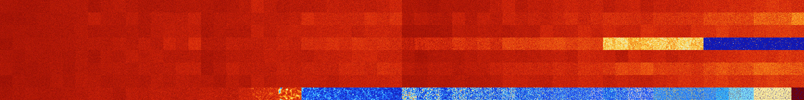

# B12468 (175104-175615)

<details>
    <summary>Initial Grid</summary>
    
</details>


<details>
    <summary>Initial Grid RLE</summary>

```
#C Exported from GoGoL (https://github.com/marrow16/gogol)
#C Wrap mode: Toroidal
#C Boundary mode: Dead
#C Step: 0
x = 100, y = 100, rule = B12468/S
35bo2bobo28bo$2bo29bo7bo33bo20bo$21bo5b2o19bo8bo$o23bo12bo3bo11bo44bo$
3bo14bo9bo6bo25bo4bo16bo$29bo34bo14bo$17bo15bo24bo14bo$16bo43bo12bo$22b
o13bo2bo9bo4b2o18bo11bo$13bo11bo22bo21bo16bobo$43bobo5bo24bo$13bo20bo2b
o3bo33bo3bo17bo$o80bo$9bo6bo47bo$49bo14bo$7bo10bo18bo2bo11bo15bo29bo$
43bo4bo35bo3bo$25bobo6b2o17bo15bo17bo6bo3b2o$5bo40bo2bo12b2o21bo$42bo8b
o7b2o14bo$100b$39bo$11bo9bo5bo15bo22bo7bo$24bobo3bo6bo23bo32bo$9bo14bo
5bo10bo3bo10bo$8bo84bo$bo17bo12bo2bo7bo25bo$o4bo28bo54bo$6bo15bo12bo4bo
3bobo31bo6bo$47bo24bo$5bo37bo40bo$10bo6bo5bo18bo39bo$41bo20bo23bo$16bo
8bo4bo14bo13bo12bo8bo14bo$19bo42bo$2bo14bo11bo22bo2bo4bobo36bo$36bo5bo
5b2o8bo31bo6bo$13bo4bo10bo23bobo18bo20bo3bo$16bo35bo2bo13bo17bo$17bo17b
o2bo4bo2bo18bo10bo18bo$4bo2bo18bo5bo3bo11bo4bo5bo23bo4bo4bo$48bo13bo15b
o2bo4bo6bo$o75bobo$14bobo38bo14bo17bo$56bo16bo9bo3bo2bo$8bo27bo10bo9bo
22bo15b2o$36bo4bo17bo32bo$bo8bo55bo$46bo8b2o16bo16bo$31bo11bo4bo32bo6bo
8bo$27bo$100b$11bo11bo8bo$29bo14bo13bo9bo4bo7bo8bo8bo$60bo7bo9bo$66bo9b
o$9bobo11bo16bo8bo21bo$12bo17bo12b2o21bo6bo$27bo15bo13bo21bo7bo$55bo$2b
o4bo3bo36bo5bo29bo$32bo34bo30bo$8bo16bo31bo3bo3bo13bo10bo2bo$15bobo4bo
2bo31bo19bo$44bo34bo$37bo10bo11bo6bo10bo$22bo59b2o7bo$2bobo50bo17bo$11b
o12bo8bo8bo15bo3bo$33bo4bo34bo2bo22bo$14bo14bo5bo20bo8bo10bo$4bobo19bo
9bo7bo11bo7bo18bo3bo2bo$5bo2bo3bo17bo6bo4bo18bo30bo6bo$13bo7bo5bo13bo
31bo$48bo41bobo2bo$bo9b2o28bo6bo26b2o$60bo9bo6bo$22b2o19bo4bo$8bo28bo
11bo4bo18bo20bo$22bo11bo5bo6bo12bo10bo3bo$26bo8bo15bo11bo28bo$53bo28bo$
obo2bo17bo6bo15bo32bo$12bo12bo9bo12bo2bo29bo7bo$18bo2bo15bo12bo15bo21bo
$11bo19bo5bobo4bo7bo14bo5bo22bo$31bo4bo6bobo27bo4bo$11bo7bo13bo5bo8bo
39b2o$13bo8b2o2bo24bo10bo7bo9bo4bobo$12bo29bo50bo$bo36bo15bo2bo10bo$o
17bo25bo17bo27bo8bo$2bo2bo13bobo26bo40bo$5b2o16bo8bo23b2o5bo13bo$21bobo
25bo7bo32bo$61bo10bo19bobo$20bo8bo20bo13bo15bo$4bo29bo16bo21bobo10bo$
15bobobo43b2o4bo10bo$14bo19bo20bo14bo28bo!
```
</details>
<details>
    <summary>Thumbnail</summary>

</details>
<table>
<tr>
    <td><a href="./175104%20S%20Heat%20Map%20Activity.png"></a><br>S (175104)<br>G>1000</td>    <td><a href="./175105%20S0%20Heat%20Map%20Activity.png"></a><br>S0 (175105)<br>G>1000</td>    <td><a href="./175106%20S1%20Heat%20Map%20Activity.png"></a><br>S1 (175106)<br>G>1000</td>    <td><a href="./175107%20S01%20Heat%20Map%20Activity.png"></a><br>S01 (175107)<br>G>1000</td>    <td><a href="./175108%20S2%20Heat%20Map%20Activity.png"></a><br>S2 (175108)<br>G>1000</td>    <td><a href="./175109%20S02%20Heat%20Map%20Activity.png"></a><br>S02 (175109)<br>G>1000</td>    <td><a href="./175110%20S12%20Heat%20Map%20Activity.png"></a><br>S12 (175110)<br>G>1000</td>    <td><a href="./175111%20S012%20Heat%20Map%20Activity.png"></a><br>S012 (175111)<br>G>1000</td>    <td><a href="./175112%20S3%20Heat%20Map%20Activity.png"></a><br>S3 (175112)<br>G>1000</td>    <td><a href="./175113%20S03%20Heat%20Map%20Activity.png"></a><br>S03 (175113)<br>G>1000</td>    <td><a href="./175114%20S13%20Heat%20Map%20Activity.png"></a><br>S13 (175114)<br>G>1000</td>    <td><a href="./175115%20S013%20Heat%20Map%20Activity.png"></a><br>S013 (175115)<br>G>1000</td>    <td><a href="./175116%20S23%20Heat%20Map%20Activity.png"></a><br>S23 (175116)<br>G>1000</td>    <td><a href="./175117%20S023%20Heat%20Map%20Activity.png"></a><br>S023 (175117)<br>G>1000</td>    <td><a href="./175118%20S123%20Heat%20Map%20Activity.png"></a><br>S123 (175118)<br>G>1000</td>    <td><a href="./175119%20S0123%20Heat%20Map%20Activity.png"></a><br>S0123 (175119)<br>G>1000</td>    <td><a href="./175120%20S4%20Heat%20Map%20Activity.png"></a><br>S4 (175120)<br>G>1000</td>    <td><a href="./175121%20S04%20Heat%20Map%20Activity.png"></a><br>S04 (175121)<br>G>1000</td>    <td><a href="./175122%20S14%20Heat%20Map%20Activity.png"></a><br>S14 (175122)<br>G>1000</td>    <td><a href="./175123%20S014%20Heat%20Map%20Activity.png"></a><br>S014 (175123)<br>G>1000</td>    <td><a href="./175124%20S24%20Heat%20Map%20Activity.png"></a><br>S24 (175124)<br>G>1000</td>    <td><a href="./175125%20S024%20Heat%20Map%20Activity.png"></a><br>S024 (175125)<br>G>1000</td>    <td><a href="./175126%20S124%20Heat%20Map%20Activity.png"></a><br>S124 (175126)<br>G>1000</td>    <td><a href="./175127%20S0124%20Heat%20Map%20Activity.png"></a><br>S0124 (175127)<br>G>1000</td>    <td><a href="./175128%20S34%20Heat%20Map%20Activity.png"></a><br>S34 (175128)<br>G>1000</td>    <td><a href="./175129%20S034%20Heat%20Map%20Activity.png"></a><br>S034 (175129)<br>G>1000</td>    <td><a href="./175130%20S134%20Heat%20Map%20Activity.png"></a><br>S134 (175130)<br>G>1000</td>    <td><a href="./175131%20S0134%20Heat%20Map%20Activity.png"></a><br>S0134 (175131)<br>G>1000</td>    <td><a href="./175132%20S234%20Heat%20Map%20Activity.png"></a><br>S234 (175132)<br>G>1000</td>    <td><a href="./175133%20S0234%20Heat%20Map%20Activity.png"></a><br>S0234 (175133)<br>G>1000</td>    <td><a href="./175134%20S1234%20Heat%20Map%20Activity.png"></a><br>S1234 (175134)<br>G>1000</td>    <td><a href="./175135%20S01234%20Heat%20Map%20Activity.png"></a><br>S01234 (175135)<br>G>1000</td>    <td><a href="./175136%20S5%20Heat%20Map%20Activity.png"></a><br>S5 (175136)<br>G>1000</td>    <td><a href="./175137%20S05%20Heat%20Map%20Activity.png"></a><br>S05 (175137)<br>G>1000</td>    <td><a href="./175138%20S15%20Heat%20Map%20Activity.png"></a><br>S15 (175138)<br>G>1000</td>    <td><a href="./175139%20S015%20Heat%20Map%20Activity.png"></a><br>S015 (175139)<br>G>1000</td>    <td><a href="./175140%20S25%20Heat%20Map%20Activity.png"></a><br>S25 (175140)<br>G>1000</td>    <td><a href="./175141%20S025%20Heat%20Map%20Activity.png"></a><br>S025 (175141)<br>G>1000</td>    <td><a href="./175142%20S125%20Heat%20Map%20Activity.png"></a><br>S125 (175142)<br>G>1000</td>    <td><a href="./175143%20S0125%20Heat%20Map%20Activity.png"></a><br>S0125 (175143)<br>G>1000</td>    <td><a href="./175144%20S35%20Heat%20Map%20Activity.png"></a><br>S35 (175144)<br>G>1000</td>    <td><a href="./175145%20S035%20Heat%20Map%20Activity.png"></a><br>S035 (175145)<br>G>1000</td>    <td><a href="./175146%20S135%20Heat%20Map%20Activity.png"></a><br>S135 (175146)<br>G>1000</td>    <td><a href="./175147%20S0135%20Heat%20Map%20Activity.png"></a><br>S0135 (175147)<br>G>1000</td>    <td><a href="./175148%20S235%20Heat%20Map%20Activity.png"></a><br>S235 (175148)<br>G>1000</td>    <td><a href="./175149%20S0235%20Heat%20Map%20Activity.png"></a><br>S0235 (175149)<br>G>1000</td>    <td><a href="./175150%20S1235%20Heat%20Map%20Activity.png"></a><br>S1235 (175150)<br>G>1000</td>    <td><a href="./175151%20S01235%20Heat%20Map%20Activity.png"></a><br>S01235 (175151)<br>G>1000</td>    <td><a href="./175152%20S45%20Heat%20Map%20Activity.png"></a><br>S45 (175152)<br>G>1000</td>    <td><a href="./175153%20S045%20Heat%20Map%20Activity.png"></a><br>S045 (175153)<br>G>1000</td>    <td><a href="./175154%20S145%20Heat%20Map%20Activity.png"></a><br>S145 (175154)<br>G>1000</td>    <td><a href="./175155%20S0145%20Heat%20Map%20Activity.png"></a><br>S0145 (175155)<br>G>1000</td>    <td><a href="./175156%20S245%20Heat%20Map%20Activity.png"></a><br>S245 (175156)<br>G>1000</td>    <td><a href="./175157%20S0245%20Heat%20Map%20Activity.png"></a><br>S0245 (175157)<br>G>1000</td>    <td><a href="./175158%20S1245%20Heat%20Map%20Activity.png"></a><br>S1245 (175158)<br>G>1000</td>    <td><a href="./175159%20S01245%20Heat%20Map%20Activity.png"></a><br>S01245 (175159)<br>G>1000</td>    <td><a href="./175160%20S345%20Heat%20Map%20Activity.png"></a><br>S345 (175160)<br>G>1000</td>    <td><a href="./175161%20S0345%20Heat%20Map%20Activity.png"></a><br>S0345 (175161)<br>G>1000</td>    <td><a href="./175162%20S1345%20Heat%20Map%20Activity.png"></a><br>S1345 (175162)<br>G>1000</td>    <td><a href="./175163%20S01345%20Heat%20Map%20Activity.png"></a><br>S01345 (175163)<br>G>1000</td>    <td><a href="./175164%20S2345%20Heat%20Map%20Activity.png"></a><br>S2345 (175164)<br>G>1000</td>    <td><a href="./175165%20S02345%20Heat%20Map%20Activity.png"></a><br>S02345 (175165)<br>G>1000</td>    <td><a href="./175166%20S12345%20Heat%20Map%20Activity.png"></a><br>S12345 (175166)<br>G>1000</td>    <td><a href="./175167%20S012345%20Heat%20Map%20Activity.png"></a><br>S012345 (175167)<br>G>1000</td></tr>
<tr>
    <td><a href="./175168%20S6%20Heat%20Map%20Activity.png"></a><br>S6 (175168)<br>G>1000</td>    <td><a href="./175169%20S06%20Heat%20Map%20Activity.png"></a><br>S06 (175169)<br>G>1000</td>    <td><a href="./175170%20S16%20Heat%20Map%20Activity.png"></a><br>S16 (175170)<br>G>1000</td>    <td><a href="./175171%20S016%20Heat%20Map%20Activity.png"></a><br>S016 (175171)<br>G>1000</td>    <td><a href="./175172%20S26%20Heat%20Map%20Activity.png"></a><br>S26 (175172)<br>G>1000</td>    <td><a href="./175173%20S026%20Heat%20Map%20Activity.png"></a><br>S026 (175173)<br>G>1000</td>    <td><a href="./175174%20S126%20Heat%20Map%20Activity.png"></a><br>S126 (175174)<br>G>1000</td>    <td><a href="./175175%20S0126%20Heat%20Map%20Activity.png"></a><br>S0126 (175175)<br>G>1000</td>    <td><a href="./175176%20S36%20Heat%20Map%20Activity.png"></a><br>S36 (175176)<br>G>1000</td>    <td><a href="./175177%20S036%20Heat%20Map%20Activity.png"></a><br>S036 (175177)<br>G>1000</td>    <td><a href="./175178%20S136%20Heat%20Map%20Activity.png"></a><br>S136 (175178)<br>G>1000</td>    <td><a href="./175179%20S0136%20Heat%20Map%20Activity.png"></a><br>S0136 (175179)<br>G>1000</td>    <td><a href="./175180%20S236%20Heat%20Map%20Activity.png"></a><br>S236 (175180)<br>G>1000</td>    <td><a href="./175181%20S0236%20Heat%20Map%20Activity.png"></a><br>S0236 (175181)<br>G>1000</td>    <td><a href="./175182%20S1236%20Heat%20Map%20Activity.png"></a><br>S1236 (175182)<br>G>1000</td>    <td><a href="./175183%20S01236%20Heat%20Map%20Activity.png"></a><br>S01236 (175183)<br>G>1000</td>    <td><a href="./175184%20S46%20Heat%20Map%20Activity.png"></a><br>S46 (175184)<br>G>1000</td>    <td><a href="./175185%20S046%20Heat%20Map%20Activity.png"></a><br>S046 (175185)<br>G>1000</td>    <td><a href="./175186%20S146%20Heat%20Map%20Activity.png"></a><br>S146 (175186)<br>G>1000</td>    <td><a href="./175187%20S0146%20Heat%20Map%20Activity.png"></a><br>S0146 (175187)<br>G>1000</td>    <td><a href="./175188%20S246%20Heat%20Map%20Activity.png"></a><br>S246 (175188)<br>G>1000</td>    <td><a href="./175189%20S0246%20Heat%20Map%20Activity.png"></a><br>S0246 (175189)<br>G>1000</td>    <td><a href="./175190%20S1246%20Heat%20Map%20Activity.png"></a><br>S1246 (175190)<br>G>1000</td>    <td><a href="./175191%20S01246%20Heat%20Map%20Activity.png"></a><br>S01246 (175191)<br>G>1000</td>    <td><a href="./175192%20S346%20Heat%20Map%20Activity.png"></a><br>S346 (175192)<br>G>1000</td>    <td><a href="./175193%20S0346%20Heat%20Map%20Activity.png"></a><br>S0346 (175193)<br>G>1000</td>    <td><a href="./175194%20S1346%20Heat%20Map%20Activity.png"></a><br>S1346 (175194)<br>G>1000</td>    <td><a href="./175195%20S01346%20Heat%20Map%20Activity.png"></a><br>S01346 (175195)<br>G>1000</td>    <td><a href="./175196%20S2346%20Heat%20Map%20Activity.png"></a><br>S2346 (175196)<br>G>1000</td>    <td><a href="./175197%20S02346%20Heat%20Map%20Activity.png"></a><br>S02346 (175197)<br>G>1000</td>    <td><a href="./175198%20S12346%20Heat%20Map%20Activity.png"></a><br>S12346 (175198)<br>G>1000</td>    <td><a href="./175199%20S012346%20Heat%20Map%20Activity.png"></a><br>S012346 (175199)<br>G>1000</td>    <td><a href="./175200%20S56%20Heat%20Map%20Activity.png"></a><br>S56 (175200)<br>G>1000</td>    <td><a href="./175201%20S056%20Heat%20Map%20Activity.png"></a><br>S056 (175201)<br>G>1000</td>    <td><a href="./175202%20S156%20Heat%20Map%20Activity.png"></a><br>S156 (175202)<br>G>1000</td>    <td><a href="./175203%20S0156%20Heat%20Map%20Activity.png"></a><br>S0156 (175203)<br>G>1000</td>    <td><a href="./175204%20S256%20Heat%20Map%20Activity.png"></a><br>S256 (175204)<br>G>1000</td>    <td><a href="./175205%20S0256%20Heat%20Map%20Activity.png"></a><br>S0256 (175205)<br>G>1000</td>    <td><a href="./175206%20S1256%20Heat%20Map%20Activity.png"></a><br>S1256 (175206)<br>G>1000</td>    <td><a href="./175207%20S01256%20Heat%20Map%20Activity.png"></a><br>S01256 (175207)<br>G>1000</td>    <td><a href="./175208%20S356%20Heat%20Map%20Activity.png"></a><br>S356 (175208)<br>G>1000</td>    <td><a href="./175209%20S0356%20Heat%20Map%20Activity.png"></a><br>S0356 (175209)<br>G>1000</td>    <td><a href="./175210%20S1356%20Heat%20Map%20Activity.png"></a><br>S1356 (175210)<br>G>1000</td>    <td><a href="./175211%20S01356%20Heat%20Map%20Activity.png"></a><br>S01356 (175211)<br>G>1000</td>    <td><a href="./175212%20S2356%20Heat%20Map%20Activity.png"></a><br>S2356 (175212)<br>G>1000</td>    <td><a href="./175213%20S02356%20Heat%20Map%20Activity.png"></a><br>S02356 (175213)<br>G>1000</td>    <td><a href="./175214%20S12356%20Heat%20Map%20Activity.png"></a><br>S12356 (175214)<br>G>1000</td>    <td><a href="./175215%20S012356%20Heat%20Map%20Activity.png"></a><br>S012356 (175215)<br>G>1000</td>    <td><a href="./175216%20S456%20Heat%20Map%20Activity.png"></a><br>S456 (175216)<br>G>1000</td>    <td><a href="./175217%20S0456%20Heat%20Map%20Activity.png"></a><br>S0456 (175217)<br>G>1000</td>    <td><a href="./175218%20S1456%20Heat%20Map%20Activity.png"></a><br>S1456 (175218)<br>G>1000</td>    <td><a href="./175219%20S01456%20Heat%20Map%20Activity.png"></a><br>S01456 (175219)<br>G>1000</td>    <td><a href="./175220%20S2456%20Heat%20Map%20Activity.png"></a><br>S2456 (175220)<br>G>1000</td>    <td><a href="./175221%20S02456%20Heat%20Map%20Activity.png"></a><br>S02456 (175221)<br>G>1000</td>    <td><a href="./175222%20S12456%20Heat%20Map%20Activity.png"></a><br>S12456 (175222)<br>G>1000</td>    <td><a href="./175223%20S012456%20Heat%20Map%20Activity.png"></a><br>S012456 (175223)<br>G>1000</td>    <td><a href="./175224%20S3456%20Heat%20Map%20Activity.png"></a><br>S3456 (175224)<br>G>1000</td>    <td><a href="./175225%20S03456%20Heat%20Map%20Activity.png"></a><br>S03456 (175225)<br>G>1000</td>    <td><a href="./175226%20S13456%20Heat%20Map%20Activity.png"></a><br>S13456 (175226)<br>G>1000</td>    <td><a href="./175227%20S013456%20Heat%20Map%20Activity.png"></a><br>S013456 (175227)<br>G>1000</td>    <td><a href="./175228%20S23456%20Heat%20Map%20Activity.png"></a><br>S23456 (175228)<br>G>1000</td>    <td><a href="./175229%20S023456%20Heat%20Map%20Activity.png"></a><br>S023456 (175229)<br>G>1000</td>    <td><a href="./175230%20S123456%20Heat%20Map%20Activity.png"></a><br>S123456 (175230)<br>G>1000</td>    <td><a href="./175231%20S0123456%20Heat%20Map%20Activity.png"></a><br>S0123456 (175231)<br>G>1000</td></tr>
<tr>
    <td><a href="./175232%20S7%20Heat%20Map%20Activity.png"></a><br>S7 (175232)<br>G>1000</td>    <td><a href="./175233%20S07%20Heat%20Map%20Activity.png"></a><br>S07 (175233)<br>G>1000</td>    <td><a href="./175234%20S17%20Heat%20Map%20Activity.png"></a><br>S17 (175234)<br>G>1000</td>    <td><a href="./175235%20S017%20Heat%20Map%20Activity.png"></a><br>S017 (175235)<br>G>1000</td>    <td><a href="./175236%20S27%20Heat%20Map%20Activity.png"></a><br>S27 (175236)<br>G>1000</td>    <td><a href="./175237%20S027%20Heat%20Map%20Activity.png"></a><br>S027 (175237)<br>G>1000</td>    <td><a href="./175238%20S127%20Heat%20Map%20Activity.png"></a><br>S127 (175238)<br>G>1000</td>    <td><a href="./175239%20S0127%20Heat%20Map%20Activity.png"></a><br>S0127 (175239)<br>G>1000</td>    <td><a href="./175240%20S37%20Heat%20Map%20Activity.png"></a><br>S37 (175240)<br>G>1000</td>    <td><a href="./175241%20S037%20Heat%20Map%20Activity.png"></a><br>S037 (175241)<br>G>1000</td>    <td><a href="./175242%20S137%20Heat%20Map%20Activity.png"></a><br>S137 (175242)<br>G>1000</td>    <td><a href="./175243%20S0137%20Heat%20Map%20Activity.png"></a><br>S0137 (175243)<br>G>1000</td>    <td><a href="./175244%20S237%20Heat%20Map%20Activity.png"></a><br>S237 (175244)<br>G>1000</td>    <td><a href="./175245%20S0237%20Heat%20Map%20Activity.png"></a><br>S0237 (175245)<br>G>1000</td>    <td><a href="./175246%20S1237%20Heat%20Map%20Activity.png"></a><br>S1237 (175246)<br>G>1000</td>    <td><a href="./175247%20S01237%20Heat%20Map%20Activity.png"></a><br>S01237 (175247)<br>G>1000</td>    <td><a href="./175248%20S47%20Heat%20Map%20Activity.png"></a><br>S47 (175248)<br>G>1000</td>    <td><a href="./175249%20S047%20Heat%20Map%20Activity.png"></a><br>S047 (175249)<br>G>1000</td>    <td><a href="./175250%20S147%20Heat%20Map%20Activity.png"></a><br>S147 (175250)<br>G>1000</td>    <td><a href="./175251%20S0147%20Heat%20Map%20Activity.png"></a><br>S0147 (175251)<br>G>1000</td>    <td><a href="./175252%20S247%20Heat%20Map%20Activity.png"></a><br>S247 (175252)<br>G>1000</td>    <td><a href="./175253%20S0247%20Heat%20Map%20Activity.png"></a><br>S0247 (175253)<br>G>1000</td>    <td><a href="./175254%20S1247%20Heat%20Map%20Activity.png"></a><br>S1247 (175254)<br>G>1000</td>    <td><a href="./175255%20S01247%20Heat%20Map%20Activity.png"></a><br>S01247 (175255)<br>G>1000</td>    <td><a href="./175256%20S347%20Heat%20Map%20Activity.png"></a><br>S347 (175256)<br>G>1000</td>    <td><a href="./175257%20S0347%20Heat%20Map%20Activity.png"></a><br>S0347 (175257)<br>G>1000</td>    <td><a href="./175258%20S1347%20Heat%20Map%20Activity.png"></a><br>S1347 (175258)<br>G>1000</td>    <td><a href="./175259%20S01347%20Heat%20Map%20Activity.png"></a><br>S01347 (175259)<br>G>1000</td>    <td><a href="./175260%20S2347%20Heat%20Map%20Activity.png"></a><br>S2347 (175260)<br>G>1000</td>    <td><a href="./175261%20S02347%20Heat%20Map%20Activity.png"></a><br>S02347 (175261)<br>G>1000</td>    <td><a href="./175262%20S12347%20Heat%20Map%20Activity.png"></a><br>S12347 (175262)<br>G>1000</td>    <td><a href="./175263%20S012347%20Heat%20Map%20Activity.png"></a><br>S012347 (175263)<br>G>1000</td>    <td><a href="./175264%20S57%20Heat%20Map%20Activity.png"></a><br>S57 (175264)<br>G>1000</td>    <td><a href="./175265%20S057%20Heat%20Map%20Activity.png"></a><br>S057 (175265)<br>G>1000</td>    <td><a href="./175266%20S157%20Heat%20Map%20Activity.png"></a><br>S157 (175266)<br>G>1000</td>    <td><a href="./175267%20S0157%20Heat%20Map%20Activity.png"></a><br>S0157 (175267)<br>G>1000</td>    <td><a href="./175268%20S257%20Heat%20Map%20Activity.png"></a><br>S257 (175268)<br>G>1000</td>    <td><a href="./175269%20S0257%20Heat%20Map%20Activity.png"></a><br>S0257 (175269)<br>G>1000</td>    <td><a href="./175270%20S1257%20Heat%20Map%20Activity.png"></a><br>S1257 (175270)<br>G>1000</td>    <td><a href="./175271%20S01257%20Heat%20Map%20Activity.png"></a><br>S01257 (175271)<br>G>1000</td>    <td><a href="./175272%20S357%20Heat%20Map%20Activity.png"></a><br>S357 (175272)<br>G>1000</td>    <td><a href="./175273%20S0357%20Heat%20Map%20Activity.png"></a><br>S0357 (175273)<br>G>1000</td>    <td><a href="./175274%20S1357%20Heat%20Map%20Activity.png"></a><br>S1357 (175274)<br>G>1000</td>    <td><a href="./175275%20S01357%20Heat%20Map%20Activity.png"></a><br>S01357 (175275)<br>G>1000</td>    <td><a href="./175276%20S2357%20Heat%20Map%20Activity.png"></a><br>S2357 (175276)<br>G>1000</td>    <td><a href="./175277%20S02357%20Heat%20Map%20Activity.png"></a><br>S02357 (175277)<br>G>1000</td>    <td><a href="./175278%20S12357%20Heat%20Map%20Activity.png"></a><br>S12357 (175278)<br>G>1000</td>    <td><a href="./175279%20S012357%20Heat%20Map%20Activity.png"></a><br>S012357 (175279)<br>G>1000</td>    <td><a href="./175280%20S457%20Heat%20Map%20Activity.png"></a><br>S457 (175280)<br>G>1000</td>    <td><a href="./175281%20S0457%20Heat%20Map%20Activity.png"></a><br>S0457 (175281)<br>G>1000</td>    <td><a href="./175282%20S1457%20Heat%20Map%20Activity.png"></a><br>S1457 (175282)<br>G>1000</td>    <td><a href="./175283%20S01457%20Heat%20Map%20Activity.png"></a><br>S01457 (175283)<br>G>1000</td>    <td><a href="./175284%20S2457%20Heat%20Map%20Activity.png"></a><br>S2457 (175284)<br>G>1000</td>    <td><a href="./175285%20S02457%20Heat%20Map%20Activity.png"></a><br>S02457 (175285)<br>G>1000</td>    <td><a href="./175286%20S12457%20Heat%20Map%20Activity.png"></a><br>S12457 (175286)<br>G>1000</td>    <td><a href="./175287%20S012457%20Heat%20Map%20Activity.png"></a><br>S012457 (175287)<br>G>1000</td>    <td><a href="./175288%20S3457%20Heat%20Map%20Activity.png"></a><br>S3457 (175288)<br>G>1000</td>    <td><a href="./175289%20S03457%20Heat%20Map%20Activity.png"></a><br>S03457 (175289)<br>G>1000</td>    <td><a href="./175290%20S13457%20Heat%20Map%20Activity.png"></a><br>S13457 (175290)<br>G>1000</td>    <td><a href="./175291%20S013457%20Heat%20Map%20Activity.png"></a><br>S013457 (175291)<br>G>1000</td>    <td><a href="./175292%20S23457%20Heat%20Map%20Activity.png"></a><br>S23457 (175292)<br>G>1000</td>    <td><a href="./175293%20S023457%20Heat%20Map%20Activity.png"></a><br>S023457 (175293)<br>G>1000</td>    <td><a href="./175294%20S123457%20Heat%20Map%20Activity.png"></a><br>S123457 (175294)<br>G>1000</td>    <td><a href="./175295%20S0123457%20Heat%20Map%20Activity.png"></a><br>S0123457 (175295)<br>G>1000</td></tr>
<tr>
    <td><a href="./175296%20S67%20Heat%20Map%20Activity.png"></a><br>S67 (175296)<br>G>1000</td>    <td><a href="./175297%20S067%20Heat%20Map%20Activity.png"></a><br>S067 (175297)<br>G>1000</td>    <td><a href="./175298%20S167%20Heat%20Map%20Activity.png"></a><br>S167 (175298)<br>G>1000</td>    <td><a href="./175299%20S0167%20Heat%20Map%20Activity.png"></a><br>S0167 (175299)<br>G>1000</td>    <td><a href="./175300%20S267%20Heat%20Map%20Activity.png"></a><br>S267 (175300)<br>G>1000</td>    <td><a href="./175301%20S0267%20Heat%20Map%20Activity.png"></a><br>S0267 (175301)<br>G>1000</td>    <td><a href="./175302%20S1267%20Heat%20Map%20Activity.png"></a><br>S1267 (175302)<br>G>1000</td>    <td><a href="./175303%20S01267%20Heat%20Map%20Activity.png"></a><br>S01267 (175303)<br>G>1000</td>    <td><a href="./175304%20S367%20Heat%20Map%20Activity.png"></a><br>S367 (175304)<br>G>1000</td>    <td><a href="./175305%20S0367%20Heat%20Map%20Activity.png"></a><br>S0367 (175305)<br>G>1000</td>    <td><a href="./175306%20S1367%20Heat%20Map%20Activity.png"></a><br>S1367 (175306)<br>G>1000</td>    <td><a href="./175307%20S01367%20Heat%20Map%20Activity.png"></a><br>S01367 (175307)<br>G>1000</td>    <td><a href="./175308%20S2367%20Heat%20Map%20Activity.png"></a><br>S2367 (175308)<br>G>1000</td>    <td><a href="./175309%20S02367%20Heat%20Map%20Activity.png"></a><br>S02367 (175309)<br>G>1000</td>    <td><a href="./175310%20S12367%20Heat%20Map%20Activity.png"></a><br>S12367 (175310)<br>G>1000</td>    <td><a href="./175311%20S012367%20Heat%20Map%20Activity.png"></a><br>S012367 (175311)<br>G>1000</td>    <td><a href="./175312%20S467%20Heat%20Map%20Activity.png"></a><br>S467 (175312)<br>G>1000</td>    <td><a href="./175313%20S0467%20Heat%20Map%20Activity.png"></a><br>S0467 (175313)<br>G>1000</td>    <td><a href="./175314%20S1467%20Heat%20Map%20Activity.png"></a><br>S1467 (175314)<br>G>1000</td>    <td><a href="./175315%20S01467%20Heat%20Map%20Activity.png"></a><br>S01467 (175315)<br>G>1000</td>    <td><a href="./175316%20S2467%20Heat%20Map%20Activity.png"></a><br>S2467 (175316)<br>G>1000</td>    <td><a href="./175317%20S02467%20Heat%20Map%20Activity.png"></a><br>S02467 (175317)<br>G>1000</td>    <td><a href="./175318%20S12467%20Heat%20Map%20Activity.png"></a><br>S12467 (175318)<br>G>1000</td>    <td><a href="./175319%20S012467%20Heat%20Map%20Activity.png"></a><br>S012467 (175319)<br>G>1000</td>    <td><a href="./175320%20S3467%20Heat%20Map%20Activity.png"></a><br>S3467 (175320)<br>G>1000</td>    <td><a href="./175321%20S03467%20Heat%20Map%20Activity.png"></a><br>S03467 (175321)<br>G>1000</td>    <td><a href="./175322%20S13467%20Heat%20Map%20Activity.png"></a><br>S13467 (175322)<br>G>1000</td>    <td><a href="./175323%20S013467%20Heat%20Map%20Activity.png"></a><br>S013467 (175323)<br>G>1000</td>    <td><a href="./175324%20S23467%20Heat%20Map%20Activity.png"></a><br>S23467 (175324)<br>G>1000</td>    <td><a href="./175325%20S023467%20Heat%20Map%20Activity.png"></a><br>S023467 (175325)<br>G>1000</td>    <td><a href="./175326%20S123467%20Heat%20Map%20Activity.png"></a><br>S123467 (175326)<br>G>1000</td>    <td><a href="./175327%20S0123467%20Heat%20Map%20Activity.png"></a><br>S0123467 (175327)<br>G>1000</td>    <td><a href="./175328%20S567%20Heat%20Map%20Activity.png"></a><br>S567 (175328)<br>G>1000</td>    <td><a href="./175329%20S0567%20Heat%20Map%20Activity.png"></a><br>S0567 (175329)<br>G>1000</td>    <td><a href="./175330%20S1567%20Heat%20Map%20Activity.png"></a><br>S1567 (175330)<br>G>1000</td>    <td><a href="./175331%20S01567%20Heat%20Map%20Activity.png"></a><br>S01567 (175331)<br>G>1000</td>    <td><a href="./175332%20S2567%20Heat%20Map%20Activity.png"></a><br>S2567 (175332)<br>G>1000</td>    <td><a href="./175333%20S02567%20Heat%20Map%20Activity.png"></a><br>S02567 (175333)<br>G>1000</td>    <td><a href="./175334%20S12567%20Heat%20Map%20Activity.png"></a><br>S12567 (175334)<br>G>1000</td>    <td><a href="./175335%20S012567%20Heat%20Map%20Activity.png"></a><br>S012567 (175335)<br>G>1000</td>    <td><a href="./175336%20S3567%20Heat%20Map%20Activity.png"></a><br>S3567 (175336)<br>G>1000</td>    <td><a href="./175337%20S03567%20Heat%20Map%20Activity.png"></a><br>S03567 (175337)<br>G>1000</td>    <td><a href="./175338%20S13567%20Heat%20Map%20Activity.png"></a><br>S13567 (175338)<br>G>1000</td>    <td><a href="./175339%20S013567%20Heat%20Map%20Activity.png"></a><br>S013567 (175339)<br>G>1000</td>    <td><a href="./175340%20S23567%20Heat%20Map%20Activity.png"></a><br>S23567 (175340)<br>G>1000</td>    <td><a href="./175341%20S023567%20Heat%20Map%20Activity.png"></a><br>S023567 (175341)<br>G>1000</td>    <td><a href="./175342%20S123567%20Heat%20Map%20Activity.png"></a><br>S123567 (175342)<br>G>1000</td>    <td><a href="./175343%20S0123567%20Heat%20Map%20Activity.png"></a><br>S0123567 (175343)<br>G>1000</td>    <td><a href="./175344%20S4567%20Heat%20Map%20Activity.png"></a><br>S4567 (175344)<br>G>1000</td>    <td><a href="./175345%20S04567%20Heat%20Map%20Activity.png"></a><br>S04567 (175345)<br>G>1000</td>    <td><a href="./175346%20S14567%20Heat%20Map%20Activity.png"></a><br>S14567 (175346)<br>G>1000</td>    <td><a href="./175347%20S014567%20Heat%20Map%20Activity.png"></a><br>S014567 (175347)<br>G>1000</td>    <td><a href="./175348%20S24567%20Heat%20Map%20Activity.png"></a><br>S24567 (175348)<br>G>1000</td>    <td><a href="./175349%20S024567%20Heat%20Map%20Activity.png"></a><br>S024567 (175349)<br>G>1000</td>    <td><a href="./175350%20S124567%20Heat%20Map%20Activity.png"></a><br>S124567 (175350)<br>G>1000</td>    <td><a href="./175351%20S0124567%20Heat%20Map%20Activity.png"></a><br>S0124567 (175351)<br>G>1000</td>    <td><a href="./175352%20S34567%20Heat%20Map%20Activity.png"></a><br>S34567 (175352)<br>G>1000</td>    <td><a href="./175353%20S034567%20Heat%20Map%20Activity.png"></a><br>S034567 (175353)<br>G>1000</td>    <td><a href="./175354%20S134567%20Heat%20Map%20Activity.png"></a><br>S134567 (175354)<br>R@429,p360</td>    <td><a href="./175355%20S0134567%20Heat%20Map%20Activity.png"></a><br>S0134567 (175355)<br>G>1000</td>    <td><a href="./175356%20S234567%20Heat%20Map%20Activity.png"></a><br>S234567 (175356)<br>R@886,p840</td>    <td><a href="./175357%20S0234567%20Heat%20Map%20Activity.png"></a><br>S0234567 (175357)<br>G>1000</td>    <td><a href="./175358%20S1234567%20Heat%20Map%20Activity.png"></a><br>S1234567 (175358)<br>R@886,p840</td>    <td><a href="./175359%20S01234567%20Heat%20Map%20Activity.png"></a><br>S01234567 (175359)<br>G>1000</td></tr>
<tr>
    <td><a href="./175360%20S8%20Heat%20Map%20Activity.png"></a><br>S8 (175360)<br>G>1000</td>    <td><a href="./175361%20S08%20Heat%20Map%20Activity.png"></a><br>S08 (175361)<br>G>1000</td>    <td><a href="./175362%20S18%20Heat%20Map%20Activity.png"></a><br>S18 (175362)<br>G>1000</td>    <td><a href="./175363%20S018%20Heat%20Map%20Activity.png"></a><br>S018 (175363)<br>G>1000</td>    <td><a href="./175364%20S28%20Heat%20Map%20Activity.png"></a><br>S28 (175364)<br>G>1000</td>    <td><a href="./175365%20S028%20Heat%20Map%20Activity.png"></a><br>S028 (175365)<br>G>1000</td>    <td><a href="./175366%20S128%20Heat%20Map%20Activity.png"></a><br>S128 (175366)<br>G>1000</td>    <td><a href="./175367%20S0128%20Heat%20Map%20Activity.png"></a><br>S0128 (175367)<br>G>1000</td>    <td><a href="./175368%20S38%20Heat%20Map%20Activity.png"></a><br>S38 (175368)<br>G>1000</td>    <td><a href="./175369%20S038%20Heat%20Map%20Activity.png"></a><br>S038 (175369)<br>G>1000</td>    <td><a href="./175370%20S138%20Heat%20Map%20Activity.png"></a><br>S138 (175370)<br>G>1000</td>    <td><a href="./175371%20S0138%20Heat%20Map%20Activity.png"></a><br>S0138 (175371)<br>G>1000</td>    <td><a href="./175372%20S238%20Heat%20Map%20Activity.png"></a><br>S238 (175372)<br>G>1000</td>    <td><a href="./175373%20S0238%20Heat%20Map%20Activity.png"></a><br>S0238 (175373)<br>G>1000</td>    <td><a href="./175374%20S1238%20Heat%20Map%20Activity.png"></a><br>S1238 (175374)<br>G>1000</td>    <td><a href="./175375%20S01238%20Heat%20Map%20Activity.png"></a><br>S01238 (175375)<br>G>1000</td>    <td><a href="./175376%20S48%20Heat%20Map%20Activity.png"></a><br>S48 (175376)<br>G>1000</td>    <td><a href="./175377%20S048%20Heat%20Map%20Activity.png"></a><br>S048 (175377)<br>G>1000</td>    <td><a href="./175378%20S148%20Heat%20Map%20Activity.png"></a><br>S148 (175378)<br>G>1000</td>    <td><a href="./175379%20S0148%20Heat%20Map%20Activity.png"></a><br>S0148 (175379)<br>G>1000</td>    <td><a href="./175380%20S248%20Heat%20Map%20Activity.png"></a><br>S248 (175380)<br>G>1000</td>    <td><a href="./175381%20S0248%20Heat%20Map%20Activity.png"></a><br>S0248 (175381)<br>G>1000</td>    <td><a href="./175382%20S1248%20Heat%20Map%20Activity.png"></a><br>S1248 (175382)<br>G>1000</td>    <td><a href="./175383%20S01248%20Heat%20Map%20Activity.png"></a><br>S01248 (175383)<br>G>1000</td>    <td><a href="./175384%20S348%20Heat%20Map%20Activity.png"></a><br>S348 (175384)<br>G>1000</td>    <td><a href="./175385%20S0348%20Heat%20Map%20Activity.png"></a><br>S0348 (175385)<br>G>1000</td>    <td><a href="./175386%20S1348%20Heat%20Map%20Activity.png"></a><br>S1348 (175386)<br>G>1000</td>    <td><a href="./175387%20S01348%20Heat%20Map%20Activity.png"></a><br>S01348 (175387)<br>G>1000</td>    <td><a href="./175388%20S2348%20Heat%20Map%20Activity.png"></a><br>S2348 (175388)<br>G>1000</td>    <td><a href="./175389%20S02348%20Heat%20Map%20Activity.png"></a><br>S02348 (175389)<br>G>1000</td>    <td><a href="./175390%20S12348%20Heat%20Map%20Activity.png"></a><br>S12348 (175390)<br>G>1000</td>    <td><a href="./175391%20S012348%20Heat%20Map%20Activity.png"></a><br>S012348 (175391)<br>G>1000</td>    <td><a href="./175392%20S58%20Heat%20Map%20Activity.png"></a><br>S58 (175392)<br>G>1000</td>    <td><a href="./175393%20S058%20Heat%20Map%20Activity.png"></a><br>S058 (175393)<br>G>1000</td>    <td><a href="./175394%20S158%20Heat%20Map%20Activity.png"></a><br>S158 (175394)<br>G>1000</td>    <td><a href="./175395%20S0158%20Heat%20Map%20Activity.png"></a><br>S0158 (175395)<br>G>1000</td>    <td><a href="./175396%20S258%20Heat%20Map%20Activity.png"></a><br>S258 (175396)<br>G>1000</td>    <td><a href="./175397%20S0258%20Heat%20Map%20Activity.png"></a><br>S0258 (175397)<br>G>1000</td>    <td><a href="./175398%20S1258%20Heat%20Map%20Activity.png"></a><br>S1258 (175398)<br>G>1000</td>    <td><a href="./175399%20S01258%20Heat%20Map%20Activity.png"></a><br>S01258 (175399)<br>G>1000</td>    <td><a href="./175400%20S358%20Heat%20Map%20Activity.png"></a><br>S358 (175400)<br>G>1000</td>    <td><a href="./175401%20S0358%20Heat%20Map%20Activity.png"></a><br>S0358 (175401)<br>G>1000</td>    <td><a href="./175402%20S1358%20Heat%20Map%20Activity.png"></a><br>S1358 (175402)<br>G>1000</td>    <td><a href="./175403%20S01358%20Heat%20Map%20Activity.png"></a><br>S01358 (175403)<br>G>1000</td>    <td><a href="./175404%20S2358%20Heat%20Map%20Activity.png"></a><br>S2358 (175404)<br>G>1000</td>    <td><a href="./175405%20S02358%20Heat%20Map%20Activity.png"></a><br>S02358 (175405)<br>G>1000</td>    <td><a href="./175406%20S12358%20Heat%20Map%20Activity.png"></a><br>S12358 (175406)<br>G>1000</td>    <td><a href="./175407%20S012358%20Heat%20Map%20Activity.png"></a><br>S012358 (175407)<br>G>1000</td>    <td><a href="./175408%20S458%20Heat%20Map%20Activity.png"></a><br>S458 (175408)<br>G>1000</td>    <td><a href="./175409%20S0458%20Heat%20Map%20Activity.png"></a><br>S0458 (175409)<br>G>1000</td>    <td><a href="./175410%20S1458%20Heat%20Map%20Activity.png"></a><br>S1458 (175410)<br>G>1000</td>    <td><a href="./175411%20S01458%20Heat%20Map%20Activity.png"></a><br>S01458 (175411)<br>G>1000</td>    <td><a href="./175412%20S2458%20Heat%20Map%20Activity.png"></a><br>S2458 (175412)<br>G>1000</td>    <td><a href="./175413%20S02458%20Heat%20Map%20Activity.png"></a><br>S02458 (175413)<br>G>1000</td>    <td><a href="./175414%20S12458%20Heat%20Map%20Activity.png"></a><br>S12458 (175414)<br>G>1000</td>    <td><a href="./175415%20S012458%20Heat%20Map%20Activity.png"></a><br>S012458 (175415)<br>G>1000</td>    <td><a href="./175416%20S3458%20Heat%20Map%20Activity.png"></a><br>S3458 (175416)<br>G>1000</td>    <td><a href="./175417%20S03458%20Heat%20Map%20Activity.png"></a><br>S03458 (175417)<br>G>1000</td>    <td><a href="./175418%20S13458%20Heat%20Map%20Activity.png"></a><br>S13458 (175418)<br>G>1000</td>    <td><a href="./175419%20S013458%20Heat%20Map%20Activity.png"></a><br>S013458 (175419)<br>G>1000</td>    <td><a href="./175420%20S23458%20Heat%20Map%20Activity.png"></a><br>S23458 (175420)<br>G>1000</td>    <td><a href="./175421%20S023458%20Heat%20Map%20Activity.png"></a><br>S023458 (175421)<br>G>1000</td>    <td><a href="./175422%20S123458%20Heat%20Map%20Activity.png"></a><br>S123458 (175422)<br>G>1000</td>    <td><a href="./175423%20S0123458%20Heat%20Map%20Activity.png"></a><br>S0123458 (175423)<br>G>1000</td></tr>
<tr>
    <td><a href="./175424%20S68%20Heat%20Map%20Activity.png"></a><br>S68 (175424)<br>G>1000</td>    <td><a href="./175425%20S068%20Heat%20Map%20Activity.png"></a><br>S068 (175425)<br>G>1000</td>    <td><a href="./175426%20S168%20Heat%20Map%20Activity.png"></a><br>S168 (175426)<br>G>1000</td>    <td><a href="./175427%20S0168%20Heat%20Map%20Activity.png"></a><br>S0168 (175427)<br>G>1000</td>    <td><a href="./175428%20S268%20Heat%20Map%20Activity.png"></a><br>S268 (175428)<br>G>1000</td>    <td><a href="./175429%20S0268%20Heat%20Map%20Activity.png"></a><br>S0268 (175429)<br>G>1000</td>    <td><a href="./175430%20S1268%20Heat%20Map%20Activity.png"></a><br>S1268 (175430)<br>G>1000</td>    <td><a href="./175431%20S01268%20Heat%20Map%20Activity.png"></a><br>S01268 (175431)<br>G>1000</td>    <td><a href="./175432%20S368%20Heat%20Map%20Activity.png"></a><br>S368 (175432)<br>G>1000</td>    <td><a href="./175433%20S0368%20Heat%20Map%20Activity.png"></a><br>S0368 (175433)<br>G>1000</td>    <td><a href="./175434%20S1368%20Heat%20Map%20Activity.png"></a><br>S1368 (175434)<br>G>1000</td>    <td><a href="./175435%20S01368%20Heat%20Map%20Activity.png"></a><br>S01368 (175435)<br>G>1000</td>    <td><a href="./175436%20S2368%20Heat%20Map%20Activity.png"></a><br>S2368 (175436)<br>G>1000</td>    <td><a href="./175437%20S02368%20Heat%20Map%20Activity.png"></a><br>S02368 (175437)<br>G>1000</td>    <td><a href="./175438%20S12368%20Heat%20Map%20Activity.png"></a><br>S12368 (175438)<br>G>1000</td>    <td><a href="./175439%20S012368%20Heat%20Map%20Activity.png"></a><br>S012368 (175439)<br>G>1000</td>    <td><a href="./175440%20S468%20Heat%20Map%20Activity.png"></a><br>S468 (175440)<br>G>1000</td>    <td><a href="./175441%20S0468%20Heat%20Map%20Activity.png"></a><br>S0468 (175441)<br>G>1000</td>    <td><a href="./175442%20S1468%20Heat%20Map%20Activity.png"></a><br>S1468 (175442)<br>G>1000</td>    <td><a href="./175443%20S01468%20Heat%20Map%20Activity.png"></a><br>S01468 (175443)<br>G>1000</td>    <td><a href="./175444%20S2468%20Heat%20Map%20Activity.png"></a><br>S2468 (175444)<br>G>1000</td>    <td><a href="./175445%20S02468%20Heat%20Map%20Activity.png"></a><br>S02468 (175445)<br>G>1000</td>    <td><a href="./175446%20S12468%20Heat%20Map%20Activity.png"></a><br>S12468 (175446)<br>G>1000</td>    <td><a href="./175447%20S012468%20Heat%20Map%20Activity.png"></a><br>S012468 (175447)<br>G>1000</td>    <td><a href="./175448%20S3468%20Heat%20Map%20Activity.png"></a><br>S3468 (175448)<br>G>1000</td>    <td><a href="./175449%20S03468%20Heat%20Map%20Activity.png"></a><br>S03468 (175449)<br>G>1000</td>    <td><a href="./175450%20S13468%20Heat%20Map%20Activity.png"></a><br>S13468 (175450)<br>G>1000</td>    <td><a href="./175451%20S013468%20Heat%20Map%20Activity.png"></a><br>S013468 (175451)<br>G>1000</td>    <td><a href="./175452%20S23468%20Heat%20Map%20Activity.png"></a><br>S23468 (175452)<br>G>1000</td>    <td><a href="./175453%20S023468%20Heat%20Map%20Activity.png"></a><br>S023468 (175453)<br>G>1000</td>    <td><a href="./175454%20S123468%20Heat%20Map%20Activity.png"></a><br>S123468 (175454)<br>G>1000</td>    <td><a href="./175455%20S0123468%20Heat%20Map%20Activity.png"></a><br>S0123468 (175455)<br>G>1000</td>    <td><a href="./175456%20S568%20Heat%20Map%20Activity.png"></a><br>S568 (175456)<br>G>1000</td>    <td><a href="./175457%20S0568%20Heat%20Map%20Activity.png"></a><br>S0568 (175457)<br>G>1000</td>    <td><a href="./175458%20S1568%20Heat%20Map%20Activity.png"></a><br>S1568 (175458)<br>G>1000</td>    <td><a href="./175459%20S01568%20Heat%20Map%20Activity.png"></a><br>S01568 (175459)<br>G>1000</td>    <td><a href="./175460%20S2568%20Heat%20Map%20Activity.png"></a><br>S2568 (175460)<br>G>1000</td>    <td><a href="./175461%20S02568%20Heat%20Map%20Activity.png"></a><br>S02568 (175461)<br>G>1000</td>    <td><a href="./175462%20S12568%20Heat%20Map%20Activity.png"></a><br>S12568 (175462)<br>G>1000</td>    <td><a href="./175463%20S012568%20Heat%20Map%20Activity.png"></a><br>S012568 (175463)<br>G>1000</td>    <td><a href="./175464%20S3568%20Heat%20Map%20Activity.png"></a><br>S3568 (175464)<br>G>1000</td>    <td><a href="./175465%20S03568%20Heat%20Map%20Activity.png"></a><br>S03568 (175465)<br>G>1000</td>    <td><a href="./175466%20S13568%20Heat%20Map%20Activity.png"></a><br>S13568 (175466)<br>G>1000</td>    <td><a href="./175467%20S013568%20Heat%20Map%20Activity.png"></a><br>S013568 (175467)<br>G>1000</td>    <td><a href="./175468%20S23568%20Heat%20Map%20Activity.png"></a><br>S23568 (175468)<br>G>1000</td>    <td><a href="./175469%20S023568%20Heat%20Map%20Activity.png"></a><br>S023568 (175469)<br>G>1000</td>    <td><a href="./175470%20S123568%20Heat%20Map%20Activity.png"></a><br>S123568 (175470)<br>G>1000</td>    <td><a href="./175471%20S0123568%20Heat%20Map%20Activity.png"></a><br>S0123568 (175471)<br>G>1000</td>    <td><a href="./175472%20S4568%20Heat%20Map%20Activity.png"></a><br>S4568 (175472)<br>G>1000</td>    <td><a href="./175473%20S04568%20Heat%20Map%20Activity.png"></a><br>S04568 (175473)<br>G>1000</td>    <td><a href="./175474%20S14568%20Heat%20Map%20Activity.png"></a><br>S14568 (175474)<br>G>1000</td>    <td><a href="./175475%20S014568%20Heat%20Map%20Activity.png"></a><br>S014568 (175475)<br>G>1000</td>    <td><a href="./175476%20S24568%20Heat%20Map%20Activity.png"></a><br>S24568 (175476)<br>G>1000</td>    <td><a href="./175477%20S024568%20Heat%20Map%20Activity.png"></a><br>S024568 (175477)<br>G>1000</td>    <td><a href="./175478%20S124568%20Heat%20Map%20Activity.png"></a><br>S124568 (175478)<br>G>1000</td>    <td><a href="./175479%20S0124568%20Heat%20Map%20Activity.png"></a><br>S0124568 (175479)<br>G>1000</td>    <td><a href="./175480%20S34568%20Heat%20Map%20Activity.png"></a><br>S34568 (175480)<br>G>1000</td>    <td><a href="./175481%20S034568%20Heat%20Map%20Activity.png"></a><br>S034568 (175481)<br>G>1000</td>    <td><a href="./175482%20S134568%20Heat%20Map%20Activity.png"></a><br>S134568 (175482)<br>G>1000</td>    <td><a href="./175483%20S0134568%20Heat%20Map%20Activity.png"></a><br>S0134568 (175483)<br>G>1000</td>    <td><a href="./175484%20S234568%20Heat%20Map%20Activity.png"></a><br>S234568 (175484)<br>G>1000</td>    <td><a href="./175485%20S0234568%20Heat%20Map%20Activity.png"></a><br>S0234568 (175485)<br>G>1000</td>    <td><a href="./175486%20S1234568%20Heat%20Map%20Activity.png"></a><br>S1234568 (175486)<br>G>1000</td>    <td><a href="./175487%20S01234568%20Heat%20Map%20Activity.png"></a><br>S01234568 (175487)<br>G>1000</td></tr>
<tr>
    <td><a href="./175488%20S78%20Heat%20Map%20Activity.png"></a><br>S78 (175488)<br>G>1000</td>    <td><a href="./175489%20S078%20Heat%20Map%20Activity.png"></a><br>S078 (175489)<br>G>1000</td>    <td><a href="./175490%20S178%20Heat%20Map%20Activity.png"></a><br>S178 (175490)<br>G>1000</td>    <td><a href="./175491%20S0178%20Heat%20Map%20Activity.png"></a><br>S0178 (175491)<br>G>1000</td>    <td><a href="./175492%20S278%20Heat%20Map%20Activity.png"></a><br>S278 (175492)<br>G>1000</td>    <td><a href="./175493%20S0278%20Heat%20Map%20Activity.png"></a><br>S0278 (175493)<br>G>1000</td>    <td><a href="./175494%20S1278%20Heat%20Map%20Activity.png"></a><br>S1278 (175494)<br>G>1000</td>    <td><a href="./175495%20S01278%20Heat%20Map%20Activity.png"></a><br>S01278 (175495)<br>G>1000</td>    <td><a href="./175496%20S378%20Heat%20Map%20Activity.png"></a><br>S378 (175496)<br>G>1000</td>    <td><a href="./175497%20S0378%20Heat%20Map%20Activity.png"></a><br>S0378 (175497)<br>G>1000</td>    <td><a href="./175498%20S1378%20Heat%20Map%20Activity.png"></a><br>S1378 (175498)<br>G>1000</td>    <td><a href="./175499%20S01378%20Heat%20Map%20Activity.png"></a><br>S01378 (175499)<br>G>1000</td>    <td><a href="./175500%20S2378%20Heat%20Map%20Activity.png"></a><br>S2378 (175500)<br>G>1000</td>    <td><a href="./175501%20S02378%20Heat%20Map%20Activity.png"></a><br>S02378 (175501)<br>G>1000</td>    <td><a href="./175502%20S12378%20Heat%20Map%20Activity.png"></a><br>S12378 (175502)<br>G>1000</td>    <td><a href="./175503%20S012378%20Heat%20Map%20Activity.png"></a><br>S012378 (175503)<br>G>1000</td>    <td><a href="./175504%20S478%20Heat%20Map%20Activity.png"></a><br>S478 (175504)<br>G>1000</td>    <td><a href="./175505%20S0478%20Heat%20Map%20Activity.png"></a><br>S0478 (175505)<br>G>1000</td>    <td><a href="./175506%20S1478%20Heat%20Map%20Activity.png"></a><br>S1478 (175506)<br>G>1000</td>    <td><a href="./175507%20S01478%20Heat%20Map%20Activity.png"></a><br>S01478 (175507)<br>G>1000</td>    <td><a href="./175508%20S2478%20Heat%20Map%20Activity.png"></a><br>S2478 (175508)<br>G>1000</td>    <td><a href="./175509%20S02478%20Heat%20Map%20Activity.png"></a><br>S02478 (175509)<br>G>1000</td>    <td><a href="./175510%20S12478%20Heat%20Map%20Activity.png"></a><br>S12478 (175510)<br>G>1000</td>    <td><a href="./175511%20S012478%20Heat%20Map%20Activity.png"></a><br>S012478 (175511)<br>G>1000</td>    <td><a href="./175512%20S3478%20Heat%20Map%20Activity.png"></a><br>S3478 (175512)<br>G>1000</td>    <td><a href="./175513%20S03478%20Heat%20Map%20Activity.png"></a><br>S03478 (175513)<br>G>1000</td>    <td><a href="./175514%20S13478%20Heat%20Map%20Activity.png"></a><br>S13478 (175514)<br>G>1000</td>    <td><a href="./175515%20S013478%20Heat%20Map%20Activity.png"></a><br>S013478 (175515)<br>G>1000</td>    <td><a href="./175516%20S23478%20Heat%20Map%20Activity.png"></a><br>S23478 (175516)<br>G>1000</td>    <td><a href="./175517%20S023478%20Heat%20Map%20Activity.png"></a><br>S023478 (175517)<br>G>1000</td>    <td><a href="./175518%20S123478%20Heat%20Map%20Activity.png"></a><br>S123478 (175518)<br>G>1000</td>    <td><a href="./175519%20S0123478%20Heat%20Map%20Activity.png"></a><br>S0123478 (175519)<br>G>1000</td>    <td><a href="./175520%20S578%20Heat%20Map%20Activity.png"></a><br>S578 (175520)<br>G>1000</td>    <td><a href="./175521%20S0578%20Heat%20Map%20Activity.png"></a><br>S0578 (175521)<br>G>1000</td>    <td><a href="./175522%20S1578%20Heat%20Map%20Activity.png"></a><br>S1578 (175522)<br>G>1000</td>    <td><a href="./175523%20S01578%20Heat%20Map%20Activity.png"></a><br>S01578 (175523)<br>G>1000</td>    <td><a href="./175524%20S2578%20Heat%20Map%20Activity.png"></a><br>S2578 (175524)<br>G>1000</td>    <td><a href="./175525%20S02578%20Heat%20Map%20Activity.png"></a><br>S02578 (175525)<br>G>1000</td>    <td><a href="./175526%20S12578%20Heat%20Map%20Activity.png"></a><br>S12578 (175526)<br>G>1000</td>    <td><a href="./175527%20S012578%20Heat%20Map%20Activity.png"></a><br>S012578 (175527)<br>G>1000</td>    <td><a href="./175528%20S3578%20Heat%20Map%20Activity.png"></a><br>S3578 (175528)<br>G>1000</td>    <td><a href="./175529%20S03578%20Heat%20Map%20Activity.png"></a><br>S03578 (175529)<br>G>1000</td>    <td><a href="./175530%20S13578%20Heat%20Map%20Activity.png"></a><br>S13578 (175530)<br>G>1000</td>    <td><a href="./175531%20S013578%20Heat%20Map%20Activity.png"></a><br>S013578 (175531)<br>G>1000</td>    <td><a href="./175532%20S23578%20Heat%20Map%20Activity.png"></a><br>S23578 (175532)<br>G>1000</td>    <td><a href="./175533%20S023578%20Heat%20Map%20Activity.png"></a><br>S023578 (175533)<br>G>1000</td>    <td><a href="./175534%20S123578%20Heat%20Map%20Activity.png"></a><br>S123578 (175534)<br>G>1000</td>    <td><a href="./175535%20S0123578%20Heat%20Map%20Activity.png"></a><br>S0123578 (175535)<br>G>1000</td>    <td><a href="./175536%20S4578%20Heat%20Map%20Activity.png"></a><br>S4578 (175536)<br>G>1000</td>    <td><a href="./175537%20S04578%20Heat%20Map%20Activity.png"></a><br>S04578 (175537)<br>G>1000</td>    <td><a href="./175538%20S14578%20Heat%20Map%20Activity.png"></a><br>S14578 (175538)<br>G>1000</td>    <td><a href="./175539%20S014578%20Heat%20Map%20Activity.png"></a><br>S014578 (175539)<br>G>1000</td>    <td><a href="./175540%20S24578%20Heat%20Map%20Activity.png"></a><br>S24578 (175540)<br>G>1000</td>    <td><a href="./175541%20S024578%20Heat%20Map%20Activity.png"></a><br>S024578 (175541)<br>G>1000</td>    <td><a href="./175542%20S124578%20Heat%20Map%20Activity.png"></a><br>S124578 (175542)<br>G>1000</td>    <td><a href="./175543%20S0124578%20Heat%20Map%20Activity.png"></a><br>S0124578 (175543)<br>G>1000</td>    <td><a href="./175544%20S34578%20Heat%20Map%20Activity.png"></a><br>S34578 (175544)<br>G>1000</td>    <td><a href="./175545%20S034578%20Heat%20Map%20Activity.png"></a><br>S034578 (175545)<br>G>1000</td>    <td><a href="./175546%20S134578%20Heat%20Map%20Activity.png"></a><br>S134578 (175546)<br>G>1000</td>    <td><a href="./175547%20S0134578%20Heat%20Map%20Activity.png"></a><br>S0134578 (175547)<br>G>1000</td>    <td><a href="./175548%20S234578%20Heat%20Map%20Activity.png"></a><br>S234578 (175548)<br>G>1000</td>    <td><a href="./175549%20S0234578%20Heat%20Map%20Activity.png"></a><br>S0234578 (175549)<br>G>1000</td>    <td><a href="./175550%20S1234578%20Heat%20Map%20Activity.png"></a><br>S1234578 (175550)<br>G>1000</td>    <td><a href="./175551%20S01234578%20Heat%20Map%20Activity.png"></a><br>S01234578 (175551)<br>G>1000</td></tr>
<tr>
    <td><a href="./175552%20S678%20Heat%20Map%20Activity.png"></a><br>S678 (175552)<br>G>1000</td>    <td><a href="./175553%20S0678%20Heat%20Map%20Activity.png"></a><br>S0678 (175553)<br>G>1000</td>    <td><a href="./175554%20S1678%20Heat%20Map%20Activity.png"></a><br>S1678 (175554)<br>G>1000</td>    <td><a href="./175555%20S01678%20Heat%20Map%20Activity.png"></a><br>S01678 (175555)<br>G>1000</td>    <td><a href="./175556%20S2678%20Heat%20Map%20Activity.png"></a><br>S2678 (175556)<br>G>1000</td>    <td><a href="./175557%20S02678%20Heat%20Map%20Activity.png"></a><br>S02678 (175557)<br>G>1000</td>    <td><a href="./175558%20S12678%20Heat%20Map%20Activity.png"></a><br>S12678 (175558)<br>G>1000</td>    <td><a href="./175559%20S012678%20Heat%20Map%20Activity.png"></a><br>S012678 (175559)<br>G>1000</td>    <td><a href="./175560%20S3678%20Heat%20Map%20Activity.png"></a><br>S3678 (175560)<br>G>1000</td>    <td><a href="./175561%20S03678%20Heat%20Map%20Activity.png"></a><br>S03678 (175561)<br>G>1000</td>    <td><a href="./175562%20S13678%20Heat%20Map%20Activity.png"></a><br>S13678 (175562)<br>G>1000</td>    <td><a href="./175563%20S013678%20Heat%20Map%20Activity.png"></a><br>S013678 (175563)<br>G>1000</td>    <td><a href="./175564%20S23678%20Heat%20Map%20Activity.png"></a><br>S23678 (175564)<br>G>1000</td>    <td><a href="./175565%20S023678%20Heat%20Map%20Activity.png"></a><br>S023678 (175565)<br>G>1000</td>    <td><a href="./175566%20S123678%20Heat%20Map%20Activity.png"></a><br>S123678 (175566)<br>G>1000</td>    <td><a href="./175567%20S0123678%20Heat%20Map%20Activity.png"></a><br>S0123678 (175567)<br>G>1000</td>    <td><a href="./175568%20S4678%20Heat%20Map%20Activity.png"></a><br>S4678 (175568)<br>G>1000</td>    <td><a href="./175569%20S04678%20Heat%20Map%20Activity.png"></a><br>S04678 (175569)<br>G>1000</td>    <td><a href="./175570%20S14678%20Heat%20Map%20Activity.png"></a><br>S14678 (175570)<br>G>1000</td>    <td><a href="./175571%20S014678%20Heat%20Map%20Activity.png"></a><br>S014678 (175571)<br>G>1000</td>    <td><a href="./175572%20S24678%20Heat%20Map%20Activity.png"></a><br>S24678 (175572)<br>G>1000</td>    <td><a href="./175573%20S024678%20Heat%20Map%20Activity.png"></a><br>S024678 (175573)<br>G>1000</td>    <td><a href="./175574%20S124678%20Heat%20Map%20Activity.png"></a><br>S124678 (175574)<br>G>1000</td>    <td><a href="./175575%20S0124678%20Heat%20Map%20Activity.png"></a><br>S0124678 (175575)<br>G>1000</td>    <td><a href="./175576%20S34678%20Heat%20Map%20Activity.png"></a><br>S34678 (175576)<br>R@107,p2</td>    <td><a href="./175577%20S034678%20Heat%20Map%20Activity.png"></a><br>S034678 (175577)<br>R@94,p4</td>    <td><a href="./175578%20S134678%20Heat%20Map%20Activity.png"></a><br>S134678 (175578)<br>R@101,p4</td>    <td><a href="./175579%20S0134678%20Heat%20Map%20Activity.png"></a><br>S0134678 (175579)<br>R@101,p4</td>    <td><a href="./175580%20S234678%20Heat%20Map%20Activity.png"></a><br>S234678 (175580)<br>R@80,p4</td>    <td><a href="./175581%20S0234678%20Heat%20Map%20Activity.png"></a><br>S0234678 (175581)<br>R@72,p4</td>    <td><a href="./175582%20S1234678%20Heat%20Map%20Activity.png"></a><br>S1234678 (175582)<br>R@76,p4</td>    <td><a href="./175583%20S01234678%20Heat%20Map%20Activity.png"></a><br>S01234678 (175583)<br>R@102,p4</td>    <td><a href="./175584%20S5678%20Heat%20Map%20Activity.png"></a><br>S5678 (175584)<br>S@43</td>    <td><a href="./175585%20S05678%20Heat%20Map%20Activity.png"></a><br>S05678 (175585)<br>S@42</td>    <td><a href="./175586%20S15678%20Heat%20Map%20Activity.png"></a><br>S15678 (175586)<br>S@34</td>    <td><a href="./175587%20S015678%20Heat%20Map%20Activity.png"></a><br>S015678 (175587)<br>R@34,p2</td>    <td><a href="./175588%20S25678%20Heat%20Map%20Activity.png"></a><br>S25678 (175588)<br>S@25</td>    <td><a href="./175589%20S025678%20Heat%20Map%20Activity.png"></a><br>S025678 (175589)<br>S@26</td>    <td><a href="./175590%20S125678%20Heat%20Map%20Activity.png"></a><br>S125678 (175590)<br>S@24</td>    <td><a href="./175591%20S0125678%20Heat%20Map%20Activity.png"></a><br>S0125678 (175591)<br>S@23</td>    <td><a href="./175592%20S35678%20Heat%20Map%20Activity.png"></a><br>S35678 (175592)<br>S@18</td>    <td><a href="./175593%20S035678%20Heat%20Map%20Activity.png"></a><br>S035678 (175593)<br>S@18</td>    <td><a href="./175594%20S135678%20Heat%20Map%20Activity.png"></a><br>S135678 (175594)<br>S@17</td>    <td><a href="./175595%20S0135678%20Heat%20Map%20Activity.png"></a><br>S0135678 (175595)<br>S@17</td>    <td><a href="./175596%20S235678%20Heat%20Map%20Activity.png"></a><br>S235678 (175596)<br>S@15</td>    <td><a href="./175597%20S0235678%20Heat%20Map%20Activity.png"></a><br>S0235678 (175597)<br>S@16</td>    <td><a href="./175598%20S1235678%20Heat%20Map%20Activity.png"></a><br>S1235678 (175598)<br>S@14</td>    <td><a href="./175599%20S01235678%20Heat%20Map%20Activity.png"></a><br>S01235678 (175599)<br>S@14</td>    <td><a href="./175600%20S45678%20Heat%20Map%20Activity.png"></a><br>S45678 (175600)<br>R@14,p2</td>    <td><a href="./175601%20S045678%20Heat%20Map%20Activity.png"></a><br>S045678 (175601)<br>S@12</td>    <td><a href="./175602%20S145678%20Heat%20Map%20Activity.png"></a><br>S145678 (175602)<br>S@12</td>    <td><a href="./175603%20S0145678%20Heat%20Map%20Activity.png"></a><br>S0145678 (175603)<br>S@12</td>    <td><a href="./175604%20S245678%20Heat%20Map%20Activity.png"></a><br>S245678 (175604)<br>S@10</td>    <td><a href="./175605%20S0245678%20Heat%20Map%20Activity.png"></a><br>S0245678 (175605)<br>S@11</td>    <td><a href="./175606%20S1245678%20Heat%20Map%20Activity.png"></a><br>S1245678 (175606)<br>S@10</td>    <td><a href="./175607%20S01245678%20Heat%20Map%20Activity.png"></a><br>S01245678 (175607)<br>S@10</td>    <td><a href="./175608%20S345678%20Heat%20Map%20Activity.png"></a><br>S345678 (175608)<br>S@9</td>    <td><a href="./175609%20S0345678%20Heat%20Map%20Activity.png"></a><br>S0345678 (175609)<br>S@8</td>    <td><a href="./175610%20S1345678%20Heat%20Map%20Activity.png"></a><br>S1345678 (175610)<br>S@8</td>    <td><a href="./175611%20S01345678%20Heat%20Map%20Activity.png"></a><br>S01345678 (175611)<br>S@8</td>    <td><a href="./175612%20S2345678%20Heat%20Map%20Activity.png"></a><br>S2345678 (175612)<br>S@8</td>    <td><a href="./175613%20S02345678%20Heat%20Map%20Activity.png"></a><br>S02345678 (175613)<br>S@8</td>    <td><a href="./175614%20S12345678%20Heat%20Map%20Activity.png"></a><br>S12345678 (175614)<br>S@8</td>    <td><a href="./175615%20S012345678%20Heat%20Map%20Activity.png"></a><br>S012345678 (175615)<br>S@8</td></tr>
</table>
