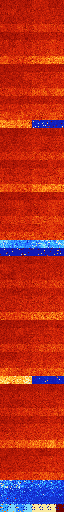

# B12478 (207872-208383)

<details>
    <summary>Initial Grid</summary>
    
</details>


<details>
    <summary>Initial Grid RLE</summary>

```
#C Exported from GoGoL (https://github.com/marrow16/gogol)
#C Wrap mode: Toroidal
#C Boundary mode: Dead
#C Step: 0
x = 100, y = 100, rule = B12478/S
10bo29bo$6bobo9bo3bo29bo24bo14bo$23bo14bo4bo51bobo$10bo49bo13bo$7bo3bo
6bo16bo14bo41bo$21bo48bobo11bo$18bo2bo35bo4bo18bo8bo5bo$20b2o10bo5bo2b
2o19b2o11bo7bo4bo$33bo11bo27bo14bo$5bo34bo21bo2bo9bo9bo$14bo41bo10bo18b
obo$4bo3bo55bobo9b2o3bobo8bo3bo$bo15bo2bob2o13bo30bo30bo$23bob2o10bo3bo
3bob2o5bo18bo$11bo9bo6bo48bo5bo15bo$47bo$7bo38b3o3bo9bo11bo19bo$51bo9bo
14bo14bo$40bo19bo$2bo20bo49bo16bo$21bo3bo6bo22b2o19b2obo5bo10bo$2bo37bo
7bo11bo23bo10bo$10bo5bo5bo22bo3bo21bo$8bo2bo26bo32bo22bo$38bo20bo15b2o
10bo$4bo11bo36bo$24bo18bo16bo$6bo29bo55bo$21bo77bo$22bo25bo8bo$20bo16bo
10bo47bo$o52bo8bo3bo$bo19bo21bo21bo6bo$19bo37bobo17bo18bo$24bo13bo56bo
2bo$34bo50bo$39bo15bo40b2o$15bo12b2o14bo$12bo7bo59bo$21bo19bo7bo$22bo9b
o$8bo4bo19bo38bo4bo10bo$17bo19bo20bo23bo$22bo8bo13bo$bo51bo22bo4bo$15bo
81bo$100b$23b2o34bo13bo17b2o$37bo4bo35bo17bo$31b2o11bo16bo4bo9bo17bo2bo
$9bo27bo10bo22bo23bo3bo$bo33bo22bo30b3o3bo3bo$20bo24bo35bo$19bo34bo42bo
$8bo3bo8bo5bo7bo7bo7bo13bo9bo11bo10bo$18bo51bo26bo$7bo20bo$bo18bo46bo
11bo$7bo50bo13bo$16bo4bo5bo36bo31bo$27bo14bo31bo$15bo8bobo3b2o34bo3bo$
10bo61bo19bo4bobo$8bo4bo9bo33bo34bo$47bo19bo8bo8bo2bo9bo$22bo18bo12bo
16bobo12bo$6bo36bo14bo16bo6bo10bo$100b$16bo30bo10bo20bo$o7b2o48bo3b2o
21bo$20bo2bo33bo34bo$o9bo33bo25bo6bob2o5bo$32bo5bo11bo12bo17bo6bo2bo$
12bo11bo6bo17bo21bo$3bo44bo3bo7bo19bo11bo$30bo8b2o19bo7b2o26bo$10b2o16b
o19bo7bo25bo$3bo20bo3bo3bo8bo23bo9bobo14bo$49bo7bo29bo7bo$9bo48bo21bo$
3bo28bo31bo$34bo15b2o3bo4bo15bo21bo$4bo42bobo46bo$56bo6bo11bobo7bo$o14b
o45bo$o7bobo11bo65bo7bo$20bo17bo2bo32bo$o7bo8bo37bo18bo8bo9bo$16bo11bo
23bo22bo10bo7bo$15bo53bo$o4bo11bo13bo4bo51bo$3bo4bo35bo26bo$3bo29bo35b
2o12bo$30bo45b2o$10bo46bo13bo10bo$40bo42bo15bo$16bo10bo9bo2bo5bo3bo3bo
12bo$72bo8b2o$89bo$73bo20bo!
```
</details>
<details>
    <summary>Thumbnail</summary>

</details>
<table>
<tr>
    <td><a href="./207872%20S%20Heat%20Map%20Activity.png"></a><br>S (207872)<br>G>1000</td>    <td><a href="./207873%20S0%20Heat%20Map%20Activity.png"></a><br>S0 (207873)<br>G>1000</td>    <td><a href="./207874%20S1%20Heat%20Map%20Activity.png"></a><br>S1 (207874)<br>G>1000</td>    <td><a href="./207875%20S01%20Heat%20Map%20Activity.png"></a><br>S01 (207875)<br>G>1000</td>    <td><a href="./207876%20S2%20Heat%20Map%20Activity.png"></a><br>S2 (207876)<br>G>1000</td>    <td><a href="./207877%20S02%20Heat%20Map%20Activity.png"></a><br>S02 (207877)<br>G>1000</td>    <td><a href="./207878%20S12%20Heat%20Map%20Activity.png"></a><br>S12 (207878)<br>G>1000</td>    <td><a href="./207879%20S012%20Heat%20Map%20Activity.png"></a><br>S012 (207879)<br>G>1000</td></tr>
<tr>
    <td><a href="./207880%20S3%20Heat%20Map%20Activity.png"></a><br>S3 (207880)<br>G>1000</td>    <td><a href="./207881%20S03%20Heat%20Map%20Activity.png"></a><br>S03 (207881)<br>G>1000</td>    <td><a href="./207882%20S13%20Heat%20Map%20Activity.png"></a><br>S13 (207882)<br>G>1000</td>    <td><a href="./207883%20S013%20Heat%20Map%20Activity.png"></a><br>S013 (207883)<br>G>1000</td>    <td><a href="./207884%20S23%20Heat%20Map%20Activity.png"></a><br>S23 (207884)<br>G>1000</td>    <td><a href="./207885%20S023%20Heat%20Map%20Activity.png"></a><br>S023 (207885)<br>G>1000</td>    <td><a href="./207886%20S123%20Heat%20Map%20Activity.png"></a><br>S123 (207886)<br>G>1000</td>    <td><a href="./207887%20S0123%20Heat%20Map%20Activity.png"></a><br>S0123 (207887)<br>G>1000</td></tr>
<tr>
    <td><a href="./207888%20S4%20Heat%20Map%20Activity.png"></a><br>S4 (207888)<br>G>1000</td>    <td><a href="./207889%20S04%20Heat%20Map%20Activity.png"></a><br>S04 (207889)<br>G>1000</td>    <td><a href="./207890%20S14%20Heat%20Map%20Activity.png"></a><br>S14 (207890)<br>G>1000</td>    <td><a href="./207891%20S014%20Heat%20Map%20Activity.png"></a><br>S014 (207891)<br>G>1000</td>    <td><a href="./207892%20S24%20Heat%20Map%20Activity.png"></a><br>S24 (207892)<br>G>1000</td>    <td><a href="./207893%20S024%20Heat%20Map%20Activity.png"></a><br>S024 (207893)<br>G>1000</td>    <td><a href="./207894%20S124%20Heat%20Map%20Activity.png"></a><br>S124 (207894)<br>G>1000</td>    <td><a href="./207895%20S0124%20Heat%20Map%20Activity.png"></a><br>S0124 (207895)<br>G>1000</td></tr>
<tr>
    <td><a href="./207896%20S34%20Heat%20Map%20Activity.png"></a><br>S34 (207896)<br>G>1000</td>    <td><a href="./207897%20S034%20Heat%20Map%20Activity.png"></a><br>S034 (207897)<br>G>1000</td>    <td><a href="./207898%20S134%20Heat%20Map%20Activity.png"></a><br>S134 (207898)<br>G>1000</td>    <td><a href="./207899%20S0134%20Heat%20Map%20Activity.png"></a><br>S0134 (207899)<br>G>1000</td>    <td><a href="./207900%20S234%20Heat%20Map%20Activity.png"></a><br>S234 (207900)<br>G>1000</td>    <td><a href="./207901%20S0234%20Heat%20Map%20Activity.png"></a><br>S0234 (207901)<br>G>1000</td>    <td><a href="./207902%20S1234%20Heat%20Map%20Activity.png"></a><br>S1234 (207902)<br>G>1000</td>    <td><a href="./207903%20S01234%20Heat%20Map%20Activity.png"></a><br>S01234 (207903)<br>G>1000</td></tr>
<tr>
    <td><a href="./207904%20S5%20Heat%20Map%20Activity.png"></a><br>S5 (207904)<br>G>1000</td>    <td><a href="./207905%20S05%20Heat%20Map%20Activity.png"></a><br>S05 (207905)<br>G>1000</td>    <td><a href="./207906%20S15%20Heat%20Map%20Activity.png"></a><br>S15 (207906)<br>G>1000</td>    <td><a href="./207907%20S015%20Heat%20Map%20Activity.png"></a><br>S015 (207907)<br>G>1000</td>    <td><a href="./207908%20S25%20Heat%20Map%20Activity.png"></a><br>S25 (207908)<br>G>1000</td>    <td><a href="./207909%20S025%20Heat%20Map%20Activity.png"></a><br>S025 (207909)<br>G>1000</td>    <td><a href="./207910%20S125%20Heat%20Map%20Activity.png"></a><br>S125 (207910)<br>G>1000</td>    <td><a href="./207911%20S0125%20Heat%20Map%20Activity.png"></a><br>S0125 (207911)<br>G>1000</td></tr>
<tr>
    <td><a href="./207912%20S35%20Heat%20Map%20Activity.png"></a><br>S35 (207912)<br>G>1000</td>    <td><a href="./207913%20S035%20Heat%20Map%20Activity.png"></a><br>S035 (207913)<br>G>1000</td>    <td><a href="./207914%20S135%20Heat%20Map%20Activity.png"></a><br>S135 (207914)<br>G>1000</td>    <td><a href="./207915%20S0135%20Heat%20Map%20Activity.png"></a><br>S0135 (207915)<br>G>1000</td>    <td><a href="./207916%20S235%20Heat%20Map%20Activity.png"></a><br>S235 (207916)<br>G>1000</td>    <td><a href="./207917%20S0235%20Heat%20Map%20Activity.png"></a><br>S0235 (207917)<br>G>1000</td>    <td><a href="./207918%20S1235%20Heat%20Map%20Activity.png"></a><br>S1235 (207918)<br>G>1000</td>    <td><a href="./207919%20S01235%20Heat%20Map%20Activity.png"></a><br>S01235 (207919)<br>G>1000</td></tr>
<tr>
    <td><a href="./207920%20S45%20Heat%20Map%20Activity.png"></a><br>S45 (207920)<br>G>1000</td>    <td><a href="./207921%20S045%20Heat%20Map%20Activity.png"></a><br>S045 (207921)<br>G>1000</td>    <td><a href="./207922%20S145%20Heat%20Map%20Activity.png"></a><br>S145 (207922)<br>G>1000</td>    <td><a href="./207923%20S0145%20Heat%20Map%20Activity.png"></a><br>S0145 (207923)<br>G>1000</td>    <td><a href="./207924%20S245%20Heat%20Map%20Activity.png"></a><br>S245 (207924)<br>G>1000</td>    <td><a href="./207925%20S0245%20Heat%20Map%20Activity.png"></a><br>S0245 (207925)<br>G>1000</td>    <td><a href="./207926%20S1245%20Heat%20Map%20Activity.png"></a><br>S1245 (207926)<br>G>1000</td>    <td><a href="./207927%20S01245%20Heat%20Map%20Activity.png"></a><br>S01245 (207927)<br>G>1000</td></tr>
<tr>
    <td><a href="./207928%20S345%20Heat%20Map%20Activity.png"></a><br>S345 (207928)<br>G>1000</td>    <td><a href="./207929%20S0345%20Heat%20Map%20Activity.png"></a><br>S0345 (207929)<br>G>1000</td>    <td><a href="./207930%20S1345%20Heat%20Map%20Activity.png"></a><br>S1345 (207930)<br>G>1000</td>    <td><a href="./207931%20S01345%20Heat%20Map%20Activity.png"></a><br>S01345 (207931)<br>G>1000</td>    <td><a href="./207932%20S2345%20Heat%20Map%20Activity.png"></a><br>S2345 (207932)<br>G>1000</td>    <td><a href="./207933%20S02345%20Heat%20Map%20Activity.png"></a><br>S02345 (207933)<br>G>1000</td>    <td><a href="./207934%20S12345%20Heat%20Map%20Activity.png"></a><br>S12345 (207934)<br>G>1000</td>    <td><a href="./207935%20S012345%20Heat%20Map%20Activity.png"></a><br>S012345 (207935)<br>G>1000</td></tr>
<tr>
    <td><a href="./207936%20S6%20Heat%20Map%20Activity.png"></a><br>S6 (207936)<br>G>1000</td>    <td><a href="./207937%20S06%20Heat%20Map%20Activity.png"></a><br>S06 (207937)<br>G>1000</td>    <td><a href="./207938%20S16%20Heat%20Map%20Activity.png"></a><br>S16 (207938)<br>G>1000</td>    <td><a href="./207939%20S016%20Heat%20Map%20Activity.png"></a><br>S016 (207939)<br>G>1000</td>    <td><a href="./207940%20S26%20Heat%20Map%20Activity.png"></a><br>S26 (207940)<br>G>1000</td>    <td><a href="./207941%20S026%20Heat%20Map%20Activity.png"></a><br>S026 (207941)<br>G>1000</td>    <td><a href="./207942%20S126%20Heat%20Map%20Activity.png"></a><br>S126 (207942)<br>G>1000</td>    <td><a href="./207943%20S0126%20Heat%20Map%20Activity.png"></a><br>S0126 (207943)<br>G>1000</td></tr>
<tr>
    <td><a href="./207944%20S36%20Heat%20Map%20Activity.png"></a><br>S36 (207944)<br>G>1000</td>    <td><a href="./207945%20S036%20Heat%20Map%20Activity.png"></a><br>S036 (207945)<br>G>1000</td>    <td><a href="./207946%20S136%20Heat%20Map%20Activity.png"></a><br>S136 (207946)<br>G>1000</td>    <td><a href="./207947%20S0136%20Heat%20Map%20Activity.png"></a><br>S0136 (207947)<br>G>1000</td>    <td><a href="./207948%20S236%20Heat%20Map%20Activity.png"></a><br>S236 (207948)<br>G>1000</td>    <td><a href="./207949%20S0236%20Heat%20Map%20Activity.png"></a><br>S0236 (207949)<br>G>1000</td>    <td><a href="./207950%20S1236%20Heat%20Map%20Activity.png"></a><br>S1236 (207950)<br>G>1000</td>    <td><a href="./207951%20S01236%20Heat%20Map%20Activity.png"></a><br>S01236 (207951)<br>G>1000</td></tr>
<tr>
    <td><a href="./207952%20S46%20Heat%20Map%20Activity.png"></a><br>S46 (207952)<br>G>1000</td>    <td><a href="./207953%20S046%20Heat%20Map%20Activity.png"></a><br>S046 (207953)<br>G>1000</td>    <td><a href="./207954%20S146%20Heat%20Map%20Activity.png"></a><br>S146 (207954)<br>G>1000</td>    <td><a href="./207955%20S0146%20Heat%20Map%20Activity.png"></a><br>S0146 (207955)<br>G>1000</td>    <td><a href="./207956%20S246%20Heat%20Map%20Activity.png"></a><br>S246 (207956)<br>G>1000</td>    <td><a href="./207957%20S0246%20Heat%20Map%20Activity.png"></a><br>S0246 (207957)<br>G>1000</td>    <td><a href="./207958%20S1246%20Heat%20Map%20Activity.png"></a><br>S1246 (207958)<br>G>1000</td>    <td><a href="./207959%20S01246%20Heat%20Map%20Activity.png"></a><br>S01246 (207959)<br>G>1000</td></tr>
<tr>
    <td><a href="./207960%20S346%20Heat%20Map%20Activity.png"></a><br>S346 (207960)<br>G>1000</td>    <td><a href="./207961%20S0346%20Heat%20Map%20Activity.png"></a><br>S0346 (207961)<br>G>1000</td>    <td><a href="./207962%20S1346%20Heat%20Map%20Activity.png"></a><br>S1346 (207962)<br>G>1000</td>    <td><a href="./207963%20S01346%20Heat%20Map%20Activity.png"></a><br>S01346 (207963)<br>G>1000</td>    <td><a href="./207964%20S2346%20Heat%20Map%20Activity.png"></a><br>S2346 (207964)<br>G>1000</td>    <td><a href="./207965%20S02346%20Heat%20Map%20Activity.png"></a><br>S02346 (207965)<br>G>1000</td>    <td><a href="./207966%20S12346%20Heat%20Map%20Activity.png"></a><br>S12346 (207966)<br>G>1000</td>    <td><a href="./207967%20S012346%20Heat%20Map%20Activity.png"></a><br>S012346 (207967)<br>G>1000</td></tr>
<tr>
    <td><a href="./207968%20S56%20Heat%20Map%20Activity.png"></a><br>S56 (207968)<br>G>1000</td>    <td><a href="./207969%20S056%20Heat%20Map%20Activity.png"></a><br>S056 (207969)<br>G>1000</td>    <td><a href="./207970%20S156%20Heat%20Map%20Activity.png"></a><br>S156 (207970)<br>G>1000</td>    <td><a href="./207971%20S0156%20Heat%20Map%20Activity.png"></a><br>S0156 (207971)<br>G>1000</td>    <td><a href="./207972%20S256%20Heat%20Map%20Activity.png"></a><br>S256 (207972)<br>G>1000</td>    <td><a href="./207973%20S0256%20Heat%20Map%20Activity.png"></a><br>S0256 (207973)<br>G>1000</td>    <td><a href="./207974%20S1256%20Heat%20Map%20Activity.png"></a><br>S1256 (207974)<br>G>1000</td>    <td><a href="./207975%20S01256%20Heat%20Map%20Activity.png"></a><br>S01256 (207975)<br>G>1000</td></tr>
<tr>
    <td><a href="./207976%20S356%20Heat%20Map%20Activity.png"></a><br>S356 (207976)<br>G>1000</td>    <td><a href="./207977%20S0356%20Heat%20Map%20Activity.png"></a><br>S0356 (207977)<br>G>1000</td>    <td><a href="./207978%20S1356%20Heat%20Map%20Activity.png"></a><br>S1356 (207978)<br>G>1000</td>    <td><a href="./207979%20S01356%20Heat%20Map%20Activity.png"></a><br>S01356 (207979)<br>G>1000</td>    <td><a href="./207980%20S2356%20Heat%20Map%20Activity.png"></a><br>S2356 (207980)<br>G>1000</td>    <td><a href="./207981%20S02356%20Heat%20Map%20Activity.png"></a><br>S02356 (207981)<br>G>1000</td>    <td><a href="./207982%20S12356%20Heat%20Map%20Activity.png"></a><br>S12356 (207982)<br>G>1000</td>    <td><a href="./207983%20S012356%20Heat%20Map%20Activity.png"></a><br>S012356 (207983)<br>G>1000</td></tr>
<tr>
    <td><a href="./207984%20S456%20Heat%20Map%20Activity.png"></a><br>S456 (207984)<br>G>1000</td>    <td><a href="./207985%20S0456%20Heat%20Map%20Activity.png"></a><br>S0456 (207985)<br>G>1000</td>    <td><a href="./207986%20S1456%20Heat%20Map%20Activity.png"></a><br>S1456 (207986)<br>G>1000</td>    <td><a href="./207987%20S01456%20Heat%20Map%20Activity.png"></a><br>S01456 (207987)<br>G>1000</td>    <td><a href="./207988%20S2456%20Heat%20Map%20Activity.png"></a><br>S2456 (207988)<br>G>1000</td>    <td><a href="./207989%20S02456%20Heat%20Map%20Activity.png"></a><br>S02456 (207989)<br>G>1000</td>    <td><a href="./207990%20S12456%20Heat%20Map%20Activity.png"></a><br>S12456 (207990)<br>G>1000</td>    <td><a href="./207991%20S012456%20Heat%20Map%20Activity.png"></a><br>S012456 (207991)<br>G>1000</td></tr>
<tr>
    <td><a href="./207992%20S3456%20Heat%20Map%20Activity.png"></a><br>S3456 (207992)<br>G>1000</td>    <td><a href="./207993%20S03456%20Heat%20Map%20Activity.png"></a><br>S03456 (207993)<br>G>1000</td>    <td><a href="./207994%20S13456%20Heat%20Map%20Activity.png"></a><br>S13456 (207994)<br>G>1000</td>    <td><a href="./207995%20S013456%20Heat%20Map%20Activity.png"></a><br>S013456 (207995)<br>G>1000</td>    <td><a href="./207996%20S23456%20Heat%20Map%20Activity.png"></a><br>S23456 (207996)<br>G>1000</td>    <td><a href="./207997%20S023456%20Heat%20Map%20Activity.png"></a><br>S023456 (207997)<br>G>1000</td>    <td><a href="./207998%20S123456%20Heat%20Map%20Activity.png"></a><br>S123456 (207998)<br>G>1000</td>    <td><a href="./207999%20S0123456%20Heat%20Map%20Activity.png"></a><br>S0123456 (207999)<br>G>1000</td></tr>
<tr>
    <td><a href="./208000%20S7%20Heat%20Map%20Activity.png"></a><br>S7 (208000)<br>G>1000</td>    <td><a href="./208001%20S07%20Heat%20Map%20Activity.png"></a><br>S07 (208001)<br>G>1000</td>    <td><a href="./208002%20S17%20Heat%20Map%20Activity.png"></a><br>S17 (208002)<br>G>1000</td>    <td><a href="./208003%20S017%20Heat%20Map%20Activity.png"></a><br>S017 (208003)<br>G>1000</td>    <td><a href="./208004%20S27%20Heat%20Map%20Activity.png"></a><br>S27 (208004)<br>G>1000</td>    <td><a href="./208005%20S027%20Heat%20Map%20Activity.png"></a><br>S027 (208005)<br>G>1000</td>    <td><a href="./208006%20S127%20Heat%20Map%20Activity.png"></a><br>S127 (208006)<br>G>1000</td>    <td><a href="./208007%20S0127%20Heat%20Map%20Activity.png"></a><br>S0127 (208007)<br>G>1000</td></tr>
<tr>
    <td><a href="./208008%20S37%20Heat%20Map%20Activity.png"></a><br>S37 (208008)<br>G>1000</td>    <td><a href="./208009%20S037%20Heat%20Map%20Activity.png"></a><br>S037 (208009)<br>G>1000</td>    <td><a href="./208010%20S137%20Heat%20Map%20Activity.png"></a><br>S137 (208010)<br>G>1000</td>    <td><a href="./208011%20S0137%20Heat%20Map%20Activity.png"></a><br>S0137 (208011)<br>G>1000</td>    <td><a href="./208012%20S237%20Heat%20Map%20Activity.png"></a><br>S237 (208012)<br>G>1000</td>    <td><a href="./208013%20S0237%20Heat%20Map%20Activity.png"></a><br>S0237 (208013)<br>G>1000</td>    <td><a href="./208014%20S1237%20Heat%20Map%20Activity.png"></a><br>S1237 (208014)<br>G>1000</td>    <td><a href="./208015%20S01237%20Heat%20Map%20Activity.png"></a><br>S01237 (208015)<br>G>1000</td></tr>
<tr>
    <td><a href="./208016%20S47%20Heat%20Map%20Activity.png"></a><br>S47 (208016)<br>G>1000</td>    <td><a href="./208017%20S047%20Heat%20Map%20Activity.png"></a><br>S047 (208017)<br>G>1000</td>    <td><a href="./208018%20S147%20Heat%20Map%20Activity.png"></a><br>S147 (208018)<br>G>1000</td>    <td><a href="./208019%20S0147%20Heat%20Map%20Activity.png"></a><br>S0147 (208019)<br>G>1000</td>    <td><a href="./208020%20S247%20Heat%20Map%20Activity.png"></a><br>S247 (208020)<br>G>1000</td>    <td><a href="./208021%20S0247%20Heat%20Map%20Activity.png"></a><br>S0247 (208021)<br>G>1000</td>    <td><a href="./208022%20S1247%20Heat%20Map%20Activity.png"></a><br>S1247 (208022)<br>G>1000</td>    <td><a href="./208023%20S01247%20Heat%20Map%20Activity.png"></a><br>S01247 (208023)<br>G>1000</td></tr>
<tr>
    <td><a href="./208024%20S347%20Heat%20Map%20Activity.png"></a><br>S347 (208024)<br>G>1000</td>    <td><a href="./208025%20S0347%20Heat%20Map%20Activity.png"></a><br>S0347 (208025)<br>G>1000</td>    <td><a href="./208026%20S1347%20Heat%20Map%20Activity.png"></a><br>S1347 (208026)<br>G>1000</td>    <td><a href="./208027%20S01347%20Heat%20Map%20Activity.png"></a><br>S01347 (208027)<br>G>1000</td>    <td><a href="./208028%20S2347%20Heat%20Map%20Activity.png"></a><br>S2347 (208028)<br>G>1000</td>    <td><a href="./208029%20S02347%20Heat%20Map%20Activity.png"></a><br>S02347 (208029)<br>G>1000</td>    <td><a href="./208030%20S12347%20Heat%20Map%20Activity.png"></a><br>S12347 (208030)<br>G>1000</td>    <td><a href="./208031%20S012347%20Heat%20Map%20Activity.png"></a><br>S012347 (208031)<br>G>1000</td></tr>
<tr>
    <td><a href="./208032%20S57%20Heat%20Map%20Activity.png"></a><br>S57 (208032)<br>G>1000</td>    <td><a href="./208033%20S057%20Heat%20Map%20Activity.png"></a><br>S057 (208033)<br>G>1000</td>    <td><a href="./208034%20S157%20Heat%20Map%20Activity.png"></a><br>S157 (208034)<br>G>1000</td>    <td><a href="./208035%20S0157%20Heat%20Map%20Activity.png"></a><br>S0157 (208035)<br>G>1000</td>    <td><a href="./208036%20S257%20Heat%20Map%20Activity.png"></a><br>S257 (208036)<br>G>1000</td>    <td><a href="./208037%20S0257%20Heat%20Map%20Activity.png"></a><br>S0257 (208037)<br>G>1000</td>    <td><a href="./208038%20S1257%20Heat%20Map%20Activity.png"></a><br>S1257 (208038)<br>G>1000</td>    <td><a href="./208039%20S01257%20Heat%20Map%20Activity.png"></a><br>S01257 (208039)<br>G>1000</td></tr>
<tr>
    <td><a href="./208040%20S357%20Heat%20Map%20Activity.png"></a><br>S357 (208040)<br>G>1000</td>    <td><a href="./208041%20S0357%20Heat%20Map%20Activity.png"></a><br>S0357 (208041)<br>G>1000</td>    <td><a href="./208042%20S1357%20Heat%20Map%20Activity.png"></a><br>S1357 (208042)<br>G>1000</td>    <td><a href="./208043%20S01357%20Heat%20Map%20Activity.png"></a><br>S01357 (208043)<br>G>1000</td>    <td><a href="./208044%20S2357%20Heat%20Map%20Activity.png"></a><br>S2357 (208044)<br>G>1000</td>    <td><a href="./208045%20S02357%20Heat%20Map%20Activity.png"></a><br>S02357 (208045)<br>G>1000</td>    <td><a href="./208046%20S12357%20Heat%20Map%20Activity.png"></a><br>S12357 (208046)<br>G>1000</td>    <td><a href="./208047%20S012357%20Heat%20Map%20Activity.png"></a><br>S012357 (208047)<br>G>1000</td></tr>
<tr>
    <td><a href="./208048%20S457%20Heat%20Map%20Activity.png"></a><br>S457 (208048)<br>G>1000</td>    <td><a href="./208049%20S0457%20Heat%20Map%20Activity.png"></a><br>S0457 (208049)<br>G>1000</td>    <td><a href="./208050%20S1457%20Heat%20Map%20Activity.png"></a><br>S1457 (208050)<br>G>1000</td>    <td><a href="./208051%20S01457%20Heat%20Map%20Activity.png"></a><br>S01457 (208051)<br>G>1000</td>    <td><a href="./208052%20S2457%20Heat%20Map%20Activity.png"></a><br>S2457 (208052)<br>G>1000</td>    <td><a href="./208053%20S02457%20Heat%20Map%20Activity.png"></a><br>S02457 (208053)<br>G>1000</td>    <td><a href="./208054%20S12457%20Heat%20Map%20Activity.png"></a><br>S12457 (208054)<br>G>1000</td>    <td><a href="./208055%20S012457%20Heat%20Map%20Activity.png"></a><br>S012457 (208055)<br>G>1000</td></tr>
<tr>
    <td><a href="./208056%20S3457%20Heat%20Map%20Activity.png"></a><br>S3457 (208056)<br>G>1000</td>    <td><a href="./208057%20S03457%20Heat%20Map%20Activity.png"></a><br>S03457 (208057)<br>G>1000</td>    <td><a href="./208058%20S13457%20Heat%20Map%20Activity.png"></a><br>S13457 (208058)<br>G>1000</td>    <td><a href="./208059%20S013457%20Heat%20Map%20Activity.png"></a><br>S013457 (208059)<br>G>1000</td>    <td><a href="./208060%20S23457%20Heat%20Map%20Activity.png"></a><br>S23457 (208060)<br>G>1000</td>    <td><a href="./208061%20S023457%20Heat%20Map%20Activity.png"></a><br>S023457 (208061)<br>G>1000</td>    <td><a href="./208062%20S123457%20Heat%20Map%20Activity.png"></a><br>S123457 (208062)<br>G>1000</td>    <td><a href="./208063%20S0123457%20Heat%20Map%20Activity.png"></a><br>S0123457 (208063)<br>G>1000</td></tr>
<tr>
    <td><a href="./208064%20S67%20Heat%20Map%20Activity.png"></a><br>S67 (208064)<br>G>1000</td>    <td><a href="./208065%20S067%20Heat%20Map%20Activity.png"></a><br>S067 (208065)<br>G>1000</td>    <td><a href="./208066%20S167%20Heat%20Map%20Activity.png"></a><br>S167 (208066)<br>G>1000</td>    <td><a href="./208067%20S0167%20Heat%20Map%20Activity.png"></a><br>S0167 (208067)<br>G>1000</td>    <td><a href="./208068%20S267%20Heat%20Map%20Activity.png"></a><br>S267 (208068)<br>G>1000</td>    <td><a href="./208069%20S0267%20Heat%20Map%20Activity.png"></a><br>S0267 (208069)<br>G>1000</td>    <td><a href="./208070%20S1267%20Heat%20Map%20Activity.png"></a><br>S1267 (208070)<br>G>1000</td>    <td><a href="./208071%20S01267%20Heat%20Map%20Activity.png"></a><br>S01267 (208071)<br>G>1000</td></tr>
<tr>
    <td><a href="./208072%20S367%20Heat%20Map%20Activity.png"></a><br>S367 (208072)<br>G>1000</td>    <td><a href="./208073%20S0367%20Heat%20Map%20Activity.png"></a><br>S0367 (208073)<br>G>1000</td>    <td><a href="./208074%20S1367%20Heat%20Map%20Activity.png"></a><br>S1367 (208074)<br>G>1000</td>    <td><a href="./208075%20S01367%20Heat%20Map%20Activity.png"></a><br>S01367 (208075)<br>G>1000</td>    <td><a href="./208076%20S2367%20Heat%20Map%20Activity.png"></a><br>S2367 (208076)<br>G>1000</td>    <td><a href="./208077%20S02367%20Heat%20Map%20Activity.png"></a><br>S02367 (208077)<br>G>1000</td>    <td><a href="./208078%20S12367%20Heat%20Map%20Activity.png"></a><br>S12367 (208078)<br>G>1000</td>    <td><a href="./208079%20S012367%20Heat%20Map%20Activity.png"></a><br>S012367 (208079)<br>G>1000</td></tr>
<tr>
    <td><a href="./208080%20S467%20Heat%20Map%20Activity.png"></a><br>S467 (208080)<br>G>1000</td>    <td><a href="./208081%20S0467%20Heat%20Map%20Activity.png"></a><br>S0467 (208081)<br>G>1000</td>    <td><a href="./208082%20S1467%20Heat%20Map%20Activity.png"></a><br>S1467 (208082)<br>G>1000</td>    <td><a href="./208083%20S01467%20Heat%20Map%20Activity.png"></a><br>S01467 (208083)<br>G>1000</td>    <td><a href="./208084%20S2467%20Heat%20Map%20Activity.png"></a><br>S2467 (208084)<br>G>1000</td>    <td><a href="./208085%20S02467%20Heat%20Map%20Activity.png"></a><br>S02467 (208085)<br>G>1000</td>    <td><a href="./208086%20S12467%20Heat%20Map%20Activity.png"></a><br>S12467 (208086)<br>G>1000</td>    <td><a href="./208087%20S012467%20Heat%20Map%20Activity.png"></a><br>S012467 (208087)<br>G>1000</td></tr>
<tr>
    <td><a href="./208088%20S3467%20Heat%20Map%20Activity.png"></a><br>S3467 (208088)<br>G>1000</td>    <td><a href="./208089%20S03467%20Heat%20Map%20Activity.png"></a><br>S03467 (208089)<br>G>1000</td>    <td><a href="./208090%20S13467%20Heat%20Map%20Activity.png"></a><br>S13467 (208090)<br>G>1000</td>    <td><a href="./208091%20S013467%20Heat%20Map%20Activity.png"></a><br>S013467 (208091)<br>G>1000</td>    <td><a href="./208092%20S23467%20Heat%20Map%20Activity.png"></a><br>S23467 (208092)<br>G>1000</td>    <td><a href="./208093%20S023467%20Heat%20Map%20Activity.png"></a><br>S023467 (208093)<br>G>1000</td>    <td><a href="./208094%20S123467%20Heat%20Map%20Activity.png"></a><br>S123467 (208094)<br>G>1000</td>    <td><a href="./208095%20S0123467%20Heat%20Map%20Activity.png"></a><br>S0123467 (208095)<br>G>1000</td></tr>
<tr>
    <td><a href="./208096%20S567%20Heat%20Map%20Activity.png"></a><br>S567 (208096)<br>G>1000</td>    <td><a href="./208097%20S0567%20Heat%20Map%20Activity.png"></a><br>S0567 (208097)<br>G>1000</td>    <td><a href="./208098%20S1567%20Heat%20Map%20Activity.png"></a><br>S1567 (208098)<br>G>1000</td>    <td><a href="./208099%20S01567%20Heat%20Map%20Activity.png"></a><br>S01567 (208099)<br>G>1000</td>    <td><a href="./208100%20S2567%20Heat%20Map%20Activity.png"></a><br>S2567 (208100)<br>G>1000</td>    <td><a href="./208101%20S02567%20Heat%20Map%20Activity.png"></a><br>S02567 (208101)<br>G>1000</td>    <td><a href="./208102%20S12567%20Heat%20Map%20Activity.png"></a><br>S12567 (208102)<br>G>1000</td>    <td><a href="./208103%20S012567%20Heat%20Map%20Activity.png"></a><br>S012567 (208103)<br>G>1000</td></tr>
<tr>
    <td><a href="./208104%20S3567%20Heat%20Map%20Activity.png"></a><br>S3567 (208104)<br>G>1000</td>    <td><a href="./208105%20S03567%20Heat%20Map%20Activity.png"></a><br>S03567 (208105)<br>G>1000</td>    <td><a href="./208106%20S13567%20Heat%20Map%20Activity.png"></a><br>S13567 (208106)<br>G>1000</td>    <td><a href="./208107%20S013567%20Heat%20Map%20Activity.png"></a><br>S013567 (208107)<br>G>1000</td>    <td><a href="./208108%20S23567%20Heat%20Map%20Activity.png"></a><br>S23567 (208108)<br>G>1000</td>    <td><a href="./208109%20S023567%20Heat%20Map%20Activity.png"></a><br>S023567 (208109)<br>G>1000</td>    <td><a href="./208110%20S123567%20Heat%20Map%20Activity.png"></a><br>S123567 (208110)<br>G>1000</td>    <td><a href="./208111%20S0123567%20Heat%20Map%20Activity.png"></a><br>S0123567 (208111)<br>G>1000</td></tr>
<tr>
    <td><a href="./208112%20S4567%20Heat%20Map%20Activity.png"></a><br>S4567 (208112)<br>G>1000</td>    <td><a href="./208113%20S04567%20Heat%20Map%20Activity.png"></a><br>S04567 (208113)<br>G>1000</td>    <td><a href="./208114%20S14567%20Heat%20Map%20Activity.png"></a><br>S14567 (208114)<br>G>1000</td>    <td><a href="./208115%20S014567%20Heat%20Map%20Activity.png"></a><br>S014567 (208115)<br>G>1000</td>    <td><a href="./208116%20S24567%20Heat%20Map%20Activity.png"></a><br>S24567 (208116)<br>G>1000</td>    <td><a href="./208117%20S024567%20Heat%20Map%20Activity.png"></a><br>S024567 (208117)<br>G>1000</td>    <td><a href="./208118%20S124567%20Heat%20Map%20Activity.png"></a><br>S124567 (208118)<br>G>1000</td>    <td><a href="./208119%20S0124567%20Heat%20Map%20Activity.png"></a><br>S0124567 (208119)<br>G>1000</td></tr>
<tr>
    <td><a href="./208120%20S34567%20Heat%20Map%20Activity.png"></a><br>S34567 (208120)<br>G>1000</td>    <td><a href="./208121%20S034567%20Heat%20Map%20Activity.png"></a><br>S034567 (208121)<br>G>1000</td>    <td><a href="./208122%20S134567%20Heat%20Map%20Activity.png"></a><br>S134567 (208122)<br>G>1000</td>    <td><a href="./208123%20S0134567%20Heat%20Map%20Activity.png"></a><br>S0134567 (208123)<br>G>1000</td>    <td><a href="./208124%20S234567%20Heat%20Map%20Activity.png"></a><br>S234567 (208124)<br>G>1000</td>    <td><a href="./208125%20S0234567%20Heat%20Map%20Activity.png"></a><br>S0234567 (208125)<br>G>1000</td>    <td><a href="./208126%20S1234567%20Heat%20Map%20Activity.png"></a><br>S1234567 (208126)<br>G>1000</td>    <td><a href="./208127%20S01234567%20Heat%20Map%20Activity.png"></a><br>S01234567 (208127)<br>G>1000</td></tr>
<tr>
    <td><a href="./208128%20S8%20Heat%20Map%20Activity.png"></a><br>S8 (208128)<br>G>1000</td>    <td><a href="./208129%20S08%20Heat%20Map%20Activity.png"></a><br>S08 (208129)<br>G>1000</td>    <td><a href="./208130%20S18%20Heat%20Map%20Activity.png"></a><br>S18 (208130)<br>G>1000</td>    <td><a href="./208131%20S018%20Heat%20Map%20Activity.png"></a><br>S018 (208131)<br>G>1000</td>    <td><a href="./208132%20S28%20Heat%20Map%20Activity.png"></a><br>S28 (208132)<br>G>1000</td>    <td><a href="./208133%20S028%20Heat%20Map%20Activity.png"></a><br>S028 (208133)<br>G>1000</td>    <td><a href="./208134%20S128%20Heat%20Map%20Activity.png"></a><br>S128 (208134)<br>G>1000</td>    <td><a href="./208135%20S0128%20Heat%20Map%20Activity.png"></a><br>S0128 (208135)<br>G>1000</td></tr>
<tr>
    <td><a href="./208136%20S38%20Heat%20Map%20Activity.png"></a><br>S38 (208136)<br>G>1000</td>    <td><a href="./208137%20S038%20Heat%20Map%20Activity.png"></a><br>S038 (208137)<br>G>1000</td>    <td><a href="./208138%20S138%20Heat%20Map%20Activity.png"></a><br>S138 (208138)<br>G>1000</td>    <td><a href="./208139%20S0138%20Heat%20Map%20Activity.png"></a><br>S0138 (208139)<br>G>1000</td>    <td><a href="./208140%20S238%20Heat%20Map%20Activity.png"></a><br>S238 (208140)<br>G>1000</td>    <td><a href="./208141%20S0238%20Heat%20Map%20Activity.png"></a><br>S0238 (208141)<br>G>1000</td>    <td><a href="./208142%20S1238%20Heat%20Map%20Activity.png"></a><br>S1238 (208142)<br>G>1000</td>    <td><a href="./208143%20S01238%20Heat%20Map%20Activity.png"></a><br>S01238 (208143)<br>G>1000</td></tr>
<tr>
    <td><a href="./208144%20S48%20Heat%20Map%20Activity.png"></a><br>S48 (208144)<br>G>1000</td>    <td><a href="./208145%20S048%20Heat%20Map%20Activity.png"></a><br>S048 (208145)<br>G>1000</td>    <td><a href="./208146%20S148%20Heat%20Map%20Activity.png"></a><br>S148 (208146)<br>G>1000</td>    <td><a href="./208147%20S0148%20Heat%20Map%20Activity.png"></a><br>S0148 (208147)<br>G>1000</td>    <td><a href="./208148%20S248%20Heat%20Map%20Activity.png"></a><br>S248 (208148)<br>G>1000</td>    <td><a href="./208149%20S0248%20Heat%20Map%20Activity.png"></a><br>S0248 (208149)<br>G>1000</td>    <td><a href="./208150%20S1248%20Heat%20Map%20Activity.png"></a><br>S1248 (208150)<br>G>1000</td>    <td><a href="./208151%20S01248%20Heat%20Map%20Activity.png"></a><br>S01248 (208151)<br>G>1000</td></tr>
<tr>
    <td><a href="./208152%20S348%20Heat%20Map%20Activity.png"></a><br>S348 (208152)<br>G>1000</td>    <td><a href="./208153%20S0348%20Heat%20Map%20Activity.png"></a><br>S0348 (208153)<br>G>1000</td>    <td><a href="./208154%20S1348%20Heat%20Map%20Activity.png"></a><br>S1348 (208154)<br>G>1000</td>    <td><a href="./208155%20S01348%20Heat%20Map%20Activity.png"></a><br>S01348 (208155)<br>G>1000</td>    <td><a href="./208156%20S2348%20Heat%20Map%20Activity.png"></a><br>S2348 (208156)<br>G>1000</td>    <td><a href="./208157%20S02348%20Heat%20Map%20Activity.png"></a><br>S02348 (208157)<br>G>1000</td>    <td><a href="./208158%20S12348%20Heat%20Map%20Activity.png"></a><br>S12348 (208158)<br>G>1000</td>    <td><a href="./208159%20S012348%20Heat%20Map%20Activity.png"></a><br>S012348 (208159)<br>G>1000</td></tr>
<tr>
    <td><a href="./208160%20S58%20Heat%20Map%20Activity.png"></a><br>S58 (208160)<br>G>1000</td>    <td><a href="./208161%20S058%20Heat%20Map%20Activity.png"></a><br>S058 (208161)<br>G>1000</td>    <td><a href="./208162%20S158%20Heat%20Map%20Activity.png"></a><br>S158 (208162)<br>G>1000</td>    <td><a href="./208163%20S0158%20Heat%20Map%20Activity.png"></a><br>S0158 (208163)<br>G>1000</td>    <td><a href="./208164%20S258%20Heat%20Map%20Activity.png"></a><br>S258 (208164)<br>G>1000</td>    <td><a href="./208165%20S0258%20Heat%20Map%20Activity.png"></a><br>S0258 (208165)<br>G>1000</td>    <td><a href="./208166%20S1258%20Heat%20Map%20Activity.png"></a><br>S1258 (208166)<br>G>1000</td>    <td><a href="./208167%20S01258%20Heat%20Map%20Activity.png"></a><br>S01258 (208167)<br>G>1000</td></tr>
<tr>
    <td><a href="./208168%20S358%20Heat%20Map%20Activity.png"></a><br>S358 (208168)<br>G>1000</td>    <td><a href="./208169%20S0358%20Heat%20Map%20Activity.png"></a><br>S0358 (208169)<br>G>1000</td>    <td><a href="./208170%20S1358%20Heat%20Map%20Activity.png"></a><br>S1358 (208170)<br>G>1000</td>    <td><a href="./208171%20S01358%20Heat%20Map%20Activity.png"></a><br>S01358 (208171)<br>G>1000</td>    <td><a href="./208172%20S2358%20Heat%20Map%20Activity.png"></a><br>S2358 (208172)<br>G>1000</td>    <td><a href="./208173%20S02358%20Heat%20Map%20Activity.png"></a><br>S02358 (208173)<br>G>1000</td>    <td><a href="./208174%20S12358%20Heat%20Map%20Activity.png"></a><br>S12358 (208174)<br>G>1000</td>    <td><a href="./208175%20S012358%20Heat%20Map%20Activity.png"></a><br>S012358 (208175)<br>G>1000</td></tr>
<tr>
    <td><a href="./208176%20S458%20Heat%20Map%20Activity.png"></a><br>S458 (208176)<br>G>1000</td>    <td><a href="./208177%20S0458%20Heat%20Map%20Activity.png"></a><br>S0458 (208177)<br>G>1000</td>    <td><a href="./208178%20S1458%20Heat%20Map%20Activity.png"></a><br>S1458 (208178)<br>G>1000</td>    <td><a href="./208179%20S01458%20Heat%20Map%20Activity.png"></a><br>S01458 (208179)<br>G>1000</td>    <td><a href="./208180%20S2458%20Heat%20Map%20Activity.png"></a><br>S2458 (208180)<br>G>1000</td>    <td><a href="./208181%20S02458%20Heat%20Map%20Activity.png"></a><br>S02458 (208181)<br>G>1000</td>    <td><a href="./208182%20S12458%20Heat%20Map%20Activity.png"></a><br>S12458 (208182)<br>G>1000</td>    <td><a href="./208183%20S012458%20Heat%20Map%20Activity.png"></a><br>S012458 (208183)<br>G>1000</td></tr>
<tr>
    <td><a href="./208184%20S3458%20Heat%20Map%20Activity.png"></a><br>S3458 (208184)<br>G>1000</td>    <td><a href="./208185%20S03458%20Heat%20Map%20Activity.png"></a><br>S03458 (208185)<br>G>1000</td>    <td><a href="./208186%20S13458%20Heat%20Map%20Activity.png"></a><br>S13458 (208186)<br>G>1000</td>    <td><a href="./208187%20S013458%20Heat%20Map%20Activity.png"></a><br>S013458 (208187)<br>G>1000</td>    <td><a href="./208188%20S23458%20Heat%20Map%20Activity.png"></a><br>S23458 (208188)<br>G>1000</td>    <td><a href="./208189%20S023458%20Heat%20Map%20Activity.png"></a><br>S023458 (208189)<br>G>1000</td>    <td><a href="./208190%20S123458%20Heat%20Map%20Activity.png"></a><br>S123458 (208190)<br>G>1000</td>    <td><a href="./208191%20S0123458%20Heat%20Map%20Activity.png"></a><br>S0123458 (208191)<br>G>1000</td></tr>
<tr>
    <td><a href="./208192%20S68%20Heat%20Map%20Activity.png"></a><br>S68 (208192)<br>G>1000</td>    <td><a href="./208193%20S068%20Heat%20Map%20Activity.png"></a><br>S068 (208193)<br>G>1000</td>    <td><a href="./208194%20S168%20Heat%20Map%20Activity.png"></a><br>S168 (208194)<br>G>1000</td>    <td><a href="./208195%20S0168%20Heat%20Map%20Activity.png"></a><br>S0168 (208195)<br>G>1000</td>    <td><a href="./208196%20S268%20Heat%20Map%20Activity.png"></a><br>S268 (208196)<br>G>1000</td>    <td><a href="./208197%20S0268%20Heat%20Map%20Activity.png"></a><br>S0268 (208197)<br>G>1000</td>    <td><a href="./208198%20S1268%20Heat%20Map%20Activity.png"></a><br>S1268 (208198)<br>G>1000</td>    <td><a href="./208199%20S01268%20Heat%20Map%20Activity.png"></a><br>S01268 (208199)<br>G>1000</td></tr>
<tr>
    <td><a href="./208200%20S368%20Heat%20Map%20Activity.png"></a><br>S368 (208200)<br>G>1000</td>    <td><a href="./208201%20S0368%20Heat%20Map%20Activity.png"></a><br>S0368 (208201)<br>G>1000</td>    <td><a href="./208202%20S1368%20Heat%20Map%20Activity.png"></a><br>S1368 (208202)<br>G>1000</td>    <td><a href="./208203%20S01368%20Heat%20Map%20Activity.png"></a><br>S01368 (208203)<br>G>1000</td>    <td><a href="./208204%20S2368%20Heat%20Map%20Activity.png"></a><br>S2368 (208204)<br>G>1000</td>    <td><a href="./208205%20S02368%20Heat%20Map%20Activity.png"></a><br>S02368 (208205)<br>G>1000</td>    <td><a href="./208206%20S12368%20Heat%20Map%20Activity.png"></a><br>S12368 (208206)<br>G>1000</td>    <td><a href="./208207%20S012368%20Heat%20Map%20Activity.png"></a><br>S012368 (208207)<br>G>1000</td></tr>
<tr>
    <td><a href="./208208%20S468%20Heat%20Map%20Activity.png"></a><br>S468 (208208)<br>G>1000</td>    <td><a href="./208209%20S0468%20Heat%20Map%20Activity.png"></a><br>S0468 (208209)<br>G>1000</td>    <td><a href="./208210%20S1468%20Heat%20Map%20Activity.png"></a><br>S1468 (208210)<br>G>1000</td>    <td><a href="./208211%20S01468%20Heat%20Map%20Activity.png"></a><br>S01468 (208211)<br>G>1000</td>    <td><a href="./208212%20S2468%20Heat%20Map%20Activity.png"></a><br>S2468 (208212)<br>G>1000</td>    <td><a href="./208213%20S02468%20Heat%20Map%20Activity.png"></a><br>S02468 (208213)<br>G>1000</td>    <td><a href="./208214%20S12468%20Heat%20Map%20Activity.png"></a><br>S12468 (208214)<br>G>1000</td>    <td><a href="./208215%20S012468%20Heat%20Map%20Activity.png"></a><br>S012468 (208215)<br>G>1000</td></tr>
<tr>
    <td><a href="./208216%20S3468%20Heat%20Map%20Activity.png"></a><br>S3468 (208216)<br>G>1000</td>    <td><a href="./208217%20S03468%20Heat%20Map%20Activity.png"></a><br>S03468 (208217)<br>G>1000</td>    <td><a href="./208218%20S13468%20Heat%20Map%20Activity.png"></a><br>S13468 (208218)<br>G>1000</td>    <td><a href="./208219%20S013468%20Heat%20Map%20Activity.png"></a><br>S013468 (208219)<br>G>1000</td>    <td><a href="./208220%20S23468%20Heat%20Map%20Activity.png"></a><br>S23468 (208220)<br>G>1000</td>    <td><a href="./208221%20S023468%20Heat%20Map%20Activity.png"></a><br>S023468 (208221)<br>G>1000</td>    <td><a href="./208222%20S123468%20Heat%20Map%20Activity.png"></a><br>S123468 (208222)<br>G>1000</td>    <td><a href="./208223%20S0123468%20Heat%20Map%20Activity.png"></a><br>S0123468 (208223)<br>G>1000</td></tr>
<tr>
    <td><a href="./208224%20S568%20Heat%20Map%20Activity.png"></a><br>S568 (208224)<br>G>1000</td>    <td><a href="./208225%20S0568%20Heat%20Map%20Activity.png"></a><br>S0568 (208225)<br>G>1000</td>    <td><a href="./208226%20S1568%20Heat%20Map%20Activity.png"></a><br>S1568 (208226)<br>G>1000</td>    <td><a href="./208227%20S01568%20Heat%20Map%20Activity.png"></a><br>S01568 (208227)<br>G>1000</td>    <td><a href="./208228%20S2568%20Heat%20Map%20Activity.png"></a><br>S2568 (208228)<br>G>1000</td>    <td><a href="./208229%20S02568%20Heat%20Map%20Activity.png"></a><br>S02568 (208229)<br>G>1000</td>    <td><a href="./208230%20S12568%20Heat%20Map%20Activity.png"></a><br>S12568 (208230)<br>G>1000</td>    <td><a href="./208231%20S012568%20Heat%20Map%20Activity.png"></a><br>S012568 (208231)<br>G>1000</td></tr>
<tr>
    <td><a href="./208232%20S3568%20Heat%20Map%20Activity.png"></a><br>S3568 (208232)<br>G>1000</td>    <td><a href="./208233%20S03568%20Heat%20Map%20Activity.png"></a><br>S03568 (208233)<br>G>1000</td>    <td><a href="./208234%20S13568%20Heat%20Map%20Activity.png"></a><br>S13568 (208234)<br>G>1000</td>    <td><a href="./208235%20S013568%20Heat%20Map%20Activity.png"></a><br>S013568 (208235)<br>G>1000</td>    <td><a href="./208236%20S23568%20Heat%20Map%20Activity.png"></a><br>S23568 (208236)<br>G>1000</td>    <td><a href="./208237%20S023568%20Heat%20Map%20Activity.png"></a><br>S023568 (208237)<br>G>1000</td>    <td><a href="./208238%20S123568%20Heat%20Map%20Activity.png"></a><br>S123568 (208238)<br>G>1000</td>    <td><a href="./208239%20S0123568%20Heat%20Map%20Activity.png"></a><br>S0123568 (208239)<br>G>1000</td></tr>
<tr>
    <td><a href="./208240%20S4568%20Heat%20Map%20Activity.png"></a><br>S4568 (208240)<br>G>1000</td>    <td><a href="./208241%20S04568%20Heat%20Map%20Activity.png"></a><br>S04568 (208241)<br>G>1000</td>    <td><a href="./208242%20S14568%20Heat%20Map%20Activity.png"></a><br>S14568 (208242)<br>G>1000</td>    <td><a href="./208243%20S014568%20Heat%20Map%20Activity.png"></a><br>S014568 (208243)<br>G>1000</td>    <td><a href="./208244%20S24568%20Heat%20Map%20Activity.png"></a><br>S24568 (208244)<br>G>1000</td>    <td><a href="./208245%20S024568%20Heat%20Map%20Activity.png"></a><br>S024568 (208245)<br>G>1000</td>    <td><a href="./208246%20S124568%20Heat%20Map%20Activity.png"></a><br>S124568 (208246)<br>G>1000</td>    <td><a href="./208247%20S0124568%20Heat%20Map%20Activity.png"></a><br>S0124568 (208247)<br>G>1000</td></tr>
<tr>
    <td><a href="./208248%20S34568%20Heat%20Map%20Activity.png"></a><br>S34568 (208248)<br>G>1000</td>    <td><a href="./208249%20S034568%20Heat%20Map%20Activity.png"></a><br>S034568 (208249)<br>G>1000</td>    <td><a href="./208250%20S134568%20Heat%20Map%20Activity.png"></a><br>S134568 (208250)<br>G>1000</td>    <td><a href="./208251%20S0134568%20Heat%20Map%20Activity.png"></a><br>S0134568 (208251)<br>G>1000</td>    <td><a href="./208252%20S234568%20Heat%20Map%20Activity.png"></a><br>S234568 (208252)<br>G>1000</td>    <td><a href="./208253%20S0234568%20Heat%20Map%20Activity.png"></a><br>S0234568 (208253)<br>R@460,p240</td>    <td><a href="./208254%20S1234568%20Heat%20Map%20Activity.png"></a><br>S1234568 (208254)<br>G>1000</td>    <td><a href="./208255%20S01234568%20Heat%20Map%20Activity.png"></a><br>S01234568 (208255)<br>R@595,p360</td></tr>
<tr>
    <td><a href="./208256%20S78%20Heat%20Map%20Activity.png"></a><br>S78 (208256)<br>G>1000</td>    <td><a href="./208257%20S078%20Heat%20Map%20Activity.png"></a><br>S078 (208257)<br>G>1000</td>    <td><a href="./208258%20S178%20Heat%20Map%20Activity.png"></a><br>S178 (208258)<br>G>1000</td>    <td><a href="./208259%20S0178%20Heat%20Map%20Activity.png"></a><br>S0178 (208259)<br>G>1000</td>    <td><a href="./208260%20S278%20Heat%20Map%20Activity.png"></a><br>S278 (208260)<br>G>1000</td>    <td><a href="./208261%20S0278%20Heat%20Map%20Activity.png"></a><br>S0278 (208261)<br>G>1000</td>    <td><a href="./208262%20S1278%20Heat%20Map%20Activity.png"></a><br>S1278 (208262)<br>G>1000</td>    <td><a href="./208263%20S01278%20Heat%20Map%20Activity.png"></a><br>S01278 (208263)<br>G>1000</td></tr>
<tr>
    <td><a href="./208264%20S378%20Heat%20Map%20Activity.png"></a><br>S378 (208264)<br>G>1000</td>    <td><a href="./208265%20S0378%20Heat%20Map%20Activity.png"></a><br>S0378 (208265)<br>G>1000</td>    <td><a href="./208266%20S1378%20Heat%20Map%20Activity.png"></a><br>S1378 (208266)<br>G>1000</td>    <td><a href="./208267%20S01378%20Heat%20Map%20Activity.png"></a><br>S01378 (208267)<br>G>1000</td>    <td><a href="./208268%20S2378%20Heat%20Map%20Activity.png"></a><br>S2378 (208268)<br>G>1000</td>    <td><a href="./208269%20S02378%20Heat%20Map%20Activity.png"></a><br>S02378 (208269)<br>G>1000</td>    <td><a href="./208270%20S12378%20Heat%20Map%20Activity.png"></a><br>S12378 (208270)<br>G>1000</td>    <td><a href="./208271%20S012378%20Heat%20Map%20Activity.png"></a><br>S012378 (208271)<br>G>1000</td></tr>
<tr>
    <td><a href="./208272%20S478%20Heat%20Map%20Activity.png"></a><br>S478 (208272)<br>G>1000</td>    <td><a href="./208273%20S0478%20Heat%20Map%20Activity.png"></a><br>S0478 (208273)<br>G>1000</td>    <td><a href="./208274%20S1478%20Heat%20Map%20Activity.png"></a><br>S1478 (208274)<br>G>1000</td>    <td><a href="./208275%20S01478%20Heat%20Map%20Activity.png"></a><br>S01478 (208275)<br>G>1000</td>    <td><a href="./208276%20S2478%20Heat%20Map%20Activity.png"></a><br>S2478 (208276)<br>G>1000</td>    <td><a href="./208277%20S02478%20Heat%20Map%20Activity.png"></a><br>S02478 (208277)<br>G>1000</td>    <td><a href="./208278%20S12478%20Heat%20Map%20Activity.png"></a><br>S12478 (208278)<br>G>1000</td>    <td><a href="./208279%20S012478%20Heat%20Map%20Activity.png"></a><br>S012478 (208279)<br>G>1000</td></tr>
<tr>
    <td><a href="./208280%20S3478%20Heat%20Map%20Activity.png"></a><br>S3478 (208280)<br>G>1000</td>    <td><a href="./208281%20S03478%20Heat%20Map%20Activity.png"></a><br>S03478 (208281)<br>G>1000</td>    <td><a href="./208282%20S13478%20Heat%20Map%20Activity.png"></a><br>S13478 (208282)<br>G>1000</td>    <td><a href="./208283%20S013478%20Heat%20Map%20Activity.png"></a><br>S013478 (208283)<br>G>1000</td>    <td><a href="./208284%20S23478%20Heat%20Map%20Activity.png"></a><br>S23478 (208284)<br>G>1000</td>    <td><a href="./208285%20S023478%20Heat%20Map%20Activity.png"></a><br>S023478 (208285)<br>G>1000</td>    <td><a href="./208286%20S123478%20Heat%20Map%20Activity.png"></a><br>S123478 (208286)<br>G>1000</td>    <td><a href="./208287%20S0123478%20Heat%20Map%20Activity.png"></a><br>S0123478 (208287)<br>G>1000</td></tr>
<tr>
    <td><a href="./208288%20S578%20Heat%20Map%20Activity.png"></a><br>S578 (208288)<br>G>1000</td>    <td><a href="./208289%20S0578%20Heat%20Map%20Activity.png"></a><br>S0578 (208289)<br>G>1000</td>    <td><a href="./208290%20S1578%20Heat%20Map%20Activity.png"></a><br>S1578 (208290)<br>G>1000</td>    <td><a href="./208291%20S01578%20Heat%20Map%20Activity.png"></a><br>S01578 (208291)<br>G>1000</td>    <td><a href="./208292%20S2578%20Heat%20Map%20Activity.png"></a><br>S2578 (208292)<br>G>1000</td>    <td><a href="./208293%20S02578%20Heat%20Map%20Activity.png"></a><br>S02578 (208293)<br>G>1000</td>    <td><a href="./208294%20S12578%20Heat%20Map%20Activity.png"></a><br>S12578 (208294)<br>G>1000</td>    <td><a href="./208295%20S012578%20Heat%20Map%20Activity.png"></a><br>S012578 (208295)<br>G>1000</td></tr>
<tr>
    <td><a href="./208296%20S3578%20Heat%20Map%20Activity.png"></a><br>S3578 (208296)<br>G>1000</td>    <td><a href="./208297%20S03578%20Heat%20Map%20Activity.png"></a><br>S03578 (208297)<br>G>1000</td>    <td><a href="./208298%20S13578%20Heat%20Map%20Activity.png"></a><br>S13578 (208298)<br>G>1000</td>    <td><a href="./208299%20S013578%20Heat%20Map%20Activity.png"></a><br>S013578 (208299)<br>G>1000</td>    <td><a href="./208300%20S23578%20Heat%20Map%20Activity.png"></a><br>S23578 (208300)<br>G>1000</td>    <td><a href="./208301%20S023578%20Heat%20Map%20Activity.png"></a><br>S023578 (208301)<br>G>1000</td>    <td><a href="./208302%20S123578%20Heat%20Map%20Activity.png"></a><br>S123578 (208302)<br>G>1000</td>    <td><a href="./208303%20S0123578%20Heat%20Map%20Activity.png"></a><br>S0123578 (208303)<br>G>1000</td></tr>
<tr>
    <td><a href="./208304%20S4578%20Heat%20Map%20Activity.png"></a><br>S4578 (208304)<br>G>1000</td>    <td><a href="./208305%20S04578%20Heat%20Map%20Activity.png"></a><br>S04578 (208305)<br>G>1000</td>    <td><a href="./208306%20S14578%20Heat%20Map%20Activity.png"></a><br>S14578 (208306)<br>G>1000</td>    <td><a href="./208307%20S014578%20Heat%20Map%20Activity.png"></a><br>S014578 (208307)<br>G>1000</td>    <td><a href="./208308%20S24578%20Heat%20Map%20Activity.png"></a><br>S24578 (208308)<br>G>1000</td>    <td><a href="./208309%20S024578%20Heat%20Map%20Activity.png"></a><br>S024578 (208309)<br>G>1000</td>    <td><a href="./208310%20S124578%20Heat%20Map%20Activity.png"></a><br>S124578 (208310)<br>G>1000</td>    <td><a href="./208311%20S0124578%20Heat%20Map%20Activity.png"></a><br>S0124578 (208311)<br>G>1000</td></tr>
<tr>
    <td><a href="./208312%20S34578%20Heat%20Map%20Activity.png"></a><br>S34578 (208312)<br>G>1000</td>    <td><a href="./208313%20S034578%20Heat%20Map%20Activity.png"></a><br>S034578 (208313)<br>G>1000</td>    <td><a href="./208314%20S134578%20Heat%20Map%20Activity.png"></a><br>S134578 (208314)<br>G>1000</td>    <td><a href="./208315%20S0134578%20Heat%20Map%20Activity.png"></a><br>S0134578 (208315)<br>G>1000</td>    <td><a href="./208316%20S234578%20Heat%20Map%20Activity.png"></a><br>S234578 (208316)<br>G>1000</td>    <td><a href="./208317%20S0234578%20Heat%20Map%20Activity.png"></a><br>S0234578 (208317)<br>G>1000</td>    <td><a href="./208318%20S1234578%20Heat%20Map%20Activity.png"></a><br>S1234578 (208318)<br>G>1000</td>    <td><a href="./208319%20S01234578%20Heat%20Map%20Activity.png"></a><br>S01234578 (208319)<br>G>1000</td></tr>
<tr>
    <td><a href="./208320%20S678%20Heat%20Map%20Activity.png"></a><br>S678 (208320)<br>G>1000</td>    <td><a href="./208321%20S0678%20Heat%20Map%20Activity.png"></a><br>S0678 (208321)<br>G>1000</td>    <td><a href="./208322%20S1678%20Heat%20Map%20Activity.png"></a><br>S1678 (208322)<br>G>1000</td>    <td><a href="./208323%20S01678%20Heat%20Map%20Activity.png"></a><br>S01678 (208323)<br>G>1000</td>    <td><a href="./208324%20S2678%20Heat%20Map%20Activity.png"></a><br>S2678 (208324)<br>G>1000</td>    <td><a href="./208325%20S02678%20Heat%20Map%20Activity.png"></a><br>S02678 (208325)<br>G>1000</td>    <td><a href="./208326%20S12678%20Heat%20Map%20Activity.png"></a><br>S12678 (208326)<br>G>1000</td>    <td><a href="./208327%20S012678%20Heat%20Map%20Activity.png"></a><br>S012678 (208327)<br>G>1000</td></tr>
<tr>
    <td><a href="./208328%20S3678%20Heat%20Map%20Activity.png"></a><br>S3678 (208328)<br>G>1000</td>    <td><a href="./208329%20S03678%20Heat%20Map%20Activity.png"></a><br>S03678 (208329)<br>G>1000</td>    <td><a href="./208330%20S13678%20Heat%20Map%20Activity.png"></a><br>S13678 (208330)<br>G>1000</td>    <td><a href="./208331%20S013678%20Heat%20Map%20Activity.png"></a><br>S013678 (208331)<br>G>1000</td>    <td><a href="./208332%20S23678%20Heat%20Map%20Activity.png"></a><br>S23678 (208332)<br>G>1000</td>    <td><a href="./208333%20S023678%20Heat%20Map%20Activity.png"></a><br>S023678 (208333)<br>G>1000</td>    <td><a href="./208334%20S123678%20Heat%20Map%20Activity.png"></a><br>S123678 (208334)<br>G>1000</td>    <td><a href="./208335%20S0123678%20Heat%20Map%20Activity.png"></a><br>S0123678 (208335)<br>G>1000</td></tr>
<tr>
    <td><a href="./208336%20S4678%20Heat%20Map%20Activity.png"></a><br>S4678 (208336)<br>G>1000</td>    <td><a href="./208337%20S04678%20Heat%20Map%20Activity.png"></a><br>S04678 (208337)<br>G>1000</td>    <td><a href="./208338%20S14678%20Heat%20Map%20Activity.png"></a><br>S14678 (208338)<br>G>1000</td>    <td><a href="./208339%20S014678%20Heat%20Map%20Activity.png"></a><br>S014678 (208339)<br>G>1000</td>    <td><a href="./208340%20S24678%20Heat%20Map%20Activity.png"></a><br>S24678 (208340)<br>G>1000</td>    <td><a href="./208341%20S024678%20Heat%20Map%20Activity.png"></a><br>S024678 (208341)<br>G>1000</td>    <td><a href="./208342%20S124678%20Heat%20Map%20Activity.png"></a><br>S124678 (208342)<br>G>1000</td>    <td><a href="./208343%20S0124678%20Heat%20Map%20Activity.png"></a><br>S0124678 (208343)<br>G>1000</td></tr>
<tr>
    <td><a href="./208344%20S34678%20Heat%20Map%20Activity.png"></a><br>S34678 (208344)<br>G>1000</td>    <td><a href="./208345%20S034678%20Heat%20Map%20Activity.png"></a><br>S034678 (208345)<br>G>1000</td>    <td><a href="./208346%20S134678%20Heat%20Map%20Activity.png"></a><br>S134678 (208346)<br>G>1000</td>    <td><a href="./208347%20S0134678%20Heat%20Map%20Activity.png"></a><br>S0134678 (208347)<br>G>1000</td>    <td><a href="./208348%20S234678%20Heat%20Map%20Activity.png"></a><br>S234678 (208348)<br>G>1000</td>    <td><a href="./208349%20S0234678%20Heat%20Map%20Activity.png"></a><br>S0234678 (208349)<br>G>1000</td>    <td><a href="./208350%20S1234678%20Heat%20Map%20Activity.png"></a><br>S1234678 (208350)<br>G>1000</td>    <td><a href="./208351%20S01234678%20Heat%20Map%20Activity.png"></a><br>S01234678 (208351)<br>G>1000</td></tr>
<tr>
    <td><a href="./208352%20S5678%20Heat%20Map%20Activity.png"></a><br>S5678 (208352)<br>R@78,p2</td>    <td><a href="./208353%20S05678%20Heat%20Map%20Activity.png"></a><br>S05678 (208353)<br>R@63,p2</td>    <td><a href="./208354%20S15678%20Heat%20Map%20Activity.png"></a><br>S15678 (208354)<br>R@52,p2</td>    <td><a href="./208355%20S015678%20Heat%20Map%20Activity.png"></a><br>S015678 (208355)<br>R@50,p2</td>    <td><a href="./208356%20S25678%20Heat%20Map%20Activity.png"></a><br>S25678 (208356)<br>R@56,p6</td>    <td><a href="./208357%20S025678%20Heat%20Map%20Activity.png"></a><br>S025678 (208357)<br>R@46,p2</td>    <td><a href="./208358%20S125678%20Heat%20Map%20Activity.png"></a><br>S125678 (208358)<br>R@45,p2</td>    <td><a href="./208359%20S0125678%20Heat%20Map%20Activity.png"></a><br>S0125678 (208359)<br>R@45,p2</td></tr>
<tr>
    <td><a href="./208360%20S35678%20Heat%20Map%20Activity.png"></a><br>S35678 (208360)<br>R@41,p4</td>    <td><a href="./208361%20S035678%20Heat%20Map%20Activity.png"></a><br>S035678 (208361)<br>R@35,p2</td>    <td><a href="./208362%20S135678%20Heat%20Map%20Activity.png"></a><br>S135678 (208362)<br>R@42,p6</td>    <td><a href="./208363%20S0135678%20Heat%20Map%20Activity.png"></a><br>S0135678 (208363)<br>R@34,p4</td>    <td><a href="./208364%20S235678%20Heat%20Map%20Activity.png"></a><br>S235678 (208364)<br>R@28,p2</td>    <td><a href="./208365%20S0235678%20Heat%20Map%20Activity.png"></a><br>S0235678 (208365)<br>R@26,p2</td>    <td><a href="./208366%20S1235678%20Heat%20Map%20Activity.png"></a><br>S1235678 (208366)<br>R@27,p4</td>    <td><a href="./208367%20S01235678%20Heat%20Map%20Activity.png"></a><br>S01235678 (208367)<br>R@28,p4</td></tr>
<tr>
    <td><a href="./208368%20S45678%20Heat%20Map%20Activity.png"></a><br>S45678 (208368)<br>R@21,p2</td>    <td><a href="./208369%20S045678%20Heat%20Map%20Activity.png"></a><br>S045678 (208369)<br>R@21,p2</td>    <td><a href="./208370%20S145678%20Heat%20Map%20Activity.png"></a><br>S145678 (208370)<br>R@27,p4</td>    <td><a href="./208371%20S0145678%20Heat%20Map%20Activity.png"></a><br>S0145678 (208371)<br>R@25,p2</td>    <td><a href="./208372%20S245678%20Heat%20Map%20Activity.png"></a><br>S245678 (208372)<br>R@20,p2</td>    <td><a href="./208373%20S0245678%20Heat%20Map%20Activity.png"></a><br>S0245678 (208373)<br>R@28,p2</td>    <td><a href="./208374%20S1245678%20Heat%20Map%20Activity.png"></a><br>S1245678 (208374)<br>R@20,p2</td>    <td><a href="./208375%20S01245678%20Heat%20Map%20Activity.png"></a><br>S01245678 (208375)<br>R@30,p4</td></tr>
<tr>
    <td><a href="./208376%20S345678%20Heat%20Map%20Activity.png"></a><br>S345678 (208376)<br>S@18</td>    <td><a href="./208377%20S0345678%20Heat%20Map%20Activity.png"></a><br>S0345678 (208377)<br>S@12</td>    <td><a href="./208378%20S1345678%20Heat%20Map%20Activity.png"></a><br>S1345678 (208378)<br>S@15</td>    <td><a href="./208379%20S01345678%20Heat%20Map%20Activity.png"></a><br>S01345678 (208379)<br>S@11</td>    <td><a href="./208380%20S2345678%20Heat%20Map%20Activity.png"></a><br>S2345678 (208380)<br>S@11</td>    <td><a href="./208381%20S02345678%20Heat%20Map%20Activity.png"></a><br>S02345678 (208381)<br>S@11</td>    <td><a href="./208382%20S12345678%20Heat%20Map%20Activity.png"></a><br>S12345678 (208382)<br>S@12</td>    <td><a href="./208383%20S012345678%20Heat%20Map%20Activity.png"></a><br>S012345678 (208383)<br>S@11</td></tr>
</table>
