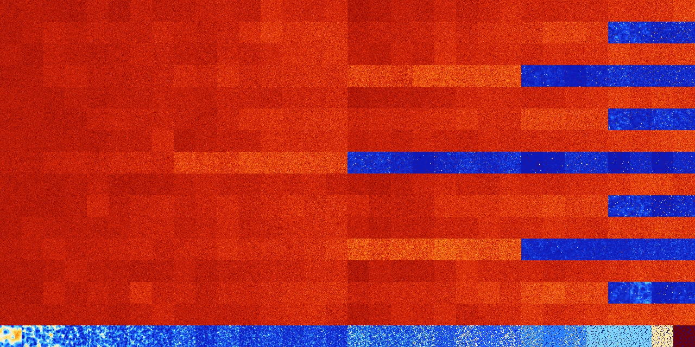

# B1258 (150528-151039)

<details>
    <summary>Initial Grid</summary>
    
</details>


<details>
    <summary>Initial Grid RLE</summary>

```
#C Exported from GoGoL (https://github.com/marrow16/gogol)
#C Wrap mode: Toroidal
#C Boundary mode: Dead
#C Step: 0
x = 100, y = 100, rule = B1258/S
2bo10bo41bo12bo23bo$26b2obo12bo4bo15bo$o7bo45bo17bo2bo$18bo4bobo17bo3bo
$8bo23bo34bo$bo27bo16bo7bo19bo3bobo4bo$24bo33bo27bo9bo$30bo25bo17bo15bo
$38bo26bo3bo4bo17b2o$o10bo12bo3bo24bo7bo23bo7bo$42bo6bo$o96bo$83bo3bo$
17bo3bo11bo30bo$4bo2bo6bo23bo3bo21bo$18bo62bo5bobo$7bo25bo4bo14bo3bo4bo
12bo$o12bobo16bo5bo3bo6bo23bo20bobo$24bo17bo24bo$3bobo6bo6bo9bo4bo34bo
15bo4bo$11bo12bo18bo23bo6bo$27bo4bo24bo4bo18bo$17bo21bo28bo30bo$4bo39bo
12bo15b2o3b2o3bo$23bo64bo$10bobo8bo43bo2bo14bo12bo$bo28bo14bo26bo$13bo
9bo20bo10bo13bo12bo10bo$4bo18bo6bo13bo3bo16bo5bo$16b2o46bo2bo$47bo51bo$
17bo14bo6bo5bo3bo18b2o10bo$26bobo2bo2bo2bo23bo33bo$2bo3bo18bobobo15bo
36bo$31bo26bo2b2o28bo$4bo65bo2bo8bo5bo6bo$13bo10bo42bo26bo$6bobo3b2o4bo
2bo23bo4bo12bo3bo3bo9bo9bo$6bo24bo49bo$bo18b2obo9bo25bo19bo17bo$bo4bo
30bo10bo50bo$o4bo4bo8bo3bo32bobo23bo$2o55b2o21bo4bo$100b$bo3bo26bo12bo
3bo9bo5bo12bo$9bo8bo2bo26bo21bo16bo$bo67bo15bo$6bo2bo46bo$b2o43bo48bo$
4bo8b2o11bo23bo32bobo$30bo56bo$bo2bo3bo42bo25bo18bo$5bo16bo$7bo6bo27bo
55bo$5bo62bo5bo6bo9bobo$9bo16bo6bo8bo30bo3bo16bo$35bo7bo9bo31b2o$2bobo
14bo2bo26bo32bo$24bo42bo$2bo64bo$44bo25bo5bo4bo$6bo5bo17bo5bo18bo14b2ob
o$49bo33bo14bo$7bo41bo2bo5bo$16bo39bo30bo11bo$14bo6bo31bo28bo16bo$12bo
13bo2bo5bo35bo8b2o4bo11bo$24bo12bo29bo14bo$4bo22bo2bo18bo11bo$bo7bo10bo
51bo$26b2o11bo7bo38bo$13bo16bo$7bo6bo21bo20bo22bo2bo$34bo42bo9bo$62bo3b
o$100b$19bo5bo3bo26bo10bo13bo9bo2bo$2bo4bo6bo3bo4bo74bo$33b2o24bo6bo6bo
$6bo55bo9bo10bo$19bo15bo22bo19bo8bo9bo$29bo28b2o24bo$23bo6bo51bo$14bo
13bo14bo4bo23bo22bo$22bo52bo$6bo13bobo16bobobo8bo4bo3bo8bo3bo7bo$16bo
12bobo15bo11bo26bo$bo28bo14bo21bo13bo2bo$40bo18bo25bo$14bobo38bo15bo8bo
$o4bo36bo22bo13bo$10bo6bo9bo12bo24bo23bo$50bo$3b2o27bo10bo4bo3bo11bo9b
2o$12bo13bo2bo28bo5bo20bo$23bo38bo17bo4bo3bo$6bo20bo15bo52bo$bo16bo19bo
10bo14bo24bo4bo$100b$12bo5bo!
```
</details>
<details>
    <summary>Thumbnail</summary>

</details>
<table>
<tr>
    <td><a href="./150528%20S%20Heat%20Map%20Activity.png"></a><br>S (150528)<br>G>1000</td>    <td><a href="./150529%20S0%20Heat%20Map%20Activity.png"></a><br>S0 (150529)<br>G>1000</td>    <td><a href="./150530%20S1%20Heat%20Map%20Activity.png"></a><br>S1 (150530)<br>G>1000</td>    <td><a href="./150531%20S01%20Heat%20Map%20Activity.png"></a><br>S01 (150531)<br>G>1000</td>    <td><a href="./150532%20S2%20Heat%20Map%20Activity.png"></a><br>S2 (150532)<br>G>1000</td>    <td><a href="./150533%20S02%20Heat%20Map%20Activity.png"></a><br>S02 (150533)<br>G>1000</td>    <td><a href="./150534%20S12%20Heat%20Map%20Activity.png"></a><br>S12 (150534)<br>G>1000</td>    <td><a href="./150535%20S012%20Heat%20Map%20Activity.png"></a><br>S012 (150535)<br>G>1000</td>    <td><a href="./150536%20S3%20Heat%20Map%20Activity.png"></a><br>S3 (150536)<br>G>1000</td>    <td><a href="./150537%20S03%20Heat%20Map%20Activity.png"></a><br>S03 (150537)<br>G>1000</td>    <td><a href="./150538%20S13%20Heat%20Map%20Activity.png"></a><br>S13 (150538)<br>G>1000</td>    <td><a href="./150539%20S013%20Heat%20Map%20Activity.png"></a><br>S013 (150539)<br>G>1000</td>    <td><a href="./150540%20S23%20Heat%20Map%20Activity.png"></a><br>S23 (150540)<br>G>1000</td>    <td><a href="./150541%20S023%20Heat%20Map%20Activity.png"></a><br>S023 (150541)<br>G>1000</td>    <td><a href="./150542%20S123%20Heat%20Map%20Activity.png"></a><br>S123 (150542)<br>G>1000</td>    <td><a href="./150543%20S0123%20Heat%20Map%20Activity.png"></a><br>S0123 (150543)<br>G>1000</td>    <td><a href="./150544%20S4%20Heat%20Map%20Activity.png"></a><br>S4 (150544)<br>G>1000</td>    <td><a href="./150545%20S04%20Heat%20Map%20Activity.png"></a><br>S04 (150545)<br>G>1000</td>    <td><a href="./150546%20S14%20Heat%20Map%20Activity.png"></a><br>S14 (150546)<br>G>1000</td>    <td><a href="./150547%20S014%20Heat%20Map%20Activity.png"></a><br>S014 (150547)<br>G>1000</td>    <td><a href="./150548%20S24%20Heat%20Map%20Activity.png"></a><br>S24 (150548)<br>G>1000</td>    <td><a href="./150549%20S024%20Heat%20Map%20Activity.png"></a><br>S024 (150549)<br>G>1000</td>    <td><a href="./150550%20S124%20Heat%20Map%20Activity.png"></a><br>S124 (150550)<br>G>1000</td>    <td><a href="./150551%20S0124%20Heat%20Map%20Activity.png"></a><br>S0124 (150551)<br>G>1000</td>    <td><a href="./150552%20S34%20Heat%20Map%20Activity.png"></a><br>S34 (150552)<br>G>1000</td>    <td><a href="./150553%20S034%20Heat%20Map%20Activity.png"></a><br>S034 (150553)<br>G>1000</td>    <td><a href="./150554%20S134%20Heat%20Map%20Activity.png"></a><br>S134 (150554)<br>G>1000</td>    <td><a href="./150555%20S0134%20Heat%20Map%20Activity.png"></a><br>S0134 (150555)<br>G>1000</td>    <td><a href="./150556%20S234%20Heat%20Map%20Activity.png"></a><br>S234 (150556)<br>G>1000</td>    <td><a href="./150557%20S0234%20Heat%20Map%20Activity.png"></a><br>S0234 (150557)<br>G>1000</td>    <td><a href="./150558%20S1234%20Heat%20Map%20Activity.png"></a><br>S1234 (150558)<br>G>1000</td>    <td><a href="./150559%20S01234%20Heat%20Map%20Activity.png"></a><br>S01234 (150559)<br>G>1000</td></tr>
<tr>
    <td><a href="./150560%20S5%20Heat%20Map%20Activity.png"></a><br>S5 (150560)<br>G>1000</td>    <td><a href="./150561%20S05%20Heat%20Map%20Activity.png"></a><br>S05 (150561)<br>G>1000</td>    <td><a href="./150562%20S15%20Heat%20Map%20Activity.png"></a><br>S15 (150562)<br>G>1000</td>    <td><a href="./150563%20S015%20Heat%20Map%20Activity.png"></a><br>S015 (150563)<br>G>1000</td>    <td><a href="./150564%20S25%20Heat%20Map%20Activity.png"></a><br>S25 (150564)<br>G>1000</td>    <td><a href="./150565%20S025%20Heat%20Map%20Activity.png"></a><br>S025 (150565)<br>G>1000</td>    <td><a href="./150566%20S125%20Heat%20Map%20Activity.png"></a><br>S125 (150566)<br>G>1000</td>    <td><a href="./150567%20S0125%20Heat%20Map%20Activity.png"></a><br>S0125 (150567)<br>G>1000</td>    <td><a href="./150568%20S35%20Heat%20Map%20Activity.png"></a><br>S35 (150568)<br>G>1000</td>    <td><a href="./150569%20S035%20Heat%20Map%20Activity.png"></a><br>S035 (150569)<br>G>1000</td>    <td><a href="./150570%20S135%20Heat%20Map%20Activity.png"></a><br>S135 (150570)<br>G>1000</td>    <td><a href="./150571%20S0135%20Heat%20Map%20Activity.png"></a><br>S0135 (150571)<br>G>1000</td>    <td><a href="./150572%20S235%20Heat%20Map%20Activity.png"></a><br>S235 (150572)<br>G>1000</td>    <td><a href="./150573%20S0235%20Heat%20Map%20Activity.png"></a><br>S0235 (150573)<br>G>1000</td>    <td><a href="./150574%20S1235%20Heat%20Map%20Activity.png"></a><br>S1235 (150574)<br>G>1000</td>    <td><a href="./150575%20S01235%20Heat%20Map%20Activity.png"></a><br>S01235 (150575)<br>G>1000</td>    <td><a href="./150576%20S45%20Heat%20Map%20Activity.png"></a><br>S45 (150576)<br>G>1000</td>    <td><a href="./150577%20S045%20Heat%20Map%20Activity.png"></a><br>S045 (150577)<br>G>1000</td>    <td><a href="./150578%20S145%20Heat%20Map%20Activity.png"></a><br>S145 (150578)<br>G>1000</td>    <td><a href="./150579%20S0145%20Heat%20Map%20Activity.png"></a><br>S0145 (150579)<br>G>1000</td>    <td><a href="./150580%20S245%20Heat%20Map%20Activity.png"></a><br>S245 (150580)<br>G>1000</td>    <td><a href="./150581%20S0245%20Heat%20Map%20Activity.png"></a><br>S0245 (150581)<br>G>1000</td>    <td><a href="./150582%20S1245%20Heat%20Map%20Activity.png"></a><br>S1245 (150582)<br>G>1000</td>    <td><a href="./150583%20S01245%20Heat%20Map%20Activity.png"></a><br>S01245 (150583)<br>G>1000</td>    <td><a href="./150584%20S345%20Heat%20Map%20Activity.png"></a><br>S345 (150584)<br>G>1000</td>    <td><a href="./150585%20S0345%20Heat%20Map%20Activity.png"></a><br>S0345 (150585)<br>G>1000</td>    <td><a href="./150586%20S1345%20Heat%20Map%20Activity.png"></a><br>S1345 (150586)<br>G>1000</td>    <td><a href="./150587%20S01345%20Heat%20Map%20Activity.png"></a><br>S01345 (150587)<br>G>1000</td>    <td><a href="./150588%20S2345%20Heat%20Map%20Activity.png"></a><br>S2345 (150588)<br>R@395,p24</td>    <td><a href="./150589%20S02345%20Heat%20Map%20Activity.png"></a><br>S02345 (150589)<br>R@538,p36</td>    <td><a href="./150590%20S12345%20Heat%20Map%20Activity.png"></a><br>S12345 (150590)<br>R@251,p120</td>    <td><a href="./150591%20S012345%20Heat%20Map%20Activity.png"></a><br>S012345 (150591)<br>R@191,p60</td></tr>
<tr>
    <td><a href="./150592%20S6%20Heat%20Map%20Activity.png"></a><br>S6 (150592)<br>G>1000</td>    <td><a href="./150593%20S06%20Heat%20Map%20Activity.png"></a><br>S06 (150593)<br>G>1000</td>    <td><a href="./150594%20S16%20Heat%20Map%20Activity.png"></a><br>S16 (150594)<br>G>1000</td>    <td><a href="./150595%20S016%20Heat%20Map%20Activity.png"></a><br>S016 (150595)<br>G>1000</td>    <td><a href="./150596%20S26%20Heat%20Map%20Activity.png"></a><br>S26 (150596)<br>G>1000</td>    <td><a href="./150597%20S026%20Heat%20Map%20Activity.png"></a><br>S026 (150597)<br>G>1000</td>    <td><a href="./150598%20S126%20Heat%20Map%20Activity.png"></a><br>S126 (150598)<br>G>1000</td>    <td><a href="./150599%20S0126%20Heat%20Map%20Activity.png"></a><br>S0126 (150599)<br>G>1000</td>    <td><a href="./150600%20S36%20Heat%20Map%20Activity.png"></a><br>S36 (150600)<br>G>1000</td>    <td><a href="./150601%20S036%20Heat%20Map%20Activity.png"></a><br>S036 (150601)<br>G>1000</td>    <td><a href="./150602%20S136%20Heat%20Map%20Activity.png"></a><br>S136 (150602)<br>G>1000</td>    <td><a href="./150603%20S0136%20Heat%20Map%20Activity.png"></a><br>S0136 (150603)<br>G>1000</td>    <td><a href="./150604%20S236%20Heat%20Map%20Activity.png"></a><br>S236 (150604)<br>G>1000</td>    <td><a href="./150605%20S0236%20Heat%20Map%20Activity.png"></a><br>S0236 (150605)<br>G>1000</td>    <td><a href="./150606%20S1236%20Heat%20Map%20Activity.png"></a><br>S1236 (150606)<br>G>1000</td>    <td><a href="./150607%20S01236%20Heat%20Map%20Activity.png"></a><br>S01236 (150607)<br>G>1000</td>    <td><a href="./150608%20S46%20Heat%20Map%20Activity.png"></a><br>S46 (150608)<br>G>1000</td>    <td><a href="./150609%20S046%20Heat%20Map%20Activity.png"></a><br>S046 (150609)<br>G>1000</td>    <td><a href="./150610%20S146%20Heat%20Map%20Activity.png"></a><br>S146 (150610)<br>G>1000</td>    <td><a href="./150611%20S0146%20Heat%20Map%20Activity.png"></a><br>S0146 (150611)<br>G>1000</td>    <td><a href="./150612%20S246%20Heat%20Map%20Activity.png"></a><br>S246 (150612)<br>G>1000</td>    <td><a href="./150613%20S0246%20Heat%20Map%20Activity.png"></a><br>S0246 (150613)<br>G>1000</td>    <td><a href="./150614%20S1246%20Heat%20Map%20Activity.png"></a><br>S1246 (150614)<br>G>1000</td>    <td><a href="./150615%20S01246%20Heat%20Map%20Activity.png"></a><br>S01246 (150615)<br>G>1000</td>    <td><a href="./150616%20S346%20Heat%20Map%20Activity.png"></a><br>S346 (150616)<br>G>1000</td>    <td><a href="./150617%20S0346%20Heat%20Map%20Activity.png"></a><br>S0346 (150617)<br>G>1000</td>    <td><a href="./150618%20S1346%20Heat%20Map%20Activity.png"></a><br>S1346 (150618)<br>G>1000</td>    <td><a href="./150619%20S01346%20Heat%20Map%20Activity.png"></a><br>S01346 (150619)<br>G>1000</td>    <td><a href="./150620%20S2346%20Heat%20Map%20Activity.png"></a><br>S2346 (150620)<br>G>1000</td>    <td><a href="./150621%20S02346%20Heat%20Map%20Activity.png"></a><br>S02346 (150621)<br>G>1000</td>    <td><a href="./150622%20S12346%20Heat%20Map%20Activity.png"></a><br>S12346 (150622)<br>G>1000</td>    <td><a href="./150623%20S012346%20Heat%20Map%20Activity.png"></a><br>S012346 (150623)<br>G>1000</td></tr>
<tr>
    <td><a href="./150624%20S56%20Heat%20Map%20Activity.png"></a><br>S56 (150624)<br>G>1000</td>    <td><a href="./150625%20S056%20Heat%20Map%20Activity.png"></a><br>S056 (150625)<br>G>1000</td>    <td><a href="./150626%20S156%20Heat%20Map%20Activity.png"></a><br>S156 (150626)<br>G>1000</td>    <td><a href="./150627%20S0156%20Heat%20Map%20Activity.png"></a><br>S0156 (150627)<br>G>1000</td>    <td><a href="./150628%20S256%20Heat%20Map%20Activity.png"></a><br>S256 (150628)<br>G>1000</td>    <td><a href="./150629%20S0256%20Heat%20Map%20Activity.png"></a><br>S0256 (150629)<br>G>1000</td>    <td><a href="./150630%20S1256%20Heat%20Map%20Activity.png"></a><br>S1256 (150630)<br>G>1000</td>    <td><a href="./150631%20S01256%20Heat%20Map%20Activity.png"></a><br>S01256 (150631)<br>G>1000</td>    <td><a href="./150632%20S356%20Heat%20Map%20Activity.png"></a><br>S356 (150632)<br>G>1000</td>    <td><a href="./150633%20S0356%20Heat%20Map%20Activity.png"></a><br>S0356 (150633)<br>G>1000</td>    <td><a href="./150634%20S1356%20Heat%20Map%20Activity.png"></a><br>S1356 (150634)<br>G>1000</td>    <td><a href="./150635%20S01356%20Heat%20Map%20Activity.png"></a><br>S01356 (150635)<br>G>1000</td>    <td><a href="./150636%20S2356%20Heat%20Map%20Activity.png"></a><br>S2356 (150636)<br>G>1000</td>    <td><a href="./150637%20S02356%20Heat%20Map%20Activity.png"></a><br>S02356 (150637)<br>G>1000</td>    <td><a href="./150638%20S12356%20Heat%20Map%20Activity.png"></a><br>S12356 (150638)<br>G>1000</td>    <td><a href="./150639%20S012356%20Heat%20Map%20Activity.png"></a><br>S012356 (150639)<br>G>1000</td>    <td><a href="./150640%20S456%20Heat%20Map%20Activity.png"></a><br>S456 (150640)<br>G>1000</td>    <td><a href="./150641%20S0456%20Heat%20Map%20Activity.png"></a><br>S0456 (150641)<br>G>1000</td>    <td><a href="./150642%20S1456%20Heat%20Map%20Activity.png"></a><br>S1456 (150642)<br>G>1000</td>    <td><a href="./150643%20S01456%20Heat%20Map%20Activity.png"></a><br>S01456 (150643)<br>G>1000</td>    <td><a href="./150644%20S2456%20Heat%20Map%20Activity.png"></a><br>S2456 (150644)<br>G>1000</td>    <td><a href="./150645%20S02456%20Heat%20Map%20Activity.png"></a><br>S02456 (150645)<br>G>1000</td>    <td><a href="./150646%20S12456%20Heat%20Map%20Activity.png"></a><br>S12456 (150646)<br>G>1000</td>    <td><a href="./150647%20S012456%20Heat%20Map%20Activity.png"></a><br>S012456 (150647)<br>G>1000</td>    <td><a href="./150648%20S3456%20Heat%20Map%20Activity.png"></a><br>S3456 (150648)<br>R@242,p6</td>    <td><a href="./150649%20S03456%20Heat%20Map%20Activity.png"></a><br>S03456 (150649)<br>R@239,p84</td>    <td><a href="./150650%20S13456%20Heat%20Map%20Activity.png"></a><br>S13456 (150650)<br>R@710,p504</td>    <td><a href="./150651%20S013456%20Heat%20Map%20Activity.png"></a><br>S013456 (150651)<br>R@298,p60</td>    <td><a href="./150652%20S23456%20Heat%20Map%20Activity.png"></a><br>S23456 (150652)<br>R@43,p12</td>    <td><a href="./150653%20S023456%20Heat%20Map%20Activity.png"></a><br>S023456 (150653)<br>R@55,p24</td>    <td><a href="./150654%20S123456%20Heat%20Map%20Activity.png"></a><br>S123456 (150654)<br>R@57,p24</td>    <td><a href="./150655%20S0123456%20Heat%20Map%20Activity.png"></a><br>S0123456 (150655)<br>R@54,p24</td></tr>
<tr>
    <td><a href="./150656%20S7%20Heat%20Map%20Activity.png"></a><br>S7 (150656)<br>G>1000</td>    <td><a href="./150657%20S07%20Heat%20Map%20Activity.png"></a><br>S07 (150657)<br>G>1000</td>    <td><a href="./150658%20S17%20Heat%20Map%20Activity.png"></a><br>S17 (150658)<br>G>1000</td>    <td><a href="./150659%20S017%20Heat%20Map%20Activity.png"></a><br>S017 (150659)<br>G>1000</td>    <td><a href="./150660%20S27%20Heat%20Map%20Activity.png"></a><br>S27 (150660)<br>G>1000</td>    <td><a href="./150661%20S027%20Heat%20Map%20Activity.png"></a><br>S027 (150661)<br>G>1000</td>    <td><a href="./150662%20S127%20Heat%20Map%20Activity.png"></a><br>S127 (150662)<br>G>1000</td>    <td><a href="./150663%20S0127%20Heat%20Map%20Activity.png"></a><br>S0127 (150663)<br>G>1000</td>    <td><a href="./150664%20S37%20Heat%20Map%20Activity.png"></a><br>S37 (150664)<br>G>1000</td>    <td><a href="./150665%20S037%20Heat%20Map%20Activity.png"></a><br>S037 (150665)<br>G>1000</td>    <td><a href="./150666%20S137%20Heat%20Map%20Activity.png"></a><br>S137 (150666)<br>G>1000</td>    <td><a href="./150667%20S0137%20Heat%20Map%20Activity.png"></a><br>S0137 (150667)<br>G>1000</td>    <td><a href="./150668%20S237%20Heat%20Map%20Activity.png"></a><br>S237 (150668)<br>G>1000</td>    <td><a href="./150669%20S0237%20Heat%20Map%20Activity.png"></a><br>S0237 (150669)<br>G>1000</td>    <td><a href="./150670%20S1237%20Heat%20Map%20Activity.png"></a><br>S1237 (150670)<br>G>1000</td>    <td><a href="./150671%20S01237%20Heat%20Map%20Activity.png"></a><br>S01237 (150671)<br>G>1000</td>    <td><a href="./150672%20S47%20Heat%20Map%20Activity.png"></a><br>S47 (150672)<br>G>1000</td>    <td><a href="./150673%20S047%20Heat%20Map%20Activity.png"></a><br>S047 (150673)<br>G>1000</td>    <td><a href="./150674%20S147%20Heat%20Map%20Activity.png"></a><br>S147 (150674)<br>G>1000</td>    <td><a href="./150675%20S0147%20Heat%20Map%20Activity.png"></a><br>S0147 (150675)<br>G>1000</td>    <td><a href="./150676%20S247%20Heat%20Map%20Activity.png"></a><br>S247 (150676)<br>G>1000</td>    <td><a href="./150677%20S0247%20Heat%20Map%20Activity.png"></a><br>S0247 (150677)<br>G>1000</td>    <td><a href="./150678%20S1247%20Heat%20Map%20Activity.png"></a><br>S1247 (150678)<br>G>1000</td>    <td><a href="./150679%20S01247%20Heat%20Map%20Activity.png"></a><br>S01247 (150679)<br>G>1000</td>    <td><a href="./150680%20S347%20Heat%20Map%20Activity.png"></a><br>S347 (150680)<br>G>1000</td>    <td><a href="./150681%20S0347%20Heat%20Map%20Activity.png"></a><br>S0347 (150681)<br>G>1000</td>    <td><a href="./150682%20S1347%20Heat%20Map%20Activity.png"></a><br>S1347 (150682)<br>G>1000</td>    <td><a href="./150683%20S01347%20Heat%20Map%20Activity.png"></a><br>S01347 (150683)<br>G>1000</td>    <td><a href="./150684%20S2347%20Heat%20Map%20Activity.png"></a><br>S2347 (150684)<br>G>1000</td>    <td><a href="./150685%20S02347%20Heat%20Map%20Activity.png"></a><br>S02347 (150685)<br>G>1000</td>    <td><a href="./150686%20S12347%20Heat%20Map%20Activity.png"></a><br>S12347 (150686)<br>G>1000</td>    <td><a href="./150687%20S012347%20Heat%20Map%20Activity.png"></a><br>S012347 (150687)<br>G>1000</td></tr>
<tr>
    <td><a href="./150688%20S57%20Heat%20Map%20Activity.png"></a><br>S57 (150688)<br>G>1000</td>    <td><a href="./150689%20S057%20Heat%20Map%20Activity.png"></a><br>S057 (150689)<br>G>1000</td>    <td><a href="./150690%20S157%20Heat%20Map%20Activity.png"></a><br>S157 (150690)<br>G>1000</td>    <td><a href="./150691%20S0157%20Heat%20Map%20Activity.png"></a><br>S0157 (150691)<br>G>1000</td>    <td><a href="./150692%20S257%20Heat%20Map%20Activity.png"></a><br>S257 (150692)<br>G>1000</td>    <td><a href="./150693%20S0257%20Heat%20Map%20Activity.png"></a><br>S0257 (150693)<br>G>1000</td>    <td><a href="./150694%20S1257%20Heat%20Map%20Activity.png"></a><br>S1257 (150694)<br>G>1000</td>    <td><a href="./150695%20S01257%20Heat%20Map%20Activity.png"></a><br>S01257 (150695)<br>G>1000</td>    <td><a href="./150696%20S357%20Heat%20Map%20Activity.png"></a><br>S357 (150696)<br>G>1000</td>    <td><a href="./150697%20S0357%20Heat%20Map%20Activity.png"></a><br>S0357 (150697)<br>G>1000</td>    <td><a href="./150698%20S1357%20Heat%20Map%20Activity.png"></a><br>S1357 (150698)<br>G>1000</td>    <td><a href="./150699%20S01357%20Heat%20Map%20Activity.png"></a><br>S01357 (150699)<br>G>1000</td>    <td><a href="./150700%20S2357%20Heat%20Map%20Activity.png"></a><br>S2357 (150700)<br>G>1000</td>    <td><a href="./150701%20S02357%20Heat%20Map%20Activity.png"></a><br>S02357 (150701)<br>G>1000</td>    <td><a href="./150702%20S12357%20Heat%20Map%20Activity.png"></a><br>S12357 (150702)<br>G>1000</td>    <td><a href="./150703%20S012357%20Heat%20Map%20Activity.png"></a><br>S012357 (150703)<br>G>1000</td>    <td><a href="./150704%20S457%20Heat%20Map%20Activity.png"></a><br>S457 (150704)<br>G>1000</td>    <td><a href="./150705%20S0457%20Heat%20Map%20Activity.png"></a><br>S0457 (150705)<br>G>1000</td>    <td><a href="./150706%20S1457%20Heat%20Map%20Activity.png"></a><br>S1457 (150706)<br>G>1000</td>    <td><a href="./150707%20S01457%20Heat%20Map%20Activity.png"></a><br>S01457 (150707)<br>G>1000</td>    <td><a href="./150708%20S2457%20Heat%20Map%20Activity.png"></a><br>S2457 (150708)<br>G>1000</td>    <td><a href="./150709%20S02457%20Heat%20Map%20Activity.png"></a><br>S02457 (150709)<br>G>1000</td>    <td><a href="./150710%20S12457%20Heat%20Map%20Activity.png"></a><br>S12457 (150710)<br>G>1000</td>    <td><a href="./150711%20S012457%20Heat%20Map%20Activity.png"></a><br>S012457 (150711)<br>G>1000</td>    <td><a href="./150712%20S3457%20Heat%20Map%20Activity.png"></a><br>S3457 (150712)<br>G>1000</td>    <td><a href="./150713%20S03457%20Heat%20Map%20Activity.png"></a><br>S03457 (150713)<br>G>1000</td>    <td><a href="./150714%20S13457%20Heat%20Map%20Activity.png"></a><br>S13457 (150714)<br>G>1000</td>    <td><a href="./150715%20S013457%20Heat%20Map%20Activity.png"></a><br>S013457 (150715)<br>G>1000</td>    <td><a href="./150716%20S23457%20Heat%20Map%20Activity.png"></a><br>S23457 (150716)<br>R@486,p24</td>    <td><a href="./150717%20S023457%20Heat%20Map%20Activity.png"></a><br>S023457 (150717)<br>R@665,p264</td>    <td><a href="./150718%20S123457%20Heat%20Map%20Activity.png"></a><br>S123457 (150718)<br>R@235,p12</td>    <td><a href="./150719%20S0123457%20Heat%20Map%20Activity.png"></a><br>S0123457 (150719)<br>R@292,p60</td></tr>
<tr>
    <td><a href="./150720%20S67%20Heat%20Map%20Activity.png"></a><br>S67 (150720)<br>G>1000</td>    <td><a href="./150721%20S067%20Heat%20Map%20Activity.png"></a><br>S067 (150721)<br>G>1000</td>    <td><a href="./150722%20S167%20Heat%20Map%20Activity.png"></a><br>S167 (150722)<br>G>1000</td>    <td><a href="./150723%20S0167%20Heat%20Map%20Activity.png"></a><br>S0167 (150723)<br>G>1000</td>    <td><a href="./150724%20S267%20Heat%20Map%20Activity.png"></a><br>S267 (150724)<br>G>1000</td>    <td><a href="./150725%20S0267%20Heat%20Map%20Activity.png"></a><br>S0267 (150725)<br>G>1000</td>    <td><a href="./150726%20S1267%20Heat%20Map%20Activity.png"></a><br>S1267 (150726)<br>G>1000</td>    <td><a href="./150727%20S01267%20Heat%20Map%20Activity.png"></a><br>S01267 (150727)<br>G>1000</td>    <td><a href="./150728%20S367%20Heat%20Map%20Activity.png"></a><br>S367 (150728)<br>G>1000</td>    <td><a href="./150729%20S0367%20Heat%20Map%20Activity.png"></a><br>S0367 (150729)<br>G>1000</td>    <td><a href="./150730%20S1367%20Heat%20Map%20Activity.png"></a><br>S1367 (150730)<br>G>1000</td>    <td><a href="./150731%20S01367%20Heat%20Map%20Activity.png"></a><br>S01367 (150731)<br>G>1000</td>    <td><a href="./150732%20S2367%20Heat%20Map%20Activity.png"></a><br>S2367 (150732)<br>G>1000</td>    <td><a href="./150733%20S02367%20Heat%20Map%20Activity.png"></a><br>S02367 (150733)<br>G>1000</td>    <td><a href="./150734%20S12367%20Heat%20Map%20Activity.png"></a><br>S12367 (150734)<br>G>1000</td>    <td><a href="./150735%20S012367%20Heat%20Map%20Activity.png"></a><br>S012367 (150735)<br>G>1000</td>    <td><a href="./150736%20S467%20Heat%20Map%20Activity.png"></a><br>S467 (150736)<br>G>1000</td>    <td><a href="./150737%20S0467%20Heat%20Map%20Activity.png"></a><br>S0467 (150737)<br>G>1000</td>    <td><a href="./150738%20S1467%20Heat%20Map%20Activity.png"></a><br>S1467 (150738)<br>G>1000</td>    <td><a href="./150739%20S01467%20Heat%20Map%20Activity.png"></a><br>S01467 (150739)<br>G>1000</td>    <td><a href="./150740%20S2467%20Heat%20Map%20Activity.png"></a><br>S2467 (150740)<br>G>1000</td>    <td><a href="./150741%20S02467%20Heat%20Map%20Activity.png"></a><br>S02467 (150741)<br>G>1000</td>    <td><a href="./150742%20S12467%20Heat%20Map%20Activity.png"></a><br>S12467 (150742)<br>G>1000</td>    <td><a href="./150743%20S012467%20Heat%20Map%20Activity.png"></a><br>S012467 (150743)<br>G>1000</td>    <td><a href="./150744%20S3467%20Heat%20Map%20Activity.png"></a><br>S3467 (150744)<br>G>1000</td>    <td><a href="./150745%20S03467%20Heat%20Map%20Activity.png"></a><br>S03467 (150745)<br>G>1000</td>    <td><a href="./150746%20S13467%20Heat%20Map%20Activity.png"></a><br>S13467 (150746)<br>G>1000</td>    <td><a href="./150747%20S013467%20Heat%20Map%20Activity.png"></a><br>S013467 (150747)<br>G>1000</td>    <td><a href="./150748%20S23467%20Heat%20Map%20Activity.png"></a><br>S23467 (150748)<br>G>1000</td>    <td><a href="./150749%20S023467%20Heat%20Map%20Activity.png"></a><br>S023467 (150749)<br>G>1000</td>    <td><a href="./150750%20S123467%20Heat%20Map%20Activity.png"></a><br>S123467 (150750)<br>G>1000</td>    <td><a href="./150751%20S0123467%20Heat%20Map%20Activity.png"></a><br>S0123467 (150751)<br>G>1000</td></tr>
<tr>
    <td><a href="./150752%20S567%20Heat%20Map%20Activity.png"></a><br>S567 (150752)<br>G>1000</td>    <td><a href="./150753%20S0567%20Heat%20Map%20Activity.png"></a><br>S0567 (150753)<br>G>1000</td>    <td><a href="./150754%20S1567%20Heat%20Map%20Activity.png"></a><br>S1567 (150754)<br>G>1000</td>    <td><a href="./150755%20S01567%20Heat%20Map%20Activity.png"></a><br>S01567 (150755)<br>G>1000</td>    <td><a href="./150756%20S2567%20Heat%20Map%20Activity.png"></a><br>S2567 (150756)<br>G>1000</td>    <td><a href="./150757%20S02567%20Heat%20Map%20Activity.png"></a><br>S02567 (150757)<br>G>1000</td>    <td><a href="./150758%20S12567%20Heat%20Map%20Activity.png"></a><br>S12567 (150758)<br>G>1000</td>    <td><a href="./150759%20S012567%20Heat%20Map%20Activity.png"></a><br>S012567 (150759)<br>G>1000</td>    <td><a href="./150760%20S3567%20Heat%20Map%20Activity.png"></a><br>S3567 (150760)<br>G>1000</td>    <td><a href="./150761%20S03567%20Heat%20Map%20Activity.png"></a><br>S03567 (150761)<br>G>1000</td>    <td><a href="./150762%20S13567%20Heat%20Map%20Activity.png"></a><br>S13567 (150762)<br>G>1000</td>    <td><a href="./150763%20S013567%20Heat%20Map%20Activity.png"></a><br>S013567 (150763)<br>G>1000</td>    <td><a href="./150764%20S23567%20Heat%20Map%20Activity.png"></a><br>S23567 (150764)<br>G>1000</td>    <td><a href="./150765%20S023567%20Heat%20Map%20Activity.png"></a><br>S023567 (150765)<br>G>1000</td>    <td><a href="./150766%20S123567%20Heat%20Map%20Activity.png"></a><br>S123567 (150766)<br>G>1000</td>    <td><a href="./150767%20S0123567%20Heat%20Map%20Activity.png"></a><br>S0123567 (150767)<br>G>1000</td>    <td><a href="./150768%20S4567%20Heat%20Map%20Activity.png"></a><br>S4567 (150768)<br>R@85,p30</td>    <td><a href="./150769%20S04567%20Heat%20Map%20Activity.png"></a><br>S04567 (150769)<br>R@95,p12</td>    <td><a href="./150770%20S14567%20Heat%20Map%20Activity.png"></a><br>S14567 (150770)<br>R@144,p60</td>    <td><a href="./150771%20S014567%20Heat%20Map%20Activity.png"></a><br>S014567 (150771)<br>R@732,p660</td>    <td><a href="./150772%20S24567%20Heat%20Map%20Activity.png"></a><br>S24567 (150772)<br>R@115,p30</td>    <td><a href="./150773%20S024567%20Heat%20Map%20Activity.png"></a><br>S024567 (150773)<br>R@68,p12</td>    <td><a href="./150774%20S124567%20Heat%20Map%20Activity.png"></a><br>S124567 (150774)<br>R@92,p12</td>    <td><a href="./150775%20S0124567%20Heat%20Map%20Activity.png"></a><br>S0124567 (150775)<br>R@63,p12</td>    <td><a href="./150776%20S34567%20Heat%20Map%20Activity.png"></a><br>S34567 (150776)<br>R@445,p420</td>    <td><a href="./150777%20S034567%20Heat%20Map%20Activity.png"></a><br>S034567 (150777)<br>R@154,p132</td>    <td><a href="./150778%20S134567%20Heat%20Map%20Activity.png"></a><br>S134567 (150778)<br>R@34,p12</td>    <td><a href="./150779%20S0134567%20Heat%20Map%20Activity.png"></a><br>S0134567 (150779)<br>R@33,p12</td>    <td><a href="./150780%20S234567%20Heat%20Map%20Activity.png"></a><br>S234567 (150780)<br>R@260,p240</td>    <td><a href="./150781%20S0234567%20Heat%20Map%20Activity.png"></a><br>S0234567 (150781)<br>R@39,p12</td>    <td><a href="./150782%20S1234567%20Heat%20Map%20Activity.png"></a><br>S1234567 (150782)<br>R@260,p240</td>    <td><a href="./150783%20S01234567%20Heat%20Map%20Activity.png"></a><br>S01234567 (150783)<br>R@39,p12</td></tr>
<tr>
    <td><a href="./150784%20S8%20Heat%20Map%20Activity.png"></a><br>S8 (150784)<br>G>1000</td>    <td><a href="./150785%20S08%20Heat%20Map%20Activity.png"></a><br>S08 (150785)<br>G>1000</td>    <td><a href="./150786%20S18%20Heat%20Map%20Activity.png"></a><br>S18 (150786)<br>G>1000</td>    <td><a href="./150787%20S018%20Heat%20Map%20Activity.png"></a><br>S018 (150787)<br>G>1000</td>    <td><a href="./150788%20S28%20Heat%20Map%20Activity.png"></a><br>S28 (150788)<br>G>1000</td>    <td><a href="./150789%20S028%20Heat%20Map%20Activity.png"></a><br>S028 (150789)<br>G>1000</td>    <td><a href="./150790%20S128%20Heat%20Map%20Activity.png"></a><br>S128 (150790)<br>G>1000</td>    <td><a href="./150791%20S0128%20Heat%20Map%20Activity.png"></a><br>S0128 (150791)<br>G>1000</td>    <td><a href="./150792%20S38%20Heat%20Map%20Activity.png"></a><br>S38 (150792)<br>G>1000</td>    <td><a href="./150793%20S038%20Heat%20Map%20Activity.png"></a><br>S038 (150793)<br>G>1000</td>    <td><a href="./150794%20S138%20Heat%20Map%20Activity.png"></a><br>S138 (150794)<br>G>1000</td>    <td><a href="./150795%20S0138%20Heat%20Map%20Activity.png"></a><br>S0138 (150795)<br>G>1000</td>    <td><a href="./150796%20S238%20Heat%20Map%20Activity.png"></a><br>S238 (150796)<br>G>1000</td>    <td><a href="./150797%20S0238%20Heat%20Map%20Activity.png"></a><br>S0238 (150797)<br>G>1000</td>    <td><a href="./150798%20S1238%20Heat%20Map%20Activity.png"></a><br>S1238 (150798)<br>G>1000</td>    <td><a href="./150799%20S01238%20Heat%20Map%20Activity.png"></a><br>S01238 (150799)<br>G>1000</td>    <td><a href="./150800%20S48%20Heat%20Map%20Activity.png"></a><br>S48 (150800)<br>G>1000</td>    <td><a href="./150801%20S048%20Heat%20Map%20Activity.png"></a><br>S048 (150801)<br>G>1000</td>    <td><a href="./150802%20S148%20Heat%20Map%20Activity.png"></a><br>S148 (150802)<br>G>1000</td>    <td><a href="./150803%20S0148%20Heat%20Map%20Activity.png"></a><br>S0148 (150803)<br>G>1000</td>    <td><a href="./150804%20S248%20Heat%20Map%20Activity.png"></a><br>S248 (150804)<br>G>1000</td>    <td><a href="./150805%20S0248%20Heat%20Map%20Activity.png"></a><br>S0248 (150805)<br>G>1000</td>    <td><a href="./150806%20S1248%20Heat%20Map%20Activity.png"></a><br>S1248 (150806)<br>G>1000</td>    <td><a href="./150807%20S01248%20Heat%20Map%20Activity.png"></a><br>S01248 (150807)<br>G>1000</td>    <td><a href="./150808%20S348%20Heat%20Map%20Activity.png"></a><br>S348 (150808)<br>G>1000</td>    <td><a href="./150809%20S0348%20Heat%20Map%20Activity.png"></a><br>S0348 (150809)<br>G>1000</td>    <td><a href="./150810%20S1348%20Heat%20Map%20Activity.png"></a><br>S1348 (150810)<br>G>1000</td>    <td><a href="./150811%20S01348%20Heat%20Map%20Activity.png"></a><br>S01348 (150811)<br>G>1000</td>    <td><a href="./150812%20S2348%20Heat%20Map%20Activity.png"></a><br>S2348 (150812)<br>G>1000</td>    <td><a href="./150813%20S02348%20Heat%20Map%20Activity.png"></a><br>S02348 (150813)<br>G>1000</td>    <td><a href="./150814%20S12348%20Heat%20Map%20Activity.png"></a><br>S12348 (150814)<br>G>1000</td>    <td><a href="./150815%20S012348%20Heat%20Map%20Activity.png"></a><br>S012348 (150815)<br>G>1000</td></tr>
<tr>
    <td><a href="./150816%20S58%20Heat%20Map%20Activity.png"></a><br>S58 (150816)<br>G>1000</td>    <td><a href="./150817%20S058%20Heat%20Map%20Activity.png"></a><br>S058 (150817)<br>G>1000</td>    <td><a href="./150818%20S158%20Heat%20Map%20Activity.png"></a><br>S158 (150818)<br>G>1000</td>    <td><a href="./150819%20S0158%20Heat%20Map%20Activity.png"></a><br>S0158 (150819)<br>G>1000</td>    <td><a href="./150820%20S258%20Heat%20Map%20Activity.png"></a><br>S258 (150820)<br>G>1000</td>    <td><a href="./150821%20S0258%20Heat%20Map%20Activity.png"></a><br>S0258 (150821)<br>G>1000</td>    <td><a href="./150822%20S1258%20Heat%20Map%20Activity.png"></a><br>S1258 (150822)<br>G>1000</td>    <td><a href="./150823%20S01258%20Heat%20Map%20Activity.png"></a><br>S01258 (150823)<br>G>1000</td>    <td><a href="./150824%20S358%20Heat%20Map%20Activity.png"></a><br>S358 (150824)<br>G>1000</td>    <td><a href="./150825%20S0358%20Heat%20Map%20Activity.png"></a><br>S0358 (150825)<br>G>1000</td>    <td><a href="./150826%20S1358%20Heat%20Map%20Activity.png"></a><br>S1358 (150826)<br>G>1000</td>    <td><a href="./150827%20S01358%20Heat%20Map%20Activity.png"></a><br>S01358 (150827)<br>G>1000</td>    <td><a href="./150828%20S2358%20Heat%20Map%20Activity.png"></a><br>S2358 (150828)<br>G>1000</td>    <td><a href="./150829%20S02358%20Heat%20Map%20Activity.png"></a><br>S02358 (150829)<br>G>1000</td>    <td><a href="./150830%20S12358%20Heat%20Map%20Activity.png"></a><br>S12358 (150830)<br>G>1000</td>    <td><a href="./150831%20S012358%20Heat%20Map%20Activity.png"></a><br>S012358 (150831)<br>G>1000</td>    <td><a href="./150832%20S458%20Heat%20Map%20Activity.png"></a><br>S458 (150832)<br>G>1000</td>    <td><a href="./150833%20S0458%20Heat%20Map%20Activity.png"></a><br>S0458 (150833)<br>G>1000</td>    <td><a href="./150834%20S1458%20Heat%20Map%20Activity.png"></a><br>S1458 (150834)<br>G>1000</td>    <td><a href="./150835%20S01458%20Heat%20Map%20Activity.png"></a><br>S01458 (150835)<br>G>1000</td>    <td><a href="./150836%20S2458%20Heat%20Map%20Activity.png"></a><br>S2458 (150836)<br>G>1000</td>    <td><a href="./150837%20S02458%20Heat%20Map%20Activity.png"></a><br>S02458 (150837)<br>G>1000</td>    <td><a href="./150838%20S12458%20Heat%20Map%20Activity.png"></a><br>S12458 (150838)<br>G>1000</td>    <td><a href="./150839%20S012458%20Heat%20Map%20Activity.png"></a><br>S012458 (150839)<br>G>1000</td>    <td><a href="./150840%20S3458%20Heat%20Map%20Activity.png"></a><br>S3458 (150840)<br>G>1000</td>    <td><a href="./150841%20S03458%20Heat%20Map%20Activity.png"></a><br>S03458 (150841)<br>G>1000</td>    <td><a href="./150842%20S13458%20Heat%20Map%20Activity.png"></a><br>S13458 (150842)<br>G>1000</td>    <td><a href="./150843%20S013458%20Heat%20Map%20Activity.png"></a><br>S013458 (150843)<br>G>1000</td>    <td><a href="./150844%20S23458%20Heat%20Map%20Activity.png"></a><br>S23458 (150844)<br>R@476,p120</td>    <td><a href="./150845%20S023458%20Heat%20Map%20Activity.png"></a><br>S023458 (150845)<br>R@415,p6</td>    <td><a href="./150846%20S123458%20Heat%20Map%20Activity.png"></a><br>S123458 (150846)<br>R@656,p420</td>    <td><a href="./150847%20S0123458%20Heat%20Map%20Activity.png"></a><br>S0123458 (150847)<br>R@282,p60</td></tr>
<tr>
    <td><a href="./150848%20S68%20Heat%20Map%20Activity.png"></a><br>S68 (150848)<br>G>1000</td>    <td><a href="./150849%20S068%20Heat%20Map%20Activity.png"></a><br>S068 (150849)<br>G>1000</td>    <td><a href="./150850%20S168%20Heat%20Map%20Activity.png"></a><br>S168 (150850)<br>G>1000</td>    <td><a href="./150851%20S0168%20Heat%20Map%20Activity.png"></a><br>S0168 (150851)<br>G>1000</td>    <td><a href="./150852%20S268%20Heat%20Map%20Activity.png"></a><br>S268 (150852)<br>G>1000</td>    <td><a href="./150853%20S0268%20Heat%20Map%20Activity.png"></a><br>S0268 (150853)<br>G>1000</td>    <td><a href="./150854%20S1268%20Heat%20Map%20Activity.png"></a><br>S1268 (150854)<br>G>1000</td>    <td><a href="./150855%20S01268%20Heat%20Map%20Activity.png"></a><br>S01268 (150855)<br>G>1000</td>    <td><a href="./150856%20S368%20Heat%20Map%20Activity.png"></a><br>S368 (150856)<br>G>1000</td>    <td><a href="./150857%20S0368%20Heat%20Map%20Activity.png"></a><br>S0368 (150857)<br>G>1000</td>    <td><a href="./150858%20S1368%20Heat%20Map%20Activity.png"></a><br>S1368 (150858)<br>G>1000</td>    <td><a href="./150859%20S01368%20Heat%20Map%20Activity.png"></a><br>S01368 (150859)<br>G>1000</td>    <td><a href="./150860%20S2368%20Heat%20Map%20Activity.png"></a><br>S2368 (150860)<br>G>1000</td>    <td><a href="./150861%20S02368%20Heat%20Map%20Activity.png"></a><br>S02368 (150861)<br>G>1000</td>    <td><a href="./150862%20S12368%20Heat%20Map%20Activity.png"></a><br>S12368 (150862)<br>G>1000</td>    <td><a href="./150863%20S012368%20Heat%20Map%20Activity.png"></a><br>S012368 (150863)<br>G>1000</td>    <td><a href="./150864%20S468%20Heat%20Map%20Activity.png"></a><br>S468 (150864)<br>G>1000</td>    <td><a href="./150865%20S0468%20Heat%20Map%20Activity.png"></a><br>S0468 (150865)<br>G>1000</td>    <td><a href="./150866%20S1468%20Heat%20Map%20Activity.png"></a><br>S1468 (150866)<br>G>1000</td>    <td><a href="./150867%20S01468%20Heat%20Map%20Activity.png"></a><br>S01468 (150867)<br>G>1000</td>    <td><a href="./150868%20S2468%20Heat%20Map%20Activity.png"></a><br>S2468 (150868)<br>G>1000</td>    <td><a href="./150869%20S02468%20Heat%20Map%20Activity.png"></a><br>S02468 (150869)<br>G>1000</td>    <td><a href="./150870%20S12468%20Heat%20Map%20Activity.png"></a><br>S12468 (150870)<br>G>1000</td>    <td><a href="./150871%20S012468%20Heat%20Map%20Activity.png"></a><br>S012468 (150871)<br>G>1000</td>    <td><a href="./150872%20S3468%20Heat%20Map%20Activity.png"></a><br>S3468 (150872)<br>G>1000</td>    <td><a href="./150873%20S03468%20Heat%20Map%20Activity.png"></a><br>S03468 (150873)<br>G>1000</td>    <td><a href="./150874%20S13468%20Heat%20Map%20Activity.png"></a><br>S13468 (150874)<br>G>1000</td>    <td><a href="./150875%20S013468%20Heat%20Map%20Activity.png"></a><br>S013468 (150875)<br>G>1000</td>    <td><a href="./150876%20S23468%20Heat%20Map%20Activity.png"></a><br>S23468 (150876)<br>G>1000</td>    <td><a href="./150877%20S023468%20Heat%20Map%20Activity.png"></a><br>S023468 (150877)<br>G>1000</td>    <td><a href="./150878%20S123468%20Heat%20Map%20Activity.png"></a><br>S123468 (150878)<br>G>1000</td>    <td><a href="./150879%20S0123468%20Heat%20Map%20Activity.png"></a><br>S0123468 (150879)<br>G>1000</td></tr>
<tr>
    <td><a href="./150880%20S568%20Heat%20Map%20Activity.png"></a><br>S568 (150880)<br>G>1000</td>    <td><a href="./150881%20S0568%20Heat%20Map%20Activity.png"></a><br>S0568 (150881)<br>G>1000</td>    <td><a href="./150882%20S1568%20Heat%20Map%20Activity.png"></a><br>S1568 (150882)<br>G>1000</td>    <td><a href="./150883%20S01568%20Heat%20Map%20Activity.png"></a><br>S01568 (150883)<br>G>1000</td>    <td><a href="./150884%20S2568%20Heat%20Map%20Activity.png"></a><br>S2568 (150884)<br>G>1000</td>    <td><a href="./150885%20S02568%20Heat%20Map%20Activity.png"></a><br>S02568 (150885)<br>G>1000</td>    <td><a href="./150886%20S12568%20Heat%20Map%20Activity.png"></a><br>S12568 (150886)<br>G>1000</td>    <td><a href="./150887%20S012568%20Heat%20Map%20Activity.png"></a><br>S012568 (150887)<br>G>1000</td>    <td><a href="./150888%20S3568%20Heat%20Map%20Activity.png"></a><br>S3568 (150888)<br>G>1000</td>    <td><a href="./150889%20S03568%20Heat%20Map%20Activity.png"></a><br>S03568 (150889)<br>G>1000</td>    <td><a href="./150890%20S13568%20Heat%20Map%20Activity.png"></a><br>S13568 (150890)<br>G>1000</td>    <td><a href="./150891%20S013568%20Heat%20Map%20Activity.png"></a><br>S013568 (150891)<br>G>1000</td>    <td><a href="./150892%20S23568%20Heat%20Map%20Activity.png"></a><br>S23568 (150892)<br>G>1000</td>    <td><a href="./150893%20S023568%20Heat%20Map%20Activity.png"></a><br>S023568 (150893)<br>G>1000</td>    <td><a href="./150894%20S123568%20Heat%20Map%20Activity.png"></a><br>S123568 (150894)<br>G>1000</td>    <td><a href="./150895%20S0123568%20Heat%20Map%20Activity.png"></a><br>S0123568 (150895)<br>G>1000</td>    <td><a href="./150896%20S4568%20Heat%20Map%20Activity.png"></a><br>S4568 (150896)<br>G>1000</td>    <td><a href="./150897%20S04568%20Heat%20Map%20Activity.png"></a><br>S04568 (150897)<br>G>1000</td>    <td><a href="./150898%20S14568%20Heat%20Map%20Activity.png"></a><br>S14568 (150898)<br>G>1000</td>    <td><a href="./150899%20S014568%20Heat%20Map%20Activity.png"></a><br>S014568 (150899)<br>G>1000</td>    <td><a href="./150900%20S24568%20Heat%20Map%20Activity.png"></a><br>S24568 (150900)<br>G>1000</td>    <td><a href="./150901%20S024568%20Heat%20Map%20Activity.png"></a><br>S024568 (150901)<br>G>1000</td>    <td><a href="./150902%20S124568%20Heat%20Map%20Activity.png"></a><br>S124568 (150902)<br>G>1000</td>    <td><a href="./150903%20S0124568%20Heat%20Map%20Activity.png"></a><br>S0124568 (150903)<br>G>1000</td>    <td><a href="./150904%20S34568%20Heat%20Map%20Activity.png"></a><br>S34568 (150904)<br>R@111,p12</td>    <td><a href="./150905%20S034568%20Heat%20Map%20Activity.png"></a><br>S034568 (150905)<br>R@141,p30</td>    <td><a href="./150906%20S134568%20Heat%20Map%20Activity.png"></a><br>S134568 (150906)<br>R@136,p30</td>    <td><a href="./150907%20S0134568%20Heat%20Map%20Activity.png"></a><br>S0134568 (150907)<br>R@140,p30</td>    <td><a href="./150908%20S234568%20Heat%20Map%20Activity.png"></a><br>S234568 (150908)<br>R@67,p36</td>    <td><a href="./150909%20S0234568%20Heat%20Map%20Activity.png"></a><br>S0234568 (150909)<br>R@44,p12</td>    <td><a href="./150910%20S1234568%20Heat%20Map%20Activity.png"></a><br>S1234568 (150910)<br>R@45,p10</td>    <td><a href="./150911%20S01234568%20Heat%20Map%20Activity.png"></a><br>S01234568 (150911)<br>R@41,p12</td></tr>
<tr>
    <td><a href="./150912%20S78%20Heat%20Map%20Activity.png"></a><br>S78 (150912)<br>G>1000</td>    <td><a href="./150913%20S078%20Heat%20Map%20Activity.png"></a><br>S078 (150913)<br>G>1000</td>    <td><a href="./150914%20S178%20Heat%20Map%20Activity.png"></a><br>S178 (150914)<br>G>1000</td>    <td><a href="./150915%20S0178%20Heat%20Map%20Activity.png"></a><br>S0178 (150915)<br>G>1000</td>    <td><a href="./150916%20S278%20Heat%20Map%20Activity.png"></a><br>S278 (150916)<br>G>1000</td>    <td><a href="./150917%20S0278%20Heat%20Map%20Activity.png"></a><br>S0278 (150917)<br>G>1000</td>    <td><a href="./150918%20S1278%20Heat%20Map%20Activity.png"></a><br>S1278 (150918)<br>G>1000</td>    <td><a href="./150919%20S01278%20Heat%20Map%20Activity.png"></a><br>S01278 (150919)<br>G>1000</td>    <td><a href="./150920%20S378%20Heat%20Map%20Activity.png"></a><br>S378 (150920)<br>G>1000</td>    <td><a href="./150921%20S0378%20Heat%20Map%20Activity.png"></a><br>S0378 (150921)<br>G>1000</td>    <td><a href="./150922%20S1378%20Heat%20Map%20Activity.png"></a><br>S1378 (150922)<br>G>1000</td>    <td><a href="./150923%20S01378%20Heat%20Map%20Activity.png"></a><br>S01378 (150923)<br>G>1000</td>    <td><a href="./150924%20S2378%20Heat%20Map%20Activity.png"></a><br>S2378 (150924)<br>G>1000</td>    <td><a href="./150925%20S02378%20Heat%20Map%20Activity.png"></a><br>S02378 (150925)<br>G>1000</td>    <td><a href="./150926%20S12378%20Heat%20Map%20Activity.png"></a><br>S12378 (150926)<br>G>1000</td>    <td><a href="./150927%20S012378%20Heat%20Map%20Activity.png"></a><br>S012378 (150927)<br>G>1000</td>    <td><a href="./150928%20S478%20Heat%20Map%20Activity.png"></a><br>S478 (150928)<br>G>1000</td>    <td><a href="./150929%20S0478%20Heat%20Map%20Activity.png"></a><br>S0478 (150929)<br>G>1000</td>    <td><a href="./150930%20S1478%20Heat%20Map%20Activity.png"></a><br>S1478 (150930)<br>G>1000</td>    <td><a href="./150931%20S01478%20Heat%20Map%20Activity.png"></a><br>S01478 (150931)<br>G>1000</td>    <td><a href="./150932%20S2478%20Heat%20Map%20Activity.png"></a><br>S2478 (150932)<br>G>1000</td>    <td><a href="./150933%20S02478%20Heat%20Map%20Activity.png"></a><br>S02478 (150933)<br>G>1000</td>    <td><a href="./150934%20S12478%20Heat%20Map%20Activity.png"></a><br>S12478 (150934)<br>G>1000</td>    <td><a href="./150935%20S012478%20Heat%20Map%20Activity.png"></a><br>S012478 (150935)<br>G>1000</td>    <td><a href="./150936%20S3478%20Heat%20Map%20Activity.png"></a><br>S3478 (150936)<br>G>1000</td>    <td><a href="./150937%20S03478%20Heat%20Map%20Activity.png"></a><br>S03478 (150937)<br>G>1000</td>    <td><a href="./150938%20S13478%20Heat%20Map%20Activity.png"></a><br>S13478 (150938)<br>G>1000</td>    <td><a href="./150939%20S013478%20Heat%20Map%20Activity.png"></a><br>S013478 (150939)<br>G>1000</td>    <td><a href="./150940%20S23478%20Heat%20Map%20Activity.png"></a><br>S23478 (150940)<br>G>1000</td>    <td><a href="./150941%20S023478%20Heat%20Map%20Activity.png"></a><br>S023478 (150941)<br>G>1000</td>    <td><a href="./150942%20S123478%20Heat%20Map%20Activity.png"></a><br>S123478 (150942)<br>G>1000</td>    <td><a href="./150943%20S0123478%20Heat%20Map%20Activity.png"></a><br>S0123478 (150943)<br>G>1000</td></tr>
<tr>
    <td><a href="./150944%20S578%20Heat%20Map%20Activity.png"></a><br>S578 (150944)<br>G>1000</td>    <td><a href="./150945%20S0578%20Heat%20Map%20Activity.png"></a><br>S0578 (150945)<br>G>1000</td>    <td><a href="./150946%20S1578%20Heat%20Map%20Activity.png"></a><br>S1578 (150946)<br>G>1000</td>    <td><a href="./150947%20S01578%20Heat%20Map%20Activity.png"></a><br>S01578 (150947)<br>G>1000</td>    <td><a href="./150948%20S2578%20Heat%20Map%20Activity.png"></a><br>S2578 (150948)<br>G>1000</td>    <td><a href="./150949%20S02578%20Heat%20Map%20Activity.png"></a><br>S02578 (150949)<br>G>1000</td>    <td><a href="./150950%20S12578%20Heat%20Map%20Activity.png"></a><br>S12578 (150950)<br>G>1000</td>    <td><a href="./150951%20S012578%20Heat%20Map%20Activity.png"></a><br>S012578 (150951)<br>G>1000</td>    <td><a href="./150952%20S3578%20Heat%20Map%20Activity.png"></a><br>S3578 (150952)<br>G>1000</td>    <td><a href="./150953%20S03578%20Heat%20Map%20Activity.png"></a><br>S03578 (150953)<br>G>1000</td>    <td><a href="./150954%20S13578%20Heat%20Map%20Activity.png"></a><br>S13578 (150954)<br>G>1000</td>    <td><a href="./150955%20S013578%20Heat%20Map%20Activity.png"></a><br>S013578 (150955)<br>G>1000</td>    <td><a href="./150956%20S23578%20Heat%20Map%20Activity.png"></a><br>S23578 (150956)<br>G>1000</td>    <td><a href="./150957%20S023578%20Heat%20Map%20Activity.png"></a><br>S023578 (150957)<br>G>1000</td>    <td><a href="./150958%20S123578%20Heat%20Map%20Activity.png"></a><br>S123578 (150958)<br>G>1000</td>    <td><a href="./150959%20S0123578%20Heat%20Map%20Activity.png"></a><br>S0123578 (150959)<br>G>1000</td>    <td><a href="./150960%20S4578%20Heat%20Map%20Activity.png"></a><br>S4578 (150960)<br>G>1000</td>    <td><a href="./150961%20S04578%20Heat%20Map%20Activity.png"></a><br>S04578 (150961)<br>G>1000</td>    <td><a href="./150962%20S14578%20Heat%20Map%20Activity.png"></a><br>S14578 (150962)<br>G>1000</td>    <td><a href="./150963%20S014578%20Heat%20Map%20Activity.png"></a><br>S014578 (150963)<br>G>1000</td>    <td><a href="./150964%20S24578%20Heat%20Map%20Activity.png"></a><br>S24578 (150964)<br>G>1000</td>    <td><a href="./150965%20S024578%20Heat%20Map%20Activity.png"></a><br>S024578 (150965)<br>G>1000</td>    <td><a href="./150966%20S124578%20Heat%20Map%20Activity.png"></a><br>S124578 (150966)<br>G>1000</td>    <td><a href="./150967%20S0124578%20Heat%20Map%20Activity.png"></a><br>S0124578 (150967)<br>G>1000</td>    <td><a href="./150968%20S34578%20Heat%20Map%20Activity.png"></a><br>S34578 (150968)<br>G>1000</td>    <td><a href="./150969%20S034578%20Heat%20Map%20Activity.png"></a><br>S034578 (150969)<br>G>1000</td>    <td><a href="./150970%20S134578%20Heat%20Map%20Activity.png"></a><br>S134578 (150970)<br>G>1000</td>    <td><a href="./150971%20S0134578%20Heat%20Map%20Activity.png"></a><br>S0134578 (150971)<br>G>1000</td>    <td><a href="./150972%20S234578%20Heat%20Map%20Activity.png"></a><br>S234578 (150972)<br>G>1000</td>    <td><a href="./150973%20S0234578%20Heat%20Map%20Activity.png"></a><br>S0234578 (150973)<br>R@458,p12</td>    <td><a href="./150974%20S1234578%20Heat%20Map%20Activity.png"></a><br>S1234578 (150974)<br>R@981,p630</td>    <td><a href="./150975%20S01234578%20Heat%20Map%20Activity.png"></a><br>S01234578 (150975)<br>R@548,p120</td></tr>
<tr>
    <td><a href="./150976%20S678%20Heat%20Map%20Activity.png"></a><br>S678 (150976)<br>G>1000</td>    <td><a href="./150977%20S0678%20Heat%20Map%20Activity.png"></a><br>S0678 (150977)<br>G>1000</td>    <td><a href="./150978%20S1678%20Heat%20Map%20Activity.png"></a><br>S1678 (150978)<br>G>1000</td>    <td><a href="./150979%20S01678%20Heat%20Map%20Activity.png"></a><br>S01678 (150979)<br>G>1000</td>    <td><a href="./150980%20S2678%20Heat%20Map%20Activity.png"></a><br>S2678 (150980)<br>G>1000</td>    <td><a href="./150981%20S02678%20Heat%20Map%20Activity.png"></a><br>S02678 (150981)<br>G>1000</td>    <td><a href="./150982%20S12678%20Heat%20Map%20Activity.png"></a><br>S12678 (150982)<br>G>1000</td>    <td><a href="./150983%20S012678%20Heat%20Map%20Activity.png"></a><br>S012678 (150983)<br>G>1000</td>    <td><a href="./150984%20S3678%20Heat%20Map%20Activity.png"></a><br>S3678 (150984)<br>G>1000</td>    <td><a href="./150985%20S03678%20Heat%20Map%20Activity.png"></a><br>S03678 (150985)<br>G>1000</td>    <td><a href="./150986%20S13678%20Heat%20Map%20Activity.png"></a><br>S13678 (150986)<br>G>1000</td>    <td><a href="./150987%20S013678%20Heat%20Map%20Activity.png"></a><br>S013678 (150987)<br>G>1000</td>    <td><a href="./150988%20S23678%20Heat%20Map%20Activity.png"></a><br>S23678 (150988)<br>G>1000</td>    <td><a href="./150989%20S023678%20Heat%20Map%20Activity.png"></a><br>S023678 (150989)<br>G>1000</td>    <td><a href="./150990%20S123678%20Heat%20Map%20Activity.png"></a><br>S123678 (150990)<br>G>1000</td>    <td><a href="./150991%20S0123678%20Heat%20Map%20Activity.png"></a><br>S0123678 (150991)<br>G>1000</td>    <td><a href="./150992%20S4678%20Heat%20Map%20Activity.png"></a><br>S4678 (150992)<br>G>1000</td>    <td><a href="./150993%20S04678%20Heat%20Map%20Activity.png"></a><br>S04678 (150993)<br>G>1000</td>    <td><a href="./150994%20S14678%20Heat%20Map%20Activity.png"></a><br>S14678 (150994)<br>G>1000</td>    <td><a href="./150995%20S014678%20Heat%20Map%20Activity.png"></a><br>S014678 (150995)<br>G>1000</td>    <td><a href="./150996%20S24678%20Heat%20Map%20Activity.png"></a><br>S24678 (150996)<br>G>1000</td>    <td><a href="./150997%20S024678%20Heat%20Map%20Activity.png"></a><br>S024678 (150997)<br>G>1000</td>    <td><a href="./150998%20S124678%20Heat%20Map%20Activity.png"></a><br>S124678 (150998)<br>G>1000</td>    <td><a href="./150999%20S0124678%20Heat%20Map%20Activity.png"></a><br>S0124678 (150999)<br>G>1000</td>    <td><a href="./151000%20S34678%20Heat%20Map%20Activity.png"></a><br>S34678 (151000)<br>G>1000</td>    <td><a href="./151001%20S034678%20Heat%20Map%20Activity.png"></a><br>S034678 (151001)<br>G>1000</td>    <td><a href="./151002%20S134678%20Heat%20Map%20Activity.png"></a><br>S134678 (151002)<br>G>1000</td>    <td><a href="./151003%20S0134678%20Heat%20Map%20Activity.png"></a><br>S0134678 (151003)<br>G>1000</td>    <td><a href="./151004%20S234678%20Heat%20Map%20Activity.png"></a><br>S234678 (151004)<br>G>1000</td>    <td><a href="./151005%20S0234678%20Heat%20Map%20Activity.png"></a><br>S0234678 (151005)<br>G>1000</td>    <td><a href="./151006%20S1234678%20Heat%20Map%20Activity.png"></a><br>S1234678 (151006)<br>G>1000</td>    <td><a href="./151007%20S01234678%20Heat%20Map%20Activity.png"></a><br>S01234678 (151007)<br>G>1000</td></tr>
<tr>
    <td><a href="./151008%20S5678%20Heat%20Map%20Activity.png"></a><br>S5678 (151008)<br>R@756,p2</td>    <td><a href="./151009%20S05678%20Heat%20Map%20Activity.png"></a><br>S05678 (151009)<br>R@282,p4</td>    <td><a href="./151010%20S15678%20Heat%20Map%20Activity.png"></a><br>S15678 (151010)<br>R@218,p2</td>    <td><a href="./151011%20S015678%20Heat%20Map%20Activity.png"></a><br>S015678 (151011)<br>R@132,p4</td>    <td><a href="./151012%20S25678%20Heat%20Map%20Activity.png"></a><br>S25678 (151012)<br>R@124,p2</td>    <td><a href="./151013%20S025678%20Heat%20Map%20Activity.png"></a><br>S025678 (151013)<br>R@108,p6</td>    <td><a href="./151014%20S125678%20Heat%20Map%20Activity.png"></a><br>S125678 (151014)<br>R@97,p4</td>    <td><a href="./151015%20S0125678%20Heat%20Map%20Activity.png"></a><br>S0125678 (151015)<br>R@86,p4</td>    <td><a href="./151016%20S35678%20Heat%20Map%20Activity.png"></a><br>S35678 (151016)<br>R@47,p4</td>    <td><a href="./151017%20S035678%20Heat%20Map%20Activity.png"></a><br>S035678 (151017)<br>R@51,p6</td>    <td><a href="./151018%20S135678%20Heat%20Map%20Activity.png"></a><br>S135678 (151018)<br>R@43,p2</td>    <td><a href="./151019%20S0135678%20Heat%20Map%20Activity.png"></a><br>S0135678 (151019)<br>R@36,p4</td>    <td><a href="./151020%20S235678%20Heat%20Map%20Activity.png"></a><br>S235678 (151020)<br>R@37,p2</td>    <td><a href="./151021%20S0235678%20Heat%20Map%20Activity.png"></a><br>S0235678 (151021)<br>R@34,p4</td>    <td><a href="./151022%20S1235678%20Heat%20Map%20Activity.png"></a><br>S1235678 (151022)<br>R@36,p4</td>    <td><a href="./151023%20S01235678%20Heat%20Map%20Activity.png"></a><br>S01235678 (151023)<br>R@31,p4</td>    <td><a href="./151024%20S45678%20Heat%20Map%20Activity.png"></a><br>S45678 (151024)<br>S@17</td>    <td><a href="./151025%20S045678%20Heat%20Map%20Activity.png"></a><br>S045678 (151025)<br>S@19</td>    <td><a href="./151026%20S145678%20Heat%20Map%20Activity.png"></a><br>S145678 (151026)<br>S@19</td>    <td><a href="./151027%20S0145678%20Heat%20Map%20Activity.png"></a><br>S0145678 (151027)<br>S@20</td>    <td><a href="./151028%20S245678%20Heat%20Map%20Activity.png"></a><br>S245678 (151028)<br>S@15</td>    <td><a href="./151029%20S0245678%20Heat%20Map%20Activity.png"></a><br>S0245678 (151029)<br>S@18</td>    <td><a href="./151030%20S1245678%20Heat%20Map%20Activity.png"></a><br>S1245678 (151030)<br>S@15</td>    <td><a href="./151031%20S01245678%20Heat%20Map%20Activity.png"></a><br>S01245678 (151031)<br>S@14</td>    <td><a href="./151032%20S345678%20Heat%20Map%20Activity.png"></a><br>S345678 (151032)<br>S@13</td>    <td><a href="./151033%20S0345678%20Heat%20Map%20Activity.png"></a><br>S0345678 (151033)<br>S@12</td>    <td><a href="./151034%20S1345678%20Heat%20Map%20Activity.png"></a><br>S1345678 (151034)<br>S@13</td>    <td><a href="./151035%20S01345678%20Heat%20Map%20Activity.png"></a><br>S01345678 (151035)<br>S@13</td>    <td><a href="./151036%20S2345678%20Heat%20Map%20Activity.png"></a><br>S2345678 (151036)<br>S@10</td>    <td><a href="./151037%20S02345678%20Heat%20Map%20Activity.png"></a><br>S02345678 (151037)<br>S@10</td>    <td><a href="./151038%20S12345678%20Heat%20Map%20Activity.png"></a><br>S12345678 (151038)<br>S@10</td>    <td><a href="./151039%20S012345678%20Heat%20Map%20Activity.png"></a><br>S012345678 (151039)<br>S@10</td></tr>
</table>
