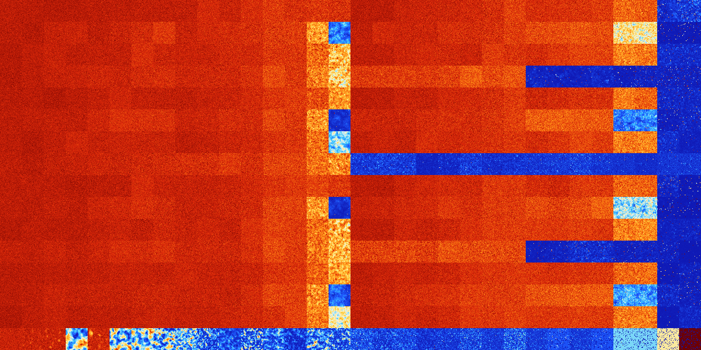

# B126 (35840-36351)

<details>
    <summary>Initial Grid</summary>
    
</details>


<details>
    <summary>Initial Grid RLE</summary>

```
#C Exported from GoGoL (https://github.com/marrow16/gogol)
#C Wrap mode: Toroidal
#C Boundary mode: Dead
#C Step: 0
x = 100, y = 100, rule = B126/S
7bo39bo24bo$9b2o18bo$57b2o7bo2bo14bo$3bo2bo2bo44bo5bobo18bo2bo$53bo9bob
o19bo4bo5bo$52bo$15bo2bo8bo46bo12bo$4bo52bo7bo8bo$22bo9bo4bo7b2o$33bo
13bo3bo37bo4bo$12bo10bo49bo7b4o$53bo43bo$5bo30bo7b2o22bo3bo3bo$7bo5bo
19bo9bobo19bo29bo2bo$26bo11bo14bo14b2o4bo9bo$24bo4bo16bo31bobo$6bo30bo
18bo42bo$36bo3bo30bobo4bo$3bo47bo18bo13bo$5bo3bo27bo8bo4bo3bo$11bo6bo9b
o42bo$13bo23bo4bobo38bo$12bo2bo8bo3bo28bo$14bo35bo4bobo2bo21bo$24bo10bo
2bo31bo28bo$24bo25b2o29bo$70bo13bo$26bo27bo$8bo13bo29bo6bo11bo15bo11bo$
23bo21bo5bo9bo21bo9bo$2bo24bo9bo10bo5bo25bo2bo3bo$33bo7bobo36bo$o30bobo
15bo18bo30bo$o16bo6bo11bo13bo41bo5b2o$54bo21bo15bo$bo21bo13bo16bo3bo7bo
$bobo16bo16bo30bo$18bob2o29bo7bo25bo$34bo25bo23b2o9bo$31bobo6bo2bo23bob
o23bo$11bo18b3o17bo19bo19bo6bo$19bo15bo9bo$15bo4bo7bo15bo16b2o5bo30bo$
6bo36bo28bo19bo$6bo8bo30bobo$28bo14bo15bo2bo27bo$17bo38bo21bo15bo$28bo
3bo15bo49bo$7bo7bo7bo14b2o$17bo20bo13bo3bo3bo29bo$4bo2bo3bo15bo2bo19bo$
12bo7bo10bo11bo2bo18bo33bo$9bo51bo31bo$10bo21bo12bo33bo6bo$38bo18b2o12b
o23bo$7bo3bo4bo4bobo12bo16bo32bo$48bo2bo13bo5bo9bo13bo$16b2o3bo4bo10bo
19bo18bobo$bo12bo8bo63bo$4bo6bo17bo3bo10bo4bo23bo$2bo52b2o28bo$7bo13bo
13bo24bo3bo$34bo14bo5bo24bo$2bo13bo19bo57bobo$33bobo2bo3bo16bo9bo$34bo
21bo3bo9bo9bo10bo$75bo$28bo13bobo43bo$23bo32bobo3bo15bo$bo2bo29bo7bo18b
o14bo$9bo44bo5bo13bo23b2o$43bo2bo30bo$11bo7bo14bo6bo$10bo31bo14bo2bo10b
o$11bo5bobo7bo12bo33bo14bo$3bo$34bo44bo2bo$16bo36bo11bo25bo$6bo15bo24bo
3bo16bo18bo$8bo35bo27bo$41b3o22bo3bo6bo6bo$9bo9bo14bo3bo30bo22bo3bo$o
24bo44bo2bo23bo$81bo$30bo$bo3bo10bo38bo7bo$11bo5bo13bo35bo$36bo17bo16bo
16bo5bo$22bo10bo20bo3bo24bo$2bo48bo12bo11bo$12bo33bo2bo28bo8bo$25bo6bo
20bo16bo4bo19bo$18b2o21bo$10bo2bo6bo18bobo$10bo18bo59bo6bo$41bo18bo13bo
8bo$5bo18bo25bo41bo$18bo8bo8bo37bo5bo5bo4bo7bo$100b$o17bo4bo19bo18bo20b
o!
```
</details>
<details>
    <summary>Thumbnail</summary>

</details>
<table>
<tr>
    <td><a href="./35840%20S%20Heat%20Map%20Activity.png"></a><br>S (35840)<br>G>1000</td>    <td><a href="./35841%20S0%20Heat%20Map%20Activity.png"></a><br>S0 (35841)<br>G>1000</td>    <td><a href="./35842%20S1%20Heat%20Map%20Activity.png"></a><br>S1 (35842)<br>G>1000</td>    <td><a href="./35843%20S01%20Heat%20Map%20Activity.png"></a><br>S01 (35843)<br>G>1000</td>    <td><a href="./35844%20S2%20Heat%20Map%20Activity.png"></a><br>S2 (35844)<br>G>1000</td>    <td><a href="./35845%20S02%20Heat%20Map%20Activity.png"></a><br>S02 (35845)<br>G>1000</td>    <td><a href="./35846%20S12%20Heat%20Map%20Activity.png"></a><br>S12 (35846)<br>G>1000</td>    <td><a href="./35847%20S012%20Heat%20Map%20Activity.png"></a><br>S012 (35847)<br>G>1000</td>    <td><a href="./35848%20S3%20Heat%20Map%20Activity.png"></a><br>S3 (35848)<br>G>1000</td>    <td><a href="./35849%20S03%20Heat%20Map%20Activity.png"></a><br>S03 (35849)<br>G>1000</td>    <td><a href="./35850%20S13%20Heat%20Map%20Activity.png"></a><br>S13 (35850)<br>G>1000</td>    <td><a href="./35851%20S013%20Heat%20Map%20Activity.png"></a><br>S013 (35851)<br>G>1000</td>    <td><a href="./35852%20S23%20Heat%20Map%20Activity.png"></a><br>S23 (35852)<br>G>1000</td>    <td><a href="./35853%20S023%20Heat%20Map%20Activity.png"></a><br>S023 (35853)<br>G>1000</td>    <td><a href="./35854%20S123%20Heat%20Map%20Activity.png"></a><br>S123 (35854)<br>G>1000</td>    <td><a href="./35855%20S0123%20Heat%20Map%20Activity.png"></a><br>S0123 (35855)<br>G>1000</td>    <td><a href="./35856%20S4%20Heat%20Map%20Activity.png"></a><br>S4 (35856)<br>G>1000</td>    <td><a href="./35857%20S04%20Heat%20Map%20Activity.png"></a><br>S04 (35857)<br>G>1000</td>    <td><a href="./35858%20S14%20Heat%20Map%20Activity.png"></a><br>S14 (35858)<br>G>1000</td>    <td><a href="./35859%20S014%20Heat%20Map%20Activity.png"></a><br>S014 (35859)<br>G>1000</td>    <td><a href="./35860%20S24%20Heat%20Map%20Activity.png"></a><br>S24 (35860)<br>G>1000</td>    <td><a href="./35861%20S024%20Heat%20Map%20Activity.png"></a><br>S024 (35861)<br>G>1000</td>    <td><a href="./35862%20S124%20Heat%20Map%20Activity.png"></a><br>S124 (35862)<br>G>1000</td>    <td><a href="./35863%20S0124%20Heat%20Map%20Activity.png"></a><br>S0124 (35863)<br>G>1000</td>    <td><a href="./35864%20S34%20Heat%20Map%20Activity.png"></a><br>S34 (35864)<br>G>1000</td>    <td><a href="./35865%20S034%20Heat%20Map%20Activity.png"></a><br>S034 (35865)<br>G>1000</td>    <td><a href="./35866%20S134%20Heat%20Map%20Activity.png"></a><br>S134 (35866)<br>G>1000</td>    <td><a href="./35867%20S0134%20Heat%20Map%20Activity.png"></a><br>S0134 (35867)<br>G>1000</td>    <td><a href="./35868%20S234%20Heat%20Map%20Activity.png"></a><br>S234 (35868)<br>G>1000</td>    <td><a href="./35869%20S0234%20Heat%20Map%20Activity.png"></a><br>S0234 (35869)<br>G>1000</td>    <td><a href="./35870%20S1234%20Heat%20Map%20Activity.png"></a><br>S1234 (35870)<br>R@316,p12</td>    <td><a href="./35871%20S01234%20Heat%20Map%20Activity.png"></a><br>S01234 (35871)<br>R@124,p12</td></tr>
<tr>
    <td><a href="./35872%20S5%20Heat%20Map%20Activity.png"></a><br>S5 (35872)<br>G>1000</td>    <td><a href="./35873%20S05%20Heat%20Map%20Activity.png"></a><br>S05 (35873)<br>G>1000</td>    <td><a href="./35874%20S15%20Heat%20Map%20Activity.png"></a><br>S15 (35874)<br>G>1000</td>    <td><a href="./35875%20S015%20Heat%20Map%20Activity.png"></a><br>S015 (35875)<br>G>1000</td>    <td><a href="./35876%20S25%20Heat%20Map%20Activity.png"></a><br>S25 (35876)<br>G>1000</td>    <td><a href="./35877%20S025%20Heat%20Map%20Activity.png"></a><br>S025 (35877)<br>G>1000</td>    <td><a href="./35878%20S125%20Heat%20Map%20Activity.png"></a><br>S125 (35878)<br>G>1000</td>    <td><a href="./35879%20S0125%20Heat%20Map%20Activity.png"></a><br>S0125 (35879)<br>G>1000</td>    <td><a href="./35880%20S35%20Heat%20Map%20Activity.png"></a><br>S35 (35880)<br>G>1000</td>    <td><a href="./35881%20S035%20Heat%20Map%20Activity.png"></a><br>S035 (35881)<br>G>1000</td>    <td><a href="./35882%20S135%20Heat%20Map%20Activity.png"></a><br>S135 (35882)<br>G>1000</td>    <td><a href="./35883%20S0135%20Heat%20Map%20Activity.png"></a><br>S0135 (35883)<br>G>1000</td>    <td><a href="./35884%20S235%20Heat%20Map%20Activity.png"></a><br>S235 (35884)<br>G>1000</td>    <td><a href="./35885%20S0235%20Heat%20Map%20Activity.png"></a><br>S0235 (35885)<br>G>1000</td>    <td><a href="./35886%20S1235%20Heat%20Map%20Activity.png"></a><br>S1235 (35886)<br>G>1000</td>    <td><a href="./35887%20S01235%20Heat%20Map%20Activity.png"></a><br>S01235 (35887)<br>G>1000</td>    <td><a href="./35888%20S45%20Heat%20Map%20Activity.png"></a><br>S45 (35888)<br>G>1000</td>    <td><a href="./35889%20S045%20Heat%20Map%20Activity.png"></a><br>S045 (35889)<br>G>1000</td>    <td><a href="./35890%20S145%20Heat%20Map%20Activity.png"></a><br>S145 (35890)<br>G>1000</td>    <td><a href="./35891%20S0145%20Heat%20Map%20Activity.png"></a><br>S0145 (35891)<br>G>1000</td>    <td><a href="./35892%20S245%20Heat%20Map%20Activity.png"></a><br>S245 (35892)<br>G>1000</td>    <td><a href="./35893%20S0245%20Heat%20Map%20Activity.png"></a><br>S0245 (35893)<br>G>1000</td>    <td><a href="./35894%20S1245%20Heat%20Map%20Activity.png"></a><br>S1245 (35894)<br>G>1000</td>    <td><a href="./35895%20S01245%20Heat%20Map%20Activity.png"></a><br>S01245 (35895)<br>G>1000</td>    <td><a href="./35896%20S345%20Heat%20Map%20Activity.png"></a><br>S345 (35896)<br>G>1000</td>    <td><a href="./35897%20S0345%20Heat%20Map%20Activity.png"></a><br>S0345 (35897)<br>G>1000</td>    <td><a href="./35898%20S1345%20Heat%20Map%20Activity.png"></a><br>S1345 (35898)<br>G>1000</td>    <td><a href="./35899%20S01345%20Heat%20Map%20Activity.png"></a><br>S01345 (35899)<br>G>1000</td>    <td><a href="./35900%20S2345%20Heat%20Map%20Activity.png"></a><br>S2345 (35900)<br>G>1000</td>    <td><a href="./35901%20S02345%20Heat%20Map%20Activity.png"></a><br>S02345 (35901)<br>G>1000</td>    <td><a href="./35902%20S12345%20Heat%20Map%20Activity.png"></a><br>S12345 (35902)<br>G>1000</td>    <td><a href="./35903%20S012345%20Heat%20Map%20Activity.png"></a><br>S012345 (35903)<br>G>1000</td></tr>
<tr>
    <td><a href="./35904%20S6%20Heat%20Map%20Activity.png"></a><br>S6 (35904)<br>G>1000</td>    <td><a href="./35905%20S06%20Heat%20Map%20Activity.png"></a><br>S06 (35905)<br>G>1000</td>    <td><a href="./35906%20S16%20Heat%20Map%20Activity.png"></a><br>S16 (35906)<br>G>1000</td>    <td><a href="./35907%20S016%20Heat%20Map%20Activity.png"></a><br>S016 (35907)<br>G>1000</td>    <td><a href="./35908%20S26%20Heat%20Map%20Activity.png"></a><br>S26 (35908)<br>G>1000</td>    <td><a href="./35909%20S026%20Heat%20Map%20Activity.png"></a><br>S026 (35909)<br>G>1000</td>    <td><a href="./35910%20S126%20Heat%20Map%20Activity.png"></a><br>S126 (35910)<br>G>1000</td>    <td><a href="./35911%20S0126%20Heat%20Map%20Activity.png"></a><br>S0126 (35911)<br>G>1000</td>    <td><a href="./35912%20S36%20Heat%20Map%20Activity.png"></a><br>S36 (35912)<br>G>1000</td>    <td><a href="./35913%20S036%20Heat%20Map%20Activity.png"></a><br>S036 (35913)<br>G>1000</td>    <td><a href="./35914%20S136%20Heat%20Map%20Activity.png"></a><br>S136 (35914)<br>G>1000</td>    <td><a href="./35915%20S0136%20Heat%20Map%20Activity.png"></a><br>S0136 (35915)<br>G>1000</td>    <td><a href="./35916%20S236%20Heat%20Map%20Activity.png"></a><br>S236 (35916)<br>G>1000</td>    <td><a href="./35917%20S0236%20Heat%20Map%20Activity.png"></a><br>S0236 (35917)<br>G>1000</td>    <td><a href="./35918%20S1236%20Heat%20Map%20Activity.png"></a><br>S1236 (35918)<br>G>1000</td>    <td><a href="./35919%20S01236%20Heat%20Map%20Activity.png"></a><br>S01236 (35919)<br>G>1000</td>    <td><a href="./35920%20S46%20Heat%20Map%20Activity.png"></a><br>S46 (35920)<br>G>1000</td>    <td><a href="./35921%20S046%20Heat%20Map%20Activity.png"></a><br>S046 (35921)<br>G>1000</td>    <td><a href="./35922%20S146%20Heat%20Map%20Activity.png"></a><br>S146 (35922)<br>G>1000</td>    <td><a href="./35923%20S0146%20Heat%20Map%20Activity.png"></a><br>S0146 (35923)<br>G>1000</td>    <td><a href="./35924%20S246%20Heat%20Map%20Activity.png"></a><br>S246 (35924)<br>G>1000</td>    <td><a href="./35925%20S0246%20Heat%20Map%20Activity.png"></a><br>S0246 (35925)<br>G>1000</td>    <td><a href="./35926%20S1246%20Heat%20Map%20Activity.png"></a><br>S1246 (35926)<br>G>1000</td>    <td><a href="./35927%20S01246%20Heat%20Map%20Activity.png"></a><br>S01246 (35927)<br>G>1000</td>    <td><a href="./35928%20S346%20Heat%20Map%20Activity.png"></a><br>S346 (35928)<br>G>1000</td>    <td><a href="./35929%20S0346%20Heat%20Map%20Activity.png"></a><br>S0346 (35929)<br>G>1000</td>    <td><a href="./35930%20S1346%20Heat%20Map%20Activity.png"></a><br>S1346 (35930)<br>G>1000</td>    <td><a href="./35931%20S01346%20Heat%20Map%20Activity.png"></a><br>S01346 (35931)<br>G>1000</td>    <td><a href="./35932%20S2346%20Heat%20Map%20Activity.png"></a><br>S2346 (35932)<br>G>1000</td>    <td><a href="./35933%20S02346%20Heat%20Map%20Activity.png"></a><br>S02346 (35933)<br>G>1000</td>    <td><a href="./35934%20S12346%20Heat%20Map%20Activity.png"></a><br>S12346 (35934)<br>R@86,p12</td>    <td><a href="./35935%20S012346%20Heat%20Map%20Activity.png"></a><br>S012346 (35935)<br>R@83,p24</td></tr>
<tr>
    <td><a href="./35936%20S56%20Heat%20Map%20Activity.png"></a><br>S56 (35936)<br>G>1000</td>    <td><a href="./35937%20S056%20Heat%20Map%20Activity.png"></a><br>S056 (35937)<br>G>1000</td>    <td><a href="./35938%20S156%20Heat%20Map%20Activity.png"></a><br>S156 (35938)<br>G>1000</td>    <td><a href="./35939%20S0156%20Heat%20Map%20Activity.png"></a><br>S0156 (35939)<br>G>1000</td>    <td><a href="./35940%20S256%20Heat%20Map%20Activity.png"></a><br>S256 (35940)<br>G>1000</td>    <td><a href="./35941%20S0256%20Heat%20Map%20Activity.png"></a><br>S0256 (35941)<br>G>1000</td>    <td><a href="./35942%20S1256%20Heat%20Map%20Activity.png"></a><br>S1256 (35942)<br>G>1000</td>    <td><a href="./35943%20S01256%20Heat%20Map%20Activity.png"></a><br>S01256 (35943)<br>G>1000</td>    <td><a href="./35944%20S356%20Heat%20Map%20Activity.png"></a><br>S356 (35944)<br>G>1000</td>    <td><a href="./35945%20S0356%20Heat%20Map%20Activity.png"></a><br>S0356 (35945)<br>G>1000</td>    <td><a href="./35946%20S1356%20Heat%20Map%20Activity.png"></a><br>S1356 (35946)<br>G>1000</td>    <td><a href="./35947%20S01356%20Heat%20Map%20Activity.png"></a><br>S01356 (35947)<br>G>1000</td>    <td><a href="./35948%20S2356%20Heat%20Map%20Activity.png"></a><br>S2356 (35948)<br>G>1000</td>    <td><a href="./35949%20S02356%20Heat%20Map%20Activity.png"></a><br>S02356 (35949)<br>G>1000</td>    <td><a href="./35950%20S12356%20Heat%20Map%20Activity.png"></a><br>S12356 (35950)<br>G>1000</td>    <td><a href="./35951%20S012356%20Heat%20Map%20Activity.png"></a><br>S012356 (35951)<br>G>1000</td>    <td><a href="./35952%20S456%20Heat%20Map%20Activity.png"></a><br>S456 (35952)<br>G>1000</td>    <td><a href="./35953%20S0456%20Heat%20Map%20Activity.png"></a><br>S0456 (35953)<br>G>1000</td>    <td><a href="./35954%20S1456%20Heat%20Map%20Activity.png"></a><br>S1456 (35954)<br>G>1000</td>    <td><a href="./35955%20S01456%20Heat%20Map%20Activity.png"></a><br>S01456 (35955)<br>G>1000</td>    <td><a href="./35956%20S2456%20Heat%20Map%20Activity.png"></a><br>S2456 (35956)<br>G>1000</td>    <td><a href="./35957%20S02456%20Heat%20Map%20Activity.png"></a><br>S02456 (35957)<br>G>1000</td>    <td><a href="./35958%20S12456%20Heat%20Map%20Activity.png"></a><br>S12456 (35958)<br>G>1000</td>    <td><a href="./35959%20S012456%20Heat%20Map%20Activity.png"></a><br>S012456 (35959)<br>G>1000</td>    <td><a href="./35960%20S3456%20Heat%20Map%20Activity.png"></a><br>S3456 (35960)<br>R@269,p60</td>    <td><a href="./35961%20S03456%20Heat%20Map%20Activity.png"></a><br>S03456 (35961)<br>R@348,p36</td>    <td><a href="./35962%20S13456%20Heat%20Map%20Activity.png"></a><br>S13456 (35962)<br>R@351,p180</td>    <td><a href="./35963%20S013456%20Heat%20Map%20Activity.png"></a><br>S013456 (35963)<br>R@179,p12</td>    <td><a href="./35964%20S23456%20Heat%20Map%20Activity.png"></a><br>S23456 (35964)<br>R@188,p120</td>    <td><a href="./35965%20S023456%20Heat%20Map%20Activity.png"></a><br>S023456 (35965)<br>R@110,p60</td>    <td><a href="./35966%20S123456%20Heat%20Map%20Activity.png"></a><br>S123456 (35966)<br>R@107,p60</td>    <td><a href="./35967%20S0123456%20Heat%20Map%20Activity.png"></a><br>S0123456 (35967)<br>R@126,p60</td></tr>
<tr>
    <td><a href="./35968%20S7%20Heat%20Map%20Activity.png"></a><br>S7 (35968)<br>G>1000</td>    <td><a href="./35969%20S07%20Heat%20Map%20Activity.png"></a><br>S07 (35969)<br>G>1000</td>    <td><a href="./35970%20S17%20Heat%20Map%20Activity.png"></a><br>S17 (35970)<br>G>1000</td>    <td><a href="./35971%20S017%20Heat%20Map%20Activity.png"></a><br>S017 (35971)<br>G>1000</td>    <td><a href="./35972%20S27%20Heat%20Map%20Activity.png"></a><br>S27 (35972)<br>G>1000</td>    <td><a href="./35973%20S027%20Heat%20Map%20Activity.png"></a><br>S027 (35973)<br>G>1000</td>    <td><a href="./35974%20S127%20Heat%20Map%20Activity.png"></a><br>S127 (35974)<br>G>1000</td>    <td><a href="./35975%20S0127%20Heat%20Map%20Activity.png"></a><br>S0127 (35975)<br>G>1000</td>    <td><a href="./35976%20S37%20Heat%20Map%20Activity.png"></a><br>S37 (35976)<br>G>1000</td>    <td><a href="./35977%20S037%20Heat%20Map%20Activity.png"></a><br>S037 (35977)<br>G>1000</td>    <td><a href="./35978%20S137%20Heat%20Map%20Activity.png"></a><br>S137 (35978)<br>G>1000</td>    <td><a href="./35979%20S0137%20Heat%20Map%20Activity.png"></a><br>S0137 (35979)<br>G>1000</td>    <td><a href="./35980%20S237%20Heat%20Map%20Activity.png"></a><br>S237 (35980)<br>G>1000</td>    <td><a href="./35981%20S0237%20Heat%20Map%20Activity.png"></a><br>S0237 (35981)<br>G>1000</td>    <td><a href="./35982%20S1237%20Heat%20Map%20Activity.png"></a><br>S1237 (35982)<br>G>1000</td>    <td><a href="./35983%20S01237%20Heat%20Map%20Activity.png"></a><br>S01237 (35983)<br>G>1000</td>    <td><a href="./35984%20S47%20Heat%20Map%20Activity.png"></a><br>S47 (35984)<br>G>1000</td>    <td><a href="./35985%20S047%20Heat%20Map%20Activity.png"></a><br>S047 (35985)<br>G>1000</td>    <td><a href="./35986%20S147%20Heat%20Map%20Activity.png"></a><br>S147 (35986)<br>G>1000</td>    <td><a href="./35987%20S0147%20Heat%20Map%20Activity.png"></a><br>S0147 (35987)<br>G>1000</td>    <td><a href="./35988%20S247%20Heat%20Map%20Activity.png"></a><br>S247 (35988)<br>G>1000</td>    <td><a href="./35989%20S0247%20Heat%20Map%20Activity.png"></a><br>S0247 (35989)<br>G>1000</td>    <td><a href="./35990%20S1247%20Heat%20Map%20Activity.png"></a><br>S1247 (35990)<br>G>1000</td>    <td><a href="./35991%20S01247%20Heat%20Map%20Activity.png"></a><br>S01247 (35991)<br>G>1000</td>    <td><a href="./35992%20S347%20Heat%20Map%20Activity.png"></a><br>S347 (35992)<br>G>1000</td>    <td><a href="./35993%20S0347%20Heat%20Map%20Activity.png"></a><br>S0347 (35993)<br>G>1000</td>    <td><a href="./35994%20S1347%20Heat%20Map%20Activity.png"></a><br>S1347 (35994)<br>G>1000</td>    <td><a href="./35995%20S01347%20Heat%20Map%20Activity.png"></a><br>S01347 (35995)<br>G>1000</td>    <td><a href="./35996%20S2347%20Heat%20Map%20Activity.png"></a><br>S2347 (35996)<br>G>1000</td>    <td><a href="./35997%20S02347%20Heat%20Map%20Activity.png"></a><br>S02347 (35997)<br>G>1000</td>    <td><a href="./35998%20S12347%20Heat%20Map%20Activity.png"></a><br>S12347 (35998)<br>R@174,p60</td>    <td><a href="./35999%20S012347%20Heat%20Map%20Activity.png"></a><br>S012347 (35999)<br>R@122,p60</td></tr>
<tr>
    <td><a href="./36000%20S57%20Heat%20Map%20Activity.png"></a><br>S57 (36000)<br>G>1000</td>    <td><a href="./36001%20S057%20Heat%20Map%20Activity.png"></a><br>S057 (36001)<br>G>1000</td>    <td><a href="./36002%20S157%20Heat%20Map%20Activity.png"></a><br>S157 (36002)<br>G>1000</td>    <td><a href="./36003%20S0157%20Heat%20Map%20Activity.png"></a><br>S0157 (36003)<br>G>1000</td>    <td><a href="./36004%20S257%20Heat%20Map%20Activity.png"></a><br>S257 (36004)<br>G>1000</td>    <td><a href="./36005%20S0257%20Heat%20Map%20Activity.png"></a><br>S0257 (36005)<br>G>1000</td>    <td><a href="./36006%20S1257%20Heat%20Map%20Activity.png"></a><br>S1257 (36006)<br>G>1000</td>    <td><a href="./36007%20S01257%20Heat%20Map%20Activity.png"></a><br>S01257 (36007)<br>G>1000</td>    <td><a href="./36008%20S357%20Heat%20Map%20Activity.png"></a><br>S357 (36008)<br>G>1000</td>    <td><a href="./36009%20S0357%20Heat%20Map%20Activity.png"></a><br>S0357 (36009)<br>G>1000</td>    <td><a href="./36010%20S1357%20Heat%20Map%20Activity.png"></a><br>S1357 (36010)<br>G>1000</td>    <td><a href="./36011%20S01357%20Heat%20Map%20Activity.png"></a><br>S01357 (36011)<br>G>1000</td>    <td><a href="./36012%20S2357%20Heat%20Map%20Activity.png"></a><br>S2357 (36012)<br>G>1000</td>    <td><a href="./36013%20S02357%20Heat%20Map%20Activity.png"></a><br>S02357 (36013)<br>G>1000</td>    <td><a href="./36014%20S12357%20Heat%20Map%20Activity.png"></a><br>S12357 (36014)<br>G>1000</td>    <td><a href="./36015%20S012357%20Heat%20Map%20Activity.png"></a><br>S012357 (36015)<br>G>1000</td>    <td><a href="./36016%20S457%20Heat%20Map%20Activity.png"></a><br>S457 (36016)<br>G>1000</td>    <td><a href="./36017%20S0457%20Heat%20Map%20Activity.png"></a><br>S0457 (36017)<br>G>1000</td>    <td><a href="./36018%20S1457%20Heat%20Map%20Activity.png"></a><br>S1457 (36018)<br>G>1000</td>    <td><a href="./36019%20S01457%20Heat%20Map%20Activity.png"></a><br>S01457 (36019)<br>G>1000</td>    <td><a href="./36020%20S2457%20Heat%20Map%20Activity.png"></a><br>S2457 (36020)<br>G>1000</td>    <td><a href="./36021%20S02457%20Heat%20Map%20Activity.png"></a><br>S02457 (36021)<br>G>1000</td>    <td><a href="./36022%20S12457%20Heat%20Map%20Activity.png"></a><br>S12457 (36022)<br>G>1000</td>    <td><a href="./36023%20S012457%20Heat%20Map%20Activity.png"></a><br>S012457 (36023)<br>G>1000</td>    <td><a href="./36024%20S3457%20Heat%20Map%20Activity.png"></a><br>S3457 (36024)<br>G>1000</td>    <td><a href="./36025%20S03457%20Heat%20Map%20Activity.png"></a><br>S03457 (36025)<br>G>1000</td>    <td><a href="./36026%20S13457%20Heat%20Map%20Activity.png"></a><br>S13457 (36026)<br>G>1000</td>    <td><a href="./36027%20S013457%20Heat%20Map%20Activity.png"></a><br>S013457 (36027)<br>G>1000</td>    <td><a href="./36028%20S23457%20Heat%20Map%20Activity.png"></a><br>S23457 (36028)<br>G>1000</td>    <td><a href="./36029%20S023457%20Heat%20Map%20Activity.png"></a><br>S023457 (36029)<br>G>1000</td>    <td><a href="./36030%20S123457%20Heat%20Map%20Activity.png"></a><br>S123457 (36030)<br>R@268,p168</td>    <td><a href="./36031%20S0123457%20Heat%20Map%20Activity.png"></a><br>S0123457 (36031)<br>R@138,p12</td></tr>
<tr>
    <td><a href="./36032%20S67%20Heat%20Map%20Activity.png"></a><br>S67 (36032)<br>G>1000</td>    <td><a href="./36033%20S067%20Heat%20Map%20Activity.png"></a><br>S067 (36033)<br>G>1000</td>    <td><a href="./36034%20S167%20Heat%20Map%20Activity.png"></a><br>S167 (36034)<br>G>1000</td>    <td><a href="./36035%20S0167%20Heat%20Map%20Activity.png"></a><br>S0167 (36035)<br>G>1000</td>    <td><a href="./36036%20S267%20Heat%20Map%20Activity.png"></a><br>S267 (36036)<br>G>1000</td>    <td><a href="./36037%20S0267%20Heat%20Map%20Activity.png"></a><br>S0267 (36037)<br>G>1000</td>    <td><a href="./36038%20S1267%20Heat%20Map%20Activity.png"></a><br>S1267 (36038)<br>G>1000</td>    <td><a href="./36039%20S01267%20Heat%20Map%20Activity.png"></a><br>S01267 (36039)<br>G>1000</td>    <td><a href="./36040%20S367%20Heat%20Map%20Activity.png"></a><br>S367 (36040)<br>G>1000</td>    <td><a href="./36041%20S0367%20Heat%20Map%20Activity.png"></a><br>S0367 (36041)<br>G>1000</td>    <td><a href="./36042%20S1367%20Heat%20Map%20Activity.png"></a><br>S1367 (36042)<br>G>1000</td>    <td><a href="./36043%20S01367%20Heat%20Map%20Activity.png"></a><br>S01367 (36043)<br>G>1000</td>    <td><a href="./36044%20S2367%20Heat%20Map%20Activity.png"></a><br>S2367 (36044)<br>G>1000</td>    <td><a href="./36045%20S02367%20Heat%20Map%20Activity.png"></a><br>S02367 (36045)<br>G>1000</td>    <td><a href="./36046%20S12367%20Heat%20Map%20Activity.png"></a><br>S12367 (36046)<br>G>1000</td>    <td><a href="./36047%20S012367%20Heat%20Map%20Activity.png"></a><br>S012367 (36047)<br>G>1000</td>    <td><a href="./36048%20S467%20Heat%20Map%20Activity.png"></a><br>S467 (36048)<br>G>1000</td>    <td><a href="./36049%20S0467%20Heat%20Map%20Activity.png"></a><br>S0467 (36049)<br>G>1000</td>    <td><a href="./36050%20S1467%20Heat%20Map%20Activity.png"></a><br>S1467 (36050)<br>G>1000</td>    <td><a href="./36051%20S01467%20Heat%20Map%20Activity.png"></a><br>S01467 (36051)<br>G>1000</td>    <td><a href="./36052%20S2467%20Heat%20Map%20Activity.png"></a><br>S2467 (36052)<br>G>1000</td>    <td><a href="./36053%20S02467%20Heat%20Map%20Activity.png"></a><br>S02467 (36053)<br>G>1000</td>    <td><a href="./36054%20S12467%20Heat%20Map%20Activity.png"></a><br>S12467 (36054)<br>G>1000</td>    <td><a href="./36055%20S012467%20Heat%20Map%20Activity.png"></a><br>S012467 (36055)<br>G>1000</td>    <td><a href="./36056%20S3467%20Heat%20Map%20Activity.png"></a><br>S3467 (36056)<br>G>1000</td>    <td><a href="./36057%20S03467%20Heat%20Map%20Activity.png"></a><br>S03467 (36057)<br>G>1000</td>    <td><a href="./36058%20S13467%20Heat%20Map%20Activity.png"></a><br>S13467 (36058)<br>G>1000</td>    <td><a href="./36059%20S013467%20Heat%20Map%20Activity.png"></a><br>S013467 (36059)<br>G>1000</td>    <td><a href="./36060%20S23467%20Heat%20Map%20Activity.png"></a><br>S23467 (36060)<br>G>1000</td>    <td><a href="./36061%20S023467%20Heat%20Map%20Activity.png"></a><br>S023467 (36061)<br>G>1000</td>    <td><a href="./36062%20S123467%20Heat%20Map%20Activity.png"></a><br>S123467 (36062)<br>R@77,p12</td>    <td><a href="./36063%20S0123467%20Heat%20Map%20Activity.png"></a><br>S0123467 (36063)<br>R@152,p72</td></tr>
<tr>
    <td><a href="./36064%20S567%20Heat%20Map%20Activity.png"></a><br>S567 (36064)<br>G>1000</td>    <td><a href="./36065%20S0567%20Heat%20Map%20Activity.png"></a><br>S0567 (36065)<br>G>1000</td>    <td><a href="./36066%20S1567%20Heat%20Map%20Activity.png"></a><br>S1567 (36066)<br>G>1000</td>    <td><a href="./36067%20S01567%20Heat%20Map%20Activity.png"></a><br>S01567 (36067)<br>G>1000</td>    <td><a href="./36068%20S2567%20Heat%20Map%20Activity.png"></a><br>S2567 (36068)<br>G>1000</td>    <td><a href="./36069%20S02567%20Heat%20Map%20Activity.png"></a><br>S02567 (36069)<br>G>1000</td>    <td><a href="./36070%20S12567%20Heat%20Map%20Activity.png"></a><br>S12567 (36070)<br>G>1000</td>    <td><a href="./36071%20S012567%20Heat%20Map%20Activity.png"></a><br>S012567 (36071)<br>G>1000</td>    <td><a href="./36072%20S3567%20Heat%20Map%20Activity.png"></a><br>S3567 (36072)<br>G>1000</td>    <td><a href="./36073%20S03567%20Heat%20Map%20Activity.png"></a><br>S03567 (36073)<br>G>1000</td>    <td><a href="./36074%20S13567%20Heat%20Map%20Activity.png"></a><br>S13567 (36074)<br>G>1000</td>    <td><a href="./36075%20S013567%20Heat%20Map%20Activity.png"></a><br>S013567 (36075)<br>G>1000</td>    <td><a href="./36076%20S23567%20Heat%20Map%20Activity.png"></a><br>S23567 (36076)<br>G>1000</td>    <td><a href="./36077%20S023567%20Heat%20Map%20Activity.png"></a><br>S023567 (36077)<br>G>1000</td>    <td><a href="./36078%20S123567%20Heat%20Map%20Activity.png"></a><br>S123567 (36078)<br>G>1000</td>    <td><a href="./36079%20S0123567%20Heat%20Map%20Activity.png"></a><br>S0123567 (36079)<br>G>1000</td>    <td><a href="./36080%20S4567%20Heat%20Map%20Activity.png"></a><br>S4567 (36080)<br>R@67,p4</td>    <td><a href="./36081%20S04567%20Heat%20Map%20Activity.png"></a><br>S04567 (36081)<br>R@55,p4</td>    <td><a href="./36082%20S14567%20Heat%20Map%20Activity.png"></a><br>S14567 (36082)<br>R@62,p4</td>    <td><a href="./36083%20S014567%20Heat%20Map%20Activity.png"></a><br>S014567 (36083)<br>R@161,p120</td>    <td><a href="./36084%20S24567%20Heat%20Map%20Activity.png"></a><br>S24567 (36084)<br>R@55,p12</td>    <td><a href="./36085%20S024567%20Heat%20Map%20Activity.png"></a><br>S024567 (36085)<br>R@46,p4</td>    <td><a href="./36086%20S124567%20Heat%20Map%20Activity.png"></a><br>S124567 (36086)<br>R@45,p6</td>    <td><a href="./36087%20S0124567%20Heat%20Map%20Activity.png"></a><br>S0124567 (36087)<br>R@55,p4</td>    <td><a href="./36088%20S34567%20Heat%20Map%20Activity.png"></a><br>S34567 (36088)<br>R@24,p2</td>    <td><a href="./36089%20S034567%20Heat%20Map%20Activity.png"></a><br>S034567 (36089)<br>R@18,p2</td>    <td><a href="./36090%20S134567%20Heat%20Map%20Activity.png"></a><br>S134567 (36090)<br>R@20,p2</td>    <td><a href="./36091%20S0134567%20Heat%20Map%20Activity.png"></a><br>S0134567 (36091)<br>R@23,p6</td>    <td><a href="./36092%20S234567%20Heat%20Map%20Activity.png"></a><br>S234567 (36092)<br>R@21,p6</td>    <td><a href="./36093%20S0234567%20Heat%20Map%20Activity.png"></a><br>S0234567 (36093)<br>R@27,p12</td>    <td><a href="./36094%20S1234567%20Heat%20Map%20Activity.png"></a><br>S1234567 (36094)<br>R@19,p4</td>    <td><a href="./36095%20S01234567%20Heat%20Map%20Activity.png"></a><br>S01234567 (36095)<br>R@19,p4</td></tr>
<tr>
    <td><a href="./36096%20S8%20Heat%20Map%20Activity.png"></a><br>S8 (36096)<br>G>1000</td>    <td><a href="./36097%20S08%20Heat%20Map%20Activity.png"></a><br>S08 (36097)<br>G>1000</td>    <td><a href="./36098%20S18%20Heat%20Map%20Activity.png"></a><br>S18 (36098)<br>G>1000</td>    <td><a href="./36099%20S018%20Heat%20Map%20Activity.png"></a><br>S018 (36099)<br>G>1000</td>    <td><a href="./36100%20S28%20Heat%20Map%20Activity.png"></a><br>S28 (36100)<br>G>1000</td>    <td><a href="./36101%20S028%20Heat%20Map%20Activity.png"></a><br>S028 (36101)<br>G>1000</td>    <td><a href="./36102%20S128%20Heat%20Map%20Activity.png"></a><br>S128 (36102)<br>G>1000</td>    <td><a href="./36103%20S0128%20Heat%20Map%20Activity.png"></a><br>S0128 (36103)<br>G>1000</td>    <td><a href="./36104%20S38%20Heat%20Map%20Activity.png"></a><br>S38 (36104)<br>G>1000</td>    <td><a href="./36105%20S038%20Heat%20Map%20Activity.png"></a><br>S038 (36105)<br>G>1000</td>    <td><a href="./36106%20S138%20Heat%20Map%20Activity.png"></a><br>S138 (36106)<br>G>1000</td>    <td><a href="./36107%20S0138%20Heat%20Map%20Activity.png"></a><br>S0138 (36107)<br>G>1000</td>    <td><a href="./36108%20S238%20Heat%20Map%20Activity.png"></a><br>S238 (36108)<br>G>1000</td>    <td><a href="./36109%20S0238%20Heat%20Map%20Activity.png"></a><br>S0238 (36109)<br>G>1000</td>    <td><a href="./36110%20S1238%20Heat%20Map%20Activity.png"></a><br>S1238 (36110)<br>G>1000</td>    <td><a href="./36111%20S01238%20Heat%20Map%20Activity.png"></a><br>S01238 (36111)<br>G>1000</td>    <td><a href="./36112%20S48%20Heat%20Map%20Activity.png"></a><br>S48 (36112)<br>G>1000</td>    <td><a href="./36113%20S048%20Heat%20Map%20Activity.png"></a><br>S048 (36113)<br>G>1000</td>    <td><a href="./36114%20S148%20Heat%20Map%20Activity.png"></a><br>S148 (36114)<br>G>1000</td>    <td><a href="./36115%20S0148%20Heat%20Map%20Activity.png"></a><br>S0148 (36115)<br>G>1000</td>    <td><a href="./36116%20S248%20Heat%20Map%20Activity.png"></a><br>S248 (36116)<br>G>1000</td>    <td><a href="./36117%20S0248%20Heat%20Map%20Activity.png"></a><br>S0248 (36117)<br>G>1000</td>    <td><a href="./36118%20S1248%20Heat%20Map%20Activity.png"></a><br>S1248 (36118)<br>G>1000</td>    <td><a href="./36119%20S01248%20Heat%20Map%20Activity.png"></a><br>S01248 (36119)<br>G>1000</td>    <td><a href="./36120%20S348%20Heat%20Map%20Activity.png"></a><br>S348 (36120)<br>G>1000</td>    <td><a href="./36121%20S0348%20Heat%20Map%20Activity.png"></a><br>S0348 (36121)<br>G>1000</td>    <td><a href="./36122%20S1348%20Heat%20Map%20Activity.png"></a><br>S1348 (36122)<br>G>1000</td>    <td><a href="./36123%20S01348%20Heat%20Map%20Activity.png"></a><br>S01348 (36123)<br>G>1000</td>    <td><a href="./36124%20S2348%20Heat%20Map%20Activity.png"></a><br>S2348 (36124)<br>G>1000</td>    <td><a href="./36125%20S02348%20Heat%20Map%20Activity.png"></a><br>S02348 (36125)<br>G>1000</td>    <td><a href="./36126%20S12348%20Heat%20Map%20Activity.png"></a><br>S12348 (36126)<br>R@309,p120</td>    <td><a href="./36127%20S012348%20Heat%20Map%20Activity.png"></a><br>S012348 (36127)<br>G>1000</td></tr>
<tr>
    <td><a href="./36128%20S58%20Heat%20Map%20Activity.png"></a><br>S58 (36128)<br>G>1000</td>    <td><a href="./36129%20S058%20Heat%20Map%20Activity.png"></a><br>S058 (36129)<br>G>1000</td>    <td><a href="./36130%20S158%20Heat%20Map%20Activity.png"></a><br>S158 (36130)<br>G>1000</td>    <td><a href="./36131%20S0158%20Heat%20Map%20Activity.png"></a><br>S0158 (36131)<br>G>1000</td>    <td><a href="./36132%20S258%20Heat%20Map%20Activity.png"></a><br>S258 (36132)<br>G>1000</td>    <td><a href="./36133%20S0258%20Heat%20Map%20Activity.png"></a><br>S0258 (36133)<br>G>1000</td>    <td><a href="./36134%20S1258%20Heat%20Map%20Activity.png"></a><br>S1258 (36134)<br>G>1000</td>    <td><a href="./36135%20S01258%20Heat%20Map%20Activity.png"></a><br>S01258 (36135)<br>G>1000</td>    <td><a href="./36136%20S358%20Heat%20Map%20Activity.png"></a><br>S358 (36136)<br>G>1000</td>    <td><a href="./36137%20S0358%20Heat%20Map%20Activity.png"></a><br>S0358 (36137)<br>G>1000</td>    <td><a href="./36138%20S1358%20Heat%20Map%20Activity.png"></a><br>S1358 (36138)<br>G>1000</td>    <td><a href="./36139%20S01358%20Heat%20Map%20Activity.png"></a><br>S01358 (36139)<br>G>1000</td>    <td><a href="./36140%20S2358%20Heat%20Map%20Activity.png"></a><br>S2358 (36140)<br>G>1000</td>    <td><a href="./36141%20S02358%20Heat%20Map%20Activity.png"></a><br>S02358 (36141)<br>G>1000</td>    <td><a href="./36142%20S12358%20Heat%20Map%20Activity.png"></a><br>S12358 (36142)<br>G>1000</td>    <td><a href="./36143%20S012358%20Heat%20Map%20Activity.png"></a><br>S012358 (36143)<br>G>1000</td>    <td><a href="./36144%20S458%20Heat%20Map%20Activity.png"></a><br>S458 (36144)<br>G>1000</td>    <td><a href="./36145%20S0458%20Heat%20Map%20Activity.png"></a><br>S0458 (36145)<br>G>1000</td>    <td><a href="./36146%20S1458%20Heat%20Map%20Activity.png"></a><br>S1458 (36146)<br>G>1000</td>    <td><a href="./36147%20S01458%20Heat%20Map%20Activity.png"></a><br>S01458 (36147)<br>G>1000</td>    <td><a href="./36148%20S2458%20Heat%20Map%20Activity.png"></a><br>S2458 (36148)<br>G>1000</td>    <td><a href="./36149%20S02458%20Heat%20Map%20Activity.png"></a><br>S02458 (36149)<br>G>1000</td>    <td><a href="./36150%20S12458%20Heat%20Map%20Activity.png"></a><br>S12458 (36150)<br>G>1000</td>    <td><a href="./36151%20S012458%20Heat%20Map%20Activity.png"></a><br>S012458 (36151)<br>G>1000</td>    <td><a href="./36152%20S3458%20Heat%20Map%20Activity.png"></a><br>S3458 (36152)<br>G>1000</td>    <td><a href="./36153%20S03458%20Heat%20Map%20Activity.png"></a><br>S03458 (36153)<br>G>1000</td>    <td><a href="./36154%20S13458%20Heat%20Map%20Activity.png"></a><br>S13458 (36154)<br>G>1000</td>    <td><a href="./36155%20S013458%20Heat%20Map%20Activity.png"></a><br>S013458 (36155)<br>G>1000</td>    <td><a href="./36156%20S23458%20Heat%20Map%20Activity.png"></a><br>S23458 (36156)<br>G>1000</td>    <td><a href="./36157%20S023458%20Heat%20Map%20Activity.png"></a><br>S023458 (36157)<br>G>1000</td>    <td><a href="./36158%20S123458%20Heat%20Map%20Activity.png"></a><br>S123458 (36158)<br>R@790,p660</td>    <td><a href="./36159%20S0123458%20Heat%20Map%20Activity.png"></a><br>S0123458 (36159)<br>R@964,p840</td></tr>
<tr>
    <td><a href="./36160%20S68%20Heat%20Map%20Activity.png"></a><br>S68 (36160)<br>G>1000</td>    <td><a href="./36161%20S068%20Heat%20Map%20Activity.png"></a><br>S068 (36161)<br>G>1000</td>    <td><a href="./36162%20S168%20Heat%20Map%20Activity.png"></a><br>S168 (36162)<br>G>1000</td>    <td><a href="./36163%20S0168%20Heat%20Map%20Activity.png"></a><br>S0168 (36163)<br>G>1000</td>    <td><a href="./36164%20S268%20Heat%20Map%20Activity.png"></a><br>S268 (36164)<br>G>1000</td>    <td><a href="./36165%20S0268%20Heat%20Map%20Activity.png"></a><br>S0268 (36165)<br>G>1000</td>    <td><a href="./36166%20S1268%20Heat%20Map%20Activity.png"></a><br>S1268 (36166)<br>G>1000</td>    <td><a href="./36167%20S01268%20Heat%20Map%20Activity.png"></a><br>S01268 (36167)<br>G>1000</td>    <td><a href="./36168%20S368%20Heat%20Map%20Activity.png"></a><br>S368 (36168)<br>G>1000</td>    <td><a href="./36169%20S0368%20Heat%20Map%20Activity.png"></a><br>S0368 (36169)<br>G>1000</td>    <td><a href="./36170%20S1368%20Heat%20Map%20Activity.png"></a><br>S1368 (36170)<br>G>1000</td>    <td><a href="./36171%20S01368%20Heat%20Map%20Activity.png"></a><br>S01368 (36171)<br>G>1000</td>    <td><a href="./36172%20S2368%20Heat%20Map%20Activity.png"></a><br>S2368 (36172)<br>G>1000</td>    <td><a href="./36173%20S02368%20Heat%20Map%20Activity.png"></a><br>S02368 (36173)<br>G>1000</td>    <td><a href="./36174%20S12368%20Heat%20Map%20Activity.png"></a><br>S12368 (36174)<br>G>1000</td>    <td><a href="./36175%20S012368%20Heat%20Map%20Activity.png"></a><br>S012368 (36175)<br>G>1000</td>    <td><a href="./36176%20S468%20Heat%20Map%20Activity.png"></a><br>S468 (36176)<br>G>1000</td>    <td><a href="./36177%20S0468%20Heat%20Map%20Activity.png"></a><br>S0468 (36177)<br>G>1000</td>    <td><a href="./36178%20S1468%20Heat%20Map%20Activity.png"></a><br>S1468 (36178)<br>G>1000</td>    <td><a href="./36179%20S01468%20Heat%20Map%20Activity.png"></a><br>S01468 (36179)<br>G>1000</td>    <td><a href="./36180%20S2468%20Heat%20Map%20Activity.png"></a><br>S2468 (36180)<br>G>1000</td>    <td><a href="./36181%20S02468%20Heat%20Map%20Activity.png"></a><br>S02468 (36181)<br>G>1000</td>    <td><a href="./36182%20S12468%20Heat%20Map%20Activity.png"></a><br>S12468 (36182)<br>G>1000</td>    <td><a href="./36183%20S012468%20Heat%20Map%20Activity.png"></a><br>S012468 (36183)<br>G>1000</td>    <td><a href="./36184%20S3468%20Heat%20Map%20Activity.png"></a><br>S3468 (36184)<br>G>1000</td>    <td><a href="./36185%20S03468%20Heat%20Map%20Activity.png"></a><br>S03468 (36185)<br>G>1000</td>    <td><a href="./36186%20S13468%20Heat%20Map%20Activity.png"></a><br>S13468 (36186)<br>G>1000</td>    <td><a href="./36187%20S013468%20Heat%20Map%20Activity.png"></a><br>S013468 (36187)<br>G>1000</td>    <td><a href="./36188%20S23468%20Heat%20Map%20Activity.png"></a><br>S23468 (36188)<br>G>1000</td>    <td><a href="./36189%20S023468%20Heat%20Map%20Activity.png"></a><br>S023468 (36189)<br>G>1000</td>    <td><a href="./36190%20S123468%20Heat%20Map%20Activity.png"></a><br>S123468 (36190)<br>R@178,p60</td>    <td><a href="./36191%20S0123468%20Heat%20Map%20Activity.png"></a><br>S0123468 (36191)<br>R@118,p60</td></tr>
<tr>
    <td><a href="./36192%20S568%20Heat%20Map%20Activity.png"></a><br>S568 (36192)<br>G>1000</td>    <td><a href="./36193%20S0568%20Heat%20Map%20Activity.png"></a><br>S0568 (36193)<br>G>1000</td>    <td><a href="./36194%20S1568%20Heat%20Map%20Activity.png"></a><br>S1568 (36194)<br>G>1000</td>    <td><a href="./36195%20S01568%20Heat%20Map%20Activity.png"></a><br>S01568 (36195)<br>G>1000</td>    <td><a href="./36196%20S2568%20Heat%20Map%20Activity.png"></a><br>S2568 (36196)<br>G>1000</td>    <td><a href="./36197%20S02568%20Heat%20Map%20Activity.png"></a><br>S02568 (36197)<br>G>1000</td>    <td><a href="./36198%20S12568%20Heat%20Map%20Activity.png"></a><br>S12568 (36198)<br>G>1000</td>    <td><a href="./36199%20S012568%20Heat%20Map%20Activity.png"></a><br>S012568 (36199)<br>G>1000</td>    <td><a href="./36200%20S3568%20Heat%20Map%20Activity.png"></a><br>S3568 (36200)<br>G>1000</td>    <td><a href="./36201%20S03568%20Heat%20Map%20Activity.png"></a><br>S03568 (36201)<br>G>1000</td>    <td><a href="./36202%20S13568%20Heat%20Map%20Activity.png"></a><br>S13568 (36202)<br>G>1000</td>    <td><a href="./36203%20S013568%20Heat%20Map%20Activity.png"></a><br>S013568 (36203)<br>G>1000</td>    <td><a href="./36204%20S23568%20Heat%20Map%20Activity.png"></a><br>S23568 (36204)<br>G>1000</td>    <td><a href="./36205%20S023568%20Heat%20Map%20Activity.png"></a><br>S023568 (36205)<br>G>1000</td>    <td><a href="./36206%20S123568%20Heat%20Map%20Activity.png"></a><br>S123568 (36206)<br>G>1000</td>    <td><a href="./36207%20S0123568%20Heat%20Map%20Activity.png"></a><br>S0123568 (36207)<br>G>1000</td>    <td><a href="./36208%20S4568%20Heat%20Map%20Activity.png"></a><br>S4568 (36208)<br>G>1000</td>    <td><a href="./36209%20S04568%20Heat%20Map%20Activity.png"></a><br>S04568 (36209)<br>G>1000</td>    <td><a href="./36210%20S14568%20Heat%20Map%20Activity.png"></a><br>S14568 (36210)<br>G>1000</td>    <td><a href="./36211%20S014568%20Heat%20Map%20Activity.png"></a><br>S014568 (36211)<br>G>1000</td>    <td><a href="./36212%20S24568%20Heat%20Map%20Activity.png"></a><br>S24568 (36212)<br>G>1000</td>    <td><a href="./36213%20S024568%20Heat%20Map%20Activity.png"></a><br>S024568 (36213)<br>G>1000</td>    <td><a href="./36214%20S124568%20Heat%20Map%20Activity.png"></a><br>S124568 (36214)<br>G>1000</td>    <td><a href="./36215%20S0124568%20Heat%20Map%20Activity.png"></a><br>S0124568 (36215)<br>G>1000</td>    <td><a href="./36216%20S34568%20Heat%20Map%20Activity.png"></a><br>S34568 (36216)<br>R@310,p180</td>    <td><a href="./36217%20S034568%20Heat%20Map%20Activity.png"></a><br>S034568 (36217)<br>R@180,p60</td>    <td><a href="./36218%20S134568%20Heat%20Map%20Activity.png"></a><br>S134568 (36218)<br>R@95,p12</td>    <td><a href="./36219%20S0134568%20Heat%20Map%20Activity.png"></a><br>S0134568 (36219)<br>R@85,p6</td>    <td><a href="./36220%20S234568%20Heat%20Map%20Activity.png"></a><br>S234568 (36220)<br>R@132,p84</td>    <td><a href="./36221%20S0234568%20Heat%20Map%20Activity.png"></a><br>S0234568 (36221)<br>R@112,p60</td>    <td><a href="./36222%20S1234568%20Heat%20Map%20Activity.png"></a><br>S1234568 (36222)<br>R@115,p60</td>    <td><a href="./36223%20S01234568%20Heat%20Map%20Activity.png"></a><br>S01234568 (36223)<br>R@826,p780</td></tr>
<tr>
    <td><a href="./36224%20S78%20Heat%20Map%20Activity.png"></a><br>S78 (36224)<br>G>1000</td>    <td><a href="./36225%20S078%20Heat%20Map%20Activity.png"></a><br>S078 (36225)<br>G>1000</td>    <td><a href="./36226%20S178%20Heat%20Map%20Activity.png"></a><br>S178 (36226)<br>G>1000</td>    <td><a href="./36227%20S0178%20Heat%20Map%20Activity.png"></a><br>S0178 (36227)<br>G>1000</td>    <td><a href="./36228%20S278%20Heat%20Map%20Activity.png"></a><br>S278 (36228)<br>G>1000</td>    <td><a href="./36229%20S0278%20Heat%20Map%20Activity.png"></a><br>S0278 (36229)<br>G>1000</td>    <td><a href="./36230%20S1278%20Heat%20Map%20Activity.png"></a><br>S1278 (36230)<br>G>1000</td>    <td><a href="./36231%20S01278%20Heat%20Map%20Activity.png"></a><br>S01278 (36231)<br>G>1000</td>    <td><a href="./36232%20S378%20Heat%20Map%20Activity.png"></a><br>S378 (36232)<br>G>1000</td>    <td><a href="./36233%20S0378%20Heat%20Map%20Activity.png"></a><br>S0378 (36233)<br>G>1000</td>    <td><a href="./36234%20S1378%20Heat%20Map%20Activity.png"></a><br>S1378 (36234)<br>G>1000</td>    <td><a href="./36235%20S01378%20Heat%20Map%20Activity.png"></a><br>S01378 (36235)<br>G>1000</td>    <td><a href="./36236%20S2378%20Heat%20Map%20Activity.png"></a><br>S2378 (36236)<br>G>1000</td>    <td><a href="./36237%20S02378%20Heat%20Map%20Activity.png"></a><br>S02378 (36237)<br>G>1000</td>    <td><a href="./36238%20S12378%20Heat%20Map%20Activity.png"></a><br>S12378 (36238)<br>G>1000</td>    <td><a href="./36239%20S012378%20Heat%20Map%20Activity.png"></a><br>S012378 (36239)<br>G>1000</td>    <td><a href="./36240%20S478%20Heat%20Map%20Activity.png"></a><br>S478 (36240)<br>G>1000</td>    <td><a href="./36241%20S0478%20Heat%20Map%20Activity.png"></a><br>S0478 (36241)<br>G>1000</td>    <td><a href="./36242%20S1478%20Heat%20Map%20Activity.png"></a><br>S1478 (36242)<br>G>1000</td>    <td><a href="./36243%20S01478%20Heat%20Map%20Activity.png"></a><br>S01478 (36243)<br>G>1000</td>    <td><a href="./36244%20S2478%20Heat%20Map%20Activity.png"></a><br>S2478 (36244)<br>G>1000</td>    <td><a href="./36245%20S02478%20Heat%20Map%20Activity.png"></a><br>S02478 (36245)<br>G>1000</td>    <td><a href="./36246%20S12478%20Heat%20Map%20Activity.png"></a><br>S12478 (36246)<br>G>1000</td>    <td><a href="./36247%20S012478%20Heat%20Map%20Activity.png"></a><br>S012478 (36247)<br>G>1000</td>    <td><a href="./36248%20S3478%20Heat%20Map%20Activity.png"></a><br>S3478 (36248)<br>G>1000</td>    <td><a href="./36249%20S03478%20Heat%20Map%20Activity.png"></a><br>S03478 (36249)<br>G>1000</td>    <td><a href="./36250%20S13478%20Heat%20Map%20Activity.png"></a><br>S13478 (36250)<br>G>1000</td>    <td><a href="./36251%20S013478%20Heat%20Map%20Activity.png"></a><br>S013478 (36251)<br>G>1000</td>    <td><a href="./36252%20S23478%20Heat%20Map%20Activity.png"></a><br>S23478 (36252)<br>G>1000</td>    <td><a href="./36253%20S023478%20Heat%20Map%20Activity.png"></a><br>S023478 (36253)<br>G>1000</td>    <td><a href="./36254%20S123478%20Heat%20Map%20Activity.png"></a><br>S123478 (36254)<br>G>1000</td>    <td><a href="./36255%20S0123478%20Heat%20Map%20Activity.png"></a><br>S0123478 (36255)<br>R@191,p120</td></tr>
<tr>
    <td><a href="./36256%20S578%20Heat%20Map%20Activity.png"></a><br>S578 (36256)<br>G>1000</td>    <td><a href="./36257%20S0578%20Heat%20Map%20Activity.png"></a><br>S0578 (36257)<br>G>1000</td>    <td><a href="./36258%20S1578%20Heat%20Map%20Activity.png"></a><br>S1578 (36258)<br>G>1000</td>    <td><a href="./36259%20S01578%20Heat%20Map%20Activity.png"></a><br>S01578 (36259)<br>G>1000</td>    <td><a href="./36260%20S2578%20Heat%20Map%20Activity.png"></a><br>S2578 (36260)<br>G>1000</td>    <td><a href="./36261%20S02578%20Heat%20Map%20Activity.png"></a><br>S02578 (36261)<br>G>1000</td>    <td><a href="./36262%20S12578%20Heat%20Map%20Activity.png"></a><br>S12578 (36262)<br>G>1000</td>    <td><a href="./36263%20S012578%20Heat%20Map%20Activity.png"></a><br>S012578 (36263)<br>G>1000</td>    <td><a href="./36264%20S3578%20Heat%20Map%20Activity.png"></a><br>S3578 (36264)<br>G>1000</td>    <td><a href="./36265%20S03578%20Heat%20Map%20Activity.png"></a><br>S03578 (36265)<br>G>1000</td>    <td><a href="./36266%20S13578%20Heat%20Map%20Activity.png"></a><br>S13578 (36266)<br>G>1000</td>    <td><a href="./36267%20S013578%20Heat%20Map%20Activity.png"></a><br>S013578 (36267)<br>G>1000</td>    <td><a href="./36268%20S23578%20Heat%20Map%20Activity.png"></a><br>S23578 (36268)<br>G>1000</td>    <td><a href="./36269%20S023578%20Heat%20Map%20Activity.png"></a><br>S023578 (36269)<br>G>1000</td>    <td><a href="./36270%20S123578%20Heat%20Map%20Activity.png"></a><br>S123578 (36270)<br>G>1000</td>    <td><a href="./36271%20S0123578%20Heat%20Map%20Activity.png"></a><br>S0123578 (36271)<br>G>1000</td>    <td><a href="./36272%20S4578%20Heat%20Map%20Activity.png"></a><br>S4578 (36272)<br>G>1000</td>    <td><a href="./36273%20S04578%20Heat%20Map%20Activity.png"></a><br>S04578 (36273)<br>G>1000</td>    <td><a href="./36274%20S14578%20Heat%20Map%20Activity.png"></a><br>S14578 (36274)<br>G>1000</td>    <td><a href="./36275%20S014578%20Heat%20Map%20Activity.png"></a><br>S014578 (36275)<br>G>1000</td>    <td><a href="./36276%20S24578%20Heat%20Map%20Activity.png"></a><br>S24578 (36276)<br>G>1000</td>    <td><a href="./36277%20S024578%20Heat%20Map%20Activity.png"></a><br>S024578 (36277)<br>G>1000</td>    <td><a href="./36278%20S124578%20Heat%20Map%20Activity.png"></a><br>S124578 (36278)<br>G>1000</td>    <td><a href="./36279%20S0124578%20Heat%20Map%20Activity.png"></a><br>S0124578 (36279)<br>G>1000</td>    <td><a href="./36280%20S34578%20Heat%20Map%20Activity.png"></a><br>S34578 (36280)<br>G>1000</td>    <td><a href="./36281%20S034578%20Heat%20Map%20Activity.png"></a><br>S034578 (36281)<br>G>1000</td>    <td><a href="./36282%20S134578%20Heat%20Map%20Activity.png"></a><br>S134578 (36282)<br>G>1000</td>    <td><a href="./36283%20S0134578%20Heat%20Map%20Activity.png"></a><br>S0134578 (36283)<br>G>1000</td>    <td><a href="./36284%20S234578%20Heat%20Map%20Activity.png"></a><br>S234578 (36284)<br>G>1000</td>    <td><a href="./36285%20S0234578%20Heat%20Map%20Activity.png"></a><br>S0234578 (36285)<br>G>1000</td>    <td><a href="./36286%20S1234578%20Heat%20Map%20Activity.png"></a><br>S1234578 (36286)<br>R@135,p24</td>    <td><a href="./36287%20S01234578%20Heat%20Map%20Activity.png"></a><br>S01234578 (36287)<br>R@208,p120</td></tr>
<tr>
    <td><a href="./36288%20S678%20Heat%20Map%20Activity.png"></a><br>S678 (36288)<br>G>1000</td>    <td><a href="./36289%20S0678%20Heat%20Map%20Activity.png"></a><br>S0678 (36289)<br>G>1000</td>    <td><a href="./36290%20S1678%20Heat%20Map%20Activity.png"></a><br>S1678 (36290)<br>G>1000</td>    <td><a href="./36291%20S01678%20Heat%20Map%20Activity.png"></a><br>S01678 (36291)<br>G>1000</td>    <td><a href="./36292%20S2678%20Heat%20Map%20Activity.png"></a><br>S2678 (36292)<br>G>1000</td>    <td><a href="./36293%20S02678%20Heat%20Map%20Activity.png"></a><br>S02678 (36293)<br>G>1000</td>    <td><a href="./36294%20S12678%20Heat%20Map%20Activity.png"></a><br>S12678 (36294)<br>G>1000</td>    <td><a href="./36295%20S012678%20Heat%20Map%20Activity.png"></a><br>S012678 (36295)<br>G>1000</td>    <td><a href="./36296%20S3678%20Heat%20Map%20Activity.png"></a><br>S3678 (36296)<br>G>1000</td>    <td><a href="./36297%20S03678%20Heat%20Map%20Activity.png"></a><br>S03678 (36297)<br>G>1000</td>    <td><a href="./36298%20S13678%20Heat%20Map%20Activity.png"></a><br>S13678 (36298)<br>G>1000</td>    <td><a href="./36299%20S013678%20Heat%20Map%20Activity.png"></a><br>S013678 (36299)<br>G>1000</td>    <td><a href="./36300%20S23678%20Heat%20Map%20Activity.png"></a><br>S23678 (36300)<br>G>1000</td>    <td><a href="./36301%20S023678%20Heat%20Map%20Activity.png"></a><br>S023678 (36301)<br>G>1000</td>    <td><a href="./36302%20S123678%20Heat%20Map%20Activity.png"></a><br>S123678 (36302)<br>G>1000</td>    <td><a href="./36303%20S0123678%20Heat%20Map%20Activity.png"></a><br>S0123678 (36303)<br>G>1000</td>    <td><a href="./36304%20S4678%20Heat%20Map%20Activity.png"></a><br>S4678 (36304)<br>G>1000</td>    <td><a href="./36305%20S04678%20Heat%20Map%20Activity.png"></a><br>S04678 (36305)<br>G>1000</td>    <td><a href="./36306%20S14678%20Heat%20Map%20Activity.png"></a><br>S14678 (36306)<br>G>1000</td>    <td><a href="./36307%20S014678%20Heat%20Map%20Activity.png"></a><br>S014678 (36307)<br>G>1000</td>    <td><a href="./36308%20S24678%20Heat%20Map%20Activity.png"></a><br>S24678 (36308)<br>G>1000</td>    <td><a href="./36309%20S024678%20Heat%20Map%20Activity.png"></a><br>S024678 (36309)<br>G>1000</td>    <td><a href="./36310%20S124678%20Heat%20Map%20Activity.png"></a><br>S124678 (36310)<br>G>1000</td>    <td><a href="./36311%20S0124678%20Heat%20Map%20Activity.png"></a><br>S0124678 (36311)<br>G>1000</td>    <td><a href="./36312%20S34678%20Heat%20Map%20Activity.png"></a><br>S34678 (36312)<br>G>1000</td>    <td><a href="./36313%20S034678%20Heat%20Map%20Activity.png"></a><br>S034678 (36313)<br>G>1000</td>    <td><a href="./36314%20S134678%20Heat%20Map%20Activity.png"></a><br>S134678 (36314)<br>G>1000</td>    <td><a href="./36315%20S0134678%20Heat%20Map%20Activity.png"></a><br>S0134678 (36315)<br>G>1000</td>    <td><a href="./36316%20S234678%20Heat%20Map%20Activity.png"></a><br>S234678 (36316)<br>G>1000</td>    <td><a href="./36317%20S0234678%20Heat%20Map%20Activity.png"></a><br>S0234678 (36317)<br>G>1000</td>    <td><a href="./36318%20S1234678%20Heat%20Map%20Activity.png"></a><br>S1234678 (36318)<br>R@517,p408</td>    <td><a href="./36319%20S01234678%20Heat%20Map%20Activity.png"></a><br>S01234678 (36319)<br>R@97,p24</td></tr>
<tr>
    <td><a href="./36320%20S5678%20Heat%20Map%20Activity.png"></a><br>S5678 (36320)<br>G>1000</td>    <td><a href="./36321%20S05678%20Heat%20Map%20Activity.png"></a><br>S05678 (36321)<br>G>1000</td>    <td><a href="./36322%20S15678%20Heat%20Map%20Activity.png"></a><br>S15678 (36322)<br>G>1000</td>    <td><a href="./36323%20S015678%20Heat%20Map%20Activity.png"></a><br>S015678 (36323)<br>R@417,p4</td>    <td><a href="./36324%20S25678%20Heat%20Map%20Activity.png"></a><br>S25678 (36324)<br>G>1000</td>    <td><a href="./36325%20S025678%20Heat%20Map%20Activity.png"></a><br>S025678 (36325)<br>S@308</td>    <td><a href="./36326%20S125678%20Heat%20Map%20Activity.png"></a><br>S125678 (36326)<br>S@259</td>    <td><a href="./36327%20S0125678%20Heat%20Map%20Activity.png"></a><br>S0125678 (36327)<br>S@150</td>    <td><a href="./36328%20S35678%20Heat%20Map%20Activity.png"></a><br>S35678 (36328)<br>R@116,p4</td>    <td><a href="./36329%20S035678%20Heat%20Map%20Activity.png"></a><br>S035678 (36329)<br>S@71</td>    <td><a href="./36330%20S135678%20Heat%20Map%20Activity.png"></a><br>S135678 (36330)<br>R@152,p60</td>    <td><a href="./36331%20S0135678%20Heat%20Map%20Activity.png"></a><br>S0135678 (36331)<br>S@57</td>    <td><a href="./36332%20S235678%20Heat%20Map%20Activity.png"></a><br>S235678 (36332)<br>R@121,p2</td>    <td><a href="./36333%20S0235678%20Heat%20Map%20Activity.png"></a><br>S0235678 (36333)<br>R@66,p2</td>    <td><a href="./36334%20S1235678%20Heat%20Map%20Activity.png"></a><br>S1235678 (36334)<br>S@156</td>    <td><a href="./36335%20S01235678%20Heat%20Map%20Activity.png"></a><br>S01235678 (36335)<br>S@89</td>    <td><a href="./36336%20S45678%20Heat%20Map%20Activity.png"></a><br>S45678 (36336)<br>R@33,p6</td>    <td><a href="./36337%20S045678%20Heat%20Map%20Activity.png"></a><br>S045678 (36337)<br>R@29,p2</td>    <td><a href="./36338%20S145678%20Heat%20Map%20Activity.png"></a><br>S145678 (36338)<br>R@33,p6</td>    <td><a href="./36339%20S0145678%20Heat%20Map%20Activity.png"></a><br>S0145678 (36339)<br>R@33,p6</td>    <td><a href="./36340%20S245678%20Heat%20Map%20Activity.png"></a><br>S245678 (36340)<br>R@26,p6</td>    <td><a href="./36341%20S0245678%20Heat%20Map%20Activity.png"></a><br>S0245678 (36341)<br>R@23,p2</td>    <td><a href="./36342%20S1245678%20Heat%20Map%20Activity.png"></a><br>S1245678 (36342)<br>R@24,p2</td>    <td><a href="./36343%20S01245678%20Heat%20Map%20Activity.png"></a><br>S01245678 (36343)<br>R@22,p2</td>    <td><a href="./36344%20S345678%20Heat%20Map%20Activity.png"></a><br>S345678 (36344)<br>R@18,p2</td>    <td><a href="./36345%20S0345678%20Heat%20Map%20Activity.png"></a><br>S0345678 (36345)<br>S@13</td>    <td><a href="./36346%20S1345678%20Heat%20Map%20Activity.png"></a><br>S1345678 (36346)<br>R@19,p2</td>    <td><a href="./36347%20S01345678%20Heat%20Map%20Activity.png"></a><br>S01345678 (36347)<br>S@16</td>    <td><a href="./36348%20S2345678%20Heat%20Map%20Activity.png"></a><br>S2345678 (36348)<br>S@15</td>    <td><a href="./36349%20S02345678%20Heat%20Map%20Activity.png"></a><br>S02345678 (36349)<br>S@15</td>    <td><a href="./36350%20S12345678%20Heat%20Map%20Activity.png"></a><br>S12345678 (36350)<br>S@15</td>    <td><a href="./36351%20S012345678%20Heat%20Map%20Activity.png"></a><br>S012345678 (36351)<br>S@15</td></tr>
</table>
