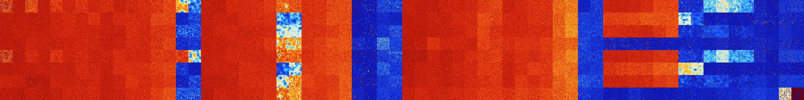

# B1278 (199680-200191)

<details>
    <summary>Initial Grid</summary>
    
</details>


<details>
    <summary>Initial Grid RLE</summary>

```
#C Exported from GoGoL (https://github.com/marrow16/gogol)
#C Wrap mode: Toroidal
#C Boundary mode: Dead
#C Step: 0
x = 100, y = 100, rule = B1278/S
bo12bo24bo13bo10bo11bo$48bo7bo16bo$11b2o48bo10bo8b2o2bo$28bo46bo20bo$
34bo4bo4bo4bo42bo$37bo4bobo5bobo2bo4bo$27bo15b2o4bo4bo$7bo2bo3bo6bo9bo
2bo52bo$13bo4bo3bo21b2o21bo10bo$5bo92bo$3bo2bo14bo17bo23bo20bo7bo$25bo
28bo$98bo$16bo60bo$3bo13b2o21bo$bo24bo14bo33bo8bo$bo57bo15bo$4b2o8bo19b
o13bo16bo28bo2bo$3bo19bobo25bo3b2o8bo15bo$9bo42bo$33bo9bo49bo$20bo31bo
20bo5bo$10bo17bo4bo14bo22bo4bo16bobo$20bo13bo8bo27bo17bo$14bo15bo4bo3bo
3bo6bo8bo12bo$4bo3bo36bo5bo14bo29bo$56bo2bo2b2o13bo$7bobo4bo5bo8bo15bo
5b2o6bo$20bo2bo37bo8bo10bo5bobo7bo$7bo19bo42bo8bo$48bo14bo24bo4b2o$18bo
9bobo9bo5bo27bo9bo$26bo7bo2bo6bo23bo21bo$12bo47bo8bo4bobobo5bo$20bo29bo
$bo59bo12bo$5bo9bo16bo19bo44bo$11bo17bo25bo5bo28bo$24bo18bo28bobo6bo5bo
8bo$43bo34bo$5bo10bo20bo14bo27bo$41bo50bo$4bo55bo$46bobo45bo$7bo24bo9bo
32bo12bo$56bobobo10bo4bo3bo5bo$43bo31bo20bo$20bo28bo2bo19bo8bo$24bo13bo
b3o3bo14bo$30bo4bo2bo48bo4bo$12bo25bo2bo25bo4bo6bo$16bo47bo$7bo4bo26bo
32bo$36bobo4bo4bo24bo$2bo36bo42bo$10bo20bo13b2o28bo3bo$bo72bo5bo$2bo40b
o34bo7bo$50bo9bo21b2o$49bo39bo$o4bo14b2o18bo15bo32bo$10bo15bo3bo32bobo
29bo2bo$44bo12b2o40bo$25bo24bobo3bo5bo35bo$14bo35bobo3bo37bo3bo$5bo15bo
8bo2bo23bo9bo21bo4bo$4bo25bo10bo9bo7bo27bo11bo$42bo26bo13bo$10bo2b2o45b
o29bo5bo$18bo7bo5bo3bo47bobo$2bo39bo25bo$11bo18bo49bo3bo$40bo5bo23bo27b
o$3bo4bo4bo3bobo12bo53bo$bo27b2o$43bo9bo4bo3bo4bo$46bo19bo16bo10bo$21bo
27bo2bo19bo11bo$bo38bo7bo11bo$15bo20bo2bo4bo11bo3bo$4bo23bo37bo19bo$25b
obobo40bo12bo$4bo22bo24bo21bo9bo3bo$2bo44bo13bo16bo8bo$18bobo45bo$24bo
11bo19bo2bo39bo$o17bo19bo3bo20b2o28bo2bo$bo18bo18bo28bo13bo4bo$18bo17bo
33bo2bobo7bo$6bo3bo16bo7bo23bo19bo12bo$38bo9bo35bo$6bo24bo11bo31bo21bob
o$27bo$4bo28bo2bo12bo29bo10bo$9bo13bo16bo2bo25bo$28bo10bo10bo8bo$85bo9b
obo$27bo18bo29bo10b2o$45bo21b2o2bo3bo13bo7bo$2bo38b2o19bo9b2obo!
```
</details>
<details>
    <summary>Thumbnail</summary>

</details>
<table>
<tr>
    <td><a href="./199680%20S%20Heat%20Map%20Activity.png"></a><br>S (199680)<br>G>1000</td>    <td><a href="./199681%20S0%20Heat%20Map%20Activity.png"></a><br>S0 (199681)<br>G>1000</td>    <td><a href="./199682%20S1%20Heat%20Map%20Activity.png"></a><br>S1 (199682)<br>G>1000</td>    <td><a href="./199683%20S01%20Heat%20Map%20Activity.png"></a><br>S01 (199683)<br>G>1000</td>    <td><a href="./199684%20S2%20Heat%20Map%20Activity.png"></a><br>S2 (199684)<br>G>1000</td>    <td><a href="./199685%20S02%20Heat%20Map%20Activity.png"></a><br>S02 (199685)<br>G>1000</td>    <td><a href="./199686%20S12%20Heat%20Map%20Activity.png"></a><br>S12 (199686)<br>G>1000</td>    <td><a href="./199687%20S012%20Heat%20Map%20Activity.png"></a><br>S012 (199687)<br>G>1000</td>    <td><a href="./199688%20S3%20Heat%20Map%20Activity.png"></a><br>S3 (199688)<br>G>1000</td>    <td><a href="./199689%20S03%20Heat%20Map%20Activity.png"></a><br>S03 (199689)<br>G>1000</td>    <td><a href="./199690%20S13%20Heat%20Map%20Activity.png"></a><br>S13 (199690)<br>G>1000</td>    <td><a href="./199691%20S013%20Heat%20Map%20Activity.png"></a><br>S013 (199691)<br>G>1000</td>    <td><a href="./199692%20S23%20Heat%20Map%20Activity.png"></a><br>S23 (199692)<br>G>1000</td>    <td><a href="./199693%20S023%20Heat%20Map%20Activity.png"></a><br>S023 (199693)<br>G>1000</td>    <td><a href="./199694%20S123%20Heat%20Map%20Activity.png"></a><br>S123 (199694)<br>G>1000</td>    <td><a href="./199695%20S0123%20Heat%20Map%20Activity.png"></a><br>S0123 (199695)<br>G>1000</td>    <td><a href="./199696%20S4%20Heat%20Map%20Activity.png"></a><br>S4 (199696)<br>G>1000</td>    <td><a href="./199697%20S04%20Heat%20Map%20Activity.png"></a><br>S04 (199697)<br>G>1000</td>    <td><a href="./199698%20S14%20Heat%20Map%20Activity.png"></a><br>S14 (199698)<br>G>1000</td>    <td><a href="./199699%20S014%20Heat%20Map%20Activity.png"></a><br>S014 (199699)<br>G>1000</td>    <td><a href="./199700%20S24%20Heat%20Map%20Activity.png"></a><br>S24 (199700)<br>G>1000</td>    <td><a href="./199701%20S024%20Heat%20Map%20Activity.png"></a><br>S024 (199701)<br>G>1000</td>    <td><a href="./199702%20S124%20Heat%20Map%20Activity.png"></a><br>S124 (199702)<br>G>1000</td>    <td><a href="./199703%20S0124%20Heat%20Map%20Activity.png"></a><br>S0124 (199703)<br>G>1000</td>    <td><a href="./199704%20S34%20Heat%20Map%20Activity.png"></a><br>S34 (199704)<br>G>1000</td>    <td><a href="./199705%20S034%20Heat%20Map%20Activity.png"></a><br>S034 (199705)<br>G>1000</td>    <td><a href="./199706%20S134%20Heat%20Map%20Activity.png"></a><br>S134 (199706)<br>G>1000</td>    <td><a href="./199707%20S0134%20Heat%20Map%20Activity.png"></a><br>S0134 (199707)<br>G>1000</td>    <td><a href="./199708%20S234%20Heat%20Map%20Activity.png"></a><br>S234 (199708)<br>G>1000</td>    <td><a href="./199709%20S0234%20Heat%20Map%20Activity.png"></a><br>S0234 (199709)<br>G>1000</td>    <td><a href="./199710%20S1234%20Heat%20Map%20Activity.png"></a><br>S1234 (199710)<br>R@29,p2</td>    <td><a href="./199711%20S01234%20Heat%20Map%20Activity.png"></a><br>S01234 (199711)<br>R@31,p6</td>    <td><a href="./199712%20S5%20Heat%20Map%20Activity.png"></a><br>S5 (199712)<br>G>1000</td>    <td><a href="./199713%20S05%20Heat%20Map%20Activity.png"></a><br>S05 (199713)<br>G>1000</td>    <td><a href="./199714%20S15%20Heat%20Map%20Activity.png"></a><br>S15 (199714)<br>G>1000</td>    <td><a href="./199715%20S015%20Heat%20Map%20Activity.png"></a><br>S015 (199715)<br>G>1000</td>    <td><a href="./199716%20S25%20Heat%20Map%20Activity.png"></a><br>S25 (199716)<br>G>1000</td>    <td><a href="./199717%20S025%20Heat%20Map%20Activity.png"></a><br>S025 (199717)<br>G>1000</td>    <td><a href="./199718%20S125%20Heat%20Map%20Activity.png"></a><br>S125 (199718)<br>G>1000</td>    <td><a href="./199719%20S0125%20Heat%20Map%20Activity.png"></a><br>S0125 (199719)<br>G>1000</td>    <td><a href="./199720%20S35%20Heat%20Map%20Activity.png"></a><br>S35 (199720)<br>G>1000</td>    <td><a href="./199721%20S035%20Heat%20Map%20Activity.png"></a><br>S035 (199721)<br>G>1000</td>    <td><a href="./199722%20S135%20Heat%20Map%20Activity.png"></a><br>S135 (199722)<br>G>1000</td>    <td><a href="./199723%20S0135%20Heat%20Map%20Activity.png"></a><br>S0135 (199723)<br>G>1000</td>    <td><a href="./199724%20S235%20Heat%20Map%20Activity.png"></a><br>S235 (199724)<br>G>1000</td>    <td><a href="./199725%20S0235%20Heat%20Map%20Activity.png"></a><br>S0235 (199725)<br>G>1000</td>    <td><a href="./199726%20S1235%20Heat%20Map%20Activity.png"></a><br>S1235 (199726)<br>R@151,p120</td>    <td><a href="./199727%20S01235%20Heat%20Map%20Activity.png"></a><br>S01235 (199727)<br>R@41,p6</td>    <td><a href="./199728%20S45%20Heat%20Map%20Activity.png"></a><br>S45 (199728)<br>G>1000</td>    <td><a href="./199729%20S045%20Heat%20Map%20Activity.png"></a><br>S045 (199729)<br>G>1000</td>    <td><a href="./199730%20S145%20Heat%20Map%20Activity.png"></a><br>S145 (199730)<br>G>1000</td>    <td><a href="./199731%20S0145%20Heat%20Map%20Activity.png"></a><br>S0145 (199731)<br>G>1000</td>    <td><a href="./199732%20S245%20Heat%20Map%20Activity.png"></a><br>S245 (199732)<br>G>1000</td>    <td><a href="./199733%20S0245%20Heat%20Map%20Activity.png"></a><br>S0245 (199733)<br>G>1000</td>    <td><a href="./199734%20S1245%20Heat%20Map%20Activity.png"></a><br>S1245 (199734)<br>R@462,p30</td>    <td><a href="./199735%20S01245%20Heat%20Map%20Activity.png"></a><br>S01245 (199735)<br>R@365,p60</td>    <td><a href="./199736%20S345%20Heat%20Map%20Activity.png"></a><br>S345 (199736)<br>G>1000</td>    <td><a href="./199737%20S0345%20Heat%20Map%20Activity.png"></a><br>S0345 (199737)<br>G>1000</td>    <td><a href="./199738%20S1345%20Heat%20Map%20Activity.png"></a><br>S1345 (199738)<br>G>1000</td>    <td><a href="./199739%20S01345%20Heat%20Map%20Activity.png"></a><br>S01345 (199739)<br>G>1000</td>    <td><a href="./199740%20S2345%20Heat%20Map%20Activity.png"></a><br>S2345 (199740)<br>R@76,p44</td>    <td><a href="./199741%20S02345%20Heat%20Map%20Activity.png"></a><br>S02345 (199741)<br>R@485,p420</td>    <td><a href="./199742%20S12345%20Heat%20Map%20Activity.png"></a><br>S12345 (199742)<br>R@27,p4</td>    <td><a href="./199743%20S012345%20Heat%20Map%20Activity.png"></a><br>S012345 (199743)<br>R@23,p4</td></tr>
<tr>
    <td><a href="./199744%20S6%20Heat%20Map%20Activity.png"></a><br>S6 (199744)<br>G>1000</td>    <td><a href="./199745%20S06%20Heat%20Map%20Activity.png"></a><br>S06 (199745)<br>G>1000</td>    <td><a href="./199746%20S16%20Heat%20Map%20Activity.png"></a><br>S16 (199746)<br>G>1000</td>    <td><a href="./199747%20S016%20Heat%20Map%20Activity.png"></a><br>S016 (199747)<br>G>1000</td>    <td><a href="./199748%20S26%20Heat%20Map%20Activity.png"></a><br>S26 (199748)<br>G>1000</td>    <td><a href="./199749%20S026%20Heat%20Map%20Activity.png"></a><br>S026 (199749)<br>G>1000</td>    <td><a href="./199750%20S126%20Heat%20Map%20Activity.png"></a><br>S126 (199750)<br>G>1000</td>    <td><a href="./199751%20S0126%20Heat%20Map%20Activity.png"></a><br>S0126 (199751)<br>G>1000</td>    <td><a href="./199752%20S36%20Heat%20Map%20Activity.png"></a><br>S36 (199752)<br>G>1000</td>    <td><a href="./199753%20S036%20Heat%20Map%20Activity.png"></a><br>S036 (199753)<br>G>1000</td>    <td><a href="./199754%20S136%20Heat%20Map%20Activity.png"></a><br>S136 (199754)<br>G>1000</td>    <td><a href="./199755%20S0136%20Heat%20Map%20Activity.png"></a><br>S0136 (199755)<br>G>1000</td>    <td><a href="./199756%20S236%20Heat%20Map%20Activity.png"></a><br>S236 (199756)<br>G>1000</td>    <td><a href="./199757%20S0236%20Heat%20Map%20Activity.png"></a><br>S0236 (199757)<br>G>1000</td>    <td><a href="./199758%20S1236%20Heat%20Map%20Activity.png"></a><br>S1236 (199758)<br>R@207,p140</td>    <td><a href="./199759%20S01236%20Heat%20Map%20Activity.png"></a><br>S01236 (199759)<br>R@55,p12</td>    <td><a href="./199760%20S46%20Heat%20Map%20Activity.png"></a><br>S46 (199760)<br>G>1000</td>    <td><a href="./199761%20S046%20Heat%20Map%20Activity.png"></a><br>S046 (199761)<br>G>1000</td>    <td><a href="./199762%20S146%20Heat%20Map%20Activity.png"></a><br>S146 (199762)<br>G>1000</td>    <td><a href="./199763%20S0146%20Heat%20Map%20Activity.png"></a><br>S0146 (199763)<br>G>1000</td>    <td><a href="./199764%20S246%20Heat%20Map%20Activity.png"></a><br>S246 (199764)<br>G>1000</td>    <td><a href="./199765%20S0246%20Heat%20Map%20Activity.png"></a><br>S0246 (199765)<br>G>1000</td>    <td><a href="./199766%20S1246%20Heat%20Map%20Activity.png"></a><br>S1246 (199766)<br>G>1000</td>    <td><a href="./199767%20S01246%20Heat%20Map%20Activity.png"></a><br>S01246 (199767)<br>G>1000</td>    <td><a href="./199768%20S346%20Heat%20Map%20Activity.png"></a><br>S346 (199768)<br>G>1000</td>    <td><a href="./199769%20S0346%20Heat%20Map%20Activity.png"></a><br>S0346 (199769)<br>G>1000</td>    <td><a href="./199770%20S1346%20Heat%20Map%20Activity.png"></a><br>S1346 (199770)<br>G>1000</td>    <td><a href="./199771%20S01346%20Heat%20Map%20Activity.png"></a><br>S01346 (199771)<br>G>1000</td>    <td><a href="./199772%20S2346%20Heat%20Map%20Activity.png"></a><br>S2346 (199772)<br>G>1000</td>    <td><a href="./199773%20S02346%20Heat%20Map%20Activity.png"></a><br>S02346 (199773)<br>G>1000</td>    <td><a href="./199774%20S12346%20Heat%20Map%20Activity.png"></a><br>S12346 (199774)<br>R@42,p20</td>    <td><a href="./199775%20S012346%20Heat%20Map%20Activity.png"></a><br>S012346 (199775)<br>R@80,p60</td>    <td><a href="./199776%20S56%20Heat%20Map%20Activity.png"></a><br>S56 (199776)<br>G>1000</td>    <td><a href="./199777%20S056%20Heat%20Map%20Activity.png"></a><br>S056 (199777)<br>G>1000</td>    <td><a href="./199778%20S156%20Heat%20Map%20Activity.png"></a><br>S156 (199778)<br>G>1000</td>    <td><a href="./199779%20S0156%20Heat%20Map%20Activity.png"></a><br>S0156 (199779)<br>G>1000</td>    <td><a href="./199780%20S256%20Heat%20Map%20Activity.png"></a><br>S256 (199780)<br>G>1000</td>    <td><a href="./199781%20S0256%20Heat%20Map%20Activity.png"></a><br>S0256 (199781)<br>G>1000</td>    <td><a href="./199782%20S1256%20Heat%20Map%20Activity.png"></a><br>S1256 (199782)<br>G>1000</td>    <td><a href="./199783%20S01256%20Heat%20Map%20Activity.png"></a><br>S01256 (199783)<br>G>1000</td>    <td><a href="./199784%20S356%20Heat%20Map%20Activity.png"></a><br>S356 (199784)<br>G>1000</td>    <td><a href="./199785%20S0356%20Heat%20Map%20Activity.png"></a><br>S0356 (199785)<br>G>1000</td>    <td><a href="./199786%20S1356%20Heat%20Map%20Activity.png"></a><br>S1356 (199786)<br>G>1000</td>    <td><a href="./199787%20S01356%20Heat%20Map%20Activity.png"></a><br>S01356 (199787)<br>G>1000</td>    <td><a href="./199788%20S2356%20Heat%20Map%20Activity.png"></a><br>S2356 (199788)<br>G>1000</td>    <td><a href="./199789%20S02356%20Heat%20Map%20Activity.png"></a><br>S02356 (199789)<br>G>1000</td>    <td><a href="./199790%20S12356%20Heat%20Map%20Activity.png"></a><br>S12356 (199790)<br>R@38,p6</td>    <td><a href="./199791%20S012356%20Heat%20Map%20Activity.png"></a><br>S012356 (199791)<br>R@52,p12</td>    <td><a href="./199792%20S456%20Heat%20Map%20Activity.png"></a><br>S456 (199792)<br>G>1000</td>    <td><a href="./199793%20S0456%20Heat%20Map%20Activity.png"></a><br>S0456 (199793)<br>G>1000</td>    <td><a href="./199794%20S1456%20Heat%20Map%20Activity.png"></a><br>S1456 (199794)<br>G>1000</td>    <td><a href="./199795%20S01456%20Heat%20Map%20Activity.png"></a><br>S01456 (199795)<br>G>1000</td>    <td><a href="./199796%20S2456%20Heat%20Map%20Activity.png"></a><br>S2456 (199796)<br>G>1000</td>    <td><a href="./199797%20S02456%20Heat%20Map%20Activity.png"></a><br>S02456 (199797)<br>G>1000</td>    <td><a href="./199798%20S12456%20Heat%20Map%20Activity.png"></a><br>S12456 (199798)<br>G>1000</td>    <td><a href="./199799%20S012456%20Heat%20Map%20Activity.png"></a><br>S012456 (199799)<br>G>1000</td>    <td><a href="./199800%20S3456%20Heat%20Map%20Activity.png"></a><br>S3456 (199800)<br>R@361,p280</td>    <td><a href="./199801%20S03456%20Heat%20Map%20Activity.png"></a><br>S03456 (199801)<br>R@206,p120</td>    <td><a href="./199802%20S13456%20Heat%20Map%20Activity.png"></a><br>S13456 (199802)<br>R@901,p840</td>    <td><a href="./199803%20S013456%20Heat%20Map%20Activity.png"></a><br>S013456 (199803)<br>R@332,p264</td>    <td><a href="./199804%20S23456%20Heat%20Map%20Activity.png"></a><br>S23456 (199804)<br>R@62,p12</td>    <td><a href="./199805%20S023456%20Heat%20Map%20Activity.png"></a><br>S023456 (199805)<br>R@440,p420</td>    <td><a href="./199806%20S123456%20Heat%20Map%20Activity.png"></a><br>S123456 (199806)<br>R@45,p4</td>    <td><a href="./199807%20S0123456%20Heat%20Map%20Activity.png"></a><br>S0123456 (199807)<br>R@79,p60</td></tr>
<tr>
    <td><a href="./199808%20S7%20Heat%20Map%20Activity.png"></a><br>S7 (199808)<br>G>1000</td>    <td><a href="./199809%20S07%20Heat%20Map%20Activity.png"></a><br>S07 (199809)<br>G>1000</td>    <td><a href="./199810%20S17%20Heat%20Map%20Activity.png"></a><br>S17 (199810)<br>G>1000</td>    <td><a href="./199811%20S017%20Heat%20Map%20Activity.png"></a><br>S017 (199811)<br>G>1000</td>    <td><a href="./199812%20S27%20Heat%20Map%20Activity.png"></a><br>S27 (199812)<br>G>1000</td>    <td><a href="./199813%20S027%20Heat%20Map%20Activity.png"></a><br>S027 (199813)<br>G>1000</td>    <td><a href="./199814%20S127%20Heat%20Map%20Activity.png"></a><br>S127 (199814)<br>G>1000</td>    <td><a href="./199815%20S0127%20Heat%20Map%20Activity.png"></a><br>S0127 (199815)<br>G>1000</td>    <td><a href="./199816%20S37%20Heat%20Map%20Activity.png"></a><br>S37 (199816)<br>G>1000</td>    <td><a href="./199817%20S037%20Heat%20Map%20Activity.png"></a><br>S037 (199817)<br>G>1000</td>    <td><a href="./199818%20S137%20Heat%20Map%20Activity.png"></a><br>S137 (199818)<br>G>1000</td>    <td><a href="./199819%20S0137%20Heat%20Map%20Activity.png"></a><br>S0137 (199819)<br>G>1000</td>    <td><a href="./199820%20S237%20Heat%20Map%20Activity.png"></a><br>S237 (199820)<br>G>1000</td>    <td><a href="./199821%20S0237%20Heat%20Map%20Activity.png"></a><br>S0237 (199821)<br>G>1000</td>    <td><a href="./199822%20S1237%20Heat%20Map%20Activity.png"></a><br>S1237 (199822)<br>R@114,p12</td>    <td><a href="./199823%20S01237%20Heat%20Map%20Activity.png"></a><br>S01237 (199823)<br>R@101,p24</td>    <td><a href="./199824%20S47%20Heat%20Map%20Activity.png"></a><br>S47 (199824)<br>G>1000</td>    <td><a href="./199825%20S047%20Heat%20Map%20Activity.png"></a><br>S047 (199825)<br>G>1000</td>    <td><a href="./199826%20S147%20Heat%20Map%20Activity.png"></a><br>S147 (199826)<br>G>1000</td>    <td><a href="./199827%20S0147%20Heat%20Map%20Activity.png"></a><br>S0147 (199827)<br>G>1000</td>    <td><a href="./199828%20S247%20Heat%20Map%20Activity.png"></a><br>S247 (199828)<br>G>1000</td>    <td><a href="./199829%20S0247%20Heat%20Map%20Activity.png"></a><br>S0247 (199829)<br>G>1000</td>    <td><a href="./199830%20S1247%20Heat%20Map%20Activity.png"></a><br>S1247 (199830)<br>G>1000</td>    <td><a href="./199831%20S01247%20Heat%20Map%20Activity.png"></a><br>S01247 (199831)<br>G>1000</td>    <td><a href="./199832%20S347%20Heat%20Map%20Activity.png"></a><br>S347 (199832)<br>G>1000</td>    <td><a href="./199833%20S0347%20Heat%20Map%20Activity.png"></a><br>S0347 (199833)<br>G>1000</td>    <td><a href="./199834%20S1347%20Heat%20Map%20Activity.png"></a><br>S1347 (199834)<br>G>1000</td>    <td><a href="./199835%20S01347%20Heat%20Map%20Activity.png"></a><br>S01347 (199835)<br>G>1000</td>    <td><a href="./199836%20S2347%20Heat%20Map%20Activity.png"></a><br>S2347 (199836)<br>G>1000</td>    <td><a href="./199837%20S02347%20Heat%20Map%20Activity.png"></a><br>S02347 (199837)<br>G>1000</td>    <td><a href="./199838%20S12347%20Heat%20Map%20Activity.png"></a><br>S12347 (199838)<br>R@37,p20</td>    <td><a href="./199839%20S012347%20Heat%20Map%20Activity.png"></a><br>S012347 (199839)<br>R@20,p2</td>    <td><a href="./199840%20S57%20Heat%20Map%20Activity.png"></a><br>S57 (199840)<br>G>1000</td>    <td><a href="./199841%20S057%20Heat%20Map%20Activity.png"></a><br>S057 (199841)<br>G>1000</td>    <td><a href="./199842%20S157%20Heat%20Map%20Activity.png"></a><br>S157 (199842)<br>G>1000</td>    <td><a href="./199843%20S0157%20Heat%20Map%20Activity.png"></a><br>S0157 (199843)<br>G>1000</td>    <td><a href="./199844%20S257%20Heat%20Map%20Activity.png"></a><br>S257 (199844)<br>G>1000</td>    <td><a href="./199845%20S0257%20Heat%20Map%20Activity.png"></a><br>S0257 (199845)<br>G>1000</td>    <td><a href="./199846%20S1257%20Heat%20Map%20Activity.png"></a><br>S1257 (199846)<br>G>1000</td>    <td><a href="./199847%20S01257%20Heat%20Map%20Activity.png"></a><br>S01257 (199847)<br>G>1000</td>    <td><a href="./199848%20S357%20Heat%20Map%20Activity.png"></a><br>S357 (199848)<br>G>1000</td>    <td><a href="./199849%20S0357%20Heat%20Map%20Activity.png"></a><br>S0357 (199849)<br>G>1000</td>    <td><a href="./199850%20S1357%20Heat%20Map%20Activity.png"></a><br>S1357 (199850)<br>G>1000</td>    <td><a href="./199851%20S01357%20Heat%20Map%20Activity.png"></a><br>S01357 (199851)<br>G>1000</td>    <td><a href="./199852%20S2357%20Heat%20Map%20Activity.png"></a><br>S2357 (199852)<br>G>1000</td>    <td><a href="./199853%20S02357%20Heat%20Map%20Activity.png"></a><br>S02357 (199853)<br>G>1000</td>    <td><a href="./199854%20S12357%20Heat%20Map%20Activity.png"></a><br>S12357 (199854)<br>R@38,p12</td>    <td><a href="./199855%20S012357%20Heat%20Map%20Activity.png"></a><br>S012357 (199855)<br>R@32,p6</td>    <td><a href="./199856%20S457%20Heat%20Map%20Activity.png"></a><br>S457 (199856)<br>G>1000</td>    <td><a href="./199857%20S0457%20Heat%20Map%20Activity.png"></a><br>S0457 (199857)<br>G>1000</td>    <td><a href="./199858%20S1457%20Heat%20Map%20Activity.png"></a><br>S1457 (199858)<br>G>1000</td>    <td><a href="./199859%20S01457%20Heat%20Map%20Activity.png"></a><br>S01457 (199859)<br>G>1000</td>    <td><a href="./199860%20S2457%20Heat%20Map%20Activity.png"></a><br>S2457 (199860)<br>G>1000</td>    <td><a href="./199861%20S02457%20Heat%20Map%20Activity.png"></a><br>S02457 (199861)<br>G>1000</td>    <td><a href="./199862%20S12457%20Heat%20Map%20Activity.png"></a><br>S12457 (199862)<br>G>1000</td>    <td><a href="./199863%20S012457%20Heat%20Map%20Activity.png"></a><br>S012457 (199863)<br>R@980,p6</td>    <td><a href="./199864%20S3457%20Heat%20Map%20Activity.png"></a><br>S3457 (199864)<br>G>1000</td>    <td><a href="./199865%20S03457%20Heat%20Map%20Activity.png"></a><br>S03457 (199865)<br>G>1000</td>    <td><a href="./199866%20S13457%20Heat%20Map%20Activity.png"></a><br>S13457 (199866)<br>G>1000</td>    <td><a href="./199867%20S013457%20Heat%20Map%20Activity.png"></a><br>S013457 (199867)<br>G>1000</td>    <td><a href="./199868%20S23457%20Heat%20Map%20Activity.png"></a><br>S23457 (199868)<br>R@79,p60</td>    <td><a href="./199869%20S023457%20Heat%20Map%20Activity.png"></a><br>S023457 (199869)<br>R@270,p240</td>    <td><a href="./199870%20S123457%20Heat%20Map%20Activity.png"></a><br>S123457 (199870)<br>R@30,p12</td>    <td><a href="./199871%20S0123457%20Heat%20Map%20Activity.png"></a><br>S0123457 (199871)<br>R@77,p60</td></tr>
<tr>
    <td><a href="./199872%20S67%20Heat%20Map%20Activity.png"></a><br>S67 (199872)<br>G>1000</td>    <td><a href="./199873%20S067%20Heat%20Map%20Activity.png"></a><br>S067 (199873)<br>G>1000</td>    <td><a href="./199874%20S167%20Heat%20Map%20Activity.png"></a><br>S167 (199874)<br>G>1000</td>    <td><a href="./199875%20S0167%20Heat%20Map%20Activity.png"></a><br>S0167 (199875)<br>G>1000</td>    <td><a href="./199876%20S267%20Heat%20Map%20Activity.png"></a><br>S267 (199876)<br>G>1000</td>    <td><a href="./199877%20S0267%20Heat%20Map%20Activity.png"></a><br>S0267 (199877)<br>G>1000</td>    <td><a href="./199878%20S1267%20Heat%20Map%20Activity.png"></a><br>S1267 (199878)<br>G>1000</td>    <td><a href="./199879%20S01267%20Heat%20Map%20Activity.png"></a><br>S01267 (199879)<br>G>1000</td>    <td><a href="./199880%20S367%20Heat%20Map%20Activity.png"></a><br>S367 (199880)<br>G>1000</td>    <td><a href="./199881%20S0367%20Heat%20Map%20Activity.png"></a><br>S0367 (199881)<br>G>1000</td>    <td><a href="./199882%20S1367%20Heat%20Map%20Activity.png"></a><br>S1367 (199882)<br>G>1000</td>    <td><a href="./199883%20S01367%20Heat%20Map%20Activity.png"></a><br>S01367 (199883)<br>G>1000</td>    <td><a href="./199884%20S2367%20Heat%20Map%20Activity.png"></a><br>S2367 (199884)<br>G>1000</td>    <td><a href="./199885%20S02367%20Heat%20Map%20Activity.png"></a><br>S02367 (199885)<br>G>1000</td>    <td><a href="./199886%20S12367%20Heat%20Map%20Activity.png"></a><br>S12367 (199886)<br>R@113,p60</td>    <td><a href="./199887%20S012367%20Heat%20Map%20Activity.png"></a><br>S012367 (199887)<br>R@63,p12</td>    <td><a href="./199888%20S467%20Heat%20Map%20Activity.png"></a><br>S467 (199888)<br>G>1000</td>    <td><a href="./199889%20S0467%20Heat%20Map%20Activity.png"></a><br>S0467 (199889)<br>G>1000</td>    <td><a href="./199890%20S1467%20Heat%20Map%20Activity.png"></a><br>S1467 (199890)<br>G>1000</td>    <td><a href="./199891%20S01467%20Heat%20Map%20Activity.png"></a><br>S01467 (199891)<br>G>1000</td>    <td><a href="./199892%20S2467%20Heat%20Map%20Activity.png"></a><br>S2467 (199892)<br>G>1000</td>    <td><a href="./199893%20S02467%20Heat%20Map%20Activity.png"></a><br>S02467 (199893)<br>G>1000</td>    <td><a href="./199894%20S12467%20Heat%20Map%20Activity.png"></a><br>S12467 (199894)<br>G>1000</td>    <td><a href="./199895%20S012467%20Heat%20Map%20Activity.png"></a><br>S012467 (199895)<br>G>1000</td>    <td><a href="./199896%20S3467%20Heat%20Map%20Activity.png"></a><br>S3467 (199896)<br>G>1000</td>    <td><a href="./199897%20S03467%20Heat%20Map%20Activity.png"></a><br>S03467 (199897)<br>G>1000</td>    <td><a href="./199898%20S13467%20Heat%20Map%20Activity.png"></a><br>S13467 (199898)<br>G>1000</td>    <td><a href="./199899%20S013467%20Heat%20Map%20Activity.png"></a><br>S013467 (199899)<br>G>1000</td>    <td><a href="./199900%20S23467%20Heat%20Map%20Activity.png"></a><br>S23467 (199900)<br>R@64,p8</td>    <td><a href="./199901%20S023467%20Heat%20Map%20Activity.png"></a><br>S023467 (199901)<br>R@160,p84</td>    <td><a href="./199902%20S123467%20Heat%20Map%20Activity.png"></a><br>S123467 (199902)<br>S@15</td>    <td><a href="./199903%20S0123467%20Heat%20Map%20Activity.png"></a><br>S0123467 (199903)<br>R@21,p2</td>    <td><a href="./199904%20S567%20Heat%20Map%20Activity.png"></a><br>S567 (199904)<br>G>1000</td>    <td><a href="./199905%20S0567%20Heat%20Map%20Activity.png"></a><br>S0567 (199905)<br>G>1000</td>    <td><a href="./199906%20S1567%20Heat%20Map%20Activity.png"></a><br>S1567 (199906)<br>G>1000</td>    <td><a href="./199907%20S01567%20Heat%20Map%20Activity.png"></a><br>S01567 (199907)<br>G>1000</td>    <td><a href="./199908%20S2567%20Heat%20Map%20Activity.png"></a><br>S2567 (199908)<br>G>1000</td>    <td><a href="./199909%20S02567%20Heat%20Map%20Activity.png"></a><br>S02567 (199909)<br>G>1000</td>    <td><a href="./199910%20S12567%20Heat%20Map%20Activity.png"></a><br>S12567 (199910)<br>G>1000</td>    <td><a href="./199911%20S012567%20Heat%20Map%20Activity.png"></a><br>S012567 (199911)<br>G>1000</td>    <td><a href="./199912%20S3567%20Heat%20Map%20Activity.png"></a><br>S3567 (199912)<br>G>1000</td>    <td><a href="./199913%20S03567%20Heat%20Map%20Activity.png"></a><br>S03567 (199913)<br>G>1000</td>    <td><a href="./199914%20S13567%20Heat%20Map%20Activity.png"></a><br>S13567 (199914)<br>G>1000</td>    <td><a href="./199915%20S013567%20Heat%20Map%20Activity.png"></a><br>S013567 (199915)<br>G>1000</td>    <td><a href="./199916%20S23567%20Heat%20Map%20Activity.png"></a><br>S23567 (199916)<br>G>1000</td>    <td><a href="./199917%20S023567%20Heat%20Map%20Activity.png"></a><br>S023567 (199917)<br>G>1000</td>    <td><a href="./199918%20S123567%20Heat%20Map%20Activity.png"></a><br>S123567 (199918)<br>R@38,p2</td>    <td><a href="./199919%20S0123567%20Heat%20Map%20Activity.png"></a><br>S0123567 (199919)<br>R@47,p6</td>    <td><a href="./199920%20S4567%20Heat%20Map%20Activity.png"></a><br>S4567 (199920)<br>G>1000</td>    <td><a href="./199921%20S04567%20Heat%20Map%20Activity.png"></a><br>S04567 (199921)<br>G>1000</td>    <td><a href="./199922%20S14567%20Heat%20Map%20Activity.png"></a><br>S14567 (199922)<br>G>1000</td>    <td><a href="./199923%20S014567%20Heat%20Map%20Activity.png"></a><br>S014567 (199923)<br>G>1000</td>    <td><a href="./199924%20S24567%20Heat%20Map%20Activity.png"></a><br>S24567 (199924)<br>G>1000</td>    <td><a href="./199925%20S024567%20Heat%20Map%20Activity.png"></a><br>S024567 (199925)<br>R@985,p840</td>    <td><a href="./199926%20S124567%20Heat%20Map%20Activity.png"></a><br>S124567 (199926)<br>R@215,p60</td>    <td><a href="./199927%20S0124567%20Heat%20Map%20Activity.png"></a><br>S0124567 (199927)<br>R@289,p60</td>    <td><a href="./199928%20S34567%20Heat%20Map%20Activity.png"></a><br>S34567 (199928)<br>R@91,p60</td>    <td><a href="./199929%20S034567%20Heat%20Map%20Activity.png"></a><br>S034567 (199929)<br>R@44,p12</td>    <td><a href="./199930%20S134567%20Heat%20Map%20Activity.png"></a><br>S134567 (199930)<br>R@83,p60</td>    <td><a href="./199931%20S0134567%20Heat%20Map%20Activity.png"></a><br>S0134567 (199931)<br>R@54,p24</td>    <td><a href="./199932%20S234567%20Heat%20Map%20Activity.png"></a><br>S234567 (199932)<br>R@46,p12</td>    <td><a href="./199933%20S0234567%20Heat%20Map%20Activity.png"></a><br>S0234567 (199933)<br>R@86,p60</td>    <td><a href="./199934%20S1234567%20Heat%20Map%20Activity.png"></a><br>S1234567 (199934)<br>R@35,p12</td>    <td><a href="./199935%20S01234567%20Heat%20Map%20Activity.png"></a><br>S01234567 (199935)<br>R@85,p60</td></tr>
<tr>
    <td><a href="./199936%20S8%20Heat%20Map%20Activity.png"></a><br>S8 (199936)<br>G>1000</td>    <td><a href="./199937%20S08%20Heat%20Map%20Activity.png"></a><br>S08 (199937)<br>G>1000</td>    <td><a href="./199938%20S18%20Heat%20Map%20Activity.png"></a><br>S18 (199938)<br>G>1000</td>    <td><a href="./199939%20S018%20Heat%20Map%20Activity.png"></a><br>S018 (199939)<br>G>1000</td>    <td><a href="./199940%20S28%20Heat%20Map%20Activity.png"></a><br>S28 (199940)<br>G>1000</td>    <td><a href="./199941%20S028%20Heat%20Map%20Activity.png"></a><br>S028 (199941)<br>G>1000</td>    <td><a href="./199942%20S128%20Heat%20Map%20Activity.png"></a><br>S128 (199942)<br>G>1000</td>    <td><a href="./199943%20S0128%20Heat%20Map%20Activity.png"></a><br>S0128 (199943)<br>G>1000</td>    <td><a href="./199944%20S38%20Heat%20Map%20Activity.png"></a><br>S38 (199944)<br>G>1000</td>    <td><a href="./199945%20S038%20Heat%20Map%20Activity.png"></a><br>S038 (199945)<br>G>1000</td>    <td><a href="./199946%20S138%20Heat%20Map%20Activity.png"></a><br>S138 (199946)<br>G>1000</td>    <td><a href="./199947%20S0138%20Heat%20Map%20Activity.png"></a><br>S0138 (199947)<br>G>1000</td>    <td><a href="./199948%20S238%20Heat%20Map%20Activity.png"></a><br>S238 (199948)<br>G>1000</td>    <td><a href="./199949%20S0238%20Heat%20Map%20Activity.png"></a><br>S0238 (199949)<br>G>1000</td>    <td><a href="./199950%20S1238%20Heat%20Map%20Activity.png"></a><br>S1238 (199950)<br>G>1000</td>    <td><a href="./199951%20S01238%20Heat%20Map%20Activity.png"></a><br>S01238 (199951)<br>G>1000</td>    <td><a href="./199952%20S48%20Heat%20Map%20Activity.png"></a><br>S48 (199952)<br>G>1000</td>    <td><a href="./199953%20S048%20Heat%20Map%20Activity.png"></a><br>S048 (199953)<br>G>1000</td>    <td><a href="./199954%20S148%20Heat%20Map%20Activity.png"></a><br>S148 (199954)<br>G>1000</td>    <td><a href="./199955%20S0148%20Heat%20Map%20Activity.png"></a><br>S0148 (199955)<br>G>1000</td>    <td><a href="./199956%20S248%20Heat%20Map%20Activity.png"></a><br>S248 (199956)<br>G>1000</td>    <td><a href="./199957%20S0248%20Heat%20Map%20Activity.png"></a><br>S0248 (199957)<br>G>1000</td>    <td><a href="./199958%20S1248%20Heat%20Map%20Activity.png"></a><br>S1248 (199958)<br>G>1000</td>    <td><a href="./199959%20S01248%20Heat%20Map%20Activity.png"></a><br>S01248 (199959)<br>G>1000</td>    <td><a href="./199960%20S348%20Heat%20Map%20Activity.png"></a><br>S348 (199960)<br>G>1000</td>    <td><a href="./199961%20S0348%20Heat%20Map%20Activity.png"></a><br>S0348 (199961)<br>G>1000</td>    <td><a href="./199962%20S1348%20Heat%20Map%20Activity.png"></a><br>S1348 (199962)<br>G>1000</td>    <td><a href="./199963%20S01348%20Heat%20Map%20Activity.png"></a><br>S01348 (199963)<br>G>1000</td>    <td><a href="./199964%20S2348%20Heat%20Map%20Activity.png"></a><br>S2348 (199964)<br>G>1000</td>    <td><a href="./199965%20S02348%20Heat%20Map%20Activity.png"></a><br>S02348 (199965)<br>G>1000</td>    <td><a href="./199966%20S12348%20Heat%20Map%20Activity.png"></a><br>S12348 (199966)<br>R@31,p10</td>    <td><a href="./199967%20S012348%20Heat%20Map%20Activity.png"></a><br>S012348 (199967)<br>R@21,p2</td>    <td><a href="./199968%20S58%20Heat%20Map%20Activity.png"></a><br>S58 (199968)<br>G>1000</td>    <td><a href="./199969%20S058%20Heat%20Map%20Activity.png"></a><br>S058 (199969)<br>G>1000</td>    <td><a href="./199970%20S158%20Heat%20Map%20Activity.png"></a><br>S158 (199970)<br>G>1000</td>    <td><a href="./199971%20S0158%20Heat%20Map%20Activity.png"></a><br>S0158 (199971)<br>G>1000</td>    <td><a href="./199972%20S258%20Heat%20Map%20Activity.png"></a><br>S258 (199972)<br>G>1000</td>    <td><a href="./199973%20S0258%20Heat%20Map%20Activity.png"></a><br>S0258 (199973)<br>G>1000</td>    <td><a href="./199974%20S1258%20Heat%20Map%20Activity.png"></a><br>S1258 (199974)<br>G>1000</td>    <td><a href="./199975%20S01258%20Heat%20Map%20Activity.png"></a><br>S01258 (199975)<br>G>1000</td>    <td><a href="./199976%20S358%20Heat%20Map%20Activity.png"></a><br>S358 (199976)<br>G>1000</td>    <td><a href="./199977%20S0358%20Heat%20Map%20Activity.png"></a><br>S0358 (199977)<br>G>1000</td>    <td><a href="./199978%20S1358%20Heat%20Map%20Activity.png"></a><br>S1358 (199978)<br>G>1000</td>    <td><a href="./199979%20S01358%20Heat%20Map%20Activity.png"></a><br>S01358 (199979)<br>G>1000</td>    <td><a href="./199980%20S2358%20Heat%20Map%20Activity.png"></a><br>S2358 (199980)<br>G>1000</td>    <td><a href="./199981%20S02358%20Heat%20Map%20Activity.png"></a><br>S02358 (199981)<br>G>1000</td>    <td><a href="./199982%20S12358%20Heat%20Map%20Activity.png"></a><br>S12358 (199982)<br>R@38,p8</td>    <td><a href="./199983%20S012358%20Heat%20Map%20Activity.png"></a><br>S012358 (199983)<br>R@41,p6</td>    <td><a href="./199984%20S458%20Heat%20Map%20Activity.png"></a><br>S458 (199984)<br>G>1000</td>    <td><a href="./199985%20S0458%20Heat%20Map%20Activity.png"></a><br>S0458 (199985)<br>G>1000</td>    <td><a href="./199986%20S1458%20Heat%20Map%20Activity.png"></a><br>S1458 (199986)<br>G>1000</td>    <td><a href="./199987%20S01458%20Heat%20Map%20Activity.png"></a><br>S01458 (199987)<br>G>1000</td>    <td><a href="./199988%20S2458%20Heat%20Map%20Activity.png"></a><br>S2458 (199988)<br>G>1000</td>    <td><a href="./199989%20S02458%20Heat%20Map%20Activity.png"></a><br>S02458 (199989)<br>G>1000</td>    <td><a href="./199990%20S12458%20Heat%20Map%20Activity.png"></a><br>S12458 (199990)<br>R@408,p6</td>    <td><a href="./199991%20S012458%20Heat%20Map%20Activity.png"></a><br>S012458 (199991)<br>R@526,p12</td>    <td><a href="./199992%20S3458%20Heat%20Map%20Activity.png"></a><br>S3458 (199992)<br>G>1000</td>    <td><a href="./199993%20S03458%20Heat%20Map%20Activity.png"></a><br>S03458 (199993)<br>G>1000</td>    <td><a href="./199994%20S13458%20Heat%20Map%20Activity.png"></a><br>S13458 (199994)<br>G>1000</td>    <td><a href="./199995%20S013458%20Heat%20Map%20Activity.png"></a><br>S013458 (199995)<br>G>1000</td>    <td><a href="./199996%20S23458%20Heat%20Map%20Activity.png"></a><br>S23458 (199996)<br>R@44,p12</td>    <td><a href="./199997%20S023458%20Heat%20Map%20Activity.png"></a><br>S023458 (199997)<br>R@468,p420</td>    <td><a href="./199998%20S123458%20Heat%20Map%20Activity.png"></a><br>S123458 (199998)<br>R@18,p4</td>    <td><a href="./199999%20S0123458%20Heat%20Map%20Activity.png"></a><br>S0123458 (199999)<br>R@17,p4</td></tr>
<tr>
    <td><a href="./200000%20S68%20Heat%20Map%20Activity.png"></a><br>S68 (200000)<br>G>1000</td>    <td><a href="./200001%20S068%20Heat%20Map%20Activity.png"></a><br>S068 (200001)<br>G>1000</td>    <td><a href="./200002%20S168%20Heat%20Map%20Activity.png"></a><br>S168 (200002)<br>G>1000</td>    <td><a href="./200003%20S0168%20Heat%20Map%20Activity.png"></a><br>S0168 (200003)<br>G>1000</td>    <td><a href="./200004%20S268%20Heat%20Map%20Activity.png"></a><br>S268 (200004)<br>G>1000</td>    <td><a href="./200005%20S0268%20Heat%20Map%20Activity.png"></a><br>S0268 (200005)<br>G>1000</td>    <td><a href="./200006%20S1268%20Heat%20Map%20Activity.png"></a><br>S1268 (200006)<br>G>1000</td>    <td><a href="./200007%20S01268%20Heat%20Map%20Activity.png"></a><br>S01268 (200007)<br>G>1000</td>    <td><a href="./200008%20S368%20Heat%20Map%20Activity.png"></a><br>S368 (200008)<br>G>1000</td>    <td><a href="./200009%20S0368%20Heat%20Map%20Activity.png"></a><br>S0368 (200009)<br>G>1000</td>    <td><a href="./200010%20S1368%20Heat%20Map%20Activity.png"></a><br>S1368 (200010)<br>G>1000</td>    <td><a href="./200011%20S01368%20Heat%20Map%20Activity.png"></a><br>S01368 (200011)<br>G>1000</td>    <td><a href="./200012%20S2368%20Heat%20Map%20Activity.png"></a><br>S2368 (200012)<br>G>1000</td>    <td><a href="./200013%20S02368%20Heat%20Map%20Activity.png"></a><br>S02368 (200013)<br>G>1000</td>    <td><a href="./200014%20S12368%20Heat%20Map%20Activity.png"></a><br>S12368 (200014)<br>R@87,p24</td>    <td><a href="./200015%20S012368%20Heat%20Map%20Activity.png"></a><br>S012368 (200015)<br>R@460,p420</td>    <td><a href="./200016%20S468%20Heat%20Map%20Activity.png"></a><br>S468 (200016)<br>G>1000</td>    <td><a href="./200017%20S0468%20Heat%20Map%20Activity.png"></a><br>S0468 (200017)<br>G>1000</td>    <td><a href="./200018%20S1468%20Heat%20Map%20Activity.png"></a><br>S1468 (200018)<br>G>1000</td>    <td><a href="./200019%20S01468%20Heat%20Map%20Activity.png"></a><br>S01468 (200019)<br>G>1000</td>    <td><a href="./200020%20S2468%20Heat%20Map%20Activity.png"></a><br>S2468 (200020)<br>G>1000</td>    <td><a href="./200021%20S02468%20Heat%20Map%20Activity.png"></a><br>S02468 (200021)<br>G>1000</td>    <td><a href="./200022%20S12468%20Heat%20Map%20Activity.png"></a><br>S12468 (200022)<br>G>1000</td>    <td><a href="./200023%20S012468%20Heat%20Map%20Activity.png"></a><br>S012468 (200023)<br>G>1000</td>    <td><a href="./200024%20S3468%20Heat%20Map%20Activity.png"></a><br>S3468 (200024)<br>G>1000</td>    <td><a href="./200025%20S03468%20Heat%20Map%20Activity.png"></a><br>S03468 (200025)<br>G>1000</td>    <td><a href="./200026%20S13468%20Heat%20Map%20Activity.png"></a><br>S13468 (200026)<br>G>1000</td>    <td><a href="./200027%20S013468%20Heat%20Map%20Activity.png"></a><br>S013468 (200027)<br>G>1000</td>    <td><a href="./200028%20S23468%20Heat%20Map%20Activity.png"></a><br>S23468 (200028)<br>R@185,p60</td>    <td><a href="./200029%20S023468%20Heat%20Map%20Activity.png"></a><br>S023468 (200029)<br>G>1000</td>    <td><a href="./200030%20S123468%20Heat%20Map%20Activity.png"></a><br>S123468 (200030)<br>R@17,p2</td>    <td><a href="./200031%20S0123468%20Heat%20Map%20Activity.png"></a><br>S0123468 (200031)<br>R@21,p6</td>    <td><a href="./200032%20S568%20Heat%20Map%20Activity.png"></a><br>S568 (200032)<br>G>1000</td>    <td><a href="./200033%20S0568%20Heat%20Map%20Activity.png"></a><br>S0568 (200033)<br>G>1000</td>    <td><a href="./200034%20S1568%20Heat%20Map%20Activity.png"></a><br>S1568 (200034)<br>G>1000</td>    <td><a href="./200035%20S01568%20Heat%20Map%20Activity.png"></a><br>S01568 (200035)<br>G>1000</td>    <td><a href="./200036%20S2568%20Heat%20Map%20Activity.png"></a><br>S2568 (200036)<br>G>1000</td>    <td><a href="./200037%20S02568%20Heat%20Map%20Activity.png"></a><br>S02568 (200037)<br>G>1000</td>    <td><a href="./200038%20S12568%20Heat%20Map%20Activity.png"></a><br>S12568 (200038)<br>G>1000</td>    <td><a href="./200039%20S012568%20Heat%20Map%20Activity.png"></a><br>S012568 (200039)<br>G>1000</td>    <td><a href="./200040%20S3568%20Heat%20Map%20Activity.png"></a><br>S3568 (200040)<br>G>1000</td>    <td><a href="./200041%20S03568%20Heat%20Map%20Activity.png"></a><br>S03568 (200041)<br>G>1000</td>    <td><a href="./200042%20S13568%20Heat%20Map%20Activity.png"></a><br>S13568 (200042)<br>G>1000</td>    <td><a href="./200043%20S013568%20Heat%20Map%20Activity.png"></a><br>S013568 (200043)<br>G>1000</td>    <td><a href="./200044%20S23568%20Heat%20Map%20Activity.png"></a><br>S23568 (200044)<br>G>1000</td>    <td><a href="./200045%20S023568%20Heat%20Map%20Activity.png"></a><br>S023568 (200045)<br>G>1000</td>    <td><a href="./200046%20S123568%20Heat%20Map%20Activity.png"></a><br>S123568 (200046)<br>R@57,p12</td>    <td><a href="./200047%20S0123568%20Heat%20Map%20Activity.png"></a><br>S0123568 (200047)<br>R@39,p6</td>    <td><a href="./200048%20S4568%20Heat%20Map%20Activity.png"></a><br>S4568 (200048)<br>G>1000</td>    <td><a href="./200049%20S04568%20Heat%20Map%20Activity.png"></a><br>S04568 (200049)<br>G>1000</td>    <td><a href="./200050%20S14568%20Heat%20Map%20Activity.png"></a><br>S14568 (200050)<br>G>1000</td>    <td><a href="./200051%20S014568%20Heat%20Map%20Activity.png"></a><br>S014568 (200051)<br>G>1000</td>    <td><a href="./200052%20S24568%20Heat%20Map%20Activity.png"></a><br>S24568 (200052)<br>G>1000</td>    <td><a href="./200053%20S024568%20Heat%20Map%20Activity.png"></a><br>S024568 (200053)<br>G>1000</td>    <td><a href="./200054%20S124568%20Heat%20Map%20Activity.png"></a><br>S124568 (200054)<br>G>1000</td>    <td><a href="./200055%20S0124568%20Heat%20Map%20Activity.png"></a><br>S0124568 (200055)<br>G>1000</td>    <td><a href="./200056%20S34568%20Heat%20Map%20Activity.png"></a><br>S34568 (200056)<br>R@495,p420</td>    <td><a href="./200057%20S034568%20Heat%20Map%20Activity.png"></a><br>S034568 (200057)<br>R@232,p180</td>    <td><a href="./200058%20S134568%20Heat%20Map%20Activity.png"></a><br>S134568 (200058)<br>R@893,p840</td>    <td><a href="./200059%20S0134568%20Heat%20Map%20Activity.png"></a><br>S0134568 (200059)<br>R@249,p180</td>    <td><a href="./200060%20S234568%20Heat%20Map%20Activity.png"></a><br>S234568 (200060)<br>R@208,p180</td>    <td><a href="./200061%20S0234568%20Heat%20Map%20Activity.png"></a><br>S0234568 (200061)<br>G>1000</td>    <td><a href="./200062%20S1234568%20Heat%20Map%20Activity.png"></a><br>S1234568 (200062)<br>R@201,p180</td>    <td><a href="./200063%20S01234568%20Heat%20Map%20Activity.png"></a><br>S01234568 (200063)<br>G>1000</td></tr>
<tr>
    <td><a href="./200064%20S78%20Heat%20Map%20Activity.png"></a><br>S78 (200064)<br>G>1000</td>    <td><a href="./200065%20S078%20Heat%20Map%20Activity.png"></a><br>S078 (200065)<br>G>1000</td>    <td><a href="./200066%20S178%20Heat%20Map%20Activity.png"></a><br>S178 (200066)<br>G>1000</td>    <td><a href="./200067%20S0178%20Heat%20Map%20Activity.png"></a><br>S0178 (200067)<br>G>1000</td>    <td><a href="./200068%20S278%20Heat%20Map%20Activity.png"></a><br>S278 (200068)<br>G>1000</td>    <td><a href="./200069%20S0278%20Heat%20Map%20Activity.png"></a><br>S0278 (200069)<br>G>1000</td>    <td><a href="./200070%20S1278%20Heat%20Map%20Activity.png"></a><br>S1278 (200070)<br>G>1000</td>    <td><a href="./200071%20S01278%20Heat%20Map%20Activity.png"></a><br>S01278 (200071)<br>G>1000</td>    <td><a href="./200072%20S378%20Heat%20Map%20Activity.png"></a><br>S378 (200072)<br>G>1000</td>    <td><a href="./200073%20S0378%20Heat%20Map%20Activity.png"></a><br>S0378 (200073)<br>G>1000</td>    <td><a href="./200074%20S1378%20Heat%20Map%20Activity.png"></a><br>S1378 (200074)<br>G>1000</td>    <td><a href="./200075%20S01378%20Heat%20Map%20Activity.png"></a><br>S01378 (200075)<br>G>1000</td>    <td><a href="./200076%20S2378%20Heat%20Map%20Activity.png"></a><br>S2378 (200076)<br>G>1000</td>    <td><a href="./200077%20S02378%20Heat%20Map%20Activity.png"></a><br>S02378 (200077)<br>G>1000</td>    <td><a href="./200078%20S12378%20Heat%20Map%20Activity.png"></a><br>S12378 (200078)<br>R@481,p396</td>    <td><a href="./200079%20S012378%20Heat%20Map%20Activity.png"></a><br>S012378 (200079)<br>R@101,p24</td>    <td><a href="./200080%20S478%20Heat%20Map%20Activity.png"></a><br>S478 (200080)<br>G>1000</td>    <td><a href="./200081%20S0478%20Heat%20Map%20Activity.png"></a><br>S0478 (200081)<br>G>1000</td>    <td><a href="./200082%20S1478%20Heat%20Map%20Activity.png"></a><br>S1478 (200082)<br>G>1000</td>    <td><a href="./200083%20S01478%20Heat%20Map%20Activity.png"></a><br>S01478 (200083)<br>G>1000</td>    <td><a href="./200084%20S2478%20Heat%20Map%20Activity.png"></a><br>S2478 (200084)<br>G>1000</td>    <td><a href="./200085%20S02478%20Heat%20Map%20Activity.png"></a><br>S02478 (200085)<br>G>1000</td>    <td><a href="./200086%20S12478%20Heat%20Map%20Activity.png"></a><br>S12478 (200086)<br>G>1000</td>    <td><a href="./200087%20S012478%20Heat%20Map%20Activity.png"></a><br>S012478 (200087)<br>G>1000</td>    <td><a href="./200088%20S3478%20Heat%20Map%20Activity.png"></a><br>S3478 (200088)<br>G>1000</td>    <td><a href="./200089%20S03478%20Heat%20Map%20Activity.png"></a><br>S03478 (200089)<br>G>1000</td>    <td><a href="./200090%20S13478%20Heat%20Map%20Activity.png"></a><br>S13478 (200090)<br>G>1000</td>    <td><a href="./200091%20S013478%20Heat%20Map%20Activity.png"></a><br>S013478 (200091)<br>G>1000</td>    <td><a href="./200092%20S23478%20Heat%20Map%20Activity.png"></a><br>S23478 (200092)<br>R@205,p140</td>    <td><a href="./200093%20S023478%20Heat%20Map%20Activity.png"></a><br>S023478 (200093)<br>G>1000</td>    <td><a href="./200094%20S123478%20Heat%20Map%20Activity.png"></a><br>S123478 (200094)<br>R@30,p12</td>    <td><a href="./200095%20S0123478%20Heat%20Map%20Activity.png"></a><br>S0123478 (200095)<br>R@17,p4</td>    <td><a href="./200096%20S578%20Heat%20Map%20Activity.png"></a><br>S578 (200096)<br>G>1000</td>    <td><a href="./200097%20S0578%20Heat%20Map%20Activity.png"></a><br>S0578 (200097)<br>G>1000</td>    <td><a href="./200098%20S1578%20Heat%20Map%20Activity.png"></a><br>S1578 (200098)<br>G>1000</td>    <td><a href="./200099%20S01578%20Heat%20Map%20Activity.png"></a><br>S01578 (200099)<br>G>1000</td>    <td><a href="./200100%20S2578%20Heat%20Map%20Activity.png"></a><br>S2578 (200100)<br>G>1000</td>    <td><a href="./200101%20S02578%20Heat%20Map%20Activity.png"></a><br>S02578 (200101)<br>G>1000</td>    <td><a href="./200102%20S12578%20Heat%20Map%20Activity.png"></a><br>S12578 (200102)<br>G>1000</td>    <td><a href="./200103%20S012578%20Heat%20Map%20Activity.png"></a><br>S012578 (200103)<br>G>1000</td>    <td><a href="./200104%20S3578%20Heat%20Map%20Activity.png"></a><br>S3578 (200104)<br>G>1000</td>    <td><a href="./200105%20S03578%20Heat%20Map%20Activity.png"></a><br>S03578 (200105)<br>G>1000</td>    <td><a href="./200106%20S13578%20Heat%20Map%20Activity.png"></a><br>S13578 (200106)<br>G>1000</td>    <td><a href="./200107%20S013578%20Heat%20Map%20Activity.png"></a><br>S013578 (200107)<br>G>1000</td>    <td><a href="./200108%20S23578%20Heat%20Map%20Activity.png"></a><br>S23578 (200108)<br>G>1000</td>    <td><a href="./200109%20S023578%20Heat%20Map%20Activity.png"></a><br>S023578 (200109)<br>G>1000</td>    <td><a href="./200110%20S123578%20Heat%20Map%20Activity.png"></a><br>S123578 (200110)<br>R@29,p4</td>    <td><a href="./200111%20S0123578%20Heat%20Map%20Activity.png"></a><br>S0123578 (200111)<br>R@34,p6</td>    <td><a href="./200112%20S4578%20Heat%20Map%20Activity.png"></a><br>S4578 (200112)<br>G>1000</td>    <td><a href="./200113%20S04578%20Heat%20Map%20Activity.png"></a><br>S04578 (200113)<br>G>1000</td>    <td><a href="./200114%20S14578%20Heat%20Map%20Activity.png"></a><br>S14578 (200114)<br>G>1000</td>    <td><a href="./200115%20S014578%20Heat%20Map%20Activity.png"></a><br>S014578 (200115)<br>G>1000</td>    <td><a href="./200116%20S24578%20Heat%20Map%20Activity.png"></a><br>S24578 (200116)<br>G>1000</td>    <td><a href="./200117%20S024578%20Heat%20Map%20Activity.png"></a><br>S024578 (200117)<br>G>1000</td>    <td><a href="./200118%20S124578%20Heat%20Map%20Activity.png"></a><br>S124578 (200118)<br>R@803,p84</td>    <td><a href="./200119%20S0124578%20Heat%20Map%20Activity.png"></a><br>S0124578 (200119)<br>G>1000</td>    <td><a href="./200120%20S34578%20Heat%20Map%20Activity.png"></a><br>S34578 (200120)<br>G>1000</td>    <td><a href="./200121%20S034578%20Heat%20Map%20Activity.png"></a><br>S034578 (200121)<br>G>1000</td>    <td><a href="./200122%20S134578%20Heat%20Map%20Activity.png"></a><br>S134578 (200122)<br>G>1000</td>    <td><a href="./200123%20S0134578%20Heat%20Map%20Activity.png"></a><br>S0134578 (200123)<br>G>1000</td>    <td><a href="./200124%20S234578%20Heat%20Map%20Activity.png"></a><br>S234578 (200124)<br>R@30,p4</td>    <td><a href="./200125%20S0234578%20Heat%20Map%20Activity.png"></a><br>S0234578 (200125)<br>R@85,p60</td>    <td><a href="./200126%20S1234578%20Heat%20Map%20Activity.png"></a><br>S1234578 (200126)<br>R@20,p4</td>    <td><a href="./200127%20S01234578%20Heat%20Map%20Activity.png"></a><br>S01234578 (200127)<br>R@18,p4</td></tr>
<tr>
    <td><a href="./200128%20S678%20Heat%20Map%20Activity.png"></a><br>S678 (200128)<br>G>1000</td>    <td><a href="./200129%20S0678%20Heat%20Map%20Activity.png"></a><br>S0678 (200129)<br>G>1000</td>    <td><a href="./200130%20S1678%20Heat%20Map%20Activity.png"></a><br>S1678 (200130)<br>G>1000</td>    <td><a href="./200131%20S01678%20Heat%20Map%20Activity.png"></a><br>S01678 (200131)<br>G>1000</td>    <td><a href="./200132%20S2678%20Heat%20Map%20Activity.png"></a><br>S2678 (200132)<br>G>1000</td>    <td><a href="./200133%20S02678%20Heat%20Map%20Activity.png"></a><br>S02678 (200133)<br>G>1000</td>    <td><a href="./200134%20S12678%20Heat%20Map%20Activity.png"></a><br>S12678 (200134)<br>G>1000</td>    <td><a href="./200135%20S012678%20Heat%20Map%20Activity.png"></a><br>S012678 (200135)<br>G>1000</td>    <td><a href="./200136%20S3678%20Heat%20Map%20Activity.png"></a><br>S3678 (200136)<br>G>1000</td>    <td><a href="./200137%20S03678%20Heat%20Map%20Activity.png"></a><br>S03678 (200137)<br>G>1000</td>    <td><a href="./200138%20S13678%20Heat%20Map%20Activity.png"></a><br>S13678 (200138)<br>G>1000</td>    <td><a href="./200139%20S013678%20Heat%20Map%20Activity.png"></a><br>S013678 (200139)<br>G>1000</td>    <td><a href="./200140%20S23678%20Heat%20Map%20Activity.png"></a><br>S23678 (200140)<br>G>1000</td>    <td><a href="./200141%20S023678%20Heat%20Map%20Activity.png"></a><br>S023678 (200141)<br>G>1000</td>    <td><a href="./200142%20S123678%20Heat%20Map%20Activity.png"></a><br>S123678 (200142)<br>R@49,p4</td>    <td><a href="./200143%20S0123678%20Heat%20Map%20Activity.png"></a><br>S0123678 (200143)<br>R@45,p4</td>    <td><a href="./200144%20S4678%20Heat%20Map%20Activity.png"></a><br>S4678 (200144)<br>G>1000</td>    <td><a href="./200145%20S04678%20Heat%20Map%20Activity.png"></a><br>S04678 (200145)<br>G>1000</td>    <td><a href="./200146%20S14678%20Heat%20Map%20Activity.png"></a><br>S14678 (200146)<br>G>1000</td>    <td><a href="./200147%20S014678%20Heat%20Map%20Activity.png"></a><br>S014678 (200147)<br>G>1000</td>    <td><a href="./200148%20S24678%20Heat%20Map%20Activity.png"></a><br>S24678 (200148)<br>G>1000</td>    <td><a href="./200149%20S024678%20Heat%20Map%20Activity.png"></a><br>S024678 (200149)<br>G>1000</td>    <td><a href="./200150%20S124678%20Heat%20Map%20Activity.png"></a><br>S124678 (200150)<br>G>1000</td>    <td><a href="./200151%20S0124678%20Heat%20Map%20Activity.png"></a><br>S0124678 (200151)<br>G>1000</td>    <td><a href="./200152%20S34678%20Heat%20Map%20Activity.png"></a><br>S34678 (200152)<br>G>1000</td>    <td><a href="./200153%20S034678%20Heat%20Map%20Activity.png"></a><br>S034678 (200153)<br>G>1000</td>    <td><a href="./200154%20S134678%20Heat%20Map%20Activity.png"></a><br>S134678 (200154)<br>G>1000</td>    <td><a href="./200155%20S0134678%20Heat%20Map%20Activity.png"></a><br>S0134678 (200155)<br>G>1000</td>    <td><a href="./200156%20S234678%20Heat%20Map%20Activity.png"></a><br>S234678 (200156)<br>R@112,p12</td>    <td><a href="./200157%20S0234678%20Heat%20Map%20Activity.png"></a><br>S0234678 (200157)<br>G>1000</td>    <td><a href="./200158%20S1234678%20Heat%20Map%20Activity.png"></a><br>S1234678 (200158)<br>R@24,p2</td>    <td><a href="./200159%20S01234678%20Heat%20Map%20Activity.png"></a><br>S01234678 (200159)<br>R@28,p14</td>    <td><a href="./200160%20S5678%20Heat%20Map%20Activity.png"></a><br>S5678 (200160)<br>G>1000</td>    <td><a href="./200161%20S05678%20Heat%20Map%20Activity.png"></a><br>S05678 (200161)<br>G>1000</td>    <td><a href="./200162%20S15678%20Heat%20Map%20Activity.png"></a><br>S15678 (200162)<br>G>1000</td>    <td><a href="./200163%20S015678%20Heat%20Map%20Activity.png"></a><br>S015678 (200163)<br>G>1000</td>    <td><a href="./200164%20S25678%20Heat%20Map%20Activity.png"></a><br>S25678 (200164)<br>G>1000</td>    <td><a href="./200165%20S025678%20Heat%20Map%20Activity.png"></a><br>S025678 (200165)<br>G>1000</td>    <td><a href="./200166%20S125678%20Heat%20Map%20Activity.png"></a><br>S125678 (200166)<br>G>1000</td>    <td><a href="./200167%20S0125678%20Heat%20Map%20Activity.png"></a><br>S0125678 (200167)<br>G>1000</td>    <td><a href="./200168%20S35678%20Heat%20Map%20Activity.png"></a><br>S35678 (200168)<br>G>1000</td>    <td><a href="./200169%20S035678%20Heat%20Map%20Activity.png"></a><br>S035678 (200169)<br>G>1000</td>    <td><a href="./200170%20S135678%20Heat%20Map%20Activity.png"></a><br>S135678 (200170)<br>G>1000</td>    <td><a href="./200171%20S0135678%20Heat%20Map%20Activity.png"></a><br>S0135678 (200171)<br>G>1000</td>    <td><a href="./200172%20S235678%20Heat%20Map%20Activity.png"></a><br>S235678 (200172)<br>G>1000</td>    <td><a href="./200173%20S0235678%20Heat%20Map%20Activity.png"></a><br>S0235678 (200173)<br>G>1000</td>    <td><a href="./200174%20S1235678%20Heat%20Map%20Activity.png"></a><br>S1235678 (200174)<br>R@54,p6</td>    <td><a href="./200175%20S01235678%20Heat%20Map%20Activity.png"></a><br>S01235678 (200175)<br>R@69,p12</td>    <td><a href="./200176%20S45678%20Heat%20Map%20Activity.png"></a><br>S45678 (200176)<br>G>1000</td>    <td><a href="./200177%20S045678%20Heat%20Map%20Activity.png"></a><br>S045678 (200177)<br>R@910,p840</td>    <td><a href="./200178%20S145678%20Heat%20Map%20Activity.png"></a><br>S145678 (200178)<br>R@117,p60</td>    <td><a href="./200179%20S0145678%20Heat%20Map%20Activity.png"></a><br>S0145678 (200179)<br>R@488,p420</td>    <td><a href="./200180%20S245678%20Heat%20Map%20Activity.png"></a><br>S245678 (200180)<br>G>1000</td>    <td><a href="./200181%20S0245678%20Heat%20Map%20Activity.png"></a><br>S0245678 (200181)<br>R@909,p840</td>    <td><a href="./200182%20S1245678%20Heat%20Map%20Activity.png"></a><br>S1245678 (200182)<br>R@113,p60</td>    <td><a href="./200183%20S01245678%20Heat%20Map%20Activity.png"></a><br>S01245678 (200183)<br>R@118,p60</td>    <td><a href="./200184%20S345678%20Heat%20Map%20Activity.png"></a><br>S345678 (200184)<br>R@85,p60</td>    <td><a href="./200185%20S0345678%20Heat%20Map%20Activity.png"></a><br>S0345678 (200185)<br>R@29,p12</td>    <td><a href="./200186%20S1345678%20Heat%20Map%20Activity.png"></a><br>S1345678 (200186)<br>R@31,p12</td>    <td><a href="./200187%20S01345678%20Heat%20Map%20Activity.png"></a><br>S01345678 (200187)<br>R@15,p2</td>    <td><a href="./200188%20S2345678%20Heat%20Map%20Activity.png"></a><br>S2345678 (200188)<br>R@15,p2</td>    <td><a href="./200189%20S02345678%20Heat%20Map%20Activity.png"></a><br>S02345678 (200189)<br>R@20,p6</td>    <td><a href="./200190%20S12345678%20Heat%20Map%20Activity.png"></a><br>S12345678 (200190)<br>S@13</td>    <td><a href="./200191%20S012345678%20Heat%20Map%20Activity.png"></a><br>S012345678 (200191)<br>S@13</td></tr>
</table>
