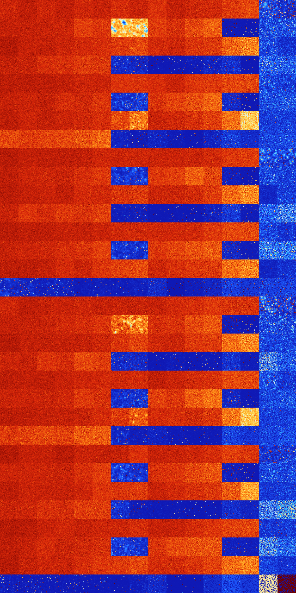

# B128 (134144-134655)

<details>
    <summary>Initial Grid</summary>
    
</details>


<details>
    <summary>Initial Grid RLE</summary>

```
#C Exported from GoGoL (https://github.com/marrow16/gogol)
#C Wrap mode: Toroidal
#C Boundary mode: Dead
#C Step: 0
x = 100, y = 100, rule = B128/S
32bo36bo$17bo23bo17bo6bo21bo2bo7bo$24bo$13bo2b2o10bo17bo29bo14bo$33bo
11bo$6bo16bo18bo9bo11bo24bo$4bo16bo20bo19bo25bo$o21bobo5bo$5bo30bo$36bo
10bo4bo41b2o$17bo3bo9bo10bo41bo$28bo12bo32bo$6bo38bo5b2o$2bo12bo$b2ob2o
30bo8bo2bo14bo2bo$7bobo5bo23bo28bo11bo2bo10bo2bo$10bo2bo12bo33bo3bo$4bo
20bo33bo14b2o$36bobo5bo12bo27bo2bo$bo18bo59bo$2bo16bo5bo15bo4bo30bo$35b
2o5bo22bo19bo3bo$15bo53bo20bo$6bo19bo7bo42bo16bo$44bo11bo3bo35bo$26bo
34bo37bo$3bo11bo34bo38bo9bo$12bo10bo9bo3bo3bo13bo25bo12bo$18bo15bo3bo3b
o26bo14bo$20bo6bo11bo2bo17bo26bo$4bo41bo20bo26bobo$41bo2bo8bo7bo$20bo
47bo16bo13bo$9b2o12bo14bobo26bo8bo$6bo2bo53bo22bo$19bo15bo7bo13bo21bo
17bo$10b3o14bo55bo6bo7bo$34bo33bo$33bo41bo3bo$7bo7bo6b3o65bo8bo$4bo21bo
19bo18bo25bo$33bo48bo7bo3bo$8bo17bo17b2o10bo6b2o7bo24bo$34bo13bo21bo$
57bo15bo11bo2bo$29bo10bo18bo29bo3bo3bo$17bo12bobo47bo14bo$49bo4bobo8bob
o9bo$47bo5bo31bo$65bo31bo$18bo11bo62b2o$28bo20bo21bo7bo13bo$41bo9bo8bo$
bo40b2o30bo6bo17bo$26bo5bo35bo$29bo$40bo9bo18bo7b2o11bo3bo$9bo7bo14bo
25bo3bo10bo25bo$15bo15bo35bo18bo$4bo16bo23bo12bo2bo2bo27bo$10bo37bo13bo
$4bo11bo4bobo6bo27bo28bo$23bobo8bo29bo22bo$24bo18bo15bo$12bo6bo3bo53bo$
18bo19bo3bo13bo24bo$11bo7bo9bo13bo20bo7bo$14bo19bo31bo4bo13bo$16bo10bo
36bo17bo$31bo16bo7bo8bo9bo16bo$44bo52bo$57bo$11bo15bo27bo9bo5bo2bo6bo$
16bo6b2o10bo15bo$48bo20bo18bo2bo$18bo19bo3bo15bo6bo13bo14bo$30bo$11b2o
8bo37bo4bo$bo5bobo17bo$8bo19bo5bo23bo11bo6bo$16bo3bo76bo$18bo49bo$bo46b
2o4bobo23bo14bo$9bo44bo5bo$31bo15bo23bo$48bo6bo7bo19b2o$15bo27bo9bo35bo
7bo$9bo72bo$5bo9bo18bo19bo30bo3bo3bo$5bo4bo22bo17bo12bo7bobo$78bo$o20bo
6bo5bo33bo$13bo5bo$20bo25bo6bo6bo$bo17bo8bobo11bo16bo10bo21bo$46bo16bo$
16bo27bo14bo37bo$7bo15bobo3bo12bo6bo26bo$14bo28bobo18bo$18bo3bo5bo4bo
23bo22bo!
```
</details>
<details>
    <summary>Thumbnail</summary>

</details>
<table>
<tr>
    <td><a href="./134144%20S%20Heat%20Map%20Activity.png"></a><br>S (134144)<br>G>1000</td>    <td><a href="./134145%20S0%20Heat%20Map%20Activity.png"></a><br>S0 (134145)<br>G>1000</td>    <td><a href="./134146%20S1%20Heat%20Map%20Activity.png"></a><br>S1 (134146)<br>G>1000</td>    <td><a href="./134147%20S01%20Heat%20Map%20Activity.png"></a><br>S01 (134147)<br>G>1000</td>    <td><a href="./134148%20S2%20Heat%20Map%20Activity.png"></a><br>S2 (134148)<br>G>1000</td>    <td><a href="./134149%20S02%20Heat%20Map%20Activity.png"></a><br>S02 (134149)<br>G>1000</td>    <td><a href="./134150%20S12%20Heat%20Map%20Activity.png"></a><br>S12 (134150)<br>G>1000</td>    <td><a href="./134151%20S012%20Heat%20Map%20Activity.png"></a><br>S012 (134151)<br>G>1000</td>    <td><a href="./134152%20S3%20Heat%20Map%20Activity.png"></a><br>S3 (134152)<br>G>1000</td>    <td><a href="./134153%20S03%20Heat%20Map%20Activity.png"></a><br>S03 (134153)<br>G>1000</td>    <td><a href="./134154%20S13%20Heat%20Map%20Activity.png"></a><br>S13 (134154)<br>G>1000</td>    <td><a href="./134155%20S013%20Heat%20Map%20Activity.png"></a><br>S013 (134155)<br>G>1000</td>    <td><a href="./134156%20S23%20Heat%20Map%20Activity.png"></a><br>S23 (134156)<br>G>1000</td>    <td><a href="./134157%20S023%20Heat%20Map%20Activity.png"></a><br>S023 (134157)<br>G>1000</td>    <td><a href="./134158%20S123%20Heat%20Map%20Activity.png"></a><br>S123 (134158)<br>R@128,p24</td>    <td><a href="./134159%20S0123%20Heat%20Map%20Activity.png"></a><br>S0123 (134159)<br>R@222,p120</td></tr>
<tr>
    <td><a href="./134160%20S4%20Heat%20Map%20Activity.png"></a><br>S4 (134160)<br>G>1000</td>    <td><a href="./134161%20S04%20Heat%20Map%20Activity.png"></a><br>S04 (134161)<br>G>1000</td>    <td><a href="./134162%20S14%20Heat%20Map%20Activity.png"></a><br>S14 (134162)<br>G>1000</td>    <td><a href="./134163%20S014%20Heat%20Map%20Activity.png"></a><br>S014 (134163)<br>G>1000</td>    <td><a href="./134164%20S24%20Heat%20Map%20Activity.png"></a><br>S24 (134164)<br>G>1000</td>    <td><a href="./134165%20S024%20Heat%20Map%20Activity.png"></a><br>S024 (134165)<br>G>1000</td>    <td><a href="./134166%20S124%20Heat%20Map%20Activity.png"></a><br>S124 (134166)<br>G>1000</td>    <td><a href="./134167%20S0124%20Heat%20Map%20Activity.png"></a><br>S0124 (134167)<br>G>1000</td>    <td><a href="./134168%20S34%20Heat%20Map%20Activity.png"></a><br>S34 (134168)<br>G>1000</td>    <td><a href="./134169%20S034%20Heat%20Map%20Activity.png"></a><br>S034 (134169)<br>G>1000</td>    <td><a href="./134170%20S134%20Heat%20Map%20Activity.png"></a><br>S134 (134170)<br>G>1000</td>    <td><a href="./134171%20S0134%20Heat%20Map%20Activity.png"></a><br>S0134 (134171)<br>G>1000</td>    <td><a href="./134172%20S234%20Heat%20Map%20Activity.png"></a><br>S234 (134172)<br>R@477,p420</td>    <td><a href="./134173%20S0234%20Heat%20Map%20Activity.png"></a><br>S0234 (134173)<br>G>1000</td>    <td><a href="./134174%20S1234%20Heat%20Map%20Activity.png"></a><br>S1234 (134174)<br>R@21,p2</td>    <td><a href="./134175%20S01234%20Heat%20Map%20Activity.png"></a><br>S01234 (134175)<br>R@19,p2</td></tr>
<tr>
    <td><a href="./134176%20S5%20Heat%20Map%20Activity.png"></a><br>S5 (134176)<br>G>1000</td>    <td><a href="./134177%20S05%20Heat%20Map%20Activity.png"></a><br>S05 (134177)<br>G>1000</td>    <td><a href="./134178%20S15%20Heat%20Map%20Activity.png"></a><br>S15 (134178)<br>G>1000</td>    <td><a href="./134179%20S015%20Heat%20Map%20Activity.png"></a><br>S015 (134179)<br>G>1000</td>    <td><a href="./134180%20S25%20Heat%20Map%20Activity.png"></a><br>S25 (134180)<br>G>1000</td>    <td><a href="./134181%20S025%20Heat%20Map%20Activity.png"></a><br>S025 (134181)<br>G>1000</td>    <td><a href="./134182%20S125%20Heat%20Map%20Activity.png"></a><br>S125 (134182)<br>G>1000</td>    <td><a href="./134183%20S0125%20Heat%20Map%20Activity.png"></a><br>S0125 (134183)<br>G>1000</td>    <td><a href="./134184%20S35%20Heat%20Map%20Activity.png"></a><br>S35 (134184)<br>G>1000</td>    <td><a href="./134185%20S035%20Heat%20Map%20Activity.png"></a><br>S035 (134185)<br>G>1000</td>    <td><a href="./134186%20S135%20Heat%20Map%20Activity.png"></a><br>S135 (134186)<br>G>1000</td>    <td><a href="./134187%20S0135%20Heat%20Map%20Activity.png"></a><br>S0135 (134187)<br>G>1000</td>    <td><a href="./134188%20S235%20Heat%20Map%20Activity.png"></a><br>S235 (134188)<br>G>1000</td>    <td><a href="./134189%20S0235%20Heat%20Map%20Activity.png"></a><br>S0235 (134189)<br>G>1000</td>    <td><a href="./134190%20S1235%20Heat%20Map%20Activity.png"></a><br>S1235 (134190)<br>R@31,p4</td>    <td><a href="./134191%20S01235%20Heat%20Map%20Activity.png"></a><br>S01235 (134191)<br>R@42,p20</td></tr>
<tr>
    <td><a href="./134192%20S45%20Heat%20Map%20Activity.png"></a><br>S45 (134192)<br>G>1000</td>    <td><a href="./134193%20S045%20Heat%20Map%20Activity.png"></a><br>S045 (134193)<br>G>1000</td>    <td><a href="./134194%20S145%20Heat%20Map%20Activity.png"></a><br>S145 (134194)<br>G>1000</td>    <td><a href="./134195%20S0145%20Heat%20Map%20Activity.png"></a><br>S0145 (134195)<br>G>1000</td>    <td><a href="./134196%20S245%20Heat%20Map%20Activity.png"></a><br>S245 (134196)<br>G>1000</td>    <td><a href="./134197%20S0245%20Heat%20Map%20Activity.png"></a><br>S0245 (134197)<br>G>1000</td>    <td><a href="./134198%20S1245%20Heat%20Map%20Activity.png"></a><br>S1245 (134198)<br>R@236,p36</td>    <td><a href="./134199%20S01245%20Heat%20Map%20Activity.png"></a><br>S01245 (134199)<br>R@204,p84</td>    <td><a href="./134200%20S345%20Heat%20Map%20Activity.png"></a><br>S345 (134200)<br>G>1000</td>    <td><a href="./134201%20S0345%20Heat%20Map%20Activity.png"></a><br>S0345 (134201)<br>G>1000</td>    <td><a href="./134202%20S1345%20Heat%20Map%20Activity.png"></a><br>S1345 (134202)<br>R@459,p360</td>    <td><a href="./134203%20S01345%20Heat%20Map%20Activity.png"></a><br>S01345 (134203)<br>R@223,p120</td>    <td><a href="./134204%20S2345%20Heat%20Map%20Activity.png"></a><br>S2345 (134204)<br>R@25,p4</td>    <td><a href="./134205%20S02345%20Heat%20Map%20Activity.png"></a><br>S02345 (134205)<br>R@449,p420</td>    <td><a href="./134206%20S12345%20Heat%20Map%20Activity.png"></a><br>S12345 (134206)<br>S@10</td>    <td><a href="./134207%20S012345%20Heat%20Map%20Activity.png"></a><br>S012345 (134207)<br>R@11,p2</td></tr>
<tr>
    <td><a href="./134208%20S6%20Heat%20Map%20Activity.png"></a><br>S6 (134208)<br>G>1000</td>    <td><a href="./134209%20S06%20Heat%20Map%20Activity.png"></a><br>S06 (134209)<br>G>1000</td>    <td><a href="./134210%20S16%20Heat%20Map%20Activity.png"></a><br>S16 (134210)<br>G>1000</td>    <td><a href="./134211%20S016%20Heat%20Map%20Activity.png"></a><br>S016 (134211)<br>G>1000</td>    <td><a href="./134212%20S26%20Heat%20Map%20Activity.png"></a><br>S26 (134212)<br>G>1000</td>    <td><a href="./134213%20S026%20Heat%20Map%20Activity.png"></a><br>S026 (134213)<br>G>1000</td>    <td><a href="./134214%20S126%20Heat%20Map%20Activity.png"></a><br>S126 (134214)<br>G>1000</td>    <td><a href="./134215%20S0126%20Heat%20Map%20Activity.png"></a><br>S0126 (134215)<br>G>1000</td>    <td><a href="./134216%20S36%20Heat%20Map%20Activity.png"></a><br>S36 (134216)<br>G>1000</td>    <td><a href="./134217%20S036%20Heat%20Map%20Activity.png"></a><br>S036 (134217)<br>G>1000</td>    <td><a href="./134218%20S136%20Heat%20Map%20Activity.png"></a><br>S136 (134218)<br>G>1000</td>    <td><a href="./134219%20S0136%20Heat%20Map%20Activity.png"></a><br>S0136 (134219)<br>G>1000</td>    <td><a href="./134220%20S236%20Heat%20Map%20Activity.png"></a><br>S236 (134220)<br>G>1000</td>    <td><a href="./134221%20S0236%20Heat%20Map%20Activity.png"></a><br>S0236 (134221)<br>G>1000</td>    <td><a href="./134222%20S1236%20Heat%20Map%20Activity.png"></a><br>S1236 (134222)<br>R@57,p4</td>    <td><a href="./134223%20S01236%20Heat%20Map%20Activity.png"></a><br>S01236 (134223)<br>R@59,p4</td></tr>
<tr>
    <td><a href="./134224%20S46%20Heat%20Map%20Activity.png"></a><br>S46 (134224)<br>G>1000</td>    <td><a href="./134225%20S046%20Heat%20Map%20Activity.png"></a><br>S046 (134225)<br>G>1000</td>    <td><a href="./134226%20S146%20Heat%20Map%20Activity.png"></a><br>S146 (134226)<br>G>1000</td>    <td><a href="./134227%20S0146%20Heat%20Map%20Activity.png"></a><br>S0146 (134227)<br>G>1000</td>    <td><a href="./134228%20S246%20Heat%20Map%20Activity.png"></a><br>S246 (134228)<br>G>1000</td>    <td><a href="./134229%20S0246%20Heat%20Map%20Activity.png"></a><br>S0246 (134229)<br>G>1000</td>    <td><a href="./134230%20S1246%20Heat%20Map%20Activity.png"></a><br>S1246 (134230)<br>R@415,p60</td>    <td><a href="./134231%20S01246%20Heat%20Map%20Activity.png"></a><br>S01246 (134231)<br>R@241,p60</td>    <td><a href="./134232%20S346%20Heat%20Map%20Activity.png"></a><br>S346 (134232)<br>G>1000</td>    <td><a href="./134233%20S0346%20Heat%20Map%20Activity.png"></a><br>S0346 (134233)<br>G>1000</td>    <td><a href="./134234%20S1346%20Heat%20Map%20Activity.png"></a><br>S1346 (134234)<br>G>1000</td>    <td><a href="./134235%20S01346%20Heat%20Map%20Activity.png"></a><br>S01346 (134235)<br>G>1000</td>    <td><a href="./134236%20S2346%20Heat%20Map%20Activity.png"></a><br>S2346 (134236)<br>R@50,p12</td>    <td><a href="./134237%20S02346%20Heat%20Map%20Activity.png"></a><br>S02346 (134237)<br>R@879,p840</td>    <td><a href="./134238%20S12346%20Heat%20Map%20Activity.png"></a><br>S12346 (134238)<br>R@15,p2</td>    <td><a href="./134239%20S012346%20Heat%20Map%20Activity.png"></a><br>S012346 (134239)<br>R@13,p2</td></tr>
<tr>
    <td><a href="./134240%20S56%20Heat%20Map%20Activity.png"></a><br>S56 (134240)<br>G>1000</td>    <td><a href="./134241%20S056%20Heat%20Map%20Activity.png"></a><br>S056 (134241)<br>G>1000</td>    <td><a href="./134242%20S156%20Heat%20Map%20Activity.png"></a><br>S156 (134242)<br>G>1000</td>    <td><a href="./134243%20S0156%20Heat%20Map%20Activity.png"></a><br>S0156 (134243)<br>G>1000</td>    <td><a href="./134244%20S256%20Heat%20Map%20Activity.png"></a><br>S256 (134244)<br>G>1000</td>    <td><a href="./134245%20S0256%20Heat%20Map%20Activity.png"></a><br>S0256 (134245)<br>G>1000</td>    <td><a href="./134246%20S1256%20Heat%20Map%20Activity.png"></a><br>S1256 (134246)<br>G>1000</td>    <td><a href="./134247%20S01256%20Heat%20Map%20Activity.png"></a><br>S01256 (134247)<br>G>1000</td>    <td><a href="./134248%20S356%20Heat%20Map%20Activity.png"></a><br>S356 (134248)<br>G>1000</td>    <td><a href="./134249%20S0356%20Heat%20Map%20Activity.png"></a><br>S0356 (134249)<br>G>1000</td>    <td><a href="./134250%20S1356%20Heat%20Map%20Activity.png"></a><br>S1356 (134250)<br>G>1000</td>    <td><a href="./134251%20S01356%20Heat%20Map%20Activity.png"></a><br>S01356 (134251)<br>G>1000</td>    <td><a href="./134252%20S2356%20Heat%20Map%20Activity.png"></a><br>S2356 (134252)<br>G>1000</td>    <td><a href="./134253%20S02356%20Heat%20Map%20Activity.png"></a><br>S02356 (134253)<br>G>1000</td>    <td><a href="./134254%20S12356%20Heat%20Map%20Activity.png"></a><br>S12356 (134254)<br>R@32,p12</td>    <td><a href="./134255%20S012356%20Heat%20Map%20Activity.png"></a><br>S012356 (134255)<br>R@23,p6</td></tr>
<tr>
    <td><a href="./134256%20S456%20Heat%20Map%20Activity.png"></a><br>S456 (134256)<br>G>1000</td>    <td><a href="./134257%20S0456%20Heat%20Map%20Activity.png"></a><br>S0456 (134257)<br>G>1000</td>    <td><a href="./134258%20S1456%20Heat%20Map%20Activity.png"></a><br>S1456 (134258)<br>G>1000</td>    <td><a href="./134259%20S01456%20Heat%20Map%20Activity.png"></a><br>S01456 (134259)<br>G>1000</td>    <td><a href="./134260%20S2456%20Heat%20Map%20Activity.png"></a><br>S2456 (134260)<br>G>1000</td>    <td><a href="./134261%20S02456%20Heat%20Map%20Activity.png"></a><br>S02456 (134261)<br>G>1000</td>    <td><a href="./134262%20S12456%20Heat%20Map%20Activity.png"></a><br>S12456 (134262)<br>G>1000</td>    <td><a href="./134263%20S012456%20Heat%20Map%20Activity.png"></a><br>S012456 (134263)<br>G>1000</td>    <td><a href="./134264%20S3456%20Heat%20Map%20Activity.png"></a><br>S3456 (134264)<br>R@49,p24</td>    <td><a href="./134265%20S03456%20Heat%20Map%20Activity.png"></a><br>S03456 (134265)<br>R@169,p120</td>    <td><a href="./134266%20S13456%20Heat%20Map%20Activity.png"></a><br>S13456 (134266)<br>R@392,p360</td>    <td><a href="./134267%20S013456%20Heat%20Map%20Activity.png"></a><br>S013456 (134267)<br>R@59,p24</td>    <td><a href="./134268%20S23456%20Heat%20Map%20Activity.png"></a><br>S23456 (134268)<br>R@13,p4</td>    <td><a href="./134269%20S023456%20Heat%20Map%20Activity.png"></a><br>S023456 (134269)<br>R@23,p12</td>    <td><a href="./134270%20S123456%20Heat%20Map%20Activity.png"></a><br>S123456 (134270)<br>R@11,p2</td>    <td><a href="./134271%20S0123456%20Heat%20Map%20Activity.png"></a><br>S0123456 (134271)<br>R@11,p2</td></tr>
<tr>
    <td><a href="./134272%20S7%20Heat%20Map%20Activity.png"></a><br>S7 (134272)<br>G>1000</td>    <td><a href="./134273%20S07%20Heat%20Map%20Activity.png"></a><br>S07 (134273)<br>G>1000</td>    <td><a href="./134274%20S17%20Heat%20Map%20Activity.png"></a><br>S17 (134274)<br>G>1000</td>    <td><a href="./134275%20S017%20Heat%20Map%20Activity.png"></a><br>S017 (134275)<br>G>1000</td>    <td><a href="./134276%20S27%20Heat%20Map%20Activity.png"></a><br>S27 (134276)<br>G>1000</td>    <td><a href="./134277%20S027%20Heat%20Map%20Activity.png"></a><br>S027 (134277)<br>G>1000</td>    <td><a href="./134278%20S127%20Heat%20Map%20Activity.png"></a><br>S127 (134278)<br>G>1000</td>    <td><a href="./134279%20S0127%20Heat%20Map%20Activity.png"></a><br>S0127 (134279)<br>G>1000</td>    <td><a href="./134280%20S37%20Heat%20Map%20Activity.png"></a><br>S37 (134280)<br>G>1000</td>    <td><a href="./134281%20S037%20Heat%20Map%20Activity.png"></a><br>S037 (134281)<br>G>1000</td>    <td><a href="./134282%20S137%20Heat%20Map%20Activity.png"></a><br>S137 (134282)<br>G>1000</td>    <td><a href="./134283%20S0137%20Heat%20Map%20Activity.png"></a><br>S0137 (134283)<br>G>1000</td>    <td><a href="./134284%20S237%20Heat%20Map%20Activity.png"></a><br>S237 (134284)<br>G>1000</td>    <td><a href="./134285%20S0237%20Heat%20Map%20Activity.png"></a><br>S0237 (134285)<br>G>1000</td>    <td><a href="./134286%20S1237%20Heat%20Map%20Activity.png"></a><br>S1237 (134286)<br>R@177,p24</td>    <td><a href="./134287%20S01237%20Heat%20Map%20Activity.png"></a><br>S01237 (134287)<br>R@185,p12</td></tr>
<tr>
    <td><a href="./134288%20S47%20Heat%20Map%20Activity.png"></a><br>S47 (134288)<br>G>1000</td>    <td><a href="./134289%20S047%20Heat%20Map%20Activity.png"></a><br>S047 (134289)<br>G>1000</td>    <td><a href="./134290%20S147%20Heat%20Map%20Activity.png"></a><br>S147 (134290)<br>G>1000</td>    <td><a href="./134291%20S0147%20Heat%20Map%20Activity.png"></a><br>S0147 (134291)<br>G>1000</td>    <td><a href="./134292%20S247%20Heat%20Map%20Activity.png"></a><br>S247 (134292)<br>G>1000</td>    <td><a href="./134293%20S0247%20Heat%20Map%20Activity.png"></a><br>S0247 (134293)<br>G>1000</td>    <td><a href="./134294%20S1247%20Heat%20Map%20Activity.png"></a><br>S1247 (134294)<br>G>1000</td>    <td><a href="./134295%20S01247%20Heat%20Map%20Activity.png"></a><br>S01247 (134295)<br>R@677,p12</td>    <td><a href="./134296%20S347%20Heat%20Map%20Activity.png"></a><br>S347 (134296)<br>G>1000</td>    <td><a href="./134297%20S0347%20Heat%20Map%20Activity.png"></a><br>S0347 (134297)<br>G>1000</td>    <td><a href="./134298%20S1347%20Heat%20Map%20Activity.png"></a><br>S1347 (134298)<br>G>1000</td>    <td><a href="./134299%20S01347%20Heat%20Map%20Activity.png"></a><br>S01347 (134299)<br>G>1000</td>    <td><a href="./134300%20S2347%20Heat%20Map%20Activity.png"></a><br>S2347 (134300)<br>R@158,p84</td>    <td><a href="./134301%20S02347%20Heat%20Map%20Activity.png"></a><br>S02347 (134301)<br>G>1000</td>    <td><a href="./134302%20S12347%20Heat%20Map%20Activity.png"></a><br>S12347 (134302)<br>R@18,p2</td>    <td><a href="./134303%20S012347%20Heat%20Map%20Activity.png"></a><br>S012347 (134303)<br>R@21,p6</td></tr>
<tr>
    <td><a href="./134304%20S57%20Heat%20Map%20Activity.png"></a><br>S57 (134304)<br>G>1000</td>    <td><a href="./134305%20S057%20Heat%20Map%20Activity.png"></a><br>S057 (134305)<br>G>1000</td>    <td><a href="./134306%20S157%20Heat%20Map%20Activity.png"></a><br>S157 (134306)<br>G>1000</td>    <td><a href="./134307%20S0157%20Heat%20Map%20Activity.png"></a><br>S0157 (134307)<br>G>1000</td>    <td><a href="./134308%20S257%20Heat%20Map%20Activity.png"></a><br>S257 (134308)<br>G>1000</td>    <td><a href="./134309%20S0257%20Heat%20Map%20Activity.png"></a><br>S0257 (134309)<br>G>1000</td>    <td><a href="./134310%20S1257%20Heat%20Map%20Activity.png"></a><br>S1257 (134310)<br>G>1000</td>    <td><a href="./134311%20S01257%20Heat%20Map%20Activity.png"></a><br>S01257 (134311)<br>G>1000</td>    <td><a href="./134312%20S357%20Heat%20Map%20Activity.png"></a><br>S357 (134312)<br>G>1000</td>    <td><a href="./134313%20S0357%20Heat%20Map%20Activity.png"></a><br>S0357 (134313)<br>G>1000</td>    <td><a href="./134314%20S1357%20Heat%20Map%20Activity.png"></a><br>S1357 (134314)<br>G>1000</td>    <td><a href="./134315%20S01357%20Heat%20Map%20Activity.png"></a><br>S01357 (134315)<br>G>1000</td>    <td><a href="./134316%20S2357%20Heat%20Map%20Activity.png"></a><br>S2357 (134316)<br>G>1000</td>    <td><a href="./134317%20S02357%20Heat%20Map%20Activity.png"></a><br>S02357 (134317)<br>G>1000</td>    <td><a href="./134318%20S12357%20Heat%20Map%20Activity.png"></a><br>S12357 (134318)<br>R@80,p60</td>    <td><a href="./134319%20S012357%20Heat%20Map%20Activity.png"></a><br>S012357 (134319)<br>R@22,p2</td></tr>
<tr>
    <td><a href="./134320%20S457%20Heat%20Map%20Activity.png"></a><br>S457 (134320)<br>G>1000</td>    <td><a href="./134321%20S0457%20Heat%20Map%20Activity.png"></a><br>S0457 (134321)<br>G>1000</td>    <td><a href="./134322%20S1457%20Heat%20Map%20Activity.png"></a><br>S1457 (134322)<br>G>1000</td>    <td><a href="./134323%20S01457%20Heat%20Map%20Activity.png"></a><br>S01457 (134323)<br>G>1000</td>    <td><a href="./134324%20S2457%20Heat%20Map%20Activity.png"></a><br>S2457 (134324)<br>G>1000</td>    <td><a href="./134325%20S02457%20Heat%20Map%20Activity.png"></a><br>S02457 (134325)<br>G>1000</td>    <td><a href="./134326%20S12457%20Heat%20Map%20Activity.png"></a><br>S12457 (134326)<br>G>1000</td>    <td><a href="./134327%20S012457%20Heat%20Map%20Activity.png"></a><br>S012457 (134327)<br>R@569,p420</td>    <td><a href="./134328%20S3457%20Heat%20Map%20Activity.png"></a><br>S3457 (134328)<br>R@911,p840</td>    <td><a href="./134329%20S03457%20Heat%20Map%20Activity.png"></a><br>S03457 (134329)<br>G>1000</td>    <td><a href="./134330%20S13457%20Heat%20Map%20Activity.png"></a><br>S13457 (134330)<br>G>1000</td>    <td><a href="./134331%20S013457%20Heat%20Map%20Activity.png"></a><br>S013457 (134331)<br>R@253,p120</td>    <td><a href="./134332%20S23457%20Heat%20Map%20Activity.png"></a><br>S23457 (134332)<br>R@17,p4</td>    <td><a href="./134333%20S023457%20Heat%20Map%20Activity.png"></a><br>S023457 (134333)<br>R@100,p84</td>    <td><a href="./134334%20S123457%20Heat%20Map%20Activity.png"></a><br>S123457 (134334)<br>S@9</td>    <td><a href="./134335%20S0123457%20Heat%20Map%20Activity.png"></a><br>S0123457 (134335)<br>S@10</td></tr>
<tr>
    <td><a href="./134336%20S67%20Heat%20Map%20Activity.png"></a><br>S67 (134336)<br>G>1000</td>    <td><a href="./134337%20S067%20Heat%20Map%20Activity.png"></a><br>S067 (134337)<br>G>1000</td>    <td><a href="./134338%20S167%20Heat%20Map%20Activity.png"></a><br>S167 (134338)<br>G>1000</td>    <td><a href="./134339%20S0167%20Heat%20Map%20Activity.png"></a><br>S0167 (134339)<br>G>1000</td>    <td><a href="./134340%20S267%20Heat%20Map%20Activity.png"></a><br>S267 (134340)<br>G>1000</td>    <td><a href="./134341%20S0267%20Heat%20Map%20Activity.png"></a><br>S0267 (134341)<br>G>1000</td>    <td><a href="./134342%20S1267%20Heat%20Map%20Activity.png"></a><br>S1267 (134342)<br>G>1000</td>    <td><a href="./134343%20S01267%20Heat%20Map%20Activity.png"></a><br>S01267 (134343)<br>G>1000</td>    <td><a href="./134344%20S367%20Heat%20Map%20Activity.png"></a><br>S367 (134344)<br>G>1000</td>    <td><a href="./134345%20S0367%20Heat%20Map%20Activity.png"></a><br>S0367 (134345)<br>G>1000</td>    <td><a href="./134346%20S1367%20Heat%20Map%20Activity.png"></a><br>S1367 (134346)<br>G>1000</td>    <td><a href="./134347%20S01367%20Heat%20Map%20Activity.png"></a><br>S01367 (134347)<br>G>1000</td>    <td><a href="./134348%20S2367%20Heat%20Map%20Activity.png"></a><br>S2367 (134348)<br>G>1000</td>    <td><a href="./134349%20S02367%20Heat%20Map%20Activity.png"></a><br>S02367 (134349)<br>G>1000</td>    <td><a href="./134350%20S12367%20Heat%20Map%20Activity.png"></a><br>S12367 (134350)<br>R@50,p4</td>    <td><a href="./134351%20S012367%20Heat%20Map%20Activity.png"></a><br>S012367 (134351)<br>R@59,p24</td></tr>
<tr>
    <td><a href="./134352%20S467%20Heat%20Map%20Activity.png"></a><br>S467 (134352)<br>G>1000</td>    <td><a href="./134353%20S0467%20Heat%20Map%20Activity.png"></a><br>S0467 (134353)<br>G>1000</td>    <td><a href="./134354%20S1467%20Heat%20Map%20Activity.png"></a><br>S1467 (134354)<br>G>1000</td>    <td><a href="./134355%20S01467%20Heat%20Map%20Activity.png"></a><br>S01467 (134355)<br>G>1000</td>    <td><a href="./134356%20S2467%20Heat%20Map%20Activity.png"></a><br>S2467 (134356)<br>G>1000</td>    <td><a href="./134357%20S02467%20Heat%20Map%20Activity.png"></a><br>S02467 (134357)<br>G>1000</td>    <td><a href="./134358%20S12467%20Heat%20Map%20Activity.png"></a><br>S12467 (134358)<br>R@621,p60</td>    <td><a href="./134359%20S012467%20Heat%20Map%20Activity.png"></a><br>S012467 (134359)<br>R@442,p12</td>    <td><a href="./134360%20S3467%20Heat%20Map%20Activity.png"></a><br>S3467 (134360)<br>G>1000</td>    <td><a href="./134361%20S03467%20Heat%20Map%20Activity.png"></a><br>S03467 (134361)<br>G>1000</td>    <td><a href="./134362%20S13467%20Heat%20Map%20Activity.png"></a><br>S13467 (134362)<br>G>1000</td>    <td><a href="./134363%20S013467%20Heat%20Map%20Activity.png"></a><br>S013467 (134363)<br>G>1000</td>    <td><a href="./134364%20S23467%20Heat%20Map%20Activity.png"></a><br>S23467 (134364)<br>R@56,p24</td>    <td><a href="./134365%20S023467%20Heat%20Map%20Activity.png"></a><br>S023467 (134365)<br>R@206,p168</td>    <td><a href="./134366%20S123467%20Heat%20Map%20Activity.png"></a><br>S123467 (134366)<br>S@17</td>    <td><a href="./134367%20S0123467%20Heat%20Map%20Activity.png"></a><br>S0123467 (134367)<br>S@11</td></tr>
<tr>
    <td><a href="./134368%20S567%20Heat%20Map%20Activity.png"></a><br>S567 (134368)<br>G>1000</td>    <td><a href="./134369%20S0567%20Heat%20Map%20Activity.png"></a><br>S0567 (134369)<br>G>1000</td>    <td><a href="./134370%20S1567%20Heat%20Map%20Activity.png"></a><br>S1567 (134370)<br>G>1000</td>    <td><a href="./134371%20S01567%20Heat%20Map%20Activity.png"></a><br>S01567 (134371)<br>G>1000</td>    <td><a href="./134372%20S2567%20Heat%20Map%20Activity.png"></a><br>S2567 (134372)<br>G>1000</td>    <td><a href="./134373%20S02567%20Heat%20Map%20Activity.png"></a><br>S02567 (134373)<br>G>1000</td>    <td><a href="./134374%20S12567%20Heat%20Map%20Activity.png"></a><br>S12567 (134374)<br>G>1000</td>    <td><a href="./134375%20S012567%20Heat%20Map%20Activity.png"></a><br>S012567 (134375)<br>G>1000</td>    <td><a href="./134376%20S3567%20Heat%20Map%20Activity.png"></a><br>S3567 (134376)<br>G>1000</td>    <td><a href="./134377%20S03567%20Heat%20Map%20Activity.png"></a><br>S03567 (134377)<br>G>1000</td>    <td><a href="./134378%20S13567%20Heat%20Map%20Activity.png"></a><br>S13567 (134378)<br>G>1000</td>    <td><a href="./134379%20S013567%20Heat%20Map%20Activity.png"></a><br>S013567 (134379)<br>G>1000</td>    <td><a href="./134380%20S23567%20Heat%20Map%20Activity.png"></a><br>S23567 (134380)<br>G>1000</td>    <td><a href="./134381%20S023567%20Heat%20Map%20Activity.png"></a><br>S023567 (134381)<br>G>1000</td>    <td><a href="./134382%20S123567%20Heat%20Map%20Activity.png"></a><br>S123567 (134382)<br>R@92,p60</td>    <td><a href="./134383%20S0123567%20Heat%20Map%20Activity.png"></a><br>S0123567 (134383)<br>R@37,p12</td></tr>
<tr>
    <td><a href="./134384%20S4567%20Heat%20Map%20Activity.png"></a><br>S4567 (134384)<br>G>1000</td>    <td><a href="./134385%20S04567%20Heat%20Map%20Activity.png"></a><br>S04567 (134385)<br>G>1000</td>    <td><a href="./134386%20S14567%20Heat%20Map%20Activity.png"></a><br>S14567 (134386)<br>G>1000</td>    <td><a href="./134387%20S014567%20Heat%20Map%20Activity.png"></a><br>S014567 (134387)<br>G>1000</td>    <td><a href="./134388%20S24567%20Heat%20Map%20Activity.png"></a><br>S24567 (134388)<br>G>1000</td>    <td><a href="./134389%20S024567%20Heat%20Map%20Activity.png"></a><br>S024567 (134389)<br>G>1000</td>    <td><a href="./134390%20S124567%20Heat%20Map%20Activity.png"></a><br>S124567 (134390)<br>G>1000</td>    <td><a href="./134391%20S0124567%20Heat%20Map%20Activity.png"></a><br>S0124567 (134391)<br>R@675,p360</td>    <td><a href="./134392%20S34567%20Heat%20Map%20Activity.png"></a><br>S34567 (134392)<br>R@28,p12</td>    <td><a href="./134393%20S034567%20Heat%20Map%20Activity.png"></a><br>S034567 (134393)<br>R@444,p420</td>    <td><a href="./134394%20S134567%20Heat%20Map%20Activity.png"></a><br>S134567 (134394)<br>R@79,p60</td>    <td><a href="./134395%20S0134567%20Heat%20Map%20Activity.png"></a><br>S0134567 (134395)<br>R@31,p12</td>    <td><a href="./134396%20S234567%20Heat%20Map%20Activity.png"></a><br>S234567 (134396)<br>R@11,p2</td>    <td><a href="./134397%20S0234567%20Heat%20Map%20Activity.png"></a><br>S0234567 (134397)<br>R@15,p6</td>    <td><a href="./134398%20S1234567%20Heat%20Map%20Activity.png"></a><br>S1234567 (134398)<br>R@11,p2</td>    <td><a href="./134399%20S01234567%20Heat%20Map%20Activity.png"></a><br>S01234567 (134399)<br>R@11,p2</td></tr>
<tr>
    <td><a href="./134400%20S8%20Heat%20Map%20Activity.png"></a><br>S8 (134400)<br>G>1000</td>    <td><a href="./134401%20S08%20Heat%20Map%20Activity.png"></a><br>S08 (134401)<br>G>1000</td>    <td><a href="./134402%20S18%20Heat%20Map%20Activity.png"></a><br>S18 (134402)<br>G>1000</td>    <td><a href="./134403%20S018%20Heat%20Map%20Activity.png"></a><br>S018 (134403)<br>G>1000</td>    <td><a href="./134404%20S28%20Heat%20Map%20Activity.png"></a><br>S28 (134404)<br>G>1000</td>    <td><a href="./134405%20S028%20Heat%20Map%20Activity.png"></a><br>S028 (134405)<br>G>1000</td>    <td><a href="./134406%20S128%20Heat%20Map%20Activity.png"></a><br>S128 (134406)<br>G>1000</td>    <td><a href="./134407%20S0128%20Heat%20Map%20Activity.png"></a><br>S0128 (134407)<br>G>1000</td>    <td><a href="./134408%20S38%20Heat%20Map%20Activity.png"></a><br>S38 (134408)<br>G>1000</td>    <td><a href="./134409%20S038%20Heat%20Map%20Activity.png"></a><br>S038 (134409)<br>G>1000</td>    <td><a href="./134410%20S138%20Heat%20Map%20Activity.png"></a><br>S138 (134410)<br>G>1000</td>    <td><a href="./134411%20S0138%20Heat%20Map%20Activity.png"></a><br>S0138 (134411)<br>G>1000</td>    <td><a href="./134412%20S238%20Heat%20Map%20Activity.png"></a><br>S238 (134412)<br>G>1000</td>    <td><a href="./134413%20S0238%20Heat%20Map%20Activity.png"></a><br>S0238 (134413)<br>G>1000</td>    <td><a href="./134414%20S1238%20Heat%20Map%20Activity.png"></a><br>S1238 (134414)<br>R@183,p24</td>    <td><a href="./134415%20S01238%20Heat%20Map%20Activity.png"></a><br>S01238 (134415)<br>R@328,p132</td></tr>
<tr>
    <td><a href="./134416%20S48%20Heat%20Map%20Activity.png"></a><br>S48 (134416)<br>G>1000</td>    <td><a href="./134417%20S048%20Heat%20Map%20Activity.png"></a><br>S048 (134417)<br>G>1000</td>    <td><a href="./134418%20S148%20Heat%20Map%20Activity.png"></a><br>S148 (134418)<br>G>1000</td>    <td><a href="./134419%20S0148%20Heat%20Map%20Activity.png"></a><br>S0148 (134419)<br>G>1000</td>    <td><a href="./134420%20S248%20Heat%20Map%20Activity.png"></a><br>S248 (134420)<br>G>1000</td>    <td><a href="./134421%20S0248%20Heat%20Map%20Activity.png"></a><br>S0248 (134421)<br>G>1000</td>    <td><a href="./134422%20S1248%20Heat%20Map%20Activity.png"></a><br>S1248 (134422)<br>G>1000</td>    <td><a href="./134423%20S01248%20Heat%20Map%20Activity.png"></a><br>S01248 (134423)<br>G>1000</td>    <td><a href="./134424%20S348%20Heat%20Map%20Activity.png"></a><br>S348 (134424)<br>G>1000</td>    <td><a href="./134425%20S0348%20Heat%20Map%20Activity.png"></a><br>S0348 (134425)<br>G>1000</td>    <td><a href="./134426%20S1348%20Heat%20Map%20Activity.png"></a><br>S1348 (134426)<br>G>1000</td>    <td><a href="./134427%20S01348%20Heat%20Map%20Activity.png"></a><br>S01348 (134427)<br>G>1000</td>    <td><a href="./134428%20S2348%20Heat%20Map%20Activity.png"></a><br>S2348 (134428)<br>R@213,p168</td>    <td><a href="./134429%20S02348%20Heat%20Map%20Activity.png"></a><br>S02348 (134429)<br>G>1000</td>    <td><a href="./134430%20S12348%20Heat%20Map%20Activity.png"></a><br>S12348 (134430)<br>R@20,p2</td>    <td><a href="./134431%20S012348%20Heat%20Map%20Activity.png"></a><br>S012348 (134431)<br>R@20,p2</td></tr>
<tr>
    <td><a href="./134432%20S58%20Heat%20Map%20Activity.png"></a><br>S58 (134432)<br>G>1000</td>    <td><a href="./134433%20S058%20Heat%20Map%20Activity.png"></a><br>S058 (134433)<br>G>1000</td>    <td><a href="./134434%20S158%20Heat%20Map%20Activity.png"></a><br>S158 (134434)<br>G>1000</td>    <td><a href="./134435%20S0158%20Heat%20Map%20Activity.png"></a><br>S0158 (134435)<br>G>1000</td>    <td><a href="./134436%20S258%20Heat%20Map%20Activity.png"></a><br>S258 (134436)<br>G>1000</td>    <td><a href="./134437%20S0258%20Heat%20Map%20Activity.png"></a><br>S0258 (134437)<br>G>1000</td>    <td><a href="./134438%20S1258%20Heat%20Map%20Activity.png"></a><br>S1258 (134438)<br>G>1000</td>    <td><a href="./134439%20S01258%20Heat%20Map%20Activity.png"></a><br>S01258 (134439)<br>G>1000</td>    <td><a href="./134440%20S358%20Heat%20Map%20Activity.png"></a><br>S358 (134440)<br>G>1000</td>    <td><a href="./134441%20S0358%20Heat%20Map%20Activity.png"></a><br>S0358 (134441)<br>G>1000</td>    <td><a href="./134442%20S1358%20Heat%20Map%20Activity.png"></a><br>S1358 (134442)<br>G>1000</td>    <td><a href="./134443%20S01358%20Heat%20Map%20Activity.png"></a><br>S01358 (134443)<br>G>1000</td>    <td><a href="./134444%20S2358%20Heat%20Map%20Activity.png"></a><br>S2358 (134444)<br>G>1000</td>    <td><a href="./134445%20S02358%20Heat%20Map%20Activity.png"></a><br>S02358 (134445)<br>G>1000</td>    <td><a href="./134446%20S12358%20Heat%20Map%20Activity.png"></a><br>S12358 (134446)<br>R@32,p4</td>    <td><a href="./134447%20S012358%20Heat%20Map%20Activity.png"></a><br>S012358 (134447)<br>R@28,p6</td></tr>
<tr>
    <td><a href="./134448%20S458%20Heat%20Map%20Activity.png"></a><br>S458 (134448)<br>G>1000</td>    <td><a href="./134449%20S0458%20Heat%20Map%20Activity.png"></a><br>S0458 (134449)<br>G>1000</td>    <td><a href="./134450%20S1458%20Heat%20Map%20Activity.png"></a><br>S1458 (134450)<br>G>1000</td>    <td><a href="./134451%20S01458%20Heat%20Map%20Activity.png"></a><br>S01458 (134451)<br>G>1000</td>    <td><a href="./134452%20S2458%20Heat%20Map%20Activity.png"></a><br>S2458 (134452)<br>G>1000</td>    <td><a href="./134453%20S02458%20Heat%20Map%20Activity.png"></a><br>S02458 (134453)<br>G>1000</td>    <td><a href="./134454%20S12458%20Heat%20Map%20Activity.png"></a><br>S12458 (134454)<br>R@271,p48</td>    <td><a href="./134455%20S012458%20Heat%20Map%20Activity.png"></a><br>S012458 (134455)<br>R@193,p60</td>    <td><a href="./134456%20S3458%20Heat%20Map%20Activity.png"></a><br>S3458 (134456)<br>G>1000</td>    <td><a href="./134457%20S03458%20Heat%20Map%20Activity.png"></a><br>S03458 (134457)<br>R@547,p420</td>    <td><a href="./134458%20S13458%20Heat%20Map%20Activity.png"></a><br>S13458 (134458)<br>G>1000</td>    <td><a href="./134459%20S013458%20Heat%20Map%20Activity.png"></a><br>S013458 (134459)<br>G>1000</td>    <td><a href="./134460%20S23458%20Heat%20Map%20Activity.png"></a><br>S23458 (134460)<br>R@23,p4</td>    <td><a href="./134461%20S023458%20Heat%20Map%20Activity.png"></a><br>S023458 (134461)<br>R@100,p84</td>    <td><a href="./134462%20S123458%20Heat%20Map%20Activity.png"></a><br>S123458 (134462)<br>S@9</td>    <td><a href="./134463%20S0123458%20Heat%20Map%20Activity.png"></a><br>S0123458 (134463)<br>R@11,p2</td></tr>
<tr>
    <td><a href="./134464%20S68%20Heat%20Map%20Activity.png"></a><br>S68 (134464)<br>G>1000</td>    <td><a href="./134465%20S068%20Heat%20Map%20Activity.png"></a><br>S068 (134465)<br>G>1000</td>    <td><a href="./134466%20S168%20Heat%20Map%20Activity.png"></a><br>S168 (134466)<br>G>1000</td>    <td><a href="./134467%20S0168%20Heat%20Map%20Activity.png"></a><br>S0168 (134467)<br>G>1000</td>    <td><a href="./134468%20S268%20Heat%20Map%20Activity.png"></a><br>S268 (134468)<br>G>1000</td>    <td><a href="./134469%20S0268%20Heat%20Map%20Activity.png"></a><br>S0268 (134469)<br>G>1000</td>    <td><a href="./134470%20S1268%20Heat%20Map%20Activity.png"></a><br>S1268 (134470)<br>G>1000</td>    <td><a href="./134471%20S01268%20Heat%20Map%20Activity.png"></a><br>S01268 (134471)<br>G>1000</td>    <td><a href="./134472%20S368%20Heat%20Map%20Activity.png"></a><br>S368 (134472)<br>G>1000</td>    <td><a href="./134473%20S0368%20Heat%20Map%20Activity.png"></a><br>S0368 (134473)<br>G>1000</td>    <td><a href="./134474%20S1368%20Heat%20Map%20Activity.png"></a><br>S1368 (134474)<br>G>1000</td>    <td><a href="./134475%20S01368%20Heat%20Map%20Activity.png"></a><br>S01368 (134475)<br>G>1000</td>    <td><a href="./134476%20S2368%20Heat%20Map%20Activity.png"></a><br>S2368 (134476)<br>G>1000</td>    <td><a href="./134477%20S02368%20Heat%20Map%20Activity.png"></a><br>S02368 (134477)<br>G>1000</td>    <td><a href="./134478%20S12368%20Heat%20Map%20Activity.png"></a><br>S12368 (134478)<br>R@46,p4</td>    <td><a href="./134479%20S012368%20Heat%20Map%20Activity.png"></a><br>S012368 (134479)<br>R@62,p12</td></tr>
<tr>
    <td><a href="./134480%20S468%20Heat%20Map%20Activity.png"></a><br>S468 (134480)<br>G>1000</td>    <td><a href="./134481%20S0468%20Heat%20Map%20Activity.png"></a><br>S0468 (134481)<br>G>1000</td>    <td><a href="./134482%20S1468%20Heat%20Map%20Activity.png"></a><br>S1468 (134482)<br>G>1000</td>    <td><a href="./134483%20S01468%20Heat%20Map%20Activity.png"></a><br>S01468 (134483)<br>G>1000</td>    <td><a href="./134484%20S2468%20Heat%20Map%20Activity.png"></a><br>S2468 (134484)<br>G>1000</td>    <td><a href="./134485%20S02468%20Heat%20Map%20Activity.png"></a><br>S02468 (134485)<br>G>1000</td>    <td><a href="./134486%20S12468%20Heat%20Map%20Activity.png"></a><br>S12468 (134486)<br>R@491,p60</td>    <td><a href="./134487%20S012468%20Heat%20Map%20Activity.png"></a><br>S012468 (134487)<br>R@304,p12</td>    <td><a href="./134488%20S3468%20Heat%20Map%20Activity.png"></a><br>S3468 (134488)<br>G>1000</td>    <td><a href="./134489%20S03468%20Heat%20Map%20Activity.png"></a><br>S03468 (134489)<br>G>1000</td>    <td><a href="./134490%20S13468%20Heat%20Map%20Activity.png"></a><br>S13468 (134490)<br>G>1000</td>    <td><a href="./134491%20S013468%20Heat%20Map%20Activity.png"></a><br>S013468 (134491)<br>G>1000</td>    <td><a href="./134492%20S23468%20Heat%20Map%20Activity.png"></a><br>S23468 (134492)<br>R@57,p24</td>    <td><a href="./134493%20S023468%20Heat%20Map%20Activity.png"></a><br>S023468 (134493)<br>R@472,p420</td>    <td><a href="./134494%20S123468%20Heat%20Map%20Activity.png"></a><br>S123468 (134494)<br>R@15,p2</td>    <td><a href="./134495%20S0123468%20Heat%20Map%20Activity.png"></a><br>S0123468 (134495)<br>R@12,p2</td></tr>
<tr>
    <td><a href="./134496%20S568%20Heat%20Map%20Activity.png"></a><br>S568 (134496)<br>G>1000</td>    <td><a href="./134497%20S0568%20Heat%20Map%20Activity.png"></a><br>S0568 (134497)<br>G>1000</td>    <td><a href="./134498%20S1568%20Heat%20Map%20Activity.png"></a><br>S1568 (134498)<br>G>1000</td>    <td><a href="./134499%20S01568%20Heat%20Map%20Activity.png"></a><br>S01568 (134499)<br>G>1000</td>    <td><a href="./134500%20S2568%20Heat%20Map%20Activity.png"></a><br>S2568 (134500)<br>G>1000</td>    <td><a href="./134501%20S02568%20Heat%20Map%20Activity.png"></a><br>S02568 (134501)<br>G>1000</td>    <td><a href="./134502%20S12568%20Heat%20Map%20Activity.png"></a><br>S12568 (134502)<br>G>1000</td>    <td><a href="./134503%20S012568%20Heat%20Map%20Activity.png"></a><br>S012568 (134503)<br>G>1000</td>    <td><a href="./134504%20S3568%20Heat%20Map%20Activity.png"></a><br>S3568 (134504)<br>G>1000</td>    <td><a href="./134505%20S03568%20Heat%20Map%20Activity.png"></a><br>S03568 (134505)<br>G>1000</td>    <td><a href="./134506%20S13568%20Heat%20Map%20Activity.png"></a><br>S13568 (134506)<br>G>1000</td>    <td><a href="./134507%20S013568%20Heat%20Map%20Activity.png"></a><br>S013568 (134507)<br>G>1000</td>    <td><a href="./134508%20S23568%20Heat%20Map%20Activity.png"></a><br>S23568 (134508)<br>G>1000</td>    <td><a href="./134509%20S023568%20Heat%20Map%20Activity.png"></a><br>S023568 (134509)<br>G>1000</td>    <td><a href="./134510%20S123568%20Heat%20Map%20Activity.png"></a><br>S123568 (134510)<br>R@33,p12</td>    <td><a href="./134511%20S0123568%20Heat%20Map%20Activity.png"></a><br>S0123568 (134511)<br>R@25,p6</td></tr>
<tr>
    <td><a href="./134512%20S4568%20Heat%20Map%20Activity.png"></a><br>S4568 (134512)<br>G>1000</td>    <td><a href="./134513%20S04568%20Heat%20Map%20Activity.png"></a><br>S04568 (134513)<br>G>1000</td>    <td><a href="./134514%20S14568%20Heat%20Map%20Activity.png"></a><br>S14568 (134514)<br>G>1000</td>    <td><a href="./134515%20S014568%20Heat%20Map%20Activity.png"></a><br>S014568 (134515)<br>G>1000</td>    <td><a href="./134516%20S24568%20Heat%20Map%20Activity.png"></a><br>S24568 (134516)<br>G>1000</td>    <td><a href="./134517%20S024568%20Heat%20Map%20Activity.png"></a><br>S024568 (134517)<br>G>1000</td>    <td><a href="./134518%20S124568%20Heat%20Map%20Activity.png"></a><br>S124568 (134518)<br>R@758,p60</td>    <td><a href="./134519%20S0124568%20Heat%20Map%20Activity.png"></a><br>S0124568 (134519)<br>G>1000</td>    <td><a href="./134520%20S34568%20Heat%20Map%20Activity.png"></a><br>S34568 (134520)<br>R@52,p24</td>    <td><a href="./134521%20S034568%20Heat%20Map%20Activity.png"></a><br>S034568 (134521)<br>R@149,p120</td>    <td><a href="./134522%20S134568%20Heat%20Map%20Activity.png"></a><br>S134568 (134522)<br>R@212,p180</td>    <td><a href="./134523%20S0134568%20Heat%20Map%20Activity.png"></a><br>S0134568 (134523)<br>R@158,p132</td>    <td><a href="./134524%20S234568%20Heat%20Map%20Activity.png"></a><br>S234568 (134524)<br>R@11,p2</td>    <td><a href="./134525%20S0234568%20Heat%20Map%20Activity.png"></a><br>S0234568 (134525)<br>R@17,p6</td>    <td><a href="./134526%20S1234568%20Heat%20Map%20Activity.png"></a><br>S1234568 (134526)<br>R@11,p2</td>    <td><a href="./134527%20S01234568%20Heat%20Map%20Activity.png"></a><br>S01234568 (134527)<br>R@11,p2</td></tr>
<tr>
    <td><a href="./134528%20S78%20Heat%20Map%20Activity.png"></a><br>S78 (134528)<br>G>1000</td>    <td><a href="./134529%20S078%20Heat%20Map%20Activity.png"></a><br>S078 (134529)<br>G>1000</td>    <td><a href="./134530%20S178%20Heat%20Map%20Activity.png"></a><br>S178 (134530)<br>G>1000</td>    <td><a href="./134531%20S0178%20Heat%20Map%20Activity.png"></a><br>S0178 (134531)<br>G>1000</td>    <td><a href="./134532%20S278%20Heat%20Map%20Activity.png"></a><br>S278 (134532)<br>G>1000</td>    <td><a href="./134533%20S0278%20Heat%20Map%20Activity.png"></a><br>S0278 (134533)<br>G>1000</td>    <td><a href="./134534%20S1278%20Heat%20Map%20Activity.png"></a><br>S1278 (134534)<br>G>1000</td>    <td><a href="./134535%20S01278%20Heat%20Map%20Activity.png"></a><br>S01278 (134535)<br>G>1000</td>    <td><a href="./134536%20S378%20Heat%20Map%20Activity.png"></a><br>S378 (134536)<br>G>1000</td>    <td><a href="./134537%20S0378%20Heat%20Map%20Activity.png"></a><br>S0378 (134537)<br>G>1000</td>    <td><a href="./134538%20S1378%20Heat%20Map%20Activity.png"></a><br>S1378 (134538)<br>G>1000</td>    <td><a href="./134539%20S01378%20Heat%20Map%20Activity.png"></a><br>S01378 (134539)<br>G>1000</td>    <td><a href="./134540%20S2378%20Heat%20Map%20Activity.png"></a><br>S2378 (134540)<br>G>1000</td>    <td><a href="./134541%20S02378%20Heat%20Map%20Activity.png"></a><br>S02378 (134541)<br>G>1000</td>    <td><a href="./134542%20S12378%20Heat%20Map%20Activity.png"></a><br>S12378 (134542)<br>R@195,p84</td>    <td><a href="./134543%20S012378%20Heat%20Map%20Activity.png"></a><br>S012378 (134543)<br>R@123,p24</td></tr>
<tr>
    <td><a href="./134544%20S478%20Heat%20Map%20Activity.png"></a><br>S478 (134544)<br>G>1000</td>    <td><a href="./134545%20S0478%20Heat%20Map%20Activity.png"></a><br>S0478 (134545)<br>G>1000</td>    <td><a href="./134546%20S1478%20Heat%20Map%20Activity.png"></a><br>S1478 (134546)<br>G>1000</td>    <td><a href="./134547%20S01478%20Heat%20Map%20Activity.png"></a><br>S01478 (134547)<br>G>1000</td>    <td><a href="./134548%20S2478%20Heat%20Map%20Activity.png"></a><br>S2478 (134548)<br>G>1000</td>    <td><a href="./134549%20S02478%20Heat%20Map%20Activity.png"></a><br>S02478 (134549)<br>G>1000</td>    <td><a href="./134550%20S12478%20Heat%20Map%20Activity.png"></a><br>S12478 (134550)<br>R@728,p12</td>    <td><a href="./134551%20S012478%20Heat%20Map%20Activity.png"></a><br>S012478 (134551)<br>R@634,p60</td>    <td><a href="./134552%20S3478%20Heat%20Map%20Activity.png"></a><br>S3478 (134552)<br>G>1000</td>    <td><a href="./134553%20S03478%20Heat%20Map%20Activity.png"></a><br>S03478 (134553)<br>G>1000</td>    <td><a href="./134554%20S13478%20Heat%20Map%20Activity.png"></a><br>S13478 (134554)<br>G>1000</td>    <td><a href="./134555%20S013478%20Heat%20Map%20Activity.png"></a><br>S013478 (134555)<br>G>1000</td>    <td><a href="./134556%20S23478%20Heat%20Map%20Activity.png"></a><br>S23478 (134556)<br>R@141,p84</td>    <td><a href="./134557%20S023478%20Heat%20Map%20Activity.png"></a><br>S023478 (134557)<br>G>1000</td>    <td><a href="./134558%20S123478%20Heat%20Map%20Activity.png"></a><br>S123478 (134558)<br>R@17,p2</td>    <td><a href="./134559%20S0123478%20Heat%20Map%20Activity.png"></a><br>S0123478 (134559)<br>R@16,p2</td></tr>
<tr>
    <td><a href="./134560%20S578%20Heat%20Map%20Activity.png"></a><br>S578 (134560)<br>G>1000</td>    <td><a href="./134561%20S0578%20Heat%20Map%20Activity.png"></a><br>S0578 (134561)<br>G>1000</td>    <td><a href="./134562%20S1578%20Heat%20Map%20Activity.png"></a><br>S1578 (134562)<br>G>1000</td>    <td><a href="./134563%20S01578%20Heat%20Map%20Activity.png"></a><br>S01578 (134563)<br>G>1000</td>    <td><a href="./134564%20S2578%20Heat%20Map%20Activity.png"></a><br>S2578 (134564)<br>G>1000</td>    <td><a href="./134565%20S02578%20Heat%20Map%20Activity.png"></a><br>S02578 (134565)<br>G>1000</td>    <td><a href="./134566%20S12578%20Heat%20Map%20Activity.png"></a><br>S12578 (134566)<br>G>1000</td>    <td><a href="./134567%20S012578%20Heat%20Map%20Activity.png"></a><br>S012578 (134567)<br>G>1000</td>    <td><a href="./134568%20S3578%20Heat%20Map%20Activity.png"></a><br>S3578 (134568)<br>G>1000</td>    <td><a href="./134569%20S03578%20Heat%20Map%20Activity.png"></a><br>S03578 (134569)<br>G>1000</td>    <td><a href="./134570%20S13578%20Heat%20Map%20Activity.png"></a><br>S13578 (134570)<br>G>1000</td>    <td><a href="./134571%20S013578%20Heat%20Map%20Activity.png"></a><br>S013578 (134571)<br>G>1000</td>    <td><a href="./134572%20S23578%20Heat%20Map%20Activity.png"></a><br>S23578 (134572)<br>G>1000</td>    <td><a href="./134573%20S023578%20Heat%20Map%20Activity.png"></a><br>S023578 (134573)<br>G>1000</td>    <td><a href="./134574%20S123578%20Heat%20Map%20Activity.png"></a><br>S123578 (134574)<br>R@38,p12</td>    <td><a href="./134575%20S0123578%20Heat%20Map%20Activity.png"></a><br>S0123578 (134575)<br>R@31,p6</td></tr>
<tr>
    <td><a href="./134576%20S4578%20Heat%20Map%20Activity.png"></a><br>S4578 (134576)<br>G>1000</td>    <td><a href="./134577%20S04578%20Heat%20Map%20Activity.png"></a><br>S04578 (134577)<br>G>1000</td>    <td><a href="./134578%20S14578%20Heat%20Map%20Activity.png"></a><br>S14578 (134578)<br>G>1000</td>    <td><a href="./134579%20S014578%20Heat%20Map%20Activity.png"></a><br>S014578 (134579)<br>G>1000</td>    <td><a href="./134580%20S24578%20Heat%20Map%20Activity.png"></a><br>S24578 (134580)<br>G>1000</td>    <td><a href="./134581%20S024578%20Heat%20Map%20Activity.png"></a><br>S024578 (134581)<br>G>1000</td>    <td><a href="./134582%20S124578%20Heat%20Map%20Activity.png"></a><br>S124578 (134582)<br>R@285,p30</td>    <td><a href="./134583%20S0124578%20Heat%20Map%20Activity.png"></a><br>S0124578 (134583)<br>G>1000</td>    <td><a href="./134584%20S34578%20Heat%20Map%20Activity.png"></a><br>S34578 (134584)<br>R@449,p360</td>    <td><a href="./134585%20S034578%20Heat%20Map%20Activity.png"></a><br>S034578 (134585)<br>R@759,p660</td>    <td><a href="./134586%20S134578%20Heat%20Map%20Activity.png"></a><br>S134578 (134586)<br>G>1000</td>    <td><a href="./134587%20S0134578%20Heat%20Map%20Activity.png"></a><br>S0134578 (134587)<br>G>1000</td>    <td><a href="./134588%20S234578%20Heat%20Map%20Activity.png"></a><br>S234578 (134588)<br>R@23,p4</td>    <td><a href="./134589%20S0234578%20Heat%20Map%20Activity.png"></a><br>S0234578 (134589)<br>R@40,p24</td>    <td><a href="./134590%20S1234578%20Heat%20Map%20Activity.png"></a><br>S1234578 (134590)<br>S@10</td>    <td><a href="./134591%20S01234578%20Heat%20Map%20Activity.png"></a><br>S01234578 (134591)<br>S@9</td></tr>
<tr>
    <td><a href="./134592%20S678%20Heat%20Map%20Activity.png"></a><br>S678 (134592)<br>G>1000</td>    <td><a href="./134593%20S0678%20Heat%20Map%20Activity.png"></a><br>S0678 (134593)<br>G>1000</td>    <td><a href="./134594%20S1678%20Heat%20Map%20Activity.png"></a><br>S1678 (134594)<br>G>1000</td>    <td><a href="./134595%20S01678%20Heat%20Map%20Activity.png"></a><br>S01678 (134595)<br>G>1000</td>    <td><a href="./134596%20S2678%20Heat%20Map%20Activity.png"></a><br>S2678 (134596)<br>G>1000</td>    <td><a href="./134597%20S02678%20Heat%20Map%20Activity.png"></a><br>S02678 (134597)<br>G>1000</td>    <td><a href="./134598%20S12678%20Heat%20Map%20Activity.png"></a><br>S12678 (134598)<br>G>1000</td>    <td><a href="./134599%20S012678%20Heat%20Map%20Activity.png"></a><br>S012678 (134599)<br>G>1000</td>    <td><a href="./134600%20S3678%20Heat%20Map%20Activity.png"></a><br>S3678 (134600)<br>G>1000</td>    <td><a href="./134601%20S03678%20Heat%20Map%20Activity.png"></a><br>S03678 (134601)<br>G>1000</td>    <td><a href="./134602%20S13678%20Heat%20Map%20Activity.png"></a><br>S13678 (134602)<br>G>1000</td>    <td><a href="./134603%20S013678%20Heat%20Map%20Activity.png"></a><br>S013678 (134603)<br>G>1000</td>    <td><a href="./134604%20S23678%20Heat%20Map%20Activity.png"></a><br>S23678 (134604)<br>G>1000</td>    <td><a href="./134605%20S023678%20Heat%20Map%20Activity.png"></a><br>S023678 (134605)<br>G>1000</td>    <td><a href="./134606%20S123678%20Heat%20Map%20Activity.png"></a><br>S123678 (134606)<br>R@72,p20</td>    <td><a href="./134607%20S0123678%20Heat%20Map%20Activity.png"></a><br>S0123678 (134607)<br>R@63,p12</td></tr>
<tr>
    <td><a href="./134608%20S4678%20Heat%20Map%20Activity.png"></a><br>S4678 (134608)<br>G>1000</td>    <td><a href="./134609%20S04678%20Heat%20Map%20Activity.png"></a><br>S04678 (134609)<br>G>1000</td>    <td><a href="./134610%20S14678%20Heat%20Map%20Activity.png"></a><br>S14678 (134610)<br>G>1000</td>    <td><a href="./134611%20S014678%20Heat%20Map%20Activity.png"></a><br>S014678 (134611)<br>G>1000</td>    <td><a href="./134612%20S24678%20Heat%20Map%20Activity.png"></a><br>S24678 (134612)<br>G>1000</td>    <td><a href="./134613%20S024678%20Heat%20Map%20Activity.png"></a><br>S024678 (134613)<br>G>1000</td>    <td><a href="./134614%20S124678%20Heat%20Map%20Activity.png"></a><br>S124678 (134614)<br>R@456,p12</td>    <td><a href="./134615%20S0124678%20Heat%20Map%20Activity.png"></a><br>S0124678 (134615)<br>R@425,p12</td>    <td><a href="./134616%20S34678%20Heat%20Map%20Activity.png"></a><br>S34678 (134616)<br>G>1000</td>    <td><a href="./134617%20S034678%20Heat%20Map%20Activity.png"></a><br>S034678 (134617)<br>G>1000</td>    <td><a href="./134618%20S134678%20Heat%20Map%20Activity.png"></a><br>S134678 (134618)<br>G>1000</td>    <td><a href="./134619%20S0134678%20Heat%20Map%20Activity.png"></a><br>S0134678 (134619)<br>G>1000</td>    <td><a href="./134620%20S234678%20Heat%20Map%20Activity.png"></a><br>S234678 (134620)<br>R@94,p60</td>    <td><a href="./134621%20S0234678%20Heat%20Map%20Activity.png"></a><br>S0234678 (134621)<br>R@113,p84</td>    <td><a href="./134622%20S1234678%20Heat%20Map%20Activity.png"></a><br>S1234678 (134622)<br>S@13</td>    <td><a href="./134623%20S01234678%20Heat%20Map%20Activity.png"></a><br>S01234678 (134623)<br>R@13,p2</td></tr>
<tr>
    <td><a href="./134624%20S5678%20Heat%20Map%20Activity.png"></a><br>S5678 (134624)<br>G>1000</td>    <td><a href="./134625%20S05678%20Heat%20Map%20Activity.png"></a><br>S05678 (134625)<br>G>1000</td>    <td><a href="./134626%20S15678%20Heat%20Map%20Activity.png"></a><br>S15678 (134626)<br>G>1000</td>    <td><a href="./134627%20S015678%20Heat%20Map%20Activity.png"></a><br>S015678 (134627)<br>G>1000</td>    <td><a href="./134628%20S25678%20Heat%20Map%20Activity.png"></a><br>S25678 (134628)<br>G>1000</td>    <td><a href="./134629%20S025678%20Heat%20Map%20Activity.png"></a><br>S025678 (134629)<br>G>1000</td>    <td><a href="./134630%20S125678%20Heat%20Map%20Activity.png"></a><br>S125678 (134630)<br>G>1000</td>    <td><a href="./134631%20S0125678%20Heat%20Map%20Activity.png"></a><br>S0125678 (134631)<br>G>1000</td>    <td><a href="./134632%20S35678%20Heat%20Map%20Activity.png"></a><br>S35678 (134632)<br>G>1000</td>    <td><a href="./134633%20S035678%20Heat%20Map%20Activity.png"></a><br>S035678 (134633)<br>G>1000</td>    <td><a href="./134634%20S135678%20Heat%20Map%20Activity.png"></a><br>S135678 (134634)<br>G>1000</td>    <td><a href="./134635%20S0135678%20Heat%20Map%20Activity.png"></a><br>S0135678 (134635)<br>G>1000</td>    <td><a href="./134636%20S235678%20Heat%20Map%20Activity.png"></a><br>S235678 (134636)<br>G>1000</td>    <td><a href="./134637%20S0235678%20Heat%20Map%20Activity.png"></a><br>S0235678 (134637)<br>G>1000</td>    <td><a href="./134638%20S1235678%20Heat%20Map%20Activity.png"></a><br>S1235678 (134638)<br>R@37,p6</td>    <td><a href="./134639%20S01235678%20Heat%20Map%20Activity.png"></a><br>S01235678 (134639)<br>R@41,p12</td></tr>
<tr>
    <td><a href="./134640%20S45678%20Heat%20Map%20Activity.png"></a><br>S45678 (134640)<br>G>1000</td>    <td><a href="./134641%20S045678%20Heat%20Map%20Activity.png"></a><br>S045678 (134641)<br>G>1000</td>    <td><a href="./134642%20S145678%20Heat%20Map%20Activity.png"></a><br>S145678 (134642)<br>G>1000</td>    <td><a href="./134643%20S0145678%20Heat%20Map%20Activity.png"></a><br>S0145678 (134643)<br>G>1000</td>    <td><a href="./134644%20S245678%20Heat%20Map%20Activity.png"></a><br>S245678 (134644)<br>G>1000</td>    <td><a href="./134645%20S0245678%20Heat%20Map%20Activity.png"></a><br>S0245678 (134645)<br>G>1000</td>    <td><a href="./134646%20S1245678%20Heat%20Map%20Activity.png"></a><br>S1245678 (134646)<br>G>1000</td>    <td><a href="./134647%20S01245678%20Heat%20Map%20Activity.png"></a><br>S01245678 (134647)<br>R@216,p120</td>    <td><a href="./134648%20S345678%20Heat%20Map%20Activity.png"></a><br>S345678 (134648)<br>R@29,p12</td>    <td><a href="./134649%20S0345678%20Heat%20Map%20Activity.png"></a><br>S0345678 (134649)<br>R@859,p840</td>    <td><a href="./134650%20S1345678%20Heat%20Map%20Activity.png"></a><br>S1345678 (134650)<br>R@441,p420</td>    <td><a href="./134651%20S01345678%20Heat%20Map%20Activity.png"></a><br>S01345678 (134651)<br>R@20,p6</td>    <td><a href="./134652%20S2345678%20Heat%20Map%20Activity.png"></a><br>S2345678 (134652)<br>R@11,p2</td>    <td><a href="./134653%20S02345678%20Heat%20Map%20Activity.png"></a><br>S02345678 (134653)<br>R@15,p6</td>    <td><a href="./134654%20S12345678%20Heat%20Map%20Activity.png"></a><br>S12345678 (134654)<br>S@9</td>    <td><a href="./134655%20S012345678%20Heat%20Map%20Activity.png"></a><br>S012345678 (134655)<br>S@9</td></tr>
</table>
