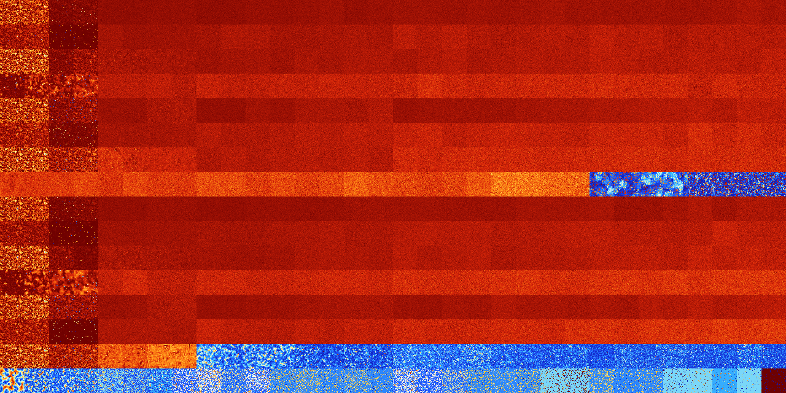

# B134567 (128000-128511)

<details>
    <summary>Initial Grid</summary>
    
</details>


<details>
    <summary>Initial Grid RLE</summary>

```
#C Exported from GoGoL (https://github.com/marrow16/gogol)
#C Wrap mode: Toroidal
#C Boundary mode: Dead
#C Step: 0
x = 100, y = 100, rule = B134567/S
24bo4bo3bo19bo32bo6bo$41bo14bo28bo3bo8bo$42bo2b2o17bo4bo$bobo11bo3bo36b
o14b2o11bo7bo$2bo6bo53bo4bo6bo$40bo42bo$3bo45bo$10b2o64bo20bo$36bo25b2o
8bo9bo13bo$17bo12bo19bobo15bo$100b$4bo31bo23bo5bo14bo$8bo18bo33bo10bo4b
obo5bo$10bo9bo15bo12bo2bo$11bo28bo48bo7bo$6bo12bo9bo9bo2bo46bo4bo$19bo
18bo5bo43bo$2bo3bo65bo23bo$6bo19bo5bo$8bo3bo3bo9bo3bo3bo45bo$14bo8bobo
16bo14bo40bo$34bo36bo15bo$35bo16bo19bo3bo16bo$19bobo30bo15bo4bo17bo$14b
o10bo2bo6bo18bo13bo$51bo8bo36bo$5b2o35bobo9bo3bo3bo33bo$14bo9bo13bobo
21bo4bo29bo$bo23bo25bo23bo$4bo7bo4bo4bo17bo20bobo$25bo10bo3bo7bo13bo$
55bo$28bo3bo13bo5bo37bo6bo$6bo7b2o5bo10bo9bo35bo15bo3bo$18bo29bo12bo5bo
29bo$11bo9bo16bo9bo24bo5bo9bobo6bo$11b2o26bo9bo$20bo13b2o21bo9bo3bo3bo
3bo3bobo$12bo23bo25bo15bo9bo$37bo5bo5bo11bob2o$22bo9bobo3bo20bo28bo$20b
o30bo27bo13bobo$4bo6bo3bo2bo2bo23bo20bo$o$28bo13bo52bo3bo$5bo3bo50bo16b
o17bo$bo19bo4bo8bo43bo$3bo4bo4bo34b2o$12bo30bo27bo$2bo2bo24bo23bo$10b2o
27bo2bo45bo$23b2o3bo5bo6bo2b2o8bo2b2o$6bo9bo13bo33bo15bo13bo$o47bo30bo
7bo10bo$9bo2bo9bo9bo2bo12bo26bo$19bo5bo19bo9bo27b2o4bo$55bo3bo3bo31bo$
20bo3bo25bo$23bo3bo12bo3bo10bo25bo$25bo22bo16bo12bo10bobo$56bo20bobo17b
o$11bo54bo27bo$o18bo9bo2bo9bo24bo8bo7bo12bo$3bo57bo11bo17bo$bo97bo$4bo
28bo22bo30bo2bo$20bo5bo20bo15bo2bo19bo$5bo3bo6bo29bo4bo6bo34bo$64bo$20b
o5bo2b2o10bo33bo6bo$13bo66bo$13bo16bo4bo18bo19bo$9bo86bo$21bo22bo44bo5b
o$11bo5bo8bo19bobo8bo8bo12bo$22bo2bo21bo21bo9bo$2bo40bo18bob2o13bo2bo$
4bo22bo10bo2bo15bobo23bo5bo$16bo49bo6bo$o5bo$12bo7bo3bo40bo$bo15b2o2bob
o6bo14bo9bobo35bo$7bo25bo8b2o38bo$o7b2o11bo3bo6b2o15bo2b2o43bo$4bo8bo$
5bo26bo18bo14bo2bo14bo$10bo49bo$5bo33bo8bo12bo3bo11bo6bo$16bo5bo8bo21bo
8bo13bo11bo5bo3bo$53bo15bo$6bo48bo35bo5bo$27bo24bo17bo13bo$48bo22bo2b2o
11bo9bo$25b2o45bobo17bo$12bo4bo6bo3bo17bo30bo$21bo12bo14bo13bo9bo8bo$
15bo22bo32bo14bo5bobo$4bo16bobo13bo3b2o52bo$16bo59bo15bo$27bobo13bo20bo
19bo!
```
</details>
<details>
    <summary>Thumbnail</summary>

</details>
<table>
<tr>
    <td><a href="./128000%20S%20Heat%20Map%20Activity.png"></a><br>S (128000)<br>R@11,p2</td>    <td><a href="./128001%20S0%20Heat%20Map%20Activity.png"></a><br>S0 (128001)<br>R@12,p2</td>    <td><a href="./128002%20S1%20Heat%20Map%20Activity.png"></a><br>S1 (128002)<br>R@79,p24</td>    <td><a href="./128003%20S01%20Heat%20Map%20Activity.png"></a><br>S01 (128003)<br>R@63,p24</td>    <td><a href="./128004%20S2%20Heat%20Map%20Activity.png"></a><br>S2 (128004)<br>G>1000</td>    <td><a href="./128005%20S02%20Heat%20Map%20Activity.png"></a><br>S02 (128005)<br>G>1000</td>    <td><a href="./128006%20S12%20Heat%20Map%20Activity.png"></a><br>S12 (128006)<br>G>1000</td>    <td><a href="./128007%20S012%20Heat%20Map%20Activity.png"></a><br>S012 (128007)<br>G>1000</td>    <td><a href="./128008%20S3%20Heat%20Map%20Activity.png"></a><br>S3 (128008)<br>G>1000</td>    <td><a href="./128009%20S03%20Heat%20Map%20Activity.png"></a><br>S03 (128009)<br>G>1000</td>    <td><a href="./128010%20S13%20Heat%20Map%20Activity.png"></a><br>S13 (128010)<br>G>1000</td>    <td><a href="./128011%20S013%20Heat%20Map%20Activity.png"></a><br>S013 (128011)<br>G>1000</td>    <td><a href="./128012%20S23%20Heat%20Map%20Activity.png"></a><br>S23 (128012)<br>G>1000</td>    <td><a href="./128013%20S023%20Heat%20Map%20Activity.png"></a><br>S023 (128013)<br>G>1000</td>    <td><a href="./128014%20S123%20Heat%20Map%20Activity.png"></a><br>S123 (128014)<br>G>1000</td>    <td><a href="./128015%20S0123%20Heat%20Map%20Activity.png"></a><br>S0123 (128015)<br>G>1000</td>    <td><a href="./128016%20S4%20Heat%20Map%20Activity.png"></a><br>S4 (128016)<br>G>1000</td>    <td><a href="./128017%20S04%20Heat%20Map%20Activity.png"></a><br>S04 (128017)<br>G>1000</td>    <td><a href="./128018%20S14%20Heat%20Map%20Activity.png"></a><br>S14 (128018)<br>G>1000</td>    <td><a href="./128019%20S014%20Heat%20Map%20Activity.png"></a><br>S014 (128019)<br>G>1000</td>    <td><a href="./128020%20S24%20Heat%20Map%20Activity.png"></a><br>S24 (128020)<br>G>1000</td>    <td><a href="./128021%20S024%20Heat%20Map%20Activity.png"></a><br>S024 (128021)<br>G>1000</td>    <td><a href="./128022%20S124%20Heat%20Map%20Activity.png"></a><br>S124 (128022)<br>G>1000</td>    <td><a href="./128023%20S0124%20Heat%20Map%20Activity.png"></a><br>S0124 (128023)<br>G>1000</td>    <td><a href="./128024%20S34%20Heat%20Map%20Activity.png"></a><br>S34 (128024)<br>G>1000</td>    <td><a href="./128025%20S034%20Heat%20Map%20Activity.png"></a><br>S034 (128025)<br>G>1000</td>    <td><a href="./128026%20S134%20Heat%20Map%20Activity.png"></a><br>S134 (128026)<br>G>1000</td>    <td><a href="./128027%20S0134%20Heat%20Map%20Activity.png"></a><br>S0134 (128027)<br>G>1000</td>    <td><a href="./128028%20S234%20Heat%20Map%20Activity.png"></a><br>S234 (128028)<br>G>1000</td>    <td><a href="./128029%20S0234%20Heat%20Map%20Activity.png"></a><br>S0234 (128029)<br>G>1000</td>    <td><a href="./128030%20S1234%20Heat%20Map%20Activity.png"></a><br>S1234 (128030)<br>G>1000</td>    <td><a href="./128031%20S01234%20Heat%20Map%20Activity.png"></a><br>S01234 (128031)<br>G>1000</td></tr>
<tr>
    <td><a href="./128032%20S5%20Heat%20Map%20Activity.png"></a><br>S5 (128032)<br>R@25,p4</td>    <td><a href="./128033%20S05%20Heat%20Map%20Activity.png"></a><br>S05 (128033)<br>R@26,p4</td>    <td><a href="./128034%20S15%20Heat%20Map%20Activity.png"></a><br>S15 (128034)<br>G>1000</td>    <td><a href="./128035%20S015%20Heat%20Map%20Activity.png"></a><br>S015 (128035)<br>R@744,p336</td>    <td><a href="./128036%20S25%20Heat%20Map%20Activity.png"></a><br>S25 (128036)<br>G>1000</td>    <td><a href="./128037%20S025%20Heat%20Map%20Activity.png"></a><br>S025 (128037)<br>G>1000</td>    <td><a href="./128038%20S125%20Heat%20Map%20Activity.png"></a><br>S125 (128038)<br>G>1000</td>    <td><a href="./128039%20S0125%20Heat%20Map%20Activity.png"></a><br>S0125 (128039)<br>G>1000</td>    <td><a href="./128040%20S35%20Heat%20Map%20Activity.png"></a><br>S35 (128040)<br>G>1000</td>    <td><a href="./128041%20S035%20Heat%20Map%20Activity.png"></a><br>S035 (128041)<br>G>1000</td>    <td><a href="./128042%20S135%20Heat%20Map%20Activity.png"></a><br>S135 (128042)<br>G>1000</td>    <td><a href="./128043%20S0135%20Heat%20Map%20Activity.png"></a><br>S0135 (128043)<br>G>1000</td>    <td><a href="./128044%20S235%20Heat%20Map%20Activity.png"></a><br>S235 (128044)<br>G>1000</td>    <td><a href="./128045%20S0235%20Heat%20Map%20Activity.png"></a><br>S0235 (128045)<br>G>1000</td>    <td><a href="./128046%20S1235%20Heat%20Map%20Activity.png"></a><br>S1235 (128046)<br>G>1000</td>    <td><a href="./128047%20S01235%20Heat%20Map%20Activity.png"></a><br>S01235 (128047)<br>G>1000</td>    <td><a href="./128048%20S45%20Heat%20Map%20Activity.png"></a><br>S45 (128048)<br>G>1000</td>    <td><a href="./128049%20S045%20Heat%20Map%20Activity.png"></a><br>S045 (128049)<br>G>1000</td>    <td><a href="./128050%20S145%20Heat%20Map%20Activity.png"></a><br>S145 (128050)<br>G>1000</td>    <td><a href="./128051%20S0145%20Heat%20Map%20Activity.png"></a><br>S0145 (128051)<br>G>1000</td>    <td><a href="./128052%20S245%20Heat%20Map%20Activity.png"></a><br>S245 (128052)<br>G>1000</td>    <td><a href="./128053%20S0245%20Heat%20Map%20Activity.png"></a><br>S0245 (128053)<br>G>1000</td>    <td><a href="./128054%20S1245%20Heat%20Map%20Activity.png"></a><br>S1245 (128054)<br>G>1000</td>    <td><a href="./128055%20S01245%20Heat%20Map%20Activity.png"></a><br>S01245 (128055)<br>G>1000</td>    <td><a href="./128056%20S345%20Heat%20Map%20Activity.png"></a><br>S345 (128056)<br>G>1000</td>    <td><a href="./128057%20S0345%20Heat%20Map%20Activity.png"></a><br>S0345 (128057)<br>G>1000</td>    <td><a href="./128058%20S1345%20Heat%20Map%20Activity.png"></a><br>S1345 (128058)<br>G>1000</td>    <td><a href="./128059%20S01345%20Heat%20Map%20Activity.png"></a><br>S01345 (128059)<br>G>1000</td>    <td><a href="./128060%20S2345%20Heat%20Map%20Activity.png"></a><br>S2345 (128060)<br>G>1000</td>    <td><a href="./128061%20S02345%20Heat%20Map%20Activity.png"></a><br>S02345 (128061)<br>G>1000</td>    <td><a href="./128062%20S12345%20Heat%20Map%20Activity.png"></a><br>S12345 (128062)<br>G>1000</td>    <td><a href="./128063%20S012345%20Heat%20Map%20Activity.png"></a><br>S012345 (128063)<br>G>1000</td></tr>
<tr>
    <td><a href="./128064%20S6%20Heat%20Map%20Activity.png"></a><br>S6 (128064)<br>R@10,p2</td>    <td><a href="./128065%20S06%20Heat%20Map%20Activity.png"></a><br>S06 (128065)<br>R@10,p2</td>    <td><a href="./128066%20S16%20Heat%20Map%20Activity.png"></a><br>S16 (128066)<br>R@51,p24</td>    <td><a href="./128067%20S016%20Heat%20Map%20Activity.png"></a><br>S016 (128067)<br>R@29,p8</td>    <td><a href="./128068%20S26%20Heat%20Map%20Activity.png"></a><br>S26 (128068)<br>G>1000</td>    <td><a href="./128069%20S026%20Heat%20Map%20Activity.png"></a><br>S026 (128069)<br>G>1000</td>    <td><a href="./128070%20S126%20Heat%20Map%20Activity.png"></a><br>S126 (128070)<br>G>1000</td>    <td><a href="./128071%20S0126%20Heat%20Map%20Activity.png"></a><br>S0126 (128071)<br>G>1000</td>    <td><a href="./128072%20S36%20Heat%20Map%20Activity.png"></a><br>S36 (128072)<br>G>1000</td>    <td><a href="./128073%20S036%20Heat%20Map%20Activity.png"></a><br>S036 (128073)<br>G>1000</td>    <td><a href="./128074%20S136%20Heat%20Map%20Activity.png"></a><br>S136 (128074)<br>G>1000</td>    <td><a href="./128075%20S0136%20Heat%20Map%20Activity.png"></a><br>S0136 (128075)<br>G>1000</td>    <td><a href="./128076%20S236%20Heat%20Map%20Activity.png"></a><br>S236 (128076)<br>G>1000</td>    <td><a href="./128077%20S0236%20Heat%20Map%20Activity.png"></a><br>S0236 (128077)<br>G>1000</td>    <td><a href="./128078%20S1236%20Heat%20Map%20Activity.png"></a><br>S1236 (128078)<br>G>1000</td>    <td><a href="./128079%20S01236%20Heat%20Map%20Activity.png"></a><br>S01236 (128079)<br>G>1000</td>    <td><a href="./128080%20S46%20Heat%20Map%20Activity.png"></a><br>S46 (128080)<br>G>1000</td>    <td><a href="./128081%20S046%20Heat%20Map%20Activity.png"></a><br>S046 (128081)<br>G>1000</td>    <td><a href="./128082%20S146%20Heat%20Map%20Activity.png"></a><br>S146 (128082)<br>G>1000</td>    <td><a href="./128083%20S0146%20Heat%20Map%20Activity.png"></a><br>S0146 (128083)<br>G>1000</td>    <td><a href="./128084%20S246%20Heat%20Map%20Activity.png"></a><br>S246 (128084)<br>G>1000</td>    <td><a href="./128085%20S0246%20Heat%20Map%20Activity.png"></a><br>S0246 (128085)<br>G>1000</td>    <td><a href="./128086%20S1246%20Heat%20Map%20Activity.png"></a><br>S1246 (128086)<br>G>1000</td>    <td><a href="./128087%20S01246%20Heat%20Map%20Activity.png"></a><br>S01246 (128087)<br>G>1000</td>    <td><a href="./128088%20S346%20Heat%20Map%20Activity.png"></a><br>S346 (128088)<br>G>1000</td>    <td><a href="./128089%20S0346%20Heat%20Map%20Activity.png"></a><br>S0346 (128089)<br>G>1000</td>    <td><a href="./128090%20S1346%20Heat%20Map%20Activity.png"></a><br>S1346 (128090)<br>G>1000</td>    <td><a href="./128091%20S01346%20Heat%20Map%20Activity.png"></a><br>S01346 (128091)<br>G>1000</td>    <td><a href="./128092%20S2346%20Heat%20Map%20Activity.png"></a><br>S2346 (128092)<br>G>1000</td>    <td><a href="./128093%20S02346%20Heat%20Map%20Activity.png"></a><br>S02346 (128093)<br>G>1000</td>    <td><a href="./128094%20S12346%20Heat%20Map%20Activity.png"></a><br>S12346 (128094)<br>G>1000</td>    <td><a href="./128095%20S012346%20Heat%20Map%20Activity.png"></a><br>S012346 (128095)<br>G>1000</td></tr>
<tr>
    <td><a href="./128096%20S56%20Heat%20Map%20Activity.png"></a><br>S56 (128096)<br>R@75,p12</td>    <td><a href="./128097%20S056%20Heat%20Map%20Activity.png"></a><br>S056 (128097)<br>R@89,p4</td>    <td><a href="./128098%20S156%20Heat%20Map%20Activity.png"></a><br>S156 (128098)<br>R@233,p12</td>    <td><a href="./128099%20S0156%20Heat%20Map%20Activity.png"></a><br>S0156 (128099)<br>R@258,p12</td>    <td><a href="./128100%20S256%20Heat%20Map%20Activity.png"></a><br>S256 (128100)<br>G>1000</td>    <td><a href="./128101%20S0256%20Heat%20Map%20Activity.png"></a><br>S0256 (128101)<br>G>1000</td>    <td><a href="./128102%20S1256%20Heat%20Map%20Activity.png"></a><br>S1256 (128102)<br>G>1000</td>    <td><a href="./128103%20S01256%20Heat%20Map%20Activity.png"></a><br>S01256 (128103)<br>G>1000</td>    <td><a href="./128104%20S356%20Heat%20Map%20Activity.png"></a><br>S356 (128104)<br>G>1000</td>    <td><a href="./128105%20S0356%20Heat%20Map%20Activity.png"></a><br>S0356 (128105)<br>G>1000</td>    <td><a href="./128106%20S1356%20Heat%20Map%20Activity.png"></a><br>S1356 (128106)<br>G>1000</td>    <td><a href="./128107%20S01356%20Heat%20Map%20Activity.png"></a><br>S01356 (128107)<br>G>1000</td>    <td><a href="./128108%20S2356%20Heat%20Map%20Activity.png"></a><br>S2356 (128108)<br>G>1000</td>    <td><a href="./128109%20S02356%20Heat%20Map%20Activity.png"></a><br>S02356 (128109)<br>G>1000</td>    <td><a href="./128110%20S12356%20Heat%20Map%20Activity.png"></a><br>S12356 (128110)<br>G>1000</td>    <td><a href="./128111%20S012356%20Heat%20Map%20Activity.png"></a><br>S012356 (128111)<br>G>1000</td>    <td><a href="./128112%20S456%20Heat%20Map%20Activity.png"></a><br>S456 (128112)<br>G>1000</td>    <td><a href="./128113%20S0456%20Heat%20Map%20Activity.png"></a><br>S0456 (128113)<br>G>1000</td>    <td><a href="./128114%20S1456%20Heat%20Map%20Activity.png"></a><br>S1456 (128114)<br>G>1000</td>    <td><a href="./128115%20S01456%20Heat%20Map%20Activity.png"></a><br>S01456 (128115)<br>G>1000</td>    <td><a href="./128116%20S2456%20Heat%20Map%20Activity.png"></a><br>S2456 (128116)<br>G>1000</td>    <td><a href="./128117%20S02456%20Heat%20Map%20Activity.png"></a><br>S02456 (128117)<br>G>1000</td>    <td><a href="./128118%20S12456%20Heat%20Map%20Activity.png"></a><br>S12456 (128118)<br>G>1000</td>    <td><a href="./128119%20S012456%20Heat%20Map%20Activity.png"></a><br>S012456 (128119)<br>G>1000</td>    <td><a href="./128120%20S3456%20Heat%20Map%20Activity.png"></a><br>S3456 (128120)<br>G>1000</td>    <td><a href="./128121%20S03456%20Heat%20Map%20Activity.png"></a><br>S03456 (128121)<br>G>1000</td>    <td><a href="./128122%20S13456%20Heat%20Map%20Activity.png"></a><br>S13456 (128122)<br>G>1000</td>    <td><a href="./128123%20S013456%20Heat%20Map%20Activity.png"></a><br>S013456 (128123)<br>G>1000</td>    <td><a href="./128124%20S23456%20Heat%20Map%20Activity.png"></a><br>S23456 (128124)<br>G>1000</td>    <td><a href="./128125%20S023456%20Heat%20Map%20Activity.png"></a><br>S023456 (128125)<br>G>1000</td>    <td><a href="./128126%20S123456%20Heat%20Map%20Activity.png"></a><br>S123456 (128126)<br>G>1000</td>    <td><a href="./128127%20S0123456%20Heat%20Map%20Activity.png"></a><br>S0123456 (128127)<br>G>1000</td></tr>
<tr>
    <td><a href="./128128%20S7%20Heat%20Map%20Activity.png"></a><br>S7 (128128)<br>R@11,p2</td>    <td><a href="./128129%20S07%20Heat%20Map%20Activity.png"></a><br>S07 (128129)<br>R@11,p2</td>    <td><a href="./128130%20S17%20Heat%20Map%20Activity.png"></a><br>S17 (128130)<br>R@41,p24</td>    <td><a href="./128131%20S017%20Heat%20Map%20Activity.png"></a><br>S017 (128131)<br>R@29,p8</td>    <td><a href="./128132%20S27%20Heat%20Map%20Activity.png"></a><br>S27 (128132)<br>G>1000</td>    <td><a href="./128133%20S027%20Heat%20Map%20Activity.png"></a><br>S027 (128133)<br>G>1000</td>    <td><a href="./128134%20S127%20Heat%20Map%20Activity.png"></a><br>S127 (128134)<br>G>1000</td>    <td><a href="./128135%20S0127%20Heat%20Map%20Activity.png"></a><br>S0127 (128135)<br>G>1000</td>    <td><a href="./128136%20S37%20Heat%20Map%20Activity.png"></a><br>S37 (128136)<br>G>1000</td>    <td><a href="./128137%20S037%20Heat%20Map%20Activity.png"></a><br>S037 (128137)<br>G>1000</td>    <td><a href="./128138%20S137%20Heat%20Map%20Activity.png"></a><br>S137 (128138)<br>G>1000</td>    <td><a href="./128139%20S0137%20Heat%20Map%20Activity.png"></a><br>S0137 (128139)<br>G>1000</td>    <td><a href="./128140%20S237%20Heat%20Map%20Activity.png"></a><br>S237 (128140)<br>G>1000</td>    <td><a href="./128141%20S0237%20Heat%20Map%20Activity.png"></a><br>S0237 (128141)<br>G>1000</td>    <td><a href="./128142%20S1237%20Heat%20Map%20Activity.png"></a><br>S1237 (128142)<br>G>1000</td>    <td><a href="./128143%20S01237%20Heat%20Map%20Activity.png"></a><br>S01237 (128143)<br>G>1000</td>    <td><a href="./128144%20S47%20Heat%20Map%20Activity.png"></a><br>S47 (128144)<br>G>1000</td>    <td><a href="./128145%20S047%20Heat%20Map%20Activity.png"></a><br>S047 (128145)<br>G>1000</td>    <td><a href="./128146%20S147%20Heat%20Map%20Activity.png"></a><br>S147 (128146)<br>G>1000</td>    <td><a href="./128147%20S0147%20Heat%20Map%20Activity.png"></a><br>S0147 (128147)<br>G>1000</td>    <td><a href="./128148%20S247%20Heat%20Map%20Activity.png"></a><br>S247 (128148)<br>G>1000</td>    <td><a href="./128149%20S0247%20Heat%20Map%20Activity.png"></a><br>S0247 (128149)<br>G>1000</td>    <td><a href="./128150%20S1247%20Heat%20Map%20Activity.png"></a><br>S1247 (128150)<br>G>1000</td>    <td><a href="./128151%20S01247%20Heat%20Map%20Activity.png"></a><br>S01247 (128151)<br>G>1000</td>    <td><a href="./128152%20S347%20Heat%20Map%20Activity.png"></a><br>S347 (128152)<br>G>1000</td>    <td><a href="./128153%20S0347%20Heat%20Map%20Activity.png"></a><br>S0347 (128153)<br>G>1000</td>    <td><a href="./128154%20S1347%20Heat%20Map%20Activity.png"></a><br>S1347 (128154)<br>G>1000</td>    <td><a href="./128155%20S01347%20Heat%20Map%20Activity.png"></a><br>S01347 (128155)<br>G>1000</td>    <td><a href="./128156%20S2347%20Heat%20Map%20Activity.png"></a><br>S2347 (128156)<br>G>1000</td>    <td><a href="./128157%20S02347%20Heat%20Map%20Activity.png"></a><br>S02347 (128157)<br>G>1000</td>    <td><a href="./128158%20S12347%20Heat%20Map%20Activity.png"></a><br>S12347 (128158)<br>G>1000</td>    <td><a href="./128159%20S012347%20Heat%20Map%20Activity.png"></a><br>S012347 (128159)<br>G>1000</td></tr>
<tr>
    <td><a href="./128160%20S57%20Heat%20Map%20Activity.png"></a><br>S57 (128160)<br>R@22,p4</td>    <td><a href="./128161%20S057%20Heat%20Map%20Activity.png"></a><br>S057 (128161)<br>R@25,p4</td>    <td><a href="./128162%20S157%20Heat%20Map%20Activity.png"></a><br>S157 (128162)<br>R@159,p24</td>    <td><a href="./128163%20S0157%20Heat%20Map%20Activity.png"></a><br>S0157 (128163)<br>R@155,p40</td>    <td><a href="./128164%20S257%20Heat%20Map%20Activity.png"></a><br>S257 (128164)<br>G>1000</td>    <td><a href="./128165%20S0257%20Heat%20Map%20Activity.png"></a><br>S0257 (128165)<br>G>1000</td>    <td><a href="./128166%20S1257%20Heat%20Map%20Activity.png"></a><br>S1257 (128166)<br>G>1000</td>    <td><a href="./128167%20S01257%20Heat%20Map%20Activity.png"></a><br>S01257 (128167)<br>G>1000</td>    <td><a href="./128168%20S357%20Heat%20Map%20Activity.png"></a><br>S357 (128168)<br>G>1000</td>    <td><a href="./128169%20S0357%20Heat%20Map%20Activity.png"></a><br>S0357 (128169)<br>G>1000</td>    <td><a href="./128170%20S1357%20Heat%20Map%20Activity.png"></a><br>S1357 (128170)<br>G>1000</td>    <td><a href="./128171%20S01357%20Heat%20Map%20Activity.png"></a><br>S01357 (128171)<br>G>1000</td>    <td><a href="./128172%20S2357%20Heat%20Map%20Activity.png"></a><br>S2357 (128172)<br>G>1000</td>    <td><a href="./128173%20S02357%20Heat%20Map%20Activity.png"></a><br>S02357 (128173)<br>G>1000</td>    <td><a href="./128174%20S12357%20Heat%20Map%20Activity.png"></a><br>S12357 (128174)<br>G>1000</td>    <td><a href="./128175%20S012357%20Heat%20Map%20Activity.png"></a><br>S012357 (128175)<br>G>1000</td>    <td><a href="./128176%20S457%20Heat%20Map%20Activity.png"></a><br>S457 (128176)<br>G>1000</td>    <td><a href="./128177%20S0457%20Heat%20Map%20Activity.png"></a><br>S0457 (128177)<br>G>1000</td>    <td><a href="./128178%20S1457%20Heat%20Map%20Activity.png"></a><br>S1457 (128178)<br>G>1000</td>    <td><a href="./128179%20S01457%20Heat%20Map%20Activity.png"></a><br>S01457 (128179)<br>G>1000</td>    <td><a href="./128180%20S2457%20Heat%20Map%20Activity.png"></a><br>S2457 (128180)<br>G>1000</td>    <td><a href="./128181%20S02457%20Heat%20Map%20Activity.png"></a><br>S02457 (128181)<br>G>1000</td>    <td><a href="./128182%20S12457%20Heat%20Map%20Activity.png"></a><br>S12457 (128182)<br>G>1000</td>    <td><a href="./128183%20S012457%20Heat%20Map%20Activity.png"></a><br>S012457 (128183)<br>G>1000</td>    <td><a href="./128184%20S3457%20Heat%20Map%20Activity.png"></a><br>S3457 (128184)<br>G>1000</td>    <td><a href="./128185%20S03457%20Heat%20Map%20Activity.png"></a><br>S03457 (128185)<br>G>1000</td>    <td><a href="./128186%20S13457%20Heat%20Map%20Activity.png"></a><br>S13457 (128186)<br>G>1000</td>    <td><a href="./128187%20S013457%20Heat%20Map%20Activity.png"></a><br>S013457 (128187)<br>G>1000</td>    <td><a href="./128188%20S23457%20Heat%20Map%20Activity.png"></a><br>S23457 (128188)<br>G>1000</td>    <td><a href="./128189%20S023457%20Heat%20Map%20Activity.png"></a><br>S023457 (128189)<br>G>1000</td>    <td><a href="./128190%20S123457%20Heat%20Map%20Activity.png"></a><br>S123457 (128190)<br>G>1000</td>    <td><a href="./128191%20S0123457%20Heat%20Map%20Activity.png"></a><br>S0123457 (128191)<br>G>1000</td></tr>
<tr>
    <td><a href="./128192%20S67%20Heat%20Map%20Activity.png"></a><br>S67 (128192)<br>R@10,p2</td>    <td><a href="./128193%20S067%20Heat%20Map%20Activity.png"></a><br>S067 (128193)<br>R@10,p2</td>    <td><a href="./128194%20S167%20Heat%20Map%20Activity.png"></a><br>S167 (128194)<br>R@20,p2</td>    <td><a href="./128195%20S0167%20Heat%20Map%20Activity.png"></a><br>S0167 (128195)<br>R@17,p2</td>    <td><a href="./128196%20S267%20Heat%20Map%20Activity.png"></a><br>S267 (128196)<br>G>1000</td>    <td><a href="./128197%20S0267%20Heat%20Map%20Activity.png"></a><br>S0267 (128197)<br>G>1000</td>    <td><a href="./128198%20S1267%20Heat%20Map%20Activity.png"></a><br>S1267 (128198)<br>G>1000</td>    <td><a href="./128199%20S01267%20Heat%20Map%20Activity.png"></a><br>S01267 (128199)<br>G>1000</td>    <td><a href="./128200%20S367%20Heat%20Map%20Activity.png"></a><br>S367 (128200)<br>G>1000</td>    <td><a href="./128201%20S0367%20Heat%20Map%20Activity.png"></a><br>S0367 (128201)<br>G>1000</td>    <td><a href="./128202%20S1367%20Heat%20Map%20Activity.png"></a><br>S1367 (128202)<br>G>1000</td>    <td><a href="./128203%20S01367%20Heat%20Map%20Activity.png"></a><br>S01367 (128203)<br>G>1000</td>    <td><a href="./128204%20S2367%20Heat%20Map%20Activity.png"></a><br>S2367 (128204)<br>G>1000</td>    <td><a href="./128205%20S02367%20Heat%20Map%20Activity.png"></a><br>S02367 (128205)<br>G>1000</td>    <td><a href="./128206%20S12367%20Heat%20Map%20Activity.png"></a><br>S12367 (128206)<br>G>1000</td>    <td><a href="./128207%20S012367%20Heat%20Map%20Activity.png"></a><br>S012367 (128207)<br>G>1000</td>    <td><a href="./128208%20S467%20Heat%20Map%20Activity.png"></a><br>S467 (128208)<br>G>1000</td>    <td><a href="./128209%20S0467%20Heat%20Map%20Activity.png"></a><br>S0467 (128209)<br>G>1000</td>    <td><a href="./128210%20S1467%20Heat%20Map%20Activity.png"></a><br>S1467 (128210)<br>G>1000</td>    <td><a href="./128211%20S01467%20Heat%20Map%20Activity.png"></a><br>S01467 (128211)<br>G>1000</td>    <td><a href="./128212%20S2467%20Heat%20Map%20Activity.png"></a><br>S2467 (128212)<br>G>1000</td>    <td><a href="./128213%20S02467%20Heat%20Map%20Activity.png"></a><br>S02467 (128213)<br>G>1000</td>    <td><a href="./128214%20S12467%20Heat%20Map%20Activity.png"></a><br>S12467 (128214)<br>G>1000</td>    <td><a href="./128215%20S012467%20Heat%20Map%20Activity.png"></a><br>S012467 (128215)<br>G>1000</td>    <td><a href="./128216%20S3467%20Heat%20Map%20Activity.png"></a><br>S3467 (128216)<br>G>1000</td>    <td><a href="./128217%20S03467%20Heat%20Map%20Activity.png"></a><br>S03467 (128217)<br>G>1000</td>    <td><a href="./128218%20S13467%20Heat%20Map%20Activity.png"></a><br>S13467 (128218)<br>G>1000</td>    <td><a href="./128219%20S013467%20Heat%20Map%20Activity.png"></a><br>S013467 (128219)<br>G>1000</td>    <td><a href="./128220%20S23467%20Heat%20Map%20Activity.png"></a><br>S23467 (128220)<br>G>1000</td>    <td><a href="./128221%20S023467%20Heat%20Map%20Activity.png"></a><br>S023467 (128221)<br>G>1000</td>    <td><a href="./128222%20S123467%20Heat%20Map%20Activity.png"></a><br>S123467 (128222)<br>G>1000</td>    <td><a href="./128223%20S0123467%20Heat%20Map%20Activity.png"></a><br>S0123467 (128223)<br>G>1000</td></tr>
<tr>
    <td><a href="./128224%20S567%20Heat%20Map%20Activity.png"></a><br>S567 (128224)<br>G>1000</td>    <td><a href="./128225%20S0567%20Heat%20Map%20Activity.png"></a><br>S0567 (128225)<br>G>1000</td>    <td><a href="./128226%20S1567%20Heat%20Map%20Activity.png"></a><br>S1567 (128226)<br>G>1000</td>    <td><a href="./128227%20S01567%20Heat%20Map%20Activity.png"></a><br>S01567 (128227)<br>G>1000</td>    <td><a href="./128228%20S2567%20Heat%20Map%20Activity.png"></a><br>S2567 (128228)<br>G>1000</td>    <td><a href="./128229%20S02567%20Heat%20Map%20Activity.png"></a><br>S02567 (128229)<br>G>1000</td>    <td><a href="./128230%20S12567%20Heat%20Map%20Activity.png"></a><br>S12567 (128230)<br>G>1000</td>    <td><a href="./128231%20S012567%20Heat%20Map%20Activity.png"></a><br>S012567 (128231)<br>G>1000</td>    <td><a href="./128232%20S3567%20Heat%20Map%20Activity.png"></a><br>S3567 (128232)<br>G>1000</td>    <td><a href="./128233%20S03567%20Heat%20Map%20Activity.png"></a><br>S03567 (128233)<br>G>1000</td>    <td><a href="./128234%20S13567%20Heat%20Map%20Activity.png"></a><br>S13567 (128234)<br>G>1000</td>    <td><a href="./128235%20S013567%20Heat%20Map%20Activity.png"></a><br>S013567 (128235)<br>G>1000</td>    <td><a href="./128236%20S23567%20Heat%20Map%20Activity.png"></a><br>S23567 (128236)<br>G>1000</td>    <td><a href="./128237%20S023567%20Heat%20Map%20Activity.png"></a><br>S023567 (128237)<br>G>1000</td>    <td><a href="./128238%20S123567%20Heat%20Map%20Activity.png"></a><br>S123567 (128238)<br>G>1000</td>    <td><a href="./128239%20S0123567%20Heat%20Map%20Activity.png"></a><br>S0123567 (128239)<br>G>1000</td>    <td><a href="./128240%20S4567%20Heat%20Map%20Activity.png"></a><br>S4567 (128240)<br>G>1000</td>    <td><a href="./128241%20S04567%20Heat%20Map%20Activity.png"></a><br>S04567 (128241)<br>G>1000</td>    <td><a href="./128242%20S14567%20Heat%20Map%20Activity.png"></a><br>S14567 (128242)<br>G>1000</td>    <td><a href="./128243%20S014567%20Heat%20Map%20Activity.png"></a><br>S014567 (128243)<br>G>1000</td>    <td><a href="./128244%20S24567%20Heat%20Map%20Activity.png"></a><br>S24567 (128244)<br>G>1000</td>    <td><a href="./128245%20S024567%20Heat%20Map%20Activity.png"></a><br>S024567 (128245)<br>G>1000</td>    <td><a href="./128246%20S124567%20Heat%20Map%20Activity.png"></a><br>S124567 (128246)<br>G>1000</td>    <td><a href="./128247%20S0124567%20Heat%20Map%20Activity.png"></a><br>S0124567 (128247)<br>G>1000</td>    <td><a href="./128248%20S34567%20Heat%20Map%20Activity.png"></a><br>S34567 (128248)<br>R@865,p6</td>    <td><a href="./128249%20S034567%20Heat%20Map%20Activity.png"></a><br>S034567 (128249)<br>R@830,p6</td>    <td><a href="./128250%20S134567%20Heat%20Map%20Activity.png"></a><br>S134567 (128250)<br>R@959,p18</td>    <td><a href="./128251%20S0134567%20Heat%20Map%20Activity.png"></a><br>S0134567 (128251)<br>G>1000</td>    <td><a href="./128252%20S234567%20Heat%20Map%20Activity.png"></a><br>S234567 (128252)<br>R@47,p6</td>    <td><a href="./128253%20S0234567%20Heat%20Map%20Activity.png"></a><br>S0234567 (128253)<br>R@54,p12</td>    <td><a href="./128254%20S1234567%20Heat%20Map%20Activity.png"></a><br>S1234567 (128254)<br>R@49,p6</td>    <td><a href="./128255%20S01234567%20Heat%20Map%20Activity.png"></a><br>S01234567 (128255)<br>R@53,p6</td></tr>
<tr>
    <td><a href="./128256%20S8%20Heat%20Map%20Activity.png"></a><br>S8 (128256)<br>R@11,p2</td>    <td><a href="./128257%20S08%20Heat%20Map%20Activity.png"></a><br>S08 (128257)<br>R@12,p2</td>    <td><a href="./128258%20S18%20Heat%20Map%20Activity.png"></a><br>S18 (128258)<br>R@90,p24</td>    <td><a href="./128259%20S018%20Heat%20Map%20Activity.png"></a><br>S018 (128259)<br>R@58,p24</td>    <td><a href="./128260%20S28%20Heat%20Map%20Activity.png"></a><br>S28 (128260)<br>G>1000</td>    <td><a href="./128261%20S028%20Heat%20Map%20Activity.png"></a><br>S028 (128261)<br>G>1000</td>    <td><a href="./128262%20S128%20Heat%20Map%20Activity.png"></a><br>S128 (128262)<br>G>1000</td>    <td><a href="./128263%20S0128%20Heat%20Map%20Activity.png"></a><br>S0128 (128263)<br>G>1000</td>    <td><a href="./128264%20S38%20Heat%20Map%20Activity.png"></a><br>S38 (128264)<br>G>1000</td>    <td><a href="./128265%20S038%20Heat%20Map%20Activity.png"></a><br>S038 (128265)<br>G>1000</td>    <td><a href="./128266%20S138%20Heat%20Map%20Activity.png"></a><br>S138 (128266)<br>G>1000</td>    <td><a href="./128267%20S0138%20Heat%20Map%20Activity.png"></a><br>S0138 (128267)<br>G>1000</td>    <td><a href="./128268%20S238%20Heat%20Map%20Activity.png"></a><br>S238 (128268)<br>G>1000</td>    <td><a href="./128269%20S0238%20Heat%20Map%20Activity.png"></a><br>S0238 (128269)<br>G>1000</td>    <td><a href="./128270%20S1238%20Heat%20Map%20Activity.png"></a><br>S1238 (128270)<br>G>1000</td>    <td><a href="./128271%20S01238%20Heat%20Map%20Activity.png"></a><br>S01238 (128271)<br>G>1000</td>    <td><a href="./128272%20S48%20Heat%20Map%20Activity.png"></a><br>S48 (128272)<br>G>1000</td>    <td><a href="./128273%20S048%20Heat%20Map%20Activity.png"></a><br>S048 (128273)<br>G>1000</td>    <td><a href="./128274%20S148%20Heat%20Map%20Activity.png"></a><br>S148 (128274)<br>G>1000</td>    <td><a href="./128275%20S0148%20Heat%20Map%20Activity.png"></a><br>S0148 (128275)<br>G>1000</td>    <td><a href="./128276%20S248%20Heat%20Map%20Activity.png"></a><br>S248 (128276)<br>G>1000</td>    <td><a href="./128277%20S0248%20Heat%20Map%20Activity.png"></a><br>S0248 (128277)<br>G>1000</td>    <td><a href="./128278%20S1248%20Heat%20Map%20Activity.png"></a><br>S1248 (128278)<br>G>1000</td>    <td><a href="./128279%20S01248%20Heat%20Map%20Activity.png"></a><br>S01248 (128279)<br>G>1000</td>    <td><a href="./128280%20S348%20Heat%20Map%20Activity.png"></a><br>S348 (128280)<br>G>1000</td>    <td><a href="./128281%20S0348%20Heat%20Map%20Activity.png"></a><br>S0348 (128281)<br>G>1000</td>    <td><a href="./128282%20S1348%20Heat%20Map%20Activity.png"></a><br>S1348 (128282)<br>G>1000</td>    <td><a href="./128283%20S01348%20Heat%20Map%20Activity.png"></a><br>S01348 (128283)<br>G>1000</td>    <td><a href="./128284%20S2348%20Heat%20Map%20Activity.png"></a><br>S2348 (128284)<br>G>1000</td>    <td><a href="./128285%20S02348%20Heat%20Map%20Activity.png"></a><br>S02348 (128285)<br>G>1000</td>    <td><a href="./128286%20S12348%20Heat%20Map%20Activity.png"></a><br>S12348 (128286)<br>G>1000</td>    <td><a href="./128287%20S012348%20Heat%20Map%20Activity.png"></a><br>S012348 (128287)<br>G>1000</td></tr>
<tr>
    <td><a href="./128288%20S58%20Heat%20Map%20Activity.png"></a><br>S58 (128288)<br>R@25,p4</td>    <td><a href="./128289%20S058%20Heat%20Map%20Activity.png"></a><br>S058 (128289)<br>R@37,p12</td>    <td><a href="./128290%20S158%20Heat%20Map%20Activity.png"></a><br>S158 (128290)<br>G>1000</td>    <td><a href="./128291%20S0158%20Heat%20Map%20Activity.png"></a><br>S0158 (128291)<br>G>1000</td>    <td><a href="./128292%20S258%20Heat%20Map%20Activity.png"></a><br>S258 (128292)<br>G>1000</td>    <td><a href="./128293%20S0258%20Heat%20Map%20Activity.png"></a><br>S0258 (128293)<br>G>1000</td>    <td><a href="./128294%20S1258%20Heat%20Map%20Activity.png"></a><br>S1258 (128294)<br>G>1000</td>    <td><a href="./128295%20S01258%20Heat%20Map%20Activity.png"></a><br>S01258 (128295)<br>G>1000</td>    <td><a href="./128296%20S358%20Heat%20Map%20Activity.png"></a><br>S358 (128296)<br>G>1000</td>    <td><a href="./128297%20S0358%20Heat%20Map%20Activity.png"></a><br>S0358 (128297)<br>G>1000</td>    <td><a href="./128298%20S1358%20Heat%20Map%20Activity.png"></a><br>S1358 (128298)<br>G>1000</td>    <td><a href="./128299%20S01358%20Heat%20Map%20Activity.png"></a><br>S01358 (128299)<br>G>1000</td>    <td><a href="./128300%20S2358%20Heat%20Map%20Activity.png"></a><br>S2358 (128300)<br>G>1000</td>    <td><a href="./128301%20S02358%20Heat%20Map%20Activity.png"></a><br>S02358 (128301)<br>G>1000</td>    <td><a href="./128302%20S12358%20Heat%20Map%20Activity.png"></a><br>S12358 (128302)<br>G>1000</td>    <td><a href="./128303%20S012358%20Heat%20Map%20Activity.png"></a><br>S012358 (128303)<br>G>1000</td>    <td><a href="./128304%20S458%20Heat%20Map%20Activity.png"></a><br>S458 (128304)<br>G>1000</td>    <td><a href="./128305%20S0458%20Heat%20Map%20Activity.png"></a><br>S0458 (128305)<br>G>1000</td>    <td><a href="./128306%20S1458%20Heat%20Map%20Activity.png"></a><br>S1458 (128306)<br>G>1000</td>    <td><a href="./128307%20S01458%20Heat%20Map%20Activity.png"></a><br>S01458 (128307)<br>G>1000</td>    <td><a href="./128308%20S2458%20Heat%20Map%20Activity.png"></a><br>S2458 (128308)<br>G>1000</td>    <td><a href="./128309%20S02458%20Heat%20Map%20Activity.png"></a><br>S02458 (128309)<br>G>1000</td>    <td><a href="./128310%20S12458%20Heat%20Map%20Activity.png"></a><br>S12458 (128310)<br>G>1000</td>    <td><a href="./128311%20S012458%20Heat%20Map%20Activity.png"></a><br>S012458 (128311)<br>G>1000</td>    <td><a href="./128312%20S3458%20Heat%20Map%20Activity.png"></a><br>S3458 (128312)<br>G>1000</td>    <td><a href="./128313%20S03458%20Heat%20Map%20Activity.png"></a><br>S03458 (128313)<br>G>1000</td>    <td><a href="./128314%20S13458%20Heat%20Map%20Activity.png"></a><br>S13458 (128314)<br>G>1000</td>    <td><a href="./128315%20S013458%20Heat%20Map%20Activity.png"></a><br>S013458 (128315)<br>G>1000</td>    <td><a href="./128316%20S23458%20Heat%20Map%20Activity.png"></a><br>S23458 (128316)<br>G>1000</td>    <td><a href="./128317%20S023458%20Heat%20Map%20Activity.png"></a><br>S023458 (128317)<br>G>1000</td>    <td><a href="./128318%20S123458%20Heat%20Map%20Activity.png"></a><br>S123458 (128318)<br>G>1000</td>    <td><a href="./128319%20S0123458%20Heat%20Map%20Activity.png"></a><br>S0123458 (128319)<br>G>1000</td></tr>
<tr>
    <td><a href="./128320%20S68%20Heat%20Map%20Activity.png"></a><br>S68 (128320)<br>R@10,p2</td>    <td><a href="./128321%20S068%20Heat%20Map%20Activity.png"></a><br>S068 (128321)<br>R@10,p2</td>    <td><a href="./128322%20S168%20Heat%20Map%20Activity.png"></a><br>S168 (128322)<br>R@41,p12</td>    <td><a href="./128323%20S0168%20Heat%20Map%20Activity.png"></a><br>S0168 (128323)<br>R@75,p40</td>    <td><a href="./128324%20S268%20Heat%20Map%20Activity.png"></a><br>S268 (128324)<br>G>1000</td>    <td><a href="./128325%20S0268%20Heat%20Map%20Activity.png"></a><br>S0268 (128325)<br>G>1000</td>    <td><a href="./128326%20S1268%20Heat%20Map%20Activity.png"></a><br>S1268 (128326)<br>G>1000</td>    <td><a href="./128327%20S01268%20Heat%20Map%20Activity.png"></a><br>S01268 (128327)<br>G>1000</td>    <td><a href="./128328%20S368%20Heat%20Map%20Activity.png"></a><br>S368 (128328)<br>G>1000</td>    <td><a href="./128329%20S0368%20Heat%20Map%20Activity.png"></a><br>S0368 (128329)<br>G>1000</td>    <td><a href="./128330%20S1368%20Heat%20Map%20Activity.png"></a><br>S1368 (128330)<br>G>1000</td>    <td><a href="./128331%20S01368%20Heat%20Map%20Activity.png"></a><br>S01368 (128331)<br>G>1000</td>    <td><a href="./128332%20S2368%20Heat%20Map%20Activity.png"></a><br>S2368 (128332)<br>G>1000</td>    <td><a href="./128333%20S02368%20Heat%20Map%20Activity.png"></a><br>S02368 (128333)<br>G>1000</td>    <td><a href="./128334%20S12368%20Heat%20Map%20Activity.png"></a><br>S12368 (128334)<br>G>1000</td>    <td><a href="./128335%20S012368%20Heat%20Map%20Activity.png"></a><br>S012368 (128335)<br>G>1000</td>    <td><a href="./128336%20S468%20Heat%20Map%20Activity.png"></a><br>S468 (128336)<br>G>1000</td>    <td><a href="./128337%20S0468%20Heat%20Map%20Activity.png"></a><br>S0468 (128337)<br>G>1000</td>    <td><a href="./128338%20S1468%20Heat%20Map%20Activity.png"></a><br>S1468 (128338)<br>G>1000</td>    <td><a href="./128339%20S01468%20Heat%20Map%20Activity.png"></a><br>S01468 (128339)<br>G>1000</td>    <td><a href="./128340%20S2468%20Heat%20Map%20Activity.png"></a><br>S2468 (128340)<br>G>1000</td>    <td><a href="./128341%20S02468%20Heat%20Map%20Activity.png"></a><br>S02468 (128341)<br>G>1000</td>    <td><a href="./128342%20S12468%20Heat%20Map%20Activity.png"></a><br>S12468 (128342)<br>G>1000</td>    <td><a href="./128343%20S012468%20Heat%20Map%20Activity.png"></a><br>S012468 (128343)<br>G>1000</td>    <td><a href="./128344%20S3468%20Heat%20Map%20Activity.png"></a><br>S3468 (128344)<br>G>1000</td>    <td><a href="./128345%20S03468%20Heat%20Map%20Activity.png"></a><br>S03468 (128345)<br>G>1000</td>    <td><a href="./128346%20S13468%20Heat%20Map%20Activity.png"></a><br>S13468 (128346)<br>G>1000</td>    <td><a href="./128347%20S013468%20Heat%20Map%20Activity.png"></a><br>S013468 (128347)<br>G>1000</td>    <td><a href="./128348%20S23468%20Heat%20Map%20Activity.png"></a><br>S23468 (128348)<br>G>1000</td>    <td><a href="./128349%20S023468%20Heat%20Map%20Activity.png"></a><br>S023468 (128349)<br>G>1000</td>    <td><a href="./128350%20S123468%20Heat%20Map%20Activity.png"></a><br>S123468 (128350)<br>G>1000</td>    <td><a href="./128351%20S0123468%20Heat%20Map%20Activity.png"></a><br>S0123468 (128351)<br>G>1000</td></tr>
<tr>
    <td><a href="./128352%20S568%20Heat%20Map%20Activity.png"></a><br>S568 (128352)<br>R@80,p2</td>    <td><a href="./128353%20S0568%20Heat%20Map%20Activity.png"></a><br>S0568 (128353)<br>R@130,p4</td>    <td><a href="./128354%20S1568%20Heat%20Map%20Activity.png"></a><br>S1568 (128354)<br>R@391,p84</td>    <td><a href="./128355%20S01568%20Heat%20Map%20Activity.png"></a><br>S01568 (128355)<br>R@434,p24</td>    <td><a href="./128356%20S2568%20Heat%20Map%20Activity.png"></a><br>S2568 (128356)<br>G>1000</td>    <td><a href="./128357%20S02568%20Heat%20Map%20Activity.png"></a><br>S02568 (128357)<br>G>1000</td>    <td><a href="./128358%20S12568%20Heat%20Map%20Activity.png"></a><br>S12568 (128358)<br>G>1000</td>    <td><a href="./128359%20S012568%20Heat%20Map%20Activity.png"></a><br>S012568 (128359)<br>G>1000</td>    <td><a href="./128360%20S3568%20Heat%20Map%20Activity.png"></a><br>S3568 (128360)<br>G>1000</td>    <td><a href="./128361%20S03568%20Heat%20Map%20Activity.png"></a><br>S03568 (128361)<br>G>1000</td>    <td><a href="./128362%20S13568%20Heat%20Map%20Activity.png"></a><br>S13568 (128362)<br>G>1000</td>    <td><a href="./128363%20S013568%20Heat%20Map%20Activity.png"></a><br>S013568 (128363)<br>G>1000</td>    <td><a href="./128364%20S23568%20Heat%20Map%20Activity.png"></a><br>S23568 (128364)<br>G>1000</td>    <td><a href="./128365%20S023568%20Heat%20Map%20Activity.png"></a><br>S023568 (128365)<br>G>1000</td>    <td><a href="./128366%20S123568%20Heat%20Map%20Activity.png"></a><br>S123568 (128366)<br>G>1000</td>    <td><a href="./128367%20S0123568%20Heat%20Map%20Activity.png"></a><br>S0123568 (128367)<br>G>1000</td>    <td><a href="./128368%20S4568%20Heat%20Map%20Activity.png"></a><br>S4568 (128368)<br>G>1000</td>    <td><a href="./128369%20S04568%20Heat%20Map%20Activity.png"></a><br>S04568 (128369)<br>G>1000</td>    <td><a href="./128370%20S14568%20Heat%20Map%20Activity.png"></a><br>S14568 (128370)<br>G>1000</td>    <td><a href="./128371%20S014568%20Heat%20Map%20Activity.png"></a><br>S014568 (128371)<br>G>1000</td>    <td><a href="./128372%20S24568%20Heat%20Map%20Activity.png"></a><br>S24568 (128372)<br>G>1000</td>    <td><a href="./128373%20S024568%20Heat%20Map%20Activity.png"></a><br>S024568 (128373)<br>G>1000</td>    <td><a href="./128374%20S124568%20Heat%20Map%20Activity.png"></a><br>S124568 (128374)<br>G>1000</td>    <td><a href="./128375%20S0124568%20Heat%20Map%20Activity.png"></a><br>S0124568 (128375)<br>G>1000</td>    <td><a href="./128376%20S34568%20Heat%20Map%20Activity.png"></a><br>S34568 (128376)<br>G>1000</td>    <td><a href="./128377%20S034568%20Heat%20Map%20Activity.png"></a><br>S034568 (128377)<br>G>1000</td>    <td><a href="./128378%20S134568%20Heat%20Map%20Activity.png"></a><br>S134568 (128378)<br>G>1000</td>    <td><a href="./128379%20S0134568%20Heat%20Map%20Activity.png"></a><br>S0134568 (128379)<br>G>1000</td>    <td><a href="./128380%20S234568%20Heat%20Map%20Activity.png"></a><br>S234568 (128380)<br>G>1000</td>    <td><a href="./128381%20S0234568%20Heat%20Map%20Activity.png"></a><br>S0234568 (128381)<br>G>1000</td>    <td><a href="./128382%20S1234568%20Heat%20Map%20Activity.png"></a><br>S1234568 (128382)<br>G>1000</td>    <td><a href="./128383%20S01234568%20Heat%20Map%20Activity.png"></a><br>S01234568 (128383)<br>G>1000</td></tr>
<tr>
    <td><a href="./128384%20S78%20Heat%20Map%20Activity.png"></a><br>S78 (128384)<br>R@11,p2</td>    <td><a href="./128385%20S078%20Heat%20Map%20Activity.png"></a><br>S078 (128385)<br>R@10,p2</td>    <td><a href="./128386%20S178%20Heat%20Map%20Activity.png"></a><br>S178 (128386)<br>R@28,p4</td>    <td><a href="./128387%20S0178%20Heat%20Map%20Activity.png"></a><br>S0178 (128387)<br>R@29,p8</td>    <td><a href="./128388%20S278%20Heat%20Map%20Activity.png"></a><br>S278 (128388)<br>G>1000</td>    <td><a href="./128389%20S0278%20Heat%20Map%20Activity.png"></a><br>S0278 (128389)<br>G>1000</td>    <td><a href="./128390%20S1278%20Heat%20Map%20Activity.png"></a><br>S1278 (128390)<br>G>1000</td>    <td><a href="./128391%20S01278%20Heat%20Map%20Activity.png"></a><br>S01278 (128391)<br>G>1000</td>    <td><a href="./128392%20S378%20Heat%20Map%20Activity.png"></a><br>S378 (128392)<br>G>1000</td>    <td><a href="./128393%20S0378%20Heat%20Map%20Activity.png"></a><br>S0378 (128393)<br>G>1000</td>    <td><a href="./128394%20S1378%20Heat%20Map%20Activity.png"></a><br>S1378 (128394)<br>G>1000</td>    <td><a href="./128395%20S01378%20Heat%20Map%20Activity.png"></a><br>S01378 (128395)<br>G>1000</td>    <td><a href="./128396%20S2378%20Heat%20Map%20Activity.png"></a><br>S2378 (128396)<br>G>1000</td>    <td><a href="./128397%20S02378%20Heat%20Map%20Activity.png"></a><br>S02378 (128397)<br>G>1000</td>    <td><a href="./128398%20S12378%20Heat%20Map%20Activity.png"></a><br>S12378 (128398)<br>G>1000</td>    <td><a href="./128399%20S012378%20Heat%20Map%20Activity.png"></a><br>S012378 (128399)<br>G>1000</td>    <td><a href="./128400%20S478%20Heat%20Map%20Activity.png"></a><br>S478 (128400)<br>G>1000</td>    <td><a href="./128401%20S0478%20Heat%20Map%20Activity.png"></a><br>S0478 (128401)<br>G>1000</td>    <td><a href="./128402%20S1478%20Heat%20Map%20Activity.png"></a><br>S1478 (128402)<br>G>1000</td>    <td><a href="./128403%20S01478%20Heat%20Map%20Activity.png"></a><br>S01478 (128403)<br>G>1000</td>    <td><a href="./128404%20S2478%20Heat%20Map%20Activity.png"></a><br>S2478 (128404)<br>G>1000</td>    <td><a href="./128405%20S02478%20Heat%20Map%20Activity.png"></a><br>S02478 (128405)<br>G>1000</td>    <td><a href="./128406%20S12478%20Heat%20Map%20Activity.png"></a><br>S12478 (128406)<br>G>1000</td>    <td><a href="./128407%20S012478%20Heat%20Map%20Activity.png"></a><br>S012478 (128407)<br>G>1000</td>    <td><a href="./128408%20S3478%20Heat%20Map%20Activity.png"></a><br>S3478 (128408)<br>G>1000</td>    <td><a href="./128409%20S03478%20Heat%20Map%20Activity.png"></a><br>S03478 (128409)<br>G>1000</td>    <td><a href="./128410%20S13478%20Heat%20Map%20Activity.png"></a><br>S13478 (128410)<br>G>1000</td>    <td><a href="./128411%20S013478%20Heat%20Map%20Activity.png"></a><br>S013478 (128411)<br>G>1000</td>    <td><a href="./128412%20S23478%20Heat%20Map%20Activity.png"></a><br>S23478 (128412)<br>G>1000</td>    <td><a href="./128413%20S023478%20Heat%20Map%20Activity.png"></a><br>S023478 (128413)<br>G>1000</td>    <td><a href="./128414%20S123478%20Heat%20Map%20Activity.png"></a><br>S123478 (128414)<br>G>1000</td>    <td><a href="./128415%20S0123478%20Heat%20Map%20Activity.png"></a><br>S0123478 (128415)<br>G>1000</td></tr>
<tr>
    <td><a href="./128416%20S578%20Heat%20Map%20Activity.png"></a><br>S578 (128416)<br>R@21,p4</td>    <td><a href="./128417%20S0578%20Heat%20Map%20Activity.png"></a><br>S0578 (128417)<br>R@26,p4</td>    <td><a href="./128418%20S1578%20Heat%20Map%20Activity.png"></a><br>S1578 (128418)<br>R@809,p660</td>    <td><a href="./128419%20S01578%20Heat%20Map%20Activity.png"></a><br>S01578 (128419)<br>R@862,p660</td>    <td><a href="./128420%20S2578%20Heat%20Map%20Activity.png"></a><br>S2578 (128420)<br>G>1000</td>    <td><a href="./128421%20S02578%20Heat%20Map%20Activity.png"></a><br>S02578 (128421)<br>G>1000</td>    <td><a href="./128422%20S12578%20Heat%20Map%20Activity.png"></a><br>S12578 (128422)<br>G>1000</td>    <td><a href="./128423%20S012578%20Heat%20Map%20Activity.png"></a><br>S012578 (128423)<br>G>1000</td>    <td><a href="./128424%20S3578%20Heat%20Map%20Activity.png"></a><br>S3578 (128424)<br>G>1000</td>    <td><a href="./128425%20S03578%20Heat%20Map%20Activity.png"></a><br>S03578 (128425)<br>G>1000</td>    <td><a href="./128426%20S13578%20Heat%20Map%20Activity.png"></a><br>S13578 (128426)<br>G>1000</td>    <td><a href="./128427%20S013578%20Heat%20Map%20Activity.png"></a><br>S013578 (128427)<br>G>1000</td>    <td><a href="./128428%20S23578%20Heat%20Map%20Activity.png"></a><br>S23578 (128428)<br>G>1000</td>    <td><a href="./128429%20S023578%20Heat%20Map%20Activity.png"></a><br>S023578 (128429)<br>G>1000</td>    <td><a href="./128430%20S123578%20Heat%20Map%20Activity.png"></a><br>S123578 (128430)<br>G>1000</td>    <td><a href="./128431%20S0123578%20Heat%20Map%20Activity.png"></a><br>S0123578 (128431)<br>G>1000</td>    <td><a href="./128432%20S4578%20Heat%20Map%20Activity.png"></a><br>S4578 (128432)<br>G>1000</td>    <td><a href="./128433%20S04578%20Heat%20Map%20Activity.png"></a><br>S04578 (128433)<br>G>1000</td>    <td><a href="./128434%20S14578%20Heat%20Map%20Activity.png"></a><br>S14578 (128434)<br>G>1000</td>    <td><a href="./128435%20S014578%20Heat%20Map%20Activity.png"></a><br>S014578 (128435)<br>G>1000</td>    <td><a href="./128436%20S24578%20Heat%20Map%20Activity.png"></a><br>S24578 (128436)<br>G>1000</td>    <td><a href="./128437%20S024578%20Heat%20Map%20Activity.png"></a><br>S024578 (128437)<br>G>1000</td>    <td><a href="./128438%20S124578%20Heat%20Map%20Activity.png"></a><br>S124578 (128438)<br>G>1000</td>    <td><a href="./128439%20S0124578%20Heat%20Map%20Activity.png"></a><br>S0124578 (128439)<br>G>1000</td>    <td><a href="./128440%20S34578%20Heat%20Map%20Activity.png"></a><br>S34578 (128440)<br>G>1000</td>    <td><a href="./128441%20S034578%20Heat%20Map%20Activity.png"></a><br>S034578 (128441)<br>G>1000</td>    <td><a href="./128442%20S134578%20Heat%20Map%20Activity.png"></a><br>S134578 (128442)<br>G>1000</td>    <td><a href="./128443%20S0134578%20Heat%20Map%20Activity.png"></a><br>S0134578 (128443)<br>G>1000</td>    <td><a href="./128444%20S234578%20Heat%20Map%20Activity.png"></a><br>S234578 (128444)<br>G>1000</td>    <td><a href="./128445%20S0234578%20Heat%20Map%20Activity.png"></a><br>S0234578 (128445)<br>G>1000</td>    <td><a href="./128446%20S1234578%20Heat%20Map%20Activity.png"></a><br>S1234578 (128446)<br>G>1000</td>    <td><a href="./128447%20S01234578%20Heat%20Map%20Activity.png"></a><br>S01234578 (128447)<br>G>1000</td></tr>
<tr>
    <td><a href="./128448%20S678%20Heat%20Map%20Activity.png"></a><br>S678 (128448)<br>R@10,p2</td>    <td><a href="./128449%20S0678%20Heat%20Map%20Activity.png"></a><br>S0678 (128449)<br>R@10,p2</td>    <td><a href="./128450%20S1678%20Heat%20Map%20Activity.png"></a><br>S1678 (128450)<br>R@20,p2</td>    <td><a href="./128451%20S01678%20Heat%20Map%20Activity.png"></a><br>S01678 (128451)<br>R@17,p2</td>    <td><a href="./128452%20S2678%20Heat%20Map%20Activity.png"></a><br>S2678 (128452)<br>G>1000</td>    <td><a href="./128453%20S02678%20Heat%20Map%20Activity.png"></a><br>S02678 (128453)<br>G>1000</td>    <td><a href="./128454%20S12678%20Heat%20Map%20Activity.png"></a><br>S12678 (128454)<br>G>1000</td>    <td><a href="./128455%20S012678%20Heat%20Map%20Activity.png"></a><br>S012678 (128455)<br>G>1000</td>    <td><a href="./128456%20S3678%20Heat%20Map%20Activity.png"></a><br>S3678 (128456)<br>R@65,p4</td>    <td><a href="./128457%20S03678%20Heat%20Map%20Activity.png"></a><br>S03678 (128457)<br>R@72,p4</td>    <td><a href="./128458%20S13678%20Heat%20Map%20Activity.png"></a><br>S13678 (128458)<br>R@58,p4</td>    <td><a href="./128459%20S013678%20Heat%20Map%20Activity.png"></a><br>S013678 (128459)<br>R@60,p4</td>    <td><a href="./128460%20S23678%20Heat%20Map%20Activity.png"></a><br>S23678 (128460)<br>R@35,p4</td>    <td><a href="./128461%20S023678%20Heat%20Map%20Activity.png"></a><br>S023678 (128461)<br>R@48,p4</td>    <td><a href="./128462%20S123678%20Heat%20Map%20Activity.png"></a><br>S123678 (128462)<br>R@34,p4</td>    <td><a href="./128463%20S0123678%20Heat%20Map%20Activity.png"></a><br>S0123678 (128463)<br>R@46,p4</td>    <td><a href="./128464%20S4678%20Heat%20Map%20Activity.png"></a><br>S4678 (128464)<br>R@25,p4</td>    <td><a href="./128465%20S04678%20Heat%20Map%20Activity.png"></a><br>S04678 (128465)<br>R@25,p4</td>    <td><a href="./128466%20S14678%20Heat%20Map%20Activity.png"></a><br>S14678 (128466)<br>R@23,p4</td>    <td><a href="./128467%20S014678%20Heat%20Map%20Activity.png"></a><br>S014678 (128467)<br>R@22,p4</td>    <td><a href="./128468%20S24678%20Heat%20Map%20Activity.png"></a><br>S24678 (128468)<br>R@21,p4</td>    <td><a href="./128469%20S024678%20Heat%20Map%20Activity.png"></a><br>S024678 (128469)<br>R@25,p4</td>    <td><a href="./128470%20S124678%20Heat%20Map%20Activity.png"></a><br>S124678 (128470)<br>R@22,p4</td>    <td><a href="./128471%20S0124678%20Heat%20Map%20Activity.png"></a><br>S0124678 (128471)<br>R@20,p4</td>    <td><a href="./128472%20S34678%20Heat%20Map%20Activity.png"></a><br>S34678 (128472)<br>R@23,p4</td>    <td><a href="./128473%20S034678%20Heat%20Map%20Activity.png"></a><br>S034678 (128473)<br>R@17,p4</td>    <td><a href="./128474%20S134678%20Heat%20Map%20Activity.png"></a><br>S134678 (128474)<br>R@16,p4</td>    <td><a href="./128475%20S0134678%20Heat%20Map%20Activity.png"></a><br>S0134678 (128475)<br>R@16,p4</td>    <td><a href="./128476%20S234678%20Heat%20Map%20Activity.png"></a><br>S234678 (128476)<br>R@16,p4</td>    <td><a href="./128477%20S0234678%20Heat%20Map%20Activity.png"></a><br>S0234678 (128477)<br>R@16,p4</td>    <td><a href="./128478%20S1234678%20Heat%20Map%20Activity.png"></a><br>S1234678 (128478)<br>R@16,p4</td>    <td><a href="./128479%20S01234678%20Heat%20Map%20Activity.png"></a><br>S01234678 (128479)<br>R@17,p4</td></tr>
<tr>
    <td><a href="./128480%20S5678%20Heat%20Map%20Activity.png"></a><br>S5678 (128480)<br>S@41</td>    <td><a href="./128481%20S05678%20Heat%20Map%20Activity.png"></a><br>S05678 (128481)<br>S@18</td>    <td><a href="./128482%20S15678%20Heat%20Map%20Activity.png"></a><br>S15678 (128482)<br>S@21</td>    <td><a href="./128483%20S015678%20Heat%20Map%20Activity.png"></a><br>S015678 (128483)<br>S@12</td>    <td><a href="./128484%20S25678%20Heat%20Map%20Activity.png"></a><br>S25678 (128484)<br>S@10</td>    <td><a href="./128485%20S025678%20Heat%20Map%20Activity.png"></a><br>S025678 (128485)<br>S@9</td>    <td><a href="./128486%20S125678%20Heat%20Map%20Activity.png"></a><br>S125678 (128486)<br>S@11</td>    <td><a href="./128487%20S0125678%20Heat%20Map%20Activity.png"></a><br>S0125678 (128487)<br>S@9</td>    <td><a href="./128488%20S35678%20Heat%20Map%20Activity.png"></a><br>S35678 (128488)<br>S@8</td>    <td><a href="./128489%20S035678%20Heat%20Map%20Activity.png"></a><br>S035678 (128489)<br>S@8</td>    <td><a href="./128490%20S135678%20Heat%20Map%20Activity.png"></a><br>S135678 (128490)<br>S@8</td>    <td><a href="./128491%20S0135678%20Heat%20Map%20Activity.png"></a><br>S0135678 (128491)<br>S@8</td>    <td><a href="./128492%20S235678%20Heat%20Map%20Activity.png"></a><br>S235678 (128492)<br>S@7</td>    <td><a href="./128493%20S0235678%20Heat%20Map%20Activity.png"></a><br>S0235678 (128493)<br>S@7</td>    <td><a href="./128494%20S1235678%20Heat%20Map%20Activity.png"></a><br>S1235678 (128494)<br>S@7</td>    <td><a href="./128495%20S01235678%20Heat%20Map%20Activity.png"></a><br>S01235678 (128495)<br>S@7</td>    <td><a href="./128496%20S45678%20Heat%20Map%20Activity.png"></a><br>S45678 (128496)<br>S@8</td>    <td><a href="./128497%20S045678%20Heat%20Map%20Activity.png"></a><br>S045678 (128497)<br>S@7</td>    <td><a href="./128498%20S145678%20Heat%20Map%20Activity.png"></a><br>S145678 (128498)<br>S@7</td>    <td><a href="./128499%20S0145678%20Heat%20Map%20Activity.png"></a><br>S0145678 (128499)<br>S@7</td>    <td><a href="./128500%20S245678%20Heat%20Map%20Activity.png"></a><br>S245678 (128500)<br>S@7</td>    <td><a href="./128501%20S0245678%20Heat%20Map%20Activity.png"></a><br>S0245678 (128501)<br>S@7</td>    <td><a href="./128502%20S1245678%20Heat%20Map%20Activity.png"></a><br>S1245678 (128502)<br>S@7</td>    <td><a href="./128503%20S01245678%20Heat%20Map%20Activity.png"></a><br>S01245678 (128503)<br>S@7</td>    <td><a href="./128504%20S345678%20Heat%20Map%20Activity.png"></a><br>S345678 (128504)<br>S@7</td>    <td><a href="./128505%20S0345678%20Heat%20Map%20Activity.png"></a><br>S0345678 (128505)<br>S@7</td>    <td><a href="./128506%20S1345678%20Heat%20Map%20Activity.png"></a><br>S1345678 (128506)<br>S@7</td>    <td><a href="./128507%20S01345678%20Heat%20Map%20Activity.png"></a><br>S01345678 (128507)<br>S@6</td>    <td><a href="./128508%20S2345678%20Heat%20Map%20Activity.png"></a><br>S2345678 (128508)<br>S@6</td>    <td><a href="./128509%20S02345678%20Heat%20Map%20Activity.png"></a><br>S02345678 (128509)<br>S@6</td>    <td><a href="./128510%20S12345678%20Heat%20Map%20Activity.png"></a><br>S12345678 (128510)<br>S@6</td>    <td><a href="./128511%20S012345678%20Heat%20Map%20Activity.png"></a><br>S012345678 (128511)<br>S@6</td></tr>
</table>
