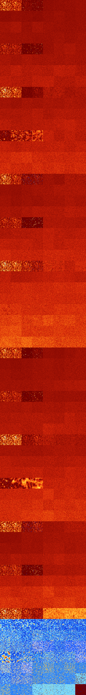

# B1345678 (259072-259583)

<details>
    <summary>Initial Grid</summary>
    
</details>


<details>
    <summary>Initial Grid RLE</summary>

```
#C Exported from GoGoL (https://github.com/marrow16/gogol)
#C Wrap mode: Toroidal
#C Boundary mode: Dead
#C Step: 0
x = 100, y = 100, rule = B1345678/S
9b2o54bo2bo2bo17bo2bo5bo$5b2o12bo31bo$13bo6bo22bo7bo13bo$37bo2bo57bo$
11bo58bo10bo$8bo8bo17bo22bo3bo4b2o21bo$5bo11bo8bo2bo2bo$13bo17bo9bo10bo
12bo25bo4bo$2bo40bo3bo21bo4bo13bo4bo$o7bo22bo41bo9bo$26bo11bo23bo$30bo
2bo32b2o8bo10bo4bo$61bo$39bo6bo15bo24bo$3bo19bo6bo7bo28b2o3bo5bo4bo$2bo
44bo21bo$o4bo5bo5bo4bo5bo21bo8bo4bo7bo2bo7bo7bo$22bo2bo5bo14bo38bo$5bob
o5bo43bo$12bo11bo3bo32bo4bo7bo5b2o$8bo79bo$22bo3bo2bo33bo26bo$16bo38bo
16bo$76bo13bo2bo$2bo10bo9bo32bo30bo$o6bo8bo38bo15bo2bo3bo7bo$4bo24bo6bo
34bo2bo$57bo18bo16bo$3bo56bo21bo$10bo30bo19bo34bo$38bo13bo2bo41bo$32bo
5bobo19b2o25bo$bo7bo50b2o3bo$5bo65bo19bobo4bo$14bobo9bo71bo$33bo26bo13b
2o6bo$o82bo$43bo31bo10bo9bo$2bo3bo5bo9bo14bo20bo$7bo44bo3bo$4bo14b2o19b
obo44bo$20bo3bo47bo$4bo2bo$bo8bo13bo17bo9bo23bo18bo$17bobo37bo20bo$2bo
38bo23bo13bo$11bo5bo14bo53bo$67bo4bo$71bo4bo$bo48bobo6bo12bo$17bo42bo
37bo$13bo9bo2bo33bo31bo$23bo51bo21bo$bo10bo57b2o3b2o17bo$29bo5bobo18bo
23bo$26bo19bo3bo42bo$13bo29bo8bo7bo26bo11bo$3bo3bo5bo5bo5bo18bo12bo23bo
17bo$12bo13bo17bo41bo3bo$o8bo5bo6bo67bo$5bo8bo48bo7bo20bo3bo$41bo41bo$
23bobo35bo9bo$29bo36bo$15bo4bo15bo4bo9bo13bo8bo8bo$22bo34bo5bo$23bo6bo
20bo22bo$13bo60bo14bo$9bo8bobo2bo19bo9bobo5bo13bobo4bo10bo$o55bobo3bo
18bo11bo$30bo14bo7bo23bo$7bo22bo9bo5bo12bo5bo20bo$o13bo9bobo20bo3bo12bo
22b2o7bo$o5bo17bo17bo18bo3bo$26bo19bo$obo55bobo3b2o2bobo$4b2o2bo4bo65bo
$9bo10bo6bo3bo$4bo2bo23bobo9bo6bo$2bo32bo4bo22bo27bo$7bo11bo14bo3b2o35b
o10bo8bo$bobo11bo11b2o9bo6bobo29bo6bo13bo$o16bo78bo$82bo$44bobo3bo2bo
14bo4bo$14bo32bo4bo8bo17bo17bobo$6bo56bo$bo12bo10bo23bo14bo23bo$98bo$5b
o16bo54bo$13bo39bo29bo7bo$22bo70bo$27bo$bo35bo18bo5bo$16bo2bo13bobo7bo
14bo38bobo$54bo31bo$6bo9bo13bobo12bo8bo2bo8bo2bo8bo$3bo19b2o5bo17bo9bo
24bo2bo8bo$bo4bo15bo4bobo15bo32bo2bo4bo8bo$6bo5bo55bo!
```
</details>
<details>
    <summary>Thumbnail</summary>

</details>
<table>
<tr>
    <td><a href="./259072%20S%20Heat%20Map%20Activity.png"></a><br>S (259072)<br>R@11,p2</td>    <td><a href="./259073%20S0%20Heat%20Map%20Activity.png"></a><br>S0 (259073)<br>R@14,p4</td>    <td><a href="./259074%20S1%20Heat%20Map%20Activity.png"></a><br>S1 (259074)<br>R@81,p24</td>    <td><a href="./259075%20S01%20Heat%20Map%20Activity.png"></a><br>S01 (259075)<br>R@124,p48</td>    <td><a href="./259076%20S2%20Heat%20Map%20Activity.png"></a><br>S2 (259076)<br>G>1000</td>    <td><a href="./259077%20S02%20Heat%20Map%20Activity.png"></a><br>S02 (259077)<br>G>1000</td>    <td><a href="./259078%20S12%20Heat%20Map%20Activity.png"></a><br>S12 (259078)<br>G>1000</td>    <td><a href="./259079%20S012%20Heat%20Map%20Activity.png"></a><br>S012 (259079)<br>G>1000</td></tr>
<tr>
    <td><a href="./259080%20S3%20Heat%20Map%20Activity.png"></a><br>S3 (259080)<br>G>1000</td>    <td><a href="./259081%20S03%20Heat%20Map%20Activity.png"></a><br>S03 (259081)<br>G>1000</td>    <td><a href="./259082%20S13%20Heat%20Map%20Activity.png"></a><br>S13 (259082)<br>G>1000</td>    <td><a href="./259083%20S013%20Heat%20Map%20Activity.png"></a><br>S013 (259083)<br>G>1000</td>    <td><a href="./259084%20S23%20Heat%20Map%20Activity.png"></a><br>S23 (259084)<br>G>1000</td>    <td><a href="./259085%20S023%20Heat%20Map%20Activity.png"></a><br>S023 (259085)<br>G>1000</td>    <td><a href="./259086%20S123%20Heat%20Map%20Activity.png"></a><br>S123 (259086)<br>G>1000</td>    <td><a href="./259087%20S0123%20Heat%20Map%20Activity.png"></a><br>S0123 (259087)<br>G>1000</td></tr>
<tr>
    <td><a href="./259088%20S4%20Heat%20Map%20Activity.png"></a><br>S4 (259088)<br>G>1000</td>    <td><a href="./259089%20S04%20Heat%20Map%20Activity.png"></a><br>S04 (259089)<br>G>1000</td>    <td><a href="./259090%20S14%20Heat%20Map%20Activity.png"></a><br>S14 (259090)<br>G>1000</td>    <td><a href="./259091%20S014%20Heat%20Map%20Activity.png"></a><br>S014 (259091)<br>G>1000</td>    <td><a href="./259092%20S24%20Heat%20Map%20Activity.png"></a><br>S24 (259092)<br>G>1000</td>    <td><a href="./259093%20S024%20Heat%20Map%20Activity.png"></a><br>S024 (259093)<br>G>1000</td>    <td><a href="./259094%20S124%20Heat%20Map%20Activity.png"></a><br>S124 (259094)<br>G>1000</td>    <td><a href="./259095%20S0124%20Heat%20Map%20Activity.png"></a><br>S0124 (259095)<br>G>1000</td></tr>
<tr>
    <td><a href="./259096%20S34%20Heat%20Map%20Activity.png"></a><br>S34 (259096)<br>G>1000</td>    <td><a href="./259097%20S034%20Heat%20Map%20Activity.png"></a><br>S034 (259097)<br>G>1000</td>    <td><a href="./259098%20S134%20Heat%20Map%20Activity.png"></a><br>S134 (259098)<br>G>1000</td>    <td><a href="./259099%20S0134%20Heat%20Map%20Activity.png"></a><br>S0134 (259099)<br>G>1000</td>    <td><a href="./259100%20S234%20Heat%20Map%20Activity.png"></a><br>S234 (259100)<br>G>1000</td>    <td><a href="./259101%20S0234%20Heat%20Map%20Activity.png"></a><br>S0234 (259101)<br>G>1000</td>    <td><a href="./259102%20S1234%20Heat%20Map%20Activity.png"></a><br>S1234 (259102)<br>G>1000</td>    <td><a href="./259103%20S01234%20Heat%20Map%20Activity.png"></a><br>S01234 (259103)<br>G>1000</td></tr>
<tr>
    <td><a href="./259104%20S5%20Heat%20Map%20Activity.png"></a><br>S5 (259104)<br>R@23,p4</td>    <td><a href="./259105%20S05%20Heat%20Map%20Activity.png"></a><br>S05 (259105)<br>R@31,p4</td>    <td><a href="./259106%20S15%20Heat%20Map%20Activity.png"></a><br>S15 (259106)<br>G>1000</td>    <td><a href="./259107%20S015%20Heat%20Map%20Activity.png"></a><br>S015 (259107)<br>R@518,p24</td>    <td><a href="./259108%20S25%20Heat%20Map%20Activity.png"></a><br>S25 (259108)<br>G>1000</td>    <td><a href="./259109%20S025%20Heat%20Map%20Activity.png"></a><br>S025 (259109)<br>G>1000</td>    <td><a href="./259110%20S125%20Heat%20Map%20Activity.png"></a><br>S125 (259110)<br>G>1000</td>    <td><a href="./259111%20S0125%20Heat%20Map%20Activity.png"></a><br>S0125 (259111)<br>G>1000</td></tr>
<tr>
    <td><a href="./259112%20S35%20Heat%20Map%20Activity.png"></a><br>S35 (259112)<br>G>1000</td>    <td><a href="./259113%20S035%20Heat%20Map%20Activity.png"></a><br>S035 (259113)<br>G>1000</td>    <td><a href="./259114%20S135%20Heat%20Map%20Activity.png"></a><br>S135 (259114)<br>G>1000</td>    <td><a href="./259115%20S0135%20Heat%20Map%20Activity.png"></a><br>S0135 (259115)<br>G>1000</td>    <td><a href="./259116%20S235%20Heat%20Map%20Activity.png"></a><br>S235 (259116)<br>G>1000</td>    <td><a href="./259117%20S0235%20Heat%20Map%20Activity.png"></a><br>S0235 (259117)<br>G>1000</td>    <td><a href="./259118%20S1235%20Heat%20Map%20Activity.png"></a><br>S1235 (259118)<br>G>1000</td>    <td><a href="./259119%20S01235%20Heat%20Map%20Activity.png"></a><br>S01235 (259119)<br>G>1000</td></tr>
<tr>
    <td><a href="./259120%20S45%20Heat%20Map%20Activity.png"></a><br>S45 (259120)<br>G>1000</td>    <td><a href="./259121%20S045%20Heat%20Map%20Activity.png"></a><br>S045 (259121)<br>G>1000</td>    <td><a href="./259122%20S145%20Heat%20Map%20Activity.png"></a><br>S145 (259122)<br>G>1000</td>    <td><a href="./259123%20S0145%20Heat%20Map%20Activity.png"></a><br>S0145 (259123)<br>G>1000</td>    <td><a href="./259124%20S245%20Heat%20Map%20Activity.png"></a><br>S245 (259124)<br>G>1000</td>    <td><a href="./259125%20S0245%20Heat%20Map%20Activity.png"></a><br>S0245 (259125)<br>G>1000</td>    <td><a href="./259126%20S1245%20Heat%20Map%20Activity.png"></a><br>S1245 (259126)<br>G>1000</td>    <td><a href="./259127%20S01245%20Heat%20Map%20Activity.png"></a><br>S01245 (259127)<br>G>1000</td></tr>
<tr>
    <td><a href="./259128%20S345%20Heat%20Map%20Activity.png"></a><br>S345 (259128)<br>G>1000</td>    <td><a href="./259129%20S0345%20Heat%20Map%20Activity.png"></a><br>S0345 (259129)<br>G>1000</td>    <td><a href="./259130%20S1345%20Heat%20Map%20Activity.png"></a><br>S1345 (259130)<br>G>1000</td>    <td><a href="./259131%20S01345%20Heat%20Map%20Activity.png"></a><br>S01345 (259131)<br>G>1000</td>    <td><a href="./259132%20S2345%20Heat%20Map%20Activity.png"></a><br>S2345 (259132)<br>G>1000</td>    <td><a href="./259133%20S02345%20Heat%20Map%20Activity.png"></a><br>S02345 (259133)<br>G>1000</td>    <td><a href="./259134%20S12345%20Heat%20Map%20Activity.png"></a><br>S12345 (259134)<br>G>1000</td>    <td><a href="./259135%20S012345%20Heat%20Map%20Activity.png"></a><br>S012345 (259135)<br>G>1000</td></tr>
<tr>
    <td><a href="./259136%20S6%20Heat%20Map%20Activity.png"></a><br>S6 (259136)<br>R@9,p2</td>    <td><a href="./259137%20S06%20Heat%20Map%20Activity.png"></a><br>S06 (259137)<br>R@12,p4</td>    <td><a href="./259138%20S16%20Heat%20Map%20Activity.png"></a><br>S16 (259138)<br>R@122,p90</td>    <td><a href="./259139%20S016%20Heat%20Map%20Activity.png"></a><br>S016 (259139)<br>R@57,p30</td>    <td><a href="./259140%20S26%20Heat%20Map%20Activity.png"></a><br>S26 (259140)<br>G>1000</td>    <td><a href="./259141%20S026%20Heat%20Map%20Activity.png"></a><br>S026 (259141)<br>G>1000</td>    <td><a href="./259142%20S126%20Heat%20Map%20Activity.png"></a><br>S126 (259142)<br>G>1000</td>    <td><a href="./259143%20S0126%20Heat%20Map%20Activity.png"></a><br>S0126 (259143)<br>G>1000</td></tr>
<tr>
    <td><a href="./259144%20S36%20Heat%20Map%20Activity.png"></a><br>S36 (259144)<br>G>1000</td>    <td><a href="./259145%20S036%20Heat%20Map%20Activity.png"></a><br>S036 (259145)<br>G>1000</td>    <td><a href="./259146%20S136%20Heat%20Map%20Activity.png"></a><br>S136 (259146)<br>G>1000</td>    <td><a href="./259147%20S0136%20Heat%20Map%20Activity.png"></a><br>S0136 (259147)<br>G>1000</td>    <td><a href="./259148%20S236%20Heat%20Map%20Activity.png"></a><br>S236 (259148)<br>G>1000</td>    <td><a href="./259149%20S0236%20Heat%20Map%20Activity.png"></a><br>S0236 (259149)<br>G>1000</td>    <td><a href="./259150%20S1236%20Heat%20Map%20Activity.png"></a><br>S1236 (259150)<br>G>1000</td>    <td><a href="./259151%20S01236%20Heat%20Map%20Activity.png"></a><br>S01236 (259151)<br>G>1000</td></tr>
<tr>
    <td><a href="./259152%20S46%20Heat%20Map%20Activity.png"></a><br>S46 (259152)<br>G>1000</td>    <td><a href="./259153%20S046%20Heat%20Map%20Activity.png"></a><br>S046 (259153)<br>G>1000</td>    <td><a href="./259154%20S146%20Heat%20Map%20Activity.png"></a><br>S146 (259154)<br>G>1000</td>    <td><a href="./259155%20S0146%20Heat%20Map%20Activity.png"></a><br>S0146 (259155)<br>G>1000</td>    <td><a href="./259156%20S246%20Heat%20Map%20Activity.png"></a><br>S246 (259156)<br>G>1000</td>    <td><a href="./259157%20S0246%20Heat%20Map%20Activity.png"></a><br>S0246 (259157)<br>G>1000</td>    <td><a href="./259158%20S1246%20Heat%20Map%20Activity.png"></a><br>S1246 (259158)<br>G>1000</td>    <td><a href="./259159%20S01246%20Heat%20Map%20Activity.png"></a><br>S01246 (259159)<br>G>1000</td></tr>
<tr>
    <td><a href="./259160%20S346%20Heat%20Map%20Activity.png"></a><br>S346 (259160)<br>G>1000</td>    <td><a href="./259161%20S0346%20Heat%20Map%20Activity.png"></a><br>S0346 (259161)<br>G>1000</td>    <td><a href="./259162%20S1346%20Heat%20Map%20Activity.png"></a><br>S1346 (259162)<br>G>1000</td>    <td><a href="./259163%20S01346%20Heat%20Map%20Activity.png"></a><br>S01346 (259163)<br>G>1000</td>    <td><a href="./259164%20S2346%20Heat%20Map%20Activity.png"></a><br>S2346 (259164)<br>G>1000</td>    <td><a href="./259165%20S02346%20Heat%20Map%20Activity.png"></a><br>S02346 (259165)<br>G>1000</td>    <td><a href="./259166%20S12346%20Heat%20Map%20Activity.png"></a><br>S12346 (259166)<br>G>1000</td>    <td><a href="./259167%20S012346%20Heat%20Map%20Activity.png"></a><br>S012346 (259167)<br>G>1000</td></tr>
<tr>
    <td><a href="./259168%20S56%20Heat%20Map%20Activity.png"></a><br>S56 (259168)<br>R@93,p12</td>    <td><a href="./259169%20S056%20Heat%20Map%20Activity.png"></a><br>S056 (259169)<br>R@108,p6</td>    <td><a href="./259170%20S156%20Heat%20Map%20Activity.png"></a><br>S156 (259170)<br>R@352,p60</td>    <td><a href="./259171%20S0156%20Heat%20Map%20Activity.png"></a><br>S0156 (259171)<br>R@391,p12</td>    <td><a href="./259172%20S256%20Heat%20Map%20Activity.png"></a><br>S256 (259172)<br>G>1000</td>    <td><a href="./259173%20S0256%20Heat%20Map%20Activity.png"></a><br>S0256 (259173)<br>G>1000</td>    <td><a href="./259174%20S1256%20Heat%20Map%20Activity.png"></a><br>S1256 (259174)<br>G>1000</td>    <td><a href="./259175%20S01256%20Heat%20Map%20Activity.png"></a><br>S01256 (259175)<br>G>1000</td></tr>
<tr>
    <td><a href="./259176%20S356%20Heat%20Map%20Activity.png"></a><br>S356 (259176)<br>G>1000</td>    <td><a href="./259177%20S0356%20Heat%20Map%20Activity.png"></a><br>S0356 (259177)<br>G>1000</td>    <td><a href="./259178%20S1356%20Heat%20Map%20Activity.png"></a><br>S1356 (259178)<br>G>1000</td>    <td><a href="./259179%20S01356%20Heat%20Map%20Activity.png"></a><br>S01356 (259179)<br>G>1000</td>    <td><a href="./259180%20S2356%20Heat%20Map%20Activity.png"></a><br>S2356 (259180)<br>G>1000</td>    <td><a href="./259181%20S02356%20Heat%20Map%20Activity.png"></a><br>S02356 (259181)<br>G>1000</td>    <td><a href="./259182%20S12356%20Heat%20Map%20Activity.png"></a><br>S12356 (259182)<br>G>1000</td>    <td><a href="./259183%20S012356%20Heat%20Map%20Activity.png"></a><br>S012356 (259183)<br>G>1000</td></tr>
<tr>
    <td><a href="./259184%20S456%20Heat%20Map%20Activity.png"></a><br>S456 (259184)<br>G>1000</td>    <td><a href="./259185%20S0456%20Heat%20Map%20Activity.png"></a><br>S0456 (259185)<br>G>1000</td>    <td><a href="./259186%20S1456%20Heat%20Map%20Activity.png"></a><br>S1456 (259186)<br>G>1000</td>    <td><a href="./259187%20S01456%20Heat%20Map%20Activity.png"></a><br>S01456 (259187)<br>G>1000</td>    <td><a href="./259188%20S2456%20Heat%20Map%20Activity.png"></a><br>S2456 (259188)<br>G>1000</td>    <td><a href="./259189%20S02456%20Heat%20Map%20Activity.png"></a><br>S02456 (259189)<br>G>1000</td>    <td><a href="./259190%20S12456%20Heat%20Map%20Activity.png"></a><br>S12456 (259190)<br>G>1000</td>    <td><a href="./259191%20S012456%20Heat%20Map%20Activity.png"></a><br>S012456 (259191)<br>G>1000</td></tr>
<tr>
    <td><a href="./259192%20S3456%20Heat%20Map%20Activity.png"></a><br>S3456 (259192)<br>G>1000</td>    <td><a href="./259193%20S03456%20Heat%20Map%20Activity.png"></a><br>S03456 (259193)<br>G>1000</td>    <td><a href="./259194%20S13456%20Heat%20Map%20Activity.png"></a><br>S13456 (259194)<br>G>1000</td>    <td><a href="./259195%20S013456%20Heat%20Map%20Activity.png"></a><br>S013456 (259195)<br>G>1000</td>    <td><a href="./259196%20S23456%20Heat%20Map%20Activity.png"></a><br>S23456 (259196)<br>G>1000</td>    <td><a href="./259197%20S023456%20Heat%20Map%20Activity.png"></a><br>S023456 (259197)<br>G>1000</td>    <td><a href="./259198%20S123456%20Heat%20Map%20Activity.png"></a><br>S123456 (259198)<br>G>1000</td>    <td><a href="./259199%20S0123456%20Heat%20Map%20Activity.png"></a><br>S0123456 (259199)<br>G>1000</td></tr>
<tr>
    <td><a href="./259200%20S7%20Heat%20Map%20Activity.png"></a><br>S7 (259200)<br>R@10,p2</td>    <td><a href="./259201%20S07%20Heat%20Map%20Activity.png"></a><br>S07 (259201)<br>R@17,p4</td>    <td><a href="./259202%20S17%20Heat%20Map%20Activity.png"></a><br>S17 (259202)<br>R@49,p24</td>    <td><a href="./259203%20S017%20Heat%20Map%20Activity.png"></a><br>S017 (259203)<br>R@42,p24</td>    <td><a href="./259204%20S27%20Heat%20Map%20Activity.png"></a><br>S27 (259204)<br>G>1000</td>    <td><a href="./259205%20S027%20Heat%20Map%20Activity.png"></a><br>S027 (259205)<br>G>1000</td>    <td><a href="./259206%20S127%20Heat%20Map%20Activity.png"></a><br>S127 (259206)<br>G>1000</td>    <td><a href="./259207%20S0127%20Heat%20Map%20Activity.png"></a><br>S0127 (259207)<br>G>1000</td></tr>
<tr>
    <td><a href="./259208%20S37%20Heat%20Map%20Activity.png"></a><br>S37 (259208)<br>G>1000</td>    <td><a href="./259209%20S037%20Heat%20Map%20Activity.png"></a><br>S037 (259209)<br>G>1000</td>    <td><a href="./259210%20S137%20Heat%20Map%20Activity.png"></a><br>S137 (259210)<br>G>1000</td>    <td><a href="./259211%20S0137%20Heat%20Map%20Activity.png"></a><br>S0137 (259211)<br>G>1000</td>    <td><a href="./259212%20S237%20Heat%20Map%20Activity.png"></a><br>S237 (259212)<br>G>1000</td>    <td><a href="./259213%20S0237%20Heat%20Map%20Activity.png"></a><br>S0237 (259213)<br>G>1000</td>    <td><a href="./259214%20S1237%20Heat%20Map%20Activity.png"></a><br>S1237 (259214)<br>G>1000</td>    <td><a href="./259215%20S01237%20Heat%20Map%20Activity.png"></a><br>S01237 (259215)<br>G>1000</td></tr>
<tr>
    <td><a href="./259216%20S47%20Heat%20Map%20Activity.png"></a><br>S47 (259216)<br>G>1000</td>    <td><a href="./259217%20S047%20Heat%20Map%20Activity.png"></a><br>S047 (259217)<br>G>1000</td>    <td><a href="./259218%20S147%20Heat%20Map%20Activity.png"></a><br>S147 (259218)<br>G>1000</td>    <td><a href="./259219%20S0147%20Heat%20Map%20Activity.png"></a><br>S0147 (259219)<br>G>1000</td>    <td><a href="./259220%20S247%20Heat%20Map%20Activity.png"></a><br>S247 (259220)<br>G>1000</td>    <td><a href="./259221%20S0247%20Heat%20Map%20Activity.png"></a><br>S0247 (259221)<br>G>1000</td>    <td><a href="./259222%20S1247%20Heat%20Map%20Activity.png"></a><br>S1247 (259222)<br>G>1000</td>    <td><a href="./259223%20S01247%20Heat%20Map%20Activity.png"></a><br>S01247 (259223)<br>G>1000</td></tr>
<tr>
    <td><a href="./259224%20S347%20Heat%20Map%20Activity.png"></a><br>S347 (259224)<br>G>1000</td>    <td><a href="./259225%20S0347%20Heat%20Map%20Activity.png"></a><br>S0347 (259225)<br>G>1000</td>    <td><a href="./259226%20S1347%20Heat%20Map%20Activity.png"></a><br>S1347 (259226)<br>G>1000</td>    <td><a href="./259227%20S01347%20Heat%20Map%20Activity.png"></a><br>S01347 (259227)<br>G>1000</td>    <td><a href="./259228%20S2347%20Heat%20Map%20Activity.png"></a><br>S2347 (259228)<br>G>1000</td>    <td><a href="./259229%20S02347%20Heat%20Map%20Activity.png"></a><br>S02347 (259229)<br>G>1000</td>    <td><a href="./259230%20S12347%20Heat%20Map%20Activity.png"></a><br>S12347 (259230)<br>G>1000</td>    <td><a href="./259231%20S012347%20Heat%20Map%20Activity.png"></a><br>S012347 (259231)<br>G>1000</td></tr>
<tr>
    <td><a href="./259232%20S57%20Heat%20Map%20Activity.png"></a><br>S57 (259232)<br>R@23,p4</td>    <td><a href="./259233%20S057%20Heat%20Map%20Activity.png"></a><br>S057 (259233)<br>R@27,p4</td>    <td><a href="./259234%20S157%20Heat%20Map%20Activity.png"></a><br>S157 (259234)<br>G>1000</td>    <td><a href="./259235%20S0157%20Heat%20Map%20Activity.png"></a><br>S0157 (259235)<br>G>1000</td>    <td><a href="./259236%20S257%20Heat%20Map%20Activity.png"></a><br>S257 (259236)<br>G>1000</td>    <td><a href="./259237%20S0257%20Heat%20Map%20Activity.png"></a><br>S0257 (259237)<br>G>1000</td>    <td><a href="./259238%20S1257%20Heat%20Map%20Activity.png"></a><br>S1257 (259238)<br>G>1000</td>    <td><a href="./259239%20S01257%20Heat%20Map%20Activity.png"></a><br>S01257 (259239)<br>G>1000</td></tr>
<tr>
    <td><a href="./259240%20S357%20Heat%20Map%20Activity.png"></a><br>S357 (259240)<br>G>1000</td>    <td><a href="./259241%20S0357%20Heat%20Map%20Activity.png"></a><br>S0357 (259241)<br>G>1000</td>    <td><a href="./259242%20S1357%20Heat%20Map%20Activity.png"></a><br>S1357 (259242)<br>G>1000</td>    <td><a href="./259243%20S01357%20Heat%20Map%20Activity.png"></a><br>S01357 (259243)<br>G>1000</td>    <td><a href="./259244%20S2357%20Heat%20Map%20Activity.png"></a><br>S2357 (259244)<br>G>1000</td>    <td><a href="./259245%20S02357%20Heat%20Map%20Activity.png"></a><br>S02357 (259245)<br>G>1000</td>    <td><a href="./259246%20S12357%20Heat%20Map%20Activity.png"></a><br>S12357 (259246)<br>G>1000</td>    <td><a href="./259247%20S012357%20Heat%20Map%20Activity.png"></a><br>S012357 (259247)<br>G>1000</td></tr>
<tr>
    <td><a href="./259248%20S457%20Heat%20Map%20Activity.png"></a><br>S457 (259248)<br>G>1000</td>    <td><a href="./259249%20S0457%20Heat%20Map%20Activity.png"></a><br>S0457 (259249)<br>G>1000</td>    <td><a href="./259250%20S1457%20Heat%20Map%20Activity.png"></a><br>S1457 (259250)<br>G>1000</td>    <td><a href="./259251%20S01457%20Heat%20Map%20Activity.png"></a><br>S01457 (259251)<br>G>1000</td>    <td><a href="./259252%20S2457%20Heat%20Map%20Activity.png"></a><br>S2457 (259252)<br>G>1000</td>    <td><a href="./259253%20S02457%20Heat%20Map%20Activity.png"></a><br>S02457 (259253)<br>G>1000</td>    <td><a href="./259254%20S12457%20Heat%20Map%20Activity.png"></a><br>S12457 (259254)<br>G>1000</td>    <td><a href="./259255%20S012457%20Heat%20Map%20Activity.png"></a><br>S012457 (259255)<br>G>1000</td></tr>
<tr>
    <td><a href="./259256%20S3457%20Heat%20Map%20Activity.png"></a><br>S3457 (259256)<br>G>1000</td>    <td><a href="./259257%20S03457%20Heat%20Map%20Activity.png"></a><br>S03457 (259257)<br>G>1000</td>    <td><a href="./259258%20S13457%20Heat%20Map%20Activity.png"></a><br>S13457 (259258)<br>G>1000</td>    <td><a href="./259259%20S013457%20Heat%20Map%20Activity.png"></a><br>S013457 (259259)<br>G>1000</td>    <td><a href="./259260%20S23457%20Heat%20Map%20Activity.png"></a><br>S23457 (259260)<br>G>1000</td>    <td><a href="./259261%20S023457%20Heat%20Map%20Activity.png"></a><br>S023457 (259261)<br>G>1000</td>    <td><a href="./259262%20S123457%20Heat%20Map%20Activity.png"></a><br>S123457 (259262)<br>G>1000</td>    <td><a href="./259263%20S0123457%20Heat%20Map%20Activity.png"></a><br>S0123457 (259263)<br>G>1000</td></tr>
<tr>
    <td><a href="./259264%20S67%20Heat%20Map%20Activity.png"></a><br>S67 (259264)<br>R@9,p2</td>    <td><a href="./259265%20S067%20Heat%20Map%20Activity.png"></a><br>S067 (259265)<br>R@11,p4</td>    <td><a href="./259266%20S167%20Heat%20Map%20Activity.png"></a><br>S167 (259266)<br>R@19,p2</td>    <td><a href="./259267%20S0167%20Heat%20Map%20Activity.png"></a><br>S0167 (259267)<br>R@27,p6</td>    <td><a href="./259268%20S267%20Heat%20Map%20Activity.png"></a><br>S267 (259268)<br>G>1000</td>    <td><a href="./259269%20S0267%20Heat%20Map%20Activity.png"></a><br>S0267 (259269)<br>G>1000</td>    <td><a href="./259270%20S1267%20Heat%20Map%20Activity.png"></a><br>S1267 (259270)<br>G>1000</td>    <td><a href="./259271%20S01267%20Heat%20Map%20Activity.png"></a><br>S01267 (259271)<br>G>1000</td></tr>
<tr>
    <td><a href="./259272%20S367%20Heat%20Map%20Activity.png"></a><br>S367 (259272)<br>G>1000</td>    <td><a href="./259273%20S0367%20Heat%20Map%20Activity.png"></a><br>S0367 (259273)<br>G>1000</td>    <td><a href="./259274%20S1367%20Heat%20Map%20Activity.png"></a><br>S1367 (259274)<br>G>1000</td>    <td><a href="./259275%20S01367%20Heat%20Map%20Activity.png"></a><br>S01367 (259275)<br>G>1000</td>    <td><a href="./259276%20S2367%20Heat%20Map%20Activity.png"></a><br>S2367 (259276)<br>G>1000</td>    <td><a href="./259277%20S02367%20Heat%20Map%20Activity.png"></a><br>S02367 (259277)<br>G>1000</td>    <td><a href="./259278%20S12367%20Heat%20Map%20Activity.png"></a><br>S12367 (259278)<br>G>1000</td>    <td><a href="./259279%20S012367%20Heat%20Map%20Activity.png"></a><br>S012367 (259279)<br>G>1000</td></tr>
<tr>
    <td><a href="./259280%20S467%20Heat%20Map%20Activity.png"></a><br>S467 (259280)<br>G>1000</td>    <td><a href="./259281%20S0467%20Heat%20Map%20Activity.png"></a><br>S0467 (259281)<br>G>1000</td>    <td><a href="./259282%20S1467%20Heat%20Map%20Activity.png"></a><br>S1467 (259282)<br>G>1000</td>    <td><a href="./259283%20S01467%20Heat%20Map%20Activity.png"></a><br>S01467 (259283)<br>G>1000</td>    <td><a href="./259284%20S2467%20Heat%20Map%20Activity.png"></a><br>S2467 (259284)<br>G>1000</td>    <td><a href="./259285%20S02467%20Heat%20Map%20Activity.png"></a><br>S02467 (259285)<br>G>1000</td>    <td><a href="./259286%20S12467%20Heat%20Map%20Activity.png"></a><br>S12467 (259286)<br>G>1000</td>    <td><a href="./259287%20S012467%20Heat%20Map%20Activity.png"></a><br>S012467 (259287)<br>G>1000</td></tr>
<tr>
    <td><a href="./259288%20S3467%20Heat%20Map%20Activity.png"></a><br>S3467 (259288)<br>G>1000</td>    <td><a href="./259289%20S03467%20Heat%20Map%20Activity.png"></a><br>S03467 (259289)<br>G>1000</td>    <td><a href="./259290%20S13467%20Heat%20Map%20Activity.png"></a><br>S13467 (259290)<br>G>1000</td>    <td><a href="./259291%20S013467%20Heat%20Map%20Activity.png"></a><br>S013467 (259291)<br>G>1000</td>    <td><a href="./259292%20S23467%20Heat%20Map%20Activity.png"></a><br>S23467 (259292)<br>G>1000</td>    <td><a href="./259293%20S023467%20Heat%20Map%20Activity.png"></a><br>S023467 (259293)<br>G>1000</td>    <td><a href="./259294%20S123467%20Heat%20Map%20Activity.png"></a><br>S123467 (259294)<br>G>1000</td>    <td><a href="./259295%20S0123467%20Heat%20Map%20Activity.png"></a><br>S0123467 (259295)<br>G>1000</td></tr>
<tr>
    <td><a href="./259296%20S567%20Heat%20Map%20Activity.png"></a><br>S567 (259296)<br>G>1000</td>    <td><a href="./259297%20S0567%20Heat%20Map%20Activity.png"></a><br>S0567 (259297)<br>G>1000</td>    <td><a href="./259298%20S1567%20Heat%20Map%20Activity.png"></a><br>S1567 (259298)<br>G>1000</td>    <td><a href="./259299%20S01567%20Heat%20Map%20Activity.png"></a><br>S01567 (259299)<br>G>1000</td>    <td><a href="./259300%20S2567%20Heat%20Map%20Activity.png"></a><br>S2567 (259300)<br>G>1000</td>    <td><a href="./259301%20S02567%20Heat%20Map%20Activity.png"></a><br>S02567 (259301)<br>G>1000</td>    <td><a href="./259302%20S12567%20Heat%20Map%20Activity.png"></a><br>S12567 (259302)<br>G>1000</td>    <td><a href="./259303%20S012567%20Heat%20Map%20Activity.png"></a><br>S012567 (259303)<br>G>1000</td></tr>
<tr>
    <td><a href="./259304%20S3567%20Heat%20Map%20Activity.png"></a><br>S3567 (259304)<br>G>1000</td>    <td><a href="./259305%20S03567%20Heat%20Map%20Activity.png"></a><br>S03567 (259305)<br>G>1000</td>    <td><a href="./259306%20S13567%20Heat%20Map%20Activity.png"></a><br>S13567 (259306)<br>G>1000</td>    <td><a href="./259307%20S013567%20Heat%20Map%20Activity.png"></a><br>S013567 (259307)<br>G>1000</td>    <td><a href="./259308%20S23567%20Heat%20Map%20Activity.png"></a><br>S23567 (259308)<br>G>1000</td>    <td><a href="./259309%20S023567%20Heat%20Map%20Activity.png"></a><br>S023567 (259309)<br>G>1000</td>    <td><a href="./259310%20S123567%20Heat%20Map%20Activity.png"></a><br>S123567 (259310)<br>G>1000</td>    <td><a href="./259311%20S0123567%20Heat%20Map%20Activity.png"></a><br>S0123567 (259311)<br>G>1000</td></tr>
<tr>
    <td><a href="./259312%20S4567%20Heat%20Map%20Activity.png"></a><br>S4567 (259312)<br>G>1000</td>    <td><a href="./259313%20S04567%20Heat%20Map%20Activity.png"></a><br>S04567 (259313)<br>G>1000</td>    <td><a href="./259314%20S14567%20Heat%20Map%20Activity.png"></a><br>S14567 (259314)<br>G>1000</td>    <td><a href="./259315%20S014567%20Heat%20Map%20Activity.png"></a><br>S014567 (259315)<br>G>1000</td>    <td><a href="./259316%20S24567%20Heat%20Map%20Activity.png"></a><br>S24567 (259316)<br>G>1000</td>    <td><a href="./259317%20S024567%20Heat%20Map%20Activity.png"></a><br>S024567 (259317)<br>G>1000</td>    <td><a href="./259318%20S124567%20Heat%20Map%20Activity.png"></a><br>S124567 (259318)<br>G>1000</td>    <td><a href="./259319%20S0124567%20Heat%20Map%20Activity.png"></a><br>S0124567 (259319)<br>G>1000</td></tr>
<tr>
    <td><a href="./259320%20S34567%20Heat%20Map%20Activity.png"></a><br>S34567 (259320)<br>G>1000</td>    <td><a href="./259321%20S034567%20Heat%20Map%20Activity.png"></a><br>S034567 (259321)<br>G>1000</td>    <td><a href="./259322%20S134567%20Heat%20Map%20Activity.png"></a><br>S134567 (259322)<br>G>1000</td>    <td><a href="./259323%20S0134567%20Heat%20Map%20Activity.png"></a><br>S0134567 (259323)<br>G>1000</td>    <td><a href="./259324%20S234567%20Heat%20Map%20Activity.png"></a><br>S234567 (259324)<br>G>1000</td>    <td><a href="./259325%20S0234567%20Heat%20Map%20Activity.png"></a><br>S0234567 (259325)<br>G>1000</td>    <td><a href="./259326%20S1234567%20Heat%20Map%20Activity.png"></a><br>S1234567 (259326)<br>G>1000</td>    <td><a href="./259327%20S01234567%20Heat%20Map%20Activity.png"></a><br>S01234567 (259327)<br>G>1000</td></tr>
<tr>
    <td><a href="./259328%20S8%20Heat%20Map%20Activity.png"></a><br>S8 (259328)<br>R@11,p2</td>    <td><a href="./259329%20S08%20Heat%20Map%20Activity.png"></a><br>S08 (259329)<br>R@13,p2</td>    <td><a href="./259330%20S18%20Heat%20Map%20Activity.png"></a><br>S18 (259330)<br>R@891,p840</td>    <td><a href="./259331%20S018%20Heat%20Map%20Activity.png"></a><br>S018 (259331)<br>R@87,p48</td>    <td><a href="./259332%20S28%20Heat%20Map%20Activity.png"></a><br>S28 (259332)<br>G>1000</td>    <td><a href="./259333%20S028%20Heat%20Map%20Activity.png"></a><br>S028 (259333)<br>G>1000</td>    <td><a href="./259334%20S128%20Heat%20Map%20Activity.png"></a><br>S128 (259334)<br>G>1000</td>    <td><a href="./259335%20S0128%20Heat%20Map%20Activity.png"></a><br>S0128 (259335)<br>G>1000</td></tr>
<tr>
    <td><a href="./259336%20S38%20Heat%20Map%20Activity.png"></a><br>S38 (259336)<br>G>1000</td>    <td><a href="./259337%20S038%20Heat%20Map%20Activity.png"></a><br>S038 (259337)<br>G>1000</td>    <td><a href="./259338%20S138%20Heat%20Map%20Activity.png"></a><br>S138 (259338)<br>G>1000</td>    <td><a href="./259339%20S0138%20Heat%20Map%20Activity.png"></a><br>S0138 (259339)<br>G>1000</td>    <td><a href="./259340%20S238%20Heat%20Map%20Activity.png"></a><br>S238 (259340)<br>G>1000</td>    <td><a href="./259341%20S0238%20Heat%20Map%20Activity.png"></a><br>S0238 (259341)<br>G>1000</td>    <td><a href="./259342%20S1238%20Heat%20Map%20Activity.png"></a><br>S1238 (259342)<br>G>1000</td>    <td><a href="./259343%20S01238%20Heat%20Map%20Activity.png"></a><br>S01238 (259343)<br>G>1000</td></tr>
<tr>
    <td><a href="./259344%20S48%20Heat%20Map%20Activity.png"></a><br>S48 (259344)<br>G>1000</td>    <td><a href="./259345%20S048%20Heat%20Map%20Activity.png"></a><br>S048 (259345)<br>G>1000</td>    <td><a href="./259346%20S148%20Heat%20Map%20Activity.png"></a><br>S148 (259346)<br>G>1000</td>    <td><a href="./259347%20S0148%20Heat%20Map%20Activity.png"></a><br>S0148 (259347)<br>G>1000</td>    <td><a href="./259348%20S248%20Heat%20Map%20Activity.png"></a><br>S248 (259348)<br>G>1000</td>    <td><a href="./259349%20S0248%20Heat%20Map%20Activity.png"></a><br>S0248 (259349)<br>G>1000</td>    <td><a href="./259350%20S1248%20Heat%20Map%20Activity.png"></a><br>S1248 (259350)<br>G>1000</td>    <td><a href="./259351%20S01248%20Heat%20Map%20Activity.png"></a><br>S01248 (259351)<br>G>1000</td></tr>
<tr>
    <td><a href="./259352%20S348%20Heat%20Map%20Activity.png"></a><br>S348 (259352)<br>G>1000</td>    <td><a href="./259353%20S0348%20Heat%20Map%20Activity.png"></a><br>S0348 (259353)<br>G>1000</td>    <td><a href="./259354%20S1348%20Heat%20Map%20Activity.png"></a><br>S1348 (259354)<br>G>1000</td>    <td><a href="./259355%20S01348%20Heat%20Map%20Activity.png"></a><br>S01348 (259355)<br>G>1000</td>    <td><a href="./259356%20S2348%20Heat%20Map%20Activity.png"></a><br>S2348 (259356)<br>G>1000</td>    <td><a href="./259357%20S02348%20Heat%20Map%20Activity.png"></a><br>S02348 (259357)<br>G>1000</td>    <td><a href="./259358%20S12348%20Heat%20Map%20Activity.png"></a><br>S12348 (259358)<br>G>1000</td>    <td><a href="./259359%20S012348%20Heat%20Map%20Activity.png"></a><br>S012348 (259359)<br>G>1000</td></tr>
<tr>
    <td><a href="./259360%20S58%20Heat%20Map%20Activity.png"></a><br>S58 (259360)<br>R@20,p4</td>    <td><a href="./259361%20S058%20Heat%20Map%20Activity.png"></a><br>S058 (259361)<br>R@27,p4</td>    <td><a href="./259362%20S158%20Heat%20Map%20Activity.png"></a><br>S158 (259362)<br>R@823,p336</td>    <td><a href="./259363%20S0158%20Heat%20Map%20Activity.png"></a><br>S0158 (259363)<br>R@341,p120</td>    <td><a href="./259364%20S258%20Heat%20Map%20Activity.png"></a><br>S258 (259364)<br>G>1000</td>    <td><a href="./259365%20S0258%20Heat%20Map%20Activity.png"></a><br>S0258 (259365)<br>G>1000</td>    <td><a href="./259366%20S1258%20Heat%20Map%20Activity.png"></a><br>S1258 (259366)<br>G>1000</td>    <td><a href="./259367%20S01258%20Heat%20Map%20Activity.png"></a><br>S01258 (259367)<br>G>1000</td></tr>
<tr>
    <td><a href="./259368%20S358%20Heat%20Map%20Activity.png"></a><br>S358 (259368)<br>G>1000</td>    <td><a href="./259369%20S0358%20Heat%20Map%20Activity.png"></a><br>S0358 (259369)<br>G>1000</td>    <td><a href="./259370%20S1358%20Heat%20Map%20Activity.png"></a><br>S1358 (259370)<br>G>1000</td>    <td><a href="./259371%20S01358%20Heat%20Map%20Activity.png"></a><br>S01358 (259371)<br>G>1000</td>    <td><a href="./259372%20S2358%20Heat%20Map%20Activity.png"></a><br>S2358 (259372)<br>G>1000</td>    <td><a href="./259373%20S02358%20Heat%20Map%20Activity.png"></a><br>S02358 (259373)<br>G>1000</td>    <td><a href="./259374%20S12358%20Heat%20Map%20Activity.png"></a><br>S12358 (259374)<br>G>1000</td>    <td><a href="./259375%20S012358%20Heat%20Map%20Activity.png"></a><br>S012358 (259375)<br>G>1000</td></tr>
<tr>
    <td><a href="./259376%20S458%20Heat%20Map%20Activity.png"></a><br>S458 (259376)<br>G>1000</td>    <td><a href="./259377%20S0458%20Heat%20Map%20Activity.png"></a><br>S0458 (259377)<br>G>1000</td>    <td><a href="./259378%20S1458%20Heat%20Map%20Activity.png"></a><br>S1458 (259378)<br>G>1000</td>    <td><a href="./259379%20S01458%20Heat%20Map%20Activity.png"></a><br>S01458 (259379)<br>G>1000</td>    <td><a href="./259380%20S2458%20Heat%20Map%20Activity.png"></a><br>S2458 (259380)<br>G>1000</td>    <td><a href="./259381%20S02458%20Heat%20Map%20Activity.png"></a><br>S02458 (259381)<br>G>1000</td>    <td><a href="./259382%20S12458%20Heat%20Map%20Activity.png"></a><br>S12458 (259382)<br>G>1000</td>    <td><a href="./259383%20S012458%20Heat%20Map%20Activity.png"></a><br>S012458 (259383)<br>G>1000</td></tr>
<tr>
    <td><a href="./259384%20S3458%20Heat%20Map%20Activity.png"></a><br>S3458 (259384)<br>G>1000</td>    <td><a href="./259385%20S03458%20Heat%20Map%20Activity.png"></a><br>S03458 (259385)<br>G>1000</td>    <td><a href="./259386%20S13458%20Heat%20Map%20Activity.png"></a><br>S13458 (259386)<br>G>1000</td>    <td><a href="./259387%20S013458%20Heat%20Map%20Activity.png"></a><br>S013458 (259387)<br>G>1000</td>    <td><a href="./259388%20S23458%20Heat%20Map%20Activity.png"></a><br>S23458 (259388)<br>G>1000</td>    <td><a href="./259389%20S023458%20Heat%20Map%20Activity.png"></a><br>S023458 (259389)<br>G>1000</td>    <td><a href="./259390%20S123458%20Heat%20Map%20Activity.png"></a><br>S123458 (259390)<br>G>1000</td>    <td><a href="./259391%20S0123458%20Heat%20Map%20Activity.png"></a><br>S0123458 (259391)<br>G>1000</td></tr>
<tr>
    <td><a href="./259392%20S68%20Heat%20Map%20Activity.png"></a><br>S68 (259392)<br>R@9,p2</td>    <td><a href="./259393%20S068%20Heat%20Map%20Activity.png"></a><br>S068 (259393)<br>R@9,p2</td>    <td><a href="./259394%20S168%20Heat%20Map%20Activity.png"></a><br>S168 (259394)<br>R@37,p6</td>    <td><a href="./259395%20S0168%20Heat%20Map%20Activity.png"></a><br>S0168 (259395)<br>R@25,p4</td>    <td><a href="./259396%20S268%20Heat%20Map%20Activity.png"></a><br>S268 (259396)<br>G>1000</td>    <td><a href="./259397%20S0268%20Heat%20Map%20Activity.png"></a><br>S0268 (259397)<br>G>1000</td>    <td><a href="./259398%20S1268%20Heat%20Map%20Activity.png"></a><br>S1268 (259398)<br>G>1000</td>    <td><a href="./259399%20S01268%20Heat%20Map%20Activity.png"></a><br>S01268 (259399)<br>G>1000</td></tr>
<tr>
    <td><a href="./259400%20S368%20Heat%20Map%20Activity.png"></a><br>S368 (259400)<br>G>1000</td>    <td><a href="./259401%20S0368%20Heat%20Map%20Activity.png"></a><br>S0368 (259401)<br>G>1000</td>    <td><a href="./259402%20S1368%20Heat%20Map%20Activity.png"></a><br>S1368 (259402)<br>G>1000</td>    <td><a href="./259403%20S01368%20Heat%20Map%20Activity.png"></a><br>S01368 (259403)<br>G>1000</td>    <td><a href="./259404%20S2368%20Heat%20Map%20Activity.png"></a><br>S2368 (259404)<br>G>1000</td>    <td><a href="./259405%20S02368%20Heat%20Map%20Activity.png"></a><br>S02368 (259405)<br>G>1000</td>    <td><a href="./259406%20S12368%20Heat%20Map%20Activity.png"></a><br>S12368 (259406)<br>G>1000</td>    <td><a href="./259407%20S012368%20Heat%20Map%20Activity.png"></a><br>S012368 (259407)<br>G>1000</td></tr>
<tr>
    <td><a href="./259408%20S468%20Heat%20Map%20Activity.png"></a><br>S468 (259408)<br>G>1000</td>    <td><a href="./259409%20S0468%20Heat%20Map%20Activity.png"></a><br>S0468 (259409)<br>G>1000</td>    <td><a href="./259410%20S1468%20Heat%20Map%20Activity.png"></a><br>S1468 (259410)<br>G>1000</td>    <td><a href="./259411%20S01468%20Heat%20Map%20Activity.png"></a><br>S01468 (259411)<br>G>1000</td>    <td><a href="./259412%20S2468%20Heat%20Map%20Activity.png"></a><br>S2468 (259412)<br>G>1000</td>    <td><a href="./259413%20S02468%20Heat%20Map%20Activity.png"></a><br>S02468 (259413)<br>G>1000</td>    <td><a href="./259414%20S12468%20Heat%20Map%20Activity.png"></a><br>S12468 (259414)<br>G>1000</td>    <td><a href="./259415%20S012468%20Heat%20Map%20Activity.png"></a><br>S012468 (259415)<br>G>1000</td></tr>
<tr>
    <td><a href="./259416%20S3468%20Heat%20Map%20Activity.png"></a><br>S3468 (259416)<br>G>1000</td>    <td><a href="./259417%20S03468%20Heat%20Map%20Activity.png"></a><br>S03468 (259417)<br>G>1000</td>    <td><a href="./259418%20S13468%20Heat%20Map%20Activity.png"></a><br>S13468 (259418)<br>G>1000</td>    <td><a href="./259419%20S013468%20Heat%20Map%20Activity.png"></a><br>S013468 (259419)<br>G>1000</td>    <td><a href="./259420%20S23468%20Heat%20Map%20Activity.png"></a><br>S23468 (259420)<br>G>1000</td>    <td><a href="./259421%20S023468%20Heat%20Map%20Activity.png"></a><br>S023468 (259421)<br>G>1000</td>    <td><a href="./259422%20S123468%20Heat%20Map%20Activity.png"></a><br>S123468 (259422)<br>G>1000</td>    <td><a href="./259423%20S0123468%20Heat%20Map%20Activity.png"></a><br>S0123468 (259423)<br>G>1000</td></tr>
<tr>
    <td><a href="./259424%20S568%20Heat%20Map%20Activity.png"></a><br>S568 (259424)<br>R@83,p4</td>    <td><a href="./259425%20S0568%20Heat%20Map%20Activity.png"></a><br>S0568 (259425)<br>R@262,p12</td>    <td><a href="./259426%20S1568%20Heat%20Map%20Activity.png"></a><br>S1568 (259426)<br>R@753,p12</td>    <td><a href="./259427%20S01568%20Heat%20Map%20Activity.png"></a><br>S01568 (259427)<br>R@809,p12</td>    <td><a href="./259428%20S2568%20Heat%20Map%20Activity.png"></a><br>S2568 (259428)<br>G>1000</td>    <td><a href="./259429%20S02568%20Heat%20Map%20Activity.png"></a><br>S02568 (259429)<br>G>1000</td>    <td><a href="./259430%20S12568%20Heat%20Map%20Activity.png"></a><br>S12568 (259430)<br>G>1000</td>    <td><a href="./259431%20S012568%20Heat%20Map%20Activity.png"></a><br>S012568 (259431)<br>G>1000</td></tr>
<tr>
    <td><a href="./259432%20S3568%20Heat%20Map%20Activity.png"></a><br>S3568 (259432)<br>G>1000</td>    <td><a href="./259433%20S03568%20Heat%20Map%20Activity.png"></a><br>S03568 (259433)<br>G>1000</td>    <td><a href="./259434%20S13568%20Heat%20Map%20Activity.png"></a><br>S13568 (259434)<br>G>1000</td>    <td><a href="./259435%20S013568%20Heat%20Map%20Activity.png"></a><br>S013568 (259435)<br>G>1000</td>    <td><a href="./259436%20S23568%20Heat%20Map%20Activity.png"></a><br>S23568 (259436)<br>G>1000</td>    <td><a href="./259437%20S023568%20Heat%20Map%20Activity.png"></a><br>S023568 (259437)<br>G>1000</td>    <td><a href="./259438%20S123568%20Heat%20Map%20Activity.png"></a><br>S123568 (259438)<br>G>1000</td>    <td><a href="./259439%20S0123568%20Heat%20Map%20Activity.png"></a><br>S0123568 (259439)<br>G>1000</td></tr>
<tr>
    <td><a href="./259440%20S4568%20Heat%20Map%20Activity.png"></a><br>S4568 (259440)<br>G>1000</td>    <td><a href="./259441%20S04568%20Heat%20Map%20Activity.png"></a><br>S04568 (259441)<br>G>1000</td>    <td><a href="./259442%20S14568%20Heat%20Map%20Activity.png"></a><br>S14568 (259442)<br>G>1000</td>    <td><a href="./259443%20S014568%20Heat%20Map%20Activity.png"></a><br>S014568 (259443)<br>G>1000</td>    <td><a href="./259444%20S24568%20Heat%20Map%20Activity.png"></a><br>S24568 (259444)<br>G>1000</td>    <td><a href="./259445%20S024568%20Heat%20Map%20Activity.png"></a><br>S024568 (259445)<br>G>1000</td>    <td><a href="./259446%20S124568%20Heat%20Map%20Activity.png"></a><br>S124568 (259446)<br>G>1000</td>    <td><a href="./259447%20S0124568%20Heat%20Map%20Activity.png"></a><br>S0124568 (259447)<br>G>1000</td></tr>
<tr>
    <td><a href="./259448%20S34568%20Heat%20Map%20Activity.png"></a><br>S34568 (259448)<br>G>1000</td>    <td><a href="./259449%20S034568%20Heat%20Map%20Activity.png"></a><br>S034568 (259449)<br>G>1000</td>    <td><a href="./259450%20S134568%20Heat%20Map%20Activity.png"></a><br>S134568 (259450)<br>G>1000</td>    <td><a href="./259451%20S0134568%20Heat%20Map%20Activity.png"></a><br>S0134568 (259451)<br>G>1000</td>    <td><a href="./259452%20S234568%20Heat%20Map%20Activity.png"></a><br>S234568 (259452)<br>G>1000</td>    <td><a href="./259453%20S0234568%20Heat%20Map%20Activity.png"></a><br>S0234568 (259453)<br>G>1000</td>    <td><a href="./259454%20S1234568%20Heat%20Map%20Activity.png"></a><br>S1234568 (259454)<br>G>1000</td>    <td><a href="./259455%20S01234568%20Heat%20Map%20Activity.png"></a><br>S01234568 (259455)<br>G>1000</td></tr>
<tr>
    <td><a href="./259456%20S78%20Heat%20Map%20Activity.png"></a><br>S78 (259456)<br>R@10,p2</td>    <td><a href="./259457%20S078%20Heat%20Map%20Activity.png"></a><br>S078 (259457)<br>R@11,p2</td>    <td><a href="./259458%20S178%20Heat%20Map%20Activity.png"></a><br>S178 (259458)<br>R@41,p24</td>    <td><a href="./259459%20S0178%20Heat%20Map%20Activity.png"></a><br>S0178 (259459)<br>R@26,p4</td>    <td><a href="./259460%20S278%20Heat%20Map%20Activity.png"></a><br>S278 (259460)<br>G>1000</td>    <td><a href="./259461%20S0278%20Heat%20Map%20Activity.png"></a><br>S0278 (259461)<br>G>1000</td>    <td><a href="./259462%20S1278%20Heat%20Map%20Activity.png"></a><br>S1278 (259462)<br>G>1000</td>    <td><a href="./259463%20S01278%20Heat%20Map%20Activity.png"></a><br>S01278 (259463)<br>G>1000</td></tr>
<tr>
    <td><a href="./259464%20S378%20Heat%20Map%20Activity.png"></a><br>S378 (259464)<br>G>1000</td>    <td><a href="./259465%20S0378%20Heat%20Map%20Activity.png"></a><br>S0378 (259465)<br>G>1000</td>    <td><a href="./259466%20S1378%20Heat%20Map%20Activity.png"></a><br>S1378 (259466)<br>G>1000</td>    <td><a href="./259467%20S01378%20Heat%20Map%20Activity.png"></a><br>S01378 (259467)<br>G>1000</td>    <td><a href="./259468%20S2378%20Heat%20Map%20Activity.png"></a><br>S2378 (259468)<br>G>1000</td>    <td><a href="./259469%20S02378%20Heat%20Map%20Activity.png"></a><br>S02378 (259469)<br>G>1000</td>    <td><a href="./259470%20S12378%20Heat%20Map%20Activity.png"></a><br>S12378 (259470)<br>G>1000</td>    <td><a href="./259471%20S012378%20Heat%20Map%20Activity.png"></a><br>S012378 (259471)<br>G>1000</td></tr>
<tr>
    <td><a href="./259472%20S478%20Heat%20Map%20Activity.png"></a><br>S478 (259472)<br>G>1000</td>    <td><a href="./259473%20S0478%20Heat%20Map%20Activity.png"></a><br>S0478 (259473)<br>G>1000</td>    <td><a href="./259474%20S1478%20Heat%20Map%20Activity.png"></a><br>S1478 (259474)<br>G>1000</td>    <td><a href="./259475%20S01478%20Heat%20Map%20Activity.png"></a><br>S01478 (259475)<br>G>1000</td>    <td><a href="./259476%20S2478%20Heat%20Map%20Activity.png"></a><br>S2478 (259476)<br>G>1000</td>    <td><a href="./259477%20S02478%20Heat%20Map%20Activity.png"></a><br>S02478 (259477)<br>G>1000</td>    <td><a href="./259478%20S12478%20Heat%20Map%20Activity.png"></a><br>S12478 (259478)<br>G>1000</td>    <td><a href="./259479%20S012478%20Heat%20Map%20Activity.png"></a><br>S012478 (259479)<br>G>1000</td></tr>
<tr>
    <td><a href="./259480%20S3478%20Heat%20Map%20Activity.png"></a><br>S3478 (259480)<br>G>1000</td>    <td><a href="./259481%20S03478%20Heat%20Map%20Activity.png"></a><br>S03478 (259481)<br>G>1000</td>    <td><a href="./259482%20S13478%20Heat%20Map%20Activity.png"></a><br>S13478 (259482)<br>G>1000</td>    <td><a href="./259483%20S013478%20Heat%20Map%20Activity.png"></a><br>S013478 (259483)<br>G>1000</td>    <td><a href="./259484%20S23478%20Heat%20Map%20Activity.png"></a><br>S23478 (259484)<br>G>1000</td>    <td><a href="./259485%20S023478%20Heat%20Map%20Activity.png"></a><br>S023478 (259485)<br>G>1000</td>    <td><a href="./259486%20S123478%20Heat%20Map%20Activity.png"></a><br>S123478 (259486)<br>G>1000</td>    <td><a href="./259487%20S0123478%20Heat%20Map%20Activity.png"></a><br>S0123478 (259487)<br>G>1000</td></tr>
<tr>
    <td><a href="./259488%20S578%20Heat%20Map%20Activity.png"></a><br>S578 (259488)<br>R@21,p4</td>    <td><a href="./259489%20S0578%20Heat%20Map%20Activity.png"></a><br>S0578 (259489)<br>R@26,p4</td>    <td><a href="./259490%20S1578%20Heat%20Map%20Activity.png"></a><br>S1578 (259490)<br>G>1000</td>    <td><a href="./259491%20S01578%20Heat%20Map%20Activity.png"></a><br>S01578 (259491)<br>R@311,p144</td>    <td><a href="./259492%20S2578%20Heat%20Map%20Activity.png"></a><br>S2578 (259492)<br>G>1000</td>    <td><a href="./259493%20S02578%20Heat%20Map%20Activity.png"></a><br>S02578 (259493)<br>G>1000</td>    <td><a href="./259494%20S12578%20Heat%20Map%20Activity.png"></a><br>S12578 (259494)<br>G>1000</td>    <td><a href="./259495%20S012578%20Heat%20Map%20Activity.png"></a><br>S012578 (259495)<br>G>1000</td></tr>
<tr>
    <td><a href="./259496%20S3578%20Heat%20Map%20Activity.png"></a><br>S3578 (259496)<br>G>1000</td>    <td><a href="./259497%20S03578%20Heat%20Map%20Activity.png"></a><br>S03578 (259497)<br>G>1000</td>    <td><a href="./259498%20S13578%20Heat%20Map%20Activity.png"></a><br>S13578 (259498)<br>G>1000</td>    <td><a href="./259499%20S013578%20Heat%20Map%20Activity.png"></a><br>S013578 (259499)<br>G>1000</td>    <td><a href="./259500%20S23578%20Heat%20Map%20Activity.png"></a><br>S23578 (259500)<br>G>1000</td>    <td><a href="./259501%20S023578%20Heat%20Map%20Activity.png"></a><br>S023578 (259501)<br>G>1000</td>    <td><a href="./259502%20S123578%20Heat%20Map%20Activity.png"></a><br>S123578 (259502)<br>G>1000</td>    <td><a href="./259503%20S0123578%20Heat%20Map%20Activity.png"></a><br>S0123578 (259503)<br>G>1000</td></tr>
<tr>
    <td><a href="./259504%20S4578%20Heat%20Map%20Activity.png"></a><br>S4578 (259504)<br>G>1000</td>    <td><a href="./259505%20S04578%20Heat%20Map%20Activity.png"></a><br>S04578 (259505)<br>G>1000</td>    <td><a href="./259506%20S14578%20Heat%20Map%20Activity.png"></a><br>S14578 (259506)<br>G>1000</td>    <td><a href="./259507%20S014578%20Heat%20Map%20Activity.png"></a><br>S014578 (259507)<br>G>1000</td>    <td><a href="./259508%20S24578%20Heat%20Map%20Activity.png"></a><br>S24578 (259508)<br>G>1000</td>    <td><a href="./259509%20S024578%20Heat%20Map%20Activity.png"></a><br>S024578 (259509)<br>G>1000</td>    <td><a href="./259510%20S124578%20Heat%20Map%20Activity.png"></a><br>S124578 (259510)<br>G>1000</td>    <td><a href="./259511%20S0124578%20Heat%20Map%20Activity.png"></a><br>S0124578 (259511)<br>G>1000</td></tr>
<tr>
    <td><a href="./259512%20S34578%20Heat%20Map%20Activity.png"></a><br>S34578 (259512)<br>G>1000</td>    <td><a href="./259513%20S034578%20Heat%20Map%20Activity.png"></a><br>S034578 (259513)<br>G>1000</td>    <td><a href="./259514%20S134578%20Heat%20Map%20Activity.png"></a><br>S134578 (259514)<br>G>1000</td>    <td><a href="./259515%20S0134578%20Heat%20Map%20Activity.png"></a><br>S0134578 (259515)<br>G>1000</td>    <td><a href="./259516%20S234578%20Heat%20Map%20Activity.png"></a><br>S234578 (259516)<br>G>1000</td>    <td><a href="./259517%20S0234578%20Heat%20Map%20Activity.png"></a><br>S0234578 (259517)<br>G>1000</td>    <td><a href="./259518%20S1234578%20Heat%20Map%20Activity.png"></a><br>S1234578 (259518)<br>G>1000</td>    <td><a href="./259519%20S01234578%20Heat%20Map%20Activity.png"></a><br>S01234578 (259519)<br>G>1000</td></tr>
<tr>
    <td><a href="./259520%20S678%20Heat%20Map%20Activity.png"></a><br>S678 (259520)<br>R@9,p2</td>    <td><a href="./259521%20S0678%20Heat%20Map%20Activity.png"></a><br>S0678 (259521)<br>R@10,p2</td>    <td><a href="./259522%20S1678%20Heat%20Map%20Activity.png"></a><br>S1678 (259522)<br>R@20,p2</td>    <td><a href="./259523%20S01678%20Heat%20Map%20Activity.png"></a><br>S01678 (259523)<br>R@30,p12</td>    <td><a href="./259524%20S2678%20Heat%20Map%20Activity.png"></a><br>S2678 (259524)<br>G>1000</td>    <td><a href="./259525%20S02678%20Heat%20Map%20Activity.png"></a><br>S02678 (259525)<br>G>1000</td>    <td><a href="./259526%20S12678%20Heat%20Map%20Activity.png"></a><br>S12678 (259526)<br>G>1000</td>    <td><a href="./259527%20S012678%20Heat%20Map%20Activity.png"></a><br>S012678 (259527)<br>G>1000</td></tr>
<tr>
    <td><a href="./259528%20S3678%20Heat%20Map%20Activity.png"></a><br>S3678 (259528)<br>R@55,p2</td>    <td><a href="./259529%20S03678%20Heat%20Map%20Activity.png"></a><br>S03678 (259529)<br>R@49,p2</td>    <td><a href="./259530%20S13678%20Heat%20Map%20Activity.png"></a><br>S13678 (259530)<br>R@44,p2</td>    <td><a href="./259531%20S013678%20Heat%20Map%20Activity.png"></a><br>S013678 (259531)<br>R@47,p2</td>    <td><a href="./259532%20S23678%20Heat%20Map%20Activity.png"></a><br>S23678 (259532)<br>R@25,p2</td>    <td><a href="./259533%20S023678%20Heat%20Map%20Activity.png"></a><br>S023678 (259533)<br>R@26,p2</td>    <td><a href="./259534%20S123678%20Heat%20Map%20Activity.png"></a><br>S123678 (259534)<br>R@28,p2</td>    <td><a href="./259535%20S0123678%20Heat%20Map%20Activity.png"></a><br>S0123678 (259535)<br>R@27,p2</td></tr>
<tr>
    <td><a href="./259536%20S4678%20Heat%20Map%20Activity.png"></a><br>S4678 (259536)<br>S@18</td>    <td><a href="./259537%20S04678%20Heat%20Map%20Activity.png"></a><br>S04678 (259537)<br>R@18,p2</td>    <td><a href="./259538%20S14678%20Heat%20Map%20Activity.png"></a><br>S14678 (259538)<br>R@18,p2</td>    <td><a href="./259539%20S014678%20Heat%20Map%20Activity.png"></a><br>S014678 (259539)<br>S@15</td>    <td><a href="./259540%20S24678%20Heat%20Map%20Activity.png"></a><br>S24678 (259540)<br>S@13</td>    <td><a href="./259541%20S024678%20Heat%20Map%20Activity.png"></a><br>S024678 (259541)<br>S@14</td>    <td><a href="./259542%20S124678%20Heat%20Map%20Activity.png"></a><br>S124678 (259542)<br>S@14</td>    <td><a href="./259543%20S0124678%20Heat%20Map%20Activity.png"></a><br>S0124678 (259543)<br>S@16</td></tr>
<tr>
    <td><a href="./259544%20S34678%20Heat%20Map%20Activity.png"></a><br>S34678 (259544)<br>S@11</td>    <td><a href="./259545%20S034678%20Heat%20Map%20Activity.png"></a><br>S034678 (259545)<br>S@12</td>    <td><a href="./259546%20S134678%20Heat%20Map%20Activity.png"></a><br>S134678 (259546)<br>S@12</td>    <td><a href="./259547%20S0134678%20Heat%20Map%20Activity.png"></a><br>S0134678 (259547)<br>S@11</td>    <td><a href="./259548%20S234678%20Heat%20Map%20Activity.png"></a><br>S234678 (259548)<br>S@11</td>    <td><a href="./259549%20S0234678%20Heat%20Map%20Activity.png"></a><br>S0234678 (259549)<br>S@11</td>    <td><a href="./259550%20S1234678%20Heat%20Map%20Activity.png"></a><br>S1234678 (259550)<br>S@12</td>    <td><a href="./259551%20S01234678%20Heat%20Map%20Activity.png"></a><br>S01234678 (259551)<br>S@11</td></tr>
<tr>
    <td><a href="./259552%20S5678%20Heat%20Map%20Activity.png"></a><br>S5678 (259552)<br>S@46</td>    <td><a href="./259553%20S05678%20Heat%20Map%20Activity.png"></a><br>S05678 (259553)<br>S@20</td>    <td><a href="./259554%20S15678%20Heat%20Map%20Activity.png"></a><br>S15678 (259554)<br>S@20</td>    <td><a href="./259555%20S015678%20Heat%20Map%20Activity.png"></a><br>S015678 (259555)<br>S@13</td>    <td><a href="./259556%20S25678%20Heat%20Map%20Activity.png"></a><br>S25678 (259556)<br>S@11</td>    <td><a href="./259557%20S025678%20Heat%20Map%20Activity.png"></a><br>S025678 (259557)<br>S@9</td>    <td><a href="./259558%20S125678%20Heat%20Map%20Activity.png"></a><br>S125678 (259558)<br>S@10</td>    <td><a href="./259559%20S0125678%20Heat%20Map%20Activity.png"></a><br>S0125678 (259559)<br>S@9</td></tr>
<tr>
    <td><a href="./259560%20S35678%20Heat%20Map%20Activity.png"></a><br>S35678 (259560)<br>S@9</td>    <td><a href="./259561%20S035678%20Heat%20Map%20Activity.png"></a><br>S035678 (259561)<br>S@9</td>    <td><a href="./259562%20S135678%20Heat%20Map%20Activity.png"></a><br>S135678 (259562)<br>S@9</td>    <td><a href="./259563%20S0135678%20Heat%20Map%20Activity.png"></a><br>S0135678 (259563)<br>S@8</td>    <td><a href="./259564%20S235678%20Heat%20Map%20Activity.png"></a><br>S235678 (259564)<br>S@8</td>    <td><a href="./259565%20S0235678%20Heat%20Map%20Activity.png"></a><br>S0235678 (259565)<br>S@7</td>    <td><a href="./259566%20S1235678%20Heat%20Map%20Activity.png"></a><br>S1235678 (259566)<br>S@8</td>    <td><a href="./259567%20S01235678%20Heat%20Map%20Activity.png"></a><br>S01235678 (259567)<br>S@8</td></tr>
<tr>
    <td><a href="./259568%20S45678%20Heat%20Map%20Activity.png"></a><br>S45678 (259568)<br>S@9</td>    <td><a href="./259569%20S045678%20Heat%20Map%20Activity.png"></a><br>S045678 (259569)<br>S@8</td>    <td><a href="./259570%20S145678%20Heat%20Map%20Activity.png"></a><br>S145678 (259570)<br>S@8</td>    <td><a href="./259571%20S0145678%20Heat%20Map%20Activity.png"></a><br>S0145678 (259571)<br>S@8</td>    <td><a href="./259572%20S245678%20Heat%20Map%20Activity.png"></a><br>S245678 (259572)<br>S@7</td>    <td><a href="./259573%20S0245678%20Heat%20Map%20Activity.png"></a><br>S0245678 (259573)<br>S@7</td>    <td><a href="./259574%20S1245678%20Heat%20Map%20Activity.png"></a><br>S1245678 (259574)<br>S@7</td>    <td><a href="./259575%20S01245678%20Heat%20Map%20Activity.png"></a><br>S01245678 (259575)<br>S@7</td></tr>
<tr>
    <td><a href="./259576%20S345678%20Heat%20Map%20Activity.png"></a><br>S345678 (259576)<br>S@7</td>    <td><a href="./259577%20S0345678%20Heat%20Map%20Activity.png"></a><br>S0345678 (259577)<br>S@7</td>    <td><a href="./259578%20S1345678%20Heat%20Map%20Activity.png"></a><br>S1345678 (259578)<br>S@7</td>    <td><a href="./259579%20S01345678%20Heat%20Map%20Activity.png"></a><br>S01345678 (259579)<br>S@7</td>    <td><a href="./259580%20S2345678%20Heat%20Map%20Activity.png"></a><br>S2345678 (259580)<br>S@7</td>    <td><a href="./259581%20S02345678%20Heat%20Map%20Activity.png"></a><br>S02345678 (259581)<br>S@7</td>    <td><a href="./259582%20S12345678%20Heat%20Map%20Activity.png"></a><br>S12345678 (259582)<br>S@7</td>    <td><a href="./259583%20S012345678%20Heat%20Map%20Activity.png"></a><br>S012345678 (259583)<br>S@7</td></tr>
</table>
