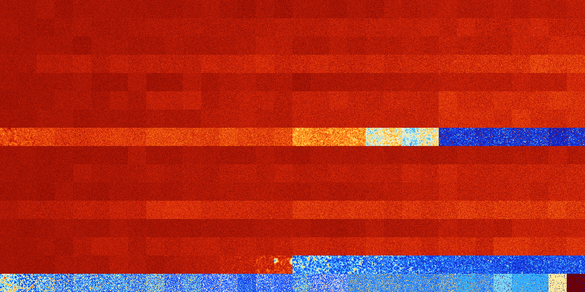

# B13467 (111616-112127)

<details>
    <summary>Initial Grid</summary>
    
</details>


<details>
    <summary>Initial Grid RLE</summary>

```
#C Exported from GoGoL (https://github.com/marrow16/gogol)
#C Wrap mode: Toroidal
#C Boundary mode: Dead
#C Step: 0
x = 100, y = 100, rule = B13467/S
5bo11bo2bo6bo18bo5bo7bo2bo14bo11bo$20bo10bo7bo4bobo3bo5bo5bo17bo10bo$4b
o7bo4b2o29bo3bo10bo$70bo4bo6bo$28bo4bo2bo4bo6bo14b2o$10bo15bo28bo2bo3bo
12bo11bo$5bo5bo9bo12bo53bo$8bo19bo19bo12bo17bo$17bo6bo16bo11bo26bo9bo$
25bo2bo31bo25bobo$10bo51bo10bo$o12bo15bo5bo2bo7bo11bo$21bo$11bo7bo16bo
14bo11bo$o18bo38bo13bo4bo$4bo19bo29bo5bo10bo$2bo35bo13b2o16bo2bo13bo$
11bo25bo24bo22bo4bo4bo$11bo27bo9bo20bo27bo$16bo4bobo17bo39bo$3bo2bo67bo
5bo3bo$3bo20bo$bo2bo4bo10bo13bo8bo2b2o5bo42bo$2bo6bo42bo9bo2bo25bo$9bo
17bob2o2bo43bo7bo$4bo5bo4bo6bo55bo8bo$12bo25bo35bo21bo2bo$25bo6bo15bo5b
o$28bo6bo24bo32b2o$8bobo3bo18bo5bo19bo13bo16bo8bo$4bo3bo8bo68bo$25bo40b
o11bo$bo32bo3bo3bo7bo30bo9bo$13bo3bo4b2o6bo57bo$obo51bo23b2o$2bo41bo3bo
3bo17bo3bo$9bo10bo2bo7bo50bo$20bo18bo5bo10bo6bo6bo3bo9bo13bo$5bo7bo10bo
7bo16bo15bo8bo$11bo7bo23bo$14bo34bo32bo$2bo17bo18bo16bo7bo3bo$8bo6bo13b
o9bo5bo33bo$16bo25bobo17bo19bo$44bo4bo23bo3bo$5bo5bo19bo2bo40bo10bo$47b
o2b2o4bo4bo9bobo9bo$15bo24bo3bo$88bo$3bo9bo40bo25bo12bo$48bo2bo5b3o4b2o
11bo14bo$13bo8b2o25bo4bo3bo24bo9bo5bo$12bo5bo16bo18bo17bobo6bo2bo$10b2o
bo35bo23bo9bo2bo6bo$7bo21bo10bo4bo8bo$17bo2bo11bo31bo3bo9bo2bo8bo$5bo
22bo42bo18bo$57bo32bo$36bo13bo3bo$16bo16bo14bo29bo4bo7bo3bo$2bo4bo10bo
26bo7bo16bo6bo4bo13bo$23bo57bo5bo9bo$4bo48bo19bo$11bo9bo38bo13bo15bo4bo
$13bo14bo4bo9bo$2bo18bo3bo7bo53bo4bo$8bo89bo$25bo22bo4bo13bo$8bo12bo33b
o2bobo17bo$5bo26bobo25bo6bo10bobo$5bo28bo2bo44bo$17bo6bo5bo14bo12bo22bo
$36bo6bo6bo12bo17bo$65bo18bo8bo$7bo11bo49bo15bo$65bo14b2o$o29bo34bo26bo
$54bo$o33bo11bo49bo$4b3o28bo9bo21bo15bo$25bo22bo14bo22bo3bo$24bo17bo9b
2o4bo8bo12bo$4bo3bobo3bo9bo4bo14bo15b3o13bo$15bo42bo3bo11bo18bo$7bo24b
2o10bo8bo27b2o$4bo2bo36bo3bo8bo25bo$17bo27b3o7bo27bo8bo$43bo2bo10bo19bo
bo6bobo$17bo36bo30b2o11bo$34bo14bo17bo15bo6bo$3bo3bo6bo19bo2bo59bo$22bo
37bo17bo$72bo9bo$4bo27bo12bo26bo4bo4b2o3bo7bobobo$73bo3bo$18bo5bo26bo
23bo$16bo7bo20b2o24bo5bo14bo2bo$7b2o11bo13bo8bo7bo7bo30bo$25bo42bo20bo$
8bo38bo7bo41bo!
```
</details>
<details>
    <summary>Thumbnail</summary>

</details>
<table>
<tr>
    <td><a href="./111616%20S%20Heat%20Map%20Activity.png"></a><br>S (111616)<br>G>1000</td>    <td><a href="./111617%20S0%20Heat%20Map%20Activity.png"></a><br>S0 (111617)<br>G>1000</td>    <td><a href="./111618%20S1%20Heat%20Map%20Activity.png"></a><br>S1 (111618)<br>G>1000</td>    <td><a href="./111619%20S01%20Heat%20Map%20Activity.png"></a><br>S01 (111619)<br>G>1000</td>    <td><a href="./111620%20S2%20Heat%20Map%20Activity.png"></a><br>S2 (111620)<br>G>1000</td>    <td><a href="./111621%20S02%20Heat%20Map%20Activity.png"></a><br>S02 (111621)<br>G>1000</td>    <td><a href="./111622%20S12%20Heat%20Map%20Activity.png"></a><br>S12 (111622)<br>G>1000</td>    <td><a href="./111623%20S012%20Heat%20Map%20Activity.png"></a><br>S012 (111623)<br>G>1000</td>    <td><a href="./111624%20S3%20Heat%20Map%20Activity.png"></a><br>S3 (111624)<br>G>1000</td>    <td><a href="./111625%20S03%20Heat%20Map%20Activity.png"></a><br>S03 (111625)<br>G>1000</td>    <td><a href="./111626%20S13%20Heat%20Map%20Activity.png"></a><br>S13 (111626)<br>G>1000</td>    <td><a href="./111627%20S013%20Heat%20Map%20Activity.png"></a><br>S013 (111627)<br>G>1000</td>    <td><a href="./111628%20S23%20Heat%20Map%20Activity.png"></a><br>S23 (111628)<br>G>1000</td>    <td><a href="./111629%20S023%20Heat%20Map%20Activity.png"></a><br>S023 (111629)<br>G>1000</td>    <td><a href="./111630%20S123%20Heat%20Map%20Activity.png"></a><br>S123 (111630)<br>G>1000</td>    <td><a href="./111631%20S0123%20Heat%20Map%20Activity.png"></a><br>S0123 (111631)<br>G>1000</td>    <td><a href="./111632%20S4%20Heat%20Map%20Activity.png"></a><br>S4 (111632)<br>G>1000</td>    <td><a href="./111633%20S04%20Heat%20Map%20Activity.png"></a><br>S04 (111633)<br>G>1000</td>    <td><a href="./111634%20S14%20Heat%20Map%20Activity.png"></a><br>S14 (111634)<br>G>1000</td>    <td><a href="./111635%20S014%20Heat%20Map%20Activity.png"></a><br>S014 (111635)<br>G>1000</td>    <td><a href="./111636%20S24%20Heat%20Map%20Activity.png"></a><br>S24 (111636)<br>G>1000</td>    <td><a href="./111637%20S024%20Heat%20Map%20Activity.png"></a><br>S024 (111637)<br>G>1000</td>    <td><a href="./111638%20S124%20Heat%20Map%20Activity.png"></a><br>S124 (111638)<br>G>1000</td>    <td><a href="./111639%20S0124%20Heat%20Map%20Activity.png"></a><br>S0124 (111639)<br>G>1000</td>    <td><a href="./111640%20S34%20Heat%20Map%20Activity.png"></a><br>S34 (111640)<br>G>1000</td>    <td><a href="./111641%20S034%20Heat%20Map%20Activity.png"></a><br>S034 (111641)<br>G>1000</td>    <td><a href="./111642%20S134%20Heat%20Map%20Activity.png"></a><br>S134 (111642)<br>G>1000</td>    <td><a href="./111643%20S0134%20Heat%20Map%20Activity.png"></a><br>S0134 (111643)<br>G>1000</td>    <td><a href="./111644%20S234%20Heat%20Map%20Activity.png"></a><br>S234 (111644)<br>G>1000</td>    <td><a href="./111645%20S0234%20Heat%20Map%20Activity.png"></a><br>S0234 (111645)<br>G>1000</td>    <td><a href="./111646%20S1234%20Heat%20Map%20Activity.png"></a><br>S1234 (111646)<br>G>1000</td>    <td><a href="./111647%20S01234%20Heat%20Map%20Activity.png"></a><br>S01234 (111647)<br>G>1000</td></tr>
<tr>
    <td><a href="./111648%20S5%20Heat%20Map%20Activity.png"></a><br>S5 (111648)<br>G>1000</td>    <td><a href="./111649%20S05%20Heat%20Map%20Activity.png"></a><br>S05 (111649)<br>G>1000</td>    <td><a href="./111650%20S15%20Heat%20Map%20Activity.png"></a><br>S15 (111650)<br>G>1000</td>    <td><a href="./111651%20S015%20Heat%20Map%20Activity.png"></a><br>S015 (111651)<br>G>1000</td>    <td><a href="./111652%20S25%20Heat%20Map%20Activity.png"></a><br>S25 (111652)<br>G>1000</td>    <td><a href="./111653%20S025%20Heat%20Map%20Activity.png"></a><br>S025 (111653)<br>G>1000</td>    <td><a href="./111654%20S125%20Heat%20Map%20Activity.png"></a><br>S125 (111654)<br>G>1000</td>    <td><a href="./111655%20S0125%20Heat%20Map%20Activity.png"></a><br>S0125 (111655)<br>G>1000</td>    <td><a href="./111656%20S35%20Heat%20Map%20Activity.png"></a><br>S35 (111656)<br>G>1000</td>    <td><a href="./111657%20S035%20Heat%20Map%20Activity.png"></a><br>S035 (111657)<br>G>1000</td>    <td><a href="./111658%20S135%20Heat%20Map%20Activity.png"></a><br>S135 (111658)<br>G>1000</td>    <td><a href="./111659%20S0135%20Heat%20Map%20Activity.png"></a><br>S0135 (111659)<br>G>1000</td>    <td><a href="./111660%20S235%20Heat%20Map%20Activity.png"></a><br>S235 (111660)<br>G>1000</td>    <td><a href="./111661%20S0235%20Heat%20Map%20Activity.png"></a><br>S0235 (111661)<br>G>1000</td>    <td><a href="./111662%20S1235%20Heat%20Map%20Activity.png"></a><br>S1235 (111662)<br>G>1000</td>    <td><a href="./111663%20S01235%20Heat%20Map%20Activity.png"></a><br>S01235 (111663)<br>G>1000</td>    <td><a href="./111664%20S45%20Heat%20Map%20Activity.png"></a><br>S45 (111664)<br>G>1000</td>    <td><a href="./111665%20S045%20Heat%20Map%20Activity.png"></a><br>S045 (111665)<br>G>1000</td>    <td><a href="./111666%20S145%20Heat%20Map%20Activity.png"></a><br>S145 (111666)<br>G>1000</td>    <td><a href="./111667%20S0145%20Heat%20Map%20Activity.png"></a><br>S0145 (111667)<br>G>1000</td>    <td><a href="./111668%20S245%20Heat%20Map%20Activity.png"></a><br>S245 (111668)<br>G>1000</td>    <td><a href="./111669%20S0245%20Heat%20Map%20Activity.png"></a><br>S0245 (111669)<br>G>1000</td>    <td><a href="./111670%20S1245%20Heat%20Map%20Activity.png"></a><br>S1245 (111670)<br>G>1000</td>    <td><a href="./111671%20S01245%20Heat%20Map%20Activity.png"></a><br>S01245 (111671)<br>G>1000</td>    <td><a href="./111672%20S345%20Heat%20Map%20Activity.png"></a><br>S345 (111672)<br>G>1000</td>    <td><a href="./111673%20S0345%20Heat%20Map%20Activity.png"></a><br>S0345 (111673)<br>G>1000</td>    <td><a href="./111674%20S1345%20Heat%20Map%20Activity.png"></a><br>S1345 (111674)<br>G>1000</td>    <td><a href="./111675%20S01345%20Heat%20Map%20Activity.png"></a><br>S01345 (111675)<br>G>1000</td>    <td><a href="./111676%20S2345%20Heat%20Map%20Activity.png"></a><br>S2345 (111676)<br>G>1000</td>    <td><a href="./111677%20S02345%20Heat%20Map%20Activity.png"></a><br>S02345 (111677)<br>G>1000</td>    <td><a href="./111678%20S12345%20Heat%20Map%20Activity.png"></a><br>S12345 (111678)<br>G>1000</td>    <td><a href="./111679%20S012345%20Heat%20Map%20Activity.png"></a><br>S012345 (111679)<br>G>1000</td></tr>
<tr>
    <td><a href="./111680%20S6%20Heat%20Map%20Activity.png"></a><br>S6 (111680)<br>G>1000</td>    <td><a href="./111681%20S06%20Heat%20Map%20Activity.png"></a><br>S06 (111681)<br>G>1000</td>    <td><a href="./111682%20S16%20Heat%20Map%20Activity.png"></a><br>S16 (111682)<br>G>1000</td>    <td><a href="./111683%20S016%20Heat%20Map%20Activity.png"></a><br>S016 (111683)<br>G>1000</td>    <td><a href="./111684%20S26%20Heat%20Map%20Activity.png"></a><br>S26 (111684)<br>G>1000</td>    <td><a href="./111685%20S026%20Heat%20Map%20Activity.png"></a><br>S026 (111685)<br>G>1000</td>    <td><a href="./111686%20S126%20Heat%20Map%20Activity.png"></a><br>S126 (111686)<br>G>1000</td>    <td><a href="./111687%20S0126%20Heat%20Map%20Activity.png"></a><br>S0126 (111687)<br>G>1000</td>    <td><a href="./111688%20S36%20Heat%20Map%20Activity.png"></a><br>S36 (111688)<br>G>1000</td>    <td><a href="./111689%20S036%20Heat%20Map%20Activity.png"></a><br>S036 (111689)<br>G>1000</td>    <td><a href="./111690%20S136%20Heat%20Map%20Activity.png"></a><br>S136 (111690)<br>G>1000</td>    <td><a href="./111691%20S0136%20Heat%20Map%20Activity.png"></a><br>S0136 (111691)<br>G>1000</td>    <td><a href="./111692%20S236%20Heat%20Map%20Activity.png"></a><br>S236 (111692)<br>G>1000</td>    <td><a href="./111693%20S0236%20Heat%20Map%20Activity.png"></a><br>S0236 (111693)<br>G>1000</td>    <td><a href="./111694%20S1236%20Heat%20Map%20Activity.png"></a><br>S1236 (111694)<br>G>1000</td>    <td><a href="./111695%20S01236%20Heat%20Map%20Activity.png"></a><br>S01236 (111695)<br>G>1000</td>    <td><a href="./111696%20S46%20Heat%20Map%20Activity.png"></a><br>S46 (111696)<br>G>1000</td>    <td><a href="./111697%20S046%20Heat%20Map%20Activity.png"></a><br>S046 (111697)<br>G>1000</td>    <td><a href="./111698%20S146%20Heat%20Map%20Activity.png"></a><br>S146 (111698)<br>G>1000</td>    <td><a href="./111699%20S0146%20Heat%20Map%20Activity.png"></a><br>S0146 (111699)<br>G>1000</td>    <td><a href="./111700%20S246%20Heat%20Map%20Activity.png"></a><br>S246 (111700)<br>G>1000</td>    <td><a href="./111701%20S0246%20Heat%20Map%20Activity.png"></a><br>S0246 (111701)<br>G>1000</td>    <td><a href="./111702%20S1246%20Heat%20Map%20Activity.png"></a><br>S1246 (111702)<br>G>1000</td>    <td><a href="./111703%20S01246%20Heat%20Map%20Activity.png"></a><br>S01246 (111703)<br>G>1000</td>    <td><a href="./111704%20S346%20Heat%20Map%20Activity.png"></a><br>S346 (111704)<br>G>1000</td>    <td><a href="./111705%20S0346%20Heat%20Map%20Activity.png"></a><br>S0346 (111705)<br>G>1000</td>    <td><a href="./111706%20S1346%20Heat%20Map%20Activity.png"></a><br>S1346 (111706)<br>G>1000</td>    <td><a href="./111707%20S01346%20Heat%20Map%20Activity.png"></a><br>S01346 (111707)<br>G>1000</td>    <td><a href="./111708%20S2346%20Heat%20Map%20Activity.png"></a><br>S2346 (111708)<br>G>1000</td>    <td><a href="./111709%20S02346%20Heat%20Map%20Activity.png"></a><br>S02346 (111709)<br>G>1000</td>    <td><a href="./111710%20S12346%20Heat%20Map%20Activity.png"></a><br>S12346 (111710)<br>G>1000</td>    <td><a href="./111711%20S012346%20Heat%20Map%20Activity.png"></a><br>S012346 (111711)<br>G>1000</td></tr>
<tr>
    <td><a href="./111712%20S56%20Heat%20Map%20Activity.png"></a><br>S56 (111712)<br>G>1000</td>    <td><a href="./111713%20S056%20Heat%20Map%20Activity.png"></a><br>S056 (111713)<br>G>1000</td>    <td><a href="./111714%20S156%20Heat%20Map%20Activity.png"></a><br>S156 (111714)<br>G>1000</td>    <td><a href="./111715%20S0156%20Heat%20Map%20Activity.png"></a><br>S0156 (111715)<br>G>1000</td>    <td><a href="./111716%20S256%20Heat%20Map%20Activity.png"></a><br>S256 (111716)<br>G>1000</td>    <td><a href="./111717%20S0256%20Heat%20Map%20Activity.png"></a><br>S0256 (111717)<br>G>1000</td>    <td><a href="./111718%20S1256%20Heat%20Map%20Activity.png"></a><br>S1256 (111718)<br>G>1000</td>    <td><a href="./111719%20S01256%20Heat%20Map%20Activity.png"></a><br>S01256 (111719)<br>G>1000</td>    <td><a href="./111720%20S356%20Heat%20Map%20Activity.png"></a><br>S356 (111720)<br>G>1000</td>    <td><a href="./111721%20S0356%20Heat%20Map%20Activity.png"></a><br>S0356 (111721)<br>G>1000</td>    <td><a href="./111722%20S1356%20Heat%20Map%20Activity.png"></a><br>S1356 (111722)<br>G>1000</td>    <td><a href="./111723%20S01356%20Heat%20Map%20Activity.png"></a><br>S01356 (111723)<br>G>1000</td>    <td><a href="./111724%20S2356%20Heat%20Map%20Activity.png"></a><br>S2356 (111724)<br>G>1000</td>    <td><a href="./111725%20S02356%20Heat%20Map%20Activity.png"></a><br>S02356 (111725)<br>G>1000</td>    <td><a href="./111726%20S12356%20Heat%20Map%20Activity.png"></a><br>S12356 (111726)<br>G>1000</td>    <td><a href="./111727%20S012356%20Heat%20Map%20Activity.png"></a><br>S012356 (111727)<br>G>1000</td>    <td><a href="./111728%20S456%20Heat%20Map%20Activity.png"></a><br>S456 (111728)<br>G>1000</td>    <td><a href="./111729%20S0456%20Heat%20Map%20Activity.png"></a><br>S0456 (111729)<br>G>1000</td>    <td><a href="./111730%20S1456%20Heat%20Map%20Activity.png"></a><br>S1456 (111730)<br>G>1000</td>    <td><a href="./111731%20S01456%20Heat%20Map%20Activity.png"></a><br>S01456 (111731)<br>G>1000</td>    <td><a href="./111732%20S2456%20Heat%20Map%20Activity.png"></a><br>S2456 (111732)<br>G>1000</td>    <td><a href="./111733%20S02456%20Heat%20Map%20Activity.png"></a><br>S02456 (111733)<br>G>1000</td>    <td><a href="./111734%20S12456%20Heat%20Map%20Activity.png"></a><br>S12456 (111734)<br>G>1000</td>    <td><a href="./111735%20S012456%20Heat%20Map%20Activity.png"></a><br>S012456 (111735)<br>G>1000</td>    <td><a href="./111736%20S3456%20Heat%20Map%20Activity.png"></a><br>S3456 (111736)<br>G>1000</td>    <td><a href="./111737%20S03456%20Heat%20Map%20Activity.png"></a><br>S03456 (111737)<br>G>1000</td>    <td><a href="./111738%20S13456%20Heat%20Map%20Activity.png"></a><br>S13456 (111738)<br>G>1000</td>    <td><a href="./111739%20S013456%20Heat%20Map%20Activity.png"></a><br>S013456 (111739)<br>G>1000</td>    <td><a href="./111740%20S23456%20Heat%20Map%20Activity.png"></a><br>S23456 (111740)<br>G>1000</td>    <td><a href="./111741%20S023456%20Heat%20Map%20Activity.png"></a><br>S023456 (111741)<br>G>1000</td>    <td><a href="./111742%20S123456%20Heat%20Map%20Activity.png"></a><br>S123456 (111742)<br>G>1000</td>    <td><a href="./111743%20S0123456%20Heat%20Map%20Activity.png"></a><br>S0123456 (111743)<br>G>1000</td></tr>
<tr>
    <td><a href="./111744%20S7%20Heat%20Map%20Activity.png"></a><br>S7 (111744)<br>G>1000</td>    <td><a href="./111745%20S07%20Heat%20Map%20Activity.png"></a><br>S07 (111745)<br>G>1000</td>    <td><a href="./111746%20S17%20Heat%20Map%20Activity.png"></a><br>S17 (111746)<br>G>1000</td>    <td><a href="./111747%20S017%20Heat%20Map%20Activity.png"></a><br>S017 (111747)<br>G>1000</td>    <td><a href="./111748%20S27%20Heat%20Map%20Activity.png"></a><br>S27 (111748)<br>G>1000</td>    <td><a href="./111749%20S027%20Heat%20Map%20Activity.png"></a><br>S027 (111749)<br>G>1000</td>    <td><a href="./111750%20S127%20Heat%20Map%20Activity.png"></a><br>S127 (111750)<br>G>1000</td>    <td><a href="./111751%20S0127%20Heat%20Map%20Activity.png"></a><br>S0127 (111751)<br>G>1000</td>    <td><a href="./111752%20S37%20Heat%20Map%20Activity.png"></a><br>S37 (111752)<br>G>1000</td>    <td><a href="./111753%20S037%20Heat%20Map%20Activity.png"></a><br>S037 (111753)<br>G>1000</td>    <td><a href="./111754%20S137%20Heat%20Map%20Activity.png"></a><br>S137 (111754)<br>G>1000</td>    <td><a href="./111755%20S0137%20Heat%20Map%20Activity.png"></a><br>S0137 (111755)<br>G>1000</td>    <td><a href="./111756%20S237%20Heat%20Map%20Activity.png"></a><br>S237 (111756)<br>G>1000</td>    <td><a href="./111757%20S0237%20Heat%20Map%20Activity.png"></a><br>S0237 (111757)<br>G>1000</td>    <td><a href="./111758%20S1237%20Heat%20Map%20Activity.png"></a><br>S1237 (111758)<br>G>1000</td>    <td><a href="./111759%20S01237%20Heat%20Map%20Activity.png"></a><br>S01237 (111759)<br>G>1000</td>    <td><a href="./111760%20S47%20Heat%20Map%20Activity.png"></a><br>S47 (111760)<br>G>1000</td>    <td><a href="./111761%20S047%20Heat%20Map%20Activity.png"></a><br>S047 (111761)<br>G>1000</td>    <td><a href="./111762%20S147%20Heat%20Map%20Activity.png"></a><br>S147 (111762)<br>G>1000</td>    <td><a href="./111763%20S0147%20Heat%20Map%20Activity.png"></a><br>S0147 (111763)<br>G>1000</td>    <td><a href="./111764%20S247%20Heat%20Map%20Activity.png"></a><br>S247 (111764)<br>G>1000</td>    <td><a href="./111765%20S0247%20Heat%20Map%20Activity.png"></a><br>S0247 (111765)<br>G>1000</td>    <td><a href="./111766%20S1247%20Heat%20Map%20Activity.png"></a><br>S1247 (111766)<br>G>1000</td>    <td><a href="./111767%20S01247%20Heat%20Map%20Activity.png"></a><br>S01247 (111767)<br>G>1000</td>    <td><a href="./111768%20S347%20Heat%20Map%20Activity.png"></a><br>S347 (111768)<br>G>1000</td>    <td><a href="./111769%20S0347%20Heat%20Map%20Activity.png"></a><br>S0347 (111769)<br>G>1000</td>    <td><a href="./111770%20S1347%20Heat%20Map%20Activity.png"></a><br>S1347 (111770)<br>G>1000</td>    <td><a href="./111771%20S01347%20Heat%20Map%20Activity.png"></a><br>S01347 (111771)<br>G>1000</td>    <td><a href="./111772%20S2347%20Heat%20Map%20Activity.png"></a><br>S2347 (111772)<br>G>1000</td>    <td><a href="./111773%20S02347%20Heat%20Map%20Activity.png"></a><br>S02347 (111773)<br>G>1000</td>    <td><a href="./111774%20S12347%20Heat%20Map%20Activity.png"></a><br>S12347 (111774)<br>G>1000</td>    <td><a href="./111775%20S012347%20Heat%20Map%20Activity.png"></a><br>S012347 (111775)<br>G>1000</td></tr>
<tr>
    <td><a href="./111776%20S57%20Heat%20Map%20Activity.png"></a><br>S57 (111776)<br>G>1000</td>    <td><a href="./111777%20S057%20Heat%20Map%20Activity.png"></a><br>S057 (111777)<br>G>1000</td>    <td><a href="./111778%20S157%20Heat%20Map%20Activity.png"></a><br>S157 (111778)<br>G>1000</td>    <td><a href="./111779%20S0157%20Heat%20Map%20Activity.png"></a><br>S0157 (111779)<br>G>1000</td>    <td><a href="./111780%20S257%20Heat%20Map%20Activity.png"></a><br>S257 (111780)<br>G>1000</td>    <td><a href="./111781%20S0257%20Heat%20Map%20Activity.png"></a><br>S0257 (111781)<br>G>1000</td>    <td><a href="./111782%20S1257%20Heat%20Map%20Activity.png"></a><br>S1257 (111782)<br>G>1000</td>    <td><a href="./111783%20S01257%20Heat%20Map%20Activity.png"></a><br>S01257 (111783)<br>G>1000</td>    <td><a href="./111784%20S357%20Heat%20Map%20Activity.png"></a><br>S357 (111784)<br>G>1000</td>    <td><a href="./111785%20S0357%20Heat%20Map%20Activity.png"></a><br>S0357 (111785)<br>G>1000</td>    <td><a href="./111786%20S1357%20Heat%20Map%20Activity.png"></a><br>S1357 (111786)<br>G>1000</td>    <td><a href="./111787%20S01357%20Heat%20Map%20Activity.png"></a><br>S01357 (111787)<br>G>1000</td>    <td><a href="./111788%20S2357%20Heat%20Map%20Activity.png"></a><br>S2357 (111788)<br>G>1000</td>    <td><a href="./111789%20S02357%20Heat%20Map%20Activity.png"></a><br>S02357 (111789)<br>G>1000</td>    <td><a href="./111790%20S12357%20Heat%20Map%20Activity.png"></a><br>S12357 (111790)<br>G>1000</td>    <td><a href="./111791%20S012357%20Heat%20Map%20Activity.png"></a><br>S012357 (111791)<br>G>1000</td>    <td><a href="./111792%20S457%20Heat%20Map%20Activity.png"></a><br>S457 (111792)<br>G>1000</td>    <td><a href="./111793%20S0457%20Heat%20Map%20Activity.png"></a><br>S0457 (111793)<br>G>1000</td>    <td><a href="./111794%20S1457%20Heat%20Map%20Activity.png"></a><br>S1457 (111794)<br>G>1000</td>    <td><a href="./111795%20S01457%20Heat%20Map%20Activity.png"></a><br>S01457 (111795)<br>G>1000</td>    <td><a href="./111796%20S2457%20Heat%20Map%20Activity.png"></a><br>S2457 (111796)<br>G>1000</td>    <td><a href="./111797%20S02457%20Heat%20Map%20Activity.png"></a><br>S02457 (111797)<br>G>1000</td>    <td><a href="./111798%20S12457%20Heat%20Map%20Activity.png"></a><br>S12457 (111798)<br>G>1000</td>    <td><a href="./111799%20S012457%20Heat%20Map%20Activity.png"></a><br>S012457 (111799)<br>G>1000</td>    <td><a href="./111800%20S3457%20Heat%20Map%20Activity.png"></a><br>S3457 (111800)<br>G>1000</td>    <td><a href="./111801%20S03457%20Heat%20Map%20Activity.png"></a><br>S03457 (111801)<br>G>1000</td>    <td><a href="./111802%20S13457%20Heat%20Map%20Activity.png"></a><br>S13457 (111802)<br>G>1000</td>    <td><a href="./111803%20S013457%20Heat%20Map%20Activity.png"></a><br>S013457 (111803)<br>G>1000</td>    <td><a href="./111804%20S23457%20Heat%20Map%20Activity.png"></a><br>S23457 (111804)<br>G>1000</td>    <td><a href="./111805%20S023457%20Heat%20Map%20Activity.png"></a><br>S023457 (111805)<br>G>1000</td>    <td><a href="./111806%20S123457%20Heat%20Map%20Activity.png"></a><br>S123457 (111806)<br>G>1000</td>    <td><a href="./111807%20S0123457%20Heat%20Map%20Activity.png"></a><br>S0123457 (111807)<br>G>1000</td></tr>
<tr>
    <td><a href="./111808%20S67%20Heat%20Map%20Activity.png"></a><br>S67 (111808)<br>G>1000</td>    <td><a href="./111809%20S067%20Heat%20Map%20Activity.png"></a><br>S067 (111809)<br>G>1000</td>    <td><a href="./111810%20S167%20Heat%20Map%20Activity.png"></a><br>S167 (111810)<br>G>1000</td>    <td><a href="./111811%20S0167%20Heat%20Map%20Activity.png"></a><br>S0167 (111811)<br>G>1000</td>    <td><a href="./111812%20S267%20Heat%20Map%20Activity.png"></a><br>S267 (111812)<br>G>1000</td>    <td><a href="./111813%20S0267%20Heat%20Map%20Activity.png"></a><br>S0267 (111813)<br>G>1000</td>    <td><a href="./111814%20S1267%20Heat%20Map%20Activity.png"></a><br>S1267 (111814)<br>G>1000</td>    <td><a href="./111815%20S01267%20Heat%20Map%20Activity.png"></a><br>S01267 (111815)<br>G>1000</td>    <td><a href="./111816%20S367%20Heat%20Map%20Activity.png"></a><br>S367 (111816)<br>G>1000</td>    <td><a href="./111817%20S0367%20Heat%20Map%20Activity.png"></a><br>S0367 (111817)<br>G>1000</td>    <td><a href="./111818%20S1367%20Heat%20Map%20Activity.png"></a><br>S1367 (111818)<br>G>1000</td>    <td><a href="./111819%20S01367%20Heat%20Map%20Activity.png"></a><br>S01367 (111819)<br>G>1000</td>    <td><a href="./111820%20S2367%20Heat%20Map%20Activity.png"></a><br>S2367 (111820)<br>G>1000</td>    <td><a href="./111821%20S02367%20Heat%20Map%20Activity.png"></a><br>S02367 (111821)<br>G>1000</td>    <td><a href="./111822%20S12367%20Heat%20Map%20Activity.png"></a><br>S12367 (111822)<br>G>1000</td>    <td><a href="./111823%20S012367%20Heat%20Map%20Activity.png"></a><br>S012367 (111823)<br>G>1000</td>    <td><a href="./111824%20S467%20Heat%20Map%20Activity.png"></a><br>S467 (111824)<br>G>1000</td>    <td><a href="./111825%20S0467%20Heat%20Map%20Activity.png"></a><br>S0467 (111825)<br>G>1000</td>    <td><a href="./111826%20S1467%20Heat%20Map%20Activity.png"></a><br>S1467 (111826)<br>G>1000</td>    <td><a href="./111827%20S01467%20Heat%20Map%20Activity.png"></a><br>S01467 (111827)<br>G>1000</td>    <td><a href="./111828%20S2467%20Heat%20Map%20Activity.png"></a><br>S2467 (111828)<br>G>1000</td>    <td><a href="./111829%20S02467%20Heat%20Map%20Activity.png"></a><br>S02467 (111829)<br>G>1000</td>    <td><a href="./111830%20S12467%20Heat%20Map%20Activity.png"></a><br>S12467 (111830)<br>G>1000</td>    <td><a href="./111831%20S012467%20Heat%20Map%20Activity.png"></a><br>S012467 (111831)<br>G>1000</td>    <td><a href="./111832%20S3467%20Heat%20Map%20Activity.png"></a><br>S3467 (111832)<br>G>1000</td>    <td><a href="./111833%20S03467%20Heat%20Map%20Activity.png"></a><br>S03467 (111833)<br>G>1000</td>    <td><a href="./111834%20S13467%20Heat%20Map%20Activity.png"></a><br>S13467 (111834)<br>G>1000</td>    <td><a href="./111835%20S013467%20Heat%20Map%20Activity.png"></a><br>S013467 (111835)<br>G>1000</td>    <td><a href="./111836%20S23467%20Heat%20Map%20Activity.png"></a><br>S23467 (111836)<br>G>1000</td>    <td><a href="./111837%20S023467%20Heat%20Map%20Activity.png"></a><br>S023467 (111837)<br>G>1000</td>    <td><a href="./111838%20S123467%20Heat%20Map%20Activity.png"></a><br>S123467 (111838)<br>G>1000</td>    <td><a href="./111839%20S0123467%20Heat%20Map%20Activity.png"></a><br>S0123467 (111839)<br>G>1000</td></tr>
<tr>
    <td><a href="./111840%20S567%20Heat%20Map%20Activity.png"></a><br>S567 (111840)<br>G>1000</td>    <td><a href="./111841%20S0567%20Heat%20Map%20Activity.png"></a><br>S0567 (111841)<br>G>1000</td>    <td><a href="./111842%20S1567%20Heat%20Map%20Activity.png"></a><br>S1567 (111842)<br>G>1000</td>    <td><a href="./111843%20S01567%20Heat%20Map%20Activity.png"></a><br>S01567 (111843)<br>G>1000</td>    <td><a href="./111844%20S2567%20Heat%20Map%20Activity.png"></a><br>S2567 (111844)<br>G>1000</td>    <td><a href="./111845%20S02567%20Heat%20Map%20Activity.png"></a><br>S02567 (111845)<br>G>1000</td>    <td><a href="./111846%20S12567%20Heat%20Map%20Activity.png"></a><br>S12567 (111846)<br>G>1000</td>    <td><a href="./111847%20S012567%20Heat%20Map%20Activity.png"></a><br>S012567 (111847)<br>G>1000</td>    <td><a href="./111848%20S3567%20Heat%20Map%20Activity.png"></a><br>S3567 (111848)<br>G>1000</td>    <td><a href="./111849%20S03567%20Heat%20Map%20Activity.png"></a><br>S03567 (111849)<br>G>1000</td>    <td><a href="./111850%20S13567%20Heat%20Map%20Activity.png"></a><br>S13567 (111850)<br>G>1000</td>    <td><a href="./111851%20S013567%20Heat%20Map%20Activity.png"></a><br>S013567 (111851)<br>G>1000</td>    <td><a href="./111852%20S23567%20Heat%20Map%20Activity.png"></a><br>S23567 (111852)<br>G>1000</td>    <td><a href="./111853%20S023567%20Heat%20Map%20Activity.png"></a><br>S023567 (111853)<br>G>1000</td>    <td><a href="./111854%20S123567%20Heat%20Map%20Activity.png"></a><br>S123567 (111854)<br>G>1000</td>    <td><a href="./111855%20S0123567%20Heat%20Map%20Activity.png"></a><br>S0123567 (111855)<br>G>1000</td>    <td><a href="./111856%20S4567%20Heat%20Map%20Activity.png"></a><br>S4567 (111856)<br>G>1000</td>    <td><a href="./111857%20S04567%20Heat%20Map%20Activity.png"></a><br>S04567 (111857)<br>G>1000</td>    <td><a href="./111858%20S14567%20Heat%20Map%20Activity.png"></a><br>S14567 (111858)<br>G>1000</td>    <td><a href="./111859%20S014567%20Heat%20Map%20Activity.png"></a><br>S014567 (111859)<br>G>1000</td>    <td><a href="./111860%20S24567%20Heat%20Map%20Activity.png"></a><br>S24567 (111860)<br>G>1000</td>    <td><a href="./111861%20S024567%20Heat%20Map%20Activity.png"></a><br>S024567 (111861)<br>G>1000</td>    <td><a href="./111862%20S124567%20Heat%20Map%20Activity.png"></a><br>S124567 (111862)<br>G>1000</td>    <td><a href="./111863%20S0124567%20Heat%20Map%20Activity.png"></a><br>S0124567 (111863)<br>G>1000</td>    <td><a href="./111864%20S34567%20Heat%20Map%20Activity.png"></a><br>S34567 (111864)<br>R@65,p12</td>    <td><a href="./111865%20S034567%20Heat%20Map%20Activity.png"></a><br>S034567 (111865)<br>R@48,p12</td>    <td><a href="./111866%20S134567%20Heat%20Map%20Activity.png"></a><br>S134567 (111866)<br>R@69,p12</td>    <td><a href="./111867%20S0134567%20Heat%20Map%20Activity.png"></a><br>S0134567 (111867)<br>R@44,p12</td>    <td><a href="./111868%20S234567%20Heat%20Map%20Activity.png"></a><br>S234567 (111868)<br>R@40,p12</td>    <td><a href="./111869%20S0234567%20Heat%20Map%20Activity.png"></a><br>S0234567 (111869)<br>R@34,p6</td>    <td><a href="./111870%20S1234567%20Heat%20Map%20Activity.png"></a><br>S1234567 (111870)<br>R@71,p48</td>    <td><a href="./111871%20S01234567%20Heat%20Map%20Activity.png"></a><br>S01234567 (111871)<br>R@39,p6</td></tr>
<tr>
    <td><a href="./111872%20S8%20Heat%20Map%20Activity.png"></a><br>S8 (111872)<br>G>1000</td>    <td><a href="./111873%20S08%20Heat%20Map%20Activity.png"></a><br>S08 (111873)<br>G>1000</td>    <td><a href="./111874%20S18%20Heat%20Map%20Activity.png"></a><br>S18 (111874)<br>G>1000</td>    <td><a href="./111875%20S018%20Heat%20Map%20Activity.png"></a><br>S018 (111875)<br>G>1000</td>    <td><a href="./111876%20S28%20Heat%20Map%20Activity.png"></a><br>S28 (111876)<br>G>1000</td>    <td><a href="./111877%20S028%20Heat%20Map%20Activity.png"></a><br>S028 (111877)<br>G>1000</td>    <td><a href="./111878%20S128%20Heat%20Map%20Activity.png"></a><br>S128 (111878)<br>G>1000</td>    <td><a href="./111879%20S0128%20Heat%20Map%20Activity.png"></a><br>S0128 (111879)<br>G>1000</td>    <td><a href="./111880%20S38%20Heat%20Map%20Activity.png"></a><br>S38 (111880)<br>G>1000</td>    <td><a href="./111881%20S038%20Heat%20Map%20Activity.png"></a><br>S038 (111881)<br>G>1000</td>    <td><a href="./111882%20S138%20Heat%20Map%20Activity.png"></a><br>S138 (111882)<br>G>1000</td>    <td><a href="./111883%20S0138%20Heat%20Map%20Activity.png"></a><br>S0138 (111883)<br>G>1000</td>    <td><a href="./111884%20S238%20Heat%20Map%20Activity.png"></a><br>S238 (111884)<br>G>1000</td>    <td><a href="./111885%20S0238%20Heat%20Map%20Activity.png"></a><br>S0238 (111885)<br>G>1000</td>    <td><a href="./111886%20S1238%20Heat%20Map%20Activity.png"></a><br>S1238 (111886)<br>G>1000</td>    <td><a href="./111887%20S01238%20Heat%20Map%20Activity.png"></a><br>S01238 (111887)<br>G>1000</td>    <td><a href="./111888%20S48%20Heat%20Map%20Activity.png"></a><br>S48 (111888)<br>G>1000</td>    <td><a href="./111889%20S048%20Heat%20Map%20Activity.png"></a><br>S048 (111889)<br>G>1000</td>    <td><a href="./111890%20S148%20Heat%20Map%20Activity.png"></a><br>S148 (111890)<br>G>1000</td>    <td><a href="./111891%20S0148%20Heat%20Map%20Activity.png"></a><br>S0148 (111891)<br>G>1000</td>    <td><a href="./111892%20S248%20Heat%20Map%20Activity.png"></a><br>S248 (111892)<br>G>1000</td>    <td><a href="./111893%20S0248%20Heat%20Map%20Activity.png"></a><br>S0248 (111893)<br>G>1000</td>    <td><a href="./111894%20S1248%20Heat%20Map%20Activity.png"></a><br>S1248 (111894)<br>G>1000</td>    <td><a href="./111895%20S01248%20Heat%20Map%20Activity.png"></a><br>S01248 (111895)<br>G>1000</td>    <td><a href="./111896%20S348%20Heat%20Map%20Activity.png"></a><br>S348 (111896)<br>G>1000</td>    <td><a href="./111897%20S0348%20Heat%20Map%20Activity.png"></a><br>S0348 (111897)<br>G>1000</td>    <td><a href="./111898%20S1348%20Heat%20Map%20Activity.png"></a><br>S1348 (111898)<br>G>1000</td>    <td><a href="./111899%20S01348%20Heat%20Map%20Activity.png"></a><br>S01348 (111899)<br>G>1000</td>    <td><a href="./111900%20S2348%20Heat%20Map%20Activity.png"></a><br>S2348 (111900)<br>G>1000</td>    <td><a href="./111901%20S02348%20Heat%20Map%20Activity.png"></a><br>S02348 (111901)<br>G>1000</td>    <td><a href="./111902%20S12348%20Heat%20Map%20Activity.png"></a><br>S12348 (111902)<br>G>1000</td>    <td><a href="./111903%20S012348%20Heat%20Map%20Activity.png"></a><br>S012348 (111903)<br>G>1000</td></tr>
<tr>
    <td><a href="./111904%20S58%20Heat%20Map%20Activity.png"></a><br>S58 (111904)<br>G>1000</td>    <td><a href="./111905%20S058%20Heat%20Map%20Activity.png"></a><br>S058 (111905)<br>G>1000</td>    <td><a href="./111906%20S158%20Heat%20Map%20Activity.png"></a><br>S158 (111906)<br>G>1000</td>    <td><a href="./111907%20S0158%20Heat%20Map%20Activity.png"></a><br>S0158 (111907)<br>G>1000</td>    <td><a href="./111908%20S258%20Heat%20Map%20Activity.png"></a><br>S258 (111908)<br>G>1000</td>    <td><a href="./111909%20S0258%20Heat%20Map%20Activity.png"></a><br>S0258 (111909)<br>G>1000</td>    <td><a href="./111910%20S1258%20Heat%20Map%20Activity.png"></a><br>S1258 (111910)<br>G>1000</td>    <td><a href="./111911%20S01258%20Heat%20Map%20Activity.png"></a><br>S01258 (111911)<br>G>1000</td>    <td><a href="./111912%20S358%20Heat%20Map%20Activity.png"></a><br>S358 (111912)<br>G>1000</td>    <td><a href="./111913%20S0358%20Heat%20Map%20Activity.png"></a><br>S0358 (111913)<br>G>1000</td>    <td><a href="./111914%20S1358%20Heat%20Map%20Activity.png"></a><br>S1358 (111914)<br>G>1000</td>    <td><a href="./111915%20S01358%20Heat%20Map%20Activity.png"></a><br>S01358 (111915)<br>G>1000</td>    <td><a href="./111916%20S2358%20Heat%20Map%20Activity.png"></a><br>S2358 (111916)<br>G>1000</td>    <td><a href="./111917%20S02358%20Heat%20Map%20Activity.png"></a><br>S02358 (111917)<br>G>1000</td>    <td><a href="./111918%20S12358%20Heat%20Map%20Activity.png"></a><br>S12358 (111918)<br>G>1000</td>    <td><a href="./111919%20S012358%20Heat%20Map%20Activity.png"></a><br>S012358 (111919)<br>G>1000</td>    <td><a href="./111920%20S458%20Heat%20Map%20Activity.png"></a><br>S458 (111920)<br>G>1000</td>    <td><a href="./111921%20S0458%20Heat%20Map%20Activity.png"></a><br>S0458 (111921)<br>G>1000</td>    <td><a href="./111922%20S1458%20Heat%20Map%20Activity.png"></a><br>S1458 (111922)<br>G>1000</td>    <td><a href="./111923%20S01458%20Heat%20Map%20Activity.png"></a><br>S01458 (111923)<br>G>1000</td>    <td><a href="./111924%20S2458%20Heat%20Map%20Activity.png"></a><br>S2458 (111924)<br>G>1000</td>    <td><a href="./111925%20S02458%20Heat%20Map%20Activity.png"></a><br>S02458 (111925)<br>G>1000</td>    <td><a href="./111926%20S12458%20Heat%20Map%20Activity.png"></a><br>S12458 (111926)<br>G>1000</td>    <td><a href="./111927%20S012458%20Heat%20Map%20Activity.png"></a><br>S012458 (111927)<br>G>1000</td>    <td><a href="./111928%20S3458%20Heat%20Map%20Activity.png"></a><br>S3458 (111928)<br>G>1000</td>    <td><a href="./111929%20S03458%20Heat%20Map%20Activity.png"></a><br>S03458 (111929)<br>G>1000</td>    <td><a href="./111930%20S13458%20Heat%20Map%20Activity.png"></a><br>S13458 (111930)<br>G>1000</td>    <td><a href="./111931%20S013458%20Heat%20Map%20Activity.png"></a><br>S013458 (111931)<br>G>1000</td>    <td><a href="./111932%20S23458%20Heat%20Map%20Activity.png"></a><br>S23458 (111932)<br>G>1000</td>    <td><a href="./111933%20S023458%20Heat%20Map%20Activity.png"></a><br>S023458 (111933)<br>G>1000</td>    <td><a href="./111934%20S123458%20Heat%20Map%20Activity.png"></a><br>S123458 (111934)<br>G>1000</td>    <td><a href="./111935%20S0123458%20Heat%20Map%20Activity.png"></a><br>S0123458 (111935)<br>G>1000</td></tr>
<tr>
    <td><a href="./111936%20S68%20Heat%20Map%20Activity.png"></a><br>S68 (111936)<br>G>1000</td>    <td><a href="./111937%20S068%20Heat%20Map%20Activity.png"></a><br>S068 (111937)<br>G>1000</td>    <td><a href="./111938%20S168%20Heat%20Map%20Activity.png"></a><br>S168 (111938)<br>G>1000</td>    <td><a href="./111939%20S0168%20Heat%20Map%20Activity.png"></a><br>S0168 (111939)<br>G>1000</td>    <td><a href="./111940%20S268%20Heat%20Map%20Activity.png"></a><br>S268 (111940)<br>G>1000</td>    <td><a href="./111941%20S0268%20Heat%20Map%20Activity.png"></a><br>S0268 (111941)<br>G>1000</td>    <td><a href="./111942%20S1268%20Heat%20Map%20Activity.png"></a><br>S1268 (111942)<br>G>1000</td>    <td><a href="./111943%20S01268%20Heat%20Map%20Activity.png"></a><br>S01268 (111943)<br>G>1000</td>    <td><a href="./111944%20S368%20Heat%20Map%20Activity.png"></a><br>S368 (111944)<br>G>1000</td>    <td><a href="./111945%20S0368%20Heat%20Map%20Activity.png"></a><br>S0368 (111945)<br>G>1000</td>    <td><a href="./111946%20S1368%20Heat%20Map%20Activity.png"></a><br>S1368 (111946)<br>G>1000</td>    <td><a href="./111947%20S01368%20Heat%20Map%20Activity.png"></a><br>S01368 (111947)<br>G>1000</td>    <td><a href="./111948%20S2368%20Heat%20Map%20Activity.png"></a><br>S2368 (111948)<br>G>1000</td>    <td><a href="./111949%20S02368%20Heat%20Map%20Activity.png"></a><br>S02368 (111949)<br>G>1000</td>    <td><a href="./111950%20S12368%20Heat%20Map%20Activity.png"></a><br>S12368 (111950)<br>G>1000</td>    <td><a href="./111951%20S012368%20Heat%20Map%20Activity.png"></a><br>S012368 (111951)<br>G>1000</td>    <td><a href="./111952%20S468%20Heat%20Map%20Activity.png"></a><br>S468 (111952)<br>G>1000</td>    <td><a href="./111953%20S0468%20Heat%20Map%20Activity.png"></a><br>S0468 (111953)<br>G>1000</td>    <td><a href="./111954%20S1468%20Heat%20Map%20Activity.png"></a><br>S1468 (111954)<br>G>1000</td>    <td><a href="./111955%20S01468%20Heat%20Map%20Activity.png"></a><br>S01468 (111955)<br>G>1000</td>    <td><a href="./111956%20S2468%20Heat%20Map%20Activity.png"></a><br>S2468 (111956)<br>G>1000</td>    <td><a href="./111957%20S02468%20Heat%20Map%20Activity.png"></a><br>S02468 (111957)<br>G>1000</td>    <td><a href="./111958%20S12468%20Heat%20Map%20Activity.png"></a><br>S12468 (111958)<br>G>1000</td>    <td><a href="./111959%20S012468%20Heat%20Map%20Activity.png"></a><br>S012468 (111959)<br>G>1000</td>    <td><a href="./111960%20S3468%20Heat%20Map%20Activity.png"></a><br>S3468 (111960)<br>G>1000</td>    <td><a href="./111961%20S03468%20Heat%20Map%20Activity.png"></a><br>S03468 (111961)<br>G>1000</td>    <td><a href="./111962%20S13468%20Heat%20Map%20Activity.png"></a><br>S13468 (111962)<br>G>1000</td>    <td><a href="./111963%20S013468%20Heat%20Map%20Activity.png"></a><br>S013468 (111963)<br>G>1000</td>    <td><a href="./111964%20S23468%20Heat%20Map%20Activity.png"></a><br>S23468 (111964)<br>G>1000</td>    <td><a href="./111965%20S023468%20Heat%20Map%20Activity.png"></a><br>S023468 (111965)<br>G>1000</td>    <td><a href="./111966%20S123468%20Heat%20Map%20Activity.png"></a><br>S123468 (111966)<br>G>1000</td>    <td><a href="./111967%20S0123468%20Heat%20Map%20Activity.png"></a><br>S0123468 (111967)<br>G>1000</td></tr>
<tr>
    <td><a href="./111968%20S568%20Heat%20Map%20Activity.png"></a><br>S568 (111968)<br>G>1000</td>    <td><a href="./111969%20S0568%20Heat%20Map%20Activity.png"></a><br>S0568 (111969)<br>G>1000</td>    <td><a href="./111970%20S1568%20Heat%20Map%20Activity.png"></a><br>S1568 (111970)<br>G>1000</td>    <td><a href="./111971%20S01568%20Heat%20Map%20Activity.png"></a><br>S01568 (111971)<br>G>1000</td>    <td><a href="./111972%20S2568%20Heat%20Map%20Activity.png"></a><br>S2568 (111972)<br>G>1000</td>    <td><a href="./111973%20S02568%20Heat%20Map%20Activity.png"></a><br>S02568 (111973)<br>G>1000</td>    <td><a href="./111974%20S12568%20Heat%20Map%20Activity.png"></a><br>S12568 (111974)<br>G>1000</td>    <td><a href="./111975%20S012568%20Heat%20Map%20Activity.png"></a><br>S012568 (111975)<br>G>1000</td>    <td><a href="./111976%20S3568%20Heat%20Map%20Activity.png"></a><br>S3568 (111976)<br>G>1000</td>    <td><a href="./111977%20S03568%20Heat%20Map%20Activity.png"></a><br>S03568 (111977)<br>G>1000</td>    <td><a href="./111978%20S13568%20Heat%20Map%20Activity.png"></a><br>S13568 (111978)<br>G>1000</td>    <td><a href="./111979%20S013568%20Heat%20Map%20Activity.png"></a><br>S013568 (111979)<br>G>1000</td>    <td><a href="./111980%20S23568%20Heat%20Map%20Activity.png"></a><br>S23568 (111980)<br>G>1000</td>    <td><a href="./111981%20S023568%20Heat%20Map%20Activity.png"></a><br>S023568 (111981)<br>G>1000</td>    <td><a href="./111982%20S123568%20Heat%20Map%20Activity.png"></a><br>S123568 (111982)<br>G>1000</td>    <td><a href="./111983%20S0123568%20Heat%20Map%20Activity.png"></a><br>S0123568 (111983)<br>G>1000</td>    <td><a href="./111984%20S4568%20Heat%20Map%20Activity.png"></a><br>S4568 (111984)<br>G>1000</td>    <td><a href="./111985%20S04568%20Heat%20Map%20Activity.png"></a><br>S04568 (111985)<br>G>1000</td>    <td><a href="./111986%20S14568%20Heat%20Map%20Activity.png"></a><br>S14568 (111986)<br>G>1000</td>    <td><a href="./111987%20S014568%20Heat%20Map%20Activity.png"></a><br>S014568 (111987)<br>G>1000</td>    <td><a href="./111988%20S24568%20Heat%20Map%20Activity.png"></a><br>S24568 (111988)<br>G>1000</td>    <td><a href="./111989%20S024568%20Heat%20Map%20Activity.png"></a><br>S024568 (111989)<br>G>1000</td>    <td><a href="./111990%20S124568%20Heat%20Map%20Activity.png"></a><br>S124568 (111990)<br>G>1000</td>    <td><a href="./111991%20S0124568%20Heat%20Map%20Activity.png"></a><br>S0124568 (111991)<br>G>1000</td>    <td><a href="./111992%20S34568%20Heat%20Map%20Activity.png"></a><br>S34568 (111992)<br>G>1000</td>    <td><a href="./111993%20S034568%20Heat%20Map%20Activity.png"></a><br>S034568 (111993)<br>G>1000</td>    <td><a href="./111994%20S134568%20Heat%20Map%20Activity.png"></a><br>S134568 (111994)<br>G>1000</td>    <td><a href="./111995%20S0134568%20Heat%20Map%20Activity.png"></a><br>S0134568 (111995)<br>G>1000</td>    <td><a href="./111996%20S234568%20Heat%20Map%20Activity.png"></a><br>S234568 (111996)<br>G>1000</td>    <td><a href="./111997%20S0234568%20Heat%20Map%20Activity.png"></a><br>S0234568 (111997)<br>G>1000</td>    <td><a href="./111998%20S1234568%20Heat%20Map%20Activity.png"></a><br>S1234568 (111998)<br>G>1000</td>    <td><a href="./111999%20S01234568%20Heat%20Map%20Activity.png"></a><br>S01234568 (111999)<br>G>1000</td></tr>
<tr>
    <td><a href="./112000%20S78%20Heat%20Map%20Activity.png"></a><br>S78 (112000)<br>G>1000</td>    <td><a href="./112001%20S078%20Heat%20Map%20Activity.png"></a><br>S078 (112001)<br>G>1000</td>    <td><a href="./112002%20S178%20Heat%20Map%20Activity.png"></a><br>S178 (112002)<br>G>1000</td>    <td><a href="./112003%20S0178%20Heat%20Map%20Activity.png"></a><br>S0178 (112003)<br>G>1000</td>    <td><a href="./112004%20S278%20Heat%20Map%20Activity.png"></a><br>S278 (112004)<br>G>1000</td>    <td><a href="./112005%20S0278%20Heat%20Map%20Activity.png"></a><br>S0278 (112005)<br>G>1000</td>    <td><a href="./112006%20S1278%20Heat%20Map%20Activity.png"></a><br>S1278 (112006)<br>G>1000</td>    <td><a href="./112007%20S01278%20Heat%20Map%20Activity.png"></a><br>S01278 (112007)<br>G>1000</td>    <td><a href="./112008%20S378%20Heat%20Map%20Activity.png"></a><br>S378 (112008)<br>G>1000</td>    <td><a href="./112009%20S0378%20Heat%20Map%20Activity.png"></a><br>S0378 (112009)<br>G>1000</td>    <td><a href="./112010%20S1378%20Heat%20Map%20Activity.png"></a><br>S1378 (112010)<br>G>1000</td>    <td><a href="./112011%20S01378%20Heat%20Map%20Activity.png"></a><br>S01378 (112011)<br>G>1000</td>    <td><a href="./112012%20S2378%20Heat%20Map%20Activity.png"></a><br>S2378 (112012)<br>G>1000</td>    <td><a href="./112013%20S02378%20Heat%20Map%20Activity.png"></a><br>S02378 (112013)<br>G>1000</td>    <td><a href="./112014%20S12378%20Heat%20Map%20Activity.png"></a><br>S12378 (112014)<br>G>1000</td>    <td><a href="./112015%20S012378%20Heat%20Map%20Activity.png"></a><br>S012378 (112015)<br>G>1000</td>    <td><a href="./112016%20S478%20Heat%20Map%20Activity.png"></a><br>S478 (112016)<br>G>1000</td>    <td><a href="./112017%20S0478%20Heat%20Map%20Activity.png"></a><br>S0478 (112017)<br>G>1000</td>    <td><a href="./112018%20S1478%20Heat%20Map%20Activity.png"></a><br>S1478 (112018)<br>G>1000</td>    <td><a href="./112019%20S01478%20Heat%20Map%20Activity.png"></a><br>S01478 (112019)<br>G>1000</td>    <td><a href="./112020%20S2478%20Heat%20Map%20Activity.png"></a><br>S2478 (112020)<br>G>1000</td>    <td><a href="./112021%20S02478%20Heat%20Map%20Activity.png"></a><br>S02478 (112021)<br>G>1000</td>    <td><a href="./112022%20S12478%20Heat%20Map%20Activity.png"></a><br>S12478 (112022)<br>G>1000</td>    <td><a href="./112023%20S012478%20Heat%20Map%20Activity.png"></a><br>S012478 (112023)<br>G>1000</td>    <td><a href="./112024%20S3478%20Heat%20Map%20Activity.png"></a><br>S3478 (112024)<br>G>1000</td>    <td><a href="./112025%20S03478%20Heat%20Map%20Activity.png"></a><br>S03478 (112025)<br>G>1000</td>    <td><a href="./112026%20S13478%20Heat%20Map%20Activity.png"></a><br>S13478 (112026)<br>G>1000</td>    <td><a href="./112027%20S013478%20Heat%20Map%20Activity.png"></a><br>S013478 (112027)<br>G>1000</td>    <td><a href="./112028%20S23478%20Heat%20Map%20Activity.png"></a><br>S23478 (112028)<br>G>1000</td>    <td><a href="./112029%20S023478%20Heat%20Map%20Activity.png"></a><br>S023478 (112029)<br>G>1000</td>    <td><a href="./112030%20S123478%20Heat%20Map%20Activity.png"></a><br>S123478 (112030)<br>G>1000</td>    <td><a href="./112031%20S0123478%20Heat%20Map%20Activity.png"></a><br>S0123478 (112031)<br>G>1000</td></tr>
<tr>
    <td><a href="./112032%20S578%20Heat%20Map%20Activity.png"></a><br>S578 (112032)<br>G>1000</td>    <td><a href="./112033%20S0578%20Heat%20Map%20Activity.png"></a><br>S0578 (112033)<br>G>1000</td>    <td><a href="./112034%20S1578%20Heat%20Map%20Activity.png"></a><br>S1578 (112034)<br>G>1000</td>    <td><a href="./112035%20S01578%20Heat%20Map%20Activity.png"></a><br>S01578 (112035)<br>G>1000</td>    <td><a href="./112036%20S2578%20Heat%20Map%20Activity.png"></a><br>S2578 (112036)<br>G>1000</td>    <td><a href="./112037%20S02578%20Heat%20Map%20Activity.png"></a><br>S02578 (112037)<br>G>1000</td>    <td><a href="./112038%20S12578%20Heat%20Map%20Activity.png"></a><br>S12578 (112038)<br>G>1000</td>    <td><a href="./112039%20S012578%20Heat%20Map%20Activity.png"></a><br>S012578 (112039)<br>G>1000</td>    <td><a href="./112040%20S3578%20Heat%20Map%20Activity.png"></a><br>S3578 (112040)<br>G>1000</td>    <td><a href="./112041%20S03578%20Heat%20Map%20Activity.png"></a><br>S03578 (112041)<br>G>1000</td>    <td><a href="./112042%20S13578%20Heat%20Map%20Activity.png"></a><br>S13578 (112042)<br>G>1000</td>    <td><a href="./112043%20S013578%20Heat%20Map%20Activity.png"></a><br>S013578 (112043)<br>G>1000</td>    <td><a href="./112044%20S23578%20Heat%20Map%20Activity.png"></a><br>S23578 (112044)<br>G>1000</td>    <td><a href="./112045%20S023578%20Heat%20Map%20Activity.png"></a><br>S023578 (112045)<br>G>1000</td>    <td><a href="./112046%20S123578%20Heat%20Map%20Activity.png"></a><br>S123578 (112046)<br>G>1000</td>    <td><a href="./112047%20S0123578%20Heat%20Map%20Activity.png"></a><br>S0123578 (112047)<br>G>1000</td>    <td><a href="./112048%20S4578%20Heat%20Map%20Activity.png"></a><br>S4578 (112048)<br>G>1000</td>    <td><a href="./112049%20S04578%20Heat%20Map%20Activity.png"></a><br>S04578 (112049)<br>G>1000</td>    <td><a href="./112050%20S14578%20Heat%20Map%20Activity.png"></a><br>S14578 (112050)<br>G>1000</td>    <td><a href="./112051%20S014578%20Heat%20Map%20Activity.png"></a><br>S014578 (112051)<br>G>1000</td>    <td><a href="./112052%20S24578%20Heat%20Map%20Activity.png"></a><br>S24578 (112052)<br>G>1000</td>    <td><a href="./112053%20S024578%20Heat%20Map%20Activity.png"></a><br>S024578 (112053)<br>G>1000</td>    <td><a href="./112054%20S124578%20Heat%20Map%20Activity.png"></a><br>S124578 (112054)<br>G>1000</td>    <td><a href="./112055%20S0124578%20Heat%20Map%20Activity.png"></a><br>S0124578 (112055)<br>G>1000</td>    <td><a href="./112056%20S34578%20Heat%20Map%20Activity.png"></a><br>S34578 (112056)<br>G>1000</td>    <td><a href="./112057%20S034578%20Heat%20Map%20Activity.png"></a><br>S034578 (112057)<br>G>1000</td>    <td><a href="./112058%20S134578%20Heat%20Map%20Activity.png"></a><br>S134578 (112058)<br>G>1000</td>    <td><a href="./112059%20S0134578%20Heat%20Map%20Activity.png"></a><br>S0134578 (112059)<br>G>1000</td>    <td><a href="./112060%20S234578%20Heat%20Map%20Activity.png"></a><br>S234578 (112060)<br>G>1000</td>    <td><a href="./112061%20S0234578%20Heat%20Map%20Activity.png"></a><br>S0234578 (112061)<br>G>1000</td>    <td><a href="./112062%20S1234578%20Heat%20Map%20Activity.png"></a><br>S1234578 (112062)<br>G>1000</td>    <td><a href="./112063%20S01234578%20Heat%20Map%20Activity.png"></a><br>S01234578 (112063)<br>G>1000</td></tr>
<tr>
    <td><a href="./112064%20S678%20Heat%20Map%20Activity.png"></a><br>S678 (112064)<br>G>1000</td>    <td><a href="./112065%20S0678%20Heat%20Map%20Activity.png"></a><br>S0678 (112065)<br>G>1000</td>    <td><a href="./112066%20S1678%20Heat%20Map%20Activity.png"></a><br>S1678 (112066)<br>G>1000</td>    <td><a href="./112067%20S01678%20Heat%20Map%20Activity.png"></a><br>S01678 (112067)<br>G>1000</td>    <td><a href="./112068%20S2678%20Heat%20Map%20Activity.png"></a><br>S2678 (112068)<br>G>1000</td>    <td><a href="./112069%20S02678%20Heat%20Map%20Activity.png"></a><br>S02678 (112069)<br>G>1000</td>    <td><a href="./112070%20S12678%20Heat%20Map%20Activity.png"></a><br>S12678 (112070)<br>G>1000</td>    <td><a href="./112071%20S012678%20Heat%20Map%20Activity.png"></a><br>S012678 (112071)<br>G>1000</td>    <td><a href="./112072%20S3678%20Heat%20Map%20Activity.png"></a><br>S3678 (112072)<br>G>1000</td>    <td><a href="./112073%20S03678%20Heat%20Map%20Activity.png"></a><br>S03678 (112073)<br>G>1000</td>    <td><a href="./112074%20S13678%20Heat%20Map%20Activity.png"></a><br>S13678 (112074)<br>G>1000</td>    <td><a href="./112075%20S013678%20Heat%20Map%20Activity.png"></a><br>S013678 (112075)<br>G>1000</td>    <td><a href="./112076%20S23678%20Heat%20Map%20Activity.png"></a><br>S23678 (112076)<br>G>1000</td>    <td><a href="./112077%20S023678%20Heat%20Map%20Activity.png"></a><br>S023678 (112077)<br>G>1000</td>    <td><a href="./112078%20S123678%20Heat%20Map%20Activity.png"></a><br>S123678 (112078)<br>G>1000</td>    <td><a href="./112079%20S0123678%20Heat%20Map%20Activity.png"></a><br>S0123678 (112079)<br>G>1000</td>    <td><a href="./112080%20S4678%20Heat%20Map%20Activity.png"></a><br>S4678 (112080)<br>R@64,p4</td>    <td><a href="./112081%20S04678%20Heat%20Map%20Activity.png"></a><br>S04678 (112081)<br>R@52,p2</td>    <td><a href="./112082%20S14678%20Heat%20Map%20Activity.png"></a><br>S14678 (112082)<br>R@56,p4</td>    <td><a href="./112083%20S014678%20Heat%20Map%20Activity.png"></a><br>S014678 (112083)<br>R@47,p2</td>    <td><a href="./112084%20S24678%20Heat%20Map%20Activity.png"></a><br>S24678 (112084)<br>R@36,p4</td>    <td><a href="./112085%20S024678%20Heat%20Map%20Activity.png"></a><br>S024678 (112085)<br>R@40,p4</td>    <td><a href="./112086%20S124678%20Heat%20Map%20Activity.png"></a><br>S124678 (112086)<br>R@40,p4</td>    <td><a href="./112087%20S0124678%20Heat%20Map%20Activity.png"></a><br>S0124678 (112087)<br>R@40,p4</td>    <td><a href="./112088%20S34678%20Heat%20Map%20Activity.png"></a><br>S34678 (112088)<br>R@33,p4</td>    <td><a href="./112089%20S034678%20Heat%20Map%20Activity.png"></a><br>S034678 (112089)<br>R@28,p4</td>    <td><a href="./112090%20S134678%20Heat%20Map%20Activity.png"></a><br>S134678 (112090)<br>R@29,p4</td>    <td><a href="./112091%20S0134678%20Heat%20Map%20Activity.png"></a><br>S0134678 (112091)<br>R@29,p4</td>    <td><a href="./112092%20S234678%20Heat%20Map%20Activity.png"></a><br>S234678 (112092)<br>R@33,p4</td>    <td><a href="./112093%20S0234678%20Heat%20Map%20Activity.png"></a><br>S0234678 (112093)<br>R@27,p4</td>    <td><a href="./112094%20S1234678%20Heat%20Map%20Activity.png"></a><br>S1234678 (112094)<br>R@26,p4</td>    <td><a href="./112095%20S01234678%20Heat%20Map%20Activity.png"></a><br>S01234678 (112095)<br>R@23,p4</td></tr>
<tr>
    <td><a href="./112096%20S5678%20Heat%20Map%20Activity.png"></a><br>S5678 (112096)<br>S@46</td>    <td><a href="./112097%20S05678%20Heat%20Map%20Activity.png"></a><br>S05678 (112097)<br>S@24</td>    <td><a href="./112098%20S15678%20Heat%20Map%20Activity.png"></a><br>S15678 (112098)<br>S@21</td>    <td><a href="./112099%20S015678%20Heat%20Map%20Activity.png"></a><br>S015678 (112099)<br>S@17</td>    <td><a href="./112100%20S25678%20Heat%20Map%20Activity.png"></a><br>S25678 (112100)<br>S@16</td>    <td><a href="./112101%20S025678%20Heat%20Map%20Activity.png"></a><br>S025678 (112101)<br>S@16</td>    <td><a href="./112102%20S125678%20Heat%20Map%20Activity.png"></a><br>S125678 (112102)<br>S@14</td>    <td><a href="./112103%20S0125678%20Heat%20Map%20Activity.png"></a><br>S0125678 (112103)<br>S@13</td>    <td><a href="./112104%20S35678%20Heat%20Map%20Activity.png"></a><br>S35678 (112104)<br>S@13</td>    <td><a href="./112105%20S035678%20Heat%20Map%20Activity.png"></a><br>S035678 (112105)<br>S@12</td>    <td><a href="./112106%20S135678%20Heat%20Map%20Activity.png"></a><br>S135678 (112106)<br>S@12</td>    <td><a href="./112107%20S0135678%20Heat%20Map%20Activity.png"></a><br>S0135678 (112107)<br>S@9</td>    <td><a href="./112108%20S235678%20Heat%20Map%20Activity.png"></a><br>S235678 (112108)<br>S@9</td>    <td><a href="./112109%20S0235678%20Heat%20Map%20Activity.png"></a><br>S0235678 (112109)<br>S@10</td>    <td><a href="./112110%20S1235678%20Heat%20Map%20Activity.png"></a><br>S1235678 (112110)<br>S@10</td>    <td><a href="./112111%20S01235678%20Heat%20Map%20Activity.png"></a><br>S01235678 (112111)<br>S@10</td>    <td><a href="./112112%20S45678%20Heat%20Map%20Activity.png"></a><br>S45678 (112112)<br>S@10</td>    <td><a href="./112113%20S045678%20Heat%20Map%20Activity.png"></a><br>S045678 (112113)<br>S@10</td>    <td><a href="./112114%20S145678%20Heat%20Map%20Activity.png"></a><br>S145678 (112114)<br>S@10</td>    <td><a href="./112115%20S0145678%20Heat%20Map%20Activity.png"></a><br>S0145678 (112115)<br>S@10</td>    <td><a href="./112116%20S245678%20Heat%20Map%20Activity.png"></a><br>S245678 (112116)<br>S@9</td>    <td><a href="./112117%20S0245678%20Heat%20Map%20Activity.png"></a><br>S0245678 (112117)<br>S@9</td>    <td><a href="./112118%20S1245678%20Heat%20Map%20Activity.png"></a><br>S1245678 (112118)<br>S@8</td>    <td><a href="./112119%20S01245678%20Heat%20Map%20Activity.png"></a><br>S01245678 (112119)<br>S@8</td>    <td><a href="./112120%20S345678%20Heat%20Map%20Activity.png"></a><br>S345678 (112120)<br>S@8</td>    <td><a href="./112121%20S0345678%20Heat%20Map%20Activity.png"></a><br>S0345678 (112121)<br>S@8</td>    <td><a href="./112122%20S1345678%20Heat%20Map%20Activity.png"></a><br>S1345678 (112122)<br>S@8</td>    <td><a href="./112123%20S01345678%20Heat%20Map%20Activity.png"></a><br>S01345678 (112123)<br>S@8</td>    <td><a href="./112124%20S2345678%20Heat%20Map%20Activity.png"></a><br>S2345678 (112124)<br>S@8</td>    <td><a href="./112125%20S02345678%20Heat%20Map%20Activity.png"></a><br>S02345678 (112125)<br>S@8</td>    <td><a href="./112126%20S12345678%20Heat%20Map%20Activity.png"></a><br>S12345678 (112126)<br>S@7</td>    <td><a href="./112127%20S012345678%20Heat%20Map%20Activity.png"></a><br>S012345678 (112127)<br>S@7</td></tr>
</table>
