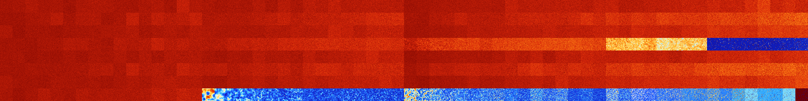

# B13468 (177152-177663)

<details>
    <summary>Initial Grid</summary>
    
</details>


<details>
    <summary>Initial Grid RLE</summary>

```
#C Exported from GoGoL (https://github.com/marrow16/gogol)
#C Wrap mode: Toroidal
#C Boundary mode: Dead
#C Step: 0
x = 100, y = 100, rule = B13468/S
11bo23bo$34bo7bo33bobo18bo$25bo31bo5bo25bo$4b2o2bo41bo41b2o$4bo12bo18bo
6bo15bo$4bo25b2o8bo3bo8bo36bo5bo$24bo8bo23bo3bo2bo23bo$4bo7bo7bo14bobo
12bo$4bo25bo6bo22bobo3bo7bo$bobo29bo12bo11bo$24bo38bo25bo$20bo$8bo13bo
7b2o2bo6bo50bo$6bo3bo17bo28b2o19bo$12bo17bo50bo4b2o8bo$3bo18bo4bo8bo3bo
23bo21bo$36bo$44bo$2bo78bo$4bo34bobo29bo$32bo35bo$15bo28bo38bo14bo$o20b
o20bo8bo5bo28bo3b2o4bo$77bo7bo8bo$45bo29bo$20bo23bo40bo8bo$o46bo21bo6bo
$11bo37bo5bobo2bo33bo$34bo27bo9bo20bo$57bob2o37bo$22bo25bo16b2o30bo$16b
o$20bo8bobo15bo$71bo11bo$6bo29bo24bo$18bo21bo21bo24bo2bo$7bo4bo19bo12bo
6bo11bo$10bo21bo15bo5bo23bo17bo$16bo6bo50bo7bo$26bo5bo30bo16bo16bo$16bo
15bo29bo$14bo22bo4bo18bo5bo3b2o24bo$2bo12bo2bo6bo28bo$o19bo11bobo32bo$
9bobo8bobo5bo20bo9bo17bo$3bo6bobo47bo2bo$b2o12bo20bo17bo13bo$87bo7bo$bo
71bo17bo$6bo18bo59bo$69bo13bo4bo$15bo10bo22bo8bo4bo31bo$36bo5bo19bo$34b
o44bo12bo$44bo32bo$34bo26bo$31bo16bo2b2o9bo7bo21bo6bo$18bo5bo24b2o28bo$
bobo16bo6bo5bo11bo8bo5bo3bo16bo9bo$13bo25bo27bo21bo$14bo66bo5bo$bo15bo
62bo2bo15bo$56bo$o94bo$12bo4b2o14bo9bo2bo14bo3bo$19bo23bo$25bo9b2o26bo$
bo8bo7bo23bo21bo6bo$13b3o9bo21bo27bo$12bo8bo62bo11bo$7bo3bo68bo7bo$11bo
4bo13bo20bo2bo4bo4bo$12bo3bo47bo14b2o$o9bo41bo$3bo14bo17bo33bo10bo$18bo
20b2o53bo$bo45bo37bo6bo$4bo$43bo10bo3bo26bo12bo$33bo5bo29bobo6bo$13bo
45bobo2bo31bo$27bo4bo21bo35bo$o22bo20bo47bo2bo$29bo26bo37b2obo$6bo19bo
16bo37bo4b2obo$43bo11bo24bo11bo$bo40bo19bo9bo3bo10bo$21bo11bo34bo6bo7bo
8bo$26bo9bo18bo2bo13bo9bo5bo$bo90bo$o4bo12bo11bo11bo$21bo4bo12bo6bo10bo
bo$5bo7b2o15bo54bo6bo5bo$bo18bo18bo$6b2o24bo$10bo22bo2bo10bo19bo8bo$13b
o39bo3bo4bo6bob2o15bo$24bo8bo5b2o15bo5bo24bo$52b2o40bo$o15bo49bo!
```
</details>
<details>
    <summary>Thumbnail</summary>

</details>
<table>
<tr>
    <td><a href="./177152%20S%20Heat%20Map%20Activity.png"></a><br>S (177152)<br>G>1000</td>    <td><a href="./177153%20S0%20Heat%20Map%20Activity.png"></a><br>S0 (177153)<br>G>1000</td>    <td><a href="./177154%20S1%20Heat%20Map%20Activity.png"></a><br>S1 (177154)<br>G>1000</td>    <td><a href="./177155%20S01%20Heat%20Map%20Activity.png"></a><br>S01 (177155)<br>G>1000</td>    <td><a href="./177156%20S2%20Heat%20Map%20Activity.png"></a><br>S2 (177156)<br>G>1000</td>    <td><a href="./177157%20S02%20Heat%20Map%20Activity.png"></a><br>S02 (177157)<br>G>1000</td>    <td><a href="./177158%20S12%20Heat%20Map%20Activity.png"></a><br>S12 (177158)<br>G>1000</td>    <td><a href="./177159%20S012%20Heat%20Map%20Activity.png"></a><br>S012 (177159)<br>G>1000</td>    <td><a href="./177160%20S3%20Heat%20Map%20Activity.png"></a><br>S3 (177160)<br>G>1000</td>    <td><a href="./177161%20S03%20Heat%20Map%20Activity.png"></a><br>S03 (177161)<br>G>1000</td>    <td><a href="./177162%20S13%20Heat%20Map%20Activity.png"></a><br>S13 (177162)<br>G>1000</td>    <td><a href="./177163%20S013%20Heat%20Map%20Activity.png"></a><br>S013 (177163)<br>G>1000</td>    <td><a href="./177164%20S23%20Heat%20Map%20Activity.png"></a><br>S23 (177164)<br>G>1000</td>    <td><a href="./177165%20S023%20Heat%20Map%20Activity.png"></a><br>S023 (177165)<br>G>1000</td>    <td><a href="./177166%20S123%20Heat%20Map%20Activity.png"></a><br>S123 (177166)<br>G>1000</td>    <td><a href="./177167%20S0123%20Heat%20Map%20Activity.png"></a><br>S0123 (177167)<br>G>1000</td>    <td><a href="./177168%20S4%20Heat%20Map%20Activity.png"></a><br>S4 (177168)<br>G>1000</td>    <td><a href="./177169%20S04%20Heat%20Map%20Activity.png"></a><br>S04 (177169)<br>G>1000</td>    <td><a href="./177170%20S14%20Heat%20Map%20Activity.png"></a><br>S14 (177170)<br>G>1000</td>    <td><a href="./177171%20S014%20Heat%20Map%20Activity.png"></a><br>S014 (177171)<br>G>1000</td>    <td><a href="./177172%20S24%20Heat%20Map%20Activity.png"></a><br>S24 (177172)<br>G>1000</td>    <td><a href="./177173%20S024%20Heat%20Map%20Activity.png"></a><br>S024 (177173)<br>G>1000</td>    <td><a href="./177174%20S124%20Heat%20Map%20Activity.png"></a><br>S124 (177174)<br>G>1000</td>    <td><a href="./177175%20S0124%20Heat%20Map%20Activity.png"></a><br>S0124 (177175)<br>G>1000</td>    <td><a href="./177176%20S34%20Heat%20Map%20Activity.png"></a><br>S34 (177176)<br>G>1000</td>    <td><a href="./177177%20S034%20Heat%20Map%20Activity.png"></a><br>S034 (177177)<br>G>1000</td>    <td><a href="./177178%20S134%20Heat%20Map%20Activity.png"></a><br>S134 (177178)<br>G>1000</td>    <td><a href="./177179%20S0134%20Heat%20Map%20Activity.png"></a><br>S0134 (177179)<br>G>1000</td>    <td><a href="./177180%20S234%20Heat%20Map%20Activity.png"></a><br>S234 (177180)<br>G>1000</td>    <td><a href="./177181%20S0234%20Heat%20Map%20Activity.png"></a><br>S0234 (177181)<br>G>1000</td>    <td><a href="./177182%20S1234%20Heat%20Map%20Activity.png"></a><br>S1234 (177182)<br>G>1000</td>    <td><a href="./177183%20S01234%20Heat%20Map%20Activity.png"></a><br>S01234 (177183)<br>G>1000</td>    <td><a href="./177184%20S5%20Heat%20Map%20Activity.png"></a><br>S5 (177184)<br>G>1000</td>    <td><a href="./177185%20S05%20Heat%20Map%20Activity.png"></a><br>S05 (177185)<br>G>1000</td>    <td><a href="./177186%20S15%20Heat%20Map%20Activity.png"></a><br>S15 (177186)<br>G>1000</td>    <td><a href="./177187%20S015%20Heat%20Map%20Activity.png"></a><br>S015 (177187)<br>G>1000</td>    <td><a href="./177188%20S25%20Heat%20Map%20Activity.png"></a><br>S25 (177188)<br>G>1000</td>    <td><a href="./177189%20S025%20Heat%20Map%20Activity.png"></a><br>S025 (177189)<br>G>1000</td>    <td><a href="./177190%20S125%20Heat%20Map%20Activity.png"></a><br>S125 (177190)<br>G>1000</td>    <td><a href="./177191%20S0125%20Heat%20Map%20Activity.png"></a><br>S0125 (177191)<br>G>1000</td>    <td><a href="./177192%20S35%20Heat%20Map%20Activity.png"></a><br>S35 (177192)<br>G>1000</td>    <td><a href="./177193%20S035%20Heat%20Map%20Activity.png"></a><br>S035 (177193)<br>G>1000</td>    <td><a href="./177194%20S135%20Heat%20Map%20Activity.png"></a><br>S135 (177194)<br>G>1000</td>    <td><a href="./177195%20S0135%20Heat%20Map%20Activity.png"></a><br>S0135 (177195)<br>G>1000</td>    <td><a href="./177196%20S235%20Heat%20Map%20Activity.png"></a><br>S235 (177196)<br>G>1000</td>    <td><a href="./177197%20S0235%20Heat%20Map%20Activity.png"></a><br>S0235 (177197)<br>G>1000</td>    <td><a href="./177198%20S1235%20Heat%20Map%20Activity.png"></a><br>S1235 (177198)<br>G>1000</td>    <td><a href="./177199%20S01235%20Heat%20Map%20Activity.png"></a><br>S01235 (177199)<br>G>1000</td>    <td><a href="./177200%20S45%20Heat%20Map%20Activity.png"></a><br>S45 (177200)<br>G>1000</td>    <td><a href="./177201%20S045%20Heat%20Map%20Activity.png"></a><br>S045 (177201)<br>G>1000</td>    <td><a href="./177202%20S145%20Heat%20Map%20Activity.png"></a><br>S145 (177202)<br>G>1000</td>    <td><a href="./177203%20S0145%20Heat%20Map%20Activity.png"></a><br>S0145 (177203)<br>G>1000</td>    <td><a href="./177204%20S245%20Heat%20Map%20Activity.png"></a><br>S245 (177204)<br>G>1000</td>    <td><a href="./177205%20S0245%20Heat%20Map%20Activity.png"></a><br>S0245 (177205)<br>G>1000</td>    <td><a href="./177206%20S1245%20Heat%20Map%20Activity.png"></a><br>S1245 (177206)<br>G>1000</td>    <td><a href="./177207%20S01245%20Heat%20Map%20Activity.png"></a><br>S01245 (177207)<br>G>1000</td>    <td><a href="./177208%20S345%20Heat%20Map%20Activity.png"></a><br>S345 (177208)<br>G>1000</td>    <td><a href="./177209%20S0345%20Heat%20Map%20Activity.png"></a><br>S0345 (177209)<br>G>1000</td>    <td><a href="./177210%20S1345%20Heat%20Map%20Activity.png"></a><br>S1345 (177210)<br>G>1000</td>    <td><a href="./177211%20S01345%20Heat%20Map%20Activity.png"></a><br>S01345 (177211)<br>G>1000</td>    <td><a href="./177212%20S2345%20Heat%20Map%20Activity.png"></a><br>S2345 (177212)<br>G>1000</td>    <td><a href="./177213%20S02345%20Heat%20Map%20Activity.png"></a><br>S02345 (177213)<br>G>1000</td>    <td><a href="./177214%20S12345%20Heat%20Map%20Activity.png"></a><br>S12345 (177214)<br>G>1000</td>    <td><a href="./177215%20S012345%20Heat%20Map%20Activity.png"></a><br>S012345 (177215)<br>G>1000</td></tr>
<tr>
    <td><a href="./177216%20S6%20Heat%20Map%20Activity.png"></a><br>S6 (177216)<br>G>1000</td>    <td><a href="./177217%20S06%20Heat%20Map%20Activity.png"></a><br>S06 (177217)<br>G>1000</td>    <td><a href="./177218%20S16%20Heat%20Map%20Activity.png"></a><br>S16 (177218)<br>G>1000</td>    <td><a href="./177219%20S016%20Heat%20Map%20Activity.png"></a><br>S016 (177219)<br>G>1000</td>    <td><a href="./177220%20S26%20Heat%20Map%20Activity.png"></a><br>S26 (177220)<br>G>1000</td>    <td><a href="./177221%20S026%20Heat%20Map%20Activity.png"></a><br>S026 (177221)<br>G>1000</td>    <td><a href="./177222%20S126%20Heat%20Map%20Activity.png"></a><br>S126 (177222)<br>G>1000</td>    <td><a href="./177223%20S0126%20Heat%20Map%20Activity.png"></a><br>S0126 (177223)<br>G>1000</td>    <td><a href="./177224%20S36%20Heat%20Map%20Activity.png"></a><br>S36 (177224)<br>G>1000</td>    <td><a href="./177225%20S036%20Heat%20Map%20Activity.png"></a><br>S036 (177225)<br>G>1000</td>    <td><a href="./177226%20S136%20Heat%20Map%20Activity.png"></a><br>S136 (177226)<br>G>1000</td>    <td><a href="./177227%20S0136%20Heat%20Map%20Activity.png"></a><br>S0136 (177227)<br>G>1000</td>    <td><a href="./177228%20S236%20Heat%20Map%20Activity.png"></a><br>S236 (177228)<br>G>1000</td>    <td><a href="./177229%20S0236%20Heat%20Map%20Activity.png"></a><br>S0236 (177229)<br>G>1000</td>    <td><a href="./177230%20S1236%20Heat%20Map%20Activity.png"></a><br>S1236 (177230)<br>G>1000</td>    <td><a href="./177231%20S01236%20Heat%20Map%20Activity.png"></a><br>S01236 (177231)<br>G>1000</td>    <td><a href="./177232%20S46%20Heat%20Map%20Activity.png"></a><br>S46 (177232)<br>G>1000</td>    <td><a href="./177233%20S046%20Heat%20Map%20Activity.png"></a><br>S046 (177233)<br>G>1000</td>    <td><a href="./177234%20S146%20Heat%20Map%20Activity.png"></a><br>S146 (177234)<br>G>1000</td>    <td><a href="./177235%20S0146%20Heat%20Map%20Activity.png"></a><br>S0146 (177235)<br>G>1000</td>    <td><a href="./177236%20S246%20Heat%20Map%20Activity.png"></a><br>S246 (177236)<br>G>1000</td>    <td><a href="./177237%20S0246%20Heat%20Map%20Activity.png"></a><br>S0246 (177237)<br>G>1000</td>    <td><a href="./177238%20S1246%20Heat%20Map%20Activity.png"></a><br>S1246 (177238)<br>G>1000</td>    <td><a href="./177239%20S01246%20Heat%20Map%20Activity.png"></a><br>S01246 (177239)<br>G>1000</td>    <td><a href="./177240%20S346%20Heat%20Map%20Activity.png"></a><br>S346 (177240)<br>G>1000</td>    <td><a href="./177241%20S0346%20Heat%20Map%20Activity.png"></a><br>S0346 (177241)<br>G>1000</td>    <td><a href="./177242%20S1346%20Heat%20Map%20Activity.png"></a><br>S1346 (177242)<br>G>1000</td>    <td><a href="./177243%20S01346%20Heat%20Map%20Activity.png"></a><br>S01346 (177243)<br>G>1000</td>    <td><a href="./177244%20S2346%20Heat%20Map%20Activity.png"></a><br>S2346 (177244)<br>G>1000</td>    <td><a href="./177245%20S02346%20Heat%20Map%20Activity.png"></a><br>S02346 (177245)<br>G>1000</td>    <td><a href="./177246%20S12346%20Heat%20Map%20Activity.png"></a><br>S12346 (177246)<br>G>1000</td>    <td><a href="./177247%20S012346%20Heat%20Map%20Activity.png"></a><br>S012346 (177247)<br>G>1000</td>    <td><a href="./177248%20S56%20Heat%20Map%20Activity.png"></a><br>S56 (177248)<br>G>1000</td>    <td><a href="./177249%20S056%20Heat%20Map%20Activity.png"></a><br>S056 (177249)<br>G>1000</td>    <td><a href="./177250%20S156%20Heat%20Map%20Activity.png"></a><br>S156 (177250)<br>G>1000</td>    <td><a href="./177251%20S0156%20Heat%20Map%20Activity.png"></a><br>S0156 (177251)<br>G>1000</td>    <td><a href="./177252%20S256%20Heat%20Map%20Activity.png"></a><br>S256 (177252)<br>G>1000</td>    <td><a href="./177253%20S0256%20Heat%20Map%20Activity.png"></a><br>S0256 (177253)<br>G>1000</td>    <td><a href="./177254%20S1256%20Heat%20Map%20Activity.png"></a><br>S1256 (177254)<br>G>1000</td>    <td><a href="./177255%20S01256%20Heat%20Map%20Activity.png"></a><br>S01256 (177255)<br>G>1000</td>    <td><a href="./177256%20S356%20Heat%20Map%20Activity.png"></a><br>S356 (177256)<br>G>1000</td>    <td><a href="./177257%20S0356%20Heat%20Map%20Activity.png"></a><br>S0356 (177257)<br>G>1000</td>    <td><a href="./177258%20S1356%20Heat%20Map%20Activity.png"></a><br>S1356 (177258)<br>G>1000</td>    <td><a href="./177259%20S01356%20Heat%20Map%20Activity.png"></a><br>S01356 (177259)<br>G>1000</td>    <td><a href="./177260%20S2356%20Heat%20Map%20Activity.png"></a><br>S2356 (177260)<br>G>1000</td>    <td><a href="./177261%20S02356%20Heat%20Map%20Activity.png"></a><br>S02356 (177261)<br>G>1000</td>    <td><a href="./177262%20S12356%20Heat%20Map%20Activity.png"></a><br>S12356 (177262)<br>G>1000</td>    <td><a href="./177263%20S012356%20Heat%20Map%20Activity.png"></a><br>S012356 (177263)<br>G>1000</td>    <td><a href="./177264%20S456%20Heat%20Map%20Activity.png"></a><br>S456 (177264)<br>G>1000</td>    <td><a href="./177265%20S0456%20Heat%20Map%20Activity.png"></a><br>S0456 (177265)<br>G>1000</td>    <td><a href="./177266%20S1456%20Heat%20Map%20Activity.png"></a><br>S1456 (177266)<br>G>1000</td>    <td><a href="./177267%20S01456%20Heat%20Map%20Activity.png"></a><br>S01456 (177267)<br>G>1000</td>    <td><a href="./177268%20S2456%20Heat%20Map%20Activity.png"></a><br>S2456 (177268)<br>G>1000</td>    <td><a href="./177269%20S02456%20Heat%20Map%20Activity.png"></a><br>S02456 (177269)<br>G>1000</td>    <td><a href="./177270%20S12456%20Heat%20Map%20Activity.png"></a><br>S12456 (177270)<br>G>1000</td>    <td><a href="./177271%20S012456%20Heat%20Map%20Activity.png"></a><br>S012456 (177271)<br>G>1000</td>    <td><a href="./177272%20S3456%20Heat%20Map%20Activity.png"></a><br>S3456 (177272)<br>G>1000</td>    <td><a href="./177273%20S03456%20Heat%20Map%20Activity.png"></a><br>S03456 (177273)<br>G>1000</td>    <td><a href="./177274%20S13456%20Heat%20Map%20Activity.png"></a><br>S13456 (177274)<br>G>1000</td>    <td><a href="./177275%20S013456%20Heat%20Map%20Activity.png"></a><br>S013456 (177275)<br>G>1000</td>    <td><a href="./177276%20S23456%20Heat%20Map%20Activity.png"></a><br>S23456 (177276)<br>G>1000</td>    <td><a href="./177277%20S023456%20Heat%20Map%20Activity.png"></a><br>S023456 (177277)<br>G>1000</td>    <td><a href="./177278%20S123456%20Heat%20Map%20Activity.png"></a><br>S123456 (177278)<br>G>1000</td>    <td><a href="./177279%20S0123456%20Heat%20Map%20Activity.png"></a><br>S0123456 (177279)<br>G>1000</td></tr>
<tr>
    <td><a href="./177280%20S7%20Heat%20Map%20Activity.png"></a><br>S7 (177280)<br>G>1000</td>    <td><a href="./177281%20S07%20Heat%20Map%20Activity.png"></a><br>S07 (177281)<br>G>1000</td>    <td><a href="./177282%20S17%20Heat%20Map%20Activity.png"></a><br>S17 (177282)<br>G>1000</td>    <td><a href="./177283%20S017%20Heat%20Map%20Activity.png"></a><br>S017 (177283)<br>G>1000</td>    <td><a href="./177284%20S27%20Heat%20Map%20Activity.png"></a><br>S27 (177284)<br>G>1000</td>    <td><a href="./177285%20S027%20Heat%20Map%20Activity.png"></a><br>S027 (177285)<br>G>1000</td>    <td><a href="./177286%20S127%20Heat%20Map%20Activity.png"></a><br>S127 (177286)<br>G>1000</td>    <td><a href="./177287%20S0127%20Heat%20Map%20Activity.png"></a><br>S0127 (177287)<br>G>1000</td>    <td><a href="./177288%20S37%20Heat%20Map%20Activity.png"></a><br>S37 (177288)<br>G>1000</td>    <td><a href="./177289%20S037%20Heat%20Map%20Activity.png"></a><br>S037 (177289)<br>G>1000</td>    <td><a href="./177290%20S137%20Heat%20Map%20Activity.png"></a><br>S137 (177290)<br>G>1000</td>    <td><a href="./177291%20S0137%20Heat%20Map%20Activity.png"></a><br>S0137 (177291)<br>G>1000</td>    <td><a href="./177292%20S237%20Heat%20Map%20Activity.png"></a><br>S237 (177292)<br>G>1000</td>    <td><a href="./177293%20S0237%20Heat%20Map%20Activity.png"></a><br>S0237 (177293)<br>G>1000</td>    <td><a href="./177294%20S1237%20Heat%20Map%20Activity.png"></a><br>S1237 (177294)<br>G>1000</td>    <td><a href="./177295%20S01237%20Heat%20Map%20Activity.png"></a><br>S01237 (177295)<br>G>1000</td>    <td><a href="./177296%20S47%20Heat%20Map%20Activity.png"></a><br>S47 (177296)<br>G>1000</td>    <td><a href="./177297%20S047%20Heat%20Map%20Activity.png"></a><br>S047 (177297)<br>G>1000</td>    <td><a href="./177298%20S147%20Heat%20Map%20Activity.png"></a><br>S147 (177298)<br>G>1000</td>    <td><a href="./177299%20S0147%20Heat%20Map%20Activity.png"></a><br>S0147 (177299)<br>G>1000</td>    <td><a href="./177300%20S247%20Heat%20Map%20Activity.png"></a><br>S247 (177300)<br>G>1000</td>    <td><a href="./177301%20S0247%20Heat%20Map%20Activity.png"></a><br>S0247 (177301)<br>G>1000</td>    <td><a href="./177302%20S1247%20Heat%20Map%20Activity.png"></a><br>S1247 (177302)<br>G>1000</td>    <td><a href="./177303%20S01247%20Heat%20Map%20Activity.png"></a><br>S01247 (177303)<br>G>1000</td>    <td><a href="./177304%20S347%20Heat%20Map%20Activity.png"></a><br>S347 (177304)<br>G>1000</td>    <td><a href="./177305%20S0347%20Heat%20Map%20Activity.png"></a><br>S0347 (177305)<br>G>1000</td>    <td><a href="./177306%20S1347%20Heat%20Map%20Activity.png"></a><br>S1347 (177306)<br>G>1000</td>    <td><a href="./177307%20S01347%20Heat%20Map%20Activity.png"></a><br>S01347 (177307)<br>G>1000</td>    <td><a href="./177308%20S2347%20Heat%20Map%20Activity.png"></a><br>S2347 (177308)<br>G>1000</td>    <td><a href="./177309%20S02347%20Heat%20Map%20Activity.png"></a><br>S02347 (177309)<br>G>1000</td>    <td><a href="./177310%20S12347%20Heat%20Map%20Activity.png"></a><br>S12347 (177310)<br>G>1000</td>    <td><a href="./177311%20S012347%20Heat%20Map%20Activity.png"></a><br>S012347 (177311)<br>G>1000</td>    <td><a href="./177312%20S57%20Heat%20Map%20Activity.png"></a><br>S57 (177312)<br>G>1000</td>    <td><a href="./177313%20S057%20Heat%20Map%20Activity.png"></a><br>S057 (177313)<br>G>1000</td>    <td><a href="./177314%20S157%20Heat%20Map%20Activity.png"></a><br>S157 (177314)<br>G>1000</td>    <td><a href="./177315%20S0157%20Heat%20Map%20Activity.png"></a><br>S0157 (177315)<br>G>1000</td>    <td><a href="./177316%20S257%20Heat%20Map%20Activity.png"></a><br>S257 (177316)<br>G>1000</td>    <td><a href="./177317%20S0257%20Heat%20Map%20Activity.png"></a><br>S0257 (177317)<br>G>1000</td>    <td><a href="./177318%20S1257%20Heat%20Map%20Activity.png"></a><br>S1257 (177318)<br>G>1000</td>    <td><a href="./177319%20S01257%20Heat%20Map%20Activity.png"></a><br>S01257 (177319)<br>G>1000</td>    <td><a href="./177320%20S357%20Heat%20Map%20Activity.png"></a><br>S357 (177320)<br>G>1000</td>    <td><a href="./177321%20S0357%20Heat%20Map%20Activity.png"></a><br>S0357 (177321)<br>G>1000</td>    <td><a href="./177322%20S1357%20Heat%20Map%20Activity.png"></a><br>S1357 (177322)<br>G>1000</td>    <td><a href="./177323%20S01357%20Heat%20Map%20Activity.png"></a><br>S01357 (177323)<br>G>1000</td>    <td><a href="./177324%20S2357%20Heat%20Map%20Activity.png"></a><br>S2357 (177324)<br>G>1000</td>    <td><a href="./177325%20S02357%20Heat%20Map%20Activity.png"></a><br>S02357 (177325)<br>G>1000</td>    <td><a href="./177326%20S12357%20Heat%20Map%20Activity.png"></a><br>S12357 (177326)<br>G>1000</td>    <td><a href="./177327%20S012357%20Heat%20Map%20Activity.png"></a><br>S012357 (177327)<br>G>1000</td>    <td><a href="./177328%20S457%20Heat%20Map%20Activity.png"></a><br>S457 (177328)<br>G>1000</td>    <td><a href="./177329%20S0457%20Heat%20Map%20Activity.png"></a><br>S0457 (177329)<br>G>1000</td>    <td><a href="./177330%20S1457%20Heat%20Map%20Activity.png"></a><br>S1457 (177330)<br>G>1000</td>    <td><a href="./177331%20S01457%20Heat%20Map%20Activity.png"></a><br>S01457 (177331)<br>G>1000</td>    <td><a href="./177332%20S2457%20Heat%20Map%20Activity.png"></a><br>S2457 (177332)<br>G>1000</td>    <td><a href="./177333%20S02457%20Heat%20Map%20Activity.png"></a><br>S02457 (177333)<br>G>1000</td>    <td><a href="./177334%20S12457%20Heat%20Map%20Activity.png"></a><br>S12457 (177334)<br>G>1000</td>    <td><a href="./177335%20S012457%20Heat%20Map%20Activity.png"></a><br>S012457 (177335)<br>G>1000</td>    <td><a href="./177336%20S3457%20Heat%20Map%20Activity.png"></a><br>S3457 (177336)<br>G>1000</td>    <td><a href="./177337%20S03457%20Heat%20Map%20Activity.png"></a><br>S03457 (177337)<br>G>1000</td>    <td><a href="./177338%20S13457%20Heat%20Map%20Activity.png"></a><br>S13457 (177338)<br>G>1000</td>    <td><a href="./177339%20S013457%20Heat%20Map%20Activity.png"></a><br>S013457 (177339)<br>G>1000</td>    <td><a href="./177340%20S23457%20Heat%20Map%20Activity.png"></a><br>S23457 (177340)<br>G>1000</td>    <td><a href="./177341%20S023457%20Heat%20Map%20Activity.png"></a><br>S023457 (177341)<br>G>1000</td>    <td><a href="./177342%20S123457%20Heat%20Map%20Activity.png"></a><br>S123457 (177342)<br>G>1000</td>    <td><a href="./177343%20S0123457%20Heat%20Map%20Activity.png"></a><br>S0123457 (177343)<br>G>1000</td></tr>
<tr>
    <td><a href="./177344%20S67%20Heat%20Map%20Activity.png"></a><br>S67 (177344)<br>G>1000</td>    <td><a href="./177345%20S067%20Heat%20Map%20Activity.png"></a><br>S067 (177345)<br>G>1000</td>    <td><a href="./177346%20S167%20Heat%20Map%20Activity.png"></a><br>S167 (177346)<br>G>1000</td>    <td><a href="./177347%20S0167%20Heat%20Map%20Activity.png"></a><br>S0167 (177347)<br>G>1000</td>    <td><a href="./177348%20S267%20Heat%20Map%20Activity.png"></a><br>S267 (177348)<br>G>1000</td>    <td><a href="./177349%20S0267%20Heat%20Map%20Activity.png"></a><br>S0267 (177349)<br>G>1000</td>    <td><a href="./177350%20S1267%20Heat%20Map%20Activity.png"></a><br>S1267 (177350)<br>G>1000</td>    <td><a href="./177351%20S01267%20Heat%20Map%20Activity.png"></a><br>S01267 (177351)<br>G>1000</td>    <td><a href="./177352%20S367%20Heat%20Map%20Activity.png"></a><br>S367 (177352)<br>G>1000</td>    <td><a href="./177353%20S0367%20Heat%20Map%20Activity.png"></a><br>S0367 (177353)<br>G>1000</td>    <td><a href="./177354%20S1367%20Heat%20Map%20Activity.png"></a><br>S1367 (177354)<br>G>1000</td>    <td><a href="./177355%20S01367%20Heat%20Map%20Activity.png"></a><br>S01367 (177355)<br>G>1000</td>    <td><a href="./177356%20S2367%20Heat%20Map%20Activity.png"></a><br>S2367 (177356)<br>G>1000</td>    <td><a href="./177357%20S02367%20Heat%20Map%20Activity.png"></a><br>S02367 (177357)<br>G>1000</td>    <td><a href="./177358%20S12367%20Heat%20Map%20Activity.png"></a><br>S12367 (177358)<br>G>1000</td>    <td><a href="./177359%20S012367%20Heat%20Map%20Activity.png"></a><br>S012367 (177359)<br>G>1000</td>    <td><a href="./177360%20S467%20Heat%20Map%20Activity.png"></a><br>S467 (177360)<br>G>1000</td>    <td><a href="./177361%20S0467%20Heat%20Map%20Activity.png"></a><br>S0467 (177361)<br>G>1000</td>    <td><a href="./177362%20S1467%20Heat%20Map%20Activity.png"></a><br>S1467 (177362)<br>G>1000</td>    <td><a href="./177363%20S01467%20Heat%20Map%20Activity.png"></a><br>S01467 (177363)<br>G>1000</td>    <td><a href="./177364%20S2467%20Heat%20Map%20Activity.png"></a><br>S2467 (177364)<br>G>1000</td>    <td><a href="./177365%20S02467%20Heat%20Map%20Activity.png"></a><br>S02467 (177365)<br>G>1000</td>    <td><a href="./177366%20S12467%20Heat%20Map%20Activity.png"></a><br>S12467 (177366)<br>G>1000</td>    <td><a href="./177367%20S012467%20Heat%20Map%20Activity.png"></a><br>S012467 (177367)<br>G>1000</td>    <td><a href="./177368%20S3467%20Heat%20Map%20Activity.png"></a><br>S3467 (177368)<br>G>1000</td>    <td><a href="./177369%20S03467%20Heat%20Map%20Activity.png"></a><br>S03467 (177369)<br>G>1000</td>    <td><a href="./177370%20S13467%20Heat%20Map%20Activity.png"></a><br>S13467 (177370)<br>G>1000</td>    <td><a href="./177371%20S013467%20Heat%20Map%20Activity.png"></a><br>S013467 (177371)<br>G>1000</td>    <td><a href="./177372%20S23467%20Heat%20Map%20Activity.png"></a><br>S23467 (177372)<br>G>1000</td>    <td><a href="./177373%20S023467%20Heat%20Map%20Activity.png"></a><br>S023467 (177373)<br>G>1000</td>    <td><a href="./177374%20S123467%20Heat%20Map%20Activity.png"></a><br>S123467 (177374)<br>G>1000</td>    <td><a href="./177375%20S0123467%20Heat%20Map%20Activity.png"></a><br>S0123467 (177375)<br>G>1000</td>    <td><a href="./177376%20S567%20Heat%20Map%20Activity.png"></a><br>S567 (177376)<br>G>1000</td>    <td><a href="./177377%20S0567%20Heat%20Map%20Activity.png"></a><br>S0567 (177377)<br>G>1000</td>    <td><a href="./177378%20S1567%20Heat%20Map%20Activity.png"></a><br>S1567 (177378)<br>G>1000</td>    <td><a href="./177379%20S01567%20Heat%20Map%20Activity.png"></a><br>S01567 (177379)<br>G>1000</td>    <td><a href="./177380%20S2567%20Heat%20Map%20Activity.png"></a><br>S2567 (177380)<br>G>1000</td>    <td><a href="./177381%20S02567%20Heat%20Map%20Activity.png"></a><br>S02567 (177381)<br>G>1000</td>    <td><a href="./177382%20S12567%20Heat%20Map%20Activity.png"></a><br>S12567 (177382)<br>G>1000</td>    <td><a href="./177383%20S012567%20Heat%20Map%20Activity.png"></a><br>S012567 (177383)<br>G>1000</td>    <td><a href="./177384%20S3567%20Heat%20Map%20Activity.png"></a><br>S3567 (177384)<br>G>1000</td>    <td><a href="./177385%20S03567%20Heat%20Map%20Activity.png"></a><br>S03567 (177385)<br>G>1000</td>    <td><a href="./177386%20S13567%20Heat%20Map%20Activity.png"></a><br>S13567 (177386)<br>G>1000</td>    <td><a href="./177387%20S013567%20Heat%20Map%20Activity.png"></a><br>S013567 (177387)<br>G>1000</td>    <td><a href="./177388%20S23567%20Heat%20Map%20Activity.png"></a><br>S23567 (177388)<br>G>1000</td>    <td><a href="./177389%20S023567%20Heat%20Map%20Activity.png"></a><br>S023567 (177389)<br>G>1000</td>    <td><a href="./177390%20S123567%20Heat%20Map%20Activity.png"></a><br>S123567 (177390)<br>G>1000</td>    <td><a href="./177391%20S0123567%20Heat%20Map%20Activity.png"></a><br>S0123567 (177391)<br>G>1000</td>    <td><a href="./177392%20S4567%20Heat%20Map%20Activity.png"></a><br>S4567 (177392)<br>G>1000</td>    <td><a href="./177393%20S04567%20Heat%20Map%20Activity.png"></a><br>S04567 (177393)<br>G>1000</td>    <td><a href="./177394%20S14567%20Heat%20Map%20Activity.png"></a><br>S14567 (177394)<br>G>1000</td>    <td><a href="./177395%20S014567%20Heat%20Map%20Activity.png"></a><br>S014567 (177395)<br>G>1000</td>    <td><a href="./177396%20S24567%20Heat%20Map%20Activity.png"></a><br>S24567 (177396)<br>G>1000</td>    <td><a href="./177397%20S024567%20Heat%20Map%20Activity.png"></a><br>S024567 (177397)<br>G>1000</td>    <td><a href="./177398%20S124567%20Heat%20Map%20Activity.png"></a><br>S124567 (177398)<br>G>1000</td>    <td><a href="./177399%20S0124567%20Heat%20Map%20Activity.png"></a><br>S0124567 (177399)<br>G>1000</td>    <td><a href="./177400%20S34567%20Heat%20Map%20Activity.png"></a><br>S34567 (177400)<br>G>1000</td>    <td><a href="./177401%20S034567%20Heat%20Map%20Activity.png"></a><br>S034567 (177401)<br>R@320,p252</td>    <td><a href="./177402%20S134567%20Heat%20Map%20Activity.png"></a><br>S134567 (177402)<br>R@430,p360</td>    <td><a href="./177403%20S0134567%20Heat%20Map%20Activity.png"></a><br>S0134567 (177403)<br>R@479,p420</td>    <td><a href="./177404%20S234567%20Heat%20Map%20Activity.png"></a><br>S234567 (177404)<br>R@549,p504</td>    <td><a href="./177405%20S0234567%20Heat%20Map%20Activity.png"></a><br>S0234567 (177405)<br>R@291,p252</td>    <td><a href="./177406%20S1234567%20Heat%20Map%20Activity.png"></a><br>S1234567 (177406)<br>R@168,p120</td>    <td><a href="./177407%20S01234567%20Heat%20Map%20Activity.png"></a><br>S01234567 (177407)<br>R@99,p60</td></tr>
<tr>
    <td><a href="./177408%20S8%20Heat%20Map%20Activity.png"></a><br>S8 (177408)<br>G>1000</td>    <td><a href="./177409%20S08%20Heat%20Map%20Activity.png"></a><br>S08 (177409)<br>G>1000</td>    <td><a href="./177410%20S18%20Heat%20Map%20Activity.png"></a><br>S18 (177410)<br>G>1000</td>    <td><a href="./177411%20S018%20Heat%20Map%20Activity.png"></a><br>S018 (177411)<br>G>1000</td>    <td><a href="./177412%20S28%20Heat%20Map%20Activity.png"></a><br>S28 (177412)<br>G>1000</td>    <td><a href="./177413%20S028%20Heat%20Map%20Activity.png"></a><br>S028 (177413)<br>G>1000</td>    <td><a href="./177414%20S128%20Heat%20Map%20Activity.png"></a><br>S128 (177414)<br>G>1000</td>    <td><a href="./177415%20S0128%20Heat%20Map%20Activity.png"></a><br>S0128 (177415)<br>G>1000</td>    <td><a href="./177416%20S38%20Heat%20Map%20Activity.png"></a><br>S38 (177416)<br>G>1000</td>    <td><a href="./177417%20S038%20Heat%20Map%20Activity.png"></a><br>S038 (177417)<br>G>1000</td>    <td><a href="./177418%20S138%20Heat%20Map%20Activity.png"></a><br>S138 (177418)<br>G>1000</td>    <td><a href="./177419%20S0138%20Heat%20Map%20Activity.png"></a><br>S0138 (177419)<br>G>1000</td>    <td><a href="./177420%20S238%20Heat%20Map%20Activity.png"></a><br>S238 (177420)<br>G>1000</td>    <td><a href="./177421%20S0238%20Heat%20Map%20Activity.png"></a><br>S0238 (177421)<br>G>1000</td>    <td><a href="./177422%20S1238%20Heat%20Map%20Activity.png"></a><br>S1238 (177422)<br>G>1000</td>    <td><a href="./177423%20S01238%20Heat%20Map%20Activity.png"></a><br>S01238 (177423)<br>G>1000</td>    <td><a href="./177424%20S48%20Heat%20Map%20Activity.png"></a><br>S48 (177424)<br>G>1000</td>    <td><a href="./177425%20S048%20Heat%20Map%20Activity.png"></a><br>S048 (177425)<br>G>1000</td>    <td><a href="./177426%20S148%20Heat%20Map%20Activity.png"></a><br>S148 (177426)<br>G>1000</td>    <td><a href="./177427%20S0148%20Heat%20Map%20Activity.png"></a><br>S0148 (177427)<br>G>1000</td>    <td><a href="./177428%20S248%20Heat%20Map%20Activity.png"></a><br>S248 (177428)<br>G>1000</td>    <td><a href="./177429%20S0248%20Heat%20Map%20Activity.png"></a><br>S0248 (177429)<br>G>1000</td>    <td><a href="./177430%20S1248%20Heat%20Map%20Activity.png"></a><br>S1248 (177430)<br>G>1000</td>    <td><a href="./177431%20S01248%20Heat%20Map%20Activity.png"></a><br>S01248 (177431)<br>G>1000</td>    <td><a href="./177432%20S348%20Heat%20Map%20Activity.png"></a><br>S348 (177432)<br>G>1000</td>    <td><a href="./177433%20S0348%20Heat%20Map%20Activity.png"></a><br>S0348 (177433)<br>G>1000</td>    <td><a href="./177434%20S1348%20Heat%20Map%20Activity.png"></a><br>S1348 (177434)<br>G>1000</td>    <td><a href="./177435%20S01348%20Heat%20Map%20Activity.png"></a><br>S01348 (177435)<br>G>1000</td>    <td><a href="./177436%20S2348%20Heat%20Map%20Activity.png"></a><br>S2348 (177436)<br>G>1000</td>    <td><a href="./177437%20S02348%20Heat%20Map%20Activity.png"></a><br>S02348 (177437)<br>G>1000</td>    <td><a href="./177438%20S12348%20Heat%20Map%20Activity.png"></a><br>S12348 (177438)<br>G>1000</td>    <td><a href="./177439%20S012348%20Heat%20Map%20Activity.png"></a><br>S012348 (177439)<br>G>1000</td>    <td><a href="./177440%20S58%20Heat%20Map%20Activity.png"></a><br>S58 (177440)<br>G>1000</td>    <td><a href="./177441%20S058%20Heat%20Map%20Activity.png"></a><br>S058 (177441)<br>G>1000</td>    <td><a href="./177442%20S158%20Heat%20Map%20Activity.png"></a><br>S158 (177442)<br>G>1000</td>    <td><a href="./177443%20S0158%20Heat%20Map%20Activity.png"></a><br>S0158 (177443)<br>G>1000</td>    <td><a href="./177444%20S258%20Heat%20Map%20Activity.png"></a><br>S258 (177444)<br>G>1000</td>    <td><a href="./177445%20S0258%20Heat%20Map%20Activity.png"></a><br>S0258 (177445)<br>G>1000</td>    <td><a href="./177446%20S1258%20Heat%20Map%20Activity.png"></a><br>S1258 (177446)<br>G>1000</td>    <td><a href="./177447%20S01258%20Heat%20Map%20Activity.png"></a><br>S01258 (177447)<br>G>1000</td>    <td><a href="./177448%20S358%20Heat%20Map%20Activity.png"></a><br>S358 (177448)<br>G>1000</td>    <td><a href="./177449%20S0358%20Heat%20Map%20Activity.png"></a><br>S0358 (177449)<br>G>1000</td>    <td><a href="./177450%20S1358%20Heat%20Map%20Activity.png"></a><br>S1358 (177450)<br>G>1000</td>    <td><a href="./177451%20S01358%20Heat%20Map%20Activity.png"></a><br>S01358 (177451)<br>G>1000</td>    <td><a href="./177452%20S2358%20Heat%20Map%20Activity.png"></a><br>S2358 (177452)<br>G>1000</td>    <td><a href="./177453%20S02358%20Heat%20Map%20Activity.png"></a><br>S02358 (177453)<br>G>1000</td>    <td><a href="./177454%20S12358%20Heat%20Map%20Activity.png"></a><br>S12358 (177454)<br>G>1000</td>    <td><a href="./177455%20S012358%20Heat%20Map%20Activity.png"></a><br>S012358 (177455)<br>G>1000</td>    <td><a href="./177456%20S458%20Heat%20Map%20Activity.png"></a><br>S458 (177456)<br>G>1000</td>    <td><a href="./177457%20S0458%20Heat%20Map%20Activity.png"></a><br>S0458 (177457)<br>G>1000</td>    <td><a href="./177458%20S1458%20Heat%20Map%20Activity.png"></a><br>S1458 (177458)<br>G>1000</td>    <td><a href="./177459%20S01458%20Heat%20Map%20Activity.png"></a><br>S01458 (177459)<br>G>1000</td>    <td><a href="./177460%20S2458%20Heat%20Map%20Activity.png"></a><br>S2458 (177460)<br>G>1000</td>    <td><a href="./177461%20S02458%20Heat%20Map%20Activity.png"></a><br>S02458 (177461)<br>G>1000</td>    <td><a href="./177462%20S12458%20Heat%20Map%20Activity.png"></a><br>S12458 (177462)<br>G>1000</td>    <td><a href="./177463%20S012458%20Heat%20Map%20Activity.png"></a><br>S012458 (177463)<br>G>1000</td>    <td><a href="./177464%20S3458%20Heat%20Map%20Activity.png"></a><br>S3458 (177464)<br>G>1000</td>    <td><a href="./177465%20S03458%20Heat%20Map%20Activity.png"></a><br>S03458 (177465)<br>G>1000</td>    <td><a href="./177466%20S13458%20Heat%20Map%20Activity.png"></a><br>S13458 (177466)<br>G>1000</td>    <td><a href="./177467%20S013458%20Heat%20Map%20Activity.png"></a><br>S013458 (177467)<br>G>1000</td>    <td><a href="./177468%20S23458%20Heat%20Map%20Activity.png"></a><br>S23458 (177468)<br>G>1000</td>    <td><a href="./177469%20S023458%20Heat%20Map%20Activity.png"></a><br>S023458 (177469)<br>G>1000</td>    <td><a href="./177470%20S123458%20Heat%20Map%20Activity.png"></a><br>S123458 (177470)<br>G>1000</td>    <td><a href="./177471%20S0123458%20Heat%20Map%20Activity.png"></a><br>S0123458 (177471)<br>G>1000</td></tr>
<tr>
    <td><a href="./177472%20S68%20Heat%20Map%20Activity.png"></a><br>S68 (177472)<br>G>1000</td>    <td><a href="./177473%20S068%20Heat%20Map%20Activity.png"></a><br>S068 (177473)<br>G>1000</td>    <td><a href="./177474%20S168%20Heat%20Map%20Activity.png"></a><br>S168 (177474)<br>G>1000</td>    <td><a href="./177475%20S0168%20Heat%20Map%20Activity.png"></a><br>S0168 (177475)<br>G>1000</td>    <td><a href="./177476%20S268%20Heat%20Map%20Activity.png"></a><br>S268 (177476)<br>G>1000</td>    <td><a href="./177477%20S0268%20Heat%20Map%20Activity.png"></a><br>S0268 (177477)<br>G>1000</td>    <td><a href="./177478%20S1268%20Heat%20Map%20Activity.png"></a><br>S1268 (177478)<br>G>1000</td>    <td><a href="./177479%20S01268%20Heat%20Map%20Activity.png"></a><br>S01268 (177479)<br>G>1000</td>    <td><a href="./177480%20S368%20Heat%20Map%20Activity.png"></a><br>S368 (177480)<br>G>1000</td>    <td><a href="./177481%20S0368%20Heat%20Map%20Activity.png"></a><br>S0368 (177481)<br>G>1000</td>    <td><a href="./177482%20S1368%20Heat%20Map%20Activity.png"></a><br>S1368 (177482)<br>G>1000</td>    <td><a href="./177483%20S01368%20Heat%20Map%20Activity.png"></a><br>S01368 (177483)<br>G>1000</td>    <td><a href="./177484%20S2368%20Heat%20Map%20Activity.png"></a><br>S2368 (177484)<br>G>1000</td>    <td><a href="./177485%20S02368%20Heat%20Map%20Activity.png"></a><br>S02368 (177485)<br>G>1000</td>    <td><a href="./177486%20S12368%20Heat%20Map%20Activity.png"></a><br>S12368 (177486)<br>G>1000</td>    <td><a href="./177487%20S012368%20Heat%20Map%20Activity.png"></a><br>S012368 (177487)<br>G>1000</td>    <td><a href="./177488%20S468%20Heat%20Map%20Activity.png"></a><br>S468 (177488)<br>G>1000</td>    <td><a href="./177489%20S0468%20Heat%20Map%20Activity.png"></a><br>S0468 (177489)<br>G>1000</td>    <td><a href="./177490%20S1468%20Heat%20Map%20Activity.png"></a><br>S1468 (177490)<br>G>1000</td>    <td><a href="./177491%20S01468%20Heat%20Map%20Activity.png"></a><br>S01468 (177491)<br>G>1000</td>    <td><a href="./177492%20S2468%20Heat%20Map%20Activity.png"></a><br>S2468 (177492)<br>G>1000</td>    <td><a href="./177493%20S02468%20Heat%20Map%20Activity.png"></a><br>S02468 (177493)<br>G>1000</td>    <td><a href="./177494%20S12468%20Heat%20Map%20Activity.png"></a><br>S12468 (177494)<br>G>1000</td>    <td><a href="./177495%20S012468%20Heat%20Map%20Activity.png"></a><br>S012468 (177495)<br>G>1000</td>    <td><a href="./177496%20S3468%20Heat%20Map%20Activity.png"></a><br>S3468 (177496)<br>G>1000</td>    <td><a href="./177497%20S03468%20Heat%20Map%20Activity.png"></a><br>S03468 (177497)<br>G>1000</td>    <td><a href="./177498%20S13468%20Heat%20Map%20Activity.png"></a><br>S13468 (177498)<br>G>1000</td>    <td><a href="./177499%20S013468%20Heat%20Map%20Activity.png"></a><br>S013468 (177499)<br>G>1000</td>    <td><a href="./177500%20S23468%20Heat%20Map%20Activity.png"></a><br>S23468 (177500)<br>G>1000</td>    <td><a href="./177501%20S023468%20Heat%20Map%20Activity.png"></a><br>S023468 (177501)<br>G>1000</td>    <td><a href="./177502%20S123468%20Heat%20Map%20Activity.png"></a><br>S123468 (177502)<br>G>1000</td>    <td><a href="./177503%20S0123468%20Heat%20Map%20Activity.png"></a><br>S0123468 (177503)<br>G>1000</td>    <td><a href="./177504%20S568%20Heat%20Map%20Activity.png"></a><br>S568 (177504)<br>G>1000</td>    <td><a href="./177505%20S0568%20Heat%20Map%20Activity.png"></a><br>S0568 (177505)<br>G>1000</td>    <td><a href="./177506%20S1568%20Heat%20Map%20Activity.png"></a><br>S1568 (177506)<br>G>1000</td>    <td><a href="./177507%20S01568%20Heat%20Map%20Activity.png"></a><br>S01568 (177507)<br>G>1000</td>    <td><a href="./177508%20S2568%20Heat%20Map%20Activity.png"></a><br>S2568 (177508)<br>G>1000</td>    <td><a href="./177509%20S02568%20Heat%20Map%20Activity.png"></a><br>S02568 (177509)<br>G>1000</td>    <td><a href="./177510%20S12568%20Heat%20Map%20Activity.png"></a><br>S12568 (177510)<br>G>1000</td>    <td><a href="./177511%20S012568%20Heat%20Map%20Activity.png"></a><br>S012568 (177511)<br>G>1000</td>    <td><a href="./177512%20S3568%20Heat%20Map%20Activity.png"></a><br>S3568 (177512)<br>G>1000</td>    <td><a href="./177513%20S03568%20Heat%20Map%20Activity.png"></a><br>S03568 (177513)<br>G>1000</td>    <td><a href="./177514%20S13568%20Heat%20Map%20Activity.png"></a><br>S13568 (177514)<br>G>1000</td>    <td><a href="./177515%20S013568%20Heat%20Map%20Activity.png"></a><br>S013568 (177515)<br>G>1000</td>    <td><a href="./177516%20S23568%20Heat%20Map%20Activity.png"></a><br>S23568 (177516)<br>G>1000</td>    <td><a href="./177517%20S023568%20Heat%20Map%20Activity.png"></a><br>S023568 (177517)<br>G>1000</td>    <td><a href="./177518%20S123568%20Heat%20Map%20Activity.png"></a><br>S123568 (177518)<br>G>1000</td>    <td><a href="./177519%20S0123568%20Heat%20Map%20Activity.png"></a><br>S0123568 (177519)<br>G>1000</td>    <td><a href="./177520%20S4568%20Heat%20Map%20Activity.png"></a><br>S4568 (177520)<br>G>1000</td>    <td><a href="./177521%20S04568%20Heat%20Map%20Activity.png"></a><br>S04568 (177521)<br>G>1000</td>    <td><a href="./177522%20S14568%20Heat%20Map%20Activity.png"></a><br>S14568 (177522)<br>G>1000</td>    <td><a href="./177523%20S014568%20Heat%20Map%20Activity.png"></a><br>S014568 (177523)<br>G>1000</td>    <td><a href="./177524%20S24568%20Heat%20Map%20Activity.png"></a><br>S24568 (177524)<br>G>1000</td>    <td><a href="./177525%20S024568%20Heat%20Map%20Activity.png"></a><br>S024568 (177525)<br>G>1000</td>    <td><a href="./177526%20S124568%20Heat%20Map%20Activity.png"></a><br>S124568 (177526)<br>G>1000</td>    <td><a href="./177527%20S0124568%20Heat%20Map%20Activity.png"></a><br>S0124568 (177527)<br>G>1000</td>    <td><a href="./177528%20S34568%20Heat%20Map%20Activity.png"></a><br>S34568 (177528)<br>G>1000</td>    <td><a href="./177529%20S034568%20Heat%20Map%20Activity.png"></a><br>S034568 (177529)<br>G>1000</td>    <td><a href="./177530%20S134568%20Heat%20Map%20Activity.png"></a><br>S134568 (177530)<br>G>1000</td>    <td><a href="./177531%20S0134568%20Heat%20Map%20Activity.png"></a><br>S0134568 (177531)<br>G>1000</td>    <td><a href="./177532%20S234568%20Heat%20Map%20Activity.png"></a><br>S234568 (177532)<br>G>1000</td>    <td><a href="./177533%20S0234568%20Heat%20Map%20Activity.png"></a><br>S0234568 (177533)<br>G>1000</td>    <td><a href="./177534%20S1234568%20Heat%20Map%20Activity.png"></a><br>S1234568 (177534)<br>G>1000</td>    <td><a href="./177535%20S01234568%20Heat%20Map%20Activity.png"></a><br>S01234568 (177535)<br>G>1000</td></tr>
<tr>
    <td><a href="./177536%20S78%20Heat%20Map%20Activity.png"></a><br>S78 (177536)<br>G>1000</td>    <td><a href="./177537%20S078%20Heat%20Map%20Activity.png"></a><br>S078 (177537)<br>G>1000</td>    <td><a href="./177538%20S178%20Heat%20Map%20Activity.png"></a><br>S178 (177538)<br>G>1000</td>    <td><a href="./177539%20S0178%20Heat%20Map%20Activity.png"></a><br>S0178 (177539)<br>G>1000</td>    <td><a href="./177540%20S278%20Heat%20Map%20Activity.png"></a><br>S278 (177540)<br>G>1000</td>    <td><a href="./177541%20S0278%20Heat%20Map%20Activity.png"></a><br>S0278 (177541)<br>G>1000</td>    <td><a href="./177542%20S1278%20Heat%20Map%20Activity.png"></a><br>S1278 (177542)<br>G>1000</td>    <td><a href="./177543%20S01278%20Heat%20Map%20Activity.png"></a><br>S01278 (177543)<br>G>1000</td>    <td><a href="./177544%20S378%20Heat%20Map%20Activity.png"></a><br>S378 (177544)<br>G>1000</td>    <td><a href="./177545%20S0378%20Heat%20Map%20Activity.png"></a><br>S0378 (177545)<br>G>1000</td>    <td><a href="./177546%20S1378%20Heat%20Map%20Activity.png"></a><br>S1378 (177546)<br>G>1000</td>    <td><a href="./177547%20S01378%20Heat%20Map%20Activity.png"></a><br>S01378 (177547)<br>G>1000</td>    <td><a href="./177548%20S2378%20Heat%20Map%20Activity.png"></a><br>S2378 (177548)<br>G>1000</td>    <td><a href="./177549%20S02378%20Heat%20Map%20Activity.png"></a><br>S02378 (177549)<br>G>1000</td>    <td><a href="./177550%20S12378%20Heat%20Map%20Activity.png"></a><br>S12378 (177550)<br>G>1000</td>    <td><a href="./177551%20S012378%20Heat%20Map%20Activity.png"></a><br>S012378 (177551)<br>G>1000</td>    <td><a href="./177552%20S478%20Heat%20Map%20Activity.png"></a><br>S478 (177552)<br>G>1000</td>    <td><a href="./177553%20S0478%20Heat%20Map%20Activity.png"></a><br>S0478 (177553)<br>G>1000</td>    <td><a href="./177554%20S1478%20Heat%20Map%20Activity.png"></a><br>S1478 (177554)<br>G>1000</td>    <td><a href="./177555%20S01478%20Heat%20Map%20Activity.png"></a><br>S01478 (177555)<br>G>1000</td>    <td><a href="./177556%20S2478%20Heat%20Map%20Activity.png"></a><br>S2478 (177556)<br>G>1000</td>    <td><a href="./177557%20S02478%20Heat%20Map%20Activity.png"></a><br>S02478 (177557)<br>G>1000</td>    <td><a href="./177558%20S12478%20Heat%20Map%20Activity.png"></a><br>S12478 (177558)<br>G>1000</td>    <td><a href="./177559%20S012478%20Heat%20Map%20Activity.png"></a><br>S012478 (177559)<br>G>1000</td>    <td><a href="./177560%20S3478%20Heat%20Map%20Activity.png"></a><br>S3478 (177560)<br>G>1000</td>    <td><a href="./177561%20S03478%20Heat%20Map%20Activity.png"></a><br>S03478 (177561)<br>G>1000</td>    <td><a href="./177562%20S13478%20Heat%20Map%20Activity.png"></a><br>S13478 (177562)<br>G>1000</td>    <td><a href="./177563%20S013478%20Heat%20Map%20Activity.png"></a><br>S013478 (177563)<br>G>1000</td>    <td><a href="./177564%20S23478%20Heat%20Map%20Activity.png"></a><br>S23478 (177564)<br>G>1000</td>    <td><a href="./177565%20S023478%20Heat%20Map%20Activity.png"></a><br>S023478 (177565)<br>G>1000</td>    <td><a href="./177566%20S123478%20Heat%20Map%20Activity.png"></a><br>S123478 (177566)<br>G>1000</td>    <td><a href="./177567%20S0123478%20Heat%20Map%20Activity.png"></a><br>S0123478 (177567)<br>G>1000</td>    <td><a href="./177568%20S578%20Heat%20Map%20Activity.png"></a><br>S578 (177568)<br>G>1000</td>    <td><a href="./177569%20S0578%20Heat%20Map%20Activity.png"></a><br>S0578 (177569)<br>G>1000</td>    <td><a href="./177570%20S1578%20Heat%20Map%20Activity.png"></a><br>S1578 (177570)<br>G>1000</td>    <td><a href="./177571%20S01578%20Heat%20Map%20Activity.png"></a><br>S01578 (177571)<br>G>1000</td>    <td><a href="./177572%20S2578%20Heat%20Map%20Activity.png"></a><br>S2578 (177572)<br>G>1000</td>    <td><a href="./177573%20S02578%20Heat%20Map%20Activity.png"></a><br>S02578 (177573)<br>G>1000</td>    <td><a href="./177574%20S12578%20Heat%20Map%20Activity.png"></a><br>S12578 (177574)<br>G>1000</td>    <td><a href="./177575%20S012578%20Heat%20Map%20Activity.png"></a><br>S012578 (177575)<br>G>1000</td>    <td><a href="./177576%20S3578%20Heat%20Map%20Activity.png"></a><br>S3578 (177576)<br>G>1000</td>    <td><a href="./177577%20S03578%20Heat%20Map%20Activity.png"></a><br>S03578 (177577)<br>G>1000</td>    <td><a href="./177578%20S13578%20Heat%20Map%20Activity.png"></a><br>S13578 (177578)<br>G>1000</td>    <td><a href="./177579%20S013578%20Heat%20Map%20Activity.png"></a><br>S013578 (177579)<br>G>1000</td>    <td><a href="./177580%20S23578%20Heat%20Map%20Activity.png"></a><br>S23578 (177580)<br>G>1000</td>    <td><a href="./177581%20S023578%20Heat%20Map%20Activity.png"></a><br>S023578 (177581)<br>G>1000</td>    <td><a href="./177582%20S123578%20Heat%20Map%20Activity.png"></a><br>S123578 (177582)<br>G>1000</td>    <td><a href="./177583%20S0123578%20Heat%20Map%20Activity.png"></a><br>S0123578 (177583)<br>G>1000</td>    <td><a href="./177584%20S4578%20Heat%20Map%20Activity.png"></a><br>S4578 (177584)<br>G>1000</td>    <td><a href="./177585%20S04578%20Heat%20Map%20Activity.png"></a><br>S04578 (177585)<br>G>1000</td>    <td><a href="./177586%20S14578%20Heat%20Map%20Activity.png"></a><br>S14578 (177586)<br>G>1000</td>    <td><a href="./177587%20S014578%20Heat%20Map%20Activity.png"></a><br>S014578 (177587)<br>G>1000</td>    <td><a href="./177588%20S24578%20Heat%20Map%20Activity.png"></a><br>S24578 (177588)<br>G>1000</td>    <td><a href="./177589%20S024578%20Heat%20Map%20Activity.png"></a><br>S024578 (177589)<br>G>1000</td>    <td><a href="./177590%20S124578%20Heat%20Map%20Activity.png"></a><br>S124578 (177590)<br>G>1000</td>    <td><a href="./177591%20S0124578%20Heat%20Map%20Activity.png"></a><br>S0124578 (177591)<br>G>1000</td>    <td><a href="./177592%20S34578%20Heat%20Map%20Activity.png"></a><br>S34578 (177592)<br>G>1000</td>    <td><a href="./177593%20S034578%20Heat%20Map%20Activity.png"></a><br>S034578 (177593)<br>G>1000</td>    <td><a href="./177594%20S134578%20Heat%20Map%20Activity.png"></a><br>S134578 (177594)<br>G>1000</td>    <td><a href="./177595%20S0134578%20Heat%20Map%20Activity.png"></a><br>S0134578 (177595)<br>G>1000</td>    <td><a href="./177596%20S234578%20Heat%20Map%20Activity.png"></a><br>S234578 (177596)<br>G>1000</td>    <td><a href="./177597%20S0234578%20Heat%20Map%20Activity.png"></a><br>S0234578 (177597)<br>G>1000</td>    <td><a href="./177598%20S1234578%20Heat%20Map%20Activity.png"></a><br>S1234578 (177598)<br>G>1000</td>    <td><a href="./177599%20S01234578%20Heat%20Map%20Activity.png"></a><br>S01234578 (177599)<br>G>1000</td></tr>
<tr>
    <td><a href="./177600%20S678%20Heat%20Map%20Activity.png"></a><br>S678 (177600)<br>G>1000</td>    <td><a href="./177601%20S0678%20Heat%20Map%20Activity.png"></a><br>S0678 (177601)<br>G>1000</td>    <td><a href="./177602%20S1678%20Heat%20Map%20Activity.png"></a><br>S1678 (177602)<br>G>1000</td>    <td><a href="./177603%20S01678%20Heat%20Map%20Activity.png"></a><br>S01678 (177603)<br>G>1000</td>    <td><a href="./177604%20S2678%20Heat%20Map%20Activity.png"></a><br>S2678 (177604)<br>G>1000</td>    <td><a href="./177605%20S02678%20Heat%20Map%20Activity.png"></a><br>S02678 (177605)<br>G>1000</td>    <td><a href="./177606%20S12678%20Heat%20Map%20Activity.png"></a><br>S12678 (177606)<br>G>1000</td>    <td><a href="./177607%20S012678%20Heat%20Map%20Activity.png"></a><br>S012678 (177607)<br>G>1000</td>    <td><a href="./177608%20S3678%20Heat%20Map%20Activity.png"></a><br>S3678 (177608)<br>G>1000</td>    <td><a href="./177609%20S03678%20Heat%20Map%20Activity.png"></a><br>S03678 (177609)<br>G>1000</td>    <td><a href="./177610%20S13678%20Heat%20Map%20Activity.png"></a><br>S13678 (177610)<br>G>1000</td>    <td><a href="./177611%20S013678%20Heat%20Map%20Activity.png"></a><br>S013678 (177611)<br>G>1000</td>    <td><a href="./177612%20S23678%20Heat%20Map%20Activity.png"></a><br>S23678 (177612)<br>G>1000</td>    <td><a href="./177613%20S023678%20Heat%20Map%20Activity.png"></a><br>S023678 (177613)<br>G>1000</td>    <td><a href="./177614%20S123678%20Heat%20Map%20Activity.png"></a><br>S123678 (177614)<br>G>1000</td>    <td><a href="./177615%20S0123678%20Heat%20Map%20Activity.png"></a><br>S0123678 (177615)<br>G>1000</td>    <td><a href="./177616%20S4678%20Heat%20Map%20Activity.png"></a><br>S4678 (177616)<br>G>1000</td>    <td><a href="./177617%20S04678%20Heat%20Map%20Activity.png"></a><br>S04678 (177617)<br>R@827,p2</td>    <td><a href="./177618%20S14678%20Heat%20Map%20Activity.png"></a><br>S14678 (177618)<br>R@356,p2</td>    <td><a href="./177619%20S014678%20Heat%20Map%20Activity.png"></a><br>S014678 (177619)<br>R@313,p2</td>    <td><a href="./177620%20S24678%20Heat%20Map%20Activity.png"></a><br>S24678 (177620)<br>R@134,p2</td>    <td><a href="./177621%20S024678%20Heat%20Map%20Activity.png"></a><br>S024678 (177621)<br>R@140,p4</td>    <td><a href="./177622%20S124678%20Heat%20Map%20Activity.png"></a><br>S124678 (177622)<br>R@120,p12</td>    <td><a href="./177623%20S0124678%20Heat%20Map%20Activity.png"></a><br>S0124678 (177623)<br>R@101,p4</td>    <td><a href="./177624%20S34678%20Heat%20Map%20Activity.png"></a><br>S34678 (177624)<br>R@76,p2</td>    <td><a href="./177625%20S034678%20Heat%20Map%20Activity.png"></a><br>S034678 (177625)<br>R@79,p2</td>    <td><a href="./177626%20S134678%20Heat%20Map%20Activity.png"></a><br>S134678 (177626)<br>R@57,p2</td>    <td><a href="./177627%20S0134678%20Heat%20Map%20Activity.png"></a><br>S0134678 (177627)<br>R@54,p2</td>    <td><a href="./177628%20S234678%20Heat%20Map%20Activity.png"></a><br>S234678 (177628)<br>R@48,p2</td>    <td><a href="./177629%20S0234678%20Heat%20Map%20Activity.png"></a><br>S0234678 (177629)<br>R@47,p2</td>    <td><a href="./177630%20S1234678%20Heat%20Map%20Activity.png"></a><br>S1234678 (177630)<br>R@49,p2</td>    <td><a href="./177631%20S01234678%20Heat%20Map%20Activity.png"></a><br>S01234678 (177631)<br>R@44,p2</td>    <td><a href="./177632%20S5678%20Heat%20Map%20Activity.png"></a><br>S5678 (177632)<br>S@61</td>    <td><a href="./177633%20S05678%20Heat%20Map%20Activity.png"></a><br>S05678 (177633)<br>R@43,p2</td>    <td><a href="./177634%20S15678%20Heat%20Map%20Activity.png"></a><br>S15678 (177634)<br>S@29</td>    <td><a href="./177635%20S015678%20Heat%20Map%20Activity.png"></a><br>S015678 (177635)<br>R@26,p2</td>    <td><a href="./177636%20S25678%20Heat%20Map%20Activity.png"></a><br>S25678 (177636)<br>R@23,p2</td>    <td><a href="./177637%20S025678%20Heat%20Map%20Activity.png"></a><br>S025678 (177637)<br>R@22,p2</td>    <td><a href="./177638%20S125678%20Heat%20Map%20Activity.png"></a><br>S125678 (177638)<br>R@20,p2</td>    <td><a href="./177639%20S0125678%20Heat%20Map%20Activity.png"></a><br>S0125678 (177639)<br>S@20</td>    <td><a href="./177640%20S35678%20Heat%20Map%20Activity.png"></a><br>S35678 (177640)<br>R@19,p2</td>    <td><a href="./177641%20S035678%20Heat%20Map%20Activity.png"></a><br>S035678 (177641)<br>R@18,p2</td>    <td><a href="./177642%20S135678%20Heat%20Map%20Activity.png"></a><br>S135678 (177642)<br>S@16</td>    <td><a href="./177643%20S0135678%20Heat%20Map%20Activity.png"></a><br>S0135678 (177643)<br>S@12</td>    <td><a href="./177644%20S235678%20Heat%20Map%20Activity.png"></a><br>S235678 (177644)<br>S@15</td>    <td><a href="./177645%20S0235678%20Heat%20Map%20Activity.png"></a><br>S0235678 (177645)<br>R@14,p2</td>    <td><a href="./177646%20S1235678%20Heat%20Map%20Activity.png"></a><br>S1235678 (177646)<br>R@17,p2</td>    <td><a href="./177647%20S01235678%20Heat%20Map%20Activity.png"></a><br>S01235678 (177647)<br>R@16,p2</td>    <td><a href="./177648%20S45678%20Heat%20Map%20Activity.png"></a><br>S45678 (177648)<br>S@12</td>    <td><a href="./177649%20S045678%20Heat%20Map%20Activity.png"></a><br>S045678 (177649)<br>S@11</td>    <td><a href="./177650%20S145678%20Heat%20Map%20Activity.png"></a><br>S145678 (177650)<br>S@10</td>    <td><a href="./177651%20S0145678%20Heat%20Map%20Activity.png"></a><br>S0145678 (177651)<br>S@10</td>    <td><a href="./177652%20S245678%20Heat%20Map%20Activity.png"></a><br>S245678 (177652)<br>S@10</td>    <td><a href="./177653%20S0245678%20Heat%20Map%20Activity.png"></a><br>S0245678 (177653)<br>S@10</td>    <td><a href="./177654%20S1245678%20Heat%20Map%20Activity.png"></a><br>S1245678 (177654)<br>S@10</td>    <td><a href="./177655%20S01245678%20Heat%20Map%20Activity.png"></a><br>S01245678 (177655)<br>S@9</td>    <td><a href="./177656%20S345678%20Heat%20Map%20Activity.png"></a><br>S345678 (177656)<br>S@9</td>    <td><a href="./177657%20S0345678%20Heat%20Map%20Activity.png"></a><br>S0345678 (177657)<br>S@10</td>    <td><a href="./177658%20S1345678%20Heat%20Map%20Activity.png"></a><br>S1345678 (177658)<br>S@9</td>    <td><a href="./177659%20S01345678%20Heat%20Map%20Activity.png"></a><br>S01345678 (177659)<br>S@8</td>    <td><a href="./177660%20S2345678%20Heat%20Map%20Activity.png"></a><br>S2345678 (177660)<br>S@8</td>    <td><a href="./177661%20S02345678%20Heat%20Map%20Activity.png"></a><br>S02345678 (177661)<br>S@8</td>    <td><a href="./177662%20S12345678%20Heat%20Map%20Activity.png"></a><br>S12345678 (177662)<br>S@8</td>    <td><a href="./177663%20S012345678%20Heat%20Map%20Activity.png"></a><br>S012345678 (177663)<br>S@8</td></tr>
</table>
