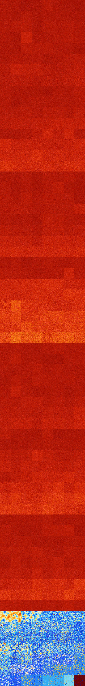

# B135678 (250880-251391)

<details>
    <summary>Initial Grid</summary>
    
</details>


<details>
    <summary>Initial Grid RLE</summary>

```
#C Exported from GoGoL (https://github.com/marrow16/gogol)
#C Wrap mode: Toroidal
#C Boundary mode: Dead
#C Step: 0
x = 100, y = 100, rule = B135678/S
12bo2bo24bo6bo28bo5bo2bo$49bo23bo8b3o$9bo17bo10bo28bo$11bo4bo21bo6bo11b
o7bo$32bo23bo8bo7bo17bo6bo$6bo4bo8bo10bo42bo$34bo45bo7bo$7bo6bo5bo20bo
24bo32bo$49bo14bo16bo17bo$74bo$11bo27bo8bo10bo$15bo4bo2bo27bo19bo$18bo$
15bo3bobo11bo21b2o7bo18bo$36bo12bo$5bo13bo2bo7bo9bo8bo35bo13bo$14bo9bo
7bo31bo3bo6bo4bo$2bo29bo11bo20bo2bo13bo11b2o$8bo21bo49bo13bo$17b2o12bo
56bo$28bo5bo12bo9bo8bo$23b2o5bo29bo3bo6bo$34bo24bo14bo5bo15bo$3bobo17bo
35b2o8bo10bo2bo$2bo16bobo4bo7bo31bo15bo$5bo57bo13bo4bo$17bobo9bo6bobo
26b2o13bo8b2o$7b2obo39bo16bo15bo$20b3o38bo3bo18bo14bo$61bo26bo$18bo3bo
7bo18b2o25bo20bo$59bo31b2o$10bobo9bo18bo38bo14bo$23bo7bo8bo5bo8bo12bo$
35bo5bo4bo34b2obo$24b2o11bo28bo2bo11bo3bo$3bobo3bo56bo22bo$9bo4bo34bobo
3bo19bo2bo20bo$11bo2bo15bo14bo19bo16bo14bo$34bo16bo5bo10bo$6bo12bo8bobo
44b2o15bo4bo$29bo29bo18bo12bo4bo$43bo11bo7bo8bo4bo7bo$3bo3bo15bo12bo2b
2o12bo5bo11bo$10bo10bo3bo37bo30bo3b2o$6bo28bo9bo4bo19bo19bo$10bo13bo63b
o$77bobo3bo$o3bo18bo3bo4bo34bo8bo14bo$3bo16bo$2bo5bo4bobo53bo4bo$71bo
26bo$29bo8bo8bo3bo9bo4bo8bo12bo$13bo40bo3bo35bo$o4bo15bo34b3obo34bo$25b
o49bo19bo$23bo30bo$39bo59bo$24bobo33bo7bob2o11bo$2bo2bo26bo2bo4bo4bo9bo
25bo9bo$o36bo27bo3bo$6bo4bo14bo11bo37b2o3bo16bo$33bo20bo6b2o$31bo21bobo
2bo26bo$4bo22bo14bo36bo2bo9bo$53bo14bo$9bo39bo31bo7bo5bo$48bo3bo9bo19bo
9bo$6bo49bo22b2o16bo$25bo19bo50bo$3bo3bobo4bo3bo10bobobo9bo23bo19bo$14b
o15bo30bo28bo$11bo23bo11b2o46bo$6bo10bo39bo24bo$11bo19bo18bo29bobo8bo$
26bo30bo34bo$6bobo17bo8bo9bo44bo$18bo$42bo7bo23bobobo15bo$28bo11bo4bo5b
o$6bo16bo35bo19bo10bo4bo$27b2o10bo12bo2bo5bo$13bo16bobo4b2o5bo3bo$14bo
13bo9bo5b2o4bo14bo6bo22bo$17bo$bo10bo4bo18bo31bo8bo4bo3bo$16bo4bo23bo
10bo13bobo2bo$9bo28bo9bo17bo2bo$5bo22bo65bo$15bo33bo4bo7bo10b2o7bobo5bo
2bo$62bo9b2obo10bo$2bo12bo33bo21b2o8bo$16bo11bo8bo17bo7bo11bo10bo$22bo
20bo7bo29bo5bo7bo$11bo3bo41bo11bo5bo15bo$bo28bo12bo31bo5bo$12bo45bo24bo
$o12bo$15bo8bo2bo13bo33b2o13bo$3bo3bo19bo8bobo29bo20bo!
```
</details>
<details>
    <summary>Thumbnail</summary>

</details>
<table>
<tr>
    <td><a href="./250880%20S%20Heat%20Map%20Activity.png"></a><br>S (250880)<br>G>1000</td>    <td><a href="./250881%20S0%20Heat%20Map%20Activity.png"></a><br>S0 (250881)<br>G>1000</td>    <td><a href="./250882%20S1%20Heat%20Map%20Activity.png"></a><br>S1 (250882)<br>G>1000</td>    <td><a href="./250883%20S01%20Heat%20Map%20Activity.png"></a><br>S01 (250883)<br>G>1000</td>    <td><a href="./250884%20S2%20Heat%20Map%20Activity.png"></a><br>S2 (250884)<br>G>1000</td>    <td><a href="./250885%20S02%20Heat%20Map%20Activity.png"></a><br>S02 (250885)<br>G>1000</td>    <td><a href="./250886%20S12%20Heat%20Map%20Activity.png"></a><br>S12 (250886)<br>G>1000</td>    <td><a href="./250887%20S012%20Heat%20Map%20Activity.png"></a><br>S012 (250887)<br>G>1000</td></tr>
<tr>
    <td><a href="./250888%20S3%20Heat%20Map%20Activity.png"></a><br>S3 (250888)<br>G>1000</td>    <td><a href="./250889%20S03%20Heat%20Map%20Activity.png"></a><br>S03 (250889)<br>G>1000</td>    <td><a href="./250890%20S13%20Heat%20Map%20Activity.png"></a><br>S13 (250890)<br>G>1000</td>    <td><a href="./250891%20S013%20Heat%20Map%20Activity.png"></a><br>S013 (250891)<br>G>1000</td>    <td><a href="./250892%20S23%20Heat%20Map%20Activity.png"></a><br>S23 (250892)<br>G>1000</td>    <td><a href="./250893%20S023%20Heat%20Map%20Activity.png"></a><br>S023 (250893)<br>G>1000</td>    <td><a href="./250894%20S123%20Heat%20Map%20Activity.png"></a><br>S123 (250894)<br>G>1000</td>    <td><a href="./250895%20S0123%20Heat%20Map%20Activity.png"></a><br>S0123 (250895)<br>G>1000</td></tr>
<tr>
    <td><a href="./250896%20S4%20Heat%20Map%20Activity.png"></a><br>S4 (250896)<br>G>1000</td>    <td><a href="./250897%20S04%20Heat%20Map%20Activity.png"></a><br>S04 (250897)<br>G>1000</td>    <td><a href="./250898%20S14%20Heat%20Map%20Activity.png"></a><br>S14 (250898)<br>G>1000</td>    <td><a href="./250899%20S014%20Heat%20Map%20Activity.png"></a><br>S014 (250899)<br>G>1000</td>    <td><a href="./250900%20S24%20Heat%20Map%20Activity.png"></a><br>S24 (250900)<br>G>1000</td>    <td><a href="./250901%20S024%20Heat%20Map%20Activity.png"></a><br>S024 (250901)<br>G>1000</td>    <td><a href="./250902%20S124%20Heat%20Map%20Activity.png"></a><br>S124 (250902)<br>G>1000</td>    <td><a href="./250903%20S0124%20Heat%20Map%20Activity.png"></a><br>S0124 (250903)<br>G>1000</td></tr>
<tr>
    <td><a href="./250904%20S34%20Heat%20Map%20Activity.png"></a><br>S34 (250904)<br>G>1000</td>    <td><a href="./250905%20S034%20Heat%20Map%20Activity.png"></a><br>S034 (250905)<br>G>1000</td>    <td><a href="./250906%20S134%20Heat%20Map%20Activity.png"></a><br>S134 (250906)<br>G>1000</td>    <td><a href="./250907%20S0134%20Heat%20Map%20Activity.png"></a><br>S0134 (250907)<br>G>1000</td>    <td><a href="./250908%20S234%20Heat%20Map%20Activity.png"></a><br>S234 (250908)<br>G>1000</td>    <td><a href="./250909%20S0234%20Heat%20Map%20Activity.png"></a><br>S0234 (250909)<br>G>1000</td>    <td><a href="./250910%20S1234%20Heat%20Map%20Activity.png"></a><br>S1234 (250910)<br>G>1000</td>    <td><a href="./250911%20S01234%20Heat%20Map%20Activity.png"></a><br>S01234 (250911)<br>G>1000</td></tr>
<tr>
    <td><a href="./250912%20S5%20Heat%20Map%20Activity.png"></a><br>S5 (250912)<br>G>1000</td>    <td><a href="./250913%20S05%20Heat%20Map%20Activity.png"></a><br>S05 (250913)<br>G>1000</td>    <td><a href="./250914%20S15%20Heat%20Map%20Activity.png"></a><br>S15 (250914)<br>G>1000</td>    <td><a href="./250915%20S015%20Heat%20Map%20Activity.png"></a><br>S015 (250915)<br>G>1000</td>    <td><a href="./250916%20S25%20Heat%20Map%20Activity.png"></a><br>S25 (250916)<br>G>1000</td>    <td><a href="./250917%20S025%20Heat%20Map%20Activity.png"></a><br>S025 (250917)<br>G>1000</td>    <td><a href="./250918%20S125%20Heat%20Map%20Activity.png"></a><br>S125 (250918)<br>G>1000</td>    <td><a href="./250919%20S0125%20Heat%20Map%20Activity.png"></a><br>S0125 (250919)<br>G>1000</td></tr>
<tr>
    <td><a href="./250920%20S35%20Heat%20Map%20Activity.png"></a><br>S35 (250920)<br>G>1000</td>    <td><a href="./250921%20S035%20Heat%20Map%20Activity.png"></a><br>S035 (250921)<br>G>1000</td>    <td><a href="./250922%20S135%20Heat%20Map%20Activity.png"></a><br>S135 (250922)<br>G>1000</td>    <td><a href="./250923%20S0135%20Heat%20Map%20Activity.png"></a><br>S0135 (250923)<br>G>1000</td>    <td><a href="./250924%20S235%20Heat%20Map%20Activity.png"></a><br>S235 (250924)<br>G>1000</td>    <td><a href="./250925%20S0235%20Heat%20Map%20Activity.png"></a><br>S0235 (250925)<br>G>1000</td>    <td><a href="./250926%20S1235%20Heat%20Map%20Activity.png"></a><br>S1235 (250926)<br>G>1000</td>    <td><a href="./250927%20S01235%20Heat%20Map%20Activity.png"></a><br>S01235 (250927)<br>G>1000</td></tr>
<tr>
    <td><a href="./250928%20S45%20Heat%20Map%20Activity.png"></a><br>S45 (250928)<br>G>1000</td>    <td><a href="./250929%20S045%20Heat%20Map%20Activity.png"></a><br>S045 (250929)<br>G>1000</td>    <td><a href="./250930%20S145%20Heat%20Map%20Activity.png"></a><br>S145 (250930)<br>G>1000</td>    <td><a href="./250931%20S0145%20Heat%20Map%20Activity.png"></a><br>S0145 (250931)<br>G>1000</td>    <td><a href="./250932%20S245%20Heat%20Map%20Activity.png"></a><br>S245 (250932)<br>G>1000</td>    <td><a href="./250933%20S0245%20Heat%20Map%20Activity.png"></a><br>S0245 (250933)<br>G>1000</td>    <td><a href="./250934%20S1245%20Heat%20Map%20Activity.png"></a><br>S1245 (250934)<br>G>1000</td>    <td><a href="./250935%20S01245%20Heat%20Map%20Activity.png"></a><br>S01245 (250935)<br>G>1000</td></tr>
<tr>
    <td><a href="./250936%20S345%20Heat%20Map%20Activity.png"></a><br>S345 (250936)<br>G>1000</td>    <td><a href="./250937%20S0345%20Heat%20Map%20Activity.png"></a><br>S0345 (250937)<br>G>1000</td>    <td><a href="./250938%20S1345%20Heat%20Map%20Activity.png"></a><br>S1345 (250938)<br>G>1000</td>    <td><a href="./250939%20S01345%20Heat%20Map%20Activity.png"></a><br>S01345 (250939)<br>G>1000</td>    <td><a href="./250940%20S2345%20Heat%20Map%20Activity.png"></a><br>S2345 (250940)<br>G>1000</td>    <td><a href="./250941%20S02345%20Heat%20Map%20Activity.png"></a><br>S02345 (250941)<br>G>1000</td>    <td><a href="./250942%20S12345%20Heat%20Map%20Activity.png"></a><br>S12345 (250942)<br>G>1000</td>    <td><a href="./250943%20S012345%20Heat%20Map%20Activity.png"></a><br>S012345 (250943)<br>G>1000</td></tr>
<tr>
    <td><a href="./250944%20S6%20Heat%20Map%20Activity.png"></a><br>S6 (250944)<br>G>1000</td>    <td><a href="./250945%20S06%20Heat%20Map%20Activity.png"></a><br>S06 (250945)<br>G>1000</td>    <td><a href="./250946%20S16%20Heat%20Map%20Activity.png"></a><br>S16 (250946)<br>G>1000</td>    <td><a href="./250947%20S016%20Heat%20Map%20Activity.png"></a><br>S016 (250947)<br>G>1000</td>    <td><a href="./250948%20S26%20Heat%20Map%20Activity.png"></a><br>S26 (250948)<br>G>1000</td>    <td><a href="./250949%20S026%20Heat%20Map%20Activity.png"></a><br>S026 (250949)<br>G>1000</td>    <td><a href="./250950%20S126%20Heat%20Map%20Activity.png"></a><br>S126 (250950)<br>G>1000</td>    <td><a href="./250951%20S0126%20Heat%20Map%20Activity.png"></a><br>S0126 (250951)<br>G>1000</td></tr>
<tr>
    <td><a href="./250952%20S36%20Heat%20Map%20Activity.png"></a><br>S36 (250952)<br>G>1000</td>    <td><a href="./250953%20S036%20Heat%20Map%20Activity.png"></a><br>S036 (250953)<br>G>1000</td>    <td><a href="./250954%20S136%20Heat%20Map%20Activity.png"></a><br>S136 (250954)<br>G>1000</td>    <td><a href="./250955%20S0136%20Heat%20Map%20Activity.png"></a><br>S0136 (250955)<br>G>1000</td>    <td><a href="./250956%20S236%20Heat%20Map%20Activity.png"></a><br>S236 (250956)<br>G>1000</td>    <td><a href="./250957%20S0236%20Heat%20Map%20Activity.png"></a><br>S0236 (250957)<br>G>1000</td>    <td><a href="./250958%20S1236%20Heat%20Map%20Activity.png"></a><br>S1236 (250958)<br>G>1000</td>    <td><a href="./250959%20S01236%20Heat%20Map%20Activity.png"></a><br>S01236 (250959)<br>G>1000</td></tr>
<tr>
    <td><a href="./250960%20S46%20Heat%20Map%20Activity.png"></a><br>S46 (250960)<br>G>1000</td>    <td><a href="./250961%20S046%20Heat%20Map%20Activity.png"></a><br>S046 (250961)<br>G>1000</td>    <td><a href="./250962%20S146%20Heat%20Map%20Activity.png"></a><br>S146 (250962)<br>G>1000</td>    <td><a href="./250963%20S0146%20Heat%20Map%20Activity.png"></a><br>S0146 (250963)<br>G>1000</td>    <td><a href="./250964%20S246%20Heat%20Map%20Activity.png"></a><br>S246 (250964)<br>G>1000</td>    <td><a href="./250965%20S0246%20Heat%20Map%20Activity.png"></a><br>S0246 (250965)<br>G>1000</td>    <td><a href="./250966%20S1246%20Heat%20Map%20Activity.png"></a><br>S1246 (250966)<br>G>1000</td>    <td><a href="./250967%20S01246%20Heat%20Map%20Activity.png"></a><br>S01246 (250967)<br>G>1000</td></tr>
<tr>
    <td><a href="./250968%20S346%20Heat%20Map%20Activity.png"></a><br>S346 (250968)<br>G>1000</td>    <td><a href="./250969%20S0346%20Heat%20Map%20Activity.png"></a><br>S0346 (250969)<br>G>1000</td>    <td><a href="./250970%20S1346%20Heat%20Map%20Activity.png"></a><br>S1346 (250970)<br>G>1000</td>    <td><a href="./250971%20S01346%20Heat%20Map%20Activity.png"></a><br>S01346 (250971)<br>G>1000</td>    <td><a href="./250972%20S2346%20Heat%20Map%20Activity.png"></a><br>S2346 (250972)<br>G>1000</td>    <td><a href="./250973%20S02346%20Heat%20Map%20Activity.png"></a><br>S02346 (250973)<br>G>1000</td>    <td><a href="./250974%20S12346%20Heat%20Map%20Activity.png"></a><br>S12346 (250974)<br>G>1000</td>    <td><a href="./250975%20S012346%20Heat%20Map%20Activity.png"></a><br>S012346 (250975)<br>G>1000</td></tr>
<tr>
    <td><a href="./250976%20S56%20Heat%20Map%20Activity.png"></a><br>S56 (250976)<br>G>1000</td>    <td><a href="./250977%20S056%20Heat%20Map%20Activity.png"></a><br>S056 (250977)<br>G>1000</td>    <td><a href="./250978%20S156%20Heat%20Map%20Activity.png"></a><br>S156 (250978)<br>G>1000</td>    <td><a href="./250979%20S0156%20Heat%20Map%20Activity.png"></a><br>S0156 (250979)<br>G>1000</td>    <td><a href="./250980%20S256%20Heat%20Map%20Activity.png"></a><br>S256 (250980)<br>G>1000</td>    <td><a href="./250981%20S0256%20Heat%20Map%20Activity.png"></a><br>S0256 (250981)<br>G>1000</td>    <td><a href="./250982%20S1256%20Heat%20Map%20Activity.png"></a><br>S1256 (250982)<br>G>1000</td>    <td><a href="./250983%20S01256%20Heat%20Map%20Activity.png"></a><br>S01256 (250983)<br>G>1000</td></tr>
<tr>
    <td><a href="./250984%20S356%20Heat%20Map%20Activity.png"></a><br>S356 (250984)<br>G>1000</td>    <td><a href="./250985%20S0356%20Heat%20Map%20Activity.png"></a><br>S0356 (250985)<br>G>1000</td>    <td><a href="./250986%20S1356%20Heat%20Map%20Activity.png"></a><br>S1356 (250986)<br>G>1000</td>    <td><a href="./250987%20S01356%20Heat%20Map%20Activity.png"></a><br>S01356 (250987)<br>G>1000</td>    <td><a href="./250988%20S2356%20Heat%20Map%20Activity.png"></a><br>S2356 (250988)<br>G>1000</td>    <td><a href="./250989%20S02356%20Heat%20Map%20Activity.png"></a><br>S02356 (250989)<br>G>1000</td>    <td><a href="./250990%20S12356%20Heat%20Map%20Activity.png"></a><br>S12356 (250990)<br>G>1000</td>    <td><a href="./250991%20S012356%20Heat%20Map%20Activity.png"></a><br>S012356 (250991)<br>G>1000</td></tr>
<tr>
    <td><a href="./250992%20S456%20Heat%20Map%20Activity.png"></a><br>S456 (250992)<br>G>1000</td>    <td><a href="./250993%20S0456%20Heat%20Map%20Activity.png"></a><br>S0456 (250993)<br>G>1000</td>    <td><a href="./250994%20S1456%20Heat%20Map%20Activity.png"></a><br>S1456 (250994)<br>G>1000</td>    <td><a href="./250995%20S01456%20Heat%20Map%20Activity.png"></a><br>S01456 (250995)<br>G>1000</td>    <td><a href="./250996%20S2456%20Heat%20Map%20Activity.png"></a><br>S2456 (250996)<br>G>1000</td>    <td><a href="./250997%20S02456%20Heat%20Map%20Activity.png"></a><br>S02456 (250997)<br>G>1000</td>    <td><a href="./250998%20S12456%20Heat%20Map%20Activity.png"></a><br>S12456 (250998)<br>G>1000</td>    <td><a href="./250999%20S012456%20Heat%20Map%20Activity.png"></a><br>S012456 (250999)<br>G>1000</td></tr>
<tr>
    <td><a href="./251000%20S3456%20Heat%20Map%20Activity.png"></a><br>S3456 (251000)<br>G>1000</td>    <td><a href="./251001%20S03456%20Heat%20Map%20Activity.png"></a><br>S03456 (251001)<br>G>1000</td>    <td><a href="./251002%20S13456%20Heat%20Map%20Activity.png"></a><br>S13456 (251002)<br>G>1000</td>    <td><a href="./251003%20S013456%20Heat%20Map%20Activity.png"></a><br>S013456 (251003)<br>G>1000</td>    <td><a href="./251004%20S23456%20Heat%20Map%20Activity.png"></a><br>S23456 (251004)<br>G>1000</td>    <td><a href="./251005%20S023456%20Heat%20Map%20Activity.png"></a><br>S023456 (251005)<br>G>1000</td>    <td><a href="./251006%20S123456%20Heat%20Map%20Activity.png"></a><br>S123456 (251006)<br>G>1000</td>    <td><a href="./251007%20S0123456%20Heat%20Map%20Activity.png"></a><br>S0123456 (251007)<br>G>1000</td></tr>
<tr>
    <td><a href="./251008%20S7%20Heat%20Map%20Activity.png"></a><br>S7 (251008)<br>G>1000</td>    <td><a href="./251009%20S07%20Heat%20Map%20Activity.png"></a><br>S07 (251009)<br>G>1000</td>    <td><a href="./251010%20S17%20Heat%20Map%20Activity.png"></a><br>S17 (251010)<br>G>1000</td>    <td><a href="./251011%20S017%20Heat%20Map%20Activity.png"></a><br>S017 (251011)<br>G>1000</td>    <td><a href="./251012%20S27%20Heat%20Map%20Activity.png"></a><br>S27 (251012)<br>G>1000</td>    <td><a href="./251013%20S027%20Heat%20Map%20Activity.png"></a><br>S027 (251013)<br>G>1000</td>    <td><a href="./251014%20S127%20Heat%20Map%20Activity.png"></a><br>S127 (251014)<br>G>1000</td>    <td><a href="./251015%20S0127%20Heat%20Map%20Activity.png"></a><br>S0127 (251015)<br>G>1000</td></tr>
<tr>
    <td><a href="./251016%20S37%20Heat%20Map%20Activity.png"></a><br>S37 (251016)<br>G>1000</td>    <td><a href="./251017%20S037%20Heat%20Map%20Activity.png"></a><br>S037 (251017)<br>G>1000</td>    <td><a href="./251018%20S137%20Heat%20Map%20Activity.png"></a><br>S137 (251018)<br>G>1000</td>    <td><a href="./251019%20S0137%20Heat%20Map%20Activity.png"></a><br>S0137 (251019)<br>G>1000</td>    <td><a href="./251020%20S237%20Heat%20Map%20Activity.png"></a><br>S237 (251020)<br>G>1000</td>    <td><a href="./251021%20S0237%20Heat%20Map%20Activity.png"></a><br>S0237 (251021)<br>G>1000</td>    <td><a href="./251022%20S1237%20Heat%20Map%20Activity.png"></a><br>S1237 (251022)<br>G>1000</td>    <td><a href="./251023%20S01237%20Heat%20Map%20Activity.png"></a><br>S01237 (251023)<br>G>1000</td></tr>
<tr>
    <td><a href="./251024%20S47%20Heat%20Map%20Activity.png"></a><br>S47 (251024)<br>G>1000</td>    <td><a href="./251025%20S047%20Heat%20Map%20Activity.png"></a><br>S047 (251025)<br>G>1000</td>    <td><a href="./251026%20S147%20Heat%20Map%20Activity.png"></a><br>S147 (251026)<br>G>1000</td>    <td><a href="./251027%20S0147%20Heat%20Map%20Activity.png"></a><br>S0147 (251027)<br>G>1000</td>    <td><a href="./251028%20S247%20Heat%20Map%20Activity.png"></a><br>S247 (251028)<br>G>1000</td>    <td><a href="./251029%20S0247%20Heat%20Map%20Activity.png"></a><br>S0247 (251029)<br>G>1000</td>    <td><a href="./251030%20S1247%20Heat%20Map%20Activity.png"></a><br>S1247 (251030)<br>G>1000</td>    <td><a href="./251031%20S01247%20Heat%20Map%20Activity.png"></a><br>S01247 (251031)<br>G>1000</td></tr>
<tr>
    <td><a href="./251032%20S347%20Heat%20Map%20Activity.png"></a><br>S347 (251032)<br>G>1000</td>    <td><a href="./251033%20S0347%20Heat%20Map%20Activity.png"></a><br>S0347 (251033)<br>G>1000</td>    <td><a href="./251034%20S1347%20Heat%20Map%20Activity.png"></a><br>S1347 (251034)<br>G>1000</td>    <td><a href="./251035%20S01347%20Heat%20Map%20Activity.png"></a><br>S01347 (251035)<br>G>1000</td>    <td><a href="./251036%20S2347%20Heat%20Map%20Activity.png"></a><br>S2347 (251036)<br>G>1000</td>    <td><a href="./251037%20S02347%20Heat%20Map%20Activity.png"></a><br>S02347 (251037)<br>G>1000</td>    <td><a href="./251038%20S12347%20Heat%20Map%20Activity.png"></a><br>S12347 (251038)<br>G>1000</td>    <td><a href="./251039%20S012347%20Heat%20Map%20Activity.png"></a><br>S012347 (251039)<br>G>1000</td></tr>
<tr>
    <td><a href="./251040%20S57%20Heat%20Map%20Activity.png"></a><br>S57 (251040)<br>G>1000</td>    <td><a href="./251041%20S057%20Heat%20Map%20Activity.png"></a><br>S057 (251041)<br>G>1000</td>    <td><a href="./251042%20S157%20Heat%20Map%20Activity.png"></a><br>S157 (251042)<br>G>1000</td>    <td><a href="./251043%20S0157%20Heat%20Map%20Activity.png"></a><br>S0157 (251043)<br>G>1000</td>    <td><a href="./251044%20S257%20Heat%20Map%20Activity.png"></a><br>S257 (251044)<br>G>1000</td>    <td><a href="./251045%20S0257%20Heat%20Map%20Activity.png"></a><br>S0257 (251045)<br>G>1000</td>    <td><a href="./251046%20S1257%20Heat%20Map%20Activity.png"></a><br>S1257 (251046)<br>G>1000</td>    <td><a href="./251047%20S01257%20Heat%20Map%20Activity.png"></a><br>S01257 (251047)<br>G>1000</td></tr>
<tr>
    <td><a href="./251048%20S357%20Heat%20Map%20Activity.png"></a><br>S357 (251048)<br>G>1000</td>    <td><a href="./251049%20S0357%20Heat%20Map%20Activity.png"></a><br>S0357 (251049)<br>G>1000</td>    <td><a href="./251050%20S1357%20Heat%20Map%20Activity.png"></a><br>S1357 (251050)<br>G>1000</td>    <td><a href="./251051%20S01357%20Heat%20Map%20Activity.png"></a><br>S01357 (251051)<br>G>1000</td>    <td><a href="./251052%20S2357%20Heat%20Map%20Activity.png"></a><br>S2357 (251052)<br>G>1000</td>    <td><a href="./251053%20S02357%20Heat%20Map%20Activity.png"></a><br>S02357 (251053)<br>G>1000</td>    <td><a href="./251054%20S12357%20Heat%20Map%20Activity.png"></a><br>S12357 (251054)<br>G>1000</td>    <td><a href="./251055%20S012357%20Heat%20Map%20Activity.png"></a><br>S012357 (251055)<br>G>1000</td></tr>
<tr>
    <td><a href="./251056%20S457%20Heat%20Map%20Activity.png"></a><br>S457 (251056)<br>G>1000</td>    <td><a href="./251057%20S0457%20Heat%20Map%20Activity.png"></a><br>S0457 (251057)<br>G>1000</td>    <td><a href="./251058%20S1457%20Heat%20Map%20Activity.png"></a><br>S1457 (251058)<br>G>1000</td>    <td><a href="./251059%20S01457%20Heat%20Map%20Activity.png"></a><br>S01457 (251059)<br>G>1000</td>    <td><a href="./251060%20S2457%20Heat%20Map%20Activity.png"></a><br>S2457 (251060)<br>G>1000</td>    <td><a href="./251061%20S02457%20Heat%20Map%20Activity.png"></a><br>S02457 (251061)<br>G>1000</td>    <td><a href="./251062%20S12457%20Heat%20Map%20Activity.png"></a><br>S12457 (251062)<br>G>1000</td>    <td><a href="./251063%20S012457%20Heat%20Map%20Activity.png"></a><br>S012457 (251063)<br>G>1000</td></tr>
<tr>
    <td><a href="./251064%20S3457%20Heat%20Map%20Activity.png"></a><br>S3457 (251064)<br>G>1000</td>    <td><a href="./251065%20S03457%20Heat%20Map%20Activity.png"></a><br>S03457 (251065)<br>G>1000</td>    <td><a href="./251066%20S13457%20Heat%20Map%20Activity.png"></a><br>S13457 (251066)<br>G>1000</td>    <td><a href="./251067%20S013457%20Heat%20Map%20Activity.png"></a><br>S013457 (251067)<br>G>1000</td>    <td><a href="./251068%20S23457%20Heat%20Map%20Activity.png"></a><br>S23457 (251068)<br>G>1000</td>    <td><a href="./251069%20S023457%20Heat%20Map%20Activity.png"></a><br>S023457 (251069)<br>G>1000</td>    <td><a href="./251070%20S123457%20Heat%20Map%20Activity.png"></a><br>S123457 (251070)<br>G>1000</td>    <td><a href="./251071%20S0123457%20Heat%20Map%20Activity.png"></a><br>S0123457 (251071)<br>G>1000</td></tr>
<tr>
    <td><a href="./251072%20S67%20Heat%20Map%20Activity.png"></a><br>S67 (251072)<br>G>1000</td>    <td><a href="./251073%20S067%20Heat%20Map%20Activity.png"></a><br>S067 (251073)<br>G>1000</td>    <td><a href="./251074%20S167%20Heat%20Map%20Activity.png"></a><br>S167 (251074)<br>G>1000</td>    <td><a href="./251075%20S0167%20Heat%20Map%20Activity.png"></a><br>S0167 (251075)<br>G>1000</td>    <td><a href="./251076%20S267%20Heat%20Map%20Activity.png"></a><br>S267 (251076)<br>G>1000</td>    <td><a href="./251077%20S0267%20Heat%20Map%20Activity.png"></a><br>S0267 (251077)<br>G>1000</td>    <td><a href="./251078%20S1267%20Heat%20Map%20Activity.png"></a><br>S1267 (251078)<br>G>1000</td>    <td><a href="./251079%20S01267%20Heat%20Map%20Activity.png"></a><br>S01267 (251079)<br>G>1000</td></tr>
<tr>
    <td><a href="./251080%20S367%20Heat%20Map%20Activity.png"></a><br>S367 (251080)<br>G>1000</td>    <td><a href="./251081%20S0367%20Heat%20Map%20Activity.png"></a><br>S0367 (251081)<br>G>1000</td>    <td><a href="./251082%20S1367%20Heat%20Map%20Activity.png"></a><br>S1367 (251082)<br>G>1000</td>    <td><a href="./251083%20S01367%20Heat%20Map%20Activity.png"></a><br>S01367 (251083)<br>G>1000</td>    <td><a href="./251084%20S2367%20Heat%20Map%20Activity.png"></a><br>S2367 (251084)<br>G>1000</td>    <td><a href="./251085%20S02367%20Heat%20Map%20Activity.png"></a><br>S02367 (251085)<br>G>1000</td>    <td><a href="./251086%20S12367%20Heat%20Map%20Activity.png"></a><br>S12367 (251086)<br>G>1000</td>    <td><a href="./251087%20S012367%20Heat%20Map%20Activity.png"></a><br>S012367 (251087)<br>G>1000</td></tr>
<tr>
    <td><a href="./251088%20S467%20Heat%20Map%20Activity.png"></a><br>S467 (251088)<br>G>1000</td>    <td><a href="./251089%20S0467%20Heat%20Map%20Activity.png"></a><br>S0467 (251089)<br>G>1000</td>    <td><a href="./251090%20S1467%20Heat%20Map%20Activity.png"></a><br>S1467 (251090)<br>G>1000</td>    <td><a href="./251091%20S01467%20Heat%20Map%20Activity.png"></a><br>S01467 (251091)<br>G>1000</td>    <td><a href="./251092%20S2467%20Heat%20Map%20Activity.png"></a><br>S2467 (251092)<br>G>1000</td>    <td><a href="./251093%20S02467%20Heat%20Map%20Activity.png"></a><br>S02467 (251093)<br>G>1000</td>    <td><a href="./251094%20S12467%20Heat%20Map%20Activity.png"></a><br>S12467 (251094)<br>G>1000</td>    <td><a href="./251095%20S012467%20Heat%20Map%20Activity.png"></a><br>S012467 (251095)<br>G>1000</td></tr>
<tr>
    <td><a href="./251096%20S3467%20Heat%20Map%20Activity.png"></a><br>S3467 (251096)<br>G>1000</td>    <td><a href="./251097%20S03467%20Heat%20Map%20Activity.png"></a><br>S03467 (251097)<br>G>1000</td>    <td><a href="./251098%20S13467%20Heat%20Map%20Activity.png"></a><br>S13467 (251098)<br>G>1000</td>    <td><a href="./251099%20S013467%20Heat%20Map%20Activity.png"></a><br>S013467 (251099)<br>G>1000</td>    <td><a href="./251100%20S23467%20Heat%20Map%20Activity.png"></a><br>S23467 (251100)<br>G>1000</td>    <td><a href="./251101%20S023467%20Heat%20Map%20Activity.png"></a><br>S023467 (251101)<br>G>1000</td>    <td><a href="./251102%20S123467%20Heat%20Map%20Activity.png"></a><br>S123467 (251102)<br>G>1000</td>    <td><a href="./251103%20S0123467%20Heat%20Map%20Activity.png"></a><br>S0123467 (251103)<br>G>1000</td></tr>
<tr>
    <td><a href="./251104%20S567%20Heat%20Map%20Activity.png"></a><br>S567 (251104)<br>G>1000</td>    <td><a href="./251105%20S0567%20Heat%20Map%20Activity.png"></a><br>S0567 (251105)<br>G>1000</td>    <td><a href="./251106%20S1567%20Heat%20Map%20Activity.png"></a><br>S1567 (251106)<br>G>1000</td>    <td><a href="./251107%20S01567%20Heat%20Map%20Activity.png"></a><br>S01567 (251107)<br>G>1000</td>    <td><a href="./251108%20S2567%20Heat%20Map%20Activity.png"></a><br>S2567 (251108)<br>G>1000</td>    <td><a href="./251109%20S02567%20Heat%20Map%20Activity.png"></a><br>S02567 (251109)<br>G>1000</td>    <td><a href="./251110%20S12567%20Heat%20Map%20Activity.png"></a><br>S12567 (251110)<br>G>1000</td>    <td><a href="./251111%20S012567%20Heat%20Map%20Activity.png"></a><br>S012567 (251111)<br>G>1000</td></tr>
<tr>
    <td><a href="./251112%20S3567%20Heat%20Map%20Activity.png"></a><br>S3567 (251112)<br>G>1000</td>    <td><a href="./251113%20S03567%20Heat%20Map%20Activity.png"></a><br>S03567 (251113)<br>G>1000</td>    <td><a href="./251114%20S13567%20Heat%20Map%20Activity.png"></a><br>S13567 (251114)<br>G>1000</td>    <td><a href="./251115%20S013567%20Heat%20Map%20Activity.png"></a><br>S013567 (251115)<br>G>1000</td>    <td><a href="./251116%20S23567%20Heat%20Map%20Activity.png"></a><br>S23567 (251116)<br>G>1000</td>    <td><a href="./251117%20S023567%20Heat%20Map%20Activity.png"></a><br>S023567 (251117)<br>G>1000</td>    <td><a href="./251118%20S123567%20Heat%20Map%20Activity.png"></a><br>S123567 (251118)<br>G>1000</td>    <td><a href="./251119%20S0123567%20Heat%20Map%20Activity.png"></a><br>S0123567 (251119)<br>G>1000</td></tr>
<tr>
    <td><a href="./251120%20S4567%20Heat%20Map%20Activity.png"></a><br>S4567 (251120)<br>G>1000</td>    <td><a href="./251121%20S04567%20Heat%20Map%20Activity.png"></a><br>S04567 (251121)<br>G>1000</td>    <td><a href="./251122%20S14567%20Heat%20Map%20Activity.png"></a><br>S14567 (251122)<br>G>1000</td>    <td><a href="./251123%20S014567%20Heat%20Map%20Activity.png"></a><br>S014567 (251123)<br>G>1000</td>    <td><a href="./251124%20S24567%20Heat%20Map%20Activity.png"></a><br>S24567 (251124)<br>G>1000</td>    <td><a href="./251125%20S024567%20Heat%20Map%20Activity.png"></a><br>S024567 (251125)<br>G>1000</td>    <td><a href="./251126%20S124567%20Heat%20Map%20Activity.png"></a><br>S124567 (251126)<br>G>1000</td>    <td><a href="./251127%20S0124567%20Heat%20Map%20Activity.png"></a><br>S0124567 (251127)<br>G>1000</td></tr>
<tr>
    <td><a href="./251128%20S34567%20Heat%20Map%20Activity.png"></a><br>S34567 (251128)<br>G>1000</td>    <td><a href="./251129%20S034567%20Heat%20Map%20Activity.png"></a><br>S034567 (251129)<br>G>1000</td>    <td><a href="./251130%20S134567%20Heat%20Map%20Activity.png"></a><br>S134567 (251130)<br>G>1000</td>    <td><a href="./251131%20S0134567%20Heat%20Map%20Activity.png"></a><br>S0134567 (251131)<br>G>1000</td>    <td><a href="./251132%20S234567%20Heat%20Map%20Activity.png"></a><br>S234567 (251132)<br>G>1000</td>    <td><a href="./251133%20S0234567%20Heat%20Map%20Activity.png"></a><br>S0234567 (251133)<br>G>1000</td>    <td><a href="./251134%20S1234567%20Heat%20Map%20Activity.png"></a><br>S1234567 (251134)<br>G>1000</td>    <td><a href="./251135%20S01234567%20Heat%20Map%20Activity.png"></a><br>S01234567 (251135)<br>G>1000</td></tr>
<tr>
    <td><a href="./251136%20S8%20Heat%20Map%20Activity.png"></a><br>S8 (251136)<br>G>1000</td>    <td><a href="./251137%20S08%20Heat%20Map%20Activity.png"></a><br>S08 (251137)<br>G>1000</td>    <td><a href="./251138%20S18%20Heat%20Map%20Activity.png"></a><br>S18 (251138)<br>G>1000</td>    <td><a href="./251139%20S018%20Heat%20Map%20Activity.png"></a><br>S018 (251139)<br>G>1000</td>    <td><a href="./251140%20S28%20Heat%20Map%20Activity.png"></a><br>S28 (251140)<br>G>1000</td>    <td><a href="./251141%20S028%20Heat%20Map%20Activity.png"></a><br>S028 (251141)<br>G>1000</td>    <td><a href="./251142%20S128%20Heat%20Map%20Activity.png"></a><br>S128 (251142)<br>G>1000</td>    <td><a href="./251143%20S0128%20Heat%20Map%20Activity.png"></a><br>S0128 (251143)<br>G>1000</td></tr>
<tr>
    <td><a href="./251144%20S38%20Heat%20Map%20Activity.png"></a><br>S38 (251144)<br>G>1000</td>    <td><a href="./251145%20S038%20Heat%20Map%20Activity.png"></a><br>S038 (251145)<br>G>1000</td>    <td><a href="./251146%20S138%20Heat%20Map%20Activity.png"></a><br>S138 (251146)<br>G>1000</td>    <td><a href="./251147%20S0138%20Heat%20Map%20Activity.png"></a><br>S0138 (251147)<br>G>1000</td>    <td><a href="./251148%20S238%20Heat%20Map%20Activity.png"></a><br>S238 (251148)<br>G>1000</td>    <td><a href="./251149%20S0238%20Heat%20Map%20Activity.png"></a><br>S0238 (251149)<br>G>1000</td>    <td><a href="./251150%20S1238%20Heat%20Map%20Activity.png"></a><br>S1238 (251150)<br>G>1000</td>    <td><a href="./251151%20S01238%20Heat%20Map%20Activity.png"></a><br>S01238 (251151)<br>G>1000</td></tr>
<tr>
    <td><a href="./251152%20S48%20Heat%20Map%20Activity.png"></a><br>S48 (251152)<br>G>1000</td>    <td><a href="./251153%20S048%20Heat%20Map%20Activity.png"></a><br>S048 (251153)<br>G>1000</td>    <td><a href="./251154%20S148%20Heat%20Map%20Activity.png"></a><br>S148 (251154)<br>G>1000</td>    <td><a href="./251155%20S0148%20Heat%20Map%20Activity.png"></a><br>S0148 (251155)<br>G>1000</td>    <td><a href="./251156%20S248%20Heat%20Map%20Activity.png"></a><br>S248 (251156)<br>G>1000</td>    <td><a href="./251157%20S0248%20Heat%20Map%20Activity.png"></a><br>S0248 (251157)<br>G>1000</td>    <td><a href="./251158%20S1248%20Heat%20Map%20Activity.png"></a><br>S1248 (251158)<br>G>1000</td>    <td><a href="./251159%20S01248%20Heat%20Map%20Activity.png"></a><br>S01248 (251159)<br>G>1000</td></tr>
<tr>
    <td><a href="./251160%20S348%20Heat%20Map%20Activity.png"></a><br>S348 (251160)<br>G>1000</td>    <td><a href="./251161%20S0348%20Heat%20Map%20Activity.png"></a><br>S0348 (251161)<br>G>1000</td>    <td><a href="./251162%20S1348%20Heat%20Map%20Activity.png"></a><br>S1348 (251162)<br>G>1000</td>    <td><a href="./251163%20S01348%20Heat%20Map%20Activity.png"></a><br>S01348 (251163)<br>G>1000</td>    <td><a href="./251164%20S2348%20Heat%20Map%20Activity.png"></a><br>S2348 (251164)<br>G>1000</td>    <td><a href="./251165%20S02348%20Heat%20Map%20Activity.png"></a><br>S02348 (251165)<br>G>1000</td>    <td><a href="./251166%20S12348%20Heat%20Map%20Activity.png"></a><br>S12348 (251166)<br>G>1000</td>    <td><a href="./251167%20S012348%20Heat%20Map%20Activity.png"></a><br>S012348 (251167)<br>G>1000</td></tr>
<tr>
    <td><a href="./251168%20S58%20Heat%20Map%20Activity.png"></a><br>S58 (251168)<br>G>1000</td>    <td><a href="./251169%20S058%20Heat%20Map%20Activity.png"></a><br>S058 (251169)<br>G>1000</td>    <td><a href="./251170%20S158%20Heat%20Map%20Activity.png"></a><br>S158 (251170)<br>G>1000</td>    <td><a href="./251171%20S0158%20Heat%20Map%20Activity.png"></a><br>S0158 (251171)<br>G>1000</td>    <td><a href="./251172%20S258%20Heat%20Map%20Activity.png"></a><br>S258 (251172)<br>G>1000</td>    <td><a href="./251173%20S0258%20Heat%20Map%20Activity.png"></a><br>S0258 (251173)<br>G>1000</td>    <td><a href="./251174%20S1258%20Heat%20Map%20Activity.png"></a><br>S1258 (251174)<br>G>1000</td>    <td><a href="./251175%20S01258%20Heat%20Map%20Activity.png"></a><br>S01258 (251175)<br>G>1000</td></tr>
<tr>
    <td><a href="./251176%20S358%20Heat%20Map%20Activity.png"></a><br>S358 (251176)<br>G>1000</td>    <td><a href="./251177%20S0358%20Heat%20Map%20Activity.png"></a><br>S0358 (251177)<br>G>1000</td>    <td><a href="./251178%20S1358%20Heat%20Map%20Activity.png"></a><br>S1358 (251178)<br>G>1000</td>    <td><a href="./251179%20S01358%20Heat%20Map%20Activity.png"></a><br>S01358 (251179)<br>G>1000</td>    <td><a href="./251180%20S2358%20Heat%20Map%20Activity.png"></a><br>S2358 (251180)<br>G>1000</td>    <td><a href="./251181%20S02358%20Heat%20Map%20Activity.png"></a><br>S02358 (251181)<br>G>1000</td>    <td><a href="./251182%20S12358%20Heat%20Map%20Activity.png"></a><br>S12358 (251182)<br>G>1000</td>    <td><a href="./251183%20S012358%20Heat%20Map%20Activity.png"></a><br>S012358 (251183)<br>G>1000</td></tr>
<tr>
    <td><a href="./251184%20S458%20Heat%20Map%20Activity.png"></a><br>S458 (251184)<br>G>1000</td>    <td><a href="./251185%20S0458%20Heat%20Map%20Activity.png"></a><br>S0458 (251185)<br>G>1000</td>    <td><a href="./251186%20S1458%20Heat%20Map%20Activity.png"></a><br>S1458 (251186)<br>G>1000</td>    <td><a href="./251187%20S01458%20Heat%20Map%20Activity.png"></a><br>S01458 (251187)<br>G>1000</td>    <td><a href="./251188%20S2458%20Heat%20Map%20Activity.png"></a><br>S2458 (251188)<br>G>1000</td>    <td><a href="./251189%20S02458%20Heat%20Map%20Activity.png"></a><br>S02458 (251189)<br>G>1000</td>    <td><a href="./251190%20S12458%20Heat%20Map%20Activity.png"></a><br>S12458 (251190)<br>G>1000</td>    <td><a href="./251191%20S012458%20Heat%20Map%20Activity.png"></a><br>S012458 (251191)<br>G>1000</td></tr>
<tr>
    <td><a href="./251192%20S3458%20Heat%20Map%20Activity.png"></a><br>S3458 (251192)<br>G>1000</td>    <td><a href="./251193%20S03458%20Heat%20Map%20Activity.png"></a><br>S03458 (251193)<br>G>1000</td>    <td><a href="./251194%20S13458%20Heat%20Map%20Activity.png"></a><br>S13458 (251194)<br>G>1000</td>    <td><a href="./251195%20S013458%20Heat%20Map%20Activity.png"></a><br>S013458 (251195)<br>G>1000</td>    <td><a href="./251196%20S23458%20Heat%20Map%20Activity.png"></a><br>S23458 (251196)<br>G>1000</td>    <td><a href="./251197%20S023458%20Heat%20Map%20Activity.png"></a><br>S023458 (251197)<br>G>1000</td>    <td><a href="./251198%20S123458%20Heat%20Map%20Activity.png"></a><br>S123458 (251198)<br>G>1000</td>    <td><a href="./251199%20S0123458%20Heat%20Map%20Activity.png"></a><br>S0123458 (251199)<br>G>1000</td></tr>
<tr>
    <td><a href="./251200%20S68%20Heat%20Map%20Activity.png"></a><br>S68 (251200)<br>G>1000</td>    <td><a href="./251201%20S068%20Heat%20Map%20Activity.png"></a><br>S068 (251201)<br>G>1000</td>    <td><a href="./251202%20S168%20Heat%20Map%20Activity.png"></a><br>S168 (251202)<br>G>1000</td>    <td><a href="./251203%20S0168%20Heat%20Map%20Activity.png"></a><br>S0168 (251203)<br>G>1000</td>    <td><a href="./251204%20S268%20Heat%20Map%20Activity.png"></a><br>S268 (251204)<br>G>1000</td>    <td><a href="./251205%20S0268%20Heat%20Map%20Activity.png"></a><br>S0268 (251205)<br>G>1000</td>    <td><a href="./251206%20S1268%20Heat%20Map%20Activity.png"></a><br>S1268 (251206)<br>G>1000</td>    <td><a href="./251207%20S01268%20Heat%20Map%20Activity.png"></a><br>S01268 (251207)<br>G>1000</td></tr>
<tr>
    <td><a href="./251208%20S368%20Heat%20Map%20Activity.png"></a><br>S368 (251208)<br>G>1000</td>    <td><a href="./251209%20S0368%20Heat%20Map%20Activity.png"></a><br>S0368 (251209)<br>G>1000</td>    <td><a href="./251210%20S1368%20Heat%20Map%20Activity.png"></a><br>S1368 (251210)<br>G>1000</td>    <td><a href="./251211%20S01368%20Heat%20Map%20Activity.png"></a><br>S01368 (251211)<br>G>1000</td>    <td><a href="./251212%20S2368%20Heat%20Map%20Activity.png"></a><br>S2368 (251212)<br>G>1000</td>    <td><a href="./251213%20S02368%20Heat%20Map%20Activity.png"></a><br>S02368 (251213)<br>G>1000</td>    <td><a href="./251214%20S12368%20Heat%20Map%20Activity.png"></a><br>S12368 (251214)<br>G>1000</td>    <td><a href="./251215%20S012368%20Heat%20Map%20Activity.png"></a><br>S012368 (251215)<br>G>1000</td></tr>
<tr>
    <td><a href="./251216%20S468%20Heat%20Map%20Activity.png"></a><br>S468 (251216)<br>G>1000</td>    <td><a href="./251217%20S0468%20Heat%20Map%20Activity.png"></a><br>S0468 (251217)<br>G>1000</td>    <td><a href="./251218%20S1468%20Heat%20Map%20Activity.png"></a><br>S1468 (251218)<br>G>1000</td>    <td><a href="./251219%20S01468%20Heat%20Map%20Activity.png"></a><br>S01468 (251219)<br>G>1000</td>    <td><a href="./251220%20S2468%20Heat%20Map%20Activity.png"></a><br>S2468 (251220)<br>G>1000</td>    <td><a href="./251221%20S02468%20Heat%20Map%20Activity.png"></a><br>S02468 (251221)<br>G>1000</td>    <td><a href="./251222%20S12468%20Heat%20Map%20Activity.png"></a><br>S12468 (251222)<br>G>1000</td>    <td><a href="./251223%20S012468%20Heat%20Map%20Activity.png"></a><br>S012468 (251223)<br>G>1000</td></tr>
<tr>
    <td><a href="./251224%20S3468%20Heat%20Map%20Activity.png"></a><br>S3468 (251224)<br>G>1000</td>    <td><a href="./251225%20S03468%20Heat%20Map%20Activity.png"></a><br>S03468 (251225)<br>G>1000</td>    <td><a href="./251226%20S13468%20Heat%20Map%20Activity.png"></a><br>S13468 (251226)<br>G>1000</td>    <td><a href="./251227%20S013468%20Heat%20Map%20Activity.png"></a><br>S013468 (251227)<br>G>1000</td>    <td><a href="./251228%20S23468%20Heat%20Map%20Activity.png"></a><br>S23468 (251228)<br>G>1000</td>    <td><a href="./251229%20S023468%20Heat%20Map%20Activity.png"></a><br>S023468 (251229)<br>G>1000</td>    <td><a href="./251230%20S123468%20Heat%20Map%20Activity.png"></a><br>S123468 (251230)<br>G>1000</td>    <td><a href="./251231%20S0123468%20Heat%20Map%20Activity.png"></a><br>S0123468 (251231)<br>G>1000</td></tr>
<tr>
    <td><a href="./251232%20S568%20Heat%20Map%20Activity.png"></a><br>S568 (251232)<br>G>1000</td>    <td><a href="./251233%20S0568%20Heat%20Map%20Activity.png"></a><br>S0568 (251233)<br>G>1000</td>    <td><a href="./251234%20S1568%20Heat%20Map%20Activity.png"></a><br>S1568 (251234)<br>G>1000</td>    <td><a href="./251235%20S01568%20Heat%20Map%20Activity.png"></a><br>S01568 (251235)<br>G>1000</td>    <td><a href="./251236%20S2568%20Heat%20Map%20Activity.png"></a><br>S2568 (251236)<br>G>1000</td>    <td><a href="./251237%20S02568%20Heat%20Map%20Activity.png"></a><br>S02568 (251237)<br>G>1000</td>    <td><a href="./251238%20S12568%20Heat%20Map%20Activity.png"></a><br>S12568 (251238)<br>G>1000</td>    <td><a href="./251239%20S012568%20Heat%20Map%20Activity.png"></a><br>S012568 (251239)<br>G>1000</td></tr>
<tr>
    <td><a href="./251240%20S3568%20Heat%20Map%20Activity.png"></a><br>S3568 (251240)<br>G>1000</td>    <td><a href="./251241%20S03568%20Heat%20Map%20Activity.png"></a><br>S03568 (251241)<br>G>1000</td>    <td><a href="./251242%20S13568%20Heat%20Map%20Activity.png"></a><br>S13568 (251242)<br>G>1000</td>    <td><a href="./251243%20S013568%20Heat%20Map%20Activity.png"></a><br>S013568 (251243)<br>G>1000</td>    <td><a href="./251244%20S23568%20Heat%20Map%20Activity.png"></a><br>S23568 (251244)<br>G>1000</td>    <td><a href="./251245%20S023568%20Heat%20Map%20Activity.png"></a><br>S023568 (251245)<br>G>1000</td>    <td><a href="./251246%20S123568%20Heat%20Map%20Activity.png"></a><br>S123568 (251246)<br>G>1000</td>    <td><a href="./251247%20S0123568%20Heat%20Map%20Activity.png"></a><br>S0123568 (251247)<br>G>1000</td></tr>
<tr>
    <td><a href="./251248%20S4568%20Heat%20Map%20Activity.png"></a><br>S4568 (251248)<br>G>1000</td>    <td><a href="./251249%20S04568%20Heat%20Map%20Activity.png"></a><br>S04568 (251249)<br>G>1000</td>    <td><a href="./251250%20S14568%20Heat%20Map%20Activity.png"></a><br>S14568 (251250)<br>G>1000</td>    <td><a href="./251251%20S014568%20Heat%20Map%20Activity.png"></a><br>S014568 (251251)<br>G>1000</td>    <td><a href="./251252%20S24568%20Heat%20Map%20Activity.png"></a><br>S24568 (251252)<br>G>1000</td>    <td><a href="./251253%20S024568%20Heat%20Map%20Activity.png"></a><br>S024568 (251253)<br>G>1000</td>    <td><a href="./251254%20S124568%20Heat%20Map%20Activity.png"></a><br>S124568 (251254)<br>G>1000</td>    <td><a href="./251255%20S0124568%20Heat%20Map%20Activity.png"></a><br>S0124568 (251255)<br>G>1000</td></tr>
<tr>
    <td><a href="./251256%20S34568%20Heat%20Map%20Activity.png"></a><br>S34568 (251256)<br>G>1000</td>    <td><a href="./251257%20S034568%20Heat%20Map%20Activity.png"></a><br>S034568 (251257)<br>G>1000</td>    <td><a href="./251258%20S134568%20Heat%20Map%20Activity.png"></a><br>S134568 (251258)<br>G>1000</td>    <td><a href="./251259%20S0134568%20Heat%20Map%20Activity.png"></a><br>S0134568 (251259)<br>G>1000</td>    <td><a href="./251260%20S234568%20Heat%20Map%20Activity.png"></a><br>S234568 (251260)<br>G>1000</td>    <td><a href="./251261%20S0234568%20Heat%20Map%20Activity.png"></a><br>S0234568 (251261)<br>G>1000</td>    <td><a href="./251262%20S1234568%20Heat%20Map%20Activity.png"></a><br>S1234568 (251262)<br>G>1000</td>    <td><a href="./251263%20S01234568%20Heat%20Map%20Activity.png"></a><br>S01234568 (251263)<br>G>1000</td></tr>
<tr>
    <td><a href="./251264%20S78%20Heat%20Map%20Activity.png"></a><br>S78 (251264)<br>G>1000</td>    <td><a href="./251265%20S078%20Heat%20Map%20Activity.png"></a><br>S078 (251265)<br>G>1000</td>    <td><a href="./251266%20S178%20Heat%20Map%20Activity.png"></a><br>S178 (251266)<br>G>1000</td>    <td><a href="./251267%20S0178%20Heat%20Map%20Activity.png"></a><br>S0178 (251267)<br>G>1000</td>    <td><a href="./251268%20S278%20Heat%20Map%20Activity.png"></a><br>S278 (251268)<br>G>1000</td>    <td><a href="./251269%20S0278%20Heat%20Map%20Activity.png"></a><br>S0278 (251269)<br>G>1000</td>    <td><a href="./251270%20S1278%20Heat%20Map%20Activity.png"></a><br>S1278 (251270)<br>G>1000</td>    <td><a href="./251271%20S01278%20Heat%20Map%20Activity.png"></a><br>S01278 (251271)<br>G>1000</td></tr>
<tr>
    <td><a href="./251272%20S378%20Heat%20Map%20Activity.png"></a><br>S378 (251272)<br>G>1000</td>    <td><a href="./251273%20S0378%20Heat%20Map%20Activity.png"></a><br>S0378 (251273)<br>G>1000</td>    <td><a href="./251274%20S1378%20Heat%20Map%20Activity.png"></a><br>S1378 (251274)<br>G>1000</td>    <td><a href="./251275%20S01378%20Heat%20Map%20Activity.png"></a><br>S01378 (251275)<br>G>1000</td>    <td><a href="./251276%20S2378%20Heat%20Map%20Activity.png"></a><br>S2378 (251276)<br>G>1000</td>    <td><a href="./251277%20S02378%20Heat%20Map%20Activity.png"></a><br>S02378 (251277)<br>G>1000</td>    <td><a href="./251278%20S12378%20Heat%20Map%20Activity.png"></a><br>S12378 (251278)<br>G>1000</td>    <td><a href="./251279%20S012378%20Heat%20Map%20Activity.png"></a><br>S012378 (251279)<br>G>1000</td></tr>
<tr>
    <td><a href="./251280%20S478%20Heat%20Map%20Activity.png"></a><br>S478 (251280)<br>G>1000</td>    <td><a href="./251281%20S0478%20Heat%20Map%20Activity.png"></a><br>S0478 (251281)<br>G>1000</td>    <td><a href="./251282%20S1478%20Heat%20Map%20Activity.png"></a><br>S1478 (251282)<br>G>1000</td>    <td><a href="./251283%20S01478%20Heat%20Map%20Activity.png"></a><br>S01478 (251283)<br>G>1000</td>    <td><a href="./251284%20S2478%20Heat%20Map%20Activity.png"></a><br>S2478 (251284)<br>G>1000</td>    <td><a href="./251285%20S02478%20Heat%20Map%20Activity.png"></a><br>S02478 (251285)<br>G>1000</td>    <td><a href="./251286%20S12478%20Heat%20Map%20Activity.png"></a><br>S12478 (251286)<br>G>1000</td>    <td><a href="./251287%20S012478%20Heat%20Map%20Activity.png"></a><br>S012478 (251287)<br>G>1000</td></tr>
<tr>
    <td><a href="./251288%20S3478%20Heat%20Map%20Activity.png"></a><br>S3478 (251288)<br>G>1000</td>    <td><a href="./251289%20S03478%20Heat%20Map%20Activity.png"></a><br>S03478 (251289)<br>G>1000</td>    <td><a href="./251290%20S13478%20Heat%20Map%20Activity.png"></a><br>S13478 (251290)<br>G>1000</td>    <td><a href="./251291%20S013478%20Heat%20Map%20Activity.png"></a><br>S013478 (251291)<br>G>1000</td>    <td><a href="./251292%20S23478%20Heat%20Map%20Activity.png"></a><br>S23478 (251292)<br>G>1000</td>    <td><a href="./251293%20S023478%20Heat%20Map%20Activity.png"></a><br>S023478 (251293)<br>G>1000</td>    <td><a href="./251294%20S123478%20Heat%20Map%20Activity.png"></a><br>S123478 (251294)<br>G>1000</td>    <td><a href="./251295%20S0123478%20Heat%20Map%20Activity.png"></a><br>S0123478 (251295)<br>G>1000</td></tr>
<tr>
    <td><a href="./251296%20S578%20Heat%20Map%20Activity.png"></a><br>S578 (251296)<br>G>1000</td>    <td><a href="./251297%20S0578%20Heat%20Map%20Activity.png"></a><br>S0578 (251297)<br>G>1000</td>    <td><a href="./251298%20S1578%20Heat%20Map%20Activity.png"></a><br>S1578 (251298)<br>G>1000</td>    <td><a href="./251299%20S01578%20Heat%20Map%20Activity.png"></a><br>S01578 (251299)<br>G>1000</td>    <td><a href="./251300%20S2578%20Heat%20Map%20Activity.png"></a><br>S2578 (251300)<br>G>1000</td>    <td><a href="./251301%20S02578%20Heat%20Map%20Activity.png"></a><br>S02578 (251301)<br>G>1000</td>    <td><a href="./251302%20S12578%20Heat%20Map%20Activity.png"></a><br>S12578 (251302)<br>G>1000</td>    <td><a href="./251303%20S012578%20Heat%20Map%20Activity.png"></a><br>S012578 (251303)<br>G>1000</td></tr>
<tr>
    <td><a href="./251304%20S3578%20Heat%20Map%20Activity.png"></a><br>S3578 (251304)<br>G>1000</td>    <td><a href="./251305%20S03578%20Heat%20Map%20Activity.png"></a><br>S03578 (251305)<br>G>1000</td>    <td><a href="./251306%20S13578%20Heat%20Map%20Activity.png"></a><br>S13578 (251306)<br>G>1000</td>    <td><a href="./251307%20S013578%20Heat%20Map%20Activity.png"></a><br>S013578 (251307)<br>G>1000</td>    <td><a href="./251308%20S23578%20Heat%20Map%20Activity.png"></a><br>S23578 (251308)<br>G>1000</td>    <td><a href="./251309%20S023578%20Heat%20Map%20Activity.png"></a><br>S023578 (251309)<br>G>1000</td>    <td><a href="./251310%20S123578%20Heat%20Map%20Activity.png"></a><br>S123578 (251310)<br>G>1000</td>    <td><a href="./251311%20S0123578%20Heat%20Map%20Activity.png"></a><br>S0123578 (251311)<br>G>1000</td></tr>
<tr>
    <td><a href="./251312%20S4578%20Heat%20Map%20Activity.png"></a><br>S4578 (251312)<br>G>1000</td>    <td><a href="./251313%20S04578%20Heat%20Map%20Activity.png"></a><br>S04578 (251313)<br>G>1000</td>    <td><a href="./251314%20S14578%20Heat%20Map%20Activity.png"></a><br>S14578 (251314)<br>G>1000</td>    <td><a href="./251315%20S014578%20Heat%20Map%20Activity.png"></a><br>S014578 (251315)<br>G>1000</td>    <td><a href="./251316%20S24578%20Heat%20Map%20Activity.png"></a><br>S24578 (251316)<br>G>1000</td>    <td><a href="./251317%20S024578%20Heat%20Map%20Activity.png"></a><br>S024578 (251317)<br>G>1000</td>    <td><a href="./251318%20S124578%20Heat%20Map%20Activity.png"></a><br>S124578 (251318)<br>G>1000</td>    <td><a href="./251319%20S0124578%20Heat%20Map%20Activity.png"></a><br>S0124578 (251319)<br>G>1000</td></tr>
<tr>
    <td><a href="./251320%20S34578%20Heat%20Map%20Activity.png"></a><br>S34578 (251320)<br>G>1000</td>    <td><a href="./251321%20S034578%20Heat%20Map%20Activity.png"></a><br>S034578 (251321)<br>G>1000</td>    <td><a href="./251322%20S134578%20Heat%20Map%20Activity.png"></a><br>S134578 (251322)<br>G>1000</td>    <td><a href="./251323%20S0134578%20Heat%20Map%20Activity.png"></a><br>S0134578 (251323)<br>G>1000</td>    <td><a href="./251324%20S234578%20Heat%20Map%20Activity.png"></a><br>S234578 (251324)<br>G>1000</td>    <td><a href="./251325%20S0234578%20Heat%20Map%20Activity.png"></a><br>S0234578 (251325)<br>G>1000</td>    <td><a href="./251326%20S1234578%20Heat%20Map%20Activity.png"></a><br>S1234578 (251326)<br>G>1000</td>    <td><a href="./251327%20S01234578%20Heat%20Map%20Activity.png"></a><br>S01234578 (251327)<br>G>1000</td></tr>
<tr>
    <td><a href="./251328%20S678%20Heat%20Map%20Activity.png"></a><br>S678 (251328)<br>G>1000</td>    <td><a href="./251329%20S0678%20Heat%20Map%20Activity.png"></a><br>S0678 (251329)<br>G>1000</td>    <td><a href="./251330%20S1678%20Heat%20Map%20Activity.png"></a><br>S1678 (251330)<br>G>1000</td>    <td><a href="./251331%20S01678%20Heat%20Map%20Activity.png"></a><br>S01678 (251331)<br>G>1000</td>    <td><a href="./251332%20S2678%20Heat%20Map%20Activity.png"></a><br>S2678 (251332)<br>G>1000</td>    <td><a href="./251333%20S02678%20Heat%20Map%20Activity.png"></a><br>S02678 (251333)<br>G>1000</td>    <td><a href="./251334%20S12678%20Heat%20Map%20Activity.png"></a><br>S12678 (251334)<br>G>1000</td>    <td><a href="./251335%20S012678%20Heat%20Map%20Activity.png"></a><br>S012678 (251335)<br>G>1000</td></tr>
<tr>
    <td><a href="./251336%20S3678%20Heat%20Map%20Activity.png"></a><br>S3678 (251336)<br>R@408,p2</td>    <td><a href="./251337%20S03678%20Heat%20Map%20Activity.png"></a><br>S03678 (251337)<br>R@388,p2</td>    <td><a href="./251338%20S13678%20Heat%20Map%20Activity.png"></a><br>S13678 (251338)<br>R@223,p2</td>    <td><a href="./251339%20S013678%20Heat%20Map%20Activity.png"></a><br>S013678 (251339)<br>R@207,p2</td>    <td><a href="./251340%20S23678%20Heat%20Map%20Activity.png"></a><br>S23678 (251340)<br>R@65,p2</td>    <td><a href="./251341%20S023678%20Heat%20Map%20Activity.png"></a><br>S023678 (251341)<br>R@64,p2</td>    <td><a href="./251342%20S123678%20Heat%20Map%20Activity.png"></a><br>S123678 (251342)<br>R@59,p2</td>    <td><a href="./251343%20S0123678%20Heat%20Map%20Activity.png"></a><br>S0123678 (251343)<br>R@48,p2</td></tr>
<tr>
    <td><a href="./251344%20S4678%20Heat%20Map%20Activity.png"></a><br>S4678 (251344)<br>S@33</td>    <td><a href="./251345%20S04678%20Heat%20Map%20Activity.png"></a><br>S04678 (251345)<br>S@32</td>    <td><a href="./251346%20S14678%20Heat%20Map%20Activity.png"></a><br>S14678 (251346)<br>R@26,p2</td>    <td><a href="./251347%20S014678%20Heat%20Map%20Activity.png"></a><br>S014678 (251347)<br>S@24</td>    <td><a href="./251348%20S24678%20Heat%20Map%20Activity.png"></a><br>S24678 (251348)<br>S@19</td>    <td><a href="./251349%20S024678%20Heat%20Map%20Activity.png"></a><br>S024678 (251349)<br>R@21,p2</td>    <td><a href="./251350%20S124678%20Heat%20Map%20Activity.png"></a><br>S124678 (251350)<br>S@20</td>    <td><a href="./251351%20S0124678%20Heat%20Map%20Activity.png"></a><br>S0124678 (251351)<br>R@23,p2</td></tr>
<tr>
    <td><a href="./251352%20S34678%20Heat%20Map%20Activity.png"></a><br>S34678 (251352)<br>S@15</td>    <td><a href="./251353%20S034678%20Heat%20Map%20Activity.png"></a><br>S034678 (251353)<br>S@14</td>    <td><a href="./251354%20S134678%20Heat%20Map%20Activity.png"></a><br>S134678 (251354)<br>S@13</td>    <td><a href="./251355%20S0134678%20Heat%20Map%20Activity.png"></a><br>S0134678 (251355)<br>S@14</td>    <td><a href="./251356%20S234678%20Heat%20Map%20Activity.png"></a><br>S234678 (251356)<br>S@14</td>    <td><a href="./251357%20S0234678%20Heat%20Map%20Activity.png"></a><br>S0234678 (251357)<br>S@13</td>    <td><a href="./251358%20S1234678%20Heat%20Map%20Activity.png"></a><br>S1234678 (251358)<br>S@12</td>    <td><a href="./251359%20S01234678%20Heat%20Map%20Activity.png"></a><br>S01234678 (251359)<br>S@15</td></tr>
<tr>
    <td><a href="./251360%20S5678%20Heat%20Map%20Activity.png"></a><br>S5678 (251360)<br>S@50</td>    <td><a href="./251361%20S05678%20Heat%20Map%20Activity.png"></a><br>S05678 (251361)<br>S@28</td>    <td><a href="./251362%20S15678%20Heat%20Map%20Activity.png"></a><br>S15678 (251362)<br>S@24</td>    <td><a href="./251363%20S015678%20Heat%20Map%20Activity.png"></a><br>S015678 (251363)<br>S@21</td>    <td><a href="./251364%20S25678%20Heat%20Map%20Activity.png"></a><br>S25678 (251364)<br>S@17</td>    <td><a href="./251365%20S025678%20Heat%20Map%20Activity.png"></a><br>S025678 (251365)<br>S@15</td>    <td><a href="./251366%20S125678%20Heat%20Map%20Activity.png"></a><br>S125678 (251366)<br>S@15</td>    <td><a href="./251367%20S0125678%20Heat%20Map%20Activity.png"></a><br>S0125678 (251367)<br>S@12</td></tr>
<tr>
    <td><a href="./251368%20S35678%20Heat%20Map%20Activity.png"></a><br>S35678 (251368)<br>S@12</td>    <td><a href="./251369%20S035678%20Heat%20Map%20Activity.png"></a><br>S035678 (251369)<br>S@11</td>    <td><a href="./251370%20S135678%20Heat%20Map%20Activity.png"></a><br>S135678 (251370)<br>S@12</td>    <td><a href="./251371%20S0135678%20Heat%20Map%20Activity.png"></a><br>S0135678 (251371)<br>S@10</td>    <td><a href="./251372%20S235678%20Heat%20Map%20Activity.png"></a><br>S235678 (251372)<br>S@10</td>    <td><a href="./251373%20S0235678%20Heat%20Map%20Activity.png"></a><br>S0235678 (251373)<br>S@10</td>    <td><a href="./251374%20S1235678%20Heat%20Map%20Activity.png"></a><br>S1235678 (251374)<br>S@10</td>    <td><a href="./251375%20S01235678%20Heat%20Map%20Activity.png"></a><br>S01235678 (251375)<br>S@10</td></tr>
<tr>
    <td><a href="./251376%20S45678%20Heat%20Map%20Activity.png"></a><br>S45678 (251376)<br>S@11</td>    <td><a href="./251377%20S045678%20Heat%20Map%20Activity.png"></a><br>S045678 (251377)<br>S@10</td>    <td><a href="./251378%20S145678%20Heat%20Map%20Activity.png"></a><br>S145678 (251378)<br>S@9</td>    <td><a href="./251379%20S0145678%20Heat%20Map%20Activity.png"></a><br>S0145678 (251379)<br>S@10</td>    <td><a href="./251380%20S245678%20Heat%20Map%20Activity.png"></a><br>S245678 (251380)<br>S@10</td>    <td><a href="./251381%20S0245678%20Heat%20Map%20Activity.png"></a><br>S0245678 (251381)<br>S@8</td>    <td><a href="./251382%20S1245678%20Heat%20Map%20Activity.png"></a><br>S1245678 (251382)<br>S@9</td>    <td><a href="./251383%20S01245678%20Heat%20Map%20Activity.png"></a><br>S01245678 (251383)<br>S@8</td></tr>
<tr>
    <td><a href="./251384%20S345678%20Heat%20Map%20Activity.png"></a><br>S345678 (251384)<br>S@8</td>    <td><a href="./251385%20S0345678%20Heat%20Map%20Activity.png"></a><br>S0345678 (251385)<br>S@8</td>    <td><a href="./251386%20S1345678%20Heat%20Map%20Activity.png"></a><br>S1345678 (251386)<br>S@8</td>    <td><a href="./251387%20S01345678%20Heat%20Map%20Activity.png"></a><br>S01345678 (251387)<br>S@8</td>    <td><a href="./251388%20S2345678%20Heat%20Map%20Activity.png"></a><br>S2345678 (251388)<br>S@8</td>    <td><a href="./251389%20S02345678%20Heat%20Map%20Activity.png"></a><br>S02345678 (251389)<br>S@8</td>    <td><a href="./251390%20S12345678%20Heat%20Map%20Activity.png"></a><br>S12345678 (251390)<br>S@7</td>    <td><a href="./251391%20S012345678%20Heat%20Map%20Activity.png"></a><br>S012345678 (251391)<br>S@7</td></tr>
</table>
