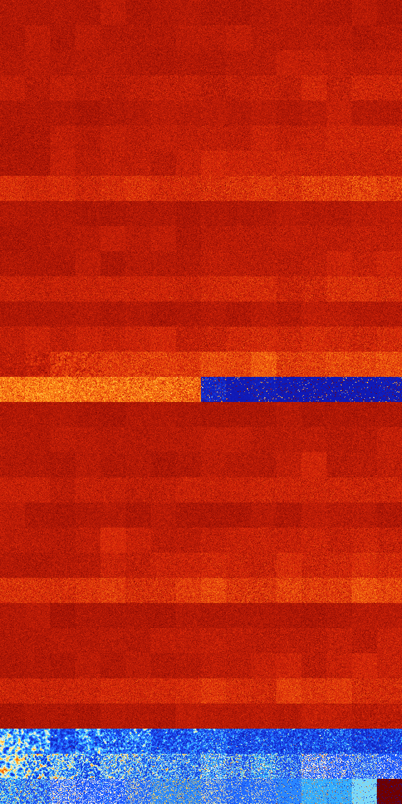

# B13568 (185344-185855)

<details>
    <summary>Initial Grid</summary>
    
</details>


<details>
    <summary>Initial Grid RLE</summary>

```
#C Exported from GoGoL (https://github.com/marrow16/gogol)
#C Wrap mode: Toroidal
#C Boundary mode: Dead
#C Step: 0
x = 100, y = 100, rule = B13568/S
18bo28bo10bo14bo3bobo14bo$4bo30bo50bo$9bo18bo62bo6bo$3bo$47bo23bo13bo8b
o$19bo7bo6bo12bo4bo13bo26bo$7bo3bo9bo25b2o2bobo$3bo23bo27bo$12bo2bo8bo
15bo7bo15b2o17bo$23bo23bo43bo7bo$35bo34bo$63bo16bo3bo5bo$77bo$bo46bo$2b
o20bobo44bo17bo$11bo4bo17bo10bo5bo13bo13bo17bo$bo9bo31bo13bo26bo$3bo4bo
23bo3bo56bobo$o2bo2bo28bo56b2o$9b2o6bo10bo45bo5bo$22bo9bobo35bo15bo6bo$
23bo4bo38bo10bobo9b2o7bo$3bo28bo3bo28bo9bo2bo4bo9bo$6b2o9bo17bo53bo$43b
o4bo7bo6bobo2bo$44bo9bo4bo21bo12bo$5b2o5bo20bo21bo4bo10bo$9bo8bo21bo13b
o14bo9bo10bo5bo2bo$47bo8bo14bo2bo23bo$46bobo4bo14bo29bo$o19bo42bo2bo5bo
bo4bo$10bo3bo19bo3bo20bobo$37bo8bo12bo12bo16bo2bo$6bo22bo17bo3bo$7b2o2b
o2bo3bo52b2o12bo2bo$16bo15bo13bo18bo2bo17bo$9b2o8bo11bo31bo3bo10bo4bo7b
o3bo$3bo18bo19bo3bo34bobobobo$65bo26bo$52bo18bo2bo14bo$15bo5bo4bo4bo4bo
24bo33bobobo$9bo39bo33bo$5bo2bo8bo20bo57bo$11b2o2bo14bo$52bo12b2o11bo$o
28bo2bo27bo3bo26bo3bo$21bo19bo24bo$28bo16bo8bo13bo24bo5bo$40bo55bo$b2o
6bo19bo4b2o7bobo34bobo6bo$9bo39bo32bo7bo7bo$33bo$8b2obo56b2o6bo$3bo32bo
19bo37bo$15b2o53bo19bo$7bo8bo8bo46bo7bo$9bo22bo17bo$17bo48bo3bo22bo$82b
o$o7bo4bo13bo11bo38bobo$o9bo2bo27bo6bo10bo23bo$46bo12bo19bo4bo10bo$20bo
20bo7bo18bo9bo18bo$16bo$29bo29bo14bo7bo2bo$35bo52bo6bo$25bo11bo23bo14bo
11bo6bo$14bo35bo25bo$35bo6bo$20bobo40bo19bo$21bo9bo9bo17bo2bo11bo$9bo
11bo2b2o18bo14bo$91bo$21bo11bo24bo16bo5b2o$59bo5b2o14bobo$7b2o39bo50bo$
5b2o38bo31bo$11bobo20bo8bo5bo48bo$6bo19bo9bo36bo16bo$33bo11bo$6bo25bo
11bo27bo12bo11bo$15bo4bo4bo4bo21bo21bo8bo5bo$21bo33bo33bobo$31bo48bo$6b
obo35bo11bo11b2o20bo$25bobo4bo20bo21bobo4bo$16bo29bo18bo3b2o26bo$5b2o
16bo11bo7bo6bo8bo27bo$17bobo34bo9bo17bo4bo5bo$34bo13bo6bo$9bo11bo14bo
37bo19bo4bo$3bo18bo22bo28bo$32bo44b2o9bo8bo$6bo10bo45bo3bo27bo$11bo2bo
15bo15bo7bo6b2o28bo$9bo18bo7bo2bo12bo27bo$o14bo10bo23b2o$o19bo9bo5bobo
32bo$6bo25bo43bo16bo$24bo!
```
</details>
<details>
    <summary>Thumbnail</summary>

</details>
<table>
<tr>
    <td><a href="./185344%20S%20Heat%20Map%20Activity.png"></a><br>S (185344)<br>G>1000</td>    <td><a href="./185345%20S0%20Heat%20Map%20Activity.png"></a><br>S0 (185345)<br>G>1000</td>    <td><a href="./185346%20S1%20Heat%20Map%20Activity.png"></a><br>S1 (185346)<br>G>1000</td>    <td><a href="./185347%20S01%20Heat%20Map%20Activity.png"></a><br>S01 (185347)<br>G>1000</td>    <td><a href="./185348%20S2%20Heat%20Map%20Activity.png"></a><br>S2 (185348)<br>G>1000</td>    <td><a href="./185349%20S02%20Heat%20Map%20Activity.png"></a><br>S02 (185349)<br>G>1000</td>    <td><a href="./185350%20S12%20Heat%20Map%20Activity.png"></a><br>S12 (185350)<br>G>1000</td>    <td><a href="./185351%20S012%20Heat%20Map%20Activity.png"></a><br>S012 (185351)<br>G>1000</td>    <td><a href="./185352%20S3%20Heat%20Map%20Activity.png"></a><br>S3 (185352)<br>G>1000</td>    <td><a href="./185353%20S03%20Heat%20Map%20Activity.png"></a><br>S03 (185353)<br>G>1000</td>    <td><a href="./185354%20S13%20Heat%20Map%20Activity.png"></a><br>S13 (185354)<br>G>1000</td>    <td><a href="./185355%20S013%20Heat%20Map%20Activity.png"></a><br>S013 (185355)<br>G>1000</td>    <td><a href="./185356%20S23%20Heat%20Map%20Activity.png"></a><br>S23 (185356)<br>G>1000</td>    <td><a href="./185357%20S023%20Heat%20Map%20Activity.png"></a><br>S023 (185357)<br>G>1000</td>    <td><a href="./185358%20S123%20Heat%20Map%20Activity.png"></a><br>S123 (185358)<br>G>1000</td>    <td><a href="./185359%20S0123%20Heat%20Map%20Activity.png"></a><br>S0123 (185359)<br>G>1000</td></tr>
<tr>
    <td><a href="./185360%20S4%20Heat%20Map%20Activity.png"></a><br>S4 (185360)<br>G>1000</td>    <td><a href="./185361%20S04%20Heat%20Map%20Activity.png"></a><br>S04 (185361)<br>G>1000</td>    <td><a href="./185362%20S14%20Heat%20Map%20Activity.png"></a><br>S14 (185362)<br>G>1000</td>    <td><a href="./185363%20S014%20Heat%20Map%20Activity.png"></a><br>S014 (185363)<br>G>1000</td>    <td><a href="./185364%20S24%20Heat%20Map%20Activity.png"></a><br>S24 (185364)<br>G>1000</td>    <td><a href="./185365%20S024%20Heat%20Map%20Activity.png"></a><br>S024 (185365)<br>G>1000</td>    <td><a href="./185366%20S124%20Heat%20Map%20Activity.png"></a><br>S124 (185366)<br>G>1000</td>    <td><a href="./185367%20S0124%20Heat%20Map%20Activity.png"></a><br>S0124 (185367)<br>G>1000</td>    <td><a href="./185368%20S34%20Heat%20Map%20Activity.png"></a><br>S34 (185368)<br>G>1000</td>    <td><a href="./185369%20S034%20Heat%20Map%20Activity.png"></a><br>S034 (185369)<br>G>1000</td>    <td><a href="./185370%20S134%20Heat%20Map%20Activity.png"></a><br>S134 (185370)<br>G>1000</td>    <td><a href="./185371%20S0134%20Heat%20Map%20Activity.png"></a><br>S0134 (185371)<br>G>1000</td>    <td><a href="./185372%20S234%20Heat%20Map%20Activity.png"></a><br>S234 (185372)<br>G>1000</td>    <td><a href="./185373%20S0234%20Heat%20Map%20Activity.png"></a><br>S0234 (185373)<br>G>1000</td>    <td><a href="./185374%20S1234%20Heat%20Map%20Activity.png"></a><br>S1234 (185374)<br>G>1000</td>    <td><a href="./185375%20S01234%20Heat%20Map%20Activity.png"></a><br>S01234 (185375)<br>G>1000</td></tr>
<tr>
    <td><a href="./185376%20S5%20Heat%20Map%20Activity.png"></a><br>S5 (185376)<br>G>1000</td>    <td><a href="./185377%20S05%20Heat%20Map%20Activity.png"></a><br>S05 (185377)<br>G>1000</td>    <td><a href="./185378%20S15%20Heat%20Map%20Activity.png"></a><br>S15 (185378)<br>G>1000</td>    <td><a href="./185379%20S015%20Heat%20Map%20Activity.png"></a><br>S015 (185379)<br>G>1000</td>    <td><a href="./185380%20S25%20Heat%20Map%20Activity.png"></a><br>S25 (185380)<br>G>1000</td>    <td><a href="./185381%20S025%20Heat%20Map%20Activity.png"></a><br>S025 (185381)<br>G>1000</td>    <td><a href="./185382%20S125%20Heat%20Map%20Activity.png"></a><br>S125 (185382)<br>G>1000</td>    <td><a href="./185383%20S0125%20Heat%20Map%20Activity.png"></a><br>S0125 (185383)<br>G>1000</td>    <td><a href="./185384%20S35%20Heat%20Map%20Activity.png"></a><br>S35 (185384)<br>G>1000</td>    <td><a href="./185385%20S035%20Heat%20Map%20Activity.png"></a><br>S035 (185385)<br>G>1000</td>    <td><a href="./185386%20S135%20Heat%20Map%20Activity.png"></a><br>S135 (185386)<br>G>1000</td>    <td><a href="./185387%20S0135%20Heat%20Map%20Activity.png"></a><br>S0135 (185387)<br>G>1000</td>    <td><a href="./185388%20S235%20Heat%20Map%20Activity.png"></a><br>S235 (185388)<br>G>1000</td>    <td><a href="./185389%20S0235%20Heat%20Map%20Activity.png"></a><br>S0235 (185389)<br>G>1000</td>    <td><a href="./185390%20S1235%20Heat%20Map%20Activity.png"></a><br>S1235 (185390)<br>G>1000</td>    <td><a href="./185391%20S01235%20Heat%20Map%20Activity.png"></a><br>S01235 (185391)<br>G>1000</td></tr>
<tr>
    <td><a href="./185392%20S45%20Heat%20Map%20Activity.png"></a><br>S45 (185392)<br>G>1000</td>    <td><a href="./185393%20S045%20Heat%20Map%20Activity.png"></a><br>S045 (185393)<br>G>1000</td>    <td><a href="./185394%20S145%20Heat%20Map%20Activity.png"></a><br>S145 (185394)<br>G>1000</td>    <td><a href="./185395%20S0145%20Heat%20Map%20Activity.png"></a><br>S0145 (185395)<br>G>1000</td>    <td><a href="./185396%20S245%20Heat%20Map%20Activity.png"></a><br>S245 (185396)<br>G>1000</td>    <td><a href="./185397%20S0245%20Heat%20Map%20Activity.png"></a><br>S0245 (185397)<br>G>1000</td>    <td><a href="./185398%20S1245%20Heat%20Map%20Activity.png"></a><br>S1245 (185398)<br>G>1000</td>    <td><a href="./185399%20S01245%20Heat%20Map%20Activity.png"></a><br>S01245 (185399)<br>G>1000</td>    <td><a href="./185400%20S345%20Heat%20Map%20Activity.png"></a><br>S345 (185400)<br>G>1000</td>    <td><a href="./185401%20S0345%20Heat%20Map%20Activity.png"></a><br>S0345 (185401)<br>G>1000</td>    <td><a href="./185402%20S1345%20Heat%20Map%20Activity.png"></a><br>S1345 (185402)<br>G>1000</td>    <td><a href="./185403%20S01345%20Heat%20Map%20Activity.png"></a><br>S01345 (185403)<br>G>1000</td>    <td><a href="./185404%20S2345%20Heat%20Map%20Activity.png"></a><br>S2345 (185404)<br>G>1000</td>    <td><a href="./185405%20S02345%20Heat%20Map%20Activity.png"></a><br>S02345 (185405)<br>G>1000</td>    <td><a href="./185406%20S12345%20Heat%20Map%20Activity.png"></a><br>S12345 (185406)<br>G>1000</td>    <td><a href="./185407%20S012345%20Heat%20Map%20Activity.png"></a><br>S012345 (185407)<br>G>1000</td></tr>
<tr>
    <td><a href="./185408%20S6%20Heat%20Map%20Activity.png"></a><br>S6 (185408)<br>G>1000</td>    <td><a href="./185409%20S06%20Heat%20Map%20Activity.png"></a><br>S06 (185409)<br>G>1000</td>    <td><a href="./185410%20S16%20Heat%20Map%20Activity.png"></a><br>S16 (185410)<br>G>1000</td>    <td><a href="./185411%20S016%20Heat%20Map%20Activity.png"></a><br>S016 (185411)<br>G>1000</td>    <td><a href="./185412%20S26%20Heat%20Map%20Activity.png"></a><br>S26 (185412)<br>G>1000</td>    <td><a href="./185413%20S026%20Heat%20Map%20Activity.png"></a><br>S026 (185413)<br>G>1000</td>    <td><a href="./185414%20S126%20Heat%20Map%20Activity.png"></a><br>S126 (185414)<br>G>1000</td>    <td><a href="./185415%20S0126%20Heat%20Map%20Activity.png"></a><br>S0126 (185415)<br>G>1000</td>    <td><a href="./185416%20S36%20Heat%20Map%20Activity.png"></a><br>S36 (185416)<br>G>1000</td>    <td><a href="./185417%20S036%20Heat%20Map%20Activity.png"></a><br>S036 (185417)<br>G>1000</td>    <td><a href="./185418%20S136%20Heat%20Map%20Activity.png"></a><br>S136 (185418)<br>G>1000</td>    <td><a href="./185419%20S0136%20Heat%20Map%20Activity.png"></a><br>S0136 (185419)<br>G>1000</td>    <td><a href="./185420%20S236%20Heat%20Map%20Activity.png"></a><br>S236 (185420)<br>G>1000</td>    <td><a href="./185421%20S0236%20Heat%20Map%20Activity.png"></a><br>S0236 (185421)<br>G>1000</td>    <td><a href="./185422%20S1236%20Heat%20Map%20Activity.png"></a><br>S1236 (185422)<br>G>1000</td>    <td><a href="./185423%20S01236%20Heat%20Map%20Activity.png"></a><br>S01236 (185423)<br>G>1000</td></tr>
<tr>
    <td><a href="./185424%20S46%20Heat%20Map%20Activity.png"></a><br>S46 (185424)<br>G>1000</td>    <td><a href="./185425%20S046%20Heat%20Map%20Activity.png"></a><br>S046 (185425)<br>G>1000</td>    <td><a href="./185426%20S146%20Heat%20Map%20Activity.png"></a><br>S146 (185426)<br>G>1000</td>    <td><a href="./185427%20S0146%20Heat%20Map%20Activity.png"></a><br>S0146 (185427)<br>G>1000</td>    <td><a href="./185428%20S246%20Heat%20Map%20Activity.png"></a><br>S246 (185428)<br>G>1000</td>    <td><a href="./185429%20S0246%20Heat%20Map%20Activity.png"></a><br>S0246 (185429)<br>G>1000</td>    <td><a href="./185430%20S1246%20Heat%20Map%20Activity.png"></a><br>S1246 (185430)<br>G>1000</td>    <td><a href="./185431%20S01246%20Heat%20Map%20Activity.png"></a><br>S01246 (185431)<br>G>1000</td>    <td><a href="./185432%20S346%20Heat%20Map%20Activity.png"></a><br>S346 (185432)<br>G>1000</td>    <td><a href="./185433%20S0346%20Heat%20Map%20Activity.png"></a><br>S0346 (185433)<br>G>1000</td>    <td><a href="./185434%20S1346%20Heat%20Map%20Activity.png"></a><br>S1346 (185434)<br>G>1000</td>    <td><a href="./185435%20S01346%20Heat%20Map%20Activity.png"></a><br>S01346 (185435)<br>G>1000</td>    <td><a href="./185436%20S2346%20Heat%20Map%20Activity.png"></a><br>S2346 (185436)<br>G>1000</td>    <td><a href="./185437%20S02346%20Heat%20Map%20Activity.png"></a><br>S02346 (185437)<br>G>1000</td>    <td><a href="./185438%20S12346%20Heat%20Map%20Activity.png"></a><br>S12346 (185438)<br>G>1000</td>    <td><a href="./185439%20S012346%20Heat%20Map%20Activity.png"></a><br>S012346 (185439)<br>G>1000</td></tr>
<tr>
    <td><a href="./185440%20S56%20Heat%20Map%20Activity.png"></a><br>S56 (185440)<br>G>1000</td>    <td><a href="./185441%20S056%20Heat%20Map%20Activity.png"></a><br>S056 (185441)<br>G>1000</td>    <td><a href="./185442%20S156%20Heat%20Map%20Activity.png"></a><br>S156 (185442)<br>G>1000</td>    <td><a href="./185443%20S0156%20Heat%20Map%20Activity.png"></a><br>S0156 (185443)<br>G>1000</td>    <td><a href="./185444%20S256%20Heat%20Map%20Activity.png"></a><br>S256 (185444)<br>G>1000</td>    <td><a href="./185445%20S0256%20Heat%20Map%20Activity.png"></a><br>S0256 (185445)<br>G>1000</td>    <td><a href="./185446%20S1256%20Heat%20Map%20Activity.png"></a><br>S1256 (185446)<br>G>1000</td>    <td><a href="./185447%20S01256%20Heat%20Map%20Activity.png"></a><br>S01256 (185447)<br>G>1000</td>    <td><a href="./185448%20S356%20Heat%20Map%20Activity.png"></a><br>S356 (185448)<br>G>1000</td>    <td><a href="./185449%20S0356%20Heat%20Map%20Activity.png"></a><br>S0356 (185449)<br>G>1000</td>    <td><a href="./185450%20S1356%20Heat%20Map%20Activity.png"></a><br>S1356 (185450)<br>G>1000</td>    <td><a href="./185451%20S01356%20Heat%20Map%20Activity.png"></a><br>S01356 (185451)<br>G>1000</td>    <td><a href="./185452%20S2356%20Heat%20Map%20Activity.png"></a><br>S2356 (185452)<br>G>1000</td>    <td><a href="./185453%20S02356%20Heat%20Map%20Activity.png"></a><br>S02356 (185453)<br>G>1000</td>    <td><a href="./185454%20S12356%20Heat%20Map%20Activity.png"></a><br>S12356 (185454)<br>G>1000</td>    <td><a href="./185455%20S012356%20Heat%20Map%20Activity.png"></a><br>S012356 (185455)<br>G>1000</td></tr>
<tr>
    <td><a href="./185456%20S456%20Heat%20Map%20Activity.png"></a><br>S456 (185456)<br>G>1000</td>    <td><a href="./185457%20S0456%20Heat%20Map%20Activity.png"></a><br>S0456 (185457)<br>G>1000</td>    <td><a href="./185458%20S1456%20Heat%20Map%20Activity.png"></a><br>S1456 (185458)<br>G>1000</td>    <td><a href="./185459%20S01456%20Heat%20Map%20Activity.png"></a><br>S01456 (185459)<br>G>1000</td>    <td><a href="./185460%20S2456%20Heat%20Map%20Activity.png"></a><br>S2456 (185460)<br>G>1000</td>    <td><a href="./185461%20S02456%20Heat%20Map%20Activity.png"></a><br>S02456 (185461)<br>G>1000</td>    <td><a href="./185462%20S12456%20Heat%20Map%20Activity.png"></a><br>S12456 (185462)<br>G>1000</td>    <td><a href="./185463%20S012456%20Heat%20Map%20Activity.png"></a><br>S012456 (185463)<br>G>1000</td>    <td><a href="./185464%20S3456%20Heat%20Map%20Activity.png"></a><br>S3456 (185464)<br>G>1000</td>    <td><a href="./185465%20S03456%20Heat%20Map%20Activity.png"></a><br>S03456 (185465)<br>G>1000</td>    <td><a href="./185466%20S13456%20Heat%20Map%20Activity.png"></a><br>S13456 (185466)<br>G>1000</td>    <td><a href="./185467%20S013456%20Heat%20Map%20Activity.png"></a><br>S013456 (185467)<br>G>1000</td>    <td><a href="./185468%20S23456%20Heat%20Map%20Activity.png"></a><br>S23456 (185468)<br>G>1000</td>    <td><a href="./185469%20S023456%20Heat%20Map%20Activity.png"></a><br>S023456 (185469)<br>G>1000</td>    <td><a href="./185470%20S123456%20Heat%20Map%20Activity.png"></a><br>S123456 (185470)<br>G>1000</td>    <td><a href="./185471%20S0123456%20Heat%20Map%20Activity.png"></a><br>S0123456 (185471)<br>G>1000</td></tr>
<tr>
    <td><a href="./185472%20S7%20Heat%20Map%20Activity.png"></a><br>S7 (185472)<br>G>1000</td>    <td><a href="./185473%20S07%20Heat%20Map%20Activity.png"></a><br>S07 (185473)<br>G>1000</td>    <td><a href="./185474%20S17%20Heat%20Map%20Activity.png"></a><br>S17 (185474)<br>G>1000</td>    <td><a href="./185475%20S017%20Heat%20Map%20Activity.png"></a><br>S017 (185475)<br>G>1000</td>    <td><a href="./185476%20S27%20Heat%20Map%20Activity.png"></a><br>S27 (185476)<br>G>1000</td>    <td><a href="./185477%20S027%20Heat%20Map%20Activity.png"></a><br>S027 (185477)<br>G>1000</td>    <td><a href="./185478%20S127%20Heat%20Map%20Activity.png"></a><br>S127 (185478)<br>G>1000</td>    <td><a href="./185479%20S0127%20Heat%20Map%20Activity.png"></a><br>S0127 (185479)<br>G>1000</td>    <td><a href="./185480%20S37%20Heat%20Map%20Activity.png"></a><br>S37 (185480)<br>G>1000</td>    <td><a href="./185481%20S037%20Heat%20Map%20Activity.png"></a><br>S037 (185481)<br>G>1000</td>    <td><a href="./185482%20S137%20Heat%20Map%20Activity.png"></a><br>S137 (185482)<br>G>1000</td>    <td><a href="./185483%20S0137%20Heat%20Map%20Activity.png"></a><br>S0137 (185483)<br>G>1000</td>    <td><a href="./185484%20S237%20Heat%20Map%20Activity.png"></a><br>S237 (185484)<br>G>1000</td>    <td><a href="./185485%20S0237%20Heat%20Map%20Activity.png"></a><br>S0237 (185485)<br>G>1000</td>    <td><a href="./185486%20S1237%20Heat%20Map%20Activity.png"></a><br>S1237 (185486)<br>G>1000</td>    <td><a href="./185487%20S01237%20Heat%20Map%20Activity.png"></a><br>S01237 (185487)<br>G>1000</td></tr>
<tr>
    <td><a href="./185488%20S47%20Heat%20Map%20Activity.png"></a><br>S47 (185488)<br>G>1000</td>    <td><a href="./185489%20S047%20Heat%20Map%20Activity.png"></a><br>S047 (185489)<br>G>1000</td>    <td><a href="./185490%20S147%20Heat%20Map%20Activity.png"></a><br>S147 (185490)<br>G>1000</td>    <td><a href="./185491%20S0147%20Heat%20Map%20Activity.png"></a><br>S0147 (185491)<br>G>1000</td>    <td><a href="./185492%20S247%20Heat%20Map%20Activity.png"></a><br>S247 (185492)<br>G>1000</td>    <td><a href="./185493%20S0247%20Heat%20Map%20Activity.png"></a><br>S0247 (185493)<br>G>1000</td>    <td><a href="./185494%20S1247%20Heat%20Map%20Activity.png"></a><br>S1247 (185494)<br>G>1000</td>    <td><a href="./185495%20S01247%20Heat%20Map%20Activity.png"></a><br>S01247 (185495)<br>G>1000</td>    <td><a href="./185496%20S347%20Heat%20Map%20Activity.png"></a><br>S347 (185496)<br>G>1000</td>    <td><a href="./185497%20S0347%20Heat%20Map%20Activity.png"></a><br>S0347 (185497)<br>G>1000</td>    <td><a href="./185498%20S1347%20Heat%20Map%20Activity.png"></a><br>S1347 (185498)<br>G>1000</td>    <td><a href="./185499%20S01347%20Heat%20Map%20Activity.png"></a><br>S01347 (185499)<br>G>1000</td>    <td><a href="./185500%20S2347%20Heat%20Map%20Activity.png"></a><br>S2347 (185500)<br>G>1000</td>    <td><a href="./185501%20S02347%20Heat%20Map%20Activity.png"></a><br>S02347 (185501)<br>G>1000</td>    <td><a href="./185502%20S12347%20Heat%20Map%20Activity.png"></a><br>S12347 (185502)<br>G>1000</td>    <td><a href="./185503%20S012347%20Heat%20Map%20Activity.png"></a><br>S012347 (185503)<br>G>1000</td></tr>
<tr>
    <td><a href="./185504%20S57%20Heat%20Map%20Activity.png"></a><br>S57 (185504)<br>G>1000</td>    <td><a href="./185505%20S057%20Heat%20Map%20Activity.png"></a><br>S057 (185505)<br>G>1000</td>    <td><a href="./185506%20S157%20Heat%20Map%20Activity.png"></a><br>S157 (185506)<br>G>1000</td>    <td><a href="./185507%20S0157%20Heat%20Map%20Activity.png"></a><br>S0157 (185507)<br>G>1000</td>    <td><a href="./185508%20S257%20Heat%20Map%20Activity.png"></a><br>S257 (185508)<br>G>1000</td>    <td><a href="./185509%20S0257%20Heat%20Map%20Activity.png"></a><br>S0257 (185509)<br>G>1000</td>    <td><a href="./185510%20S1257%20Heat%20Map%20Activity.png"></a><br>S1257 (185510)<br>G>1000</td>    <td><a href="./185511%20S01257%20Heat%20Map%20Activity.png"></a><br>S01257 (185511)<br>G>1000</td>    <td><a href="./185512%20S357%20Heat%20Map%20Activity.png"></a><br>S357 (185512)<br>G>1000</td>    <td><a href="./185513%20S0357%20Heat%20Map%20Activity.png"></a><br>S0357 (185513)<br>G>1000</td>    <td><a href="./185514%20S1357%20Heat%20Map%20Activity.png"></a><br>S1357 (185514)<br>G>1000</td>    <td><a href="./185515%20S01357%20Heat%20Map%20Activity.png"></a><br>S01357 (185515)<br>G>1000</td>    <td><a href="./185516%20S2357%20Heat%20Map%20Activity.png"></a><br>S2357 (185516)<br>G>1000</td>    <td><a href="./185517%20S02357%20Heat%20Map%20Activity.png"></a><br>S02357 (185517)<br>G>1000</td>    <td><a href="./185518%20S12357%20Heat%20Map%20Activity.png"></a><br>S12357 (185518)<br>G>1000</td>    <td><a href="./185519%20S012357%20Heat%20Map%20Activity.png"></a><br>S012357 (185519)<br>G>1000</td></tr>
<tr>
    <td><a href="./185520%20S457%20Heat%20Map%20Activity.png"></a><br>S457 (185520)<br>G>1000</td>    <td><a href="./185521%20S0457%20Heat%20Map%20Activity.png"></a><br>S0457 (185521)<br>G>1000</td>    <td><a href="./185522%20S1457%20Heat%20Map%20Activity.png"></a><br>S1457 (185522)<br>G>1000</td>    <td><a href="./185523%20S01457%20Heat%20Map%20Activity.png"></a><br>S01457 (185523)<br>G>1000</td>    <td><a href="./185524%20S2457%20Heat%20Map%20Activity.png"></a><br>S2457 (185524)<br>G>1000</td>    <td><a href="./185525%20S02457%20Heat%20Map%20Activity.png"></a><br>S02457 (185525)<br>G>1000</td>    <td><a href="./185526%20S12457%20Heat%20Map%20Activity.png"></a><br>S12457 (185526)<br>G>1000</td>    <td><a href="./185527%20S012457%20Heat%20Map%20Activity.png"></a><br>S012457 (185527)<br>G>1000</td>    <td><a href="./185528%20S3457%20Heat%20Map%20Activity.png"></a><br>S3457 (185528)<br>G>1000</td>    <td><a href="./185529%20S03457%20Heat%20Map%20Activity.png"></a><br>S03457 (185529)<br>G>1000</td>    <td><a href="./185530%20S13457%20Heat%20Map%20Activity.png"></a><br>S13457 (185530)<br>G>1000</td>    <td><a href="./185531%20S013457%20Heat%20Map%20Activity.png"></a><br>S013457 (185531)<br>G>1000</td>    <td><a href="./185532%20S23457%20Heat%20Map%20Activity.png"></a><br>S23457 (185532)<br>G>1000</td>    <td><a href="./185533%20S023457%20Heat%20Map%20Activity.png"></a><br>S023457 (185533)<br>G>1000</td>    <td><a href="./185534%20S123457%20Heat%20Map%20Activity.png"></a><br>S123457 (185534)<br>G>1000</td>    <td><a href="./185535%20S0123457%20Heat%20Map%20Activity.png"></a><br>S0123457 (185535)<br>G>1000</td></tr>
<tr>
    <td><a href="./185536%20S67%20Heat%20Map%20Activity.png"></a><br>S67 (185536)<br>G>1000</td>    <td><a href="./185537%20S067%20Heat%20Map%20Activity.png"></a><br>S067 (185537)<br>G>1000</td>    <td><a href="./185538%20S167%20Heat%20Map%20Activity.png"></a><br>S167 (185538)<br>G>1000</td>    <td><a href="./185539%20S0167%20Heat%20Map%20Activity.png"></a><br>S0167 (185539)<br>G>1000</td>    <td><a href="./185540%20S267%20Heat%20Map%20Activity.png"></a><br>S267 (185540)<br>G>1000</td>    <td><a href="./185541%20S0267%20Heat%20Map%20Activity.png"></a><br>S0267 (185541)<br>G>1000</td>    <td><a href="./185542%20S1267%20Heat%20Map%20Activity.png"></a><br>S1267 (185542)<br>G>1000</td>    <td><a href="./185543%20S01267%20Heat%20Map%20Activity.png"></a><br>S01267 (185543)<br>G>1000</td>    <td><a href="./185544%20S367%20Heat%20Map%20Activity.png"></a><br>S367 (185544)<br>G>1000</td>    <td><a href="./185545%20S0367%20Heat%20Map%20Activity.png"></a><br>S0367 (185545)<br>G>1000</td>    <td><a href="./185546%20S1367%20Heat%20Map%20Activity.png"></a><br>S1367 (185546)<br>G>1000</td>    <td><a href="./185547%20S01367%20Heat%20Map%20Activity.png"></a><br>S01367 (185547)<br>G>1000</td>    <td><a href="./185548%20S2367%20Heat%20Map%20Activity.png"></a><br>S2367 (185548)<br>G>1000</td>    <td><a href="./185549%20S02367%20Heat%20Map%20Activity.png"></a><br>S02367 (185549)<br>G>1000</td>    <td><a href="./185550%20S12367%20Heat%20Map%20Activity.png"></a><br>S12367 (185550)<br>G>1000</td>    <td><a href="./185551%20S012367%20Heat%20Map%20Activity.png"></a><br>S012367 (185551)<br>G>1000</td></tr>
<tr>
    <td><a href="./185552%20S467%20Heat%20Map%20Activity.png"></a><br>S467 (185552)<br>G>1000</td>    <td><a href="./185553%20S0467%20Heat%20Map%20Activity.png"></a><br>S0467 (185553)<br>G>1000</td>    <td><a href="./185554%20S1467%20Heat%20Map%20Activity.png"></a><br>S1467 (185554)<br>G>1000</td>    <td><a href="./185555%20S01467%20Heat%20Map%20Activity.png"></a><br>S01467 (185555)<br>G>1000</td>    <td><a href="./185556%20S2467%20Heat%20Map%20Activity.png"></a><br>S2467 (185556)<br>G>1000</td>    <td><a href="./185557%20S02467%20Heat%20Map%20Activity.png"></a><br>S02467 (185557)<br>G>1000</td>    <td><a href="./185558%20S12467%20Heat%20Map%20Activity.png"></a><br>S12467 (185558)<br>G>1000</td>    <td><a href="./185559%20S012467%20Heat%20Map%20Activity.png"></a><br>S012467 (185559)<br>G>1000</td>    <td><a href="./185560%20S3467%20Heat%20Map%20Activity.png"></a><br>S3467 (185560)<br>G>1000</td>    <td><a href="./185561%20S03467%20Heat%20Map%20Activity.png"></a><br>S03467 (185561)<br>G>1000</td>    <td><a href="./185562%20S13467%20Heat%20Map%20Activity.png"></a><br>S13467 (185562)<br>G>1000</td>    <td><a href="./185563%20S013467%20Heat%20Map%20Activity.png"></a><br>S013467 (185563)<br>G>1000</td>    <td><a href="./185564%20S23467%20Heat%20Map%20Activity.png"></a><br>S23467 (185564)<br>G>1000</td>    <td><a href="./185565%20S023467%20Heat%20Map%20Activity.png"></a><br>S023467 (185565)<br>G>1000</td>    <td><a href="./185566%20S123467%20Heat%20Map%20Activity.png"></a><br>S123467 (185566)<br>G>1000</td>    <td><a href="./185567%20S0123467%20Heat%20Map%20Activity.png"></a><br>S0123467 (185567)<br>G>1000</td></tr>
<tr>
    <td><a href="./185568%20S567%20Heat%20Map%20Activity.png"></a><br>S567 (185568)<br>G>1000</td>    <td><a href="./185569%20S0567%20Heat%20Map%20Activity.png"></a><br>S0567 (185569)<br>G>1000</td>    <td><a href="./185570%20S1567%20Heat%20Map%20Activity.png"></a><br>S1567 (185570)<br>G>1000</td>    <td><a href="./185571%20S01567%20Heat%20Map%20Activity.png"></a><br>S01567 (185571)<br>G>1000</td>    <td><a href="./185572%20S2567%20Heat%20Map%20Activity.png"></a><br>S2567 (185572)<br>G>1000</td>    <td><a href="./185573%20S02567%20Heat%20Map%20Activity.png"></a><br>S02567 (185573)<br>G>1000</td>    <td><a href="./185574%20S12567%20Heat%20Map%20Activity.png"></a><br>S12567 (185574)<br>G>1000</td>    <td><a href="./185575%20S012567%20Heat%20Map%20Activity.png"></a><br>S012567 (185575)<br>G>1000</td>    <td><a href="./185576%20S3567%20Heat%20Map%20Activity.png"></a><br>S3567 (185576)<br>G>1000</td>    <td><a href="./185577%20S03567%20Heat%20Map%20Activity.png"></a><br>S03567 (185577)<br>G>1000</td>    <td><a href="./185578%20S13567%20Heat%20Map%20Activity.png"></a><br>S13567 (185578)<br>G>1000</td>    <td><a href="./185579%20S013567%20Heat%20Map%20Activity.png"></a><br>S013567 (185579)<br>G>1000</td>    <td><a href="./185580%20S23567%20Heat%20Map%20Activity.png"></a><br>S23567 (185580)<br>G>1000</td>    <td><a href="./185581%20S023567%20Heat%20Map%20Activity.png"></a><br>S023567 (185581)<br>G>1000</td>    <td><a href="./185582%20S123567%20Heat%20Map%20Activity.png"></a><br>S123567 (185582)<br>G>1000</td>    <td><a href="./185583%20S0123567%20Heat%20Map%20Activity.png"></a><br>S0123567 (185583)<br>G>1000</td></tr>
<tr>
    <td><a href="./185584%20S4567%20Heat%20Map%20Activity.png"></a><br>S4567 (185584)<br>G>1000</td>    <td><a href="./185585%20S04567%20Heat%20Map%20Activity.png"></a><br>S04567 (185585)<br>G>1000</td>    <td><a href="./185586%20S14567%20Heat%20Map%20Activity.png"></a><br>S14567 (185586)<br>G>1000</td>    <td><a href="./185587%20S014567%20Heat%20Map%20Activity.png"></a><br>S014567 (185587)<br>G>1000</td>    <td><a href="./185588%20S24567%20Heat%20Map%20Activity.png"></a><br>S24567 (185588)<br>G>1000</td>    <td><a href="./185589%20S024567%20Heat%20Map%20Activity.png"></a><br>S024567 (185589)<br>G>1000</td>    <td><a href="./185590%20S124567%20Heat%20Map%20Activity.png"></a><br>S124567 (185590)<br>G>1000</td>    <td><a href="./185591%20S0124567%20Heat%20Map%20Activity.png"></a><br>S0124567 (185591)<br>G>1000</td>    <td><a href="./185592%20S34567%20Heat%20Map%20Activity.png"></a><br>S34567 (185592)<br>R@192,p120</td>    <td><a href="./185593%20S034567%20Heat%20Map%20Activity.png"></a><br>S034567 (185593)<br>G>1000</td>    <td><a href="./185594%20S134567%20Heat%20Map%20Activity.png"></a><br>S134567 (185594)<br>R@482,p408</td>    <td><a href="./185595%20S0134567%20Heat%20Map%20Activity.png"></a><br>S0134567 (185595)<br>G>1000</td>    <td><a href="./185596%20S234567%20Heat%20Map%20Activity.png"></a><br>S234567 (185596)<br>G>1000</td>    <td><a href="./185597%20S0234567%20Heat%20Map%20Activity.png"></a><br>S0234567 (185597)<br>G>1000</td>    <td><a href="./185598%20S1234567%20Heat%20Map%20Activity.png"></a><br>S1234567 (185598)<br>R@887,p840</td>    <td><a href="./185599%20S01234567%20Heat%20Map%20Activity.png"></a><br>S01234567 (185599)<br>R@412,p360</td></tr>
<tr>
    <td><a href="./185600%20S8%20Heat%20Map%20Activity.png"></a><br>S8 (185600)<br>G>1000</td>    <td><a href="./185601%20S08%20Heat%20Map%20Activity.png"></a><br>S08 (185601)<br>G>1000</td>    <td><a href="./185602%20S18%20Heat%20Map%20Activity.png"></a><br>S18 (185602)<br>G>1000</td>    <td><a href="./185603%20S018%20Heat%20Map%20Activity.png"></a><br>S018 (185603)<br>G>1000</td>    <td><a href="./185604%20S28%20Heat%20Map%20Activity.png"></a><br>S28 (185604)<br>G>1000</td>    <td><a href="./185605%20S028%20Heat%20Map%20Activity.png"></a><br>S028 (185605)<br>G>1000</td>    <td><a href="./185606%20S128%20Heat%20Map%20Activity.png"></a><br>S128 (185606)<br>G>1000</td>    <td><a href="./185607%20S0128%20Heat%20Map%20Activity.png"></a><br>S0128 (185607)<br>G>1000</td>    <td><a href="./185608%20S38%20Heat%20Map%20Activity.png"></a><br>S38 (185608)<br>G>1000</td>    <td><a href="./185609%20S038%20Heat%20Map%20Activity.png"></a><br>S038 (185609)<br>G>1000</td>    <td><a href="./185610%20S138%20Heat%20Map%20Activity.png"></a><br>S138 (185610)<br>G>1000</td>    <td><a href="./185611%20S0138%20Heat%20Map%20Activity.png"></a><br>S0138 (185611)<br>G>1000</td>    <td><a href="./185612%20S238%20Heat%20Map%20Activity.png"></a><br>S238 (185612)<br>G>1000</td>    <td><a href="./185613%20S0238%20Heat%20Map%20Activity.png"></a><br>S0238 (185613)<br>G>1000</td>    <td><a href="./185614%20S1238%20Heat%20Map%20Activity.png"></a><br>S1238 (185614)<br>G>1000</td>    <td><a href="./185615%20S01238%20Heat%20Map%20Activity.png"></a><br>S01238 (185615)<br>G>1000</td></tr>
<tr>
    <td><a href="./185616%20S48%20Heat%20Map%20Activity.png"></a><br>S48 (185616)<br>G>1000</td>    <td><a href="./185617%20S048%20Heat%20Map%20Activity.png"></a><br>S048 (185617)<br>G>1000</td>    <td><a href="./185618%20S148%20Heat%20Map%20Activity.png"></a><br>S148 (185618)<br>G>1000</td>    <td><a href="./185619%20S0148%20Heat%20Map%20Activity.png"></a><br>S0148 (185619)<br>G>1000</td>    <td><a href="./185620%20S248%20Heat%20Map%20Activity.png"></a><br>S248 (185620)<br>G>1000</td>    <td><a href="./185621%20S0248%20Heat%20Map%20Activity.png"></a><br>S0248 (185621)<br>G>1000</td>    <td><a href="./185622%20S1248%20Heat%20Map%20Activity.png"></a><br>S1248 (185622)<br>G>1000</td>    <td><a href="./185623%20S01248%20Heat%20Map%20Activity.png"></a><br>S01248 (185623)<br>G>1000</td>    <td><a href="./185624%20S348%20Heat%20Map%20Activity.png"></a><br>S348 (185624)<br>G>1000</td>    <td><a href="./185625%20S0348%20Heat%20Map%20Activity.png"></a><br>S0348 (185625)<br>G>1000</td>    <td><a href="./185626%20S1348%20Heat%20Map%20Activity.png"></a><br>S1348 (185626)<br>G>1000</td>    <td><a href="./185627%20S01348%20Heat%20Map%20Activity.png"></a><br>S01348 (185627)<br>G>1000</td>    <td><a href="./185628%20S2348%20Heat%20Map%20Activity.png"></a><br>S2348 (185628)<br>G>1000</td>    <td><a href="./185629%20S02348%20Heat%20Map%20Activity.png"></a><br>S02348 (185629)<br>G>1000</td>    <td><a href="./185630%20S12348%20Heat%20Map%20Activity.png"></a><br>S12348 (185630)<br>G>1000</td>    <td><a href="./185631%20S012348%20Heat%20Map%20Activity.png"></a><br>S012348 (185631)<br>G>1000</td></tr>
<tr>
    <td><a href="./185632%20S58%20Heat%20Map%20Activity.png"></a><br>S58 (185632)<br>G>1000</td>    <td><a href="./185633%20S058%20Heat%20Map%20Activity.png"></a><br>S058 (185633)<br>G>1000</td>    <td><a href="./185634%20S158%20Heat%20Map%20Activity.png"></a><br>S158 (185634)<br>G>1000</td>    <td><a href="./185635%20S0158%20Heat%20Map%20Activity.png"></a><br>S0158 (185635)<br>G>1000</td>    <td><a href="./185636%20S258%20Heat%20Map%20Activity.png"></a><br>S258 (185636)<br>G>1000</td>    <td><a href="./185637%20S0258%20Heat%20Map%20Activity.png"></a><br>S0258 (185637)<br>G>1000</td>    <td><a href="./185638%20S1258%20Heat%20Map%20Activity.png"></a><br>S1258 (185638)<br>G>1000</td>    <td><a href="./185639%20S01258%20Heat%20Map%20Activity.png"></a><br>S01258 (185639)<br>G>1000</td>    <td><a href="./185640%20S358%20Heat%20Map%20Activity.png"></a><br>S358 (185640)<br>G>1000</td>    <td><a href="./185641%20S0358%20Heat%20Map%20Activity.png"></a><br>S0358 (185641)<br>G>1000</td>    <td><a href="./185642%20S1358%20Heat%20Map%20Activity.png"></a><br>S1358 (185642)<br>G>1000</td>    <td><a href="./185643%20S01358%20Heat%20Map%20Activity.png"></a><br>S01358 (185643)<br>G>1000</td>    <td><a href="./185644%20S2358%20Heat%20Map%20Activity.png"></a><br>S2358 (185644)<br>G>1000</td>    <td><a href="./185645%20S02358%20Heat%20Map%20Activity.png"></a><br>S02358 (185645)<br>G>1000</td>    <td><a href="./185646%20S12358%20Heat%20Map%20Activity.png"></a><br>S12358 (185646)<br>G>1000</td>    <td><a href="./185647%20S012358%20Heat%20Map%20Activity.png"></a><br>S012358 (185647)<br>G>1000</td></tr>
<tr>
    <td><a href="./185648%20S458%20Heat%20Map%20Activity.png"></a><br>S458 (185648)<br>G>1000</td>    <td><a href="./185649%20S0458%20Heat%20Map%20Activity.png"></a><br>S0458 (185649)<br>G>1000</td>    <td><a href="./185650%20S1458%20Heat%20Map%20Activity.png"></a><br>S1458 (185650)<br>G>1000</td>    <td><a href="./185651%20S01458%20Heat%20Map%20Activity.png"></a><br>S01458 (185651)<br>G>1000</td>    <td><a href="./185652%20S2458%20Heat%20Map%20Activity.png"></a><br>S2458 (185652)<br>G>1000</td>    <td><a href="./185653%20S02458%20Heat%20Map%20Activity.png"></a><br>S02458 (185653)<br>G>1000</td>    <td><a href="./185654%20S12458%20Heat%20Map%20Activity.png"></a><br>S12458 (185654)<br>G>1000</td>    <td><a href="./185655%20S012458%20Heat%20Map%20Activity.png"></a><br>S012458 (185655)<br>G>1000</td>    <td><a href="./185656%20S3458%20Heat%20Map%20Activity.png"></a><br>S3458 (185656)<br>G>1000</td>    <td><a href="./185657%20S03458%20Heat%20Map%20Activity.png"></a><br>S03458 (185657)<br>G>1000</td>    <td><a href="./185658%20S13458%20Heat%20Map%20Activity.png"></a><br>S13458 (185658)<br>G>1000</td>    <td><a href="./185659%20S013458%20Heat%20Map%20Activity.png"></a><br>S013458 (185659)<br>G>1000</td>    <td><a href="./185660%20S23458%20Heat%20Map%20Activity.png"></a><br>S23458 (185660)<br>G>1000</td>    <td><a href="./185661%20S023458%20Heat%20Map%20Activity.png"></a><br>S023458 (185661)<br>G>1000</td>    <td><a href="./185662%20S123458%20Heat%20Map%20Activity.png"></a><br>S123458 (185662)<br>G>1000</td>    <td><a href="./185663%20S0123458%20Heat%20Map%20Activity.png"></a><br>S0123458 (185663)<br>G>1000</td></tr>
<tr>
    <td><a href="./185664%20S68%20Heat%20Map%20Activity.png"></a><br>S68 (185664)<br>G>1000</td>    <td><a href="./185665%20S068%20Heat%20Map%20Activity.png"></a><br>S068 (185665)<br>G>1000</td>    <td><a href="./185666%20S168%20Heat%20Map%20Activity.png"></a><br>S168 (185666)<br>G>1000</td>    <td><a href="./185667%20S0168%20Heat%20Map%20Activity.png"></a><br>S0168 (185667)<br>G>1000</td>    <td><a href="./185668%20S268%20Heat%20Map%20Activity.png"></a><br>S268 (185668)<br>G>1000</td>    <td><a href="./185669%20S0268%20Heat%20Map%20Activity.png"></a><br>S0268 (185669)<br>G>1000</td>    <td><a href="./185670%20S1268%20Heat%20Map%20Activity.png"></a><br>S1268 (185670)<br>G>1000</td>    <td><a href="./185671%20S01268%20Heat%20Map%20Activity.png"></a><br>S01268 (185671)<br>G>1000</td>    <td><a href="./185672%20S368%20Heat%20Map%20Activity.png"></a><br>S368 (185672)<br>G>1000</td>    <td><a href="./185673%20S0368%20Heat%20Map%20Activity.png"></a><br>S0368 (185673)<br>G>1000</td>    <td><a href="./185674%20S1368%20Heat%20Map%20Activity.png"></a><br>S1368 (185674)<br>G>1000</td>    <td><a href="./185675%20S01368%20Heat%20Map%20Activity.png"></a><br>S01368 (185675)<br>G>1000</td>    <td><a href="./185676%20S2368%20Heat%20Map%20Activity.png"></a><br>S2368 (185676)<br>G>1000</td>    <td><a href="./185677%20S02368%20Heat%20Map%20Activity.png"></a><br>S02368 (185677)<br>G>1000</td>    <td><a href="./185678%20S12368%20Heat%20Map%20Activity.png"></a><br>S12368 (185678)<br>G>1000</td>    <td><a href="./185679%20S012368%20Heat%20Map%20Activity.png"></a><br>S012368 (185679)<br>G>1000</td></tr>
<tr>
    <td><a href="./185680%20S468%20Heat%20Map%20Activity.png"></a><br>S468 (185680)<br>G>1000</td>    <td><a href="./185681%20S0468%20Heat%20Map%20Activity.png"></a><br>S0468 (185681)<br>G>1000</td>    <td><a href="./185682%20S1468%20Heat%20Map%20Activity.png"></a><br>S1468 (185682)<br>G>1000</td>    <td><a href="./185683%20S01468%20Heat%20Map%20Activity.png"></a><br>S01468 (185683)<br>G>1000</td>    <td><a href="./185684%20S2468%20Heat%20Map%20Activity.png"></a><br>S2468 (185684)<br>G>1000</td>    <td><a href="./185685%20S02468%20Heat%20Map%20Activity.png"></a><br>S02468 (185685)<br>G>1000</td>    <td><a href="./185686%20S12468%20Heat%20Map%20Activity.png"></a><br>S12468 (185686)<br>G>1000</td>    <td><a href="./185687%20S012468%20Heat%20Map%20Activity.png"></a><br>S012468 (185687)<br>G>1000</td>    <td><a href="./185688%20S3468%20Heat%20Map%20Activity.png"></a><br>S3468 (185688)<br>G>1000</td>    <td><a href="./185689%20S03468%20Heat%20Map%20Activity.png"></a><br>S03468 (185689)<br>G>1000</td>    <td><a href="./185690%20S13468%20Heat%20Map%20Activity.png"></a><br>S13468 (185690)<br>G>1000</td>    <td><a href="./185691%20S013468%20Heat%20Map%20Activity.png"></a><br>S013468 (185691)<br>G>1000</td>    <td><a href="./185692%20S23468%20Heat%20Map%20Activity.png"></a><br>S23468 (185692)<br>G>1000</td>    <td><a href="./185693%20S023468%20Heat%20Map%20Activity.png"></a><br>S023468 (185693)<br>G>1000</td>    <td><a href="./185694%20S123468%20Heat%20Map%20Activity.png"></a><br>S123468 (185694)<br>G>1000</td>    <td><a href="./185695%20S0123468%20Heat%20Map%20Activity.png"></a><br>S0123468 (185695)<br>G>1000</td></tr>
<tr>
    <td><a href="./185696%20S568%20Heat%20Map%20Activity.png"></a><br>S568 (185696)<br>G>1000</td>    <td><a href="./185697%20S0568%20Heat%20Map%20Activity.png"></a><br>S0568 (185697)<br>G>1000</td>    <td><a href="./185698%20S1568%20Heat%20Map%20Activity.png"></a><br>S1568 (185698)<br>G>1000</td>    <td><a href="./185699%20S01568%20Heat%20Map%20Activity.png"></a><br>S01568 (185699)<br>G>1000</td>    <td><a href="./185700%20S2568%20Heat%20Map%20Activity.png"></a><br>S2568 (185700)<br>G>1000</td>    <td><a href="./185701%20S02568%20Heat%20Map%20Activity.png"></a><br>S02568 (185701)<br>G>1000</td>    <td><a href="./185702%20S12568%20Heat%20Map%20Activity.png"></a><br>S12568 (185702)<br>G>1000</td>    <td><a href="./185703%20S012568%20Heat%20Map%20Activity.png"></a><br>S012568 (185703)<br>G>1000</td>    <td><a href="./185704%20S3568%20Heat%20Map%20Activity.png"></a><br>S3568 (185704)<br>G>1000</td>    <td><a href="./185705%20S03568%20Heat%20Map%20Activity.png"></a><br>S03568 (185705)<br>G>1000</td>    <td><a href="./185706%20S13568%20Heat%20Map%20Activity.png"></a><br>S13568 (185706)<br>G>1000</td>    <td><a href="./185707%20S013568%20Heat%20Map%20Activity.png"></a><br>S013568 (185707)<br>G>1000</td>    <td><a href="./185708%20S23568%20Heat%20Map%20Activity.png"></a><br>S23568 (185708)<br>G>1000</td>    <td><a href="./185709%20S023568%20Heat%20Map%20Activity.png"></a><br>S023568 (185709)<br>G>1000</td>    <td><a href="./185710%20S123568%20Heat%20Map%20Activity.png"></a><br>S123568 (185710)<br>G>1000</td>    <td><a href="./185711%20S0123568%20Heat%20Map%20Activity.png"></a><br>S0123568 (185711)<br>G>1000</td></tr>
<tr>
    <td><a href="./185712%20S4568%20Heat%20Map%20Activity.png"></a><br>S4568 (185712)<br>G>1000</td>    <td><a href="./185713%20S04568%20Heat%20Map%20Activity.png"></a><br>S04568 (185713)<br>G>1000</td>    <td><a href="./185714%20S14568%20Heat%20Map%20Activity.png"></a><br>S14568 (185714)<br>G>1000</td>    <td><a href="./185715%20S014568%20Heat%20Map%20Activity.png"></a><br>S014568 (185715)<br>G>1000</td>    <td><a href="./185716%20S24568%20Heat%20Map%20Activity.png"></a><br>S24568 (185716)<br>G>1000</td>    <td><a href="./185717%20S024568%20Heat%20Map%20Activity.png"></a><br>S024568 (185717)<br>G>1000</td>    <td><a href="./185718%20S124568%20Heat%20Map%20Activity.png"></a><br>S124568 (185718)<br>G>1000</td>    <td><a href="./185719%20S0124568%20Heat%20Map%20Activity.png"></a><br>S0124568 (185719)<br>G>1000</td>    <td><a href="./185720%20S34568%20Heat%20Map%20Activity.png"></a><br>S34568 (185720)<br>G>1000</td>    <td><a href="./185721%20S034568%20Heat%20Map%20Activity.png"></a><br>S034568 (185721)<br>G>1000</td>    <td><a href="./185722%20S134568%20Heat%20Map%20Activity.png"></a><br>S134568 (185722)<br>G>1000</td>    <td><a href="./185723%20S0134568%20Heat%20Map%20Activity.png"></a><br>S0134568 (185723)<br>G>1000</td>    <td><a href="./185724%20S234568%20Heat%20Map%20Activity.png"></a><br>S234568 (185724)<br>G>1000</td>    <td><a href="./185725%20S0234568%20Heat%20Map%20Activity.png"></a><br>S0234568 (185725)<br>G>1000</td>    <td><a href="./185726%20S1234568%20Heat%20Map%20Activity.png"></a><br>S1234568 (185726)<br>G>1000</td>    <td><a href="./185727%20S01234568%20Heat%20Map%20Activity.png"></a><br>S01234568 (185727)<br>G>1000</td></tr>
<tr>
    <td><a href="./185728%20S78%20Heat%20Map%20Activity.png"></a><br>S78 (185728)<br>G>1000</td>    <td><a href="./185729%20S078%20Heat%20Map%20Activity.png"></a><br>S078 (185729)<br>G>1000</td>    <td><a href="./185730%20S178%20Heat%20Map%20Activity.png"></a><br>S178 (185730)<br>G>1000</td>    <td><a href="./185731%20S0178%20Heat%20Map%20Activity.png"></a><br>S0178 (185731)<br>G>1000</td>    <td><a href="./185732%20S278%20Heat%20Map%20Activity.png"></a><br>S278 (185732)<br>G>1000</td>    <td><a href="./185733%20S0278%20Heat%20Map%20Activity.png"></a><br>S0278 (185733)<br>G>1000</td>    <td><a href="./185734%20S1278%20Heat%20Map%20Activity.png"></a><br>S1278 (185734)<br>G>1000</td>    <td><a href="./185735%20S01278%20Heat%20Map%20Activity.png"></a><br>S01278 (185735)<br>G>1000</td>    <td><a href="./185736%20S378%20Heat%20Map%20Activity.png"></a><br>S378 (185736)<br>G>1000</td>    <td><a href="./185737%20S0378%20Heat%20Map%20Activity.png"></a><br>S0378 (185737)<br>G>1000</td>    <td><a href="./185738%20S1378%20Heat%20Map%20Activity.png"></a><br>S1378 (185738)<br>G>1000</td>    <td><a href="./185739%20S01378%20Heat%20Map%20Activity.png"></a><br>S01378 (185739)<br>G>1000</td>    <td><a href="./185740%20S2378%20Heat%20Map%20Activity.png"></a><br>S2378 (185740)<br>G>1000</td>    <td><a href="./185741%20S02378%20Heat%20Map%20Activity.png"></a><br>S02378 (185741)<br>G>1000</td>    <td><a href="./185742%20S12378%20Heat%20Map%20Activity.png"></a><br>S12378 (185742)<br>G>1000</td>    <td><a href="./185743%20S012378%20Heat%20Map%20Activity.png"></a><br>S012378 (185743)<br>G>1000</td></tr>
<tr>
    <td><a href="./185744%20S478%20Heat%20Map%20Activity.png"></a><br>S478 (185744)<br>G>1000</td>    <td><a href="./185745%20S0478%20Heat%20Map%20Activity.png"></a><br>S0478 (185745)<br>G>1000</td>    <td><a href="./185746%20S1478%20Heat%20Map%20Activity.png"></a><br>S1478 (185746)<br>G>1000</td>    <td><a href="./185747%20S01478%20Heat%20Map%20Activity.png"></a><br>S01478 (185747)<br>G>1000</td>    <td><a href="./185748%20S2478%20Heat%20Map%20Activity.png"></a><br>S2478 (185748)<br>G>1000</td>    <td><a href="./185749%20S02478%20Heat%20Map%20Activity.png"></a><br>S02478 (185749)<br>G>1000</td>    <td><a href="./185750%20S12478%20Heat%20Map%20Activity.png"></a><br>S12478 (185750)<br>G>1000</td>    <td><a href="./185751%20S012478%20Heat%20Map%20Activity.png"></a><br>S012478 (185751)<br>G>1000</td>    <td><a href="./185752%20S3478%20Heat%20Map%20Activity.png"></a><br>S3478 (185752)<br>G>1000</td>    <td><a href="./185753%20S03478%20Heat%20Map%20Activity.png"></a><br>S03478 (185753)<br>G>1000</td>    <td><a href="./185754%20S13478%20Heat%20Map%20Activity.png"></a><br>S13478 (185754)<br>G>1000</td>    <td><a href="./185755%20S013478%20Heat%20Map%20Activity.png"></a><br>S013478 (185755)<br>G>1000</td>    <td><a href="./185756%20S23478%20Heat%20Map%20Activity.png"></a><br>S23478 (185756)<br>G>1000</td>    <td><a href="./185757%20S023478%20Heat%20Map%20Activity.png"></a><br>S023478 (185757)<br>G>1000</td>    <td><a href="./185758%20S123478%20Heat%20Map%20Activity.png"></a><br>S123478 (185758)<br>G>1000</td>    <td><a href="./185759%20S0123478%20Heat%20Map%20Activity.png"></a><br>S0123478 (185759)<br>G>1000</td></tr>
<tr>
    <td><a href="./185760%20S578%20Heat%20Map%20Activity.png"></a><br>S578 (185760)<br>G>1000</td>    <td><a href="./185761%20S0578%20Heat%20Map%20Activity.png"></a><br>S0578 (185761)<br>G>1000</td>    <td><a href="./185762%20S1578%20Heat%20Map%20Activity.png"></a><br>S1578 (185762)<br>G>1000</td>    <td><a href="./185763%20S01578%20Heat%20Map%20Activity.png"></a><br>S01578 (185763)<br>G>1000</td>    <td><a href="./185764%20S2578%20Heat%20Map%20Activity.png"></a><br>S2578 (185764)<br>G>1000</td>    <td><a href="./185765%20S02578%20Heat%20Map%20Activity.png"></a><br>S02578 (185765)<br>G>1000</td>    <td><a href="./185766%20S12578%20Heat%20Map%20Activity.png"></a><br>S12578 (185766)<br>G>1000</td>    <td><a href="./185767%20S012578%20Heat%20Map%20Activity.png"></a><br>S012578 (185767)<br>G>1000</td>    <td><a href="./185768%20S3578%20Heat%20Map%20Activity.png"></a><br>S3578 (185768)<br>G>1000</td>    <td><a href="./185769%20S03578%20Heat%20Map%20Activity.png"></a><br>S03578 (185769)<br>G>1000</td>    <td><a href="./185770%20S13578%20Heat%20Map%20Activity.png"></a><br>S13578 (185770)<br>G>1000</td>    <td><a href="./185771%20S013578%20Heat%20Map%20Activity.png"></a><br>S013578 (185771)<br>G>1000</td>    <td><a href="./185772%20S23578%20Heat%20Map%20Activity.png"></a><br>S23578 (185772)<br>G>1000</td>    <td><a href="./185773%20S023578%20Heat%20Map%20Activity.png"></a><br>S023578 (185773)<br>G>1000</td>    <td><a href="./185774%20S123578%20Heat%20Map%20Activity.png"></a><br>S123578 (185774)<br>G>1000</td>    <td><a href="./185775%20S0123578%20Heat%20Map%20Activity.png"></a><br>S0123578 (185775)<br>G>1000</td></tr>
<tr>
    <td><a href="./185776%20S4578%20Heat%20Map%20Activity.png"></a><br>S4578 (185776)<br>G>1000</td>    <td><a href="./185777%20S04578%20Heat%20Map%20Activity.png"></a><br>S04578 (185777)<br>G>1000</td>    <td><a href="./185778%20S14578%20Heat%20Map%20Activity.png"></a><br>S14578 (185778)<br>G>1000</td>    <td><a href="./185779%20S014578%20Heat%20Map%20Activity.png"></a><br>S014578 (185779)<br>G>1000</td>    <td><a href="./185780%20S24578%20Heat%20Map%20Activity.png"></a><br>S24578 (185780)<br>G>1000</td>    <td><a href="./185781%20S024578%20Heat%20Map%20Activity.png"></a><br>S024578 (185781)<br>G>1000</td>    <td><a href="./185782%20S124578%20Heat%20Map%20Activity.png"></a><br>S124578 (185782)<br>G>1000</td>    <td><a href="./185783%20S0124578%20Heat%20Map%20Activity.png"></a><br>S0124578 (185783)<br>G>1000</td>    <td><a href="./185784%20S34578%20Heat%20Map%20Activity.png"></a><br>S34578 (185784)<br>G>1000</td>    <td><a href="./185785%20S034578%20Heat%20Map%20Activity.png"></a><br>S034578 (185785)<br>G>1000</td>    <td><a href="./185786%20S134578%20Heat%20Map%20Activity.png"></a><br>S134578 (185786)<br>G>1000</td>    <td><a href="./185787%20S0134578%20Heat%20Map%20Activity.png"></a><br>S0134578 (185787)<br>G>1000</td>    <td><a href="./185788%20S234578%20Heat%20Map%20Activity.png"></a><br>S234578 (185788)<br>G>1000</td>    <td><a href="./185789%20S0234578%20Heat%20Map%20Activity.png"></a><br>S0234578 (185789)<br>G>1000</td>    <td><a href="./185790%20S1234578%20Heat%20Map%20Activity.png"></a><br>S1234578 (185790)<br>G>1000</td>    <td><a href="./185791%20S01234578%20Heat%20Map%20Activity.png"></a><br>S01234578 (185791)<br>G>1000</td></tr>
<tr>
    <td><a href="./185792%20S678%20Heat%20Map%20Activity.png"></a><br>S678 (185792)<br>G>1000</td>    <td><a href="./185793%20S0678%20Heat%20Map%20Activity.png"></a><br>S0678 (185793)<br>G>1000</td>    <td><a href="./185794%20S1678%20Heat%20Map%20Activity.png"></a><br>S1678 (185794)<br>G>1000</td>    <td><a href="./185795%20S01678%20Heat%20Map%20Activity.png"></a><br>S01678 (185795)<br>G>1000</td>    <td><a href="./185796%20S2678%20Heat%20Map%20Activity.png"></a><br>S2678 (185796)<br>G>1000</td>    <td><a href="./185797%20S02678%20Heat%20Map%20Activity.png"></a><br>S02678 (185797)<br>G>1000</td>    <td><a href="./185798%20S12678%20Heat%20Map%20Activity.png"></a><br>S12678 (185798)<br>G>1000</td>    <td><a href="./185799%20S012678%20Heat%20Map%20Activity.png"></a><br>S012678 (185799)<br>G>1000</td>    <td><a href="./185800%20S3678%20Heat%20Map%20Activity.png"></a><br>S3678 (185800)<br>G>1000</td>    <td><a href="./185801%20S03678%20Heat%20Map%20Activity.png"></a><br>S03678 (185801)<br>G>1000</td>    <td><a href="./185802%20S13678%20Heat%20Map%20Activity.png"></a><br>S13678 (185802)<br>G>1000</td>    <td><a href="./185803%20S013678%20Heat%20Map%20Activity.png"></a><br>S013678 (185803)<br>G>1000</td>    <td><a href="./185804%20S23678%20Heat%20Map%20Activity.png"></a><br>S23678 (185804)<br>G>1000</td>    <td><a href="./185805%20S023678%20Heat%20Map%20Activity.png"></a><br>S023678 (185805)<br>G>1000</td>    <td><a href="./185806%20S123678%20Heat%20Map%20Activity.png"></a><br>S123678 (185806)<br>G>1000</td>    <td><a href="./185807%20S0123678%20Heat%20Map%20Activity.png"></a><br>S0123678 (185807)<br>G>1000</td></tr>
<tr>
    <td><a href="./185808%20S4678%20Heat%20Map%20Activity.png"></a><br>S4678 (185808)<br>R@131,p8</td>    <td><a href="./185809%20S04678%20Heat%20Map%20Activity.png"></a><br>S04678 (185809)<br>R@121,p2</td>    <td><a href="./185810%20S14678%20Heat%20Map%20Activity.png"></a><br>S14678 (185810)<br>R@136,p40</td>    <td><a href="./185811%20S014678%20Heat%20Map%20Activity.png"></a><br>S014678 (185811)<br>R@93,p8</td>    <td><a href="./185812%20S24678%20Heat%20Map%20Activity.png"></a><br>S24678 (185812)<br>R@61,p8</td>    <td><a href="./185813%20S024678%20Heat%20Map%20Activity.png"></a><br>S024678 (185813)<br>R@52,p2</td>    <td><a href="./185814%20S124678%20Heat%20Map%20Activity.png"></a><br>S124678 (185814)<br>R@65,p8</td>    <td><a href="./185815%20S0124678%20Heat%20Map%20Activity.png"></a><br>S0124678 (185815)<br>R@60,p8</td>    <td><a href="./185816%20S34678%20Heat%20Map%20Activity.png"></a><br>S34678 (185816)<br>R@31,p2</td>    <td><a href="./185817%20S034678%20Heat%20Map%20Activity.png"></a><br>S034678 (185817)<br>R@43,p8</td>    <td><a href="./185818%20S134678%20Heat%20Map%20Activity.png"></a><br>S134678 (185818)<br>R@37,p2</td>    <td><a href="./185819%20S0134678%20Heat%20Map%20Activity.png"></a><br>S0134678 (185819)<br>R@39,p8</td>    <td><a href="./185820%20S234678%20Heat%20Map%20Activity.png"></a><br>S234678 (185820)<br>R@36,p8</td>    <td><a href="./185821%20S0234678%20Heat%20Map%20Activity.png"></a><br>S0234678 (185821)<br>R@31,p2</td>    <td><a href="./185822%20S1234678%20Heat%20Map%20Activity.png"></a><br>S1234678 (185822)<br>R@40,p8</td>    <td><a href="./185823%20S01234678%20Heat%20Map%20Activity.png"></a><br>S01234678 (185823)<br>R@34,p8</td></tr>
<tr>
    <td><a href="./185824%20S5678%20Heat%20Map%20Activity.png"></a><br>S5678 (185824)<br>S@75</td>    <td><a href="./185825%20S05678%20Heat%20Map%20Activity.png"></a><br>S05678 (185825)<br>S@42</td>    <td><a href="./185826%20S15678%20Heat%20Map%20Activity.png"></a><br>S15678 (185826)<br>S@37</td>    <td><a href="./185827%20S015678%20Heat%20Map%20Activity.png"></a><br>S015678 (185827)<br>S@29</td>    <td><a href="./185828%20S25678%20Heat%20Map%20Activity.png"></a><br>S25678 (185828)<br>S@22</td>    <td><a href="./185829%20S025678%20Heat%20Map%20Activity.png"></a><br>S025678 (185829)<br>S@19</td>    <td><a href="./185830%20S125678%20Heat%20Map%20Activity.png"></a><br>S125678 (185830)<br>S@21</td>    <td><a href="./185831%20S0125678%20Heat%20Map%20Activity.png"></a><br>S0125678 (185831)<br>S@17</td>    <td><a href="./185832%20S35678%20Heat%20Map%20Activity.png"></a><br>S35678 (185832)<br>R@16,p2</td>    <td><a href="./185833%20S035678%20Heat%20Map%20Activity.png"></a><br>S035678 (185833)<br>S@13</td>    <td><a href="./185834%20S135678%20Heat%20Map%20Activity.png"></a><br>S135678 (185834)<br>S@15</td>    <td><a href="./185835%20S0135678%20Heat%20Map%20Activity.png"></a><br>S0135678 (185835)<br>S@12</td>    <td><a href="./185836%20S235678%20Heat%20Map%20Activity.png"></a><br>S235678 (185836)<br>S@11</td>    <td><a href="./185837%20S0235678%20Heat%20Map%20Activity.png"></a><br>S0235678 (185837)<br>S@11</td>    <td><a href="./185838%20S1235678%20Heat%20Map%20Activity.png"></a><br>S1235678 (185838)<br>S@12</td>    <td><a href="./185839%20S01235678%20Heat%20Map%20Activity.png"></a><br>S01235678 (185839)<br>S@10</td></tr>
<tr>
    <td><a href="./185840%20S45678%20Heat%20Map%20Activity.png"></a><br>S45678 (185840)<br>S@13</td>    <td><a href="./185841%20S045678%20Heat%20Map%20Activity.png"></a><br>S045678 (185841)<br>S@12</td>    <td><a href="./185842%20S145678%20Heat%20Map%20Activity.png"></a><br>S145678 (185842)<br>S@11</td>    <td><a href="./185843%20S0145678%20Heat%20Map%20Activity.png"></a><br>S0145678 (185843)<br>S@10</td>    <td><a href="./185844%20S245678%20Heat%20Map%20Activity.png"></a><br>S245678 (185844)<br>S@10</td>    <td><a href="./185845%20S0245678%20Heat%20Map%20Activity.png"></a><br>S0245678 (185845)<br>S@11</td>    <td><a href="./185846%20S1245678%20Heat%20Map%20Activity.png"></a><br>S1245678 (185846)<br>S@9</td>    <td><a href="./185847%20S01245678%20Heat%20Map%20Activity.png"></a><br>S01245678 (185847)<br>S@9</td>    <td><a href="./185848%20S345678%20Heat%20Map%20Activity.png"></a><br>S345678 (185848)<br>S@9</td>    <td><a href="./185849%20S0345678%20Heat%20Map%20Activity.png"></a><br>S0345678 (185849)<br>S@8</td>    <td><a href="./185850%20S1345678%20Heat%20Map%20Activity.png"></a><br>S1345678 (185850)<br>S@9</td>    <td><a href="./185851%20S01345678%20Heat%20Map%20Activity.png"></a><br>S01345678 (185851)<br>S@9</td>    <td><a href="./185852%20S2345678%20Heat%20Map%20Activity.png"></a><br>S2345678 (185852)<br>S@8</td>    <td><a href="./185853%20S02345678%20Heat%20Map%20Activity.png"></a><br>S02345678 (185853)<br>S@8</td>    <td><a href="./185854%20S12345678%20Heat%20Map%20Activity.png"></a><br>S12345678 (185854)<br>S@10</td>    <td><a href="./185855%20S012345678%20Heat%20Map%20Activity.png"></a><br>S012345678 (185855)<br>S@10</td></tr>
</table>
