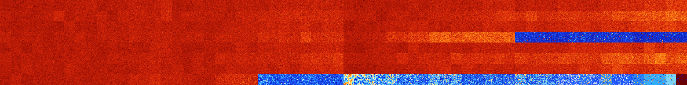

# B1357 (87040-87551)

<details>
    <summary>Initial Grid</summary>
    
</details>


<details>
    <summary>Initial Grid RLE</summary>

```
#C Exported from GoGoL (https://github.com/marrow16/gogol)
#C Wrap mode: Toroidal
#C Boundary mode: Dead
#C Step: 0
x = 100, y = 100, rule = B1357/S
3b2o48bo$32bo13bo7bo3bo$2bo7bo28bo18bo19bo$19bo2bo16bo17bo5bo11b2o13bo$
23b2o4bo17bo8bo9bo7bo$o18bobo9bo9bo2bo22bo$10bo33bobo20bo4bo6b2o$7bo17b
o7bobobo5bo18bo25bo$74bo17bo$o77bo15b2o$10bo5bo10bo14bo53bo$5bo28bo50bo
12bo$3bobo$bo19bo32bobo9bo2bo11bo8bo8bo$2bo7bo12bo13bo34bob2o8bo13bo$
77bo$64bo15bo$2bobo6bo19b2o12bo7bo25b2o15bo$6bo8bo17bo18bo8bo3b2o13bo
16bo$9b2o11bo16b2o9bo25bo$19bo3bo45b2o$29bo4bo59bo$13bo18bo22bo10bo$b2o
43bo$2bo31bo11bo7bo30bo$39bo31bo3bo3bo18bo$o14bo13bo9bo8b2o3bo7bo$2bo6b
o30bo32bobo$6bo11bo6bo49bo$7bo15bo8bo2bo27bo12bo$24bo23bo12bo$23bo13bo
3bo31bo4bo$18bo8bobo29b2o32bo3bobo$2bo20bo13bo7bo7bo6bo13bo$25bo33bo2bo
12b2obo8bo$11bo21bo14bo12bo11bo2bo8bo5bo$51bo11bo27bo$94bo4bo$9bo3bo7bo
7bo14bobo28bo$82b2o$3bo77bo12bo$13bo8bo8bo15bobo14bo2bo$43bo$6bo5bo24bo
15bo20bo8b2o$2b2o21bo13b2o4bo23bo22bo2bo$21bo11bo24bo15bo$3bo15bo18bo7b
obobo29bo5bo$12bo37bo27bo$15bo6bo6bo19bo5bobobo9bo5bo20bo$9bo7bo43bo6bo
6bo6bo16bo$2bo2bo49bo13bo13bo$15bo46bo10bo4bo$25bo31bo$o2bo12bo16bo24bo
15bo$25bo47bo5bo12bo3bo$bo6bobo2bo13bo13bo16bo2bo27bo$bo3bo40bo9bo6bo
12b2o9bo$13b2o41bo$3bo9bo6bo5bo48bo7bo3bo$32bobo24bo$2bo2b2o40bo3bo5bo
33bo5bo$13b2o7bo8bo26bo27bo$6bo10bo10bo20bo2bo26bo2bo6bo$8bobo9bo9bo3bo
39bo8bo5bo4bo$36bo15bo12bo17b2o$16bo5bo46bo8bo14bo5bo$68bo30bo$11bo14bo
11bo2bo50bo$9bo20bobo34bo30bo$5bo31bo26bo31bo$13bo23bo10bo9bo15bo5bo$ob
o41bo18bobo$3bo3bo11bo9bo64b2o2b2o$9bo42bo26bo$10bo7bo23bo3bo39bo2bo7bo
$2bo7bo4bo54b2o$54bo7bo4bo$19bo29bo5bo14bo11bo5bobo$2bo54bo25bo4bo$19bo
2bo2bo14bo6bo18bo19bo4bo$20bo18bo33bo7bo$7bo6bo5bo18bo8bo25bo$9bo15bo4b
o11b2o11bobo9bo26bo$4bo12bo9bo8bo36bo$2bo49bobo10bo6bo$9bo28bo4bo14bo6b
o22bo$3bo28bo7bo11bo20bo10b2o$29bo17bo13bo26bo$bo14bo13bo18bo29bo4bo10b
o2bo$40bo6bo17bobo18bo$2bo16bo21bo48bo$38bobo7bo8bo23bo$15bo11bo10bo29b
o5bo9bo5bo$70bo2bo9bo$69bobo7bo$17bo40bo11bo7bo$2bo6bo18bo48bo$bobo24bo
37bo11bo12bo$5bo12bo40bo5bo11bo10bo$16b2o9bo54bo!
```
</details>
<details>
    <summary>Thumbnail</summary>

</details>
<table>
<tr>
    <td><a href="./87040%20S%20Heat%20Map%20Activity.png"></a><br>S (87040)<br>G>1000</td>    <td><a href="./87041%20S0%20Heat%20Map%20Activity.png"></a><br>S0 (87041)<br>G>1000</td>    <td><a href="./87042%20S1%20Heat%20Map%20Activity.png"></a><br>S1 (87042)<br>G>1000</td>    <td><a href="./87043%20S01%20Heat%20Map%20Activity.png"></a><br>S01 (87043)<br>G>1000</td>    <td><a href="./87044%20S2%20Heat%20Map%20Activity.png"></a><br>S2 (87044)<br>G>1000</td>    <td><a href="./87045%20S02%20Heat%20Map%20Activity.png"></a><br>S02 (87045)<br>G>1000</td>    <td><a href="./87046%20S12%20Heat%20Map%20Activity.png"></a><br>S12 (87046)<br>G>1000</td>    <td><a href="./87047%20S012%20Heat%20Map%20Activity.png"></a><br>S012 (87047)<br>G>1000</td>    <td><a href="./87048%20S3%20Heat%20Map%20Activity.png"></a><br>S3 (87048)<br>G>1000</td>    <td><a href="./87049%20S03%20Heat%20Map%20Activity.png"></a><br>S03 (87049)<br>G>1000</td>    <td><a href="./87050%20S13%20Heat%20Map%20Activity.png"></a><br>S13 (87050)<br>G>1000</td>    <td><a href="./87051%20S013%20Heat%20Map%20Activity.png"></a><br>S013 (87051)<br>G>1000</td>    <td><a href="./87052%20S23%20Heat%20Map%20Activity.png"></a><br>S23 (87052)<br>G>1000</td>    <td><a href="./87053%20S023%20Heat%20Map%20Activity.png"></a><br>S023 (87053)<br>G>1000</td>    <td><a href="./87054%20S123%20Heat%20Map%20Activity.png"></a><br>S123 (87054)<br>G>1000</td>    <td><a href="./87055%20S0123%20Heat%20Map%20Activity.png"></a><br>S0123 (87055)<br>G>1000</td>    <td><a href="./87056%20S4%20Heat%20Map%20Activity.png"></a><br>S4 (87056)<br>G>1000</td>    <td><a href="./87057%20S04%20Heat%20Map%20Activity.png"></a><br>S04 (87057)<br>G>1000</td>    <td><a href="./87058%20S14%20Heat%20Map%20Activity.png"></a><br>S14 (87058)<br>G>1000</td>    <td><a href="./87059%20S014%20Heat%20Map%20Activity.png"></a><br>S014 (87059)<br>G>1000</td>    <td><a href="./87060%20S24%20Heat%20Map%20Activity.png"></a><br>S24 (87060)<br>G>1000</td>    <td><a href="./87061%20S024%20Heat%20Map%20Activity.png"></a><br>S024 (87061)<br>G>1000</td>    <td><a href="./87062%20S124%20Heat%20Map%20Activity.png"></a><br>S124 (87062)<br>G>1000</td>    <td><a href="./87063%20S0124%20Heat%20Map%20Activity.png"></a><br>S0124 (87063)<br>G>1000</td>    <td><a href="./87064%20S34%20Heat%20Map%20Activity.png"></a><br>S34 (87064)<br>G>1000</td>    <td><a href="./87065%20S034%20Heat%20Map%20Activity.png"></a><br>S034 (87065)<br>G>1000</td>    <td><a href="./87066%20S134%20Heat%20Map%20Activity.png"></a><br>S134 (87066)<br>G>1000</td>    <td><a href="./87067%20S0134%20Heat%20Map%20Activity.png"></a><br>S0134 (87067)<br>G>1000</td>    <td><a href="./87068%20S234%20Heat%20Map%20Activity.png"></a><br>S234 (87068)<br>G>1000</td>    <td><a href="./87069%20S0234%20Heat%20Map%20Activity.png"></a><br>S0234 (87069)<br>G>1000</td>    <td><a href="./87070%20S1234%20Heat%20Map%20Activity.png"></a><br>S1234 (87070)<br>G>1000</td>    <td><a href="./87071%20S01234%20Heat%20Map%20Activity.png"></a><br>S01234 (87071)<br>G>1000</td>    <td><a href="./87072%20S5%20Heat%20Map%20Activity.png"></a><br>S5 (87072)<br>G>1000</td>    <td><a href="./87073%20S05%20Heat%20Map%20Activity.png"></a><br>S05 (87073)<br>G>1000</td>    <td><a href="./87074%20S15%20Heat%20Map%20Activity.png"></a><br>S15 (87074)<br>G>1000</td>    <td><a href="./87075%20S015%20Heat%20Map%20Activity.png"></a><br>S015 (87075)<br>G>1000</td>    <td><a href="./87076%20S25%20Heat%20Map%20Activity.png"></a><br>S25 (87076)<br>G>1000</td>    <td><a href="./87077%20S025%20Heat%20Map%20Activity.png"></a><br>S025 (87077)<br>G>1000</td>    <td><a href="./87078%20S125%20Heat%20Map%20Activity.png"></a><br>S125 (87078)<br>G>1000</td>    <td><a href="./87079%20S0125%20Heat%20Map%20Activity.png"></a><br>S0125 (87079)<br>G>1000</td>    <td><a href="./87080%20S35%20Heat%20Map%20Activity.png"></a><br>S35 (87080)<br>G>1000</td>    <td><a href="./87081%20S035%20Heat%20Map%20Activity.png"></a><br>S035 (87081)<br>G>1000</td>    <td><a href="./87082%20S135%20Heat%20Map%20Activity.png"></a><br>S135 (87082)<br>G>1000</td>    <td><a href="./87083%20S0135%20Heat%20Map%20Activity.png"></a><br>S0135 (87083)<br>G>1000</td>    <td><a href="./87084%20S235%20Heat%20Map%20Activity.png"></a><br>S235 (87084)<br>G>1000</td>    <td><a href="./87085%20S0235%20Heat%20Map%20Activity.png"></a><br>S0235 (87085)<br>G>1000</td>    <td><a href="./87086%20S1235%20Heat%20Map%20Activity.png"></a><br>S1235 (87086)<br>G>1000</td>    <td><a href="./87087%20S01235%20Heat%20Map%20Activity.png"></a><br>S01235 (87087)<br>G>1000</td>    <td><a href="./87088%20S45%20Heat%20Map%20Activity.png"></a><br>S45 (87088)<br>G>1000</td>    <td><a href="./87089%20S045%20Heat%20Map%20Activity.png"></a><br>S045 (87089)<br>G>1000</td>    <td><a href="./87090%20S145%20Heat%20Map%20Activity.png"></a><br>S145 (87090)<br>G>1000</td>    <td><a href="./87091%20S0145%20Heat%20Map%20Activity.png"></a><br>S0145 (87091)<br>G>1000</td>    <td><a href="./87092%20S245%20Heat%20Map%20Activity.png"></a><br>S245 (87092)<br>G>1000</td>    <td><a href="./87093%20S0245%20Heat%20Map%20Activity.png"></a><br>S0245 (87093)<br>G>1000</td>    <td><a href="./87094%20S1245%20Heat%20Map%20Activity.png"></a><br>S1245 (87094)<br>G>1000</td>    <td><a href="./87095%20S01245%20Heat%20Map%20Activity.png"></a><br>S01245 (87095)<br>G>1000</td>    <td><a href="./87096%20S345%20Heat%20Map%20Activity.png"></a><br>S345 (87096)<br>G>1000</td>    <td><a href="./87097%20S0345%20Heat%20Map%20Activity.png"></a><br>S0345 (87097)<br>G>1000</td>    <td><a href="./87098%20S1345%20Heat%20Map%20Activity.png"></a><br>S1345 (87098)<br>G>1000</td>    <td><a href="./87099%20S01345%20Heat%20Map%20Activity.png"></a><br>S01345 (87099)<br>G>1000</td>    <td><a href="./87100%20S2345%20Heat%20Map%20Activity.png"></a><br>S2345 (87100)<br>G>1000</td>    <td><a href="./87101%20S02345%20Heat%20Map%20Activity.png"></a><br>S02345 (87101)<br>G>1000</td>    <td><a href="./87102%20S12345%20Heat%20Map%20Activity.png"></a><br>S12345 (87102)<br>G>1000</td>    <td><a href="./87103%20S012345%20Heat%20Map%20Activity.png"></a><br>S012345 (87103)<br>G>1000</td></tr>
<tr>
    <td><a href="./87104%20S6%20Heat%20Map%20Activity.png"></a><br>S6 (87104)<br>G>1000</td>    <td><a href="./87105%20S06%20Heat%20Map%20Activity.png"></a><br>S06 (87105)<br>G>1000</td>    <td><a href="./87106%20S16%20Heat%20Map%20Activity.png"></a><br>S16 (87106)<br>G>1000</td>    <td><a href="./87107%20S016%20Heat%20Map%20Activity.png"></a><br>S016 (87107)<br>G>1000</td>    <td><a href="./87108%20S26%20Heat%20Map%20Activity.png"></a><br>S26 (87108)<br>G>1000</td>    <td><a href="./87109%20S026%20Heat%20Map%20Activity.png"></a><br>S026 (87109)<br>G>1000</td>    <td><a href="./87110%20S126%20Heat%20Map%20Activity.png"></a><br>S126 (87110)<br>G>1000</td>    <td><a href="./87111%20S0126%20Heat%20Map%20Activity.png"></a><br>S0126 (87111)<br>G>1000</td>    <td><a href="./87112%20S36%20Heat%20Map%20Activity.png"></a><br>S36 (87112)<br>G>1000</td>    <td><a href="./87113%20S036%20Heat%20Map%20Activity.png"></a><br>S036 (87113)<br>G>1000</td>    <td><a href="./87114%20S136%20Heat%20Map%20Activity.png"></a><br>S136 (87114)<br>G>1000</td>    <td><a href="./87115%20S0136%20Heat%20Map%20Activity.png"></a><br>S0136 (87115)<br>G>1000</td>    <td><a href="./87116%20S236%20Heat%20Map%20Activity.png"></a><br>S236 (87116)<br>G>1000</td>    <td><a href="./87117%20S0236%20Heat%20Map%20Activity.png"></a><br>S0236 (87117)<br>G>1000</td>    <td><a href="./87118%20S1236%20Heat%20Map%20Activity.png"></a><br>S1236 (87118)<br>G>1000</td>    <td><a href="./87119%20S01236%20Heat%20Map%20Activity.png"></a><br>S01236 (87119)<br>G>1000</td>    <td><a href="./87120%20S46%20Heat%20Map%20Activity.png"></a><br>S46 (87120)<br>G>1000</td>    <td><a href="./87121%20S046%20Heat%20Map%20Activity.png"></a><br>S046 (87121)<br>G>1000</td>    <td><a href="./87122%20S146%20Heat%20Map%20Activity.png"></a><br>S146 (87122)<br>G>1000</td>    <td><a href="./87123%20S0146%20Heat%20Map%20Activity.png"></a><br>S0146 (87123)<br>G>1000</td>    <td><a href="./87124%20S246%20Heat%20Map%20Activity.png"></a><br>S246 (87124)<br>G>1000</td>    <td><a href="./87125%20S0246%20Heat%20Map%20Activity.png"></a><br>S0246 (87125)<br>G>1000</td>    <td><a href="./87126%20S1246%20Heat%20Map%20Activity.png"></a><br>S1246 (87126)<br>G>1000</td>    <td><a href="./87127%20S01246%20Heat%20Map%20Activity.png"></a><br>S01246 (87127)<br>G>1000</td>    <td><a href="./87128%20S346%20Heat%20Map%20Activity.png"></a><br>S346 (87128)<br>G>1000</td>    <td><a href="./87129%20S0346%20Heat%20Map%20Activity.png"></a><br>S0346 (87129)<br>G>1000</td>    <td><a href="./87130%20S1346%20Heat%20Map%20Activity.png"></a><br>S1346 (87130)<br>G>1000</td>    <td><a href="./87131%20S01346%20Heat%20Map%20Activity.png"></a><br>S01346 (87131)<br>G>1000</td>    <td><a href="./87132%20S2346%20Heat%20Map%20Activity.png"></a><br>S2346 (87132)<br>G>1000</td>    <td><a href="./87133%20S02346%20Heat%20Map%20Activity.png"></a><br>S02346 (87133)<br>G>1000</td>    <td><a href="./87134%20S12346%20Heat%20Map%20Activity.png"></a><br>S12346 (87134)<br>G>1000</td>    <td><a href="./87135%20S012346%20Heat%20Map%20Activity.png"></a><br>S012346 (87135)<br>G>1000</td>    <td><a href="./87136%20S56%20Heat%20Map%20Activity.png"></a><br>S56 (87136)<br>G>1000</td>    <td><a href="./87137%20S056%20Heat%20Map%20Activity.png"></a><br>S056 (87137)<br>G>1000</td>    <td><a href="./87138%20S156%20Heat%20Map%20Activity.png"></a><br>S156 (87138)<br>G>1000</td>    <td><a href="./87139%20S0156%20Heat%20Map%20Activity.png"></a><br>S0156 (87139)<br>G>1000</td>    <td><a href="./87140%20S256%20Heat%20Map%20Activity.png"></a><br>S256 (87140)<br>G>1000</td>    <td><a href="./87141%20S0256%20Heat%20Map%20Activity.png"></a><br>S0256 (87141)<br>G>1000</td>    <td><a href="./87142%20S1256%20Heat%20Map%20Activity.png"></a><br>S1256 (87142)<br>G>1000</td>    <td><a href="./87143%20S01256%20Heat%20Map%20Activity.png"></a><br>S01256 (87143)<br>G>1000</td>    <td><a href="./87144%20S356%20Heat%20Map%20Activity.png"></a><br>S356 (87144)<br>G>1000</td>    <td><a href="./87145%20S0356%20Heat%20Map%20Activity.png"></a><br>S0356 (87145)<br>G>1000</td>    <td><a href="./87146%20S1356%20Heat%20Map%20Activity.png"></a><br>S1356 (87146)<br>G>1000</td>    <td><a href="./87147%20S01356%20Heat%20Map%20Activity.png"></a><br>S01356 (87147)<br>G>1000</td>    <td><a href="./87148%20S2356%20Heat%20Map%20Activity.png"></a><br>S2356 (87148)<br>G>1000</td>    <td><a href="./87149%20S02356%20Heat%20Map%20Activity.png"></a><br>S02356 (87149)<br>G>1000</td>    <td><a href="./87150%20S12356%20Heat%20Map%20Activity.png"></a><br>S12356 (87150)<br>G>1000</td>    <td><a href="./87151%20S012356%20Heat%20Map%20Activity.png"></a><br>S012356 (87151)<br>G>1000</td>    <td><a href="./87152%20S456%20Heat%20Map%20Activity.png"></a><br>S456 (87152)<br>G>1000</td>    <td><a href="./87153%20S0456%20Heat%20Map%20Activity.png"></a><br>S0456 (87153)<br>G>1000</td>    <td><a href="./87154%20S1456%20Heat%20Map%20Activity.png"></a><br>S1456 (87154)<br>G>1000</td>    <td><a href="./87155%20S01456%20Heat%20Map%20Activity.png"></a><br>S01456 (87155)<br>G>1000</td>    <td><a href="./87156%20S2456%20Heat%20Map%20Activity.png"></a><br>S2456 (87156)<br>G>1000</td>    <td><a href="./87157%20S02456%20Heat%20Map%20Activity.png"></a><br>S02456 (87157)<br>G>1000</td>    <td><a href="./87158%20S12456%20Heat%20Map%20Activity.png"></a><br>S12456 (87158)<br>G>1000</td>    <td><a href="./87159%20S012456%20Heat%20Map%20Activity.png"></a><br>S012456 (87159)<br>G>1000</td>    <td><a href="./87160%20S3456%20Heat%20Map%20Activity.png"></a><br>S3456 (87160)<br>G>1000</td>    <td><a href="./87161%20S03456%20Heat%20Map%20Activity.png"></a><br>S03456 (87161)<br>G>1000</td>    <td><a href="./87162%20S13456%20Heat%20Map%20Activity.png"></a><br>S13456 (87162)<br>G>1000</td>    <td><a href="./87163%20S013456%20Heat%20Map%20Activity.png"></a><br>S013456 (87163)<br>G>1000</td>    <td><a href="./87164%20S23456%20Heat%20Map%20Activity.png"></a><br>S23456 (87164)<br>G>1000</td>    <td><a href="./87165%20S023456%20Heat%20Map%20Activity.png"></a><br>S023456 (87165)<br>G>1000</td>    <td><a href="./87166%20S123456%20Heat%20Map%20Activity.png"></a><br>S123456 (87166)<br>G>1000</td>    <td><a href="./87167%20S0123456%20Heat%20Map%20Activity.png"></a><br>S0123456 (87167)<br>G>1000</td></tr>
<tr>
    <td><a href="./87168%20S7%20Heat%20Map%20Activity.png"></a><br>S7 (87168)<br>G>1000</td>    <td><a href="./87169%20S07%20Heat%20Map%20Activity.png"></a><br>S07 (87169)<br>G>1000</td>    <td><a href="./87170%20S17%20Heat%20Map%20Activity.png"></a><br>S17 (87170)<br>G>1000</td>    <td><a href="./87171%20S017%20Heat%20Map%20Activity.png"></a><br>S017 (87171)<br>G>1000</td>    <td><a href="./87172%20S27%20Heat%20Map%20Activity.png"></a><br>S27 (87172)<br>G>1000</td>    <td><a href="./87173%20S027%20Heat%20Map%20Activity.png"></a><br>S027 (87173)<br>G>1000</td>    <td><a href="./87174%20S127%20Heat%20Map%20Activity.png"></a><br>S127 (87174)<br>G>1000</td>    <td><a href="./87175%20S0127%20Heat%20Map%20Activity.png"></a><br>S0127 (87175)<br>G>1000</td>    <td><a href="./87176%20S37%20Heat%20Map%20Activity.png"></a><br>S37 (87176)<br>G>1000</td>    <td><a href="./87177%20S037%20Heat%20Map%20Activity.png"></a><br>S037 (87177)<br>G>1000</td>    <td><a href="./87178%20S137%20Heat%20Map%20Activity.png"></a><br>S137 (87178)<br>G>1000</td>    <td><a href="./87179%20S0137%20Heat%20Map%20Activity.png"></a><br>S0137 (87179)<br>G>1000</td>    <td><a href="./87180%20S237%20Heat%20Map%20Activity.png"></a><br>S237 (87180)<br>G>1000</td>    <td><a href="./87181%20S0237%20Heat%20Map%20Activity.png"></a><br>S0237 (87181)<br>G>1000</td>    <td><a href="./87182%20S1237%20Heat%20Map%20Activity.png"></a><br>S1237 (87182)<br>G>1000</td>    <td><a href="./87183%20S01237%20Heat%20Map%20Activity.png"></a><br>S01237 (87183)<br>G>1000</td>    <td><a href="./87184%20S47%20Heat%20Map%20Activity.png"></a><br>S47 (87184)<br>G>1000</td>    <td><a href="./87185%20S047%20Heat%20Map%20Activity.png"></a><br>S047 (87185)<br>G>1000</td>    <td><a href="./87186%20S147%20Heat%20Map%20Activity.png"></a><br>S147 (87186)<br>G>1000</td>    <td><a href="./87187%20S0147%20Heat%20Map%20Activity.png"></a><br>S0147 (87187)<br>G>1000</td>    <td><a href="./87188%20S247%20Heat%20Map%20Activity.png"></a><br>S247 (87188)<br>G>1000</td>    <td><a href="./87189%20S0247%20Heat%20Map%20Activity.png"></a><br>S0247 (87189)<br>G>1000</td>    <td><a href="./87190%20S1247%20Heat%20Map%20Activity.png"></a><br>S1247 (87190)<br>G>1000</td>    <td><a href="./87191%20S01247%20Heat%20Map%20Activity.png"></a><br>S01247 (87191)<br>G>1000</td>    <td><a href="./87192%20S347%20Heat%20Map%20Activity.png"></a><br>S347 (87192)<br>G>1000</td>    <td><a href="./87193%20S0347%20Heat%20Map%20Activity.png"></a><br>S0347 (87193)<br>G>1000</td>    <td><a href="./87194%20S1347%20Heat%20Map%20Activity.png"></a><br>S1347 (87194)<br>G>1000</td>    <td><a href="./87195%20S01347%20Heat%20Map%20Activity.png"></a><br>S01347 (87195)<br>G>1000</td>    <td><a href="./87196%20S2347%20Heat%20Map%20Activity.png"></a><br>S2347 (87196)<br>G>1000</td>    <td><a href="./87197%20S02347%20Heat%20Map%20Activity.png"></a><br>S02347 (87197)<br>G>1000</td>    <td><a href="./87198%20S12347%20Heat%20Map%20Activity.png"></a><br>S12347 (87198)<br>G>1000</td>    <td><a href="./87199%20S012347%20Heat%20Map%20Activity.png"></a><br>S012347 (87199)<br>G>1000</td>    <td><a href="./87200%20S57%20Heat%20Map%20Activity.png"></a><br>S57 (87200)<br>G>1000</td>    <td><a href="./87201%20S057%20Heat%20Map%20Activity.png"></a><br>S057 (87201)<br>G>1000</td>    <td><a href="./87202%20S157%20Heat%20Map%20Activity.png"></a><br>S157 (87202)<br>G>1000</td>    <td><a href="./87203%20S0157%20Heat%20Map%20Activity.png"></a><br>S0157 (87203)<br>G>1000</td>    <td><a href="./87204%20S257%20Heat%20Map%20Activity.png"></a><br>S257 (87204)<br>G>1000</td>    <td><a href="./87205%20S0257%20Heat%20Map%20Activity.png"></a><br>S0257 (87205)<br>G>1000</td>    <td><a href="./87206%20S1257%20Heat%20Map%20Activity.png"></a><br>S1257 (87206)<br>G>1000</td>    <td><a href="./87207%20S01257%20Heat%20Map%20Activity.png"></a><br>S01257 (87207)<br>G>1000</td>    <td><a href="./87208%20S357%20Heat%20Map%20Activity.png"></a><br>S357 (87208)<br>G>1000</td>    <td><a href="./87209%20S0357%20Heat%20Map%20Activity.png"></a><br>S0357 (87209)<br>G>1000</td>    <td><a href="./87210%20S1357%20Heat%20Map%20Activity.png"></a><br><strong><sup>"Replicator"</sup></strong><br>S1357 (87210)<br>G>1000</td>    <td><a href="./87211%20S01357%20Heat%20Map%20Activity.png"></a><br>S01357 (87211)<br>G>1000</td>    <td><a href="./87212%20S2357%20Heat%20Map%20Activity.png"></a><br>S2357 (87212)<br>G>1000</td>    <td><a href="./87213%20S02357%20Heat%20Map%20Activity.png"></a><br>S02357 (87213)<br>G>1000</td>    <td><a href="./87214%20S12357%20Heat%20Map%20Activity.png"></a><br>S12357 (87214)<br>G>1000</td>    <td><a href="./87215%20S012357%20Heat%20Map%20Activity.png"></a><br>S012357 (87215)<br>G>1000</td>    <td><a href="./87216%20S457%20Heat%20Map%20Activity.png"></a><br>S457 (87216)<br>G>1000</td>    <td><a href="./87217%20S0457%20Heat%20Map%20Activity.png"></a><br>S0457 (87217)<br>G>1000</td>    <td><a href="./87218%20S1457%20Heat%20Map%20Activity.png"></a><br>S1457 (87218)<br>G>1000</td>    <td><a href="./87219%20S01457%20Heat%20Map%20Activity.png"></a><br>S01457 (87219)<br>G>1000</td>    <td><a href="./87220%20S2457%20Heat%20Map%20Activity.png"></a><br>S2457 (87220)<br>G>1000</td>    <td><a href="./87221%20S02457%20Heat%20Map%20Activity.png"></a><br>S02457 (87221)<br>G>1000</td>    <td><a href="./87222%20S12457%20Heat%20Map%20Activity.png"></a><br>S12457 (87222)<br>G>1000</td>    <td><a href="./87223%20S012457%20Heat%20Map%20Activity.png"></a><br>S012457 (87223)<br>G>1000</td>    <td><a href="./87224%20S3457%20Heat%20Map%20Activity.png"></a><br>S3457 (87224)<br>G>1000</td>    <td><a href="./87225%20S03457%20Heat%20Map%20Activity.png"></a><br>S03457 (87225)<br>G>1000</td>    <td><a href="./87226%20S13457%20Heat%20Map%20Activity.png"></a><br>S13457 (87226)<br>G>1000</td>    <td><a href="./87227%20S013457%20Heat%20Map%20Activity.png"></a><br>S013457 (87227)<br>G>1000</td>    <td><a href="./87228%20S23457%20Heat%20Map%20Activity.png"></a><br>S23457 (87228)<br>G>1000</td>    <td><a href="./87229%20S023457%20Heat%20Map%20Activity.png"></a><br>S023457 (87229)<br>G>1000</td>    <td><a href="./87230%20S123457%20Heat%20Map%20Activity.png"></a><br>S123457 (87230)<br>G>1000</td>    <td><a href="./87231%20S0123457%20Heat%20Map%20Activity.png"></a><br>S0123457 (87231)<br>G>1000</td></tr>
<tr>
    <td><a href="./87232%20S67%20Heat%20Map%20Activity.png"></a><br>S67 (87232)<br>G>1000</td>    <td><a href="./87233%20S067%20Heat%20Map%20Activity.png"></a><br>S067 (87233)<br>G>1000</td>    <td><a href="./87234%20S167%20Heat%20Map%20Activity.png"></a><br>S167 (87234)<br>G>1000</td>    <td><a href="./87235%20S0167%20Heat%20Map%20Activity.png"></a><br>S0167 (87235)<br>G>1000</td>    <td><a href="./87236%20S267%20Heat%20Map%20Activity.png"></a><br>S267 (87236)<br>G>1000</td>    <td><a href="./87237%20S0267%20Heat%20Map%20Activity.png"></a><br>S0267 (87237)<br>G>1000</td>    <td><a href="./87238%20S1267%20Heat%20Map%20Activity.png"></a><br>S1267 (87238)<br>G>1000</td>    <td><a href="./87239%20S01267%20Heat%20Map%20Activity.png"></a><br>S01267 (87239)<br>G>1000</td>    <td><a href="./87240%20S367%20Heat%20Map%20Activity.png"></a><br>S367 (87240)<br>G>1000</td>    <td><a href="./87241%20S0367%20Heat%20Map%20Activity.png"></a><br>S0367 (87241)<br>G>1000</td>    <td><a href="./87242%20S1367%20Heat%20Map%20Activity.png"></a><br>S1367 (87242)<br>G>1000</td>    <td><a href="./87243%20S01367%20Heat%20Map%20Activity.png"></a><br>S01367 (87243)<br>G>1000</td>    <td><a href="./87244%20S2367%20Heat%20Map%20Activity.png"></a><br>S2367 (87244)<br>G>1000</td>    <td><a href="./87245%20S02367%20Heat%20Map%20Activity.png"></a><br>S02367 (87245)<br>G>1000</td>    <td><a href="./87246%20S12367%20Heat%20Map%20Activity.png"></a><br>S12367 (87246)<br>G>1000</td>    <td><a href="./87247%20S012367%20Heat%20Map%20Activity.png"></a><br>S012367 (87247)<br>G>1000</td>    <td><a href="./87248%20S467%20Heat%20Map%20Activity.png"></a><br>S467 (87248)<br>G>1000</td>    <td><a href="./87249%20S0467%20Heat%20Map%20Activity.png"></a><br>S0467 (87249)<br>G>1000</td>    <td><a href="./87250%20S1467%20Heat%20Map%20Activity.png"></a><br>S1467 (87250)<br>G>1000</td>    <td><a href="./87251%20S01467%20Heat%20Map%20Activity.png"></a><br>S01467 (87251)<br>G>1000</td>    <td><a href="./87252%20S2467%20Heat%20Map%20Activity.png"></a><br>S2467 (87252)<br>G>1000</td>    <td><a href="./87253%20S02467%20Heat%20Map%20Activity.png"></a><br>S02467 (87253)<br>G>1000</td>    <td><a href="./87254%20S12467%20Heat%20Map%20Activity.png"></a><br>S12467 (87254)<br>G>1000</td>    <td><a href="./87255%20S012467%20Heat%20Map%20Activity.png"></a><br>S012467 (87255)<br>G>1000</td>    <td><a href="./87256%20S3467%20Heat%20Map%20Activity.png"></a><br>S3467 (87256)<br>G>1000</td>    <td><a href="./87257%20S03467%20Heat%20Map%20Activity.png"></a><br>S03467 (87257)<br>G>1000</td>    <td><a href="./87258%20S13467%20Heat%20Map%20Activity.png"></a><br>S13467 (87258)<br>G>1000</td>    <td><a href="./87259%20S013467%20Heat%20Map%20Activity.png"></a><br>S013467 (87259)<br>G>1000</td>    <td><a href="./87260%20S23467%20Heat%20Map%20Activity.png"></a><br>S23467 (87260)<br>G>1000</td>    <td><a href="./87261%20S023467%20Heat%20Map%20Activity.png"></a><br>S023467 (87261)<br>G>1000</td>    <td><a href="./87262%20S123467%20Heat%20Map%20Activity.png"></a><br>S123467 (87262)<br>G>1000</td>    <td><a href="./87263%20S0123467%20Heat%20Map%20Activity.png"></a><br>S0123467 (87263)<br>G>1000</td>    <td><a href="./87264%20S567%20Heat%20Map%20Activity.png"></a><br>S567 (87264)<br>G>1000</td>    <td><a href="./87265%20S0567%20Heat%20Map%20Activity.png"></a><br>S0567 (87265)<br>G>1000</td>    <td><a href="./87266%20S1567%20Heat%20Map%20Activity.png"></a><br>S1567 (87266)<br>G>1000</td>    <td><a href="./87267%20S01567%20Heat%20Map%20Activity.png"></a><br>S01567 (87267)<br>G>1000</td>    <td><a href="./87268%20S2567%20Heat%20Map%20Activity.png"></a><br>S2567 (87268)<br>G>1000</td>    <td><a href="./87269%20S02567%20Heat%20Map%20Activity.png"></a><br>S02567 (87269)<br>G>1000</td>    <td><a href="./87270%20S12567%20Heat%20Map%20Activity.png"></a><br>S12567 (87270)<br>G>1000</td>    <td><a href="./87271%20S012567%20Heat%20Map%20Activity.png"></a><br>S012567 (87271)<br>G>1000</td>    <td><a href="./87272%20S3567%20Heat%20Map%20Activity.png"></a><br>S3567 (87272)<br>G>1000</td>    <td><a href="./87273%20S03567%20Heat%20Map%20Activity.png"></a><br>S03567 (87273)<br>G>1000</td>    <td><a href="./87274%20S13567%20Heat%20Map%20Activity.png"></a><br>S13567 (87274)<br>G>1000</td>    <td><a href="./87275%20S013567%20Heat%20Map%20Activity.png"></a><br>S013567 (87275)<br>G>1000</td>    <td><a href="./87276%20S23567%20Heat%20Map%20Activity.png"></a><br>S23567 (87276)<br>G>1000</td>    <td><a href="./87277%20S023567%20Heat%20Map%20Activity.png"></a><br>S023567 (87277)<br>G>1000</td>    <td><a href="./87278%20S123567%20Heat%20Map%20Activity.png"></a><br>S123567 (87278)<br>G>1000</td>    <td><a href="./87279%20S0123567%20Heat%20Map%20Activity.png"></a><br>S0123567 (87279)<br>G>1000</td>    <td><a href="./87280%20S4567%20Heat%20Map%20Activity.png"></a><br>S4567 (87280)<br>R@120,p24</td>    <td><a href="./87281%20S04567%20Heat%20Map%20Activity.png"></a><br>S04567 (87281)<br>R@107,p12</td>    <td><a href="./87282%20S14567%20Heat%20Map%20Activity.png"></a><br>S14567 (87282)<br>R@116,p12</td>    <td><a href="./87283%20S014567%20Heat%20Map%20Activity.png"></a><br>S014567 (87283)<br>R@130,p12</td>    <td><a href="./87284%20S24567%20Heat%20Map%20Activity.png"></a><br>S24567 (87284)<br>R@87,p12</td>    <td><a href="./87285%20S024567%20Heat%20Map%20Activity.png"></a><br>S024567 (87285)<br>R@78,p4</td>    <td><a href="./87286%20S124567%20Heat%20Map%20Activity.png"></a><br>S124567 (87286)<br>R@65,p12</td>    <td><a href="./87287%20S0124567%20Heat%20Map%20Activity.png"></a><br>S0124567 (87287)<br>R@85,p12</td>    <td><a href="./87288%20S34567%20Heat%20Map%20Activity.png"></a><br>S34567 (87288)<br>R@43,p12</td>    <td><a href="./87289%20S034567%20Heat%20Map%20Activity.png"></a><br>S034567 (87289)<br>R@38,p12</td>    <td><a href="./87290%20S134567%20Heat%20Map%20Activity.png"></a><br>S134567 (87290)<br>R@35,p6</td>    <td><a href="./87291%20S0134567%20Heat%20Map%20Activity.png"></a><br>S0134567 (87291)<br>R@50,p12</td>    <td><a href="./87292%20S234567%20Heat%20Map%20Activity.png"></a><br>S234567 (87292)<br>R@36,p12</td>    <td><a href="./87293%20S0234567%20Heat%20Map%20Activity.png"></a><br>S0234567 (87293)<br>R@36,p12</td>    <td><a href="./87294%20S1234567%20Heat%20Map%20Activity.png"></a><br>S1234567 (87294)<br>R@32,p12</td>    <td><a href="./87295%20S01234567%20Heat%20Map%20Activity.png"></a><br>S01234567 (87295)<br>R@36,p12</td></tr>
<tr>
    <td><a href="./87296%20S8%20Heat%20Map%20Activity.png"></a><br>S8 (87296)<br>G>1000</td>    <td><a href="./87297%20S08%20Heat%20Map%20Activity.png"></a><br>S08 (87297)<br>G>1000</td>    <td><a href="./87298%20S18%20Heat%20Map%20Activity.png"></a><br>S18 (87298)<br>G>1000</td>    <td><a href="./87299%20S018%20Heat%20Map%20Activity.png"></a><br>S018 (87299)<br>G>1000</td>    <td><a href="./87300%20S28%20Heat%20Map%20Activity.png"></a><br>S28 (87300)<br>G>1000</td>    <td><a href="./87301%20S028%20Heat%20Map%20Activity.png"></a><br>S028 (87301)<br>G>1000</td>    <td><a href="./87302%20S128%20Heat%20Map%20Activity.png"></a><br>S128 (87302)<br>G>1000</td>    <td><a href="./87303%20S0128%20Heat%20Map%20Activity.png"></a><br>S0128 (87303)<br>G>1000</td>    <td><a href="./87304%20S38%20Heat%20Map%20Activity.png"></a><br>S38 (87304)<br>G>1000</td>    <td><a href="./87305%20S038%20Heat%20Map%20Activity.png"></a><br>S038 (87305)<br>G>1000</td>    <td><a href="./87306%20S138%20Heat%20Map%20Activity.png"></a><br>S138 (87306)<br>G>1000</td>    <td><a href="./87307%20S0138%20Heat%20Map%20Activity.png"></a><br>S0138 (87307)<br>G>1000</td>    <td><a href="./87308%20S238%20Heat%20Map%20Activity.png"></a><br>S238 (87308)<br>G>1000</td>    <td><a href="./87309%20S0238%20Heat%20Map%20Activity.png"></a><br>S0238 (87309)<br>G>1000</td>    <td><a href="./87310%20S1238%20Heat%20Map%20Activity.png"></a><br>S1238 (87310)<br>G>1000</td>    <td><a href="./87311%20S01238%20Heat%20Map%20Activity.png"></a><br>S01238 (87311)<br>G>1000</td>    <td><a href="./87312%20S48%20Heat%20Map%20Activity.png"></a><br>S48 (87312)<br>G>1000</td>    <td><a href="./87313%20S048%20Heat%20Map%20Activity.png"></a><br>S048 (87313)<br>G>1000</td>    <td><a href="./87314%20S148%20Heat%20Map%20Activity.png"></a><br>S148 (87314)<br>G>1000</td>    <td><a href="./87315%20S0148%20Heat%20Map%20Activity.png"></a><br>S0148 (87315)<br>G>1000</td>    <td><a href="./87316%20S248%20Heat%20Map%20Activity.png"></a><br>S248 (87316)<br>G>1000</td>    <td><a href="./87317%20S0248%20Heat%20Map%20Activity.png"></a><br>S0248 (87317)<br>G>1000</td>    <td><a href="./87318%20S1248%20Heat%20Map%20Activity.png"></a><br>S1248 (87318)<br>G>1000</td>    <td><a href="./87319%20S01248%20Heat%20Map%20Activity.png"></a><br>S01248 (87319)<br>G>1000</td>    <td><a href="./87320%20S348%20Heat%20Map%20Activity.png"></a><br>S348 (87320)<br>G>1000</td>    <td><a href="./87321%20S0348%20Heat%20Map%20Activity.png"></a><br>S0348 (87321)<br>G>1000</td>    <td><a href="./87322%20S1348%20Heat%20Map%20Activity.png"></a><br>S1348 (87322)<br>G>1000</td>    <td><a href="./87323%20S01348%20Heat%20Map%20Activity.png"></a><br>S01348 (87323)<br>G>1000</td>    <td><a href="./87324%20S2348%20Heat%20Map%20Activity.png"></a><br>S2348 (87324)<br>G>1000</td>    <td><a href="./87325%20S02348%20Heat%20Map%20Activity.png"></a><br>S02348 (87325)<br>G>1000</td>    <td><a href="./87326%20S12348%20Heat%20Map%20Activity.png"></a><br>S12348 (87326)<br>G>1000</td>    <td><a href="./87327%20S012348%20Heat%20Map%20Activity.png"></a><br>S012348 (87327)<br>G>1000</td>    <td><a href="./87328%20S58%20Heat%20Map%20Activity.png"></a><br>S58 (87328)<br>G>1000</td>    <td><a href="./87329%20S058%20Heat%20Map%20Activity.png"></a><br>S058 (87329)<br>G>1000</td>    <td><a href="./87330%20S158%20Heat%20Map%20Activity.png"></a><br>S158 (87330)<br>G>1000</td>    <td><a href="./87331%20S0158%20Heat%20Map%20Activity.png"></a><br>S0158 (87331)<br>G>1000</td>    <td><a href="./87332%20S258%20Heat%20Map%20Activity.png"></a><br>S258 (87332)<br>G>1000</td>    <td><a href="./87333%20S0258%20Heat%20Map%20Activity.png"></a><br>S0258 (87333)<br>G>1000</td>    <td><a href="./87334%20S1258%20Heat%20Map%20Activity.png"></a><br>S1258 (87334)<br>G>1000</td>    <td><a href="./87335%20S01258%20Heat%20Map%20Activity.png"></a><br>S01258 (87335)<br>G>1000</td>    <td><a href="./87336%20S358%20Heat%20Map%20Activity.png"></a><br>S358 (87336)<br>G>1000</td>    <td><a href="./87337%20S0358%20Heat%20Map%20Activity.png"></a><br>S0358 (87337)<br>G>1000</td>    <td><a href="./87338%20S1358%20Heat%20Map%20Activity.png"></a><br>S1358 (87338)<br>G>1000</td>    <td><a href="./87339%20S01358%20Heat%20Map%20Activity.png"></a><br>S01358 (87339)<br>G>1000</td>    <td><a href="./87340%20S2358%20Heat%20Map%20Activity.png"></a><br>S2358 (87340)<br>G>1000</td>    <td><a href="./87341%20S02358%20Heat%20Map%20Activity.png"></a><br>S02358 (87341)<br>G>1000</td>    <td><a href="./87342%20S12358%20Heat%20Map%20Activity.png"></a><br>S12358 (87342)<br>G>1000</td>    <td><a href="./87343%20S012358%20Heat%20Map%20Activity.png"></a><br>S012358 (87343)<br>G>1000</td>    <td><a href="./87344%20S458%20Heat%20Map%20Activity.png"></a><br>S458 (87344)<br>G>1000</td>    <td><a href="./87345%20S0458%20Heat%20Map%20Activity.png"></a><br>S0458 (87345)<br>G>1000</td>    <td><a href="./87346%20S1458%20Heat%20Map%20Activity.png"></a><br>S1458 (87346)<br>G>1000</td>    <td><a href="./87347%20S01458%20Heat%20Map%20Activity.png"></a><br>S01458 (87347)<br>G>1000</td>    <td><a href="./87348%20S2458%20Heat%20Map%20Activity.png"></a><br>S2458 (87348)<br>G>1000</td>    <td><a href="./87349%20S02458%20Heat%20Map%20Activity.png"></a><br>S02458 (87349)<br>G>1000</td>    <td><a href="./87350%20S12458%20Heat%20Map%20Activity.png"></a><br>S12458 (87350)<br>G>1000</td>    <td><a href="./87351%20S012458%20Heat%20Map%20Activity.png"></a><br>S012458 (87351)<br>G>1000</td>    <td><a href="./87352%20S3458%20Heat%20Map%20Activity.png"></a><br>S3458 (87352)<br>G>1000</td>    <td><a href="./87353%20S03458%20Heat%20Map%20Activity.png"></a><br>S03458 (87353)<br>G>1000</td>    <td><a href="./87354%20S13458%20Heat%20Map%20Activity.png"></a><br>S13458 (87354)<br>G>1000</td>    <td><a href="./87355%20S013458%20Heat%20Map%20Activity.png"></a><br>S013458 (87355)<br>G>1000</td>    <td><a href="./87356%20S23458%20Heat%20Map%20Activity.png"></a><br>S23458 (87356)<br>G>1000</td>    <td><a href="./87357%20S023458%20Heat%20Map%20Activity.png"></a><br>S023458 (87357)<br>G>1000</td>    <td><a href="./87358%20S123458%20Heat%20Map%20Activity.png"></a><br>S123458 (87358)<br>G>1000</td>    <td><a href="./87359%20S0123458%20Heat%20Map%20Activity.png"></a><br>S0123458 (87359)<br>G>1000</td></tr>
<tr>
    <td><a href="./87360%20S68%20Heat%20Map%20Activity.png"></a><br>S68 (87360)<br>G>1000</td>    <td><a href="./87361%20S068%20Heat%20Map%20Activity.png"></a><br>S068 (87361)<br>G>1000</td>    <td><a href="./87362%20S168%20Heat%20Map%20Activity.png"></a><br>S168 (87362)<br>G>1000</td>    <td><a href="./87363%20S0168%20Heat%20Map%20Activity.png"></a><br>S0168 (87363)<br>G>1000</td>    <td><a href="./87364%20S268%20Heat%20Map%20Activity.png"></a><br>S268 (87364)<br>G>1000</td>    <td><a href="./87365%20S0268%20Heat%20Map%20Activity.png"></a><br>S0268 (87365)<br>G>1000</td>    <td><a href="./87366%20S1268%20Heat%20Map%20Activity.png"></a><br>S1268 (87366)<br>G>1000</td>    <td><a href="./87367%20S01268%20Heat%20Map%20Activity.png"></a><br>S01268 (87367)<br>G>1000</td>    <td><a href="./87368%20S368%20Heat%20Map%20Activity.png"></a><br>S368 (87368)<br>G>1000</td>    <td><a href="./87369%20S0368%20Heat%20Map%20Activity.png"></a><br>S0368 (87369)<br>G>1000</td>    <td><a href="./87370%20S1368%20Heat%20Map%20Activity.png"></a><br>S1368 (87370)<br>G>1000</td>    <td><a href="./87371%20S01368%20Heat%20Map%20Activity.png"></a><br>S01368 (87371)<br>G>1000</td>    <td><a href="./87372%20S2368%20Heat%20Map%20Activity.png"></a><br>S2368 (87372)<br>G>1000</td>    <td><a href="./87373%20S02368%20Heat%20Map%20Activity.png"></a><br>S02368 (87373)<br>G>1000</td>    <td><a href="./87374%20S12368%20Heat%20Map%20Activity.png"></a><br>S12368 (87374)<br>G>1000</td>    <td><a href="./87375%20S012368%20Heat%20Map%20Activity.png"></a><br>S012368 (87375)<br>G>1000</td>    <td><a href="./87376%20S468%20Heat%20Map%20Activity.png"></a><br>S468 (87376)<br>G>1000</td>    <td><a href="./87377%20S0468%20Heat%20Map%20Activity.png"></a><br>S0468 (87377)<br>G>1000</td>    <td><a href="./87378%20S1468%20Heat%20Map%20Activity.png"></a><br>S1468 (87378)<br>G>1000</td>    <td><a href="./87379%20S01468%20Heat%20Map%20Activity.png"></a><br>S01468 (87379)<br>G>1000</td>    <td><a href="./87380%20S2468%20Heat%20Map%20Activity.png"></a><br>S2468 (87380)<br>G>1000</td>    <td><a href="./87381%20S02468%20Heat%20Map%20Activity.png"></a><br><strong><sup>"Fredkin"</sup></strong><br>S02468 (87381)<br>G>1000</td>    <td><a href="./87382%20S12468%20Heat%20Map%20Activity.png"></a><br>S12468 (87382)<br>G>1000</td>    <td><a href="./87383%20S012468%20Heat%20Map%20Activity.png"></a><br>S012468 (87383)<br>G>1000</td>    <td><a href="./87384%20S3468%20Heat%20Map%20Activity.png"></a><br>S3468 (87384)<br>G>1000</td>    <td><a href="./87385%20S03468%20Heat%20Map%20Activity.png"></a><br>S03468 (87385)<br>G>1000</td>    <td><a href="./87386%20S13468%20Heat%20Map%20Activity.png"></a><br>S13468 (87386)<br>G>1000</td>    <td><a href="./87387%20S013468%20Heat%20Map%20Activity.png"></a><br>S013468 (87387)<br>G>1000</td>    <td><a href="./87388%20S23468%20Heat%20Map%20Activity.png"></a><br>S23468 (87388)<br>G>1000</td>    <td><a href="./87389%20S023468%20Heat%20Map%20Activity.png"></a><br>S023468 (87389)<br>G>1000</td>    <td><a href="./87390%20S123468%20Heat%20Map%20Activity.png"></a><br>S123468 (87390)<br>G>1000</td>    <td><a href="./87391%20S0123468%20Heat%20Map%20Activity.png"></a><br>S0123468 (87391)<br>G>1000</td>    <td><a href="./87392%20S568%20Heat%20Map%20Activity.png"></a><br>S568 (87392)<br>G>1000</td>    <td><a href="./87393%20S0568%20Heat%20Map%20Activity.png"></a><br>S0568 (87393)<br>G>1000</td>    <td><a href="./87394%20S1568%20Heat%20Map%20Activity.png"></a><br>S1568 (87394)<br>G>1000</td>    <td><a href="./87395%20S01568%20Heat%20Map%20Activity.png"></a><br>S01568 (87395)<br>G>1000</td>    <td><a href="./87396%20S2568%20Heat%20Map%20Activity.png"></a><br>S2568 (87396)<br>G>1000</td>    <td><a href="./87397%20S02568%20Heat%20Map%20Activity.png"></a><br>S02568 (87397)<br>G>1000</td>    <td><a href="./87398%20S12568%20Heat%20Map%20Activity.png"></a><br>S12568 (87398)<br>G>1000</td>    <td><a href="./87399%20S012568%20Heat%20Map%20Activity.png"></a><br>S012568 (87399)<br>G>1000</td>    <td><a href="./87400%20S3568%20Heat%20Map%20Activity.png"></a><br>S3568 (87400)<br>G>1000</td>    <td><a href="./87401%20S03568%20Heat%20Map%20Activity.png"></a><br>S03568 (87401)<br>G>1000</td>    <td><a href="./87402%20S13568%20Heat%20Map%20Activity.png"></a><br>S13568 (87402)<br>G>1000</td>    <td><a href="./87403%20S013568%20Heat%20Map%20Activity.png"></a><br>S013568 (87403)<br>G>1000</td>    <td><a href="./87404%20S23568%20Heat%20Map%20Activity.png"></a><br>S23568 (87404)<br>G>1000</td>    <td><a href="./87405%20S023568%20Heat%20Map%20Activity.png"></a><br>S023568 (87405)<br>G>1000</td>    <td><a href="./87406%20S123568%20Heat%20Map%20Activity.png"></a><br>S123568 (87406)<br>G>1000</td>    <td><a href="./87407%20S0123568%20Heat%20Map%20Activity.png"></a><br>S0123568 (87407)<br>G>1000</td>    <td><a href="./87408%20S4568%20Heat%20Map%20Activity.png"></a><br>S4568 (87408)<br>G>1000</td>    <td><a href="./87409%20S04568%20Heat%20Map%20Activity.png"></a><br>S04568 (87409)<br>G>1000</td>    <td><a href="./87410%20S14568%20Heat%20Map%20Activity.png"></a><br>S14568 (87410)<br>G>1000</td>    <td><a href="./87411%20S014568%20Heat%20Map%20Activity.png"></a><br>S014568 (87411)<br>G>1000</td>    <td><a href="./87412%20S24568%20Heat%20Map%20Activity.png"></a><br>S24568 (87412)<br>G>1000</td>    <td><a href="./87413%20S024568%20Heat%20Map%20Activity.png"></a><br>S024568 (87413)<br>G>1000</td>    <td><a href="./87414%20S124568%20Heat%20Map%20Activity.png"></a><br>S124568 (87414)<br>G>1000</td>    <td><a href="./87415%20S0124568%20Heat%20Map%20Activity.png"></a><br>S0124568 (87415)<br>G>1000</td>    <td><a href="./87416%20S34568%20Heat%20Map%20Activity.png"></a><br>S34568 (87416)<br>G>1000</td>    <td><a href="./87417%20S034568%20Heat%20Map%20Activity.png"></a><br>S034568 (87417)<br>G>1000</td>    <td><a href="./87418%20S134568%20Heat%20Map%20Activity.png"></a><br>S134568 (87418)<br>G>1000</td>    <td><a href="./87419%20S0134568%20Heat%20Map%20Activity.png"></a><br>S0134568 (87419)<br>G>1000</td>    <td><a href="./87420%20S234568%20Heat%20Map%20Activity.png"></a><br>S234568 (87420)<br>G>1000</td>    <td><a href="./87421%20S0234568%20Heat%20Map%20Activity.png"></a><br>S0234568 (87421)<br>G>1000</td>    <td><a href="./87422%20S1234568%20Heat%20Map%20Activity.png"></a><br>S1234568 (87422)<br>G>1000</td>    <td><a href="./87423%20S01234568%20Heat%20Map%20Activity.png"></a><br>S01234568 (87423)<br>G>1000</td></tr>
<tr>
    <td><a href="./87424%20S78%20Heat%20Map%20Activity.png"></a><br>S78 (87424)<br>G>1000</td>    <td><a href="./87425%20S078%20Heat%20Map%20Activity.png"></a><br>S078 (87425)<br>G>1000</td>    <td><a href="./87426%20S178%20Heat%20Map%20Activity.png"></a><br>S178 (87426)<br>G>1000</td>    <td><a href="./87427%20S0178%20Heat%20Map%20Activity.png"></a><br>S0178 (87427)<br>G>1000</td>    <td><a href="./87428%20S278%20Heat%20Map%20Activity.png"></a><br>S278 (87428)<br>G>1000</td>    <td><a href="./87429%20S0278%20Heat%20Map%20Activity.png"></a><br>S0278 (87429)<br>G>1000</td>    <td><a href="./87430%20S1278%20Heat%20Map%20Activity.png"></a><br>S1278 (87430)<br>G>1000</td>    <td><a href="./87431%20S01278%20Heat%20Map%20Activity.png"></a><br>S01278 (87431)<br>G>1000</td>    <td><a href="./87432%20S378%20Heat%20Map%20Activity.png"></a><br>S378 (87432)<br>G>1000</td>    <td><a href="./87433%20S0378%20Heat%20Map%20Activity.png"></a><br>S0378 (87433)<br>G>1000</td>    <td><a href="./87434%20S1378%20Heat%20Map%20Activity.png"></a><br>S1378 (87434)<br>G>1000</td>    <td><a href="./87435%20S01378%20Heat%20Map%20Activity.png"></a><br>S01378 (87435)<br>G>1000</td>    <td><a href="./87436%20S2378%20Heat%20Map%20Activity.png"></a><br>S2378 (87436)<br>G>1000</td>    <td><a href="./87437%20S02378%20Heat%20Map%20Activity.png"></a><br>S02378 (87437)<br>G>1000</td>    <td><a href="./87438%20S12378%20Heat%20Map%20Activity.png"></a><br>S12378 (87438)<br>G>1000</td>    <td><a href="./87439%20S012378%20Heat%20Map%20Activity.png"></a><br>S012378 (87439)<br>G>1000</td>    <td><a href="./87440%20S478%20Heat%20Map%20Activity.png"></a><br>S478 (87440)<br>G>1000</td>    <td><a href="./87441%20S0478%20Heat%20Map%20Activity.png"></a><br>S0478 (87441)<br>G>1000</td>    <td><a href="./87442%20S1478%20Heat%20Map%20Activity.png"></a><br>S1478 (87442)<br>G>1000</td>    <td><a href="./87443%20S01478%20Heat%20Map%20Activity.png"></a><br>S01478 (87443)<br>G>1000</td>    <td><a href="./87444%20S2478%20Heat%20Map%20Activity.png"></a><br>S2478 (87444)<br>G>1000</td>    <td><a href="./87445%20S02478%20Heat%20Map%20Activity.png"></a><br>S02478 (87445)<br>G>1000</td>    <td><a href="./87446%20S12478%20Heat%20Map%20Activity.png"></a><br>S12478 (87446)<br>G>1000</td>    <td><a href="./87447%20S012478%20Heat%20Map%20Activity.png"></a><br>S012478 (87447)<br>G>1000</td>    <td><a href="./87448%20S3478%20Heat%20Map%20Activity.png"></a><br>S3478 (87448)<br>G>1000</td>    <td><a href="./87449%20S03478%20Heat%20Map%20Activity.png"></a><br>S03478 (87449)<br>G>1000</td>    <td><a href="./87450%20S13478%20Heat%20Map%20Activity.png"></a><br>S13478 (87450)<br>G>1000</td>    <td><a href="./87451%20S013478%20Heat%20Map%20Activity.png"></a><br>S013478 (87451)<br>G>1000</td>    <td><a href="./87452%20S23478%20Heat%20Map%20Activity.png"></a><br>S23478 (87452)<br>G>1000</td>    <td><a href="./87453%20S023478%20Heat%20Map%20Activity.png"></a><br>S023478 (87453)<br>G>1000</td>    <td><a href="./87454%20S123478%20Heat%20Map%20Activity.png"></a><br>S123478 (87454)<br>G>1000</td>    <td><a href="./87455%20S0123478%20Heat%20Map%20Activity.png"></a><br>S0123478 (87455)<br>G>1000</td>    <td><a href="./87456%20S578%20Heat%20Map%20Activity.png"></a><br>S578 (87456)<br>G>1000</td>    <td><a href="./87457%20S0578%20Heat%20Map%20Activity.png"></a><br>S0578 (87457)<br>G>1000</td>    <td><a href="./87458%20S1578%20Heat%20Map%20Activity.png"></a><br>S1578 (87458)<br>G>1000</td>    <td><a href="./87459%20S01578%20Heat%20Map%20Activity.png"></a><br>S01578 (87459)<br>G>1000</td>    <td><a href="./87460%20S2578%20Heat%20Map%20Activity.png"></a><br>S2578 (87460)<br>G>1000</td>    <td><a href="./87461%20S02578%20Heat%20Map%20Activity.png"></a><br>S02578 (87461)<br>G>1000</td>    <td><a href="./87462%20S12578%20Heat%20Map%20Activity.png"></a><br>S12578 (87462)<br>G>1000</td>    <td><a href="./87463%20S012578%20Heat%20Map%20Activity.png"></a><br>S012578 (87463)<br>G>1000</td>    <td><a href="./87464%20S3578%20Heat%20Map%20Activity.png"></a><br>S3578 (87464)<br>G>1000</td>    <td><a href="./87465%20S03578%20Heat%20Map%20Activity.png"></a><br>S03578 (87465)<br>G>1000</td>    <td><a href="./87466%20S13578%20Heat%20Map%20Activity.png"></a><br>S13578 (87466)<br>G>1000</td>    <td><a href="./87467%20S013578%20Heat%20Map%20Activity.png"></a><br>S013578 (87467)<br>G>1000</td>    <td><a href="./87468%20S23578%20Heat%20Map%20Activity.png"></a><br>S23578 (87468)<br>G>1000</td>    <td><a href="./87469%20S023578%20Heat%20Map%20Activity.png"></a><br>S023578 (87469)<br>G>1000</td>    <td><a href="./87470%20S123578%20Heat%20Map%20Activity.png"></a><br>S123578 (87470)<br>G>1000</td>    <td><a href="./87471%20S0123578%20Heat%20Map%20Activity.png"></a><br>S0123578 (87471)<br>G>1000</td>    <td><a href="./87472%20S4578%20Heat%20Map%20Activity.png"></a><br>S4578 (87472)<br>G>1000</td>    <td><a href="./87473%20S04578%20Heat%20Map%20Activity.png"></a><br>S04578 (87473)<br>G>1000</td>    <td><a href="./87474%20S14578%20Heat%20Map%20Activity.png"></a><br>S14578 (87474)<br>G>1000</td>    <td><a href="./87475%20S014578%20Heat%20Map%20Activity.png"></a><br>S014578 (87475)<br>G>1000</td>    <td><a href="./87476%20S24578%20Heat%20Map%20Activity.png"></a><br>S24578 (87476)<br>G>1000</td>    <td><a href="./87477%20S024578%20Heat%20Map%20Activity.png"></a><br>S024578 (87477)<br>G>1000</td>    <td><a href="./87478%20S124578%20Heat%20Map%20Activity.png"></a><br>S124578 (87478)<br>G>1000</td>    <td><a href="./87479%20S0124578%20Heat%20Map%20Activity.png"></a><br>S0124578 (87479)<br>G>1000</td>    <td><a href="./87480%20S34578%20Heat%20Map%20Activity.png"></a><br>S34578 (87480)<br>G>1000</td>    <td><a href="./87481%20S034578%20Heat%20Map%20Activity.png"></a><br>S034578 (87481)<br>G>1000</td>    <td><a href="./87482%20S134578%20Heat%20Map%20Activity.png"></a><br>S134578 (87482)<br>G>1000</td>    <td><a href="./87483%20S0134578%20Heat%20Map%20Activity.png"></a><br>S0134578 (87483)<br>G>1000</td>    <td><a href="./87484%20S234578%20Heat%20Map%20Activity.png"></a><br>S234578 (87484)<br>G>1000</td>    <td><a href="./87485%20S0234578%20Heat%20Map%20Activity.png"></a><br>S0234578 (87485)<br>G>1000</td>    <td><a href="./87486%20S1234578%20Heat%20Map%20Activity.png"></a><br>S1234578 (87486)<br>G>1000</td>    <td><a href="./87487%20S01234578%20Heat%20Map%20Activity.png"></a><br>S01234578 (87487)<br>G>1000</td></tr>
<tr>
    <td><a href="./87488%20S678%20Heat%20Map%20Activity.png"></a><br>S678 (87488)<br>G>1000</td>    <td><a href="./87489%20S0678%20Heat%20Map%20Activity.png"></a><br>S0678 (87489)<br>G>1000</td>    <td><a href="./87490%20S1678%20Heat%20Map%20Activity.png"></a><br>S1678 (87490)<br>G>1000</td>    <td><a href="./87491%20S01678%20Heat%20Map%20Activity.png"></a><br>S01678 (87491)<br>G>1000</td>    <td><a href="./87492%20S2678%20Heat%20Map%20Activity.png"></a><br>S2678 (87492)<br>G>1000</td>    <td><a href="./87493%20S02678%20Heat%20Map%20Activity.png"></a><br>S02678 (87493)<br>G>1000</td>    <td><a href="./87494%20S12678%20Heat%20Map%20Activity.png"></a><br>S12678 (87494)<br>G>1000</td>    <td><a href="./87495%20S012678%20Heat%20Map%20Activity.png"></a><br>S012678 (87495)<br>G>1000</td>    <td><a href="./87496%20S3678%20Heat%20Map%20Activity.png"></a><br>S3678 (87496)<br>G>1000</td>    <td><a href="./87497%20S03678%20Heat%20Map%20Activity.png"></a><br>S03678 (87497)<br>G>1000</td>    <td><a href="./87498%20S13678%20Heat%20Map%20Activity.png"></a><br>S13678 (87498)<br>G>1000</td>    <td><a href="./87499%20S013678%20Heat%20Map%20Activity.png"></a><br>S013678 (87499)<br>G>1000</td>    <td><a href="./87500%20S23678%20Heat%20Map%20Activity.png"></a><br>S23678 (87500)<br>G>1000</td>    <td><a href="./87501%20S023678%20Heat%20Map%20Activity.png"></a><br>S023678 (87501)<br>G>1000</td>    <td><a href="./87502%20S123678%20Heat%20Map%20Activity.png"></a><br>S123678 (87502)<br>G>1000</td>    <td><a href="./87503%20S0123678%20Heat%20Map%20Activity.png"></a><br>S0123678 (87503)<br>G>1000</td>    <td><a href="./87504%20S4678%20Heat%20Map%20Activity.png"></a><br>S4678 (87504)<br>G>1000</td>    <td><a href="./87505%20S04678%20Heat%20Map%20Activity.png"></a><br>S04678 (87505)<br>G>1000</td>    <td><a href="./87506%20S14678%20Heat%20Map%20Activity.png"></a><br>S14678 (87506)<br>G>1000</td>    <td><a href="./87507%20S014678%20Heat%20Map%20Activity.png"></a><br>S014678 (87507)<br>G>1000</td>    <td><a href="./87508%20S24678%20Heat%20Map%20Activity.png"></a><br>S24678 (87508)<br>G>1000</td>    <td><a href="./87509%20S024678%20Heat%20Map%20Activity.png"></a><br>S024678 (87509)<br>G>1000</td>    <td><a href="./87510%20S124678%20Heat%20Map%20Activity.png"></a><br>S124678 (87510)<br>G>1000</td>    <td><a href="./87511%20S0124678%20Heat%20Map%20Activity.png"></a><br>S0124678 (87511)<br>G>1000</td>    <td><a href="./87512%20S34678%20Heat%20Map%20Activity.png"></a><br>S34678 (87512)<br>R@128,p8</td>    <td><a href="./87513%20S034678%20Heat%20Map%20Activity.png"></a><br>S034678 (87513)<br>R@122,p4</td>    <td><a href="./87514%20S134678%20Heat%20Map%20Activity.png"></a><br>S134678 (87514)<br>R@146,p4</td>    <td><a href="./87515%20S0134678%20Heat%20Map%20Activity.png"></a><br>S0134678 (87515)<br>R@149,p2</td>    <td><a href="./87516%20S234678%20Heat%20Map%20Activity.png"></a><br>S234678 (87516)<br>R@91,p4</td>    <td><a href="./87517%20S0234678%20Heat%20Map%20Activity.png"></a><br>S0234678 (87517)<br>R@91,p4</td>    <td><a href="./87518%20S1234678%20Heat%20Map%20Activity.png"></a><br>S1234678 (87518)<br>R@84,p4</td>    <td><a href="./87519%20S01234678%20Heat%20Map%20Activity.png"></a><br>S01234678 (87519)<br>R@99,p4</td>    <td><a href="./87520%20S5678%20Heat%20Map%20Activity.png"></a><br>S5678 (87520)<br>S@181</td>    <td><a href="./87521%20S05678%20Heat%20Map%20Activity.png"></a><br>S05678 (87521)<br>R@105,p2</td>    <td><a href="./87522%20S15678%20Heat%20Map%20Activity.png"></a><br>S15678 (87522)<br>R@64,p2</td>    <td><a href="./87523%20S015678%20Heat%20Map%20Activity.png"></a><br>S015678 (87523)<br>R@48,p2</td>    <td><a href="./87524%20S25678%20Heat%20Map%20Activity.png"></a><br>S25678 (87524)<br>S@38</td>    <td><a href="./87525%20S025678%20Heat%20Map%20Activity.png"></a><br>S025678 (87525)<br>R@36,p2</td>    <td><a href="./87526%20S125678%20Heat%20Map%20Activity.png"></a><br>S125678 (87526)<br>R@29,p2</td>    <td><a href="./87527%20S0125678%20Heat%20Map%20Activity.png"></a><br>S0125678 (87527)<br>R@29,p2</td>    <td><a href="./87528%20S35678%20Heat%20Map%20Activity.png"></a><br>S35678 (87528)<br>S@21</td>    <td><a href="./87529%20S035678%20Heat%20Map%20Activity.png"></a><br>S035678 (87529)<br>S@23</td>    <td><a href="./87530%20S135678%20Heat%20Map%20Activity.png"></a><br>S135678 (87530)<br>R@21,p2</td>    <td><a href="./87531%20S0135678%20Heat%20Map%20Activity.png"></a><br>S0135678 (87531)<br>R@20,p2</td>    <td><a href="./87532%20S235678%20Heat%20Map%20Activity.png"></a><br>S235678 (87532)<br>R@19,p2</td>    <td><a href="./87533%20S0235678%20Heat%20Map%20Activity.png"></a><br>S0235678 (87533)<br>S@14</td>    <td><a href="./87534%20S1235678%20Heat%20Map%20Activity.png"></a><br>S1235678 (87534)<br>R@16,p2</td>    <td><a href="./87535%20S01235678%20Heat%20Map%20Activity.png"></a><br>S01235678 (87535)<br>S@14</td>    <td><a href="./87536%20S45678%20Heat%20Map%20Activity.png"></a><br>S45678 (87536)<br>S@17</td>    <td><a href="./87537%20S045678%20Heat%20Map%20Activity.png"></a><br>S045678 (87537)<br>S@15</td>    <td><a href="./87538%20S145678%20Heat%20Map%20Activity.png"></a><br>S145678 (87538)<br>S@14</td>    <td><a href="./87539%20S0145678%20Heat%20Map%20Activity.png"></a><br>S0145678 (87539)<br>S@13</td>    <td><a href="./87540%20S245678%20Heat%20Map%20Activity.png"></a><br>S245678 (87540)<br>S@11</td>    <td><a href="./87541%20S0245678%20Heat%20Map%20Activity.png"></a><br>S0245678 (87541)<br>S@11</td>    <td><a href="./87542%20S1245678%20Heat%20Map%20Activity.png"></a><br>S1245678 (87542)<br>S@10</td>    <td><a href="./87543%20S01245678%20Heat%20Map%20Activity.png"></a><br>S01245678 (87543)<br>S@11</td>    <td><a href="./87544%20S345678%20Heat%20Map%20Activity.png"></a><br>S345678 (87544)<br>S@9</td>    <td><a href="./87545%20S0345678%20Heat%20Map%20Activity.png"></a><br>S0345678 (87545)<br>S@10</td>    <td><a href="./87546%20S1345678%20Heat%20Map%20Activity.png"></a><br>S1345678 (87546)<br>S@11</td>    <td><a href="./87547%20S01345678%20Heat%20Map%20Activity.png"></a><br>S01345678 (87547)<br>S@9</td>    <td><a href="./87548%20S2345678%20Heat%20Map%20Activity.png"></a><br>S2345678 (87548)<br>S@9</td>    <td><a href="./87549%20S02345678%20Heat%20Map%20Activity.png"></a><br>S02345678 (87549)<br>S@10</td>    <td><a href="./87550%20S12345678%20Heat%20Map%20Activity.png"></a><br>S12345678 (87550)<br>S@9</td>    <td><a href="./87551%20S012345678%20Heat%20Map%20Activity.png"></a><br>S012345678 (87551)<br>S@9</td></tr>
</table>
