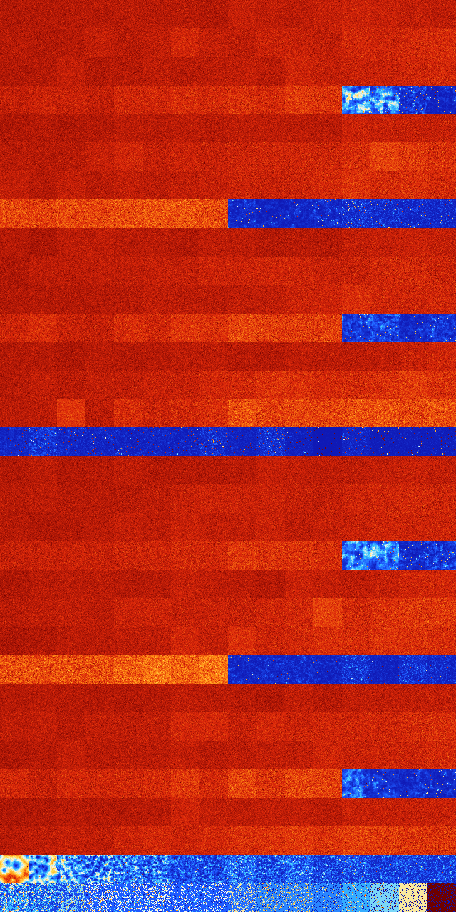

# B1358 (152576-153087)

<details>
    <summary>Initial Grid</summary>
    
</details>


<details>
    <summary>Initial Grid RLE</summary>

```
#C Exported from GoGoL (https://github.com/marrow16/gogol)
#C Wrap mode: Toroidal
#C Boundary mode: Dead
#C Step: 0
x = 100, y = 100, rule = B1358/S
6bo3bo13bo22bo8bo4bo5bo10bo$5bo17bo22bo19bo5bo8bo11bobo2bo$o8bo8bobo7bo
38bo9bo8bo7bo$3bo2bo15bo11bo$18bo7bo24bo3bo7bo35bo$21bo61bo6bo$36bo10bo
34bo15bo$9bo2bo5bo11bo2bo16bo9bo5bo15bo5bobo$3bo4bo41bo7bo8bo7bo16bo$
11bo12bo2bo13bo$11bo21bo4bo14bo2bo$38bo2bo$4bo2bo22b2o2bo15bo28bo16bo$
4bo26bo22bo28bo$10bobo7bob2o69bo$31bo25bo4bo$6bo18bo8bo27bo34bo$6bo9bo
21bo15bo4bo12bo$67bo$19bo12bo24bo19bo$27bo4bo31bo25bo4bo$46bo21bo$5bo2b
o6bo2bo14bo5bo58bo$39bo6bo17bo8bo$67bo$bo31b2o13bo6bo5bo7bo$16bo22bo29b
o$24bo2bo40bo$43bo4bo6bo$55bo22bo$17bo6bo6bo12bo46bo$6bo38bo8bo8bo4b2o
13bo6bo$11bobo45bo13bo$25bo69bo$4bo31bo12bo3bo23bo$o7bo2bo6bo36bo13bo$
27bo43bo2bo19bo4bo$50bo2bo2bobo9bo$3bo10bo10bo63bo4bobo$14bo7bo6bo19bo
5bo20bo5bo9bo$9bo17bo10bo2bo14bo11bo13bobo$3bo27bo10bo10bo44bo$24bo7bo
2bo8bo4bo$25bo38bo$51bo3bo4bo21bob2o10bo$43bo11bo8bo5bo15bo9bo$10bo27bo
10bo31bo$65bo31bo$20bo2bo15bo33bo9bobo$74bobo11bo$4bo12bo5bo$11bobo15bo
16bo24bo6bo11bo$15bo2bobo26bo38bo$3b2o8bo35bo16bo14bo8bo$3bo12bo13bo4bo
2bo14bo5bo13bo14bo9bo$2bo46bo10bo$12bo8bo5bo51bo5bo10bo$5bo15bo22bo5bo
11bo15bo$2bo14bo4bo12bo12bo18bo6bo5bo4bo$14bo4bo7bo4bobo26bo7bo4bo8bo6b
o$15bo24bo21bo31bo$7bo22bo13b2o13bo$o38bo33bo18bo$13bobo25bo11bo4bobo
12bo14bo$40bobo10bo$16bo5bo15bobo10bo$23bo22bo14bo11bobo19bo$75bo10bo$
31bo31bo$o8bo8bo24bo4bobo15bo22bo$2bo11bo25bo7bo32bo$o14bo14bo33bo6b2ob
o$5bo18bo9bo$77bo4bo$2bobo64bo29bo$o6bo4bo48bo$2bo52bo19bo20bo$49bo49bo
$9bo2bo14bo12bo54bob2o$bo7bo4bo41bobo29bo$11bo2bo8bo70bo$5bo20bo4bo11bo
10bo6bo6bo17bo7bo$10bo12bo2bo24bo10bo10bo4bo19bo$71bo$6bo4bo14bo31bo11b
o23bobo$98bo$3bo23bo37bobo20bo10bo$4bo24bo12bo12bo41bo$2bo14bo59bo17bo$
3bo33bo6bo19bo11bo8bo9bo$15bo13bo4bo10bo46bo5bo$o15bo17bo20bo8b2o9bo2bo
10bo$27bo3bo15bo37bo$2obo22bo4b2o66bo$7bo24bo8bo15bo23bo$72bo$3bo24bo
22bo5bo4bo29bo$12bo5bo25bo42bo7bo2bo$24bo27bo7b2obo$11bobo18bo40bo14b2o!
```
</details>
<details>
    <summary>Thumbnail</summary>

</details>
<table>
<tr>
    <td><a href="./152576%20S%20Heat%20Map%20Activity.png"></a><br>S (152576)<br>G>1000</td>    <td><a href="./152577%20S0%20Heat%20Map%20Activity.png"></a><br>S0 (152577)<br>G>1000</td>    <td><a href="./152578%20S1%20Heat%20Map%20Activity.png"></a><br>S1 (152578)<br>G>1000</td>    <td><a href="./152579%20S01%20Heat%20Map%20Activity.png"></a><br>S01 (152579)<br>G>1000</td>    <td><a href="./152580%20S2%20Heat%20Map%20Activity.png"></a><br>S2 (152580)<br>G>1000</td>    <td><a href="./152581%20S02%20Heat%20Map%20Activity.png"></a><br>S02 (152581)<br>G>1000</td>    <td><a href="./152582%20S12%20Heat%20Map%20Activity.png"></a><br>S12 (152582)<br>G>1000</td>    <td><a href="./152583%20S012%20Heat%20Map%20Activity.png"></a><br>S012 (152583)<br>G>1000</td>    <td><a href="./152584%20S3%20Heat%20Map%20Activity.png"></a><br>S3 (152584)<br>G>1000</td>    <td><a href="./152585%20S03%20Heat%20Map%20Activity.png"></a><br>S03 (152585)<br>G>1000</td>    <td><a href="./152586%20S13%20Heat%20Map%20Activity.png"></a><br>S13 (152586)<br>G>1000</td>    <td><a href="./152587%20S013%20Heat%20Map%20Activity.png"></a><br>S013 (152587)<br>G>1000</td>    <td><a href="./152588%20S23%20Heat%20Map%20Activity.png"></a><br>S23 (152588)<br>G>1000</td>    <td><a href="./152589%20S023%20Heat%20Map%20Activity.png"></a><br>S023 (152589)<br>G>1000</td>    <td><a href="./152590%20S123%20Heat%20Map%20Activity.png"></a><br>S123 (152590)<br>G>1000</td>    <td><a href="./152591%20S0123%20Heat%20Map%20Activity.png"></a><br>S0123 (152591)<br>G>1000</td></tr>
<tr>
    <td><a href="./152592%20S4%20Heat%20Map%20Activity.png"></a><br>S4 (152592)<br>G>1000</td>    <td><a href="./152593%20S04%20Heat%20Map%20Activity.png"></a><br>S04 (152593)<br>G>1000</td>    <td><a href="./152594%20S14%20Heat%20Map%20Activity.png"></a><br>S14 (152594)<br>G>1000</td>    <td><a href="./152595%20S014%20Heat%20Map%20Activity.png"></a><br>S014 (152595)<br>G>1000</td>    <td><a href="./152596%20S24%20Heat%20Map%20Activity.png"></a><br>S24 (152596)<br>G>1000</td>    <td><a href="./152597%20S024%20Heat%20Map%20Activity.png"></a><br>S024 (152597)<br>G>1000</td>    <td><a href="./152598%20S124%20Heat%20Map%20Activity.png"></a><br>S124 (152598)<br>G>1000</td>    <td><a href="./152599%20S0124%20Heat%20Map%20Activity.png"></a><br>S0124 (152599)<br>G>1000</td>    <td><a href="./152600%20S34%20Heat%20Map%20Activity.png"></a><br>S34 (152600)<br>G>1000</td>    <td><a href="./152601%20S034%20Heat%20Map%20Activity.png"></a><br>S034 (152601)<br>G>1000</td>    <td><a href="./152602%20S134%20Heat%20Map%20Activity.png"></a><br>S134 (152602)<br>G>1000</td>    <td><a href="./152603%20S0134%20Heat%20Map%20Activity.png"></a><br>S0134 (152603)<br>G>1000</td>    <td><a href="./152604%20S234%20Heat%20Map%20Activity.png"></a><br>S234 (152604)<br>G>1000</td>    <td><a href="./152605%20S0234%20Heat%20Map%20Activity.png"></a><br>S0234 (152605)<br>G>1000</td>    <td><a href="./152606%20S1234%20Heat%20Map%20Activity.png"></a><br>S1234 (152606)<br>G>1000</td>    <td><a href="./152607%20S01234%20Heat%20Map%20Activity.png"></a><br>S01234 (152607)<br>G>1000</td></tr>
<tr>
    <td><a href="./152608%20S5%20Heat%20Map%20Activity.png"></a><br>S5 (152608)<br>G>1000</td>    <td><a href="./152609%20S05%20Heat%20Map%20Activity.png"></a><br>S05 (152609)<br>G>1000</td>    <td><a href="./152610%20S15%20Heat%20Map%20Activity.png"></a><br>S15 (152610)<br>G>1000</td>    <td><a href="./152611%20S015%20Heat%20Map%20Activity.png"></a><br>S015 (152611)<br>G>1000</td>    <td><a href="./152612%20S25%20Heat%20Map%20Activity.png"></a><br>S25 (152612)<br>G>1000</td>    <td><a href="./152613%20S025%20Heat%20Map%20Activity.png"></a><br>S025 (152613)<br>G>1000</td>    <td><a href="./152614%20S125%20Heat%20Map%20Activity.png"></a><br>S125 (152614)<br>G>1000</td>    <td><a href="./152615%20S0125%20Heat%20Map%20Activity.png"></a><br>S0125 (152615)<br>G>1000</td>    <td><a href="./152616%20S35%20Heat%20Map%20Activity.png"></a><br>S35 (152616)<br>G>1000</td>    <td><a href="./152617%20S035%20Heat%20Map%20Activity.png"></a><br>S035 (152617)<br>G>1000</td>    <td><a href="./152618%20S135%20Heat%20Map%20Activity.png"></a><br>S135 (152618)<br>G>1000</td>    <td><a href="./152619%20S0135%20Heat%20Map%20Activity.png"></a><br>S0135 (152619)<br>G>1000</td>    <td><a href="./152620%20S235%20Heat%20Map%20Activity.png"></a><br>S235 (152620)<br>G>1000</td>    <td><a href="./152621%20S0235%20Heat%20Map%20Activity.png"></a><br>S0235 (152621)<br>G>1000</td>    <td><a href="./152622%20S1235%20Heat%20Map%20Activity.png"></a><br>S1235 (152622)<br>G>1000</td>    <td><a href="./152623%20S01235%20Heat%20Map%20Activity.png"></a><br>S01235 (152623)<br>G>1000</td></tr>
<tr>
    <td><a href="./152624%20S45%20Heat%20Map%20Activity.png"></a><br>S45 (152624)<br>G>1000</td>    <td><a href="./152625%20S045%20Heat%20Map%20Activity.png"></a><br>S045 (152625)<br>G>1000</td>    <td><a href="./152626%20S145%20Heat%20Map%20Activity.png"></a><br>S145 (152626)<br>G>1000</td>    <td><a href="./152627%20S0145%20Heat%20Map%20Activity.png"></a><br>S0145 (152627)<br>G>1000</td>    <td><a href="./152628%20S245%20Heat%20Map%20Activity.png"></a><br>S245 (152628)<br>G>1000</td>    <td><a href="./152629%20S0245%20Heat%20Map%20Activity.png"></a><br>S0245 (152629)<br>G>1000</td>    <td><a href="./152630%20S1245%20Heat%20Map%20Activity.png"></a><br>S1245 (152630)<br>G>1000</td>    <td><a href="./152631%20S01245%20Heat%20Map%20Activity.png"></a><br>S01245 (152631)<br>G>1000</td>    <td><a href="./152632%20S345%20Heat%20Map%20Activity.png"></a><br>S345 (152632)<br>G>1000</td>    <td><a href="./152633%20S0345%20Heat%20Map%20Activity.png"></a><br>S0345 (152633)<br>G>1000</td>    <td><a href="./152634%20S1345%20Heat%20Map%20Activity.png"></a><br>S1345 (152634)<br>G>1000</td>    <td><a href="./152635%20S01345%20Heat%20Map%20Activity.png"></a><br>S01345 (152635)<br>G>1000</td>    <td><a href="./152636%20S2345%20Heat%20Map%20Activity.png"></a><br>S2345 (152636)<br>G>1000</td>    <td><a href="./152637%20S02345%20Heat%20Map%20Activity.png"></a><br>S02345 (152637)<br>G>1000</td>    <td><a href="./152638%20S12345%20Heat%20Map%20Activity.png"></a><br>S12345 (152638)<br>R@343,p12</td>    <td><a href="./152639%20S012345%20Heat%20Map%20Activity.png"></a><br>S012345 (152639)<br>R@570,p120</td></tr>
<tr>
    <td><a href="./152640%20S6%20Heat%20Map%20Activity.png"></a><br>S6 (152640)<br>G>1000</td>    <td><a href="./152641%20S06%20Heat%20Map%20Activity.png"></a><br>S06 (152641)<br>G>1000</td>    <td><a href="./152642%20S16%20Heat%20Map%20Activity.png"></a><br>S16 (152642)<br>G>1000</td>    <td><a href="./152643%20S016%20Heat%20Map%20Activity.png"></a><br>S016 (152643)<br>G>1000</td>    <td><a href="./152644%20S26%20Heat%20Map%20Activity.png"></a><br>S26 (152644)<br>G>1000</td>    <td><a href="./152645%20S026%20Heat%20Map%20Activity.png"></a><br>S026 (152645)<br>G>1000</td>    <td><a href="./152646%20S126%20Heat%20Map%20Activity.png"></a><br>S126 (152646)<br>G>1000</td>    <td><a href="./152647%20S0126%20Heat%20Map%20Activity.png"></a><br>S0126 (152647)<br>G>1000</td>    <td><a href="./152648%20S36%20Heat%20Map%20Activity.png"></a><br>S36 (152648)<br>G>1000</td>    <td><a href="./152649%20S036%20Heat%20Map%20Activity.png"></a><br>S036 (152649)<br>G>1000</td>    <td><a href="./152650%20S136%20Heat%20Map%20Activity.png"></a><br>S136 (152650)<br>G>1000</td>    <td><a href="./152651%20S0136%20Heat%20Map%20Activity.png"></a><br>S0136 (152651)<br>G>1000</td>    <td><a href="./152652%20S236%20Heat%20Map%20Activity.png"></a><br>S236 (152652)<br>G>1000</td>    <td><a href="./152653%20S0236%20Heat%20Map%20Activity.png"></a><br>S0236 (152653)<br>G>1000</td>    <td><a href="./152654%20S1236%20Heat%20Map%20Activity.png"></a><br>S1236 (152654)<br>G>1000</td>    <td><a href="./152655%20S01236%20Heat%20Map%20Activity.png"></a><br>S01236 (152655)<br>G>1000</td></tr>
<tr>
    <td><a href="./152656%20S46%20Heat%20Map%20Activity.png"></a><br>S46 (152656)<br>G>1000</td>    <td><a href="./152657%20S046%20Heat%20Map%20Activity.png"></a><br>S046 (152657)<br>G>1000</td>    <td><a href="./152658%20S146%20Heat%20Map%20Activity.png"></a><br>S146 (152658)<br>G>1000</td>    <td><a href="./152659%20S0146%20Heat%20Map%20Activity.png"></a><br>S0146 (152659)<br>G>1000</td>    <td><a href="./152660%20S246%20Heat%20Map%20Activity.png"></a><br>S246 (152660)<br>G>1000</td>    <td><a href="./152661%20S0246%20Heat%20Map%20Activity.png"></a><br>S0246 (152661)<br>G>1000</td>    <td><a href="./152662%20S1246%20Heat%20Map%20Activity.png"></a><br>S1246 (152662)<br>G>1000</td>    <td><a href="./152663%20S01246%20Heat%20Map%20Activity.png"></a><br>S01246 (152663)<br>G>1000</td>    <td><a href="./152664%20S346%20Heat%20Map%20Activity.png"></a><br>S346 (152664)<br>G>1000</td>    <td><a href="./152665%20S0346%20Heat%20Map%20Activity.png"></a><br>S0346 (152665)<br>G>1000</td>    <td><a href="./152666%20S1346%20Heat%20Map%20Activity.png"></a><br>S1346 (152666)<br>G>1000</td>    <td><a href="./152667%20S01346%20Heat%20Map%20Activity.png"></a><br>S01346 (152667)<br>G>1000</td>    <td><a href="./152668%20S2346%20Heat%20Map%20Activity.png"></a><br>S2346 (152668)<br>G>1000</td>    <td><a href="./152669%20S02346%20Heat%20Map%20Activity.png"></a><br>S02346 (152669)<br>G>1000</td>    <td><a href="./152670%20S12346%20Heat%20Map%20Activity.png"></a><br>S12346 (152670)<br>G>1000</td>    <td><a href="./152671%20S012346%20Heat%20Map%20Activity.png"></a><br>S012346 (152671)<br>G>1000</td></tr>
<tr>
    <td><a href="./152672%20S56%20Heat%20Map%20Activity.png"></a><br>S56 (152672)<br>G>1000</td>    <td><a href="./152673%20S056%20Heat%20Map%20Activity.png"></a><br>S056 (152673)<br>G>1000</td>    <td><a href="./152674%20S156%20Heat%20Map%20Activity.png"></a><br>S156 (152674)<br>G>1000</td>    <td><a href="./152675%20S0156%20Heat%20Map%20Activity.png"></a><br>S0156 (152675)<br>G>1000</td>    <td><a href="./152676%20S256%20Heat%20Map%20Activity.png"></a><br>S256 (152676)<br>G>1000</td>    <td><a href="./152677%20S0256%20Heat%20Map%20Activity.png"></a><br>S0256 (152677)<br>G>1000</td>    <td><a href="./152678%20S1256%20Heat%20Map%20Activity.png"></a><br>S1256 (152678)<br>G>1000</td>    <td><a href="./152679%20S01256%20Heat%20Map%20Activity.png"></a><br>S01256 (152679)<br>G>1000</td>    <td><a href="./152680%20S356%20Heat%20Map%20Activity.png"></a><br>S356 (152680)<br>G>1000</td>    <td><a href="./152681%20S0356%20Heat%20Map%20Activity.png"></a><br>S0356 (152681)<br>G>1000</td>    <td><a href="./152682%20S1356%20Heat%20Map%20Activity.png"></a><br>S1356 (152682)<br>G>1000</td>    <td><a href="./152683%20S01356%20Heat%20Map%20Activity.png"></a><br>S01356 (152683)<br>G>1000</td>    <td><a href="./152684%20S2356%20Heat%20Map%20Activity.png"></a><br>S2356 (152684)<br>G>1000</td>    <td><a href="./152685%20S02356%20Heat%20Map%20Activity.png"></a><br>S02356 (152685)<br>G>1000</td>    <td><a href="./152686%20S12356%20Heat%20Map%20Activity.png"></a><br>S12356 (152686)<br>G>1000</td>    <td><a href="./152687%20S012356%20Heat%20Map%20Activity.png"></a><br>S012356 (152687)<br>G>1000</td></tr>
<tr>
    <td><a href="./152688%20S456%20Heat%20Map%20Activity.png"></a><br>S456 (152688)<br>G>1000</td>    <td><a href="./152689%20S0456%20Heat%20Map%20Activity.png"></a><br>S0456 (152689)<br>G>1000</td>    <td><a href="./152690%20S1456%20Heat%20Map%20Activity.png"></a><br>S1456 (152690)<br>G>1000</td>    <td><a href="./152691%20S01456%20Heat%20Map%20Activity.png"></a><br>S01456 (152691)<br>G>1000</td>    <td><a href="./152692%20S2456%20Heat%20Map%20Activity.png"></a><br>S2456 (152692)<br>G>1000</td>    <td><a href="./152693%20S02456%20Heat%20Map%20Activity.png"></a><br>S02456 (152693)<br>G>1000</td>    <td><a href="./152694%20S12456%20Heat%20Map%20Activity.png"></a><br>S12456 (152694)<br>G>1000</td>    <td><a href="./152695%20S012456%20Heat%20Map%20Activity.png"></a><br>S012456 (152695)<br>G>1000</td>    <td><a href="./152696%20S3456%20Heat%20Map%20Activity.png"></a><br>S3456 (152696)<br>R@243,p12</td>    <td><a href="./152697%20S03456%20Heat%20Map%20Activity.png"></a><br>S03456 (152697)<br>R@397,p60</td>    <td><a href="./152698%20S13456%20Heat%20Map%20Activity.png"></a><br>S13456 (152698)<br>R@293,p12</td>    <td><a href="./152699%20S013456%20Heat%20Map%20Activity.png"></a><br>S013456 (152699)<br>R@240,p30</td>    <td><a href="./152700%20S23456%20Heat%20Map%20Activity.png"></a><br>S23456 (152700)<br>R@44,p12</td>    <td><a href="./152701%20S023456%20Heat%20Map%20Activity.png"></a><br>S023456 (152701)<br>R@51,p12</td>    <td><a href="./152702%20S123456%20Heat%20Map%20Activity.png"></a><br>S123456 (152702)<br>R@53,p24</td>    <td><a href="./152703%20S0123456%20Heat%20Map%20Activity.png"></a><br>S0123456 (152703)<br>R@58,p24</td></tr>
<tr>
    <td><a href="./152704%20S7%20Heat%20Map%20Activity.png"></a><br>S7 (152704)<br>G>1000</td>    <td><a href="./152705%20S07%20Heat%20Map%20Activity.png"></a><br>S07 (152705)<br>G>1000</td>    <td><a href="./152706%20S17%20Heat%20Map%20Activity.png"></a><br>S17 (152706)<br>G>1000</td>    <td><a href="./152707%20S017%20Heat%20Map%20Activity.png"></a><br>S017 (152707)<br>G>1000</td>    <td><a href="./152708%20S27%20Heat%20Map%20Activity.png"></a><br>S27 (152708)<br>G>1000</td>    <td><a href="./152709%20S027%20Heat%20Map%20Activity.png"></a><br>S027 (152709)<br>G>1000</td>    <td><a href="./152710%20S127%20Heat%20Map%20Activity.png"></a><br>S127 (152710)<br>G>1000</td>    <td><a href="./152711%20S0127%20Heat%20Map%20Activity.png"></a><br>S0127 (152711)<br>G>1000</td>    <td><a href="./152712%20S37%20Heat%20Map%20Activity.png"></a><br>S37 (152712)<br>G>1000</td>    <td><a href="./152713%20S037%20Heat%20Map%20Activity.png"></a><br>S037 (152713)<br>G>1000</td>    <td><a href="./152714%20S137%20Heat%20Map%20Activity.png"></a><br>S137 (152714)<br>G>1000</td>    <td><a href="./152715%20S0137%20Heat%20Map%20Activity.png"></a><br>S0137 (152715)<br>G>1000</td>    <td><a href="./152716%20S237%20Heat%20Map%20Activity.png"></a><br>S237 (152716)<br>G>1000</td>    <td><a href="./152717%20S0237%20Heat%20Map%20Activity.png"></a><br>S0237 (152717)<br>G>1000</td>    <td><a href="./152718%20S1237%20Heat%20Map%20Activity.png"></a><br>S1237 (152718)<br>G>1000</td>    <td><a href="./152719%20S01237%20Heat%20Map%20Activity.png"></a><br>S01237 (152719)<br>G>1000</td></tr>
<tr>
    <td><a href="./152720%20S47%20Heat%20Map%20Activity.png"></a><br>S47 (152720)<br>G>1000</td>    <td><a href="./152721%20S047%20Heat%20Map%20Activity.png"></a><br>S047 (152721)<br>G>1000</td>    <td><a href="./152722%20S147%20Heat%20Map%20Activity.png"></a><br>S147 (152722)<br>G>1000</td>    <td><a href="./152723%20S0147%20Heat%20Map%20Activity.png"></a><br>S0147 (152723)<br>G>1000</td>    <td><a href="./152724%20S247%20Heat%20Map%20Activity.png"></a><br>S247 (152724)<br>G>1000</td>    <td><a href="./152725%20S0247%20Heat%20Map%20Activity.png"></a><br>S0247 (152725)<br>G>1000</td>    <td><a href="./152726%20S1247%20Heat%20Map%20Activity.png"></a><br>S1247 (152726)<br>G>1000</td>    <td><a href="./152727%20S01247%20Heat%20Map%20Activity.png"></a><br>S01247 (152727)<br>G>1000</td>    <td><a href="./152728%20S347%20Heat%20Map%20Activity.png"></a><br>S347 (152728)<br>G>1000</td>    <td><a href="./152729%20S0347%20Heat%20Map%20Activity.png"></a><br>S0347 (152729)<br>G>1000</td>    <td><a href="./152730%20S1347%20Heat%20Map%20Activity.png"></a><br>S1347 (152730)<br>G>1000</td>    <td><a href="./152731%20S01347%20Heat%20Map%20Activity.png"></a><br>S01347 (152731)<br>G>1000</td>    <td><a href="./152732%20S2347%20Heat%20Map%20Activity.png"></a><br>S2347 (152732)<br>G>1000</td>    <td><a href="./152733%20S02347%20Heat%20Map%20Activity.png"></a><br>S02347 (152733)<br>G>1000</td>    <td><a href="./152734%20S12347%20Heat%20Map%20Activity.png"></a><br>S12347 (152734)<br>G>1000</td>    <td><a href="./152735%20S012347%20Heat%20Map%20Activity.png"></a><br>S012347 (152735)<br>G>1000</td></tr>
<tr>
    <td><a href="./152736%20S57%20Heat%20Map%20Activity.png"></a><br>S57 (152736)<br>G>1000</td>    <td><a href="./152737%20S057%20Heat%20Map%20Activity.png"></a><br>S057 (152737)<br>G>1000</td>    <td><a href="./152738%20S157%20Heat%20Map%20Activity.png"></a><br>S157 (152738)<br>G>1000</td>    <td><a href="./152739%20S0157%20Heat%20Map%20Activity.png"></a><br>S0157 (152739)<br>G>1000</td>    <td><a href="./152740%20S257%20Heat%20Map%20Activity.png"></a><br>S257 (152740)<br>G>1000</td>    <td><a href="./152741%20S0257%20Heat%20Map%20Activity.png"></a><br>S0257 (152741)<br>G>1000</td>    <td><a href="./152742%20S1257%20Heat%20Map%20Activity.png"></a><br>S1257 (152742)<br>G>1000</td>    <td><a href="./152743%20S01257%20Heat%20Map%20Activity.png"></a><br>S01257 (152743)<br>G>1000</td>    <td><a href="./152744%20S357%20Heat%20Map%20Activity.png"></a><br>S357 (152744)<br>G>1000</td>    <td><a href="./152745%20S0357%20Heat%20Map%20Activity.png"></a><br>S0357 (152745)<br>G>1000</td>    <td><a href="./152746%20S1357%20Heat%20Map%20Activity.png"></a><br>S1357 (152746)<br>G>1000</td>    <td><a href="./152747%20S01357%20Heat%20Map%20Activity.png"></a><br>S01357 (152747)<br>G>1000</td>    <td><a href="./152748%20S2357%20Heat%20Map%20Activity.png"></a><br>S2357 (152748)<br>G>1000</td>    <td><a href="./152749%20S02357%20Heat%20Map%20Activity.png"></a><br>S02357 (152749)<br>G>1000</td>    <td><a href="./152750%20S12357%20Heat%20Map%20Activity.png"></a><br>S12357 (152750)<br>G>1000</td>    <td><a href="./152751%20S012357%20Heat%20Map%20Activity.png"></a><br>S012357 (152751)<br>G>1000</td></tr>
<tr>
    <td><a href="./152752%20S457%20Heat%20Map%20Activity.png"></a><br>S457 (152752)<br>G>1000</td>    <td><a href="./152753%20S0457%20Heat%20Map%20Activity.png"></a><br>S0457 (152753)<br>G>1000</td>    <td><a href="./152754%20S1457%20Heat%20Map%20Activity.png"></a><br>S1457 (152754)<br>G>1000</td>    <td><a href="./152755%20S01457%20Heat%20Map%20Activity.png"></a><br>S01457 (152755)<br>G>1000</td>    <td><a href="./152756%20S2457%20Heat%20Map%20Activity.png"></a><br>S2457 (152756)<br>G>1000</td>    <td><a href="./152757%20S02457%20Heat%20Map%20Activity.png"></a><br>S02457 (152757)<br>G>1000</td>    <td><a href="./152758%20S12457%20Heat%20Map%20Activity.png"></a><br>S12457 (152758)<br>G>1000</td>    <td><a href="./152759%20S012457%20Heat%20Map%20Activity.png"></a><br>S012457 (152759)<br>G>1000</td>    <td><a href="./152760%20S3457%20Heat%20Map%20Activity.png"></a><br>S3457 (152760)<br>G>1000</td>    <td><a href="./152761%20S03457%20Heat%20Map%20Activity.png"></a><br>S03457 (152761)<br>G>1000</td>    <td><a href="./152762%20S13457%20Heat%20Map%20Activity.png"></a><br>S13457 (152762)<br>G>1000</td>    <td><a href="./152763%20S013457%20Heat%20Map%20Activity.png"></a><br>S013457 (152763)<br>G>1000</td>    <td><a href="./152764%20S23457%20Heat%20Map%20Activity.png"></a><br>S23457 (152764)<br>R@517,p12</td>    <td><a href="./152765%20S023457%20Heat%20Map%20Activity.png"></a><br>S023457 (152765)<br>R@336,p12</td>    <td><a href="./152766%20S123457%20Heat%20Map%20Activity.png"></a><br>S123457 (152766)<br>R@497,p12</td>    <td><a href="./152767%20S0123457%20Heat%20Map%20Activity.png"></a><br>S0123457 (152767)<br>R@277,p12</td></tr>
<tr>
    <td><a href="./152768%20S67%20Heat%20Map%20Activity.png"></a><br>S67 (152768)<br>G>1000</td>    <td><a href="./152769%20S067%20Heat%20Map%20Activity.png"></a><br>S067 (152769)<br>G>1000</td>    <td><a href="./152770%20S167%20Heat%20Map%20Activity.png"></a><br>S167 (152770)<br>G>1000</td>    <td><a href="./152771%20S0167%20Heat%20Map%20Activity.png"></a><br>S0167 (152771)<br>G>1000</td>    <td><a href="./152772%20S267%20Heat%20Map%20Activity.png"></a><br>S267 (152772)<br>G>1000</td>    <td><a href="./152773%20S0267%20Heat%20Map%20Activity.png"></a><br>S0267 (152773)<br>G>1000</td>    <td><a href="./152774%20S1267%20Heat%20Map%20Activity.png"></a><br>S1267 (152774)<br>G>1000</td>    <td><a href="./152775%20S01267%20Heat%20Map%20Activity.png"></a><br>S01267 (152775)<br>G>1000</td>    <td><a href="./152776%20S367%20Heat%20Map%20Activity.png"></a><br>S367 (152776)<br>G>1000</td>    <td><a href="./152777%20S0367%20Heat%20Map%20Activity.png"></a><br>S0367 (152777)<br>G>1000</td>    <td><a href="./152778%20S1367%20Heat%20Map%20Activity.png"></a><br>S1367 (152778)<br>G>1000</td>    <td><a href="./152779%20S01367%20Heat%20Map%20Activity.png"></a><br>S01367 (152779)<br>G>1000</td>    <td><a href="./152780%20S2367%20Heat%20Map%20Activity.png"></a><br>S2367 (152780)<br>G>1000</td>    <td><a href="./152781%20S02367%20Heat%20Map%20Activity.png"></a><br>S02367 (152781)<br>G>1000</td>    <td><a href="./152782%20S12367%20Heat%20Map%20Activity.png"></a><br>S12367 (152782)<br>G>1000</td>    <td><a href="./152783%20S012367%20Heat%20Map%20Activity.png"></a><br>S012367 (152783)<br>G>1000</td></tr>
<tr>
    <td><a href="./152784%20S467%20Heat%20Map%20Activity.png"></a><br>S467 (152784)<br>G>1000</td>    <td><a href="./152785%20S0467%20Heat%20Map%20Activity.png"></a><br>S0467 (152785)<br>G>1000</td>    <td><a href="./152786%20S1467%20Heat%20Map%20Activity.png"></a><br>S1467 (152786)<br>G>1000</td>    <td><a href="./152787%20S01467%20Heat%20Map%20Activity.png"></a><br>S01467 (152787)<br>G>1000</td>    <td><a href="./152788%20S2467%20Heat%20Map%20Activity.png"></a><br>S2467 (152788)<br>G>1000</td>    <td><a href="./152789%20S02467%20Heat%20Map%20Activity.png"></a><br>S02467 (152789)<br>G>1000</td>    <td><a href="./152790%20S12467%20Heat%20Map%20Activity.png"></a><br>S12467 (152790)<br>G>1000</td>    <td><a href="./152791%20S012467%20Heat%20Map%20Activity.png"></a><br>S012467 (152791)<br>G>1000</td>    <td><a href="./152792%20S3467%20Heat%20Map%20Activity.png"></a><br>S3467 (152792)<br>G>1000</td>    <td><a href="./152793%20S03467%20Heat%20Map%20Activity.png"></a><br>S03467 (152793)<br>G>1000</td>    <td><a href="./152794%20S13467%20Heat%20Map%20Activity.png"></a><br>S13467 (152794)<br>G>1000</td>    <td><a href="./152795%20S013467%20Heat%20Map%20Activity.png"></a><br>S013467 (152795)<br>G>1000</td>    <td><a href="./152796%20S23467%20Heat%20Map%20Activity.png"></a><br>S23467 (152796)<br>G>1000</td>    <td><a href="./152797%20S023467%20Heat%20Map%20Activity.png"></a><br>S023467 (152797)<br>G>1000</td>    <td><a href="./152798%20S123467%20Heat%20Map%20Activity.png"></a><br>S123467 (152798)<br>G>1000</td>    <td><a href="./152799%20S0123467%20Heat%20Map%20Activity.png"></a><br>S0123467 (152799)<br>G>1000</td></tr>
<tr>
    <td><a href="./152800%20S567%20Heat%20Map%20Activity.png"></a><br>S567 (152800)<br>G>1000</td>    <td><a href="./152801%20S0567%20Heat%20Map%20Activity.png"></a><br>S0567 (152801)<br>G>1000</td>    <td><a href="./152802%20S1567%20Heat%20Map%20Activity.png"></a><br>S1567 (152802)<br>G>1000</td>    <td><a href="./152803%20S01567%20Heat%20Map%20Activity.png"></a><br>S01567 (152803)<br>G>1000</td>    <td><a href="./152804%20S2567%20Heat%20Map%20Activity.png"></a><br>S2567 (152804)<br>G>1000</td>    <td><a href="./152805%20S02567%20Heat%20Map%20Activity.png"></a><br>S02567 (152805)<br>G>1000</td>    <td><a href="./152806%20S12567%20Heat%20Map%20Activity.png"></a><br>S12567 (152806)<br>G>1000</td>    <td><a href="./152807%20S012567%20Heat%20Map%20Activity.png"></a><br>S012567 (152807)<br>G>1000</td>    <td><a href="./152808%20S3567%20Heat%20Map%20Activity.png"></a><br>S3567 (152808)<br>G>1000</td>    <td><a href="./152809%20S03567%20Heat%20Map%20Activity.png"></a><br>S03567 (152809)<br>G>1000</td>    <td><a href="./152810%20S13567%20Heat%20Map%20Activity.png"></a><br>S13567 (152810)<br>G>1000</td>    <td><a href="./152811%20S013567%20Heat%20Map%20Activity.png"></a><br>S013567 (152811)<br>G>1000</td>    <td><a href="./152812%20S23567%20Heat%20Map%20Activity.png"></a><br>S23567 (152812)<br>G>1000</td>    <td><a href="./152813%20S023567%20Heat%20Map%20Activity.png"></a><br>S023567 (152813)<br>G>1000</td>    <td><a href="./152814%20S123567%20Heat%20Map%20Activity.png"></a><br>S123567 (152814)<br>G>1000</td>    <td><a href="./152815%20S0123567%20Heat%20Map%20Activity.png"></a><br>S0123567 (152815)<br>G>1000</td></tr>
<tr>
    <td><a href="./152816%20S4567%20Heat%20Map%20Activity.png"></a><br>S4567 (152816)<br>R@130,p60</td>    <td><a href="./152817%20S04567%20Heat%20Map%20Activity.png"></a><br>S04567 (152817)<br>R@62,p12</td>    <td><a href="./152818%20S14567%20Heat%20Map%20Activity.png"></a><br>S14567 (152818)<br>R@111,p60</td>    <td><a href="./152819%20S014567%20Heat%20Map%20Activity.png"></a><br>S014567 (152819)<br>R@106,p60</td>    <td><a href="./152820%20S24567%20Heat%20Map%20Activity.png"></a><br>S24567 (152820)<br>R@109,p60</td>    <td><a href="./152821%20S024567%20Heat%20Map%20Activity.png"></a><br>S024567 (152821)<br>R@105,p60</td>    <td><a href="./152822%20S124567%20Heat%20Map%20Activity.png"></a><br>S124567 (152822)<br>R@106,p60</td>    <td><a href="./152823%20S0124567%20Heat%20Map%20Activity.png"></a><br>S0124567 (152823)<br>R@56,p12</td>    <td><a href="./152824%20S34567%20Heat%20Map%20Activity.png"></a><br>S34567 (152824)<br>R@85,p60</td>    <td><a href="./152825%20S034567%20Heat%20Map%20Activity.png"></a><br>S034567 (152825)<br>R@33,p12</td>    <td><a href="./152826%20S134567%20Heat%20Map%20Activity.png"></a><br>S134567 (152826)<br>R@86,p60</td>    <td><a href="./152827%20S0134567%20Heat%20Map%20Activity.png"></a><br>S0134567 (152827)<br>R@439,p420</td>    <td><a href="./152828%20S234567%20Heat%20Map%20Activity.png"></a><br>S234567 (152828)<br>R@43,p24</td>    <td><a href="./152829%20S0234567%20Heat%20Map%20Activity.png"></a><br>S0234567 (152829)<br>R@102,p84</td>    <td><a href="./152830%20S1234567%20Heat%20Map%20Activity.png"></a><br>S1234567 (152830)<br>R@78,p60</td>    <td><a href="./152831%20S01234567%20Heat%20Map%20Activity.png"></a><br>S01234567 (152831)<br>R@78,p60</td></tr>
<tr>
    <td><a href="./152832%20S8%20Heat%20Map%20Activity.png"></a><br>S8 (152832)<br>G>1000</td>    <td><a href="./152833%20S08%20Heat%20Map%20Activity.png"></a><br>S08 (152833)<br>G>1000</td>    <td><a href="./152834%20S18%20Heat%20Map%20Activity.png"></a><br>S18 (152834)<br>G>1000</td>    <td><a href="./152835%20S018%20Heat%20Map%20Activity.png"></a><br>S018 (152835)<br>G>1000</td>    <td><a href="./152836%20S28%20Heat%20Map%20Activity.png"></a><br>S28 (152836)<br>G>1000</td>    <td><a href="./152837%20S028%20Heat%20Map%20Activity.png"></a><br>S028 (152837)<br>G>1000</td>    <td><a href="./152838%20S128%20Heat%20Map%20Activity.png"></a><br>S128 (152838)<br>G>1000</td>    <td><a href="./152839%20S0128%20Heat%20Map%20Activity.png"></a><br>S0128 (152839)<br>G>1000</td>    <td><a href="./152840%20S38%20Heat%20Map%20Activity.png"></a><br>S38 (152840)<br>G>1000</td>    <td><a href="./152841%20S038%20Heat%20Map%20Activity.png"></a><br>S038 (152841)<br>G>1000</td>    <td><a href="./152842%20S138%20Heat%20Map%20Activity.png"></a><br>S138 (152842)<br>G>1000</td>    <td><a href="./152843%20S0138%20Heat%20Map%20Activity.png"></a><br>S0138 (152843)<br>G>1000</td>    <td><a href="./152844%20S238%20Heat%20Map%20Activity.png"></a><br>S238 (152844)<br>G>1000</td>    <td><a href="./152845%20S0238%20Heat%20Map%20Activity.png"></a><br>S0238 (152845)<br>G>1000</td>    <td><a href="./152846%20S1238%20Heat%20Map%20Activity.png"></a><br>S1238 (152846)<br>G>1000</td>    <td><a href="./152847%20S01238%20Heat%20Map%20Activity.png"></a><br>S01238 (152847)<br>G>1000</td></tr>
<tr>
    <td><a href="./152848%20S48%20Heat%20Map%20Activity.png"></a><br>S48 (152848)<br>G>1000</td>    <td><a href="./152849%20S048%20Heat%20Map%20Activity.png"></a><br>S048 (152849)<br>G>1000</td>    <td><a href="./152850%20S148%20Heat%20Map%20Activity.png"></a><br>S148 (152850)<br>G>1000</td>    <td><a href="./152851%20S0148%20Heat%20Map%20Activity.png"></a><br>S0148 (152851)<br>G>1000</td>    <td><a href="./152852%20S248%20Heat%20Map%20Activity.png"></a><br>S248 (152852)<br>G>1000</td>    <td><a href="./152853%20S0248%20Heat%20Map%20Activity.png"></a><br>S0248 (152853)<br>G>1000</td>    <td><a href="./152854%20S1248%20Heat%20Map%20Activity.png"></a><br>S1248 (152854)<br>G>1000</td>    <td><a href="./152855%20S01248%20Heat%20Map%20Activity.png"></a><br>S01248 (152855)<br>G>1000</td>    <td><a href="./152856%20S348%20Heat%20Map%20Activity.png"></a><br>S348 (152856)<br>G>1000</td>    <td><a href="./152857%20S0348%20Heat%20Map%20Activity.png"></a><br>S0348 (152857)<br>G>1000</td>    <td><a href="./152858%20S1348%20Heat%20Map%20Activity.png"></a><br>S1348 (152858)<br>G>1000</td>    <td><a href="./152859%20S01348%20Heat%20Map%20Activity.png"></a><br>S01348 (152859)<br>G>1000</td>    <td><a href="./152860%20S2348%20Heat%20Map%20Activity.png"></a><br>S2348 (152860)<br>G>1000</td>    <td><a href="./152861%20S02348%20Heat%20Map%20Activity.png"></a><br>S02348 (152861)<br>G>1000</td>    <td><a href="./152862%20S12348%20Heat%20Map%20Activity.png"></a><br>S12348 (152862)<br>G>1000</td>    <td><a href="./152863%20S012348%20Heat%20Map%20Activity.png"></a><br>S012348 (152863)<br>G>1000</td></tr>
<tr>
    <td><a href="./152864%20S58%20Heat%20Map%20Activity.png"></a><br>S58 (152864)<br>G>1000</td>    <td><a href="./152865%20S058%20Heat%20Map%20Activity.png"></a><br>S058 (152865)<br>G>1000</td>    <td><a href="./152866%20S158%20Heat%20Map%20Activity.png"></a><br>S158 (152866)<br>G>1000</td>    <td><a href="./152867%20S0158%20Heat%20Map%20Activity.png"></a><br>S0158 (152867)<br>G>1000</td>    <td><a href="./152868%20S258%20Heat%20Map%20Activity.png"></a><br>S258 (152868)<br>G>1000</td>    <td><a href="./152869%20S0258%20Heat%20Map%20Activity.png"></a><br>S0258 (152869)<br>G>1000</td>    <td><a href="./152870%20S1258%20Heat%20Map%20Activity.png"></a><br>S1258 (152870)<br>G>1000</td>    <td><a href="./152871%20S01258%20Heat%20Map%20Activity.png"></a><br>S01258 (152871)<br>G>1000</td>    <td><a href="./152872%20S358%20Heat%20Map%20Activity.png"></a><br>S358 (152872)<br>G>1000</td>    <td><a href="./152873%20S0358%20Heat%20Map%20Activity.png"></a><br>S0358 (152873)<br>G>1000</td>    <td><a href="./152874%20S1358%20Heat%20Map%20Activity.png"></a><br>S1358 (152874)<br>G>1000</td>    <td><a href="./152875%20S01358%20Heat%20Map%20Activity.png"></a><br>S01358 (152875)<br>G>1000</td>    <td><a href="./152876%20S2358%20Heat%20Map%20Activity.png"></a><br>S2358 (152876)<br>G>1000</td>    <td><a href="./152877%20S02358%20Heat%20Map%20Activity.png"></a><br>S02358 (152877)<br>G>1000</td>    <td><a href="./152878%20S12358%20Heat%20Map%20Activity.png"></a><br>S12358 (152878)<br>G>1000</td>    <td><a href="./152879%20S012358%20Heat%20Map%20Activity.png"></a><br>S012358 (152879)<br>G>1000</td></tr>
<tr>
    <td><a href="./152880%20S458%20Heat%20Map%20Activity.png"></a><br>S458 (152880)<br>G>1000</td>    <td><a href="./152881%20S0458%20Heat%20Map%20Activity.png"></a><br>S0458 (152881)<br>G>1000</td>    <td><a href="./152882%20S1458%20Heat%20Map%20Activity.png"></a><br>S1458 (152882)<br>G>1000</td>    <td><a href="./152883%20S01458%20Heat%20Map%20Activity.png"></a><br>S01458 (152883)<br>G>1000</td>    <td><a href="./152884%20S2458%20Heat%20Map%20Activity.png"></a><br>S2458 (152884)<br>G>1000</td>    <td><a href="./152885%20S02458%20Heat%20Map%20Activity.png"></a><br>S02458 (152885)<br>G>1000</td>    <td><a href="./152886%20S12458%20Heat%20Map%20Activity.png"></a><br>S12458 (152886)<br>G>1000</td>    <td><a href="./152887%20S012458%20Heat%20Map%20Activity.png"></a><br>S012458 (152887)<br>G>1000</td>    <td><a href="./152888%20S3458%20Heat%20Map%20Activity.png"></a><br>S3458 (152888)<br>G>1000</td>    <td><a href="./152889%20S03458%20Heat%20Map%20Activity.png"></a><br>S03458 (152889)<br>G>1000</td>    <td><a href="./152890%20S13458%20Heat%20Map%20Activity.png"></a><br>S13458 (152890)<br>G>1000</td>    <td><a href="./152891%20S013458%20Heat%20Map%20Activity.png"></a><br>S013458 (152891)<br>G>1000</td>    <td><a href="./152892%20S23458%20Heat%20Map%20Activity.png"></a><br>S23458 (152892)<br>G>1000</td>    <td><a href="./152893%20S023458%20Heat%20Map%20Activity.png"></a><br>S023458 (152893)<br>G>1000</td>    <td><a href="./152894%20S123458%20Heat%20Map%20Activity.png"></a><br>S123458 (152894)<br>R@525,p60</td>    <td><a href="./152895%20S0123458%20Heat%20Map%20Activity.png"></a><br>S0123458 (152895)<br>R@370,p12</td></tr>
<tr>
    <td><a href="./152896%20S68%20Heat%20Map%20Activity.png"></a><br>S68 (152896)<br>G>1000</td>    <td><a href="./152897%20S068%20Heat%20Map%20Activity.png"></a><br>S068 (152897)<br>G>1000</td>    <td><a href="./152898%20S168%20Heat%20Map%20Activity.png"></a><br>S168 (152898)<br>G>1000</td>    <td><a href="./152899%20S0168%20Heat%20Map%20Activity.png"></a><br>S0168 (152899)<br>G>1000</td>    <td><a href="./152900%20S268%20Heat%20Map%20Activity.png"></a><br>S268 (152900)<br>G>1000</td>    <td><a href="./152901%20S0268%20Heat%20Map%20Activity.png"></a><br>S0268 (152901)<br>G>1000</td>    <td><a href="./152902%20S1268%20Heat%20Map%20Activity.png"></a><br>S1268 (152902)<br>G>1000</td>    <td><a href="./152903%20S01268%20Heat%20Map%20Activity.png"></a><br>S01268 (152903)<br>G>1000</td>    <td><a href="./152904%20S368%20Heat%20Map%20Activity.png"></a><br>S368 (152904)<br>G>1000</td>    <td><a href="./152905%20S0368%20Heat%20Map%20Activity.png"></a><br>S0368 (152905)<br>G>1000</td>    <td><a href="./152906%20S1368%20Heat%20Map%20Activity.png"></a><br>S1368 (152906)<br>G>1000</td>    <td><a href="./152907%20S01368%20Heat%20Map%20Activity.png"></a><br>S01368 (152907)<br>G>1000</td>    <td><a href="./152908%20S2368%20Heat%20Map%20Activity.png"></a><br>S2368 (152908)<br>G>1000</td>    <td><a href="./152909%20S02368%20Heat%20Map%20Activity.png"></a><br>S02368 (152909)<br>G>1000</td>    <td><a href="./152910%20S12368%20Heat%20Map%20Activity.png"></a><br>S12368 (152910)<br>G>1000</td>    <td><a href="./152911%20S012368%20Heat%20Map%20Activity.png"></a><br>S012368 (152911)<br>G>1000</td></tr>
<tr>
    <td><a href="./152912%20S468%20Heat%20Map%20Activity.png"></a><br>S468 (152912)<br>G>1000</td>    <td><a href="./152913%20S0468%20Heat%20Map%20Activity.png"></a><br>S0468 (152913)<br>G>1000</td>    <td><a href="./152914%20S1468%20Heat%20Map%20Activity.png"></a><br>S1468 (152914)<br>G>1000</td>    <td><a href="./152915%20S01468%20Heat%20Map%20Activity.png"></a><br>S01468 (152915)<br>G>1000</td>    <td><a href="./152916%20S2468%20Heat%20Map%20Activity.png"></a><br>S2468 (152916)<br>G>1000</td>    <td><a href="./152917%20S02468%20Heat%20Map%20Activity.png"></a><br>S02468 (152917)<br>G>1000</td>    <td><a href="./152918%20S12468%20Heat%20Map%20Activity.png"></a><br>S12468 (152918)<br>G>1000</td>    <td><a href="./152919%20S012468%20Heat%20Map%20Activity.png"></a><br>S012468 (152919)<br>G>1000</td>    <td><a href="./152920%20S3468%20Heat%20Map%20Activity.png"></a><br>S3468 (152920)<br>G>1000</td>    <td><a href="./152921%20S03468%20Heat%20Map%20Activity.png"></a><br>S03468 (152921)<br>G>1000</td>    <td><a href="./152922%20S13468%20Heat%20Map%20Activity.png"></a><br>S13468 (152922)<br>G>1000</td>    <td><a href="./152923%20S013468%20Heat%20Map%20Activity.png"></a><br>S013468 (152923)<br>G>1000</td>    <td><a href="./152924%20S23468%20Heat%20Map%20Activity.png"></a><br>S23468 (152924)<br>G>1000</td>    <td><a href="./152925%20S023468%20Heat%20Map%20Activity.png"></a><br>S023468 (152925)<br>G>1000</td>    <td><a href="./152926%20S123468%20Heat%20Map%20Activity.png"></a><br>S123468 (152926)<br>G>1000</td>    <td><a href="./152927%20S0123468%20Heat%20Map%20Activity.png"></a><br>S0123468 (152927)<br>G>1000</td></tr>
<tr>
    <td><a href="./152928%20S568%20Heat%20Map%20Activity.png"></a><br>S568 (152928)<br>G>1000</td>    <td><a href="./152929%20S0568%20Heat%20Map%20Activity.png"></a><br>S0568 (152929)<br>G>1000</td>    <td><a href="./152930%20S1568%20Heat%20Map%20Activity.png"></a><br>S1568 (152930)<br>G>1000</td>    <td><a href="./152931%20S01568%20Heat%20Map%20Activity.png"></a><br>S01568 (152931)<br>G>1000</td>    <td><a href="./152932%20S2568%20Heat%20Map%20Activity.png"></a><br>S2568 (152932)<br>G>1000</td>    <td><a href="./152933%20S02568%20Heat%20Map%20Activity.png"></a><br>S02568 (152933)<br>G>1000</td>    <td><a href="./152934%20S12568%20Heat%20Map%20Activity.png"></a><br>S12568 (152934)<br>G>1000</td>    <td><a href="./152935%20S012568%20Heat%20Map%20Activity.png"></a><br>S012568 (152935)<br>G>1000</td>    <td><a href="./152936%20S3568%20Heat%20Map%20Activity.png"></a><br>S3568 (152936)<br>G>1000</td>    <td><a href="./152937%20S03568%20Heat%20Map%20Activity.png"></a><br>S03568 (152937)<br>G>1000</td>    <td><a href="./152938%20S13568%20Heat%20Map%20Activity.png"></a><br>S13568 (152938)<br>G>1000</td>    <td><a href="./152939%20S013568%20Heat%20Map%20Activity.png"></a><br>S013568 (152939)<br>G>1000</td>    <td><a href="./152940%20S23568%20Heat%20Map%20Activity.png"></a><br>S23568 (152940)<br>G>1000</td>    <td><a href="./152941%20S023568%20Heat%20Map%20Activity.png"></a><br>S023568 (152941)<br>G>1000</td>    <td><a href="./152942%20S123568%20Heat%20Map%20Activity.png"></a><br>S123568 (152942)<br>G>1000</td>    <td><a href="./152943%20S0123568%20Heat%20Map%20Activity.png"></a><br>S0123568 (152943)<br>G>1000</td></tr>
<tr>
    <td><a href="./152944%20S4568%20Heat%20Map%20Activity.png"></a><br>S4568 (152944)<br>G>1000</td>    <td><a href="./152945%20S04568%20Heat%20Map%20Activity.png"></a><br>S04568 (152945)<br>G>1000</td>    <td><a href="./152946%20S14568%20Heat%20Map%20Activity.png"></a><br>S14568 (152946)<br>G>1000</td>    <td><a href="./152947%20S014568%20Heat%20Map%20Activity.png"></a><br>S014568 (152947)<br>G>1000</td>    <td><a href="./152948%20S24568%20Heat%20Map%20Activity.png"></a><br>S24568 (152948)<br>G>1000</td>    <td><a href="./152949%20S024568%20Heat%20Map%20Activity.png"></a><br>S024568 (152949)<br>G>1000</td>    <td><a href="./152950%20S124568%20Heat%20Map%20Activity.png"></a><br>S124568 (152950)<br>G>1000</td>    <td><a href="./152951%20S0124568%20Heat%20Map%20Activity.png"></a><br>S0124568 (152951)<br>G>1000</td>    <td><a href="./152952%20S34568%20Heat%20Map%20Activity.png"></a><br>S34568 (152952)<br>R@129,p6</td>    <td><a href="./152953%20S034568%20Heat%20Map%20Activity.png"></a><br>S034568 (152953)<br>R@117,p12</td>    <td><a href="./152954%20S134568%20Heat%20Map%20Activity.png"></a><br>S134568 (152954)<br>R@112,p2</td>    <td><a href="./152955%20S0134568%20Heat%20Map%20Activity.png"></a><br>S0134568 (152955)<br>R@139,p6</td>    <td><a href="./152956%20S234568%20Heat%20Map%20Activity.png"></a><br>S234568 (152956)<br>R@37,p6</td>    <td><a href="./152957%20S0234568%20Heat%20Map%20Activity.png"></a><br>S0234568 (152957)<br>R@86,p60</td>    <td><a href="./152958%20S1234568%20Heat%20Map%20Activity.png"></a><br>S1234568 (152958)<br>R@33,p4</td>    <td><a href="./152959%20S01234568%20Heat%20Map%20Activity.png"></a><br>S01234568 (152959)<br>R@49,p6</td></tr>
<tr>
    <td><a href="./152960%20S78%20Heat%20Map%20Activity.png"></a><br>S78 (152960)<br>G>1000</td>    <td><a href="./152961%20S078%20Heat%20Map%20Activity.png"></a><br>S078 (152961)<br>G>1000</td>    <td><a href="./152962%20S178%20Heat%20Map%20Activity.png"></a><br>S178 (152962)<br>G>1000</td>    <td><a href="./152963%20S0178%20Heat%20Map%20Activity.png"></a><br>S0178 (152963)<br>G>1000</td>    <td><a href="./152964%20S278%20Heat%20Map%20Activity.png"></a><br>S278 (152964)<br>G>1000</td>    <td><a href="./152965%20S0278%20Heat%20Map%20Activity.png"></a><br>S0278 (152965)<br>G>1000</td>    <td><a href="./152966%20S1278%20Heat%20Map%20Activity.png"></a><br>S1278 (152966)<br>G>1000</td>    <td><a href="./152967%20S01278%20Heat%20Map%20Activity.png"></a><br>S01278 (152967)<br>G>1000</td>    <td><a href="./152968%20S378%20Heat%20Map%20Activity.png"></a><br>S378 (152968)<br>G>1000</td>    <td><a href="./152969%20S0378%20Heat%20Map%20Activity.png"></a><br>S0378 (152969)<br>G>1000</td>    <td><a href="./152970%20S1378%20Heat%20Map%20Activity.png"></a><br>S1378 (152970)<br>G>1000</td>    <td><a href="./152971%20S01378%20Heat%20Map%20Activity.png"></a><br>S01378 (152971)<br>G>1000</td>    <td><a href="./152972%20S2378%20Heat%20Map%20Activity.png"></a><br>S2378 (152972)<br>G>1000</td>    <td><a href="./152973%20S02378%20Heat%20Map%20Activity.png"></a><br>S02378 (152973)<br>G>1000</td>    <td><a href="./152974%20S12378%20Heat%20Map%20Activity.png"></a><br>S12378 (152974)<br>G>1000</td>    <td><a href="./152975%20S012378%20Heat%20Map%20Activity.png"></a><br>S012378 (152975)<br>G>1000</td></tr>
<tr>
    <td><a href="./152976%20S478%20Heat%20Map%20Activity.png"></a><br>S478 (152976)<br>G>1000</td>    <td><a href="./152977%20S0478%20Heat%20Map%20Activity.png"></a><br>S0478 (152977)<br>G>1000</td>    <td><a href="./152978%20S1478%20Heat%20Map%20Activity.png"></a><br>S1478 (152978)<br>G>1000</td>    <td><a href="./152979%20S01478%20Heat%20Map%20Activity.png"></a><br>S01478 (152979)<br>G>1000</td>    <td><a href="./152980%20S2478%20Heat%20Map%20Activity.png"></a><br>S2478 (152980)<br>G>1000</td>    <td><a href="./152981%20S02478%20Heat%20Map%20Activity.png"></a><br>S02478 (152981)<br>G>1000</td>    <td><a href="./152982%20S12478%20Heat%20Map%20Activity.png"></a><br>S12478 (152982)<br>G>1000</td>    <td><a href="./152983%20S012478%20Heat%20Map%20Activity.png"></a><br>S012478 (152983)<br>G>1000</td>    <td><a href="./152984%20S3478%20Heat%20Map%20Activity.png"></a><br>S3478 (152984)<br>G>1000</td>    <td><a href="./152985%20S03478%20Heat%20Map%20Activity.png"></a><br>S03478 (152985)<br>G>1000</td>    <td><a href="./152986%20S13478%20Heat%20Map%20Activity.png"></a><br>S13478 (152986)<br>G>1000</td>    <td><a href="./152987%20S013478%20Heat%20Map%20Activity.png"></a><br>S013478 (152987)<br>G>1000</td>    <td><a href="./152988%20S23478%20Heat%20Map%20Activity.png"></a><br>S23478 (152988)<br>G>1000</td>    <td><a href="./152989%20S023478%20Heat%20Map%20Activity.png"></a><br>S023478 (152989)<br>G>1000</td>    <td><a href="./152990%20S123478%20Heat%20Map%20Activity.png"></a><br>S123478 (152990)<br>G>1000</td>    <td><a href="./152991%20S0123478%20Heat%20Map%20Activity.png"></a><br>S0123478 (152991)<br>G>1000</td></tr>
<tr>
    <td><a href="./152992%20S578%20Heat%20Map%20Activity.png"></a><br>S578 (152992)<br>G>1000</td>    <td><a href="./152993%20S0578%20Heat%20Map%20Activity.png"></a><br>S0578 (152993)<br>G>1000</td>    <td><a href="./152994%20S1578%20Heat%20Map%20Activity.png"></a><br>S1578 (152994)<br>G>1000</td>    <td><a href="./152995%20S01578%20Heat%20Map%20Activity.png"></a><br>S01578 (152995)<br>G>1000</td>    <td><a href="./152996%20S2578%20Heat%20Map%20Activity.png"></a><br>S2578 (152996)<br>G>1000</td>    <td><a href="./152997%20S02578%20Heat%20Map%20Activity.png"></a><br>S02578 (152997)<br>G>1000</td>    <td><a href="./152998%20S12578%20Heat%20Map%20Activity.png"></a><br>S12578 (152998)<br>G>1000</td>    <td><a href="./152999%20S012578%20Heat%20Map%20Activity.png"></a><br>S012578 (152999)<br>G>1000</td>    <td><a href="./153000%20S3578%20Heat%20Map%20Activity.png"></a><br>S3578 (153000)<br>G>1000</td>    <td><a href="./153001%20S03578%20Heat%20Map%20Activity.png"></a><br>S03578 (153001)<br>G>1000</td>    <td><a href="./153002%20S13578%20Heat%20Map%20Activity.png"></a><br>S13578 (153002)<br>G>1000</td>    <td><a href="./153003%20S013578%20Heat%20Map%20Activity.png"></a><br>S013578 (153003)<br>G>1000</td>    <td><a href="./153004%20S23578%20Heat%20Map%20Activity.png"></a><br>S23578 (153004)<br>G>1000</td>    <td><a href="./153005%20S023578%20Heat%20Map%20Activity.png"></a><br>S023578 (153005)<br>G>1000</td>    <td><a href="./153006%20S123578%20Heat%20Map%20Activity.png"></a><br>S123578 (153006)<br>G>1000</td>    <td><a href="./153007%20S0123578%20Heat%20Map%20Activity.png"></a><br>S0123578 (153007)<br>G>1000</td></tr>
<tr>
    <td><a href="./153008%20S4578%20Heat%20Map%20Activity.png"></a><br>S4578 (153008)<br>G>1000</td>    <td><a href="./153009%20S04578%20Heat%20Map%20Activity.png"></a><br>S04578 (153009)<br>G>1000</td>    <td><a href="./153010%20S14578%20Heat%20Map%20Activity.png"></a><br>S14578 (153010)<br>G>1000</td>    <td><a href="./153011%20S014578%20Heat%20Map%20Activity.png"></a><br>S014578 (153011)<br>G>1000</td>    <td><a href="./153012%20S24578%20Heat%20Map%20Activity.png"></a><br>S24578 (153012)<br>G>1000</td>    <td><a href="./153013%20S024578%20Heat%20Map%20Activity.png"></a><br>S024578 (153013)<br>G>1000</td>    <td><a href="./153014%20S124578%20Heat%20Map%20Activity.png"></a><br>S124578 (153014)<br>G>1000</td>    <td><a href="./153015%20S0124578%20Heat%20Map%20Activity.png"></a><br>S0124578 (153015)<br>G>1000</td>    <td><a href="./153016%20S34578%20Heat%20Map%20Activity.png"></a><br>S34578 (153016)<br>G>1000</td>    <td><a href="./153017%20S034578%20Heat%20Map%20Activity.png"></a><br>S034578 (153017)<br>G>1000</td>    <td><a href="./153018%20S134578%20Heat%20Map%20Activity.png"></a><br>S134578 (153018)<br>G>1000</td>    <td><a href="./153019%20S0134578%20Heat%20Map%20Activity.png"></a><br>S0134578 (153019)<br>G>1000</td>    <td><a href="./153020%20S234578%20Heat%20Map%20Activity.png"></a><br>S234578 (153020)<br>R@535,p12</td>    <td><a href="./153021%20S0234578%20Heat%20Map%20Activity.png"></a><br>S0234578 (153021)<br>G>1000</td>    <td><a href="./153022%20S1234578%20Heat%20Map%20Activity.png"></a><br>S1234578 (153022)<br>R@648,p60</td>    <td><a href="./153023%20S01234578%20Heat%20Map%20Activity.png"></a><br>S01234578 (153023)<br>R@680,p60</td></tr>
<tr>
    <td><a href="./153024%20S678%20Heat%20Map%20Activity.png"></a><br>S678 (153024)<br>G>1000</td>    <td><a href="./153025%20S0678%20Heat%20Map%20Activity.png"></a><br>S0678 (153025)<br>G>1000</td>    <td><a href="./153026%20S1678%20Heat%20Map%20Activity.png"></a><br>S1678 (153026)<br>G>1000</td>    <td><a href="./153027%20S01678%20Heat%20Map%20Activity.png"></a><br>S01678 (153027)<br>G>1000</td>    <td><a href="./153028%20S2678%20Heat%20Map%20Activity.png"></a><br>S2678 (153028)<br>G>1000</td>    <td><a href="./153029%20S02678%20Heat%20Map%20Activity.png"></a><br>S02678 (153029)<br>G>1000</td>    <td><a href="./153030%20S12678%20Heat%20Map%20Activity.png"></a><br>S12678 (153030)<br>G>1000</td>    <td><a href="./153031%20S012678%20Heat%20Map%20Activity.png"></a><br>S012678 (153031)<br>G>1000</td>    <td><a href="./153032%20S3678%20Heat%20Map%20Activity.png"></a><br>S3678 (153032)<br>G>1000</td>    <td><a href="./153033%20S03678%20Heat%20Map%20Activity.png"></a><br>S03678 (153033)<br>G>1000</td>    <td><a href="./153034%20S13678%20Heat%20Map%20Activity.png"></a><br>S13678 (153034)<br>G>1000</td>    <td><a href="./153035%20S013678%20Heat%20Map%20Activity.png"></a><br>S013678 (153035)<br>G>1000</td>    <td><a href="./153036%20S23678%20Heat%20Map%20Activity.png"></a><br>S23678 (153036)<br>G>1000</td>    <td><a href="./153037%20S023678%20Heat%20Map%20Activity.png"></a><br>S023678 (153037)<br>G>1000</td>    <td><a href="./153038%20S123678%20Heat%20Map%20Activity.png"></a><br>S123678 (153038)<br>G>1000</td>    <td><a href="./153039%20S0123678%20Heat%20Map%20Activity.png"></a><br>S0123678 (153039)<br>G>1000</td></tr>
<tr>
    <td><a href="./153040%20S4678%20Heat%20Map%20Activity.png"></a><br>S4678 (153040)<br>G>1000</td>    <td><a href="./153041%20S04678%20Heat%20Map%20Activity.png"></a><br>S04678 (153041)<br>G>1000</td>    <td><a href="./153042%20S14678%20Heat%20Map%20Activity.png"></a><br>S14678 (153042)<br>G>1000</td>    <td><a href="./153043%20S014678%20Heat%20Map%20Activity.png"></a><br>S014678 (153043)<br>G>1000</td>    <td><a href="./153044%20S24678%20Heat%20Map%20Activity.png"></a><br>S24678 (153044)<br>G>1000</td>    <td><a href="./153045%20S024678%20Heat%20Map%20Activity.png"></a><br>S024678 (153045)<br>G>1000</td>    <td><a href="./153046%20S124678%20Heat%20Map%20Activity.png"></a><br>S124678 (153046)<br>G>1000</td>    <td><a href="./153047%20S0124678%20Heat%20Map%20Activity.png"></a><br>S0124678 (153047)<br>G>1000</td>    <td><a href="./153048%20S34678%20Heat%20Map%20Activity.png"></a><br>S34678 (153048)<br>G>1000</td>    <td><a href="./153049%20S034678%20Heat%20Map%20Activity.png"></a><br>S034678 (153049)<br>G>1000</td>    <td><a href="./153050%20S134678%20Heat%20Map%20Activity.png"></a><br>S134678 (153050)<br>G>1000</td>    <td><a href="./153051%20S0134678%20Heat%20Map%20Activity.png"></a><br>S0134678 (153051)<br>G>1000</td>    <td><a href="./153052%20S234678%20Heat%20Map%20Activity.png"></a><br>S234678 (153052)<br>G>1000</td>    <td><a href="./153053%20S0234678%20Heat%20Map%20Activity.png"></a><br>S0234678 (153053)<br>G>1000</td>    <td><a href="./153054%20S1234678%20Heat%20Map%20Activity.png"></a><br>S1234678 (153054)<br>G>1000</td>    <td><a href="./153055%20S01234678%20Heat%20Map%20Activity.png"></a><br>S01234678 (153055)<br>G>1000</td></tr>
<tr>
    <td><a href="./153056%20S5678%20Heat%20Map%20Activity.png"></a><br>S5678 (153056)<br>R@513,p2</td>    <td><a href="./153057%20S05678%20Heat%20Map%20Activity.png"></a><br>S05678 (153057)<br>R@259,p2</td>    <td><a href="./153058%20S15678%20Heat%20Map%20Activity.png"></a><br>S15678 (153058)<br>R@137,p12</td>    <td><a href="./153059%20S015678%20Heat%20Map%20Activity.png"></a><br>S015678 (153059)<br>R@101,p6</td>    <td><a href="./153060%20S25678%20Heat%20Map%20Activity.png"></a><br>S25678 (153060)<br>R@74,p4</td>    <td><a href="./153061%20S025678%20Heat%20Map%20Activity.png"></a><br>S025678 (153061)<br>R@60,p4</td>    <td><a href="./153062%20S125678%20Heat%20Map%20Activity.png"></a><br>S125678 (153062)<br>R@68,p12</td>    <td><a href="./153063%20S0125678%20Heat%20Map%20Activity.png"></a><br>S0125678 (153063)<br>R@58,p12</td>    <td><a href="./153064%20S35678%20Heat%20Map%20Activity.png"></a><br>S35678 (153064)<br>R@36,p4</td>    <td><a href="./153065%20S035678%20Heat%20Map%20Activity.png"></a><br>S035678 (153065)<br>R@32,p4</td>    <td><a href="./153066%20S135678%20Heat%20Map%20Activity.png"></a><br>S135678 (153066)<br>R@33,p4</td>    <td><a href="./153067%20S0135678%20Heat%20Map%20Activity.png"></a><br>S0135678 (153067)<br>R@30,p4</td>    <td><a href="./153068%20S235678%20Heat%20Map%20Activity.png"></a><br>S235678 (153068)<br>R@28,p4</td>    <td><a href="./153069%20S0235678%20Heat%20Map%20Activity.png"></a><br>S0235678 (153069)<br>R@28,p4</td>    <td><a href="./153070%20S1235678%20Heat%20Map%20Activity.png"></a><br>S1235678 (153070)<br>R@30,p4</td>    <td><a href="./153071%20S01235678%20Heat%20Map%20Activity.png"></a><br>S01235678 (153071)<br>R@25,p4</td></tr>
<tr>
    <td><a href="./153072%20S45678%20Heat%20Map%20Activity.png"></a><br>S45678 (153072)<br>S@16</td>    <td><a href="./153073%20S045678%20Heat%20Map%20Activity.png"></a><br>S045678 (153073)<br>S@15</td>    <td><a href="./153074%20S145678%20Heat%20Map%20Activity.png"></a><br>S145678 (153074)<br>S@14</td>    <td><a href="./153075%20S0145678%20Heat%20Map%20Activity.png"></a><br>S0145678 (153075)<br>S@12</td>    <td><a href="./153076%20S245678%20Heat%20Map%20Activity.png"></a><br>S245678 (153076)<br>S@13</td>    <td><a href="./153077%20S0245678%20Heat%20Map%20Activity.png"></a><br>S0245678 (153077)<br>S@12</td>    <td><a href="./153078%20S1245678%20Heat%20Map%20Activity.png"></a><br>S1245678 (153078)<br>S@12</td>    <td><a href="./153079%20S01245678%20Heat%20Map%20Activity.png"></a><br>S01245678 (153079)<br>S@11</td>    <td><a href="./153080%20S345678%20Heat%20Map%20Activity.png"></a><br>S345678 (153080)<br>S@10</td>    <td><a href="./153081%20S0345678%20Heat%20Map%20Activity.png"></a><br>S0345678 (153081)<br>S@10</td>    <td><a href="./153082%20S1345678%20Heat%20Map%20Activity.png"></a><br>S1345678 (153082)<br>S@9</td>    <td><a href="./153083%20S01345678%20Heat%20Map%20Activity.png"></a><br>S01345678 (153083)<br>S@9</td>    <td><a href="./153084%20S2345678%20Heat%20Map%20Activity.png"></a><br>S2345678 (153084)<br>S@8</td>    <td><a href="./153085%20S02345678%20Heat%20Map%20Activity.png"></a><br>S02345678 (153085)<br>S@8</td>    <td><a href="./153086%20S12345678%20Heat%20Map%20Activity.png"></a><br>S12345678 (153086)<br>S@8</td>    <td><a href="./153087%20S012345678%20Heat%20Map%20Activity.png"></a><br>S012345678 (153087)<br>S@8</td></tr>
</table>
