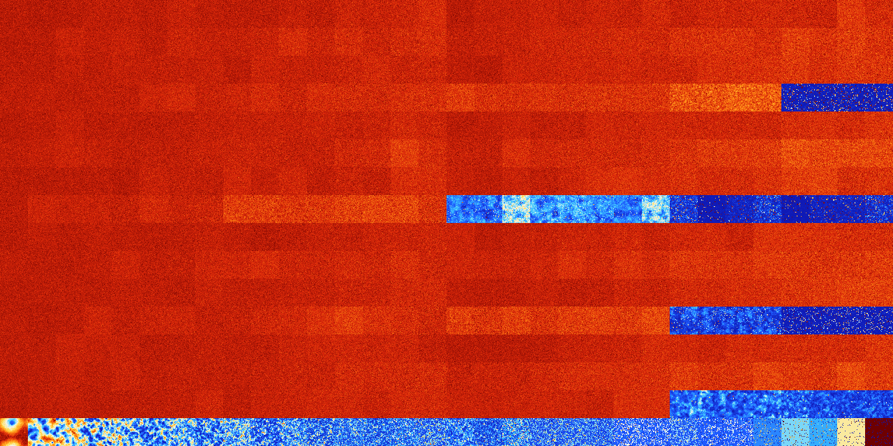

# B1367 (103424-103935)

<details>
    <summary>Initial Grid</summary>
    
</details>


<details>
    <summary>Initial Grid RLE</summary>

```
#C Exported from GoGoL (https://github.com/marrow16/gogol)
#C Wrap mode: Toroidal
#C Boundary mode: Dead
#C Step: 0
x = 100, y = 100, rule = B1367/S
13b2o13bo41bo27bo$13bo3bo22bo5bo38bo11bo$4bo32bo5bo4bo8bobo$5bo2bo12bo
7bo23bo36b2o$9bo29bo9bo14bo$7bo9bo23bo22bo$41bo14bo4bo7bo5b2o6bo$2bobo
6bo4bo7bo9bo15b2o9bo17bo6bo8bo3bo$o11bo12bo48bo19bo$10bo9bo27bo23bo14bo
3bo5bo$22bo15bo13bo6bo2bo9bo24bo$33bo26bo7bo6b2o2bo$28bo42bo$4bo11bo3bo
25bo2bobo14bo14bo6bo7bo$64bo11bo13bo4bo$6bo25bo4bo25bo16bo2bo2bo$25bo
13bo18bo4bo4bo4bo17bo$2bo39bo11bo$10bo9b2o25bo3bo12bo19bo$8bo12bo4bo28b
o25bo$14bo6bo16bo14bo33bo2bo$27bo16bo16bo7bo5bobo6bo$14bo52bo4bo$52bo4b
o20b2o$24bo21bo12bo34bo4bo$2bo8bo25bo$18bo6bo12bo6b2o30bo19bo$3bo23bo7b
o21bo10bo20bo$5bo43bo20bo11bo$4bo12bo80bo$11b2o21bo8bo23bo8bobo$25bo3bo
61bo5bo$13bobo52bo20bo4bo$11b2o17bo34bo$7bo17bo64bo$28bo$bo11bo26bo4bo
13bo25bo$7bo75bo6bo$b2o32bo18bo$18bo40bo2bo2bo30bo$21bo7bo23bo40bobo$
67bo2b2o$5bo6bo9bo20bo$56bo$15bo76bo$28bo4bo40bo$17bo10bo31bo37bo$49bo
13bo23bo$2bo2bo24bo4bo3b2o8bo43bo$12bobo6bo$40bo$o16bo8bo12b2o12bo6bo6b
o11bo$8bo36bo6bo22bo16bo$6bo12bo25b2o11bo13bo9bo11bo2bo$5bo35bo11bo4bo
11bo4bo2bo3bo$22bo9bobo8bo10bo11bo10bo8bo$6bo2bo55bo$o15bo2bo38bo3bo14b
o$13bo6bo8bo10bo41bo$31bo20bo2bo24bo6bobo$26bo19bo48bo$27bo46bo$6bo2bo
21bo23bo23bo14bo$4bo14bo8bo16bo2bo11bo20bo$28bo23bo22bo10bo3bo$o5bo4bo
28bo14bo24bo$46bo45b2obo$42b2o22bo$23bo4bo4bo12bo3bo12bo15bo12bo$10bo
15bo6bo3bo27bo16bo11bo4bo$4bo59bo27bo$9bo13bo6bo2bo8bo2bo42bo$28bo40bo$
77bo$48bobo10bo8bo13bo$7bo20bo14bo7bo31bo$7bo2bo32bo14bo9bo26bo$bo24b2o
7bo42bo3bo7bo$2bo48bo$4bo5bo34bo17bo22b2o7bo$4bo6bo3bo3bo24bo41bo$3bo
13bo7bobo29bo23bo9bo$5bo16bo10bo5bo$38bo23bo$10bo15bo56bo$13bo2bo45bo$
25bo61bo3bo$14bo15bo53bo$15bo11bo11bo9bo23bo5bo14bo$3bo6bo6bo24bo47bo$
4bo19bobo39bo4bo4bo$15bo72bo$bo19bo9bo13bo$7bo11bo4bo5bo4bo9bo31bobo$7b
o8bo11bo40bo11bo2bo$bo13bo40bo4bo$24bo7bo64bo$bo11bo5bobo14bo14bo9bo6bo
$9bo11bobo15bo8bo8b2o11bo14bobo3bo6b2o$15bo4bo29bo5b2o11bo2bo4bo8bo!
```
</details>
<details>
    <summary>Thumbnail</summary>

</details>
<table>
<tr>
    <td><a href="./103424%20S%20Heat%20Map%20Activity.png"></a><br>S (103424)<br>G>1000</td>    <td><a href="./103425%20S0%20Heat%20Map%20Activity.png"></a><br>S0 (103425)<br>G>1000</td>    <td><a href="./103426%20S1%20Heat%20Map%20Activity.png"></a><br>S1 (103426)<br>G>1000</td>    <td><a href="./103427%20S01%20Heat%20Map%20Activity.png"></a><br>S01 (103427)<br>G>1000</td>    <td><a href="./103428%20S2%20Heat%20Map%20Activity.png"></a><br>S2 (103428)<br>G>1000</td>    <td><a href="./103429%20S02%20Heat%20Map%20Activity.png"></a><br>S02 (103429)<br>G>1000</td>    <td><a href="./103430%20S12%20Heat%20Map%20Activity.png"></a><br>S12 (103430)<br>G>1000</td>    <td><a href="./103431%20S012%20Heat%20Map%20Activity.png"></a><br>S012 (103431)<br>G>1000</td>    <td><a href="./103432%20S3%20Heat%20Map%20Activity.png"></a><br>S3 (103432)<br>G>1000</td>    <td><a href="./103433%20S03%20Heat%20Map%20Activity.png"></a><br>S03 (103433)<br>G>1000</td>    <td><a href="./103434%20S13%20Heat%20Map%20Activity.png"></a><br>S13 (103434)<br>G>1000</td>    <td><a href="./103435%20S013%20Heat%20Map%20Activity.png"></a><br>S013 (103435)<br>G>1000</td>    <td><a href="./103436%20S23%20Heat%20Map%20Activity.png"></a><br>S23 (103436)<br>G>1000</td>    <td><a href="./103437%20S023%20Heat%20Map%20Activity.png"></a><br>S023 (103437)<br>G>1000</td>    <td><a href="./103438%20S123%20Heat%20Map%20Activity.png"></a><br>S123 (103438)<br>G>1000</td>    <td><a href="./103439%20S0123%20Heat%20Map%20Activity.png"></a><br>S0123 (103439)<br>G>1000</td>    <td><a href="./103440%20S4%20Heat%20Map%20Activity.png"></a><br>S4 (103440)<br>G>1000</td>    <td><a href="./103441%20S04%20Heat%20Map%20Activity.png"></a><br>S04 (103441)<br>G>1000</td>    <td><a href="./103442%20S14%20Heat%20Map%20Activity.png"></a><br>S14 (103442)<br>G>1000</td>    <td><a href="./103443%20S014%20Heat%20Map%20Activity.png"></a><br>S014 (103443)<br>G>1000</td>    <td><a href="./103444%20S24%20Heat%20Map%20Activity.png"></a><br>S24 (103444)<br>G>1000</td>    <td><a href="./103445%20S024%20Heat%20Map%20Activity.png"></a><br>S024 (103445)<br>G>1000</td>    <td><a href="./103446%20S124%20Heat%20Map%20Activity.png"></a><br>S124 (103446)<br>G>1000</td>    <td><a href="./103447%20S0124%20Heat%20Map%20Activity.png"></a><br>S0124 (103447)<br>G>1000</td>    <td><a href="./103448%20S34%20Heat%20Map%20Activity.png"></a><br>S34 (103448)<br>G>1000</td>    <td><a href="./103449%20S034%20Heat%20Map%20Activity.png"></a><br>S034 (103449)<br>G>1000</td>    <td><a href="./103450%20S134%20Heat%20Map%20Activity.png"></a><br>S134 (103450)<br>G>1000</td>    <td><a href="./103451%20S0134%20Heat%20Map%20Activity.png"></a><br>S0134 (103451)<br>G>1000</td>    <td><a href="./103452%20S234%20Heat%20Map%20Activity.png"></a><br>S234 (103452)<br>G>1000</td>    <td><a href="./103453%20S0234%20Heat%20Map%20Activity.png"></a><br>S0234 (103453)<br>G>1000</td>    <td><a href="./103454%20S1234%20Heat%20Map%20Activity.png"></a><br>S1234 (103454)<br>G>1000</td>    <td><a href="./103455%20S01234%20Heat%20Map%20Activity.png"></a><br>S01234 (103455)<br>G>1000</td></tr>
<tr>
    <td><a href="./103456%20S5%20Heat%20Map%20Activity.png"></a><br>S5 (103456)<br>G>1000</td>    <td><a href="./103457%20S05%20Heat%20Map%20Activity.png"></a><br>S05 (103457)<br>G>1000</td>    <td><a href="./103458%20S15%20Heat%20Map%20Activity.png"></a><br>S15 (103458)<br>G>1000</td>    <td><a href="./103459%20S015%20Heat%20Map%20Activity.png"></a><br>S015 (103459)<br>G>1000</td>    <td><a href="./103460%20S25%20Heat%20Map%20Activity.png"></a><br>S25 (103460)<br>G>1000</td>    <td><a href="./103461%20S025%20Heat%20Map%20Activity.png"></a><br>S025 (103461)<br>G>1000</td>    <td><a href="./103462%20S125%20Heat%20Map%20Activity.png"></a><br>S125 (103462)<br>G>1000</td>    <td><a href="./103463%20S0125%20Heat%20Map%20Activity.png"></a><br>S0125 (103463)<br>G>1000</td>    <td><a href="./103464%20S35%20Heat%20Map%20Activity.png"></a><br>S35 (103464)<br>G>1000</td>    <td><a href="./103465%20S035%20Heat%20Map%20Activity.png"></a><br>S035 (103465)<br>G>1000</td>    <td><a href="./103466%20S135%20Heat%20Map%20Activity.png"></a><br>S135 (103466)<br>G>1000</td>    <td><a href="./103467%20S0135%20Heat%20Map%20Activity.png"></a><br>S0135 (103467)<br>G>1000</td>    <td><a href="./103468%20S235%20Heat%20Map%20Activity.png"></a><br>S235 (103468)<br>G>1000</td>    <td><a href="./103469%20S0235%20Heat%20Map%20Activity.png"></a><br>S0235 (103469)<br>G>1000</td>    <td><a href="./103470%20S1235%20Heat%20Map%20Activity.png"></a><br>S1235 (103470)<br>G>1000</td>    <td><a href="./103471%20S01235%20Heat%20Map%20Activity.png"></a><br>S01235 (103471)<br>G>1000</td>    <td><a href="./103472%20S45%20Heat%20Map%20Activity.png"></a><br>S45 (103472)<br>G>1000</td>    <td><a href="./103473%20S045%20Heat%20Map%20Activity.png"></a><br>S045 (103473)<br>G>1000</td>    <td><a href="./103474%20S145%20Heat%20Map%20Activity.png"></a><br>S145 (103474)<br>G>1000</td>    <td><a href="./103475%20S0145%20Heat%20Map%20Activity.png"></a><br>S0145 (103475)<br>G>1000</td>    <td><a href="./103476%20S245%20Heat%20Map%20Activity.png"></a><br>S245 (103476)<br>G>1000</td>    <td><a href="./103477%20S0245%20Heat%20Map%20Activity.png"></a><br>S0245 (103477)<br>G>1000</td>    <td><a href="./103478%20S1245%20Heat%20Map%20Activity.png"></a><br>S1245 (103478)<br>G>1000</td>    <td><a href="./103479%20S01245%20Heat%20Map%20Activity.png"></a><br>S01245 (103479)<br>G>1000</td>    <td><a href="./103480%20S345%20Heat%20Map%20Activity.png"></a><br>S345 (103480)<br>G>1000</td>    <td><a href="./103481%20S0345%20Heat%20Map%20Activity.png"></a><br>S0345 (103481)<br>G>1000</td>    <td><a href="./103482%20S1345%20Heat%20Map%20Activity.png"></a><br>S1345 (103482)<br>G>1000</td>    <td><a href="./103483%20S01345%20Heat%20Map%20Activity.png"></a><br>S01345 (103483)<br>G>1000</td>    <td><a href="./103484%20S2345%20Heat%20Map%20Activity.png"></a><br>S2345 (103484)<br>G>1000</td>    <td><a href="./103485%20S02345%20Heat%20Map%20Activity.png"></a><br>S02345 (103485)<br>G>1000</td>    <td><a href="./103486%20S12345%20Heat%20Map%20Activity.png"></a><br>S12345 (103486)<br>G>1000</td>    <td><a href="./103487%20S012345%20Heat%20Map%20Activity.png"></a><br>S012345 (103487)<br>G>1000</td></tr>
<tr>
    <td><a href="./103488%20S6%20Heat%20Map%20Activity.png"></a><br>S6 (103488)<br>G>1000</td>    <td><a href="./103489%20S06%20Heat%20Map%20Activity.png"></a><br>S06 (103489)<br>G>1000</td>    <td><a href="./103490%20S16%20Heat%20Map%20Activity.png"></a><br>S16 (103490)<br>G>1000</td>    <td><a href="./103491%20S016%20Heat%20Map%20Activity.png"></a><br>S016 (103491)<br>G>1000</td>    <td><a href="./103492%20S26%20Heat%20Map%20Activity.png"></a><br>S26 (103492)<br>G>1000</td>    <td><a href="./103493%20S026%20Heat%20Map%20Activity.png"></a><br>S026 (103493)<br>G>1000</td>    <td><a href="./103494%20S126%20Heat%20Map%20Activity.png"></a><br>S126 (103494)<br>G>1000</td>    <td><a href="./103495%20S0126%20Heat%20Map%20Activity.png"></a><br>S0126 (103495)<br>G>1000</td>    <td><a href="./103496%20S36%20Heat%20Map%20Activity.png"></a><br>S36 (103496)<br>G>1000</td>    <td><a href="./103497%20S036%20Heat%20Map%20Activity.png"></a><br>S036 (103497)<br>G>1000</td>    <td><a href="./103498%20S136%20Heat%20Map%20Activity.png"></a><br>S136 (103498)<br>G>1000</td>    <td><a href="./103499%20S0136%20Heat%20Map%20Activity.png"></a><br>S0136 (103499)<br>G>1000</td>    <td><a href="./103500%20S236%20Heat%20Map%20Activity.png"></a><br>S236 (103500)<br>G>1000</td>    <td><a href="./103501%20S0236%20Heat%20Map%20Activity.png"></a><br>S0236 (103501)<br>G>1000</td>    <td><a href="./103502%20S1236%20Heat%20Map%20Activity.png"></a><br>S1236 (103502)<br>G>1000</td>    <td><a href="./103503%20S01236%20Heat%20Map%20Activity.png"></a><br>S01236 (103503)<br>G>1000</td>    <td><a href="./103504%20S46%20Heat%20Map%20Activity.png"></a><br>S46 (103504)<br>G>1000</td>    <td><a href="./103505%20S046%20Heat%20Map%20Activity.png"></a><br>S046 (103505)<br>G>1000</td>    <td><a href="./103506%20S146%20Heat%20Map%20Activity.png"></a><br>S146 (103506)<br>G>1000</td>    <td><a href="./103507%20S0146%20Heat%20Map%20Activity.png"></a><br>S0146 (103507)<br>G>1000</td>    <td><a href="./103508%20S246%20Heat%20Map%20Activity.png"></a><br>S246 (103508)<br>G>1000</td>    <td><a href="./103509%20S0246%20Heat%20Map%20Activity.png"></a><br>S0246 (103509)<br>G>1000</td>    <td><a href="./103510%20S1246%20Heat%20Map%20Activity.png"></a><br>S1246 (103510)<br>G>1000</td>    <td><a href="./103511%20S01246%20Heat%20Map%20Activity.png"></a><br>S01246 (103511)<br>G>1000</td>    <td><a href="./103512%20S346%20Heat%20Map%20Activity.png"></a><br>S346 (103512)<br>G>1000</td>    <td><a href="./103513%20S0346%20Heat%20Map%20Activity.png"></a><br>S0346 (103513)<br>G>1000</td>    <td><a href="./103514%20S1346%20Heat%20Map%20Activity.png"></a><br>S1346 (103514)<br>G>1000</td>    <td><a href="./103515%20S01346%20Heat%20Map%20Activity.png"></a><br>S01346 (103515)<br>G>1000</td>    <td><a href="./103516%20S2346%20Heat%20Map%20Activity.png"></a><br>S2346 (103516)<br>G>1000</td>    <td><a href="./103517%20S02346%20Heat%20Map%20Activity.png"></a><br>S02346 (103517)<br>G>1000</td>    <td><a href="./103518%20S12346%20Heat%20Map%20Activity.png"></a><br>S12346 (103518)<br>G>1000</td>    <td><a href="./103519%20S012346%20Heat%20Map%20Activity.png"></a><br>S012346 (103519)<br>G>1000</td></tr>
<tr>
    <td><a href="./103520%20S56%20Heat%20Map%20Activity.png"></a><br>S56 (103520)<br>G>1000</td>    <td><a href="./103521%20S056%20Heat%20Map%20Activity.png"></a><br>S056 (103521)<br>G>1000</td>    <td><a href="./103522%20S156%20Heat%20Map%20Activity.png"></a><br>S156 (103522)<br>G>1000</td>    <td><a href="./103523%20S0156%20Heat%20Map%20Activity.png"></a><br>S0156 (103523)<br>G>1000</td>    <td><a href="./103524%20S256%20Heat%20Map%20Activity.png"></a><br>S256 (103524)<br>G>1000</td>    <td><a href="./103525%20S0256%20Heat%20Map%20Activity.png"></a><br>S0256 (103525)<br>G>1000</td>    <td><a href="./103526%20S1256%20Heat%20Map%20Activity.png"></a><br>S1256 (103526)<br>G>1000</td>    <td><a href="./103527%20S01256%20Heat%20Map%20Activity.png"></a><br>S01256 (103527)<br>G>1000</td>    <td><a href="./103528%20S356%20Heat%20Map%20Activity.png"></a><br>S356 (103528)<br>G>1000</td>    <td><a href="./103529%20S0356%20Heat%20Map%20Activity.png"></a><br>S0356 (103529)<br>G>1000</td>    <td><a href="./103530%20S1356%20Heat%20Map%20Activity.png"></a><br>S1356 (103530)<br>G>1000</td>    <td><a href="./103531%20S01356%20Heat%20Map%20Activity.png"></a><br>S01356 (103531)<br>G>1000</td>    <td><a href="./103532%20S2356%20Heat%20Map%20Activity.png"></a><br>S2356 (103532)<br>G>1000</td>    <td><a href="./103533%20S02356%20Heat%20Map%20Activity.png"></a><br>S02356 (103533)<br>G>1000</td>    <td><a href="./103534%20S12356%20Heat%20Map%20Activity.png"></a><br>S12356 (103534)<br>G>1000</td>    <td><a href="./103535%20S012356%20Heat%20Map%20Activity.png"></a><br>S012356 (103535)<br>G>1000</td>    <td><a href="./103536%20S456%20Heat%20Map%20Activity.png"></a><br>S456 (103536)<br>G>1000</td>    <td><a href="./103537%20S0456%20Heat%20Map%20Activity.png"></a><br>S0456 (103537)<br>G>1000</td>    <td><a href="./103538%20S1456%20Heat%20Map%20Activity.png"></a><br>S1456 (103538)<br>G>1000</td>    <td><a href="./103539%20S01456%20Heat%20Map%20Activity.png"></a><br>S01456 (103539)<br>G>1000</td>    <td><a href="./103540%20S2456%20Heat%20Map%20Activity.png"></a><br>S2456 (103540)<br>G>1000</td>    <td><a href="./103541%20S02456%20Heat%20Map%20Activity.png"></a><br>S02456 (103541)<br>G>1000</td>    <td><a href="./103542%20S12456%20Heat%20Map%20Activity.png"></a><br>S12456 (103542)<br>G>1000</td>    <td><a href="./103543%20S012456%20Heat%20Map%20Activity.png"></a><br>S012456 (103543)<br>G>1000</td>    <td><a href="./103544%20S3456%20Heat%20Map%20Activity.png"></a><br>S3456 (103544)<br>G>1000</td>    <td><a href="./103545%20S03456%20Heat%20Map%20Activity.png"></a><br>S03456 (103545)<br>G>1000</td>    <td><a href="./103546%20S13456%20Heat%20Map%20Activity.png"></a><br>S13456 (103546)<br>G>1000</td>    <td><a href="./103547%20S013456%20Heat%20Map%20Activity.png"></a><br>S013456 (103547)<br>G>1000</td>    <td><a href="./103548%20S23456%20Heat%20Map%20Activity.png"></a><br>S23456 (103548)<br>G>1000</td>    <td><a href="./103549%20S023456%20Heat%20Map%20Activity.png"></a><br>S023456 (103549)<br>G>1000</td>    <td><a href="./103550%20S123456%20Heat%20Map%20Activity.png"></a><br>S123456 (103550)<br>G>1000</td>    <td><a href="./103551%20S0123456%20Heat%20Map%20Activity.png"></a><br>S0123456 (103551)<br>G>1000</td></tr>
<tr>
    <td><a href="./103552%20S7%20Heat%20Map%20Activity.png"></a><br>S7 (103552)<br>G>1000</td>    <td><a href="./103553%20S07%20Heat%20Map%20Activity.png"></a><br>S07 (103553)<br>G>1000</td>    <td><a href="./103554%20S17%20Heat%20Map%20Activity.png"></a><br>S17 (103554)<br>G>1000</td>    <td><a href="./103555%20S017%20Heat%20Map%20Activity.png"></a><br>S017 (103555)<br>G>1000</td>    <td><a href="./103556%20S27%20Heat%20Map%20Activity.png"></a><br>S27 (103556)<br>G>1000</td>    <td><a href="./103557%20S027%20Heat%20Map%20Activity.png"></a><br>S027 (103557)<br>G>1000</td>    <td><a href="./103558%20S127%20Heat%20Map%20Activity.png"></a><br>S127 (103558)<br>G>1000</td>    <td><a href="./103559%20S0127%20Heat%20Map%20Activity.png"></a><br>S0127 (103559)<br>G>1000</td>    <td><a href="./103560%20S37%20Heat%20Map%20Activity.png"></a><br>S37 (103560)<br>G>1000</td>    <td><a href="./103561%20S037%20Heat%20Map%20Activity.png"></a><br>S037 (103561)<br>G>1000</td>    <td><a href="./103562%20S137%20Heat%20Map%20Activity.png"></a><br>S137 (103562)<br>G>1000</td>    <td><a href="./103563%20S0137%20Heat%20Map%20Activity.png"></a><br>S0137 (103563)<br>G>1000</td>    <td><a href="./103564%20S237%20Heat%20Map%20Activity.png"></a><br>S237 (103564)<br>G>1000</td>    <td><a href="./103565%20S0237%20Heat%20Map%20Activity.png"></a><br>S0237 (103565)<br>G>1000</td>    <td><a href="./103566%20S1237%20Heat%20Map%20Activity.png"></a><br>S1237 (103566)<br>G>1000</td>    <td><a href="./103567%20S01237%20Heat%20Map%20Activity.png"></a><br>S01237 (103567)<br>G>1000</td>    <td><a href="./103568%20S47%20Heat%20Map%20Activity.png"></a><br>S47 (103568)<br>G>1000</td>    <td><a href="./103569%20S047%20Heat%20Map%20Activity.png"></a><br>S047 (103569)<br>G>1000</td>    <td><a href="./103570%20S147%20Heat%20Map%20Activity.png"></a><br>S147 (103570)<br>G>1000</td>    <td><a href="./103571%20S0147%20Heat%20Map%20Activity.png"></a><br>S0147 (103571)<br>G>1000</td>    <td><a href="./103572%20S247%20Heat%20Map%20Activity.png"></a><br>S247 (103572)<br>G>1000</td>    <td><a href="./103573%20S0247%20Heat%20Map%20Activity.png"></a><br>S0247 (103573)<br>G>1000</td>    <td><a href="./103574%20S1247%20Heat%20Map%20Activity.png"></a><br>S1247 (103574)<br>G>1000</td>    <td><a href="./103575%20S01247%20Heat%20Map%20Activity.png"></a><br>S01247 (103575)<br>G>1000</td>    <td><a href="./103576%20S347%20Heat%20Map%20Activity.png"></a><br>S347 (103576)<br>G>1000</td>    <td><a href="./103577%20S0347%20Heat%20Map%20Activity.png"></a><br>S0347 (103577)<br>G>1000</td>    <td><a href="./103578%20S1347%20Heat%20Map%20Activity.png"></a><br>S1347 (103578)<br>G>1000</td>    <td><a href="./103579%20S01347%20Heat%20Map%20Activity.png"></a><br>S01347 (103579)<br>G>1000</td>    <td><a href="./103580%20S2347%20Heat%20Map%20Activity.png"></a><br>S2347 (103580)<br>G>1000</td>    <td><a href="./103581%20S02347%20Heat%20Map%20Activity.png"></a><br>S02347 (103581)<br>G>1000</td>    <td><a href="./103582%20S12347%20Heat%20Map%20Activity.png"></a><br>S12347 (103582)<br>G>1000</td>    <td><a href="./103583%20S012347%20Heat%20Map%20Activity.png"></a><br>S012347 (103583)<br>G>1000</td></tr>
<tr>
    <td><a href="./103584%20S57%20Heat%20Map%20Activity.png"></a><br>S57 (103584)<br>G>1000</td>    <td><a href="./103585%20S057%20Heat%20Map%20Activity.png"></a><br>S057 (103585)<br>G>1000</td>    <td><a href="./103586%20S157%20Heat%20Map%20Activity.png"></a><br>S157 (103586)<br>G>1000</td>    <td><a href="./103587%20S0157%20Heat%20Map%20Activity.png"></a><br>S0157 (103587)<br>G>1000</td>    <td><a href="./103588%20S257%20Heat%20Map%20Activity.png"></a><br>S257 (103588)<br>G>1000</td>    <td><a href="./103589%20S0257%20Heat%20Map%20Activity.png"></a><br>S0257 (103589)<br>G>1000</td>    <td><a href="./103590%20S1257%20Heat%20Map%20Activity.png"></a><br>S1257 (103590)<br>G>1000</td>    <td><a href="./103591%20S01257%20Heat%20Map%20Activity.png"></a><br>S01257 (103591)<br>G>1000</td>    <td><a href="./103592%20S357%20Heat%20Map%20Activity.png"></a><br>S357 (103592)<br>G>1000</td>    <td><a href="./103593%20S0357%20Heat%20Map%20Activity.png"></a><br>S0357 (103593)<br>G>1000</td>    <td><a href="./103594%20S1357%20Heat%20Map%20Activity.png"></a><br>S1357 (103594)<br>G>1000</td>    <td><a href="./103595%20S01357%20Heat%20Map%20Activity.png"></a><br>S01357 (103595)<br>G>1000</td>    <td><a href="./103596%20S2357%20Heat%20Map%20Activity.png"></a><br>S2357 (103596)<br>G>1000</td>    <td><a href="./103597%20S02357%20Heat%20Map%20Activity.png"></a><br>S02357 (103597)<br>G>1000</td>    <td><a href="./103598%20S12357%20Heat%20Map%20Activity.png"></a><br>S12357 (103598)<br>G>1000</td>    <td><a href="./103599%20S012357%20Heat%20Map%20Activity.png"></a><br>S012357 (103599)<br>G>1000</td>    <td><a href="./103600%20S457%20Heat%20Map%20Activity.png"></a><br>S457 (103600)<br>G>1000</td>    <td><a href="./103601%20S0457%20Heat%20Map%20Activity.png"></a><br>S0457 (103601)<br>G>1000</td>    <td><a href="./103602%20S1457%20Heat%20Map%20Activity.png"></a><br>S1457 (103602)<br>G>1000</td>    <td><a href="./103603%20S01457%20Heat%20Map%20Activity.png"></a><br>S01457 (103603)<br>G>1000</td>    <td><a href="./103604%20S2457%20Heat%20Map%20Activity.png"></a><br>S2457 (103604)<br>G>1000</td>    <td><a href="./103605%20S02457%20Heat%20Map%20Activity.png"></a><br>S02457 (103605)<br>G>1000</td>    <td><a href="./103606%20S12457%20Heat%20Map%20Activity.png"></a><br>S12457 (103606)<br>G>1000</td>    <td><a href="./103607%20S012457%20Heat%20Map%20Activity.png"></a><br>S012457 (103607)<br>G>1000</td>    <td><a href="./103608%20S3457%20Heat%20Map%20Activity.png"></a><br>S3457 (103608)<br>G>1000</td>    <td><a href="./103609%20S03457%20Heat%20Map%20Activity.png"></a><br>S03457 (103609)<br>G>1000</td>    <td><a href="./103610%20S13457%20Heat%20Map%20Activity.png"></a><br>S13457 (103610)<br>G>1000</td>    <td><a href="./103611%20S013457%20Heat%20Map%20Activity.png"></a><br>S013457 (103611)<br>G>1000</td>    <td><a href="./103612%20S23457%20Heat%20Map%20Activity.png"></a><br>S23457 (103612)<br>G>1000</td>    <td><a href="./103613%20S023457%20Heat%20Map%20Activity.png"></a><br>S023457 (103613)<br>G>1000</td>    <td><a href="./103614%20S123457%20Heat%20Map%20Activity.png"></a><br>S123457 (103614)<br>G>1000</td>    <td><a href="./103615%20S0123457%20Heat%20Map%20Activity.png"></a><br>S0123457 (103615)<br>G>1000</td></tr>
<tr>
    <td><a href="./103616%20S67%20Heat%20Map%20Activity.png"></a><br>S67 (103616)<br>G>1000</td>    <td><a href="./103617%20S067%20Heat%20Map%20Activity.png"></a><br>S067 (103617)<br>G>1000</td>    <td><a href="./103618%20S167%20Heat%20Map%20Activity.png"></a><br>S167 (103618)<br>G>1000</td>    <td><a href="./103619%20S0167%20Heat%20Map%20Activity.png"></a><br>S0167 (103619)<br>G>1000</td>    <td><a href="./103620%20S267%20Heat%20Map%20Activity.png"></a><br>S267 (103620)<br>G>1000</td>    <td><a href="./103621%20S0267%20Heat%20Map%20Activity.png"></a><br>S0267 (103621)<br>G>1000</td>    <td><a href="./103622%20S1267%20Heat%20Map%20Activity.png"></a><br>S1267 (103622)<br>G>1000</td>    <td><a href="./103623%20S01267%20Heat%20Map%20Activity.png"></a><br>S01267 (103623)<br>G>1000</td>    <td><a href="./103624%20S367%20Heat%20Map%20Activity.png"></a><br>S367 (103624)<br>G>1000</td>    <td><a href="./103625%20S0367%20Heat%20Map%20Activity.png"></a><br>S0367 (103625)<br>G>1000</td>    <td><a href="./103626%20S1367%20Heat%20Map%20Activity.png"></a><br>S1367 (103626)<br>G>1000</td>    <td><a href="./103627%20S01367%20Heat%20Map%20Activity.png"></a><br>S01367 (103627)<br>G>1000</td>    <td><a href="./103628%20S2367%20Heat%20Map%20Activity.png"></a><br>S2367 (103628)<br>G>1000</td>    <td><a href="./103629%20S02367%20Heat%20Map%20Activity.png"></a><br>S02367 (103629)<br>G>1000</td>    <td><a href="./103630%20S12367%20Heat%20Map%20Activity.png"></a><br>S12367 (103630)<br>G>1000</td>    <td><a href="./103631%20S012367%20Heat%20Map%20Activity.png"></a><br>S012367 (103631)<br>G>1000</td>    <td><a href="./103632%20S467%20Heat%20Map%20Activity.png"></a><br>S467 (103632)<br>G>1000</td>    <td><a href="./103633%20S0467%20Heat%20Map%20Activity.png"></a><br>S0467 (103633)<br>G>1000</td>    <td><a href="./103634%20S1467%20Heat%20Map%20Activity.png"></a><br>S1467 (103634)<br>G>1000</td>    <td><a href="./103635%20S01467%20Heat%20Map%20Activity.png"></a><br>S01467 (103635)<br>G>1000</td>    <td><a href="./103636%20S2467%20Heat%20Map%20Activity.png"></a><br>S2467 (103636)<br>G>1000</td>    <td><a href="./103637%20S02467%20Heat%20Map%20Activity.png"></a><br>S02467 (103637)<br>G>1000</td>    <td><a href="./103638%20S12467%20Heat%20Map%20Activity.png"></a><br>S12467 (103638)<br>G>1000</td>    <td><a href="./103639%20S012467%20Heat%20Map%20Activity.png"></a><br>S012467 (103639)<br>G>1000</td>    <td><a href="./103640%20S3467%20Heat%20Map%20Activity.png"></a><br>S3467 (103640)<br>G>1000</td>    <td><a href="./103641%20S03467%20Heat%20Map%20Activity.png"></a><br>S03467 (103641)<br>G>1000</td>    <td><a href="./103642%20S13467%20Heat%20Map%20Activity.png"></a><br>S13467 (103642)<br>G>1000</td>    <td><a href="./103643%20S013467%20Heat%20Map%20Activity.png"></a><br>S013467 (103643)<br>G>1000</td>    <td><a href="./103644%20S23467%20Heat%20Map%20Activity.png"></a><br>S23467 (103644)<br>G>1000</td>    <td><a href="./103645%20S023467%20Heat%20Map%20Activity.png"></a><br>S023467 (103645)<br>G>1000</td>    <td><a href="./103646%20S123467%20Heat%20Map%20Activity.png"></a><br>S123467 (103646)<br>G>1000</td>    <td><a href="./103647%20S0123467%20Heat%20Map%20Activity.png"></a><br>S0123467 (103647)<br>G>1000</td></tr>
<tr>
    <td><a href="./103648%20S567%20Heat%20Map%20Activity.png"></a><br>S567 (103648)<br>G>1000</td>    <td><a href="./103649%20S0567%20Heat%20Map%20Activity.png"></a><br>S0567 (103649)<br>G>1000</td>    <td><a href="./103650%20S1567%20Heat%20Map%20Activity.png"></a><br>S1567 (103650)<br>G>1000</td>    <td><a href="./103651%20S01567%20Heat%20Map%20Activity.png"></a><br>S01567 (103651)<br>G>1000</td>    <td><a href="./103652%20S2567%20Heat%20Map%20Activity.png"></a><br>S2567 (103652)<br>G>1000</td>    <td><a href="./103653%20S02567%20Heat%20Map%20Activity.png"></a><br>S02567 (103653)<br>G>1000</td>    <td><a href="./103654%20S12567%20Heat%20Map%20Activity.png"></a><br>S12567 (103654)<br>G>1000</td>    <td><a href="./103655%20S012567%20Heat%20Map%20Activity.png"></a><br>S012567 (103655)<br>G>1000</td>    <td><a href="./103656%20S3567%20Heat%20Map%20Activity.png"></a><br>S3567 (103656)<br>G>1000</td>    <td><a href="./103657%20S03567%20Heat%20Map%20Activity.png"></a><br>S03567 (103657)<br>G>1000</td>    <td><a href="./103658%20S13567%20Heat%20Map%20Activity.png"></a><br>S13567 (103658)<br>G>1000</td>    <td><a href="./103659%20S013567%20Heat%20Map%20Activity.png"></a><br>S013567 (103659)<br>G>1000</td>    <td><a href="./103660%20S23567%20Heat%20Map%20Activity.png"></a><br>S23567 (103660)<br>G>1000</td>    <td><a href="./103661%20S023567%20Heat%20Map%20Activity.png"></a><br>S023567 (103661)<br>G>1000</td>    <td><a href="./103662%20S123567%20Heat%20Map%20Activity.png"></a><br>S123567 (103662)<br>G>1000</td>    <td><a href="./103663%20S0123567%20Heat%20Map%20Activity.png"></a><br>S0123567 (103663)<br>G>1000</td>    <td><a href="./103664%20S4567%20Heat%20Map%20Activity.png"></a><br>S4567 (103664)<br>G>1000</td>    <td><a href="./103665%20S04567%20Heat%20Map%20Activity.png"></a><br>S04567 (103665)<br>G>1000</td>    <td><a href="./103666%20S14567%20Heat%20Map%20Activity.png"></a><br>S14567 (103666)<br>G>1000</td>    <td><a href="./103667%20S014567%20Heat%20Map%20Activity.png"></a><br>S014567 (103667)<br>G>1000</td>    <td><a href="./103668%20S24567%20Heat%20Map%20Activity.png"></a><br>S24567 (103668)<br>G>1000</td>    <td><a href="./103669%20S024567%20Heat%20Map%20Activity.png"></a><br>S024567 (103669)<br>G>1000</td>    <td><a href="./103670%20S124567%20Heat%20Map%20Activity.png"></a><br>S124567 (103670)<br>G>1000</td>    <td><a href="./103671%20S0124567%20Heat%20Map%20Activity.png"></a><br>S0124567 (103671)<br>G>1000</td>    <td><a href="./103672%20S34567%20Heat%20Map%20Activity.png"></a><br>S34567 (103672)<br>R@50,p12</td>    <td><a href="./103673%20S034567%20Heat%20Map%20Activity.png"></a><br>S034567 (103673)<br>R@458,p420</td>    <td><a href="./103674%20S134567%20Heat%20Map%20Activity.png"></a><br>S134567 (103674)<br>R@130,p84</td>    <td><a href="./103675%20S0134567%20Heat%20Map%20Activity.png"></a><br>S0134567 (103675)<br>R@48,p12</td>    <td><a href="./103676%20S234567%20Heat%20Map%20Activity.png"></a><br>S234567 (103676)<br>R@456,p420</td>    <td><a href="./103677%20S0234567%20Heat%20Map%20Activity.png"></a><br>S0234567 (103677)<br>R@107,p60</td>    <td><a href="./103678%20S1234567%20Heat%20Map%20Activity.png"></a><br>S1234567 (103678)<br>R@90,p60</td>    <td><a href="./103679%20S01234567%20Heat%20Map%20Activity.png"></a><br>S01234567 (103679)<br>R@45,p12</td></tr>
<tr>
    <td><a href="./103680%20S8%20Heat%20Map%20Activity.png"></a><br>S8 (103680)<br>G>1000</td>    <td><a href="./103681%20S08%20Heat%20Map%20Activity.png"></a><br>S08 (103681)<br>G>1000</td>    <td><a href="./103682%20S18%20Heat%20Map%20Activity.png"></a><br>S18 (103682)<br>G>1000</td>    <td><a href="./103683%20S018%20Heat%20Map%20Activity.png"></a><br>S018 (103683)<br>G>1000</td>    <td><a href="./103684%20S28%20Heat%20Map%20Activity.png"></a><br>S28 (103684)<br>G>1000</td>    <td><a href="./103685%20S028%20Heat%20Map%20Activity.png"></a><br>S028 (103685)<br>G>1000</td>    <td><a href="./103686%20S128%20Heat%20Map%20Activity.png"></a><br>S128 (103686)<br>G>1000</td>    <td><a href="./103687%20S0128%20Heat%20Map%20Activity.png"></a><br>S0128 (103687)<br>G>1000</td>    <td><a href="./103688%20S38%20Heat%20Map%20Activity.png"></a><br>S38 (103688)<br>G>1000</td>    <td><a href="./103689%20S038%20Heat%20Map%20Activity.png"></a><br>S038 (103689)<br>G>1000</td>    <td><a href="./103690%20S138%20Heat%20Map%20Activity.png"></a><br>S138 (103690)<br>G>1000</td>    <td><a href="./103691%20S0138%20Heat%20Map%20Activity.png"></a><br>S0138 (103691)<br>G>1000</td>    <td><a href="./103692%20S238%20Heat%20Map%20Activity.png"></a><br>S238 (103692)<br>G>1000</td>    <td><a href="./103693%20S0238%20Heat%20Map%20Activity.png"></a><br>S0238 (103693)<br>G>1000</td>    <td><a href="./103694%20S1238%20Heat%20Map%20Activity.png"></a><br>S1238 (103694)<br>G>1000</td>    <td><a href="./103695%20S01238%20Heat%20Map%20Activity.png"></a><br>S01238 (103695)<br>G>1000</td>    <td><a href="./103696%20S48%20Heat%20Map%20Activity.png"></a><br>S48 (103696)<br>G>1000</td>    <td><a href="./103697%20S048%20Heat%20Map%20Activity.png"></a><br>S048 (103697)<br>G>1000</td>    <td><a href="./103698%20S148%20Heat%20Map%20Activity.png"></a><br>S148 (103698)<br>G>1000</td>    <td><a href="./103699%20S0148%20Heat%20Map%20Activity.png"></a><br>S0148 (103699)<br>G>1000</td>    <td><a href="./103700%20S248%20Heat%20Map%20Activity.png"></a><br>S248 (103700)<br>G>1000</td>    <td><a href="./103701%20S0248%20Heat%20Map%20Activity.png"></a><br>S0248 (103701)<br>G>1000</td>    <td><a href="./103702%20S1248%20Heat%20Map%20Activity.png"></a><br>S1248 (103702)<br>G>1000</td>    <td><a href="./103703%20S01248%20Heat%20Map%20Activity.png"></a><br>S01248 (103703)<br>G>1000</td>    <td><a href="./103704%20S348%20Heat%20Map%20Activity.png"></a><br>S348 (103704)<br>G>1000</td>    <td><a href="./103705%20S0348%20Heat%20Map%20Activity.png"></a><br>S0348 (103705)<br>G>1000</td>    <td><a href="./103706%20S1348%20Heat%20Map%20Activity.png"></a><br>S1348 (103706)<br>G>1000</td>    <td><a href="./103707%20S01348%20Heat%20Map%20Activity.png"></a><br>S01348 (103707)<br>G>1000</td>    <td><a href="./103708%20S2348%20Heat%20Map%20Activity.png"></a><br>S2348 (103708)<br>G>1000</td>    <td><a href="./103709%20S02348%20Heat%20Map%20Activity.png"></a><br>S02348 (103709)<br>G>1000</td>    <td><a href="./103710%20S12348%20Heat%20Map%20Activity.png"></a><br>S12348 (103710)<br>G>1000</td>    <td><a href="./103711%20S012348%20Heat%20Map%20Activity.png"></a><br>S012348 (103711)<br>G>1000</td></tr>
<tr>
    <td><a href="./103712%20S58%20Heat%20Map%20Activity.png"></a><br>S58 (103712)<br>G>1000</td>    <td><a href="./103713%20S058%20Heat%20Map%20Activity.png"></a><br>S058 (103713)<br>G>1000</td>    <td><a href="./103714%20S158%20Heat%20Map%20Activity.png"></a><br>S158 (103714)<br>G>1000</td>    <td><a href="./103715%20S0158%20Heat%20Map%20Activity.png"></a><br>S0158 (103715)<br>G>1000</td>    <td><a href="./103716%20S258%20Heat%20Map%20Activity.png"></a><br>S258 (103716)<br>G>1000</td>    <td><a href="./103717%20S0258%20Heat%20Map%20Activity.png"></a><br>S0258 (103717)<br>G>1000</td>    <td><a href="./103718%20S1258%20Heat%20Map%20Activity.png"></a><br>S1258 (103718)<br>G>1000</td>    <td><a href="./103719%20S01258%20Heat%20Map%20Activity.png"></a><br>S01258 (103719)<br>G>1000</td>    <td><a href="./103720%20S358%20Heat%20Map%20Activity.png"></a><br>S358 (103720)<br>G>1000</td>    <td><a href="./103721%20S0358%20Heat%20Map%20Activity.png"></a><br>S0358 (103721)<br>G>1000</td>    <td><a href="./103722%20S1358%20Heat%20Map%20Activity.png"></a><br>S1358 (103722)<br>G>1000</td>    <td><a href="./103723%20S01358%20Heat%20Map%20Activity.png"></a><br>S01358 (103723)<br>G>1000</td>    <td><a href="./103724%20S2358%20Heat%20Map%20Activity.png"></a><br>S2358 (103724)<br>G>1000</td>    <td><a href="./103725%20S02358%20Heat%20Map%20Activity.png"></a><br>S02358 (103725)<br>G>1000</td>    <td><a href="./103726%20S12358%20Heat%20Map%20Activity.png"></a><br>S12358 (103726)<br>G>1000</td>    <td><a href="./103727%20S012358%20Heat%20Map%20Activity.png"></a><br>S012358 (103727)<br>G>1000</td>    <td><a href="./103728%20S458%20Heat%20Map%20Activity.png"></a><br>S458 (103728)<br>G>1000</td>    <td><a href="./103729%20S0458%20Heat%20Map%20Activity.png"></a><br>S0458 (103729)<br>G>1000</td>    <td><a href="./103730%20S1458%20Heat%20Map%20Activity.png"></a><br>S1458 (103730)<br>G>1000</td>    <td><a href="./103731%20S01458%20Heat%20Map%20Activity.png"></a><br>S01458 (103731)<br>G>1000</td>    <td><a href="./103732%20S2458%20Heat%20Map%20Activity.png"></a><br>S2458 (103732)<br>G>1000</td>    <td><a href="./103733%20S02458%20Heat%20Map%20Activity.png"></a><br>S02458 (103733)<br>G>1000</td>    <td><a href="./103734%20S12458%20Heat%20Map%20Activity.png"></a><br>S12458 (103734)<br>G>1000</td>    <td><a href="./103735%20S012458%20Heat%20Map%20Activity.png"></a><br>S012458 (103735)<br>G>1000</td>    <td><a href="./103736%20S3458%20Heat%20Map%20Activity.png"></a><br>S3458 (103736)<br>G>1000</td>    <td><a href="./103737%20S03458%20Heat%20Map%20Activity.png"></a><br>S03458 (103737)<br>G>1000</td>    <td><a href="./103738%20S13458%20Heat%20Map%20Activity.png"></a><br>S13458 (103738)<br>G>1000</td>    <td><a href="./103739%20S013458%20Heat%20Map%20Activity.png"></a><br>S013458 (103739)<br>G>1000</td>    <td><a href="./103740%20S23458%20Heat%20Map%20Activity.png"></a><br>S23458 (103740)<br>G>1000</td>    <td><a href="./103741%20S023458%20Heat%20Map%20Activity.png"></a><br>S023458 (103741)<br>G>1000</td>    <td><a href="./103742%20S123458%20Heat%20Map%20Activity.png"></a><br>S123458 (103742)<br>G>1000</td>    <td><a href="./103743%20S0123458%20Heat%20Map%20Activity.png"></a><br>S0123458 (103743)<br>G>1000</td></tr>
<tr>
    <td><a href="./103744%20S68%20Heat%20Map%20Activity.png"></a><br>S68 (103744)<br>G>1000</td>    <td><a href="./103745%20S068%20Heat%20Map%20Activity.png"></a><br>S068 (103745)<br>G>1000</td>    <td><a href="./103746%20S168%20Heat%20Map%20Activity.png"></a><br>S168 (103746)<br>G>1000</td>    <td><a href="./103747%20S0168%20Heat%20Map%20Activity.png"></a><br>S0168 (103747)<br>G>1000</td>    <td><a href="./103748%20S268%20Heat%20Map%20Activity.png"></a><br>S268 (103748)<br>G>1000</td>    <td><a href="./103749%20S0268%20Heat%20Map%20Activity.png"></a><br>S0268 (103749)<br>G>1000</td>    <td><a href="./103750%20S1268%20Heat%20Map%20Activity.png"></a><br>S1268 (103750)<br>G>1000</td>    <td><a href="./103751%20S01268%20Heat%20Map%20Activity.png"></a><br>S01268 (103751)<br>G>1000</td>    <td><a href="./103752%20S368%20Heat%20Map%20Activity.png"></a><br>S368 (103752)<br>G>1000</td>    <td><a href="./103753%20S0368%20Heat%20Map%20Activity.png"></a><br>S0368 (103753)<br>G>1000</td>    <td><a href="./103754%20S1368%20Heat%20Map%20Activity.png"></a><br>S1368 (103754)<br>G>1000</td>    <td><a href="./103755%20S01368%20Heat%20Map%20Activity.png"></a><br>S01368 (103755)<br>G>1000</td>    <td><a href="./103756%20S2368%20Heat%20Map%20Activity.png"></a><br>S2368 (103756)<br>G>1000</td>    <td><a href="./103757%20S02368%20Heat%20Map%20Activity.png"></a><br>S02368 (103757)<br>G>1000</td>    <td><a href="./103758%20S12368%20Heat%20Map%20Activity.png"></a><br>S12368 (103758)<br>G>1000</td>    <td><a href="./103759%20S012368%20Heat%20Map%20Activity.png"></a><br>S012368 (103759)<br>G>1000</td>    <td><a href="./103760%20S468%20Heat%20Map%20Activity.png"></a><br>S468 (103760)<br>G>1000</td>    <td><a href="./103761%20S0468%20Heat%20Map%20Activity.png"></a><br>S0468 (103761)<br>G>1000</td>    <td><a href="./103762%20S1468%20Heat%20Map%20Activity.png"></a><br>S1468 (103762)<br>G>1000</td>    <td><a href="./103763%20S01468%20Heat%20Map%20Activity.png"></a><br>S01468 (103763)<br>G>1000</td>    <td><a href="./103764%20S2468%20Heat%20Map%20Activity.png"></a><br>S2468 (103764)<br>G>1000</td>    <td><a href="./103765%20S02468%20Heat%20Map%20Activity.png"></a><br>S02468 (103765)<br>G>1000</td>    <td><a href="./103766%20S12468%20Heat%20Map%20Activity.png"></a><br>S12468 (103766)<br>G>1000</td>    <td><a href="./103767%20S012468%20Heat%20Map%20Activity.png"></a><br>S012468 (103767)<br>G>1000</td>    <td><a href="./103768%20S3468%20Heat%20Map%20Activity.png"></a><br>S3468 (103768)<br>G>1000</td>    <td><a href="./103769%20S03468%20Heat%20Map%20Activity.png"></a><br>S03468 (103769)<br>G>1000</td>    <td><a href="./103770%20S13468%20Heat%20Map%20Activity.png"></a><br>S13468 (103770)<br>G>1000</td>    <td><a href="./103771%20S013468%20Heat%20Map%20Activity.png"></a><br>S013468 (103771)<br>G>1000</td>    <td><a href="./103772%20S23468%20Heat%20Map%20Activity.png"></a><br>S23468 (103772)<br>G>1000</td>    <td><a href="./103773%20S023468%20Heat%20Map%20Activity.png"></a><br>S023468 (103773)<br>G>1000</td>    <td><a href="./103774%20S123468%20Heat%20Map%20Activity.png"></a><br>S123468 (103774)<br>G>1000</td>    <td><a href="./103775%20S0123468%20Heat%20Map%20Activity.png"></a><br>S0123468 (103775)<br>G>1000</td></tr>
<tr>
    <td><a href="./103776%20S568%20Heat%20Map%20Activity.png"></a><br>S568 (103776)<br>G>1000</td>    <td><a href="./103777%20S0568%20Heat%20Map%20Activity.png"></a><br>S0568 (103777)<br>G>1000</td>    <td><a href="./103778%20S1568%20Heat%20Map%20Activity.png"></a><br>S1568 (103778)<br>G>1000</td>    <td><a href="./103779%20S01568%20Heat%20Map%20Activity.png"></a><br>S01568 (103779)<br>G>1000</td>    <td><a href="./103780%20S2568%20Heat%20Map%20Activity.png"></a><br>S2568 (103780)<br>G>1000</td>    <td><a href="./103781%20S02568%20Heat%20Map%20Activity.png"></a><br>S02568 (103781)<br>G>1000</td>    <td><a href="./103782%20S12568%20Heat%20Map%20Activity.png"></a><br>S12568 (103782)<br>G>1000</td>    <td><a href="./103783%20S012568%20Heat%20Map%20Activity.png"></a><br>S012568 (103783)<br>G>1000</td>    <td><a href="./103784%20S3568%20Heat%20Map%20Activity.png"></a><br>S3568 (103784)<br>G>1000</td>    <td><a href="./103785%20S03568%20Heat%20Map%20Activity.png"></a><br>S03568 (103785)<br>G>1000</td>    <td><a href="./103786%20S13568%20Heat%20Map%20Activity.png"></a><br>S13568 (103786)<br>G>1000</td>    <td><a href="./103787%20S013568%20Heat%20Map%20Activity.png"></a><br>S013568 (103787)<br>G>1000</td>    <td><a href="./103788%20S23568%20Heat%20Map%20Activity.png"></a><br>S23568 (103788)<br>G>1000</td>    <td><a href="./103789%20S023568%20Heat%20Map%20Activity.png"></a><br>S023568 (103789)<br>G>1000</td>    <td><a href="./103790%20S123568%20Heat%20Map%20Activity.png"></a><br>S123568 (103790)<br>G>1000</td>    <td><a href="./103791%20S0123568%20Heat%20Map%20Activity.png"></a><br>S0123568 (103791)<br>G>1000</td>    <td><a href="./103792%20S4568%20Heat%20Map%20Activity.png"></a><br>S4568 (103792)<br>G>1000</td>    <td><a href="./103793%20S04568%20Heat%20Map%20Activity.png"></a><br>S04568 (103793)<br>G>1000</td>    <td><a href="./103794%20S14568%20Heat%20Map%20Activity.png"></a><br>S14568 (103794)<br>G>1000</td>    <td><a href="./103795%20S014568%20Heat%20Map%20Activity.png"></a><br>S014568 (103795)<br>G>1000</td>    <td><a href="./103796%20S24568%20Heat%20Map%20Activity.png"></a><br>S24568 (103796)<br>G>1000</td>    <td><a href="./103797%20S024568%20Heat%20Map%20Activity.png"></a><br>S024568 (103797)<br>G>1000</td>    <td><a href="./103798%20S124568%20Heat%20Map%20Activity.png"></a><br>S124568 (103798)<br>G>1000</td>    <td><a href="./103799%20S0124568%20Heat%20Map%20Activity.png"></a><br>S0124568 (103799)<br>G>1000</td>    <td><a href="./103800%20S34568%20Heat%20Map%20Activity.png"></a><br>S34568 (103800)<br>G>1000</td>    <td><a href="./103801%20S034568%20Heat%20Map%20Activity.png"></a><br>S034568 (103801)<br>G>1000</td>    <td><a href="./103802%20S134568%20Heat%20Map%20Activity.png"></a><br>S134568 (103802)<br>G>1000</td>    <td><a href="./103803%20S0134568%20Heat%20Map%20Activity.png"></a><br>S0134568 (103803)<br>G>1000</td>    <td><a href="./103804%20S234568%20Heat%20Map%20Activity.png"></a><br>S234568 (103804)<br>G>1000</td>    <td><a href="./103805%20S0234568%20Heat%20Map%20Activity.png"></a><br>S0234568 (103805)<br>G>1000</td>    <td><a href="./103806%20S1234568%20Heat%20Map%20Activity.png"></a><br>S1234568 (103806)<br>G>1000</td>    <td><a href="./103807%20S01234568%20Heat%20Map%20Activity.png"></a><br>S01234568 (103807)<br>G>1000</td></tr>
<tr>
    <td><a href="./103808%20S78%20Heat%20Map%20Activity.png"></a><br>S78 (103808)<br>G>1000</td>    <td><a href="./103809%20S078%20Heat%20Map%20Activity.png"></a><br>S078 (103809)<br>G>1000</td>    <td><a href="./103810%20S178%20Heat%20Map%20Activity.png"></a><br>S178 (103810)<br>G>1000</td>    <td><a href="./103811%20S0178%20Heat%20Map%20Activity.png"></a><br>S0178 (103811)<br>G>1000</td>    <td><a href="./103812%20S278%20Heat%20Map%20Activity.png"></a><br>S278 (103812)<br>G>1000</td>    <td><a href="./103813%20S0278%20Heat%20Map%20Activity.png"></a><br>S0278 (103813)<br>G>1000</td>    <td><a href="./103814%20S1278%20Heat%20Map%20Activity.png"></a><br>S1278 (103814)<br>G>1000</td>    <td><a href="./103815%20S01278%20Heat%20Map%20Activity.png"></a><br>S01278 (103815)<br>G>1000</td>    <td><a href="./103816%20S378%20Heat%20Map%20Activity.png"></a><br>S378 (103816)<br>G>1000</td>    <td><a href="./103817%20S0378%20Heat%20Map%20Activity.png"></a><br>S0378 (103817)<br>G>1000</td>    <td><a href="./103818%20S1378%20Heat%20Map%20Activity.png"></a><br>S1378 (103818)<br>G>1000</td>    <td><a href="./103819%20S01378%20Heat%20Map%20Activity.png"></a><br>S01378 (103819)<br>G>1000</td>    <td><a href="./103820%20S2378%20Heat%20Map%20Activity.png"></a><br>S2378 (103820)<br>G>1000</td>    <td><a href="./103821%20S02378%20Heat%20Map%20Activity.png"></a><br>S02378 (103821)<br>G>1000</td>    <td><a href="./103822%20S12378%20Heat%20Map%20Activity.png"></a><br>S12378 (103822)<br>G>1000</td>    <td><a href="./103823%20S012378%20Heat%20Map%20Activity.png"></a><br>S012378 (103823)<br>G>1000</td>    <td><a href="./103824%20S478%20Heat%20Map%20Activity.png"></a><br>S478 (103824)<br>G>1000</td>    <td><a href="./103825%20S0478%20Heat%20Map%20Activity.png"></a><br>S0478 (103825)<br>G>1000</td>    <td><a href="./103826%20S1478%20Heat%20Map%20Activity.png"></a><br>S1478 (103826)<br>G>1000</td>    <td><a href="./103827%20S01478%20Heat%20Map%20Activity.png"></a><br>S01478 (103827)<br>G>1000</td>    <td><a href="./103828%20S2478%20Heat%20Map%20Activity.png"></a><br>S2478 (103828)<br>G>1000</td>    <td><a href="./103829%20S02478%20Heat%20Map%20Activity.png"></a><br>S02478 (103829)<br>G>1000</td>    <td><a href="./103830%20S12478%20Heat%20Map%20Activity.png"></a><br>S12478 (103830)<br>G>1000</td>    <td><a href="./103831%20S012478%20Heat%20Map%20Activity.png"></a><br>S012478 (103831)<br>G>1000</td>    <td><a href="./103832%20S3478%20Heat%20Map%20Activity.png"></a><br>S3478 (103832)<br>G>1000</td>    <td><a href="./103833%20S03478%20Heat%20Map%20Activity.png"></a><br>S03478 (103833)<br>G>1000</td>    <td><a href="./103834%20S13478%20Heat%20Map%20Activity.png"></a><br>S13478 (103834)<br>G>1000</td>    <td><a href="./103835%20S013478%20Heat%20Map%20Activity.png"></a><br>S013478 (103835)<br>G>1000</td>    <td><a href="./103836%20S23478%20Heat%20Map%20Activity.png"></a><br>S23478 (103836)<br>G>1000</td>    <td><a href="./103837%20S023478%20Heat%20Map%20Activity.png"></a><br>S023478 (103837)<br>G>1000</td>    <td><a href="./103838%20S123478%20Heat%20Map%20Activity.png"></a><br>S123478 (103838)<br>G>1000</td>    <td><a href="./103839%20S0123478%20Heat%20Map%20Activity.png"></a><br>S0123478 (103839)<br>G>1000</td></tr>
<tr>
    <td><a href="./103840%20S578%20Heat%20Map%20Activity.png"></a><br>S578 (103840)<br>G>1000</td>    <td><a href="./103841%20S0578%20Heat%20Map%20Activity.png"></a><br>S0578 (103841)<br>G>1000</td>    <td><a href="./103842%20S1578%20Heat%20Map%20Activity.png"></a><br>S1578 (103842)<br>G>1000</td>    <td><a href="./103843%20S01578%20Heat%20Map%20Activity.png"></a><br>S01578 (103843)<br>G>1000</td>    <td><a href="./103844%20S2578%20Heat%20Map%20Activity.png"></a><br>S2578 (103844)<br>G>1000</td>    <td><a href="./103845%20S02578%20Heat%20Map%20Activity.png"></a><br>S02578 (103845)<br>G>1000</td>    <td><a href="./103846%20S12578%20Heat%20Map%20Activity.png"></a><br>S12578 (103846)<br>G>1000</td>    <td><a href="./103847%20S012578%20Heat%20Map%20Activity.png"></a><br>S012578 (103847)<br>G>1000</td>    <td><a href="./103848%20S3578%20Heat%20Map%20Activity.png"></a><br>S3578 (103848)<br>G>1000</td>    <td><a href="./103849%20S03578%20Heat%20Map%20Activity.png"></a><br>S03578 (103849)<br>G>1000</td>    <td><a href="./103850%20S13578%20Heat%20Map%20Activity.png"></a><br>S13578 (103850)<br>G>1000</td>    <td><a href="./103851%20S013578%20Heat%20Map%20Activity.png"></a><br>S013578 (103851)<br>G>1000</td>    <td><a href="./103852%20S23578%20Heat%20Map%20Activity.png"></a><br>S23578 (103852)<br>G>1000</td>    <td><a href="./103853%20S023578%20Heat%20Map%20Activity.png"></a><br>S023578 (103853)<br>G>1000</td>    <td><a href="./103854%20S123578%20Heat%20Map%20Activity.png"></a><br>S123578 (103854)<br>G>1000</td>    <td><a href="./103855%20S0123578%20Heat%20Map%20Activity.png"></a><br>S0123578 (103855)<br>G>1000</td>    <td><a href="./103856%20S4578%20Heat%20Map%20Activity.png"></a><br>S4578 (103856)<br>G>1000</td>    <td><a href="./103857%20S04578%20Heat%20Map%20Activity.png"></a><br>S04578 (103857)<br>G>1000</td>    <td><a href="./103858%20S14578%20Heat%20Map%20Activity.png"></a><br>S14578 (103858)<br>G>1000</td>    <td><a href="./103859%20S014578%20Heat%20Map%20Activity.png"></a><br>S014578 (103859)<br>G>1000</td>    <td><a href="./103860%20S24578%20Heat%20Map%20Activity.png"></a><br>S24578 (103860)<br>G>1000</td>    <td><a href="./103861%20S024578%20Heat%20Map%20Activity.png"></a><br>S024578 (103861)<br>G>1000</td>    <td><a href="./103862%20S124578%20Heat%20Map%20Activity.png"></a><br>S124578 (103862)<br>G>1000</td>    <td><a href="./103863%20S0124578%20Heat%20Map%20Activity.png"></a><br>S0124578 (103863)<br>G>1000</td>    <td><a href="./103864%20S34578%20Heat%20Map%20Activity.png"></a><br>S34578 (103864)<br>G>1000</td>    <td><a href="./103865%20S034578%20Heat%20Map%20Activity.png"></a><br>S034578 (103865)<br>G>1000</td>    <td><a href="./103866%20S134578%20Heat%20Map%20Activity.png"></a><br>S134578 (103866)<br>G>1000</td>    <td><a href="./103867%20S0134578%20Heat%20Map%20Activity.png"></a><br>S0134578 (103867)<br>G>1000</td>    <td><a href="./103868%20S234578%20Heat%20Map%20Activity.png"></a><br>S234578 (103868)<br>G>1000</td>    <td><a href="./103869%20S0234578%20Heat%20Map%20Activity.png"></a><br>S0234578 (103869)<br>G>1000</td>    <td><a href="./103870%20S1234578%20Heat%20Map%20Activity.png"></a><br>S1234578 (103870)<br>G>1000</td>    <td><a href="./103871%20S01234578%20Heat%20Map%20Activity.png"></a><br>S01234578 (103871)<br>G>1000</td></tr>
<tr>
    <td><a href="./103872%20S678%20Heat%20Map%20Activity.png"></a><br>S678 (103872)<br>G>1000</td>    <td><a href="./103873%20S0678%20Heat%20Map%20Activity.png"></a><br>S0678 (103873)<br>G>1000</td>    <td><a href="./103874%20S1678%20Heat%20Map%20Activity.png"></a><br>S1678 (103874)<br>G>1000</td>    <td><a href="./103875%20S01678%20Heat%20Map%20Activity.png"></a><br>S01678 (103875)<br>G>1000</td>    <td><a href="./103876%20S2678%20Heat%20Map%20Activity.png"></a><br>S2678 (103876)<br>G>1000</td>    <td><a href="./103877%20S02678%20Heat%20Map%20Activity.png"></a><br>S02678 (103877)<br>G>1000</td>    <td><a href="./103878%20S12678%20Heat%20Map%20Activity.png"></a><br>S12678 (103878)<br>G>1000</td>    <td><a href="./103879%20S012678%20Heat%20Map%20Activity.png"></a><br>S012678 (103879)<br>G>1000</td>    <td><a href="./103880%20S3678%20Heat%20Map%20Activity.png"></a><br>S3678 (103880)<br>G>1000</td>    <td><a href="./103881%20S03678%20Heat%20Map%20Activity.png"></a><br>S03678 (103881)<br>G>1000</td>    <td><a href="./103882%20S13678%20Heat%20Map%20Activity.png"></a><br>S13678 (103882)<br>G>1000</td>    <td><a href="./103883%20S013678%20Heat%20Map%20Activity.png"></a><br>S013678 (103883)<br>G>1000</td>    <td><a href="./103884%20S23678%20Heat%20Map%20Activity.png"></a><br>S23678 (103884)<br>G>1000</td>    <td><a href="./103885%20S023678%20Heat%20Map%20Activity.png"></a><br>S023678 (103885)<br>G>1000</td>    <td><a href="./103886%20S123678%20Heat%20Map%20Activity.png"></a><br>S123678 (103886)<br>G>1000</td>    <td><a href="./103887%20S0123678%20Heat%20Map%20Activity.png"></a><br>S0123678 (103887)<br>G>1000</td>    <td><a href="./103888%20S4678%20Heat%20Map%20Activity.png"></a><br>S4678 (103888)<br>G>1000</td>    <td><a href="./103889%20S04678%20Heat%20Map%20Activity.png"></a><br>S04678 (103889)<br>G>1000</td>    <td><a href="./103890%20S14678%20Heat%20Map%20Activity.png"></a><br>S14678 (103890)<br>G>1000</td>    <td><a href="./103891%20S014678%20Heat%20Map%20Activity.png"></a><br>S014678 (103891)<br>G>1000</td>    <td><a href="./103892%20S24678%20Heat%20Map%20Activity.png"></a><br>S24678 (103892)<br>G>1000</td>    <td><a href="./103893%20S024678%20Heat%20Map%20Activity.png"></a><br>S024678 (103893)<br>G>1000</td>    <td><a href="./103894%20S124678%20Heat%20Map%20Activity.png"></a><br>S124678 (103894)<br>G>1000</td>    <td><a href="./103895%20S0124678%20Heat%20Map%20Activity.png"></a><br>S0124678 (103895)<br>G>1000</td>    <td><a href="./103896%20S34678%20Heat%20Map%20Activity.png"></a><br>S34678 (103896)<br>R@229,p16</td>    <td><a href="./103897%20S034678%20Heat%20Map%20Activity.png"></a><br>S034678 (103897)<br>R@190,p16</td>    <td><a href="./103898%20S134678%20Heat%20Map%20Activity.png"></a><br>S134678 (103898)<br>R@201,p16</td>    <td><a href="./103899%20S0134678%20Heat%20Map%20Activity.png"></a><br>S0134678 (103899)<br>R@180,p16</td>    <td><a href="./103900%20S234678%20Heat%20Map%20Activity.png"></a><br>S234678 (103900)<br>R@113,p16</td>    <td><a href="./103901%20S0234678%20Heat%20Map%20Activity.png"></a><br>S0234678 (103901)<br>R@119,p16</td>    <td><a href="./103902%20S1234678%20Heat%20Map%20Activity.png"></a><br>S1234678 (103902)<br>R@120,p16</td>    <td><a href="./103903%20S01234678%20Heat%20Map%20Activity.png"></a><br>S01234678 (103903)<br>R@102,p16</td></tr>
<tr>
    <td><a href="./103904%20S5678%20Heat%20Map%20Activity.png"></a><br>S5678 (103904)<br>G>1000</td>    <td><a href="./103905%20S05678%20Heat%20Map%20Activity.png"></a><br>S05678 (103905)<br>S@326</td>    <td><a href="./103906%20S15678%20Heat%20Map%20Activity.png"></a><br>S15678 (103906)<br>S@199</td>    <td><a href="./103907%20S015678%20Heat%20Map%20Activity.png"></a><br>S015678 (103907)<br>S@105</td>    <td><a href="./103908%20S25678%20Heat%20Map%20Activity.png"></a><br>S25678 (103908)<br>S@79</td>    <td><a href="./103909%20S025678%20Heat%20Map%20Activity.png"></a><br>S025678 (103909)<br>R@71,p2</td>    <td><a href="./103910%20S125678%20Heat%20Map%20Activity.png"></a><br>S125678 (103910)<br>S@56</td>    <td><a href="./103911%20S0125678%20Heat%20Map%20Activity.png"></a><br>S0125678 (103911)<br>S@49</td>    <td><a href="./103912%20S35678%20Heat%20Map%20Activity.png"></a><br>S35678 (103912)<br>S@42</td>    <td><a href="./103913%20S035678%20Heat%20Map%20Activity.png"></a><br>S035678 (103913)<br>S@34</td>    <td><a href="./103914%20S135678%20Heat%20Map%20Activity.png"></a><br>S135678 (103914)<br>S@36</td>    <td><a href="./103915%20S0135678%20Heat%20Map%20Activity.png"></a><br>S0135678 (103915)<br>S@28</td>    <td><a href="./103916%20S235678%20Heat%20Map%20Activity.png"></a><br>S235678 (103916)<br>R@23,p2</td>    <td><a href="./103917%20S0235678%20Heat%20Map%20Activity.png"></a><br>S0235678 (103917)<br>S@20</td>    <td><a href="./103918%20S1235678%20Heat%20Map%20Activity.png"></a><br>S1235678 (103918)<br>S@21</td>    <td><a href="./103919%20S01235678%20Heat%20Map%20Activity.png"></a><br>S01235678 (103919)<br>S@19</td>    <td><a href="./103920%20S45678%20Heat%20Map%20Activity.png"></a><br>S45678 (103920)<br>R@25,p2</td>    <td><a href="./103921%20S045678%20Heat%20Map%20Activity.png"></a><br>S045678 (103921)<br>S@19</td>    <td><a href="./103922%20S145678%20Heat%20Map%20Activity.png"></a><br>S145678 (103922)<br>S@20</td>    <td><a href="./103923%20S0145678%20Heat%20Map%20Activity.png"></a><br>S0145678 (103923)<br>S@16</td>    <td><a href="./103924%20S245678%20Heat%20Map%20Activity.png"></a><br>S245678 (103924)<br>S@20</td>    <td><a href="./103925%20S0245678%20Heat%20Map%20Activity.png"></a><br>S0245678 (103925)<br>S@17</td>    <td><a href="./103926%20S1245678%20Heat%20Map%20Activity.png"></a><br>S1245678 (103926)<br>S@16</td>    <td><a href="./103927%20S01245678%20Heat%20Map%20Activity.png"></a><br>S01245678 (103927)<br>S@15</td>    <td><a href="./103928%20S345678%20Heat%20Map%20Activity.png"></a><br>S345678 (103928)<br>S@12</td>    <td><a href="./103929%20S0345678%20Heat%20Map%20Activity.png"></a><br>S0345678 (103929)<br>S@12</td>    <td><a href="./103930%20S1345678%20Heat%20Map%20Activity.png"></a><br>S1345678 (103930)<br>S@15</td>    <td><a href="./103931%20S01345678%20Heat%20Map%20Activity.png"></a><br>S01345678 (103931)<br>S@11</td>    <td><a href="./103932%20S2345678%20Heat%20Map%20Activity.png"></a><br>S2345678 (103932)<br>S@11</td>    <td><a href="./103933%20S02345678%20Heat%20Map%20Activity.png"></a><br>S02345678 (103933)<br>S@11</td>    <td><a href="./103934%20S12345678%20Heat%20Map%20Activity.png"></a><br>S12345678 (103934)<br>S@11</td>    <td><a href="./103935%20S012345678%20Heat%20Map%20Activity.png"></a><br>S012345678 (103935)<br>S@11</td></tr>
</table>
