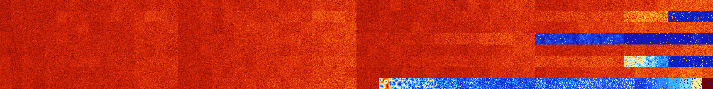

# B1368 (168960-169471)

<details>
    <summary>Initial Grid</summary>
    
</details>


<details>
    <summary>Initial Grid RLE</summary>

```
#C Exported from GoGoL (https://github.com/marrow16/gogol)
#C Wrap mode: Toroidal
#C Boundary mode: Dead
#C Step: 0
x = 100, y = 100, rule = B1368/S
19bo39bo5bo$29bo2bo18bo$27bo28bo17bo$18bo$o5b2o14bo64bo4bobo$22bo15bobo
5bo$19bo18b2o3bo5bo2bobo$6bo21bo9bo5bo6bo13bo3bo8bo19bo$9bo36bo25b2o10b
o12bo$4bobo18bo16bo16bo35bo$31bo$5bo39bo12bo$8bo11bo27bo16bo13bo$16bo
20bo30bo$22bo4bobo14bo11bo19bo$19bo37bobo6bo25bo$83bo$48bo2bo11bo$26bo
10bo$11bo23b2o28bo$23bo3bo11bo2bo23bo3bo$6bo47bo43bo$11bo33b3o33bo12bo$
9bo9bo7bo2bo13bo21bo10bo8bo3bo$bo5bo17bo21bo31bo11bo$8bo35bo48bo$5bo5bo
51bobo$bo26bo23bo20bo4bo$bo48bo4b2o$21bo35bo27bo$5bo$6bo9bo9bo58bo$16bo
35bo27bo14bobo$8bo4bo13bo23bo14bo29bo$2bo2bo3bo59bo$25b2o13bo13b2o9bo
11bo2bo$4bo27bo40bo8bo$5bo9bo17bo14bo24bo$12bo29bo38bo4bo$3bo2bo41bo34b
o4bo$50bo11bo26bo$8bo22bo2bo4bo18bo$60bo$o24bo35bo8bo27bo$28bo18bo5bo
19bo$11bo44bo21bo2bo12bo$53bo36bobobo$7bo38bo49bo$32bo3bo$2bo6bo28bo4bo
13bo30bo6bo$28bo5bo38bo2bo11bo$3bo51bo15bo$13bo7bo2bo18bo13bo41bo$bo19b
o29bo$34bo2bo4bo11bo44bo$4bo11bobo12bo3bo45bobo11bo$32bo9bo4bo$10bo12bo
7bo4bo27bo3bo14bo5bo9bo$40bo$20bo9bo51bo11bo$8bo3bo23bo11b2o$11bo4bo7bo
2bo21bo2bo21bo4bo18bo$7bo66bo7bo2bo2bo4bo$31bo11b2o22bo9bo3bo5b2o$47bo
6bo3bo6bo3bo3bo19bo4bo$49bo27bo$25bo3bobo15bo15bo10bo$8bo19bo19bo10bo3b
o$5bo23bobo13bobo11b2o6bo2bo12bo11bo$3bo13bo5b3o4bo4bo22bo31bo$19b2o16b
2o11bo19bo$56b2o11bo3bo$8bo11bo6bo4bo24bo24bo3bo$2bo15bo7b2o2bobo22bo2b
o2bo$43bo7bo11bo17bo13bo$9bo27bo59bo$33bo5bo6bo15bobo7bo13b2o$5bo23bo2b
o26bo22bo$27bo60bo$10bo31bo3bo6bo32bo4bo$24bo42bo2bo15bo12bo$2bo33bo19b
o4bo6bo$28bo3bo2bo15bo15bo10bo20bo$38bo13bo24bo$3bo10bo7bo18bo10bo$bo
13bo2bo5bo12bo3bo20bo$6bo5bo22bobo5bobo10bobo13bo$61bobo11bo$7bo5bo10bo
10bo20b2o21bo$25bo9bo9bo48bo$19bo17bo48bo2bo$43bo24bo26bo$5bobo60bo7bo
2bo4bo7bo$6bo36bo9bo24bo11bo$7bo4bo11bo8bo12bo20bo14bo2bo4bo$3bo20bo21b
ob2o38bo$5bo41bo5bo$2bo4bo17bo7bo3bo7bo8bo2bo3bo13bo22b2o$36bo13bo$16bo
bo26bo38bo8b2o!
```
</details>
<details>
    <summary>Thumbnail</summary>

</details>
<table>
<tr>
    <td><a href="./168960%20S%20Heat%20Map%20Activity.png"></a><br>S (168960)<br>G>1000</td>    <td><a href="./168961%20S0%20Heat%20Map%20Activity.png"></a><br>S0 (168961)<br>G>1000</td>    <td><a href="./168962%20S1%20Heat%20Map%20Activity.png"></a><br>S1 (168962)<br>G>1000</td>    <td><a href="./168963%20S01%20Heat%20Map%20Activity.png"></a><br>S01 (168963)<br>G>1000</td>    <td><a href="./168964%20S2%20Heat%20Map%20Activity.png"></a><br>S2 (168964)<br>G>1000</td>    <td><a href="./168965%20S02%20Heat%20Map%20Activity.png"></a><br>S02 (168965)<br>G>1000</td>    <td><a href="./168966%20S12%20Heat%20Map%20Activity.png"></a><br>S12 (168966)<br>G>1000</td>    <td><a href="./168967%20S012%20Heat%20Map%20Activity.png"></a><br>S012 (168967)<br>G>1000</td>    <td><a href="./168968%20S3%20Heat%20Map%20Activity.png"></a><br>S3 (168968)<br>G>1000</td>    <td><a href="./168969%20S03%20Heat%20Map%20Activity.png"></a><br>S03 (168969)<br>G>1000</td>    <td><a href="./168970%20S13%20Heat%20Map%20Activity.png"></a><br>S13 (168970)<br>G>1000</td>    <td><a href="./168971%20S013%20Heat%20Map%20Activity.png"></a><br>S013 (168971)<br>G>1000</td>    <td><a href="./168972%20S23%20Heat%20Map%20Activity.png"></a><br>S23 (168972)<br>G>1000</td>    <td><a href="./168973%20S023%20Heat%20Map%20Activity.png"></a><br>S023 (168973)<br>G>1000</td>    <td><a href="./168974%20S123%20Heat%20Map%20Activity.png"></a><br>S123 (168974)<br>G>1000</td>    <td><a href="./168975%20S0123%20Heat%20Map%20Activity.png"></a><br>S0123 (168975)<br>G>1000</td>    <td><a href="./168976%20S4%20Heat%20Map%20Activity.png"></a><br>S4 (168976)<br>G>1000</td>    <td><a href="./168977%20S04%20Heat%20Map%20Activity.png"></a><br>S04 (168977)<br>G>1000</td>    <td><a href="./168978%20S14%20Heat%20Map%20Activity.png"></a><br>S14 (168978)<br>G>1000</td>    <td><a href="./168979%20S014%20Heat%20Map%20Activity.png"></a><br>S014 (168979)<br>G>1000</td>    <td><a href="./168980%20S24%20Heat%20Map%20Activity.png"></a><br>S24 (168980)<br>G>1000</td>    <td><a href="./168981%20S024%20Heat%20Map%20Activity.png"></a><br>S024 (168981)<br>G>1000</td>    <td><a href="./168982%20S124%20Heat%20Map%20Activity.png"></a><br>S124 (168982)<br>G>1000</td>    <td><a href="./168983%20S0124%20Heat%20Map%20Activity.png"></a><br>S0124 (168983)<br>G>1000</td>    <td><a href="./168984%20S34%20Heat%20Map%20Activity.png"></a><br>S34 (168984)<br>G>1000</td>    <td><a href="./168985%20S034%20Heat%20Map%20Activity.png"></a><br>S034 (168985)<br>G>1000</td>    <td><a href="./168986%20S134%20Heat%20Map%20Activity.png"></a><br>S134 (168986)<br>G>1000</td>    <td><a href="./168987%20S0134%20Heat%20Map%20Activity.png"></a><br>S0134 (168987)<br>G>1000</td>    <td><a href="./168988%20S234%20Heat%20Map%20Activity.png"></a><br>S234 (168988)<br>G>1000</td>    <td><a href="./168989%20S0234%20Heat%20Map%20Activity.png"></a><br>S0234 (168989)<br>G>1000</td>    <td><a href="./168990%20S1234%20Heat%20Map%20Activity.png"></a><br>S1234 (168990)<br>G>1000</td>    <td><a href="./168991%20S01234%20Heat%20Map%20Activity.png"></a><br>S01234 (168991)<br>G>1000</td>    <td><a href="./168992%20S5%20Heat%20Map%20Activity.png"></a><br>S5 (168992)<br>G>1000</td>    <td><a href="./168993%20S05%20Heat%20Map%20Activity.png"></a><br>S05 (168993)<br>G>1000</td>    <td><a href="./168994%20S15%20Heat%20Map%20Activity.png"></a><br>S15 (168994)<br>G>1000</td>    <td><a href="./168995%20S015%20Heat%20Map%20Activity.png"></a><br>S015 (168995)<br>G>1000</td>    <td><a href="./168996%20S25%20Heat%20Map%20Activity.png"></a><br>S25 (168996)<br>G>1000</td>    <td><a href="./168997%20S025%20Heat%20Map%20Activity.png"></a><br>S025 (168997)<br>G>1000</td>    <td><a href="./168998%20S125%20Heat%20Map%20Activity.png"></a><br>S125 (168998)<br>G>1000</td>    <td><a href="./168999%20S0125%20Heat%20Map%20Activity.png"></a><br>S0125 (168999)<br>G>1000</td>    <td><a href="./169000%20S35%20Heat%20Map%20Activity.png"></a><br>S35 (169000)<br>G>1000</td>    <td><a href="./169001%20S035%20Heat%20Map%20Activity.png"></a><br>S035 (169001)<br>G>1000</td>    <td><a href="./169002%20S135%20Heat%20Map%20Activity.png"></a><br>S135 (169002)<br>G>1000</td>    <td><a href="./169003%20S0135%20Heat%20Map%20Activity.png"></a><br>S0135 (169003)<br>G>1000</td>    <td><a href="./169004%20S235%20Heat%20Map%20Activity.png"></a><br>S235 (169004)<br>G>1000</td>    <td><a href="./169005%20S0235%20Heat%20Map%20Activity.png"></a><br>S0235 (169005)<br>G>1000</td>    <td><a href="./169006%20S1235%20Heat%20Map%20Activity.png"></a><br>S1235 (169006)<br>G>1000</td>    <td><a href="./169007%20S01235%20Heat%20Map%20Activity.png"></a><br>S01235 (169007)<br>G>1000</td>    <td><a href="./169008%20S45%20Heat%20Map%20Activity.png"></a><br>S45 (169008)<br>G>1000</td>    <td><a href="./169009%20S045%20Heat%20Map%20Activity.png"></a><br>S045 (169009)<br>G>1000</td>    <td><a href="./169010%20S145%20Heat%20Map%20Activity.png"></a><br>S145 (169010)<br>G>1000</td>    <td><a href="./169011%20S0145%20Heat%20Map%20Activity.png"></a><br>S0145 (169011)<br>G>1000</td>    <td><a href="./169012%20S245%20Heat%20Map%20Activity.png"></a><br>S245 (169012)<br>G>1000</td>    <td><a href="./169013%20S0245%20Heat%20Map%20Activity.png"></a><br>S0245 (169013)<br>G>1000</td>    <td><a href="./169014%20S1245%20Heat%20Map%20Activity.png"></a><br>S1245 (169014)<br>G>1000</td>    <td><a href="./169015%20S01245%20Heat%20Map%20Activity.png"></a><br>S01245 (169015)<br>G>1000</td>    <td><a href="./169016%20S345%20Heat%20Map%20Activity.png"></a><br>S345 (169016)<br>G>1000</td>    <td><a href="./169017%20S0345%20Heat%20Map%20Activity.png"></a><br>S0345 (169017)<br>G>1000</td>    <td><a href="./169018%20S1345%20Heat%20Map%20Activity.png"></a><br>S1345 (169018)<br>G>1000</td>    <td><a href="./169019%20S01345%20Heat%20Map%20Activity.png"></a><br>S01345 (169019)<br>G>1000</td>    <td><a href="./169020%20S2345%20Heat%20Map%20Activity.png"></a><br>S2345 (169020)<br>G>1000</td>    <td><a href="./169021%20S02345%20Heat%20Map%20Activity.png"></a><br>S02345 (169021)<br>G>1000</td>    <td><a href="./169022%20S12345%20Heat%20Map%20Activity.png"></a><br>S12345 (169022)<br>G>1000</td>    <td><a href="./169023%20S012345%20Heat%20Map%20Activity.png"></a><br>S012345 (169023)<br>G>1000</td></tr>
<tr>
    <td><a href="./169024%20S6%20Heat%20Map%20Activity.png"></a><br>S6 (169024)<br>G>1000</td>    <td><a href="./169025%20S06%20Heat%20Map%20Activity.png"></a><br>S06 (169025)<br>G>1000</td>    <td><a href="./169026%20S16%20Heat%20Map%20Activity.png"></a><br>S16 (169026)<br>G>1000</td>    <td><a href="./169027%20S016%20Heat%20Map%20Activity.png"></a><br>S016 (169027)<br>G>1000</td>    <td><a href="./169028%20S26%20Heat%20Map%20Activity.png"></a><br>S26 (169028)<br>G>1000</td>    <td><a href="./169029%20S026%20Heat%20Map%20Activity.png"></a><br>S026 (169029)<br>G>1000</td>    <td><a href="./169030%20S126%20Heat%20Map%20Activity.png"></a><br>S126 (169030)<br>G>1000</td>    <td><a href="./169031%20S0126%20Heat%20Map%20Activity.png"></a><br>S0126 (169031)<br>G>1000</td>    <td><a href="./169032%20S36%20Heat%20Map%20Activity.png"></a><br>S36 (169032)<br>G>1000</td>    <td><a href="./169033%20S036%20Heat%20Map%20Activity.png"></a><br>S036 (169033)<br>G>1000</td>    <td><a href="./169034%20S136%20Heat%20Map%20Activity.png"></a><br>S136 (169034)<br>G>1000</td>    <td><a href="./169035%20S0136%20Heat%20Map%20Activity.png"></a><br>S0136 (169035)<br>G>1000</td>    <td><a href="./169036%20S236%20Heat%20Map%20Activity.png"></a><br>S236 (169036)<br>G>1000</td>    <td><a href="./169037%20S0236%20Heat%20Map%20Activity.png"></a><br>S0236 (169037)<br>G>1000</td>    <td><a href="./169038%20S1236%20Heat%20Map%20Activity.png"></a><br>S1236 (169038)<br>G>1000</td>    <td><a href="./169039%20S01236%20Heat%20Map%20Activity.png"></a><br>S01236 (169039)<br>G>1000</td>    <td><a href="./169040%20S46%20Heat%20Map%20Activity.png"></a><br>S46 (169040)<br>G>1000</td>    <td><a href="./169041%20S046%20Heat%20Map%20Activity.png"></a><br>S046 (169041)<br>G>1000</td>    <td><a href="./169042%20S146%20Heat%20Map%20Activity.png"></a><br>S146 (169042)<br>G>1000</td>    <td><a href="./169043%20S0146%20Heat%20Map%20Activity.png"></a><br>S0146 (169043)<br>G>1000</td>    <td><a href="./169044%20S246%20Heat%20Map%20Activity.png"></a><br>S246 (169044)<br>G>1000</td>    <td><a href="./169045%20S0246%20Heat%20Map%20Activity.png"></a><br>S0246 (169045)<br>G>1000</td>    <td><a href="./169046%20S1246%20Heat%20Map%20Activity.png"></a><br>S1246 (169046)<br>G>1000</td>    <td><a href="./169047%20S01246%20Heat%20Map%20Activity.png"></a><br>S01246 (169047)<br>G>1000</td>    <td><a href="./169048%20S346%20Heat%20Map%20Activity.png"></a><br>S346 (169048)<br>G>1000</td>    <td><a href="./169049%20S0346%20Heat%20Map%20Activity.png"></a><br>S0346 (169049)<br>G>1000</td>    <td><a href="./169050%20S1346%20Heat%20Map%20Activity.png"></a><br>S1346 (169050)<br>G>1000</td>    <td><a href="./169051%20S01346%20Heat%20Map%20Activity.png"></a><br>S01346 (169051)<br>G>1000</td>    <td><a href="./169052%20S2346%20Heat%20Map%20Activity.png"></a><br>S2346 (169052)<br>G>1000</td>    <td><a href="./169053%20S02346%20Heat%20Map%20Activity.png"></a><br>S02346 (169053)<br>G>1000</td>    <td><a href="./169054%20S12346%20Heat%20Map%20Activity.png"></a><br>S12346 (169054)<br>G>1000</td>    <td><a href="./169055%20S012346%20Heat%20Map%20Activity.png"></a><br>S012346 (169055)<br>G>1000</td>    <td><a href="./169056%20S56%20Heat%20Map%20Activity.png"></a><br>S56 (169056)<br>G>1000</td>    <td><a href="./169057%20S056%20Heat%20Map%20Activity.png"></a><br>S056 (169057)<br>G>1000</td>    <td><a href="./169058%20S156%20Heat%20Map%20Activity.png"></a><br>S156 (169058)<br>G>1000</td>    <td><a href="./169059%20S0156%20Heat%20Map%20Activity.png"></a><br>S0156 (169059)<br>G>1000</td>    <td><a href="./169060%20S256%20Heat%20Map%20Activity.png"></a><br>S256 (169060)<br>G>1000</td>    <td><a href="./169061%20S0256%20Heat%20Map%20Activity.png"></a><br>S0256 (169061)<br>G>1000</td>    <td><a href="./169062%20S1256%20Heat%20Map%20Activity.png"></a><br>S1256 (169062)<br>G>1000</td>    <td><a href="./169063%20S01256%20Heat%20Map%20Activity.png"></a><br>S01256 (169063)<br>G>1000</td>    <td><a href="./169064%20S356%20Heat%20Map%20Activity.png"></a><br>S356 (169064)<br>G>1000</td>    <td><a href="./169065%20S0356%20Heat%20Map%20Activity.png"></a><br>S0356 (169065)<br>G>1000</td>    <td><a href="./169066%20S1356%20Heat%20Map%20Activity.png"></a><br>S1356 (169066)<br>G>1000</td>    <td><a href="./169067%20S01356%20Heat%20Map%20Activity.png"></a><br>S01356 (169067)<br>G>1000</td>    <td><a href="./169068%20S2356%20Heat%20Map%20Activity.png"></a><br>S2356 (169068)<br>G>1000</td>    <td><a href="./169069%20S02356%20Heat%20Map%20Activity.png"></a><br>S02356 (169069)<br>G>1000</td>    <td><a href="./169070%20S12356%20Heat%20Map%20Activity.png"></a><br>S12356 (169070)<br>G>1000</td>    <td><a href="./169071%20S012356%20Heat%20Map%20Activity.png"></a><br>S012356 (169071)<br>G>1000</td>    <td><a href="./169072%20S456%20Heat%20Map%20Activity.png"></a><br>S456 (169072)<br>G>1000</td>    <td><a href="./169073%20S0456%20Heat%20Map%20Activity.png"></a><br>S0456 (169073)<br>G>1000</td>    <td><a href="./169074%20S1456%20Heat%20Map%20Activity.png"></a><br>S1456 (169074)<br>G>1000</td>    <td><a href="./169075%20S01456%20Heat%20Map%20Activity.png"></a><br>S01456 (169075)<br>G>1000</td>    <td><a href="./169076%20S2456%20Heat%20Map%20Activity.png"></a><br>S2456 (169076)<br>G>1000</td>    <td><a href="./169077%20S02456%20Heat%20Map%20Activity.png"></a><br>S02456 (169077)<br>G>1000</td>    <td><a href="./169078%20S12456%20Heat%20Map%20Activity.png"></a><br>S12456 (169078)<br>G>1000</td>    <td><a href="./169079%20S012456%20Heat%20Map%20Activity.png"></a><br>S012456 (169079)<br>G>1000</td>    <td><a href="./169080%20S3456%20Heat%20Map%20Activity.png"></a><br>S3456 (169080)<br>G>1000</td>    <td><a href="./169081%20S03456%20Heat%20Map%20Activity.png"></a><br>S03456 (169081)<br>G>1000</td>    <td><a href="./169082%20S13456%20Heat%20Map%20Activity.png"></a><br>S13456 (169082)<br>G>1000</td>    <td><a href="./169083%20S013456%20Heat%20Map%20Activity.png"></a><br>S013456 (169083)<br>G>1000</td>    <td><a href="./169084%20S23456%20Heat%20Map%20Activity.png"></a><br>S23456 (169084)<br>G>1000</td>    <td><a href="./169085%20S023456%20Heat%20Map%20Activity.png"></a><br>S023456 (169085)<br>G>1000</td>    <td><a href="./169086%20S123456%20Heat%20Map%20Activity.png"></a><br>S123456 (169086)<br>G>1000</td>    <td><a href="./169087%20S0123456%20Heat%20Map%20Activity.png"></a><br>S0123456 (169087)<br>G>1000</td></tr>
<tr>
    <td><a href="./169088%20S7%20Heat%20Map%20Activity.png"></a><br>S7 (169088)<br>G>1000</td>    <td><a href="./169089%20S07%20Heat%20Map%20Activity.png"></a><br>S07 (169089)<br>G>1000</td>    <td><a href="./169090%20S17%20Heat%20Map%20Activity.png"></a><br>S17 (169090)<br>G>1000</td>    <td><a href="./169091%20S017%20Heat%20Map%20Activity.png"></a><br>S017 (169091)<br>G>1000</td>    <td><a href="./169092%20S27%20Heat%20Map%20Activity.png"></a><br>S27 (169092)<br>G>1000</td>    <td><a href="./169093%20S027%20Heat%20Map%20Activity.png"></a><br>S027 (169093)<br>G>1000</td>    <td><a href="./169094%20S127%20Heat%20Map%20Activity.png"></a><br>S127 (169094)<br>G>1000</td>    <td><a href="./169095%20S0127%20Heat%20Map%20Activity.png"></a><br>S0127 (169095)<br>G>1000</td>    <td><a href="./169096%20S37%20Heat%20Map%20Activity.png"></a><br>S37 (169096)<br>G>1000</td>    <td><a href="./169097%20S037%20Heat%20Map%20Activity.png"></a><br>S037 (169097)<br>G>1000</td>    <td><a href="./169098%20S137%20Heat%20Map%20Activity.png"></a><br>S137 (169098)<br>G>1000</td>    <td><a href="./169099%20S0137%20Heat%20Map%20Activity.png"></a><br>S0137 (169099)<br>G>1000</td>    <td><a href="./169100%20S237%20Heat%20Map%20Activity.png"></a><br>S237 (169100)<br>G>1000</td>    <td><a href="./169101%20S0237%20Heat%20Map%20Activity.png"></a><br>S0237 (169101)<br>G>1000</td>    <td><a href="./169102%20S1237%20Heat%20Map%20Activity.png"></a><br>S1237 (169102)<br>G>1000</td>    <td><a href="./169103%20S01237%20Heat%20Map%20Activity.png"></a><br>S01237 (169103)<br>G>1000</td>    <td><a href="./169104%20S47%20Heat%20Map%20Activity.png"></a><br>S47 (169104)<br>G>1000</td>    <td><a href="./169105%20S047%20Heat%20Map%20Activity.png"></a><br>S047 (169105)<br>G>1000</td>    <td><a href="./169106%20S147%20Heat%20Map%20Activity.png"></a><br>S147 (169106)<br>G>1000</td>    <td><a href="./169107%20S0147%20Heat%20Map%20Activity.png"></a><br>S0147 (169107)<br>G>1000</td>    <td><a href="./169108%20S247%20Heat%20Map%20Activity.png"></a><br>S247 (169108)<br>G>1000</td>    <td><a href="./169109%20S0247%20Heat%20Map%20Activity.png"></a><br>S0247 (169109)<br>G>1000</td>    <td><a href="./169110%20S1247%20Heat%20Map%20Activity.png"></a><br>S1247 (169110)<br>G>1000</td>    <td><a href="./169111%20S01247%20Heat%20Map%20Activity.png"></a><br>S01247 (169111)<br>G>1000</td>    <td><a href="./169112%20S347%20Heat%20Map%20Activity.png"></a><br>S347 (169112)<br>G>1000</td>    <td><a href="./169113%20S0347%20Heat%20Map%20Activity.png"></a><br>S0347 (169113)<br>G>1000</td>    <td><a href="./169114%20S1347%20Heat%20Map%20Activity.png"></a><br>S1347 (169114)<br>G>1000</td>    <td><a href="./169115%20S01347%20Heat%20Map%20Activity.png"></a><br>S01347 (169115)<br>G>1000</td>    <td><a href="./169116%20S2347%20Heat%20Map%20Activity.png"></a><br>S2347 (169116)<br>G>1000</td>    <td><a href="./169117%20S02347%20Heat%20Map%20Activity.png"></a><br>S02347 (169117)<br>G>1000</td>    <td><a href="./169118%20S12347%20Heat%20Map%20Activity.png"></a><br>S12347 (169118)<br>G>1000</td>    <td><a href="./169119%20S012347%20Heat%20Map%20Activity.png"></a><br>S012347 (169119)<br>G>1000</td>    <td><a href="./169120%20S57%20Heat%20Map%20Activity.png"></a><br>S57 (169120)<br>G>1000</td>    <td><a href="./169121%20S057%20Heat%20Map%20Activity.png"></a><br>S057 (169121)<br>G>1000</td>    <td><a href="./169122%20S157%20Heat%20Map%20Activity.png"></a><br>S157 (169122)<br>G>1000</td>    <td><a href="./169123%20S0157%20Heat%20Map%20Activity.png"></a><br>S0157 (169123)<br>G>1000</td>    <td><a href="./169124%20S257%20Heat%20Map%20Activity.png"></a><br>S257 (169124)<br>G>1000</td>    <td><a href="./169125%20S0257%20Heat%20Map%20Activity.png"></a><br>S0257 (169125)<br>G>1000</td>    <td><a href="./169126%20S1257%20Heat%20Map%20Activity.png"></a><br>S1257 (169126)<br>G>1000</td>    <td><a href="./169127%20S01257%20Heat%20Map%20Activity.png"></a><br>S01257 (169127)<br>G>1000</td>    <td><a href="./169128%20S357%20Heat%20Map%20Activity.png"></a><br>S357 (169128)<br>G>1000</td>    <td><a href="./169129%20S0357%20Heat%20Map%20Activity.png"></a><br>S0357 (169129)<br>G>1000</td>    <td><a href="./169130%20S1357%20Heat%20Map%20Activity.png"></a><br>S1357 (169130)<br>G>1000</td>    <td><a href="./169131%20S01357%20Heat%20Map%20Activity.png"></a><br>S01357 (169131)<br>G>1000</td>    <td><a href="./169132%20S2357%20Heat%20Map%20Activity.png"></a><br>S2357 (169132)<br>G>1000</td>    <td><a href="./169133%20S02357%20Heat%20Map%20Activity.png"></a><br>S02357 (169133)<br>G>1000</td>    <td><a href="./169134%20S12357%20Heat%20Map%20Activity.png"></a><br>S12357 (169134)<br>G>1000</td>    <td><a href="./169135%20S012357%20Heat%20Map%20Activity.png"></a><br>S012357 (169135)<br>G>1000</td>    <td><a href="./169136%20S457%20Heat%20Map%20Activity.png"></a><br>S457 (169136)<br>G>1000</td>    <td><a href="./169137%20S0457%20Heat%20Map%20Activity.png"></a><br>S0457 (169137)<br>G>1000</td>    <td><a href="./169138%20S1457%20Heat%20Map%20Activity.png"></a><br>S1457 (169138)<br>G>1000</td>    <td><a href="./169139%20S01457%20Heat%20Map%20Activity.png"></a><br>S01457 (169139)<br>G>1000</td>    <td><a href="./169140%20S2457%20Heat%20Map%20Activity.png"></a><br>S2457 (169140)<br>G>1000</td>    <td><a href="./169141%20S02457%20Heat%20Map%20Activity.png"></a><br>S02457 (169141)<br>G>1000</td>    <td><a href="./169142%20S12457%20Heat%20Map%20Activity.png"></a><br>S12457 (169142)<br>G>1000</td>    <td><a href="./169143%20S012457%20Heat%20Map%20Activity.png"></a><br>S012457 (169143)<br>G>1000</td>    <td><a href="./169144%20S3457%20Heat%20Map%20Activity.png"></a><br>S3457 (169144)<br>G>1000</td>    <td><a href="./169145%20S03457%20Heat%20Map%20Activity.png"></a><br>S03457 (169145)<br>G>1000</td>    <td><a href="./169146%20S13457%20Heat%20Map%20Activity.png"></a><br>S13457 (169146)<br>G>1000</td>    <td><a href="./169147%20S013457%20Heat%20Map%20Activity.png"></a><br>S013457 (169147)<br>G>1000</td>    <td><a href="./169148%20S23457%20Heat%20Map%20Activity.png"></a><br>S23457 (169148)<br>G>1000</td>    <td><a href="./169149%20S023457%20Heat%20Map%20Activity.png"></a><br>S023457 (169149)<br>G>1000</td>    <td><a href="./169150%20S123457%20Heat%20Map%20Activity.png"></a><br>S123457 (169150)<br>G>1000</td>    <td><a href="./169151%20S0123457%20Heat%20Map%20Activity.png"></a><br>S0123457 (169151)<br>G>1000</td></tr>
<tr>
    <td><a href="./169152%20S67%20Heat%20Map%20Activity.png"></a><br>S67 (169152)<br>G>1000</td>    <td><a href="./169153%20S067%20Heat%20Map%20Activity.png"></a><br>S067 (169153)<br>G>1000</td>    <td><a href="./169154%20S167%20Heat%20Map%20Activity.png"></a><br>S167 (169154)<br>G>1000</td>    <td><a href="./169155%20S0167%20Heat%20Map%20Activity.png"></a><br>S0167 (169155)<br>G>1000</td>    <td><a href="./169156%20S267%20Heat%20Map%20Activity.png"></a><br>S267 (169156)<br>G>1000</td>    <td><a href="./169157%20S0267%20Heat%20Map%20Activity.png"></a><br>S0267 (169157)<br>G>1000</td>    <td><a href="./169158%20S1267%20Heat%20Map%20Activity.png"></a><br>S1267 (169158)<br>G>1000</td>    <td><a href="./169159%20S01267%20Heat%20Map%20Activity.png"></a><br>S01267 (169159)<br>G>1000</td>    <td><a href="./169160%20S367%20Heat%20Map%20Activity.png"></a><br>S367 (169160)<br>G>1000</td>    <td><a href="./169161%20S0367%20Heat%20Map%20Activity.png"></a><br>S0367 (169161)<br>G>1000</td>    <td><a href="./169162%20S1367%20Heat%20Map%20Activity.png"></a><br>S1367 (169162)<br>G>1000</td>    <td><a href="./169163%20S01367%20Heat%20Map%20Activity.png"></a><br>S01367 (169163)<br>G>1000</td>    <td><a href="./169164%20S2367%20Heat%20Map%20Activity.png"></a><br>S2367 (169164)<br>G>1000</td>    <td><a href="./169165%20S02367%20Heat%20Map%20Activity.png"></a><br>S02367 (169165)<br>G>1000</td>    <td><a href="./169166%20S12367%20Heat%20Map%20Activity.png"></a><br>S12367 (169166)<br>G>1000</td>    <td><a href="./169167%20S012367%20Heat%20Map%20Activity.png"></a><br>S012367 (169167)<br>G>1000</td>    <td><a href="./169168%20S467%20Heat%20Map%20Activity.png"></a><br>S467 (169168)<br>G>1000</td>    <td><a href="./169169%20S0467%20Heat%20Map%20Activity.png"></a><br>S0467 (169169)<br>G>1000</td>    <td><a href="./169170%20S1467%20Heat%20Map%20Activity.png"></a><br>S1467 (169170)<br>G>1000</td>    <td><a href="./169171%20S01467%20Heat%20Map%20Activity.png"></a><br>S01467 (169171)<br>G>1000</td>    <td><a href="./169172%20S2467%20Heat%20Map%20Activity.png"></a><br>S2467 (169172)<br>G>1000</td>    <td><a href="./169173%20S02467%20Heat%20Map%20Activity.png"></a><br>S02467 (169173)<br>G>1000</td>    <td><a href="./169174%20S12467%20Heat%20Map%20Activity.png"></a><br>S12467 (169174)<br>G>1000</td>    <td><a href="./169175%20S012467%20Heat%20Map%20Activity.png"></a><br>S012467 (169175)<br>G>1000</td>    <td><a href="./169176%20S3467%20Heat%20Map%20Activity.png"></a><br>S3467 (169176)<br>G>1000</td>    <td><a href="./169177%20S03467%20Heat%20Map%20Activity.png"></a><br>S03467 (169177)<br>G>1000</td>    <td><a href="./169178%20S13467%20Heat%20Map%20Activity.png"></a><br>S13467 (169178)<br>G>1000</td>    <td><a href="./169179%20S013467%20Heat%20Map%20Activity.png"></a><br>S013467 (169179)<br>G>1000</td>    <td><a href="./169180%20S23467%20Heat%20Map%20Activity.png"></a><br>S23467 (169180)<br>G>1000</td>    <td><a href="./169181%20S023467%20Heat%20Map%20Activity.png"></a><br>S023467 (169181)<br>G>1000</td>    <td><a href="./169182%20S123467%20Heat%20Map%20Activity.png"></a><br>S123467 (169182)<br>G>1000</td>    <td><a href="./169183%20S0123467%20Heat%20Map%20Activity.png"></a><br>S0123467 (169183)<br>G>1000</td>    <td><a href="./169184%20S567%20Heat%20Map%20Activity.png"></a><br>S567 (169184)<br>G>1000</td>    <td><a href="./169185%20S0567%20Heat%20Map%20Activity.png"></a><br>S0567 (169185)<br>G>1000</td>    <td><a href="./169186%20S1567%20Heat%20Map%20Activity.png"></a><br>S1567 (169186)<br>G>1000</td>    <td><a href="./169187%20S01567%20Heat%20Map%20Activity.png"></a><br>S01567 (169187)<br>G>1000</td>    <td><a href="./169188%20S2567%20Heat%20Map%20Activity.png"></a><br>S2567 (169188)<br>G>1000</td>    <td><a href="./169189%20S02567%20Heat%20Map%20Activity.png"></a><br>S02567 (169189)<br>G>1000</td>    <td><a href="./169190%20S12567%20Heat%20Map%20Activity.png"></a><br>S12567 (169190)<br>G>1000</td>    <td><a href="./169191%20S012567%20Heat%20Map%20Activity.png"></a><br>S012567 (169191)<br>G>1000</td>    <td><a href="./169192%20S3567%20Heat%20Map%20Activity.png"></a><br>S3567 (169192)<br>G>1000</td>    <td><a href="./169193%20S03567%20Heat%20Map%20Activity.png"></a><br>S03567 (169193)<br>G>1000</td>    <td><a href="./169194%20S13567%20Heat%20Map%20Activity.png"></a><br>S13567 (169194)<br>G>1000</td>    <td><a href="./169195%20S013567%20Heat%20Map%20Activity.png"></a><br>S013567 (169195)<br>G>1000</td>    <td><a href="./169196%20S23567%20Heat%20Map%20Activity.png"></a><br>S23567 (169196)<br>G>1000</td>    <td><a href="./169197%20S023567%20Heat%20Map%20Activity.png"></a><br>S023567 (169197)<br>G>1000</td>    <td><a href="./169198%20S123567%20Heat%20Map%20Activity.png"></a><br>S123567 (169198)<br>G>1000</td>    <td><a href="./169199%20S0123567%20Heat%20Map%20Activity.png"></a><br>S0123567 (169199)<br>G>1000</td>    <td><a href="./169200%20S4567%20Heat%20Map%20Activity.png"></a><br>S4567 (169200)<br>G>1000</td>    <td><a href="./169201%20S04567%20Heat%20Map%20Activity.png"></a><br>S04567 (169201)<br>G>1000</td>    <td><a href="./169202%20S14567%20Heat%20Map%20Activity.png"></a><br>S14567 (169202)<br>G>1000</td>    <td><a href="./169203%20S014567%20Heat%20Map%20Activity.png"></a><br>S014567 (169203)<br>G>1000</td>    <td><a href="./169204%20S24567%20Heat%20Map%20Activity.png"></a><br>S24567 (169204)<br>G>1000</td>    <td><a href="./169205%20S024567%20Heat%20Map%20Activity.png"></a><br>S024567 (169205)<br>G>1000</td>    <td><a href="./169206%20S124567%20Heat%20Map%20Activity.png"></a><br>S124567 (169206)<br>G>1000</td>    <td><a href="./169207%20S0124567%20Heat%20Map%20Activity.png"></a><br>S0124567 (169207)<br>G>1000</td>    <td><a href="./169208%20S34567%20Heat%20Map%20Activity.png"></a><br>S34567 (169208)<br>G>1000</td>    <td><a href="./169209%20S034567%20Heat%20Map%20Activity.png"></a><br>S034567 (169209)<br>R@880,p840</td>    <td><a href="./169210%20S134567%20Heat%20Map%20Activity.png"></a><br>S134567 (169210)<br>R@461,p420</td>    <td><a href="./169211%20S0134567%20Heat%20Map%20Activity.png"></a><br>S0134567 (169211)<br>G>1000</td>    <td><a href="./169212%20S234567%20Heat%20Map%20Activity.png"></a><br>S234567 (169212)<br>R@237,p180</td>    <td><a href="./169213%20S0234567%20Heat%20Map%20Activity.png"></a><br>S0234567 (169213)<br>R@889,p840</td>    <td><a href="./169214%20S1234567%20Heat%20Map%20Activity.png"></a><br>S1234567 (169214)<br>R@84,p36</td>    <td><a href="./169215%20S01234567%20Heat%20Map%20Activity.png"></a><br>S01234567 (169215)<br>R@454,p420</td></tr>
<tr>
    <td><a href="./169216%20S8%20Heat%20Map%20Activity.png"></a><br>S8 (169216)<br>G>1000</td>    <td><a href="./169217%20S08%20Heat%20Map%20Activity.png"></a><br>S08 (169217)<br>G>1000</td>    <td><a href="./169218%20S18%20Heat%20Map%20Activity.png"></a><br>S18 (169218)<br>G>1000</td>    <td><a href="./169219%20S018%20Heat%20Map%20Activity.png"></a><br>S018 (169219)<br>G>1000</td>    <td><a href="./169220%20S28%20Heat%20Map%20Activity.png"></a><br>S28 (169220)<br>G>1000</td>    <td><a href="./169221%20S028%20Heat%20Map%20Activity.png"></a><br>S028 (169221)<br>G>1000</td>    <td><a href="./169222%20S128%20Heat%20Map%20Activity.png"></a><br>S128 (169222)<br>G>1000</td>    <td><a href="./169223%20S0128%20Heat%20Map%20Activity.png"></a><br>S0128 (169223)<br>G>1000</td>    <td><a href="./169224%20S38%20Heat%20Map%20Activity.png"></a><br>S38 (169224)<br>G>1000</td>    <td><a href="./169225%20S038%20Heat%20Map%20Activity.png"></a><br>S038 (169225)<br>G>1000</td>    <td><a href="./169226%20S138%20Heat%20Map%20Activity.png"></a><br>S138 (169226)<br>G>1000</td>    <td><a href="./169227%20S0138%20Heat%20Map%20Activity.png"></a><br>S0138 (169227)<br>G>1000</td>    <td><a href="./169228%20S238%20Heat%20Map%20Activity.png"></a><br>S238 (169228)<br>G>1000</td>    <td><a href="./169229%20S0238%20Heat%20Map%20Activity.png"></a><br>S0238 (169229)<br>G>1000</td>    <td><a href="./169230%20S1238%20Heat%20Map%20Activity.png"></a><br>S1238 (169230)<br>G>1000</td>    <td><a href="./169231%20S01238%20Heat%20Map%20Activity.png"></a><br>S01238 (169231)<br>G>1000</td>    <td><a href="./169232%20S48%20Heat%20Map%20Activity.png"></a><br>S48 (169232)<br>G>1000</td>    <td><a href="./169233%20S048%20Heat%20Map%20Activity.png"></a><br>S048 (169233)<br>G>1000</td>    <td><a href="./169234%20S148%20Heat%20Map%20Activity.png"></a><br>S148 (169234)<br>G>1000</td>    <td><a href="./169235%20S0148%20Heat%20Map%20Activity.png"></a><br>S0148 (169235)<br>G>1000</td>    <td><a href="./169236%20S248%20Heat%20Map%20Activity.png"></a><br>S248 (169236)<br>G>1000</td>    <td><a href="./169237%20S0248%20Heat%20Map%20Activity.png"></a><br>S0248 (169237)<br>G>1000</td>    <td><a href="./169238%20S1248%20Heat%20Map%20Activity.png"></a><br>S1248 (169238)<br>G>1000</td>    <td><a href="./169239%20S01248%20Heat%20Map%20Activity.png"></a><br>S01248 (169239)<br>G>1000</td>    <td><a href="./169240%20S348%20Heat%20Map%20Activity.png"></a><br>S348 (169240)<br>G>1000</td>    <td><a href="./169241%20S0348%20Heat%20Map%20Activity.png"></a><br>S0348 (169241)<br>G>1000</td>    <td><a href="./169242%20S1348%20Heat%20Map%20Activity.png"></a><br>S1348 (169242)<br>G>1000</td>    <td><a href="./169243%20S01348%20Heat%20Map%20Activity.png"></a><br>S01348 (169243)<br>G>1000</td>    <td><a href="./169244%20S2348%20Heat%20Map%20Activity.png"></a><br>S2348 (169244)<br>G>1000</td>    <td><a href="./169245%20S02348%20Heat%20Map%20Activity.png"></a><br>S02348 (169245)<br>G>1000</td>    <td><a href="./169246%20S12348%20Heat%20Map%20Activity.png"></a><br>S12348 (169246)<br>G>1000</td>    <td><a href="./169247%20S012348%20Heat%20Map%20Activity.png"></a><br>S012348 (169247)<br>G>1000</td>    <td><a href="./169248%20S58%20Heat%20Map%20Activity.png"></a><br>S58 (169248)<br>G>1000</td>    <td><a href="./169249%20S058%20Heat%20Map%20Activity.png"></a><br>S058 (169249)<br>G>1000</td>    <td><a href="./169250%20S158%20Heat%20Map%20Activity.png"></a><br>S158 (169250)<br>G>1000</td>    <td><a href="./169251%20S0158%20Heat%20Map%20Activity.png"></a><br>S0158 (169251)<br>G>1000</td>    <td><a href="./169252%20S258%20Heat%20Map%20Activity.png"></a><br>S258 (169252)<br>G>1000</td>    <td><a href="./169253%20S0258%20Heat%20Map%20Activity.png"></a><br>S0258 (169253)<br>G>1000</td>    <td><a href="./169254%20S1258%20Heat%20Map%20Activity.png"></a><br>S1258 (169254)<br>G>1000</td>    <td><a href="./169255%20S01258%20Heat%20Map%20Activity.png"></a><br>S01258 (169255)<br>G>1000</td>    <td><a href="./169256%20S358%20Heat%20Map%20Activity.png"></a><br>S358 (169256)<br>G>1000</td>    <td><a href="./169257%20S0358%20Heat%20Map%20Activity.png"></a><br>S0358 (169257)<br>G>1000</td>    <td><a href="./169258%20S1358%20Heat%20Map%20Activity.png"></a><br>S1358 (169258)<br>G>1000</td>    <td><a href="./169259%20S01358%20Heat%20Map%20Activity.png"></a><br>S01358 (169259)<br>G>1000</td>    <td><a href="./169260%20S2358%20Heat%20Map%20Activity.png"></a><br>S2358 (169260)<br>G>1000</td>    <td><a href="./169261%20S02358%20Heat%20Map%20Activity.png"></a><br>S02358 (169261)<br>G>1000</td>    <td><a href="./169262%20S12358%20Heat%20Map%20Activity.png"></a><br>S12358 (169262)<br>G>1000</td>    <td><a href="./169263%20S012358%20Heat%20Map%20Activity.png"></a><br>S012358 (169263)<br>G>1000</td>    <td><a href="./169264%20S458%20Heat%20Map%20Activity.png"></a><br>S458 (169264)<br>G>1000</td>    <td><a href="./169265%20S0458%20Heat%20Map%20Activity.png"></a><br>S0458 (169265)<br>G>1000</td>    <td><a href="./169266%20S1458%20Heat%20Map%20Activity.png"></a><br>S1458 (169266)<br>G>1000</td>    <td><a href="./169267%20S01458%20Heat%20Map%20Activity.png"></a><br>S01458 (169267)<br>G>1000</td>    <td><a href="./169268%20S2458%20Heat%20Map%20Activity.png"></a><br>S2458 (169268)<br>G>1000</td>    <td><a href="./169269%20S02458%20Heat%20Map%20Activity.png"></a><br>S02458 (169269)<br>G>1000</td>    <td><a href="./169270%20S12458%20Heat%20Map%20Activity.png"></a><br>S12458 (169270)<br>G>1000</td>    <td><a href="./169271%20S012458%20Heat%20Map%20Activity.png"></a><br>S012458 (169271)<br>G>1000</td>    <td><a href="./169272%20S3458%20Heat%20Map%20Activity.png"></a><br>S3458 (169272)<br>G>1000</td>    <td><a href="./169273%20S03458%20Heat%20Map%20Activity.png"></a><br>S03458 (169273)<br>G>1000</td>    <td><a href="./169274%20S13458%20Heat%20Map%20Activity.png"></a><br>S13458 (169274)<br>G>1000</td>    <td><a href="./169275%20S013458%20Heat%20Map%20Activity.png"></a><br>S013458 (169275)<br>G>1000</td>    <td><a href="./169276%20S23458%20Heat%20Map%20Activity.png"></a><br>S23458 (169276)<br>G>1000</td>    <td><a href="./169277%20S023458%20Heat%20Map%20Activity.png"></a><br>S023458 (169277)<br>G>1000</td>    <td><a href="./169278%20S123458%20Heat%20Map%20Activity.png"></a><br>S123458 (169278)<br>G>1000</td>    <td><a href="./169279%20S0123458%20Heat%20Map%20Activity.png"></a><br>S0123458 (169279)<br>G>1000</td></tr>
<tr>
    <td><a href="./169280%20S68%20Heat%20Map%20Activity.png"></a><br>S68 (169280)<br>G>1000</td>    <td><a href="./169281%20S068%20Heat%20Map%20Activity.png"></a><br>S068 (169281)<br>G>1000</td>    <td><a href="./169282%20S168%20Heat%20Map%20Activity.png"></a><br>S168 (169282)<br>G>1000</td>    <td><a href="./169283%20S0168%20Heat%20Map%20Activity.png"></a><br>S0168 (169283)<br>G>1000</td>    <td><a href="./169284%20S268%20Heat%20Map%20Activity.png"></a><br>S268 (169284)<br>G>1000</td>    <td><a href="./169285%20S0268%20Heat%20Map%20Activity.png"></a><br>S0268 (169285)<br>G>1000</td>    <td><a href="./169286%20S1268%20Heat%20Map%20Activity.png"></a><br>S1268 (169286)<br>G>1000</td>    <td><a href="./169287%20S01268%20Heat%20Map%20Activity.png"></a><br>S01268 (169287)<br>G>1000</td>    <td><a href="./169288%20S368%20Heat%20Map%20Activity.png"></a><br>S368 (169288)<br>G>1000</td>    <td><a href="./169289%20S0368%20Heat%20Map%20Activity.png"></a><br>S0368 (169289)<br>G>1000</td>    <td><a href="./169290%20S1368%20Heat%20Map%20Activity.png"></a><br>S1368 (169290)<br>G>1000</td>    <td><a href="./169291%20S01368%20Heat%20Map%20Activity.png"></a><br>S01368 (169291)<br>G>1000</td>    <td><a href="./169292%20S2368%20Heat%20Map%20Activity.png"></a><br>S2368 (169292)<br>G>1000</td>    <td><a href="./169293%20S02368%20Heat%20Map%20Activity.png"></a><br>S02368 (169293)<br>G>1000</td>    <td><a href="./169294%20S12368%20Heat%20Map%20Activity.png"></a><br>S12368 (169294)<br>G>1000</td>    <td><a href="./169295%20S012368%20Heat%20Map%20Activity.png"></a><br>S012368 (169295)<br>G>1000</td>    <td><a href="./169296%20S468%20Heat%20Map%20Activity.png"></a><br>S468 (169296)<br>G>1000</td>    <td><a href="./169297%20S0468%20Heat%20Map%20Activity.png"></a><br>S0468 (169297)<br>G>1000</td>    <td><a href="./169298%20S1468%20Heat%20Map%20Activity.png"></a><br>S1468 (169298)<br>G>1000</td>    <td><a href="./169299%20S01468%20Heat%20Map%20Activity.png"></a><br>S01468 (169299)<br>G>1000</td>    <td><a href="./169300%20S2468%20Heat%20Map%20Activity.png"></a><br>S2468 (169300)<br>G>1000</td>    <td><a href="./169301%20S02468%20Heat%20Map%20Activity.png"></a><br>S02468 (169301)<br>G>1000</td>    <td><a href="./169302%20S12468%20Heat%20Map%20Activity.png"></a><br>S12468 (169302)<br>G>1000</td>    <td><a href="./169303%20S012468%20Heat%20Map%20Activity.png"></a><br>S012468 (169303)<br>G>1000</td>    <td><a href="./169304%20S3468%20Heat%20Map%20Activity.png"></a><br>S3468 (169304)<br>G>1000</td>    <td><a href="./169305%20S03468%20Heat%20Map%20Activity.png"></a><br>S03468 (169305)<br>G>1000</td>    <td><a href="./169306%20S13468%20Heat%20Map%20Activity.png"></a><br>S13468 (169306)<br>G>1000</td>    <td><a href="./169307%20S013468%20Heat%20Map%20Activity.png"></a><br>S013468 (169307)<br>G>1000</td>    <td><a href="./169308%20S23468%20Heat%20Map%20Activity.png"></a><br>S23468 (169308)<br>G>1000</td>    <td><a href="./169309%20S023468%20Heat%20Map%20Activity.png"></a><br>S023468 (169309)<br>G>1000</td>    <td><a href="./169310%20S123468%20Heat%20Map%20Activity.png"></a><br>S123468 (169310)<br>G>1000</td>    <td><a href="./169311%20S0123468%20Heat%20Map%20Activity.png"></a><br>S0123468 (169311)<br>G>1000</td>    <td><a href="./169312%20S568%20Heat%20Map%20Activity.png"></a><br>S568 (169312)<br>G>1000</td>    <td><a href="./169313%20S0568%20Heat%20Map%20Activity.png"></a><br>S0568 (169313)<br>G>1000</td>    <td><a href="./169314%20S1568%20Heat%20Map%20Activity.png"></a><br>S1568 (169314)<br>G>1000</td>    <td><a href="./169315%20S01568%20Heat%20Map%20Activity.png"></a><br>S01568 (169315)<br>G>1000</td>    <td><a href="./169316%20S2568%20Heat%20Map%20Activity.png"></a><br>S2568 (169316)<br>G>1000</td>    <td><a href="./169317%20S02568%20Heat%20Map%20Activity.png"></a><br>S02568 (169317)<br>G>1000</td>    <td><a href="./169318%20S12568%20Heat%20Map%20Activity.png"></a><br>S12568 (169318)<br>G>1000</td>    <td><a href="./169319%20S012568%20Heat%20Map%20Activity.png"></a><br>S012568 (169319)<br>G>1000</td>    <td><a href="./169320%20S3568%20Heat%20Map%20Activity.png"></a><br>S3568 (169320)<br>G>1000</td>    <td><a href="./169321%20S03568%20Heat%20Map%20Activity.png"></a><br>S03568 (169321)<br>G>1000</td>    <td><a href="./169322%20S13568%20Heat%20Map%20Activity.png"></a><br>S13568 (169322)<br>G>1000</td>    <td><a href="./169323%20S013568%20Heat%20Map%20Activity.png"></a><br>S013568 (169323)<br>G>1000</td>    <td><a href="./169324%20S23568%20Heat%20Map%20Activity.png"></a><br>S23568 (169324)<br>G>1000</td>    <td><a href="./169325%20S023568%20Heat%20Map%20Activity.png"></a><br>S023568 (169325)<br>G>1000</td>    <td><a href="./169326%20S123568%20Heat%20Map%20Activity.png"></a><br>S123568 (169326)<br>G>1000</td>    <td><a href="./169327%20S0123568%20Heat%20Map%20Activity.png"></a><br>S0123568 (169327)<br>G>1000</td>    <td><a href="./169328%20S4568%20Heat%20Map%20Activity.png"></a><br>S4568 (169328)<br>G>1000</td>    <td><a href="./169329%20S04568%20Heat%20Map%20Activity.png"></a><br>S04568 (169329)<br>G>1000</td>    <td><a href="./169330%20S14568%20Heat%20Map%20Activity.png"></a><br>S14568 (169330)<br>G>1000</td>    <td><a href="./169331%20S014568%20Heat%20Map%20Activity.png"></a><br>S014568 (169331)<br>G>1000</td>    <td><a href="./169332%20S24568%20Heat%20Map%20Activity.png"></a><br>S24568 (169332)<br>G>1000</td>    <td><a href="./169333%20S024568%20Heat%20Map%20Activity.png"></a><br>S024568 (169333)<br>G>1000</td>    <td><a href="./169334%20S124568%20Heat%20Map%20Activity.png"></a><br>S124568 (169334)<br>G>1000</td>    <td><a href="./169335%20S0124568%20Heat%20Map%20Activity.png"></a><br>S0124568 (169335)<br>G>1000</td>    <td><a href="./169336%20S34568%20Heat%20Map%20Activity.png"></a><br>S34568 (169336)<br>G>1000</td>    <td><a href="./169337%20S034568%20Heat%20Map%20Activity.png"></a><br>S034568 (169337)<br>G>1000</td>    <td><a href="./169338%20S134568%20Heat%20Map%20Activity.png"></a><br>S134568 (169338)<br>G>1000</td>    <td><a href="./169339%20S0134568%20Heat%20Map%20Activity.png"></a><br>S0134568 (169339)<br>G>1000</td>    <td><a href="./169340%20S234568%20Heat%20Map%20Activity.png"></a><br>S234568 (169340)<br>G>1000</td>    <td><a href="./169341%20S0234568%20Heat%20Map%20Activity.png"></a><br>S0234568 (169341)<br>G>1000</td>    <td><a href="./169342%20S1234568%20Heat%20Map%20Activity.png"></a><br>S1234568 (169342)<br>G>1000</td>    <td><a href="./169343%20S01234568%20Heat%20Map%20Activity.png"></a><br>S01234568 (169343)<br>G>1000</td></tr>
<tr>
    <td><a href="./169344%20S78%20Heat%20Map%20Activity.png"></a><br>S78 (169344)<br>G>1000</td>    <td><a href="./169345%20S078%20Heat%20Map%20Activity.png"></a><br>S078 (169345)<br>G>1000</td>    <td><a href="./169346%20S178%20Heat%20Map%20Activity.png"></a><br>S178 (169346)<br>G>1000</td>    <td><a href="./169347%20S0178%20Heat%20Map%20Activity.png"></a><br>S0178 (169347)<br>G>1000</td>    <td><a href="./169348%20S278%20Heat%20Map%20Activity.png"></a><br>S278 (169348)<br>G>1000</td>    <td><a href="./169349%20S0278%20Heat%20Map%20Activity.png"></a><br>S0278 (169349)<br>G>1000</td>    <td><a href="./169350%20S1278%20Heat%20Map%20Activity.png"></a><br>S1278 (169350)<br>G>1000</td>    <td><a href="./169351%20S01278%20Heat%20Map%20Activity.png"></a><br>S01278 (169351)<br>G>1000</td>    <td><a href="./169352%20S378%20Heat%20Map%20Activity.png"></a><br>S378 (169352)<br>G>1000</td>    <td><a href="./169353%20S0378%20Heat%20Map%20Activity.png"></a><br>S0378 (169353)<br>G>1000</td>    <td><a href="./169354%20S1378%20Heat%20Map%20Activity.png"></a><br>S1378 (169354)<br>G>1000</td>    <td><a href="./169355%20S01378%20Heat%20Map%20Activity.png"></a><br>S01378 (169355)<br>G>1000</td>    <td><a href="./169356%20S2378%20Heat%20Map%20Activity.png"></a><br>S2378 (169356)<br>G>1000</td>    <td><a href="./169357%20S02378%20Heat%20Map%20Activity.png"></a><br>S02378 (169357)<br>G>1000</td>    <td><a href="./169358%20S12378%20Heat%20Map%20Activity.png"></a><br>S12378 (169358)<br>G>1000</td>    <td><a href="./169359%20S012378%20Heat%20Map%20Activity.png"></a><br>S012378 (169359)<br>G>1000</td>    <td><a href="./169360%20S478%20Heat%20Map%20Activity.png"></a><br>S478 (169360)<br>G>1000</td>    <td><a href="./169361%20S0478%20Heat%20Map%20Activity.png"></a><br>S0478 (169361)<br>G>1000</td>    <td><a href="./169362%20S1478%20Heat%20Map%20Activity.png"></a><br>S1478 (169362)<br>G>1000</td>    <td><a href="./169363%20S01478%20Heat%20Map%20Activity.png"></a><br>S01478 (169363)<br>G>1000</td>    <td><a href="./169364%20S2478%20Heat%20Map%20Activity.png"></a><br>S2478 (169364)<br>G>1000</td>    <td><a href="./169365%20S02478%20Heat%20Map%20Activity.png"></a><br>S02478 (169365)<br>G>1000</td>    <td><a href="./169366%20S12478%20Heat%20Map%20Activity.png"></a><br>S12478 (169366)<br>G>1000</td>    <td><a href="./169367%20S012478%20Heat%20Map%20Activity.png"></a><br>S012478 (169367)<br>G>1000</td>    <td><a href="./169368%20S3478%20Heat%20Map%20Activity.png"></a><br>S3478 (169368)<br>G>1000</td>    <td><a href="./169369%20S03478%20Heat%20Map%20Activity.png"></a><br>S03478 (169369)<br>G>1000</td>    <td><a href="./169370%20S13478%20Heat%20Map%20Activity.png"></a><br>S13478 (169370)<br>G>1000</td>    <td><a href="./169371%20S013478%20Heat%20Map%20Activity.png"></a><br>S013478 (169371)<br>G>1000</td>    <td><a href="./169372%20S23478%20Heat%20Map%20Activity.png"></a><br>S23478 (169372)<br>G>1000</td>    <td><a href="./169373%20S023478%20Heat%20Map%20Activity.png"></a><br>S023478 (169373)<br>G>1000</td>    <td><a href="./169374%20S123478%20Heat%20Map%20Activity.png"></a><br>S123478 (169374)<br>G>1000</td>    <td><a href="./169375%20S0123478%20Heat%20Map%20Activity.png"></a><br>S0123478 (169375)<br>G>1000</td>    <td><a href="./169376%20S578%20Heat%20Map%20Activity.png"></a><br>S578 (169376)<br>G>1000</td>    <td><a href="./169377%20S0578%20Heat%20Map%20Activity.png"></a><br>S0578 (169377)<br>G>1000</td>    <td><a href="./169378%20S1578%20Heat%20Map%20Activity.png"></a><br>S1578 (169378)<br>G>1000</td>    <td><a href="./169379%20S01578%20Heat%20Map%20Activity.png"></a><br>S01578 (169379)<br>G>1000</td>    <td><a href="./169380%20S2578%20Heat%20Map%20Activity.png"></a><br>S2578 (169380)<br>G>1000</td>    <td><a href="./169381%20S02578%20Heat%20Map%20Activity.png"></a><br>S02578 (169381)<br>G>1000</td>    <td><a href="./169382%20S12578%20Heat%20Map%20Activity.png"></a><br>S12578 (169382)<br>G>1000</td>    <td><a href="./169383%20S012578%20Heat%20Map%20Activity.png"></a><br>S012578 (169383)<br>G>1000</td>    <td><a href="./169384%20S3578%20Heat%20Map%20Activity.png"></a><br>S3578 (169384)<br>G>1000</td>    <td><a href="./169385%20S03578%20Heat%20Map%20Activity.png"></a><br>S03578 (169385)<br>G>1000</td>    <td><a href="./169386%20S13578%20Heat%20Map%20Activity.png"></a><br>S13578 (169386)<br>G>1000</td>    <td><a href="./169387%20S013578%20Heat%20Map%20Activity.png"></a><br>S013578 (169387)<br>G>1000</td>    <td><a href="./169388%20S23578%20Heat%20Map%20Activity.png"></a><br>S23578 (169388)<br>G>1000</td>    <td><a href="./169389%20S023578%20Heat%20Map%20Activity.png"></a><br>S023578 (169389)<br>G>1000</td>    <td><a href="./169390%20S123578%20Heat%20Map%20Activity.png"></a><br>S123578 (169390)<br>G>1000</td>    <td><a href="./169391%20S0123578%20Heat%20Map%20Activity.png"></a><br>S0123578 (169391)<br>G>1000</td>    <td><a href="./169392%20S4578%20Heat%20Map%20Activity.png"></a><br>S4578 (169392)<br>G>1000</td>    <td><a href="./169393%20S04578%20Heat%20Map%20Activity.png"></a><br>S04578 (169393)<br>G>1000</td>    <td><a href="./169394%20S14578%20Heat%20Map%20Activity.png"></a><br>S14578 (169394)<br>G>1000</td>    <td><a href="./169395%20S014578%20Heat%20Map%20Activity.png"></a><br>S014578 (169395)<br>G>1000</td>    <td><a href="./169396%20S24578%20Heat%20Map%20Activity.png"></a><br>S24578 (169396)<br>G>1000</td>    <td><a href="./169397%20S024578%20Heat%20Map%20Activity.png"></a><br>S024578 (169397)<br>G>1000</td>    <td><a href="./169398%20S124578%20Heat%20Map%20Activity.png"></a><br>S124578 (169398)<br>G>1000</td>    <td><a href="./169399%20S0124578%20Heat%20Map%20Activity.png"></a><br>S0124578 (169399)<br>G>1000</td>    <td><a href="./169400%20S34578%20Heat%20Map%20Activity.png"></a><br>S34578 (169400)<br>G>1000</td>    <td><a href="./169401%20S034578%20Heat%20Map%20Activity.png"></a><br>S034578 (169401)<br>G>1000</td>    <td><a href="./169402%20S134578%20Heat%20Map%20Activity.png"></a><br>S134578 (169402)<br>G>1000</td>    <td><a href="./169403%20S0134578%20Heat%20Map%20Activity.png"></a><br>S0134578 (169403)<br>G>1000</td>    <td><a href="./169404%20S234578%20Heat%20Map%20Activity.png"></a><br>S234578 (169404)<br>G>1000</td>    <td><a href="./169405%20S0234578%20Heat%20Map%20Activity.png"></a><br>S0234578 (169405)<br>G>1000</td>    <td><a href="./169406%20S1234578%20Heat%20Map%20Activity.png"></a><br>S1234578 (169406)<br>G>1000</td>    <td><a href="./169407%20S01234578%20Heat%20Map%20Activity.png"></a><br>S01234578 (169407)<br>G>1000</td></tr>
<tr>
    <td><a href="./169408%20S678%20Heat%20Map%20Activity.png"></a><br>S678 (169408)<br>G>1000</td>    <td><a href="./169409%20S0678%20Heat%20Map%20Activity.png"></a><br>S0678 (169409)<br>G>1000</td>    <td><a href="./169410%20S1678%20Heat%20Map%20Activity.png"></a><br>S1678 (169410)<br>G>1000</td>    <td><a href="./169411%20S01678%20Heat%20Map%20Activity.png"></a><br>S01678 (169411)<br>G>1000</td>    <td><a href="./169412%20S2678%20Heat%20Map%20Activity.png"></a><br>S2678 (169412)<br>G>1000</td>    <td><a href="./169413%20S02678%20Heat%20Map%20Activity.png"></a><br>S02678 (169413)<br>G>1000</td>    <td><a href="./169414%20S12678%20Heat%20Map%20Activity.png"></a><br>S12678 (169414)<br>G>1000</td>    <td><a href="./169415%20S012678%20Heat%20Map%20Activity.png"></a><br>S012678 (169415)<br>G>1000</td>    <td><a href="./169416%20S3678%20Heat%20Map%20Activity.png"></a><br>S3678 (169416)<br>G>1000</td>    <td><a href="./169417%20S03678%20Heat%20Map%20Activity.png"></a><br>S03678 (169417)<br>G>1000</td>    <td><a href="./169418%20S13678%20Heat%20Map%20Activity.png"></a><br>S13678 (169418)<br>G>1000</td>    <td><a href="./169419%20S013678%20Heat%20Map%20Activity.png"></a><br>S013678 (169419)<br>G>1000</td>    <td><a href="./169420%20S23678%20Heat%20Map%20Activity.png"></a><br>S23678 (169420)<br>G>1000</td>    <td><a href="./169421%20S023678%20Heat%20Map%20Activity.png"></a><br>S023678 (169421)<br>G>1000</td>    <td><a href="./169422%20S123678%20Heat%20Map%20Activity.png"></a><br>S123678 (169422)<br>G>1000</td>    <td><a href="./169423%20S0123678%20Heat%20Map%20Activity.png"></a><br>S0123678 (169423)<br>G>1000</td>    <td><a href="./169424%20S4678%20Heat%20Map%20Activity.png"></a><br>S4678 (169424)<br>G>1000</td>    <td><a href="./169425%20S04678%20Heat%20Map%20Activity.png"></a><br>S04678 (169425)<br>G>1000</td>    <td><a href="./169426%20S14678%20Heat%20Map%20Activity.png"></a><br>S14678 (169426)<br>G>1000</td>    <td><a href="./169427%20S014678%20Heat%20Map%20Activity.png"></a><br>S014678 (169427)<br>G>1000</td>    <td><a href="./169428%20S24678%20Heat%20Map%20Activity.png"></a><br>S24678 (169428)<br>G>1000</td>    <td><a href="./169429%20S024678%20Heat%20Map%20Activity.png"></a><br>S024678 (169429)<br>G>1000</td>    <td><a href="./169430%20S124678%20Heat%20Map%20Activity.png"></a><br>S124678 (169430)<br>G>1000</td>    <td><a href="./169431%20S0124678%20Heat%20Map%20Activity.png"></a><br>S0124678 (169431)<br>G>1000</td>    <td><a href="./169432%20S34678%20Heat%20Map%20Activity.png"></a><br>S34678 (169432)<br>G>1000</td>    <td><a href="./169433%20S034678%20Heat%20Map%20Activity.png"></a><br>S034678 (169433)<br>G>1000</td>    <td><a href="./169434%20S134678%20Heat%20Map%20Activity.png"></a><br>S134678 (169434)<br>G>1000</td>    <td><a href="./169435%20S0134678%20Heat%20Map%20Activity.png"></a><br>S0134678 (169435)<br>G>1000</td>    <td><a href="./169436%20S234678%20Heat%20Map%20Activity.png"></a><br>S234678 (169436)<br>G>1000</td>    <td><a href="./169437%20S0234678%20Heat%20Map%20Activity.png"></a><br>S0234678 (169437)<br>G>1000</td>    <td><a href="./169438%20S1234678%20Heat%20Map%20Activity.png"></a><br>S1234678 (169438)<br>G>1000</td>    <td><a href="./169439%20S01234678%20Heat%20Map%20Activity.png"></a><br>S01234678 (169439)<br>G>1000</td>    <td><a href="./169440%20S5678%20Heat%20Map%20Activity.png"></a><br>S5678 (169440)<br>G>1000</td>    <td><a href="./169441%20S05678%20Heat%20Map%20Activity.png"></a><br>S05678 (169441)<br>G>1000</td>    <td><a href="./169442%20S15678%20Heat%20Map%20Activity.png"></a><br>S15678 (169442)<br>S@669</td>    <td><a href="./169443%20S015678%20Heat%20Map%20Activity.png"></a><br>S015678 (169443)<br>R@317,p2</td>    <td><a href="./169444%20S25678%20Heat%20Map%20Activity.png"></a><br>S25678 (169444)<br>R@185,p2</td>    <td><a href="./169445%20S025678%20Heat%20Map%20Activity.png"></a><br>S025678 (169445)<br>R@134,p2</td>    <td><a href="./169446%20S125678%20Heat%20Map%20Activity.png"></a><br>S125678 (169446)<br>R@97,p2</td>    <td><a href="./169447%20S0125678%20Heat%20Map%20Activity.png"></a><br>S0125678 (169447)<br>R@90,p2</td>    <td><a href="./169448%20S35678%20Heat%20Map%20Activity.png"></a><br>S35678 (169448)<br>R@55,p2</td>    <td><a href="./169449%20S035678%20Heat%20Map%20Activity.png"></a><br>S035678 (169449)<br>R@50,p2</td>    <td><a href="./169450%20S135678%20Heat%20Map%20Activity.png"></a><br>S135678 (169450)<br>R@44,p2</td>    <td><a href="./169451%20S0135678%20Heat%20Map%20Activity.png"></a><br>S0135678 (169451)<br>R@37,p2</td>    <td><a href="./169452%20S235678%20Heat%20Map%20Activity.png"></a><br>S235678 (169452)<br>R@36,p2</td>    <td><a href="./169453%20S0235678%20Heat%20Map%20Activity.png"></a><br>S0235678 (169453)<br>R@32,p2</td>    <td><a href="./169454%20S1235678%20Heat%20Map%20Activity.png"></a><br>S1235678 (169454)<br>R@31,p2</td>    <td><a href="./169455%20S01235678%20Heat%20Map%20Activity.png"></a><br>S01235678 (169455)<br>R@27,p2</td>    <td><a href="./169456%20S45678%20Heat%20Map%20Activity.png"></a><br>S45678 (169456)<br>S@25</td>    <td><a href="./169457%20S045678%20Heat%20Map%20Activity.png"></a><br>S045678 (169457)<br>R@23,p2</td>    <td><a href="./169458%20S145678%20Heat%20Map%20Activity.png"></a><br>S145678 (169458)<br>S@24</td>    <td><a href="./169459%20S0145678%20Heat%20Map%20Activity.png"></a><br>S0145678 (169459)<br>S@20</td>    <td><a href="./169460%20S245678%20Heat%20Map%20Activity.png"></a><br>S245678 (169460)<br>S@19</td>    <td><a href="./169461%20S0245678%20Heat%20Map%20Activity.png"></a><br>S0245678 (169461)<br>S@16</td>    <td><a href="./169462%20S1245678%20Heat%20Map%20Activity.png"></a><br>S1245678 (169462)<br>S@15</td>    <td><a href="./169463%20S01245678%20Heat%20Map%20Activity.png"></a><br>S01245678 (169463)<br>S@18</td>    <td><a href="./169464%20S345678%20Heat%20Map%20Activity.png"></a><br>S345678 (169464)<br>S@14</td>    <td><a href="./169465%20S0345678%20Heat%20Map%20Activity.png"></a><br>S0345678 (169465)<br>R@16,p2</td>    <td><a href="./169466%20S1345678%20Heat%20Map%20Activity.png"></a><br>S1345678 (169466)<br>S@13</td>    <td><a href="./169467%20S01345678%20Heat%20Map%20Activity.png"></a><br>S01345678 (169467)<br>S@17</td>    <td><a href="./169468%20S2345678%20Heat%20Map%20Activity.png"></a><br>S2345678 (169468)<br>S@12</td>    <td><a href="./169469%20S02345678%20Heat%20Map%20Activity.png"></a><br>S02345678 (169469)<br>S@12</td>    <td><a href="./169470%20S12345678%20Heat%20Map%20Activity.png"></a><br>S12345678 (169470)<br>S@15</td>    <td><a href="./169471%20S012345678%20Heat%20Map%20Activity.png"></a><br>S012345678 (169471)<br>S@15</td></tr>
</table>
