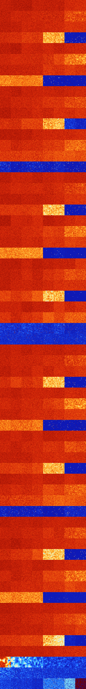

# B137 (70656-71167)

<details>
    <summary>Initial Grid</summary>
    
</details>


<details>
    <summary>Initial Grid RLE</summary>

```
#C Exported from GoGoL (https://github.com/marrow16/gogol)
#C Wrap mode: Toroidal
#C Boundary mode: Dead
#C Step: 0
x = 100, y = 100, rule = B137/S
5bo47bo23bo10bo$20bo54bo10bo9bo$4bo14bobo53bo4bo16bo$27bo11bo6bo18bo$
21bo2bo21bo$5bo79bo3bo$12bo13bo67b2o$43b2o31bo$8bo9bo17bo4bo13bo10bo17b
o12bo$7bo51bo6bo19bo$13bo23b2o5bo13bo13bo14bo3bo5bo$7bo12bobo8bo29bo$
16bobo24bo6bo18bo$24bo3bobo24bo7bo27bo$18bo23bo31bo10bo13bo$13bo12bo20b
o2bo7bo$8bo14bo3bobo3bo7bo$66bo$59bo18bo$3bo14bo76bo$5bo22bo4bo3bo5bo
10bo4bo30bo$40bo39bo12bo$o86b2o10bo$14bo30bo2bo2bo45bo$12bo24bo48bo$4bo
9bo28bo8bo$69bo$4bo24bo22bo34bo7bo$6bobo11bo35bo2bo2bo16bo$14bo2bo8bo
44bo12bo3bo$bo13bo2bo18bo10bo13bo28bo$2bo5bobo14bobo5bo11bo3bo34bo8bo$
40bo31bo22bo$bo25bobo$18bo25bo29bo18bo3bobo$2b2o71bo4bobo4bo2bo$6b2o2b
2o19bo22b3o9bo18bo$26bo29bo$8bo16bo48bo4bo$2bobo44bo27bo2bo2bo7bo$5bo6b
o45bo8bobo10bo4bo$6bo32bo32bo$7bo43bo$45bo40bo$23bobo23bo21bo19bo4bo$
17bo40b2o$4bobo27bo7bo24bo24bo5bo$20bo3b2o24bo10bo10bo7bo$9bo25bo14bo
16bo21bo$2bo15bo3bo4bo14b2o29bo$8bo37bo32bo$48bo13bo17bo$3bo24bo12bo2bo
3bo40bo$2bo6bo8b2o14bo41bobo15bo$11b2o4bo16b2o15bo6bo27bo7bo$22bo28bo
33bo$2bo36bo45bo$57bo10bo17bo2bo9bo$50bo5bobo29bo$25bo7bo9bo21bo2bo19bo
$6bo21b2o14bo31bobo15bo$15bo3bo18bo36bo6b2o$5bo25bo21bo39bo$10bo33bo16b
o22bo$68bo7bo3bo10bo$3bobo14bo42bo4bo3bo20bo$31bo$17bo20bo44bo$5bo22bo
5bo3bo20bo18bo19bo$18bo6b2o2bobo3bo9bo4bo2bo12bo26bobo$10bo14bo34bo$4bo
11bo12bo31bo$9b2o20bo7bo7bo9bo4bo21b2o3bo5bo$56bo8bo24bo$32bo16bo9bo8bo
$36bo13bo14bobo19bo$10bobo7bo30bo25bo$2bo30bo11bo$19bo45b2o14bo15bo$91b
o3bo$7bobo22bo4bo14bo22bo$bo63bo$15bo37bo8bo4bo6bo$38bo3bo22bo2bo$2bo
12bo11bo23bo29b2o$32bo8bo12bo8bo26bo$2b2o14bo15b2o31bobo18bo$83bo$7b2o
40bo5bo34bo$24bo$40bo27bo4b2o6bo$11bobo22bo29bo10bo19bo$6bo20bo66bo3bo$
11b2obo8bo12bo32bobo16bo$o45bo36bo$11bo7bo15bo36bo14bo$bo8bo30bo3bo9bo
8bo30bo$10bo74bo$68bo11bo$3b2o22bo44bo!
```
</details>
<details>
    <summary>Thumbnail</summary>

</details>
<table>
<tr>
    <td><a href="./70656%20S%20Heat%20Map%20Activity.png"></a><br>S (70656)<br>G>1000</td>    <td><a href="./70657%20S0%20Heat%20Map%20Activity.png"></a><br>S0 (70657)<br>G>1000</td>    <td><a href="./70658%20S1%20Heat%20Map%20Activity.png"></a><br>S1 (70658)<br>G>1000</td>    <td><a href="./70659%20S01%20Heat%20Map%20Activity.png"></a><br>S01 (70659)<br>G>1000</td>    <td><a href="./70660%20S2%20Heat%20Map%20Activity.png"></a><br>S2 (70660)<br>G>1000</td>    <td><a href="./70661%20S02%20Heat%20Map%20Activity.png"></a><br>S02 (70661)<br>G>1000</td>    <td><a href="./70662%20S12%20Heat%20Map%20Activity.png"></a><br>S12 (70662)<br>G>1000</td>    <td><a href="./70663%20S012%20Heat%20Map%20Activity.png"></a><br>S012 (70663)<br>G>1000</td></tr>
<tr>
    <td><a href="./70664%20S3%20Heat%20Map%20Activity.png"></a><br>S3 (70664)<br>G>1000</td>    <td><a href="./70665%20S03%20Heat%20Map%20Activity.png"></a><br>S03 (70665)<br>G>1000</td>    <td><a href="./70666%20S13%20Heat%20Map%20Activity.png"></a><br>S13 (70666)<br>G>1000</td>    <td><a href="./70667%20S013%20Heat%20Map%20Activity.png"></a><br>S013 (70667)<br>G>1000</td>    <td><a href="./70668%20S23%20Heat%20Map%20Activity.png"></a><br>S23 (70668)<br>G>1000</td>    <td><a href="./70669%20S023%20Heat%20Map%20Activity.png"></a><br>S023 (70669)<br>G>1000</td>    <td><a href="./70670%20S123%20Heat%20Map%20Activity.png"></a><br>S123 (70670)<br>G>1000</td>    <td><a href="./70671%20S0123%20Heat%20Map%20Activity.png"></a><br>S0123 (70671)<br>G>1000</td></tr>
<tr>
    <td><a href="./70672%20S4%20Heat%20Map%20Activity.png"></a><br>S4 (70672)<br>G>1000</td>    <td><a href="./70673%20S04%20Heat%20Map%20Activity.png"></a><br>S04 (70673)<br>G>1000</td>    <td><a href="./70674%20S14%20Heat%20Map%20Activity.png"></a><br>S14 (70674)<br>G>1000</td>    <td><a href="./70675%20S014%20Heat%20Map%20Activity.png"></a><br>S014 (70675)<br>G>1000</td>    <td><a href="./70676%20S24%20Heat%20Map%20Activity.png"></a><br>S24 (70676)<br>G>1000</td>    <td><a href="./70677%20S024%20Heat%20Map%20Activity.png"></a><br>S024 (70677)<br>G>1000</td>    <td><a href="./70678%20S124%20Heat%20Map%20Activity.png"></a><br>S124 (70678)<br>G>1000</td>    <td><a href="./70679%20S0124%20Heat%20Map%20Activity.png"></a><br>S0124 (70679)<br>G>1000</td></tr>
<tr>
    <td><a href="./70680%20S34%20Heat%20Map%20Activity.png"></a><br>S34 (70680)<br>G>1000</td>    <td><a href="./70681%20S034%20Heat%20Map%20Activity.png"></a><br>S034 (70681)<br>G>1000</td>    <td><a href="./70682%20S134%20Heat%20Map%20Activity.png"></a><br>S134 (70682)<br>G>1000</td>    <td><a href="./70683%20S0134%20Heat%20Map%20Activity.png"></a><br>S0134 (70683)<br>G>1000</td>    <td><a href="./70684%20S234%20Heat%20Map%20Activity.png"></a><br>S234 (70684)<br>G>1000</td>    <td><a href="./70685%20S0234%20Heat%20Map%20Activity.png"></a><br>S0234 (70685)<br>G>1000</td>    <td><a href="./70686%20S1234%20Heat%20Map%20Activity.png"></a><br>S1234 (70686)<br>R@462,p420</td>    <td><a href="./70687%20S01234%20Heat%20Map%20Activity.png"></a><br>S01234 (70687)<br>G>1000</td></tr>
<tr>
    <td><a href="./70688%20S5%20Heat%20Map%20Activity.png"></a><br>S5 (70688)<br>G>1000</td>    <td><a href="./70689%20S05%20Heat%20Map%20Activity.png"></a><br>S05 (70689)<br>G>1000</td>    <td><a href="./70690%20S15%20Heat%20Map%20Activity.png"></a><br>S15 (70690)<br>G>1000</td>    <td><a href="./70691%20S015%20Heat%20Map%20Activity.png"></a><br>S015 (70691)<br>G>1000</td>    <td><a href="./70692%20S25%20Heat%20Map%20Activity.png"></a><br>S25 (70692)<br>G>1000</td>    <td><a href="./70693%20S025%20Heat%20Map%20Activity.png"></a><br>S025 (70693)<br>G>1000</td>    <td><a href="./70694%20S125%20Heat%20Map%20Activity.png"></a><br>S125 (70694)<br>G>1000</td>    <td><a href="./70695%20S0125%20Heat%20Map%20Activity.png"></a><br>S0125 (70695)<br>G>1000</td></tr>
<tr>
    <td><a href="./70696%20S35%20Heat%20Map%20Activity.png"></a><br>S35 (70696)<br>G>1000</td>    <td><a href="./70697%20S035%20Heat%20Map%20Activity.png"></a><br>S035 (70697)<br>G>1000</td>    <td><a href="./70698%20S135%20Heat%20Map%20Activity.png"></a><br>S135 (70698)<br>G>1000</td>    <td><a href="./70699%20S0135%20Heat%20Map%20Activity.png"></a><br>S0135 (70699)<br>G>1000</td>    <td><a href="./70700%20S235%20Heat%20Map%20Activity.png"></a><br>S235 (70700)<br>G>1000</td>    <td><a href="./70701%20S0235%20Heat%20Map%20Activity.png"></a><br>S0235 (70701)<br>G>1000</td>    <td><a href="./70702%20S1235%20Heat%20Map%20Activity.png"></a><br>S1235 (70702)<br>G>1000</td>    <td><a href="./70703%20S01235%20Heat%20Map%20Activity.png"></a><br>S01235 (70703)<br>G>1000</td></tr>
<tr>
    <td><a href="./70704%20S45%20Heat%20Map%20Activity.png"></a><br>S45 (70704)<br>G>1000</td>    <td><a href="./70705%20S045%20Heat%20Map%20Activity.png"></a><br>S045 (70705)<br>G>1000</td>    <td><a href="./70706%20S145%20Heat%20Map%20Activity.png"></a><br>S145 (70706)<br>G>1000</td>    <td><a href="./70707%20S0145%20Heat%20Map%20Activity.png"></a><br>S0145 (70707)<br>G>1000</td>    <td><a href="./70708%20S245%20Heat%20Map%20Activity.png"></a><br>S245 (70708)<br>G>1000</td>    <td><a href="./70709%20S0245%20Heat%20Map%20Activity.png"></a><br>S0245 (70709)<br>G>1000</td>    <td><a href="./70710%20S1245%20Heat%20Map%20Activity.png"></a><br>S1245 (70710)<br>G>1000</td>    <td><a href="./70711%20S01245%20Heat%20Map%20Activity.png"></a><br>S01245 (70711)<br>G>1000</td></tr>
<tr>
    <td><a href="./70712%20S345%20Heat%20Map%20Activity.png"></a><br>S345 (70712)<br>G>1000</td>    <td><a href="./70713%20S0345%20Heat%20Map%20Activity.png"></a><br>S0345 (70713)<br>G>1000</td>    <td><a href="./70714%20S1345%20Heat%20Map%20Activity.png"></a><br>S1345 (70714)<br>G>1000</td>    <td><a href="./70715%20S01345%20Heat%20Map%20Activity.png"></a><br>S01345 (70715)<br>G>1000</td>    <td><a href="./70716%20S2345%20Heat%20Map%20Activity.png"></a><br>S2345 (70716)<br>G>1000</td>    <td><a href="./70717%20S02345%20Heat%20Map%20Activity.png"></a><br>S02345 (70717)<br>G>1000</td>    <td><a href="./70718%20S12345%20Heat%20Map%20Activity.png"></a><br>S12345 (70718)<br>R@875,p840</td>    <td><a href="./70719%20S012345%20Heat%20Map%20Activity.png"></a><br>S012345 (70719)<br>R@451,p420</td></tr>
<tr>
    <td><a href="./70720%20S6%20Heat%20Map%20Activity.png"></a><br>S6 (70720)<br>G>1000</td>    <td><a href="./70721%20S06%20Heat%20Map%20Activity.png"></a><br>S06 (70721)<br>G>1000</td>    <td><a href="./70722%20S16%20Heat%20Map%20Activity.png"></a><br>S16 (70722)<br>G>1000</td>    <td><a href="./70723%20S016%20Heat%20Map%20Activity.png"></a><br>S016 (70723)<br>G>1000</td>    <td><a href="./70724%20S26%20Heat%20Map%20Activity.png"></a><br>S26 (70724)<br>G>1000</td>    <td><a href="./70725%20S026%20Heat%20Map%20Activity.png"></a><br>S026 (70725)<br>G>1000</td>    <td><a href="./70726%20S126%20Heat%20Map%20Activity.png"></a><br>S126 (70726)<br>G>1000</td>    <td><a href="./70727%20S0126%20Heat%20Map%20Activity.png"></a><br>S0126 (70727)<br>G>1000</td></tr>
<tr>
    <td><a href="./70728%20S36%20Heat%20Map%20Activity.png"></a><br>S36 (70728)<br>G>1000</td>    <td><a href="./70729%20S036%20Heat%20Map%20Activity.png"></a><br>S036 (70729)<br>G>1000</td>    <td><a href="./70730%20S136%20Heat%20Map%20Activity.png"></a><br>S136 (70730)<br>G>1000</td>    <td><a href="./70731%20S0136%20Heat%20Map%20Activity.png"></a><br>S0136 (70731)<br>G>1000</td>    <td><a href="./70732%20S236%20Heat%20Map%20Activity.png"></a><br>S236 (70732)<br>G>1000</td>    <td><a href="./70733%20S0236%20Heat%20Map%20Activity.png"></a><br>S0236 (70733)<br>G>1000</td>    <td><a href="./70734%20S1236%20Heat%20Map%20Activity.png"></a><br>S1236 (70734)<br>G>1000</td>    <td><a href="./70735%20S01236%20Heat%20Map%20Activity.png"></a><br>S01236 (70735)<br>G>1000</td></tr>
<tr>
    <td><a href="./70736%20S46%20Heat%20Map%20Activity.png"></a><br>S46 (70736)<br>G>1000</td>    <td><a href="./70737%20S046%20Heat%20Map%20Activity.png"></a><br>S046 (70737)<br>G>1000</td>    <td><a href="./70738%20S146%20Heat%20Map%20Activity.png"></a><br>S146 (70738)<br>G>1000</td>    <td><a href="./70739%20S0146%20Heat%20Map%20Activity.png"></a><br>S0146 (70739)<br>G>1000</td>    <td><a href="./70740%20S246%20Heat%20Map%20Activity.png"></a><br>S246 (70740)<br>G>1000</td>    <td><a href="./70741%20S0246%20Heat%20Map%20Activity.png"></a><br>S0246 (70741)<br>G>1000</td>    <td><a href="./70742%20S1246%20Heat%20Map%20Activity.png"></a><br>S1246 (70742)<br>G>1000</td>    <td><a href="./70743%20S01246%20Heat%20Map%20Activity.png"></a><br>S01246 (70743)<br>G>1000</td></tr>
<tr>
    <td><a href="./70744%20S346%20Heat%20Map%20Activity.png"></a><br>S346 (70744)<br>G>1000</td>    <td><a href="./70745%20S0346%20Heat%20Map%20Activity.png"></a><br>S0346 (70745)<br>G>1000</td>    <td><a href="./70746%20S1346%20Heat%20Map%20Activity.png"></a><br>S1346 (70746)<br>G>1000</td>    <td><a href="./70747%20S01346%20Heat%20Map%20Activity.png"></a><br>S01346 (70747)<br>G>1000</td>    <td><a href="./70748%20S2346%20Heat%20Map%20Activity.png"></a><br>S2346 (70748)<br>G>1000</td>    <td><a href="./70749%20S02346%20Heat%20Map%20Activity.png"></a><br>S02346 (70749)<br>G>1000</td>    <td><a href="./70750%20S12346%20Heat%20Map%20Activity.png"></a><br>S12346 (70750)<br>R@84,p12</td>    <td><a href="./70751%20S012346%20Heat%20Map%20Activity.png"></a><br>S012346 (70751)<br>R@145,p60</td></tr>
<tr>
    <td><a href="./70752%20S56%20Heat%20Map%20Activity.png"></a><br>S56 (70752)<br>G>1000</td>    <td><a href="./70753%20S056%20Heat%20Map%20Activity.png"></a><br>S056 (70753)<br>G>1000</td>    <td><a href="./70754%20S156%20Heat%20Map%20Activity.png"></a><br>S156 (70754)<br>G>1000</td>    <td><a href="./70755%20S0156%20Heat%20Map%20Activity.png"></a><br>S0156 (70755)<br>G>1000</td>    <td><a href="./70756%20S256%20Heat%20Map%20Activity.png"></a><br>S256 (70756)<br>G>1000</td>    <td><a href="./70757%20S0256%20Heat%20Map%20Activity.png"></a><br>S0256 (70757)<br>G>1000</td>    <td><a href="./70758%20S1256%20Heat%20Map%20Activity.png"></a><br>S1256 (70758)<br>G>1000</td>    <td><a href="./70759%20S01256%20Heat%20Map%20Activity.png"></a><br>S01256 (70759)<br>G>1000</td></tr>
<tr>
    <td><a href="./70760%20S356%20Heat%20Map%20Activity.png"></a><br>S356 (70760)<br>G>1000</td>    <td><a href="./70761%20S0356%20Heat%20Map%20Activity.png"></a><br>S0356 (70761)<br>G>1000</td>    <td><a href="./70762%20S1356%20Heat%20Map%20Activity.png"></a><br>S1356 (70762)<br>G>1000</td>    <td><a href="./70763%20S01356%20Heat%20Map%20Activity.png"></a><br>S01356 (70763)<br>G>1000</td>    <td><a href="./70764%20S2356%20Heat%20Map%20Activity.png"></a><br>S2356 (70764)<br>G>1000</td>    <td><a href="./70765%20S02356%20Heat%20Map%20Activity.png"></a><br>S02356 (70765)<br>G>1000</td>    <td><a href="./70766%20S12356%20Heat%20Map%20Activity.png"></a><br>S12356 (70766)<br>G>1000</td>    <td><a href="./70767%20S012356%20Heat%20Map%20Activity.png"></a><br>S012356 (70767)<br>G>1000</td></tr>
<tr>
    <td><a href="./70768%20S456%20Heat%20Map%20Activity.png"></a><br>S456 (70768)<br>G>1000</td>    <td><a href="./70769%20S0456%20Heat%20Map%20Activity.png"></a><br>S0456 (70769)<br>G>1000</td>    <td><a href="./70770%20S1456%20Heat%20Map%20Activity.png"></a><br>S1456 (70770)<br>G>1000</td>    <td><a href="./70771%20S01456%20Heat%20Map%20Activity.png"></a><br>S01456 (70771)<br>G>1000</td>    <td><a href="./70772%20S2456%20Heat%20Map%20Activity.png"></a><br>S2456 (70772)<br>G>1000</td>    <td><a href="./70773%20S02456%20Heat%20Map%20Activity.png"></a><br>S02456 (70773)<br>G>1000</td>    <td><a href="./70774%20S12456%20Heat%20Map%20Activity.png"></a><br>S12456 (70774)<br>G>1000</td>    <td><a href="./70775%20S012456%20Heat%20Map%20Activity.png"></a><br>S012456 (70775)<br>G>1000</td></tr>
<tr>
    <td><a href="./70776%20S3456%20Heat%20Map%20Activity.png"></a><br>S3456 (70776)<br>R@125,p12</td>    <td><a href="./70777%20S03456%20Heat%20Map%20Activity.png"></a><br>S03456 (70777)<br>R@484,p312</td>    <td><a href="./70778%20S13456%20Heat%20Map%20Activity.png"></a><br>S13456 (70778)<br>R@198,p60</td>    <td><a href="./70779%20S013456%20Heat%20Map%20Activity.png"></a><br>S013456 (70779)<br>R@167,p36</td>    <td><a href="./70780%20S23456%20Heat%20Map%20Activity.png"></a><br>S23456 (70780)<br>R@149,p120</td>    <td><a href="./70781%20S023456%20Heat%20Map%20Activity.png"></a><br>S023456 (70781)<br>R@54,p24</td>    <td><a href="./70782%20S123456%20Heat%20Map%20Activity.png"></a><br>S123456 (70782)<br>R@199,p168</td>    <td><a href="./70783%20S0123456%20Heat%20Map%20Activity.png"></a><br>S0123456 (70783)<br>R@145,p120</td></tr>
<tr>
    <td><a href="./70784%20S7%20Heat%20Map%20Activity.png"></a><br>S7 (70784)<br>G>1000</td>    <td><a href="./70785%20S07%20Heat%20Map%20Activity.png"></a><br>S07 (70785)<br>G>1000</td>    <td><a href="./70786%20S17%20Heat%20Map%20Activity.png"></a><br>S17 (70786)<br>G>1000</td>    <td><a href="./70787%20S017%20Heat%20Map%20Activity.png"></a><br>S017 (70787)<br>G>1000</td>    <td><a href="./70788%20S27%20Heat%20Map%20Activity.png"></a><br>S27 (70788)<br>G>1000</td>    <td><a href="./70789%20S027%20Heat%20Map%20Activity.png"></a><br>S027 (70789)<br>G>1000</td>    <td><a href="./70790%20S127%20Heat%20Map%20Activity.png"></a><br>S127 (70790)<br>G>1000</td>    <td><a href="./70791%20S0127%20Heat%20Map%20Activity.png"></a><br>S0127 (70791)<br>G>1000</td></tr>
<tr>
    <td><a href="./70792%20S37%20Heat%20Map%20Activity.png"></a><br>S37 (70792)<br>G>1000</td>    <td><a href="./70793%20S037%20Heat%20Map%20Activity.png"></a><br>S037 (70793)<br>G>1000</td>    <td><a href="./70794%20S137%20Heat%20Map%20Activity.png"></a><br>S137 (70794)<br>G>1000</td>    <td><a href="./70795%20S0137%20Heat%20Map%20Activity.png"></a><br>S0137 (70795)<br>G>1000</td>    <td><a href="./70796%20S237%20Heat%20Map%20Activity.png"></a><br>S237 (70796)<br>G>1000</td>    <td><a href="./70797%20S0237%20Heat%20Map%20Activity.png"></a><br>S0237 (70797)<br>G>1000</td>    <td><a href="./70798%20S1237%20Heat%20Map%20Activity.png"></a><br>S1237 (70798)<br>G>1000</td>    <td><a href="./70799%20S01237%20Heat%20Map%20Activity.png"></a><br>S01237 (70799)<br>G>1000</td></tr>
<tr>
    <td><a href="./70800%20S47%20Heat%20Map%20Activity.png"></a><br>S47 (70800)<br>G>1000</td>    <td><a href="./70801%20S047%20Heat%20Map%20Activity.png"></a><br>S047 (70801)<br>G>1000</td>    <td><a href="./70802%20S147%20Heat%20Map%20Activity.png"></a><br>S147 (70802)<br>G>1000</td>    <td><a href="./70803%20S0147%20Heat%20Map%20Activity.png"></a><br>S0147 (70803)<br>G>1000</td>    <td><a href="./70804%20S247%20Heat%20Map%20Activity.png"></a><br>S247 (70804)<br>G>1000</td>    <td><a href="./70805%20S0247%20Heat%20Map%20Activity.png"></a><br>S0247 (70805)<br>G>1000</td>    <td><a href="./70806%20S1247%20Heat%20Map%20Activity.png"></a><br>S1247 (70806)<br>G>1000</td>    <td><a href="./70807%20S01247%20Heat%20Map%20Activity.png"></a><br>S01247 (70807)<br>G>1000</td></tr>
<tr>
    <td><a href="./70808%20S347%20Heat%20Map%20Activity.png"></a><br>S347 (70808)<br>G>1000</td>    <td><a href="./70809%20S0347%20Heat%20Map%20Activity.png"></a><br>S0347 (70809)<br>G>1000</td>    <td><a href="./70810%20S1347%20Heat%20Map%20Activity.png"></a><br>S1347 (70810)<br>G>1000</td>    <td><a href="./70811%20S01347%20Heat%20Map%20Activity.png"></a><br>S01347 (70811)<br>G>1000</td>    <td><a href="./70812%20S2347%20Heat%20Map%20Activity.png"></a><br>S2347 (70812)<br>G>1000</td>    <td><a href="./70813%20S02347%20Heat%20Map%20Activity.png"></a><br>S02347 (70813)<br>G>1000</td>    <td><a href="./70814%20S12347%20Heat%20Map%20Activity.png"></a><br>S12347 (70814)<br>G>1000</td>    <td><a href="./70815%20S012347%20Heat%20Map%20Activity.png"></a><br>S012347 (70815)<br>G>1000</td></tr>
<tr>
    <td><a href="./70816%20S57%20Heat%20Map%20Activity.png"></a><br>S57 (70816)<br>G>1000</td>    <td><a href="./70817%20S057%20Heat%20Map%20Activity.png"></a><br>S057 (70817)<br>G>1000</td>    <td><a href="./70818%20S157%20Heat%20Map%20Activity.png"></a><br>S157 (70818)<br>G>1000</td>    <td><a href="./70819%20S0157%20Heat%20Map%20Activity.png"></a><br>S0157 (70819)<br>G>1000</td>    <td><a href="./70820%20S257%20Heat%20Map%20Activity.png"></a><br>S257 (70820)<br>G>1000</td>    <td><a href="./70821%20S0257%20Heat%20Map%20Activity.png"></a><br>S0257 (70821)<br>G>1000</td>    <td><a href="./70822%20S1257%20Heat%20Map%20Activity.png"></a><br>S1257 (70822)<br>G>1000</td>    <td><a href="./70823%20S01257%20Heat%20Map%20Activity.png"></a><br>S01257 (70823)<br>G>1000</td></tr>
<tr>
    <td><a href="./70824%20S357%20Heat%20Map%20Activity.png"></a><br>S357 (70824)<br>G>1000</td>    <td><a href="./70825%20S0357%20Heat%20Map%20Activity.png"></a><br>S0357 (70825)<br>G>1000</td>    <td><a href="./70826%20S1357%20Heat%20Map%20Activity.png"></a><br>S1357 (70826)<br>G>1000</td>    <td><a href="./70827%20S01357%20Heat%20Map%20Activity.png"></a><br>S01357 (70827)<br>G>1000</td>    <td><a href="./70828%20S2357%20Heat%20Map%20Activity.png"></a><br>S2357 (70828)<br>G>1000</td>    <td><a href="./70829%20S02357%20Heat%20Map%20Activity.png"></a><br>S02357 (70829)<br>G>1000</td>    <td><a href="./70830%20S12357%20Heat%20Map%20Activity.png"></a><br>S12357 (70830)<br>G>1000</td>    <td><a href="./70831%20S012357%20Heat%20Map%20Activity.png"></a><br>S012357 (70831)<br>G>1000</td></tr>
<tr>
    <td><a href="./70832%20S457%20Heat%20Map%20Activity.png"></a><br>S457 (70832)<br>G>1000</td>    <td><a href="./70833%20S0457%20Heat%20Map%20Activity.png"></a><br>S0457 (70833)<br>G>1000</td>    <td><a href="./70834%20S1457%20Heat%20Map%20Activity.png"></a><br>S1457 (70834)<br>G>1000</td>    <td><a href="./70835%20S01457%20Heat%20Map%20Activity.png"></a><br>S01457 (70835)<br>G>1000</td>    <td><a href="./70836%20S2457%20Heat%20Map%20Activity.png"></a><br>S2457 (70836)<br>G>1000</td>    <td><a href="./70837%20S02457%20Heat%20Map%20Activity.png"></a><br>S02457 (70837)<br>G>1000</td>    <td><a href="./70838%20S12457%20Heat%20Map%20Activity.png"></a><br>S12457 (70838)<br>G>1000</td>    <td><a href="./70839%20S012457%20Heat%20Map%20Activity.png"></a><br>S012457 (70839)<br>G>1000</td></tr>
<tr>
    <td><a href="./70840%20S3457%20Heat%20Map%20Activity.png"></a><br>S3457 (70840)<br>G>1000</td>    <td><a href="./70841%20S03457%20Heat%20Map%20Activity.png"></a><br>S03457 (70841)<br>G>1000</td>    <td><a href="./70842%20S13457%20Heat%20Map%20Activity.png"></a><br>S13457 (70842)<br>G>1000</td>    <td><a href="./70843%20S013457%20Heat%20Map%20Activity.png"></a><br>S013457 (70843)<br>G>1000</td>    <td><a href="./70844%20S23457%20Heat%20Map%20Activity.png"></a><br>S23457 (70844)<br>G>1000</td>    <td><a href="./70845%20S023457%20Heat%20Map%20Activity.png"></a><br>S023457 (70845)<br>R@142,p60</td>    <td><a href="./70846%20S123457%20Heat%20Map%20Activity.png"></a><br>S123457 (70846)<br>R@276,p252</td>    <td><a href="./70847%20S0123457%20Heat%20Map%20Activity.png"></a><br>S0123457 (70847)<br>R@278,p252</td></tr>
<tr>
    <td><a href="./70848%20S67%20Heat%20Map%20Activity.png"></a><br>S67 (70848)<br>G>1000</td>    <td><a href="./70849%20S067%20Heat%20Map%20Activity.png"></a><br>S067 (70849)<br>G>1000</td>    <td><a href="./70850%20S167%20Heat%20Map%20Activity.png"></a><br>S167 (70850)<br>G>1000</td>    <td><a href="./70851%20S0167%20Heat%20Map%20Activity.png"></a><br>S0167 (70851)<br>G>1000</td>    <td><a href="./70852%20S267%20Heat%20Map%20Activity.png"></a><br>S267 (70852)<br>G>1000</td>    <td><a href="./70853%20S0267%20Heat%20Map%20Activity.png"></a><br>S0267 (70853)<br>G>1000</td>    <td><a href="./70854%20S1267%20Heat%20Map%20Activity.png"></a><br>S1267 (70854)<br>G>1000</td>    <td><a href="./70855%20S01267%20Heat%20Map%20Activity.png"></a><br>S01267 (70855)<br>G>1000</td></tr>
<tr>
    <td><a href="./70856%20S367%20Heat%20Map%20Activity.png"></a><br>S367 (70856)<br>G>1000</td>    <td><a href="./70857%20S0367%20Heat%20Map%20Activity.png"></a><br>S0367 (70857)<br>G>1000</td>    <td><a href="./70858%20S1367%20Heat%20Map%20Activity.png"></a><br>S1367 (70858)<br>G>1000</td>    <td><a href="./70859%20S01367%20Heat%20Map%20Activity.png"></a><br>S01367 (70859)<br>G>1000</td>    <td><a href="./70860%20S2367%20Heat%20Map%20Activity.png"></a><br>S2367 (70860)<br>G>1000</td>    <td><a href="./70861%20S02367%20Heat%20Map%20Activity.png"></a><br>S02367 (70861)<br>G>1000</td>    <td><a href="./70862%20S12367%20Heat%20Map%20Activity.png"></a><br>S12367 (70862)<br>G>1000</td>    <td><a href="./70863%20S012367%20Heat%20Map%20Activity.png"></a><br>S012367 (70863)<br>G>1000</td></tr>
<tr>
    <td><a href="./70864%20S467%20Heat%20Map%20Activity.png"></a><br>S467 (70864)<br>G>1000</td>    <td><a href="./70865%20S0467%20Heat%20Map%20Activity.png"></a><br>S0467 (70865)<br>G>1000</td>    <td><a href="./70866%20S1467%20Heat%20Map%20Activity.png"></a><br>S1467 (70866)<br>G>1000</td>    <td><a href="./70867%20S01467%20Heat%20Map%20Activity.png"></a><br>S01467 (70867)<br>G>1000</td>    <td><a href="./70868%20S2467%20Heat%20Map%20Activity.png"></a><br>S2467 (70868)<br>G>1000</td>    <td><a href="./70869%20S02467%20Heat%20Map%20Activity.png"></a><br>S02467 (70869)<br>G>1000</td>    <td><a href="./70870%20S12467%20Heat%20Map%20Activity.png"></a><br>S12467 (70870)<br>G>1000</td>    <td><a href="./70871%20S012467%20Heat%20Map%20Activity.png"></a><br>S012467 (70871)<br>G>1000</td></tr>
<tr>
    <td><a href="./70872%20S3467%20Heat%20Map%20Activity.png"></a><br>S3467 (70872)<br>G>1000</td>    <td><a href="./70873%20S03467%20Heat%20Map%20Activity.png"></a><br>S03467 (70873)<br>G>1000</td>    <td><a href="./70874%20S13467%20Heat%20Map%20Activity.png"></a><br>S13467 (70874)<br>G>1000</td>    <td><a href="./70875%20S013467%20Heat%20Map%20Activity.png"></a><br>S013467 (70875)<br>G>1000</td>    <td><a href="./70876%20S23467%20Heat%20Map%20Activity.png"></a><br>S23467 (70876)<br>G>1000</td>    <td><a href="./70877%20S023467%20Heat%20Map%20Activity.png"></a><br>S023467 (70877)<br>G>1000</td>    <td><a href="./70878%20S123467%20Heat%20Map%20Activity.png"></a><br>S123467 (70878)<br>G>1000</td>    <td><a href="./70879%20S0123467%20Heat%20Map%20Activity.png"></a><br>S0123467 (70879)<br>R@878,p792</td></tr>
<tr>
    <td><a href="./70880%20S567%20Heat%20Map%20Activity.png"></a><br>S567 (70880)<br>G>1000</td>    <td><a href="./70881%20S0567%20Heat%20Map%20Activity.png"></a><br>S0567 (70881)<br>G>1000</td>    <td><a href="./70882%20S1567%20Heat%20Map%20Activity.png"></a><br>S1567 (70882)<br>G>1000</td>    <td><a href="./70883%20S01567%20Heat%20Map%20Activity.png"></a><br>S01567 (70883)<br>G>1000</td>    <td><a href="./70884%20S2567%20Heat%20Map%20Activity.png"></a><br>S2567 (70884)<br>G>1000</td>    <td><a href="./70885%20S02567%20Heat%20Map%20Activity.png"></a><br>S02567 (70885)<br>G>1000</td>    <td><a href="./70886%20S12567%20Heat%20Map%20Activity.png"></a><br>S12567 (70886)<br>G>1000</td>    <td><a href="./70887%20S012567%20Heat%20Map%20Activity.png"></a><br>S012567 (70887)<br>G>1000</td></tr>
<tr>
    <td><a href="./70888%20S3567%20Heat%20Map%20Activity.png"></a><br>S3567 (70888)<br>G>1000</td>    <td><a href="./70889%20S03567%20Heat%20Map%20Activity.png"></a><br>S03567 (70889)<br>G>1000</td>    <td><a href="./70890%20S13567%20Heat%20Map%20Activity.png"></a><br>S13567 (70890)<br>G>1000</td>    <td><a href="./70891%20S013567%20Heat%20Map%20Activity.png"></a><br>S013567 (70891)<br>G>1000</td>    <td><a href="./70892%20S23567%20Heat%20Map%20Activity.png"></a><br>S23567 (70892)<br>G>1000</td>    <td><a href="./70893%20S023567%20Heat%20Map%20Activity.png"></a><br>S023567 (70893)<br>G>1000</td>    <td><a href="./70894%20S123567%20Heat%20Map%20Activity.png"></a><br>S123567 (70894)<br>G>1000</td>    <td><a href="./70895%20S0123567%20Heat%20Map%20Activity.png"></a><br>S0123567 (70895)<br>G>1000</td></tr>
<tr>
    <td><a href="./70896%20S4567%20Heat%20Map%20Activity.png"></a><br>S4567 (70896)<br>R@187,p60</td>    <td><a href="./70897%20S04567%20Heat%20Map%20Activity.png"></a><br>S04567 (70897)<br>R@181,p60</td>    <td><a href="./70898%20S14567%20Heat%20Map%20Activity.png"></a><br>S14567 (70898)<br>R@107,p12</td>    <td><a href="./70899%20S014567%20Heat%20Map%20Activity.png"></a><br>S014567 (70899)<br>R@120,p12</td>    <td><a href="./70900%20S24567%20Heat%20Map%20Activity.png"></a><br>S24567 (70900)<br>R@130,p60</td>    <td><a href="./70901%20S024567%20Heat%20Map%20Activity.png"></a><br>S024567 (70901)<br>R@69,p12</td>    <td><a href="./70902%20S124567%20Heat%20Map%20Activity.png"></a><br>S124567 (70902)<br>R@159,p84</td>    <td><a href="./70903%20S0124567%20Heat%20Map%20Activity.png"></a><br>S0124567 (70903)<br>R@111,p42</td></tr>
<tr>
    <td><a href="./70904%20S34567%20Heat%20Map%20Activity.png"></a><br>S34567 (70904)<br>R@43,p12</td>    <td><a href="./70905%20S034567%20Heat%20Map%20Activity.png"></a><br>S034567 (70905)<br>R@33,p12</td>    <td><a href="./70906%20S134567%20Heat%20Map%20Activity.png"></a><br>S134567 (70906)<br>R@34,p12</td>    <td><a href="./70907%20S0134567%20Heat%20Map%20Activity.png"></a><br>S0134567 (70907)<br>R@38,p12</td>    <td><a href="./70908%20S234567%20Heat%20Map%20Activity.png"></a><br>S234567 (70908)<br>R@23,p6</td>    <td><a href="./70909%20S0234567%20Heat%20Map%20Activity.png"></a><br>S0234567 (70909)<br>R@28,p6</td>    <td><a href="./70910%20S1234567%20Heat%20Map%20Activity.png"></a><br>S1234567 (70910)<br>R@26,p6</td>    <td><a href="./70911%20S01234567%20Heat%20Map%20Activity.png"></a><br>S01234567 (70911)<br>R@24,p6</td></tr>
<tr>
    <td><a href="./70912%20S8%20Heat%20Map%20Activity.png"></a><br>S8 (70912)<br>G>1000</td>    <td><a href="./70913%20S08%20Heat%20Map%20Activity.png"></a><br>S08 (70913)<br>G>1000</td>    <td><a href="./70914%20S18%20Heat%20Map%20Activity.png"></a><br>S18 (70914)<br>G>1000</td>    <td><a href="./70915%20S018%20Heat%20Map%20Activity.png"></a><br>S018 (70915)<br>G>1000</td>    <td><a href="./70916%20S28%20Heat%20Map%20Activity.png"></a><br>S28 (70916)<br>G>1000</td>    <td><a href="./70917%20S028%20Heat%20Map%20Activity.png"></a><br>S028 (70917)<br>G>1000</td>    <td><a href="./70918%20S128%20Heat%20Map%20Activity.png"></a><br>S128 (70918)<br>G>1000</td>    <td><a href="./70919%20S0128%20Heat%20Map%20Activity.png"></a><br>S0128 (70919)<br>G>1000</td></tr>
<tr>
    <td><a href="./70920%20S38%20Heat%20Map%20Activity.png"></a><br>S38 (70920)<br>G>1000</td>    <td><a href="./70921%20S038%20Heat%20Map%20Activity.png"></a><br>S038 (70921)<br>G>1000</td>    <td><a href="./70922%20S138%20Heat%20Map%20Activity.png"></a><br>S138 (70922)<br>G>1000</td>    <td><a href="./70923%20S0138%20Heat%20Map%20Activity.png"></a><br>S0138 (70923)<br>G>1000</td>    <td><a href="./70924%20S238%20Heat%20Map%20Activity.png"></a><br>S238 (70924)<br>G>1000</td>    <td><a href="./70925%20S0238%20Heat%20Map%20Activity.png"></a><br>S0238 (70925)<br>G>1000</td>    <td><a href="./70926%20S1238%20Heat%20Map%20Activity.png"></a><br>S1238 (70926)<br>G>1000</td>    <td><a href="./70927%20S01238%20Heat%20Map%20Activity.png"></a><br>S01238 (70927)<br>G>1000</td></tr>
<tr>
    <td><a href="./70928%20S48%20Heat%20Map%20Activity.png"></a><br>S48 (70928)<br>G>1000</td>    <td><a href="./70929%20S048%20Heat%20Map%20Activity.png"></a><br>S048 (70929)<br>G>1000</td>    <td><a href="./70930%20S148%20Heat%20Map%20Activity.png"></a><br>S148 (70930)<br>G>1000</td>    <td><a href="./70931%20S0148%20Heat%20Map%20Activity.png"></a><br>S0148 (70931)<br>G>1000</td>    <td><a href="./70932%20S248%20Heat%20Map%20Activity.png"></a><br>S248 (70932)<br>G>1000</td>    <td><a href="./70933%20S0248%20Heat%20Map%20Activity.png"></a><br>S0248 (70933)<br>G>1000</td>    <td><a href="./70934%20S1248%20Heat%20Map%20Activity.png"></a><br>S1248 (70934)<br>G>1000</td>    <td><a href="./70935%20S01248%20Heat%20Map%20Activity.png"></a><br>S01248 (70935)<br>G>1000</td></tr>
<tr>
    <td><a href="./70936%20S348%20Heat%20Map%20Activity.png"></a><br>S348 (70936)<br>G>1000</td>    <td><a href="./70937%20S0348%20Heat%20Map%20Activity.png"></a><br>S0348 (70937)<br>G>1000</td>    <td><a href="./70938%20S1348%20Heat%20Map%20Activity.png"></a><br>S1348 (70938)<br>G>1000</td>    <td><a href="./70939%20S01348%20Heat%20Map%20Activity.png"></a><br>S01348 (70939)<br>G>1000</td>    <td><a href="./70940%20S2348%20Heat%20Map%20Activity.png"></a><br>S2348 (70940)<br>G>1000</td>    <td><a href="./70941%20S02348%20Heat%20Map%20Activity.png"></a><br>S02348 (70941)<br>G>1000</td>    <td><a href="./70942%20S12348%20Heat%20Map%20Activity.png"></a><br>S12348 (70942)<br>G>1000</td>    <td><a href="./70943%20S012348%20Heat%20Map%20Activity.png"></a><br>S012348 (70943)<br>G>1000</td></tr>
<tr>
    <td><a href="./70944%20S58%20Heat%20Map%20Activity.png"></a><br>S58 (70944)<br>G>1000</td>    <td><a href="./70945%20S058%20Heat%20Map%20Activity.png"></a><br>S058 (70945)<br>G>1000</td>    <td><a href="./70946%20S158%20Heat%20Map%20Activity.png"></a><br>S158 (70946)<br>G>1000</td>    <td><a href="./70947%20S0158%20Heat%20Map%20Activity.png"></a><br>S0158 (70947)<br>G>1000</td>    <td><a href="./70948%20S258%20Heat%20Map%20Activity.png"></a><br>S258 (70948)<br>G>1000</td>    <td><a href="./70949%20S0258%20Heat%20Map%20Activity.png"></a><br>S0258 (70949)<br>G>1000</td>    <td><a href="./70950%20S1258%20Heat%20Map%20Activity.png"></a><br>S1258 (70950)<br>G>1000</td>    <td><a href="./70951%20S01258%20Heat%20Map%20Activity.png"></a><br>S01258 (70951)<br>G>1000</td></tr>
<tr>
    <td><a href="./70952%20S358%20Heat%20Map%20Activity.png"></a><br>S358 (70952)<br>G>1000</td>    <td><a href="./70953%20S0358%20Heat%20Map%20Activity.png"></a><br>S0358 (70953)<br>G>1000</td>    <td><a href="./70954%20S1358%20Heat%20Map%20Activity.png"></a><br>S1358 (70954)<br>G>1000</td>    <td><a href="./70955%20S01358%20Heat%20Map%20Activity.png"></a><br>S01358 (70955)<br>G>1000</td>    <td><a href="./70956%20S2358%20Heat%20Map%20Activity.png"></a><br>S2358 (70956)<br>G>1000</td>    <td><a href="./70957%20S02358%20Heat%20Map%20Activity.png"></a><br>S02358 (70957)<br>G>1000</td>    <td><a href="./70958%20S12358%20Heat%20Map%20Activity.png"></a><br>S12358 (70958)<br>G>1000</td>    <td><a href="./70959%20S012358%20Heat%20Map%20Activity.png"></a><br>S012358 (70959)<br>G>1000</td></tr>
<tr>
    <td><a href="./70960%20S458%20Heat%20Map%20Activity.png"></a><br>S458 (70960)<br>G>1000</td>    <td><a href="./70961%20S0458%20Heat%20Map%20Activity.png"></a><br>S0458 (70961)<br>G>1000</td>    <td><a href="./70962%20S1458%20Heat%20Map%20Activity.png"></a><br>S1458 (70962)<br>G>1000</td>    <td><a href="./70963%20S01458%20Heat%20Map%20Activity.png"></a><br>S01458 (70963)<br>G>1000</td>    <td><a href="./70964%20S2458%20Heat%20Map%20Activity.png"></a><br>S2458 (70964)<br>G>1000</td>    <td><a href="./70965%20S02458%20Heat%20Map%20Activity.png"></a><br>S02458 (70965)<br>G>1000</td>    <td><a href="./70966%20S12458%20Heat%20Map%20Activity.png"></a><br>S12458 (70966)<br>G>1000</td>    <td><a href="./70967%20S012458%20Heat%20Map%20Activity.png"></a><br>S012458 (70967)<br>G>1000</td></tr>
<tr>
    <td><a href="./70968%20S3458%20Heat%20Map%20Activity.png"></a><br>S3458 (70968)<br>G>1000</td>    <td><a href="./70969%20S03458%20Heat%20Map%20Activity.png"></a><br>S03458 (70969)<br>G>1000</td>    <td><a href="./70970%20S13458%20Heat%20Map%20Activity.png"></a><br>S13458 (70970)<br>G>1000</td>    <td><a href="./70971%20S013458%20Heat%20Map%20Activity.png"></a><br>S013458 (70971)<br>G>1000</td>    <td><a href="./70972%20S23458%20Heat%20Map%20Activity.png"></a><br>S23458 (70972)<br>G>1000</td>    <td><a href="./70973%20S023458%20Heat%20Map%20Activity.png"></a><br>S023458 (70973)<br>G>1000</td>    <td><a href="./70974%20S123458%20Heat%20Map%20Activity.png"></a><br>S123458 (70974)<br>R@452,p420</td>    <td><a href="./70975%20S0123458%20Heat%20Map%20Activity.png"></a><br>S0123458 (70975)<br>G>1000</td></tr>
<tr>
    <td><a href="./70976%20S68%20Heat%20Map%20Activity.png"></a><br>S68 (70976)<br>G>1000</td>    <td><a href="./70977%20S068%20Heat%20Map%20Activity.png"></a><br>S068 (70977)<br>G>1000</td>    <td><a href="./70978%20S168%20Heat%20Map%20Activity.png"></a><br>S168 (70978)<br>G>1000</td>    <td><a href="./70979%20S0168%20Heat%20Map%20Activity.png"></a><br>S0168 (70979)<br>G>1000</td>    <td><a href="./70980%20S268%20Heat%20Map%20Activity.png"></a><br>S268 (70980)<br>G>1000</td>    <td><a href="./70981%20S0268%20Heat%20Map%20Activity.png"></a><br>S0268 (70981)<br>G>1000</td>    <td><a href="./70982%20S1268%20Heat%20Map%20Activity.png"></a><br>S1268 (70982)<br>G>1000</td>    <td><a href="./70983%20S01268%20Heat%20Map%20Activity.png"></a><br>S01268 (70983)<br>G>1000</td></tr>
<tr>
    <td><a href="./70984%20S368%20Heat%20Map%20Activity.png"></a><br>S368 (70984)<br>G>1000</td>    <td><a href="./70985%20S0368%20Heat%20Map%20Activity.png"></a><br>S0368 (70985)<br>G>1000</td>    <td><a href="./70986%20S1368%20Heat%20Map%20Activity.png"></a><br>S1368 (70986)<br>G>1000</td>    <td><a href="./70987%20S01368%20Heat%20Map%20Activity.png"></a><br>S01368 (70987)<br>G>1000</td>    <td><a href="./70988%20S2368%20Heat%20Map%20Activity.png"></a><br>S2368 (70988)<br>G>1000</td>    <td><a href="./70989%20S02368%20Heat%20Map%20Activity.png"></a><br>S02368 (70989)<br>G>1000</td>    <td><a href="./70990%20S12368%20Heat%20Map%20Activity.png"></a><br>S12368 (70990)<br>G>1000</td>    <td><a href="./70991%20S012368%20Heat%20Map%20Activity.png"></a><br>S012368 (70991)<br>G>1000</td></tr>
<tr>
    <td><a href="./70992%20S468%20Heat%20Map%20Activity.png"></a><br>S468 (70992)<br>G>1000</td>    <td><a href="./70993%20S0468%20Heat%20Map%20Activity.png"></a><br>S0468 (70993)<br>G>1000</td>    <td><a href="./70994%20S1468%20Heat%20Map%20Activity.png"></a><br>S1468 (70994)<br>G>1000</td>    <td><a href="./70995%20S01468%20Heat%20Map%20Activity.png"></a><br>S01468 (70995)<br>G>1000</td>    <td><a href="./70996%20S2468%20Heat%20Map%20Activity.png"></a><br>S2468 (70996)<br>G>1000</td>    <td><a href="./70997%20S02468%20Heat%20Map%20Activity.png"></a><br>S02468 (70997)<br>G>1000</td>    <td><a href="./70998%20S12468%20Heat%20Map%20Activity.png"></a><br>S12468 (70998)<br>G>1000</td>    <td><a href="./70999%20S012468%20Heat%20Map%20Activity.png"></a><br>S012468 (70999)<br>G>1000</td></tr>
<tr>
    <td><a href="./71000%20S3468%20Heat%20Map%20Activity.png"></a><br>S3468 (71000)<br>G>1000</td>    <td><a href="./71001%20S03468%20Heat%20Map%20Activity.png"></a><br>S03468 (71001)<br>G>1000</td>    <td><a href="./71002%20S13468%20Heat%20Map%20Activity.png"></a><br>S13468 (71002)<br>G>1000</td>    <td><a href="./71003%20S013468%20Heat%20Map%20Activity.png"></a><br>S013468 (71003)<br>G>1000</td>    <td><a href="./71004%20S23468%20Heat%20Map%20Activity.png"></a><br>S23468 (71004)<br>G>1000</td>    <td><a href="./71005%20S023468%20Heat%20Map%20Activity.png"></a><br>S023468 (71005)<br>G>1000</td>    <td><a href="./71006%20S123468%20Heat%20Map%20Activity.png"></a><br>S123468 (71006)<br>R@947,p840</td>    <td><a href="./71007%20S0123468%20Heat%20Map%20Activity.png"></a><br>S0123468 (71007)<br>G>1000</td></tr>
<tr>
    <td><a href="./71008%20S568%20Heat%20Map%20Activity.png"></a><br>S568 (71008)<br>G>1000</td>    <td><a href="./71009%20S0568%20Heat%20Map%20Activity.png"></a><br>S0568 (71009)<br>G>1000</td>    <td><a href="./71010%20S1568%20Heat%20Map%20Activity.png"></a><br>S1568 (71010)<br>G>1000</td>    <td><a href="./71011%20S01568%20Heat%20Map%20Activity.png"></a><br>S01568 (71011)<br>G>1000</td>    <td><a href="./71012%20S2568%20Heat%20Map%20Activity.png"></a><br>S2568 (71012)<br>G>1000</td>    <td><a href="./71013%20S02568%20Heat%20Map%20Activity.png"></a><br>S02568 (71013)<br>G>1000</td>    <td><a href="./71014%20S12568%20Heat%20Map%20Activity.png"></a><br>S12568 (71014)<br>G>1000</td>    <td><a href="./71015%20S012568%20Heat%20Map%20Activity.png"></a><br>S012568 (71015)<br>G>1000</td></tr>
<tr>
    <td><a href="./71016%20S3568%20Heat%20Map%20Activity.png"></a><br>S3568 (71016)<br>G>1000</td>    <td><a href="./71017%20S03568%20Heat%20Map%20Activity.png"></a><br>S03568 (71017)<br>G>1000</td>    <td><a href="./71018%20S13568%20Heat%20Map%20Activity.png"></a><br>S13568 (71018)<br>G>1000</td>    <td><a href="./71019%20S013568%20Heat%20Map%20Activity.png"></a><br>S013568 (71019)<br>G>1000</td>    <td><a href="./71020%20S23568%20Heat%20Map%20Activity.png"></a><br>S23568 (71020)<br>G>1000</td>    <td><a href="./71021%20S023568%20Heat%20Map%20Activity.png"></a><br>S023568 (71021)<br>G>1000</td>    <td><a href="./71022%20S123568%20Heat%20Map%20Activity.png"></a><br>S123568 (71022)<br>G>1000</td>    <td><a href="./71023%20S0123568%20Heat%20Map%20Activity.png"></a><br>S0123568 (71023)<br>G>1000</td></tr>
<tr>
    <td><a href="./71024%20S4568%20Heat%20Map%20Activity.png"></a><br>S4568 (71024)<br>G>1000</td>    <td><a href="./71025%20S04568%20Heat%20Map%20Activity.png"></a><br>S04568 (71025)<br>G>1000</td>    <td><a href="./71026%20S14568%20Heat%20Map%20Activity.png"></a><br>S14568 (71026)<br>G>1000</td>    <td><a href="./71027%20S014568%20Heat%20Map%20Activity.png"></a><br>S014568 (71027)<br>G>1000</td>    <td><a href="./71028%20S24568%20Heat%20Map%20Activity.png"></a><br>S24568 (71028)<br>G>1000</td>    <td><a href="./71029%20S024568%20Heat%20Map%20Activity.png"></a><br>S024568 (71029)<br>G>1000</td>    <td><a href="./71030%20S124568%20Heat%20Map%20Activity.png"></a><br>S124568 (71030)<br>G>1000</td>    <td><a href="./71031%20S0124568%20Heat%20Map%20Activity.png"></a><br>S0124568 (71031)<br>G>1000</td></tr>
<tr>
    <td><a href="./71032%20S34568%20Heat%20Map%20Activity.png"></a><br>S34568 (71032)<br>R@146,p60</td>    <td><a href="./71033%20S034568%20Heat%20Map%20Activity.png"></a><br>S034568 (71033)<br>R@216,p120</td>    <td><a href="./71034%20S134568%20Heat%20Map%20Activity.png"></a><br>S134568 (71034)<br>R@200,p84</td>    <td><a href="./71035%20S0134568%20Heat%20Map%20Activity.png"></a><br>S0134568 (71035)<br>R@164,p60</td>    <td><a href="./71036%20S234568%20Heat%20Map%20Activity.png"></a><br>S234568 (71036)<br>G>1000</td>    <td><a href="./71037%20S0234568%20Heat%20Map%20Activity.png"></a><br>S0234568 (71037)<br>R@472,p420</td>    <td><a href="./71038%20S1234568%20Heat%20Map%20Activity.png"></a><br>S1234568 (71038)<br>R@38,p12</td>    <td><a href="./71039%20S01234568%20Heat%20Map%20Activity.png"></a><br>S01234568 (71039)<br>R@48,p24</td></tr>
<tr>
    <td><a href="./71040%20S78%20Heat%20Map%20Activity.png"></a><br>S78 (71040)<br>G>1000</td>    <td><a href="./71041%20S078%20Heat%20Map%20Activity.png"></a><br>S078 (71041)<br>G>1000</td>    <td><a href="./71042%20S178%20Heat%20Map%20Activity.png"></a><br>S178 (71042)<br>G>1000</td>    <td><a href="./71043%20S0178%20Heat%20Map%20Activity.png"></a><br>S0178 (71043)<br>G>1000</td>    <td><a href="./71044%20S278%20Heat%20Map%20Activity.png"></a><br>S278 (71044)<br>G>1000</td>    <td><a href="./71045%20S0278%20Heat%20Map%20Activity.png"></a><br>S0278 (71045)<br>G>1000</td>    <td><a href="./71046%20S1278%20Heat%20Map%20Activity.png"></a><br>S1278 (71046)<br>G>1000</td>    <td><a href="./71047%20S01278%20Heat%20Map%20Activity.png"></a><br>S01278 (71047)<br>G>1000</td></tr>
<tr>
    <td><a href="./71048%20S378%20Heat%20Map%20Activity.png"></a><br>S378 (71048)<br>G>1000</td>    <td><a href="./71049%20S0378%20Heat%20Map%20Activity.png"></a><br>S0378 (71049)<br>G>1000</td>    <td><a href="./71050%20S1378%20Heat%20Map%20Activity.png"></a><br>S1378 (71050)<br>G>1000</td>    <td><a href="./71051%20S01378%20Heat%20Map%20Activity.png"></a><br>S01378 (71051)<br>G>1000</td>    <td><a href="./71052%20S2378%20Heat%20Map%20Activity.png"></a><br>S2378 (71052)<br>G>1000</td>    <td><a href="./71053%20S02378%20Heat%20Map%20Activity.png"></a><br>S02378 (71053)<br>G>1000</td>    <td><a href="./71054%20S12378%20Heat%20Map%20Activity.png"></a><br>S12378 (71054)<br>G>1000</td>    <td><a href="./71055%20S012378%20Heat%20Map%20Activity.png"></a><br>S012378 (71055)<br>G>1000</td></tr>
<tr>
    <td><a href="./71056%20S478%20Heat%20Map%20Activity.png"></a><br>S478 (71056)<br>G>1000</td>    <td><a href="./71057%20S0478%20Heat%20Map%20Activity.png"></a><br>S0478 (71057)<br>G>1000</td>    <td><a href="./71058%20S1478%20Heat%20Map%20Activity.png"></a><br>S1478 (71058)<br>G>1000</td>    <td><a href="./71059%20S01478%20Heat%20Map%20Activity.png"></a><br>S01478 (71059)<br>G>1000</td>    <td><a href="./71060%20S2478%20Heat%20Map%20Activity.png"></a><br>S2478 (71060)<br>G>1000</td>    <td><a href="./71061%20S02478%20Heat%20Map%20Activity.png"></a><br>S02478 (71061)<br>G>1000</td>    <td><a href="./71062%20S12478%20Heat%20Map%20Activity.png"></a><br>S12478 (71062)<br>G>1000</td>    <td><a href="./71063%20S012478%20Heat%20Map%20Activity.png"></a><br>S012478 (71063)<br>G>1000</td></tr>
<tr>
    <td><a href="./71064%20S3478%20Heat%20Map%20Activity.png"></a><br>S3478 (71064)<br>G>1000</td>    <td><a href="./71065%20S03478%20Heat%20Map%20Activity.png"></a><br>S03478 (71065)<br>G>1000</td>    <td><a href="./71066%20S13478%20Heat%20Map%20Activity.png"></a><br>S13478 (71066)<br>G>1000</td>    <td><a href="./71067%20S013478%20Heat%20Map%20Activity.png"></a><br>S013478 (71067)<br>G>1000</td>    <td><a href="./71068%20S23478%20Heat%20Map%20Activity.png"></a><br>S23478 (71068)<br>G>1000</td>    <td><a href="./71069%20S023478%20Heat%20Map%20Activity.png"></a><br>S023478 (71069)<br>G>1000</td>    <td><a href="./71070%20S123478%20Heat%20Map%20Activity.png"></a><br>S123478 (71070)<br>G>1000</td>    <td><a href="./71071%20S0123478%20Heat%20Map%20Activity.png"></a><br>S0123478 (71071)<br>G>1000</td></tr>
<tr>
    <td><a href="./71072%20S578%20Heat%20Map%20Activity.png"></a><br>S578 (71072)<br>G>1000</td>    <td><a href="./71073%20S0578%20Heat%20Map%20Activity.png"></a><br>S0578 (71073)<br>G>1000</td>    <td><a href="./71074%20S1578%20Heat%20Map%20Activity.png"></a><br>S1578 (71074)<br>G>1000</td>    <td><a href="./71075%20S01578%20Heat%20Map%20Activity.png"></a><br>S01578 (71075)<br>G>1000</td>    <td><a href="./71076%20S2578%20Heat%20Map%20Activity.png"></a><br>S2578 (71076)<br>G>1000</td>    <td><a href="./71077%20S02578%20Heat%20Map%20Activity.png"></a><br>S02578 (71077)<br>G>1000</td>    <td><a href="./71078%20S12578%20Heat%20Map%20Activity.png"></a><br>S12578 (71078)<br>G>1000</td>    <td><a href="./71079%20S012578%20Heat%20Map%20Activity.png"></a><br>S012578 (71079)<br>G>1000</td></tr>
<tr>
    <td><a href="./71080%20S3578%20Heat%20Map%20Activity.png"></a><br>S3578 (71080)<br>G>1000</td>    <td><a href="./71081%20S03578%20Heat%20Map%20Activity.png"></a><br>S03578 (71081)<br>G>1000</td>    <td><a href="./71082%20S13578%20Heat%20Map%20Activity.png"></a><br>S13578 (71082)<br>G>1000</td>    <td><a href="./71083%20S013578%20Heat%20Map%20Activity.png"></a><br>S013578 (71083)<br>G>1000</td>    <td><a href="./71084%20S23578%20Heat%20Map%20Activity.png"></a><br>S23578 (71084)<br>G>1000</td>    <td><a href="./71085%20S023578%20Heat%20Map%20Activity.png"></a><br>S023578 (71085)<br>G>1000</td>    <td><a href="./71086%20S123578%20Heat%20Map%20Activity.png"></a><br>S123578 (71086)<br>G>1000</td>    <td><a href="./71087%20S0123578%20Heat%20Map%20Activity.png"></a><br>S0123578 (71087)<br>G>1000</td></tr>
<tr>
    <td><a href="./71088%20S4578%20Heat%20Map%20Activity.png"></a><br>S4578 (71088)<br>G>1000</td>    <td><a href="./71089%20S04578%20Heat%20Map%20Activity.png"></a><br>S04578 (71089)<br>G>1000</td>    <td><a href="./71090%20S14578%20Heat%20Map%20Activity.png"></a><br>S14578 (71090)<br>G>1000</td>    <td><a href="./71091%20S014578%20Heat%20Map%20Activity.png"></a><br>S014578 (71091)<br>G>1000</td>    <td><a href="./71092%20S24578%20Heat%20Map%20Activity.png"></a><br>S24578 (71092)<br>G>1000</td>    <td><a href="./71093%20S024578%20Heat%20Map%20Activity.png"></a><br>S024578 (71093)<br>G>1000</td>    <td><a href="./71094%20S124578%20Heat%20Map%20Activity.png"></a><br>S124578 (71094)<br>G>1000</td>    <td><a href="./71095%20S0124578%20Heat%20Map%20Activity.png"></a><br>S0124578 (71095)<br>G>1000</td></tr>
<tr>
    <td><a href="./71096%20S34578%20Heat%20Map%20Activity.png"></a><br>S34578 (71096)<br>G>1000</td>    <td><a href="./71097%20S034578%20Heat%20Map%20Activity.png"></a><br>S034578 (71097)<br>G>1000</td>    <td><a href="./71098%20S134578%20Heat%20Map%20Activity.png"></a><br>S134578 (71098)<br>G>1000</td>    <td><a href="./71099%20S0134578%20Heat%20Map%20Activity.png"></a><br>S0134578 (71099)<br>G>1000</td>    <td><a href="./71100%20S234578%20Heat%20Map%20Activity.png"></a><br>S234578 (71100)<br>R@210,p168</td>    <td><a href="./71101%20S0234578%20Heat%20Map%20Activity.png"></a><br>S0234578 (71101)<br>R@223,p168</td>    <td><a href="./71102%20S1234578%20Heat%20Map%20Activity.png"></a><br>S1234578 (71102)<br>R@107,p84</td>    <td><a href="./71103%20S01234578%20Heat%20Map%20Activity.png"></a><br>S01234578 (71103)<br>R@108,p84</td></tr>
<tr>
    <td><a href="./71104%20S678%20Heat%20Map%20Activity.png"></a><br>S678 (71104)<br>G>1000</td>    <td><a href="./71105%20S0678%20Heat%20Map%20Activity.png"></a><br>S0678 (71105)<br>G>1000</td>    <td><a href="./71106%20S1678%20Heat%20Map%20Activity.png"></a><br>S1678 (71106)<br>G>1000</td>    <td><a href="./71107%20S01678%20Heat%20Map%20Activity.png"></a><br>S01678 (71107)<br>G>1000</td>    <td><a href="./71108%20S2678%20Heat%20Map%20Activity.png"></a><br>S2678 (71108)<br>G>1000</td>    <td><a href="./71109%20S02678%20Heat%20Map%20Activity.png"></a><br>S02678 (71109)<br>G>1000</td>    <td><a href="./71110%20S12678%20Heat%20Map%20Activity.png"></a><br>S12678 (71110)<br>G>1000</td>    <td><a href="./71111%20S012678%20Heat%20Map%20Activity.png"></a><br>S012678 (71111)<br>G>1000</td></tr>
<tr>
    <td><a href="./71112%20S3678%20Heat%20Map%20Activity.png"></a><br>S3678 (71112)<br>G>1000</td>    <td><a href="./71113%20S03678%20Heat%20Map%20Activity.png"></a><br>S03678 (71113)<br>G>1000</td>    <td><a href="./71114%20S13678%20Heat%20Map%20Activity.png"></a><br>S13678 (71114)<br>G>1000</td>    <td><a href="./71115%20S013678%20Heat%20Map%20Activity.png"></a><br>S013678 (71115)<br>G>1000</td>    <td><a href="./71116%20S23678%20Heat%20Map%20Activity.png"></a><br>S23678 (71116)<br>G>1000</td>    <td><a href="./71117%20S023678%20Heat%20Map%20Activity.png"></a><br>S023678 (71117)<br>G>1000</td>    <td><a href="./71118%20S123678%20Heat%20Map%20Activity.png"></a><br>S123678 (71118)<br>G>1000</td>    <td><a href="./71119%20S0123678%20Heat%20Map%20Activity.png"></a><br>S0123678 (71119)<br>G>1000</td></tr>
<tr>
    <td><a href="./71120%20S4678%20Heat%20Map%20Activity.png"></a><br>S4678 (71120)<br>G>1000</td>    <td><a href="./71121%20S04678%20Heat%20Map%20Activity.png"></a><br>S04678 (71121)<br>G>1000</td>    <td><a href="./71122%20S14678%20Heat%20Map%20Activity.png"></a><br>S14678 (71122)<br>G>1000</td>    <td><a href="./71123%20S014678%20Heat%20Map%20Activity.png"></a><br>S014678 (71123)<br>G>1000</td>    <td><a href="./71124%20S24678%20Heat%20Map%20Activity.png"></a><br>S24678 (71124)<br>G>1000</td>    <td><a href="./71125%20S024678%20Heat%20Map%20Activity.png"></a><br>S024678 (71125)<br>G>1000</td>    <td><a href="./71126%20S124678%20Heat%20Map%20Activity.png"></a><br>S124678 (71126)<br>G>1000</td>    <td><a href="./71127%20S0124678%20Heat%20Map%20Activity.png"></a><br>S0124678 (71127)<br>G>1000</td></tr>
<tr>
    <td><a href="./71128%20S34678%20Heat%20Map%20Activity.png"></a><br>S34678 (71128)<br>G>1000</td>    <td><a href="./71129%20S034678%20Heat%20Map%20Activity.png"></a><br>S034678 (71129)<br>G>1000</td>    <td><a href="./71130%20S134678%20Heat%20Map%20Activity.png"></a><br>S134678 (71130)<br>G>1000</td>    <td><a href="./71131%20S0134678%20Heat%20Map%20Activity.png"></a><br>S0134678 (71131)<br>G>1000</td>    <td><a href="./71132%20S234678%20Heat%20Map%20Activity.png"></a><br>S234678 (71132)<br>G>1000</td>    <td><a href="./71133%20S0234678%20Heat%20Map%20Activity.png"></a><br>S0234678 (71133)<br>G>1000</td>    <td><a href="./71134%20S1234678%20Heat%20Map%20Activity.png"></a><br>S1234678 (71134)<br>R@142,p68</td>    <td><a href="./71135%20S01234678%20Heat%20Map%20Activity.png"></a><br>S01234678 (71135)<br>R@717,p620</td></tr>
<tr>
    <td><a href="./71136%20S5678%20Heat%20Map%20Activity.png"></a><br>S5678 (71136)<br>G>1000</td>    <td><a href="./71137%20S05678%20Heat%20Map%20Activity.png"></a><br>S05678 (71137)<br>G>1000</td>    <td><a href="./71138%20S15678%20Heat%20Map%20Activity.png"></a><br>S15678 (71138)<br>G>1000</td>    <td><a href="./71139%20S015678%20Heat%20Map%20Activity.png"></a><br>S015678 (71139)<br>G>1000</td>    <td><a href="./71140%20S25678%20Heat%20Map%20Activity.png"></a><br>S25678 (71140)<br>G>1000</td>    <td><a href="./71141%20S025678%20Heat%20Map%20Activity.png"></a><br>S025678 (71141)<br>G>1000</td>    <td><a href="./71142%20S125678%20Heat%20Map%20Activity.png"></a><br>S125678 (71142)<br>G>1000</td>    <td><a href="./71143%20S0125678%20Heat%20Map%20Activity.png"></a><br>S0125678 (71143)<br>G>1000</td></tr>
<tr>
    <td><a href="./71144%20S35678%20Heat%20Map%20Activity.png"></a><br>S35678 (71144)<br>G>1000</td>    <td><a href="./71145%20S035678%20Heat%20Map%20Activity.png"></a><br>S035678 (71145)<br>R@957,p12</td>    <td><a href="./71146%20S135678%20Heat%20Map%20Activity.png"></a><br>S135678 (71146)<br>R@527,p4</td>    <td><a href="./71147%20S0135678%20Heat%20Map%20Activity.png"></a><br>S0135678 (71147)<br>R@362,p4</td>    <td><a href="./71148%20S235678%20Heat%20Map%20Activity.png"></a><br>S235678 (71148)<br>R@470,p12</td>    <td><a href="./71149%20S0235678%20Heat%20Map%20Activity.png"></a><br>S0235678 (71149)<br>R@410,p8</td>    <td><a href="./71150%20S1235678%20Heat%20Map%20Activity.png"></a><br>S1235678 (71150)<br>R@508,p30</td>    <td><a href="./71151%20S01235678%20Heat%20Map%20Activity.png"></a><br>S01235678 (71151)<br>R@438,p6</td></tr>
<tr>
    <td><a href="./71152%20S45678%20Heat%20Map%20Activity.png"></a><br>S45678 (71152)<br>R@55,p12</td>    <td><a href="./71153%20S045678%20Heat%20Map%20Activity.png"></a><br>S045678 (71153)<br>R@52,p12</td>    <td><a href="./71154%20S145678%20Heat%20Map%20Activity.png"></a><br>S145678 (71154)<br>R@48,p12</td>    <td><a href="./71155%20S0145678%20Heat%20Map%20Activity.png"></a><br>S0145678 (71155)<br>R@41,p6</td>    <td><a href="./71156%20S245678%20Heat%20Map%20Activity.png"></a><br>S245678 (71156)<br>R@43,p12</td>    <td><a href="./71157%20S0245678%20Heat%20Map%20Activity.png"></a><br>S0245678 (71157)<br>R@42,p12</td>    <td><a href="./71158%20S1245678%20Heat%20Map%20Activity.png"></a><br>S1245678 (71158)<br>R@40,p12</td>    <td><a href="./71159%20S01245678%20Heat%20Map%20Activity.png"></a><br>S01245678 (71159)<br>R@32,p6</td></tr>
<tr>
    <td><a href="./71160%20S345678%20Heat%20Map%20Activity.png"></a><br>S345678 (71160)<br>R@22,p2</td>    <td><a href="./71161%20S0345678%20Heat%20Map%20Activity.png"></a><br>S0345678 (71161)<br>R@21,p4</td>    <td><a href="./71162%20S1345678%20Heat%20Map%20Activity.png"></a><br>S1345678 (71162)<br>R@22,p4</td>    <td><a href="./71163%20S01345678%20Heat%20Map%20Activity.png"></a><br>S01345678 (71163)<br>R@27,p4</td>    <td><a href="./71164%20S2345678%20Heat%20Map%20Activity.png"></a><br>S2345678 (71164)<br>S@13</td>    <td><a href="./71165%20S02345678%20Heat%20Map%20Activity.png"></a><br>S02345678 (71165)<br>S@17</td>    <td><a href="./71166%20S12345678%20Heat%20Map%20Activity.png"></a><br>S12345678 (71166)<br>S@18</td>    <td><a href="./71167%20S012345678%20Heat%20Map%20Activity.png"></a><br>S012345678 (71167)<br>S@14</td></tr>
</table>
