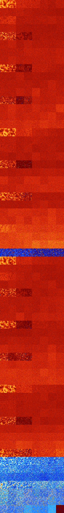

# B14567 (123904-124415)

<details>
    <summary>Initial Grid</summary>
    
</details>


<details>
    <summary>Initial Grid RLE</summary>

```
#C Exported from GoGoL (https://github.com/marrow16/gogol)
#C Wrap mode: Toroidal
#C Boundary mode: Dead
#C Step: 0
x = 100, y = 100, rule = B14567/S
27bo31bo14bo2bo21bo$47b2o8bo13bo19bo$o51bo$16b2obo14bo14bo$21bo31bo24bo
$bo14bo14bo7bo27bo23bo$7bo80bobo$o14bo3bo22bo3bo$2bo6bo9b2o7bo2b2o31bo
14bo$11bo3bo7bo5bo4bo23bo16bo9bo$25bo$3bo14bo25bo15bobo3bo$9bo23bo10bo
18bo$5bo5bo21bo3bo23bo30bo6bo$2bo14bo2bo2bo11bo6bo5bo25bo2bo2bo2b3o11bo
$80bo15bo2bo$24bo2bobo10bo13bo16bo3bo$bo10b2o4bobo4bo15bo3bo19bo7bo3bo$
41bo40bo$7bo36bo31bo20b2o$40bo12bo19bo$11bo11bo9bo21bo13bo29bo$o4bo14bo
bo5bo4bo10bo3bo44bo$4bo30bo6bo28bo27bo$43bo20bo5bo2b2o14bo$16b2o23bo33b
o4bo8bo$14bo3b2o11bo25bo6bo$19bo3bo25bo9bo2bo$8bo11bo24bo10bo10bo2bo23b
o$27bo$4bo5bo2b2o19bo21bo12bo4bo3bo$2bo37bobobo2bo15bo14bo15bobo$36bo
17bo3bo$3bo15bo23bo25bo16bo$o8bo9bo11bo12bo8bo22bo5bo$12bo51b3o$9bo7bo
48bo28bo2bo$24bo42bo14bob2o2bo7bo$34bo5bo5bo11bo29bo$7bo14bo20bo54bo$
26bo48bo$28bo2bo12bo2bo9bobo9bo7b2o$6b2o48bo37bo4bo$24bo12bo29bo6bobo$
31bo$40b2o24bo19bo$21bo2bobo11bobo10bo$21bo11bo26bo6bo3bo3bo4bo10bo$13b
2o19bo45bo18bo$o5bo35bo$9b2o15bo11bo2bo46bo2bo$21bo39bo11bo24bo$14bo23b
o12bo20bo$o65bo$22bo21bo7bo17bo$12bobo30bo25bo15bo5bo$8bo7bo6bo27bo12bo
32bo$26bo15bo11bo2bobo4bo$20bo40bo$65b2o6bo20bo$17bo35bo19bo2bo10bo$bo
15b2o51b2o21bo$5bo35bo18bo11bo15bo8b2o$8bo32bo7bo6bo25bo5bo$49bo4bo7bo
9bo17bo$8b2o6b2o10bo10bo58bo$2bo14bo26bobo5bo17bo3bo14bo5bo$11bo39bo$3b
2o51bo3bo31bo$bo3bo32bo10bo22bo$26bo10bo18bo5bo9bo4bo17bo$80bo5bo4bo5bo
$4bo11bo14bo2bo8bo3bo6bo8bo$8bo43bo29bo$4bo26bo26bo19bo2bo13bo$44bobo8b
o41bo$5bo12bo18bo28bo2bo18bo$13bo35bo4bo16bo11bo12bo$7bo21bo11bo23bo21b
o$43bo8bo14bo19bo3bo2bo$5bo2bo14bo26bo6bo40bo$6b2ob2o4bo16bo6bo17bo27bo
12bo$19bo14bo3bo$21bo23bo24bo$8bo42bo2bo6bo18bo4bo$10bo22bo2bo36bo25bo$
3bo10bo3bo42bo17bo8bo5bo$6bo3bo20bo2b3o40b2o3bo$10bo8bo24bo9bo12bo4bo
19bobo$12bo3bo29bo17b2o20bobo$6bo25b2o8bo32bo14bo$33bo6bo31bo8bo4bo$58b
o6bo25bo4bo$3bo38bo12bo9bo$55bo27bo5bo$9bo23bo7bobo4b2o9bo27bo7bo2bo$7b
o10bo56bo$8bo41bo$5bo8bo5bobo8bo4bo21bo11bo20bo$15bo29b2o!
```
</details>
<details>
    <summary>Thumbnail</summary>

</details>
<table>
<tr>
    <td><a href="./123904%20S%20Heat%20Map%20Activity.png"></a><br>S (123904)<br>R@544,p4</td>    <td><a href="./123905%20S0%20Heat%20Map%20Activity.png"></a><br>S0 (123905)<br>R@544,p6</td>    <td><a href="./123906%20S1%20Heat%20Map%20Activity.png"></a><br>S1 (123906)<br>G>1000</td>    <td><a href="./123907%20S01%20Heat%20Map%20Activity.png"></a><br>S01 (123907)<br>G>1000</td>    <td><a href="./123908%20S2%20Heat%20Map%20Activity.png"></a><br>S2 (123908)<br>G>1000</td>    <td><a href="./123909%20S02%20Heat%20Map%20Activity.png"></a><br>S02 (123909)<br>G>1000</td>    <td><a href="./123910%20S12%20Heat%20Map%20Activity.png"></a><br>S12 (123910)<br>G>1000</td>    <td><a href="./123911%20S012%20Heat%20Map%20Activity.png"></a><br>S012 (123911)<br>G>1000</td></tr>
<tr>
    <td><a href="./123912%20S3%20Heat%20Map%20Activity.png"></a><br>S3 (123912)<br>G>1000</td>    <td><a href="./123913%20S03%20Heat%20Map%20Activity.png"></a><br>S03 (123913)<br>G>1000</td>    <td><a href="./123914%20S13%20Heat%20Map%20Activity.png"></a><br>S13 (123914)<br>G>1000</td>    <td><a href="./123915%20S013%20Heat%20Map%20Activity.png"></a><br>S013 (123915)<br>G>1000</td>    <td><a href="./123916%20S23%20Heat%20Map%20Activity.png"></a><br>S23 (123916)<br>G>1000</td>    <td><a href="./123917%20S023%20Heat%20Map%20Activity.png"></a><br>S023 (123917)<br>G>1000</td>    <td><a href="./123918%20S123%20Heat%20Map%20Activity.png"></a><br>S123 (123918)<br>G>1000</td>    <td><a href="./123919%20S0123%20Heat%20Map%20Activity.png"></a><br>S0123 (123919)<br>G>1000</td></tr>
<tr>
    <td><a href="./123920%20S4%20Heat%20Map%20Activity.png"></a><br>S4 (123920)<br>G>1000</td>    <td><a href="./123921%20S04%20Heat%20Map%20Activity.png"></a><br>S04 (123921)<br>G>1000</td>    <td><a href="./123922%20S14%20Heat%20Map%20Activity.png"></a><br>S14 (123922)<br>G>1000</td>    <td><a href="./123923%20S014%20Heat%20Map%20Activity.png"></a><br>S014 (123923)<br>G>1000</td>    <td><a href="./123924%20S24%20Heat%20Map%20Activity.png"></a><br>S24 (123924)<br>G>1000</td>    <td><a href="./123925%20S024%20Heat%20Map%20Activity.png"></a><br>S024 (123925)<br>G>1000</td>    <td><a href="./123926%20S124%20Heat%20Map%20Activity.png"></a><br>S124 (123926)<br>G>1000</td>    <td><a href="./123927%20S0124%20Heat%20Map%20Activity.png"></a><br>S0124 (123927)<br>G>1000</td></tr>
<tr>
    <td><a href="./123928%20S34%20Heat%20Map%20Activity.png"></a><br>S34 (123928)<br>G>1000</td>    <td><a href="./123929%20S034%20Heat%20Map%20Activity.png"></a><br>S034 (123929)<br>G>1000</td>    <td><a href="./123930%20S134%20Heat%20Map%20Activity.png"></a><br>S134 (123930)<br>G>1000</td>    <td><a href="./123931%20S0134%20Heat%20Map%20Activity.png"></a><br>S0134 (123931)<br>G>1000</td>    <td><a href="./123932%20S234%20Heat%20Map%20Activity.png"></a><br>S234 (123932)<br>G>1000</td>    <td><a href="./123933%20S0234%20Heat%20Map%20Activity.png"></a><br>S0234 (123933)<br>G>1000</td>    <td><a href="./123934%20S1234%20Heat%20Map%20Activity.png"></a><br>S1234 (123934)<br>G>1000</td>    <td><a href="./123935%20S01234%20Heat%20Map%20Activity.png"></a><br>S01234 (123935)<br>G>1000</td></tr>
<tr>
    <td><a href="./123936%20S5%20Heat%20Map%20Activity.png"></a><br>S5 (123936)<br>R@111,p4</td>    <td><a href="./123937%20S05%20Heat%20Map%20Activity.png"></a><br>S05 (123937)<br>R@97,p12</td>    <td><a href="./123938%20S15%20Heat%20Map%20Activity.png"></a><br>S15 (123938)<br>G>1000</td>    <td><a href="./123939%20S015%20Heat%20Map%20Activity.png"></a><br>S015 (123939)<br>G>1000</td>    <td><a href="./123940%20S25%20Heat%20Map%20Activity.png"></a><br>S25 (123940)<br>G>1000</td>    <td><a href="./123941%20S025%20Heat%20Map%20Activity.png"></a><br>S025 (123941)<br>G>1000</td>    <td><a href="./123942%20S125%20Heat%20Map%20Activity.png"></a><br>S125 (123942)<br>G>1000</td>    <td><a href="./123943%20S0125%20Heat%20Map%20Activity.png"></a><br>S0125 (123943)<br>G>1000</td></tr>
<tr>
    <td><a href="./123944%20S35%20Heat%20Map%20Activity.png"></a><br>S35 (123944)<br>G>1000</td>    <td><a href="./123945%20S035%20Heat%20Map%20Activity.png"></a><br>S035 (123945)<br>G>1000</td>    <td><a href="./123946%20S135%20Heat%20Map%20Activity.png"></a><br>S135 (123946)<br>G>1000</td>    <td><a href="./123947%20S0135%20Heat%20Map%20Activity.png"></a><br>S0135 (123947)<br>G>1000</td>    <td><a href="./123948%20S235%20Heat%20Map%20Activity.png"></a><br>S235 (123948)<br>G>1000</td>    <td><a href="./123949%20S0235%20Heat%20Map%20Activity.png"></a><br>S0235 (123949)<br>G>1000</td>    <td><a href="./123950%20S1235%20Heat%20Map%20Activity.png"></a><br>S1235 (123950)<br>G>1000</td>    <td><a href="./123951%20S01235%20Heat%20Map%20Activity.png"></a><br>S01235 (123951)<br>G>1000</td></tr>
<tr>
    <td><a href="./123952%20S45%20Heat%20Map%20Activity.png"></a><br>S45 (123952)<br>G>1000</td>    <td><a href="./123953%20S045%20Heat%20Map%20Activity.png"></a><br>S045 (123953)<br>G>1000</td>    <td><a href="./123954%20S145%20Heat%20Map%20Activity.png"></a><br>S145 (123954)<br>G>1000</td>    <td><a href="./123955%20S0145%20Heat%20Map%20Activity.png"></a><br>S0145 (123955)<br>G>1000</td>    <td><a href="./123956%20S245%20Heat%20Map%20Activity.png"></a><br>S245 (123956)<br>G>1000</td>    <td><a href="./123957%20S0245%20Heat%20Map%20Activity.png"></a><br>S0245 (123957)<br>G>1000</td>    <td><a href="./123958%20S1245%20Heat%20Map%20Activity.png"></a><br>S1245 (123958)<br>G>1000</td>    <td><a href="./123959%20S01245%20Heat%20Map%20Activity.png"></a><br>S01245 (123959)<br>G>1000</td></tr>
<tr>
    <td><a href="./123960%20S345%20Heat%20Map%20Activity.png"></a><br>S345 (123960)<br>G>1000</td>    <td><a href="./123961%20S0345%20Heat%20Map%20Activity.png"></a><br>S0345 (123961)<br>G>1000</td>    <td><a href="./123962%20S1345%20Heat%20Map%20Activity.png"></a><br>S1345 (123962)<br>G>1000</td>    <td><a href="./123963%20S01345%20Heat%20Map%20Activity.png"></a><br>S01345 (123963)<br>G>1000</td>    <td><a href="./123964%20S2345%20Heat%20Map%20Activity.png"></a><br>S2345 (123964)<br>G>1000</td>    <td><a href="./123965%20S02345%20Heat%20Map%20Activity.png"></a><br>S02345 (123965)<br>G>1000</td>    <td><a href="./123966%20S12345%20Heat%20Map%20Activity.png"></a><br>S12345 (123966)<br>G>1000</td>    <td><a href="./123967%20S012345%20Heat%20Map%20Activity.png"></a><br>S012345 (123967)<br>G>1000</td></tr>
<tr>
    <td><a href="./123968%20S6%20Heat%20Map%20Activity.png"></a><br>S6 (123968)<br>R@331,p12</td>    <td><a href="./123969%20S06%20Heat%20Map%20Activity.png"></a><br>S06 (123969)<br>R@219,p12</td>    <td><a href="./123970%20S16%20Heat%20Map%20Activity.png"></a><br>S16 (123970)<br>G>1000</td>    <td><a href="./123971%20S016%20Heat%20Map%20Activity.png"></a><br>S016 (123971)<br>G>1000</td>    <td><a href="./123972%20S26%20Heat%20Map%20Activity.png"></a><br>S26 (123972)<br>G>1000</td>    <td><a href="./123973%20S026%20Heat%20Map%20Activity.png"></a><br>S026 (123973)<br>G>1000</td>    <td><a href="./123974%20S126%20Heat%20Map%20Activity.png"></a><br>S126 (123974)<br>G>1000</td>    <td><a href="./123975%20S0126%20Heat%20Map%20Activity.png"></a><br>S0126 (123975)<br>G>1000</td></tr>
<tr>
    <td><a href="./123976%20S36%20Heat%20Map%20Activity.png"></a><br>S36 (123976)<br>G>1000</td>    <td><a href="./123977%20S036%20Heat%20Map%20Activity.png"></a><br>S036 (123977)<br>G>1000</td>    <td><a href="./123978%20S136%20Heat%20Map%20Activity.png"></a><br>S136 (123978)<br>G>1000</td>    <td><a href="./123979%20S0136%20Heat%20Map%20Activity.png"></a><br>S0136 (123979)<br>G>1000</td>    <td><a href="./123980%20S236%20Heat%20Map%20Activity.png"></a><br>S236 (123980)<br>G>1000</td>    <td><a href="./123981%20S0236%20Heat%20Map%20Activity.png"></a><br>S0236 (123981)<br>G>1000</td>    <td><a href="./123982%20S1236%20Heat%20Map%20Activity.png"></a><br>S1236 (123982)<br>G>1000</td>    <td><a href="./123983%20S01236%20Heat%20Map%20Activity.png"></a><br>S01236 (123983)<br>G>1000</td></tr>
<tr>
    <td><a href="./123984%20S46%20Heat%20Map%20Activity.png"></a><br>S46 (123984)<br>G>1000</td>    <td><a href="./123985%20S046%20Heat%20Map%20Activity.png"></a><br>S046 (123985)<br>G>1000</td>    <td><a href="./123986%20S146%20Heat%20Map%20Activity.png"></a><br>S146 (123986)<br>G>1000</td>    <td><a href="./123987%20S0146%20Heat%20Map%20Activity.png"></a><br>S0146 (123987)<br>G>1000</td>    <td><a href="./123988%20S246%20Heat%20Map%20Activity.png"></a><br>S246 (123988)<br>G>1000</td>    <td><a href="./123989%20S0246%20Heat%20Map%20Activity.png"></a><br>S0246 (123989)<br>G>1000</td>    <td><a href="./123990%20S1246%20Heat%20Map%20Activity.png"></a><br>S1246 (123990)<br>G>1000</td>    <td><a href="./123991%20S01246%20Heat%20Map%20Activity.png"></a><br>S01246 (123991)<br>G>1000</td></tr>
<tr>
    <td><a href="./123992%20S346%20Heat%20Map%20Activity.png"></a><br>S346 (123992)<br>G>1000</td>    <td><a href="./123993%20S0346%20Heat%20Map%20Activity.png"></a><br>S0346 (123993)<br>G>1000</td>    <td><a href="./123994%20S1346%20Heat%20Map%20Activity.png"></a><br>S1346 (123994)<br>G>1000</td>    <td><a href="./123995%20S01346%20Heat%20Map%20Activity.png"></a><br>S01346 (123995)<br>G>1000</td>    <td><a href="./123996%20S2346%20Heat%20Map%20Activity.png"></a><br>S2346 (123996)<br>G>1000</td>    <td><a href="./123997%20S02346%20Heat%20Map%20Activity.png"></a><br>S02346 (123997)<br>G>1000</td>    <td><a href="./123998%20S12346%20Heat%20Map%20Activity.png"></a><br>S12346 (123998)<br>G>1000</td>    <td><a href="./123999%20S012346%20Heat%20Map%20Activity.png"></a><br>S012346 (123999)<br>G>1000</td></tr>
<tr>
    <td><a href="./124000%20S56%20Heat%20Map%20Activity.png"></a><br>S56 (124000)<br>R@113,p12</td>    <td><a href="./124001%20S056%20Heat%20Map%20Activity.png"></a><br>S056 (124001)<br>R@96,p24</td>    <td><a href="./124002%20S156%20Heat%20Map%20Activity.png"></a><br>S156 (124002)<br>R@464,p336</td>    <td><a href="./124003%20S0156%20Heat%20Map%20Activity.png"></a><br>S0156 (124003)<br>R@144,p24</td>    <td><a href="./124004%20S256%20Heat%20Map%20Activity.png"></a><br>S256 (124004)<br>G>1000</td>    <td><a href="./124005%20S0256%20Heat%20Map%20Activity.png"></a><br>S0256 (124005)<br>G>1000</td>    <td><a href="./124006%20S1256%20Heat%20Map%20Activity.png"></a><br>S1256 (124006)<br>G>1000</td>    <td><a href="./124007%20S01256%20Heat%20Map%20Activity.png"></a><br>S01256 (124007)<br>G>1000</td></tr>
<tr>
    <td><a href="./124008%20S356%20Heat%20Map%20Activity.png"></a><br>S356 (124008)<br>G>1000</td>    <td><a href="./124009%20S0356%20Heat%20Map%20Activity.png"></a><br>S0356 (124009)<br>G>1000</td>    <td><a href="./124010%20S1356%20Heat%20Map%20Activity.png"></a><br>S1356 (124010)<br>G>1000</td>    <td><a href="./124011%20S01356%20Heat%20Map%20Activity.png"></a><br>S01356 (124011)<br>G>1000</td>    <td><a href="./124012%20S2356%20Heat%20Map%20Activity.png"></a><br>S2356 (124012)<br>G>1000</td>    <td><a href="./124013%20S02356%20Heat%20Map%20Activity.png"></a><br>S02356 (124013)<br>G>1000</td>    <td><a href="./124014%20S12356%20Heat%20Map%20Activity.png"></a><br>S12356 (124014)<br>G>1000</td>    <td><a href="./124015%20S012356%20Heat%20Map%20Activity.png"></a><br>S012356 (124015)<br>G>1000</td></tr>
<tr>
    <td><a href="./124016%20S456%20Heat%20Map%20Activity.png"></a><br>S456 (124016)<br>G>1000</td>    <td><a href="./124017%20S0456%20Heat%20Map%20Activity.png"></a><br>S0456 (124017)<br>G>1000</td>    <td><a href="./124018%20S1456%20Heat%20Map%20Activity.png"></a><br>S1456 (124018)<br>G>1000</td>    <td><a href="./124019%20S01456%20Heat%20Map%20Activity.png"></a><br>S01456 (124019)<br>G>1000</td>    <td><a href="./124020%20S2456%20Heat%20Map%20Activity.png"></a><br>S2456 (124020)<br>G>1000</td>    <td><a href="./124021%20S02456%20Heat%20Map%20Activity.png"></a><br>S02456 (124021)<br>G>1000</td>    <td><a href="./124022%20S12456%20Heat%20Map%20Activity.png"></a><br>S12456 (124022)<br>G>1000</td>    <td><a href="./124023%20S012456%20Heat%20Map%20Activity.png"></a><br>S012456 (124023)<br>G>1000</td></tr>
<tr>
    <td><a href="./124024%20S3456%20Heat%20Map%20Activity.png"></a><br>S3456 (124024)<br>G>1000</td>    <td><a href="./124025%20S03456%20Heat%20Map%20Activity.png"></a><br>S03456 (124025)<br>G>1000</td>    <td><a href="./124026%20S13456%20Heat%20Map%20Activity.png"></a><br>S13456 (124026)<br>G>1000</td>    <td><a href="./124027%20S013456%20Heat%20Map%20Activity.png"></a><br>S013456 (124027)<br>G>1000</td>    <td><a href="./124028%20S23456%20Heat%20Map%20Activity.png"></a><br>S23456 (124028)<br>G>1000</td>    <td><a href="./124029%20S023456%20Heat%20Map%20Activity.png"></a><br>S023456 (124029)<br>G>1000</td>    <td><a href="./124030%20S123456%20Heat%20Map%20Activity.png"></a><br>S123456 (124030)<br>G>1000</td>    <td><a href="./124031%20S0123456%20Heat%20Map%20Activity.png"></a><br>S0123456 (124031)<br>G>1000</td></tr>
<tr>
    <td><a href="./124032%20S7%20Heat%20Map%20Activity.png"></a><br>S7 (124032)<br>R@474,p6</td>    <td><a href="./124033%20S07%20Heat%20Map%20Activity.png"></a><br>S07 (124033)<br>R@352,p12</td>    <td><a href="./124034%20S17%20Heat%20Map%20Activity.png"></a><br>S17 (124034)<br>G>1000</td>    <td><a href="./124035%20S017%20Heat%20Map%20Activity.png"></a><br>S017 (124035)<br>G>1000</td>    <td><a href="./124036%20S27%20Heat%20Map%20Activity.png"></a><br>S27 (124036)<br>G>1000</td>    <td><a href="./124037%20S027%20Heat%20Map%20Activity.png"></a><br>S027 (124037)<br>G>1000</td>    <td><a href="./124038%20S127%20Heat%20Map%20Activity.png"></a><br>S127 (124038)<br>G>1000</td>    <td><a href="./124039%20S0127%20Heat%20Map%20Activity.png"></a><br>S0127 (124039)<br>G>1000</td></tr>
<tr>
    <td><a href="./124040%20S37%20Heat%20Map%20Activity.png"></a><br>S37 (124040)<br>G>1000</td>    <td><a href="./124041%20S037%20Heat%20Map%20Activity.png"></a><br>S037 (124041)<br>G>1000</td>    <td><a href="./124042%20S137%20Heat%20Map%20Activity.png"></a><br>S137 (124042)<br>G>1000</td>    <td><a href="./124043%20S0137%20Heat%20Map%20Activity.png"></a><br>S0137 (124043)<br>G>1000</td>    <td><a href="./124044%20S237%20Heat%20Map%20Activity.png"></a><br>S237 (124044)<br>G>1000</td>    <td><a href="./124045%20S0237%20Heat%20Map%20Activity.png"></a><br>S0237 (124045)<br>G>1000</td>    <td><a href="./124046%20S1237%20Heat%20Map%20Activity.png"></a><br>S1237 (124046)<br>G>1000</td>    <td><a href="./124047%20S01237%20Heat%20Map%20Activity.png"></a><br>S01237 (124047)<br>G>1000</td></tr>
<tr>
    <td><a href="./124048%20S47%20Heat%20Map%20Activity.png"></a><br>S47 (124048)<br>G>1000</td>    <td><a href="./124049%20S047%20Heat%20Map%20Activity.png"></a><br>S047 (124049)<br>G>1000</td>    <td><a href="./124050%20S147%20Heat%20Map%20Activity.png"></a><br>S147 (124050)<br>G>1000</td>    <td><a href="./124051%20S0147%20Heat%20Map%20Activity.png"></a><br>S0147 (124051)<br>G>1000</td>    <td><a href="./124052%20S247%20Heat%20Map%20Activity.png"></a><br>S247 (124052)<br>G>1000</td>    <td><a href="./124053%20S0247%20Heat%20Map%20Activity.png"></a><br>S0247 (124053)<br>G>1000</td>    <td><a href="./124054%20S1247%20Heat%20Map%20Activity.png"></a><br>S1247 (124054)<br>G>1000</td>    <td><a href="./124055%20S01247%20Heat%20Map%20Activity.png"></a><br>S01247 (124055)<br>G>1000</td></tr>
<tr>
    <td><a href="./124056%20S347%20Heat%20Map%20Activity.png"></a><br>S347 (124056)<br>G>1000</td>    <td><a href="./124057%20S0347%20Heat%20Map%20Activity.png"></a><br>S0347 (124057)<br>G>1000</td>    <td><a href="./124058%20S1347%20Heat%20Map%20Activity.png"></a><br>S1347 (124058)<br>G>1000</td>    <td><a href="./124059%20S01347%20Heat%20Map%20Activity.png"></a><br>S01347 (124059)<br>G>1000</td>    <td><a href="./124060%20S2347%20Heat%20Map%20Activity.png"></a><br>S2347 (124060)<br>G>1000</td>    <td><a href="./124061%20S02347%20Heat%20Map%20Activity.png"></a><br>S02347 (124061)<br>G>1000</td>    <td><a href="./124062%20S12347%20Heat%20Map%20Activity.png"></a><br>S12347 (124062)<br>G>1000</td>    <td><a href="./124063%20S012347%20Heat%20Map%20Activity.png"></a><br>S012347 (124063)<br>G>1000</td></tr>
<tr>
    <td><a href="./124064%20S57%20Heat%20Map%20Activity.png"></a><br>S57 (124064)<br>R@129,p12</td>    <td><a href="./124065%20S057%20Heat%20Map%20Activity.png"></a><br>S057 (124065)<br>R@116,p12</td>    <td><a href="./124066%20S157%20Heat%20Map%20Activity.png"></a><br>S157 (124066)<br>G>1000</td>    <td><a href="./124067%20S0157%20Heat%20Map%20Activity.png"></a><br>S0157 (124067)<br>R@756,p360</td>    <td><a href="./124068%20S257%20Heat%20Map%20Activity.png"></a><br>S257 (124068)<br>G>1000</td>    <td><a href="./124069%20S0257%20Heat%20Map%20Activity.png"></a><br>S0257 (124069)<br>G>1000</td>    <td><a href="./124070%20S1257%20Heat%20Map%20Activity.png"></a><br>S1257 (124070)<br>G>1000</td>    <td><a href="./124071%20S01257%20Heat%20Map%20Activity.png"></a><br>S01257 (124071)<br>G>1000</td></tr>
<tr>
    <td><a href="./124072%20S357%20Heat%20Map%20Activity.png"></a><br>S357 (124072)<br>G>1000</td>    <td><a href="./124073%20S0357%20Heat%20Map%20Activity.png"></a><br>S0357 (124073)<br>G>1000</td>    <td><a href="./124074%20S1357%20Heat%20Map%20Activity.png"></a><br>S1357 (124074)<br>G>1000</td>    <td><a href="./124075%20S01357%20Heat%20Map%20Activity.png"></a><br>S01357 (124075)<br>G>1000</td>    <td><a href="./124076%20S2357%20Heat%20Map%20Activity.png"></a><br>S2357 (124076)<br>G>1000</td>    <td><a href="./124077%20S02357%20Heat%20Map%20Activity.png"></a><br>S02357 (124077)<br>G>1000</td>    <td><a href="./124078%20S12357%20Heat%20Map%20Activity.png"></a><br>S12357 (124078)<br>G>1000</td>    <td><a href="./124079%20S012357%20Heat%20Map%20Activity.png"></a><br>S012357 (124079)<br>G>1000</td></tr>
<tr>
    <td><a href="./124080%20S457%20Heat%20Map%20Activity.png"></a><br>S457 (124080)<br>G>1000</td>    <td><a href="./124081%20S0457%20Heat%20Map%20Activity.png"></a><br>S0457 (124081)<br>G>1000</td>    <td><a href="./124082%20S1457%20Heat%20Map%20Activity.png"></a><br>S1457 (124082)<br>G>1000</td>    <td><a href="./124083%20S01457%20Heat%20Map%20Activity.png"></a><br>S01457 (124083)<br>G>1000</td>    <td><a href="./124084%20S2457%20Heat%20Map%20Activity.png"></a><br>S2457 (124084)<br>G>1000</td>    <td><a href="./124085%20S02457%20Heat%20Map%20Activity.png"></a><br>S02457 (124085)<br>G>1000</td>    <td><a href="./124086%20S12457%20Heat%20Map%20Activity.png"></a><br>S12457 (124086)<br>G>1000</td>    <td><a href="./124087%20S012457%20Heat%20Map%20Activity.png"></a><br>S012457 (124087)<br>G>1000</td></tr>
<tr>
    <td><a href="./124088%20S3457%20Heat%20Map%20Activity.png"></a><br>S3457 (124088)<br>G>1000</td>    <td><a href="./124089%20S03457%20Heat%20Map%20Activity.png"></a><br>S03457 (124089)<br>G>1000</td>    <td><a href="./124090%20S13457%20Heat%20Map%20Activity.png"></a><br>S13457 (124090)<br>G>1000</td>    <td><a href="./124091%20S013457%20Heat%20Map%20Activity.png"></a><br>S013457 (124091)<br>G>1000</td>    <td><a href="./124092%20S23457%20Heat%20Map%20Activity.png"></a><br>S23457 (124092)<br>G>1000</td>    <td><a href="./124093%20S023457%20Heat%20Map%20Activity.png"></a><br>S023457 (124093)<br>G>1000</td>    <td><a href="./124094%20S123457%20Heat%20Map%20Activity.png"></a><br>S123457 (124094)<br>G>1000</td>    <td><a href="./124095%20S0123457%20Heat%20Map%20Activity.png"></a><br>S0123457 (124095)<br>G>1000</td></tr>
<tr>
    <td><a href="./124096%20S67%20Heat%20Map%20Activity.png"></a><br>S67 (124096)<br>R@319,p4</td>    <td><a href="./124097%20S067%20Heat%20Map%20Activity.png"></a><br>S067 (124097)<br>R@155,p12</td>    <td><a href="./124098%20S167%20Heat%20Map%20Activity.png"></a><br>S167 (124098)<br>R@148,p12</td>    <td><a href="./124099%20S0167%20Heat%20Map%20Activity.png"></a><br>S0167 (124099)<br>R@158,p12</td>    <td><a href="./124100%20S267%20Heat%20Map%20Activity.png"></a><br>S267 (124100)<br>G>1000</td>    <td><a href="./124101%20S0267%20Heat%20Map%20Activity.png"></a><br>S0267 (124101)<br>G>1000</td>    <td><a href="./124102%20S1267%20Heat%20Map%20Activity.png"></a><br>S1267 (124102)<br>G>1000</td>    <td><a href="./124103%20S01267%20Heat%20Map%20Activity.png"></a><br>S01267 (124103)<br>G>1000</td></tr>
<tr>
    <td><a href="./124104%20S367%20Heat%20Map%20Activity.png"></a><br>S367 (124104)<br>G>1000</td>    <td><a href="./124105%20S0367%20Heat%20Map%20Activity.png"></a><br>S0367 (124105)<br>G>1000</td>    <td><a href="./124106%20S1367%20Heat%20Map%20Activity.png"></a><br>S1367 (124106)<br>G>1000</td>    <td><a href="./124107%20S01367%20Heat%20Map%20Activity.png"></a><br>S01367 (124107)<br>G>1000</td>    <td><a href="./124108%20S2367%20Heat%20Map%20Activity.png"></a><br>S2367 (124108)<br>G>1000</td>    <td><a href="./124109%20S02367%20Heat%20Map%20Activity.png"></a><br>S02367 (124109)<br>G>1000</td>    <td><a href="./124110%20S12367%20Heat%20Map%20Activity.png"></a><br>S12367 (124110)<br>G>1000</td>    <td><a href="./124111%20S012367%20Heat%20Map%20Activity.png"></a><br>S012367 (124111)<br>G>1000</td></tr>
<tr>
    <td><a href="./124112%20S467%20Heat%20Map%20Activity.png"></a><br>S467 (124112)<br>G>1000</td>    <td><a href="./124113%20S0467%20Heat%20Map%20Activity.png"></a><br>S0467 (124113)<br>G>1000</td>    <td><a href="./124114%20S1467%20Heat%20Map%20Activity.png"></a><br>S1467 (124114)<br>G>1000</td>    <td><a href="./124115%20S01467%20Heat%20Map%20Activity.png"></a><br>S01467 (124115)<br>G>1000</td>    <td><a href="./124116%20S2467%20Heat%20Map%20Activity.png"></a><br>S2467 (124116)<br>G>1000</td>    <td><a href="./124117%20S02467%20Heat%20Map%20Activity.png"></a><br>S02467 (124117)<br>G>1000</td>    <td><a href="./124118%20S12467%20Heat%20Map%20Activity.png"></a><br>S12467 (124118)<br>G>1000</td>    <td><a href="./124119%20S012467%20Heat%20Map%20Activity.png"></a><br>S012467 (124119)<br>G>1000</td></tr>
<tr>
    <td><a href="./124120%20S3467%20Heat%20Map%20Activity.png"></a><br>S3467 (124120)<br>G>1000</td>    <td><a href="./124121%20S03467%20Heat%20Map%20Activity.png"></a><br>S03467 (124121)<br>G>1000</td>    <td><a href="./124122%20S13467%20Heat%20Map%20Activity.png"></a><br>S13467 (124122)<br>G>1000</td>    <td><a href="./124123%20S013467%20Heat%20Map%20Activity.png"></a><br>S013467 (124123)<br>G>1000</td>    <td><a href="./124124%20S23467%20Heat%20Map%20Activity.png"></a><br>S23467 (124124)<br>G>1000</td>    <td><a href="./124125%20S023467%20Heat%20Map%20Activity.png"></a><br>S023467 (124125)<br>G>1000</td>    <td><a href="./124126%20S123467%20Heat%20Map%20Activity.png"></a><br>S123467 (124126)<br>G>1000</td>    <td><a href="./124127%20S0123467%20Heat%20Map%20Activity.png"></a><br>S0123467 (124127)<br>G>1000</td></tr>
<tr>
    <td><a href="./124128%20S567%20Heat%20Map%20Activity.png"></a><br>S567 (124128)<br>G>1000</td>    <td><a href="./124129%20S0567%20Heat%20Map%20Activity.png"></a><br>S0567 (124129)<br>G>1000</td>    <td><a href="./124130%20S1567%20Heat%20Map%20Activity.png"></a><br>S1567 (124130)<br>G>1000</td>    <td><a href="./124131%20S01567%20Heat%20Map%20Activity.png"></a><br>S01567 (124131)<br>G>1000</td>    <td><a href="./124132%20S2567%20Heat%20Map%20Activity.png"></a><br>S2567 (124132)<br>G>1000</td>    <td><a href="./124133%20S02567%20Heat%20Map%20Activity.png"></a><br>S02567 (124133)<br>G>1000</td>    <td><a href="./124134%20S12567%20Heat%20Map%20Activity.png"></a><br>S12567 (124134)<br>G>1000</td>    <td><a href="./124135%20S012567%20Heat%20Map%20Activity.png"></a><br>S012567 (124135)<br>G>1000</td></tr>
<tr>
    <td><a href="./124136%20S3567%20Heat%20Map%20Activity.png"></a><br>S3567 (124136)<br>G>1000</td>    <td><a href="./124137%20S03567%20Heat%20Map%20Activity.png"></a><br>S03567 (124137)<br>G>1000</td>    <td><a href="./124138%20S13567%20Heat%20Map%20Activity.png"></a><br>S13567 (124138)<br>G>1000</td>    <td><a href="./124139%20S013567%20Heat%20Map%20Activity.png"></a><br>S013567 (124139)<br>G>1000</td>    <td><a href="./124140%20S23567%20Heat%20Map%20Activity.png"></a><br>S23567 (124140)<br>G>1000</td>    <td><a href="./124141%20S023567%20Heat%20Map%20Activity.png"></a><br>S023567 (124141)<br>G>1000</td>    <td><a href="./124142%20S123567%20Heat%20Map%20Activity.png"></a><br>S123567 (124142)<br>G>1000</td>    <td><a href="./124143%20S0123567%20Heat%20Map%20Activity.png"></a><br>S0123567 (124143)<br>G>1000</td></tr>
<tr>
    <td><a href="./124144%20S4567%20Heat%20Map%20Activity.png"></a><br>S4567 (124144)<br>G>1000</td>    <td><a href="./124145%20S04567%20Heat%20Map%20Activity.png"></a><br>S04567 (124145)<br>G>1000</td>    <td><a href="./124146%20S14567%20Heat%20Map%20Activity.png"></a><br>S14567 (124146)<br>G>1000</td>    <td><a href="./124147%20S014567%20Heat%20Map%20Activity.png"></a><br>S014567 (124147)<br>G>1000</td>    <td><a href="./124148%20S24567%20Heat%20Map%20Activity.png"></a><br>S24567 (124148)<br>G>1000</td>    <td><a href="./124149%20S024567%20Heat%20Map%20Activity.png"></a><br>S024567 (124149)<br>G>1000</td>    <td><a href="./124150%20S124567%20Heat%20Map%20Activity.png"></a><br>S124567 (124150)<br>G>1000</td>    <td><a href="./124151%20S0124567%20Heat%20Map%20Activity.png"></a><br>S0124567 (124151)<br>G>1000</td></tr>
<tr>
    <td><a href="./124152%20S34567%20Heat%20Map%20Activity.png"></a><br>S34567 (124152)<br>G>1000</td>    <td><a href="./124153%20S034567%20Heat%20Map%20Activity.png"></a><br>S034567 (124153)<br>R@818,p462</td>    <td><a href="./124154%20S134567%20Heat%20Map%20Activity.png"></a><br>S134567 (124154)<br>G>1000</td>    <td><a href="./124155%20S0134567%20Heat%20Map%20Activity.png"></a><br>S0134567 (124155)<br>G>1000</td>    <td><a href="./124156%20S234567%20Heat%20Map%20Activity.png"></a><br>S234567 (124156)<br>G>1000</td>    <td><a href="./124157%20S0234567%20Heat%20Map%20Activity.png"></a><br>S0234567 (124157)<br>G>1000</td>    <td><a href="./124158%20S1234567%20Heat%20Map%20Activity.png"></a><br>S1234567 (124158)<br>G>1000</td>    <td><a href="./124159%20S01234567%20Heat%20Map%20Activity.png"></a><br>S01234567 (124159)<br>G>1000</td></tr>
<tr>
    <td><a href="./124160%20S8%20Heat%20Map%20Activity.png"></a><br>S8 (124160)<br>R@544,p4</td>    <td><a href="./124161%20S08%20Heat%20Map%20Activity.png"></a><br>S08 (124161)<br>R@391,p12</td>    <td><a href="./124162%20S18%20Heat%20Map%20Activity.png"></a><br>S18 (124162)<br>G>1000</td>    <td><a href="./124163%20S018%20Heat%20Map%20Activity.png"></a><br>S018 (124163)<br>G>1000</td>    <td><a href="./124164%20S28%20Heat%20Map%20Activity.png"></a><br>S28 (124164)<br>G>1000</td>    <td><a href="./124165%20S028%20Heat%20Map%20Activity.png"></a><br>S028 (124165)<br>G>1000</td>    <td><a href="./124166%20S128%20Heat%20Map%20Activity.png"></a><br>S128 (124166)<br>G>1000</td>    <td><a href="./124167%20S0128%20Heat%20Map%20Activity.png"></a><br>S0128 (124167)<br>G>1000</td></tr>
<tr>
    <td><a href="./124168%20S38%20Heat%20Map%20Activity.png"></a><br>S38 (124168)<br>G>1000</td>    <td><a href="./124169%20S038%20Heat%20Map%20Activity.png"></a><br>S038 (124169)<br>G>1000</td>    <td><a href="./124170%20S138%20Heat%20Map%20Activity.png"></a><br>S138 (124170)<br>G>1000</td>    <td><a href="./124171%20S0138%20Heat%20Map%20Activity.png"></a><br>S0138 (124171)<br>G>1000</td>    <td><a href="./124172%20S238%20Heat%20Map%20Activity.png"></a><br>S238 (124172)<br>G>1000</td>    <td><a href="./124173%20S0238%20Heat%20Map%20Activity.png"></a><br>S0238 (124173)<br>G>1000</td>    <td><a href="./124174%20S1238%20Heat%20Map%20Activity.png"></a><br>S1238 (124174)<br>G>1000</td>    <td><a href="./124175%20S01238%20Heat%20Map%20Activity.png"></a><br>S01238 (124175)<br>G>1000</td></tr>
<tr>
    <td><a href="./124176%20S48%20Heat%20Map%20Activity.png"></a><br>S48 (124176)<br>G>1000</td>    <td><a href="./124177%20S048%20Heat%20Map%20Activity.png"></a><br>S048 (124177)<br>G>1000</td>    <td><a href="./124178%20S148%20Heat%20Map%20Activity.png"></a><br>S148 (124178)<br>G>1000</td>    <td><a href="./124179%20S0148%20Heat%20Map%20Activity.png"></a><br>S0148 (124179)<br>G>1000</td>    <td><a href="./124180%20S248%20Heat%20Map%20Activity.png"></a><br>S248 (124180)<br>G>1000</td>    <td><a href="./124181%20S0248%20Heat%20Map%20Activity.png"></a><br>S0248 (124181)<br>G>1000</td>    <td><a href="./124182%20S1248%20Heat%20Map%20Activity.png"></a><br>S1248 (124182)<br>G>1000</td>    <td><a href="./124183%20S01248%20Heat%20Map%20Activity.png"></a><br>S01248 (124183)<br>G>1000</td></tr>
<tr>
    <td><a href="./124184%20S348%20Heat%20Map%20Activity.png"></a><br>S348 (124184)<br>G>1000</td>    <td><a href="./124185%20S0348%20Heat%20Map%20Activity.png"></a><br>S0348 (124185)<br>G>1000</td>    <td><a href="./124186%20S1348%20Heat%20Map%20Activity.png"></a><br>S1348 (124186)<br>G>1000</td>    <td><a href="./124187%20S01348%20Heat%20Map%20Activity.png"></a><br>S01348 (124187)<br>G>1000</td>    <td><a href="./124188%20S2348%20Heat%20Map%20Activity.png"></a><br>S2348 (124188)<br>G>1000</td>    <td><a href="./124189%20S02348%20Heat%20Map%20Activity.png"></a><br>S02348 (124189)<br>G>1000</td>    <td><a href="./124190%20S12348%20Heat%20Map%20Activity.png"></a><br>S12348 (124190)<br>G>1000</td>    <td><a href="./124191%20S012348%20Heat%20Map%20Activity.png"></a><br>S012348 (124191)<br>G>1000</td></tr>
<tr>
    <td><a href="./124192%20S58%20Heat%20Map%20Activity.png"></a><br>S58 (124192)<br>R@143,p12</td>    <td><a href="./124193%20S058%20Heat%20Map%20Activity.png"></a><br>S058 (124193)<br>R@95,p4</td>    <td><a href="./124194%20S158%20Heat%20Map%20Activity.png"></a><br>S158 (124194)<br>G>1000</td>    <td><a href="./124195%20S0158%20Heat%20Map%20Activity.png"></a><br>S0158 (124195)<br>G>1000</td>    <td><a href="./124196%20S258%20Heat%20Map%20Activity.png"></a><br>S258 (124196)<br>G>1000</td>    <td><a href="./124197%20S0258%20Heat%20Map%20Activity.png"></a><br>S0258 (124197)<br>G>1000</td>    <td><a href="./124198%20S1258%20Heat%20Map%20Activity.png"></a><br>S1258 (124198)<br>G>1000</td>    <td><a href="./124199%20S01258%20Heat%20Map%20Activity.png"></a><br>S01258 (124199)<br>G>1000</td></tr>
<tr>
    <td><a href="./124200%20S358%20Heat%20Map%20Activity.png"></a><br>S358 (124200)<br>G>1000</td>    <td><a href="./124201%20S0358%20Heat%20Map%20Activity.png"></a><br>S0358 (124201)<br>G>1000</td>    <td><a href="./124202%20S1358%20Heat%20Map%20Activity.png"></a><br>S1358 (124202)<br>G>1000</td>    <td><a href="./124203%20S01358%20Heat%20Map%20Activity.png"></a><br>S01358 (124203)<br>G>1000</td>    <td><a href="./124204%20S2358%20Heat%20Map%20Activity.png"></a><br>S2358 (124204)<br>G>1000</td>    <td><a href="./124205%20S02358%20Heat%20Map%20Activity.png"></a><br>S02358 (124205)<br>G>1000</td>    <td><a href="./124206%20S12358%20Heat%20Map%20Activity.png"></a><br>S12358 (124206)<br>G>1000</td>    <td><a href="./124207%20S012358%20Heat%20Map%20Activity.png"></a><br>S012358 (124207)<br>G>1000</td></tr>
<tr>
    <td><a href="./124208%20S458%20Heat%20Map%20Activity.png"></a><br>S458 (124208)<br>G>1000</td>    <td><a href="./124209%20S0458%20Heat%20Map%20Activity.png"></a><br>S0458 (124209)<br>G>1000</td>    <td><a href="./124210%20S1458%20Heat%20Map%20Activity.png"></a><br>S1458 (124210)<br>G>1000</td>    <td><a href="./124211%20S01458%20Heat%20Map%20Activity.png"></a><br>S01458 (124211)<br>G>1000</td>    <td><a href="./124212%20S2458%20Heat%20Map%20Activity.png"></a><br>S2458 (124212)<br>G>1000</td>    <td><a href="./124213%20S02458%20Heat%20Map%20Activity.png"></a><br>S02458 (124213)<br>G>1000</td>    <td><a href="./124214%20S12458%20Heat%20Map%20Activity.png"></a><br>S12458 (124214)<br>G>1000</td>    <td><a href="./124215%20S012458%20Heat%20Map%20Activity.png"></a><br>S012458 (124215)<br>G>1000</td></tr>
<tr>
    <td><a href="./124216%20S3458%20Heat%20Map%20Activity.png"></a><br>S3458 (124216)<br>G>1000</td>    <td><a href="./124217%20S03458%20Heat%20Map%20Activity.png"></a><br>S03458 (124217)<br>G>1000</td>    <td><a href="./124218%20S13458%20Heat%20Map%20Activity.png"></a><br>S13458 (124218)<br>G>1000</td>    <td><a href="./124219%20S013458%20Heat%20Map%20Activity.png"></a><br>S013458 (124219)<br>G>1000</td>    <td><a href="./124220%20S23458%20Heat%20Map%20Activity.png"></a><br>S23458 (124220)<br>G>1000</td>    <td><a href="./124221%20S023458%20Heat%20Map%20Activity.png"></a><br>S023458 (124221)<br>G>1000</td>    <td><a href="./124222%20S123458%20Heat%20Map%20Activity.png"></a><br>S123458 (124222)<br>G>1000</td>    <td><a href="./124223%20S0123458%20Heat%20Map%20Activity.png"></a><br>S0123458 (124223)<br>G>1000</td></tr>
<tr>
    <td><a href="./124224%20S68%20Heat%20Map%20Activity.png"></a><br>S68 (124224)<br>R@331,p12</td>    <td><a href="./124225%20S068%20Heat%20Map%20Activity.png"></a><br>S068 (124225)<br>R@220,p4</td>    <td><a href="./124226%20S168%20Heat%20Map%20Activity.png"></a><br>S168 (124226)<br>G>1000</td>    <td><a href="./124227%20S0168%20Heat%20Map%20Activity.png"></a><br>S0168 (124227)<br>G>1000</td>    <td><a href="./124228%20S268%20Heat%20Map%20Activity.png"></a><br>S268 (124228)<br>G>1000</td>    <td><a href="./124229%20S0268%20Heat%20Map%20Activity.png"></a><br>S0268 (124229)<br>G>1000</td>    <td><a href="./124230%20S1268%20Heat%20Map%20Activity.png"></a><br>S1268 (124230)<br>G>1000</td>    <td><a href="./124231%20S01268%20Heat%20Map%20Activity.png"></a><br>S01268 (124231)<br>G>1000</td></tr>
<tr>
    <td><a href="./124232%20S368%20Heat%20Map%20Activity.png"></a><br>S368 (124232)<br>G>1000</td>    <td><a href="./124233%20S0368%20Heat%20Map%20Activity.png"></a><br>S0368 (124233)<br>G>1000</td>    <td><a href="./124234%20S1368%20Heat%20Map%20Activity.png"></a><br>S1368 (124234)<br>G>1000</td>    <td><a href="./124235%20S01368%20Heat%20Map%20Activity.png"></a><br>S01368 (124235)<br>G>1000</td>    <td><a href="./124236%20S2368%20Heat%20Map%20Activity.png"></a><br>S2368 (124236)<br>G>1000</td>    <td><a href="./124237%20S02368%20Heat%20Map%20Activity.png"></a><br>S02368 (124237)<br>G>1000</td>    <td><a href="./124238%20S12368%20Heat%20Map%20Activity.png"></a><br>S12368 (124238)<br>G>1000</td>    <td><a href="./124239%20S012368%20Heat%20Map%20Activity.png"></a><br>S012368 (124239)<br>G>1000</td></tr>
<tr>
    <td><a href="./124240%20S468%20Heat%20Map%20Activity.png"></a><br>S468 (124240)<br>G>1000</td>    <td><a href="./124241%20S0468%20Heat%20Map%20Activity.png"></a><br>S0468 (124241)<br>G>1000</td>    <td><a href="./124242%20S1468%20Heat%20Map%20Activity.png"></a><br>S1468 (124242)<br>G>1000</td>    <td><a href="./124243%20S01468%20Heat%20Map%20Activity.png"></a><br>S01468 (124243)<br>G>1000</td>    <td><a href="./124244%20S2468%20Heat%20Map%20Activity.png"></a><br>S2468 (124244)<br>G>1000</td>    <td><a href="./124245%20S02468%20Heat%20Map%20Activity.png"></a><br>S02468 (124245)<br>G>1000</td>    <td><a href="./124246%20S12468%20Heat%20Map%20Activity.png"></a><br>S12468 (124246)<br>G>1000</td>    <td><a href="./124247%20S012468%20Heat%20Map%20Activity.png"></a><br>S012468 (124247)<br>G>1000</td></tr>
<tr>
    <td><a href="./124248%20S3468%20Heat%20Map%20Activity.png"></a><br>S3468 (124248)<br>G>1000</td>    <td><a href="./124249%20S03468%20Heat%20Map%20Activity.png"></a><br>S03468 (124249)<br>G>1000</td>    <td><a href="./124250%20S13468%20Heat%20Map%20Activity.png"></a><br>S13468 (124250)<br>G>1000</td>    <td><a href="./124251%20S013468%20Heat%20Map%20Activity.png"></a><br>S013468 (124251)<br>G>1000</td>    <td><a href="./124252%20S23468%20Heat%20Map%20Activity.png"></a><br>S23468 (124252)<br>G>1000</td>    <td><a href="./124253%20S023468%20Heat%20Map%20Activity.png"></a><br>S023468 (124253)<br>G>1000</td>    <td><a href="./124254%20S123468%20Heat%20Map%20Activity.png"></a><br>S123468 (124254)<br>G>1000</td>    <td><a href="./124255%20S0123468%20Heat%20Map%20Activity.png"></a><br>S0123468 (124255)<br>G>1000</td></tr>
<tr>
    <td><a href="./124256%20S568%20Heat%20Map%20Activity.png"></a><br>S568 (124256)<br>R@107,p6</td>    <td><a href="./124257%20S0568%20Heat%20Map%20Activity.png"></a><br>S0568 (124257)<br>R@169,p84</td>    <td><a href="./124258%20S1568%20Heat%20Map%20Activity.png"></a><br>S1568 (124258)<br>R@153,p12</td>    <td><a href="./124259%20S01568%20Heat%20Map%20Activity.png"></a><br>S01568 (124259)<br>R@208,p48</td>    <td><a href="./124260%20S2568%20Heat%20Map%20Activity.png"></a><br>S2568 (124260)<br>G>1000</td>    <td><a href="./124261%20S02568%20Heat%20Map%20Activity.png"></a><br>S02568 (124261)<br>G>1000</td>    <td><a href="./124262%20S12568%20Heat%20Map%20Activity.png"></a><br>S12568 (124262)<br>G>1000</td>    <td><a href="./124263%20S012568%20Heat%20Map%20Activity.png"></a><br>S012568 (124263)<br>G>1000</td></tr>
<tr>
    <td><a href="./124264%20S3568%20Heat%20Map%20Activity.png"></a><br>S3568 (124264)<br>G>1000</td>    <td><a href="./124265%20S03568%20Heat%20Map%20Activity.png"></a><br>S03568 (124265)<br>G>1000</td>    <td><a href="./124266%20S13568%20Heat%20Map%20Activity.png"></a><br>S13568 (124266)<br>G>1000</td>    <td><a href="./124267%20S013568%20Heat%20Map%20Activity.png"></a><br>S013568 (124267)<br>G>1000</td>    <td><a href="./124268%20S23568%20Heat%20Map%20Activity.png"></a><br>S23568 (124268)<br>G>1000</td>    <td><a href="./124269%20S023568%20Heat%20Map%20Activity.png"></a><br>S023568 (124269)<br>G>1000</td>    <td><a href="./124270%20S123568%20Heat%20Map%20Activity.png"></a><br>S123568 (124270)<br>G>1000</td>    <td><a href="./124271%20S0123568%20Heat%20Map%20Activity.png"></a><br>S0123568 (124271)<br>G>1000</td></tr>
<tr>
    <td><a href="./124272%20S4568%20Heat%20Map%20Activity.png"></a><br>S4568 (124272)<br>G>1000</td>    <td><a href="./124273%20S04568%20Heat%20Map%20Activity.png"></a><br>S04568 (124273)<br>G>1000</td>    <td><a href="./124274%20S14568%20Heat%20Map%20Activity.png"></a><br>S14568 (124274)<br>G>1000</td>    <td><a href="./124275%20S014568%20Heat%20Map%20Activity.png"></a><br>S014568 (124275)<br>G>1000</td>    <td><a href="./124276%20S24568%20Heat%20Map%20Activity.png"></a><br>S24568 (124276)<br>G>1000</td>    <td><a href="./124277%20S024568%20Heat%20Map%20Activity.png"></a><br>S024568 (124277)<br>G>1000</td>    <td><a href="./124278%20S124568%20Heat%20Map%20Activity.png"></a><br>S124568 (124278)<br>G>1000</td>    <td><a href="./124279%20S0124568%20Heat%20Map%20Activity.png"></a><br>S0124568 (124279)<br>G>1000</td></tr>
<tr>
    <td><a href="./124280%20S34568%20Heat%20Map%20Activity.png"></a><br>S34568 (124280)<br>G>1000</td>    <td><a href="./124281%20S034568%20Heat%20Map%20Activity.png"></a><br>S034568 (124281)<br>G>1000</td>    <td><a href="./124282%20S134568%20Heat%20Map%20Activity.png"></a><br>S134568 (124282)<br>G>1000</td>    <td><a href="./124283%20S0134568%20Heat%20Map%20Activity.png"></a><br>S0134568 (124283)<br>G>1000</td>    <td><a href="./124284%20S234568%20Heat%20Map%20Activity.png"></a><br>S234568 (124284)<br>G>1000</td>    <td><a href="./124285%20S0234568%20Heat%20Map%20Activity.png"></a><br>S0234568 (124285)<br>G>1000</td>    <td><a href="./124286%20S1234568%20Heat%20Map%20Activity.png"></a><br>S1234568 (124286)<br>G>1000</td>    <td><a href="./124287%20S01234568%20Heat%20Map%20Activity.png"></a><br>S01234568 (124287)<br>G>1000</td></tr>
<tr>
    <td><a href="./124288%20S78%20Heat%20Map%20Activity.png"></a><br>S78 (124288)<br>R@474,p6</td>    <td><a href="./124289%20S078%20Heat%20Map%20Activity.png"></a><br>S078 (124289)<br>R@256,p4</td>    <td><a href="./124290%20S178%20Heat%20Map%20Activity.png"></a><br>S178 (124290)<br>G>1000</td>    <td><a href="./124291%20S0178%20Heat%20Map%20Activity.png"></a><br>S0178 (124291)<br>G>1000</td>    <td><a href="./124292%20S278%20Heat%20Map%20Activity.png"></a><br>S278 (124292)<br>G>1000</td>    <td><a href="./124293%20S0278%20Heat%20Map%20Activity.png"></a><br>S0278 (124293)<br>G>1000</td>    <td><a href="./124294%20S1278%20Heat%20Map%20Activity.png"></a><br>S1278 (124294)<br>G>1000</td>    <td><a href="./124295%20S01278%20Heat%20Map%20Activity.png"></a><br>S01278 (124295)<br>G>1000</td></tr>
<tr>
    <td><a href="./124296%20S378%20Heat%20Map%20Activity.png"></a><br>S378 (124296)<br>G>1000</td>    <td><a href="./124297%20S0378%20Heat%20Map%20Activity.png"></a><br>S0378 (124297)<br>G>1000</td>    <td><a href="./124298%20S1378%20Heat%20Map%20Activity.png"></a><br>S1378 (124298)<br>G>1000</td>    <td><a href="./124299%20S01378%20Heat%20Map%20Activity.png"></a><br>S01378 (124299)<br>G>1000</td>    <td><a href="./124300%20S2378%20Heat%20Map%20Activity.png"></a><br>S2378 (124300)<br>G>1000</td>    <td><a href="./124301%20S02378%20Heat%20Map%20Activity.png"></a><br>S02378 (124301)<br>G>1000</td>    <td><a href="./124302%20S12378%20Heat%20Map%20Activity.png"></a><br>S12378 (124302)<br>G>1000</td>    <td><a href="./124303%20S012378%20Heat%20Map%20Activity.png"></a><br>S012378 (124303)<br>G>1000</td></tr>
<tr>
    <td><a href="./124304%20S478%20Heat%20Map%20Activity.png"></a><br>S478 (124304)<br>G>1000</td>    <td><a href="./124305%20S0478%20Heat%20Map%20Activity.png"></a><br>S0478 (124305)<br>G>1000</td>    <td><a href="./124306%20S1478%20Heat%20Map%20Activity.png"></a><br>S1478 (124306)<br>G>1000</td>    <td><a href="./124307%20S01478%20Heat%20Map%20Activity.png"></a><br>S01478 (124307)<br>G>1000</td>    <td><a href="./124308%20S2478%20Heat%20Map%20Activity.png"></a><br>S2478 (124308)<br>G>1000</td>    <td><a href="./124309%20S02478%20Heat%20Map%20Activity.png"></a><br>S02478 (124309)<br>G>1000</td>    <td><a href="./124310%20S12478%20Heat%20Map%20Activity.png"></a><br>S12478 (124310)<br>G>1000</td>    <td><a href="./124311%20S012478%20Heat%20Map%20Activity.png"></a><br>S012478 (124311)<br>G>1000</td></tr>
<tr>
    <td><a href="./124312%20S3478%20Heat%20Map%20Activity.png"></a><br>S3478 (124312)<br>G>1000</td>    <td><a href="./124313%20S03478%20Heat%20Map%20Activity.png"></a><br>S03478 (124313)<br>G>1000</td>    <td><a href="./124314%20S13478%20Heat%20Map%20Activity.png"></a><br>S13478 (124314)<br>G>1000</td>    <td><a href="./124315%20S013478%20Heat%20Map%20Activity.png"></a><br>S013478 (124315)<br>G>1000</td>    <td><a href="./124316%20S23478%20Heat%20Map%20Activity.png"></a><br>S23478 (124316)<br>G>1000</td>    <td><a href="./124317%20S023478%20Heat%20Map%20Activity.png"></a><br>S023478 (124317)<br>G>1000</td>    <td><a href="./124318%20S123478%20Heat%20Map%20Activity.png"></a><br>S123478 (124318)<br>G>1000</td>    <td><a href="./124319%20S0123478%20Heat%20Map%20Activity.png"></a><br>S0123478 (124319)<br>G>1000</td></tr>
<tr>
    <td><a href="./124320%20S578%20Heat%20Map%20Activity.png"></a><br>S578 (124320)<br>R@152,p24</td>    <td><a href="./124321%20S0578%20Heat%20Map%20Activity.png"></a><br>S0578 (124321)<br>R@81,p4</td>    <td><a href="./124322%20S1578%20Heat%20Map%20Activity.png"></a><br>S1578 (124322)<br>R@522,p24</td>    <td><a href="./124323%20S01578%20Heat%20Map%20Activity.png"></a><br>S01578 (124323)<br>R@387,p72</td>    <td><a href="./124324%20S2578%20Heat%20Map%20Activity.png"></a><br>S2578 (124324)<br>G>1000</td>    <td><a href="./124325%20S02578%20Heat%20Map%20Activity.png"></a><br>S02578 (124325)<br>G>1000</td>    <td><a href="./124326%20S12578%20Heat%20Map%20Activity.png"></a><br>S12578 (124326)<br>G>1000</td>    <td><a href="./124327%20S012578%20Heat%20Map%20Activity.png"></a><br>S012578 (124327)<br>G>1000</td></tr>
<tr>
    <td><a href="./124328%20S3578%20Heat%20Map%20Activity.png"></a><br>S3578 (124328)<br>G>1000</td>    <td><a href="./124329%20S03578%20Heat%20Map%20Activity.png"></a><br>S03578 (124329)<br>G>1000</td>    <td><a href="./124330%20S13578%20Heat%20Map%20Activity.png"></a><br>S13578 (124330)<br>G>1000</td>    <td><a href="./124331%20S013578%20Heat%20Map%20Activity.png"></a><br>S013578 (124331)<br>G>1000</td>    <td><a href="./124332%20S23578%20Heat%20Map%20Activity.png"></a><br>S23578 (124332)<br>G>1000</td>    <td><a href="./124333%20S023578%20Heat%20Map%20Activity.png"></a><br>S023578 (124333)<br>G>1000</td>    <td><a href="./124334%20S123578%20Heat%20Map%20Activity.png"></a><br>S123578 (124334)<br>G>1000</td>    <td><a href="./124335%20S0123578%20Heat%20Map%20Activity.png"></a><br>S0123578 (124335)<br>G>1000</td></tr>
<tr>
    <td><a href="./124336%20S4578%20Heat%20Map%20Activity.png"></a><br>S4578 (124336)<br>G>1000</td>    <td><a href="./124337%20S04578%20Heat%20Map%20Activity.png"></a><br>S04578 (124337)<br>G>1000</td>    <td><a href="./124338%20S14578%20Heat%20Map%20Activity.png"></a><br>S14578 (124338)<br>G>1000</td>    <td><a href="./124339%20S014578%20Heat%20Map%20Activity.png"></a><br>S014578 (124339)<br>G>1000</td>    <td><a href="./124340%20S24578%20Heat%20Map%20Activity.png"></a><br>S24578 (124340)<br>G>1000</td>    <td><a href="./124341%20S024578%20Heat%20Map%20Activity.png"></a><br>S024578 (124341)<br>G>1000</td>    <td><a href="./124342%20S124578%20Heat%20Map%20Activity.png"></a><br>S124578 (124342)<br>G>1000</td>    <td><a href="./124343%20S0124578%20Heat%20Map%20Activity.png"></a><br>S0124578 (124343)<br>G>1000</td></tr>
<tr>
    <td><a href="./124344%20S34578%20Heat%20Map%20Activity.png"></a><br>S34578 (124344)<br>G>1000</td>    <td><a href="./124345%20S034578%20Heat%20Map%20Activity.png"></a><br>S034578 (124345)<br>G>1000</td>    <td><a href="./124346%20S134578%20Heat%20Map%20Activity.png"></a><br>S134578 (124346)<br>G>1000</td>    <td><a href="./124347%20S0134578%20Heat%20Map%20Activity.png"></a><br>S0134578 (124347)<br>G>1000</td>    <td><a href="./124348%20S234578%20Heat%20Map%20Activity.png"></a><br>S234578 (124348)<br>G>1000</td>    <td><a href="./124349%20S0234578%20Heat%20Map%20Activity.png"></a><br>S0234578 (124349)<br>G>1000</td>    <td><a href="./124350%20S1234578%20Heat%20Map%20Activity.png"></a><br>S1234578 (124350)<br>G>1000</td>    <td><a href="./124351%20S01234578%20Heat%20Map%20Activity.png"></a><br>S01234578 (124351)<br>G>1000</td></tr>
<tr>
    <td><a href="./124352%20S678%20Heat%20Map%20Activity.png"></a><br>S678 (124352)<br>R@310,p12</td>    <td><a href="./124353%20S0678%20Heat%20Map%20Activity.png"></a><br>S0678 (124353)<br>R@144,p24</td>    <td><a href="./124354%20S1678%20Heat%20Map%20Activity.png"></a><br>S1678 (124354)<br>R@118,p6</td>    <td><a href="./124355%20S01678%20Heat%20Map%20Activity.png"></a><br>S01678 (124355)<br>R@110,p4</td>    <td><a href="./124356%20S2678%20Heat%20Map%20Activity.png"></a><br>S2678 (124356)<br>G>1000</td>    <td><a href="./124357%20S02678%20Heat%20Map%20Activity.png"></a><br>S02678 (124357)<br>G>1000</td>    <td><a href="./124358%20S12678%20Heat%20Map%20Activity.png"></a><br>S12678 (124358)<br>G>1000</td>    <td><a href="./124359%20S012678%20Heat%20Map%20Activity.png"></a><br>S012678 (124359)<br>G>1000</td></tr>
<tr>
    <td><a href="./124360%20S3678%20Heat%20Map%20Activity.png"></a><br>S3678 (124360)<br>R@128,p4</td>    <td><a href="./124361%20S03678%20Heat%20Map%20Activity.png"></a><br>S03678 (124361)<br>R@116,p4</td>    <td><a href="./124362%20S13678%20Heat%20Map%20Activity.png"></a><br>S13678 (124362)<br>R@102,p4</td>    <td><a href="./124363%20S013678%20Heat%20Map%20Activity.png"></a><br>S013678 (124363)<br>R@107,p12</td>    <td><a href="./124364%20S23678%20Heat%20Map%20Activity.png"></a><br>S23678 (124364)<br>R@47,p4</td>    <td><a href="./124365%20S023678%20Heat%20Map%20Activity.png"></a><br>S023678 (124365)<br>R@50,p4</td>    <td><a href="./124366%20S123678%20Heat%20Map%20Activity.png"></a><br>S123678 (124366)<br>R@56,p4</td>    <td><a href="./124367%20S0123678%20Heat%20Map%20Activity.png"></a><br>S0123678 (124367)<br>R@43,p4</td></tr>
<tr>
    <td><a href="./124368%20S4678%20Heat%20Map%20Activity.png"></a><br>S4678 (124368)<br>R@41,p4</td>    <td><a href="./124369%20S04678%20Heat%20Map%20Activity.png"></a><br>S04678 (124369)<br>R@31,p4</td>    <td><a href="./124370%20S14678%20Heat%20Map%20Activity.png"></a><br>S14678 (124370)<br>R@32,p4</td>    <td><a href="./124371%20S014678%20Heat%20Map%20Activity.png"></a><br>S014678 (124371)<br>R@29,p4</td>    <td><a href="./124372%20S24678%20Heat%20Map%20Activity.png"></a><br>S24678 (124372)<br>R@25,p4</td>    <td><a href="./124373%20S024678%20Heat%20Map%20Activity.png"></a><br>S024678 (124373)<br>R@24,p4</td>    <td><a href="./124374%20S124678%20Heat%20Map%20Activity.png"></a><br>S124678 (124374)<br>R@24,p4</td>    <td><a href="./124375%20S0124678%20Heat%20Map%20Activity.png"></a><br>S0124678 (124375)<br>R@22,p4</td></tr>
<tr>
    <td><a href="./124376%20S34678%20Heat%20Map%20Activity.png"></a><br>S34678 (124376)<br>R@20,p4</td>    <td><a href="./124377%20S034678%20Heat%20Map%20Activity.png"></a><br>S034678 (124377)<br>R@21,p4</td>    <td><a href="./124378%20S134678%20Heat%20Map%20Activity.png"></a><br>S134678 (124378)<br>R@22,p4</td>    <td><a href="./124379%20S0134678%20Heat%20Map%20Activity.png"></a><br>S0134678 (124379)<br>R@20,p4</td>    <td><a href="./124380%20S234678%20Heat%20Map%20Activity.png"></a><br>S234678 (124380)<br>R@19,p4</td>    <td><a href="./124381%20S0234678%20Heat%20Map%20Activity.png"></a><br>S0234678 (124381)<br>R@24,p4</td>    <td><a href="./124382%20S1234678%20Heat%20Map%20Activity.png"></a><br>S1234678 (124382)<br>R@19,p4</td>    <td><a href="./124383%20S01234678%20Heat%20Map%20Activity.png"></a><br>S01234678 (124383)<br>R@18,p4</td></tr>
<tr>
    <td><a href="./124384%20S5678%20Heat%20Map%20Activity.png"></a><br>S5678 (124384)<br>R@63,p2</td>    <td><a href="./124385%20S05678%20Heat%20Map%20Activity.png"></a><br>S05678 (124385)<br>R@38,p2</td>    <td><a href="./124386%20S15678%20Heat%20Map%20Activity.png"></a><br>S15678 (124386)<br>R@32,p2</td>    <td><a href="./124387%20S015678%20Heat%20Map%20Activity.png"></a><br>S015678 (124387)<br>R@25,p2</td>    <td><a href="./124388%20S25678%20Heat%20Map%20Activity.png"></a><br>S25678 (124388)<br>R@18,p2</td>    <td><a href="./124389%20S025678%20Heat%20Map%20Activity.png"></a><br>S025678 (124389)<br>R@16,p2</td>    <td><a href="./124390%20S125678%20Heat%20Map%20Activity.png"></a><br>S125678 (124390)<br>R@15,p2</td>    <td><a href="./124391%20S0125678%20Heat%20Map%20Activity.png"></a><br>S0125678 (124391)<br>S@13</td></tr>
<tr>
    <td><a href="./124392%20S35678%20Heat%20Map%20Activity.png"></a><br>S35678 (124392)<br>S@13</td>    <td><a href="./124393%20S035678%20Heat%20Map%20Activity.png"></a><br>S035678 (124393)<br>S@12</td>    <td><a href="./124394%20S135678%20Heat%20Map%20Activity.png"></a><br>S135678 (124394)<br>S@11</td>    <td><a href="./124395%20S0135678%20Heat%20Map%20Activity.png"></a><br>S0135678 (124395)<br>S@9</td>    <td><a href="./124396%20S235678%20Heat%20Map%20Activity.png"></a><br>S235678 (124396)<br>R@13,p2</td>    <td><a href="./124397%20S0235678%20Heat%20Map%20Activity.png"></a><br>S0235678 (124397)<br>S@10</td>    <td><a href="./124398%20S1235678%20Heat%20Map%20Activity.png"></a><br>S1235678 (124398)<br>S@9</td>    <td><a href="./124399%20S01235678%20Heat%20Map%20Activity.png"></a><br>S01235678 (124399)<br>S@10</td></tr>
<tr>
    <td><a href="./124400%20S45678%20Heat%20Map%20Activity.png"></a><br>S45678 (124400)<br>S@14</td>    <td><a href="./124401%20S045678%20Heat%20Map%20Activity.png"></a><br>S045678 (124401)<br>S@11</td>    <td><a href="./124402%20S145678%20Heat%20Map%20Activity.png"></a><br>S145678 (124402)<br>S@12</td>    <td><a href="./124403%20S0145678%20Heat%20Map%20Activity.png"></a><br>S0145678 (124403)<br>S@9</td>    <td><a href="./124404%20S245678%20Heat%20Map%20Activity.png"></a><br>S245678 (124404)<br>S@9</td>    <td><a href="./124405%20S0245678%20Heat%20Map%20Activity.png"></a><br>S0245678 (124405)<br>S@9</td>    <td><a href="./124406%20S1245678%20Heat%20Map%20Activity.png"></a><br>S1245678 (124406)<br>S@9</td>    <td><a href="./124407%20S01245678%20Heat%20Map%20Activity.png"></a><br>S01245678 (124407)<br>S@9</td></tr>
<tr>
    <td><a href="./124408%20S345678%20Heat%20Map%20Activity.png"></a><br>S345678 (124408)<br>S@10</td>    <td><a href="./124409%20S0345678%20Heat%20Map%20Activity.png"></a><br>S0345678 (124409)<br>S@9</td>    <td><a href="./124410%20S1345678%20Heat%20Map%20Activity.png"></a><br>S1345678 (124410)<br>S@9</td>    <td><a href="./124411%20S01345678%20Heat%20Map%20Activity.png"></a><br>S01345678 (124411)<br>S@8</td>    <td><a href="./124412%20S2345678%20Heat%20Map%20Activity.png"></a><br>S2345678 (124412)<br>S@8</td>    <td><a href="./124413%20S02345678%20Heat%20Map%20Activity.png"></a><br>S02345678 (124413)<br>S@8</td>    <td><a href="./124414%20S12345678%20Heat%20Map%20Activity.png"></a><br>S12345678 (124414)<br>S@8</td>    <td><a href="./124415%20S012345678%20Heat%20Map%20Activity.png"></a><br>S012345678 (124415)<br>S@8</td></tr>
</table>
