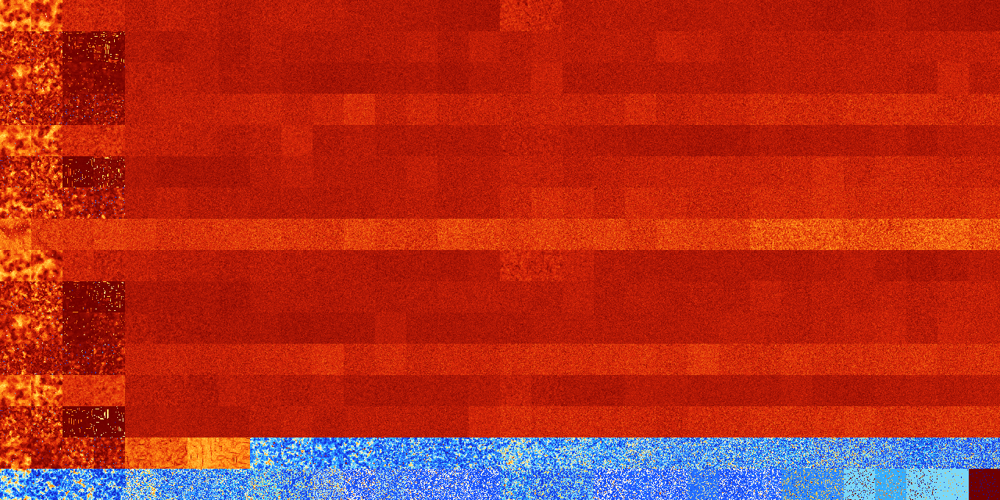

# B145678 (254976-255487)

<details>
    <summary>Initial Grid</summary>
    
</details>


<details>
    <summary>Initial Grid RLE</summary>

```
#C Exported from GoGoL (https://github.com/marrow16/gogol)
#C Wrap mode: Toroidal
#C Boundary mode: Dead
#C Step: 0
x = 100, y = 100, rule = B145678/S
33bo13bo9bo14bo$16b2o25bo36bo$5bobo45bo8bo$7bobo4bo2bo25bo8bo43bo$2bo
10bo14b2o9bo39bo15bo$27bo9bo17bo$5bo34bo$7bo39b2o38bo$25bo7bo3b2o40bo$
3bo25bo5bo21bo12bo10bo4bo7bo$8bo9bo12bo46bo$39bo10bo$o8bobo25bobo$23bo
2bo17b2o9bo11bo$29bo24bo8bo8bo4bo5bo$7bo4bo6bobo31bo4bo14bo2bo3bo4bo$
11bo25bo8bo2bo6bo21bo$28bo12bo24bo29bo$bo4bo7bo7bo2bo13bo$78bo$7bo8bo
21bo8bo16bo8bo16bo$50bo7bo7bo7bo$22bo13bo$13bo3bo7bo13bo10b2o17bo$12bo
54bo7bo12bo3bo$24bo24b2o8bo17bo7bo10bo$19bo17bo10bo27bo$3bo65bo13bo4bo
3bo$5bo3bo16bo8bo40bo7bo$60bo7bo6bo$7bo41bo2bo23bo15bo$79bo7bo$38bo7bo
13bo16b2o16bo$27bo25bo3bo25bo$6bo48bo3bobo6bo19bo$47bo$22bo13bo6bo$22bo
37bo9bo$22bo16bo16bo5bo11bo15bo$15bo47bobo13b2o6bo$27bo35bo7bo14bo$14bo
10bo10bo35bo10bo$20bo2bo16bo47bo$8bo12bo2bo9bo13bo19bo$obobo22bo18bo12b
o4bo10b2o8bo$obo2bo27bo49bo$29b2o3bobo4bo12bo10bo12bobo18bo$59b2o$29bo
22bo8bo14bo3bo$bo29bo3bo16bo8bo30bobo$75bobo$17bo7bo15bo19bo$13bo19bo
31bo14bo12bobo$8bo57bo25bo$o21bo$28bo20b2o23bo3bobobo$32bo5bo18bo23bo9b
o5bo$16bo7bo25bo$3bo8bo10bo19bo5bo42bo$o91bo$5bo29bo47bo$4bo31bo24bo2bo
30bobo$11bo2bo10b2o17bo14bo$30bo20bo$bo5bo9bo21bo6bobo4bo6bo$21bo21bo9b
o7bo9bobo20b2o$42bo7bo4bo34bo$8bo30bo10bo23bo4bo$11bo17bo13bo15bo9bo18b
o$bo9bo24bo12bo17b2obob2o23bo$bo70bobo13bo$4b2o8bo3bo4bo7bobo27bo3bo2bo
7bo8bo4bo$14bo30bo8bo4bo3b2o$20bo11bo47bo5b2o$29bo7bo15b2o18bo19b2o$18b
o10bo3bo8bo12bo22bo$bo3bo39bo14bo2bo10bo5bo12bo$12bo10bo9bo43bo3b2o$
100b$4bo32bo19bo3bo12bo12bo11bo$2bo34bo24bo4bo2bo8bo$46bobo41bo$12bo8bo
35bo2bo30bo$40bo15bo2bo6bo14bo7bo$24b2o6bo2bo16bo10bo$14bo12bo4bobo9b2o
9bo6bo21bo$18bo6bo23bo22bo$5bo43bo$4bo23bo25bo18bo10b2o4bo$8bo10bo14bo
25bobo4bo8bo$24bob2o13bo54b2o$24bo38bobo16bo$2bo14bo8bo37b2o29bo$6bo43b
o12bobo13bo$7bo9b3o24bo11bo13bo$9bo44bo14bo3bo11bo$4bo59bo22bo3bo$11b2o
29bo28bo10bo$2bo27bo13b2o14b2o3bo$19b2o11bo16bo19bo7bo5bo!
```
</details>
<details>
    <summary>Thumbnail</summary>

</details>
<table>
<tr>
    <td><a href="./254976%20S%20Heat%20Map%20Activity.png"></a><br>S (254976)<br>R@433,p10</td>    <td><a href="./254977%20S0%20Heat%20Map%20Activity.png"></a><br>S0 (254977)<br>R@505,p12</td>    <td><a href="./254978%20S1%20Heat%20Map%20Activity.png"></a><br>S1 (254978)<br>G>1000</td>    <td><a href="./254979%20S01%20Heat%20Map%20Activity.png"></a><br>S01 (254979)<br>G>1000</td>    <td><a href="./254980%20S2%20Heat%20Map%20Activity.png"></a><br>S2 (254980)<br>G>1000</td>    <td><a href="./254981%20S02%20Heat%20Map%20Activity.png"></a><br>S02 (254981)<br>G>1000</td>    <td><a href="./254982%20S12%20Heat%20Map%20Activity.png"></a><br>S12 (254982)<br>G>1000</td>    <td><a href="./254983%20S012%20Heat%20Map%20Activity.png"></a><br>S012 (254983)<br>G>1000</td>    <td><a href="./254984%20S3%20Heat%20Map%20Activity.png"></a><br>S3 (254984)<br>G>1000</td>    <td><a href="./254985%20S03%20Heat%20Map%20Activity.png"></a><br>S03 (254985)<br>G>1000</td>    <td><a href="./254986%20S13%20Heat%20Map%20Activity.png"></a><br>S13 (254986)<br>G>1000</td>    <td><a href="./254987%20S013%20Heat%20Map%20Activity.png"></a><br>S013 (254987)<br>G>1000</td>    <td><a href="./254988%20S23%20Heat%20Map%20Activity.png"></a><br>S23 (254988)<br>G>1000</td>    <td><a href="./254989%20S023%20Heat%20Map%20Activity.png"></a><br>S023 (254989)<br>G>1000</td>    <td><a href="./254990%20S123%20Heat%20Map%20Activity.png"></a><br>S123 (254990)<br>G>1000</td>    <td><a href="./254991%20S0123%20Heat%20Map%20Activity.png"></a><br>S0123 (254991)<br>G>1000</td>    <td><a href="./254992%20S4%20Heat%20Map%20Activity.png"></a><br>S4 (254992)<br>G>1000</td>    <td><a href="./254993%20S04%20Heat%20Map%20Activity.png"></a><br>S04 (254993)<br>G>1000</td>    <td><a href="./254994%20S14%20Heat%20Map%20Activity.png"></a><br>S14 (254994)<br>G>1000</td>    <td><a href="./254995%20S014%20Heat%20Map%20Activity.png"></a><br>S014 (254995)<br>G>1000</td>    <td><a href="./254996%20S24%20Heat%20Map%20Activity.png"></a><br>S24 (254996)<br>G>1000</td>    <td><a href="./254997%20S024%20Heat%20Map%20Activity.png"></a><br>S024 (254997)<br>G>1000</td>    <td><a href="./254998%20S124%20Heat%20Map%20Activity.png"></a><br>S124 (254998)<br>G>1000</td>    <td><a href="./254999%20S0124%20Heat%20Map%20Activity.png"></a><br>S0124 (254999)<br>G>1000</td>    <td><a href="./255000%20S34%20Heat%20Map%20Activity.png"></a><br>S34 (255000)<br>G>1000</td>    <td><a href="./255001%20S034%20Heat%20Map%20Activity.png"></a><br>S034 (255001)<br>G>1000</td>    <td><a href="./255002%20S134%20Heat%20Map%20Activity.png"></a><br>S134 (255002)<br>G>1000</td>    <td><a href="./255003%20S0134%20Heat%20Map%20Activity.png"></a><br>S0134 (255003)<br>G>1000</td>    <td><a href="./255004%20S234%20Heat%20Map%20Activity.png"></a><br>S234 (255004)<br>G>1000</td>    <td><a href="./255005%20S0234%20Heat%20Map%20Activity.png"></a><br>S0234 (255005)<br>G>1000</td>    <td><a href="./255006%20S1234%20Heat%20Map%20Activity.png"></a><br>S1234 (255006)<br>G>1000</td>    <td><a href="./255007%20S01234%20Heat%20Map%20Activity.png"></a><br>S01234 (255007)<br>G>1000</td></tr>
<tr>
    <td><a href="./255008%20S5%20Heat%20Map%20Activity.png"></a><br>S5 (255008)<br>R@136,p12</td>    <td><a href="./255009%20S05%20Heat%20Map%20Activity.png"></a><br>S05 (255009)<br>R@109,p12</td>    <td><a href="./255010%20S15%20Heat%20Map%20Activity.png"></a><br>S15 (255010)<br>G>1000</td>    <td><a href="./255011%20S015%20Heat%20Map%20Activity.png"></a><br>S015 (255011)<br>G>1000</td>    <td><a href="./255012%20S25%20Heat%20Map%20Activity.png"></a><br>S25 (255012)<br>G>1000</td>    <td><a href="./255013%20S025%20Heat%20Map%20Activity.png"></a><br>S025 (255013)<br>G>1000</td>    <td><a href="./255014%20S125%20Heat%20Map%20Activity.png"></a><br>S125 (255014)<br>G>1000</td>    <td><a href="./255015%20S0125%20Heat%20Map%20Activity.png"></a><br>S0125 (255015)<br>G>1000</td>    <td><a href="./255016%20S35%20Heat%20Map%20Activity.png"></a><br>S35 (255016)<br>G>1000</td>    <td><a href="./255017%20S035%20Heat%20Map%20Activity.png"></a><br>S035 (255017)<br>G>1000</td>    <td><a href="./255018%20S135%20Heat%20Map%20Activity.png"></a><br>S135 (255018)<br>G>1000</td>    <td><a href="./255019%20S0135%20Heat%20Map%20Activity.png"></a><br>S0135 (255019)<br>G>1000</td>    <td><a href="./255020%20S235%20Heat%20Map%20Activity.png"></a><br>S235 (255020)<br>G>1000</td>    <td><a href="./255021%20S0235%20Heat%20Map%20Activity.png"></a><br>S0235 (255021)<br>G>1000</td>    <td><a href="./255022%20S1235%20Heat%20Map%20Activity.png"></a><br>S1235 (255022)<br>G>1000</td>    <td><a href="./255023%20S01235%20Heat%20Map%20Activity.png"></a><br>S01235 (255023)<br>G>1000</td>    <td><a href="./255024%20S45%20Heat%20Map%20Activity.png"></a><br>S45 (255024)<br>G>1000</td>    <td><a href="./255025%20S045%20Heat%20Map%20Activity.png"></a><br>S045 (255025)<br>G>1000</td>    <td><a href="./255026%20S145%20Heat%20Map%20Activity.png"></a><br>S145 (255026)<br>G>1000</td>    <td><a href="./255027%20S0145%20Heat%20Map%20Activity.png"></a><br>S0145 (255027)<br>G>1000</td>    <td><a href="./255028%20S245%20Heat%20Map%20Activity.png"></a><br>S245 (255028)<br>G>1000</td>    <td><a href="./255029%20S0245%20Heat%20Map%20Activity.png"></a><br>S0245 (255029)<br>G>1000</td>    <td><a href="./255030%20S1245%20Heat%20Map%20Activity.png"></a><br>S1245 (255030)<br>G>1000</td>    <td><a href="./255031%20S01245%20Heat%20Map%20Activity.png"></a><br>S01245 (255031)<br>G>1000</td>    <td><a href="./255032%20S345%20Heat%20Map%20Activity.png"></a><br>S345 (255032)<br>G>1000</td>    <td><a href="./255033%20S0345%20Heat%20Map%20Activity.png"></a><br>S0345 (255033)<br>G>1000</td>    <td><a href="./255034%20S1345%20Heat%20Map%20Activity.png"></a><br>S1345 (255034)<br>G>1000</td>    <td><a href="./255035%20S01345%20Heat%20Map%20Activity.png"></a><br>S01345 (255035)<br>G>1000</td>    <td><a href="./255036%20S2345%20Heat%20Map%20Activity.png"></a><br>S2345 (255036)<br>G>1000</td>    <td><a href="./255037%20S02345%20Heat%20Map%20Activity.png"></a><br>S02345 (255037)<br>G>1000</td>    <td><a href="./255038%20S12345%20Heat%20Map%20Activity.png"></a><br>S12345 (255038)<br>G>1000</td>    <td><a href="./255039%20S012345%20Heat%20Map%20Activity.png"></a><br>S012345 (255039)<br>G>1000</td></tr>
<tr>
    <td><a href="./255040%20S6%20Heat%20Map%20Activity.png"></a><br>S6 (255040)<br>R@344,p6</td>    <td><a href="./255041%20S06%20Heat%20Map%20Activity.png"></a><br>S06 (255041)<br>R@174,p4</td>    <td><a href="./255042%20S16%20Heat%20Map%20Activity.png"></a><br>S16 (255042)<br>G>1000</td>    <td><a href="./255043%20S016%20Heat%20Map%20Activity.png"></a><br>S016 (255043)<br>R@899,p504</td>    <td><a href="./255044%20S26%20Heat%20Map%20Activity.png"></a><br>S26 (255044)<br>G>1000</td>    <td><a href="./255045%20S026%20Heat%20Map%20Activity.png"></a><br>S026 (255045)<br>G>1000</td>    <td><a href="./255046%20S126%20Heat%20Map%20Activity.png"></a><br>S126 (255046)<br>G>1000</td>    <td><a href="./255047%20S0126%20Heat%20Map%20Activity.png"></a><br>S0126 (255047)<br>G>1000</td>    <td><a href="./255048%20S36%20Heat%20Map%20Activity.png"></a><br>S36 (255048)<br>G>1000</td>    <td><a href="./255049%20S036%20Heat%20Map%20Activity.png"></a><br>S036 (255049)<br>G>1000</td>    <td><a href="./255050%20S136%20Heat%20Map%20Activity.png"></a><br>S136 (255050)<br>G>1000</td>    <td><a href="./255051%20S0136%20Heat%20Map%20Activity.png"></a><br>S0136 (255051)<br>G>1000</td>    <td><a href="./255052%20S236%20Heat%20Map%20Activity.png"></a><br>S236 (255052)<br>G>1000</td>    <td><a href="./255053%20S0236%20Heat%20Map%20Activity.png"></a><br>S0236 (255053)<br>G>1000</td>    <td><a href="./255054%20S1236%20Heat%20Map%20Activity.png"></a><br>S1236 (255054)<br>G>1000</td>    <td><a href="./255055%20S01236%20Heat%20Map%20Activity.png"></a><br>S01236 (255055)<br>G>1000</td>    <td><a href="./255056%20S46%20Heat%20Map%20Activity.png"></a><br>S46 (255056)<br>G>1000</td>    <td><a href="./255057%20S046%20Heat%20Map%20Activity.png"></a><br>S046 (255057)<br>G>1000</td>    <td><a href="./255058%20S146%20Heat%20Map%20Activity.png"></a><br>S146 (255058)<br>G>1000</td>    <td><a href="./255059%20S0146%20Heat%20Map%20Activity.png"></a><br>S0146 (255059)<br>G>1000</td>    <td><a href="./255060%20S246%20Heat%20Map%20Activity.png"></a><br>S246 (255060)<br>G>1000</td>    <td><a href="./255061%20S0246%20Heat%20Map%20Activity.png"></a><br>S0246 (255061)<br>G>1000</td>    <td><a href="./255062%20S1246%20Heat%20Map%20Activity.png"></a><br>S1246 (255062)<br>G>1000</td>    <td><a href="./255063%20S01246%20Heat%20Map%20Activity.png"></a><br>S01246 (255063)<br>G>1000</td>    <td><a href="./255064%20S346%20Heat%20Map%20Activity.png"></a><br>S346 (255064)<br>G>1000</td>    <td><a href="./255065%20S0346%20Heat%20Map%20Activity.png"></a><br>S0346 (255065)<br>G>1000</td>    <td><a href="./255066%20S1346%20Heat%20Map%20Activity.png"></a><br>S1346 (255066)<br>G>1000</td>    <td><a href="./255067%20S01346%20Heat%20Map%20Activity.png"></a><br>S01346 (255067)<br>G>1000</td>    <td><a href="./255068%20S2346%20Heat%20Map%20Activity.png"></a><br>S2346 (255068)<br>G>1000</td>    <td><a href="./255069%20S02346%20Heat%20Map%20Activity.png"></a><br>S02346 (255069)<br>G>1000</td>    <td><a href="./255070%20S12346%20Heat%20Map%20Activity.png"></a><br>S12346 (255070)<br>G>1000</td>    <td><a href="./255071%20S012346%20Heat%20Map%20Activity.png"></a><br>S012346 (255071)<br>G>1000</td></tr>
<tr>
    <td><a href="./255072%20S56%20Heat%20Map%20Activity.png"></a><br>S56 (255072)<br>R@105,p12</td>    <td><a href="./255073%20S056%20Heat%20Map%20Activity.png"></a><br>S056 (255073)<br>R@85,p12</td>    <td><a href="./255074%20S156%20Heat%20Map%20Activity.png"></a><br>S156 (255074)<br>R@222,p12</td>    <td><a href="./255075%20S0156%20Heat%20Map%20Activity.png"></a><br>S0156 (255075)<br>R@147,p30</td>    <td><a href="./255076%20S256%20Heat%20Map%20Activity.png"></a><br>S256 (255076)<br>G>1000</td>    <td><a href="./255077%20S0256%20Heat%20Map%20Activity.png"></a><br>S0256 (255077)<br>G>1000</td>    <td><a href="./255078%20S1256%20Heat%20Map%20Activity.png"></a><br>S1256 (255078)<br>G>1000</td>    <td><a href="./255079%20S01256%20Heat%20Map%20Activity.png"></a><br>S01256 (255079)<br>G>1000</td>    <td><a href="./255080%20S356%20Heat%20Map%20Activity.png"></a><br>S356 (255080)<br>G>1000</td>    <td><a href="./255081%20S0356%20Heat%20Map%20Activity.png"></a><br>S0356 (255081)<br>G>1000</td>    <td><a href="./255082%20S1356%20Heat%20Map%20Activity.png"></a><br>S1356 (255082)<br>G>1000</td>    <td><a href="./255083%20S01356%20Heat%20Map%20Activity.png"></a><br>S01356 (255083)<br>G>1000</td>    <td><a href="./255084%20S2356%20Heat%20Map%20Activity.png"></a><br>S2356 (255084)<br>G>1000</td>    <td><a href="./255085%20S02356%20Heat%20Map%20Activity.png"></a><br>S02356 (255085)<br>G>1000</td>    <td><a href="./255086%20S12356%20Heat%20Map%20Activity.png"></a><br>S12356 (255086)<br>G>1000</td>    <td><a href="./255087%20S012356%20Heat%20Map%20Activity.png"></a><br>S012356 (255087)<br>G>1000</td>    <td><a href="./255088%20S456%20Heat%20Map%20Activity.png"></a><br>S456 (255088)<br>G>1000</td>    <td><a href="./255089%20S0456%20Heat%20Map%20Activity.png"></a><br>S0456 (255089)<br>G>1000</td>    <td><a href="./255090%20S1456%20Heat%20Map%20Activity.png"></a><br>S1456 (255090)<br>G>1000</td>    <td><a href="./255091%20S01456%20Heat%20Map%20Activity.png"></a><br>S01456 (255091)<br>G>1000</td>    <td><a href="./255092%20S2456%20Heat%20Map%20Activity.png"></a><br>S2456 (255092)<br>G>1000</td>    <td><a href="./255093%20S02456%20Heat%20Map%20Activity.png"></a><br>S02456 (255093)<br>G>1000</td>    <td><a href="./255094%20S12456%20Heat%20Map%20Activity.png"></a><br>S12456 (255094)<br>G>1000</td>    <td><a href="./255095%20S012456%20Heat%20Map%20Activity.png"></a><br>S012456 (255095)<br>G>1000</td>    <td><a href="./255096%20S3456%20Heat%20Map%20Activity.png"></a><br>S3456 (255096)<br>G>1000</td>    <td><a href="./255097%20S03456%20Heat%20Map%20Activity.png"></a><br>S03456 (255097)<br>G>1000</td>    <td><a href="./255098%20S13456%20Heat%20Map%20Activity.png"></a><br>S13456 (255098)<br>G>1000</td>    <td><a href="./255099%20S013456%20Heat%20Map%20Activity.png"></a><br>S013456 (255099)<br>G>1000</td>    <td><a href="./255100%20S23456%20Heat%20Map%20Activity.png"></a><br>S23456 (255100)<br>G>1000</td>    <td><a href="./255101%20S023456%20Heat%20Map%20Activity.png"></a><br>S023456 (255101)<br>G>1000</td>    <td><a href="./255102%20S123456%20Heat%20Map%20Activity.png"></a><br>S123456 (255102)<br>G>1000</td>    <td><a href="./255103%20S0123456%20Heat%20Map%20Activity.png"></a><br>S0123456 (255103)<br>G>1000</td></tr>
<tr>
    <td><a href="./255104%20S7%20Heat%20Map%20Activity.png"></a><br>S7 (255104)<br>R@461,p4</td>    <td><a href="./255105%20S07%20Heat%20Map%20Activity.png"></a><br>S07 (255105)<br>R@318,p12</td>    <td><a href="./255106%20S17%20Heat%20Map%20Activity.png"></a><br>S17 (255106)<br>G>1000</td>    <td><a href="./255107%20S017%20Heat%20Map%20Activity.png"></a><br>S017 (255107)<br>G>1000</td>    <td><a href="./255108%20S27%20Heat%20Map%20Activity.png"></a><br>S27 (255108)<br>G>1000</td>    <td><a href="./255109%20S027%20Heat%20Map%20Activity.png"></a><br>S027 (255109)<br>G>1000</td>    <td><a href="./255110%20S127%20Heat%20Map%20Activity.png"></a><br>S127 (255110)<br>G>1000</td>    <td><a href="./255111%20S0127%20Heat%20Map%20Activity.png"></a><br>S0127 (255111)<br>G>1000</td>    <td><a href="./255112%20S37%20Heat%20Map%20Activity.png"></a><br>S37 (255112)<br>G>1000</td>    <td><a href="./255113%20S037%20Heat%20Map%20Activity.png"></a><br>S037 (255113)<br>G>1000</td>    <td><a href="./255114%20S137%20Heat%20Map%20Activity.png"></a><br>S137 (255114)<br>G>1000</td>    <td><a href="./255115%20S0137%20Heat%20Map%20Activity.png"></a><br>S0137 (255115)<br>G>1000</td>    <td><a href="./255116%20S237%20Heat%20Map%20Activity.png"></a><br>S237 (255116)<br>G>1000</td>    <td><a href="./255117%20S0237%20Heat%20Map%20Activity.png"></a><br>S0237 (255117)<br>G>1000</td>    <td><a href="./255118%20S1237%20Heat%20Map%20Activity.png"></a><br>S1237 (255118)<br>G>1000</td>    <td><a href="./255119%20S01237%20Heat%20Map%20Activity.png"></a><br>S01237 (255119)<br>G>1000</td>    <td><a href="./255120%20S47%20Heat%20Map%20Activity.png"></a><br>S47 (255120)<br>G>1000</td>    <td><a href="./255121%20S047%20Heat%20Map%20Activity.png"></a><br>S047 (255121)<br>G>1000</td>    <td><a href="./255122%20S147%20Heat%20Map%20Activity.png"></a><br>S147 (255122)<br>G>1000</td>    <td><a href="./255123%20S0147%20Heat%20Map%20Activity.png"></a><br>S0147 (255123)<br>G>1000</td>    <td><a href="./255124%20S247%20Heat%20Map%20Activity.png"></a><br>S247 (255124)<br>G>1000</td>    <td><a href="./255125%20S0247%20Heat%20Map%20Activity.png"></a><br>S0247 (255125)<br>G>1000</td>    <td><a href="./255126%20S1247%20Heat%20Map%20Activity.png"></a><br>S1247 (255126)<br>G>1000</td>    <td><a href="./255127%20S01247%20Heat%20Map%20Activity.png"></a><br>S01247 (255127)<br>G>1000</td>    <td><a href="./255128%20S347%20Heat%20Map%20Activity.png"></a><br>S347 (255128)<br>G>1000</td>    <td><a href="./255129%20S0347%20Heat%20Map%20Activity.png"></a><br>S0347 (255129)<br>G>1000</td>    <td><a href="./255130%20S1347%20Heat%20Map%20Activity.png"></a><br>S1347 (255130)<br>G>1000</td>    <td><a href="./255131%20S01347%20Heat%20Map%20Activity.png"></a><br>S01347 (255131)<br>G>1000</td>    <td><a href="./255132%20S2347%20Heat%20Map%20Activity.png"></a><br>S2347 (255132)<br>G>1000</td>    <td><a href="./255133%20S02347%20Heat%20Map%20Activity.png"></a><br>S02347 (255133)<br>G>1000</td>    <td><a href="./255134%20S12347%20Heat%20Map%20Activity.png"></a><br>S12347 (255134)<br>G>1000</td>    <td><a href="./255135%20S012347%20Heat%20Map%20Activity.png"></a><br>S012347 (255135)<br>G>1000</td></tr>
<tr>
    <td><a href="./255136%20S57%20Heat%20Map%20Activity.png"></a><br>S57 (255136)<br>R@145,p6</td>    <td><a href="./255137%20S057%20Heat%20Map%20Activity.png"></a><br>S057 (255137)<br>R@90,p4</td>    <td><a href="./255138%20S157%20Heat%20Map%20Activity.png"></a><br>S157 (255138)<br>G>1000</td>    <td><a href="./255139%20S0157%20Heat%20Map%20Activity.png"></a><br>S0157 (255139)<br>R@211,p24</td>    <td><a href="./255140%20S257%20Heat%20Map%20Activity.png"></a><br>S257 (255140)<br>G>1000</td>    <td><a href="./255141%20S0257%20Heat%20Map%20Activity.png"></a><br>S0257 (255141)<br>G>1000</td>    <td><a href="./255142%20S1257%20Heat%20Map%20Activity.png"></a><br>S1257 (255142)<br>G>1000</td>    <td><a href="./255143%20S01257%20Heat%20Map%20Activity.png"></a><br>S01257 (255143)<br>G>1000</td>    <td><a href="./255144%20S357%20Heat%20Map%20Activity.png"></a><br>S357 (255144)<br>G>1000</td>    <td><a href="./255145%20S0357%20Heat%20Map%20Activity.png"></a><br>S0357 (255145)<br>G>1000</td>    <td><a href="./255146%20S1357%20Heat%20Map%20Activity.png"></a><br>S1357 (255146)<br>G>1000</td>    <td><a href="./255147%20S01357%20Heat%20Map%20Activity.png"></a><br>S01357 (255147)<br>G>1000</td>    <td><a href="./255148%20S2357%20Heat%20Map%20Activity.png"></a><br>S2357 (255148)<br>G>1000</td>    <td><a href="./255149%20S02357%20Heat%20Map%20Activity.png"></a><br>S02357 (255149)<br>G>1000</td>    <td><a href="./255150%20S12357%20Heat%20Map%20Activity.png"></a><br>S12357 (255150)<br>G>1000</td>    <td><a href="./255151%20S012357%20Heat%20Map%20Activity.png"></a><br>S012357 (255151)<br>G>1000</td>    <td><a href="./255152%20S457%20Heat%20Map%20Activity.png"></a><br>S457 (255152)<br>G>1000</td>    <td><a href="./255153%20S0457%20Heat%20Map%20Activity.png"></a><br>S0457 (255153)<br>G>1000</td>    <td><a href="./255154%20S1457%20Heat%20Map%20Activity.png"></a><br>S1457 (255154)<br>G>1000</td>    <td><a href="./255155%20S01457%20Heat%20Map%20Activity.png"></a><br>S01457 (255155)<br>G>1000</td>    <td><a href="./255156%20S2457%20Heat%20Map%20Activity.png"></a><br>S2457 (255156)<br>G>1000</td>    <td><a href="./255157%20S02457%20Heat%20Map%20Activity.png"></a><br>S02457 (255157)<br>G>1000</td>    <td><a href="./255158%20S12457%20Heat%20Map%20Activity.png"></a><br>S12457 (255158)<br>G>1000</td>    <td><a href="./255159%20S012457%20Heat%20Map%20Activity.png"></a><br>S012457 (255159)<br>G>1000</td>    <td><a href="./255160%20S3457%20Heat%20Map%20Activity.png"></a><br>S3457 (255160)<br>G>1000</td>    <td><a href="./255161%20S03457%20Heat%20Map%20Activity.png"></a><br>S03457 (255161)<br>G>1000</td>    <td><a href="./255162%20S13457%20Heat%20Map%20Activity.png"></a><br>S13457 (255162)<br>G>1000</td>    <td><a href="./255163%20S013457%20Heat%20Map%20Activity.png"></a><br>S013457 (255163)<br>G>1000</td>    <td><a href="./255164%20S23457%20Heat%20Map%20Activity.png"></a><br>S23457 (255164)<br>G>1000</td>    <td><a href="./255165%20S023457%20Heat%20Map%20Activity.png"></a><br>S023457 (255165)<br>G>1000</td>    <td><a href="./255166%20S123457%20Heat%20Map%20Activity.png"></a><br>S123457 (255166)<br>G>1000</td>    <td><a href="./255167%20S0123457%20Heat%20Map%20Activity.png"></a><br>S0123457 (255167)<br>G>1000</td></tr>
<tr>
    <td><a href="./255168%20S67%20Heat%20Map%20Activity.png"></a><br>S67 (255168)<br>R@245,p4</td>    <td><a href="./255169%20S067%20Heat%20Map%20Activity.png"></a><br>S067 (255169)<br>R@160,p12</td>    <td><a href="./255170%20S167%20Heat%20Map%20Activity.png"></a><br>S167 (255170)<br>R@165,p12</td>    <td><a href="./255171%20S0167%20Heat%20Map%20Activity.png"></a><br>S0167 (255171)<br>R@161,p12</td>    <td><a href="./255172%20S267%20Heat%20Map%20Activity.png"></a><br>S267 (255172)<br>G>1000</td>    <td><a href="./255173%20S0267%20Heat%20Map%20Activity.png"></a><br>S0267 (255173)<br>G>1000</td>    <td><a href="./255174%20S1267%20Heat%20Map%20Activity.png"></a><br>S1267 (255174)<br>G>1000</td>    <td><a href="./255175%20S01267%20Heat%20Map%20Activity.png"></a><br>S01267 (255175)<br>G>1000</td>    <td><a href="./255176%20S367%20Heat%20Map%20Activity.png"></a><br>S367 (255176)<br>G>1000</td>    <td><a href="./255177%20S0367%20Heat%20Map%20Activity.png"></a><br>S0367 (255177)<br>G>1000</td>    <td><a href="./255178%20S1367%20Heat%20Map%20Activity.png"></a><br>S1367 (255178)<br>G>1000</td>    <td><a href="./255179%20S01367%20Heat%20Map%20Activity.png"></a><br>S01367 (255179)<br>G>1000</td>    <td><a href="./255180%20S2367%20Heat%20Map%20Activity.png"></a><br>S2367 (255180)<br>G>1000</td>    <td><a href="./255181%20S02367%20Heat%20Map%20Activity.png"></a><br>S02367 (255181)<br>G>1000</td>    <td><a href="./255182%20S12367%20Heat%20Map%20Activity.png"></a><br>S12367 (255182)<br>G>1000</td>    <td><a href="./255183%20S012367%20Heat%20Map%20Activity.png"></a><br>S012367 (255183)<br>G>1000</td>    <td><a href="./255184%20S467%20Heat%20Map%20Activity.png"></a><br>S467 (255184)<br>G>1000</td>    <td><a href="./255185%20S0467%20Heat%20Map%20Activity.png"></a><br>S0467 (255185)<br>G>1000</td>    <td><a href="./255186%20S1467%20Heat%20Map%20Activity.png"></a><br>S1467 (255186)<br>G>1000</td>    <td><a href="./255187%20S01467%20Heat%20Map%20Activity.png"></a><br>S01467 (255187)<br>G>1000</td>    <td><a href="./255188%20S2467%20Heat%20Map%20Activity.png"></a><br>S2467 (255188)<br>G>1000</td>    <td><a href="./255189%20S02467%20Heat%20Map%20Activity.png"></a><br>S02467 (255189)<br>G>1000</td>    <td><a href="./255190%20S12467%20Heat%20Map%20Activity.png"></a><br>S12467 (255190)<br>G>1000</td>    <td><a href="./255191%20S012467%20Heat%20Map%20Activity.png"></a><br>S012467 (255191)<br>G>1000</td>    <td><a href="./255192%20S3467%20Heat%20Map%20Activity.png"></a><br>S3467 (255192)<br>G>1000</td>    <td><a href="./255193%20S03467%20Heat%20Map%20Activity.png"></a><br>S03467 (255193)<br>G>1000</td>    <td><a href="./255194%20S13467%20Heat%20Map%20Activity.png"></a><br>S13467 (255194)<br>G>1000</td>    <td><a href="./255195%20S013467%20Heat%20Map%20Activity.png"></a><br>S013467 (255195)<br>G>1000</td>    <td><a href="./255196%20S23467%20Heat%20Map%20Activity.png"></a><br>S23467 (255196)<br>G>1000</td>    <td><a href="./255197%20S023467%20Heat%20Map%20Activity.png"></a><br>S023467 (255197)<br>G>1000</td>    <td><a href="./255198%20S123467%20Heat%20Map%20Activity.png"></a><br>S123467 (255198)<br>G>1000</td>    <td><a href="./255199%20S0123467%20Heat%20Map%20Activity.png"></a><br>S0123467 (255199)<br>G>1000</td></tr>
<tr>
    <td><a href="./255200%20S567%20Heat%20Map%20Activity.png"></a><br>S567 (255200)<br>G>1000</td>    <td><a href="./255201%20S0567%20Heat%20Map%20Activity.png"></a><br>S0567 (255201)<br>G>1000</td>    <td><a href="./255202%20S1567%20Heat%20Map%20Activity.png"></a><br>S1567 (255202)<br>G>1000</td>    <td><a href="./255203%20S01567%20Heat%20Map%20Activity.png"></a><br>S01567 (255203)<br>G>1000</td>    <td><a href="./255204%20S2567%20Heat%20Map%20Activity.png"></a><br>S2567 (255204)<br>G>1000</td>    <td><a href="./255205%20S02567%20Heat%20Map%20Activity.png"></a><br>S02567 (255205)<br>G>1000</td>    <td><a href="./255206%20S12567%20Heat%20Map%20Activity.png"></a><br>S12567 (255206)<br>G>1000</td>    <td><a href="./255207%20S012567%20Heat%20Map%20Activity.png"></a><br>S012567 (255207)<br>G>1000</td>    <td><a href="./255208%20S3567%20Heat%20Map%20Activity.png"></a><br>S3567 (255208)<br>G>1000</td>    <td><a href="./255209%20S03567%20Heat%20Map%20Activity.png"></a><br>S03567 (255209)<br>G>1000</td>    <td><a href="./255210%20S13567%20Heat%20Map%20Activity.png"></a><br>S13567 (255210)<br>G>1000</td>    <td><a href="./255211%20S013567%20Heat%20Map%20Activity.png"></a><br>S013567 (255211)<br>G>1000</td>    <td><a href="./255212%20S23567%20Heat%20Map%20Activity.png"></a><br>S23567 (255212)<br>G>1000</td>    <td><a href="./255213%20S023567%20Heat%20Map%20Activity.png"></a><br>S023567 (255213)<br>G>1000</td>    <td><a href="./255214%20S123567%20Heat%20Map%20Activity.png"></a><br>S123567 (255214)<br>G>1000</td>    <td><a href="./255215%20S0123567%20Heat%20Map%20Activity.png"></a><br>S0123567 (255215)<br>G>1000</td>    <td><a href="./255216%20S4567%20Heat%20Map%20Activity.png"></a><br>S4567 (255216)<br>G>1000</td>    <td><a href="./255217%20S04567%20Heat%20Map%20Activity.png"></a><br>S04567 (255217)<br>G>1000</td>    <td><a href="./255218%20S14567%20Heat%20Map%20Activity.png"></a><br>S14567 (255218)<br>G>1000</td>    <td><a href="./255219%20S014567%20Heat%20Map%20Activity.png"></a><br>S014567 (255219)<br>G>1000</td>    <td><a href="./255220%20S24567%20Heat%20Map%20Activity.png"></a><br>S24567 (255220)<br>G>1000</td>    <td><a href="./255221%20S024567%20Heat%20Map%20Activity.png"></a><br>S024567 (255221)<br>G>1000</td>    <td><a href="./255222%20S124567%20Heat%20Map%20Activity.png"></a><br>S124567 (255222)<br>G>1000</td>    <td><a href="./255223%20S0124567%20Heat%20Map%20Activity.png"></a><br>S0124567 (255223)<br>G>1000</td>    <td><a href="./255224%20S34567%20Heat%20Map%20Activity.png"></a><br>S34567 (255224)<br>G>1000</td>    <td><a href="./255225%20S034567%20Heat%20Map%20Activity.png"></a><br>S034567 (255225)<br>G>1000</td>    <td><a href="./255226%20S134567%20Heat%20Map%20Activity.png"></a><br>S134567 (255226)<br>G>1000</td>    <td><a href="./255227%20S0134567%20Heat%20Map%20Activity.png"></a><br>S0134567 (255227)<br>G>1000</td>    <td><a href="./255228%20S234567%20Heat%20Map%20Activity.png"></a><br>S234567 (255228)<br>G>1000</td>    <td><a href="./255229%20S0234567%20Heat%20Map%20Activity.png"></a><br>S0234567 (255229)<br>G>1000</td>    <td><a href="./255230%20S1234567%20Heat%20Map%20Activity.png"></a><br>S1234567 (255230)<br>G>1000</td>    <td><a href="./255231%20S01234567%20Heat%20Map%20Activity.png"></a><br>S01234567 (255231)<br>G>1000</td></tr>
<tr>
    <td><a href="./255232%20S8%20Heat%20Map%20Activity.png"></a><br>S8 (255232)<br>R@433,p10</td>    <td><a href="./255233%20S08%20Heat%20Map%20Activity.png"></a><br>S08 (255233)<br>R@432,p12</td>    <td><a href="./255234%20S18%20Heat%20Map%20Activity.png"></a><br>S18 (255234)<br>G>1000</td>    <td><a href="./255235%20S018%20Heat%20Map%20Activity.png"></a><br>S018 (255235)<br>G>1000</td>    <td><a href="./255236%20S28%20Heat%20Map%20Activity.png"></a><br>S28 (255236)<br>G>1000</td>    <td><a href="./255237%20S028%20Heat%20Map%20Activity.png"></a><br>S028 (255237)<br>G>1000</td>    <td><a href="./255238%20S128%20Heat%20Map%20Activity.png"></a><br>S128 (255238)<br>G>1000</td>    <td><a href="./255239%20S0128%20Heat%20Map%20Activity.png"></a><br>S0128 (255239)<br>G>1000</td>    <td><a href="./255240%20S38%20Heat%20Map%20Activity.png"></a><br>S38 (255240)<br>G>1000</td>    <td><a href="./255241%20S038%20Heat%20Map%20Activity.png"></a><br>S038 (255241)<br>G>1000</td>    <td><a href="./255242%20S138%20Heat%20Map%20Activity.png"></a><br>S138 (255242)<br>G>1000</td>    <td><a href="./255243%20S0138%20Heat%20Map%20Activity.png"></a><br>S0138 (255243)<br>G>1000</td>    <td><a href="./255244%20S238%20Heat%20Map%20Activity.png"></a><br>S238 (255244)<br>G>1000</td>    <td><a href="./255245%20S0238%20Heat%20Map%20Activity.png"></a><br>S0238 (255245)<br>G>1000</td>    <td><a href="./255246%20S1238%20Heat%20Map%20Activity.png"></a><br>S1238 (255246)<br>G>1000</td>    <td><a href="./255247%20S01238%20Heat%20Map%20Activity.png"></a><br>S01238 (255247)<br>G>1000</td>    <td><a href="./255248%20S48%20Heat%20Map%20Activity.png"></a><br>S48 (255248)<br>G>1000</td>    <td><a href="./255249%20S048%20Heat%20Map%20Activity.png"></a><br>S048 (255249)<br>G>1000</td>    <td><a href="./255250%20S148%20Heat%20Map%20Activity.png"></a><br>S148 (255250)<br>G>1000</td>    <td><a href="./255251%20S0148%20Heat%20Map%20Activity.png"></a><br>S0148 (255251)<br>G>1000</td>    <td><a href="./255252%20S248%20Heat%20Map%20Activity.png"></a><br>S248 (255252)<br>G>1000</td>    <td><a href="./255253%20S0248%20Heat%20Map%20Activity.png"></a><br>S0248 (255253)<br>G>1000</td>    <td><a href="./255254%20S1248%20Heat%20Map%20Activity.png"></a><br>S1248 (255254)<br>G>1000</td>    <td><a href="./255255%20S01248%20Heat%20Map%20Activity.png"></a><br>S01248 (255255)<br>G>1000</td>    <td><a href="./255256%20S348%20Heat%20Map%20Activity.png"></a><br>S348 (255256)<br>G>1000</td>    <td><a href="./255257%20S0348%20Heat%20Map%20Activity.png"></a><br>S0348 (255257)<br>G>1000</td>    <td><a href="./255258%20S1348%20Heat%20Map%20Activity.png"></a><br>S1348 (255258)<br>G>1000</td>    <td><a href="./255259%20S01348%20Heat%20Map%20Activity.png"></a><br>S01348 (255259)<br>G>1000</td>    <td><a href="./255260%20S2348%20Heat%20Map%20Activity.png"></a><br>S2348 (255260)<br>G>1000</td>    <td><a href="./255261%20S02348%20Heat%20Map%20Activity.png"></a><br>S02348 (255261)<br>G>1000</td>    <td><a href="./255262%20S12348%20Heat%20Map%20Activity.png"></a><br>S12348 (255262)<br>G>1000</td>    <td><a href="./255263%20S012348%20Heat%20Map%20Activity.png"></a><br>S012348 (255263)<br>G>1000</td></tr>
<tr>
    <td><a href="./255264%20S58%20Heat%20Map%20Activity.png"></a><br>S58 (255264)<br>R@148,p12</td>    <td><a href="./255265%20S058%20Heat%20Map%20Activity.png"></a><br>S058 (255265)<br>R@88,p4</td>    <td><a href="./255266%20S158%20Heat%20Map%20Activity.png"></a><br>S158 (255266)<br>G>1000</td>    <td><a href="./255267%20S0158%20Heat%20Map%20Activity.png"></a><br>S0158 (255267)<br>G>1000</td>    <td><a href="./255268%20S258%20Heat%20Map%20Activity.png"></a><br>S258 (255268)<br>G>1000</td>    <td><a href="./255269%20S0258%20Heat%20Map%20Activity.png"></a><br>S0258 (255269)<br>G>1000</td>    <td><a href="./255270%20S1258%20Heat%20Map%20Activity.png"></a><br>S1258 (255270)<br>G>1000</td>    <td><a href="./255271%20S01258%20Heat%20Map%20Activity.png"></a><br>S01258 (255271)<br>G>1000</td>    <td><a href="./255272%20S358%20Heat%20Map%20Activity.png"></a><br>S358 (255272)<br>G>1000</td>    <td><a href="./255273%20S0358%20Heat%20Map%20Activity.png"></a><br>S0358 (255273)<br>G>1000</td>    <td><a href="./255274%20S1358%20Heat%20Map%20Activity.png"></a><br>S1358 (255274)<br>G>1000</td>    <td><a href="./255275%20S01358%20Heat%20Map%20Activity.png"></a><br>S01358 (255275)<br>G>1000</td>    <td><a href="./255276%20S2358%20Heat%20Map%20Activity.png"></a><br>S2358 (255276)<br>G>1000</td>    <td><a href="./255277%20S02358%20Heat%20Map%20Activity.png"></a><br>S02358 (255277)<br>G>1000</td>    <td><a href="./255278%20S12358%20Heat%20Map%20Activity.png"></a><br>S12358 (255278)<br>G>1000</td>    <td><a href="./255279%20S012358%20Heat%20Map%20Activity.png"></a><br>S012358 (255279)<br>G>1000</td>    <td><a href="./255280%20S458%20Heat%20Map%20Activity.png"></a><br>S458 (255280)<br>G>1000</td>    <td><a href="./255281%20S0458%20Heat%20Map%20Activity.png"></a><br>S0458 (255281)<br>G>1000</td>    <td><a href="./255282%20S1458%20Heat%20Map%20Activity.png"></a><br>S1458 (255282)<br>G>1000</td>    <td><a href="./255283%20S01458%20Heat%20Map%20Activity.png"></a><br>S01458 (255283)<br>G>1000</td>    <td><a href="./255284%20S2458%20Heat%20Map%20Activity.png"></a><br>S2458 (255284)<br>G>1000</td>    <td><a href="./255285%20S02458%20Heat%20Map%20Activity.png"></a><br>S02458 (255285)<br>G>1000</td>    <td><a href="./255286%20S12458%20Heat%20Map%20Activity.png"></a><br>S12458 (255286)<br>G>1000</td>    <td><a href="./255287%20S012458%20Heat%20Map%20Activity.png"></a><br>S012458 (255287)<br>G>1000</td>    <td><a href="./255288%20S3458%20Heat%20Map%20Activity.png"></a><br>S3458 (255288)<br>G>1000</td>    <td><a href="./255289%20S03458%20Heat%20Map%20Activity.png"></a><br>S03458 (255289)<br>G>1000</td>    <td><a href="./255290%20S13458%20Heat%20Map%20Activity.png"></a><br>S13458 (255290)<br>G>1000</td>    <td><a href="./255291%20S013458%20Heat%20Map%20Activity.png"></a><br>S013458 (255291)<br>G>1000</td>    <td><a href="./255292%20S23458%20Heat%20Map%20Activity.png"></a><br>S23458 (255292)<br>G>1000</td>    <td><a href="./255293%20S023458%20Heat%20Map%20Activity.png"></a><br>S023458 (255293)<br>G>1000</td>    <td><a href="./255294%20S123458%20Heat%20Map%20Activity.png"></a><br>S123458 (255294)<br>G>1000</td>    <td><a href="./255295%20S0123458%20Heat%20Map%20Activity.png"></a><br>S0123458 (255295)<br>G>1000</td></tr>
<tr>
    <td><a href="./255296%20S68%20Heat%20Map%20Activity.png"></a><br>S68 (255296)<br>R@344,p6</td>    <td><a href="./255297%20S068%20Heat%20Map%20Activity.png"></a><br>S068 (255297)<br>R@192,p12</td>    <td><a href="./255298%20S168%20Heat%20Map%20Activity.png"></a><br>S168 (255298)<br>G>1000</td>    <td><a href="./255299%20S0168%20Heat%20Map%20Activity.png"></a><br>S0168 (255299)<br>R@315,p120</td>    <td><a href="./255300%20S268%20Heat%20Map%20Activity.png"></a><br>S268 (255300)<br>G>1000</td>    <td><a href="./255301%20S0268%20Heat%20Map%20Activity.png"></a><br>S0268 (255301)<br>G>1000</td>    <td><a href="./255302%20S1268%20Heat%20Map%20Activity.png"></a><br>S1268 (255302)<br>G>1000</td>    <td><a href="./255303%20S01268%20Heat%20Map%20Activity.png"></a><br>S01268 (255303)<br>G>1000</td>    <td><a href="./255304%20S368%20Heat%20Map%20Activity.png"></a><br>S368 (255304)<br>G>1000</td>    <td><a href="./255305%20S0368%20Heat%20Map%20Activity.png"></a><br>S0368 (255305)<br>G>1000</td>    <td><a href="./255306%20S1368%20Heat%20Map%20Activity.png"></a><br>S1368 (255306)<br>G>1000</td>    <td><a href="./255307%20S01368%20Heat%20Map%20Activity.png"></a><br>S01368 (255307)<br>G>1000</td>    <td><a href="./255308%20S2368%20Heat%20Map%20Activity.png"></a><br>S2368 (255308)<br>G>1000</td>    <td><a href="./255309%20S02368%20Heat%20Map%20Activity.png"></a><br>S02368 (255309)<br>G>1000</td>    <td><a href="./255310%20S12368%20Heat%20Map%20Activity.png"></a><br>S12368 (255310)<br>G>1000</td>    <td><a href="./255311%20S012368%20Heat%20Map%20Activity.png"></a><br>S012368 (255311)<br>G>1000</td>    <td><a href="./255312%20S468%20Heat%20Map%20Activity.png"></a><br>S468 (255312)<br>G>1000</td>    <td><a href="./255313%20S0468%20Heat%20Map%20Activity.png"></a><br>S0468 (255313)<br>G>1000</td>    <td><a href="./255314%20S1468%20Heat%20Map%20Activity.png"></a><br>S1468 (255314)<br>G>1000</td>    <td><a href="./255315%20S01468%20Heat%20Map%20Activity.png"></a><br>S01468 (255315)<br>G>1000</td>    <td><a href="./255316%20S2468%20Heat%20Map%20Activity.png"></a><br>S2468 (255316)<br>G>1000</td>    <td><a href="./255317%20S02468%20Heat%20Map%20Activity.png"></a><br>S02468 (255317)<br>G>1000</td>    <td><a href="./255318%20S12468%20Heat%20Map%20Activity.png"></a><br>S12468 (255318)<br>G>1000</td>    <td><a href="./255319%20S012468%20Heat%20Map%20Activity.png"></a><br>S012468 (255319)<br>G>1000</td>    <td><a href="./255320%20S3468%20Heat%20Map%20Activity.png"></a><br>S3468 (255320)<br>G>1000</td>    <td><a href="./255321%20S03468%20Heat%20Map%20Activity.png"></a><br>S03468 (255321)<br>G>1000</td>    <td><a href="./255322%20S13468%20Heat%20Map%20Activity.png"></a><br>S13468 (255322)<br>G>1000</td>    <td><a href="./255323%20S013468%20Heat%20Map%20Activity.png"></a><br>S013468 (255323)<br>G>1000</td>    <td><a href="./255324%20S23468%20Heat%20Map%20Activity.png"></a><br>S23468 (255324)<br>G>1000</td>    <td><a href="./255325%20S023468%20Heat%20Map%20Activity.png"></a><br>S023468 (255325)<br>G>1000</td>    <td><a href="./255326%20S123468%20Heat%20Map%20Activity.png"></a><br>S123468 (255326)<br>G>1000</td>    <td><a href="./255327%20S0123468%20Heat%20Map%20Activity.png"></a><br>S0123468 (255327)<br>G>1000</td></tr>
<tr>
    <td><a href="./255328%20S568%20Heat%20Map%20Activity.png"></a><br>S568 (255328)<br>R@115,p12</td>    <td><a href="./255329%20S0568%20Heat%20Map%20Activity.png"></a><br>S0568 (255329)<br>R@100,p12</td>    <td><a href="./255330%20S1568%20Heat%20Map%20Activity.png"></a><br>S1568 (255330)<br>R@290,p12</td>    <td><a href="./255331%20S01568%20Heat%20Map%20Activity.png"></a><br>S01568 (255331)<br>R@249,p24</td>    <td><a href="./255332%20S2568%20Heat%20Map%20Activity.png"></a><br>S2568 (255332)<br>G>1000</td>    <td><a href="./255333%20S02568%20Heat%20Map%20Activity.png"></a><br>S02568 (255333)<br>G>1000</td>    <td><a href="./255334%20S12568%20Heat%20Map%20Activity.png"></a><br>S12568 (255334)<br>G>1000</td>    <td><a href="./255335%20S012568%20Heat%20Map%20Activity.png"></a><br>S012568 (255335)<br>G>1000</td>    <td><a href="./255336%20S3568%20Heat%20Map%20Activity.png"></a><br>S3568 (255336)<br>G>1000</td>    <td><a href="./255337%20S03568%20Heat%20Map%20Activity.png"></a><br>S03568 (255337)<br>G>1000</td>    <td><a href="./255338%20S13568%20Heat%20Map%20Activity.png"></a><br>S13568 (255338)<br>G>1000</td>    <td><a href="./255339%20S013568%20Heat%20Map%20Activity.png"></a><br>S013568 (255339)<br>G>1000</td>    <td><a href="./255340%20S23568%20Heat%20Map%20Activity.png"></a><br>S23568 (255340)<br>G>1000</td>    <td><a href="./255341%20S023568%20Heat%20Map%20Activity.png"></a><br>S023568 (255341)<br>G>1000</td>    <td><a href="./255342%20S123568%20Heat%20Map%20Activity.png"></a><br>S123568 (255342)<br>G>1000</td>    <td><a href="./255343%20S0123568%20Heat%20Map%20Activity.png"></a><br>S0123568 (255343)<br>G>1000</td>    <td><a href="./255344%20S4568%20Heat%20Map%20Activity.png"></a><br>S4568 (255344)<br>G>1000</td>    <td><a href="./255345%20S04568%20Heat%20Map%20Activity.png"></a><br>S04568 (255345)<br>G>1000</td>    <td><a href="./255346%20S14568%20Heat%20Map%20Activity.png"></a><br>S14568 (255346)<br>G>1000</td>    <td><a href="./255347%20S014568%20Heat%20Map%20Activity.png"></a><br>S014568 (255347)<br>G>1000</td>    <td><a href="./255348%20S24568%20Heat%20Map%20Activity.png"></a><br>S24568 (255348)<br>G>1000</td>    <td><a href="./255349%20S024568%20Heat%20Map%20Activity.png"></a><br>S024568 (255349)<br>G>1000</td>    <td><a href="./255350%20S124568%20Heat%20Map%20Activity.png"></a><br>S124568 (255350)<br>G>1000</td>    <td><a href="./255351%20S0124568%20Heat%20Map%20Activity.png"></a><br>S0124568 (255351)<br>G>1000</td>    <td><a href="./255352%20S34568%20Heat%20Map%20Activity.png"></a><br>S34568 (255352)<br>G>1000</td>    <td><a href="./255353%20S034568%20Heat%20Map%20Activity.png"></a><br>S034568 (255353)<br>G>1000</td>    <td><a href="./255354%20S134568%20Heat%20Map%20Activity.png"></a><br>S134568 (255354)<br>G>1000</td>    <td><a href="./255355%20S0134568%20Heat%20Map%20Activity.png"></a><br>S0134568 (255355)<br>G>1000</td>    <td><a href="./255356%20S234568%20Heat%20Map%20Activity.png"></a><br>S234568 (255356)<br>G>1000</td>    <td><a href="./255357%20S0234568%20Heat%20Map%20Activity.png"></a><br>S0234568 (255357)<br>G>1000</td>    <td><a href="./255358%20S1234568%20Heat%20Map%20Activity.png"></a><br>S1234568 (255358)<br>G>1000</td>    <td><a href="./255359%20S01234568%20Heat%20Map%20Activity.png"></a><br>S01234568 (255359)<br>G>1000</td></tr>
<tr>
    <td><a href="./255360%20S78%20Heat%20Map%20Activity.png"></a><br>S78 (255360)<br>R@461,p4</td>    <td><a href="./255361%20S078%20Heat%20Map%20Activity.png"></a><br>S078 (255361)<br>R@290,p6</td>    <td><a href="./255362%20S178%20Heat%20Map%20Activity.png"></a><br>S178 (255362)<br>G>1000</td>    <td><a href="./255363%20S0178%20Heat%20Map%20Activity.png"></a><br>S0178 (255363)<br>G>1000</td>    <td><a href="./255364%20S278%20Heat%20Map%20Activity.png"></a><br>S278 (255364)<br>G>1000</td>    <td><a href="./255365%20S0278%20Heat%20Map%20Activity.png"></a><br>S0278 (255365)<br>G>1000</td>    <td><a href="./255366%20S1278%20Heat%20Map%20Activity.png"></a><br>S1278 (255366)<br>G>1000</td>    <td><a href="./255367%20S01278%20Heat%20Map%20Activity.png"></a><br>S01278 (255367)<br>G>1000</td>    <td><a href="./255368%20S378%20Heat%20Map%20Activity.png"></a><br>S378 (255368)<br>G>1000</td>    <td><a href="./255369%20S0378%20Heat%20Map%20Activity.png"></a><br>S0378 (255369)<br>G>1000</td>    <td><a href="./255370%20S1378%20Heat%20Map%20Activity.png"></a><br>S1378 (255370)<br>G>1000</td>    <td><a href="./255371%20S01378%20Heat%20Map%20Activity.png"></a><br>S01378 (255371)<br>G>1000</td>    <td><a href="./255372%20S2378%20Heat%20Map%20Activity.png"></a><br>S2378 (255372)<br>G>1000</td>    <td><a href="./255373%20S02378%20Heat%20Map%20Activity.png"></a><br>S02378 (255373)<br>G>1000</td>    <td><a href="./255374%20S12378%20Heat%20Map%20Activity.png"></a><br>S12378 (255374)<br>G>1000</td>    <td><a href="./255375%20S012378%20Heat%20Map%20Activity.png"></a><br>S012378 (255375)<br>G>1000</td>    <td><a href="./255376%20S478%20Heat%20Map%20Activity.png"></a><br>S478 (255376)<br>G>1000</td>    <td><a href="./255377%20S0478%20Heat%20Map%20Activity.png"></a><br>S0478 (255377)<br>G>1000</td>    <td><a href="./255378%20S1478%20Heat%20Map%20Activity.png"></a><br>S1478 (255378)<br>G>1000</td>    <td><a href="./255379%20S01478%20Heat%20Map%20Activity.png"></a><br>S01478 (255379)<br>G>1000</td>    <td><a href="./255380%20S2478%20Heat%20Map%20Activity.png"></a><br>S2478 (255380)<br>G>1000</td>    <td><a href="./255381%20S02478%20Heat%20Map%20Activity.png"></a><br>S02478 (255381)<br>G>1000</td>    <td><a href="./255382%20S12478%20Heat%20Map%20Activity.png"></a><br>S12478 (255382)<br>G>1000</td>    <td><a href="./255383%20S012478%20Heat%20Map%20Activity.png"></a><br>S012478 (255383)<br>G>1000</td>    <td><a href="./255384%20S3478%20Heat%20Map%20Activity.png"></a><br>S3478 (255384)<br>G>1000</td>    <td><a href="./255385%20S03478%20Heat%20Map%20Activity.png"></a><br>S03478 (255385)<br>G>1000</td>    <td><a href="./255386%20S13478%20Heat%20Map%20Activity.png"></a><br>S13478 (255386)<br>G>1000</td>    <td><a href="./255387%20S013478%20Heat%20Map%20Activity.png"></a><br>S013478 (255387)<br>G>1000</td>    <td><a href="./255388%20S23478%20Heat%20Map%20Activity.png"></a><br>S23478 (255388)<br>G>1000</td>    <td><a href="./255389%20S023478%20Heat%20Map%20Activity.png"></a><br>S023478 (255389)<br>G>1000</td>    <td><a href="./255390%20S123478%20Heat%20Map%20Activity.png"></a><br>S123478 (255390)<br>G>1000</td>    <td><a href="./255391%20S0123478%20Heat%20Map%20Activity.png"></a><br>S0123478 (255391)<br>G>1000</td></tr>
<tr>
    <td><a href="./255392%20S578%20Heat%20Map%20Activity.png"></a><br>S578 (255392)<br>R@136,p6</td>    <td><a href="./255393%20S0578%20Heat%20Map%20Activity.png"></a><br>S0578 (255393)<br>R@90,p12</td>    <td><a href="./255394%20S1578%20Heat%20Map%20Activity.png"></a><br>S1578 (255394)<br>G>1000</td>    <td><a href="./255395%20S01578%20Heat%20Map%20Activity.png"></a><br>S01578 (255395)<br>G>1000</td>    <td><a href="./255396%20S2578%20Heat%20Map%20Activity.png"></a><br>S2578 (255396)<br>G>1000</td>    <td><a href="./255397%20S02578%20Heat%20Map%20Activity.png"></a><br>S02578 (255397)<br>G>1000</td>    <td><a href="./255398%20S12578%20Heat%20Map%20Activity.png"></a><br>S12578 (255398)<br>G>1000</td>    <td><a href="./255399%20S012578%20Heat%20Map%20Activity.png"></a><br>S012578 (255399)<br>G>1000</td>    <td><a href="./255400%20S3578%20Heat%20Map%20Activity.png"></a><br>S3578 (255400)<br>G>1000</td>    <td><a href="./255401%20S03578%20Heat%20Map%20Activity.png"></a><br>S03578 (255401)<br>G>1000</td>    <td><a href="./255402%20S13578%20Heat%20Map%20Activity.png"></a><br>S13578 (255402)<br>G>1000</td>    <td><a href="./255403%20S013578%20Heat%20Map%20Activity.png"></a><br>S013578 (255403)<br>G>1000</td>    <td><a href="./255404%20S23578%20Heat%20Map%20Activity.png"></a><br>S23578 (255404)<br>G>1000</td>    <td><a href="./255405%20S023578%20Heat%20Map%20Activity.png"></a><br>S023578 (255405)<br>G>1000</td>    <td><a href="./255406%20S123578%20Heat%20Map%20Activity.png"></a><br>S123578 (255406)<br>G>1000</td>    <td><a href="./255407%20S0123578%20Heat%20Map%20Activity.png"></a><br>S0123578 (255407)<br>G>1000</td>    <td><a href="./255408%20S4578%20Heat%20Map%20Activity.png"></a><br>S4578 (255408)<br>G>1000</td>    <td><a href="./255409%20S04578%20Heat%20Map%20Activity.png"></a><br>S04578 (255409)<br>G>1000</td>    <td><a href="./255410%20S14578%20Heat%20Map%20Activity.png"></a><br>S14578 (255410)<br>G>1000</td>    <td><a href="./255411%20S014578%20Heat%20Map%20Activity.png"></a><br>S014578 (255411)<br>G>1000</td>    <td><a href="./255412%20S24578%20Heat%20Map%20Activity.png"></a><br>S24578 (255412)<br>G>1000</td>    <td><a href="./255413%20S024578%20Heat%20Map%20Activity.png"></a><br>S024578 (255413)<br>G>1000</td>    <td><a href="./255414%20S124578%20Heat%20Map%20Activity.png"></a><br>S124578 (255414)<br>G>1000</td>    <td><a href="./255415%20S0124578%20Heat%20Map%20Activity.png"></a><br>S0124578 (255415)<br>G>1000</td>    <td><a href="./255416%20S34578%20Heat%20Map%20Activity.png"></a><br>S34578 (255416)<br>G>1000</td>    <td><a href="./255417%20S034578%20Heat%20Map%20Activity.png"></a><br>S034578 (255417)<br>G>1000</td>    <td><a href="./255418%20S134578%20Heat%20Map%20Activity.png"></a><br>S134578 (255418)<br>G>1000</td>    <td><a href="./255419%20S0134578%20Heat%20Map%20Activity.png"></a><br>S0134578 (255419)<br>G>1000</td>    <td><a href="./255420%20S234578%20Heat%20Map%20Activity.png"></a><br>S234578 (255420)<br>G>1000</td>    <td><a href="./255421%20S0234578%20Heat%20Map%20Activity.png"></a><br>S0234578 (255421)<br>G>1000</td>    <td><a href="./255422%20S1234578%20Heat%20Map%20Activity.png"></a><br>S1234578 (255422)<br>G>1000</td>    <td><a href="./255423%20S01234578%20Heat%20Map%20Activity.png"></a><br>S01234578 (255423)<br>G>1000</td></tr>
<tr>
    <td><a href="./255424%20S678%20Heat%20Map%20Activity.png"></a><br>S678 (255424)<br>R@279,p4</td>    <td><a href="./255425%20S0678%20Heat%20Map%20Activity.png"></a><br>S0678 (255425)<br>R@275,p84</td>    <td><a href="./255426%20S1678%20Heat%20Map%20Activity.png"></a><br>S1678 (255426)<br>R@111,p12</td>    <td><a href="./255427%20S01678%20Heat%20Map%20Activity.png"></a><br>S01678 (255427)<br>R@126,p24</td>    <td><a href="./255428%20S2678%20Heat%20Map%20Activity.png"></a><br>S2678 (255428)<br>G>1000</td>    <td><a href="./255429%20S02678%20Heat%20Map%20Activity.png"></a><br>S02678 (255429)<br>G>1000</td>    <td><a href="./255430%20S12678%20Heat%20Map%20Activity.png"></a><br>S12678 (255430)<br>G>1000</td>    <td><a href="./255431%20S012678%20Heat%20Map%20Activity.png"></a><br>S012678 (255431)<br>G>1000</td>    <td><a href="./255432%20S3678%20Heat%20Map%20Activity.png"></a><br>S3678 (255432)<br>R@71,p2</td>    <td><a href="./255433%20S03678%20Heat%20Map%20Activity.png"></a><br>S03678 (255433)<br>R@60,p2</td>    <td><a href="./255434%20S13678%20Heat%20Map%20Activity.png"></a><br>S13678 (255434)<br>R@74,p2</td>    <td><a href="./255435%20S013678%20Heat%20Map%20Activity.png"></a><br>S013678 (255435)<br>R@58,p2</td>    <td><a href="./255436%20S23678%20Heat%20Map%20Activity.png"></a><br>S23678 (255436)<br>R@33,p2</td>    <td><a href="./255437%20S023678%20Heat%20Map%20Activity.png"></a><br>S023678 (255437)<br>R@32,p2</td>    <td><a href="./255438%20S123678%20Heat%20Map%20Activity.png"></a><br>S123678 (255438)<br>R@34,p2</td>    <td><a href="./255439%20S0123678%20Heat%20Map%20Activity.png"></a><br>S0123678 (255439)<br>R@28,p2</td>    <td><a href="./255440%20S4678%20Heat%20Map%20Activity.png"></a><br>S4678 (255440)<br>S@28</td>    <td><a href="./255441%20S04678%20Heat%20Map%20Activity.png"></a><br>S04678 (255441)<br>R@28,p2</td>    <td><a href="./255442%20S14678%20Heat%20Map%20Activity.png"></a><br>S14678 (255442)<br>R@22,p2</td>    <td><a href="./255443%20S014678%20Heat%20Map%20Activity.png"></a><br>S014678 (255443)<br>R@21,p2</td>    <td><a href="./255444%20S24678%20Heat%20Map%20Activity.png"></a><br>S24678 (255444)<br>S@18</td>    <td><a href="./255445%20S024678%20Heat%20Map%20Activity.png"></a><br>S024678 (255445)<br>S@17</td>    <td><a href="./255446%20S124678%20Heat%20Map%20Activity.png"></a><br>S124678 (255446)<br>S@15</td>    <td><a href="./255447%20S0124678%20Heat%20Map%20Activity.png"></a><br>S0124678 (255447)<br>S@15</td>    <td><a href="./255448%20S34678%20Heat%20Map%20Activity.png"></a><br>S34678 (255448)<br>S@14</td>    <td><a href="./255449%20S034678%20Heat%20Map%20Activity.png"></a><br>S034678 (255449)<br>S@13</td>    <td><a href="./255450%20S134678%20Heat%20Map%20Activity.png"></a><br>S134678 (255450)<br>S@14</td>    <td><a href="./255451%20S0134678%20Heat%20Map%20Activity.png"></a><br>S0134678 (255451)<br>S@12</td>    <td><a href="./255452%20S234678%20Heat%20Map%20Activity.png"></a><br>S234678 (255452)<br>S@13</td>    <td><a href="./255453%20S0234678%20Heat%20Map%20Activity.png"></a><br>S0234678 (255453)<br>S@13</td>    <td><a href="./255454%20S1234678%20Heat%20Map%20Activity.png"></a><br>S1234678 (255454)<br>S@12</td>    <td><a href="./255455%20S01234678%20Heat%20Map%20Activity.png"></a><br>S01234678 (255455)<br>S@13</td></tr>
<tr>
    <td><a href="./255456%20S5678%20Heat%20Map%20Activity.png"></a><br>S5678 (255456)<br>R@59,p2</td>    <td><a href="./255457%20S05678%20Heat%20Map%20Activity.png"></a><br>S05678 (255457)<br>R@39,p2</td>    <td><a href="./255458%20S15678%20Heat%20Map%20Activity.png"></a><br>S15678 (255458)<br>R@31,p2</td>    <td><a href="./255459%20S015678%20Heat%20Map%20Activity.png"></a><br>S015678 (255459)<br>R@28,p2</td>    <td><a href="./255460%20S25678%20Heat%20Map%20Activity.png"></a><br>S25678 (255460)<br>S@17</td>    <td><a href="./255461%20S025678%20Heat%20Map%20Activity.png"></a><br>S025678 (255461)<br>R@17,p2</td>    <td><a href="./255462%20S125678%20Heat%20Map%20Activity.png"></a><br>S125678 (255462)<br>R@16,p2</td>    <td><a href="./255463%20S0125678%20Heat%20Map%20Activity.png"></a><br>S0125678 (255463)<br>S@13</td>    <td><a href="./255464%20S35678%20Heat%20Map%20Activity.png"></a><br>S35678 (255464)<br>S@14</td>    <td><a href="./255465%20S035678%20Heat%20Map%20Activity.png"></a><br>S035678 (255465)<br>S@12</td>    <td><a href="./255466%20S135678%20Heat%20Map%20Activity.png"></a><br>S135678 (255466)<br>S@10</td>    <td><a href="./255467%20S0135678%20Heat%20Map%20Activity.png"></a><br>S0135678 (255467)<br>S@12</td>    <td><a href="./255468%20S235678%20Heat%20Map%20Activity.png"></a><br>S235678 (255468)<br>S@10</td>    <td><a href="./255469%20S0235678%20Heat%20Map%20Activity.png"></a><br>S0235678 (255469)<br>S@10</td>    <td><a href="./255470%20S1235678%20Heat%20Map%20Activity.png"></a><br>S1235678 (255470)<br>S@9</td>    <td><a href="./255471%20S01235678%20Heat%20Map%20Activity.png"></a><br>S01235678 (255471)<br>S@9</td>    <td><a href="./255472%20S45678%20Heat%20Map%20Activity.png"></a><br>S45678 (255472)<br>S@14</td>    <td><a href="./255473%20S045678%20Heat%20Map%20Activity.png"></a><br>S045678 (255473)<br>S@11</td>    <td><a href="./255474%20S145678%20Heat%20Map%20Activity.png"></a><br>S145678 (255474)<br>S@11</td>    <td><a href="./255475%20S0145678%20Heat%20Map%20Activity.png"></a><br>S0145678 (255475)<br>S@10</td>    <td><a href="./255476%20S245678%20Heat%20Map%20Activity.png"></a><br>S245678 (255476)<br>S@10</td>    <td><a href="./255477%20S0245678%20Heat%20Map%20Activity.png"></a><br>S0245678 (255477)<br>S@9</td>    <td><a href="./255478%20S1245678%20Heat%20Map%20Activity.png"></a><br>S1245678 (255478)<br>S@9</td>    <td><a href="./255479%20S01245678%20Heat%20Map%20Activity.png"></a><br>S01245678 (255479)<br>S@9</td>    <td><a href="./255480%20S345678%20Heat%20Map%20Activity.png"></a><br>S345678 (255480)<br>S@10</td>    <td><a href="./255481%20S0345678%20Heat%20Map%20Activity.png"></a><br>S0345678 (255481)<br>S@9</td>    <td><a href="./255482%20S1345678%20Heat%20Map%20Activity.png"></a><br>S1345678 (255482)<br>S@8</td>    <td><a href="./255483%20S01345678%20Heat%20Map%20Activity.png"></a><br>S01345678 (255483)<br>S@8</td>    <td><a href="./255484%20S2345678%20Heat%20Map%20Activity.png"></a><br>S2345678 (255484)<br>S@8</td>    <td><a href="./255485%20S02345678%20Heat%20Map%20Activity.png"></a><br>S02345678 (255485)<br>S@8</td>    <td><a href="./255486%20S12345678%20Heat%20Map%20Activity.png"></a><br>S12345678 (255486)<br>S@8</td>    <td><a href="./255487%20S012345678%20Heat%20Map%20Activity.png"></a><br>S012345678 (255487)<br>S@8</td></tr>
</table>
